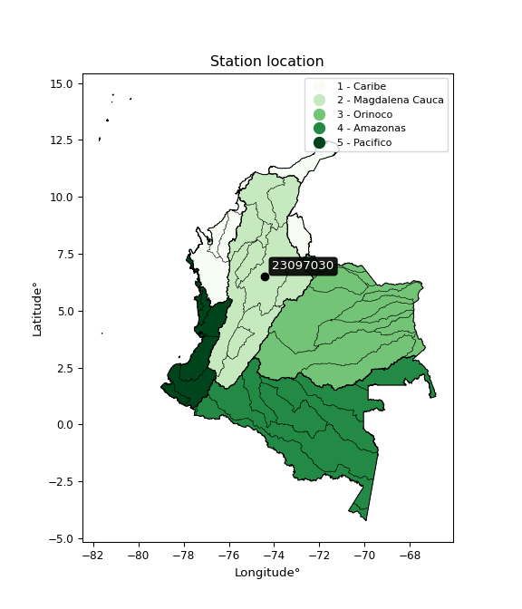

<div align="center">


</div>

# PMP Station (Rain, Pmax24h): 23097030

Probable Maximum Precipitation (PMP) is the greatest amount of rainfall for a specific duration that is meteorologically possible for a given location, acting as a "worst-case" scenario for extreme storms, crucial for designing safety-critical infrastructure like bridges, river deviations, dams, spillways, and nuclear plants to prevent catastrophic failure. PMP is calculated by hydrologists using meteorological data to determine the upper limit of extreme rainfall, often leading to the Probable Maximum Flood (PMF) for flood control design, and is increasingly being studied for climate change impacts. Probable Maximum Precipitation (PMP) is the theoretical upper limit of rainfall, a deterministic estimate for extreme events, while probability distributions (like GEV, Gumbel) describe the likelihood and frequency of various precipitation amounts, including rare ones, showing how often events occur, with PMP representing the extreme end of these distributions, used for critical infrastructure design to ensure safety against the worst conceivable weather, unlike standard statistical forecasts which cover typical probabilities.

The most common probability distributions in hydrology, used for analyzing floods, rainfall, and streamflow, include the Normal, Log-Normal, Gumbel, Gamma (including Log-Pearson Type III), and Generalized Extreme Value (GEV) distributions, often chosen based on the data´s skewness and whether modeling extremes or general conditions, with Gumbel and GEV popular for extreme events like floods, while the Normal distribution serves as a baseline, though often requiring transformations for skewed hydrological data. These distributions help in designing water infrastructure, managing water resources, and forecasting hydrologic events.

> Hydrological data often isn´t perfectly normal (it´s skewed), so different distributions are needed for different applications, such as: **Flood Frequency Analysis**: Using Gumbel, GEV, or Log-Pearson Type III for predicting extreme flood magnitudes and their return periods, **Rainfall Analysis**: Normal for annual totals, but Log-Normal, Weibull, or GEV for intensity or extreme daily rainfall, **Streamflow Modeling**: Gamma and Log-Normal for maximum flows, GEV for minimum flows, and Kappa for daily flows.

<div align="center">

</img>

</div>


## A. General information


### 1. General running parameters

• app_version: _v20260108_. • runtime: _2026-01-08 13:24:42.400241_. • Python version: _3.14.0_. • SciPy version: _1.16.3_. • Pandas version: _2.3.3_. • NumPy version: _2.3.5_. • Stations dataset (station_dataset_file): _dataset/pmax24h_in/automatic_colombia_2003_2024.csv_. • Stations catalog (station_catalog_file): _dataset/CNE.xls_. • Minimum year to eval til year_max (date_min): _1900_. • Maximum year to eval since year_min (date_max): _2024_. • Creates, save and include plots into reports (create_plot): _False_. • Plot only fit distributions with Δo > Δ (plot_only_fit): _True_. • Plot only simple graphs avoiding multiple CDFs and multiple Extreme values plots (plot_only_simple): _True_. • Eval low extreme values, if False, evaluates high extreme values (low_extreme): _False_. • Eval every SciPy distribution as logarithmic (pdist_logarithmic_on): _True_. • Standard deviation normalized (ddof): _1.0_. • Return periods to eval in years (Tr): _[2, 2.33, 5, 10, 15, 20, 25, 50, 75, 100, 200, 250, 500, 750, 1000]_. • Minimum data sample per station, 0 means any (minimum_sample): _5_. • Z-Score maximum threshold to adjust a value, 0 means disable (zscore_max): _3.5_. • Z-Score minimum threshold to adjust a value, 0 means disable (zscore_min): _-2.5_. • Avoid zeros, e.g. rain = 0 (avoid_zeros): _True_. • Avoid null values (avoid_nans): _True_. 

:file_folder:Table: [dataset.csv](../../dataset/pmax24h_in/automatic_colombia_2003_2024.csv)

> Delta Degrees of Freedom (DDOF): is a parameter used in the formulas for calculating variance and standard deviation. When ddof=0, the divisor is $N$ (the total number of observations) and this is used when your data set is the entire population. When ddof=1, the divisor is $N-1$ and this is used when your data set is a sample drawn from a larger population. Using $N-1$ provides an unbiased estimate of the population variance (known as Bessel´s correction).


### 2. Station info and location

|   id |   CODIGO | NOMBRE                         | CATEGORIA    | TECNOLOGIA                              | ESTADO   | FECHA_INSTALACION   |   FECHA_SUSPENSION |   ALTITUD |   LATITUD |   LONGITUD | DEPARTAMENTO   | MUNICIPIO     | AREA_OPERATIVA                         | ENTIDAD                                                     | AREA_HIDROGRAFICA   | ZONA_HIDROGRAFICA   | SUBZONA_HIDROGRAFICA                                | CORRIENTE   | Catalogo   |   Version |
|-----:|---------:|:-------------------------------|:-------------|:----------------------------------------|:---------|:--------------------|-------------------:|----------:|----------:|-----------:|:---------------|:--------------|:---------------------------------------|:------------------------------------------------------------|:--------------------|:--------------------|:----------------------------------------------------|:------------|:-----------|----------:|
|    0 | 23097030 | PUERTO BERRIO - AUT [23097030] | Limnigráfica | Automática con Telemetría, Convencional | Activa   | 15/01/1936          |                nan |       111 |   6.48514 |   -74.4012 | Antioquia      | Puerto Berrío | Area Operativa 08 - Santanderes-Arauca | INSTITUTO DE HIDROLOGIA METEOROLOGIA Y ESTUDIOS AMBIENTALES | Magdalena Cauca     | Medio Magdalena     | Rió San Bartolo y otros directos al Magdalena Medio | Magdalena   | CNE_IDEAM  |  20251226 |

<div align="center">

Dynamic map: [:earth_americas:Google](http://maps.google.com/maps?q=6.485138889,-74.40116667) [:earth_americas:OSM](https://www.openstreetmap.org/#map=18/6.485138889/-74.40116667&layers=P) [:earth_americas:Bing](https://www.bing.com/maps?cp=6.485138889~-74.40116667&lvl=18) [:earth_americas:Apple](https://maps.apple.com/frame?center=6.485138889%2C-74.40116667&span=0.003%2C0.006)

</div>


<div align="center">

```geojson
{
  "type": "Feature",
  "geometry": {
    "type": "Point", 
    "coordinates": [-74.40116667, 6.485138889]
  }, 
  "properties": {
    "Name": "23097030"
  }
}
```

</div>


### 3. Discrete values table and plot

<div align="center">

|               |           0 |            1 |          2 |           3 |         4 |
|:--------------|------------:|-------------:|-----------:|------------:|----------:|
| Date          | 2017        | 2018         | 2019       | 2023        | 2024      |
| Value         |   91.6      |   75.4       |  106.4     |   64.9      |   49.7    |
| Value_initial |   91.6      |   75.4       |  106.4     |   64.9      |   49.7    |
| count         |    5        |    5         |    5       |    5        |    5      |
| mean          |   77.6      |   77.6       |   77.6     |   77.6      |   77.6    |
| std           |   22.1922   |   22.1922    |   22.1922  |   22.1922   |   22.1922 |
| zscore        |    0.630851 |   -0.0991338 |    1.29775 |   -0.572272 |   -1.2572 |


</div>


> The initial value (value_initial) correspond to the initial obtained or null completed value, and value (value) is adjusted only when the initial value is outside the valid range (outlier) definite through the Z-Score value. If Z-Score is active, values out of range or outliers are replaced with the station mean value. A Z-Score (or standard score) measures how many standard deviations a data point is from the mean of a dataset, indicating its relative position; positive scores mean above the mean, negative mean below, and a score of zero is exactly at the mean, allowing for comparison of values from different distributions. It´s calculated using the formula $z=(x–μ)/σ$, where $x$ is the data point, $μ$ is the mean, and $σ$ is the standard deviation, helping identify outliers and understand probability.
>
> <sub>**Note**: In this study, "completing" (filling gaps in) and "extending" (forecasting or lengthening the historical record) rainfall data series are avoided for certain critical analyses because they introduce artificial bias and uncertainty, which can distort the statistics of rare events (extremes), alter day-to-day variability, and compromise the integrity and homogeneity of the original data. Some reasons against Completing/Extending rainfall data are: **Distortion of Extremes and Variability**: The primary issue is that most gap-filling or extension methods rely on averaging or regression with nearby stations, which inherently smooths the data. Rainfall is highly variable in space and time, with a large percentage of zero values and occasional large storms. Infilling methods often underestimate the highest values and overestimate the lowest (zero) values, which severely distorts analyses focused on flood frequency, drought severity, and intensity-duration-frequency (IDF) curves, **Loss of Data Homogeneity**: Infilled or extended data are synthetic estimates, not actual measurements. Combining these estimates with observed data can violate the assumption of data homogeneity, which requires that the data properties do not change over time. Inhomogeneity can lead to incorrect conclusions about long-term trends or changes in climate patterns, **Propagation of Errors**: Errors and biases from the original data (e.g., wind-induced undercatch, instrument errors, site changes) or the data used for imputation can propagate through the analysis, leading to unreliable hydrological models and inaccurate predictions, **Compromised Statistical Integrity**: For statistical analyses, especially those involving the frequency of events, using artificial data can introduce time bias or autocorrelation that doesn´t exist in reality, making it difficult to assess the true probability of events, **Difficulty in Validation**: It is difficult to accurately validate the quality of filled or extended data, especially for past periods where ground-truth measurements are unavailable. The reliability of imputation techniques heavily depends on the density of the surrounding station network and the complexity of the local topography.</sub>


### 4. Active continuous probability distributions from SciPy (43 of 104 available)

A Probability Density Function (PDF) describes the relative likelihood of a continuous random variable falling within a specific range, where the total area under its curve equals 1, and the area over any interval gives the actual probability for that range. Unlike discrete probabilities (like rolling a die), a PDF shows density, not direct probability for a single point (which is zero), with higher points indicating higher likelihood, often visualized as a bell curve for normal distributions.

A log of a probability density function (log-PDF) is simply the logarithm of the PDF´s value, denoted as $log(f(x))$, useful for converting multiplication of probabilities into addition, improving numerical stability with tiny numbers, and connecting to information theory concepts like entropy. Instead of dealing with very small probabilities (e.g., 0.000001), log-PDFs use negative numbers (e.g., $log(0.00001) ≈ -11.51$ that are easier for computers to handle, preventing underflow errors and simplifying complex calculations. In this study, each active probability distribution from SciPy is also evaluated in the $log$ form.

[scipy.stats](https://docs.scipy.org/doc/scipy/reference/stats.html) is a Python´s powerful submodule within the SciPy library for comprehensive statistical analysis, offering over 130 probability distributions (like Normal, Poisson), functions for descriptive stats (mean, variance), hypothesis testing (t-tests, chi-square), random variable generation, and statistical tests, making it essential for data science, modeling, and research. It provides tools to explore, model, and draw conclusions from data efficiently, working seamlessly with NumPy.

<div align="center">

|   id | p_dist             |   n_parameter | fit_method   | label                                                                       | active   | ref                                                                                                        |
|-----:|:-------------------|--------------:|:-------------|:----------------------------------------------------------------------------|:---------|:-----------------------------------------------------------------------------------------------------------|
|    0 | alpha              |             3 | MLE          | Alpha                                                                       | True     | [:mortar_board:](https://docs.scipy.org/doc/scipy/reference/generated/scipy.stats.alpha.html)              |
|    1 | betaprime          |             4 | MLE          | Beta prime                                                                  | True     | [:mortar_board:](https://docs.scipy.org/doc/scipy/reference/generated/scipy.stats.betaprime.html)          |
|    2 | chi2               |             3 | MLE          | Chi²                                                                        | True     | [:mortar_board:](https://docs.scipy.org/doc/scipy/reference/generated/scipy.stats.chi2.html)               |
|    3 | crystalball        |             4 | MLE          | Crystalball                                                                 | True     | [:mortar_board:](https://docs.scipy.org/doc/scipy/reference/generated/scipy.stats.crystalball.html)        |
|    4 | erlang             |             3 | MLE          | Erlang                                                                      | True     | [:mortar_board:](https://docs.scipy.org/doc/scipy/reference/generated/scipy.stats.erlang.html)             |
|    5 | expon              |             2 | MLE          | Exponential                                                                 | True     | [:mortar_board:](https://docs.scipy.org/doc/scipy/reference/generated/scipy.stats.expon.html)              |
|    6 | exponnorm          |             3 | MLE          | Exponentially modified Normal                                               | True     | [:mortar_board:](https://docs.scipy.org/doc/scipy/reference/generated/scipy.stats.exponnorm.html)          |
|    7 | f                  |             4 | MLE          | F                                                                           | True     | [:mortar_board:](https://docs.scipy.org/doc/scipy/reference/generated/scipy.stats.f.html)                  |
|    8 | fatiguelife        |             3 | MLE          | Fatigue-life (Birnbaum-Saunders)                                            | True     | [:mortar_board:](https://docs.scipy.org/doc/scipy/reference/generated/scipy.stats.fatiguelife.html)        |
|    9 | fisk               |             3 | MLE          | Fisk                                                                        | True     | [:mortar_board:](https://docs.scipy.org/doc/scipy/reference/generated/scipy.stats.fisk.html)               |
|   10 | gamma              |             3 | MLE          | Gamma                                                                       | True     | [:mortar_board:](https://docs.scipy.org/doc/scipy/reference/generated/scipy.stats.gamma.html)              |
|   11 | genexpon           |             5 | MLE          | Generalized exponential                                                     | True     | [:mortar_board:](https://docs.scipy.org/doc/scipy/reference/generated/scipy.stats.genexpon.html)           |
|   12 | genlogistic        |             3 | MLE          | Generalized logistic                                                        | True     | [:mortar_board:](https://docs.scipy.org/doc/scipy/reference/generated/scipy.stats.genlogistic.html)        |
|   13 | gibrat             |             2 | MM           | Gibrat                                                                      | True     | [:mortar_board:](https://docs.scipy.org/doc/scipy/reference/generated/scipy.stats.gibrat.html)             |
|   14 | gompertz           |             3 | MLE          | Gompertz (or truncated Gumbel)                                              | True     | [:mortar_board:](https://docs.scipy.org/doc/scipy/reference/generated/scipy.stats.gompertz.html)           |
|   15 | gumbel_l           |             2 | MM           | Gumbel Left Skew                                                            | True     | [:mortar_board:](https://docs.scipy.org/doc/scipy/reference/generated/scipy.stats.gumbel_l.html)           |
|   16 | gumbel_r           |             2 | MM           | Gumbel Right Skew                                                           | True     | [:mortar_board:](https://docs.scipy.org/doc/scipy/reference/generated/scipy.stats.gumbel_r.html)           |
|   17 | halflogistic       |             2 | MM           | Half-logistic                                                               | True     | [:mortar_board:](https://docs.scipy.org/doc/scipy/reference/generated/scipy.stats.halflogistic.html)       |
|   18 | halfnorm           |             2 | MM           | Half Normal                                                                 | True     | [:mortar_board:](https://docs.scipy.org/doc/scipy/reference/generated/scipy.stats.halfnorm.html)           |
|   19 | hypsecant          |             2 | MM           | hyperbolic secant                                                           | True     | [:mortar_board:](https://docs.scipy.org/doc/scipy/reference/generated/scipy.stats.hypsecant.html)          |
|   20 | invgamma           |             3 | MLE          | Inverted gamma                                                              | True     | [:mortar_board:](https://docs.scipy.org/doc/scipy/reference/generated/scipy.stats.invgamma.html)           |
|   21 | invgauss           |             3 | MLE          | Inverse Gaussian                                                            | True     | [:mortar_board:](https://docs.scipy.org/doc/scipy/reference/generated/scipy.stats.invgauss.html)           |
|   22 | invweibull         |             3 | MLE          | Inverted Weibull                                                            | True     | [:mortar_board:](https://docs.scipy.org/doc/scipy/reference/generated/scipy.stats.invweibull.html)         |
|   23 | kstwobign          |             2 | MLE          | Limiting distribution of scaled Kolmogorov-Smirnov two-sided test statistic | True     | [:mortar_board:](https://docs.scipy.org/doc/scipy/reference/generated/scipy.stats.kstwobign.html)          |
|   24 | laplace            |             2 | MM           | Laplace                                                                     | True     | [:mortar_board:](https://docs.scipy.org/doc/scipy/reference/generated/scipy.stats.laplace.html)            |
|   25 | laplace_asymmetric |             3 | MLE          | Asymmetric Laplace                                                          | True     | [:mortar_board:](https://docs.scipy.org/doc/scipy/reference/generated/scipy.stats.laplace_asymmetric.html) |
|   26 | loggamma           |             3 | MLE          | Log gamma                                                                   | True     | [:mortar_board:](https://docs.scipy.org/doc/scipy/reference/generated/scipy.stats.loggamma.html)           |
|   27 | logistic           |             2 | MM           | Logistic (or Sech-squared)                                                  | True     | [:mortar_board:](https://docs.scipy.org/doc/scipy/reference/generated/scipy.stats.logistic.html)           |
|   28 | lognorm            |             3 | MLE          | Log Normal                                                                  | True     | [:mortar_board:](https://docs.scipy.org/doc/scipy/reference/generated/scipy.stats.lognorm.html)            |
|   29 | maxwell            |             2 | MM           | Maxwell                                                                     | True     | [:mortar_board:](https://docs.scipy.org/doc/scipy/reference/generated/scipy.stats.maxwell.html)            |
|   30 | mielke             |             4 | MLE          | Mielke Beta-Kappa / Dagum                                                   | True     | [:mortar_board:](https://docs.scipy.org/doc/scipy/reference/generated/scipy.stats.mielke.html)             |
|   31 | moyal              |             2 | MM           | Moyal                                                                       | True     | [:mortar_board:](https://docs.scipy.org/doc/scipy/reference/generated/scipy.stats.moyal.html)              |
|   32 | nakagami           |             3 | MLE          | Nakagami                                                                    | True     | [:mortar_board:](https://docs.scipy.org/doc/scipy/reference/generated/scipy.stats.nakagami.html)           |
|   33 | ncf                |             5 | MLE          | Non-central F distribution                                                  | True     | [:mortar_board:](https://docs.scipy.org/doc/scipy/reference/generated/scipy.stats.ncf.html)                |
|   34 | nct                |             4 | MLE          | Non-central Student’s t                                                     | True     | [:mortar_board:](https://docs.scipy.org/doc/scipy/reference/generated/scipy.stats.nct.html)                |
|   35 | norm               |             2 | MM           | Normal                                                                      | True     | [:mortar_board:](https://docs.scipy.org/doc/scipy/reference/generated/scipy.stats.norm.html)               |
|   36 | pearson3           |             3 | MM           | Pearson type III                                                            | True     | [:mortar_board:](https://docs.scipy.org/doc/scipy/reference/generated/scipy.stats.pearson3.html)           |
|   37 | rayleigh           |             2 | MM           | Rayleigh                                                                    | True     | [:mortar_board:](https://docs.scipy.org/doc/scipy/reference/generated/scipy.stats.rayleigh.html)           |
|   38 | rice               |             3 | MLE          | Rice                                                                        | True     | [:mortar_board:](https://docs.scipy.org/doc/scipy/reference/generated/scipy.stats.rice.html)               |
|   39 | t                  |             3 | MLE          | Student’s t                                                                 | True     | [:mortar_board:](https://docs.scipy.org/doc/scipy/reference/generated/scipy.stats.t.html)                  |
|   40 | truncnorm          |             4 | MLE          | Truncated normal                                                            | True     | [:mortar_board:](https://docs.scipy.org/doc/scipy/reference/generated/scipy.stats.truncnorm.html)          |
|   41 | wald               |             2 | MM           | Wald                                                                        | True     | [:mortar_board:](https://docs.scipy.org/doc/scipy/reference/generated/scipy.stats.wald.html)               |
|   42 | weibull_min        |             3 | MLE          | Weibull minimum                                                             | True     | [:mortar_board:](https://docs.scipy.org/doc/scipy/reference/generated/scipy.stats.weibull_min.html)        |

</div>

> **n_parameter:** # arguments & localization & scale.
>
> **Fit methods:** (MLE) maximum likelihood, (MM) L-moments.
>
>**Inactive** (With the only purpose of prevent loops, zero divisions, infinite values, over high estimated values or horizontal trending for recurrence intervals estimations, the follow distributions were disabled.)**:** foldnorm, gennorm, norminvgauss, powernorm, powerlognorm, skewnorm, genextreme, anglit, arcsine, argus, beta, bradford, burr, burr12, cauchy, cosine, halfcauchy, foldcauchy, skewcauchy, wrapcauchy, dgamma, gengamma, exponweib, exponpow, truncexpon, gausshyper, genhalflogistic, genhyperbolic, geninvgauss, halfgennorm, johnsonsb, johnsonsu, kappa4, kappa3, ksone, kstwo, loglaplace, levy, levy_l, levy_stable, ncx2, pareto, genpareto, truncpareto, lomax, powerlaw, rdist, rel_breitwigner, recipinvgauss, semicircular, studentized_range, trapezoid, triang, truncweibull_min, tukeylambda, uniform, loguniform, vonmises, vonmises_line, weibull_max, dweibull, 


## B. Probability (PDF) vs. Empirical (EDF) distributions functions

A continuous probability distribution (CPD) describes probabilities for variables that can take any value within a range (like rain any time), unlike discrete variables with specific outcomes (like temperature). It uses a Probability Density Function (PDF), a curve where the total area under it equals 1, and the probability of the variable falling within an interval (a to b) is found by calculating the area under the curve between those points. A key feature is that the probability of hitting any single exact value is zero, so probabilities are always expressed for ranges, e.g., $P(a ≤ X ≤ b)$.

<div align="center">

Distributions parameters from station values
|    |   station | p_dist                |   n |               loc |            scale | shape                 | shape1                 | shape2                 | shape3   |
|---:|----------:|:----------------------|----:|------------------:|-----------------:|:----------------------|:-----------------------|:-----------------------|:---------|
|  0 |  23097030 | alpha                 |   5 |    -198.152       |   3773.75        | 13.762716962636427    |                        |                        |          |
|  1 |  23097030 | betaprime             |   5 |       0.208704    |    922.955       | 16.343946609608814    | 196.45250239588484     |                        |          |
|  2 |  23097030 | chi2                  |   5 |      49.7         |     17.6524      | 0.7597144860565215    |                        |                        |          |
|  3 |  23097030 | crystalball           |   5 |      77.6         |     19.8493      | 4639.647929786449     | 4881.7659130663105     |                        |          |
|  4 |  23097030 | erlang                |   5 |    -338.115       |      0.945328    | 439.7140971916465     |                        |                        |          |
|  5 |  23097030 | expon                 |   5 |      49.7         |     27.9         |                       |                        |                        |          |
|  6 |  23097030 | exponnorm             |   5 |      76.4404      |     19.8154      | 0.05852029481206378   |                        |                        |          |
|  7 |  23097030 | f                     |   5 |      49.6922      |     28.4073      | 1.6544348008796983    | 6410.471998450143      |                        |          |
|  8 |  23097030 | fatiguelife           |   5 |      49.7         |      7.40093e-06 | 1865.5781034995207    |                        |                        |          |
|  9 |  23097030 | fisk                  |   5 |      -0.209053    |     75.8825      | 6.253307412776634     |                        |                        |          |
| 10 |  23097030 | gamma                 |   5 |    -335.968       |      0.951798    | 434.47276431563466    |                        |                        |          |
| 11 |  23097030 | genexpon              |   5 |      49.7         |      3.09128     | 0.1108353938548011    | 2.6530771007375916e-06 | 1.2301123791851416     |          |
| 12 |  23097030 | genlogistic           |   5 |     -27.6414      |     17.5053      | 233.8534613585573     |                        |                        |          |
| 13 |  23097030 | gibrat                |   5 |      62.4574      |      9.18442     |                       |                        |                        |          |
| 14 |  23097030 | gompertz              |   5 |      49.7         |     34.7389      | 0.617539408375053     |                        |                        |          |
| 15 |  23097030 | gumbel_l              |   5 |      86.5333      |     15.4765      |                       |                        |                        |          |
| 16 |  23097030 | gumbel_r              |   5 |      68.6667      |     15.4765      |                       |                        |                        |          |
| 17 |  23097030 | halflogistic          |   5 |      54.0739      |     16.9705      |                       |                        |                        |          |
| 18 |  23097030 | halfnorm              |   5 |      51.3273      |     32.928       |                       |                        |                        |          |
| 19 |  23097030 | hypsecant             |   5 |      77.6         |     12.6365      |                       |                        |                        |          |
| 20 |  23097030 | invgamma              |   5 |    -104.332       |  15051.1         | 83.7318819276563      |                        |                        |          |
| 21 |  23097030 | invgauss              |   5 |     -11.8884      |   1678.76        | 0.05329644362890626   |                        |                        |          |
| 22 |  23097030 | invweibull            |   5 |      49.7         |      1.82028     | 0.07450189480052019   |                        |                        |          |
| 23 |  23097030 | kstwobign             |   5 |       7.00347     |     80.6246      |                       |                        |                        |          |
| 24 |  23097030 | laplace               |   5 |      77.6         |     14.0356      |                       |                        |                        |          |
| 25 |  23097030 | laplace_asymmetric    |   5 |      75.4         |     16.5708      | 0.9358096826493113    |                        |                        |          |
| 26 |  23097030 | loggamma              |   5 |   -4436.15        |    648.306       | 1056.638132161419     |                        |                        |          |
| 27 |  23097030 | logistic              |   5 |      77.6         |     10.9435      |                       |                        |                        |          |
| 28 |  23097030 | lognorm               |   5 |      49.7         |      0.0231117   | 14.412180904412676    |                        |                        |          |
| 29 |  23097030 | maxwell               |   5 |      30.5654      |     29.4746      |                       |                        |                        |          |
| 30 |  23097030 | mielke                |   5 |      -9.64946     |    116.386       | 3.1747530251190463    | 1586.4073448491476     |                        |          |
| 31 |  23097030 | moyal                 |   5 |      66.2489      |      8.93534     |                       |                        |                        |          |
| 32 |  23097030 | nakagami              |   5 |      64.9         |     16.8728      | 0.1937268298895813    |                        |                        |          |
| 33 |  23097030 | ncf                   |   5 |      -5.09584     |     37.0637      | 24.074391185391132    | 1884.3838828953874     | 29.584122027116443     |          |
| 34 |  23097030 | nct                   |   5 |    -879.089       |     19.7767      | 159431.31093425193    | 48.37418916581041      |                        |          |
| 35 |  23097030 | norm                  |   5 |      77.6         |     19.8493      |                       |                        |                        |          |
| 36 |  23097030 | pearson3              |   5 |      77.6         |     19.8493      | 0.0730410565867609    |                        |                        |          |
| 37 |  23097030 | rayleigh              |   5 |      39.6271      |     30.298       |                       |                        |                        |          |
| 38 |  23097030 | rice                  |   5 |      39.3851      |     24.5076      | 1.0427933205544795    |                        |                        |          |
| 39 |  23097030 | t                     |   5 |      77.6011      |     19.8501      | 10238726.842946935    |                        |                        |          |
| 40 |  23097030 | truncnorm             |   5 |      77.6         |     19.8493      | -601.5762573989284    | 781.232983814866       |                        |          |
| 41 |  23097030 | wald                  |   5 |      57.7507      |     19.8493      |                       |                        |                        |          |
| 42 |  23097030 | weibull_min           |   5 |      49.7         |     15.0032      | 0.2609994373720196    |                        |                        |          |
| 43 |  23097030 | logalpha              |   5 |      -4.72082     |    305.826       | 33.87505090097687     |                        |                        |          |
| 44 |  23097030 | logbetaprime          |   5 |      -4.50971     |      5.4394      | 1304.8651459414891    | 808.1337990084464      |                        |          |
| 45 |  23097030 | logchi2               |   5 |       3.906       |      1.02422     | 1.0028808791392552    |                        |                        |          |
| 46 |  23097030 | logcrystalball        |   5 |       4.31726     |      0.265536    | 42.25553431257471     | 1580.7572624161555     |                        |          |
| 47 |  23097030 | logerlang             |   5 |      -0.345769    |      0.0154586   | 301.57955789824905    |                        |                        |          |
| 48 |  23097030 | logexpon              |   5 |       3.906       |      0.411254    |                       |                        |                        |          |
| 49 |  23097030 | logexponnorm          |   5 |       4.31705     |      0.265537    | 0.0007804769885899148 |                        |                        |          |
| 50 |  23097030 | logf                  |   5 |     -99.1609      |    103.478       | 328447.23248164356    | 3896879.5630574115     |                        |          |
| 51 |  23097030 | logfatiguelife        |   5 |     -34.9273      |     39.2432      | 0.006758598331722359  |                        |                        |          |
| 52 |  23097030 | logfisk               |   5 | -542179           | 542184           | 3380606.0300355144    |                        |                        |          |
| 53 |  23097030 | loggamma              |   5 |      -0.700887    |      0.0142121   | 353.03669336666985    |                        |                        |          |
| 54 |  23097030 | loggenexpon           |   5 |       3.90156     |      0.00444231  | 0.005471616039912211  | 2.811397815750892      | 2.8154184684422257e-05 |          |
| 55 |  23097030 | loggenlogistic        |   5 |       4.66723     |      2.47521e-06 | 7.05088714021089e-06  |                        |                        |          |
| 56 |  23097030 | loggibrat             |   5 |       4.11468     |      0.122869    |                       |                        |                        |          |
| 57 |  23097030 | loggompertz           |   5 |       3.906       |      0.719783    | 1.184080988520022     |                        |                        |          |
| 58 |  23097030 | loggumbel_l           |   5 |       4.43676     |      0.207038    |                       |                        |                        |          |
| 59 |  23097030 | loggumbel_r           |   5 |       4.19775     |      0.207038    |                       |                        |                        |          |
| 60 |  23097030 | loghalflogistic       |   5 |       4.00256     |      0.227005    |                       |                        |                        |          |
| 61 |  23097030 | loghalfnorm           |   5 |       3.96582     |      0.440465    |                       |                        |                        |          |
| 62 |  23097030 | loghypsecant          |   5 |       4.31726     |      0.169045    |                       |                        |                        |          |
| 63 |  23097030 | loginvgamma           |   5 |      -0.0910541   |   1165.23        | 265.4518630873836     |                        |                        |          |
| 64 |  23097030 | loginvgauss           |   5 |       2.50052     |     74.884       | 0.02426463995933497   |                        |                        |          |
| 65 |  23097030 | loginvweibull         |   5 |      -2.04191e+07 |      2.04191e+07 | 80662449.64322606     |                        |                        |          |
| 66 |  23097030 | logkstwobign          |   5 |       3.30378     |      1.15624     |                       |                        |                        |          |
| 67 |  23097030 | loglaplace            |   5 |       4.31726     |      0.187762    |                       |                        |                        |          |
| 68 |  23097030 | loglaplace_asymmetric |   5 |       4.32281     |      0.22114     | 1.0126604868023326    |                        |                        |          |
| 69 |  23097030 | logloggamma           |   5 |       4.08709     |      0.373185    | 2.3310813802501893    |                        |                        |          |
| 70 |  23097030 | loglogistic           |   5 |       4.31726     |      0.146398    |                       |                        |                        |          |
| 71 |  23097030 | loglognorm            |   5 |       3.906       |      0.000470219 | 13.84868760929088     |                        |                        |          |
| 72 |  23097030 | logmaxwell            |   5 |       3.68805     |      0.394298    |                       |                        |                        |          |
| 73 |  23097030 | logmielke             |   5 |      -1.74631e+07 |      1.74631e+07 | 48693940.27715896     | 6212140510.893711      |                        |          |
| 74 |  23097030 | logmoyal              |   5 |       4.16541     |      0.119533    |                       |                        |                        |          |
| 75 |  23097030 | lognakagami           |   5 |       3.906       |      0.443642    | 0.14672521725098775   |                        |                        |          |
| 76 |  23097030 | logncf                |   5 |      -1.71366     |      5.68609     | 1367.169474509767     | 4076.556943687923      | 83.08352761784857      |          |
| 77 |  23097030 | lognct                |   5 |       9.82796     |      0.258851    | 4107.112814996166     | -21.282204073970284    |                        |          |
| 78 |  23097030 | lognorm               |   5 |       4.31726     |      0.265536    |                       |                        |                        |          |
| 79 |  23097030 | logpearson3           |   5 |       4.31726     |      0.265536    | -0.23171962266348656  |                        |                        |          |
| 80 |  23097030 | lograyleigh           |   5 |       3.80927     |      0.405314    |                       |                        |                        |          |
| 81 |  23097030 | logrice               |   5 |       3.75182     |      0.30489     | 1.4825481826903757    |                        |                        |          |
| 82 |  23097030 | logt                  |   5 |       4.31727     |      0.265513    | 4829.375020131291     |                        |                        |          |
| 83 |  23097030 | logtruncnorm          |   5 |      -0.0795648   |      1.02172     | 3.9008417564897964    | 4.646232234996348      |                        |          |
| 84 |  23097030 | logwald               |   5 |       4.05176     |      0.265503    |                       |                        |                        |          |
| 85 |  23097030 | logweibull_min        |   5 |       3.28213     |      1.13686     | 4.599326493920301     |                        |                        |          |

</div>

> **loc** (Location parameter): This shifts the distribution along the x-axis. For many common distributions, like the normal (Gaussian) distribution, loc represents the mean $μ$. For others, like the uniform distribution, it might represent the minimum value, or for the beta distribution, the left end of the support interval.
>
> **scale** (Scale parameter): This determines the width or spread of the distribution. For the normal distribution, scale represents the standard deviation $σ$. For a uniform distribution, it defines the length of the interval (from $loc$ to $loc + scale$).
>
> **shape** (Shape parameters): Refers to parameters that define the specific form of a probability distribution, distinct from its location (loc) and scale (scale). These parameters are required arguments for most distribution functions. For example, a normal (Gaussian) distribution is fully defined by its location (mean) and scale (standard deviation), so it has no specific shape parameters beyond loc and scale. However, other distributions have intrinsic properties that need specification, as Gamma distribution that takes a shape parameter, often named $a$ or $alpha$.


### 0. Cumulative distribution values - CDF (86 evaluated)

Cumulative Distribution Function (CDF), denoted as $F$<sub>$X$</sub>$(x)$, is a function that gives the probability that a random variable $X$ will take a value less than or equal to a specific value, $x$ (i.e., $(P(X≥x)$. It essentially "accumulates" probabilities from a given point up to the far right (positive infinity), providing a complete picture of the distribution´s probabilities for both discrete (like rain) and continuous (like temperature) variables, helping to find probabilities over ranges or above certain values. Each station is evaluated separately ordering the $x$ values ascending, calculating the CDF and PDF values for the activated distributions and their logarithmic forms.

<div align="center">

CDF ordered by x ascending and calculating $log(f(x))$ separately
|   id |   Station |   date |     x |   count |   mean |     std |     zscore |   Value_initial |   station |   m |     alpha |   alpha_pdf |   betaprime |   betaprime_pdf |       chi2 |    chi2_pdf |   crystalball |   crystalball_pdf |    erlang |   erlang_pdf |    expon |   expon_pdf |   exponnorm |   exponnorm_pdf |          f |      f_pdf |   fatiguelife |   fatiguelife_pdf |      fisk |   fisk_pdf |     gamma |   gamma_pdf |    genexpon |   genexpon_pdf |   genlogistic |   genlogistic_pdf |    gibrat |   gibrat_pdf |    gompertz |   gompertz_pdf |   gumbel_l |   gumbel_l_pdf |   gumbel_r |   gumbel_r_pdf |   halflogistic |   halflogistic_pdf |   halfnorm |   halfnorm_pdf |   hypsecant |   hypsecant_pdf |   invgamma |   invgamma_pdf |   invgauss |   invgauss_pdf |   invweibull |   invweibull_pdf |   kstwobign |   kstwobign_pdf |   laplace |   laplace_pdf |   laplace_asymmetric |   laplace_asymmetric_pdf |   loggamma |   loggamma_pdf |   logistic |   logistic_pdf |   lognorm |   lognorm_pdf |   maxwell |   maxwell_pdf |   mielke |   mielke_pdf |     moyal |   moyal_pdf |    nakagami |   nakagami_pdf |       ncf |    ncf_pdf |       nct |    nct_pdf |      norm |   norm_pdf |   pearson3 |   pearson3_pdf |   rayleigh |   rayleigh_pdf |      rice |   rice_pdf |         t |      t_pdf |   truncnorm |   truncnorm_pdf |     wald |   wald_pdf |   weibull_min |   weibull_min_pdf |   logalpha |   logalpha_pdf |   logbetaprime |   logbetaprime_pdf |     logchi2 |   logchi2_pdf |   logcrystalball |   logcrystalball_pdf |   logerlang |   logerlang_pdf |   logexpon |   logexpon_pdf |   logexponnorm |   logexponnorm_pdf |      logf |   logf_pdf |   logfatiguelife |   logfatiguelife_pdf |   logfisk |   logfisk_pdf |   loggenexpon |   loggenexpon_pdf |   loggenlogistic |   loggenlogistic_pdf |   loggibrat |   loggibrat_pdf |   loggompertz |   loggompertz_pdf |   loggumbel_l |   loggumbel_l_pdf |   loggumbel_r |   loggumbel_r_pdf |   loghalflogistic |   loghalflogistic_pdf |   loghalfnorm |   loghalfnorm_pdf |   loghypsecant |   loghypsecant_pdf |   loginvgamma |   loginvgamma_pdf |   loginvgauss |   loginvgauss_pdf |   loginvweibull |   loginvweibull_pdf |   logkstwobign |   logkstwobign_pdf |   loglaplace |   loglaplace_pdf |   loglaplace_asymmetric |   loglaplace_asymmetric_pdf |   logloggamma |   logloggamma_pdf |   loglogistic |   loglogistic_pdf |   loglognorm |   loglognorm_pdf |   logmaxwell |   logmaxwell_pdf |   logmielke |   logmielke_pdf |   logmoyal |   logmoyal_pdf |   lognakagami |   lognakagami_pdf |    logncf |   logncf_pdf |    lognct |   lognct_pdf |   logpearson3 |   logpearson3_pdf |   lograyleigh |   lograyleigh_pdf |   logrice |   logrice_pdf |      logt |   logt_pdf |   logtruncnorm |   logtruncnorm_pdf |   logwald |   logwald_pdf |   logweibull_min |   logweibull_min_pdf |
|-----:|----------:|-------:|------:|--------:|-------:|--------:|-----------:|----------------:|----------:|----:|----------:|------------:|------------:|----------------:|-----------:|------------:|--------------:|------------------:|----------:|-------------:|---------:|------------:|------------:|----------------:|-----------:|-----------:|--------------:|------------------:|----------:|-----------:|----------:|------------:|------------:|---------------:|--------------:|------------------:|----------:|-------------:|------------:|---------------:|-----------:|---------------:|-----------:|---------------:|---------------:|-------------------:|-----------:|---------------:|------------:|----------------:|-----------:|---------------:|-----------:|---------------:|-------------:|-----------------:|------------:|----------------:|----------:|--------------:|---------------------:|-------------------------:|-----------:|---------------:|-----------:|---------------:|----------:|--------------:|----------:|--------------:|---------:|-------------:|----------:|------------:|------------:|---------------:|----------:|-----------:|----------:|-----------:|----------:|-----------:|-----------:|---------------:|-----------:|---------------:|----------:|-----------:|----------:|-----------:|------------:|----------------:|---------:|-----------:|--------------:|------------------:|-----------:|---------------:|---------------:|-------------------:|------------:|--------------:|-----------------:|---------------------:|------------:|----------------:|-----------:|---------------:|---------------:|-------------------:|----------:|-----------:|-----------------:|---------------------:|----------:|--------------:|--------------:|------------------:|-----------------:|---------------------:|------------:|----------------:|--------------:|------------------:|--------------:|------------------:|--------------:|------------------:|------------------:|----------------------:|--------------:|------------------:|---------------:|-------------------:|--------------:|------------------:|--------------:|------------------:|----------------:|--------------------:|---------------:|-------------------:|-------------:|-----------------:|------------------------:|----------------------------:|--------------:|------------------:|--------------:|------------------:|-------------:|-----------------:|-------------:|-----------------:|------------:|----------------:|-----------:|---------------:|--------------:|------------------:|----------:|-------------:|----------:|-------------:|--------------:|------------------:|--------------:|------------------:|----------:|--------------:|----------:|-----------:|---------------:|-------------------:|----------:|--------------:|-----------------:|---------------------:|
|    0 |  23097030 |   2024 |  49.7 |       5 |   77.6 | 22.1922 | -1.2572    |            49.7 |  23097030 |   1 | 0.0717244 |  0.00840385 |   0.0632013 |      0.00859075 | 1.2274e-06 | 6.56172e+07 |     0.0799231 |        0.00748429 | 0.0775035 |   0.0076688  | 0        |  0.0358423  |    0.079913 |      0.0074849  | 0.00102822 | 0.109367   |     0.0115571 |       8.33154e+10 | 0.0678601 | 0.00792548 | 0.0776323 |  0.00767411 | 7.24904e-07 |     0.0358541  |     0.0606545 |        0.00965269 | 0         |   0          | 1.25239e-08 |     0.0177766  |  0.0884008 |     0.0054517  |  0.0331755 |     0.00730102 |       0        |         0          |   0        |     0          |    0.069705 |      0.00547219 |  0.0685969 |     0.00827045 |  0.0637583 |     0.00900107 |  7.18822e-06 |      8.92612e+08 |    0.058167 |      0.0106237  | 0.0684981 |    0.00488031 |            0.0890111 |               0.00574002 |  0.0589809 |       0.465976 |   0.072463 |     0.00614173 | 0.0607184 |      0.452812 | 0.0642228 |    0.00924103 | 0.117878 |   0.00630561 | 0.0115869 |  0.00465684 | 0           |    0           | 0.0686113 | 0.00841761 | 0.0799183 | 0.00748712 | 0.0799231 | 0.00748429 |   0.078072 |     0.00761583 |   0.053766 |     0.0103831  | 0.0503894 | 0.0095705  | 0.0799231 | 0.00748401 |   0.0799231 |      0.00748429 | 0        | 0          |   0.000100062 |       3.67532e+09 |  0.0575718 |       0.4739   |       0.168847 |           0.670895 | 2.23276e-08 |   1.26055e+07 |        0.0607185 |             0.452812 |   0.0598447 |        0.470948 |   0        |       2.43158  |      0.0607186 |           0.452811 | 0.0607338 |   0.453594 |        0.0601101 |             0.454532 | 0.0678073 |      0.394122 |    0.00550445 |          1.24267  |         0        |             0.325754 |    0        |        0        |   8.56225e-09 |          1.64505  |     0.0741357 |          0.344465 |     0.0166972 |          0.330053 |          0        |              0        |      0        |          0        |      0.0557462 |           0.328087 |     0.0581091 |          0.488608 |      0.056952 |          0.528268 |        0.050979 |            0.599389 |      0.0509724 |           0.6852   |     0.055942 |         0.297941 |               0.0787189 |                    0.351519 |     0.0763923 |          0.392933 |     0.0568312 |          0.366136 |     0.022786 |      8.79059e+12 |    0.0410186 |         0.530699 |    0.116756 |        0.325562 | 0.00307991 |       0.123753 |   3.20383e-05 |       2.11706e+10 | 0.0564078 |     0.451959 | 0.0610741 |     0.450565 |     0.0664389 |          0.435239 |     0.0280771 |          0.57229  | 0.0428126 |      0.557138 | 0.0607289 |    0.45272 |     6.3132e-06 |           4.19112  |  0        |      0        |         0.061333 |             0.438002 |
|    1 |  23097030 |   2023 |  64.9 |       5 |   77.6 | 22.1922 | -0.572272  |            64.9 |  23097030 |   2 | 0.279855  |  0.0183537  |   0.282453  |      0.0192946  | 0.731251   | 0.0132768   |     0.261145  |        0.0163784  | 0.264595  |   0.016854   | 0.420044 |  0.020787   |    0.261156 |      0.0163802  | 0.448087   | 0.0189645  |     0.778811  |       0.0075052   | 0.277374  | 0.0192508  | 0.264719  |  0.016846   | 0.420155    |     0.0207903  |     0.307211  |        0.0206602  | 0.0926742 |   0.067943   | 0.287497    |     0.0196182  |  0.218965  |     0.012472   |  0.279275  |     0.0230176  |       0.308573 |         0.0266576  |   0.319803 |     0.0222577  |    0.223382 |      0.0162619  |  0.276341  |     0.0184481  |  0.290113  |     0.0195012  |  0.425815    |      0.00178187  |    0.319068 |      0.0208585  | 0.202303  |    0.0144136  |            0.237213  |               0.015297   |  0.299665  |       1.32677  |   0.238576 |     0.0165995  | 0.293272  |      1.29587  | 0.284348  |    0.018638   | 0.243121 |   0.0103535  | 0.280855  |  0.0269183  | 1.14154e-06 |    3.11238e+07 | 0.277671  | 0.0184003  | 0.261212  | 0.0163838  | 0.261145  | 0.0163784  |   0.263473 |     0.016714   |   0.29383  |     0.0194418  | 0.277043  | 0.0188936  | 0.261135  | 0.0163774  |   0.261145  |      0.0163784  | 0.22974  | 0.0526723  |   0.633372    |       0.00631683  |  0.304381  |       1.35311  |       0.397421 |           0.993092 | 0.389049    |   0.669828    |        0.293273  |             1.29587  |   0.301363  |        1.32504  |   0.477354 |       1.27086  |      0.293272  |           1.29586  | 0.293523  |   1.29595  |        0.294386  |             1.3044   | 0.277467  |      1.25002  |    0.382248   |          1.43251  |         0        |             0.696643 |    0.227283 |        5.18567  |   0.412219    |          1.40088  |     0.243843  |          1.02083  |     0.323734  |          1.76353  |          0.358414 |              1.91965  |      0.361659 |          1.62202  |      0.256157  |           1.35698  |     0.309902  |          1.36087  |      0.323825 |          1.38502  |        0.354427 |            1.45226  |      0.375575  |           1.4553   |     0.23171  |         1.23406  |               0.259166  |                    1.1573   |     0.26616   |          1.09407  |     0.271617  |          1.3514   |     0.676485 |      0.0972115   |    0.320431  |         1.43655  |    0.24571  |        0.685134 | 0.332364   |       2.02238  |   0.691182    |       0.725665    | 0.293474  |     1.31909  | 0.291932  |     1.2877   |     0.283911  |          1.22494  |     0.331234  |          1.48008  | 0.31103   |      1.37064  | 0.293251  |    1.29581 |     0.695443   |           1.4624   |  0.325107 |      3.52713  |         0.277872 |             1.21392  |
|    2 |  23097030 |   2018 |  75.4 |       5 |   77.6 | 22.1922 | -0.0991338 |            75.4 |  23097030 |   3 | 0.486989  |  0.0201081  |   0.49669   |      0.0204365  | 0.833533   | 0.00712001  |     0.455874  |        0.0199755  | 0.462882  |   0.0201065  | 0.601938 |  0.0142675  |    0.455899 |      0.0199761  | 0.611826   | 0.012757   |     0.841072  |       0.0047076   | 0.494356  | 0.0206738  | 0.462871  |  0.0200904  | 0.602067    |     0.0142679  |     0.522791  |        0.0193426  | 0.634205  |   0.0290631  | 0.491622    |     0.0189377  |  0.38557   |     0.0193368  |  0.523497  |     0.0218926  |       0.5569   |         0.0203254  |   0.535265 |     0.0185489  |    0.44486  |      0.0248128  |  0.485043  |     0.0202907  |  0.502583  |     0.0199289  |  0.439996    |      0.00104718  |    0.532145 |      0.0188948  | 0.427461  |    0.0304555  |            0.466877  |               0.0301073  |  0.516503  |       1.49133  |   0.44991  |     0.0226153  | 0.508335  |      1.50208  | 0.490124  |    0.0196962  | 0.369406 |   0.0137893  | 0.549006  |  0.0223578  | 0.650372    |    0.0225332   | 0.485031  | 0.0201225  | 0.455981  | 0.0199769  | 0.455874  | 0.0199755  |   0.460646 |     0.0200541  |   0.501937 |     0.0194093  | 0.484636  | 0.0198556  | 0.455854  | 0.0199746  |   0.455874  |      0.0199755  | 0.619946 | 0.0238063  |   0.683623    |       0.00369759  |  0.523267  |       1.48922  |       0.548769 |           1.00091  | 0.475298    |   0.498438    |        0.508335  |             1.50208  |   0.517401  |        1.48312  |   0.63705  |       0.882544 |      0.508333  |           1.50207  | 0.508434  |   1.50001  |        0.510278  |             1.50338  | 0.494491  |      1.5586   |    0.582895   |          1.21756  |         0        |             1.0679   |    0.70091  |        1.66829  |   0.604957    |          1.1596   |     0.438256  |          1.56475  |     0.578907  |          1.52841  |          0.607762 |              1.38901  |      0.582334 |          1.30434  |      0.510445  |           1.88197  |     0.527583  |          1.46623  |      0.538279 |          1.40315  |        0.563491 |            1.27683  |      0.580975  |           1.24101  |     0.514558 |         2.58541  |               0.50629   |                    2.26083  |     0.463005  |          1.49823  |     0.509473  |          1.70706  |     0.687967 |      0.0612935   |    0.541033  |         1.43524  |    0.373268 |        1.04082  | 0.604678   |       1.5111   |   0.780429    |       0.490573    | 0.510139  |     1.49667  | 0.50616   |     1.50023  |     0.492927  |          1.50404  |     0.551859  |          1.40088  | 0.527021  |      1.44603  | 0.508314  |    1.50213 |     0.85905    |           0.785405 |  0.676307 |      1.45639  |         0.486203 |             1.51216  |
|    3 |  23097030 |   2017 |  91.6 |       5 |   77.6 | 22.1922 |  0.630851  |            91.6 |  23097030 |   4 | 0.769948  |  0.0136504  |   0.777666  |      0.0132656  | 0.913266   | 0.00332319  |     0.759692  |        0.0156726  | 0.76312   |   0.015229   | 0.777269 |  0.00798318 |    0.759704 |      0.0156708  | 0.7698     | 0.007315   |     0.898918  |       0.00269208  | 0.766993  | 0.0121726  | 0.762895  |  0.0152227  | 0.777388    |     0.00798177 |     0.773149  |        0.0113571  | 0.875891  |   0.00702842 | 0.764346    |     0.013994   |  0.75026   |     0.0223871  |  0.796742  |     0.0116977  |       0.802512 |         0.0104881  |   0.778691 |     0.0114697  |    0.796935 |      0.0150017  |  0.770584  |     0.0137582  |  0.773126  |     0.0127238  |  0.453105    |      0.000637786 |    0.779116 |      0.0114518  | 0.815593  |    0.0131385  |            0.786448  |               0.01206    |  0.776477  |       1.08998  |   0.78233  |     0.0155608  | 0.774528  |      1.1308   | 0.768005  |    0.0136024  | 0.64254  |   0.0201473  | 0.808737  |  0.0104952  | 0.879397    |    0.00844201  | 0.769087  | 0.0137748  | 0.759756  | 0.0156671  | 0.759692  | 0.0156726  |   0.761611 |     0.0153415  |   0.770369 |     0.0130011  | 0.766765  | 0.0139338  | 0.759667  | 0.0156729  |   0.759692  |      0.0156726  | 0.846933 | 0.00780033 |   0.729482    |       0.00220311  |  0.77958   |       1.06218  |       0.728658 |           0.818383 | 0.559152    |   0.374439    |        0.774528  |             1.1308   |   0.775786  |        1.08395  |   0.77389  |       0.549805 |      0.774525  |           1.13081  | 0.774152  |   1.12879  |        0.775661  |             1.12312  | 0.767005  |      1.11428  |    0.780909   |          0.810008 |         0        |             1.85911  |    0.882424 |        0.489579 |   0.795002    |          0.78858  |     0.771547  |          1.62914  |     0.807741  |          0.833007 |          0.812398 |              0.748902 |      0.789553 |          0.826925 |      0.810947  |           1.05375  |     0.778117  |          1.03496  |      0.7733   |          0.962752 |        0.766518 |            0.805138 |      0.779471  |           0.797555 |     0.827824 |         0.916988 |               0.797506  |                    0.927277 |     0.760576  |          1.39446  |     0.796946  |          1.10537  |     0.697689 |      0.0412045   |    0.78087   |         0.979983 |    0.642254 |        1.79085  | 0.818594   |       0.745599 |   0.858087    |       0.322354    | 0.772219  |     1.10373  | 0.772992  |     1.1377   |     0.76976   |          1.21591  |     0.782667  |          0.936855 | 0.776242  |      1.04489  | 0.774513  |    1.13078 |     0.962822   |           0.339438 |  0.854244 |      0.550111 |         0.768954 |             1.26038  |
|    4 |  23097030 |   2019 | 106.4 |       5 |   77.6 | 22.1922 |  1.29775   |           106.4 |  23097030 |   5 | 0.914905  |  0.00633648 |   0.917475  |      0.00608461 | 0.949965   | 0.00181146  |     0.9266    |        0.00701497 | 0.924841  |   0.00684011 | 0.868961 |  0.00469675 |    0.926591 |      0.00701426 | 0.855544   | 0.00451217 |     0.931051  |       0.00173635  | 0.893406  | 0.00558596 | 0.924637  |  0.00684715 | 0.869055    |     0.00469503 |     0.895384  |        0.00565077 | 0.941252  |   0.00266642 | 0.921225    |     0.00716274 |  0.972945  |     0.00631059 |  0.916378  |     0.00517067 |       0.912402 |         0.00493569 |   0.905578 |     0.00598334 |    0.935053 |      0.00510409 |  0.916285  |     0.00633769 |  0.909067  |     0.00608573 |  0.461169    |      0.000469008 |    0.904316 |      0.00585048 | 0.935756  |    0.00457719 |            0.90742   |               0.00522832 |  0.903472  |       0.612241 |   0.932874 |     0.00572213 | 0.906229  |      0.630435 | 0.914942  |    0.00654451 | 0.990825 |   0.026835   | 0.915788  |  0.00469478 | 0.960997    |    0.00324209  | 0.915852  | 0.00642673 | 0.926595  | 0.00701227 | 0.9266    | 0.00701497 |   0.92481  |     0.00690378 |   0.911833 |     0.00641324 | 0.91746   | 0.00667403 | 0.926585  | 0.00701582 |   0.9266    |      0.00701497 | 0.924594 | 0.00340919 |   0.75703     |       0.00158237  |  0.903013  |       0.595483 |       0.835287 |           0.601387 | 0.610316    |   0.312023    |        0.906229  |             0.630434 |   0.902336  |        0.612205 |   0.842908 |       0.381982 |      0.906228  |           0.63044  | 0.905713  |   0.630618 |        0.906311  |             0.62517  | 0.893342  |      0.594098 |    0.879584   |          0.517216 |         0.999919 |             2.84835  |    0.933629 |        0.233226 |   0.891957    |          0.511754 |     0.952337  |          0.700683 |     0.901609  |          0.451045 |          0.898414 |              0.424776 |      0.8887   |          0.509821 |      0.9201    |           0.467704 |     0.898993  |          0.589322 |      0.887258 |          0.570825 |        0.863165 |            0.50175  |      0.876071  |           0.505192 |     0.922457 |         0.412986 |               0.898012  |                    0.46703  |     0.92386   |          0.74345  |     0.916091  |          0.525066 |     0.703186 |      0.032823    |    0.896225  |         0.57159  |    0.974868 |        2.61261  | 0.902439   |       0.406051 |   0.899637    |       0.236887    | 0.90115   |     0.623477 | 0.905712  |     0.636095 |     0.911893  |          0.672526 |     0.893566  |          0.555841 | 0.899484  |      0.606106 | 0.906208  |    0.63039 |     0.999934   |           0.173642 |  0.914952 |      0.292698 |         0.916265 |             0.689602 |


</div>

An Empirical Distribution Function (EDF) is a step-function estimate of a true cumulative distribution function (CDF) based on observed sample data, representing the proportion of data points less than or equal to a given value. It is calculated by ordering your data and jumping up by $1/n$ (where $n$ is sample size) at each unique data point, allowing analysis without assuming an underlying population distribution, and it gets closer to the true CDF as the sample size grows. For the empirical probability calculations, the parameter $m$ correspond to the order number which means the position of the $x$ values in an ascending order list.

The Kolmogorov-Smirnov (K-S) test is a non-parametric statistical test used to determine if a sample data set comes from a specific theoretical distribution (one-sample) or if two different samples come from the same underlying distribution (two-sample), by comparing their cumulative distribution functions (CDFs). It calculates the maximum vertical difference (D statistic) between these functions, with a small p-value indicating a significant difference and rejection of the null hypothesis (that the data/samples match).


### 1. EDF California (1923)

California´s estimates the true probability distribution of water-related data (like rainfall, streamflow) using observed samples, crucial for risk assessment.

<div align="center">


$P=m/n$


</div>


**1.1. Empirical values**

<div align="center">

|                | 0              | 1                  | 2              | 3                 | 4              |
|:---------------|:---------------|:-------------------|:---------------|:------------------|:---------------|
| date           | 2024           | 2023               | 2018           | 2017              | 2019           |
| x              | 49.7           | 64.9               | 75.4           | 91.6              | 106.4          |
| m              | 1              | 2                  | 3              | 4                 | 5              |
| empirical_dist | edf_california | edf_california     | edf_california | edf_california    | edf_california |
| empirical      | 0.2            | 0.4                | 0.6            | 0.8               | 1.0            |
| empirical_tr   | 1.25           | 1.6666666666666667 | 2.5            | 5.000000000000001 | inf            |

</div>


**1.2. Kolmogorov-Smirnov fit test (sorted by Δ)**


<div align="center">

|                | 0                  | 1                   | 2                   | 3                  | 4                   | 5                   | 6                   | 7                   | 8                   | 9                  | 10                  | 11                 | 12                 | 13                  | 14                  | 15                  | 16                  | 17                  | 18                  | 19                  | 20                  | 21                  | 22                  | 23                  | 24                    | 25                  | 26                  | 27                  | 28                  | 29                 | 30                 | 31                  | 32                  | 33                  | 34                  | 35                  | 36                  | 37                 | 38                  | 39                  | 40                  | 41                  | 42                  | 43                  | 44                 | 45                  | 46                  | 47                  | 48                  | 49                  | 50                 | 51                 | 52                  | 53                  | 54                 | 55                 | 56                 | 57                  | 58                  | 59                 | 60                  | 61                  | 62                  | 63                 | 64                 | 65                 | 66                 | 67                 | 68                 | 69                 | 70                 | 71                 | 72                 | 73                  | 74                  | 75                  | 76                  | 77                 | 78                 | 79                  | 80                  | 81                  | 82                 | 83                  | 84                 | 85                 |
|:---------------|:-------------------|:--------------------|:--------------------|:-------------------|:--------------------|:--------------------|:--------------------|:--------------------|:--------------------|:-------------------|:--------------------|:-------------------|:-------------------|:--------------------|:--------------------|:--------------------|:--------------------|:--------------------|:--------------------|:--------------------|:--------------------|:--------------------|:--------------------|:--------------------|:----------------------|:--------------------|:--------------------|:--------------------|:--------------------|:-------------------|:-------------------|:--------------------|:--------------------|:--------------------|:--------------------|:--------------------|:--------------------|:-------------------|:--------------------|:--------------------|:--------------------|:--------------------|:--------------------|:--------------------|:-------------------|:--------------------|:--------------------|:--------------------|:--------------------|:--------------------|:-------------------|:-------------------|:--------------------|:--------------------|:-------------------|:-------------------|:-------------------|:--------------------|:--------------------|:-------------------|:--------------------|:--------------------|:--------------------|:-------------------|:-------------------|:-------------------|:-------------------|:-------------------|:-------------------|:-------------------|:-------------------|:-------------------|:-------------------|:--------------------|:--------------------|:--------------------|:--------------------|:-------------------|:-------------------|:--------------------|:--------------------|:--------------------|:-------------------|:--------------------|:-------------------|:-------------------|
| station        | 23097030           | 23097030            | 23097030            | 23097030           | 23097030            | 23097030            | 23097030            | 23097030            | 23097030            | 23097030           | 23097030            | 23097030           | 23097030           | 23097030            | 23097030            | 23097030            | 23097030            | 23097030            | 23097030            | 23097030            | 23097030            | 23097030            | 23097030            | 23097030            | 23097030              | 23097030            | 23097030            | 23097030            | 23097030            | 23097030           | 23097030           | 23097030            | 23097030            | 23097030            | 23097030            | 23097030            | 23097030            | 23097030           | 23097030            | 23097030            | 23097030            | 23097030            | 23097030            | 23097030            | 23097030           | 23097030            | 23097030            | 23097030            | 23097030            | 23097030            | 23097030           | 23097030           | 23097030            | 23097030            | 23097030           | 23097030           | 23097030           | 23097030            | 23097030            | 23097030           | 23097030            | 23097030            | 23097030            | 23097030           | 23097030           | 23097030           | 23097030           | 23097030           | 23097030           | 23097030           | 23097030           | 23097030           | 23097030           | 23097030            | 23097030            | 23097030            | 23097030            | 23097030           | 23097030           | 23097030            | 23097030            | 23097030            | 23097030           | 23097030            | 23097030           | 23097030           |
| empirical_dist | edf_california     | edf_california      | edf_california      | edf_california     | edf_california      | edf_california      | edf_california      | edf_california      | edf_california      | edf_california     | edf_california      | edf_california     | edf_california     | edf_california      | edf_california      | edf_california      | edf_california      | edf_california      | edf_california      | edf_california      | edf_california      | edf_california      | edf_california      | edf_california      | edf_california        | edf_california      | edf_california      | edf_california      | edf_california      | edf_california     | edf_california     | edf_california      | edf_california      | edf_california      | edf_california      | edf_california      | edf_california      | edf_california     | edf_california      | edf_california      | edf_california      | edf_california      | edf_california      | edf_california      | edf_california     | edf_california      | edf_california      | edf_california      | edf_california      | edf_california      | edf_california     | edf_california     | edf_california      | edf_california      | edf_california     | edf_california     | edf_california     | edf_california      | edf_california      | edf_california     | edf_california      | edf_california      | edf_california      | edf_california     | edf_california     | edf_california     | edf_california     | edf_california     | edf_california     | edf_california     | edf_california     | edf_california     | edf_california     | edf_california      | edf_california      | edf_california      | edf_california      | edf_california     | edf_california     | edf_california      | edf_california      | edf_california      | edf_california     | edf_california      | edf_california     | edf_california     |
| p_dist         | alpha              | ncf                 | invgamma            | fisk               | logfisk             | logpearson3         | maxwell             | invgauss            | betaprime           | logloggamma        | erlang              | gamma              | logweibull_min     | lognct              | logf                | logt                | logexponnorm        | logcrystalball      | lognorm             | lognorm             | genlogistic         | pearson3            | logfatiguelife      | logerlang           | loglaplace_asymmetric | loggamma            | loggamma            | kstwobign           | loginvgamma         | logalpha           | loginvgauss        | loglogistic         | logncf              | nct                 | exponnorm           | crystalball         | truncnorm           | norm               | t                   | loghypsecant        | rayleigh            | loginvweibull       | logkstwobign        | rice                | logrice            | logmaxwell          | logistic            | loggumbel_l         | laplace_asymmetric  | logbetaprime        | gumbel_r           | loglaplace         | lograyleigh         | hypsecant           | loggumbel_r        | moyal              | loggenexpon        | logmoyal            | laplace             | f                  | genexpon            | gompertz            | loggompertz         | expon              | halflogistic       | logwald            | wald               | halfnorm           | logexpon           | loghalflogistic    | loggibrat          | loghalfnorm        | gumbel_l           | logmielke           | mielke              | weibull_min         | lognakagami         | logtruncnorm       | loglognorm         | gibrat              | chi2                | fatiguelife         | logchi2            | nakagami            | invweibull         | loggenlogistic     |
| delta          | 0.1282756099254042 | 0.13138870019726367 | 0.13140308756488617 | 0.1321399475868688 | 0.13219267468499388 | 0.13356112761536204 | 0.13577715035835347 | 0.13624170646387063 | 0.13679874715123203 | 0.1369950993841243 | 0.13711835069673062 | 0.1371285359331359 | 0.1386670426546294 | 0.13892588564266903 | 0.13926616519359317 | 0.13927111230237782 | 0.13928143285316225 | 0.13928153444931501 | 0.13928157437907268 | 0.13928157437907268 | 0.13934550092030304 | 0.13935418416476958 | 0.13988985292191225 | 0.14015526426170372 | 0.14083449930863623   | 0.14101911134201434 | 0.14101911134201434 | 0.14183299131394697 | 0.14189092448514568 | 0.1424281969656523 | 0.1430479753953075 | 0.14316877387606078 | 0.14359215780252116 | 0.14401928209946324 | 0.14410086881833267 | 0.14412638074699724 | 0.14412638919093623 | 0.1441263895347275 | 0.14414600450224546 | 0.14425382847562015 | 0.14623397266321736 | 0.14902098730588448 | 0.14902761047068866 | 0.14961055765227527 | 0.1571874380449876 | 0.15898135788559978 | 0.16142448521765185 | 0.16174448759712412 | 0.16278739186918803 | 0.16471327986562734 | 0.1668245020200214 | 0.1682895987986424 | 0.17192285304314975 | 0.17661796347232844 | 0.1833028290062006 | 0.1884130512730346 | 0.1944955528370742 | 0.19692009170540867 | 0.19769712200245046 | 0.1989717777258489 | 0.19999927509574736 | 0.19999998747606826 | 0.19999999143774672 | 0.2                | 0.2                | 0.2                | 0.2                | 0.2                | 0.2                | 0.2                | 0.2                | 0.2                | 0.2144298864108481 | 0.22673184434021926 | 0.23059377564824401 | 0.24296977529078223 | 0.29118167015541396 | 0.2954433430411878 | 0.2968142789766617 | 0.30732582685065235 | 0.33125099821285964 | 0.37881100008637303 | 0.3896844715177602 | 0.39999885845522054 | 0.538830863566176  | 0.8                |
| deltao         | 0.5865427407550001 | 0.5865427407550001  | 0.5865427407550001  | 0.5865427407550001 | 0.5865427407550001  | 0.5865427407550001  | 0.5865427407550001  | 0.5865427407550001  | 0.5865427407550001  | 0.5865427407550001 | 0.5865427407550001  | 0.5865427407550001 | 0.5865427407550001 | 0.5865427407550001  | 0.5865427407550001  | 0.5865427407550001  | 0.5865427407550001  | 0.5865427407550001  | 0.5865427407550001  | 0.5865427407550001  | 0.5865427407550001  | 0.5865427407550001  | 0.5865427407550001  | 0.5865427407550001  | 0.5865427407550001    | 0.5865427407550001  | 0.5865427407550001  | 0.5865427407550001  | 0.5865427407550001  | 0.5865427407550001 | 0.5865427407550001 | 0.5865427407550001  | 0.5865427407550001  | 0.5865427407550001  | 0.5865427407550001  | 0.5865427407550001  | 0.5865427407550001  | 0.5865427407550001 | 0.5865427407550001  | 0.5865427407550001  | 0.5865427407550001  | 0.5865427407550001  | 0.5865427407550001  | 0.5865427407550001  | 0.5865427407550001 | 0.5865427407550001  | 0.5865427407550001  | 0.5865427407550001  | 0.5865427407550001  | 0.5865427407550001  | 0.5865427407550001 | 0.5865427407550001 | 0.5865427407550001  | 0.5865427407550001  | 0.5865427407550001 | 0.5865427407550001 | 0.5865427407550001 | 0.5865427407550001  | 0.5865427407550001  | 0.5865427407550001 | 0.5865427407550001  | 0.5865427407550001  | 0.5865427407550001  | 0.5865427407550001 | 0.5865427407550001 | 0.5865427407550001 | 0.5865427407550001 | 0.5865427407550001 | 0.5865427407550001 | 0.5865427407550001 | 0.5865427407550001 | 0.5865427407550001 | 0.5865427407550001 | 0.5865427407550001  | 0.5865427407550001  | 0.5865427407550001  | 0.5865427407550001  | 0.5865427407550001 | 0.5865427407550001 | 0.5865427407550001  | 0.5865427407550001  | 0.5865427407550001  | 0.5865427407550001 | 0.5865427407550001  | 0.5865427407550001 | 0.5865427407550001 |
| eval           | Δo > Δ             | Δo > Δ              | Δo > Δ              | Δo > Δ             | Δo > Δ              | Δo > Δ              | Δo > Δ              | Δo > Δ              | Δo > Δ              | Δo > Δ             | Δo > Δ              | Δo > Δ             | Δo > Δ             | Δo > Δ              | Δo > Δ              | Δo > Δ              | Δo > Δ              | Δo > Δ              | Δo > Δ              | Δo > Δ              | Δo > Δ              | Δo > Δ              | Δo > Δ              | Δo > Δ              | Δo > Δ                | Δo > Δ              | Δo > Δ              | Δo > Δ              | Δo > Δ              | Δo > Δ             | Δo > Δ             | Δo > Δ              | Δo > Δ              | Δo > Δ              | Δo > Δ              | Δo > Δ              | Δo > Δ              | Δo > Δ             | Δo > Δ              | Δo > Δ              | Δo > Δ              | Δo > Δ              | Δo > Δ              | Δo > Δ              | Δo > Δ             | Δo > Δ              | Δo > Δ              | Δo > Δ              | Δo > Δ              | Δo > Δ              | Δo > Δ             | Δo > Δ             | Δo > Δ              | Δo > Δ              | Δo > Δ             | Δo > Δ             | Δo > Δ             | Δo > Δ              | Δo > Δ              | Δo > Δ             | Δo > Δ              | Δo > Δ              | Δo > Δ              | Δo > Δ             | Δo > Δ             | Δo > Δ             | Δo > Δ             | Δo > Δ             | Δo > Δ             | Δo > Δ             | Δo > Δ             | Δo > Δ             | Δo > Δ             | Δo > Δ              | Δo > Δ              | Δo > Δ              | Δo > Δ              | Δo > Δ             | Δo > Δ             | Δo > Δ              | Δo > Δ              | Δo > Δ              | Δo > Δ             | Δo > Δ              | Δo > Δ             | Δo <= Δ            |
| fit            | 1                  | 1                   | 1                   | 1                  | 1                   | 1                   | 1                   | 1                   | 1                   | 1                  | 1                   | 1                  | 1                  | 1                   | 1                   | 1                   | 1                   | 1                   | 1                   | 1                   | 1                   | 1                   | 1                   | 1                   | 1                     | 1                   | 1                   | 1                   | 1                   | 1                  | 1                  | 1                   | 1                   | 1                   | 1                   | 1                   | 1                   | 1                  | 1                   | 1                   | 1                   | 1                   | 1                   | 1                   | 1                  | 1                   | 1                   | 1                   | 1                   | 1                   | 1                  | 1                  | 1                   | 1                   | 1                  | 1                  | 1                  | 1                   | 1                   | 1                  | 1                   | 1                   | 1                   | 1                  | 1                  | 1                  | 1                  | 1                  | 1                  | 1                  | 1                  | 1                  | 1                  | 1                   | 1                   | 1                   | 1                   | 1                  | 1                  | 1                   | 1                   | 1                   | 1                  | 1                   | 1                  | 0                  |
| n              | 5                  | 5                   | 5                   | 5                  | 5                   | 5                   | 5                   | 5                   | 5                   | 5                  | 5                   | 5                  | 5                  | 5                   | 5                   | 5                   | 5                   | 5                   | 5                   | 5                   | 5                   | 5                   | 5                   | 5                   | 5                     | 5                   | 5                   | 5                   | 5                   | 5                  | 5                  | 5                   | 5                   | 5                   | 5                   | 5                   | 5                   | 5                  | 5                   | 5                   | 5                   | 5                   | 5                   | 5                   | 5                  | 5                   | 5                   | 5                   | 5                   | 5                   | 5                  | 5                  | 5                   | 5                   | 5                  | 5                  | 5                  | 5                   | 5                   | 5                  | 5                   | 5                   | 5                   | 5                  | 5                  | 5                  | 5                  | 5                  | 5                  | 5                  | 5                  | 5                  | 5                  | 5                   | 5                   | 5                   | 5                   | 5                  | 5                  | 5                   | 5                   | 5                   | 5                  | 5                   | 5                  | 5                  |
| best_fit       | 1                  | 0                   | 0                   | 0                  | 0                   | 0                   | 0                   | 0                   | 0                   | 0                  | 0                   | 0                  | 0                  | 0                   | 0                   | 0                   | 0                   | 0                   | 0                   | 0                   | 0                   | 0                   | 0                   | 0                   | 0                     | 0                   | 0                   | 0                   | 0                   | 0                  | 0                  | 0                   | 0                   | 0                   | 0                   | 0                   | 0                   | 0                  | 0                   | 0                   | 0                   | 0                   | 0                   | 0                   | 0                  | 0                   | 0                   | 0                   | 0                   | 0                   | 0                  | 0                  | 0                   | 0                   | 0                  | 0                  | 0                  | 0                   | 0                   | 0                  | 0                   | 0                   | 0                   | 0                  | 0                  | 0                  | 0                  | 0                  | 0                  | 0                  | 0                  | 0                  | 0                  | 0                   | 0                   | 0                   | 0                   | 0                  | 0                  | 0                   | 0                   | 0                   | 0                  | 0                   | 0                  | 0                  |
| best_fit_sort  | 1                  | 2                   | 3                   | 4                  | 5                   | 6                   | 7                   | 8                   | 9                   | 10                 | 11                  | 12                 | 13                 | 14                  | 15                  | 16                  | 17                  | 18                  | 19                  | 20                  | 21                  | 22                  | 23                  | 24                  | 25                    | 26                  | 27                  | 28                  | 29                  | 30                 | 31                 | 32                  | 33                  | 34                  | 35                  | 36                  | 37                  | 38                 | 39                  | 40                  | 41                  | 42                  | 43                  | 44                  | 45                 | 46                  | 47                  | 48                  | 49                  | 50                  | 51                 | 52                 | 53                  | 54                  | 55                 | 56                 | 57                 | 58                  | 59                  | 60                 | 61                  | 62                  | 63                  | 64                 | 65                 | 66                 | 67                 | 68                 | 69                 | 70                 | 71                 | 72                 | 73                 | 74                  | 75                  | 76                  | 77                  | 78                 | 79                 | 80                  | 81                  | 82                  | 83                 | 84                  | 85                 | 86                 |

</div>


<div align="center">

</img>

</div>


**1.3. Best fit**

<div align="center">

|   id |   station | empirical_dist   | p_dist   |    delta |   deltao | eval   |   fit |   n |   best_fit |   best_fit_sort |
|-----:|----------:|:-----------------|:---------|---------:|---------:|:-------|------:|----:|-----------:|----------------:|
|    0 |  23097030 | edf_california   | alpha    | 0.128276 | 0.586543 | Δo > Δ |     1 |   5 |          1 |               1 |

</div>


### 2. EDF Hazen (1930)

Hazen method for plotting positions is a formula used to estimate the empirical cumulative probability distribution of flood events or other hydrological data. This formula often results in biased estimations, particularly when extrapolating to extreme events (high return periods).

<div align="center">


$P=(m-0.5)/n$


</div>


**2.1. Empirical values**

<div align="center">

|                | 0                  | 1                  | 2         | 3                 | 4                  |
|:---------------|:-------------------|:-------------------|:----------|:------------------|:-------------------|
| date           | 2024               | 2023               | 2018      | 2017              | 2019               |
| x              | 49.7               | 64.9               | 75.4      | 91.6              | 106.4              |
| m              | 1                  | 2                  | 3         | 4                 | 5                  |
| empirical_dist | edf_hazen          | edf_hazen          | edf_hazen | edf_hazen         | edf_hazen          |
| empirical      | 0.1                | 0.3                | 0.5       | 0.7               | 0.9                |
| empirical_tr   | 1.1111111111111112 | 1.4285714285714286 | 2.0       | 3.333333333333333 | 10.000000000000002 |

</div>


**2.2. Kolmogorov-Smirnov fit test (sorted by Δ)**


<div align="center">

|                | 0                   | 1                   | 2                   | 3                   | 4                   | 5                   | 6                   | 7                   | 8                  | 9                   | 10                  | 11                  | 12                  | 13                  | 14                  | 15                 | 16                  | 17                 | 18                  | 19                  | 20                  | 21                  | 22                  | 23                  | 24                  | 25                 | 26                  | 27                  | 28                 | 29                  | 30                  | 31                  | 32                  | 33                  | 34                  | 35                  | 36                  | 37                  | 38                  | 39                  | 40                  | 41                  | 42                  | 43                  | 44                  | 45                  | 46                  | 47                  | 48                  | 49                  | 50                  | 51                  | 52                    | 53                  | 54                 | 55                 | 56                  | 57                  | 58                  | 59                 | 60                  | 61                  | 62                  | 63                  | 64                  | 65                  | 66                  | 67                  | 68                 | 69                  | 70                  | 71                  | 72                 | 73                  | 74                  | 75                  | 76                 | 77                 | 78                 | 79                 | 80                 | 81                  | 82                  | 83                  | 84                  | 85                 |
|:---------------|:--------------------|:--------------------|:--------------------|:--------------------|:--------------------|:--------------------|:--------------------|:--------------------|:-------------------|:--------------------|:--------------------|:--------------------|:--------------------|:--------------------|:--------------------|:-------------------|:--------------------|:-------------------|:--------------------|:--------------------|:--------------------|:--------------------|:--------------------|:--------------------|:--------------------|:-------------------|:--------------------|:--------------------|:-------------------|:--------------------|:--------------------|:--------------------|:--------------------|:--------------------|:--------------------|:--------------------|:--------------------|:--------------------|:--------------------|:--------------------|:--------------------|:--------------------|:--------------------|:--------------------|:--------------------|:--------------------|:--------------------|:--------------------|:--------------------|:--------------------|:--------------------|:--------------------|:----------------------|:--------------------|:-------------------|:-------------------|:--------------------|:--------------------|:--------------------|:-------------------|:--------------------|:--------------------|:--------------------|:--------------------|:--------------------|:--------------------|:--------------------|:--------------------|:-------------------|:--------------------|:--------------------|:--------------------|:-------------------|:--------------------|:--------------------|:--------------------|:-------------------|:-------------------|:-------------------|:-------------------|:-------------------|:--------------------|:--------------------|:--------------------|:--------------------|:-------------------|
| station        | 23097030            | 23097030            | 23097030            | 23097030            | 23097030            | 23097030            | 23097030            | 23097030            | 23097030           | 23097030            | 23097030            | 23097030            | 23097030            | 23097030            | 23097030            | 23097030           | 23097030            | 23097030           | 23097030            | 23097030            | 23097030            | 23097030            | 23097030            | 23097030            | 23097030            | 23097030           | 23097030            | 23097030            | 23097030           | 23097030            | 23097030            | 23097030            | 23097030            | 23097030            | 23097030            | 23097030            | 23097030            | 23097030            | 23097030            | 23097030            | 23097030            | 23097030            | 23097030            | 23097030            | 23097030            | 23097030            | 23097030            | 23097030            | 23097030            | 23097030            | 23097030            | 23097030            | 23097030              | 23097030            | 23097030           | 23097030           | 23097030            | 23097030            | 23097030            | 23097030           | 23097030            | 23097030            | 23097030            | 23097030            | 23097030            | 23097030            | 23097030            | 23097030            | 23097030           | 23097030            | 23097030            | 23097030            | 23097030           | 23097030            | 23097030            | 23097030            | 23097030           | 23097030           | 23097030           | 23097030           | 23097030           | 23097030            | 23097030            | 23097030            | 23097030            | 23097030           |
| empirical_dist | edf_hazen           | edf_hazen           | edf_hazen           | edf_hazen           | edf_hazen           | edf_hazen           | edf_hazen           | edf_hazen           | edf_hazen          | edf_hazen           | edf_hazen           | edf_hazen           | edf_hazen           | edf_hazen           | edf_hazen           | edf_hazen          | edf_hazen           | edf_hazen          | edf_hazen           | edf_hazen           | edf_hazen           | edf_hazen           | edf_hazen           | edf_hazen           | edf_hazen           | edf_hazen          | edf_hazen           | edf_hazen           | edf_hazen          | edf_hazen           | edf_hazen           | edf_hazen           | edf_hazen           | edf_hazen           | edf_hazen           | edf_hazen           | edf_hazen           | edf_hazen           | edf_hazen           | edf_hazen           | edf_hazen           | edf_hazen           | edf_hazen           | edf_hazen           | edf_hazen           | edf_hazen           | edf_hazen           | edf_hazen           | edf_hazen           | edf_hazen           | edf_hazen           | edf_hazen           | edf_hazen             | edf_hazen           | edf_hazen          | edf_hazen          | edf_hazen           | edf_hazen           | edf_hazen           | edf_hazen          | edf_hazen           | edf_hazen           | edf_hazen           | edf_hazen           | edf_hazen           | edf_hazen           | edf_hazen           | edf_hazen           | edf_hazen          | edf_hazen           | edf_hazen           | edf_hazen           | edf_hazen          | edf_hazen           | edf_hazen           | edf_hazen           | edf_hazen          | edf_hazen          | edf_hazen          | edf_hazen          | edf_hazen          | edf_hazen           | edf_hazen           | edf_hazen           | edf_hazen           | edf_hazen          |
| p_dist         | t                   | norm                | truncnorm           | crystalball         | exponnorm           | nct                 | logloggamma         | pearson3            | gamma              | erlang              | loginvweibull       | rice                | fisk                | logfisk             | maxwell             | logweibull_min     | ncf                 | logpearson3        | alpha               | rayleigh            | invgamma            | loggumbel_l         | logncf              | lognct              | invgauss            | genlogistic        | loginvgauss         | logf                | logt               | logexponnorm        | lognorm             | lognorm             | logcrystalball      | logfatiguelife      | logerlang           | logrice             | loggamma            | loggamma            | betaprime           | loginvgamma         | kstwobign           | logalpha            | logmaxwell          | logkstwobign        | logistic            | lograyleigh         | laplace_asymmetric  | loggenexpon         | gumbel_r            | hypsecant           | loglogistic         | logbetaprime        | loglaplace_asymmetric | gompertz            | halfnorm           | loghalfnorm        | halflogistic        | loggumbel_r         | moyal               | loghypsecant       | loggompertz         | loghalflogistic     | gumbel_l            | laplace             | logmoyal            | expon               | genexpon            | logmielke           | loglaplace         | mielke              | wald                | f                   | logwald            | logexpon            | loggibrat           | gibrat              | logchi2            | nakagami           | weibull_min        | loglognorm         | lognakagami        | logtruncnorm        | chi2                | invweibull          | fatiguelife         | loggenlogistic     |
| delta          | 0.05966729926302228 | 0.05969238555974221 | 0.05969238568186597 | 0.05969239957876049 | 0.05970433996227609 | 0.05975555974387137 | 0.06057633909479887 | 0.06161125932935829 | 0.0628954285392378 | 0.06311997918571943 | 0.06651800806207564 | 0.06676521149270209 | 0.06699289417782883 | 0.06700513596246804 | 0.06800481016908155 | 0.0689537686546875 | 0.06908748924086561 | 0.069760299113927  | 0.06994800164161696 | 0.07036919389201501 | 0.07058393418961462 | 0.07154683184310762 | 0.07221850728645052 | 0.07299241629695874 | 0.07312588232738226 | 0.0731488186905116 | 0.07330027317789312 | 0.07415162251867913 | 0.0745131185258423 | 0.07452544403178463 | 0.07452764812719592 | 0.07452764812719592 | 0.07452776896153601 | 0.07566079035124473 | 0.07578551696385771 | 0.07624210171041967 | 0.07647722302116045 | 0.07647722302116045 | 0.07766616378973534 | 0.07811666035751796 | 0.07911576961542166 | 0.07958027059889261 | 0.08087018354639564 | 0.08097465764561762 | 0.08233008309841483 | 0.08266685296561505 | 0.08644761834258963 | 0.09449555283707418 | 0.09674161687323335 | 0.09693517310244104 | 0.09694621862485997 | 0.09742103427801296 | 0.09750581554767579   | 0.09999998747606825 | 0.1                | 0.1                | 0.10251174416645181 | 0.10774109867531256 | 0.10873704440865106 | 0.1109472877509513 | 0.11221862303315527 | 0.11239777925396077 | 0.11442988641084811 | 0.11559317261329294 | 0.11859372003080693 | 0.12004389966482126 | 0.12015524674112871 | 0.12673184434021928 | 0.1278242189980796 | 0.13059377564824404 | 0.14693337436228304 | 0.14808725652650434 | 0.1763067877121235 | 0.17735386996035735 | 0.20090959473805559 | 0.20732582685065232 | 0.2896844715177602 | 0.2999988584552205 | 0.3333716548819092 | 0.3764853368008427 | 0.391181670155414  | 0.39544334304118783 | 0.43125099821285967 | 0.43883086356617607 | 0.47881100008637306 | 0.7                |
| deltao         | 0.5865427407550001  | 0.5865427407550001  | 0.5865427407550001  | 0.5865427407550001  | 0.5865427407550001  | 0.5865427407550001  | 0.5865427407550001  | 0.5865427407550001  | 0.5865427407550001 | 0.5865427407550001  | 0.5865427407550001  | 0.5865427407550001  | 0.5865427407550001  | 0.5865427407550001  | 0.5865427407550001  | 0.5865427407550001 | 0.5865427407550001  | 0.5865427407550001 | 0.5865427407550001  | 0.5865427407550001  | 0.5865427407550001  | 0.5865427407550001  | 0.5865427407550001  | 0.5865427407550001  | 0.5865427407550001  | 0.5865427407550001 | 0.5865427407550001  | 0.5865427407550001  | 0.5865427407550001 | 0.5865427407550001  | 0.5865427407550001  | 0.5865427407550001  | 0.5865427407550001  | 0.5865427407550001  | 0.5865427407550001  | 0.5865427407550001  | 0.5865427407550001  | 0.5865427407550001  | 0.5865427407550001  | 0.5865427407550001  | 0.5865427407550001  | 0.5865427407550001  | 0.5865427407550001  | 0.5865427407550001  | 0.5865427407550001  | 0.5865427407550001  | 0.5865427407550001  | 0.5865427407550001  | 0.5865427407550001  | 0.5865427407550001  | 0.5865427407550001  | 0.5865427407550001  | 0.5865427407550001    | 0.5865427407550001  | 0.5865427407550001 | 0.5865427407550001 | 0.5865427407550001  | 0.5865427407550001  | 0.5865427407550001  | 0.5865427407550001 | 0.5865427407550001  | 0.5865427407550001  | 0.5865427407550001  | 0.5865427407550001  | 0.5865427407550001  | 0.5865427407550001  | 0.5865427407550001  | 0.5865427407550001  | 0.5865427407550001 | 0.5865427407550001  | 0.5865427407550001  | 0.5865427407550001  | 0.5865427407550001 | 0.5865427407550001  | 0.5865427407550001  | 0.5865427407550001  | 0.5865427407550001 | 0.5865427407550001 | 0.5865427407550001 | 0.5865427407550001 | 0.5865427407550001 | 0.5865427407550001  | 0.5865427407550001  | 0.5865427407550001  | 0.5865427407550001  | 0.5865427407550001 |
| eval           | Δo > Δ              | Δo > Δ              | Δo > Δ              | Δo > Δ              | Δo > Δ              | Δo > Δ              | Δo > Δ              | Δo > Δ              | Δo > Δ             | Δo > Δ              | Δo > Δ              | Δo > Δ              | Δo > Δ              | Δo > Δ              | Δo > Δ              | Δo > Δ             | Δo > Δ              | Δo > Δ             | Δo > Δ              | Δo > Δ              | Δo > Δ              | Δo > Δ              | Δo > Δ              | Δo > Δ              | Δo > Δ              | Δo > Δ             | Δo > Δ              | Δo > Δ              | Δo > Δ             | Δo > Δ              | Δo > Δ              | Δo > Δ              | Δo > Δ              | Δo > Δ              | Δo > Δ              | Δo > Δ              | Δo > Δ              | Δo > Δ              | Δo > Δ              | Δo > Δ              | Δo > Δ              | Δo > Δ              | Δo > Δ              | Δo > Δ              | Δo > Δ              | Δo > Δ              | Δo > Δ              | Δo > Δ              | Δo > Δ              | Δo > Δ              | Δo > Δ              | Δo > Δ              | Δo > Δ                | Δo > Δ              | Δo > Δ             | Δo > Δ             | Δo > Δ              | Δo > Δ              | Δo > Δ              | Δo > Δ             | Δo > Δ              | Δo > Δ              | Δo > Δ              | Δo > Δ              | Δo > Δ              | Δo > Δ              | Δo > Δ              | Δo > Δ              | Δo > Δ             | Δo > Δ              | Δo > Δ              | Δo > Δ              | Δo > Δ             | Δo > Δ              | Δo > Δ              | Δo > Δ              | Δo > Δ             | Δo > Δ             | Δo > Δ             | Δo > Δ             | Δo > Δ             | Δo > Δ              | Δo > Δ              | Δo > Δ              | Δo > Δ              | Δo <= Δ            |
| fit            | 1                   | 1                   | 1                   | 1                   | 1                   | 1                   | 1                   | 1                   | 1                  | 1                   | 1                   | 1                   | 1                   | 1                   | 1                   | 1                  | 1                   | 1                  | 1                   | 1                   | 1                   | 1                   | 1                   | 1                   | 1                   | 1                  | 1                   | 1                   | 1                  | 1                   | 1                   | 1                   | 1                   | 1                   | 1                   | 1                   | 1                   | 1                   | 1                   | 1                   | 1                   | 1                   | 1                   | 1                   | 1                   | 1                   | 1                   | 1                   | 1                   | 1                   | 1                   | 1                   | 1                     | 1                   | 1                  | 1                  | 1                   | 1                   | 1                   | 1                  | 1                   | 1                   | 1                   | 1                   | 1                   | 1                   | 1                   | 1                   | 1                  | 1                   | 1                   | 1                   | 1                  | 1                   | 1                   | 1                   | 1                  | 1                  | 1                  | 1                  | 1                  | 1                   | 1                   | 1                   | 1                   | 0                  |
| n              | 5                   | 5                   | 5                   | 5                   | 5                   | 5                   | 5                   | 5                   | 5                  | 5                   | 5                   | 5                   | 5                   | 5                   | 5                   | 5                  | 5                   | 5                  | 5                   | 5                   | 5                   | 5                   | 5                   | 5                   | 5                   | 5                  | 5                   | 5                   | 5                  | 5                   | 5                   | 5                   | 5                   | 5                   | 5                   | 5                   | 5                   | 5                   | 5                   | 5                   | 5                   | 5                   | 5                   | 5                   | 5                   | 5                   | 5                   | 5                   | 5                   | 5                   | 5                   | 5                   | 5                     | 5                   | 5                  | 5                  | 5                   | 5                   | 5                   | 5                  | 5                   | 5                   | 5                   | 5                   | 5                   | 5                   | 5                   | 5                   | 5                  | 5                   | 5                   | 5                   | 5                  | 5                   | 5                   | 5                   | 5                  | 5                  | 5                  | 5                  | 5                  | 5                   | 5                   | 5                   | 5                   | 5                  |
| best_fit       | 1                   | 0                   | 0                   | 0                   | 0                   | 0                   | 0                   | 0                   | 0                  | 0                   | 0                   | 0                   | 0                   | 0                   | 0                   | 0                  | 0                   | 0                  | 0                   | 0                   | 0                   | 0                   | 0                   | 0                   | 0                   | 0                  | 0                   | 0                   | 0                  | 0                   | 0                   | 0                   | 0                   | 0                   | 0                   | 0                   | 0                   | 0                   | 0                   | 0                   | 0                   | 0                   | 0                   | 0                   | 0                   | 0                   | 0                   | 0                   | 0                   | 0                   | 0                   | 0                   | 0                     | 0                   | 0                  | 0                  | 0                   | 0                   | 0                   | 0                  | 0                   | 0                   | 0                   | 0                   | 0                   | 0                   | 0                   | 0                   | 0                  | 0                   | 0                   | 0                   | 0                  | 0                   | 0                   | 0                   | 0                  | 0                  | 0                  | 0                  | 0                  | 0                   | 0                   | 0                   | 0                   | 0                  |
| best_fit_sort  | 1                   | 2                   | 3                   | 4                   | 5                   | 6                   | 7                   | 8                   | 9                  | 10                  | 11                  | 12                  | 13                  | 14                  | 15                  | 16                 | 17                  | 18                 | 19                  | 20                  | 21                  | 22                  | 23                  | 24                  | 25                  | 26                 | 27                  | 28                  | 29                 | 30                  | 31                  | 32                  | 33                  | 34                  | 35                  | 36                  | 37                  | 38                  | 39                  | 40                  | 41                  | 42                  | 43                  | 44                  | 45                  | 46                  | 47                  | 48                  | 49                  | 50                  | 51                  | 52                  | 53                    | 54                  | 55                 | 56                 | 57                  | 58                  | 59                  | 60                 | 61                  | 62                  | 63                  | 64                  | 65                  | 66                  | 67                  | 68                  | 69                 | 70                  | 71                  | 72                  | 73                 | 74                  | 75                  | 76                  | 77                 | 78                 | 79                 | 80                 | 81                 | 82                  | 83                  | 84                  | 85                  | 86                 |

</div>


<div align="center">

</img>

</div>


**2.3. Best fit**

<div align="center">

|   id |   station | empirical_dist   | p_dist   |     delta |   deltao | eval   |   fit |   n |   best_fit |   best_fit_sort |
|-----:|----------:|:-----------------|:---------|----------:|---------:|:-------|------:|----:|-----------:|----------------:|
|    0 |  23097030 | edf_hazen        | t        | 0.0596673 | 0.586543 | Δo > Δ |     1 |   5 |          1 |               1 |

</div>


### 3. EDF Weibull (1939)

Weibull plotting position formula is an empirical method used to estimate the non-exceedance probability or plotting position for a set of observed data, is often recommended or widely used in practice, particularly in flood frequency analysis.

<div align="center">


$P=m/(n+1)$


</div>


**3.1. Empirical values**

<div align="center">

|                | 0                   | 1                  | 2           | 3                  | 4                  |
|:---------------|:--------------------|:-------------------|:------------|:-------------------|:-------------------|
| date           | 2024                | 2023               | 2018        | 2017               | 2019               |
| x              | 49.7                | 64.9               | 75.4        | 91.6               | 106.4              |
| m              | 1                   | 2                  | 3           | 4                  | 5                  |
| empirical_dist | edf_weibull         | edf_weibull        | edf_weibull | edf_weibull        | edf_weibull        |
| empirical      | 0.16666666666666666 | 0.3333333333333333 | 0.5         | 0.6666666666666666 | 0.8333333333333334 |
| empirical_tr   | 1.2                 | 1.4999999999999998 | 2.0         | 2.9999999999999996 | 6.000000000000002  |

</div>


**3.2. Kolmogorov-Smirnov fit test (sorted by Δ)**


<div align="center">

|                | 0                   | 1                   | 2                   | 3                   | 4                   | 5                   | 6                   | 7                  | 8                   | 9                   | 10                  | 11                  | 12                  | 13                  | 14                  | 15                  | 16                  | 17                  | 18                  | 19                  | 20                  | 21                  | 22                  | 23                  | 24                  | 25                  | 26                  | 27                  | 28                  | 29                  | 30                  | 31                  | 32                  | 33                  | 34                  | 35                  | 36                  | 37                  | 38                  | 39                  | 40                  | 41                 | 42                 | 43                 | 44                  | 45                  | 46                  | 47                  | 48                 | 49                    | 50                  | 51                 | 52                  | 53                  | 54                  | 55                  | 56                  | 57                  | 58                  | 59                  | 60                  | 61                 | 62                  | 63                 | 64                 | 65                  | 66                  | 67                  | 68                  | 69                  | 70                  | 71                  | 72                  | 73                  | 74                  | 75                  | 76                  | 77                  | 78                  | 79                  | 80                  | 81                 | 82                 | 83                  | 84                  | 85                 |
|:---------------|:--------------------|:--------------------|:--------------------|:--------------------|:--------------------|:--------------------|:--------------------|:-------------------|:--------------------|:--------------------|:--------------------|:--------------------|:--------------------|:--------------------|:--------------------|:--------------------|:--------------------|:--------------------|:--------------------|:--------------------|:--------------------|:--------------------|:--------------------|:--------------------|:--------------------|:--------------------|:--------------------|:--------------------|:--------------------|:--------------------|:--------------------|:--------------------|:--------------------|:--------------------|:--------------------|:--------------------|:--------------------|:--------------------|:--------------------|:--------------------|:--------------------|:-------------------|:-------------------|:-------------------|:--------------------|:--------------------|:--------------------|:--------------------|:-------------------|:----------------------|:--------------------|:-------------------|:--------------------|:--------------------|:--------------------|:--------------------|:--------------------|:--------------------|:--------------------|:--------------------|:--------------------|:-------------------|:--------------------|:-------------------|:-------------------|:--------------------|:--------------------|:--------------------|:--------------------|:--------------------|:--------------------|:--------------------|:--------------------|:--------------------|:--------------------|:--------------------|:--------------------|:--------------------|:--------------------|:--------------------|:--------------------|:-------------------|:-------------------|:--------------------|:--------------------|:-------------------|
| station        | 23097030            | 23097030            | 23097030            | 23097030            | 23097030            | 23097030            | 23097030            | 23097030           | 23097030            | 23097030            | 23097030            | 23097030            | 23097030            | 23097030            | 23097030            | 23097030            | 23097030            | 23097030            | 23097030            | 23097030            | 23097030            | 23097030            | 23097030            | 23097030            | 23097030            | 23097030            | 23097030            | 23097030            | 23097030            | 23097030            | 23097030            | 23097030            | 23097030            | 23097030            | 23097030            | 23097030            | 23097030            | 23097030            | 23097030            | 23097030            | 23097030            | 23097030           | 23097030           | 23097030           | 23097030            | 23097030            | 23097030            | 23097030            | 23097030           | 23097030              | 23097030            | 23097030           | 23097030            | 23097030            | 23097030            | 23097030            | 23097030            | 23097030            | 23097030            | 23097030            | 23097030            | 23097030           | 23097030            | 23097030           | 23097030           | 23097030            | 23097030            | 23097030            | 23097030            | 23097030            | 23097030            | 23097030            | 23097030            | 23097030            | 23097030            | 23097030            | 23097030            | 23097030            | 23097030            | 23097030            | 23097030            | 23097030           | 23097030           | 23097030            | 23097030            | 23097030           |
| empirical_dist | edf_weibull         | edf_weibull         | edf_weibull         | edf_weibull         | edf_weibull         | edf_weibull         | edf_weibull         | edf_weibull        | edf_weibull         | edf_weibull         | edf_weibull         | edf_weibull         | edf_weibull         | edf_weibull         | edf_weibull         | edf_weibull         | edf_weibull         | edf_weibull         | edf_weibull         | edf_weibull         | edf_weibull         | edf_weibull         | edf_weibull         | edf_weibull         | edf_weibull         | edf_weibull         | edf_weibull         | edf_weibull         | edf_weibull         | edf_weibull         | edf_weibull         | edf_weibull         | edf_weibull         | edf_weibull         | edf_weibull         | edf_weibull         | edf_weibull         | edf_weibull         | edf_weibull         | edf_weibull         | edf_weibull         | edf_weibull        | edf_weibull        | edf_weibull        | edf_weibull         | edf_weibull         | edf_weibull         | edf_weibull         | edf_weibull        | edf_weibull           | edf_weibull         | edf_weibull        | edf_weibull         | edf_weibull         | edf_weibull         | edf_weibull         | edf_weibull         | edf_weibull         | edf_weibull         | edf_weibull         | edf_weibull         | edf_weibull        | edf_weibull         | edf_weibull        | edf_weibull        | edf_weibull         | edf_weibull         | edf_weibull         | edf_weibull         | edf_weibull         | edf_weibull         | edf_weibull         | edf_weibull         | edf_weibull         | edf_weibull         | edf_weibull         | edf_weibull         | edf_weibull         | edf_weibull         | edf_weibull         | edf_weibull         | edf_weibull        | edf_weibull        | edf_weibull         | edf_weibull         | edf_weibull        |
| p_dist         | logbetaprime        | t                   | exponnorm           | nct                 | truncnorm           | norm                | crystalball         | logloggamma        | pearson3            | gamma               | erlang              | fisk                | logfisk             | ncf                 | maxwell             | logpearson3         | alpha               | invgamma            | logweibull_min      | lognct              | invgauss            | genlogistic         | logf                | logt                | logexponnorm        | lognorm             | lognorm             | logcrystalball      | logfatiguelife      | logerlang           | loginvgauss         | loggamma            | loggamma            | logncf              | betaprime           | loginvgamma         | kstwobign           | rayleigh            | logalpha            | logistic            | loginvweibull       | logkstwobign       | rice               | loggumbel_l        | laplace_asymmetric  | logrice             | logmaxwell          | hypsecant           | loglogistic        | loglaplace_asymmetric | gumbel_r            | lograyleigh        | gumbel_l            | logmielke           | loghypsecant        | laplace             | loggumbel_r         | moyal               | mielke              | loglaplace          | loggenexpon         | logmoyal           | f                   | genexpon           | gompertz           | loggompertz         | halfnorm            | expon               | logexpon            | halflogistic        | loghalfnorm         | loghalflogistic     | wald                | logwald             | loggibrat           | logchi2             | gibrat              | weibull_min         | nakagami            | loglognorm          | lognakagami         | logtruncnorm       | invweibull         | chi2                | fatiguelife         | loggenlogistic     |
| delta          | 0.06408770094467964 | 0.09325184410908982 | 0.09325743381826324 | 0.09326181211937401 | 0.09326704633693528 | 0.09326704634263405 | 0.09326705553067915 | 0.0939096724281322 | 0.09494459266269162 | 0.09622876187257112 | 0.09645331251905276 | 0.10032622751116216 | 0.10033846929580137 | 0.10242082257419893 | 0.10244381702502013 | 0.10309363244726033 | 0.10328133497495029 | 0.10391726752294794 | 0.10533370932129604 | 0.10632574963029207 | 0.10645921566071559 | 0.10648215202384492 | 0.10748495585201245 | 0.10784645185917563 | 0.10785877736511795 | 0.10786098146052925 | 0.10786098146052925 | 0.10786110229486934 | 0.10899412368457806 | 0.10911885029719104 | 0.10971464206197416 | 0.10981055635449377 | 0.10981055635449377 | 0.11025882446918782 | 0.11099949712306867 | 0.11144999369085129 | 0.11244910294875499 | 0.11290063932988402 | 0.11291360393222594 | 0.11566341643174816 | 0.11568765397255114 | 0.1156942771373553 | 0.1162772243189419 | 0.1190033795629627 | 0.11978095167592295 | 0.12385410471165426 | 0.12564802455226642 | 0.13026850643577437 | 0.1302795519581933 | 0.13083914888100912   | 0.13349116868668803 | 0.1385895197098164 | 0.13961160733870315 | 0.14153496812222732 | 0.14428062108428463 | 0.14892650594662626 | 0.14996949567286724 | 0.15507971793970124 | 0.15749143421675205 | 0.16115755233141293 | 0.16116221950374085 | 0.1635867583720753 | 0.16563844439251557 | 0.166665941762414  | 0.1666666541427349 | 0.16666665810441336 | 0.16666666666666666 | 0.16666666666666666 | 0.16666666666666666 | 0.16666666666666666 | 0.16666666666666666 | 0.16666666666666666 | 0.18026670769561637 | 0.18757779530522645 | 0.21575739765360857 | 0.22301780485109357 | 0.24065916018398564 | 0.30003832154857585 | 0.33333219178855383 | 0.34315200346750935 | 0.35784833682208067 | 0.3621100097078545 | 0.3721641968995094 | 0.39791766487952634 | 0.44547766675303974 | 0.6666666666666666 |
| deltao         | 0.5865427407550001  | 0.5865427407550001  | 0.5865427407550001  | 0.5865427407550001  | 0.5865427407550001  | 0.5865427407550001  | 0.5865427407550001  | 0.5865427407550001 | 0.5865427407550001  | 0.5865427407550001  | 0.5865427407550001  | 0.5865427407550001  | 0.5865427407550001  | 0.5865427407550001  | 0.5865427407550001  | 0.5865427407550001  | 0.5865427407550001  | 0.5865427407550001  | 0.5865427407550001  | 0.5865427407550001  | 0.5865427407550001  | 0.5865427407550001  | 0.5865427407550001  | 0.5865427407550001  | 0.5865427407550001  | 0.5865427407550001  | 0.5865427407550001  | 0.5865427407550001  | 0.5865427407550001  | 0.5865427407550001  | 0.5865427407550001  | 0.5865427407550001  | 0.5865427407550001  | 0.5865427407550001  | 0.5865427407550001  | 0.5865427407550001  | 0.5865427407550001  | 0.5865427407550001  | 0.5865427407550001  | 0.5865427407550001  | 0.5865427407550001  | 0.5865427407550001 | 0.5865427407550001 | 0.5865427407550001 | 0.5865427407550001  | 0.5865427407550001  | 0.5865427407550001  | 0.5865427407550001  | 0.5865427407550001 | 0.5865427407550001    | 0.5865427407550001  | 0.5865427407550001 | 0.5865427407550001  | 0.5865427407550001  | 0.5865427407550001  | 0.5865427407550001  | 0.5865427407550001  | 0.5865427407550001  | 0.5865427407550001  | 0.5865427407550001  | 0.5865427407550001  | 0.5865427407550001 | 0.5865427407550001  | 0.5865427407550001 | 0.5865427407550001 | 0.5865427407550001  | 0.5865427407550001  | 0.5865427407550001  | 0.5865427407550001  | 0.5865427407550001  | 0.5865427407550001  | 0.5865427407550001  | 0.5865427407550001  | 0.5865427407550001  | 0.5865427407550001  | 0.5865427407550001  | 0.5865427407550001  | 0.5865427407550001  | 0.5865427407550001  | 0.5865427407550001  | 0.5865427407550001  | 0.5865427407550001 | 0.5865427407550001 | 0.5865427407550001  | 0.5865427407550001  | 0.5865427407550001 |
| eval           | Δo > Δ              | Δo > Δ              | Δo > Δ              | Δo > Δ              | Δo > Δ              | Δo > Δ              | Δo > Δ              | Δo > Δ             | Δo > Δ              | Δo > Δ              | Δo > Δ              | Δo > Δ              | Δo > Δ              | Δo > Δ              | Δo > Δ              | Δo > Δ              | Δo > Δ              | Δo > Δ              | Δo > Δ              | Δo > Δ              | Δo > Δ              | Δo > Δ              | Δo > Δ              | Δo > Δ              | Δo > Δ              | Δo > Δ              | Δo > Δ              | Δo > Δ              | Δo > Δ              | Δo > Δ              | Δo > Δ              | Δo > Δ              | Δo > Δ              | Δo > Δ              | Δo > Δ              | Δo > Δ              | Δo > Δ              | Δo > Δ              | Δo > Δ              | Δo > Δ              | Δo > Δ              | Δo > Δ             | Δo > Δ             | Δo > Δ             | Δo > Δ              | Δo > Δ              | Δo > Δ              | Δo > Δ              | Δo > Δ             | Δo > Δ                | Δo > Δ              | Δo > Δ             | Δo > Δ              | Δo > Δ              | Δo > Δ              | Δo > Δ              | Δo > Δ              | Δo > Δ              | Δo > Δ              | Δo > Δ              | Δo > Δ              | Δo > Δ             | Δo > Δ              | Δo > Δ             | Δo > Δ             | Δo > Δ              | Δo > Δ              | Δo > Δ              | Δo > Δ              | Δo > Δ              | Δo > Δ              | Δo > Δ              | Δo > Δ              | Δo > Δ              | Δo > Δ              | Δo > Δ              | Δo > Δ              | Δo > Δ              | Δo > Δ              | Δo > Δ              | Δo > Δ              | Δo > Δ             | Δo > Δ             | Δo > Δ              | Δo > Δ              | Δo <= Δ            |
| fit            | 1                   | 1                   | 1                   | 1                   | 1                   | 1                   | 1                   | 1                  | 1                   | 1                   | 1                   | 1                   | 1                   | 1                   | 1                   | 1                   | 1                   | 1                   | 1                   | 1                   | 1                   | 1                   | 1                   | 1                   | 1                   | 1                   | 1                   | 1                   | 1                   | 1                   | 1                   | 1                   | 1                   | 1                   | 1                   | 1                   | 1                   | 1                   | 1                   | 1                   | 1                   | 1                  | 1                  | 1                  | 1                   | 1                   | 1                   | 1                   | 1                  | 1                     | 1                   | 1                  | 1                   | 1                   | 1                   | 1                   | 1                   | 1                   | 1                   | 1                   | 1                   | 1                  | 1                   | 1                  | 1                  | 1                   | 1                   | 1                   | 1                   | 1                   | 1                   | 1                   | 1                   | 1                   | 1                   | 1                   | 1                   | 1                   | 1                   | 1                   | 1                   | 1                  | 1                  | 1                   | 1                   | 0                  |
| n              | 5                   | 5                   | 5                   | 5                   | 5                   | 5                   | 5                   | 5                  | 5                   | 5                   | 5                   | 5                   | 5                   | 5                   | 5                   | 5                   | 5                   | 5                   | 5                   | 5                   | 5                   | 5                   | 5                   | 5                   | 5                   | 5                   | 5                   | 5                   | 5                   | 5                   | 5                   | 5                   | 5                   | 5                   | 5                   | 5                   | 5                   | 5                   | 5                   | 5                   | 5                   | 5                  | 5                  | 5                  | 5                   | 5                   | 5                   | 5                   | 5                  | 5                     | 5                   | 5                  | 5                   | 5                   | 5                   | 5                   | 5                   | 5                   | 5                   | 5                   | 5                   | 5                  | 5                   | 5                  | 5                  | 5                   | 5                   | 5                   | 5                   | 5                   | 5                   | 5                   | 5                   | 5                   | 5                   | 5                   | 5                   | 5                   | 5                   | 5                   | 5                   | 5                  | 5                  | 5                   | 5                   | 5                  |
| best_fit       | 1                   | 0                   | 0                   | 0                   | 0                   | 0                   | 0                   | 0                  | 0                   | 0                   | 0                   | 0                   | 0                   | 0                   | 0                   | 0                   | 0                   | 0                   | 0                   | 0                   | 0                   | 0                   | 0                   | 0                   | 0                   | 0                   | 0                   | 0                   | 0                   | 0                   | 0                   | 0                   | 0                   | 0                   | 0                   | 0                   | 0                   | 0                   | 0                   | 0                   | 0                   | 0                  | 0                  | 0                  | 0                   | 0                   | 0                   | 0                   | 0                  | 0                     | 0                   | 0                  | 0                   | 0                   | 0                   | 0                   | 0                   | 0                   | 0                   | 0                   | 0                   | 0                  | 0                   | 0                  | 0                  | 0                   | 0                   | 0                   | 0                   | 0                   | 0                   | 0                   | 0                   | 0                   | 0                   | 0                   | 0                   | 0                   | 0                   | 0                   | 0                   | 0                  | 0                  | 0                   | 0                   | 0                  |
| best_fit_sort  | 1                   | 2                   | 3                   | 4                   | 5                   | 6                   | 7                   | 8                  | 9                   | 10                  | 11                  | 12                  | 13                  | 14                  | 15                  | 16                  | 17                  | 18                  | 19                  | 20                  | 21                  | 22                  | 23                  | 24                  | 25                  | 26                  | 27                  | 28                  | 29                  | 30                  | 31                  | 32                  | 33                  | 34                  | 35                  | 36                  | 37                  | 38                  | 39                  | 40                  | 41                  | 42                 | 43                 | 44                 | 45                  | 46                  | 47                  | 48                  | 49                 | 50                    | 51                  | 52                 | 53                  | 54                  | 55                  | 56                  | 57                  | 58                  | 59                  | 60                  | 61                  | 62                 | 63                  | 64                 | 65                 | 66                  | 67                  | 68                  | 69                  | 70                  | 71                  | 72                  | 73                  | 74                  | 75                  | 76                  | 77                  | 78                  | 79                  | 80                  | 81                  | 82                 | 83                 | 84                  | 85                  | 86                 |

</div>


<div align="center">

</img>

</div>


**3.3. Best fit**

<div align="center">

|   id |   station | empirical_dist   | p_dist       |     delta |   deltao | eval   |   fit |   n |   best_fit |   best_fit_sort |
|-----:|----------:|:-----------------|:-------------|----------:|---------:|:-------|------:|----:|-----------:|----------------:|
|    0 |  23097030 | edf_weibull      | logbetaprime | 0.0640877 | 0.586543 | Δo > Δ |     1 |   5 |          1 |               1 |

</div>


### 4. EDF Beard (1943)

The Beard formula (or Beard´s plotting position formula) in hydrology is used to estimate the empirical non-exceedance probability _(P)_ of a flood event (or other extreme hydrological data point) within a given dataset.

<div align="center">


$P=(m-0.31)/(n+0.38)$


</div>


**4.1. Empirical values**

<div align="center">

|                | 0                   | 1                  | 2         | 3                  | 4                  |
|:---------------|:--------------------|:-------------------|:----------|:-------------------|:-------------------|
| date           | 2024                | 2023               | 2018      | 2017               | 2019               |
| x              | 49.7                | 64.9               | 75.4      | 91.6               | 106.4              |
| m              | 1                   | 2                  | 3         | 4                  | 5                  |
| empirical_dist | edf_beard           | edf_beard          | edf_beard | edf_beard          | edf_beard          |
| empirical      | 0.12825278810408922 | 0.3141263940520446 | 0.5       | 0.6858736059479554 | 0.8717472118959109 |
| empirical_tr   | 1.1471215351812367  | 1.4579945799457996 | 2.0       | 3.183431952662722  | 7.797101449275368  |

</div>


**4.2. Kolmogorov-Smirnov fit test (sorted by Δ)**


<div align="center">

|                | 0                  | 1                   | 2                   | 3                   | 4                   | 5                   | 6                   | 7                   | 8                   | 9                   | 10                  | 11                  | 12                  | 13                  | 14                  | 15                  | 16                  | 17                  | 18                  | 19                  | 20                  | 21                  | 22                  | 23                  | 24                  | 25                  | 26                  | 27                  | 28                  | 29                  | 30                  | 31                  | 32                  | 33                  | 34                  | 35                  | 36                 | 37                  | 38                  | 39                  | 40                  | 41                  | 42                  | 43                  | 44                  | 45                  | 46                  | 47                  | 48                  | 49                  | 50                  | 51                    | 52                  | 53                  | 54                 | 55                  | 56                  | 57                  | 58                  | 59                  | 60                  | 61                  | 62                  | 63                  | 64                  | 65                  | 66                  | 67                  | 68                  | 69                 | 70                  | 71                  | 72                 | 73                 | 74                  | 75                  | 76                  | 77                  | 78                  | 79                  | 80                  | 81                 | 82                 | 83                  | 84                  | 85                 |
|:---------------|:-------------------|:--------------------|:--------------------|:--------------------|:--------------------|:--------------------|:--------------------|:--------------------|:--------------------|:--------------------|:--------------------|:--------------------|:--------------------|:--------------------|:--------------------|:--------------------|:--------------------|:--------------------|:--------------------|:--------------------|:--------------------|:--------------------|:--------------------|:--------------------|:--------------------|:--------------------|:--------------------|:--------------------|:--------------------|:--------------------|:--------------------|:--------------------|:--------------------|:--------------------|:--------------------|:--------------------|:-------------------|:--------------------|:--------------------|:--------------------|:--------------------|:--------------------|:--------------------|:--------------------|:--------------------|:--------------------|:--------------------|:--------------------|:--------------------|:--------------------|:--------------------|:----------------------|:--------------------|:--------------------|:-------------------|:--------------------|:--------------------|:--------------------|:--------------------|:--------------------|:--------------------|:--------------------|:--------------------|:--------------------|:--------------------|:--------------------|:--------------------|:--------------------|:--------------------|:-------------------|:--------------------|:--------------------|:-------------------|:-------------------|:--------------------|:--------------------|:--------------------|:--------------------|:--------------------|:--------------------|:--------------------|:-------------------|:-------------------|:--------------------|:--------------------|:-------------------|
| station        | 23097030           | 23097030            | 23097030            | 23097030            | 23097030            | 23097030            | 23097030            | 23097030            | 23097030            | 23097030            | 23097030            | 23097030            | 23097030            | 23097030            | 23097030            | 23097030            | 23097030            | 23097030            | 23097030            | 23097030            | 23097030            | 23097030            | 23097030            | 23097030            | 23097030            | 23097030            | 23097030            | 23097030            | 23097030            | 23097030            | 23097030            | 23097030            | 23097030            | 23097030            | 23097030            | 23097030            | 23097030           | 23097030            | 23097030            | 23097030            | 23097030            | 23097030            | 23097030            | 23097030            | 23097030            | 23097030            | 23097030            | 23097030            | 23097030            | 23097030            | 23097030            | 23097030              | 23097030            | 23097030            | 23097030           | 23097030            | 23097030            | 23097030            | 23097030            | 23097030            | 23097030            | 23097030            | 23097030            | 23097030            | 23097030            | 23097030            | 23097030            | 23097030            | 23097030            | 23097030           | 23097030            | 23097030            | 23097030           | 23097030           | 23097030            | 23097030            | 23097030            | 23097030            | 23097030            | 23097030            | 23097030            | 23097030           | 23097030           | 23097030            | 23097030            | 23097030           |
| empirical_dist | edf_beard          | edf_beard           | edf_beard           | edf_beard           | edf_beard           | edf_beard           | edf_beard           | edf_beard           | edf_beard           | edf_beard           | edf_beard           | edf_beard           | edf_beard           | edf_beard           | edf_beard           | edf_beard           | edf_beard           | edf_beard           | edf_beard           | edf_beard           | edf_beard           | edf_beard           | edf_beard           | edf_beard           | edf_beard           | edf_beard           | edf_beard           | edf_beard           | edf_beard           | edf_beard           | edf_beard           | edf_beard           | edf_beard           | edf_beard           | edf_beard           | edf_beard           | edf_beard          | edf_beard           | edf_beard           | edf_beard           | edf_beard           | edf_beard           | edf_beard           | edf_beard           | edf_beard           | edf_beard           | edf_beard           | edf_beard           | edf_beard           | edf_beard           | edf_beard           | edf_beard             | edf_beard           | edf_beard           | edf_beard          | edf_beard           | edf_beard           | edf_beard           | edf_beard           | edf_beard           | edf_beard           | edf_beard           | edf_beard           | edf_beard           | edf_beard           | edf_beard           | edf_beard           | edf_beard           | edf_beard           | edf_beard          | edf_beard           | edf_beard           | edf_beard          | edf_beard          | edf_beard           | edf_beard           | edf_beard           | edf_beard           | edf_beard           | edf_beard           | edf_beard           | edf_beard          | edf_beard          | edf_beard           | edf_beard           | edf_beard          |
| p_dist         | t                  | norm                | truncnorm           | crystalball         | exponnorm           | nct                 | logloggamma         | pearson3            | gamma               | erlang              | loginvweibull       | rice                | fisk                | logfisk             | maxwell             | logweibull_min      | ncf                 | logbetaprime        | logpearson3         | alpha               | rayleigh            | invgamma            | loggumbel_l         | logncf              | lognct              | invgauss            | genlogistic         | loginvgauss         | logf                | logt                | logexponnorm        | lognorm             | lognorm             | logcrystalball      | logfatiguelife      | logerlang           | logrice            | loggamma            | loggamma            | betaprime           | loginvgamma         | kstwobign           | logkstwobign        | logalpha            | logmaxwell          | logistic            | lograyleigh         | laplace_asymmetric  | gumbel_r            | hypsecant           | loglogistic         | loglaplace_asymmetric | gumbel_l            | loggumbel_r         | loggenexpon        | moyal               | loghypsecant        | logmielke           | genexpon            | gompertz            | loggompertz         | expon               | halflogistic        | halfnorm            | loghalfnorm         | loghalflogistic     | laplace             | mielke              | logmoyal            | f                  | loglaplace          | wald                | logexpon           | logwald            | loggibrat           | gibrat              | logchi2             | nakagami            | weibull_min         | loglognorm          | lognakagami         | logtruncnorm       | invweibull         | chi2                | fatiguelife         | loggenlogistic     |
| delta          | 0.0737936933150668 | 0.07381877961178673 | 0.07381877973391049 | 0.07381879363080501 | 0.07383073401432061 | 0.07388195379591589 | 0.07470273314684339 | 0.07573765338140281 | 0.07702182259128232 | 0.07724637323776395 | 0.08064440211412016 | 0.08089160554474661 | 0.08111928822987335 | 0.08113153001451257 | 0.08213120422112608 | 0.08308016270673202 | 0.08321388329291013 | 0.08329464022596833 | 0.08388669316597153 | 0.08407439569366149 | 0.08449558794405954 | 0.08471032824165914 | 0.08567322589515214 | 0.08634490133849504 | 0.08711881034900326 | 0.08725227637942679 | 0.08727521274255612 | 0.08742666722993764 | 0.08827801657072365 | 0.08863951257788683 | 0.08865183808382915 | 0.08865404217924044 | 0.08865404217924044 | 0.08865416301358053 | 0.08978718440328926 | 0.08991191101590224 | 0.0903684957624642 | 0.09060361707320497 | 0.09060361707320497 | 0.09179255784177986 | 0.09224305440956249 | 0.09324216366746618 | 0.09359784735725984 | 0.09370666465093713 | 0.09499657759844016 | 0.09645647715045935 | 0.10017564114723895 | 0.10057401239463415 | 0.11086801092527787 | 0.11106156715448556 | 0.11107261267690449 | 0.11163220959972031   | 0.11442988641084811 | 0.12186749272735709 | 0.1227483409411634 | 0.12286343846069558 | 0.12507368180299583 | 0.12673184434021928 | 0.12825206319983656 | 0.12825277558015746 | 0.12825277954183592 | 0.12825278810408922 | 0.12825278810408922 | 0.12825278810408922 | 0.12825278810408922 | 0.12825278810408922 | 0.12971956666533746 | 0.13059377564824404 | 0.13272011408285145 | 0.1339608624744597 | 0.14195061305012413 | 0.16105976841432756 | 0.1632274759083127 | 0.1763067877121235 | 0.20090959473805559 | 0.22145222090269695 | 0.26143168341367107 | 0.31412525250726514 | 0.31924526082986454 | 0.36235894274879804 | 0.37705527610336936 | 0.3813169489891432 | 0.4105780754620869 | 0.41712460416081504 | 0.46468460603432843 | 0.6858736059479554 |
| deltao         | 0.5865427407550001 | 0.5865427407550001  | 0.5865427407550001  | 0.5865427407550001  | 0.5865427407550001  | 0.5865427407550001  | 0.5865427407550001  | 0.5865427407550001  | 0.5865427407550001  | 0.5865427407550001  | 0.5865427407550001  | 0.5865427407550001  | 0.5865427407550001  | 0.5865427407550001  | 0.5865427407550001  | 0.5865427407550001  | 0.5865427407550001  | 0.5865427407550001  | 0.5865427407550001  | 0.5865427407550001  | 0.5865427407550001  | 0.5865427407550001  | 0.5865427407550001  | 0.5865427407550001  | 0.5865427407550001  | 0.5865427407550001  | 0.5865427407550001  | 0.5865427407550001  | 0.5865427407550001  | 0.5865427407550001  | 0.5865427407550001  | 0.5865427407550001  | 0.5865427407550001  | 0.5865427407550001  | 0.5865427407550001  | 0.5865427407550001  | 0.5865427407550001 | 0.5865427407550001  | 0.5865427407550001  | 0.5865427407550001  | 0.5865427407550001  | 0.5865427407550001  | 0.5865427407550001  | 0.5865427407550001  | 0.5865427407550001  | 0.5865427407550001  | 0.5865427407550001  | 0.5865427407550001  | 0.5865427407550001  | 0.5865427407550001  | 0.5865427407550001  | 0.5865427407550001    | 0.5865427407550001  | 0.5865427407550001  | 0.5865427407550001 | 0.5865427407550001  | 0.5865427407550001  | 0.5865427407550001  | 0.5865427407550001  | 0.5865427407550001  | 0.5865427407550001  | 0.5865427407550001  | 0.5865427407550001  | 0.5865427407550001  | 0.5865427407550001  | 0.5865427407550001  | 0.5865427407550001  | 0.5865427407550001  | 0.5865427407550001  | 0.5865427407550001 | 0.5865427407550001  | 0.5865427407550001  | 0.5865427407550001 | 0.5865427407550001 | 0.5865427407550001  | 0.5865427407550001  | 0.5865427407550001  | 0.5865427407550001  | 0.5865427407550001  | 0.5865427407550001  | 0.5865427407550001  | 0.5865427407550001 | 0.5865427407550001 | 0.5865427407550001  | 0.5865427407550001  | 0.5865427407550001 |
| eval           | Δo > Δ             | Δo > Δ              | Δo > Δ              | Δo > Δ              | Δo > Δ              | Δo > Δ              | Δo > Δ              | Δo > Δ              | Δo > Δ              | Δo > Δ              | Δo > Δ              | Δo > Δ              | Δo > Δ              | Δo > Δ              | Δo > Δ              | Δo > Δ              | Δo > Δ              | Δo > Δ              | Δo > Δ              | Δo > Δ              | Δo > Δ              | Δo > Δ              | Δo > Δ              | Δo > Δ              | Δo > Δ              | Δo > Δ              | Δo > Δ              | Δo > Δ              | Δo > Δ              | Δo > Δ              | Δo > Δ              | Δo > Δ              | Δo > Δ              | Δo > Δ              | Δo > Δ              | Δo > Δ              | Δo > Δ             | Δo > Δ              | Δo > Δ              | Δo > Δ              | Δo > Δ              | Δo > Δ              | Δo > Δ              | Δo > Δ              | Δo > Δ              | Δo > Δ              | Δo > Δ              | Δo > Δ              | Δo > Δ              | Δo > Δ              | Δo > Δ              | Δo > Δ                | Δo > Δ              | Δo > Δ              | Δo > Δ             | Δo > Δ              | Δo > Δ              | Δo > Δ              | Δo > Δ              | Δo > Δ              | Δo > Δ              | Δo > Δ              | Δo > Δ              | Δo > Δ              | Δo > Δ              | Δo > Δ              | Δo > Δ              | Δo > Δ              | Δo > Δ              | Δo > Δ             | Δo > Δ              | Δo > Δ              | Δo > Δ             | Δo > Δ             | Δo > Δ              | Δo > Δ              | Δo > Δ              | Δo > Δ              | Δo > Δ              | Δo > Δ              | Δo > Δ              | Δo > Δ             | Δo > Δ             | Δo > Δ              | Δo > Δ              | Δo <= Δ            |
| fit            | 1                  | 1                   | 1                   | 1                   | 1                   | 1                   | 1                   | 1                   | 1                   | 1                   | 1                   | 1                   | 1                   | 1                   | 1                   | 1                   | 1                   | 1                   | 1                   | 1                   | 1                   | 1                   | 1                   | 1                   | 1                   | 1                   | 1                   | 1                   | 1                   | 1                   | 1                   | 1                   | 1                   | 1                   | 1                   | 1                   | 1                  | 1                   | 1                   | 1                   | 1                   | 1                   | 1                   | 1                   | 1                   | 1                   | 1                   | 1                   | 1                   | 1                   | 1                   | 1                     | 1                   | 1                   | 1                  | 1                   | 1                   | 1                   | 1                   | 1                   | 1                   | 1                   | 1                   | 1                   | 1                   | 1                   | 1                   | 1                   | 1                   | 1                  | 1                   | 1                   | 1                  | 1                  | 1                   | 1                   | 1                   | 1                   | 1                   | 1                   | 1                   | 1                  | 1                  | 1                   | 1                   | 0                  |
| n              | 5                  | 5                   | 5                   | 5                   | 5                   | 5                   | 5                   | 5                   | 5                   | 5                   | 5                   | 5                   | 5                   | 5                   | 5                   | 5                   | 5                   | 5                   | 5                   | 5                   | 5                   | 5                   | 5                   | 5                   | 5                   | 5                   | 5                   | 5                   | 5                   | 5                   | 5                   | 5                   | 5                   | 5                   | 5                   | 5                   | 5                  | 5                   | 5                   | 5                   | 5                   | 5                   | 5                   | 5                   | 5                   | 5                   | 5                   | 5                   | 5                   | 5                   | 5                   | 5                     | 5                   | 5                   | 5                  | 5                   | 5                   | 5                   | 5                   | 5                   | 5                   | 5                   | 5                   | 5                   | 5                   | 5                   | 5                   | 5                   | 5                   | 5                  | 5                   | 5                   | 5                  | 5                  | 5                   | 5                   | 5                   | 5                   | 5                   | 5                   | 5                   | 5                  | 5                  | 5                   | 5                   | 5                  |
| best_fit       | 1                  | 0                   | 0                   | 0                   | 0                   | 0                   | 0                   | 0                   | 0                   | 0                   | 0                   | 0                   | 0                   | 0                   | 0                   | 0                   | 0                   | 0                   | 0                   | 0                   | 0                   | 0                   | 0                   | 0                   | 0                   | 0                   | 0                   | 0                   | 0                   | 0                   | 0                   | 0                   | 0                   | 0                   | 0                   | 0                   | 0                  | 0                   | 0                   | 0                   | 0                   | 0                   | 0                   | 0                   | 0                   | 0                   | 0                   | 0                   | 0                   | 0                   | 0                   | 0                     | 0                   | 0                   | 0                  | 0                   | 0                   | 0                   | 0                   | 0                   | 0                   | 0                   | 0                   | 0                   | 0                   | 0                   | 0                   | 0                   | 0                   | 0                  | 0                   | 0                   | 0                  | 0                  | 0                   | 0                   | 0                   | 0                   | 0                   | 0                   | 0                   | 0                  | 0                  | 0                   | 0                   | 0                  |
| best_fit_sort  | 1                  | 2                   | 3                   | 4                   | 5                   | 6                   | 7                   | 8                   | 9                   | 10                  | 11                  | 12                  | 13                  | 14                  | 15                  | 16                  | 17                  | 18                  | 19                  | 20                  | 21                  | 22                  | 23                  | 24                  | 25                  | 26                  | 27                  | 28                  | 29                  | 30                  | 31                  | 32                  | 33                  | 34                  | 35                  | 36                  | 37                 | 38                  | 39                  | 40                  | 41                  | 42                  | 43                  | 44                  | 45                  | 46                  | 47                  | 48                  | 49                  | 50                  | 51                  | 52                    | 53                  | 54                  | 55                 | 56                  | 57                  | 58                  | 59                  | 60                  | 61                  | 62                  | 63                  | 64                  | 65                  | 66                  | 67                  | 68                  | 69                  | 70                 | 71                  | 72                  | 73                 | 74                 | 75                  | 76                  | 77                  | 78                  | 79                  | 80                  | 81                  | 82                 | 83                 | 84                  | 85                  | 86                 |

</div>


<div align="center">

</img>

</div>


**4.3. Best fit**

<div align="center">

|   id |   station | empirical_dist   | p_dist   |     delta |   deltao | eval   |   fit |   n |   best_fit |   best_fit_sort |
|-----:|----------:|:-----------------|:---------|----------:|---------:|:-------|------:|----:|-----------:|----------------:|
|    0 |  23097030 | edf_beard        | t        | 0.0737937 | 0.586543 | Δo > Δ |     1 |   5 |          1 |               1 |

</div>


### 5. EDF Chegodayev (1955)

The Chegodayev formula is an empirical plotting position formula used in hydrological frequency analysis to estimate the exceedance probability or return period of a specific event from a set of observed data. It is primarily used for plotting observed data points on probability paper to fit a theoretical distribution, particularly for analyzing extreme events like maximum flood flows or rainfall intensities. The constant _b_ value in the generalized plotting position formula is 0.3.

<div align="center">


$P=(m-b)/(n+1-2b)$


</div>


**5.1. Empirical values**

<div align="center">

|                | 0                   | 1                   | 2              | 3                  | 4                  |
|:---------------|:--------------------|:--------------------|:---------------|:-------------------|:-------------------|
| date           | 2024                | 2023                | 2018           | 2017               | 2019               |
| x              | 49.7                | 64.9                | 75.4           | 91.6               | 106.4              |
| m              | 1                   | 2                   | 3              | 4                  | 5                  |
| empirical_dist | edf_chegodayev      | edf_chegodayev      | edf_chegodayev | edf_chegodayev     | edf_chegodayev     |
| empirical      | 0.12962962962962962 | 0.31481481481481477 | 0.5            | 0.6851851851851851 | 0.8703703703703703 |
| empirical_tr   | 1.148936170212766   | 1.4594594594594594  | 2.0            | 3.1764705882352935 | 7.714285714285713  |

</div>


**5.2. Kolmogorov-Smirnov fit test (sorted by Δ)**


<div align="center">

|                | 0                   | 1                   | 2                  | 3                   | 4                   | 5                  | 6                  | 7                   | 8                   | 9                   | 10                  | 11                  | 12                  | 13                  | 14                  | 15                  | 16                  | 17                  | 18                  | 19                 | 20                  | 21                  | 22                  | 23                  | 24                  | 25                 | 26                  | 27                  | 28                  | 29                  | 30                  | 31                  | 32                  | 33                  | 34                  | 35                  | 36                  | 37                  | 38                  | 39                  | 40                 | 41                 | 42                  | 43                  | 44                  | 45                  | 46                  | 47                  | 48                  | 49                  | 50                 | 51                    | 52                  | 53                 | 54                 | 55                 | 56                  | 57                  | 58                  | 59                  | 60                  | 61                  | 62                  | 63                  | 64                  | 65                  | 66                  | 67                  | 68                  | 69                  | 70                  | 71                  | 72                  | 73                 | 74                  | 75                 | 76                  | 77                 | 78                 | 79                 | 80                 | 81                  | 82                 | 83                 | 84                 | 85                 |
|:---------------|:--------------------|:--------------------|:-------------------|:--------------------|:--------------------|:-------------------|:-------------------|:--------------------|:--------------------|:--------------------|:--------------------|:--------------------|:--------------------|:--------------------|:--------------------|:--------------------|:--------------------|:--------------------|:--------------------|:-------------------|:--------------------|:--------------------|:--------------------|:--------------------|:--------------------|:-------------------|:--------------------|:--------------------|:--------------------|:--------------------|:--------------------|:--------------------|:--------------------|:--------------------|:--------------------|:--------------------|:--------------------|:--------------------|:--------------------|:--------------------|:-------------------|:-------------------|:--------------------|:--------------------|:--------------------|:--------------------|:--------------------|:--------------------|:--------------------|:--------------------|:-------------------|:----------------------|:--------------------|:-------------------|:-------------------|:-------------------|:--------------------|:--------------------|:--------------------|:--------------------|:--------------------|:--------------------|:--------------------|:--------------------|:--------------------|:--------------------|:--------------------|:--------------------|:--------------------|:--------------------|:--------------------|:--------------------|:--------------------|:-------------------|:--------------------|:-------------------|:--------------------|:-------------------|:-------------------|:-------------------|:-------------------|:--------------------|:-------------------|:-------------------|:-------------------|:-------------------|
| station        | 23097030            | 23097030            | 23097030           | 23097030            | 23097030            | 23097030           | 23097030           | 23097030            | 23097030            | 23097030            | 23097030            | 23097030            | 23097030            | 23097030            | 23097030            | 23097030            | 23097030            | 23097030            | 23097030            | 23097030           | 23097030            | 23097030            | 23097030            | 23097030            | 23097030            | 23097030           | 23097030            | 23097030            | 23097030            | 23097030            | 23097030            | 23097030            | 23097030            | 23097030            | 23097030            | 23097030            | 23097030            | 23097030            | 23097030            | 23097030            | 23097030           | 23097030           | 23097030            | 23097030            | 23097030            | 23097030            | 23097030            | 23097030            | 23097030            | 23097030            | 23097030           | 23097030              | 23097030            | 23097030           | 23097030           | 23097030           | 23097030            | 23097030            | 23097030            | 23097030            | 23097030            | 23097030            | 23097030            | 23097030            | 23097030            | 23097030            | 23097030            | 23097030            | 23097030            | 23097030            | 23097030            | 23097030            | 23097030            | 23097030           | 23097030            | 23097030           | 23097030            | 23097030           | 23097030           | 23097030           | 23097030           | 23097030            | 23097030           | 23097030           | 23097030           | 23097030           |
| empirical_dist | edf_chegodayev      | edf_chegodayev      | edf_chegodayev     | edf_chegodayev      | edf_chegodayev      | edf_chegodayev     | edf_chegodayev     | edf_chegodayev      | edf_chegodayev      | edf_chegodayev      | edf_chegodayev      | edf_chegodayev      | edf_chegodayev      | edf_chegodayev      | edf_chegodayev      | edf_chegodayev      | edf_chegodayev      | edf_chegodayev      | edf_chegodayev      | edf_chegodayev     | edf_chegodayev      | edf_chegodayev      | edf_chegodayev      | edf_chegodayev      | edf_chegodayev      | edf_chegodayev     | edf_chegodayev      | edf_chegodayev      | edf_chegodayev      | edf_chegodayev      | edf_chegodayev      | edf_chegodayev      | edf_chegodayev      | edf_chegodayev      | edf_chegodayev      | edf_chegodayev      | edf_chegodayev      | edf_chegodayev      | edf_chegodayev      | edf_chegodayev      | edf_chegodayev     | edf_chegodayev     | edf_chegodayev      | edf_chegodayev      | edf_chegodayev      | edf_chegodayev      | edf_chegodayev      | edf_chegodayev      | edf_chegodayev      | edf_chegodayev      | edf_chegodayev     | edf_chegodayev        | edf_chegodayev      | edf_chegodayev     | edf_chegodayev     | edf_chegodayev     | edf_chegodayev      | edf_chegodayev      | edf_chegodayev      | edf_chegodayev      | edf_chegodayev      | edf_chegodayev      | edf_chegodayev      | edf_chegodayev      | edf_chegodayev      | edf_chegodayev      | edf_chegodayev      | edf_chegodayev      | edf_chegodayev      | edf_chegodayev      | edf_chegodayev      | edf_chegodayev      | edf_chegodayev      | edf_chegodayev     | edf_chegodayev      | edf_chegodayev     | edf_chegodayev      | edf_chegodayev     | edf_chegodayev     | edf_chegodayev     | edf_chegodayev     | edf_chegodayev      | edf_chegodayev     | edf_chegodayev     | edf_chegodayev     | edf_chegodayev     |
| p_dist         | t                   | norm                | truncnorm          | crystalball         | exponnorm           | nct                | logloggamma        | pearson3            | gamma               | erlang              | loginvweibull       | rice                | fisk                | logfisk             | logbetaprime        | maxwell             | logweibull_min      | ncf                 | logpearson3         | alpha              | rayleigh            | invgamma            | loggumbel_l         | logncf              | lognct              | invgauss           | genlogistic         | loginvgauss         | logf                | logt                | logexponnorm        | lognorm             | lognorm             | logcrystalball      | logfatiguelife      | logerlang           | logrice             | loggamma            | loggamma            | betaprime           | loginvgamma        | kstwobign          | logkstwobign        | logalpha            | logmaxwell          | logistic            | laplace_asymmetric  | lograyleigh         | gumbel_r            | hypsecant           | loglogistic        | loglaplace_asymmetric | gumbel_l            | loggumbel_r        | moyal              | loggenexpon        | loghypsecant        | logmielke           | genexpon            | gompertz            | loggompertz         | expon               | halflogistic        | halfnorm            | loghalfnorm         | loghalflogistic     | laplace             | mielke              | f                   | logmoyal            | loglaplace          | wald                | logexpon            | logwald            | loggibrat           | gibrat             | logchi2             | nakagami           | weibull_min        | loglognorm         | lognakagami        | logtruncnorm        | invweibull         | chi2               | fatiguelife        | loggenlogistic     |
| delta          | 0.07448211407783711 | 0.07450720037455705 | 0.0745072004966808 | 0.07450721439357533 | 0.07451915477709092 | 0.0745703745586862 | 0.0753911539096137 | 0.07642607414417313 | 0.07771024335405263 | 0.07793479400053427 | 0.08133282287689048 | 0.08158002630751693 | 0.08180770899264367 | 0.08181995077728288 | 0.08260621946319818 | 0.08281962498389639 | 0.08376858346950233 | 0.08390230405568044 | 0.08457511392874184 | 0.0847628164564318 | 0.08518400870682985 | 0.08539874900442945 | 0.08636164665792245 | 0.08703332210126535 | 0.08780723111177358 | 0.0879406971421971 | 0.08796363350532643 | 0.08811508799270795 | 0.08896643733349396 | 0.08932793334065714 | 0.08934025884659946 | 0.08934246294201076 | 0.08934246294201076 | 0.08934258377635085 | 0.09047560516605957 | 0.09060033177867255 | 0.09105691652523451 | 0.09129203783597528 | 0.09129203783597528 | 0.09248097860455018 | 0.0929314751723328 | 0.0939305844302365 | 0.09428626812003016 | 0.09439508541370745 | 0.09568499836121047 | 0.09714489791322967 | 0.10126243315740446 | 0.10155248267277936 | 0.11155643168804819 | 0.11174998791725588 | 0.1117610334396748 | 0.11232063036249063   | 0.11442988641084811 | 0.1225559134901274 | 0.1235518592234659 | 0.1241251824667038 | 0.12576210256576614 | 0.12673184434021928 | 0.12962890472537697 | 0.12962961710569787 | 0.12962962106737633 | 0.12962962962962962 | 0.12962962962962962 | 0.12962962962962962 | 0.12962962962962962 | 0.12962962962962962 | 0.13040798742810777 | 0.13059377564824404 | 0.13327244171168956 | 0.13340853484562176 | 0.14263903381289444 | 0.16174818917709788 | 0.16253905514554257 | 0.1763067877121235 | 0.20090959473805559 | 0.2221406416654671 | 0.26005484188813055 | 0.3148136732700353 | 0.3185568400670944 | 0.3616705219860279 | 0.3763668553405992 | 0.38062852822637305 | 0.4092012339365464 | 0.4164361833980449 | 0.4639961852715583 | 0.6851851851851851 |
| deltao         | 0.5865427407550001  | 0.5865427407550001  | 0.5865427407550001 | 0.5865427407550001  | 0.5865427407550001  | 0.5865427407550001 | 0.5865427407550001 | 0.5865427407550001  | 0.5865427407550001  | 0.5865427407550001  | 0.5865427407550001  | 0.5865427407550001  | 0.5865427407550001  | 0.5865427407550001  | 0.5865427407550001  | 0.5865427407550001  | 0.5865427407550001  | 0.5865427407550001  | 0.5865427407550001  | 0.5865427407550001 | 0.5865427407550001  | 0.5865427407550001  | 0.5865427407550001  | 0.5865427407550001  | 0.5865427407550001  | 0.5865427407550001 | 0.5865427407550001  | 0.5865427407550001  | 0.5865427407550001  | 0.5865427407550001  | 0.5865427407550001  | 0.5865427407550001  | 0.5865427407550001  | 0.5865427407550001  | 0.5865427407550001  | 0.5865427407550001  | 0.5865427407550001  | 0.5865427407550001  | 0.5865427407550001  | 0.5865427407550001  | 0.5865427407550001 | 0.5865427407550001 | 0.5865427407550001  | 0.5865427407550001  | 0.5865427407550001  | 0.5865427407550001  | 0.5865427407550001  | 0.5865427407550001  | 0.5865427407550001  | 0.5865427407550001  | 0.5865427407550001 | 0.5865427407550001    | 0.5865427407550001  | 0.5865427407550001 | 0.5865427407550001 | 0.5865427407550001 | 0.5865427407550001  | 0.5865427407550001  | 0.5865427407550001  | 0.5865427407550001  | 0.5865427407550001  | 0.5865427407550001  | 0.5865427407550001  | 0.5865427407550001  | 0.5865427407550001  | 0.5865427407550001  | 0.5865427407550001  | 0.5865427407550001  | 0.5865427407550001  | 0.5865427407550001  | 0.5865427407550001  | 0.5865427407550001  | 0.5865427407550001  | 0.5865427407550001 | 0.5865427407550001  | 0.5865427407550001 | 0.5865427407550001  | 0.5865427407550001 | 0.5865427407550001 | 0.5865427407550001 | 0.5865427407550001 | 0.5865427407550001  | 0.5865427407550001 | 0.5865427407550001 | 0.5865427407550001 | 0.5865427407550001 |
| eval           | Δo > Δ              | Δo > Δ              | Δo > Δ             | Δo > Δ              | Δo > Δ              | Δo > Δ             | Δo > Δ             | Δo > Δ              | Δo > Δ              | Δo > Δ              | Δo > Δ              | Δo > Δ              | Δo > Δ              | Δo > Δ              | Δo > Δ              | Δo > Δ              | Δo > Δ              | Δo > Δ              | Δo > Δ              | Δo > Δ             | Δo > Δ              | Δo > Δ              | Δo > Δ              | Δo > Δ              | Δo > Δ              | Δo > Δ             | Δo > Δ              | Δo > Δ              | Δo > Δ              | Δo > Δ              | Δo > Δ              | Δo > Δ              | Δo > Δ              | Δo > Δ              | Δo > Δ              | Δo > Δ              | Δo > Δ              | Δo > Δ              | Δo > Δ              | Δo > Δ              | Δo > Δ             | Δo > Δ             | Δo > Δ              | Δo > Δ              | Δo > Δ              | Δo > Δ              | Δo > Δ              | Δo > Δ              | Δo > Δ              | Δo > Δ              | Δo > Δ             | Δo > Δ                | Δo > Δ              | Δo > Δ             | Δo > Δ             | Δo > Δ             | Δo > Δ              | Δo > Δ              | Δo > Δ              | Δo > Δ              | Δo > Δ              | Δo > Δ              | Δo > Δ              | Δo > Δ              | Δo > Δ              | Δo > Δ              | Δo > Δ              | Δo > Δ              | Δo > Δ              | Δo > Δ              | Δo > Δ              | Δo > Δ              | Δo > Δ              | Δo > Δ             | Δo > Δ              | Δo > Δ             | Δo > Δ              | Δo > Δ             | Δo > Δ             | Δo > Δ             | Δo > Δ             | Δo > Δ              | Δo > Δ             | Δo > Δ             | Δo > Δ             | Δo <= Δ            |
| fit            | 1                   | 1                   | 1                  | 1                   | 1                   | 1                  | 1                  | 1                   | 1                   | 1                   | 1                   | 1                   | 1                   | 1                   | 1                   | 1                   | 1                   | 1                   | 1                   | 1                  | 1                   | 1                   | 1                   | 1                   | 1                   | 1                  | 1                   | 1                   | 1                   | 1                   | 1                   | 1                   | 1                   | 1                   | 1                   | 1                   | 1                   | 1                   | 1                   | 1                   | 1                  | 1                  | 1                   | 1                   | 1                   | 1                   | 1                   | 1                   | 1                   | 1                   | 1                  | 1                     | 1                   | 1                  | 1                  | 1                  | 1                   | 1                   | 1                   | 1                   | 1                   | 1                   | 1                   | 1                   | 1                   | 1                   | 1                   | 1                   | 1                   | 1                   | 1                   | 1                   | 1                   | 1                  | 1                   | 1                  | 1                   | 1                  | 1                  | 1                  | 1                  | 1                   | 1                  | 1                  | 1                  | 0                  |
| n              | 5                   | 5                   | 5                  | 5                   | 5                   | 5                  | 5                  | 5                   | 5                   | 5                   | 5                   | 5                   | 5                   | 5                   | 5                   | 5                   | 5                   | 5                   | 5                   | 5                  | 5                   | 5                   | 5                   | 5                   | 5                   | 5                  | 5                   | 5                   | 5                   | 5                   | 5                   | 5                   | 5                   | 5                   | 5                   | 5                   | 5                   | 5                   | 5                   | 5                   | 5                  | 5                  | 5                   | 5                   | 5                   | 5                   | 5                   | 5                   | 5                   | 5                   | 5                  | 5                     | 5                   | 5                  | 5                  | 5                  | 5                   | 5                   | 5                   | 5                   | 5                   | 5                   | 5                   | 5                   | 5                   | 5                   | 5                   | 5                   | 5                   | 5                   | 5                   | 5                   | 5                   | 5                  | 5                   | 5                  | 5                   | 5                  | 5                  | 5                  | 5                  | 5                   | 5                  | 5                  | 5                  | 5                  |
| best_fit       | 1                   | 0                   | 0                  | 0                   | 0                   | 0                  | 0                  | 0                   | 0                   | 0                   | 0                   | 0                   | 0                   | 0                   | 0                   | 0                   | 0                   | 0                   | 0                   | 0                  | 0                   | 0                   | 0                   | 0                   | 0                   | 0                  | 0                   | 0                   | 0                   | 0                   | 0                   | 0                   | 0                   | 0                   | 0                   | 0                   | 0                   | 0                   | 0                   | 0                   | 0                  | 0                  | 0                   | 0                   | 0                   | 0                   | 0                   | 0                   | 0                   | 0                   | 0                  | 0                     | 0                   | 0                  | 0                  | 0                  | 0                   | 0                   | 0                   | 0                   | 0                   | 0                   | 0                   | 0                   | 0                   | 0                   | 0                   | 0                   | 0                   | 0                   | 0                   | 0                   | 0                   | 0                  | 0                   | 0                  | 0                   | 0                  | 0                  | 0                  | 0                  | 0                   | 0                  | 0                  | 0                  | 0                  |
| best_fit_sort  | 1                   | 2                   | 3                  | 4                   | 5                   | 6                  | 7                  | 8                   | 9                   | 10                  | 11                  | 12                  | 13                  | 14                  | 15                  | 16                  | 17                  | 18                  | 19                  | 20                 | 21                  | 22                  | 23                  | 24                  | 25                  | 26                 | 27                  | 28                  | 29                  | 30                  | 31                  | 32                  | 33                  | 34                  | 35                  | 36                  | 37                  | 38                  | 39                  | 40                  | 41                 | 42                 | 43                  | 44                  | 45                  | 46                  | 47                  | 48                  | 49                  | 50                  | 51                 | 52                    | 53                  | 54                 | 55                 | 56                 | 57                  | 58                  | 59                  | 60                  | 61                  | 62                  | 63                  | 64                  | 65                  | 66                  | 67                  | 68                  | 69                  | 70                  | 71                  | 72                  | 73                  | 74                 | 75                  | 76                 | 77                  | 78                 | 79                 | 80                 | 81                 | 82                  | 83                 | 84                 | 85                 | 86                 |

</div>


<div align="center">

</img>

</div>


**5.3. Best fit**

<div align="center">

|   id |   station | empirical_dist   | p_dist   |     delta |   deltao | eval   |   fit |   n |   best_fit |   best_fit_sort |
|-----:|----------:|:-----------------|:---------|----------:|---------:|:-------|------:|----:|-----------:|----------------:|
|    0 |  23097030 | edf_chegodayev   | t        | 0.0744821 | 0.586543 | Δo > Δ |     1 |   5 |          1 |               1 |

</div>


### 6. EDF Blom (1958)

The Blom formula is a specific "plotting position" formula used in hydrology and statistical analysis to estimate the empirical cumulative probability (or non-exceedance probability) of a data series. It is particularly recommended for data that are approximately normally distributed. The constant _a_ is set to 0.375 (or 3/8).

<div align="center">


$P=(m-a)/(n+1-2a)$


</div>


**6.1. Empirical values**

<div align="center">

|                | 0                   | 1                   | 2        | 3                  | 4                  |
|:---------------|:--------------------|:--------------------|:---------|:-------------------|:-------------------|
| date           | 2024                | 2023                | 2018     | 2017               | 2019               |
| x              | 49.7                | 64.9                | 75.4     | 91.6               | 106.4              |
| m              | 1                   | 2                   | 3        | 4                  | 5                  |
| empirical_dist | edf_blom            | edf_blom            | edf_blom | edf_blom           | edf_blom           |
| empirical      | 0.11904761904761904 | 0.30952380952380953 | 0.5      | 0.6904761904761905 | 0.8809523809523809 |
| empirical_tr   | 1.135135135135135   | 1.4482758620689655  | 2.0      | 3.230769230769231  | 8.399999999999999  |

</div>


**6.2. Kolmogorov-Smirnov fit test (sorted by Δ)**


<div align="center">

|                | 0                   | 1                  | 2                   | 3                   | 4                   | 5                   | 6                   | 7                   | 8                   | 9                   | 10                  | 11                  | 12                  | 13                  | 14                  | 15                  | 16                 | 17                 | 18                  | 19                 | 20                 | 21                 | 22                  | 23                  | 24                  | 25                  | 26                 | 27                  | 28                 | 29                  | 30                  | 31                  | 32                 | 33                  | 34                 | 35                  | 36                  | 37                  | 38                  | 39                  | 40                  | 41                  | 42                  | 43                 | 44                  | 45                  | 46                  | 47                  | 48                  | 49                  | 50                  | 51                    | 52                  | 53                  | 54                  | 55                  | 56                  | 57                  | 58                  | 59                  | 60                  | 61                  | 62                  | 63                 | 64                  | 65                  | 66                  | 67                  | 68                  | 69                 | 70                 | 71                  | 72                 | 73                 | 74                  | 75                  | 76                  | 77                  | 78                  | 79                  | 80                  | 81                 | 82                 | 83                 | 84                 | 85                 |
|:---------------|:--------------------|:-------------------|:--------------------|:--------------------|:--------------------|:--------------------|:--------------------|:--------------------|:--------------------|:--------------------|:--------------------|:--------------------|:--------------------|:--------------------|:--------------------|:--------------------|:-------------------|:-------------------|:--------------------|:-------------------|:-------------------|:-------------------|:--------------------|:--------------------|:--------------------|:--------------------|:-------------------|:--------------------|:-------------------|:--------------------|:--------------------|:--------------------|:-------------------|:--------------------|:-------------------|:--------------------|:--------------------|:--------------------|:--------------------|:--------------------|:--------------------|:--------------------|:--------------------|:-------------------|:--------------------|:--------------------|:--------------------|:--------------------|:--------------------|:--------------------|:--------------------|:----------------------|:--------------------|:--------------------|:--------------------|:--------------------|:--------------------|:--------------------|:--------------------|:--------------------|:--------------------|:--------------------|:--------------------|:-------------------|:--------------------|:--------------------|:--------------------|:--------------------|:--------------------|:-------------------|:-------------------|:--------------------|:-------------------|:-------------------|:--------------------|:--------------------|:--------------------|:--------------------|:--------------------|:--------------------|:--------------------|:-------------------|:-------------------|:-------------------|:-------------------|:-------------------|
| station        | 23097030            | 23097030           | 23097030            | 23097030            | 23097030            | 23097030            | 23097030            | 23097030            | 23097030            | 23097030            | 23097030            | 23097030            | 23097030            | 23097030            | 23097030            | 23097030            | 23097030           | 23097030           | 23097030            | 23097030           | 23097030           | 23097030           | 23097030            | 23097030            | 23097030            | 23097030            | 23097030           | 23097030            | 23097030           | 23097030            | 23097030            | 23097030            | 23097030           | 23097030            | 23097030           | 23097030            | 23097030            | 23097030            | 23097030            | 23097030            | 23097030            | 23097030            | 23097030            | 23097030           | 23097030            | 23097030            | 23097030            | 23097030            | 23097030            | 23097030            | 23097030            | 23097030              | 23097030            | 23097030            | 23097030            | 23097030            | 23097030            | 23097030            | 23097030            | 23097030            | 23097030            | 23097030            | 23097030            | 23097030           | 23097030            | 23097030            | 23097030            | 23097030            | 23097030            | 23097030           | 23097030           | 23097030            | 23097030           | 23097030           | 23097030            | 23097030            | 23097030            | 23097030            | 23097030            | 23097030            | 23097030            | 23097030           | 23097030           | 23097030           | 23097030           | 23097030           |
| empirical_dist | edf_blom            | edf_blom           | edf_blom            | edf_blom            | edf_blom            | edf_blom            | edf_blom            | edf_blom            | edf_blom            | edf_blom            | edf_blom            | edf_blom            | edf_blom            | edf_blom            | edf_blom            | edf_blom            | edf_blom           | edf_blom           | edf_blom            | edf_blom           | edf_blom           | edf_blom           | edf_blom            | edf_blom            | edf_blom            | edf_blom            | edf_blom           | edf_blom            | edf_blom           | edf_blom            | edf_blom            | edf_blom            | edf_blom           | edf_blom            | edf_blom           | edf_blom            | edf_blom            | edf_blom            | edf_blom            | edf_blom            | edf_blom            | edf_blom            | edf_blom            | edf_blom           | edf_blom            | edf_blom            | edf_blom            | edf_blom            | edf_blom            | edf_blom            | edf_blom            | edf_blom              | edf_blom            | edf_blom            | edf_blom            | edf_blom            | edf_blom            | edf_blom            | edf_blom            | edf_blom            | edf_blom            | edf_blom            | edf_blom            | edf_blom           | edf_blom            | edf_blom            | edf_blom            | edf_blom            | edf_blom            | edf_blom           | edf_blom           | edf_blom            | edf_blom           | edf_blom           | edf_blom            | edf_blom            | edf_blom            | edf_blom            | edf_blom            | edf_blom            | edf_blom            | edf_blom           | edf_blom           | edf_blom           | edf_blom           | edf_blom           |
| p_dist         | t                   | norm               | truncnorm           | crystalball         | exponnorm           | nct                 | logloggamma         | pearson3            | gamma               | erlang              | loginvweibull       | rice                | fisk                | logfisk             | maxwell             | logweibull_min      | ncf                | logpearson3        | alpha               | rayleigh           | invgamma           | loggumbel_l        | logncf              | lognct              | invgauss            | genlogistic         | loginvgauss        | logf                | logt               | logexponnorm        | lognorm             | lognorm             | logcrystalball     | logfatiguelife      | logerlang          | logrice             | loggamma            | loggamma            | betaprime           | loginvgamma         | logbetaprime        | kstwobign           | logkstwobign        | logalpha           | logmaxwell          | logistic            | lograyleigh         | laplace_asymmetric  | gumbel_r            | hypsecant           | loglogistic         | loglaplace_asymmetric | loggenexpon         | gumbel_l            | loggumbel_r         | moyal               | genexpon            | gompertz            | loggompertz         | halflogistic        | loghalfnorm         | expon               | halfnorm            | loghypsecant       | loghalflogistic     | laplace             | logmielke           | logmoyal            | mielke              | loglaplace         | f                  | wald                | logexpon           | logwald            | loggibrat           | gibrat              | logchi2             | nakagami            | weibull_min         | loglognorm          | lognakagami         | logtruncnorm       | invweibull         | chi2               | fatiguelife        | loggenlogistic     |
| delta          | 0.06919110878683177 | 0.0692161950835517 | 0.06921619520567546 | 0.06921620910256998 | 0.06922814948608558 | 0.06927936926768086 | 0.07010014861860836 | 0.07113506885316778 | 0.07241923806304729 | 0.07264378870952892 | 0.07604181758588513 | 0.07628902101651158 | 0.07651670370163832 | 0.07652894548627753 | 0.07752861969289104 | 0.07847757817849699 | 0.0786112987646751 | 0.0792841086377365 | 0.07947181116542645 | 0.0798930034158245 | 0.0801077437134241 | 0.0810706413669171 | 0.08174231681026001 | 0.08251622582076823 | 0.08264969185119175 | 0.08267262821432109 | 0.0828240827017026 | 0.08367543204248862 | 0.0840369280496518 | 0.08404925355559412 | 0.08405145765100541 | 0.08405145765100541 | 0.0840515784853455 | 0.08518459987505422 | 0.0853093264876672 | 0.08576591123422916 | 0.08600103254496994 | 0.08600103254496994 | 0.08718997331354483 | 0.08764046988132745 | 0.08789722475420342 | 0.08863957913923115 | 0.08899526282902481 | 0.0891040801227021 | 0.09039399307020513 | 0.09185389262222432 | 0.09219066248942454 | 0.09597142786639912 | 0.10626542639704284 | 0.10645898262625053 | 0.10647002814866946 | 0.10702962507148528   | 0.11354317188469322 | 0.11442988641084811 | 0.11726490819912205 | 0.11826085393246055 | 0.11904689414336639 | 0.11904760652368729 | 0.11904761048536575 | 0.11904761904761904 | 0.11904761904761904 | 0.11904761904761904 | 0.11904761904761904 | 0.1204710972747608 | 0.12192158877777026 | 0.12511698213710243 | 0.12673184434021928 | 0.12811752955461642 | 0.13059377564824404 | 0.1373480285218891 | 0.1385634470026948 | 0.15645718388609253 | 0.1678300604365478 | 0.1763067877121235 | 0.20090959473805559 | 0.21684963637446186 | 0.27063685247014113 | 0.30952266797903005 | 0.32384784535809963 | 0.36696152727703313 | 0.38165786063160445 | 0.3859195335173783 | 0.419783244518557  | 0.4217271886890501 | 0.4692871905625635 | 0.6904761904761905 |
| deltao         | 0.5865427407550001  | 0.5865427407550001 | 0.5865427407550001  | 0.5865427407550001  | 0.5865427407550001  | 0.5865427407550001  | 0.5865427407550001  | 0.5865427407550001  | 0.5865427407550001  | 0.5865427407550001  | 0.5865427407550001  | 0.5865427407550001  | 0.5865427407550001  | 0.5865427407550001  | 0.5865427407550001  | 0.5865427407550001  | 0.5865427407550001 | 0.5865427407550001 | 0.5865427407550001  | 0.5865427407550001 | 0.5865427407550001 | 0.5865427407550001 | 0.5865427407550001  | 0.5865427407550001  | 0.5865427407550001  | 0.5865427407550001  | 0.5865427407550001 | 0.5865427407550001  | 0.5865427407550001 | 0.5865427407550001  | 0.5865427407550001  | 0.5865427407550001  | 0.5865427407550001 | 0.5865427407550001  | 0.5865427407550001 | 0.5865427407550001  | 0.5865427407550001  | 0.5865427407550001  | 0.5865427407550001  | 0.5865427407550001  | 0.5865427407550001  | 0.5865427407550001  | 0.5865427407550001  | 0.5865427407550001 | 0.5865427407550001  | 0.5865427407550001  | 0.5865427407550001  | 0.5865427407550001  | 0.5865427407550001  | 0.5865427407550001  | 0.5865427407550001  | 0.5865427407550001    | 0.5865427407550001  | 0.5865427407550001  | 0.5865427407550001  | 0.5865427407550001  | 0.5865427407550001  | 0.5865427407550001  | 0.5865427407550001  | 0.5865427407550001  | 0.5865427407550001  | 0.5865427407550001  | 0.5865427407550001  | 0.5865427407550001 | 0.5865427407550001  | 0.5865427407550001  | 0.5865427407550001  | 0.5865427407550001  | 0.5865427407550001  | 0.5865427407550001 | 0.5865427407550001 | 0.5865427407550001  | 0.5865427407550001 | 0.5865427407550001 | 0.5865427407550001  | 0.5865427407550001  | 0.5865427407550001  | 0.5865427407550001  | 0.5865427407550001  | 0.5865427407550001  | 0.5865427407550001  | 0.5865427407550001 | 0.5865427407550001 | 0.5865427407550001 | 0.5865427407550001 | 0.5865427407550001 |
| eval           | Δo > Δ              | Δo > Δ             | Δo > Δ              | Δo > Δ              | Δo > Δ              | Δo > Δ              | Δo > Δ              | Δo > Δ              | Δo > Δ              | Δo > Δ              | Δo > Δ              | Δo > Δ              | Δo > Δ              | Δo > Δ              | Δo > Δ              | Δo > Δ              | Δo > Δ             | Δo > Δ             | Δo > Δ              | Δo > Δ             | Δo > Δ             | Δo > Δ             | Δo > Δ              | Δo > Δ              | Δo > Δ              | Δo > Δ              | Δo > Δ             | Δo > Δ              | Δo > Δ             | Δo > Δ              | Δo > Δ              | Δo > Δ              | Δo > Δ             | Δo > Δ              | Δo > Δ             | Δo > Δ              | Δo > Δ              | Δo > Δ              | Δo > Δ              | Δo > Δ              | Δo > Δ              | Δo > Δ              | Δo > Δ              | Δo > Δ             | Δo > Δ              | Δo > Δ              | Δo > Δ              | Δo > Δ              | Δo > Δ              | Δo > Δ              | Δo > Δ              | Δo > Δ                | Δo > Δ              | Δo > Δ              | Δo > Δ              | Δo > Δ              | Δo > Δ              | Δo > Δ              | Δo > Δ              | Δo > Δ              | Δo > Δ              | Δo > Δ              | Δo > Δ              | Δo > Δ             | Δo > Δ              | Δo > Δ              | Δo > Δ              | Δo > Δ              | Δo > Δ              | Δo > Δ             | Δo > Δ             | Δo > Δ              | Δo > Δ             | Δo > Δ             | Δo > Δ              | Δo > Δ              | Δo > Δ              | Δo > Δ              | Δo > Δ              | Δo > Δ              | Δo > Δ              | Δo > Δ             | Δo > Δ             | Δo > Δ             | Δo > Δ             | Δo <= Δ            |
| fit            | 1                   | 1                  | 1                   | 1                   | 1                   | 1                   | 1                   | 1                   | 1                   | 1                   | 1                   | 1                   | 1                   | 1                   | 1                   | 1                   | 1                  | 1                  | 1                   | 1                  | 1                  | 1                  | 1                   | 1                   | 1                   | 1                   | 1                  | 1                   | 1                  | 1                   | 1                   | 1                   | 1                  | 1                   | 1                  | 1                   | 1                   | 1                   | 1                   | 1                   | 1                   | 1                   | 1                   | 1                  | 1                   | 1                   | 1                   | 1                   | 1                   | 1                   | 1                   | 1                     | 1                   | 1                   | 1                   | 1                   | 1                   | 1                   | 1                   | 1                   | 1                   | 1                   | 1                   | 1                  | 1                   | 1                   | 1                   | 1                   | 1                   | 1                  | 1                  | 1                   | 1                  | 1                  | 1                   | 1                   | 1                   | 1                   | 1                   | 1                   | 1                   | 1                  | 1                  | 1                  | 1                  | 0                  |
| n              | 5                   | 5                  | 5                   | 5                   | 5                   | 5                   | 5                   | 5                   | 5                   | 5                   | 5                   | 5                   | 5                   | 5                   | 5                   | 5                   | 5                  | 5                  | 5                   | 5                  | 5                  | 5                  | 5                   | 5                   | 5                   | 5                   | 5                  | 5                   | 5                  | 5                   | 5                   | 5                   | 5                  | 5                   | 5                  | 5                   | 5                   | 5                   | 5                   | 5                   | 5                   | 5                   | 5                   | 5                  | 5                   | 5                   | 5                   | 5                   | 5                   | 5                   | 5                   | 5                     | 5                   | 5                   | 5                   | 5                   | 5                   | 5                   | 5                   | 5                   | 5                   | 5                   | 5                   | 5                  | 5                   | 5                   | 5                   | 5                   | 5                   | 5                  | 5                  | 5                   | 5                  | 5                  | 5                   | 5                   | 5                   | 5                   | 5                   | 5                   | 5                   | 5                  | 5                  | 5                  | 5                  | 5                  |
| best_fit       | 1                   | 0                  | 0                   | 0                   | 0                   | 0                   | 0                   | 0                   | 0                   | 0                   | 0                   | 0                   | 0                   | 0                   | 0                   | 0                   | 0                  | 0                  | 0                   | 0                  | 0                  | 0                  | 0                   | 0                   | 0                   | 0                   | 0                  | 0                   | 0                  | 0                   | 0                   | 0                   | 0                  | 0                   | 0                  | 0                   | 0                   | 0                   | 0                   | 0                   | 0                   | 0                   | 0                   | 0                  | 0                   | 0                   | 0                   | 0                   | 0                   | 0                   | 0                   | 0                     | 0                   | 0                   | 0                   | 0                   | 0                   | 0                   | 0                   | 0                   | 0                   | 0                   | 0                   | 0                  | 0                   | 0                   | 0                   | 0                   | 0                   | 0                  | 0                  | 0                   | 0                  | 0                  | 0                   | 0                   | 0                   | 0                   | 0                   | 0                   | 0                   | 0                  | 0                  | 0                  | 0                  | 0                  |
| best_fit_sort  | 1                   | 2                  | 3                   | 4                   | 5                   | 6                   | 7                   | 8                   | 9                   | 10                  | 11                  | 12                  | 13                  | 14                  | 15                  | 16                  | 17                 | 18                 | 19                  | 20                 | 21                 | 22                 | 23                  | 24                  | 25                  | 26                  | 27                 | 28                  | 29                 | 30                  | 31                  | 32                  | 33                 | 34                  | 35                 | 36                  | 37                  | 38                  | 39                  | 40                  | 41                  | 42                  | 43                  | 44                 | 45                  | 46                  | 47                  | 48                  | 49                  | 50                  | 51                  | 52                    | 53                  | 54                  | 55                  | 56                  | 57                  | 58                  | 59                  | 60                  | 61                  | 62                  | 63                  | 64                 | 65                  | 66                  | 67                  | 68                  | 69                  | 70                 | 71                 | 72                  | 73                 | 74                 | 75                  | 76                  | 77                  | 78                  | 79                  | 80                  | 81                  | 82                 | 83                 | 84                 | 85                 | 86                 |

</div>


<div align="center">

</img>

</div>


**6.3. Best fit**

<div align="center">

|   id |   station | empirical_dist   | p_dist   |     delta |   deltao | eval   |   fit |   n |   best_fit |   best_fit_sort |
|-----:|----------:|:-----------------|:---------|----------:|---------:|:-------|------:|----:|-----------:|----------------:|
|    0 |  23097030 | edf_blom         | t        | 0.0691911 | 0.586543 | Δo > Δ |     1 |   5 |          1 |               1 |

</div>


### 7. EDF Tukey (1962)

In hydrology, the Tukey formula is used as a plotting position formula to estimate the empirical probability or frequency of a flood event (or other hydrological data). The formula parameter is given as _c=0.333_ (or 1/3).

<div align="center">


$P=(m-c)/(n+1-2c)$


</div>


**7.1. Empirical values**

<div align="center">

|                | 0                  | 1                  | 2         | 3         | 4         |
|:---------------|:-------------------|:-------------------|:----------|:----------|:----------|
| date           | 2024               | 2023               | 2018      | 2017      | 2019      |
| x              | 49.7               | 64.9               | 75.4      | 91.6      | 106.4     |
| m              | 1                  | 2                  | 3         | 4         | 5         |
| empirical_dist | edf_tukey          | edf_tukey          | edf_tukey | edf_tukey | edf_tukey |
| empirical      | 0.125              | 0.3125             | 0.5       | 0.6875    | 0.875     |
| empirical_tr   | 1.1428571428571428 | 1.4545454545454546 | 2.0       | 3.2       | 8.0       |

</div>


**7.2. Kolmogorov-Smirnov fit test (sorted by Δ)**


<div align="center">

|                | 0                   | 1                   | 2                   | 3                   | 4                   | 5                   | 6                   | 7                   | 8                   | 9                   | 10                 | 11                  | 12                  | 13                 | 14                  | 15                  | 16                  | 17                  | 18                  | 19                  | 20                  | 21                  | 22                  | 23                  | 24                 | 25                  | 26                  | 27                  | 28                  | 29                  | 30                  | 31                  | 32                  | 33                  | 34                  | 35                  | 36                  | 37                 | 38                 | 39                 | 40                  | 41                  | 42                  | 43                  | 44                  | 45                  | 46                  | 47                  | 48                 | 49                 | 50                  | 51                    | 52                  | 53                  | 54                  | 55                  | 56                  | 57                  | 58                  | 59                 | 60                 | 61                 | 62                 | 63                 | 64                 | 65                  | 66                 | 67                  | 68                  | 69                  | 70                  | 71                 | 72                  | 73                 | 74                  | 75                  | 76                 | 77                 | 78                  | 79                  | 80                 | 81                 | 82                  | 83                  | 84                  | 85                 |
|:---------------|:--------------------|:--------------------|:--------------------|:--------------------|:--------------------|:--------------------|:--------------------|:--------------------|:--------------------|:--------------------|:-------------------|:--------------------|:--------------------|:-------------------|:--------------------|:--------------------|:--------------------|:--------------------|:--------------------|:--------------------|:--------------------|:--------------------|:--------------------|:--------------------|:-------------------|:--------------------|:--------------------|:--------------------|:--------------------|:--------------------|:--------------------|:--------------------|:--------------------|:--------------------|:--------------------|:--------------------|:--------------------|:-------------------|:-------------------|:-------------------|:--------------------|:--------------------|:--------------------|:--------------------|:--------------------|:--------------------|:--------------------|:--------------------|:-------------------|:-------------------|:--------------------|:----------------------|:--------------------|:--------------------|:--------------------|:--------------------|:--------------------|:--------------------|:--------------------|:-------------------|:-------------------|:-------------------|:-------------------|:-------------------|:-------------------|:--------------------|:-------------------|:--------------------|:--------------------|:--------------------|:--------------------|:-------------------|:--------------------|:-------------------|:--------------------|:--------------------|:-------------------|:-------------------|:--------------------|:--------------------|:-------------------|:-------------------|:--------------------|:--------------------|:--------------------|:-------------------|
| station        | 23097030            | 23097030            | 23097030            | 23097030            | 23097030            | 23097030            | 23097030            | 23097030            | 23097030            | 23097030            | 23097030           | 23097030            | 23097030            | 23097030           | 23097030            | 23097030            | 23097030            | 23097030            | 23097030            | 23097030            | 23097030            | 23097030            | 23097030            | 23097030            | 23097030           | 23097030            | 23097030            | 23097030            | 23097030            | 23097030            | 23097030            | 23097030            | 23097030            | 23097030            | 23097030            | 23097030            | 23097030            | 23097030           | 23097030           | 23097030           | 23097030            | 23097030            | 23097030            | 23097030            | 23097030            | 23097030            | 23097030            | 23097030            | 23097030           | 23097030           | 23097030            | 23097030              | 23097030            | 23097030            | 23097030            | 23097030            | 23097030            | 23097030            | 23097030            | 23097030           | 23097030           | 23097030           | 23097030           | 23097030           | 23097030           | 23097030            | 23097030           | 23097030            | 23097030            | 23097030            | 23097030            | 23097030           | 23097030            | 23097030           | 23097030            | 23097030            | 23097030           | 23097030           | 23097030            | 23097030            | 23097030           | 23097030           | 23097030            | 23097030            | 23097030            | 23097030           |
| empirical_dist | edf_tukey           | edf_tukey           | edf_tukey           | edf_tukey           | edf_tukey           | edf_tukey           | edf_tukey           | edf_tukey           | edf_tukey           | edf_tukey           | edf_tukey          | edf_tukey           | edf_tukey           | edf_tukey          | edf_tukey           | edf_tukey           | edf_tukey           | edf_tukey           | edf_tukey           | edf_tukey           | edf_tukey           | edf_tukey           | edf_tukey           | edf_tukey           | edf_tukey          | edf_tukey           | edf_tukey           | edf_tukey           | edf_tukey           | edf_tukey           | edf_tukey           | edf_tukey           | edf_tukey           | edf_tukey           | edf_tukey           | edf_tukey           | edf_tukey           | edf_tukey          | edf_tukey          | edf_tukey          | edf_tukey           | edf_tukey           | edf_tukey           | edf_tukey           | edf_tukey           | edf_tukey           | edf_tukey           | edf_tukey           | edf_tukey          | edf_tukey          | edf_tukey           | edf_tukey             | edf_tukey           | edf_tukey           | edf_tukey           | edf_tukey           | edf_tukey           | edf_tukey           | edf_tukey           | edf_tukey          | edf_tukey          | edf_tukey          | edf_tukey          | edf_tukey          | edf_tukey          | edf_tukey           | edf_tukey          | edf_tukey           | edf_tukey           | edf_tukey           | edf_tukey           | edf_tukey          | edf_tukey           | edf_tukey          | edf_tukey           | edf_tukey           | edf_tukey          | edf_tukey          | edf_tukey           | edf_tukey           | edf_tukey          | edf_tukey          | edf_tukey           | edf_tukey           | edf_tukey           | edf_tukey          |
| p_dist         | t                   | norm                | truncnorm           | crystalball         | exponnorm           | nct                 | logloggamma         | pearson3            | gamma               | erlang              | loginvweibull      | rice                | fisk                | logfisk            | maxwell             | logweibull_min      | ncf                 | logpearson3         | alpha               | rayleigh            | invgamma            | loggumbel_l         | logncf              | logbetaprime        | lognct             | invgauss            | genlogistic         | loginvgauss         | logf                | logt                | logexponnorm        | lognorm             | lognorm             | logcrystalball      | logfatiguelife      | logerlang           | logrice             | loggamma           | loggamma           | betaprime          | loginvgamma         | kstwobign           | logkstwobign        | logalpha            | logmaxwell          | logistic            | lograyleigh         | laplace_asymmetric  | gumbel_r           | hypsecant          | loglogistic         | loglaplace_asymmetric | gumbel_l            | loggenexpon         | loggumbel_r         | moyal               | loghypsecant        | genexpon            | gompertz            | loggompertz        | loghalflogistic    | expon              | halflogistic       | halfnorm           | loghalfnorm        | logmielke           | laplace            | mielke              | logmoyal            | f                   | loglaplace          | wald               | logexpon            | logwald            | loggibrat           | gibrat              | logchi2            | nakagami           | weibull_min         | loglognorm          | lognakagami        | logtruncnorm       | invweibull          | chi2                | fatiguelife         | loggenlogistic     |
| delta          | 0.07216729926302223 | 0.07219238555974217 | 0.07219238568186592 | 0.07219239957876045 | 0.07220433996227604 | 0.07225555974387132 | 0.07307633909479883 | 0.07411125932935825 | 0.07539542853923775 | 0.07561997918571939 | 0.0790180080620756 | 0.07926521149270205 | 0.07949289417782879 | 0.079505135962468  | 0.08050481016908151 | 0.08145376865468745 | 0.08158748924086556 | 0.08226029911392696 | 0.08244800164161692 | 0.08286919389201497 | 0.08308393418961457 | 0.08404683184310757 | 0.08471850728645047 | 0.08492103427801295 | 0.0854924162969587 | 0.08562588232738222 | 0.08564881869051155 | 0.08580027317789307 | 0.08665162251867908 | 0.08701311852584226 | 0.08702544403178458 | 0.08702764812719588 | 0.08702764812719588 | 0.08702776896153597 | 0.08816079035124469 | 0.08828551696385767 | 0.08874210171041963 | 0.0889772230211604 | 0.0889772230211604 | 0.0901661637897353 | 0.09061666035751792 | 0.09161576961542162 | 0.09197145330521528 | 0.09208027059889257 | 0.09337018354639559 | 0.09483008309841479 | 0.09692285304314974 | 0.09894761834258958 | 0.1092416168732333 | 0.109435173102441  | 0.10944621862485993 | 0.11000581554767574   | 0.11442988641084811 | 0.11949555283707418 | 0.12024109867531252 | 0.12123704440865102 | 0.12344728775095126 | 0.12499927509574735 | 0.12499998747606825 | 0.1249999914377467 | 0.125              | 0.125              | 0.125              | 0.125              | 0.125              | 0.12673184434021928 | 0.1280931726132929 | 0.13059377564824404 | 0.13109372003080688 | 0.13558725652650433 | 0.14032421899807956 | 0.159433374362283  | 0.16485386996035734 | 0.1763067877121235 | 0.20090959473805559 | 0.21982582685065233 | 0.2646844715177602 | 0.3124988584552205 | 0.32087165488190916 | 0.36398533680084266 | 0.378681670155414  | 0.3829433430411878 | 0.41383086356617604 | 0.41875099821285966 | 0.46631100008637305 | 0.6875             |
| deltao         | 0.5865427407550001  | 0.5865427407550001  | 0.5865427407550001  | 0.5865427407550001  | 0.5865427407550001  | 0.5865427407550001  | 0.5865427407550001  | 0.5865427407550001  | 0.5865427407550001  | 0.5865427407550001  | 0.5865427407550001 | 0.5865427407550001  | 0.5865427407550001  | 0.5865427407550001 | 0.5865427407550001  | 0.5865427407550001  | 0.5865427407550001  | 0.5865427407550001  | 0.5865427407550001  | 0.5865427407550001  | 0.5865427407550001  | 0.5865427407550001  | 0.5865427407550001  | 0.5865427407550001  | 0.5865427407550001 | 0.5865427407550001  | 0.5865427407550001  | 0.5865427407550001  | 0.5865427407550001  | 0.5865427407550001  | 0.5865427407550001  | 0.5865427407550001  | 0.5865427407550001  | 0.5865427407550001  | 0.5865427407550001  | 0.5865427407550001  | 0.5865427407550001  | 0.5865427407550001 | 0.5865427407550001 | 0.5865427407550001 | 0.5865427407550001  | 0.5865427407550001  | 0.5865427407550001  | 0.5865427407550001  | 0.5865427407550001  | 0.5865427407550001  | 0.5865427407550001  | 0.5865427407550001  | 0.5865427407550001 | 0.5865427407550001 | 0.5865427407550001  | 0.5865427407550001    | 0.5865427407550001  | 0.5865427407550001  | 0.5865427407550001  | 0.5865427407550001  | 0.5865427407550001  | 0.5865427407550001  | 0.5865427407550001  | 0.5865427407550001 | 0.5865427407550001 | 0.5865427407550001 | 0.5865427407550001 | 0.5865427407550001 | 0.5865427407550001 | 0.5865427407550001  | 0.5865427407550001 | 0.5865427407550001  | 0.5865427407550001  | 0.5865427407550001  | 0.5865427407550001  | 0.5865427407550001 | 0.5865427407550001  | 0.5865427407550001 | 0.5865427407550001  | 0.5865427407550001  | 0.5865427407550001 | 0.5865427407550001 | 0.5865427407550001  | 0.5865427407550001  | 0.5865427407550001 | 0.5865427407550001 | 0.5865427407550001  | 0.5865427407550001  | 0.5865427407550001  | 0.5865427407550001 |
| eval           | Δo > Δ              | Δo > Δ              | Δo > Δ              | Δo > Δ              | Δo > Δ              | Δo > Δ              | Δo > Δ              | Δo > Δ              | Δo > Δ              | Δo > Δ              | Δo > Δ             | Δo > Δ              | Δo > Δ              | Δo > Δ             | Δo > Δ              | Δo > Δ              | Δo > Δ              | Δo > Δ              | Δo > Δ              | Δo > Δ              | Δo > Δ              | Δo > Δ              | Δo > Δ              | Δo > Δ              | Δo > Δ             | Δo > Δ              | Δo > Δ              | Δo > Δ              | Δo > Δ              | Δo > Δ              | Δo > Δ              | Δo > Δ              | Δo > Δ              | Δo > Δ              | Δo > Δ              | Δo > Δ              | Δo > Δ              | Δo > Δ             | Δo > Δ             | Δo > Δ             | Δo > Δ              | Δo > Δ              | Δo > Δ              | Δo > Δ              | Δo > Δ              | Δo > Δ              | Δo > Δ              | Δo > Δ              | Δo > Δ             | Δo > Δ             | Δo > Δ              | Δo > Δ                | Δo > Δ              | Δo > Δ              | Δo > Δ              | Δo > Δ              | Δo > Δ              | Δo > Δ              | Δo > Δ              | Δo > Δ             | Δo > Δ             | Δo > Δ             | Δo > Δ             | Δo > Δ             | Δo > Δ             | Δo > Δ              | Δo > Δ             | Δo > Δ              | Δo > Δ              | Δo > Δ              | Δo > Δ              | Δo > Δ             | Δo > Δ              | Δo > Δ             | Δo > Δ              | Δo > Δ              | Δo > Δ             | Δo > Δ             | Δo > Δ              | Δo > Δ              | Δo > Δ             | Δo > Δ             | Δo > Δ              | Δo > Δ              | Δo > Δ              | Δo <= Δ            |
| fit            | 1                   | 1                   | 1                   | 1                   | 1                   | 1                   | 1                   | 1                   | 1                   | 1                   | 1                  | 1                   | 1                   | 1                  | 1                   | 1                   | 1                   | 1                   | 1                   | 1                   | 1                   | 1                   | 1                   | 1                   | 1                  | 1                   | 1                   | 1                   | 1                   | 1                   | 1                   | 1                   | 1                   | 1                   | 1                   | 1                   | 1                   | 1                  | 1                  | 1                  | 1                   | 1                   | 1                   | 1                   | 1                   | 1                   | 1                   | 1                   | 1                  | 1                  | 1                   | 1                     | 1                   | 1                   | 1                   | 1                   | 1                   | 1                   | 1                   | 1                  | 1                  | 1                  | 1                  | 1                  | 1                  | 1                   | 1                  | 1                   | 1                   | 1                   | 1                   | 1                  | 1                   | 1                  | 1                   | 1                   | 1                  | 1                  | 1                   | 1                   | 1                  | 1                  | 1                   | 1                   | 1                   | 0                  |
| n              | 5                   | 5                   | 5                   | 5                   | 5                   | 5                   | 5                   | 5                   | 5                   | 5                   | 5                  | 5                   | 5                   | 5                  | 5                   | 5                   | 5                   | 5                   | 5                   | 5                   | 5                   | 5                   | 5                   | 5                   | 5                  | 5                   | 5                   | 5                   | 5                   | 5                   | 5                   | 5                   | 5                   | 5                   | 5                   | 5                   | 5                   | 5                  | 5                  | 5                  | 5                   | 5                   | 5                   | 5                   | 5                   | 5                   | 5                   | 5                   | 5                  | 5                  | 5                   | 5                     | 5                   | 5                   | 5                   | 5                   | 5                   | 5                   | 5                   | 5                  | 5                  | 5                  | 5                  | 5                  | 5                  | 5                   | 5                  | 5                   | 5                   | 5                   | 5                   | 5                  | 5                   | 5                  | 5                   | 5                   | 5                  | 5                  | 5                   | 5                   | 5                  | 5                  | 5                   | 5                   | 5                   | 5                  |
| best_fit       | 1                   | 0                   | 0                   | 0                   | 0                   | 0                   | 0                   | 0                   | 0                   | 0                   | 0                  | 0                   | 0                   | 0                  | 0                   | 0                   | 0                   | 0                   | 0                   | 0                   | 0                   | 0                   | 0                   | 0                   | 0                  | 0                   | 0                   | 0                   | 0                   | 0                   | 0                   | 0                   | 0                   | 0                   | 0                   | 0                   | 0                   | 0                  | 0                  | 0                  | 0                   | 0                   | 0                   | 0                   | 0                   | 0                   | 0                   | 0                   | 0                  | 0                  | 0                   | 0                     | 0                   | 0                   | 0                   | 0                   | 0                   | 0                   | 0                   | 0                  | 0                  | 0                  | 0                  | 0                  | 0                  | 0                   | 0                  | 0                   | 0                   | 0                   | 0                   | 0                  | 0                   | 0                  | 0                   | 0                   | 0                  | 0                  | 0                   | 0                   | 0                  | 0                  | 0                   | 0                   | 0                   | 0                  |
| best_fit_sort  | 1                   | 2                   | 3                   | 4                   | 5                   | 6                   | 7                   | 8                   | 9                   | 10                  | 11                 | 12                  | 13                  | 14                 | 15                  | 16                  | 17                  | 18                  | 19                  | 20                  | 21                  | 22                  | 23                  | 24                  | 25                 | 26                  | 27                  | 28                  | 29                  | 30                  | 31                  | 32                  | 33                  | 34                  | 35                  | 36                  | 37                  | 38                 | 39                 | 40                 | 41                  | 42                  | 43                  | 44                  | 45                  | 46                  | 47                  | 48                  | 49                 | 50                 | 51                  | 52                    | 53                  | 54                  | 55                  | 56                  | 57                  | 58                  | 59                  | 60                 | 61                 | 62                 | 63                 | 64                 | 65                 | 66                  | 67                 | 68                  | 69                  | 70                  | 71                  | 72                 | 73                  | 74                 | 75                  | 76                  | 77                 | 78                 | 79                  | 80                  | 81                 | 82                 | 83                  | 84                  | 85                  | 86                 |

</div>


<div align="center">

</img>

</div>


**7.3. Best fit**

<div align="center">

|   id |   station | empirical_dist   | p_dist   |     delta |   deltao | eval   |   fit |   n |   best_fit |   best_fit_sort |
|-----:|----------:|:-----------------|:---------|----------:|---------:|:-------|------:|----:|-----------:|----------------:|
|    0 |  23097030 | edf_tukey        | t        | 0.0721673 | 0.586543 | Δo > Δ |     1 |   5 |          1 |               1 |

</div>


### 8. EDF Gringorten (1963)

Gringorten plotting position formula is essential for estimating the probability and return periods of extreme events like floods and heavy rainfall. The constant _a=0.44_.

<div align="center">


$P=(m-a)/(n+1-2a)$


</div>


**8.1. Empirical values**

<div align="center">

|                | 0                   | 1                  | 2              | 3                 | 4                  |
|:---------------|:--------------------|:-------------------|:---------------|:------------------|:-------------------|
| date           | 2024                | 2023               | 2018           | 2017              | 2019               |
| x              | 49.7                | 64.9               | 75.4           | 91.6              | 106.4              |
| m              | 1                   | 2                  | 3              | 4                 | 5                  |
| empirical_dist | edf_gringorten      | edf_gringorten     | edf_gringorten | edf_gringorten    | edf_gringorten     |
| empirical      | 0.10937500000000001 | 0.3046875          | 0.5            | 0.6953125         | 0.8906249999999999 |
| empirical_tr   | 1.1228070175438596  | 1.4382022471910112 | 2.0            | 3.282051282051282 | 9.142857142857133  |

</div>


**8.2. Kolmogorov-Smirnov fit test (sorted by Δ)**


<div align="center">

|                | 0                   | 1                   | 2                   | 3                   | 4                   | 5                   | 6                   | 7                   | 8                   | 9                   | 10                 | 11                  | 12                  | 13                 | 14                  | 15                  | 16                  | 17                  | 18                  | 19                  | 20                  | 21                  | 22                  | 23                 | 24                  | 25                  | 26                  | 27                  | 28                  | 29                  | 30                  | 31                  | 32                  | 33                  | 34                  | 35                  | 36                 | 37                 | 38                 | 39                  | 40                  | 41                  | 42                  | 43                  | 44                  | 45                 | 46                  | 47                  | 48                 | 49                 | 50                  | 51                    | 52                  | 53                  | 54                  | 55                  | 56                  | 57                  | 58                  | 59                  | 60                  | 61                  | 62                 | 63                  | 64                  | 65                 | 66                  | 67                  | 68                  | 69                  | 70                  | 71                 | 72                  | 73                 | 74                  | 75                  | 76                 | 77                 | 78                  | 79                  | 80                 | 81                 | 82                  | 83                  | 84                  | 85                 |
|:---------------|:--------------------|:--------------------|:--------------------|:--------------------|:--------------------|:--------------------|:--------------------|:--------------------|:--------------------|:--------------------|:-------------------|:--------------------|:--------------------|:-------------------|:--------------------|:--------------------|:--------------------|:--------------------|:--------------------|:--------------------|:--------------------|:--------------------|:--------------------|:-------------------|:--------------------|:--------------------|:--------------------|:--------------------|:--------------------|:--------------------|:--------------------|:--------------------|:--------------------|:--------------------|:--------------------|:--------------------|:-------------------|:-------------------|:-------------------|:--------------------|:--------------------|:--------------------|:--------------------|:--------------------|:--------------------|:-------------------|:--------------------|:--------------------|:-------------------|:-------------------|:--------------------|:----------------------|:--------------------|:--------------------|:--------------------|:--------------------|:--------------------|:--------------------|:--------------------|:--------------------|:--------------------|:--------------------|:-------------------|:--------------------|:--------------------|:-------------------|:--------------------|:--------------------|:--------------------|:--------------------|:--------------------|:-------------------|:--------------------|:-------------------|:--------------------|:--------------------|:-------------------|:-------------------|:--------------------|:--------------------|:-------------------|:-------------------|:--------------------|:--------------------|:--------------------|:-------------------|
| station        | 23097030            | 23097030            | 23097030            | 23097030            | 23097030            | 23097030            | 23097030            | 23097030            | 23097030            | 23097030            | 23097030           | 23097030            | 23097030            | 23097030           | 23097030            | 23097030            | 23097030            | 23097030            | 23097030            | 23097030            | 23097030            | 23097030            | 23097030            | 23097030           | 23097030            | 23097030            | 23097030            | 23097030            | 23097030            | 23097030            | 23097030            | 23097030            | 23097030            | 23097030            | 23097030            | 23097030            | 23097030           | 23097030           | 23097030           | 23097030            | 23097030            | 23097030            | 23097030            | 23097030            | 23097030            | 23097030           | 23097030            | 23097030            | 23097030           | 23097030           | 23097030            | 23097030              | 23097030            | 23097030            | 23097030            | 23097030            | 23097030            | 23097030            | 23097030            | 23097030            | 23097030            | 23097030            | 23097030           | 23097030            | 23097030            | 23097030           | 23097030            | 23097030            | 23097030            | 23097030            | 23097030            | 23097030           | 23097030            | 23097030           | 23097030            | 23097030            | 23097030           | 23097030           | 23097030            | 23097030            | 23097030           | 23097030           | 23097030            | 23097030            | 23097030            | 23097030           |
| empirical_dist | edf_gringorten      | edf_gringorten      | edf_gringorten      | edf_gringorten      | edf_gringorten      | edf_gringorten      | edf_gringorten      | edf_gringorten      | edf_gringorten      | edf_gringorten      | edf_gringorten     | edf_gringorten      | edf_gringorten      | edf_gringorten     | edf_gringorten      | edf_gringorten      | edf_gringorten      | edf_gringorten      | edf_gringorten      | edf_gringorten      | edf_gringorten      | edf_gringorten      | edf_gringorten      | edf_gringorten     | edf_gringorten      | edf_gringorten      | edf_gringorten      | edf_gringorten      | edf_gringorten      | edf_gringorten      | edf_gringorten      | edf_gringorten      | edf_gringorten      | edf_gringorten      | edf_gringorten      | edf_gringorten      | edf_gringorten     | edf_gringorten     | edf_gringorten     | edf_gringorten      | edf_gringorten      | edf_gringorten      | edf_gringorten      | edf_gringorten      | edf_gringorten      | edf_gringorten     | edf_gringorten      | edf_gringorten      | edf_gringorten     | edf_gringorten     | edf_gringorten      | edf_gringorten        | edf_gringorten      | edf_gringorten      | edf_gringorten      | edf_gringorten      | edf_gringorten      | edf_gringorten      | edf_gringorten      | edf_gringorten      | edf_gringorten      | edf_gringorten      | edf_gringorten     | edf_gringorten      | edf_gringorten      | edf_gringorten     | edf_gringorten      | edf_gringorten      | edf_gringorten      | edf_gringorten      | edf_gringorten      | edf_gringorten     | edf_gringorten      | edf_gringorten     | edf_gringorten      | edf_gringorten      | edf_gringorten     | edf_gringorten     | edf_gringorten      | edf_gringorten      | edf_gringorten     | edf_gringorten     | edf_gringorten      | edf_gringorten      | edf_gringorten      | edf_gringorten     |
| p_dist         | t                   | norm                | truncnorm           | crystalball         | exponnorm           | nct                 | logloggamma         | pearson3            | gamma               | erlang              | loginvweibull      | rice                | fisk                | logfisk            | maxwell             | logweibull_min      | ncf                 | logpearson3         | alpha               | rayleigh            | invgamma            | loggumbel_l         | logncf              | lognct             | invgauss            | genlogistic         | loginvgauss         | logf                | logt                | logexponnorm        | lognorm             | lognorm             | logcrystalball      | logfatiguelife      | logerlang           | logrice             | loggamma           | loggamma           | betaprime          | loginvgamma         | kstwobign           | logkstwobign        | logalpha            | logmaxwell          | logistic            | lograyleigh        | laplace_asymmetric  | logbetaprime        | gumbel_r           | hypsecant          | loglogistic         | loglaplace_asymmetric | loggenexpon         | gompertz            | loggompertz         | halflogistic        | halfnorm            | loghalfnorm         | loggumbel_r         | moyal               | gumbel_l            | expon               | genexpon           | loghypsecant        | loghalflogistic     | laplace            | logmoyal            | logmielke           | mielke              | loglaplace          | f                   | wald               | logexpon            | logwald            | loggibrat           | gibrat              | logchi2            | nakagami           | weibull_min         | loglognorm          | lognakagami        | logtruncnorm       | chi2                | invweibull          | fatiguelife         | loggenlogistic     |
| delta          | 0.06435479926302223 | 0.06437988555974217 | 0.06437988568186592 | 0.06437989957876045 | 0.06439183996227604 | 0.06444305974387132 | 0.06526383909479883 | 0.06629875932935825 | 0.06758292853923775 | 0.06780747918571939 | 0.0712055080620756 | 0.07145271149270205 | 0.07168039417782879 | 0.071692635962468  | 0.07269231016908151 | 0.07364126865468745 | 0.07377498924086556 | 0.07444779911392696 | 0.07463550164161692 | 0.07505669389201497 | 0.07527143418961457 | 0.07623433184310757 | 0.07690600728645047 | 0.0776799162969587 | 0.07781338232738222 | 0.07783631869051155 | 0.07798777317789307 | 0.07883912251867908 | 0.07920061852584226 | 0.07921294403178458 | 0.07921514812719588 | 0.07921514812719588 | 0.07921526896153597 | 0.08034829035124469 | 0.08047301696385767 | 0.08092960171041963 | 0.0811647230211604 | 0.0811647230211604 | 0.0823536637897353 | 0.08280416035751792 | 0.08380326961542162 | 0.08415895330521528 | 0.08426777059889257 | 0.08555768354639559 | 0.08701758309841479 | 0.087354352965615  | 0.09113511834258958 | 0.09273353427801295 | 0.1014291168732333 | 0.101622673102441  | 0.10163371862485993 | 0.10219331554767574   | 0.10387055283707419 | 0.10937498747606826 | 0.10937499143774672 | 0.10937500000000001 | 0.10937500000000001 | 0.10937500000000001 | 0.11242859867531252 | 0.11342454440865102 | 0.11442988641084811 | 0.11535639966482125 | 0.1154677467411287 | 0.11563478775095126 | 0.11708527925396073 | 0.1202806726132929 | 0.12328122003080688 | 0.12673184434021928 | 0.13059377564824404 | 0.13251171899807956 | 0.14339975652650433 | 0.151620874362283  | 0.17266636996035734 | 0.1763067877121235 | 0.20090959473805559 | 0.21201332685065233 | 0.2803094715177601 | 0.3046863584552205 | 0.32868415488190916 | 0.37179783680084266 | 0.386494170155414  | 0.3907558430411878 | 0.42656349821285966 | 0.42945586356617593 | 0.47412350008637305 | 0.6953125          |
| deltao         | 0.5865427407550001  | 0.5865427407550001  | 0.5865427407550001  | 0.5865427407550001  | 0.5865427407550001  | 0.5865427407550001  | 0.5865427407550001  | 0.5865427407550001  | 0.5865427407550001  | 0.5865427407550001  | 0.5865427407550001 | 0.5865427407550001  | 0.5865427407550001  | 0.5865427407550001 | 0.5865427407550001  | 0.5865427407550001  | 0.5865427407550001  | 0.5865427407550001  | 0.5865427407550001  | 0.5865427407550001  | 0.5865427407550001  | 0.5865427407550001  | 0.5865427407550001  | 0.5865427407550001 | 0.5865427407550001  | 0.5865427407550001  | 0.5865427407550001  | 0.5865427407550001  | 0.5865427407550001  | 0.5865427407550001  | 0.5865427407550001  | 0.5865427407550001  | 0.5865427407550001  | 0.5865427407550001  | 0.5865427407550001  | 0.5865427407550001  | 0.5865427407550001 | 0.5865427407550001 | 0.5865427407550001 | 0.5865427407550001  | 0.5865427407550001  | 0.5865427407550001  | 0.5865427407550001  | 0.5865427407550001  | 0.5865427407550001  | 0.5865427407550001 | 0.5865427407550001  | 0.5865427407550001  | 0.5865427407550001 | 0.5865427407550001 | 0.5865427407550001  | 0.5865427407550001    | 0.5865427407550001  | 0.5865427407550001  | 0.5865427407550001  | 0.5865427407550001  | 0.5865427407550001  | 0.5865427407550001  | 0.5865427407550001  | 0.5865427407550001  | 0.5865427407550001  | 0.5865427407550001  | 0.5865427407550001 | 0.5865427407550001  | 0.5865427407550001  | 0.5865427407550001 | 0.5865427407550001  | 0.5865427407550001  | 0.5865427407550001  | 0.5865427407550001  | 0.5865427407550001  | 0.5865427407550001 | 0.5865427407550001  | 0.5865427407550001 | 0.5865427407550001  | 0.5865427407550001  | 0.5865427407550001 | 0.5865427407550001 | 0.5865427407550001  | 0.5865427407550001  | 0.5865427407550001 | 0.5865427407550001 | 0.5865427407550001  | 0.5865427407550001  | 0.5865427407550001  | 0.5865427407550001 |
| eval           | Δo > Δ              | Δo > Δ              | Δo > Δ              | Δo > Δ              | Δo > Δ              | Δo > Δ              | Δo > Δ              | Δo > Δ              | Δo > Δ              | Δo > Δ              | Δo > Δ             | Δo > Δ              | Δo > Δ              | Δo > Δ             | Δo > Δ              | Δo > Δ              | Δo > Δ              | Δo > Δ              | Δo > Δ              | Δo > Δ              | Δo > Δ              | Δo > Δ              | Δo > Δ              | Δo > Δ             | Δo > Δ              | Δo > Δ              | Δo > Δ              | Δo > Δ              | Δo > Δ              | Δo > Δ              | Δo > Δ              | Δo > Δ              | Δo > Δ              | Δo > Δ              | Δo > Δ              | Δo > Δ              | Δo > Δ             | Δo > Δ             | Δo > Δ             | Δo > Δ              | Δo > Δ              | Δo > Δ              | Δo > Δ              | Δo > Δ              | Δo > Δ              | Δo > Δ             | Δo > Δ              | Δo > Δ              | Δo > Δ             | Δo > Δ             | Δo > Δ              | Δo > Δ                | Δo > Δ              | Δo > Δ              | Δo > Δ              | Δo > Δ              | Δo > Δ              | Δo > Δ              | Δo > Δ              | Δo > Δ              | Δo > Δ              | Δo > Δ              | Δo > Δ             | Δo > Δ              | Δo > Δ              | Δo > Δ             | Δo > Δ              | Δo > Δ              | Δo > Δ              | Δo > Δ              | Δo > Δ              | Δo > Δ             | Δo > Δ              | Δo > Δ             | Δo > Δ              | Δo > Δ              | Δo > Δ             | Δo > Δ             | Δo > Δ              | Δo > Δ              | Δo > Δ             | Δo > Δ             | Δo > Δ              | Δo > Δ              | Δo > Δ              | Δo <= Δ            |
| fit            | 1                   | 1                   | 1                   | 1                   | 1                   | 1                   | 1                   | 1                   | 1                   | 1                   | 1                  | 1                   | 1                   | 1                  | 1                   | 1                   | 1                   | 1                   | 1                   | 1                   | 1                   | 1                   | 1                   | 1                  | 1                   | 1                   | 1                   | 1                   | 1                   | 1                   | 1                   | 1                   | 1                   | 1                   | 1                   | 1                   | 1                  | 1                  | 1                  | 1                   | 1                   | 1                   | 1                   | 1                   | 1                   | 1                  | 1                   | 1                   | 1                  | 1                  | 1                   | 1                     | 1                   | 1                   | 1                   | 1                   | 1                   | 1                   | 1                   | 1                   | 1                   | 1                   | 1                  | 1                   | 1                   | 1                  | 1                   | 1                   | 1                   | 1                   | 1                   | 1                  | 1                   | 1                  | 1                   | 1                   | 1                  | 1                  | 1                   | 1                   | 1                  | 1                  | 1                   | 1                   | 1                   | 0                  |
| n              | 5                   | 5                   | 5                   | 5                   | 5                   | 5                   | 5                   | 5                   | 5                   | 5                   | 5                  | 5                   | 5                   | 5                  | 5                   | 5                   | 5                   | 5                   | 5                   | 5                   | 5                   | 5                   | 5                   | 5                  | 5                   | 5                   | 5                   | 5                   | 5                   | 5                   | 5                   | 5                   | 5                   | 5                   | 5                   | 5                   | 5                  | 5                  | 5                  | 5                   | 5                   | 5                   | 5                   | 5                   | 5                   | 5                  | 5                   | 5                   | 5                  | 5                  | 5                   | 5                     | 5                   | 5                   | 5                   | 5                   | 5                   | 5                   | 5                   | 5                   | 5                   | 5                   | 5                  | 5                   | 5                   | 5                  | 5                   | 5                   | 5                   | 5                   | 5                   | 5                  | 5                   | 5                  | 5                   | 5                   | 5                  | 5                  | 5                   | 5                   | 5                  | 5                  | 5                   | 5                   | 5                   | 5                  |
| best_fit       | 1                   | 0                   | 0                   | 0                   | 0                   | 0                   | 0                   | 0                   | 0                   | 0                   | 0                  | 0                   | 0                   | 0                  | 0                   | 0                   | 0                   | 0                   | 0                   | 0                   | 0                   | 0                   | 0                   | 0                  | 0                   | 0                   | 0                   | 0                   | 0                   | 0                   | 0                   | 0                   | 0                   | 0                   | 0                   | 0                   | 0                  | 0                  | 0                  | 0                   | 0                   | 0                   | 0                   | 0                   | 0                   | 0                  | 0                   | 0                   | 0                  | 0                  | 0                   | 0                     | 0                   | 0                   | 0                   | 0                   | 0                   | 0                   | 0                   | 0                   | 0                   | 0                   | 0                  | 0                   | 0                   | 0                  | 0                   | 0                   | 0                   | 0                   | 0                   | 0                  | 0                   | 0                  | 0                   | 0                   | 0                  | 0                  | 0                   | 0                   | 0                  | 0                  | 0                   | 0                   | 0                   | 0                  |
| best_fit_sort  | 1                   | 2                   | 3                   | 4                   | 5                   | 6                   | 7                   | 8                   | 9                   | 10                  | 11                 | 12                  | 13                  | 14                 | 15                  | 16                  | 17                  | 18                  | 19                  | 20                  | 21                  | 22                  | 23                  | 24                 | 25                  | 26                  | 27                  | 28                  | 29                  | 30                  | 31                  | 32                  | 33                  | 34                  | 35                  | 36                  | 37                 | 38                 | 39                 | 40                  | 41                  | 42                  | 43                  | 44                  | 45                  | 46                 | 47                  | 48                  | 49                 | 50                 | 51                  | 52                    | 53                  | 54                  | 55                  | 56                  | 57                  | 58                  | 59                  | 60                  | 61                  | 62                  | 63                 | 64                  | 65                  | 66                 | 67                  | 68                  | 69                  | 70                  | 71                  | 72                 | 73                  | 74                 | 75                  | 76                  | 77                 | 78                 | 79                  | 80                  | 81                 | 82                 | 83                  | 84                  | 85                  | 86                 |

</div>


<div align="center">

</img>

</div>


**8.3. Best fit**

<div align="center">

|   id |   station | empirical_dist   | p_dist   |     delta |   deltao | eval   |   fit |   n |   best_fit |   best_fit_sort |
|-----:|----------:|:-----------------|:---------|----------:|---------:|:-------|------:|----:|-----------:|----------------:|
|    0 |  23097030 | edf_gringorten   | t        | 0.0643548 | 0.586543 | Δo > Δ |     1 |   5 |          1 |               1 |

</div>


### 9. EDF Filliben (1975)

The specific values of the constants (0.3175) (often denoted as $alpha$) and (0.365) are derived from a method proposed by James J. Filliben in a 1975 paper. This particular formula is the mean value of the $i$-th order statistic of the normal distribution and is considered a robust and effective plotting position formula for the normal probability plot correlation coefficient test for normality.

<div align="center">


$P=(m-0.3175)/(n+0.365)$


</div>


**9.1. Empirical values**

<div align="center">

|                | 0                   | 1                  | 2            | 3                  | 4                  |
|:---------------|:--------------------|:-------------------|:-------------|:-------------------|:-------------------|
| date           | 2024                | 2023               | 2018         | 2017               | 2019               |
| x              | 49.7                | 64.9               | 75.4         | 91.6               | 106.4              |
| m              | 1                   | 2                  | 3            | 4                  | 5                  |
| empirical_dist | edf_filliben        | edf_filliben       | edf_filliben | edf_filliben       | edf_filliben       |
| empirical      | 0.12721342031686858 | 0.3136067101584343 | 0.5          | 0.6863932898415657 | 0.8727865796831314 |
| empirical_tr   | 1.1457554725040042  | 1.456890699253225  | 2.0          | 3.188707280832095  | 7.860805860805863  |

</div>


**9.2. Kolmogorov-Smirnov fit test (sorted by Δ)**


<div align="center">

|                | 0                   | 1                  | 2                   | 3                   | 4                   | 5                   | 6                   | 7                   | 8                   | 9                   | 10                  | 11                  | 12                  | 13                  | 14                  | 15                  | 16                 | 17                  | 18                  | 19                  | 20                 | 21                 | 22                 | 23                 | 24                  | 25                  | 26                  | 27                 | 28                  | 29                  | 30                  | 31                  | 32                  | 33                 | 34                  | 35                 | 36                  | 37                  | 38                  | 39                  | 40                  | 41                  | 42                  | 43                 | 44                  | 45                  | 46                  | 47                  | 48                  | 49                  | 50                  | 51                    | 52                  | 53                  | 54                  | 55                  | 56                 | 57                  | 58                  | 59                  | 60                  | 61                  | 62                  | 63                  | 64                  | 65                  | 66                  | 67                  | 68                 | 69                  | 70                 | 71                  | 72                  | 73                 | 74                  | 75                 | 76                  | 77                 | 78                 | 79                 | 80                 | 81                  | 82                 | 83                 | 84                 | 85                 |
|:---------------|:--------------------|:-------------------|:--------------------|:--------------------|:--------------------|:--------------------|:--------------------|:--------------------|:--------------------|:--------------------|:--------------------|:--------------------|:--------------------|:--------------------|:--------------------|:--------------------|:-------------------|:--------------------|:--------------------|:--------------------|:-------------------|:-------------------|:-------------------|:-------------------|:--------------------|:--------------------|:--------------------|:-------------------|:--------------------|:--------------------|:--------------------|:--------------------|:--------------------|:-------------------|:--------------------|:-------------------|:--------------------|:--------------------|:--------------------|:--------------------|:--------------------|:--------------------|:--------------------|:-------------------|:--------------------|:--------------------|:--------------------|:--------------------|:--------------------|:--------------------|:--------------------|:----------------------|:--------------------|:--------------------|:--------------------|:--------------------|:-------------------|:--------------------|:--------------------|:--------------------|:--------------------|:--------------------|:--------------------|:--------------------|:--------------------|:--------------------|:--------------------|:--------------------|:-------------------|:--------------------|:-------------------|:--------------------|:--------------------|:-------------------|:--------------------|:-------------------|:--------------------|:-------------------|:-------------------|:-------------------|:-------------------|:--------------------|:-------------------|:-------------------|:-------------------|:-------------------|
| station        | 23097030            | 23097030           | 23097030            | 23097030            | 23097030            | 23097030            | 23097030            | 23097030            | 23097030            | 23097030            | 23097030            | 23097030            | 23097030            | 23097030            | 23097030            | 23097030            | 23097030           | 23097030            | 23097030            | 23097030            | 23097030           | 23097030           | 23097030           | 23097030           | 23097030            | 23097030            | 23097030            | 23097030           | 23097030            | 23097030            | 23097030            | 23097030            | 23097030            | 23097030           | 23097030            | 23097030           | 23097030            | 23097030            | 23097030            | 23097030            | 23097030            | 23097030            | 23097030            | 23097030           | 23097030            | 23097030            | 23097030            | 23097030            | 23097030            | 23097030            | 23097030            | 23097030              | 23097030            | 23097030            | 23097030            | 23097030            | 23097030           | 23097030            | 23097030            | 23097030            | 23097030            | 23097030            | 23097030            | 23097030            | 23097030            | 23097030            | 23097030            | 23097030            | 23097030           | 23097030            | 23097030           | 23097030            | 23097030            | 23097030           | 23097030            | 23097030           | 23097030            | 23097030           | 23097030           | 23097030           | 23097030           | 23097030            | 23097030           | 23097030           | 23097030           | 23097030           |
| empirical_dist | edf_filliben        | edf_filliben       | edf_filliben        | edf_filliben        | edf_filliben        | edf_filliben        | edf_filliben        | edf_filliben        | edf_filliben        | edf_filliben        | edf_filliben        | edf_filliben        | edf_filliben        | edf_filliben        | edf_filliben        | edf_filliben        | edf_filliben       | edf_filliben        | edf_filliben        | edf_filliben        | edf_filliben       | edf_filliben       | edf_filliben       | edf_filliben       | edf_filliben        | edf_filliben        | edf_filliben        | edf_filliben       | edf_filliben        | edf_filliben        | edf_filliben        | edf_filliben        | edf_filliben        | edf_filliben       | edf_filliben        | edf_filliben       | edf_filliben        | edf_filliben        | edf_filliben        | edf_filliben        | edf_filliben        | edf_filliben        | edf_filliben        | edf_filliben       | edf_filliben        | edf_filliben        | edf_filliben        | edf_filliben        | edf_filliben        | edf_filliben        | edf_filliben        | edf_filliben          | edf_filliben        | edf_filliben        | edf_filliben        | edf_filliben        | edf_filliben       | edf_filliben        | edf_filliben        | edf_filliben        | edf_filliben        | edf_filliben        | edf_filliben        | edf_filliben        | edf_filliben        | edf_filliben        | edf_filliben        | edf_filliben        | edf_filliben       | edf_filliben        | edf_filliben       | edf_filliben        | edf_filliben        | edf_filliben       | edf_filliben        | edf_filliben       | edf_filliben        | edf_filliben       | edf_filliben       | edf_filliben       | edf_filliben       | edf_filliben        | edf_filliben       | edf_filliben       | edf_filliben       | edf_filliben       |
| p_dist         | t                   | norm               | truncnorm           | crystalball         | exponnorm           | nct                 | logloggamma         | pearson3            | gamma               | erlang              | loginvweibull       | rice                | fisk                | logfisk             | maxwell             | logweibull_min      | ncf                | logpearson3         | alpha               | logbetaprime        | rayleigh           | invgamma           | loggumbel_l        | logncf             | lognct              | invgauss            | genlogistic         | loginvgauss        | logf                | logt                | logexponnorm        | lognorm             | lognorm             | logcrystalball     | logfatiguelife      | logerlang          | logrice             | loggamma            | loggamma            | betaprime           | loginvgamma         | kstwobign           | logkstwobign        | logalpha           | logmaxwell          | logistic            | lograyleigh         | laplace_asymmetric  | gumbel_r            | hypsecant           | loglogistic         | loglaplace_asymmetric | gumbel_l            | loggumbel_r         | loggenexpon         | moyal               | loghypsecant       | logmielke           | genexpon            | gompertz            | loggompertz         | expon               | halflogistic        | halfnorm            | loghalfnorm         | loghalflogistic     | laplace             | mielke              | logmoyal           | f                   | loglaplace         | wald                | logexpon            | logwald            | loggibrat           | gibrat             | logchi2             | nakagami           | weibull_min        | loglognorm         | lognakagami        | logtruncnorm        | invweibull         | chi2               | fatiguelife        | loggenlogistic     |
| delta          | 0.07327400942145657 | 0.0732990957181765 | 0.07329909584030025 | 0.07329910973719478 | 0.07331105012071037 | 0.07336226990230565 | 0.07418304925323316 | 0.07521796948779258 | 0.07650213869767208 | 0.07672668934415372 | 0.08012471822050993 | 0.08037192165113638 | 0.08059960433626312 | 0.08061184612090233 | 0.08161152032751584 | 0.08256047881312178 | 0.0826941993992999 | 0.08336700927236129 | 0.08355471180005125 | 0.08381432411957868 | 0.0839759040504493 | 0.0841906443480489 | 0.0851535420015419 | 0.0858252174448848 | 0.08659912645539303 | 0.08673259248581655 | 0.08675552884894588 | 0.0869069833363274 | 0.08775833267711342 | 0.08811982868427659 | 0.08813215419021891 | 0.08813435828563021 | 0.08813435828563021 | 0.0881344791199703 | 0.08926750050967902 | 0.089392227122292  | 0.08984881186885396 | 0.09008393317959473 | 0.09008393317959473 | 0.09127287394816963 | 0.09172337051595225 | 0.09272247977385595 | 0.09307816346364961 | 0.0931869807573269 | 0.09447689370482992 | 0.09593679325684912 | 0.09913627336001832 | 0.10005432850102391 | 0.11034832703166764 | 0.11054188326087533 | 0.11055292878329426 | 0.11111252570611008   | 0.11442988641084811 | 0.12134780883374685 | 0.12170897315394276 | 0.12234375456708535 | 0.1245539979093856 | 0.12673184434021928 | 0.12721269541261593 | 0.12721340779293683 | 0.12721341175461529 | 0.12721342031686858 | 0.12721342031686858 | 0.12721342031686858 | 0.12721342031686858 | 0.12721342031686858 | 0.12919988277172723 | 0.13059377564824404 | 0.1322004301892412 | 0.13448054636807005 | 0.1414309291565139 | 0.16054008452071733 | 0.16374715980192306 | 0.1763067877121235 | 0.20090959473805559 | 0.2209325370090866 | 0.26247105120089165 | 0.3136055686136548 | 0.3197649447234749 | 0.3628786266424084 | 0.3775749599969797 | 0.38183663288275355 | 0.4116174432493075 | 0.4176442880544254 | 0.4652042899279388 | 0.6863932898415657 |
| deltao         | 0.5865427407550001  | 0.5865427407550001 | 0.5865427407550001  | 0.5865427407550001  | 0.5865427407550001  | 0.5865427407550001  | 0.5865427407550001  | 0.5865427407550001  | 0.5865427407550001  | 0.5865427407550001  | 0.5865427407550001  | 0.5865427407550001  | 0.5865427407550001  | 0.5865427407550001  | 0.5865427407550001  | 0.5865427407550001  | 0.5865427407550001 | 0.5865427407550001  | 0.5865427407550001  | 0.5865427407550001  | 0.5865427407550001 | 0.5865427407550001 | 0.5865427407550001 | 0.5865427407550001 | 0.5865427407550001  | 0.5865427407550001  | 0.5865427407550001  | 0.5865427407550001 | 0.5865427407550001  | 0.5865427407550001  | 0.5865427407550001  | 0.5865427407550001  | 0.5865427407550001  | 0.5865427407550001 | 0.5865427407550001  | 0.5865427407550001 | 0.5865427407550001  | 0.5865427407550001  | 0.5865427407550001  | 0.5865427407550001  | 0.5865427407550001  | 0.5865427407550001  | 0.5865427407550001  | 0.5865427407550001 | 0.5865427407550001  | 0.5865427407550001  | 0.5865427407550001  | 0.5865427407550001  | 0.5865427407550001  | 0.5865427407550001  | 0.5865427407550001  | 0.5865427407550001    | 0.5865427407550001  | 0.5865427407550001  | 0.5865427407550001  | 0.5865427407550001  | 0.5865427407550001 | 0.5865427407550001  | 0.5865427407550001  | 0.5865427407550001  | 0.5865427407550001  | 0.5865427407550001  | 0.5865427407550001  | 0.5865427407550001  | 0.5865427407550001  | 0.5865427407550001  | 0.5865427407550001  | 0.5865427407550001  | 0.5865427407550001 | 0.5865427407550001  | 0.5865427407550001 | 0.5865427407550001  | 0.5865427407550001  | 0.5865427407550001 | 0.5865427407550001  | 0.5865427407550001 | 0.5865427407550001  | 0.5865427407550001 | 0.5865427407550001 | 0.5865427407550001 | 0.5865427407550001 | 0.5865427407550001  | 0.5865427407550001 | 0.5865427407550001 | 0.5865427407550001 | 0.5865427407550001 |
| eval           | Δo > Δ              | Δo > Δ             | Δo > Δ              | Δo > Δ              | Δo > Δ              | Δo > Δ              | Δo > Δ              | Δo > Δ              | Δo > Δ              | Δo > Δ              | Δo > Δ              | Δo > Δ              | Δo > Δ              | Δo > Δ              | Δo > Δ              | Δo > Δ              | Δo > Δ             | Δo > Δ              | Δo > Δ              | Δo > Δ              | Δo > Δ             | Δo > Δ             | Δo > Δ             | Δo > Δ             | Δo > Δ              | Δo > Δ              | Δo > Δ              | Δo > Δ             | Δo > Δ              | Δo > Δ              | Δo > Δ              | Δo > Δ              | Δo > Δ              | Δo > Δ             | Δo > Δ              | Δo > Δ             | Δo > Δ              | Δo > Δ              | Δo > Δ              | Δo > Δ              | Δo > Δ              | Δo > Δ              | Δo > Δ              | Δo > Δ             | Δo > Δ              | Δo > Δ              | Δo > Δ              | Δo > Δ              | Δo > Δ              | Δo > Δ              | Δo > Δ              | Δo > Δ                | Δo > Δ              | Δo > Δ              | Δo > Δ              | Δo > Δ              | Δo > Δ             | Δo > Δ              | Δo > Δ              | Δo > Δ              | Δo > Δ              | Δo > Δ              | Δo > Δ              | Δo > Δ              | Δo > Δ              | Δo > Δ              | Δo > Δ              | Δo > Δ              | Δo > Δ             | Δo > Δ              | Δo > Δ             | Δo > Δ              | Δo > Δ              | Δo > Δ             | Δo > Δ              | Δo > Δ             | Δo > Δ              | Δo > Δ             | Δo > Δ             | Δo > Δ             | Δo > Δ             | Δo > Δ              | Δo > Δ             | Δo > Δ             | Δo > Δ             | Δo <= Δ            |
| fit            | 1                   | 1                  | 1                   | 1                   | 1                   | 1                   | 1                   | 1                   | 1                   | 1                   | 1                   | 1                   | 1                   | 1                   | 1                   | 1                   | 1                  | 1                   | 1                   | 1                   | 1                  | 1                  | 1                  | 1                  | 1                   | 1                   | 1                   | 1                  | 1                   | 1                   | 1                   | 1                   | 1                   | 1                  | 1                   | 1                  | 1                   | 1                   | 1                   | 1                   | 1                   | 1                   | 1                   | 1                  | 1                   | 1                   | 1                   | 1                   | 1                   | 1                   | 1                   | 1                     | 1                   | 1                   | 1                   | 1                   | 1                  | 1                   | 1                   | 1                   | 1                   | 1                   | 1                   | 1                   | 1                   | 1                   | 1                   | 1                   | 1                  | 1                   | 1                  | 1                   | 1                   | 1                  | 1                   | 1                  | 1                   | 1                  | 1                  | 1                  | 1                  | 1                   | 1                  | 1                  | 1                  | 0                  |
| n              | 5                   | 5                  | 5                   | 5                   | 5                   | 5                   | 5                   | 5                   | 5                   | 5                   | 5                   | 5                   | 5                   | 5                   | 5                   | 5                   | 5                  | 5                   | 5                   | 5                   | 5                  | 5                  | 5                  | 5                  | 5                   | 5                   | 5                   | 5                  | 5                   | 5                   | 5                   | 5                   | 5                   | 5                  | 5                   | 5                  | 5                   | 5                   | 5                   | 5                   | 5                   | 5                   | 5                   | 5                  | 5                   | 5                   | 5                   | 5                   | 5                   | 5                   | 5                   | 5                     | 5                   | 5                   | 5                   | 5                   | 5                  | 5                   | 5                   | 5                   | 5                   | 5                   | 5                   | 5                   | 5                   | 5                   | 5                   | 5                   | 5                  | 5                   | 5                  | 5                   | 5                   | 5                  | 5                   | 5                  | 5                   | 5                  | 5                  | 5                  | 5                  | 5                   | 5                  | 5                  | 5                  | 5                  |
| best_fit       | 1                   | 0                  | 0                   | 0                   | 0                   | 0                   | 0                   | 0                   | 0                   | 0                   | 0                   | 0                   | 0                   | 0                   | 0                   | 0                   | 0                  | 0                   | 0                   | 0                   | 0                  | 0                  | 0                  | 0                  | 0                   | 0                   | 0                   | 0                  | 0                   | 0                   | 0                   | 0                   | 0                   | 0                  | 0                   | 0                  | 0                   | 0                   | 0                   | 0                   | 0                   | 0                   | 0                   | 0                  | 0                   | 0                   | 0                   | 0                   | 0                   | 0                   | 0                   | 0                     | 0                   | 0                   | 0                   | 0                   | 0                  | 0                   | 0                   | 0                   | 0                   | 0                   | 0                   | 0                   | 0                   | 0                   | 0                   | 0                   | 0                  | 0                   | 0                  | 0                   | 0                   | 0                  | 0                   | 0                  | 0                   | 0                  | 0                  | 0                  | 0                  | 0                   | 0                  | 0                  | 0                  | 0                  |
| best_fit_sort  | 1                   | 2                  | 3                   | 4                   | 5                   | 6                   | 7                   | 8                   | 9                   | 10                  | 11                  | 12                  | 13                  | 14                  | 15                  | 16                  | 17                 | 18                  | 19                  | 20                  | 21                 | 22                 | 23                 | 24                 | 25                  | 26                  | 27                  | 28                 | 29                  | 30                  | 31                  | 32                  | 33                  | 34                 | 35                  | 36                 | 37                  | 38                  | 39                  | 40                  | 41                  | 42                  | 43                  | 44                 | 45                  | 46                  | 47                  | 48                  | 49                  | 50                  | 51                  | 52                    | 53                  | 54                  | 55                  | 56                  | 57                 | 58                  | 59                  | 60                  | 61                  | 62                  | 63                  | 64                  | 65                  | 66                  | 67                  | 68                  | 69                 | 70                  | 71                 | 72                  | 73                  | 74                 | 75                  | 76                 | 77                  | 78                 | 79                 | 80                 | 81                 | 82                  | 83                 | 84                 | 85                 | 86                 |

</div>


<div align="center">

</img>

</div>


**9.3. Best fit**

<div align="center">

|   id |   station | empirical_dist   | p_dist   |    delta |   deltao | eval   |   fit |   n |   best_fit |   best_fit_sort |
|-----:|----------:|:-----------------|:---------|---------:|---------:|:-------|------:|----:|-----------:|----------------:|
|    0 |  23097030 | edf_filliben     | t        | 0.073274 | 0.586543 | Δo > Δ |     1 |   5 |          1 |               1 |

</div>


### 10. EDF Jenkinson (1977)

The Jenkinson formula in hydrology is an empirical plotting position formula used to estimate the non-exceedance probability _(P)_ or return period _(T)_ of a given ordered observation within a sample. It is a widely used method in the frequency analysis of extreme events such as floods and rainfall, as it provides a distribution-free way to plot data. _a≈0.31_ and _b≈0.38_ are constants derived to approximate the median of the probability distribution for the given rank.

<div align="center">


$P=(m-a)/(n+b)$


</div>


**10.1. Empirical values**

<div align="center">

|                | 0                   | 1                  | 2             | 3                  | 4                  |
|:---------------|:--------------------|:-------------------|:--------------|:-------------------|:-------------------|
| date           | 2024                | 2023               | 2018          | 2017               | 2019               |
| x              | 49.7                | 64.9               | 75.4          | 91.6               | 106.4              |
| m              | 1                   | 2                  | 3             | 4                  | 5                  |
| empirical_dist | edf_jenkinson       | edf_jenkinson      | edf_jenkinson | edf_jenkinson      | edf_jenkinson      |
| empirical      | 0.12825278810408922 | 0.3141263940520446 | 0.5           | 0.6858736059479554 | 0.8717472118959109 |
| empirical_tr   | 1.1471215351812367  | 1.4579945799457996 | 2.0           | 3.183431952662722  | 7.797101449275368  |

</div>


**10.2. Kolmogorov-Smirnov fit test (sorted by Δ)**


<div align="center">

|                | 0                  | 1                   | 2                   | 3                   | 4                   | 5                   | 6                   | 7                   | 8                   | 9                   | 10                  | 11                  | 12                  | 13                  | 14                  | 15                  | 16                  | 17                  | 18                  | 19                  | 20                  | 21                  | 22                  | 23                  | 24                  | 25                  | 26                  | 27                  | 28                  | 29                  | 30                  | 31                  | 32                  | 33                  | 34                  | 35                  | 36                 | 37                  | 38                  | 39                  | 40                  | 41                  | 42                  | 43                  | 44                  | 45                  | 46                  | 47                  | 48                  | 49                  | 50                  | 51                    | 52                  | 53                  | 54                 | 55                  | 56                  | 57                  | 58                  | 59                  | 60                  | 61                  | 62                  | 63                  | 64                  | 65                  | 66                  | 67                  | 68                  | 69                 | 70                  | 71                  | 72                 | 73                 | 74                  | 75                  | 76                  | 77                  | 78                  | 79                  | 80                  | 81                 | 82                 | 83                  | 84                  | 85                 |
|:---------------|:-------------------|:--------------------|:--------------------|:--------------------|:--------------------|:--------------------|:--------------------|:--------------------|:--------------------|:--------------------|:--------------------|:--------------------|:--------------------|:--------------------|:--------------------|:--------------------|:--------------------|:--------------------|:--------------------|:--------------------|:--------------------|:--------------------|:--------------------|:--------------------|:--------------------|:--------------------|:--------------------|:--------------------|:--------------------|:--------------------|:--------------------|:--------------------|:--------------------|:--------------------|:--------------------|:--------------------|:-------------------|:--------------------|:--------------------|:--------------------|:--------------------|:--------------------|:--------------------|:--------------------|:--------------------|:--------------------|:--------------------|:--------------------|:--------------------|:--------------------|:--------------------|:----------------------|:--------------------|:--------------------|:-------------------|:--------------------|:--------------------|:--------------------|:--------------------|:--------------------|:--------------------|:--------------------|:--------------------|:--------------------|:--------------------|:--------------------|:--------------------|:--------------------|:--------------------|:-------------------|:--------------------|:--------------------|:-------------------|:-------------------|:--------------------|:--------------------|:--------------------|:--------------------|:--------------------|:--------------------|:--------------------|:-------------------|:-------------------|:--------------------|:--------------------|:-------------------|
| station        | 23097030           | 23097030            | 23097030            | 23097030            | 23097030            | 23097030            | 23097030            | 23097030            | 23097030            | 23097030            | 23097030            | 23097030            | 23097030            | 23097030            | 23097030            | 23097030            | 23097030            | 23097030            | 23097030            | 23097030            | 23097030            | 23097030            | 23097030            | 23097030            | 23097030            | 23097030            | 23097030            | 23097030            | 23097030            | 23097030            | 23097030            | 23097030            | 23097030            | 23097030            | 23097030            | 23097030            | 23097030           | 23097030            | 23097030            | 23097030            | 23097030            | 23097030            | 23097030            | 23097030            | 23097030            | 23097030            | 23097030            | 23097030            | 23097030            | 23097030            | 23097030            | 23097030              | 23097030            | 23097030            | 23097030           | 23097030            | 23097030            | 23097030            | 23097030            | 23097030            | 23097030            | 23097030            | 23097030            | 23097030            | 23097030            | 23097030            | 23097030            | 23097030            | 23097030            | 23097030           | 23097030            | 23097030            | 23097030           | 23097030           | 23097030            | 23097030            | 23097030            | 23097030            | 23097030            | 23097030            | 23097030            | 23097030           | 23097030           | 23097030            | 23097030            | 23097030           |
| empirical_dist | edf_jenkinson      | edf_jenkinson       | edf_jenkinson       | edf_jenkinson       | edf_jenkinson       | edf_jenkinson       | edf_jenkinson       | edf_jenkinson       | edf_jenkinson       | edf_jenkinson       | edf_jenkinson       | edf_jenkinson       | edf_jenkinson       | edf_jenkinson       | edf_jenkinson       | edf_jenkinson       | edf_jenkinson       | edf_jenkinson       | edf_jenkinson       | edf_jenkinson       | edf_jenkinson       | edf_jenkinson       | edf_jenkinson       | edf_jenkinson       | edf_jenkinson       | edf_jenkinson       | edf_jenkinson       | edf_jenkinson       | edf_jenkinson       | edf_jenkinson       | edf_jenkinson       | edf_jenkinson       | edf_jenkinson       | edf_jenkinson       | edf_jenkinson       | edf_jenkinson       | edf_jenkinson      | edf_jenkinson       | edf_jenkinson       | edf_jenkinson       | edf_jenkinson       | edf_jenkinson       | edf_jenkinson       | edf_jenkinson       | edf_jenkinson       | edf_jenkinson       | edf_jenkinson       | edf_jenkinson       | edf_jenkinson       | edf_jenkinson       | edf_jenkinson       | edf_jenkinson         | edf_jenkinson       | edf_jenkinson       | edf_jenkinson      | edf_jenkinson       | edf_jenkinson       | edf_jenkinson       | edf_jenkinson       | edf_jenkinson       | edf_jenkinson       | edf_jenkinson       | edf_jenkinson       | edf_jenkinson       | edf_jenkinson       | edf_jenkinson       | edf_jenkinson       | edf_jenkinson       | edf_jenkinson       | edf_jenkinson      | edf_jenkinson       | edf_jenkinson       | edf_jenkinson      | edf_jenkinson      | edf_jenkinson       | edf_jenkinson       | edf_jenkinson       | edf_jenkinson       | edf_jenkinson       | edf_jenkinson       | edf_jenkinson       | edf_jenkinson      | edf_jenkinson      | edf_jenkinson       | edf_jenkinson       | edf_jenkinson      |
| p_dist         | t                  | norm                | truncnorm           | crystalball         | exponnorm           | nct                 | logloggamma         | pearson3            | gamma               | erlang              | loginvweibull       | rice                | fisk                | logfisk             | maxwell             | logweibull_min      | ncf                 | logbetaprime        | logpearson3         | alpha               | rayleigh            | invgamma            | loggumbel_l         | logncf              | lognct              | invgauss            | genlogistic         | loginvgauss         | logf                | logt                | logexponnorm        | lognorm             | lognorm             | logcrystalball      | logfatiguelife      | logerlang           | logrice            | loggamma            | loggamma            | betaprime           | loginvgamma         | kstwobign           | logkstwobign        | logalpha            | logmaxwell          | logistic            | lograyleigh         | laplace_asymmetric  | gumbel_r            | hypsecant           | loglogistic         | loglaplace_asymmetric | gumbel_l            | loggumbel_r         | loggenexpon        | moyal               | loghypsecant        | logmielke           | genexpon            | gompertz            | loggompertz         | expon               | halflogistic        | halfnorm            | loghalfnorm         | loghalflogistic     | laplace             | mielke              | logmoyal            | f                  | loglaplace          | wald                | logexpon           | logwald            | loggibrat           | gibrat              | logchi2             | nakagami            | weibull_min         | loglognorm          | lognakagami         | logtruncnorm       | invweibull         | chi2                | fatiguelife         | loggenlogistic     |
| delta          | 0.0737936933150668 | 0.07381877961178673 | 0.07381877973391049 | 0.07381879363080501 | 0.07383073401432061 | 0.07388195379591589 | 0.07470273314684339 | 0.07573765338140281 | 0.07702182259128232 | 0.07724637323776395 | 0.08064440211412016 | 0.08089160554474661 | 0.08111928822987335 | 0.08113153001451257 | 0.08213120422112608 | 0.08308016270673202 | 0.08321388329291013 | 0.08329464022596833 | 0.08388669316597153 | 0.08407439569366149 | 0.08449558794405954 | 0.08471032824165914 | 0.08567322589515214 | 0.08634490133849504 | 0.08711881034900326 | 0.08725227637942679 | 0.08727521274255612 | 0.08742666722993764 | 0.08827801657072365 | 0.08863951257788683 | 0.08865183808382915 | 0.08865404217924044 | 0.08865404217924044 | 0.08865416301358053 | 0.08978718440328926 | 0.08991191101590224 | 0.0903684957624642 | 0.09060361707320497 | 0.09060361707320497 | 0.09179255784177986 | 0.09224305440956249 | 0.09324216366746618 | 0.09359784735725984 | 0.09370666465093713 | 0.09499657759844016 | 0.09645647715045935 | 0.10017564114723895 | 0.10057401239463415 | 0.11086801092527787 | 0.11106156715448556 | 0.11107261267690449 | 0.11163220959972031   | 0.11442988641084811 | 0.12186749272735709 | 0.1227483409411634 | 0.12286343846069558 | 0.12507368180299583 | 0.12673184434021928 | 0.12825206319983656 | 0.12825277558015746 | 0.12825277954183592 | 0.12825278810408922 | 0.12825278810408922 | 0.12825278810408922 | 0.12825278810408922 | 0.12825278810408922 | 0.12971956666533746 | 0.13059377564824404 | 0.13272011408285145 | 0.1339608624744597 | 0.14195061305012413 | 0.16105976841432756 | 0.1632274759083127 | 0.1763067877121235 | 0.20090959473805559 | 0.22145222090269695 | 0.26143168341367107 | 0.31412525250726514 | 0.31924526082986454 | 0.36235894274879804 | 0.37705527610336936 | 0.3813169489891432 | 0.4105780754620869 | 0.41712460416081504 | 0.46468460603432843 | 0.6858736059479554 |
| deltao         | 0.5865427407550001 | 0.5865427407550001  | 0.5865427407550001  | 0.5865427407550001  | 0.5865427407550001  | 0.5865427407550001  | 0.5865427407550001  | 0.5865427407550001  | 0.5865427407550001  | 0.5865427407550001  | 0.5865427407550001  | 0.5865427407550001  | 0.5865427407550001  | 0.5865427407550001  | 0.5865427407550001  | 0.5865427407550001  | 0.5865427407550001  | 0.5865427407550001  | 0.5865427407550001  | 0.5865427407550001  | 0.5865427407550001  | 0.5865427407550001  | 0.5865427407550001  | 0.5865427407550001  | 0.5865427407550001  | 0.5865427407550001  | 0.5865427407550001  | 0.5865427407550001  | 0.5865427407550001  | 0.5865427407550001  | 0.5865427407550001  | 0.5865427407550001  | 0.5865427407550001  | 0.5865427407550001  | 0.5865427407550001  | 0.5865427407550001  | 0.5865427407550001 | 0.5865427407550001  | 0.5865427407550001  | 0.5865427407550001  | 0.5865427407550001  | 0.5865427407550001  | 0.5865427407550001  | 0.5865427407550001  | 0.5865427407550001  | 0.5865427407550001  | 0.5865427407550001  | 0.5865427407550001  | 0.5865427407550001  | 0.5865427407550001  | 0.5865427407550001  | 0.5865427407550001    | 0.5865427407550001  | 0.5865427407550001  | 0.5865427407550001 | 0.5865427407550001  | 0.5865427407550001  | 0.5865427407550001  | 0.5865427407550001  | 0.5865427407550001  | 0.5865427407550001  | 0.5865427407550001  | 0.5865427407550001  | 0.5865427407550001  | 0.5865427407550001  | 0.5865427407550001  | 0.5865427407550001  | 0.5865427407550001  | 0.5865427407550001  | 0.5865427407550001 | 0.5865427407550001  | 0.5865427407550001  | 0.5865427407550001 | 0.5865427407550001 | 0.5865427407550001  | 0.5865427407550001  | 0.5865427407550001  | 0.5865427407550001  | 0.5865427407550001  | 0.5865427407550001  | 0.5865427407550001  | 0.5865427407550001 | 0.5865427407550001 | 0.5865427407550001  | 0.5865427407550001  | 0.5865427407550001 |
| eval           | Δo > Δ             | Δo > Δ              | Δo > Δ              | Δo > Δ              | Δo > Δ              | Δo > Δ              | Δo > Δ              | Δo > Δ              | Δo > Δ              | Δo > Δ              | Δo > Δ              | Δo > Δ              | Δo > Δ              | Δo > Δ              | Δo > Δ              | Δo > Δ              | Δo > Δ              | Δo > Δ              | Δo > Δ              | Δo > Δ              | Δo > Δ              | Δo > Δ              | Δo > Δ              | Δo > Δ              | Δo > Δ              | Δo > Δ              | Δo > Δ              | Δo > Δ              | Δo > Δ              | Δo > Δ              | Δo > Δ              | Δo > Δ              | Δo > Δ              | Δo > Δ              | Δo > Δ              | Δo > Δ              | Δo > Δ             | Δo > Δ              | Δo > Δ              | Δo > Δ              | Δo > Δ              | Δo > Δ              | Δo > Δ              | Δo > Δ              | Δo > Δ              | Δo > Δ              | Δo > Δ              | Δo > Δ              | Δo > Δ              | Δo > Δ              | Δo > Δ              | Δo > Δ                | Δo > Δ              | Δo > Δ              | Δo > Δ             | Δo > Δ              | Δo > Δ              | Δo > Δ              | Δo > Δ              | Δo > Δ              | Δo > Δ              | Δo > Δ              | Δo > Δ              | Δo > Δ              | Δo > Δ              | Δo > Δ              | Δo > Δ              | Δo > Δ              | Δo > Δ              | Δo > Δ             | Δo > Δ              | Δo > Δ              | Δo > Δ             | Δo > Δ             | Δo > Δ              | Δo > Δ              | Δo > Δ              | Δo > Δ              | Δo > Δ              | Δo > Δ              | Δo > Δ              | Δo > Δ             | Δo > Δ             | Δo > Δ              | Δo > Δ              | Δo <= Δ            |
| fit            | 1                  | 1                   | 1                   | 1                   | 1                   | 1                   | 1                   | 1                   | 1                   | 1                   | 1                   | 1                   | 1                   | 1                   | 1                   | 1                   | 1                   | 1                   | 1                   | 1                   | 1                   | 1                   | 1                   | 1                   | 1                   | 1                   | 1                   | 1                   | 1                   | 1                   | 1                   | 1                   | 1                   | 1                   | 1                   | 1                   | 1                  | 1                   | 1                   | 1                   | 1                   | 1                   | 1                   | 1                   | 1                   | 1                   | 1                   | 1                   | 1                   | 1                   | 1                   | 1                     | 1                   | 1                   | 1                  | 1                   | 1                   | 1                   | 1                   | 1                   | 1                   | 1                   | 1                   | 1                   | 1                   | 1                   | 1                   | 1                   | 1                   | 1                  | 1                   | 1                   | 1                  | 1                  | 1                   | 1                   | 1                   | 1                   | 1                   | 1                   | 1                   | 1                  | 1                  | 1                   | 1                   | 0                  |
| n              | 5                  | 5                   | 5                   | 5                   | 5                   | 5                   | 5                   | 5                   | 5                   | 5                   | 5                   | 5                   | 5                   | 5                   | 5                   | 5                   | 5                   | 5                   | 5                   | 5                   | 5                   | 5                   | 5                   | 5                   | 5                   | 5                   | 5                   | 5                   | 5                   | 5                   | 5                   | 5                   | 5                   | 5                   | 5                   | 5                   | 5                  | 5                   | 5                   | 5                   | 5                   | 5                   | 5                   | 5                   | 5                   | 5                   | 5                   | 5                   | 5                   | 5                   | 5                   | 5                     | 5                   | 5                   | 5                  | 5                   | 5                   | 5                   | 5                   | 5                   | 5                   | 5                   | 5                   | 5                   | 5                   | 5                   | 5                   | 5                   | 5                   | 5                  | 5                   | 5                   | 5                  | 5                  | 5                   | 5                   | 5                   | 5                   | 5                   | 5                   | 5                   | 5                  | 5                  | 5                   | 5                   | 5                  |
| best_fit       | 1                  | 0                   | 0                   | 0                   | 0                   | 0                   | 0                   | 0                   | 0                   | 0                   | 0                   | 0                   | 0                   | 0                   | 0                   | 0                   | 0                   | 0                   | 0                   | 0                   | 0                   | 0                   | 0                   | 0                   | 0                   | 0                   | 0                   | 0                   | 0                   | 0                   | 0                   | 0                   | 0                   | 0                   | 0                   | 0                   | 0                  | 0                   | 0                   | 0                   | 0                   | 0                   | 0                   | 0                   | 0                   | 0                   | 0                   | 0                   | 0                   | 0                   | 0                   | 0                     | 0                   | 0                   | 0                  | 0                   | 0                   | 0                   | 0                   | 0                   | 0                   | 0                   | 0                   | 0                   | 0                   | 0                   | 0                   | 0                   | 0                   | 0                  | 0                   | 0                   | 0                  | 0                  | 0                   | 0                   | 0                   | 0                   | 0                   | 0                   | 0                   | 0                  | 0                  | 0                   | 0                   | 0                  |
| best_fit_sort  | 1                  | 2                   | 3                   | 4                   | 5                   | 6                   | 7                   | 8                   | 9                   | 10                  | 11                  | 12                  | 13                  | 14                  | 15                  | 16                  | 17                  | 18                  | 19                  | 20                  | 21                  | 22                  | 23                  | 24                  | 25                  | 26                  | 27                  | 28                  | 29                  | 30                  | 31                  | 32                  | 33                  | 34                  | 35                  | 36                  | 37                 | 38                  | 39                  | 40                  | 41                  | 42                  | 43                  | 44                  | 45                  | 46                  | 47                  | 48                  | 49                  | 50                  | 51                  | 52                    | 53                  | 54                  | 55                 | 56                  | 57                  | 58                  | 59                  | 60                  | 61                  | 62                  | 63                  | 64                  | 65                  | 66                  | 67                  | 68                  | 69                  | 70                 | 71                  | 72                  | 73                 | 74                 | 75                  | 76                  | 77                  | 78                  | 79                  | 80                  | 81                  | 82                 | 83                 | 84                  | 85                  | 86                 |

</div>


<div align="center">

</img>

</div>


**10.3. Best fit**

<div align="center">

|   id |   station | empirical_dist   | p_dist   |     delta |   deltao | eval   |   fit |   n |   best_fit |   best_fit_sort |
|-----:|----------:|:-----------------|:---------|----------:|---------:|:-------|------:|----:|-----------:|----------------:|
|    0 |  23097030 | edf_jenkinson    | t        | 0.0737937 | 0.586543 | Δo > Δ |     1 |   5 |          1 |               1 |

</div>


### 11. EDF Cunnane (1978)

Cunnane´s work in statistical hydrology has focused on the performance and evaluation of different probability distributions (such as GEV, Gumbel, Lognormal) for flood frequency estimation. _b_ is a constant, typically set to 0.4.

<div align="center">


$P=(m-b)/(n+1-2b)$


</div>


**11.1. Empirical values**

<div align="center">

|                | 0                   | 1                  | 2           | 3                  | 4                  |
|:---------------|:--------------------|:-------------------|:------------|:-------------------|:-------------------|
| date           | 2024                | 2023               | 2018        | 2017               | 2019               |
| x              | 49.7                | 64.9               | 75.4        | 91.6               | 106.4              |
| m              | 1                   | 2                  | 3           | 4                  | 5                  |
| empirical_dist | edf_cunnane         | edf_cunnane        | edf_cunnane | edf_cunnane        | edf_cunnane        |
| empirical      | 0.11538461538461538 | 0.3076923076923077 | 0.5         | 0.6923076923076923 | 0.8846153846153845 |
| empirical_tr   | 1.1304347826086958  | 1.4444444444444444 | 2.0         | 3.25               | 8.666666666666655  |

</div>


**11.2. Kolmogorov-Smirnov fit test (sorted by Δ)**


<div align="center">

|                | 0                   | 1                   | 2                   | 3                   | 4                   | 5                   | 6                   | 7                   | 8                   | 9                  | 10                 | 11                  | 12                 | 13                  | 14                  | 15                  | 16                  | 17                  | 18                  | 19                  | 20                  | 21                  | 22                  | 23                 | 24                  | 25                  | 26                  | 27                  | 28                  | 29                  | 30                  | 31                  | 32                  | 33                 | 34                  | 35                  | 36                  | 37                  | 38                  | 39                  | 40                  | 41                  | 42                  | 43                 | 44                  | 45                 | 46                  | 47                  | 48                  | 49                 | 50                  | 51                    | 52                  | 53                  | 54                  | 55                  | 56                  | 57                  | 58                  | 59                  | 60                  | 61                  | 62                  | 63                  | 64                  | 65                 | 66                 | 67                  | 68                  | 69                  | 70                  | 71                 | 72                  | 73                 | 74                  | 75                  | 76                  | 77                  | 78                  | 79                  | 80                 | 81                 | 82                 | 83                  | 84                  | 85                 |
|:---------------|:--------------------|:--------------------|:--------------------|:--------------------|:--------------------|:--------------------|:--------------------|:--------------------|:--------------------|:-------------------|:-------------------|:--------------------|:-------------------|:--------------------|:--------------------|:--------------------|:--------------------|:--------------------|:--------------------|:--------------------|:--------------------|:--------------------|:--------------------|:-------------------|:--------------------|:--------------------|:--------------------|:--------------------|:--------------------|:--------------------|:--------------------|:--------------------|:--------------------|:-------------------|:--------------------|:--------------------|:--------------------|:--------------------|:--------------------|:--------------------|:--------------------|:--------------------|:--------------------|:-------------------|:--------------------|:-------------------|:--------------------|:--------------------|:--------------------|:-------------------|:--------------------|:----------------------|:--------------------|:--------------------|:--------------------|:--------------------|:--------------------|:--------------------|:--------------------|:--------------------|:--------------------|:--------------------|:--------------------|:--------------------|:--------------------|:-------------------|:-------------------|:--------------------|:--------------------|:--------------------|:--------------------|:-------------------|:--------------------|:-------------------|:--------------------|:--------------------|:--------------------|:--------------------|:--------------------|:--------------------|:-------------------|:-------------------|:-------------------|:--------------------|:--------------------|:-------------------|
| station        | 23097030            | 23097030            | 23097030            | 23097030            | 23097030            | 23097030            | 23097030            | 23097030            | 23097030            | 23097030           | 23097030           | 23097030            | 23097030           | 23097030            | 23097030            | 23097030            | 23097030            | 23097030            | 23097030            | 23097030            | 23097030            | 23097030            | 23097030            | 23097030           | 23097030            | 23097030            | 23097030            | 23097030            | 23097030            | 23097030            | 23097030            | 23097030            | 23097030            | 23097030           | 23097030            | 23097030            | 23097030            | 23097030            | 23097030            | 23097030            | 23097030            | 23097030            | 23097030            | 23097030           | 23097030            | 23097030           | 23097030            | 23097030            | 23097030            | 23097030           | 23097030            | 23097030              | 23097030            | 23097030            | 23097030            | 23097030            | 23097030            | 23097030            | 23097030            | 23097030            | 23097030            | 23097030            | 23097030            | 23097030            | 23097030            | 23097030           | 23097030           | 23097030            | 23097030            | 23097030            | 23097030            | 23097030           | 23097030            | 23097030           | 23097030            | 23097030            | 23097030            | 23097030            | 23097030            | 23097030            | 23097030           | 23097030           | 23097030           | 23097030            | 23097030            | 23097030           |
| empirical_dist | edf_cunnane         | edf_cunnane         | edf_cunnane         | edf_cunnane         | edf_cunnane         | edf_cunnane         | edf_cunnane         | edf_cunnane         | edf_cunnane         | edf_cunnane        | edf_cunnane        | edf_cunnane         | edf_cunnane        | edf_cunnane         | edf_cunnane         | edf_cunnane         | edf_cunnane         | edf_cunnane         | edf_cunnane         | edf_cunnane         | edf_cunnane         | edf_cunnane         | edf_cunnane         | edf_cunnane        | edf_cunnane         | edf_cunnane         | edf_cunnane         | edf_cunnane         | edf_cunnane         | edf_cunnane         | edf_cunnane         | edf_cunnane         | edf_cunnane         | edf_cunnane        | edf_cunnane         | edf_cunnane         | edf_cunnane         | edf_cunnane         | edf_cunnane         | edf_cunnane         | edf_cunnane         | edf_cunnane         | edf_cunnane         | edf_cunnane        | edf_cunnane         | edf_cunnane        | edf_cunnane         | edf_cunnane         | edf_cunnane         | edf_cunnane        | edf_cunnane         | edf_cunnane           | edf_cunnane         | edf_cunnane         | edf_cunnane         | edf_cunnane         | edf_cunnane         | edf_cunnane         | edf_cunnane         | edf_cunnane         | edf_cunnane         | edf_cunnane         | edf_cunnane         | edf_cunnane         | edf_cunnane         | edf_cunnane        | edf_cunnane        | edf_cunnane         | edf_cunnane         | edf_cunnane         | edf_cunnane         | edf_cunnane        | edf_cunnane         | edf_cunnane        | edf_cunnane         | edf_cunnane         | edf_cunnane         | edf_cunnane         | edf_cunnane         | edf_cunnane         | edf_cunnane        | edf_cunnane        | edf_cunnane        | edf_cunnane         | edf_cunnane         | edf_cunnane        |
| p_dist         | t                   | norm                | truncnorm           | crystalball         | exponnorm           | nct                 | logloggamma         | pearson3            | gamma               | erlang             | loginvweibull      | rice                | fisk               | logfisk             | maxwell             | logweibull_min      | ncf                 | logpearson3         | alpha               | rayleigh            | invgamma            | loggumbel_l         | logncf              | lognct             | invgauss            | genlogistic         | loginvgauss         | logf                | logt                | logexponnorm        | lognorm             | lognorm             | logcrystalball      | logfatiguelife     | logerlang           | logrice             | loggamma            | loggamma            | betaprime           | loginvgamma         | kstwobign           | logkstwobign        | logalpha            | logmaxwell         | logbetaprime        | logistic           | lograyleigh         | laplace_asymmetric  | gumbel_r            | hypsecant          | loglogistic         | loglaplace_asymmetric | loggenexpon         | gumbel_l            | genexpon            | gompertz            | loggompertz         | halfnorm            | expon               | halflogistic        | loghalfnorm         | loggumbel_r         | moyal               | loghypsecant        | loghalflogistic     | laplace            | logmoyal           | logmielke           | mielke              | loglaplace          | f                   | wald               | logexpon            | logwald            | loggibrat           | gibrat              | logchi2             | nakagami            | weibull_min         | loglognorm          | lognakagami        | logtruncnorm       | invweibull         | chi2                | fatiguelife         | loggenlogistic     |
| delta          | 0.06735960695532994 | 0.06738469325204988 | 0.06738469337417363 | 0.06738470727106816 | 0.06739664765458375 | 0.06744786743617903 | 0.06826864678710654 | 0.06930356702166596 | 0.07058773623154546 | 0.0708122868780271 | 0.0742103157543833 | 0.07445751918500976 | 0.0746852018701365 | 0.07469744365477571 | 0.07569711786138922 | 0.07664607634699516 | 0.07677979693317327 | 0.07745260680623467 | 0.07764030933392463 | 0.07806150158432268 | 0.07827624188192228 | 0.07923913953541528 | 0.07991081497875818 | 0.0806847239892664 | 0.08081819001968993 | 0.08084112638281926 | 0.08099258087020078 | 0.08184393021098679 | 0.08220542621814997 | 0.08221775172409229 | 0.08221995581950359 | 0.08221995581950359 | 0.08222007665384368 | 0.0833530980435524 | 0.08347782465616538 | 0.08393440940272734 | 0.08416953071346811 | 0.08416953071346811 | 0.08535847148204301 | 0.08580896804982563 | 0.08680807730772933 | 0.08716376099752299 | 0.08727257829120028 | 0.0885624912387033 | 0.08972872658570524 | 0.0900223907907225 | 0.09035916065792271 | 0.09413992603489729 | 0.10443392456554101 | 0.1046274807947487 | 0.10463852631716763 | 0.10519812323998345   | 0.10988016822168956 | 0.11442988641084811 | 0.11538389048036272 | 0.11538460286068362 | 0.11538460682236208 | 0.11538461538461538 | 0.11538461538461538 | 0.11538461538461538 | 0.11538461538461538 | 0.11543340636762023 | 0.11642935210095873 | 0.11863959544325897 | 0.12009008694626844 | 0.1232854803056006 | 0.1262860277231146 | 0.12673184434021928 | 0.13059377564824404 | 0.13551652669038727 | 0.14039494883419662 | 0.1546256820545907 | 0.16966156226804963 | 0.1763067877121235 | 0.20090959473805559 | 0.21501813454296004 | 0.27429985613314467 | 0.30769116614752823 | 0.32567934718960145 | 0.36879302910853495 | 0.3834893624631063 | 0.3877510353488801 | 0.4234462481815605 | 0.42355869052055195 | 0.47111869239406534 | 0.6923076923076923 |
| deltao         | 0.5865427407550001  | 0.5865427407550001  | 0.5865427407550001  | 0.5865427407550001  | 0.5865427407550001  | 0.5865427407550001  | 0.5865427407550001  | 0.5865427407550001  | 0.5865427407550001  | 0.5865427407550001 | 0.5865427407550001 | 0.5865427407550001  | 0.5865427407550001 | 0.5865427407550001  | 0.5865427407550001  | 0.5865427407550001  | 0.5865427407550001  | 0.5865427407550001  | 0.5865427407550001  | 0.5865427407550001  | 0.5865427407550001  | 0.5865427407550001  | 0.5865427407550001  | 0.5865427407550001 | 0.5865427407550001  | 0.5865427407550001  | 0.5865427407550001  | 0.5865427407550001  | 0.5865427407550001  | 0.5865427407550001  | 0.5865427407550001  | 0.5865427407550001  | 0.5865427407550001  | 0.5865427407550001 | 0.5865427407550001  | 0.5865427407550001  | 0.5865427407550001  | 0.5865427407550001  | 0.5865427407550001  | 0.5865427407550001  | 0.5865427407550001  | 0.5865427407550001  | 0.5865427407550001  | 0.5865427407550001 | 0.5865427407550001  | 0.5865427407550001 | 0.5865427407550001  | 0.5865427407550001  | 0.5865427407550001  | 0.5865427407550001 | 0.5865427407550001  | 0.5865427407550001    | 0.5865427407550001  | 0.5865427407550001  | 0.5865427407550001  | 0.5865427407550001  | 0.5865427407550001  | 0.5865427407550001  | 0.5865427407550001  | 0.5865427407550001  | 0.5865427407550001  | 0.5865427407550001  | 0.5865427407550001  | 0.5865427407550001  | 0.5865427407550001  | 0.5865427407550001 | 0.5865427407550001 | 0.5865427407550001  | 0.5865427407550001  | 0.5865427407550001  | 0.5865427407550001  | 0.5865427407550001 | 0.5865427407550001  | 0.5865427407550001 | 0.5865427407550001  | 0.5865427407550001  | 0.5865427407550001  | 0.5865427407550001  | 0.5865427407550001  | 0.5865427407550001  | 0.5865427407550001 | 0.5865427407550001 | 0.5865427407550001 | 0.5865427407550001  | 0.5865427407550001  | 0.5865427407550001 |
| eval           | Δo > Δ              | Δo > Δ              | Δo > Δ              | Δo > Δ              | Δo > Δ              | Δo > Δ              | Δo > Δ              | Δo > Δ              | Δo > Δ              | Δo > Δ             | Δo > Δ             | Δo > Δ              | Δo > Δ             | Δo > Δ              | Δo > Δ              | Δo > Δ              | Δo > Δ              | Δo > Δ              | Δo > Δ              | Δo > Δ              | Δo > Δ              | Δo > Δ              | Δo > Δ              | Δo > Δ             | Δo > Δ              | Δo > Δ              | Δo > Δ              | Δo > Δ              | Δo > Δ              | Δo > Δ              | Δo > Δ              | Δo > Δ              | Δo > Δ              | Δo > Δ             | Δo > Δ              | Δo > Δ              | Δo > Δ              | Δo > Δ              | Δo > Δ              | Δo > Δ              | Δo > Δ              | Δo > Δ              | Δo > Δ              | Δo > Δ             | Δo > Δ              | Δo > Δ             | Δo > Δ              | Δo > Δ              | Δo > Δ              | Δo > Δ             | Δo > Δ              | Δo > Δ                | Δo > Δ              | Δo > Δ              | Δo > Δ              | Δo > Δ              | Δo > Δ              | Δo > Δ              | Δo > Δ              | Δo > Δ              | Δo > Δ              | Δo > Δ              | Δo > Δ              | Δo > Δ              | Δo > Δ              | Δo > Δ             | Δo > Δ             | Δo > Δ              | Δo > Δ              | Δo > Δ              | Δo > Δ              | Δo > Δ             | Δo > Δ              | Δo > Δ             | Δo > Δ              | Δo > Δ              | Δo > Δ              | Δo > Δ              | Δo > Δ              | Δo > Δ              | Δo > Δ             | Δo > Δ             | Δo > Δ             | Δo > Δ              | Δo > Δ              | Δo <= Δ            |
| fit            | 1                   | 1                   | 1                   | 1                   | 1                   | 1                   | 1                   | 1                   | 1                   | 1                  | 1                  | 1                   | 1                  | 1                   | 1                   | 1                   | 1                   | 1                   | 1                   | 1                   | 1                   | 1                   | 1                   | 1                  | 1                   | 1                   | 1                   | 1                   | 1                   | 1                   | 1                   | 1                   | 1                   | 1                  | 1                   | 1                   | 1                   | 1                   | 1                   | 1                   | 1                   | 1                   | 1                   | 1                  | 1                   | 1                  | 1                   | 1                   | 1                   | 1                  | 1                   | 1                     | 1                   | 1                   | 1                   | 1                   | 1                   | 1                   | 1                   | 1                   | 1                   | 1                   | 1                   | 1                   | 1                   | 1                  | 1                  | 1                   | 1                   | 1                   | 1                   | 1                  | 1                   | 1                  | 1                   | 1                   | 1                   | 1                   | 1                   | 1                   | 1                  | 1                  | 1                  | 1                   | 1                   | 0                  |
| n              | 5                   | 5                   | 5                   | 5                   | 5                   | 5                   | 5                   | 5                   | 5                   | 5                  | 5                  | 5                   | 5                  | 5                   | 5                   | 5                   | 5                   | 5                   | 5                   | 5                   | 5                   | 5                   | 5                   | 5                  | 5                   | 5                   | 5                   | 5                   | 5                   | 5                   | 5                   | 5                   | 5                   | 5                  | 5                   | 5                   | 5                   | 5                   | 5                   | 5                   | 5                   | 5                   | 5                   | 5                  | 5                   | 5                  | 5                   | 5                   | 5                   | 5                  | 5                   | 5                     | 5                   | 5                   | 5                   | 5                   | 5                   | 5                   | 5                   | 5                   | 5                   | 5                   | 5                   | 5                   | 5                   | 5                  | 5                  | 5                   | 5                   | 5                   | 5                   | 5                  | 5                   | 5                  | 5                   | 5                   | 5                   | 5                   | 5                   | 5                   | 5                  | 5                  | 5                  | 5                   | 5                   | 5                  |
| best_fit       | 1                   | 0                   | 0                   | 0                   | 0                   | 0                   | 0                   | 0                   | 0                   | 0                  | 0                  | 0                   | 0                  | 0                   | 0                   | 0                   | 0                   | 0                   | 0                   | 0                   | 0                   | 0                   | 0                   | 0                  | 0                   | 0                   | 0                   | 0                   | 0                   | 0                   | 0                   | 0                   | 0                   | 0                  | 0                   | 0                   | 0                   | 0                   | 0                   | 0                   | 0                   | 0                   | 0                   | 0                  | 0                   | 0                  | 0                   | 0                   | 0                   | 0                  | 0                   | 0                     | 0                   | 0                   | 0                   | 0                   | 0                   | 0                   | 0                   | 0                   | 0                   | 0                   | 0                   | 0                   | 0                   | 0                  | 0                  | 0                   | 0                   | 0                   | 0                   | 0                  | 0                   | 0                  | 0                   | 0                   | 0                   | 0                   | 0                   | 0                   | 0                  | 0                  | 0                  | 0                   | 0                   | 0                  |
| best_fit_sort  | 1                   | 2                   | 3                   | 4                   | 5                   | 6                   | 7                   | 8                   | 9                   | 10                 | 11                 | 12                  | 13                 | 14                  | 15                  | 16                  | 17                  | 18                  | 19                  | 20                  | 21                  | 22                  | 23                  | 24                 | 25                  | 26                  | 27                  | 28                  | 29                  | 30                  | 31                  | 32                  | 33                  | 34                 | 35                  | 36                  | 37                  | 38                  | 39                  | 40                  | 41                  | 42                  | 43                  | 44                 | 45                  | 46                 | 47                  | 48                  | 49                  | 50                 | 51                  | 52                    | 53                  | 54                  | 55                  | 56                  | 57                  | 58                  | 59                  | 60                  | 61                  | 62                  | 63                  | 64                  | 65                  | 66                 | 67                 | 68                  | 69                  | 70                  | 71                  | 72                 | 73                  | 74                 | 75                  | 76                  | 77                  | 78                  | 79                  | 80                  | 81                 | 82                 | 83                 | 84                  | 85                  | 86                 |

</div>


<div align="center">

</img>

</div>


**11.3. Best fit**

<div align="center">

|   id |   station | empirical_dist   | p_dist   |     delta |   deltao | eval   |   fit |   n |   best_fit |   best_fit_sort |
|-----:|----------:|:-----------------|:---------|----------:|---------:|:-------|------:|----:|-----------:|----------------:|
|    0 |  23097030 | edf_cunnane      | t        | 0.0673596 | 0.586543 | Δo > Δ |     1 |   5 |          1 |               1 |

</div>


### 12. EDF Adamowski (1981)

The Adamowski formula in hydrology refers to a specific plotting position formula used for estimating the non-parametric empirical distribution of hydrological events (like flood peaks) to calculate their return periods. This formula provides an alternative to traditional parametric methods (like the Gumbel or Log Pearson Type III distributions). 

<div align="center">


$P=(m-0.25)/(n+0.5)$


</div>


**12.1. Empirical values**

<div align="center">

|                | 0                   | 1                  | 2             | 3                  | 4                  |
|:---------------|:--------------------|:-------------------|:--------------|:-------------------|:-------------------|
| date           | 2024                | 2023               | 2018          | 2017               | 2019               |
| x              | 49.7                | 64.9               | 75.4          | 91.6               | 106.4              |
| m              | 1                   | 2                  | 3             | 4                  | 5                  |
| empirical_dist | edf_adamowski       | edf_adamowski      | edf_adamowski | edf_adamowski      | edf_adamowski      |
| empirical      | 0.13636363636363635 | 0.3181818181818182 | 0.5           | 0.6818181818181818 | 0.8636363636363636 |
| empirical_tr   | 1.1578947368421053  | 1.4666666666666666 | 2.0           | 3.1428571428571423 | 7.333333333333334  |

</div>


**12.2. Kolmogorov-Smirnov fit test (sorted by Δ)**


<div align="center">

|                | 0                   | 1                  | 2                   | 3                   | 4                   | 5                   | 6                   | 7                   | 8                   | 9                   | 10                  | 11                  | 12                  | 13                  | 14                 | 15                  | 16                  | 17                 | 18                  | 19                  | 20                 | 21                 | 22                 | 23                 | 24                  | 25                  | 26                  | 27                 | 28                  | 29                  | 30                  | 31                  | 32                  | 33                 | 34                  | 35                 | 36                  | 37                  | 38                  | 39                  | 40                  | 41                  | 42                  | 43                 | 44                  | 45                  | 46                  | 47                  | 48                  | 49                  | 50                  | 51                  | 52                    | 53                  | 54                  | 55                  | 56                 | 57                  | 58                  | 59                  | 60                  | 61                 | 62                 | 63                  | 64                  | 65                  | 66                  | 67                  | 68                  | 69                  | 70                 | 71                  | 72                  | 73                 | 74                  | 75                 | 76                  | 77                 | 78                 | 79                 | 80                 | 81                  | 82                 | 83                 | 84                 | 85                 |
|:---------------|:--------------------|:-------------------|:--------------------|:--------------------|:--------------------|:--------------------|:--------------------|:--------------------|:--------------------|:--------------------|:--------------------|:--------------------|:--------------------|:--------------------|:-------------------|:--------------------|:--------------------|:-------------------|:--------------------|:--------------------|:-------------------|:-------------------|:-------------------|:-------------------|:--------------------|:--------------------|:--------------------|:-------------------|:--------------------|:--------------------|:--------------------|:--------------------|:--------------------|:-------------------|:--------------------|:-------------------|:--------------------|:--------------------|:--------------------|:--------------------|:--------------------|:--------------------|:--------------------|:-------------------|:--------------------|:--------------------|:--------------------|:--------------------|:--------------------|:--------------------|:--------------------|:--------------------|:----------------------|:--------------------|:--------------------|:--------------------|:-------------------|:--------------------|:--------------------|:--------------------|:--------------------|:-------------------|:-------------------|:--------------------|:--------------------|:--------------------|:--------------------|:--------------------|:--------------------|:--------------------|:-------------------|:--------------------|:--------------------|:-------------------|:--------------------|:-------------------|:--------------------|:-------------------|:-------------------|:-------------------|:-------------------|:--------------------|:-------------------|:-------------------|:-------------------|:-------------------|
| station        | 23097030            | 23097030           | 23097030            | 23097030            | 23097030            | 23097030            | 23097030            | 23097030            | 23097030            | 23097030            | 23097030            | 23097030            | 23097030            | 23097030            | 23097030           | 23097030            | 23097030            | 23097030           | 23097030            | 23097030            | 23097030           | 23097030           | 23097030           | 23097030           | 23097030            | 23097030            | 23097030            | 23097030           | 23097030            | 23097030            | 23097030            | 23097030            | 23097030            | 23097030           | 23097030            | 23097030           | 23097030            | 23097030            | 23097030            | 23097030            | 23097030            | 23097030            | 23097030            | 23097030           | 23097030            | 23097030            | 23097030            | 23097030            | 23097030            | 23097030            | 23097030            | 23097030            | 23097030              | 23097030            | 23097030            | 23097030            | 23097030           | 23097030            | 23097030            | 23097030            | 23097030            | 23097030           | 23097030           | 23097030            | 23097030            | 23097030            | 23097030            | 23097030            | 23097030            | 23097030            | 23097030           | 23097030            | 23097030            | 23097030           | 23097030            | 23097030           | 23097030            | 23097030           | 23097030           | 23097030           | 23097030           | 23097030            | 23097030           | 23097030           | 23097030           | 23097030           |
| empirical_dist | edf_adamowski       | edf_adamowski      | edf_adamowski       | edf_adamowski       | edf_adamowski       | edf_adamowski       | edf_adamowski       | edf_adamowski       | edf_adamowski       | edf_adamowski       | edf_adamowski       | edf_adamowski       | edf_adamowski       | edf_adamowski       | edf_adamowski      | edf_adamowski       | edf_adamowski       | edf_adamowski      | edf_adamowski       | edf_adamowski       | edf_adamowski      | edf_adamowski      | edf_adamowski      | edf_adamowski      | edf_adamowski       | edf_adamowski       | edf_adamowski       | edf_adamowski      | edf_adamowski       | edf_adamowski       | edf_adamowski       | edf_adamowski       | edf_adamowski       | edf_adamowski      | edf_adamowski       | edf_adamowski      | edf_adamowski       | edf_adamowski       | edf_adamowski       | edf_adamowski       | edf_adamowski       | edf_adamowski       | edf_adamowski       | edf_adamowski      | edf_adamowski       | edf_adamowski       | edf_adamowski       | edf_adamowski       | edf_adamowski       | edf_adamowski       | edf_adamowski       | edf_adamowski       | edf_adamowski         | edf_adamowski       | edf_adamowski       | edf_adamowski       | edf_adamowski      | edf_adamowski       | edf_adamowski       | edf_adamowski       | edf_adamowski       | edf_adamowski      | edf_adamowski      | edf_adamowski       | edf_adamowski       | edf_adamowski       | edf_adamowski       | edf_adamowski       | edf_adamowski       | edf_adamowski       | edf_adamowski      | edf_adamowski       | edf_adamowski       | edf_adamowski      | edf_adamowski       | edf_adamowski      | edf_adamowski       | edf_adamowski      | edf_adamowski      | edf_adamowski      | edf_adamowski      | edf_adamowski       | edf_adamowski      | edf_adamowski      | edf_adamowski      | edf_adamowski      |
| p_dist         | t                   | norm               | truncnorm           | crystalball         | exponnorm           | nct                 | logloggamma         | logbetaprime        | pearson3            | gamma               | erlang              | fisk                | logfisk             | loginvweibull       | rice               | maxwell             | logweibull_min      | ncf                | logpearson3         | alpha               | rayleigh           | invgamma           | loggumbel_l        | logncf             | lognct              | invgauss            | genlogistic         | loginvgauss        | logf                | logt                | logexponnorm        | lognorm             | lognorm             | logcrystalball     | logfatiguelife      | logerlang          | logrice             | loggamma            | loggamma            | betaprime           | loginvgamma         | kstwobign           | logkstwobign        | logalpha           | logmaxwell          | logistic            | laplace_asymmetric  | lograyleigh         | gumbel_l            | gumbel_r            | hypsecant           | loglogistic         | loglaplace_asymmetric | loggumbel_r         | logmielke           | moyal               | loghypsecant       | mielke              | loggenexpon         | laplace             | f                   | genexpon           | gompertz           | loggompertz         | loghalfnorm         | halflogistic        | halfnorm            | expon               | loghalflogistic     | logmoyal            | loglaplace         | logexpon            | wald                | logwald            | loggibrat           | gibrat             | logchi2             | weibull_min        | nakagami           | loglognorm         | lognakagami        | logtruncnorm        | invweibull         | chi2               | fatiguelife        | loggenlogistic     |
| delta          | 0.07784911744484047 | 0.0778742037415604 | 0.07787420386368415 | 0.07787421776057868 | 0.07788615814409428 | 0.07793737792568955 | 0.07875815727661706 | 0.07923921609619478 | 0.07979307751117648 | 0.08107724672105598 | 0.08130179736753762 | 0.08517471235964702 | 0.08518695414428623 | 0.08538462366952083 | 0.0859741940159116 | 0.08618662835089974 | 0.08713558683650569 | 0.0872693074226838 | 0.08794211729574519 | 0.08812981982343515 | 0.0885510120738332 | 0.0887657523714328 | 0.0897286500249258 | 0.0904003254682687 | 0.09117423447877693 | 0.09130770050920045 | 0.09133063687232978 | 0.0914820913597113 | 0.09233344070049732 | 0.09269493670766049 | 0.09270726221360281 | 0.09270946630901411 | 0.09270946630901411 | 0.0927095871433542 | 0.09384260853306292 | 0.0939673351456759 | 0.09442391989223786 | 0.09465904120297863 | 0.09465904120297863 | 0.09584798197155353 | 0.09629847853933615 | 0.09729758779723985 | 0.09765327148703351 | 0.0977620887807108 | 0.09905200172821382 | 0.10051190128023302 | 0.10462943652440782 | 0.10828648940678609 | 0.11442988641084811 | 0.11492343505505154 | 0.11511699128425923 | 0.11512803680667816 | 0.11568763372949398   | 0.12592291685713075 | 0.12673184434021928 | 0.12691886259046925 | 0.1291291059327695 | 0.13059377564824404 | 0.13085918920071055 | 0.13377499079511113 | 0.13533541408948524 | 0.1363629114593837 | 0.1363636238397046 | 0.13636362780138306 | 0.13636363636363635 | 0.13636363636363635 | 0.13636363636363635 | 0.13636363636363635 | 0.13636363636363635 | 0.13677553821262511 | 0.1460060371798978 | 0.15917205177853916 | 0.16511519254410123 | 0.1763067877121235 | 0.20090959473805559 | 0.2255076450324705 | 0.25332083515412385 | 0.315189836700091  | 0.3181806766370387 | 0.3583035186190245 | 0.3729998519735958 | 0.37726152485936965 | 0.4024672272025397 | 0.4130691800310415 | 0.4606291819045549 | 0.6818181818181818 |
| deltao         | 0.5865427407550001  | 0.5865427407550001 | 0.5865427407550001  | 0.5865427407550001  | 0.5865427407550001  | 0.5865427407550001  | 0.5865427407550001  | 0.5865427407550001  | 0.5865427407550001  | 0.5865427407550001  | 0.5865427407550001  | 0.5865427407550001  | 0.5865427407550001  | 0.5865427407550001  | 0.5865427407550001 | 0.5865427407550001  | 0.5865427407550001  | 0.5865427407550001 | 0.5865427407550001  | 0.5865427407550001  | 0.5865427407550001 | 0.5865427407550001 | 0.5865427407550001 | 0.5865427407550001 | 0.5865427407550001  | 0.5865427407550001  | 0.5865427407550001  | 0.5865427407550001 | 0.5865427407550001  | 0.5865427407550001  | 0.5865427407550001  | 0.5865427407550001  | 0.5865427407550001  | 0.5865427407550001 | 0.5865427407550001  | 0.5865427407550001 | 0.5865427407550001  | 0.5865427407550001  | 0.5865427407550001  | 0.5865427407550001  | 0.5865427407550001  | 0.5865427407550001  | 0.5865427407550001  | 0.5865427407550001 | 0.5865427407550001  | 0.5865427407550001  | 0.5865427407550001  | 0.5865427407550001  | 0.5865427407550001  | 0.5865427407550001  | 0.5865427407550001  | 0.5865427407550001  | 0.5865427407550001    | 0.5865427407550001  | 0.5865427407550001  | 0.5865427407550001  | 0.5865427407550001 | 0.5865427407550001  | 0.5865427407550001  | 0.5865427407550001  | 0.5865427407550001  | 0.5865427407550001 | 0.5865427407550001 | 0.5865427407550001  | 0.5865427407550001  | 0.5865427407550001  | 0.5865427407550001  | 0.5865427407550001  | 0.5865427407550001  | 0.5865427407550001  | 0.5865427407550001 | 0.5865427407550001  | 0.5865427407550001  | 0.5865427407550001 | 0.5865427407550001  | 0.5865427407550001 | 0.5865427407550001  | 0.5865427407550001 | 0.5865427407550001 | 0.5865427407550001 | 0.5865427407550001 | 0.5865427407550001  | 0.5865427407550001 | 0.5865427407550001 | 0.5865427407550001 | 0.5865427407550001 |
| eval           | Δo > Δ              | Δo > Δ             | Δo > Δ              | Δo > Δ              | Δo > Δ              | Δo > Δ              | Δo > Δ              | Δo > Δ              | Δo > Δ              | Δo > Δ              | Δo > Δ              | Δo > Δ              | Δo > Δ              | Δo > Δ              | Δo > Δ             | Δo > Δ              | Δo > Δ              | Δo > Δ             | Δo > Δ              | Δo > Δ              | Δo > Δ             | Δo > Δ             | Δo > Δ             | Δo > Δ             | Δo > Δ              | Δo > Δ              | Δo > Δ              | Δo > Δ             | Δo > Δ              | Δo > Δ              | Δo > Δ              | Δo > Δ              | Δo > Δ              | Δo > Δ             | Δo > Δ              | Δo > Δ             | Δo > Δ              | Δo > Δ              | Δo > Δ              | Δo > Δ              | Δo > Δ              | Δo > Δ              | Δo > Δ              | Δo > Δ             | Δo > Δ              | Δo > Δ              | Δo > Δ              | Δo > Δ              | Δo > Δ              | Δo > Δ              | Δo > Δ              | Δo > Δ              | Δo > Δ                | Δo > Δ              | Δo > Δ              | Δo > Δ              | Δo > Δ             | Δo > Δ              | Δo > Δ              | Δo > Δ              | Δo > Δ              | Δo > Δ             | Δo > Δ             | Δo > Δ              | Δo > Δ              | Δo > Δ              | Δo > Δ              | Δo > Δ              | Δo > Δ              | Δo > Δ              | Δo > Δ             | Δo > Δ              | Δo > Δ              | Δo > Δ             | Δo > Δ              | Δo > Δ             | Δo > Δ              | Δo > Δ             | Δo > Δ             | Δo > Δ             | Δo > Δ             | Δo > Δ              | Δo > Δ             | Δo > Δ             | Δo > Δ             | Δo <= Δ            |
| fit            | 1                   | 1                  | 1                   | 1                   | 1                   | 1                   | 1                   | 1                   | 1                   | 1                   | 1                   | 1                   | 1                   | 1                   | 1                  | 1                   | 1                   | 1                  | 1                   | 1                   | 1                  | 1                  | 1                  | 1                  | 1                   | 1                   | 1                   | 1                  | 1                   | 1                   | 1                   | 1                   | 1                   | 1                  | 1                   | 1                  | 1                   | 1                   | 1                   | 1                   | 1                   | 1                   | 1                   | 1                  | 1                   | 1                   | 1                   | 1                   | 1                   | 1                   | 1                   | 1                   | 1                     | 1                   | 1                   | 1                   | 1                  | 1                   | 1                   | 1                   | 1                   | 1                  | 1                  | 1                   | 1                   | 1                   | 1                   | 1                   | 1                   | 1                   | 1                  | 1                   | 1                   | 1                  | 1                   | 1                  | 1                   | 1                  | 1                  | 1                  | 1                  | 1                   | 1                  | 1                  | 1                  | 0                  |
| n              | 5                   | 5                  | 5                   | 5                   | 5                   | 5                   | 5                   | 5                   | 5                   | 5                   | 5                   | 5                   | 5                   | 5                   | 5                  | 5                   | 5                   | 5                  | 5                   | 5                   | 5                  | 5                  | 5                  | 5                  | 5                   | 5                   | 5                   | 5                  | 5                   | 5                   | 5                   | 5                   | 5                   | 5                  | 5                   | 5                  | 5                   | 5                   | 5                   | 5                   | 5                   | 5                   | 5                   | 5                  | 5                   | 5                   | 5                   | 5                   | 5                   | 5                   | 5                   | 5                   | 5                     | 5                   | 5                   | 5                   | 5                  | 5                   | 5                   | 5                   | 5                   | 5                  | 5                  | 5                   | 5                   | 5                   | 5                   | 5                   | 5                   | 5                   | 5                  | 5                   | 5                   | 5                  | 5                   | 5                  | 5                   | 5                  | 5                  | 5                  | 5                  | 5                   | 5                  | 5                  | 5                  | 5                  |
| best_fit       | 1                   | 0                  | 0                   | 0                   | 0                   | 0                   | 0                   | 0                   | 0                   | 0                   | 0                   | 0                   | 0                   | 0                   | 0                  | 0                   | 0                   | 0                  | 0                   | 0                   | 0                  | 0                  | 0                  | 0                  | 0                   | 0                   | 0                   | 0                  | 0                   | 0                   | 0                   | 0                   | 0                   | 0                  | 0                   | 0                  | 0                   | 0                   | 0                   | 0                   | 0                   | 0                   | 0                   | 0                  | 0                   | 0                   | 0                   | 0                   | 0                   | 0                   | 0                   | 0                   | 0                     | 0                   | 0                   | 0                   | 0                  | 0                   | 0                   | 0                   | 0                   | 0                  | 0                  | 0                   | 0                   | 0                   | 0                   | 0                   | 0                   | 0                   | 0                  | 0                   | 0                   | 0                  | 0                   | 0                  | 0                   | 0                  | 0                  | 0                  | 0                  | 0                   | 0                  | 0                  | 0                  | 0                  |
| best_fit_sort  | 1                   | 2                  | 3                   | 4                   | 5                   | 6                   | 7                   | 8                   | 9                   | 10                  | 11                  | 12                  | 13                  | 14                  | 15                 | 16                  | 17                  | 18                 | 19                  | 20                  | 21                 | 22                 | 23                 | 24                 | 25                  | 26                  | 27                  | 28                 | 29                  | 30                  | 31                  | 32                  | 33                  | 34                 | 35                  | 36                 | 37                  | 38                  | 39                  | 40                  | 41                  | 42                  | 43                  | 44                 | 45                  | 46                  | 47                  | 48                  | 49                  | 50                  | 51                  | 52                  | 53                    | 54                  | 55                  | 56                  | 57                 | 58                  | 59                  | 60                  | 61                  | 62                 | 63                 | 64                  | 65                  | 66                  | 67                  | 68                  | 69                  | 70                  | 71                 | 72                  | 73                  | 74                 | 75                  | 76                 | 77                  | 78                 | 79                 | 80                 | 81                 | 82                  | 83                 | 84                 | 85                 | 86                 |

</div>


<div align="center">

</img>

</div>


**12.3. Best fit**

<div align="center">

|   id |   station | empirical_dist   | p_dist   |     delta |   deltao | eval   |   fit |   n |   best_fit |   best_fit_sort |
|-----:|----------:|:-----------------|:---------|----------:|---------:|:-------|------:|----:|-----------:|----------------:|
|    0 |  23097030 | edf_adamowski    | t        | 0.0778491 | 0.586543 | Δo > Δ |     1 |   5 |          1 |               1 |

</div>


## C. Best fit & Estimate extreme values for specific return periods - Tr

Best fit in probability distribution analysis means finding the theoretical distribution (like Normal, Poisson, Exponential) that most accurately mirrors your real-world data´s patterns (shape, center, spread) for better predictions, using methods like visual checks (Q-Q plots), goodness-of-fit tests (Kolmogorov-Smirnov, Chi-Squared), and information criteria (AIC) to score and select the simplest, most representative model.


### 1. Best fit (ordered by delta Δ)

:file_folder:Table: [bestfit_23097030.csv](table/bestfit_23097030.csv)

<div align="center">

|   id |   station | empirical_dist   | p_dist       |     delta |   deltao | eval   |   fit |   n |   best_fit |   best_fit_sort |
|-----:|----------:|:-----------------|:-------------|----------:|---------:|:-------|------:|----:|-----------:|----------------:|
|    0 |  23097030 | edf_hazen        | t            | 0.0596673 | 0.586543 | Δo > Δ |     1 |   5 |          1 |               1 |
|    1 |  23097030 | edf_weibull      | logbetaprime | 0.0640877 | 0.586543 | Δo > Δ |     1 |   5 |          1 |               2 |
|    2 |  23097030 | edf_gringorten   | t            | 0.0643548 | 0.586543 | Δo > Δ |     1 |   5 |          1 |               3 |
|    3 |  23097030 | edf_cunnane      | t            | 0.0673596 | 0.586543 | Δo > Δ |     1 |   5 |          1 |               4 |
|    4 |  23097030 | edf_blom         | t            | 0.0691911 | 0.586543 | Δo > Δ |     1 |   5 |          1 |               5 |
|    5 |  23097030 | edf_tukey        | t            | 0.0721673 | 0.586543 | Δo > Δ |     1 |   5 |          1 |               6 |
|    6 |  23097030 | edf_filliben     | t            | 0.073274  | 0.586543 | Δo > Δ |     1 |   5 |          1 |               7 |
|    7 |  23097030 | edf_jenkinson    | t            | 0.0737937 | 0.586543 | Δo > Δ |     1 |   5 |          1 |               8 |
|    8 |  23097030 | edf_beard        | t            | 0.0737937 | 0.586543 | Δo > Δ |     1 |   5 |          1 |               9 |
|    9 |  23097030 | edf_chegodayev   | t            | 0.0744821 | 0.586543 | Δo > Δ |     1 |   5 |          1 |              10 |
|   10 |  23097030 | edf_adamowski    | t            | 0.0778491 | 0.586543 | Δo > Δ |     1 |   5 |          1 |              11 |
|   11 |  23097030 | edf_california   | alpha        | 0.128276  | 0.586543 | Δo > Δ |     1 |   5 |          1 |              12 |

</div>


### 2. Extreme values and % difference analysis

In hydrology, a return period (or recurrence interval $Tr$) is the statistical average time between extreme events like floods or droughts of a specific magnitude, indicating how rare an event is, with a 100-year flood, for example, having a 1% chance of occurring in any given year, not that it happens exactly every century. It is a key tool for infrastructure design (like bridges or dams) and risk assessment, calculated from historical data to determine the probability of future events, although it is important to remember it is statistical average, and events can cluster or be missed.

> risk_rate: assuming the return period as the project useful life.

:file_folder:Table: [extreme_23097030.csv](table/extreme_23097030.csv), all PDFs.  
:file_folder:Table: [extremepdiff_23097030.csv](table/extremepdiff_23097030.csv), % difference between bestfit and most used PDFs in Hydrology.

<div align="center">

Extreme values table for only best fit PDFs
|   id |      tr |   prob_l |     prob_g |    alpha |   betaprime |     chi2 |   crystalball |   erlang |    expon |   exponnorm |        f |   fatiguelife |     fisk |    gamma |   genexpon |   genlogistic |   gibrat |   gompertz |   gumbel_l |   gumbel_r |   halflogistic |   halfnorm |   hypsecant |   invgamma |   invgauss |     invweibull |   kstwobign |   laplace |   laplace_asymmetric |   loggamma |   logistic |   lognorm |   maxwell |   mielke |    moyal |   nakagami |      ncf |      nct |     norm |   pearson3 |   rayleigh |     rice |        t |   truncnorm |     wald |   weibull_min |   logalpha |   logbetaprime |          logchi2 |   logcrystalball |   logerlang |   logexpon |   logexponnorm |     logf |   logfatiguelife |   logfisk |   loggenexpon |   loggenlogistic |   loggibrat |   loggompertz |   loggumbel_l |   loggumbel_r |   loghalflogistic |   loghalfnorm |   loghypsecant |   loginvgamma |   loginvgauss |   loginvweibull |   logkstwobign |   loglaplace |   loglaplace_asymmetric |   logloggamma |   loglogistic |    loglognorm |   logmaxwell |   logmielke |   logmoyal |   lognakagami |   logncf |   lognct |   logpearson3 |   lograyleigh |   logrice |     logt |   logtruncnorm |   logwald |   logweibull_min |   station |   n |   risk_rate |
|-----:|--------:|---------:|-----------:|---------:|------------:|---------:|--------------:|---------:|---------:|------------:|---------:|--------------:|---------:|---------:|-----------:|--------------:|---------:|-----------:|-----------:|-----------:|---------------:|-----------:|------------:|-----------:|-----------:|---------------:|------------:|----------:|---------------------:|-----------:|-----------:|----------:|----------:|---------:|---------:|-----------:|---------:|---------:|---------:|-----------:|-----------:|---------:|---------:|------------:|---------:|--------------:|-----------:|---------------:|-----------------:|-----------------:|------------:|-----------:|---------------:|---------:|-----------------:|----------:|--------------:|-----------------:|------------:|--------------:|--------------:|--------------:|------------------:|--------------:|---------------:|--------------:|--------------:|----------------:|---------------:|-------------:|------------------------:|--------------:|--------------:|--------------:|-------------:|------------:|-----------:|--------------:|---------:|---------:|--------------:|--------------:|----------:|---------:|---------------:|----------:|-----------------:|----------:|----:|------------:|
|    0 |    2    | 0.5      | 0.5        |  76.0483 |     75.5621 |  54.2733 |       77.6    |  77.2435 |  69.0388 |     77.5987 |  67.7984 |       49.7    |  75.6735 |  77.2455 |    69.032  |       74.2348 |  71.6419 |    75.8433 |    80.8609 |    74.3391 |        72.7179 |    73.5369 |     77.6    |    76.1388 |    75.2705 |  298.962       |     73.7263 |   77.6    |              76.5358 |    74.5713 |    77.6    |   74.9828 |   75.9024 |  83.9086 |  73.2863 |    70.1042 |  76.1456 |  77.5946 |  77.6    |    77.3584 |    75.3003 |  76.1759 |  77.6011 |     77.6    |  71.1657 |       53.384  |    74.2345 |        71.842  |     79.3996      |          74.9828 |     74.5218 |    66.0931 |        74.9829 |  74.9773 |          74.8865 |   75.6669 |       70.6553 |          inf     |     69.2381 |       69.2485 |       78.3262 |       71.7822 |           70.2426 |       71.0163 |        74.9828 |       74.0009 |       73.3919 |         71.872  |        70.8566 |      74.9828 |                 75.1892 |       77.2596 |       74.9828 |  49.7234      |      73.2991 |     83.7335 |    70.7783 |       54.2029 |  74.8913 |  75.091  |       75.7551 |       72.7111 |   74.0101 |  74.9839 |        58.3217 |   68.7995 |          76.0896 |  23097030 |   5 |    0.75     |
|    1 |    2.33 | 0.570815 | 0.429185   |  79.6504 |     79.1093 |  56.465  |       81.1421 |  80.7894 |  73.2997 |     81.1408 |  72.3586 |       50.5203 |  79.2142 |  80.7943 |    73.2914 |       77.9522 |  73.4362 |    79.6721 |    83.9426 |    77.6212 |        76.0925 |    77.3597 |     80.4348 |    79.7105 |    78.9117 | 4344.16        |     77.4931 |   79.7435 |              79.2401 |    78.2206 |    80.7209 |   78.6214 |   79.5824 |  87.8947 |  76.3933 |    72.2821 |  79.747  |  81.1368 |  81.1421 |    80.9073 |    79.0347 |  79.8313 |  81.1433 |     81.1421 |  73.4883 |       57.6004 |    77.8699 |        77.0882 |     94.5588      |          78.6214 |     78.1892 |    70.3774 |        78.6215 |  78.6213 |          78.5183 |   79.2081 |       74.6612 |          inf     |     70.9202 |       73.2589 |       81.6228 |       75.0042 |           73.486  |       74.7423 |        77.881  |       77.6799 |       77.1895 |         75.8359 |        74.7895 |      77.1641 |                 77.7418 |       80.8494 |       78.1796 |  49.9774      |      76.998  |     87.8071 |    73.7822 |       56.9803 |  78.5472 |  78.7385 |       79.3955 |       76.4359 |   77.7423 |  78.6224 |        60.3183 |   70.9704 |          79.7071 |  23097030 |   5 |    0.729209 |
|    2 |    5    | 0.8      | 0.2        |  93.9085 |     93.3474 |  71.2031 |       94.3056 |  94.1434 |  94.6033 |     94.3051 |  96.0393 |       67.9451 |  94.5063 |  94.1606 |    94.5874 |       94.0934 |  83.7665 |    94.2582 |    93.8983 |    91.8805 |        91.3619 |    93.5262 |     91.8056 |    93.8395 |    93.8116 |    1.00867e+09 |     93.4935 |   90.4607 |              92.761  |    93.6666 |    92.7709 |   93.7602 |   94.0667 |  98.8371 |  90.7852 |    84.1031 |  93.9536 |  94.3022 |  94.3056 |    94.2313 |    93.9854 |  94.1008 |  94.3073 |     94.3056 |  86.4903 |      142.606  |    93.4329 |       100.714  |    268.597       |          93.7602 |     93.7422 |    96.3409 |        93.7604 |  93.7976 |          93.675  |   94.5072 |       93.8568 |          inf     |     81.4309 |       92.1871 |       93.2506 |       90.7672 |           90.1384 |       92.7863 |        90.6763 |       93.6238 |       94.2895 |         95.7562 |        94.0795 |      89.0595 |                 91.8483 |       94.3242 |       91.8548 |   1.75183e+25 |      93.461  |     99.1066 |    89.447  |       78.6209 |  94.0281 |  93.8816 |       93.9913 |       93.3594 |   93.7795 |  93.7615 |        70.6304 |   84.4514 |          93.9648 |  23097030 |   5 |    0.67232  |
|    3 |   10    | 0.9      | 0.1        | 104.203  |    103.754  |  87.9196 |      103.038  | 103.156  | 113.942  |    103.039  | 118.233  |       92.0044 | 107.621  | 103.183  |   113.919  |      107.234  |  95.5418 |   103.672  |    99.4411 |   103.494  |       104.042  |   105.489  |    100.886  |   104.016  |   104.97   |    2.38904e+13 |    105.676  |  100.189  |             105.035  |   105.806  |   101.645  |  105.378  |  104.26   | 102.938  | 103.316  |    94.2379 | 104.104  | 103.037  | 103.038  |   103.188  |   104.646  | 103.973  | 103.04   |    103.038  | 100.288  |      416.127  |   105.869  |       120.836  |    799.03        |         105.378  |    105.998  |   128.118  |       105.379  | 105.461  |         105.357  |  107.634  |      111.01   |          inf     |     95.3243 |      108.132  |      100.428  |      106.024  |          106.801  |      108.888  |       102.387  |      106.583  |      108.921  |        115.789  |       112.039  |     101.438  |                106.858  |      103.327  |      103.433  | inf           |     107.115  |    103.383  |   105.771  |      106.564  | 106.205  | 105.469  |      104.616  |      107.669  |  106.491  | 105.382  |        79.9757 |  101.569  |         104.066  |  23097030 |   5 |    0.651322 |
|    4 |   15    | 0.933333 | 0.0666667  | 109.616  |    109.249  |  98.575  |      107.396  | 107.7    | 125.255  |    107.397  | 131.391  |      107.74   | 115.515  | 107.732  |   125.228  |      114.647  | 103.664  |   108.189  |   101.951  |   110.047  |       111.219  |   111.714  |    106.067  |   109.354  |   110.944  |    7.0188e+15  |    112.143  |  105.88   |             112.215  |   112.519  |   106.481  |  111.704  |  109.49   | 104.235  | 110.588  |    99.6903 | 109.388  | 107.397  | 107.396  |   107.693  |   110.138  | 108.981  | 107.398  |    107.396  | 109.149  |      731.845  |   112.824  |       132.529  |   1568.1         |         111.704  |    112.787  |   151.366  |       111.704  | 111.817  |         111.735  |  115.538  |      121.15   |          inf     |    106.266  |      117.043  |      103.858  |      115.737  |          117.561  |      118.344  |       109.737  |      113.911  |      117.471  |        128.889  |       122.928  |     109.463  |                116.751  |      107.826  |      110.345  | inf           |     114.878  |    104.74   |   116.577  |      125.956  | 112.942  | 111.766  |      110.201  |      115.878  |  113.525  | 111.709  |        85.0985 |  114.349  |         109.283  |  23097030 |   5 |    0.644736 |
|    5 |   20    | 0.95     | 0.05       | 113.268  |    112.958  | 106.42   |      110.249  | 110.693  | 133.281  |    110.251  | 140.784  |      119.39   | 121.307  | 110.728  |   133.251  |      119.837  | 110.035  |   111.071  |   103.514  |   114.635  |       116.246  |   115.865  |    109.723  |   112.948  |   115.009  |    3.75251e+17 |    116.5    |  109.918  |             117.309  |   117.173  |   109.822  |  116.051  |  112.961  | 104.871  | 115.738  |   103.358  | 112.929  | 110.252  | 110.249  |   110.656  |   113.789  | 112.283  | 110.252  |    110.249  | 115.752  |     1054.02   |   117.68   |       140.869  |   2560.07        |         116.051  |    117.499  |   170.377  |       116.051  | 116.187  |         116.125  |  121.337  |      128.43   |          inf     |    115.72   |      123.207  |      106.051  |      123.063  |          125.74   |      125.1    |       115.237  |      119.061  |      123.596  |        138.933  |       130.853  |     115.538  |                124.321  |      110.772  |      115.39   | inf           |     120.338  |    105.407  |   124.892  |      141.035  | 117.616  | 116.089  |      113.96   |      121.678  |  118.4    | 116.058  |        88.4539 |  124.908  |         112.761  |  23097030 |   5 |    0.641514 |
|    6 |   25    | 0.96     | 0.04       | 116.012  |    115.747  | 112.639  |      112.35   | 112.904  | 139.507  |    112.353  | 148.096  |      128.646  | 125.933  | 112.941  |   139.475  |      123.835  | 115.346  |   113.152  |   104.626  |   118.169  |       120.12   |   118.953  |    112.552  |   115.645  |   118.079  |    8.04229e+18 |    119.763  |  113.05   |             121.26   |   120.738  |   112.379  |  119.358  |  115.538  | 105.25   | 119.73   |   106.096  | 115.576  | 112.354  | 112.35   |   112.844  |   116.501  | 114.724  | 112.352  |    112.35   | 121.041  |     1372.26   |   121.417  |       147.383  |   3765.37        |         119.358  |    121.109  |   186.752  |       119.359  | 119.514  |         119.47   |  125.97   |      134.137  |          inf     |    124.242  |      127.907  |      107.641  |      129.02   |          132.427  |      130.376  |       119.682  |      123.043  |      128.396  |        147.2    |       137.122  |     120.481  |                130.529  |      112.94   |      119.405  | inf           |     124.559  |    105.805  |   131.743  |      153.49   | 121.196  | 119.375  |      116.78   |      126.174  |  122.131  | 119.367  |        90.8551 |  134.064  |         115.353  |  23097030 |   5 |    0.639603 |
|    7 |   50    | 0.98     | 0.02       | 124.143  |    124.006  | 132.565  |      118.366  | 119.277  | 158.845  |    118.37   | 170.933  |      158.344  | 141.185  | 119.321  |   158.807  |      136.149  | 134.069  |   118.922  |   107.644  |   129.055  |       132.055  |   127.929  |    121.324  |   123.618  |   127.248  |    1.01331e+23 |    129.345  |  122.779  |             133.534  |   131.635  |   120.19   |  129.361  |  123.011  | 105.998  | 132.122  |   114.076  | 123.348  | 118.373  | 118.366  |   119.139  |   124.375  | 121.755  | 118.368  |    118.366  | 138.308  |     2841.77   |   132.94   |       167.969  |  12800.7         |         129.361  |    132.161  |   248.351  |       129.361  | 129.579  |         129.604  |  141.248  |      152.253  |          inf     |    159.605  |      142.101  |      112.076  |      149.247  |          155.35   |      147.009  |       134.582  |      135.419  |      143.665  |        175.889  |       157.322  |     137.228  |                151.861  |      119.143  |      132.557  | inf           |     137.655  |    106.612  |   155.499  |      196.514  | 132.148  | 129.301  |      125.095  |      140.19   |  133.516  | 129.375  |        97.0006 |  168.898  |         122.914  |  23097030 |   5 |    0.63583  |
|    8 |   75    | 0.986667 | 0.0133333  | 128.682  |    128.61   | 144.564  |      121.593  | 122.72   | 170.158  |    121.599  | 184.362  |      176.23   | 150.82   | 122.769  |   170.115  |      143.306  | 146.714  |   121.9    |   109.17   |   135.382  |       138.993  |   132.815  |    126.45   |   128.053  |   132.404  |    2.44921e+25 |    134.618  |  128.47   |             140.714  |   137.933  |   124.702  |  135.069  |  127.074  | 106.246  | 139.369  |   118.423  | 127.636  | 121.603  | 121.593  |   122.535  |   128.659  | 125.55   | 121.596  |    121.593  | 148.934  |     4123.74   |   139.668  |       180.321  |  26564.1         |         135.069  |    138.557  |   293.416  |       135.069  | 135.328  |         135.4    |  150.902  |      163.157  |          inf     |    189.024  |      150.151  |      114.388  |      162.43   |          170.458  |      156.939  |       144.135  |      142.712  |      152.903  |        195.069  |       169.678  |     148.083  |                165.92   |      122.466  |      140.803  | inf           |     145.345  |    106.908  |   171.329  |      224.837  | 138.482  | 134.958  |      129.704  |      148.458  |  140.077  | 135.088  |        99.6419 |  194.693  |         127.057  |  23097030 |   5 |    0.634587 |
|    9 |  100    | 0.99     | 0.01       | 131.825  |    131.792  | 153.2    |      123.776  | 125.059  | 178.184  |    123.783  | 193.916  |      189.1    | 158.016  | 125.111  |   178.139  |      148.372  | 156.51   |   123.869  |   110.169  |   139.861  |       143.904  |   136.144  |    130.086  |   131.118  |   135.986  |    1.19076e+27 |    138.23   |  132.508  |             145.808  |   142.384  |   127.887  |  139.072  |  129.842  | 106.369  | 144.511  |   121.381  | 130.583  | 123.787  | 123.776  |   124.84   |   131.577  | 128.124  | 123.779  |    123.776  | 156.682  |     5265.99   |   144.451  |       189.248  |  44823.2         |         139.072  |    143.08   |   330.267  |       139.072  | 139.361  |         139.471  |  158.113  |      171.045  |          inf     |    215.492  |      155.762  |      115.926  |      172.459  |          182.03   |      164.085  |       151.319  |      147.927  |      159.616  |        209.894  |       178.7    |     156.302  |                176.678  |      124.712  |      146.933  | inf           |     150.827  |    107.075  |   183.528  |      246.412  | 142.96   | 138.921  |      132.879  |      154.369  |  144.705  | 139.095  |       101.123  |  215.951  |         129.892  |  23097030 |   5 |    0.633968 |
|   10 |  200    | 0.995    | 0.005      | 139.184  |    139.223  | 174.358  |      128.728  | 130.393  | 197.523  |    128.736  | 217.009  |      220.602  | 176.706  | 130.451  |   197.471  |      160.55   | 183.161  |   128.198  |   112.339  |   150.627  |       155.709  |   143.757  |    138.845  |   138.269  |   144.403  |    1.35225e+31 |    146.55   |  142.236  |             158.082  |   153.085  |   135.527  |  148.597  |  136.174  | 106.559  | 156.898  |   128.135  | 137.409  | 128.743  | 128.728  |   130.089  |   138.255  | 133.983  | 128.732  |    128.728  | 175.979  |     8975.88   |   156.055  |       211.374  | 160441           |         148.597  |    153.968  |   439.203  |       148.597  | 148.964  |         149.177  |  176.847  |      190.602  |          inf     |    307.803  |      168.971  |      119.34   |      199.175  |          213.17   |      181.675  |       170.132  |      160.676  |      176.395  |        250.311  |       201.347  |     178.027  |                205.552  |      129.797  |      162.745  | inf           |     164.159  |    107.397  |   216.606  |      303.702  | 153.735  | 148.339  |      140.253  |      168.793  |  155.8    | 148.63   |       103.594  |  279.548  |         136.422  |  23097030 |   5 |    0.633042 |
|   11 |  250    | 0.996    | 0.004      | 141.499  |    141.553  | 181.26   |      130.242  | 132.031  | 203.749  |    130.25   | 224.463  |      230.869  | 183.162  | 132.092  |   203.694  |      164.465  | 192.723  |   129.484  |   112.977  |   154.088  |       159.505  |   146.099  |    141.665  |   140.512  |   147.057  |    2.72117e+32 |    149.125  |  145.368  |             162.033  |   156.532  |   137.98   |  151.635  |  138.123  | 106.6    | 160.886  |   130.209  | 139.535  | 130.258  | 130.242  |   131.7    |   140.31   | 135.778  | 130.245  |    130.242  | 182.363  |    10504.4    |   159.823  |       218.699  | 242802           |         151.635  |    157.478  |   481.415  |       151.636  | 152.029  |         152.279  |  183.32   |      197.072  |          106.253 |    349.808  |      173.137  |      120.364  |      208.615  |          224.272  |      187.457  |       176.672  |      164.846  |      181.993  |        264.891  |       208.92   |     185.645  |                215.816  |      131.348  |      168.174  | inf           |     168.496  |    107.486  |   228.474  |      323.816  | 157.208  | 151.341  |      142.553  |      173.498  |  159.364  | 151.673  |       104.13   |  304.469  |         138.444  |  23097030 |   5 |    0.632858 |
|   12 |  500    | 0.998    | 0.002      | 148.554  |    148.63   | 202.929  |      134.73   | 136.911  | 223.088  |    134.74   | 247.668  |      263.075  | 204.723  | 136.978  |   223.026  |      176.616  | 225.771  |   133.2    |   114.807  |   164.831  |       171.285  |   153.082  |    150.424  |   147.324  |   155.158  |    3.02809e+36 |    156.841  |  155.097  |             174.307  |   167.274  |   145.588  |  161.018  |  143.939  | 106.697  | 173.273  |   136.378  | 145.946  | 134.749  | 134.73   |   136.492  |   146.443  | 141.115  | 134.733  |    134.73   | 202.663  |    16496.9    |   171.659  |       242.128  | 888075           |         161.018  |    168.428  |   640.206  |       161.018  | 161.499  |         161.872  |  204.941  |      217.744  |          106.328 |    544.295  |      185.841  |      123.347  |      240.857  |          262.548  |      205.811  |       198.636  |      178.035  |      200.048  |        315.777  |       233.367  |     211.449  |                251.085  |      135.94   |      186.191  | inf           |     182.129  |    107.737  |   269.652  |      391.817  | 168.036  | 160.598  |      149.504  |      188.333  |  170.433  | 161.069  |       105.25   |  399.453  |         144.518  |  23097030 |   5 |    0.632489 |
|   13 |  750    | 0.998667 | 0.00133333 | 152.602  |    152.671  | 215.746  |      137.223  | 139.637  | 234.4    |    137.234  | 261.274  |      282.104  | 218.474  | 139.707  |   234.335  |      183.72   | 247.626  |   135.203  |   115.785  |   171.112  |       178.171  |   156.983  |    155.548  |   151.216  |   159.808  |    7.02579e+38 |    161.176  |  160.788  |             181.486  |   173.594  |   150.032  |  166.478  |  147.192  | 106.741  | 180.519  |   139.815  | 149.579  | 137.245  | 137.223  |   139.165  |   149.872  | 144.087  | 137.226  |    137.223  | 214.834  |    21003.3    |   178.69   |       256.338  |      1.90765e+06 |         166.478  |    174.878  |   756.376  |       166.479  | 167.013  |         167.467  |  218.735  |      230.254  |          106.353 |    729.147  |      193.116  |      124.972  |      261.967  |          287.883  |      216.836  |       212.728  |      185.933  |      211.11   |        349.94   |       248.335  |     228.175  |                274.331  |      138.485  |      197.597  | inf           |     190.23   |    107.873  |   297.099  |      435.672  | 174.412  | 165.979  |      153.447  |      197.175  |  176.921  | 166.538  |       105.639  |  470.077  |         147.939  |  23097030 |   5 |    0.632366 |
|   14 | 1000    | 0.999    | 0.001      | 155.444  |    155.5    | 224.894  |      138.939  | 141.519  | 242.426  |    138.952  | 270.939  |      295.677  | 228.782  | 141.592  |   242.358  |      188.759  | 264.351  |   136.557  |   116.444  |   175.567  |       183.056  |   159.678  |    159.183  |   153.942  |   163.074  |    3.347e+40   |    164.179  |  164.826  |             186.581  |   178.1    |   153.184  |  170.345  |  149.44   | 106.768  | 185.66   |   142.185  | 152.109  | 138.963  | 138.939  |   141.01   |   152.242  | 146.136  | 138.942  |    138.939  | 223.589  |    24712.5    |   183.732  |       266.658  |      3.28928e+06 |         170.345  |    179.48   |   851.372  |       170.346  | 170.92   |         171.434  |  229.076  |      239.324  |          106.366 |    911.983  |      198.214  |      126.077  |      278.054  |          307.322  |      224.793  |       223.329  |      191.627  |      219.197  |        376.391  |       259.264  |     240.839  |                292.118  |      140.235  |      206.106  | inf           |     196.039  |    107.967  |   318.251  |      468.713  | 178.959  | 169.787  |      156.196  |      203.526  |  181.535  | 170.412  |       105.836  |  528.479  |         150.315  |  23097030 |   5 |    0.632305 |


</div>


<div align="center">

</img>

</div>


<sub>**APP DISCLAIMER**: NO WARRANTY - This software is provided by [github.com/rcfdtools](https://github.com/rcfdtools) "as is", without any express or implied warranty, including warranties of merchantability, fitness for a particular purpose, or non-infringement. There is no guarantee that the software will be error-free or operate without interruption. LIMITATION OF LIABILITY - Neither the authors nor copyright holders will be liable for claims or damages arising from the software or its use. You are responsible for determining if the software is appropriate for your use and assume all associated risks, including errors, legal compliance, and data loss. NO PROFESSIONAL ADVICE - The software provides general information and does not offer professional advice. It should not replace consultation with professional advisors.</sub>