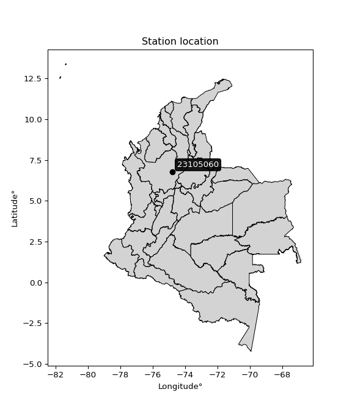

<div align="center">


</div>

# Station (rain, Pmax24h): 23105060

Probable Maximum Precipitation (PMP) is the greatest amount of rainfall for a specific duration that is meteorologically possible for a given location, acting as a "worst-case" scenario for extreme storms, crucial for designing safety-critical infrastructure like bridges, river deviations, dams, spillways, and nuclear plants to prevent catastrophic failure. PMP is calculated by hydrologists using meteorological data to determine the upper limit of extreme rainfall, often leading to the Probable Maximum Flood (PMF) for flood control design, and is increasingly being studied for climate change impacts.

<div align="center">

</img>

</div>


## A. General information


### 1. General running parameters

• app_version: _v20251226_. • runtime: _2025-12-26 15:38:16.554582_. • Python version: _3.14.0_. • SciPy version: _1.16.3_. • Pandas version: _2.3.3_. • NumPy version: _2.3.5_. • Stations dataset (station_dataset_file): _dataset/pmax24h_in/automatic_colombia_2003_2024.csv_. • Stations catalog (station_catalog_file): _dataset/CNE_IDEAM.xls_. • Minimum year to eval til year_max (date_min): _2003_. • Maximum year to eval since year_min (date_max): _2024_. • Creates, save and include plots into reports (create_plot): _False_. • Plot only fit distributions with Δo > Δ (plot_only_fit): _True_. • Eval low extreme values, if False, evaluates high extreme values (low_extreme): _False_. • Eval every SciPy distribution as logarithmic (pdist_logarithmic_on): _True_. • Standard deviation normalized (ddof): _1.0_. • Return periods to eval in years (Tr): _[2, 2.33, 5, 10, 15, 20, 25, 50, 75, 100, 200, 250, 500, 750, 1000]_. • Minimum data sample per station, 0 means any (minimum_sample): _5_. • Z-Score threshold to adjust a value, 0 means disable (zscore): _3.5_. • Avoid zeros, e.g. rain = 0 (avoid_zeros): _True_. • Avoid null values (avoid_nans): _True_. [:file_folder:Dataset file.](../../dataset/pmax24h_in/automatic_colombia_2003_2024.csv)


### 2. Station info and location

|   id |   CODIGO | NOMBRE                   | CATEGORIA         | TECNOLOGIA                | ESTADO     | FECHA_INSTALACION   | FECHA_SUSPENSION   |   ALTITUD |   LATITUD |   LONGITUD | DEPARTAMENTO   | MUNICIPIO   | AREA_OPERATIVA                      | ENTIDAD                                                     | AREA_HIDROGRAFICA   | ZONA_HIDROGRAFICA   | SUBZONA_HIDROGRAFICA                                |   CORRIENTE |    OBSERVACION | SUBRED                                                   | Catalogo   |
|-----:|---------:|:-------------------------|:------------------|:--------------------------|:-----------|:--------------------|:-------------------|----------:|----------:|-----------:|:---------------|:------------|:------------------------------------|:------------------------------------------------------------|:--------------------|:--------------------|:----------------------------------------------------|------------:|---------------:|:---------------------------------------------------------|:-----------|
|    0 | 23105060 | VEGACHI - AUT [23105060] | Agrometeorológica | Automática con Telemetría | Suspendida | 20/11/2004          | 09/10/2018         |       990 |   6.77411 |   -74.7965 | Antioquia      | Vegachí     | Area Operativa 01 - Antioquia-Chocó | INSTITUTO DE HIDROLOGIA METEOROLOGIA Y ESTUDIOS AMBIENTALES | Magdalena Cauca     | Medio Magdalena     | Rió San Bartolo y otros directos al Magdalena Medio |         nan | 20187010005973 | Radición Global,Radiación Ultravioleta,Radiación Visible | CNE_IDEAM  |

<div align="center">

Map location in: [:earth_americas:Google](http://maps.google.com/maps?q=6.774111111,-74.79652778) [:earth_americas:OSM](https://www.openstreetmap.org/#map=18/6.774111111/-74.79652778&layers=P) [:earth_americas:Bing](https://www.bing.com/maps?cp=6.774111111~-74.79652778&lvl=18) [:earth_americas:Apple](https://maps.apple.com/frame?center=6.774111111%2C-74.79652778&span=0.003%2C0.006)

</div>


<div align="center">

```geojson
{
  "type": "Feature",
  "geometry": {
    "type": "Point", 
    "coordinates": [-74.79652778, 6.774111111]
  }, 
  "properties": {
    "Name": "23105060"
  }
}
```

</div>


### 3. Discrete values table and plot

|               |           0 |           1 |           2 |          3 |           4 |          5 |          6 |         7 |           8 |          9 |          10 |          11 |          12 |
|:--------------|------------:|------------:|------------:|-----------:|------------:|-----------:|-----------:|----------:|------------:|-----------:|------------:|------------:|------------:|
| Date          | 2006        | 2007        | 2008        | 2009       | 2010        | 2011       | 2012       | 2013      | 2014        | 2015       | 2016        | 2017        | 2018        |
| Value         |   35.3      |   80.6      |   60        |   87.3     |   75.2      |    3.9     |   45       |    0.9    |   38.4      |   90.5     |   62.8      |   24.1      |   64.8      |
| Value_initial |   35.3      |   80.6      |   60        |   87.3     |   75.2      |    3.9     |   45       |    0.9    |   38.4      |   90.5     |   62.8      |   24.1      |   64.8      |
| count         |   13        |   13        |   13        |   13       |   13        |   13       |   13       |   13      |   13        |   13       |   13        |   13        |   13        |
| mean          |   51.4462   |   51.4462   |   51.4462   |   51.4462  |   51.4462   |   51.4462  |   51.4462  |   51.4462 |   51.4462   |   51.4462  |   51.4462   |   51.4462   |   51.4462   |
| std           |   29.7785   |   29.7785   |   29.7785   |   29.7785  |   29.7785   |   29.7785  |   29.7785  |   29.7785 |   29.7785   |   29.7785  |   29.7785   |   29.7785   |   29.7785   |
| zscore        |   -0.542208 |    0.979023 |    0.287249 |    1.20402 |    0.797684 |   -1.59666 |   -0.21647 |   -1.6974 |   -0.438106 |    1.31148 |    0.381277 |   -0.918319 |    0.448439 |
> If Z-Score is active, values out of range or outliers are replaced with the station mean value.


### 4. Active continuous probability distributions from SciPy (45 of 104 available)

[scipy.stats](https://docs.scipy.org/doc/scipy/reference/stats.html) is a Python´s powerful submodule within the SciPy library for comprehensive statistical analysis, offering over 130 probability distributions (like Normal, Poisson), functions for descriptive stats (mean, variance), hypothesis testing (t-tests, chi-square), random variable generation, and statistical tests, making it essential for data science, modeling, and research. It provides tools to explore, model, and draw conclusions from data efficiently, working seamlessly with NumPy.

<div align="center">

|   id | p_dist             |   n_parameter | fit_method   | label                                                                       | active   | ref                                                                                                        |
|-----:|:-------------------|--------------:|:-------------|:----------------------------------------------------------------------------|:---------|:-----------------------------------------------------------------------------------------------------------|
|    0 | alpha              |             3 | MLE          | Alpha                                                                       | True     | [:mortar_board:](https://docs.scipy.org/doc/scipy/reference/generated/scipy.stats.alpha.html)              |
|    1 | betaprime          |             4 | MLE          | Beta prime                                                                  | True     | [:mortar_board:](https://docs.scipy.org/doc/scipy/reference/generated/scipy.stats.betaprime.html)          |
|    2 | chi2               |             3 | MLE          | Chi²                                                                        | True     | [:mortar_board:](https://docs.scipy.org/doc/scipy/reference/generated/scipy.stats.chi2.html)               |
|    3 | crystalball        |             4 | MLE          | Crystalball                                                                 | True     | [:mortar_board:](https://docs.scipy.org/doc/scipy/reference/generated/scipy.stats.crystalball.html)        |
|    4 | erlang             |             3 | MLE          | Erlang                                                                      | True     | [:mortar_board:](https://docs.scipy.org/doc/scipy/reference/generated/scipy.stats.erlang.html)             |
|    5 | expon              |             2 | MLE          | Exponential                                                                 | True     | [:mortar_board:](https://docs.scipy.org/doc/scipy/reference/generated/scipy.stats.expon.html)              |
|    6 | exponnorm          |             3 | MLE          | Exponentially modified Normal                                               | True     | [:mortar_board:](https://docs.scipy.org/doc/scipy/reference/generated/scipy.stats.exponnorm.html)          |
|    7 | f                  |             4 | MLE          | F                                                                           | True     | [:mortar_board:](https://docs.scipy.org/doc/scipy/reference/generated/scipy.stats.f.html)                  |
|    8 | fatiguelife        |             3 | MLE          | Fatigue-life (Birnbaum-Saunders)                                            | True     | [:mortar_board:](https://docs.scipy.org/doc/scipy/reference/generated/scipy.stats.fatiguelife.html)        |
|    9 | fisk               |             3 | MLE          | Fisk                                                                        | True     | [:mortar_board:](https://docs.scipy.org/doc/scipy/reference/generated/scipy.stats.fisk.html)               |
|   10 | gamma              |             3 | MLE          | Gamma                                                                       | True     | [:mortar_board:](https://docs.scipy.org/doc/scipy/reference/generated/scipy.stats.gamma.html)              |
|   11 | genexpon           |             5 | MLE          | Generalized exponential                                                     | True     | [:mortar_board:](https://docs.scipy.org/doc/scipy/reference/generated/scipy.stats.genexpon.html)           |
|   12 | genlogistic        |             3 | MLE          | Generalized logistic                                                        | True     | [:mortar_board:](https://docs.scipy.org/doc/scipy/reference/generated/scipy.stats.genlogistic.html)        |
|   13 | gibrat             |             2 | MM           | Gibrat                                                                      | True     | [:mortar_board:](https://docs.scipy.org/doc/scipy/reference/generated/scipy.stats.gibrat.html)             |
|   14 | gompertz           |             3 | MLE          | Gompertz (or truncated Gumbel)                                              | True     | [:mortar_board:](https://docs.scipy.org/doc/scipy/reference/generated/scipy.stats.gompertz.html)           |
|   15 | gumbel_l           |             2 | MM           | Gumbel Left Skew                                                            | True     | [:mortar_board:](https://docs.scipy.org/doc/scipy/reference/generated/scipy.stats.gumbel_l.html)           |
|   16 | gumbel_r           |             2 | MM           | Gumbel Right Skew                                                           | True     | [:mortar_board:](https://docs.scipy.org/doc/scipy/reference/generated/scipy.stats.gumbel_r.html)           |
|   17 | halflogistic       |             2 | MM           | Half-logistic                                                               | True     | [:mortar_board:](https://docs.scipy.org/doc/scipy/reference/generated/scipy.stats.halflogistic.html)       |
|   18 | halfnorm           |             2 | MM           | Half Normal                                                                 | True     | [:mortar_board:](https://docs.scipy.org/doc/scipy/reference/generated/scipy.stats.halfnorm.html)           |
|   19 | hypsecant          |             2 | MM           | hyperbolic secant                                                           | True     | [:mortar_board:](https://docs.scipy.org/doc/scipy/reference/generated/scipy.stats.hypsecant.html)          |
|   20 | invgamma           |             3 | MLE          | Inverted gamma                                                              | True     | [:mortar_board:](https://docs.scipy.org/doc/scipy/reference/generated/scipy.stats.invgamma.html)           |
|   21 | invgauss           |             3 | MLE          | Inverse Gaussian                                                            | True     | [:mortar_board:](https://docs.scipy.org/doc/scipy/reference/generated/scipy.stats.invgauss.html)           |
|   22 | invweibull         |             3 | MLE          | Inverted Weibull                                                            | True     | [:mortar_board:](https://docs.scipy.org/doc/scipy/reference/generated/scipy.stats.invweibull.html)         |
|   23 | johnsonsu          |             4 | MLE          | Johnson Su                                                                  | True     | [:mortar_board:](https://docs.scipy.org/doc/scipy/reference/generated/scipy.stats.johnsonsu.html)          |
|   24 | kstwobign          |             2 | MLE          | Limiting distribution of scaled Kolmogorov-Smirnov two-sided test statistic | True     | [:mortar_board:](https://docs.scipy.org/doc/scipy/reference/generated/scipy.stats.kstwobign.html)          |
|   25 | laplace            |             2 | MM           | Laplace                                                                     | True     | [:mortar_board:](https://docs.scipy.org/doc/scipy/reference/generated/scipy.stats.laplace.html)            |
|   26 | laplace_asymmetric |             3 | MLE          | Asymmetric Laplace                                                          | True     | [:mortar_board:](https://docs.scipy.org/doc/scipy/reference/generated/scipy.stats.laplace_asymmetric.html) |
|   27 | loggamma           |             3 | MLE          | Log gamma                                                                   | True     | [:mortar_board:](https://docs.scipy.org/doc/scipy/reference/generated/scipy.stats.loggamma.html)           |
|   28 | logistic           |             2 | MM           | Logistic (or Sech-squared)                                                  | True     | [:mortar_board:](https://docs.scipy.org/doc/scipy/reference/generated/scipy.stats.logistic.html)           |
|   29 | lognorm            |             3 | MLE          | Log Normal                                                                  | True     | [:mortar_board:](https://docs.scipy.org/doc/scipy/reference/generated/scipy.stats.lognorm.html)            |
|   30 | maxwell            |             2 | MM           | Maxwell                                                                     | True     | [:mortar_board:](https://docs.scipy.org/doc/scipy/reference/generated/scipy.stats.maxwell.html)            |
|   31 | mielke             |             4 | MLE          | Mielke Beta-Kappa / Dagum                                                   | True     | [:mortar_board:](https://docs.scipy.org/doc/scipy/reference/generated/scipy.stats.mielke.html)             |
|   32 | moyal              |             2 | MM           | Moyal                                                                       | True     | [:mortar_board:](https://docs.scipy.org/doc/scipy/reference/generated/scipy.stats.moyal.html)              |
|   33 | nakagami           |             3 | MLE          | Nakagami                                                                    | True     | [:mortar_board:](https://docs.scipy.org/doc/scipy/reference/generated/scipy.stats.nakagami.html)           |
|   34 | ncf                |             5 | MLE          | Non-central F distribution                                                  | True     | [:mortar_board:](https://docs.scipy.org/doc/scipy/reference/generated/scipy.stats.ncf.html)                |
|   35 | nct                |             4 | MLE          | Non-central Student’s t                                                     | True     | [:mortar_board:](https://docs.scipy.org/doc/scipy/reference/generated/scipy.stats.nct.html)                |
|   36 | norm               |             2 | MM           | Normal                                                                      | True     | [:mortar_board:](https://docs.scipy.org/doc/scipy/reference/generated/scipy.stats.norm.html)               |
|   37 | pareto             |             3 | MLE          | Pareto                                                                      | True     | [:mortar_board:](https://docs.scipy.org/doc/scipy/reference/generated/scipy.stats.pareto.html)             |
|   38 | pearson3           |             3 | MM           | Pearson type III                                                            | True     | [:mortar_board:](https://docs.scipy.org/doc/scipy/reference/generated/scipy.stats.pearson3.html)           |
|   39 | rayleigh           |             2 | MM           | Rayleigh                                                                    | True     | [:mortar_board:](https://docs.scipy.org/doc/scipy/reference/generated/scipy.stats.rayleigh.html)           |
|   40 | rice               |             3 | MLE          | Rice                                                                        | True     | [:mortar_board:](https://docs.scipy.org/doc/scipy/reference/generated/scipy.stats.rice.html)               |
|   41 | t                  |             3 | MLE          | Student’s t                                                                 | True     | [:mortar_board:](https://docs.scipy.org/doc/scipy/reference/generated/scipy.stats.t.html)                  |
|   42 | truncnorm          |             4 | MLE          | Truncated normal                                                            | True     | [:mortar_board:](https://docs.scipy.org/doc/scipy/reference/generated/scipy.stats.truncnorm.html)          |
|   43 | wald               |             2 | MM           | Wald                                                                        | True     | [:mortar_board:](https://docs.scipy.org/doc/scipy/reference/generated/scipy.stats.wald.html)               |
|   44 | weibull_min        |             3 | MLE          | Weibull minimum                                                             | True     | [:mortar_board:](https://docs.scipy.org/doc/scipy/reference/generated/scipy.stats.weibull_min.html)        |

</div>

> **n_parameter:** # arguments & localization & scale.
>
> **Fit methods:** (MLE) maximum likelihood, (MM) L-moments.
>
>**Inactive:** foldnorm, gennorm, norminvgauss, powernorm, powerlognorm, skewnorm, genextreme, anglit, arcsine, argus, beta, bradford, burr, burr12, cauchy, cosine, halfcauchy, foldcauchy, skewcauchy, wrapcauchy, dgamma, gengamma, exponweib, exponpow, truncexpon, gausshyper, genhalflogistic, genhyperbolic, geninvgauss, halfgennorm, johnsonsb, kappa4, kappa3, ksone, kstwo, loglaplace, levy, levy_l, levy_stable, ncx2, genpareto, truncpareto, lomax, powerlaw, rdist, rel_breitwigner, recipinvgauss, semicircular, studentized_range, trapezoid, triang, truncweibull_min, tukeylambda, uniform, loguniform, vonmises, vonmises_line, weibull_max, dweibull, 


## B. Probability distributions vs. Empirical distributions

A continuous probability distribution (CPD) describes probabilities for variables that can take any value within a range (like rain any time), unlike discrete variables with specific outcomes (like temperature). It uses a Probability Density Function (PDF), a curve where the total area under it equals 1, and the probability of the variable falling within an interval (a to b) is found by calculating the area under the curve between those points. A key feature is that the probability of hitting any single exact value is zero, so probabilities are always expressed for ranges, e.g., $P(a ≤ X ≤ b)$.

<div align="center">

Distributions parameters
|    |   station | p_dist                |   n |             loc |           scale | shape                  | shape1                 | shape2             | shape3   |
|---:|----------:|:----------------------|----:|----------------:|----------------:|:-----------------------|:-----------------------|:-------------------|:---------|
|  0 |  23105060 | alpha                 |  13 |    -0.00313901  |     3.17391     | 3.3445487846913184e-09 |                        |                    |          |
|  1 |  23105060 | betaprime             |  13 |  -820.326       | 73077.3         | 920.5848386993256      | 77170.56697896533      |                    |          |
|  2 |  23105060 | chi2                  |  13 |  -245.717       |     1.473       | 201.67570353136853     |                        |                    |          |
|  3 |  23105060 | crystalball           |  13 |    51.4462      |    28.6103      | 8067.701571838688      | 17463.394622187247     |                    |          |
|  4 |  23105060 | erlang                |  13 |  -417.379       |     1.79812     | 260.7135359882727      |                        |                    |          |
|  5 |  23105060 | expon                 |  13 |     0.9         |    50.5462      |                        |                        |                    |          |
|  6 |  23105060 | exponnorm             |  13 |    51.4265      |    28.6103      | 0.0006889223076604882  |                        |                    |          |
|  7 |  23105060 | f                     |  13 | -6702.75        |  6754.06        | 120306.87234460175     | 1393067.88294787       |                    |          |
|  8 |  23105060 | fatiguelife           |  13 | -3007.17        |  3058.58        | 0.009340333864164455   |                        |                    |          |
|  9 |  23105060 | fisk                  |  13 |    -8.33019e+07 |     8.33019e+07 | 4869650.009867203      |                        |                    |          |
| 10 |  23105060 | gamma                 |  13 |  -412.721       |     1.83521     | 252.91900088478565     |                        |                    |          |
| 11 |  23105060 | genexpon              |  13 |     0.899964    |     2.54664     | 0.051191229042472974   | 1.3908356315091317e-06 | 2.740448335518824  |          |
| 12 |  23105060 | genlogistic           |  13 |    90.5002      |     6.12189e-06 | 1.5662105224653427e-07 |                        |                    |          |
| 13 |  23105060 | gibrat                |  13 |    29.6201      |    13.2382      |                        |                        |                    |          |
| 14 |  23105060 | gompertz              |  13 |    24.1         |     7.0458      | 0.00042761207117331254 |                        |                    |          |
| 15 |  23105060 | gumbel_l              |  13 |    64.3223      |    22.3073      |                        |                        |                    |          |
| 16 |  23105060 | gumbel_r              |  13 |    38.57        |    22.3073      |                        |                        |                    |          |
| 17 |  23105060 | halflogistic          |  13 |    17.5363      |    24.4608      |                        |                        |                    |          |
| 18 |  23105060 | halfnorm              |  13 |    13.5774      |    47.4614      |                        |                        |                    |          |
| 19 |  23105060 | hypsecant             |  13 |    51.4462      |    18.2139      |                        |                        |                    |          |
| 20 |  23105060 | invgamma              |  13 |  -298.082       | 48230.2         | 139.04237192164175     |                        |                    |          |
| 21 |  23105060 | invgauss              |  13 |  -131.637       |  6572.43        | 0.027692532065221563   |                        |                    |          |
| 22 |  23105060 | invweibull            |  13 |    -4.07301e+09 |     4.07301e+09 | 139363334.78375292     |                        |                    |          |
| 23 |  23105060 | johnsonsu             |  13 |    -1.91633e+09 |     4.97158e+09 | -69812210.32054222     | 185424985.16746324     |                    |          |
| 24 |  23105060 | kstwobign             |  13 |   -62.6599      |   130.263       |                        |                        |                    |          |
| 25 |  23105060 | laplace               |  13 |    51.4462      |    20.2305      |                        |                        |                    |          |
| 26 |  23105060 | laplace_asymmetric    |  13 |    64.8         |    21.8517      | 1.3512296499910668     |                        |                    |          |
| 27 |  23105060 | loggamma              |  13 |    80.8175      |    14.2389      | 0.48055912454403027    |                        |                    |          |
| 28 |  23105060 | logistic              |  13 |    51.4462      |    15.7737      |                        |                        |                    |          |
| 29 |  23105060 | lognorm               |  13 |     0.9         |     1.91666     | 10.827091819449118     |                        |                    |          |
| 30 |  23105060 | maxwell               |  13 |   -16.3482      |    42.4838      |                        |                        |                    |          |
| 31 |  23105060 | mielke                |  13 |     0.9         |    91.2253      | 0.8262946341643145     | 82.34685213439121      |                    |          |
| 32 |  23105060 | moyal                 |  13 |    35.085       |    12.8791      |                        |                        |                    |          |
| 33 |  23105060 | nakagami              |  13 |     0.9         |    44.1258      | 0.117677435402856      |                        |                    |          |
| 34 |  23105060 | ncf                   |  13 |    -0.0940876   |    12.9454      | 1.7765465082587308     | 14.380924968578611     | 4.9844385293813005 |          |
| 35 |  23105060 | nct                   |  13 | -2499.79        |    28.5913      | 2463757.784116118      | 89.23106447626532      |                    |          |
| 36 |  23105060 | norm                  |  13 |    51.4462      |    28.6103      |                        |                        |                    |          |
| 37 |  23105060 | pareto                |  13 |     0.899902    |     9.77562e-05 | 0.08333820755035166    |                        |                    |          |
| 38 |  23105060 | pearson3              |  13 |    51.4462      |    28.6102      | -0.37925296036584244   |                        |                    |          |
| 39 |  23105060 | rayleigh              |  13 |    -3.28695     |    43.6707      |                        |                        |                    |          |
| 40 |  23105060 | rice                  |  13 |   -14.3251      |    31.9071      | 1.747326589144388      |                        |                    |          |
| 41 |  23105060 | t                     |  13 |    51.4462      |    28.6099      | 70685918.31746267      |                        |                    |          |
| 42 |  23105060 | truncnorm             |  13 |    -1.76284     |    13.7882      | -6.603433071182666     | 6.691434414550328      |                    |          |
| 43 |  23105060 | wald                  |  13 |    22.8359      |    28.6103      |                        |                        |                    |          |
| 44 |  23105060 | weibull_min           |  13 |  -265.818       |   330           | 13.566889738361391     |                        |                    |          |
| 45 |  23105060 | logalpha              |  13 |   -54.2084      |  2357.78        | 40.88390706460545      |                        |                    |          |
| 46 |  23105060 | logbetaprime          |  13 |  -132.325       |  1058.47        | 11685.8699726159       | 91057.68959766257      |                    |          |
| 47 |  23105060 | logchi2               |  13 |    -0.105361    |     1.85699     | 1.931929675394001      |                        |                    |          |
| 48 |  23105060 | logcrystalball        |  13 |     4.50536     |     2.73473e-06 | 2.8014492307764565e-06 | 111.18437331269715     |                    |          |
| 49 |  23105060 | logerlang             |  13 |   -22.5117      |     0.0752546   | 345.49748927382166     |                        |                    |          |
| 50 |  23105060 | logexpon              |  13 |    -0.105361    |     3.60893     |                        |                        |                    |          |
| 51 |  23105060 | logexponnorm          |  13 |     3.50281     |     1.31332     | 0.0005787148273244477  |                        |                    |          |
| 52 |  23105060 | logf                  |  13 |    -0.105361    |     1.17002     | 1.3830861108208126     | 1.2461328584486693     |                    |          |
| 53 |  23105060 | logfatiguelife        |  13 | -1245.17        |  1248.68        | 0.0010493549906963658  |                        |                    |          |
| 54 |  23105060 | logfisk               |  13 |    -1.44127e+08 |     1.44127e+08 | 233225850.28480583     |                        |                    |          |
| 55 |  23105060 | loggamma              |  13 |   -19.2887      |     0.0866965   | 262.3123932151004      |                        |                    |          |
| 56 |  23105060 | loggenexpon           |  13 |    -0.105361    |     1.06925e+10 | 538098087.728588       | 19987560251.96107      | 663517438.8552154  |          |
| 57 |  23105060 | loggenlogistic        |  13 |     4.50539     |     9.19559e-07 | 9.164479597473086e-07  |                        |                    |          |
| 58 |  23105060 | loggibrat             |  13 |     2.50169     |     0.607674    |                        |                        |                    |          |
| 59 |  23105060 | loggompertz           |  13 |    -0.105363    |     0.712546    | 0.003119358200080315   |                        |                    |          |
| 60 |  23105060 | loggumbel_l           |  13 |     4.09463     |     1.02399     |                        |                        |                    |          |
| 61 |  23105060 | loggumbel_r           |  13 |     2.9125      |     1.02399     |                        |                        |                    |          |
| 62 |  23105060 | loghalflogistic       |  13 |     1.94701     |     1.12282     |                        |                        |                    |          |
| 63 |  23105060 | loghalfnorm           |  13 |     1.76526     |     2.17865     |                        |                        |                    |          |
| 64 |  23105060 | loghypsecant          |  13 |     3.50357     |     0.836086    |                        |                        |                    |          |
| 65 |  23105060 | loginvgamma           |  13 |   -33.7097      | 26937.2         | 724.9426982144109      |                        |                    |          |
| 66 |  23105060 | loginvgauss           |  13 |   -12.4683      |  1879.58        | 0.008471172186380127   |                        |                    |          |
| 67 |  23105060 | loginvweibull         |  13 |    -4.70237e+08 |     4.70237e+08 | 280873167.4802538      |                        |                    |          |
| 68 |  23105060 | logjohnsonsu          |  13 |     4.52641     |     0.000563935 | 5.065165621614266      | 0.6886468446102889     |                    |          |
| 69 |  23105060 | logkstwobign          |  13 |    -3.53693     |     8.0838      |                        |                        |                    |          |
| 70 |  23105060 | loglaplace            |  13 |     3.50357     |     0.928659    |                        |                        |                    |          |
| 71 |  23105060 | loglaplace_asymmetric |  13 |     4.50538     |     0.0106815   | 93.69681751763915      |                        |                    |          |
| 72 |  23105060 | logloggamma           |  13 |     4.50539     |     3.93094e-06 | 3.918323839058445e-06  |                        |                    |          |
| 73 |  23105060 | loglogistic           |  13 |     3.50357     |     0.724072    |                        |                        |                    |          |
| 74 |  23105060 | loglognorm            |  13 | -1341.6         |  1345.1         | 0.0009762412124566058  |                        |                    |          |
| 75 |  23105060 | logmaxwell            |  13 |     0.391512    |     1.95019     |                        |                        |                    |          |
| 76 |  23105060 | logmielke             |  13 |    -0.105361    |     4.30259     | 0.6210607654283582     | 1.87312486765809       |                    |          |
| 77 |  23105060 | logmoyal              |  13 |     2.75253     |     0.591202    |                        |                        |                    |          |
| 78 |  23105060 | lognakagami           |  13 | -1386.19        |  1389.7         | 279573.7886244805      |                        |                    |          |
| 79 |  23105060 | logncf                |  13 |    -0.105361    |     1.12935     | 1.1484304119832962     | 1.3982781533605053     | 1.0384562793531322 |          |
| 80 |  23105060 | lognct                |  13 |   -93.4435      |     1.29174     | 71770.55690079802      | 75.0503860904841       |                    |          |
| 81 |  23105060 | lognorm               |  13 |     3.50357     |     1.31332     |                        |                        |                    |          |
| 82 |  23105060 | logpareto             |  13 |    -0.105369    |     8.53058e-06 | 0.08333593029127932    |                        |                    |          |
| 83 |  23105060 | logpearson3           |  13 |     3.50357     |     1.31333     | -1.797531670995554     |                        |                    |          |
| 84 |  23105060 | lograyleigh           |  13 |     0.991132    |     2.00464     |                        |                        |                    |          |
| 85 |  23105060 | logrice               |  13 |  -504.223       |     1.31332     | 386.59765904252913     |                        |                    |          |
| 86 |  23105060 | logt                  |  13 |     4.11661     |     0.357863    | 1.152542157797512      |                        |                    |          |
| 87 |  23105060 | logtruncnorm          |  13 |     0.267142    |     3.60928     | -0.1032072607360636    | 1.1742537870740177     |                    |          |
| 88 |  23105060 | logwald               |  13 |     2.19021     |     1.31334     |                        |                        |                    |          |
| 89 |  23105060 | logweibull_min        |  13 |    -1.58705e+08 |     1.58705e+08 | 225455644.40873173     |                        |                    |          |

</div>

> **loc** (Location parameter): This shifts the distribution along the x-axis. For many common distributions, like the normal (Gaussian) distribution, loc represents the mean $μ$. For others, like the uniform distribution, it might represent the minimum value, or for the beta distribution, the left end of the support interval.
>
> **scale** (Scale parameter): This determines the width or spread of the distribution. For the normal distribution, scale represents the standard deviation $σ$. For a uniform distribution, it defines the length of the interval (from $loc$ to $loc + scale$).
>
> **shape** (Shape parameters): Refers to parameters that define the specific form of a probability distribution, distinct from its location (loc) and scale (scale). These parameters are required arguments for most distribution functions. For example, a normal (Gaussian) distribution is fully defined by its location (mean) and scale (standard deviation), so it has no specific shape parameters beyond loc and scale. However, other distributions have intrinsic properties that need specification, as Gamma distribution that takes a shape parameter, often named $a$ or $alpha$.


### 0. Cumulative distribution values - CDF (90 evaluated)

> Ordered by x ascending and calculating $log(f(x))$ separately. 

|   id |   Station |   date |    x |   count |    mean |     std |    zscore |   Value_initial |   station |   m |       alpha |   alpha_pdf |   betaprime |   betaprime_pdf |      chi2 |   chi2_pdf |   crystalball |   crystalball_pdf |    erlang |   erlang_pdf |     expon |   expon_pdf |   exponnorm |   exponnorm_pdf |         f |      f_pdf |   fatiguelife |   fatiguelife_pdf |      fisk |   fisk_pdf |     gamma |   gamma_pdf |    genexpon |   genexpon_pdf |   genlogistic |   genlogistic_pdf |   gibrat |   gibrat_pdf |    gompertz |   gompertz_pdf |   gumbel_l |   gumbel_l_pdf |   gumbel_r |   gumbel_r_pdf |   halflogistic |   halflogistic_pdf |   halfnorm |   halfnorm_pdf |   hypsecant |   hypsecant_pdf |   invgamma |   invgamma_pdf |   invgauss |   invgauss_pdf |   invweibull |   invweibull_pdf |   johnsonsu |   johnsonsu_pdf |   kstwobign |   kstwobign_pdf |   laplace |   laplace_pdf |   laplace_asymmetric |   laplace_asymmetric_pdf |   loggamma |   loggamma_pdf |   logistic |   logistic_pdf |    lognorm |   lognorm_pdf |   maxwell |   maxwell_pdf |    mielke |   mielke_pdf |       moyal |   moyal_pdf |    nakagami |   nakagami_pdf |        ncf |    ncf_pdf |       nct |    nct_pdf |      norm |   norm_pdf |   pareto |    pareto_pdf |   pearson3 |   pearson3_pdf |   rayleigh |   rayleigh_pdf |      rice |   rice_pdf |         t |      t_pdf |   truncnorm |   truncnorm_pdf |        wald |    wald_pdf |   weibull_min |   weibull_min_pdf |   logalpha |   logalpha_pdf |   logbetaprime |   logbetaprime_pdf |     logchi2 |   logchi2_pdf |   logcrystalball |   logcrystalball_pdf |   logerlang |   logerlang_pdf |   logexpon |   logexpon_pdf |   logexponnorm |   logexponnorm_pdf |        logf |      logf_pdf |   logfatiguelife |   logfatiguelife_pdf |    logfisk |   logfisk_pdf |   loggenexpon |   loggenexpon_pdf |   loggenlogistic |   loggenlogistic_pdf |   loggibrat |   loggibrat_pdf |   loggompertz |   loggompertz_pdf |   loggumbel_l |   loggumbel_l_pdf |   loggumbel_r |   loggumbel_r_pdf |   loghalflogistic |   loghalflogistic_pdf |   loghalfnorm |   loghalfnorm_pdf |   loghypsecant |   loghypsecant_pdf |   loginvgamma |   loginvgamma_pdf |   loginvgauss |   loginvgauss_pdf |   loginvweibull |   loginvweibull_pdf |   logjohnsonsu |   logjohnsonsu_pdf |   logkstwobign |   logkstwobign_pdf |   loglaplace |   loglaplace_pdf |   loglaplace_asymmetric |   loglaplace_asymmetric_pdf |   logloggamma |   logloggamma_pdf |   loglogistic |   loglogistic_pdf |   loglognorm |   loglognorm_pdf |   logmaxwell |   logmaxwell_pdf |   logmielke |   logmielke_pdf |    logmoyal |   logmoyal_pdf |   lognakagami |   lognakagami_pdf |      logncf |   logncf_pdf |     lognct |   lognct_pdf |   logpareto |   logpareto_pdf |   logpearson3 |   logpearson3_pdf |   lograyleigh |   lograyleigh_pdf |    logrice |   logrice_pdf |      logt |   logt_pdf |   logtruncnorm |   logtruncnorm_pdf |   logwald |   logwald_pdf |   logweibull_min |   logweibull_min_pdf |
|-----:|----------:|-------:|-----:|--------:|--------:|--------:|----------:|----------------:|----------:|----:|------------:|------------:|------------:|----------------:|----------:|-----------:|--------------:|------------------:|----------:|-------------:|----------:|------------:|------------:|----------------:|----------:|-----------:|--------------:|------------------:|----------:|-----------:|----------:|------------:|------------:|---------------:|--------------:|------------------:|---------:|-------------:|------------:|---------------:|-----------:|---------------:|-----------:|---------------:|---------------:|-------------------:|-----------:|---------------:|------------:|----------------:|-----------:|---------------:|-----------:|---------------:|-------------:|-----------------:|------------:|----------------:|------------:|----------------:|----------:|--------------:|---------------------:|-------------------------:|-----------:|---------------:|-----------:|---------------:|-----------:|--------------:|----------:|--------------:|----------:|-------------:|------------:|------------:|------------:|---------------:|-----------:|-----------:|----------:|-----------:|----------:|-----------:|---------:|--------------:|-----------:|---------------:|-----------:|---------------:|----------:|-----------:|----------:|-----------:|------------:|----------------:|------------:|------------:|--------------:|------------------:|-----------:|---------------:|---------------:|-------------------:|------------:|--------------:|-----------------:|---------------------:|------------:|----------------:|-----------:|---------------:|---------------:|-------------------:|------------:|--------------:|-----------------:|---------------------:|-----------:|--------------:|--------------:|------------------:|-----------------:|---------------------:|------------:|----------------:|--------------:|------------------:|--------------:|------------------:|--------------:|------------------:|------------------:|----------------------:|--------------:|------------------:|---------------:|-------------------:|--------------:|------------------:|--------------:|------------------:|----------------:|--------------------:|---------------:|-------------------:|---------------:|-------------------:|-------------:|-----------------:|------------------------:|----------------------------:|--------------:|------------------:|--------------:|------------------:|-------------:|-----------------:|-------------:|-----------------:|------------:|----------------:|------------:|---------------:|--------------:|------------------:|------------:|-------------:|-----------:|-------------:|------------:|----------------:|--------------:|------------------:|--------------:|------------------:|-----------:|--------------:|----------:|-----------:|---------------:|-------------------:|----------:|--------------:|-----------------:|---------------------:|
|    0 |  23105060 |   2013 |  0.9 |      13 | 51.4462 | 29.7785 | -1.6974   |             0.9 |  23105060 |   1 | 0.000440908 | 0.00645928  |   0.0381315 |      0.00298564 | 0.0376111 | 0.0031386  |     0.0386381 |        0.00292827 | 0.037068  |   0.0030106  | 0         |  0.0197839  |   0.038638  |      0.00292827 | 0.0392208 | 0.00297061 |     0.0372889 |        0.00289671 | 0.0452475 | 0.00252539 | 0.0377349 |  0.00304137 | 7.30413e-07 |     0.0201015  |      0        |        0.00258479 | 0        |   0          | 0           |    0           |  0.0565803 |     0.00246325 | 0.00446115 |     0.00108239 |       0        |         0          |   0        |     0          |   0.0396357 |      0.00217051 |  0.0340481 |     0.00313176 |  0.033024  |     0.00339436 |    0.0317587 |       0.00374855 |   0.0392853 |      0.0029553  |   0.0288594 |      0.00425157 | 0.0411037 |    0.00203177 |            0.0742057 |               0.00251318 | 0.00391926 |     0.00928618 |  0.038998  |     0.00237593 | 0.00299855 |    0.00696342 | 0.0169435 |    0.00285078 | 1.505e-08 |   0.399461   | 0.000163076 | 9.56474e-05 | 5.93446e-05 |    1.25804e+11 | 0.00840576 | 0.00801337 | 0.0386559 | 0.00292913 | 0.0386381 | 0.00292827 | 0        | 852.511       |  0.0482094 |     0.00289164 | 0.00458551 |     0.00218535 | 0.0254313 | 0.00342604 | 0.0386361 | 0.00292819 |    0.576569 |     0.028399    | 0           | 0           |     0.0541435 |        0.00267813 |  0.0035131 |     0.00849421 |      0.0031167 |         0.00723771 | 2.90068e-17 |     1.00951   |              nan |                  nan |  0.00368008 |      0.00868384 |   0        |      0.277091  |     0.00299844 |          0.0069632 | 1.45472e-12 | 72490.1       |       0.00282076 |           0.00662444 | 0.00182733 |    0.00295158 |   8.68684e-13 |         0.0503248 |         0        |            0.0100665 |    0        |       0         |   1.02548e-08 |        0.00437778 |     0.0164103 |         0.0158936 |   5.32072e-09 |       9.89935e-08 |          0        |              0        |      0        |          0        |     0.00849654 |          0.0101611 |    0.00284803 |        0.00723509 |    0.00332942 |        0.00891181 |      0.00422445 |           0.0137944 |      0.052692  |          0.0159873 |     0.00627929 |          0.0232256 |    0.0102619 |        0.0110502 |              0.00998107 |                  0.00997285 |     0.0100927 |         0.0100603 |    0.00679864 |        0.00932561 |   0.00294151 |       0.00686328 |     0        |        0         | 1.37016e-11 |  613176         | 3.54811e-29 |    3.80197e-27 |    0.00299941 |        0.00696693 | 8.06737e-11 |    3.338e+06 | 0.00304053 |    0.0070515 |    0        |   9769.08       |     0.0222348 |         0.0179718 |     0         |         0         | 0.00299856 |    0.00696348 | 0.0191514 | 0.00519874 |    5.27597e-07 |           0.261181 |  0        |      0        |       0.00288431 |           0.00409151 |
|    1 |  23105060 |   2011 |  3.9 |      13 | 51.4462 | 29.7785 | -1.59666  |             3.9 |  23105060 |   2 | 0.416122    | 0.119432    |   0.0479705 |      0.00358539 | 0.0479872 | 0.00379091 |     0.0482708 |        0.00350492 | 0.0470139 |   0.00363209 | 0.0576247 |  0.0186439  |   0.0482707 |      0.00350491 | 0.0489893 | 0.00355312 |     0.0468371 |        0.0034805  | 0.0534574 | 0.00295795 | 0.0477731 |  0.00366268 | 0.0585239   |     0.0189255  |      0        |        0.00279099 | 0        |   0          | 0           |    0           |  0.0644569 |     0.0027943  | 0.00881508 |     0.00186964 |       0        |         0          |   0        |     0          |   0.046709  |      0.00255528 |  0.044488  |     0.00384189 |  0.0444227 |     0.00421961 |    0.0444648 |       0.00473626 |   0.048999  |      0.00353177 |   0.0435062 |      0.00552356 | 0.0476741 |    0.00235654 |            0.0821416 |               0.00278194 | 0.0645886  |     0.0958411  |  0.0467851 |     0.00282726 | 0.0513999  |    0.0802764  | 0.0269093 |    0.00380816 | 0.0595127 |   0.0163917  | 0.000791483 | 0.000372818 | 0.437159    |    0.0342791   | 0.0338543  | 0.00909411 | 0.0482912 | 0.00350581 | 0.0482708 | 0.00350492 | 0.577271 |   0.0117428   |  0.0575766 |     0.00336181 | 0.0134506  |     0.00371777 | 0.036832  | 0.00417972 | 0.0482686 | 0.00350483 |    0.659354 |     0.0265935   | 0           | 0           |     0.0627319 |        0.00305432 |  0.0610952 |     0.0922517  |      0.0527199 |         0.0815539  | 0.34262     |     0.183433  |              nan |                  nan |  0.0609874  |      0.0913184  |   0.333895 |      0.184571  |     0.0513989  |          0.0802755 | 0.530756    |     0.129256  |       0.0498562  |           0.078666   | 0.0192606  |    0.030567   |   0.177002    |         0.175223  |         0        |            0.0434056 |    0        |       0         |   0.0210781   |        0.0335528  |     0.0669342 |         0.0631278 |   0.010565    |       0.0469464   |          0        |              0        |      0        |          0        |     0.0489869  |          0.0583597 |    0.0566084  |        0.0890729  |    0.0683471  |        0.103934   |      0.102591   |           0.13953   |      0.0873651 |          0.0345552 |     0.143614   |          0.167755  |    0.0497703 |        0.0535937 |              0.0431991  |                  0.0431636  |     0.0435296 |         0.0433898 |    0.0493088  |        0.0647415  |   0.0510061  |       0.0799249  |     0.030354 |        0.0893536 | 0.491651    |       0.183769  | 0.00117764  |    0.0113447   |    0.0514178  |        0.08029    | 0.428118    |    0.128812  | 0.0518235  |    0.0807177 |    0.633803 |      0.0208119  |     0.0721299 |         0.0573881 |     0.0168751 |         0.0904807 | 0.0514007  |    0.080278   | 0.03118   | 0.0128709  |    0.380515    |           0.25079  |  0        |      0        |       0.0229249  |           0.0321907  |
|    2 |  23105060 |   2017 | 24.1 |      13 | 51.4462 | 29.7785 | -0.918319 |            24.1 |  23105060 |   3 | 0.895237    | 0.00432137  |   0.172347  |      0.00902422 | 0.179444  | 0.009439   |     0.169583  |        0.00883092 | 0.173875  |   0.00920324 | 0.368076  |  0.0125019  |   0.169582  |      0.00883091 | 0.171526  | 0.00889274 |     0.168409  |        0.00888399 | 0.155371  | 0.00767148 | 0.174978  |  0.00919608 | 0.372723    |     0.0126095  |      0        |        0.00467949 | 0        |   0          | 8.53809e-10 |    6.06905e-05 |  0.151926  |     0.00626485 | 0.147639   |     0.0126609  |       0.133368 |         0.0200773  |   0.175459 |     0.0164031  |   0.139571  |      0.00741972 |  0.181491  |     0.00989352 |  0.195395  |     0.010722   |    0.210218  |       0.0112181  |   0.170636  |      0.00882765 |   0.233232  |      0.0122642  | 0.129396  |    0.0063961  |            0.162808  |               0.00551393 | 0.431357   |     0.282116   |  0.15012   |     0.00808842 | 0.403348   |    0.294807   | 0.176133  |    0.0108201  | 0.322599  |   0.0114897  | 0.125564    | 0.014679    | 0.705128    |    0.00694789  | 0.270487   | 0.0126685  | 0.169617  | 0.00883108 | 0.169583  | 0.00883092 | 0.643526 |   0.00128051  |  0.167057  |     0.00782504 | 0.178516   |     0.0117968  | 0.176975  | 0.00974457 | 0.169579  | 0.00883091 |    0.969653 |     0.00498202  | 5.22425e-06 | 4.86014e-05 |     0.158515  |        0.00679613 |  0.421059  |     0.279974   |      0.403131  |         0.290552   | 0.602896    |     0.109289  |              nan |                  nan |  0.419988   |      0.281643   |   0.59786  |      0.111429  |     0.403346   |          0.294807  | 0.674631    |     0.0492961 |       0.399386   |           0.294808   | 0.272271   |    0.320628   |   0.528469    |         0.186394  |         0        |            0.266577  |    0.545071 |       0.582487  |   0.267677    |        0.323386   |     0.336501  |         0.265808  |   0.463735    |       0.348004    |          0.500552 |              0.333734 |      0.484553 |          0.296416 |     0.380561   |          0.354225  |    0.418426   |        0.285724   |    0.443806   |        0.274505   |      0.464296   |           0.212773  |      0.22144   |          0.15226   |     0.505667   |          0.193521  |    0.353741  |        0.380916  |              0.266549   |                  0.266329   |     0.267422  |         0.266564  |    0.390832   |        0.32881    |   0.402463   |       0.294752   |     0.437441 |        0.300938  | 0.723399    |       0.0851927 | 0.486862    |    0.368443    |    0.403239   |        0.294626   | 0.584686    |    0.0582163 | 0.403969   |    0.294206  |    0.657631 |      0.0086786  |     0.299016  |         0.227071  |     0.449721  |         0.300033  | 0.403355   |    0.29481    | 0.102698  | 0.113927   |    0.787396    |           0.189499 |  0.549543 |      0.444754 |       0.265295   |           0.321763   |
|    3 |  23105060 |   2006 | 35.3 |      13 | 51.4462 | 29.7785 | -0.542208 |            35.3 |  23105060 |   4 | 0.928363    | 0.00202373  |   0.290894  |      0.0120105  | 0.30177   | 0.0122265  |     0.286259  |        0.0118913  | 0.294317  |   0.0121505  | 0.49367   |  0.0100172  |   0.286258  |      0.0118913  | 0.288748  | 0.011922   |     0.285826  |        0.0119633  | 0.261468  | 0.0112883  | 0.295127  |  0.0121056  | 0.49918     |     0.0100675  |      0        |        0.00623219 | 0.198729 |   0.0491011  | 0.00166706  |    0.000296995 |  0.238339  |     0.00929583 | 0.314152   |     0.0163063  |       0.347946 |         0.0179662  |   0.352824 |     0.0151395  |   0.248854  |      0.012313   |  0.308856  |     0.0126219  |  0.330479  |     0.0131019  |    0.345374  |       0.0125634  |   0.287098  |      0.0118563  |   0.37623   |      0.012916   | 0.22509   |    0.0111262  |            0.237909  |               0.00805744 | 0.539633   |     0.281769   |  0.264324  |     0.0123279  | 0.518315   |    0.303446   | 0.312634  |    0.013257   | 0.446701  |   0.0107299  | 0.32135     | 0.0187865   | 0.770524    |    0.00494438  | 0.407394   | 0.0115909  | 0.286289  | 0.0118904  | 0.286259  | 0.0118913  | 0.655038 |   0.000835711 |  0.271558  |     0.0108229  | 0.32319    |     0.0136939  | 0.301401  | 0.0123085  | 0.286256  | 0.0118914  |    0.996406 |     0.000780595 | 0.305712    | 0.0336457   |     0.250711  |        0.00974395 |  0.528791  |     0.281088   |      0.516316  |         0.298548   | 0.642463    |     0.098248  |              nan |                  nan |  0.52859    |      0.2839     |   0.638218 |      0.100246  |     0.518314   |          0.303447  | 0.692129    |     0.0426574 |       0.51451    |           0.304251   | 0.409625   |    0.391332   |   0.597266    |         0.173568  |         0        |            0.389959  |    0.711731 |       0.321356  |   0.414026    |        0.442103   |     0.448726  |         0.320604  |   0.588991    |       0.304474    |          0.616911 |              0.275832 |      0.59095  |          0.260468 |     0.522943   |          0.379726  |    0.528452   |        0.287136   |    0.548052   |        0.268683   |      0.542901   |           0.198077  |      0.295517  |          0.247057  |     0.576767   |          0.178525  |    0.531442  |        0.504554  |              0.3903     |                  0.389978   |     0.391222  |         0.389966  |    0.520813   |        0.344671   |   0.517431   |       0.303504   |     0.550544 |        0.288319  | 0.753563    |       0.0732154 | 0.61462     |    0.299307    |    0.518134   |        0.303259   | 0.605543    |    0.0513145 | 0.518656   |    0.302608  |    0.660751 |      0.00770502 |     0.398418  |         0.296271  |     0.561132  |         0.28097   | 0.518323   |    0.303447   | 0.17074   | 0.273039   |    0.856593    |           0.173016 |  0.685815 |      0.283685 |       0.411504   |           0.443242   |
|    4 |  23105060 |   2014 | 38.4 |      13 | 51.4462 | 29.7785 | -0.438106 |            38.4 |  23105060 |   5 | 0.934132    | 0.00171127  |   0.329139  |      0.0126443  | 0.340539  | 0.0127643  |     0.324197  |        0.0125671  | 0.332951  |   0.0127539  | 0.52379   |  0.00942129 |   0.324196  |      0.0125671  | 0.326761  | 0.0125844  |     0.323983  |        0.012636   | 0.297938  | 0.0122277  | 0.333607  |  0.0126999  | 0.529437    |     0.00945926 |      0        |        0.00674659 | 0.340669 |   0.0417642  | 0.0028229   |    0.000460603 |  0.268636  |     0.0102568  | 0.365076   |     0.0164909  |       0.402369 |         0.0171315  |   0.39903  |     0.0146623  |   0.289318  |      0.013786   |  0.348752  |     0.0130931  |  0.371625  |     0.013417   |    0.384376  |       0.012575   |   0.324915  |      0.0125241  |   0.416059  |      0.0127601  | 0.262364  |    0.0129687  |            0.264246  |               0.00894939 | 0.563238   |     0.278918   |  0.304262  |     0.0134203  | 0.543803   |    0.301933   | 0.354295  |    0.0135954  | 0.479712  |   0.0105702  | 0.379271    | 0.0185038   | 0.785253    |    0.00456676  | 0.442636   | 0.0111392  | 0.324224  | 0.012566   | 0.324197  | 0.0125671  | 0.657509 |   0.000761133 |  0.306323  |     0.0115975  | 0.365937   |     0.0138597  | 0.340357  | 0.0128056  | 0.324194  | 0.0125672  |    0.998209 |     0.000415896 | 0.402377    | 0.0287068   |     0.282267  |        0.0106157  |  0.552352  |     0.27858    |      0.541392  |         0.297051   | 0.650637    |     0.0959722 |              nan |                  nan |  0.552396   |      0.281567   |   0.646558 |      0.0979354 |     0.543801   |          0.301934  | 0.695666    |     0.0413877 |       0.540072   |           0.302895   | 0.442924   |    0.399277   |   0.611741    |         0.170341  |         0        |            0.424084  |    0.737192 |       0.284516  |   0.452225    |        0.465106   |     0.476148  |         0.330759  |   0.614116    |       0.29241     |          0.639594 |              0.26314  |      0.612523 |          0.252103 |     0.554737   |          0.375099  |    0.552518   |        0.284513   |    0.570519   |        0.265021   |      0.559408   |           0.194091  |      0.317637  |          0.279503  |     0.59164    |          0.174851  |    0.572045  |        0.460832  |              0.424546   |                  0.424196   |     0.425463  |         0.424097  |    0.549723   |        0.341855   |   0.542924   |       0.302015   |     0.574593 |        0.282958  | 0.759625    |       0.0708396 | 0.639146    |    0.283469    |    0.543605   |        0.301751   | 0.609806    |    0.0499686 | 0.544071   |    0.301069  |    0.661391 |      0.007518   |     0.424077  |         0.313513  |     0.584523  |         0.274697  | 0.54381    |    0.301934   | 0.196511  | 0.342421   |    0.871001    |           0.169323 |  0.708606 |      0.258323 |       0.449831   |           0.467009   |
|    5 |  23105060 |   2012 | 45   |      13 | 51.4462 | 29.7785 | -0.21647  |            45   |  23105060 |   6 | 0.943775    | 0.00124729  |   0.415971  |      0.0135628  | 0.427408  | 0.0134505  |     0.410869  |        0.0135946  | 0.42024   |   0.0135881  | 0.582082  |  0.00826805 |   0.410869  |      0.0135945  | 0.413444  | 0.0135798  |     0.411057  |        0.0136447  | 0.384306  | 0.013832   | 0.42049   |  0.0135204  | 0.587904    |     0.00828396 |      0        |        0.0079876  | 0.559601 |   0.0256492  | 0.00784571  |    0.00116936  |  0.343316  |     0.0123802  | 0.472566   |     0.0158793  |       0.509002 |         0.015145   |   0.492071 |     0.0135026  |   0.389626  |      0.0164361  |  0.43719   |     0.0135883  |  0.461026  |     0.0135555  |    0.466332  |       0.0121723  |   0.411258  |      0.0135387  |   0.498284  |      0.0120902  | 0.36357   |    0.0179714  |            0.330434  |               0.011191   | 0.606892   |     0.271027   |  0.399232  |     0.0152055  | 0.591259   |    0.295783   | 0.445096  |    0.013806   | 0.548476  |   0.0102767  | 0.496187    | 0.0167223   | 0.813119    |    0.00390513  | 0.512721   | 0.0100843  | 0.410887  | 0.0135928  | 0.410869  | 0.0135946  | 0.662105 |   0.000638537 |  0.387738  |     0.0130077  | 0.457351   |     0.0137394  | 0.42733   | 0.0134509  | 0.410867  | 0.0135947  |    0.999652 |     9.19811e-05 | 0.56068     | 0.0197909   |     0.358382  |        0.012428   |  0.596004  |     0.271337   |      0.588086  |         0.291098   | 0.665528    |     0.0918305 |              nan |                  nan |  0.596542   |      0.274555   |   0.661755 |      0.0937245 |     0.591258   |          0.295784  | 0.702051    |     0.0391558 |       0.587702   |           0.297008   | 0.506837   |    0.404473   |   0.638256    |         0.163954  |         0        |            0.496707  |    0.777655 |       0.228278  |   0.528918    |        0.499706   |     0.529924  |         0.346528  |   0.658619    |       0.268601    |          0.679462 |              0.239723 |      0.651243 |          0.236104 |     0.612945   |          0.356998  |    0.597084   |        0.276895   |    0.611877   |        0.25607    |      0.589563   |           0.186065  |      0.367993  |          0.360613  |     0.618808   |          0.16769   |    0.639234  |        0.388481  |              0.49745    |                  0.49704    |     0.498336  |         0.496736  |    0.603147   |        0.330576   |   0.590397   |       0.295907   |     0.618539 |        0.270777  | 0.770521    |       0.0665996 | 0.681782    |    0.254381    |    0.591034   |        0.295617   | 0.617539    |    0.0475813 | 0.591389   |    0.2949    |    0.662557 |      0.00718836 |     0.476492  |         0.347814  |     0.627054  |         0.261297  | 0.591267   |    0.295784   | 0.264779  | 0.532321   |    0.897303    |           0.162338 |  0.746242 |      0.217699 |       0.526941   |           0.503033   |
|    6 |  23105060 |   2008 | 60   |      13 | 51.4462 | 29.7785 |  0.287249 |            60   |  23105060 |   7 | 0.957815    | 0.00070239  |   0.620325  |      0.0130833  | 0.626535  | 0.0125555  |     0.617522  |        0.0133345  | 0.623444  |   0.012919   | 0.689393  |  0.00614501 |   0.617521  |      0.0133345  | 0.619375  | 0.0132599  |     0.61793   |        0.0133126  | 0.600022  | 0.0140296  | 0.622666  |  0.0128586  | 0.695179    |     0.00612752 |      0        |        0.0117241  | 0.796922 |   0.00930008 | 0.0670248   |    0.00924319  |  0.561263  |     0.0162034  | 0.682061   |     0.0116994  |       0.700354 |         0.0104147  |   0.671981 |     0.0104197  |   0.644279  |      0.0157115  |  0.634823  |     0.012247   |  0.653081  |     0.0116199  |    0.633428  |       0.00989634 |   0.617037  |      0.0132818  |   0.662136  |      0.0096253  | 0.672401  |    0.0161933  |            0.549177  |               0.0185994  | 0.681949   |     0.249342   |  0.632344  |     0.0147388  | 0.673585   |    0.274536   | 0.64244   |    0.0120661  | 0.698587  |   0.00976715 | 0.703855    | 0.0109539   | 0.863149    |    0.00284302  | 0.645472   | 0.00764694 | 0.61751   | 0.0133326  | 0.617522  | 0.0133345  | 0.67025  |   0.000464987 |  0.595322  |     0.0140688  | 0.650087   |     0.0116117  | 0.626877  | 0.0126367  | 0.617522  | 0.0133347  |    0.999996 |     1.27157e-06 | 0.764849    | 0.00910002  |     0.568766  |        0.0151032  |  0.671316  |     0.250793   |      0.669176  |         0.270727   | 0.690918    |     0.0847809 |              nan |                  nan |  0.672799   |      0.254064   |   0.687671 |      0.0865434 |     0.673584   |          0.274537  | 0.712787    |     0.0355746 |       0.670435   |           0.27611    | 0.620784   |    0.380941   |   0.683664    |         0.151582  |         0        |            0.661632  |    0.832356 |       0.15747   |   0.676543    |        0.513779   |     0.632017  |         0.35926   |   0.729551    |       0.224656    |          0.742586 |              0.199749 |      0.714952 |          0.206816 |     0.708244   |          0.302106  |    0.673846   |        0.255231   |    0.682539   |        0.234094   |      0.640854   |           0.170321  |      0.505689  |          0.635792  |     0.665118   |          0.154185  |    0.73534   |        0.284992  |              0.663109   |                  0.662564   |     0.663835  |         0.661704  |    0.693367   |        0.29363    |   0.672769   |       0.274731   |     0.692613 |        0.24319   | 0.788657    |       0.0596357 | 0.747847    |    0.206009    |    0.673319   |        0.274417   | 0.630655    |    0.0436919 | 0.673467   |    0.273716  |    0.664547 |      0.00665648 |     0.586062  |         0.414653  |     0.698256  |         0.233012  | 0.673593   |    0.274535   | 0.4797    | 0.909736   |    0.94218     |           0.149656 |  0.800417 |      0.162272 |       0.675807   |           0.518766   |
|    7 |  23105060 |   2016 | 62.8 |      13 | 51.4462 | 29.7785 |  0.381277 |            62.8 |  23105060 |   8 | 0.959694    | 0.000641234 |   0.65633   |      0.012618   | 0.661017  | 0.0120607  |     0.654259  |        0.0128881  | 0.658959  |   0.0124333  | 0.706132  |  0.00581386 |   0.654259  |      0.0128882  | 0.655896  | 0.0128082  |     0.654589  |        0.0128547  | 0.638587  | 0.0134917  | 0.658021  |  0.0123797  | 0.711862    |     0.00579216 |      0        |        0.0125948  | 0.82091  |   0.00788324 | 0.0982678   |    0.0132928   |  0.607035  |     0.0164539  | 0.713552   |     0.0107957  |       0.728362 |         0.00959676 |   0.700314 |     0.00981833 |   0.686695  |      0.0145555  |  0.668364  |     0.0116991  |  0.684795  |     0.0110247  |    0.660411  |       0.00937526 |   0.653634  |      0.012841   |   0.688366  |      0.00911038 | 0.714745  |    0.0141002  |            0.603805  |               0.0204495  | 0.693227   |     0.245168   |  0.672562  |     0.0139614  | 0.686007   |    0.270117   | 0.675437  |    0.0114939  | 0.725824  |   0.00968893 | 0.733127    | 0.00996533  | 0.870891    |    0.00268853  | 0.666288   | 0.00722464 | 0.654242  | 0.0128863  | 0.654259  | 0.0128881  | 0.67152  |   0.000442244 |  0.634424  |     0.0138372  | 0.681789   |     0.0110268  | 0.661619  | 0.0121649  | 0.65426   | 0.0128883  |    0.999999 |     5.01573e-07 | 0.788723    | 0.00798332  |     0.611182  |        0.0151637  |  0.682665  |     0.246791   |      0.681428  |         0.266501   | 0.69476     |     0.0837153 |              nan |                  nan |  0.684296   |      0.250026   |   0.691594 |      0.0854565 |     0.686006   |          0.270119  | 0.714397    |     0.0350556 |       0.68293    |           0.27173    | 0.637998   |    0.373733   |   0.690531    |         0.149551  |         0        |            0.692401  |    0.839341 |       0.148918  |   0.69986     |        0.508257   |     0.648398  |         0.358903  |   0.739642    |       0.217841    |          0.75156  |              0.193778 |      0.72428  |          0.202194 |     0.721793   |          0.291974  |    0.685392   |        0.251012   |    0.693125   |        0.230062   |      0.648563   |           0.167737  |      0.536289  |          0.70796   |     0.672101   |          0.15201   |    0.748024  |        0.271333  |              0.694028   |                  0.693457   |     0.694712  |         0.692482  |    0.706594   |        0.286323   |   0.6852     |       0.270323   |     0.703594 |        0.238328  | 0.791353    |       0.0586113 | 0.757082    |    0.198975    |    0.685735   |        0.270008   | 0.632635    |    0.0431221 | 0.685852   |    0.269319  |    0.664849 |      0.00657904 |     0.605222  |         0.425504  |     0.708774  |         0.228195  | 0.686014   |    0.270116   | 0.521291  | 0.909408   |    0.94896     |           0.147652 |  0.807655 |      0.155162 |       0.699353   |           0.513293   |
|    8 |  23105060 |   2018 | 64.8 |      13 | 51.4462 | 29.7785 |  0.448439 |            64.8 |  23105060 |   9 | 0.960937    | 0.000602311 |   0.681183  |      0.0122272  | 0.684744  | 0.0116603  |     0.679661  |        0.0125049  | 0.683432  |   0.0120323  | 0.717532  |  0.00558831 |   0.67966   |      0.0125049  | 0.681135  | 0.0124228  |     0.679917  |        0.0124647  | 0.66511   | 0.0130208  | 0.682392  |  0.0119842  | 0.723216    |     0.00556391 |      0        |        0.013256   | 0.835807 |   0.00703371 | 0.128492    |    0.0170643   |  0.639998  |     0.0164876  | 0.734505   |     0.0101598  |       0.746991 |         0.00903498 |   0.719522 |     0.00939014 |   0.714901  |      0.0136424  |  0.691337  |     0.0112698  |  0.706397  |     0.0105747  |    0.678785  |       0.00899874 |   0.678946  |      0.0124624  |   0.706219  |      0.0087421  | 0.741596  |    0.012773   |            0.646121  |               0.0218826  | 0.700867   |     0.242201   |  0.699852  |     0.0133171  | 0.694426   |    0.266935   | 0.69799   |    0.0110553  | 0.745149  |   0.00963556 | 0.752385    | 0.00929827  | 0.876163    |    0.00258435  | 0.680444   | 0.00693248 | 0.67964   | 0.0125033  | 0.679661  | 0.0125049  | 0.672389 |   0.000427269 |  0.661858  |     0.0135843  | 0.703407   |     0.0105887  | 0.685569  | 0.0117793  | 0.679662  | 0.0125051  |    0.999999 |     2.51648e-07 | 0.803981    | 0.00728787  |     0.641454  |        0.015091   |  0.690357  |     0.24394    |      0.689736  |         0.263458   | 0.697374    |     0.0829909 |              nan |                  nan |  0.692089   |      0.247143   |   0.694261 |      0.0847174 |     0.694425   |          0.266936  | 0.715491    |     0.034706  |       0.691399   |           0.268572   | 0.64963    |    0.368319   |   0.695197    |         0.148147  |         0        |            0.714376  |    0.843922 |       0.143374  |   0.715716    |        0.503061   |     0.65964   |         0.358229  |   0.746399    |       0.213203    |          0.757572 |              0.189738 |      0.730569 |          0.199027 |     0.730836   |          0.284916  |    0.693214   |        0.248007   |    0.700293   |        0.22722    |      0.653794   |           0.165953  |      0.559361  |          0.765085  |     0.676843   |          0.150512  |    0.756389  |        0.262326  |              0.716112   |                  0.715523   |     0.716765  |         0.714463  |    0.71549    |        0.281138   |   0.693626   |       0.267148   |     0.711013 |        0.234927  | 0.79318     |       0.0579191 | 0.763246    |    0.194248    |    0.694151   |        0.266832   | 0.633981    |    0.0427373 | 0.694246   |    0.266152  |    0.665054 |      0.00652681 |     0.618678  |         0.432947  |     0.715876  |         0.224847  | 0.694433   |    0.266934   | 0.549584  | 0.893514   |    0.953567    |           0.146277 |  0.812445 |      0.150497 |       0.715366   |           0.508085   |
|    9 |  23105060 |   2010 | 75.2 |      13 | 51.4462 | 29.7785 |  0.797684 |            75.2 |  23105060 |  10 | 0.966336    | 0.000447379 |   0.795528  |      0.00963872 | 0.793473  | 0.00916162 |     0.796803  |        0.00987878 | 0.795695  |   0.00944901 | 0.770062  |  0.00454908 |   0.796803  |      0.00987879 | 0.797434  | 0.00980376 |     0.796536  |        0.00982476 | 0.784843  | 0.00987146 | 0.794325  |  0.00943428 | 0.775433    |     0.00451425 |      0        |        0.0172968  | 0.891838 |   0.00407574 | 0.452959    |    0.0468685   |  0.803767  |     0.0143252  | 0.824003   |     0.00715062 |       0.82704  |         0.00645941 |   0.80584  |     0.00723667 |   0.831286  |      0.0088353  |  0.795679  |     0.00874069 |  0.803541  |     0.00808925 |    0.762281  |       0.00707981 |   0.795792  |      0.00986515 |   0.78736   |      0.00688537 | 0.845461  |    0.00763892 |            0.813979  |               0.0115028  | 0.735816   |     0.227149   |  0.818455  |     0.00941989 | 0.732953   |    0.250375   | 0.800165  |    0.00855518 | 0.844025  |   0.00938645 | 0.833129    | 0.00638306  | 0.900489    |    0.00211131  | 0.745159   | 0.00555258 | 0.796769  | 0.00987803 | 0.796803  | 0.00987878 | 0.67648  |   0.000362874 |  0.792234  |     0.0112193  | 0.801118   |     0.00818487 | 0.795785  | 0.00931474 | 0.796805  | 0.00987883 |    1        |     4.96456e-09 | 0.864903    | 0.00466484  |     0.790151  |        0.0130351  |  0.725604  |     0.229412   |      0.727799  |         0.247627   | 0.709475    |     0.0796378 |              nan |                  nan |  0.727798   |      0.232396   |   0.706614 |      0.0812944 |     0.732952   |          0.250376  | 0.720537    |     0.0331207 |       0.730178   |           0.252096   | 0.7023     |    0.338324   |   0.716748    |         0.141405  |         0        |            0.828612  |    0.863484 |       0.120314  |   0.787901    |        0.462516   |     0.712453  |         0.349992  |   0.776527    |       0.191801    |          0.784426 |              0.171299 |      0.759081 |          0.184132 |     0.770728   |          0.251117  |    0.72901    |        0.23271    |    0.733072   |        0.213051   |      0.677862   |           0.157425  |      0.69968   |          1.16143   |     0.698717   |          0.143393  |    0.792466  |        0.223477  |              0.830942   |                  0.830259   |     0.831403  |         0.828734  |    0.755426   |        0.255164   |   0.732187   |       0.250619   |     0.74475  |        0.218259  | 0.801563    |       0.0547609 | 0.790553    |    0.17301     |    0.732666   |        0.250306   | 0.64021     |    0.040983  | 0.732663   |    0.249683  |    0.666008 |      0.00628933 |     0.685712  |         0.467445  |     0.748143  |         0.208641  | 0.732961   |    0.250373   | 0.669849  | 0.699587   |    0.974856    |           0.139776 |  0.833319 |      0.130552 |       0.788267   |           0.466949   |
|   10 |  23105060 |   2007 | 80.6 |      13 | 51.4462 | 29.7785 |  0.979023 |            80.6 |  23105060 |  11 | 0.96859     | 0.000389487 |   0.843478  |      0.00811556 | 0.839141  | 0.00775238 |     0.845898  |        0.00829681 | 0.842706  |   0.00796008 | 0.79336   |  0.00408815 |   0.845898  |      0.00829682 | 0.846158  | 0.00823519 |     0.845355  |        0.00824978 | 0.833382  | 0.00811726 | 0.841302  |  0.00796193 | 0.798533    |     0.00404989 |      0        |        0.0198593  | 0.911223 |   0.00315312 | 0.727104    |    0.050316    |  0.874376  |     0.0116824  | 0.859022   |     0.00585178 |       0.858885 |         0.00536199 |   0.842094 |     0.00620258 |   0.873253  |      0.0067764  |  0.839195  |     0.00738229 |  0.843776  |     0.00682387 |    0.798     |       0.0061612  |   0.844854  |      0.00829783 |   0.822108  |      0.00599489 | 0.881664  |    0.00584937 |            0.866788  |               0.00823734 | 0.75131    |     0.219678   |  0.863923  |     0.00745294 | 0.750026   |    0.241951   | 0.842784  |    0.0072368  | 0.8944    |   0.00927261 | 0.864347    | 0.00521536  | 0.911317    |    0.00190294  | 0.773435   | 0.00493087 | 0.845862  | 0.0082966  | 0.845898  | 0.00829681 | 0.678366 |   0.000336316 |  0.848227  |     0.00948043 | 0.841963   |     0.00695142 | 0.842246  | 0.00788932 | 0.845901  | 0.00829683 |    1        |     5.16637e-10 | 0.88754     | 0.00375843  |     0.855185  |        0.0109589  |  0.741264  |     0.222168   |      0.744694  |         0.239574   | 0.714945    |     0.0781233 |              nan |                  nan |  0.74366    |      0.225011   |   0.712198 |      0.0797472 |     0.750026   |          0.241952  | 0.72281     |     0.0324217 |       0.747371   |           0.243695   | 0.725218   |    0.322469   |   0.726444    |         0.138233  |         0        |            0.887905  |    0.871505 |       0.111158  |   0.819049    |        0.434927   |     0.736499  |         0.343196  |   0.789494    |       0.182235    |          0.79602  |              0.163139 |      0.771613 |          0.177296 |     0.787603   |          0.235601  |    0.744886   |        0.225092   |    0.747608   |        0.20614    |      0.68864    |           0.153439  |      0.789789  |          1.45049   |     0.708546   |          0.14008   |    0.807399  |        0.207397  |              0.89056    |                  0.889828   |     0.890907  |         0.888047  |    0.772686   |        0.242576   |   0.749278   |       0.242208   |     0.759609 |        0.210274  | 0.805312    |       0.0533589 | 0.802229    |    0.163793    |    0.749734   |        0.241898   | 0.643025    |    0.0402047 | 0.74969    |    0.241309  |    0.66644  |      0.00618428 |     0.718656  |         0.482486  |     0.762346  |         0.200976  | 0.750033   |    0.241948   | 0.714475  | 0.588231   |    0.984444    |           0.136767 |  0.842085 |      0.122368 |       0.819703   |           0.438786   |
|   11 |  23105060 |   2009 | 87.3 |      13 | 51.4462 | 29.7785 |  1.20402  |            87.3 |  23105060 |  12 | 0.970999    | 0.000332038 |   0.891587  |      0.00626555 | 0.885364  | 0.00606696 |     0.89493   |        0.00635867 | 0.889961  |   0.00616758 | 0.819013  |  0.00358063 |   0.89493   |      0.00635869 | 0.894845  | 0.0063177  |     0.894126  |        0.0063291  | 0.88095   | 0.0061309  | 0.888627  |  0.00618579 | 0.82392     |     0.00353957 |      0        |        0.0235726  | 0.929463 |   0.00234153 | 0.965325    |    0.0165463   |  0.939264  |     0.00762689 | 0.893565   |     0.00450785 |       0.890851 |         0.0042187  |   0.879652 |     0.00503117 |   0.911657  |      0.00478831 |  0.883257  |     0.00579642 |  0.884569  |     0.00538164 |    0.835756  |       0.00513074 |   0.893944  |      0.00637406 |   0.858829  |      0.00498519 | 0.915026  |    0.00420028 |            0.911973  |               0.00544324 | 0.768499   |     0.210792   |  0.906618  |     0.0053673  | 0.768944   |    0.231799   | 0.88604   |    0.00570023 | 0.95598   |   0.00903965 | 0.89521     | 0.00404474  | 0.923279    |    0.00167267  | 0.804127   | 0.00424651 | 0.894894  | 0.00635903 | 0.89493   | 0.00635867 | 0.680523 |   0.000308156 |  0.903948  |     0.00714432 | 0.883679   |     0.00552516 | 0.889245  | 0.00615781 | 0.894932  | 0.00635865 |    1        |     2.51953e-11 | 0.909734    | 0.00290966  |     0.918388  |        0.00785702 |  0.758661  |     0.213528   |      0.76344   |         0.229866   | 0.721115    |     0.0764157 |              nan |                  nan |  0.761277   |      0.216184   |   0.718496 |      0.0780021 |     0.768943   |          0.2318    | 0.725367    |     0.0316461 |       0.766429   |           0.233557   | 0.750206   |    0.303245   |   0.737336    |         0.134566  |         0        |            0.961454  |    0.879995 |       0.101667  |   0.852308    |        0.397084   |     0.763514  |         0.332992  |   0.803618    |       0.171579    |          0.808684 |              0.15409  |      0.785459 |          0.169525 |     0.805718   |          0.21821   |    0.762499   |        0.216018   |    0.763745   |        0.198003   |      0.70071    |           0.148857  |      0.920497  |          1.78579   |     0.719579   |          0.136277  |    0.823268  |        0.190309  |              0.964526   |                  0.963732   |     0.964717  |         0.96162   |    0.791472   |        0.227939   |   0.768217   |       0.23207    |     0.776029 |        0.200976  | 0.80951     |       0.0517968 | 0.814902    |    0.153705    |    0.768649   |        0.231766   | 0.646201    |    0.0393373 | 0.768559   |    0.23122   |    0.666929 |      0.00606742 |     0.757825  |         0.498221  |     0.77804   |         0.192114  | 0.768951   |    0.231796   | 0.756712  | 0.472828   |    0.995228    |           0.133322 |  0.851505 |      0.113704 |       0.853237   |           0.400079   |
|   12 |  23105060 |   2015 | 90.5 |      13 | 51.4462 | 29.7785 |  1.31148  |            90.5 |  23105060 |  13 | 0.972024    | 0.000308987 |   0.910304  |      0.00544119 | 0.90357   | 0.00531968 |     0.913878  |        0.00549258 | 0.908411  |   0.00537213 | 0.830116  |  0.00336097 |   0.913878  |      0.0054926  | 0.913678  | 0.00546162 |     0.912995  |        0.00547295 | 0.899214  | 0.00529794 | 0.907145  |  0.00539602 | 0.83489     |     0.00331905 |      0.999994 |        0.0255836  | 0.93647  |   0.00204599 | 0.994981    |    0.00377172  |  0.960573  |     0.00571472 | 0.907105   |     0.00396462 |       0.90359  |         0.00375142 |   0.894926 |     0.00452062 |   0.92575   |      0.00403971 |  0.900683  |     0.00510295 |  0.900781  |     0.00475885 |    0.851453  |       0.004685   |   0.912949  |      0.00551283 |   0.874067  |      0.00454336 | 0.927458  |    0.00358577 |            0.927777  |               0.00446602 | 0.776014   |     0.206705   |  0.922434  |     0.004536   | 0.777204   |    0.227088   | 0.903191  |    0.00502646 | 0.983231  |   0.00738654 | 0.907393    | 0.00357904  | 0.92847     |    0.00157235  | 0.817239   | 0.00395181 | 0.913844  | 0.00549315 | 0.913878  | 0.00549258 | 0.681489 |   0.000296251 |  0.925044  |     0.00604789 | 0.900349   |     0.00490054 | 0.907697  | 0.00538241 | 0.91388   | 0.00549254 |    1        |     5.47735e-12 | 0.918515    | 0.00258555  |     0.941106  |        0.0063505  |  0.766277  |     0.209546   |      0.771634  |         0.225359   | 0.723852    |     0.0756584 |              nan |                  nan |  0.768986   |      0.212109   |   0.72129  |      0.0772278 |     0.777204   |          0.227089  | 0.7265      |     0.0313062 |       0.774752   |           0.228848   | 0.760963   |    0.294347   |   0.742151    |         0.132909  |         0.999958 |            0.996575  |    0.883583 |       0.0977203 |   0.866266    |        0.378189   |     0.775405  |         0.327564  |   0.80971     |       0.166908    |          0.814159 |              0.150133 |      0.7915   |          0.166061 |     0.813435   |          0.210582  |    0.770201   |        0.21184    |    0.770806   |        0.194285   |      0.706031   |           0.146797  |      0.981904  |          1.45379   |     0.724454   |          0.134569  |    0.829988  |        0.183072  |              0.999851   |                  0.999029   |     0.999964  |         0.996699  |    0.799559   |        0.221338   |   0.776487   |       0.227366   |     0.783188 |        0.196762  | 0.811363    |       0.0511103 | 0.820356    |    0.149337    |    0.776908   |        0.227064   | 0.64761     |    0.038956  | 0.776799   |    0.226538  |    0.667147 |      0.00601612 |     0.775876  |         0.504512  |     0.784885  |         0.188117  | 0.777211   |    0.227085   | 0.772904  | 0.427514   |    0.999999    |           0.131776 |  0.855532 |      0.110042 |       0.867295   |           0.38074    |

An Empirical Distribution Function (EDF) is a step-function estimate of a true cumulative distribution function (CDF) based on observed sample data, representing the proportion of data points less than or equal to a given value. It is calculated by ordering your data and jumping up by $1/n$ (where $n$ is sample size) at each unique data point, allowing analysis without assuming an underlying population distribution, and it gets closer to the true CDF as the sample size grows.


### 1. Empirical - EDF California (1923)

California´s estimates the true probability distribution of water-related data (like rainfall, streamflow) using observed samples, crucial for risk assessment.

<div align="center">


$P=m/n$


</div>


**1.1. Empirical values**

<div align="center">

|                | 0                   | 1                   | 2                   | 3                  | 4                   | 5                   | 6                  | 7                  | 8                  | 9                  | 10                 | 11                 | 12             |
|:---------------|:--------------------|:--------------------|:--------------------|:-------------------|:--------------------|:--------------------|:-------------------|:-------------------|:-------------------|:-------------------|:-------------------|:-------------------|:---------------|
| date           | 2013                | 2011                | 2017                | 2006               | 2014                | 2012                | 2008               | 2016               | 2018               | 2010               | 2007               | 2009               | 2015           |
| x              | 0.9                 | 3.9                 | 24.1                | 35.3               | 38.4                | 45.0                | 60.0               | 62.8               | 64.8               | 75.2               | 80.6               | 87.3               | 90.5           |
| m              | 1                   | 2                   | 3                   | 4                  | 5                   | 6                   | 7                  | 8                  | 9                  | 10                 | 11                 | 12                 | 13             |
| empirical_dist | edf_california      | edf_california      | edf_california      | edf_california     | edf_california      | edf_california      | edf_california     | edf_california     | edf_california     | edf_california     | edf_california     | edf_california     | edf_california |
| empirical      | 0.07692307692307693 | 0.15384615384615385 | 0.23076923076923078 | 0.3076923076923077 | 0.38461538461538464 | 0.46153846153846156 | 0.5384615384615384 | 0.6153846153846154 | 0.6923076923076923 | 0.7692307692307693 | 0.8461538461538461 | 0.9230769230769231 | 1.0            |
| empirical_tr   | 1.0833333333333333  | 1.1818181818181819  | 1.3                 | 1.4444444444444444 | 1.625               | 1.8571428571428572  | 2.1666666666666665 | 2.6                | 3.25               | 4.333333333333334  | 6.5                | 13.000000000000009 | inf            |

</div>


**1.2. Kolmogorov-Smirnov fit test (sorted by Δ)**


<div align="center">

|                | 0                   | 1                   | 2                   | 3                   | 4                   | 5                   | 6                   | 7                   | 8                   | 9                   | 10                  | 11                  | 12                  | 13                  | 14                  | 15                  | 16                  | 17                  | 18                  | 19                  | 20                  | 21                    | 22                  | 23                  | 24                  | 25                  | 26                  | 27                  | 28                  | 29                  | 30                  | 31                  | 32                  | 33                  | 34                  | 35                  | 36                  | 37                  | 38                  | 39                  | 40                  | 41                  | 42                  | 43                  | 44                  | 45                  | 46                  | 47                  | 48                  | 49                  | 50                  | 51                  | 52                  | 53                  | 54                  | 55                  | 56                  | 57                  | 58                  | 59                  | 60                  | 61                  | 62                  | 63                  | 64                  | 65                  | 66                  | 67                  | 68                  | 69                  | 70                  | 71                  | 72                  | 73                  | 74                  | 75                  | 76                  | 77                  | 78                  | 79                  | 80                  | 81                  | 82                  | 83                  | 84                  | 85                  | 86                  | 87                  | 88                  | 89                  |
|:---------------|:--------------------|:--------------------|:--------------------|:--------------------|:--------------------|:--------------------|:--------------------|:--------------------|:--------------------|:--------------------|:--------------------|:--------------------|:--------------------|:--------------------|:--------------------|:--------------------|:--------------------|:--------------------|:--------------------|:--------------------|:--------------------|:----------------------|:--------------------|:--------------------|:--------------------|:--------------------|:--------------------|:--------------------|:--------------------|:--------------------|:--------------------|:--------------------|:--------------------|:--------------------|:--------------------|:--------------------|:--------------------|:--------------------|:--------------------|:--------------------|:--------------------|:--------------------|:--------------------|:--------------------|:--------------------|:--------------------|:--------------------|:--------------------|:--------------------|:--------------------|:--------------------|:--------------------|:--------------------|:--------------------|:--------------------|:--------------------|:--------------------|:--------------------|:--------------------|:--------------------|:--------------------|:--------------------|:--------------------|:--------------------|:--------------------|:--------------------|:--------------------|:--------------------|:--------------------|:--------------------|:--------------------|:--------------------|:--------------------|:--------------------|:--------------------|:--------------------|:--------------------|:--------------------|:--------------------|:--------------------|:--------------------|:--------------------|:--------------------|:--------------------|:--------------------|:--------------------|:--------------------|:--------------------|:--------------------|:--------------------|
| station        | 23105060            | 23105060            | 23105060            | 23105060            | 23105060            | 23105060            | 23105060            | 23105060            | 23105060            | 23105060            | 23105060            | 23105060            | 23105060            | 23105060            | 23105060            | 23105060            | 23105060            | 23105060            | 23105060            | 23105060            | 23105060            | 23105060              | 23105060            | 23105060            | 23105060            | 23105060            | 23105060            | 23105060            | 23105060            | 23105060            | 23105060            | 23105060            | 23105060            | 23105060            | 23105060            | 23105060            | 23105060            | 23105060            | 23105060            | 23105060            | 23105060            | 23105060            | 23105060            | 23105060            | 23105060            | 23105060            | 23105060            | 23105060            | 23105060            | 23105060            | 23105060            | 23105060            | 23105060            | 23105060            | 23105060            | 23105060            | 23105060            | 23105060            | 23105060            | 23105060            | 23105060            | 23105060            | 23105060            | 23105060            | 23105060            | 23105060            | 23105060            | 23105060            | 23105060            | 23105060            | 23105060            | 23105060            | 23105060            | 23105060            | 23105060            | 23105060            | 23105060            | 23105060            | 23105060            | 23105060            | 23105060            | 23105060            | 23105060            | 23105060            | 23105060            | 23105060            | 23105060            | 23105060            | 23105060            | 23105060            |
| empirical_dist | edf_california      | edf_california      | edf_california      | edf_california      | edf_california      | edf_california      | edf_california      | edf_california      | edf_california      | edf_california      | edf_california      | edf_california      | edf_california      | edf_california      | edf_california      | edf_california      | edf_california      | edf_california      | edf_california      | edf_california      | edf_california      | edf_california        | edf_california      | edf_california      | edf_california      | edf_california      | edf_california      | edf_california      | edf_california      | edf_california      | edf_california      | edf_california      | edf_california      | edf_california      | edf_california      | edf_california      | edf_california      | edf_california      | edf_california      | edf_california      | edf_california      | edf_california      | edf_california      | edf_california      | edf_california      | edf_california      | edf_california      | edf_california      | edf_california      | edf_california      | edf_california      | edf_california      | edf_california      | edf_california      | edf_california      | edf_california      | edf_california      | edf_california      | edf_california      | edf_california      | edf_california      | edf_california      | edf_california      | edf_california      | edf_california      | edf_california      | edf_california      | edf_california      | edf_california      | edf_california      | edf_california      | edf_california      | edf_california      | edf_california      | edf_california      | edf_california      | edf_california      | edf_california      | edf_california      | edf_california      | edf_california      | edf_california      | edf_california      | edf_california      | edf_california      | edf_california      | edf_california      | edf_california      | edf_california      | edf_california      |
| p_dist         | pearson3            | fisk                | weibull_min         | johnsonsu           | f                   | nct                 | crystalball         | norm                | exponnorm           | t                   | chi2                | betaprime           | gamma               | erlang              | fatiguelife         | logistic            | hypsecant           | invgamma            | invgauss            | rice                | gumbel_l            | loglaplace_asymmetric | logloggamma         | kstwobign           | maxwell             | laplace_asymmetric  | logjohnsonsu        | laplace             | logweibull_min      | loggompertz         | rayleigh            | gumbel_r            | invweibull          | halfnorm            | mielke              | halflogistic        | moyal               | ncf                 | expon               | genexpon            | loglogistic         | loghypsecant        | logrice             | lognorm             | lognorm             | logexponnorm        | lognakagami         | lognct              | loglognorm          | loglaplace          | logpearson3         | loggumbel_l         | logfatiguelife      | logt                | logbetaprime        | loginvgamma         | wald                | logerlang           | loggamma            | loggamma            | logalpha            | logfisk             | loginvgauss         | logmaxwell          | lograyleigh         | gibrat              | logkstwobign        | loggumbel_r         | loghalfnorm         | loginvweibull       | loggenexpon         | logmoyal            | loghalflogistic     | logncf              | logexpon            | logchi2             | logwald             | loggibrat           | pareto              | logf                | nakagami            | logpareto           | logmielke           | logtruncnorm        | gompertz            | alpha               | truncnorm           | genlogistic         | loggenlogistic      | logcrystalball      |
| delta          | 0.09626952916149245 | 0.10078629989675947 | 0.1031563417678254  | 0.10484713851554602 | 0.10485682913536624 | 0.10555490495655553 | 0.10557538982392112 | 0.10557539164313845 | 0.10557546232233572 | 0.10557756591654717 | 0.10585896466565087 | 0.1058756231375661  | 0.1060730482460995  | 0.1068322277404816  | 0.10700904132018206 | 0.10706100471366599 | 0.10713711850782608 | 0.10935816741763246 | 0.1146198863066733  | 0.11701419061074742 | 0.11822234140966748 | 0.12464757640162183   | 0.12537330622741916 | 0.1259325928029712  | 0.1269368451409735  | 0.13110475127275767 | 0.13294640572023986 | 0.1339398871419707  | 0.13734544607348143 | 0.13808140624827503 | 0.14039555889046487 | 0.14503107750132485 | 0.14854719242807224 | 0.15384615384615385 | 0.1601253173332775  | 0.16189275183801388 | 0.16539324407486344 | 0.18276067588642453 | 0.18597742674919737 | 0.19148817239720817 | 0.21312051503354412 | 0.21525049121144846 | 0.22278893829314994 | 0.22279589094781083 | 0.22279589094781083 | 0.22279642494646068 | 0.2230921904310481  | 0.22320125297504378 | 0.2235133668985667  | 0.22374973418054167 | 0.22412407383212707 | 0.2245948169412535  | 0.22524808051636902 | 0.22709560536219353 | 0.22836615867342036 | 0.22979920511445862 | 0.23076400652146184 | 0.2310137080514767  | 0.23194081787497778 | 0.23194081787497778 | 0.23372326051267078 | 0.2390374421827599  | 0.2403592180785138  | 0.24285144895431077 | 0.25343964572209865 | 0.25846049149722183 | 0.27554562264090565 | 0.2812990624112969  | 0.28325756688022263 | 0.2939685970500865  | 0.2976996811168185  | 0.3069275957066502  | 0.3092184479520024  | 0.35391629514538453 | 0.3670908530421722  | 0.37212721248400876 | 0.37812242285123887 | 0.40403913570232164 | 0.4234246848213675  | 0.4438615199556371  | 0.47435918386953996 | 0.47995672150642676 | 0.4926293499494954  | 0.556626440675728   | 0.5638151994340943  | 0.664468049085519   | 0.7388840884747172  | 0.9230769230769231  | 0.9230769230769231  | nan                 |
| deltao         | 0.35149047353100005 | 0.35149047353100005 | 0.35149047353100005 | 0.35149047353100005 | 0.35149047353100005 | 0.35149047353100005 | 0.35149047353100005 | 0.35149047353100005 | 0.35149047353100005 | 0.35149047353100005 | 0.35149047353100005 | 0.35149047353100005 | 0.35149047353100005 | 0.35149047353100005 | 0.35149047353100005 | 0.35149047353100005 | 0.35149047353100005 | 0.35149047353100005 | 0.35149047353100005 | 0.35149047353100005 | 0.35149047353100005 | 0.35149047353100005   | 0.35149047353100005 | 0.35149047353100005 | 0.35149047353100005 | 0.35149047353100005 | 0.35149047353100005 | 0.35149047353100005 | 0.35149047353100005 | 0.35149047353100005 | 0.35149047353100005 | 0.35149047353100005 | 0.35149047353100005 | 0.35149047353100005 | 0.35149047353100005 | 0.35149047353100005 | 0.35149047353100005 | 0.35149047353100005 | 0.35149047353100005 | 0.35149047353100005 | 0.35149047353100005 | 0.35149047353100005 | 0.35149047353100005 | 0.35149047353100005 | 0.35149047353100005 | 0.35149047353100005 | 0.35149047353100005 | 0.35149047353100005 | 0.35149047353100005 | 0.35149047353100005 | 0.35149047353100005 | 0.35149047353100005 | 0.35149047353100005 | 0.35149047353100005 | 0.35149047353100005 | 0.35149047353100005 | 0.35149047353100005 | 0.35149047353100005 | 0.35149047353100005 | 0.35149047353100005 | 0.35149047353100005 | 0.35149047353100005 | 0.35149047353100005 | 0.35149047353100005 | 0.35149047353100005 | 0.35149047353100005 | 0.35149047353100005 | 0.35149047353100005 | 0.35149047353100005 | 0.35149047353100005 | 0.35149047353100005 | 0.35149047353100005 | 0.35149047353100005 | 0.35149047353100005 | 0.35149047353100005 | 0.35149047353100005 | 0.35149047353100005 | 0.35149047353100005 | 0.35149047353100005 | 0.35149047353100005 | 0.35149047353100005 | 0.35149047353100005 | 0.35149047353100005 | 0.35149047353100005 | 0.35149047353100005 | 0.35149047353100005 | 0.35149047353100005 | 0.35149047353100005 | 0.35149047353100005 | 0.35149047353100005 |
| eval           | Δo > Δ              | Δo > Δ              | Δo > Δ              | Δo > Δ              | Δo > Δ              | Δo > Δ              | Δo > Δ              | Δo > Δ              | Δo > Δ              | Δo > Δ              | Δo > Δ              | Δo > Δ              | Δo > Δ              | Δo > Δ              | Δo > Δ              | Δo > Δ              | Δo > Δ              | Δo > Δ              | Δo > Δ              | Δo > Δ              | Δo > Δ              | Δo > Δ                | Δo > Δ              | Δo > Δ              | Δo > Δ              | Δo > Δ              | Δo > Δ              | Δo > Δ              | Δo > Δ              | Δo > Δ              | Δo > Δ              | Δo > Δ              | Δo > Δ              | Δo > Δ              | Δo > Δ              | Δo > Δ              | Δo > Δ              | Δo > Δ              | Δo > Δ              | Δo > Δ              | Δo > Δ              | Δo > Δ              | Δo > Δ              | Δo > Δ              | Δo > Δ              | Δo > Δ              | Δo > Δ              | Δo > Δ              | Δo > Δ              | Δo > Δ              | Δo > Δ              | Δo > Δ              | Δo > Δ              | Δo > Δ              | Δo > Δ              | Δo > Δ              | Δo > Δ              | Δo > Δ              | Δo > Δ              | Δo > Δ              | Δo > Δ              | Δo > Δ              | Δo > Δ              | Δo > Δ              | Δo > Δ              | Δo > Δ              | Δo > Δ              | Δo > Δ              | Δo > Δ              | Δo > Δ              | Δo > Δ              | Δo > Δ              | Δo > Δ              | Δo <= Δ             | Δo <= Δ             | Δo <= Δ             | Δo <= Δ             | Δo <= Δ             | Δo <= Δ             | Δo <= Δ             | Δo <= Δ             | Δo <= Δ             | Δo <= Δ             | Δo <= Δ             | Δo <= Δ             | Δo <= Δ             | Δo <= Δ             | Δo <= Δ             | Δo <= Δ             | Δo <= Δ             |
| fit            | 1                   | 1                   | 1                   | 1                   | 1                   | 1                   | 1                   | 1                   | 1                   | 1                   | 1                   | 1                   | 1                   | 1                   | 1                   | 1                   | 1                   | 1                   | 1                   | 1                   | 1                   | 1                     | 1                   | 1                   | 1                   | 1                   | 1                   | 1                   | 1                   | 1                   | 1                   | 1                   | 1                   | 1                   | 1                   | 1                   | 1                   | 1                   | 1                   | 1                   | 1                   | 1                   | 1                   | 1                   | 1                   | 1                   | 1                   | 1                   | 1                   | 1                   | 1                   | 1                   | 1                   | 1                   | 1                   | 1                   | 1                   | 1                   | 1                   | 1                   | 1                   | 1                   | 1                   | 1                   | 1                   | 1                   | 1                   | 1                   | 1                   | 1                   | 1                   | 1                   | 1                   | 0                   | 0                   | 0                   | 0                   | 0                   | 0                   | 0                   | 0                   | 0                   | 0                   | 0                   | 0                   | 0                   | 0                   | 0                   | 0                   | 0                   |
| n              | 13                  | 13                  | 13                  | 13                  | 13                  | 13                  | 13                  | 13                  | 13                  | 13                  | 13                  | 13                  | 13                  | 13                  | 13                  | 13                  | 13                  | 13                  | 13                  | 13                  | 13                  | 13                    | 13                  | 13                  | 13                  | 13                  | 13                  | 13                  | 13                  | 13                  | 13                  | 13                  | 13                  | 13                  | 13                  | 13                  | 13                  | 13                  | 13                  | 13                  | 13                  | 13                  | 13                  | 13                  | 13                  | 13                  | 13                  | 13                  | 13                  | 13                  | 13                  | 13                  | 13                  | 13                  | 13                  | 13                  | 13                  | 13                  | 13                  | 13                  | 13                  | 13                  | 13                  | 13                  | 13                  | 13                  | 13                  | 13                  | 13                  | 13                  | 13                  | 13                  | 13                  | 13                  | 13                  | 13                  | 13                  | 13                  | 13                  | 13                  | 13                  | 13                  | 13                  | 13                  | 13                  | 13                  | 13                  | 13                  | 13                  | 13                  |
| best_fit       | 1                   | 0                   | 0                   | 0                   | 0                   | 0                   | 0                   | 0                   | 0                   | 0                   | 0                   | 0                   | 0                   | 0                   | 0                   | 0                   | 0                   | 0                   | 0                   | 0                   | 0                   | 0                     | 0                   | 0                   | 0                   | 0                   | 0                   | 0                   | 0                   | 0                   | 0                   | 0                   | 0                   | 0                   | 0                   | 0                   | 0                   | 0                   | 0                   | 0                   | 0                   | 0                   | 0                   | 0                   | 0                   | 0                   | 0                   | 0                   | 0                   | 0                   | 0                   | 0                   | 0                   | 0                   | 0                   | 0                   | 0                   | 0                   | 0                   | 0                   | 0                   | 0                   | 0                   | 0                   | 0                   | 0                   | 0                   | 0                   | 0                   | 0                   | 0                   | 0                   | 0                   | 0                   | 0                   | 0                   | 0                   | 0                   | 0                   | 0                   | 0                   | 0                   | 0                   | 0                   | 0                   | 0                   | 0                   | 0                   | 0                   | 0                   |
| best_fit_sort  | 1                   | 2                   | 3                   | 4                   | 5                   | 6                   | 7                   | 8                   | 9                   | 10                  | 11                  | 12                  | 13                  | 14                  | 15                  | 16                  | 17                  | 18                  | 19                  | 20                  | 21                  | 22                    | 23                  | 24                  | 25                  | 26                  | 27                  | 28                  | 29                  | 30                  | 31                  | 32                  | 33                  | 34                  | 35                  | 36                  | 37                  | 38                  | 39                  | 40                  | 41                  | 42                  | 43                  | 44                  | 45                  | 46                  | 47                  | 48                  | 49                  | 50                  | 51                  | 52                  | 53                  | 54                  | 55                  | 56                  | 57                  | 58                  | 59                  | 60                  | 61                  | 62                  | 63                  | 64                  | 65                  | 66                  | 67                  | 68                  | 69                  | 70                  | 71                  | 72                  | 73                  | 74                  | 75                  | 76                  | 77                  | 78                  | 79                  | 80                  | 81                  | 82                  | 83                  | 84                  | 85                  | 86                  | 87                  | 88                  | 89                  | 90                  |

</div>


**1.3. Best fit**

<div align="center">

|   id |   station | empirical_dist   | p_dist   |     delta |   deltao | eval   |   fit |   n |   best_fit |   best_fit_sort |
|-----:|----------:|:-----------------|:---------|----------:|---------:|:-------|------:|----:|-----------:|----------------:|
|    0 |  23105060 | edf_california   | pearson3 | 0.0962695 |  0.35149 | Δo > Δ |     1 |  13 |          1 |               1 |

</div>


### 2. Empirical - EDF Hazen (1930)

Hazen method for plotting positions is a formula used to estimate the empirical cumulative probability distribution of flood events or other hydrological data. This formula often results in biased estimations, particularly when extrapolating to extreme events (high return periods).

<div align="center">


$P=(m-0.5)/n$


</div>


**2.1. Empirical values**

<div align="center">

|                | 0                    | 1                   | 2                   | 3                  | 4                   | 5                  | 6         | 7                  | 8                  | 9                  | 10                 | 11                 | 12                 |
|:---------------|:---------------------|:--------------------|:--------------------|:-------------------|:--------------------|:-------------------|:----------|:-------------------|:-------------------|:-------------------|:-------------------|:-------------------|:-------------------|
| date           | 2013                 | 2011                | 2017                | 2006               | 2014                | 2012               | 2008      | 2016               | 2018               | 2010               | 2007               | 2009               | 2015               |
| x              | 0.9                  | 3.9                 | 24.1                | 35.3               | 38.4                | 45.0               | 60.0      | 62.8               | 64.8               | 75.2               | 80.6               | 87.3               | 90.5               |
| m              | 1                    | 2                   | 3                   | 4                  | 5                   | 6                  | 7         | 8                  | 9                  | 10                 | 11                 | 12                 | 13                 |
| empirical_dist | edf_hazen            | edf_hazen           | edf_hazen           | edf_hazen          | edf_hazen           | edf_hazen          | edf_hazen | edf_hazen          | edf_hazen          | edf_hazen          | edf_hazen          | edf_hazen          | edf_hazen          |
| empirical      | 0.038461538461538464 | 0.11538461538461539 | 0.19230769230769232 | 0.2692307692307692 | 0.34615384615384615 | 0.4230769230769231 | 0.5       | 0.5769230769230769 | 0.6538461538461539 | 0.7307692307692307 | 0.8076923076923077 | 0.8846153846153846 | 0.9615384615384616 |
| empirical_tr   | 1.04                 | 1.1304347826086958  | 1.2380952380952381  | 1.3684210526315788 | 1.5294117647058822  | 1.7333333333333334 | 2.0       | 2.3636363636363633 | 2.888888888888889  | 3.7142857142857135 | 5.2                | 8.666666666666664  | 26.000000000000018 |

</div>


**2.2. Kolmogorov-Smirnov fit test (sorted by Δ)**


<div align="center">

|                | 0                   | 1                   | 2                   | 3                   | 4                   | 5                   | 6                   | 7                   | 8                   | 9                   | 10                  | 11                  | 12                  | 13                  | 14                  | 15                  | 16                  | 17                  | 18                  | 19                  | 20                  | 21                  | 22                  | 23                  | 24                  | 25                  | 26                  | 27                  | 28                    | 29                  | 30                  | 31                  | 32                  | 33                  | 34                  | 35                  | 36                  | 37                  | 38                  | 39                  | 40                  | 41                  | 42                  | 43                  | 44                  | 45                  | 46                  | 47                  | 48                  | 49                  | 50                  | 51                  | 52                  | 53                  | 54                  | 55                  | 56                  | 57                  | 58                  | 59                  | 60                  | 61                  | 62                  | 63                  | 64                  | 65                  | 66                  | 67                  | 68                  | 69                  | 70                  | 71                  | 72                  | 73                  | 74                  | 75                  | 76                  | 77                  | 78                  | 79                  | 80                  | 81                  | 82                  | 83                  | 84                  | 85                  | 86                  | 87                  | 88                  | 89                  |
|:---------------|:--------------------|:--------------------|:--------------------|:--------------------|:--------------------|:--------------------|:--------------------|:--------------------|:--------------------|:--------------------|:--------------------|:--------------------|:--------------------|:--------------------|:--------------------|:--------------------|:--------------------|:--------------------|:--------------------|:--------------------|:--------------------|:--------------------|:--------------------|:--------------------|:--------------------|:--------------------|:--------------------|:--------------------|:----------------------|:--------------------|:--------------------|:--------------------|:--------------------|:--------------------|:--------------------|:--------------------|:--------------------|:--------------------|:--------------------|:--------------------|:--------------------|:--------------------|:--------------------|:--------------------|:--------------------|:--------------------|:--------------------|:--------------------|:--------------------|:--------------------|:--------------------|:--------------------|:--------------------|:--------------------|:--------------------|:--------------------|:--------------------|:--------------------|:--------------------|:--------------------|:--------------------|:--------------------|:--------------------|:--------------------|:--------------------|:--------------------|:--------------------|:--------------------|:--------------------|:--------------------|:--------------------|:--------------------|:--------------------|:--------------------|:--------------------|:--------------------|:--------------------|:--------------------|:--------------------|:--------------------|:--------------------|:--------------------|:--------------------|:--------------------|:--------------------|:--------------------|:--------------------|:--------------------|:--------------------|:--------------------|
| station        | 23105060            | 23105060            | 23105060            | 23105060            | 23105060            | 23105060            | 23105060            | 23105060            | 23105060            | 23105060            | 23105060            | 23105060            | 23105060            | 23105060            | 23105060            | 23105060            | 23105060            | 23105060            | 23105060            | 23105060            | 23105060            | 23105060            | 23105060            | 23105060            | 23105060            | 23105060            | 23105060            | 23105060            | 23105060              | 23105060            | 23105060            | 23105060            | 23105060            | 23105060            | 23105060            | 23105060            | 23105060            | 23105060            | 23105060            | 23105060            | 23105060            | 23105060            | 23105060            | 23105060            | 23105060            | 23105060            | 23105060            | 23105060            | 23105060            | 23105060            | 23105060            | 23105060            | 23105060            | 23105060            | 23105060            | 23105060            | 23105060            | 23105060            | 23105060            | 23105060            | 23105060            | 23105060            | 23105060            | 23105060            | 23105060            | 23105060            | 23105060            | 23105060            | 23105060            | 23105060            | 23105060            | 23105060            | 23105060            | 23105060            | 23105060            | 23105060            | 23105060            | 23105060            | 23105060            | 23105060            | 23105060            | 23105060            | 23105060            | 23105060            | 23105060            | 23105060            | 23105060            | 23105060            | 23105060            | 23105060            |
| empirical_dist | edf_hazen           | edf_hazen           | edf_hazen           | edf_hazen           | edf_hazen           | edf_hazen           | edf_hazen           | edf_hazen           | edf_hazen           | edf_hazen           | edf_hazen           | edf_hazen           | edf_hazen           | edf_hazen           | edf_hazen           | edf_hazen           | edf_hazen           | edf_hazen           | edf_hazen           | edf_hazen           | edf_hazen           | edf_hazen           | edf_hazen           | edf_hazen           | edf_hazen           | edf_hazen           | edf_hazen           | edf_hazen           | edf_hazen             | edf_hazen           | edf_hazen           | edf_hazen           | edf_hazen           | edf_hazen           | edf_hazen           | edf_hazen           | edf_hazen           | edf_hazen           | edf_hazen           | edf_hazen           | edf_hazen           | edf_hazen           | edf_hazen           | edf_hazen           | edf_hazen           | edf_hazen           | edf_hazen           | edf_hazen           | edf_hazen           | edf_hazen           | edf_hazen           | edf_hazen           | edf_hazen           | edf_hazen           | edf_hazen           | edf_hazen           | edf_hazen           | edf_hazen           | edf_hazen           | edf_hazen           | edf_hazen           | edf_hazen           | edf_hazen           | edf_hazen           | edf_hazen           | edf_hazen           | edf_hazen           | edf_hazen           | edf_hazen           | edf_hazen           | edf_hazen           | edf_hazen           | edf_hazen           | edf_hazen           | edf_hazen           | edf_hazen           | edf_hazen           | edf_hazen           | edf_hazen           | edf_hazen           | edf_hazen           | edf_hazen           | edf_hazen           | edf_hazen           | edf_hazen           | edf_hazen           | edf_hazen           | edf_hazen           | edf_hazen           | edf_hazen           |
| p_dist         | weibull_min         | gumbel_l            | laplace_asymmetric  | logjohnsonsu        | pearson3            | fisk                | johnsonsu           | nct                 | exponnorm           | norm                | crystalball         | t                   | fatiguelife         | f                   | betaprime           | gamma               | erlang              | chi2                | rice                | logistic            | invweibull          | invgamma            | maxwell             | hypsecant           | ncf                 | rayleigh            | invgauss            | kstwobign           | loglaplace_asymmetric | logloggamma         | halfnorm            | laplace             | logweibull_min      | loggompertz         | gumbel_r            | logpearson3         | loggumbel_l         | logt                | mielke              | halflogistic        | logfisk             | moyal               | expon               | genexpon            | logfatiguelife      | logbetaprime        | loglognorm          | lognakagami         | logexponnorm        | lognorm             | lognorm             | logrice             | lognct              | loglogistic         | loghypsecant        | loginvgamma         | logerlang           | logalpha            | loglaplace          | wald                | loggamma            | loggamma            | loginvweibull       | loginvgauss         | logmaxwell          | lograyleigh         | gibrat              | logkstwobign        | loggumbel_r         | loghalfnorm         | loggenexpon         | logmoyal            | loghalflogistic     | logncf              | logexpon            | logchi2             | logwald             | loggibrat           | pareto              | logf                | nakagami            | logpareto           | gompertz            | logmielke           | logtruncnorm        | alpha               | truncnorm           | genlogistic         | loggenlogistic      | logcrystalball      |
| delta          | 0.0687662408601798  | 0.07976080294812898 | 0.09264321281121918 | 0.09448486725870142 | 0.09532236353482904 | 0.10002156998437317 | 0.11703672167913304 | 0.11750952240283796 | 0.11752108515147597 | 0.11752168009488817 | 0.11752168622200632 | 0.11752216762504708 | 0.11792979778475865 | 0.11937499334141    | 0.12032497271449594 | 0.12266577742699603 | 0.1234439893981879  | 0.12653459589316896 | 0.1268768040044479  | 0.13234416994337073 | 0.13342792375269685 | 0.1348231645123814  | 0.14244030347164816 | 0.14427884628762921 | 0.14547152334217905 | 0.15008658724068824 | 0.15308142476821174 | 0.16213559771811825 | 0.16310911486316026   | 0.1638348446889576  | 0.17198095450821727 | 0.17240142560350913 | 0.17580698453501986 | 0.17654294470981347 | 0.18206087308734753 | 0.18566253537058863 | 0.18613327847971506 | 0.1886340669006551  | 0.19858685579481594 | 0.20035429029955232 | 0.20057590372122147 | 0.20385478253640188 | 0.22443896521073586 | 0.22994971085874666 | 0.24527949762004048 | 0.24708537168751982 | 0.24820031064042464 | 0.24890287805133254 | 0.2490827806944243  | 0.24908436793172534 | 0.24908436793172534 | 0.24909183338104463 | 0.24942477145430647 | 0.2515820534950826  | 0.25371202967298695 | 0.2592213726767509  | 0.25935896946028664 | 0.25955990687554137 | 0.26221127264208016 | 0.26484854061218965 | 0.27040235633651627 | 0.27040235633651627 | 0.27367002114850963 | 0.2788207565400523  | 0.28131298741584926 | 0.29190118418363714 | 0.29692202995876027 | 0.3133590830290527  | 0.31976060087283537 | 0.3217191053417611  | 0.336161219578357   | 0.34538913416818867 | 0.34767998641354086 | 0.392377833606923   | 0.4055523915037107  | 0.41058875094554725 | 0.41658396131277736 | 0.44250067416386013 | 0.46188622328290596 | 0.4823230584171756  | 0.5128207223310784  | 0.5184182599679652  | 0.525353660972556   | 0.5310908884110339  | 0.5950879791372664  | 0.7029295875470576  | 0.7773456269362558  | 0.8846153846153846  | 0.8846153846153846  | nan                 |
| deltao         | 0.35149047353100005 | 0.35149047353100005 | 0.35149047353100005 | 0.35149047353100005 | 0.35149047353100005 | 0.35149047353100005 | 0.35149047353100005 | 0.35149047353100005 | 0.35149047353100005 | 0.35149047353100005 | 0.35149047353100005 | 0.35149047353100005 | 0.35149047353100005 | 0.35149047353100005 | 0.35149047353100005 | 0.35149047353100005 | 0.35149047353100005 | 0.35149047353100005 | 0.35149047353100005 | 0.35149047353100005 | 0.35149047353100005 | 0.35149047353100005 | 0.35149047353100005 | 0.35149047353100005 | 0.35149047353100005 | 0.35149047353100005 | 0.35149047353100005 | 0.35149047353100005 | 0.35149047353100005   | 0.35149047353100005 | 0.35149047353100005 | 0.35149047353100005 | 0.35149047353100005 | 0.35149047353100005 | 0.35149047353100005 | 0.35149047353100005 | 0.35149047353100005 | 0.35149047353100005 | 0.35149047353100005 | 0.35149047353100005 | 0.35149047353100005 | 0.35149047353100005 | 0.35149047353100005 | 0.35149047353100005 | 0.35149047353100005 | 0.35149047353100005 | 0.35149047353100005 | 0.35149047353100005 | 0.35149047353100005 | 0.35149047353100005 | 0.35149047353100005 | 0.35149047353100005 | 0.35149047353100005 | 0.35149047353100005 | 0.35149047353100005 | 0.35149047353100005 | 0.35149047353100005 | 0.35149047353100005 | 0.35149047353100005 | 0.35149047353100005 | 0.35149047353100005 | 0.35149047353100005 | 0.35149047353100005 | 0.35149047353100005 | 0.35149047353100005 | 0.35149047353100005 | 0.35149047353100005 | 0.35149047353100005 | 0.35149047353100005 | 0.35149047353100005 | 0.35149047353100005 | 0.35149047353100005 | 0.35149047353100005 | 0.35149047353100005 | 0.35149047353100005 | 0.35149047353100005 | 0.35149047353100005 | 0.35149047353100005 | 0.35149047353100005 | 0.35149047353100005 | 0.35149047353100005 | 0.35149047353100005 | 0.35149047353100005 | 0.35149047353100005 | 0.35149047353100005 | 0.35149047353100005 | 0.35149047353100005 | 0.35149047353100005 | 0.35149047353100005 | 0.35149047353100005 |
| eval           | Δo > Δ              | Δo > Δ              | Δo > Δ              | Δo > Δ              | Δo > Δ              | Δo > Δ              | Δo > Δ              | Δo > Δ              | Δo > Δ              | Δo > Δ              | Δo > Δ              | Δo > Δ              | Δo > Δ              | Δo > Δ              | Δo > Δ              | Δo > Δ              | Δo > Δ              | Δo > Δ              | Δo > Δ              | Δo > Δ              | Δo > Δ              | Δo > Δ              | Δo > Δ              | Δo > Δ              | Δo > Δ              | Δo > Δ              | Δo > Δ              | Δo > Δ              | Δo > Δ                | Δo > Δ              | Δo > Δ              | Δo > Δ              | Δo > Δ              | Δo > Δ              | Δo > Δ              | Δo > Δ              | Δo > Δ              | Δo > Δ              | Δo > Δ              | Δo > Δ              | Δo > Δ              | Δo > Δ              | Δo > Δ              | Δo > Δ              | Δo > Δ              | Δo > Δ              | Δo > Δ              | Δo > Δ              | Δo > Δ              | Δo > Δ              | Δo > Δ              | Δo > Δ              | Δo > Δ              | Δo > Δ              | Δo > Δ              | Δo > Δ              | Δo > Δ              | Δo > Δ              | Δo > Δ              | Δo > Δ              | Δo > Δ              | Δo > Δ              | Δo > Δ              | Δo > Δ              | Δo > Δ              | Δo > Δ              | Δo > Δ              | Δo > Δ              | Δo > Δ              | Δo > Δ              | Δo > Δ              | Δo > Δ              | Δo > Δ              | Δo <= Δ             | Δo <= Δ             | Δo <= Δ             | Δo <= Δ             | Δo <= Δ             | Δo <= Δ             | Δo <= Δ             | Δo <= Δ             | Δo <= Δ             | Δo <= Δ             | Δo <= Δ             | Δo <= Δ             | Δo <= Δ             | Δo <= Δ             | Δo <= Δ             | Δo <= Δ             | Δo <= Δ             |
| fit            | 1                   | 1                   | 1                   | 1                   | 1                   | 1                   | 1                   | 1                   | 1                   | 1                   | 1                   | 1                   | 1                   | 1                   | 1                   | 1                   | 1                   | 1                   | 1                   | 1                   | 1                   | 1                   | 1                   | 1                   | 1                   | 1                   | 1                   | 1                   | 1                     | 1                   | 1                   | 1                   | 1                   | 1                   | 1                   | 1                   | 1                   | 1                   | 1                   | 1                   | 1                   | 1                   | 1                   | 1                   | 1                   | 1                   | 1                   | 1                   | 1                   | 1                   | 1                   | 1                   | 1                   | 1                   | 1                   | 1                   | 1                   | 1                   | 1                   | 1                   | 1                   | 1                   | 1                   | 1                   | 1                   | 1                   | 1                   | 1                   | 1                   | 1                   | 1                   | 1                   | 1                   | 0                   | 0                   | 0                   | 0                   | 0                   | 0                   | 0                   | 0                   | 0                   | 0                   | 0                   | 0                   | 0                   | 0                   | 0                   | 0                   | 0                   |
| n              | 13                  | 13                  | 13                  | 13                  | 13                  | 13                  | 13                  | 13                  | 13                  | 13                  | 13                  | 13                  | 13                  | 13                  | 13                  | 13                  | 13                  | 13                  | 13                  | 13                  | 13                  | 13                  | 13                  | 13                  | 13                  | 13                  | 13                  | 13                  | 13                    | 13                  | 13                  | 13                  | 13                  | 13                  | 13                  | 13                  | 13                  | 13                  | 13                  | 13                  | 13                  | 13                  | 13                  | 13                  | 13                  | 13                  | 13                  | 13                  | 13                  | 13                  | 13                  | 13                  | 13                  | 13                  | 13                  | 13                  | 13                  | 13                  | 13                  | 13                  | 13                  | 13                  | 13                  | 13                  | 13                  | 13                  | 13                  | 13                  | 13                  | 13                  | 13                  | 13                  | 13                  | 13                  | 13                  | 13                  | 13                  | 13                  | 13                  | 13                  | 13                  | 13                  | 13                  | 13                  | 13                  | 13                  | 13                  | 13                  | 13                  | 13                  |
| best_fit       | 1                   | 0                   | 0                   | 0                   | 0                   | 0                   | 0                   | 0                   | 0                   | 0                   | 0                   | 0                   | 0                   | 0                   | 0                   | 0                   | 0                   | 0                   | 0                   | 0                   | 0                   | 0                   | 0                   | 0                   | 0                   | 0                   | 0                   | 0                   | 0                     | 0                   | 0                   | 0                   | 0                   | 0                   | 0                   | 0                   | 0                   | 0                   | 0                   | 0                   | 0                   | 0                   | 0                   | 0                   | 0                   | 0                   | 0                   | 0                   | 0                   | 0                   | 0                   | 0                   | 0                   | 0                   | 0                   | 0                   | 0                   | 0                   | 0                   | 0                   | 0                   | 0                   | 0                   | 0                   | 0                   | 0                   | 0                   | 0                   | 0                   | 0                   | 0                   | 0                   | 0                   | 0                   | 0                   | 0                   | 0                   | 0                   | 0                   | 0                   | 0                   | 0                   | 0                   | 0                   | 0                   | 0                   | 0                   | 0                   | 0                   | 0                   |
| best_fit_sort  | 1                   | 2                   | 3                   | 4                   | 5                   | 6                   | 7                   | 8                   | 9                   | 10                  | 11                  | 12                  | 13                  | 14                  | 15                  | 16                  | 17                  | 18                  | 19                  | 20                  | 21                  | 22                  | 23                  | 24                  | 25                  | 26                  | 27                  | 28                  | 29                    | 30                  | 31                  | 32                  | 33                  | 34                  | 35                  | 36                  | 37                  | 38                  | 39                  | 40                  | 41                  | 42                  | 43                  | 44                  | 45                  | 46                  | 47                  | 48                  | 49                  | 50                  | 51                  | 52                  | 53                  | 54                  | 55                  | 56                  | 57                  | 58                  | 59                  | 60                  | 61                  | 62                  | 63                  | 64                  | 65                  | 66                  | 67                  | 68                  | 69                  | 70                  | 71                  | 72                  | 73                  | 74                  | 75                  | 76                  | 77                  | 78                  | 79                  | 80                  | 81                  | 82                  | 83                  | 84                  | 85                  | 86                  | 87                  | 88                  | 89                  | 90                  |

</div>


**2.3. Best fit**

<div align="center">

|   id |   station | empirical_dist   | p_dist      |     delta |   deltao | eval   |   fit |   n |   best_fit |   best_fit_sort |
|-----:|----------:|:-----------------|:------------|----------:|---------:|:-------|------:|----:|-----------:|----------------:|
|    0 |  23105060 | edf_hazen        | weibull_min | 0.0687662 |  0.35149 | Δo > Δ |     1 |  13 |          1 |               1 |

</div>


### 3. Empirical - EDF Weibull (1939)

Weibull plotting position formula is an empirical method used to estimate the non-exceedance probability or plotting position for a set of observed data, is often recommended or widely used in practice, particularly in flood frequency analysis.

<div align="center">


$P=m/(n+1)$


</div>


**3.1. Empirical values**

<div align="center">

|                | 0                   | 1                   | 2                   | 3                  | 4                   | 5                   | 6           | 7                  | 8                  | 9                  | 10                 | 11                 | 12                 |
|:---------------|:--------------------|:--------------------|:--------------------|:-------------------|:--------------------|:--------------------|:------------|:-------------------|:-------------------|:-------------------|:-------------------|:-------------------|:-------------------|
| date           | 2013                | 2011                | 2017                | 2006               | 2014                | 2012                | 2008        | 2016               | 2018               | 2010               | 2007               | 2009               | 2015               |
| x              | 0.9                 | 3.9                 | 24.1                | 35.3               | 38.4                | 45.0                | 60.0        | 62.8               | 64.8               | 75.2               | 80.6               | 87.3               | 90.5               |
| m              | 1                   | 2                   | 3                   | 4                  | 5                   | 6                   | 7           | 8                  | 9                  | 10                 | 11                 | 12                 | 13                 |
| empirical_dist | edf_weibull         | edf_weibull         | edf_weibull         | edf_weibull        | edf_weibull         | edf_weibull         | edf_weibull | edf_weibull        | edf_weibull        | edf_weibull        | edf_weibull        | edf_weibull        | edf_weibull        |
| empirical      | 0.07142857142857142 | 0.14285714285714285 | 0.21428571428571427 | 0.2857142857142857 | 0.35714285714285715 | 0.42857142857142855 | 0.5         | 0.5714285714285714 | 0.6428571428571429 | 0.7142857142857143 | 0.7857142857142857 | 0.8571428571428571 | 0.9285714285714286 |
| empirical_tr   | 1.0769230769230769  | 1.1666666666666665  | 1.2727272727272727  | 1.4                | 1.5555555555555558  | 1.75                | 2.0         | 2.333333333333333  | 2.8000000000000003 | 3.5                | 4.666666666666666  | 6.999999999999997  | 14.000000000000007 |

</div>


**3.2. Kolmogorov-Smirnov fit test (sorted by Δ)**


<div align="center">

|                | 0                   | 1                   | 2                   | 3                   | 4                   | 5                   | 6                   | 7                   | 8                   | 9                   | 10                  | 11                  | 12                  | 13                  | 14                  | 15                  | 16                  | 17                  | 18                  | 19                  | 20                  | 21                  | 22                  | 23                  | 24                  | 25                  | 26                  | 27                  | 28                  | 29                  | 30                    | 31                  | 32                  | 33                  | 34                  | 35                  | 36                  | 37                  | 38                  | 39                  | 40                  | 41                  | 42                  | 43                  | 44                  | 45                  | 46                  | 47                  | 48                  | 49                  | 50                  | 51                  | 52                  | 53                  | 54                  | 55                  | 56                  | 57                  | 58                  | 59                  | 60                  | 61                  | 62                  | 63                  | 64                  | 65                  | 66                  | 67                  | 68                  | 69                  | 70                  | 71                  | 72                  | 73                  | 74                  | 75                  | 76                  | 77                  | 78                  | 79                  | 80                  | 81                  | 82                  | 83                  | 84                  | 85                  | 86                  | 87                  | 88                  | 89                  |
|:---------------|:--------------------|:--------------------|:--------------------|:--------------------|:--------------------|:--------------------|:--------------------|:--------------------|:--------------------|:--------------------|:--------------------|:--------------------|:--------------------|:--------------------|:--------------------|:--------------------|:--------------------|:--------------------|:--------------------|:--------------------|:--------------------|:--------------------|:--------------------|:--------------------|:--------------------|:--------------------|:--------------------|:--------------------|:--------------------|:--------------------|:----------------------|:--------------------|:--------------------|:--------------------|:--------------------|:--------------------|:--------------------|:--------------------|:--------------------|:--------------------|:--------------------|:--------------------|:--------------------|:--------------------|:--------------------|:--------------------|:--------------------|:--------------------|:--------------------|:--------------------|:--------------------|:--------------------|:--------------------|:--------------------|:--------------------|:--------------------|:--------------------|:--------------------|:--------------------|:--------------------|:--------------------|:--------------------|:--------------------|:--------------------|:--------------------|:--------------------|:--------------------|:--------------------|:--------------------|:--------------------|:--------------------|:--------------------|:--------------------|:--------------------|:--------------------|:--------------------|:--------------------|:--------------------|:--------------------|:--------------------|:--------------------|:--------------------|:--------------------|:--------------------|:--------------------|:--------------------|:--------------------|:--------------------|:--------------------|:--------------------|
| station        | 23105060            | 23105060            | 23105060            | 23105060            | 23105060            | 23105060            | 23105060            | 23105060            | 23105060            | 23105060            | 23105060            | 23105060            | 23105060            | 23105060            | 23105060            | 23105060            | 23105060            | 23105060            | 23105060            | 23105060            | 23105060            | 23105060            | 23105060            | 23105060            | 23105060            | 23105060            | 23105060            | 23105060            | 23105060            | 23105060            | 23105060              | 23105060            | 23105060            | 23105060            | 23105060            | 23105060            | 23105060            | 23105060            | 23105060            | 23105060            | 23105060            | 23105060            | 23105060            | 23105060            | 23105060            | 23105060            | 23105060            | 23105060            | 23105060            | 23105060            | 23105060            | 23105060            | 23105060            | 23105060            | 23105060            | 23105060            | 23105060            | 23105060            | 23105060            | 23105060            | 23105060            | 23105060            | 23105060            | 23105060            | 23105060            | 23105060            | 23105060            | 23105060            | 23105060            | 23105060            | 23105060            | 23105060            | 23105060            | 23105060            | 23105060            | 23105060            | 23105060            | 23105060            | 23105060            | 23105060            | 23105060            | 23105060            | 23105060            | 23105060            | 23105060            | 23105060            | 23105060            | 23105060            | 23105060            | 23105060            |
| empirical_dist | edf_weibull         | edf_weibull         | edf_weibull         | edf_weibull         | edf_weibull         | edf_weibull         | edf_weibull         | edf_weibull         | edf_weibull         | edf_weibull         | edf_weibull         | edf_weibull         | edf_weibull         | edf_weibull         | edf_weibull         | edf_weibull         | edf_weibull         | edf_weibull         | edf_weibull         | edf_weibull         | edf_weibull         | edf_weibull         | edf_weibull         | edf_weibull         | edf_weibull         | edf_weibull         | edf_weibull         | edf_weibull         | edf_weibull         | edf_weibull         | edf_weibull           | edf_weibull         | edf_weibull         | edf_weibull         | edf_weibull         | edf_weibull         | edf_weibull         | edf_weibull         | edf_weibull         | edf_weibull         | edf_weibull         | edf_weibull         | edf_weibull         | edf_weibull         | edf_weibull         | edf_weibull         | edf_weibull         | edf_weibull         | edf_weibull         | edf_weibull         | edf_weibull         | edf_weibull         | edf_weibull         | edf_weibull         | edf_weibull         | edf_weibull         | edf_weibull         | edf_weibull         | edf_weibull         | edf_weibull         | edf_weibull         | edf_weibull         | edf_weibull         | edf_weibull         | edf_weibull         | edf_weibull         | edf_weibull         | edf_weibull         | edf_weibull         | edf_weibull         | edf_weibull         | edf_weibull         | edf_weibull         | edf_weibull         | edf_weibull         | edf_weibull         | edf_weibull         | edf_weibull         | edf_weibull         | edf_weibull         | edf_weibull         | edf_weibull         | edf_weibull         | edf_weibull         | edf_weibull         | edf_weibull         | edf_weibull         | edf_weibull         | edf_weibull         | edf_weibull         |
| p_dist         | weibull_min         | logjohnsonsu        | gumbel_l            | pearson3            | laplace_asymmetric  | fisk                | johnsonsu           | nct                 | exponnorm           | norm                | crystalball         | t                   | fatiguelife         | f                   | betaprime           | gamma               | erlang              | chi2                | rice                | logistic            | invweibull          | invgamma            | maxwell             | hypsecant           | ncf                 | rayleigh            | logpearson3         | invgauss            | kstwobign           | loggumbel_l         | loglaplace_asymmetric | logt                | logloggamma         | logfisk             | halfnorm            | laplace             | logweibull_min      | loggompertz         | gumbel_r            | mielke              | halflogistic        | moyal               | expon               | genexpon            | logfatiguelife      | logbetaprime        | loglognorm          | lognakagami         | logexponnorm        | lognorm             | lognorm             | logrice             | lognct              | loglogistic         | loghypsecant        | loginvgamma         | logerlang           | logalpha            | loglaplace          | loggamma            | loggamma            | loginvweibull       | loginvgauss         | logmaxwell          | wald                | lograyleigh         | logkstwobign        | gibrat              | loggumbel_r         | loghalfnorm         | loggenexpon         | logmoyal            | loghalflogistic     | logncf              | logexpon            | logchi2             | logwald             | loggibrat           | pareto              | logf                | nakagami            | logpareto           | logmielke           | gompertz            | logtruncnorm        | alpha               | truncnorm           | genlogistic         | loggenlogistic      | logcrystalball      |
| delta          | 0.08012528356440868 | 0.08349585626969047 | 0.08948097034850166 | 0.09532236353482904 | 0.0996935535778316  | 0.10002156998437317 | 0.11703672167913304 | 0.11750952240283796 | 0.11752108515147597 | 0.11752168009488817 | 0.11752168622200632 | 0.11752216762504708 | 0.11792979778475865 | 0.11937499334141    | 0.12032497271449594 | 0.12266577742699603 | 0.1234439893981879  | 0.12653459589316896 | 0.1268768040044479  | 0.13234416994337073 | 0.13342792375269685 | 0.1348231645123814  | 0.14244030347164816 | 0.14427884628762921 | 0.14547152334217905 | 0.15008658724068824 | 0.15269550240355567 | 0.15308142476821174 | 0.16213559771811825 | 0.1630119310825574  | 0.16310911486316026   | 0.16379272330095346 | 0.1638348446889576  | 0.1676088707541885  | 0.17198095450821727 | 0.17240142560350913 | 0.17580698453501986 | 0.17654294470981347 | 0.18206087308734753 | 0.19858685579481594 | 0.20035429029955232 | 0.20385478253640188 | 0.20795544872721938 | 0.21346619437523018 | 0.228795981136524   | 0.23060185520400334 | 0.23171679415690816 | 0.23241936156781606 | 0.23259926421090782 | 0.23260085144820886 | 0.23260085144820886 | 0.23260831689752814 | 0.23294125497079    | 0.23509853701156613 | 0.23722851318947047 | 0.2427378561932344  | 0.24287545297677016 | 0.2430763903920249  | 0.24572775615856368 | 0.2539188398529998  | 0.2539188398529998  | 0.25718650466499315 | 0.2623372400565358  | 0.2648294709323328  | 0.26484854061218965 | 0.27541766770012066 | 0.2913810610510307  | 0.29692202995876027 | 0.3032770843893189  | 0.30523558885824464 | 0.314183197600335   | 0.3289056176846722  | 0.3311964699300244  | 0.370399811628901   | 0.3835743695256887  | 0.38861072896752524 | 0.4001004448292609  | 0.42601715768034365 | 0.43441369581037853 | 0.4603450364391536  | 0.49084270035305644 | 0.49094573249543777 | 0.5091128664330119  | 0.514364649983545   | 0.5731099571592444  | 0.6809515655690356  | 0.7553676049582337  | 0.8571428571428571  | 0.8571428571428571  | nan                 |
| deltao         | 0.35149047353100005 | 0.35149047353100005 | 0.35149047353100005 | 0.35149047353100005 | 0.35149047353100005 | 0.35149047353100005 | 0.35149047353100005 | 0.35149047353100005 | 0.35149047353100005 | 0.35149047353100005 | 0.35149047353100005 | 0.35149047353100005 | 0.35149047353100005 | 0.35149047353100005 | 0.35149047353100005 | 0.35149047353100005 | 0.35149047353100005 | 0.35149047353100005 | 0.35149047353100005 | 0.35149047353100005 | 0.35149047353100005 | 0.35149047353100005 | 0.35149047353100005 | 0.35149047353100005 | 0.35149047353100005 | 0.35149047353100005 | 0.35149047353100005 | 0.35149047353100005 | 0.35149047353100005 | 0.35149047353100005 | 0.35149047353100005   | 0.35149047353100005 | 0.35149047353100005 | 0.35149047353100005 | 0.35149047353100005 | 0.35149047353100005 | 0.35149047353100005 | 0.35149047353100005 | 0.35149047353100005 | 0.35149047353100005 | 0.35149047353100005 | 0.35149047353100005 | 0.35149047353100005 | 0.35149047353100005 | 0.35149047353100005 | 0.35149047353100005 | 0.35149047353100005 | 0.35149047353100005 | 0.35149047353100005 | 0.35149047353100005 | 0.35149047353100005 | 0.35149047353100005 | 0.35149047353100005 | 0.35149047353100005 | 0.35149047353100005 | 0.35149047353100005 | 0.35149047353100005 | 0.35149047353100005 | 0.35149047353100005 | 0.35149047353100005 | 0.35149047353100005 | 0.35149047353100005 | 0.35149047353100005 | 0.35149047353100005 | 0.35149047353100005 | 0.35149047353100005 | 0.35149047353100005 | 0.35149047353100005 | 0.35149047353100005 | 0.35149047353100005 | 0.35149047353100005 | 0.35149047353100005 | 0.35149047353100005 | 0.35149047353100005 | 0.35149047353100005 | 0.35149047353100005 | 0.35149047353100005 | 0.35149047353100005 | 0.35149047353100005 | 0.35149047353100005 | 0.35149047353100005 | 0.35149047353100005 | 0.35149047353100005 | 0.35149047353100005 | 0.35149047353100005 | 0.35149047353100005 | 0.35149047353100005 | 0.35149047353100005 | 0.35149047353100005 | 0.35149047353100005 |
| eval           | Δo > Δ              | Δo > Δ              | Δo > Δ              | Δo > Δ              | Δo > Δ              | Δo > Δ              | Δo > Δ              | Δo > Δ              | Δo > Δ              | Δo > Δ              | Δo > Δ              | Δo > Δ              | Δo > Δ              | Δo > Δ              | Δo > Δ              | Δo > Δ              | Δo > Δ              | Δo > Δ              | Δo > Δ              | Δo > Δ              | Δo > Δ              | Δo > Δ              | Δo > Δ              | Δo > Δ              | Δo > Δ              | Δo > Δ              | Δo > Δ              | Δo > Δ              | Δo > Δ              | Δo > Δ              | Δo > Δ                | Δo > Δ              | Δo > Δ              | Δo > Δ              | Δo > Δ              | Δo > Δ              | Δo > Δ              | Δo > Δ              | Δo > Δ              | Δo > Δ              | Δo > Δ              | Δo > Δ              | Δo > Δ              | Δo > Δ              | Δo > Δ              | Δo > Δ              | Δo > Δ              | Δo > Δ              | Δo > Δ              | Δo > Δ              | Δo > Δ              | Δo > Δ              | Δo > Δ              | Δo > Δ              | Δo > Δ              | Δo > Δ              | Δo > Δ              | Δo > Δ              | Δo > Δ              | Δo > Δ              | Δo > Δ              | Δo > Δ              | Δo > Δ              | Δo > Δ              | Δo > Δ              | Δo > Δ              | Δo > Δ              | Δo > Δ              | Δo > Δ              | Δo > Δ              | Δo > Δ              | Δo > Δ              | Δo > Δ              | Δo <= Δ             | Δo <= Δ             | Δo <= Δ             | Δo <= Δ             | Δo <= Δ             | Δo <= Δ             | Δo <= Δ             | Δo <= Δ             | Δo <= Δ             | Δo <= Δ             | Δo <= Δ             | Δo <= Δ             | Δo <= Δ             | Δo <= Δ             | Δo <= Δ             | Δo <= Δ             | Δo <= Δ             |
| fit            | 1                   | 1                   | 1                   | 1                   | 1                   | 1                   | 1                   | 1                   | 1                   | 1                   | 1                   | 1                   | 1                   | 1                   | 1                   | 1                   | 1                   | 1                   | 1                   | 1                   | 1                   | 1                   | 1                   | 1                   | 1                   | 1                   | 1                   | 1                   | 1                   | 1                   | 1                     | 1                   | 1                   | 1                   | 1                   | 1                   | 1                   | 1                   | 1                   | 1                   | 1                   | 1                   | 1                   | 1                   | 1                   | 1                   | 1                   | 1                   | 1                   | 1                   | 1                   | 1                   | 1                   | 1                   | 1                   | 1                   | 1                   | 1                   | 1                   | 1                   | 1                   | 1                   | 1                   | 1                   | 1                   | 1                   | 1                   | 1                   | 1                   | 1                   | 1                   | 1                   | 1                   | 0                   | 0                   | 0                   | 0                   | 0                   | 0                   | 0                   | 0                   | 0                   | 0                   | 0                   | 0                   | 0                   | 0                   | 0                   | 0                   | 0                   |
| n              | 13                  | 13                  | 13                  | 13                  | 13                  | 13                  | 13                  | 13                  | 13                  | 13                  | 13                  | 13                  | 13                  | 13                  | 13                  | 13                  | 13                  | 13                  | 13                  | 13                  | 13                  | 13                  | 13                  | 13                  | 13                  | 13                  | 13                  | 13                  | 13                  | 13                  | 13                    | 13                  | 13                  | 13                  | 13                  | 13                  | 13                  | 13                  | 13                  | 13                  | 13                  | 13                  | 13                  | 13                  | 13                  | 13                  | 13                  | 13                  | 13                  | 13                  | 13                  | 13                  | 13                  | 13                  | 13                  | 13                  | 13                  | 13                  | 13                  | 13                  | 13                  | 13                  | 13                  | 13                  | 13                  | 13                  | 13                  | 13                  | 13                  | 13                  | 13                  | 13                  | 13                  | 13                  | 13                  | 13                  | 13                  | 13                  | 13                  | 13                  | 13                  | 13                  | 13                  | 13                  | 13                  | 13                  | 13                  | 13                  | 13                  | 13                  |
| best_fit       | 1                   | 0                   | 0                   | 0                   | 0                   | 0                   | 0                   | 0                   | 0                   | 0                   | 0                   | 0                   | 0                   | 0                   | 0                   | 0                   | 0                   | 0                   | 0                   | 0                   | 0                   | 0                   | 0                   | 0                   | 0                   | 0                   | 0                   | 0                   | 0                   | 0                   | 0                     | 0                   | 0                   | 0                   | 0                   | 0                   | 0                   | 0                   | 0                   | 0                   | 0                   | 0                   | 0                   | 0                   | 0                   | 0                   | 0                   | 0                   | 0                   | 0                   | 0                   | 0                   | 0                   | 0                   | 0                   | 0                   | 0                   | 0                   | 0                   | 0                   | 0                   | 0                   | 0                   | 0                   | 0                   | 0                   | 0                   | 0                   | 0                   | 0                   | 0                   | 0                   | 0                   | 0                   | 0                   | 0                   | 0                   | 0                   | 0                   | 0                   | 0                   | 0                   | 0                   | 0                   | 0                   | 0                   | 0                   | 0                   | 0                   | 0                   |
| best_fit_sort  | 1                   | 2                   | 3                   | 4                   | 5                   | 6                   | 7                   | 8                   | 9                   | 10                  | 11                  | 12                  | 13                  | 14                  | 15                  | 16                  | 17                  | 18                  | 19                  | 20                  | 21                  | 22                  | 23                  | 24                  | 25                  | 26                  | 27                  | 28                  | 29                  | 30                  | 31                    | 32                  | 33                  | 34                  | 35                  | 36                  | 37                  | 38                  | 39                  | 40                  | 41                  | 42                  | 43                  | 44                  | 45                  | 46                  | 47                  | 48                  | 49                  | 50                  | 51                  | 52                  | 53                  | 54                  | 55                  | 56                  | 57                  | 58                  | 59                  | 60                  | 61                  | 62                  | 63                  | 64                  | 65                  | 66                  | 67                  | 68                  | 69                  | 70                  | 71                  | 72                  | 73                  | 74                  | 75                  | 76                  | 77                  | 78                  | 79                  | 80                  | 81                  | 82                  | 83                  | 84                  | 85                  | 86                  | 87                  | 88                  | 89                  | 90                  |

</div>


**3.3. Best fit**

<div align="center">

|   id |   station | empirical_dist   | p_dist      |     delta |   deltao | eval   |   fit |   n |   best_fit |   best_fit_sort |
|-----:|----------:|:-----------------|:------------|----------:|---------:|:-------|------:|----:|-----------:|----------------:|
|    0 |  23105060 | edf_weibull      | weibull_min | 0.0801253 |  0.35149 | Δo > Δ |     1 |  13 |          1 |               1 |

</div>


### 4. Empirical - EDF Beard (1943)

The Beard formula (or Beard´s plotting position formula) in hydrology is used to estimate the empirical non-exceedance probability _(P)_ of a flood event (or other extreme hydrological data point) within a given dataset.

<div align="center">


$P=(m-0.31)/(n+0.38)$


</div>


**4.1. Empirical values**

<div align="center">

|                | 0                    | 1                   | 2                   | 3                   | 4                  | 5                  | 6         | 7                  | 8                  | 9                  | 10                 | 11                 | 12                 |
|:---------------|:---------------------|:--------------------|:--------------------|:--------------------|:-------------------|:-------------------|:----------|:-------------------|:-------------------|:-------------------|:-------------------|:-------------------|:-------------------|
| date           | 2013                 | 2011                | 2017                | 2006                | 2014               | 2012               | 2008      | 2016               | 2018               | 2010               | 2007               | 2009               | 2015               |
| x              | 0.9                  | 3.9                 | 24.1                | 35.3                | 38.4               | 45.0               | 60.0      | 62.8               | 64.8               | 75.2               | 80.6               | 87.3               | 90.5               |
| m              | 1                    | 2                   | 3                   | 4                   | 5                  | 6                  | 7         | 8                  | 9                  | 10                 | 11                 | 12                 | 13                 |
| empirical_dist | edf_beard            | edf_beard           | edf_beard           | edf_beard           | edf_beard          | edf_beard          | edf_beard | edf_beard          | edf_beard          | edf_beard          | edf_beard          | edf_beard          | edf_beard          |
| empirical      | 0.051569506726457395 | 0.12630792227204782 | 0.20104633781763825 | 0.27578475336322866 | 0.3505231689088191 | 0.4252615844544096 | 0.5       | 0.5747384155455905 | 0.6494768310911808 | 0.7242152466367712 | 0.7989536621823616 | 0.8736920777279521 | 0.9484304932735426 |
| empirical_tr   | 1.0543735224586288   | 1.1445680068434558  | 1.2516370439663236  | 1.3808049535603715  | 1.5397008055235901 | 1.739921976592978  | 2.0       | 2.351493848857645  | 2.852878464818763  | 3.6260162601626    | 4.973977695167283  | 7.917159763313605  | 19.391304347826072 |

</div>


**4.2. Kolmogorov-Smirnov fit test (sorted by Δ)**


<div align="center">

|                | 0                   | 1                   | 2                   | 3                   | 4                   | 5                   | 6                   | 7                   | 8                   | 9                   | 10                  | 11                  | 12                  | 13                  | 14                  | 15                  | 16                  | 17                  | 18                  | 19                  | 20                  | 21                  | 22                  | 23                  | 24                  | 25                  | 26                  | 27                  | 28                    | 29                  | 30                  | 31                  | 32                  | 33                  | 34                  | 35                  | 36                  | 37                  | 38                  | 39                  | 40                  | 41                  | 42                  | 43                  | 44                  | 45                  | 46                  | 47                  | 48                  | 49                  | 50                  | 51                  | 52                  | 53                  | 54                  | 55                  | 56                  | 57                  | 58                  | 59                  | 60                  | 61                  | 62                  | 63                  | 64                  | 65                  | 66                  | 67                  | 68                  | 69                  | 70                  | 71                  | 72                  | 73                  | 74                  | 75                  | 76                  | 77                  | 78                  | 79                  | 80                  | 81                  | 82                  | 83                  | 84                  | 85                  | 86                  | 87                  | 88                  | 89                  |
|:---------------|:--------------------|:--------------------|:--------------------|:--------------------|:--------------------|:--------------------|:--------------------|:--------------------|:--------------------|:--------------------|:--------------------|:--------------------|:--------------------|:--------------------|:--------------------|:--------------------|:--------------------|:--------------------|:--------------------|:--------------------|:--------------------|:--------------------|:--------------------|:--------------------|:--------------------|:--------------------|:--------------------|:--------------------|:----------------------|:--------------------|:--------------------|:--------------------|:--------------------|:--------------------|:--------------------|:--------------------|:--------------------|:--------------------|:--------------------|:--------------------|:--------------------|:--------------------|:--------------------|:--------------------|:--------------------|:--------------------|:--------------------|:--------------------|:--------------------|:--------------------|:--------------------|:--------------------|:--------------------|:--------------------|:--------------------|:--------------------|:--------------------|:--------------------|:--------------------|:--------------------|:--------------------|:--------------------|:--------------------|:--------------------|:--------------------|:--------------------|:--------------------|:--------------------|:--------------------|:--------------------|:--------------------|:--------------------|:--------------------|:--------------------|:--------------------|:--------------------|:--------------------|:--------------------|:--------------------|:--------------------|:--------------------|:--------------------|:--------------------|:--------------------|:--------------------|:--------------------|:--------------------|:--------------------|:--------------------|:--------------------|
| station        | 23105060            | 23105060            | 23105060            | 23105060            | 23105060            | 23105060            | 23105060            | 23105060            | 23105060            | 23105060            | 23105060            | 23105060            | 23105060            | 23105060            | 23105060            | 23105060            | 23105060            | 23105060            | 23105060            | 23105060            | 23105060            | 23105060            | 23105060            | 23105060            | 23105060            | 23105060            | 23105060            | 23105060            | 23105060              | 23105060            | 23105060            | 23105060            | 23105060            | 23105060            | 23105060            | 23105060            | 23105060            | 23105060            | 23105060            | 23105060            | 23105060            | 23105060            | 23105060            | 23105060            | 23105060            | 23105060            | 23105060            | 23105060            | 23105060            | 23105060            | 23105060            | 23105060            | 23105060            | 23105060            | 23105060            | 23105060            | 23105060            | 23105060            | 23105060            | 23105060            | 23105060            | 23105060            | 23105060            | 23105060            | 23105060            | 23105060            | 23105060            | 23105060            | 23105060            | 23105060            | 23105060            | 23105060            | 23105060            | 23105060            | 23105060            | 23105060            | 23105060            | 23105060            | 23105060            | 23105060            | 23105060            | 23105060            | 23105060            | 23105060            | 23105060            | 23105060            | 23105060            | 23105060            | 23105060            | 23105060            |
| empirical_dist | edf_beard           | edf_beard           | edf_beard           | edf_beard           | edf_beard           | edf_beard           | edf_beard           | edf_beard           | edf_beard           | edf_beard           | edf_beard           | edf_beard           | edf_beard           | edf_beard           | edf_beard           | edf_beard           | edf_beard           | edf_beard           | edf_beard           | edf_beard           | edf_beard           | edf_beard           | edf_beard           | edf_beard           | edf_beard           | edf_beard           | edf_beard           | edf_beard           | edf_beard             | edf_beard           | edf_beard           | edf_beard           | edf_beard           | edf_beard           | edf_beard           | edf_beard           | edf_beard           | edf_beard           | edf_beard           | edf_beard           | edf_beard           | edf_beard           | edf_beard           | edf_beard           | edf_beard           | edf_beard           | edf_beard           | edf_beard           | edf_beard           | edf_beard           | edf_beard           | edf_beard           | edf_beard           | edf_beard           | edf_beard           | edf_beard           | edf_beard           | edf_beard           | edf_beard           | edf_beard           | edf_beard           | edf_beard           | edf_beard           | edf_beard           | edf_beard           | edf_beard           | edf_beard           | edf_beard           | edf_beard           | edf_beard           | edf_beard           | edf_beard           | edf_beard           | edf_beard           | edf_beard           | edf_beard           | edf_beard           | edf_beard           | edf_beard           | edf_beard           | edf_beard           | edf_beard           | edf_beard           | edf_beard           | edf_beard           | edf_beard           | edf_beard           | edf_beard           | edf_beard           | edf_beard           |
| p_dist         | weibull_min         | gumbel_l            | logjohnsonsu        | laplace_asymmetric  | pearson3            | fisk                | johnsonsu           | nct                 | exponnorm           | norm                | crystalball         | t                   | fatiguelife         | f                   | betaprime           | gamma               | erlang              | chi2                | rice                | logistic            | invweibull          | invgamma            | maxwell             | hypsecant           | ncf                 | rayleigh            | invgauss            | kstwobign           | loglaplace_asymmetric | logloggamma         | halfnorm            | laplace             | logpearson3         | loggumbel_l         | logt                | logweibull_min      | loggompertz         | gumbel_r            | logfisk             | mielke              | halflogistic        | moyal               | expon               | genexpon            | logfatiguelife      | logbetaprime        | loglognorm          | lognakagami         | logexponnorm        | lognorm             | lognorm             | logrice             | lognct              | loglogistic         | loghypsecant        | loginvgamma         | logerlang           | logalpha            | loglaplace          | loggamma            | loggamma            | wald                | loginvweibull       | loginvgauss         | logmaxwell          | lograyleigh         | gibrat              | logkstwobign        | loggumbel_r         | loghalfnorm         | loggenexpon         | logmoyal            | loghalflogistic     | logncf              | logexpon            | logchi2             | logwald             | loggibrat           | pareto              | logf                | nakagami            | logpareto           | gompertz            | logmielke           | logtruncnorm        | alpha               | truncnorm           | genlogistic         | loggenlogistic      | logcrystalball      |
| delta          | 0.0687662408601798  | 0.0819454643256155  | 0.09011554450372838 | 0.0948278741887057  | 0.09532236353482904 | 0.10002156998437317 | 0.11703672167913304 | 0.11750952240283796 | 0.11752108515147597 | 0.11752168009488817 | 0.11752168622200632 | 0.11752216762504708 | 0.11792979778475865 | 0.11937499334141    | 0.12032497271449594 | 0.12266577742699603 | 0.1234439893981879  | 0.12653459589316896 | 0.1268768040044479  | 0.13234416994337073 | 0.13342792375269685 | 0.1348231645123814  | 0.14244030347164816 | 0.14427884628762921 | 0.14547152334217905 | 0.15008658724068824 | 0.15308142476821174 | 0.16213559771811825 | 0.16310911486316026   | 0.1638348446889576  | 0.17198095450821727 | 0.17240142560350913 | 0.17255456710566963 | 0.17302531021479606 | 0.1755260986357361  | 0.17580698453501986 | 0.17654294470981347 | 0.18206087308734753 | 0.18746793545630247 | 0.19858685579481594 | 0.20035429029955232 | 0.20385478253640188 | 0.21788498107827642 | 0.2233957267262872  | 0.23872551348758103 | 0.24053138755506037 | 0.2416463265079652  | 0.2423488939188731  | 0.24252879656196485 | 0.2425303837992659  | 0.2425303837992659  | 0.24253784924858518 | 0.24287078732184703 | 0.24502806936262317 | 0.2471580455405275  | 0.25266738854429144 | 0.2528049853278272  | 0.2530059227430819  | 0.2556572885096207  | 0.2638483722040568  | 0.2638483722040568  | 0.26484854061218965 | 0.2671160370160502  | 0.27226677240759284 | 0.2747590032833898  | 0.2853472000511777  | 0.29692202995876027 | 0.3046204375191067  | 0.3132066167403759  | 0.3151651212093017  | 0.327422574068411   | 0.3388351500357292  | 0.3411260022810814  | 0.38363918809697706 | 0.39681374599376473 | 0.4018501054356013  | 0.4100299771803179  | 0.4359466900314007  | 0.4509629163954736  | 0.47358441290722963 | 0.5040820768211325  | 0.5074949530805328  | 0.5209843382175829  | 0.522352242901088   | 0.5863493336273204  | 0.6941909420371116  | 0.7686069814263098  | 0.8736920777279521  | 0.8736920777279521  | nan                 |
| deltao         | 0.35149047353100005 | 0.35149047353100005 | 0.35149047353100005 | 0.35149047353100005 | 0.35149047353100005 | 0.35149047353100005 | 0.35149047353100005 | 0.35149047353100005 | 0.35149047353100005 | 0.35149047353100005 | 0.35149047353100005 | 0.35149047353100005 | 0.35149047353100005 | 0.35149047353100005 | 0.35149047353100005 | 0.35149047353100005 | 0.35149047353100005 | 0.35149047353100005 | 0.35149047353100005 | 0.35149047353100005 | 0.35149047353100005 | 0.35149047353100005 | 0.35149047353100005 | 0.35149047353100005 | 0.35149047353100005 | 0.35149047353100005 | 0.35149047353100005 | 0.35149047353100005 | 0.35149047353100005   | 0.35149047353100005 | 0.35149047353100005 | 0.35149047353100005 | 0.35149047353100005 | 0.35149047353100005 | 0.35149047353100005 | 0.35149047353100005 | 0.35149047353100005 | 0.35149047353100005 | 0.35149047353100005 | 0.35149047353100005 | 0.35149047353100005 | 0.35149047353100005 | 0.35149047353100005 | 0.35149047353100005 | 0.35149047353100005 | 0.35149047353100005 | 0.35149047353100005 | 0.35149047353100005 | 0.35149047353100005 | 0.35149047353100005 | 0.35149047353100005 | 0.35149047353100005 | 0.35149047353100005 | 0.35149047353100005 | 0.35149047353100005 | 0.35149047353100005 | 0.35149047353100005 | 0.35149047353100005 | 0.35149047353100005 | 0.35149047353100005 | 0.35149047353100005 | 0.35149047353100005 | 0.35149047353100005 | 0.35149047353100005 | 0.35149047353100005 | 0.35149047353100005 | 0.35149047353100005 | 0.35149047353100005 | 0.35149047353100005 | 0.35149047353100005 | 0.35149047353100005 | 0.35149047353100005 | 0.35149047353100005 | 0.35149047353100005 | 0.35149047353100005 | 0.35149047353100005 | 0.35149047353100005 | 0.35149047353100005 | 0.35149047353100005 | 0.35149047353100005 | 0.35149047353100005 | 0.35149047353100005 | 0.35149047353100005 | 0.35149047353100005 | 0.35149047353100005 | 0.35149047353100005 | 0.35149047353100005 | 0.35149047353100005 | 0.35149047353100005 | 0.35149047353100005 |
| eval           | Δo > Δ              | Δo > Δ              | Δo > Δ              | Δo > Δ              | Δo > Δ              | Δo > Δ              | Δo > Δ              | Δo > Δ              | Δo > Δ              | Δo > Δ              | Δo > Δ              | Δo > Δ              | Δo > Δ              | Δo > Δ              | Δo > Δ              | Δo > Δ              | Δo > Δ              | Δo > Δ              | Δo > Δ              | Δo > Δ              | Δo > Δ              | Δo > Δ              | Δo > Δ              | Δo > Δ              | Δo > Δ              | Δo > Δ              | Δo > Δ              | Δo > Δ              | Δo > Δ                | Δo > Δ              | Δo > Δ              | Δo > Δ              | Δo > Δ              | Δo > Δ              | Δo > Δ              | Δo > Δ              | Δo > Δ              | Δo > Δ              | Δo > Δ              | Δo > Δ              | Δo > Δ              | Δo > Δ              | Δo > Δ              | Δo > Δ              | Δo > Δ              | Δo > Δ              | Δo > Δ              | Δo > Δ              | Δo > Δ              | Δo > Δ              | Δo > Δ              | Δo > Δ              | Δo > Δ              | Δo > Δ              | Δo > Δ              | Δo > Δ              | Δo > Δ              | Δo > Δ              | Δo > Δ              | Δo > Δ              | Δo > Δ              | Δo > Δ              | Δo > Δ              | Δo > Δ              | Δo > Δ              | Δo > Δ              | Δo > Δ              | Δo > Δ              | Δo > Δ              | Δo > Δ              | Δo > Δ              | Δo > Δ              | Δo > Δ              | Δo <= Δ             | Δo <= Δ             | Δo <= Δ             | Δo <= Δ             | Δo <= Δ             | Δo <= Δ             | Δo <= Δ             | Δo <= Δ             | Δo <= Δ             | Δo <= Δ             | Δo <= Δ             | Δo <= Δ             | Δo <= Δ             | Δo <= Δ             | Δo <= Δ             | Δo <= Δ             | Δo <= Δ             |
| fit            | 1                   | 1                   | 1                   | 1                   | 1                   | 1                   | 1                   | 1                   | 1                   | 1                   | 1                   | 1                   | 1                   | 1                   | 1                   | 1                   | 1                   | 1                   | 1                   | 1                   | 1                   | 1                   | 1                   | 1                   | 1                   | 1                   | 1                   | 1                   | 1                     | 1                   | 1                   | 1                   | 1                   | 1                   | 1                   | 1                   | 1                   | 1                   | 1                   | 1                   | 1                   | 1                   | 1                   | 1                   | 1                   | 1                   | 1                   | 1                   | 1                   | 1                   | 1                   | 1                   | 1                   | 1                   | 1                   | 1                   | 1                   | 1                   | 1                   | 1                   | 1                   | 1                   | 1                   | 1                   | 1                   | 1                   | 1                   | 1                   | 1                   | 1                   | 1                   | 1                   | 1                   | 0                   | 0                   | 0                   | 0                   | 0                   | 0                   | 0                   | 0                   | 0                   | 0                   | 0                   | 0                   | 0                   | 0                   | 0                   | 0                   | 0                   |
| n              | 13                  | 13                  | 13                  | 13                  | 13                  | 13                  | 13                  | 13                  | 13                  | 13                  | 13                  | 13                  | 13                  | 13                  | 13                  | 13                  | 13                  | 13                  | 13                  | 13                  | 13                  | 13                  | 13                  | 13                  | 13                  | 13                  | 13                  | 13                  | 13                    | 13                  | 13                  | 13                  | 13                  | 13                  | 13                  | 13                  | 13                  | 13                  | 13                  | 13                  | 13                  | 13                  | 13                  | 13                  | 13                  | 13                  | 13                  | 13                  | 13                  | 13                  | 13                  | 13                  | 13                  | 13                  | 13                  | 13                  | 13                  | 13                  | 13                  | 13                  | 13                  | 13                  | 13                  | 13                  | 13                  | 13                  | 13                  | 13                  | 13                  | 13                  | 13                  | 13                  | 13                  | 13                  | 13                  | 13                  | 13                  | 13                  | 13                  | 13                  | 13                  | 13                  | 13                  | 13                  | 13                  | 13                  | 13                  | 13                  | 13                  | 13                  |
| best_fit       | 1                   | 0                   | 0                   | 0                   | 0                   | 0                   | 0                   | 0                   | 0                   | 0                   | 0                   | 0                   | 0                   | 0                   | 0                   | 0                   | 0                   | 0                   | 0                   | 0                   | 0                   | 0                   | 0                   | 0                   | 0                   | 0                   | 0                   | 0                   | 0                     | 0                   | 0                   | 0                   | 0                   | 0                   | 0                   | 0                   | 0                   | 0                   | 0                   | 0                   | 0                   | 0                   | 0                   | 0                   | 0                   | 0                   | 0                   | 0                   | 0                   | 0                   | 0                   | 0                   | 0                   | 0                   | 0                   | 0                   | 0                   | 0                   | 0                   | 0                   | 0                   | 0                   | 0                   | 0                   | 0                   | 0                   | 0                   | 0                   | 0                   | 0                   | 0                   | 0                   | 0                   | 0                   | 0                   | 0                   | 0                   | 0                   | 0                   | 0                   | 0                   | 0                   | 0                   | 0                   | 0                   | 0                   | 0                   | 0                   | 0                   | 0                   |
| best_fit_sort  | 1                   | 2                   | 3                   | 4                   | 5                   | 6                   | 7                   | 8                   | 9                   | 10                  | 11                  | 12                  | 13                  | 14                  | 15                  | 16                  | 17                  | 18                  | 19                  | 20                  | 21                  | 22                  | 23                  | 24                  | 25                  | 26                  | 27                  | 28                  | 29                    | 30                  | 31                  | 32                  | 33                  | 34                  | 35                  | 36                  | 37                  | 38                  | 39                  | 40                  | 41                  | 42                  | 43                  | 44                  | 45                  | 46                  | 47                  | 48                  | 49                  | 50                  | 51                  | 52                  | 53                  | 54                  | 55                  | 56                  | 57                  | 58                  | 59                  | 60                  | 61                  | 62                  | 63                  | 64                  | 65                  | 66                  | 67                  | 68                  | 69                  | 70                  | 71                  | 72                  | 73                  | 74                  | 75                  | 76                  | 77                  | 78                  | 79                  | 80                  | 81                  | 82                  | 83                  | 84                  | 85                  | 86                  | 87                  | 88                  | 89                  | 90                  |

</div>


**4.3. Best fit**

<div align="center">

|   id |   station | empirical_dist   | p_dist      |     delta |   deltao | eval   |   fit |   n |   best_fit |   best_fit_sort |
|-----:|----------:|:-----------------|:------------|----------:|---------:|:-------|------:|----:|-----------:|----------------:|
|    0 |  23105060 | edf_beard        | weibull_min | 0.0687662 |  0.35149 | Δo > Δ |     1 |  13 |          1 |               1 |

</div>


### 5. Empirical - EDF Chegodayev (1955)

The Chegodayev formula is an empirical plotting position formula used in hydrological frequency analysis to estimate the exceedance probability or return period of a specific event from a set of observed data. It is primarily used for plotting observed data points on probability paper to fit a theoretical distribution, particularly for analyzing extreme events like maximum flood flows or rainfall intensities. The constant _b_ value in the generalized plotting position formula is 0.3.

<div align="center">


$P=(m-b)/(n+1-2b)$


</div>


**5.1. Empirical values**

<div align="center">

|                | 0                   | 1                   | 2                   | 3                   | 4                   | 5                  | 6              | 7                  | 8                  | 9                  | 10                 | 11                 | 12                 |
|:---------------|:--------------------|:--------------------|:--------------------|:--------------------|:--------------------|:-------------------|:---------------|:-------------------|:-------------------|:-------------------|:-------------------|:-------------------|:-------------------|
| date           | 2013                | 2011                | 2017                | 2006                | 2014                | 2012               | 2008           | 2016               | 2018               | 2010               | 2007               | 2009               | 2015               |
| x              | 0.9                 | 3.9                 | 24.1                | 35.3                | 38.4                | 45.0               | 60.0           | 62.8               | 64.8               | 75.2               | 80.6               | 87.3               | 90.5               |
| m              | 1                   | 2                   | 3                   | 4                   | 5                   | 6                  | 7              | 8                  | 9                  | 10                 | 11                 | 12                 | 13                 |
| empirical_dist | edf_chegodayev      | edf_chegodayev      | edf_chegodayev      | edf_chegodayev      | edf_chegodayev      | edf_chegodayev     | edf_chegodayev | edf_chegodayev     | edf_chegodayev     | edf_chegodayev     | edf_chegodayev     | edf_chegodayev     | edf_chegodayev     |
| empirical      | 0.05223880597014925 | 0.12686567164179105 | 0.20149253731343283 | 0.27611940298507465 | 0.35074626865671643 | 0.4253731343283582 | 0.5            | 0.5746268656716418 | 0.6492537313432835 | 0.7238805970149254 | 0.7985074626865671 | 0.8731343283582089 | 0.9477611940298507 |
| empirical_tr   | 1.0551181102362206  | 1.1452991452991454  | 1.252336448598131   | 1.3814432989690721  | 1.5402298850574714  | 1.7402597402597402 | 2.0            | 2.350877192982456  | 2.851063829787233  | 3.6216216216216215 | 4.962962962962962  | 7.882352941176468  | 19.142857142857128 |

</div>


**5.2. Kolmogorov-Smirnov fit test (sorted by Δ)**


<div align="center">

|                | 0                   | 1                   | 2                   | 3                   | 4                   | 5                   | 6                   | 7                   | 8                   | 9                   | 10                  | 11                  | 12                  | 13                  | 14                  | 15                  | 16                  | 17                  | 18                  | 19                  | 20                  | 21                  | 22                  | 23                  | 24                  | 25                  | 26                  | 27                  | 28                    | 29                  | 30                  | 31                  | 32                  | 33                  | 34                  | 35                  | 36                  | 37                  | 38                  | 39                  | 40                  | 41                  | 42                  | 43                  | 44                  | 45                  | 46                  | 47                  | 48                  | 49                  | 50                  | 51                  | 52                  | 53                  | 54                  | 55                  | 56                  | 57                  | 58                  | 59                  | 60                  | 61                  | 62                  | 63                  | 64                  | 65                  | 66                  | 67                  | 68                  | 69                  | 70                  | 71                  | 72                  | 73                  | 74                  | 75                  | 76                  | 77                  | 78                  | 79                  | 80                  | 81                  | 82                  | 83                  | 84                  | 85                  | 86                  | 87                  | 88                  | 89                  |
|:---------------|:--------------------|:--------------------|:--------------------|:--------------------|:--------------------|:--------------------|:--------------------|:--------------------|:--------------------|:--------------------|:--------------------|:--------------------|:--------------------|:--------------------|:--------------------|:--------------------|:--------------------|:--------------------|:--------------------|:--------------------|:--------------------|:--------------------|:--------------------|:--------------------|:--------------------|:--------------------|:--------------------|:--------------------|:----------------------|:--------------------|:--------------------|:--------------------|:--------------------|:--------------------|:--------------------|:--------------------|:--------------------|:--------------------|:--------------------|:--------------------|:--------------------|:--------------------|:--------------------|:--------------------|:--------------------|:--------------------|:--------------------|:--------------------|:--------------------|:--------------------|:--------------------|:--------------------|:--------------------|:--------------------|:--------------------|:--------------------|:--------------------|:--------------------|:--------------------|:--------------------|:--------------------|:--------------------|:--------------------|:--------------------|:--------------------|:--------------------|:--------------------|:--------------------|:--------------------|:--------------------|:--------------------|:--------------------|:--------------------|:--------------------|:--------------------|:--------------------|:--------------------|:--------------------|:--------------------|:--------------------|:--------------------|:--------------------|:--------------------|:--------------------|:--------------------|:--------------------|:--------------------|:--------------------|:--------------------|:--------------------|
| station        | 23105060            | 23105060            | 23105060            | 23105060            | 23105060            | 23105060            | 23105060            | 23105060            | 23105060            | 23105060            | 23105060            | 23105060            | 23105060            | 23105060            | 23105060            | 23105060            | 23105060            | 23105060            | 23105060            | 23105060            | 23105060            | 23105060            | 23105060            | 23105060            | 23105060            | 23105060            | 23105060            | 23105060            | 23105060              | 23105060            | 23105060            | 23105060            | 23105060            | 23105060            | 23105060            | 23105060            | 23105060            | 23105060            | 23105060            | 23105060            | 23105060            | 23105060            | 23105060            | 23105060            | 23105060            | 23105060            | 23105060            | 23105060            | 23105060            | 23105060            | 23105060            | 23105060            | 23105060            | 23105060            | 23105060            | 23105060            | 23105060            | 23105060            | 23105060            | 23105060            | 23105060            | 23105060            | 23105060            | 23105060            | 23105060            | 23105060            | 23105060            | 23105060            | 23105060            | 23105060            | 23105060            | 23105060            | 23105060            | 23105060            | 23105060            | 23105060            | 23105060            | 23105060            | 23105060            | 23105060            | 23105060            | 23105060            | 23105060            | 23105060            | 23105060            | 23105060            | 23105060            | 23105060            | 23105060            | 23105060            |
| empirical_dist | edf_chegodayev      | edf_chegodayev      | edf_chegodayev      | edf_chegodayev      | edf_chegodayev      | edf_chegodayev      | edf_chegodayev      | edf_chegodayev      | edf_chegodayev      | edf_chegodayev      | edf_chegodayev      | edf_chegodayev      | edf_chegodayev      | edf_chegodayev      | edf_chegodayev      | edf_chegodayev      | edf_chegodayev      | edf_chegodayev      | edf_chegodayev      | edf_chegodayev      | edf_chegodayev      | edf_chegodayev      | edf_chegodayev      | edf_chegodayev      | edf_chegodayev      | edf_chegodayev      | edf_chegodayev      | edf_chegodayev      | edf_chegodayev        | edf_chegodayev      | edf_chegodayev      | edf_chegodayev      | edf_chegodayev      | edf_chegodayev      | edf_chegodayev      | edf_chegodayev      | edf_chegodayev      | edf_chegodayev      | edf_chegodayev      | edf_chegodayev      | edf_chegodayev      | edf_chegodayev      | edf_chegodayev      | edf_chegodayev      | edf_chegodayev      | edf_chegodayev      | edf_chegodayev      | edf_chegodayev      | edf_chegodayev      | edf_chegodayev      | edf_chegodayev      | edf_chegodayev      | edf_chegodayev      | edf_chegodayev      | edf_chegodayev      | edf_chegodayev      | edf_chegodayev      | edf_chegodayev      | edf_chegodayev      | edf_chegodayev      | edf_chegodayev      | edf_chegodayev      | edf_chegodayev      | edf_chegodayev      | edf_chegodayev      | edf_chegodayev      | edf_chegodayev      | edf_chegodayev      | edf_chegodayev      | edf_chegodayev      | edf_chegodayev      | edf_chegodayev      | edf_chegodayev      | edf_chegodayev      | edf_chegodayev      | edf_chegodayev      | edf_chegodayev      | edf_chegodayev      | edf_chegodayev      | edf_chegodayev      | edf_chegodayev      | edf_chegodayev      | edf_chegodayev      | edf_chegodayev      | edf_chegodayev      | edf_chegodayev      | edf_chegodayev      | edf_chegodayev      | edf_chegodayev      | edf_chegodayev      |
| p_dist         | weibull_min         | gumbel_l            | logjohnsonsu        | laplace_asymmetric  | pearson3            | fisk                | johnsonsu           | nct                 | exponnorm           | norm                | crystalball         | t                   | fatiguelife         | f                   | betaprime           | gamma               | erlang              | chi2                | rice                | logistic            | invweibull          | invgamma            | maxwell             | hypsecant           | ncf                 | rayleigh            | invgauss            | kstwobign           | loglaplace_asymmetric | logloggamma         | logpearson3         | halfnorm            | laplace             | loggumbel_l         | logt                | logweibull_min      | loggompertz         | gumbel_r            | logfisk             | mielke              | halflogistic        | moyal               | expon               | genexpon            | logfatiguelife      | logbetaprime        | loglognorm          | lognakagami         | logexponnorm        | lognorm             | lognorm             | logrice             | lognct              | loglogistic         | loghypsecant        | loginvgamma         | logerlang           | logalpha            | loglaplace          | loggamma            | loggamma            | wald                | loginvweibull       | loginvgauss         | logmaxwell          | lograyleigh         | gibrat              | logkstwobign        | loggumbel_r         | loghalfnorm         | loggenexpon         | logmoyal            | loghalflogistic     | logncf              | logexpon            | logchi2             | logwald             | loggibrat           | pareto              | logf                | nakagami            | logpareto           | gompertz            | logmielke           | logtruncnorm        | alpha               | truncnorm           | genlogistic         | loggenlogistic      | logcrystalball      |
| delta          | 0.0687662408601798  | 0.0821107541634491  | 0.08989244475583102 | 0.09493942406265432 | 0.09532236353482904 | 0.10002156998437317 | 0.11703672167913304 | 0.11750952240283796 | 0.11752108515147597 | 0.11752168009488817 | 0.11752168622200632 | 0.11752216762504708 | 0.11792979778475865 | 0.11937499334141    | 0.12032497271449594 | 0.12266577742699603 | 0.1234439893981879  | 0.12653459589316896 | 0.1268768040044479  | 0.13234416994337073 | 0.13342792375269685 | 0.1348231645123814  | 0.14244030347164816 | 0.14427884628762921 | 0.14547152334217905 | 0.15008658724068824 | 0.15308142476821174 | 0.16213559771811825 | 0.16310911486316026   | 0.1638348446889576  | 0.17188526786197778 | 0.17198095450821727 | 0.17240142560350913 | 0.17260681381176846 | 0.17485679939204424 | 0.17580698453501986 | 0.17654294470981347 | 0.18206087308734753 | 0.1867986362126106  | 0.19858685579481594 | 0.20035429029955232 | 0.20385478253640188 | 0.21755033145643043 | 0.22306107710444123 | 0.23839086386573505 | 0.2401967379332144  | 0.2413116768861192  | 0.24201424429702711 | 0.24219414694011887 | 0.2421957341774199  | 0.2421957341774199  | 0.2422031996267392  | 0.24253613770000104 | 0.24469341974077718 | 0.24682339591868152 | 0.25233273892244545 | 0.2524703357059812  | 0.25267127312123594 | 0.25532263888777473 | 0.26351372258221084 | 0.26351372258221084 | 0.26484854061218965 | 0.2667813873942042  | 0.27193212278574685 | 0.27442435366154383 | 0.2850125504293317  | 0.29692202995876027 | 0.3041742380233121  | 0.31287196711852994 | 0.3148304715874557  | 0.3269763745726164  | 0.33850050041388324 | 0.34079135265923544 | 0.38319298860118245 | 0.3963675464979701  | 0.4014039059398067  | 0.40969532755847193 | 0.4356120404095547  | 0.4504051670257303  | 0.473138213411435   | 0.5036358773253379  | 0.5069372037107895  | 0.5207612384696856  | 0.5219060434052933  | 0.5859031341315258  | 0.693744742541317   | 0.7681607819305152  | 0.8731343283582089  | 0.8731343283582089  | nan                 |
| deltao         | 0.35149047353100005 | 0.35149047353100005 | 0.35149047353100005 | 0.35149047353100005 | 0.35149047353100005 | 0.35149047353100005 | 0.35149047353100005 | 0.35149047353100005 | 0.35149047353100005 | 0.35149047353100005 | 0.35149047353100005 | 0.35149047353100005 | 0.35149047353100005 | 0.35149047353100005 | 0.35149047353100005 | 0.35149047353100005 | 0.35149047353100005 | 0.35149047353100005 | 0.35149047353100005 | 0.35149047353100005 | 0.35149047353100005 | 0.35149047353100005 | 0.35149047353100005 | 0.35149047353100005 | 0.35149047353100005 | 0.35149047353100005 | 0.35149047353100005 | 0.35149047353100005 | 0.35149047353100005   | 0.35149047353100005 | 0.35149047353100005 | 0.35149047353100005 | 0.35149047353100005 | 0.35149047353100005 | 0.35149047353100005 | 0.35149047353100005 | 0.35149047353100005 | 0.35149047353100005 | 0.35149047353100005 | 0.35149047353100005 | 0.35149047353100005 | 0.35149047353100005 | 0.35149047353100005 | 0.35149047353100005 | 0.35149047353100005 | 0.35149047353100005 | 0.35149047353100005 | 0.35149047353100005 | 0.35149047353100005 | 0.35149047353100005 | 0.35149047353100005 | 0.35149047353100005 | 0.35149047353100005 | 0.35149047353100005 | 0.35149047353100005 | 0.35149047353100005 | 0.35149047353100005 | 0.35149047353100005 | 0.35149047353100005 | 0.35149047353100005 | 0.35149047353100005 | 0.35149047353100005 | 0.35149047353100005 | 0.35149047353100005 | 0.35149047353100005 | 0.35149047353100005 | 0.35149047353100005 | 0.35149047353100005 | 0.35149047353100005 | 0.35149047353100005 | 0.35149047353100005 | 0.35149047353100005 | 0.35149047353100005 | 0.35149047353100005 | 0.35149047353100005 | 0.35149047353100005 | 0.35149047353100005 | 0.35149047353100005 | 0.35149047353100005 | 0.35149047353100005 | 0.35149047353100005 | 0.35149047353100005 | 0.35149047353100005 | 0.35149047353100005 | 0.35149047353100005 | 0.35149047353100005 | 0.35149047353100005 | 0.35149047353100005 | 0.35149047353100005 | 0.35149047353100005 |
| eval           | Δo > Δ              | Δo > Δ              | Δo > Δ              | Δo > Δ              | Δo > Δ              | Δo > Δ              | Δo > Δ              | Δo > Δ              | Δo > Δ              | Δo > Δ              | Δo > Δ              | Δo > Δ              | Δo > Δ              | Δo > Δ              | Δo > Δ              | Δo > Δ              | Δo > Δ              | Δo > Δ              | Δo > Δ              | Δo > Δ              | Δo > Δ              | Δo > Δ              | Δo > Δ              | Δo > Δ              | Δo > Δ              | Δo > Δ              | Δo > Δ              | Δo > Δ              | Δo > Δ                | Δo > Δ              | Δo > Δ              | Δo > Δ              | Δo > Δ              | Δo > Δ              | Δo > Δ              | Δo > Δ              | Δo > Δ              | Δo > Δ              | Δo > Δ              | Δo > Δ              | Δo > Δ              | Δo > Δ              | Δo > Δ              | Δo > Δ              | Δo > Δ              | Δo > Δ              | Δo > Δ              | Δo > Δ              | Δo > Δ              | Δo > Δ              | Δo > Δ              | Δo > Δ              | Δo > Δ              | Δo > Δ              | Δo > Δ              | Δo > Δ              | Δo > Δ              | Δo > Δ              | Δo > Δ              | Δo > Δ              | Δo > Δ              | Δo > Δ              | Δo > Δ              | Δo > Δ              | Δo > Δ              | Δo > Δ              | Δo > Δ              | Δo > Δ              | Δo > Δ              | Δo > Δ              | Δo > Δ              | Δo > Δ              | Δo > Δ              | Δo <= Δ             | Δo <= Δ             | Δo <= Δ             | Δo <= Δ             | Δo <= Δ             | Δo <= Δ             | Δo <= Δ             | Δo <= Δ             | Δo <= Δ             | Δo <= Δ             | Δo <= Δ             | Δo <= Δ             | Δo <= Δ             | Δo <= Δ             | Δo <= Δ             | Δo <= Δ             | Δo <= Δ             |
| fit            | 1                   | 1                   | 1                   | 1                   | 1                   | 1                   | 1                   | 1                   | 1                   | 1                   | 1                   | 1                   | 1                   | 1                   | 1                   | 1                   | 1                   | 1                   | 1                   | 1                   | 1                   | 1                   | 1                   | 1                   | 1                   | 1                   | 1                   | 1                   | 1                     | 1                   | 1                   | 1                   | 1                   | 1                   | 1                   | 1                   | 1                   | 1                   | 1                   | 1                   | 1                   | 1                   | 1                   | 1                   | 1                   | 1                   | 1                   | 1                   | 1                   | 1                   | 1                   | 1                   | 1                   | 1                   | 1                   | 1                   | 1                   | 1                   | 1                   | 1                   | 1                   | 1                   | 1                   | 1                   | 1                   | 1                   | 1                   | 1                   | 1                   | 1                   | 1                   | 1                   | 1                   | 0                   | 0                   | 0                   | 0                   | 0                   | 0                   | 0                   | 0                   | 0                   | 0                   | 0                   | 0                   | 0                   | 0                   | 0                   | 0                   | 0                   |
| n              | 13                  | 13                  | 13                  | 13                  | 13                  | 13                  | 13                  | 13                  | 13                  | 13                  | 13                  | 13                  | 13                  | 13                  | 13                  | 13                  | 13                  | 13                  | 13                  | 13                  | 13                  | 13                  | 13                  | 13                  | 13                  | 13                  | 13                  | 13                  | 13                    | 13                  | 13                  | 13                  | 13                  | 13                  | 13                  | 13                  | 13                  | 13                  | 13                  | 13                  | 13                  | 13                  | 13                  | 13                  | 13                  | 13                  | 13                  | 13                  | 13                  | 13                  | 13                  | 13                  | 13                  | 13                  | 13                  | 13                  | 13                  | 13                  | 13                  | 13                  | 13                  | 13                  | 13                  | 13                  | 13                  | 13                  | 13                  | 13                  | 13                  | 13                  | 13                  | 13                  | 13                  | 13                  | 13                  | 13                  | 13                  | 13                  | 13                  | 13                  | 13                  | 13                  | 13                  | 13                  | 13                  | 13                  | 13                  | 13                  | 13                  | 13                  |
| best_fit       | 1                   | 0                   | 0                   | 0                   | 0                   | 0                   | 0                   | 0                   | 0                   | 0                   | 0                   | 0                   | 0                   | 0                   | 0                   | 0                   | 0                   | 0                   | 0                   | 0                   | 0                   | 0                   | 0                   | 0                   | 0                   | 0                   | 0                   | 0                   | 0                     | 0                   | 0                   | 0                   | 0                   | 0                   | 0                   | 0                   | 0                   | 0                   | 0                   | 0                   | 0                   | 0                   | 0                   | 0                   | 0                   | 0                   | 0                   | 0                   | 0                   | 0                   | 0                   | 0                   | 0                   | 0                   | 0                   | 0                   | 0                   | 0                   | 0                   | 0                   | 0                   | 0                   | 0                   | 0                   | 0                   | 0                   | 0                   | 0                   | 0                   | 0                   | 0                   | 0                   | 0                   | 0                   | 0                   | 0                   | 0                   | 0                   | 0                   | 0                   | 0                   | 0                   | 0                   | 0                   | 0                   | 0                   | 0                   | 0                   | 0                   | 0                   |
| best_fit_sort  | 1                   | 2                   | 3                   | 4                   | 5                   | 6                   | 7                   | 8                   | 9                   | 10                  | 11                  | 12                  | 13                  | 14                  | 15                  | 16                  | 17                  | 18                  | 19                  | 20                  | 21                  | 22                  | 23                  | 24                  | 25                  | 26                  | 27                  | 28                  | 29                    | 30                  | 31                  | 32                  | 33                  | 34                  | 35                  | 36                  | 37                  | 38                  | 39                  | 40                  | 41                  | 42                  | 43                  | 44                  | 45                  | 46                  | 47                  | 48                  | 49                  | 50                  | 51                  | 52                  | 53                  | 54                  | 55                  | 56                  | 57                  | 58                  | 59                  | 60                  | 61                  | 62                  | 63                  | 64                  | 65                  | 66                  | 67                  | 68                  | 69                  | 70                  | 71                  | 72                  | 73                  | 74                  | 75                  | 76                  | 77                  | 78                  | 79                  | 80                  | 81                  | 82                  | 83                  | 84                  | 85                  | 86                  | 87                  | 88                  | 89                  | 90                  |

</div>


**5.3. Best fit**

<div align="center">

|   id |   station | empirical_dist   | p_dist      |     delta |   deltao | eval   |   fit |   n |   best_fit |   best_fit_sort |
|-----:|----------:|:-----------------|:------------|----------:|---------:|:-------|------:|----:|-----------:|----------------:|
|    0 |  23105060 | edf_chegodayev   | weibull_min | 0.0687662 |  0.35149 | Δo > Δ |     1 |  13 |          1 |               1 |

</div>


### 6. Empirical - EDF Blom (1958)

The Blom formula is a specific "plotting position" formula used in hydrology and statistical analysis to estimate the empirical cumulative probability (or non-exceedance probability) of a data series. It is particularly recommended for data that are approximately normally distributed. The constant _a_ is set to 0.375 (or 3/8).

<div align="center">


$P=(m-a)/(n+1-2a)$


</div>


**6.1. Empirical values**

<div align="center">

|                | 0                   | 1                   | 2                   | 3                   | 4                  | 5                   | 6        | 7                  | 8                  | 9                  | 10                 | 11                 | 12                 |
|:---------------|:--------------------|:--------------------|:--------------------|:--------------------|:-------------------|:--------------------|:---------|:-------------------|:-------------------|:-------------------|:-------------------|:-------------------|:-------------------|
| date           | 2013                | 2011                | 2017                | 2006                | 2014               | 2012                | 2008     | 2016               | 2018               | 2010               | 2007               | 2009               | 2015               |
| x              | 0.9                 | 3.9                 | 24.1                | 35.3                | 38.4               | 45.0                | 60.0     | 62.8               | 64.8               | 75.2               | 80.6               | 87.3               | 90.5               |
| m              | 1                   | 2                   | 3                   | 4                   | 5                  | 6                   | 7        | 8                  | 9                  | 10                 | 11                 | 12                 | 13                 |
| empirical_dist | edf_blom            | edf_blom            | edf_blom            | edf_blom            | edf_blom           | edf_blom            | edf_blom | edf_blom           | edf_blom           | edf_blom           | edf_blom           | edf_blom           | edf_blom           |
| empirical      | 0.04716981132075472 | 0.12264150943396226 | 0.19811320754716982 | 0.27358490566037735 | 0.3490566037735849 | 0.42452830188679247 | 0.5      | 0.5754716981132075 | 0.6509433962264151 | 0.7264150943396226 | 0.8018867924528302 | 0.8773584905660378 | 0.9528301886792453 |
| empirical_tr   | 1.0495049504950495  | 1.139784946236559   | 1.2470588235294118  | 1.3766233766233766  | 1.5362318840579712 | 1.737704918032787   | 2.0      | 2.3555555555555556 | 2.8648648648648645 | 3.6551724137931028 | 5.047619047619048  | 8.153846153846155  | 21.200000000000006 |

</div>


**6.2. Kolmogorov-Smirnov fit test (sorted by Δ)**


<div align="center">

|                | 0                   | 1                   | 2                   | 3                   | 4                   | 5                   | 6                   | 7                   | 8                   | 9                   | 10                  | 11                  | 12                  | 13                  | 14                  | 15                  | 16                  | 17                  | 18                  | 19                  | 20                  | 21                  | 22                  | 23                  | 24                  | 25                  | 26                  | 27                  | 28                    | 29                  | 30                  | 31                  | 32                  | 33                  | 34                  | 35                  | 36                  | 37                  | 38                  | 39                  | 40                  | 41                  | 42                  | 43                  | 44                  | 45                  | 46                  | 47                  | 48                  | 49                  | 50                  | 51                  | 52                  | 53                  | 54                  | 55                  | 56                  | 57                  | 58                  | 59                  | 60                  | 61                  | 62                  | 63                  | 64                  | 65                  | 66                  | 67                  | 68                  | 69                  | 70                  | 71                  | 72                  | 73                  | 74                  | 75                  | 76                  | 77                  | 78                  | 79                  | 80                  | 81                  | 82                  | 83                  | 84                  | 85                  | 86                  | 87                  | 88                  | 89                  |
|:---------------|:--------------------|:--------------------|:--------------------|:--------------------|:--------------------|:--------------------|:--------------------|:--------------------|:--------------------|:--------------------|:--------------------|:--------------------|:--------------------|:--------------------|:--------------------|:--------------------|:--------------------|:--------------------|:--------------------|:--------------------|:--------------------|:--------------------|:--------------------|:--------------------|:--------------------|:--------------------|:--------------------|:--------------------|:----------------------|:--------------------|:--------------------|:--------------------|:--------------------|:--------------------|:--------------------|:--------------------|:--------------------|:--------------------|:--------------------|:--------------------|:--------------------|:--------------------|:--------------------|:--------------------|:--------------------|:--------------------|:--------------------|:--------------------|:--------------------|:--------------------|:--------------------|:--------------------|:--------------------|:--------------------|:--------------------|:--------------------|:--------------------|:--------------------|:--------------------|:--------------------|:--------------------|:--------------------|:--------------------|:--------------------|:--------------------|:--------------------|:--------------------|:--------------------|:--------------------|:--------------------|:--------------------|:--------------------|:--------------------|:--------------------|:--------------------|:--------------------|:--------------------|:--------------------|:--------------------|:--------------------|:--------------------|:--------------------|:--------------------|:--------------------|:--------------------|:--------------------|:--------------------|:--------------------|:--------------------|:--------------------|
| station        | 23105060            | 23105060            | 23105060            | 23105060            | 23105060            | 23105060            | 23105060            | 23105060            | 23105060            | 23105060            | 23105060            | 23105060            | 23105060            | 23105060            | 23105060            | 23105060            | 23105060            | 23105060            | 23105060            | 23105060            | 23105060            | 23105060            | 23105060            | 23105060            | 23105060            | 23105060            | 23105060            | 23105060            | 23105060              | 23105060            | 23105060            | 23105060            | 23105060            | 23105060            | 23105060            | 23105060            | 23105060            | 23105060            | 23105060            | 23105060            | 23105060            | 23105060            | 23105060            | 23105060            | 23105060            | 23105060            | 23105060            | 23105060            | 23105060            | 23105060            | 23105060            | 23105060            | 23105060            | 23105060            | 23105060            | 23105060            | 23105060            | 23105060            | 23105060            | 23105060            | 23105060            | 23105060            | 23105060            | 23105060            | 23105060            | 23105060            | 23105060            | 23105060            | 23105060            | 23105060            | 23105060            | 23105060            | 23105060            | 23105060            | 23105060            | 23105060            | 23105060            | 23105060            | 23105060            | 23105060            | 23105060            | 23105060            | 23105060            | 23105060            | 23105060            | 23105060            | 23105060            | 23105060            | 23105060            | 23105060            |
| empirical_dist | edf_blom            | edf_blom            | edf_blom            | edf_blom            | edf_blom            | edf_blom            | edf_blom            | edf_blom            | edf_blom            | edf_blom            | edf_blom            | edf_blom            | edf_blom            | edf_blom            | edf_blom            | edf_blom            | edf_blom            | edf_blom            | edf_blom            | edf_blom            | edf_blom            | edf_blom            | edf_blom            | edf_blom            | edf_blom            | edf_blom            | edf_blom            | edf_blom            | edf_blom              | edf_blom            | edf_blom            | edf_blom            | edf_blom            | edf_blom            | edf_blom            | edf_blom            | edf_blom            | edf_blom            | edf_blom            | edf_blom            | edf_blom            | edf_blom            | edf_blom            | edf_blom            | edf_blom            | edf_blom            | edf_blom            | edf_blom            | edf_blom            | edf_blom            | edf_blom            | edf_blom            | edf_blom            | edf_blom            | edf_blom            | edf_blom            | edf_blom            | edf_blom            | edf_blom            | edf_blom            | edf_blom            | edf_blom            | edf_blom            | edf_blom            | edf_blom            | edf_blom            | edf_blom            | edf_blom            | edf_blom            | edf_blom            | edf_blom            | edf_blom            | edf_blom            | edf_blom            | edf_blom            | edf_blom            | edf_blom            | edf_blom            | edf_blom            | edf_blom            | edf_blom            | edf_blom            | edf_blom            | edf_blom            | edf_blom            | edf_blom            | edf_blom            | edf_blom            | edf_blom            | edf_blom            |
| p_dist         | weibull_min         | gumbel_l            | logjohnsonsu        | laplace_asymmetric  | pearson3            | fisk                | johnsonsu           | nct                 | exponnorm           | norm                | crystalball         | t                   | fatiguelife         | f                   | betaprime           | gamma               | erlang              | chi2                | rice                | logistic            | invweibull          | invgamma            | maxwell             | hypsecant           | ncf                 | rayleigh            | invgauss            | kstwobign           | loglaplace_asymmetric | logloggamma         | halfnorm            | laplace             | logweibull_min      | loggompertz         | logpearson3         | loggumbel_l         | logt                | gumbel_r            | logfisk             | mielke              | halflogistic        | moyal               | expon               | genexpon            | logfatiguelife      | logbetaprime        | loglognorm          | lognakagami         | logexponnorm        | lognorm             | lognorm             | logrice             | lognct              | loglogistic         | loghypsecant        | loginvgamma         | logerlang           | logalpha            | loglaplace          | wald                | loggamma            | loggamma            | loginvweibull       | loginvgauss         | logmaxwell          | lograyleigh         | gibrat              | logkstwobign        | loggumbel_r         | loghalfnorm         | loggenexpon         | logmoyal            | loghalflogistic     | logncf              | logexpon            | logchi2             | logwald             | loggibrat           | pareto              | logf                | nakagami            | logpareto           | gompertz            | logmielke           | logtruncnorm        | alpha               | truncnorm           | genlogistic         | loggenlogistic      | logcrystalball      |
| delta          | 0.0687662408601798  | 0.08121218175799838 | 0.09158210963896263 | 0.09409459162108857 | 0.09532236353482904 | 0.10002156998437317 | 0.11703672167913304 | 0.11750952240283796 | 0.11752108515147597 | 0.11752168009488817 | 0.11752168622200632 | 0.11752216762504708 | 0.11792979778475865 | 0.11937499334141    | 0.12032497271449594 | 0.12266577742699603 | 0.1234439893981879  | 0.12653459589316896 | 0.1268768040044479  | 0.13234416994337073 | 0.13342792375269685 | 0.1348231645123814  | 0.14244030347164816 | 0.14427884628762921 | 0.14547152334217905 | 0.15008658724068824 | 0.15308142476821174 | 0.16213559771811825 | 0.16310911486316026   | 0.1638348446889576  | 0.17198095450821727 | 0.17240142560350913 | 0.17580698453501986 | 0.17654294470981347 | 0.17695426251137236 | 0.1774250056204988  | 0.17992579404143882 | 0.18206087308734753 | 0.1918676308620052  | 0.19858685579481594 | 0.20035429029955232 | 0.20385478253640188 | 0.22008482878112773 | 0.22559557442913852 | 0.24092536119043234 | 0.24273123525791168 | 0.2438461742108165  | 0.2445487416217244  | 0.24472864426481616 | 0.2447302315021172  | 0.2447302315021172  | 0.2447376969514365  | 0.24507063502469834 | 0.24722791706547448 | 0.24935789324337881 | 0.25486723624714275 | 0.2550048330306785  | 0.25520577044593323 | 0.257857136212472   | 0.26484854061218965 | 0.26604821990690813 | 0.26604821990690813 | 0.2693158847189015  | 0.27446662011044415 | 0.2769588509862411  | 0.287547047754029   | 0.29692202995876027 | 0.30755356778957516 | 0.31540646444322723 | 0.317364968912153   | 0.33035570433887945 | 0.34103499773858054 | 0.34332584998393273 | 0.3865723183674455  | 0.39974687626423316 | 0.4047832357060697  | 0.4122298248831692  | 0.438146537734252   | 0.45462932923355914 | 0.47651754317769807 | 0.507015207091601   | 0.5111613659186184  | 0.5224509033528171  | 0.5252853731715563  | 0.5892824638977889  | 0.69712407230758    | 0.7715401116967782  | 0.8773584905660378  | 0.8773584905660378  | nan                 |
| deltao         | 0.35149047353100005 | 0.35149047353100005 | 0.35149047353100005 | 0.35149047353100005 | 0.35149047353100005 | 0.35149047353100005 | 0.35149047353100005 | 0.35149047353100005 | 0.35149047353100005 | 0.35149047353100005 | 0.35149047353100005 | 0.35149047353100005 | 0.35149047353100005 | 0.35149047353100005 | 0.35149047353100005 | 0.35149047353100005 | 0.35149047353100005 | 0.35149047353100005 | 0.35149047353100005 | 0.35149047353100005 | 0.35149047353100005 | 0.35149047353100005 | 0.35149047353100005 | 0.35149047353100005 | 0.35149047353100005 | 0.35149047353100005 | 0.35149047353100005 | 0.35149047353100005 | 0.35149047353100005   | 0.35149047353100005 | 0.35149047353100005 | 0.35149047353100005 | 0.35149047353100005 | 0.35149047353100005 | 0.35149047353100005 | 0.35149047353100005 | 0.35149047353100005 | 0.35149047353100005 | 0.35149047353100005 | 0.35149047353100005 | 0.35149047353100005 | 0.35149047353100005 | 0.35149047353100005 | 0.35149047353100005 | 0.35149047353100005 | 0.35149047353100005 | 0.35149047353100005 | 0.35149047353100005 | 0.35149047353100005 | 0.35149047353100005 | 0.35149047353100005 | 0.35149047353100005 | 0.35149047353100005 | 0.35149047353100005 | 0.35149047353100005 | 0.35149047353100005 | 0.35149047353100005 | 0.35149047353100005 | 0.35149047353100005 | 0.35149047353100005 | 0.35149047353100005 | 0.35149047353100005 | 0.35149047353100005 | 0.35149047353100005 | 0.35149047353100005 | 0.35149047353100005 | 0.35149047353100005 | 0.35149047353100005 | 0.35149047353100005 | 0.35149047353100005 | 0.35149047353100005 | 0.35149047353100005 | 0.35149047353100005 | 0.35149047353100005 | 0.35149047353100005 | 0.35149047353100005 | 0.35149047353100005 | 0.35149047353100005 | 0.35149047353100005 | 0.35149047353100005 | 0.35149047353100005 | 0.35149047353100005 | 0.35149047353100005 | 0.35149047353100005 | 0.35149047353100005 | 0.35149047353100005 | 0.35149047353100005 | 0.35149047353100005 | 0.35149047353100005 | 0.35149047353100005 |
| eval           | Δo > Δ              | Δo > Δ              | Δo > Δ              | Δo > Δ              | Δo > Δ              | Δo > Δ              | Δo > Δ              | Δo > Δ              | Δo > Δ              | Δo > Δ              | Δo > Δ              | Δo > Δ              | Δo > Δ              | Δo > Δ              | Δo > Δ              | Δo > Δ              | Δo > Δ              | Δo > Δ              | Δo > Δ              | Δo > Δ              | Δo > Δ              | Δo > Δ              | Δo > Δ              | Δo > Δ              | Δo > Δ              | Δo > Δ              | Δo > Δ              | Δo > Δ              | Δo > Δ                | Δo > Δ              | Δo > Δ              | Δo > Δ              | Δo > Δ              | Δo > Δ              | Δo > Δ              | Δo > Δ              | Δo > Δ              | Δo > Δ              | Δo > Δ              | Δo > Δ              | Δo > Δ              | Δo > Δ              | Δo > Δ              | Δo > Δ              | Δo > Δ              | Δo > Δ              | Δo > Δ              | Δo > Δ              | Δo > Δ              | Δo > Δ              | Δo > Δ              | Δo > Δ              | Δo > Δ              | Δo > Δ              | Δo > Δ              | Δo > Δ              | Δo > Δ              | Δo > Δ              | Δo > Δ              | Δo > Δ              | Δo > Δ              | Δo > Δ              | Δo > Δ              | Δo > Δ              | Δo > Δ              | Δo > Δ              | Δo > Δ              | Δo > Δ              | Δo > Δ              | Δo > Δ              | Δo > Δ              | Δo > Δ              | Δo > Δ              | Δo <= Δ             | Δo <= Δ             | Δo <= Δ             | Δo <= Δ             | Δo <= Δ             | Δo <= Δ             | Δo <= Δ             | Δo <= Δ             | Δo <= Δ             | Δo <= Δ             | Δo <= Δ             | Δo <= Δ             | Δo <= Δ             | Δo <= Δ             | Δo <= Δ             | Δo <= Δ             | Δo <= Δ             |
| fit            | 1                   | 1                   | 1                   | 1                   | 1                   | 1                   | 1                   | 1                   | 1                   | 1                   | 1                   | 1                   | 1                   | 1                   | 1                   | 1                   | 1                   | 1                   | 1                   | 1                   | 1                   | 1                   | 1                   | 1                   | 1                   | 1                   | 1                   | 1                   | 1                     | 1                   | 1                   | 1                   | 1                   | 1                   | 1                   | 1                   | 1                   | 1                   | 1                   | 1                   | 1                   | 1                   | 1                   | 1                   | 1                   | 1                   | 1                   | 1                   | 1                   | 1                   | 1                   | 1                   | 1                   | 1                   | 1                   | 1                   | 1                   | 1                   | 1                   | 1                   | 1                   | 1                   | 1                   | 1                   | 1                   | 1                   | 1                   | 1                   | 1                   | 1                   | 1                   | 1                   | 1                   | 0                   | 0                   | 0                   | 0                   | 0                   | 0                   | 0                   | 0                   | 0                   | 0                   | 0                   | 0                   | 0                   | 0                   | 0                   | 0                   | 0                   |
| n              | 13                  | 13                  | 13                  | 13                  | 13                  | 13                  | 13                  | 13                  | 13                  | 13                  | 13                  | 13                  | 13                  | 13                  | 13                  | 13                  | 13                  | 13                  | 13                  | 13                  | 13                  | 13                  | 13                  | 13                  | 13                  | 13                  | 13                  | 13                  | 13                    | 13                  | 13                  | 13                  | 13                  | 13                  | 13                  | 13                  | 13                  | 13                  | 13                  | 13                  | 13                  | 13                  | 13                  | 13                  | 13                  | 13                  | 13                  | 13                  | 13                  | 13                  | 13                  | 13                  | 13                  | 13                  | 13                  | 13                  | 13                  | 13                  | 13                  | 13                  | 13                  | 13                  | 13                  | 13                  | 13                  | 13                  | 13                  | 13                  | 13                  | 13                  | 13                  | 13                  | 13                  | 13                  | 13                  | 13                  | 13                  | 13                  | 13                  | 13                  | 13                  | 13                  | 13                  | 13                  | 13                  | 13                  | 13                  | 13                  | 13                  | 13                  |
| best_fit       | 1                   | 0                   | 0                   | 0                   | 0                   | 0                   | 0                   | 0                   | 0                   | 0                   | 0                   | 0                   | 0                   | 0                   | 0                   | 0                   | 0                   | 0                   | 0                   | 0                   | 0                   | 0                   | 0                   | 0                   | 0                   | 0                   | 0                   | 0                   | 0                     | 0                   | 0                   | 0                   | 0                   | 0                   | 0                   | 0                   | 0                   | 0                   | 0                   | 0                   | 0                   | 0                   | 0                   | 0                   | 0                   | 0                   | 0                   | 0                   | 0                   | 0                   | 0                   | 0                   | 0                   | 0                   | 0                   | 0                   | 0                   | 0                   | 0                   | 0                   | 0                   | 0                   | 0                   | 0                   | 0                   | 0                   | 0                   | 0                   | 0                   | 0                   | 0                   | 0                   | 0                   | 0                   | 0                   | 0                   | 0                   | 0                   | 0                   | 0                   | 0                   | 0                   | 0                   | 0                   | 0                   | 0                   | 0                   | 0                   | 0                   | 0                   |
| best_fit_sort  | 1                   | 2                   | 3                   | 4                   | 5                   | 6                   | 7                   | 8                   | 9                   | 10                  | 11                  | 12                  | 13                  | 14                  | 15                  | 16                  | 17                  | 18                  | 19                  | 20                  | 21                  | 22                  | 23                  | 24                  | 25                  | 26                  | 27                  | 28                  | 29                    | 30                  | 31                  | 32                  | 33                  | 34                  | 35                  | 36                  | 37                  | 38                  | 39                  | 40                  | 41                  | 42                  | 43                  | 44                  | 45                  | 46                  | 47                  | 48                  | 49                  | 50                  | 51                  | 52                  | 53                  | 54                  | 55                  | 56                  | 57                  | 58                  | 59                  | 60                  | 61                  | 62                  | 63                  | 64                  | 65                  | 66                  | 67                  | 68                  | 69                  | 70                  | 71                  | 72                  | 73                  | 74                  | 75                  | 76                  | 77                  | 78                  | 79                  | 80                  | 81                  | 82                  | 83                  | 84                  | 85                  | 86                  | 87                  | 88                  | 89                  | 90                  |

</div>


**6.3. Best fit**

<div align="center">

|   id |   station | empirical_dist   | p_dist      |     delta |   deltao | eval   |   fit |   n |   best_fit |   best_fit_sort |
|-----:|----------:|:-----------------|:------------|----------:|---------:|:-------|------:|----:|-----------:|----------------:|
|    0 |  23105060 | edf_blom         | weibull_min | 0.0687662 |  0.35149 | Δo > Δ |     1 |  13 |          1 |               1 |

</div>


### 7. Empirical - EDF Tukey (1962)

In hydrology, the Tukey formula is used as a plotting position formula to estimate the empirical probability or frequency of a flood event (or other hydrological data). The formula parameter is given as _c=0.333_ (or 1/3).

<div align="center">


$P=(m-c)/(n+1-2c)$


</div>


**7.1. Empirical values**

<div align="center">

|                | 0                  | 1                  | 2         | 3                  | 4                  | 5                  | 6         | 7                 | 8                 | 9                  | 10                | 11        | 12                 |
|:---------------|:-------------------|:-------------------|:----------|:-------------------|:-------------------|:-------------------|:----------|:------------------|:------------------|:-------------------|:------------------|:----------|:-------------------|
| date           | 2013               | 2011               | 2017      | 2006               | 2014               | 2012               | 2008      | 2016              | 2018              | 2010               | 2007              | 2009      | 2015               |
| x              | 0.9                | 3.9                | 24.1      | 35.3               | 38.4               | 45.0               | 60.0      | 62.8              | 64.8              | 75.2               | 80.6              | 87.3      | 90.5               |
| m              | 1                  | 2                  | 3         | 4                  | 5                  | 6                  | 7         | 8                 | 9                 | 10                 | 11                | 12        | 13                 |
| empirical_dist | edf_tukey          | edf_tukey          | edf_tukey | edf_tukey          | edf_tukey          | edf_tukey          | edf_tukey | edf_tukey         | edf_tukey         | edf_tukey          | edf_tukey         | edf_tukey | edf_tukey          |
| empirical      | 0.05               | 0.125              | 0.2       | 0.275              | 0.35               | 0.425              | 0.5       | 0.575             | 0.65              | 0.725              | 0.8               | 0.875     | 0.95               |
| empirical_tr   | 1.0526315789473684 | 1.1428571428571428 | 1.25      | 1.3793103448275863 | 1.5384615384615383 | 1.7391304347826089 | 2.0       | 2.352941176470588 | 2.857142857142857 | 3.6363636363636362 | 5.000000000000001 | 8.0       | 19.999999999999982 |

</div>


**7.2. Kolmogorov-Smirnov fit test (sorted by Δ)**


<div align="center">

|                | 0                   | 1                   | 2                   | 3                   | 4                   | 5                   | 6                   | 7                   | 8                   | 9                   | 10                  | 11                  | 12                  | 13                  | 14                  | 15                  | 16                  | 17                  | 18                  | 19                  | 20                  | 21                  | 22                  | 23                  | 24                  | 25                  | 26                  | 27                  | 28                    | 29                  | 30                  | 31                  | 32                  | 33                  | 34                  | 35                  | 36                  | 37                  | 38                  | 39                  | 40                  | 41                  | 42                  | 43                  | 44                  | 45                  | 46                  | 47                  | 48                  | 49                  | 50                  | 51                  | 52                  | 53                  | 54                  | 55                  | 56                  | 57                  | 58                  | 59                  | 60                  | 61                  | 62                  | 63                  | 64                  | 65                  | 66                  | 67                  | 68                  | 69                  | 70                  | 71                  | 72                  | 73                  | 74                  | 75                  | 76                  | 77                  | 78                  | 79                  | 80                  | 81                  | 82                  | 83                  | 84                  | 85                  | 86                  | 87                  | 88                  | 89                  |
|:---------------|:--------------------|:--------------------|:--------------------|:--------------------|:--------------------|:--------------------|:--------------------|:--------------------|:--------------------|:--------------------|:--------------------|:--------------------|:--------------------|:--------------------|:--------------------|:--------------------|:--------------------|:--------------------|:--------------------|:--------------------|:--------------------|:--------------------|:--------------------|:--------------------|:--------------------|:--------------------|:--------------------|:--------------------|:----------------------|:--------------------|:--------------------|:--------------------|:--------------------|:--------------------|:--------------------|:--------------------|:--------------------|:--------------------|:--------------------|:--------------------|:--------------------|:--------------------|:--------------------|:--------------------|:--------------------|:--------------------|:--------------------|:--------------------|:--------------------|:--------------------|:--------------------|:--------------------|:--------------------|:--------------------|:--------------------|:--------------------|:--------------------|:--------------------|:--------------------|:--------------------|:--------------------|:--------------------|:--------------------|:--------------------|:--------------------|:--------------------|:--------------------|:--------------------|:--------------------|:--------------------|:--------------------|:--------------------|:--------------------|:--------------------|:--------------------|:--------------------|:--------------------|:--------------------|:--------------------|:--------------------|:--------------------|:--------------------|:--------------------|:--------------------|:--------------------|:--------------------|:--------------------|:--------------------|:--------------------|:--------------------|
| station        | 23105060            | 23105060            | 23105060            | 23105060            | 23105060            | 23105060            | 23105060            | 23105060            | 23105060            | 23105060            | 23105060            | 23105060            | 23105060            | 23105060            | 23105060            | 23105060            | 23105060            | 23105060            | 23105060            | 23105060            | 23105060            | 23105060            | 23105060            | 23105060            | 23105060            | 23105060            | 23105060            | 23105060            | 23105060              | 23105060            | 23105060            | 23105060            | 23105060            | 23105060            | 23105060            | 23105060            | 23105060            | 23105060            | 23105060            | 23105060            | 23105060            | 23105060            | 23105060            | 23105060            | 23105060            | 23105060            | 23105060            | 23105060            | 23105060            | 23105060            | 23105060            | 23105060            | 23105060            | 23105060            | 23105060            | 23105060            | 23105060            | 23105060            | 23105060            | 23105060            | 23105060            | 23105060            | 23105060            | 23105060            | 23105060            | 23105060            | 23105060            | 23105060            | 23105060            | 23105060            | 23105060            | 23105060            | 23105060            | 23105060            | 23105060            | 23105060            | 23105060            | 23105060            | 23105060            | 23105060            | 23105060            | 23105060            | 23105060            | 23105060            | 23105060            | 23105060            | 23105060            | 23105060            | 23105060            | 23105060            |
| empirical_dist | edf_tukey           | edf_tukey           | edf_tukey           | edf_tukey           | edf_tukey           | edf_tukey           | edf_tukey           | edf_tukey           | edf_tukey           | edf_tukey           | edf_tukey           | edf_tukey           | edf_tukey           | edf_tukey           | edf_tukey           | edf_tukey           | edf_tukey           | edf_tukey           | edf_tukey           | edf_tukey           | edf_tukey           | edf_tukey           | edf_tukey           | edf_tukey           | edf_tukey           | edf_tukey           | edf_tukey           | edf_tukey           | edf_tukey             | edf_tukey           | edf_tukey           | edf_tukey           | edf_tukey           | edf_tukey           | edf_tukey           | edf_tukey           | edf_tukey           | edf_tukey           | edf_tukey           | edf_tukey           | edf_tukey           | edf_tukey           | edf_tukey           | edf_tukey           | edf_tukey           | edf_tukey           | edf_tukey           | edf_tukey           | edf_tukey           | edf_tukey           | edf_tukey           | edf_tukey           | edf_tukey           | edf_tukey           | edf_tukey           | edf_tukey           | edf_tukey           | edf_tukey           | edf_tukey           | edf_tukey           | edf_tukey           | edf_tukey           | edf_tukey           | edf_tukey           | edf_tukey           | edf_tukey           | edf_tukey           | edf_tukey           | edf_tukey           | edf_tukey           | edf_tukey           | edf_tukey           | edf_tukey           | edf_tukey           | edf_tukey           | edf_tukey           | edf_tukey           | edf_tukey           | edf_tukey           | edf_tukey           | edf_tukey           | edf_tukey           | edf_tukey           | edf_tukey           | edf_tukey           | edf_tukey           | edf_tukey           | edf_tukey           | edf_tukey           | edf_tukey           |
| p_dist         | weibull_min         | gumbel_l            | logjohnsonsu        | laplace_asymmetric  | pearson3            | fisk                | johnsonsu           | nct                 | exponnorm           | norm                | crystalball         | t                   | fatiguelife         | f                   | betaprime           | gamma               | erlang              | chi2                | rice                | logistic            | invweibull          | invgamma            | maxwell             | hypsecant           | ncf                 | rayleigh            | invgauss            | kstwobign           | loglaplace_asymmetric | logloggamma         | halfnorm            | laplace             | logpearson3         | loggumbel_l         | logweibull_min      | loggompertz         | logt                | gumbel_r            | logfisk             | mielke              | halflogistic        | moyal               | expon               | genexpon            | logfatiguelife      | logbetaprime        | loglognorm          | lognakagami         | logexponnorm        | lognorm             | lognorm             | logrice             | lognct              | loglogistic         | loghypsecant        | loginvgamma         | logerlang           | logalpha            | loglaplace          | loggamma            | loggamma            | wald                | loginvweibull       | loginvgauss         | logmaxwell          | lograyleigh         | gibrat              | logkstwobign        | loggumbel_r         | loghalfnorm         | loggenexpon         | logmoyal            | loghalflogistic     | logncf              | logexpon            | logchi2             | logwald             | loggibrat           | pareto              | logf                | nakagami            | logpareto           | gompertz            | logmielke           | logtruncnorm        | alpha               | truncnorm           | genlogistic         | loggenlogistic      | logcrystalball      |
| delta          | 0.0687662408601798  | 0.0816838798712059  | 0.09063871341254759 | 0.0945662897342961  | 0.09532236353482904 | 0.10002156998437317 | 0.11703672167913304 | 0.11750952240283796 | 0.11752108515147597 | 0.11752168009488817 | 0.11752168622200632 | 0.11752216762504708 | 0.11792979778475865 | 0.11937499334141    | 0.12032497271449594 | 0.12266577742699603 | 0.1234439893981879  | 0.12653459589316896 | 0.1268768040044479  | 0.13234416994337073 | 0.13342792375269685 | 0.1348231645123814  | 0.14244030347164816 | 0.14427884628762921 | 0.14547152334217905 | 0.15008658724068824 | 0.15308142476821174 | 0.16213559771811825 | 0.16310911486316026   | 0.1638348446889576  | 0.17198095450821727 | 0.17240142560350913 | 0.17412407383212702 | 0.17459481694125345 | 0.17580698453501986 | 0.17654294470981347 | 0.1770956053621935  | 0.18206087308734753 | 0.18903744218275986 | 0.19858685579481594 | 0.20035429029955232 | 0.20385478253640188 | 0.21866973444150506 | 0.22418048008951585 | 0.23951026685080967 | 0.241316140918289   | 0.24243107987119383 | 0.24313364728210174 | 0.2433135499251935  | 0.24331513716249453 | 0.24331513716249453 | 0.24332260261181382 | 0.24365554068507567 | 0.2458128227258518  | 0.24794279890375615 | 0.2534521419075201  | 0.25358973869105583 | 0.25379067610631056 | 0.25644204187284936 | 0.26463312556728547 | 0.26463312556728547 | 0.26484854061218965 | 0.26790079037927883 | 0.2730515257708215  | 0.27554375664661845 | 0.28613195341440634 | 0.29692202995876027 | 0.30566677533674497 | 0.31399137010360456 | 0.3159498745725303  | 0.32846891188604926 | 0.33961990339895787 | 0.34191075564431006 | 0.3846855259146153  | 0.397860083811403   | 0.40289644325323953 | 0.41081473054354656 | 0.4367314433946293  | 0.4522708386675214  | 0.4746307507248679  | 0.5051284146387707  | 0.5088028753525806  | 0.5215075071264021  | 0.5233985807187262  | 0.5873956714449586  | 0.6952372798547499  | 0.7696533192439481  | 0.875               | 0.875               | nan                 |
| deltao         | 0.35149047353100005 | 0.35149047353100005 | 0.35149047353100005 | 0.35149047353100005 | 0.35149047353100005 | 0.35149047353100005 | 0.35149047353100005 | 0.35149047353100005 | 0.35149047353100005 | 0.35149047353100005 | 0.35149047353100005 | 0.35149047353100005 | 0.35149047353100005 | 0.35149047353100005 | 0.35149047353100005 | 0.35149047353100005 | 0.35149047353100005 | 0.35149047353100005 | 0.35149047353100005 | 0.35149047353100005 | 0.35149047353100005 | 0.35149047353100005 | 0.35149047353100005 | 0.35149047353100005 | 0.35149047353100005 | 0.35149047353100005 | 0.35149047353100005 | 0.35149047353100005 | 0.35149047353100005   | 0.35149047353100005 | 0.35149047353100005 | 0.35149047353100005 | 0.35149047353100005 | 0.35149047353100005 | 0.35149047353100005 | 0.35149047353100005 | 0.35149047353100005 | 0.35149047353100005 | 0.35149047353100005 | 0.35149047353100005 | 0.35149047353100005 | 0.35149047353100005 | 0.35149047353100005 | 0.35149047353100005 | 0.35149047353100005 | 0.35149047353100005 | 0.35149047353100005 | 0.35149047353100005 | 0.35149047353100005 | 0.35149047353100005 | 0.35149047353100005 | 0.35149047353100005 | 0.35149047353100005 | 0.35149047353100005 | 0.35149047353100005 | 0.35149047353100005 | 0.35149047353100005 | 0.35149047353100005 | 0.35149047353100005 | 0.35149047353100005 | 0.35149047353100005 | 0.35149047353100005 | 0.35149047353100005 | 0.35149047353100005 | 0.35149047353100005 | 0.35149047353100005 | 0.35149047353100005 | 0.35149047353100005 | 0.35149047353100005 | 0.35149047353100005 | 0.35149047353100005 | 0.35149047353100005 | 0.35149047353100005 | 0.35149047353100005 | 0.35149047353100005 | 0.35149047353100005 | 0.35149047353100005 | 0.35149047353100005 | 0.35149047353100005 | 0.35149047353100005 | 0.35149047353100005 | 0.35149047353100005 | 0.35149047353100005 | 0.35149047353100005 | 0.35149047353100005 | 0.35149047353100005 | 0.35149047353100005 | 0.35149047353100005 | 0.35149047353100005 | 0.35149047353100005 |
| eval           | Δo > Δ              | Δo > Δ              | Δo > Δ              | Δo > Δ              | Δo > Δ              | Δo > Δ              | Δo > Δ              | Δo > Δ              | Δo > Δ              | Δo > Δ              | Δo > Δ              | Δo > Δ              | Δo > Δ              | Δo > Δ              | Δo > Δ              | Δo > Δ              | Δo > Δ              | Δo > Δ              | Δo > Δ              | Δo > Δ              | Δo > Δ              | Δo > Δ              | Δo > Δ              | Δo > Δ              | Δo > Δ              | Δo > Δ              | Δo > Δ              | Δo > Δ              | Δo > Δ                | Δo > Δ              | Δo > Δ              | Δo > Δ              | Δo > Δ              | Δo > Δ              | Δo > Δ              | Δo > Δ              | Δo > Δ              | Δo > Δ              | Δo > Δ              | Δo > Δ              | Δo > Δ              | Δo > Δ              | Δo > Δ              | Δo > Δ              | Δo > Δ              | Δo > Δ              | Δo > Δ              | Δo > Δ              | Δo > Δ              | Δo > Δ              | Δo > Δ              | Δo > Δ              | Δo > Δ              | Δo > Δ              | Δo > Δ              | Δo > Δ              | Δo > Δ              | Δo > Δ              | Δo > Δ              | Δo > Δ              | Δo > Δ              | Δo > Δ              | Δo > Δ              | Δo > Δ              | Δo > Δ              | Δo > Δ              | Δo > Δ              | Δo > Δ              | Δo > Δ              | Δo > Δ              | Δo > Δ              | Δo > Δ              | Δo > Δ              | Δo <= Δ             | Δo <= Δ             | Δo <= Δ             | Δo <= Δ             | Δo <= Δ             | Δo <= Δ             | Δo <= Δ             | Δo <= Δ             | Δo <= Δ             | Δo <= Δ             | Δo <= Δ             | Δo <= Δ             | Δo <= Δ             | Δo <= Δ             | Δo <= Δ             | Δo <= Δ             | Δo <= Δ             |
| fit            | 1                   | 1                   | 1                   | 1                   | 1                   | 1                   | 1                   | 1                   | 1                   | 1                   | 1                   | 1                   | 1                   | 1                   | 1                   | 1                   | 1                   | 1                   | 1                   | 1                   | 1                   | 1                   | 1                   | 1                   | 1                   | 1                   | 1                   | 1                   | 1                     | 1                   | 1                   | 1                   | 1                   | 1                   | 1                   | 1                   | 1                   | 1                   | 1                   | 1                   | 1                   | 1                   | 1                   | 1                   | 1                   | 1                   | 1                   | 1                   | 1                   | 1                   | 1                   | 1                   | 1                   | 1                   | 1                   | 1                   | 1                   | 1                   | 1                   | 1                   | 1                   | 1                   | 1                   | 1                   | 1                   | 1                   | 1                   | 1                   | 1                   | 1                   | 1                   | 1                   | 1                   | 0                   | 0                   | 0                   | 0                   | 0                   | 0                   | 0                   | 0                   | 0                   | 0                   | 0                   | 0                   | 0                   | 0                   | 0                   | 0                   | 0                   |
| n              | 13                  | 13                  | 13                  | 13                  | 13                  | 13                  | 13                  | 13                  | 13                  | 13                  | 13                  | 13                  | 13                  | 13                  | 13                  | 13                  | 13                  | 13                  | 13                  | 13                  | 13                  | 13                  | 13                  | 13                  | 13                  | 13                  | 13                  | 13                  | 13                    | 13                  | 13                  | 13                  | 13                  | 13                  | 13                  | 13                  | 13                  | 13                  | 13                  | 13                  | 13                  | 13                  | 13                  | 13                  | 13                  | 13                  | 13                  | 13                  | 13                  | 13                  | 13                  | 13                  | 13                  | 13                  | 13                  | 13                  | 13                  | 13                  | 13                  | 13                  | 13                  | 13                  | 13                  | 13                  | 13                  | 13                  | 13                  | 13                  | 13                  | 13                  | 13                  | 13                  | 13                  | 13                  | 13                  | 13                  | 13                  | 13                  | 13                  | 13                  | 13                  | 13                  | 13                  | 13                  | 13                  | 13                  | 13                  | 13                  | 13                  | 13                  |
| best_fit       | 1                   | 0                   | 0                   | 0                   | 0                   | 0                   | 0                   | 0                   | 0                   | 0                   | 0                   | 0                   | 0                   | 0                   | 0                   | 0                   | 0                   | 0                   | 0                   | 0                   | 0                   | 0                   | 0                   | 0                   | 0                   | 0                   | 0                   | 0                   | 0                     | 0                   | 0                   | 0                   | 0                   | 0                   | 0                   | 0                   | 0                   | 0                   | 0                   | 0                   | 0                   | 0                   | 0                   | 0                   | 0                   | 0                   | 0                   | 0                   | 0                   | 0                   | 0                   | 0                   | 0                   | 0                   | 0                   | 0                   | 0                   | 0                   | 0                   | 0                   | 0                   | 0                   | 0                   | 0                   | 0                   | 0                   | 0                   | 0                   | 0                   | 0                   | 0                   | 0                   | 0                   | 0                   | 0                   | 0                   | 0                   | 0                   | 0                   | 0                   | 0                   | 0                   | 0                   | 0                   | 0                   | 0                   | 0                   | 0                   | 0                   | 0                   |
| best_fit_sort  | 1                   | 2                   | 3                   | 4                   | 5                   | 6                   | 7                   | 8                   | 9                   | 10                  | 11                  | 12                  | 13                  | 14                  | 15                  | 16                  | 17                  | 18                  | 19                  | 20                  | 21                  | 22                  | 23                  | 24                  | 25                  | 26                  | 27                  | 28                  | 29                    | 30                  | 31                  | 32                  | 33                  | 34                  | 35                  | 36                  | 37                  | 38                  | 39                  | 40                  | 41                  | 42                  | 43                  | 44                  | 45                  | 46                  | 47                  | 48                  | 49                  | 50                  | 51                  | 52                  | 53                  | 54                  | 55                  | 56                  | 57                  | 58                  | 59                  | 60                  | 61                  | 62                  | 63                  | 64                  | 65                  | 66                  | 67                  | 68                  | 69                  | 70                  | 71                  | 72                  | 73                  | 74                  | 75                  | 76                  | 77                  | 78                  | 79                  | 80                  | 81                  | 82                  | 83                  | 84                  | 85                  | 86                  | 87                  | 88                  | 89                  | 90                  |

</div>


**7.3. Best fit**

<div align="center">

|   id |   station | empirical_dist   | p_dist      |     delta |   deltao | eval   |   fit |   n |   best_fit |   best_fit_sort |
|-----:|----------:|:-----------------|:------------|----------:|---------:|:-------|------:|----:|-----------:|----------------:|
|    0 |  23105060 | edf_tukey        | weibull_min | 0.0687662 |  0.35149 | Δo > Δ |     1 |  13 |          1 |               1 |

</div>


### 8. Empirical - EDF Gringorten (1963)

Gringorten plotting position formula is essential for estimating the probability and return periods of extreme events like floods and heavy rainfall. The constant _a=0.44_.

<div align="center">


$P=(m-a)/(n+1-2a)$


</div>


**8.1. Empirical values**

<div align="center">

|                | 0                    | 1                   | 2                  | 3                   | 4                  | 5                   | 6              | 7                  | 8                  | 9                  | 10                 | 11                 | 12                 |
|:---------------|:---------------------|:--------------------|:-------------------|:--------------------|:-------------------|:--------------------|:---------------|:-------------------|:-------------------|:-------------------|:-------------------|:-------------------|:-------------------|
| date           | 2013                 | 2011                | 2017               | 2006                | 2014               | 2012                | 2008           | 2016               | 2018               | 2010               | 2007               | 2009               | 2015               |
| x              | 0.9                  | 3.9                 | 24.1               | 35.3                | 38.4               | 45.0                | 60.0           | 62.8               | 64.8               | 75.2               | 80.6               | 87.3               | 90.5               |
| m              | 1                    | 2                   | 3                  | 4                   | 5                  | 6                   | 7              | 8                  | 9                  | 10                 | 11                 | 12                 | 13                 |
| empirical_dist | edf_gringorten       | edf_gringorten      | edf_gringorten     | edf_gringorten      | edf_gringorten     | edf_gringorten      | edf_gringorten | edf_gringorten     | edf_gringorten     | edf_gringorten     | edf_gringorten     | edf_gringorten     | edf_gringorten     |
| empirical      | 0.042682926829268296 | 0.11890243902439025 | 0.1951219512195122 | 0.27134146341463417 | 0.3475609756097561 | 0.42378048780487804 | 0.5            | 0.5762195121951219 | 0.6524390243902439 | 0.728658536585366  | 0.8048780487804879 | 0.8810975609756099 | 0.9573170731707318 |
| empirical_tr   | 1.0445859872611465   | 1.1349480968858132  | 1.2424242424242424 | 1.3723849372384938  | 1.5327102803738317 | 1.7354497354497356  | 2.0            | 2.359712230215827  | 2.8771929824561404 | 3.6853932584269677 | 5.125000000000001  | 8.410256410256418  | 23.42857142857147  |

</div>


**8.2. Kolmogorov-Smirnov fit test (sorted by Δ)**


<div align="center">

|                | 0                   | 1                   | 2                   | 3                   | 4                   | 5                   | 6                   | 7                   | 8                   | 9                   | 10                  | 11                  | 12                  | 13                  | 14                  | 15                  | 16                  | 17                  | 18                  | 19                  | 20                  | 21                  | 22                  | 23                  | 24                  | 25                  | 26                  | 27                  | 28                    | 29                  | 30                  | 31                  | 32                  | 33                  | 34                  | 35                  | 36                  | 37                  | 38                  | 39                  | 40                  | 41                  | 42                  | 43                  | 44                  | 45                  | 46                  | 47                  | 48                  | 49                  | 50                  | 51                  | 52                  | 53                  | 54                  | 55                  | 56                  | 57                  | 58                  | 59                  | 60                  | 61                  | 62                  | 63                  | 64                  | 65                  | 66                  | 67                  | 68                  | 69                  | 70                  | 71                  | 72                  | 73                  | 74                  | 75                  | 76                  | 77                  | 78                  | 79                  | 80                  | 81                  | 82                  | 83                  | 84                  | 85                  | 86                  | 87                  | 88                  | 89                  |
|:---------------|:--------------------|:--------------------|:--------------------|:--------------------|:--------------------|:--------------------|:--------------------|:--------------------|:--------------------|:--------------------|:--------------------|:--------------------|:--------------------|:--------------------|:--------------------|:--------------------|:--------------------|:--------------------|:--------------------|:--------------------|:--------------------|:--------------------|:--------------------|:--------------------|:--------------------|:--------------------|:--------------------|:--------------------|:----------------------|:--------------------|:--------------------|:--------------------|:--------------------|:--------------------|:--------------------|:--------------------|:--------------------|:--------------------|:--------------------|:--------------------|:--------------------|:--------------------|:--------------------|:--------------------|:--------------------|:--------------------|:--------------------|:--------------------|:--------------------|:--------------------|:--------------------|:--------------------|:--------------------|:--------------------|:--------------------|:--------------------|:--------------------|:--------------------|:--------------------|:--------------------|:--------------------|:--------------------|:--------------------|:--------------------|:--------------------|:--------------------|:--------------------|:--------------------|:--------------------|:--------------------|:--------------------|:--------------------|:--------------------|:--------------------|:--------------------|:--------------------|:--------------------|:--------------------|:--------------------|:--------------------|:--------------------|:--------------------|:--------------------|:--------------------|:--------------------|:--------------------|:--------------------|:--------------------|:--------------------|:--------------------|
| station        | 23105060            | 23105060            | 23105060            | 23105060            | 23105060            | 23105060            | 23105060            | 23105060            | 23105060            | 23105060            | 23105060            | 23105060            | 23105060            | 23105060            | 23105060            | 23105060            | 23105060            | 23105060            | 23105060            | 23105060            | 23105060            | 23105060            | 23105060            | 23105060            | 23105060            | 23105060            | 23105060            | 23105060            | 23105060              | 23105060            | 23105060            | 23105060            | 23105060            | 23105060            | 23105060            | 23105060            | 23105060            | 23105060            | 23105060            | 23105060            | 23105060            | 23105060            | 23105060            | 23105060            | 23105060            | 23105060            | 23105060            | 23105060            | 23105060            | 23105060            | 23105060            | 23105060            | 23105060            | 23105060            | 23105060            | 23105060            | 23105060            | 23105060            | 23105060            | 23105060            | 23105060            | 23105060            | 23105060            | 23105060            | 23105060            | 23105060            | 23105060            | 23105060            | 23105060            | 23105060            | 23105060            | 23105060            | 23105060            | 23105060            | 23105060            | 23105060            | 23105060            | 23105060            | 23105060            | 23105060            | 23105060            | 23105060            | 23105060            | 23105060            | 23105060            | 23105060            | 23105060            | 23105060            | 23105060            | 23105060            |
| empirical_dist | edf_gringorten      | edf_gringorten      | edf_gringorten      | edf_gringorten      | edf_gringorten      | edf_gringorten      | edf_gringorten      | edf_gringorten      | edf_gringorten      | edf_gringorten      | edf_gringorten      | edf_gringorten      | edf_gringorten      | edf_gringorten      | edf_gringorten      | edf_gringorten      | edf_gringorten      | edf_gringorten      | edf_gringorten      | edf_gringorten      | edf_gringorten      | edf_gringorten      | edf_gringorten      | edf_gringorten      | edf_gringorten      | edf_gringorten      | edf_gringorten      | edf_gringorten      | edf_gringorten        | edf_gringorten      | edf_gringorten      | edf_gringorten      | edf_gringorten      | edf_gringorten      | edf_gringorten      | edf_gringorten      | edf_gringorten      | edf_gringorten      | edf_gringorten      | edf_gringorten      | edf_gringorten      | edf_gringorten      | edf_gringorten      | edf_gringorten      | edf_gringorten      | edf_gringorten      | edf_gringorten      | edf_gringorten      | edf_gringorten      | edf_gringorten      | edf_gringorten      | edf_gringorten      | edf_gringorten      | edf_gringorten      | edf_gringorten      | edf_gringorten      | edf_gringorten      | edf_gringorten      | edf_gringorten      | edf_gringorten      | edf_gringorten      | edf_gringorten      | edf_gringorten      | edf_gringorten      | edf_gringorten      | edf_gringorten      | edf_gringorten      | edf_gringorten      | edf_gringorten      | edf_gringorten      | edf_gringorten      | edf_gringorten      | edf_gringorten      | edf_gringorten      | edf_gringorten      | edf_gringorten      | edf_gringorten      | edf_gringorten      | edf_gringorten      | edf_gringorten      | edf_gringorten      | edf_gringorten      | edf_gringorten      | edf_gringorten      | edf_gringorten      | edf_gringorten      | edf_gringorten      | edf_gringorten      | edf_gringorten      | edf_gringorten      |
| p_dist         | weibull_min         | gumbel_l            | logjohnsonsu        | laplace_asymmetric  | pearson3            | fisk                | johnsonsu           | nct                 | exponnorm           | norm                | crystalball         | t                   | fatiguelife         | f                   | betaprime           | gamma               | erlang              | chi2                | rice                | logistic            | invweibull          | invgamma            | maxwell             | hypsecant           | ncf                 | rayleigh            | invgauss            | kstwobign           | loglaplace_asymmetric | logloggamma         | halfnorm            | laplace             | logweibull_min      | loggompertz         | logpearson3         | loggumbel_l         | gumbel_r            | logt                | logfisk             | mielke              | halflogistic        | moyal               | expon               | genexpon            | logfatiguelife      | logbetaprime        | loglognorm          | lognakagami         | logexponnorm        | lognorm             | lognorm             | logrice             | lognct              | loglogistic         | loghypsecant        | loginvgamma         | logerlang           | logalpha            | loglaplace          | wald                | loggamma            | loggamma            | loginvweibull       | loginvgauss         | logmaxwell          | lograyleigh         | gibrat              | logkstwobign        | loggumbel_r         | loghalfnorm         | loggenexpon         | logmoyal            | loghalflogistic     | logncf              | logexpon            | logchi2             | logwald             | loggibrat           | pareto              | logf                | nakagami            | logpareto           | gompertz            | logmielke           | logtruncnorm        | alpha               | truncnorm           | genlogistic         | loggenlogistic      | logcrystalball      |
| delta          | 0.0687662408601798  | 0.08046436767608395 | 0.0930777378027915  | 0.09334677753917414 | 0.09532236353482904 | 0.10002156998437317 | 0.11703672167913304 | 0.11750952240283796 | 0.11752108515147597 | 0.11752168009488817 | 0.11752168622200632 | 0.11752216762504708 | 0.11792979778475865 | 0.11937499334141    | 0.12032497271449594 | 0.12266577742699603 | 0.1234439893981879  | 0.12653459589316896 | 0.1268768040044479  | 0.13234416994337073 | 0.13342792375269685 | 0.1348231645123814  | 0.14244030347164816 | 0.14427884628762921 | 0.14547152334217905 | 0.15008658724068824 | 0.15308142476821174 | 0.16213559771811825 | 0.16310911486316026   | 0.1638348446889576  | 0.17198095450821727 | 0.17240142560350913 | 0.17580698453501986 | 0.17654294470981347 | 0.18144114700285885 | 0.18191189011198527 | 0.18206087308734753 | 0.1844126785329253  | 0.1963545153534917  | 0.19858685579481594 | 0.20035429029955232 | 0.20385478253640188 | 0.22232827102687092 | 0.2278390166748817  | 0.24316880343617553 | 0.24497467750365487 | 0.2460896164565597  | 0.2467921838674676  | 0.24697208651055935 | 0.2469736737478604  | 0.2469736737478604  | 0.24698113919717968 | 0.24731407727044152 | 0.24947135931121767 | 0.251601335489122   | 0.25711067849288594 | 0.2572482752764217  | 0.2574492126916764  | 0.2601005784582152  | 0.26484854061218965 | 0.2682916621526513  | 0.2682916621526513  | 0.2715593269646447  | 0.27671006235618734 | 0.2792022932319843  | 0.2897904899997722  | 0.29692202995876027 | 0.3105448241172328  | 0.3176499066889704  | 0.3196084111578962  | 0.3333469606665371  | 0.3432784399843237  | 0.3455692922296759  | 0.3895635746951031  | 0.4027381325918908  | 0.40777449203372734 | 0.4144732671289124  | 0.4403899799799952  | 0.45836839964313114 | 0.4795087995053557  | 0.5100064634192585  | 0.5149004363281904  | 0.523946531516646   | 0.5282766294992141  | 0.5922737202254464  | 0.7001153286352377  | 0.7745313680244359  | 0.8810975609756099  | 0.8810975609756099  | nan                 |
| deltao         | 0.35149047353100005 | 0.35149047353100005 | 0.35149047353100005 | 0.35149047353100005 | 0.35149047353100005 | 0.35149047353100005 | 0.35149047353100005 | 0.35149047353100005 | 0.35149047353100005 | 0.35149047353100005 | 0.35149047353100005 | 0.35149047353100005 | 0.35149047353100005 | 0.35149047353100005 | 0.35149047353100005 | 0.35149047353100005 | 0.35149047353100005 | 0.35149047353100005 | 0.35149047353100005 | 0.35149047353100005 | 0.35149047353100005 | 0.35149047353100005 | 0.35149047353100005 | 0.35149047353100005 | 0.35149047353100005 | 0.35149047353100005 | 0.35149047353100005 | 0.35149047353100005 | 0.35149047353100005   | 0.35149047353100005 | 0.35149047353100005 | 0.35149047353100005 | 0.35149047353100005 | 0.35149047353100005 | 0.35149047353100005 | 0.35149047353100005 | 0.35149047353100005 | 0.35149047353100005 | 0.35149047353100005 | 0.35149047353100005 | 0.35149047353100005 | 0.35149047353100005 | 0.35149047353100005 | 0.35149047353100005 | 0.35149047353100005 | 0.35149047353100005 | 0.35149047353100005 | 0.35149047353100005 | 0.35149047353100005 | 0.35149047353100005 | 0.35149047353100005 | 0.35149047353100005 | 0.35149047353100005 | 0.35149047353100005 | 0.35149047353100005 | 0.35149047353100005 | 0.35149047353100005 | 0.35149047353100005 | 0.35149047353100005 | 0.35149047353100005 | 0.35149047353100005 | 0.35149047353100005 | 0.35149047353100005 | 0.35149047353100005 | 0.35149047353100005 | 0.35149047353100005 | 0.35149047353100005 | 0.35149047353100005 | 0.35149047353100005 | 0.35149047353100005 | 0.35149047353100005 | 0.35149047353100005 | 0.35149047353100005 | 0.35149047353100005 | 0.35149047353100005 | 0.35149047353100005 | 0.35149047353100005 | 0.35149047353100005 | 0.35149047353100005 | 0.35149047353100005 | 0.35149047353100005 | 0.35149047353100005 | 0.35149047353100005 | 0.35149047353100005 | 0.35149047353100005 | 0.35149047353100005 | 0.35149047353100005 | 0.35149047353100005 | 0.35149047353100005 | 0.35149047353100005 |
| eval           | Δo > Δ              | Δo > Δ              | Δo > Δ              | Δo > Δ              | Δo > Δ              | Δo > Δ              | Δo > Δ              | Δo > Δ              | Δo > Δ              | Δo > Δ              | Δo > Δ              | Δo > Δ              | Δo > Δ              | Δo > Δ              | Δo > Δ              | Δo > Δ              | Δo > Δ              | Δo > Δ              | Δo > Δ              | Δo > Δ              | Δo > Δ              | Δo > Δ              | Δo > Δ              | Δo > Δ              | Δo > Δ              | Δo > Δ              | Δo > Δ              | Δo > Δ              | Δo > Δ                | Δo > Δ              | Δo > Δ              | Δo > Δ              | Δo > Δ              | Δo > Δ              | Δo > Δ              | Δo > Δ              | Δo > Δ              | Δo > Δ              | Δo > Δ              | Δo > Δ              | Δo > Δ              | Δo > Δ              | Δo > Δ              | Δo > Δ              | Δo > Δ              | Δo > Δ              | Δo > Δ              | Δo > Δ              | Δo > Δ              | Δo > Δ              | Δo > Δ              | Δo > Δ              | Δo > Δ              | Δo > Δ              | Δo > Δ              | Δo > Δ              | Δo > Δ              | Δo > Δ              | Δo > Δ              | Δo > Δ              | Δo > Δ              | Δo > Δ              | Δo > Δ              | Δo > Δ              | Δo > Δ              | Δo > Δ              | Δo > Δ              | Δo > Δ              | Δo > Δ              | Δo > Δ              | Δo > Δ              | Δo > Δ              | Δo > Δ              | Δo <= Δ             | Δo <= Δ             | Δo <= Δ             | Δo <= Δ             | Δo <= Δ             | Δo <= Δ             | Δo <= Δ             | Δo <= Δ             | Δo <= Δ             | Δo <= Δ             | Δo <= Δ             | Δo <= Δ             | Δo <= Δ             | Δo <= Δ             | Δo <= Δ             | Δo <= Δ             | Δo <= Δ             |
| fit            | 1                   | 1                   | 1                   | 1                   | 1                   | 1                   | 1                   | 1                   | 1                   | 1                   | 1                   | 1                   | 1                   | 1                   | 1                   | 1                   | 1                   | 1                   | 1                   | 1                   | 1                   | 1                   | 1                   | 1                   | 1                   | 1                   | 1                   | 1                   | 1                     | 1                   | 1                   | 1                   | 1                   | 1                   | 1                   | 1                   | 1                   | 1                   | 1                   | 1                   | 1                   | 1                   | 1                   | 1                   | 1                   | 1                   | 1                   | 1                   | 1                   | 1                   | 1                   | 1                   | 1                   | 1                   | 1                   | 1                   | 1                   | 1                   | 1                   | 1                   | 1                   | 1                   | 1                   | 1                   | 1                   | 1                   | 1                   | 1                   | 1                   | 1                   | 1                   | 1                   | 1                   | 0                   | 0                   | 0                   | 0                   | 0                   | 0                   | 0                   | 0                   | 0                   | 0                   | 0                   | 0                   | 0                   | 0                   | 0                   | 0                   | 0                   |
| n              | 13                  | 13                  | 13                  | 13                  | 13                  | 13                  | 13                  | 13                  | 13                  | 13                  | 13                  | 13                  | 13                  | 13                  | 13                  | 13                  | 13                  | 13                  | 13                  | 13                  | 13                  | 13                  | 13                  | 13                  | 13                  | 13                  | 13                  | 13                  | 13                    | 13                  | 13                  | 13                  | 13                  | 13                  | 13                  | 13                  | 13                  | 13                  | 13                  | 13                  | 13                  | 13                  | 13                  | 13                  | 13                  | 13                  | 13                  | 13                  | 13                  | 13                  | 13                  | 13                  | 13                  | 13                  | 13                  | 13                  | 13                  | 13                  | 13                  | 13                  | 13                  | 13                  | 13                  | 13                  | 13                  | 13                  | 13                  | 13                  | 13                  | 13                  | 13                  | 13                  | 13                  | 13                  | 13                  | 13                  | 13                  | 13                  | 13                  | 13                  | 13                  | 13                  | 13                  | 13                  | 13                  | 13                  | 13                  | 13                  | 13                  | 13                  |
| best_fit       | 1                   | 0                   | 0                   | 0                   | 0                   | 0                   | 0                   | 0                   | 0                   | 0                   | 0                   | 0                   | 0                   | 0                   | 0                   | 0                   | 0                   | 0                   | 0                   | 0                   | 0                   | 0                   | 0                   | 0                   | 0                   | 0                   | 0                   | 0                   | 0                     | 0                   | 0                   | 0                   | 0                   | 0                   | 0                   | 0                   | 0                   | 0                   | 0                   | 0                   | 0                   | 0                   | 0                   | 0                   | 0                   | 0                   | 0                   | 0                   | 0                   | 0                   | 0                   | 0                   | 0                   | 0                   | 0                   | 0                   | 0                   | 0                   | 0                   | 0                   | 0                   | 0                   | 0                   | 0                   | 0                   | 0                   | 0                   | 0                   | 0                   | 0                   | 0                   | 0                   | 0                   | 0                   | 0                   | 0                   | 0                   | 0                   | 0                   | 0                   | 0                   | 0                   | 0                   | 0                   | 0                   | 0                   | 0                   | 0                   | 0                   | 0                   |
| best_fit_sort  | 1                   | 2                   | 3                   | 4                   | 5                   | 6                   | 7                   | 8                   | 9                   | 10                  | 11                  | 12                  | 13                  | 14                  | 15                  | 16                  | 17                  | 18                  | 19                  | 20                  | 21                  | 22                  | 23                  | 24                  | 25                  | 26                  | 27                  | 28                  | 29                    | 30                  | 31                  | 32                  | 33                  | 34                  | 35                  | 36                  | 37                  | 38                  | 39                  | 40                  | 41                  | 42                  | 43                  | 44                  | 45                  | 46                  | 47                  | 48                  | 49                  | 50                  | 51                  | 52                  | 53                  | 54                  | 55                  | 56                  | 57                  | 58                  | 59                  | 60                  | 61                  | 62                  | 63                  | 64                  | 65                  | 66                  | 67                  | 68                  | 69                  | 70                  | 71                  | 72                  | 73                  | 74                  | 75                  | 76                  | 77                  | 78                  | 79                  | 80                  | 81                  | 82                  | 83                  | 84                  | 85                  | 86                  | 87                  | 88                  | 89                  | 90                  |

</div>


**8.3. Best fit**

<div align="center">

|   id |   station | empirical_dist   | p_dist      |     delta |   deltao | eval   |   fit |   n |   best_fit |   best_fit_sort |
|-----:|----------:|:-----------------|:------------|----------:|---------:|:-------|------:|----:|-----------:|----------------:|
|    0 |  23105060 | edf_gringorten   | weibull_min | 0.0687662 |  0.35149 | Δo > Δ |     1 |  13 |          1 |               1 |

</div>


### 9. Empirical - EDF Filliben (1975)

The specific values of the constants (0.3175) (often denoted as $alpha$) and (0.365) are derived from a method proposed by James J. Filliben in a 1975 paper. This particular formula is the mean value of the $i$-th order statistic of the normal distribution and is considered a robust and effective plotting position formula for the normal probability plot correlation coefficient test for normality.

<div align="center">


$P=(m-0.3175)/(n+0.365)$


</div>


**9.1. Empirical values**

<div align="center">

|                | 0                    | 1                   | 2                   | 3                  | 4                  | 5                   | 6            | 7                  | 8                  | 9                  | 10                | 11                 | 12                 |
|:---------------|:---------------------|:--------------------|:--------------------|:-------------------|:-------------------|:--------------------|:-------------|:-------------------|:-------------------|:-------------------|:------------------|:-------------------|:-------------------|
| date           | 2013                 | 2011                | 2017                | 2006               | 2014               | 2012                | 2008         | 2016               | 2018               | 2010               | 2007              | 2009               | 2015               |
| x              | 0.9                  | 3.9                 | 24.1                | 35.3               | 38.4               | 45.0                | 60.0         | 62.8               | 64.8               | 75.2               | 80.6              | 87.3               | 90.5               |
| m              | 1                    | 2                   | 3                   | 4                  | 5                  | 6                   | 7            | 8                  | 9                  | 10                 | 11                | 12                 | 13                 |
| empirical_dist | edf_filliben         | edf_filliben        | edf_filliben        | edf_filliben       | edf_filliben       | edf_filliben        | edf_filliben | edf_filliben       | edf_filliben       | edf_filliben       | edf_filliben      | edf_filliben       | edf_filliben       |
| empirical      | 0.051066217732884396 | 0.12588851477740368 | 0.20071081182192294 | 0.2755331088664422 | 0.3503554059109615 | 0.42517770295548074 | 0.5          | 0.5748222970445193 | 0.6496445940890385 | 0.7244668911335578 | 0.799289188178077 | 0.8741114852225963 | 0.9489337822671156 |
| empirical_tr   | 1.0538143110585454   | 1.1440188315857052  | 1.2511116311724784  | 1.3803253292021689 | 1.5393031960840773 | 1.7396680767979174  | 2.0          | 2.351957765068192  | 2.8542445274959958 | 3.6293279022403255 | 4.982292637465051 | 7.943536404160473  | 19.582417582417566 |

</div>


**9.2. Kolmogorov-Smirnov fit test (sorted by Δ)**


<div align="center">

|                | 0                   | 1                   | 2                   | 3                   | 4                   | 5                   | 6                   | 7                   | 8                   | 9                   | 10                  | 11                  | 12                  | 13                  | 14                  | 15                  | 16                  | 17                  | 18                  | 19                  | 20                  | 21                  | 22                  | 23                  | 24                  | 25                  | 26                  | 27                  | 28                    | 29                  | 30                  | 31                  | 32                  | 33                  | 34                  | 35                  | 36                  | 37                  | 38                  | 39                  | 40                  | 41                  | 42                  | 43                  | 44                  | 45                  | 46                  | 47                  | 48                  | 49                  | 50                  | 51                  | 52                  | 53                  | 54                  | 55                  | 56                  | 57                  | 58                  | 59                  | 60                  | 61                  | 62                  | 63                  | 64                  | 65                  | 66                  | 67                  | 68                  | 69                  | 70                  | 71                  | 72                  | 73                  | 74                  | 75                  | 76                  | 77                  | 78                  | 79                  | 80                  | 81                  | 82                  | 83                  | 84                  | 85                  | 86                  | 87                  | 88                  | 89                  |
|:---------------|:--------------------|:--------------------|:--------------------|:--------------------|:--------------------|:--------------------|:--------------------|:--------------------|:--------------------|:--------------------|:--------------------|:--------------------|:--------------------|:--------------------|:--------------------|:--------------------|:--------------------|:--------------------|:--------------------|:--------------------|:--------------------|:--------------------|:--------------------|:--------------------|:--------------------|:--------------------|:--------------------|:--------------------|:----------------------|:--------------------|:--------------------|:--------------------|:--------------------|:--------------------|:--------------------|:--------------------|:--------------------|:--------------------|:--------------------|:--------------------|:--------------------|:--------------------|:--------------------|:--------------------|:--------------------|:--------------------|:--------------------|:--------------------|:--------------------|:--------------------|:--------------------|:--------------------|:--------------------|:--------------------|:--------------------|:--------------------|:--------------------|:--------------------|:--------------------|:--------------------|:--------------------|:--------------------|:--------------------|:--------------------|:--------------------|:--------------------|:--------------------|:--------------------|:--------------------|:--------------------|:--------------------|:--------------------|:--------------------|:--------------------|:--------------------|:--------------------|:--------------------|:--------------------|:--------------------|:--------------------|:--------------------|:--------------------|:--------------------|:--------------------|:--------------------|:--------------------|:--------------------|:--------------------|:--------------------|:--------------------|
| station        | 23105060            | 23105060            | 23105060            | 23105060            | 23105060            | 23105060            | 23105060            | 23105060            | 23105060            | 23105060            | 23105060            | 23105060            | 23105060            | 23105060            | 23105060            | 23105060            | 23105060            | 23105060            | 23105060            | 23105060            | 23105060            | 23105060            | 23105060            | 23105060            | 23105060            | 23105060            | 23105060            | 23105060            | 23105060              | 23105060            | 23105060            | 23105060            | 23105060            | 23105060            | 23105060            | 23105060            | 23105060            | 23105060            | 23105060            | 23105060            | 23105060            | 23105060            | 23105060            | 23105060            | 23105060            | 23105060            | 23105060            | 23105060            | 23105060            | 23105060            | 23105060            | 23105060            | 23105060            | 23105060            | 23105060            | 23105060            | 23105060            | 23105060            | 23105060            | 23105060            | 23105060            | 23105060            | 23105060            | 23105060            | 23105060            | 23105060            | 23105060            | 23105060            | 23105060            | 23105060            | 23105060            | 23105060            | 23105060            | 23105060            | 23105060            | 23105060            | 23105060            | 23105060            | 23105060            | 23105060            | 23105060            | 23105060            | 23105060            | 23105060            | 23105060            | 23105060            | 23105060            | 23105060            | 23105060            | 23105060            |
| empirical_dist | edf_filliben        | edf_filliben        | edf_filliben        | edf_filliben        | edf_filliben        | edf_filliben        | edf_filliben        | edf_filliben        | edf_filliben        | edf_filliben        | edf_filliben        | edf_filliben        | edf_filliben        | edf_filliben        | edf_filliben        | edf_filliben        | edf_filliben        | edf_filliben        | edf_filliben        | edf_filliben        | edf_filliben        | edf_filliben        | edf_filliben        | edf_filliben        | edf_filliben        | edf_filliben        | edf_filliben        | edf_filliben        | edf_filliben          | edf_filliben        | edf_filliben        | edf_filliben        | edf_filliben        | edf_filliben        | edf_filliben        | edf_filliben        | edf_filliben        | edf_filliben        | edf_filliben        | edf_filliben        | edf_filliben        | edf_filliben        | edf_filliben        | edf_filliben        | edf_filliben        | edf_filliben        | edf_filliben        | edf_filliben        | edf_filliben        | edf_filliben        | edf_filliben        | edf_filliben        | edf_filliben        | edf_filliben        | edf_filliben        | edf_filliben        | edf_filliben        | edf_filliben        | edf_filliben        | edf_filliben        | edf_filliben        | edf_filliben        | edf_filliben        | edf_filliben        | edf_filliben        | edf_filliben        | edf_filliben        | edf_filliben        | edf_filliben        | edf_filliben        | edf_filliben        | edf_filliben        | edf_filliben        | edf_filliben        | edf_filliben        | edf_filliben        | edf_filliben        | edf_filliben        | edf_filliben        | edf_filliben        | edf_filliben        | edf_filliben        | edf_filliben        | edf_filliben        | edf_filliben        | edf_filliben        | edf_filliben        | edf_filliben        | edf_filliben        | edf_filliben        |
| p_dist         | weibull_min         | gumbel_l            | logjohnsonsu        | laplace_asymmetric  | pearson3            | fisk                | johnsonsu           | nct                 | exponnorm           | norm                | crystalball         | t                   | fatiguelife         | f                   | betaprime           | gamma               | erlang              | chi2                | rice                | logistic            | invweibull          | invgamma            | maxwell             | hypsecant           | ncf                 | rayleigh            | invgauss            | kstwobign           | loglaplace_asymmetric | logloggamma         | halfnorm            | laplace             | logpearson3         | loggumbel_l         | logweibull_min      | logt                | loggompertz         | gumbel_r            | logfisk             | mielke              | halflogistic        | moyal               | expon               | genexpon            | logfatiguelife      | logbetaprime        | loglognorm          | lognakagami         | logexponnorm        | lognorm             | lognorm             | logrice             | lognct              | loglogistic         | loghypsecant        | loginvgamma         | logerlang           | logalpha            | loglaplace          | loggamma            | loggamma            | wald                | loginvweibull       | loginvgauss         | logmaxwell          | lograyleigh         | gibrat              | logkstwobign        | loggumbel_r         | loghalfnorm         | loggenexpon         | logmoyal            | loghalflogistic     | logncf              | logexpon            | logchi2             | logwald             | loggibrat           | pareto              | logf                | nakagami            | logpareto           | gompertz            | logmielke           | logtruncnorm        | alpha               | truncnorm           | genlogistic         | loggenlogistic      | logcrystalball      |
| delta          | 0.0687662408601798  | 0.08186158282668665 | 0.09028330750158609 | 0.09474399268977685 | 0.09532236353482904 | 0.10002156998437317 | 0.11703672167913304 | 0.11750952240283796 | 0.11752108515147597 | 0.11752168009488817 | 0.11752168622200632 | 0.11752216762504708 | 0.11792979778475865 | 0.11937499334141    | 0.12032497271449594 | 0.12266577742699603 | 0.1234439893981879  | 0.12653459589316896 | 0.1268768040044479  | 0.13234416994337073 | 0.13342792375269685 | 0.1348231645123814  | 0.14244030347164816 | 0.14427884628762921 | 0.14547152334217905 | 0.15008658724068824 | 0.15308142476821174 | 0.16213559771811825 | 0.16310911486316026   | 0.1638348446889576  | 0.17198095450821727 | 0.17240142560350913 | 0.17305785609924262 | 0.17352859920836905 | 0.17580698453501986 | 0.1760293876293091  | 0.17654294470981347 | 0.18206087308734753 | 0.18797122444987546 | 0.19858685579481594 | 0.20035429029955232 | 0.20385478253640188 | 0.21813662557506286 | 0.22364737122307365 | 0.23897715798436747 | 0.2407830320518468  | 0.24189797100475163 | 0.24260053841565954 | 0.2427804410587513  | 0.24278202829605233 | 0.24278202829605233 | 0.24278949374537162 | 0.24312243181863347 | 0.2452797138594096  | 0.24740969003731395 | 0.2529190330410779  | 0.25305662982461363 | 0.25325756723986836 | 0.25590893300640716 | 0.26410001670084327 | 0.26410001670084327 | 0.26484854061218965 | 0.26736768151283663 | 0.2725184169043793  | 0.27501064778017625 | 0.28559884454796414 | 0.29692202995876027 | 0.304955963514822   | 0.31345826123716236 | 0.3154167657060881  | 0.3277581000641263  | 0.33908679453251567 | 0.34137764677786786 | 0.38397471409269235 | 0.39714927198948    | 0.4021856314313166  | 0.41028162167710436 | 0.4361983345281871  | 0.4513823238901177  | 0.4739199389029449  | 0.5044176028168478  | 0.5079143605751769  | 0.5211521012154405  | 0.5226877688968032  | 0.5866848596230357  | 0.6945264680328269  | 0.7689425074220251  | 0.8741114852225963  | 0.8741114852225963  | nan                 |
| deltao         | 0.35149047353100005 | 0.35149047353100005 | 0.35149047353100005 | 0.35149047353100005 | 0.35149047353100005 | 0.35149047353100005 | 0.35149047353100005 | 0.35149047353100005 | 0.35149047353100005 | 0.35149047353100005 | 0.35149047353100005 | 0.35149047353100005 | 0.35149047353100005 | 0.35149047353100005 | 0.35149047353100005 | 0.35149047353100005 | 0.35149047353100005 | 0.35149047353100005 | 0.35149047353100005 | 0.35149047353100005 | 0.35149047353100005 | 0.35149047353100005 | 0.35149047353100005 | 0.35149047353100005 | 0.35149047353100005 | 0.35149047353100005 | 0.35149047353100005 | 0.35149047353100005 | 0.35149047353100005   | 0.35149047353100005 | 0.35149047353100005 | 0.35149047353100005 | 0.35149047353100005 | 0.35149047353100005 | 0.35149047353100005 | 0.35149047353100005 | 0.35149047353100005 | 0.35149047353100005 | 0.35149047353100005 | 0.35149047353100005 | 0.35149047353100005 | 0.35149047353100005 | 0.35149047353100005 | 0.35149047353100005 | 0.35149047353100005 | 0.35149047353100005 | 0.35149047353100005 | 0.35149047353100005 | 0.35149047353100005 | 0.35149047353100005 | 0.35149047353100005 | 0.35149047353100005 | 0.35149047353100005 | 0.35149047353100005 | 0.35149047353100005 | 0.35149047353100005 | 0.35149047353100005 | 0.35149047353100005 | 0.35149047353100005 | 0.35149047353100005 | 0.35149047353100005 | 0.35149047353100005 | 0.35149047353100005 | 0.35149047353100005 | 0.35149047353100005 | 0.35149047353100005 | 0.35149047353100005 | 0.35149047353100005 | 0.35149047353100005 | 0.35149047353100005 | 0.35149047353100005 | 0.35149047353100005 | 0.35149047353100005 | 0.35149047353100005 | 0.35149047353100005 | 0.35149047353100005 | 0.35149047353100005 | 0.35149047353100005 | 0.35149047353100005 | 0.35149047353100005 | 0.35149047353100005 | 0.35149047353100005 | 0.35149047353100005 | 0.35149047353100005 | 0.35149047353100005 | 0.35149047353100005 | 0.35149047353100005 | 0.35149047353100005 | 0.35149047353100005 | 0.35149047353100005 |
| eval           | Δo > Δ              | Δo > Δ              | Δo > Δ              | Δo > Δ              | Δo > Δ              | Δo > Δ              | Δo > Δ              | Δo > Δ              | Δo > Δ              | Δo > Δ              | Δo > Δ              | Δo > Δ              | Δo > Δ              | Δo > Δ              | Δo > Δ              | Δo > Δ              | Δo > Δ              | Δo > Δ              | Δo > Δ              | Δo > Δ              | Δo > Δ              | Δo > Δ              | Δo > Δ              | Δo > Δ              | Δo > Δ              | Δo > Δ              | Δo > Δ              | Δo > Δ              | Δo > Δ                | Δo > Δ              | Δo > Δ              | Δo > Δ              | Δo > Δ              | Δo > Δ              | Δo > Δ              | Δo > Δ              | Δo > Δ              | Δo > Δ              | Δo > Δ              | Δo > Δ              | Δo > Δ              | Δo > Δ              | Δo > Δ              | Δo > Δ              | Δo > Δ              | Δo > Δ              | Δo > Δ              | Δo > Δ              | Δo > Δ              | Δo > Δ              | Δo > Δ              | Δo > Δ              | Δo > Δ              | Δo > Δ              | Δo > Δ              | Δo > Δ              | Δo > Δ              | Δo > Δ              | Δo > Δ              | Δo > Δ              | Δo > Δ              | Δo > Δ              | Δo > Δ              | Δo > Δ              | Δo > Δ              | Δo > Δ              | Δo > Δ              | Δo > Δ              | Δo > Δ              | Δo > Δ              | Δo > Δ              | Δo > Δ              | Δo > Δ              | Δo <= Δ             | Δo <= Δ             | Δo <= Δ             | Δo <= Δ             | Δo <= Δ             | Δo <= Δ             | Δo <= Δ             | Δo <= Δ             | Δo <= Δ             | Δo <= Δ             | Δo <= Δ             | Δo <= Δ             | Δo <= Δ             | Δo <= Δ             | Δo <= Δ             | Δo <= Δ             | Δo <= Δ             |
| fit            | 1                   | 1                   | 1                   | 1                   | 1                   | 1                   | 1                   | 1                   | 1                   | 1                   | 1                   | 1                   | 1                   | 1                   | 1                   | 1                   | 1                   | 1                   | 1                   | 1                   | 1                   | 1                   | 1                   | 1                   | 1                   | 1                   | 1                   | 1                   | 1                     | 1                   | 1                   | 1                   | 1                   | 1                   | 1                   | 1                   | 1                   | 1                   | 1                   | 1                   | 1                   | 1                   | 1                   | 1                   | 1                   | 1                   | 1                   | 1                   | 1                   | 1                   | 1                   | 1                   | 1                   | 1                   | 1                   | 1                   | 1                   | 1                   | 1                   | 1                   | 1                   | 1                   | 1                   | 1                   | 1                   | 1                   | 1                   | 1                   | 1                   | 1                   | 1                   | 1                   | 1                   | 0                   | 0                   | 0                   | 0                   | 0                   | 0                   | 0                   | 0                   | 0                   | 0                   | 0                   | 0                   | 0                   | 0                   | 0                   | 0                   | 0                   |
| n              | 13                  | 13                  | 13                  | 13                  | 13                  | 13                  | 13                  | 13                  | 13                  | 13                  | 13                  | 13                  | 13                  | 13                  | 13                  | 13                  | 13                  | 13                  | 13                  | 13                  | 13                  | 13                  | 13                  | 13                  | 13                  | 13                  | 13                  | 13                  | 13                    | 13                  | 13                  | 13                  | 13                  | 13                  | 13                  | 13                  | 13                  | 13                  | 13                  | 13                  | 13                  | 13                  | 13                  | 13                  | 13                  | 13                  | 13                  | 13                  | 13                  | 13                  | 13                  | 13                  | 13                  | 13                  | 13                  | 13                  | 13                  | 13                  | 13                  | 13                  | 13                  | 13                  | 13                  | 13                  | 13                  | 13                  | 13                  | 13                  | 13                  | 13                  | 13                  | 13                  | 13                  | 13                  | 13                  | 13                  | 13                  | 13                  | 13                  | 13                  | 13                  | 13                  | 13                  | 13                  | 13                  | 13                  | 13                  | 13                  | 13                  | 13                  |
| best_fit       | 1                   | 0                   | 0                   | 0                   | 0                   | 0                   | 0                   | 0                   | 0                   | 0                   | 0                   | 0                   | 0                   | 0                   | 0                   | 0                   | 0                   | 0                   | 0                   | 0                   | 0                   | 0                   | 0                   | 0                   | 0                   | 0                   | 0                   | 0                   | 0                     | 0                   | 0                   | 0                   | 0                   | 0                   | 0                   | 0                   | 0                   | 0                   | 0                   | 0                   | 0                   | 0                   | 0                   | 0                   | 0                   | 0                   | 0                   | 0                   | 0                   | 0                   | 0                   | 0                   | 0                   | 0                   | 0                   | 0                   | 0                   | 0                   | 0                   | 0                   | 0                   | 0                   | 0                   | 0                   | 0                   | 0                   | 0                   | 0                   | 0                   | 0                   | 0                   | 0                   | 0                   | 0                   | 0                   | 0                   | 0                   | 0                   | 0                   | 0                   | 0                   | 0                   | 0                   | 0                   | 0                   | 0                   | 0                   | 0                   | 0                   | 0                   |
| best_fit_sort  | 1                   | 2                   | 3                   | 4                   | 5                   | 6                   | 7                   | 8                   | 9                   | 10                  | 11                  | 12                  | 13                  | 14                  | 15                  | 16                  | 17                  | 18                  | 19                  | 20                  | 21                  | 22                  | 23                  | 24                  | 25                  | 26                  | 27                  | 28                  | 29                    | 30                  | 31                  | 32                  | 33                  | 34                  | 35                  | 36                  | 37                  | 38                  | 39                  | 40                  | 41                  | 42                  | 43                  | 44                  | 45                  | 46                  | 47                  | 48                  | 49                  | 50                  | 51                  | 52                  | 53                  | 54                  | 55                  | 56                  | 57                  | 58                  | 59                  | 60                  | 61                  | 62                  | 63                  | 64                  | 65                  | 66                  | 67                  | 68                  | 69                  | 70                  | 71                  | 72                  | 73                  | 74                  | 75                  | 76                  | 77                  | 78                  | 79                  | 80                  | 81                  | 82                  | 83                  | 84                  | 85                  | 86                  | 87                  | 88                  | 89                  | 90                  |

</div>


**9.3. Best fit**

<div align="center">

|   id |   station | empirical_dist   | p_dist      |     delta |   deltao | eval   |   fit |   n |   best_fit |   best_fit_sort |
|-----:|----------:|:-----------------|:------------|----------:|---------:|:-------|------:|----:|-----------:|----------------:|
|    0 |  23105060 | edf_filliben     | weibull_min | 0.0687662 |  0.35149 | Δo > Δ |     1 |  13 |          1 |               1 |

</div>


### 10. Empirical - EDF Jenkinson (1977)

The Jenkinson formula in hydrology is an empirical plotting position formula used to estimate the non-exceedance probability _(P)_ or return period _(T)_ of a given ordered observation within a sample. It is a widely used method in the frequency analysis of extreme events such as floods and rainfall, as it provides a distribution-free way to plot data. _a≈0.31_ and _b≈0.38_ are constants derived to approximate the median of the probability distribution for the given rank.

<div align="center">


$P=(m-a)/(n+b)$


</div>


**10.1. Empirical values**

<div align="center">

|                | 0                    | 1                   | 2                   | 3                   | 4                  | 5                  | 6             | 7                  | 8                  | 9                  | 10                 | 11                 | 12                 |
|:---------------|:---------------------|:--------------------|:--------------------|:--------------------|:-------------------|:-------------------|:--------------|:-------------------|:-------------------|:-------------------|:-------------------|:-------------------|:-------------------|
| date           | 2013                 | 2011                | 2017                | 2006                | 2014               | 2012               | 2008          | 2016               | 2018               | 2010               | 2007               | 2009               | 2015               |
| x              | 0.9                  | 3.9                 | 24.1                | 35.3                | 38.4               | 45.0               | 60.0          | 62.8               | 64.8               | 75.2               | 80.6               | 87.3               | 90.5               |
| m              | 1                    | 2                   | 3                   | 4                   | 5                  | 6                  | 7             | 8                  | 9                  | 10                 | 11                 | 12                 | 13                 |
| empirical_dist | edf_jenkinson        | edf_jenkinson       | edf_jenkinson       | edf_jenkinson       | edf_jenkinson      | edf_jenkinson      | edf_jenkinson | edf_jenkinson      | edf_jenkinson      | edf_jenkinson      | edf_jenkinson      | edf_jenkinson      | edf_jenkinson      |
| empirical      | 0.051569506726457395 | 0.12630792227204782 | 0.20104633781763825 | 0.27578475336322866 | 0.3505231689088191 | 0.4252615844544096 | 0.5           | 0.5747384155455905 | 0.6494768310911808 | 0.7242152466367712 | 0.7989536621823616 | 0.8736920777279521 | 0.9484304932735426 |
| empirical_tr   | 1.0543735224586288   | 1.1445680068434558  | 1.2516370439663236  | 1.3808049535603715  | 1.5397008055235901 | 1.739921976592978  | 2.0           | 2.351493848857645  | 2.852878464818763  | 3.6260162601626    | 4.973977695167283  | 7.917159763313605  | 19.391304347826072 |

</div>


**10.2. Kolmogorov-Smirnov fit test (sorted by Δ)**


<div align="center">

|                | 0                   | 1                   | 2                   | 3                   | 4                   | 5                   | 6                   | 7                   | 8                   | 9                   | 10                  | 11                  | 12                  | 13                  | 14                  | 15                  | 16                  | 17                  | 18                  | 19                  | 20                  | 21                  | 22                  | 23                  | 24                  | 25                  | 26                  | 27                  | 28                    | 29                  | 30                  | 31                  | 32                  | 33                  | 34                  | 35                  | 36                  | 37                  | 38                  | 39                  | 40                  | 41                  | 42                  | 43                  | 44                  | 45                  | 46                  | 47                  | 48                  | 49                  | 50                  | 51                  | 52                  | 53                  | 54                  | 55                  | 56                  | 57                  | 58                  | 59                  | 60                  | 61                  | 62                  | 63                  | 64                  | 65                  | 66                  | 67                  | 68                  | 69                  | 70                  | 71                  | 72                  | 73                  | 74                  | 75                  | 76                  | 77                  | 78                  | 79                  | 80                  | 81                  | 82                  | 83                  | 84                  | 85                  | 86                  | 87                  | 88                  | 89                  |
|:---------------|:--------------------|:--------------------|:--------------------|:--------------------|:--------------------|:--------------------|:--------------------|:--------------------|:--------------------|:--------------------|:--------------------|:--------------------|:--------------------|:--------------------|:--------------------|:--------------------|:--------------------|:--------------------|:--------------------|:--------------------|:--------------------|:--------------------|:--------------------|:--------------------|:--------------------|:--------------------|:--------------------|:--------------------|:----------------------|:--------------------|:--------------------|:--------------------|:--------------------|:--------------------|:--------------------|:--------------------|:--------------------|:--------------------|:--------------------|:--------------------|:--------------------|:--------------------|:--------------------|:--------------------|:--------------------|:--------------------|:--------------------|:--------------------|:--------------------|:--------------------|:--------------------|:--------------------|:--------------------|:--------------------|:--------------------|:--------------------|:--------------------|:--------------------|:--------------------|:--------------------|:--------------------|:--------------------|:--------------------|:--------------------|:--------------------|:--------------------|:--------------------|:--------------------|:--------------------|:--------------------|:--------------------|:--------------------|:--------------------|:--------------------|:--------------------|:--------------------|:--------------------|:--------------------|:--------------------|:--------------------|:--------------------|:--------------------|:--------------------|:--------------------|:--------------------|:--------------------|:--------------------|:--------------------|:--------------------|:--------------------|
| station        | 23105060            | 23105060            | 23105060            | 23105060            | 23105060            | 23105060            | 23105060            | 23105060            | 23105060            | 23105060            | 23105060            | 23105060            | 23105060            | 23105060            | 23105060            | 23105060            | 23105060            | 23105060            | 23105060            | 23105060            | 23105060            | 23105060            | 23105060            | 23105060            | 23105060            | 23105060            | 23105060            | 23105060            | 23105060              | 23105060            | 23105060            | 23105060            | 23105060            | 23105060            | 23105060            | 23105060            | 23105060            | 23105060            | 23105060            | 23105060            | 23105060            | 23105060            | 23105060            | 23105060            | 23105060            | 23105060            | 23105060            | 23105060            | 23105060            | 23105060            | 23105060            | 23105060            | 23105060            | 23105060            | 23105060            | 23105060            | 23105060            | 23105060            | 23105060            | 23105060            | 23105060            | 23105060            | 23105060            | 23105060            | 23105060            | 23105060            | 23105060            | 23105060            | 23105060            | 23105060            | 23105060            | 23105060            | 23105060            | 23105060            | 23105060            | 23105060            | 23105060            | 23105060            | 23105060            | 23105060            | 23105060            | 23105060            | 23105060            | 23105060            | 23105060            | 23105060            | 23105060            | 23105060            | 23105060            | 23105060            |
| empirical_dist | edf_jenkinson       | edf_jenkinson       | edf_jenkinson       | edf_jenkinson       | edf_jenkinson       | edf_jenkinson       | edf_jenkinson       | edf_jenkinson       | edf_jenkinson       | edf_jenkinson       | edf_jenkinson       | edf_jenkinson       | edf_jenkinson       | edf_jenkinson       | edf_jenkinson       | edf_jenkinson       | edf_jenkinson       | edf_jenkinson       | edf_jenkinson       | edf_jenkinson       | edf_jenkinson       | edf_jenkinson       | edf_jenkinson       | edf_jenkinson       | edf_jenkinson       | edf_jenkinson       | edf_jenkinson       | edf_jenkinson       | edf_jenkinson         | edf_jenkinson       | edf_jenkinson       | edf_jenkinson       | edf_jenkinson       | edf_jenkinson       | edf_jenkinson       | edf_jenkinson       | edf_jenkinson       | edf_jenkinson       | edf_jenkinson       | edf_jenkinson       | edf_jenkinson       | edf_jenkinson       | edf_jenkinson       | edf_jenkinson       | edf_jenkinson       | edf_jenkinson       | edf_jenkinson       | edf_jenkinson       | edf_jenkinson       | edf_jenkinson       | edf_jenkinson       | edf_jenkinson       | edf_jenkinson       | edf_jenkinson       | edf_jenkinson       | edf_jenkinson       | edf_jenkinson       | edf_jenkinson       | edf_jenkinson       | edf_jenkinson       | edf_jenkinson       | edf_jenkinson       | edf_jenkinson       | edf_jenkinson       | edf_jenkinson       | edf_jenkinson       | edf_jenkinson       | edf_jenkinson       | edf_jenkinson       | edf_jenkinson       | edf_jenkinson       | edf_jenkinson       | edf_jenkinson       | edf_jenkinson       | edf_jenkinson       | edf_jenkinson       | edf_jenkinson       | edf_jenkinson       | edf_jenkinson       | edf_jenkinson       | edf_jenkinson       | edf_jenkinson       | edf_jenkinson       | edf_jenkinson       | edf_jenkinson       | edf_jenkinson       | edf_jenkinson       | edf_jenkinson       | edf_jenkinson       | edf_jenkinson       |
| p_dist         | weibull_min         | gumbel_l            | logjohnsonsu        | laplace_asymmetric  | pearson3            | fisk                | johnsonsu           | nct                 | exponnorm           | norm                | crystalball         | t                   | fatiguelife         | f                   | betaprime           | gamma               | erlang              | chi2                | rice                | logistic            | invweibull          | invgamma            | maxwell             | hypsecant           | ncf                 | rayleigh            | invgauss            | kstwobign           | loglaplace_asymmetric | logloggamma         | halfnorm            | laplace             | logpearson3         | loggumbel_l         | logt                | logweibull_min      | loggompertz         | gumbel_r            | logfisk             | mielke              | halflogistic        | moyal               | expon               | genexpon            | logfatiguelife      | logbetaprime        | loglognorm          | lognakagami         | logexponnorm        | lognorm             | lognorm             | logrice             | lognct              | loglogistic         | loghypsecant        | loginvgamma         | logerlang           | logalpha            | loglaplace          | loggamma            | loggamma            | wald                | loginvweibull       | loginvgauss         | logmaxwell          | lograyleigh         | gibrat              | logkstwobign        | loggumbel_r         | loghalfnorm         | loggenexpon         | logmoyal            | loghalflogistic     | logncf              | logexpon            | logchi2             | logwald             | loggibrat           | pareto              | logf                | nakagami            | logpareto           | gompertz            | logmielke           | logtruncnorm        | alpha               | truncnorm           | genlogistic         | loggenlogistic      | logcrystalball      |
| delta          | 0.0687662408601798  | 0.0819454643256155  | 0.09011554450372838 | 0.0948278741887057  | 0.09532236353482904 | 0.10002156998437317 | 0.11703672167913304 | 0.11750952240283796 | 0.11752108515147597 | 0.11752168009488817 | 0.11752168622200632 | 0.11752216762504708 | 0.11792979778475865 | 0.11937499334141    | 0.12032497271449594 | 0.12266577742699603 | 0.1234439893981879  | 0.12653459589316896 | 0.1268768040044479  | 0.13234416994337073 | 0.13342792375269685 | 0.1348231645123814  | 0.14244030347164816 | 0.14427884628762921 | 0.14547152334217905 | 0.15008658724068824 | 0.15308142476821174 | 0.16213559771811825 | 0.16310911486316026   | 0.1638348446889576  | 0.17198095450821727 | 0.17240142560350913 | 0.17255456710566963 | 0.17302531021479606 | 0.1755260986357361  | 0.17580698453501986 | 0.17654294470981347 | 0.18206087308734753 | 0.18746793545630247 | 0.19858685579481594 | 0.20035429029955232 | 0.20385478253640188 | 0.21788498107827642 | 0.2233957267262872  | 0.23872551348758103 | 0.24053138755506037 | 0.2416463265079652  | 0.2423488939188731  | 0.24252879656196485 | 0.2425303837992659  | 0.2425303837992659  | 0.24253784924858518 | 0.24287078732184703 | 0.24502806936262317 | 0.2471580455405275  | 0.25266738854429144 | 0.2528049853278272  | 0.2530059227430819  | 0.2556572885096207  | 0.2638483722040568  | 0.2638483722040568  | 0.26484854061218965 | 0.2671160370160502  | 0.27226677240759284 | 0.2747590032833898  | 0.2853472000511777  | 0.29692202995876027 | 0.3046204375191067  | 0.3132066167403759  | 0.3151651212093017  | 0.327422574068411   | 0.3388351500357292  | 0.3411260022810814  | 0.38363918809697706 | 0.39681374599376473 | 0.4018501054356013  | 0.4100299771803179  | 0.4359466900314007  | 0.4509629163954736  | 0.47358441290722963 | 0.5040820768211325  | 0.5074949530805328  | 0.5209843382175829  | 0.522352242901088   | 0.5863493336273204  | 0.6941909420371116  | 0.7686069814263098  | 0.8736920777279521  | 0.8736920777279521  | nan                 |
| deltao         | 0.35149047353100005 | 0.35149047353100005 | 0.35149047353100005 | 0.35149047353100005 | 0.35149047353100005 | 0.35149047353100005 | 0.35149047353100005 | 0.35149047353100005 | 0.35149047353100005 | 0.35149047353100005 | 0.35149047353100005 | 0.35149047353100005 | 0.35149047353100005 | 0.35149047353100005 | 0.35149047353100005 | 0.35149047353100005 | 0.35149047353100005 | 0.35149047353100005 | 0.35149047353100005 | 0.35149047353100005 | 0.35149047353100005 | 0.35149047353100005 | 0.35149047353100005 | 0.35149047353100005 | 0.35149047353100005 | 0.35149047353100005 | 0.35149047353100005 | 0.35149047353100005 | 0.35149047353100005   | 0.35149047353100005 | 0.35149047353100005 | 0.35149047353100005 | 0.35149047353100005 | 0.35149047353100005 | 0.35149047353100005 | 0.35149047353100005 | 0.35149047353100005 | 0.35149047353100005 | 0.35149047353100005 | 0.35149047353100005 | 0.35149047353100005 | 0.35149047353100005 | 0.35149047353100005 | 0.35149047353100005 | 0.35149047353100005 | 0.35149047353100005 | 0.35149047353100005 | 0.35149047353100005 | 0.35149047353100005 | 0.35149047353100005 | 0.35149047353100005 | 0.35149047353100005 | 0.35149047353100005 | 0.35149047353100005 | 0.35149047353100005 | 0.35149047353100005 | 0.35149047353100005 | 0.35149047353100005 | 0.35149047353100005 | 0.35149047353100005 | 0.35149047353100005 | 0.35149047353100005 | 0.35149047353100005 | 0.35149047353100005 | 0.35149047353100005 | 0.35149047353100005 | 0.35149047353100005 | 0.35149047353100005 | 0.35149047353100005 | 0.35149047353100005 | 0.35149047353100005 | 0.35149047353100005 | 0.35149047353100005 | 0.35149047353100005 | 0.35149047353100005 | 0.35149047353100005 | 0.35149047353100005 | 0.35149047353100005 | 0.35149047353100005 | 0.35149047353100005 | 0.35149047353100005 | 0.35149047353100005 | 0.35149047353100005 | 0.35149047353100005 | 0.35149047353100005 | 0.35149047353100005 | 0.35149047353100005 | 0.35149047353100005 | 0.35149047353100005 | 0.35149047353100005 |
| eval           | Δo > Δ              | Δo > Δ              | Δo > Δ              | Δo > Δ              | Δo > Δ              | Δo > Δ              | Δo > Δ              | Δo > Δ              | Δo > Δ              | Δo > Δ              | Δo > Δ              | Δo > Δ              | Δo > Δ              | Δo > Δ              | Δo > Δ              | Δo > Δ              | Δo > Δ              | Δo > Δ              | Δo > Δ              | Δo > Δ              | Δo > Δ              | Δo > Δ              | Δo > Δ              | Δo > Δ              | Δo > Δ              | Δo > Δ              | Δo > Δ              | Δo > Δ              | Δo > Δ                | Δo > Δ              | Δo > Δ              | Δo > Δ              | Δo > Δ              | Δo > Δ              | Δo > Δ              | Δo > Δ              | Δo > Δ              | Δo > Δ              | Δo > Δ              | Δo > Δ              | Δo > Δ              | Δo > Δ              | Δo > Δ              | Δo > Δ              | Δo > Δ              | Δo > Δ              | Δo > Δ              | Δo > Δ              | Δo > Δ              | Δo > Δ              | Δo > Δ              | Δo > Δ              | Δo > Δ              | Δo > Δ              | Δo > Δ              | Δo > Δ              | Δo > Δ              | Δo > Δ              | Δo > Δ              | Δo > Δ              | Δo > Δ              | Δo > Δ              | Δo > Δ              | Δo > Δ              | Δo > Δ              | Δo > Δ              | Δo > Δ              | Δo > Δ              | Δo > Δ              | Δo > Δ              | Δo > Δ              | Δo > Δ              | Δo > Δ              | Δo <= Δ             | Δo <= Δ             | Δo <= Δ             | Δo <= Δ             | Δo <= Δ             | Δo <= Δ             | Δo <= Δ             | Δo <= Δ             | Δo <= Δ             | Δo <= Δ             | Δo <= Δ             | Δo <= Δ             | Δo <= Δ             | Δo <= Δ             | Δo <= Δ             | Δo <= Δ             | Δo <= Δ             |
| fit            | 1                   | 1                   | 1                   | 1                   | 1                   | 1                   | 1                   | 1                   | 1                   | 1                   | 1                   | 1                   | 1                   | 1                   | 1                   | 1                   | 1                   | 1                   | 1                   | 1                   | 1                   | 1                   | 1                   | 1                   | 1                   | 1                   | 1                   | 1                   | 1                     | 1                   | 1                   | 1                   | 1                   | 1                   | 1                   | 1                   | 1                   | 1                   | 1                   | 1                   | 1                   | 1                   | 1                   | 1                   | 1                   | 1                   | 1                   | 1                   | 1                   | 1                   | 1                   | 1                   | 1                   | 1                   | 1                   | 1                   | 1                   | 1                   | 1                   | 1                   | 1                   | 1                   | 1                   | 1                   | 1                   | 1                   | 1                   | 1                   | 1                   | 1                   | 1                   | 1                   | 1                   | 0                   | 0                   | 0                   | 0                   | 0                   | 0                   | 0                   | 0                   | 0                   | 0                   | 0                   | 0                   | 0                   | 0                   | 0                   | 0                   | 0                   |
| n              | 13                  | 13                  | 13                  | 13                  | 13                  | 13                  | 13                  | 13                  | 13                  | 13                  | 13                  | 13                  | 13                  | 13                  | 13                  | 13                  | 13                  | 13                  | 13                  | 13                  | 13                  | 13                  | 13                  | 13                  | 13                  | 13                  | 13                  | 13                  | 13                    | 13                  | 13                  | 13                  | 13                  | 13                  | 13                  | 13                  | 13                  | 13                  | 13                  | 13                  | 13                  | 13                  | 13                  | 13                  | 13                  | 13                  | 13                  | 13                  | 13                  | 13                  | 13                  | 13                  | 13                  | 13                  | 13                  | 13                  | 13                  | 13                  | 13                  | 13                  | 13                  | 13                  | 13                  | 13                  | 13                  | 13                  | 13                  | 13                  | 13                  | 13                  | 13                  | 13                  | 13                  | 13                  | 13                  | 13                  | 13                  | 13                  | 13                  | 13                  | 13                  | 13                  | 13                  | 13                  | 13                  | 13                  | 13                  | 13                  | 13                  | 13                  |
| best_fit       | 1                   | 0                   | 0                   | 0                   | 0                   | 0                   | 0                   | 0                   | 0                   | 0                   | 0                   | 0                   | 0                   | 0                   | 0                   | 0                   | 0                   | 0                   | 0                   | 0                   | 0                   | 0                   | 0                   | 0                   | 0                   | 0                   | 0                   | 0                   | 0                     | 0                   | 0                   | 0                   | 0                   | 0                   | 0                   | 0                   | 0                   | 0                   | 0                   | 0                   | 0                   | 0                   | 0                   | 0                   | 0                   | 0                   | 0                   | 0                   | 0                   | 0                   | 0                   | 0                   | 0                   | 0                   | 0                   | 0                   | 0                   | 0                   | 0                   | 0                   | 0                   | 0                   | 0                   | 0                   | 0                   | 0                   | 0                   | 0                   | 0                   | 0                   | 0                   | 0                   | 0                   | 0                   | 0                   | 0                   | 0                   | 0                   | 0                   | 0                   | 0                   | 0                   | 0                   | 0                   | 0                   | 0                   | 0                   | 0                   | 0                   | 0                   |
| best_fit_sort  | 1                   | 2                   | 3                   | 4                   | 5                   | 6                   | 7                   | 8                   | 9                   | 10                  | 11                  | 12                  | 13                  | 14                  | 15                  | 16                  | 17                  | 18                  | 19                  | 20                  | 21                  | 22                  | 23                  | 24                  | 25                  | 26                  | 27                  | 28                  | 29                    | 30                  | 31                  | 32                  | 33                  | 34                  | 35                  | 36                  | 37                  | 38                  | 39                  | 40                  | 41                  | 42                  | 43                  | 44                  | 45                  | 46                  | 47                  | 48                  | 49                  | 50                  | 51                  | 52                  | 53                  | 54                  | 55                  | 56                  | 57                  | 58                  | 59                  | 60                  | 61                  | 62                  | 63                  | 64                  | 65                  | 66                  | 67                  | 68                  | 69                  | 70                  | 71                  | 72                  | 73                  | 74                  | 75                  | 76                  | 77                  | 78                  | 79                  | 80                  | 81                  | 82                  | 83                  | 84                  | 85                  | 86                  | 87                  | 88                  | 89                  | 90                  |

</div>


**10.3. Best fit**

<div align="center">

|   id |   station | empirical_dist   | p_dist      |     delta |   deltao | eval   |   fit |   n |   best_fit |   best_fit_sort |
|-----:|----------:|:-----------------|:------------|----------:|---------:|:-------|------:|----:|-----------:|----------------:|
|    0 |  23105060 | edf_jenkinson    | weibull_min | 0.0687662 |  0.35149 | Δo > Δ |     1 |  13 |          1 |               1 |

</div>


### 11. Empirical - EDF Cunnane (1978)

Cunnane´s work in statistical hydrology has focused on the performance and evaluation of different probability distributions (such as GEV, Gumbel, Lognormal) for flood frequency estimation. _b_ is a constant, typically set to 0.4.

<div align="center">


$P=(m-b)/(n+1-2b)$


</div>


**11.1. Empirical values**

<div align="center">

|                | 0                    | 1                   | 2                  | 3                   | 4                   | 5                   | 6           | 7                  | 8                  | 9                  | 10                 | 11                 | 12                 |
|:---------------|:---------------------|:--------------------|:-------------------|:--------------------|:--------------------|:--------------------|:------------|:-------------------|:-------------------|:-------------------|:-------------------|:-------------------|:-------------------|
| date           | 2013                 | 2011                | 2017               | 2006                | 2014                | 2012                | 2008        | 2016               | 2018               | 2010               | 2007               | 2009               | 2015               |
| x              | 0.9                  | 3.9                 | 24.1               | 35.3                | 38.4                | 45.0                | 60.0        | 62.8               | 64.8               | 75.2               | 80.6               | 87.3               | 90.5               |
| m              | 1                    | 2                   | 3                  | 4                   | 5                   | 6                   | 7           | 8                  | 9                  | 10                 | 11                 | 12                 | 13                 |
| empirical_dist | edf_cunnane          | edf_cunnane         | edf_cunnane        | edf_cunnane         | edf_cunnane         | edf_cunnane         | edf_cunnane | edf_cunnane        | edf_cunnane        | edf_cunnane        | edf_cunnane        | edf_cunnane        | edf_cunnane        |
| empirical      | 0.045454545454545456 | 0.12121212121212123 | 0.196969696969697  | 0.27272727272727276 | 0.34848484848484845 | 0.42424242424242425 | 0.5         | 0.5757575757575758 | 0.6515151515151515 | 0.7272727272727273 | 0.8030303030303031 | 0.8787878787878788 | 0.9545454545454546 |
| empirical_tr   | 1.0476190476190477   | 1.1379310344827587  | 1.2452830188679247 | 1.375               | 1.5348837209302324  | 1.7368421052631582  | 2.0         | 2.357142857142857  | 2.869565217391304  | 3.666666666666667  | 5.076923076923078  | 8.25               | 22.00000000000002  |

</div>


**11.2. Kolmogorov-Smirnov fit test (sorted by Δ)**


<div align="center">

|                | 0                   | 1                   | 2                   | 3                   | 4                   | 5                   | 6                   | 7                   | 8                   | 9                   | 10                  | 11                  | 12                  | 13                  | 14                  | 15                  | 16                  | 17                  | 18                  | 19                  | 20                  | 21                  | 22                  | 23                  | 24                  | 25                  | 26                  | 27                  | 28                    | 29                  | 30                  | 31                  | 32                  | 33                  | 34                  | 35                  | 36                  | 37                  | 38                  | 39                  | 40                  | 41                  | 42                  | 43                  | 44                  | 45                  | 46                  | 47                  | 48                  | 49                  | 50                  | 51                  | 52                  | 53                  | 54                  | 55                  | 56                  | 57                  | 58                  | 59                  | 60                  | 61                  | 62                  | 63                  | 64                  | 65                  | 66                  | 67                  | 68                  | 69                  | 70                  | 71                  | 72                  | 73                  | 74                  | 75                  | 76                  | 77                  | 78                  | 79                  | 80                  | 81                  | 82                  | 83                  | 84                  | 85                  | 86                  | 87                  | 88                  | 89                  |
|:---------------|:--------------------|:--------------------|:--------------------|:--------------------|:--------------------|:--------------------|:--------------------|:--------------------|:--------------------|:--------------------|:--------------------|:--------------------|:--------------------|:--------------------|:--------------------|:--------------------|:--------------------|:--------------------|:--------------------|:--------------------|:--------------------|:--------------------|:--------------------|:--------------------|:--------------------|:--------------------|:--------------------|:--------------------|:----------------------|:--------------------|:--------------------|:--------------------|:--------------------|:--------------------|:--------------------|:--------------------|:--------------------|:--------------------|:--------------------|:--------------------|:--------------------|:--------------------|:--------------------|:--------------------|:--------------------|:--------------------|:--------------------|:--------------------|:--------------------|:--------------------|:--------------------|:--------------------|:--------------------|:--------------------|:--------------------|:--------------------|:--------------------|:--------------------|:--------------------|:--------------------|:--------------------|:--------------------|:--------------------|:--------------------|:--------------------|:--------------------|:--------------------|:--------------------|:--------------------|:--------------------|:--------------------|:--------------------|:--------------------|:--------------------|:--------------------|:--------------------|:--------------------|:--------------------|:--------------------|:--------------------|:--------------------|:--------------------|:--------------------|:--------------------|:--------------------|:--------------------|:--------------------|:--------------------|:--------------------|:--------------------|
| station        | 23105060            | 23105060            | 23105060            | 23105060            | 23105060            | 23105060            | 23105060            | 23105060            | 23105060            | 23105060            | 23105060            | 23105060            | 23105060            | 23105060            | 23105060            | 23105060            | 23105060            | 23105060            | 23105060            | 23105060            | 23105060            | 23105060            | 23105060            | 23105060            | 23105060            | 23105060            | 23105060            | 23105060            | 23105060              | 23105060            | 23105060            | 23105060            | 23105060            | 23105060            | 23105060            | 23105060            | 23105060            | 23105060            | 23105060            | 23105060            | 23105060            | 23105060            | 23105060            | 23105060            | 23105060            | 23105060            | 23105060            | 23105060            | 23105060            | 23105060            | 23105060            | 23105060            | 23105060            | 23105060            | 23105060            | 23105060            | 23105060            | 23105060            | 23105060            | 23105060            | 23105060            | 23105060            | 23105060            | 23105060            | 23105060            | 23105060            | 23105060            | 23105060            | 23105060            | 23105060            | 23105060            | 23105060            | 23105060            | 23105060            | 23105060            | 23105060            | 23105060            | 23105060            | 23105060            | 23105060            | 23105060            | 23105060            | 23105060            | 23105060            | 23105060            | 23105060            | 23105060            | 23105060            | 23105060            | 23105060            |
| empirical_dist | edf_cunnane         | edf_cunnane         | edf_cunnane         | edf_cunnane         | edf_cunnane         | edf_cunnane         | edf_cunnane         | edf_cunnane         | edf_cunnane         | edf_cunnane         | edf_cunnane         | edf_cunnane         | edf_cunnane         | edf_cunnane         | edf_cunnane         | edf_cunnane         | edf_cunnane         | edf_cunnane         | edf_cunnane         | edf_cunnane         | edf_cunnane         | edf_cunnane         | edf_cunnane         | edf_cunnane         | edf_cunnane         | edf_cunnane         | edf_cunnane         | edf_cunnane         | edf_cunnane           | edf_cunnane         | edf_cunnane         | edf_cunnane         | edf_cunnane         | edf_cunnane         | edf_cunnane         | edf_cunnane         | edf_cunnane         | edf_cunnane         | edf_cunnane         | edf_cunnane         | edf_cunnane         | edf_cunnane         | edf_cunnane         | edf_cunnane         | edf_cunnane         | edf_cunnane         | edf_cunnane         | edf_cunnane         | edf_cunnane         | edf_cunnane         | edf_cunnane         | edf_cunnane         | edf_cunnane         | edf_cunnane         | edf_cunnane         | edf_cunnane         | edf_cunnane         | edf_cunnane         | edf_cunnane         | edf_cunnane         | edf_cunnane         | edf_cunnane         | edf_cunnane         | edf_cunnane         | edf_cunnane         | edf_cunnane         | edf_cunnane         | edf_cunnane         | edf_cunnane         | edf_cunnane         | edf_cunnane         | edf_cunnane         | edf_cunnane         | edf_cunnane         | edf_cunnane         | edf_cunnane         | edf_cunnane         | edf_cunnane         | edf_cunnane         | edf_cunnane         | edf_cunnane         | edf_cunnane         | edf_cunnane         | edf_cunnane         | edf_cunnane         | edf_cunnane         | edf_cunnane         | edf_cunnane         | edf_cunnane         | edf_cunnane         |
| p_dist         | weibull_min         | gumbel_l            | logjohnsonsu        | laplace_asymmetric  | pearson3            | fisk                | johnsonsu           | nct                 | exponnorm           | norm                | crystalball         | t                   | fatiguelife         | f                   | betaprime           | gamma               | erlang              | chi2                | rice                | logistic            | invweibull          | invgamma            | maxwell             | hypsecant           | ncf                 | rayleigh            | invgauss            | kstwobign           | loglaplace_asymmetric | logloggamma         | halfnorm            | laplace             | logweibull_min      | loggompertz         | logpearson3         | loggumbel_l         | logt                | gumbel_r            | logfisk             | mielke              | halflogistic        | moyal               | expon               | genexpon            | logfatiguelife      | logbetaprime        | loglognorm          | lognakagami         | logexponnorm        | lognorm             | lognorm             | logrice             | lognct              | loglogistic         | loghypsecant        | loginvgamma         | logerlang           | logalpha            | loglaplace          | wald                | loggamma            | loggamma            | loginvweibull       | loginvgauss         | logmaxwell          | lograyleigh         | gibrat              | logkstwobign        | loggumbel_r         | loghalfnorm         | loggenexpon         | logmoyal            | loghalflogistic     | logncf              | logexpon            | logchi2             | logwald             | loggibrat           | pareto              | logf                | nakagami            | logpareto           | gompertz            | logmielke           | logtruncnorm        | alpha               | truncnorm           | genlogistic         | loggenlogistic      | logcrystalball      |
| delta          | 0.0687662408601798  | 0.08092630411363017 | 0.09215386492769906 | 0.09380871397672036 | 0.09532236353482904 | 0.10002156998437317 | 0.11703672167913304 | 0.11750952240283796 | 0.11752108515147597 | 0.11752168009488817 | 0.11752168622200632 | 0.11752216762504708 | 0.11792979778475865 | 0.11937499334141    | 0.12032497271449594 | 0.12266577742699603 | 0.1234439893981879  | 0.12653459589316896 | 0.1268768040044479  | 0.13234416994337073 | 0.13342792375269685 | 0.1348231645123814  | 0.14244030347164816 | 0.14427884628762921 | 0.14547152334217905 | 0.15008658724068824 | 0.15308142476821174 | 0.16213559771811825 | 0.16310911486316026   | 0.1638348446889576  | 0.17198095450821727 | 0.17240142560350913 | 0.17580698453501986 | 0.17654294470981347 | 0.17866952837758165 | 0.17914027148670808 | 0.18164105990764812 | 0.18206087308734753 | 0.1935828967282145  | 0.19858685579481594 | 0.20035429029955232 | 0.20385478253640188 | 0.22094246171423232 | 0.22645320736224311 | 0.24178299412353693 | 0.24358886819101627 | 0.2447038071439211  | 0.245406374554829   | 0.24558627719792075 | 0.2455878644352218  | 0.2455878644352218  | 0.24559532988454108 | 0.24592826795780293 | 0.24808554999857907 | 0.2502155261764834  | 0.25572486918024734 | 0.2558624659637831  | 0.2560634033790378  | 0.2587147691455766  | 0.26484854061218965 | 0.2669058528400127  | 0.2669058528400127  | 0.2701735176520061  | 0.27532425304354874 | 0.2778164839193457  | 0.2884046806871336  | 0.29692202995876027 | 0.30869707836704796 | 0.3162640973763318  | 0.3182226018452576  | 0.33149921491635226 | 0.3418926306716851  | 0.3441834829170373  | 0.3877158289449183  | 0.40089038684170597 | 0.4059267462835425  | 0.4130874578162738  | 0.4390041706673566  | 0.45605871745540016 | 0.4776610537551709  | 0.5081587176690737  | 0.5125907541404594  | 0.5230226586415536  | 0.5264288837490292  | 0.5904259744752617  | 0.6982675828850529  | 0.772683622274251   | 0.8787878787878788  | 0.8787878787878788  | nan                 |
| deltao         | 0.35149047353100005 | 0.35149047353100005 | 0.35149047353100005 | 0.35149047353100005 | 0.35149047353100005 | 0.35149047353100005 | 0.35149047353100005 | 0.35149047353100005 | 0.35149047353100005 | 0.35149047353100005 | 0.35149047353100005 | 0.35149047353100005 | 0.35149047353100005 | 0.35149047353100005 | 0.35149047353100005 | 0.35149047353100005 | 0.35149047353100005 | 0.35149047353100005 | 0.35149047353100005 | 0.35149047353100005 | 0.35149047353100005 | 0.35149047353100005 | 0.35149047353100005 | 0.35149047353100005 | 0.35149047353100005 | 0.35149047353100005 | 0.35149047353100005 | 0.35149047353100005 | 0.35149047353100005   | 0.35149047353100005 | 0.35149047353100005 | 0.35149047353100005 | 0.35149047353100005 | 0.35149047353100005 | 0.35149047353100005 | 0.35149047353100005 | 0.35149047353100005 | 0.35149047353100005 | 0.35149047353100005 | 0.35149047353100005 | 0.35149047353100005 | 0.35149047353100005 | 0.35149047353100005 | 0.35149047353100005 | 0.35149047353100005 | 0.35149047353100005 | 0.35149047353100005 | 0.35149047353100005 | 0.35149047353100005 | 0.35149047353100005 | 0.35149047353100005 | 0.35149047353100005 | 0.35149047353100005 | 0.35149047353100005 | 0.35149047353100005 | 0.35149047353100005 | 0.35149047353100005 | 0.35149047353100005 | 0.35149047353100005 | 0.35149047353100005 | 0.35149047353100005 | 0.35149047353100005 | 0.35149047353100005 | 0.35149047353100005 | 0.35149047353100005 | 0.35149047353100005 | 0.35149047353100005 | 0.35149047353100005 | 0.35149047353100005 | 0.35149047353100005 | 0.35149047353100005 | 0.35149047353100005 | 0.35149047353100005 | 0.35149047353100005 | 0.35149047353100005 | 0.35149047353100005 | 0.35149047353100005 | 0.35149047353100005 | 0.35149047353100005 | 0.35149047353100005 | 0.35149047353100005 | 0.35149047353100005 | 0.35149047353100005 | 0.35149047353100005 | 0.35149047353100005 | 0.35149047353100005 | 0.35149047353100005 | 0.35149047353100005 | 0.35149047353100005 | 0.35149047353100005 |
| eval           | Δo > Δ              | Δo > Δ              | Δo > Δ              | Δo > Δ              | Δo > Δ              | Δo > Δ              | Δo > Δ              | Δo > Δ              | Δo > Δ              | Δo > Δ              | Δo > Δ              | Δo > Δ              | Δo > Δ              | Δo > Δ              | Δo > Δ              | Δo > Δ              | Δo > Δ              | Δo > Δ              | Δo > Δ              | Δo > Δ              | Δo > Δ              | Δo > Δ              | Δo > Δ              | Δo > Δ              | Δo > Δ              | Δo > Δ              | Δo > Δ              | Δo > Δ              | Δo > Δ                | Δo > Δ              | Δo > Δ              | Δo > Δ              | Δo > Δ              | Δo > Δ              | Δo > Δ              | Δo > Δ              | Δo > Δ              | Δo > Δ              | Δo > Δ              | Δo > Δ              | Δo > Δ              | Δo > Δ              | Δo > Δ              | Δo > Δ              | Δo > Δ              | Δo > Δ              | Δo > Δ              | Δo > Δ              | Δo > Δ              | Δo > Δ              | Δo > Δ              | Δo > Δ              | Δo > Δ              | Δo > Δ              | Δo > Δ              | Δo > Δ              | Δo > Δ              | Δo > Δ              | Δo > Δ              | Δo > Δ              | Δo > Δ              | Δo > Δ              | Δo > Δ              | Δo > Δ              | Δo > Δ              | Δo > Δ              | Δo > Δ              | Δo > Δ              | Δo > Δ              | Δo > Δ              | Δo > Δ              | Δo > Δ              | Δo > Δ              | Δo <= Δ             | Δo <= Δ             | Δo <= Δ             | Δo <= Δ             | Δo <= Δ             | Δo <= Δ             | Δo <= Δ             | Δo <= Δ             | Δo <= Δ             | Δo <= Δ             | Δo <= Δ             | Δo <= Δ             | Δo <= Δ             | Δo <= Δ             | Δo <= Δ             | Δo <= Δ             | Δo <= Δ             |
| fit            | 1                   | 1                   | 1                   | 1                   | 1                   | 1                   | 1                   | 1                   | 1                   | 1                   | 1                   | 1                   | 1                   | 1                   | 1                   | 1                   | 1                   | 1                   | 1                   | 1                   | 1                   | 1                   | 1                   | 1                   | 1                   | 1                   | 1                   | 1                   | 1                     | 1                   | 1                   | 1                   | 1                   | 1                   | 1                   | 1                   | 1                   | 1                   | 1                   | 1                   | 1                   | 1                   | 1                   | 1                   | 1                   | 1                   | 1                   | 1                   | 1                   | 1                   | 1                   | 1                   | 1                   | 1                   | 1                   | 1                   | 1                   | 1                   | 1                   | 1                   | 1                   | 1                   | 1                   | 1                   | 1                   | 1                   | 1                   | 1                   | 1                   | 1                   | 1                   | 1                   | 1                   | 0                   | 0                   | 0                   | 0                   | 0                   | 0                   | 0                   | 0                   | 0                   | 0                   | 0                   | 0                   | 0                   | 0                   | 0                   | 0                   | 0                   |
| n              | 13                  | 13                  | 13                  | 13                  | 13                  | 13                  | 13                  | 13                  | 13                  | 13                  | 13                  | 13                  | 13                  | 13                  | 13                  | 13                  | 13                  | 13                  | 13                  | 13                  | 13                  | 13                  | 13                  | 13                  | 13                  | 13                  | 13                  | 13                  | 13                    | 13                  | 13                  | 13                  | 13                  | 13                  | 13                  | 13                  | 13                  | 13                  | 13                  | 13                  | 13                  | 13                  | 13                  | 13                  | 13                  | 13                  | 13                  | 13                  | 13                  | 13                  | 13                  | 13                  | 13                  | 13                  | 13                  | 13                  | 13                  | 13                  | 13                  | 13                  | 13                  | 13                  | 13                  | 13                  | 13                  | 13                  | 13                  | 13                  | 13                  | 13                  | 13                  | 13                  | 13                  | 13                  | 13                  | 13                  | 13                  | 13                  | 13                  | 13                  | 13                  | 13                  | 13                  | 13                  | 13                  | 13                  | 13                  | 13                  | 13                  | 13                  |
| best_fit       | 1                   | 0                   | 0                   | 0                   | 0                   | 0                   | 0                   | 0                   | 0                   | 0                   | 0                   | 0                   | 0                   | 0                   | 0                   | 0                   | 0                   | 0                   | 0                   | 0                   | 0                   | 0                   | 0                   | 0                   | 0                   | 0                   | 0                   | 0                   | 0                     | 0                   | 0                   | 0                   | 0                   | 0                   | 0                   | 0                   | 0                   | 0                   | 0                   | 0                   | 0                   | 0                   | 0                   | 0                   | 0                   | 0                   | 0                   | 0                   | 0                   | 0                   | 0                   | 0                   | 0                   | 0                   | 0                   | 0                   | 0                   | 0                   | 0                   | 0                   | 0                   | 0                   | 0                   | 0                   | 0                   | 0                   | 0                   | 0                   | 0                   | 0                   | 0                   | 0                   | 0                   | 0                   | 0                   | 0                   | 0                   | 0                   | 0                   | 0                   | 0                   | 0                   | 0                   | 0                   | 0                   | 0                   | 0                   | 0                   | 0                   | 0                   |
| best_fit_sort  | 1                   | 2                   | 3                   | 4                   | 5                   | 6                   | 7                   | 8                   | 9                   | 10                  | 11                  | 12                  | 13                  | 14                  | 15                  | 16                  | 17                  | 18                  | 19                  | 20                  | 21                  | 22                  | 23                  | 24                  | 25                  | 26                  | 27                  | 28                  | 29                    | 30                  | 31                  | 32                  | 33                  | 34                  | 35                  | 36                  | 37                  | 38                  | 39                  | 40                  | 41                  | 42                  | 43                  | 44                  | 45                  | 46                  | 47                  | 48                  | 49                  | 50                  | 51                  | 52                  | 53                  | 54                  | 55                  | 56                  | 57                  | 58                  | 59                  | 60                  | 61                  | 62                  | 63                  | 64                  | 65                  | 66                  | 67                  | 68                  | 69                  | 70                  | 71                  | 72                  | 73                  | 74                  | 75                  | 76                  | 77                  | 78                  | 79                  | 80                  | 81                  | 82                  | 83                  | 84                  | 85                  | 86                  | 87                  | 88                  | 89                  | 90                  |

</div>


**11.3. Best fit**

<div align="center">

|   id |   station | empirical_dist   | p_dist      |     delta |   deltao | eval   |   fit |   n |   best_fit |   best_fit_sort |
|-----:|----------:|:-----------------|:------------|----------:|---------:|:-------|------:|----:|-----------:|----------------:|
|    0 |  23105060 | edf_cunnane      | weibull_min | 0.0687662 |  0.35149 | Δo > Δ |     1 |  13 |          1 |               1 |

</div>


### 12. Empirical - EDF Adamowski (1981)

The Adamowski formula in hydrology refers to a specific plotting position formula used for estimating the non-parametric empirical distribution of hydrological events (like flood peaks) to calculate their return periods. This formula provides an alternative to traditional parametric methods (like the Gumbel or Log Pearson Type III distributions). 

<div align="center">


$P=(m-0.25)/(n+0.5)$


</div>


**12.1. Empirical values**

<div align="center">

|                | 0                   | 1                   | 2                  | 3                  | 4                   | 5                   | 6             | 7                  | 8                  | 9                  | 10                 | 11                 | 12                 |
|:---------------|:--------------------|:--------------------|:-------------------|:-------------------|:--------------------|:--------------------|:--------------|:-------------------|:-------------------|:-------------------|:-------------------|:-------------------|:-------------------|
| date           | 2013                | 2011                | 2017               | 2006               | 2014                | 2012                | 2008          | 2016               | 2018               | 2010               | 2007               | 2009               | 2015               |
| x              | 0.9                 | 3.9                 | 24.1               | 35.3               | 38.4                | 45.0                | 60.0          | 62.8               | 64.8               | 75.2               | 80.6               | 87.3               | 90.5               |
| m              | 1                   | 2                   | 3                  | 4                  | 5                   | 6                   | 7             | 8                  | 9                  | 10                 | 11                 | 12                 | 13                 |
| empirical_dist | edf_adamowski       | edf_adamowski       | edf_adamowski      | edf_adamowski      | edf_adamowski       | edf_adamowski       | edf_adamowski | edf_adamowski      | edf_adamowski      | edf_adamowski      | edf_adamowski      | edf_adamowski      | edf_adamowski      |
| empirical      | 0.05555555555555555 | 0.12962962962962962 | 0.2037037037037037 | 0.2777777777777778 | 0.35185185185185186 | 0.42592592592592593 | 0.5           | 0.5740740740740741 | 0.6481481481481481 | 0.7222222222222222 | 0.7962962962962963 | 0.8703703703703703 | 0.9444444444444444 |
| empirical_tr   | 1.0588235294117647  | 1.148936170212766   | 1.255813953488372  | 1.3846153846153846 | 1.542857142857143   | 1.7419354838709677  | 2.0           | 2.3478260869565215 | 2.8421052631578947 | 3.5999999999999996 | 4.909090909090908  | 7.714285714285713  | 17.999999999999993 |

</div>


**12.2. Kolmogorov-Smirnov fit test (sorted by Δ)**


<div align="center">

|                | 0                   | 1                   | 2                   | 3                   | 4                   | 5                   | 6                   | 7                   | 8                   | 9                   | 10                  | 11                  | 12                  | 13                  | 14                  | 15                  | 16                  | 17                  | 18                  | 19                  | 20                  | 21                  | 22                  | 23                  | 24                  | 25                  | 26                  | 27                  | 28                    | 29                  | 30                  | 31                  | 32                  | 33                  | 34                  | 35                  | 36                  | 37                  | 38                  | 39                  | 40                  | 41                  | 42                  | 43                  | 44                  | 45                  | 46                  | 47                  | 48                  | 49                  | 50                  | 51                  | 52                  | 53                  | 54                  | 55                  | 56                  | 57                  | 58                  | 59                  | 60                  | 61                  | 62                  | 63                  | 64                  | 65                  | 66                  | 67                  | 68                  | 69                  | 70                  | 71                  | 72                  | 73                  | 74                  | 75                  | 76                  | 77                  | 78                  | 79                  | 80                  | 81                  | 82                  | 83                  | 84                  | 85                  | 86                  | 87                  | 88                  | 89                  |
|:---------------|:--------------------|:--------------------|:--------------------|:--------------------|:--------------------|:--------------------|:--------------------|:--------------------|:--------------------|:--------------------|:--------------------|:--------------------|:--------------------|:--------------------|:--------------------|:--------------------|:--------------------|:--------------------|:--------------------|:--------------------|:--------------------|:--------------------|:--------------------|:--------------------|:--------------------|:--------------------|:--------------------|:--------------------|:----------------------|:--------------------|:--------------------|:--------------------|:--------------------|:--------------------|:--------------------|:--------------------|:--------------------|:--------------------|:--------------------|:--------------------|:--------------------|:--------------------|:--------------------|:--------------------|:--------------------|:--------------------|:--------------------|:--------------------|:--------------------|:--------------------|:--------------------|:--------------------|:--------------------|:--------------------|:--------------------|:--------------------|:--------------------|:--------------------|:--------------------|:--------------------|:--------------------|:--------------------|:--------------------|:--------------------|:--------------------|:--------------------|:--------------------|:--------------------|:--------------------|:--------------------|:--------------------|:--------------------|:--------------------|:--------------------|:--------------------|:--------------------|:--------------------|:--------------------|:--------------------|:--------------------|:--------------------|:--------------------|:--------------------|:--------------------|:--------------------|:--------------------|:--------------------|:--------------------|:--------------------|:--------------------|
| station        | 23105060            | 23105060            | 23105060            | 23105060            | 23105060            | 23105060            | 23105060            | 23105060            | 23105060            | 23105060            | 23105060            | 23105060            | 23105060            | 23105060            | 23105060            | 23105060            | 23105060            | 23105060            | 23105060            | 23105060            | 23105060            | 23105060            | 23105060            | 23105060            | 23105060            | 23105060            | 23105060            | 23105060            | 23105060              | 23105060            | 23105060            | 23105060            | 23105060            | 23105060            | 23105060            | 23105060            | 23105060            | 23105060            | 23105060            | 23105060            | 23105060            | 23105060            | 23105060            | 23105060            | 23105060            | 23105060            | 23105060            | 23105060            | 23105060            | 23105060            | 23105060            | 23105060            | 23105060            | 23105060            | 23105060            | 23105060            | 23105060            | 23105060            | 23105060            | 23105060            | 23105060            | 23105060            | 23105060            | 23105060            | 23105060            | 23105060            | 23105060            | 23105060            | 23105060            | 23105060            | 23105060            | 23105060            | 23105060            | 23105060            | 23105060            | 23105060            | 23105060            | 23105060            | 23105060            | 23105060            | 23105060            | 23105060            | 23105060            | 23105060            | 23105060            | 23105060            | 23105060            | 23105060            | 23105060            | 23105060            |
| empirical_dist | edf_adamowski       | edf_adamowski       | edf_adamowski       | edf_adamowski       | edf_adamowski       | edf_adamowski       | edf_adamowski       | edf_adamowski       | edf_adamowski       | edf_adamowski       | edf_adamowski       | edf_adamowski       | edf_adamowski       | edf_adamowski       | edf_adamowski       | edf_adamowski       | edf_adamowski       | edf_adamowski       | edf_adamowski       | edf_adamowski       | edf_adamowski       | edf_adamowski       | edf_adamowski       | edf_adamowski       | edf_adamowski       | edf_adamowski       | edf_adamowski       | edf_adamowski       | edf_adamowski         | edf_adamowski       | edf_adamowski       | edf_adamowski       | edf_adamowski       | edf_adamowski       | edf_adamowski       | edf_adamowski       | edf_adamowski       | edf_adamowski       | edf_adamowski       | edf_adamowski       | edf_adamowski       | edf_adamowski       | edf_adamowski       | edf_adamowski       | edf_adamowski       | edf_adamowski       | edf_adamowski       | edf_adamowski       | edf_adamowski       | edf_adamowski       | edf_adamowski       | edf_adamowski       | edf_adamowski       | edf_adamowski       | edf_adamowski       | edf_adamowski       | edf_adamowski       | edf_adamowski       | edf_adamowski       | edf_adamowski       | edf_adamowski       | edf_adamowski       | edf_adamowski       | edf_adamowski       | edf_adamowski       | edf_adamowski       | edf_adamowski       | edf_adamowski       | edf_adamowski       | edf_adamowski       | edf_adamowski       | edf_adamowski       | edf_adamowski       | edf_adamowski       | edf_adamowski       | edf_adamowski       | edf_adamowski       | edf_adamowski       | edf_adamowski       | edf_adamowski       | edf_adamowski       | edf_adamowski       | edf_adamowski       | edf_adamowski       | edf_adamowski       | edf_adamowski       | edf_adamowski       | edf_adamowski       | edf_adamowski       | edf_adamowski       |
| p_dist         | weibull_min         | gumbel_l            | logjohnsonsu        | pearson3            | laplace_asymmetric  | fisk                | johnsonsu           | nct                 | exponnorm           | norm                | crystalball         | t                   | fatiguelife         | f                   | betaprime           | gamma               | erlang              | chi2                | rice                | logistic            | invweibull          | invgamma            | maxwell             | hypsecant           | ncf                 | rayleigh            | invgauss            | kstwobign           | loglaplace_asymmetric | logloggamma         | logpearson3         | loggumbel_l         | logt                | halfnorm            | laplace             | logweibull_min      | loggompertz         | gumbel_r            | logfisk             | mielke              | halflogistic        | moyal               | expon               | genexpon            | logfatiguelife      | logbetaprime        | loglognorm          | lognakagami         | logexponnorm        | lognorm             | lognorm             | logrice             | lognct              | loglogistic         | loghypsecant        | loginvgamma         | logerlang           | logalpha            | loglaplace          | loggamma            | loggamma            | wald                | loginvweibull       | loginvgauss         | logmaxwell          | lograyleigh         | gibrat              | logkstwobign        | loggumbel_r         | loghalfnorm         | loggenexpon         | logmoyal            | loghalflogistic     | logncf              | logexpon            | logchi2             | logwald             | loggibrat           | pareto              | logf                | nakagami            | logpareto           | gompertz            | logmielke           | logtruncnorm        | alpha               | truncnorm           | genlogistic         | loggenlogistic      | logcrystalball      |
| delta          | 0.06958491719765103 | 0.08321633735858452 | 0.0887868615606957  | 0.09532236353482904 | 0.09549221566022204 | 0.10002156998437317 | 0.11703672167913304 | 0.11750952240283796 | 0.11752108515147597 | 0.11752168009488817 | 0.11752168622200632 | 0.11752216762504708 | 0.11792979778475865 | 0.11937499334141    | 0.12032497271449594 | 0.12266577742699603 | 0.1234439893981879  | 0.12653459589316896 | 0.1268768040044479  | 0.13234416994337073 | 0.13342792375269685 | 0.1348231645123814  | 0.14244030347164816 | 0.14427884628762921 | 0.14547152334217905 | 0.15008658724068824 | 0.15308142476821174 | 0.16213559771811825 | 0.16310911486316026   | 0.1638348446889576  | 0.1685685182765715  | 0.1709484390190653  | 0.17154004980663795 | 0.17198095450821727 | 0.17240142560350913 | 0.17580698453501986 | 0.17654294470981347 | 0.18206087308734753 | 0.18348188662720433 | 0.19858685579481594 | 0.20035429029955232 | 0.20385478253640188 | 0.2158919566637273  | 0.2214027023117381  | 0.2367324890730319  | 0.23853836314051124 | 0.23965330209341607 | 0.24035586950432397 | 0.24053577214741573 | 0.24053735938471676 | 0.24053735938471676 | 0.24054482483403605 | 0.2408777629072979  | 0.24303504494807404 | 0.24516502112597838 | 0.2506743641297423  | 0.25081196091327806 | 0.2510128983285328  | 0.2536642640950716  | 0.2618553477895077  | 0.2618553477895077  | 0.26484854061218965 | 0.26512301260150106 | 0.2702737479930437  | 0.2727659788688407  | 0.28335417563662857 | 0.29692202995876027 | 0.30196307163304126 | 0.3112135923258268  | 0.31317209679475255 | 0.32476520818234555 | 0.3368421256211801  | 0.3391329778665323  | 0.3809818222109116  | 0.39415638010769927 | 0.3991927395495358  | 0.4080369527657688  | 0.43395366561685156 | 0.44764120903789173 | 0.47092704702116417 | 0.501424710935067   | 0.504173245722951   | 0.5196556552745502  | 0.5196948770150225  | 0.583691967741255   | 0.6915335761510462  | 0.7659496155402443  | 0.8703703703703703  | 0.8703703703703703  | nan                 |
| deltao         | 0.35149047353100005 | 0.35149047353100005 | 0.35149047353100005 | 0.35149047353100005 | 0.35149047353100005 | 0.35149047353100005 | 0.35149047353100005 | 0.35149047353100005 | 0.35149047353100005 | 0.35149047353100005 | 0.35149047353100005 | 0.35149047353100005 | 0.35149047353100005 | 0.35149047353100005 | 0.35149047353100005 | 0.35149047353100005 | 0.35149047353100005 | 0.35149047353100005 | 0.35149047353100005 | 0.35149047353100005 | 0.35149047353100005 | 0.35149047353100005 | 0.35149047353100005 | 0.35149047353100005 | 0.35149047353100005 | 0.35149047353100005 | 0.35149047353100005 | 0.35149047353100005 | 0.35149047353100005   | 0.35149047353100005 | 0.35149047353100005 | 0.35149047353100005 | 0.35149047353100005 | 0.35149047353100005 | 0.35149047353100005 | 0.35149047353100005 | 0.35149047353100005 | 0.35149047353100005 | 0.35149047353100005 | 0.35149047353100005 | 0.35149047353100005 | 0.35149047353100005 | 0.35149047353100005 | 0.35149047353100005 | 0.35149047353100005 | 0.35149047353100005 | 0.35149047353100005 | 0.35149047353100005 | 0.35149047353100005 | 0.35149047353100005 | 0.35149047353100005 | 0.35149047353100005 | 0.35149047353100005 | 0.35149047353100005 | 0.35149047353100005 | 0.35149047353100005 | 0.35149047353100005 | 0.35149047353100005 | 0.35149047353100005 | 0.35149047353100005 | 0.35149047353100005 | 0.35149047353100005 | 0.35149047353100005 | 0.35149047353100005 | 0.35149047353100005 | 0.35149047353100005 | 0.35149047353100005 | 0.35149047353100005 | 0.35149047353100005 | 0.35149047353100005 | 0.35149047353100005 | 0.35149047353100005 | 0.35149047353100005 | 0.35149047353100005 | 0.35149047353100005 | 0.35149047353100005 | 0.35149047353100005 | 0.35149047353100005 | 0.35149047353100005 | 0.35149047353100005 | 0.35149047353100005 | 0.35149047353100005 | 0.35149047353100005 | 0.35149047353100005 | 0.35149047353100005 | 0.35149047353100005 | 0.35149047353100005 | 0.35149047353100005 | 0.35149047353100005 | 0.35149047353100005 |
| eval           | Δo > Δ              | Δo > Δ              | Δo > Δ              | Δo > Δ              | Δo > Δ              | Δo > Δ              | Δo > Δ              | Δo > Δ              | Δo > Δ              | Δo > Δ              | Δo > Δ              | Δo > Δ              | Δo > Δ              | Δo > Δ              | Δo > Δ              | Δo > Δ              | Δo > Δ              | Δo > Δ              | Δo > Δ              | Δo > Δ              | Δo > Δ              | Δo > Δ              | Δo > Δ              | Δo > Δ              | Δo > Δ              | Δo > Δ              | Δo > Δ              | Δo > Δ              | Δo > Δ                | Δo > Δ              | Δo > Δ              | Δo > Δ              | Δo > Δ              | Δo > Δ              | Δo > Δ              | Δo > Δ              | Δo > Δ              | Δo > Δ              | Δo > Δ              | Δo > Δ              | Δo > Δ              | Δo > Δ              | Δo > Δ              | Δo > Δ              | Δo > Δ              | Δo > Δ              | Δo > Δ              | Δo > Δ              | Δo > Δ              | Δo > Δ              | Δo > Δ              | Δo > Δ              | Δo > Δ              | Δo > Δ              | Δo > Δ              | Δo > Δ              | Δo > Δ              | Δo > Δ              | Δo > Δ              | Δo > Δ              | Δo > Δ              | Δo > Δ              | Δo > Δ              | Δo > Δ              | Δo > Δ              | Δo > Δ              | Δo > Δ              | Δo > Δ              | Δo > Δ              | Δo > Δ              | Δo > Δ              | Δo > Δ              | Δo > Δ              | Δo <= Δ             | Δo <= Δ             | Δo <= Δ             | Δo <= Δ             | Δo <= Δ             | Δo <= Δ             | Δo <= Δ             | Δo <= Δ             | Δo <= Δ             | Δo <= Δ             | Δo <= Δ             | Δo <= Δ             | Δo <= Δ             | Δo <= Δ             | Δo <= Δ             | Δo <= Δ             | Δo <= Δ             |
| fit            | 1                   | 1                   | 1                   | 1                   | 1                   | 1                   | 1                   | 1                   | 1                   | 1                   | 1                   | 1                   | 1                   | 1                   | 1                   | 1                   | 1                   | 1                   | 1                   | 1                   | 1                   | 1                   | 1                   | 1                   | 1                   | 1                   | 1                   | 1                   | 1                     | 1                   | 1                   | 1                   | 1                   | 1                   | 1                   | 1                   | 1                   | 1                   | 1                   | 1                   | 1                   | 1                   | 1                   | 1                   | 1                   | 1                   | 1                   | 1                   | 1                   | 1                   | 1                   | 1                   | 1                   | 1                   | 1                   | 1                   | 1                   | 1                   | 1                   | 1                   | 1                   | 1                   | 1                   | 1                   | 1                   | 1                   | 1                   | 1                   | 1                   | 1                   | 1                   | 1                   | 1                   | 0                   | 0                   | 0                   | 0                   | 0                   | 0                   | 0                   | 0                   | 0                   | 0                   | 0                   | 0                   | 0                   | 0                   | 0                   | 0                   | 0                   |
| n              | 13                  | 13                  | 13                  | 13                  | 13                  | 13                  | 13                  | 13                  | 13                  | 13                  | 13                  | 13                  | 13                  | 13                  | 13                  | 13                  | 13                  | 13                  | 13                  | 13                  | 13                  | 13                  | 13                  | 13                  | 13                  | 13                  | 13                  | 13                  | 13                    | 13                  | 13                  | 13                  | 13                  | 13                  | 13                  | 13                  | 13                  | 13                  | 13                  | 13                  | 13                  | 13                  | 13                  | 13                  | 13                  | 13                  | 13                  | 13                  | 13                  | 13                  | 13                  | 13                  | 13                  | 13                  | 13                  | 13                  | 13                  | 13                  | 13                  | 13                  | 13                  | 13                  | 13                  | 13                  | 13                  | 13                  | 13                  | 13                  | 13                  | 13                  | 13                  | 13                  | 13                  | 13                  | 13                  | 13                  | 13                  | 13                  | 13                  | 13                  | 13                  | 13                  | 13                  | 13                  | 13                  | 13                  | 13                  | 13                  | 13                  | 13                  |
| best_fit       | 1                   | 0                   | 0                   | 0                   | 0                   | 0                   | 0                   | 0                   | 0                   | 0                   | 0                   | 0                   | 0                   | 0                   | 0                   | 0                   | 0                   | 0                   | 0                   | 0                   | 0                   | 0                   | 0                   | 0                   | 0                   | 0                   | 0                   | 0                   | 0                     | 0                   | 0                   | 0                   | 0                   | 0                   | 0                   | 0                   | 0                   | 0                   | 0                   | 0                   | 0                   | 0                   | 0                   | 0                   | 0                   | 0                   | 0                   | 0                   | 0                   | 0                   | 0                   | 0                   | 0                   | 0                   | 0                   | 0                   | 0                   | 0                   | 0                   | 0                   | 0                   | 0                   | 0                   | 0                   | 0                   | 0                   | 0                   | 0                   | 0                   | 0                   | 0                   | 0                   | 0                   | 0                   | 0                   | 0                   | 0                   | 0                   | 0                   | 0                   | 0                   | 0                   | 0                   | 0                   | 0                   | 0                   | 0                   | 0                   | 0                   | 0                   |
| best_fit_sort  | 1                   | 2                   | 3                   | 4                   | 5                   | 6                   | 7                   | 8                   | 9                   | 10                  | 11                  | 12                  | 13                  | 14                  | 15                  | 16                  | 17                  | 18                  | 19                  | 20                  | 21                  | 22                  | 23                  | 24                  | 25                  | 26                  | 27                  | 28                  | 29                    | 30                  | 31                  | 32                  | 33                  | 34                  | 35                  | 36                  | 37                  | 38                  | 39                  | 40                  | 41                  | 42                  | 43                  | 44                  | 45                  | 46                  | 47                  | 48                  | 49                  | 50                  | 51                  | 52                  | 53                  | 54                  | 55                  | 56                  | 57                  | 58                  | 59                  | 60                  | 61                  | 62                  | 63                  | 64                  | 65                  | 66                  | 67                  | 68                  | 69                  | 70                  | 71                  | 72                  | 73                  | 74                  | 75                  | 76                  | 77                  | 78                  | 79                  | 80                  | 81                  | 82                  | 83                  | 84                  | 85                  | 86                  | 87                  | 88                  | 89                  | 90                  |

</div>


**12.3. Best fit**

<div align="center">

|   id |   station | empirical_dist   | p_dist      |     delta |   deltao | eval   |   fit |   n |   best_fit |   best_fit_sort |
|-----:|----------:|:-----------------|:------------|----------:|---------:|:-------|------:|----:|-----------:|----------------:|
|    0 |  23105060 | edf_adamowski    | weibull_min | 0.0695849 |  0.35149 | Δo > Δ |     1 |  13 |          1 |               1 |

</div>


## C. Best fit & Estimate extreme values for specific return periods - Tr


### 1. Best fit (ordered by delta Δ)

<div align="center">

|   id |   station | empirical_dist   | p_dist      |     delta |   deltao | eval   |   fit |   n |   best_fit |   best_fit_sort |
|-----:|----------:|:-----------------|:------------|----------:|---------:|:-------|------:|----:|-----------:|----------------:|
|    0 |  23105060 | edf_cunnane      | weibull_min | 0.0687662 |  0.35149 | Δo > Δ |     1 |  13 |          1 |               1 |
|    1 |  23105060 | edf_jenkinson    | weibull_min | 0.0687662 |  0.35149 | Δo > Δ |     1 |  13 |          1 |               2 |
|    2 |  23105060 | edf_filliben     | weibull_min | 0.0687662 |  0.35149 | Δo > Δ |     1 |  13 |          1 |               3 |
|    3 |  23105060 | edf_gringorten   | weibull_min | 0.0687662 |  0.35149 | Δo > Δ |     1 |  13 |          1 |               4 |
|    4 |  23105060 | edf_blom         | weibull_min | 0.0687662 |  0.35149 | Δo > Δ |     1 |  13 |          1 |               5 |
|    5 |  23105060 | edf_tukey        | weibull_min | 0.0687662 |  0.35149 | Δo > Δ |     1 |  13 |          1 |               6 |
|    6 |  23105060 | edf_chegodayev   | weibull_min | 0.0687662 |  0.35149 | Δo > Δ |     1 |  13 |          1 |               7 |
|    7 |  23105060 | edf_beard        | weibull_min | 0.0687662 |  0.35149 | Δo > Δ |     1 |  13 |          1 |               8 |
|    8 |  23105060 | edf_hazen        | weibull_min | 0.0687662 |  0.35149 | Δo > Δ |     1 |  13 |          1 |               9 |
|    9 |  23105060 | edf_adamowski    | weibull_min | 0.0695849 |  0.35149 | Δo > Δ |     1 |  13 |          1 |              10 |
|   10 |  23105060 | edf_weibull      | weibull_min | 0.0801253 |  0.35149 | Δo > Δ |     1 |  13 |          1 |              11 |
|   11 |  23105060 | edf_california   | pearson3    | 0.0962695 |  0.35149 | Δo > Δ |     1 |  13 |          1 |              12 |

</div>

:file_folder:Tables: [bestfit_23105060.csv](table/bestfit_23105060.csv) | [extreme_23105060.csv](table/extreme_23105060.csv)


### 2. Extreme values

In hydrology, a return period (or recurrence interval $Tr$) is the statistical average time between extreme events like floods or droughts of a specific magnitude, indicating how rare an event is, with a 100-year flood, for example, having a 1% chance of occurring in any given year, not that it happens exactly every century. It is a key tool for infrastructure design (like bridges or dams) and risk assessment, calculated from historical data to determine the probability of future events, although it is important to remember it is statistical average, and events can cluster or be missed.

> risk_rate: assuming the return period as the project useful life.

|   id |      tr |   prob_l |     prob_g |      alpha |   betaprime |     chi2 |   crystalball |   erlang |    expon |   exponnorm |        f |   fatiguelife |     fisk |    gamma |   genexpon |   genlogistic |   gibrat |   gompertz |   gumbel_l |   gumbel_r |   halflogistic |   halfnorm |   hypsecant |   invgamma |   invgauss |   invweibull |   johnsonsu |   kstwobign |   laplace |   laplace_asymmetric |   loggamma |   logistic |   lognorm |   maxwell |   mielke |    moyal |   nakagami |      ncf |      nct |     norm |          pareto |   pearson3 |   rayleigh |     rice |        t |   truncnorm |     wald |   weibull_min |   logalpha |   logbetaprime |          logchi2 |   logcrystalball |   logerlang |        logexpon |   logexponnorm |            logf |   logfatiguelife |   logfisk |   loggenexpon |   loggenlogistic |        loggibrat |   loggompertz |   loggumbel_l |   loggumbel_r |   loghalflogistic |   loghalfnorm |   loghypsecant |   loginvgamma |   loginvgauss |    loginvweibull |   logjohnsonsu |   logkstwobign |   loglaplace |   loglaplace_asymmetric |   logloggamma |   loglogistic |   loglognorm |   logmaxwell |        logmielke |   logmoyal |   lognakagami |            logncf |    lognct |   logpareto |   logpearson3 |   lograyleigh |   logrice |             logt |   logtruncnorm |     logwald |   logweibull_min |   station |   n |   risk_rate |
|-----:|--------:|---------:|-----------:|-----------:|------------:|---------:|--------------:|---------:|---------:|------------:|---------:|--------------:|---------:|---------:|-----------:|--------------:|---------:|-----------:|-----------:|-----------:|---------------:|-----------:|------------:|-----------:|-----------:|-------------:|------------:|------------:|----------:|---------------------:|-----------:|-----------:|----------:|----------:|---------:|---------:|-----------:|---------:|---------:|---------:|----------------:|-----------:|-----------:|---------:|---------:|------------:|---------:|--------------:|-----------:|---------------:|-----------------:|-----------------:|------------:|----------------:|---------------:|----------------:|-----------------:|----------:|--------------:|-----------------:|-----------------:|--------------:|--------------:|--------------:|------------------:|--------------:|---------------:|--------------:|--------------:|-----------------:|---------------:|---------------:|-------------:|------------------------:|--------------:|--------------:|-------------:|-------------:|-----------------:|-----------:|--------------:|------------------:|----------:|------------:|--------------:|--------------:|----------:|-----------------:|---------------:|------------:|-----------------:|----------:|----:|------------:|
|    0 |    2    | 0.5      | 0.5        |    4.7025  |     51.1176 |  50.3698 |       51.4462 |  50.8153 |  35.9359 |     51.4462 |  51.275  |       51.4162 |  53.0624 |  50.8268 |    35.3815 |           inf |  42.8583 |    76.1783 |    56.1464 |    46.7459 |        44.4092 |    45.5897 |     51.4462 |    49.6252 |    47.8895 |      47.8007 |     51.4455 |     45.142  |   51.4462 |              57.23   |    30.6912 |    51.4462 |   33.2338 |   48.9992 |  40.3278 |  45.2286 |    6.21115 |  43.7513 |  51.4458 |  51.4462 |     1.30012     |    53.2507 |    48.1314 |  50.3746 |  51.4462 |   -1.76284  |  42.1719 |       55.3866 |    31.8748 |        33.4239 |     10.4517      |                0 |     31.9279 |    10.9809      |        33.234  |    3.13379      |          33.6567 |   44.2458 |       20.7215 |              inf |     22.4068      |       42.443  |       41.2366 |       26.7841 |           24.0602 |       25.3998 |        33.2338 |       31.9808 |       29.5739 |     28.5661      |        59.46   |        23.4063 |      33.2338 |                 45.2309 |       45.1507 |       33.2338 |      33.331  |      29.7027 |      4.08322     |    24.982  |       33.2525 |      7.55669      |   33.191  |    0.931987 |       48.0785 |       28.543  |   33.233  |     61.3506      |        6.35155 |     21.711  |          42.6295 |  23105060 |  13 |    0.75     |
|    1 |    2.33 | 0.570815 | 0.429185   |    5.59605 |     56.2845 |  55.67   |       56.5517 |  56.0116 |  43.6554 |     56.5517 |  56.3984 |       56.5184 |  57.9408 |  56.0506 |    42.9788 |           inf |  45.4445 |    77.5805 |    60.5882 |    51.4768 |        49.2733 |    51.0998 |     55.5321 |    54.9462 |    53.2819 |      53.9988 |     56.5732 |     51.2279 |   54.5358 |              61.141  |    39.4597 |    55.9445 |   42.011  |   54.3035 |  47.183  |  49.7069 |   10.239   |  51.0633 |  56.5521 |  56.5517 |     3.40115     |    58.263  |    53.5141 |  55.6647 |  56.5517 |    0.697671 |  45.5196 |       60.1356 |    41.0438 |        42.4197 |     18.1761      |                0 |     41.0076 |    19.0548      |        42.0112 |    5.52905      |          42.5237 |   52.7726 |       30.3825 |              inf |     25.2313      |       48.8849 |       50.5632 |       33.2806 |           30.0792 |       32.7099 |        40.0901 |       40.9627 |       38.4429 |     40.7427      |        65.7591 |        34.1472 |      38.2979 |                 51.6426 |       51.5675 |       40.8562 |      42.1334 |      37.8916 |      6.29346     |    30.6836 |       42.041  |     19.1702       |   41.9842 |    1.11959  |       57.8111 |       36.5434 |   42.0099 |     66.3751      |        8.59697 |     25.3175 |          49.0439 |  23105060 |  13 |    0.729209 |
|    2 |    5    | 0.8      | 0.2        |   12.5248  |     75.6671 |  75.9198 |       75.5252 |  75.6586 |  82.2509 |     75.5252 |  75.4627 |       75.5544 |  76.7769 |  75.8068 |    80.9635 |           inf |  60.3343 |    82.1112 |    74.938  |    72.0297 |        71.2821 |    74.4017 |     71.9218 |    75.6979 |    74.7651 |      80.9261 |     75.6292 |     77.0792 |   69.9832 |              74.0282 |   102.045  |    73.3131 |  100.372  |   75.1808 |  70.5358 |  70.451  |   41.7639  |  86.3385 |  75.5286 |  75.5252 | 23840.2         |    75.8988 |    75.0636 |  75.6554 |  75.5249 |    9.8416   |  64.2603 |       75.9631 |   107.12   |       103.14   |    294.278       |                0 |    105.416  |   299.761       |       100.373  | 3166.39         |         101.442  |  104.215  |      145.39   |              inf |     49.9775      |       77.2147 |       97.7033 |       85.4927 |           82.608  |       95.3271 |        85.0703 |      104.796  |      105.871  |    190.528       |        81.163  |       169.857  |      77.8271 |                 72.3975 |       72.3506 |       90.6808 |     100.697  |      98.7987 |     73.0944      |    79.5163 |      100.513  | 245960            |  100.589  |  inf        |       94.8992 |       98.2681 |  100.369  |     97.038       |       25.7705  |     59.8463 |          77.1336 |  23105060 |  13 |    0.67232  |
|    3 |   10    | 0.9      | 0.1        |   25.2545  |     88.683  |  89.8383 |       88.1117 |  88.9862 | 117.287  |     88.1117 |  88.1309 |       88.2475 |  90.6489 |  89.2129 |   115.445  |           inf |  77.3069 |    84.6341 |    82.9273 |    88.7697 |        89.5596 |    91.6445 |     85.0094 |    90.3665 |    90.3364 |     102.858  |     88.2704 |     96.7618 |   84.0059 |              85.2376 |   194.394  |    86.1044 |  178.87   |   89.8731 |  81.2043 |  88.5119 |   74.969   | 118.873  |  88.1175 |  88.1117 |     9.75984e+07 |    86.7546 |    90.4289 |  89.1123 |  88.1113 |   15.9074   |  84.1487 |       85.1057 |   206.036  |       186.391  |   3737.11        |                0 |    199.644  |  3657.39        |       178.87   |    3.10247e+11  |         180.652  |  172.015  |      458.412  |              inf |    108.926       |       99.6208 |      140.988  |      184.355  |          191.157  |      210.36   |       155.128  |      198.85   |      214.552  |    669.254       |        86.2981 |       576.172  |     148.144  |                 81.455  |       81.4253 |      163.125  |     179.541  |     193.936  |   1297.02        |   182.186  |      179.219  |      7.66208e+15  |  179.647  |  inf        |      115.056  |      198.943  |  178.863  |    160.011       |       45.7555  |    149.119  |          99.2508 |  23105060 |  13 |    0.651322 |
|    4 |   15    | 0.933333 | 0.0666667  |   37.9388  |     95.2255 |  96.9302 |       94.3926 |  95.7253 | 137.782  |     94.3927 |  94.4589 |       94.6011 |  98.2071 |  95.993  |   135.615  |           inf |  89.0139 |    85.7767 |    86.5455 |    98.2143 |        99.903  |   100.618  |     92.4784 |    97.9728 |    98.5204 |     115.232  |     94.5787 |    107.211  |   92.2087 |              91.7947 |   269.281  |    93.0738 |  238.645  |   97.4115 |  84.8187 |  98.9937 |   93.6897  | 138.702  |  94.3996 |  94.3926 |     1.26594e+10 |    91.9265 |    98.3458 |  95.868  |  94.3922 |   18.9344   |  96.92   |       89.3263 |   287.129  |       250.6    |  16584.7         |                0 |    275.589  | 15800.5         |       238.645  |    2.57228e+22  |         240.965  |  226.02   |      837.074  |              inf |    186.43        |      111.81   |      166.461  |      284.407  |          307.32   |      317.576  |       218.57   |      275.206  |      308.447  |   1359.66        |        87.9294 |      1101.96   |     215.881  |                 84.4744 |       84.451  |      224.626  |     239.625  |     274.122  |  10887.3         |   294.766  |      239.184  |      9.9622e+28   |  239.967  |  inf        |      122.788  |      286.125  |  238.636  |    248.608       |       56.5846  |    268.005  |         111.255  |  23105060 |  13 |    0.644736 |
|    5 |   20    | 0.95     | 0.05       |   50.6119  |     99.5271 | 101.628  |       98.5058 | 100.171  | 152.323  |     98.5059 |  98.6053 |       98.769  | 103.431  | 100.466  |   149.926  |           inf |  98.1971 |    86.4879 |    88.7976 |   104.827  |       107.15   |   106.6    |     97.7474 |   103.061  |   104.033  |     123.896  |     98.7098 |    114.25   |   98.0286 |              96.447  |   333.854  |    97.8907 |  288.239  |  102.415  |  86.6409 | 106.417  |  106.435   | 153.238  |  98.5137 |  98.5058 |     3.99568e+11 |    95.2262 |   103.608  | 100.304  |  98.5054 |   20.9167   | 106.437  |       91.979  |   357.552  |       304.285  |  47793           |                0 |    340.823  | 44623.8         |       288.239  |    6.3786e+35   |         291.006  |  272.964  |     1254.03   |              inf |    284.177       |      120.14   |      184.592  |      385.277  |          428.608  |      417.939  |       278.377  |      341.138  |      392.734  |   2233.44        |        88.7596 |      1705.58   |     281.993  |                 85.9842 |       85.9639 |      280.214  |     289.5    |     344.893  |  64226.4         |   414.446  |      288.951  |      1.47252e+44  |  290.072  |  inf        |      126.974  |      364.301  |  288.228  |    376.331       |       63.2444  |    414.838  |         119.45   |  23105060 |  13 |    0.641514 |
|    6 |   25    | 0.96     | 0.04       |   63.2806  |    102.702  | 105.112  |      101.534  | 103.459  | 163.602  |    101.534  | 101.659  |      101.841  | 107.427  | 103.775  |   161.027  |           inf | 105.853  |    86.9941 |    90.4003 |   109.921  |       112.733  |   111.051  |    101.825  |   106.863  |   108.171  |     130.569  |    101.751  |    119.522  |  102.543  |             100.056  |   391.394  |   101.576  |  331.22   |  106.129  |  87.7462 | 112.171  |  115.999   | 164.812  | 101.542  | 101.534  |     5.81358e+12 |    97.6115 |   107.518  | 103.575  | 101.533  |   22.376    | 114.06   |       93.8788 |   420.642  |       351.069  | 108676           |                0 |    398.789  | 99840.9         |       331.219  |    2.53325e+51  |         334.376  |  315.358  |     1696.82   |              inf |    403.838       |      126.444  |      198.684  |      486.764  |          553.818  |      512.684  |       335.682  |      399.967  |      470.098  |   3273.39        |        89.2729 |      2365.75   |     346.925  |                 86.89   |       86.8717 |      331.858  |     332.739  |     409.007  | 305093           |   539.73   |      332.091  |      1.1913e+61   |  333.532  |  inf        |      129.631  |      435.914  |  331.207  |    560.413       |       67.7331  |    588.644  |         125.646  |  23105060 |  13 |    0.639603 |
|    7 |   50    | 0.98     | 0.02       |  126.604   |    111.836  | 115.219  |      110.204  | 112.953  | 198.638  |    110.205  | 110.408  |      110.653  | 119.637  | 113.329  |   195.509  |           inf | 132.839  |    88.368  |    94.7507 |   125.612  |       129.936  |   123.989  |    114.468  |   118.015  |   120.395  |     151.127  |    110.459  |    135.004  |  116.566  |             111.265  |   619.392  |   112.834  |  493.144  |  116.901  |  90.077  | 130.033  |  143.985   | 202.642  | 110.215  | 110.204  |     2.38008e+16 |   104.24   |   118.867  | 112.964  | 110.204  |   26.5547   | 138.95   |       99.0867 |   673.189  |       529.08   |      1.39765e+06 |                0 |    627.286  |     1.21816e+06 |       493.142  |    1.63721e+157 |         497.783  |  490.192  |     4123.38   |              inf |   1393.78        |      145.277  |      242.6    |     1000.3    |         1219.89   |      928.487  |       599.755  |      633.782  |      794.096  |  10627.7         |        90.3831 |      6183.5    |     660.373  |                 88.7017 |       88.6874 |      556.422  |     495.746  |     670.626  |      1.38574e+08 |  1225.4    |      494.682  |      9.21522e+165 |  497.51   |  inf        |      135.444  |      733.924  |  493.123  |   3575.29        |       78.0359  |   1845.22   |         144.135  |  23105060 |  13 |    0.63583  |
|    8 |   75    | 0.986667 | 0.0133333  |  189.919   |    116.761  | 120.719  |      114.857  | 118.093  | 219.132  |    114.857  | 115.106  |      115.392  | 126.689  | 118.503  |   215.679  |           inf | 151.066  |    89.0628 |    96.9506 |   134.732  |       139.937  |   131.032  |    121.857  |   124.167  |   127.189  |     163.075  |    115.132  |    143.522  |  124.768  |             117.822  |   794.164  |   119.337  |  610.553  |  122.757  |  90.9878 | 140.479  |  159.249   | 226.236  | 114.868  | 114.857  |     3.08719e+18 |   107.674  |   125.041  | 118.015  | 114.856  |   28.7968   | 154.266  |      101.749  |   869.033  |       659.571  |      6.23543e+06 |                0 |    801.433  |     5.26265e+06 |       610.551  |    5.75601e+301 |         616.29   |  632.419  |     6727.04   |              inf |   3217.73        |      155.844  |      268.379  |     1520.38   |         1930.54   |     1282.86   |       841.913  |      813.727  |     1058.16   |  21072.1         |        90.8091 |     10490.9    |     962.317  |                 89.3056 |       89.2927 |      749.961  |     614.031  |     877.477  |      1.56672e+10 |  1979.33   |      612.627  |      1.08229e+297 |  616.605  |  inf        |      137.622  |      974.406  |  610.527  |  20023.8         |       81.9238  |   3727.22   |         154.496  |  23105060 |  13 |    0.634587 |
|    9 |  100    | 0.99     | 0.01       |  253.231   |    120.103  | 124.471  |      118.004  | 121.589  | 233.674  |    118.004  | 118.285  |      118.602  | 131.668  | 122.022  |   229.99   |           inf | 165.185  |    89.5172 |    98.3896 |   141.187  |       147.015  |   135.83   |    127.098  |   128.397  |   131.879  |     171.532  |    118.292  |    149.359  |  130.588  |             122.474  |   940.39   |   123.928  |  705.432  |  126.746  |  91.5248 | 147.89   |  169.636   | 243.698  | 118.016  | 118.004  |     9.74408e+19 |   109.949  |   129.247  | 121.435  | 118.003  |   30.3133   | 165.432  |      103.501  |  1034.13   |       765.738  |      1.80256e+07 |                0 |    946.605  |     1.48628e+07 |       705.43   |  inf            |         712.07   |  757.04   |     9414.1    |              inf |   6152.17        |      163.169  |      286.705  |     2044.73   |         2671.66   |     1598.93   |      1070.9    |      964.715  |     1287.92   |  34206.2         |        91.0461 |     15069.8    |    1257.02   |                 89.6076 |       89.5954 |      925.9    |     709.665  |    1053.81   |      8.67834e+11 |  2781.36   |      707.966  |    inf            |  712.945  |  inf        |      138.792  |     1181.95   |  705.402  | 103787           |       83.9637  |   6223.07   |         161.673  |  23105060 |  13 |    0.633968 |
|   10 |  200    | 0.995    | 0.005      |  506.476   |    127.711  | 133.073  |      125.141  | 129.573  | 268.71   |    125.141  | 125.499  |      125.893  | 143.612  | 130.06   |   264.471  |           inf | 203.599  |    90.505  |   101.517  |   156.705  |       164.031  |   146.803  |    139.724  |   138.2    |   142.804  |     191.864  |    125.461  |    162.801  |  144.611  |             133.684  |  1383.45   |   134.941  |  978.93   |  135.873  |  92.6073 | 165.744  |  193.319   | 288.452  | 125.155  | 125.141  |     3.98923e+23 |   114.968  |   138.872  | 129.205  | 125.141  |   33.7532   | 193.247  |      107.337  |  1540.02   |      1074.74   |      2.32971e+08 |                0 |   1384.14   |     1.81341e+08 |       978.925  |  inf            |         988.23   | 1165.47   |    20475.9    |              inf |  35877.7         |      180.302  |      330.97   |     4168.77   |         5834.56   |     2645.99   |      1911.88   |     1424.34   |     2025.32   | 109627           |        91.4636 |     34705.5    |    2392.75   |                 90.0605 |       90.0493 |     1535.03   |     985.534  |    1602.17   |      2.50734e+17 |  6312.57   |      982.895  |    inf            |  991.058  |  inf        |      140.713  |     1838.54   |  978.885  |      4.81117e+07 |       87.1511  |  22311.3    |         178.444  |  23105060 |  13 |    0.633042 |
|   11 |  250    | 0.996    | 0.004      |  633.097   |    130.045  | 135.727  |      127.323  | 132.028  | 279.989  |    127.323  | 127.705  |      128.125  | 147.446  | 132.532  |   275.572  |           inf | 217.382  |    90.7956 |   102.438  |   161.694  |       169.501  |   150.179  |    143.788  |   141.255  |   146.223  |     198.4    |    127.652  |    166.961  |  149.125  |             137.292  |  1557.83   |   138.477  | 1082.02   |  138.682  |  92.9168 | 171.492  |  200.579   | 303.724  | 127.337  | 127.323  |     5.80419e+24 |   116.463  |   141.835  | 131.583  | 127.322  |   34.8044   | 202.449  |      108.474  |  1741.13   |      1192.19   |      5.31199e+08 |                0 |   1555.55   |     4.0573e+08  |      1082.02   |  inf            |        1092.35   | 1338.62   |    26068.4    |              inf |  67545.2         |      185.677  |      345.25   |     5241.63   |         7500.07   |     3089.5    |      2304.03   |     1606.04   |     2330.37   | 159415           |        91.5642 |     44928.1    |    2943.7    |                 90.1511 |       90.1401 |     1805.52   |    1089.59   |    1822.7    |      4.24106e+19 |  8218.53   |     1086.56   |    inf            | 1096.02   |  inf        |      141.136  |     2106.38   | 1081.97   |      8.75113e+08 |       87.8076  |  34038.9    |         183.702  |  23105060 |  13 |    0.632858 |
|   12 |  500    | 0.998    | 0.002      | 1266.2     |    136.987  | 143.671  |      133.791  | 139.353  | 315.025  |    133.791  | 134.25   |      134.753  | 159.338  | 139.906  |   310.054  |           inf | 265.015  |    91.6288 |   105.076  |   177.179  |       186.481  |   160.244  |    156.413  |   150.483  |   156.589  |     218.687  |    134.149  |    179.428  |  163.148  |             148.502  |  2219.77   |   149.442  | 1456.1    |  147.065  |  93.8141 | 189.347  |  222.144   | 354.096  | 133.807  | 133.791  |     2.37624e+28 |   120.791  |   150.675  | 138.641  | 133.79   |   37.9218   | 231.708  |      111.751  |  2512.82   |      1622.06   |      6.87998e+09 |                0 |   2203.04   |     4.95031e+09 |      1456.1    |  inf            |        1470.27   | 2056.95   |    53929.9    |              inf | 601437           |      201.992  |      389.696  |    10670      |        16351.5    |     4903.93   |      4113.19   |     2299.22   |     3552.03   | 509613           |        91.805  |     97391.2    |    5603.35   |                 90.3323 |       90.3217 |     2986.76   |    1467.4    |    2678.21   |      3.15228e+28 | 18652.4    |     1462.86   |    inf            | 1477.39   |  inf        |      142.056  |     3160.56   | 1456.03   |      6.97841e+14 |       89.1406  | 130404      |         199.649  |  23105060 |  13 |    0.632489 |
|   13 |  750    | 0.998667 | 0.00133333 | 1899.3     |    140.859  | 148.13   |      137.384  | 143.449  | 335.519  |    137.385  | 137.887  |      138.44   | 166.285  | 144.031  |   330.224  |           inf | 296.517  |    92.0741 |   106.486  |   186.231  |       196.407  |   165.867  |    163.798  |   155.72   |   162.495  |     230.547  |    137.758  |    186.432  |  171.351  |             155.059  |  2705.93   |   155.848  | 1717.23   |  151.754  |  94.3118 | 199.791  |  234.135   | 385.768  | 137.401  | 137.384  |     3.08221e+30 |   123.128  |   155.618  | 142.566  | 137.384  |   39.6536   | 249.252  |      113.514  |  3086.69   |      1925.08   |      3.07975e+10 |                0 |   2675.97   |     2.13862e+10 |      1717.22   |  inf            |        1734.16   | 2643.76   |    81326.4    |              inf |      2.55384e+06 |      211.292  |      415.752  |    16167      |        25789.2    |     6348.07   |      5773.07   |     2811.4    |     4505.07   |      1.0053e+06  |        91.9087 |    150410      |    8165.38   |                 90.3927 |       90.3822 |     4007.86   |    1731.34   |    3321.4    |      2.64606e+35 | 30126.4    |     1725.64   |    inf            | 1744      |  inf        |      142.398  |     3965.6    | 1717.15   |      2.23352e+20 |       89.5908  | 291765      |         208.733  |  23105060 |  13 |    0.632366 |
|   14 | 1000    | 0.999    | 0.001      | 2532.41    |    143.53   | 151.219  |      139.859  | 146.281  | 350.06   |    139.859  | 140.392  |      140.982  | 171.212  | 146.883  |   344.535  |           inf | 320.624  |    92.3738 |   107.434  |   192.652  |       203.448  |   169.751  |    169.038  |   159.372  |   166.623  |     238.959  |    140.242  |    191.284  |  177.171  |             159.711  |  3102.94   |   160.391  | 1923.76   |  154.995  |  94.6582 | 207.201  |  242.393   | 409.298  | 139.876  | 139.859  |     9.72834e+31 |   124.709  |   159.034  | 145.271  | 139.858  |   40.8459   | 261.871  |      114.705  |  3559.12   |      2166.19   |      8.92187e+10 |                0 |   3060.83   |     6.03988e+10 |      1923.75   |  inf            |        1942.92   | 3158.79   |   108219      |              inf |      7.72281e+06 |      217.792  |      434.261  |    21709      |        35629      |     7586.78   |      7342.88   |     3231.36   |     5313.94   |      1.62775e+06 |        91.9699 |    203257      |   10666      |                 90.4229 |       90.4125 |     4937.22   |    1940.19   |    3854.14   |      2.11522e+41 | 42332.6    |     1933.53   |    inf            | 1955.06   |  inf        |      142.582  |     4638.83   | 1923.66   |      4.08995e+25 |       89.8171  | 520729      |         215.077  |  23105060 |  13 |    0.632305 |

<sub>**APP DISCLAIMER**: NO WARRANTY - This software is provided by [github.com/rcfdtools](https://github.com/rcfdtools) "as is", without any express or implied warranty, including warranties of merchantability, fitness for a particular purpose, or non-infringement. There is no guarantee that the software will be error-free or operate without interruption. LIMITATION OF LIABILITY - Neither the authors nor copyright holders will be liable for claims or damages arising from the software or its use. You are responsible for determining if the software is appropriate for your use and assume all associated risks, including errors, legal compliance, and data loss. NO PROFESSIONAL ADVICE - The software provides general information and does not offer professional advice. It should not replace consultation with professional advisors.</sub>