<div align="center">


</div>

# PMax24h Station (Rain): 23105060

Maximum Precipitation in 24 hours (PMax24h) is the greatest amount of rainfall for a specific duration that is meteorologically possible for a given location, acting as a "worst-case" scenario for extreme storms, crucial for designing safety-critical infrastructure like bridges, river deviations, dams, spillways, and nuclear plants to prevent catastrophic failure. The PMax24h is related with the Probable Maximum Precipitation (PMP) and it is calculated by hydrologists using meteorological data to determine the upper limit of extreme rainfall, often leading to the Probable Maximum Flood (PMF) for flood control design, and is increasingly being studied for climate change impacts. Probable Maximum Precipitation (PMP) is the theoretical upper limit of rainfall, a deterministic estimate for extreme events, while probability distributions (like GEV, Gumbel) describe the likelihood and frequency of various precipitation amounts, including rare ones, showing how often events occur, with PMP representing the extreme end of these distributions, used for critical infrastructure design to ensure safety against the worst conceivable weather, unlike standard statistical forecasts which cover typical probabilities.

The most common probability distributions in hydrology, used for analyzing floods, rainfall, and streamflow, include the Normal, Log-Normal, Gumbel, Gamma (including Log-Pearson Type III), and Generalized Extreme Value (GEV) distributions, often chosen based on the data´s skewness and whether modeling extremes or general conditions, with Gumbel and GEV popular for extreme events like floods, while the Normal distribution serves as a baseline, though often requiring transformations for skewed hydrological data. These distributions help in designing water infrastructure, managing water resources, and forecasting hydrologic events.

> Hydrological data often isn´t perfectly normal (it´s skewed), so different distributions are needed for different applications, such as: **Flood Frequency Analysis**: Using Gumbel, GEV, or Log-Pearson Type III for predicting extreme flood magnitudes and their return periods, **Rainfall Analysis**: Normal for annual totals, but Log-Normal, Weibull, or GEV for intensity or extreme daily rainfall, **Streamflow Modeling**: Gamma and Log-Normal for maximum flows, GEV for minimum flows, and Kappa for daily flows.

<div align="center">

</img>

</div>


## A. General information


### 1. General running parameters

• app_version: _v20260312_. • runtime: _2026-03-12 07:15:23.203550_. • Python version: _3.14.0_. • SciPy version: _1.16.3_. • Pandas version: _2.3.3_. • NumPy version: _2.3.5_. • Stations dataset (station_dataset_file): _dataset/pmax24h_in/automatic_colombia_2003_2025.csv_. • Stations catalog (station_catalog_file): _dataset/CNE.xls_. • Minimum year to eval til year_max (date_min): _1900_. • Maximum year to eval since year_min (date_max): _2025_. • Creates, save and include plots into reports (create_plot): _True_. • Plot only fit distributions with Δo > Δ (plot_only_fit): _True_. • Plot only simple graphs avoiding multiple CDFs and multiple Extreme values plots (plot_only_simple): _True_. • Eval low extreme values, if False, evaluates high extreme values (low_extreme): _False_. • Eval every SciPy distribution as logarithmic (pdist_logarithmic_on): _True_. • Standard deviation normalized (ddof): _1.0_. • Return periods to eval in years (Tr): _[2, 2.33, 5, 10, 15, 20, 25, 50, 75, 100, 200, 250, 500, 750, 1000]_. • Minimum data sample per station, 0 means any (minimum_sample): _5_. • Z-Score maximum threshold to adjust a value, 0 means disable (zscore_max): _3.5_. • Z-Score minimum threshold to adjust a value, 0 means disable (zscore_min): _-2.5_. • Avoid zeros, e.g. rain = 0 (avoid_zeros): _True_. • Avoid null values (avoid_nans): _True_. 

:file_folder:Table: [dataset.csv](../../dataset/pmax24h_in/automatic_colombia_2003_2025.csv)

> Delta Degrees of Freedom (DDOF): is a parameter used in the formulas for calculating variance and standard deviation. When ddof=0, the divisor is $N$ (the total number of observations) and this is used when your data set is the entire population. When ddof=1, the divisor is $N-1$ and this is used when your data set is a sample drawn from a larger population. Using $N-1$ provides an unbiased estimate of the population variance (known as Bessel´s correction).


### 2. Station info and location

|   id |   CODIGO | NOMBRE                   | CATEGORIA         | TECNOLOGIA                | ESTADO     | FECHA_INSTALACION   | FECHA_SUSPENSION   |   ALTITUD |   LATITUD |   LONGITUD | DEPARTAMENTO   | MUNICIPIO   | AREA_OPERATIVA                      | ENTIDAD                                                     | AREA_HIDROGRAFICA   | ZONA_HIDROGRAFICA   | SUBZONA_HIDROGRAFICA                                |   CORRIENTE | Catalogo   |   Version |
|-----:|---------:|:-------------------------|:------------------|:--------------------------|:-----------|:--------------------|:-------------------|----------:|----------:|-----------:|:---------------|:------------|:------------------------------------|:------------------------------------------------------------|:--------------------|:--------------------|:----------------------------------------------------|------------:|:-----------|----------:|
|    0 | 23105060 | VEGACHI - AUT [23105060] | Agrometeorológica | Automática con Telemetría | Suspendida | 20/11/2004          | 09/10/2018         |       990 |   6.77411 |   -74.7965 | Antioquia      | Vegachí     | Area Operativa 01 - Antioquia-Chocó | INSTITUTO DE HIDROLOGIA METEOROLOGIA Y ESTUDIOS AMBIENTALES | Magdalena Cauca     | Medio Magdalena     | Rió San Bartolo y otros directos al Magdalena Medio |         nan | CNE_IDEAM  |  20251226 |

<div align="center">

Dynamic map: [:earth_americas:Google](http://maps.google.com/maps?q=6.774111111,-74.79652778) [:earth_americas:OSM](https://www.openstreetmap.org/#map=18/6.774111111/-74.79652778&layers=P) [:earth_americas:Bing](https://www.bing.com/maps?cp=6.774111111~-74.79652778&lvl=18) [:earth_americas:Apple](https://maps.apple.com/frame?center=6.774111111%2C-74.79652778&span=0.003%2C0.006)

</div>


<div align="center">

```geojson
{
  "type": "Feature",
  "geometry": {
    "type": "Point", 
    "coordinates": [-74.79652778, 6.774111111]
  }, 
  "properties": {
    "Name": "23105060"
  }
}
```

</div>


### 3. Discrete values table and plot

<div align="center">

|               |           0 |           1 |           2 |          3 |           4 |          5 |          6 |         7 |           8 |          9 |          10 |          11 |          12 |
|:--------------|------------:|------------:|------------:|-----------:|------------:|-----------:|-----------:|----------:|------------:|-----------:|------------:|------------:|------------:|
| Date          | 2006        | 2007        | 2008        | 2009       | 2010        | 2011       | 2012       | 2013      | 2014        | 2015       | 2016        | 2017        | 2018        |
| Value         |   35.3      |   80.6      |   60        |   87.3     |   75.2      |    3.9     |   45       |    0.9    |   38.4      |   90.5     |   62.8      |   24.1      |   64.8      |
| Value_initial |   35.3      |   80.6      |   60        |   87.3     |   75.2      |    3.9     |   45       |    0.9    |   38.4      |   90.5     |   62.8      |   24.1      |   64.8      |
| count         |   13        |   13        |   13        |   13       |   13        |   13       |   13       |   13      |   13        |   13       |   13        |   13        |   13        |
| mean          |   51.4462   |   51.4462   |   51.4462   |   51.4462  |   51.4462   |   51.4462  |   51.4462  |   51.4462 |   51.4462   |   51.4462  |   51.4462   |   51.4462   |   51.4462   |
| std           |   29.7785   |   29.7785   |   29.7785   |   29.7785  |   29.7785   |   29.7785  |   29.7785  |   29.7785 |   29.7785   |   29.7785  |   29.7785   |   29.7785   |   29.7785   |
| zscore        |   -0.542208 |    0.979023 |    0.287249 |    1.20402 |    0.797684 |   -1.59666 |   -0.21647 |   -1.6974 |   -0.438106 |    1.31148 |    0.381277 |   -0.918319 |    0.448439 |


</div>


<div align="center">

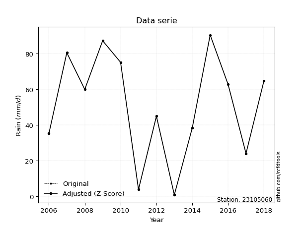</img>

</div>


> The initial value (value_initial) correspond to the initial obtained or null completed value, and value (value) is adjusted only when the initial value is outside the valid range (outlier) definite through the Z-Score value. If Z-Score is active, values out of range or outliers are replaced with the station mean value. A Z-Score (or standard score) measures how many standard deviations a data point is from the mean of a dataset, indicating its relative position; positive scores mean above the mean, negative mean below, and a score of zero is exactly at the mean, allowing for comparison of values from different distributions. It´s calculated using the formula $z=(x–μ)/σ$, where $x$ is the data point, $μ$ is the mean, and $σ$ is the standard deviation, helping identify outliers and understand probability.
>
> <sub>**Note**: In this study, "completing" (filling gaps in) and "extending" (forecasting or lengthening the historical record) rainfall data series are avoided for certain critical analyses because they introduce artificial bias and uncertainty, which can distort the statistics of rare events (extremes), alter day-to-day variability, and compromise the integrity and homogeneity of the original data. Some reasons against Completing/Extending rainfall data are: **Distortion of Extremes and Variability**: The primary issue is that most gap-filling or extension methods rely on averaging or regression with nearby stations, which inherently smooths the data. Rainfall is highly variable in space and time, with a large percentage of zero values and occasional large storms. Infilling methods often underestimate the highest values and overestimate the lowest (zero) values, which severely distorts analyses focused on flood frequency, drought severity, and intensity-duration-frequency (IDF) curves, **Loss of Data Homogeneity**: Infilled or extended data are synthetic estimates, not actual measurements. Combining these estimates with observed data can violate the assumption of data homogeneity, which requires that the data properties do not change over time. Inhomogeneity can lead to incorrect conclusions about long-term trends or changes in climate patterns, **Propagation of Errors**: Errors and biases from the original data (e.g., wind-induced undercatch, instrument errors, site changes) or the data used for imputation can propagate through the analysis, leading to unreliable hydrological models and inaccurate predictions, **Compromised Statistical Integrity**: For statistical analyses, especially those involving the frequency of events, using artificial data can introduce time bias or autocorrelation that doesn´t exist in reality, making it difficult to assess the true probability of events, **Difficulty in Validation**: It is difficult to accurately validate the quality of filled or extended data, especially for past periods where ground-truth measurements are unavailable. The reliability of imputation techniques heavily depends on the density of the surrounding station network and the complexity of the local topography.</sub>


### 4. Active continuous probability distributions from SciPy (80 of 104 available)

A Probability Density Function (PDF) describes the relative likelihood of a continuous random variable falling within a specific range, where the total area under its curve equals 1, and the area over any interval gives the actual probability for that range. Unlike discrete probabilities (like rolling a die), a PDF shows density, not direct probability for a single point (which is zero), with higher points indicating higher likelihood, often visualized as a bell curve for normal distributions.

A log of a probability density function (log-PDF) is simply the logarithm of the PDF´s value, denoted as $log(f(x))$, useful for converting multiplication of probabilities into addition, improving numerical stability with tiny numbers, and connecting to information theory concepts like entropy. Instead of dealing with very small probabilities (e.g., 0.000001), log-PDFs use negative numbers (e.g., $log(0.00001) ≈ -11.51$ that are easier for computers to handle, preventing underflow errors and simplifying complex calculations. In this study, each active probability distribution from SciPy is also evaluated in the $log$ form.

[scipy.stats](https://docs.scipy.org/doc/scipy/reference/stats.html) is a Python´s powerful submodule within the SciPy library for comprehensive statistical analysis, offering over 130 probability distributions (like Normal, Poisson, etc.), functions for descriptive stats (mean, variance), hypothesis testing (t-tests, chi-square), random variable generation, and statistical tests, making it essential for data science, modeling, and research. It provides tools to explore, model, and draw conclusions from data efficiently, working seamlessly with [NumPy](https://numpy.org/).

<div align="center">

|   id | p_dist           |   n_parameter | fit_method   | label                                                                       | active   | ref                                                                                                      |
|-----:|:-----------------|--------------:|:-------------|:----------------------------------------------------------------------------|:---------|:---------------------------------------------------------------------------------------------------------|
|    0 | alpha            |             3 | MLE          | Alpha                                                                       | True     | [:mortar_board:](https://docs.scipy.org/doc/scipy/reference/generated/scipy.stats.alpha.html)            |
|    1 | anglit           |             2 | MM           | Anglit                                                                      | True     | [:mortar_board:](https://docs.scipy.org/doc/scipy/reference/generated/scipy.stats.anglit.html)           |
|    2 | arcsine          |             2 | MM           | Arcsine                                                                     | True     | [:mortar_board:](https://docs.scipy.org/doc/scipy/reference/generated/scipy.stats.arcsine.html)          |
|    3 | argus            |             3 | MLE          | Argus                                                                       | True     | [:mortar_board:](https://docs.scipy.org/doc/scipy/reference/generated/scipy.stats.argus.html)            |
|    4 | beta             |             4 | MLE          | Beta                                                                        | True     | [:mortar_board:](https://docs.scipy.org/doc/scipy/reference/generated/scipy.stats.beta.html)             |
|    5 | betaprime        |             4 | MLE          | Beta prime                                                                  | True     | [:mortar_board:](https://docs.scipy.org/doc/scipy/reference/generated/scipy.stats.betaprime.html)        |
|    6 | bradford         |             3 | MLE          | Bradford                                                                    | True     | [:mortar_board:](https://docs.scipy.org/doc/scipy/reference/generated/scipy.stats.bradford.html)         |
|    7 | burr             |             4 | MLE          | Burr (Type III)                                                             | True     | [:mortar_board:](https://docs.scipy.org/doc/scipy/reference/generated/scipy.stats.burr.html)             |
|    8 | burr12           |             4 | MLE          | Burr (Type III) 12                                                          | True     | [:mortar_board:](https://docs.scipy.org/doc/scipy/reference/generated/scipy.stats.burr12.html)           |
|    9 | cosine           |             2 | MLE          | Cosine                                                                      | True     | [:mortar_board:](https://docs.scipy.org/doc/scipy/reference/generated/scipy.stats.cosine.html)           |
|   10 | crystalball      |             4 | MLE          | Crystalball                                                                 | True     | [:mortar_board:](https://docs.scipy.org/doc/scipy/reference/generated/scipy.stats.crystalball.html)      |
|   11 | dgamma           |             3 | MLE          | Double gamma                                                                | True     | [:mortar_board:](https://docs.scipy.org/doc/scipy/reference/generated/scipy.stats.dgamma.html)           |
|   12 | dweibull         |             3 | MLE          | Double Weibull                                                              | True     | [:mortar_board:](https://docs.scipy.org/doc/scipy/reference/generated/scipy.stats.dweibull.html)         |
|   13 | erlang           |             3 | MLE          | Erlang                                                                      | True     | [:mortar_board:](https://docs.scipy.org/doc/scipy/reference/generated/scipy.stats.erlang.html)           |
|   14 | exponnorm        |             3 | MLE          | Exponentially modified Normal                                               | True     | [:mortar_board:](https://docs.scipy.org/doc/scipy/reference/generated/scipy.stats.exponnorm.html)        |
|   15 | exponpow         |             3 | MLE          | Exponential power                                                           | True     | [:mortar_board:](https://docs.scipy.org/doc/scipy/reference/generated/scipy.stats.exponpow.html)         |
|   16 | exponweib        |             4 | MLE          | Exponentiated Weibull                                                       | True     | [:mortar_board:](https://docs.scipy.org/doc/scipy/reference/generated/scipy.stats.exponweib.html)        |
|   17 | f                |             4 | MLE          | F                                                                           | True     | [:mortar_board:](https://docs.scipy.org/doc/scipy/reference/generated/scipy.stats.f.html)                |
|   18 | fatiguelife      |             3 | MLE          | Fatigue-life (Birnbaum-Saunders)                                            | True     | [:mortar_board:](https://docs.scipy.org/doc/scipy/reference/generated/scipy.stats.fatiguelife.html)      |
|   19 | foldnorm         |             3 | MM           | Fold Normal                                                                 | True     | [:mortar_board:](https://docs.scipy.org/doc/scipy/reference/generated/scipy.stats.foldnorm.html)         |
|   20 | gamma            |             3 | MLE          | Gamma                                                                       | True     | [:mortar_board:](https://docs.scipy.org/doc/scipy/reference/generated/scipy.stats.gamma.html)            |
|   21 | gausshyper       |             6 | MLE          | Gauss hypergeometric                                                        | True     | [:mortar_board:](https://docs.scipy.org/doc/scipy/reference/generated/scipy.stats.gausshyper.html)       |
|   22 | genexpon         |             5 | MLE          | Generalized exponential                                                     | True     | [:mortar_board:](https://docs.scipy.org/doc/scipy/reference/generated/scipy.stats.genexpon.html)         |
|   23 | genextreme       |             3 | MLE          | Generalized exponential                                                     | True     | [:mortar_board:](https://docs.scipy.org/doc/scipy/reference/generated/scipy.stats.genextreme.html)       |
|   24 | gengamma         |             4 | MLE          | Generalized gamma                                                           | True     | [:mortar_board:](https://docs.scipy.org/doc/scipy/reference/generated/scipy.stats.gengamma.html)         |
|   25 | genhalflogistic  |             3 | MLE          | Generalized half-logistic                                                   | True     | [:mortar_board:](https://docs.scipy.org/doc/scipy/reference/generated/scipy.stats.genhalflogistic.html)  |
|   26 | genlogistic      |             3 | MLE          | Generalized logistic                                                        | True     | [:mortar_board:](https://docs.scipy.org/doc/scipy/reference/generated/scipy.stats.genlogistic.html)      |
|   27 | gennorm          |             3 | MLE          | Generalized Normal                                                          | True     | [:mortar_board:](https://docs.scipy.org/doc/scipy/reference/generated/scipy.stats.gennorm.html)          |
|   28 | genpareto        |             3 | MLE          | Generalized Pareto                                                          | True     | [:mortar_board:](https://docs.scipy.org/doc/scipy/reference/generated/scipy.stats.genpareto.html)        |
|   29 | gompertz         |             3 | MLE          | Gompertz (or truncated Gumbel)                                              | True     | [:mortar_board:](https://docs.scipy.org/doc/scipy/reference/generated/scipy.stats.gompertz.html)         |
|   30 | gumbel_l         |             2 | MM           | Gumbel Left Skew                                                            | True     | [:mortar_board:](https://docs.scipy.org/doc/scipy/reference/generated/scipy.stats.gumbel_l.html)         |
|   31 | gumbel_r         |             2 | MM           | Gumbel Right Skew                                                           | True     | [:mortar_board:](https://docs.scipy.org/doc/scipy/reference/generated/scipy.stats.gumbel_r.html)         |
|   32 | halfgennorm      |             3 | MLE          | Upper half of a generalized normal                                          | True     | [:mortar_board:](https://docs.scipy.org/doc/scipy/reference/generated/scipy.stats.halfgennorm.html)      |
|   33 | halflogistic     |             2 | MM           | Half-logistic                                                               | True     | [:mortar_board:](https://docs.scipy.org/doc/scipy/reference/generated/scipy.stats.halflogistic.html)     |
|   34 | halfnorm         |             2 | MM           | Half Normal                                                                 | True     | [:mortar_board:](https://docs.scipy.org/doc/scipy/reference/generated/scipy.stats.halfnorm.html)         |
|   35 | hypsecant        |             2 | MM           | hyperbolic secant                                                           | True     | [:mortar_board:](https://docs.scipy.org/doc/scipy/reference/generated/scipy.stats.hypsecant.html)        |
|   36 | invgamma         |             3 | MLE          | Inverted gamma                                                              | True     | [:mortar_board:](https://docs.scipy.org/doc/scipy/reference/generated/scipy.stats.invgamma.html)         |
|   37 | invgauss         |             3 | MLE          | Inverse Gaussian                                                            | True     | [:mortar_board:](https://docs.scipy.org/doc/scipy/reference/generated/scipy.stats.invgauss.html)         |
|   38 | invweibull       |             3 | MLE          | Inverted Weibull                                                            | True     | [:mortar_board:](https://docs.scipy.org/doc/scipy/reference/generated/scipy.stats.invweibull.html)       |
|   39 | johnsonsb        |             4 | MLE          | Johnson SB                                                                  | True     | [:mortar_board:](https://docs.scipy.org/doc/scipy/reference/generated/scipy.stats.johnsonsb.html)        |
|   40 | johnsonsu        |             4 | MLE          | Johnson Su                                                                  | True     | [:mortar_board:](https://docs.scipy.org/doc/scipy/reference/generated/scipy.stats.johnsonsu.html)        |
|   41 | kappa3           |             3 | MLE          | Kappa 3                                                                     | True     | [:mortar_board:](https://docs.scipy.org/doc/scipy/reference/generated/scipy.stats.kappa3.html)           |
|   42 | kappa4           |             4 | MLE          | Kappa 4                                                                     | True     | [:mortar_board:](https://docs.scipy.org/doc/scipy/reference/generated/scipy.stats.kappa4.html)           |
|   43 | ksone            |             3 | MLE          | Kolmogorov-Smirnov one-sided test statistic distribution                    | True     | [:mortar_board:](https://docs.scipy.org/doc/scipy/reference/generated/scipy.stats.ksone.html)            |
|   44 | kstwobign        |             2 | MLE          | Limiting distribution of scaled Kolmogorov-Smirnov two-sided test statistic | True     | [:mortar_board:](https://docs.scipy.org/doc/scipy/reference/generated/scipy.stats.kstwobign.html)        |
|   45 | laplace          |             2 | MM           | Laplace                                                                     | True     | [:mortar_board:](https://docs.scipy.org/doc/scipy/reference/generated/scipy.stats.laplace.html)          |
|   46 | levy_l           |             2 | MLE          | Left-skewed Levy                                                            | True     | [:mortar_board:](https://docs.scipy.org/doc/scipy/reference/generated/scipy.stats.levy_l.html)           |
|   47 | loggamma         |             3 | MLE          | Log gamma                                                                   | True     | [:mortar_board:](https://docs.scipy.org/doc/scipy/reference/generated/scipy.stats.loggamma.html)         |
|   48 | logistic         |             2 | MM           | Logistic (or Sech-squared)                                                  | True     | [:mortar_board:](https://docs.scipy.org/doc/scipy/reference/generated/scipy.stats.logistic.html)         |
|   49 | loglaplace       |             3 | MLE          | Log-Laplace                                                                 | True     | [:mortar_board:](https://docs.scipy.org/doc/scipy/reference/generated/scipy.stats.loglaplace.html)       |
|   50 | lomax            |             3 | MLE          | Lomax (Pareto of the second kind)                                           | True     | [:mortar_board:](https://docs.scipy.org/doc/scipy/reference/generated/scipy.stats.lomax.html)            |
|   51 | maxwell          |             2 | MM           | Maxwell                                                                     | True     | [:mortar_board:](https://docs.scipy.org/doc/scipy/reference/generated/scipy.stats.maxwell.html)          |
|   52 | mielke           |             4 | MLE          | Mielke Beta-Kappa / Dagum                                                   | True     | [:mortar_board:](https://docs.scipy.org/doc/scipy/reference/generated/scipy.stats.mielke.html)           |
|   53 | moyal            |             2 | MM           | Moyal                                                                       | True     | [:mortar_board:](https://docs.scipy.org/doc/scipy/reference/generated/scipy.stats.moyal.html)            |
|   54 | nakagami         |             3 | MLE          | Nakagami                                                                    | True     | [:mortar_board:](https://docs.scipy.org/doc/scipy/reference/generated/scipy.stats.nakagami.html)         |
|   55 | ncf              |             5 | MLE          | Non-central F distribution                                                  | True     | [:mortar_board:](https://docs.scipy.org/doc/scipy/reference/generated/scipy.stats.ncf.html)              |
|   56 | nct              |             4 | MLE          | Non-central Student’s t                                                     | True     | [:mortar_board:](https://docs.scipy.org/doc/scipy/reference/generated/scipy.stats.nct.html)              |
|   57 | norm             |             2 | MM           | Normal                                                                      | True     | [:mortar_board:](https://docs.scipy.org/doc/scipy/reference/generated/scipy.stats.norm.html)             |
|   58 | pearson3         |             3 | MM           | Pearson type III                                                            | True     | [:mortar_board:](https://docs.scipy.org/doc/scipy/reference/generated/scipy.stats.pearson3.html)         |
|   59 | powerlaw         |             3 | MLE          | Power-function                                                              | True     | [:mortar_board:](https://docs.scipy.org/doc/scipy/reference/generated/scipy.stats.powerlaw.html)         |
|   60 | rayleigh         |             2 | MM           | Rayleigh                                                                    | True     | [:mortar_board:](https://docs.scipy.org/doc/scipy/reference/generated/scipy.stats.rayleigh.html)         |
|   61 | rdist            |             3 | MLE          | R-distributed (symmetric beta)                                              | True     | [:mortar_board:](https://docs.scipy.org/doc/scipy/reference/generated/scipy.stats.rdist.html)            |
|   62 | rice             |             3 | MLE          | Rice                                                                        | True     | [:mortar_board:](https://docs.scipy.org/doc/scipy/reference/generated/scipy.stats.rice.html)             |
|   63 | semicircular     |             2 | MM           | Semicircular                                                                | True     | [:mortar_board:](https://docs.scipy.org/doc/scipy/reference/generated/scipy.stats.semicircular.html)     |
|   64 | skewnorm         |             3 | MLE          | Skew normal                                                                 | True     | [:mortar_board:](https://docs.scipy.org/doc/scipy/reference/generated/scipy.stats.skewnorm.html)         |
|   65 | t                |             3 | MLE          | Student’s t                                                                 | True     | [:mortar_board:](https://docs.scipy.org/doc/scipy/reference/generated/scipy.stats.t.html)                |
|   66 | trapezoid        |             4 | MLE          | Trapezoid                                                                   | True     | [:mortar_board:](https://docs.scipy.org/doc/scipy/reference/generated/scipy.stats.trapezoid.html)        |
|   67 | triang           |             3 | MLE          | Triangular                                                                  | True     | [:mortar_board:](https://docs.scipy.org/doc/scipy/reference/generated/scipy.stats.triang.html)           |
|   68 | truncexpon       |             3 | MLE          | Truncated exponential                                                       | True     | [:mortar_board:](https://docs.scipy.org/doc/scipy/reference/generated/scipy.stats.truncexpon.html)       |
|   69 | truncnorm        |             4 | MLE          | Truncated normal                                                            | True     | [:mortar_board:](https://docs.scipy.org/doc/scipy/reference/generated/scipy.stats.truncnorm.html)        |
|   70 | truncpareto      |             4 | MLE          | Upper truncated Pareto                                                      | True     | [:mortar_board:](https://docs.scipy.org/doc/scipy/reference/generated/scipy.stats.truncpareto.html)      |
|   71 | truncweibull_min |             5 | MLE          | Doubly truncated Weibull minimum                                            | True     | [:mortar_board:](https://docs.scipy.org/doc/scipy/reference/generated/scipy.stats.truncweibull_min.html) |
|   72 | tukeylambda      |             3 | MLE          | Tukey-Lamdba                                                                | True     | [:mortar_board:](https://docs.scipy.org/doc/scipy/reference/generated/scipy.stats.tukeylambda.html)      |
|   73 | uniform          |             2 | MLE          | Uniform                                                                     | True     | [:mortar_board:](https://docs.scipy.org/doc/scipy/reference/generated/scipy.stats.uniform.html)          |
|   74 | vonmises         |             3 | MLE          | Von Mises                                                                   | True     | [:mortar_board:](https://docs.scipy.org/doc/scipy/reference/generated/scipy.stats.vonmises.html)         |
|   75 | vonmises_line    |             3 | MLE          | Von Mises line                                                              | True     | [:mortar_board:](https://docs.scipy.org/doc/scipy/reference/generated/scipy.stats.vonmises_line.html)    |
|   76 | wald             |             2 | MM           | Wald                                                                        | True     | [:mortar_board:](https://docs.scipy.org/doc/scipy/reference/generated/scipy.stats.wald.html)             |
|   77 | weibull_max      |             3 | MLE          | Weibull maximum                                                             | True     | [:mortar_board:](https://docs.scipy.org/doc/scipy/reference/generated/scipy.stats.weibull_max.html)      |
|   78 | weibull_min      |             3 | MLE          | Weibull minimum                                                             | True     | [:mortar_board:](https://docs.scipy.org/doc/scipy/reference/generated/scipy.stats.weibull_min.html)      |
|   79 | wrapcauchy       |             3 | MLE          | Wrapped  Cauchy                                                             | True     | [:mortar_board:](https://docs.scipy.org/doc/scipy/reference/generated/scipy.stats.wrapcauchy.html)       |

</div>

> **n_parameter:** # arguments & localization & scale.
>
> **Fit methods:** (MLE) maximum likelihood, (MM) L-moments.
>
>**Inactive** (With the only purpose of prevent loops, zero divisions, infinite values, over high estimated values or horizontal trending for recurrence intervals estimations, the follow distributions were disabled.)**:** lognorm, norminvgauss, powernorm, powerlognorm, cauchy, halfcauchy, foldcauchy, skewcauchy, chi2, expon, fisk, genhyperbolic, geninvgauss, gibrat, kstwo, laplace_asymmetric, levy, levy_stable, ncx2, pareto, rel_breitwigner, recipinvgauss, studentized_range, loguniform, 


## B. Probability (PDF) vs. Empirical (EDF) distributions functions

A continuous probability distribution (CPD) describes probabilities for variables that can take any value within a range (like rain any time), unlike discrete variables with specific outcomes (like temperature). It uses a Probability Density Function (PDF), a curve where the total area under it equals 1, and the probability of the variable falling within an interval (a to b) is found by calculating the area under the curve between those points. A key feature is that the probability of hitting any single exact value is zero, so probabilities are always expressed for ranges, e.g., $P(a ≤ X ≤ b)$.

<div align="center">

Distributions parameters from station values
|     |   station | p_dist              |   n |             loc |           scale | shape                  | shape1                 | shape2             | shape3             |
|----:|----------:|:--------------------|----:|----------------:|----------------:|:-----------------------|:-----------------------|:-------------------|:-------------------|
|   0 |  23105060 | alpha               |  13 |    -0.00313901  |     3.17391     | 3.3445487846913184e-09 |                        |                    |                    |
|   1 |  23105060 | anglit              |  13 |    51.4462      |    83.6964      |                        |                        |                    |                    |
|   2 |  23105060 | arcsine             |  13 |    10.9851      |    80.922       |                        |                        |                    |                    |
|   3 |  23105060 | argus               |  13 |   -19.7348      |   113.453       | 1.2740284470723355     |                        |                    |                    |
|   4 |  23105060 | beta                |  13 |   -11.4765      |   101.976       | 1.3129808531166722     | 0.8008943548164956     |                    |                    |
|   5 |  23105060 | betaprime           |  13 |  -820.326       | 73077.3         | 920.5848386993256      | 77170.56697896533      |                    |                    |
|   6 |  23105060 | bradford            |  13 |   -10.9152      |   101.415       | 0.0020554531440756486  |                        |                    |                    |
|   7 |  23105060 | burr                |  13 |    -0.218058    |    92.0979      | 160.90253913817685     | 0.006247106842849775   |                    |                    |
|   8 |  23105060 | burr12              |  13 |  -275.364       |   656.77        | 13.758132993378844     | 8731.854008045633      |                    |                    |
|   9 |  23105060 | cosine              |  13 |    49.7038      |    23.6424      |                        |                        |                    |                    |
|  10 |  23105060 | crystalball         |  13 |    51.4462      |    28.6103      | 8067.701571838688      | 17463.394622187247     |                    |                    |
|  11 |  23105060 | dgamma              |  13 |    51.8112      |     8.90057     | 2.7810537747993065     |                        |                    |                    |
|  12 |  23105060 | dweibull            |  13 |    51.2245      |    28.0321      | 1.8337997481268182     |                        |                    |                    |
|  13 |  23105060 | erlang              |  13 |  -417.379       |     1.79812     | 260.7135359882727      |                        |                    |                    |
|  14 |  23105060 | exponnorm           |  13 |    51.4265      |    28.6103      | 0.0006889223076604882  |                        |                    |                    |
|  15 |  23105060 | exponpow            |  13 |     0.9         |     3.81374     | 0.14880367018198987    |                        |                    |                    |
|  16 |  23105060 | exponweib           |  13 |     0.9         |     3.43705     | 2.099731564258777      | 0.28827740876879293    |                    |                    |
|  17 |  23105060 | f                   |  13 | -6702.75        |  6754.06        | 120306.87234460175     | 1393067.88294787       |                    |                    |
|  18 |  23105060 | fatiguelife         |  13 | -3007.17        |  3058.58        | 0.009340333864164455   |                        |                    |                    |
|  19 |  23105060 | foldnorm            |  13 |  -170.089       |    27.3657      | 8.106697345727124      |                        |                    |                    |
|  20 |  23105060 | gamma               |  13 |  -412.721       |     1.83521     | 252.91900088478565     |                        |                    |                    |
|  21 |  23105060 | gausshyper          |  13 |    -9.90935     |   100.409       | 1.3509015463926186     | 0.7483045463727805     | 1.0044989587022797 | 0.6838351318423157 |
|  22 |  23105060 | genexpon            |  13 |     0.899964    |     2.54664     | 0.051191229042472974   | 1.3908356315091317e-06 | 2.740448335518824  |                    |
|  23 |  23105060 | genextreme          |  13 |    49.5347      |    35.5512      | 0.852464159776017      |                        |                    |                    |
|  24 |  23105060 | gengamma            |  13 |  -328.779       |    48.4804      | 48.817511750735406     | 1.8859291912649288     |                    |                    |
|  25 |  23105060 | genhalflogistic     |  13 |    -9.82052     |   111.955       | 1.115973368874117      |                        |                    |                    |
|  26 |  23105060 | genlogistic         |  13 |    90.5002      |     6.12189e-06 | 1.5662105224653427e-07 |                        |                    |                    |
|  27 |  23105060 | gennorm             |  13 |    45.7         |    44.8001      | 9860475.17277519       |                        |                    |                    |
|  28 |  23105060 | genpareto           |  13 |    -0.328394    |   121.368       | -1.3362387435508332    |                        |                    |                    |
|  29 |  23105060 | gompertz            |  13 |    24.1         |     7.0458      | 0.00042761207117331254 |                        |                    |                    |
|  30 |  23105060 | gumbel_l            |  13 |    64.3223      |    22.3073      |                        |                        |                    |                    |
|  31 |  23105060 | gumbel_r            |  13 |    38.57        |    22.3073      |                        |                        |                    |                    |
|  32 |  23105060 | halfgennorm         |  13 |     0.9         |     3.97591     | 0.40456929522894225    |                        |                    |                    |
|  33 |  23105060 | halflogistic        |  13 |    17.5363      |    24.4608      |                        |                        |                    |                    |
|  34 |  23105060 | halfnorm            |  13 |    13.5774      |    47.4614      |                        |                        |                    |                    |
|  35 |  23105060 | hypsecant           |  13 |    51.4462      |    18.2139      |                        |                        |                    |                    |
|  36 |  23105060 | invgamma            |  13 |  -298.082       | 48230.2         | 139.04237192164175     |                        |                    |                    |
|  37 |  23105060 | invgauss            |  13 |  -131.637       |  6572.43        | 0.027692532065221563   |                        |                    |                    |
|  38 |  23105060 | invweibull          |  13 |    -4.07301e+09 |     4.07301e+09 | 139363334.78375292     |                        |                    |                    |
|  39 |  23105060 | johnsonsb           |  13 |     0.9         |    89.6002      | 1.1837209295797533     | 0.15184388038039295    |                    |                    |
|  40 |  23105060 | johnsonsu           |  13 |    -1.91633e+09 |     4.97158e+09 | -69812210.32054222     | 185424985.16746324     |                    |                    |
|  41 |  23105060 | kappa3              |  13 |     0.9         |    89.5767      | 10065.292451724148     |                        |                    |                    |
|  42 |  23105060 | kappa4              |  13 |    -8.14093     |    99.9346      | 1.0995227438347288     | 1.0109006795863276     |                    |                    |
|  43 |  23105060 | ksone               |  13 |    -8.06        |   107.52        | 1.0                    |                        |                    |                    |
|  44 |  23105060 | kstwobign           |  13 |   -62.6599      |   130.263       |                        |                        |                    |                    |
|  45 |  23105060 | laplace             |  13 |    51.4462      |    20.2305      |                        |                        |                    |                    |
|  46 |  23105060 | levy_l              |  13 |    93.3966      |    15.6169      |                        |                        |                    |                    |
|  47 |  23105060 | loggamma            |  13 |    80.8175      |    14.2389      | 0.48055912454403027    |                        |                    |                    |
|  48 |  23105060 | logistic            |  13 |    51.4462      |    15.7737      |                        |                        |                    |                    |
|  49 |  23105060 | loglaplace          |  13 |    -0.155899    |    60.1559      | 1.262914229411224      |                        |                    |                    |
|  50 |  23105060 | lomax               |  13 |     0.9         |     7.8167e+10  | 1790885951.2134578     |                        |                    |                    |
|  51 |  23105060 | maxwell             |  13 |   -16.3482      |    42.4838      |                        |                        |                    |                    |
|  52 |  23105060 | mielke              |  13 |     0.9         |    91.2253      | 0.8262946341643145     | 82.34685213439121      |                    |                    |
|  53 |  23105060 | moyal               |  13 |    35.085       |    12.8791      |                        |                        |                    |                    |
|  54 |  23105060 | nakagami            |  13 |     0.9         |    44.1258      | 0.117677435402856      |                        |                    |                    |
|  55 |  23105060 | ncf                 |  13 |    -0.0940876   |    12.9454      | 1.7765465082587308     | 14.380924968578611     | 4.9844385293813005 |                    |
|  56 |  23105060 | nct                 |  13 | -2499.79        |    28.5913      | 2463757.784116118      | 89.23106447626532      |                    |                    |
|  57 |  23105060 | norm                |  13 |    51.4462      |    28.6103      |                        |                        |                    |                    |
|  58 |  23105060 | pearson3            |  13 |    51.4462      |    28.6102      | -0.37925296036584244   |                        |                    |                    |
|  59 |  23105060 | powerlaw            |  13 |     0.9         |    89.6         | 0.26009361349947807    |                        |                    |                    |
|  60 |  23105060 | rayleigh            |  13 |    -3.28695     |    43.6707      |                        |                        |                    |                    |
|  61 |  23105060 | rdist               |  13 |    -7.24191     |    52.2419      | 1.037672040263128      |                        |                    |                    |
|  62 |  23105060 | rice                |  13 |   -14.3251      |    31.9071      | 1.747326589144388      |                        |                    |                    |
|  63 |  23105060 | semicircular        |  13 |    51.4462      |    57.2205      |                        |                        |                    |                    |
|  64 |  23105060 | skewnorm            |  13 |    90.5         |    48.4155      | -74914836.02734014     |                        |                    |                    |
|  65 |  23105060 | t                   |  13 |    51.4462      |    28.6099      | 70685918.31746267      |                        |                    |                    |
|  66 |  23105060 | trapezoid           |  13 |   -30.2128      |   121.383       | 1.0                    | 1.0                    |                    |                    |
|  67 |  23105060 | triang              |  13 |   -20.8871      |   111.397       | 0.9999148633037636     |                        |                    |                    |
|  68 |  23105060 | truncexpon          |  13 |    -2.75478     |   161.47        | 0.5775351563724569     |                        |                    |                    |
|  69 |  23105060 | truncnorm           |  13 |    -1.76284     |    13.7882      | -6.603433071182666     | 6.691434414550328      |                    |                    |
|  70 |  23105060 | truncpareto         |  13 |     0.899902    |     9.77562e-05 | 0.08333820755035166    | 916566.8258871024      |                    |                    |
|  71 |  23105060 | truncweibull_min    |  13 |    -3.85424     |   155.057       | 1.410601820630109      | 0.0009982251664719553  | 0.6085120539402258 |                    |
|  72 |  23105060 | tukeylambda         |  13 |   -31.4184      |   128.749       | 1.0560258559362647     |                        |                    |                    |
|  73 |  23105060 | uniform             |  13 |     0.9         |    89.6         |                        |                        |                    |                    |
|  74 |  23105060 | vonmises            |  13 |    -0.233562    |     1           | 0.32638388567352256    |                        |                    |                    |
|  75 |  23105060 | vonmises_line       |  13 |    45.7         |    14.2603      | 0.011455535264279046   |                        |                    |                    |
|  76 |  23105060 | wald                |  13 |    22.8359      |    28.6103      |                        |                        |                    |                    |
|  77 |  23105060 | weibull_max         |  13 |    90.5         |     1.53466     | 0.26123273675632863    |                        |                    |                    |
|  78 |  23105060 | weibull_min         |  13 |  -265.818       |   330           | 13.566889738361391     |                        |                    |                    |
|  79 |  23105060 | wrapcauchy          |  13 |     0.899969    |    14.2603      | 0.13193690343961867    |                        |                    |                    |
|  80 |  23105060 | logalpha            |  13 |   -54.2084      |  2357.78        | 40.88390706460545      |                        |                    |                    |
|  81 |  23105060 | loganglit           |  13 |     3.50356     |     3.84204     |                        |                        |                    |                    |
|  82 |  23105060 | logarcsine          |  13 |     1.64624     |     3.71465     |                        |                        |                    |                    |
|  83 |  23105060 | logargus            |  13 |    -1.618       |     6.19613     | 3.2410851400932357     |                        |                    |                    |
|  84 |  23105060 | logbeta             |  13 |    -0.568168    |     5.07352     | 0.6904015268908033     | 0.14776074460275815    |                    |                    |
|  85 |  23105060 | logbetaprime        |  13 |  -132.325       |  1058.47        | 11685.8699726159       | 91057.68959766257      |                    |                    |
|  86 |  23105060 | logbradford         |  13 |    -0.77299     |     5.27835     | 1.720082341984736e-07  |                        |                    |                    |
|  87 |  23105060 | logburr             |  13 |    -1.77181e+08 |     1.77181e+08 | 407296114.4260168      | 0.42526154496393026    |                    |                    |
|  88 |  23105060 | logburr12           |  13 | -2989.28        |  2999.53        | 4263.947408516136      | 7139.023301694279      |                    |                    |
|  89 |  23105060 | logcosine           |  13 |     3.13734     |     1.2725      |                        |                        |                    |                    |
|  90 |  23105060 | logcrystalball      |  13 |     4.50536     |     2.73473e-06 | 2.8014492307764565e-06 | 111.18437331269715     |                    |                    |
|  91 |  23105060 | logdgamma           |  13 |     4.17131     |     0.88977     | 0.75936738204336       |                        |                    |                    |
|  92 |  23105060 | logdweibull         |  13 |     4.13996     |     0.807407    | 0.7671054568890746     |                        |                    |                    |
|  93 |  23105060 | logerlang           |  13 |   -22.5117      |     0.0752546   | 345.49748927382166     |                        |                    |                    |
|  94 |  23105060 | logexponnorm        |  13 |     3.50281     |     1.31332     | 0.0005787148273244477  |                        |                    |                    |
|  95 |  23105060 | logexponpow         |  13 |    -0.105361    |     2.89032     | 0.5363237710421926     |                        |                    |                    |
|  96 |  23105060 | logexponweib        |  13 |    -5.95686e+07 |     5.95686e+07 | 0.10361135446478341    | 567182119.4755691      |                    |                    |
|  97 |  23105060 | logf                |  13 |    -0.105361    |     1.17002     | 1.3830861108208126     | 1.2461328584486693     |                    |                    |
|  98 |  23105060 | logfatiguelife      |  13 | -1245.17        |  1248.68        | 0.0010493549906963658  |                        |                    |                    |
|  99 |  23105060 | logfoldnorm         |  13 |  -241.079       |     1.09317     | 223.7787569464889      |                        |                    |                    |
| 100 |  23105060 | loggamma            |  13 |   -19.2887      |     0.0866965   | 262.3123932151004      |                        |                    |                    |
| 101 |  23105060 | loggausshyper       |  13 |    -0.720535    |     5.22589     | 1.6047048819432703     | 0.5117383047779136     | 0.9168439986331939 | 0.6562377691314337 |
| 102 |  23105060 | loggenexpon         |  13 |    -0.105361    |     1.06925e+10 | 538098087.728588       | 19987560251.96107      | 663517438.8552154  |                    |
| 103 |  23105060 | loggenextreme       |  13 |     3.47471     |     1.29793     | 1.259342059626503      |                        |                    |                    |
| 104 |  23105060 | loggengamma         |  13 |   -24.906       |     0.623274    | 217.5327419598757      | 1.4096354906406763     |                    |                    |
| 105 |  23105060 | loggenhalflogistic  |  13 |    -0.526286    |     7.74072     | 1.5384095653759937     |                        |                    |                    |
| 106 |  23105060 | loggenlogistic      |  13 |     4.50539     |     9.19559e-07 | 9.164479597473086e-07  |                        |                    |                    |
| 107 |  23105060 | loggennorm          |  13 |     4.13996     |     0.114555    | 0.4795129878281654     |                        |                    |                    |
| 108 |  23105060 | loggenpareto        |  13 |    -0.357342    |    10.0249      | -2.0615968370078575    |                        |                    |                    |
| 109 |  23105060 | loggompertz         |  13 |    -0.105363    |     0.712546    | 0.003119358200080315   |                        |                    |                    |
| 110 |  23105060 | loggumbel_l         |  13 |     4.09463     |     1.02399     |                        |                        |                    |                    |
| 111 |  23105060 | loggumbel_r         |  13 |     2.9125      |     1.02399     |                        |                        |                    |                    |
| 112 |  23105060 | loghalfgennorm      |  13 |    -0.105361    |     2.59523     | 0.879849576188612      |                        |                    |                    |
| 113 |  23105060 | loghalflogistic     |  13 |     1.94701     |     1.12282     |                        |                        |                    |                    |
| 114 |  23105060 | loghalfnorm         |  13 |     1.76526     |     2.17865     |                        |                        |                    |                    |
| 115 |  23105060 | loghypsecant        |  13 |     3.50357     |     0.836086    |                        |                        |                    |                    |
| 116 |  23105060 | loginvgamma         |  13 |   -33.7097      | 26937.2         | 724.9426982144109      |                        |                    |                    |
| 117 |  23105060 | loginvgauss         |  13 |   -12.4683      |  1879.58        | 0.008471172186380127   |                        |                    |                    |
| 118 |  23105060 | loginvweibull       |  13 |    -4.70237e+08 |     4.70237e+08 | 280873167.4802538      |                        |                    |                    |
| 119 |  23105060 | logjohnsonsb        |  13 |    -0.105361    |     4.61247     | 0.5342002755453414     | 0.16902411278976587    |                    |                    |
| 120 |  23105060 | logjohnsonsu        |  13 |     4.52641     |     0.000563935 | 5.065165621614266      | 0.6886468446102889     |                    |                    |
| 121 |  23105060 | logkappa3           |  13 |    -0.105437    |     4.61078     | 199903.58640438883     |                        |                    |                    |
| 122 |  23105060 | logkappa4           |  13 |    -0.448134    |     5.84515     | 1.0618419073883305     | 1.180007082855322      |                    |                    |
| 123 |  23105060 | logksone            |  13 |    -0.566432    |     5.53285     | 1.0                    |                        |                    |                    |
| 124 |  23105060 | logkstwobign        |  13 |    -3.53693     |     8.0838      |                        |                        |                    |                    |
| 125 |  23105060 | loglaplace          |  13 |     3.50357     |     0.928659    |                        |                        |                    |                    |
| 126 |  23105060 | loglevy_l           |  13 |     4.5472      |     0.218331    |                        |                        |                    |                    |
| 127 |  23105060 | logloggamma         |  13 |     4.50539     |     3.93094e-06 | 3.918323839058445e-06  |                        |                    |                    |
| 128 |  23105060 | loglogistic         |  13 |     3.50357     |     0.724072    |                        |                        |                    |                    |
| 129 |  23105060 | logloglaplace       |  13 |    -0.105361    |     1.9743      | 0.6921757213848153     |                        |                    |                    |
| 130 |  23105060 | loglomax            |  13 |    -0.105361    |     1.65816     | 0.8449685496066065     |                        |                    |                    |
| 131 |  23105060 | logmaxwell          |  13 |     0.391512    |     1.95019     |                        |                        |                    |                    |
| 132 |  23105060 | logmielke           |  13 |    -0.105361    |     4.30259     | 0.6210607654283582     | 1.87312486765809       |                    |                    |
| 133 |  23105060 | logmoyal            |  13 |     2.75253     |     0.591202    |                        |                        |                    |                    |
| 134 |  23105060 | lognakagami         |  13 | -1386.19        |  1389.7         | 279573.7886244805      |                        |                    |                    |
| 135 |  23105060 | logncf              |  13 |    -0.105361    |     1.12935     | 1.1484304119832962     | 1.3982781533605053     | 1.0384562793531322 |                    |
| 136 |  23105060 | lognct              |  13 |   -93.4435      |     1.29174     | 71770.55690079802      | 75.0503860904841       |                    |                    |
| 137 |  23105060 | lognorm             |  13 |     3.50357     |     1.31332     |                        |                        |                    |                    |
| 138 |  23105060 | logpearson3         |  13 |     3.50357     |     1.31333     | -1.797531670995554     |                        |                    |                    |
| 139 |  23105060 | logpowerlaw         |  13 |    -0.105361    |     4.61071     | 0.30407696978872495    |                        |                    |                    |
| 140 |  23105060 | lograyleigh         |  13 |     0.991132    |     2.00464     |                        |                        |                    |                    |
| 141 |  23105060 | logrdist            |  13 |     0.437935    |     2.74428     | 0.9662598014005865     |                        |                    |                    |
| 142 |  23105060 | logrice             |  13 |  -504.223       |     1.31332     | 386.59765904252913     |                        |                    |                    |
| 143 |  23105060 | logsemicircular     |  13 |     3.50356     |     2.6267      |                        |                        |                    |                    |
| 144 |  23105060 | logskewnorm         |  13 |     4.50535     |     1.6519      | -16857386.386321567    |                        |                    |                    |
| 145 |  23105060 | logt                |  13 |     4.11661     |     0.357863    | 1.152542157797512      |                        |                    |                    |
| 146 |  23105060 | logtrapezoid        |  13 |    -0.22162     |     5.57195     | 1.0                    | 1.0                    |                    |                    |
| 147 |  23105060 | logtriang           |  13 |    -0.255047    |     4.76045     | 0.9999889356921661     |                        |                    |                    |
| 148 |  23105060 | logtruncexpon       |  13 |    -0.39299     |     5.38961     | 0.9088484142785516     |                        |                    |                    |
| 149 |  23105060 | logtruncnorm        |  13 |     0.267142    |     3.60928     | -0.1032072607360636    | 1.1742537870740177     |                    |                    |
| 150 |  23105060 | logtruncpareto      |  13 |    -0.105369    |     8.53075e-06 | 0.00017551299467300573 | 540483.433282069       |                    |                    |
| 151 |  23105060 | logtruncweibull_min |  13 |    -0.20108     |     9.29799     | 1.5269304827361996     | 0.0024109570289757585  | 0.5061771013675229 |                    |
| 152 |  23105060 | logtukeylambda      |  13 |    -1.07118     |     5.74974     | 1.031061248685139      |                        |                    |                    |
| 153 |  23105060 | loguniform          |  13 |    -0.105361    |     4.61071     |                        |                        |                    |                    |
| 154 |  23105060 | logvonmises         |  13 |    -2.2043      |     1           | 1.8388480280723547     |                        |                    |                    |
| 155 |  23105060 | logvonmises_line    |  13 |     3.78709     |     1.23901     | 1.898927207210853      |                        |                    |                    |
| 156 |  23105060 | logwald             |  13 |     2.19021     |     1.31334     |                        |                        |                    |                    |
| 157 |  23105060 | logweibull_max      |  13 |     4.50535     |     1.88786     | 0.6115256842122117     |                        |                    |                    |
| 158 |  23105060 | logweibull_min      |  13 |    -1.58705e+08 |     1.58705e+08 | 225455644.40873173     |                        |                    |                    |
| 159 |  23105060 | logwrapcauchy       |  13 |    -0.105367    |     0.733818    | 0.6149969168213247     |                        |                    |                    |

</div>

> **loc** (Location parameter): This shifts the distribution along the x-axis. For many common distributions, like the normal (Gaussian) distribution, loc represents the mean $μ$. For others, like the uniform distribution, it might represent the minimum value, or for the beta distribution, the left end of the support interval.
>
> **scale** (Scale parameter): This determines the width or spread of the distribution. For the normal distribution, scale represents the standard deviation $σ$. For a uniform distribution, it defines the length of the interval (from $loc$ to $loc + scale$).
>
> **shape** (Shape parameters): Refers to parameters that define the specific form of a probability distribution, distinct from its location (loc) and scale (scale). These parameters are required arguments for most distribution functions. For example, a normal (Gaussian) distribution is fully defined by its location (mean) and scale (standard deviation), so it has no specific shape parameters beyond loc and scale. However, other distributions have intrinsic properties that need specification, as Gamma distribution that takes a shape parameter, often named $a$ or $alpha$.


### 0. Cumulative distribution values - CDF (160 evaluated)

Cumulative Distribution Function (CDF), denoted as $F$<sub>$X$</sub>$(x)$, is a function that gives the probability that a random variable $X$ will take a value less than or equal to a specific value, $x$ (i.e., $(P(X≥x)$. It essentially "accumulates" probabilities from a given point up to the far right (positive infinity), providing a complete picture of the distribution´s probabilities for both discrete (like rain) and continuous (like temperature) variables, helping to find probabilities over ranges or above certain values. Each station is evaluated separately ordering the $x$ values ascending, calculating the CDF and PDF values for the activated distributions and their logarithmic forms.

<div align="center">

CDF ordered by x ascending and calculating $log(f(x))$ separately
|   id |   Station |   date |    x |   count |    mean |     std |    zscore |   Value_initial |   station |   m |       alpha |   alpha_pdf |    anglit |   anglit_pdf |   arcsine |   arcsine_pdf |     argus |   argus_pdf |      beta |    beta_pdf |   betaprime |   betaprime_pdf |   bradford |   bradford_pdf |      burr |    burr_pdf |    burr12 |   burr12_pdf |    cosine |   cosine_pdf |   crystalball |   crystalball_pdf |    dgamma |   dgamma_pdf |   dweibull |   dweibull_pdf |    erlang |   erlang_pdf |   exponnorm |   exponnorm_pdf |   exponpow |   exponpow_pdf |   exponweib |   exponweib_pdf |         f |      f_pdf |   fatiguelife |   fatiguelife_pdf |   foldnorm |   foldnorm_pdf |     gamma |   gamma_pdf |   gausshyper |   gausshyper_pdf |    genexpon |   genexpon_pdf |   genextreme |   genextreme_pdf |   gengamma |   gengamma_pdf |   genhalflogistic |   genhalflogistic_pdf |   genlogistic |   genlogistic_pdf |     gennorm |   gennorm_pdf |   genpareto |   genpareto_pdf |    gompertz |   gompertz_pdf |   gumbel_l |   gumbel_l_pdf |   gumbel_r |   gumbel_r_pdf |   halfgennorm |   halfgennorm_pdf |   halflogistic |   halflogistic_pdf |   halfnorm |   halfnorm_pdf |   hypsecant |   hypsecant_pdf |   invgamma |   invgamma_pdf |   invgauss |   invgauss_pdf |   invweibull |   invweibull_pdf |   johnsonsb |   johnsonsb_pdf |   johnsonsu |   johnsonsu_pdf |     kappa3 |   kappa3_pdf |      kappa4 |   kappa4_pdf |     ksone |   ksone_pdf |   kstwobign |   kstwobign_pdf |   laplace |   laplace_pdf |   levy_l |   levy_l_pdf |   loggamma |   loggamma_pdf |   logistic |   logistic_pdf |   loglaplace |   loglaplace_pdf |       lomax |   lomax_pdf |   maxwell |   maxwell_pdf |    mielke |   mielke_pdf |       moyal |   moyal_pdf |    nakagami |   nakagami_pdf |        ncf |    ncf_pdf |       nct |    nct_pdf |      norm |   norm_pdf |   pearson3 |   pearson3_pdf |    powerlaw |   powerlaw_pdf |   rayleigh |   rayleigh_pdf |    rdist |       rdist_pdf |      rice |   rice_pdf |   semicircular |   semicircular_pdf |   skewnorm |   skewnorm_pdf |         t |      t_pdf |   trapezoid |   trapezoid_pdf |    triang |   triang_pdf |   truncexpon |   truncexpon_pdf |   truncnorm |   truncnorm_pdf |   truncpareto |   truncpareto_pdf |   truncweibull_min |   truncweibull_min_pdf |   tukeylambda |   tukeylambda_pdf |   uniform |   uniform_pdf |   vonmises |   vonmises_pdf |   vonmises_line |   vonmises_line_pdf |        wald |    wald_pdf |   weibull_max |   weibull_max_pdf |   weibull_min |   weibull_min_pdf |   wrapcauchy |   wrapcauchy_pdf |   logalpha |   logalpha_pdf |   loganglit |   loganglit_pdf |   logarcsine |   logarcsine_pdf |   logargus |   logargus_pdf |   logbeta |   logbeta_pdf |   logbetaprime |   logbetaprime_pdf |   logbradford |   logbradford_pdf |   logburr |   logburr_pdf |   logburr12 |   logburr12_pdf |   logcosine |   logcosine_pdf |   logcrystalball |   logcrystalball_pdf |   logdgamma |   logdgamma_pdf |   logdweibull |   logdweibull_pdf |   logerlang |   logerlang_pdf |   logexponnorm |   logexponnorm_pdf |   logexponpow |   logexponpow_pdf |   logexponweib |   logexponweib_pdf |        logf |      logf_pdf |   logfatiguelife |   logfatiguelife_pdf |   logfoldnorm |   logfoldnorm_pdf |   loggausshyper |   loggausshyper_pdf |   loggenexpon |   loggenexpon_pdf |   loggenextreme |   loggenextreme_pdf |   loggengamma |   loggengamma_pdf |   loggenhalflogistic |   loggenhalflogistic_pdf |   loggenlogistic |   loggenlogistic_pdf |   loggennorm |   loggennorm_pdf |   loggenpareto |   loggenpareto_pdf |   loggompertz |   loggompertz_pdf |   loggumbel_l |   loggumbel_l_pdf |   loggumbel_r |   loggumbel_r_pdf |   loghalfgennorm |   loghalfgennorm_pdf |   loghalflogistic |   loghalflogistic_pdf |   loghalfnorm |   loghalfnorm_pdf |   loghypsecant |   loghypsecant_pdf |   loginvgamma |   loginvgamma_pdf |   loginvgauss |   loginvgauss_pdf |   loginvweibull |   loginvweibull_pdf |   logjohnsonsb |   logjohnsonsb_pdf |   logjohnsonsu |   logjohnsonsu_pdf |   logkappa3 |   logkappa3_pdf |   logkappa4 |   logkappa4_pdf |   logksone |   logksone_pdf |   logkstwobign |   logkstwobign_pdf |   loglevy_l |   loglevy_l_pdf |   logloggamma |   logloggamma_pdf |   loglogistic |   loglogistic_pdf |   logloglaplace |   logloglaplace_pdf |    loglomax |   loglomax_pdf |   logmaxwell |   logmaxwell_pdf |   logmielke |   logmielke_pdf |    logmoyal |   logmoyal_pdf |   lognakagami |   lognakagami_pdf |      logncf |   logncf_pdf |     lognct |   lognct_pdf |    lognorm |   lognorm_pdf |   logpearson3 |   logpearson3_pdf |   logpowerlaw |   logpowerlaw_pdf |   lograyleigh |   lograyleigh_pdf |   logrdist |   logrdist_pdf |    logrice |   logrice_pdf |   logsemicircular |   logsemicircular_pdf |   logskewnorm |   logskewnorm_pdf |      logt |   logt_pdf |   logtrapezoid |   logtrapezoid_pdf |   logtriang |   logtriang_pdf |   logtruncexpon |   logtruncexpon_pdf |   logtruncnorm |   logtruncnorm_pdf |   logtruncpareto |   logtruncpareto_pdf |   logtruncweibull_min |   logtruncweibull_min_pdf |   logtukeylambda |   logtukeylambda_pdf |   loguniform |   loguniform_pdf |   logvonmises |   logvonmises_pdf |   logvonmises_line |   logvonmises_line_pdf |   logwald |   logwald_pdf |   logweibull_max |   logweibull_max_pdf |   logweibull_min |   logweibull_min_pdf |   logwrapcauchy |   logwrapcauchy_pdf |
|-----:|----------:|-------:|-----:|--------:|--------:|--------:|----------:|----------------:|----------:|----:|------------:|------------:|----------:|-------------:|----------:|--------------:|----------:|------------:|----------:|------------:|------------:|----------------:|-----------:|---------------:|----------:|------------:|----------:|-------------:|----------:|-------------:|--------------:|------------------:|----------:|-------------:|-----------:|---------------:|----------:|-------------:|------------:|----------------:|-----------:|---------------:|------------:|----------------:|----------:|-----------:|--------------:|------------------:|-----------:|---------------:|----------:|------------:|-------------:|-----------------:|------------:|---------------:|-------------:|-----------------:|-----------:|---------------:|------------------:|----------------------:|--------------:|------------------:|------------:|--------------:|------------:|----------------:|------------:|---------------:|-----------:|---------------:|-----------:|---------------:|--------------:|------------------:|---------------:|-------------------:|-----------:|---------------:|------------:|----------------:|-----------:|---------------:|-----------:|---------------:|-------------:|-----------------:|------------:|----------------:|------------:|----------------:|-----------:|-------------:|------------:|-------------:|----------:|------------:|------------:|----------------:|----------:|--------------:|---------:|-------------:|-----------:|---------------:|-----------:|---------------:|-------------:|-----------------:|------------:|------------:|----------:|--------------:|----------:|-------------:|------------:|------------:|------------:|---------------:|-----------:|-----------:|----------:|-----------:|----------:|-----------:|-----------:|---------------:|------------:|---------------:|-----------:|---------------:|---------:|----------------:|----------:|-----------:|---------------:|-------------------:|-----------:|---------------:|----------:|-----------:|------------:|----------------:|----------:|-------------:|-------------:|-----------------:|------------:|----------------:|--------------:|------------------:|-------------------:|-----------------------:|--------------:|------------------:|----------:|--------------:|-----------:|---------------:|----------------:|--------------------:|------------:|------------:|--------------:|------------------:|--------------:|------------------:|-------------:|-----------------:|-----------:|---------------:|------------:|----------------:|-------------:|-----------------:|-----------:|---------------:|----------:|--------------:|---------------:|-------------------:|--------------:|------------------:|----------:|--------------:|------------:|----------------:|------------:|----------------:|-----------------:|---------------------:|------------:|----------------:|--------------:|------------------:|------------:|----------------:|---------------:|-------------------:|--------------:|------------------:|---------------:|-------------------:|------------:|--------------:|-----------------:|---------------------:|--------------:|------------------:|----------------:|--------------------:|--------------:|------------------:|----------------:|--------------------:|--------------:|------------------:|---------------------:|-------------------------:|-----------------:|---------------------:|-------------:|-----------------:|---------------:|-------------------:|--------------:|------------------:|--------------:|------------------:|--------------:|------------------:|-----------------:|---------------------:|------------------:|----------------------:|--------------:|------------------:|---------------:|-------------------:|--------------:|------------------:|--------------:|------------------:|----------------:|--------------------:|---------------:|-------------------:|---------------:|-------------------:|------------:|----------------:|------------:|----------------:|-----------:|---------------:|---------------:|-------------------:|------------:|----------------:|--------------:|------------------:|--------------:|------------------:|----------------:|--------------------:|------------:|---------------:|-------------:|-----------------:|------------:|----------------:|------------:|---------------:|--------------:|------------------:|------------:|-------------:|-----------:|-------------:|-----------:|--------------:|--------------:|------------------:|--------------:|------------------:|--------------:|------------------:|-----------:|---------------:|-----------:|--------------:|------------------:|----------------------:|--------------:|------------------:|----------:|-----------:|---------------:|-------------------:|------------:|----------------:|----------------:|--------------------:|---------------:|-------------------:|-----------------:|---------------------:|----------------------:|--------------------------:|-----------------:|---------------------:|-------------:|-----------------:|--------------:|------------------:|-------------------:|-----------------------:|----------:|--------------:|-----------------:|---------------------:|-----------------:|---------------------:|----------------:|--------------------:|
|    0 |  23105060 |   2013 |  0.9 |      13 | 51.4462 | 29.7785 | -1.6974   |             0.9 |  23105060 |   1 | 0.000440908 | 0.00645928  | 0.0325735 |   0.00424194 |  0        |    0          | 0.0352262 |  0.00343124 | 0.0490149 |  0.00525944 |   0.0381315 |      0.00298564 |   0.116609 |     0.00986822 | 0.0118659 | nan         | 0.0567805 |   0.00274585 | 0.0312966 |   0.00354314 |     0.0386381 |        0.00292827 | 0.0300189 |   0.00249364 |  0.0268527 |     0.00286137 | 0.037068  |   0.0030106  |   0.038638  |      0.00292827 | 0.00346251 |    4.64079e+12 | 1.04241e-10 | 568330          | 0.0392208 | 0.00297061 |     0.0372889 |        0.00289671 |  0.0315573 |     0.00259279 | 0.0377349 |  0.00304137 |    0.0481333 |       0.00591107 | 7.30413e-07 |     0.0201015  |    0.0840576 |       0.00270285 |  0.0379753 |     0.0030192  |         0.0505919 |            0.00498764 |      0        |        0.00258479 | 7.88254e-07 |     0.0111607 |   0.0101385 |      0.00826766 | 0           |    0           |  0.0565803 |     0.00246325 | 0.00446115 |     0.00108239 |   1.88962e-11 |        0.0780595  |       0        |         0          |   0        |     0          |   0.0396357 |      0.00217051 |  0.0340481 |     0.00313176 |  0.033024  |     0.00339436 |    0.0317587 |       0.00374855 | 2.88552e-05 |     1.60835e+08 |   0.0392853 |      0.0029553  | 1.2286e-09 |    0.0111534 | 3.08697e-15 |    0.278519  | 0.0833333 |   0.0093006 |   0.0288594 |      0.00425157 | 0.0411037 |    0.00203177 | 0.318853 |   0.00162876 | 0.00391926 |     0.00928618 |  0.038998  |     0.00237593 |    0.0102619 |        0.0110502 | 6.71585e-11 |  0.022911   | 0.0169435 |    0.00285078 | 1.505e-08 |   0.399461   | 0.000163076 | 9.56474e-05 | 5.93446e-05 |    1.25804e+11 | 0.00840576 | 0.00801337 | 0.0386559 | 0.00292913 | 0.0386381 | 0.00292827 |  0.0482094 |     0.00289164 | 2.20054e-05 |    5.15525e+10 | 0.00458551 |     0.00218535 | 0.551093 |      0.00632504 | 0.0254313 | 0.00342604 |      0.0234879 |         0.00521463 |  0.0642204 |     0.00297337 | 0.0386361 | 0.00292819 |   0.0656994 |      0.00422331 | 0.0382554 |   0.00351174 |    0.0510124 |       0.0138003  |    0.576569 |     0.028399    |      0        |    1250.95        |          0.018526  |             0.00552082 |      0.630559 |        0.00404485 | 0         |     0.0111607 |   0.728431 |       0.177972 |     5.03147e-07 |           0.0110332 | 0           | 0           |     0.0553855 |       0.000467229 |     0.0541435 |        0.00267813 |  4.46757e-07 |       0.0145533  |  0.0035131 |     0.00849421 |   0         |        0        |     0        |         0        | 0.00497069 |     0.00754227 | 0.0388067 |   0.0607686   |      0.0031167 |         0.00723771 |      0.126485 |          0.189453 | 0.0127977 |     0.0125103 |  0.00281343 |       0.0040076 |  0.00544336 |       0.0213755 |              nan |                  nan |  0.00221523 |      0.00259584 |     0.0140461 |        0.00906661 |  0.00368008 |      0.00868384 |     0.00299844 |          0.0069632 |   5.14765e-10 |       1.98937e+07 |      0.0105466 |          0.0104046 | 1.45472e-12 | 72490.1       |       0.00282076 |           0.00662444 |   0.000415637 |        0.00136985 |       0.0195093 |          0.0508078  |   8.68684e-13 |         0.0503248 |       0.0374036 |           0.0211674 |    0.00357208 |        0.00843083 |            0.0283864 |                0.0704336 |         0        |            0.0100665 |    0.0132083 |       0.00706062 |       0.02548  |        0.102522    |   1.02548e-08 |        0.00437778 |     0.0164103 |         0.0158936 |   5.32072e-09 |       9.89935e-08 |      6.29909e-09 |            0.361584  |          0        |              0        |      0        |          0        |     0.00849654 |          0.0101611 |    0.00284803 |        0.00723509 |    0.00332942 |        0.00891181 |      0.00422445 |           0.0137944 |    5.92109e-08 |        1.13421e+07 |      0.052692  |          0.0159873 |   1.649e-05 |        0.21687  |  0.00116148 |        0.2627   |  0.0833333 |       0.180739 |     0.00627929 |          0.0232256 |    0.171501 |       0.0181443 |     0.0100927 |         0.0100603 |    0.00679864 |        0.00932561 |     6.69909e-13 |       33412.7       | 6.39633e-09 |      0.509581  |     0        |        0         | 1.37016e-11 |  613176         | 3.54811e-29 |    3.80197e-27 |    0.00299941 |        0.00696693 | 8.06737e-11 |    3.338e+06 | 0.00304053 |    0.0070515 | 0.00299855 |    0.00696342 |     0.0222348 |         0.0179718 |   4.70036e-06 |        1.0299e+11 |     0         |         0         |   0.438046 |     0.11562    | 0.00299856 |    0.00696348 |         0         |              0        |     0.005252  |        0.00982332 | 0.0191514 | 0.00519874 |     0.00043535 |         0.00748932 |  0.00098872 |       0.0132106 |       0.0870474 |            0.294634 |    5.27597e-07 |           0.261181 |      0.000552254 |         8826.16      |            0.00276204 |                 0.0494298 |         0.585829 |            0.088893  |     0        |         0.216886 |      0.981565 |         0.0308595 |        2.65474e-11 |              0.0090459 |  0        |      0        |         0.177919 |            0.0407397 |       0.00288431 |           0.00409151 |     6.07758e-06 |           0.909786  |
|    1 |  23105060 |   2011 |  3.9 |      13 | 51.4462 | 29.7785 | -1.59666  |             3.9 |  23105060 |   2 | 0.416122    | 0.119432    | 0.046489  |   0.00503108 |  0        |    0          | 0.0462849 |  0.00394193 | 0.0654173 |  0.00566742 |   0.0479705 |      0.00358539 |   0.146213 |     0.00986762 | 0.0440006 |   0.0107401 | 0.0655724 |   0.00312214 | 0.0430786 |   0.00431906 |     0.0482708 |        0.00350492 | 0.0384298 |   0.003135   |  0.036674  |     0.00371268 | 0.0470139 |   0.00363209 |   0.0482707 |      0.00350491 | 0.803004   |    0.0247456   | 0.363656    |      0.0436658  | 0.0489893 | 0.00355312 |     0.0468371 |        0.0034805  |  0.0401665 |     0.00315962 | 0.0477731 |  0.00366268 |    0.0665852 |       0.00637516 | 0.0585239   |     0.0189255  |    0.0925443 |       0.00295839 |  0.0479334 |     0.00363143 |         0.0657982 |            0.00515127 |      0        |        0.00279099 | 0.5         |     0.0111607 |   0.0350475 |      0.00833881 | 0           |    0           |  0.0644569 |     0.0027943  | 0.00881508 |     0.00186964 |   0.126462    |        0.031984   |       0        |         0          |   0        |     0          |   0.046709  |      0.00255528 |  0.044488  |     0.00384189 |  0.0444227 |     0.00421961 |    0.0444648 |       0.00473626 | 0.749564    |     0.0166567   |   0.048999  |      0.00353177 | 0.0334602  |    0.0111534 | 0.0449964   |    0.0136437 | 0.111235  |   0.0093006 |   0.0435062 |      0.00552356 | 0.0476741 |    0.00235654 | 0.323855 |   0.0017065  | 0.0645886  |     0.0958411  |  0.0467851 |     0.00282726 |    0.0497703 |        0.0535937 | 0.0664242   |  0.0213892  | 0.0269093 |    0.00380816 | 0.0595127 |   0.0163917  | 0.000791483 | 0.000372818 | 0.437159    |    0.0342791   | 0.0338543  | 0.00909411 | 0.0482912 | 0.00350581 | 0.0482708 | 0.00350492 |  0.0575766 |     0.00336181 | 0.413346    |    0.0358362   | 0.0134506  |     0.00371777 | 0.570163 |      0.00639224 | 0.036832  | 0.00417972 |      0.0406516 |         0.00619012 |  0.0736659 |     0.00332826 | 0.0482686 | 0.00350483 |   0.0789802 |      0.00463053 | 0.049516  |   0.0039953  |    0.0920312 |       0.0135463  |    0.659354 |     0.0265935   |      0.847072 |       0.0172311   |          0.0369517 |             0.00670001 |      0.642696 |        0.00404638 | 0.0334821 |     0.0111607 |   1.11685  |       0.129655 |     0.0331029   |           0.011036  | 0           | 0           |     0.0568232 |       0.00049157  |     0.0627319 |        0.00305432 |  0.0435485   |       0.0144418  |  0.0610952 |     0.0922517  |   0.0509702 |        0.11449  |     0        |         0        | 0.030172   |     0.0330686  | 0.117961  |   0.0541265   |      0.0527199 |         0.0815539  |      0.404287 |          0.189453 | 0.05364   |     0.0523831 |  0.0225468  |       0.0317812 |  0.121098   |       0.146828  |              nan |                  nan |  0.012515   |      0.0149236  |     0.0378517 |        0.0269669  |  0.0609874  |      0.0913184  |     0.0513989  |          0.0802755 |   0.633429    |       0.186678    |      0.0448083 |          0.044205  | 0.530756    |     0.129256  |       0.0498562  |           0.078666   |   0.022707    |        0.0493105  |       0.139627  |          0.11076    |   0.177002    |         0.175223  |       0.0885009 |           0.054192  |    0.0601964  |        0.0911811  |            0.151619  |                0.100987  |         0        |            0.0434056 |    0.0310726 |       0.019966   |       0.190611 |        0.124859    |   0.0210781   |        0.0335528  |     0.0669342 |         0.0631278 |   0.010565    |       0.0469464   |      0.389921    |            0.197427  |          0        |              0        |      0        |          0        |     0.0489869  |          0.0583597 |    0.0566084  |        0.0890729  |    0.0683471  |        0.103934   |      0.102591   |           0.13953   |    0.657322    |        0.0621062   |      0.0873651 |          0.0345552 |   0.318021  |        0.21687  |  0.299088   |        0.197575 |  0.348357  |       0.180739 |     0.143614   |          0.167755  |    0.206501 |       0.0316719 |     0.0435296 |         0.0433898 |    0.0493088  |        0.0647415  |     0.406963    |           0.192105  | 0.414531    |      0.15833   |     0.030354 |        0.0893536 | 0.491651    |       0.183769  | 0.00117764  |    0.0113447   |    0.0514178  |        0.08029    | 0.428118    |    0.128812  | 0.0518235  |    0.0807177 | 0.0513999  |    0.0802764  |     0.0721299 |         0.0573881 |   0.705848    |        0.146373   |     0.0168751 |         0.0904807 |   0.606689 |     0.120506   | 0.0514007  |    0.080278   |         0.0461561 |              0.140204 |     0.0569767 |        0.0789174  | 0.03118   | 0.0128709  |     0.0806725  |         0.10195    |  0.11524    |       0.142622  |       0.465295  |            0.224453 |    0.380515    |           0.25079  |      0.913304    |            0.0516139 |            0.213016   |                 0.201788  |         0.71632  |            0.0891302 |     0.318028 |         0.216886 |      1.00555  |         0.0145829 |        0.0214575   |              0.0294886 |  0        |      0        |         0.255093 |            0.0677751 |       0.0229249  |           0.0321907  |     0.451559    |           0.0714234 |
|    2 |  23105060 |   2017 | 24.1 |      13 | 51.4462 | 29.7785 | -0.918319 |            24.1 |  23105060 |   3 | 0.895237    | 0.00432137  | 0.196031  |   0.00948648 |  0.263771 |    0.0106741  | 0.16157   |  0.00751317 | 0.202295  |  0.00776914 |   0.172347  |      0.00902422 |   0.345498 |     0.00986358 | 0.262232  |   0.0108392 | 0.162448  |   0.00682123 | 0.187052  |   0.00988704 |     0.169583  |        0.00883092 | 0.173886  |   0.0114387  |  0.195034  |     0.0124134  | 0.173875  |   0.00920324 |   0.169582  |      0.00883091 | 0.932768   |    0.00208709  | 0.665039    |      0.00645165 | 0.171526  | 0.00889274 |     0.168409  |        0.00888399 |  0.156102  |     0.00874834 | 0.174978  |  0.00919608 |    0.217044  |       0.00830241 | 0.372723    |     0.0126095  |    0.174091  |       0.00531756 |  0.174081  |     0.00914229 |         0.182815  |            0.00652207 |      0        |        0.00467949 | 0.5         |     0.0111607 |   0.20899   |      0.00891517 | 8.53809e-10 |    6.06905e-05 |  0.151926  |     0.00626485 | 0.147639   |     0.0126609  |   0.470209    |        0.0101369  |       0.133368 |         0.0200773  |   0.175459 |     0.0164031  |   0.139571  |      0.00741972 |  0.181491  |     0.00989352 |  0.195395  |     0.010722   |    0.210218  |       0.0112181  | 0.847094    |     0.00208565  |   0.170636  |      0.00882765 | 0.258759   |    0.0111534 | 0.289512    |    0.0113687 | 0.299107  |   0.0093006 |   0.233232  |      0.0122642  | 0.129396  |    0.0063961  | 0.365017 |   0.00244176 | 0.431357   |     0.282116   |  0.15012   |     0.00808842 |    0.353741  |        0.380916  | 0.412298    |  0.0134648  | 0.176133  |    0.0108201  | 0.322599  |   0.0114897  | 0.125564    | 0.014679    | 0.705128    |    0.00694789  | 0.270487   | 0.0126685  | 0.169617  | 0.00883108 | 0.169583  | 0.00883092 |  0.167057  |     0.00782504 | 0.703675    |    0.00788885  | 0.178516   |     0.0117968  | 0.709538 |      0.00774747 | 0.176975  | 0.00974457 |      0.207769  |         0.00977295 |  0.170231  |     0.00643461 | 0.169579  | 0.00883091 |   0.200211  |      0.00737252 | 0.163106  |   0.00725122 |    0.349243  |       0.0119534  |    0.969653 |     0.00498202  |      0.944293 |       0.00187899  |          0.218076  |             0.010528   |      0.72457  |        0.00406138 | 0.258929  |     0.0111607 |   4.33393  |       0.194612 |     0.257108    |           0.0111675 | 5.22425e-06 | 4.86014e-05 |     0.0688671 |       0.000724918 |     0.158515  |        0.00679613 |  0.300317    |       0.0106243  |  0.421059  |     0.279974   |   0.416749  |        0.256645 |     0.444647 |         0.174005 | 0.229312   |     0.266928   | 0.240043  |   0.0921313   |      0.403131  |         0.290552   |      0.749326 |          0.189453 | 0.309587  |     0.283435  |  0.26344    |       0.320899  |  0.511224   |       0.250067  |              nan |                  nan |  0.116196   |      0.148575   |     0.159917  |        0.146012   |  0.419988   |      0.281643   |     0.403346   |          0.294807  |   0.853362    |       0.0748422   |      0.270185  |          0.266547  | 0.674631    |     0.0492961 |       0.399386   |           0.294808   |   0.368894    |        0.345053   |       0.42004   |          0.212162   |   0.528469    |         0.186394  |       0.295401  |           0.216181  |    0.425588   |        0.288728   |            0.408767  |                0.204593  |         0        |            0.266577  |    0.127832  |       0.126408   |       0.468126 |        0.194984    |   0.267677    |        0.323386   |     0.336501  |         0.265808  |   0.463735    |       0.348004    |      0.655817    |            0.105552  |          0.500552 |              0.333734 |      0.484553 |          0.296416 |     0.380561   |          0.354225  |    0.418426   |        0.285724   |    0.443806   |        0.274505   |      0.464296   |           0.212773  |    0.754214    |        0.0563645   |      0.22144   |          0.15226   |   0.712992  |        0.21687  |  0.669502   |        0.214505 |  0.677525  |       0.180739 |     0.505667   |          0.193521  |    0.310799 |       0.107905  |     0.267422  |         0.266564  |    0.390832   |        0.32881    |     0.648699    |           0.073964  | 0.602831    |      0.0678554 |     0.437441 |        0.300938  | 0.723399    |       0.0851927 | 0.486862    |    0.368443    |    0.403239   |        0.294626   | 0.584686    |    0.0582163 | 0.403969   |    0.294206  | 0.403348   |    0.294807   |     0.299016  |         0.227071  |   0.902263    |        0.0834529  |     0.449721  |         0.300033  |   1        |     6.8191e+06 | 0.403355   |    0.29481    |         0.422311  |              0.240544 |     0.423143  |        0.350462   | 0.102698  | 0.113927   |     0.373183   |         0.219272   |  0.521355   |       0.303355  |       0.812174  |            0.160092 |    0.787396    |           0.189499 |      0.974406    |            0.0230179 |            0.645643   |                 0.261512  |         0.879282 |            0.0900002 |     0.713029 |         0.216886 |      1.14579  |         0.245658  |        0.272973    |              0.32322   |  0.549543 |      0.444754 |         0.447249 |            0.166326  |       0.265295   |           0.321763   |     0.559329    |           0.0811708 |
|    3 |  23105060 |   2006 | 35.3 |      13 | 51.4462 | 29.7785 | -0.542208 |            35.3 |  23105060 |   4 | 0.928363    | 0.00202373  | 0.311837  |   0.0110696  |  0.369338 |    0.00857983 | 0.257301  |  0.00958988 | 0.294989  |  0.00878111 |   0.290894  |      0.0120105  |   0.455958 |     0.00986134 | 0.383759  |   0.0108605 | 0.254563  |   0.00969842 | 0.311963  |   0.0122524  |     0.286259  |        0.0118913  | 0.332362  |   0.0160085  |  0.350756  |     0.0143195  | 0.294317  |   0.0121505  |   0.286258  |      0.0118913  | 0.950393   |    0.00119177  | 0.722648    |      0.00413286 | 0.288748  | 0.011922   |     0.285826  |        0.0119633  |  0.273809  |     0.012167   | 0.295127  |  0.0121056  |    0.314279  |       0.00904826 | 0.49918     |     0.0100675  |    0.243836  |       0.00721631 |  0.293907  |     0.012111   |         0.261448  |            0.00756184 |      0        |        0.00623219 | 0.5         |     0.0111607 |   0.311124  |      0.00933937 | 0.00166706  |    0.000296995 |  0.238339  |     0.00929583 | 0.314152   |     0.0163063  |   0.565226    |        0.00712427 |       0.347946 |         0.0179662  |   0.352824 |     0.0151395  |   0.248854  |      0.012313   |  0.308856  |     0.0126219  |  0.330479  |     0.0131019  |    0.345374  |       0.0125634  | 0.866912    |     0.00154045  |   0.287098  |      0.0118563  | 0.383677   |    0.0111534 | 0.414567    |    0.0109914 | 0.403274  |   0.0093006 |   0.37623   |      0.012916   | 0.22509   |    0.0111262  | 0.395869 |   0.00311251 | 0.539633   |     0.281769   |  0.264324  |     0.0123279  |    0.531442  |        0.504554  | 0.54531     |  0.0104174  | 0.312634  |    0.013257   | 0.446701  |   0.0107299  | 0.32135     | 0.0187865   | 0.770524    |    0.00494438  | 0.407394   | 0.0115909  | 0.286289  | 0.0118904  | 0.286259  | 0.0118913  |  0.271558  |     0.0108229  | 0.77959     |    0.00589437  | 0.32319    |     0.0136939  | 0.808779 |      0.0105509  | 0.301401  | 0.0123085  |      0.322776  |         0.0106736  |  0.254232  |     0.00860372 | 0.286256  | 0.0118914  |   0.291297  |      0.00889283 | 0.254429  |   0.00905649 |    0.478583  |       0.0111524  |    0.996406 |     0.000780595 |      0.961185 |       0.0012263   |          0.341641  |             0.0114512  |      0.770125 |        0.00407419 | 0.383929  |     0.0111607 |   6.11479  |       0.129095 |     0.382711    |           0.0112561 | 0.305712    | 0.0336457   |     0.0781189 |       0.000942548 |     0.250711  |        0.00974395 |  0.409353    |       0.00903209 |  0.528791  |     0.281088   |   0.515698  |        0.26015  |     0.510339 |         0.171471 | 0.358518   |     0.42076    | 0.279864  |   0.119492    |      0.516316  |         0.298548   |      0.821635 |          0.189453 | 0.433562  |     0.364447  |  0.409442   |       0.443126  |  0.605704   |       0.243184  |              nan |                  nan |  0.191285   |      0.256561   |     0.23108   |        0.237504   |  0.52859    |      0.2839     |     0.518314   |          0.303447  |   0.879478    |       0.0623853   |      0.393717  |          0.388392  | 0.692129    |     0.0426574 |       0.51451    |           0.304251   |   0.505728    |        0.364904   |       0.508997  |          0.257472   |   0.597266    |         0.173568  |       0.394294  |           0.309501  |    0.536853   |        0.290513   |            0.496566  |                0.260095  |         0        |            0.389959  |    0.193036  |       0.230069   |       0.549062 |        0.232331    |   0.414026    |        0.442103   |     0.448726  |         0.320604  |   0.588991    |       0.304474    |      0.693684    |            0.0931562 |          0.616911 |              0.275832 |      0.59095  |          0.260468 |     0.522943   |          0.379726  |    0.528452   |        0.287136   |    0.548052   |        0.268683   |      0.542901   |           0.198077  |    0.777509    |        0.0671298   |      0.295517  |          0.247057  |   0.795765  |        0.21687  |  0.753101   |        0.224297 |  0.746507  |       0.180739 |     0.576767   |          0.178525  |    0.362507 |       0.171086  |     0.391222  |         0.389966  |    0.520813   |        0.344671   |     0.674417    |           0.0614188 | 0.627012    |      0.0591589 |     0.550544 |        0.288319  | 0.753563    |       0.0732154 | 0.61462     |    0.299307    |    0.518134   |        0.303259   | 0.605543    |    0.0513145 | 0.518656   |    0.302608  | 0.518315   |    0.303446   |     0.398418  |         0.296271  |   0.932907    |        0.0773117  |     0.561132  |         0.28097   |   1        |     0          | 0.518323   |    0.303447   |         0.514619  |              0.242301 |     0.568725  |        0.410603   | 0.17074   | 0.273039   |     0.461565   |         0.243859   |  0.643565   |       0.337039  |       0.871163  |            0.149147 |    0.856593    |           0.173016 |      0.982717    |            0.0206232 |            0.74645    |                 0.266383  |         0.913704 |            0.090399  |     0.795809 |         0.216886 |      1.26639  |         0.386232  |        0.410852    |              0.391285  |  0.685815 |      0.283685 |         0.520244 |            0.220818  |       0.411504   |           0.443242   |     0.598349    |           0.131046  |
|    4 |  23105060 |   2014 | 38.4 |      13 | 51.4462 | 29.7785 | -0.438106 |            38.4 |  23105060 |   5 | 0.934132    | 0.00171127  | 0.346638  |   0.011372   |  0.395498 |    0.00831096 | 0.287929  |  0.0101704  | 0.322646  |  0.00906295 |   0.329139  |      0.0126443  |   0.486527 |     0.00986072 | 0.417434  |   0.0108652 | 0.285939  |   0.0105448  | 0.350678  |   0.0127086  |     0.324197  |        0.0125671  | 0.381761  |   0.015659   |  0.393963  |     0.0134271  | 0.332951  |   0.0127539  |   0.324196  |      0.0125671  | 0.953858   |    0.00104865  | 0.734823    |      0.00373364 | 0.326761  | 0.0125844  |     0.323983  |        0.012636   |  0.312756  |     0.0129414  | 0.333607  |  0.0126999  |    0.342636  |       0.00924707 | 0.529437    |     0.00945926 |    0.267145  |       0.00782853 |  0.332441  |     0.0127299  |         0.285406  |            0.00789911 |      0        |        0.00674659 | 0.5         |     0.0111607 |   0.340286  |      0.00947619 | 0.0028229   |    0.000460603 |  0.268636  |     0.0102568  | 0.365076   |     0.0164909  |   0.58639     |        0.00654343 |       0.402369 |         0.0171315  |   0.39903  |     0.0146623  |   0.289318  |      0.013786   |  0.348752  |     0.0130931  |  0.371625  |     0.013417   |    0.384376  |       0.012575   | 0.871559    |     0.00146085  |   0.324915  |      0.0125241  | 0.418252   |    0.0111534 | 0.448516    |    0.0109124 | 0.432106  |   0.0093006 |   0.416059  |      0.0127601  | 0.262364  |    0.0129687  | 0.405884 |   0.00335384 | 0.563238   |     0.278918   |  0.304262  |     0.0134203  |    0.572045  |        0.460832  | 0.576484    |  0.00970319 | 0.354295  |    0.0135954  | 0.479712  |   0.0105702  | 0.379271    | 0.0185038   | 0.785253    |    0.00456676  | 0.442636   | 0.0111392  | 0.324224  | 0.012566   | 0.324197  | 0.0125671  |  0.306323  |     0.0115975  | 0.797283    |    0.00552982  | 0.365937   |     0.0138597  | 0.844215 |      0.0125034  | 0.340357  | 0.0128056  |      0.35612   |         0.0108327  |  0.281882  |     0.00923635 | 0.324194  | 0.0125672  |   0.319517  |      0.00931363 | 0.283279  |   0.00955616 |    0.512826  |       0.0109403  |    0.998209 |     0.000415896 |      0.964812 |       0.00111687  |          0.377416  |             0.0116243  |      0.782762 |        0.0040785  | 0.418527  |     0.0111607 |   6.69197  |       0.188176 |     0.417631    |           0.0112723 | 0.402377    | 0.0287068   |     0.0811612 |       0.00102197  |     0.282267  |        0.0106157  |  0.436956    |       0.00879104 |  0.552352  |     0.27858    |   0.537574  |        0.259543 |     0.524788 |         0.171902 | 0.395712   |     0.463523   | 0.290295  |   0.128615    |      0.541392  |         0.297051   |      0.837582 |          0.189453 | 0.464883  |     0.379424  |  0.447769   |       0.467144  |  0.626053   |       0.240206  |              nan |                  nan |  0.214343   |      0.292324   |     0.252357  |        0.269092   |  0.552396   |      0.281567   |     0.543801   |          0.301934  |   0.884625    |       0.059924    |      0.427804  |          0.421986  | 0.695666    |     0.0413877 |       0.540072   |           0.302895   |   0.536397    |        0.363422   |       0.531226  |          0.271003   |   0.611741    |         0.170341  |       0.421492  |           0.337293  |    0.561203   |        0.287868   |            0.519153  |                0.276935  |         0        |            0.424084  |    0.213996  |       0.269519   |       0.56909  |        0.243811    |   0.452225    |        0.465106   |     0.476148  |         0.330759  |   0.614116    |       0.29241     |      0.701419    |            0.0906441 |          0.639594 |              0.26314  |      0.612523 |          0.252103 |     0.554737   |          0.375099  |    0.552518   |        0.284513   |    0.570519   |        0.265021   |      0.559408   |           0.194091  |    0.783316    |        0.0709685   |      0.317637  |          0.279503  |   0.81402   |        0.21687  |  0.7721     |        0.227174 |  0.761721  |       0.180739 |     0.59164    |          0.174851  |    0.377825 |       0.193642  |     0.425463  |         0.424097  |    0.549723   |        0.341855   |     0.679489    |           0.0591062 | 0.63192     |      0.0574723 |     0.574593 |        0.282958  | 0.759625    |       0.0708396 | 0.639146    |    0.283469    |    0.543605   |        0.301751   | 0.609806    |    0.0499686 | 0.544071   |    0.301069  | 0.543803   |    0.301933   |     0.424077  |         0.313513  |   0.939363    |        0.076101   |     0.584523  |         0.274697  |   1        |     0          | 0.54381    |    0.301934   |         0.535003  |              0.241998 |     0.603779  |        0.422154   | 0.196511  | 0.342421   |     0.482319   |         0.249281   |  0.672247   |       0.344468  |       0.88362   |            0.146836 |    0.871001    |           0.169323 |      0.984433    |            0.0201606 |            0.768907   |                 0.267188  |         0.921318 |            0.0905118 |     0.814065 |         0.216886 |      1.30011  |         0.414436  |        0.444124    |              0.398706  |  0.708606 |      0.258323 |         0.539516 |            0.237484  |       0.449831   |           0.467009   |     0.610164    |           0.150446  |
|    5 |  23105060 |   2012 | 45   |      13 | 51.4462 | 29.7785 | -0.21647  |            45   |  23105060 |   6 | 0.943775    | 0.00124729  | 0.423286  |   0.0118065  |  0.449071 |    0.00796886 | 0.359118  |  0.0113986  | 0.384481  |  0.00967998 |   0.415971  |      0.0135628  |   0.551603 |     0.00985941 | 0.489174  |   0.0108741 | 0.361396  |   0.012299   | 0.436879  |   0.0133307  |     0.410869  |        0.0135946  | 0.470143  |   0.00983428 |  0.469323  |     0.00875464 | 0.42024   |   0.0135881  |   0.410869  |      0.0135945  | 0.959977   |    0.000819999 | 0.757163    |      0.00307222 | 0.413444  | 0.0135798  |     0.411057  |        0.0136447  |  0.402502  |     0.0141406  | 0.42049   |  0.0135204  |    0.40508   |       0.00967866 | 0.587904    |     0.00828396 |    0.323447  |       0.00926204 |  0.419707  |     0.0136063  |         0.340136  |            0.0087078  |      0        |        0.0079876  | 0.5         |     0.0111607 |   0.403882  |      0.00980475 | 0.00784571  |    0.00116936  |  0.343316  |     0.0123802  | 0.472566   |     0.0158793  |   0.62609     |        0.00553124 |       0.509002 |         0.015145   |   0.492071 |     0.0135026  |   0.389626  |      0.0164361  |  0.43719   |     0.0135883  |  0.461026  |     0.0135555  |    0.466332  |       0.0121723  | 0.880796    |     0.00135     |   0.411258  |      0.0135387  | 0.491865   |    0.0111534 | 0.520046    |    0.0107685 | 0.49349   |   0.0093006 |   0.498284  |      0.0120902  | 0.36357   |    0.0179714  | 0.430002 |   0.00398488 | 0.606892   |     0.271027   |  0.399232  |     0.0152055  |    0.639234  |        0.388481  | 0.635918    |  0.00834149 | 0.445096  |    0.013806   | 0.548476  |   0.0102767  | 0.496187    | 0.0167223   | 0.813119    |    0.00390513  | 0.512721   | 0.0100843  | 0.410887  | 0.0135928  | 0.410869  | 0.0135946  |  0.387738  |     0.0130077  | 0.83162     |    0.00490474  | 0.457351   |     0.0137394  | 1        | 152408          | 0.42733   | 0.0134509  |      0.428434  |         0.0110549  |  0.34733   |     0.0105968  | 0.410867  | 0.0135947  |   0.383943  |      0.0102095  | 0.34986   |   0.01062    |    0.583576  |       0.0105021  |    0.999652 |     9.19811e-05 |      0.971557 |       0.000936972 |          0.455107  |             0.0118982  |      0.809713 |        0.00408905 | 0.492188  |     0.0111607 |   7.74901  |       0.171734 |     0.492097    |           0.0112888 | 0.56068     | 0.0197909   |     0.0885658 |       0.00123258  |     0.358382  |        0.012428   |  0.494008    |       0.00856108 |  0.596004  |     0.271337   |   0.578564  |        0.257045 |     0.552178 |         0.173709 | 0.476133   |     0.552188   | 0.312383  |   0.151372    |      0.588086  |         0.291098   |      0.86763  |          0.189453 | 0.526903  |     0.400922  |  0.524942   |       0.503704  |  0.663621   |       0.233238  |              nan |                  nan |  0.267296   |      0.381083   |     0.301073  |        0.351502   |  0.596542   |      0.274555   |     0.591258   |          0.295784  |   0.893778    |       0.0555376   |      0.500239  |          0.493195  | 0.702051    |     0.0391558 |       0.587702   |           0.297008   |   0.593457    |        0.354881   |       0.576581  |          0.302434   |   0.638256    |         0.163954  |       0.479786  |           0.400463  |    0.60629    |        0.280079   |            0.566034  |                0.316134  |         0        |            0.496707  |    0.264681  |       0.379588   |       0.609797 |        0.270897    |   0.528918    |        0.499706   |     0.529924  |         0.346528  |   0.658619    |       0.268601    |      0.715432    |            0.0861104 |          0.679462 |              0.239723 |      0.651243 |          0.236104 |     0.612945   |          0.356998  |    0.597084   |        0.276895   |    0.611877   |        0.25607    |      0.589563   |           0.186065  |    0.795296    |        0.0807686   |      0.367993  |          0.360613  |   0.848416  |        0.21687  |  0.808627   |        0.233707 |  0.790387  |       0.180739 |     0.618808   |          0.16769   |    0.412857 |       0.252422  |     0.498336  |         0.496736  |    0.603147   |        0.330576   |     0.68854     |           0.0551083 | 0.640796    |      0.0544895 |     0.618539 |        0.270777  | 0.770521    |       0.0665996 | 0.681782    |    0.254381    |    0.591034   |        0.295617   | 0.617539    |    0.0475813 | 0.591389   |    0.2949    | 0.591259   |    0.295783   |     0.476492  |         0.347814  |   0.95126     |        0.0739403  |     0.627054  |         0.261297  |   1        |     0          | 0.591267   |    0.295784   |         0.573298  |              0.240746 |     0.672324  |        0.441682   | 0.264779  | 0.532321   |     0.522667   |         0.259499   |  0.727992   |       0.358466  |       0.906569  |            0.142578 |    0.897303    |           0.162338 |      0.987565    |            0.0193431 |            0.811389   |                 0.268456  |         0.935692 |            0.0907618 |     0.848464 |         0.216886 |      1.3695   |         0.458169  |        0.507897    |              0.4034    |  0.746242 |      0.217699 |         0.580122 |            0.276479  |       0.526941   |           0.503033   |     0.637851    |           0.202825  |
|    6 |  23105060 |   2008 | 60   |      13 | 51.4462 | 29.7785 |  0.287249 |            60   |  23105060 |   7 | 0.957815    | 0.00070239  | 0.601491  |   0.0116992  |  0.567805 |    0.008049   | 0.549898  |  0.0139425  | 0.541217  |  0.0112844  |   0.620325  |      0.0130833  |   0.699472 |     0.00985641 | 0.652412  |   0.0108902 | 0.569005  |   0.0148809  | 0.636453  |   0.0128352  |     0.617522  |        0.0133345  | 0.544723  |   0.0116949  |  0.556037  |     0.0110278  | 0.623444  |   0.012919   |   0.617521  |      0.0133345  | 0.969728   |    0.000515412 | 0.795465    |      0.00212996 | 0.619375  | 0.0132599  |     0.61793   |        0.0133126  |  0.61839   |     0.0139315  | 0.622666  |  0.0128586  |    0.558492  |       0.0108407  | 0.695179    |     0.00612752 |    0.490406  |       0.0131215  |  0.623894  |     0.0130217  |         0.488018  |            0.0111913  |      0        |        0.0117241  | 0.5         |     0.0111607 |   0.558092  |      0.010843   | 0.0670248   |    0.00924319  |  0.561263  |     0.0162034  | 0.682061   |     0.0116994  |   0.696322    |        0.00396515 |       0.700354 |         0.0104147  |   0.671981 |     0.0104197  |   0.644279  |      0.0157115  |  0.634823  |     0.012247   |  0.653081  |     0.0116199  |    0.633428  |       0.00989634 | 0.900458    |     0.00132018  |   0.617037  |      0.0132818  | 0.659166   |    0.0111534 | 0.679657    |    0.0105305 | 0.632999  |   0.0093006 |   0.662136  |      0.0096253  | 0.672401  |    0.0161933  | 0.505916 |   0.00646565 | 0.681949   |     0.249342   |  0.632344  |     0.0147388  |    0.73534   |        0.284992  | 0.741805    |  0.0059155  | 0.64244   |    0.0120661  | 0.698587  |   0.00976715 | 0.703855    | 0.0109539   | 0.863149    |    0.00284302  | 0.645472   | 0.00764694 | 0.61751   | 0.0133326  | 0.617522  | 0.0133345  |  0.595322  |     0.0140688  | 0.89742     |    0.00394946  | 0.650087   |     0.0116117  | 1        |      0          | 0.626877  | 0.0126367  |      0.594812  |         0.0110007  |  0.528719  |     0.0135139  | 0.617522  | 0.0133347  |   0.552357  |      0.0122457  | 0.527293  |   0.0130377  |    0.734012  |       0.00957047 |    0.999996 |     1.27157e-06 |      0.983508 |       0.00068231  |          0.635964  |             0.012138   |      0.871283 |        0.00412308 | 0.659598  |     0.0111607 |  10.0617   |       0.117218 |     0.661137    |           0.0112293 | 0.764849    | 0.00910002  |     0.112645  |       0.00210667  |     0.568766  |        0.0151032  |  0.62666     |       0.00945904 |  0.671316  |     0.250793   |   0.651356  |        0.248067 |     0.603038 |         0.180769 | 0.659756   |     0.722547   | 0.365782  |   0.233275    |      0.669176  |         0.270727   |      0.922132 |          0.189453 | 0.644177  |     0.405842  |  0.674148   |       0.520431  |  0.728421   |       0.21641   |              nan |                  nan |  0.418469   |      0.76561    |     0.447776  |        0.830774   |  0.672799   |      0.254064   |     0.673584   |          0.274537  |   0.908698    |       0.0483479   |      0.663785  |          0.648535  | 0.712787    |     0.0355746 |       0.670435   |           0.27611    |   0.691326    |        0.322122   |       0.675625  |          0.398342   |   0.683664    |         0.151582  |       0.617606  |           0.575018  |    0.683873   |        0.257664   |            0.671856  |                0.433825  |         0        |            0.661632  |    0.439837  |       1.05878    |       0.698342 |        0.356012    |   0.676543    |        0.513779   |     0.632017  |         0.35926   |   0.729551    |       0.224656    |      0.739093    |            0.0785072 |          0.742586 |              0.199749 |      0.714952 |          0.206816 |     0.708244   |          0.302106  |    0.673846   |        0.255231   |    0.682539   |        0.234094   |      0.640854   |           0.170321  |    0.82286     |        0.116828    |      0.505689  |          0.635792  |   0.910806  |        0.21687  |  0.878226   |        0.252119 |  0.842382  |       0.180739 |     0.665118   |          0.154185  |    0.512538 |       0.480662  |     0.663835  |         0.661704  |    0.693367   |        0.29363    |     0.703469    |           0.0488729 | 0.655759    |      0.049655  |     0.692613 |        0.24319   | 0.788657    |       0.0596357 | 0.747847    |    0.206009    |    0.673319   |        0.274417   | 0.630655    |    0.0436919 | 0.673467   |    0.273716  | 0.673585   |    0.274536   |     0.586062  |         0.414653  |   0.972008    |        0.0703776  |     0.698256  |         0.233012  |   1        |     0          | 0.673593   |    0.274535   |         0.641969  |              0.236155 |     0.803509  |        0.468289   | 0.4797    | 0.909736   |     0.599986   |         0.278031   |  0.834768   |       0.383855  |       0.946511  |            0.135167 |    0.94218     |           0.149656 |      0.992935    |            0.0180179 |            0.888861   |                 0.269974  |         0.96189  |            0.0914272 |     0.910859 |         0.216886 |      1.50758  |         0.490159  |        0.621612    |              0.380724  |  0.800417 |      0.162272 |         0.6746   |            0.395101  |       0.675807   |           0.518766   |     0.720306    |           0.401161  |
|    7 |  23105060 |   2016 | 62.8 |      13 | 51.4462 | 29.7785 |  0.381277 |            62.8 |  23105060 |   8 | 0.959694    | 0.000641234 | 0.633997  |   0.0115109  |  0.590537 |    0.0081964  | 0.589482  |  0.0143242  | 0.573308  |  0.011642   |   0.65633   |      0.012618   |   0.727069 |     0.00985585 | 0.682909  |   0.0108928 | 0.610797  |   0.0149416  | 0.671881  |   0.0124569  |     0.654259  |        0.0128881  | 0.581616  |   0.0144168  |  0.589618  |     0.0128413  | 0.658959  |   0.0124333  |   0.654259  |      0.0128882  | 0.971117   |    0.000477696 | 0.801253    |      0.00200663 | 0.655896  | 0.0128082  |     0.654589  |        0.0128547  |  0.656737  |     0.0134381  | 0.658021  |  0.0123797  |    0.589225  |       0.0111165  | 0.711862    |     0.00579216 |    0.528242  |       0.013906   |  0.659706  |     0.0125421  |         0.520189  |            0.0117979  |      0        |        0.0125948  | 0.5         |     0.0111607 |   0.588817  |      0.0111089  | 0.0982678   |    0.0132928   |  0.607035  |     0.0164539  | 0.713552   |     0.0107957  |   0.707116    |        0.00374796 |       0.728362 |         0.00959676 |   0.700314 |     0.00981833 |   0.686695  |      0.0145555  |  0.668364  |     0.0116991  |  0.684795  |     0.0110247  |    0.660411  |       0.00937526 | 0.904192    |     0.0013495   |   0.653634  |      0.012841   | 0.690395   |    0.0111534 | 0.709095    |    0.010497  | 0.65904   |   0.0093006 |   0.688366  |      0.00911038 | 0.714745  |    0.0141002  | 0.52504  |   0.00721711 | 0.693227   |     0.245168   |  0.672562  |     0.0139614  |    0.748024  |        0.271333  | 0.757849    |  0.00554793 | 0.675437  |    0.0114939  | 0.725824  |   0.00968893 | 0.733127    | 0.00996533  | 0.870891    |    0.00268853  | 0.666288   | 0.00722464 | 0.654242  | 0.0128863  | 0.654259  | 0.0128881  |  0.634424  |     0.0138372  | 0.90829     |    0.00381648  | 0.681789   |     0.0110268  | 1        |      0          | 0.661619  | 0.0121649  |      0.625486  |         0.0109045  |  0.567233  |     0.0139919  | 0.65426   | 0.0128883  |   0.587177  |      0.0126257  | 0.56443   |   0.0134891  |    0.760578  |       0.00940594 |    0.999999 |     5.01573e-07 |      0.985371 |       0.000648938 |          0.669949  |             0.0121352  |      0.882839 |        0.00413175 | 0.690848  |     0.0111607 |  10.5432   |       0.213404 |     0.692548    |           0.0112069 | 0.788723    | 0.00798332  |     0.118924  |       0.00238808  |     0.611182  |        0.0151637  |  0.653678    |       0.00985094 |  0.682665  |     0.246791   |   0.662626  |        0.246126 |     0.61132  |         0.182423 | 0.693256   |     0.745987   | 0.376946  |   0.257096    |      0.681428  |         0.266501   |      0.930773 |          0.189453 | 0.662598  |     0.401662  |  0.697772   |       0.515088  |  0.738221   |       0.213289  |              nan |                  nan |  0.457866   |      1.00028    |     0.5       |     1447.13       |  0.684296   |      0.250026   |     0.686006   |          0.270119  |   0.910879    |       0.0472917   |      0.693958  |          0.674444  | 0.714397    |     0.0350556 |       0.68293    |           0.27173    |   0.705861    |        0.315203   |       0.694338  |          0.422919   |   0.690531    |         0.149551  |       0.644726  |           0.614985  |    0.695526   |        0.253276   |            0.692294  |                0.463177  |         0        |            0.692401  |    0.5       |       2.01329    |       0.715071 |        0.378242    |   0.69986     |        0.508257   |     0.648398  |         0.358903  |   0.739642    |       0.217841    |      0.742648    |            0.0773705 |          0.75156  |              0.193778 |      0.72428  |          0.202194 |     0.721793   |          0.291974  |    0.685392   |        0.251012   |    0.693125   |        0.230062   |      0.648563   |           0.167737  |    0.828419    |        0.127324    |      0.536289  |          0.70796   |   0.920697  |        0.21687  |  0.889822   |        0.256476 |  0.850626  |       0.180739 |     0.672101   |          0.15201   |    0.535955 |       0.548619  |     0.694712  |         0.692482  |    0.706594   |        0.286323   |     0.705677    |           0.0479877 | 0.658008    |      0.0489495 |     0.703594 |        0.238328  | 0.791353    |       0.0586113 | 0.757082    |    0.198975    |    0.685735   |        0.270008   | 0.632635    |    0.0431221 | 0.685852   |    0.269319  | 0.686007   |    0.270117   |     0.605222  |         0.425504  |   0.975206    |        0.0698506  |     0.708774  |         0.228195  |   1        |     0          | 0.686014   |    0.270116   |         0.652717  |              0.235144 |     0.824939  |        0.471337   | 0.521291  | 0.909408   |     0.612734   |         0.280969   |  0.852367   |       0.38788   |       0.95265   |            0.134028 |    0.94896     |           0.147652 |      0.993752    |            0.0178242 |            0.901178   |                 0.270127  |         0.966063 |            0.0915771 |     0.920751 |         0.216886 |      1.52991  |         0.488589  |        0.638822    |              0.373783  |  0.807655 |      0.155162 |         0.693284 |            0.425029  |       0.699353   |           0.513293   |     0.739762    |           0.453164  |
|    8 |  23105060 |   2018 | 64.8 |      13 | 51.4462 | 29.7785 |  0.448439 |            64.8 |  23105060 |   9 | 0.960937    | 0.000602311 | 0.656857  |   0.0113448  |  0.607063 |    0.00833406 | 0.618376  |  0.0145647  | 0.596863  |  0.0119157  |   0.681183  |      0.0122272  |   0.74678  |     0.00985546 | 0.704696  |   0.0108946 | 0.640629  |   0.0148742  | 0.696482  |   0.0121372  |     0.679661  |        0.0125049  | 0.611654  |   0.0155103  |  0.616231  |     0.0137152  | 0.683432  |   0.0120323  |   0.67966   |      0.0125049  | 0.972048   |    0.000453202 | 0.805185    |      0.00192552 | 0.681135  | 0.0124228  |     0.679917  |        0.0124647  |  0.683197  |     0.0130127  | 0.682392  |  0.0119842  |    0.611671  |       0.0113328  | 0.723216    |     0.00556391 |    0.556617  |       0.0144692  |  0.684398  |     0.0121429  |         0.544251  |            0.0122695  |      0        |        0.013256   | 0.5         |     0.0111607 |   0.611243  |      0.0113204  | 0.128492    |    0.0170643   |  0.639998  |     0.0164876  | 0.734505   |     0.0101598  |   0.714466    |        0.00360347 |       0.746991 |         0.00903498 |   0.719522 |     0.00939014 |   0.714901  |      0.0136424  |  0.691337  |     0.0112698  |  0.706397  |     0.0105747  |    0.678785  |       0.00899874 | 0.90692     |     0.00137931  |   0.678946  |      0.0124624  | 0.712702   |    0.0111534 | 0.730066    |    0.010475  | 0.677641  |   0.0093006 |   0.706219  |      0.0087421  | 0.741596  |    0.012773   | 0.540089 |   0.00784603 | 0.700867   |     0.242201   |  0.699852  |     0.0133171  |    0.756389  |        0.262326  | 0.768694    |  0.00529945 | 0.69799   |    0.0110553  | 0.745149  |   0.00963556 | 0.752385    | 0.00929827  | 0.876163    |    0.00258435  | 0.680444   | 0.00693248 | 0.67964   | 0.0125033  | 0.679661  | 0.0125049  |  0.661858  |     0.0135843  | 0.915833    |    0.00372774  | 0.703407   |     0.0105887  | 1        |      0          | 0.685569  | 0.0117793  |      0.647211  |         0.0108185  |  0.595542  |     0.0143143  | 0.679662  | 0.0125051  |   0.6127    |      0.0128972  | 0.591731  |   0.0138114  |    0.779274  |       0.00929016 |    0.999999 |     2.51648e-07 |      0.986646 |       0.000626963 |          0.694211  |             0.0121254  |      0.89111  |        0.0041386  | 0.71317   |     0.0111607 |  10.8899   |       0.127855 |     0.714944    |           0.0111897 | 0.803981    | 0.00728787  |     0.123936  |       0.00263039  |     0.641454  |        0.015091   |  0.673697    |       0.0101736  |  0.690357  |     0.24394    |   0.670321  |        0.244712 |     0.617058 |         0.183661 | 0.716873   |     0.760408   | 0.385308  |   0.276952    |      0.689736  |         0.263458   |      0.936713 |          0.189453 | 0.675134  |     0.397963  |  0.713843   |       0.509962  |  0.744874   |       0.211079  |              nan |                  nan |  0.5        |   1885.62       |     0.539706  |        0.931916   |  0.692089   |      0.247143   |     0.694425   |          0.266936  |   0.912351    |       0.0465783   |      0.715374  |          0.691635  | 0.715491    |     0.034706  |       0.691399   |           0.268572   |   0.715666    |        0.310219   |       0.707899  |          0.442583   |   0.695197    |         0.148147  |       0.664479  |           0.645645  |    0.703418   |        0.250148   |            0.707172  |                0.48639   |         0        |            0.714376  |    0.544264  |       1.17694    |       0.727203 |        0.396124    |   0.715716    |        0.503061   |     0.65964   |         0.358229  |   0.746399    |       0.213203    |      0.745061    |            0.0765996 |          0.757572 |              0.189738 |      0.730569 |          0.199027 |     0.730836   |          0.284916  |    0.693214   |        0.248007   |    0.700293   |        0.22722    |      0.653794   |           0.165953  |    0.832544    |        0.13605     |      0.559361  |          0.765085  |   0.927496  |        0.21687  |  0.897915   |        0.259864 |  0.856292  |       0.180739 |     0.676843   |          0.150512  |    0.554015 |       0.604987  |     0.716765  |         0.714463  |    0.71549    |        0.281138   |     0.707172    |           0.0473939 | 0.659535    |      0.0484735 |     0.711013 |        0.234927  | 0.79318     |       0.0579191 | 0.763246    |    0.194248    |    0.694151   |        0.266832   | 0.633981    |    0.0427373 | 0.694246   |    0.266152  | 0.694426   |    0.266935   |     0.618678  |         0.432947  |   0.97739     |        0.0694938  |     0.715876  |         0.224847  |   1        |     0          | 0.694433   |    0.266934   |         0.660077  |              0.234402 |     0.839746  |        0.473235   | 0.549584  | 0.893514   |     0.621574   |         0.282989   |  0.864571   |       0.390647  |       0.95684   |            0.133251 |    0.953567    |           0.146277 |      0.994309    |            0.0176936 |            0.909649   |                 0.270218  |         0.968936 |            0.0916919 |     0.92755  |         0.216886 |      1.54519  |         0.486434  |        0.650459    |              0.368556  |  0.812445 |      0.150497 |         0.706974 |            0.448792  |       0.715366   |           0.508085   |     0.754586    |           0.493105  |
|    9 |  23105060 |   2010 | 75.2 |      13 | 51.4462 | 29.7785 |  0.797684 |            75.2 |  23105060 |  10 | 0.966336    | 0.000447379 | 0.768813  |   0.0100743  |  0.699722 |    0.00971809 | 0.773939  |  0.0151055  | 0.729567  |  0.0137512  |   0.795528  |      0.00963872 |   0.849266 |     0.00985338 | 0.818044  |   0.0109029 | 0.787481  |   0.0129159  | 0.811883  |   0.00991405 |     0.796803  |        0.00987878 | 0.771608  |   0.013744   |  0.763999  |     0.0135521  | 0.795695  |   0.00944901 |   0.796803  |      0.00987879 | 0.976199   |    0.000351339 | 0.823308    |      0.00157831 | 0.797434  | 0.00980376 |     0.796536  |        0.00982476 |  0.804193  |     0.0101003  | 0.794325  |  0.00943428 |    0.736883  |       0.0129086  | 0.775433    |     0.00451425 |    0.721832  |       0.017209   |  0.797735  |     0.00953625 |         0.687155  |            0.0154564  |      0        |        0.0172968  | 0.5         |     0.0111607 |   0.736298  |      0.0128985  | 0.452959    |    0.0468685   |  0.803767  |     0.0143252  | 0.824003   |     0.00715062 |   0.748491    |        0.00296959 |       0.82704  |         0.00645941 |   0.80584  |     0.00723667 |   0.831286  |      0.0088353  |  0.795679  |     0.00874069 |  0.803541  |     0.00808925 |    0.762281  |       0.00707981 | 0.922729    |     0.00173303  |   0.795792  |      0.00986515 | 0.828698   |    0.0111534 | 0.838514    |    0.0103889 | 0.774368  |   0.0093006 |   0.78736   |      0.00688537 | 0.845461  |    0.00763892 | 0.645766 |   0.0132239  | 0.735816   |     0.227149   |  0.818455  |     0.00941989 |    0.792466  |        0.223477  | 0.817734    |  0.0041759  | 0.800165  |    0.00855518 | 0.844025  |   0.00938645 | 0.833129    | 0.00638306  | 0.900489    |    0.00211131  | 0.745159   | 0.00555258 | 0.796769  | 0.00987803 | 0.796803  | 0.00987878 |  0.792234  |     0.0112193  | 0.952466    |    0.00333419  | 0.801118   |     0.00818487 | 1        |      0          | 0.795785  | 0.00931474 |      0.756479  |         0.0101218  |  0.751992  |     0.0156773  | 0.796805  | 0.00987883 |   0.754172  |      0.0143089  | 0.744087  |   0.0154877  |    0.872846  |       0.00871066 |    1        |     4.96456e-09 |      0.99265  |       0.000532472 |          0.819699  |             0.0119827  |      0.934383 |        0.00418784 | 0.829241  |     0.0111607 |  12.5076   |       0.214777 |     0.83084     |           0.0110994 | 0.864903    | 0.00466484  |     0.161472  |       0.00502714  |     0.790151  |        0.0130351  |  0.790061    |       0.0123026  |  0.725604  |     0.229412   |   0.706197  |        0.237115 |     0.6449   |         0.190812 | 0.833453   |     0.793511   | 0.437296  |   0.453484    |      0.727799  |         0.247627   |      0.964912 |          0.189453 | 0.732583  |     0.371631  |  0.787046   |       0.469091  |  0.775473   |       0.199893  |              nan |                  nan |  0.630048   |      0.602543   |     0.635646  |        0.490887   |  0.727798   |      0.232396   |     0.732952   |          0.250376  |   0.919039    |       0.0433257   |      0.823235  |          0.746587  | 0.720537    |     0.0331207 |       0.730178   |           0.252096   |   0.75996     |        0.284404   |       0.783473  |          0.594783   |   0.716748    |         0.141405  |       0.77423   |           0.849446  |    0.739485   |        0.234194   |            0.790667  |                0.657828  |         0        |            0.828612  |    0.663673  |       0.581303   |       0.795081 |        0.536712    |   0.787901    |        0.462516   |     0.712453  |         0.349992  |   0.776527    |       0.191801    |      0.756196    |            0.0730517 |          0.784426 |              0.171299 |      0.759081 |          0.184132 |     0.770728   |          0.251117  |    0.72901    |        0.23271    |    0.733072   |        0.213051   |      0.677862   |           0.157425  |    0.857473    |        0.212286    |      0.69968   |          1.16143   |   0.959777  |        0.21687  |  0.938155   |        0.283561 |  0.883194  |       0.180739 |     0.698717   |          0.143393  |    0.673219 |       1.06533   |     0.831403  |         0.828734  |    0.755426   |        0.255164   |     0.714025    |           0.0447281 | 0.666587    |      0.0463081 |     0.74475  |        0.218259  | 0.801563    |       0.0547609 | 0.790553    |    0.17301     |    0.732666   |        0.250306   | 0.64021     |    0.040983  | 0.732663   |    0.249683  | 0.732953   |    0.250375   |     0.685712  |         0.467445  |   0.987611    |        0.0678588  |     0.748143  |         0.208641  |   1        |     0          | 0.732961   |    0.250373   |         0.694677  |              0.230355 |     0.910734  |        0.479984   | 0.669849  | 0.699587   |     0.664409   |         0.292577   |  0.923695   |       0.403784  |       0.976402  |            0.129621 |    0.974856    |           0.139776 |      0.996898    |            0.0170984 |            0.949894   |                 0.270507  |         0.982635 |            0.0924541 |     0.959833 |         0.216886 |      1.61622  |         0.464837  |        0.703228    |              0.339378  |  0.833319 |      0.130552 |         0.785247 |            0.626847  |       0.788267   |           0.466949   |     0.844333    |           0.720413  |
|   10 |  23105060 |   2007 | 80.6 |      13 | 51.4462 | 29.7785 |  0.979023 |            80.6 |  23105060 |  11 | 0.96859     | 0.000389487 | 0.820829  |   0.00916397 |  0.756107 |    0.0113455  | 0.854382  |  0.0145455  | 0.807648  |  0.0152826  |   0.843478  |      0.00811556 |   0.902472 |     0.00985231 | 0.87693   |   0.0109068 | 0.852095  |   0.0109242  | 0.861627  |   0.00848826 |     0.845898  |        0.00829681 | 0.83812   |   0.0108469  |  0.831831  |     0.0114392  | 0.842706  |   0.00796008 |   0.845898  |      0.00829682 | 0.977984   |    0.00031118  | 0.831437    |      0.00143622 | 0.846158  | 0.00823519 |     0.845355  |        0.00824978 |  0.854064  |     0.0083649  | 0.841302  |  0.00796193 |    0.810208  |       0.0143813  | 0.798533    |     0.00404989 |    0.817595  |       0.0181553  |  0.845143  |     0.0080189  |         0.776933  |            0.0179386  |      0        |        0.0198593  | 0.5         |     0.0111607 |   0.809616  |      0.0143917  | 0.727104    |    0.050316    |  0.874376  |     0.0116824  | 0.859022   |     0.00585178 |   0.76379     |        0.00270284 |       0.858885 |         0.00536199 |   0.842094 |     0.00620258 |   0.873253  |      0.0067764  |  0.839195  |     0.00738229 |  0.843776  |     0.00682387 |    0.798     |       0.0061612  | 0.933248    |     0.0022318   |   0.844854  |      0.00829783 | 0.888926   |    0.0111534 | 0.894551    |    0.0103699 | 0.824591  |   0.0093006 |   0.822108  |      0.00599489 | 0.881664  |    0.00584937 | 0.730717 |   0.0187094  | 0.75131    |     0.219678   |  0.863923  |     0.00745294 |    0.807399  |        0.207397  | 0.838945    |  0.00368994 | 0.842784  |    0.0072368  | 0.8944    |   0.00927261 | 0.864347    | 0.00521536  | 0.911317    |    0.00190294  | 0.773435   | 0.00493087 | 0.845862  | 0.0082966  | 0.845898  | 0.00829681 |  0.848227  |     0.00948043 | 0.970006    |    0.00316552  | 0.841963   |     0.00695142 | 1        |      0          | 0.842246  | 0.00788932 |      0.80972   |         0.00957336 |  0.837978  |     0.016139   | 0.845901  | 0.00829683 |   0.833419  |      0.0150419  | 0.83007   |   0.0163581  |    0.919106  |       0.00842417 |    1        |     5.16637e-10 |      0.995417 |       0.000493501 |          0.884078  |             0.0118559  |      0.957104 |        0.00423086 | 0.889509  |     0.0111607 |  13.3245   |       0.192358 |     0.890672    |           0.0110625 | 0.88754     | 0.00375843  |     0.196436  |       0.00843553  |     0.855185  |        0.0109589  |  0.859695    |       0.0134622  |  0.741264  |     0.222168   |   0.722503  |        0.233087 |     0.658273 |         0.194993 | 0.887913   |     0.771023   | 0.475272  |   0.673443    |      0.744694  |         0.239574   |      0.97805  |          0.189453 | 0.757789  |     0.354911  |  0.818633   |       0.440968  |  0.789143   |       0.194323  |              nan |                  nan |  0.668362   |      0.508358   |     0.666936  |        0.415963   |  0.74366    |      0.225011   |     0.750026   |          0.241952  |   0.921993    |       0.0418833   |      0.874747  |          0.731719  | 0.72281     |     0.0324217 |       0.747371   |           0.243695   |   0.779234    |        0.271398   |       0.829495  |          0.750424   |   0.726444    |         0.138233  |       0.838362  |           1.0131    |    0.755451   |        0.226234   |            0.841322  |                0.819682  |         0        |            0.887905  |    0.699926  |       0.471212   |       0.836786 |        0.683366    |   0.819049    |        0.434927   |     0.736499  |         0.343196  |   0.789494    |       0.182235    |      0.761207    |            0.07146   |          0.79602  |              0.163139 |      0.771613 |          0.177296 |     0.787603   |          0.235601  |    0.744886   |        0.225092   |    0.747608   |        0.20614    |      0.68864    |           0.153439  |    0.87493     |        0.303704    |      0.789789  |          1.45049   |   0.974816  |        0.21687  |  0.95847    |        0.304194 |  0.895728  |       0.180739 |     0.708546   |          0.14008   |    0.76066  |       1.48966   |     0.890907  |         0.888047  |    0.772686   |        0.242576   |     0.717087    |           0.0435666 | 0.669765    |      0.0453498 |     0.759609 |        0.210274  | 0.805312    |       0.0533589 | 0.802229    |    0.163793    |    0.749734   |        0.241898   | 0.643025    |    0.0402047 | 0.74969    |    0.241309  | 0.750026   |    0.241951   |     0.718656  |         0.482486  |   0.992292    |        0.0671285  |     0.762346  |         0.200976  |   1        |     0          | 0.750033   |    0.241948   |         0.710576  |              0.228163 |     0.944088  |        0.481824   | 0.714475  | 0.588231   |     0.684854   |         0.297045   |  0.951908   |       0.409904  |       0.985333  |            0.127964 |    0.984444    |           0.136767 |      0.998074    |            0.0168345 |            0.968655   |                 0.270561  |         0.989066 |            0.0930663 |     0.974873 |         0.216886 |      1.64792  |         0.448968  |        0.726229    |              0.323793  |  0.842085 |      0.122368 |         0.834049 |            0.798902  |       0.819703   |           0.438786   |     0.898019    |           0.824681  |
|   11 |  23105060 |   2009 | 87.3 |      13 | 51.4462 | 29.7785 |  1.20402  |            87.3 |  23105060 |  12 | 0.970999    | 0.000332038 | 0.877862  |   0.00782459 |  0.846618 |    0.0169757  | 0.94503   |  0.0120317  | 0.921405  |  0.0195615  |   0.891587  |      0.00626555 |   0.968478 |     0.00985097 | 0.95002   |   0.0109083 | 0.91542   |   0.00792443 | 0.912213  |   0.00660113 |     0.89493   |        0.00635867 | 0.898972  |   0.00741696 |  0.897854  |     0.00824646 | 0.889961  |   0.00616758 |   0.89493   |      0.00635869 | 0.979926   |    0.000269969 | 0.840544    |      0.0012866  | 0.894845  | 0.0063177  |     0.894126  |        0.0063291  |  0.903003  |     0.0062715  | 0.888627  |  0.00618579 |    0.918597  |       0.0190542  | 0.82392     |     0.00353957 |    0.93915   |       0.0175597  |  0.892656  |     0.00618553 |         0.912722  |            0.0233734  |      0        |        0.0235726  | 0.5         |     0.0111607 |   0.918235  |      0.0191219  | 0.965325    |    0.0165463   |  0.939264  |     0.00762689 | 0.893565   |     0.00450785 |   0.780917    |        0.00241732 |       0.890851 |         0.0042187  |   0.879652 |     0.00503117 |   0.911657  |      0.00478831 |  0.883257  |     0.00579642 |  0.884569  |     0.00538164 |    0.835756  |       0.00513074 | 0.953925    |     0.00475338  |   0.893944  |      0.00637406 | 0.963654   |    0.0111534 | 0.964103    |    0.0104141 | 0.886905  |   0.0093006 |   0.858829  |      0.00498519 | 0.915026  |    0.00420028 | 0.890511 |   0.0290962  | 0.768499   |     0.210792   |  0.906618  |     0.0053673  |    0.823268  |        0.190309  | 0.861864    |  0.00316485 | 0.88604   |    0.00570023 | 0.95598   |   0.00903965 | 0.89521     | 0.00404474  | 0.923279    |    0.00167267  | 0.804127   | 0.00424651 | 0.894894  | 0.00635903 | 0.89493   | 0.00635867 |  0.903948  |     0.00714432 | 0.990586    |    0.002982    | 0.883679   |     0.00552516 | 1        |      0          | 0.889245  | 0.00615781 |      0.870991  |         0.00867082 |  0.947303  |     0.016444   | 0.894932  | 0.00635865 |   0.937247  |      0.0159514  | 0.943288  |   0.0174381  |    0.974393  |       0.00808177 |    1        |     2.51953e-11 |      0.998581 |       0.00045218  |          0.96287   |             0.0116571  |      0.985763 |        0.00434587 | 0.964286  |     0.0111607 |  14.4083   |       0.208503 |     0.964689    |           0.0110364 | 0.909734    | 0.00290966  |     0.297712  |       0.0294472   |     0.918388  |        0.00785702 |  0.953565    |       0.0144267  |  0.758661  |     0.213528   |   0.740918  |        0.228072 |     0.674063 |         0.200639 | 0.946465   |     0.679308   | 0.55878   |   1.81449     |      0.76344   |         0.229866   |      0.993178 |          0.189453 | 0.785267  |     0.332846  |  0.85234    |       0.402235  |  0.804396   |       0.187655  |              nan |                  nan |  0.705714   |      0.431124   |     0.697552  |        0.354076   |  0.761277   |      0.216184   |     0.768943   |          0.2318    |   0.925273    |       0.0402774   |      0.930141  |          0.63809   | 0.725367    |     0.0316461 |       0.766429   |           0.233557   |   0.80029     |        0.255878   |       0.90613   |          1.3329     |   0.737336    |         0.134566  |       0.932679  |           1.4338    |    0.77314    |        0.216745   |            0.9225    |                1.34515   |         0        |            0.961454  |    0.733833  |       0.383167   |       0.907416 |        1.2475      |   0.852308    |        0.397084   |     0.763514  |         0.332992  |   0.803618    |       0.171579    |      0.766841    |            0.0696736 |          0.808684 |              0.15409  |      0.785459 |          0.169525 |     0.805718   |          0.21821   |    0.762499   |        0.216018   |    0.763745   |        0.198003   |      0.70071    |           0.148857  |    0.910692    |        0.728752    |      0.920497  |          1.78579   |   0.992133  |        0.21687  |  0.984589   |        0.362963 |  0.91016   |       0.180739 |     0.719579   |          0.136277  |    0.906006 |       2.11149   |     0.964717  |         0.96162   |    0.791472   |        0.227939   |     0.720514    |           0.0422876 | 0.673343    |      0.0442837 |     0.776029 |        0.200976  | 0.80951     |       0.0517968 | 0.814902    |    0.153705    |    0.768649   |        0.231766   | 0.646201    |    0.0393373 | 0.768559   |    0.23122   | 0.768944   |    0.231799   |     0.757825  |         0.498221  |   0.997619    |        0.0663109  |     0.77804   |         0.192114  |   1        |     0          | 0.768951   |    0.231796   |         0.728687  |              0.225387 |     0.982613  |        0.482896   | 0.756712  | 0.472828   |     0.708779   |         0.302189   |  0.984921   |       0.416951  |       0.995476  |            0.126082 |    0.995228    |           0.133322 |      0.999407    |            0.0165406 |            0.99026    |                 0.270563  |         0.996547 |            0.0946018 |     0.992192 |         0.216886 |      1.68291  |         0.426896  |        0.75133     |              0.304744  |  0.851505 |      0.113704 |         0.915036 |            1.38017   |       0.853237   |           0.400079   |     0.967357    |           0.900793  |
|   12 |  23105060 |   2015 | 90.5 |      13 | 51.4462 | 29.7785 |  1.31148  |            90.5 |  23105060 |  13 | 0.972024    | 0.000308987 | 0.901772  |   0.00711195 |  0.915805 |    0.030092   | 0.979527  |  0.00923423 | 1         | 14.8957     |   0.910304  |      0.00544119 |   1        |     0.00985033 | 0.984421  |   0.0100241 | 0.938415  |   0.00645408 | 0.931883  |   0.00569413 |     0.913878  |        0.00549258 | 0.920447  |   0.00603759 |  0.921856  |     0.006772   | 0.908411  |   0.00537213 |   0.913878  |      0.0054926  | 0.980763   |    0.00025301  | 0.844559    |      0.00122375 | 0.913678  | 0.00546162 |     0.912995  |        0.00547295 |  0.921581  |     0.00535107 | 0.907145  |  0.00539602 |    1         |      82.8414     | 0.83489     |     0.00331905 |    0.991224  |       0.0138726  |  0.911133  |     0.00537111 |         1         |            0.812845   |      0.999994 |        0.0255836  | 0.999999    |     0.0111607 |   1         |     85.2235     | 0.994981    |    0.00377172  |  0.960573  |     0.00571472 | 0.907105   |     0.00396462 |   0.788456    |        0.00229597 |       0.90359  |         0.00375142 |   0.894926 |     0.00452062 |   0.92575   |      0.00403971 |  0.900683  |     0.00510295 |  0.900781  |     0.00475885 |    0.851453  |       0.004685   | 0.999123    |     1.85271     |   0.912949  |      0.00551283 | 0.999344   |    0.0111382 | 0.997665    |    0.0106923 | 0.916667  |   0.0093006 |   0.874067  |      0.00454336 | 0.927458  |    0.00358577 | 0.979765 |   0.021584   | 0.776014   |     0.206705   |  0.922434  |     0.004536   |    0.829988  |        0.183072  | 0.871629    |  0.00294112 | 0.903191  |    0.00502646 | 0.983231  |   0.00738654 | 0.907393    | 0.00357904  | 0.92847     |    0.00157235  | 0.817239   | 0.00395181 | 0.913844  | 0.00549315 | 0.913878  | 0.00549258 |  0.925044  |     0.00604789 | 1           |    0.00290283  | 0.900349   |     0.00490054 | 1        |      0          | 0.907697  | 0.00538241 |      0.897896  |         0.00813148 |  1         |     0.0164799  | 0.91388   | 0.00549254 |   0.988986  |      0.0163858  | 0.999915  |   0.0179539  |    1         |       0.00792318 |    1        |     5.47735e-12 |      1        |       0.000434711 |          1         |             0.0115479  |      1        |        0.00668891 | 1         |     0.0111607 |  14.958    |       0.11437  |     0.999999    |           0.0110332 | 0.918515    | 0.00258555  |     0.999741  |       2.37642e+09 |     0.941106  |        0.0063505  |  1           |       0.0145533  |  0.766277  |     0.209546   |   0.749085  |        0.225682 |     0.681337 |         0.203523 | 0.969511   |     0.594447   | 0.995543  |   5.84656e+11 |      0.771634  |         0.225359   |      0.999999 |          0.189453 | 0.797057  |     0.322103  |  0.866475   |       0.382858  |  0.811096   |       0.184567  |              nan |                  nan |  0.720715   |      0.402823   |     0.709885  |        0.331532   |  0.768986   |      0.212109   |     0.777204   |          0.227089  |   0.92671     |       0.0395721   |      0.951727  |          0.556541  | 0.7265      |     0.0313062 |       0.774752   |           0.228848   |   0.809373    |        0.248741   |       1         |          5.1642e+06 |   0.742151    |         0.132909  |       1         |        1487.13      |    0.780864   |        0.212374   |            1         |            99084.3       |         0.999958 |            0.996575  |    0.747054  |       0.352079   |       1        |        1.14696e+07 |   0.866266    |        0.378189   |     0.775405  |         0.327564  |   0.80971     |       0.166908    |      0.769335    |            0.0688841 |          0.814159 |              0.150133 |      0.7915   |          0.166061 |     0.813435   |          0.210582  |    0.770201   |        0.21184    |    0.770806   |        0.194285   |      0.706031   |           0.146797  |    0.968888    |        6.7425      |      0.981904  |          1.45379   |   0.999941  |        0.216868 |  1          |       46.4555   |  0.916667  |       0.180739 |     0.724454   |          0.134569  |    0.977636 |       1.60341   |     0.999964  |         0.996699  |    0.799559   |        0.221338   |     0.722026    |           0.0417304 | 0.674929    |      0.0438156 |     0.783188 |        0.196762  | 0.811363    |       0.0511103 | 0.820356    |    0.149337    |    0.776908   |        0.227064   | 0.64761     |    0.038956  | 0.776799   |    0.226538  | 0.777204   |    0.227088   |     0.775876  |         0.504512  |   1           |        0.0659501  |     0.784885  |         0.188117  |   1        |     0          | 0.777211   |    0.227085   |         0.736777  |              0.224046 |     1         |        0.48301    | 0.772904  | 0.427514   |     0.719699   |         0.304508   |  0.999989   |       0.420128  |       1         |            0.125242 |    0.999999    |           0.131776 |      1           |            0.0164115 |            1          |                 0.270542  |         1        |            0.127552  |     1        |         0.216886 |      1.69808  |         0.415818  |        0.762141    |              0.295871  |  0.855532 |      0.110042 |         1        |       291590         |       0.867295   |           0.38074    |     1           |           0.909786  |


</div>

An Empirical Distribution Function (EDF) is a step-function estimate of a true cumulative distribution function (CDF) based on observed sample data, representing the proportion of data points less than or equal to a given value. It is calculated by ordering your data and jumping up by $1/n$ (where $n$ is sample size) at each unique data point, allowing analysis without assuming an underlying population distribution, and it gets closer to the true CDF as the sample size grows. For the empirical probability calculations, the parameter $m$ correspond to the order number which means the position of the $x$ values in an ascending order list.

The Kolmogorov-Smirnov (K-S) test is a non-parametric statistical test used to determine if a sample data set comes from a specific theoretical distribution (one-sample) or if two different samples come from the same underlying distribution (two-sample), by comparing their cumulative distribution functions (CDFs). It calculates the maximum vertical difference (D statistic) between these functions, with a small p-value indicating a significant difference and rejection of the null hypothesis (that the data/samples match).


### 1. EDF California (1923)

California´s estimates the true probability distribution of water-related data (like rainfall, streamflow) using observed samples, crucial for risk assessment.

<div align="center">


$P=m/n$


</div>


**1.1. Empirical values**

<div align="center">

|                | 0                   | 1                   | 2                   | 3                  | 4                   | 5                   | 6                  | 7                  | 8                  | 9                  | 10                 | 11                 | 12             |
|:---------------|:--------------------|:--------------------|:--------------------|:-------------------|:--------------------|:--------------------|:-------------------|:-------------------|:-------------------|:-------------------|:-------------------|:-------------------|:---------------|
| date           | 2013                | 2011                | 2017                | 2006               | 2014                | 2012                | 2008               | 2016               | 2018               | 2010               | 2007               | 2009               | 2015           |
| x              | 0.9                 | 3.9                 | 24.1                | 35.3               | 38.4                | 45.0                | 60.0               | 62.8               | 64.8               | 75.2               | 80.6               | 87.3               | 90.5           |
| m              | 1                   | 2                   | 3                   | 4                  | 5                   | 6                   | 7                  | 8                  | 9                  | 10                 | 11                 | 12                 | 13             |
| empirical_dist | edf_california      | edf_california      | edf_california      | edf_california     | edf_california      | edf_california      | edf_california     | edf_california     | edf_california     | edf_california     | edf_california     | edf_california     | edf_california |
| empirical      | 0.07692307692307693 | 0.15384615384615385 | 0.23076923076923078 | 0.3076923076923077 | 0.38461538461538464 | 0.46153846153846156 | 0.5384615384615384 | 0.6153846153846154 | 0.6923076923076923 | 0.7692307692307693 | 0.8461538461538461 | 0.9230769230769231 | 1.0            |
| empirical_tr   | 1.0833333333333333  | 1.1818181818181819  | 1.3                 | 1.4444444444444444 | 1.625               | 1.8571428571428572  | 2.1666666666666665 | 2.6                | 3.25               | 4.333333333333334  | 6.5                | 13.000000000000009 | inf            |

</div>


**1.2. Kolmogorov-Smirnov fit test (sorted by Δ)**


<div align="center">

|                | 0                   | 1                   | 2                   | 3                   | 4                   | 5                   | 6                   | 7                   | 8                   | 9                   | 10                  | 11                  | 12                  | 13                  | 14                  | 15                  | 16                  | 17                  | 18                  | 19                  | 20                  | 21                  | 22                  | 23                  | 24                  | 25                  | 26                  | 27                  | 28                  | 29                  | 30                  | 31                  | 32                  | 33                  | 34                  | 35                  | 36                  | 37                  | 38                  | 39                  | 40                  | 41                  | 42                  | 43                  | 44                  | 45                  | 46                  | 47                  | 48                  | 49                  | 50                  | 51                  | 52                  | 53                  | 54                  | 55                  | 56                  | 57                  | 58                  | 59                  | 60                  | 61                  | 62                  | 63                  | 64                  | 65                  | 66                  | 67                  | 68                  | 69                  | 70                  | 71                  | 72                  | 73                  | 74                  | 75                  | 76                  | 77                  | 78                  | 79                  | 80                  | 81                  | 82                  | 83                  | 84                  | 85                  | 86                  | 87                  | 88                  | 89                  | 90                  | 91                  | 92                  | 93                  | 94                  | 95                  | 96                  | 97                  | 98                  | 99                  | 100                 | 101                 | 102                 | 103                 | 104                 | 105                 | 106                 | 107                 | 108                 | 109                 | 110                 | 111                 | 112                 | 113                 | 114                 | 115                 | 116                 | 117                 | 118                 | 119                 | 120                 | 121                 | 122                 | 123                 | 124                 | 125                 | 126                 | 127                 | 128                 | 129                 | 130                 | 131                 | 132                 | 133                 | 134                 | 135                 | 136                 | 137                 | 138                 | 139                 | 140                 | 141                 | 142                 | 143                 | 144                 | 145                 | 146                 | 147                 | 148                 | 149                 | 150                 | 151                 | 152                 | 153                 | 154                 | 155                 | 156                 | 157                 | 158                 | 159                 |
|:---------------|:--------------------|:--------------------|:--------------------|:--------------------|:--------------------|:--------------------|:--------------------|:--------------------|:--------------------|:--------------------|:--------------------|:--------------------|:--------------------|:--------------------|:--------------------|:--------------------|:--------------------|:--------------------|:--------------------|:--------------------|:--------------------|:--------------------|:--------------------|:--------------------|:--------------------|:--------------------|:--------------------|:--------------------|:--------------------|:--------------------|:--------------------|:--------------------|:--------------------|:--------------------|:--------------------|:--------------------|:--------------------|:--------------------|:--------------------|:--------------------|:--------------------|:--------------------|:--------------------|:--------------------|:--------------------|:--------------------|:--------------------|:--------------------|:--------------------|:--------------------|:--------------------|:--------------------|:--------------------|:--------------------|:--------------------|:--------------------|:--------------------|:--------------------|:--------------------|:--------------------|:--------------------|:--------------------|:--------------------|:--------------------|:--------------------|:--------------------|:--------------------|:--------------------|:--------------------|:--------------------|:--------------------|:--------------------|:--------------------|:--------------------|:--------------------|:--------------------|:--------------------|:--------------------|:--------------------|:--------------------|:--------------------|:--------------------|:--------------------|:--------------------|:--------------------|:--------------------|:--------------------|:--------------------|:--------------------|:--------------------|:--------------------|:--------------------|:--------------------|:--------------------|:--------------------|:--------------------|:--------------------|:--------------------|:--------------------|:--------------------|:--------------------|:--------------------|:--------------------|:--------------------|:--------------------|:--------------------|:--------------------|:--------------------|:--------------------|:--------------------|:--------------------|:--------------------|:--------------------|:--------------------|:--------------------|:--------------------|:--------------------|:--------------------|:--------------------|:--------------------|:--------------------|:--------------------|:--------------------|:--------------------|:--------------------|:--------------------|:--------------------|:--------------------|:--------------------|:--------------------|:--------------------|:--------------------|:--------------------|:--------------------|:--------------------|:--------------------|:--------------------|:--------------------|:--------------------|:--------------------|:--------------------|:--------------------|:--------------------|:--------------------|:--------------------|:--------------------|:--------------------|:--------------------|:--------------------|:--------------------|:--------------------|:--------------------|:--------------------|:--------------------|:--------------------|:--------------------|:--------------------|:--------------------|:--------------------|:--------------------|
| station        | 23105060            | 23105060            | 23105060            | 23105060            | 23105060            | 23105060            | 23105060            | 23105060            | 23105060            | 23105060            | 23105060            | 23105060            | 23105060            | 23105060            | 23105060            | 23105060            | 23105060            | 23105060            | 23105060            | 23105060            | 23105060            | 23105060            | 23105060            | 23105060            | 23105060            | 23105060            | 23105060            | 23105060            | 23105060            | 23105060            | 23105060            | 23105060            | 23105060            | 23105060            | 23105060            | 23105060            | 23105060            | 23105060            | 23105060            | 23105060            | 23105060            | 23105060            | 23105060            | 23105060            | 23105060            | 23105060            | 23105060            | 23105060            | 23105060            | 23105060            | 23105060            | 23105060            | 23105060            | 23105060            | 23105060            | 23105060            | 23105060            | 23105060            | 23105060            | 23105060            | 23105060            | 23105060            | 23105060            | 23105060            | 23105060            | 23105060            | 23105060            | 23105060            | 23105060            | 23105060            | 23105060            | 23105060            | 23105060            | 23105060            | 23105060            | 23105060            | 23105060            | 23105060            | 23105060            | 23105060            | 23105060            | 23105060            | 23105060            | 23105060            | 23105060            | 23105060            | 23105060            | 23105060            | 23105060            | 23105060            | 23105060            | 23105060            | 23105060            | 23105060            | 23105060            | 23105060            | 23105060            | 23105060            | 23105060            | 23105060            | 23105060            | 23105060            | 23105060            | 23105060            | 23105060            | 23105060            | 23105060            | 23105060            | 23105060            | 23105060            | 23105060            | 23105060            | 23105060            | 23105060            | 23105060            | 23105060            | 23105060            | 23105060            | 23105060            | 23105060            | 23105060            | 23105060            | 23105060            | 23105060            | 23105060            | 23105060            | 23105060            | 23105060            | 23105060            | 23105060            | 23105060            | 23105060            | 23105060            | 23105060            | 23105060            | 23105060            | 23105060            | 23105060            | 23105060            | 23105060            | 23105060            | 23105060            | 23105060            | 23105060            | 23105060            | 23105060            | 23105060            | 23105060            | 23105060            | 23105060            | 23105060            | 23105060            | 23105060            | 23105060            | 23105060            | 23105060            | 23105060            | 23105060            | 23105060            | 23105060            |
| empirical_dist | edf_california      | edf_california      | edf_california      | edf_california      | edf_california      | edf_california      | edf_california      | edf_california      | edf_california      | edf_california      | edf_california      | edf_california      | edf_california      | edf_california      | edf_california      | edf_california      | edf_california      | edf_california      | edf_california      | edf_california      | edf_california      | edf_california      | edf_california      | edf_california      | edf_california      | edf_california      | edf_california      | edf_california      | edf_california      | edf_california      | edf_california      | edf_california      | edf_california      | edf_california      | edf_california      | edf_california      | edf_california      | edf_california      | edf_california      | edf_california      | edf_california      | edf_california      | edf_california      | edf_california      | edf_california      | edf_california      | edf_california      | edf_california      | edf_california      | edf_california      | edf_california      | edf_california      | edf_california      | edf_california      | edf_california      | edf_california      | edf_california      | edf_california      | edf_california      | edf_california      | edf_california      | edf_california      | edf_california      | edf_california      | edf_california      | edf_california      | edf_california      | edf_california      | edf_california      | edf_california      | edf_california      | edf_california      | edf_california      | edf_california      | edf_california      | edf_california      | edf_california      | edf_california      | edf_california      | edf_california      | edf_california      | edf_california      | edf_california      | edf_california      | edf_california      | edf_california      | edf_california      | edf_california      | edf_california      | edf_california      | edf_california      | edf_california      | edf_california      | edf_california      | edf_california      | edf_california      | edf_california      | edf_california      | edf_california      | edf_california      | edf_california      | edf_california      | edf_california      | edf_california      | edf_california      | edf_california      | edf_california      | edf_california      | edf_california      | edf_california      | edf_california      | edf_california      | edf_california      | edf_california      | edf_california      | edf_california      | edf_california      | edf_california      | edf_california      | edf_california      | edf_california      | edf_california      | edf_california      | edf_california      | edf_california      | edf_california      | edf_california      | edf_california      | edf_california      | edf_california      | edf_california      | edf_california      | edf_california      | edf_california      | edf_california      | edf_california      | edf_california      | edf_california      | edf_california      | edf_california      | edf_california      | edf_california      | edf_california      | edf_california      | edf_california      | edf_california      | edf_california      | edf_california      | edf_california      | edf_california      | edf_california      | edf_california      | edf_california      | edf_california      | edf_california      | edf_california      | edf_california      | edf_california      | edf_california      | edf_california      |
| p_dist         | trapezoid           | loggenextreme       | gausshyper          | beta                | ksone               | pearson3            | burr12              | weibull_min         | johnsonsu           | f                   | nct                 | crystalball         | norm                | exponnorm           | t                   | betaprime           | gengamma            | gamma               | erlang              | fatiguelife         | logistic            | hypsecant           | anglit              | argus               | invgamma            | wrapcauchy          | cosine              | triang              | semicircular        | foldnorm            | burr                | skewnorm            | invgauss            | dgamma              | truncweibull_min    | rice                | dweibull            | gumbel_l            | genpareto           | kappa3              | uniform             | vonmises_line       | logargus            | logexponweib        | logloggamma         | kstwobign           | maxwell             | logjohnsonsu        | laplace             | logburr12           | logweibull_min      | loggompertz         | genextreme          | loglevy_l           | rayleigh            | kappa4              | gumbel_r            | genhalflogistic     | invweibull          | halfnorm            | arcsine             | mielke              | bradford            | halflogistic        | moyal               | ncf                 | loggenhalflogistic  | genexpon            | truncexpon          | logfoldnorm         | loggausshyper       | logburr             | loglogistic         | loghypsecant        | logweibull_max      | logrice             | lognorm             | logexponnorm        | lognakagami         | lognct              | loglaplace          | loglaplace          | logpearson3         | loggumbel_l         | logfatiguelife      | logt                | logbetaprime        | loggengamma         | loginvgamma         | wald                | logerlang           | loggamma            | loggamma            | logalpha            | lomax               | logvonmises_line    | loginvgauss         | loggenpareto        | levy_l              | logmaxwell          | loganglit           | loggennorm          | lograyleigh         | halfgennorm         | logsemicircular     | logskewnorm         | logkstwobign        | logdgamma           | logtrapezoid        | loggumbel_r         | loghalfnorm         | logdweibull         | loginvweibull       | loggenexpon         | logcosine           | logmoyal            | loghalflogistic     | logarcsine          | logwrapcauchy       | logtriang           | logncf              | logbeta             | loglomax            | logwald             | logloglaplace       | gennorm             | loghalfgennorm      | exponweib           | logtruncweibull_min | logf                | logkappa4           | logksone            | powerlaw            | nakagami            | logkappa3           | loguniform          | logmielke           | logbradford         | logjohnsonsb        | rdist               | tukeylambda         | logtruncnorm        | gompertz            | logtruncexpon       | johnsonsb           | logexponpow         | logtukeylambda      | weibull_max         | alpha               | logpowerlaw         | exponpow            | truncpareto         | truncnorm           | logtruncpareto      | logrdist            | genlogistic         | loggenlogistic      | logvonmises         | vonmises            | logcrystalball      |
| delta          | 0.07960764238761286 | 0.08660153589992181 | 0.08726099639095569 | 0.09544493255762654 | 0.09558150183150182 | 0.09626952916149245 | 0.100142011824362   | 0.1031563417678254  | 0.10484713851554602 | 0.10485682913536624 | 0.10555490495655553 | 0.10557538982392112 | 0.10557539164313845 | 0.10557546232233572 | 0.10557756591654717 | 0.1058756231375661  | 0.10591270982719614 | 0.1060730482460995  | 0.1068322277404816  | 0.10700904132018206 | 0.10706100471366599 | 0.10713711850782608 | 0.10735718014536037 | 0.10756125030581776 | 0.10935816741763246 | 0.11029768821877492 | 0.11076750577865188 | 0.11167859430998361 | 0.11319455895040398 | 0.11367961880141647 | 0.11395079379530126 | 0.1142087896983614  | 0.1146198863066733  | 0.11541638003406254 | 0.11689447527881652 | 0.11701419061074742 | 0.1171721383825002  | 0.11822234140966748 | 0.11879869569534163 | 0.12070434267740004 | 0.12113667582417587 | 0.1226751060320449  | 0.1236741320913396  | 0.12532323479606955 | 0.12537330622741916 | 0.1259325928029712  | 0.1269368451409735  | 0.13294640572023986 | 0.1339398871419707  | 0.13568608009598926 | 0.13734544607348143 | 0.13808140624827503 | 0.13809186238153304 | 0.13829316341630649 | 0.14039555889046487 | 0.14119542598496182 | 0.14503107750132485 | 0.14805704028106847 | 0.14854719242807224 | 0.15384615384615385 | 0.15384615384615385 | 0.1601253173332775  | 0.16101025453449547 | 0.16189275183801388 | 0.16539324407486344 | 0.18276067588642453 | 0.18887398174415543 | 0.19148817239720817 | 0.1955506435276101  | 0.1980360307627571  | 0.20130441170907698 | 0.20294323465531494 | 0.21312051503354412 | 0.21525049121144846 | 0.21647983511289215 | 0.22278893829314994 | 0.22279589094781083 | 0.22279642494646068 | 0.2230921904310481  | 0.22320125297504378 | 0.22374973418054167 | 0.22374973418054167 | 0.22412407383212707 | 0.2245948169412535  | 0.22524808051636902 | 0.22709560536219353 | 0.22836615867342036 | 0.22916101398136846 | 0.22979920511445862 | 0.23076400652146184 | 0.2310137080514767  | 0.23194081787497778 | 0.23194081787497778 | 0.23372326051267078 | 0.23761773412725962 | 0.2378585463375783  | 0.2403592180785138  | 0.24136973113223625 | 0.2419301101257602  | 0.24285144895431077 | 0.2509146358435127  | 0.25294593133150023 | 0.25343964572209865 | 0.25753370378603235 | 0.2632234677241886  | 0.2650477749125352  | 0.27554562264090565 | 0.2792845678544569  | 0.28030098579598095 | 0.2812990624112969  | 0.28325756688022263 | 0.2901150954554783  | 0.2939685970500865  | 0.2976996811168185  | 0.29801210004821166 | 0.3069275957066502  | 0.3092184479520024  | 0.3186628803290744  | 0.3285602052001631  | 0.33587221626390174 | 0.35391629514538453 | 0.37088227600619406 | 0.372062234277819   | 0.37812242285123887 | 0.41792997108054536 | 0.42307692307692313 | 0.42504812846491496 | 0.43426928963116956 | 0.43875791607846293 | 0.4438615199556371  | 0.4454084614743944  | 0.4467553252691952  | 0.4729053439002033  | 0.47435918386953996 | 0.48807249006833786 | 0.4881164046408575  | 0.4926293499494954  | 0.5185566452874739  | 0.5234451558344586  | 0.5384615350540194  | 0.553636152669309   | 0.556626440675728   | 0.5638151994340943  | 0.581404623407836   | 0.6163248761264388  | 0.6225923991104283  | 0.6485129559308005  | 0.6497183176264887  | 0.664468049085519   | 0.6714942240290824  | 0.7019984440493228  | 0.7135237082185442  | 0.7388840884747172  | 0.7594582742018295  | 0.7692307520294663  | 0.9230769230769231  | 0.9230769230769231  | 0.9691191922511798  | 13.958012230495724  | nan                 |
| deltao         | 0.35149047353100005 | 0.35149047353100005 | 0.35149047353100005 | 0.35149047353100005 | 0.35149047353100005 | 0.35149047353100005 | 0.35149047353100005 | 0.35149047353100005 | 0.35149047353100005 | 0.35149047353100005 | 0.35149047353100005 | 0.35149047353100005 | 0.35149047353100005 | 0.35149047353100005 | 0.35149047353100005 | 0.35149047353100005 | 0.35149047353100005 | 0.35149047353100005 | 0.35149047353100005 | 0.35149047353100005 | 0.35149047353100005 | 0.35149047353100005 | 0.35149047353100005 | 0.35149047353100005 | 0.35149047353100005 | 0.35149047353100005 | 0.35149047353100005 | 0.35149047353100005 | 0.35149047353100005 | 0.35149047353100005 | 0.35149047353100005 | 0.35149047353100005 | 0.35149047353100005 | 0.35149047353100005 | 0.35149047353100005 | 0.35149047353100005 | 0.35149047353100005 | 0.35149047353100005 | 0.35149047353100005 | 0.35149047353100005 | 0.35149047353100005 | 0.35149047353100005 | 0.35149047353100005 | 0.35149047353100005 | 0.35149047353100005 | 0.35149047353100005 | 0.35149047353100005 | 0.35149047353100005 | 0.35149047353100005 | 0.35149047353100005 | 0.35149047353100005 | 0.35149047353100005 | 0.35149047353100005 | 0.35149047353100005 | 0.35149047353100005 | 0.35149047353100005 | 0.35149047353100005 | 0.35149047353100005 | 0.35149047353100005 | 0.35149047353100005 | 0.35149047353100005 | 0.35149047353100005 | 0.35149047353100005 | 0.35149047353100005 | 0.35149047353100005 | 0.35149047353100005 | 0.35149047353100005 | 0.35149047353100005 | 0.35149047353100005 | 0.35149047353100005 | 0.35149047353100005 | 0.35149047353100005 | 0.35149047353100005 | 0.35149047353100005 | 0.35149047353100005 | 0.35149047353100005 | 0.35149047353100005 | 0.35149047353100005 | 0.35149047353100005 | 0.35149047353100005 | 0.35149047353100005 | 0.35149047353100005 | 0.35149047353100005 | 0.35149047353100005 | 0.35149047353100005 | 0.35149047353100005 | 0.35149047353100005 | 0.35149047353100005 | 0.35149047353100005 | 0.35149047353100005 | 0.35149047353100005 | 0.35149047353100005 | 0.35149047353100005 | 0.35149047353100005 | 0.35149047353100005 | 0.35149047353100005 | 0.35149047353100005 | 0.35149047353100005 | 0.35149047353100005 | 0.35149047353100005 | 0.35149047353100005 | 0.35149047353100005 | 0.35149047353100005 | 0.35149047353100005 | 0.35149047353100005 | 0.35149047353100005 | 0.35149047353100005 | 0.35149047353100005 | 0.35149047353100005 | 0.35149047353100005 | 0.35149047353100005 | 0.35149047353100005 | 0.35149047353100005 | 0.35149047353100005 | 0.35149047353100005 | 0.35149047353100005 | 0.35149047353100005 | 0.35149047353100005 | 0.35149047353100005 | 0.35149047353100005 | 0.35149047353100005 | 0.35149047353100005 | 0.35149047353100005 | 0.35149047353100005 | 0.35149047353100005 | 0.35149047353100005 | 0.35149047353100005 | 0.35149047353100005 | 0.35149047353100005 | 0.35149047353100005 | 0.35149047353100005 | 0.35149047353100005 | 0.35149047353100005 | 0.35149047353100005 | 0.35149047353100005 | 0.35149047353100005 | 0.35149047353100005 | 0.35149047353100005 | 0.35149047353100005 | 0.35149047353100005 | 0.35149047353100005 | 0.35149047353100005 | 0.35149047353100005 | 0.35149047353100005 | 0.35149047353100005 | 0.35149047353100005 | 0.35149047353100005 | 0.35149047353100005 | 0.35149047353100005 | 0.35149047353100005 | 0.35149047353100005 | 0.35149047353100005 | 0.35149047353100005 | 0.35149047353100005 | 0.35149047353100005 | 0.35149047353100005 | 0.35149047353100005 | 0.35149047353100005 | 0.35149047353100005 | 0.35149047353100005 |
| eval           | Δo > Δ              | Δo > Δ              | Δo > Δ              | Δo > Δ              | Δo > Δ              | Δo > Δ              | Δo > Δ              | Δo > Δ              | Δo > Δ              | Δo > Δ              | Δo > Δ              | Δo > Δ              | Δo > Δ              | Δo > Δ              | Δo > Δ              | Δo > Δ              | Δo > Δ              | Δo > Δ              | Δo > Δ              | Δo > Δ              | Δo > Δ              | Δo > Δ              | Δo > Δ              | Δo > Δ              | Δo > Δ              | Δo > Δ              | Δo > Δ              | Δo > Δ              | Δo > Δ              | Δo > Δ              | Δo > Δ              | Δo > Δ              | Δo > Δ              | Δo > Δ              | Δo > Δ              | Δo > Δ              | Δo > Δ              | Δo > Δ              | Δo > Δ              | Δo > Δ              | Δo > Δ              | Δo > Δ              | Δo > Δ              | Δo > Δ              | Δo > Δ              | Δo > Δ              | Δo > Δ              | Δo > Δ              | Δo > Δ              | Δo > Δ              | Δo > Δ              | Δo > Δ              | Δo > Δ              | Δo > Δ              | Δo > Δ              | Δo > Δ              | Δo > Δ              | Δo > Δ              | Δo > Δ              | Δo > Δ              | Δo > Δ              | Δo > Δ              | Δo > Δ              | Δo > Δ              | Δo > Δ              | Δo > Δ              | Δo > Δ              | Δo > Δ              | Δo > Δ              | Δo > Δ              | Δo > Δ              | Δo > Δ              | Δo > Δ              | Δo > Δ              | Δo > Δ              | Δo > Δ              | Δo > Δ              | Δo > Δ              | Δo > Δ              | Δo > Δ              | Δo > Δ              | Δo > Δ              | Δo > Δ              | Δo > Δ              | Δo > Δ              | Δo > Δ              | Δo > Δ              | Δo > Δ              | Δo > Δ              | Δo > Δ              | Δo > Δ              | Δo > Δ              | Δo > Δ              | Δo > Δ              | Δo > Δ              | Δo > Δ              | Δo > Δ              | Δo > Δ              | Δo > Δ              | Δo > Δ              | Δo > Δ              | Δo > Δ              | Δo > Δ              | Δo > Δ              | Δo > Δ              | Δo > Δ              | Δo > Δ              | Δo > Δ              | Δo > Δ              | Δo > Δ              | Δo > Δ              | Δo > Δ              | Δo > Δ              | Δo > Δ              | Δo > Δ              | Δo > Δ              | Δo > Δ              | Δo > Δ              | Δo > Δ              | Δo > Δ              | Δo <= Δ             | Δo <= Δ             | Δo <= Δ             | Δo <= Δ             | Δo <= Δ             | Δo <= Δ             | Δo <= Δ             | Δo <= Δ             | Δo <= Δ             | Δo <= Δ             | Δo <= Δ             | Δo <= Δ             | Δo <= Δ             | Δo <= Δ             | Δo <= Δ             | Δo <= Δ             | Δo <= Δ             | Δo <= Δ             | Δo <= Δ             | Δo <= Δ             | Δo <= Δ             | Δo <= Δ             | Δo <= Δ             | Δo <= Δ             | Δo <= Δ             | Δo <= Δ             | Δo <= Δ             | Δo <= Δ             | Δo <= Δ             | Δo <= Δ             | Δo <= Δ             | Δo <= Δ             | Δo <= Δ             | Δo <= Δ             | Δo <= Δ             | Δo <= Δ             | Δo <= Δ             | Δo <= Δ             | Δo <= Δ             | Δo <= Δ             |
| fit            | 1                   | 1                   | 1                   | 1                   | 1                   | 1                   | 1                   | 1                   | 1                   | 1                   | 1                   | 1                   | 1                   | 1                   | 1                   | 1                   | 1                   | 1                   | 1                   | 1                   | 1                   | 1                   | 1                   | 1                   | 1                   | 1                   | 1                   | 1                   | 1                   | 1                   | 1                   | 1                   | 1                   | 1                   | 1                   | 1                   | 1                   | 1                   | 1                   | 1                   | 1                   | 1                   | 1                   | 1                   | 1                   | 1                   | 1                   | 1                   | 1                   | 1                   | 1                   | 1                   | 1                   | 1                   | 1                   | 1                   | 1                   | 1                   | 1                   | 1                   | 1                   | 1                   | 1                   | 1                   | 1                   | 1                   | 1                   | 1                   | 1                   | 1                   | 1                   | 1                   | 1                   | 1                   | 1                   | 1                   | 1                   | 1                   | 1                   | 1                   | 1                   | 1                   | 1                   | 1                   | 1                   | 1                   | 1                   | 1                   | 1                   | 1                   | 1                   | 1                   | 1                   | 1                   | 1                   | 1                   | 1                   | 1                   | 1                   | 1                   | 1                   | 1                   | 1                   | 1                   | 1                   | 1                   | 1                   | 1                   | 1                   | 1                   | 1                   | 1                   | 1                   | 1                   | 1                   | 1                   | 1                   | 1                   | 1                   | 1                   | 0                   | 0                   | 0                   | 0                   | 0                   | 0                   | 0                   | 0                   | 0                   | 0                   | 0                   | 0                   | 0                   | 0                   | 0                   | 0                   | 0                   | 0                   | 0                   | 0                   | 0                   | 0                   | 0                   | 0                   | 0                   | 0                   | 0                   | 0                   | 0                   | 0                   | 0                   | 0                   | 0                   | 0                   | 0                   | 0                   | 0                   | 0                   | 0                   | 0                   |
| n              | 13                  | 13                  | 13                  | 13                  | 13                  | 13                  | 13                  | 13                  | 13                  | 13                  | 13                  | 13                  | 13                  | 13                  | 13                  | 13                  | 13                  | 13                  | 13                  | 13                  | 13                  | 13                  | 13                  | 13                  | 13                  | 13                  | 13                  | 13                  | 13                  | 13                  | 13                  | 13                  | 13                  | 13                  | 13                  | 13                  | 13                  | 13                  | 13                  | 13                  | 13                  | 13                  | 13                  | 13                  | 13                  | 13                  | 13                  | 13                  | 13                  | 13                  | 13                  | 13                  | 13                  | 13                  | 13                  | 13                  | 13                  | 13                  | 13                  | 13                  | 13                  | 13                  | 13                  | 13                  | 13                  | 13                  | 13                  | 13                  | 13                  | 13                  | 13                  | 13                  | 13                  | 13                  | 13                  | 13                  | 13                  | 13                  | 13                  | 13                  | 13                  | 13                  | 13                  | 13                  | 13                  | 13                  | 13                  | 13                  | 13                  | 13                  | 13                  | 13                  | 13                  | 13                  | 13                  | 13                  | 13                  | 13                  | 13                  | 13                  | 13                  | 13                  | 13                  | 13                  | 13                  | 13                  | 13                  | 13                  | 13                  | 13                  | 13                  | 13                  | 13                  | 13                  | 13                  | 13                  | 13                  | 13                  | 13                  | 13                  | 13                  | 13                  | 13                  | 13                  | 13                  | 13                  | 13                  | 13                  | 13                  | 13                  | 13                  | 13                  | 13                  | 13                  | 13                  | 13                  | 13                  | 13                  | 13                  | 13                  | 13                  | 13                  | 13                  | 13                  | 13                  | 13                  | 13                  | 13                  | 13                  | 13                  | 13                  | 13                  | 13                  | 13                  | 13                  | 13                  | 13                  | 13                  | 13                  | 13                  |
| best_fit       | 1                   | 0                   | 0                   | 0                   | 0                   | 0                   | 0                   | 0                   | 0                   | 0                   | 0                   | 0                   | 0                   | 0                   | 0                   | 0                   | 0                   | 0                   | 0                   | 0                   | 0                   | 0                   | 0                   | 0                   | 0                   | 0                   | 0                   | 0                   | 0                   | 0                   | 0                   | 0                   | 0                   | 0                   | 0                   | 0                   | 0                   | 0                   | 0                   | 0                   | 0                   | 0                   | 0                   | 0                   | 0                   | 0                   | 0                   | 0                   | 0                   | 0                   | 0                   | 0                   | 0                   | 0                   | 0                   | 0                   | 0                   | 0                   | 0                   | 0                   | 0                   | 0                   | 0                   | 0                   | 0                   | 0                   | 0                   | 0                   | 0                   | 0                   | 0                   | 0                   | 0                   | 0                   | 0                   | 0                   | 0                   | 0                   | 0                   | 0                   | 0                   | 0                   | 0                   | 0                   | 0                   | 0                   | 0                   | 0                   | 0                   | 0                   | 0                   | 0                   | 0                   | 0                   | 0                   | 0                   | 0                   | 0                   | 0                   | 0                   | 0                   | 0                   | 0                   | 0                   | 0                   | 0                   | 0                   | 0                   | 0                   | 0                   | 0                   | 0                   | 0                   | 0                   | 0                   | 0                   | 0                   | 0                   | 0                   | 0                   | 0                   | 0                   | 0                   | 0                   | 0                   | 0                   | 0                   | 0                   | 0                   | 0                   | 0                   | 0                   | 0                   | 0                   | 0                   | 0                   | 0                   | 0                   | 0                   | 0                   | 0                   | 0                   | 0                   | 0                   | 0                   | 0                   | 0                   | 0                   | 0                   | 0                   | 0                   | 0                   | 0                   | 0                   | 0                   | 0                   | 0                   | 0                   | 0                   | 0                   |
| best_fit_sort  | 1                   | 2                   | 3                   | 4                   | 5                   | 6                   | 7                   | 8                   | 9                   | 10                  | 11                  | 12                  | 13                  | 14                  | 15                  | 16                  | 17                  | 18                  | 19                  | 20                  | 21                  | 22                  | 23                  | 24                  | 25                  | 26                  | 27                  | 28                  | 29                  | 30                  | 31                  | 32                  | 33                  | 34                  | 35                  | 36                  | 37                  | 38                  | 39                  | 40                  | 41                  | 42                  | 43                  | 44                  | 45                  | 46                  | 47                  | 48                  | 49                  | 50                  | 51                  | 52                  | 53                  | 54                  | 55                  | 56                  | 57                  | 58                  | 59                  | 60                  | 61                  | 62                  | 63                  | 64                  | 65                  | 66                  | 67                  | 68                  | 69                  | 70                  | 71                  | 72                  | 73                  | 74                  | 75                  | 76                  | 77                  | 78                  | 79                  | 80                  | 81                  | 82                  | 83                  | 84                  | 85                  | 86                  | 87                  | 88                  | 89                  | 90                  | 91                  | 92                  | 93                  | 94                  | 95                  | 96                  | 97                  | 98                  | 99                  | 100                 | 101                 | 102                 | 103                 | 104                 | 105                 | 106                 | 107                 | 108                 | 109                 | 110                 | 111                 | 112                 | 113                 | 114                 | 115                 | 116                 | 117                 | 118                 | 119                 | 120                 | 121                 | 122                 | 123                 | 124                 | 125                 | 126                 | 127                 | 128                 | 129                 | 130                 | 131                 | 132                 | 133                 | 134                 | 135                 | 136                 | 137                 | 138                 | 139                 | 140                 | 141                 | 142                 | 143                 | 144                 | 145                 | 146                 | 147                 | 148                 | 149                 | 150                 | 151                 | 152                 | 153                 | 154                 | 155                 | 156                 | 157                 | 158                 | 159                 | 160                 |

</div>


**1.3. Best fit**

<div align="center">

|   id |   station | empirical_dist   | p_dist    |     delta |   deltao | eval   |   fit |   n |   best_fit |   best_fit_sort |
|-----:|----------:|:-----------------|:----------|----------:|---------:|:-------|------:|----:|-----------:|----------------:|
|    0 |  23105060 | edf_california   | trapezoid | 0.0796076 |  0.35149 | Δo > Δ |     1 |  13 |          1 |               1 |

</div>


<div align="center">

</img>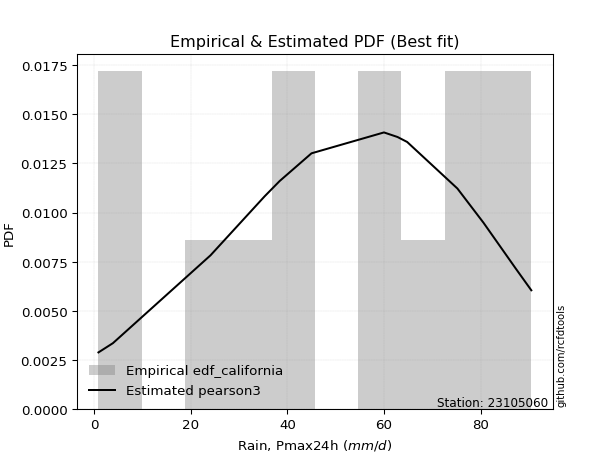</img>

</div>


### 2. EDF Hazen (1930)

Hazen method for plotting positions is a formula used to estimate the empirical cumulative probability distribution of flood events or other hydrological data. This formula often results in biased estimations, particularly when extrapolating to extreme events (high return periods).

<div align="center">


$P=(m-0.5)/n$


</div>


**2.1. Empirical values**

<div align="center">

|                | 0                    | 1                   | 2                   | 3                  | 4                   | 5                  | 6         | 7                  | 8                  | 9                  | 10                 | 11                 | 12                 |
|:---------------|:---------------------|:--------------------|:--------------------|:-------------------|:--------------------|:-------------------|:----------|:-------------------|:-------------------|:-------------------|:-------------------|:-------------------|:-------------------|
| date           | 2013                 | 2011                | 2017                | 2006               | 2014                | 2012               | 2008      | 2016               | 2018               | 2010               | 2007               | 2009               | 2015               |
| x              | 0.9                  | 3.9                 | 24.1                | 35.3               | 38.4                | 45.0               | 60.0      | 62.8               | 64.8               | 75.2               | 80.6               | 87.3               | 90.5               |
| m              | 1                    | 2                   | 3                   | 4                  | 5                   | 6                  | 7         | 8                  | 9                  | 10                 | 11                 | 12                 | 13                 |
| empirical_dist | edf_hazen            | edf_hazen           | edf_hazen           | edf_hazen          | edf_hazen           | edf_hazen          | edf_hazen | edf_hazen          | edf_hazen          | edf_hazen          | edf_hazen          | edf_hazen          | edf_hazen          |
| empirical      | 0.038461538461538464 | 0.11538461538461539 | 0.19230769230769232 | 0.2692307692307692 | 0.34615384615384615 | 0.4230769230769231 | 0.5       | 0.5769230769230769 | 0.6538461538461539 | 0.7307692307692307 | 0.8076923076923077 | 0.8846153846153846 | 0.9615384615384616 |
| empirical_tr   | 1.04                 | 1.1304347826086958  | 1.2380952380952381  | 1.3684210526315788 | 1.5294117647058822  | 1.7333333333333334 | 2.0       | 2.3636363636363633 | 2.888888888888889  | 3.7142857142857135 | 5.2                | 8.666666666666664  | 26.000000000000018 |

</div>


**2.2. Kolmogorov-Smirnov fit test (sorted by Δ)**


<div align="center">

|                | 0                    | 1                   | 2                   | 3                   | 4                   | 5                   | 6                   | 7                   | 8                   | 9                   | 10                  | 11                  | 12                  | 13                  | 14                  | 15                  | 16                  | 17                  | 18                  | 19                  | 20                  | 21                  | 22                  | 23                  | 24                  | 25                  | 26                  | 27                  | 28                  | 29                  | 30                  | 31                  | 32                  | 33                  | 34                  | 35                  | 36                  | 37                  | 38                  | 39                  | 40                  | 41                  | 42                  | 43                  | 44                  | 45                  | 46                  | 47                  | 48                  | 49                  | 50                  | 51                  | 52                  | 53                  | 54                  | 55                  | 56                  | 57                  | 58                  | 59                  | 60                  | 61                  | 62                  | 63                  | 64                  | 65                  | 66                  | 67                  | 68                  | 69                  | 70                  | 71                  | 72                  | 73                  | 74                  | 75                  | 76                  | 77                  | 78                  | 79                  | 80                  | 81                  | 82                  | 83                  | 84                  | 85                  | 86                  | 87                  | 88                  | 89                  | 90                  | 91                  | 92                  | 93                  | 94                  | 95                  | 96                  | 97                  | 98                  | 99                  | 100                 | 101                 | 102                 | 103                 | 104                 | 105                 | 106                 | 107                 | 108                 | 109                 | 110                 | 111                 | 112                 | 113                 | 114                 | 115                 | 116                 | 117                 | 118                 | 119                 | 120                 | 121                 | 122                 | 123                 | 124                 | 125                 | 126                 | 127                 | 128                 | 129                 | 130                 | 131                 | 132                 | 133                 | 134                 | 135                 | 136                 | 137                 | 138                 | 139                 | 140                 | 141                 | 142                 | 143                 | 144                 | 145                 | 146                 | 147                 | 148                 | 149                 | 150                 | 151                 | 152                 | 153                 | 154                 | 155                 | 156                 | 157                 | 158                 | 159                 |
|:---------------|:---------------------|:--------------------|:--------------------|:--------------------|:--------------------|:--------------------|:--------------------|:--------------------|:--------------------|:--------------------|:--------------------|:--------------------|:--------------------|:--------------------|:--------------------|:--------------------|:--------------------|:--------------------|:--------------------|:--------------------|:--------------------|:--------------------|:--------------------|:--------------------|:--------------------|:--------------------|:--------------------|:--------------------|:--------------------|:--------------------|:--------------------|:--------------------|:--------------------|:--------------------|:--------------------|:--------------------|:--------------------|:--------------------|:--------------------|:--------------------|:--------------------|:--------------------|:--------------------|:--------------------|:--------------------|:--------------------|:--------------------|:--------------------|:--------------------|:--------------------|:--------------------|:--------------------|:--------------------|:--------------------|:--------------------|:--------------------|:--------------------|:--------------------|:--------------------|:--------------------|:--------------------|:--------------------|:--------------------|:--------------------|:--------------------|:--------------------|:--------------------|:--------------------|:--------------------|:--------------------|:--------------------|:--------------------|:--------------------|:--------------------|:--------------------|:--------------------|:--------------------|:--------------------|:--------------------|:--------------------|:--------------------|:--------------------|:--------------------|:--------------------|:--------------------|:--------------------|:--------------------|:--------------------|:--------------------|:--------------------|:--------------------|:--------------------|:--------------------|:--------------------|:--------------------|:--------------------|:--------------------|:--------------------|:--------------------|:--------------------|:--------------------|:--------------------|:--------------------|:--------------------|:--------------------|:--------------------|:--------------------|:--------------------|:--------------------|:--------------------|:--------------------|:--------------------|:--------------------|:--------------------|:--------------------|:--------------------|:--------------------|:--------------------|:--------------------|:--------------------|:--------------------|:--------------------|:--------------------|:--------------------|:--------------------|:--------------------|:--------------------|:--------------------|:--------------------|:--------------------|:--------------------|:--------------------|:--------------------|:--------------------|:--------------------|:--------------------|:--------------------|:--------------------|:--------------------|:--------------------|:--------------------|:--------------------|:--------------------|:--------------------|:--------------------|:--------------------|:--------------------|:--------------------|:--------------------|:--------------------|:--------------------|:--------------------|:--------------------|:--------------------|:--------------------|:--------------------|:--------------------|:--------------------|:--------------------|:--------------------|
| station        | 23105060             | 23105060            | 23105060            | 23105060            | 23105060            | 23105060            | 23105060            | 23105060            | 23105060            | 23105060            | 23105060            | 23105060            | 23105060            | 23105060            | 23105060            | 23105060            | 23105060            | 23105060            | 23105060            | 23105060            | 23105060            | 23105060            | 23105060            | 23105060            | 23105060            | 23105060            | 23105060            | 23105060            | 23105060            | 23105060            | 23105060            | 23105060            | 23105060            | 23105060            | 23105060            | 23105060            | 23105060            | 23105060            | 23105060            | 23105060            | 23105060            | 23105060            | 23105060            | 23105060            | 23105060            | 23105060            | 23105060            | 23105060            | 23105060            | 23105060            | 23105060            | 23105060            | 23105060            | 23105060            | 23105060            | 23105060            | 23105060            | 23105060            | 23105060            | 23105060            | 23105060            | 23105060            | 23105060            | 23105060            | 23105060            | 23105060            | 23105060            | 23105060            | 23105060            | 23105060            | 23105060            | 23105060            | 23105060            | 23105060            | 23105060            | 23105060            | 23105060            | 23105060            | 23105060            | 23105060            | 23105060            | 23105060            | 23105060            | 23105060            | 23105060            | 23105060            | 23105060            | 23105060            | 23105060            | 23105060            | 23105060            | 23105060            | 23105060            | 23105060            | 23105060            | 23105060            | 23105060            | 23105060            | 23105060            | 23105060            | 23105060            | 23105060            | 23105060            | 23105060            | 23105060            | 23105060            | 23105060            | 23105060            | 23105060            | 23105060            | 23105060            | 23105060            | 23105060            | 23105060            | 23105060            | 23105060            | 23105060            | 23105060            | 23105060            | 23105060            | 23105060            | 23105060            | 23105060            | 23105060            | 23105060            | 23105060            | 23105060            | 23105060            | 23105060            | 23105060            | 23105060            | 23105060            | 23105060            | 23105060            | 23105060            | 23105060            | 23105060            | 23105060            | 23105060            | 23105060            | 23105060            | 23105060            | 23105060            | 23105060            | 23105060            | 23105060            | 23105060            | 23105060            | 23105060            | 23105060            | 23105060            | 23105060            | 23105060            | 23105060            | 23105060            | 23105060            | 23105060            | 23105060            | 23105060            | 23105060            |
| empirical_dist | edf_hazen            | edf_hazen           | edf_hazen           | edf_hazen           | edf_hazen           | edf_hazen           | edf_hazen           | edf_hazen           | edf_hazen           | edf_hazen           | edf_hazen           | edf_hazen           | edf_hazen           | edf_hazen           | edf_hazen           | edf_hazen           | edf_hazen           | edf_hazen           | edf_hazen           | edf_hazen           | edf_hazen           | edf_hazen           | edf_hazen           | edf_hazen           | edf_hazen           | edf_hazen           | edf_hazen           | edf_hazen           | edf_hazen           | edf_hazen           | edf_hazen           | edf_hazen           | edf_hazen           | edf_hazen           | edf_hazen           | edf_hazen           | edf_hazen           | edf_hazen           | edf_hazen           | edf_hazen           | edf_hazen           | edf_hazen           | edf_hazen           | edf_hazen           | edf_hazen           | edf_hazen           | edf_hazen           | edf_hazen           | edf_hazen           | edf_hazen           | edf_hazen           | edf_hazen           | edf_hazen           | edf_hazen           | edf_hazen           | edf_hazen           | edf_hazen           | edf_hazen           | edf_hazen           | edf_hazen           | edf_hazen           | edf_hazen           | edf_hazen           | edf_hazen           | edf_hazen           | edf_hazen           | edf_hazen           | edf_hazen           | edf_hazen           | edf_hazen           | edf_hazen           | edf_hazen           | edf_hazen           | edf_hazen           | edf_hazen           | edf_hazen           | edf_hazen           | edf_hazen           | edf_hazen           | edf_hazen           | edf_hazen           | edf_hazen           | edf_hazen           | edf_hazen           | edf_hazen           | edf_hazen           | edf_hazen           | edf_hazen           | edf_hazen           | edf_hazen           | edf_hazen           | edf_hazen           | edf_hazen           | edf_hazen           | edf_hazen           | edf_hazen           | edf_hazen           | edf_hazen           | edf_hazen           | edf_hazen           | edf_hazen           | edf_hazen           | edf_hazen           | edf_hazen           | edf_hazen           | edf_hazen           | edf_hazen           | edf_hazen           | edf_hazen           | edf_hazen           | edf_hazen           | edf_hazen           | edf_hazen           | edf_hazen           | edf_hazen           | edf_hazen           | edf_hazen           | edf_hazen           | edf_hazen           | edf_hazen           | edf_hazen           | edf_hazen           | edf_hazen           | edf_hazen           | edf_hazen           | edf_hazen           | edf_hazen           | edf_hazen           | edf_hazen           | edf_hazen           | edf_hazen           | edf_hazen           | edf_hazen           | edf_hazen           | edf_hazen           | edf_hazen           | edf_hazen           | edf_hazen           | edf_hazen           | edf_hazen           | edf_hazen           | edf_hazen           | edf_hazen           | edf_hazen           | edf_hazen           | edf_hazen           | edf_hazen           | edf_hazen           | edf_hazen           | edf_hazen           | edf_hazen           | edf_hazen           | edf_hazen           | edf_hazen           | edf_hazen           | edf_hazen           | edf_hazen           | edf_hazen           | edf_hazen           | edf_hazen           |
| p_dist         | trapezoid            | beta                | gausshyper          | weibull_min         | burr12              | argus               | triang              | skewnorm            | dgamma              | gumbel_l            | genpareto           | dweibull            | logjohnsonsu        | semicircular        | pearson3            | genextreme          | anglit              | genhalflogistic     | arcsine             | johnsonsu           | nct                 | exponnorm           | norm                | crystalball         | t                   | fatiguelife         | foldnorm            | f                   | betaprime           | gamma               | erlang              | gengamma            | loggenextreme       | rice                | logistic            | loglevy_l           | invweibull          | ksone               | invgamma            | truncweibull_min    | cosine              | wrapcauchy          | maxwell             | hypsecant           | ncf                 | rayleigh            | burr                | invgauss            | kappa3              | uniform             | logargus            | vonmises_line       | kstwobign           | logexponweib        | logloggamma         | logburr             | halfnorm            | laplace             | logburr12           | logweibull_min      | loggompertz         | kappa4              | gumbel_r            | logpearson3         | loggumbel_l         | logt                | mielke              | logvonmises_line    | bradford            | halflogistic        | moyal               | loggennorm          | loggenhalflogistic  | genexpon            | truncexpon          | logfoldnorm         | loggausshyper       | logdgamma           | logtrapezoid        | logfatiguelife      | logsemicircular     | loganglit           | logbetaprime        | lognakagami         | logexponnorm        | lognorm             | logrice             | lognct              | loglogistic         | logdweibull         | loghypsecant        | logweibull_max      | loginvgamma         | logerlang           | logalpha            | loglaplace          | loglaplace          | wald                | loggengamma         | loggamma            | loggamma            | loginvweibull       | lomax               | loginvgauss         | loggenpareto        | logarcsine          | levy_l              | logmaxwell          | lograyleigh         | halfgennorm         | logskewnorm         | logkstwobign        | loggumbel_r         | loghalfnorm         | logbeta             | loggenexpon         | logcosine           | logmoyal            | loghalflogistic     | logwrapcauchy       | logtriang           | gennorm             | logncf              | loglomax            | logwald             | logloglaplace       | loghalfgennorm      | exponweib           | logtruncweibull_min | logf                | logkappa4           | logksone            | powerlaw            | nakagami            | gompertz            | logkappa3           | loguniform          | logmielke           | logbradford         | logjohnsonsb        | rdist               | tukeylambda         | logtruncnorm        | weibull_max         | logtruncexpon       | johnsonsb           | logexponpow         | logtukeylambda      | alpha               | logpowerlaw         | exponpow            | truncpareto         | truncnorm           | logtruncpareto      | logrdist            | genlogistic         | loggenlogistic      | logvonmises         | vonmises            | logcrystalball      |
| delta          | 0.052631611946538204 | 0.0569833940960881  | 0.05849166045345222 | 0.0687662408601798  | 0.06900526236521731 | 0.0690997118442793  | 0.07321705584844512 | 0.07574725123682291 | 0.07695484157252408 | 0.07976080294812898 | 0.08033715723380316 | 0.08152490493727532 | 0.09448486725870142 | 0.09481208327284896 | 0.09532236353482904 | 0.09963032391999455 | 0.10149066630280312 | 0.10959550181953004 | 0.11538461538461539 | 0.11703672167913304 | 0.11750952240283796 | 0.11752108515147597 | 0.11752168009488817 | 0.11752168622200632 | 0.11752216762504708 | 0.11792979778475865 | 0.11839001807416372 | 0.11937499334141    | 0.12032497271449594 | 0.12266577742699603 | 0.1234439893981879  | 0.12389356664033269 | 0.1250630743614603  | 0.1268768040044479  | 0.13234416994337073 | 0.1330391480326348  | 0.13342792375269685 | 0.13404304029304032 | 0.1348231645123814  | 0.1359636870388654  | 0.13645304190756535 | 0.14012174473811162 | 0.14244030347164816 | 0.14427884628762921 | 0.14547152334217905 | 0.15008658724068824 | 0.1524123322568397  | 0.15308142476821174 | 0.15916588113893848 | 0.1595982142857143  | 0.1597559944216531  | 0.16113664449358334 | 0.16213559771811825 | 0.16378477325760799 | 0.1638348446889576  | 0.1644816961937765  | 0.17198095450821727 | 0.17240142560350913 | 0.1741476185575277  | 0.17580698453501986 | 0.17654294470981347 | 0.17965696444650026 | 0.18206087308734753 | 0.18566253537058863 | 0.18613327847971506 | 0.1886340669006551  | 0.19858685579481594 | 0.19939700787603987 | 0.1994717929960339  | 0.20035429029955232 | 0.20385478253640188 | 0.2144843928699618  | 0.22733552020569392 | 0.22994971085874666 | 0.23401218198914853 | 0.2364975692242956  | 0.23976595017061547 | 0.24082302939291844 | 0.24183944733444251 | 0.24527949762004048 | 0.2453879195220398  | 0.24646690712533953 | 0.24708537168751982 | 0.24890287805133254 | 0.2490827806944243  | 0.24908436793172534 | 0.24909183338104463 | 0.24942477145430647 | 0.2515820534950826  | 0.2516535569939399  | 0.25371202967298695 | 0.2549413735744306  | 0.2592213726767509  | 0.25935896946028664 | 0.25955990687554137 | 0.26221127264208016 | 0.26221127264208016 | 0.26484854061218965 | 0.26762255244290695 | 0.27040235633651627 | 0.27040235633651627 | 0.27367002114850963 | 0.2760792725887981  | 0.2788207565400523  | 0.27983126959377475 | 0.280201341867536   | 0.2803916485872987  | 0.28131298741584926 | 0.29190118418363714 | 0.29599524224757084 | 0.3035093133740736  | 0.3133590830290527  | 0.31976060087283537 | 0.3217191053417611  | 0.3324207375446556  | 0.336161219578357   | 0.33647363850975015 | 0.34538913416818867 | 0.34767998641354086 | 0.3670217436617016  | 0.3743337547254402  | 0.3846153846153846  | 0.392377833606923   | 0.4105237727393575  | 0.41658396131277736 | 0.45639150954208385 | 0.46350966692645346 | 0.47273082809270806 | 0.4772194545400014  | 0.4823230584171756  | 0.4838699999359329  | 0.4852168637307337  | 0.5113668823617418  | 0.5128207223310784  | 0.525353660972556   | 0.5265340285298763  | 0.526577943102396   | 0.5310908884110339  | 0.5570181837490125  | 0.5619066942959972  | 0.5769230735155579  | 0.5920976911308474  | 0.5950879791372664  | 0.6112567791649502  | 0.6198661618693746  | 0.6547864145879773  | 0.6610539375719668  | 0.686974494392339   | 0.7029295875470576  | 0.709955762490621   | 0.7404599825108613  | 0.7519852466800827  | 0.7773456269362558  | 0.797919812663368   | 0.8076922904910048  | 0.8846153846153846  | 0.8846153846153846  | 1.0075807307127183  | 13.996473768957262  | nan                 |
| deltao         | 0.35149047353100005  | 0.35149047353100005 | 0.35149047353100005 | 0.35149047353100005 | 0.35149047353100005 | 0.35149047353100005 | 0.35149047353100005 | 0.35149047353100005 | 0.35149047353100005 | 0.35149047353100005 | 0.35149047353100005 | 0.35149047353100005 | 0.35149047353100005 | 0.35149047353100005 | 0.35149047353100005 | 0.35149047353100005 | 0.35149047353100005 | 0.35149047353100005 | 0.35149047353100005 | 0.35149047353100005 | 0.35149047353100005 | 0.35149047353100005 | 0.35149047353100005 | 0.35149047353100005 | 0.35149047353100005 | 0.35149047353100005 | 0.35149047353100005 | 0.35149047353100005 | 0.35149047353100005 | 0.35149047353100005 | 0.35149047353100005 | 0.35149047353100005 | 0.35149047353100005 | 0.35149047353100005 | 0.35149047353100005 | 0.35149047353100005 | 0.35149047353100005 | 0.35149047353100005 | 0.35149047353100005 | 0.35149047353100005 | 0.35149047353100005 | 0.35149047353100005 | 0.35149047353100005 | 0.35149047353100005 | 0.35149047353100005 | 0.35149047353100005 | 0.35149047353100005 | 0.35149047353100005 | 0.35149047353100005 | 0.35149047353100005 | 0.35149047353100005 | 0.35149047353100005 | 0.35149047353100005 | 0.35149047353100005 | 0.35149047353100005 | 0.35149047353100005 | 0.35149047353100005 | 0.35149047353100005 | 0.35149047353100005 | 0.35149047353100005 | 0.35149047353100005 | 0.35149047353100005 | 0.35149047353100005 | 0.35149047353100005 | 0.35149047353100005 | 0.35149047353100005 | 0.35149047353100005 | 0.35149047353100005 | 0.35149047353100005 | 0.35149047353100005 | 0.35149047353100005 | 0.35149047353100005 | 0.35149047353100005 | 0.35149047353100005 | 0.35149047353100005 | 0.35149047353100005 | 0.35149047353100005 | 0.35149047353100005 | 0.35149047353100005 | 0.35149047353100005 | 0.35149047353100005 | 0.35149047353100005 | 0.35149047353100005 | 0.35149047353100005 | 0.35149047353100005 | 0.35149047353100005 | 0.35149047353100005 | 0.35149047353100005 | 0.35149047353100005 | 0.35149047353100005 | 0.35149047353100005 | 0.35149047353100005 | 0.35149047353100005 | 0.35149047353100005 | 0.35149047353100005 | 0.35149047353100005 | 0.35149047353100005 | 0.35149047353100005 | 0.35149047353100005 | 0.35149047353100005 | 0.35149047353100005 | 0.35149047353100005 | 0.35149047353100005 | 0.35149047353100005 | 0.35149047353100005 | 0.35149047353100005 | 0.35149047353100005 | 0.35149047353100005 | 0.35149047353100005 | 0.35149047353100005 | 0.35149047353100005 | 0.35149047353100005 | 0.35149047353100005 | 0.35149047353100005 | 0.35149047353100005 | 0.35149047353100005 | 0.35149047353100005 | 0.35149047353100005 | 0.35149047353100005 | 0.35149047353100005 | 0.35149047353100005 | 0.35149047353100005 | 0.35149047353100005 | 0.35149047353100005 | 0.35149047353100005 | 0.35149047353100005 | 0.35149047353100005 | 0.35149047353100005 | 0.35149047353100005 | 0.35149047353100005 | 0.35149047353100005 | 0.35149047353100005 | 0.35149047353100005 | 0.35149047353100005 | 0.35149047353100005 | 0.35149047353100005 | 0.35149047353100005 | 0.35149047353100005 | 0.35149047353100005 | 0.35149047353100005 | 0.35149047353100005 | 0.35149047353100005 | 0.35149047353100005 | 0.35149047353100005 | 0.35149047353100005 | 0.35149047353100005 | 0.35149047353100005 | 0.35149047353100005 | 0.35149047353100005 | 0.35149047353100005 | 0.35149047353100005 | 0.35149047353100005 | 0.35149047353100005 | 0.35149047353100005 | 0.35149047353100005 | 0.35149047353100005 | 0.35149047353100005 | 0.35149047353100005 | 0.35149047353100005 | 0.35149047353100005 |
| eval           | Δo > Δ               | Δo > Δ              | Δo > Δ              | Δo > Δ              | Δo > Δ              | Δo > Δ              | Δo > Δ              | Δo > Δ              | Δo > Δ              | Δo > Δ              | Δo > Δ              | Δo > Δ              | Δo > Δ              | Δo > Δ              | Δo > Δ              | Δo > Δ              | Δo > Δ              | Δo > Δ              | Δo > Δ              | Δo > Δ              | Δo > Δ              | Δo > Δ              | Δo > Δ              | Δo > Δ              | Δo > Δ              | Δo > Δ              | Δo > Δ              | Δo > Δ              | Δo > Δ              | Δo > Δ              | Δo > Δ              | Δo > Δ              | Δo > Δ              | Δo > Δ              | Δo > Δ              | Δo > Δ              | Δo > Δ              | Δo > Δ              | Δo > Δ              | Δo > Δ              | Δo > Δ              | Δo > Δ              | Δo > Δ              | Δo > Δ              | Δo > Δ              | Δo > Δ              | Δo > Δ              | Δo > Δ              | Δo > Δ              | Δo > Δ              | Δo > Δ              | Δo > Δ              | Δo > Δ              | Δo > Δ              | Δo > Δ              | Δo > Δ              | Δo > Δ              | Δo > Δ              | Δo > Δ              | Δo > Δ              | Δo > Δ              | Δo > Δ              | Δo > Δ              | Δo > Δ              | Δo > Δ              | Δo > Δ              | Δo > Δ              | Δo > Δ              | Δo > Δ              | Δo > Δ              | Δo > Δ              | Δo > Δ              | Δo > Δ              | Δo > Δ              | Δo > Δ              | Δo > Δ              | Δo > Δ              | Δo > Δ              | Δo > Δ              | Δo > Δ              | Δo > Δ              | Δo > Δ              | Δo > Δ              | Δo > Δ              | Δo > Δ              | Δo > Δ              | Δo > Δ              | Δo > Δ              | Δo > Δ              | Δo > Δ              | Δo > Δ              | Δo > Δ              | Δo > Δ              | Δo > Δ              | Δo > Δ              | Δo > Δ              | Δo > Δ              | Δo > Δ              | Δo > Δ              | Δo > Δ              | Δo > Δ              | Δo > Δ              | Δo > Δ              | Δo > Δ              | Δo > Δ              | Δo > Δ              | Δo > Δ              | Δo > Δ              | Δo > Δ              | Δo > Δ              | Δo > Δ              | Δo > Δ              | Δo > Δ              | Δo > Δ              | Δo > Δ              | Δo > Δ              | Δo > Δ              | Δo > Δ              | Δo > Δ              | Δo <= Δ             | Δo <= Δ             | Δo <= Δ             | Δo <= Δ             | Δo <= Δ             | Δo <= Δ             | Δo <= Δ             | Δo <= Δ             | Δo <= Δ             | Δo <= Δ             | Δo <= Δ             | Δo <= Δ             | Δo <= Δ             | Δo <= Δ             | Δo <= Δ             | Δo <= Δ             | Δo <= Δ             | Δo <= Δ             | Δo <= Δ             | Δo <= Δ             | Δo <= Δ             | Δo <= Δ             | Δo <= Δ             | Δo <= Δ             | Δo <= Δ             | Δo <= Δ             | Δo <= Δ             | Δo <= Δ             | Δo <= Δ             | Δo <= Δ             | Δo <= Δ             | Δo <= Δ             | Δo <= Δ             | Δo <= Δ             | Δo <= Δ             | Δo <= Δ             | Δo <= Δ             | Δo <= Δ             | Δo <= Δ             | Δo <= Δ             | Δo <= Δ             |
| fit            | 1                    | 1                   | 1                   | 1                   | 1                   | 1                   | 1                   | 1                   | 1                   | 1                   | 1                   | 1                   | 1                   | 1                   | 1                   | 1                   | 1                   | 1                   | 1                   | 1                   | 1                   | 1                   | 1                   | 1                   | 1                   | 1                   | 1                   | 1                   | 1                   | 1                   | 1                   | 1                   | 1                   | 1                   | 1                   | 1                   | 1                   | 1                   | 1                   | 1                   | 1                   | 1                   | 1                   | 1                   | 1                   | 1                   | 1                   | 1                   | 1                   | 1                   | 1                   | 1                   | 1                   | 1                   | 1                   | 1                   | 1                   | 1                   | 1                   | 1                   | 1                   | 1                   | 1                   | 1                   | 1                   | 1                   | 1                   | 1                   | 1                   | 1                   | 1                   | 1                   | 1                   | 1                   | 1                   | 1                   | 1                   | 1                   | 1                   | 1                   | 1                   | 1                   | 1                   | 1                   | 1                   | 1                   | 1                   | 1                   | 1                   | 1                   | 1                   | 1                   | 1                   | 1                   | 1                   | 1                   | 1                   | 1                   | 1                   | 1                   | 1                   | 1                   | 1                   | 1                   | 1                   | 1                   | 1                   | 1                   | 1                   | 1                   | 1                   | 1                   | 1                   | 1                   | 1                   | 1                   | 1                   | 1                   | 1                   | 0                   | 0                   | 0                   | 0                   | 0                   | 0                   | 0                   | 0                   | 0                   | 0                   | 0                   | 0                   | 0                   | 0                   | 0                   | 0                   | 0                   | 0                   | 0                   | 0                   | 0                   | 0                   | 0                   | 0                   | 0                   | 0                   | 0                   | 0                   | 0                   | 0                   | 0                   | 0                   | 0                   | 0                   | 0                   | 0                   | 0                   | 0                   | 0                   | 0                   | 0                   |
| n              | 13                   | 13                  | 13                  | 13                  | 13                  | 13                  | 13                  | 13                  | 13                  | 13                  | 13                  | 13                  | 13                  | 13                  | 13                  | 13                  | 13                  | 13                  | 13                  | 13                  | 13                  | 13                  | 13                  | 13                  | 13                  | 13                  | 13                  | 13                  | 13                  | 13                  | 13                  | 13                  | 13                  | 13                  | 13                  | 13                  | 13                  | 13                  | 13                  | 13                  | 13                  | 13                  | 13                  | 13                  | 13                  | 13                  | 13                  | 13                  | 13                  | 13                  | 13                  | 13                  | 13                  | 13                  | 13                  | 13                  | 13                  | 13                  | 13                  | 13                  | 13                  | 13                  | 13                  | 13                  | 13                  | 13                  | 13                  | 13                  | 13                  | 13                  | 13                  | 13                  | 13                  | 13                  | 13                  | 13                  | 13                  | 13                  | 13                  | 13                  | 13                  | 13                  | 13                  | 13                  | 13                  | 13                  | 13                  | 13                  | 13                  | 13                  | 13                  | 13                  | 13                  | 13                  | 13                  | 13                  | 13                  | 13                  | 13                  | 13                  | 13                  | 13                  | 13                  | 13                  | 13                  | 13                  | 13                  | 13                  | 13                  | 13                  | 13                  | 13                  | 13                  | 13                  | 13                  | 13                  | 13                  | 13                  | 13                  | 13                  | 13                  | 13                  | 13                  | 13                  | 13                  | 13                  | 13                  | 13                  | 13                  | 13                  | 13                  | 13                  | 13                  | 13                  | 13                  | 13                  | 13                  | 13                  | 13                  | 13                  | 13                  | 13                  | 13                  | 13                  | 13                  | 13                  | 13                  | 13                  | 13                  | 13                  | 13                  | 13                  | 13                  | 13                  | 13                  | 13                  | 13                  | 13                  | 13                  | 13                  |
| best_fit       | 1                    | 0                   | 0                   | 0                   | 0                   | 0                   | 0                   | 0                   | 0                   | 0                   | 0                   | 0                   | 0                   | 0                   | 0                   | 0                   | 0                   | 0                   | 0                   | 0                   | 0                   | 0                   | 0                   | 0                   | 0                   | 0                   | 0                   | 0                   | 0                   | 0                   | 0                   | 0                   | 0                   | 0                   | 0                   | 0                   | 0                   | 0                   | 0                   | 0                   | 0                   | 0                   | 0                   | 0                   | 0                   | 0                   | 0                   | 0                   | 0                   | 0                   | 0                   | 0                   | 0                   | 0                   | 0                   | 0                   | 0                   | 0                   | 0                   | 0                   | 0                   | 0                   | 0                   | 0                   | 0                   | 0                   | 0                   | 0                   | 0                   | 0                   | 0                   | 0                   | 0                   | 0                   | 0                   | 0                   | 0                   | 0                   | 0                   | 0                   | 0                   | 0                   | 0                   | 0                   | 0                   | 0                   | 0                   | 0                   | 0                   | 0                   | 0                   | 0                   | 0                   | 0                   | 0                   | 0                   | 0                   | 0                   | 0                   | 0                   | 0                   | 0                   | 0                   | 0                   | 0                   | 0                   | 0                   | 0                   | 0                   | 0                   | 0                   | 0                   | 0                   | 0                   | 0                   | 0                   | 0                   | 0                   | 0                   | 0                   | 0                   | 0                   | 0                   | 0                   | 0                   | 0                   | 0                   | 0                   | 0                   | 0                   | 0                   | 0                   | 0                   | 0                   | 0                   | 0                   | 0                   | 0                   | 0                   | 0                   | 0                   | 0                   | 0                   | 0                   | 0                   | 0                   | 0                   | 0                   | 0                   | 0                   | 0                   | 0                   | 0                   | 0                   | 0                   | 0                   | 0                   | 0                   | 0                   | 0                   |
| best_fit_sort  | 1                    | 2                   | 3                   | 4                   | 5                   | 6                   | 7                   | 8                   | 9                   | 10                  | 11                  | 12                  | 13                  | 14                  | 15                  | 16                  | 17                  | 18                  | 19                  | 20                  | 21                  | 22                  | 23                  | 24                  | 25                  | 26                  | 27                  | 28                  | 29                  | 30                  | 31                  | 32                  | 33                  | 34                  | 35                  | 36                  | 37                  | 38                  | 39                  | 40                  | 41                  | 42                  | 43                  | 44                  | 45                  | 46                  | 47                  | 48                  | 49                  | 50                  | 51                  | 52                  | 53                  | 54                  | 55                  | 56                  | 57                  | 58                  | 59                  | 60                  | 61                  | 62                  | 63                  | 64                  | 65                  | 66                  | 67                  | 68                  | 69                  | 70                  | 71                  | 72                  | 73                  | 74                  | 75                  | 76                  | 77                  | 78                  | 79                  | 80                  | 81                  | 82                  | 83                  | 84                  | 85                  | 86                  | 87                  | 88                  | 89                  | 90                  | 91                  | 92                  | 93                  | 94                  | 95                  | 96                  | 97                  | 98                  | 99                  | 100                 | 101                 | 102                 | 103                 | 104                 | 105                 | 106                 | 107                 | 108                 | 109                 | 110                 | 111                 | 112                 | 113                 | 114                 | 115                 | 116                 | 117                 | 118                 | 119                 | 120                 | 121                 | 122                 | 123                 | 124                 | 125                 | 126                 | 127                 | 128                 | 129                 | 130                 | 131                 | 132                 | 133                 | 134                 | 135                 | 136                 | 137                 | 138                 | 139                 | 140                 | 141                 | 142                 | 143                 | 144                 | 145                 | 146                 | 147                 | 148                 | 149                 | 150                 | 151                 | 152                 | 153                 | 154                 | 155                 | 156                 | 157                 | 158                 | 159                 | 160                 |

</div>


**2.3. Best fit**

<div align="center">

|   id |   station | empirical_dist   | p_dist    |     delta |   deltao | eval   |   fit |   n |   best_fit |   best_fit_sort |
|-----:|----------:|:-----------------|:----------|----------:|---------:|:-------|------:|----:|-----------:|----------------:|
|    0 |  23105060 | edf_hazen        | trapezoid | 0.0526316 |  0.35149 | Δo > Δ |     1 |  13 |          1 |               1 |

</div>


<div align="center">

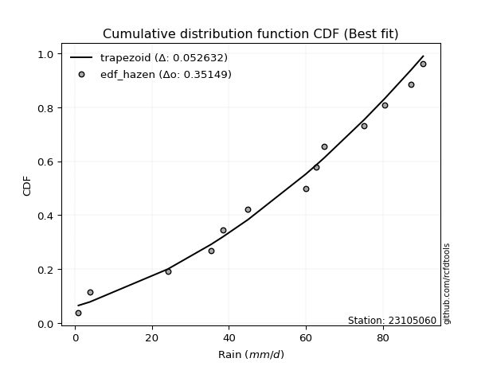</img>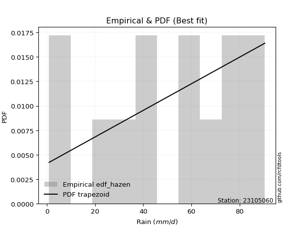</img>

</div>


### 3. EDF Weibull (1939)

Weibull plotting position formula is an empirical method used to estimate the non-exceedance probability or plotting position for a set of observed data, is often recommended or widely used in practice, particularly in flood frequency analysis.

<div align="center">


$P=m/(n+1)$


</div>


**3.1. Empirical values**

<div align="center">

|                | 0                   | 1                   | 2                   | 3                  | 4                   | 5                   | 6           | 7                  | 8                  | 9                  | 10                 | 11                 | 12                 |
|:---------------|:--------------------|:--------------------|:--------------------|:-------------------|:--------------------|:--------------------|:------------|:-------------------|:-------------------|:-------------------|:-------------------|:-------------------|:-------------------|
| date           | 2013                | 2011                | 2017                | 2006               | 2014                | 2012                | 2008        | 2016               | 2018               | 2010               | 2007               | 2009               | 2015               |
| x              | 0.9                 | 3.9                 | 24.1                | 35.3               | 38.4                | 45.0                | 60.0        | 62.8               | 64.8               | 75.2               | 80.6               | 87.3               | 90.5               |
| m              | 1                   | 2                   | 3                   | 4                  | 5                   | 6                   | 7           | 8                  | 9                  | 10                 | 11                 | 12                 | 13                 |
| empirical_dist | edf_weibull         | edf_weibull         | edf_weibull         | edf_weibull        | edf_weibull         | edf_weibull         | edf_weibull | edf_weibull        | edf_weibull        | edf_weibull        | edf_weibull        | edf_weibull        | edf_weibull        |
| empirical      | 0.07142857142857142 | 0.14285714285714285 | 0.21428571428571427 | 0.2857142857142857 | 0.35714285714285715 | 0.42857142857142855 | 0.5         | 0.5714285714285714 | 0.6428571428571429 | 0.7142857142857143 | 0.7857142857142857 | 0.8571428571428571 | 0.9285714285714286 |
| empirical_tr   | 1.0769230769230769  | 1.1666666666666665  | 1.2727272727272727  | 1.4                | 1.5555555555555558  | 1.75                | 2.0         | 2.333333333333333  | 2.8000000000000003 | 3.5                | 4.666666666666666  | 6.999999999999997  | 14.000000000000007 |

</div>


**3.2. Kolmogorov-Smirnov fit test (sorted by Δ)**


<div align="center">

|                | 0                   | 1                   | 2                   | 3                   | 4                   | 5                   | 6                   | 7                   | 8                   | 9                   | 10                  | 11                  | 12                  | 13                  | 14                  | 15                  | 16                  | 17                  | 18                  | 19                  | 20                  | 21                  | 22                  | 23                  | 24                  | 25                  | 26                  | 27                  | 28                  | 29                  | 30                  | 31                  | 32                  | 33                  | 34                  | 35                  | 36                  | 37                  | 38                  | 39                  | 40                  | 41                  | 42                  | 43                  | 44                  | 45                  | 46                  | 47                  | 48                  | 49                  | 50                  | 51                  | 52                  | 53                  | 54                  | 55                  | 56                  | 57                  | 58                  | 59                  | 60                  | 61                  | 62                  | 63                  | 64                  | 65                  | 66                  | 67                  | 68                  | 69                  | 70                  | 71                  | 72                  | 73                  | 74                  | 75                  | 76                  | 77                  | 78                  | 79                  | 80                  | 81                  | 82                  | 83                  | 84                  | 85                  | 86                  | 87                  | 88                  | 89                  | 90                  | 91                  | 92                  | 93                  | 94                  | 95                  | 96                  | 97                  | 98                  | 99                  | 100                 | 101                 | 102                 | 103                 | 104                 | 105                 | 106                 | 107                 | 108                 | 109                 | 110                 | 111                 | 112                 | 113                 | 114                 | 115                 | 116                 | 117                 | 118                 | 119                 | 120                 | 121                 | 122                 | 123                 | 124                 | 125                 | 126                 | 127                 | 128                 | 129                 | 130                 | 131                 | 132                 | 133                 | 134                 | 135                 | 136                 | 137                 | 138                 | 139                 | 140                 | 141                 | 142                 | 143                 | 144                 | 145                 | 146                 | 147                 | 148                 | 149                 | 150                 | 151                 | 152                 | 153                 | 154                 | 155                 | 156                 | 157                 | 158                 | 159                 |
|:---------------|:--------------------|:--------------------|:--------------------|:--------------------|:--------------------|:--------------------|:--------------------|:--------------------|:--------------------|:--------------------|:--------------------|:--------------------|:--------------------|:--------------------|:--------------------|:--------------------|:--------------------|:--------------------|:--------------------|:--------------------|:--------------------|:--------------------|:--------------------|:--------------------|:--------------------|:--------------------|:--------------------|:--------------------|:--------------------|:--------------------|:--------------------|:--------------------|:--------------------|:--------------------|:--------------------|:--------------------|:--------------------|:--------------------|:--------------------|:--------------------|:--------------------|:--------------------|:--------------------|:--------------------|:--------------------|:--------------------|:--------------------|:--------------------|:--------------------|:--------------------|:--------------------|:--------------------|:--------------------|:--------------------|:--------------------|:--------------------|:--------------------|:--------------------|:--------------------|:--------------------|:--------------------|:--------------------|:--------------------|:--------------------|:--------------------|:--------------------|:--------------------|:--------------------|:--------------------|:--------------------|:--------------------|:--------------------|:--------------------|:--------------------|:--------------------|:--------------------|:--------------------|:--------------------|:--------------------|:--------------------|:--------------------|:--------------------|:--------------------|:--------------------|:--------------------|:--------------------|:--------------------|:--------------------|:--------------------|:--------------------|:--------------------|:--------------------|:--------------------|:--------------------|:--------------------|:--------------------|:--------------------|:--------------------|:--------------------|:--------------------|:--------------------|:--------------------|:--------------------|:--------------------|:--------------------|:--------------------|:--------------------|:--------------------|:--------------------|:--------------------|:--------------------|:--------------------|:--------------------|:--------------------|:--------------------|:--------------------|:--------------------|:--------------------|:--------------------|:--------------------|:--------------------|:--------------------|:--------------------|:--------------------|:--------------------|:--------------------|:--------------------|:--------------------|:--------------------|:--------------------|:--------------------|:--------------------|:--------------------|:--------------------|:--------------------|:--------------------|:--------------------|:--------------------|:--------------------|:--------------------|:--------------------|:--------------------|:--------------------|:--------------------|:--------------------|:--------------------|:--------------------|:--------------------|:--------------------|:--------------------|:--------------------|:--------------------|:--------------------|:--------------------|:--------------------|:--------------------|:--------------------|:--------------------|:--------------------|:--------------------|
| station        | 23105060            | 23105060            | 23105060            | 23105060            | 23105060            | 23105060            | 23105060            | 23105060            | 23105060            | 23105060            | 23105060            | 23105060            | 23105060            | 23105060            | 23105060            | 23105060            | 23105060            | 23105060            | 23105060            | 23105060            | 23105060            | 23105060            | 23105060            | 23105060            | 23105060            | 23105060            | 23105060            | 23105060            | 23105060            | 23105060            | 23105060            | 23105060            | 23105060            | 23105060            | 23105060            | 23105060            | 23105060            | 23105060            | 23105060            | 23105060            | 23105060            | 23105060            | 23105060            | 23105060            | 23105060            | 23105060            | 23105060            | 23105060            | 23105060            | 23105060            | 23105060            | 23105060            | 23105060            | 23105060            | 23105060            | 23105060            | 23105060            | 23105060            | 23105060            | 23105060            | 23105060            | 23105060            | 23105060            | 23105060            | 23105060            | 23105060            | 23105060            | 23105060            | 23105060            | 23105060            | 23105060            | 23105060            | 23105060            | 23105060            | 23105060            | 23105060            | 23105060            | 23105060            | 23105060            | 23105060            | 23105060            | 23105060            | 23105060            | 23105060            | 23105060            | 23105060            | 23105060            | 23105060            | 23105060            | 23105060            | 23105060            | 23105060            | 23105060            | 23105060            | 23105060            | 23105060            | 23105060            | 23105060            | 23105060            | 23105060            | 23105060            | 23105060            | 23105060            | 23105060            | 23105060            | 23105060            | 23105060            | 23105060            | 23105060            | 23105060            | 23105060            | 23105060            | 23105060            | 23105060            | 23105060            | 23105060            | 23105060            | 23105060            | 23105060            | 23105060            | 23105060            | 23105060            | 23105060            | 23105060            | 23105060            | 23105060            | 23105060            | 23105060            | 23105060            | 23105060            | 23105060            | 23105060            | 23105060            | 23105060            | 23105060            | 23105060            | 23105060            | 23105060            | 23105060            | 23105060            | 23105060            | 23105060            | 23105060            | 23105060            | 23105060            | 23105060            | 23105060            | 23105060            | 23105060            | 23105060            | 23105060            | 23105060            | 23105060            | 23105060            | 23105060            | 23105060            | 23105060            | 23105060            | 23105060            | 23105060            |
| empirical_dist | edf_weibull         | edf_weibull         | edf_weibull         | edf_weibull         | edf_weibull         | edf_weibull         | edf_weibull         | edf_weibull         | edf_weibull         | edf_weibull         | edf_weibull         | edf_weibull         | edf_weibull         | edf_weibull         | edf_weibull         | edf_weibull         | edf_weibull         | edf_weibull         | edf_weibull         | edf_weibull         | edf_weibull         | edf_weibull         | edf_weibull         | edf_weibull         | edf_weibull         | edf_weibull         | edf_weibull         | edf_weibull         | edf_weibull         | edf_weibull         | edf_weibull         | edf_weibull         | edf_weibull         | edf_weibull         | edf_weibull         | edf_weibull         | edf_weibull         | edf_weibull         | edf_weibull         | edf_weibull         | edf_weibull         | edf_weibull         | edf_weibull         | edf_weibull         | edf_weibull         | edf_weibull         | edf_weibull         | edf_weibull         | edf_weibull         | edf_weibull         | edf_weibull         | edf_weibull         | edf_weibull         | edf_weibull         | edf_weibull         | edf_weibull         | edf_weibull         | edf_weibull         | edf_weibull         | edf_weibull         | edf_weibull         | edf_weibull         | edf_weibull         | edf_weibull         | edf_weibull         | edf_weibull         | edf_weibull         | edf_weibull         | edf_weibull         | edf_weibull         | edf_weibull         | edf_weibull         | edf_weibull         | edf_weibull         | edf_weibull         | edf_weibull         | edf_weibull         | edf_weibull         | edf_weibull         | edf_weibull         | edf_weibull         | edf_weibull         | edf_weibull         | edf_weibull         | edf_weibull         | edf_weibull         | edf_weibull         | edf_weibull         | edf_weibull         | edf_weibull         | edf_weibull         | edf_weibull         | edf_weibull         | edf_weibull         | edf_weibull         | edf_weibull         | edf_weibull         | edf_weibull         | edf_weibull         | edf_weibull         | edf_weibull         | edf_weibull         | edf_weibull         | edf_weibull         | edf_weibull         | edf_weibull         | edf_weibull         | edf_weibull         | edf_weibull         | edf_weibull         | edf_weibull         | edf_weibull         | edf_weibull         | edf_weibull         | edf_weibull         | edf_weibull         | edf_weibull         | edf_weibull         | edf_weibull         | edf_weibull         | edf_weibull         | edf_weibull         | edf_weibull         | edf_weibull         | edf_weibull         | edf_weibull         | edf_weibull         | edf_weibull         | edf_weibull         | edf_weibull         | edf_weibull         | edf_weibull         | edf_weibull         | edf_weibull         | edf_weibull         | edf_weibull         | edf_weibull         | edf_weibull         | edf_weibull         | edf_weibull         | edf_weibull         | edf_weibull         | edf_weibull         | edf_weibull         | edf_weibull         | edf_weibull         | edf_weibull         | edf_weibull         | edf_weibull         | edf_weibull         | edf_weibull         | edf_weibull         | edf_weibull         | edf_weibull         | edf_weibull         | edf_weibull         | edf_weibull         | edf_weibull         | edf_weibull         | edf_weibull         |
| p_dist         | gausshyper          | burr12              | beta                | trapezoid           | weibull_min         | logjohnsonsu        | gumbel_l            | skewnorm            | triang              | pearson3            | argus               | genhalflogistic     | loglevy_l           | anglit              | semicircular        | dgamma              | genextreme          | dweibull            | genpareto           | johnsonsu           | nct                 | exponnorm           | norm                | crystalball         | t                   | loggenextreme       | fatiguelife         | foldnorm            | f                   | betaprime           | gamma               | erlang              | gengamma            | wrapcauchy          | rice                | logistic            | ksone               | invweibull          | invgamma            | truncweibull_min    | cosine              | maxwell             | arcsine             | hypsecant           | ncf                 | logburr             | rayleigh            | burr                | logpearson3         | invgauss            | kappa3              | uniform             | logargus            | vonmises_line       | kstwobign           | loggumbel_l         | logexponweib        | logt                | logloggamma         | logvonmises_line    | halfnorm            | laplace             | logburr12           | logweibull_min      | loggompertz         | kappa4              | loggennorm          | gumbel_r            | mielke              | bradford            | halflogistic        | moyal               | logdgamma           | logtrapezoid        | loggenhalflogistic  | genexpon            | logdweibull         | logfoldnorm         | loggausshyper       | logfatiguelife      | logsemicircular     | loganglit           | logbetaprime        | lognakagami         | logexponnorm        | lognorm             | logrice             | lognct              | truncexpon          | logweibull_max      | loglogistic         | loghypsecant        | loginvgamma         | logerlang           | logalpha            | loglaplace          | loglaplace          | logarcsine          | levy_l              | loggengamma         | loggamma            | loggamma            | loginvweibull       | lomax               | loginvgauss         | loggenpareto        | logmaxwell          | wald                | lograyleigh         | halfgennorm         | logkstwobign        | loggumbel_r         | logskewnorm         | loghalfnorm         | logbeta             | loggenexpon         | logcosine           | logmoyal            | loghalflogistic     | logwrapcauchy       | gennorm             | logtriang           | logncf              | loglomax            | logwald             | logloglaplace       | loghalfgennorm      | exponweib           | logf                | logtruncweibull_min | logksone            | logkappa4           | nakagami            | powerlaw            | logmielke           | logkappa3           | loguniform          | gompertz            | logbradford         | logjohnsonsb        | tukeylambda         | rdist               | logtruncnorm        | weibull_max         | logtruncexpon       | johnsonsb           | logexponpow         | logtukeylambda      | alpha               | logpowerlaw         | exponpow            | truncpareto         | truncnorm           | logtruncpareto      | logrdist            | genlogistic         | loggenlogistic      | logvonmises         | vonmises            | logcrystalball      |
| delta          | 0.07627198540194469 | 0.07728473513169003 | 0.07743979846222156 | 0.08010413941906569 | 0.08012528356440868 | 0.08349585626969047 | 0.08948097034850166 | 0.09015966032204348 | 0.09334117941549475 | 0.09532236353482904 | 0.09657223931680675 | 0.09860649083051909 | 0.10007211506560185 | 0.10149066630280312 | 0.10220554796139297 | 0.10442736904505154 | 0.10512482941450002 | 0.10618312739348919 | 0.10780968470633062 | 0.11703672167913304 | 0.11750952240283796 | 0.11752108515147597 | 0.11752168009488817 | 0.11752168622200632 | 0.11752216762504708 | 0.11760630683621376 | 0.11792979778475865 | 0.11839001807416372 | 0.11937499334141    | 0.12032497271449594 | 0.12266577742699603 | 0.1234439893981879  | 0.12389356664033269 | 0.12666040537436918 | 0.1268768040044479  | 0.13234416994337073 | 0.13299851190476197 | 0.13342792375269685 | 0.1348231645123814  | 0.1359636870388654  | 0.13645304190756535 | 0.14244030347164816 | 0.14285714285714285 | 0.14427884628762921 | 0.14547152334217905 | 0.14784755294650348 | 0.15008658724068824 | 0.1524123322568397  | 0.15269550240355567 | 0.15308142476821174 | 0.15916588113893848 | 0.1595982142857143  | 0.1597559944216531  | 0.16113664449358334 | 0.16213559771811825 | 0.1630119310825574  | 0.16378477325760799 | 0.16379272330095346 | 0.1638348446889576  | 0.1664299749090069  | 0.17198095450821727 | 0.17240142560350913 | 0.1741476185575277  | 0.17580698453501986 | 0.17654294470981347 | 0.17965696444650026 | 0.18151735990292883 | 0.18206087308734753 | 0.19858685579481594 | 0.1994717929960339  | 0.20035429029955232 | 0.20385478253640188 | 0.20785599642588548 | 0.20887241436740955 | 0.21085200372217744 | 0.21346619437523018 | 0.21868652402690691 | 0.22001405274077912 | 0.223282433687099   | 0.228795981136524   | 0.22890440303852333 | 0.22998339064182305 | 0.23060185520400334 | 0.23241936156781606 | 0.23259926421090782 | 0.23260085144820886 | 0.23260831689752814 | 0.23294125497079    | 0.23401218198914853 | 0.23452922359395245 | 0.23509853701156613 | 0.23722851318947047 | 0.2427378561932344  | 0.24287545297677016 | 0.2430763903920249  | 0.24572775615856368 | 0.24572775615856368 | 0.24723430890050302 | 0.24742461562026571 | 0.25113903595939047 | 0.2539188398529998  | 0.2539188398529998  | 0.25718650466499315 | 0.2595957561052816  | 0.2623372400565358  | 0.26334775311025826 | 0.2648294709323328  | 0.26484854061218965 | 0.27541766770012066 | 0.27951172576405436 | 0.2913810610510307  | 0.3032770843893189  | 0.3035093133740736  | 0.30523558885824464 | 0.3104427155666336  | 0.314183197600335   | 0.31999012202623367 | 0.3289056176846722  | 0.3311964699300244  | 0.3450437216836796  | 0.35714285714285715 | 0.35785023824192375 | 0.370399811628901   | 0.38854575076133546 | 0.4001004448292609  | 0.43441348756406184 | 0.44153164494843145 | 0.45075280611468604 | 0.4603450364391536  | 0.46073593805648494 | 0.4632388417527117  | 0.4673864834524164  | 0.49084270035305644 | 0.49387559421238203 | 0.5091128664330119  | 0.5100505120463599  | 0.5100944266188795  | 0.514364649983545   | 0.5359204159779838  | 0.5399286723179751  | 0.5591306581638145  | 0.5714285680210525  | 0.5731099571592444  | 0.5892787571869282  | 0.5978881398913526  | 0.6328083926099553  | 0.6390759155939448  | 0.664996472414317   | 0.6809515655690356  | 0.687977740512599   | 0.7184819605328393  | 0.7300072247020607  | 0.7553676049582337  | 0.7704472851908406  | 0.7857142685129828  | 0.8571428571428571  | 0.8571428571428571  | 1.0075807307127183  | 14.029440801924295  | nan                 |
| deltao         | 0.35149047353100005 | 0.35149047353100005 | 0.35149047353100005 | 0.35149047353100005 | 0.35149047353100005 | 0.35149047353100005 | 0.35149047353100005 | 0.35149047353100005 | 0.35149047353100005 | 0.35149047353100005 | 0.35149047353100005 | 0.35149047353100005 | 0.35149047353100005 | 0.35149047353100005 | 0.35149047353100005 | 0.35149047353100005 | 0.35149047353100005 | 0.35149047353100005 | 0.35149047353100005 | 0.35149047353100005 | 0.35149047353100005 | 0.35149047353100005 | 0.35149047353100005 | 0.35149047353100005 | 0.35149047353100005 | 0.35149047353100005 | 0.35149047353100005 | 0.35149047353100005 | 0.35149047353100005 | 0.35149047353100005 | 0.35149047353100005 | 0.35149047353100005 | 0.35149047353100005 | 0.35149047353100005 | 0.35149047353100005 | 0.35149047353100005 | 0.35149047353100005 | 0.35149047353100005 | 0.35149047353100005 | 0.35149047353100005 | 0.35149047353100005 | 0.35149047353100005 | 0.35149047353100005 | 0.35149047353100005 | 0.35149047353100005 | 0.35149047353100005 | 0.35149047353100005 | 0.35149047353100005 | 0.35149047353100005 | 0.35149047353100005 | 0.35149047353100005 | 0.35149047353100005 | 0.35149047353100005 | 0.35149047353100005 | 0.35149047353100005 | 0.35149047353100005 | 0.35149047353100005 | 0.35149047353100005 | 0.35149047353100005 | 0.35149047353100005 | 0.35149047353100005 | 0.35149047353100005 | 0.35149047353100005 | 0.35149047353100005 | 0.35149047353100005 | 0.35149047353100005 | 0.35149047353100005 | 0.35149047353100005 | 0.35149047353100005 | 0.35149047353100005 | 0.35149047353100005 | 0.35149047353100005 | 0.35149047353100005 | 0.35149047353100005 | 0.35149047353100005 | 0.35149047353100005 | 0.35149047353100005 | 0.35149047353100005 | 0.35149047353100005 | 0.35149047353100005 | 0.35149047353100005 | 0.35149047353100005 | 0.35149047353100005 | 0.35149047353100005 | 0.35149047353100005 | 0.35149047353100005 | 0.35149047353100005 | 0.35149047353100005 | 0.35149047353100005 | 0.35149047353100005 | 0.35149047353100005 | 0.35149047353100005 | 0.35149047353100005 | 0.35149047353100005 | 0.35149047353100005 | 0.35149047353100005 | 0.35149047353100005 | 0.35149047353100005 | 0.35149047353100005 | 0.35149047353100005 | 0.35149047353100005 | 0.35149047353100005 | 0.35149047353100005 | 0.35149047353100005 | 0.35149047353100005 | 0.35149047353100005 | 0.35149047353100005 | 0.35149047353100005 | 0.35149047353100005 | 0.35149047353100005 | 0.35149047353100005 | 0.35149047353100005 | 0.35149047353100005 | 0.35149047353100005 | 0.35149047353100005 | 0.35149047353100005 | 0.35149047353100005 | 0.35149047353100005 | 0.35149047353100005 | 0.35149047353100005 | 0.35149047353100005 | 0.35149047353100005 | 0.35149047353100005 | 0.35149047353100005 | 0.35149047353100005 | 0.35149047353100005 | 0.35149047353100005 | 0.35149047353100005 | 0.35149047353100005 | 0.35149047353100005 | 0.35149047353100005 | 0.35149047353100005 | 0.35149047353100005 | 0.35149047353100005 | 0.35149047353100005 | 0.35149047353100005 | 0.35149047353100005 | 0.35149047353100005 | 0.35149047353100005 | 0.35149047353100005 | 0.35149047353100005 | 0.35149047353100005 | 0.35149047353100005 | 0.35149047353100005 | 0.35149047353100005 | 0.35149047353100005 | 0.35149047353100005 | 0.35149047353100005 | 0.35149047353100005 | 0.35149047353100005 | 0.35149047353100005 | 0.35149047353100005 | 0.35149047353100005 | 0.35149047353100005 | 0.35149047353100005 | 0.35149047353100005 | 0.35149047353100005 | 0.35149047353100005 | 0.35149047353100005 | 0.35149047353100005 |
| eval           | Δo > Δ              | Δo > Δ              | Δo > Δ              | Δo > Δ              | Δo > Δ              | Δo > Δ              | Δo > Δ              | Δo > Δ              | Δo > Δ              | Δo > Δ              | Δo > Δ              | Δo > Δ              | Δo > Δ              | Δo > Δ              | Δo > Δ              | Δo > Δ              | Δo > Δ              | Δo > Δ              | Δo > Δ              | Δo > Δ              | Δo > Δ              | Δo > Δ              | Δo > Δ              | Δo > Δ              | Δo > Δ              | Δo > Δ              | Δo > Δ              | Δo > Δ              | Δo > Δ              | Δo > Δ              | Δo > Δ              | Δo > Δ              | Δo > Δ              | Δo > Δ              | Δo > Δ              | Δo > Δ              | Δo > Δ              | Δo > Δ              | Δo > Δ              | Δo > Δ              | Δo > Δ              | Δo > Δ              | Δo > Δ              | Δo > Δ              | Δo > Δ              | Δo > Δ              | Δo > Δ              | Δo > Δ              | Δo > Δ              | Δo > Δ              | Δo > Δ              | Δo > Δ              | Δo > Δ              | Δo > Δ              | Δo > Δ              | Δo > Δ              | Δo > Δ              | Δo > Δ              | Δo > Δ              | Δo > Δ              | Δo > Δ              | Δo > Δ              | Δo > Δ              | Δo > Δ              | Δo > Δ              | Δo > Δ              | Δo > Δ              | Δo > Δ              | Δo > Δ              | Δo > Δ              | Δo > Δ              | Δo > Δ              | Δo > Δ              | Δo > Δ              | Δo > Δ              | Δo > Δ              | Δo > Δ              | Δo > Δ              | Δo > Δ              | Δo > Δ              | Δo > Δ              | Δo > Δ              | Δo > Δ              | Δo > Δ              | Δo > Δ              | Δo > Δ              | Δo > Δ              | Δo > Δ              | Δo > Δ              | Δo > Δ              | Δo > Δ              | Δo > Δ              | Δo > Δ              | Δo > Δ              | Δo > Δ              | Δo > Δ              | Δo > Δ              | Δo > Δ              | Δo > Δ              | Δo > Δ              | Δo > Δ              | Δo > Δ              | Δo > Δ              | Δo > Δ              | Δo > Δ              | Δo > Δ              | Δo > Δ              | Δo > Δ              | Δo > Δ              | Δo > Δ              | Δo > Δ              | Δo > Δ              | Δo > Δ              | Δo > Δ              | Δo > Δ              | Δo > Δ              | Δo > Δ              | Δo > Δ              | Δo > Δ              | Δo > Δ              | Δo <= Δ             | Δo <= Δ             | Δo <= Δ             | Δo <= Δ             | Δo <= Δ             | Δo <= Δ             | Δo <= Δ             | Δo <= Δ             | Δo <= Δ             | Δo <= Δ             | Δo <= Δ             | Δo <= Δ             | Δo <= Δ             | Δo <= Δ             | Δo <= Δ             | Δo <= Δ             | Δo <= Δ             | Δo <= Δ             | Δo <= Δ             | Δo <= Δ             | Δo <= Δ             | Δo <= Δ             | Δo <= Δ             | Δo <= Δ             | Δo <= Δ             | Δo <= Δ             | Δo <= Δ             | Δo <= Δ             | Δo <= Δ             | Δo <= Δ             | Δo <= Δ             | Δo <= Δ             | Δo <= Δ             | Δo <= Δ             | Δo <= Δ             | Δo <= Δ             | Δo <= Δ             | Δo <= Δ             | Δo <= Δ             | Δo <= Δ             |
| fit            | 1                   | 1                   | 1                   | 1                   | 1                   | 1                   | 1                   | 1                   | 1                   | 1                   | 1                   | 1                   | 1                   | 1                   | 1                   | 1                   | 1                   | 1                   | 1                   | 1                   | 1                   | 1                   | 1                   | 1                   | 1                   | 1                   | 1                   | 1                   | 1                   | 1                   | 1                   | 1                   | 1                   | 1                   | 1                   | 1                   | 1                   | 1                   | 1                   | 1                   | 1                   | 1                   | 1                   | 1                   | 1                   | 1                   | 1                   | 1                   | 1                   | 1                   | 1                   | 1                   | 1                   | 1                   | 1                   | 1                   | 1                   | 1                   | 1                   | 1                   | 1                   | 1                   | 1                   | 1                   | 1                   | 1                   | 1                   | 1                   | 1                   | 1                   | 1                   | 1                   | 1                   | 1                   | 1                   | 1                   | 1                   | 1                   | 1                   | 1                   | 1                   | 1                   | 1                   | 1                   | 1                   | 1                   | 1                   | 1                   | 1                   | 1                   | 1                   | 1                   | 1                   | 1                   | 1                   | 1                   | 1                   | 1                   | 1                   | 1                   | 1                   | 1                   | 1                   | 1                   | 1                   | 1                   | 1                   | 1                   | 1                   | 1                   | 1                   | 1                   | 1                   | 1                   | 1                   | 1                   | 1                   | 1                   | 1                   | 1                   | 0                   | 0                   | 0                   | 0                   | 0                   | 0                   | 0                   | 0                   | 0                   | 0                   | 0                   | 0                   | 0                   | 0                   | 0                   | 0                   | 0                   | 0                   | 0                   | 0                   | 0                   | 0                   | 0                   | 0                   | 0                   | 0                   | 0                   | 0                   | 0                   | 0                   | 0                   | 0                   | 0                   | 0                   | 0                   | 0                   | 0                   | 0                   | 0                   | 0                   |
| n              | 13                  | 13                  | 13                  | 13                  | 13                  | 13                  | 13                  | 13                  | 13                  | 13                  | 13                  | 13                  | 13                  | 13                  | 13                  | 13                  | 13                  | 13                  | 13                  | 13                  | 13                  | 13                  | 13                  | 13                  | 13                  | 13                  | 13                  | 13                  | 13                  | 13                  | 13                  | 13                  | 13                  | 13                  | 13                  | 13                  | 13                  | 13                  | 13                  | 13                  | 13                  | 13                  | 13                  | 13                  | 13                  | 13                  | 13                  | 13                  | 13                  | 13                  | 13                  | 13                  | 13                  | 13                  | 13                  | 13                  | 13                  | 13                  | 13                  | 13                  | 13                  | 13                  | 13                  | 13                  | 13                  | 13                  | 13                  | 13                  | 13                  | 13                  | 13                  | 13                  | 13                  | 13                  | 13                  | 13                  | 13                  | 13                  | 13                  | 13                  | 13                  | 13                  | 13                  | 13                  | 13                  | 13                  | 13                  | 13                  | 13                  | 13                  | 13                  | 13                  | 13                  | 13                  | 13                  | 13                  | 13                  | 13                  | 13                  | 13                  | 13                  | 13                  | 13                  | 13                  | 13                  | 13                  | 13                  | 13                  | 13                  | 13                  | 13                  | 13                  | 13                  | 13                  | 13                  | 13                  | 13                  | 13                  | 13                  | 13                  | 13                  | 13                  | 13                  | 13                  | 13                  | 13                  | 13                  | 13                  | 13                  | 13                  | 13                  | 13                  | 13                  | 13                  | 13                  | 13                  | 13                  | 13                  | 13                  | 13                  | 13                  | 13                  | 13                  | 13                  | 13                  | 13                  | 13                  | 13                  | 13                  | 13                  | 13                  | 13                  | 13                  | 13                  | 13                  | 13                  | 13                  | 13                  | 13                  | 13                  |
| best_fit       | 1                   | 0                   | 0                   | 0                   | 0                   | 0                   | 0                   | 0                   | 0                   | 0                   | 0                   | 0                   | 0                   | 0                   | 0                   | 0                   | 0                   | 0                   | 0                   | 0                   | 0                   | 0                   | 0                   | 0                   | 0                   | 0                   | 0                   | 0                   | 0                   | 0                   | 0                   | 0                   | 0                   | 0                   | 0                   | 0                   | 0                   | 0                   | 0                   | 0                   | 0                   | 0                   | 0                   | 0                   | 0                   | 0                   | 0                   | 0                   | 0                   | 0                   | 0                   | 0                   | 0                   | 0                   | 0                   | 0                   | 0                   | 0                   | 0                   | 0                   | 0                   | 0                   | 0                   | 0                   | 0                   | 0                   | 0                   | 0                   | 0                   | 0                   | 0                   | 0                   | 0                   | 0                   | 0                   | 0                   | 0                   | 0                   | 0                   | 0                   | 0                   | 0                   | 0                   | 0                   | 0                   | 0                   | 0                   | 0                   | 0                   | 0                   | 0                   | 0                   | 0                   | 0                   | 0                   | 0                   | 0                   | 0                   | 0                   | 0                   | 0                   | 0                   | 0                   | 0                   | 0                   | 0                   | 0                   | 0                   | 0                   | 0                   | 0                   | 0                   | 0                   | 0                   | 0                   | 0                   | 0                   | 0                   | 0                   | 0                   | 0                   | 0                   | 0                   | 0                   | 0                   | 0                   | 0                   | 0                   | 0                   | 0                   | 0                   | 0                   | 0                   | 0                   | 0                   | 0                   | 0                   | 0                   | 0                   | 0                   | 0                   | 0                   | 0                   | 0                   | 0                   | 0                   | 0                   | 0                   | 0                   | 0                   | 0                   | 0                   | 0                   | 0                   | 0                   | 0                   | 0                   | 0                   | 0                   | 0                   |
| best_fit_sort  | 1                   | 2                   | 3                   | 4                   | 5                   | 6                   | 7                   | 8                   | 9                   | 10                  | 11                  | 12                  | 13                  | 14                  | 15                  | 16                  | 17                  | 18                  | 19                  | 20                  | 21                  | 22                  | 23                  | 24                  | 25                  | 26                  | 27                  | 28                  | 29                  | 30                  | 31                  | 32                  | 33                  | 34                  | 35                  | 36                  | 37                  | 38                  | 39                  | 40                  | 41                  | 42                  | 43                  | 44                  | 45                  | 46                  | 47                  | 48                  | 49                  | 50                  | 51                  | 52                  | 53                  | 54                  | 55                  | 56                  | 57                  | 58                  | 59                  | 60                  | 61                  | 62                  | 63                  | 64                  | 65                  | 66                  | 67                  | 68                  | 69                  | 70                  | 71                  | 72                  | 73                  | 74                  | 75                  | 76                  | 77                  | 78                  | 79                  | 80                  | 81                  | 82                  | 83                  | 84                  | 85                  | 86                  | 87                  | 88                  | 89                  | 90                  | 91                  | 92                  | 93                  | 94                  | 95                  | 96                  | 97                  | 98                  | 99                  | 100                 | 101                 | 102                 | 103                 | 104                 | 105                 | 106                 | 107                 | 108                 | 109                 | 110                 | 111                 | 112                 | 113                 | 114                 | 115                 | 116                 | 117                 | 118                 | 119                 | 120                 | 121                 | 122                 | 123                 | 124                 | 125                 | 126                 | 127                 | 128                 | 129                 | 130                 | 131                 | 132                 | 133                 | 134                 | 135                 | 136                 | 137                 | 138                 | 139                 | 140                 | 141                 | 142                 | 143                 | 144                 | 145                 | 146                 | 147                 | 148                 | 149                 | 150                 | 151                 | 152                 | 153                 | 154                 | 155                 | 156                 | 157                 | 158                 | 159                 | 160                 |

</div>


**3.3. Best fit**

<div align="center">

|   id |   station | empirical_dist   | p_dist     |    delta |   deltao | eval   |   fit |   n |   best_fit |   best_fit_sort |
|-----:|----------:|:-----------------|:-----------|---------:|---------:|:-------|------:|----:|-----------:|----------------:|
|    0 |  23105060 | edf_weibull      | gausshyper | 0.076272 |  0.35149 | Δo > Δ |     1 |  13 |          1 |               1 |

</div>


<div align="center">

</img></img>

</div>


### 4. EDF Beard (1943)

The Beard formula (or Beard´s plotting position formula) in hydrology is used to estimate the empirical non-exceedance probability _(P)_ of a flood event (or other extreme hydrological data point) within a given dataset.

<div align="center">


$P=(m-0.31)/(n+0.38)$


</div>


**4.1. Empirical values**

<div align="center">

|                | 0                    | 1                   | 2                   | 3                   | 4                  | 5                  | 6         | 7                  | 8                  | 9                  | 10                 | 11                 | 12                 |
|:---------------|:---------------------|:--------------------|:--------------------|:--------------------|:-------------------|:-------------------|:----------|:-------------------|:-------------------|:-------------------|:-------------------|:-------------------|:-------------------|
| date           | 2013                 | 2011                | 2017                | 2006                | 2014               | 2012               | 2008      | 2016               | 2018               | 2010               | 2007               | 2009               | 2015               |
| x              | 0.9                  | 3.9                 | 24.1                | 35.3                | 38.4               | 45.0               | 60.0      | 62.8               | 64.8               | 75.2               | 80.6               | 87.3               | 90.5               |
| m              | 1                    | 2                   | 3                   | 4                   | 5                  | 6                  | 7         | 8                  | 9                  | 10                 | 11                 | 12                 | 13                 |
| empirical_dist | edf_beard            | edf_beard           | edf_beard           | edf_beard           | edf_beard          | edf_beard          | edf_beard | edf_beard          | edf_beard          | edf_beard          | edf_beard          | edf_beard          | edf_beard          |
| empirical      | 0.051569506726457395 | 0.12630792227204782 | 0.20104633781763825 | 0.27578475336322866 | 0.3505231689088191 | 0.4252615844544096 | 0.5       | 0.5747384155455905 | 0.6494768310911808 | 0.7242152466367712 | 0.7989536621823616 | 0.8736920777279521 | 0.9484304932735426 |
| empirical_tr   | 1.0543735224586288   | 1.1445680068434558  | 1.2516370439663236  | 1.3808049535603715  | 1.5397008055235901 | 1.739921976592978  | 2.0       | 2.351493848857645  | 2.852878464818763  | 3.6260162601626    | 4.973977695167283  | 7.917159763313605  | 19.391304347826072 |

</div>


**4.2. Kolmogorov-Smirnov fit test (sorted by Δ)**


<div align="center">

|                | 0                    | 1                    | 2                   | 3                   | 4                   | 5                   | 6                   | 7                   | 8                   | 9                   | 10                  | 11                  | 12                  | 13                  | 14                  | 15                  | 16                  | 17                  | 18                  | 19                  | 20                  | 21                  | 22                  | 23                  | 24                  | 25                  | 26                  | 27                  | 28                  | 29                  | 30                  | 31                  | 32                  | 33                  | 34                  | 35                  | 36                  | 37                  | 38                  | 39                  | 40                  | 41                  | 42                  | 43                  | 44                  | 45                  | 46                  | 47                  | 48                  | 49                  | 50                  | 51                  | 52                  | 53                  | 54                  | 55                  | 56                  | 57                  | 58                  | 59                  | 60                  | 61                  | 62                  | 63                  | 64                  | 65                  | 66                  | 67                  | 68                  | 69                  | 70                  | 71                  | 72                  | 73                  | 74                  | 75                  | 76                  | 77                  | 78                  | 79                  | 80                  | 81                  | 82                  | 83                  | 84                  | 85                  | 86                  | 87                  | 88                  | 89                  | 90                  | 91                  | 92                  | 93                  | 94                  | 95                  | 96                  | 97                  | 98                  | 99                  | 100                 | 101                 | 102                 | 103                 | 104                 | 105                 | 106                 | 107                 | 108                 | 109                 | 110                 | 111                 | 112                 | 113                 | 114                 | 115                 | 116                 | 117                 | 118                 | 119                 | 120                 | 121                 | 122                 | 123                 | 124                 | 125                 | 126                 | 127                 | 128                 | 129                 | 130                 | 131                 | 132                 | 133                 | 134                 | 135                 | 136                 | 137                 | 138                 | 139                 | 140                 | 141                 | 142                 | 143                 | 144                 | 145                 | 146                 | 147                 | 148                 | 149                 | 150                 | 151                 | 152                 | 153                 | 154                 | 155                 | 156                 | 157                 | 158                 | 159                 |
|:---------------|:---------------------|:---------------------|:--------------------|:--------------------|:--------------------|:--------------------|:--------------------|:--------------------|:--------------------|:--------------------|:--------------------|:--------------------|:--------------------|:--------------------|:--------------------|:--------------------|:--------------------|:--------------------|:--------------------|:--------------------|:--------------------|:--------------------|:--------------------|:--------------------|:--------------------|:--------------------|:--------------------|:--------------------|:--------------------|:--------------------|:--------------------|:--------------------|:--------------------|:--------------------|:--------------------|:--------------------|:--------------------|:--------------------|:--------------------|:--------------------|:--------------------|:--------------------|:--------------------|:--------------------|:--------------------|:--------------------|:--------------------|:--------------------|:--------------------|:--------------------|:--------------------|:--------------------|:--------------------|:--------------------|:--------------------|:--------------------|:--------------------|:--------------------|:--------------------|:--------------------|:--------------------|:--------------------|:--------------------|:--------------------|:--------------------|:--------------------|:--------------------|:--------------------|:--------------------|:--------------------|:--------------------|:--------------------|:--------------------|:--------------------|:--------------------|:--------------------|:--------------------|:--------------------|:--------------------|:--------------------|:--------------------|:--------------------|:--------------------|:--------------------|:--------------------|:--------------------|:--------------------|:--------------------|:--------------------|:--------------------|:--------------------|:--------------------|:--------------------|:--------------------|:--------------------|:--------------------|:--------------------|:--------------------|:--------------------|:--------------------|:--------------------|:--------------------|:--------------------|:--------------------|:--------------------|:--------------------|:--------------------|:--------------------|:--------------------|:--------------------|:--------------------|:--------------------|:--------------------|:--------------------|:--------------------|:--------------------|:--------------------|:--------------------|:--------------------|:--------------------|:--------------------|:--------------------|:--------------------|:--------------------|:--------------------|:--------------------|:--------------------|:--------------------|:--------------------|:--------------------|:--------------------|:--------------------|:--------------------|:--------------------|:--------------------|:--------------------|:--------------------|:--------------------|:--------------------|:--------------------|:--------------------|:--------------------|:--------------------|:--------------------|:--------------------|:--------------------|:--------------------|:--------------------|:--------------------|:--------------------|:--------------------|:--------------------|:--------------------|:--------------------|:--------------------|:--------------------|:--------------------|:--------------------|:--------------------|:--------------------|
| station        | 23105060             | 23105060             | 23105060            | 23105060            | 23105060            | 23105060            | 23105060            | 23105060            | 23105060            | 23105060            | 23105060            | 23105060            | 23105060            | 23105060            | 23105060            | 23105060            | 23105060            | 23105060            | 23105060            | 23105060            | 23105060            | 23105060            | 23105060            | 23105060            | 23105060            | 23105060            | 23105060            | 23105060            | 23105060            | 23105060            | 23105060            | 23105060            | 23105060            | 23105060            | 23105060            | 23105060            | 23105060            | 23105060            | 23105060            | 23105060            | 23105060            | 23105060            | 23105060            | 23105060            | 23105060            | 23105060            | 23105060            | 23105060            | 23105060            | 23105060            | 23105060            | 23105060            | 23105060            | 23105060            | 23105060            | 23105060            | 23105060            | 23105060            | 23105060            | 23105060            | 23105060            | 23105060            | 23105060            | 23105060            | 23105060            | 23105060            | 23105060            | 23105060            | 23105060            | 23105060            | 23105060            | 23105060            | 23105060            | 23105060            | 23105060            | 23105060            | 23105060            | 23105060            | 23105060            | 23105060            | 23105060            | 23105060            | 23105060            | 23105060            | 23105060            | 23105060            | 23105060            | 23105060            | 23105060            | 23105060            | 23105060            | 23105060            | 23105060            | 23105060            | 23105060            | 23105060            | 23105060            | 23105060            | 23105060            | 23105060            | 23105060            | 23105060            | 23105060            | 23105060            | 23105060            | 23105060            | 23105060            | 23105060            | 23105060            | 23105060            | 23105060            | 23105060            | 23105060            | 23105060            | 23105060            | 23105060            | 23105060            | 23105060            | 23105060            | 23105060            | 23105060            | 23105060            | 23105060            | 23105060            | 23105060            | 23105060            | 23105060            | 23105060            | 23105060            | 23105060            | 23105060            | 23105060            | 23105060            | 23105060            | 23105060            | 23105060            | 23105060            | 23105060            | 23105060            | 23105060            | 23105060            | 23105060            | 23105060            | 23105060            | 23105060            | 23105060            | 23105060            | 23105060            | 23105060            | 23105060            | 23105060            | 23105060            | 23105060            | 23105060            | 23105060            | 23105060            | 23105060            | 23105060            | 23105060            | 23105060            |
| empirical_dist | edf_beard            | edf_beard            | edf_beard           | edf_beard           | edf_beard           | edf_beard           | edf_beard           | edf_beard           | edf_beard           | edf_beard           | edf_beard           | edf_beard           | edf_beard           | edf_beard           | edf_beard           | edf_beard           | edf_beard           | edf_beard           | edf_beard           | edf_beard           | edf_beard           | edf_beard           | edf_beard           | edf_beard           | edf_beard           | edf_beard           | edf_beard           | edf_beard           | edf_beard           | edf_beard           | edf_beard           | edf_beard           | edf_beard           | edf_beard           | edf_beard           | edf_beard           | edf_beard           | edf_beard           | edf_beard           | edf_beard           | edf_beard           | edf_beard           | edf_beard           | edf_beard           | edf_beard           | edf_beard           | edf_beard           | edf_beard           | edf_beard           | edf_beard           | edf_beard           | edf_beard           | edf_beard           | edf_beard           | edf_beard           | edf_beard           | edf_beard           | edf_beard           | edf_beard           | edf_beard           | edf_beard           | edf_beard           | edf_beard           | edf_beard           | edf_beard           | edf_beard           | edf_beard           | edf_beard           | edf_beard           | edf_beard           | edf_beard           | edf_beard           | edf_beard           | edf_beard           | edf_beard           | edf_beard           | edf_beard           | edf_beard           | edf_beard           | edf_beard           | edf_beard           | edf_beard           | edf_beard           | edf_beard           | edf_beard           | edf_beard           | edf_beard           | edf_beard           | edf_beard           | edf_beard           | edf_beard           | edf_beard           | edf_beard           | edf_beard           | edf_beard           | edf_beard           | edf_beard           | edf_beard           | edf_beard           | edf_beard           | edf_beard           | edf_beard           | edf_beard           | edf_beard           | edf_beard           | edf_beard           | edf_beard           | edf_beard           | edf_beard           | edf_beard           | edf_beard           | edf_beard           | edf_beard           | edf_beard           | edf_beard           | edf_beard           | edf_beard           | edf_beard           | edf_beard           | edf_beard           | edf_beard           | edf_beard           | edf_beard           | edf_beard           | edf_beard           | edf_beard           | edf_beard           | edf_beard           | edf_beard           | edf_beard           | edf_beard           | edf_beard           | edf_beard           | edf_beard           | edf_beard           | edf_beard           | edf_beard           | edf_beard           | edf_beard           | edf_beard           | edf_beard           | edf_beard           | edf_beard           | edf_beard           | edf_beard           | edf_beard           | edf_beard           | edf_beard           | edf_beard           | edf_beard           | edf_beard           | edf_beard           | edf_beard           | edf_beard           | edf_beard           | edf_beard           | edf_beard           | edf_beard           | edf_beard           | edf_beard           |
| p_dist         | gausshyper           | beta                 | trapezoid           | weibull_min         | burr12              | triang              | skewnorm            | argus               | gumbel_l            | dgamma              | dweibull            | logjohnsonsu        | genpareto           | semicircular        | pearson3            | anglit              | genextreme          | genhalflogistic     | johnsonsu           | nct                 | exponnorm           | norm                | crystalball         | t                   | fatiguelife         | foldnorm            | loggenextreme       | f                   | loglevy_l           | betaprime           | gamma               | erlang              | gengamma            | arcsine             | rice                | logistic            | ksone               | invweibull          | wrapcauchy          | invgamma            | truncweibull_min    | cosine              | maxwell             | hypsecant           | ncf                 | rayleigh            | burr                | invgauss            | logburr             | kappa3              | uniform             | logargus            | vonmises_line       | kstwobign           | logexponweib        | logloggamma         | halfnorm            | laplace             | logpearson3         | loggumbel_l         | logburr12           | logt                | logweibull_min      | loggompertz         | kappa4              | gumbel_r            | logvonmises_line    | mielke              | bradford            | halflogistic        | loggennorm          | moyal               | loggenhalflogistic  | genexpon            | logdgamma           | logtrapezoid        | logfoldnorm         | loggausshyper       | truncexpon          | logdweibull         | logfatiguelife      | logsemicircular     | loganglit           | logbetaprime        | lognakagami         | logexponnorm        | lognorm             | logrice             | lognct              | loglogistic         | logweibull_max      | loghypsecant        | loginvgamma         | logerlang           | logalpha            | loglaplace          | loglaplace          | loggengamma         | loggamma            | loggamma            | wald                | logarcsine          | loginvweibull       | levy_l              | lomax               | loginvgauss         | loggenpareto        | logmaxwell          | lograyleigh         | halfgennorm         | logskewnorm         | logkstwobign        | loggumbel_r         | loghalfnorm         | logbeta             | loggenexpon         | logcosine           | logmoyal            | loghalflogistic     | logwrapcauchy       | logtriang           | gennorm             | logncf              | loglomax            | logwald             | logloglaplace       | loghalfgennorm      | exponweib           | logtruncweibull_min | logf                | logksone            | logkappa4           | powerlaw            | nakagami            | logkappa3           | loguniform          | gompertz            | logmielke           | logbradford         | logjohnsonsb        | rdist               | tukeylambda         | logtruncnorm        | weibull_max         | logtruncexpon       | johnsonsb           | logexponpow         | logtukeylambda      | alpha               | logpowerlaw         | exponpow            | truncpareto         | truncnorm           | logtruncpareto      | logrdist            | genlogistic         | loggenlogistic      | logvonmises         | vonmises            | logcrystalball      |
| delta          | 0.059722764816849655 | 0.060890577877126525 | 0.06355491883397069 | 0.0687662408601798  | 0.06900526236521731 | 0.07679195883039971 | 0.07793191261430943 | 0.08002301873171172 | 0.0819454643256155  | 0.0878781484599565  | 0.08963390680839416 | 0.09011554450372838 | 0.09126046412123559 | 0.09481208327284896 | 0.09532236353482904 | 0.10149066630280312 | 0.10181498529748106 | 0.105226179064557   | 0.11703672167913304 | 0.11750952240283796 | 0.11752108515147597 | 0.11752168009488817 | 0.11752168622200632 | 0.11752216762504708 | 0.11792979778475865 | 0.11839001807416372 | 0.11850909022900086 | 0.11937499334141    | 0.11993117976771588 | 0.12032497271449594 | 0.12266577742699603 | 0.1234439893981879  | 0.12389356664033269 | 0.12630792227204782 | 0.1268768040044479  | 0.13234416994337073 | 0.13299851190476197 | 0.13342792375269685 | 0.13356776060565217 | 0.1348231645123814  | 0.1359636870388654  | 0.13645304190756535 | 0.14244030347164816 | 0.14427884628762921 | 0.14547152334217905 | 0.15008658724068824 | 0.1524123322568397  | 0.15308142476821174 | 0.15777708529756052 | 0.15916588113893848 | 0.1595982142857143  | 0.1597559944216531  | 0.16113664449358334 | 0.16213559771811825 | 0.16378477325760799 | 0.1638348446889576  | 0.17198095450821727 | 0.17240142560350913 | 0.17255456710566963 | 0.17302531021479606 | 0.1741476185575277  | 0.1755260986357361  | 0.17580698453501986 | 0.17654294470981347 | 0.17965696444650026 | 0.18206087308734753 | 0.18628903961112087 | 0.19858685579481594 | 0.1994717929960339  | 0.20035429029955232 | 0.2013764246050428  | 0.20385478253640188 | 0.22078153607323447 | 0.2233957267262872  | 0.22771506112799944 | 0.2287314790695235  | 0.22994358509183616 | 0.23321196603815603 | 0.23401218198914853 | 0.23854558872902087 | 0.23872551348758103 | 0.23883393538958037 | 0.23991292299288008 | 0.24053138755506037 | 0.2423488939188731  | 0.24252879656196485 | 0.2425303837992659  | 0.24253784924858518 | 0.24287078732184703 | 0.24502806936262317 | 0.24620272806448468 | 0.2471580455405275  | 0.25266738854429144 | 0.2528049853278272  | 0.2530059227430819  | 0.2556572885096207  | 0.2556572885096207  | 0.2610685683104475  | 0.2638483722040568  | 0.2638483722040568  | 0.26484854061218965 | 0.267093373602617   | 0.2671160370160502  | 0.26728368032237976 | 0.26952528845633866 | 0.27226677240759284 | 0.2732772854613153  | 0.2747590032833898  | 0.2853472000511777  | 0.2894412581151114  | 0.3035093133740736  | 0.3046204375191067  | 0.3132066167403759  | 0.3151651212093017  | 0.32368209203470955 | 0.327422574068411   | 0.3299196543772907  | 0.3388351500357292  | 0.3411260022810814  | 0.35828309815175563 | 0.3677797705929808  | 0.3736920777279522  | 0.38363918809697706 | 0.4017851272294115  | 0.4100299771803179  | 0.4476528640321379  | 0.4547710214165075  | 0.4639921825827621  | 0.470665470407542   | 0.47358441290722963 | 0.47647821822078773 | 0.47731601580347344 | 0.5038051265634391  | 0.5040820768211325  | 0.519980044397417   | 0.5200239589699365  | 0.5209843382175829  | 0.522352242901088   | 0.5482795382390665  | 0.5531680487860512  | 0.5747384121380714  | 0.5789897228659284  | 0.5863493336273204  | 0.6025181336550042  | 0.6111275163594286  | 0.6460477690780313  | 0.6523152920620209  | 0.6782358488823931  | 0.6941909420371116  | 0.701217116980675   | 0.7317213370009154  | 0.7432466011701367  | 0.7686069814263098  | 0.7869965057759356  | 0.7989536449810588  | 0.8736920777279521  | 0.8736920777279521  | 1.0075807307127183  | 14.009581737222181  | nan                 |
| deltao         | 0.35149047353100005  | 0.35149047353100005  | 0.35149047353100005 | 0.35149047353100005 | 0.35149047353100005 | 0.35149047353100005 | 0.35149047353100005 | 0.35149047353100005 | 0.35149047353100005 | 0.35149047353100005 | 0.35149047353100005 | 0.35149047353100005 | 0.35149047353100005 | 0.35149047353100005 | 0.35149047353100005 | 0.35149047353100005 | 0.35149047353100005 | 0.35149047353100005 | 0.35149047353100005 | 0.35149047353100005 | 0.35149047353100005 | 0.35149047353100005 | 0.35149047353100005 | 0.35149047353100005 | 0.35149047353100005 | 0.35149047353100005 | 0.35149047353100005 | 0.35149047353100005 | 0.35149047353100005 | 0.35149047353100005 | 0.35149047353100005 | 0.35149047353100005 | 0.35149047353100005 | 0.35149047353100005 | 0.35149047353100005 | 0.35149047353100005 | 0.35149047353100005 | 0.35149047353100005 | 0.35149047353100005 | 0.35149047353100005 | 0.35149047353100005 | 0.35149047353100005 | 0.35149047353100005 | 0.35149047353100005 | 0.35149047353100005 | 0.35149047353100005 | 0.35149047353100005 | 0.35149047353100005 | 0.35149047353100005 | 0.35149047353100005 | 0.35149047353100005 | 0.35149047353100005 | 0.35149047353100005 | 0.35149047353100005 | 0.35149047353100005 | 0.35149047353100005 | 0.35149047353100005 | 0.35149047353100005 | 0.35149047353100005 | 0.35149047353100005 | 0.35149047353100005 | 0.35149047353100005 | 0.35149047353100005 | 0.35149047353100005 | 0.35149047353100005 | 0.35149047353100005 | 0.35149047353100005 | 0.35149047353100005 | 0.35149047353100005 | 0.35149047353100005 | 0.35149047353100005 | 0.35149047353100005 | 0.35149047353100005 | 0.35149047353100005 | 0.35149047353100005 | 0.35149047353100005 | 0.35149047353100005 | 0.35149047353100005 | 0.35149047353100005 | 0.35149047353100005 | 0.35149047353100005 | 0.35149047353100005 | 0.35149047353100005 | 0.35149047353100005 | 0.35149047353100005 | 0.35149047353100005 | 0.35149047353100005 | 0.35149047353100005 | 0.35149047353100005 | 0.35149047353100005 | 0.35149047353100005 | 0.35149047353100005 | 0.35149047353100005 | 0.35149047353100005 | 0.35149047353100005 | 0.35149047353100005 | 0.35149047353100005 | 0.35149047353100005 | 0.35149047353100005 | 0.35149047353100005 | 0.35149047353100005 | 0.35149047353100005 | 0.35149047353100005 | 0.35149047353100005 | 0.35149047353100005 | 0.35149047353100005 | 0.35149047353100005 | 0.35149047353100005 | 0.35149047353100005 | 0.35149047353100005 | 0.35149047353100005 | 0.35149047353100005 | 0.35149047353100005 | 0.35149047353100005 | 0.35149047353100005 | 0.35149047353100005 | 0.35149047353100005 | 0.35149047353100005 | 0.35149047353100005 | 0.35149047353100005 | 0.35149047353100005 | 0.35149047353100005 | 0.35149047353100005 | 0.35149047353100005 | 0.35149047353100005 | 0.35149047353100005 | 0.35149047353100005 | 0.35149047353100005 | 0.35149047353100005 | 0.35149047353100005 | 0.35149047353100005 | 0.35149047353100005 | 0.35149047353100005 | 0.35149047353100005 | 0.35149047353100005 | 0.35149047353100005 | 0.35149047353100005 | 0.35149047353100005 | 0.35149047353100005 | 0.35149047353100005 | 0.35149047353100005 | 0.35149047353100005 | 0.35149047353100005 | 0.35149047353100005 | 0.35149047353100005 | 0.35149047353100005 | 0.35149047353100005 | 0.35149047353100005 | 0.35149047353100005 | 0.35149047353100005 | 0.35149047353100005 | 0.35149047353100005 | 0.35149047353100005 | 0.35149047353100005 | 0.35149047353100005 | 0.35149047353100005 | 0.35149047353100005 | 0.35149047353100005 | 0.35149047353100005 | 0.35149047353100005 |
| eval           | Δo > Δ               | Δo > Δ               | Δo > Δ              | Δo > Δ              | Δo > Δ              | Δo > Δ              | Δo > Δ              | Δo > Δ              | Δo > Δ              | Δo > Δ              | Δo > Δ              | Δo > Δ              | Δo > Δ              | Δo > Δ              | Δo > Δ              | Δo > Δ              | Δo > Δ              | Δo > Δ              | Δo > Δ              | Δo > Δ              | Δo > Δ              | Δo > Δ              | Δo > Δ              | Δo > Δ              | Δo > Δ              | Δo > Δ              | Δo > Δ              | Δo > Δ              | Δo > Δ              | Δo > Δ              | Δo > Δ              | Δo > Δ              | Δo > Δ              | Δo > Δ              | Δo > Δ              | Δo > Δ              | Δo > Δ              | Δo > Δ              | Δo > Δ              | Δo > Δ              | Δo > Δ              | Δo > Δ              | Δo > Δ              | Δo > Δ              | Δo > Δ              | Δo > Δ              | Δo > Δ              | Δo > Δ              | Δo > Δ              | Δo > Δ              | Δo > Δ              | Δo > Δ              | Δo > Δ              | Δo > Δ              | Δo > Δ              | Δo > Δ              | Δo > Δ              | Δo > Δ              | Δo > Δ              | Δo > Δ              | Δo > Δ              | Δo > Δ              | Δo > Δ              | Δo > Δ              | Δo > Δ              | Δo > Δ              | Δo > Δ              | Δo > Δ              | Δo > Δ              | Δo > Δ              | Δo > Δ              | Δo > Δ              | Δo > Δ              | Δo > Δ              | Δo > Δ              | Δo > Δ              | Δo > Δ              | Δo > Δ              | Δo > Δ              | Δo > Δ              | Δo > Δ              | Δo > Δ              | Δo > Δ              | Δo > Δ              | Δo > Δ              | Δo > Δ              | Δo > Δ              | Δo > Δ              | Δo > Δ              | Δo > Δ              | Δo > Δ              | Δo > Δ              | Δo > Δ              | Δo > Δ              | Δo > Δ              | Δo > Δ              | Δo > Δ              | Δo > Δ              | Δo > Δ              | Δo > Δ              | Δo > Δ              | Δo > Δ              | Δo > Δ              | Δo > Δ              | Δo > Δ              | Δo > Δ              | Δo > Δ              | Δo > Δ              | Δo > Δ              | Δo > Δ              | Δo > Δ              | Δo > Δ              | Δo > Δ              | Δo > Δ              | Δo > Δ              | Δo > Δ              | Δo > Δ              | Δo > Δ              | Δo > Δ              | Δo <= Δ             | Δo <= Δ             | Δo <= Δ             | Δo <= Δ             | Δo <= Δ             | Δo <= Δ             | Δo <= Δ             | Δo <= Δ             | Δo <= Δ             | Δo <= Δ             | Δo <= Δ             | Δo <= Δ             | Δo <= Δ             | Δo <= Δ             | Δo <= Δ             | Δo <= Δ             | Δo <= Δ             | Δo <= Δ             | Δo <= Δ             | Δo <= Δ             | Δo <= Δ             | Δo <= Δ             | Δo <= Δ             | Δo <= Δ             | Δo <= Δ             | Δo <= Δ             | Δo <= Δ             | Δo <= Δ             | Δo <= Δ             | Δo <= Δ             | Δo <= Δ             | Δo <= Δ             | Δo <= Δ             | Δo <= Δ             | Δo <= Δ             | Δo <= Δ             | Δo <= Δ             | Δo <= Δ             | Δo <= Δ             | Δo <= Δ             | Δo <= Δ             |
| fit            | 1                    | 1                    | 1                   | 1                   | 1                   | 1                   | 1                   | 1                   | 1                   | 1                   | 1                   | 1                   | 1                   | 1                   | 1                   | 1                   | 1                   | 1                   | 1                   | 1                   | 1                   | 1                   | 1                   | 1                   | 1                   | 1                   | 1                   | 1                   | 1                   | 1                   | 1                   | 1                   | 1                   | 1                   | 1                   | 1                   | 1                   | 1                   | 1                   | 1                   | 1                   | 1                   | 1                   | 1                   | 1                   | 1                   | 1                   | 1                   | 1                   | 1                   | 1                   | 1                   | 1                   | 1                   | 1                   | 1                   | 1                   | 1                   | 1                   | 1                   | 1                   | 1                   | 1                   | 1                   | 1                   | 1                   | 1                   | 1                   | 1                   | 1                   | 1                   | 1                   | 1                   | 1                   | 1                   | 1                   | 1                   | 1                   | 1                   | 1                   | 1                   | 1                   | 1                   | 1                   | 1                   | 1                   | 1                   | 1                   | 1                   | 1                   | 1                   | 1                   | 1                   | 1                   | 1                   | 1                   | 1                   | 1                   | 1                   | 1                   | 1                   | 1                   | 1                   | 1                   | 1                   | 1                   | 1                   | 1                   | 1                   | 1                   | 1                   | 1                   | 1                   | 1                   | 1                   | 1                   | 1                   | 1                   | 1                   | 0                   | 0                   | 0                   | 0                   | 0                   | 0                   | 0                   | 0                   | 0                   | 0                   | 0                   | 0                   | 0                   | 0                   | 0                   | 0                   | 0                   | 0                   | 0                   | 0                   | 0                   | 0                   | 0                   | 0                   | 0                   | 0                   | 0                   | 0                   | 0                   | 0                   | 0                   | 0                   | 0                   | 0                   | 0                   | 0                   | 0                   | 0                   | 0                   | 0                   | 0                   |
| n              | 13                   | 13                   | 13                  | 13                  | 13                  | 13                  | 13                  | 13                  | 13                  | 13                  | 13                  | 13                  | 13                  | 13                  | 13                  | 13                  | 13                  | 13                  | 13                  | 13                  | 13                  | 13                  | 13                  | 13                  | 13                  | 13                  | 13                  | 13                  | 13                  | 13                  | 13                  | 13                  | 13                  | 13                  | 13                  | 13                  | 13                  | 13                  | 13                  | 13                  | 13                  | 13                  | 13                  | 13                  | 13                  | 13                  | 13                  | 13                  | 13                  | 13                  | 13                  | 13                  | 13                  | 13                  | 13                  | 13                  | 13                  | 13                  | 13                  | 13                  | 13                  | 13                  | 13                  | 13                  | 13                  | 13                  | 13                  | 13                  | 13                  | 13                  | 13                  | 13                  | 13                  | 13                  | 13                  | 13                  | 13                  | 13                  | 13                  | 13                  | 13                  | 13                  | 13                  | 13                  | 13                  | 13                  | 13                  | 13                  | 13                  | 13                  | 13                  | 13                  | 13                  | 13                  | 13                  | 13                  | 13                  | 13                  | 13                  | 13                  | 13                  | 13                  | 13                  | 13                  | 13                  | 13                  | 13                  | 13                  | 13                  | 13                  | 13                  | 13                  | 13                  | 13                  | 13                  | 13                  | 13                  | 13                  | 13                  | 13                  | 13                  | 13                  | 13                  | 13                  | 13                  | 13                  | 13                  | 13                  | 13                  | 13                  | 13                  | 13                  | 13                  | 13                  | 13                  | 13                  | 13                  | 13                  | 13                  | 13                  | 13                  | 13                  | 13                  | 13                  | 13                  | 13                  | 13                  | 13                  | 13                  | 13                  | 13                  | 13                  | 13                  | 13                  | 13                  | 13                  | 13                  | 13                  | 13                  | 13                  |
| best_fit       | 1                    | 0                    | 0                   | 0                   | 0                   | 0                   | 0                   | 0                   | 0                   | 0                   | 0                   | 0                   | 0                   | 0                   | 0                   | 0                   | 0                   | 0                   | 0                   | 0                   | 0                   | 0                   | 0                   | 0                   | 0                   | 0                   | 0                   | 0                   | 0                   | 0                   | 0                   | 0                   | 0                   | 0                   | 0                   | 0                   | 0                   | 0                   | 0                   | 0                   | 0                   | 0                   | 0                   | 0                   | 0                   | 0                   | 0                   | 0                   | 0                   | 0                   | 0                   | 0                   | 0                   | 0                   | 0                   | 0                   | 0                   | 0                   | 0                   | 0                   | 0                   | 0                   | 0                   | 0                   | 0                   | 0                   | 0                   | 0                   | 0                   | 0                   | 0                   | 0                   | 0                   | 0                   | 0                   | 0                   | 0                   | 0                   | 0                   | 0                   | 0                   | 0                   | 0                   | 0                   | 0                   | 0                   | 0                   | 0                   | 0                   | 0                   | 0                   | 0                   | 0                   | 0                   | 0                   | 0                   | 0                   | 0                   | 0                   | 0                   | 0                   | 0                   | 0                   | 0                   | 0                   | 0                   | 0                   | 0                   | 0                   | 0                   | 0                   | 0                   | 0                   | 0                   | 0                   | 0                   | 0                   | 0                   | 0                   | 0                   | 0                   | 0                   | 0                   | 0                   | 0                   | 0                   | 0                   | 0                   | 0                   | 0                   | 0                   | 0                   | 0                   | 0                   | 0                   | 0                   | 0                   | 0                   | 0                   | 0                   | 0                   | 0                   | 0                   | 0                   | 0                   | 0                   | 0                   | 0                   | 0                   | 0                   | 0                   | 0                   | 0                   | 0                   | 0                   | 0                   | 0                   | 0                   | 0                   | 0                   |
| best_fit_sort  | 1                    | 2                    | 3                   | 4                   | 5                   | 6                   | 7                   | 8                   | 9                   | 10                  | 11                  | 12                  | 13                  | 14                  | 15                  | 16                  | 17                  | 18                  | 19                  | 20                  | 21                  | 22                  | 23                  | 24                  | 25                  | 26                  | 27                  | 28                  | 29                  | 30                  | 31                  | 32                  | 33                  | 34                  | 35                  | 36                  | 37                  | 38                  | 39                  | 40                  | 41                  | 42                  | 43                  | 44                  | 45                  | 46                  | 47                  | 48                  | 49                  | 50                  | 51                  | 52                  | 53                  | 54                  | 55                  | 56                  | 57                  | 58                  | 59                  | 60                  | 61                  | 62                  | 63                  | 64                  | 65                  | 66                  | 67                  | 68                  | 69                  | 70                  | 71                  | 72                  | 73                  | 74                  | 75                  | 76                  | 77                  | 78                  | 79                  | 80                  | 81                  | 82                  | 83                  | 84                  | 85                  | 86                  | 87                  | 88                  | 89                  | 90                  | 91                  | 92                  | 93                  | 94                  | 95                  | 96                  | 97                  | 98                  | 99                  | 100                 | 101                 | 102                 | 103                 | 104                 | 105                 | 106                 | 107                 | 108                 | 109                 | 110                 | 111                 | 112                 | 113                 | 114                 | 115                 | 116                 | 117                 | 118                 | 119                 | 120                 | 121                 | 122                 | 123                 | 124                 | 125                 | 126                 | 127                 | 128                 | 129                 | 130                 | 131                 | 132                 | 133                 | 134                 | 135                 | 136                 | 137                 | 138                 | 139                 | 140                 | 141                 | 142                 | 143                 | 144                 | 145                 | 146                 | 147                 | 148                 | 149                 | 150                 | 151                 | 152                 | 153                 | 154                 | 155                 | 156                 | 157                 | 158                 | 159                 | 160                 |

</div>


**4.3. Best fit**

<div align="center">

|   id |   station | empirical_dist   | p_dist     |     delta |   deltao | eval   |   fit |   n |   best_fit |   best_fit_sort |
|-----:|----------:|:-----------------|:-----------|----------:|---------:|:-------|------:|----:|-----------:|----------------:|
|    0 |  23105060 | edf_beard        | gausshyper | 0.0597228 |  0.35149 | Δo > Δ |     1 |  13 |          1 |               1 |

</div>


<div align="center">

</img>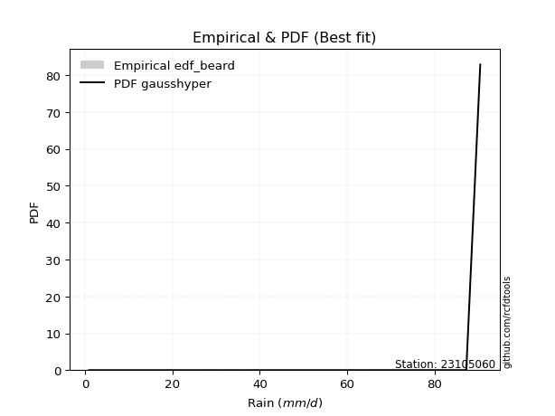</img>

</div>


### 5. EDF Chegodayev (1955)

The Chegodayev formula is an empirical plotting position formula used in hydrological frequency analysis to estimate the exceedance probability or return period of a specific event from a set of observed data. It is primarily used for plotting observed data points on probability paper to fit a theoretical distribution, particularly for analyzing extreme events like maximum flood flows or rainfall intensities. The constant _b_ value in the generalized plotting position formula is 0.3.

<div align="center">


$P=(m-b)/(n+1-2b)$


</div>


**5.1. Empirical values**

<div align="center">

|                | 0                   | 1                   | 2                   | 3                   | 4                   | 5                  | 6              | 7                  | 8                  | 9                  | 10                 | 11                 | 12                 |
|:---------------|:--------------------|:--------------------|:--------------------|:--------------------|:--------------------|:-------------------|:---------------|:-------------------|:-------------------|:-------------------|:-------------------|:-------------------|:-------------------|
| date           | 2013                | 2011                | 2017                | 2006                | 2014                | 2012               | 2008           | 2016               | 2018               | 2010               | 2007               | 2009               | 2015               |
| x              | 0.9                 | 3.9                 | 24.1                | 35.3                | 38.4                | 45.0               | 60.0           | 62.8               | 64.8               | 75.2               | 80.6               | 87.3               | 90.5               |
| m              | 1                   | 2                   | 3                   | 4                   | 5                   | 6                  | 7              | 8                  | 9                  | 10                 | 11                 | 12                 | 13                 |
| empirical_dist | edf_chegodayev      | edf_chegodayev      | edf_chegodayev      | edf_chegodayev      | edf_chegodayev      | edf_chegodayev     | edf_chegodayev | edf_chegodayev     | edf_chegodayev     | edf_chegodayev     | edf_chegodayev     | edf_chegodayev     | edf_chegodayev     |
| empirical      | 0.05223880597014925 | 0.12686567164179105 | 0.20149253731343283 | 0.27611940298507465 | 0.35074626865671643 | 0.4253731343283582 | 0.5            | 0.5746268656716418 | 0.6492537313432835 | 0.7238805970149254 | 0.7985074626865671 | 0.8731343283582089 | 0.9477611940298507 |
| empirical_tr   | 1.0551181102362206  | 1.1452991452991454  | 1.252336448598131   | 1.3814432989690721  | 1.5402298850574714  | 1.7402597402597402 | 2.0            | 2.350877192982456  | 2.851063829787233  | 3.6216216216216215 | 4.962962962962962  | 7.882352941176468  | 19.142857142857128 |

</div>


**5.2. Kolmogorov-Smirnov fit test (sorted by Δ)**


<div align="center">

|                | 0                   | 1                   | 2                   | 3                   | 4                   | 5                   | 6                   | 7                   | 8                   | 9                   | 10                  | 11                  | 12                  | 13                  | 14                  | 15                  | 16                  | 17                  | 18                  | 19                  | 20                  | 21                  | 22                  | 23                  | 24                  | 25                  | 26                  | 27                  | 28                  | 29                  | 30                  | 31                  | 32                  | 33                  | 34                  | 35                  | 36                  | 37                  | 38                  | 39                  | 40                  | 41                  | 42                  | 43                  | 44                  | 45                  | 46                  | 47                  | 48                  | 49                  | 50                  | 51                  | 52                  | 53                  | 54                  | 55                  | 56                  | 57                  | 58                  | 59                  | 60                  | 61                  | 62                  | 63                  | 64                  | 65                  | 66                  | 67                  | 68                  | 69                  | 70                  | 71                  | 72                  | 73                  | 74                  | 75                  | 76                  | 77                  | 78                  | 79                  | 80                  | 81                  | 82                  | 83                  | 84                  | 85                  | 86                  | 87                  | 88                  | 89                  | 90                  | 91                  | 92                  | 93                  | 94                  | 95                  | 96                  | 97                  | 98                  | 99                  | 100                 | 101                 | 102                 | 103                 | 104                 | 105                 | 106                 | 107                 | 108                 | 109                 | 110                 | 111                 | 112                 | 113                 | 114                 | 115                 | 116                 | 117                 | 118                 | 119                 | 120                 | 121                 | 122                 | 123                 | 124                 | 125                 | 126                 | 127                 | 128                 | 129                 | 130                 | 131                 | 132                 | 133                 | 134                 | 135                 | 136                 | 137                 | 138                 | 139                 | 140                 | 141                 | 142                 | 143                 | 144                 | 145                 | 146                 | 147                 | 148                 | 149                 | 150                 | 151                 | 152                 | 153                 | 154                 | 155                 | 156                 | 157                 | 158                 | 159                 |
|:---------------|:--------------------|:--------------------|:--------------------|:--------------------|:--------------------|:--------------------|:--------------------|:--------------------|:--------------------|:--------------------|:--------------------|:--------------------|:--------------------|:--------------------|:--------------------|:--------------------|:--------------------|:--------------------|:--------------------|:--------------------|:--------------------|:--------------------|:--------------------|:--------------------|:--------------------|:--------------------|:--------------------|:--------------------|:--------------------|:--------------------|:--------------------|:--------------------|:--------------------|:--------------------|:--------------------|:--------------------|:--------------------|:--------------------|:--------------------|:--------------------|:--------------------|:--------------------|:--------------------|:--------------------|:--------------------|:--------------------|:--------------------|:--------------------|:--------------------|:--------------------|:--------------------|:--------------------|:--------------------|:--------------------|:--------------------|:--------------------|:--------------------|:--------------------|:--------------------|:--------------------|:--------------------|:--------------------|:--------------------|:--------------------|:--------------------|:--------------------|:--------------------|:--------------------|:--------------------|:--------------------|:--------------------|:--------------------|:--------------------|:--------------------|:--------------------|:--------------------|:--------------------|:--------------------|:--------------------|:--------------------|:--------------------|:--------------------|:--------------------|:--------------------|:--------------------|:--------------------|:--------------------|:--------------------|:--------------------|:--------------------|:--------------------|:--------------------|:--------------------|:--------------------|:--------------------|:--------------------|:--------------------|:--------------------|:--------------------|:--------------------|:--------------------|:--------------------|:--------------------|:--------------------|:--------------------|:--------------------|:--------------------|:--------------------|:--------------------|:--------------------|:--------------------|:--------------------|:--------------------|:--------------------|:--------------------|:--------------------|:--------------------|:--------------------|:--------------------|:--------------------|:--------------------|:--------------------|:--------------------|:--------------------|:--------------------|:--------------------|:--------------------|:--------------------|:--------------------|:--------------------|:--------------------|:--------------------|:--------------------|:--------------------|:--------------------|:--------------------|:--------------------|:--------------------|:--------------------|:--------------------|:--------------------|:--------------------|:--------------------|:--------------------|:--------------------|:--------------------|:--------------------|:--------------------|:--------------------|:--------------------|:--------------------|:--------------------|:--------------------|:--------------------|:--------------------|:--------------------|:--------------------|:--------------------|:--------------------|:--------------------|
| station        | 23105060            | 23105060            | 23105060            | 23105060            | 23105060            | 23105060            | 23105060            | 23105060            | 23105060            | 23105060            | 23105060            | 23105060            | 23105060            | 23105060            | 23105060            | 23105060            | 23105060            | 23105060            | 23105060            | 23105060            | 23105060            | 23105060            | 23105060            | 23105060            | 23105060            | 23105060            | 23105060            | 23105060            | 23105060            | 23105060            | 23105060            | 23105060            | 23105060            | 23105060            | 23105060            | 23105060            | 23105060            | 23105060            | 23105060            | 23105060            | 23105060            | 23105060            | 23105060            | 23105060            | 23105060            | 23105060            | 23105060            | 23105060            | 23105060            | 23105060            | 23105060            | 23105060            | 23105060            | 23105060            | 23105060            | 23105060            | 23105060            | 23105060            | 23105060            | 23105060            | 23105060            | 23105060            | 23105060            | 23105060            | 23105060            | 23105060            | 23105060            | 23105060            | 23105060            | 23105060            | 23105060            | 23105060            | 23105060            | 23105060            | 23105060            | 23105060            | 23105060            | 23105060            | 23105060            | 23105060            | 23105060            | 23105060            | 23105060            | 23105060            | 23105060            | 23105060            | 23105060            | 23105060            | 23105060            | 23105060            | 23105060            | 23105060            | 23105060            | 23105060            | 23105060            | 23105060            | 23105060            | 23105060            | 23105060            | 23105060            | 23105060            | 23105060            | 23105060            | 23105060            | 23105060            | 23105060            | 23105060            | 23105060            | 23105060            | 23105060            | 23105060            | 23105060            | 23105060            | 23105060            | 23105060            | 23105060            | 23105060            | 23105060            | 23105060            | 23105060            | 23105060            | 23105060            | 23105060            | 23105060            | 23105060            | 23105060            | 23105060            | 23105060            | 23105060            | 23105060            | 23105060            | 23105060            | 23105060            | 23105060            | 23105060            | 23105060            | 23105060            | 23105060            | 23105060            | 23105060            | 23105060            | 23105060            | 23105060            | 23105060            | 23105060            | 23105060            | 23105060            | 23105060            | 23105060            | 23105060            | 23105060            | 23105060            | 23105060            | 23105060            | 23105060            | 23105060            | 23105060            | 23105060            | 23105060            | 23105060            |
| empirical_dist | edf_chegodayev      | edf_chegodayev      | edf_chegodayev      | edf_chegodayev      | edf_chegodayev      | edf_chegodayev      | edf_chegodayev      | edf_chegodayev      | edf_chegodayev      | edf_chegodayev      | edf_chegodayev      | edf_chegodayev      | edf_chegodayev      | edf_chegodayev      | edf_chegodayev      | edf_chegodayev      | edf_chegodayev      | edf_chegodayev      | edf_chegodayev      | edf_chegodayev      | edf_chegodayev      | edf_chegodayev      | edf_chegodayev      | edf_chegodayev      | edf_chegodayev      | edf_chegodayev      | edf_chegodayev      | edf_chegodayev      | edf_chegodayev      | edf_chegodayev      | edf_chegodayev      | edf_chegodayev      | edf_chegodayev      | edf_chegodayev      | edf_chegodayev      | edf_chegodayev      | edf_chegodayev      | edf_chegodayev      | edf_chegodayev      | edf_chegodayev      | edf_chegodayev      | edf_chegodayev      | edf_chegodayev      | edf_chegodayev      | edf_chegodayev      | edf_chegodayev      | edf_chegodayev      | edf_chegodayev      | edf_chegodayev      | edf_chegodayev      | edf_chegodayev      | edf_chegodayev      | edf_chegodayev      | edf_chegodayev      | edf_chegodayev      | edf_chegodayev      | edf_chegodayev      | edf_chegodayev      | edf_chegodayev      | edf_chegodayev      | edf_chegodayev      | edf_chegodayev      | edf_chegodayev      | edf_chegodayev      | edf_chegodayev      | edf_chegodayev      | edf_chegodayev      | edf_chegodayev      | edf_chegodayev      | edf_chegodayev      | edf_chegodayev      | edf_chegodayev      | edf_chegodayev      | edf_chegodayev      | edf_chegodayev      | edf_chegodayev      | edf_chegodayev      | edf_chegodayev      | edf_chegodayev      | edf_chegodayev      | edf_chegodayev      | edf_chegodayev      | edf_chegodayev      | edf_chegodayev      | edf_chegodayev      | edf_chegodayev      | edf_chegodayev      | edf_chegodayev      | edf_chegodayev      | edf_chegodayev      | edf_chegodayev      | edf_chegodayev      | edf_chegodayev      | edf_chegodayev      | edf_chegodayev      | edf_chegodayev      | edf_chegodayev      | edf_chegodayev      | edf_chegodayev      | edf_chegodayev      | edf_chegodayev      | edf_chegodayev      | edf_chegodayev      | edf_chegodayev      | edf_chegodayev      | edf_chegodayev      | edf_chegodayev      | edf_chegodayev      | edf_chegodayev      | edf_chegodayev      | edf_chegodayev      | edf_chegodayev      | edf_chegodayev      | edf_chegodayev      | edf_chegodayev      | edf_chegodayev      | edf_chegodayev      | edf_chegodayev      | edf_chegodayev      | edf_chegodayev      | edf_chegodayev      | edf_chegodayev      | edf_chegodayev      | edf_chegodayev      | edf_chegodayev      | edf_chegodayev      | edf_chegodayev      | edf_chegodayev      | edf_chegodayev      | edf_chegodayev      | edf_chegodayev      | edf_chegodayev      | edf_chegodayev      | edf_chegodayev      | edf_chegodayev      | edf_chegodayev      | edf_chegodayev      | edf_chegodayev      | edf_chegodayev      | edf_chegodayev      | edf_chegodayev      | edf_chegodayev      | edf_chegodayev      | edf_chegodayev      | edf_chegodayev      | edf_chegodayev      | edf_chegodayev      | edf_chegodayev      | edf_chegodayev      | edf_chegodayev      | edf_chegodayev      | edf_chegodayev      | edf_chegodayev      | edf_chegodayev      | edf_chegodayev      | edf_chegodayev      | edf_chegodayev      | edf_chegodayev      | edf_chegodayev      | edf_chegodayev      |
| p_dist         | gausshyper          | beta                | trapezoid           | weibull_min         | burr12              | triang              | skewnorm            | argus               | gumbel_l            | dgamma              | logjohnsonsu        | dweibull            | genpareto           | semicircular        | pearson3            | anglit              | genextreme          | genhalflogistic     | johnsonsu           | nct                 | exponnorm           | norm                | crystalball         | t                   | fatiguelife         | loggenextreme       | foldnorm            | loglevy_l           | f                   | betaprime           | gamma               | erlang              | gengamma            | arcsine             | rice                | logistic            | ksone               | wrapcauchy          | invweibull          | invgamma            | truncweibull_min    | cosine              | maxwell             | hypsecant           | ncf                 | rayleigh            | burr                | invgauss            | logburr             | kappa3              | uniform             | logargus            | vonmises_line       | kstwobign           | logexponweib        | logloggamma         | logpearson3         | halfnorm            | laplace             | loggumbel_l         | logburr12           | logt                | logweibull_min      | loggompertz         | kappa4              | gumbel_r            | logvonmises_line    | mielke              | bradford            | halflogistic        | loggennorm          | moyal               | loggenhalflogistic  | genexpon            | logdgamma           | logtrapezoid        | logfoldnorm         | loggausshyper       | truncexpon          | logdweibull         | logfatiguelife      | logsemicircular     | loganglit           | logbetaprime        | lognakagami         | logexponnorm        | lognorm             | logrice             | lognct              | loglogistic         | logweibull_max      | loghypsecant        | loginvgamma         | logerlang           | logalpha            | loglaplace          | loglaplace          | loggengamma         | loggamma            | loggamma            | wald                | logarcsine          | levy_l              | loginvweibull       | lomax               | loginvgauss         | loggenpareto        | logmaxwell          | lograyleigh         | halfgennorm         | logskewnorm         | logkstwobign        | loggumbel_r         | loghalfnorm         | logbeta             | loggenexpon         | logcosine           | logmoyal            | loghalflogistic     | logwrapcauchy       | logtriang           | gennorm             | logncf              | loglomax            | logwald             | logloglaplace       | loghalfgennorm      | exponweib           | logtruncweibull_min | logf                | logksone            | logkappa4           | powerlaw            | nakagami            | logkappa3           | loguniform          | gompertz            | logmielke           | logbradford         | logjohnsonsb        | rdist               | tukeylambda         | logtruncnorm        | weibull_max         | logtruncexpon       | johnsonsb           | logexponpow         | logtukeylambda      | alpha               | logpowerlaw         | exponpow            | truncpareto         | truncnorm           | logtruncpareto      | logrdist            | genlogistic         | loggenlogistic      | logvonmises         | vonmises            | logcrystalball      |
| delta          | 0.06028051418659289 | 0.06144832724686976 | 0.06411266820371386 | 0.0687662408601798  | 0.06900526236521731 | 0.07734970820014295 | 0.07804346248825805 | 0.08058076810145495 | 0.0821107541634491  | 0.08843589782969974 | 0.08989244475583102 | 0.09019165617813739 | 0.09181821349097882 | 0.09481208327284896 | 0.09532236353482904 | 0.10149066630280312 | 0.10192653517142969 | 0.10500307931665964 | 0.11703672167913304 | 0.11750952240283796 | 0.11752108515147597 | 0.11752168009488817 | 0.11752168622200632 | 0.11752216762504708 | 0.11792979778475865 | 0.11817444060715487 | 0.11839001807416372 | 0.11926188052402402 | 0.11937499334141    | 0.12032497271449594 | 0.12266577742699603 | 0.1234439893981879  | 0.12389356664033269 | 0.12686567164179105 | 0.1268768040044479  | 0.13234416994337073 | 0.13299851190476197 | 0.1332331109838062  | 0.13342792375269685 | 0.1348231645123814  | 0.1359636870388654  | 0.13645304190756535 | 0.14244030347164816 | 0.14427884628762921 | 0.14547152334217905 | 0.15008658724068824 | 0.1524123322568397  | 0.15308142476821174 | 0.15744243567571453 | 0.15916588113893848 | 0.1595982142857143  | 0.1597559944216531  | 0.16113664449358334 | 0.16213559771811825 | 0.16378477325760799 | 0.1638348446889576  | 0.17188526786197778 | 0.17198095450821727 | 0.17240142560350913 | 0.17260681381176846 | 0.1741476185575277  | 0.17485679939204424 | 0.17580698453501986 | 0.17654294470981347 | 0.17965696444650026 | 0.18206087308734753 | 0.185619740367429   | 0.19858685579481594 | 0.1994717929960339  | 0.20035429029955232 | 0.20070712536135094 | 0.20385478253640188 | 0.2204468864513885  | 0.22306107710444123 | 0.22704576188430758 | 0.22806217982583166 | 0.22960893546999017 | 0.23287731641631004 | 0.23401218198914853 | 0.23787628948532902 | 0.23839086386573505 | 0.23849928576773438 | 0.2395782733710341  | 0.2401967379332144  | 0.24201424429702711 | 0.24219414694011887 | 0.2421957341774199  | 0.2422031996267392  | 0.24253613770000104 | 0.24469341974077718 | 0.2457565285686901  | 0.24682339591868152 | 0.25233273892244545 | 0.2524703357059812  | 0.25267127312123594 | 0.25532263888777473 | 0.25532263888777473 | 0.2607339186886015  | 0.26351372258221084 | 0.26351372258221084 | 0.26484854061218965 | 0.2664240743589251  | 0.2666143810786879  | 0.2667813873942042  | 0.2691906388344927  | 0.27193212278574685 | 0.2729426358394693  | 0.27442435366154383 | 0.2850125504293317  | 0.2891066084932654  | 0.3035093133740736  | 0.3041742380233121  | 0.31287196711852994 | 0.3148304715874557  | 0.32323589253891505 | 0.3269763745726164  | 0.3295850047554447  | 0.33850050041388324 | 0.34079135265923544 | 0.357836898655961   | 0.3674451209711348  | 0.3731343283582089  | 0.38319298860118245 | 0.4013389277336169  | 0.40969532755847193 | 0.4472066645363433  | 0.4543248219207129  | 0.4635459830869675  | 0.470330820785696   | 0.473138213411435   | 0.4760320187249931  | 0.47698136618162745 | 0.5034704769415931  | 0.5036358773253379  | 0.5196453947755709  | 0.5196893093480905  | 0.5207612384696856  | 0.5219060434052933  | 0.5478333387432719  | 0.5527218492902566  | 0.5746268622641227  | 0.5783204236222366  | 0.5859031341315258  | 0.6020719341592097  | 0.610681316863634   | 0.6456015695822367  | 0.6518690925662263  | 0.6777896493865985  | 0.693744742541317   | 0.7007709174848804  | 0.7312751375051207  | 0.7428004016743421  | 0.7681607819305152  | 0.7864387564061923  | 0.7985074454852642  | 0.8731343283582089  | 0.8731343283582089  | 1.0075807307127183  | 14.010251036465874  | nan                 |
| deltao         | 0.35149047353100005 | 0.35149047353100005 | 0.35149047353100005 | 0.35149047353100005 | 0.35149047353100005 | 0.35149047353100005 | 0.35149047353100005 | 0.35149047353100005 | 0.35149047353100005 | 0.35149047353100005 | 0.35149047353100005 | 0.35149047353100005 | 0.35149047353100005 | 0.35149047353100005 | 0.35149047353100005 | 0.35149047353100005 | 0.35149047353100005 | 0.35149047353100005 | 0.35149047353100005 | 0.35149047353100005 | 0.35149047353100005 | 0.35149047353100005 | 0.35149047353100005 | 0.35149047353100005 | 0.35149047353100005 | 0.35149047353100005 | 0.35149047353100005 | 0.35149047353100005 | 0.35149047353100005 | 0.35149047353100005 | 0.35149047353100005 | 0.35149047353100005 | 0.35149047353100005 | 0.35149047353100005 | 0.35149047353100005 | 0.35149047353100005 | 0.35149047353100005 | 0.35149047353100005 | 0.35149047353100005 | 0.35149047353100005 | 0.35149047353100005 | 0.35149047353100005 | 0.35149047353100005 | 0.35149047353100005 | 0.35149047353100005 | 0.35149047353100005 | 0.35149047353100005 | 0.35149047353100005 | 0.35149047353100005 | 0.35149047353100005 | 0.35149047353100005 | 0.35149047353100005 | 0.35149047353100005 | 0.35149047353100005 | 0.35149047353100005 | 0.35149047353100005 | 0.35149047353100005 | 0.35149047353100005 | 0.35149047353100005 | 0.35149047353100005 | 0.35149047353100005 | 0.35149047353100005 | 0.35149047353100005 | 0.35149047353100005 | 0.35149047353100005 | 0.35149047353100005 | 0.35149047353100005 | 0.35149047353100005 | 0.35149047353100005 | 0.35149047353100005 | 0.35149047353100005 | 0.35149047353100005 | 0.35149047353100005 | 0.35149047353100005 | 0.35149047353100005 | 0.35149047353100005 | 0.35149047353100005 | 0.35149047353100005 | 0.35149047353100005 | 0.35149047353100005 | 0.35149047353100005 | 0.35149047353100005 | 0.35149047353100005 | 0.35149047353100005 | 0.35149047353100005 | 0.35149047353100005 | 0.35149047353100005 | 0.35149047353100005 | 0.35149047353100005 | 0.35149047353100005 | 0.35149047353100005 | 0.35149047353100005 | 0.35149047353100005 | 0.35149047353100005 | 0.35149047353100005 | 0.35149047353100005 | 0.35149047353100005 | 0.35149047353100005 | 0.35149047353100005 | 0.35149047353100005 | 0.35149047353100005 | 0.35149047353100005 | 0.35149047353100005 | 0.35149047353100005 | 0.35149047353100005 | 0.35149047353100005 | 0.35149047353100005 | 0.35149047353100005 | 0.35149047353100005 | 0.35149047353100005 | 0.35149047353100005 | 0.35149047353100005 | 0.35149047353100005 | 0.35149047353100005 | 0.35149047353100005 | 0.35149047353100005 | 0.35149047353100005 | 0.35149047353100005 | 0.35149047353100005 | 0.35149047353100005 | 0.35149047353100005 | 0.35149047353100005 | 0.35149047353100005 | 0.35149047353100005 | 0.35149047353100005 | 0.35149047353100005 | 0.35149047353100005 | 0.35149047353100005 | 0.35149047353100005 | 0.35149047353100005 | 0.35149047353100005 | 0.35149047353100005 | 0.35149047353100005 | 0.35149047353100005 | 0.35149047353100005 | 0.35149047353100005 | 0.35149047353100005 | 0.35149047353100005 | 0.35149047353100005 | 0.35149047353100005 | 0.35149047353100005 | 0.35149047353100005 | 0.35149047353100005 | 0.35149047353100005 | 0.35149047353100005 | 0.35149047353100005 | 0.35149047353100005 | 0.35149047353100005 | 0.35149047353100005 | 0.35149047353100005 | 0.35149047353100005 | 0.35149047353100005 | 0.35149047353100005 | 0.35149047353100005 | 0.35149047353100005 | 0.35149047353100005 | 0.35149047353100005 | 0.35149047353100005 | 0.35149047353100005 | 0.35149047353100005 |
| eval           | Δo > Δ              | Δo > Δ              | Δo > Δ              | Δo > Δ              | Δo > Δ              | Δo > Δ              | Δo > Δ              | Δo > Δ              | Δo > Δ              | Δo > Δ              | Δo > Δ              | Δo > Δ              | Δo > Δ              | Δo > Δ              | Δo > Δ              | Δo > Δ              | Δo > Δ              | Δo > Δ              | Δo > Δ              | Δo > Δ              | Δo > Δ              | Δo > Δ              | Δo > Δ              | Δo > Δ              | Δo > Δ              | Δo > Δ              | Δo > Δ              | Δo > Δ              | Δo > Δ              | Δo > Δ              | Δo > Δ              | Δo > Δ              | Δo > Δ              | Δo > Δ              | Δo > Δ              | Δo > Δ              | Δo > Δ              | Δo > Δ              | Δo > Δ              | Δo > Δ              | Δo > Δ              | Δo > Δ              | Δo > Δ              | Δo > Δ              | Δo > Δ              | Δo > Δ              | Δo > Δ              | Δo > Δ              | Δo > Δ              | Δo > Δ              | Δo > Δ              | Δo > Δ              | Δo > Δ              | Δo > Δ              | Δo > Δ              | Δo > Δ              | Δo > Δ              | Δo > Δ              | Δo > Δ              | Δo > Δ              | Δo > Δ              | Δo > Δ              | Δo > Δ              | Δo > Δ              | Δo > Δ              | Δo > Δ              | Δo > Δ              | Δo > Δ              | Δo > Δ              | Δo > Δ              | Δo > Δ              | Δo > Δ              | Δo > Δ              | Δo > Δ              | Δo > Δ              | Δo > Δ              | Δo > Δ              | Δo > Δ              | Δo > Δ              | Δo > Δ              | Δo > Δ              | Δo > Δ              | Δo > Δ              | Δo > Δ              | Δo > Δ              | Δo > Δ              | Δo > Δ              | Δo > Δ              | Δo > Δ              | Δo > Δ              | Δo > Δ              | Δo > Δ              | Δo > Δ              | Δo > Δ              | Δo > Δ              | Δo > Δ              | Δo > Δ              | Δo > Δ              | Δo > Δ              | Δo > Δ              | Δo > Δ              | Δo > Δ              | Δo > Δ              | Δo > Δ              | Δo > Δ              | Δo > Δ              | Δo > Δ              | Δo > Δ              | Δo > Δ              | Δo > Δ              | Δo > Δ              | Δo > Δ              | Δo > Δ              | Δo > Δ              | Δo > Δ              | Δo > Δ              | Δo > Δ              | Δo > Δ              | Δo > Δ              | Δo <= Δ             | Δo <= Δ             | Δo <= Δ             | Δo <= Δ             | Δo <= Δ             | Δo <= Δ             | Δo <= Δ             | Δo <= Δ             | Δo <= Δ             | Δo <= Δ             | Δo <= Δ             | Δo <= Δ             | Δo <= Δ             | Δo <= Δ             | Δo <= Δ             | Δo <= Δ             | Δo <= Δ             | Δo <= Δ             | Δo <= Δ             | Δo <= Δ             | Δo <= Δ             | Δo <= Δ             | Δo <= Δ             | Δo <= Δ             | Δo <= Δ             | Δo <= Δ             | Δo <= Δ             | Δo <= Δ             | Δo <= Δ             | Δo <= Δ             | Δo <= Δ             | Δo <= Δ             | Δo <= Δ             | Δo <= Δ             | Δo <= Δ             | Δo <= Δ             | Δo <= Δ             | Δo <= Δ             | Δo <= Δ             | Δo <= Δ             | Δo <= Δ             |
| fit            | 1                   | 1                   | 1                   | 1                   | 1                   | 1                   | 1                   | 1                   | 1                   | 1                   | 1                   | 1                   | 1                   | 1                   | 1                   | 1                   | 1                   | 1                   | 1                   | 1                   | 1                   | 1                   | 1                   | 1                   | 1                   | 1                   | 1                   | 1                   | 1                   | 1                   | 1                   | 1                   | 1                   | 1                   | 1                   | 1                   | 1                   | 1                   | 1                   | 1                   | 1                   | 1                   | 1                   | 1                   | 1                   | 1                   | 1                   | 1                   | 1                   | 1                   | 1                   | 1                   | 1                   | 1                   | 1                   | 1                   | 1                   | 1                   | 1                   | 1                   | 1                   | 1                   | 1                   | 1                   | 1                   | 1                   | 1                   | 1                   | 1                   | 1                   | 1                   | 1                   | 1                   | 1                   | 1                   | 1                   | 1                   | 1                   | 1                   | 1                   | 1                   | 1                   | 1                   | 1                   | 1                   | 1                   | 1                   | 1                   | 1                   | 1                   | 1                   | 1                   | 1                   | 1                   | 1                   | 1                   | 1                   | 1                   | 1                   | 1                   | 1                   | 1                   | 1                   | 1                   | 1                   | 1                   | 1                   | 1                   | 1                   | 1                   | 1                   | 1                   | 1                   | 1                   | 1                   | 1                   | 1                   | 1                   | 1                   | 0                   | 0                   | 0                   | 0                   | 0                   | 0                   | 0                   | 0                   | 0                   | 0                   | 0                   | 0                   | 0                   | 0                   | 0                   | 0                   | 0                   | 0                   | 0                   | 0                   | 0                   | 0                   | 0                   | 0                   | 0                   | 0                   | 0                   | 0                   | 0                   | 0                   | 0                   | 0                   | 0                   | 0                   | 0                   | 0                   | 0                   | 0                   | 0                   | 0                   | 0                   |
| n              | 13                  | 13                  | 13                  | 13                  | 13                  | 13                  | 13                  | 13                  | 13                  | 13                  | 13                  | 13                  | 13                  | 13                  | 13                  | 13                  | 13                  | 13                  | 13                  | 13                  | 13                  | 13                  | 13                  | 13                  | 13                  | 13                  | 13                  | 13                  | 13                  | 13                  | 13                  | 13                  | 13                  | 13                  | 13                  | 13                  | 13                  | 13                  | 13                  | 13                  | 13                  | 13                  | 13                  | 13                  | 13                  | 13                  | 13                  | 13                  | 13                  | 13                  | 13                  | 13                  | 13                  | 13                  | 13                  | 13                  | 13                  | 13                  | 13                  | 13                  | 13                  | 13                  | 13                  | 13                  | 13                  | 13                  | 13                  | 13                  | 13                  | 13                  | 13                  | 13                  | 13                  | 13                  | 13                  | 13                  | 13                  | 13                  | 13                  | 13                  | 13                  | 13                  | 13                  | 13                  | 13                  | 13                  | 13                  | 13                  | 13                  | 13                  | 13                  | 13                  | 13                  | 13                  | 13                  | 13                  | 13                  | 13                  | 13                  | 13                  | 13                  | 13                  | 13                  | 13                  | 13                  | 13                  | 13                  | 13                  | 13                  | 13                  | 13                  | 13                  | 13                  | 13                  | 13                  | 13                  | 13                  | 13                  | 13                  | 13                  | 13                  | 13                  | 13                  | 13                  | 13                  | 13                  | 13                  | 13                  | 13                  | 13                  | 13                  | 13                  | 13                  | 13                  | 13                  | 13                  | 13                  | 13                  | 13                  | 13                  | 13                  | 13                  | 13                  | 13                  | 13                  | 13                  | 13                  | 13                  | 13                  | 13                  | 13                  | 13                  | 13                  | 13                  | 13                  | 13                  | 13                  | 13                  | 13                  | 13                  |
| best_fit       | 1                   | 0                   | 0                   | 0                   | 0                   | 0                   | 0                   | 0                   | 0                   | 0                   | 0                   | 0                   | 0                   | 0                   | 0                   | 0                   | 0                   | 0                   | 0                   | 0                   | 0                   | 0                   | 0                   | 0                   | 0                   | 0                   | 0                   | 0                   | 0                   | 0                   | 0                   | 0                   | 0                   | 0                   | 0                   | 0                   | 0                   | 0                   | 0                   | 0                   | 0                   | 0                   | 0                   | 0                   | 0                   | 0                   | 0                   | 0                   | 0                   | 0                   | 0                   | 0                   | 0                   | 0                   | 0                   | 0                   | 0                   | 0                   | 0                   | 0                   | 0                   | 0                   | 0                   | 0                   | 0                   | 0                   | 0                   | 0                   | 0                   | 0                   | 0                   | 0                   | 0                   | 0                   | 0                   | 0                   | 0                   | 0                   | 0                   | 0                   | 0                   | 0                   | 0                   | 0                   | 0                   | 0                   | 0                   | 0                   | 0                   | 0                   | 0                   | 0                   | 0                   | 0                   | 0                   | 0                   | 0                   | 0                   | 0                   | 0                   | 0                   | 0                   | 0                   | 0                   | 0                   | 0                   | 0                   | 0                   | 0                   | 0                   | 0                   | 0                   | 0                   | 0                   | 0                   | 0                   | 0                   | 0                   | 0                   | 0                   | 0                   | 0                   | 0                   | 0                   | 0                   | 0                   | 0                   | 0                   | 0                   | 0                   | 0                   | 0                   | 0                   | 0                   | 0                   | 0                   | 0                   | 0                   | 0                   | 0                   | 0                   | 0                   | 0                   | 0                   | 0                   | 0                   | 0                   | 0                   | 0                   | 0                   | 0                   | 0                   | 0                   | 0                   | 0                   | 0                   | 0                   | 0                   | 0                   | 0                   |
| best_fit_sort  | 1                   | 2                   | 3                   | 4                   | 5                   | 6                   | 7                   | 8                   | 9                   | 10                  | 11                  | 12                  | 13                  | 14                  | 15                  | 16                  | 17                  | 18                  | 19                  | 20                  | 21                  | 22                  | 23                  | 24                  | 25                  | 26                  | 27                  | 28                  | 29                  | 30                  | 31                  | 32                  | 33                  | 34                  | 35                  | 36                  | 37                  | 38                  | 39                  | 40                  | 41                  | 42                  | 43                  | 44                  | 45                  | 46                  | 47                  | 48                  | 49                  | 50                  | 51                  | 52                  | 53                  | 54                  | 55                  | 56                  | 57                  | 58                  | 59                  | 60                  | 61                  | 62                  | 63                  | 64                  | 65                  | 66                  | 67                  | 68                  | 69                  | 70                  | 71                  | 72                  | 73                  | 74                  | 75                  | 76                  | 77                  | 78                  | 79                  | 80                  | 81                  | 82                  | 83                  | 84                  | 85                  | 86                  | 87                  | 88                  | 89                  | 90                  | 91                  | 92                  | 93                  | 94                  | 95                  | 96                  | 97                  | 98                  | 99                  | 100                 | 101                 | 102                 | 103                 | 104                 | 105                 | 106                 | 107                 | 108                 | 109                 | 110                 | 111                 | 112                 | 113                 | 114                 | 115                 | 116                 | 117                 | 118                 | 119                 | 120                 | 121                 | 122                 | 123                 | 124                 | 125                 | 126                 | 127                 | 128                 | 129                 | 130                 | 131                 | 132                 | 133                 | 134                 | 135                 | 136                 | 137                 | 138                 | 139                 | 140                 | 141                 | 142                 | 143                 | 144                 | 145                 | 146                 | 147                 | 148                 | 149                 | 150                 | 151                 | 152                 | 153                 | 154                 | 155                 | 156                 | 157                 | 158                 | 159                 | 160                 |

</div>


**5.3. Best fit**

<div align="center">

|   id |   station | empirical_dist   | p_dist     |     delta |   deltao | eval   |   fit |   n |   best_fit |   best_fit_sort |
|-----:|----------:|:-----------------|:-----------|----------:|---------:|:-------|------:|----:|-----------:|----------------:|
|    0 |  23105060 | edf_chegodayev   | gausshyper | 0.0602805 |  0.35149 | Δo > Δ |     1 |  13 |          1 |               1 |

</div>


<div align="center">

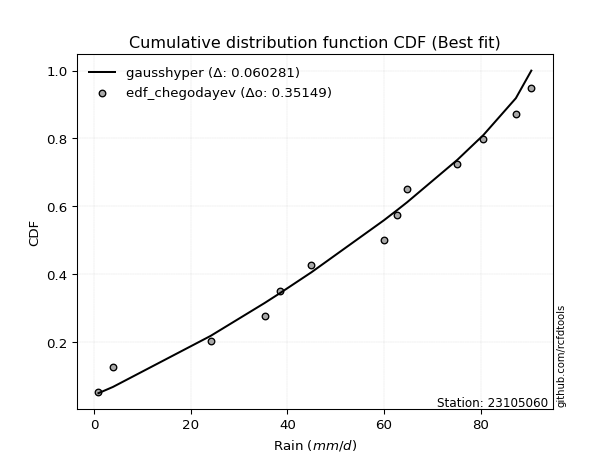</img>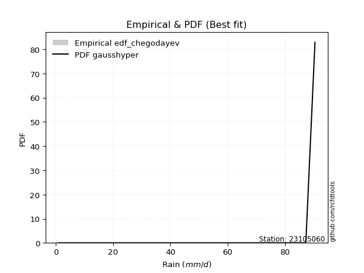</img>

</div>


### 6. EDF Blom (1958)

The Blom formula is a specific "plotting position" formula used in hydrology and statistical analysis to estimate the empirical cumulative probability (or non-exceedance probability) of a data series. It is particularly recommended for data that are approximately normally distributed. The constant _a_ is set to 0.375 (or 3/8).

<div align="center">


$P=(m-a)/(n+1-2a)$


</div>


**6.1. Empirical values**

<div align="center">

|                | 0                   | 1                   | 2                   | 3                   | 4                  | 5                   | 6        | 7                  | 8                  | 9                  | 10                 | 11                 | 12                 |
|:---------------|:--------------------|:--------------------|:--------------------|:--------------------|:-------------------|:--------------------|:---------|:-------------------|:-------------------|:-------------------|:-------------------|:-------------------|:-------------------|
| date           | 2013                | 2011                | 2017                | 2006                | 2014               | 2012                | 2008     | 2016               | 2018               | 2010               | 2007               | 2009               | 2015               |
| x              | 0.9                 | 3.9                 | 24.1                | 35.3                | 38.4               | 45.0                | 60.0     | 62.8               | 64.8               | 75.2               | 80.6               | 87.3               | 90.5               |
| m              | 1                   | 2                   | 3                   | 4                   | 5                  | 6                   | 7        | 8                  | 9                  | 10                 | 11                 | 12                 | 13                 |
| empirical_dist | edf_blom            | edf_blom            | edf_blom            | edf_blom            | edf_blom           | edf_blom            | edf_blom | edf_blom           | edf_blom           | edf_blom           | edf_blom           | edf_blom           | edf_blom           |
| empirical      | 0.04716981132075472 | 0.12264150943396226 | 0.19811320754716982 | 0.27358490566037735 | 0.3490566037735849 | 0.42452830188679247 | 0.5      | 0.5754716981132075 | 0.6509433962264151 | 0.7264150943396226 | 0.8018867924528302 | 0.8773584905660378 | 0.9528301886792453 |
| empirical_tr   | 1.0495049504950495  | 1.139784946236559   | 1.2470588235294118  | 1.3766233766233766  | 1.5362318840579712 | 1.737704918032787   | 2.0      | 2.3555555555555556 | 2.8648648648648645 | 3.6551724137931028 | 5.047619047619048  | 8.153846153846155  | 21.200000000000006 |

</div>


**6.2. Kolmogorov-Smirnov fit test (sorted by Δ)**


<div align="center">

|                | 0                   | 1                   | 2                   | 3                   | 4                   | 5                   | 6                   | 7                   | 8                   | 9                   | 10                  | 11                  | 12                  | 13                  | 14                  | 15                  | 16                  | 17                  | 18                  | 19                  | 20                  | 21                  | 22                  | 23                  | 24                  | 25                  | 26                  | 27                  | 28                  | 29                  | 30                  | 31                  | 32                  | 33                  | 34                  | 35                  | 36                  | 37                  | 38                  | 39                  | 40                  | 41                  | 42                  | 43                  | 44                  | 45                  | 46                  | 47                  | 48                  | 49                  | 50                  | 51                  | 52                  | 53                  | 54                  | 55                  | 56                  | 57                  | 58                  | 59                  | 60                  | 61                  | 62                  | 63                  | 64                  | 65                  | 66                  | 67                  | 68                  | 69                  | 70                  | 71                  | 72                  | 73                  | 74                  | 75                  | 76                  | 77                  | 78                  | 79                  | 80                  | 81                  | 82                  | 83                  | 84                  | 85                  | 86                  | 87                  | 88                  | 89                  | 90                  | 91                  | 92                  | 93                  | 94                  | 95                  | 96                  | 97                  | 98                  | 99                  | 100                 | 101                 | 102                 | 103                 | 104                 | 105                 | 106                 | 107                 | 108                 | 109                 | 110                 | 111                 | 112                 | 113                 | 114                 | 115                 | 116                 | 117                 | 118                 | 119                 | 120                 | 121                 | 122                 | 123                 | 124                 | 125                 | 126                 | 127                 | 128                 | 129                 | 130                 | 131                 | 132                 | 133                 | 134                 | 135                 | 136                 | 137                 | 138                 | 139                 | 140                 | 141                 | 142                 | 143                 | 144                 | 145                 | 146                 | 147                 | 148                 | 149                 | 150                 | 151                 | 152                 | 153                 | 154                 | 155                 | 156                 | 157                 | 158                 | 159                 |
|:---------------|:--------------------|:--------------------|:--------------------|:--------------------|:--------------------|:--------------------|:--------------------|:--------------------|:--------------------|:--------------------|:--------------------|:--------------------|:--------------------|:--------------------|:--------------------|:--------------------|:--------------------|:--------------------|:--------------------|:--------------------|:--------------------|:--------------------|:--------------------|:--------------------|:--------------------|:--------------------|:--------------------|:--------------------|:--------------------|:--------------------|:--------------------|:--------------------|:--------------------|:--------------------|:--------------------|:--------------------|:--------------------|:--------------------|:--------------------|:--------------------|:--------------------|:--------------------|:--------------------|:--------------------|:--------------------|:--------------------|:--------------------|:--------------------|:--------------------|:--------------------|:--------------------|:--------------------|:--------------------|:--------------------|:--------------------|:--------------------|:--------------------|:--------------------|:--------------------|:--------------------|:--------------------|:--------------------|:--------------------|:--------------------|:--------------------|:--------------------|:--------------------|:--------------------|:--------------------|:--------------------|:--------------------|:--------------------|:--------------------|:--------------------|:--------------------|:--------------------|:--------------------|:--------------------|:--------------------|:--------------------|:--------------------|:--------------------|:--------------------|:--------------------|:--------------------|:--------------------|:--------------------|:--------------------|:--------------------|:--------------------|:--------------------|:--------------------|:--------------------|:--------------------|:--------------------|:--------------------|:--------------------|:--------------------|:--------------------|:--------------------|:--------------------|:--------------------|:--------------------|:--------------------|:--------------------|:--------------------|:--------------------|:--------------------|:--------------------|:--------------------|:--------------------|:--------------------|:--------------------|:--------------------|:--------------------|:--------------------|:--------------------|:--------------------|:--------------------|:--------------------|:--------------------|:--------------------|:--------------------|:--------------------|:--------------------|:--------------------|:--------------------|:--------------------|:--------------------|:--------------------|:--------------------|:--------------------|:--------------------|:--------------------|:--------------------|:--------------------|:--------------------|:--------------------|:--------------------|:--------------------|:--------------------|:--------------------|:--------------------|:--------------------|:--------------------|:--------------------|:--------------------|:--------------------|:--------------------|:--------------------|:--------------------|:--------------------|:--------------------|:--------------------|:--------------------|:--------------------|:--------------------|:--------------------|:--------------------|:--------------------|
| station        | 23105060            | 23105060            | 23105060            | 23105060            | 23105060            | 23105060            | 23105060            | 23105060            | 23105060            | 23105060            | 23105060            | 23105060            | 23105060            | 23105060            | 23105060            | 23105060            | 23105060            | 23105060            | 23105060            | 23105060            | 23105060            | 23105060            | 23105060            | 23105060            | 23105060            | 23105060            | 23105060            | 23105060            | 23105060            | 23105060            | 23105060            | 23105060            | 23105060            | 23105060            | 23105060            | 23105060            | 23105060            | 23105060            | 23105060            | 23105060            | 23105060            | 23105060            | 23105060            | 23105060            | 23105060            | 23105060            | 23105060            | 23105060            | 23105060            | 23105060            | 23105060            | 23105060            | 23105060            | 23105060            | 23105060            | 23105060            | 23105060            | 23105060            | 23105060            | 23105060            | 23105060            | 23105060            | 23105060            | 23105060            | 23105060            | 23105060            | 23105060            | 23105060            | 23105060            | 23105060            | 23105060            | 23105060            | 23105060            | 23105060            | 23105060            | 23105060            | 23105060            | 23105060            | 23105060            | 23105060            | 23105060            | 23105060            | 23105060            | 23105060            | 23105060            | 23105060            | 23105060            | 23105060            | 23105060            | 23105060            | 23105060            | 23105060            | 23105060            | 23105060            | 23105060            | 23105060            | 23105060            | 23105060            | 23105060            | 23105060            | 23105060            | 23105060            | 23105060            | 23105060            | 23105060            | 23105060            | 23105060            | 23105060            | 23105060            | 23105060            | 23105060            | 23105060            | 23105060            | 23105060            | 23105060            | 23105060            | 23105060            | 23105060            | 23105060            | 23105060            | 23105060            | 23105060            | 23105060            | 23105060            | 23105060            | 23105060            | 23105060            | 23105060            | 23105060            | 23105060            | 23105060            | 23105060            | 23105060            | 23105060            | 23105060            | 23105060            | 23105060            | 23105060            | 23105060            | 23105060            | 23105060            | 23105060            | 23105060            | 23105060            | 23105060            | 23105060            | 23105060            | 23105060            | 23105060            | 23105060            | 23105060            | 23105060            | 23105060            | 23105060            | 23105060            | 23105060            | 23105060            | 23105060            | 23105060            | 23105060            |
| empirical_dist | edf_blom            | edf_blom            | edf_blom            | edf_blom            | edf_blom            | edf_blom            | edf_blom            | edf_blom            | edf_blom            | edf_blom            | edf_blom            | edf_blom            | edf_blom            | edf_blom            | edf_blom            | edf_blom            | edf_blom            | edf_blom            | edf_blom            | edf_blom            | edf_blom            | edf_blom            | edf_blom            | edf_blom            | edf_blom            | edf_blom            | edf_blom            | edf_blom            | edf_blom            | edf_blom            | edf_blom            | edf_blom            | edf_blom            | edf_blom            | edf_blom            | edf_blom            | edf_blom            | edf_blom            | edf_blom            | edf_blom            | edf_blom            | edf_blom            | edf_blom            | edf_blom            | edf_blom            | edf_blom            | edf_blom            | edf_blom            | edf_blom            | edf_blom            | edf_blom            | edf_blom            | edf_blom            | edf_blom            | edf_blom            | edf_blom            | edf_blom            | edf_blom            | edf_blom            | edf_blom            | edf_blom            | edf_blom            | edf_blom            | edf_blom            | edf_blom            | edf_blom            | edf_blom            | edf_blom            | edf_blom            | edf_blom            | edf_blom            | edf_blom            | edf_blom            | edf_blom            | edf_blom            | edf_blom            | edf_blom            | edf_blom            | edf_blom            | edf_blom            | edf_blom            | edf_blom            | edf_blom            | edf_blom            | edf_blom            | edf_blom            | edf_blom            | edf_blom            | edf_blom            | edf_blom            | edf_blom            | edf_blom            | edf_blom            | edf_blom            | edf_blom            | edf_blom            | edf_blom            | edf_blom            | edf_blom            | edf_blom            | edf_blom            | edf_blom            | edf_blom            | edf_blom            | edf_blom            | edf_blom            | edf_blom            | edf_blom            | edf_blom            | edf_blom            | edf_blom            | edf_blom            | edf_blom            | edf_blom            | edf_blom            | edf_blom            | edf_blom            | edf_blom            | edf_blom            | edf_blom            | edf_blom            | edf_blom            | edf_blom            | edf_blom            | edf_blom            | edf_blom            | edf_blom            | edf_blom            | edf_blom            | edf_blom            | edf_blom            | edf_blom            | edf_blom            | edf_blom            | edf_blom            | edf_blom            | edf_blom            | edf_blom            | edf_blom            | edf_blom            | edf_blom            | edf_blom            | edf_blom            | edf_blom            | edf_blom            | edf_blom            | edf_blom            | edf_blom            | edf_blom            | edf_blom            | edf_blom            | edf_blom            | edf_blom            | edf_blom            | edf_blom            | edf_blom            | edf_blom            | edf_blom            | edf_blom            | edf_blom            |
| p_dist         | beta                | gausshyper          | trapezoid           | weibull_min         | burr12              | triang              | argus               | skewnorm            | gumbel_l            | dgamma              | dweibull            | genpareto           | logjohnsonsu        | semicircular        | pearson3            | genextreme          | anglit              | genhalflogistic     | johnsonsu           | nct                 | exponnorm           | norm                | crystalball         | t                   | fatiguelife         | foldnorm            | f                   | betaprime           | loggenextreme       | arcsine             | gamma               | erlang              | gengamma            | loglevy_l           | rice                | logistic            | ksone               | invweibull          | invgamma            | wrapcauchy          | truncweibull_min    | cosine              | maxwell             | hypsecant           | ncf                 | rayleigh            | burr                | invgauss            | kappa3              | uniform             | logargus            | logburr             | vonmises_line       | kstwobign           | logexponweib        | logloggamma         | halfnorm            | laplace             | logburr12           | logweibull_min      | loggompertz         | logpearson3         | loggumbel_l         | kappa4              | logt                | gumbel_r            | logvonmises_line    | mielke              | bradford            | halflogistic        | moyal               | loggennorm          | loggenhalflogistic  | genexpon            | logdgamma           | logfoldnorm         | logtrapezoid        | truncexpon          | loggausshyper       | logfatiguelife      | logsemicircular     | loganglit           | logbetaprime        | logdweibull         | lognakagami         | logexponnorm        | lognorm             | logrice             | lognct              | loglogistic         | logweibull_max      | loghypsecant        | loginvgamma         | logerlang           | logalpha            | loglaplace          | loglaplace          | loggengamma         | wald                | loggamma            | loggamma            | loginvweibull       | logarcsine          | levy_l              | lomax               | loginvgauss         | loggenpareto        | logmaxwell          | lograyleigh         | halfgennorm         | logskewnorm         | logkstwobign        | loggumbel_r         | loghalfnorm         | logbeta             | loggenexpon         | logcosine           | logmoyal            | loghalflogistic     | logwrapcauchy       | logtriang           | gennorm             | logncf              | loglomax            | logwald             | logloglaplace       | loghalfgennorm      | exponweib           | logtruncweibull_min | logf                | logksone            | logkappa4           | powerlaw            | nakagami            | logkappa3           | loguniform          | gompertz            | logmielke           | logbradford         | logjohnsonsb        | rdist               | tukeylambda         | logtruncnorm        | weibull_max         | logtruncexpon       | johnsonsb           | logexponpow         | logtukeylambda      | alpha               | logpowerlaw         | exponpow            | truncpareto         | truncnorm           | logtruncpareto      | logrdist            | genlogistic         | loggenlogistic      | logvonmises         | vonmises            | logcrystalball      |
| delta          | 0.05722416503904097 | 0.05849166045345222 | 0.05988850599588502 | 0.0687662408601798  | 0.06900526236521731 | 0.07466843465831452 | 0.07635660589362617 | 0.07719863004669231 | 0.08121218175799838 | 0.08421173562187095 | 0.0859674939703086  | 0.08759405128315004 | 0.09158210963896263 | 0.09481208327284896 | 0.09532236353482904 | 0.10108170272986394 | 0.10149066630280312 | 0.10669274419979125 | 0.11703672167913304 | 0.11750952240283796 | 0.11752108515147597 | 0.11752168009488817 | 0.11752168622200632 | 0.11752216762504708 | 0.11792979778475865 | 0.11839001807416372 | 0.11937499334141    | 0.12032497271449594 | 0.12070893793185217 | 0.12264150943396226 | 0.12266577742699603 | 0.1234439893981879  | 0.12389356664033269 | 0.12433087517341855 | 0.1268768040044479  | 0.13234416994337073 | 0.13299851190476197 | 0.13342792375269685 | 0.1348231645123814  | 0.13576760830850348 | 0.1359636870388654  | 0.13645304190756535 | 0.14244030347164816 | 0.14427884628762921 | 0.14547152334217905 | 0.15008658724068824 | 0.1524123322568397  | 0.15308142476821174 | 0.15916588113893848 | 0.1595982142857143  | 0.1597559944216531  | 0.15997693300041183 | 0.16113664449358334 | 0.16213559771811825 | 0.16378477325760799 | 0.1638348446889576  | 0.17198095450821727 | 0.17240142560350913 | 0.1741476185575277  | 0.17580698453501986 | 0.17654294470981347 | 0.17695426251137236 | 0.1774250056204988  | 0.17965696444650026 | 0.17992579404143882 | 0.18206087308734753 | 0.1906887350168236  | 0.19858685579481594 | 0.1994717929960339  | 0.20035429029955232 | 0.20385478253640188 | 0.20577612001074552 | 0.22298138377608578 | 0.22559557442913852 | 0.23211475653370217 | 0.23214343279468747 | 0.23313117447522624 | 0.23401218198914853 | 0.23541181374100734 | 0.24092536119043234 | 0.24103378309243167 | 0.2421127706957314  | 0.24273123525791168 | 0.2429452841347236  | 0.2445487416217244  | 0.24472864426481616 | 0.2447302315021172  | 0.2447376969514365  | 0.24507063502469834 | 0.24722791706547448 | 0.2491358583349531  | 0.24935789324337881 | 0.25486723624714275 | 0.2550048330306785  | 0.25520577044593323 | 0.257857136212472   | 0.257857136212472   | 0.2632684160132988  | 0.26484854061218965 | 0.26604821990690813 | 0.26604821990690813 | 0.2693158847189015  | 0.2714930690083197  | 0.27168337572808243 | 0.27172513615919    | 0.27446662011044415 | 0.2754771331641666  | 0.2769588509862411  | 0.287547047754029   | 0.2916411058179627  | 0.3035093133740736  | 0.30755356778957516 | 0.31540646444322723 | 0.317364968912153   | 0.32661522230517814 | 0.33035570433887945 | 0.332119502080142   | 0.34103499773858054 | 0.34332584998393273 | 0.36121622842222406 | 0.3699796182958321  | 0.37735849056603776 | 0.3865723183674455  | 0.40471825749987994 | 0.4122298248831692  | 0.4505859943026063  | 0.4577041516869759  | 0.4669253128532305  | 0.4728653181103933  | 0.47651754317769807 | 0.47941134849125616 | 0.47951586350632475 | 0.5060049742662904  | 0.507015207091601   | 0.5221798921002683  | 0.5222238066727878  | 0.5224509033528171  | 0.5252853731715563  | 0.5512126685095349  | 0.5561011790565196  | 0.5754716947056885  | 0.5833894182716312  | 0.5892824638977889  | 0.6054512639254728  | 0.614060646629897   | 0.6489808993484998  | 0.6552484223324893  | 0.6811689791528615  | 0.69712407230758    | 0.7041502472511434  | 0.7346544672713837  | 0.7461797314406051  | 0.7715401116967782  | 0.7906629186140212  | 0.8018867752515273  | 0.8773584905660378  | 0.8773584905660378  | 1.0075807307127183  | 14.005182041816479  | nan                 |
| deltao         | 0.35149047353100005 | 0.35149047353100005 | 0.35149047353100005 | 0.35149047353100005 | 0.35149047353100005 | 0.35149047353100005 | 0.35149047353100005 | 0.35149047353100005 | 0.35149047353100005 | 0.35149047353100005 | 0.35149047353100005 | 0.35149047353100005 | 0.35149047353100005 | 0.35149047353100005 | 0.35149047353100005 | 0.35149047353100005 | 0.35149047353100005 | 0.35149047353100005 | 0.35149047353100005 | 0.35149047353100005 | 0.35149047353100005 | 0.35149047353100005 | 0.35149047353100005 | 0.35149047353100005 | 0.35149047353100005 | 0.35149047353100005 | 0.35149047353100005 | 0.35149047353100005 | 0.35149047353100005 | 0.35149047353100005 | 0.35149047353100005 | 0.35149047353100005 | 0.35149047353100005 | 0.35149047353100005 | 0.35149047353100005 | 0.35149047353100005 | 0.35149047353100005 | 0.35149047353100005 | 0.35149047353100005 | 0.35149047353100005 | 0.35149047353100005 | 0.35149047353100005 | 0.35149047353100005 | 0.35149047353100005 | 0.35149047353100005 | 0.35149047353100005 | 0.35149047353100005 | 0.35149047353100005 | 0.35149047353100005 | 0.35149047353100005 | 0.35149047353100005 | 0.35149047353100005 | 0.35149047353100005 | 0.35149047353100005 | 0.35149047353100005 | 0.35149047353100005 | 0.35149047353100005 | 0.35149047353100005 | 0.35149047353100005 | 0.35149047353100005 | 0.35149047353100005 | 0.35149047353100005 | 0.35149047353100005 | 0.35149047353100005 | 0.35149047353100005 | 0.35149047353100005 | 0.35149047353100005 | 0.35149047353100005 | 0.35149047353100005 | 0.35149047353100005 | 0.35149047353100005 | 0.35149047353100005 | 0.35149047353100005 | 0.35149047353100005 | 0.35149047353100005 | 0.35149047353100005 | 0.35149047353100005 | 0.35149047353100005 | 0.35149047353100005 | 0.35149047353100005 | 0.35149047353100005 | 0.35149047353100005 | 0.35149047353100005 | 0.35149047353100005 | 0.35149047353100005 | 0.35149047353100005 | 0.35149047353100005 | 0.35149047353100005 | 0.35149047353100005 | 0.35149047353100005 | 0.35149047353100005 | 0.35149047353100005 | 0.35149047353100005 | 0.35149047353100005 | 0.35149047353100005 | 0.35149047353100005 | 0.35149047353100005 | 0.35149047353100005 | 0.35149047353100005 | 0.35149047353100005 | 0.35149047353100005 | 0.35149047353100005 | 0.35149047353100005 | 0.35149047353100005 | 0.35149047353100005 | 0.35149047353100005 | 0.35149047353100005 | 0.35149047353100005 | 0.35149047353100005 | 0.35149047353100005 | 0.35149047353100005 | 0.35149047353100005 | 0.35149047353100005 | 0.35149047353100005 | 0.35149047353100005 | 0.35149047353100005 | 0.35149047353100005 | 0.35149047353100005 | 0.35149047353100005 | 0.35149047353100005 | 0.35149047353100005 | 0.35149047353100005 | 0.35149047353100005 | 0.35149047353100005 | 0.35149047353100005 | 0.35149047353100005 | 0.35149047353100005 | 0.35149047353100005 | 0.35149047353100005 | 0.35149047353100005 | 0.35149047353100005 | 0.35149047353100005 | 0.35149047353100005 | 0.35149047353100005 | 0.35149047353100005 | 0.35149047353100005 | 0.35149047353100005 | 0.35149047353100005 | 0.35149047353100005 | 0.35149047353100005 | 0.35149047353100005 | 0.35149047353100005 | 0.35149047353100005 | 0.35149047353100005 | 0.35149047353100005 | 0.35149047353100005 | 0.35149047353100005 | 0.35149047353100005 | 0.35149047353100005 | 0.35149047353100005 | 0.35149047353100005 | 0.35149047353100005 | 0.35149047353100005 | 0.35149047353100005 | 0.35149047353100005 | 0.35149047353100005 | 0.35149047353100005 | 0.35149047353100005 | 0.35149047353100005 | 0.35149047353100005 |
| eval           | Δo > Δ              | Δo > Δ              | Δo > Δ              | Δo > Δ              | Δo > Δ              | Δo > Δ              | Δo > Δ              | Δo > Δ              | Δo > Δ              | Δo > Δ              | Δo > Δ              | Δo > Δ              | Δo > Δ              | Δo > Δ              | Δo > Δ              | Δo > Δ              | Δo > Δ              | Δo > Δ              | Δo > Δ              | Δo > Δ              | Δo > Δ              | Δo > Δ              | Δo > Δ              | Δo > Δ              | Δo > Δ              | Δo > Δ              | Δo > Δ              | Δo > Δ              | Δo > Δ              | Δo > Δ              | Δo > Δ              | Δo > Δ              | Δo > Δ              | Δo > Δ              | Δo > Δ              | Δo > Δ              | Δo > Δ              | Δo > Δ              | Δo > Δ              | Δo > Δ              | Δo > Δ              | Δo > Δ              | Δo > Δ              | Δo > Δ              | Δo > Δ              | Δo > Δ              | Δo > Δ              | Δo > Δ              | Δo > Δ              | Δo > Δ              | Δo > Δ              | Δo > Δ              | Δo > Δ              | Δo > Δ              | Δo > Δ              | Δo > Δ              | Δo > Δ              | Δo > Δ              | Δo > Δ              | Δo > Δ              | Δo > Δ              | Δo > Δ              | Δo > Δ              | Δo > Δ              | Δo > Δ              | Δo > Δ              | Δo > Δ              | Δo > Δ              | Δo > Δ              | Δo > Δ              | Δo > Δ              | Δo > Δ              | Δo > Δ              | Δo > Δ              | Δo > Δ              | Δo > Δ              | Δo > Δ              | Δo > Δ              | Δo > Δ              | Δo > Δ              | Δo > Δ              | Δo > Δ              | Δo > Δ              | Δo > Δ              | Δo > Δ              | Δo > Δ              | Δo > Δ              | Δo > Δ              | Δo > Δ              | Δo > Δ              | Δo > Δ              | Δo > Δ              | Δo > Δ              | Δo > Δ              | Δo > Δ              | Δo > Δ              | Δo > Δ              | Δo > Δ              | Δo > Δ              | Δo > Δ              | Δo > Δ              | Δo > Δ              | Δo > Δ              | Δo > Δ              | Δo > Δ              | Δo > Δ              | Δo > Δ              | Δo > Δ              | Δo > Δ              | Δo > Δ              | Δo > Δ              | Δo > Δ              | Δo > Δ              | Δo > Δ              | Δo > Δ              | Δo > Δ              | Δo > Δ              | Δo > Δ              | Δo > Δ              | Δo <= Δ             | Δo <= Δ             | Δo <= Δ             | Δo <= Δ             | Δo <= Δ             | Δo <= Δ             | Δo <= Δ             | Δo <= Δ             | Δo <= Δ             | Δo <= Δ             | Δo <= Δ             | Δo <= Δ             | Δo <= Δ             | Δo <= Δ             | Δo <= Δ             | Δo <= Δ             | Δo <= Δ             | Δo <= Δ             | Δo <= Δ             | Δo <= Δ             | Δo <= Δ             | Δo <= Δ             | Δo <= Δ             | Δo <= Δ             | Δo <= Δ             | Δo <= Δ             | Δo <= Δ             | Δo <= Δ             | Δo <= Δ             | Δo <= Δ             | Δo <= Δ             | Δo <= Δ             | Δo <= Δ             | Δo <= Δ             | Δo <= Δ             | Δo <= Δ             | Δo <= Δ             | Δo <= Δ             | Δo <= Δ             | Δo <= Δ             | Δo <= Δ             |
| fit            | 1                   | 1                   | 1                   | 1                   | 1                   | 1                   | 1                   | 1                   | 1                   | 1                   | 1                   | 1                   | 1                   | 1                   | 1                   | 1                   | 1                   | 1                   | 1                   | 1                   | 1                   | 1                   | 1                   | 1                   | 1                   | 1                   | 1                   | 1                   | 1                   | 1                   | 1                   | 1                   | 1                   | 1                   | 1                   | 1                   | 1                   | 1                   | 1                   | 1                   | 1                   | 1                   | 1                   | 1                   | 1                   | 1                   | 1                   | 1                   | 1                   | 1                   | 1                   | 1                   | 1                   | 1                   | 1                   | 1                   | 1                   | 1                   | 1                   | 1                   | 1                   | 1                   | 1                   | 1                   | 1                   | 1                   | 1                   | 1                   | 1                   | 1                   | 1                   | 1                   | 1                   | 1                   | 1                   | 1                   | 1                   | 1                   | 1                   | 1                   | 1                   | 1                   | 1                   | 1                   | 1                   | 1                   | 1                   | 1                   | 1                   | 1                   | 1                   | 1                   | 1                   | 1                   | 1                   | 1                   | 1                   | 1                   | 1                   | 1                   | 1                   | 1                   | 1                   | 1                   | 1                   | 1                   | 1                   | 1                   | 1                   | 1                   | 1                   | 1                   | 1                   | 1                   | 1                   | 1                   | 1                   | 1                   | 1                   | 0                   | 0                   | 0                   | 0                   | 0                   | 0                   | 0                   | 0                   | 0                   | 0                   | 0                   | 0                   | 0                   | 0                   | 0                   | 0                   | 0                   | 0                   | 0                   | 0                   | 0                   | 0                   | 0                   | 0                   | 0                   | 0                   | 0                   | 0                   | 0                   | 0                   | 0                   | 0                   | 0                   | 0                   | 0                   | 0                   | 0                   | 0                   | 0                   | 0                   | 0                   |
| n              | 13                  | 13                  | 13                  | 13                  | 13                  | 13                  | 13                  | 13                  | 13                  | 13                  | 13                  | 13                  | 13                  | 13                  | 13                  | 13                  | 13                  | 13                  | 13                  | 13                  | 13                  | 13                  | 13                  | 13                  | 13                  | 13                  | 13                  | 13                  | 13                  | 13                  | 13                  | 13                  | 13                  | 13                  | 13                  | 13                  | 13                  | 13                  | 13                  | 13                  | 13                  | 13                  | 13                  | 13                  | 13                  | 13                  | 13                  | 13                  | 13                  | 13                  | 13                  | 13                  | 13                  | 13                  | 13                  | 13                  | 13                  | 13                  | 13                  | 13                  | 13                  | 13                  | 13                  | 13                  | 13                  | 13                  | 13                  | 13                  | 13                  | 13                  | 13                  | 13                  | 13                  | 13                  | 13                  | 13                  | 13                  | 13                  | 13                  | 13                  | 13                  | 13                  | 13                  | 13                  | 13                  | 13                  | 13                  | 13                  | 13                  | 13                  | 13                  | 13                  | 13                  | 13                  | 13                  | 13                  | 13                  | 13                  | 13                  | 13                  | 13                  | 13                  | 13                  | 13                  | 13                  | 13                  | 13                  | 13                  | 13                  | 13                  | 13                  | 13                  | 13                  | 13                  | 13                  | 13                  | 13                  | 13                  | 13                  | 13                  | 13                  | 13                  | 13                  | 13                  | 13                  | 13                  | 13                  | 13                  | 13                  | 13                  | 13                  | 13                  | 13                  | 13                  | 13                  | 13                  | 13                  | 13                  | 13                  | 13                  | 13                  | 13                  | 13                  | 13                  | 13                  | 13                  | 13                  | 13                  | 13                  | 13                  | 13                  | 13                  | 13                  | 13                  | 13                  | 13                  | 13                  | 13                  | 13                  | 13                  |
| best_fit       | 1                   | 0                   | 0                   | 0                   | 0                   | 0                   | 0                   | 0                   | 0                   | 0                   | 0                   | 0                   | 0                   | 0                   | 0                   | 0                   | 0                   | 0                   | 0                   | 0                   | 0                   | 0                   | 0                   | 0                   | 0                   | 0                   | 0                   | 0                   | 0                   | 0                   | 0                   | 0                   | 0                   | 0                   | 0                   | 0                   | 0                   | 0                   | 0                   | 0                   | 0                   | 0                   | 0                   | 0                   | 0                   | 0                   | 0                   | 0                   | 0                   | 0                   | 0                   | 0                   | 0                   | 0                   | 0                   | 0                   | 0                   | 0                   | 0                   | 0                   | 0                   | 0                   | 0                   | 0                   | 0                   | 0                   | 0                   | 0                   | 0                   | 0                   | 0                   | 0                   | 0                   | 0                   | 0                   | 0                   | 0                   | 0                   | 0                   | 0                   | 0                   | 0                   | 0                   | 0                   | 0                   | 0                   | 0                   | 0                   | 0                   | 0                   | 0                   | 0                   | 0                   | 0                   | 0                   | 0                   | 0                   | 0                   | 0                   | 0                   | 0                   | 0                   | 0                   | 0                   | 0                   | 0                   | 0                   | 0                   | 0                   | 0                   | 0                   | 0                   | 0                   | 0                   | 0                   | 0                   | 0                   | 0                   | 0                   | 0                   | 0                   | 0                   | 0                   | 0                   | 0                   | 0                   | 0                   | 0                   | 0                   | 0                   | 0                   | 0                   | 0                   | 0                   | 0                   | 0                   | 0                   | 0                   | 0                   | 0                   | 0                   | 0                   | 0                   | 0                   | 0                   | 0                   | 0                   | 0                   | 0                   | 0                   | 0                   | 0                   | 0                   | 0                   | 0                   | 0                   | 0                   | 0                   | 0                   | 0                   |
| best_fit_sort  | 1                   | 2                   | 3                   | 4                   | 5                   | 6                   | 7                   | 8                   | 9                   | 10                  | 11                  | 12                  | 13                  | 14                  | 15                  | 16                  | 17                  | 18                  | 19                  | 20                  | 21                  | 22                  | 23                  | 24                  | 25                  | 26                  | 27                  | 28                  | 29                  | 30                  | 31                  | 32                  | 33                  | 34                  | 35                  | 36                  | 37                  | 38                  | 39                  | 40                  | 41                  | 42                  | 43                  | 44                  | 45                  | 46                  | 47                  | 48                  | 49                  | 50                  | 51                  | 52                  | 53                  | 54                  | 55                  | 56                  | 57                  | 58                  | 59                  | 60                  | 61                  | 62                  | 63                  | 64                  | 65                  | 66                  | 67                  | 68                  | 69                  | 70                  | 71                  | 72                  | 73                  | 74                  | 75                  | 76                  | 77                  | 78                  | 79                  | 80                  | 81                  | 82                  | 83                  | 84                  | 85                  | 86                  | 87                  | 88                  | 89                  | 90                  | 91                  | 92                  | 93                  | 94                  | 95                  | 96                  | 97                  | 98                  | 99                  | 100                 | 101                 | 102                 | 103                 | 104                 | 105                 | 106                 | 107                 | 108                 | 109                 | 110                 | 111                 | 112                 | 113                 | 114                 | 115                 | 116                 | 117                 | 118                 | 119                 | 120                 | 121                 | 122                 | 123                 | 124                 | 125                 | 126                 | 127                 | 128                 | 129                 | 130                 | 131                 | 132                 | 133                 | 134                 | 135                 | 136                 | 137                 | 138                 | 139                 | 140                 | 141                 | 142                 | 143                 | 144                 | 145                 | 146                 | 147                 | 148                 | 149                 | 150                 | 151                 | 152                 | 153                 | 154                 | 155                 | 156                 | 157                 | 158                 | 159                 | 160                 |

</div>


**6.3. Best fit**

<div align="center">

|   id |   station | empirical_dist   | p_dist   |     delta |   deltao | eval   |   fit |   n |   best_fit |   best_fit_sort |
|-----:|----------:|:-----------------|:---------|----------:|---------:|:-------|------:|----:|-----------:|----------------:|
|    0 |  23105060 | edf_blom         | beta     | 0.0572242 |  0.35149 | Δo > Δ |     1 |  13 |          1 |               1 |

</div>


<div align="center">

</img>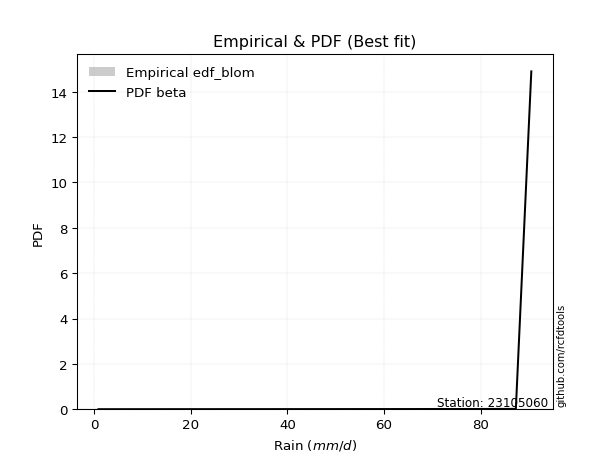</img>

</div>


### 7. EDF Tukey (1962)

In hydrology, the Tukey formula is used as a plotting position formula to estimate the empirical probability or frequency of a flood event (or other hydrological data). The formula parameter is given as _c=0.333_ (or 1/3).

<div align="center">


$P=(m-c)/(n+1-2c)$


</div>


**7.1. Empirical values**

<div align="center">

|                | 0                  | 1                  | 2         | 3                  | 4                  | 5                  | 6         | 7                 | 8                 | 9                  | 10                | 11        | 12                 |
|:---------------|:-------------------|:-------------------|:----------|:-------------------|:-------------------|:-------------------|:----------|:------------------|:------------------|:-------------------|:------------------|:----------|:-------------------|
| date           | 2013               | 2011               | 2017      | 2006               | 2014               | 2012               | 2008      | 2016              | 2018              | 2010               | 2007              | 2009      | 2015               |
| x              | 0.9                | 3.9                | 24.1      | 35.3               | 38.4               | 45.0               | 60.0      | 62.8              | 64.8              | 75.2               | 80.6              | 87.3      | 90.5               |
| m              | 1                  | 2                  | 3         | 4                  | 5                  | 6                  | 7         | 8                 | 9                 | 10                 | 11                | 12        | 13                 |
| empirical_dist | edf_tukey          | edf_tukey          | edf_tukey | edf_tukey          | edf_tukey          | edf_tukey          | edf_tukey | edf_tukey         | edf_tukey         | edf_tukey          | edf_tukey         | edf_tukey | edf_tukey          |
| empirical      | 0.05               | 0.125              | 0.2       | 0.275              | 0.35               | 0.425              | 0.5       | 0.575             | 0.65              | 0.725              | 0.8               | 0.875     | 0.95               |
| empirical_tr   | 1.0526315789473684 | 1.1428571428571428 | 1.25      | 1.3793103448275863 | 1.5384615384615383 | 1.7391304347826089 | 2.0       | 2.352941176470588 | 2.857142857142857 | 3.6363636363636362 | 5.000000000000001 | 8.0       | 19.999999999999982 |

</div>


**7.2. Kolmogorov-Smirnov fit test (sorted by Δ)**


<div align="center">

|                | 0                   | 1                   | 2                    | 3                   | 4                   | 5                   | 6                   | 7                   | 8                   | 9                   | 10                  | 11                  | 12                  | 13                  | 14                  | 15                  | 16                  | 17                  | 18                  | 19                  | 20                  | 21                  | 22                  | 23                  | 24                  | 25                  | 26                  | 27                  | 28                  | 29                  | 30                  | 31                  | 32                  | 33                  | 34                  | 35                  | 36                  | 37                  | 38                  | 39                  | 40                  | 41                  | 42                  | 43                  | 44                  | 45                  | 46                  | 47                  | 48                  | 49                  | 50                  | 51                  | 52                  | 53                  | 54                  | 55                  | 56                  | 57                  | 58                  | 59                  | 60                  | 61                  | 62                  | 63                  | 64                  | 65                  | 66                  | 67                  | 68                  | 69                  | 70                  | 71                  | 72                  | 73                  | 74                  | 75                  | 76                  | 77                  | 78                  | 79                  | 80                  | 81                  | 82                  | 83                  | 84                  | 85                  | 86                  | 87                  | 88                  | 89                  | 90                  | 91                  | 92                  | 93                  | 94                  | 95                  | 96                  | 97                  | 98                  | 99                  | 100                 | 101                 | 102                 | 103                 | 104                 | 105                 | 106                 | 107                 | 108                 | 109                 | 110                 | 111                 | 112                 | 113                 | 114                 | 115                 | 116                 | 117                 | 118                 | 119                 | 120                 | 121                 | 122                 | 123                 | 124                 | 125                 | 126                 | 127                 | 128                 | 129                 | 130                 | 131                 | 132                 | 133                 | 134                 | 135                 | 136                 | 137                 | 138                 | 139                 | 140                 | 141                 | 142                 | 143                 | 144                 | 145                 | 146                 | 147                 | 148                 | 149                 | 150                 | 151                 | 152                 | 153                 | 154                 | 155                 | 156                 | 157                 | 158                 | 159                 |
|:---------------|:--------------------|:--------------------|:---------------------|:--------------------|:--------------------|:--------------------|:--------------------|:--------------------|:--------------------|:--------------------|:--------------------|:--------------------|:--------------------|:--------------------|:--------------------|:--------------------|:--------------------|:--------------------|:--------------------|:--------------------|:--------------------|:--------------------|:--------------------|:--------------------|:--------------------|:--------------------|:--------------------|:--------------------|:--------------------|:--------------------|:--------------------|:--------------------|:--------------------|:--------------------|:--------------------|:--------------------|:--------------------|:--------------------|:--------------------|:--------------------|:--------------------|:--------------------|:--------------------|:--------------------|:--------------------|:--------------------|:--------------------|:--------------------|:--------------------|:--------------------|:--------------------|:--------------------|:--------------------|:--------------------|:--------------------|:--------------------|:--------------------|:--------------------|:--------------------|:--------------------|:--------------------|:--------------------|:--------------------|:--------------------|:--------------------|:--------------------|:--------------------|:--------------------|:--------------------|:--------------------|:--------------------|:--------------------|:--------------------|:--------------------|:--------------------|:--------------------|:--------------------|:--------------------|:--------------------|:--------------------|:--------------------|:--------------------|:--------------------|:--------------------|:--------------------|:--------------------|:--------------------|:--------------------|:--------------------|:--------------------|:--------------------|:--------------------|:--------------------|:--------------------|:--------------------|:--------------------|:--------------------|:--------------------|:--------------------|:--------------------|:--------------------|:--------------------|:--------------------|:--------------------|:--------------------|:--------------------|:--------------------|:--------------------|:--------------------|:--------------------|:--------------------|:--------------------|:--------------------|:--------------------|:--------------------|:--------------------|:--------------------|:--------------------|:--------------------|:--------------------|:--------------------|:--------------------|:--------------------|:--------------------|:--------------------|:--------------------|:--------------------|:--------------------|:--------------------|:--------------------|:--------------------|:--------------------|:--------------------|:--------------------|:--------------------|:--------------------|:--------------------|:--------------------|:--------------------|:--------------------|:--------------------|:--------------------|:--------------------|:--------------------|:--------------------|:--------------------|:--------------------|:--------------------|:--------------------|:--------------------|:--------------------|:--------------------|:--------------------|:--------------------|:--------------------|:--------------------|:--------------------|:--------------------|:--------------------|:--------------------|
| station        | 23105060            | 23105060            | 23105060             | 23105060            | 23105060            | 23105060            | 23105060            | 23105060            | 23105060            | 23105060            | 23105060            | 23105060            | 23105060            | 23105060            | 23105060            | 23105060            | 23105060            | 23105060            | 23105060            | 23105060            | 23105060            | 23105060            | 23105060            | 23105060            | 23105060            | 23105060            | 23105060            | 23105060            | 23105060            | 23105060            | 23105060            | 23105060            | 23105060            | 23105060            | 23105060            | 23105060            | 23105060            | 23105060            | 23105060            | 23105060            | 23105060            | 23105060            | 23105060            | 23105060            | 23105060            | 23105060            | 23105060            | 23105060            | 23105060            | 23105060            | 23105060            | 23105060            | 23105060            | 23105060            | 23105060            | 23105060            | 23105060            | 23105060            | 23105060            | 23105060            | 23105060            | 23105060            | 23105060            | 23105060            | 23105060            | 23105060            | 23105060            | 23105060            | 23105060            | 23105060            | 23105060            | 23105060            | 23105060            | 23105060            | 23105060            | 23105060            | 23105060            | 23105060            | 23105060            | 23105060            | 23105060            | 23105060            | 23105060            | 23105060            | 23105060            | 23105060            | 23105060            | 23105060            | 23105060            | 23105060            | 23105060            | 23105060            | 23105060            | 23105060            | 23105060            | 23105060            | 23105060            | 23105060            | 23105060            | 23105060            | 23105060            | 23105060            | 23105060            | 23105060            | 23105060            | 23105060            | 23105060            | 23105060            | 23105060            | 23105060            | 23105060            | 23105060            | 23105060            | 23105060            | 23105060            | 23105060            | 23105060            | 23105060            | 23105060            | 23105060            | 23105060            | 23105060            | 23105060            | 23105060            | 23105060            | 23105060            | 23105060            | 23105060            | 23105060            | 23105060            | 23105060            | 23105060            | 23105060            | 23105060            | 23105060            | 23105060            | 23105060            | 23105060            | 23105060            | 23105060            | 23105060            | 23105060            | 23105060            | 23105060            | 23105060            | 23105060            | 23105060            | 23105060            | 23105060            | 23105060            | 23105060            | 23105060            | 23105060            | 23105060            | 23105060            | 23105060            | 23105060            | 23105060            | 23105060            | 23105060            |
| empirical_dist | edf_tukey           | edf_tukey           | edf_tukey            | edf_tukey           | edf_tukey           | edf_tukey           | edf_tukey           | edf_tukey           | edf_tukey           | edf_tukey           | edf_tukey           | edf_tukey           | edf_tukey           | edf_tukey           | edf_tukey           | edf_tukey           | edf_tukey           | edf_tukey           | edf_tukey           | edf_tukey           | edf_tukey           | edf_tukey           | edf_tukey           | edf_tukey           | edf_tukey           | edf_tukey           | edf_tukey           | edf_tukey           | edf_tukey           | edf_tukey           | edf_tukey           | edf_tukey           | edf_tukey           | edf_tukey           | edf_tukey           | edf_tukey           | edf_tukey           | edf_tukey           | edf_tukey           | edf_tukey           | edf_tukey           | edf_tukey           | edf_tukey           | edf_tukey           | edf_tukey           | edf_tukey           | edf_tukey           | edf_tukey           | edf_tukey           | edf_tukey           | edf_tukey           | edf_tukey           | edf_tukey           | edf_tukey           | edf_tukey           | edf_tukey           | edf_tukey           | edf_tukey           | edf_tukey           | edf_tukey           | edf_tukey           | edf_tukey           | edf_tukey           | edf_tukey           | edf_tukey           | edf_tukey           | edf_tukey           | edf_tukey           | edf_tukey           | edf_tukey           | edf_tukey           | edf_tukey           | edf_tukey           | edf_tukey           | edf_tukey           | edf_tukey           | edf_tukey           | edf_tukey           | edf_tukey           | edf_tukey           | edf_tukey           | edf_tukey           | edf_tukey           | edf_tukey           | edf_tukey           | edf_tukey           | edf_tukey           | edf_tukey           | edf_tukey           | edf_tukey           | edf_tukey           | edf_tukey           | edf_tukey           | edf_tukey           | edf_tukey           | edf_tukey           | edf_tukey           | edf_tukey           | edf_tukey           | edf_tukey           | edf_tukey           | edf_tukey           | edf_tukey           | edf_tukey           | edf_tukey           | edf_tukey           | edf_tukey           | edf_tukey           | edf_tukey           | edf_tukey           | edf_tukey           | edf_tukey           | edf_tukey           | edf_tukey           | edf_tukey           | edf_tukey           | edf_tukey           | edf_tukey           | edf_tukey           | edf_tukey           | edf_tukey           | edf_tukey           | edf_tukey           | edf_tukey           | edf_tukey           | edf_tukey           | edf_tukey           | edf_tukey           | edf_tukey           | edf_tukey           | edf_tukey           | edf_tukey           | edf_tukey           | edf_tukey           | edf_tukey           | edf_tukey           | edf_tukey           | edf_tukey           | edf_tukey           | edf_tukey           | edf_tukey           | edf_tukey           | edf_tukey           | edf_tukey           | edf_tukey           | edf_tukey           | edf_tukey           | edf_tukey           | edf_tukey           | edf_tukey           | edf_tukey           | edf_tukey           | edf_tukey           | edf_tukey           | edf_tukey           | edf_tukey           | edf_tukey           | edf_tukey           | edf_tukey           | edf_tukey           |
| p_dist         | gausshyper          | beta                | trapezoid            | weibull_min         | burr12              | triang              | skewnorm            | argus               | gumbel_l            | dgamma              | dweibull            | genpareto           | logjohnsonsu        | semicircular        | pearson3            | anglit              | genextreme          | genhalflogistic     | johnsonsu           | nct                 | exponnorm           | norm                | crystalball         | t                   | fatiguelife         | foldnorm            | loggenextreme       | f                   | betaprime           | loglevy_l           | gamma               | erlang              | gengamma            | arcsine             | rice                | logistic            | ksone               | invweibull          | wrapcauchy          | invgamma            | truncweibull_min    | cosine              | maxwell             | hypsecant           | ncf                 | rayleigh            | burr                | invgauss            | logburr             | kappa3              | uniform             | logargus            | vonmises_line       | kstwobign           | logexponweib        | logloggamma         | halfnorm            | laplace             | logpearson3         | logburr12           | loggumbel_l         | logweibull_min      | loggompertz         | logt                | kappa4              | gumbel_r            | logvonmises_line    | mielke              | bradford            | halflogistic        | loggennorm          | moyal               | loggenhalflogistic  | genexpon            | logdgamma           | logtrapezoid        | logfoldnorm         | loggausshyper       | truncexpon          | logfatiguelife      | logsemicircular     | logdweibull         | loganglit           | logbetaprime        | lognakagami         | logexponnorm        | lognorm             | logrice             | lognct              | loglogistic         | logweibull_max      | loghypsecant        | loginvgamma         | logerlang           | logalpha            | loglaplace          | loglaplace          | loggengamma         | loggamma            | loggamma            | wald                | loginvweibull       | logarcsine          | levy_l              | lomax               | loginvgauss         | loggenpareto        | logmaxwell          | lograyleigh         | halfgennorm         | logskewnorm         | logkstwobign        | loggumbel_r         | loghalfnorm         | logbeta             | loggenexpon         | logcosine           | logmoyal            | loghalflogistic     | logwrapcauchy       | logtriang           | gennorm             | logncf              | loglomax            | logwald             | logloglaplace       | loghalfgennorm      | exponweib           | logtruncweibull_min | logf                | logksone            | logkappa4           | powerlaw            | nakagami            | logkappa3           | loguniform          | gompertz            | logmielke           | logbradford         | logjohnsonsb        | rdist               | tukeylambda         | logtruncnorm        | weibull_max         | logtruncexpon       | johnsonsb           | logexponpow         | logtukeylambda      | alpha               | logpowerlaw         | exponpow            | truncpareto         | truncnorm           | logtruncpareto      | logrdist            | genlogistic         | loggenlogistic      | logvonmises         | vonmises            | logcrystalball      |
| delta          | 0.05849166045345222 | 0.05958265560507871 | 0.062246996561922785 | 0.0687662408601798  | 0.06900526236521731 | 0.0754840365583519  | 0.07767032815989983 | 0.0787150964596639  | 0.0816838798712059  | 0.08657022618790869 | 0.08832598453634634 | 0.08995254184918777 | 0.09063871341254759 | 0.09481208327284896 | 0.09532236353482904 | 0.10149066630280312 | 0.10155340084307146 | 0.1057493479733762  | 0.11703672167913304 | 0.11750952240283796 | 0.11752108515147597 | 0.11752168009488817 | 0.11752168622200632 | 0.11752216762504708 | 0.11792979778475865 | 0.11839001807416372 | 0.1192938435922295  | 0.11937499334141    | 0.12032497271449594 | 0.12150068649417327 | 0.12266577742699603 | 0.1234439893981879  | 0.12389356664033269 | 0.125               | 0.1268768040044479  | 0.13234416994337073 | 0.13299851190476197 | 0.13342792375269685 | 0.13435251396888082 | 0.1348231645123814  | 0.1359636870388654  | 0.13645304190756535 | 0.14244030347164816 | 0.14427884628762921 | 0.14547152334217905 | 0.15008658724068824 | 0.1524123322568397  | 0.15308142476821174 | 0.15856183866078916 | 0.15916588113893848 | 0.1595982142857143  | 0.1597559944216531  | 0.16113664449358334 | 0.16213559771811825 | 0.16378477325760799 | 0.1638348446889576  | 0.17198095450821727 | 0.17240142560350913 | 0.17412407383212702 | 0.1741476185575277  | 0.17459481694125345 | 0.17580698453501986 | 0.17654294470981347 | 0.1770956053621935  | 0.17965696444650026 | 0.18206087308734753 | 0.18785854633757826 | 0.19858685579481594 | 0.1994717929960339  | 0.20035429029955232 | 0.20294593133150018 | 0.20385478253640188 | 0.22156628943646312 | 0.22418048008951585 | 0.22928456785445683 | 0.2303009857959809  | 0.2307283384550648  | 0.23399671940138467 | 0.23401218198914853 | 0.23951026685080967 | 0.239618688752809   | 0.24011509545547827 | 0.24069767635610873 | 0.241316140918289   | 0.24313364728210174 | 0.2433135499251935  | 0.24331513716249453 | 0.24332260261181382 | 0.24365554068507567 | 0.2458128227258518  | 0.24724906588212292 | 0.24794279890375615 | 0.2534521419075201  | 0.25358973869105583 | 0.25379067610631056 | 0.25644204187284936 | 0.25644204187284936 | 0.26185332167367614 | 0.26463312556728547 | 0.26463312556728547 | 0.26484854061218965 | 0.26790079037927883 | 0.26866288032907437 | 0.26885318704883715 | 0.2703100418195673  | 0.2730515257708215  | 0.27406203882454394 | 0.27554375664661845 | 0.28613195341440634 | 0.29022601147834004 | 0.3035093133740736  | 0.30566677533674497 | 0.31399137010360456 | 0.3159498745725303  | 0.32472842985234796 | 0.32846891188604926 | 0.33070440774051935 | 0.33961990339895787 | 0.34191075564431006 | 0.3593294359693939  | 0.3685645239562094  | 0.375               | 0.3846855259146153  | 0.40283146504704975 | 0.41081473054354656 | 0.44869920184977613 | 0.45581735923414574 | 0.46503852040040033 | 0.4714502237707706  | 0.4746307507248679  | 0.477524556038426   | 0.4781007691667021  | 0.5045898799266677  | 0.5051284146387707  | 0.5207647977606455  | 0.5208087123331652  | 0.5215075071264021  | 0.5233985807187262  | 0.5493258760567048  | 0.5542143866036895  | 0.574999996592481   | 0.5805592295923858  | 0.5873956714449586  | 0.6035644714726426  | 0.6121738541770669  | 0.6470941068956695  | 0.6533616298796592  | 0.6792821867000314  | 0.6952372798547499  | 0.7022634547983133  | 0.7327676748185536  | 0.744292938987775   | 0.7696533192439481  | 0.7883044280479834  | 0.799999982798697   | 0.875               | 0.875               | 1.0075807307127183  | 14.008012230495725  | nan                 |
| deltao         | 0.35149047353100005 | 0.35149047353100005 | 0.35149047353100005  | 0.35149047353100005 | 0.35149047353100005 | 0.35149047353100005 | 0.35149047353100005 | 0.35149047353100005 | 0.35149047353100005 | 0.35149047353100005 | 0.35149047353100005 | 0.35149047353100005 | 0.35149047353100005 | 0.35149047353100005 | 0.35149047353100005 | 0.35149047353100005 | 0.35149047353100005 | 0.35149047353100005 | 0.35149047353100005 | 0.35149047353100005 | 0.35149047353100005 | 0.35149047353100005 | 0.35149047353100005 | 0.35149047353100005 | 0.35149047353100005 | 0.35149047353100005 | 0.35149047353100005 | 0.35149047353100005 | 0.35149047353100005 | 0.35149047353100005 | 0.35149047353100005 | 0.35149047353100005 | 0.35149047353100005 | 0.35149047353100005 | 0.35149047353100005 | 0.35149047353100005 | 0.35149047353100005 | 0.35149047353100005 | 0.35149047353100005 | 0.35149047353100005 | 0.35149047353100005 | 0.35149047353100005 | 0.35149047353100005 | 0.35149047353100005 | 0.35149047353100005 | 0.35149047353100005 | 0.35149047353100005 | 0.35149047353100005 | 0.35149047353100005 | 0.35149047353100005 | 0.35149047353100005 | 0.35149047353100005 | 0.35149047353100005 | 0.35149047353100005 | 0.35149047353100005 | 0.35149047353100005 | 0.35149047353100005 | 0.35149047353100005 | 0.35149047353100005 | 0.35149047353100005 | 0.35149047353100005 | 0.35149047353100005 | 0.35149047353100005 | 0.35149047353100005 | 0.35149047353100005 | 0.35149047353100005 | 0.35149047353100005 | 0.35149047353100005 | 0.35149047353100005 | 0.35149047353100005 | 0.35149047353100005 | 0.35149047353100005 | 0.35149047353100005 | 0.35149047353100005 | 0.35149047353100005 | 0.35149047353100005 | 0.35149047353100005 | 0.35149047353100005 | 0.35149047353100005 | 0.35149047353100005 | 0.35149047353100005 | 0.35149047353100005 | 0.35149047353100005 | 0.35149047353100005 | 0.35149047353100005 | 0.35149047353100005 | 0.35149047353100005 | 0.35149047353100005 | 0.35149047353100005 | 0.35149047353100005 | 0.35149047353100005 | 0.35149047353100005 | 0.35149047353100005 | 0.35149047353100005 | 0.35149047353100005 | 0.35149047353100005 | 0.35149047353100005 | 0.35149047353100005 | 0.35149047353100005 | 0.35149047353100005 | 0.35149047353100005 | 0.35149047353100005 | 0.35149047353100005 | 0.35149047353100005 | 0.35149047353100005 | 0.35149047353100005 | 0.35149047353100005 | 0.35149047353100005 | 0.35149047353100005 | 0.35149047353100005 | 0.35149047353100005 | 0.35149047353100005 | 0.35149047353100005 | 0.35149047353100005 | 0.35149047353100005 | 0.35149047353100005 | 0.35149047353100005 | 0.35149047353100005 | 0.35149047353100005 | 0.35149047353100005 | 0.35149047353100005 | 0.35149047353100005 | 0.35149047353100005 | 0.35149047353100005 | 0.35149047353100005 | 0.35149047353100005 | 0.35149047353100005 | 0.35149047353100005 | 0.35149047353100005 | 0.35149047353100005 | 0.35149047353100005 | 0.35149047353100005 | 0.35149047353100005 | 0.35149047353100005 | 0.35149047353100005 | 0.35149047353100005 | 0.35149047353100005 | 0.35149047353100005 | 0.35149047353100005 | 0.35149047353100005 | 0.35149047353100005 | 0.35149047353100005 | 0.35149047353100005 | 0.35149047353100005 | 0.35149047353100005 | 0.35149047353100005 | 0.35149047353100005 | 0.35149047353100005 | 0.35149047353100005 | 0.35149047353100005 | 0.35149047353100005 | 0.35149047353100005 | 0.35149047353100005 | 0.35149047353100005 | 0.35149047353100005 | 0.35149047353100005 | 0.35149047353100005 | 0.35149047353100005 | 0.35149047353100005 | 0.35149047353100005 |
| eval           | Δo > Δ              | Δo > Δ              | Δo > Δ               | Δo > Δ              | Δo > Δ              | Δo > Δ              | Δo > Δ              | Δo > Δ              | Δo > Δ              | Δo > Δ              | Δo > Δ              | Δo > Δ              | Δo > Δ              | Δo > Δ              | Δo > Δ              | Δo > Δ              | Δo > Δ              | Δo > Δ              | Δo > Δ              | Δo > Δ              | Δo > Δ              | Δo > Δ              | Δo > Δ              | Δo > Δ              | Δo > Δ              | Δo > Δ              | Δo > Δ              | Δo > Δ              | Δo > Δ              | Δo > Δ              | Δo > Δ              | Δo > Δ              | Δo > Δ              | Δo > Δ              | Δo > Δ              | Δo > Δ              | Δo > Δ              | Δo > Δ              | Δo > Δ              | Δo > Δ              | Δo > Δ              | Δo > Δ              | Δo > Δ              | Δo > Δ              | Δo > Δ              | Δo > Δ              | Δo > Δ              | Δo > Δ              | Δo > Δ              | Δo > Δ              | Δo > Δ              | Δo > Δ              | Δo > Δ              | Δo > Δ              | Δo > Δ              | Δo > Δ              | Δo > Δ              | Δo > Δ              | Δo > Δ              | Δo > Δ              | Δo > Δ              | Δo > Δ              | Δo > Δ              | Δo > Δ              | Δo > Δ              | Δo > Δ              | Δo > Δ              | Δo > Δ              | Δo > Δ              | Δo > Δ              | Δo > Δ              | Δo > Δ              | Δo > Δ              | Δo > Δ              | Δo > Δ              | Δo > Δ              | Δo > Δ              | Δo > Δ              | Δo > Δ              | Δo > Δ              | Δo > Δ              | Δo > Δ              | Δo > Δ              | Δo > Δ              | Δo > Δ              | Δo > Δ              | Δo > Δ              | Δo > Δ              | Δo > Δ              | Δo > Δ              | Δo > Δ              | Δo > Δ              | Δo > Δ              | Δo > Δ              | Δo > Δ              | Δo > Δ              | Δo > Δ              | Δo > Δ              | Δo > Δ              | Δo > Δ              | Δo > Δ              | Δo > Δ              | Δo > Δ              | Δo > Δ              | Δo > Δ              | Δo > Δ              | Δo > Δ              | Δo > Δ              | Δo > Δ              | Δo > Δ              | Δo > Δ              | Δo > Δ              | Δo > Δ              | Δo > Δ              | Δo > Δ              | Δo > Δ              | Δo > Δ              | Δo > Δ              | Δo > Δ              | Δo <= Δ             | Δo <= Δ             | Δo <= Δ             | Δo <= Δ             | Δo <= Δ             | Δo <= Δ             | Δo <= Δ             | Δo <= Δ             | Δo <= Δ             | Δo <= Δ             | Δo <= Δ             | Δo <= Δ             | Δo <= Δ             | Δo <= Δ             | Δo <= Δ             | Δo <= Δ             | Δo <= Δ             | Δo <= Δ             | Δo <= Δ             | Δo <= Δ             | Δo <= Δ             | Δo <= Δ             | Δo <= Δ             | Δo <= Δ             | Δo <= Δ             | Δo <= Δ             | Δo <= Δ             | Δo <= Δ             | Δo <= Δ             | Δo <= Δ             | Δo <= Δ             | Δo <= Δ             | Δo <= Δ             | Δo <= Δ             | Δo <= Δ             | Δo <= Δ             | Δo <= Δ             | Δo <= Δ             | Δo <= Δ             | Δo <= Δ             | Δo <= Δ             |
| fit            | 1                   | 1                   | 1                    | 1                   | 1                   | 1                   | 1                   | 1                   | 1                   | 1                   | 1                   | 1                   | 1                   | 1                   | 1                   | 1                   | 1                   | 1                   | 1                   | 1                   | 1                   | 1                   | 1                   | 1                   | 1                   | 1                   | 1                   | 1                   | 1                   | 1                   | 1                   | 1                   | 1                   | 1                   | 1                   | 1                   | 1                   | 1                   | 1                   | 1                   | 1                   | 1                   | 1                   | 1                   | 1                   | 1                   | 1                   | 1                   | 1                   | 1                   | 1                   | 1                   | 1                   | 1                   | 1                   | 1                   | 1                   | 1                   | 1                   | 1                   | 1                   | 1                   | 1                   | 1                   | 1                   | 1                   | 1                   | 1                   | 1                   | 1                   | 1                   | 1                   | 1                   | 1                   | 1                   | 1                   | 1                   | 1                   | 1                   | 1                   | 1                   | 1                   | 1                   | 1                   | 1                   | 1                   | 1                   | 1                   | 1                   | 1                   | 1                   | 1                   | 1                   | 1                   | 1                   | 1                   | 1                   | 1                   | 1                   | 1                   | 1                   | 1                   | 1                   | 1                   | 1                   | 1                   | 1                   | 1                   | 1                   | 1                   | 1                   | 1                   | 1                   | 1                   | 1                   | 1                   | 1                   | 1                   | 1                   | 0                   | 0                   | 0                   | 0                   | 0                   | 0                   | 0                   | 0                   | 0                   | 0                   | 0                   | 0                   | 0                   | 0                   | 0                   | 0                   | 0                   | 0                   | 0                   | 0                   | 0                   | 0                   | 0                   | 0                   | 0                   | 0                   | 0                   | 0                   | 0                   | 0                   | 0                   | 0                   | 0                   | 0                   | 0                   | 0                   | 0                   | 0                   | 0                   | 0                   | 0                   |
| n              | 13                  | 13                  | 13                   | 13                  | 13                  | 13                  | 13                  | 13                  | 13                  | 13                  | 13                  | 13                  | 13                  | 13                  | 13                  | 13                  | 13                  | 13                  | 13                  | 13                  | 13                  | 13                  | 13                  | 13                  | 13                  | 13                  | 13                  | 13                  | 13                  | 13                  | 13                  | 13                  | 13                  | 13                  | 13                  | 13                  | 13                  | 13                  | 13                  | 13                  | 13                  | 13                  | 13                  | 13                  | 13                  | 13                  | 13                  | 13                  | 13                  | 13                  | 13                  | 13                  | 13                  | 13                  | 13                  | 13                  | 13                  | 13                  | 13                  | 13                  | 13                  | 13                  | 13                  | 13                  | 13                  | 13                  | 13                  | 13                  | 13                  | 13                  | 13                  | 13                  | 13                  | 13                  | 13                  | 13                  | 13                  | 13                  | 13                  | 13                  | 13                  | 13                  | 13                  | 13                  | 13                  | 13                  | 13                  | 13                  | 13                  | 13                  | 13                  | 13                  | 13                  | 13                  | 13                  | 13                  | 13                  | 13                  | 13                  | 13                  | 13                  | 13                  | 13                  | 13                  | 13                  | 13                  | 13                  | 13                  | 13                  | 13                  | 13                  | 13                  | 13                  | 13                  | 13                  | 13                  | 13                  | 13                  | 13                  | 13                  | 13                  | 13                  | 13                  | 13                  | 13                  | 13                  | 13                  | 13                  | 13                  | 13                  | 13                  | 13                  | 13                  | 13                  | 13                  | 13                  | 13                  | 13                  | 13                  | 13                  | 13                  | 13                  | 13                  | 13                  | 13                  | 13                  | 13                  | 13                  | 13                  | 13                  | 13                  | 13                  | 13                  | 13                  | 13                  | 13                  | 13                  | 13                  | 13                  | 13                  |
| best_fit       | 1                   | 0                   | 0                    | 0                   | 0                   | 0                   | 0                   | 0                   | 0                   | 0                   | 0                   | 0                   | 0                   | 0                   | 0                   | 0                   | 0                   | 0                   | 0                   | 0                   | 0                   | 0                   | 0                   | 0                   | 0                   | 0                   | 0                   | 0                   | 0                   | 0                   | 0                   | 0                   | 0                   | 0                   | 0                   | 0                   | 0                   | 0                   | 0                   | 0                   | 0                   | 0                   | 0                   | 0                   | 0                   | 0                   | 0                   | 0                   | 0                   | 0                   | 0                   | 0                   | 0                   | 0                   | 0                   | 0                   | 0                   | 0                   | 0                   | 0                   | 0                   | 0                   | 0                   | 0                   | 0                   | 0                   | 0                   | 0                   | 0                   | 0                   | 0                   | 0                   | 0                   | 0                   | 0                   | 0                   | 0                   | 0                   | 0                   | 0                   | 0                   | 0                   | 0                   | 0                   | 0                   | 0                   | 0                   | 0                   | 0                   | 0                   | 0                   | 0                   | 0                   | 0                   | 0                   | 0                   | 0                   | 0                   | 0                   | 0                   | 0                   | 0                   | 0                   | 0                   | 0                   | 0                   | 0                   | 0                   | 0                   | 0                   | 0                   | 0                   | 0                   | 0                   | 0                   | 0                   | 0                   | 0                   | 0                   | 0                   | 0                   | 0                   | 0                   | 0                   | 0                   | 0                   | 0                   | 0                   | 0                   | 0                   | 0                   | 0                   | 0                   | 0                   | 0                   | 0                   | 0                   | 0                   | 0                   | 0                   | 0                   | 0                   | 0                   | 0                   | 0                   | 0                   | 0                   | 0                   | 0                   | 0                   | 0                   | 0                   | 0                   | 0                   | 0                   | 0                   | 0                   | 0                   | 0                   | 0                   |
| best_fit_sort  | 1                   | 2                   | 3                    | 4                   | 5                   | 6                   | 7                   | 8                   | 9                   | 10                  | 11                  | 12                  | 13                  | 14                  | 15                  | 16                  | 17                  | 18                  | 19                  | 20                  | 21                  | 22                  | 23                  | 24                  | 25                  | 26                  | 27                  | 28                  | 29                  | 30                  | 31                  | 32                  | 33                  | 34                  | 35                  | 36                  | 37                  | 38                  | 39                  | 40                  | 41                  | 42                  | 43                  | 44                  | 45                  | 46                  | 47                  | 48                  | 49                  | 50                  | 51                  | 52                  | 53                  | 54                  | 55                  | 56                  | 57                  | 58                  | 59                  | 60                  | 61                  | 62                  | 63                  | 64                  | 65                  | 66                  | 67                  | 68                  | 69                  | 70                  | 71                  | 72                  | 73                  | 74                  | 75                  | 76                  | 77                  | 78                  | 79                  | 80                  | 81                  | 82                  | 83                  | 84                  | 85                  | 86                  | 87                  | 88                  | 89                  | 90                  | 91                  | 92                  | 93                  | 94                  | 95                  | 96                  | 97                  | 98                  | 99                  | 100                 | 101                 | 102                 | 103                 | 104                 | 105                 | 106                 | 107                 | 108                 | 109                 | 110                 | 111                 | 112                 | 113                 | 114                 | 115                 | 116                 | 117                 | 118                 | 119                 | 120                 | 121                 | 122                 | 123                 | 124                 | 125                 | 126                 | 127                 | 128                 | 129                 | 130                 | 131                 | 132                 | 133                 | 134                 | 135                 | 136                 | 137                 | 138                 | 139                 | 140                 | 141                 | 142                 | 143                 | 144                 | 145                 | 146                 | 147                 | 148                 | 149                 | 150                 | 151                 | 152                 | 153                 | 154                 | 155                 | 156                 | 157                 | 158                 | 159                 | 160                 |

</div>


**7.3. Best fit**

<div align="center">

|   id |   station | empirical_dist   | p_dist     |     delta |   deltao | eval   |   fit |   n |   best_fit |   best_fit_sort |
|-----:|----------:|:-----------------|:-----------|----------:|---------:|:-------|------:|----:|-----------:|----------------:|
|    0 |  23105060 | edf_tukey        | gausshyper | 0.0584917 |  0.35149 | Δo > Δ |     1 |  13 |          1 |               1 |

</div>


<div align="center">

</img>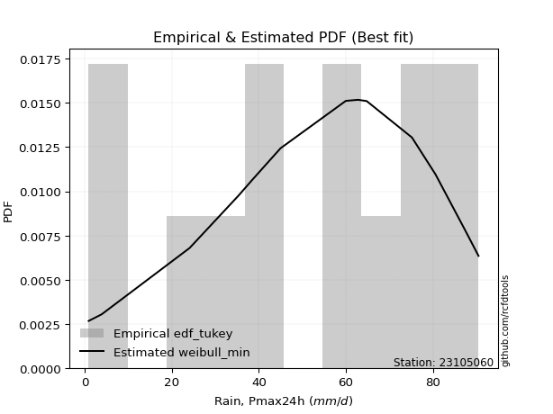</img>

</div>


### 8. EDF Gringorten (1963)

Gringorten plotting position formula is essential for estimating the probability and return periods of extreme events like floods and heavy rainfall. The constant _a=0.44_.

<div align="center">


$P=(m-a)/(n+1-2a)$


</div>


**8.1. Empirical values**

<div align="center">

|                | 0                    | 1                   | 2                  | 3                   | 4                  | 5                   | 6              | 7                  | 8                  | 9                  | 10                 | 11                 | 12                 |
|:---------------|:---------------------|:--------------------|:-------------------|:--------------------|:-------------------|:--------------------|:---------------|:-------------------|:-------------------|:-------------------|:-------------------|:-------------------|:-------------------|
| date           | 2013                 | 2011                | 2017               | 2006                | 2014               | 2012                | 2008           | 2016               | 2018               | 2010               | 2007               | 2009               | 2015               |
| x              | 0.9                  | 3.9                 | 24.1               | 35.3                | 38.4               | 45.0                | 60.0           | 62.8               | 64.8               | 75.2               | 80.6               | 87.3               | 90.5               |
| m              | 1                    | 2                   | 3                  | 4                   | 5                  | 6                   | 7              | 8                  | 9                  | 10                 | 11                 | 12                 | 13                 |
| empirical_dist | edf_gringorten       | edf_gringorten      | edf_gringorten     | edf_gringorten      | edf_gringorten     | edf_gringorten      | edf_gringorten | edf_gringorten     | edf_gringorten     | edf_gringorten     | edf_gringorten     | edf_gringorten     | edf_gringorten     |
| empirical      | 0.042682926829268296 | 0.11890243902439025 | 0.1951219512195122 | 0.27134146341463417 | 0.3475609756097561 | 0.42378048780487804 | 0.5            | 0.5762195121951219 | 0.6524390243902439 | 0.728658536585366  | 0.8048780487804879 | 0.8810975609756099 | 0.9573170731707318 |
| empirical_tr   | 1.0445859872611465   | 1.1349480968858132  | 1.2424242424242424 | 1.3723849372384938  | 1.5327102803738317 | 1.7354497354497356  | 2.0            | 2.359712230215827  | 2.8771929824561404 | 3.6853932584269677 | 5.125000000000001  | 8.410256410256418  | 23.42857142857147  |

</div>


**8.2. Kolmogorov-Smirnov fit test (sorted by Δ)**


<div align="center">

|                | 0                    | 1                   | 2                   | 3                   | 4                   | 5                   | 6                   | 7                   | 8                   | 9                   | 10                  | 11                  | 12                  | 13                  | 14                  | 15                  | 16                  | 17                  | 18                  | 19                  | 20                  | 21                  | 22                  | 23                  | 24                  | 25                  | 26                  | 27                  | 28                  | 29                  | 30                  | 31                  | 32                  | 33                  | 34                  | 35                  | 36                  | 37                  | 38                  | 39                  | 40                  | 41                  | 42                  | 43                  | 44                  | 45                  | 46                  | 47                  | 48                  | 49                  | 50                  | 51                  | 52                  | 53                  | 54                  | 55                  | 56                  | 57                  | 58                  | 59                  | 60                  | 61                  | 62                  | 63                  | 64                  | 65                  | 66                  | 67                  | 68                  | 69                  | 70                  | 71                  | 72                  | 73                  | 74                  | 75                  | 76                  | 77                  | 78                  | 79                  | 80                  | 81                  | 82                  | 83                  | 84                  | 85                  | 86                  | 87                  | 88                  | 89                  | 90                  | 91                  | 92                  | 93                  | 94                  | 95                  | 96                  | 97                  | 98                  | 99                  | 100                 | 101                 | 102                 | 103                 | 104                 | 105                 | 106                 | 107                 | 108                 | 109                 | 110                 | 111                 | 112                 | 113                 | 114                 | 115                 | 116                 | 117                 | 118                 | 119                 | 120                 | 121                 | 122                 | 123                 | 124                 | 125                 | 126                 | 127                 | 128                 | 129                 | 130                 | 131                 | 132                 | 133                 | 134                 | 135                 | 136                 | 137                 | 138                 | 139                 | 140                 | 141                 | 142                 | 143                 | 144                 | 145                 | 146                 | 147                 | 148                 | 149                 | 150                 | 151                 | 152                 | 153                 | 154                 | 155                 | 156                 | 157                 | 158                 | 159                 |
|:---------------|:---------------------|:--------------------|:--------------------|:--------------------|:--------------------|:--------------------|:--------------------|:--------------------|:--------------------|:--------------------|:--------------------|:--------------------|:--------------------|:--------------------|:--------------------|:--------------------|:--------------------|:--------------------|:--------------------|:--------------------|:--------------------|:--------------------|:--------------------|:--------------------|:--------------------|:--------------------|:--------------------|:--------------------|:--------------------|:--------------------|:--------------------|:--------------------|:--------------------|:--------------------|:--------------------|:--------------------|:--------------------|:--------------------|:--------------------|:--------------------|:--------------------|:--------------------|:--------------------|:--------------------|:--------------------|:--------------------|:--------------------|:--------------------|:--------------------|:--------------------|:--------------------|:--------------------|:--------------------|:--------------------|:--------------------|:--------------------|:--------------------|:--------------------|:--------------------|:--------------------|:--------------------|:--------------------|:--------------------|:--------------------|:--------------------|:--------------------|:--------------------|:--------------------|:--------------------|:--------------------|:--------------------|:--------------------|:--------------------|:--------------------|:--------------------|:--------------------|:--------------------|:--------------------|:--------------------|:--------------------|:--------------------|:--------------------|:--------------------|:--------------------|:--------------------|:--------------------|:--------------------|:--------------------|:--------------------|:--------------------|:--------------------|:--------------------|:--------------------|:--------------------|:--------------------|:--------------------|:--------------------|:--------------------|:--------------------|:--------------------|:--------------------|:--------------------|:--------------------|:--------------------|:--------------------|:--------------------|:--------------------|:--------------------|:--------------------|:--------------------|:--------------------|:--------------------|:--------------------|:--------------------|:--------------------|:--------------------|:--------------------|:--------------------|:--------------------|:--------------------|:--------------------|:--------------------|:--------------------|:--------------------|:--------------------|:--------------------|:--------------------|:--------------------|:--------------------|:--------------------|:--------------------|:--------------------|:--------------------|:--------------------|:--------------------|:--------------------|:--------------------|:--------------------|:--------------------|:--------------------|:--------------------|:--------------------|:--------------------|:--------------------|:--------------------|:--------------------|:--------------------|:--------------------|:--------------------|:--------------------|:--------------------|:--------------------|:--------------------|:--------------------|:--------------------|:--------------------|:--------------------|:--------------------|:--------------------|:--------------------|
| station        | 23105060             | 23105060            | 23105060            | 23105060            | 23105060            | 23105060            | 23105060            | 23105060            | 23105060            | 23105060            | 23105060            | 23105060            | 23105060            | 23105060            | 23105060            | 23105060            | 23105060            | 23105060            | 23105060            | 23105060            | 23105060            | 23105060            | 23105060            | 23105060            | 23105060            | 23105060            | 23105060            | 23105060            | 23105060            | 23105060            | 23105060            | 23105060            | 23105060            | 23105060            | 23105060            | 23105060            | 23105060            | 23105060            | 23105060            | 23105060            | 23105060            | 23105060            | 23105060            | 23105060            | 23105060            | 23105060            | 23105060            | 23105060            | 23105060            | 23105060            | 23105060            | 23105060            | 23105060            | 23105060            | 23105060            | 23105060            | 23105060            | 23105060            | 23105060            | 23105060            | 23105060            | 23105060            | 23105060            | 23105060            | 23105060            | 23105060            | 23105060            | 23105060            | 23105060            | 23105060            | 23105060            | 23105060            | 23105060            | 23105060            | 23105060            | 23105060            | 23105060            | 23105060            | 23105060            | 23105060            | 23105060            | 23105060            | 23105060            | 23105060            | 23105060            | 23105060            | 23105060            | 23105060            | 23105060            | 23105060            | 23105060            | 23105060            | 23105060            | 23105060            | 23105060            | 23105060            | 23105060            | 23105060            | 23105060            | 23105060            | 23105060            | 23105060            | 23105060            | 23105060            | 23105060            | 23105060            | 23105060            | 23105060            | 23105060            | 23105060            | 23105060            | 23105060            | 23105060            | 23105060            | 23105060            | 23105060            | 23105060            | 23105060            | 23105060            | 23105060            | 23105060            | 23105060            | 23105060            | 23105060            | 23105060            | 23105060            | 23105060            | 23105060            | 23105060            | 23105060            | 23105060            | 23105060            | 23105060            | 23105060            | 23105060            | 23105060            | 23105060            | 23105060            | 23105060            | 23105060            | 23105060            | 23105060            | 23105060            | 23105060            | 23105060            | 23105060            | 23105060            | 23105060            | 23105060            | 23105060            | 23105060            | 23105060            | 23105060            | 23105060            | 23105060            | 23105060            | 23105060            | 23105060            | 23105060            | 23105060            |
| empirical_dist | edf_gringorten       | edf_gringorten      | edf_gringorten      | edf_gringorten      | edf_gringorten      | edf_gringorten      | edf_gringorten      | edf_gringorten      | edf_gringorten      | edf_gringorten      | edf_gringorten      | edf_gringorten      | edf_gringorten      | edf_gringorten      | edf_gringorten      | edf_gringorten      | edf_gringorten      | edf_gringorten      | edf_gringorten      | edf_gringorten      | edf_gringorten      | edf_gringorten      | edf_gringorten      | edf_gringorten      | edf_gringorten      | edf_gringorten      | edf_gringorten      | edf_gringorten      | edf_gringorten      | edf_gringorten      | edf_gringorten      | edf_gringorten      | edf_gringorten      | edf_gringorten      | edf_gringorten      | edf_gringorten      | edf_gringorten      | edf_gringorten      | edf_gringorten      | edf_gringorten      | edf_gringorten      | edf_gringorten      | edf_gringorten      | edf_gringorten      | edf_gringorten      | edf_gringorten      | edf_gringorten      | edf_gringorten      | edf_gringorten      | edf_gringorten      | edf_gringorten      | edf_gringorten      | edf_gringorten      | edf_gringorten      | edf_gringorten      | edf_gringorten      | edf_gringorten      | edf_gringorten      | edf_gringorten      | edf_gringorten      | edf_gringorten      | edf_gringorten      | edf_gringorten      | edf_gringorten      | edf_gringorten      | edf_gringorten      | edf_gringorten      | edf_gringorten      | edf_gringorten      | edf_gringorten      | edf_gringorten      | edf_gringorten      | edf_gringorten      | edf_gringorten      | edf_gringorten      | edf_gringorten      | edf_gringorten      | edf_gringorten      | edf_gringorten      | edf_gringorten      | edf_gringorten      | edf_gringorten      | edf_gringorten      | edf_gringorten      | edf_gringorten      | edf_gringorten      | edf_gringorten      | edf_gringorten      | edf_gringorten      | edf_gringorten      | edf_gringorten      | edf_gringorten      | edf_gringorten      | edf_gringorten      | edf_gringorten      | edf_gringorten      | edf_gringorten      | edf_gringorten      | edf_gringorten      | edf_gringorten      | edf_gringorten      | edf_gringorten      | edf_gringorten      | edf_gringorten      | edf_gringorten      | edf_gringorten      | edf_gringorten      | edf_gringorten      | edf_gringorten      | edf_gringorten      | edf_gringorten      | edf_gringorten      | edf_gringorten      | edf_gringorten      | edf_gringorten      | edf_gringorten      | edf_gringorten      | edf_gringorten      | edf_gringorten      | edf_gringorten      | edf_gringorten      | edf_gringorten      | edf_gringorten      | edf_gringorten      | edf_gringorten      | edf_gringorten      | edf_gringorten      | edf_gringorten      | edf_gringorten      | edf_gringorten      | edf_gringorten      | edf_gringorten      | edf_gringorten      | edf_gringorten      | edf_gringorten      | edf_gringorten      | edf_gringorten      | edf_gringorten      | edf_gringorten      | edf_gringorten      | edf_gringorten      | edf_gringorten      | edf_gringorten      | edf_gringorten      | edf_gringorten      | edf_gringorten      | edf_gringorten      | edf_gringorten      | edf_gringorten      | edf_gringorten      | edf_gringorten      | edf_gringorten      | edf_gringorten      | edf_gringorten      | edf_gringorten      | edf_gringorten      | edf_gringorten      | edf_gringorten      | edf_gringorten      | edf_gringorten      |
| p_dist         | beta                 | trapezoid           | gausshyper          | weibull_min         | burr12              | argus               | triang              | skewnorm            | gumbel_l            | dgamma              | dweibull            | genpareto           | logjohnsonsu        | semicircular        | pearson3            | genextreme          | anglit              | genhalflogistic     | johnsonsu           | nct                 | exponnorm           | norm                | crystalball         | t                   | fatiguelife         | foldnorm            | arcsine             | f                   | betaprime           | gamma               | loggenextreme       | erlang              | gengamma            | rice                | loglevy_l           | logistic            | ksone               | invweibull          | invgamma            | truncweibull_min    | cosine              | wrapcauchy          | maxwell             | hypsecant           | ncf                 | rayleigh            | burr                | invgauss            | kappa3              | uniform             | logargus            | vonmises_line       | kstwobign           | logburr             | logexponweib        | logloggamma         | halfnorm            | laplace             | logburr12           | logweibull_min      | loggompertz         | kappa4              | logpearson3         | loggumbel_l         | gumbel_r            | logt                | logvonmises_line    | mielke              | bradford            | halflogistic        | moyal               | loggennorm          | loggenhalflogistic  | genexpon            | truncexpon          | logfoldnorm         | logdgamma           | logtrapezoid        | loggausshyper       | logfatiguelife      | logsemicircular     | loganglit           | logbetaprime        | lognakagami         | logexponnorm        | lognorm             | logrice             | lognct              | logdweibull         | loglogistic         | loghypsecant        | logweibull_max      | loginvgamma         | logerlang           | logalpha            | loglaplace          | loglaplace          | wald                | loggengamma         | loggamma            | loggamma            | loginvweibull       | lomax               | logarcsine          | levy_l              | loginvgauss         | loggenpareto        | logmaxwell          | lograyleigh         | halfgennorm         | logskewnorm         | logkstwobign        | loggumbel_r         | loghalfnorm         | logbeta             | loggenexpon         | logcosine           | logmoyal            | loghalflogistic     | logwrapcauchy       | logtriang           | gennorm             | logncf              | loglomax            | logwald             | logloglaplace       | loghalfgennorm      | exponweib           | logtruncweibull_min | logf                | logkappa4           | logksone            | powerlaw            | nakagami            | gompertz            | logkappa3           | loguniform          | logmielke           | logbradford         | logjohnsonsb        | rdist               | tukeylambda         | logtruncnorm        | weibull_max         | logtruncexpon       | johnsonsb           | logexponpow         | logtukeylambda      | alpha               | logpowerlaw         | exponpow            | truncpareto         | truncnorm           | logtruncpareto      | logrdist            | genlogistic         | loggenlogistic      | logvonmises         | vonmises            | logcrystalball      |
| delta          | 0.055576264640178175 | 0.05614943558631291 | 0.05849166045345222 | 0.0687662408601798  | 0.06900526236521731 | 0.07261753548405415 | 0.07392062057640009 | 0.07645081596477787 | 0.08046436767608395 | 0.08047266521229894 | 0.08222842356073659 | 0.08385498087357804 | 0.0930777378027915  | 0.09481208327284896 | 0.09532236353482904 | 0.10033388864794951 | 0.10149066630280312 | 0.10818837236362011 | 0.11703672167913304 | 0.11750952240283796 | 0.11752108515147597 | 0.11752168009488817 | 0.11752168622200632 | 0.11752216762504708 | 0.11792979778475865 | 0.11839001807416372 | 0.11890243902439025 | 0.11937499334141    | 0.12032497271449594 | 0.12266577742699603 | 0.12295238017759536 | 0.1234439893981879  | 0.12389356664033269 | 0.1268768040044479  | 0.12881775966490497 | 0.13234416994337073 | 0.13299851190476197 | 0.13342792375269685 | 0.1348231645123814  | 0.1359636870388654  | 0.13645304190756535 | 0.13801105055424667 | 0.14244030347164816 | 0.14427884628762921 | 0.14547152334217905 | 0.15008658724068824 | 0.1524123322568397  | 0.15308142476821174 | 0.15916588113893848 | 0.1595982142857143  | 0.1597559944216531  | 0.16113664449358334 | 0.16213559771811825 | 0.162220375246155   | 0.16378477325760799 | 0.1638348446889576  | 0.17198095450821727 | 0.17240142560350913 | 0.1741476185575277  | 0.17580698453501986 | 0.17654294470981347 | 0.17965696444650026 | 0.18144114700285885 | 0.18191189011198527 | 0.18206087308734753 | 0.1844126785329253  | 0.19517561950831008 | 0.19858685579481594 | 0.1994717929960339  | 0.20035429029955232 | 0.20385478253640188 | 0.210263004502232   | 0.22522482602182897 | 0.2278390166748817  | 0.23401218198914853 | 0.23438687504043065 | 0.23660164102518866 | 0.23761805896671273 | 0.23765525598675052 | 0.24316880343617553 | 0.24327722533817486 | 0.24435621294147458 | 0.24497467750365487 | 0.2467921838674676  | 0.24697208651055935 | 0.2469736737478604  | 0.24698113919717968 | 0.24731407727044152 | 0.2474321686262101  | 0.24947135931121767 | 0.251601335489122   | 0.25212711466261073 | 0.25711067849288594 | 0.2572482752764217  | 0.2574492126916764  | 0.2601005784582152  | 0.2601005784582152  | 0.26484854061218965 | 0.265511858259042   | 0.2682916621526513  | 0.2682916621526513  | 0.2715593269646447  | 0.27396857840493316 | 0.2759799534998062  | 0.27617026021956886 | 0.27671006235618734 | 0.2777205754099098  | 0.2792022932319843  | 0.2897904899997722  | 0.2938845480637059  | 0.3035093133740736  | 0.3105448241172328  | 0.3176499066889704  | 0.3196084111578962  | 0.32960647863283576 | 0.3333469606665371  | 0.3343629443258852  | 0.3432784399843237  | 0.3455692922296759  | 0.3642074847498817  | 0.3722230605415753  | 0.3810975609756099  | 0.3895635746951031  | 0.40770951382753756 | 0.4144732671289124  | 0.45357725063026394 | 0.46069540801463355 | 0.46991656918088814 | 0.4751087603561365  | 0.4795087995053557  | 0.48175930575206793 | 0.4824026048189138  | 0.5085526234499218  | 0.5100064634192585  | 0.523946531516646   | 0.5244233343460114  | 0.524467248918531   | 0.5282766294992141  | 0.5542039248371926  | 0.5590924353841773  | 0.576219508787603   | 0.5878763027631175  | 0.5922737202254464  | 0.6084425202531304  | 0.6170519029575547  | 0.6519721556761573  | 0.658239678660147   | 0.6841602354805192  | 0.7001153286352377  | 0.7071415035788011  | 0.7376457235990415  | 0.7491709877682629  | 0.7745313680244359  | 0.7944019890235932  | 0.8048780315791848  | 0.8810975609756099  | 0.8810975609756099  | 1.0075807307127183  | 14.000695157324992  | nan                 |
| deltao         | 0.35149047353100005  | 0.35149047353100005 | 0.35149047353100005 | 0.35149047353100005 | 0.35149047353100005 | 0.35149047353100005 | 0.35149047353100005 | 0.35149047353100005 | 0.35149047353100005 | 0.35149047353100005 | 0.35149047353100005 | 0.35149047353100005 | 0.35149047353100005 | 0.35149047353100005 | 0.35149047353100005 | 0.35149047353100005 | 0.35149047353100005 | 0.35149047353100005 | 0.35149047353100005 | 0.35149047353100005 | 0.35149047353100005 | 0.35149047353100005 | 0.35149047353100005 | 0.35149047353100005 | 0.35149047353100005 | 0.35149047353100005 | 0.35149047353100005 | 0.35149047353100005 | 0.35149047353100005 | 0.35149047353100005 | 0.35149047353100005 | 0.35149047353100005 | 0.35149047353100005 | 0.35149047353100005 | 0.35149047353100005 | 0.35149047353100005 | 0.35149047353100005 | 0.35149047353100005 | 0.35149047353100005 | 0.35149047353100005 | 0.35149047353100005 | 0.35149047353100005 | 0.35149047353100005 | 0.35149047353100005 | 0.35149047353100005 | 0.35149047353100005 | 0.35149047353100005 | 0.35149047353100005 | 0.35149047353100005 | 0.35149047353100005 | 0.35149047353100005 | 0.35149047353100005 | 0.35149047353100005 | 0.35149047353100005 | 0.35149047353100005 | 0.35149047353100005 | 0.35149047353100005 | 0.35149047353100005 | 0.35149047353100005 | 0.35149047353100005 | 0.35149047353100005 | 0.35149047353100005 | 0.35149047353100005 | 0.35149047353100005 | 0.35149047353100005 | 0.35149047353100005 | 0.35149047353100005 | 0.35149047353100005 | 0.35149047353100005 | 0.35149047353100005 | 0.35149047353100005 | 0.35149047353100005 | 0.35149047353100005 | 0.35149047353100005 | 0.35149047353100005 | 0.35149047353100005 | 0.35149047353100005 | 0.35149047353100005 | 0.35149047353100005 | 0.35149047353100005 | 0.35149047353100005 | 0.35149047353100005 | 0.35149047353100005 | 0.35149047353100005 | 0.35149047353100005 | 0.35149047353100005 | 0.35149047353100005 | 0.35149047353100005 | 0.35149047353100005 | 0.35149047353100005 | 0.35149047353100005 | 0.35149047353100005 | 0.35149047353100005 | 0.35149047353100005 | 0.35149047353100005 | 0.35149047353100005 | 0.35149047353100005 | 0.35149047353100005 | 0.35149047353100005 | 0.35149047353100005 | 0.35149047353100005 | 0.35149047353100005 | 0.35149047353100005 | 0.35149047353100005 | 0.35149047353100005 | 0.35149047353100005 | 0.35149047353100005 | 0.35149047353100005 | 0.35149047353100005 | 0.35149047353100005 | 0.35149047353100005 | 0.35149047353100005 | 0.35149047353100005 | 0.35149047353100005 | 0.35149047353100005 | 0.35149047353100005 | 0.35149047353100005 | 0.35149047353100005 | 0.35149047353100005 | 0.35149047353100005 | 0.35149047353100005 | 0.35149047353100005 | 0.35149047353100005 | 0.35149047353100005 | 0.35149047353100005 | 0.35149047353100005 | 0.35149047353100005 | 0.35149047353100005 | 0.35149047353100005 | 0.35149047353100005 | 0.35149047353100005 | 0.35149047353100005 | 0.35149047353100005 | 0.35149047353100005 | 0.35149047353100005 | 0.35149047353100005 | 0.35149047353100005 | 0.35149047353100005 | 0.35149047353100005 | 0.35149047353100005 | 0.35149047353100005 | 0.35149047353100005 | 0.35149047353100005 | 0.35149047353100005 | 0.35149047353100005 | 0.35149047353100005 | 0.35149047353100005 | 0.35149047353100005 | 0.35149047353100005 | 0.35149047353100005 | 0.35149047353100005 | 0.35149047353100005 | 0.35149047353100005 | 0.35149047353100005 | 0.35149047353100005 | 0.35149047353100005 | 0.35149047353100005 | 0.35149047353100005 | 0.35149047353100005 | 0.35149047353100005 |
| eval           | Δo > Δ               | Δo > Δ              | Δo > Δ              | Δo > Δ              | Δo > Δ              | Δo > Δ              | Δo > Δ              | Δo > Δ              | Δo > Δ              | Δo > Δ              | Δo > Δ              | Δo > Δ              | Δo > Δ              | Δo > Δ              | Δo > Δ              | Δo > Δ              | Δo > Δ              | Δo > Δ              | Δo > Δ              | Δo > Δ              | Δo > Δ              | Δo > Δ              | Δo > Δ              | Δo > Δ              | Δo > Δ              | Δo > Δ              | Δo > Δ              | Δo > Δ              | Δo > Δ              | Δo > Δ              | Δo > Δ              | Δo > Δ              | Δo > Δ              | Δo > Δ              | Δo > Δ              | Δo > Δ              | Δo > Δ              | Δo > Δ              | Δo > Δ              | Δo > Δ              | Δo > Δ              | Δo > Δ              | Δo > Δ              | Δo > Δ              | Δo > Δ              | Δo > Δ              | Δo > Δ              | Δo > Δ              | Δo > Δ              | Δo > Δ              | Δo > Δ              | Δo > Δ              | Δo > Δ              | Δo > Δ              | Δo > Δ              | Δo > Δ              | Δo > Δ              | Δo > Δ              | Δo > Δ              | Δo > Δ              | Δo > Δ              | Δo > Δ              | Δo > Δ              | Δo > Δ              | Δo > Δ              | Δo > Δ              | Δo > Δ              | Δo > Δ              | Δo > Δ              | Δo > Δ              | Δo > Δ              | Δo > Δ              | Δo > Δ              | Δo > Δ              | Δo > Δ              | Δo > Δ              | Δo > Δ              | Δo > Δ              | Δo > Δ              | Δo > Δ              | Δo > Δ              | Δo > Δ              | Δo > Δ              | Δo > Δ              | Δo > Δ              | Δo > Δ              | Δo > Δ              | Δo > Δ              | Δo > Δ              | Δo > Δ              | Δo > Δ              | Δo > Δ              | Δo > Δ              | Δo > Δ              | Δo > Δ              | Δo > Δ              | Δo > Δ              | Δo > Δ              | Δo > Δ              | Δo > Δ              | Δo > Δ              | Δo > Δ              | Δo > Δ              | Δo > Δ              | Δo > Δ              | Δo > Δ              | Δo > Δ              | Δo > Δ              | Δo > Δ              | Δo > Δ              | Δo > Δ              | Δo > Δ              | Δo > Δ              | Δo > Δ              | Δo > Δ              | Δo > Δ              | Δo > Δ              | Δo > Δ              | Δo > Δ              | Δo <= Δ             | Δo <= Δ             | Δo <= Δ             | Δo <= Δ             | Δo <= Δ             | Δo <= Δ             | Δo <= Δ             | Δo <= Δ             | Δo <= Δ             | Δo <= Δ             | Δo <= Δ             | Δo <= Δ             | Δo <= Δ             | Δo <= Δ             | Δo <= Δ             | Δo <= Δ             | Δo <= Δ             | Δo <= Δ             | Δo <= Δ             | Δo <= Δ             | Δo <= Δ             | Δo <= Δ             | Δo <= Δ             | Δo <= Δ             | Δo <= Δ             | Δo <= Δ             | Δo <= Δ             | Δo <= Δ             | Δo <= Δ             | Δo <= Δ             | Δo <= Δ             | Δo <= Δ             | Δo <= Δ             | Δo <= Δ             | Δo <= Δ             | Δo <= Δ             | Δo <= Δ             | Δo <= Δ             | Δo <= Δ             | Δo <= Δ             | Δo <= Δ             |
| fit            | 1                    | 1                   | 1                   | 1                   | 1                   | 1                   | 1                   | 1                   | 1                   | 1                   | 1                   | 1                   | 1                   | 1                   | 1                   | 1                   | 1                   | 1                   | 1                   | 1                   | 1                   | 1                   | 1                   | 1                   | 1                   | 1                   | 1                   | 1                   | 1                   | 1                   | 1                   | 1                   | 1                   | 1                   | 1                   | 1                   | 1                   | 1                   | 1                   | 1                   | 1                   | 1                   | 1                   | 1                   | 1                   | 1                   | 1                   | 1                   | 1                   | 1                   | 1                   | 1                   | 1                   | 1                   | 1                   | 1                   | 1                   | 1                   | 1                   | 1                   | 1                   | 1                   | 1                   | 1                   | 1                   | 1                   | 1                   | 1                   | 1                   | 1                   | 1                   | 1                   | 1                   | 1                   | 1                   | 1                   | 1                   | 1                   | 1                   | 1                   | 1                   | 1                   | 1                   | 1                   | 1                   | 1                   | 1                   | 1                   | 1                   | 1                   | 1                   | 1                   | 1                   | 1                   | 1                   | 1                   | 1                   | 1                   | 1                   | 1                   | 1                   | 1                   | 1                   | 1                   | 1                   | 1                   | 1                   | 1                   | 1                   | 1                   | 1                   | 1                   | 1                   | 1                   | 1                   | 1                   | 1                   | 1                   | 1                   | 0                   | 0                   | 0                   | 0                   | 0                   | 0                   | 0                   | 0                   | 0                   | 0                   | 0                   | 0                   | 0                   | 0                   | 0                   | 0                   | 0                   | 0                   | 0                   | 0                   | 0                   | 0                   | 0                   | 0                   | 0                   | 0                   | 0                   | 0                   | 0                   | 0                   | 0                   | 0                   | 0                   | 0                   | 0                   | 0                   | 0                   | 0                   | 0                   | 0                   | 0                   |
| n              | 13                   | 13                  | 13                  | 13                  | 13                  | 13                  | 13                  | 13                  | 13                  | 13                  | 13                  | 13                  | 13                  | 13                  | 13                  | 13                  | 13                  | 13                  | 13                  | 13                  | 13                  | 13                  | 13                  | 13                  | 13                  | 13                  | 13                  | 13                  | 13                  | 13                  | 13                  | 13                  | 13                  | 13                  | 13                  | 13                  | 13                  | 13                  | 13                  | 13                  | 13                  | 13                  | 13                  | 13                  | 13                  | 13                  | 13                  | 13                  | 13                  | 13                  | 13                  | 13                  | 13                  | 13                  | 13                  | 13                  | 13                  | 13                  | 13                  | 13                  | 13                  | 13                  | 13                  | 13                  | 13                  | 13                  | 13                  | 13                  | 13                  | 13                  | 13                  | 13                  | 13                  | 13                  | 13                  | 13                  | 13                  | 13                  | 13                  | 13                  | 13                  | 13                  | 13                  | 13                  | 13                  | 13                  | 13                  | 13                  | 13                  | 13                  | 13                  | 13                  | 13                  | 13                  | 13                  | 13                  | 13                  | 13                  | 13                  | 13                  | 13                  | 13                  | 13                  | 13                  | 13                  | 13                  | 13                  | 13                  | 13                  | 13                  | 13                  | 13                  | 13                  | 13                  | 13                  | 13                  | 13                  | 13                  | 13                  | 13                  | 13                  | 13                  | 13                  | 13                  | 13                  | 13                  | 13                  | 13                  | 13                  | 13                  | 13                  | 13                  | 13                  | 13                  | 13                  | 13                  | 13                  | 13                  | 13                  | 13                  | 13                  | 13                  | 13                  | 13                  | 13                  | 13                  | 13                  | 13                  | 13                  | 13                  | 13                  | 13                  | 13                  | 13                  | 13                  | 13                  | 13                  | 13                  | 13                  | 13                  |
| best_fit       | 1                    | 0                   | 0                   | 0                   | 0                   | 0                   | 0                   | 0                   | 0                   | 0                   | 0                   | 0                   | 0                   | 0                   | 0                   | 0                   | 0                   | 0                   | 0                   | 0                   | 0                   | 0                   | 0                   | 0                   | 0                   | 0                   | 0                   | 0                   | 0                   | 0                   | 0                   | 0                   | 0                   | 0                   | 0                   | 0                   | 0                   | 0                   | 0                   | 0                   | 0                   | 0                   | 0                   | 0                   | 0                   | 0                   | 0                   | 0                   | 0                   | 0                   | 0                   | 0                   | 0                   | 0                   | 0                   | 0                   | 0                   | 0                   | 0                   | 0                   | 0                   | 0                   | 0                   | 0                   | 0                   | 0                   | 0                   | 0                   | 0                   | 0                   | 0                   | 0                   | 0                   | 0                   | 0                   | 0                   | 0                   | 0                   | 0                   | 0                   | 0                   | 0                   | 0                   | 0                   | 0                   | 0                   | 0                   | 0                   | 0                   | 0                   | 0                   | 0                   | 0                   | 0                   | 0                   | 0                   | 0                   | 0                   | 0                   | 0                   | 0                   | 0                   | 0                   | 0                   | 0                   | 0                   | 0                   | 0                   | 0                   | 0                   | 0                   | 0                   | 0                   | 0                   | 0                   | 0                   | 0                   | 0                   | 0                   | 0                   | 0                   | 0                   | 0                   | 0                   | 0                   | 0                   | 0                   | 0                   | 0                   | 0                   | 0                   | 0                   | 0                   | 0                   | 0                   | 0                   | 0                   | 0                   | 0                   | 0                   | 0                   | 0                   | 0                   | 0                   | 0                   | 0                   | 0                   | 0                   | 0                   | 0                   | 0                   | 0                   | 0                   | 0                   | 0                   | 0                   | 0                   | 0                   | 0                   | 0                   |
| best_fit_sort  | 1                    | 2                   | 3                   | 4                   | 5                   | 6                   | 7                   | 8                   | 9                   | 10                  | 11                  | 12                  | 13                  | 14                  | 15                  | 16                  | 17                  | 18                  | 19                  | 20                  | 21                  | 22                  | 23                  | 24                  | 25                  | 26                  | 27                  | 28                  | 29                  | 30                  | 31                  | 32                  | 33                  | 34                  | 35                  | 36                  | 37                  | 38                  | 39                  | 40                  | 41                  | 42                  | 43                  | 44                  | 45                  | 46                  | 47                  | 48                  | 49                  | 50                  | 51                  | 52                  | 53                  | 54                  | 55                  | 56                  | 57                  | 58                  | 59                  | 60                  | 61                  | 62                  | 63                  | 64                  | 65                  | 66                  | 67                  | 68                  | 69                  | 70                  | 71                  | 72                  | 73                  | 74                  | 75                  | 76                  | 77                  | 78                  | 79                  | 80                  | 81                  | 82                  | 83                  | 84                  | 85                  | 86                  | 87                  | 88                  | 89                  | 90                  | 91                  | 92                  | 93                  | 94                  | 95                  | 96                  | 97                  | 98                  | 99                  | 100                 | 101                 | 102                 | 103                 | 104                 | 105                 | 106                 | 107                 | 108                 | 109                 | 110                 | 111                 | 112                 | 113                 | 114                 | 115                 | 116                 | 117                 | 118                 | 119                 | 120                 | 121                 | 122                 | 123                 | 124                 | 125                 | 126                 | 127                 | 128                 | 129                 | 130                 | 131                 | 132                 | 133                 | 134                 | 135                 | 136                 | 137                 | 138                 | 139                 | 140                 | 141                 | 142                 | 143                 | 144                 | 145                 | 146                 | 147                 | 148                 | 149                 | 150                 | 151                 | 152                 | 153                 | 154                 | 155                 | 156                 | 157                 | 158                 | 159                 | 160                 |

</div>


**8.3. Best fit**

<div align="center">

|   id |   station | empirical_dist   | p_dist   |     delta |   deltao | eval   |   fit |   n |   best_fit |   best_fit_sort |
|-----:|----------:|:-----------------|:---------|----------:|---------:|:-------|------:|----:|-----------:|----------------:|
|    0 |  23105060 | edf_gringorten   | beta     | 0.0555763 |  0.35149 | Δo > Δ |     1 |  13 |          1 |               1 |

</div>


<div align="center">

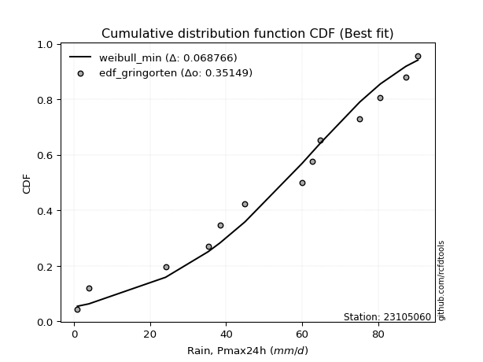</img>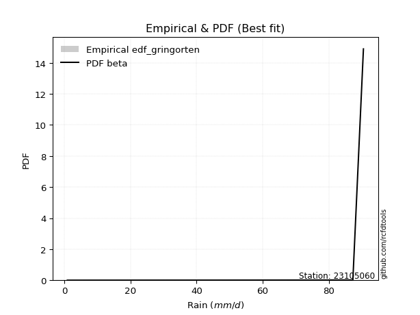</img>

</div>


### 9. EDF Filliben (1975)

The specific values of the constants (0.3175) (often denoted as $alpha$) and (0.365) are derived from a method proposed by James J. Filliben in a 1975 paper. This particular formula is the mean value of the $i$-th order statistic of the normal distribution and is considered a robust and effective plotting position formula for the normal probability plot correlation coefficient test for normality.

<div align="center">


$P=(m-0.3175)/(n+0.365)$


</div>


**9.1. Empirical values**

<div align="center">

|                | 0                    | 1                   | 2                   | 3                  | 4                  | 5                   | 6            | 7                  | 8                  | 9                  | 10                | 11                 | 12                 |
|:---------------|:---------------------|:--------------------|:--------------------|:-------------------|:-------------------|:--------------------|:-------------|:-------------------|:-------------------|:-------------------|:------------------|:-------------------|:-------------------|
| date           | 2013                 | 2011                | 2017                | 2006               | 2014               | 2012                | 2008         | 2016               | 2018               | 2010               | 2007              | 2009               | 2015               |
| x              | 0.9                  | 3.9                 | 24.1                | 35.3               | 38.4               | 45.0                | 60.0         | 62.8               | 64.8               | 75.2               | 80.6              | 87.3               | 90.5               |
| m              | 1                    | 2                   | 3                   | 4                  | 5                  | 6                   | 7            | 8                  | 9                  | 10                 | 11                | 12                 | 13                 |
| empirical_dist | edf_filliben         | edf_filliben        | edf_filliben        | edf_filliben       | edf_filliben       | edf_filliben        | edf_filliben | edf_filliben       | edf_filliben       | edf_filliben       | edf_filliben      | edf_filliben       | edf_filliben       |
| empirical      | 0.051066217732884396 | 0.12588851477740368 | 0.20071081182192294 | 0.2755331088664422 | 0.3503554059109615 | 0.42517770295548074 | 0.5          | 0.5748222970445193 | 0.6496445940890385 | 0.7244668911335578 | 0.799289188178077 | 0.8741114852225963 | 0.9489337822671156 |
| empirical_tr   | 1.0538143110585454   | 1.1440188315857052  | 1.2511116311724784  | 1.3803253292021689 | 1.5393031960840773 | 1.7396680767979174  | 2.0          | 2.351957765068192  | 2.8542445274959958 | 3.6293279022403255 | 4.982292637465051 | 7.943536404160473  | 19.582417582417566 |

</div>


**9.2. Kolmogorov-Smirnov fit test (sorted by Δ)**


<div align="center">

|                | 0                   | 1                    | 2                   | 3                   | 4                   | 5                   | 6                   | 7                   | 8                   | 9                   | 10                  | 11                  | 12                  | 13                  | 14                  | 15                  | 16                  | 17                  | 18                  | 19                  | 20                  | 21                  | 22                  | 23                  | 24                  | 25                  | 26                  | 27                  | 28                  | 29                  | 30                  | 31                  | 32                  | 33                  | 34                  | 35                  | 36                  | 37                  | 38                  | 39                  | 40                  | 41                  | 42                  | 43                  | 44                  | 45                  | 46                  | 47                  | 48                  | 49                  | 50                  | 51                  | 52                  | 53                  | 54                  | 55                  | 56                  | 57                  | 58                  | 59                  | 60                  | 61                  | 62                  | 63                  | 64                  | 65                  | 66                  | 67                  | 68                  | 69                  | 70                  | 71                  | 72                  | 73                  | 74                  | 75                  | 76                  | 77                  | 78                  | 79                  | 80                  | 81                  | 82                  | 83                  | 84                  | 85                  | 86                  | 87                  | 88                  | 89                  | 90                  | 91                  | 92                  | 93                  | 94                  | 95                  | 96                  | 97                  | 98                  | 99                  | 100                 | 101                 | 102                 | 103                 | 104                 | 105                 | 106                 | 107                 | 108                 | 109                 | 110                 | 111                 | 112                 | 113                 | 114                 | 115                 | 116                 | 117                 | 118                 | 119                 | 120                 | 121                 | 122                 | 123                 | 124                 | 125                 | 126                 | 127                 | 128                 | 129                 | 130                 | 131                 | 132                 | 133                 | 134                 | 135                 | 136                 | 137                 | 138                 | 139                 | 140                 | 141                 | 142                 | 143                 | 144                 | 145                 | 146                 | 147                 | 148                 | 149                 | 150                 | 151                 | 152                 | 153                 | 154                 | 155                 | 156                 | 157                 | 158                 | 159                 |
|:---------------|:--------------------|:---------------------|:--------------------|:--------------------|:--------------------|:--------------------|:--------------------|:--------------------|:--------------------|:--------------------|:--------------------|:--------------------|:--------------------|:--------------------|:--------------------|:--------------------|:--------------------|:--------------------|:--------------------|:--------------------|:--------------------|:--------------------|:--------------------|:--------------------|:--------------------|:--------------------|:--------------------|:--------------------|:--------------------|:--------------------|:--------------------|:--------------------|:--------------------|:--------------------|:--------------------|:--------------------|:--------------------|:--------------------|:--------------------|:--------------------|:--------------------|:--------------------|:--------------------|:--------------------|:--------------------|:--------------------|:--------------------|:--------------------|:--------------------|:--------------------|:--------------------|:--------------------|:--------------------|:--------------------|:--------------------|:--------------------|:--------------------|:--------------------|:--------------------|:--------------------|:--------------------|:--------------------|:--------------------|:--------------------|:--------------------|:--------------------|:--------------------|:--------------------|:--------------------|:--------------------|:--------------------|:--------------------|:--------------------|:--------------------|:--------------------|:--------------------|:--------------------|:--------------------|:--------------------|:--------------------|:--------------------|:--------------------|:--------------------|:--------------------|:--------------------|:--------------------|:--------------------|:--------------------|:--------------------|:--------------------|:--------------------|:--------------------|:--------------------|:--------------------|:--------------------|:--------------------|:--------------------|:--------------------|:--------------------|:--------------------|:--------------------|:--------------------|:--------------------|:--------------------|:--------------------|:--------------------|:--------------------|:--------------------|:--------------------|:--------------------|:--------------------|:--------------------|:--------------------|:--------------------|:--------------------|:--------------------|:--------------------|:--------------------|:--------------------|:--------------------|:--------------------|:--------------------|:--------------------|:--------------------|:--------------------|:--------------------|:--------------------|:--------------------|:--------------------|:--------------------|:--------------------|:--------------------|:--------------------|:--------------------|:--------------------|:--------------------|:--------------------|:--------------------|:--------------------|:--------------------|:--------------------|:--------------------|:--------------------|:--------------------|:--------------------|:--------------------|:--------------------|:--------------------|:--------------------|:--------------------|:--------------------|:--------------------|:--------------------|:--------------------|:--------------------|:--------------------|:--------------------|:--------------------|:--------------------|:--------------------|
| station        | 23105060            | 23105060             | 23105060            | 23105060            | 23105060            | 23105060            | 23105060            | 23105060            | 23105060            | 23105060            | 23105060            | 23105060            | 23105060            | 23105060            | 23105060            | 23105060            | 23105060            | 23105060            | 23105060            | 23105060            | 23105060            | 23105060            | 23105060            | 23105060            | 23105060            | 23105060            | 23105060            | 23105060            | 23105060            | 23105060            | 23105060            | 23105060            | 23105060            | 23105060            | 23105060            | 23105060            | 23105060            | 23105060            | 23105060            | 23105060            | 23105060            | 23105060            | 23105060            | 23105060            | 23105060            | 23105060            | 23105060            | 23105060            | 23105060            | 23105060            | 23105060            | 23105060            | 23105060            | 23105060            | 23105060            | 23105060            | 23105060            | 23105060            | 23105060            | 23105060            | 23105060            | 23105060            | 23105060            | 23105060            | 23105060            | 23105060            | 23105060            | 23105060            | 23105060            | 23105060            | 23105060            | 23105060            | 23105060            | 23105060            | 23105060            | 23105060            | 23105060            | 23105060            | 23105060            | 23105060            | 23105060            | 23105060            | 23105060            | 23105060            | 23105060            | 23105060            | 23105060            | 23105060            | 23105060            | 23105060            | 23105060            | 23105060            | 23105060            | 23105060            | 23105060            | 23105060            | 23105060            | 23105060            | 23105060            | 23105060            | 23105060            | 23105060            | 23105060            | 23105060            | 23105060            | 23105060            | 23105060            | 23105060            | 23105060            | 23105060            | 23105060            | 23105060            | 23105060            | 23105060            | 23105060            | 23105060            | 23105060            | 23105060            | 23105060            | 23105060            | 23105060            | 23105060            | 23105060            | 23105060            | 23105060            | 23105060            | 23105060            | 23105060            | 23105060            | 23105060            | 23105060            | 23105060            | 23105060            | 23105060            | 23105060            | 23105060            | 23105060            | 23105060            | 23105060            | 23105060            | 23105060            | 23105060            | 23105060            | 23105060            | 23105060            | 23105060            | 23105060            | 23105060            | 23105060            | 23105060            | 23105060            | 23105060            | 23105060            | 23105060            | 23105060            | 23105060            | 23105060            | 23105060            | 23105060            | 23105060            |
| empirical_dist | edf_filliben        | edf_filliben         | edf_filliben        | edf_filliben        | edf_filliben        | edf_filliben        | edf_filliben        | edf_filliben        | edf_filliben        | edf_filliben        | edf_filliben        | edf_filliben        | edf_filliben        | edf_filliben        | edf_filliben        | edf_filliben        | edf_filliben        | edf_filliben        | edf_filliben        | edf_filliben        | edf_filliben        | edf_filliben        | edf_filliben        | edf_filliben        | edf_filliben        | edf_filliben        | edf_filliben        | edf_filliben        | edf_filliben        | edf_filliben        | edf_filliben        | edf_filliben        | edf_filliben        | edf_filliben        | edf_filliben        | edf_filliben        | edf_filliben        | edf_filliben        | edf_filliben        | edf_filliben        | edf_filliben        | edf_filliben        | edf_filliben        | edf_filliben        | edf_filliben        | edf_filliben        | edf_filliben        | edf_filliben        | edf_filliben        | edf_filliben        | edf_filliben        | edf_filliben        | edf_filliben        | edf_filliben        | edf_filliben        | edf_filliben        | edf_filliben        | edf_filliben        | edf_filliben        | edf_filliben        | edf_filliben        | edf_filliben        | edf_filliben        | edf_filliben        | edf_filliben        | edf_filliben        | edf_filliben        | edf_filliben        | edf_filliben        | edf_filliben        | edf_filliben        | edf_filliben        | edf_filliben        | edf_filliben        | edf_filliben        | edf_filliben        | edf_filliben        | edf_filliben        | edf_filliben        | edf_filliben        | edf_filliben        | edf_filliben        | edf_filliben        | edf_filliben        | edf_filliben        | edf_filliben        | edf_filliben        | edf_filliben        | edf_filliben        | edf_filliben        | edf_filliben        | edf_filliben        | edf_filliben        | edf_filliben        | edf_filliben        | edf_filliben        | edf_filliben        | edf_filliben        | edf_filliben        | edf_filliben        | edf_filliben        | edf_filliben        | edf_filliben        | edf_filliben        | edf_filliben        | edf_filliben        | edf_filliben        | edf_filliben        | edf_filliben        | edf_filliben        | edf_filliben        | edf_filliben        | edf_filliben        | edf_filliben        | edf_filliben        | edf_filliben        | edf_filliben        | edf_filliben        | edf_filliben        | edf_filliben        | edf_filliben        | edf_filliben        | edf_filliben        | edf_filliben        | edf_filliben        | edf_filliben        | edf_filliben        | edf_filliben        | edf_filliben        | edf_filliben        | edf_filliben        | edf_filliben        | edf_filliben        | edf_filliben        | edf_filliben        | edf_filliben        | edf_filliben        | edf_filliben        | edf_filliben        | edf_filliben        | edf_filliben        | edf_filliben        | edf_filliben        | edf_filliben        | edf_filliben        | edf_filliben        | edf_filliben        | edf_filliben        | edf_filliben        | edf_filliben        | edf_filliben        | edf_filliben        | edf_filliben        | edf_filliben        | edf_filliben        | edf_filliben        | edf_filliben        | edf_filliben        | edf_filliben        | edf_filliben        |
| p_dist         | gausshyper          | beta                 | trapezoid           | weibull_min         | burr12              | triang              | skewnorm            | argus               | gumbel_l            | dgamma              | dweibull            | logjohnsonsu        | genpareto           | semicircular        | pearson3            | anglit              | genextreme          | genhalflogistic     | johnsonsu           | nct                 | exponnorm           | norm                | crystalball         | t                   | fatiguelife         | foldnorm            | loggenextreme       | f                   | betaprime           | loglevy_l           | gamma               | erlang              | gengamma            | arcsine             | rice                | logistic            | ksone               | invweibull          | wrapcauchy          | invgamma            | truncweibull_min    | cosine              | maxwell             | hypsecant           | ncf                 | rayleigh            | burr                | invgauss            | logburr             | kappa3              | uniform             | logargus            | vonmises_line       | kstwobign           | logexponweib        | logloggamma         | halfnorm            | laplace             | logpearson3         | loggumbel_l         | logburr12           | logweibull_min      | logt                | loggompertz         | kappa4              | gumbel_r            | logvonmises_line    | mielke              | bradford            | halflogistic        | loggennorm          | moyal               | loggenhalflogistic  | genexpon            | logdgamma           | logtrapezoid        | logfoldnorm         | loggausshyper       | truncexpon          | logfatiguelife      | logdweibull         | logsemicircular     | loganglit           | logbetaprime        | lognakagami         | logexponnorm        | lognorm             | logrice             | lognct              | loglogistic         | logweibull_max      | loghypsecant        | loginvgamma         | logerlang           | logalpha            | loglaplace          | loglaplace          | loggengamma         | loggamma            | loggamma            | wald                | loginvweibull       | logarcsine          | levy_l              | lomax               | loginvgauss         | loggenpareto        | logmaxwell          | lograyleigh         | halfgennorm         | logskewnorm         | logkstwobign        | loggumbel_r         | loghalfnorm         | logbeta             | loggenexpon         | logcosine           | logmoyal            | loghalflogistic     | logwrapcauchy       | logtriang           | gennorm             | logncf              | loglomax            | logwald             | logloglaplace       | loghalfgennorm      | exponweib           | logtruncweibull_min | logf                | logksone            | logkappa4           | powerlaw            | nakagami            | logkappa3           | loguniform          | gompertz            | logmielke           | logbradford         | logjohnsonsb        | rdist               | tukeylambda         | logtruncnorm        | weibull_max         | logtruncexpon       | johnsonsb           | logexponpow         | logtukeylambda      | alpha               | logpowerlaw         | exponpow            | truncpareto         | truncnorm           | logtruncpareto      | logrdist            | genlogistic         | loggenlogistic      | logvonmises         | vonmises            | logcrystalball      |
| delta          | 0.05930335732220551 | 0.060471170382482384 | 0.06313551133932649 | 0.0687662408601798  | 0.06900526236521731 | 0.07637255133575557 | 0.07784803111538058 | 0.07960361123706758 | 0.08186158282668665 | 0.08745874096531236 | 0.08921449931375001 | 0.09028330750158609 | 0.09084105662659145 | 0.09481208327284896 | 0.09532236353482904 | 0.10149066630280312 | 0.10173110379855221 | 0.1053939420624147  | 0.11703672167913304 | 0.11750952240283796 | 0.11752108515147597 | 0.11752168009488817 | 0.11752168622200632 | 0.11752216762504708 | 0.11792979778475865 | 0.11839001807416372 | 0.1187607347257873  | 0.11937499334141    | 0.12032497271449594 | 0.12043446876128888 | 0.12266577742699603 | 0.1234439893981879  | 0.12389356664033269 | 0.12588851477740368 | 0.1268768040044479  | 0.13234416994337073 | 0.13299851190476197 | 0.13342792375269685 | 0.13381940510243862 | 0.1348231645123814  | 0.1359636870388654  | 0.13645304190756535 | 0.14244030347164816 | 0.14427884628762921 | 0.14547152334217905 | 0.15008658724068824 | 0.1524123322568397  | 0.15308142476821174 | 0.15802872979434696 | 0.15916588113893848 | 0.1595982142857143  | 0.1597559944216531  | 0.16113664449358334 | 0.16213559771811825 | 0.16378477325760799 | 0.1638348446889576  | 0.17198095450821727 | 0.17240142560350913 | 0.17305785609924262 | 0.17352859920836905 | 0.1741476185575277  | 0.17580698453501986 | 0.1760293876293091  | 0.17654294470981347 | 0.17965696444650026 | 0.18206087308734753 | 0.18679232860469386 | 0.19858685579481594 | 0.1994717929960339  | 0.20035429029955232 | 0.20187971359861578 | 0.20385478253640188 | 0.22103318057002092 | 0.22364737122307365 | 0.22821835012157243 | 0.2292347680630965  | 0.2301952295886226  | 0.23346361053494247 | 0.23401218198914853 | 0.23897715798436747 | 0.23904887772259387 | 0.2390855798863668  | 0.24016456748966653 | 0.2407830320518468  | 0.24260053841565954 | 0.2427804410587513  | 0.24278202829605233 | 0.24278949374537162 | 0.24312243181863347 | 0.2452797138594096  | 0.2465382540602     | 0.24740969003731395 | 0.2529190330410779  | 0.25305662982461363 | 0.25325756723986836 | 0.25590893300640716 | 0.25590893300640716 | 0.26132021280723394 | 0.26410001670084327 | 0.26410001670084327 | 0.26484854061218965 | 0.26736768151283663 | 0.26759666259618997 | 0.26778696931595275 | 0.2697769329531251  | 0.2725184169043793  | 0.27352892995810174 | 0.27501064778017625 | 0.28559884454796414 | 0.28969290261189784 | 0.3035093133740736  | 0.304955963514822   | 0.31345826123716236 | 0.3154167657060881  | 0.32401761803042495 | 0.3277581000641263  | 0.33017129887407715 | 0.33908679453251567 | 0.34137764677786786 | 0.3586186241474709  | 0.3680314150897672  | 0.3741114852225963  | 0.38397471409269235 | 0.4021206532251268  | 0.41028162167710436 | 0.4479883900278532  | 0.4551065474122228  | 0.4643277085784774  | 0.4709171149043284  | 0.4739199389029449  | 0.476813744216503   | 0.4775676603002599  | 0.5040567710602255  | 0.5044176028168478  | 0.5202316888942033  | 0.520275603466723   | 0.5211521012154405  | 0.5226877688968032  | 0.5486150642347818  | 0.5535035747817665  | 0.5748222936370002  | 0.5794930118595014  | 0.5866848596230357  | 0.6028536596507196  | 0.6114630423551439  | 0.6463832950737466  | 0.6526508180577362  | 0.6785713748781084  | 0.6945264680328269  | 0.7015526429763903  | 0.7320568629966306  | 0.743582127165852   | 0.7689425074220251  | 0.7874159132705797  | 0.7992891709767741  | 0.8741114852225963  | 0.8741114852225963  | 1.0075807307127183  | 14.009078448228609  | nan                 |
| deltao         | 0.35149047353100005 | 0.35149047353100005  | 0.35149047353100005 | 0.35149047353100005 | 0.35149047353100005 | 0.35149047353100005 | 0.35149047353100005 | 0.35149047353100005 | 0.35149047353100005 | 0.35149047353100005 | 0.35149047353100005 | 0.35149047353100005 | 0.35149047353100005 | 0.35149047353100005 | 0.35149047353100005 | 0.35149047353100005 | 0.35149047353100005 | 0.35149047353100005 | 0.35149047353100005 | 0.35149047353100005 | 0.35149047353100005 | 0.35149047353100005 | 0.35149047353100005 | 0.35149047353100005 | 0.35149047353100005 | 0.35149047353100005 | 0.35149047353100005 | 0.35149047353100005 | 0.35149047353100005 | 0.35149047353100005 | 0.35149047353100005 | 0.35149047353100005 | 0.35149047353100005 | 0.35149047353100005 | 0.35149047353100005 | 0.35149047353100005 | 0.35149047353100005 | 0.35149047353100005 | 0.35149047353100005 | 0.35149047353100005 | 0.35149047353100005 | 0.35149047353100005 | 0.35149047353100005 | 0.35149047353100005 | 0.35149047353100005 | 0.35149047353100005 | 0.35149047353100005 | 0.35149047353100005 | 0.35149047353100005 | 0.35149047353100005 | 0.35149047353100005 | 0.35149047353100005 | 0.35149047353100005 | 0.35149047353100005 | 0.35149047353100005 | 0.35149047353100005 | 0.35149047353100005 | 0.35149047353100005 | 0.35149047353100005 | 0.35149047353100005 | 0.35149047353100005 | 0.35149047353100005 | 0.35149047353100005 | 0.35149047353100005 | 0.35149047353100005 | 0.35149047353100005 | 0.35149047353100005 | 0.35149047353100005 | 0.35149047353100005 | 0.35149047353100005 | 0.35149047353100005 | 0.35149047353100005 | 0.35149047353100005 | 0.35149047353100005 | 0.35149047353100005 | 0.35149047353100005 | 0.35149047353100005 | 0.35149047353100005 | 0.35149047353100005 | 0.35149047353100005 | 0.35149047353100005 | 0.35149047353100005 | 0.35149047353100005 | 0.35149047353100005 | 0.35149047353100005 | 0.35149047353100005 | 0.35149047353100005 | 0.35149047353100005 | 0.35149047353100005 | 0.35149047353100005 | 0.35149047353100005 | 0.35149047353100005 | 0.35149047353100005 | 0.35149047353100005 | 0.35149047353100005 | 0.35149047353100005 | 0.35149047353100005 | 0.35149047353100005 | 0.35149047353100005 | 0.35149047353100005 | 0.35149047353100005 | 0.35149047353100005 | 0.35149047353100005 | 0.35149047353100005 | 0.35149047353100005 | 0.35149047353100005 | 0.35149047353100005 | 0.35149047353100005 | 0.35149047353100005 | 0.35149047353100005 | 0.35149047353100005 | 0.35149047353100005 | 0.35149047353100005 | 0.35149047353100005 | 0.35149047353100005 | 0.35149047353100005 | 0.35149047353100005 | 0.35149047353100005 | 0.35149047353100005 | 0.35149047353100005 | 0.35149047353100005 | 0.35149047353100005 | 0.35149047353100005 | 0.35149047353100005 | 0.35149047353100005 | 0.35149047353100005 | 0.35149047353100005 | 0.35149047353100005 | 0.35149047353100005 | 0.35149047353100005 | 0.35149047353100005 | 0.35149047353100005 | 0.35149047353100005 | 0.35149047353100005 | 0.35149047353100005 | 0.35149047353100005 | 0.35149047353100005 | 0.35149047353100005 | 0.35149047353100005 | 0.35149047353100005 | 0.35149047353100005 | 0.35149047353100005 | 0.35149047353100005 | 0.35149047353100005 | 0.35149047353100005 | 0.35149047353100005 | 0.35149047353100005 | 0.35149047353100005 | 0.35149047353100005 | 0.35149047353100005 | 0.35149047353100005 | 0.35149047353100005 | 0.35149047353100005 | 0.35149047353100005 | 0.35149047353100005 | 0.35149047353100005 | 0.35149047353100005 | 0.35149047353100005 | 0.35149047353100005 | 0.35149047353100005 |
| eval           | Δo > Δ              | Δo > Δ               | Δo > Δ              | Δo > Δ              | Δo > Δ              | Δo > Δ              | Δo > Δ              | Δo > Δ              | Δo > Δ              | Δo > Δ              | Δo > Δ              | Δo > Δ              | Δo > Δ              | Δo > Δ              | Δo > Δ              | Δo > Δ              | Δo > Δ              | Δo > Δ              | Δo > Δ              | Δo > Δ              | Δo > Δ              | Δo > Δ              | Δo > Δ              | Δo > Δ              | Δo > Δ              | Δo > Δ              | Δo > Δ              | Δo > Δ              | Δo > Δ              | Δo > Δ              | Δo > Δ              | Δo > Δ              | Δo > Δ              | Δo > Δ              | Δo > Δ              | Δo > Δ              | Δo > Δ              | Δo > Δ              | Δo > Δ              | Δo > Δ              | Δo > Δ              | Δo > Δ              | Δo > Δ              | Δo > Δ              | Δo > Δ              | Δo > Δ              | Δo > Δ              | Δo > Δ              | Δo > Δ              | Δo > Δ              | Δo > Δ              | Δo > Δ              | Δo > Δ              | Δo > Δ              | Δo > Δ              | Δo > Δ              | Δo > Δ              | Δo > Δ              | Δo > Δ              | Δo > Δ              | Δo > Δ              | Δo > Δ              | Δo > Δ              | Δo > Δ              | Δo > Δ              | Δo > Δ              | Δo > Δ              | Δo > Δ              | Δo > Δ              | Δo > Δ              | Δo > Δ              | Δo > Δ              | Δo > Δ              | Δo > Δ              | Δo > Δ              | Δo > Δ              | Δo > Δ              | Δo > Δ              | Δo > Δ              | Δo > Δ              | Δo > Δ              | Δo > Δ              | Δo > Δ              | Δo > Δ              | Δo > Δ              | Δo > Δ              | Δo > Δ              | Δo > Δ              | Δo > Δ              | Δo > Δ              | Δo > Δ              | Δo > Δ              | Δo > Δ              | Δo > Δ              | Δo > Δ              | Δo > Δ              | Δo > Δ              | Δo > Δ              | Δo > Δ              | Δo > Δ              | Δo > Δ              | Δo > Δ              | Δo > Δ              | Δo > Δ              | Δo > Δ              | Δo > Δ              | Δo > Δ              | Δo > Δ              | Δo > Δ              | Δo > Δ              | Δo > Δ              | Δo > Δ              | Δo > Δ              | Δo > Δ              | Δo > Δ              | Δo > Δ              | Δo > Δ              | Δo > Δ              | Δo > Δ              | Δo <= Δ             | Δo <= Δ             | Δo <= Δ             | Δo <= Δ             | Δo <= Δ             | Δo <= Δ             | Δo <= Δ             | Δo <= Δ             | Δo <= Δ             | Δo <= Δ             | Δo <= Δ             | Δo <= Δ             | Δo <= Δ             | Δo <= Δ             | Δo <= Δ             | Δo <= Δ             | Δo <= Δ             | Δo <= Δ             | Δo <= Δ             | Δo <= Δ             | Δo <= Δ             | Δo <= Δ             | Δo <= Δ             | Δo <= Δ             | Δo <= Δ             | Δo <= Δ             | Δo <= Δ             | Δo <= Δ             | Δo <= Δ             | Δo <= Δ             | Δo <= Δ             | Δo <= Δ             | Δo <= Δ             | Δo <= Δ             | Δo <= Δ             | Δo <= Δ             | Δo <= Δ             | Δo <= Δ             | Δo <= Δ             | Δo <= Δ             | Δo <= Δ             |
| fit            | 1                   | 1                    | 1                   | 1                   | 1                   | 1                   | 1                   | 1                   | 1                   | 1                   | 1                   | 1                   | 1                   | 1                   | 1                   | 1                   | 1                   | 1                   | 1                   | 1                   | 1                   | 1                   | 1                   | 1                   | 1                   | 1                   | 1                   | 1                   | 1                   | 1                   | 1                   | 1                   | 1                   | 1                   | 1                   | 1                   | 1                   | 1                   | 1                   | 1                   | 1                   | 1                   | 1                   | 1                   | 1                   | 1                   | 1                   | 1                   | 1                   | 1                   | 1                   | 1                   | 1                   | 1                   | 1                   | 1                   | 1                   | 1                   | 1                   | 1                   | 1                   | 1                   | 1                   | 1                   | 1                   | 1                   | 1                   | 1                   | 1                   | 1                   | 1                   | 1                   | 1                   | 1                   | 1                   | 1                   | 1                   | 1                   | 1                   | 1                   | 1                   | 1                   | 1                   | 1                   | 1                   | 1                   | 1                   | 1                   | 1                   | 1                   | 1                   | 1                   | 1                   | 1                   | 1                   | 1                   | 1                   | 1                   | 1                   | 1                   | 1                   | 1                   | 1                   | 1                   | 1                   | 1                   | 1                   | 1                   | 1                   | 1                   | 1                   | 1                   | 1                   | 1                   | 1                   | 1                   | 1                   | 1                   | 1                   | 0                   | 0                   | 0                   | 0                   | 0                   | 0                   | 0                   | 0                   | 0                   | 0                   | 0                   | 0                   | 0                   | 0                   | 0                   | 0                   | 0                   | 0                   | 0                   | 0                   | 0                   | 0                   | 0                   | 0                   | 0                   | 0                   | 0                   | 0                   | 0                   | 0                   | 0                   | 0                   | 0                   | 0                   | 0                   | 0                   | 0                   | 0                   | 0                   | 0                   | 0                   |
| n              | 13                  | 13                   | 13                  | 13                  | 13                  | 13                  | 13                  | 13                  | 13                  | 13                  | 13                  | 13                  | 13                  | 13                  | 13                  | 13                  | 13                  | 13                  | 13                  | 13                  | 13                  | 13                  | 13                  | 13                  | 13                  | 13                  | 13                  | 13                  | 13                  | 13                  | 13                  | 13                  | 13                  | 13                  | 13                  | 13                  | 13                  | 13                  | 13                  | 13                  | 13                  | 13                  | 13                  | 13                  | 13                  | 13                  | 13                  | 13                  | 13                  | 13                  | 13                  | 13                  | 13                  | 13                  | 13                  | 13                  | 13                  | 13                  | 13                  | 13                  | 13                  | 13                  | 13                  | 13                  | 13                  | 13                  | 13                  | 13                  | 13                  | 13                  | 13                  | 13                  | 13                  | 13                  | 13                  | 13                  | 13                  | 13                  | 13                  | 13                  | 13                  | 13                  | 13                  | 13                  | 13                  | 13                  | 13                  | 13                  | 13                  | 13                  | 13                  | 13                  | 13                  | 13                  | 13                  | 13                  | 13                  | 13                  | 13                  | 13                  | 13                  | 13                  | 13                  | 13                  | 13                  | 13                  | 13                  | 13                  | 13                  | 13                  | 13                  | 13                  | 13                  | 13                  | 13                  | 13                  | 13                  | 13                  | 13                  | 13                  | 13                  | 13                  | 13                  | 13                  | 13                  | 13                  | 13                  | 13                  | 13                  | 13                  | 13                  | 13                  | 13                  | 13                  | 13                  | 13                  | 13                  | 13                  | 13                  | 13                  | 13                  | 13                  | 13                  | 13                  | 13                  | 13                  | 13                  | 13                  | 13                  | 13                  | 13                  | 13                  | 13                  | 13                  | 13                  | 13                  | 13                  | 13                  | 13                  | 13                  |
| best_fit       | 1                   | 0                    | 0                   | 0                   | 0                   | 0                   | 0                   | 0                   | 0                   | 0                   | 0                   | 0                   | 0                   | 0                   | 0                   | 0                   | 0                   | 0                   | 0                   | 0                   | 0                   | 0                   | 0                   | 0                   | 0                   | 0                   | 0                   | 0                   | 0                   | 0                   | 0                   | 0                   | 0                   | 0                   | 0                   | 0                   | 0                   | 0                   | 0                   | 0                   | 0                   | 0                   | 0                   | 0                   | 0                   | 0                   | 0                   | 0                   | 0                   | 0                   | 0                   | 0                   | 0                   | 0                   | 0                   | 0                   | 0                   | 0                   | 0                   | 0                   | 0                   | 0                   | 0                   | 0                   | 0                   | 0                   | 0                   | 0                   | 0                   | 0                   | 0                   | 0                   | 0                   | 0                   | 0                   | 0                   | 0                   | 0                   | 0                   | 0                   | 0                   | 0                   | 0                   | 0                   | 0                   | 0                   | 0                   | 0                   | 0                   | 0                   | 0                   | 0                   | 0                   | 0                   | 0                   | 0                   | 0                   | 0                   | 0                   | 0                   | 0                   | 0                   | 0                   | 0                   | 0                   | 0                   | 0                   | 0                   | 0                   | 0                   | 0                   | 0                   | 0                   | 0                   | 0                   | 0                   | 0                   | 0                   | 0                   | 0                   | 0                   | 0                   | 0                   | 0                   | 0                   | 0                   | 0                   | 0                   | 0                   | 0                   | 0                   | 0                   | 0                   | 0                   | 0                   | 0                   | 0                   | 0                   | 0                   | 0                   | 0                   | 0                   | 0                   | 0                   | 0                   | 0                   | 0                   | 0                   | 0                   | 0                   | 0                   | 0                   | 0                   | 0                   | 0                   | 0                   | 0                   | 0                   | 0                   | 0                   |
| best_fit_sort  | 1                   | 2                    | 3                   | 4                   | 5                   | 6                   | 7                   | 8                   | 9                   | 10                  | 11                  | 12                  | 13                  | 14                  | 15                  | 16                  | 17                  | 18                  | 19                  | 20                  | 21                  | 22                  | 23                  | 24                  | 25                  | 26                  | 27                  | 28                  | 29                  | 30                  | 31                  | 32                  | 33                  | 34                  | 35                  | 36                  | 37                  | 38                  | 39                  | 40                  | 41                  | 42                  | 43                  | 44                  | 45                  | 46                  | 47                  | 48                  | 49                  | 50                  | 51                  | 52                  | 53                  | 54                  | 55                  | 56                  | 57                  | 58                  | 59                  | 60                  | 61                  | 62                  | 63                  | 64                  | 65                  | 66                  | 67                  | 68                  | 69                  | 70                  | 71                  | 72                  | 73                  | 74                  | 75                  | 76                  | 77                  | 78                  | 79                  | 80                  | 81                  | 82                  | 83                  | 84                  | 85                  | 86                  | 87                  | 88                  | 89                  | 90                  | 91                  | 92                  | 93                  | 94                  | 95                  | 96                  | 97                  | 98                  | 99                  | 100                 | 101                 | 102                 | 103                 | 104                 | 105                 | 106                 | 107                 | 108                 | 109                 | 110                 | 111                 | 112                 | 113                 | 114                 | 115                 | 116                 | 117                 | 118                 | 119                 | 120                 | 121                 | 122                 | 123                 | 124                 | 125                 | 126                 | 127                 | 128                 | 129                 | 130                 | 131                 | 132                 | 133                 | 134                 | 135                 | 136                 | 137                 | 138                 | 139                 | 140                 | 141                 | 142                 | 143                 | 144                 | 145                 | 146                 | 147                 | 148                 | 149                 | 150                 | 151                 | 152                 | 153                 | 154                 | 155                 | 156                 | 157                 | 158                 | 159                 | 160                 |

</div>


**9.3. Best fit**

<div align="center">

|   id |   station | empirical_dist   | p_dist     |     delta |   deltao | eval   |   fit |   n |   best_fit |   best_fit_sort |
|-----:|----------:|:-----------------|:-----------|----------:|---------:|:-------|------:|----:|-----------:|----------------:|
|    0 |  23105060 | edf_filliben     | gausshyper | 0.0593034 |  0.35149 | Δo > Δ |     1 |  13 |          1 |               1 |

</div>


<div align="center">

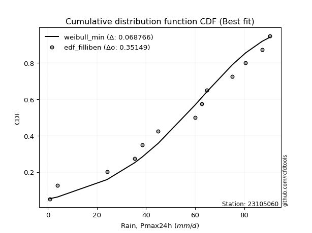</img></img>

</div>


### 10. EDF Jenkinson (1977)

The Jenkinson formula in hydrology is an empirical plotting position formula used to estimate the non-exceedance probability _(P)_ or return period _(T)_ of a given ordered observation within a sample. It is a widely used method in the frequency analysis of extreme events such as floods and rainfall, as it provides a distribution-free way to plot data. _a≈0.31_ and _b≈0.38_ are constants derived to approximate the median of the probability distribution for the given rank.

<div align="center">


$P=(m-a)/(n+b)$


</div>


**10.1. Empirical values**

<div align="center">

|                | 0                    | 1                   | 2                   | 3                   | 4                  | 5                  | 6             | 7                  | 8                  | 9                  | 10                 | 11                 | 12                 |
|:---------------|:---------------------|:--------------------|:--------------------|:--------------------|:-------------------|:-------------------|:--------------|:-------------------|:-------------------|:-------------------|:-------------------|:-------------------|:-------------------|
| date           | 2013                 | 2011                | 2017                | 2006                | 2014               | 2012               | 2008          | 2016               | 2018               | 2010               | 2007               | 2009               | 2015               |
| x              | 0.9                  | 3.9                 | 24.1                | 35.3                | 38.4               | 45.0               | 60.0          | 62.8               | 64.8               | 75.2               | 80.6               | 87.3               | 90.5               |
| m              | 1                    | 2                   | 3                   | 4                   | 5                  | 6                  | 7             | 8                  | 9                  | 10                 | 11                 | 12                 | 13                 |
| empirical_dist | edf_jenkinson        | edf_jenkinson       | edf_jenkinson       | edf_jenkinson       | edf_jenkinson      | edf_jenkinson      | edf_jenkinson | edf_jenkinson      | edf_jenkinson      | edf_jenkinson      | edf_jenkinson      | edf_jenkinson      | edf_jenkinson      |
| empirical      | 0.051569506726457395 | 0.12630792227204782 | 0.20104633781763825 | 0.27578475336322866 | 0.3505231689088191 | 0.4252615844544096 | 0.5           | 0.5747384155455905 | 0.6494768310911808 | 0.7242152466367712 | 0.7989536621823616 | 0.8736920777279521 | 0.9484304932735426 |
| empirical_tr   | 1.0543735224586288   | 1.1445680068434558  | 1.2516370439663236  | 1.3808049535603715  | 1.5397008055235901 | 1.739921976592978  | 2.0           | 2.351493848857645  | 2.852878464818763  | 3.6260162601626    | 4.973977695167283  | 7.917159763313605  | 19.391304347826072 |

</div>


**10.2. Kolmogorov-Smirnov fit test (sorted by Δ)**


<div align="center">

|                | 0                    | 1                    | 2                   | 3                   | 4                   | 5                   | 6                   | 7                   | 8                   | 9                   | 10                  | 11                  | 12                  | 13                  | 14                  | 15                  | 16                  | 17                  | 18                  | 19                  | 20                  | 21                  | 22                  | 23                  | 24                  | 25                  | 26                  | 27                  | 28                  | 29                  | 30                  | 31                  | 32                  | 33                  | 34                  | 35                  | 36                  | 37                  | 38                  | 39                  | 40                  | 41                  | 42                  | 43                  | 44                  | 45                  | 46                  | 47                  | 48                  | 49                  | 50                  | 51                  | 52                  | 53                  | 54                  | 55                  | 56                  | 57                  | 58                  | 59                  | 60                  | 61                  | 62                  | 63                  | 64                  | 65                  | 66                  | 67                  | 68                  | 69                  | 70                  | 71                  | 72                  | 73                  | 74                  | 75                  | 76                  | 77                  | 78                  | 79                  | 80                  | 81                  | 82                  | 83                  | 84                  | 85                  | 86                  | 87                  | 88                  | 89                  | 90                  | 91                  | 92                  | 93                  | 94                  | 95                  | 96                  | 97                  | 98                  | 99                  | 100                 | 101                 | 102                 | 103                 | 104                 | 105                 | 106                 | 107                 | 108                 | 109                 | 110                 | 111                 | 112                 | 113                 | 114                 | 115                 | 116                 | 117                 | 118                 | 119                 | 120                 | 121                 | 122                 | 123                 | 124                 | 125                 | 126                 | 127                 | 128                 | 129                 | 130                 | 131                 | 132                 | 133                 | 134                 | 135                 | 136                 | 137                 | 138                 | 139                 | 140                 | 141                 | 142                 | 143                 | 144                 | 145                 | 146                 | 147                 | 148                 | 149                 | 150                 | 151                 | 152                 | 153                 | 154                 | 155                 | 156                 | 157                 | 158                 | 159                 |
|:---------------|:---------------------|:---------------------|:--------------------|:--------------------|:--------------------|:--------------------|:--------------------|:--------------------|:--------------------|:--------------------|:--------------------|:--------------------|:--------------------|:--------------------|:--------------------|:--------------------|:--------------------|:--------------------|:--------------------|:--------------------|:--------------------|:--------------------|:--------------------|:--------------------|:--------------------|:--------------------|:--------------------|:--------------------|:--------------------|:--------------------|:--------------------|:--------------------|:--------------------|:--------------------|:--------------------|:--------------------|:--------------------|:--------------------|:--------------------|:--------------------|:--------------------|:--------------------|:--------------------|:--------------------|:--------------------|:--------------------|:--------------------|:--------------------|:--------------------|:--------------------|:--------------------|:--------------------|:--------------------|:--------------------|:--------------------|:--------------------|:--------------------|:--------------------|:--------------------|:--------------------|:--------------------|:--------------------|:--------------------|:--------------------|:--------------------|:--------------------|:--------------------|:--------------------|:--------------------|:--------------------|:--------------------|:--------------------|:--------------------|:--------------------|:--------------------|:--------------------|:--------------------|:--------------------|:--------------------|:--------------------|:--------------------|:--------------------|:--------------------|:--------------------|:--------------------|:--------------------|:--------------------|:--------------------|:--------------------|:--------------------|:--------------------|:--------------------|:--------------------|:--------------------|:--------------------|:--------------------|:--------------------|:--------------------|:--------------------|:--------------------|:--------------------|:--------------------|:--------------------|:--------------------|:--------------------|:--------------------|:--------------------|:--------------------|:--------------------|:--------------------|:--------------------|:--------------------|:--------------------|:--------------------|:--------------------|:--------------------|:--------------------|:--------------------|:--------------------|:--------------------|:--------------------|:--------------------|:--------------------|:--------------------|:--------------------|:--------------------|:--------------------|:--------------------|:--------------------|:--------------------|:--------------------|:--------------------|:--------------------|:--------------------|:--------------------|:--------------------|:--------------------|:--------------------|:--------------------|:--------------------|:--------------------|:--------------------|:--------------------|:--------------------|:--------------------|:--------------------|:--------------------|:--------------------|:--------------------|:--------------------|:--------------------|:--------------------|:--------------------|:--------------------|:--------------------|:--------------------|:--------------------|:--------------------|:--------------------|:--------------------|
| station        | 23105060             | 23105060             | 23105060            | 23105060            | 23105060            | 23105060            | 23105060            | 23105060            | 23105060            | 23105060            | 23105060            | 23105060            | 23105060            | 23105060            | 23105060            | 23105060            | 23105060            | 23105060            | 23105060            | 23105060            | 23105060            | 23105060            | 23105060            | 23105060            | 23105060            | 23105060            | 23105060            | 23105060            | 23105060            | 23105060            | 23105060            | 23105060            | 23105060            | 23105060            | 23105060            | 23105060            | 23105060            | 23105060            | 23105060            | 23105060            | 23105060            | 23105060            | 23105060            | 23105060            | 23105060            | 23105060            | 23105060            | 23105060            | 23105060            | 23105060            | 23105060            | 23105060            | 23105060            | 23105060            | 23105060            | 23105060            | 23105060            | 23105060            | 23105060            | 23105060            | 23105060            | 23105060            | 23105060            | 23105060            | 23105060            | 23105060            | 23105060            | 23105060            | 23105060            | 23105060            | 23105060            | 23105060            | 23105060            | 23105060            | 23105060            | 23105060            | 23105060            | 23105060            | 23105060            | 23105060            | 23105060            | 23105060            | 23105060            | 23105060            | 23105060            | 23105060            | 23105060            | 23105060            | 23105060            | 23105060            | 23105060            | 23105060            | 23105060            | 23105060            | 23105060            | 23105060            | 23105060            | 23105060            | 23105060            | 23105060            | 23105060            | 23105060            | 23105060            | 23105060            | 23105060            | 23105060            | 23105060            | 23105060            | 23105060            | 23105060            | 23105060            | 23105060            | 23105060            | 23105060            | 23105060            | 23105060            | 23105060            | 23105060            | 23105060            | 23105060            | 23105060            | 23105060            | 23105060            | 23105060            | 23105060            | 23105060            | 23105060            | 23105060            | 23105060            | 23105060            | 23105060            | 23105060            | 23105060            | 23105060            | 23105060            | 23105060            | 23105060            | 23105060            | 23105060            | 23105060            | 23105060            | 23105060            | 23105060            | 23105060            | 23105060            | 23105060            | 23105060            | 23105060            | 23105060            | 23105060            | 23105060            | 23105060            | 23105060            | 23105060            | 23105060            | 23105060            | 23105060            | 23105060            | 23105060            | 23105060            |
| empirical_dist | edf_jenkinson        | edf_jenkinson        | edf_jenkinson       | edf_jenkinson       | edf_jenkinson       | edf_jenkinson       | edf_jenkinson       | edf_jenkinson       | edf_jenkinson       | edf_jenkinson       | edf_jenkinson       | edf_jenkinson       | edf_jenkinson       | edf_jenkinson       | edf_jenkinson       | edf_jenkinson       | edf_jenkinson       | edf_jenkinson       | edf_jenkinson       | edf_jenkinson       | edf_jenkinson       | edf_jenkinson       | edf_jenkinson       | edf_jenkinson       | edf_jenkinson       | edf_jenkinson       | edf_jenkinson       | edf_jenkinson       | edf_jenkinson       | edf_jenkinson       | edf_jenkinson       | edf_jenkinson       | edf_jenkinson       | edf_jenkinson       | edf_jenkinson       | edf_jenkinson       | edf_jenkinson       | edf_jenkinson       | edf_jenkinson       | edf_jenkinson       | edf_jenkinson       | edf_jenkinson       | edf_jenkinson       | edf_jenkinson       | edf_jenkinson       | edf_jenkinson       | edf_jenkinson       | edf_jenkinson       | edf_jenkinson       | edf_jenkinson       | edf_jenkinson       | edf_jenkinson       | edf_jenkinson       | edf_jenkinson       | edf_jenkinson       | edf_jenkinson       | edf_jenkinson       | edf_jenkinson       | edf_jenkinson       | edf_jenkinson       | edf_jenkinson       | edf_jenkinson       | edf_jenkinson       | edf_jenkinson       | edf_jenkinson       | edf_jenkinson       | edf_jenkinson       | edf_jenkinson       | edf_jenkinson       | edf_jenkinson       | edf_jenkinson       | edf_jenkinson       | edf_jenkinson       | edf_jenkinson       | edf_jenkinson       | edf_jenkinson       | edf_jenkinson       | edf_jenkinson       | edf_jenkinson       | edf_jenkinson       | edf_jenkinson       | edf_jenkinson       | edf_jenkinson       | edf_jenkinson       | edf_jenkinson       | edf_jenkinson       | edf_jenkinson       | edf_jenkinson       | edf_jenkinson       | edf_jenkinson       | edf_jenkinson       | edf_jenkinson       | edf_jenkinson       | edf_jenkinson       | edf_jenkinson       | edf_jenkinson       | edf_jenkinson       | edf_jenkinson       | edf_jenkinson       | edf_jenkinson       | edf_jenkinson       | edf_jenkinson       | edf_jenkinson       | edf_jenkinson       | edf_jenkinson       | edf_jenkinson       | edf_jenkinson       | edf_jenkinson       | edf_jenkinson       | edf_jenkinson       | edf_jenkinson       | edf_jenkinson       | edf_jenkinson       | edf_jenkinson       | edf_jenkinson       | edf_jenkinson       | edf_jenkinson       | edf_jenkinson       | edf_jenkinson       | edf_jenkinson       | edf_jenkinson       | edf_jenkinson       | edf_jenkinson       | edf_jenkinson       | edf_jenkinson       | edf_jenkinson       | edf_jenkinson       | edf_jenkinson       | edf_jenkinson       | edf_jenkinson       | edf_jenkinson       | edf_jenkinson       | edf_jenkinson       | edf_jenkinson       | edf_jenkinson       | edf_jenkinson       | edf_jenkinson       | edf_jenkinson       | edf_jenkinson       | edf_jenkinson       | edf_jenkinson       | edf_jenkinson       | edf_jenkinson       | edf_jenkinson       | edf_jenkinson       | edf_jenkinson       | edf_jenkinson       | edf_jenkinson       | edf_jenkinson       | edf_jenkinson       | edf_jenkinson       | edf_jenkinson       | edf_jenkinson       | edf_jenkinson       | edf_jenkinson       | edf_jenkinson       | edf_jenkinson       | edf_jenkinson       | edf_jenkinson       | edf_jenkinson       |
| p_dist         | gausshyper           | beta                 | trapezoid           | weibull_min         | burr12              | triang              | skewnorm            | argus               | gumbel_l            | dgamma              | dweibull            | logjohnsonsu        | genpareto           | semicircular        | pearson3            | anglit              | genextreme          | genhalflogistic     | johnsonsu           | nct                 | exponnorm           | norm                | crystalball         | t                   | fatiguelife         | foldnorm            | loggenextreme       | f                   | loglevy_l           | betaprime           | gamma               | erlang              | gengamma            | arcsine             | rice                | logistic            | ksone               | invweibull          | wrapcauchy          | invgamma            | truncweibull_min    | cosine              | maxwell             | hypsecant           | ncf                 | rayleigh            | burr                | invgauss            | logburr             | kappa3              | uniform             | logargus            | vonmises_line       | kstwobign           | logexponweib        | logloggamma         | halfnorm            | laplace             | logpearson3         | loggumbel_l         | logburr12           | logt                | logweibull_min      | loggompertz         | kappa4              | gumbel_r            | logvonmises_line    | mielke              | bradford            | halflogistic        | loggennorm          | moyal               | loggenhalflogistic  | genexpon            | logdgamma           | logtrapezoid        | logfoldnorm         | loggausshyper       | truncexpon          | logdweibull         | logfatiguelife      | logsemicircular     | loganglit           | logbetaprime        | lognakagami         | logexponnorm        | lognorm             | logrice             | lognct              | loglogistic         | logweibull_max      | loghypsecant        | loginvgamma         | logerlang           | logalpha            | loglaplace          | loglaplace          | loggengamma         | loggamma            | loggamma            | wald                | logarcsine          | loginvweibull       | levy_l              | lomax               | loginvgauss         | loggenpareto        | logmaxwell          | lograyleigh         | halfgennorm         | logskewnorm         | logkstwobign        | loggumbel_r         | loghalfnorm         | logbeta             | loggenexpon         | logcosine           | logmoyal            | loghalflogistic     | logwrapcauchy       | logtriang           | gennorm             | logncf              | loglomax            | logwald             | logloglaplace       | loghalfgennorm      | exponweib           | logtruncweibull_min | logf                | logksone            | logkappa4           | powerlaw            | nakagami            | logkappa3           | loguniform          | gompertz            | logmielke           | logbradford         | logjohnsonsb        | rdist               | tukeylambda         | logtruncnorm        | weibull_max         | logtruncexpon       | johnsonsb           | logexponpow         | logtukeylambda      | alpha               | logpowerlaw         | exponpow            | truncpareto         | truncnorm           | logtruncpareto      | logrdist            | genlogistic         | loggenlogistic      | logvonmises         | vonmises            | logcrystalball      |
| delta          | 0.059722764816849655 | 0.060890577877126525 | 0.06355491883397069 | 0.0687662408601798  | 0.06900526236521731 | 0.07679195883039971 | 0.07793191261430943 | 0.08002301873171172 | 0.0819454643256155  | 0.0878781484599565  | 0.08963390680839416 | 0.09011554450372838 | 0.09126046412123559 | 0.09481208327284896 | 0.09532236353482904 | 0.10149066630280312 | 0.10181498529748106 | 0.105226179064557   | 0.11703672167913304 | 0.11750952240283796 | 0.11752108515147597 | 0.11752168009488817 | 0.11752168622200632 | 0.11752216762504708 | 0.11792979778475865 | 0.11839001807416372 | 0.11850909022900086 | 0.11937499334141    | 0.11993117976771588 | 0.12032497271449594 | 0.12266577742699603 | 0.1234439893981879  | 0.12389356664033269 | 0.12630792227204782 | 0.1268768040044479  | 0.13234416994337073 | 0.13299851190476197 | 0.13342792375269685 | 0.13356776060565217 | 0.1348231645123814  | 0.1359636870388654  | 0.13645304190756535 | 0.14244030347164816 | 0.14427884628762921 | 0.14547152334217905 | 0.15008658724068824 | 0.1524123322568397  | 0.15308142476821174 | 0.15777708529756052 | 0.15916588113893848 | 0.1595982142857143  | 0.1597559944216531  | 0.16113664449358334 | 0.16213559771811825 | 0.16378477325760799 | 0.1638348446889576  | 0.17198095450821727 | 0.17240142560350913 | 0.17255456710566963 | 0.17302531021479606 | 0.1741476185575277  | 0.1755260986357361  | 0.17580698453501986 | 0.17654294470981347 | 0.17965696444650026 | 0.18206087308734753 | 0.18628903961112087 | 0.19858685579481594 | 0.1994717929960339  | 0.20035429029955232 | 0.2013764246050428  | 0.20385478253640188 | 0.22078153607323447 | 0.2233957267262872  | 0.22771506112799944 | 0.2287314790695235  | 0.22994358509183616 | 0.23321196603815603 | 0.23401218198914853 | 0.23854558872902087 | 0.23872551348758103 | 0.23883393538958037 | 0.23991292299288008 | 0.24053138755506037 | 0.2423488939188731  | 0.24252879656196485 | 0.2425303837992659  | 0.24253784924858518 | 0.24287078732184703 | 0.24502806936262317 | 0.24620272806448468 | 0.2471580455405275  | 0.25266738854429144 | 0.2528049853278272  | 0.2530059227430819  | 0.2556572885096207  | 0.2556572885096207  | 0.2610685683104475  | 0.2638483722040568  | 0.2638483722040568  | 0.26484854061218965 | 0.267093373602617   | 0.2671160370160502  | 0.26728368032237976 | 0.26952528845633866 | 0.27226677240759284 | 0.2732772854613153  | 0.2747590032833898  | 0.2853472000511777  | 0.2894412581151114  | 0.3035093133740736  | 0.3046204375191067  | 0.3132066167403759  | 0.3151651212093017  | 0.32368209203470955 | 0.327422574068411   | 0.3299196543772907  | 0.3388351500357292  | 0.3411260022810814  | 0.35828309815175563 | 0.3677797705929808  | 0.3736920777279522  | 0.38363918809697706 | 0.4017851272294115  | 0.4100299771803179  | 0.4476528640321379  | 0.4547710214165075  | 0.4639921825827621  | 0.470665470407542   | 0.47358441290722963 | 0.47647821822078773 | 0.47731601580347344 | 0.5038051265634391  | 0.5040820768211325  | 0.519980044397417   | 0.5200239589699365  | 0.5209843382175829  | 0.522352242901088   | 0.5482795382390665  | 0.5531680487860512  | 0.5747384121380714  | 0.5789897228659284  | 0.5863493336273204  | 0.6025181336550042  | 0.6111275163594286  | 0.6460477690780313  | 0.6523152920620209  | 0.6782358488823931  | 0.6941909420371116  | 0.701217116980675   | 0.7317213370009154  | 0.7432466011701367  | 0.7686069814263098  | 0.7869965057759356  | 0.7989536449810588  | 0.8736920777279521  | 0.8736920777279521  | 1.0075807307127183  | 14.009581737222181  | nan                 |
| deltao         | 0.35149047353100005  | 0.35149047353100005  | 0.35149047353100005 | 0.35149047353100005 | 0.35149047353100005 | 0.35149047353100005 | 0.35149047353100005 | 0.35149047353100005 | 0.35149047353100005 | 0.35149047353100005 | 0.35149047353100005 | 0.35149047353100005 | 0.35149047353100005 | 0.35149047353100005 | 0.35149047353100005 | 0.35149047353100005 | 0.35149047353100005 | 0.35149047353100005 | 0.35149047353100005 | 0.35149047353100005 | 0.35149047353100005 | 0.35149047353100005 | 0.35149047353100005 | 0.35149047353100005 | 0.35149047353100005 | 0.35149047353100005 | 0.35149047353100005 | 0.35149047353100005 | 0.35149047353100005 | 0.35149047353100005 | 0.35149047353100005 | 0.35149047353100005 | 0.35149047353100005 | 0.35149047353100005 | 0.35149047353100005 | 0.35149047353100005 | 0.35149047353100005 | 0.35149047353100005 | 0.35149047353100005 | 0.35149047353100005 | 0.35149047353100005 | 0.35149047353100005 | 0.35149047353100005 | 0.35149047353100005 | 0.35149047353100005 | 0.35149047353100005 | 0.35149047353100005 | 0.35149047353100005 | 0.35149047353100005 | 0.35149047353100005 | 0.35149047353100005 | 0.35149047353100005 | 0.35149047353100005 | 0.35149047353100005 | 0.35149047353100005 | 0.35149047353100005 | 0.35149047353100005 | 0.35149047353100005 | 0.35149047353100005 | 0.35149047353100005 | 0.35149047353100005 | 0.35149047353100005 | 0.35149047353100005 | 0.35149047353100005 | 0.35149047353100005 | 0.35149047353100005 | 0.35149047353100005 | 0.35149047353100005 | 0.35149047353100005 | 0.35149047353100005 | 0.35149047353100005 | 0.35149047353100005 | 0.35149047353100005 | 0.35149047353100005 | 0.35149047353100005 | 0.35149047353100005 | 0.35149047353100005 | 0.35149047353100005 | 0.35149047353100005 | 0.35149047353100005 | 0.35149047353100005 | 0.35149047353100005 | 0.35149047353100005 | 0.35149047353100005 | 0.35149047353100005 | 0.35149047353100005 | 0.35149047353100005 | 0.35149047353100005 | 0.35149047353100005 | 0.35149047353100005 | 0.35149047353100005 | 0.35149047353100005 | 0.35149047353100005 | 0.35149047353100005 | 0.35149047353100005 | 0.35149047353100005 | 0.35149047353100005 | 0.35149047353100005 | 0.35149047353100005 | 0.35149047353100005 | 0.35149047353100005 | 0.35149047353100005 | 0.35149047353100005 | 0.35149047353100005 | 0.35149047353100005 | 0.35149047353100005 | 0.35149047353100005 | 0.35149047353100005 | 0.35149047353100005 | 0.35149047353100005 | 0.35149047353100005 | 0.35149047353100005 | 0.35149047353100005 | 0.35149047353100005 | 0.35149047353100005 | 0.35149047353100005 | 0.35149047353100005 | 0.35149047353100005 | 0.35149047353100005 | 0.35149047353100005 | 0.35149047353100005 | 0.35149047353100005 | 0.35149047353100005 | 0.35149047353100005 | 0.35149047353100005 | 0.35149047353100005 | 0.35149047353100005 | 0.35149047353100005 | 0.35149047353100005 | 0.35149047353100005 | 0.35149047353100005 | 0.35149047353100005 | 0.35149047353100005 | 0.35149047353100005 | 0.35149047353100005 | 0.35149047353100005 | 0.35149047353100005 | 0.35149047353100005 | 0.35149047353100005 | 0.35149047353100005 | 0.35149047353100005 | 0.35149047353100005 | 0.35149047353100005 | 0.35149047353100005 | 0.35149047353100005 | 0.35149047353100005 | 0.35149047353100005 | 0.35149047353100005 | 0.35149047353100005 | 0.35149047353100005 | 0.35149047353100005 | 0.35149047353100005 | 0.35149047353100005 | 0.35149047353100005 | 0.35149047353100005 | 0.35149047353100005 | 0.35149047353100005 | 0.35149047353100005 | 0.35149047353100005 | 0.35149047353100005 |
| eval           | Δo > Δ               | Δo > Δ               | Δo > Δ              | Δo > Δ              | Δo > Δ              | Δo > Δ              | Δo > Δ              | Δo > Δ              | Δo > Δ              | Δo > Δ              | Δo > Δ              | Δo > Δ              | Δo > Δ              | Δo > Δ              | Δo > Δ              | Δo > Δ              | Δo > Δ              | Δo > Δ              | Δo > Δ              | Δo > Δ              | Δo > Δ              | Δo > Δ              | Δo > Δ              | Δo > Δ              | Δo > Δ              | Δo > Δ              | Δo > Δ              | Δo > Δ              | Δo > Δ              | Δo > Δ              | Δo > Δ              | Δo > Δ              | Δo > Δ              | Δo > Δ              | Δo > Δ              | Δo > Δ              | Δo > Δ              | Δo > Δ              | Δo > Δ              | Δo > Δ              | Δo > Δ              | Δo > Δ              | Δo > Δ              | Δo > Δ              | Δo > Δ              | Δo > Δ              | Δo > Δ              | Δo > Δ              | Δo > Δ              | Δo > Δ              | Δo > Δ              | Δo > Δ              | Δo > Δ              | Δo > Δ              | Δo > Δ              | Δo > Δ              | Δo > Δ              | Δo > Δ              | Δo > Δ              | Δo > Δ              | Δo > Δ              | Δo > Δ              | Δo > Δ              | Δo > Δ              | Δo > Δ              | Δo > Δ              | Δo > Δ              | Δo > Δ              | Δo > Δ              | Δo > Δ              | Δo > Δ              | Δo > Δ              | Δo > Δ              | Δo > Δ              | Δo > Δ              | Δo > Δ              | Δo > Δ              | Δo > Δ              | Δo > Δ              | Δo > Δ              | Δo > Δ              | Δo > Δ              | Δo > Δ              | Δo > Δ              | Δo > Δ              | Δo > Δ              | Δo > Δ              | Δo > Δ              | Δo > Δ              | Δo > Δ              | Δo > Δ              | Δo > Δ              | Δo > Δ              | Δo > Δ              | Δo > Δ              | Δo > Δ              | Δo > Δ              | Δo > Δ              | Δo > Δ              | Δo > Δ              | Δo > Δ              | Δo > Δ              | Δo > Δ              | Δo > Δ              | Δo > Δ              | Δo > Δ              | Δo > Δ              | Δo > Δ              | Δo > Δ              | Δo > Δ              | Δo > Δ              | Δo > Δ              | Δo > Δ              | Δo > Δ              | Δo > Δ              | Δo > Δ              | Δo > Δ              | Δo > Δ              | Δo > Δ              | Δo <= Δ             | Δo <= Δ             | Δo <= Δ             | Δo <= Δ             | Δo <= Δ             | Δo <= Δ             | Δo <= Δ             | Δo <= Δ             | Δo <= Δ             | Δo <= Δ             | Δo <= Δ             | Δo <= Δ             | Δo <= Δ             | Δo <= Δ             | Δo <= Δ             | Δo <= Δ             | Δo <= Δ             | Δo <= Δ             | Δo <= Δ             | Δo <= Δ             | Δo <= Δ             | Δo <= Δ             | Δo <= Δ             | Δo <= Δ             | Δo <= Δ             | Δo <= Δ             | Δo <= Δ             | Δo <= Δ             | Δo <= Δ             | Δo <= Δ             | Δo <= Δ             | Δo <= Δ             | Δo <= Δ             | Δo <= Δ             | Δo <= Δ             | Δo <= Δ             | Δo <= Δ             | Δo <= Δ             | Δo <= Δ             | Δo <= Δ             | Δo <= Δ             |
| fit            | 1                    | 1                    | 1                   | 1                   | 1                   | 1                   | 1                   | 1                   | 1                   | 1                   | 1                   | 1                   | 1                   | 1                   | 1                   | 1                   | 1                   | 1                   | 1                   | 1                   | 1                   | 1                   | 1                   | 1                   | 1                   | 1                   | 1                   | 1                   | 1                   | 1                   | 1                   | 1                   | 1                   | 1                   | 1                   | 1                   | 1                   | 1                   | 1                   | 1                   | 1                   | 1                   | 1                   | 1                   | 1                   | 1                   | 1                   | 1                   | 1                   | 1                   | 1                   | 1                   | 1                   | 1                   | 1                   | 1                   | 1                   | 1                   | 1                   | 1                   | 1                   | 1                   | 1                   | 1                   | 1                   | 1                   | 1                   | 1                   | 1                   | 1                   | 1                   | 1                   | 1                   | 1                   | 1                   | 1                   | 1                   | 1                   | 1                   | 1                   | 1                   | 1                   | 1                   | 1                   | 1                   | 1                   | 1                   | 1                   | 1                   | 1                   | 1                   | 1                   | 1                   | 1                   | 1                   | 1                   | 1                   | 1                   | 1                   | 1                   | 1                   | 1                   | 1                   | 1                   | 1                   | 1                   | 1                   | 1                   | 1                   | 1                   | 1                   | 1                   | 1                   | 1                   | 1                   | 1                   | 1                   | 1                   | 1                   | 0                   | 0                   | 0                   | 0                   | 0                   | 0                   | 0                   | 0                   | 0                   | 0                   | 0                   | 0                   | 0                   | 0                   | 0                   | 0                   | 0                   | 0                   | 0                   | 0                   | 0                   | 0                   | 0                   | 0                   | 0                   | 0                   | 0                   | 0                   | 0                   | 0                   | 0                   | 0                   | 0                   | 0                   | 0                   | 0                   | 0                   | 0                   | 0                   | 0                   | 0                   |
| n              | 13                   | 13                   | 13                  | 13                  | 13                  | 13                  | 13                  | 13                  | 13                  | 13                  | 13                  | 13                  | 13                  | 13                  | 13                  | 13                  | 13                  | 13                  | 13                  | 13                  | 13                  | 13                  | 13                  | 13                  | 13                  | 13                  | 13                  | 13                  | 13                  | 13                  | 13                  | 13                  | 13                  | 13                  | 13                  | 13                  | 13                  | 13                  | 13                  | 13                  | 13                  | 13                  | 13                  | 13                  | 13                  | 13                  | 13                  | 13                  | 13                  | 13                  | 13                  | 13                  | 13                  | 13                  | 13                  | 13                  | 13                  | 13                  | 13                  | 13                  | 13                  | 13                  | 13                  | 13                  | 13                  | 13                  | 13                  | 13                  | 13                  | 13                  | 13                  | 13                  | 13                  | 13                  | 13                  | 13                  | 13                  | 13                  | 13                  | 13                  | 13                  | 13                  | 13                  | 13                  | 13                  | 13                  | 13                  | 13                  | 13                  | 13                  | 13                  | 13                  | 13                  | 13                  | 13                  | 13                  | 13                  | 13                  | 13                  | 13                  | 13                  | 13                  | 13                  | 13                  | 13                  | 13                  | 13                  | 13                  | 13                  | 13                  | 13                  | 13                  | 13                  | 13                  | 13                  | 13                  | 13                  | 13                  | 13                  | 13                  | 13                  | 13                  | 13                  | 13                  | 13                  | 13                  | 13                  | 13                  | 13                  | 13                  | 13                  | 13                  | 13                  | 13                  | 13                  | 13                  | 13                  | 13                  | 13                  | 13                  | 13                  | 13                  | 13                  | 13                  | 13                  | 13                  | 13                  | 13                  | 13                  | 13                  | 13                  | 13                  | 13                  | 13                  | 13                  | 13                  | 13                  | 13                  | 13                  | 13                  |
| best_fit       | 1                    | 0                    | 0                   | 0                   | 0                   | 0                   | 0                   | 0                   | 0                   | 0                   | 0                   | 0                   | 0                   | 0                   | 0                   | 0                   | 0                   | 0                   | 0                   | 0                   | 0                   | 0                   | 0                   | 0                   | 0                   | 0                   | 0                   | 0                   | 0                   | 0                   | 0                   | 0                   | 0                   | 0                   | 0                   | 0                   | 0                   | 0                   | 0                   | 0                   | 0                   | 0                   | 0                   | 0                   | 0                   | 0                   | 0                   | 0                   | 0                   | 0                   | 0                   | 0                   | 0                   | 0                   | 0                   | 0                   | 0                   | 0                   | 0                   | 0                   | 0                   | 0                   | 0                   | 0                   | 0                   | 0                   | 0                   | 0                   | 0                   | 0                   | 0                   | 0                   | 0                   | 0                   | 0                   | 0                   | 0                   | 0                   | 0                   | 0                   | 0                   | 0                   | 0                   | 0                   | 0                   | 0                   | 0                   | 0                   | 0                   | 0                   | 0                   | 0                   | 0                   | 0                   | 0                   | 0                   | 0                   | 0                   | 0                   | 0                   | 0                   | 0                   | 0                   | 0                   | 0                   | 0                   | 0                   | 0                   | 0                   | 0                   | 0                   | 0                   | 0                   | 0                   | 0                   | 0                   | 0                   | 0                   | 0                   | 0                   | 0                   | 0                   | 0                   | 0                   | 0                   | 0                   | 0                   | 0                   | 0                   | 0                   | 0                   | 0                   | 0                   | 0                   | 0                   | 0                   | 0                   | 0                   | 0                   | 0                   | 0                   | 0                   | 0                   | 0                   | 0                   | 0                   | 0                   | 0                   | 0                   | 0                   | 0                   | 0                   | 0                   | 0                   | 0                   | 0                   | 0                   | 0                   | 0                   | 0                   |
| best_fit_sort  | 1                    | 2                    | 3                   | 4                   | 5                   | 6                   | 7                   | 8                   | 9                   | 10                  | 11                  | 12                  | 13                  | 14                  | 15                  | 16                  | 17                  | 18                  | 19                  | 20                  | 21                  | 22                  | 23                  | 24                  | 25                  | 26                  | 27                  | 28                  | 29                  | 30                  | 31                  | 32                  | 33                  | 34                  | 35                  | 36                  | 37                  | 38                  | 39                  | 40                  | 41                  | 42                  | 43                  | 44                  | 45                  | 46                  | 47                  | 48                  | 49                  | 50                  | 51                  | 52                  | 53                  | 54                  | 55                  | 56                  | 57                  | 58                  | 59                  | 60                  | 61                  | 62                  | 63                  | 64                  | 65                  | 66                  | 67                  | 68                  | 69                  | 70                  | 71                  | 72                  | 73                  | 74                  | 75                  | 76                  | 77                  | 78                  | 79                  | 80                  | 81                  | 82                  | 83                  | 84                  | 85                  | 86                  | 87                  | 88                  | 89                  | 90                  | 91                  | 92                  | 93                  | 94                  | 95                  | 96                  | 97                  | 98                  | 99                  | 100                 | 101                 | 102                 | 103                 | 104                 | 105                 | 106                 | 107                 | 108                 | 109                 | 110                 | 111                 | 112                 | 113                 | 114                 | 115                 | 116                 | 117                 | 118                 | 119                 | 120                 | 121                 | 122                 | 123                 | 124                 | 125                 | 126                 | 127                 | 128                 | 129                 | 130                 | 131                 | 132                 | 133                 | 134                 | 135                 | 136                 | 137                 | 138                 | 139                 | 140                 | 141                 | 142                 | 143                 | 144                 | 145                 | 146                 | 147                 | 148                 | 149                 | 150                 | 151                 | 152                 | 153                 | 154                 | 155                 | 156                 | 157                 | 158                 | 159                 | 160                 |

</div>


**10.3. Best fit**

<div align="center">

|   id |   station | empirical_dist   | p_dist     |     delta |   deltao | eval   |   fit |   n |   best_fit |   best_fit_sort |
|-----:|----------:|:-----------------|:-----------|----------:|---------:|:-------|------:|----:|-----------:|----------------:|
|    0 |  23105060 | edf_jenkinson    | gausshyper | 0.0597228 |  0.35149 | Δo > Δ |     1 |  13 |          1 |               1 |

</div>


<div align="center">

</img></img>

</div>


### 11. EDF Cunnane (1978)

Cunnane´s work in statistical hydrology has focused on the performance and evaluation of different probability distributions (such as GEV, Gumbel, Lognormal) for flood frequency estimation. _b_ is a constant, typically set to 0.4.

<div align="center">


$P=(m-b)/(n+1-2b)$


</div>


**11.1. Empirical values**

<div align="center">

|                | 0                    | 1                   | 2                  | 3                   | 4                   | 5                   | 6           | 7                  | 8                  | 9                  | 10                 | 11                 | 12                 |
|:---------------|:---------------------|:--------------------|:-------------------|:--------------------|:--------------------|:--------------------|:------------|:-------------------|:-------------------|:-------------------|:-------------------|:-------------------|:-------------------|
| date           | 2013                 | 2011                | 2017               | 2006                | 2014                | 2012                | 2008        | 2016               | 2018               | 2010               | 2007               | 2009               | 2015               |
| x              | 0.9                  | 3.9                 | 24.1               | 35.3                | 38.4                | 45.0                | 60.0        | 62.8               | 64.8               | 75.2               | 80.6               | 87.3               | 90.5               |
| m              | 1                    | 2                   | 3                  | 4                   | 5                   | 6                   | 7           | 8                  | 9                  | 10                 | 11                 | 12                 | 13                 |
| empirical_dist | edf_cunnane          | edf_cunnane         | edf_cunnane        | edf_cunnane         | edf_cunnane         | edf_cunnane         | edf_cunnane | edf_cunnane        | edf_cunnane        | edf_cunnane        | edf_cunnane        | edf_cunnane        | edf_cunnane        |
| empirical      | 0.045454545454545456 | 0.12121212121212123 | 0.196969696969697  | 0.27272727272727276 | 0.34848484848484845 | 0.42424242424242425 | 0.5         | 0.5757575757575758 | 0.6515151515151515 | 0.7272727272727273 | 0.8030303030303031 | 0.8787878787878788 | 0.9545454545454546 |
| empirical_tr   | 1.0476190476190477   | 1.1379310344827587  | 1.2452830188679247 | 1.375               | 1.5348837209302324  | 1.7368421052631582  | 2.0         | 2.357142857142857  | 2.869565217391304  | 3.666666666666667  | 5.076923076923078  | 8.25               | 22.00000000000002  |

</div>


**11.2. Kolmogorov-Smirnov fit test (sorted by Δ)**


<div align="center">

|                | 0                   | 1                   | 2                   | 3                   | 4                   | 5                   | 6                   | 7                   | 8                   | 9                   | 10                  | 11                  | 12                  | 13                  | 14                  | 15                  | 16                  | 17                  | 18                  | 19                  | 20                  | 21                  | 22                  | 23                  | 24                  | 25                  | 26                  | 27                  | 28                  | 29                  | 30                  | 31                  | 32                  | 33                  | 34                  | 35                  | 36                  | 37                  | 38                  | 39                  | 40                  | 41                  | 42                  | 43                  | 44                  | 45                  | 46                  | 47                  | 48                  | 49                  | 50                  | 51                  | 52                  | 53                  | 54                  | 55                  | 56                  | 57                  | 58                  | 59                  | 60                  | 61                  | 62                  | 63                  | 64                  | 65                  | 66                  | 67                  | 68                  | 69                  | 70                  | 71                  | 72                  | 73                  | 74                  | 75                  | 76                  | 77                  | 78                  | 79                  | 80                  | 81                  | 82                  | 83                  | 84                  | 85                  | 86                  | 87                  | 88                  | 89                  | 90                  | 91                  | 92                  | 93                  | 94                  | 95                  | 96                  | 97                  | 98                  | 99                  | 100                 | 101                 | 102                 | 103                 | 104                 | 105                 | 106                 | 107                 | 108                 | 109                 | 110                 | 111                 | 112                 | 113                 | 114                 | 115                 | 116                 | 117                 | 118                 | 119                 | 120                 | 121                 | 122                 | 123                 | 124                 | 125                 | 126                 | 127                 | 128                 | 129                 | 130                 | 131                 | 132                 | 133                 | 134                 | 135                 | 136                 | 137                 | 138                 | 139                 | 140                 | 141                 | 142                 | 143                 | 144                 | 145                 | 146                 | 147                 | 148                 | 149                 | 150                 | 151                 | 152                 | 153                 | 154                 | 155                 | 156                 | 157                 | 158                 | 159                 |
|:---------------|:--------------------|:--------------------|:--------------------|:--------------------|:--------------------|:--------------------|:--------------------|:--------------------|:--------------------|:--------------------|:--------------------|:--------------------|:--------------------|:--------------------|:--------------------|:--------------------|:--------------------|:--------------------|:--------------------|:--------------------|:--------------------|:--------------------|:--------------------|:--------------------|:--------------------|:--------------------|:--------------------|:--------------------|:--------------------|:--------------------|:--------------------|:--------------------|:--------------------|:--------------------|:--------------------|:--------------------|:--------------------|:--------------------|:--------------------|:--------------------|:--------------------|:--------------------|:--------------------|:--------------------|:--------------------|:--------------------|:--------------------|:--------------------|:--------------------|:--------------------|:--------------------|:--------------------|:--------------------|:--------------------|:--------------------|:--------------------|:--------------------|:--------------------|:--------------------|:--------------------|:--------------------|:--------------------|:--------------------|:--------------------|:--------------------|:--------------------|:--------------------|:--------------------|:--------------------|:--------------------|:--------------------|:--------------------|:--------------------|:--------------------|:--------------------|:--------------------|:--------------------|:--------------------|:--------------------|:--------------------|:--------------------|:--------------------|:--------------------|:--------------------|:--------------------|:--------------------|:--------------------|:--------------------|:--------------------|:--------------------|:--------------------|:--------------------|:--------------------|:--------------------|:--------------------|:--------------------|:--------------------|:--------------------|:--------------------|:--------------------|:--------------------|:--------------------|:--------------------|:--------------------|:--------------------|:--------------------|:--------------------|:--------------------|:--------------------|:--------------------|:--------------------|:--------------------|:--------------------|:--------------------|:--------------------|:--------------------|:--------------------|:--------------------|:--------------------|:--------------------|:--------------------|:--------------------|:--------------------|:--------------------|:--------------------|:--------------------|:--------------------|:--------------------|:--------------------|:--------------------|:--------------------|:--------------------|:--------------------|:--------------------|:--------------------|:--------------------|:--------------------|:--------------------|:--------------------|:--------------------|:--------------------|:--------------------|:--------------------|:--------------------|:--------------------|:--------------------|:--------------------|:--------------------|:--------------------|:--------------------|:--------------------|:--------------------|:--------------------|:--------------------|:--------------------|:--------------------|:--------------------|:--------------------|:--------------------|:--------------------|
| station        | 23105060            | 23105060            | 23105060            | 23105060            | 23105060            | 23105060            | 23105060            | 23105060            | 23105060            | 23105060            | 23105060            | 23105060            | 23105060            | 23105060            | 23105060            | 23105060            | 23105060            | 23105060            | 23105060            | 23105060            | 23105060            | 23105060            | 23105060            | 23105060            | 23105060            | 23105060            | 23105060            | 23105060            | 23105060            | 23105060            | 23105060            | 23105060            | 23105060            | 23105060            | 23105060            | 23105060            | 23105060            | 23105060            | 23105060            | 23105060            | 23105060            | 23105060            | 23105060            | 23105060            | 23105060            | 23105060            | 23105060            | 23105060            | 23105060            | 23105060            | 23105060            | 23105060            | 23105060            | 23105060            | 23105060            | 23105060            | 23105060            | 23105060            | 23105060            | 23105060            | 23105060            | 23105060            | 23105060            | 23105060            | 23105060            | 23105060            | 23105060            | 23105060            | 23105060            | 23105060            | 23105060            | 23105060            | 23105060            | 23105060            | 23105060            | 23105060            | 23105060            | 23105060            | 23105060            | 23105060            | 23105060            | 23105060            | 23105060            | 23105060            | 23105060            | 23105060            | 23105060            | 23105060            | 23105060            | 23105060            | 23105060            | 23105060            | 23105060            | 23105060            | 23105060            | 23105060            | 23105060            | 23105060            | 23105060            | 23105060            | 23105060            | 23105060            | 23105060            | 23105060            | 23105060            | 23105060            | 23105060            | 23105060            | 23105060            | 23105060            | 23105060            | 23105060            | 23105060            | 23105060            | 23105060            | 23105060            | 23105060            | 23105060            | 23105060            | 23105060            | 23105060            | 23105060            | 23105060            | 23105060            | 23105060            | 23105060            | 23105060            | 23105060            | 23105060            | 23105060            | 23105060            | 23105060            | 23105060            | 23105060            | 23105060            | 23105060            | 23105060            | 23105060            | 23105060            | 23105060            | 23105060            | 23105060            | 23105060            | 23105060            | 23105060            | 23105060            | 23105060            | 23105060            | 23105060            | 23105060            | 23105060            | 23105060            | 23105060            | 23105060            | 23105060            | 23105060            | 23105060            | 23105060            | 23105060            | 23105060            |
| empirical_dist | edf_cunnane         | edf_cunnane         | edf_cunnane         | edf_cunnane         | edf_cunnane         | edf_cunnane         | edf_cunnane         | edf_cunnane         | edf_cunnane         | edf_cunnane         | edf_cunnane         | edf_cunnane         | edf_cunnane         | edf_cunnane         | edf_cunnane         | edf_cunnane         | edf_cunnane         | edf_cunnane         | edf_cunnane         | edf_cunnane         | edf_cunnane         | edf_cunnane         | edf_cunnane         | edf_cunnane         | edf_cunnane         | edf_cunnane         | edf_cunnane         | edf_cunnane         | edf_cunnane         | edf_cunnane         | edf_cunnane         | edf_cunnane         | edf_cunnane         | edf_cunnane         | edf_cunnane         | edf_cunnane         | edf_cunnane         | edf_cunnane         | edf_cunnane         | edf_cunnane         | edf_cunnane         | edf_cunnane         | edf_cunnane         | edf_cunnane         | edf_cunnane         | edf_cunnane         | edf_cunnane         | edf_cunnane         | edf_cunnane         | edf_cunnane         | edf_cunnane         | edf_cunnane         | edf_cunnane         | edf_cunnane         | edf_cunnane         | edf_cunnane         | edf_cunnane         | edf_cunnane         | edf_cunnane         | edf_cunnane         | edf_cunnane         | edf_cunnane         | edf_cunnane         | edf_cunnane         | edf_cunnane         | edf_cunnane         | edf_cunnane         | edf_cunnane         | edf_cunnane         | edf_cunnane         | edf_cunnane         | edf_cunnane         | edf_cunnane         | edf_cunnane         | edf_cunnane         | edf_cunnane         | edf_cunnane         | edf_cunnane         | edf_cunnane         | edf_cunnane         | edf_cunnane         | edf_cunnane         | edf_cunnane         | edf_cunnane         | edf_cunnane         | edf_cunnane         | edf_cunnane         | edf_cunnane         | edf_cunnane         | edf_cunnane         | edf_cunnane         | edf_cunnane         | edf_cunnane         | edf_cunnane         | edf_cunnane         | edf_cunnane         | edf_cunnane         | edf_cunnane         | edf_cunnane         | edf_cunnane         | edf_cunnane         | edf_cunnane         | edf_cunnane         | edf_cunnane         | edf_cunnane         | edf_cunnane         | edf_cunnane         | edf_cunnane         | edf_cunnane         | edf_cunnane         | edf_cunnane         | edf_cunnane         | edf_cunnane         | edf_cunnane         | edf_cunnane         | edf_cunnane         | edf_cunnane         | edf_cunnane         | edf_cunnane         | edf_cunnane         | edf_cunnane         | edf_cunnane         | edf_cunnane         | edf_cunnane         | edf_cunnane         | edf_cunnane         | edf_cunnane         | edf_cunnane         | edf_cunnane         | edf_cunnane         | edf_cunnane         | edf_cunnane         | edf_cunnane         | edf_cunnane         | edf_cunnane         | edf_cunnane         | edf_cunnane         | edf_cunnane         | edf_cunnane         | edf_cunnane         | edf_cunnane         | edf_cunnane         | edf_cunnane         | edf_cunnane         | edf_cunnane         | edf_cunnane         | edf_cunnane         | edf_cunnane         | edf_cunnane         | edf_cunnane         | edf_cunnane         | edf_cunnane         | edf_cunnane         | edf_cunnane         | edf_cunnane         | edf_cunnane         | edf_cunnane         | edf_cunnane         | edf_cunnane         | edf_cunnane         |
| p_dist         | beta                | trapezoid           | gausshyper          | weibull_min         | burr12              | triang              | argus               | skewnorm            | gumbel_l            | dgamma              | dweibull            | genpareto           | logjohnsonsu        | semicircular        | pearson3            | genextreme          | anglit              | genhalflogistic     | johnsonsu           | nct                 | exponnorm           | norm                | crystalball         | t                   | fatiguelife         | foldnorm            | f                   | betaprime           | arcsine             | loggenextreme       | gamma               | erlang              | gengamma            | loglevy_l           | rice                | logistic            | ksone               | invweibull          | invgamma            | truncweibull_min    | cosine              | wrapcauchy          | maxwell             | hypsecant           | ncf                 | rayleigh            | burr                | invgauss            | kappa3              | uniform             | logargus            | logburr             | vonmises_line       | kstwobign           | logexponweib        | logloggamma         | halfnorm            | laplace             | logburr12           | logweibull_min      | loggompertz         | logpearson3         | loggumbel_l         | kappa4              | logt                | gumbel_r            | logvonmises_line    | mielke              | bradford            | halflogistic        | moyal               | loggennorm          | loggenhalflogistic  | genexpon            | logfoldnorm         | logdgamma           | truncexpon          | logtrapezoid        | loggausshyper       | logfatiguelife      | logsemicircular     | loganglit           | logbetaprime        | logdweibull         | lognakagami         | logexponnorm        | lognorm             | logrice             | lognct              | loglogistic         | loghypsecant        | logweibull_max      | loginvgamma         | logerlang           | logalpha            | loglaplace          | loglaplace          | loggengamma         | wald                | loggamma            | loggamma            | loginvweibull       | lomax               | logarcsine          | levy_l              | loginvgauss         | loggenpareto        | logmaxwell          | lograyleigh         | halfgennorm         | logskewnorm         | logkstwobign        | loggumbel_r         | loghalfnorm         | logbeta             | loggenexpon         | logcosine           | logmoyal            | loghalflogistic     | logwrapcauchy       | logtriang           | gennorm             | logncf              | loglomax            | logwald             | logloglaplace       | loghalfgennorm      | exponweib           | logtruncweibull_min | logf                | logkappa4           | logksone            | powerlaw            | nakagami            | gompertz            | logkappa3           | loguniform          | logmielke           | logbradford         | logjohnsonsb        | rdist               | tukeylambda         | logtruncnorm        | weibull_max         | logtruncexpon       | johnsonsb           | logexponpow         | logtukeylambda      | alpha               | logpowerlaw         | exponpow            | truncpareto         | truncnorm           | logtruncpareto      | logrdist            | genlogistic         | loggenlogistic      | logvonmises         | vonmises            | logcrystalball      |
| delta          | 0.05579477681719994 | 0.058459117774044   | 0.05849166045345222 | 0.0687662408601798  | 0.06900526236521731 | 0.0743825570139463  | 0.07492721767178513 | 0.07691275240232409 | 0.08092630411363017 | 0.08278234740002992 | 0.08453810574846757 | 0.08616466306130902 | 0.09215386492769906 | 0.09481208327284896 | 0.09532236353482904 | 0.10079582508549573 | 0.10149066630280312 | 0.10726449948852768 | 0.11703672167913304 | 0.11750952240283796 | 0.11752108515147597 | 0.11752168009488817 | 0.11752168622200632 | 0.11752216762504708 | 0.11792979778475865 | 0.11839001807416372 | 0.11937499334141    | 0.12032497271449594 | 0.12121212121212123 | 0.12156657086495676 | 0.12266577742699603 | 0.1234439893981879  | 0.12389356664033269 | 0.1260461410396278  | 0.1268768040044479  | 0.13234416994337073 | 0.13299851190476197 | 0.13342792375269685 | 0.1348231645123814  | 0.1359636870388654  | 0.13645304190756535 | 0.13662524124160808 | 0.14244030347164816 | 0.14427884628762921 | 0.14547152334217905 | 0.15008658724068824 | 0.1524123322568397  | 0.15308142476821174 | 0.15916588113893848 | 0.1595982142857143  | 0.1597559944216531  | 0.16083456593351642 | 0.16113664449358334 | 0.16213559771811825 | 0.16378477325760799 | 0.1638348446889576  | 0.17198095450821727 | 0.17240142560350913 | 0.1741476185575277  | 0.17580698453501986 | 0.17654294470981347 | 0.17866952837758165 | 0.17914027148670808 | 0.17965696444650026 | 0.18164105990764812 | 0.18206087308734753 | 0.1924040008830329  | 0.19858685579481594 | 0.1994717929960339  | 0.20035429029955232 | 0.20385478253640188 | 0.20749138587695481 | 0.22383901670919037 | 0.22645320736224311 | 0.23300106572779206 | 0.23383002239991146 | 0.23401218198914853 | 0.23484644034143554 | 0.23626944667411193 | 0.24178299412353693 | 0.24189141602553627 | 0.24297040362883598 | 0.24358886819101627 | 0.2446605500009329  | 0.245406374554829   | 0.24558627719792075 | 0.2455878644352218  | 0.24559532988454108 | 0.24592826795780293 | 0.24808554999857907 | 0.2502155261764834  | 0.25027936891242597 | 0.25572486918024734 | 0.2558624659637831  | 0.2560634033790378  | 0.2587147691455766  | 0.2587147691455766  | 0.2641260489464034  | 0.26484854061218965 | 0.2669058528400127  | 0.2669058528400127  | 0.2701735176520061  | 0.27258276909229456 | 0.273208334874529   | 0.27339864159429167 | 0.27532425304354874 | 0.2763347660972712  | 0.2778164839193457  | 0.2884046806871336  | 0.2924987387510673  | 0.3035093133740736  | 0.30869707836704796 | 0.3162640973763318  | 0.3182226018452576  | 0.327758732882651   | 0.33149921491635226 | 0.3329771350132466  | 0.3418926306716851  | 0.3441834829170373  | 0.36235973899969687 | 0.3708372512289367  | 0.3787878787878788  | 0.3877158289449183  | 0.40586176807735275 | 0.4130874578162738  | 0.4517295048800791  | 0.45884766226444873 | 0.46806882343070333 | 0.4737229510434979  | 0.4776610537551709  | 0.48037349643942934 | 0.48055485906872897 | 0.5068626071993949  | 0.5081587176690737  | 0.5230226586415536  | 0.5230375250333728  | 0.5230814396058925  | 0.5264288837490292  | 0.5523561790870077  | 0.5572446896339924  | 0.5757575723500568  | 0.5851046841378404  | 0.5904259744752617  | 0.6065947745029456  | 0.6152041572073699  | 0.6501244099259725  | 0.6563919329099621  | 0.6823124897303343  | 0.6982675828850529  | 0.7052937578286163  | 0.7357979778488566  | 0.747323242018078   | 0.772683622274251   | 0.7920923068358622  | 0.803030285829      | 0.8787878787878788  | 0.8787878787878788  | 1.0075807307127183  | 14.003466775950269  | nan                 |
| deltao         | 0.35149047353100005 | 0.35149047353100005 | 0.35149047353100005 | 0.35149047353100005 | 0.35149047353100005 | 0.35149047353100005 | 0.35149047353100005 | 0.35149047353100005 | 0.35149047353100005 | 0.35149047353100005 | 0.35149047353100005 | 0.35149047353100005 | 0.35149047353100005 | 0.35149047353100005 | 0.35149047353100005 | 0.35149047353100005 | 0.35149047353100005 | 0.35149047353100005 | 0.35149047353100005 | 0.35149047353100005 | 0.35149047353100005 | 0.35149047353100005 | 0.35149047353100005 | 0.35149047353100005 | 0.35149047353100005 | 0.35149047353100005 | 0.35149047353100005 | 0.35149047353100005 | 0.35149047353100005 | 0.35149047353100005 | 0.35149047353100005 | 0.35149047353100005 | 0.35149047353100005 | 0.35149047353100005 | 0.35149047353100005 | 0.35149047353100005 | 0.35149047353100005 | 0.35149047353100005 | 0.35149047353100005 | 0.35149047353100005 | 0.35149047353100005 | 0.35149047353100005 | 0.35149047353100005 | 0.35149047353100005 | 0.35149047353100005 | 0.35149047353100005 | 0.35149047353100005 | 0.35149047353100005 | 0.35149047353100005 | 0.35149047353100005 | 0.35149047353100005 | 0.35149047353100005 | 0.35149047353100005 | 0.35149047353100005 | 0.35149047353100005 | 0.35149047353100005 | 0.35149047353100005 | 0.35149047353100005 | 0.35149047353100005 | 0.35149047353100005 | 0.35149047353100005 | 0.35149047353100005 | 0.35149047353100005 | 0.35149047353100005 | 0.35149047353100005 | 0.35149047353100005 | 0.35149047353100005 | 0.35149047353100005 | 0.35149047353100005 | 0.35149047353100005 | 0.35149047353100005 | 0.35149047353100005 | 0.35149047353100005 | 0.35149047353100005 | 0.35149047353100005 | 0.35149047353100005 | 0.35149047353100005 | 0.35149047353100005 | 0.35149047353100005 | 0.35149047353100005 | 0.35149047353100005 | 0.35149047353100005 | 0.35149047353100005 | 0.35149047353100005 | 0.35149047353100005 | 0.35149047353100005 | 0.35149047353100005 | 0.35149047353100005 | 0.35149047353100005 | 0.35149047353100005 | 0.35149047353100005 | 0.35149047353100005 | 0.35149047353100005 | 0.35149047353100005 | 0.35149047353100005 | 0.35149047353100005 | 0.35149047353100005 | 0.35149047353100005 | 0.35149047353100005 | 0.35149047353100005 | 0.35149047353100005 | 0.35149047353100005 | 0.35149047353100005 | 0.35149047353100005 | 0.35149047353100005 | 0.35149047353100005 | 0.35149047353100005 | 0.35149047353100005 | 0.35149047353100005 | 0.35149047353100005 | 0.35149047353100005 | 0.35149047353100005 | 0.35149047353100005 | 0.35149047353100005 | 0.35149047353100005 | 0.35149047353100005 | 0.35149047353100005 | 0.35149047353100005 | 0.35149047353100005 | 0.35149047353100005 | 0.35149047353100005 | 0.35149047353100005 | 0.35149047353100005 | 0.35149047353100005 | 0.35149047353100005 | 0.35149047353100005 | 0.35149047353100005 | 0.35149047353100005 | 0.35149047353100005 | 0.35149047353100005 | 0.35149047353100005 | 0.35149047353100005 | 0.35149047353100005 | 0.35149047353100005 | 0.35149047353100005 | 0.35149047353100005 | 0.35149047353100005 | 0.35149047353100005 | 0.35149047353100005 | 0.35149047353100005 | 0.35149047353100005 | 0.35149047353100005 | 0.35149047353100005 | 0.35149047353100005 | 0.35149047353100005 | 0.35149047353100005 | 0.35149047353100005 | 0.35149047353100005 | 0.35149047353100005 | 0.35149047353100005 | 0.35149047353100005 | 0.35149047353100005 | 0.35149047353100005 | 0.35149047353100005 | 0.35149047353100005 | 0.35149047353100005 | 0.35149047353100005 | 0.35149047353100005 | 0.35149047353100005 | 0.35149047353100005 |
| eval           | Δo > Δ              | Δo > Δ              | Δo > Δ              | Δo > Δ              | Δo > Δ              | Δo > Δ              | Δo > Δ              | Δo > Δ              | Δo > Δ              | Δo > Δ              | Δo > Δ              | Δo > Δ              | Δo > Δ              | Δo > Δ              | Δo > Δ              | Δo > Δ              | Δo > Δ              | Δo > Δ              | Δo > Δ              | Δo > Δ              | Δo > Δ              | Δo > Δ              | Δo > Δ              | Δo > Δ              | Δo > Δ              | Δo > Δ              | Δo > Δ              | Δo > Δ              | Δo > Δ              | Δo > Δ              | Δo > Δ              | Δo > Δ              | Δo > Δ              | Δo > Δ              | Δo > Δ              | Δo > Δ              | Δo > Δ              | Δo > Δ              | Δo > Δ              | Δo > Δ              | Δo > Δ              | Δo > Δ              | Δo > Δ              | Δo > Δ              | Δo > Δ              | Δo > Δ              | Δo > Δ              | Δo > Δ              | Δo > Δ              | Δo > Δ              | Δo > Δ              | Δo > Δ              | Δo > Δ              | Δo > Δ              | Δo > Δ              | Δo > Δ              | Δo > Δ              | Δo > Δ              | Δo > Δ              | Δo > Δ              | Δo > Δ              | Δo > Δ              | Δo > Δ              | Δo > Δ              | Δo > Δ              | Δo > Δ              | Δo > Δ              | Δo > Δ              | Δo > Δ              | Δo > Δ              | Δo > Δ              | Δo > Δ              | Δo > Δ              | Δo > Δ              | Δo > Δ              | Δo > Δ              | Δo > Δ              | Δo > Δ              | Δo > Δ              | Δo > Δ              | Δo > Δ              | Δo > Δ              | Δo > Δ              | Δo > Δ              | Δo > Δ              | Δo > Δ              | Δo > Δ              | Δo > Δ              | Δo > Δ              | Δo > Δ              | Δo > Δ              | Δo > Δ              | Δo > Δ              | Δo > Δ              | Δo > Δ              | Δo > Δ              | Δo > Δ              | Δo > Δ              | Δo > Δ              | Δo > Δ              | Δo > Δ              | Δo > Δ              | Δo > Δ              | Δo > Δ              | Δo > Δ              | Δo > Δ              | Δo > Δ              | Δo > Δ              | Δo > Δ              | Δo > Δ              | Δo > Δ              | Δo > Δ              | Δo > Δ              | Δo > Δ              | Δo > Δ              | Δo > Δ              | Δo > Δ              | Δo > Δ              | Δo > Δ              | Δo <= Δ             | Δo <= Δ             | Δo <= Δ             | Δo <= Δ             | Δo <= Δ             | Δo <= Δ             | Δo <= Δ             | Δo <= Δ             | Δo <= Δ             | Δo <= Δ             | Δo <= Δ             | Δo <= Δ             | Δo <= Δ             | Δo <= Δ             | Δo <= Δ             | Δo <= Δ             | Δo <= Δ             | Δo <= Δ             | Δo <= Δ             | Δo <= Δ             | Δo <= Δ             | Δo <= Δ             | Δo <= Δ             | Δo <= Δ             | Δo <= Δ             | Δo <= Δ             | Δo <= Δ             | Δo <= Δ             | Δo <= Δ             | Δo <= Δ             | Δo <= Δ             | Δo <= Δ             | Δo <= Δ             | Δo <= Δ             | Δo <= Δ             | Δo <= Δ             | Δo <= Δ             | Δo <= Δ             | Δo <= Δ             | Δo <= Δ             | Δo <= Δ             |
| fit            | 1                   | 1                   | 1                   | 1                   | 1                   | 1                   | 1                   | 1                   | 1                   | 1                   | 1                   | 1                   | 1                   | 1                   | 1                   | 1                   | 1                   | 1                   | 1                   | 1                   | 1                   | 1                   | 1                   | 1                   | 1                   | 1                   | 1                   | 1                   | 1                   | 1                   | 1                   | 1                   | 1                   | 1                   | 1                   | 1                   | 1                   | 1                   | 1                   | 1                   | 1                   | 1                   | 1                   | 1                   | 1                   | 1                   | 1                   | 1                   | 1                   | 1                   | 1                   | 1                   | 1                   | 1                   | 1                   | 1                   | 1                   | 1                   | 1                   | 1                   | 1                   | 1                   | 1                   | 1                   | 1                   | 1                   | 1                   | 1                   | 1                   | 1                   | 1                   | 1                   | 1                   | 1                   | 1                   | 1                   | 1                   | 1                   | 1                   | 1                   | 1                   | 1                   | 1                   | 1                   | 1                   | 1                   | 1                   | 1                   | 1                   | 1                   | 1                   | 1                   | 1                   | 1                   | 1                   | 1                   | 1                   | 1                   | 1                   | 1                   | 1                   | 1                   | 1                   | 1                   | 1                   | 1                   | 1                   | 1                   | 1                   | 1                   | 1                   | 1                   | 1                   | 1                   | 1                   | 1                   | 1                   | 1                   | 1                   | 0                   | 0                   | 0                   | 0                   | 0                   | 0                   | 0                   | 0                   | 0                   | 0                   | 0                   | 0                   | 0                   | 0                   | 0                   | 0                   | 0                   | 0                   | 0                   | 0                   | 0                   | 0                   | 0                   | 0                   | 0                   | 0                   | 0                   | 0                   | 0                   | 0                   | 0                   | 0                   | 0                   | 0                   | 0                   | 0                   | 0                   | 0                   | 0                   | 0                   | 0                   |
| n              | 13                  | 13                  | 13                  | 13                  | 13                  | 13                  | 13                  | 13                  | 13                  | 13                  | 13                  | 13                  | 13                  | 13                  | 13                  | 13                  | 13                  | 13                  | 13                  | 13                  | 13                  | 13                  | 13                  | 13                  | 13                  | 13                  | 13                  | 13                  | 13                  | 13                  | 13                  | 13                  | 13                  | 13                  | 13                  | 13                  | 13                  | 13                  | 13                  | 13                  | 13                  | 13                  | 13                  | 13                  | 13                  | 13                  | 13                  | 13                  | 13                  | 13                  | 13                  | 13                  | 13                  | 13                  | 13                  | 13                  | 13                  | 13                  | 13                  | 13                  | 13                  | 13                  | 13                  | 13                  | 13                  | 13                  | 13                  | 13                  | 13                  | 13                  | 13                  | 13                  | 13                  | 13                  | 13                  | 13                  | 13                  | 13                  | 13                  | 13                  | 13                  | 13                  | 13                  | 13                  | 13                  | 13                  | 13                  | 13                  | 13                  | 13                  | 13                  | 13                  | 13                  | 13                  | 13                  | 13                  | 13                  | 13                  | 13                  | 13                  | 13                  | 13                  | 13                  | 13                  | 13                  | 13                  | 13                  | 13                  | 13                  | 13                  | 13                  | 13                  | 13                  | 13                  | 13                  | 13                  | 13                  | 13                  | 13                  | 13                  | 13                  | 13                  | 13                  | 13                  | 13                  | 13                  | 13                  | 13                  | 13                  | 13                  | 13                  | 13                  | 13                  | 13                  | 13                  | 13                  | 13                  | 13                  | 13                  | 13                  | 13                  | 13                  | 13                  | 13                  | 13                  | 13                  | 13                  | 13                  | 13                  | 13                  | 13                  | 13                  | 13                  | 13                  | 13                  | 13                  | 13                  | 13                  | 13                  | 13                  |
| best_fit       | 1                   | 0                   | 0                   | 0                   | 0                   | 0                   | 0                   | 0                   | 0                   | 0                   | 0                   | 0                   | 0                   | 0                   | 0                   | 0                   | 0                   | 0                   | 0                   | 0                   | 0                   | 0                   | 0                   | 0                   | 0                   | 0                   | 0                   | 0                   | 0                   | 0                   | 0                   | 0                   | 0                   | 0                   | 0                   | 0                   | 0                   | 0                   | 0                   | 0                   | 0                   | 0                   | 0                   | 0                   | 0                   | 0                   | 0                   | 0                   | 0                   | 0                   | 0                   | 0                   | 0                   | 0                   | 0                   | 0                   | 0                   | 0                   | 0                   | 0                   | 0                   | 0                   | 0                   | 0                   | 0                   | 0                   | 0                   | 0                   | 0                   | 0                   | 0                   | 0                   | 0                   | 0                   | 0                   | 0                   | 0                   | 0                   | 0                   | 0                   | 0                   | 0                   | 0                   | 0                   | 0                   | 0                   | 0                   | 0                   | 0                   | 0                   | 0                   | 0                   | 0                   | 0                   | 0                   | 0                   | 0                   | 0                   | 0                   | 0                   | 0                   | 0                   | 0                   | 0                   | 0                   | 0                   | 0                   | 0                   | 0                   | 0                   | 0                   | 0                   | 0                   | 0                   | 0                   | 0                   | 0                   | 0                   | 0                   | 0                   | 0                   | 0                   | 0                   | 0                   | 0                   | 0                   | 0                   | 0                   | 0                   | 0                   | 0                   | 0                   | 0                   | 0                   | 0                   | 0                   | 0                   | 0                   | 0                   | 0                   | 0                   | 0                   | 0                   | 0                   | 0                   | 0                   | 0                   | 0                   | 0                   | 0                   | 0                   | 0                   | 0                   | 0                   | 0                   | 0                   | 0                   | 0                   | 0                   | 0                   |
| best_fit_sort  | 1                   | 2                   | 3                   | 4                   | 5                   | 6                   | 7                   | 8                   | 9                   | 10                  | 11                  | 12                  | 13                  | 14                  | 15                  | 16                  | 17                  | 18                  | 19                  | 20                  | 21                  | 22                  | 23                  | 24                  | 25                  | 26                  | 27                  | 28                  | 29                  | 30                  | 31                  | 32                  | 33                  | 34                  | 35                  | 36                  | 37                  | 38                  | 39                  | 40                  | 41                  | 42                  | 43                  | 44                  | 45                  | 46                  | 47                  | 48                  | 49                  | 50                  | 51                  | 52                  | 53                  | 54                  | 55                  | 56                  | 57                  | 58                  | 59                  | 60                  | 61                  | 62                  | 63                  | 64                  | 65                  | 66                  | 67                  | 68                  | 69                  | 70                  | 71                  | 72                  | 73                  | 74                  | 75                  | 76                  | 77                  | 78                  | 79                  | 80                  | 81                  | 82                  | 83                  | 84                  | 85                  | 86                  | 87                  | 88                  | 89                  | 90                  | 91                  | 92                  | 93                  | 94                  | 95                  | 96                  | 97                  | 98                  | 99                  | 100                 | 101                 | 102                 | 103                 | 104                 | 105                 | 106                 | 107                 | 108                 | 109                 | 110                 | 111                 | 112                 | 113                 | 114                 | 115                 | 116                 | 117                 | 118                 | 119                 | 120                 | 121                 | 122                 | 123                 | 124                 | 125                 | 126                 | 127                 | 128                 | 129                 | 130                 | 131                 | 132                 | 133                 | 134                 | 135                 | 136                 | 137                 | 138                 | 139                 | 140                 | 141                 | 142                 | 143                 | 144                 | 145                 | 146                 | 147                 | 148                 | 149                 | 150                 | 151                 | 152                 | 153                 | 154                 | 155                 | 156                 | 157                 | 158                 | 159                 | 160                 |

</div>


**11.3. Best fit**

<div align="center">

|   id |   station | empirical_dist   | p_dist   |     delta |   deltao | eval   |   fit |   n |   best_fit |   best_fit_sort |
|-----:|----------:|:-----------------|:---------|----------:|---------:|:-------|------:|----:|-----------:|----------------:|
|    0 |  23105060 | edf_cunnane      | beta     | 0.0557948 |  0.35149 | Δo > Δ |     1 |  13 |          1 |               1 |

</div>


<div align="center">

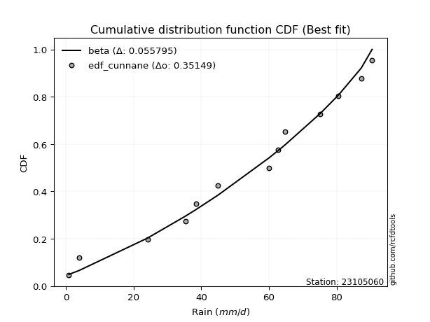</img></img>

</div>


### 12. EDF Adamowski (1981)

The Adamowski formula in hydrology refers to a specific plotting position formula used for estimating the non-parametric empirical distribution of hydrological events (like flood peaks) to calculate their return periods. This formula provides an alternative to traditional parametric methods (like the Gumbel or Log Pearson Type III distributions). 

<div align="center">


$P=(m-0.25)/(n+0.5)$


</div>


**12.1. Empirical values**

<div align="center">

|                | 0                   | 1                   | 2                  | 3                  | 4                   | 5                   | 6             | 7                  | 8                  | 9                  | 10                 | 11                 | 12                 |
|:---------------|:--------------------|:--------------------|:-------------------|:-------------------|:--------------------|:--------------------|:--------------|:-------------------|:-------------------|:-------------------|:-------------------|:-------------------|:-------------------|
| date           | 2013                | 2011                | 2017               | 2006               | 2014                | 2012                | 2008          | 2016               | 2018               | 2010               | 2007               | 2009               | 2015               |
| x              | 0.9                 | 3.9                 | 24.1               | 35.3               | 38.4                | 45.0                | 60.0          | 62.8               | 64.8               | 75.2               | 80.6               | 87.3               | 90.5               |
| m              | 1                   | 2                   | 3                  | 4                  | 5                   | 6                   | 7             | 8                  | 9                  | 10                 | 11                 | 12                 | 13                 |
| empirical_dist | edf_adamowski       | edf_adamowski       | edf_adamowski      | edf_adamowski      | edf_adamowski       | edf_adamowski       | edf_adamowski | edf_adamowski      | edf_adamowski      | edf_adamowski      | edf_adamowski      | edf_adamowski      | edf_adamowski      |
| empirical      | 0.05555555555555555 | 0.12962962962962962 | 0.2037037037037037 | 0.2777777777777778 | 0.35185185185185186 | 0.42592592592592593 | 0.5           | 0.5740740740740741 | 0.6481481481481481 | 0.7222222222222222 | 0.7962962962962963 | 0.8703703703703703 | 0.9444444444444444 |
| empirical_tr   | 1.0588235294117647  | 1.148936170212766   | 1.255813953488372  | 1.3846153846153846 | 1.542857142857143   | 1.7419354838709677  | 2.0           | 2.3478260869565215 | 2.8421052631578947 | 3.5999999999999996 | 4.909090909090908  | 7.714285714285713  | 17.999999999999993 |

</div>


**12.2. Kolmogorov-Smirnov fit test (sorted by Δ)**


<div align="center">

|                | 0                   | 1                   | 2                   | 3                   | 4                   | 5                   | 6                   | 7                   | 8                   | 9                   | 10                  | 11                  | 12                  | 13                  | 14                  | 15                  | 16                  | 17                  | 18                  | 19                  | 20                  | 21                  | 22                  | 23                  | 24                  | 25                  | 26                  | 27                  | 28                  | 29                  | 30                  | 31                  | 32                  | 33                  | 34                  | 35                  | 36                  | 37                  | 38                  | 39                  | 40                  | 41                  | 42                  | 43                  | 44                  | 45                  | 46                  | 47                  | 48                  | 49                  | 50                  | 51                  | 52                  | 53                  | 54                  | 55                  | 56                  | 57                  | 58                  | 59                  | 60                  | 61                  | 62                  | 63                  | 64                  | 65                  | 66                  | 67                  | 68                  | 69                  | 70                  | 71                  | 72                  | 73                  | 74                  | 75                  | 76                  | 77                  | 78                  | 79                  | 80                  | 81                  | 82                  | 83                  | 84                  | 85                  | 86                  | 87                  | 88                  | 89                  | 90                  | 91                  | 92                  | 93                  | 94                  | 95                  | 96                  | 97                  | 98                  | 99                  | 100                 | 101                 | 102                 | 103                 | 104                 | 105                 | 106                 | 107                 | 108                 | 109                 | 110                 | 111                 | 112                 | 113                 | 114                 | 115                 | 116                 | 117                 | 118                 | 119                 | 120                 | 121                 | 122                 | 123                 | 124                 | 125                 | 126                 | 127                 | 128                 | 129                 | 130                 | 131                 | 132                 | 133                 | 134                 | 135                 | 136                 | 137                 | 138                 | 139                 | 140                 | 141                 | 142                 | 143                 | 144                 | 145                 | 146                 | 147                 | 148                 | 149                 | 150                 | 151                 | 152                 | 153                 | 154                 | 155                 | 156                 | 157                 | 158                 | 159                 |
|:---------------|:--------------------|:--------------------|:--------------------|:--------------------|:--------------------|:--------------------|:--------------------|:--------------------|:--------------------|:--------------------|:--------------------|:--------------------|:--------------------|:--------------------|:--------------------|:--------------------|:--------------------|:--------------------|:--------------------|:--------------------|:--------------------|:--------------------|:--------------------|:--------------------|:--------------------|:--------------------|:--------------------|:--------------------|:--------------------|:--------------------|:--------------------|:--------------------|:--------------------|:--------------------|:--------------------|:--------------------|:--------------------|:--------------------|:--------------------|:--------------------|:--------------------|:--------------------|:--------------------|:--------------------|:--------------------|:--------------------|:--------------------|:--------------------|:--------------------|:--------------------|:--------------------|:--------------------|:--------------------|:--------------------|:--------------------|:--------------------|:--------------------|:--------------------|:--------------------|:--------------------|:--------------------|:--------------------|:--------------------|:--------------------|:--------------------|:--------------------|:--------------------|:--------------------|:--------------------|:--------------------|:--------------------|:--------------------|:--------------------|:--------------------|:--------------------|:--------------------|:--------------------|:--------------------|:--------------------|:--------------------|:--------------------|:--------------------|:--------------------|:--------------------|:--------------------|:--------------------|:--------------------|:--------------------|:--------------------|:--------------------|:--------------------|:--------------------|:--------------------|:--------------------|:--------------------|:--------------------|:--------------------|:--------------------|:--------------------|:--------------------|:--------------------|:--------------------|:--------------------|:--------------------|:--------------------|:--------------------|:--------------------|:--------------------|:--------------------|:--------------------|:--------------------|:--------------------|:--------------------|:--------------------|:--------------------|:--------------------|:--------------------|:--------------------|:--------------------|:--------------------|:--------------------|:--------------------|:--------------------|:--------------------|:--------------------|:--------------------|:--------------------|:--------------------|:--------------------|:--------------------|:--------------------|:--------------------|:--------------------|:--------------------|:--------------------|:--------------------|:--------------------|:--------------------|:--------------------|:--------------------|:--------------------|:--------------------|:--------------------|:--------------------|:--------------------|:--------------------|:--------------------|:--------------------|:--------------------|:--------------------|:--------------------|:--------------------|:--------------------|:--------------------|:--------------------|:--------------------|:--------------------|:--------------------|:--------------------|:--------------------|
| station        | 23105060            | 23105060            | 23105060            | 23105060            | 23105060            | 23105060            | 23105060            | 23105060            | 23105060            | 23105060            | 23105060            | 23105060            | 23105060            | 23105060            | 23105060            | 23105060            | 23105060            | 23105060            | 23105060            | 23105060            | 23105060            | 23105060            | 23105060            | 23105060            | 23105060            | 23105060            | 23105060            | 23105060            | 23105060            | 23105060            | 23105060            | 23105060            | 23105060            | 23105060            | 23105060            | 23105060            | 23105060            | 23105060            | 23105060            | 23105060            | 23105060            | 23105060            | 23105060            | 23105060            | 23105060            | 23105060            | 23105060            | 23105060            | 23105060            | 23105060            | 23105060            | 23105060            | 23105060            | 23105060            | 23105060            | 23105060            | 23105060            | 23105060            | 23105060            | 23105060            | 23105060            | 23105060            | 23105060            | 23105060            | 23105060            | 23105060            | 23105060            | 23105060            | 23105060            | 23105060            | 23105060            | 23105060            | 23105060            | 23105060            | 23105060            | 23105060            | 23105060            | 23105060            | 23105060            | 23105060            | 23105060            | 23105060            | 23105060            | 23105060            | 23105060            | 23105060            | 23105060            | 23105060            | 23105060            | 23105060            | 23105060            | 23105060            | 23105060            | 23105060            | 23105060            | 23105060            | 23105060            | 23105060            | 23105060            | 23105060            | 23105060            | 23105060            | 23105060            | 23105060            | 23105060            | 23105060            | 23105060            | 23105060            | 23105060            | 23105060            | 23105060            | 23105060            | 23105060            | 23105060            | 23105060            | 23105060            | 23105060            | 23105060            | 23105060            | 23105060            | 23105060            | 23105060            | 23105060            | 23105060            | 23105060            | 23105060            | 23105060            | 23105060            | 23105060            | 23105060            | 23105060            | 23105060            | 23105060            | 23105060            | 23105060            | 23105060            | 23105060            | 23105060            | 23105060            | 23105060            | 23105060            | 23105060            | 23105060            | 23105060            | 23105060            | 23105060            | 23105060            | 23105060            | 23105060            | 23105060            | 23105060            | 23105060            | 23105060            | 23105060            | 23105060            | 23105060            | 23105060            | 23105060            | 23105060            | 23105060            |
| empirical_dist | edf_adamowski       | edf_adamowski       | edf_adamowski       | edf_adamowski       | edf_adamowski       | edf_adamowski       | edf_adamowski       | edf_adamowski       | edf_adamowski       | edf_adamowski       | edf_adamowski       | edf_adamowski       | edf_adamowski       | edf_adamowski       | edf_adamowski       | edf_adamowski       | edf_adamowski       | edf_adamowski       | edf_adamowski       | edf_adamowski       | edf_adamowski       | edf_adamowski       | edf_adamowski       | edf_adamowski       | edf_adamowski       | edf_adamowski       | edf_adamowski       | edf_adamowski       | edf_adamowski       | edf_adamowski       | edf_adamowski       | edf_adamowski       | edf_adamowski       | edf_adamowski       | edf_adamowski       | edf_adamowski       | edf_adamowski       | edf_adamowski       | edf_adamowski       | edf_adamowski       | edf_adamowski       | edf_adamowski       | edf_adamowski       | edf_adamowski       | edf_adamowski       | edf_adamowski       | edf_adamowski       | edf_adamowski       | edf_adamowski       | edf_adamowski       | edf_adamowski       | edf_adamowski       | edf_adamowski       | edf_adamowski       | edf_adamowski       | edf_adamowski       | edf_adamowski       | edf_adamowski       | edf_adamowski       | edf_adamowski       | edf_adamowski       | edf_adamowski       | edf_adamowski       | edf_adamowski       | edf_adamowski       | edf_adamowski       | edf_adamowski       | edf_adamowski       | edf_adamowski       | edf_adamowski       | edf_adamowski       | edf_adamowski       | edf_adamowski       | edf_adamowski       | edf_adamowski       | edf_adamowski       | edf_adamowski       | edf_adamowski       | edf_adamowski       | edf_adamowski       | edf_adamowski       | edf_adamowski       | edf_adamowski       | edf_adamowski       | edf_adamowski       | edf_adamowski       | edf_adamowski       | edf_adamowski       | edf_adamowski       | edf_adamowski       | edf_adamowski       | edf_adamowski       | edf_adamowski       | edf_adamowski       | edf_adamowski       | edf_adamowski       | edf_adamowski       | edf_adamowski       | edf_adamowski       | edf_adamowski       | edf_adamowski       | edf_adamowski       | edf_adamowski       | edf_adamowski       | edf_adamowski       | edf_adamowski       | edf_adamowski       | edf_adamowski       | edf_adamowski       | edf_adamowski       | edf_adamowski       | edf_adamowski       | edf_adamowski       | edf_adamowski       | edf_adamowski       | edf_adamowski       | edf_adamowski       | edf_adamowski       | edf_adamowski       | edf_adamowski       | edf_adamowski       | edf_adamowski       | edf_adamowski       | edf_adamowski       | edf_adamowski       | edf_adamowski       | edf_adamowski       | edf_adamowski       | edf_adamowski       | edf_adamowski       | edf_adamowski       | edf_adamowski       | edf_adamowski       | edf_adamowski       | edf_adamowski       | edf_adamowski       | edf_adamowski       | edf_adamowski       | edf_adamowski       | edf_adamowski       | edf_adamowski       | edf_adamowski       | edf_adamowski       | edf_adamowski       | edf_adamowski       | edf_adamowski       | edf_adamowski       | edf_adamowski       | edf_adamowski       | edf_adamowski       | edf_adamowski       | edf_adamowski       | edf_adamowski       | edf_adamowski       | edf_adamowski       | edf_adamowski       | edf_adamowski       | edf_adamowski       | edf_adamowski       | edf_adamowski       |
| p_dist         | gausshyper          | beta                | trapezoid           | burr12              | weibull_min         | skewnorm            | triang              | gumbel_l            | argus               | logjohnsonsu        | dgamma              | dweibull            | genpareto           | semicircular        | pearson3            | anglit              | genextreme          | genhalflogistic     | loglevy_l           | johnsonsu           | nct                 | exponnorm           | norm                | crystalball         | t                   | loggenextreme       | fatiguelife         | foldnorm            | f                   | betaprime           | gamma               | erlang              | gengamma            | rice                | arcsine             | wrapcauchy          | logistic            | ksone               | invweibull          | invgamma            | truncweibull_min    | cosine              | maxwell             | hypsecant           | ncf                 | rayleigh            | burr                | invgauss            | logburr             | kappa3              | uniform             | logargus            | vonmises_line       | kstwobign           | logexponweib        | logloggamma         | logpearson3         | loggumbel_l         | logt                | halfnorm            | laplace             | logburr12           | logweibull_min      | loggompertz         | kappa4              | gumbel_r            | logvonmises_line    | loggennorm          | mielke              | bradford            | halflogistic        | moyal               | loggenhalflogistic  | genexpon            | logdgamma           | logtrapezoid        | logfoldnorm         | loggausshyper       | truncexpon          | logdweibull         | logfatiguelife      | logsemicircular     | loganglit           | logbetaprime        | lognakagami         | logexponnorm        | lognorm             | logrice             | lognct              | loglogistic         | logweibull_max      | loghypsecant        | loginvgamma         | logerlang           | logalpha            | loglaplace          | loglaplace          | loggengamma         | loggamma            | loggamma            | logarcsine          | levy_l              | wald                | loginvweibull       | lomax               | loginvgauss         | loggenpareto        | logmaxwell          | lograyleigh         | halfgennorm         | logkstwobign        | logskewnorm         | loggumbel_r         | loghalfnorm         | logbeta             | loggenexpon         | logcosine           | logmoyal            | loghalflogistic     | logwrapcauchy       | logtriang           | gennorm             | logncf              | loglomax            | logwald             | logloglaplace       | loghalfgennorm      | exponweib           | logtruncweibull_min | logf                | logksone            | logkappa4           | nakagami            | powerlaw            | logkappa3           | loguniform          | gompertz            | logmielke           | logbradford         | logjohnsonsb        | rdist               | tukeylambda         | logtruncnorm        | weibull_max         | logtruncexpon       | johnsonsb           | logexponpow         | logtukeylambda      | alpha               | logpowerlaw         | exponpow            | truncpareto         | truncnorm           | logtruncpareto      | logrdist            | genlogistic         | loggenlogistic      | logvonmises         | vonmises            | logcrystalball      |
| delta          | 0.06304447217443146 | 0.06421228523470833 | 0.06687662619155244 | 0.06900526236521731 | 0.06958491719765103 | 0.07859625408582577 | 0.08011366618798152 | 0.08321633735858452 | 0.08334472608929352 | 0.0887868615606957  | 0.09119985581753831 | 0.09295561416597596 | 0.0945821714788174  | 0.09481208327284896 | 0.09532236353482904 | 0.10149066630280312 | 0.1024793267689974  | 0.10389749612152432 | 0.11594513093861772 | 0.11703672167913304 | 0.11750952240283796 | 0.11752108515147597 | 0.11752168009488817 | 0.11752168622200632 | 0.11752216762504708 | 0.11760630683621376 | 0.11792979778475865 | 0.11839001807416372 | 0.11937499334141    | 0.12032497271449594 | 0.12266577742699603 | 0.1234439893981879  | 0.12389356664033269 | 0.1268768040044479  | 0.12962962962962962 | 0.13157473619110305 | 0.13234416994337073 | 0.13299851190476197 | 0.13342792375269685 | 0.1348231645123814  | 0.1359636870388654  | 0.13645304190756535 | 0.14244030347164816 | 0.14427884628762921 | 0.14547152334217905 | 0.15008658724068824 | 0.1524123322568397  | 0.15308142476821174 | 0.1557840608830114  | 0.15916588113893848 | 0.1595982142857143  | 0.1597559944216531  | 0.16113664449358334 | 0.16213559771811825 | 0.16378477325760799 | 0.1638348446889576  | 0.1685685182765715  | 0.1709484390190653  | 0.17154004980663795 | 0.17198095450821727 | 0.17240142560350913 | 0.1741476185575277  | 0.17580698453501986 | 0.17654294470981347 | 0.17965696444650026 | 0.18206087308734753 | 0.18230299078202272 | 0.19739037577594465 | 0.19858685579481594 | 0.1994717929960339  | 0.20035429029955232 | 0.20385478253640188 | 0.21878851165868535 | 0.2214027023117381  | 0.2237290122989013  | 0.22474543024042537 | 0.22795056067728703 | 0.2312189416236069  | 0.23401218198914853 | 0.23455953989992273 | 0.2367324890730319  | 0.23684091097503124 | 0.23791989857833096 | 0.23853836314051124 | 0.24035586950432397 | 0.24053577214741573 | 0.24053735938471676 | 0.24054482483403605 | 0.2408777629072979  | 0.24303504494807404 | 0.24354536217841924 | 0.24516502112597838 | 0.2506743641297423  | 0.25081196091327806 | 0.2510128983285328  | 0.2536642640950716  | 0.2536642640950716  | 0.2590755438958984  | 0.2618553477895077  | 0.2618553477895077  | 0.26310732477351884 | 0.26329763149328156 | 0.26484854061218965 | 0.26512301260150106 | 0.26753226404178954 | 0.2702737479930437  | 0.2712842610467662  | 0.2727659788688407  | 0.28335417563662857 | 0.2874482337005623  | 0.30196307163304126 | 0.3035093133740736  | 0.3112135923258268  | 0.31317209679475255 | 0.3210247261486442  | 0.32476520818234555 | 0.3279266299627416  | 0.3368421256211801  | 0.3391329778665323  | 0.35562573226569016 | 0.36578674617843165 | 0.37037037037037035 | 0.3809818222109116  | 0.39912776134334604 | 0.4080369527657688  | 0.4449954981460724  | 0.452113655530442   | 0.4613348166966966  | 0.46867244599299285 | 0.47092704702116417 | 0.47382085233472226 | 0.4753229913889243  | 0.501424710935067   | 0.5018121021488899  | 0.5179870199828678  | 0.5180309345553874  | 0.5196556552745502  | 0.5196948770150225  | 0.545622172353001   | 0.5505106828999857  | 0.574074070666555   | 0.5750036740368303  | 0.583691967741255   | 0.5998607677689388  | 0.6084701504733632  | 0.6433904031919658  | 0.6496579261759554  | 0.6755784829963276  | 0.6915335761510462  | 0.6985597510946095  | 0.7290639711148499  | 0.7405892352840713  | 0.7659496155402443  | 0.7836747984183537  | 0.7962962790949933  | 0.8703703703703703  | 0.8703703703703703  | 1.0075807307127183  | 14.01356778605128   | nan                 |
| deltao         | 0.35149047353100005 | 0.35149047353100005 | 0.35149047353100005 | 0.35149047353100005 | 0.35149047353100005 | 0.35149047353100005 | 0.35149047353100005 | 0.35149047353100005 | 0.35149047353100005 | 0.35149047353100005 | 0.35149047353100005 | 0.35149047353100005 | 0.35149047353100005 | 0.35149047353100005 | 0.35149047353100005 | 0.35149047353100005 | 0.35149047353100005 | 0.35149047353100005 | 0.35149047353100005 | 0.35149047353100005 | 0.35149047353100005 | 0.35149047353100005 | 0.35149047353100005 | 0.35149047353100005 | 0.35149047353100005 | 0.35149047353100005 | 0.35149047353100005 | 0.35149047353100005 | 0.35149047353100005 | 0.35149047353100005 | 0.35149047353100005 | 0.35149047353100005 | 0.35149047353100005 | 0.35149047353100005 | 0.35149047353100005 | 0.35149047353100005 | 0.35149047353100005 | 0.35149047353100005 | 0.35149047353100005 | 0.35149047353100005 | 0.35149047353100005 | 0.35149047353100005 | 0.35149047353100005 | 0.35149047353100005 | 0.35149047353100005 | 0.35149047353100005 | 0.35149047353100005 | 0.35149047353100005 | 0.35149047353100005 | 0.35149047353100005 | 0.35149047353100005 | 0.35149047353100005 | 0.35149047353100005 | 0.35149047353100005 | 0.35149047353100005 | 0.35149047353100005 | 0.35149047353100005 | 0.35149047353100005 | 0.35149047353100005 | 0.35149047353100005 | 0.35149047353100005 | 0.35149047353100005 | 0.35149047353100005 | 0.35149047353100005 | 0.35149047353100005 | 0.35149047353100005 | 0.35149047353100005 | 0.35149047353100005 | 0.35149047353100005 | 0.35149047353100005 | 0.35149047353100005 | 0.35149047353100005 | 0.35149047353100005 | 0.35149047353100005 | 0.35149047353100005 | 0.35149047353100005 | 0.35149047353100005 | 0.35149047353100005 | 0.35149047353100005 | 0.35149047353100005 | 0.35149047353100005 | 0.35149047353100005 | 0.35149047353100005 | 0.35149047353100005 | 0.35149047353100005 | 0.35149047353100005 | 0.35149047353100005 | 0.35149047353100005 | 0.35149047353100005 | 0.35149047353100005 | 0.35149047353100005 | 0.35149047353100005 | 0.35149047353100005 | 0.35149047353100005 | 0.35149047353100005 | 0.35149047353100005 | 0.35149047353100005 | 0.35149047353100005 | 0.35149047353100005 | 0.35149047353100005 | 0.35149047353100005 | 0.35149047353100005 | 0.35149047353100005 | 0.35149047353100005 | 0.35149047353100005 | 0.35149047353100005 | 0.35149047353100005 | 0.35149047353100005 | 0.35149047353100005 | 0.35149047353100005 | 0.35149047353100005 | 0.35149047353100005 | 0.35149047353100005 | 0.35149047353100005 | 0.35149047353100005 | 0.35149047353100005 | 0.35149047353100005 | 0.35149047353100005 | 0.35149047353100005 | 0.35149047353100005 | 0.35149047353100005 | 0.35149047353100005 | 0.35149047353100005 | 0.35149047353100005 | 0.35149047353100005 | 0.35149047353100005 | 0.35149047353100005 | 0.35149047353100005 | 0.35149047353100005 | 0.35149047353100005 | 0.35149047353100005 | 0.35149047353100005 | 0.35149047353100005 | 0.35149047353100005 | 0.35149047353100005 | 0.35149047353100005 | 0.35149047353100005 | 0.35149047353100005 | 0.35149047353100005 | 0.35149047353100005 | 0.35149047353100005 | 0.35149047353100005 | 0.35149047353100005 | 0.35149047353100005 | 0.35149047353100005 | 0.35149047353100005 | 0.35149047353100005 | 0.35149047353100005 | 0.35149047353100005 | 0.35149047353100005 | 0.35149047353100005 | 0.35149047353100005 | 0.35149047353100005 | 0.35149047353100005 | 0.35149047353100005 | 0.35149047353100005 | 0.35149047353100005 | 0.35149047353100005 | 0.35149047353100005 | 0.35149047353100005 |
| eval           | Δo > Δ              | Δo > Δ              | Δo > Δ              | Δo > Δ              | Δo > Δ              | Δo > Δ              | Δo > Δ              | Δo > Δ              | Δo > Δ              | Δo > Δ              | Δo > Δ              | Δo > Δ              | Δo > Δ              | Δo > Δ              | Δo > Δ              | Δo > Δ              | Δo > Δ              | Δo > Δ              | Δo > Δ              | Δo > Δ              | Δo > Δ              | Δo > Δ              | Δo > Δ              | Δo > Δ              | Δo > Δ              | Δo > Δ              | Δo > Δ              | Δo > Δ              | Δo > Δ              | Δo > Δ              | Δo > Δ              | Δo > Δ              | Δo > Δ              | Δo > Δ              | Δo > Δ              | Δo > Δ              | Δo > Δ              | Δo > Δ              | Δo > Δ              | Δo > Δ              | Δo > Δ              | Δo > Δ              | Δo > Δ              | Δo > Δ              | Δo > Δ              | Δo > Δ              | Δo > Δ              | Δo > Δ              | Δo > Δ              | Δo > Δ              | Δo > Δ              | Δo > Δ              | Δo > Δ              | Δo > Δ              | Δo > Δ              | Δo > Δ              | Δo > Δ              | Δo > Δ              | Δo > Δ              | Δo > Δ              | Δo > Δ              | Δo > Δ              | Δo > Δ              | Δo > Δ              | Δo > Δ              | Δo > Δ              | Δo > Δ              | Δo > Δ              | Δo > Δ              | Δo > Δ              | Δo > Δ              | Δo > Δ              | Δo > Δ              | Δo > Δ              | Δo > Δ              | Δo > Δ              | Δo > Δ              | Δo > Δ              | Δo > Δ              | Δo > Δ              | Δo > Δ              | Δo > Δ              | Δo > Δ              | Δo > Δ              | Δo > Δ              | Δo > Δ              | Δo > Δ              | Δo > Δ              | Δo > Δ              | Δo > Δ              | Δo > Δ              | Δo > Δ              | Δo > Δ              | Δo > Δ              | Δo > Δ              | Δo > Δ              | Δo > Δ              | Δo > Δ              | Δo > Δ              | Δo > Δ              | Δo > Δ              | Δo > Δ              | Δo > Δ              | Δo > Δ              | Δo > Δ              | Δo > Δ              | Δo > Δ              | Δo > Δ              | Δo > Δ              | Δo > Δ              | Δo > Δ              | Δo > Δ              | Δo > Δ              | Δo > Δ              | Δo > Δ              | Δo > Δ              | Δo > Δ              | Δo > Δ              | Δo > Δ              | Δo <= Δ             | Δo <= Δ             | Δo <= Δ             | Δo <= Δ             | Δo <= Δ             | Δo <= Δ             | Δo <= Δ             | Δo <= Δ             | Δo <= Δ             | Δo <= Δ             | Δo <= Δ             | Δo <= Δ             | Δo <= Δ             | Δo <= Δ             | Δo <= Δ             | Δo <= Δ             | Δo <= Δ             | Δo <= Δ             | Δo <= Δ             | Δo <= Δ             | Δo <= Δ             | Δo <= Δ             | Δo <= Δ             | Δo <= Δ             | Δo <= Δ             | Δo <= Δ             | Δo <= Δ             | Δo <= Δ             | Δo <= Δ             | Δo <= Δ             | Δo <= Δ             | Δo <= Δ             | Δo <= Δ             | Δo <= Δ             | Δo <= Δ             | Δo <= Δ             | Δo <= Δ             | Δo <= Δ             | Δo <= Δ             | Δo <= Δ             | Δo <= Δ             |
| fit            | 1                   | 1                   | 1                   | 1                   | 1                   | 1                   | 1                   | 1                   | 1                   | 1                   | 1                   | 1                   | 1                   | 1                   | 1                   | 1                   | 1                   | 1                   | 1                   | 1                   | 1                   | 1                   | 1                   | 1                   | 1                   | 1                   | 1                   | 1                   | 1                   | 1                   | 1                   | 1                   | 1                   | 1                   | 1                   | 1                   | 1                   | 1                   | 1                   | 1                   | 1                   | 1                   | 1                   | 1                   | 1                   | 1                   | 1                   | 1                   | 1                   | 1                   | 1                   | 1                   | 1                   | 1                   | 1                   | 1                   | 1                   | 1                   | 1                   | 1                   | 1                   | 1                   | 1                   | 1                   | 1                   | 1                   | 1                   | 1                   | 1                   | 1                   | 1                   | 1                   | 1                   | 1                   | 1                   | 1                   | 1                   | 1                   | 1                   | 1                   | 1                   | 1                   | 1                   | 1                   | 1                   | 1                   | 1                   | 1                   | 1                   | 1                   | 1                   | 1                   | 1                   | 1                   | 1                   | 1                   | 1                   | 1                   | 1                   | 1                   | 1                   | 1                   | 1                   | 1                   | 1                   | 1                   | 1                   | 1                   | 1                   | 1                   | 1                   | 1                   | 1                   | 1                   | 1                   | 1                   | 1                   | 1                   | 1                   | 0                   | 0                   | 0                   | 0                   | 0                   | 0                   | 0                   | 0                   | 0                   | 0                   | 0                   | 0                   | 0                   | 0                   | 0                   | 0                   | 0                   | 0                   | 0                   | 0                   | 0                   | 0                   | 0                   | 0                   | 0                   | 0                   | 0                   | 0                   | 0                   | 0                   | 0                   | 0                   | 0                   | 0                   | 0                   | 0                   | 0                   | 0                   | 0                   | 0                   | 0                   |
| n              | 13                  | 13                  | 13                  | 13                  | 13                  | 13                  | 13                  | 13                  | 13                  | 13                  | 13                  | 13                  | 13                  | 13                  | 13                  | 13                  | 13                  | 13                  | 13                  | 13                  | 13                  | 13                  | 13                  | 13                  | 13                  | 13                  | 13                  | 13                  | 13                  | 13                  | 13                  | 13                  | 13                  | 13                  | 13                  | 13                  | 13                  | 13                  | 13                  | 13                  | 13                  | 13                  | 13                  | 13                  | 13                  | 13                  | 13                  | 13                  | 13                  | 13                  | 13                  | 13                  | 13                  | 13                  | 13                  | 13                  | 13                  | 13                  | 13                  | 13                  | 13                  | 13                  | 13                  | 13                  | 13                  | 13                  | 13                  | 13                  | 13                  | 13                  | 13                  | 13                  | 13                  | 13                  | 13                  | 13                  | 13                  | 13                  | 13                  | 13                  | 13                  | 13                  | 13                  | 13                  | 13                  | 13                  | 13                  | 13                  | 13                  | 13                  | 13                  | 13                  | 13                  | 13                  | 13                  | 13                  | 13                  | 13                  | 13                  | 13                  | 13                  | 13                  | 13                  | 13                  | 13                  | 13                  | 13                  | 13                  | 13                  | 13                  | 13                  | 13                  | 13                  | 13                  | 13                  | 13                  | 13                  | 13                  | 13                  | 13                  | 13                  | 13                  | 13                  | 13                  | 13                  | 13                  | 13                  | 13                  | 13                  | 13                  | 13                  | 13                  | 13                  | 13                  | 13                  | 13                  | 13                  | 13                  | 13                  | 13                  | 13                  | 13                  | 13                  | 13                  | 13                  | 13                  | 13                  | 13                  | 13                  | 13                  | 13                  | 13                  | 13                  | 13                  | 13                  | 13                  | 13                  | 13                  | 13                  | 13                  |
| best_fit       | 1                   | 0                   | 0                   | 0                   | 0                   | 0                   | 0                   | 0                   | 0                   | 0                   | 0                   | 0                   | 0                   | 0                   | 0                   | 0                   | 0                   | 0                   | 0                   | 0                   | 0                   | 0                   | 0                   | 0                   | 0                   | 0                   | 0                   | 0                   | 0                   | 0                   | 0                   | 0                   | 0                   | 0                   | 0                   | 0                   | 0                   | 0                   | 0                   | 0                   | 0                   | 0                   | 0                   | 0                   | 0                   | 0                   | 0                   | 0                   | 0                   | 0                   | 0                   | 0                   | 0                   | 0                   | 0                   | 0                   | 0                   | 0                   | 0                   | 0                   | 0                   | 0                   | 0                   | 0                   | 0                   | 0                   | 0                   | 0                   | 0                   | 0                   | 0                   | 0                   | 0                   | 0                   | 0                   | 0                   | 0                   | 0                   | 0                   | 0                   | 0                   | 0                   | 0                   | 0                   | 0                   | 0                   | 0                   | 0                   | 0                   | 0                   | 0                   | 0                   | 0                   | 0                   | 0                   | 0                   | 0                   | 0                   | 0                   | 0                   | 0                   | 0                   | 0                   | 0                   | 0                   | 0                   | 0                   | 0                   | 0                   | 0                   | 0                   | 0                   | 0                   | 0                   | 0                   | 0                   | 0                   | 0                   | 0                   | 0                   | 0                   | 0                   | 0                   | 0                   | 0                   | 0                   | 0                   | 0                   | 0                   | 0                   | 0                   | 0                   | 0                   | 0                   | 0                   | 0                   | 0                   | 0                   | 0                   | 0                   | 0                   | 0                   | 0                   | 0                   | 0                   | 0                   | 0                   | 0                   | 0                   | 0                   | 0                   | 0                   | 0                   | 0                   | 0                   | 0                   | 0                   | 0                   | 0                   | 0                   |
| best_fit_sort  | 1                   | 2                   | 3                   | 4                   | 5                   | 6                   | 7                   | 8                   | 9                   | 10                  | 11                  | 12                  | 13                  | 14                  | 15                  | 16                  | 17                  | 18                  | 19                  | 20                  | 21                  | 22                  | 23                  | 24                  | 25                  | 26                  | 27                  | 28                  | 29                  | 30                  | 31                  | 32                  | 33                  | 34                  | 35                  | 36                  | 37                  | 38                  | 39                  | 40                  | 41                  | 42                  | 43                  | 44                  | 45                  | 46                  | 47                  | 48                  | 49                  | 50                  | 51                  | 52                  | 53                  | 54                  | 55                  | 56                  | 57                  | 58                  | 59                  | 60                  | 61                  | 62                  | 63                  | 64                  | 65                  | 66                  | 67                  | 68                  | 69                  | 70                  | 71                  | 72                  | 73                  | 74                  | 75                  | 76                  | 77                  | 78                  | 79                  | 80                  | 81                  | 82                  | 83                  | 84                  | 85                  | 86                  | 87                  | 88                  | 89                  | 90                  | 91                  | 92                  | 93                  | 94                  | 95                  | 96                  | 97                  | 98                  | 99                  | 100                 | 101                 | 102                 | 103                 | 104                 | 105                 | 106                 | 107                 | 108                 | 109                 | 110                 | 111                 | 112                 | 113                 | 114                 | 115                 | 116                 | 117                 | 118                 | 119                 | 120                 | 121                 | 122                 | 123                 | 124                 | 125                 | 126                 | 127                 | 128                 | 129                 | 130                 | 131                 | 132                 | 133                 | 134                 | 135                 | 136                 | 137                 | 138                 | 139                 | 140                 | 141                 | 142                 | 143                 | 144                 | 145                 | 146                 | 147                 | 148                 | 149                 | 150                 | 151                 | 152                 | 153                 | 154                 | 155                 | 156                 | 157                 | 158                 | 159                 | 160                 |

</div>


**12.3. Best fit**

<div align="center">

|   id |   station | empirical_dist   | p_dist     |     delta |   deltao | eval   |   fit |   n |   best_fit |   best_fit_sort |
|-----:|----------:|:-----------------|:-----------|----------:|---------:|:-------|------:|----:|-----------:|----------------:|
|    0 |  23105060 | edf_adamowski    | gausshyper | 0.0630445 |  0.35149 | Δo > Δ |     1 |  13 |          1 |               1 |

</div>


<div align="center">

</img>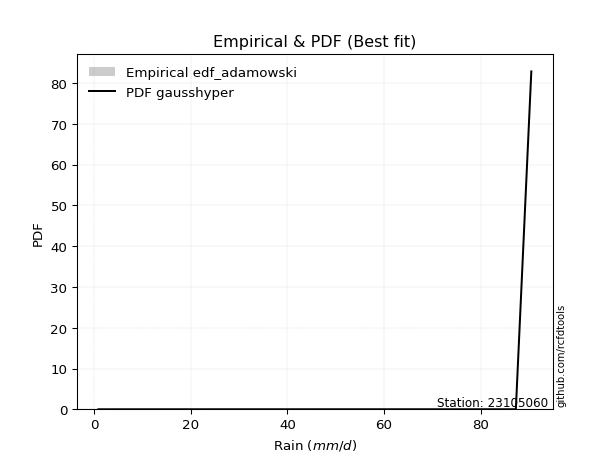</img>

</div>


## C. Best fit & Estimate extreme values for specific return periods - Tr

Best fit in probability distribution analysis means finding the theoretical distribution (like Normal, Poisson, Exponential, etc.) that most accurately mirrors your real-world data´s patterns (shape, center, spread) for better predictions, using methods like visual checks (Q-Q plots), goodness-of-fit tests (Kolmogorov-Smirnov, Chi-Squared), and information criteria (AIC) to score and select the simplest, most representative model.


### 1. Best fit (ordered by delta Δ)

:file_folder:Table: [bestfit_23105060.csv](table/bestfit_23105060.csv)

<div align="center">

|   id |   station | empirical_dist   | p_dist     |     delta |   deltao | eval   |   fit |   n |   best_fit |   best_fit_sort |
|-----:|----------:|:-----------------|:-----------|----------:|---------:|:-------|------:|----:|-----------:|----------------:|
|    0 |  23105060 | edf_hazen        | trapezoid  | 0.0526316 |  0.35149 | Δo > Δ |     1 |  13 |          1 |               1 |
|    1 |  23105060 | edf_gringorten   | beta       | 0.0555763 |  0.35149 | Δo > Δ |     1 |  13 |          1 |               2 |
|    2 |  23105060 | edf_cunnane      | beta       | 0.0557948 |  0.35149 | Δo > Δ |     1 |  13 |          1 |               3 |
|    3 |  23105060 | edf_blom         | beta       | 0.0572242 |  0.35149 | Δo > Δ |     1 |  13 |          1 |               4 |
|    4 |  23105060 | edf_tukey        | gausshyper | 0.0584917 |  0.35149 | Δo > Δ |     1 |  13 |          1 |               5 |
|    5 |  23105060 | edf_filliben     | gausshyper | 0.0593034 |  0.35149 | Δo > Δ |     1 |  13 |          1 |               6 |
|    6 |  23105060 | edf_beard        | gausshyper | 0.0597228 |  0.35149 | Δo > Δ |     1 |  13 |          1 |               7 |
|    7 |  23105060 | edf_jenkinson    | gausshyper | 0.0597228 |  0.35149 | Δo > Δ |     1 |  13 |          1 |               8 |
|    8 |  23105060 | edf_chegodayev   | gausshyper | 0.0602805 |  0.35149 | Δo > Δ |     1 |  13 |          1 |               9 |
|    9 |  23105060 | edf_adamowski    | gausshyper | 0.0630445 |  0.35149 | Δo > Δ |     1 |  13 |          1 |              10 |
|   10 |  23105060 | edf_weibull      | gausshyper | 0.076272  |  0.35149 | Δo > Δ |     1 |  13 |          1 |              11 |
|   11 |  23105060 | edf_california   | trapezoid  | 0.0796076 |  0.35149 | Δo > Δ |     1 |  13 |          1 |              12 |

</div>


### 2. Extreme values and % difference analysis

In hydrology, a return period (or recurrence interval $Tr$) is the statistical average time between extreme events like floods or droughts of a specific magnitude, indicating how rare an event is, with a 100-year flood, for example, having a 1% chance of occurring in any given year, not that it happens exactly every century. It is a key tool for infrastructure design (like bridges or dams) and risk assessment, calculated from historical data to determine the probability of future events, although it is important to remember it is statistical average, and events can cluster or be missed.

The extreme value porcentage difference is evaluated as $pdiff = 1 - (ETrBf / ETr) * 100$, where _ETrBf_ correspond to the bestfit extreme value for a specific recurrence interval and _ETr_ correspond to the extreme value for one of the most used PDFsused in hydrology.

> risk_rate: assuming the return period as the project useful life.

:file_folder:Table: [extreme_23105060.csv](table/extreme_23105060.csv), all PDFs.  
:file_folder:Table: [extremepdiff_23105060.csv](table/extremepdiff_23105060.csv), % difference between bestfit and most used PDFs in Hydrology.

<div align="center">

Extreme values table for only best fit PDFs
|   id |      tr |   prob_l |     prob_g |      alpha |   anglit |   arcsine |   argus |    beta |   betaprime |   bradford |    burr |   burr12 |   cosine |   crystalball |   dgamma |   dweibull |   erlang |   exponnorm |   exponpow |   exponweib |        f |   fatiguelife |   foldnorm |    gamma |   gausshyper |   genexpon |   genextreme |   gengamma |   genhalflogistic |   genlogistic |   gennorm |   genpareto |   gompertz |   gumbel_l |   gumbel_r |   halfgennorm |   halflogistic |   halfnorm |   hypsecant |   invgamma |   invgauss |   invweibull |   johnsonsb |   johnsonsu |   kappa3 |   kappa4 |   ksone |   kstwobign |   laplace |   levy_l |   loggamma |   logistic |   loglaplace |    lomax |   maxwell |   mielke |    moyal |   nakagami |      ncf |      nct |     norm |   pearson3 |   powerlaw |   rayleigh |    rdist |     rice |   semicircular |   skewnorm |        t |   trapezoid |   triang |   truncexpon |   truncnorm |   truncpareto |   truncweibull_min |   tukeylambda |   uniform |   vonmises |   vonmises_line |     wald |   weibull_max |   weibull_min |   wrapcauchy |   logalpha |   loganglit |   logarcsine |   logargus |   logbeta |   logbetaprime |   logbradford |   logburr |   logburr12 |   logcosine |   logcrystalball |   logdgamma |   logdweibull |   logerlang |   logexponnorm |   logexponpow |   logexponweib |            logf |   logfatiguelife |   logfoldnorm |   loggausshyper |   loggenexpon |   loggenextreme |   loggengamma |   loggenhalflogistic |   loggenlogistic |       loggennorm |   loggenpareto |   loggompertz |   loggumbel_l |   loggumbel_r |   loghalfgennorm |   loghalflogistic |   loghalfnorm |   loghypsecant |   loginvgamma |   loginvgauss |    loginvweibull |   logjohnsonsb |   logjohnsonsu |   logkappa3 |   logkappa4 |   logksone |   logkstwobign |   loglevy_l |   logloggamma |   loglogistic |   logloglaplace |         loglomax |   logmaxwell |        logmielke |   logmoyal |   lognakagami |            logncf |    lognct |   lognorm |   logpearson3 |   logpowerlaw |   lograyleigh |   logrdist |   logrice |   logsemicircular |   logskewnorm |             logt |   logtrapezoid |   logtriang |   logtruncexpon |   logtruncnorm |   logtruncpareto |   logtruncweibull_min |   logtukeylambda |   loguniform |   logvonmises |   logvonmises_line |     logwald |   logweibull_max |   logweibull_min |   logwrapcauchy |   station |   n |   risk_rate |
|-----:|--------:|---------:|-----------:|-----------:|---------:|----------:|--------:|--------:|------------:|-----------:|--------:|---------:|---------:|--------------:|---------:|-----------:|---------:|------------:|-----------:|------------:|---------:|--------------:|-----------:|---------:|-------------:|-----------:|-------------:|-----------:|------------------:|--------------:|----------:|------------:|-----------:|-----------:|-----------:|--------------:|---------------:|-----------:|------------:|-----------:|-----------:|-------------:|------------:|------------:|---------:|---------:|--------:|------------:|----------:|---------:|-----------:|-----------:|-------------:|---------:|----------:|---------:|---------:|-----------:|---------:|---------:|---------:|-----------:|-----------:|-----------:|---------:|---------:|---------------:|-----------:|---------:|------------:|---------:|-------------:|------------:|--------------:|-------------------:|--------------:|----------:|-----------:|----------------:|---------:|--------------:|--------------:|-------------:|-----------:|------------:|-------------:|-----------:|----------:|---------------:|--------------:|----------:|------------:|------------:|-----------------:|------------:|--------------:|------------:|---------------:|--------------:|---------------:|----------------:|-----------------:|--------------:|----------------:|--------------:|----------------:|--------------:|---------------------:|-----------------:|-----------------:|---------------:|--------------:|--------------:|--------------:|-----------------:|------------------:|--------------:|---------------:|--------------:|--------------:|-----------------:|---------------:|---------------:|------------:|------------:|-----------:|---------------:|------------:|--------------:|--------------:|----------------:|-----------------:|-------------:|-----------------:|-----------:|--------------:|------------------:|----------:|----------:|--------------:|--------------:|--------------:|-----------:|----------:|------------------:|--------------:|-----------------:|---------------:|------------:|----------------:|---------------:|-----------------:|----------------------:|-----------------:|-------------:|--------------:|-------------------:|------------:|-----------------:|-----------------:|----------------:|----------:|----:|------------:|
|    0 |    2    | 0.5      | 0.5        |    4.7025  |  51.4462 |   51.4462 | 56.3493 | 56.2739 |     51.1176 |    39.7664 | 45.9955 |  55.3009 |  49.7038 |       51.4462 |  51.8112 |    51.2245 |  50.8153 |     51.4462 |   0.951235 |     8.75045 |  51.275  |       51.4162 |    51.7559 |  50.8268 |      54.4802 |    35.3815 |      60.7256 |    50.8378 |           61.0602 |           inf |      45.7 |     54.5272 |    76.1783 |    56.1464 |    46.7459 |       27.1998 |        44.4092 |    45.5897 |     51.4462 |    49.6252 |    47.8895 |      47.8007 |    0.936857 |     51.4455 |   0.9    |  43.1417 | 45.7    |     45.142  |   51.4462 |  59.0689 |    30.6912 |    51.4462 |      33.2338 |  31.1539 |   48.9992 |  40.3278 |  45.2286 |    6.21115 |  43.7513 |  51.4458 |  51.4462 |    53.2507 |    7.13616 |    48.1314 | -7.24191 |  50.3746 |        51.4462 |    57.8442 |  51.4462 |     55.618  |  57.8788 |      37.2319 |   -1.76284  |      0.914402 |            48.7556 |      -31.4184 |   45.7    | -0.233562  |         45.7    |  42.1719 |       90.1227 |       55.3866 |      45.7    |    31.8748 |     33.2336 |      33.2338 |    46.9427 |   83.2328 |        33.4239 |       6.46358 |   42.0526 |     42.8054 |     23.0425 |                0 |     64.8    |       62.8    |     31.9279 |        33.234  |       2.15729 |        44.9782 |    3.13379      |          33.6567 |       34.7502 |         34.0756 |       20.7215 |         47.2635 |       31.1102 |              35.7669 |              inf |     62.8         |        28.2329 |       42.443  |       41.2366 |       26.7841 |      7.26341     |           24.0602 |       25.3998 |        33.2338 |       31.9808 |       29.5739 |     28.5661      |        1.08575 |        59.46   |    0.899932 |     10.6691 |    9.02497 |        23.4063 |     58.398  |       45.1507 |       33.2338 |    6.48141      |     7.40793      |      29.7027 |      4.08322     |    24.982  |       33.2525 |      7.55669      |   33.191  |   33.2338 |       48.0785 |       1.44264 |       28.543  |    1.5495  |   33.233  |           33.2336 |       29.7004 |     61.3506      |        41.1962 |     22.4453 |         4.56244 |        6.35155 |         0.905633 |               13.6515 |         0.342604 |      9.02497 |      0.110327 |            44.1278 |     21.711  |          32.0913 |          42.6295 |         9.02494 |  23105060 |  13 |    0.75     |
|    1 |    2.33 | 0.570815 | 0.429185   |    5.59605 |  57.3932 |   60.3736 | 61.489  | 62.5856 |     56.2845 |    46.9487 | 52.5048 |  60.1216 |  54.9855 |       56.5517 |  62.0354 |    61.2851 |  56.0116 |     56.5517 |   1.04216  |    13.4006  |  56.3984 |       56.5184 |    56.6394 |  56.0506 |      61.1312 |    42.9788 |      65.7721 |    56.0065 |           66.9191 |           inf |      45.7 |     61.1677 |    77.5805 |    60.5882 |    51.4768 |       36.0933 |        49.2733 |    51.0998 |     55.5321 |    54.9462 |    53.2819 |      53.9988 |    1.01927  |     56.5732 |   0.9    |  49.7341 | 53.3141 |     51.2279 |   54.5358 |  68.4107 |    39.4597 |    55.9445 |      38.2979 |  37.8197 |   54.3035 |  47.183  |  49.7069 |   10.239   |  51.0633 |  56.5521 |  56.5517 |    58.263  |   11.2774  |    53.5141 |  4.00208 |  55.6647 |        57.8244 |    63.0556 |  56.5517 |     61.4949 |  63.272  |      43.7895 |    0.697671 |      0.936005 |            54.6273 |      -13.8812 |   52.0451 |  0.0980487 |         51.9754 |  45.5196 |       90.3325 |       60.1356 |      53.8811 |    41.0438 |     43.6654 |      50.0675 |    52.6997 |   87.8373 |        42.4197 |       9.39307 |   50.1488 |     49.2271 |     30.6188 |                0 |     69.0403 |       67.3332 |     41.0076 |        42.0112 |       2.87195 |        51.4502 |    5.52905      |          42.5237 |       42.2355 |         44.1442 |       30.3825 |         55.0366 |       39.7069 |              45.681  |              inf |     66.4182      |        38.6721 |       48.8849 |       50.5632 |       33.2806 |     11.8071      |           30.0792 |       32.7099 |        40.0901 |       40.9627 |       38.4429 |     40.7427      |        1.48547 |        65.7591 |    0.899932 |     15.0762 |   13.3539  |        34.1472 |     66.5454 |       51.5675 |       40.8562 |   10.5523       |    15.6213       |      37.8916 |      6.29346     |    30.6836 |       42.041  |     19.1702       |   41.9842 |   42.011  |       57.8111 |       1.86646 |       36.5434 |    2.87955 |   42.0099 |           44.5385 |       35.48   |     66.3751      |        53.9533 |     28.2633 |         6.37816 |        8.59697 |         0.914427 |               18.0539 |         0.760131 |     12.5097  |      0.127591 |            52.653  |     25.3175 |          43.4848 |          49.0439 |        27.501   |  23105060 |  13 |    0.729209 |
|    2 |    5    | 0.8      | 0.2        |   12.5248  |  78.3755 |   84.1798 | 76.9297 | 80.0966 |     75.6671 |    70.2003 | 73.5449 |  76.1812 |  74.0189 |       75.5252 |  77.3523 |    77.9516 |  75.6586 |     75.5252 |   3.78123  |    62.1794  |  75.4627 |       75.5544 |    74.7875 |  75.8068 |      79.884  |    80.9635 |      79.6278 |    75.4384 |           81.8607 |           inf |      45.7 |     79.9262 |    82.1112 |    74.938  |    72.0297 |       95.7381 |        71.2821 |    74.4017 |     71.9218 |    75.6979 |    74.7651 |      80.9261 |    9.42041  |     75.6292 |   0.9    |  71.4969 | 77.956  |     77.0792 |   69.9832 |  83.8878 |   102.045  |    73.3131 |      77.8271 |  71.1473 |   75.1808 |  70.5358 |  70.451  |   41.7639  |  86.3385 |  75.5286 |  75.5252 |    75.8988 |   38.8937  |    75.0636 | 34.4526  |  75.6554 |        79.5907 |    78.2341 |  75.5249 |     78.3555 |  78.7448 |      67.0465 |    9.8416   |      2.14717  |            73.5583 |       42.6233 |   72.58   |  1.32956   |         72.4243 |  64.2603 |       90.4951 |       75.9631 |      76.002  |   107.12   |    114.404  |     149.332  |    72.0962 |   90.4846 |       103.14   |      31.4905  |   91.3344 |     77.3298 |     85.2893 |                0 |    115.078  |      129.075  |    105.416  |       100.373  |      13.0479  |        72.8894 | 3166.39         |         101.442  |       87.2013 |         77.2387 |      145.39   |         77.4384 |       99.2797 |              76.2544 |              inf |    108.48        |        75.8836 |       77.2147 |       97.7033 |       85.4927 |    146.204       |           82.608  |       95.3271 |        85.0703 |      104.796  |      105.871  |    190.528       |       47.6227  |        81.163  |    0.899932 |     43.3634 |   47.4583  |       169.857  |     82.6208 |       72.3506 |       90.6808 | 1500.1          | 11794.1          |      98.7987 |     73.0944      |    79.5163 |      100.513  | 245960            |  100.589  |  100.372  |       94.8992 |       8.23233 |       98.2681 |   14.6658  |  100.369  |          120.969  |       59.5518 |     97.038       |       116.99   |     54.7516 |        22.3472  |       25.7705  |         1.24962  |               43.1297 |         9.95732  |     35.9888  |      0.222983 |           103.663  |     59.8463 |          76.9297 |          77.1336 |        70.3617  |  23105060 |  13 |    0.67232  |
|    3 |   10    | 0.9      | 0.1        |   25.2545  |  90.2518 |   89.9269 | 83.8213 | 86.1687 |     88.683  |    80.3491 | 82.715  |  85.4538 |  85.5182 |       88.1117 |  87.4392 |    87.5622 |  88.9862 |     88.1117 |  13.5056   |   159.337   |  88.1309 |       88.2475 |    86.8265 |  89.2129 |      86.2885 |   115.445  |      85.1146 |    88.5186 |           86.7474 |           inf |      45.7 |     86.3122 |    84.6341 |    82.9273 |    88.7697 |      171.672  |        89.5596 |    91.6445 |     85.0094 |    90.3665 |    90.3364 |     102.858  |   59.6528   |     88.2704 |   0.9    |  81.1254 | 88.708  |     96.7618 |   84.0059 |  87.6244 |   194.394  |    86.1044 |     148.144  | 101.401  |   89.8731 |  81.2043 |  88.5119 |   74.969   | 118.873  |  88.1175 |  88.1117 |    86.7546 |   60.6559  |    90.4289 | 42.1582  |  89.1123 |        90.7594 |    84.416  |  88.1113 |     84.9413 |  84.7885 |      78.3478 |   15.9074   |      9.64792  |            81.945  |       66.9461 |   81.54   |  2.04835   |         81.4434 |  84.1487 |       90.4997 |       85.1057 |      83.5352 |   206.036  |    197.337  |     194.414  |    81.8823 |   90.4999 |       186.391  |      53.3846  |  134.974  |     99.4418 |    158.377  |                0 |    196.051  |      281.861  |    199.644  |       178.87   |      50.4928  |        83.481  |    3.10247e+11  |         180.652  |      141.053  |         86.8869 |      458.412  |         85.1803 |      183.877  |              85.7205 |              inf |    212.333       |        86.7606 |       99.6208 |      140.988  |      184.355  |   1582.37        |          191.157  |      210.36   |       155.128  |      198.85   |      214.552  |    669.254       |       85.828   |        86.2981 |    0.899932 |     65.3211 |   82.5278  |       576.172  |     87.0515 |       81.4253 |      163.125  |    5.30292e+08  |     1.66465e+10  |     193.936  |   1297.02        |   182.186  |      179.219  |      7.66208e+15  |  179.647  |  178.87   |      115.056  |      23.457   |      198.943  |   21.3473  |  178.863  |          201.993  |       73.5357 |    160.011       |       158.285  |     70.8871 |        42.982   |       45.7555  |         3.07898  |               62.5266 |        30.33     |     57.07    |      0.33667  |           170.556  |    149.119  |          86.2913 |          99.2508 |        80.7934  |  23105060 |  13 |    0.651322 |
|    4 |   15    | 0.933333 | 0.0666667  |   37.9388  |  95.3232 |   91.023  | 86.3504 | 87.8972 |     95.2255 |    83.7325 | 85.7705 |  89.7333 |  90.7563 |       94.3926 |  92.8037 |    92.2988 |  95.7253 |     94.3927 |  24.3732   |   248.592   |  94.4589 |       94.6011 |    92.8342 |  95.993  |      88.049  |   135.615  |      86.97   |    95.101  |           88.159  |           inf |      45.7 |     88.064  |    85.7767 |    86.5455 |    98.2143 |      225.827  |        99.903  |   100.618  |     92.4784 |    97.9728 |    98.5204 |     115.232  |   80.6384   |     94.5787 |  84.5815 |  84.3392 | 92.292  |    107.211  |   92.2087 |  88.7532 |   269.281  |    93.0738 |     215.881  | 119.099  |   97.4115 |  84.8187 |  98.9937 |   93.6897  | 138.702  |  94.3996 |  94.3926 |    91.9265 |   69.6237  |    98.3458 | 43.6931  |  95.868  |        95.1149 |    86.45   |  94.3922 |     87.0544 |  86.7276 |      82.2978 |   18.9344   |     18.9896   |            84.775  |       74.9494 |   84.5267 |  2.32282   |         84.4598 |  96.92   |       90.4999 |       89.3263 |      85.8915 |   287.129  |    249.065  |     204.446  |    85.6672 |   90.5    |       250.6    |      63.6543  |  165.422  |    111.439  |    209.958  |                0 |    270.951  |      469.832  |    275.589  |       238.645  |     107.772   |        87.7412 |    2.57228e+22  |         240.965  |      179.311  |         88.8469 |      837.074  |         87.3398 |      250.717  |              87.9739 |              inf |    343.897       |        88.8597 |      111.81   |      166.461  |      284.407  |   6594.6         |          307.32   |      317.576  |       218.57   |      275.206  |      308.447  |   1359.66        |       89.3031  |        87.9294 |    0.899932 |     73.9236 |   99.2423  |      1101.96   |     88.4362 |       84.451  |      224.626  |    5.11849e+15  |     9.72181e+16  |     274.122  |  10887.3         |   294.766  |      239.184  |      9.9622e+28   |  239.967  |  238.645  |      122.788  |      35.4954  |      286.125  |   22.8644  |  238.636  |          246.699  |       78.8199 |    248.608       |       174.408  |     77.0119 |        54.474   |       56.5846  |         6.08139  |               70.7337 |        43.8451   |     66.551   |      0.423903 |           225.079  |    268.005  |          88.3689 |         111.255  |        84.0192  |  23105060 |  13 |    0.644736 |
|    5 |   20    | 0.95     | 0.05       |   50.6119  |  98.3065 |   91.409  | 87.7178 | 88.6851 |     99.5271 |    85.4243 | 87.2982 |  92.4227 |  93.9776 |       98.5058 |  96.4609 |    95.3995 | 100.171  |     98.5059 |  34.9729   |   329.774   |  98.6053 |       98.769  |    96.7685 | 100.466  |      88.8309 |   149.926  |      87.9233 |    99.4311 |           88.8181 |           inf |      45.7 |     88.8414 |    86.4879 |    88.7976 |   104.827  |      268.677  |       107.15   |   106.6    |     97.7474 |   103.061  |   104.033  |     123.896  |   86.3977   |     98.7098 |  86.0758 |  85.9442 | 94.084  |    114.25   |   98.0286 |  89.3312 |   333.854  |    97.8907 |     281.993  | 131.655  |  102.415  |  86.6409 | 106.417  |  106.435   | 153.238  |  98.5137 |  98.5058 |    95.2262 |   74.4632  |   103.608  | 44.2481  | 100.304  |        97.5306 |    87.464  |  98.5054 |     88.0968 |  87.6842 |      84.3096 |   20.9167   |     27.3641   |            86.1977 |       78.9177 |   86.02   |  2.46566   |         85.9692 | 106.437  |       90.5    |       91.979  |      87.0527 |   357.552  |    285.619  |     208.101  |    87.7589 |   90.5    |       304.285  |      69.5078  |  189.943  |    119.628  |    249.706  |                0 |    342.038  |      688.696  |    340.823  |       288.239  |     181.501   |        90.2217 |    6.3786e+35   |         291.006  |      209.828  |         89.5543 |     1254.03   |         88.3123 |      307.439  |              88.8903 |              inf |    503.177       |        89.5898 |      120.14   |      184.592  |      385.277  |  18399.5         |          428.608  |      417.939  |       278.377  |      341.138  |      392.734  |   2233.44        |       90.0764  |        88.7596 |    0.899932 |     78.3494 |  108.829   |      1705.58   |     89.1537 |       85.9639 |      280.214  |    6.72665e+23  |     1.54396e+24  |     344.893  |  64226.4         |   414.446  |      288.951  |      1.47252e+44  |  290.072  |  288.239  |      126.974  |      44.241   |      364.301  |   23.4097  |  288.228  |          275.631  |       81.5948 |    376.331       |       182.956  |     80.2254 |        61.5727  |       63.2444  |         9.737    |               75.2295 |        52.6696   |     71.8668  |      0.499467 |           274.117  |    414.838  |          89.1816 |         119.45   |        85.6237  |  23105060 |  13 |    0.641514 |
|    6 |   25    | 0.96     | 0.04       |   63.2806  | 100.328  |   91.5881 | 88.5919 | 89.1275 |    102.702  |    86.4394 | 88.2153 |  94.3487 |  96.2366 |      101.534  |  99.2308 |    97.6849 | 103.459  |    101.534  |  45.028    |   404.294   | 101.659  |      101.841  |    99.6647 | 103.775  |      89.2611 |   161.027  |      88.5097 |   102.629  |           89.1963 |           inf |      45.7 |     89.2691 |    86.9941 |    90.4003 |   109.921  |      304.474  |       112.733  |   111.051  |    101.825  |   106.863  |   108.171  |     130.569  |   88.4088   |    101.751  |  86.9724 |  86.9059 | 95.1592 |    119.522  |  102.543  |  89.694  |   391.394  |   101.576  |     346.925  | 141.395  |  106.129  |  87.7462 | 112.171  |  115.999   | 164.812  | 101.542  | 101.534  |    97.6115 |   77.4852  |   107.518  | 44.5105  | 103.575  |        99.0978 |    88.0718 | 101.533  |     88.7178 |  88.2542 |      85.5288 |   22.376    |     34.3479   |            87.0539 |       81.2839 |   86.916  |  2.5528    |         86.8752 | 114.06   |       90.5    |       93.8788 |      87.7455 |   420.642  |    313.396  |     209.819  |    89.113  |   90.5    |       351.069  |      73.2753  |  210.926  |    125.819  |    281.99   |                0 |    410.417  |      936.079  |    398.789  |       331.219  |     269.343   |        91.9097 |    2.53325e+51  |         334.376  |      235.563  |         89.8874 |     1696.82   |         88.854  |      357.403  |              89.3639 |              inf |    690.757       |        89.9244 |      126.444  |      198.684  |      486.764  |  41070.2         |          553.818  |      512.684  |       335.682  |      399.967  |      470.098  |   3273.39        |       90.347   |        89.2729 |    0.899932 |     81.0051 |  115.02    |      2365.75   |     89.6071 |       86.8717 |      331.858  |    8.11927e+32  |     5.38102e+31  |     409.007  | 305093           |   539.73   |      332.091  |      1.1913e+61   |  333.532  |  331.22   |      129.631  |      50.7097  |      435.914  |   23.6624  |  331.207  |          296.192  |       83.3044 |    560.413       |       188.247  |     82.2034 |        66.3587  |       67.7331  |        13.6309   |               78.0624 |        58.7721   |     75.2579  |      0.56816  |           319.998  |    588.644  |          89.5903 |         125.646  |        86.5882  |  23105060 |  13 |    0.639603 |
|    7 |   50    | 0.98     | 0.02       |  126.604   | 105.305  |   91.8273 | 90.5514 | 89.9232 |    111.836  |    88.4697 | 90.0698 |  99.6278 | 102.152  |      110.204  | 107.548  |   104.254  | 112.953  |    110.205  |  87.5734   |   710.531   | 110.408  |      110.653  |   107.958  | 113.329  |      90.0092 |   195.509  |      89.7405 |   111.83   |           89.9053 |           inf |      45.7 |     90.0125 |    88.368  |    94.7507 |   125.612  |      430.157  |       129.936  |   123.989  |    114.468  |   118.015  |   120.395  |     151.127  |   90.2102   |    110.459  |  88.7656 |  88.8234 | 97.3096 |    135.004  |  116.566  |  90.5109 |   619.392  |   112.834  |     660.373  | 171.648  |  116.901  |  90.077  | 130.033  |  143.985   | 202.642  | 110.215  | 110.204  |   104.24   |   83.8038  |   118.867  | 44.8712  | 112.964  |       102.678  |    89.2863 | 110.204  |     89.9503 |  89.3852 |      87.9953 |   26.5547   |     55.0935   |            88.7726 |       85.968  |   88.708  |  2.72951   |         88.6875 | 138.95   |       90.5    |       99.0867 |      89.125  |   673.189  |    393.829  |     212.136  |    92.198  |   90.5    |       529.08   |      81.4338  |  289.506  |    144.29   |    387.708  |                0 |    727.719  |     2556.05   |    627.286  |       493.142  |     871.623   |        96.1907 |    1.63721e+157 |         497.783  |      328.086  |         90.3415 |     4123.38   |         89.8176 |      551.266  |              90.1133 |              inf |   2080.9         |        90.3618 |      145.277  |      242.6    |     1000.3    | 515749           |         1219.89   |      928.487  |       599.755  |      633.782  |      794.096  |  10627.7         |       90.6072  |        90.3831 |    0.899932 |     86.1763 |  128.479   |      6183.5    |     90.6363 |       88.6874 |      556.422  |    4.58967e+89  |     1.1011e+73   |     670.626  |      1.38574e+08 |  1225.4    |      494.682  |      9.21522e+165 |  497.51   |  493.144  |      135.444  |      67.2873  |      733.924  |   23.995   |  493.123  |          349.099  |       86.8289 |   3575.29        |       199.204  |     86.2744 |        77.3221  |       78.0359  |        31.015    |               84.0515 |        73.0849   |     82.5278  |      0.857182 |           525.546  |   1845.22   |          90.211  |         144.135  |        88.5298  |  23105060 |  13 |    0.63583  |
|    8 |   75    | 0.986667 | 0.0133333  |  189.919   | 107.495  |   91.8717 | 91.3202 | 90.1524 |    116.761  |    89.1465 | 90.7282 | 102.326  | 104.977  |      114.857  | 112.257  |   107.798  | 118.093  |    114.857  | 121.075    |   950.512   | 115.106  |      115.392  |   112.408  | 118.503  |      90.2145 |   215.679  |      90.1814 |   116.795  |           90.1231 |           inf |      45.7 |     90.2164 |    89.0628 |    96.9506 |   134.732  |      514.015  |       139.937  |   131.032  |    121.857  |   124.167  |   127.189  |     163.075  |   90.4006   |    115.132  |  89.3633 |  89.4594 | 98.0264 |    143.522  |  124.768  |  90.8466 |   794.164  |   119.337  |     962.317  | 189.346  |  122.757  |  90.9878 | 140.479  |  159.249   | 226.236  | 114.868  | 114.857  |   107.674  |   85.9932  |   125.041  | 44.941   | 118.015  |       104.108  |    89.6909 | 114.856  |     90.3583 |  89.7596 |      88.8259 |   28.7968   |     64.8326   |            89.3474 |       87.5077 |   89.3053 |  2.7889    |         89.2917 | 154.266  |       90.5    |      101.749  |      89.5836 |   869.033  |    435.484  |     212.568  |    93.4271 |   90.5    |       659.571  |      84.3504  |  347.068  |    154.64   |    451.374  |                0 |   1021      |     4751.1    |    801.433  |       610.551  |    1673.92    |        98.2024 |    5.75601e+301 |         616.29   |      391.914  |         90.4282 |     6727.04   |         90.0916 |      696.48   |              90.2936 |              inf |   4305.58        |        90.4401 |      155.844  |      268.379  |     1520.38   |      2.31918e+06 |         1930.54   |     1282.86   |       841.913  |      813.727  |     1058.16   |  21072.1         |       90.6394  |        90.8091 |    0.899932 |     87.7949 |  133.306   |     10490.9    |     91.0627 |       89.2927 |      749.961  |    1.27256e+161 |     3.13299e+118 |     877.477  |      1.56672e+10 |  1979.33   |      612.627  |      1.08229e+297 |  616.605  |  610.553  |      137.622  |      74.1614  |      974.406  |   24.0546  |  610.527  |          372.788  |       88.0359 |  20023.8         |       202.971  |     87.666  |        81.445   |       81.9238  |        42.969    |               86.1482 |        78.5457   |     85.104   |      1.08891  |           705.111  |   3727.22   |          90.3518 |         154.496  |        89.1826  |  23105060 |  13 |    0.634587 |
|    9 |  100    | 0.99     | 0.01       |  253.231   | 108.798  |   91.8872 | 91.7472 | 90.2574 |    120.103  |    89.4849 | 91.0902 | 104.101  | 106.747  |      118.004  | 115.542  |   110.204  | 121.589  |    118.004  | 148.953    |  1152.14    | 118.285  |      118.602  |   115.418  | 122.022  |      90.3056 |   229.99   |      90.4125 |   120.163  |           90.2271 |           inf |      45.7 |     90.3069 |    89.5172 |    98.3896 |   141.187  |      578.226  |       147.015  |   135.83   |    127.098  |   128.397  |   131.879  |     171.532  |   90.4519   |    118.292  |  89.6622 |  89.7764 | 98.3848 |    149.359  |  130.588  |  91.0428 |   940.39   |   123.928  |    1257.02   | 201.902  |  126.746  |  91.5248 | 147.89   |  169.636   | 243.698  | 118.016  | 118.004  |   109.949  |   87.1038  |   129.247  | 44.9661  | 121.435  |       104.909  |    89.8932 | 118.003  |     90.5618 |  89.9464 |      89.2428 |   30.3133   |     70.3998   |            89.6352 |       88.2709 |   89.604  |  2.81865   |         89.5938 | 165.432  |       90.5    |      103.501  |      89.8128 |  1034.13   |    462.314  |     212.72   |    94.1146 |   90.5    |       765.738  |      85.8476  |  394.308  |    161.808  |    496.504  |                0 |   1299.92   |     7473.17   |    946.605  |       705.43   |    2621.61    |        99.4683 |  inf            |         712.07   |      441.984  |         90.4591 |     9414.1    |         90.2161 |      816.233  |              90.3677 |              inf |   7479.23        |        90.4669 |      163.169  |      286.705  |     2044.73   |      6.80325e+06 |         2671.66   |     1598.93   |      1070.9    |      964.715  |     1287.92   |  34206.2         |       90.6489  |        91.0461 |    0.899932 |     88.5649 |  135.788   |     15069.8    |     91.3128 |       89.5954 |      925.9    |    1.40313e+244 |     7.39025e+166 |    1053.81   |      8.67834e+11 |  2781.36   |      707.966  |    inf            |  712.945  |  705.432  |      138.792  |      77.9017  |     1181.95   |   24.0749  |  705.402  |          386.749  |       88.6456 | 103787           |       204.875  |     88.3685 |        83.6039  |       83.9637  |        51.1406   |               87.2161 |        81.4125   |     86.422   |      1.27666  |           860.901  |   6223.07   |          90.4076 |         161.673  |        89.5104  |  23105060 |  13 |    0.633968 |
|   10 |  200    | 0.995    | 0.005      |  506.476   | 111.258  |   91.9022 | 92.4859 | 90.3979 |    127.711  |    89.9924 | 91.761  | 107.989  | 110.347  |      125.141  | 123.305  |   115.691  | 129.573  |    125.141  | 230.75     |  1759.69    | 125.499  |      125.893  |   122.245  | 130.06   |      90.423  |   264.471  |      90.7822 |   127.836  |           90.3745 |           inf |      45.7 |     90.4235 |    90.505  |   101.517  |   156.705  |      749.289  |       164.031  |   146.803  |    139.724  |   138.2    |   142.804  |     191.864  |   90.4909   |    125.461  |  90.1105 |  90.2496 | 98.9224 |    162.801  |  144.611  |  91.4146 |  1383.45   |   134.941  |    2392.75   | 232.156  |  135.873  |  92.6073 | 165.744  |  193.319   | 288.452  | 125.155  | 125.141  |   114.968  |   88.7898  |   138.872  | 44.9911  | 129.205  |       106.305  |    90.1966 | 125.141  |     90.8664 |  90.2259 |      89.8702 |   33.7532   |     79.7595   |            90.0673 |       89.4033 |   90.052  |  2.86333   |         90.047  | 193.247  |       90.5    |      107.337  |      90.1564 |  1540.02   |    517.594  |     212.866  |    95.3118 |   90.5    |      1074.74   |      88.1434  |  535.04   |    178.557  |    602.663  |                0 |   2334.3    |    23190.4    |   1384.14   |       978.925  |    7382.93    |       102.098  |  inf            |         988.23   |      580.563  |         90.4894 |    20475.9    |         90.3817 |     1171.6    |              90.4546 |              inf |  31993.1         |        90.4921 |      180.302  |      330.97   |     4168.77   |      9.3745e+07  |         5834.56   |     2645.99   |      1911.88   |     1424.34   |     2025.32   | 109627           |       90.6569  |        91.4636 |    0.899932 |     89.6406 |  139.597   |     34705.5    |     91.7887 |       90.0493 |     1535.03   |  inf            |   inf            |    1602.17   |      2.50734e+17 |  6312.57   |      982.895  |    inf            |  991.058  |  978.93   |      140.713  |      83.9287  |     1838.54   |   24.094   |  978.885  |          412.35   |       89.568  |      4.81117e+07 |       207.76   |     89.4304 |        86.971   |       87.1511  |        67.393    |               88.8428 |        85.8801   |     88.4375  |      1.73674  |          1283.57   |  22311.3    |          90.4704 |         178.444  |        90.004   |  23105060 |  13 |    0.633042 |
|   11 |  250    | 0.996    | 0.004      |  633.097   | 111.884  |   91.904  | 92.6582 | 90.4227 |    130.045  |    90.094  | 91.9405 | 109.141  | 111.334  |      127.323  | 125.764  |   117.376  | 132.028  |    127.323  | 261.602    |  1995.9     | 127.705  |      128.125  |   124.332  | 132.532  |      90.4429 |   275.572  |      90.8614 |   130.19   |           90.4022 |           inf |      45.7 |     90.4432 |    90.7956 |   102.438  |   161.694  |      809.352  |       169.501  |   150.179  |    143.788  |   141.255  |   146.223  |     198.4    |   90.4946   |    127.652  |  90.2001 |  90.3438 | 99.0299 |    166.961  |  149.125  |  91.5114 |  1557.83   |   138.477  |    2943.7    | 241.896  |  138.682  |  92.9168 | 171.492  |  200.579   | 303.724  | 127.337  | 127.323  |   116.463  |   89.1299  |   141.835  | 44.9942  | 131.583  |       106.633  |    90.2573 | 127.322  |     90.9273 |  90.2817 |      89.9959 |   34.8044   |     81.7905   |            90.1538 |       89.6271 |   90.1416 |  2.87227   |         90.1376 | 202.449  |       90.5    |      108.474  |      90.2251 |  1741.13   |    532.689  |     212.884  |    95.5923 |   90.5    |      1192.19   |      88.6099  |  590.014  |    183.808  |    635.54   |                0 |   2820.91   |    33779.8    |   1555.55   |      1082.02   |   10172.4     |       102.843  |  inf            |        1092.35   |      631.023  |         90.4932 |    26068.4    |         90.4107 |     1308.98   |              90.4678 |              inf |  52992.7         |        90.495  |      185.677  |      345.25   |     5241.63   |      2.19994e+08 |         7500.07   |     3089.5    |      2304.03   |     1606.04   |     2330.37   | 159415           |       90.6578  |        91.5642 |    0.899932 |     89.8388 |  140.371   |     44928.1    |     91.9129 |       90.1401 |     1805.52   |  inf            |   inf            |    1822.7    |      4.24106e+19 |  8218.53   |     1086.56   |    inf            | 1096.02   | 1082.02   |      141.136  |      85.1978  |     2106.38   |   24.0962  | 1081.97   |          418.597  |       89.7537 |      8.75113e+08 |       208.341  |     89.644  |        87.6635  |       87.8076  |        71.3756   |               89.1718 |        86.7961   |     88.8462  |      1.86672  |          1413.35   |  34038.9    |          90.4795 |         183.702  |        90.103   |  23105060 |  13 |    0.632858 |
|   12 |  500    | 0.998    | 0.002      | 1266.2     | 113.437  |   91.9064 | 93.0532 | 90.4675 |    136.987  |    90.297  | 92.4387 | 112.461  | 113.961  |      133.791  | 133.303  |   122.396  | 139.353  |    133.791  | 371.817    |  2873.06    | 134.25   |      134.753  |   130.519  | 139.906  |      90.4774 |   310.054  |      91.03   |   137.193  |           90.4549 |           inf |      45.7 |     90.4775 |    91.6288 |   105.076  |   177.179  |     1011.74   |       186.481  |   160.244  |    156.413  |   150.483  |   156.589  |     218.687  |   90.499    |    134.149  |  90.3794 |  90.5313 | 99.245  |    179.428  |  163.148  |  91.7612 |  2219.77   |   149.442  |    5603.35   | 272.15   |  147.065  |  93.8141 | 189.347  |  222.144   | 354.096  | 133.807  | 133.791  |   120.791  |   89.813   |   150.675  | 44.9985  | 138.641  |       107.387  |    90.3786 | 133.79   |     91.0488 |  90.3933 |      90.2478 |   37.9218   |     86.0247   |            90.3269 |       90.0704 |   90.3208 |  2.89015   |         90.3189 | 231.708  |       90.5    |      111.751  |      90.3626 |  2512.82   |    572.042  |     212.907  |    96.2381 |   90.5    |      1622.06   |      89.5503  |  798.823  |    199.732  |    732.037  |                0 |   5090.98   |   112325      |   2203.04   |      1456.1    |   26545.1     |       104.916  |  inf            |        1470.27   |      807.948  |         90.4982 |    53929.9    |         90.4627 |     1820.68   |              90.4889 |              inf | 284633           |        90.4988 |      201.992  |      389.696  |    10670      |      3.19061e+09 |        16351.5    |     4903.93   |      4113.19   |     2299.22   |     3552.03   | 509613           |       90.6589  |        91.805  |   89.6938   |     90.2076 |  141.933   |     97391.2    |     92.2346 |       90.3217 |     2986.76   |  inf            |   inf            |    2678.21   |      3.15228e+28 | 18652.4    |     1462.86   |    inf            | 1477.39   | 1456.1    |      142.056  |      87.8028  |     3160.56   |   24.0991  | 1456.03   |          433.344  |       90.1261 |      6.97841e+14 |       209.507  |     90.0724 |        89.0684  |       89.1406  |        80.2453   |               89.8335 |        88.6464   |     89.6693  |      2.17535  |          1738.23   | 130404      |          90.4934 |         199.649  |        90.3013  |  23105060 |  13 |    0.632489 |
|   13 |  750    | 0.998667 | 0.00133333 | 1899.3     | 114.124  |   91.9068 | 93.2116 | 90.4804 |    140.859  |    90.3647 | 92.7049 | 114.248  | 115.233  |      137.384  | 137.652  |   125.201  | 143.449  |    137.385  | 446.49     |  3497.1     | 137.887  |      138.44   |   133.956  | 144.031  |      90.4868 |   330.224  |      91.091  |   141.099  |           90.4713 |           inf |      45.7 |     90.4869 |    92.0741 |   106.486  |   186.231  |     1141.4    |       196.407  |   165.867  |    163.798  |   155.72   |   162.495  |     230.547  |   90.4997   |    137.758  |  90.4392 |  90.5934 | 99.3166 |    186.432  |  171.351  |  91.8798 |  2705.93   |   155.848  |    8165.38   | 289.847  |  151.754  |  94.3118 | 199.791  |  234.135   | 385.768  | 137.401  | 137.384  |   123.128  |   90.0415  |   155.618  | 44.9993  | 142.566  |       107.691  |    90.4191 | 137.384  |     91.0893 |  90.4305 |      90.3318 |   39.6536   |     87.489    |            90.3846 |       90.2162 |   90.3805 |  2.89611   |         90.3793 | 249.252  |       90.5    |      113.514  |      90.4084 |  3086.69   |    590.381  |     212.911  |    96.4978 |   90.5    |      1925.08   |      89.866   |  953.378  |    208.802  |    783.939  |                0 |   7200.81   |   231873      |   2675.97   |      1717.22   |   45429.6     |       105.989  |  inf            |        1734.16   |      926.855  |         90.4992 |    81326.4    |         90.4776 |     2188.6    |              90.4941 |              inf | 823757           |        90.4995 |      211.292  |      415.752  |    16167      |      1.55018e+10 |        25789.2    |     6348.07   |      5773.07   |     2811.4    |     4505.07   |      1.0053e+06  |       90.6591  |        91.9087 |   89.97     |     90.3187 |  142.458   |    150410      |     92.3875 |       90.3822 |     4007.86   |  inf            |   inf            |    3321.4    |      2.64606e+35 | 30126.4    |     1725.64   |    inf            | 1744      | 1717.23   |      142.398  |      88.6914  |     3965.6    |   24.0996  | 1717.15   |          439.425  |       90.2506 |      2.23352e+20 |       209.897  |     90.2156 |        89.5426  |       89.5908  |        83.4982   |               90.0551 |        89.2669   |     89.9453  |      2.29353  |          1868.32   | 291765      |          90.4966 |         208.733  |        90.3675  |  23105060 |  13 |    0.632366 |
|   14 | 1000    | 0.999    | 0.001      | 2532.41    | 114.534  |   91.907  | 93.3005 | 90.4863 |    143.53   |    90.3985 | 92.8872 | 115.455  | 116.036  |      139.859  | 140.713  |   127.137  | 146.281  |    139.859  | 504.069    |  3994.51    | 140.392  |      140.982  |   136.322  | 146.883  |      90.491  |   344.535  |      91.1232 |   143.794  |           90.4792 |           inf |      45.7 |     90.4911 |    92.3738 |   107.434  |   192.652  |     1238.52   |       203.448  |   169.751  |    169.038  |   159.372  |   166.623  |     238.959  |   90.4999   |    140.242  |  90.4691 |  90.6244 | 99.3525 |    191.284  |  177.171  |  91.9543 |  3102.94   |   160.391  |   10666      | 302.403  |  154.995  |  94.6582 | 207.201  |  242.393   | 409.298  | 139.876  | 139.859  |   124.709  |   90.156   |   159.034  | 44.9996  | 145.271  |       107.861  |    90.4393 | 139.858  |     91.1096 |  90.449  |      90.3738 |   40.8459   |     88.2313   |            90.4134 |       90.2885 |   90.4104 |  2.89909   |         90.4095 | 261.871  |       90.5    |      114.705  |      90.4313 |  3559.12   |    601.589  |     212.913  |    96.6437 |   90.5    |      2166.19   |      90.0242  | 1080.74   |    215.137  |    818.557  |                0 |   9213.95   |   391394      |   3060.83   |      1923.75   |   65859.8     |       106.7    |  inf            |        1942.92   |     1018.75   |         90.4995 |   108219      |         90.4844 |     2485.05   |              90.4962 |              inf |      1.81394e+06 |        90.4997 |      217.792  |      434.261  |    21709      |      4.7915e+10  |        35629      |     7586.78   |      7342.88   |     3231.36   |     5313.94   |      1.62775e+06 |       90.6592  |        91.9699 |   90.1083   |     90.3708 |  142.72    |    203257      |     92.4838 |       90.4125 |     4937.22   |  inf            |   inf            |    3854.14   |      2.11522e+41 | 42332.6    |     1933.53   |    inf            | 1955.06   | 1923.76   |      142.582  |      89.1396  |     4638.83   |   24.0998  | 1923.66   |          442.879  |       90.3129 |      4.08995e+25 |       210.092  |     90.2873 |        89.7808  |       89.8171  |        85.185    |               90.1661 |        89.5772   |     90.0837  |      2.35553  |          1937.72   | 520729      |          90.4979 |         215.077  |        90.4006  |  23105060 |  13 |    0.632305 |


</div>


<div align="center">

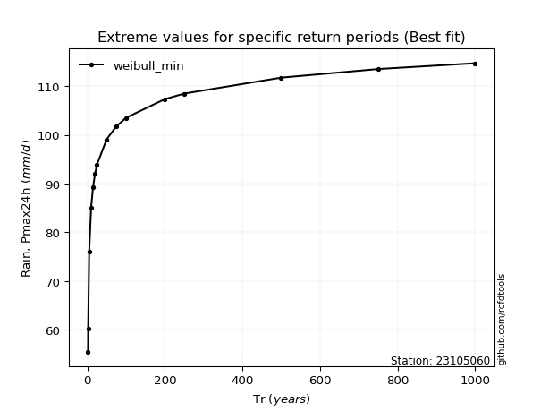</img>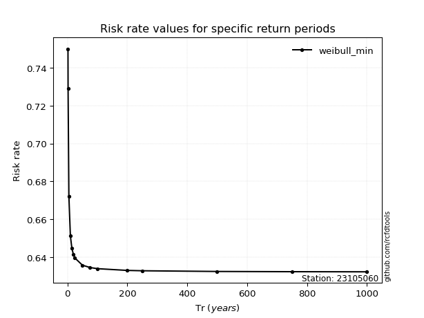</img>

</div>


<sub>**APP DISCLAIMER**: NO WARRANTY - This software is provided by [github.com/rcfdtools](https://github.com/rcfdtools) "as is", without any express or implied warranty, including warranties of merchantability, fitness for a particular purpose, or non-infringement. There is no guarantee that the software will be error-free or operate without interruption. LIMITATION OF LIABILITY - Neither the authors nor copyright holders will be liable for claims or damages arising from the software or its use. You are responsible for determining if the software is appropriate for your use and assume all associated risks, including errors, legal compliance, and data loss. NO PROFESSIONAL ADVICE - The software provides general information and does not offer professional advice. It should not replace consultation with professional advisors.</sub>