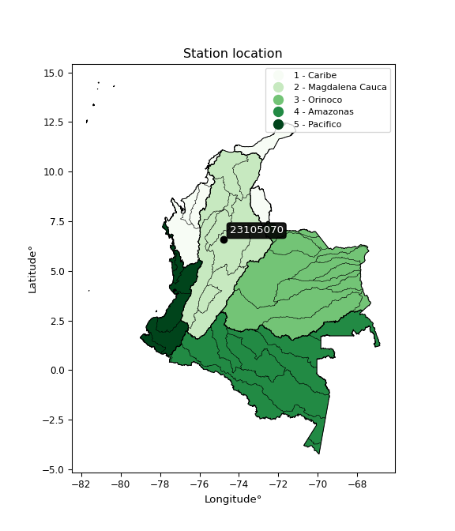

<div align="center">


</div>

# PMP Station (Rain, Pmax24h): 23105070

Probable Maximum Precipitation (PMP) is the greatest amount of rainfall for a specific duration that is meteorologically possible for a given location, acting as a "worst-case" scenario for extreme storms, crucial for designing safety-critical infrastructure like bridges, river deviations, dams, spillways, and nuclear plants to prevent catastrophic failure. PMP is calculated by hydrologists using meteorological data to determine the upper limit of extreme rainfall, often leading to the Probable Maximum Flood (PMF) for flood control design, and is increasingly being studied for climate change impacts. Probable Maximum Precipitation (PMP) is the theoretical upper limit of rainfall, a deterministic estimate for extreme events, while probability distributions (like GEV, Gumbel) describe the likelihood and frequency of various precipitation amounts, including rare ones, showing how often events occur, with PMP representing the extreme end of these distributions, used for critical infrastructure design to ensure safety against the worst conceivable weather, unlike standard statistical forecasts which cover typical probabilities.

The most common probability distributions in hydrology, used for analyzing floods, rainfall, and streamflow, include the Normal, Log-Normal, Gumbel, Gamma (including Log-Pearson Type III), and Generalized Extreme Value (GEV) distributions, often chosen based on the data´s skewness and whether modeling extremes or general conditions, with Gumbel and GEV popular for extreme events like floods, while the Normal distribution serves as a baseline, though often requiring transformations for skewed hydrological data. These distributions help in designing water infrastructure, managing water resources, and forecasting hydrologic events.

> Hydrological data often isn´t perfectly normal (it´s skewed), so different distributions are needed for different applications, such as: **Flood Frequency Analysis**: Using Gumbel, GEV, or Log-Pearson Type III for predicting extreme flood magnitudes and their return periods, **Rainfall Analysis**: Normal for annual totals, but Log-Normal, Weibull, or GEV for intensity or extreme daily rainfall, **Streamflow Modeling**: Gamma and Log-Normal for maximum flows, GEV for minimum flows, and Kappa for daily flows.

<div align="center">

</img>

</div>


## A. General information


### 1. General running parameters

• app_version: _v20260108_. • runtime: _2026-01-09 11:32:22.148588_. • Python version: _3.14.0_. • SciPy version: _1.16.3_. • Pandas version: _2.3.3_. • NumPy version: _2.3.5_. • Stations dataset (station_dataset_file): _dataset/pmax24h_in/automatic_colombia_2003_2024.csv_. • Stations catalog (station_catalog_file): _dataset/CNE.xls_. • Minimum year to eval til year_max (date_min): _1900_. • Maximum year to eval since year_min (date_max): _2024_. • Creates, save and include plots into reports (create_plot): _False_. • Plot only fit distributions with Δo > Δ (plot_only_fit): _True_. • Plot only simple graphs avoiding multiple CDFs and multiple Extreme values plots (plot_only_simple): _True_. • Eval low extreme values, if False, evaluates high extreme values (low_extreme): _False_. • Eval every SciPy distribution as logarithmic (pdist_logarithmic_on): _True_. • Standard deviation normalized (ddof): _1.0_. • Return periods to eval in years (Tr): _[2, 2.33, 5, 10, 15, 20, 25, 50, 75, 100, 200, 250, 500, 750, 1000]_. • Minimum data sample per station, 0 means any (minimum_sample): _5_. • Z-Score maximum threshold to adjust a value, 0 means disable (zscore_max): _3.5_. • Z-Score minimum threshold to adjust a value, 0 means disable (zscore_min): _-2.5_. • Avoid zeros, e.g. rain = 0 (avoid_zeros): _True_. • Avoid null values (avoid_nans): _True_. 

:file_folder:Table: [dataset.csv](../../dataset/pmax24h_in/automatic_colombia_2003_2024.csv)

> Delta Degrees of Freedom (DDOF): is a parameter used in the formulas for calculating variance and standard deviation. When ddof=0, the divisor is $N$ (the total number of observations) and this is used when your data set is the entire population. When ddof=1, the divisor is $N-1$ and this is used when your data set is a sample drawn from a larger population. Using $N-1$ provides an unbiased estimate of the population variance (known as Bessel´s correction).


### 2. Station info and location

|   id |   CODIGO | NOMBRE           | CATEGORIA               | TECNOLOGIA                | ESTADO   | FECHA_INSTALACION   |   FECHA_SUSPENSION |   ALTITUD |   LATITUD |   LONGITUD | DEPARTAMENTO   | MUNICIPIO   | AREA_OPERATIVA                      | ENTIDAD                                                     | AREA_HIDROGRAFICA   | ZONA_HIDROGRAFICA   | SUBZONA_HIDROGRAFICA                                |   CORRIENTE | Catalogo   |   Version |
|-----:|---------:|:-----------------|:------------------------|:--------------------------|:---------|:--------------------|-------------------:|----------:|----------:|-----------:|:---------------|:------------|:------------------------------------|:------------------------------------------------------------|:--------------------|:--------------------|:----------------------------------------------------|------------:|:-----------|----------:|
|    0 | 23105070 | MACEO [23105070] | Climatológica Principal | Automática con Telemetría | Activa   | 18/06/2005          |                nan |      1102 |   6.57164 |   -74.7947 | Antioquia      | Yolombó     | Area Operativa 01 - Antioquia-Chocó | INSTITUTO DE HIDROLOGIA METEOROLOGIA Y ESTUDIOS AMBIENTALES | Magdalena Cauca     | Medio Magdalena     | Rió San Bartolo y otros directos al Magdalena Medio |         nan | CNE_IDEAM  |  20251226 |

<div align="center">

Dynamic map: [:earth_americas:Google](http://maps.google.com/maps?q=6.571638889,-74.79472222) [:earth_americas:OSM](https://www.openstreetmap.org/#map=18/6.571638889/-74.79472222&layers=P) [:earth_americas:Bing](https://www.bing.com/maps?cp=6.571638889~-74.79472222&lvl=18) [:earth_americas:Apple](https://maps.apple.com/frame?center=6.571638889%2C-74.79472222&span=0.003%2C0.006)

</div>


<div align="center">

```geojson
{
  "type": "Feature",
  "geometry": {
    "type": "Point", 
    "coordinates": [-74.79472222, 6.571638889]
  }, 
  "properties": {
    "Name": "23105070"
  }
}
```

</div>


### 3. Discrete values table and plot

<div align="center">

|               |           0 |           1 |           2 |          3 |          4 |           5 |            6 |           7 |           8 |           9 |         10 |          11 |          12 |         13 |          14 |         15 |          16 |         17 |
|:--------------|------------:|------------:|------------:|-----------:|-----------:|------------:|-------------:|------------:|------------:|------------:|-----------:|------------:|------------:|-----------:|------------:|-----------:|------------:|-----------:|
| Date          | 2006        | 2007        | 2008        | 2009       | 2010       | 2011        | 2012         | 2013        | 2014        | 2015        | 2016       | 2017        | 2018        | 2019       | 2020        | 2021       | 2022        | 2024       |
| Value         |   41.3      |   63.1      |   42        |  103.4     |   62.4     |   78.1      |   46.2       |   68.1      |   39.8      |   17.2      |    1.6     |   22.4      |   20.5      |  154.5     |   75        |    6.4     |   45        |    0.2     |
| Value_initial |   41.3      |   63.1      |   42        |  103.4     |   62.4     |   78.1      |   46.2       |   68.1      |   39.8      |   17.2      |    1.6     |   22.4      |   20.5      |  154.5     |   75        |    6.4     |   45        |    0.2     |
| count         |   18        |   18        |   18        |   18       |   18       |   18        |   18         |   18        |   18        |   18        |   18       |   18        |   18        |   18       |   18        |   18       |   18        |   18       |
| mean          |   49.2889   |   49.2889   |   49.2889   |   49.2889  |   49.2889  |   49.2889   |   49.2889    |   49.2889   |   49.2889   |   49.2889   |   49.2889  |   49.2889   |   49.2889   |   49.2889  |   49.2889   |   49.2889  |   49.2889   |   49.2889  |
| std           |   38.7639   |   38.7639   |   38.7639   |   38.7639  |   38.7639  |   38.7639   |   38.7639    |   38.7639   |   38.7639   |   38.7639   |   38.7639  |   38.7639   |   38.7639   |   38.7639  |   38.7639   |   38.7639  |   38.7639   |   38.7639  |
| zscore        |   -0.206091 |    0.356288 |   -0.188033 |    1.39592 |    0.33823 |    0.743246 |   -0.0796847 |    0.485274 |   -0.244787 |   -0.827803 |   -1.23024 |   -0.693658 |   -0.742673 |    2.71415 |    0.663275 |   -1.10641 |   -0.110641 |   -1.26636 |


</div>


> The initial value (value_initial) correspond to the initial obtained or null completed value, and value (value) is adjusted only when the initial value is outside the valid range (outlier) definite through the Z-Score value. If Z-Score is active, values out of range or outliers are replaced with the station mean value. A Z-Score (or standard score) measures how many standard deviations a data point is from the mean of a dataset, indicating its relative position; positive scores mean above the mean, negative mean below, and a score of zero is exactly at the mean, allowing for comparison of values from different distributions. It´s calculated using the formula $z=(x–μ)/σ$, where $x$ is the data point, $μ$ is the mean, and $σ$ is the standard deviation, helping identify outliers and understand probability.
>
> <sub>**Note**: In this study, "completing" (filling gaps in) and "extending" (forecasting or lengthening the historical record) rainfall data series are avoided for certain critical analyses because they introduce artificial bias and uncertainty, which can distort the statistics of rare events (extremes), alter day-to-day variability, and compromise the integrity and homogeneity of the original data. Some reasons against Completing/Extending rainfall data are: **Distortion of Extremes and Variability**: The primary issue is that most gap-filling or extension methods rely on averaging or regression with nearby stations, which inherently smooths the data. Rainfall is highly variable in space and time, with a large percentage of zero values and occasional large storms. Infilling methods often underestimate the highest values and overestimate the lowest (zero) values, which severely distorts analyses focused on flood frequency, drought severity, and intensity-duration-frequency (IDF) curves, **Loss of Data Homogeneity**: Infilled or extended data are synthetic estimates, not actual measurements. Combining these estimates with observed data can violate the assumption of data homogeneity, which requires that the data properties do not change over time. Inhomogeneity can lead to incorrect conclusions about long-term trends or changes in climate patterns, **Propagation of Errors**: Errors and biases from the original data (e.g., wind-induced undercatch, instrument errors, site changes) or the data used for imputation can propagate through the analysis, leading to unreliable hydrological models and inaccurate predictions, **Compromised Statistical Integrity**: For statistical analyses, especially those involving the frequency of events, using artificial data can introduce time bias or autocorrelation that doesn´t exist in reality, making it difficult to assess the true probability of events, **Difficulty in Validation**: It is difficult to accurately validate the quality of filled or extended data, especially for past periods where ground-truth measurements are unavailable. The reliability of imputation techniques heavily depends on the density of the surrounding station network and the complexity of the local topography.</sub>


### 4. Active continuous probability distributions from SciPy (45 of 104 available)

A Probability Density Function (PDF) describes the relative likelihood of a continuous random variable falling within a specific range, where the total area under its curve equals 1, and the area over any interval gives the actual probability for that range. Unlike discrete probabilities (like rolling a die), a PDF shows density, not direct probability for a single point (which is zero), with higher points indicating higher likelihood, often visualized as a bell curve for normal distributions.

A log of a probability density function (log-PDF) is simply the logarithm of the PDF´s value, denoted as $log(f(x))$, useful for converting multiplication of probabilities into addition, improving numerical stability with tiny numbers, and connecting to information theory concepts like entropy. Instead of dealing with very small probabilities (e.g., 0.000001), log-PDFs use negative numbers (e.g., $log(0.00001) ≈ -11.51$ that are easier for computers to handle, preventing underflow errors and simplifying complex calculations. In this study, each active probability distribution from SciPy is also evaluated in the $log$ form.

[scipy.stats](https://docs.scipy.org/doc/scipy/reference/stats.html) is a Python´s powerful submodule within the SciPy library for comprehensive statistical analysis, offering over 130 probability distributions (like Normal, Poisson), functions for descriptive stats (mean, variance), hypothesis testing (t-tests, chi-square), random variable generation, and statistical tests, making it essential for data science, modeling, and research. It provides tools to explore, model, and draw conclusions from data efficiently, working seamlessly with NumPy.

<div align="center">

|   id | p_dist             |   n_parameter | fit_method   | label                                                                       | active   | ref                                                                                                        |
|-----:|:-------------------|--------------:|:-------------|:----------------------------------------------------------------------------|:---------|:-----------------------------------------------------------------------------------------------------------|
|    0 | alpha              |             3 | MLE          | Alpha                                                                       | True     | [:mortar_board:](https://docs.scipy.org/doc/scipy/reference/generated/scipy.stats.alpha.html)              |
|    1 | betaprime          |             4 | MLE          | Beta prime                                                                  | True     | [:mortar_board:](https://docs.scipy.org/doc/scipy/reference/generated/scipy.stats.betaprime.html)          |
|    2 | chi2               |             3 | MLE          | Chi²                                                                        | True     | [:mortar_board:](https://docs.scipy.org/doc/scipy/reference/generated/scipy.stats.chi2.html)               |
|    3 | crystalball        |             4 | MLE          | Crystalball                                                                 | True     | [:mortar_board:](https://docs.scipy.org/doc/scipy/reference/generated/scipy.stats.crystalball.html)        |
|    4 | dweibull           |             3 | MLE          | Double Weibull                                                              | True     | [:mortar_board:](https://docs.scipy.org/doc/scipy/reference/generated/scipy.stats.dweibull.html)           |
|    5 | erlang             |             3 | MLE          | Erlang                                                                      | True     | [:mortar_board:](https://docs.scipy.org/doc/scipy/reference/generated/scipy.stats.erlang.html)             |
|    6 | expon              |             2 | MLE          | Exponential                                                                 | True     | [:mortar_board:](https://docs.scipy.org/doc/scipy/reference/generated/scipy.stats.expon.html)              |
|    7 | exponnorm          |             3 | MLE          | Exponentially modified Normal                                               | True     | [:mortar_board:](https://docs.scipy.org/doc/scipy/reference/generated/scipy.stats.exponnorm.html)          |
|    8 | f                  |             4 | MLE          | F                                                                           | True     | [:mortar_board:](https://docs.scipy.org/doc/scipy/reference/generated/scipy.stats.f.html)                  |
|    9 | fatiguelife        |             3 | MLE          | Fatigue-life (Birnbaum-Saunders)                                            | True     | [:mortar_board:](https://docs.scipy.org/doc/scipy/reference/generated/scipy.stats.fatiguelife.html)        |
|   10 | fisk               |             3 | MLE          | Fisk                                                                        | True     | [:mortar_board:](https://docs.scipy.org/doc/scipy/reference/generated/scipy.stats.fisk.html)               |
|   11 | gamma              |             3 | MLE          | Gamma                                                                       | True     | [:mortar_board:](https://docs.scipy.org/doc/scipy/reference/generated/scipy.stats.gamma.html)              |
|   12 | genexpon           |             5 | MLE          | Generalized exponential                                                     | True     | [:mortar_board:](https://docs.scipy.org/doc/scipy/reference/generated/scipy.stats.genexpon.html)           |
|   13 | genlogistic        |             3 | MLE          | Generalized logistic                                                        | True     | [:mortar_board:](https://docs.scipy.org/doc/scipy/reference/generated/scipy.stats.genlogistic.html)        |
|   14 | gibrat             |             2 | MM           | Gibrat                                                                      | True     | [:mortar_board:](https://docs.scipy.org/doc/scipy/reference/generated/scipy.stats.gibrat.html)             |
|   15 | gompertz           |             3 | MLE          | Gompertz (or truncated Gumbel)                                              | True     | [:mortar_board:](https://docs.scipy.org/doc/scipy/reference/generated/scipy.stats.gompertz.html)           |
|   16 | gumbel_l           |             2 | MM           | Gumbel Left Skew                                                            | True     | [:mortar_board:](https://docs.scipy.org/doc/scipy/reference/generated/scipy.stats.gumbel_l.html)           |
|   17 | gumbel_r           |             2 | MM           | Gumbel Right Skew                                                           | True     | [:mortar_board:](https://docs.scipy.org/doc/scipy/reference/generated/scipy.stats.gumbel_r.html)           |
|   18 | halflogistic       |             2 | MM           | Half-logistic                                                               | True     | [:mortar_board:](https://docs.scipy.org/doc/scipy/reference/generated/scipy.stats.halflogistic.html)       |
|   19 | halfnorm           |             2 | MM           | Half Normal                                                                 | True     | [:mortar_board:](https://docs.scipy.org/doc/scipy/reference/generated/scipy.stats.halfnorm.html)           |
|   20 | hypsecant          |             2 | MM           | hyperbolic secant                                                           | True     | [:mortar_board:](https://docs.scipy.org/doc/scipy/reference/generated/scipy.stats.hypsecant.html)          |
|   21 | invgamma           |             3 | MLE          | Inverted gamma                                                              | True     | [:mortar_board:](https://docs.scipy.org/doc/scipy/reference/generated/scipy.stats.invgamma.html)           |
|   22 | invgauss           |             3 | MLE          | Inverse Gaussian                                                            | True     | [:mortar_board:](https://docs.scipy.org/doc/scipy/reference/generated/scipy.stats.invgauss.html)           |
|   23 | invweibull         |             3 | MLE          | Inverted Weibull                                                            | True     | [:mortar_board:](https://docs.scipy.org/doc/scipy/reference/generated/scipy.stats.invweibull.html)         |
|   24 | kappa4             |             4 | MLE          | Kappa 4                                                                     | True     | [:mortar_board:](https://docs.scipy.org/doc/scipy/reference/generated/scipy.stats.kappa4.html)             |
|   25 | kstwobign          |             2 | MLE          | Limiting distribution of scaled Kolmogorov-Smirnov two-sided test statistic | True     | [:mortar_board:](https://docs.scipy.org/doc/scipy/reference/generated/scipy.stats.kstwobign.html)          |
|   26 | laplace            |             2 | MM           | Laplace                                                                     | True     | [:mortar_board:](https://docs.scipy.org/doc/scipy/reference/generated/scipy.stats.laplace.html)            |
|   27 | laplace_asymmetric |             3 | MLE          | Asymmetric Laplace                                                          | True     | [:mortar_board:](https://docs.scipy.org/doc/scipy/reference/generated/scipy.stats.laplace_asymmetric.html) |
|   28 | loggamma           |             3 | MLE          | Log gamma                                                                   | True     | [:mortar_board:](https://docs.scipy.org/doc/scipy/reference/generated/scipy.stats.loggamma.html)           |
|   29 | logistic           |             2 | MM           | Logistic (or Sech-squared)                                                  | True     | [:mortar_board:](https://docs.scipy.org/doc/scipy/reference/generated/scipy.stats.logistic.html)           |
|   30 | lognorm            |             3 | MLE          | Log Normal                                                                  | True     | [:mortar_board:](https://docs.scipy.org/doc/scipy/reference/generated/scipy.stats.lognorm.html)            |
|   31 | maxwell            |             2 | MM           | Maxwell                                                                     | True     | [:mortar_board:](https://docs.scipy.org/doc/scipy/reference/generated/scipy.stats.maxwell.html)            |
|   32 | mielke             |             4 | MLE          | Mielke Beta-Kappa / Dagum                                                   | True     | [:mortar_board:](https://docs.scipy.org/doc/scipy/reference/generated/scipy.stats.mielke.html)             |
|   33 | moyal              |             2 | MM           | Moyal                                                                       | True     | [:mortar_board:](https://docs.scipy.org/doc/scipy/reference/generated/scipy.stats.moyal.html)              |
|   34 | nakagami           |             3 | MLE          | Nakagami                                                                    | True     | [:mortar_board:](https://docs.scipy.org/doc/scipy/reference/generated/scipy.stats.nakagami.html)           |
|   35 | ncf                |             5 | MLE          | Non-central F distribution                                                  | True     | [:mortar_board:](https://docs.scipy.org/doc/scipy/reference/generated/scipy.stats.ncf.html)                |
|   36 | nct                |             4 | MLE          | Non-central Student’s t                                                     | True     | [:mortar_board:](https://docs.scipy.org/doc/scipy/reference/generated/scipy.stats.nct.html)                |
|   37 | norm               |             2 | MM           | Normal                                                                      | True     | [:mortar_board:](https://docs.scipy.org/doc/scipy/reference/generated/scipy.stats.norm.html)               |
|   38 | pearson3           |             3 | MM           | Pearson type III                                                            | True     | [:mortar_board:](https://docs.scipy.org/doc/scipy/reference/generated/scipy.stats.pearson3.html)           |
|   39 | rayleigh           |             2 | MM           | Rayleigh                                                                    | True     | [:mortar_board:](https://docs.scipy.org/doc/scipy/reference/generated/scipy.stats.rayleigh.html)           |
|   40 | rice               |             3 | MLE          | Rice                                                                        | True     | [:mortar_board:](https://docs.scipy.org/doc/scipy/reference/generated/scipy.stats.rice.html)               |
|   41 | t                  |             3 | MLE          | Student’s t                                                                 | True     | [:mortar_board:](https://docs.scipy.org/doc/scipy/reference/generated/scipy.stats.t.html)                  |
|   42 | truncnorm          |             4 | MLE          | Truncated normal                                                            | True     | [:mortar_board:](https://docs.scipy.org/doc/scipy/reference/generated/scipy.stats.truncnorm.html)          |
|   43 | wald               |             2 | MM           | Wald                                                                        | True     | [:mortar_board:](https://docs.scipy.org/doc/scipy/reference/generated/scipy.stats.wald.html)               |
|   44 | weibull_min        |             3 | MLE          | Weibull minimum                                                             | True     | [:mortar_board:](https://docs.scipy.org/doc/scipy/reference/generated/scipy.stats.weibull_min.html)        |

</div>

> **n_parameter:** # arguments & localization & scale.
>
> **Fit methods:** (MLE) maximum likelihood, (MM) L-moments.
>
>**Inactive** (With the only purpose of prevent loops, zero divisions, infinite values, over high estimated values or horizontal trending for recurrence intervals estimations, the follow distributions were disabled.)**:** foldnorm, gennorm, norminvgauss, powernorm, powerlognorm, skewnorm, genextreme, anglit, arcsine, argus, beta, bradford, burr, burr12, cauchy, cosine, halfcauchy, foldcauchy, skewcauchy, wrapcauchy, dgamma, gengamma, exponweib, exponpow, truncexpon, gausshyper, genhalflogistic, genhyperbolic, geninvgauss, halfgennorm, johnsonsb, johnsonsu, kappa3, ksone, kstwo, loglaplace, levy, levy_l, levy_stable, ncx2, pareto, genpareto, truncpareto, lomax, powerlaw, rdist, rel_breitwigner, recipinvgauss, semicircular, studentized_range, trapezoid, triang, truncweibull_min, tukeylambda, uniform, loguniform, vonmises, vonmises_line, weibull_max, 


## B. Probability (PDF) vs. Empirical (EDF) distributions functions

A continuous probability distribution (CPD) describes probabilities for variables that can take any value within a range (like rain any time), unlike discrete variables with specific outcomes (like temperature). It uses a Probability Density Function (PDF), a curve where the total area under it equals 1, and the probability of the variable falling within an interval (a to b) is found by calculating the area under the curve between those points. A key feature is that the probability of hitting any single exact value is zero, so probabilities are always expressed for ranges, e.g., $P(a ≤ X ≤ b)$.

<div align="center">

Distributions parameters from station values
|    |   station | p_dist                |   n |              loc |           scale | shape                  | shape1                 | shape2                | shape3   |
|---:|----------:|:----------------------|----:|-----------------:|----------------:|:-----------------------|:-----------------------|:----------------------|:---------|
|  0 |  23105070 | alpha                 |  18 |      0.00174555  |     0.835869    | 2.8108797575001893e-08 |                        |                       |          |
|  1 |  23105070 | betaprime             |  18 |      0.2         |  1002.63        | 0.9333868261679859     | 21.235617467768023     |                       |          |
|  2 |  23105070 | chi2                  |  18 |      0.2         |    25.8451      | 1.7053106391964128     |                        |                       |          |
|  3 |  23105070 | crystalball           |  18 |     49.2889      |    37.6717      | 35871.18000117746      | 580.2941799424906      |                       |          |
|  4 |  23105070 | dweibull              |  18 |     43.8055      |    28.1898      | 1.015379650765286      |                        |                       |          |
|  5 |  23105070 | erlang                |  18 |      0.2         |    55.7393      | 0.9671059702277836     |                        |                       |          |
|  6 |  23105070 | expon                 |  18 |      0.2         |    49.0889      |                        |                        |                       |          |
|  7 |  23105070 | exponnorm             |  18 |     15.7649      |    19.0084      | 1.7636480516114215     |                        |                       |          |
|  8 |  23105070 | f                     |  18 |      0.2         |    51.2596      | 1.567329625951548      | 42.012601504513405     |                       |          |
|  9 |  23105070 | fatiguelife           |  18 |    -28.3434      |    68.9129      | 0.5025025986135475     |                        |                       |          |
| 10 |  23105070 | fisk                  |  18 |    -31.9633      |    74.1935      | 3.7199186661941215     |                        |                       |          |
| 11 |  23105070 | gamma                 |  18 |      0.2         |    50.3613      | 0.8674376484936998     |                        |                       |          |
| 12 |  23105070 | genexpon              |  18 |      0.199962    |     2.46667     | 0.05025025266881683    | 1.0237436636468034e-06 | 2.310683737725246     |          |
| 13 |  23105070 | genlogistic           |  18 |   -161.331       |    28.8009      | 832.574178719427       |                        |                       |          |
| 14 |  23105070 | gibrat                |  18 |     20.5501      |    17.4309      |                        |                        |                       |          |
| 15 |  23105070 | gompertz              |  18 |      0.199977    |   126.313       | 1.819683559283563      |                        |                       |          |
| 16 |  23105070 | gumbel_l              |  18 |     66.2432      |    29.3725      |                        |                        |                       |          |
| 17 |  23105070 | gumbel_r              |  18 |     32.3346      |    29.3725      |                        |                        |                       |          |
| 18 |  23105070 | halflogistic          |  18 |      4.63909     |    32.208       |                        |                        |                       |          |
| 19 |  23105070 | halfnorm              |  18 |     -0.573729    |    62.4935      |                        |                        |                       |          |
| 20 |  23105070 | hypsecant             |  18 |     49.2889      |    23.9826      |                        |                        |                       |          |
| 21 |  23105070 | invgamma              |  18 |    -62.608       |  1014.56        | 10.052802723408199     |                        |                       |          |
| 22 |  23105070 | invgauss              |  18 |    -32.3912      |   350.246       | 0.23320786027826357    |                        |                       |          |
| 23 |  23105070 | invweibull            |  18 |   -581.379       |   612.959       | 21.660498481048194     |                        |                       |          |
| 24 |  23105070 | kappa4                |  18 |    -16.0495      |   168.884       | 1.1063461718162573     | 0.9805376049693191     |                       |          |
| 25 |  23105070 | kstwobign             |  18 |    -70.9029      |   138.447       |                        |                        |                       |          |
| 26 |  23105070 | laplace               |  18 |     49.2889      |    26.6379      |                        |                        |                       |          |
| 27 |  23105070 | laplace_asymmetric    |  18 |     41.3         |    27.2289      | 0.864008101776709      |                        |                       |          |
| 28 |  23105070 | loggamma              |  18 | -11654.8         |  1577.83        | 1665.8684354720963     |                        |                       |          |
| 29 |  23105070 | logistic              |  18 |     49.2889      |    20.7695      |                        |                        |                       |          |
| 30 |  23105070 | lognorm               |  18 |      0.2         |     3.50515     | 9.609229456672777      |                        |                       |          |
| 31 |  23105070 | maxwell               |  18 |    -39.9773      |    55.9393      |                        |                        |                       |          |
| 32 |  23105070 | mielke                |  18 |      0.2         |    85.8975      | 0.8260236982916185     | 5.239200678298795      |                       |          |
| 33 |  23105070 | moyal                 |  18 |     27.7458      |    16.9582      |                        |                        |                       |          |
| 34 |  23105070 | nakagami              |  18 |      1.6         |    56.8557      | 0.42657696564190783    |                        |                       |          |
| 35 |  23105070 | ncf                   |  18 |      0.2         |     6.39596     | 0.6797995757681387     | 474.4582985892059      | 4.374352979779093     |          |
| 36 |  23105070 | nct                   |  18 |    -80.7885      |    10.503       | 8.212106703358293      | 11.214779047395837     |                       |          |
| 37 |  23105070 | norm                  |  18 |     49.2889      |    37.6717      |                        |                        |                       |          |
| 38 |  23105070 | pearson3              |  18 |     49.2889      |    37.6717      | 1.0305086133613837     |                        |                       |          |
| 39 |  23105070 | rayleigh              |  18 |    -22.7793      |    57.5021      |                        |                        |                       |          |
| 40 |  23105070 | rice                  |  18 |    -15.2062      |    52.8147      | 0.0002516956185082951  |                        |                       |          |
| 41 |  23105070 | t                     |  18 |     45.2479      |    30.1853      | 5.300450160465193      |                        |                       |          |
| 42 |  23105070 | truncnorm             |  18 |     49.3099      |    37.575       | -3.435869895747426     | 9.843171889328385      |                       |          |
| 43 |  23105070 | wald                  |  18 |     11.6171      |    37.6718      |                        |                        |                       |          |
| 44 |  23105070 | weibull_min           |  18 |     -0.533164    |    52.1096      | 1.1608141029493764     |                        |                       |          |
| 45 |  23105070 | logalpha              |  18 |     -2.25024     |     1.76889     | 1.165684015111593e-08  |                        |                       |          |
| 46 |  23105070 | logbetaprime          |  18 |     -1.60944     |    91.7055      | 0.31343584485646114    | 5.8187649757086355     |                       |          |
| 47 |  23105070 | logchi2               |  18 |     -1.60944     |     2.85207     | 1.1600832544751425     |                        |                       |          |
| 48 |  23105070 | logcrystalball        |  18 |      4.02753     |     0.501001    | 0.7130152619327594     | 3.4208018868775714     |                       |          |
| 49 |  23105070 | logdweibull           |  18 |      3.80666     |     0.932027    | 0.8115530308856922     |                        |                       |          |
| 50 |  23105070 | logerlang             |  18 |    -20.6921      |     0.116424    | 205.85433374499576     |                        |                       |          |
| 51 |  23105070 | logexpon              |  18 |     -1.60944     |     4.90537     |                        |                        |                       |          |
| 52 |  23105070 | logexponnorm          |  18 |      3.2949      |     1.57771     | 0.0006562865629561167  |                        |                       |          |
| 53 |  23105070 | logf                  |  18 |     -1.60944     |     1.19951     | 1.0264748832977946     | 1.0669150863275754     |                       |          |
| 54 |  23105070 | logfatiguelife        |  18 |  -1856.52        |  1859.82        | 0.0008462098040429729  |                        |                       |          |
| 55 |  23105070 | logfisk               |  18 |     -1.59722e+08 |     1.59722e+08 | 213249279.30724642     |                        |                       |          |
| 56 |  23105070 | loggamma              |  18 |    -21.0856      |     0.121497    | 200.81391762484145     |                        |                       |          |
| 57 |  23105070 | loggenexpon           |  18 |     -1.61043     |     0.223616    | 0.005583046532923171   | 6.207737853573646      | 0.0005261212378389317 |          |
| 58 |  23105070 | loggenlogistic        |  18 |      4.57819     |     0.205359    | 0.15435637409058278    |                        |                       |          |
| 59 |  23105070 | loggibrat             |  18 |      2.09233     |     0.73002     |                        |                        |                       |          |
| 60 |  23105070 | loggompertz           |  18 |     -1.62203     |     0.943807    | 0.0028390826174181597  |                        |                       |          |
| 61 |  23105070 | loggumbel_l           |  18 |      4.00599     |     1.23014     |                        |                        |                       |          |
| 62 |  23105070 | loggumbel_r           |  18 |      2.58588     |     1.23014     |                        |                        |                       |          |
| 63 |  23105070 | loghalflogistic       |  18 |      1.42599     |     1.34888     |                        |                        |                       |          |
| 64 |  23105070 | loghalfnorm           |  18 |      1.20765     |     2.61727     |                        |                        |                       |          |
| 65 |  23105070 | loghypsecant          |  18 |      3.29594     |     1.0044      |                        |                        |                       |          |
| 66 |  23105070 | loginvgamma           |  18 |    -37.0409      | 22807.4         | 566.8835006797581      |                        |                       |          |
| 67 |  23105070 | loginvgauss           |  18 |    -16.0656      |  2337.21        | 0.00827184276792891    |                        |                       |          |
| 68 |  23105070 | loginvweibull         |  18 |     -2.11847e+08 |     2.11847e+08 | 104422652.09904115     |                        |                       |          |
| 69 |  23105070 | logkappa4             |  18 |     -2.04741     |     7.7914      | 1.059002960000233      | 1.0993001505520048     |                       |          |
| 70 |  23105070 | logkstwobign          |  18 |     -5.67123     |    10.3372      |                        |                        |                       |          |
| 71 |  23105070 | loglaplace            |  18 |      3.29594     |     1.11561     |                        |                        |                       |          |
| 72 |  23105070 | loglaplace_asymmetric |  18 |      4.3175      |     0.657566    | 2.057088738748945      |                        |                       |          |
| 73 |  23105070 | logloggamma           |  18 |      4.72641     |     0.367507    | 0.27101377085295786    |                        |                       |          |
| 74 |  23105070 | loglogistic           |  18 |      3.29594     |     0.86984     |                        |                        |                       |          |
| 75 |  23105070 | loglognorm            |  18 |   -690.786       |   694.082       | 0.002265180841604866   |                        |                       |          |
| 76 |  23105070 | logmaxwell            |  18 |     -0.442552    |     2.34275     |                        |                        |                       |          |
| 77 |  23105070 | logmielke             |  18 |     -6.65217e+07 |     6.65217e+07 | 49904772.337984934     | 324276514.69802904     |                       |          |
| 78 |  23105070 | logmoyal              |  18 |      2.3937      |     0.710221    |                        |                        |                       |          |
| 79 |  23105070 | lognakagami           |  18 |  -2633.02        |  2636.31        | 696741.305634103       |                        |                       |          |
| 80 |  23105070 | logncf                |  18 |     -1.60944     |     1.0864      | 1.070243813508798      | 1.1279223046846814     | 1.1022509362096309    |          |
| 81 |  23105070 | lognct                |  18 |    105.214       |     1.55509     | 82880.38876092178      | -65.53775459179246     |                       |          |
| 82 |  23105070 | lognorm               |  18 |      3.29594     |     1.57771     |                        |                        |                       |          |
| 83 |  23105070 | logpearson3           |  18 |      3.29595     |     1.57771     | -1.8562795315937732    |                        |                       |          |
| 84 |  23105070 | lograyleigh           |  18 |      0.277651    |     2.40824     |                        |                        |                       |          |
| 85 |  23105070 | logrice               |  18 |   -845.758       |     1.57778     | 538.1317057136753      |                        |                       |          |
| 86 |  23105070 | logt                  |  18 |      3.89014     |     0.532478    | 1.3239410202004191     |                        |                       |          |
| 87 |  23105070 | logtruncnorm          |  18 |      2.37455     |     6.87064     | -0.5798569849405739    | 0.3879766067592585     |                       |          |
| 88 |  23105070 | logwald               |  18 |      1.71823     |     1.57771     |                        |                        |                       |          |
| 89 |  23105070 | logweibull_min        |  18 |     -1.60944     |     1.87067     | 0.5086569265341312     |                        |                       |          |

</div>

> **loc** (Location parameter): This shifts the distribution along the x-axis. For many common distributions, like the normal (Gaussian) distribution, loc represents the mean $μ$. For others, like the uniform distribution, it might represent the minimum value, or for the beta distribution, the left end of the support interval.
>
> **scale** (Scale parameter): This determines the width or spread of the distribution. For the normal distribution, scale represents the standard deviation $σ$. For a uniform distribution, it defines the length of the interval (from $loc$ to $loc + scale$).
>
> **shape** (Shape parameters): Refers to parameters that define the specific form of a probability distribution, distinct from its location (loc) and scale (scale). These parameters are required arguments for most distribution functions. For example, a normal (Gaussian) distribution is fully defined by its location (mean) and scale (standard deviation), so it has no specific shape parameters beyond loc and scale. However, other distributions have intrinsic properties that need specification, as Gamma distribution that takes a shape parameter, often named $a$ or $alpha$.


### 0. Cumulative distribution values - CDF (90 evaluated)

Cumulative Distribution Function (CDF), denoted as $F$<sub>$X$</sub>$(x)$, is a function that gives the probability that a random variable $X$ will take a value less than or equal to a specific value, $x$ (i.e., $(P(X≥x)$. It essentially "accumulates" probabilities from a given point up to the far right (positive infinity), providing a complete picture of the distribution´s probabilities for both discrete (like rain) and continuous (like temperature) variables, helping to find probabilities over ranges or above certain values. Each station is evaluated separately ordering the $x$ values ascending, calculating the CDF and PDF values for the activated distributions and their logarithmic forms.

<div align="center">

CDF ordered by x ascending and calculating $log(f(x))$ separately
|   id |   Station |   date |     x |   count |    mean |     std |     zscore |   Value_initial |   station |   m |       alpha |   alpha_pdf |   betaprime |   betaprime_pdf |        chi2 |    chi2_pdf |   crystalball |   crystalball_pdf |   dweibull |   dweibull_pdf |      erlang |   erlang_pdf |     expon |   expon_pdf |   exponnorm |   exponnorm_pdf |           f |       f_pdf |   fatiguelife |   fatiguelife_pdf |      fisk |    fisk_pdf |       gamma |   gamma_pdf |    genexpon |   genexpon_pdf |   genlogistic |   genlogistic_pdf |    gibrat |   gibrat_pdf |    gompertz |   gompertz_pdf |   gumbel_l |   gumbel_l_pdf |   gumbel_r |   gumbel_r_pdf |   halflogistic |   halflogistic_pdf |   halfnorm |   halfnorm_pdf |   hypsecant |   hypsecant_pdf |   invgamma |   invgamma_pdf |   invgauss |   invgauss_pdf |   invweibull |   invweibull_pdf |      kappa4 |   kappa4_pdf |   kstwobign |   kstwobign_pdf |   laplace |   laplace_pdf |   laplace_asymmetric |   laplace_asymmetric_pdf |   loggamma |   loggamma_pdf |   logistic |   logistic_pdf |    lognorm |   lognorm_pdf |   maxwell |   maxwell_pdf |      mielke |   mielke_pdf |     moyal |   moyal_pdf |    nakagami |   nakagami_pdf |         ncf |     ncf_pdf |       nct |    nct_pdf |      norm |    norm_pdf |   pearson3 |   pearson3_pdf |   rayleigh |   rayleigh_pdf |      rice |    rice_pdf |         t |       t_pdf |   truncnorm |   truncnorm_pdf |      wald |    wald_pdf |   weibull_min |   weibull_min_pdf |   logalpha |   logalpha_pdf |   logbetaprime |   logbetaprime_pdf |     logchi2 |    logchi2_pdf |   logcrystalball |   logcrystalball_pdf |   logdweibull |   logdweibull_pdf |   logerlang |   logerlang_pdf |   logexpon |   logexpon_pdf |   logexponnorm |   logexponnorm_pdf |        logf |    logf_pdf |   logfatiguelife |   logfatiguelife_pdf |     logfisk |   logfisk_pdf |   loggenexpon |   loggenexpon_pdf |   loggenlogistic |   loggenlogistic_pdf |   loggibrat |   loggibrat_pdf |   loggompertz |   loggompertz_pdf |   loggumbel_l |   loggumbel_l_pdf |   loggumbel_r |   loggumbel_r_pdf |   loghalflogistic |   loghalflogistic_pdf |   loghalfnorm |   loghalfnorm_pdf |   loghypsecant |   loghypsecant_pdf |   loginvgamma |   loginvgamma_pdf |   loginvgauss |   loginvgauss_pdf |   loginvweibull |   loginvweibull_pdf |   logkappa4 |   logkappa4_pdf |   logkstwobign |   logkstwobign_pdf |   loglaplace |   loglaplace_pdf |   loglaplace_asymmetric |   loglaplace_asymmetric_pdf |   logloggamma |   logloggamma_pdf |   loglogistic |   loglogistic_pdf |   loglognorm |   loglognorm_pdf |   logmaxwell |   logmaxwell_pdf |   logmielke |   logmielke_pdf |    logmoyal |   logmoyal_pdf |   lognakagami |   lognakagami_pdf |     logncf |   logncf_pdf |      lognct |   lognct_pdf |   logpearson3 |   logpearson3_pdf |   lograyleigh |   lograyleigh_pdf |     logrice |   logrice_pdf |      logt |   logt_pdf |   logtruncnorm |   logtruncnorm_pdf |    logwald |   logwald_pdf |   logweibull_min |   logweibull_min_pdf |
|-----:|----------:|-------:|------:|--------:|--------:|--------:|-----------:|----------------:|----------:|----:|------------:|------------:|------------:|----------------:|------------:|------------:|--------------:|------------------:|-----------:|---------------:|------------:|-------------:|----------:|------------:|------------:|----------------:|------------:|------------:|--------------:|------------------:|----------:|------------:|------------:|------------:|------------:|---------------:|--------------:|------------------:|----------:|-------------:|------------:|---------------:|-----------:|---------------:|-----------:|---------------:|---------------:|-------------------:|-----------:|---------------:|------------:|----------------:|-----------:|---------------:|-----------:|---------------:|-------------:|-----------------:|------------:|-------------:|------------:|----------------:|----------:|--------------:|---------------------:|-------------------------:|-----------:|---------------:|-----------:|---------------:|-----------:|--------------:|----------:|--------------:|------------:|-------------:|----------:|------------:|------------:|---------------:|------------:|------------:|----------:|-----------:|----------:|------------:|-----------:|---------------:|-----------:|---------------:|----------:|------------:|----------:|------------:|------------:|----------------:|----------:|------------:|--------------:|------------------:|-----------:|---------------:|---------------:|-------------------:|------------:|---------------:|-----------------:|---------------------:|--------------:|------------------:|------------:|----------------:|-----------:|---------------:|---------------:|-------------------:|------------:|------------:|-----------------:|---------------------:|------------:|--------------:|--------------:|------------------:|-----------------:|---------------------:|------------:|----------------:|--------------:|------------------:|--------------:|------------------:|--------------:|------------------:|------------------:|----------------------:|--------------:|------------------:|---------------:|-------------------:|--------------:|------------------:|--------------:|------------------:|----------------:|--------------------:|------------:|----------------:|---------------:|-------------------:|-------------:|-----------------:|------------------------:|----------------------------:|--------------:|------------------:|--------------:|------------------:|-------------:|-----------------:|-------------:|-----------------:|------------:|----------------:|------------:|---------------:|--------------:|------------------:|-----------:|-------------:|------------:|-------------:|--------------:|------------------:|--------------:|------------------:|------------:|--------------:|----------:|-----------:|---------------:|-------------------:|-----------:|--------------:|-----------------:|---------------------:|
|    0 |  23105070 |   2024 |   0.2 |      18 | 49.2889 | 38.7639 | -1.26636   |             0.2 |  23105070 |   1 | 2.48518e-05 | 0.00234238  | 2.40889e-14 |     0.190383    | 5.36669e-14 | 3.4563      |     0.0962755 |       0.00453086  |   0.105356 |    0.00382039  | 2.01897e-18 |   0.0703482  | 0         | 0.0203712   |   0.0515613 |     0.00461987  | 3.40746e-11 | 10.1815     |     0.0350405 |       0.00592455  | 0.0427256 | 0.00473039  | 1.52575e-16 |  4.76839    | 7.76362e-07 |    0.0203717   |     0.0475014 |       0.00501623  | 0         |  0           | 3.25248e-07 |    0.0144061   |   0.10018  |    0.00323383  |  0.0504738 |    0.00513166  |      0         |        0           | 0.00987832 |    0.0127665   |   0.0817607 |     0.00337181  |  0.0415016 |    0.0052679   |  0.0363756 |    0.00576202  |    0.0440918 |      0.005126    | 3.79337e-15 |   0.201917   |   0.0454063 |     0.00533538  | 0.0791852 |   0.00297265  |            0.0744988 |              0.00316666  | 0.00113075 |     0.00254695 |  0.0859982 |    0.00378451  | 0.00093809 |    0.00201253 | 0.0846055 |    0.00568505 | 2.66289e-14 |  6.9517      | 0.0242731 | 0.00419008  | 0           |     0          | 1.09299e-07 | 1.3385e+09  | 0.0443174 | 0.00520948 | 0.0962755 | 0.00453086  |  0.0505915 |    0.00597542  |  0.0767456 |    0.0064164   | 0.041653  | 0.00529309  | 0.0962816 | 0.00417659  |    0.095342 |     0.00452071  | 0         | 0           |    0.00706257 |       0.0111425   | 0.00577216 |      0.0761231 |    5.72887e-06 |        8.08681e+09 | 3.40078e-10 | 888377         |        0.0267584 |           0.00843076 |    0.00771871 |        0.00482404 | 0.000885488 |      0.00210119 |   0        |      0.203858  |    0.000938058 |         0.00201247 | 5.45647e-09 | 1.26122e+07 |      0.000891235 |           0.00192984 | 0.000964639 |    0.00128668 |   2.49067e-05 |         0.0250316 |       0.00955317 |           0.00718056 |    0        |       0         |    3.8141e-05 |        0.00304841 |     0.0103572 |        0.00837578 |   7.08224e-14 |       1.74322e-12 |          0        |             0         |      0        |          0        |     0.00481767 |         0.00479636 |   0.000950819 |        0.00225463 |   0.000774103 |        0.00204745 |     0.000909829 |           0.0031403 |  0.00104274 |        0.193563 |     0.00216026 |         0.00796772 |   0.00615698 |       0.00551893 |               0.0101144 |                  0.00747737 |     0.010363  |        0.00764211 |    0.00354241 |        0.00405806 |  0.000869973 |       0.00189779 |    0         |        0         |  0.00963202 |      0.00722597 | 5.93602e-63 |    1.17623e-60 |   0.000944767 |        0.00202506 | 1.5299e-09 |  3.68703e+06 | 0.000932131 |   0.00199908 |     0.0155284 |         0.0102879 |    0          |         0         | 0.000938462 |    0.00201318 | 0.0158116 | 0.00377374 |    1.02625e-07 |           0.132655 | 0          |     0         |       7.9315e-09 |          1.81694e+07 |
|    1 |  23105070 |   2016 |   1.6 |      18 | 49.2889 | 38.7639 | -1.23024   |             1.6 |  23105070 |   2 | 0.600982    | 0.227716    | 0.0378733   |     0.0248486   | 0.0481023   | 0.0288701   |     0.102773  |       0.00475239  |   0.110841 |    0.00401727  | 0.0283879   |   0.0193608  | 0.0281168 | 0.0197984   |   0.0583373 |     0.00506326  | 0.0523045   |  0.0289154  |     0.0438922 |       0.0067183   | 0.0496988 | 0.0052345   | 0.046399    |  0.028323   | 0.0281185   |    0.0197992   |     0.0548761 |       0.00552101  | 0         |  0           | 0.0200768   |    0.0142742   |   0.104805 |    0.00337427  |  0.0580005 |    0.00562243  |      0         |        0           | 0.0277474  |    0.0127598   |   0.0866168 |     0.00356725  |  0.0492984 |    0.0058719   |  0.0449642 |    0.00650625  |    0.0516597 |      0.00568736  | 0.0143708   |   0.00927734 |   0.0532525 |     0.00587372  | 0.0834582 |   0.00313306  |            0.0790667 |              0.00336083  | 0.0449232  |     0.0597284  |  0.0914465 |    0.00400029  | 0.0366342  |    0.0508419  | 0.0927698 |    0.00597782 | 0.0333574   |  0.0196814   | 0.0306427 | 0.00491609  | 1.10326e-15 |     4.239      | 0.0572963   | 0.0176814   | 0.0520079 | 0.00577875 | 0.102773  | 0.00475239  |  0.0593275 |    0.0065028   |  0.0859559 |    0.0067394   | 0.0493688 | 0.0057276   | 0.102301  | 0.00442403  |    0.101826 |     0.00474301  | 0         | 0           |    0.0241884  |       0.0130022   | 0.515517   |      0.154385  |    0.562486    |        0.0763132   | 0.549725    |      0.121034  |        0.057445  |           0.0248152  |    0.0299471  |        0.0205052  | 0.0422029   |      0.0585586  |   0.345518 |      0.133421  |    0.0366338   |         0.0508416  | 0.59419     | 0.0759268   |      0.0359126   |           0.0502216  | 0.0152702   |    0.0200763  |   0.175569    |         0.132337  |       0.0455982  |           0.0342735  |    0        |       0         |    0.022945   |        0.0269692  |     0.054883  |        0.0433679  |   0.00375489  |       0.0170468   |          0        |             0         |      0        |          0        |     0.0381465  |         0.0378884  |   0.0444151   |        0.0609454  |   0.0468031   |        0.0653172  |     0.0810729   |           0.100401  |  0.310231   |        0.143084 |     0.127992   |         0.124859   |   0.0397072  |       0.0355923  |               0.0470518 |                  0.0347843  |     0.0480242 |        0.0354146  |    0.0373702  |        0.0413566  |  0.0358243   |       0.0502991  |    0.0150224 |        0.0478999 |  0.0458373  |      0.0343873  | 0.000107057 |    0.00119876  |   0.0367562   |        0.0509513  | 0.471721   |  0.0860113   | 0.036451    |   0.0506454  |     0.0611515 |         0.0400538 |    0.00318475 |         0.0330608 | 0.0366395   |    0.0508459  | 0.0293905 | 0.0111289  |    0.296795    |           0.151026 | 0          |     0         |       0.65191    |          0.0898552   |
|    2 |  23105070 |   2021 |   6.4 |      18 | 49.2889 | 38.7639 | -1.10641   |             6.4 |  23105070 |   3 | 0.89606     | 0.0161528   | 0.144437    |     0.0202458   | 0.164022    | 0.0211298   |     0.127458  |       0.00553907  |   0.131882 |    0.00477101  | 0.114807    |   0.0169148  | 0.118651  | 0.0179541   |   0.0865087 |     0.00670009  | 0.162431    |  0.0194246  |     0.0823139 |       0.00921562  | 0.0791783 | 0.00706966  | 0.16149     |  0.0211386  | 0.118656    |    0.0179548   |     0.0856288 |       0.00729638  | 0         |  0           | 0.0874811   |    0.0138072   |   0.122229 |    0.00389596  |  0.0890967 |    0.0073347   |      0.0273296 |        0.0155125   | 0.0888525  |    0.0126882   |   0.105491  |     0.00431857  |  0.082484  |    0.00794396  |  0.0820773 |    0.00890077  |    0.0836692 |      0.00764939  | 0.0551445   |   0.00803606 |   0.08582   |     0.00767622  | 0.099937  |   0.00375168  |            0.0969622 |              0.0041215   | 0.200533   |     0.169683   |  0.112546  |    0.00480895  | 0.180757   |    0.166755   | 0.123824  |    0.00695255 | 0.11403     |  0.0151922   | 0.0605984 | 0.00759097  | 0.095144    |     0.0168749  | 0.124328    | 0.0127638   | 0.0845006 | 0.00775611 | 0.127458  | 0.00553907  |  0.0946864 |    0.00819414  |  0.120808  |    0.00775874  | 0.0802738 | 0.00712407  | 0.125719  | 0.00535454  |    0.126473 |     0.00553291  | 0         | 0           |    0.0917111  |       0.0146284   | 0.666649   |      0.0762781 |    0.64677     |        0.0491143   | 0.683146    |      0.0765935 |        0.114297  |           0.0656033  |    0.0809506  |        0.0613304  | 0.199648    |      0.174366   |   0.506641 |      0.100575  |    0.180757    |         0.166755   | 0.671225    | 0.0411188   |      0.179218    |           0.166404   | 0.0898405   |    0.109172   |   0.379963    |         0.155305  |       0.129265   |           0.0971608  |    0        |       0         |    0.104464   |        0.107384   |     0.159876  |        0.118974   |   0.163725    |       0.240844    |          0.158168 |             0.361404  |      0.195737 |          0.295633 |     0.149058   |         0.14304    |   0.205414    |        0.176092   |   0.215058    |        0.179605   |     0.281225    |           0.175854  |  0.508503   |        0.143584 |     0.336077   |         0.163096   |   0.137574   |       0.123317   |               0.131119  |                  0.0969334  |     0.133477  |        0.0983995  |    0.160426   |        0.154844   |  0.179602    |       0.167012   |    0.189766  |        0.202628  |  0.129684   |      0.0972891  | 0.144332    |    0.28252     |   0.181005    |        0.166774   | 0.562779   |  0.05056     | 0.18029     |   0.16664    |     0.150739  |         0.0973301 |    0.19334    |         0.219572  | 0.180765    |    0.166753   | 0.0569994 | 0.0349246  |    0.510655    |           0.156496 | 0.00189418 |     0.0839038 |       0.74549    |          0.0511155   |
|    3 |  23105070 |   2015 |  17.2 |      18 | 49.2889 | 38.7639 | -0.827803  |            17.2 |  23105070 |   4 | 0.961237    | 0.00225215  | 0.331956    |     0.0149496   | 0.353522    | 0.0147778   |     0.197162  |       0.00736783  |   0.194736 |    0.00700805  | 0.27779     |   0.0134805  | 0.292707  | 0.0144084   |   0.179561  |     0.0104561   | 0.333151    |  0.0131772  |     0.203232  |       0.0126169   | 0.177869  | 0.0110645   | 0.352145    |  0.0149235  | 0.292718    |    0.0144088   |     0.184524  |       0.0108165   | 0         |  0           | 0.230604    |    0.0126808   |   0.171638 |    0.00531055  |  0.187481  |    0.0106854   |      0.192562  |        0.0149485   | 0.223903   |    0.0122614   |   0.163347  |     0.00651603  |  0.190029  |    0.0116449   |  0.19981   |    0.0123962   |    0.187805  |      0.0113653   | 0.137141    |   0.00728317 |   0.187203  |     0.0108217   | 0.149901  |   0.00562736  |            0.153452  |              0.00652268  | 0.401327   |     0.227476   |  0.17581   |    0.0069766   | 0.387488   |    0.242737   | 0.209575  |    0.00883835 | 0.262333    |  0.012744    | 0.172348  | 0.0126517   | 0.257834    |     0.0137863  | 0.259134    | 0.0123015   | 0.189694  | 0.0114424  | 0.197162  | 0.00736783  |  0.199514  |    0.0109386   |  0.214707  |    0.0094951   | 0.171586  | 0.00962424  | 0.196571  | 0.00783944  |    0.196161 |     0.00737164  | 0.0240191 | 0.0160506   |    0.248846   |       0.0140699   | 0.728462   |      0.0511866 |    0.68987     |        0.0388024   | 0.749085    |      0.0579631 |        0.218194  |           0.16358    |    0.179254   |        0.155162   | 0.406977    |      0.235094   |   0.596692 |      0.0822176 |    0.387487    |         0.242738   | 0.70579     | 0.0298139   |      0.385962    |           0.243121   | 0.269796    |    0.263029   |   0.531038    |         0.147464  |       0.271758   |           0.204221   |    0.512142 |       0.529852  |    0.273669   |        0.248256   |     0.322348  |        0.214357   |   0.444803    |       0.292931    |          0.482289 |             0.284457  |      0.468396 |          0.250678 |     0.361638   |         0.287443   |   0.412687    |        0.233078   |   0.421599    |        0.227712   |     0.458738    |           0.17621   |  0.651618   |        0.146332 |     0.494107   |         0.15291    |   0.333727   |       0.299142   |               0.272316  |                  0.201317   |     0.276381  |        0.202857   |    0.373199   |        0.268925   |  0.38697     |       0.243649   |    0.421157  |        0.250552  |  0.272252   |      0.204201   | 0.466704    |    0.313705    |   0.387654    |        0.242556   | 0.60597    |  0.03783     | 0.387091    |   0.243012   |     0.283879  |         0.179901  |    0.433462   |         0.250784  | 0.38749     |    0.242728   | 0.124687  | 0.128761   |    0.665674    |           0.156574 | 0.524659   |     0.395704  |       0.788754   |          0.0375046   |
|    4 |  23105070 |   2018 |  20.5 |      18 | 49.2889 | 38.7639 | -0.742673  |            20.5 |  23105070 |   5 | 0.967473    | 0.00158593  | 0.379279    |     0.0137527   | 0.400141    | 0.0135062   |     0.222373  |       0.00790822  |   0.219266 |    0.00787476  | 0.320856    |   0.0126317  | 0.338692  | 0.0134716   |   0.21569   |     0.0114148   | 0.374713    |  0.012043   |     0.245599  |       0.0130155   | 0.215991  | 0.012007    | 0.399247    |  0.0136521  | 0.338704    |    0.013472    |     0.221533  |       0.0115826   | 0         |  0           | 0.271855    |    0.0123186   |   0.189979 |    0.00581043  |  0.223985  |    0.0114093   |      0.241368  |        0.0146197   | 0.264045   |    0.0120618   |   0.186173  |     0.00732775  |  0.229647  |    0.0123274   |  0.241562  |    0.0128644   |    0.226593  |      0.0121064   | 0.16096     |   0.00715677 |   0.223952  |     0.0114201   | 0.169671  |   0.00636952  |            0.17656   |              0.00750489  | 0.441601   |     0.231043   |  0.200029  |    0.00770444  | 0.430687   |    0.249035   | 0.23951   |    0.00929322 | 0.30372     |  0.0123522   | 0.215652  | 0.0135334   | 0.302351    |     0.0132034  | 0.299454    | 0.0121243   | 0.228706  | 0.0121644  | 0.222373  | 0.00790822  |  0.236469  |    0.0114311   |  0.246665  |    0.00986054  | 0.2043    | 0.0101855   | 0.223789  | 0.00865764  |    0.221391 |     0.00791559  | 0.0981502 | 0.0268084   |    0.294492   |       0.0135826   | 0.737164   |      0.0480234 |    0.696553    |        0.0373662   | 0.759023    |      0.0553018 |        0.249805  |           0.198043   |    0.209254   |        0.188141   | 0.448577    |      0.238499   |   0.610867 |      0.0793278 |    0.430687    |         0.249035   | 0.710892    | 0.0283442   |      0.429238    |           0.24953    | 0.318359    |    0.289732   |   0.556661    |         0.144436  |       0.310068   |           0.232942   |    0.59486  |       0.41764   |    0.320012   |        0.279918   |     0.361605  |        0.232909   |   0.495394    |       0.282867    |          0.530631 |             0.266306  |      0.511452 |          0.239839 |     0.413762   |         0.305354   |   0.453875    |        0.235838   |   0.461714    |        0.229005   |     0.489343    |           0.172387  |  0.677367   |        0.147101 |     0.520622   |         0.149157   |   0.390586   |       0.350109   |               0.310045  |                  0.22921    |     0.314327  |        0.230045   |    0.421471   |        0.28032    |  0.430331    |       0.249965   |    0.465088  |        0.249574  |  0.310553   |      0.232861   | 0.520061    |    0.293797    |   0.430819    |        0.248827   | 0.612458   |  0.0361209   | 0.430344    |   0.249374   |     0.317194  |         0.200052  |    0.477202   |         0.247243  | 0.430687    |    0.249025   | 0.151022  | 0.174183   |    0.693128    |           0.156249 | 0.588246   |     0.331043  |       0.795175   |          0.0356807   |
|    5 |  23105070 |   2017 |  22.4 |      18 | 49.2889 | 38.7639 | -0.693658  |            22.4 |  23105070 |   6 | 0.970231    | 0.00132846  | 0.404802    |     0.01312     | 0.42517     | 0.0128482   |     0.237685  |       0.00820853  |   0.23474  |    0.00841948  | 0.344417    |   0.0121725  | 0.363799  | 0.0129602   |   0.23784   |     0.0118911   | 0.397039    |  0.0114668  |     0.27045   |       0.0131302   | 0.239241  | 0.012454    | 0.424551    |  0.0129917  | 0.363812    |    0.0129605   |     0.243888  |       0.0119387   | 0.0124441 |  0.0174246   | 0.295059    |    0.0121068   |   0.201303 |    0.00611205  |  0.245991  |    0.0117454   |      0.268941  |        0.0144012   | 0.286842   |    0.0119333   |   0.200561  |     0.00782031  |  0.253354  |    0.0126143   |  0.266165  |    0.0130197   |    0.249917  |      0.0124321   | 0.174497    |   0.00709359 |   0.245909  |     0.0116829   | 0.182215  |   0.00684043  |            0.191411  |              0.00813615  | 0.462123   |     0.231927   |  0.21507   |    0.00812801  | 0.452857   |    0.251093   | 0.257391  |    0.00952437 | 0.327001    |  0.012157    | 0.241713  | 0.0138792   | 0.327137    |     0.01289    | 0.32237     | 0.0119935   | 0.252129  | 0.0124788  | 0.237685  | 0.00820853  |  0.258396  |    0.0116415   |  0.26557   |    0.0100351   | 0.223921  | 0.010463    | 0.240686  | 0.00912694  |    0.236719 |     0.00821799  | 0.150971  | 0.0283999   |    0.320009   |       0.0132747   | 0.741354   |      0.046534  |    0.699834    |        0.0366754   | 0.763867    |      0.0540173 |        0.268269  |           0.21904    |    0.226814   |        0.208578   | 0.469753    |      0.239212   |   0.617835 |      0.0779073 |    0.452857    |         0.251094   | 0.713374    | 0.0276472   |      0.451455    |           0.251637   | 0.344573    |    0.301529   |   0.569389    |         0.142755  |       0.331416   |           0.248911   |    0.629783 |       0.371425  |    0.345534   |        0.295939   |     0.382656  |        0.242056   |   0.520184    |       0.276374    |          0.553822 |             0.256984  |      0.532459 |          0.234145 |     0.441116   |         0.311507   |   0.474802    |        0.236256   |   0.482006    |        0.228766   |     0.504524    |           0.170137  |  0.690424   |        0.147532 |     0.533752   |         0.147113   |   0.422885   |       0.37906    |               0.331042  |                  0.244732   |     0.335372  |        0.244939   |    0.446496   |        0.284118   |  0.452583    |       0.252018   |    0.487147  |        0.248058  |  0.331892   |      0.248794   | 0.545619    |    0.282806    |   0.45297     |        0.250875   | 0.615623   |  0.0353056   | 0.452546    |   0.251462   |     0.335406  |         0.210972  |    0.499003   |         0.24459   | 0.452857    |    0.251083   | 0.167765  | 0.204581   |    0.706969    |           0.156047 | 0.616328   |     0.303078  |       0.798298   |          0.0348107   |
|    6 |  23105070 |   2014 |  39.8 |      18 | 49.2889 | 38.7639 | -0.244787  |            39.8 |  23105070 |   7 | 0.983244    | 0.000420973 | 0.59148     |     0.00869154  | 0.606809    | 0.00842591  |     0.400566  |       0.0102593   |   0.435597 |    0.0152261   | 0.52455     |   0.00874055 | 0.553671  | 0.00909225  |   0.46278   |     0.0129515   | 0.560827    |  0.00772436 |     0.491087  |       0.0116479   | 0.469068  | 0.0129094   | 0.608266    |  0.00851718 | 0.553687    |    0.00909233  |     0.462324  |       0.0123785   | 0.539533  |  0.0206226   | 0.488308    |    0.0100858   |   0.333997 |    0.00921623  |  0.460443  |    0.0121578   |      0.497397  |        0.0116834   | 0.481751   |    0.0103627   |   0.377221  |     0.0122974   |  0.476357  |    0.0122365   |  0.487407  |    0.0117802   |    0.472665  |      0.012351    | 0.294082    |   0.00669204 |   0.45521   |     0.0117569   | 0.35016   |   0.0131452   |            0.401028  |              0.0170462   | 0.594048   |     0.222957   |  0.38773   |    0.01143     | 0.597113   |    0.245331   | 0.434595  |    0.0104929  | 0.526073    |  0.0107868   | 0.483374  | 0.0128975   | 0.528438    |     0.0102956  | 0.515877    | 0.010075    | 0.474934  | 0.0123224  | 0.400566  | 0.0102593   |  0.464496  |    0.011497    |  0.446888  |    0.0104683   | 0.418623  | 0.0114646   | 0.431737  | 0.0123699   |    0.399921 |     0.0102856   | 0.545307  | 0.0156865   |    0.524204   |       0.0101712   | 0.765635   |      0.0383386 |    0.719729    |        0.0326792   | 0.7927      |      0.0465375 |        0.452008  |           0.457628   |    0.412227   |        0.525902   | 0.605273    |      0.227847   |   0.660093 |      0.0692928 |    0.597114    |         0.245332   | 0.728096    | 0.0237428   |      0.596086    |           0.246051   | 0.531074    |    0.332493   |   0.647877    |         0.1298    |       0.509572   |           0.378159   |    0.782124 |       0.185007  |    0.54244    |        0.380418   |     0.53681   |        0.289788   |   0.663915    |       0.221065    |          0.684188 |             0.197159  |      0.655905 |          0.194858 |     0.619994   |         0.294662   |   0.608212    |        0.223686   |   0.610253    |        0.213796   |     0.597296    |           0.151726  |  0.776211   |        0.151267 |     0.614129   |         0.132132   |   0.646855   |       0.316548   |               0.506329  |                  0.374318   |     0.507432  |        0.35729    |    0.609683   |        0.273579   |  0.597318    |       0.246019   |    0.623893  |        0.223994  |  0.509894   |      0.377717   | 0.686791    |    0.208808    |   0.597091    |        0.245095   | 0.634536   |  0.030681    | 0.597049    |   0.245794   |     0.479645  |         0.29466   |    0.632218   |         0.216005  | 0.597107    |    0.245323   | 0.37577   | 0.5543     |    0.796162    |           0.154117 | 0.750511   |     0.177472  |       0.816835   |          0.0298756   |
|    7 |  23105070 |   2006 |  41.3 |      18 | 49.2889 | 38.7639 | -0.206091  |            41.3 |  23105070 |   8 | 0.983852    | 0.000390954 | 0.604296    |     0.00839797  | 0.619233    | 0.00814019  |     0.416028  |       0.0103545   |   0.458965 |    0.0159276   | 0.537478    |   0.00849807 | 0.567104  | 0.00881862  |   0.482081  |     0.0127772   | 0.572234    |  0.00748743 |     0.508372  |       0.0113973   | 0.488269  | 0.0126867   | 0.620823    |  0.00822659 | 0.56712     |    0.00881868  |     0.480775  |       0.0122199   | 0.569182  |  0.0189364   | 0.503303    |    0.00990716  |   0.34803  |    0.00949474  |  0.47857   |    0.0120073   |      0.514718  |        0.0114112   | 0.497174   |    0.0102003   |   0.395875  |     0.0125687   |  0.494553  |    0.0120218   |  0.504896  |    0.0115372   |    0.491042  |      0.0121487   | 0.304101    |   0.00666652 |   0.472741  |     0.0116146   | 0.370444  |   0.0139066   |            0.42743   |              0.0181684   | 0.602271   |     0.221562   |  0.405007  |    0.0116024   | 0.606162   |    0.243854   | 0.450326  |    0.0104788  | 0.542167    |  0.010672    | 0.502498  | 0.0125988   | 0.54372     |     0.0100809  | 0.530837    | 0.00987196  | 0.493266  | 0.0121169  | 0.416028  | 0.0103545   |  0.481634  |    0.0113506   |  0.462552  |    0.0104157   | 0.435796  | 0.0114294   | 0.450381  | 0.0124836   |    0.415424 |     0.0103818   | 0.568099  | 0.0147152   |    0.539263   |       0.00990732  | 0.767045   |      0.0378858 |    0.720934    |        0.0324473   | 0.794414    |      0.0461016 |        0.469359  |           0.480095   |    0.432812   |        0.590756   | 0.613673    |      0.226237   |   0.662647 |      0.0687722 |    0.606163    |         0.243855   | 0.72897     | 0.0235232   |      0.605162    |           0.244576   | 0.543354    |    0.331273   |   0.652662    |         0.128865  |       0.523739   |           0.387702   |    0.788829 |       0.177548  |    0.556571   |        0.383408   |     0.547567  |        0.2917     |   0.672021    |       0.217134    |          0.691414 |             0.193474  |      0.663066 |          0.192251 |     0.630819   |         0.290524   |   0.616457    |        0.222047   |   0.618132    |        0.212127   |     0.602885    |           0.150378  |  0.781813   |        0.151581 |     0.618998   |         0.131095   |   0.658374   |       0.306223   |               0.520368  |                  0.384697   |     0.520791  |        0.3649     |    0.619756   |        0.270922   |  0.606392    |       0.244517   |    0.632138  |        0.221745  |  0.524043   |      0.387237   | 0.694432    |    0.204281    |   0.606132    |        0.24362    | 0.635667   |  0.0304178   | 0.606116    |   0.244316   |     0.490659  |         0.300812  |    0.640165   |         0.213632  | 0.606156    |    0.243845   | 0.396696  | 0.57651    |    0.80186     |           0.153957 | 0.756972   |     0.171835  |       0.817935   |          0.0295947   |
|    8 |  23105070 |   2008 |  42   |      18 | 49.2889 | 38.7639 | -0.188033  |            42   |  23105070 |   9 | 0.984121    | 0.000378033 | 0.610128    |     0.00826477  | 0.624885    | 0.00801074  |     0.42329   |       0.0103936   |   0.470224 |    0.0162363   | 0.543388    |   0.00838735 | 0.573233  | 0.00869376  |   0.490993  |     0.0126847   | 0.577438    |  0.00738017 |     0.516308  |       0.0112774   | 0.49711   | 0.0125731   | 0.626535    |  0.00809489 | 0.573249    |    0.00869382  |     0.489301  |       0.0121382   | 0.582179  |  0.0182028   | 0.510208    |    0.00982371  |   0.354722 |    0.00962393  |  0.486948  |    0.0119297   |      0.522661  |        0.0112833   | 0.504287   |    0.0101234   |   0.404714  |     0.0126823   |  0.502932  |    0.0119156   |  0.512931  |    0.0114202   |    0.499511  |      0.0120476   | 0.308764    |   0.00665493 |   0.480846  |     0.0115427   | 0.380307  |   0.0142769   |            0.440007  |              0.0177693   | 0.605989   |     0.220898   |  0.413154  |    0.0116737   | 0.610255   |    0.243142   | 0.457657  |    0.0104672  | 0.549619    |  0.0106173   | 0.511267  | 0.0124541   | 0.550742    |     0.0099809  | 0.537714    | 0.00977624  | 0.501712  | 0.0120144  | 0.42329   | 0.0103936   |  0.489554  |    0.0112773   |  0.469833  |    0.0103868   | 0.443789  | 0.0114071   | 0.459135  | 0.0125246   |    0.422705 |     0.0104213   | 0.578249  | 0.0142855   |    0.546155   |       0.00978519  | 0.76768    |      0.0376827 |    0.721478    |        0.0323429   | 0.795187    |      0.0459052 |        0.47751   |           0.489779   |    0.44306    |        0.630106   | 0.617469    |      0.225474   |   0.663801 |      0.0685369 |    0.610255    |         0.243142   | 0.729365    | 0.0234245   |      0.609267    |           0.243865   | 0.548916    |    0.330588   |   0.654824    |         0.128437  |       0.530292   |           0.392046   |    0.791786 |       0.174283  |    0.563025   |        0.384616   |     0.552477  |        0.292504   |   0.675655    |       0.215346    |          0.694651 |             0.191811  |      0.666287 |          0.191065 |     0.635685   |         0.288555   |   0.620183    |        0.221273   |   0.621691    |        0.211344   |     0.605407    |           0.149761  |  0.784362   |        0.151728 |     0.621197   |         0.130622   |   0.663482   |       0.301644   |               0.526874  |                  0.389507   |     0.526952  |        0.368332   |    0.624299   |        0.269647   |  0.610496    |       0.243793   |    0.635856  |        0.220702  |  0.530588   |      0.391571   | 0.697848    |    0.202243    |   0.610221    |        0.242909   | 0.636177   |  0.0302995   | 0.610216    |   0.243603   |     0.495739  |         0.303636  |    0.643747   |         0.212539  | 0.610249    |    0.243133   | 0.406463  | 0.585607   |    0.804447    |           0.153883 | 0.759839   |     0.169347  |       0.818431   |          0.0294684   |
|    9 |  23105070 |   2022 |  45   |      18 | 49.2889 | 38.7639 | -0.110641  |            45   |  23105070 |  10 | 0.98518     | 0.000329315 | 0.634095    |     0.00771988  | 0.648114    | 0.00748224  |     0.454679  |       0.0105216   |   0.519779 |    0.0164764   | 0.567857    |   0.00792976 | 0.598533  | 0.00817837  |   0.528374  |     0.0122182   | 0.598913    |  0.00694263 |     0.54935   |       0.0107469   | 0.534033  | 0.0120274   | 0.650003    |  0.00755701 | 0.598549    |    0.00817839  |     0.525136  |       0.0117395   | 0.632461  |  0.0154089   | 0.539143    |    0.00946554  |   0.384414 |    0.0101684   |  0.522187  |    0.0115509   |      0.555683  |        0.0107305   | 0.534154   |    0.00978641  |   0.443377  |     0.0130631   |  0.537955  |    0.011424    |  0.546416  |    0.0108981   |    0.534957  |      0.0115725   | 0.328656    |   0.0066074  |   0.514973  |     0.0111996   | 0.425643  |   0.0159788   |            0.490857  |              0.0161558   | 0.621131   |     0.217986   |  0.448558  |    0.0119095   | 0.626922   |    0.239953   | 0.488945  |    0.0103823  | 0.581107    |  0.0103719   | 0.547666  | 0.0118057   | 0.580044    |     0.00955418 | 0.566421    | 0.00936064  | 0.53705   | 0.0115344  | 0.454679  | 0.0105216   |  0.522878  |    0.0109303   |  0.500775  |    0.0102335   | 0.477822  | 0.0112707   | 0.496874  | 0.0126104   |    0.454179 |     0.0105507   | 0.618519  | 0.0126025   |    0.574735   |       0.00927005  | 0.770251   |      0.0368655 |    0.723695    |        0.0319201   | 0.798327    |      0.0451098 |        0.512571  |           0.525393   |    0.5        |      294.786      | 0.632912    |      0.222144   |   0.668496 |      0.0675797 |    0.626923    |         0.239954   | 0.730967    | 0.0230265   |      0.625984    |           0.240677   | 0.571606    |    0.326937   |   0.663624    |         0.126659  |       0.557954   |           0.409811   |    0.803367 |       0.161642  |    0.589706   |        0.38852    |     0.57276   |        0.295356   |   0.690259    |       0.208002    |          0.707651 |             0.185053  |      0.679301 |          0.186193 |     0.655301   |         0.279937   |   0.635335    |        0.217911   |   0.636157    |        0.207978   |     0.615651    |           0.147203  |  0.794851   |        0.152356 |     0.630142   |         0.128667   |   0.683663   |       0.283555   |               0.554445  |                  0.409889   |     0.552845  |        0.382164   |    0.642711   |        0.263995   |  0.627207    |       0.240556   |    0.650932  |        0.216279  |  0.558216   |      0.409298   | 0.711516    |    0.194003    |   0.626872    |        0.239726   | 0.638251   |  0.0298216   | 0.626915    |   0.240412   |     0.517092  |         0.31541   |    0.658253   |         0.20795   | 0.626916    |    0.239945   | 0.447951  | 0.614677   |    0.815053    |           0.153569 | 0.771182   |     0.159588  |       0.820447   |          0.0289583   |
|   10 |  23105070 |   2012 |  46.2 |      18 | 49.2889 | 38.7639 | -0.0796847 |            46.2 |  23105070 |  11 | 0.985565    | 0.000312432 | 0.643234    |     0.00751315  | 0.656972    | 0.00728213  |     0.467325  |       0.0105544   |   0.539262 |    0.0159779   | 0.577267    |   0.00775413 | 0.608228  | 0.00798087  |   0.542909  |     0.0120039   | 0.607145    |  0.00677704 |     0.562116  |       0.0105291   | 0.548323  | 0.0117868   | 0.658948    |  0.00735326 | 0.608244    |    0.00798089  |     0.539117  |       0.0115606   | 0.65036   |  0.0144352   | 0.550415    |    0.00932216  |   0.396744 |    0.0103802   |  0.535947  |    0.0113807   |      0.568426  |        0.0105081   | 0.545816   |    0.00964854  |   0.459115  |     0.0131632   |  0.551538  |    0.0112136   |  0.559365  |    0.010682    |    0.548721  |      0.0113664   | 0.336574    |   0.00658927 |   0.528323  |     0.0110484   | 0.445256  |   0.0167151   |            0.509879  |              0.0155522   | 0.626852   |     0.216798   |  0.462888  |    0.0119706   | 0.63322    |    0.238628   | 0.501375  |    0.0103329  | 0.593491    |  0.0102679   | 0.561672  | 0.0115369   | 0.591407    |     0.00938431 | 0.577553    | 0.00919264  | 0.550768  | 0.0113267  | 0.467325  | 0.0105544   |  0.535903  |    0.0107784   |  0.513012  |    0.0101594   | 0.491304  | 0.0111985   | 0.512005  | 0.0126035   |    0.466861 |     0.010584    | 0.633274  | 0.011996    |    0.585737   |       0.00906807  | 0.771218   |      0.0365607 |    0.724533    |        0.0317612   | 0.79951     |      0.0448109 |        0.526552  |           0.536961   |    0.526901   |        0.806826   | 0.638741    |      0.220792   |   0.67027  |      0.0672181 |    0.633221    |         0.238629   | 0.731571    | 0.0228776   |      0.632301    |           0.239352   | 0.580187    |    0.325198   |   0.666948    |         0.125973  |       0.568827   |           0.416498   |    0.807561 |       0.157122  |    0.599944   |        0.389537   |     0.580545  |        0.296245   |   0.695696    |       0.205203    |          0.712488 |             0.182507  |      0.684177 |          0.184334 |     0.662623   |         0.276447   |   0.641052    |        0.216553   |   0.641613    |        0.206632   |     0.619512    |           0.146217  |  0.798864   |        0.152608 |     0.633518   |         0.127917   |   0.691038   |       0.276944   |               0.565338  |                  0.417942   |     0.56297   |        0.387292   |    0.649628   |        0.26167    |  0.63352     |       0.239212   |    0.656601  |        0.214537  |  0.569076   |      0.415971   | 0.716581    |    0.190916    |   0.633164    |        0.238403   | 0.639033   |  0.0296426   | 0.633225    |   0.239084   |     0.525453  |         0.319976  |    0.663702   |         0.20616   | 0.633213    |    0.23862    | 0.464225  | 0.621664   |    0.819093    |           0.153445 | 0.775335   |     0.15605   |       0.821206   |          0.0287672   |
|   11 |  23105070 |   2010 |  62.4 |      18 | 49.2889 | 38.7639 |  0.33823   |            62.4 |  23105070 |  12 | 0.989312    | 0.000171275 | 0.745353    |     0.00524194  | 0.756031    | 0.00509144  |     0.636093  |       0.00996762  |   0.740385 |    0.00929152  | 0.685736    |   0.00574116 | 0.71835   | 0.00573756  |   0.709388  |     0.0084577   | 0.70126     |  0.00495844 |     0.708626  |       0.00759481  | 0.709828  | 0.00811967  | 0.758807    |  0.00512163 | 0.718365    |    0.00573749  |     0.703219  |       0.00859493  | 0.809442  |  0.00649595  | 0.685833    |    0.00740568  |   0.584119 |    0.0124223   |  0.698163  |    0.00854036  |      0.71468   |        0.00759489  | 0.686394   |    0.00768436  |   0.665946  |     0.0115094   |  0.708175  |    0.00809647  |  0.708183  |    0.00771386  |    0.707824  |      0.00822964  | 0.441557    |   0.00638154 |   0.688023  |     0.00857833  | 0.694359  |   0.0114739   |            0.706873  |              0.0093013   | 0.689688   |     0.200503   |  0.652777  |    0.0109131   | 0.702261   |    0.219621   | 0.659181  |    0.00895102 | 0.745792    |  0.00836295  | 0.718874  | 0.00793691  | 0.725199    |     0.00715789 | 0.708123    | 0.00694916  | 0.709135  | 0.00818144 | 0.636093  | 0.00996762  |  0.691291  |    0.00832043  |  0.666183  |    0.00859954  | 0.660261  | 0.0094522   | 0.703444  | 0.0104676   |    0.636112 |     0.00999506  | 0.777207  | 0.0064689   |    0.712037   |       0.00661245  | 0.78171    |      0.0333281 |    0.733817    |        0.0300359   | 0.812484    |      0.0415616 |        0.697371  |           0.566188   |    0.673867   |        0.345962   | 0.702485    |      0.20253    |   0.689868 |      0.0632229 |    0.702261    |         0.219622   | 0.738204    | 0.0212846   |      0.701554    |           0.220307   | 0.673677    |    0.29351    |   0.703605    |         0.117851  |       0.704007   |           0.474697   |    0.848082 |       0.115194  |    0.716575   |        0.379473   |     0.670202  |        0.297394   |   0.752629    |       0.17387     |          0.763118 |             0.154814  |      0.736401 |          0.163196 |     0.739149   |         0.2316     |   0.703533    |        0.19843    |   0.701187    |        0.189158   |     0.661739    |           0.134675  |  0.845227   |        0.156086 |     0.670667   |         0.119225   |   0.764011   |       0.211533   |               0.706017  |                  0.521943   |     0.686979  |        0.432476   |    0.723716   |        0.229871   |  0.702702    |       0.219974   |    0.717903  |        0.192863  |  0.704089   |      0.474171   | 0.768916    |    0.158058    |   0.702142    |        0.219434   | 0.647649   |  0.0277169   | 0.702396    |   0.220029   |     0.629728  |         0.374433  |    0.722467   |         0.18452   | 0.702252    |    0.219616   | 0.644369  | 0.529622   |    0.864989    |           0.151881 | 0.816825   |     0.121752  |       0.829539   |          0.0267116   |
|   12 |  23105070 |   2007 |  63.1 |      18 | 49.2889 | 38.7639 |  0.356288  |            63.1 |  23105070 |  13 | 0.989431    | 0.000167496 | 0.748994    |     0.00516228  | 0.759568    | 0.00501468  |     0.643048  |       0.00990166  |   0.74681  |    0.00906672  | 0.689729    |   0.00566743 | 0.722338  | 0.00565632  |   0.715254  |     0.00830337  | 0.704708    |  0.00489421 |     0.713901  |       0.0074761   | 0.715458  | 0.00796619  | 0.762365    |  0.00504344 | 0.722353    |    0.00565625  |     0.709188  |       0.00845984  | 0.813919  |  0.00629606  | 0.690988    |    0.00732463  |   0.592827 |    0.0124556   |  0.704095  |    0.0084101   |      0.719955  |        0.0074774   | 0.691743   |    0.00759764  |   0.673943  |     0.0113397   |  0.713796  |    0.00796377  |  0.71354   |    0.00759242  |    0.713537  |      0.00809426  | 0.446021    |   0.00637377 |   0.693988  |     0.00846414  | 0.702286  |   0.0111763   |            0.713313  |              0.00909698  | 0.691921   |     0.199812   |  0.660376  |    0.0107985   | 0.704706   |    0.218793   | 0.665417  |    0.00886771 | 0.751609    |  0.0082568   | 0.72438   | 0.00779517  | 0.730177    |     0.00706559 | 0.712955    | 0.00685672  | 0.714815  | 0.00804601 | 0.643048  | 0.00990166  |  0.697076  |    0.00820728  |  0.672173  |    0.00851463  | 0.666843  | 0.00935269  | 0.710717  | 0.0103115   |    0.643085 |     0.00992868  | 0.781679  | 0.00631055  |    0.716632   |       0.00651851  | 0.782081   |      0.0332164 |    0.734151    |        0.0299748   | 0.812947    |      0.0414467 |        0.703672  |           0.563386   |    0.677691   |        0.33975    | 0.70474     |      0.201764   |   0.690573 |      0.0630793 |    0.704707    |         0.218793   | 0.738441    | 0.0212291   |      0.704007    |           0.219476   | 0.676943    |    0.291981   |   0.704918    |         0.117541  |       0.709307   |           0.475538   |    0.84936  |       0.113926  |    0.720802   |        0.378258   |     0.673518  |        0.297086   |   0.754563    |       0.172743    |          0.76484  |             0.153839  |      0.738217 |          0.162419 |     0.741722   |         0.229843   |   0.705742    |        0.197677   |   0.703293    |        0.188446   |     0.663239    |           0.13424   |  0.84697    |        0.156242 |     0.671995   |         0.118899   |   0.766359   |       0.209428   |               0.711864  |                  0.526265   |     0.691809  |        0.433379   |    0.726273   |        0.228548   |  0.705151    |       0.219137   |    0.72005   |        0.192008  |  0.709383   |      0.475021   | 0.770673    |    0.156927    |   0.704585    |        0.218608   | 0.647957   |  0.0276494   | 0.704846    |   0.219198   |     0.633916  |         0.376507  |    0.72452    |         0.183684  | 0.704697    |    0.218787   | 0.650234  | 0.521863   |    0.866683    |           0.151818 | 0.818177   |     0.120667  |       0.829836   |          0.0266396   |
|   13 |  23105070 |   2013 |  68.1 |      18 | 49.2889 | 38.7639 |  0.485274  |            68.1 |  23105070 |  14 | 0.990207    | 0.000143805 | 0.773448    |     0.00462973  | 0.783334    | 0.00450132  |     0.691231  |       0.00934868  |   0.788387 |    0.00760476  | 0.716798    |   0.00516815 | 0.749226  | 0.00510856  |   0.754094  |     0.0072472   | 0.728081    |  0.00446297 |     0.749219  |       0.00666091  | 0.752637  | 0.00692116  | 0.78625     |  0.0045207  | 0.749242    |    0.00510847  |     0.749103  |       0.00751234  | 0.842198  |  0.0050708   | 0.726176    |    0.00675263  |   0.655361 |    0.0124991   |  0.743843  |    0.00749415  |      0.755296  |        0.00666802  | 0.728185   |    0.00698048  |   0.727418  |     0.0100268   |  0.751298  |    0.0070465   |  0.749389  |    0.00675714  |    0.751641  |      0.00715673  | 0.477755    |   0.00632042 |   0.734276  |     0.00765331  | 0.753236  |   0.00926361  |            0.755373  |              0.00776235  | 0.706974   |     0.194951   |  0.712121  |    0.00987046  | 0.721169   |    0.212928   | 0.7082    |    0.00823551 | 0.790907    |  0.00744847  | 0.760916  | 0.00683433  | 0.763879    |     0.00641926 | 0.745619    | 0.00621439  | 0.752677  | 0.00710849 | 0.691231  | 0.00934868  |  0.736101  |    0.00740506  |  0.713184  |    0.00788317  | 0.711767  | 0.00860819  | 0.759353  | 0.00912591  |    0.691395 |     0.00937211  | 0.810637  | 0.005308    |    0.7476     |       0.00587719  | 0.784586   |      0.0324672 |    0.736422    |        0.029563    | 0.816078    |      0.0406708 |        0.745717  |           0.537419   |    0.702118   |        0.302194   | 0.719922    |      0.196392   |   0.695346 |      0.0621063 |    0.72117     |         0.212929   | 0.740045    | 0.0208556   |      0.720522    |           0.213593   | 0.698796    |    0.281019   |   0.7138      |         0.115409  |       0.74567    |           0.476753   |    0.857729 |       0.105709  |    0.749284   |        0.368254   |     0.696073  |        0.294249   |   0.767444    |       0.165131    |          0.77632  |             0.14728   |      0.750401 |          0.157128 |     0.758791   |         0.217819   |   0.720617    |        0.192401   |   0.717475    |        0.183477   |     0.673362    |           0.131262  |  0.858926   |        0.157373 |     0.680977   |         0.116671   |   0.781796   |       0.195591   |               0.753147  |                  0.556785   |     0.725031  |        0.43724    |    0.743352   |        0.219328   |  0.721638    |       0.213213   |    0.734467  |        0.186093  |  0.745709   |      0.476311   | 0.782349    |    0.149369    |   0.721035    |        0.212756   | 0.650049   |  0.0271953   | 0.721339    |   0.213313   |     0.663168  |         0.39069   |    0.738309   |         0.177931  | 0.721159    |    0.212923   | 0.687936  | 0.466457   |    0.878243    |           0.151375 | 0.827104   |     0.113564  |       0.831849   |          0.0261547   |
|   14 |  23105070 |   2020 |  75   |      18 | 49.2889 | 38.7639 |  0.663275  |            75   |  23105070 |  15 | 0.991108    | 0.000118563 | 0.803125    |     0.00398932  | 0.812204    | 0.00388305  |     0.75254   |       0.00838967  |   0.834942 |    0.00595456  | 0.750286    |   0.00455189 | 0.78211   | 0.00443868  |   0.799518  |     0.00595293  | 0.757023    |  0.00393872 |     0.791582  |       0.00563891  | 0.795887  | 0.00564965  | 0.815215    |  0.00389163 | 0.782125    |    0.00443857  |     0.796646  |       0.00628759  | 0.872655  |  0.0038299   | 0.770112    |    0.00598746  |   0.740068 |    0.0119232   |  0.791385  |    0.00630387  |      0.797712  |        0.00564542  | 0.773454   |    0.00614533  |   0.790045  |     0.00813336  |  0.795847  |    0.00588935  |  0.792321  |    0.00570783  |    0.796853  |      0.00597146  | 0.521127    |   0.00625215 |   0.78332   |     0.00657212  | 0.809548  |   0.00714966  |            0.803475  |              0.006236    | 0.725479   |     0.188477   |  0.775203  |    0.00839035  | 0.741342   |    0.205043   | 0.761794  |    0.00728858 | 0.838156    |  0.00623526  | 0.803928  | 0.00566322  | 0.805212    |     0.00557015 | 0.7856      | 0.00538655  | 0.797559  | 0.00592429 | 0.75254   | 0.00838967  |  0.783484  |    0.00634034  |  0.764433  |    0.00696616  | 0.767436  | 0.00752088  | 0.816433  | 0.0074216   |    0.752845 |     0.00840687  | 0.843353  | 0.00422514  |    0.785334   |       0.00507615  | 0.787675   |      0.0315544 |    0.73925     |        0.0290549   | 0.819956    |      0.0397137 |        0.7954    |           0.489725   |    0.729367   |        0.263927   | 0.738535    |      0.189276   |   0.701281 |      0.0608963 |    0.741343    |         0.205043   | 0.742036    | 0.0203984   |      0.740758    |           0.205681   | 0.725204    |    0.266069   |   0.724807    |         0.112681  |       0.791221   |           0.464269   |    0.86747  |       0.0963433 |    0.784046   |        0.351347   |     0.724224  |        0.288785   |   0.782926    |       0.155751    |          0.790144 |             0.139253  |      0.765244 |          0.150494 |     0.779082   |         0.202712   |   0.738852    |        0.185437   |   0.73487     |        0.176969   |     0.685848    |           0.127484  |  0.874191   |        0.159    |     0.692101   |         0.113848   |   0.799879   |       0.179382   |               0.808847  |                  0.597963   |     0.767199  |        0.435173   |    0.763942   |        0.207319   |  0.741835    |       0.205254   |    0.75206   |        0.178459  |  0.791224   |      0.463969   | 0.79632     |    0.140236    |   0.741192    |        0.204888   | 0.652646   |  0.0266379   | 0.741549    |   0.2054     |     0.701735  |         0.408473  |    0.755126   |         0.170571  | 0.741332    |    0.205039   | 0.729534  | 0.396166   |    0.892824    |           0.15079  | 0.837659   |     0.105291  |       0.834345   |          0.0255596   |
|   15 |  23105070 |   2011 |  78.1 |      18 | 49.2889 | 38.7639 |  0.743246  |            78.1 |  23105070 |  16 | 0.991461    | 0.000109338 | 0.81509     |     0.00373304  | 0.823853    | 0.00363521  |     0.777803  |       0.00790465  |   0.852419 |    0.00533184  | 0.764003    |   0.00429989 | 0.795445  | 0.00416704  |   0.817164  |     0.00543837  | 0.768901    |  0.0037266  |     0.808407  |       0.0052204   | 0.81261   | 0.00514659  | 0.826884    |  0.00363965 | 0.795459    |    0.00416693  |     0.815341  |       0.00577864  | 0.88384   |  0.0033969   | 0.788155    |    0.00565461  |   0.776269 |    0.011405    |  0.81015   |    0.00580697  |      0.814553  |        0.0052239   | 0.791937   |    0.0057804   |   0.81399   |     0.00732209  |  0.813363  |    0.00541595  |  0.809342  |    0.00527792  |    0.814605  |      0.0054863   | 0.540464    |   0.00622316 |   0.802971  |     0.0061089   | 0.830471  |   0.00636421  |            0.821886  |              0.00565179  | 0.733056   |     0.185665   |  0.800142  |    0.00769949  | 0.749577   |    0.201596   | 0.783708  |    0.00684884 | 0.856623    |  0.00567962  | 0.82075   | 0.00519522  | 0.821913    |     0.00520712 | 0.801756    | 0.00503885  | 0.815166  | 0.00543997 | 0.777803  | 0.00790465  |  0.802432  |    0.0058866   |  0.78538   |    0.00654794  | 0.789983  | 0.00702516  | 0.838283  | 0.00668047  |    0.778156 |     0.0079188   | 0.855821  | 0.00382722  |    0.800555   |       0.00474683  | 0.788945   |      0.0311826 |    0.740423    |        0.0288459   | 0.821557    |      0.0393201 |        0.814757  |           0.465815   |    0.739774   |        0.250155   | 0.746139    |      0.186197   |   0.703737 |      0.0603956 |    0.749578    |         0.201597   | 0.742858    | 0.0202114   |      0.749019    |           0.202222   | 0.735848    |    0.259517   |   0.729347    |         0.111528  |       0.809818   |           0.453495   |    0.871299 |       0.0927227 |    0.798108   |        0.342872   |     0.735863  |        0.285856   |   0.789156    |       0.151906    |          0.795717 |             0.135977  |      0.771284 |          0.147735 |     0.787165   |         0.196461   |   0.746302    |        0.182432   |   0.741982    |        0.174175   |     0.690979    |           0.125899  |  0.880646   |        0.159761 |     0.696688   |         0.112663   |   0.807014   |       0.172986   |               0.831595  |                  0.526828   |     0.784757  |        0.431522   |    0.772235   |        0.202207   |  0.750078    |       0.201777   |    0.759222  |        0.175217  |  0.80981    |      0.453265   | 0.801925    |    0.136545    |   0.749421    |        0.201449   | 0.65372    |  0.0264095   | 0.749798    |   0.20194    |     0.718428  |         0.415791  |    0.761972   |         0.167465  | 0.749567    |    0.201593   | 0.74501   | 0.368221   |    0.898926    |           0.150536 | 0.841857   |     0.102039  |       0.835375   |          0.0253158   |
|   16 |  23105070 |   2009 | 103.4 |      18 | 49.2889 | 38.7639 |  1.39592   |           103.4 |  23105070 |  17 | 0.99355     | 6.23789e-05 | 0.888236    |     0.00219328  | 0.895144    | 0.00213779  |     0.924554  |       0.00377464  |   0.941086 |    0.00214663  | 0.851057    |   0.00270591 | 0.877826  | 0.00248883  |   0.913995  |     0.0025654   | 0.845124    |  0.00240664 |     0.905283  |       0.00268238  | 0.9035    | 0.002396    | 0.897985    |  0.00212174 | 0.877837    |    0.00248871  |     0.918682  |       0.00270527  | 0.940476  |  0.00142887  | 0.8997      |    0.00327092  |   0.971078 |    0.00348878  |  0.914873  |    0.00277118  |      0.910966  |        0.00264128  | 0.903838   |    0.00319909  |   0.933562  |     0.00275018  |  0.911166  |    0.00261341  |  0.906781  |    0.00267905  |    0.913269  |      0.00262086  | 0.695162    |   0.00601187 |   0.916005  |     0.00305457  | 0.934421  |   0.00246186  |            0.920192  |              0.0025324   | 0.782299   |     0.165004   |  0.931203  |    0.00308453  | 0.802621   |    0.176042   | 0.913035  |    0.00350929 | 0.950235    |  0.00210364  | 0.914421  | 0.00251352  | 0.920613    |     0.00275327 | 0.898571    | 0.00278552  | 0.912812  | 0.0025885  | 0.924554  | 0.00377464  |  0.911236  |    0.00295262  |  0.909966  |    0.00343579  | 0.919669  | 0.00341572  | 0.945642  | 0.00236927  |    0.924976 |     0.00376844  | 0.923602  | 0.00182343  |    0.892333   |       0.00268006  | 0.797351   |      0.0287761 |    0.74832     |        0.0274626   | 0.832221    |      0.0367171 |        0.919078  |           0.275196   |    0.799126   |        0.178694   | 0.795281    |      0.163788   |   0.720209 |      0.0570376 |    0.802622    |         0.176042   | 0.748356    | 0.0189905   |      0.802225    |           0.176567   | 0.80205     |    0.211973   |   0.759513    |         0.103443  |       0.917639   |           0.294505   |    0.894225 |       0.0717931 |    0.884098   |        0.26499    |     0.812205  |        0.255312   |   0.828206    |       0.126905    |          0.830841 |             0.1148    |      0.810105 |          0.129104 |     0.836461   |         0.155752   |   0.794471    |        0.16065    |   0.788067    |        0.154121   |     0.724774    |           0.114998  |  0.926402   |        0.167094 |     0.727154   |         0.104489   |   0.849933   |       0.134515   |               0.929999  |                  0.218988   |     0.896716  |        0.348536   |    0.823985   |        0.166736   |  0.803145    |       0.176032   |    0.805206  |        0.15248   |  0.917626   |      0.294629   | 0.836879    |    0.113224    |   0.802432    |        0.175951   | 0.660918   |  0.024912    | 0.802925    |   0.176284   |     0.841589  |         0.458778  |    0.805939   |         0.145922  | 0.802611    |    0.17604    | 0.825357  | 0.217312   |    0.940909    |           0.148648 | 0.867642   |     0.0825662 |       0.842251   |          0.0237168   |
|   17 |  23105070 |   2019 | 154.5 |      18 | 49.2889 | 38.7639 |  2.71415   |           154.5 |  23105070 |  18 | 0.995683    | 2.79399e-05 | 0.957931    |     0.000784387 | 0.962703    | 0.000749705 |     0.997388  |       0.000214366 |   0.990935 |    0.000333441 | 0.941034    |   0.00106763 | 0.956859  | 0.000878838 |   0.98127   |     0.000558704 | 0.928338    |  0.00105148 |     0.978299  |       0.000633236 | 0.968572  | 0.000607282 | 0.964493    |  0.00072924 | 0.956865    |    0.000878755 |     0.985717  |       0.000492366 | 0.979286  |  0.000372374 | 0.987139    |    0.000628537 |   1        |    1.18173e-09 |  0.984501  |    0.000523564 |      0.981112  |        0.000580888 | 0.986915   |    0.000587509 |   0.992082  |     0.000330123 |  0.979501  |    0.000567216 |  0.978989  |    0.000617331 |    0.981095  |      0.000551163 | 0.991061    |   0.00540691 |   0.990029  |     0.000468999 | 0.990369  |   0.000361534 |            0.984229  |              0.000500423 | 0.842305   |     0.13374    |  0.99373   |    0.000300003 | 0.865541   |    0.137237   | 0.992908  |    0.00040922 | 0.992863    |  0.000236053 | 0.980996  | 0.000560197 | 0.989968    |     0.00046559 | 0.976947    | 0.000698535 | 0.9799    | 0.0005513  | 0.997388  | 0.000214366 |  0.985699  |    0.000540246 |  0.99137   |    0.000462726 | 0.994272  | 0.000348467 | 0.993118  | 0.000250038 |    0.99744  |     0.000211034 | 0.975409  | 0.000512727 |    0.97114    |       0.000766102 | 0.80829    |      0.0257841 |    0.758981    |        0.0256609   | 0.846274    |      0.0333373 |        0.984275  |           0.0750789  |    0.85752    |        0.117681   | 0.854371    |      0.130511   |   0.742203 |      0.0525541 |    0.865542    |         0.137237   | 0.755664    | 0.0174437   |      0.865324    |           0.137602   | 0.873838    |    0.147191   |   0.798711    |         0.0917822 |       0.984647   |           0.0705862  |    0.918607 |       0.0510933 |    0.963096   |        0.129123   |     0.901533  |        0.185548   |   0.872849    |       0.0964942   |          0.871601 |             0.0890778 |      0.856895 |          0.104345 |     0.889019   |         0.108269   |   0.852521    |        0.128497   |   0.844071    |        0.124871   |     0.767908    |           0.0999603 |  1          |        3.54461  |     0.766805   |         0.0930546  |   0.895299   |       0.0938508  |               0.98007   |                  0.0623466  |     0.9876    |        0.0983729  |    0.881349   |        0.120221   |  0.86602     |       0.137035   |    0.859981  |        0.120625  |  0.984664   |      0.07058    | 0.876677    |    0.0861254   |   0.865332    |        0.137226   | 0.67053    |  0.0229989   | 0.86591     |   0.137321   |     1         |         0         |    0.8585     |         0.116197  | 0.865531    |    0.137239   | 0.887721  | 0.108717   |    1           |           0.145563 | 0.896414   |     0.0619124 |       0.851356   |          0.0216742   |


</div>

An Empirical Distribution Function (EDF) is a step-function estimate of a true cumulative distribution function (CDF) based on observed sample data, representing the proportion of data points less than or equal to a given value. It is calculated by ordering your data and jumping up by $1/n$ (where $n$ is sample size) at each unique data point, allowing analysis without assuming an underlying population distribution, and it gets closer to the true CDF as the sample size grows. For the empirical probability calculations, the parameter $m$ correspond to the order number which means the position of the $x$ values in an ascending order list.

The Kolmogorov-Smirnov (K-S) test is a non-parametric statistical test used to determine if a sample data set comes from a specific theoretical distribution (one-sample) or if two different samples come from the same underlying distribution (two-sample), by comparing their cumulative distribution functions (CDFs). It calculates the maximum vertical difference (D statistic) between these functions, with a small p-value indicating a significant difference and rejection of the null hypothesis (that the data/samples match).


### 1. EDF California (1923)

California´s estimates the true probability distribution of water-related data (like rainfall, streamflow) using observed samples, crucial for risk assessment.

<div align="center">


$P=m/n$


</div>


**1.1. Empirical values**

<div align="center">

|                | 0                   | 1                  | 2                   | 3                  | 4                  | 5                  | 6                  | 7                  | 8              | 9                  | 10                 | 11                 | 12                 | 13                 | 14                 | 15                 | 16                 | 17             |
|:---------------|:--------------------|:-------------------|:--------------------|:-------------------|:-------------------|:-------------------|:-------------------|:-------------------|:---------------|:-------------------|:-------------------|:-------------------|:-------------------|:-------------------|:-------------------|:-------------------|:-------------------|:---------------|
| date           | 2024                | 2016               | 2021                | 2015               | 2018               | 2017               | 2014               | 2006               | 2008           | 2022               | 2012               | 2010               | 2007               | 2013               | 2020               | 2011               | 2009               | 2019           |
| x              | 0.2                 | 1.6                | 6.4                 | 17.2               | 20.5               | 22.4               | 39.8               | 41.3               | 42.0           | 45.0               | 46.2               | 62.4               | 63.1               | 68.1               | 75.0               | 78.1               | 103.4              | 154.5          |
| m              | 1                   | 2                  | 3                   | 4                  | 5                  | 6                  | 7                  | 8                  | 9              | 10                 | 11                 | 12                 | 13                 | 14                 | 15                 | 16                 | 17                 | 18             |
| empirical_dist | edf_california      | edf_california     | edf_california      | edf_california     | edf_california     | edf_california     | edf_california     | edf_california     | edf_california | edf_california     | edf_california     | edf_california     | edf_california     | edf_california     | edf_california     | edf_california     | edf_california     | edf_california |
| empirical      | 0.05555555555555555 | 0.1111111111111111 | 0.16666666666666666 | 0.2222222222222222 | 0.2777777777777778 | 0.3333333333333333 | 0.3888888888888889 | 0.4444444444444444 | 0.5            | 0.5555555555555556 | 0.6111111111111112 | 0.6666666666666666 | 0.7222222222222222 | 0.7777777777777778 | 0.8333333333333334 | 0.8888888888888888 | 0.9444444444444444 | 1.0            |
| empirical_tr   | 1.0588235294117647  | 1.125              | 1.2                 | 1.2857142857142856 | 1.3846153846153846 | 1.4999999999999998 | 1.6363636363636362 | 1.7999999999999998 | 2.0            | 2.25               | 2.5714285714285716 | 2.9999999999999996 | 3.5999999999999996 | 4.5                | 6.000000000000002  | 8.999999999999996  | 17.999999999999993 | inf            |

</div>


**1.2. Kolmogorov-Smirnov fit test (sorted by Δ)**


<div align="center">

|                | 0                   | 1                   | 2                   | 3                   | 4                   | 5                   | 6                   | 7                   | 8                   | 9                   | 10                  | 11                  | 12                  | 13                  | 14                  | 15                  | 16                  | 17                  | 18                  | 19                    | 20                  | 21                  | 22                  | 23                  | 24                  | 25                  | 26                  | 27                  | 28                  | 29                  | 30                  | 31                  | 32                  | 33                  | 34                  | 35                  | 36                  | 37                  | 38                  | 39                  | 40                  | 41                  | 42                  | 43                  | 44                  | 45                  | 46                  | 47                  | 48                  | 49                  | 50                  | 51                  | 52                  | 53                  | 54                  | 55                  | 56                  | 57                  | 58                  | 59                  | 60                  | 61                  | 62                  | 63                  | 64                  | 65                  | 66                  | 67                  | 68                  | 69                  | 70                  | 71                  | 72                  | 73                  | 74                  | 75                  | 76                  | 77                  | 78                  | 79                  | 80                  | 81                  | 82                  | 83                  | 84                  | 85                  | 86                  | 87                  | 88                  | 89                  |
|:---------------|:--------------------|:--------------------|:--------------------|:--------------------|:--------------------|:--------------------|:--------------------|:--------------------|:--------------------|:--------------------|:--------------------|:--------------------|:--------------------|:--------------------|:--------------------|:--------------------|:--------------------|:--------------------|:--------------------|:----------------------|:--------------------|:--------------------|:--------------------|:--------------------|:--------------------|:--------------------|:--------------------|:--------------------|:--------------------|:--------------------|:--------------------|:--------------------|:--------------------|:--------------------|:--------------------|:--------------------|:--------------------|:--------------------|:--------------------|:--------------------|:--------------------|:--------------------|:--------------------|:--------------------|:--------------------|:--------------------|:--------------------|:--------------------|:--------------------|:--------------------|:--------------------|:--------------------|:--------------------|:--------------------|:--------------------|:--------------------|:--------------------|:--------------------|:--------------------|:--------------------|:--------------------|:--------------------|:--------------------|:--------------------|:--------------------|:--------------------|:--------------------|:--------------------|:--------------------|:--------------------|:--------------------|:--------------------|:--------------------|:--------------------|:--------------------|:--------------------|:--------------------|:--------------------|:--------------------|:--------------------|:--------------------|:--------------------|:--------------------|:--------------------|:--------------------|:--------------------|:--------------------|:--------------------|:--------------------|:--------------------|
| station        | 23105070            | 23105070            | 23105070            | 23105070            | 23105070            | 23105070            | 23105070            | 23105070            | 23105070            | 23105070            | 23105070            | 23105070            | 23105070            | 23105070            | 23105070            | 23105070            | 23105070            | 23105070            | 23105070            | 23105070              | 23105070            | 23105070            | 23105070            | 23105070            | 23105070            | 23105070            | 23105070            | 23105070            | 23105070            | 23105070            | 23105070            | 23105070            | 23105070            | 23105070            | 23105070            | 23105070            | 23105070            | 23105070            | 23105070            | 23105070            | 23105070            | 23105070            | 23105070            | 23105070            | 23105070            | 23105070            | 23105070            | 23105070            | 23105070            | 23105070            | 23105070            | 23105070            | 23105070            | 23105070            | 23105070            | 23105070            | 23105070            | 23105070            | 23105070            | 23105070            | 23105070            | 23105070            | 23105070            | 23105070            | 23105070            | 23105070            | 23105070            | 23105070            | 23105070            | 23105070            | 23105070            | 23105070            | 23105070            | 23105070            | 23105070            | 23105070            | 23105070            | 23105070            | 23105070            | 23105070            | 23105070            | 23105070            | 23105070            | 23105070            | 23105070            | 23105070            | 23105070            | 23105070            | 23105070            | 23105070            |
| empirical_dist | edf_california      | edf_california      | edf_california      | edf_california      | edf_california      | edf_california      | edf_california      | edf_california      | edf_california      | edf_california      | edf_california      | edf_california      | edf_california      | edf_california      | edf_california      | edf_california      | edf_california      | edf_california      | edf_california      | edf_california        | edf_california      | edf_california      | edf_california      | edf_california      | edf_california      | edf_california      | edf_california      | edf_california      | edf_california      | edf_california      | edf_california      | edf_california      | edf_california      | edf_california      | edf_california      | edf_california      | edf_california      | edf_california      | edf_california      | edf_california      | edf_california      | edf_california      | edf_california      | edf_california      | edf_california      | edf_california      | edf_california      | edf_california      | edf_california      | edf_california      | edf_california      | edf_california      | edf_california      | edf_california      | edf_california      | edf_california      | edf_california      | edf_california      | edf_california      | edf_california      | edf_california      | edf_california      | edf_california      | edf_california      | edf_california      | edf_california      | edf_california      | edf_california      | edf_california      | edf_california      | edf_california      | edf_california      | edf_california      | edf_california      | edf_california      | edf_california      | edf_california      | edf_california      | edf_california      | edf_california      | edf_california      | edf_california      | edf_california      | edf_california      | edf_california      | edf_california      | edf_california      | edf_california      | edf_california      | edf_california      |
| p_dist         | invweibull          | logcrystalball      | nct                 | pearson3            | gumbel_r            | kstwobign           | invgamma            | genlogistic         | fisk                | exponnorm           | halfnorm            | invgauss            | dweibull            | t                   | gompertz            | fatiguelife         | rayleigh            | moyal               | maxwell             | loglaplace_asymmetric | logloggamma         | rice                | loggenlogistic      | logmielke           | ncf                 | weibull_min         | erlang              | mielke              | halflogistic        | nakagami            | laplace_asymmetric  | norm                | crystalball         | truncnorm           | logistic            | logdweibull         | hypsecant           | loggumbel_l         | logfisk             | loggompertz         | expon               | genexpon            | logt                | laplace             | logpearson3         | f                   | wald                | betaprime           | loggamma            | loggamma            | logfatiguelife      | lognct              | lognakagami         | logrice             | lognorm             | lognorm             | logexponnorm        | loglognorm          | gumbel_l            | logerlang           | chi2                | loginvgamma         | gamma               | loglogistic         | loginvgauss         | loghypsecant        | logmaxwell          | loginvweibull       | lograyleigh         | loglaplace          | loghalfnorm         | logkstwobign        | loggumbel_r         | loghalflogistic     | logmoyal            | loggenexpon         | gibrat              | kappa4              | logwald             | logexpon            | loggibrat           | logncf              | logkappa4           | logtruncnorm        | logbetaprime        | logf                | logalpha            | logchi2             | logweibull_min      | alpha               |
| delta          | 0.08377581562828446 | 0.08455879285838575 | 0.08604481436951034 | 0.08645725718631947 | 0.08734217641643865 | 0.08742460711660027 | 0.08746854963012324 | 0.08944520841507342 | 0.09409248834274322 | 0.09549310599810046 | 0.0969516914424623  | 0.09851774885614567 | 0.09859294186844347 | 0.09910659898138052 | 0.10073398375144504 | 0.10219767895557974 | 0.10350880856247135 | 0.1060682810500675  | 0.10973604097266343 | 0.11744029886906554   | 0.1185426286406937  | 0.11980706017938558 | 0.12068360149185403 | 0.12100469755108917 | 0.12698780699700757 | 0.13531558618671996 | 0.13566103818223868 | 0.13718383222232872 | 0.13933702838564294 | 0.1395492485604996  | 0.14192260645771815 | 0.14378571038604893 | 0.1437857108249982  | 0.14424975407061064 | 0.14822328733648688 | 0.14911519502997894 | 0.15199565936135884 | 0.15302622570784563 | 0.15304079436874052 | 0.153551493009286   | 0.16478252773577257 | 0.16479842001418493 | 0.16556843519376574 | 0.16585490681348986 | 0.1704612471609659  | 0.1719378744052787  | 0.19820307978164733 | 0.2025914060393859  | 0.2051590362446512  | 0.2051590362446512  | 0.20719709428413674 | 0.20816047152273381 | 0.20820257980911744 | 0.20821849579887192 | 0.20822422550359593 | 0.20822422550359593 | 0.20822473444488715 | 0.20842918174484332 | 0.21436712295163962 | 0.21638423687848202 | 0.21792057375169366 | 0.21932281175552465 | 0.2193775815183378  | 0.2207941687598624  | 0.22136448396203606 | 0.23110466771499144 | 0.23500366309947335 | 0.23651534089370913 | 0.24332891238072546 | 0.2579660918087146  | 0.2670164182527602  | 0.27188457121295073 | 0.27502607412397456 | 0.29529893067431484 | 0.2979017762675839  | 0.3088159058289188  | 0.32088919534860183 | 0.3484253887408323  | 0.36162210444396464 | 0.3744697469562551  | 0.39323490971682445 | 0.3961128222890199  | 0.429395488132417   | 0.44345173544839867 | 0.4801032367379089  | 0.5045582431715988  | 0.5062396090763006  | 0.5268631260220377  | 0.5788233423295276  | 0.7390142948805554  |
| deltao         | 0.32102346734599996 | 0.32102346734599996 | 0.32102346734599996 | 0.32102346734599996 | 0.32102346734599996 | 0.32102346734599996 | 0.32102346734599996 | 0.32102346734599996 | 0.32102346734599996 | 0.32102346734599996 | 0.32102346734599996 | 0.32102346734599996 | 0.32102346734599996 | 0.32102346734599996 | 0.32102346734599996 | 0.32102346734599996 | 0.32102346734599996 | 0.32102346734599996 | 0.32102346734599996 | 0.32102346734599996   | 0.32102346734599996 | 0.32102346734599996 | 0.32102346734599996 | 0.32102346734599996 | 0.32102346734599996 | 0.32102346734599996 | 0.32102346734599996 | 0.32102346734599996 | 0.32102346734599996 | 0.32102346734599996 | 0.32102346734599996 | 0.32102346734599996 | 0.32102346734599996 | 0.32102346734599996 | 0.32102346734599996 | 0.32102346734599996 | 0.32102346734599996 | 0.32102346734599996 | 0.32102346734599996 | 0.32102346734599996 | 0.32102346734599996 | 0.32102346734599996 | 0.32102346734599996 | 0.32102346734599996 | 0.32102346734599996 | 0.32102346734599996 | 0.32102346734599996 | 0.32102346734599996 | 0.32102346734599996 | 0.32102346734599996 | 0.32102346734599996 | 0.32102346734599996 | 0.32102346734599996 | 0.32102346734599996 | 0.32102346734599996 | 0.32102346734599996 | 0.32102346734599996 | 0.32102346734599996 | 0.32102346734599996 | 0.32102346734599996 | 0.32102346734599996 | 0.32102346734599996 | 0.32102346734599996 | 0.32102346734599996 | 0.32102346734599996 | 0.32102346734599996 | 0.32102346734599996 | 0.32102346734599996 | 0.32102346734599996 | 0.32102346734599996 | 0.32102346734599996 | 0.32102346734599996 | 0.32102346734599996 | 0.32102346734599996 | 0.32102346734599996 | 0.32102346734599996 | 0.32102346734599996 | 0.32102346734599996 | 0.32102346734599996 | 0.32102346734599996 | 0.32102346734599996 | 0.32102346734599996 | 0.32102346734599996 | 0.32102346734599996 | 0.32102346734599996 | 0.32102346734599996 | 0.32102346734599996 | 0.32102346734599996 | 0.32102346734599996 | 0.32102346734599996 |
| eval           | Δo > Δ              | Δo > Δ              | Δo > Δ              | Δo > Δ              | Δo > Δ              | Δo > Δ              | Δo > Δ              | Δo > Δ              | Δo > Δ              | Δo > Δ              | Δo > Δ              | Δo > Δ              | Δo > Δ              | Δo > Δ              | Δo > Δ              | Δo > Δ              | Δo > Δ              | Δo > Δ              | Δo > Δ              | Δo > Δ                | Δo > Δ              | Δo > Δ              | Δo > Δ              | Δo > Δ              | Δo > Δ              | Δo > Δ              | Δo > Δ              | Δo > Δ              | Δo > Δ              | Δo > Δ              | Δo > Δ              | Δo > Δ              | Δo > Δ              | Δo > Δ              | Δo > Δ              | Δo > Δ              | Δo > Δ              | Δo > Δ              | Δo > Δ              | Δo > Δ              | Δo > Δ              | Δo > Δ              | Δo > Δ              | Δo > Δ              | Δo > Δ              | Δo > Δ              | Δo > Δ              | Δo > Δ              | Δo > Δ              | Δo > Δ              | Δo > Δ              | Δo > Δ              | Δo > Δ              | Δo > Δ              | Δo > Δ              | Δo > Δ              | Δo > Δ              | Δo > Δ              | Δo > Δ              | Δo > Δ              | Δo > Δ              | Δo > Δ              | Δo > Δ              | Δo > Δ              | Δo > Δ              | Δo > Δ              | Δo > Δ              | Δo > Δ              | Δo > Δ              | Δo > Δ              | Δo > Δ              | Δo > Δ              | Δo > Δ              | Δo > Δ              | Δo > Δ              | Δo > Δ              | Δo > Δ              | Δo <= Δ             | Δo <= Δ             | Δo <= Δ             | Δo <= Δ             | Δo <= Δ             | Δo <= Δ             | Δo <= Δ             | Δo <= Δ             | Δo <= Δ             | Δo <= Δ             | Δo <= Δ             | Δo <= Δ             | Δo <= Δ             |
| fit            | 1                   | 1                   | 1                   | 1                   | 1                   | 1                   | 1                   | 1                   | 1                   | 1                   | 1                   | 1                   | 1                   | 1                   | 1                   | 1                   | 1                   | 1                   | 1                   | 1                     | 1                   | 1                   | 1                   | 1                   | 1                   | 1                   | 1                   | 1                   | 1                   | 1                   | 1                   | 1                   | 1                   | 1                   | 1                   | 1                   | 1                   | 1                   | 1                   | 1                   | 1                   | 1                   | 1                   | 1                   | 1                   | 1                   | 1                   | 1                   | 1                   | 1                   | 1                   | 1                   | 1                   | 1                   | 1                   | 1                   | 1                   | 1                   | 1                   | 1                   | 1                   | 1                   | 1                   | 1                   | 1                   | 1                   | 1                   | 1                   | 1                   | 1                   | 1                   | 1                   | 1                   | 1                   | 1                   | 1                   | 1                   | 0                   | 0                   | 0                   | 0                   | 0                   | 0                   | 0                   | 0                   | 0                   | 0                   | 0                   | 0                   | 0                   |
| n              | 18                  | 18                  | 18                  | 18                  | 18                  | 18                  | 18                  | 18                  | 18                  | 18                  | 18                  | 18                  | 18                  | 18                  | 18                  | 18                  | 18                  | 18                  | 18                  | 18                    | 18                  | 18                  | 18                  | 18                  | 18                  | 18                  | 18                  | 18                  | 18                  | 18                  | 18                  | 18                  | 18                  | 18                  | 18                  | 18                  | 18                  | 18                  | 18                  | 18                  | 18                  | 18                  | 18                  | 18                  | 18                  | 18                  | 18                  | 18                  | 18                  | 18                  | 18                  | 18                  | 18                  | 18                  | 18                  | 18                  | 18                  | 18                  | 18                  | 18                  | 18                  | 18                  | 18                  | 18                  | 18                  | 18                  | 18                  | 18                  | 18                  | 18                  | 18                  | 18                  | 18                  | 18                  | 18                  | 18                  | 18                  | 18                  | 18                  | 18                  | 18                  | 18                  | 18                  | 18                  | 18                  | 18                  | 18                  | 18                  | 18                  | 18                  |
| best_fit       | 1                   | 0                   | 0                   | 0                   | 0                   | 0                   | 0                   | 0                   | 0                   | 0                   | 0                   | 0                   | 0                   | 0                   | 0                   | 0                   | 0                   | 0                   | 0                   | 0                     | 0                   | 0                   | 0                   | 0                   | 0                   | 0                   | 0                   | 0                   | 0                   | 0                   | 0                   | 0                   | 0                   | 0                   | 0                   | 0                   | 0                   | 0                   | 0                   | 0                   | 0                   | 0                   | 0                   | 0                   | 0                   | 0                   | 0                   | 0                   | 0                   | 0                   | 0                   | 0                   | 0                   | 0                   | 0                   | 0                   | 0                   | 0                   | 0                   | 0                   | 0                   | 0                   | 0                   | 0                   | 0                   | 0                   | 0                   | 0                   | 0                   | 0                   | 0                   | 0                   | 0                   | 0                   | 0                   | 0                   | 0                   | 0                   | 0                   | 0                   | 0                   | 0                   | 0                   | 0                   | 0                   | 0                   | 0                   | 0                   | 0                   | 0                   |
| best_fit_sort  | 1                   | 2                   | 3                   | 4                   | 5                   | 6                   | 7                   | 8                   | 9                   | 10                  | 11                  | 12                  | 13                  | 14                  | 15                  | 16                  | 17                  | 18                  | 19                  | 20                    | 21                  | 22                  | 23                  | 24                  | 25                  | 26                  | 27                  | 28                  | 29                  | 30                  | 31                  | 32                  | 33                  | 34                  | 35                  | 36                  | 37                  | 38                  | 39                  | 40                  | 41                  | 42                  | 43                  | 44                  | 45                  | 46                  | 47                  | 48                  | 49                  | 50                  | 51                  | 52                  | 53                  | 54                  | 55                  | 56                  | 57                  | 58                  | 59                  | 60                  | 61                  | 62                  | 63                  | 64                  | 65                  | 66                  | 67                  | 68                  | 69                  | 70                  | 71                  | 72                  | 73                  | 74                  | 75                  | 76                  | 77                  | 78                  | 79                  | 80                  | 81                  | 82                  | 83                  | 84                  | 85                  | 86                  | 87                  | 88                  | 89                  | 90                  |

</div>


**1.3. Best fit**

<div align="center">

|   id |   station | empirical_dist   | p_dist     |     delta |   deltao | eval   |   fit |   n |   best_fit |   best_fit_sort |
|-----:|----------:|:-----------------|:-----------|----------:|---------:|:-------|------:|----:|-----------:|----------------:|
|    0 |  23105070 | edf_california   | invweibull | 0.0837758 | 0.321023 | Δo > Δ |     1 |  18 |          1 |               1 |

</div>


### 2. EDF Hazen (1930)

Hazen method for plotting positions is a formula used to estimate the empirical cumulative probability distribution of flood events or other hydrological data. This formula often results in biased estimations, particularly when extrapolating to extreme events (high return periods).

<div align="center">


$P=(m-0.5)/n$


</div>


**2.1. Empirical values**

<div align="center">

|                | 0                    | 1                   | 2                  | 3                   | 4                  | 5                  | 6                  | 7                  | 8                  | 9                  | 10                 | 11                 | 12                 | 13        | 14                 | 15                 | 16                 | 17                 |
|:---------------|:---------------------|:--------------------|:-------------------|:--------------------|:-------------------|:-------------------|:-------------------|:-------------------|:-------------------|:-------------------|:-------------------|:-------------------|:-------------------|:----------|:-------------------|:-------------------|:-------------------|:-------------------|
| date           | 2024                 | 2016                | 2021               | 2015                | 2018               | 2017               | 2014               | 2006               | 2008               | 2022               | 2012               | 2010               | 2007               | 2013      | 2020               | 2011               | 2009               | 2019               |
| x              | 0.2                  | 1.6                 | 6.4                | 17.2                | 20.5               | 22.4               | 39.8               | 41.3               | 42.0               | 45.0               | 46.2               | 62.4               | 63.1               | 68.1      | 75.0               | 78.1               | 103.4              | 154.5              |
| m              | 1                    | 2                   | 3                  | 4                   | 5                  | 6                  | 7                  | 8                  | 9                  | 10                 | 11                 | 12                 | 13                 | 14        | 15                 | 16                 | 17                 | 18                 |
| empirical_dist | edf_hazen            | edf_hazen           | edf_hazen          | edf_hazen           | edf_hazen          | edf_hazen          | edf_hazen          | edf_hazen          | edf_hazen          | edf_hazen          | edf_hazen          | edf_hazen          | edf_hazen          | edf_hazen | edf_hazen          | edf_hazen          | edf_hazen          | edf_hazen          |
| empirical      | 0.027777777777777776 | 0.08333333333333333 | 0.1388888888888889 | 0.19444444444444445 | 0.25               | 0.3055555555555556 | 0.3611111111111111 | 0.4166666666666667 | 0.4722222222222222 | 0.5277777777777778 | 0.5833333333333334 | 0.6388888888888888 | 0.6944444444444444 | 0.75      | 0.8055555555555556 | 0.8611111111111112 | 0.9166666666666666 | 0.9722222222222222 |
| empirical_tr   | 1.0285714285714287   | 1.090909090909091   | 1.161290322580645  | 1.2413793103448276  | 1.3333333333333333 | 1.44               | 1.565217391304348  | 1.7142857142857144 | 1.894736842105263  | 2.1176470588235294 | 2.4000000000000004 | 2.7692307692307687 | 3.2727272727272725 | 4.0       | 5.142857142857143  | 7.200000000000003  | 11.999999999999995 | 35.999999999999986 |

</div>


**2.2. Kolmogorov-Smirnov fit test (sorted by Δ)**


<div align="center">

|                | 0                   | 1                   | 2                   | 3                   | 4                   | 5                   | 6                   | 7                   | 8                   | 9                   | 10                  | 11                  | 12                  | 13                  | 14                  | 15                  | 16                  | 17                  | 18                  | 19                  | 20                  | 21                  | 22                  | 23                  | 24                  | 25                  | 26                  | 27                  | 28                  | 29                  | 30                  | 31                    | 32                  | 33                  | 34                  | 35                  | 36                  | 37                  | 38                  | 39                  | 40                  | 41                  | 42                  | 43                  | 44                  | 45                  | 46                  | 47                  | 48                  | 49                  | 50                  | 51                  | 52                  | 53                  | 54                  | 55                  | 56                  | 57                  | 58                  | 59                  | 60                  | 61                  | 62                  | 63                  | 64                  | 65                  | 66                  | 67                  | 68                  | 69                  | 70                  | 71                  | 72                  | 73                  | 74                  | 75                  | 76                  | 77                  | 78                  | 79                  | 80                  | 81                  | 82                  | 83                  | 84                  | 85                  | 86                  | 87                  | 88                  | 89                  |
|:---------------|:--------------------|:--------------------|:--------------------|:--------------------|:--------------------|:--------------------|:--------------------|:--------------------|:--------------------|:--------------------|:--------------------|:--------------------|:--------------------|:--------------------|:--------------------|:--------------------|:--------------------|:--------------------|:--------------------|:--------------------|:--------------------|:--------------------|:--------------------|:--------------------|:--------------------|:--------------------|:--------------------|:--------------------|:--------------------|:--------------------|:--------------------|:----------------------|:--------------------|:--------------------|:--------------------|:--------------------|:--------------------|:--------------------|:--------------------|:--------------------|:--------------------|:--------------------|:--------------------|:--------------------|:--------------------|:--------------------|:--------------------|:--------------------|:--------------------|:--------------------|:--------------------|:--------------------|:--------------------|:--------------------|:--------------------|:--------------------|:--------------------|:--------------------|:--------------------|:--------------------|:--------------------|:--------------------|:--------------------|:--------------------|:--------------------|:--------------------|:--------------------|:--------------------|:--------------------|:--------------------|:--------------------|:--------------------|:--------------------|:--------------------|:--------------------|:--------------------|:--------------------|:--------------------|:--------------------|:--------------------|:--------------------|:--------------------|:--------------------|:--------------------|:--------------------|:--------------------|:--------------------|:--------------------|:--------------------|:--------------------|
| station        | 23105070            | 23105070            | 23105070            | 23105070            | 23105070            | 23105070            | 23105070            | 23105070            | 23105070            | 23105070            | 23105070            | 23105070            | 23105070            | 23105070            | 23105070            | 23105070            | 23105070            | 23105070            | 23105070            | 23105070            | 23105070            | 23105070            | 23105070            | 23105070            | 23105070            | 23105070            | 23105070            | 23105070            | 23105070            | 23105070            | 23105070            | 23105070              | 23105070            | 23105070            | 23105070            | 23105070            | 23105070            | 23105070            | 23105070            | 23105070            | 23105070            | 23105070            | 23105070            | 23105070            | 23105070            | 23105070            | 23105070            | 23105070            | 23105070            | 23105070            | 23105070            | 23105070            | 23105070            | 23105070            | 23105070            | 23105070            | 23105070            | 23105070            | 23105070            | 23105070            | 23105070            | 23105070            | 23105070            | 23105070            | 23105070            | 23105070            | 23105070            | 23105070            | 23105070            | 23105070            | 23105070            | 23105070            | 23105070            | 23105070            | 23105070            | 23105070            | 23105070            | 23105070            | 23105070            | 23105070            | 23105070            | 23105070            | 23105070            | 23105070            | 23105070            | 23105070            | 23105070            | 23105070            | 23105070            | 23105070            |
| empirical_dist | edf_hazen           | edf_hazen           | edf_hazen           | edf_hazen           | edf_hazen           | edf_hazen           | edf_hazen           | edf_hazen           | edf_hazen           | edf_hazen           | edf_hazen           | edf_hazen           | edf_hazen           | edf_hazen           | edf_hazen           | edf_hazen           | edf_hazen           | edf_hazen           | edf_hazen           | edf_hazen           | edf_hazen           | edf_hazen           | edf_hazen           | edf_hazen           | edf_hazen           | edf_hazen           | edf_hazen           | edf_hazen           | edf_hazen           | edf_hazen           | edf_hazen           | edf_hazen             | edf_hazen           | edf_hazen           | edf_hazen           | edf_hazen           | edf_hazen           | edf_hazen           | edf_hazen           | edf_hazen           | edf_hazen           | edf_hazen           | edf_hazen           | edf_hazen           | edf_hazen           | edf_hazen           | edf_hazen           | edf_hazen           | edf_hazen           | edf_hazen           | edf_hazen           | edf_hazen           | edf_hazen           | edf_hazen           | edf_hazen           | edf_hazen           | edf_hazen           | edf_hazen           | edf_hazen           | edf_hazen           | edf_hazen           | edf_hazen           | edf_hazen           | edf_hazen           | edf_hazen           | edf_hazen           | edf_hazen           | edf_hazen           | edf_hazen           | edf_hazen           | edf_hazen           | edf_hazen           | edf_hazen           | edf_hazen           | edf_hazen           | edf_hazen           | edf_hazen           | edf_hazen           | edf_hazen           | edf_hazen           | edf_hazen           | edf_hazen           | edf_hazen           | edf_hazen           | edf_hazen           | edf_hazen           | edf_hazen           | edf_hazen           | edf_hazen           | edf_hazen           |
| p_dist         | t                   | maxwell             | rayleigh            | logcrystalball      | rice                | kstwobign           | gumbel_r            | genlogistic         | dweibull            | exponnorm           | pearson3            | fisk                | invweibull          | nct                 | laplace_asymmetric  | invgamma            | norm                | crystalball         | truncnorm           | logistic            | halfnorm            | logdweibull         | moyal               | hypsecant           | invgauss            | gompertz            | fatiguelife         | halflogistic        | logt                | laplace             | logpearson3         | loglaplace_asymmetric | logloggamma         | loggenlogistic      | logmielke           | ncf                 | weibull_min         | erlang              | mielke              | nakagami            | logfisk             | loggumbel_l         | loggompertz         | wald                | gumbel_l            | expon               | genexpon            | f                   | betaprime           | loggamma            | loggamma            | logfatiguelife      | lognct              | lognakagami         | logrice             | lognorm             | lognorm             | logexponnorm        | loglognorm          | logerlang           | chi2                | loginvgamma         | gamma               | loglogistic         | loginvgauss         | loghypsecant        | logmaxwell          | loginvweibull       | lograyleigh         | loglaplace          | gibrat              | loghalfnorm         | logkstwobign        | loggumbel_r         | kappa4              | loghalflogistic     | logmoyal            | loggenexpon         | logwald             | logexpon            | loggibrat           | logncf              | logkappa4           | logtruncnorm        | logbetaprime        | logf                | logalpha            | logchi2             | logweibull_min      | alpha               |
| delta          | 0.07132882120360273 | 0.08195826319488564 | 0.08577657671638023 | 0.09089732056691469 | 0.09202928240160779 | 0.09409926932012952 | 0.09933210891696126 | 0.10121264998531543 | 0.10149618439386188 | 0.1016687927346262  | 0.10338490009254481 | 0.1079571676327496  | 0.11155359340606225 | 0.11382259214728813 | 0.11414482867994041 | 0.11524632740790103 | 0.11600793260827114 | 0.1160079330472204  | 0.11647197629283285 | 0.12044550955870909 | 0.12063971600529255 | 0.12133741725220126 | 0.12226269208081658 | 0.12421788158358105 | 0.12629552663392346 | 0.12719683285801847 | 0.12997545673335753 | 0.13628553040945957 | 0.137790657415988   | 0.13807712903571207 | 0.1426834693831882  | 0.14521807664684333   | 0.1463204064184715  | 0.14846137926963182 | 0.14878247532886696 | 0.15476558477478536 | 0.16309336396449775 | 0.16343881596001647 | 0.1649616100001065  | 0.1673270263382774  | 0.1699631516330979  | 0.1756992450340777  | 0.1813292707870638  | 0.1841958409911863  | 0.18658934517386183 | 0.19256030551355036 | 0.19257619779196272 | 0.19971565218305648 | 0.2303691838171637  | 0.232936814022429   | 0.232936814022429   | 0.23497487206191453 | 0.2359382493005116  | 0.23598035758689523 | 0.2359962735766497  | 0.23600200328137372 | 0.23600200328137372 | 0.23600251222266494 | 0.2362069595226211  | 0.2441620146562598  | 0.24569835152947145 | 0.24710058953330244 | 0.2471553592961156  | 0.2485719465376402  | 0.24914226173981385 | 0.25888244549276923 | 0.26278144087725114 | 0.26429311867148686 | 0.27110669015850325 | 0.2857438695864924  | 0.2931114175708241  | 0.29479419603053797 | 0.2996623489907285  | 0.30280385190175235 | 0.3206476109630546  | 0.32307670845209263 | 0.3256795540453617  | 0.3365936836066966  | 0.38939988222174243 | 0.4022475247340329  | 0.42101268749460224 | 0.42389060006679763 | 0.4571732659101948  | 0.47122951322617646 | 0.5078810145156867  | 0.5323360209493766  | 0.5340173868540784  | 0.5546409037998155  | 0.6066011201073054  | 0.7667920726583332  |
| deltao         | 0.32102346734599996 | 0.32102346734599996 | 0.32102346734599996 | 0.32102346734599996 | 0.32102346734599996 | 0.32102346734599996 | 0.32102346734599996 | 0.32102346734599996 | 0.32102346734599996 | 0.32102346734599996 | 0.32102346734599996 | 0.32102346734599996 | 0.32102346734599996 | 0.32102346734599996 | 0.32102346734599996 | 0.32102346734599996 | 0.32102346734599996 | 0.32102346734599996 | 0.32102346734599996 | 0.32102346734599996 | 0.32102346734599996 | 0.32102346734599996 | 0.32102346734599996 | 0.32102346734599996 | 0.32102346734599996 | 0.32102346734599996 | 0.32102346734599996 | 0.32102346734599996 | 0.32102346734599996 | 0.32102346734599996 | 0.32102346734599996 | 0.32102346734599996   | 0.32102346734599996 | 0.32102346734599996 | 0.32102346734599996 | 0.32102346734599996 | 0.32102346734599996 | 0.32102346734599996 | 0.32102346734599996 | 0.32102346734599996 | 0.32102346734599996 | 0.32102346734599996 | 0.32102346734599996 | 0.32102346734599996 | 0.32102346734599996 | 0.32102346734599996 | 0.32102346734599996 | 0.32102346734599996 | 0.32102346734599996 | 0.32102346734599996 | 0.32102346734599996 | 0.32102346734599996 | 0.32102346734599996 | 0.32102346734599996 | 0.32102346734599996 | 0.32102346734599996 | 0.32102346734599996 | 0.32102346734599996 | 0.32102346734599996 | 0.32102346734599996 | 0.32102346734599996 | 0.32102346734599996 | 0.32102346734599996 | 0.32102346734599996 | 0.32102346734599996 | 0.32102346734599996 | 0.32102346734599996 | 0.32102346734599996 | 0.32102346734599996 | 0.32102346734599996 | 0.32102346734599996 | 0.32102346734599996 | 0.32102346734599996 | 0.32102346734599996 | 0.32102346734599996 | 0.32102346734599996 | 0.32102346734599996 | 0.32102346734599996 | 0.32102346734599996 | 0.32102346734599996 | 0.32102346734599996 | 0.32102346734599996 | 0.32102346734599996 | 0.32102346734599996 | 0.32102346734599996 | 0.32102346734599996 | 0.32102346734599996 | 0.32102346734599996 | 0.32102346734599996 | 0.32102346734599996 |
| eval           | Δo > Δ              | Δo > Δ              | Δo > Δ              | Δo > Δ              | Δo > Δ              | Δo > Δ              | Δo > Δ              | Δo > Δ              | Δo > Δ              | Δo > Δ              | Δo > Δ              | Δo > Δ              | Δo > Δ              | Δo > Δ              | Δo > Δ              | Δo > Δ              | Δo > Δ              | Δo > Δ              | Δo > Δ              | Δo > Δ              | Δo > Δ              | Δo > Δ              | Δo > Δ              | Δo > Δ              | Δo > Δ              | Δo > Δ              | Δo > Δ              | Δo > Δ              | Δo > Δ              | Δo > Δ              | Δo > Δ              | Δo > Δ                | Δo > Δ              | Δo > Δ              | Δo > Δ              | Δo > Δ              | Δo > Δ              | Δo > Δ              | Δo > Δ              | Δo > Δ              | Δo > Δ              | Δo > Δ              | Δo > Δ              | Δo > Δ              | Δo > Δ              | Δo > Δ              | Δo > Δ              | Δo > Δ              | Δo > Δ              | Δo > Δ              | Δo > Δ              | Δo > Δ              | Δo > Δ              | Δo > Δ              | Δo > Δ              | Δo > Δ              | Δo > Δ              | Δo > Δ              | Δo > Δ              | Δo > Δ              | Δo > Δ              | Δo > Δ              | Δo > Δ              | Δo > Δ              | Δo > Δ              | Δo > Δ              | Δo > Δ              | Δo > Δ              | Δo > Δ              | Δo > Δ              | Δo > Δ              | Δo > Δ              | Δo > Δ              | Δo > Δ              | Δo > Δ              | Δo <= Δ             | Δo <= Δ             | Δo <= Δ             | Δo <= Δ             | Δo <= Δ             | Δo <= Δ             | Δo <= Δ             | Δo <= Δ             | Δo <= Δ             | Δo <= Δ             | Δo <= Δ             | Δo <= Δ             | Δo <= Δ             | Δo <= Δ             | Δo <= Δ             |
| fit            | 1                   | 1                   | 1                   | 1                   | 1                   | 1                   | 1                   | 1                   | 1                   | 1                   | 1                   | 1                   | 1                   | 1                   | 1                   | 1                   | 1                   | 1                   | 1                   | 1                   | 1                   | 1                   | 1                   | 1                   | 1                   | 1                   | 1                   | 1                   | 1                   | 1                   | 1                   | 1                     | 1                   | 1                   | 1                   | 1                   | 1                   | 1                   | 1                   | 1                   | 1                   | 1                   | 1                   | 1                   | 1                   | 1                   | 1                   | 1                   | 1                   | 1                   | 1                   | 1                   | 1                   | 1                   | 1                   | 1                   | 1                   | 1                   | 1                   | 1                   | 1                   | 1                   | 1                   | 1                   | 1                   | 1                   | 1                   | 1                   | 1                   | 1                   | 1                   | 1                   | 1                   | 1                   | 1                   | 0                   | 0                   | 0                   | 0                   | 0                   | 0                   | 0                   | 0                   | 0                   | 0                   | 0                   | 0                   | 0                   | 0                   | 0                   |
| n              | 18                  | 18                  | 18                  | 18                  | 18                  | 18                  | 18                  | 18                  | 18                  | 18                  | 18                  | 18                  | 18                  | 18                  | 18                  | 18                  | 18                  | 18                  | 18                  | 18                  | 18                  | 18                  | 18                  | 18                  | 18                  | 18                  | 18                  | 18                  | 18                  | 18                  | 18                  | 18                    | 18                  | 18                  | 18                  | 18                  | 18                  | 18                  | 18                  | 18                  | 18                  | 18                  | 18                  | 18                  | 18                  | 18                  | 18                  | 18                  | 18                  | 18                  | 18                  | 18                  | 18                  | 18                  | 18                  | 18                  | 18                  | 18                  | 18                  | 18                  | 18                  | 18                  | 18                  | 18                  | 18                  | 18                  | 18                  | 18                  | 18                  | 18                  | 18                  | 18                  | 18                  | 18                  | 18                  | 18                  | 18                  | 18                  | 18                  | 18                  | 18                  | 18                  | 18                  | 18                  | 18                  | 18                  | 18                  | 18                  | 18                  | 18                  |
| best_fit       | 1                   | 0                   | 0                   | 0                   | 0                   | 0                   | 0                   | 0                   | 0                   | 0                   | 0                   | 0                   | 0                   | 0                   | 0                   | 0                   | 0                   | 0                   | 0                   | 0                   | 0                   | 0                   | 0                   | 0                   | 0                   | 0                   | 0                   | 0                   | 0                   | 0                   | 0                   | 0                     | 0                   | 0                   | 0                   | 0                   | 0                   | 0                   | 0                   | 0                   | 0                   | 0                   | 0                   | 0                   | 0                   | 0                   | 0                   | 0                   | 0                   | 0                   | 0                   | 0                   | 0                   | 0                   | 0                   | 0                   | 0                   | 0                   | 0                   | 0                   | 0                   | 0                   | 0                   | 0                   | 0                   | 0                   | 0                   | 0                   | 0                   | 0                   | 0                   | 0                   | 0                   | 0                   | 0                   | 0                   | 0                   | 0                   | 0                   | 0                   | 0                   | 0                   | 0                   | 0                   | 0                   | 0                   | 0                   | 0                   | 0                   | 0                   |
| best_fit_sort  | 1                   | 2                   | 3                   | 4                   | 5                   | 6                   | 7                   | 8                   | 9                   | 10                  | 11                  | 12                  | 13                  | 14                  | 15                  | 16                  | 17                  | 18                  | 19                  | 20                  | 21                  | 22                  | 23                  | 24                  | 25                  | 26                  | 27                  | 28                  | 29                  | 30                  | 31                  | 32                    | 33                  | 34                  | 35                  | 36                  | 37                  | 38                  | 39                  | 40                  | 41                  | 42                  | 43                  | 44                  | 45                  | 46                  | 47                  | 48                  | 49                  | 50                  | 51                  | 52                  | 53                  | 54                  | 55                  | 56                  | 57                  | 58                  | 59                  | 60                  | 61                  | 62                  | 63                  | 64                  | 65                  | 66                  | 67                  | 68                  | 69                  | 70                  | 71                  | 72                  | 73                  | 74                  | 75                  | 76                  | 77                  | 78                  | 79                  | 80                  | 81                  | 82                  | 83                  | 84                  | 85                  | 86                  | 87                  | 88                  | 89                  | 90                  |

</div>


**2.3. Best fit**

<div align="center">

|   id |   station | empirical_dist   | p_dist   |     delta |   deltao | eval   |   fit |   n |   best_fit |   best_fit_sort |
|-----:|----------:|:-----------------|:---------|----------:|---------:|:-------|------:|----:|-----------:|----------------:|
|    0 |  23105070 | edf_hazen        | t        | 0.0713288 | 0.321023 | Δo > Δ |     1 |  18 |          1 |               1 |

</div>


### 3. EDF Weibull (1939)

Weibull plotting position formula is an empirical method used to estimate the non-exceedance probability or plotting position for a set of observed data, is often recommended or widely used in practice, particularly in flood frequency analysis.

<div align="center">


$P=m/(n+1)$


</div>


**3.1. Empirical values**

<div align="center">

|                | 0                   | 1                   | 2                   | 3                   | 4                  | 5                  | 6                  | 7                   | 8                   | 9                  | 10                 | 11                | 12                 | 13                 | 14                 | 15                 | 16                 | 17                 |
|:---------------|:--------------------|:--------------------|:--------------------|:--------------------|:-------------------|:-------------------|:-------------------|:--------------------|:--------------------|:-------------------|:-------------------|:------------------|:-------------------|:-------------------|:-------------------|:-------------------|:-------------------|:-------------------|
| date           | 2024                | 2016                | 2021                | 2015                | 2018               | 2017               | 2014               | 2006                | 2008                | 2022               | 2012               | 2010              | 2007               | 2013               | 2020               | 2011               | 2009               | 2019               |
| x              | 0.2                 | 1.6                 | 6.4                 | 17.2                | 20.5               | 22.4               | 39.8               | 41.3                | 42.0                | 45.0               | 46.2               | 62.4              | 63.1               | 68.1               | 75.0               | 78.1               | 103.4              | 154.5              |
| m              | 1                   | 2                   | 3                   | 4                   | 5                  | 6                  | 7                  | 8                   | 9                   | 10                 | 11                 | 12                | 13                 | 14                 | 15                 | 16                 | 17                 | 18                 |
| empirical_dist | edf_weibull         | edf_weibull         | edf_weibull         | edf_weibull         | edf_weibull        | edf_weibull        | edf_weibull        | edf_weibull         | edf_weibull         | edf_weibull        | edf_weibull        | edf_weibull       | edf_weibull        | edf_weibull        | edf_weibull        | edf_weibull        | edf_weibull        | edf_weibull        |
| empirical      | 0.05263157894736842 | 0.10526315789473684 | 0.15789473684210525 | 0.21052631578947367 | 0.2631578947368421 | 0.3157894736842105 | 0.3684210526315789 | 0.42105263157894735 | 0.47368421052631576 | 0.5263157894736842 | 0.5789473684210527 | 0.631578947368421 | 0.6842105263157895 | 0.7368421052631579 | 0.7894736842105263 | 0.8421052631578947 | 0.8947368421052632 | 0.9473684210526315 |
| empirical_tr   | 1.0555555555555556  | 1.1176470588235294  | 1.1875              | 1.2666666666666666  | 1.357142857142857  | 1.4615384615384615 | 1.5833333333333335 | 1.7272727272727273  | 1.8999999999999997  | 2.111111111111111  | 2.375              | 2.714285714285714 | 3.166666666666667  | 3.7999999999999994 | 4.75               | 6.333333333333331  | 9.5                | 18.999999999999982 |

</div>


**3.2. Kolmogorov-Smirnov fit test (sorted by Δ)**


<div align="center">

|                | 0                   | 1                   | 2                   | 3                   | 4                   | 5                   | 6                   | 7                   | 8                   | 9                   | 10                  | 11                  | 12                  | 13                  | 14                  | 15                  | 16                  | 17                  | 18                  | 19                  | 20                  | 21                  | 22                  | 23                  | 24                  | 25                  | 26                  | 27                  | 28                  | 29                  | 30                    | 31                  | 32                  | 33                  | 34                  | 35                  | 36                  | 37                  | 38                  | 39                  | 40                  | 41                  | 42                  | 43                  | 44                  | 45                  | 46                  | 47                  | 48                  | 49                  | 50                  | 51                  | 52                  | 53                  | 54                  | 55                  | 56                  | 57                  | 58                  | 59                  | 60                  | 61                  | 62                  | 63                  | 64                  | 65                  | 66                  | 67                  | 68                  | 69                  | 70                  | 71                  | 72                  | 73                  | 74                  | 75                  | 76                  | 77                  | 78                  | 79                  | 80                  | 81                  | 82                  | 83                  | 84                  | 85                  | 86                  | 87                  | 88                  | 89                  |
|:---------------|:--------------------|:--------------------|:--------------------|:--------------------|:--------------------|:--------------------|:--------------------|:--------------------|:--------------------|:--------------------|:--------------------|:--------------------|:--------------------|:--------------------|:--------------------|:--------------------|:--------------------|:--------------------|:--------------------|:--------------------|:--------------------|:--------------------|:--------------------|:--------------------|:--------------------|:--------------------|:--------------------|:--------------------|:--------------------|:--------------------|:----------------------|:--------------------|:--------------------|:--------------------|:--------------------|:--------------------|:--------------------|:--------------------|:--------------------|:--------------------|:--------------------|:--------------------|:--------------------|:--------------------|:--------------------|:--------------------|:--------------------|:--------------------|:--------------------|:--------------------|:--------------------|:--------------------|:--------------------|:--------------------|:--------------------|:--------------------|:--------------------|:--------------------|:--------------------|:--------------------|:--------------------|:--------------------|:--------------------|:--------------------|:--------------------|:--------------------|:--------------------|:--------------------|:--------------------|:--------------------|:--------------------|:--------------------|:--------------------|:--------------------|:--------------------|:--------------------|:--------------------|:--------------------|:--------------------|:--------------------|:--------------------|:--------------------|:--------------------|:--------------------|:--------------------|:--------------------|:--------------------|:--------------------|:--------------------|:--------------------|
| station        | 23105070            | 23105070            | 23105070            | 23105070            | 23105070            | 23105070            | 23105070            | 23105070            | 23105070            | 23105070            | 23105070            | 23105070            | 23105070            | 23105070            | 23105070            | 23105070            | 23105070            | 23105070            | 23105070            | 23105070            | 23105070            | 23105070            | 23105070            | 23105070            | 23105070            | 23105070            | 23105070            | 23105070            | 23105070            | 23105070            | 23105070              | 23105070            | 23105070            | 23105070            | 23105070            | 23105070            | 23105070            | 23105070            | 23105070            | 23105070            | 23105070            | 23105070            | 23105070            | 23105070            | 23105070            | 23105070            | 23105070            | 23105070            | 23105070            | 23105070            | 23105070            | 23105070            | 23105070            | 23105070            | 23105070            | 23105070            | 23105070            | 23105070            | 23105070            | 23105070            | 23105070            | 23105070            | 23105070            | 23105070            | 23105070            | 23105070            | 23105070            | 23105070            | 23105070            | 23105070            | 23105070            | 23105070            | 23105070            | 23105070            | 23105070            | 23105070            | 23105070            | 23105070            | 23105070            | 23105070            | 23105070            | 23105070            | 23105070            | 23105070            | 23105070            | 23105070            | 23105070            | 23105070            | 23105070            | 23105070            |
| empirical_dist | edf_weibull         | edf_weibull         | edf_weibull         | edf_weibull         | edf_weibull         | edf_weibull         | edf_weibull         | edf_weibull         | edf_weibull         | edf_weibull         | edf_weibull         | edf_weibull         | edf_weibull         | edf_weibull         | edf_weibull         | edf_weibull         | edf_weibull         | edf_weibull         | edf_weibull         | edf_weibull         | edf_weibull         | edf_weibull         | edf_weibull         | edf_weibull         | edf_weibull         | edf_weibull         | edf_weibull         | edf_weibull         | edf_weibull         | edf_weibull         | edf_weibull           | edf_weibull         | edf_weibull         | edf_weibull         | edf_weibull         | edf_weibull         | edf_weibull         | edf_weibull         | edf_weibull         | edf_weibull         | edf_weibull         | edf_weibull         | edf_weibull         | edf_weibull         | edf_weibull         | edf_weibull         | edf_weibull         | edf_weibull         | edf_weibull         | edf_weibull         | edf_weibull         | edf_weibull         | edf_weibull         | edf_weibull         | edf_weibull         | edf_weibull         | edf_weibull         | edf_weibull         | edf_weibull         | edf_weibull         | edf_weibull         | edf_weibull         | edf_weibull         | edf_weibull         | edf_weibull         | edf_weibull         | edf_weibull         | edf_weibull         | edf_weibull         | edf_weibull         | edf_weibull         | edf_weibull         | edf_weibull         | edf_weibull         | edf_weibull         | edf_weibull         | edf_weibull         | edf_weibull         | edf_weibull         | edf_weibull         | edf_weibull         | edf_weibull         | edf_weibull         | edf_weibull         | edf_weibull         | edf_weibull         | edf_weibull         | edf_weibull         | edf_weibull         | edf_weibull         |
| p_dist         | t                   | maxwell             | rayleigh            | logcrystalball      | kstwobign           | rice                | gumbel_r            | genlogistic         | exponnorm           | pearson3            | fisk                | logdweibull         | invweibull          | nct                 | invgamma            | dweibull            | norm                | crystalball         | truncnorm           | halfnorm            | moyal               | logistic            | invgauss            | hypsecant           | gompertz            | fatiguelife         | logpearson3         | laplace_asymmetric  | halflogistic        | laplace             | loglaplace_asymmetric | logloggamma         | loggenlogistic      | logmielke           | ncf                 | logt                | weibull_min         | erlang              | mielke              | nakagami            | logfisk             | loggumbel_l         | loggompertz         | gumbel_l            | expon               | genexpon            | wald                | f                   | betaprime           | loggamma            | loggamma            | logfatiguelife      | lognct              | lognakagami         | logrice             | lognorm             | lognorm             | logexponnorm        | loglognorm          | logerlang           | chi2                | loginvgamma         | gamma               | loglogistic         | loginvgauss         | loginvweibull       | loghypsecant        | logmaxwell          | lograyleigh         | loglaplace          | logkstwobign        | loghalfnorm         | loggumbel_r         | kappa4              | gibrat              | loghalflogistic     | logmoyal            | loggenexpon         | logwald             | logexpon            | logncf              | loggibrat           | logkappa4           | logtruncnorm        | logbetaprime        | logf                | logalpha            | logchi2             | logweibull_min      | alpha               |
| delta          | 0.07510390454321786 | 0.07757229828260492 | 0.0784666351959124  | 0.08358737904644686 | 0.0867893277996617  | 0.09186826889679164 | 0.09202216739649344 | 0.0939027084648476  | 0.09435885121415838 | 0.09607495857207698 | 0.10064722611228177 | 0.10233156929898479 | 0.10424365188559442 | 0.1065126506268203  | 0.1079363858874332  | 0.1088061259143297  | 0.11162196769599042 | 0.11162196813493969 | 0.11208601138055213 | 0.11332977448482473 | 0.11495275056034876 | 0.11605954464642837 | 0.11898558511345564 | 0.11983191667130033 | 0.11988689133755065 | 0.12266551521288971 | 0.12367762142997174 | 0.12437874680859534 | 0.13056509856108156 | 0.13369116412343135 | 0.1379081351263755    | 0.13901046489800367 | 0.141151437749164   | 0.14147253380839914 | 0.14745564325431754 | 0.14802457554464293 | 0.15578342244402993 | 0.15612887443954865 | 0.15765166847963868 | 0.16001708481780957 | 0.16265321011263006 | 0.16838930351360987 | 0.17401932926659597 | 0.18220338026158112 | 0.18525036399308253 | 0.1852662562714949  | 0.1865071733488988  | 0.19240571066258866 | 0.22305924229669588 | 0.22562687250196117 | 0.22562687250196117 | 0.2276649305414467  | 0.22862830778004378 | 0.2286704160664274  | 0.22868633205618188 | 0.2286920617609059  | 0.2286920617609059  | 0.22869257070219712 | 0.22889701800215329 | 0.23685207313579199 | 0.23838841000900363 | 0.23979064801283462 | 0.23984541777564777 | 0.24126200501717238 | 0.24183232021934603 | 0.24821124732645766 | 0.2515725039723014  | 0.2554714993567833  | 0.2637967486380354  | 0.27843392806602457 | 0.28358047764569927 | 0.28748425451007015 | 0.29549391038128453 | 0.30164176300983814 | 0.303345335699479   | 0.3157667669316248  | 0.3183696125248939  | 0.32051181226166736 | 0.3820899407012746  | 0.38616565338900366 | 0.40488475211358127 | 0.4137027459741344  | 0.44109139456516555 | 0.4551476418811472  | 0.48887516656247026 | 0.5133301729961601  | 0.5179355155090491  | 0.5385590324547862  | 0.5875952721540889  | 0.7507102013133039  |
| deltao         | 0.32102346734599996 | 0.32102346734599996 | 0.32102346734599996 | 0.32102346734599996 | 0.32102346734599996 | 0.32102346734599996 | 0.32102346734599996 | 0.32102346734599996 | 0.32102346734599996 | 0.32102346734599996 | 0.32102346734599996 | 0.32102346734599996 | 0.32102346734599996 | 0.32102346734599996 | 0.32102346734599996 | 0.32102346734599996 | 0.32102346734599996 | 0.32102346734599996 | 0.32102346734599996 | 0.32102346734599996 | 0.32102346734599996 | 0.32102346734599996 | 0.32102346734599996 | 0.32102346734599996 | 0.32102346734599996 | 0.32102346734599996 | 0.32102346734599996 | 0.32102346734599996 | 0.32102346734599996 | 0.32102346734599996 | 0.32102346734599996   | 0.32102346734599996 | 0.32102346734599996 | 0.32102346734599996 | 0.32102346734599996 | 0.32102346734599996 | 0.32102346734599996 | 0.32102346734599996 | 0.32102346734599996 | 0.32102346734599996 | 0.32102346734599996 | 0.32102346734599996 | 0.32102346734599996 | 0.32102346734599996 | 0.32102346734599996 | 0.32102346734599996 | 0.32102346734599996 | 0.32102346734599996 | 0.32102346734599996 | 0.32102346734599996 | 0.32102346734599996 | 0.32102346734599996 | 0.32102346734599996 | 0.32102346734599996 | 0.32102346734599996 | 0.32102346734599996 | 0.32102346734599996 | 0.32102346734599996 | 0.32102346734599996 | 0.32102346734599996 | 0.32102346734599996 | 0.32102346734599996 | 0.32102346734599996 | 0.32102346734599996 | 0.32102346734599996 | 0.32102346734599996 | 0.32102346734599996 | 0.32102346734599996 | 0.32102346734599996 | 0.32102346734599996 | 0.32102346734599996 | 0.32102346734599996 | 0.32102346734599996 | 0.32102346734599996 | 0.32102346734599996 | 0.32102346734599996 | 0.32102346734599996 | 0.32102346734599996 | 0.32102346734599996 | 0.32102346734599996 | 0.32102346734599996 | 0.32102346734599996 | 0.32102346734599996 | 0.32102346734599996 | 0.32102346734599996 | 0.32102346734599996 | 0.32102346734599996 | 0.32102346734599996 | 0.32102346734599996 | 0.32102346734599996 |
| eval           | Δo > Δ              | Δo > Δ              | Δo > Δ              | Δo > Δ              | Δo > Δ              | Δo > Δ              | Δo > Δ              | Δo > Δ              | Δo > Δ              | Δo > Δ              | Δo > Δ              | Δo > Δ              | Δo > Δ              | Δo > Δ              | Δo > Δ              | Δo > Δ              | Δo > Δ              | Δo > Δ              | Δo > Δ              | Δo > Δ              | Δo > Δ              | Δo > Δ              | Δo > Δ              | Δo > Δ              | Δo > Δ              | Δo > Δ              | Δo > Δ              | Δo > Δ              | Δo > Δ              | Δo > Δ              | Δo > Δ                | Δo > Δ              | Δo > Δ              | Δo > Δ              | Δo > Δ              | Δo > Δ              | Δo > Δ              | Δo > Δ              | Δo > Δ              | Δo > Δ              | Δo > Δ              | Δo > Δ              | Δo > Δ              | Δo > Δ              | Δo > Δ              | Δo > Δ              | Δo > Δ              | Δo > Δ              | Δo > Δ              | Δo > Δ              | Δo > Δ              | Δo > Δ              | Δo > Δ              | Δo > Δ              | Δo > Δ              | Δo > Δ              | Δo > Δ              | Δo > Δ              | Δo > Δ              | Δo > Δ              | Δo > Δ              | Δo > Δ              | Δo > Δ              | Δo > Δ              | Δo > Δ              | Δo > Δ              | Δo > Δ              | Δo > Δ              | Δo > Δ              | Δo > Δ              | Δo > Δ              | Δo > Δ              | Δo > Δ              | Δo > Δ              | Δo > Δ              | Δo > Δ              | Δo > Δ              | Δo > Δ              | Δo <= Δ             | Δo <= Δ             | Δo <= Δ             | Δo <= Δ             | Δo <= Δ             | Δo <= Δ             | Δo <= Δ             | Δo <= Δ             | Δo <= Δ             | Δo <= Δ             | Δo <= Δ             | Δo <= Δ             |
| fit            | 1                   | 1                   | 1                   | 1                   | 1                   | 1                   | 1                   | 1                   | 1                   | 1                   | 1                   | 1                   | 1                   | 1                   | 1                   | 1                   | 1                   | 1                   | 1                   | 1                   | 1                   | 1                   | 1                   | 1                   | 1                   | 1                   | 1                   | 1                   | 1                   | 1                   | 1                     | 1                   | 1                   | 1                   | 1                   | 1                   | 1                   | 1                   | 1                   | 1                   | 1                   | 1                   | 1                   | 1                   | 1                   | 1                   | 1                   | 1                   | 1                   | 1                   | 1                   | 1                   | 1                   | 1                   | 1                   | 1                   | 1                   | 1                   | 1                   | 1                   | 1                   | 1                   | 1                   | 1                   | 1                   | 1                   | 1                   | 1                   | 1                   | 1                   | 1                   | 1                   | 1                   | 1                   | 1                   | 1                   | 1                   | 1                   | 0                   | 0                   | 0                   | 0                   | 0                   | 0                   | 0                   | 0                   | 0                   | 0                   | 0                   | 0                   |
| n              | 18                  | 18                  | 18                  | 18                  | 18                  | 18                  | 18                  | 18                  | 18                  | 18                  | 18                  | 18                  | 18                  | 18                  | 18                  | 18                  | 18                  | 18                  | 18                  | 18                  | 18                  | 18                  | 18                  | 18                  | 18                  | 18                  | 18                  | 18                  | 18                  | 18                  | 18                    | 18                  | 18                  | 18                  | 18                  | 18                  | 18                  | 18                  | 18                  | 18                  | 18                  | 18                  | 18                  | 18                  | 18                  | 18                  | 18                  | 18                  | 18                  | 18                  | 18                  | 18                  | 18                  | 18                  | 18                  | 18                  | 18                  | 18                  | 18                  | 18                  | 18                  | 18                  | 18                  | 18                  | 18                  | 18                  | 18                  | 18                  | 18                  | 18                  | 18                  | 18                  | 18                  | 18                  | 18                  | 18                  | 18                  | 18                  | 18                  | 18                  | 18                  | 18                  | 18                  | 18                  | 18                  | 18                  | 18                  | 18                  | 18                  | 18                  |
| best_fit       | 1                   | 0                   | 0                   | 0                   | 0                   | 0                   | 0                   | 0                   | 0                   | 0                   | 0                   | 0                   | 0                   | 0                   | 0                   | 0                   | 0                   | 0                   | 0                   | 0                   | 0                   | 0                   | 0                   | 0                   | 0                   | 0                   | 0                   | 0                   | 0                   | 0                   | 0                     | 0                   | 0                   | 0                   | 0                   | 0                   | 0                   | 0                   | 0                   | 0                   | 0                   | 0                   | 0                   | 0                   | 0                   | 0                   | 0                   | 0                   | 0                   | 0                   | 0                   | 0                   | 0                   | 0                   | 0                   | 0                   | 0                   | 0                   | 0                   | 0                   | 0                   | 0                   | 0                   | 0                   | 0                   | 0                   | 0                   | 0                   | 0                   | 0                   | 0                   | 0                   | 0                   | 0                   | 0                   | 0                   | 0                   | 0                   | 0                   | 0                   | 0                   | 0                   | 0                   | 0                   | 0                   | 0                   | 0                   | 0                   | 0                   | 0                   |
| best_fit_sort  | 1                   | 2                   | 3                   | 4                   | 5                   | 6                   | 7                   | 8                   | 9                   | 10                  | 11                  | 12                  | 13                  | 14                  | 15                  | 16                  | 17                  | 18                  | 19                  | 20                  | 21                  | 22                  | 23                  | 24                  | 25                  | 26                  | 27                  | 28                  | 29                  | 30                  | 31                    | 32                  | 33                  | 34                  | 35                  | 36                  | 37                  | 38                  | 39                  | 40                  | 41                  | 42                  | 43                  | 44                  | 45                  | 46                  | 47                  | 48                  | 49                  | 50                  | 51                  | 52                  | 53                  | 54                  | 55                  | 56                  | 57                  | 58                  | 59                  | 60                  | 61                  | 62                  | 63                  | 64                  | 65                  | 66                  | 67                  | 68                  | 69                  | 70                  | 71                  | 72                  | 73                  | 74                  | 75                  | 76                  | 77                  | 78                  | 79                  | 80                  | 81                  | 82                  | 83                  | 84                  | 85                  | 86                  | 87                  | 88                  | 89                  | 90                  |

</div>


**3.3. Best fit**

<div align="center">

|   id |   station | empirical_dist   | p_dist   |     delta |   deltao | eval   |   fit |   n |   best_fit |   best_fit_sort |
|-----:|----------:|:-----------------|:---------|----------:|---------:|:-------|------:|----:|-----------:|----------------:|
|    0 |  23105070 | edf_weibull      | t        | 0.0751039 | 0.321023 | Δo > Δ |     1 |  18 |          1 |               1 |

</div>


### 4. EDF Beard (1943)

The Beard formula (or Beard´s plotting position formula) in hydrology is used to estimate the empirical non-exceedance probability _(P)_ of a flood event (or other extreme hydrological data point) within a given dataset.

<div align="center">


$P=(m-0.31)/(n+0.38)$


</div>


**4.1. Empirical values**

<div align="center">

|                | 0                   | 1                   | 2                   | 3                   | 4                  | 5                   | 6                  | 7                  | 8                   | 9                  | 10                 | 11                 | 12                | 13                 | 14                 | 15                 | 16                 | 17                 |
|:---------------|:--------------------|:--------------------|:--------------------|:--------------------|:-------------------|:--------------------|:-------------------|:-------------------|:--------------------|:-------------------|:-------------------|:-------------------|:------------------|:-------------------|:-------------------|:-------------------|:-------------------|:-------------------|
| date           | 2024                | 2016                | 2021                | 2015                | 2018               | 2017                | 2014               | 2006               | 2008                | 2022               | 2012               | 2010               | 2007              | 2013               | 2020               | 2011               | 2009               | 2019               |
| x              | 0.2                 | 1.6                 | 6.4                 | 17.2                | 20.5               | 22.4                | 39.8               | 41.3               | 42.0                | 45.0               | 46.2               | 62.4               | 63.1              | 68.1               | 75.0               | 78.1               | 103.4              | 154.5              |
| m              | 1                   | 2                   | 3                   | 4                   | 5                  | 6                   | 7                  | 8                  | 9                   | 10                 | 11                 | 12                 | 13                | 14                 | 15                 | 16                 | 17                 | 18                 |
| empirical_dist | edf_beard           | edf_beard           | edf_beard           | edf_beard           | edf_beard          | edf_beard           | edf_beard          | edf_beard          | edf_beard           | edf_beard          | edf_beard          | edf_beard          | edf_beard         | edf_beard          | edf_beard          | edf_beard          | edf_beard          | edf_beard          |
| empirical      | 0.03754080522306855 | 0.09194776931447225 | 0.14635473340587596 | 0.20076169749727965 | 0.2551686615886834 | 0.30957562568008706 | 0.3639825897714908 | 0.4183895538628945 | 0.47279651795429817 | 0.5272034820457019 | 0.5816104461371056 | 0.6360174102285092 | 0.690424374319913 | 0.7448313384113167 | 0.7992383025027203 | 0.8536452665941241 | 0.9080522306855279 | 0.9624591947769315 |
| empirical_tr   | 1.0390050876201244  | 1.1012582384661473  | 1.17144678138942    | 1.2511912865895167  | 1.3425858290723158 | 1.4483845547675334  | 1.572284003421728  | 1.7193638914873717 | 1.896800825593395   | 2.1150747986191027 | 2.390117035110533  | 2.747384155455904  | 3.230228471001758 | 3.9189765458422174 | 4.981029810298102  | 6.832713754646843  | 10.875739644970428 | 26.637681159420353 |

</div>


**4.2. Kolmogorov-Smirnov fit test (sorted by Δ)**


<div align="center">

|                | 0                   | 1                   | 2                   | 3                   | 4                   | 5                   | 6                   | 7                   | 8                   | 9                   | 10                  | 11                  | 12                  | 13                  | 14                  | 15                  | 16                  | 17                  | 18                  | 19                  | 20                  | 21                  | 22                  | 23                  | 24                  | 25                  | 26                  | 27                  | 28                  | 29                  | 30                  | 31                    | 32                  | 33                  | 34                  | 35                  | 36                  | 37                  | 38                  | 39                  | 40                  | 41                  | 42                  | 43                  | 44                  | 45                  | 46                  | 47                  | 48                  | 49                  | 50                  | 51                  | 52                  | 53                  | 54                  | 55                  | 56                  | 57                  | 58                  | 59                  | 60                  | 61                  | 62                  | 63                  | 64                  | 65                  | 66                  | 67                  | 68                  | 69                  | 70                  | 71                  | 72                  | 73                  | 74                  | 75                  | 76                  | 77                  | 78                  | 79                  | 80                  | 81                  | 82                  | 83                  | 84                  | 85                  | 86                  | 87                  | 88                  | 89                  |
|:---------------|:--------------------|:--------------------|:--------------------|:--------------------|:--------------------|:--------------------|:--------------------|:--------------------|:--------------------|:--------------------|:--------------------|:--------------------|:--------------------|:--------------------|:--------------------|:--------------------|:--------------------|:--------------------|:--------------------|:--------------------|:--------------------|:--------------------|:--------------------|:--------------------|:--------------------|:--------------------|:--------------------|:--------------------|:--------------------|:--------------------|:--------------------|:----------------------|:--------------------|:--------------------|:--------------------|:--------------------|:--------------------|:--------------------|:--------------------|:--------------------|:--------------------|:--------------------|:--------------------|:--------------------|:--------------------|:--------------------|:--------------------|:--------------------|:--------------------|:--------------------|:--------------------|:--------------------|:--------------------|:--------------------|:--------------------|:--------------------|:--------------------|:--------------------|:--------------------|:--------------------|:--------------------|:--------------------|:--------------------|:--------------------|:--------------------|:--------------------|:--------------------|:--------------------|:--------------------|:--------------------|:--------------------|:--------------------|:--------------------|:--------------------|:--------------------|:--------------------|:--------------------|:--------------------|:--------------------|:--------------------|:--------------------|:--------------------|:--------------------|:--------------------|:--------------------|:--------------------|:--------------------|:--------------------|:--------------------|:--------------------|
| station        | 23105070            | 23105070            | 23105070            | 23105070            | 23105070            | 23105070            | 23105070            | 23105070            | 23105070            | 23105070            | 23105070            | 23105070            | 23105070            | 23105070            | 23105070            | 23105070            | 23105070            | 23105070            | 23105070            | 23105070            | 23105070            | 23105070            | 23105070            | 23105070            | 23105070            | 23105070            | 23105070            | 23105070            | 23105070            | 23105070            | 23105070            | 23105070              | 23105070            | 23105070            | 23105070            | 23105070            | 23105070            | 23105070            | 23105070            | 23105070            | 23105070            | 23105070            | 23105070            | 23105070            | 23105070            | 23105070            | 23105070            | 23105070            | 23105070            | 23105070            | 23105070            | 23105070            | 23105070            | 23105070            | 23105070            | 23105070            | 23105070            | 23105070            | 23105070            | 23105070            | 23105070            | 23105070            | 23105070            | 23105070            | 23105070            | 23105070            | 23105070            | 23105070            | 23105070            | 23105070            | 23105070            | 23105070            | 23105070            | 23105070            | 23105070            | 23105070            | 23105070            | 23105070            | 23105070            | 23105070            | 23105070            | 23105070            | 23105070            | 23105070            | 23105070            | 23105070            | 23105070            | 23105070            | 23105070            | 23105070            |
| empirical_dist | edf_beard           | edf_beard           | edf_beard           | edf_beard           | edf_beard           | edf_beard           | edf_beard           | edf_beard           | edf_beard           | edf_beard           | edf_beard           | edf_beard           | edf_beard           | edf_beard           | edf_beard           | edf_beard           | edf_beard           | edf_beard           | edf_beard           | edf_beard           | edf_beard           | edf_beard           | edf_beard           | edf_beard           | edf_beard           | edf_beard           | edf_beard           | edf_beard           | edf_beard           | edf_beard           | edf_beard           | edf_beard             | edf_beard           | edf_beard           | edf_beard           | edf_beard           | edf_beard           | edf_beard           | edf_beard           | edf_beard           | edf_beard           | edf_beard           | edf_beard           | edf_beard           | edf_beard           | edf_beard           | edf_beard           | edf_beard           | edf_beard           | edf_beard           | edf_beard           | edf_beard           | edf_beard           | edf_beard           | edf_beard           | edf_beard           | edf_beard           | edf_beard           | edf_beard           | edf_beard           | edf_beard           | edf_beard           | edf_beard           | edf_beard           | edf_beard           | edf_beard           | edf_beard           | edf_beard           | edf_beard           | edf_beard           | edf_beard           | edf_beard           | edf_beard           | edf_beard           | edf_beard           | edf_beard           | edf_beard           | edf_beard           | edf_beard           | edf_beard           | edf_beard           | edf_beard           | edf_beard           | edf_beard           | edf_beard           | edf_beard           | edf_beard           | edf_beard           | edf_beard           | edf_beard           |
| p_dist         | t                   | maxwell             | rayleigh            | logcrystalball      | rice                | kstwobign           | gumbel_r            | genlogistic         | exponnorm           | pearson3            | dweibull            | fisk                | invweibull          | nct                 | invgamma            | logdweibull         | norm                | crystalball         | truncnorm           | halfnorm            | laplace_asymmetric  | logistic            | moyal               | hypsecant           | invgauss            | gompertz            | fatiguelife         | halflogistic        | logpearson3         | laplace             | logt                | loglaplace_asymmetric | logloggamma         | loggenlogistic      | logmielke           | ncf                 | weibull_min         | erlang              | mielke              | nakagami            | logfisk             | loggumbel_l         | loggompertz         | wald                | gumbel_l            | expon               | genexpon            | f                   | betaprime           | loggamma            | loggamma            | logfatiguelife      | lognct              | lognakagami         | logrice             | lognorm             | lognorm             | logexponnorm        | loglognorm          | logerlang           | chi2                | loginvgamma         | gamma               | loglogistic         | loginvgauss         | loghypsecant        | loginvweibull       | logmaxwell          | lograyleigh         | loglaplace          | loghalfnorm         | logkstwobign        | gibrat              | loggumbel_r         | kappa4              | loghalflogistic     | logmoyal            | loggenexpon         | logwald             | logexpon            | logncf              | loggibrat           | logkappa4           | logtruncnorm        | logbetaprime        | logf                | logalpha            | logchi2             | logweibull_min      | alpha               |
| delta          | 0.06960593400737491 | 0.08023537599865782 | 0.08290509805600055 | 0.08802584190653501 | 0.09030639520537997 | 0.09122779065974984 | 0.09646063025658158 | 0.09834117132493575 | 0.09879731407424652 | 0.10051342143216513 | 0.1043676630542415  | 0.10508568897236992 | 0.10868211474568257 | 0.11095111348690845 | 0.11237484874752135 | 0.1138715727352142  | 0.11428504541204332 | 0.11428504585099258 | 0.11474908909660503 | 0.11776823734491287 | 0.1181648988044719  | 0.11872262236248127 | 0.1193912134204369  | 0.12249499438735323 | 0.12342404797354378 | 0.1243253541976388  | 0.12710397807297785 | 0.1334140517490799  | 0.13521762486620115 | 0.13635424183948425 | 0.1418107275405195  | 0.14234659798646365   | 0.14344892775809182 | 0.14558990060925214 | 0.14591099666848728 | 0.15189410611440568 | 0.16022188530411807 | 0.1605673372996368  | 0.16209013133972683 | 0.16445554767789772 | 0.1670916729727182  | 0.172827766373698   | 0.1784577921266841  | 0.18132436233080662 | 0.184866457977634   | 0.18968882685317068 | 0.18970471913158304 | 0.1968441735226768  | 0.22749770515678402 | 0.23006533536204932 | 0.23006533536204932 | 0.23210339340153485 | 0.23306677064013193 | 0.23310887892651555 | 0.23312479491627003 | 0.23313052462099404 | 0.23313052462099404 | 0.23313103356228526 | 0.23333548086224143 | 0.24129053599588013 | 0.24282687286909177 | 0.24422911087292276 | 0.24428388063573592 | 0.24570046787726052 | 0.24627078307943417 | 0.25601096683238955 | 0.2579758656186517  | 0.25990996221687146 | 0.26823521149812357 | 0.2828723909261127  | 0.2919227173701583  | 0.29334509593789326 | 0.2971314876953556  | 0.2999323732413727  | 0.31318176644606754 | 0.32020522979171295 | 0.322808075384982   | 0.33027643055386136 | 0.38652840356136275 | 0.39593027168119765 | 0.41642475554981057 | 0.41814120883422257 | 0.45085601285735954 | 0.4649122601733412  | 0.5004151699986996  | 0.5248701764323895  | 0.5277001338012431  | 0.5483236507469802  | 0.5991352755903183  | 0.7604748196054979  |
| deltao         | 0.32102346734599996 | 0.32102346734599996 | 0.32102346734599996 | 0.32102346734599996 | 0.32102346734599996 | 0.32102346734599996 | 0.32102346734599996 | 0.32102346734599996 | 0.32102346734599996 | 0.32102346734599996 | 0.32102346734599996 | 0.32102346734599996 | 0.32102346734599996 | 0.32102346734599996 | 0.32102346734599996 | 0.32102346734599996 | 0.32102346734599996 | 0.32102346734599996 | 0.32102346734599996 | 0.32102346734599996 | 0.32102346734599996 | 0.32102346734599996 | 0.32102346734599996 | 0.32102346734599996 | 0.32102346734599996 | 0.32102346734599996 | 0.32102346734599996 | 0.32102346734599996 | 0.32102346734599996 | 0.32102346734599996 | 0.32102346734599996 | 0.32102346734599996   | 0.32102346734599996 | 0.32102346734599996 | 0.32102346734599996 | 0.32102346734599996 | 0.32102346734599996 | 0.32102346734599996 | 0.32102346734599996 | 0.32102346734599996 | 0.32102346734599996 | 0.32102346734599996 | 0.32102346734599996 | 0.32102346734599996 | 0.32102346734599996 | 0.32102346734599996 | 0.32102346734599996 | 0.32102346734599996 | 0.32102346734599996 | 0.32102346734599996 | 0.32102346734599996 | 0.32102346734599996 | 0.32102346734599996 | 0.32102346734599996 | 0.32102346734599996 | 0.32102346734599996 | 0.32102346734599996 | 0.32102346734599996 | 0.32102346734599996 | 0.32102346734599996 | 0.32102346734599996 | 0.32102346734599996 | 0.32102346734599996 | 0.32102346734599996 | 0.32102346734599996 | 0.32102346734599996 | 0.32102346734599996 | 0.32102346734599996 | 0.32102346734599996 | 0.32102346734599996 | 0.32102346734599996 | 0.32102346734599996 | 0.32102346734599996 | 0.32102346734599996 | 0.32102346734599996 | 0.32102346734599996 | 0.32102346734599996 | 0.32102346734599996 | 0.32102346734599996 | 0.32102346734599996 | 0.32102346734599996 | 0.32102346734599996 | 0.32102346734599996 | 0.32102346734599996 | 0.32102346734599996 | 0.32102346734599996 | 0.32102346734599996 | 0.32102346734599996 | 0.32102346734599996 | 0.32102346734599996 |
| eval           | Δo > Δ              | Δo > Δ              | Δo > Δ              | Δo > Δ              | Δo > Δ              | Δo > Δ              | Δo > Δ              | Δo > Δ              | Δo > Δ              | Δo > Δ              | Δo > Δ              | Δo > Δ              | Δo > Δ              | Δo > Δ              | Δo > Δ              | Δo > Δ              | Δo > Δ              | Δo > Δ              | Δo > Δ              | Δo > Δ              | Δo > Δ              | Δo > Δ              | Δo > Δ              | Δo > Δ              | Δo > Δ              | Δo > Δ              | Δo > Δ              | Δo > Δ              | Δo > Δ              | Δo > Δ              | Δo > Δ              | Δo > Δ                | Δo > Δ              | Δo > Δ              | Δo > Δ              | Δo > Δ              | Δo > Δ              | Δo > Δ              | Δo > Δ              | Δo > Δ              | Δo > Δ              | Δo > Δ              | Δo > Δ              | Δo > Δ              | Δo > Δ              | Δo > Δ              | Δo > Δ              | Δo > Δ              | Δo > Δ              | Δo > Δ              | Δo > Δ              | Δo > Δ              | Δo > Δ              | Δo > Δ              | Δo > Δ              | Δo > Δ              | Δo > Δ              | Δo > Δ              | Δo > Δ              | Δo > Δ              | Δo > Δ              | Δo > Δ              | Δo > Δ              | Δo > Δ              | Δo > Δ              | Δo > Δ              | Δo > Δ              | Δo > Δ              | Δo > Δ              | Δo > Δ              | Δo > Δ              | Δo > Δ              | Δo > Δ              | Δo > Δ              | Δo > Δ              | Δo > Δ              | Δo <= Δ             | Δo <= Δ             | Δo <= Δ             | Δo <= Δ             | Δo <= Δ             | Δo <= Δ             | Δo <= Δ             | Δo <= Δ             | Δo <= Δ             | Δo <= Δ             | Δo <= Δ             | Δo <= Δ             | Δo <= Δ             | Δo <= Δ             |
| fit            | 1                   | 1                   | 1                   | 1                   | 1                   | 1                   | 1                   | 1                   | 1                   | 1                   | 1                   | 1                   | 1                   | 1                   | 1                   | 1                   | 1                   | 1                   | 1                   | 1                   | 1                   | 1                   | 1                   | 1                   | 1                   | 1                   | 1                   | 1                   | 1                   | 1                   | 1                   | 1                     | 1                   | 1                   | 1                   | 1                   | 1                   | 1                   | 1                   | 1                   | 1                   | 1                   | 1                   | 1                   | 1                   | 1                   | 1                   | 1                   | 1                   | 1                   | 1                   | 1                   | 1                   | 1                   | 1                   | 1                   | 1                   | 1                   | 1                   | 1                   | 1                   | 1                   | 1                   | 1                   | 1                   | 1                   | 1                   | 1                   | 1                   | 1                   | 1                   | 1                   | 1                   | 1                   | 1                   | 1                   | 0                   | 0                   | 0                   | 0                   | 0                   | 0                   | 0                   | 0                   | 0                   | 0                   | 0                   | 0                   | 0                   | 0                   |
| n              | 18                  | 18                  | 18                  | 18                  | 18                  | 18                  | 18                  | 18                  | 18                  | 18                  | 18                  | 18                  | 18                  | 18                  | 18                  | 18                  | 18                  | 18                  | 18                  | 18                  | 18                  | 18                  | 18                  | 18                  | 18                  | 18                  | 18                  | 18                  | 18                  | 18                  | 18                  | 18                    | 18                  | 18                  | 18                  | 18                  | 18                  | 18                  | 18                  | 18                  | 18                  | 18                  | 18                  | 18                  | 18                  | 18                  | 18                  | 18                  | 18                  | 18                  | 18                  | 18                  | 18                  | 18                  | 18                  | 18                  | 18                  | 18                  | 18                  | 18                  | 18                  | 18                  | 18                  | 18                  | 18                  | 18                  | 18                  | 18                  | 18                  | 18                  | 18                  | 18                  | 18                  | 18                  | 18                  | 18                  | 18                  | 18                  | 18                  | 18                  | 18                  | 18                  | 18                  | 18                  | 18                  | 18                  | 18                  | 18                  | 18                  | 18                  |
| best_fit       | 1                   | 0                   | 0                   | 0                   | 0                   | 0                   | 0                   | 0                   | 0                   | 0                   | 0                   | 0                   | 0                   | 0                   | 0                   | 0                   | 0                   | 0                   | 0                   | 0                   | 0                   | 0                   | 0                   | 0                   | 0                   | 0                   | 0                   | 0                   | 0                   | 0                   | 0                   | 0                     | 0                   | 0                   | 0                   | 0                   | 0                   | 0                   | 0                   | 0                   | 0                   | 0                   | 0                   | 0                   | 0                   | 0                   | 0                   | 0                   | 0                   | 0                   | 0                   | 0                   | 0                   | 0                   | 0                   | 0                   | 0                   | 0                   | 0                   | 0                   | 0                   | 0                   | 0                   | 0                   | 0                   | 0                   | 0                   | 0                   | 0                   | 0                   | 0                   | 0                   | 0                   | 0                   | 0                   | 0                   | 0                   | 0                   | 0                   | 0                   | 0                   | 0                   | 0                   | 0                   | 0                   | 0                   | 0                   | 0                   | 0                   | 0                   |
| best_fit_sort  | 1                   | 2                   | 3                   | 4                   | 5                   | 6                   | 7                   | 8                   | 9                   | 10                  | 11                  | 12                  | 13                  | 14                  | 15                  | 16                  | 17                  | 18                  | 19                  | 20                  | 21                  | 22                  | 23                  | 24                  | 25                  | 26                  | 27                  | 28                  | 29                  | 30                  | 31                  | 32                    | 33                  | 34                  | 35                  | 36                  | 37                  | 38                  | 39                  | 40                  | 41                  | 42                  | 43                  | 44                  | 45                  | 46                  | 47                  | 48                  | 49                  | 50                  | 51                  | 52                  | 53                  | 54                  | 55                  | 56                  | 57                  | 58                  | 59                  | 60                  | 61                  | 62                  | 63                  | 64                  | 65                  | 66                  | 67                  | 68                  | 69                  | 70                  | 71                  | 72                  | 73                  | 74                  | 75                  | 76                  | 77                  | 78                  | 79                  | 80                  | 81                  | 82                  | 83                  | 84                  | 85                  | 86                  | 87                  | 88                  | 89                  | 90                  |

</div>


**4.3. Best fit**

<div align="center">

|   id |   station | empirical_dist   | p_dist   |     delta |   deltao | eval   |   fit |   n |   best_fit |   best_fit_sort |
|-----:|----------:|:-----------------|:---------|----------:|---------:|:-------|------:|----:|-----------:|----------------:|
|    0 |  23105070 | edf_beard        | t        | 0.0696059 | 0.321023 | Δo > Δ |     1 |  18 |          1 |               1 |

</div>


### 5. EDF Chegodayev (1955)

The Chegodayev formula is an empirical plotting position formula used in hydrological frequency analysis to estimate the exceedance probability or return period of a specific event from a set of observed data. It is primarily used for plotting observed data points on probability paper to fit a theoretical distribution, particularly for analyzing extreme events like maximum flood flows or rainfall intensities. The constant _b_ value in the generalized plotting position formula is 0.3.

<div align="center">


$P=(m-b)/(n+1-2b)$


</div>


**5.1. Empirical values**

<div align="center">

|                | 0                   | 1                  | 2                   | 3                   | 4                  | 5                  | 6                   | 7                   | 8                   | 9                  | 10                 | 11                 | 12                 | 13                 | 14                 | 15                 | 16                | 17                 |
|:---------------|:--------------------|:-------------------|:--------------------|:--------------------|:-------------------|:-------------------|:--------------------|:--------------------|:--------------------|:-------------------|:-------------------|:-------------------|:-------------------|:-------------------|:-------------------|:-------------------|:------------------|:-------------------|
| date           | 2024                | 2016               | 2021                | 2015                | 2018               | 2017               | 2014                | 2006                | 2008                | 2022               | 2012               | 2010               | 2007               | 2013               | 2020               | 2011               | 2009              | 2019               |
| x              | 0.2                 | 1.6                | 6.4                 | 17.2                | 20.5               | 22.4               | 39.8                | 41.3                | 42.0                | 45.0               | 46.2               | 62.4               | 63.1               | 68.1               | 75.0               | 78.1               | 103.4             | 154.5              |
| m              | 1                   | 2                  | 3                   | 4                   | 5                  | 6                  | 7                   | 8                   | 9                   | 10                 | 11                 | 12                 | 13                 | 14                 | 15                 | 16                 | 17                | 18                 |
| empirical_dist | edf_chegodayev      | edf_chegodayev     | edf_chegodayev      | edf_chegodayev      | edf_chegodayev     | edf_chegodayev     | edf_chegodayev      | edf_chegodayev      | edf_chegodayev      | edf_chegodayev     | edf_chegodayev     | edf_chegodayev     | edf_chegodayev     | edf_chegodayev     | edf_chegodayev     | edf_chegodayev     | edf_chegodayev    | edf_chegodayev     |
| empirical      | 0.03804347826086957 | 0.0923913043478261 | 0.14673913043478262 | 0.20108695652173916 | 0.2554347826086957 | 0.3097826086956522 | 0.36413043478260876 | 0.41847826086956524 | 0.47282608695652173 | 0.5271739130434783 | 0.5815217391304348 | 0.6358695652173914 | 0.6902173913043479 | 0.7445652173913043 | 0.7989130434782609 | 0.8532608695652174 | 0.907608695652174 | 0.9619565217391305 |
| empirical_tr   | 1.03954802259887    | 1.1017964071856288 | 1.1719745222929936  | 1.251700680272109   | 1.343065693430657  | 1.4488188976377954 | 1.5726495726495728  | 1.719626168224299   | 1.8969072164948453  | 2.1149425287356323 | 2.38961038961039   | 2.7462686567164183 | 3.228070175438597  | 3.914893617021276  | 4.972972972972973  | 6.814814814814816  | 10.82352941176471 | 26.285714285714324 |

</div>


**5.2. Kolmogorov-Smirnov fit test (sorted by Δ)**


<div align="center">

|                | 0                   | 1                   | 2                   | 3                   | 4                   | 5                   | 6                   | 7                   | 8                   | 9                   | 10                  | 11                  | 12                  | 13                  | 14                  | 15                  | 16                  | 17                  | 18                  | 19                  | 20                  | 21                  | 22                  | 23                  | 24                  | 25                  | 26                  | 27                  | 28                  | 29                  | 30                  | 31                    | 32                  | 33                  | 34                  | 35                  | 36                  | 37                  | 38                  | 39                  | 40                  | 41                  | 42                  | 43                  | 44                  | 45                  | 46                  | 47                  | 48                  | 49                  | 50                  | 51                  | 52                  | 53                  | 54                  | 55                  | 56                  | 57                  | 58                  | 59                  | 60                  | 61                  | 62                  | 63                  | 64                  | 65                  | 66                  | 67                  | 68                  | 69                  | 70                  | 71                  | 72                  | 73                  | 74                  | 75                  | 76                  | 77                  | 78                  | 79                  | 80                  | 81                  | 82                  | 83                  | 84                  | 85                  | 86                  | 87                  | 88                  | 89                  |
|:---------------|:--------------------|:--------------------|:--------------------|:--------------------|:--------------------|:--------------------|:--------------------|:--------------------|:--------------------|:--------------------|:--------------------|:--------------------|:--------------------|:--------------------|:--------------------|:--------------------|:--------------------|:--------------------|:--------------------|:--------------------|:--------------------|:--------------------|:--------------------|:--------------------|:--------------------|:--------------------|:--------------------|:--------------------|:--------------------|:--------------------|:--------------------|:----------------------|:--------------------|:--------------------|:--------------------|:--------------------|:--------------------|:--------------------|:--------------------|:--------------------|:--------------------|:--------------------|:--------------------|:--------------------|:--------------------|:--------------------|:--------------------|:--------------------|:--------------------|:--------------------|:--------------------|:--------------------|:--------------------|:--------------------|:--------------------|:--------------------|:--------------------|:--------------------|:--------------------|:--------------------|:--------------------|:--------------------|:--------------------|:--------------------|:--------------------|:--------------------|:--------------------|:--------------------|:--------------------|:--------------------|:--------------------|:--------------------|:--------------------|:--------------------|:--------------------|:--------------------|:--------------------|:--------------------|:--------------------|:--------------------|:--------------------|:--------------------|:--------------------|:--------------------|:--------------------|:--------------------|:--------------------|:--------------------|:--------------------|:--------------------|
| station        | 23105070            | 23105070            | 23105070            | 23105070            | 23105070            | 23105070            | 23105070            | 23105070            | 23105070            | 23105070            | 23105070            | 23105070            | 23105070            | 23105070            | 23105070            | 23105070            | 23105070            | 23105070            | 23105070            | 23105070            | 23105070            | 23105070            | 23105070            | 23105070            | 23105070            | 23105070            | 23105070            | 23105070            | 23105070            | 23105070            | 23105070            | 23105070              | 23105070            | 23105070            | 23105070            | 23105070            | 23105070            | 23105070            | 23105070            | 23105070            | 23105070            | 23105070            | 23105070            | 23105070            | 23105070            | 23105070            | 23105070            | 23105070            | 23105070            | 23105070            | 23105070            | 23105070            | 23105070            | 23105070            | 23105070            | 23105070            | 23105070            | 23105070            | 23105070            | 23105070            | 23105070            | 23105070            | 23105070            | 23105070            | 23105070            | 23105070            | 23105070            | 23105070            | 23105070            | 23105070            | 23105070            | 23105070            | 23105070            | 23105070            | 23105070            | 23105070            | 23105070            | 23105070            | 23105070            | 23105070            | 23105070            | 23105070            | 23105070            | 23105070            | 23105070            | 23105070            | 23105070            | 23105070            | 23105070            | 23105070            |
| empirical_dist | edf_chegodayev      | edf_chegodayev      | edf_chegodayev      | edf_chegodayev      | edf_chegodayev      | edf_chegodayev      | edf_chegodayev      | edf_chegodayev      | edf_chegodayev      | edf_chegodayev      | edf_chegodayev      | edf_chegodayev      | edf_chegodayev      | edf_chegodayev      | edf_chegodayev      | edf_chegodayev      | edf_chegodayev      | edf_chegodayev      | edf_chegodayev      | edf_chegodayev      | edf_chegodayev      | edf_chegodayev      | edf_chegodayev      | edf_chegodayev      | edf_chegodayev      | edf_chegodayev      | edf_chegodayev      | edf_chegodayev      | edf_chegodayev      | edf_chegodayev      | edf_chegodayev      | edf_chegodayev        | edf_chegodayev      | edf_chegodayev      | edf_chegodayev      | edf_chegodayev      | edf_chegodayev      | edf_chegodayev      | edf_chegodayev      | edf_chegodayev      | edf_chegodayev      | edf_chegodayev      | edf_chegodayev      | edf_chegodayev      | edf_chegodayev      | edf_chegodayev      | edf_chegodayev      | edf_chegodayev      | edf_chegodayev      | edf_chegodayev      | edf_chegodayev      | edf_chegodayev      | edf_chegodayev      | edf_chegodayev      | edf_chegodayev      | edf_chegodayev      | edf_chegodayev      | edf_chegodayev      | edf_chegodayev      | edf_chegodayev      | edf_chegodayev      | edf_chegodayev      | edf_chegodayev      | edf_chegodayev      | edf_chegodayev      | edf_chegodayev      | edf_chegodayev      | edf_chegodayev      | edf_chegodayev      | edf_chegodayev      | edf_chegodayev      | edf_chegodayev      | edf_chegodayev      | edf_chegodayev      | edf_chegodayev      | edf_chegodayev      | edf_chegodayev      | edf_chegodayev      | edf_chegodayev      | edf_chegodayev      | edf_chegodayev      | edf_chegodayev      | edf_chegodayev      | edf_chegodayev      | edf_chegodayev      | edf_chegodayev      | edf_chegodayev      | edf_chegodayev      | edf_chegodayev      | edf_chegodayev      |
| p_dist         | t                   | maxwell             | rayleigh            | logcrystalball      | rice                | kstwobign           | gumbel_r            | genlogistic         | exponnorm           | pearson3            | dweibull            | fisk                | invweibull          | nct                 | invgamma            | logdweibull         | norm                | crystalball         | truncnorm           | halfnorm            | laplace_asymmetric  | logistic            | moyal               | hypsecant           | invgauss            | gompertz            | fatiguelife         | halflogistic        | logpearson3         | laplace             | logt                | loglaplace_asymmetric | logloggamma         | loggenlogistic      | logmielke           | ncf                 | weibull_min         | erlang              | mielke              | nakagami            | logfisk             | loggumbel_l         | loggompertz         | wald                | gumbel_l            | expon               | genexpon            | f                   | betaprime           | loggamma            | loggamma            | logfatiguelife      | lognct              | lognakagami         | logrice             | lognorm             | lognorm             | logexponnorm        | loglognorm          | logerlang           | chi2                | loginvgamma         | gamma               | loglogistic         | loginvgauss         | loghypsecant        | loginvweibull       | logmaxwell          | lograyleigh         | loglaplace          | loghalfnorm         | logkstwobign        | gibrat              | loggumbel_r         | kappa4              | loghalflogistic     | logmoyal            | loggenexpon         | logwald             | logexpon            | logncf              | loggibrat           | logkappa4           | logtruncnorm        | logbetaprime        | logf                | logalpha            | logchi2             | logweibull_min      | alpha               |
| delta          | 0.06951722700070417 | 0.08014666899198708 | 0.08275725304488257 | 0.08787799689541703 | 0.09021768819870923 | 0.09107994564863187 | 0.0963127852454636  | 0.09819332631381777 | 0.09864946906312855 | 0.10036557642104715 | 0.10451550806535936 | 0.10493784396125194 | 0.10853426973456459 | 0.11080326847579047 | 0.11222700373640337 | 0.11348717570630751 | 0.11419633840537258 | 0.11419633884432184 | 0.11466038208993429 | 0.1176203923337949  | 0.11837188182003705 | 0.11863391535581053 | 0.11924336840931893 | 0.12240628738068249 | 0.12327620296242581 | 0.12417750918652082 | 0.12695613306185988 | 0.1332662067379619  | 0.13483322783729446 | 0.1362655348328135  | 0.14201771055608464 | 0.14219875297534568   | 0.14330108274697384 | 0.14544205559813417 | 0.1457631516573693  | 0.1517462611032877  | 0.1600740402930001  | 0.16041949228851882 | 0.16194228632860885 | 0.16430770266677974 | 0.16694382796160023 | 0.17267992136258004 | 0.17830994711556614 | 0.18117651731968865 | 0.18477775097096327 | 0.1895409818420527  | 0.18955687412046507 | 0.19669632851155883 | 0.22734986014566605 | 0.22991749035093134 | 0.22991749035093134 | 0.23195554839041688 | 0.23291892562901395 | 0.23296103391539758 | 0.23297694990515205 | 0.23298267960987606 | 0.23298267960987606 | 0.2329831885511673  | 0.23318763585112345 | 0.24114269098476215 | 0.2426790278579738  | 0.24408126586180479 | 0.24413603562461794 | 0.24555262286614254 | 0.2461229380683162  | 0.2558631218212716  | 0.25765060659419214 | 0.2597621172057535  | 0.2680873664870056  | 0.28272454591499474 | 0.2917748723590403  | 0.2930198369134338  | 0.29733847071092073 | 0.2997845282302547  | 0.31279736941716085 | 0.320057384780595   | 0.32266023037386404 | 0.3299511715294019  | 0.3863805585502448  | 0.3956050126567382  | 0.41604035852090393 | 0.4179933638231046  | 0.4505307538329001  | 0.46458700114888174 | 0.5000307729697929  | 0.5244857794034828  | 0.5273748747767837  | 0.5479983917225207  | 0.5987508785614116  | 0.7601495605810384  |
| deltao         | 0.32102346734599996 | 0.32102346734599996 | 0.32102346734599996 | 0.32102346734599996 | 0.32102346734599996 | 0.32102346734599996 | 0.32102346734599996 | 0.32102346734599996 | 0.32102346734599996 | 0.32102346734599996 | 0.32102346734599996 | 0.32102346734599996 | 0.32102346734599996 | 0.32102346734599996 | 0.32102346734599996 | 0.32102346734599996 | 0.32102346734599996 | 0.32102346734599996 | 0.32102346734599996 | 0.32102346734599996 | 0.32102346734599996 | 0.32102346734599996 | 0.32102346734599996 | 0.32102346734599996 | 0.32102346734599996 | 0.32102346734599996 | 0.32102346734599996 | 0.32102346734599996 | 0.32102346734599996 | 0.32102346734599996 | 0.32102346734599996 | 0.32102346734599996   | 0.32102346734599996 | 0.32102346734599996 | 0.32102346734599996 | 0.32102346734599996 | 0.32102346734599996 | 0.32102346734599996 | 0.32102346734599996 | 0.32102346734599996 | 0.32102346734599996 | 0.32102346734599996 | 0.32102346734599996 | 0.32102346734599996 | 0.32102346734599996 | 0.32102346734599996 | 0.32102346734599996 | 0.32102346734599996 | 0.32102346734599996 | 0.32102346734599996 | 0.32102346734599996 | 0.32102346734599996 | 0.32102346734599996 | 0.32102346734599996 | 0.32102346734599996 | 0.32102346734599996 | 0.32102346734599996 | 0.32102346734599996 | 0.32102346734599996 | 0.32102346734599996 | 0.32102346734599996 | 0.32102346734599996 | 0.32102346734599996 | 0.32102346734599996 | 0.32102346734599996 | 0.32102346734599996 | 0.32102346734599996 | 0.32102346734599996 | 0.32102346734599996 | 0.32102346734599996 | 0.32102346734599996 | 0.32102346734599996 | 0.32102346734599996 | 0.32102346734599996 | 0.32102346734599996 | 0.32102346734599996 | 0.32102346734599996 | 0.32102346734599996 | 0.32102346734599996 | 0.32102346734599996 | 0.32102346734599996 | 0.32102346734599996 | 0.32102346734599996 | 0.32102346734599996 | 0.32102346734599996 | 0.32102346734599996 | 0.32102346734599996 | 0.32102346734599996 | 0.32102346734599996 | 0.32102346734599996 |
| eval           | Δo > Δ              | Δo > Δ              | Δo > Δ              | Δo > Δ              | Δo > Δ              | Δo > Δ              | Δo > Δ              | Δo > Δ              | Δo > Δ              | Δo > Δ              | Δo > Δ              | Δo > Δ              | Δo > Δ              | Δo > Δ              | Δo > Δ              | Δo > Δ              | Δo > Δ              | Δo > Δ              | Δo > Δ              | Δo > Δ              | Δo > Δ              | Δo > Δ              | Δo > Δ              | Δo > Δ              | Δo > Δ              | Δo > Δ              | Δo > Δ              | Δo > Δ              | Δo > Δ              | Δo > Δ              | Δo > Δ              | Δo > Δ                | Δo > Δ              | Δo > Δ              | Δo > Δ              | Δo > Δ              | Δo > Δ              | Δo > Δ              | Δo > Δ              | Δo > Δ              | Δo > Δ              | Δo > Δ              | Δo > Δ              | Δo > Δ              | Δo > Δ              | Δo > Δ              | Δo > Δ              | Δo > Δ              | Δo > Δ              | Δo > Δ              | Δo > Δ              | Δo > Δ              | Δo > Δ              | Δo > Δ              | Δo > Δ              | Δo > Δ              | Δo > Δ              | Δo > Δ              | Δo > Δ              | Δo > Δ              | Δo > Δ              | Δo > Δ              | Δo > Δ              | Δo > Δ              | Δo > Δ              | Δo > Δ              | Δo > Δ              | Δo > Δ              | Δo > Δ              | Δo > Δ              | Δo > Δ              | Δo > Δ              | Δo > Δ              | Δo > Δ              | Δo > Δ              | Δo > Δ              | Δo <= Δ             | Δo <= Δ             | Δo <= Δ             | Δo <= Δ             | Δo <= Δ             | Δo <= Δ             | Δo <= Δ             | Δo <= Δ             | Δo <= Δ             | Δo <= Δ             | Δo <= Δ             | Δo <= Δ             | Δo <= Δ             | Δo <= Δ             |
| fit            | 1                   | 1                   | 1                   | 1                   | 1                   | 1                   | 1                   | 1                   | 1                   | 1                   | 1                   | 1                   | 1                   | 1                   | 1                   | 1                   | 1                   | 1                   | 1                   | 1                   | 1                   | 1                   | 1                   | 1                   | 1                   | 1                   | 1                   | 1                   | 1                   | 1                   | 1                   | 1                     | 1                   | 1                   | 1                   | 1                   | 1                   | 1                   | 1                   | 1                   | 1                   | 1                   | 1                   | 1                   | 1                   | 1                   | 1                   | 1                   | 1                   | 1                   | 1                   | 1                   | 1                   | 1                   | 1                   | 1                   | 1                   | 1                   | 1                   | 1                   | 1                   | 1                   | 1                   | 1                   | 1                   | 1                   | 1                   | 1                   | 1                   | 1                   | 1                   | 1                   | 1                   | 1                   | 1                   | 1                   | 0                   | 0                   | 0                   | 0                   | 0                   | 0                   | 0                   | 0                   | 0                   | 0                   | 0                   | 0                   | 0                   | 0                   |
| n              | 18                  | 18                  | 18                  | 18                  | 18                  | 18                  | 18                  | 18                  | 18                  | 18                  | 18                  | 18                  | 18                  | 18                  | 18                  | 18                  | 18                  | 18                  | 18                  | 18                  | 18                  | 18                  | 18                  | 18                  | 18                  | 18                  | 18                  | 18                  | 18                  | 18                  | 18                  | 18                    | 18                  | 18                  | 18                  | 18                  | 18                  | 18                  | 18                  | 18                  | 18                  | 18                  | 18                  | 18                  | 18                  | 18                  | 18                  | 18                  | 18                  | 18                  | 18                  | 18                  | 18                  | 18                  | 18                  | 18                  | 18                  | 18                  | 18                  | 18                  | 18                  | 18                  | 18                  | 18                  | 18                  | 18                  | 18                  | 18                  | 18                  | 18                  | 18                  | 18                  | 18                  | 18                  | 18                  | 18                  | 18                  | 18                  | 18                  | 18                  | 18                  | 18                  | 18                  | 18                  | 18                  | 18                  | 18                  | 18                  | 18                  | 18                  |
| best_fit       | 1                   | 0                   | 0                   | 0                   | 0                   | 0                   | 0                   | 0                   | 0                   | 0                   | 0                   | 0                   | 0                   | 0                   | 0                   | 0                   | 0                   | 0                   | 0                   | 0                   | 0                   | 0                   | 0                   | 0                   | 0                   | 0                   | 0                   | 0                   | 0                   | 0                   | 0                   | 0                     | 0                   | 0                   | 0                   | 0                   | 0                   | 0                   | 0                   | 0                   | 0                   | 0                   | 0                   | 0                   | 0                   | 0                   | 0                   | 0                   | 0                   | 0                   | 0                   | 0                   | 0                   | 0                   | 0                   | 0                   | 0                   | 0                   | 0                   | 0                   | 0                   | 0                   | 0                   | 0                   | 0                   | 0                   | 0                   | 0                   | 0                   | 0                   | 0                   | 0                   | 0                   | 0                   | 0                   | 0                   | 0                   | 0                   | 0                   | 0                   | 0                   | 0                   | 0                   | 0                   | 0                   | 0                   | 0                   | 0                   | 0                   | 0                   |
| best_fit_sort  | 1                   | 2                   | 3                   | 4                   | 5                   | 6                   | 7                   | 8                   | 9                   | 10                  | 11                  | 12                  | 13                  | 14                  | 15                  | 16                  | 17                  | 18                  | 19                  | 20                  | 21                  | 22                  | 23                  | 24                  | 25                  | 26                  | 27                  | 28                  | 29                  | 30                  | 31                  | 32                    | 33                  | 34                  | 35                  | 36                  | 37                  | 38                  | 39                  | 40                  | 41                  | 42                  | 43                  | 44                  | 45                  | 46                  | 47                  | 48                  | 49                  | 50                  | 51                  | 52                  | 53                  | 54                  | 55                  | 56                  | 57                  | 58                  | 59                  | 60                  | 61                  | 62                  | 63                  | 64                  | 65                  | 66                  | 67                  | 68                  | 69                  | 70                  | 71                  | 72                  | 73                  | 74                  | 75                  | 76                  | 77                  | 78                  | 79                  | 80                  | 81                  | 82                  | 83                  | 84                  | 85                  | 86                  | 87                  | 88                  | 89                  | 90                  |

</div>


**5.3. Best fit**

<div align="center">

|   id |   station | empirical_dist   | p_dist   |     delta |   deltao | eval   |   fit |   n |   best_fit |   best_fit_sort |
|-----:|----------:|:-----------------|:---------|----------:|---------:|:-------|------:|----:|-----------:|----------------:|
|    0 |  23105070 | edf_chegodayev   | t        | 0.0695172 | 0.321023 | Δo > Δ |     1 |  18 |          1 |               1 |

</div>


### 6. EDF Blom (1958)

The Blom formula is a specific "plotting position" formula used in hydrology and statistical analysis to estimate the empirical cumulative probability (or non-exceedance probability) of a data series. It is particularly recommended for data that are approximately normally distributed. The constant _a_ is set to 0.375 (or 3/8).

<div align="center">


$P=(m-a)/(n+1-2a)$


</div>


**6.1. Empirical values**

<div align="center">

|                | 0                   | 1                   | 2                   | 3                   | 4                  | 5                  | 6                  | 7                  | 8                  | 9                  | 10                 | 11                 | 12                 | 13                 | 14                 | 15                 | 16                 | 17                 |
|:---------------|:--------------------|:--------------------|:--------------------|:--------------------|:-------------------|:-------------------|:-------------------|:-------------------|:-------------------|:-------------------|:-------------------|:-------------------|:-------------------|:-------------------|:-------------------|:-------------------|:-------------------|:-------------------|
| date           | 2024                | 2016                | 2021                | 2015                | 2018               | 2017               | 2014               | 2006               | 2008               | 2022               | 2012               | 2010               | 2007               | 2013               | 2020               | 2011               | 2009               | 2019               |
| x              | 0.2                 | 1.6                 | 6.4                 | 17.2                | 20.5               | 22.4               | 39.8               | 41.3               | 42.0               | 45.0               | 46.2               | 62.4               | 63.1               | 68.1               | 75.0               | 78.1               | 103.4              | 154.5              |
| m              | 1                   | 2                   | 3                   | 4                   | 5                  | 6                  | 7                  | 8                  | 9                  | 10                 | 11                 | 12                 | 13                 | 14                 | 15                 | 16                 | 17                 | 18                 |
| empirical_dist | edf_blom            | edf_blom            | edf_blom            | edf_blom            | edf_blom           | edf_blom           | edf_blom           | edf_blom           | edf_blom           | edf_blom           | edf_blom           | edf_blom           | edf_blom           | edf_blom           | edf_blom           | edf_blom           | edf_blom           | edf_blom           |
| empirical      | 0.03424657534246575 | 0.08904109589041095 | 0.14383561643835616 | 0.19863013698630136 | 0.2534246575342466 | 0.3082191780821918 | 0.363013698630137  | 0.4178082191780822 | 0.4726027397260274 | 0.5273972602739726 | 0.5821917808219178 | 0.636986301369863  | 0.6917808219178082 | 0.7465753424657534 | 0.8013698630136986 | 0.8561643835616438 | 0.910958904109589  | 0.9657534246575342 |
| empirical_tr   | 1.0354609929078014  | 1.0977443609022557  | 1.168               | 1.2478632478632479  | 1.3394495412844036 | 1.4455445544554455 | 1.5698924731182795 | 1.7176470588235295 | 1.896103896103896  | 2.1159420289855073 | 2.3934426229508197 | 2.7547169811320753 | 3.2444444444444445 | 3.9459459459459456 | 5.0344827586206895 | 6.952380952380952  | 11.230769230769228 | 29.199999999999978 |

</div>


**6.2. Kolmogorov-Smirnov fit test (sorted by Δ)**


<div align="center">

|                | 0                   | 1                   | 2                   | 3                   | 4                   | 5                   | 6                   | 7                   | 8                   | 9                   | 10                  | 11                  | 12                  | 13                  | 14                  | 15                  | 16                  | 17                  | 18                  | 19                  | 20                  | 21                  | 22                  | 23                  | 24                  | 25                  | 26                  | 27                  | 28                  | 29                  | 30                  | 31                    | 32                  | 33                  | 34                  | 35                  | 36                  | 37                  | 38                  | 39                  | 40                  | 41                  | 42                  | 43                  | 44                  | 45                  | 46                  | 47                  | 48                  | 49                  | 50                  | 51                  | 52                  | 53                  | 54                  | 55                  | 56                  | 57                  | 58                  | 59                  | 60                  | 61                  | 62                  | 63                  | 64                  | 65                  | 66                  | 67                  | 68                  | 69                  | 70                  | 71                  | 72                  | 73                  | 74                  | 75                  | 76                  | 77                  | 78                  | 79                  | 80                  | 81                  | 82                  | 83                  | 84                  | 85                  | 86                  | 87                  | 88                  | 89                  |
|:---------------|:--------------------|:--------------------|:--------------------|:--------------------|:--------------------|:--------------------|:--------------------|:--------------------|:--------------------|:--------------------|:--------------------|:--------------------|:--------------------|:--------------------|:--------------------|:--------------------|:--------------------|:--------------------|:--------------------|:--------------------|:--------------------|:--------------------|:--------------------|:--------------------|:--------------------|:--------------------|:--------------------|:--------------------|:--------------------|:--------------------|:--------------------|:----------------------|:--------------------|:--------------------|:--------------------|:--------------------|:--------------------|:--------------------|:--------------------|:--------------------|:--------------------|:--------------------|:--------------------|:--------------------|:--------------------|:--------------------|:--------------------|:--------------------|:--------------------|:--------------------|:--------------------|:--------------------|:--------------------|:--------------------|:--------------------|:--------------------|:--------------------|:--------------------|:--------------------|:--------------------|:--------------------|:--------------------|:--------------------|:--------------------|:--------------------|:--------------------|:--------------------|:--------------------|:--------------------|:--------------------|:--------------------|:--------------------|:--------------------|:--------------------|:--------------------|:--------------------|:--------------------|:--------------------|:--------------------|:--------------------|:--------------------|:--------------------|:--------------------|:--------------------|:--------------------|:--------------------|:--------------------|:--------------------|:--------------------|:--------------------|
| station        | 23105070            | 23105070            | 23105070            | 23105070            | 23105070            | 23105070            | 23105070            | 23105070            | 23105070            | 23105070            | 23105070            | 23105070            | 23105070            | 23105070            | 23105070            | 23105070            | 23105070            | 23105070            | 23105070            | 23105070            | 23105070            | 23105070            | 23105070            | 23105070            | 23105070            | 23105070            | 23105070            | 23105070            | 23105070            | 23105070            | 23105070            | 23105070              | 23105070            | 23105070            | 23105070            | 23105070            | 23105070            | 23105070            | 23105070            | 23105070            | 23105070            | 23105070            | 23105070            | 23105070            | 23105070            | 23105070            | 23105070            | 23105070            | 23105070            | 23105070            | 23105070            | 23105070            | 23105070            | 23105070            | 23105070            | 23105070            | 23105070            | 23105070            | 23105070            | 23105070            | 23105070            | 23105070            | 23105070            | 23105070            | 23105070            | 23105070            | 23105070            | 23105070            | 23105070            | 23105070            | 23105070            | 23105070            | 23105070            | 23105070            | 23105070            | 23105070            | 23105070            | 23105070            | 23105070            | 23105070            | 23105070            | 23105070            | 23105070            | 23105070            | 23105070            | 23105070            | 23105070            | 23105070            | 23105070            | 23105070            |
| empirical_dist | edf_blom            | edf_blom            | edf_blom            | edf_blom            | edf_blom            | edf_blom            | edf_blom            | edf_blom            | edf_blom            | edf_blom            | edf_blom            | edf_blom            | edf_blom            | edf_blom            | edf_blom            | edf_blom            | edf_blom            | edf_blom            | edf_blom            | edf_blom            | edf_blom            | edf_blom            | edf_blom            | edf_blom            | edf_blom            | edf_blom            | edf_blom            | edf_blom            | edf_blom            | edf_blom            | edf_blom            | edf_blom              | edf_blom            | edf_blom            | edf_blom            | edf_blom            | edf_blom            | edf_blom            | edf_blom            | edf_blom            | edf_blom            | edf_blom            | edf_blom            | edf_blom            | edf_blom            | edf_blom            | edf_blom            | edf_blom            | edf_blom            | edf_blom            | edf_blom            | edf_blom            | edf_blom            | edf_blom            | edf_blom            | edf_blom            | edf_blom            | edf_blom            | edf_blom            | edf_blom            | edf_blom            | edf_blom            | edf_blom            | edf_blom            | edf_blom            | edf_blom            | edf_blom            | edf_blom            | edf_blom            | edf_blom            | edf_blom            | edf_blom            | edf_blom            | edf_blom            | edf_blom            | edf_blom            | edf_blom            | edf_blom            | edf_blom            | edf_blom            | edf_blom            | edf_blom            | edf_blom            | edf_blom            | edf_blom            | edf_blom            | edf_blom            | edf_blom            | edf_blom            | edf_blom            |
| p_dist         | t                   | maxwell             | rayleigh            | logcrystalball      | rice                | kstwobign           | gumbel_r            | genlogistic         | exponnorm           | pearson3            | dweibull            | fisk                | invweibull          | nct                 | invgamma            | norm                | crystalball         | truncnorm           | logdweibull         | laplace_asymmetric  | halfnorm            | logistic            | moyal               | hypsecant           | invgauss            | gompertz            | fatiguelife         | halflogistic        | laplace             | logpearson3         | logt                | loglaplace_asymmetric | logloggamma         | loggenlogistic      | logmielke           | ncf                 | weibull_min         | erlang              | mielke              | nakagami            | logfisk             | loggumbel_l         | loggompertz         | wald                | gumbel_l            | expon               | genexpon            | f                   | betaprime           | loggamma            | loggamma            | logfatiguelife      | lognct              | lognakagami         | logrice             | lognorm             | lognorm             | logexponnorm        | loglognorm          | logerlang           | chi2                | loginvgamma         | gamma               | loglogistic         | loginvgauss         | loghypsecant        | loginvweibull       | logmaxwell          | lograyleigh         | loglaplace          | loghalfnorm         | logkstwobign        | gibrat              | loggumbel_r         | kappa4              | loghalflogistic     | logmoyal            | loggenexpon         | logwald             | logexpon            | logncf              | loggibrat           | logkappa4           | logtruncnorm        | logbetaprime        | logf                | logalpha            | logchi2             | logweibull_min      | alpha               |
| delta          | 0.07018726869218717 | 0.08081671068347007 | 0.08387398919735434 | 0.0889947330478888  | 0.09088772989019223 | 0.09219668180110363 | 0.09742952139793537 | 0.09931006246628954 | 0.09976620521560031 | 0.10148231257351892 | 0.10339877191288771 | 0.1060545801137237  | 0.10965100588703636 | 0.11192000462826224 | 0.11334373988887514 | 0.11486638009685557 | 0.11486638053580484 | 0.11533042378141728 | 0.11639068970273392 | 0.11680845120657662 | 0.11873712848626666 | 0.11930395704729352 | 0.12036010456179069 | 0.12307632907216548 | 0.12439293911489757 | 0.12529424533899258 | 0.12807286921433164 | 0.13438294289043368 | 0.1369355765242965  | 0.13773674183372087 | 0.14045427994262422 | 0.14331548912781744   | 0.1444178188994456  | 0.14655879175060593 | 0.14687988780984107 | 0.15286299725575947 | 0.16119077644547186 | 0.16153622844099058 | 0.16305902248108062 | 0.1654244388192515  | 0.168060564114072   | 0.1737966575150518  | 0.1794266832680379  | 0.1822932534721604  | 0.18544779266244626 | 0.19065771799452447 | 0.19067361027293683 | 0.1978130646640306  | 0.22846659629813781 | 0.2310342265034031  | 0.2310342265034031  | 0.23307228454288864 | 0.23403566178148572 | 0.23407777006786934 | 0.23409368605762382 | 0.23409941576234783 | 0.23409941576234783 | 0.23409992470363905 | 0.23430437200359522 | 0.24225942713723392 | 0.24379576401044556 | 0.24519800201427655 | 0.2452527717770897  | 0.2466693590186143  | 0.24723967422078796 | 0.25697985797374334 | 0.26010742612963    | 0.26087885335822525 | 0.26920410263947736 | 0.2838412820674665  | 0.2928916085115121  | 0.29547665644887156 | 0.2957750400974603  | 0.30090126438272646 | 0.31570088341358726 | 0.32117412093306674 | 0.3237769665263358  | 0.33240799106483965 | 0.38749729470271654 | 0.39806183219217595 | 0.41894387251733034 | 0.41911009997557636 | 0.45298757336833784 | 0.4670438206843195  | 0.5029342869662193  | 0.5273892933999093  | 0.5298316943122214  | 0.5504552112579585  | 0.601654392557838   | 0.7626063801164762  |
| deltao         | 0.32102346734599996 | 0.32102346734599996 | 0.32102346734599996 | 0.32102346734599996 | 0.32102346734599996 | 0.32102346734599996 | 0.32102346734599996 | 0.32102346734599996 | 0.32102346734599996 | 0.32102346734599996 | 0.32102346734599996 | 0.32102346734599996 | 0.32102346734599996 | 0.32102346734599996 | 0.32102346734599996 | 0.32102346734599996 | 0.32102346734599996 | 0.32102346734599996 | 0.32102346734599996 | 0.32102346734599996 | 0.32102346734599996 | 0.32102346734599996 | 0.32102346734599996 | 0.32102346734599996 | 0.32102346734599996 | 0.32102346734599996 | 0.32102346734599996 | 0.32102346734599996 | 0.32102346734599996 | 0.32102346734599996 | 0.32102346734599996 | 0.32102346734599996   | 0.32102346734599996 | 0.32102346734599996 | 0.32102346734599996 | 0.32102346734599996 | 0.32102346734599996 | 0.32102346734599996 | 0.32102346734599996 | 0.32102346734599996 | 0.32102346734599996 | 0.32102346734599996 | 0.32102346734599996 | 0.32102346734599996 | 0.32102346734599996 | 0.32102346734599996 | 0.32102346734599996 | 0.32102346734599996 | 0.32102346734599996 | 0.32102346734599996 | 0.32102346734599996 | 0.32102346734599996 | 0.32102346734599996 | 0.32102346734599996 | 0.32102346734599996 | 0.32102346734599996 | 0.32102346734599996 | 0.32102346734599996 | 0.32102346734599996 | 0.32102346734599996 | 0.32102346734599996 | 0.32102346734599996 | 0.32102346734599996 | 0.32102346734599996 | 0.32102346734599996 | 0.32102346734599996 | 0.32102346734599996 | 0.32102346734599996 | 0.32102346734599996 | 0.32102346734599996 | 0.32102346734599996 | 0.32102346734599996 | 0.32102346734599996 | 0.32102346734599996 | 0.32102346734599996 | 0.32102346734599996 | 0.32102346734599996 | 0.32102346734599996 | 0.32102346734599996 | 0.32102346734599996 | 0.32102346734599996 | 0.32102346734599996 | 0.32102346734599996 | 0.32102346734599996 | 0.32102346734599996 | 0.32102346734599996 | 0.32102346734599996 | 0.32102346734599996 | 0.32102346734599996 | 0.32102346734599996 |
| eval           | Δo > Δ              | Δo > Δ              | Δo > Δ              | Δo > Δ              | Δo > Δ              | Δo > Δ              | Δo > Δ              | Δo > Δ              | Δo > Δ              | Δo > Δ              | Δo > Δ              | Δo > Δ              | Δo > Δ              | Δo > Δ              | Δo > Δ              | Δo > Δ              | Δo > Δ              | Δo > Δ              | Δo > Δ              | Δo > Δ              | Δo > Δ              | Δo > Δ              | Δo > Δ              | Δo > Δ              | Δo > Δ              | Δo > Δ              | Δo > Δ              | Δo > Δ              | Δo > Δ              | Δo > Δ              | Δo > Δ              | Δo > Δ                | Δo > Δ              | Δo > Δ              | Δo > Δ              | Δo > Δ              | Δo > Δ              | Δo > Δ              | Δo > Δ              | Δo > Δ              | Δo > Δ              | Δo > Δ              | Δo > Δ              | Δo > Δ              | Δo > Δ              | Δo > Δ              | Δo > Δ              | Δo > Δ              | Δo > Δ              | Δo > Δ              | Δo > Δ              | Δo > Δ              | Δo > Δ              | Δo > Δ              | Δo > Δ              | Δo > Δ              | Δo > Δ              | Δo > Δ              | Δo > Δ              | Δo > Δ              | Δo > Δ              | Δo > Δ              | Δo > Δ              | Δo > Δ              | Δo > Δ              | Δo > Δ              | Δo > Δ              | Δo > Δ              | Δo > Δ              | Δo > Δ              | Δo > Δ              | Δo > Δ              | Δo > Δ              | Δo > Δ              | Δo > Δ              | Δo <= Δ             | Δo <= Δ             | Δo <= Δ             | Δo <= Δ             | Δo <= Δ             | Δo <= Δ             | Δo <= Δ             | Δo <= Δ             | Δo <= Δ             | Δo <= Δ             | Δo <= Δ             | Δo <= Δ             | Δo <= Δ             | Δo <= Δ             | Δo <= Δ             |
| fit            | 1                   | 1                   | 1                   | 1                   | 1                   | 1                   | 1                   | 1                   | 1                   | 1                   | 1                   | 1                   | 1                   | 1                   | 1                   | 1                   | 1                   | 1                   | 1                   | 1                   | 1                   | 1                   | 1                   | 1                   | 1                   | 1                   | 1                   | 1                   | 1                   | 1                   | 1                   | 1                     | 1                   | 1                   | 1                   | 1                   | 1                   | 1                   | 1                   | 1                   | 1                   | 1                   | 1                   | 1                   | 1                   | 1                   | 1                   | 1                   | 1                   | 1                   | 1                   | 1                   | 1                   | 1                   | 1                   | 1                   | 1                   | 1                   | 1                   | 1                   | 1                   | 1                   | 1                   | 1                   | 1                   | 1                   | 1                   | 1                   | 1                   | 1                   | 1                   | 1                   | 1                   | 1                   | 1                   | 0                   | 0                   | 0                   | 0                   | 0                   | 0                   | 0                   | 0                   | 0                   | 0                   | 0                   | 0                   | 0                   | 0                   | 0                   |
| n              | 18                  | 18                  | 18                  | 18                  | 18                  | 18                  | 18                  | 18                  | 18                  | 18                  | 18                  | 18                  | 18                  | 18                  | 18                  | 18                  | 18                  | 18                  | 18                  | 18                  | 18                  | 18                  | 18                  | 18                  | 18                  | 18                  | 18                  | 18                  | 18                  | 18                  | 18                  | 18                    | 18                  | 18                  | 18                  | 18                  | 18                  | 18                  | 18                  | 18                  | 18                  | 18                  | 18                  | 18                  | 18                  | 18                  | 18                  | 18                  | 18                  | 18                  | 18                  | 18                  | 18                  | 18                  | 18                  | 18                  | 18                  | 18                  | 18                  | 18                  | 18                  | 18                  | 18                  | 18                  | 18                  | 18                  | 18                  | 18                  | 18                  | 18                  | 18                  | 18                  | 18                  | 18                  | 18                  | 18                  | 18                  | 18                  | 18                  | 18                  | 18                  | 18                  | 18                  | 18                  | 18                  | 18                  | 18                  | 18                  | 18                  | 18                  |
| best_fit       | 1                   | 0                   | 0                   | 0                   | 0                   | 0                   | 0                   | 0                   | 0                   | 0                   | 0                   | 0                   | 0                   | 0                   | 0                   | 0                   | 0                   | 0                   | 0                   | 0                   | 0                   | 0                   | 0                   | 0                   | 0                   | 0                   | 0                   | 0                   | 0                   | 0                   | 0                   | 0                     | 0                   | 0                   | 0                   | 0                   | 0                   | 0                   | 0                   | 0                   | 0                   | 0                   | 0                   | 0                   | 0                   | 0                   | 0                   | 0                   | 0                   | 0                   | 0                   | 0                   | 0                   | 0                   | 0                   | 0                   | 0                   | 0                   | 0                   | 0                   | 0                   | 0                   | 0                   | 0                   | 0                   | 0                   | 0                   | 0                   | 0                   | 0                   | 0                   | 0                   | 0                   | 0                   | 0                   | 0                   | 0                   | 0                   | 0                   | 0                   | 0                   | 0                   | 0                   | 0                   | 0                   | 0                   | 0                   | 0                   | 0                   | 0                   |
| best_fit_sort  | 1                   | 2                   | 3                   | 4                   | 5                   | 6                   | 7                   | 8                   | 9                   | 10                  | 11                  | 12                  | 13                  | 14                  | 15                  | 16                  | 17                  | 18                  | 19                  | 20                  | 21                  | 22                  | 23                  | 24                  | 25                  | 26                  | 27                  | 28                  | 29                  | 30                  | 31                  | 32                    | 33                  | 34                  | 35                  | 36                  | 37                  | 38                  | 39                  | 40                  | 41                  | 42                  | 43                  | 44                  | 45                  | 46                  | 47                  | 48                  | 49                  | 50                  | 51                  | 52                  | 53                  | 54                  | 55                  | 56                  | 57                  | 58                  | 59                  | 60                  | 61                  | 62                  | 63                  | 64                  | 65                  | 66                  | 67                  | 68                  | 69                  | 70                  | 71                  | 72                  | 73                  | 74                  | 75                  | 76                  | 77                  | 78                  | 79                  | 80                  | 81                  | 82                  | 83                  | 84                  | 85                  | 86                  | 87                  | 88                  | 89                  | 90                  |

</div>


**6.3. Best fit**

<div align="center">

|   id |   station | empirical_dist   | p_dist   |     delta |   deltao | eval   |   fit |   n |   best_fit |   best_fit_sort |
|-----:|----------:|:-----------------|:---------|----------:|---------:|:-------|------:|----:|-----------:|----------------:|
|    0 |  23105070 | edf_blom         | t        | 0.0701873 | 0.321023 | Δo > Δ |     1 |  18 |          1 |               1 |

</div>


### 7. EDF Tukey (1962)

In hydrology, the Tukey formula is used as a plotting position formula to estimate the empirical probability or frequency of a flood event (or other hydrological data). The formula parameter is given as _c=0.333_ (or 1/3).

<div align="center">


$P=(m-c)/(n+1-2c)$


</div>


**7.1. Empirical values**

<div align="center">

|                | 0                   | 1                   | 2                   | 3         | 4                  | 5                  | 6                   | 7                   | 8                  | 9                  | 10                 | 11                 | 12                 | 13                 | 14                | 15                 | 16                 | 17                 |
|:---------------|:--------------------|:--------------------|:--------------------|:----------|:-------------------|:-------------------|:--------------------|:--------------------|:-------------------|:-------------------|:-------------------|:-------------------|:-------------------|:-------------------|:------------------|:-------------------|:-------------------|:-------------------|
| date           | 2024                | 2016                | 2021                | 2015      | 2018               | 2017               | 2014                | 2006                | 2008               | 2022               | 2012               | 2010               | 2007               | 2013               | 2020              | 2011               | 2009               | 2019               |
| x              | 0.2                 | 1.6                 | 6.4                 | 17.2      | 20.5               | 22.4               | 39.8                | 41.3                | 42.0               | 45.0               | 46.2               | 62.4               | 63.1               | 68.1               | 75.0              | 78.1               | 103.4              | 154.5              |
| m              | 1                   | 2                   | 3                   | 4         | 5                  | 6                  | 7                   | 8                   | 9                  | 10                 | 11                 | 12                 | 13                 | 14                 | 15                | 16                 | 17                 | 18                 |
| empirical_dist | edf_tukey           | edf_tukey           | edf_tukey           | edf_tukey | edf_tukey          | edf_tukey          | edf_tukey           | edf_tukey           | edf_tukey          | edf_tukey          | edf_tukey          | edf_tukey          | edf_tukey          | edf_tukey          | edf_tukey         | edf_tukey          | edf_tukey          | edf_tukey          |
| empirical      | 0.03636363636363636 | 0.09090909090909091 | 0.14545454545454545 | 0.2       | 0.2545454545454545 | 0.3090909090909091 | 0.36363636363636365 | 0.41818181818181815 | 0.4727272727272727 | 0.5272727272727272 | 0.5818181818181818 | 0.6363636363636364 | 0.6909090909090909 | 0.7454545454545455 | 0.8               | 0.8545454545454545 | 0.9090909090909091 | 0.9636363636363636 |
| empirical_tr   | 1.0377358490566038  | 1.1                 | 1.1702127659574468  | 1.25      | 1.3414634146341462 | 1.4473684210526316 | 1.5714285714285714  | 1.71875             | 1.8965517241379308 | 2.115384615384615  | 2.391304347826087  | 2.75               | 3.235294117647059  | 3.928571428571429  | 5.000000000000001 | 6.874999999999997  | 10.999999999999996 | 27.49999999999999  |

</div>


**7.2. Kolmogorov-Smirnov fit test (sorted by Δ)**


<div align="center">

|                | 0                   | 1                   | 2                   | 3                   | 4                   | 5                   | 6                   | 7                   | 8                   | 9                   | 10                  | 11                  | 12                  | 13                  | 14                  | 15                  | 16                  | 17                  | 18                  | 19                  | 20                  | 21                  | 22                  | 23                  | 24                  | 25                  | 26                  | 27                  | 28                  | 29                  | 30                  | 31                    | 32                  | 33                  | 34                  | 35                  | 36                  | 37                  | 38                  | 39                  | 40                  | 41                  | 42                  | 43                  | 44                  | 45                  | 46                  | 47                  | 48                  | 49                  | 50                  | 51                  | 52                  | 53                  | 54                  | 55                  | 56                  | 57                  | 58                  | 59                  | 60                  | 61                  | 62                  | 63                  | 64                  | 65                  | 66                  | 67                  | 68                  | 69                  | 70                  | 71                  | 72                  | 73                  | 74                  | 75                  | 76                  | 77                  | 78                  | 79                  | 80                  | 81                  | 82                  | 83                  | 84                  | 85                  | 86                  | 87                  | 88                  | 89                  |
|:---------------|:--------------------|:--------------------|:--------------------|:--------------------|:--------------------|:--------------------|:--------------------|:--------------------|:--------------------|:--------------------|:--------------------|:--------------------|:--------------------|:--------------------|:--------------------|:--------------------|:--------------------|:--------------------|:--------------------|:--------------------|:--------------------|:--------------------|:--------------------|:--------------------|:--------------------|:--------------------|:--------------------|:--------------------|:--------------------|:--------------------|:--------------------|:----------------------|:--------------------|:--------------------|:--------------------|:--------------------|:--------------------|:--------------------|:--------------------|:--------------------|:--------------------|:--------------------|:--------------------|:--------------------|:--------------------|:--------------------|:--------------------|:--------------------|:--------------------|:--------------------|:--------------------|:--------------------|:--------------------|:--------------------|:--------------------|:--------------------|:--------------------|:--------------------|:--------------------|:--------------------|:--------------------|:--------------------|:--------------------|:--------------------|:--------------------|:--------------------|:--------------------|:--------------------|:--------------------|:--------------------|:--------------------|:--------------------|:--------------------|:--------------------|:--------------------|:--------------------|:--------------------|:--------------------|:--------------------|:--------------------|:--------------------|:--------------------|:--------------------|:--------------------|:--------------------|:--------------------|:--------------------|:--------------------|:--------------------|:--------------------|
| station        | 23105070            | 23105070            | 23105070            | 23105070            | 23105070            | 23105070            | 23105070            | 23105070            | 23105070            | 23105070            | 23105070            | 23105070            | 23105070            | 23105070            | 23105070            | 23105070            | 23105070            | 23105070            | 23105070            | 23105070            | 23105070            | 23105070            | 23105070            | 23105070            | 23105070            | 23105070            | 23105070            | 23105070            | 23105070            | 23105070            | 23105070            | 23105070              | 23105070            | 23105070            | 23105070            | 23105070            | 23105070            | 23105070            | 23105070            | 23105070            | 23105070            | 23105070            | 23105070            | 23105070            | 23105070            | 23105070            | 23105070            | 23105070            | 23105070            | 23105070            | 23105070            | 23105070            | 23105070            | 23105070            | 23105070            | 23105070            | 23105070            | 23105070            | 23105070            | 23105070            | 23105070            | 23105070            | 23105070            | 23105070            | 23105070            | 23105070            | 23105070            | 23105070            | 23105070            | 23105070            | 23105070            | 23105070            | 23105070            | 23105070            | 23105070            | 23105070            | 23105070            | 23105070            | 23105070            | 23105070            | 23105070            | 23105070            | 23105070            | 23105070            | 23105070            | 23105070            | 23105070            | 23105070            | 23105070            | 23105070            |
| empirical_dist | edf_tukey           | edf_tukey           | edf_tukey           | edf_tukey           | edf_tukey           | edf_tukey           | edf_tukey           | edf_tukey           | edf_tukey           | edf_tukey           | edf_tukey           | edf_tukey           | edf_tukey           | edf_tukey           | edf_tukey           | edf_tukey           | edf_tukey           | edf_tukey           | edf_tukey           | edf_tukey           | edf_tukey           | edf_tukey           | edf_tukey           | edf_tukey           | edf_tukey           | edf_tukey           | edf_tukey           | edf_tukey           | edf_tukey           | edf_tukey           | edf_tukey           | edf_tukey             | edf_tukey           | edf_tukey           | edf_tukey           | edf_tukey           | edf_tukey           | edf_tukey           | edf_tukey           | edf_tukey           | edf_tukey           | edf_tukey           | edf_tukey           | edf_tukey           | edf_tukey           | edf_tukey           | edf_tukey           | edf_tukey           | edf_tukey           | edf_tukey           | edf_tukey           | edf_tukey           | edf_tukey           | edf_tukey           | edf_tukey           | edf_tukey           | edf_tukey           | edf_tukey           | edf_tukey           | edf_tukey           | edf_tukey           | edf_tukey           | edf_tukey           | edf_tukey           | edf_tukey           | edf_tukey           | edf_tukey           | edf_tukey           | edf_tukey           | edf_tukey           | edf_tukey           | edf_tukey           | edf_tukey           | edf_tukey           | edf_tukey           | edf_tukey           | edf_tukey           | edf_tukey           | edf_tukey           | edf_tukey           | edf_tukey           | edf_tukey           | edf_tukey           | edf_tukey           | edf_tukey           | edf_tukey           | edf_tukey           | edf_tukey           | edf_tukey           | edf_tukey           |
| p_dist         | t                   | maxwell             | rayleigh            | logcrystalball      | rice                | kstwobign           | gumbel_r            | genlogistic         | exponnorm           | pearson3            | dweibull            | fisk                | invweibull          | nct                 | invgamma            | norm                | crystalball         | logdweibull         | truncnorm           | laplace_asymmetric  | halfnorm            | logistic            | moyal               | hypsecant           | invgauss            | gompertz            | fatiguelife         | halflogistic        | logpearson3         | laplace             | logt                | loglaplace_asymmetric | logloggamma         | loggenlogistic      | logmielke           | ncf                 | weibull_min         | erlang              | mielke              | nakagami            | logfisk             | loggumbel_l         | loggompertz         | wald                | gumbel_l            | expon               | genexpon            | f                   | betaprime           | loggamma            | loggamma            | logfatiguelife      | lognct              | lognakagami         | logrice             | lognorm             | lognorm             | logexponnorm        | loglognorm          | logerlang           | chi2                | loginvgamma         | gamma               | loglogistic         | loginvgauss         | loghypsecant        | loginvweibull       | logmaxwell          | lograyleigh         | loglaplace          | loghalfnorm         | logkstwobign        | gibrat              | loggumbel_r         | kappa4              | loghalflogistic     | logmoyal            | loggenexpon         | logwald             | logexpon            | logncf              | loggibrat           | logkappa4           | logtruncnorm        | logbetaprime        | logf                | logalpha            | logchi2             | logweibull_min      | alpha               |
| delta          | 0.06981366968845115 | 0.08044311167973406 | 0.08325132419112768 | 0.08837206804166214 | 0.09051413088645621 | 0.09157401679487698 | 0.09680685639170872 | 0.09868739746006289 | 0.09914354020937366 | 0.10085964756729227 | 0.10402143691911436 | 0.10543191510749705 | 0.1090283408808097  | 0.11129733962203558 | 0.11272107488264849 | 0.11449278109311956 | 0.11449278153206882 | 0.1147717606865446  | 0.11495682477768127 | 0.11768018221529392 | 0.11811446348004001 | 0.1189303580435575  | 0.11973743955556404 | 0.12270273006842947 | 0.12377027410867092 | 0.12467158033276593 | 0.127450204208105   | 0.13376027788420702 | 0.13611781281753155 | 0.13656197752056048 | 0.1413260109513415  | 0.1426928241215908    | 0.14379515389321895 | 0.14593612674437928 | 0.14625722280361442 | 0.15224033224953282 | 0.1605681114392452  | 0.16091356343476393 | 0.16243635747485397 | 0.16480177381302485 | 0.16743789910784534 | 0.17317399250882515 | 0.17880401826181125 | 0.18167058846593376 | 0.18507419365871025 | 0.19003505298829781 | 0.19005094526671018 | 0.19719039965780394 | 0.22784393129191116 | 0.23041156149717645 | 0.23041156149717645 | 0.232449619536662   | 0.23341299677525906 | 0.2334551050616427  | 0.23347102105139717 | 0.23347675075612118 | 0.23347675075612118 | 0.2334772596974124  | 0.23368170699736857 | 0.24163676213100727 | 0.2431730990042189  | 0.2445753370080499  | 0.24463010677086305 | 0.24604669401238766 | 0.2466170092145613  | 0.2563571929675167  | 0.2587375631159313  | 0.2602561883519986  | 0.2685814376332507  | 0.28321861706123985 | 0.29226894350528543 | 0.29410679343517293 | 0.2966467711061776  | 0.3002785993764998  | 0.31408195439739794 | 0.3205514559268401  | 0.32315430152010916 | 0.331038128051141   | 0.3868746296964899  | 0.3966919691784773  | 0.4173249435011411  | 0.4184874349693497  | 0.4516177103546392  | 0.46567395767062086 | 0.50131535795003    | 0.5257703643837199  | 0.5284618312985228  | 0.5490853482442599  | 0.6000354635416487  | 0.7612365171027775  |
| deltao         | 0.32102346734599996 | 0.32102346734599996 | 0.32102346734599996 | 0.32102346734599996 | 0.32102346734599996 | 0.32102346734599996 | 0.32102346734599996 | 0.32102346734599996 | 0.32102346734599996 | 0.32102346734599996 | 0.32102346734599996 | 0.32102346734599996 | 0.32102346734599996 | 0.32102346734599996 | 0.32102346734599996 | 0.32102346734599996 | 0.32102346734599996 | 0.32102346734599996 | 0.32102346734599996 | 0.32102346734599996 | 0.32102346734599996 | 0.32102346734599996 | 0.32102346734599996 | 0.32102346734599996 | 0.32102346734599996 | 0.32102346734599996 | 0.32102346734599996 | 0.32102346734599996 | 0.32102346734599996 | 0.32102346734599996 | 0.32102346734599996 | 0.32102346734599996   | 0.32102346734599996 | 0.32102346734599996 | 0.32102346734599996 | 0.32102346734599996 | 0.32102346734599996 | 0.32102346734599996 | 0.32102346734599996 | 0.32102346734599996 | 0.32102346734599996 | 0.32102346734599996 | 0.32102346734599996 | 0.32102346734599996 | 0.32102346734599996 | 0.32102346734599996 | 0.32102346734599996 | 0.32102346734599996 | 0.32102346734599996 | 0.32102346734599996 | 0.32102346734599996 | 0.32102346734599996 | 0.32102346734599996 | 0.32102346734599996 | 0.32102346734599996 | 0.32102346734599996 | 0.32102346734599996 | 0.32102346734599996 | 0.32102346734599996 | 0.32102346734599996 | 0.32102346734599996 | 0.32102346734599996 | 0.32102346734599996 | 0.32102346734599996 | 0.32102346734599996 | 0.32102346734599996 | 0.32102346734599996 | 0.32102346734599996 | 0.32102346734599996 | 0.32102346734599996 | 0.32102346734599996 | 0.32102346734599996 | 0.32102346734599996 | 0.32102346734599996 | 0.32102346734599996 | 0.32102346734599996 | 0.32102346734599996 | 0.32102346734599996 | 0.32102346734599996 | 0.32102346734599996 | 0.32102346734599996 | 0.32102346734599996 | 0.32102346734599996 | 0.32102346734599996 | 0.32102346734599996 | 0.32102346734599996 | 0.32102346734599996 | 0.32102346734599996 | 0.32102346734599996 | 0.32102346734599996 |
| eval           | Δo > Δ              | Δo > Δ              | Δo > Δ              | Δo > Δ              | Δo > Δ              | Δo > Δ              | Δo > Δ              | Δo > Δ              | Δo > Δ              | Δo > Δ              | Δo > Δ              | Δo > Δ              | Δo > Δ              | Δo > Δ              | Δo > Δ              | Δo > Δ              | Δo > Δ              | Δo > Δ              | Δo > Δ              | Δo > Δ              | Δo > Δ              | Δo > Δ              | Δo > Δ              | Δo > Δ              | Δo > Δ              | Δo > Δ              | Δo > Δ              | Δo > Δ              | Δo > Δ              | Δo > Δ              | Δo > Δ              | Δo > Δ                | Δo > Δ              | Δo > Δ              | Δo > Δ              | Δo > Δ              | Δo > Δ              | Δo > Δ              | Δo > Δ              | Δo > Δ              | Δo > Δ              | Δo > Δ              | Δo > Δ              | Δo > Δ              | Δo > Δ              | Δo > Δ              | Δo > Δ              | Δo > Δ              | Δo > Δ              | Δo > Δ              | Δo > Δ              | Δo > Δ              | Δo > Δ              | Δo > Δ              | Δo > Δ              | Δo > Δ              | Δo > Δ              | Δo > Δ              | Δo > Δ              | Δo > Δ              | Δo > Δ              | Δo > Δ              | Δo > Δ              | Δo > Δ              | Δo > Δ              | Δo > Δ              | Δo > Δ              | Δo > Δ              | Δo > Δ              | Δo > Δ              | Δo > Δ              | Δo > Δ              | Δo > Δ              | Δo > Δ              | Δo > Δ              | Δo > Δ              | Δo <= Δ             | Δo <= Δ             | Δo <= Δ             | Δo <= Δ             | Δo <= Δ             | Δo <= Δ             | Δo <= Δ             | Δo <= Δ             | Δo <= Δ             | Δo <= Δ             | Δo <= Δ             | Δo <= Δ             | Δo <= Δ             | Δo <= Δ             |
| fit            | 1                   | 1                   | 1                   | 1                   | 1                   | 1                   | 1                   | 1                   | 1                   | 1                   | 1                   | 1                   | 1                   | 1                   | 1                   | 1                   | 1                   | 1                   | 1                   | 1                   | 1                   | 1                   | 1                   | 1                   | 1                   | 1                   | 1                   | 1                   | 1                   | 1                   | 1                   | 1                     | 1                   | 1                   | 1                   | 1                   | 1                   | 1                   | 1                   | 1                   | 1                   | 1                   | 1                   | 1                   | 1                   | 1                   | 1                   | 1                   | 1                   | 1                   | 1                   | 1                   | 1                   | 1                   | 1                   | 1                   | 1                   | 1                   | 1                   | 1                   | 1                   | 1                   | 1                   | 1                   | 1                   | 1                   | 1                   | 1                   | 1                   | 1                   | 1                   | 1                   | 1                   | 1                   | 1                   | 1                   | 0                   | 0                   | 0                   | 0                   | 0                   | 0                   | 0                   | 0                   | 0                   | 0                   | 0                   | 0                   | 0                   | 0                   |
| n              | 18                  | 18                  | 18                  | 18                  | 18                  | 18                  | 18                  | 18                  | 18                  | 18                  | 18                  | 18                  | 18                  | 18                  | 18                  | 18                  | 18                  | 18                  | 18                  | 18                  | 18                  | 18                  | 18                  | 18                  | 18                  | 18                  | 18                  | 18                  | 18                  | 18                  | 18                  | 18                    | 18                  | 18                  | 18                  | 18                  | 18                  | 18                  | 18                  | 18                  | 18                  | 18                  | 18                  | 18                  | 18                  | 18                  | 18                  | 18                  | 18                  | 18                  | 18                  | 18                  | 18                  | 18                  | 18                  | 18                  | 18                  | 18                  | 18                  | 18                  | 18                  | 18                  | 18                  | 18                  | 18                  | 18                  | 18                  | 18                  | 18                  | 18                  | 18                  | 18                  | 18                  | 18                  | 18                  | 18                  | 18                  | 18                  | 18                  | 18                  | 18                  | 18                  | 18                  | 18                  | 18                  | 18                  | 18                  | 18                  | 18                  | 18                  |
| best_fit       | 1                   | 0                   | 0                   | 0                   | 0                   | 0                   | 0                   | 0                   | 0                   | 0                   | 0                   | 0                   | 0                   | 0                   | 0                   | 0                   | 0                   | 0                   | 0                   | 0                   | 0                   | 0                   | 0                   | 0                   | 0                   | 0                   | 0                   | 0                   | 0                   | 0                   | 0                   | 0                     | 0                   | 0                   | 0                   | 0                   | 0                   | 0                   | 0                   | 0                   | 0                   | 0                   | 0                   | 0                   | 0                   | 0                   | 0                   | 0                   | 0                   | 0                   | 0                   | 0                   | 0                   | 0                   | 0                   | 0                   | 0                   | 0                   | 0                   | 0                   | 0                   | 0                   | 0                   | 0                   | 0                   | 0                   | 0                   | 0                   | 0                   | 0                   | 0                   | 0                   | 0                   | 0                   | 0                   | 0                   | 0                   | 0                   | 0                   | 0                   | 0                   | 0                   | 0                   | 0                   | 0                   | 0                   | 0                   | 0                   | 0                   | 0                   |
| best_fit_sort  | 1                   | 2                   | 3                   | 4                   | 5                   | 6                   | 7                   | 8                   | 9                   | 10                  | 11                  | 12                  | 13                  | 14                  | 15                  | 16                  | 17                  | 18                  | 19                  | 20                  | 21                  | 22                  | 23                  | 24                  | 25                  | 26                  | 27                  | 28                  | 29                  | 30                  | 31                  | 32                    | 33                  | 34                  | 35                  | 36                  | 37                  | 38                  | 39                  | 40                  | 41                  | 42                  | 43                  | 44                  | 45                  | 46                  | 47                  | 48                  | 49                  | 50                  | 51                  | 52                  | 53                  | 54                  | 55                  | 56                  | 57                  | 58                  | 59                  | 60                  | 61                  | 62                  | 63                  | 64                  | 65                  | 66                  | 67                  | 68                  | 69                  | 70                  | 71                  | 72                  | 73                  | 74                  | 75                  | 76                  | 77                  | 78                  | 79                  | 80                  | 81                  | 82                  | 83                  | 84                  | 85                  | 86                  | 87                  | 88                  | 89                  | 90                  |

</div>


**7.3. Best fit**

<div align="center">

|   id |   station | empirical_dist   | p_dist   |     delta |   deltao | eval   |   fit |   n |   best_fit |   best_fit_sort |
|-----:|----------:|:-----------------|:---------|----------:|---------:|:-------|------:|----:|-----------:|----------------:|
|    0 |  23105070 | edf_tukey        | t        | 0.0698137 | 0.321023 | Δo > Δ |     1 |  18 |          1 |               1 |

</div>


### 8. EDF Gringorten (1963)

Gringorten plotting position formula is essential for estimating the probability and return periods of extreme events like floods and heavy rainfall. The constant _a=0.44_.

<div align="center">


$P=(m-a)/(n+1-2a)$


</div>


**8.1. Empirical values**

<div align="center">

|                | 0                   | 1                   | 2                  | 3                   | 4                  | 5                  | 6                   | 7                  | 8                   | 9                  | 10                 | 11                 | 12                 | 13                 | 14                 | 15                 | 16                 | 17                 |
|:---------------|:--------------------|:--------------------|:-------------------|:--------------------|:-------------------|:-------------------|:--------------------|:-------------------|:--------------------|:-------------------|:-------------------|:-------------------|:-------------------|:-------------------|:-------------------|:-------------------|:-------------------|:-------------------|
| date           | 2024                | 2016                | 2021               | 2015                | 2018               | 2017               | 2014                | 2006               | 2008                | 2022               | 2012               | 2010               | 2007               | 2013               | 2020               | 2011               | 2009               | 2019               |
| x              | 0.2                 | 1.6                 | 6.4                | 17.2                | 20.5               | 22.4               | 39.8                | 41.3               | 42.0                | 45.0               | 46.2               | 62.4               | 63.1               | 68.1               | 75.0               | 78.1               | 103.4              | 154.5              |
| m              | 1                   | 2                   | 3                  | 4                   | 5                  | 6                  | 7                   | 8                  | 9                   | 10                 | 11                 | 12                 | 13                 | 14                 | 15                 | 16                 | 17                 | 18                 |
| empirical_dist | edf_gringorten      | edf_gringorten      | edf_gringorten     | edf_gringorten      | edf_gringorten     | edf_gringorten     | edf_gringorten      | edf_gringorten     | edf_gringorten      | edf_gringorten     | edf_gringorten     | edf_gringorten     | edf_gringorten     | edf_gringorten     | edf_gringorten     | edf_gringorten     | edf_gringorten     | edf_gringorten     |
| empirical      | 0.03090507726269316 | 0.08609271523178808 | 0.141280353200883  | 0.19646799116997793 | 0.2516556291390728 | 0.3068432671081677 | 0.36203090507726265 | 0.4172185430463576 | 0.47240618101545256 | 0.5275938189845475 | 0.5827814569536424 | 0.6379690949227373 | 0.6931567328918322 | 0.7483443708609271 | 0.8035320088300221 | 0.8587196467991169 | 0.9139072847682118 | 0.9690949227373067 |
| empirical_tr   | 1.031890660592255   | 1.0942028985507246  | 1.1645244215938304 | 1.2445054945054945  | 1.3362831858407078 | 1.4426751592356688 | 1.5674740484429064  | 1.7159090909090906 | 1.8953974895397487  | 2.1168224299065423 | 2.3968253968253967 | 2.76219512195122   | 3.2589928057553954 | 3.9736842105263146 | 5.089887640449438  | 7.078124999999997  | 11.6153846153846   | 32.35714285714269  |

</div>


**8.2. Kolmogorov-Smirnov fit test (sorted by Δ)**


<div align="center">

|                | 0                   | 1                   | 2                   | 3                   | 4                   | 5                   | 6                   | 7                   | 8                   | 9                   | 10                  | 11                  | 12                  | 13                  | 14                  | 15                  | 16                  | 17                  | 18                  | 19                  | 20                  | 21                  | 22                  | 23                  | 24                  | 25                  | 26                  | 27                  | 28                  | 29                  | 30                  | 31                    | 32                  | 33                  | 34                  | 35                  | 36                  | 37                  | 38                  | 39                  | 40                  | 41                  | 42                  | 43                  | 44                  | 45                  | 46                  | 47                  | 48                  | 49                  | 50                  | 51                  | 52                  | 53                  | 54                  | 55                  | 56                  | 57                  | 58                  | 59                  | 60                  | 61                  | 62                  | 63                  | 64                  | 65                  | 66                  | 67                  | 68                  | 69                  | 70                  | 71                  | 72                  | 73                  | 74                  | 75                  | 76                  | 77                  | 78                  | 79                  | 80                  | 81                  | 82                  | 83                  | 84                  | 85                  | 86                  | 87                  | 88                  | 89                  |
|:---------------|:--------------------|:--------------------|:--------------------|:--------------------|:--------------------|:--------------------|:--------------------|:--------------------|:--------------------|:--------------------|:--------------------|:--------------------|:--------------------|:--------------------|:--------------------|:--------------------|:--------------------|:--------------------|:--------------------|:--------------------|:--------------------|:--------------------|:--------------------|:--------------------|:--------------------|:--------------------|:--------------------|:--------------------|:--------------------|:--------------------|:--------------------|:----------------------|:--------------------|:--------------------|:--------------------|:--------------------|:--------------------|:--------------------|:--------------------|:--------------------|:--------------------|:--------------------|:--------------------|:--------------------|:--------------------|:--------------------|:--------------------|:--------------------|:--------------------|:--------------------|:--------------------|:--------------------|:--------------------|:--------------------|:--------------------|:--------------------|:--------------------|:--------------------|:--------------------|:--------------------|:--------------------|:--------------------|:--------------------|:--------------------|:--------------------|:--------------------|:--------------------|:--------------------|:--------------------|:--------------------|:--------------------|:--------------------|:--------------------|:--------------------|:--------------------|:--------------------|:--------------------|:--------------------|:--------------------|:--------------------|:--------------------|:--------------------|:--------------------|:--------------------|:--------------------|:--------------------|:--------------------|:--------------------|:--------------------|:--------------------|
| station        | 23105070            | 23105070            | 23105070            | 23105070            | 23105070            | 23105070            | 23105070            | 23105070            | 23105070            | 23105070            | 23105070            | 23105070            | 23105070            | 23105070            | 23105070            | 23105070            | 23105070            | 23105070            | 23105070            | 23105070            | 23105070            | 23105070            | 23105070            | 23105070            | 23105070            | 23105070            | 23105070            | 23105070            | 23105070            | 23105070            | 23105070            | 23105070              | 23105070            | 23105070            | 23105070            | 23105070            | 23105070            | 23105070            | 23105070            | 23105070            | 23105070            | 23105070            | 23105070            | 23105070            | 23105070            | 23105070            | 23105070            | 23105070            | 23105070            | 23105070            | 23105070            | 23105070            | 23105070            | 23105070            | 23105070            | 23105070            | 23105070            | 23105070            | 23105070            | 23105070            | 23105070            | 23105070            | 23105070            | 23105070            | 23105070            | 23105070            | 23105070            | 23105070            | 23105070            | 23105070            | 23105070            | 23105070            | 23105070            | 23105070            | 23105070            | 23105070            | 23105070            | 23105070            | 23105070            | 23105070            | 23105070            | 23105070            | 23105070            | 23105070            | 23105070            | 23105070            | 23105070            | 23105070            | 23105070            | 23105070            |
| empirical_dist | edf_gringorten      | edf_gringorten      | edf_gringorten      | edf_gringorten      | edf_gringorten      | edf_gringorten      | edf_gringorten      | edf_gringorten      | edf_gringorten      | edf_gringorten      | edf_gringorten      | edf_gringorten      | edf_gringorten      | edf_gringorten      | edf_gringorten      | edf_gringorten      | edf_gringorten      | edf_gringorten      | edf_gringorten      | edf_gringorten      | edf_gringorten      | edf_gringorten      | edf_gringorten      | edf_gringorten      | edf_gringorten      | edf_gringorten      | edf_gringorten      | edf_gringorten      | edf_gringorten      | edf_gringorten      | edf_gringorten      | edf_gringorten        | edf_gringorten      | edf_gringorten      | edf_gringorten      | edf_gringorten      | edf_gringorten      | edf_gringorten      | edf_gringorten      | edf_gringorten      | edf_gringorten      | edf_gringorten      | edf_gringorten      | edf_gringorten      | edf_gringorten      | edf_gringorten      | edf_gringorten      | edf_gringorten      | edf_gringorten      | edf_gringorten      | edf_gringorten      | edf_gringorten      | edf_gringorten      | edf_gringorten      | edf_gringorten      | edf_gringorten      | edf_gringorten      | edf_gringorten      | edf_gringorten      | edf_gringorten      | edf_gringorten      | edf_gringorten      | edf_gringorten      | edf_gringorten      | edf_gringorten      | edf_gringorten      | edf_gringorten      | edf_gringorten      | edf_gringorten      | edf_gringorten      | edf_gringorten      | edf_gringorten      | edf_gringorten      | edf_gringorten      | edf_gringorten      | edf_gringorten      | edf_gringorten      | edf_gringorten      | edf_gringorten      | edf_gringorten      | edf_gringorten      | edf_gringorten      | edf_gringorten      | edf_gringorten      | edf_gringorten      | edf_gringorten      | edf_gringorten      | edf_gringorten      | edf_gringorten      | edf_gringorten      |
| p_dist         | t                   | maxwell             | rayleigh            | logcrystalball      | rice                | kstwobign           | gumbel_r            | genlogistic         | exponnorm           | dweibull            | pearson3            | fisk                | invweibull          | nct                 | invgamma            | laplace_asymmetric  | norm                | crystalball         | truncnorm           | logdweibull         | halfnorm            | logistic            | moyal               | hypsecant           | invgauss            | gompertz            | fatiguelife         | halflogistic        | laplace             | logt                | logpearson3         | loglaplace_asymmetric | logloggamma         | loggenlogistic      | logmielke           | ncf                 | weibull_min         | erlang              | mielke              | nakagami            | logfisk             | loggumbel_l         | loggompertz         | wald                | gumbel_l            | expon               | genexpon            | f                   | betaprime           | loggamma            | loggamma            | logfatiguelife      | lognct              | lognakagami         | logrice             | lognorm             | lognorm             | logexponnorm        | loglognorm          | logerlang           | chi2                | loginvgamma         | gamma               | loglogistic         | loginvgauss         | loghypsecant        | logmaxwell          | loginvweibull       | lograyleigh         | loglaplace          | loghalfnorm         | gibrat              | logkstwobign        | loggumbel_r         | kappa4              | loghalflogistic     | logmoyal            | loggenexpon         | logwald             | logexpon            | loggibrat           | logncf              | logkappa4           | logtruncnorm        | logbetaprime        | logf                | logalpha            | logchi2             | logweibull_min      | alpha               |
| delta          | 0.07077694482391172 | 0.08140638681519463 | 0.08485678275022868 | 0.08997752660076314 | 0.09147740602191679 | 0.09317947535397797 | 0.09841231495080971 | 0.10029285601916388 | 0.10074899876847465 | 0.10241597836001337 | 0.10246510612639326 | 0.10703737366659805 | 0.1106337994399107  | 0.11290279818113658 | 0.11432653344174948 | 0.11543254023255256 | 0.11545605622858013 | 0.1154560566675294  | 0.11592009991314184 | 0.11894595294020704 | 0.119719922039141   | 0.11989363317901808 | 0.12134289811466503 | 0.12366600520389004 | 0.1253757326677719  | 0.12627703889186692 | 0.12905566276720598 | 0.13536573644330802 | 0.13752525265602106 | 0.13907836896860015 | 0.140292005071194   | 0.14429828268069178   | 0.14540061245231994 | 0.14754158530348027 | 0.1478626813627154  | 0.1538457908086338  | 0.1621735699983462  | 0.16251902199386492 | 0.16404181603395496 | 0.16640723237212585 | 0.16904335766694634 | 0.17477945106792614 | 0.18040947682091224 | 0.18327604702503475 | 0.18603746879417082 | 0.1916405115473988  | 0.19165640382581117 | 0.19879585821690493 | 0.22944938985101215 | 0.23201702005627745 | 0.23201702005627745 | 0.23405507809576298 | 0.23501845533436005 | 0.23506056362074368 | 0.23507647961049816 | 0.23508220931522217 | 0.23508220931522217 | 0.2350827182565134  | 0.23528716555646956 | 0.24324222069010826 | 0.2447785575633199  | 0.2461807955671509  | 0.24623556532996405 | 0.24765215257148865 | 0.2482224677736623  | 0.2579626515266177  | 0.2618616469110996  | 0.2622695719459534  | 0.2701868961923517  | 0.28482407562034084 | 0.2938744020643864  | 0.29439912912343624 | 0.297638802265195   | 0.3018840579356008  | 0.3182561466510604  | 0.3221569144859411  | 0.32475976007921015 | 0.3345701368811631  | 0.3884800882555909  | 0.4002239780084994  | 0.4200928935284507  | 0.4214991357548035  | 0.4551497191846613  | 0.46920596650064295 | 0.5054895502036925  | 0.5299445566373824  | 0.5319938401285449  | 0.552617357074282   | 0.6042096557953112  | 0.7647685259327996  |
| deltao         | 0.32102346734599996 | 0.32102346734599996 | 0.32102346734599996 | 0.32102346734599996 | 0.32102346734599996 | 0.32102346734599996 | 0.32102346734599996 | 0.32102346734599996 | 0.32102346734599996 | 0.32102346734599996 | 0.32102346734599996 | 0.32102346734599996 | 0.32102346734599996 | 0.32102346734599996 | 0.32102346734599996 | 0.32102346734599996 | 0.32102346734599996 | 0.32102346734599996 | 0.32102346734599996 | 0.32102346734599996 | 0.32102346734599996 | 0.32102346734599996 | 0.32102346734599996 | 0.32102346734599996 | 0.32102346734599996 | 0.32102346734599996 | 0.32102346734599996 | 0.32102346734599996 | 0.32102346734599996 | 0.32102346734599996 | 0.32102346734599996 | 0.32102346734599996   | 0.32102346734599996 | 0.32102346734599996 | 0.32102346734599996 | 0.32102346734599996 | 0.32102346734599996 | 0.32102346734599996 | 0.32102346734599996 | 0.32102346734599996 | 0.32102346734599996 | 0.32102346734599996 | 0.32102346734599996 | 0.32102346734599996 | 0.32102346734599996 | 0.32102346734599996 | 0.32102346734599996 | 0.32102346734599996 | 0.32102346734599996 | 0.32102346734599996 | 0.32102346734599996 | 0.32102346734599996 | 0.32102346734599996 | 0.32102346734599996 | 0.32102346734599996 | 0.32102346734599996 | 0.32102346734599996 | 0.32102346734599996 | 0.32102346734599996 | 0.32102346734599996 | 0.32102346734599996 | 0.32102346734599996 | 0.32102346734599996 | 0.32102346734599996 | 0.32102346734599996 | 0.32102346734599996 | 0.32102346734599996 | 0.32102346734599996 | 0.32102346734599996 | 0.32102346734599996 | 0.32102346734599996 | 0.32102346734599996 | 0.32102346734599996 | 0.32102346734599996 | 0.32102346734599996 | 0.32102346734599996 | 0.32102346734599996 | 0.32102346734599996 | 0.32102346734599996 | 0.32102346734599996 | 0.32102346734599996 | 0.32102346734599996 | 0.32102346734599996 | 0.32102346734599996 | 0.32102346734599996 | 0.32102346734599996 | 0.32102346734599996 | 0.32102346734599996 | 0.32102346734599996 | 0.32102346734599996 |
| eval           | Δo > Δ              | Δo > Δ              | Δo > Δ              | Δo > Δ              | Δo > Δ              | Δo > Δ              | Δo > Δ              | Δo > Δ              | Δo > Δ              | Δo > Δ              | Δo > Δ              | Δo > Δ              | Δo > Δ              | Δo > Δ              | Δo > Δ              | Δo > Δ              | Δo > Δ              | Δo > Δ              | Δo > Δ              | Δo > Δ              | Δo > Δ              | Δo > Δ              | Δo > Δ              | Δo > Δ              | Δo > Δ              | Δo > Δ              | Δo > Δ              | Δo > Δ              | Δo > Δ              | Δo > Δ              | Δo > Δ              | Δo > Δ                | Δo > Δ              | Δo > Δ              | Δo > Δ              | Δo > Δ              | Δo > Δ              | Δo > Δ              | Δo > Δ              | Δo > Δ              | Δo > Δ              | Δo > Δ              | Δo > Δ              | Δo > Δ              | Δo > Δ              | Δo > Δ              | Δo > Δ              | Δo > Δ              | Δo > Δ              | Δo > Δ              | Δo > Δ              | Δo > Δ              | Δo > Δ              | Δo > Δ              | Δo > Δ              | Δo > Δ              | Δo > Δ              | Δo > Δ              | Δo > Δ              | Δo > Δ              | Δo > Δ              | Δo > Δ              | Δo > Δ              | Δo > Δ              | Δo > Δ              | Δo > Δ              | Δo > Δ              | Δo > Δ              | Δo > Δ              | Δo > Δ              | Δo > Δ              | Δo > Δ              | Δo > Δ              | Δo > Δ              | Δo > Δ              | Δo <= Δ             | Δo <= Δ             | Δo <= Δ             | Δo <= Δ             | Δo <= Δ             | Δo <= Δ             | Δo <= Δ             | Δo <= Δ             | Δo <= Δ             | Δo <= Δ             | Δo <= Δ             | Δo <= Δ             | Δo <= Δ             | Δo <= Δ             | Δo <= Δ             |
| fit            | 1                   | 1                   | 1                   | 1                   | 1                   | 1                   | 1                   | 1                   | 1                   | 1                   | 1                   | 1                   | 1                   | 1                   | 1                   | 1                   | 1                   | 1                   | 1                   | 1                   | 1                   | 1                   | 1                   | 1                   | 1                   | 1                   | 1                   | 1                   | 1                   | 1                   | 1                   | 1                     | 1                   | 1                   | 1                   | 1                   | 1                   | 1                   | 1                   | 1                   | 1                   | 1                   | 1                   | 1                   | 1                   | 1                   | 1                   | 1                   | 1                   | 1                   | 1                   | 1                   | 1                   | 1                   | 1                   | 1                   | 1                   | 1                   | 1                   | 1                   | 1                   | 1                   | 1                   | 1                   | 1                   | 1                   | 1                   | 1                   | 1                   | 1                   | 1                   | 1                   | 1                   | 1                   | 1                   | 0                   | 0                   | 0                   | 0                   | 0                   | 0                   | 0                   | 0                   | 0                   | 0                   | 0                   | 0                   | 0                   | 0                   | 0                   |
| n              | 18                  | 18                  | 18                  | 18                  | 18                  | 18                  | 18                  | 18                  | 18                  | 18                  | 18                  | 18                  | 18                  | 18                  | 18                  | 18                  | 18                  | 18                  | 18                  | 18                  | 18                  | 18                  | 18                  | 18                  | 18                  | 18                  | 18                  | 18                  | 18                  | 18                  | 18                  | 18                    | 18                  | 18                  | 18                  | 18                  | 18                  | 18                  | 18                  | 18                  | 18                  | 18                  | 18                  | 18                  | 18                  | 18                  | 18                  | 18                  | 18                  | 18                  | 18                  | 18                  | 18                  | 18                  | 18                  | 18                  | 18                  | 18                  | 18                  | 18                  | 18                  | 18                  | 18                  | 18                  | 18                  | 18                  | 18                  | 18                  | 18                  | 18                  | 18                  | 18                  | 18                  | 18                  | 18                  | 18                  | 18                  | 18                  | 18                  | 18                  | 18                  | 18                  | 18                  | 18                  | 18                  | 18                  | 18                  | 18                  | 18                  | 18                  |
| best_fit       | 1                   | 0                   | 0                   | 0                   | 0                   | 0                   | 0                   | 0                   | 0                   | 0                   | 0                   | 0                   | 0                   | 0                   | 0                   | 0                   | 0                   | 0                   | 0                   | 0                   | 0                   | 0                   | 0                   | 0                   | 0                   | 0                   | 0                   | 0                   | 0                   | 0                   | 0                   | 0                     | 0                   | 0                   | 0                   | 0                   | 0                   | 0                   | 0                   | 0                   | 0                   | 0                   | 0                   | 0                   | 0                   | 0                   | 0                   | 0                   | 0                   | 0                   | 0                   | 0                   | 0                   | 0                   | 0                   | 0                   | 0                   | 0                   | 0                   | 0                   | 0                   | 0                   | 0                   | 0                   | 0                   | 0                   | 0                   | 0                   | 0                   | 0                   | 0                   | 0                   | 0                   | 0                   | 0                   | 0                   | 0                   | 0                   | 0                   | 0                   | 0                   | 0                   | 0                   | 0                   | 0                   | 0                   | 0                   | 0                   | 0                   | 0                   |
| best_fit_sort  | 1                   | 2                   | 3                   | 4                   | 5                   | 6                   | 7                   | 8                   | 9                   | 10                  | 11                  | 12                  | 13                  | 14                  | 15                  | 16                  | 17                  | 18                  | 19                  | 20                  | 21                  | 22                  | 23                  | 24                  | 25                  | 26                  | 27                  | 28                  | 29                  | 30                  | 31                  | 32                    | 33                  | 34                  | 35                  | 36                  | 37                  | 38                  | 39                  | 40                  | 41                  | 42                  | 43                  | 44                  | 45                  | 46                  | 47                  | 48                  | 49                  | 50                  | 51                  | 52                  | 53                  | 54                  | 55                  | 56                  | 57                  | 58                  | 59                  | 60                  | 61                  | 62                  | 63                  | 64                  | 65                  | 66                  | 67                  | 68                  | 69                  | 70                  | 71                  | 72                  | 73                  | 74                  | 75                  | 76                  | 77                  | 78                  | 79                  | 80                  | 81                  | 82                  | 83                  | 84                  | 85                  | 86                  | 87                  | 88                  | 89                  | 90                  |

</div>


**8.3. Best fit**

<div align="center">

|   id |   station | empirical_dist   | p_dist   |     delta |   deltao | eval   |   fit |   n |   best_fit |   best_fit_sort |
|-----:|----------:|:-----------------|:---------|----------:|---------:|:-------|------:|----:|-----------:|----------------:|
|    0 |  23105070 | edf_gringorten   | t        | 0.0707769 | 0.321023 | Δo > Δ |     1 |  18 |          1 |               1 |

</div>


### 9. EDF Filliben (1975)

The specific values of the constants (0.3175) (often denoted as $alpha$) and (0.365) are derived from a method proposed by James J. Filliben in a 1975 paper. This particular formula is the mean value of the $i$-th order statistic of the normal distribution and is considered a robust and effective plotting position formula for the normal probability plot correlation coefficient test for normality.

<div align="center">


$P=(m-0.3175)/(n+0.365)$


</div>


**9.1. Empirical values**

<div align="center">

|                | 0                  | 1                  | 2                   | 3                   | 4                   | 5                  | 6                   | 7                  | 8                   | 9                  | 10                | 11                 | 12                 | 13                 | 14                 | 15                 | 16                 | 17                 |
|:---------------|:-------------------|:-------------------|:--------------------|:--------------------|:--------------------|:-------------------|:--------------------|:-------------------|:--------------------|:-------------------|:------------------|:-------------------|:-------------------|:-------------------|:-------------------|:-------------------|:-------------------|:-------------------|
| date           | 2024               | 2016               | 2021                | 2015                | 2018                | 2017               | 2014                | 2006               | 2008                | 2022               | 2012              | 2010               | 2007               | 2013               | 2020               | 2011               | 2009               | 2019               |
| x              | 0.2                | 1.6                | 6.4                 | 17.2                | 20.5                | 22.4               | 39.8                | 41.3               | 42.0                | 45.0               | 46.2              | 62.4               | 63.1               | 68.1               | 75.0               | 78.1               | 103.4              | 154.5              |
| m              | 1                  | 2                  | 3                   | 4                   | 5                   | 6                  | 7                   | 8                  | 9                   | 10                 | 11                | 12                 | 13                 | 14                 | 15                 | 16                 | 17                 | 18                 |
| empirical_dist | edf_filliben       | edf_filliben       | edf_filliben        | edf_filliben        | edf_filliben        | edf_filliben       | edf_filliben        | edf_filliben       | edf_filliben        | edf_filliben       | edf_filliben      | edf_filliben       | edf_filliben       | edf_filliben       | edf_filliben       | edf_filliben       | edf_filliben       | edf_filliben       |
| empirical      | 0.0371630819493602 | 0.0916144840729649 | 0.14606588619656957 | 0.20051728832017426 | 0.25496869044377896 | 0.3094200925673836 | 0.36387149469098834 | 0.418322896814593  | 0.47277429893819767 | 0.5272257010618023 | 0.581677103185407 | 0.6361285053090118 | 0.6905799074326164 | 0.7450313095562211 | 0.7994827116798258 | 0.8539341138034304 | 0.9083855159270352 | 0.96283691805064   |
| empirical_tr   | 1.03859748338753   | 1.100854188520905  | 1.1710505340347521  | 1.2508087859696917  | 1.3422254704915038  | 1.4480583481174847 | 1.5720094157928526  | 1.7191668616896794 | 1.8967208882003614  | 2.1151742009789807 | 2.390497884803124 | 2.7482229704451933 | 3.2318521777386717 | 3.9220501868659907 | 4.987101154107265  | 6.846225535880707  | 10.915304606240722 | 26.908424908425033 |

</div>


**9.2. Kolmogorov-Smirnov fit test (sorted by Δ)**


<div align="center">

|                | 0                   | 1                   | 2                   | 3                   | 4                   | 5                   | 6                   | 7                   | 8                   | 9                   | 10                  | 11                  | 12                  | 13                  | 14                  | 15                  | 16                  | 17                  | 18                  | 19                  | 20                  | 21                  | 22                  | 23                  | 24                  | 25                  | 26                  | 27                  | 28                  | 29                  | 30                  | 31                    | 32                  | 33                  | 34                  | 35                  | 36                  | 37                  | 38                  | 39                  | 40                  | 41                  | 42                  | 43                  | 44                  | 45                  | 46                  | 47                  | 48                  | 49                  | 50                  | 51                  | 52                  | 53                  | 54                  | 55                  | 56                  | 57                  | 58                  | 59                  | 60                  | 61                  | 62                  | 63                  | 64                  | 65                  | 66                  | 67                  | 68                  | 69                  | 70                  | 71                  | 72                  | 73                  | 74                  | 75                  | 76                  | 77                  | 78                  | 79                  | 80                  | 81                  | 82                  | 83                  | 84                  | 85                  | 86                  | 87                  | 88                  | 89                  |
|:---------------|:--------------------|:--------------------|:--------------------|:--------------------|:--------------------|:--------------------|:--------------------|:--------------------|:--------------------|:--------------------|:--------------------|:--------------------|:--------------------|:--------------------|:--------------------|:--------------------|:--------------------|:--------------------|:--------------------|:--------------------|:--------------------|:--------------------|:--------------------|:--------------------|:--------------------|:--------------------|:--------------------|:--------------------|:--------------------|:--------------------|:--------------------|:----------------------|:--------------------|:--------------------|:--------------------|:--------------------|:--------------------|:--------------------|:--------------------|:--------------------|:--------------------|:--------------------|:--------------------|:--------------------|:--------------------|:--------------------|:--------------------|:--------------------|:--------------------|:--------------------|:--------------------|:--------------------|:--------------------|:--------------------|:--------------------|:--------------------|:--------------------|:--------------------|:--------------------|:--------------------|:--------------------|:--------------------|:--------------------|:--------------------|:--------------------|:--------------------|:--------------------|:--------------------|:--------------------|:--------------------|:--------------------|:--------------------|:--------------------|:--------------------|:--------------------|:--------------------|:--------------------|:--------------------|:--------------------|:--------------------|:--------------------|:--------------------|:--------------------|:--------------------|:--------------------|:--------------------|:--------------------|:--------------------|:--------------------|:--------------------|
| station        | 23105070            | 23105070            | 23105070            | 23105070            | 23105070            | 23105070            | 23105070            | 23105070            | 23105070            | 23105070            | 23105070            | 23105070            | 23105070            | 23105070            | 23105070            | 23105070            | 23105070            | 23105070            | 23105070            | 23105070            | 23105070            | 23105070            | 23105070            | 23105070            | 23105070            | 23105070            | 23105070            | 23105070            | 23105070            | 23105070            | 23105070            | 23105070              | 23105070            | 23105070            | 23105070            | 23105070            | 23105070            | 23105070            | 23105070            | 23105070            | 23105070            | 23105070            | 23105070            | 23105070            | 23105070            | 23105070            | 23105070            | 23105070            | 23105070            | 23105070            | 23105070            | 23105070            | 23105070            | 23105070            | 23105070            | 23105070            | 23105070            | 23105070            | 23105070            | 23105070            | 23105070            | 23105070            | 23105070            | 23105070            | 23105070            | 23105070            | 23105070            | 23105070            | 23105070            | 23105070            | 23105070            | 23105070            | 23105070            | 23105070            | 23105070            | 23105070            | 23105070            | 23105070            | 23105070            | 23105070            | 23105070            | 23105070            | 23105070            | 23105070            | 23105070            | 23105070            | 23105070            | 23105070            | 23105070            | 23105070            |
| empirical_dist | edf_filliben        | edf_filliben        | edf_filliben        | edf_filliben        | edf_filliben        | edf_filliben        | edf_filliben        | edf_filliben        | edf_filliben        | edf_filliben        | edf_filliben        | edf_filliben        | edf_filliben        | edf_filliben        | edf_filliben        | edf_filliben        | edf_filliben        | edf_filliben        | edf_filliben        | edf_filliben        | edf_filliben        | edf_filliben        | edf_filliben        | edf_filliben        | edf_filliben        | edf_filliben        | edf_filliben        | edf_filliben        | edf_filliben        | edf_filliben        | edf_filliben        | edf_filliben          | edf_filliben        | edf_filliben        | edf_filliben        | edf_filliben        | edf_filliben        | edf_filliben        | edf_filliben        | edf_filliben        | edf_filliben        | edf_filliben        | edf_filliben        | edf_filliben        | edf_filliben        | edf_filliben        | edf_filliben        | edf_filliben        | edf_filliben        | edf_filliben        | edf_filliben        | edf_filliben        | edf_filliben        | edf_filliben        | edf_filliben        | edf_filliben        | edf_filliben        | edf_filliben        | edf_filliben        | edf_filliben        | edf_filliben        | edf_filliben        | edf_filliben        | edf_filliben        | edf_filliben        | edf_filliben        | edf_filliben        | edf_filliben        | edf_filliben        | edf_filliben        | edf_filliben        | edf_filliben        | edf_filliben        | edf_filliben        | edf_filliben        | edf_filliben        | edf_filliben        | edf_filliben        | edf_filliben        | edf_filliben        | edf_filliben        | edf_filliben        | edf_filliben        | edf_filliben        | edf_filliben        | edf_filliben        | edf_filliben        | edf_filliben        | edf_filliben        | edf_filliben        |
| p_dist         | t                   | maxwell             | rayleigh            | logcrystalball      | rice                | kstwobign           | gumbel_r            | genlogistic         | exponnorm           | pearson3            | dweibull            | fisk                | invweibull          | nct                 | invgamma            | logdweibull         | norm                | crystalball         | truncnorm           | halfnorm            | laplace_asymmetric  | logistic            | moyal               | hypsecant           | invgauss            | gompertz            | fatiguelife         | halflogistic        | logpearson3         | laplace             | logt                | loglaplace_asymmetric | logloggamma         | loggenlogistic      | logmielke           | ncf                 | weibull_min         | erlang              | mielke              | nakagami            | logfisk             | loggumbel_l         | loggompertz         | wald                | gumbel_l            | expon               | genexpon            | f                   | betaprime           | loggamma            | loggamma            | logfatiguelife      | lognct              | lognakagami         | logrice             | lognorm             | lognorm             | logexponnorm        | loglognorm          | logerlang           | chi2                | loginvgamma         | gamma               | loglogistic         | loginvgauss         | loghypsecant        | loginvweibull       | logmaxwell          | lograyleigh         | loglaplace          | loghalfnorm         | logkstwobign        | gibrat              | loggumbel_r         | kappa4              | loghalflogistic     | logmoyal            | loggenexpon         | logwald             | logexpon            | logncf              | loggibrat           | logkappa4           | logtruncnorm        | logbetaprime        | logf                | logalpha            | logchi2             | logweibull_min      | alpha               |
| delta          | 0.06967259105567636 | 0.08030203304695926 | 0.08301619313650299 | 0.08813693698703745 | 0.09037305225368142 | 0.09133888574025228 | 0.09657172533708402 | 0.0984522664054382  | 0.09890840915474897 | 0.10062451651266757 | 0.10425656797373895 | 0.10519678405287236 | 0.10879320982618501 | 0.11106220856741089 | 0.1124859438280238  | 0.11416041994452053 | 0.11435170246034476 | 0.11435170289929403 | 0.11481574614490647 | 0.11787933242541532 | 0.11800936569176845 | 0.11878927941078271 | 0.11950230850093935 | 0.12256165143565467 | 0.12353514305404623 | 0.12443644927814124 | 0.1272150731534803  | 0.13352514682958233 | 0.13550647207550748 | 0.1364208988877857  | 0.14165519442781604 | 0.1424576930669661    | 0.14356002283859426 | 0.1457009956897546  | 0.14602209174898972 | 0.15200520119490812 | 0.16033298038462052 | 0.16067843238013924 | 0.16220122642022927 | 0.16456664275840016 | 0.16720276805322065 | 0.17293886145420045 | 0.17856888720718656 | 0.18143545741130906 | 0.18493311502593546 | 0.18979992193367312 | 0.1898158142120855  | 0.19695526860317925 | 0.22760880023728647 | 0.23017643044255176 | 0.23017643044255176 | 0.2322144884820373  | 0.23317786572063437 | 0.233219974007018   | 0.23323588999677247 | 0.23324161970149648 | 0.23324161970149648 | 0.2332421286427877  | 0.23344657594274387 | 0.24140163107638257 | 0.2429379679495942  | 0.2443402059534252  | 0.24439497571623836 | 0.24581156295776296 | 0.24638187815993662 | 0.256122061912892   | 0.25822027479575704 | 0.2600210572973739  | 0.268346306578626   | 0.28298348600661516 | 0.29203381245066073 | 0.2935895051149987  | 0.29697595458265214 | 0.3000434683218751  | 0.3134706136553739  | 0.3203163248722154  | 0.32291917046548446 | 0.3305208397309668  | 0.3866394986418652  | 0.3961746808583031  | 0.41671360275911695 | 0.418252303914725   | 0.451100422034465   | 0.46515666935044664 | 0.500704017208006   | 0.5251590236416959  | 0.5279445429783486  | 0.5485680599240856  | 0.5994241227996246  | 0.7607192287826033  |
| deltao         | 0.32102346734599996 | 0.32102346734599996 | 0.32102346734599996 | 0.32102346734599996 | 0.32102346734599996 | 0.32102346734599996 | 0.32102346734599996 | 0.32102346734599996 | 0.32102346734599996 | 0.32102346734599996 | 0.32102346734599996 | 0.32102346734599996 | 0.32102346734599996 | 0.32102346734599996 | 0.32102346734599996 | 0.32102346734599996 | 0.32102346734599996 | 0.32102346734599996 | 0.32102346734599996 | 0.32102346734599996 | 0.32102346734599996 | 0.32102346734599996 | 0.32102346734599996 | 0.32102346734599996 | 0.32102346734599996 | 0.32102346734599996 | 0.32102346734599996 | 0.32102346734599996 | 0.32102346734599996 | 0.32102346734599996 | 0.32102346734599996 | 0.32102346734599996   | 0.32102346734599996 | 0.32102346734599996 | 0.32102346734599996 | 0.32102346734599996 | 0.32102346734599996 | 0.32102346734599996 | 0.32102346734599996 | 0.32102346734599996 | 0.32102346734599996 | 0.32102346734599996 | 0.32102346734599996 | 0.32102346734599996 | 0.32102346734599996 | 0.32102346734599996 | 0.32102346734599996 | 0.32102346734599996 | 0.32102346734599996 | 0.32102346734599996 | 0.32102346734599996 | 0.32102346734599996 | 0.32102346734599996 | 0.32102346734599996 | 0.32102346734599996 | 0.32102346734599996 | 0.32102346734599996 | 0.32102346734599996 | 0.32102346734599996 | 0.32102346734599996 | 0.32102346734599996 | 0.32102346734599996 | 0.32102346734599996 | 0.32102346734599996 | 0.32102346734599996 | 0.32102346734599996 | 0.32102346734599996 | 0.32102346734599996 | 0.32102346734599996 | 0.32102346734599996 | 0.32102346734599996 | 0.32102346734599996 | 0.32102346734599996 | 0.32102346734599996 | 0.32102346734599996 | 0.32102346734599996 | 0.32102346734599996 | 0.32102346734599996 | 0.32102346734599996 | 0.32102346734599996 | 0.32102346734599996 | 0.32102346734599996 | 0.32102346734599996 | 0.32102346734599996 | 0.32102346734599996 | 0.32102346734599996 | 0.32102346734599996 | 0.32102346734599996 | 0.32102346734599996 | 0.32102346734599996 |
| eval           | Δo > Δ              | Δo > Δ              | Δo > Δ              | Δo > Δ              | Δo > Δ              | Δo > Δ              | Δo > Δ              | Δo > Δ              | Δo > Δ              | Δo > Δ              | Δo > Δ              | Δo > Δ              | Δo > Δ              | Δo > Δ              | Δo > Δ              | Δo > Δ              | Δo > Δ              | Δo > Δ              | Δo > Δ              | Δo > Δ              | Δo > Δ              | Δo > Δ              | Δo > Δ              | Δo > Δ              | Δo > Δ              | Δo > Δ              | Δo > Δ              | Δo > Δ              | Δo > Δ              | Δo > Δ              | Δo > Δ              | Δo > Δ                | Δo > Δ              | Δo > Δ              | Δo > Δ              | Δo > Δ              | Δo > Δ              | Δo > Δ              | Δo > Δ              | Δo > Δ              | Δo > Δ              | Δo > Δ              | Δo > Δ              | Δo > Δ              | Δo > Δ              | Δo > Δ              | Δo > Δ              | Δo > Δ              | Δo > Δ              | Δo > Δ              | Δo > Δ              | Δo > Δ              | Δo > Δ              | Δo > Δ              | Δo > Δ              | Δo > Δ              | Δo > Δ              | Δo > Δ              | Δo > Δ              | Δo > Δ              | Δo > Δ              | Δo > Δ              | Δo > Δ              | Δo > Δ              | Δo > Δ              | Δo > Δ              | Δo > Δ              | Δo > Δ              | Δo > Δ              | Δo > Δ              | Δo > Δ              | Δo > Δ              | Δo > Δ              | Δo > Δ              | Δo > Δ              | Δo > Δ              | Δo <= Δ             | Δo <= Δ             | Δo <= Δ             | Δo <= Δ             | Δo <= Δ             | Δo <= Δ             | Δo <= Δ             | Δo <= Δ             | Δo <= Δ             | Δo <= Δ             | Δo <= Δ             | Δo <= Δ             | Δo <= Δ             | Δo <= Δ             |
| fit            | 1                   | 1                   | 1                   | 1                   | 1                   | 1                   | 1                   | 1                   | 1                   | 1                   | 1                   | 1                   | 1                   | 1                   | 1                   | 1                   | 1                   | 1                   | 1                   | 1                   | 1                   | 1                   | 1                   | 1                   | 1                   | 1                   | 1                   | 1                   | 1                   | 1                   | 1                   | 1                     | 1                   | 1                   | 1                   | 1                   | 1                   | 1                   | 1                   | 1                   | 1                   | 1                   | 1                   | 1                   | 1                   | 1                   | 1                   | 1                   | 1                   | 1                   | 1                   | 1                   | 1                   | 1                   | 1                   | 1                   | 1                   | 1                   | 1                   | 1                   | 1                   | 1                   | 1                   | 1                   | 1                   | 1                   | 1                   | 1                   | 1                   | 1                   | 1                   | 1                   | 1                   | 1                   | 1                   | 1                   | 0                   | 0                   | 0                   | 0                   | 0                   | 0                   | 0                   | 0                   | 0                   | 0                   | 0                   | 0                   | 0                   | 0                   |
| n              | 18                  | 18                  | 18                  | 18                  | 18                  | 18                  | 18                  | 18                  | 18                  | 18                  | 18                  | 18                  | 18                  | 18                  | 18                  | 18                  | 18                  | 18                  | 18                  | 18                  | 18                  | 18                  | 18                  | 18                  | 18                  | 18                  | 18                  | 18                  | 18                  | 18                  | 18                  | 18                    | 18                  | 18                  | 18                  | 18                  | 18                  | 18                  | 18                  | 18                  | 18                  | 18                  | 18                  | 18                  | 18                  | 18                  | 18                  | 18                  | 18                  | 18                  | 18                  | 18                  | 18                  | 18                  | 18                  | 18                  | 18                  | 18                  | 18                  | 18                  | 18                  | 18                  | 18                  | 18                  | 18                  | 18                  | 18                  | 18                  | 18                  | 18                  | 18                  | 18                  | 18                  | 18                  | 18                  | 18                  | 18                  | 18                  | 18                  | 18                  | 18                  | 18                  | 18                  | 18                  | 18                  | 18                  | 18                  | 18                  | 18                  | 18                  |
| best_fit       | 1                   | 0                   | 0                   | 0                   | 0                   | 0                   | 0                   | 0                   | 0                   | 0                   | 0                   | 0                   | 0                   | 0                   | 0                   | 0                   | 0                   | 0                   | 0                   | 0                   | 0                   | 0                   | 0                   | 0                   | 0                   | 0                   | 0                   | 0                   | 0                   | 0                   | 0                   | 0                     | 0                   | 0                   | 0                   | 0                   | 0                   | 0                   | 0                   | 0                   | 0                   | 0                   | 0                   | 0                   | 0                   | 0                   | 0                   | 0                   | 0                   | 0                   | 0                   | 0                   | 0                   | 0                   | 0                   | 0                   | 0                   | 0                   | 0                   | 0                   | 0                   | 0                   | 0                   | 0                   | 0                   | 0                   | 0                   | 0                   | 0                   | 0                   | 0                   | 0                   | 0                   | 0                   | 0                   | 0                   | 0                   | 0                   | 0                   | 0                   | 0                   | 0                   | 0                   | 0                   | 0                   | 0                   | 0                   | 0                   | 0                   | 0                   |
| best_fit_sort  | 1                   | 2                   | 3                   | 4                   | 5                   | 6                   | 7                   | 8                   | 9                   | 10                  | 11                  | 12                  | 13                  | 14                  | 15                  | 16                  | 17                  | 18                  | 19                  | 20                  | 21                  | 22                  | 23                  | 24                  | 25                  | 26                  | 27                  | 28                  | 29                  | 30                  | 31                  | 32                    | 33                  | 34                  | 35                  | 36                  | 37                  | 38                  | 39                  | 40                  | 41                  | 42                  | 43                  | 44                  | 45                  | 46                  | 47                  | 48                  | 49                  | 50                  | 51                  | 52                  | 53                  | 54                  | 55                  | 56                  | 57                  | 58                  | 59                  | 60                  | 61                  | 62                  | 63                  | 64                  | 65                  | 66                  | 67                  | 68                  | 69                  | 70                  | 71                  | 72                  | 73                  | 74                  | 75                  | 76                  | 77                  | 78                  | 79                  | 80                  | 81                  | 82                  | 83                  | 84                  | 85                  | 86                  | 87                  | 88                  | 89                  | 90                  |

</div>


**9.3. Best fit**

<div align="center">

|   id |   station | empirical_dist   | p_dist   |     delta |   deltao | eval   |   fit |   n |   best_fit |   best_fit_sort |
|-----:|----------:|:-----------------|:---------|----------:|---------:|:-------|------:|----:|-----------:|----------------:|
|    0 |  23105070 | edf_filliben     | t        | 0.0696726 | 0.321023 | Δo > Δ |     1 |  18 |          1 |               1 |

</div>


### 10. EDF Jenkinson (1977)

The Jenkinson formula in hydrology is an empirical plotting position formula used to estimate the non-exceedance probability _(P)_ or return period _(T)_ of a given ordered observation within a sample. It is a widely used method in the frequency analysis of extreme events such as floods and rainfall, as it provides a distribution-free way to plot data. _a≈0.31_ and _b≈0.38_ are constants derived to approximate the median of the probability distribution for the given rank.

<div align="center">


$P=(m-a)/(n+b)$


</div>


**10.1. Empirical values**

<div align="center">

|                | 0                   | 1                   | 2                   | 3                   | 4                  | 5                   | 6                  | 7                  | 8                   | 9                  | 10                 | 11                 | 12                | 13                 | 14                 | 15                 | 16                 | 17                 |
|:---------------|:--------------------|:--------------------|:--------------------|:--------------------|:-------------------|:--------------------|:-------------------|:-------------------|:--------------------|:-------------------|:-------------------|:-------------------|:------------------|:-------------------|:-------------------|:-------------------|:-------------------|:-------------------|
| date           | 2024                | 2016                | 2021                | 2015                | 2018               | 2017                | 2014               | 2006               | 2008                | 2022               | 2012               | 2010               | 2007              | 2013               | 2020               | 2011               | 2009               | 2019               |
| x              | 0.2                 | 1.6                 | 6.4                 | 17.2                | 20.5               | 22.4                | 39.8               | 41.3               | 42.0                | 45.0               | 46.2               | 62.4               | 63.1              | 68.1               | 75.0               | 78.1               | 103.4              | 154.5              |
| m              | 1                   | 2                   | 3                   | 4                   | 5                  | 6                   | 7                  | 8                  | 9                   | 10                 | 11                 | 12                 | 13                | 14                 | 15                 | 16                 | 17                 | 18                 |
| empirical_dist | edf_jenkinson       | edf_jenkinson       | edf_jenkinson       | edf_jenkinson       | edf_jenkinson      | edf_jenkinson       | edf_jenkinson      | edf_jenkinson      | edf_jenkinson       | edf_jenkinson      | edf_jenkinson      | edf_jenkinson      | edf_jenkinson     | edf_jenkinson      | edf_jenkinson      | edf_jenkinson      | edf_jenkinson      | edf_jenkinson      |
| empirical      | 0.03754080522306855 | 0.09194776931447225 | 0.14635473340587596 | 0.20076169749727965 | 0.2551686615886834 | 0.30957562568008706 | 0.3639825897714908 | 0.4183895538628945 | 0.47279651795429817 | 0.5272034820457019 | 0.5816104461371056 | 0.6360174102285092 | 0.690424374319913 | 0.7448313384113167 | 0.7992383025027203 | 0.8536452665941241 | 0.9080522306855279 | 0.9624591947769315 |
| empirical_tr   | 1.0390050876201244  | 1.1012582384661473  | 1.17144678138942    | 1.2511912865895167  | 1.3425858290723158 | 1.4483845547675334  | 1.572284003421728  | 1.7193638914873717 | 1.896800825593395   | 2.1150747986191027 | 2.390117035110533  | 2.747384155455904  | 3.230228471001758 | 3.9189765458422174 | 4.981029810298102  | 6.832713754646843  | 10.875739644970428 | 26.637681159420353 |

</div>


**10.2. Kolmogorov-Smirnov fit test (sorted by Δ)**


<div align="center">

|                | 0                   | 1                   | 2                   | 3                   | 4                   | 5                   | 6                   | 7                   | 8                   | 9                   | 10                  | 11                  | 12                  | 13                  | 14                  | 15                  | 16                  | 17                  | 18                  | 19                  | 20                  | 21                  | 22                  | 23                  | 24                  | 25                  | 26                  | 27                  | 28                  | 29                  | 30                  | 31                    | 32                  | 33                  | 34                  | 35                  | 36                  | 37                  | 38                  | 39                  | 40                  | 41                  | 42                  | 43                  | 44                  | 45                  | 46                  | 47                  | 48                  | 49                  | 50                  | 51                  | 52                  | 53                  | 54                  | 55                  | 56                  | 57                  | 58                  | 59                  | 60                  | 61                  | 62                  | 63                  | 64                  | 65                  | 66                  | 67                  | 68                  | 69                  | 70                  | 71                  | 72                  | 73                  | 74                  | 75                  | 76                  | 77                  | 78                  | 79                  | 80                  | 81                  | 82                  | 83                  | 84                  | 85                  | 86                  | 87                  | 88                  | 89                  |
|:---------------|:--------------------|:--------------------|:--------------------|:--------------------|:--------------------|:--------------------|:--------------------|:--------------------|:--------------------|:--------------------|:--------------------|:--------------------|:--------------------|:--------------------|:--------------------|:--------------------|:--------------------|:--------------------|:--------------------|:--------------------|:--------------------|:--------------------|:--------------------|:--------------------|:--------------------|:--------------------|:--------------------|:--------------------|:--------------------|:--------------------|:--------------------|:----------------------|:--------------------|:--------------------|:--------------------|:--------------------|:--------------------|:--------------------|:--------------------|:--------------------|:--------------------|:--------------------|:--------------------|:--------------------|:--------------------|:--------------------|:--------------------|:--------------------|:--------------------|:--------------------|:--------------------|:--------------------|:--------------------|:--------------------|:--------------------|:--------------------|:--------------------|:--------------------|:--------------------|:--------------------|:--------------------|:--------------------|:--------------------|:--------------------|:--------------------|:--------------------|:--------------------|:--------------------|:--------------------|:--------------------|:--------------------|:--------------------|:--------------------|:--------------------|:--------------------|:--------------------|:--------------------|:--------------------|:--------------------|:--------------------|:--------------------|:--------------------|:--------------------|:--------------------|:--------------------|:--------------------|:--------------------|:--------------------|:--------------------|:--------------------|
| station        | 23105070            | 23105070            | 23105070            | 23105070            | 23105070            | 23105070            | 23105070            | 23105070            | 23105070            | 23105070            | 23105070            | 23105070            | 23105070            | 23105070            | 23105070            | 23105070            | 23105070            | 23105070            | 23105070            | 23105070            | 23105070            | 23105070            | 23105070            | 23105070            | 23105070            | 23105070            | 23105070            | 23105070            | 23105070            | 23105070            | 23105070            | 23105070              | 23105070            | 23105070            | 23105070            | 23105070            | 23105070            | 23105070            | 23105070            | 23105070            | 23105070            | 23105070            | 23105070            | 23105070            | 23105070            | 23105070            | 23105070            | 23105070            | 23105070            | 23105070            | 23105070            | 23105070            | 23105070            | 23105070            | 23105070            | 23105070            | 23105070            | 23105070            | 23105070            | 23105070            | 23105070            | 23105070            | 23105070            | 23105070            | 23105070            | 23105070            | 23105070            | 23105070            | 23105070            | 23105070            | 23105070            | 23105070            | 23105070            | 23105070            | 23105070            | 23105070            | 23105070            | 23105070            | 23105070            | 23105070            | 23105070            | 23105070            | 23105070            | 23105070            | 23105070            | 23105070            | 23105070            | 23105070            | 23105070            | 23105070            |
| empirical_dist | edf_jenkinson       | edf_jenkinson       | edf_jenkinson       | edf_jenkinson       | edf_jenkinson       | edf_jenkinson       | edf_jenkinson       | edf_jenkinson       | edf_jenkinson       | edf_jenkinson       | edf_jenkinson       | edf_jenkinson       | edf_jenkinson       | edf_jenkinson       | edf_jenkinson       | edf_jenkinson       | edf_jenkinson       | edf_jenkinson       | edf_jenkinson       | edf_jenkinson       | edf_jenkinson       | edf_jenkinson       | edf_jenkinson       | edf_jenkinson       | edf_jenkinson       | edf_jenkinson       | edf_jenkinson       | edf_jenkinson       | edf_jenkinson       | edf_jenkinson       | edf_jenkinson       | edf_jenkinson         | edf_jenkinson       | edf_jenkinson       | edf_jenkinson       | edf_jenkinson       | edf_jenkinson       | edf_jenkinson       | edf_jenkinson       | edf_jenkinson       | edf_jenkinson       | edf_jenkinson       | edf_jenkinson       | edf_jenkinson       | edf_jenkinson       | edf_jenkinson       | edf_jenkinson       | edf_jenkinson       | edf_jenkinson       | edf_jenkinson       | edf_jenkinson       | edf_jenkinson       | edf_jenkinson       | edf_jenkinson       | edf_jenkinson       | edf_jenkinson       | edf_jenkinson       | edf_jenkinson       | edf_jenkinson       | edf_jenkinson       | edf_jenkinson       | edf_jenkinson       | edf_jenkinson       | edf_jenkinson       | edf_jenkinson       | edf_jenkinson       | edf_jenkinson       | edf_jenkinson       | edf_jenkinson       | edf_jenkinson       | edf_jenkinson       | edf_jenkinson       | edf_jenkinson       | edf_jenkinson       | edf_jenkinson       | edf_jenkinson       | edf_jenkinson       | edf_jenkinson       | edf_jenkinson       | edf_jenkinson       | edf_jenkinson       | edf_jenkinson       | edf_jenkinson       | edf_jenkinson       | edf_jenkinson       | edf_jenkinson       | edf_jenkinson       | edf_jenkinson       | edf_jenkinson       | edf_jenkinson       |
| p_dist         | t                   | maxwell             | rayleigh            | logcrystalball      | rice                | kstwobign           | gumbel_r            | genlogistic         | exponnorm           | pearson3            | dweibull            | fisk                | invweibull          | nct                 | invgamma            | logdweibull         | norm                | crystalball         | truncnorm           | halfnorm            | laplace_asymmetric  | logistic            | moyal               | hypsecant           | invgauss            | gompertz            | fatiguelife         | halflogistic        | logpearson3         | laplace             | logt                | loglaplace_asymmetric | logloggamma         | loggenlogistic      | logmielke           | ncf                 | weibull_min         | erlang              | mielke              | nakagami            | logfisk             | loggumbel_l         | loggompertz         | wald                | gumbel_l            | expon               | genexpon            | f                   | betaprime           | loggamma            | loggamma            | logfatiguelife      | lognct              | lognakagami         | logrice             | lognorm             | lognorm             | logexponnorm        | loglognorm          | logerlang           | chi2                | loginvgamma         | gamma               | loglogistic         | loginvgauss         | loghypsecant        | loginvweibull       | logmaxwell          | lograyleigh         | loglaplace          | loghalfnorm         | logkstwobign        | gibrat              | loggumbel_r         | kappa4              | loghalflogistic     | logmoyal            | loggenexpon         | logwald             | logexpon            | logncf              | loggibrat           | logkappa4           | logtruncnorm        | logbetaprime        | logf                | logalpha            | logchi2             | logweibull_min      | alpha               |
| delta          | 0.06960593400737491 | 0.08023537599865782 | 0.08290509805600055 | 0.08802584190653501 | 0.09030639520537997 | 0.09122779065974984 | 0.09646063025658158 | 0.09834117132493575 | 0.09879731407424652 | 0.10051342143216513 | 0.1043676630542415  | 0.10508568897236992 | 0.10868211474568257 | 0.11095111348690845 | 0.11237484874752135 | 0.1138715727352142  | 0.11428504541204332 | 0.11428504585099258 | 0.11474908909660503 | 0.11776823734491287 | 0.1181648988044719  | 0.11872262236248127 | 0.1193912134204369  | 0.12249499438735323 | 0.12342404797354378 | 0.1243253541976388  | 0.12710397807297785 | 0.1334140517490799  | 0.13521762486620115 | 0.13635424183948425 | 0.1418107275405195  | 0.14234659798646365   | 0.14344892775809182 | 0.14558990060925214 | 0.14591099666848728 | 0.15189410611440568 | 0.16022188530411807 | 0.1605673372996368  | 0.16209013133972683 | 0.16445554767789772 | 0.1670916729727182  | 0.172827766373698   | 0.1784577921266841  | 0.18132436233080662 | 0.184866457977634   | 0.18968882685317068 | 0.18970471913158304 | 0.1968441735226768  | 0.22749770515678402 | 0.23006533536204932 | 0.23006533536204932 | 0.23210339340153485 | 0.23306677064013193 | 0.23310887892651555 | 0.23312479491627003 | 0.23313052462099404 | 0.23313052462099404 | 0.23313103356228526 | 0.23333548086224143 | 0.24129053599588013 | 0.24282687286909177 | 0.24422911087292276 | 0.24428388063573592 | 0.24570046787726052 | 0.24627078307943417 | 0.25601096683238955 | 0.2579758656186517  | 0.25990996221687146 | 0.26823521149812357 | 0.2828723909261127  | 0.2919227173701583  | 0.29334509593789326 | 0.2971314876953556  | 0.2999323732413727  | 0.31318176644606754 | 0.32020522979171295 | 0.322808075384982   | 0.33027643055386136 | 0.38652840356136275 | 0.39593027168119765 | 0.41642475554981057 | 0.41814120883422257 | 0.45085601285735954 | 0.4649122601733412  | 0.5004151699986996  | 0.5248701764323895  | 0.5277001338012431  | 0.5483236507469802  | 0.5991352755903183  | 0.7604748196054979  |
| deltao         | 0.32102346734599996 | 0.32102346734599996 | 0.32102346734599996 | 0.32102346734599996 | 0.32102346734599996 | 0.32102346734599996 | 0.32102346734599996 | 0.32102346734599996 | 0.32102346734599996 | 0.32102346734599996 | 0.32102346734599996 | 0.32102346734599996 | 0.32102346734599996 | 0.32102346734599996 | 0.32102346734599996 | 0.32102346734599996 | 0.32102346734599996 | 0.32102346734599996 | 0.32102346734599996 | 0.32102346734599996 | 0.32102346734599996 | 0.32102346734599996 | 0.32102346734599996 | 0.32102346734599996 | 0.32102346734599996 | 0.32102346734599996 | 0.32102346734599996 | 0.32102346734599996 | 0.32102346734599996 | 0.32102346734599996 | 0.32102346734599996 | 0.32102346734599996   | 0.32102346734599996 | 0.32102346734599996 | 0.32102346734599996 | 0.32102346734599996 | 0.32102346734599996 | 0.32102346734599996 | 0.32102346734599996 | 0.32102346734599996 | 0.32102346734599996 | 0.32102346734599996 | 0.32102346734599996 | 0.32102346734599996 | 0.32102346734599996 | 0.32102346734599996 | 0.32102346734599996 | 0.32102346734599996 | 0.32102346734599996 | 0.32102346734599996 | 0.32102346734599996 | 0.32102346734599996 | 0.32102346734599996 | 0.32102346734599996 | 0.32102346734599996 | 0.32102346734599996 | 0.32102346734599996 | 0.32102346734599996 | 0.32102346734599996 | 0.32102346734599996 | 0.32102346734599996 | 0.32102346734599996 | 0.32102346734599996 | 0.32102346734599996 | 0.32102346734599996 | 0.32102346734599996 | 0.32102346734599996 | 0.32102346734599996 | 0.32102346734599996 | 0.32102346734599996 | 0.32102346734599996 | 0.32102346734599996 | 0.32102346734599996 | 0.32102346734599996 | 0.32102346734599996 | 0.32102346734599996 | 0.32102346734599996 | 0.32102346734599996 | 0.32102346734599996 | 0.32102346734599996 | 0.32102346734599996 | 0.32102346734599996 | 0.32102346734599996 | 0.32102346734599996 | 0.32102346734599996 | 0.32102346734599996 | 0.32102346734599996 | 0.32102346734599996 | 0.32102346734599996 | 0.32102346734599996 |
| eval           | Δo > Δ              | Δo > Δ              | Δo > Δ              | Δo > Δ              | Δo > Δ              | Δo > Δ              | Δo > Δ              | Δo > Δ              | Δo > Δ              | Δo > Δ              | Δo > Δ              | Δo > Δ              | Δo > Δ              | Δo > Δ              | Δo > Δ              | Δo > Δ              | Δo > Δ              | Δo > Δ              | Δo > Δ              | Δo > Δ              | Δo > Δ              | Δo > Δ              | Δo > Δ              | Δo > Δ              | Δo > Δ              | Δo > Δ              | Δo > Δ              | Δo > Δ              | Δo > Δ              | Δo > Δ              | Δo > Δ              | Δo > Δ                | Δo > Δ              | Δo > Δ              | Δo > Δ              | Δo > Δ              | Δo > Δ              | Δo > Δ              | Δo > Δ              | Δo > Δ              | Δo > Δ              | Δo > Δ              | Δo > Δ              | Δo > Δ              | Δo > Δ              | Δo > Δ              | Δo > Δ              | Δo > Δ              | Δo > Δ              | Δo > Δ              | Δo > Δ              | Δo > Δ              | Δo > Δ              | Δo > Δ              | Δo > Δ              | Δo > Δ              | Δo > Δ              | Δo > Δ              | Δo > Δ              | Δo > Δ              | Δo > Δ              | Δo > Δ              | Δo > Δ              | Δo > Δ              | Δo > Δ              | Δo > Δ              | Δo > Δ              | Δo > Δ              | Δo > Δ              | Δo > Δ              | Δo > Δ              | Δo > Δ              | Δo > Δ              | Δo > Δ              | Δo > Δ              | Δo > Δ              | Δo <= Δ             | Δo <= Δ             | Δo <= Δ             | Δo <= Δ             | Δo <= Δ             | Δo <= Δ             | Δo <= Δ             | Δo <= Δ             | Δo <= Δ             | Δo <= Δ             | Δo <= Δ             | Δo <= Δ             | Δo <= Δ             | Δo <= Δ             |
| fit            | 1                   | 1                   | 1                   | 1                   | 1                   | 1                   | 1                   | 1                   | 1                   | 1                   | 1                   | 1                   | 1                   | 1                   | 1                   | 1                   | 1                   | 1                   | 1                   | 1                   | 1                   | 1                   | 1                   | 1                   | 1                   | 1                   | 1                   | 1                   | 1                   | 1                   | 1                   | 1                     | 1                   | 1                   | 1                   | 1                   | 1                   | 1                   | 1                   | 1                   | 1                   | 1                   | 1                   | 1                   | 1                   | 1                   | 1                   | 1                   | 1                   | 1                   | 1                   | 1                   | 1                   | 1                   | 1                   | 1                   | 1                   | 1                   | 1                   | 1                   | 1                   | 1                   | 1                   | 1                   | 1                   | 1                   | 1                   | 1                   | 1                   | 1                   | 1                   | 1                   | 1                   | 1                   | 1                   | 1                   | 0                   | 0                   | 0                   | 0                   | 0                   | 0                   | 0                   | 0                   | 0                   | 0                   | 0                   | 0                   | 0                   | 0                   |
| n              | 18                  | 18                  | 18                  | 18                  | 18                  | 18                  | 18                  | 18                  | 18                  | 18                  | 18                  | 18                  | 18                  | 18                  | 18                  | 18                  | 18                  | 18                  | 18                  | 18                  | 18                  | 18                  | 18                  | 18                  | 18                  | 18                  | 18                  | 18                  | 18                  | 18                  | 18                  | 18                    | 18                  | 18                  | 18                  | 18                  | 18                  | 18                  | 18                  | 18                  | 18                  | 18                  | 18                  | 18                  | 18                  | 18                  | 18                  | 18                  | 18                  | 18                  | 18                  | 18                  | 18                  | 18                  | 18                  | 18                  | 18                  | 18                  | 18                  | 18                  | 18                  | 18                  | 18                  | 18                  | 18                  | 18                  | 18                  | 18                  | 18                  | 18                  | 18                  | 18                  | 18                  | 18                  | 18                  | 18                  | 18                  | 18                  | 18                  | 18                  | 18                  | 18                  | 18                  | 18                  | 18                  | 18                  | 18                  | 18                  | 18                  | 18                  |
| best_fit       | 1                   | 0                   | 0                   | 0                   | 0                   | 0                   | 0                   | 0                   | 0                   | 0                   | 0                   | 0                   | 0                   | 0                   | 0                   | 0                   | 0                   | 0                   | 0                   | 0                   | 0                   | 0                   | 0                   | 0                   | 0                   | 0                   | 0                   | 0                   | 0                   | 0                   | 0                   | 0                     | 0                   | 0                   | 0                   | 0                   | 0                   | 0                   | 0                   | 0                   | 0                   | 0                   | 0                   | 0                   | 0                   | 0                   | 0                   | 0                   | 0                   | 0                   | 0                   | 0                   | 0                   | 0                   | 0                   | 0                   | 0                   | 0                   | 0                   | 0                   | 0                   | 0                   | 0                   | 0                   | 0                   | 0                   | 0                   | 0                   | 0                   | 0                   | 0                   | 0                   | 0                   | 0                   | 0                   | 0                   | 0                   | 0                   | 0                   | 0                   | 0                   | 0                   | 0                   | 0                   | 0                   | 0                   | 0                   | 0                   | 0                   | 0                   |
| best_fit_sort  | 1                   | 2                   | 3                   | 4                   | 5                   | 6                   | 7                   | 8                   | 9                   | 10                  | 11                  | 12                  | 13                  | 14                  | 15                  | 16                  | 17                  | 18                  | 19                  | 20                  | 21                  | 22                  | 23                  | 24                  | 25                  | 26                  | 27                  | 28                  | 29                  | 30                  | 31                  | 32                    | 33                  | 34                  | 35                  | 36                  | 37                  | 38                  | 39                  | 40                  | 41                  | 42                  | 43                  | 44                  | 45                  | 46                  | 47                  | 48                  | 49                  | 50                  | 51                  | 52                  | 53                  | 54                  | 55                  | 56                  | 57                  | 58                  | 59                  | 60                  | 61                  | 62                  | 63                  | 64                  | 65                  | 66                  | 67                  | 68                  | 69                  | 70                  | 71                  | 72                  | 73                  | 74                  | 75                  | 76                  | 77                  | 78                  | 79                  | 80                  | 81                  | 82                  | 83                  | 84                  | 85                  | 86                  | 87                  | 88                  | 89                  | 90                  |

</div>


**10.3. Best fit**

<div align="center">

|   id |   station | empirical_dist   | p_dist   |     delta |   deltao | eval   |   fit |   n |   best_fit |   best_fit_sort |
|-----:|----------:|:-----------------|:---------|----------:|---------:|:-------|------:|----:|-----------:|----------------:|
|    0 |  23105070 | edf_jenkinson    | t        | 0.0696059 | 0.321023 | Δo > Δ |     1 |  18 |          1 |               1 |

</div>


### 11. EDF Cunnane (1978)

Cunnane´s work in statistical hydrology has focused on the performance and evaluation of different probability distributions (such as GEV, Gumbel, Lognormal) for flood frequency estimation. _b_ is a constant, typically set to 0.4.

<div align="center">


$P=(m-b)/(n+1-2b)$


</div>


**11.1. Empirical values**

<div align="center">

|                | 0                   | 1                   | 2                   | 3                   | 4                   | 5                  | 6                  | 7                  | 8                  | 9                  | 10                 | 11                 | 12                 | 13                 | 14                 | 15                 | 16                 | 17                 |
|:---------------|:--------------------|:--------------------|:--------------------|:--------------------|:--------------------|:-------------------|:-------------------|:-------------------|:-------------------|:-------------------|:-------------------|:-------------------|:-------------------|:-------------------|:-------------------|:-------------------|:-------------------|:-------------------|
| date           | 2024                | 2016                | 2021                | 2015                | 2018                | 2017               | 2014               | 2006               | 2008               | 2022               | 2012               | 2010               | 2007               | 2013               | 2020               | 2011               | 2009               | 2019               |
| x              | 0.2                 | 1.6                 | 6.4                 | 17.2                | 20.5                | 22.4               | 39.8               | 41.3               | 42.0               | 45.0               | 46.2               | 62.4               | 63.1               | 68.1               | 75.0               | 78.1               | 103.4              | 154.5              |
| m              | 1                   | 2                   | 3                   | 4                   | 5                   | 6                  | 7                  | 8                  | 9                  | 10                 | 11                 | 12                 | 13                 | 14                 | 15                 | 16                 | 17                 | 18                 |
| empirical_dist | edf_cunnane         | edf_cunnane         | edf_cunnane         | edf_cunnane         | edf_cunnane         | edf_cunnane        | edf_cunnane        | edf_cunnane        | edf_cunnane        | edf_cunnane        | edf_cunnane        | edf_cunnane        | edf_cunnane        | edf_cunnane        | edf_cunnane        | edf_cunnane        | edf_cunnane        | edf_cunnane        |
| empirical      | 0.03296703296703297 | 0.08791208791208792 | 0.14285714285714288 | 0.19780219780219782 | 0.25274725274725274 | 0.3076923076923077 | 0.3626373626373626 | 0.4175824175824176 | 0.4725274725274725 | 0.5274725274725275 | 0.5824175824175825 | 0.6373626373626373 | 0.6923076923076923 | 0.7472527472527473 | 0.8021978021978022 | 0.8571428571428572 | 0.9120879120879122 | 0.9670329670329672 |
| empirical_tr   | 1.0340909090909092  | 1.0963855421686748  | 1.1666666666666667  | 1.2465753424657533  | 1.338235294117647   | 1.4444444444444444 | 1.5689655172413794 | 1.716981132075472  | 1.8958333333333333 | 2.116279069767442  | 2.3947368421052633 | 2.7575757575757573 | 3.25               | 3.956521739130435  | 5.055555555555556  | 7.0000000000000036 | 11.375000000000012 | 30.333333333333442 |

</div>


**11.2. Kolmogorov-Smirnov fit test (sorted by Δ)**


<div align="center">

|                | 0                   | 1                   | 2                   | 3                   | 4                   | 5                   | 6                   | 7                   | 8                   | 9                   | 10                  | 11                  | 12                  | 13                  | 14                  | 15                  | 16                  | 17                  | 18                  | 19                  | 20                  | 21                  | 22                  | 23                  | 24                  | 25                  | 26                  | 27                  | 28                  | 29                  | 30                  | 31                    | 32                  | 33                  | 34                  | 35                  | 36                  | 37                  | 38                  | 39                  | 40                  | 41                  | 42                  | 43                  | 44                  | 45                  | 46                  | 47                  | 48                  | 49                  | 50                  | 51                  | 52                  | 53                  | 54                  | 55                  | 56                  | 57                  | 58                  | 59                  | 60                  | 61                  | 62                  | 63                  | 64                  | 65                  | 66                  | 67                  | 68                  | 69                  | 70                  | 71                  | 72                  | 73                  | 74                  | 75                  | 76                  | 77                  | 78                  | 79                  | 80                  | 81                  | 82                  | 83                  | 84                  | 85                  | 86                  | 87                  | 88                  | 89                  |
|:---------------|:--------------------|:--------------------|:--------------------|:--------------------|:--------------------|:--------------------|:--------------------|:--------------------|:--------------------|:--------------------|:--------------------|:--------------------|:--------------------|:--------------------|:--------------------|:--------------------|:--------------------|:--------------------|:--------------------|:--------------------|:--------------------|:--------------------|:--------------------|:--------------------|:--------------------|:--------------------|:--------------------|:--------------------|:--------------------|:--------------------|:--------------------|:----------------------|:--------------------|:--------------------|:--------------------|:--------------------|:--------------------|:--------------------|:--------------------|:--------------------|:--------------------|:--------------------|:--------------------|:--------------------|:--------------------|:--------------------|:--------------------|:--------------------|:--------------------|:--------------------|:--------------------|:--------------------|:--------------------|:--------------------|:--------------------|:--------------------|:--------------------|:--------------------|:--------------------|:--------------------|:--------------------|:--------------------|:--------------------|:--------------------|:--------------------|:--------------------|:--------------------|:--------------------|:--------------------|:--------------------|:--------------------|:--------------------|:--------------------|:--------------------|:--------------------|:--------------------|:--------------------|:--------------------|:--------------------|:--------------------|:--------------------|:--------------------|:--------------------|:--------------------|:--------------------|:--------------------|:--------------------|:--------------------|:--------------------|:--------------------|
| station        | 23105070            | 23105070            | 23105070            | 23105070            | 23105070            | 23105070            | 23105070            | 23105070            | 23105070            | 23105070            | 23105070            | 23105070            | 23105070            | 23105070            | 23105070            | 23105070            | 23105070            | 23105070            | 23105070            | 23105070            | 23105070            | 23105070            | 23105070            | 23105070            | 23105070            | 23105070            | 23105070            | 23105070            | 23105070            | 23105070            | 23105070            | 23105070              | 23105070            | 23105070            | 23105070            | 23105070            | 23105070            | 23105070            | 23105070            | 23105070            | 23105070            | 23105070            | 23105070            | 23105070            | 23105070            | 23105070            | 23105070            | 23105070            | 23105070            | 23105070            | 23105070            | 23105070            | 23105070            | 23105070            | 23105070            | 23105070            | 23105070            | 23105070            | 23105070            | 23105070            | 23105070            | 23105070            | 23105070            | 23105070            | 23105070            | 23105070            | 23105070            | 23105070            | 23105070            | 23105070            | 23105070            | 23105070            | 23105070            | 23105070            | 23105070            | 23105070            | 23105070            | 23105070            | 23105070            | 23105070            | 23105070            | 23105070            | 23105070            | 23105070            | 23105070            | 23105070            | 23105070            | 23105070            | 23105070            | 23105070            |
| empirical_dist | edf_cunnane         | edf_cunnane         | edf_cunnane         | edf_cunnane         | edf_cunnane         | edf_cunnane         | edf_cunnane         | edf_cunnane         | edf_cunnane         | edf_cunnane         | edf_cunnane         | edf_cunnane         | edf_cunnane         | edf_cunnane         | edf_cunnane         | edf_cunnane         | edf_cunnane         | edf_cunnane         | edf_cunnane         | edf_cunnane         | edf_cunnane         | edf_cunnane         | edf_cunnane         | edf_cunnane         | edf_cunnane         | edf_cunnane         | edf_cunnane         | edf_cunnane         | edf_cunnane         | edf_cunnane         | edf_cunnane         | edf_cunnane           | edf_cunnane         | edf_cunnane         | edf_cunnane         | edf_cunnane         | edf_cunnane         | edf_cunnane         | edf_cunnane         | edf_cunnane         | edf_cunnane         | edf_cunnane         | edf_cunnane         | edf_cunnane         | edf_cunnane         | edf_cunnane         | edf_cunnane         | edf_cunnane         | edf_cunnane         | edf_cunnane         | edf_cunnane         | edf_cunnane         | edf_cunnane         | edf_cunnane         | edf_cunnane         | edf_cunnane         | edf_cunnane         | edf_cunnane         | edf_cunnane         | edf_cunnane         | edf_cunnane         | edf_cunnane         | edf_cunnane         | edf_cunnane         | edf_cunnane         | edf_cunnane         | edf_cunnane         | edf_cunnane         | edf_cunnane         | edf_cunnane         | edf_cunnane         | edf_cunnane         | edf_cunnane         | edf_cunnane         | edf_cunnane         | edf_cunnane         | edf_cunnane         | edf_cunnane         | edf_cunnane         | edf_cunnane         | edf_cunnane         | edf_cunnane         | edf_cunnane         | edf_cunnane         | edf_cunnane         | edf_cunnane         | edf_cunnane         | edf_cunnane         | edf_cunnane         | edf_cunnane         |
| p_dist         | t                   | maxwell             | rayleigh            | logcrystalball      | rice                | kstwobign           | gumbel_r            | genlogistic         | exponnorm           | pearson3            | dweibull            | fisk                | invweibull          | nct                 | invgamma            | norm                | crystalball         | truncnorm           | laplace_asymmetric  | logdweibull         | halfnorm            | logistic            | moyal               | hypsecant           | invgauss            | gompertz            | fatiguelife         | halflogistic        | laplace             | logpearson3         | logt                | loglaplace_asymmetric | logloggamma         | loggenlogistic      | logmielke           | ncf                 | weibull_min         | erlang              | mielke              | nakagami            | logfisk             | loggumbel_l         | loggompertz         | wald                | gumbel_l            | expon               | genexpon            | f                   | betaprime           | loggamma            | loggamma            | logfatiguelife      | lognct              | lognakagami         | logrice             | lognorm             | lognorm             | logexponnorm        | loglognorm          | logerlang           | chi2                | loginvgamma         | gamma               | loglogistic         | loginvgauss         | loghypsecant        | loginvweibull       | logmaxwell          | lograyleigh         | loglaplace          | loghalfnorm         | gibrat              | logkstwobign        | loggumbel_r         | kappa4              | loghalflogistic     | logmoyal            | loggenexpon         | logwald             | logexpon            | loggibrat           | logncf              | logkappa4           | logtruncnorm        | logbetaprime        | logf                | logalpha            | logchi2             | logweibull_min      | alpha               |
| delta          | 0.07041307028785182 | 0.08104251227913473 | 0.0842503251901287  | 0.08937106904066316 | 0.09111353148585688 | 0.092573017793878   | 0.09780585739070974 | 0.09968639845906391 | 0.10014254120837468 | 0.10185864856629329 | 0.1030224359201134  | 0.10643091610649807 | 0.11002734187981073 | 0.1122963406210366  | 0.11372007588164951 | 0.11509218169252022 | 0.11509218213146949 | 0.11555622537708193 | 0.11628158081669254 | 0.11736916328394731 | 0.11911346447904103 | 0.11952975864295817 | 0.12073644055456506 | 0.12330213066783013 | 0.12476927510767194 | 0.12567058133176695 | 0.128449205207106   | 0.13475927888320804 | 0.13716137811996115 | 0.13871521541493426 | 0.13992740955274013 | 0.1436918251205918    | 0.14479415489221997 | 0.1469351277433803  | 0.14725622380261544 | 0.15323933324853384 | 0.16156711243824623 | 0.16191256443376495 | 0.16343535847385499 | 0.16580077481202588 | 0.16843690010684637 | 0.17417299350782617 | 0.17980301926081227 | 0.18266958946493478 | 0.18567359425811092 | 0.19103405398729884 | 0.1910499462657112  | 0.19818940065680496 | 0.22884293229091218 | 0.23141056249617747 | 0.23141056249617747 | 0.233448620535663   | 0.23441199777426008 | 0.2344541060606437  | 0.23447002205039819 | 0.2344757517551222  | 0.2344757517551222  | 0.23447626069641342 | 0.2346807079963696  | 0.2426357631300083  | 0.24417210000321993 | 0.24557433800705092 | 0.24562910776986407 | 0.24704569501138868 | 0.24761601021356233 | 0.2573561939665177  | 0.2609353653137335  | 0.2612551893509996  | 0.26958043863225173 | 0.2842176180602409  | 0.29326794450428645 | 0.2952481697075762  | 0.2963045956329751  | 0.30127760037550083 | 0.31667935699480065 | 0.3215504569258411  | 0.3241533025191102  | 0.3332359302489432  | 0.3878736306954909  | 0.3988897713762795  | 0.4194864359683507  | 0.4199223460985436  | 0.4538155125524414  | 0.46787175986842305 | 0.5039127605474326  | 0.5283677669811225  | 0.530659633496325   | 0.5512831504420621  | 0.6026328661390513  | 0.7634343193005797  |
| deltao         | 0.32102346734599996 | 0.32102346734599996 | 0.32102346734599996 | 0.32102346734599996 | 0.32102346734599996 | 0.32102346734599996 | 0.32102346734599996 | 0.32102346734599996 | 0.32102346734599996 | 0.32102346734599996 | 0.32102346734599996 | 0.32102346734599996 | 0.32102346734599996 | 0.32102346734599996 | 0.32102346734599996 | 0.32102346734599996 | 0.32102346734599996 | 0.32102346734599996 | 0.32102346734599996 | 0.32102346734599996 | 0.32102346734599996 | 0.32102346734599996 | 0.32102346734599996 | 0.32102346734599996 | 0.32102346734599996 | 0.32102346734599996 | 0.32102346734599996 | 0.32102346734599996 | 0.32102346734599996 | 0.32102346734599996 | 0.32102346734599996 | 0.32102346734599996   | 0.32102346734599996 | 0.32102346734599996 | 0.32102346734599996 | 0.32102346734599996 | 0.32102346734599996 | 0.32102346734599996 | 0.32102346734599996 | 0.32102346734599996 | 0.32102346734599996 | 0.32102346734599996 | 0.32102346734599996 | 0.32102346734599996 | 0.32102346734599996 | 0.32102346734599996 | 0.32102346734599996 | 0.32102346734599996 | 0.32102346734599996 | 0.32102346734599996 | 0.32102346734599996 | 0.32102346734599996 | 0.32102346734599996 | 0.32102346734599996 | 0.32102346734599996 | 0.32102346734599996 | 0.32102346734599996 | 0.32102346734599996 | 0.32102346734599996 | 0.32102346734599996 | 0.32102346734599996 | 0.32102346734599996 | 0.32102346734599996 | 0.32102346734599996 | 0.32102346734599996 | 0.32102346734599996 | 0.32102346734599996 | 0.32102346734599996 | 0.32102346734599996 | 0.32102346734599996 | 0.32102346734599996 | 0.32102346734599996 | 0.32102346734599996 | 0.32102346734599996 | 0.32102346734599996 | 0.32102346734599996 | 0.32102346734599996 | 0.32102346734599996 | 0.32102346734599996 | 0.32102346734599996 | 0.32102346734599996 | 0.32102346734599996 | 0.32102346734599996 | 0.32102346734599996 | 0.32102346734599996 | 0.32102346734599996 | 0.32102346734599996 | 0.32102346734599996 | 0.32102346734599996 | 0.32102346734599996 |
| eval           | Δo > Δ              | Δo > Δ              | Δo > Δ              | Δo > Δ              | Δo > Δ              | Δo > Δ              | Δo > Δ              | Δo > Δ              | Δo > Δ              | Δo > Δ              | Δo > Δ              | Δo > Δ              | Δo > Δ              | Δo > Δ              | Δo > Δ              | Δo > Δ              | Δo > Δ              | Δo > Δ              | Δo > Δ              | Δo > Δ              | Δo > Δ              | Δo > Δ              | Δo > Δ              | Δo > Δ              | Δo > Δ              | Δo > Δ              | Δo > Δ              | Δo > Δ              | Δo > Δ              | Δo > Δ              | Δo > Δ              | Δo > Δ                | Δo > Δ              | Δo > Δ              | Δo > Δ              | Δo > Δ              | Δo > Δ              | Δo > Δ              | Δo > Δ              | Δo > Δ              | Δo > Δ              | Δo > Δ              | Δo > Δ              | Δo > Δ              | Δo > Δ              | Δo > Δ              | Δo > Δ              | Δo > Δ              | Δo > Δ              | Δo > Δ              | Δo > Δ              | Δo > Δ              | Δo > Δ              | Δo > Δ              | Δo > Δ              | Δo > Δ              | Δo > Δ              | Δo > Δ              | Δo > Δ              | Δo > Δ              | Δo > Δ              | Δo > Δ              | Δo > Δ              | Δo > Δ              | Δo > Δ              | Δo > Δ              | Δo > Δ              | Δo > Δ              | Δo > Δ              | Δo > Δ              | Δo > Δ              | Δo > Δ              | Δo > Δ              | Δo > Δ              | Δo > Δ              | Δo <= Δ             | Δo <= Δ             | Δo <= Δ             | Δo <= Δ             | Δo <= Δ             | Δo <= Δ             | Δo <= Δ             | Δo <= Δ             | Δo <= Δ             | Δo <= Δ             | Δo <= Δ             | Δo <= Δ             | Δo <= Δ             | Δo <= Δ             | Δo <= Δ             |
| fit            | 1                   | 1                   | 1                   | 1                   | 1                   | 1                   | 1                   | 1                   | 1                   | 1                   | 1                   | 1                   | 1                   | 1                   | 1                   | 1                   | 1                   | 1                   | 1                   | 1                   | 1                   | 1                   | 1                   | 1                   | 1                   | 1                   | 1                   | 1                   | 1                   | 1                   | 1                   | 1                     | 1                   | 1                   | 1                   | 1                   | 1                   | 1                   | 1                   | 1                   | 1                   | 1                   | 1                   | 1                   | 1                   | 1                   | 1                   | 1                   | 1                   | 1                   | 1                   | 1                   | 1                   | 1                   | 1                   | 1                   | 1                   | 1                   | 1                   | 1                   | 1                   | 1                   | 1                   | 1                   | 1                   | 1                   | 1                   | 1                   | 1                   | 1                   | 1                   | 1                   | 1                   | 1                   | 1                   | 0                   | 0                   | 0                   | 0                   | 0                   | 0                   | 0                   | 0                   | 0                   | 0                   | 0                   | 0                   | 0                   | 0                   | 0                   |
| n              | 18                  | 18                  | 18                  | 18                  | 18                  | 18                  | 18                  | 18                  | 18                  | 18                  | 18                  | 18                  | 18                  | 18                  | 18                  | 18                  | 18                  | 18                  | 18                  | 18                  | 18                  | 18                  | 18                  | 18                  | 18                  | 18                  | 18                  | 18                  | 18                  | 18                  | 18                  | 18                    | 18                  | 18                  | 18                  | 18                  | 18                  | 18                  | 18                  | 18                  | 18                  | 18                  | 18                  | 18                  | 18                  | 18                  | 18                  | 18                  | 18                  | 18                  | 18                  | 18                  | 18                  | 18                  | 18                  | 18                  | 18                  | 18                  | 18                  | 18                  | 18                  | 18                  | 18                  | 18                  | 18                  | 18                  | 18                  | 18                  | 18                  | 18                  | 18                  | 18                  | 18                  | 18                  | 18                  | 18                  | 18                  | 18                  | 18                  | 18                  | 18                  | 18                  | 18                  | 18                  | 18                  | 18                  | 18                  | 18                  | 18                  | 18                  |
| best_fit       | 1                   | 0                   | 0                   | 0                   | 0                   | 0                   | 0                   | 0                   | 0                   | 0                   | 0                   | 0                   | 0                   | 0                   | 0                   | 0                   | 0                   | 0                   | 0                   | 0                   | 0                   | 0                   | 0                   | 0                   | 0                   | 0                   | 0                   | 0                   | 0                   | 0                   | 0                   | 0                     | 0                   | 0                   | 0                   | 0                   | 0                   | 0                   | 0                   | 0                   | 0                   | 0                   | 0                   | 0                   | 0                   | 0                   | 0                   | 0                   | 0                   | 0                   | 0                   | 0                   | 0                   | 0                   | 0                   | 0                   | 0                   | 0                   | 0                   | 0                   | 0                   | 0                   | 0                   | 0                   | 0                   | 0                   | 0                   | 0                   | 0                   | 0                   | 0                   | 0                   | 0                   | 0                   | 0                   | 0                   | 0                   | 0                   | 0                   | 0                   | 0                   | 0                   | 0                   | 0                   | 0                   | 0                   | 0                   | 0                   | 0                   | 0                   |
| best_fit_sort  | 1                   | 2                   | 3                   | 4                   | 5                   | 6                   | 7                   | 8                   | 9                   | 10                  | 11                  | 12                  | 13                  | 14                  | 15                  | 16                  | 17                  | 18                  | 19                  | 20                  | 21                  | 22                  | 23                  | 24                  | 25                  | 26                  | 27                  | 28                  | 29                  | 30                  | 31                  | 32                    | 33                  | 34                  | 35                  | 36                  | 37                  | 38                  | 39                  | 40                  | 41                  | 42                  | 43                  | 44                  | 45                  | 46                  | 47                  | 48                  | 49                  | 50                  | 51                  | 52                  | 53                  | 54                  | 55                  | 56                  | 57                  | 58                  | 59                  | 60                  | 61                  | 62                  | 63                  | 64                  | 65                  | 66                  | 67                  | 68                  | 69                  | 70                  | 71                  | 72                  | 73                  | 74                  | 75                  | 76                  | 77                  | 78                  | 79                  | 80                  | 81                  | 82                  | 83                  | 84                  | 85                  | 86                  | 87                  | 88                  | 89                  | 90                  |

</div>


**11.3. Best fit**

<div align="center">

|   id |   station | empirical_dist   | p_dist   |     delta |   deltao | eval   |   fit |   n |   best_fit |   best_fit_sort |
|-----:|----------:|:-----------------|:---------|----------:|---------:|:-------|------:|----:|-----------:|----------------:|
|    0 |  23105070 | edf_cunnane      | t        | 0.0704131 | 0.321023 | Δo > Δ |     1 |  18 |          1 |               1 |

</div>


### 12. EDF Adamowski (1981)

The Adamowski formula in hydrology refers to a specific plotting position formula used for estimating the non-parametric empirical distribution of hydrological events (like flood peaks) to calculate their return periods. This formula provides an alternative to traditional parametric methods (like the Gumbel or Log Pearson Type III distributions). 

<div align="center">


$P=(m-0.25)/(n+0.5)$


</div>


**12.1. Empirical values**

<div align="center">

|                | 0                   | 1                  | 2                   | 3                   | 4                   | 5                  | 6                   | 7                  | 8                   | 9                 | 10                | 11                 | 12                 | 13                 | 14                 | 15                 | 16                 | 17                 |
|:---------------|:--------------------|:-------------------|:--------------------|:--------------------|:--------------------|:-------------------|:--------------------|:-------------------|:--------------------|:------------------|:------------------|:-------------------|:-------------------|:-------------------|:-------------------|:-------------------|:-------------------|:-------------------|
| date           | 2024                | 2016               | 2021                | 2015                | 2018                | 2017               | 2014                | 2006               | 2008                | 2022              | 2012              | 2010               | 2007               | 2013               | 2020               | 2011               | 2009               | 2019               |
| x              | 0.2                 | 1.6                | 6.4                 | 17.2                | 20.5                | 22.4               | 39.8                | 41.3               | 42.0                | 45.0              | 46.2              | 62.4               | 63.1               | 68.1               | 75.0               | 78.1               | 103.4              | 154.5              |
| m              | 1                   | 2                  | 3                   | 4                   | 5                   | 6                  | 7                   | 8                  | 9                   | 10                | 11                | 12                 | 13                 | 14                 | 15                 | 16                 | 17                 | 18                 |
| empirical_dist | edf_adamowski       | edf_adamowski      | edf_adamowski       | edf_adamowski       | edf_adamowski       | edf_adamowski      | edf_adamowski       | edf_adamowski      | edf_adamowski       | edf_adamowski     | edf_adamowski     | edf_adamowski      | edf_adamowski      | edf_adamowski      | edf_adamowski      | edf_adamowski      | edf_adamowski      | edf_adamowski      |
| empirical      | 0.04054054054054054 | 0.0945945945945946 | 0.14864864864864866 | 0.20270270270270271 | 0.25675675675675674 | 0.3108108108108108 | 0.36486486486486486 | 0.4189189189189189 | 0.47297297297297297 | 0.527027027027027 | 0.581081081081081 | 0.6351351351351351 | 0.6891891891891891 | 0.7432432432432432 | 0.7972972972972973 | 0.8513513513513513 | 0.9054054054054054 | 0.9594594594594594 |
| empirical_tr   | 1.0422535211267605  | 1.1044776119402986 | 1.1746031746031746  | 1.2542372881355932  | 1.3454545454545455  | 1.4509803921568627 | 1.574468085106383   | 1.7209302325581393 | 1.8974358974358976  | 2.114285714285714 | 2.387096774193548 | 2.7407407407407405 | 3.2173913043478257 | 3.8947368421052624 | 4.933333333333333  | 6.727272727272726  | 10.571428571428568 | 24.66666666666665  |

</div>


**12.2. Kolmogorov-Smirnov fit test (sorted by Δ)**


<div align="center">

|                | 0                   | 1                   | 2                   | 3                   | 4                   | 5                   | 6                   | 7                   | 8                   | 9                   | 10                  | 11                  | 12                  | 13                  | 14                  | 15                  | 16                  | 17                  | 18                  | 19                  | 20                  | 21                  | 22                  | 23                  | 24                  | 25                  | 26                  | 27                  | 28                  | 29                  | 30                    | 31                  | 32                  | 33                  | 34                  | 35                  | 36                  | 37                  | 38                  | 39                  | 40                  | 41                  | 42                  | 43                  | 44                  | 45                  | 46                  | 47                  | 48                  | 49                  | 50                  | 51                  | 52                  | 53                  | 54                  | 55                  | 56                  | 57                  | 58                  | 59                  | 60                  | 61                  | 62                  | 63                  | 64                  | 65                  | 66                  | 67                  | 68                  | 69                  | 70                  | 71                  | 72                  | 73                  | 74                  | 75                  | 76                  | 77                  | 78                  | 79                  | 80                  | 81                  | 82                  | 83                  | 84                  | 85                  | 86                  | 87                  | 88                  | 89                  |
|:---------------|:--------------------|:--------------------|:--------------------|:--------------------|:--------------------|:--------------------|:--------------------|:--------------------|:--------------------|:--------------------|:--------------------|:--------------------|:--------------------|:--------------------|:--------------------|:--------------------|:--------------------|:--------------------|:--------------------|:--------------------|:--------------------|:--------------------|:--------------------|:--------------------|:--------------------|:--------------------|:--------------------|:--------------------|:--------------------|:--------------------|:----------------------|:--------------------|:--------------------|:--------------------|:--------------------|:--------------------|:--------------------|:--------------------|:--------------------|:--------------------|:--------------------|:--------------------|:--------------------|:--------------------|:--------------------|:--------------------|:--------------------|:--------------------|:--------------------|:--------------------|:--------------------|:--------------------|:--------------------|:--------------------|:--------------------|:--------------------|:--------------------|:--------------------|:--------------------|:--------------------|:--------------------|:--------------------|:--------------------|:--------------------|:--------------------|:--------------------|:--------------------|:--------------------|:--------------------|:--------------------|:--------------------|:--------------------|:--------------------|:--------------------|:--------------------|:--------------------|:--------------------|:--------------------|:--------------------|:--------------------|:--------------------|:--------------------|:--------------------|:--------------------|:--------------------|:--------------------|:--------------------|:--------------------|:--------------------|:--------------------|
| station        | 23105070            | 23105070            | 23105070            | 23105070            | 23105070            | 23105070            | 23105070            | 23105070            | 23105070            | 23105070            | 23105070            | 23105070            | 23105070            | 23105070            | 23105070            | 23105070            | 23105070            | 23105070            | 23105070            | 23105070            | 23105070            | 23105070            | 23105070            | 23105070            | 23105070            | 23105070            | 23105070            | 23105070            | 23105070            | 23105070            | 23105070              | 23105070            | 23105070            | 23105070            | 23105070            | 23105070            | 23105070            | 23105070            | 23105070            | 23105070            | 23105070            | 23105070            | 23105070            | 23105070            | 23105070            | 23105070            | 23105070            | 23105070            | 23105070            | 23105070            | 23105070            | 23105070            | 23105070            | 23105070            | 23105070            | 23105070            | 23105070            | 23105070            | 23105070            | 23105070            | 23105070            | 23105070            | 23105070            | 23105070            | 23105070            | 23105070            | 23105070            | 23105070            | 23105070            | 23105070            | 23105070            | 23105070            | 23105070            | 23105070            | 23105070            | 23105070            | 23105070            | 23105070            | 23105070            | 23105070            | 23105070            | 23105070            | 23105070            | 23105070            | 23105070            | 23105070            | 23105070            | 23105070            | 23105070            | 23105070            |
| empirical_dist | edf_adamowski       | edf_adamowski       | edf_adamowski       | edf_adamowski       | edf_adamowski       | edf_adamowski       | edf_adamowski       | edf_adamowski       | edf_adamowski       | edf_adamowski       | edf_adamowski       | edf_adamowski       | edf_adamowski       | edf_adamowski       | edf_adamowski       | edf_adamowski       | edf_adamowski       | edf_adamowski       | edf_adamowski       | edf_adamowski       | edf_adamowski       | edf_adamowski       | edf_adamowski       | edf_adamowski       | edf_adamowski       | edf_adamowski       | edf_adamowski       | edf_adamowski       | edf_adamowski       | edf_adamowski       | edf_adamowski         | edf_adamowski       | edf_adamowski       | edf_adamowski       | edf_adamowski       | edf_adamowski       | edf_adamowski       | edf_adamowski       | edf_adamowski       | edf_adamowski       | edf_adamowski       | edf_adamowski       | edf_adamowski       | edf_adamowski       | edf_adamowski       | edf_adamowski       | edf_adamowski       | edf_adamowski       | edf_adamowski       | edf_adamowski       | edf_adamowski       | edf_adamowski       | edf_adamowski       | edf_adamowski       | edf_adamowski       | edf_adamowski       | edf_adamowski       | edf_adamowski       | edf_adamowski       | edf_adamowski       | edf_adamowski       | edf_adamowski       | edf_adamowski       | edf_adamowski       | edf_adamowski       | edf_adamowski       | edf_adamowski       | edf_adamowski       | edf_adamowski       | edf_adamowski       | edf_adamowski       | edf_adamowski       | edf_adamowski       | edf_adamowski       | edf_adamowski       | edf_adamowski       | edf_adamowski       | edf_adamowski       | edf_adamowski       | edf_adamowski       | edf_adamowski       | edf_adamowski       | edf_adamowski       | edf_adamowski       | edf_adamowski       | edf_adamowski       | edf_adamowski       | edf_adamowski       | edf_adamowski       | edf_adamowski       |
| p_dist         | t                   | maxwell             | rayleigh            | logcrystalball      | rice                | kstwobign           | gumbel_r            | genlogistic         | exponnorm           | pearson3            | fisk                | dweibull            | invweibull          | nct                 | invgamma            | logdweibull         | norm                | crystalball         | truncnorm           | halfnorm            | logistic            | moyal               | laplace_asymmetric  | hypsecant           | invgauss            | gompertz            | fatiguelife         | halflogistic        | logpearson3         | laplace             | loglaplace_asymmetric | logloggamma         | logt                | loggenlogistic      | logmielke           | ncf                 | weibull_min         | erlang              | mielke              | nakagami            | logfisk             | loggumbel_l         | loggompertz         | wald                | gumbel_l            | expon               | genexpon            | f                   | betaprime           | loggamma            | loggamma            | logfatiguelife      | lognct              | lognakagami         | logrice             | lognorm             | lognorm             | logexponnorm        | loglognorm          | logerlang           | chi2                | loginvgamma         | gamma               | loglogistic         | loginvgauss         | loghypsecant        | loginvweibull       | logmaxwell          | lograyleigh         | loglaplace          | loghalfnorm         | logkstwobign        | gibrat              | loggumbel_r         | kappa4              | loghalflogistic     | logmoyal            | loggenexpon         | logwald             | logexpon            | logncf              | loggibrat           | logkappa4           | logtruncnorm        | logbetaprime        | logf                | logalpha            | logchi2             | logweibull_min      | alpha               |
| delta          | 0.07012524166981815 | 0.0797060109426333  | 0.08202282296262647 | 0.08714356681316093 | 0.08977703014935545 | 0.09034551556637577 | 0.0955783551632075  | 0.09745889623156168 | 0.09791503898087245 | 0.09963114633879105 | 0.10420341387899584 | 0.10524993814761563 | 0.1077998396523085  | 0.11006883839353437 | 0.11149257365414728 | 0.11157765749244142 | 0.1137556803560188  | 0.11375568079496806 | 0.1142197240405805  | 0.1168859622515388  | 0.11819325730645674 | 0.11850893832706283 | 0.11940008393519563 | 0.1219656293313287  | 0.12254177288016971 | 0.12344307910426472 | 0.12622170297960378 | 0.1325317766557058  | 0.13292370962342837 | 0.13582487678345972 | 0.14146432289308958   | 0.14256665266471774 | 0.14304591267124322 | 0.14470762551587807 | 0.1450287215751132  | 0.1510118310210316  | 0.159339610210744   | 0.15968506220626272 | 0.16120785624635275 | 0.16357327258452364 | 0.16620939787934413 | 0.17194549128032394 | 0.17757551703331004 | 0.18044208723743255 | 0.1843370929216095  | 0.1888065517597966  | 0.18882244403820897 | 0.19596189842930273 | 0.22661543006340995 | 0.22918306026867524 | 0.22918306026867524 | 0.23122111830816078 | 0.23218449554675785 | 0.23222660383314148 | 0.23224251982289595 | 0.23224824952761997 | 0.23224824952761997 | 0.2322487584689112  | 0.23245320576886735 | 0.24040826090250605 | 0.2419445977757177  | 0.2433468357795487  | 0.24340160554236184 | 0.24481819278388645 | 0.2453885079860601  | 0.2551286917390155  | 0.25603486041322865 | 0.2590276871234974  | 0.2673529364047495  | 0.28199011583273864 | 0.2910404422767842  | 0.2914040907324702  | 0.2983666728260793  | 0.2990500981479986  | 0.31088785120329476 | 0.3193229546983389  | 0.32192580029160794 | 0.3283354253484383  | 0.3856461284679887  | 0.3939892664757746  | 0.41413084030703784 | 0.4172589337408485  | 0.4489150076519365  | 0.46297125496791813 | 0.49812125475592683 | 0.5225762611896168  | 0.5257591285958201  | 0.5463826455415571  | 0.5968413603475455  | 0.7585338144000748  |
| deltao         | 0.32102346734599996 | 0.32102346734599996 | 0.32102346734599996 | 0.32102346734599996 | 0.32102346734599996 | 0.32102346734599996 | 0.32102346734599996 | 0.32102346734599996 | 0.32102346734599996 | 0.32102346734599996 | 0.32102346734599996 | 0.32102346734599996 | 0.32102346734599996 | 0.32102346734599996 | 0.32102346734599996 | 0.32102346734599996 | 0.32102346734599996 | 0.32102346734599996 | 0.32102346734599996 | 0.32102346734599996 | 0.32102346734599996 | 0.32102346734599996 | 0.32102346734599996 | 0.32102346734599996 | 0.32102346734599996 | 0.32102346734599996 | 0.32102346734599996 | 0.32102346734599996 | 0.32102346734599996 | 0.32102346734599996 | 0.32102346734599996   | 0.32102346734599996 | 0.32102346734599996 | 0.32102346734599996 | 0.32102346734599996 | 0.32102346734599996 | 0.32102346734599996 | 0.32102346734599996 | 0.32102346734599996 | 0.32102346734599996 | 0.32102346734599996 | 0.32102346734599996 | 0.32102346734599996 | 0.32102346734599996 | 0.32102346734599996 | 0.32102346734599996 | 0.32102346734599996 | 0.32102346734599996 | 0.32102346734599996 | 0.32102346734599996 | 0.32102346734599996 | 0.32102346734599996 | 0.32102346734599996 | 0.32102346734599996 | 0.32102346734599996 | 0.32102346734599996 | 0.32102346734599996 | 0.32102346734599996 | 0.32102346734599996 | 0.32102346734599996 | 0.32102346734599996 | 0.32102346734599996 | 0.32102346734599996 | 0.32102346734599996 | 0.32102346734599996 | 0.32102346734599996 | 0.32102346734599996 | 0.32102346734599996 | 0.32102346734599996 | 0.32102346734599996 | 0.32102346734599996 | 0.32102346734599996 | 0.32102346734599996 | 0.32102346734599996 | 0.32102346734599996 | 0.32102346734599996 | 0.32102346734599996 | 0.32102346734599996 | 0.32102346734599996 | 0.32102346734599996 | 0.32102346734599996 | 0.32102346734599996 | 0.32102346734599996 | 0.32102346734599996 | 0.32102346734599996 | 0.32102346734599996 | 0.32102346734599996 | 0.32102346734599996 | 0.32102346734599996 | 0.32102346734599996 |
| eval           | Δo > Δ              | Δo > Δ              | Δo > Δ              | Δo > Δ              | Δo > Δ              | Δo > Δ              | Δo > Δ              | Δo > Δ              | Δo > Δ              | Δo > Δ              | Δo > Δ              | Δo > Δ              | Δo > Δ              | Δo > Δ              | Δo > Δ              | Δo > Δ              | Δo > Δ              | Δo > Δ              | Δo > Δ              | Δo > Δ              | Δo > Δ              | Δo > Δ              | Δo > Δ              | Δo > Δ              | Δo > Δ              | Δo > Δ              | Δo > Δ              | Δo > Δ              | Δo > Δ              | Δo > Δ              | Δo > Δ                | Δo > Δ              | Δo > Δ              | Δo > Δ              | Δo > Δ              | Δo > Δ              | Δo > Δ              | Δo > Δ              | Δo > Δ              | Δo > Δ              | Δo > Δ              | Δo > Δ              | Δo > Δ              | Δo > Δ              | Δo > Δ              | Δo > Δ              | Δo > Δ              | Δo > Δ              | Δo > Δ              | Δo > Δ              | Δo > Δ              | Δo > Δ              | Δo > Δ              | Δo > Δ              | Δo > Δ              | Δo > Δ              | Δo > Δ              | Δo > Δ              | Δo > Δ              | Δo > Δ              | Δo > Δ              | Δo > Δ              | Δo > Δ              | Δo > Δ              | Δo > Δ              | Δo > Δ              | Δo > Δ              | Δo > Δ              | Δo > Δ              | Δo > Δ              | Δo > Δ              | Δo > Δ              | Δo > Δ              | Δo > Δ              | Δo > Δ              | Δo > Δ              | Δo <= Δ             | Δo <= Δ             | Δo <= Δ             | Δo <= Δ             | Δo <= Δ             | Δo <= Δ             | Δo <= Δ             | Δo <= Δ             | Δo <= Δ             | Δo <= Δ             | Δo <= Δ             | Δo <= Δ             | Δo <= Δ             | Δo <= Δ             |
| fit            | 1                   | 1                   | 1                   | 1                   | 1                   | 1                   | 1                   | 1                   | 1                   | 1                   | 1                   | 1                   | 1                   | 1                   | 1                   | 1                   | 1                   | 1                   | 1                   | 1                   | 1                   | 1                   | 1                   | 1                   | 1                   | 1                   | 1                   | 1                   | 1                   | 1                   | 1                     | 1                   | 1                   | 1                   | 1                   | 1                   | 1                   | 1                   | 1                   | 1                   | 1                   | 1                   | 1                   | 1                   | 1                   | 1                   | 1                   | 1                   | 1                   | 1                   | 1                   | 1                   | 1                   | 1                   | 1                   | 1                   | 1                   | 1                   | 1                   | 1                   | 1                   | 1                   | 1                   | 1                   | 1                   | 1                   | 1                   | 1                   | 1                   | 1                   | 1                   | 1                   | 1                   | 1                   | 1                   | 1                   | 0                   | 0                   | 0                   | 0                   | 0                   | 0                   | 0                   | 0                   | 0                   | 0                   | 0                   | 0                   | 0                   | 0                   |
| n              | 18                  | 18                  | 18                  | 18                  | 18                  | 18                  | 18                  | 18                  | 18                  | 18                  | 18                  | 18                  | 18                  | 18                  | 18                  | 18                  | 18                  | 18                  | 18                  | 18                  | 18                  | 18                  | 18                  | 18                  | 18                  | 18                  | 18                  | 18                  | 18                  | 18                  | 18                    | 18                  | 18                  | 18                  | 18                  | 18                  | 18                  | 18                  | 18                  | 18                  | 18                  | 18                  | 18                  | 18                  | 18                  | 18                  | 18                  | 18                  | 18                  | 18                  | 18                  | 18                  | 18                  | 18                  | 18                  | 18                  | 18                  | 18                  | 18                  | 18                  | 18                  | 18                  | 18                  | 18                  | 18                  | 18                  | 18                  | 18                  | 18                  | 18                  | 18                  | 18                  | 18                  | 18                  | 18                  | 18                  | 18                  | 18                  | 18                  | 18                  | 18                  | 18                  | 18                  | 18                  | 18                  | 18                  | 18                  | 18                  | 18                  | 18                  |
| best_fit       | 1                   | 0                   | 0                   | 0                   | 0                   | 0                   | 0                   | 0                   | 0                   | 0                   | 0                   | 0                   | 0                   | 0                   | 0                   | 0                   | 0                   | 0                   | 0                   | 0                   | 0                   | 0                   | 0                   | 0                   | 0                   | 0                   | 0                   | 0                   | 0                   | 0                   | 0                     | 0                   | 0                   | 0                   | 0                   | 0                   | 0                   | 0                   | 0                   | 0                   | 0                   | 0                   | 0                   | 0                   | 0                   | 0                   | 0                   | 0                   | 0                   | 0                   | 0                   | 0                   | 0                   | 0                   | 0                   | 0                   | 0                   | 0                   | 0                   | 0                   | 0                   | 0                   | 0                   | 0                   | 0                   | 0                   | 0                   | 0                   | 0                   | 0                   | 0                   | 0                   | 0                   | 0                   | 0                   | 0                   | 0                   | 0                   | 0                   | 0                   | 0                   | 0                   | 0                   | 0                   | 0                   | 0                   | 0                   | 0                   | 0                   | 0                   |
| best_fit_sort  | 1                   | 2                   | 3                   | 4                   | 5                   | 6                   | 7                   | 8                   | 9                   | 10                  | 11                  | 12                  | 13                  | 14                  | 15                  | 16                  | 17                  | 18                  | 19                  | 20                  | 21                  | 22                  | 23                  | 24                  | 25                  | 26                  | 27                  | 28                  | 29                  | 30                  | 31                    | 32                  | 33                  | 34                  | 35                  | 36                  | 37                  | 38                  | 39                  | 40                  | 41                  | 42                  | 43                  | 44                  | 45                  | 46                  | 47                  | 48                  | 49                  | 50                  | 51                  | 52                  | 53                  | 54                  | 55                  | 56                  | 57                  | 58                  | 59                  | 60                  | 61                  | 62                  | 63                  | 64                  | 65                  | 66                  | 67                  | 68                  | 69                  | 70                  | 71                  | 72                  | 73                  | 74                  | 75                  | 76                  | 77                  | 78                  | 79                  | 80                  | 81                  | 82                  | 83                  | 84                  | 85                  | 86                  | 87                  | 88                  | 89                  | 90                  |

</div>


**12.3. Best fit**

<div align="center">

|   id |   station | empirical_dist   | p_dist   |     delta |   deltao | eval   |   fit |   n |   best_fit |   best_fit_sort |
|-----:|----------:|:-----------------|:---------|----------:|---------:|:-------|------:|----:|-----------:|----------------:|
|    0 |  23105070 | edf_adamowski    | t        | 0.0701252 | 0.321023 | Δo > Δ |     1 |  18 |          1 |               1 |

</div>


## C. Best fit & Estimate extreme values for specific return periods - Tr

Best fit in probability distribution analysis means finding the theoretical distribution (like Normal, Poisson, Exponential) that most accurately mirrors your real-world data´s patterns (shape, center, spread) for better predictions, using methods like visual checks (Q-Q plots), goodness-of-fit tests (Kolmogorov-Smirnov, Chi-Squared), and information criteria (AIC) to score and select the simplest, most representative model.


### 1. Best fit (ordered by delta Δ)

:file_folder:Table: [bestfit_23105070.csv](table/bestfit_23105070.csv)

<div align="center">

|   id |   station | empirical_dist   | p_dist     |     delta |   deltao | eval   |   fit |   n |   best_fit |   best_fit_sort |
|-----:|----------:|:-----------------|:-----------|----------:|---------:|:-------|------:|----:|-----------:|----------------:|
|    0 |  23105070 | edf_chegodayev   | t          | 0.0695172 | 0.321023 | Δo > Δ |     1 |  18 |          1 |               1 |
|    1 |  23105070 | edf_jenkinson    | t          | 0.0696059 | 0.321023 | Δo > Δ |     1 |  18 |          1 |               2 |
|    2 |  23105070 | edf_beard        | t          | 0.0696059 | 0.321023 | Δo > Δ |     1 |  18 |          1 |               3 |
|    3 |  23105070 | edf_filliben     | t          | 0.0696726 | 0.321023 | Δo > Δ |     1 |  18 |          1 |               4 |
|    4 |  23105070 | edf_tukey        | t          | 0.0698137 | 0.321023 | Δo > Δ |     1 |  18 |          1 |               5 |
|    5 |  23105070 | edf_adamowski    | t          | 0.0701252 | 0.321023 | Δo > Δ |     1 |  18 |          1 |               6 |
|    6 |  23105070 | edf_blom         | t          | 0.0701873 | 0.321023 | Δo > Δ |     1 |  18 |          1 |               7 |
|    7 |  23105070 | edf_cunnane      | t          | 0.0704131 | 0.321023 | Δo > Δ |     1 |  18 |          1 |               8 |
|    8 |  23105070 | edf_gringorten   | t          | 0.0707769 | 0.321023 | Δo > Δ |     1 |  18 |          1 |               9 |
|    9 |  23105070 | edf_hazen        | t          | 0.0713288 | 0.321023 | Δo > Δ |     1 |  18 |          1 |              10 |
|   10 |  23105070 | edf_weibull      | t          | 0.0751039 | 0.321023 | Δo > Δ |     1 |  18 |          1 |              11 |
|   11 |  23105070 | edf_california   | invweibull | 0.0837758 | 0.321023 | Δo > Δ |     1 |  18 |          1 |              12 |

</div>


### 2. Extreme values and % difference analysis

In hydrology, a return period (or recurrence interval $Tr$) is the statistical average time between extreme events like floods or droughts of a specific magnitude, indicating how rare an event is, with a 100-year flood, for example, having a 1% chance of occurring in any given year, not that it happens exactly every century. It is a key tool for infrastructure design (like bridges or dams) and risk assessment, calculated from historical data to determine the probability of future events, although it is important to remember it is statistical average, and events can cluster or be missed.

The extreme value porcentage difference is evaluated as $pdiff = 1 - (ETrBf / ETr) * 100$, where _ETrBf_ correspond to the bestfit extreme value for a specific recurrence interval and _ETr_ correspond to the extreme value for one of the most used PDFsused in hydrology.

> risk_rate: assuming the return period as the project useful life.

:file_folder:Table: [extreme_23105070.csv](table/extreme_23105070.csv), all PDFs.  
:file_folder:Table: [extremepdiff_23105070.csv](table/extremepdiff_23105070.csv), % difference between bestfit and most used PDFs in Hydrology.

<div align="center">

Extreme values table for only best fit PDFs
|   id |      tr |   prob_l |     prob_g |     alpha |   betaprime |     chi2 |   crystalball |   dweibull |   erlang |    expon |   exponnorm |        f |   fatiguelife |     fisk |    gamma |   genexpon |   genlogistic |   gibrat |   gompertz |   gumbel_l |   gumbel_r |   halflogistic |   halfnorm |   hypsecant |   invgamma |   invgauss |   invweibull |   kappa4 |   kstwobign |   laplace |   laplace_asymmetric |   loggamma |   logistic |   lognorm |   maxwell |   mielke |    moyal |   nakagami |      ncf |      nct |     norm |   pearson3 |   rayleigh |     rice |        t |   truncnorm |     wald |   weibull_min |          logalpha |   logbetaprime |          logchi2 |   logcrystalball |   logdweibull |   logerlang |         logexpon |   logexponnorm |           logf |   logfatiguelife |   logfisk |   loggenexpon |   loggenlogistic |        loggibrat |   loggompertz |   loggumbel_l |   loggumbel_r |   loghalflogistic |   loghalfnorm |   loghypsecant |   loginvgamma |   loginvgauss |    loginvweibull |   logkappa4 |     logkstwobign |   loglaplace |   loglaplace_asymmetric |   logloggamma |   loglogistic |   loglognorm |   logmaxwell |   logmielke |    logmoyal |   lognakagami |         logncf |    lognct |   logpearson3 |   lograyleigh |   logrice |             logt |   logtruncnorm |          logwald |   logweibull_min |   station |   n |   risk_rate |
|-----:|--------:|---------:|-----------:|----------:|------------:|---------:|--------------:|-----------:|---------:|---------:|------------:|---------:|--------------:|---------:|---------:|-----------:|--------------:|---------:|-----------:|-----------:|-----------:|---------------:|-----------:|------------:|-----------:|-----------:|-------------:|---------:|------------:|----------:|---------------------:|-----------:|-----------:|----------:|----------:|---------:|---------:|-----------:|---------:|---------:|---------:|-----------:|-----------:|---------:|---------:|------------:|---------:|--------------:|------------------:|---------------:|-----------------:|-----------------:|--------------:|------------:|-----------------:|---------------:|---------------:|-----------------:|----------:|--------------:|-----------------:|-----------------:|--------------:|--------------:|--------------:|------------------:|--------------:|---------------:|--------------:|--------------:|-----------------:|------------:|-----------------:|-------------:|------------------------:|--------------:|--------------:|-------------:|-------------:|------------:|------------:|--------------:|---------------:|----------:|--------------:|--------------:|----------:|-----------------:|---------------:|-----------------:|-----------------:|----------:|----:|------------:|
|    0 |    2    | 0.5      | 0.5        |   1.24101 |     30.3816 |  28.7036 |       49.2889 |    43.8055 |  37.0629 |  34.2258 |     42.7129 |  32.5195 |       40.5694 |  42.2302 |  28.6819 |    34.2243 |       42.8854 |  37.9811 |    40.9673 |    55.4778 |    43.1    |        40.0232 |    41.5775 |     49.2889 |    41.7543 |    40.8769 |      42.0406 |  71.6296 |     43.6725 |   49.2889 |              45.5711 |    26.3706 |    49.2889 |   27.0027 |   46.067  |  37.4028 |  41.102  |    37.0891 |  38.2403 |  41.8576 |  49.2889 |    42.9305 |    44.9242 |  46.9783 |  45.2479 |     49.3238 |  37.0773 |       37.4678 |      1.45111      |    0.795434    |      1.0931      |          43.9245 |       45      |     25.4187 |      5.99369     |        27.0026 |    0.640155    |          27.1407 |   36.2576 |       13.9663 |          38.7966 |     16.8163      |       35.5398 |       34.9923 |       20.8372 |           18.318  |       19.55   |        27.0027 |       24.9223 |       24.2357 |     21.8134      |     6.03186 |     17.8776      |      27.0027 |                 39.1285 |       38.9758 |       27.0027 |      27.0137 |      23.5941 |     38.7619 |     19.1646 |       26.9951 |   2.28293      |   27.028  |       42.5913 |       22.4915 |   27.0029 |     48.9178      |        5.97861 |     16.1918      |      0.496889    |  23105070 |  18 |    0.75     |
|    1 |    2.33 | 0.570815 | 0.429185   |   1.47633 |     37.4852 |  35.7269 |       56.0114 |    48.235  |  45.3744 |  41.7227 |     48.5695 |  41.1109 |       47.0323 |  48.1418 |  35.6141 |    41.7209 |       48.9957 |  41.3864 |    48.4199 |    61.3265 |    49.3292 |        46.4278 |    48.8329 |     54.6689 |    47.9436 |    47.282  |      48.1744 |  82.9947 |     50.1408 |   53.3571 |              50.384  |    35.8909 |    55.2119 |   35.7832 |   53.0512 |  44.0117 |  46.9988 |    44.0409 |  45.4711 |  47.9954 |  56.0114 |    49.5071 |    52.0118 |  53.4881 |  50.9023 |     56.0274 |  41.4853 |       44.5788 |      2.38769      |    1.7888      |      1.91584     |          50.06   |       49.3368 |     34.2788 |     12.6779      |        35.7832 |    1.20486     |          35.9418 |   44.8914 |       22.6251 |          46.4207 |     19.394       |       42.8579 |       44.7046 |       27.0483 |           23.9534 |       26.4918 |        33.8269 |       33.7531 |       33.1994 |     33.5411      |     9.86494 |     28.977       |      32.0185 |                 46.8066 |       47.1407 |       34.6049 |      35.7649 |      31.6108 |     46.3933 |     24.5331 |       35.7827 |   7.5339       |   35.7994 |       52.9631 |       30.2644 |   35.7839 |     54.84        |        9.3944  |     19.4747      |      0.76848     |  23105070 |  18 |    0.729209 |
|    2 |    5    | 0.8      | 0.2        |   3.30105 |     74.2231 |  71.9581 |       80.9942 |    69.6698 |  87.1891 |  79.2055 |     75.0811 |  87.1277 |       76.5211 |  75.7361 |  71.2471 |    79.202  |       75.5373 |  60.9921 |    80.2374 |    80.2211 |    76.3916 |        75.4073 |    79.5149 |     76.2496 |    75.7119 |    76.3686 |      75.5308 | 121.039  |     77.6165 |   73.697  |              74.4476 |   115.435  |    78.0816 |  101.878  |   80.5408 |  69.3384 |  74.3129 |    74.0735 |  77.7529 |  75.4143 |  80.9942 |    77.689  |    80.3865 |  79.5498 |  72.8613 |     80.9418 |  66.1616 |       77.9833 |    113.506        |  973.403       |     46.7086      |          75.7117 |      103.908  |    106.445  |    536.709       |       101.877  | 4655.17        |         102.11   |  102.409  |      156.689  |          76.4388 |     44.0826      |       78.533  |       98.632  |       84.0167 |           80.6228 |       95.7577 |        83.5182 |      107.053  |      111.889  |    217.447       |    46.5451  |    225.422       |      75.0505 |                 73.8925 |       80.9231 |       90.1784 |     101.578  |      99.9597 |     76.4392 |     77.0117 |      101.986  |   1.53618e+07  |  101.706  |       94.3337 |       99.3182 |  101.884  |     93.0446      |       40.804   |     54.7388      |     23.5299      |  23105070 |  18 |    0.67232  |
|    3 |   10    | 0.9      | 0.1        |   6.6535  |    109.085  | 105.727  |       97.5672 |    88.8494 | 125.349  | 113.231  |     98.3454 | 132.049  |      101.482  | 101.97   | 104.359  |   113.226  |       97.1523 |  83.3403 |   103.492  |    90.7408 |    98.4336 |        99.4736 |   102.219  |     93.4823 |    99.3777 |   100.954  |      98.6882 | 138.271  |     98.5357 |   92.161  |              96.2919 |   255.593  |    94.9242 |  203.947  |   99.8865 |  86.9277 |  98.0941 |    96.5974 | 103.916  |  98.7877 |  97.5672 |    99.7937 |   100.618  |  98.1323 |  89.4215 |     97.4706 |  92.349  |      106.361  | 136822            |    3.68082e+06 |   1165.65        |          96.9675 |      240.319  |    230.068  |  16084.3         |       203.945  |    1.93034e+16 |         204.186  |  187.983  |      624.536  |          97.7641 |    112.395       |      110.062  |      153.234  |      211.483  |          220.895  |      247.815  |       171.877  |      235.863  |      260.9    |    996.628       |    88.0748  |   1074.82        |     162.625  |                 92.2587 |      104.385  |      182.576  |     203.193  |     224.746  |     97.7695 |    208.498  |      204.325  |   5.87915e+27  |  203.255  |      117.282  |      231.748  |  203.965  |    174.916       |       78.6591  |    163.909       |   3074.93        |  23105070 |  18 |    0.651322 |
|    4 |   15    | 0.933333 | 0.0666667  |   9.99399 |    130.097  | 125.7    |      105.837  |   100.006  | 147.721  | 133.135  |    111.939  | 159.436  |      115.729  | 118.861  | 123.92   |   133.129  |      109.347  |  98.7551 |   115.342  |    95.5049 |   110.869  |       113.093  |   114.034  |    103.317  |   113.182  |   115.009  |     112.112  | 144.126  |    109.641  |  102.962  |             109.07   |   382.311  |   104.101  |  288.363  |  109.812  |  96.5142 | 111.896  |   108.357  | 118.407  | 112.472  | 105.837  |   111.885  |   111.043  | 107.707  |  98.725  |    105.719  | 109.165  |      122.391  |      1.60804e+08  |    1.14738e+09 |   8296.46        |         109.3    |      410.081  |    339.926  | 117543           |       288.361  |    1.09707e+36 |         288.571  |  261.721  |     1274.42   |         109.504  |    214.348       |      128.246  |      187.072  |      356.013  |          390.751  |      406.468  |       259.475  |      352.445  |      403.063  |   2352.69        |   107.759   |   2462.93        |     255.644  |                105.026  |      116.04   |      268.136  |     287.264  |     340.588  |    109.506  |    371.648  |      289.019  |   2.43851e+58  |  287.116  |      126.007  |      358.609  |  288.393  |    293.515       |       98.2682  |    331.487       | 114894           |  23105070 |  18 |    0.644736 |
|    5 |   20    | 0.95     | 0.05       |  13.3315  |    145.278  | 139.941  |      111.253  |   107.9    | 163.611  | 147.257  |    121.583  | 179.323  |      125.741  | 131.765  | 137.859  |   147.251  |      117.885  | 110.847  |   123.123  |    98.4704 |   119.577  |       122.635  |   121.911  |    110.255  |   123.061  |   124.901  |     121.668  | 147.082  |    117.122  |  110.625  |             118.136  |   498.741  |   110.443  |  361.783  |  116.4    | 103.289  | 121.67   |   116.204  | 128.418  | 122.297  | 111.253  |   120.194  |   117.971  | 114.071  | 105.319  |    111.121  | 121.697  |      133.561  |      1.87818e+11  |    9.96639e+10 |  34272.1         |         118.102  |      608.704  |    439.851  | 482023           |       361.78   |    3.66315e+62 |         361.949  |  328.983  |     2047.94   |         117.845  |    355.673       |      141.054  |      211.809  |      512.671  |          582.714  |      565.331  |       346.965  |      459.739  |      538.352  |   4292.92        |   118.799   |   4305.65        |     352.387  |                115.142  |      123.613  |      349.718  |     360.411  |     448.793  |    117.843  |    559.648  |      362.708  |   1.33476e+98  |  359.985  |      130.679  |      479.341  |  361.823  |    467.836       |      109.931   |    560.268       |      2.11228e+06 |  23105070 |  18 |    0.641514 |
|    6 |   25    | 0.96     | 0.04       |  16.6679  |    157.209  | 151.021  |      115.24   |   114.013  | 175.944  | 158.211  |    129.064  | 195      |      133.466  | 142.377  | 148.701  |   158.204  |      124.462  | 120.927  |   128.845  |   100.581  |   126.284  |       129.987  |   127.772  |    115.624  |   130.798  |   132.543  |     129.119  | 148.868  |    122.726  |  116.569  |             125.168  |   607.219  |   115.296  |  427.528  |  121.291  | 108.599  | 129.246  |   122.045  | 136.053  | 130.013  | 115.24   |   126.51   |   123.119  | 118.799  | 110.472  |    115.097  | 131.734  |      142.122  |      2.18828e+14  |    3.96517e+12 | 104269           |         124.983  |      833.621  |    532.296  |      1.44028e+06 |       427.523  |    4.09689e+95 |         427.648  |  391.891  |     2913.63   |         124.409  |    542.497       |      150.94   |      231.381  |      678.933  |          792.816  |      722.612  |       434.456  |      559.866  |      667.74   |   6822.38        |   125.779   |   6542.53        |     451.995  |                123.655  |      129.151  |      428.518  |     425.931  |     550.805  |    124.402  |    768.627  |      428.711  |   2.49977e+146 |  425.194  |      133.615  |      594.673  |  427.578  |    722.001       |      117.618   |    853.024       |      2.45623e+07 |  23105070 |  18 |    0.639603 |
|    7 |   50    | 0.98     | 0.02       |  33.3446  |    195.138  | 185.591  |      126.657  |   132.952  | 214.287  | 192.237  |    152.301  | 245.057  |      157.296  | 179.254  | 182.51   |   192.228  |      144.721  | 156.461  |   145.126  |   106.309  |   146.944  |       152.639  |   144.808  |    132.271  |   155.391  |   156.178  |     152.57   | 152.474  |    139.181  |  135.033  |             147.013  |  1072.37   |   130.12   |  689.637  |  135.474  | 125.782  | 152.766  |   139.027  | 159.172  | 154.681  | 126.657  |   145.549  |   138.063  | 132.524  | 126.929  |    126.484  | 164.507  |      168.22   |      4.64626e+29  |    1.2784e+18  |      3.49442e+06 |         146.768  |     2303.96   |    923.735  |      4.31631e+07 |       689.629  |  inf           |         689.543  |  668.868  |     8113.16   |         145.794  |   2402.69        |      181.418  |      294.114  |     1612.93   |         2047.26   |     1474.89   |       872.434  |      990.877  |     1251.08   |  28424           |   140.349   |  22352.4         |     979.415  |                154.326  |      144.808  |      797.272  |     687.331  |     997.642  |    145.768  |   2058.28   |      691.979  | inf            |  684.859  |      139.924  |     1111.94   |  689.731  |   4850.42        |      134.736   |   3365.43        |      1.47967e+11 |  23105070 |  18 |    0.63583  |
|    8 |   75    | 0.986667 | 0.0133333  |  50.0189  |    217.939  | 205.899  |      132.783  |   144.002  | 236.736  | 212.141  |    165.893  | 275.275  |      171.157  | 204.008  | 202.363  |   212.131  |      156.496  | 180.46   |   153.759  |   109.206  |   158.953  |       165.806  |   154.081  |    142      |   170.262  |   169.967  |     166.555  | 153.691  |    148.234  |  145.834  |             159.791  |  1459.67   |   138.682  |  891.339  |  143.186  | 136.543  | 166.52   |   148.272  | 172.349  | 169.709  | 132.783  |   156.352  |   146.193  | 139.991  | 137.023  |    132.594  | 184.673  |      183.183  |      9.81664e+44  |    5.22469e+21 |      2.81378e+07 |         159.862  |     4280.93   |   1245.43   |      3.15432e+08 |       891.327  |  inf           |         891.061  |  910.829  |    14168.6    |         159.293  |   6564.66        |      199.101  |      332.049  |     2667.09   |         3553.6    |     2174.86   |      1311.23   |     1351.59   |     1764.3    |  65148.9         |   145.281   |  43943.7         |    1539.63   |                175.682  |      153.078  |     1141.14   |     888.665  |    1377.95   |    159.251  |   3661.58   |      894.676  | inf            |  884.421  |      142.227  |     1562.97   |  891.468  |  25633.1         |      141.01    |   7831.41        |      5.12383e+13 |  23105070 |  18 |    0.634587 |
|    9 |  100    | 0.99     | 0.01       |  66.6927  |    234.395  | 220.339  |      136.926  |   151.83   | 252.671  | 226.263  |    175.538  | 297.13   |      180.966  | 223.212  | 216.475  |   226.253  |      164.83   | 199.051  |   159.546  |   111.1    |   167.453  |       175.126  |   160.399  |    148.901  |   181.065  |   179.747  |     176.614  | 154.304  |    154.437  |  153.497  |             168.857  |  1800.42   |   144.727  | 1060.24   |  148.438  | 144.583  | 176.278  |   154.569  | 181.57   | 180.684  | 136.926  |   163.895  |   151.731  | 145.079  | 144.456  |    136.727  | 199.377  |      193.681  |      2.07151e+60  |    2.89962e+24 |      1.25035e+08 |         169.334  |     6710.87   |   1526.21   |      1.29353e+09 |      1060.22   |  inf           |        1059.8    | 1132.69   |    20718.4    |         169.43   |  14300.8         |      211.591  |      359.472  |     3807.41   |         5250.24   |     2833.59   |      1750.64   |     1670.13   |     2232.2    | 117181           |   147.724   |  69829.5         |    2122.26   |                192.604  |      158.619  |     1469.91   |    1057.36   |    1716.99   |    169.376  |   5509.98   |     1064.46   | inf            | 1051.4    |      143.442  |     1971.02   | 1060.4    | 118245           |      144.262   |  14496.8         |      4.54726e+15 |  23105070 |  18 |    0.633968 |
|   10 |  200    | 0.995    | 0.005      | 133.386   |    275.008  | 255.222  |      146.325  |   170.656  | 291.086  | 260.289  |    198.775  | 351.201  |      204.545  | 275.895  | 250.557  |   260.277  |      184.866  | 249.631  |   172.487  |   115.219  |   187.886  |       197.532  |   174.848  |    165.526  |   208.059  |   203.32   |     201.353  | 155.232  |    168.724  |  171.961  |             190.701  |  2908.7    |   159.228  | 1571.62   |  160.455  | 165.593  | 199.788  |   168.969  | 203.415  | 208.32   | 146.325  |   181.715  |   164.404  | 156.719  | 163.485  |    146.101  | 236.001  |      218.615  |      4.09493e+121 |    5.37359e+31 |      4.69761e+09 |         192.834  |    20449.3    |   2429.21   |      3.87652e+10 |      1571.59   |  inf           |        1570.72   | 1910.82   |    49449.8    |         196.111  | 118943           |      241.51   |      427.14   |     8959.47   |        13418.5    |     5189.67   |      3512.2    |     2712.68   |     3837.65   | 480604           |   151.299   | 202918           |    4598.67   |                240.377  |      171.024  |     2697.99   |    1568.63   |    2840.12   |    196.019  |  14748.8    |     1578.76   | inf            | 1556.36   |      145.392  |     3351.18   | 1571.88   |      2.56169e+07 |      149.288   |  67207.1         |      7.06458e+20 |  23105070 |  18 |    0.633042 |
|   11 |  250    | 0.996    | 0.004      | 166.733   |    288.376  | 266.475  |      149.197  |   176.707  | 303.458  | 271.242  |    206.256  | 369.034  |      212.124  | 295.016  | 261.549  |   271.231  |      191.307  | 267.78   |   176.386  |   116.43   |   194.455  |       204.735  |   179.293  |    170.877  |   217.065  |   210.916  |     209.477  | 155.42   |    173.146  |  177.905  |             197.733  |  3371.45   |   163.884  | 1772.5    |  164.154  | 172.912  | 207.356  |   173.398  | 210.35   | 217.61   | 149.197  |   187.359  |   168.305  | 160.302  | 169.997  |    148.965  | 248.118  |      226.543  |      1.81964e+152 |    1.89692e+34 |      1.52242e+10 |         200.616  |    29527.6    |   2802.77   |      1.1583e+11  |      1772.47   |  inf           |        1771.43   | 2260.12   |    64642.7    |         205.466  | 254349           |      251.094  |      449.376  |    11796.8    |        18143.3    |     6251.56   |      4394.6    |     3150.51   |     4539.29   | 756545           |   151.989   | 282289           |    5898.57   |                258.149  |      174.771  |     3278.81   |    1769.65   |    3316.03   |    205.36   |  20249.5    |     1780.87   | inf            | 1754.53   |      145.81   |     3945.96   | 1772.81   |      2.8834e+08  |      150.316   | 111633           |      4.672e+22   |  23105070 |  18 |    0.632858 |
|   12 |  500    | 0.998    | 0.002      | 333.465   |    330.831  | 301.49   |      157.714  |   195.478  | 341.904  | 305.268  |    229.493  | 425.766  |      235.64   | 362.201  | 295.747  |   305.255  |      211.299  | 330.499  |   187.783  |   119.904  |   214.844  |       227.092  |   192.546  |    187.501  |   246.115  |   234.549  |     235.232  | 155.798  |    186.396  |  196.369  |             219.578  |  5238.63   |   178.322  | 2532.23   |  175.193  | 197.62   | 230.865  |   186.6    | 231.635  | 247.817  | 157.714  |   204.649  |   179.945  | 170.992  | 191.627  |    157.46   | 286.644  |      250.896  |      3.1492e+305  |    7.76745e+42 |      6.00166e+11 |         225.512  |    94745.7    |   4295.49   |      3.47125e+12 |      2532.19   |  inf           |        2530.56   | 3804.1    |   143828      |         237.263  |      3.51733e+06 |      280.728  |      519.744  |    27708.2    |        46276.1    |    10890.4    |      8816.16   |     4929.23   |     7516.78   |      3.09336e+06 |   153.323   | 759201           |   12781.4    |                322.179  |      185.761  |     6002.36   |    2530.66   |    5264.89   |    237.105  |  54201.6    |     2545.52   | inf            | 2503.23   |      146.7    |     6424.82   | 2532.7    |      1.32439e+13 |      152.393   | 560439           |      6.11031e+28 |  23105070 |  18 |    0.632489 |
|   13 |  750    | 0.998667 | 0.00133333 | 500.197   |    356.33   | 322.01   |      162.446  |   206.441  | 364.401  | 325.172  |    243.085  | 459.898  |      249.386  | 407.672  | 315.784  |   325.158  |      222.987  | 371.978  |   194.002  |   121.76   |   226.763  |       240.162  |   199.95   |    197.225  |   263.918  |   248.403  |     250.675  | 155.926  |    193.84   |  207.17   |             232.356  |  6704.36   |   186.757  | 3087.17   |  181.367  | 213.605  | 244.617  |   193.972  | 243.927  | 266.511  | 162.446  |   214.613  |   186.454  | 176.971  | 205.384  |    162.18   | 309.743  |      264.965  |    inf            |    2.82929e+48 |      5.2182e+12  |         240.606  |   190456      |   5455.04   |      2.53676e+13 |      3087.12   |  inf           |        3085.15   | 5156.56   |   224991      |         257.997  |      1.99828e+07 |      297.976  |      561.766  |    45646      |        79997.9    |    14849.4    |     13247.9    |     6336.89   |     9989.29   |      7.04641e+06 |   153.745   |      1.32352e+06 |   20092.3    |                366.764  |      191.791  |     8545.66   |    3087.21   |    6818.38   |    257.802  |  96413.9    |     3104.32   | inf            | 3049.49   |      147.021  |     8438.14   | 3087.77   |      1.65955e+17 |      153.092   |      1.47459e+06 |      4.86527e+32 |  23105070 |  18 |    0.632366 |
|   14 | 1000    | 0.999    | 0.001      | 666.928   |    374.725  | 336.584  |      165.703  |   214.213  | 380.367  | 339.294  |    252.73   | 484.545  |      259.135  | 443.064  | 330.013  |   339.279  |      231.277  | 403.72   |   198.235  |   123.01   |   235.218  |       249.433  |   205.063  |    204.125  |   276.935  |   258.247  |     261.806  | 155.99   |    198.997  |  214.833  |             241.422  |  7951.72   |   192.739  | 3538.44   |  185.634  | 225.704  | 254.374  |   199.063  | 252.587  | 280.267  | 165.703  |   221.623  |   190.952  | 181.102  | 215.697  |    165.429  | 326.36   |      274.875  |    inf            |    4.46067e+52 |      2.43327e+13 |         251.563  |   314705      |   6435.44   |      1.04028e+14 |      3538.38   |  inf           |        3536.16   | 6398.03   |   306544      |         273.769  |      7.55083e+07 |      310.177  |      591.945  |    65040.5    |       117952      |    18395.4    |     17686.3    |     7541.44   |    12171      |      1.26352e+07 |   153.95    |      1.94514e+06 |   27695.7    |                402.091  |      195.911  |    10978.6    |    3540.13   |    8152.54   |    273.545  | 145080      |     3558.84   | inf            | 3493.38   |      147.19   |    10187.3    | 3539.15   |      9.77364e+20 |      153.443   |      2.95728e+06 |      3.97385e+35 |  23105070 |  18 |    0.632305 |


</div>


<sub>**APP DISCLAIMER**: NO WARRANTY - This software is provided by [github.com/rcfdtools](https://github.com/rcfdtools) "as is", without any express or implied warranty, including warranties of merchantability, fitness for a particular purpose, or non-infringement. There is no guarantee that the software will be error-free or operate without interruption. LIMITATION OF LIABILITY - Neither the authors nor copyright holders will be liable for claims or damages arising from the software or its use. You are responsible for determining if the software is appropriate for your use and assume all associated risks, including errors, legal compliance, and data loss. NO PROFESSIONAL ADVICE - The software provides general information and does not offer professional advice. It should not replace consultation with professional advisors.</sub>