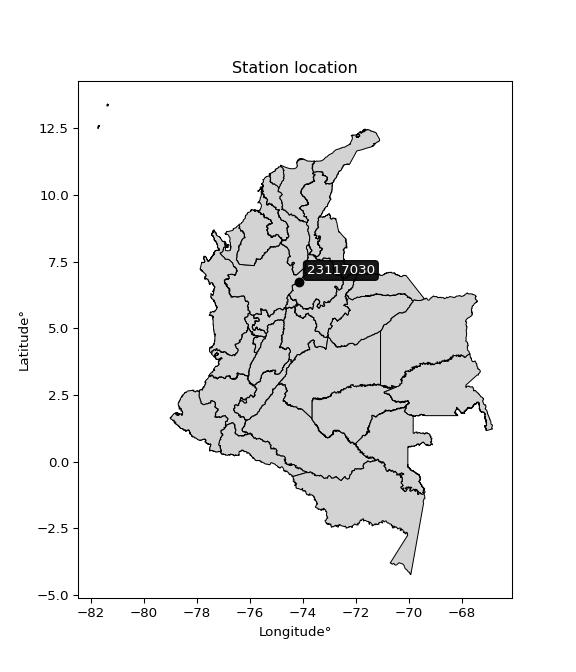

<div align="center">


</div>

# Station (rain, Pmax24h): 23117030

Probable Maximum Precipitation (PMP) is the greatest amount of rainfall for a specific duration that is meteorologically possible for a given location, acting as a "worst-case" scenario for extreme storms, crucial for designing safety-critical infrastructure like bridges, river deviations, dams, spillways, and nuclear plants to prevent catastrophic failure. PMP is calculated by hydrologists using meteorological data to determine the upper limit of extreme rainfall, often leading to the Probable Maximum Flood (PMF) for flood control design, and is increasingly being studied for climate change impacts.

<div align="center">

</img>

</div>


## A. General information


### 1. General running parameters

• app_version: _v20251226_. • runtime: _2025-12-26 15:38:16.554582_. • Python version: _3.14.0_. • SciPy version: _1.16.3_. • Pandas version: _2.3.3_. • NumPy version: _2.3.5_. • Stations dataset (station_dataset_file): _dataset/pmax24h_in/automatic_colombia_2003_2024.csv_. • Stations catalog (station_catalog_file): _dataset/CNE_IDEAM.xls_. • Minimum year to eval til year_max (date_min): _2003_. • Maximum year to eval since year_min (date_max): _2024_. • Creates, save and include plots into reports (create_plot): _False_. • Plot only fit distributions with Δo > Δ (plot_only_fit): _True_. • Eval low extreme values, if False, evaluates high extreme values (low_extreme): _False_. • Eval every SciPy distribution as logarithmic (pdist_logarithmic_on): _True_. • Standard deviation normalized (ddof): _1.0_. • Return periods to eval in years (Tr): _[2, 2.33, 5, 10, 15, 20, 25, 50, 75, 100, 200, 250, 500, 750, 1000]_. • Minimum data sample per station, 0 means any (minimum_sample): _5_. • Z-Score threshold to adjust a value, 0 means disable (zscore): _3.5_. • Avoid zeros, e.g. rain = 0 (avoid_zeros): _True_. • Avoid null values (avoid_nans): _True_. [:file_folder:Dataset file.](../../dataset/pmax24h_in/automatic_colombia_2003_2024.csv)


### 2. Station info and location

|   id |   CODIGO | NOMBRE                     | CATEGORIA    | TECNOLOGIA                | ESTADO     | FECHA_INSTALACION   | FECHA_SUSPENSION   |   ALTITUD |   LATITUD |   LONGITUD | DEPARTAMENTO   | MUNICIPIO   | AREA_OPERATIVA                         | ENTIDAD                                                     | AREA_HIDROGRAFICA   | ZONA_HIDROGRAFICA   | SUBZONA_HIDROGRAFICA                         | CORRIENTE   | OBSERVACION                 |   SUBRED | Catalogo   |
|-----:|---------:|:---------------------------|:-------------|:--------------------------|:-----------|:--------------------|:-------------------|----------:|----------:|-----------:|:---------------|:------------|:---------------------------------------|:------------------------------------------------------------|:--------------------|:--------------------|:---------------------------------------------|:------------|:----------------------------|---------:|:-----------|
|    0 | 23117030 | EL TAGUAL - AUT [23117030] | Limnigráfica | Automática con Telemetría | Suspendida | 19/08/2005          | 13/07/2018         |       105 |   6.73306 |   -74.1598 | Santander      | Cimitarra   | Area Operativa 08 - Santanderes-Arauca | INSTITUTO DE HIDROLOGIA METEOROLOGIA Y ESTUDIOS AMBIENTALES | Magdalena Cauca     | Medio Magdalena     | Directos al Magdalena Medio entre ríos Negro | Tachira     | Código orfeo 20187080001413 |      nan | CNE_IDEAM  |

<div align="center">

Map location in: [:earth_americas:Google](http://maps.google.com/maps?q=6.733055556,-74.15975) [:earth_americas:OSM](https://www.openstreetmap.org/#map=18/6.733055556/-74.15975&layers=P) [:earth_americas:Bing](https://www.bing.com/maps?cp=6.733055556~-74.15975&lvl=18) [:earth_americas:Apple](https://maps.apple.com/frame?center=6.733055556%2C-74.15975&span=0.003%2C0.006)

</div>


<div align="center">

```geojson
{
  "type": "Feature",
  "geometry": {
    "type": "Point", 
    "coordinates": [-74.15975, 6.733055556]
  }, 
  "properties": {
    "Name": "23117030"
  }
}
```

</div>


### 3. Discrete values table and plot

|               |           0 |           1 |           2 |          3 |         4 |          5 |
|:--------------|------------:|------------:|------------:|-----------:|----------:|-----------:|
| Date          | 2009        | 2010        | 2013        | 2018       | 2019      | 2020       |
| Value         |   23.4      |   25.6      |   18.8      |  143       |  124.8    |    2.2     |
| Value_initial |   23.4      |   25.6      |   18.8      |  143       |  124.8    |    2.2     |
| count         |    6        |    6        |    6        |    6       |    6      |    6       |
| mean          |   56.3      |   56.3      |   56.3      |   56.3     |   56.3    |   56.3     |
| std           |   60.9378   |   60.9378   |   60.9378   |   60.9378  |   60.9378 |   60.9378  |
| zscore        |   -0.539894 |   -0.503792 |   -0.615381 |    1.42276 |    1.1241 |   -0.88779 |
> If Z-Score is active, values out of range or outliers are replaced with the station mean value.


### 4. Active continuous probability distributions from SciPy (45 of 104 available)

[scipy.stats](https://docs.scipy.org/doc/scipy/reference/stats.html) is a Python´s powerful submodule within the SciPy library for comprehensive statistical analysis, offering over 130 probability distributions (like Normal, Poisson), functions for descriptive stats (mean, variance), hypothesis testing (t-tests, chi-square), random variable generation, and statistical tests, making it essential for data science, modeling, and research. It provides tools to explore, model, and draw conclusions from data efficiently, working seamlessly with NumPy.

<div align="center">

|   id | p_dist             |   n_parameter | fit_method   | label                                                                       | active   | ref                                                                                                        |
|-----:|:-------------------|--------------:|:-------------|:----------------------------------------------------------------------------|:---------|:-----------------------------------------------------------------------------------------------------------|
|    0 | alpha              |             3 | MLE          | Alpha                                                                       | True     | [:mortar_board:](https://docs.scipy.org/doc/scipy/reference/generated/scipy.stats.alpha.html)              |
|    1 | betaprime          |             4 | MLE          | Beta prime                                                                  | True     | [:mortar_board:](https://docs.scipy.org/doc/scipy/reference/generated/scipy.stats.betaprime.html)          |
|    2 | chi2               |             3 | MLE          | Chi²                                                                        | True     | [:mortar_board:](https://docs.scipy.org/doc/scipy/reference/generated/scipy.stats.chi2.html)               |
|    3 | crystalball        |             4 | MLE          | Crystalball                                                                 | True     | [:mortar_board:](https://docs.scipy.org/doc/scipy/reference/generated/scipy.stats.crystalball.html)        |
|    4 | erlang             |             3 | MLE          | Erlang                                                                      | True     | [:mortar_board:](https://docs.scipy.org/doc/scipy/reference/generated/scipy.stats.erlang.html)             |
|    5 | expon              |             2 | MLE          | Exponential                                                                 | True     | [:mortar_board:](https://docs.scipy.org/doc/scipy/reference/generated/scipy.stats.expon.html)              |
|    6 | exponnorm          |             3 | MLE          | Exponentially modified Normal                                               | True     | [:mortar_board:](https://docs.scipy.org/doc/scipy/reference/generated/scipy.stats.exponnorm.html)          |
|    7 | f                  |             4 | MLE          | F                                                                           | True     | [:mortar_board:](https://docs.scipy.org/doc/scipy/reference/generated/scipy.stats.f.html)                  |
|    8 | fatiguelife        |             3 | MLE          | Fatigue-life (Birnbaum-Saunders)                                            | True     | [:mortar_board:](https://docs.scipy.org/doc/scipy/reference/generated/scipy.stats.fatiguelife.html)        |
|    9 | fisk               |             3 | MLE          | Fisk                                                                        | True     | [:mortar_board:](https://docs.scipy.org/doc/scipy/reference/generated/scipy.stats.fisk.html)               |
|   10 | gamma              |             3 | MLE          | Gamma                                                                       | True     | [:mortar_board:](https://docs.scipy.org/doc/scipy/reference/generated/scipy.stats.gamma.html)              |
|   11 | genexpon           |             5 | MLE          | Generalized exponential                                                     | True     | [:mortar_board:](https://docs.scipy.org/doc/scipy/reference/generated/scipy.stats.genexpon.html)           |
|   12 | genlogistic        |             3 | MLE          | Generalized logistic                                                        | True     | [:mortar_board:](https://docs.scipy.org/doc/scipy/reference/generated/scipy.stats.genlogistic.html)        |
|   13 | gibrat             |             2 | MM           | Gibrat                                                                      | True     | [:mortar_board:](https://docs.scipy.org/doc/scipy/reference/generated/scipy.stats.gibrat.html)             |
|   14 | gompertz           |             3 | MLE          | Gompertz (or truncated Gumbel)                                              | True     | [:mortar_board:](https://docs.scipy.org/doc/scipy/reference/generated/scipy.stats.gompertz.html)           |
|   15 | gumbel_l           |             2 | MM           | Gumbel Left Skew                                                            | True     | [:mortar_board:](https://docs.scipy.org/doc/scipy/reference/generated/scipy.stats.gumbel_l.html)           |
|   16 | gumbel_r           |             2 | MM           | Gumbel Right Skew                                                           | True     | [:mortar_board:](https://docs.scipy.org/doc/scipy/reference/generated/scipy.stats.gumbel_r.html)           |
|   17 | halflogistic       |             2 | MM           | Half-logistic                                                               | True     | [:mortar_board:](https://docs.scipy.org/doc/scipy/reference/generated/scipy.stats.halflogistic.html)       |
|   18 | halfnorm           |             2 | MM           | Half Normal                                                                 | True     | [:mortar_board:](https://docs.scipy.org/doc/scipy/reference/generated/scipy.stats.halfnorm.html)           |
|   19 | hypsecant          |             2 | MM           | hyperbolic secant                                                           | True     | [:mortar_board:](https://docs.scipy.org/doc/scipy/reference/generated/scipy.stats.hypsecant.html)          |
|   20 | invgamma           |             3 | MLE          | Inverted gamma                                                              | True     | [:mortar_board:](https://docs.scipy.org/doc/scipy/reference/generated/scipy.stats.invgamma.html)           |
|   21 | invgauss           |             3 | MLE          | Inverse Gaussian                                                            | True     | [:mortar_board:](https://docs.scipy.org/doc/scipy/reference/generated/scipy.stats.invgauss.html)           |
|   22 | invweibull         |             3 | MLE          | Inverted Weibull                                                            | True     | [:mortar_board:](https://docs.scipy.org/doc/scipy/reference/generated/scipy.stats.invweibull.html)         |
|   23 | johnsonsu          |             4 | MLE          | Johnson Su                                                                  | True     | [:mortar_board:](https://docs.scipy.org/doc/scipy/reference/generated/scipy.stats.johnsonsu.html)          |
|   24 | kstwobign          |             2 | MLE          | Limiting distribution of scaled Kolmogorov-Smirnov two-sided test statistic | True     | [:mortar_board:](https://docs.scipy.org/doc/scipy/reference/generated/scipy.stats.kstwobign.html)          |
|   25 | laplace            |             2 | MM           | Laplace                                                                     | True     | [:mortar_board:](https://docs.scipy.org/doc/scipy/reference/generated/scipy.stats.laplace.html)            |
|   26 | laplace_asymmetric |             3 | MLE          | Asymmetric Laplace                                                          | True     | [:mortar_board:](https://docs.scipy.org/doc/scipy/reference/generated/scipy.stats.laplace_asymmetric.html) |
|   27 | loggamma           |             3 | MLE          | Log gamma                                                                   | True     | [:mortar_board:](https://docs.scipy.org/doc/scipy/reference/generated/scipy.stats.loggamma.html)           |
|   28 | logistic           |             2 | MM           | Logistic (or Sech-squared)                                                  | True     | [:mortar_board:](https://docs.scipy.org/doc/scipy/reference/generated/scipy.stats.logistic.html)           |
|   29 | lognorm            |             3 | MLE          | Log Normal                                                                  | True     | [:mortar_board:](https://docs.scipy.org/doc/scipy/reference/generated/scipy.stats.lognorm.html)            |
|   30 | maxwell            |             2 | MM           | Maxwell                                                                     | True     | [:mortar_board:](https://docs.scipy.org/doc/scipy/reference/generated/scipy.stats.maxwell.html)            |
|   31 | mielke             |             4 | MLE          | Mielke Beta-Kappa / Dagum                                                   | True     | [:mortar_board:](https://docs.scipy.org/doc/scipy/reference/generated/scipy.stats.mielke.html)             |
|   32 | moyal              |             2 | MM           | Moyal                                                                       | True     | [:mortar_board:](https://docs.scipy.org/doc/scipy/reference/generated/scipy.stats.moyal.html)              |
|   33 | nakagami           |             3 | MLE          | Nakagami                                                                    | True     | [:mortar_board:](https://docs.scipy.org/doc/scipy/reference/generated/scipy.stats.nakagami.html)           |
|   34 | ncf                |             5 | MLE          | Non-central F distribution                                                  | True     | [:mortar_board:](https://docs.scipy.org/doc/scipy/reference/generated/scipy.stats.ncf.html)                |
|   35 | nct                |             4 | MLE          | Non-central Student’s t                                                     | True     | [:mortar_board:](https://docs.scipy.org/doc/scipy/reference/generated/scipy.stats.nct.html)                |
|   36 | norm               |             2 | MM           | Normal                                                                      | True     | [:mortar_board:](https://docs.scipy.org/doc/scipy/reference/generated/scipy.stats.norm.html)               |
|   37 | pareto             |             3 | MLE          | Pareto                                                                      | True     | [:mortar_board:](https://docs.scipy.org/doc/scipy/reference/generated/scipy.stats.pareto.html)             |
|   38 | pearson3           |             3 | MM           | Pearson type III                                                            | True     | [:mortar_board:](https://docs.scipy.org/doc/scipy/reference/generated/scipy.stats.pearson3.html)           |
|   39 | rayleigh           |             2 | MM           | Rayleigh                                                                    | True     | [:mortar_board:](https://docs.scipy.org/doc/scipy/reference/generated/scipy.stats.rayleigh.html)           |
|   40 | rice               |             3 | MLE          | Rice                                                                        | True     | [:mortar_board:](https://docs.scipy.org/doc/scipy/reference/generated/scipy.stats.rice.html)               |
|   41 | t                  |             3 | MLE          | Student’s t                                                                 | True     | [:mortar_board:](https://docs.scipy.org/doc/scipy/reference/generated/scipy.stats.t.html)                  |
|   42 | truncnorm          |             4 | MLE          | Truncated normal                                                            | True     | [:mortar_board:](https://docs.scipy.org/doc/scipy/reference/generated/scipy.stats.truncnorm.html)          |
|   43 | wald               |             2 | MM           | Wald                                                                        | True     | [:mortar_board:](https://docs.scipy.org/doc/scipy/reference/generated/scipy.stats.wald.html)               |
|   44 | weibull_min        |             3 | MLE          | Weibull minimum                                                             | True     | [:mortar_board:](https://docs.scipy.org/doc/scipy/reference/generated/scipy.stats.weibull_min.html)        |

</div>

> **n_parameter:** # arguments & localization & scale.
>
> **Fit methods:** (MLE) maximum likelihood, (MM) L-moments.
>
>**Inactive:** foldnorm, gennorm, norminvgauss, powernorm, powerlognorm, skewnorm, genextreme, anglit, arcsine, argus, beta, bradford, burr, burr12, cauchy, cosine, halfcauchy, foldcauchy, skewcauchy, wrapcauchy, dgamma, gengamma, exponweib, exponpow, truncexpon, gausshyper, genhalflogistic, genhyperbolic, geninvgauss, halfgennorm, johnsonsb, kappa4, kappa3, ksone, kstwo, loglaplace, levy, levy_l, levy_stable, ncx2, genpareto, truncpareto, lomax, powerlaw, rdist, rel_breitwigner, recipinvgauss, semicircular, studentized_range, trapezoid, triang, truncweibull_min, tukeylambda, uniform, loguniform, vonmises, vonmises_line, weibull_max, dweibull, 


## B. Probability distributions vs. Empirical distributions

A continuous probability distribution (CPD) describes probabilities for variables that can take any value within a range (like rain any time), unlike discrete variables with specific outcomes (like temperature). It uses a Probability Density Function (PDF), a curve where the total area under it equals 1, and the probability of the variable falling within an interval (a to b) is found by calculating the area under the curve between those points. A key feature is that the probability of hitting any single exact value is zero, so probabilities are always expressed for ranges, e.g., $P(a ≤ X ≤ b)$.

<div align="center">

Distributions parameters
|    |   station | p_dist                |   n |              loc |          scale | shape                  | shape1                | shape2                | shape3   |
|---:|----------:|:----------------------|----:|-----------------:|---------------:|:-----------------------|:----------------------|:----------------------|:---------|
|  0 |  23117030 | alpha                 |   6 |     -0.00908077  |    5.3398      | 1.7277360950547645e-09 |                       |                       |          |
|  1 |  23117030 | betaprime             |   6 |      2.2         |  499.829       | 0.4623114633763574     | 5.860088024968752     |                       |          |
|  2 |  23117030 | chi2                  |   6 |      2.2         |    3.2007      | 0.7030682510362266     |                       |                       |          |
|  3 |  23117030 | crystalball           |   6 |     56.3         |   55.6284      | 1845.65538699036       | 7211.122994896187     |                       |          |
|  4 |  23117030 | erlang                |   6 |      2.2         |   56.8468      | 0.6246166890332985     |                       |                       |          |
|  5 |  23117030 | expon                 |   6 |      2.2         |   54.1         |                        |                       |                       |          |
|  6 |  23117030 | exponnorm             |   6 |      2.13682     |    0.0196321   | 2748.095706924636      |                       |                       |          |
|  7 |  23117030 | f                     |   6 |      2.2         |   36.9073      | 1.0698775023399851     | 4.70552854363957      |                       |          |
|  8 |  23117030 | fatiguelife           |   6 |     -1.03383     |   26.7127      | 1.4707753176602996     |                       |                       |          |
|  9 |  23117030 | fisk                  |   6 |      2.2         |   26.5753      | 0.9188850537513388     |                       |                       |          |
| 10 |  23117030 | gamma                 |   6 |      2.2         |   47.8376      | 0.8966163486192322     |                       |                       |          |
| 11 |  23117030 | genexpon              |   6 |      2.2         |  174.796       | 3.2309776393722327     | 8.704026017452483e-10 | 0.6606704673501964    |          |
| 12 |  23117030 | genlogistic           |   6 |   -256.852       |   38.4429      | 1786.1161457416893     |                       |                       |          |
| 13 |  23117030 | gibrat                |   6 |     13.8626      |   25.7396      |                        |                       |                       |          |
| 14 |  23117030 | gompertz              |   6 |      1.47635     |  350.154       | 5.320632583491527      |                       |                       |          |
| 15 |  23117030 | gumbel_l              |   6 |     81.3357      |   43.3733      |                        |                       |                       |          |
| 16 |  23117030 | gumbel_r              |   6 |     31.2643      |   43.3733      |                        |                       |                       |          |
| 17 |  23117030 | halflogistic          |   6 |     -9.63256     |   47.5603      |                        |                       |                       |          |
| 18 |  23117030 | halfnorm              |   6 |    -17.3302      |   92.2817      |                        |                       |                       |          |
| 19 |  23117030 | hypsecant             |   6 |     56.3         |   35.4141      |                        |                       |                       |          |
| 20 |  23117030 | invgamma              |   6 |     -9.70889     |   48.1487      | 1.5371895898899077     |                       |                       |          |
| 21 |  23117030 | invgauss              |   6 |     -5.13598     |   36.9332      | 1.66343246234756       |                       |                       |          |
| 22 |  23117030 | invweibull            |   6 |      2.2         |    3.31484     | 0.051735245572387914   |                       |                       |          |
| 23 |  23117030 | johnsonsu             |   6 |      8.87037e+08 |    6.66295e+06 | 82545008.80426344      | 14781130.975757986    |                       |          |
| 24 |  23117030 | kstwobign             |   6 |   -103.217       |  183.135       |                        |                       |                       |          |
| 25 |  23117030 | laplace               |   6 |     56.3         |   39.3352      |                        |                       |                       |          |
| 26 |  23117030 | laplace_asymmetric    |   6 |      2.2         |    0.0176647   | 0.00032653179891476797 |                       |                       |          |
| 27 |  23117030 | loggamma              |   6 | -18538.8         | 2464.11        | 1894.460693523024      |                       |                       |          |
| 28 |  23117030 | logistic              |   6 |     56.3         |   30.6695      |                        |                       |                       |          |
| 29 |  23117030 | lognorm               |   6 |      2.2         |    0.0631011   | 14.598025532765895     |                       |                       |          |
| 30 |  23117030 | maxwell               |   6 |    -75.5159      |   82.6034      |                        |                       |                       |          |
| 31 |  23117030 | mielke                |   6 |      2.2         |   40.1174      | 0.7605530417027689     | 1.0741382876646726    |                       |          |
| 32 |  23117030 | moyal                 |   6 |     24.4881      |   25.0416      |                        |                       |                       |          |
| 33 |  23117030 | nakagami              |   6 |      2.2         |  114.071       | 0.19679186322199288    |                       |                       |          |
| 34 |  23117030 | ncf                   |   6 |     -0.083933    |   36.6181      | 1.6773572458771824     | 40.810054762411724    | 0.8365048054422655    |          |
| 35 |  23117030 | nct                   |   6 |    -16.7628      |    2.3813      | 1.403374277077062      | 14.831830875171043    |                       |          |
| 36 |  23117030 | norm                  |   6 |     56.3         |   55.6284      |                        |                       |                       |          |
| 37 |  23117030 | pareto                |   6 |      2.07745     |    0.12255     | 0.20485654175175574    |                       |                       |          |
| 38 |  23117030 | pearson3              |   6 |     56.3         |   55.6284      | 0.6753269421946728     |                       |                       |          |
| 39 |  23117030 | rayleigh              |   6 |    -50.1203      |   84.9111      |                        |                       |                       |          |
| 40 |  23117030 | rice                  |   6 |    -31.4247      |   73.4511      | 0.0005658763298617218  |                       |                       |          |
| 41 |  23117030 | t                     |   6 |     56.3041      |   55.6203      | 1855703.9140937417     |                       |                       |          |
| 42 |  23117030 | truncnorm             |   6 |   -410.586       |  166.632       | 2.4772332897978675     | 140.056025832719      |                       |          |
| 43 |  23117030 | wald                  |   6 |      0.67162     |   55.6284      |                        |                       |                       |          |
| 44 |  23117030 | weibull_min           |   6 |      2.2         |   47.4896      | 0.7031072607956133     |                       |                       |          |
| 45 |  23117030 | logalpha              |   6 |    -26.2283      |  614.339       | 20.82560253359467      |                       |                       |          |
| 46 |  23117030 | logbetaprime          |   6 |    -27.5812      |  225.124       | 539.3028010332246      | 3930.5086855654645    |                       |          |
| 47 |  23117030 | logchi2               |   6 |    -14.2334      |    0.0579816   | 302.5626423078379      |                       |                       |          |
| 48 |  23117030 | logcrystalball        |   6 |      3.31787     |    1.3881      | 837.1529249403579      | 18.059832460984744    |                       |          |
| 49 |  23117030 | logerlang             |   6 |    -18.9549      |    0.0900072   | 247.3137067904679      |                       |                       |          |
| 50 |  23117030 | logexpon              |   6 |      0.788457    |    2.52941     |                        |                       |                       |          |
| 51 |  23117030 | logexponnorm          |   6 |      3.31738     |    1.38812     | 0.0003432216961849763  |                       |                       |          |
| 52 |  23117030 | logf                  |   6 |   -821.859       |  825.181       | 2361900.2893250585     | 998171.964144906      |                       |          |
| 53 |  23117030 | logfatiguelife        |   6 |   -469.887       |  473.201       | 0.0029284022101879453  |                       |                       |          |
| 54 |  23117030 | logfisk               |   6 |     -1.26747e+08 |    1.26747e+08 | 161627217.9059037      |                       |                       |          |
| 55 |  23117030 | loggamma              |   6 |    -19.1278      |    0.0905372   | 247.76554781825922     |                       |                       |          |
| 56 |  23117030 | loggenexpon           |   6 |      0.738615    |    0.0266807   | 0.0037541263641521216  | 5.1978158258640015    | 2.033395911850113e-05 |          |
| 57 |  23117030 | loggenlogistic        |   6 |      4.15625     |    0.590437    | 0.4995914243607079     |                       |                       |          |
| 58 |  23117030 | loggibrat             |   6 |      2.25889     |    0.642297    |                        |                       |                       |          |
| 59 |  23117030 | loggompertz           |   6 |      0.788456    |    1.4558      | 0.13832925410332544    |                       |                       |          |
| 60 |  23117030 | loggumbel_l           |   6 |      3.94258     |    1.08229     |                        |                       |                       |          |
| 61 |  23117030 | loggumbel_r           |   6 |      2.69315     |    1.08229     |                        |                       |                       |          |
| 62 |  23117030 | loghalflogistic       |   6 |      1.6726      |    1.1868      |                        |                       |                       |          |
| 63 |  23117030 | loghalfnorm           |   6 |      1.48063     |    2.30265     |                        |                       |                       |          |
| 64 |  23117030 | loghypsecant          |   6 |      3.31787     |    0.88369     |                        |                       |                       |          |
| 65 |  23117030 | loginvgamma           |   6 |    -18.4081      | 4965.16        | 229.8585584638007      |                       |                       |          |
| 66 |  23117030 | loginvgauss           |   6 |     -9.62438     |  983.644       | 0.013141736919174127   |                       |                       |          |
| 67 |  23117030 | loginvweibull         |   6 |     -1.23034e+08 |    1.23034e+08 | 85316399.58797911      |                       |                       |          |
| 68 |  23117030 | logjohnsonsu          |   6 |      5.18854     |    0.000355701 | 8.261276704252726      | 0.9361002665044422    |                       |          |
| 69 |  23117030 | logkstwobign          |   6 |     -2.51233     |    6.66349     |                        |                       |                       |          |
| 70 |  23117030 | loglaplace            |   6 |      3.31787     |    0.981533    |                        |                       |                       |          |
| 71 |  23117030 | loglaplace_asymmetric |   6 |      3.15274     |    1.01616     | 0.922036816896268      |                       |                       |          |
| 72 |  23117030 | logloggamma           |   6 |      4.96327     |    3.0335e-05  | 1.838038843499994e-05  |                       |                       |          |
| 73 |  23117030 | loglogistic           |   6 |      3.31787     |    0.765298    |                        |                       |                       |          |
| 74 |  23117030 | loglognorm            |   6 |      0.788457    |    0.00534421  | 14.091872010651773     |                       |                       |          |
| 75 |  23117030 | logmaxwell            |   6 |      0.0286599   |    2.0612      |                        |                       |                       |          |
| 76 |  23117030 | logmielke             |   6 |      0.788457    |    4.22502     | 0.4140585495497122     | 11038.070328498798    |                       |          |
| 77 |  23117030 | logmoyal              |   6 |      2.52406     |    0.624863    |                        |                       |                       |          |
| 78 |  23117030 | lognakagami           |   6 |      2.93386     |    0.996914    | 0.056704535066149364   |                       |                       |          |
| 79 |  23117030 | logncf                |   6 |     -0.181815    |    1.52005e-05 | 8.44061924948299e-05   | 33.22910371454243     | 18.68463388483282     |          |
| 80 |  23117030 | lognct                |   6 |     84.9935      |    1.38569     | 503178.65076103667     | -58.94191194702603    |                       |          |
| 81 |  23117030 | lognorm               |   6 |      3.31787     |    1.3881      |                        |                       |                       |          |
| 82 |  23117030 | logpareto             |   6 |      0.780445    |    0.00801273  | 0.20342954524522278    |                       |                       |          |
| 83 |  23117030 | logpearson3           |   6 |      3.31787     |    1.38809     | -0.5208374214164464    |                       |                       |          |
| 84 |  23117030 | lograyleigh           |   6 |      0.662356    |    2.11879     |                        |                       |                       |          |
| 85 |  23117030 | logrice               |   6 |     -0.116223    |    1.51361     | 1.9971229571900075     |                       |                       |          |
| 86 |  23117030 | logt                  |   6 |      3.31787     |    1.38809     | 2552505821.005685      |                       |                       |          |
| 87 |  23117030 | logtruncnorm          |   6 |      0.478691    |    3.01823     | 0.10263151742279839    | 23.14522377875602     |                       |          |
| 88 |  23117030 | logwald               |   6 |      1.92973     |    1.38812     |                        |                       |                       |          |
| 89 |  23117030 | logweibull_min        |   6 |    -40.1046      |   44.0626      | 38.69178751750872      |                       |                       |          |

</div>

> **loc** (Location parameter): This shifts the distribution along the x-axis. For many common distributions, like the normal (Gaussian) distribution, loc represents the mean $μ$. For others, like the uniform distribution, it might represent the minimum value, or for the beta distribution, the left end of the support interval.
>
> **scale** (Scale parameter): This determines the width or spread of the distribution. For the normal distribution, scale represents the standard deviation $σ$. For a uniform distribution, it defines the length of the interval (from $loc$ to $loc + scale$).
>
> **shape** (Shape parameters): Refers to parameters that define the specific form of a probability distribution, distinct from its location (loc) and scale (scale). These parameters are required arguments for most distribution functions. For example, a normal (Gaussian) distribution is fully defined by its location (mean) and scale (standard deviation), so it has no specific shape parameters beyond loc and scale. However, other distributions have intrinsic properties that need specification, as Gamma distribution that takes a shape parameter, often named $a$ or $alpha$.


### 0. Cumulative distribution values - CDF (90 evaluated)

> Ordered by x ascending and calculating $log(f(x))$ separately. 

|   id |   Station |   date |     x |   count |   mean |     std |    zscore |   Value_initial |   station |   m |     alpha |   alpha_pdf |   betaprime |   betaprime_pdf |        chi2 |    chi2_pdf |   crystalball |   crystalball_pdf |     erlang |      erlang_pdf |    expon |   expon_pdf |   exponnorm |   exponnorm_pdf |           f |          f_pdf |   fatiguelife |   fatiguelife_pdf |        fisk |    fisk_pdf |       gamma |   gamma_pdf |    genexpon |   genexpon_pdf |   genlogistic |   genlogistic_pdf |   gibrat |   gibrat_pdf |   gompertz |   gompertz_pdf |   gumbel_l |   gumbel_l_pdf |   gumbel_r |   gumbel_r_pdf |   halflogistic |   halflogistic_pdf |   halfnorm |   halfnorm_pdf |   hypsecant |   hypsecant_pdf |   invgamma |   invgamma_pdf |   invgauss |   invgauss_pdf |   invweibull |   invweibull_pdf |   johnsonsu |   johnsonsu_pdf |   kstwobign |   kstwobign_pdf |   laplace |   laplace_pdf |   laplace_asymmetric |   laplace_asymmetric_pdf |   loggamma |   loggamma_pdf |   logistic |   logistic_pdf |   lognorm |   lognorm_pdf |   maxwell |   maxwell_pdf |      mielke |   mielke_pdf |    moyal |   moyal_pdf |    nakagami |   nakagami_pdf |       ncf |    ncf_pdf |       nct |     nct_pdf |     norm |   norm_pdf |   pareto |   pareto_pdf |   pearson3 |   pearson3_pdf |   rayleigh |   rayleigh_pdf |      rice |   rice_pdf |        t |      t_pdf |   truncnorm |   truncnorm_pdf |        wald |   wald_pdf |   weibull_min |   weibull_min_pdf |   logalpha |   logalpha_pdf |   logbetaprime |   logbetaprime_pdf |   logchi2 |   logchi2_pdf |   logcrystalball |   logcrystalball_pdf |   logerlang |   logerlang_pdf |   logexpon |   logexpon_pdf |   logexponnorm |   logexponnorm_pdf |      logf |   logf_pdf |   logfatiguelife |   logfatiguelife_pdf |   logfisk |   logfisk_pdf |   loggenexpon |   loggenexpon_pdf |   loggenlogistic |   loggenlogistic_pdf |   loggibrat |   loggibrat_pdf |   loggompertz |   loggompertz_pdf |   loggumbel_l |   loggumbel_l_pdf |   loggumbel_r |   loggumbel_r_pdf |   loghalflogistic |   loghalflogistic_pdf |   loghalfnorm |   loghalfnorm_pdf |   loghypsecant |   loghypsecant_pdf |   loginvgamma |   loginvgamma_pdf |   loginvgauss |   loginvgauss_pdf |   loginvweibull |   loginvweibull_pdf |   logjohnsonsu |   logjohnsonsu_pdf |   logkstwobign |   logkstwobign_pdf |   loglaplace |   loglaplace_pdf |   loglaplace_asymmetric |   loglaplace_asymmetric_pdf |   logloggamma |   logloggamma_pdf |   loglogistic |   loglogistic_pdf |   loglognorm |   loglognorm_pdf |   logmaxwell |   logmaxwell_pdf |   logmielke |   logmielke_pdf |    logmoyal |   logmoyal_pdf |   lognakagami |   lognakagami_pdf |    logncf |   logncf_pdf |    lognct |   lognct_pdf |   logpareto |   logpareto_pdf |   logpearson3 |   logpearson3_pdf |   lograyleigh |   lograyleigh_pdf |   logrice |   logrice_pdf |     logt |   logt_pdf |   logtruncnorm |   logtruncnorm_pdf |   logwald |   logwald_pdf |   logweibull_min |   logweibull_min_pdf |
|-----:|----------:|-------:|------:|--------:|-------:|--------:|----------:|----------------:|----------:|----:|----------:|------------:|------------:|----------------:|------------:|------------:|--------------:|------------------:|-----------:|----------------:|---------:|------------:|------------:|----------------:|------------:|---------------:|--------------:|------------------:|------------:|------------:|------------:|------------:|------------:|---------------:|--------------:|------------------:|---------:|-------------:|-----------:|---------------:|-----------:|---------------:|-----------:|---------------:|---------------:|-------------------:|-----------:|---------------:|------------:|----------------:|-----------:|---------------:|-----------:|---------------:|-------------:|-----------------:|------------:|----------------:|------------:|----------------:|----------:|--------------:|---------------------:|-------------------------:|-----------:|---------------:|-----------:|---------------:|----------:|--------------:|----------:|--------------:|------------:|-------------:|---------:|------------:|------------:|---------------:|----------:|-----------:|----------:|------------:|---------:|-----------:|---------:|-------------:|-----------:|---------------:|-----------:|---------------:|----------:|-----------:|---------:|-----------:|------------:|----------------:|------------:|-----------:|--------------:|------------------:|-----------:|---------------:|---------------:|-------------------:|----------:|--------------:|-----------------:|---------------------:|------------:|----------------:|-----------:|---------------:|---------------:|-------------------:|----------:|-----------:|-----------------:|---------------------:|----------:|--------------:|--------------:|------------------:|-----------------:|---------------------:|------------:|----------------:|--------------:|------------------:|--------------:|------------------:|--------------:|------------------:|------------------:|----------------------:|--------------:|------------------:|---------------:|-------------------:|--------------:|------------------:|--------------:|------------------:|----------------:|--------------------:|---------------:|-------------------:|---------------:|-------------------:|-------------:|-----------------:|------------------------:|----------------------------:|--------------:|------------------:|--------------:|------------------:|-------------:|-----------------:|-------------:|-----------------:|------------:|----------------:|------------:|---------------:|--------------:|------------------:|----------:|-------------:|----------:|-------------:|------------:|----------------:|--------------:|------------------:|--------------:|------------------:|----------:|--------------:|---------:|-----------:|---------------:|-------------------:|----------:|--------------:|-----------------:|---------------------:|
|    0 |  23117030 |   2020 |   2.2 |       6 |   56.3 | 60.9378 | -0.88779  |             2.2 |  23117030 |   1 | 0.0156403 | 0.0470196   | 3.77928e-06 | 13643           | 2.34289e-06 | 1.8546e+09  |      0.165395 |        0.00446925 | 2.3013e-11 | 32368           | 0        |  0.0184843  |  0.00117031 |      0.0185017  | 2.40072e-07 | 4995.76        |     0.0429377 |        0.0309138  | 3.83582e-16 | 0.793687    | 5.57204e-16 | 1.125       | 6.13759e-10 |     0.0184842  |      0.120753 |        0.0066364  | 0        |  0           |   0.010947 |     0.0150599  |   0.148958 |     0.0031648  |   0.141646 |     0.00638265 |       0.123758 |         0.010352   |   0.167609 |     0.0084547  |    0.136066 |      0.0037262  |   0.046916 |    0.0142056   |  0.0440781 |     0.0173257  |   0.00132663 |      1.02391e+12 |    0.18367  |      0.00442793 |    0.105178 |      0.00643207 |  0.126375 |    0.00321276 |            1.074e-07 |               0.0184849  |  0.0347955 |      0.0584301 |   0.146294 |     0.0040722  | 0.0342113 |     0.0546337 |  0.170994 |    0.00549231 | 7.94586e-09 |  6.72817     | 0.118636 |  0.00735722 | 1.11061e-07 |    9.84301e+07 | 0.0578969 | 0.0209434  | 0.0500209 | 0.0134908   | 0.165395 | 0.00446925 | 0        |  1.67161     |   0.161241 |     0.00574029 |   0.172906 |     0.006002   | 0.0994798 | 0.00561248 | 0.165341 | 0.00446896 | 1.22549e-08 |      0.0168156  | 4.31839e-09 | 5.2728e-08 |    1.0634e-12 |     1683.63       |  0.0278363 |      0.0538142 |      0.0342818 |          0.0570615 |  0.033419 |     0.0578668 |        0.0342113 |            0.0546337 |   0.0337473 |        0.057407 |   0        |      0.395349  |      0.0342148 |          0.0546373 | 0.0342119 |  0.0546259 |        0.0338206 |            0.0545039 | 0.0344626 |     0.0424321 |    0.00717166 |          0.147043 |        0.0577706 |            0.0487195 |    0        |       0         |   8.65048e-08 |         0.0950196 |     0.0527974 |         0.0474717 |    0.00299249 |         0.0160689 |          0        |             0         |      0        |          0        |      0.0363342 |          0.0410272 |     0.0323941 |         0.0595748 |     0.0331645 |         0.0623966 |       0.0304516 |           0.0737298 |       0.113429 |           0.040892 |       0.033161 |          0.0909761 |    0.0380009 |        0.0387158 |               0.0368457 |                   0.0393257 |     0.0796938 |         0.0482875 |     0.0353956 |         0.0446137 |     0.012686 |      2.09489e+13 |    0.0127913 |        0.0491436 | 0.000714716 |    2773.34      | 6.07208e-05 |    0.000825151 |     0         |       0           | 0.0365349 |    0.0940815 | 0.0342157 |    0.0546282 |    0        |      25.3883    |     0.0466451 |         0.0543761 |    0.00176949 |         0.0280397 | 0.0263449 |     0.0624562 | 0.034211 |  0.0546335 |    5.16633e-08 |           0.286376 |  0        |     0         |         0.054144 |            0.0498169 |
|    1 |  23117030 |   2013 |  18.8 |       6 |   56.3 | 60.9378 | -0.615381 |            18.8 |  23117030 |   2 | 0.776491  | 0.0115672   | 0.48661     |     0.0117501   | 0.986712    | 0.00248458  |      0.250119 |        0.00571393 | 0.463883   |     0.014528    | 0.264231 |  0.0136002  |  0.265715   |      0.0136103  | 0.453063    |    0.0121364   |     0.419492  |        0.0135452  | 0.393551    | 0.0132114   | 0.343802    | 0.0153854   | 0.264231    |     0.0136001  |      0.253351 |        0.00904491 | 0.04935  |  0.0206716   |   0.23651  |     0.0121897  |   0.210615 |     0.00430427 |   0.263706 |     0.00810405 |       0.290315 |         0.00962691 |   0.304587 |     0.00800826 |    0.212538 |      0.0055654  |   0.3489   |    0.0163304   |  0.364469  |     0.0155313  |   0.398506   |      0.00114266  |    0.266031 |      0.00546863 |    0.233598 |      0.00872676 |  0.192725 |    0.00489955 |            0.264239  |               0.0136005  |  0.405135  |      0.274992  |   0.22746  |     0.00572952 | 0.391026  |     0.276612  |  0.271743 |    0.00656181 | 0.405331    |  0.0133836   | 0.262597 |  0.00952906 | 0.369815    |    0.00873778  | 0.310677  | 0.0120778  | 0.349017  | 0.0166787   | 0.250119 | 0.00571393 | 0.634713 |  0.00447488  |   0.268207 |     0.00702871 |   0.280651 |     0.00687634 | 0.208464  | 0.0073687  | 0.250064 | 0.0057141  | 0.246979    |      0.0130731  | 0.193459    | 0.0191962  |    0.379712   |        0.0125472  |  0.404889  |      0.279961  |      0.400012  |          0.27484   |  0.405855 |     0.275784  |        0.391026  |            0.276612  |   0.404183  |        0.276732 |   0.571807 |      0.169286  |      0.391032  |          0.276608  | 0.390059  |  0.275559  |        0.391888  |            0.27748   | 0.355029  |     0.291998  |    0.486464   |          0.239496 |        0.334988  |            0.251695  |    0.519786 |       0.590325  |   0.372194    |         0.260409  |     0.325481  |         0.2454    |    0.449063   |         0.33218   |          0.486425 |             0.321617  |      0.472031 |          0.283937 |      0.365836  |          0.328681  |     0.418719  |         0.278586  |     0.422469  |         0.272339  |       0.454422  |           0.248539  |       0.28008  |           0.139779 |       0.483759 |          0.239267  |    0.338111  |        0.344472  |               0.363775  |                   0.388259  |     0.292398  |         0.177168  |     0.377123  |         0.306941  |     0.664737 |      0.012054    |    0.424806  |        0.284803  | 0.755325    |       0.145776  | 0.47126     |    0.354824    |     0.0159022 |       4.06102e+12 | 0.472764  |    0.232822  | 0.39098   |    0.276597  |    0.679521 |       0.0302751 |     0.360656  |         0.257018  |    0.43711    |         0.284813  | 0.403798  |     0.27463   | 0.391026 |  0.276613  |    0.547007    |           0.206795 |  0.530386 |     0.443068  |         0.331384 |            0.241966  |
|    2 |  23117030 |   2009 |  23.4 |       6 |   56.3 | 60.9378 | -0.539894 |            23.4 |  23117030 |   3 | 0.819562  | 0.00757525  | 0.53576     |     0.00974038  | 0.994298    | 0.00103344  |      0.277118 |        0.00602087 | 0.525144   |     0.0122232   | 0.324206 |  0.0124916  |  0.325728   |      0.0124979  | 0.503854    |    0.0100659   |     0.475819  |        0.0110919  | 0.448273    | 0.0107199   | 0.410412    | 0.0136259   | 0.324205    |     0.0124916  |      0.295764 |        0.0093691  | 0.160402 |  0.0255531   |   0.290917 |     0.0114708  |   0.231229 |     0.00466087 |   0.301558 |     0.00833475 |       0.333953 |         0.00934052 |   0.341053 |     0.00784373 |    0.239459 |      0.00614171 |   0.41891  |    0.0141279   |  0.430417  |     0.0132109  |   0.403143   |      0.000893753 |    0.291774 |      0.0057201  |    0.274475 |      0.00902174 |  0.216634 |    0.00550737 |            0.324215  |               0.0124918  |  0.46601   |      0.280153  |   0.254885 |     0.00619242 | 0.452653  |     0.285376  |  0.302406 |    0.00676237 | 0.461125    |  0.010999    | 0.306798 |  0.00965814 | 0.407011    |    0.00751347  | 0.363626  | 0.0109739  | 0.420654  | 0.0144711   | 0.277118 | 0.00602087 | 0.652453 |  0.00333906  |   0.301074 |     0.00725046 |   0.312606 |     0.00700944 | 0.24313   | 0.00769131 | 0.277065 | 0.00602118 | 0.305019    |      0.0121708  | 0.279194    | 0.017898   |    0.432883   |        0.0106681  |  0.466617  |      0.282918  |      0.460956  |          0.280937  |  0.46684  |     0.28036   |        0.452653  |            0.285376  |   0.465458  |        0.282044 |   0.607303 |      0.155253  |      0.452658  |          0.285371  | 0.451451  |  0.284298  |        0.453685  |            0.28605   | 0.421189  |     0.310878  |    0.537941   |          0.230478 |        0.393387  |            0.281427  |    0.629484 |       0.422599  |   0.430783    |         0.274413  |     0.382459  |         0.275028  |    0.519959   |         0.314199  |          0.553616 |             0.292176  |      0.532262 |          0.266199 |      0.440862  |          0.354007  |     0.480008  |         0.280314  |     0.482214  |         0.272545  |       0.507805  |           0.238624  |       0.313126 |           0.162927 |       0.534931 |          0.227926  |    0.422577  |        0.430527  |               0.459504  |                   0.490431  |     0.333866  |         0.202294  |     0.446265  |         0.322897  |     0.667246 |      0.0109058   |    0.486945  |        0.28196   | 0.786327    |       0.13771   | 0.545388    |    0.321555    |     0.737366  |       0.381068    | 0.522615  |    0.222272  | 0.452604  |    0.28537   |    0.685771 |       0.0269459 |     0.418989  |         0.275281  |    0.498803   |         0.278034  | 0.464587  |     0.279786  | 0.452653 |  0.285377  |    0.590923    |           0.194437 |  0.616086 |     0.344743  |         0.387277 |            0.26846   |
|    3 |  23117030 |   2010 |  25.6 |       6 |   56.3 | 60.9378 | -0.503792 |            25.6 |  23117030 |   4 | 0.834829  | 0.00635676  | 0.556347    |     0.00899395  | 0.996164    | 0.000687424 |      0.290516 |        0.00615854 | 0.551034   |     0.0113314   | 0.351136 |  0.0119938  |  0.35267    |      0.0119985  | 0.525124    |    0.00928897  |     0.499197  |        0.0101843  | 0.470802    | 0.00978367  | 0.439559    | 0.0128813   | 0.351135    |     0.0119938  |      0.316492 |        0.00946843 | 0.216154 |  0.0249713   |   0.315786 |     0.0111383  |   0.241675 |     0.00483675 |   0.319978 |     0.00840646 |       0.354341 |         0.00919299 |   0.358217 |     0.00775943 |    0.253278 |      0.00642074 |   0.448892 |    0.0131384   |  0.458403  |     0.0122459  |   0.405013   |      0.000809337 |    0.304482 |      0.00583229 |    0.294428 |      0.00911278 |  0.229095 |    0.00582417 |            0.351146  |               0.011994   |  0.491201  |      0.280352  |   0.268746 |     0.00640772 | 0.478377  |     0.28698   |  0.317373 |    0.00684228 | 0.484297    |  0.0100874   | 0.328053 |  0.00965807 | 0.423036    |    0.00706631  | 0.387245  | 0.0105036  | 0.451363  | 0.0134545   | 0.290516 | 0.00615854 | 0.659374 |  0.00296649  |   0.317119 |     0.00733411 |   0.328081 |     0.00705667 | 0.260195  | 0.00781957 | 0.290464 | 0.00615891 | 0.331339    |      0.0117584  | 0.317618    | 0.0170189  |    0.455541   |        0.00994599 |  0.492013  |      0.282127  |      0.486234  |          0.281507  |  0.492038 |     0.280311  |        0.478377  |            0.28698   |   0.49082   |        0.282267 |   0.621008 |      0.149834  |      0.478381  |          0.286974  | 0.477078  |  0.285914  |        0.479465  |            0.287556  | 0.449347  |     0.315527  |    0.558458   |          0.226124 |        0.419177  |            0.292449  |    0.665047 |       0.370328  |   0.455658    |         0.279129  |     0.407697  |         0.286623  |    0.54777    |         0.304633  |          0.579319 |             0.279908  |      0.55584  |          0.258564 |      0.472919  |          0.358903  |     0.505149  |         0.279091  |     0.506636  |         0.270869  |       0.529024  |           0.233578  |       0.328249 |           0.173839 |       0.555177 |          0.222657  |    0.463088  |        0.471801  |               0.501823  |                   0.452031  |     0.352547  |         0.213613  |     0.47543   |         0.325881  |     0.668207 |      0.0104944   |    0.512158  |        0.279067  | 0.798566    |       0.134733  | 0.573616    |    0.306665    |     0.766587  |       0.280148    | 0.542366  |    0.217277  | 0.478328  |    0.286979  |    0.688138 |       0.0257669 |     0.444006  |         0.281394  |    0.523603   |         0.273812  | 0.489748  |     0.280081  | 0.478377 |  0.286981  |    0.608163    |           0.189291 |  0.645562 |     0.311976  |         0.411862 |            0.278653  |
|    4 |  23117030 |   2019 | 124.8 |       6 |   56.3 | 60.9378 |  1.1241   |           124.8 |  23117030 |   5 | 0.965874  | 0.000273259 | 0.894431    |     0.00123171  | 1           | 4.37218e-11 |      0.890911 |        0.00336009 | 0.94658    |     0.00106272  | 0.896292 |  0.00191697 |  0.89706    |      0.00190803 | 0.868561    |    0.00124955  |     0.877467  |        0.00144301 | 0.802964    | 0.0011858   | 0.936679    | 0.00136461  | 0.896291    |     0.00191698 |      0.916529 |        0.00207799 | 0.927983 |  0.00123699  |   0.894213 |     0.00228611 |   0.934388 |     0.00412068 |   0.890719 |     0.00237657 |       0.88819  |         0.00221949 |   0.876483 |     0.0026407  |    0.908621 |      0.002545   |   0.877896 |    0.00120652  |  0.884907  |     0.0013718  |   0.436216   |      0.000152713 |    0.873152 |      0.00346542 |    0.909948 |      0.00244827 |  0.912366 |    0.00222787 |            0.8963    |               0.00191689 |  0.856829  |      0.151779  |   0.903217 |     0.00285027 | 0.861479  |     0.159192  |  0.882443 |    0.0030018  | 0.829917    |  0.00119179  | 0.892657 |  0.00213031 | 0.784349    |    0.00207915  | 0.878816  | 0.00192632 | 0.879777  | 0.00116102  | 0.890911 | 0.00336009 | 0.757168 |  0.000405351 |   0.885396 |     0.00276108 |   0.880194 |     0.00290663 | 0.895847  | 0.00301595 | 0.89093  | 0.00336014 | 0.900788    |      0.00207302 | 0.907899    | 0.00153176 |    0.857451   |        0.00159257 |  0.851599  |      0.147465  |      0.856132  |          0.154191  |  0.855734 |     0.150688  |        0.861479  |            0.159192  |   0.85825   |        0.151739 |   0.7974   |      0.0800978 |      0.861477  |          0.159191  | 0.859585  |  0.159753  |        0.86213   |            0.158447  | 0.860176  |     0.153372  |    0.837099   |          0.121644 |        0.870076  |            0.179     |    0.917091 |       0.0594768 |   0.874804    |         0.19059   |     0.896012  |         0.217478  |    0.869992   |         0.111952  |          0.868963 |             0.103178  |      0.853816 |          0.120553 |      0.885803  |          0.126473  |     0.857714  |         0.143316  |     0.848865  |         0.141893  |       0.808748  |           0.119043  |       0.870778 |           0.545022 |       0.823357 |          0.116544  |    0.892513  |        0.10951   |               0.881659  |                   0.107379  |     0.920598  |         0.557802  |     0.877781  |         0.140183  |     0.680933 |      0.00627648  |    0.856411  |        0.13966   | 0.981454    |       0.100632  | 0.874128    |    0.0998799   |     0.932078  |       0.0459992   | 0.804393  |    0.114083  | 0.86147   |    0.159221  |    0.718114 |       0.0141721 |     0.868979  |         0.191531  |    0.855066   |         0.134444  | 0.857614  |     0.153939  | 0.86148  |  0.159192  |    0.836971    |           0.101996 |  0.89458  |     0.0718242 |         0.880976 |            0.218155  |
|    5 |  23117030 |   2018 | 143   |       6 |   56.3 | 60.9378 |  1.42276  |           143   |  23117030 |   6 | 0.970215  | 0.000208178 | 0.914177    |     0.000952908 | 1           | 2.32788e-12 |      0.940449 |        0.00212883 | 0.962721   |     0.000732503 | 0.925918 |  0.00136935 |  0.926536   |      0.00136169 | 0.888716    |    0.000979814 |     0.900777  |        0.00113375 | 0.822315    | 0.000953559 | 0.957195    | 0.000919529 | 0.925918    |     0.00136935 |      0.947158 |        0.00133758 | 0.946611 |  0.000841393 |   0.929351 |     0.0016082  |   0.984144 |     0.001515   |   0.926754 |     0.00162532 |       0.922361 |         0.00156906 |   0.917683 |     0.00191141 |    0.9451   |      0.00154256 |   0.897007 |    0.000912493 |  0.906768  |     0.00104908 |   0.438806   |      0.000132808 |    0.925727 |      0.00234127 |    0.946173 |      0.00158054 |  0.944827 |    0.00140264 |            0.925925  |               0.00136927 |  0.876454  |      0.13662   |   0.944113 |     0.0017204  | 0.882003  |     0.142408  |  0.928037 |    0.00204328 | 0.849238    |  0.000945428 | 0.925247 |  0.00148821 | 0.819374    |    0.00177806  | 0.909147  | 0.00143177 | 0.898149  | 0.000876478 | 0.940449 | 0.00212883 | 0.763951 |  0.00034314  |   0.927256 |     0.00187863 |   0.92471  |     0.00201668 | 0.940371  | 0.00192784 | 0.940467 | 0.00212863 | 0.93255     |      0.0014508  | 0.93149     | 0.00109009 |    0.883188   |        0.0012525  |  0.870689  |      0.133091  |      0.876065  |          0.138728  |  0.875225 |     0.13575   |        0.882003  |            0.142408  |   0.877858  |        0.136408 |   0.808016 |      0.0759009 |      0.882     |          0.142408  | 0.880195  |  0.143099  |        0.882554  |            0.141687  | 0.87978   |     0.134874  |    0.853046   |          0.112696 |        0.892691  |            0.153523  |    0.924701 |       0.0525104 |   0.89925     |         0.168409  |     0.923224  |         0.182089  |    0.884431   |         0.100358  |          0.882328 |             0.0933171 |      0.869533 |          0.110436 |      0.901829  |          0.10934   |     0.876255  |         0.129172  |     0.867281  |         0.12876   |       0.824361  |           0.110411  |       0.942012 |           0.481023 |       0.838669 |          0.10847   |    0.906433  |        0.0953277 |               0.89541   |                   0.0949018 |     0.999752  |         0.605762  |     0.895618  |         0.122156  |     0.681773 |      0.00606507  |    0.874513  |        0.126374  | 0.99502     |       0.0986963 | 0.887027    |    0.089792    |     0.93806   |       0.0419546   | 0.819392  |    0.106341  | 0.881997  |    0.142434  |    0.720005 |       0.0136188 |     0.893562  |         0.169533  |    0.872523   |         0.122116  | 0.877519  |     0.138571  | 0.882004 |  0.142408  |    0.85041     |           0.095482 |  0.90385  |     0.0645254 |         0.90862  |            0.187716  |

An Empirical Distribution Function (EDF) is a step-function estimate of a true cumulative distribution function (CDF) based on observed sample data, representing the proportion of data points less than or equal to a given value. It is calculated by ordering your data and jumping up by $1/n$ (where $n$ is sample size) at each unique data point, allowing analysis without assuming an underlying population distribution, and it gets closer to the true CDF as the sample size grows.


### 1. Empirical - EDF California (1923)

California´s estimates the true probability distribution of water-related data (like rainfall, streamflow) using observed samples, crucial for risk assessment.

<div align="center">


$P=m/n$


</div>


**1.1. Empirical values**

<div align="center">

|                | 0                   | 1                  | 2              | 3                  | 4                  | 5              |
|:---------------|:--------------------|:-------------------|:---------------|:-------------------|:-------------------|:---------------|
| date           | 2020                | 2013               | 2009           | 2010               | 2019               | 2018           |
| x              | 2.2                 | 18.8               | 23.4           | 25.6               | 124.8              | 143.0          |
| m              | 1                   | 2                  | 3              | 4                  | 5                  | 6              |
| empirical_dist | edf_california      | edf_california     | edf_california | edf_california     | edf_california     | edf_california |
| empirical      | 0.16666666666666666 | 0.3333333333333333 | 0.5            | 0.6666666666666666 | 0.8333333333333334 | 1.0            |
| empirical_tr   | 1.2                 | 1.4999999999999998 | 2.0            | 2.9999999999999996 | 6.000000000000002  | inf            |

</div>


**1.2. Kolmogorov-Smirnov fit test (sorted by Δ)**


<div align="center">

|                | 0                  | 1                   | 2                  | 3                  | 4                   | 5                   | 6                     | 7                  | 8                   | 9                 | 10                  | 11                  | 12                  | 13                  | 14                  | 15                  | 16                 | 17                  | 18                  | 19                 | 20                  | 21                  | 22                 | 23                 | 24                 | 25                  | 26                  | 27                  | 28                 | 29                  | 30                  | 31                  | 32                  | 33                  | 34                  | 35                  | 36                  | 37                  | 38                  | 39                 | 40                 | 41                 | 42                  | 43                 | 44                  | 45                 | 46                  | 47                  | 48                  | 49                 | 50                  | 51                  | 52                  | 53                  | 54                 | 55                  | 56                  | 57                  | 58                  | 59                 | 60                | 61                | 62                 | 63                 | 64                 | 65                  | 66                  | 67                  | 68                 | 69                  | 70                  | 71                 | 72                  | 73                  | 74                  | 75                 | 76                  | 77                 | 78                  | 79                 | 80                 | 81                  | 82                  | 83                  | 84                  | 85                 | 86                | 87                  | 88                | 89                 |
|:---------------|:-------------------|:--------------------|:-------------------|:-------------------|:--------------------|:--------------------|:----------------------|:-------------------|:--------------------|:------------------|:--------------------|:--------------------|:--------------------|:--------------------|:--------------------|:--------------------|:-------------------|:--------------------|:--------------------|:-------------------|:--------------------|:--------------------|:-------------------|:-------------------|:-------------------|:--------------------|:--------------------|:--------------------|:-------------------|:--------------------|:--------------------|:--------------------|:--------------------|:--------------------|:--------------------|:--------------------|:--------------------|:--------------------|:--------------------|:-------------------|:-------------------|:-------------------|:--------------------|:-------------------|:--------------------|:-------------------|:--------------------|:--------------------|:--------------------|:-------------------|:--------------------|:--------------------|:--------------------|:--------------------|:-------------------|:--------------------|:--------------------|:--------------------|:--------------------|:-------------------|:------------------|:------------------|:-------------------|:-------------------|:-------------------|:--------------------|:--------------------|:--------------------|:-------------------|:--------------------|:--------------------|:-------------------|:--------------------|:--------------------|:--------------------|:-------------------|:--------------------|:-------------------|:--------------------|:-------------------|:-------------------|:--------------------|:--------------------|:--------------------|:--------------------|:-------------------|:------------------|:--------------------|:------------------|:-------------------|
| station        | 23117030           | 23117030            | 23117030           | 23117030           | 23117030            | 23117030            | 23117030              | 23117030           | 23117030            | 23117030          | 23117030            | 23117030            | 23117030            | 23117030            | 23117030            | 23117030            | 23117030           | 23117030            | 23117030            | 23117030           | 23117030            | 23117030            | 23117030           | 23117030           | 23117030           | 23117030            | 23117030            | 23117030            | 23117030           | 23117030            | 23117030            | 23117030            | 23117030            | 23117030            | 23117030            | 23117030            | 23117030            | 23117030            | 23117030            | 23117030           | 23117030           | 23117030           | 23117030            | 23117030           | 23117030            | 23117030           | 23117030            | 23117030            | 23117030            | 23117030           | 23117030            | 23117030            | 23117030            | 23117030            | 23117030           | 23117030            | 23117030            | 23117030            | 23117030            | 23117030           | 23117030          | 23117030          | 23117030           | 23117030           | 23117030           | 23117030            | 23117030            | 23117030            | 23117030           | 23117030            | 23117030            | 23117030           | 23117030            | 23117030            | 23117030            | 23117030           | 23117030            | 23117030           | 23117030            | 23117030           | 23117030           | 23117030            | 23117030            | 23117030            | 23117030            | 23117030           | 23117030          | 23117030            | 23117030          | 23117030           |
| empirical_dist | edf_california     | edf_california      | edf_california     | edf_california     | edf_california      | edf_california      | edf_california        | edf_california     | edf_california      | edf_california    | edf_california      | edf_california      | edf_california      | edf_california      | edf_california      | edf_california      | edf_california     | edf_california      | edf_california      | edf_california     | edf_california      | edf_california      | edf_california     | edf_california     | edf_california     | edf_california      | edf_california      | edf_california      | edf_california     | edf_california      | edf_california      | edf_california      | edf_california      | edf_california      | edf_california      | edf_california      | edf_california      | edf_california      | edf_california      | edf_california     | edf_california     | edf_california     | edf_california      | edf_california     | edf_california      | edf_california     | edf_california      | edf_california      | edf_california      | edf_california     | edf_california      | edf_california      | edf_california      | edf_california      | edf_california     | edf_california      | edf_california      | edf_california      | edf_california      | edf_california     | edf_california    | edf_california    | edf_california     | edf_california     | edf_california     | edf_california      | edf_california      | edf_california      | edf_california     | edf_california      | edf_california      | edf_california     | edf_california      | edf_california      | edf_california      | edf_california     | edf_california      | edf_california     | edf_california      | edf_california     | edf_california     | edf_california      | edf_california      | edf_california      | edf_california      | edf_california     | edf_california    | edf_california      | edf_california    | edf_california     |
| p_dist         | logmaxwell         | loggenexpon         | loginvgauss        | logkstwobign       | loginvgamma         | loggumbel_r         | loglaplace_asymmetric | lograyleigh        | logmoyal            | betaprime         | f                   | erlang              | loghalfnorm         | loghalflogistic     | fatiguelife         | logchi2             | logalpha           | loggamma            | loggamma            | loginvweibull      | logerlang           | logrice             | logbetaprime       | logncf             | mielke             | loggibrat           | logfatiguelife      | logexponnorm        | logcrystalball     | logt                | lognorm             | lognorm             | lognct              | logf                | loglogistic         | loghypsecant        | fisk                | logwald             | loglaplace          | invgauss           | loggompertz        | weibull_min        | logtruncnorm        | nct                | logfisk             | invgamma           | logpearson3         | gamma               | logexpon            | nakagami           | loggenlogistic      | logweibull_min      | loggumbel_l         | ncf                 | pareto             | halfnorm            | halflogistic        | exponnorm           | logloggamma         | laplace_asymmetric | expon             | genexpon          | lognakagami        | loglognorm         | truncnorm          | logjohnsonsu        | rayleigh            | moyal               | logpareto          | gumbel_r            | wald                | maxwell            | pearson3            | genlogistic         | gompertz            | johnsonsu          | kstwobign           | norm               | crystalball         | t                  | logistic           | rice                | hypsecant           | logmielke           | gumbel_l            | laplace            | alpha             | gibrat              | invweibull        | chi2               |
| delta          | 0.1545089202947113 | 0.15949501020031284 | 0.1600310380111185 | 0.1613311533378834 | 0.16151781698417378 | 0.16367417486987323 | 0.16484317722451347   | 0.1648971811614264 | 0.16660594583612143 | 0.166662887383179 | 0.16666642659475966 | 0.16666666664365368 | 0.16666666666666666 | 0.16666666666666666 | 0.16746917681150192 | 0.17462823977502662 | 0.1746541462452978 | 0.17546597435410044 | 0.17546597435410044 | 0.1756386100890558 | 0.17584666829861084 | 0.17691833071216612 | 0.1804321959606826 | 0.1806081225722147 | 0.1823693868076211 | 0.18645304253044032 | 0.18720196276162948 | 0.18828565198506125 | 0.1882900239446174 | 0.18829002763658564 | 0.18829006722056202 | 0.18829006722056202 | 0.18833870327172736 | 0.18958856208549751 | 0.19123671772265216 | 0.19374813317973366 | 0.19586458148908958 | 0.19705258306845902 | 0.20357845018845128 | 0.2082633682625628 | 0.2110088651437142 | 0.2111254908405582 | 0.21367358701230948 | 0.2153034138895321 | 0.21731982555450596 | 0.2177742259581621 | 0.22266034748534025 | 0.22710737766005284 | 0.23847400606954633 | 0.2436303263691615 | 0.24748970371508183 | 0.25480474260827424 | 0.25896984011673907 | 0.27942172081027933 | 0.3013801010183223 | 0.30844939945239147 | 0.31232607635312937 | 0.31399655852032005 | 0.31411968392725614 | 0.3155204595210448 | 0.315530530334815 | 0.315531224205921 | 0.3174311255308275 | 0.3314040605135437 | 0.3353280205150477 | 0.33841738422196765 | 0.33858552317914514 | 0.33861408222017053 | 0.3461879820041888 | 0.34668914518357763 | 0.34904912694537893 | 0.3492938495303616 | 0.34954720888192203 | 0.35017439464493194 | 0.35088087054909334 | 0.3621844850775161 | 0.37223819125019897 | 0.3761502082696197 | 0.37615021577366753 | 0.3762028728319461 | 0.3979205119355236 | 0.40647125100206377 | 0.41338904399285675 | 0.42199171027240306 | 0.42499130534751917 | 0.4375716682981232 | 0.443157860634489 | 0.45051289813606965 | 0.561193867297296 | 0.6533791308462735 |
| deltao         | 0.530385761606     | 0.530385761606      | 0.530385761606     | 0.530385761606     | 0.530385761606      | 0.530385761606      | 0.530385761606        | 0.530385761606     | 0.530385761606      | 0.530385761606    | 0.530385761606      | 0.530385761606      | 0.530385761606      | 0.530385761606      | 0.530385761606      | 0.530385761606      | 0.530385761606     | 0.530385761606      | 0.530385761606      | 0.530385761606     | 0.530385761606      | 0.530385761606      | 0.530385761606     | 0.530385761606     | 0.530385761606     | 0.530385761606      | 0.530385761606      | 0.530385761606      | 0.530385761606     | 0.530385761606      | 0.530385761606      | 0.530385761606      | 0.530385761606      | 0.530385761606      | 0.530385761606      | 0.530385761606      | 0.530385761606      | 0.530385761606      | 0.530385761606      | 0.530385761606     | 0.530385761606     | 0.530385761606     | 0.530385761606      | 0.530385761606     | 0.530385761606      | 0.530385761606     | 0.530385761606      | 0.530385761606      | 0.530385761606      | 0.530385761606     | 0.530385761606      | 0.530385761606      | 0.530385761606      | 0.530385761606      | 0.530385761606     | 0.530385761606      | 0.530385761606      | 0.530385761606      | 0.530385761606      | 0.530385761606     | 0.530385761606    | 0.530385761606    | 0.530385761606     | 0.530385761606     | 0.530385761606     | 0.530385761606      | 0.530385761606      | 0.530385761606      | 0.530385761606     | 0.530385761606      | 0.530385761606      | 0.530385761606     | 0.530385761606      | 0.530385761606      | 0.530385761606      | 0.530385761606     | 0.530385761606      | 0.530385761606     | 0.530385761606      | 0.530385761606     | 0.530385761606     | 0.530385761606      | 0.530385761606      | 0.530385761606      | 0.530385761606      | 0.530385761606     | 0.530385761606    | 0.530385761606      | 0.530385761606    | 0.530385761606     |
| eval           | Δo > Δ             | Δo > Δ              | Δo > Δ             | Δo > Δ             | Δo > Δ              | Δo > Δ              | Δo > Δ                | Δo > Δ             | Δo > Δ              | Δo > Δ            | Δo > Δ              | Δo > Δ              | Δo > Δ              | Δo > Δ              | Δo > Δ              | Δo > Δ              | Δo > Δ             | Δo > Δ              | Δo > Δ              | Δo > Δ             | Δo > Δ              | Δo > Δ              | Δo > Δ             | Δo > Δ             | Δo > Δ             | Δo > Δ              | Δo > Δ              | Δo > Δ              | Δo > Δ             | Δo > Δ              | Δo > Δ              | Δo > Δ              | Δo > Δ              | Δo > Δ              | Δo > Δ              | Δo > Δ              | Δo > Δ              | Δo > Δ              | Δo > Δ              | Δo > Δ             | Δo > Δ             | Δo > Δ             | Δo > Δ              | Δo > Δ             | Δo > Δ              | Δo > Δ             | Δo > Δ              | Δo > Δ              | Δo > Δ              | Δo > Δ             | Δo > Δ              | Δo > Δ              | Δo > Δ              | Δo > Δ              | Δo > Δ             | Δo > Δ              | Δo > Δ              | Δo > Δ              | Δo > Δ              | Δo > Δ             | Δo > Δ            | Δo > Δ            | Δo > Δ             | Δo > Δ             | Δo > Δ             | Δo > Δ              | Δo > Δ              | Δo > Δ              | Δo > Δ             | Δo > Δ              | Δo > Δ              | Δo > Δ             | Δo > Δ              | Δo > Δ              | Δo > Δ              | Δo > Δ             | Δo > Δ              | Δo > Δ             | Δo > Δ              | Δo > Δ             | Δo > Δ             | Δo > Δ              | Δo > Δ              | Δo > Δ              | Δo > Δ              | Δo > Δ             | Δo > Δ            | Δo > Δ              | Δo <= Δ           | Δo <= Δ            |
| fit            | 1                  | 1                   | 1                  | 1                  | 1                   | 1                   | 1                     | 1                  | 1                   | 1                 | 1                   | 1                   | 1                   | 1                   | 1                   | 1                   | 1                  | 1                   | 1                   | 1                  | 1                   | 1                   | 1                  | 1                  | 1                  | 1                   | 1                   | 1                   | 1                  | 1                   | 1                   | 1                   | 1                   | 1                   | 1                   | 1                   | 1                   | 1                   | 1                   | 1                  | 1                  | 1                  | 1                   | 1                  | 1                   | 1                  | 1                   | 1                   | 1                   | 1                  | 1                   | 1                   | 1                   | 1                   | 1                  | 1                   | 1                   | 1                   | 1                   | 1                  | 1                 | 1                 | 1                  | 1                  | 1                  | 1                   | 1                   | 1                   | 1                  | 1                   | 1                   | 1                  | 1                   | 1                   | 1                   | 1                  | 1                   | 1                  | 1                   | 1                  | 1                  | 1                   | 1                   | 1                   | 1                   | 1                  | 1                 | 1                   | 0                 | 0                  |
| n              | 6                  | 6                   | 6                  | 6                  | 6                   | 6                   | 6                     | 6                  | 6                   | 6                 | 6                   | 6                   | 6                   | 6                   | 6                   | 6                   | 6                  | 6                   | 6                   | 6                  | 6                   | 6                   | 6                  | 6                  | 6                  | 6                   | 6                   | 6                   | 6                  | 6                   | 6                   | 6                   | 6                   | 6                   | 6                   | 6                   | 6                   | 6                   | 6                   | 6                  | 6                  | 6                  | 6                   | 6                  | 6                   | 6                  | 6                   | 6                   | 6                   | 6                  | 6                   | 6                   | 6                   | 6                   | 6                  | 6                   | 6                   | 6                   | 6                   | 6                  | 6                 | 6                 | 6                  | 6                  | 6                  | 6                   | 6                   | 6                   | 6                  | 6                   | 6                   | 6                  | 6                   | 6                   | 6                   | 6                  | 6                   | 6                  | 6                   | 6                  | 6                  | 6                   | 6                   | 6                   | 6                   | 6                  | 6                 | 6                   | 6                 | 6                  |
| best_fit       | 1                  | 0                   | 0                  | 0                  | 0                   | 0                   | 0                     | 0                  | 0                   | 0                 | 0                   | 0                   | 0                   | 0                   | 0                   | 0                   | 0                  | 0                   | 0                   | 0                  | 0                   | 0                   | 0                  | 0                  | 0                  | 0                   | 0                   | 0                   | 0                  | 0                   | 0                   | 0                   | 0                   | 0                   | 0                   | 0                   | 0                   | 0                   | 0                   | 0                  | 0                  | 0                  | 0                   | 0                  | 0                   | 0                  | 0                   | 0                   | 0                   | 0                  | 0                   | 0                   | 0                   | 0                   | 0                  | 0                   | 0                   | 0                   | 0                   | 0                  | 0                 | 0                 | 0                  | 0                  | 0                  | 0                   | 0                   | 0                   | 0                  | 0                   | 0                   | 0                  | 0                   | 0                   | 0                   | 0                  | 0                   | 0                  | 0                   | 0                  | 0                  | 0                   | 0                   | 0                   | 0                   | 0                  | 0                 | 0                   | 0                 | 0                  |
| best_fit_sort  | 1                  | 2                   | 3                  | 4                  | 5                   | 6                   | 7                     | 8                  | 9                   | 10                | 11                  | 12                  | 13                  | 14                  | 15                  | 16                  | 17                 | 18                  | 19                  | 20                 | 21                  | 22                  | 23                 | 24                 | 25                 | 26                  | 27                  | 28                  | 29                 | 30                  | 31                  | 32                  | 33                  | 34                  | 35                  | 36                  | 37                  | 38                  | 39                  | 40                 | 41                 | 42                 | 43                  | 44                 | 45                  | 46                 | 47                  | 48                  | 49                  | 50                 | 51                  | 52                  | 53                  | 54                  | 55                 | 56                  | 57                  | 58                  | 59                  | 60                 | 61                | 62                | 63                 | 64                 | 65                 | 66                  | 67                  | 68                  | 69                 | 70                  | 71                  | 72                 | 73                  | 74                  | 75                  | 76                 | 77                  | 78                 | 79                  | 80                 | 81                 | 82                  | 83                  | 84                  | 85                  | 86                 | 87                | 88                  | 89                | 90                 |

</div>


**1.3. Best fit**

<div align="center">

|   id |   station | empirical_dist   | p_dist     |    delta |   deltao | eval   |   fit |   n |   best_fit |   best_fit_sort |
|-----:|----------:|:-----------------|:-----------|---------:|---------:|:-------|------:|----:|-----------:|----------------:|
|    0 |  23117030 | edf_california   | logmaxwell | 0.154509 | 0.530386 | Δo > Δ |     1 |   6 |          1 |               1 |

</div>


### 2. Empirical - EDF Hazen (1930)

Hazen method for plotting positions is a formula used to estimate the empirical cumulative probability distribution of flood events or other hydrological data. This formula often results in biased estimations, particularly when extrapolating to extreme events (high return periods).

<div align="center">


$P=(m-0.5)/n$


</div>


**2.1. Empirical values**

<div align="center">

|                | 0                   | 1                  | 2                  | 3                  | 4         | 5                  |
|:---------------|:--------------------|:-------------------|:-------------------|:-------------------|:----------|:-------------------|
| date           | 2020                | 2013               | 2009               | 2010               | 2019      | 2018               |
| x              | 2.2                 | 18.8               | 23.4               | 25.6               | 124.8     | 143.0              |
| m              | 1                   | 2                  | 3                  | 4                  | 5         | 6                  |
| empirical_dist | edf_hazen           | edf_hazen          | edf_hazen          | edf_hazen          | edf_hazen | edf_hazen          |
| empirical      | 0.08333333333333333 | 0.25               | 0.4166666666666667 | 0.5833333333333334 | 0.75      | 0.9166666666666666 |
| empirical_tr   | 1.090909090909091   | 1.3333333333333333 | 1.7142857142857144 | 2.4000000000000004 | 4.0       | 11.999999999999995 |

</div>


**2.2. Kolmogorov-Smirnov fit test (sorted by Δ)**


<div align="center">

|                | 0                   | 1                   | 2                   | 3                     | 4                   | 5                  | 6                   | 7                   | 8                  | 9                 | 10                  | 11                  | 12                  | 13                 | 14                 | 15                 | 16                  | 17                  | 18                  | 19                 | 20                  | 21                  | 22                 | 23                  | 24                  | 25                  | 26                 | 27                  | 28                  | 29                  | 30                  | 31                  | 32                  | 33                  | 34                  | 35                 | 36                 | 37                 | 38                  | 39                  | 40                 | 41                 | 42                  | 43                 | 44                  | 45                  | 46                 | 47                 | 48                 | 49                  | 50                  | 51                  | 52                  | 53                | 54                 | 55                 | 56                  | 57                 | 58                 | 59                 | 60                  | 61                  | 62                  | 63                 | 64                 | 65                 | 66                 | 67                  | 68                  | 69                  | 70                 | 71                  | 72                  | 73                  | 74                 | 75                 | 76                  | 77                  | 78                 | 79                 | 80                 | 81                  | 82                 | 83                 | 84                | 85                  | 86                 | 87                 | 88                 | 89                 |
|:---------------|:--------------------|:--------------------|:--------------------|:----------------------|:--------------------|:-------------------|:--------------------|:--------------------|:-------------------|:------------------|:--------------------|:--------------------|:--------------------|:-------------------|:-------------------|:-------------------|:--------------------|:--------------------|:--------------------|:-------------------|:--------------------|:--------------------|:-------------------|:--------------------|:--------------------|:--------------------|:-------------------|:--------------------|:--------------------|:--------------------|:--------------------|:--------------------|:--------------------|:--------------------|:--------------------|:-------------------|:-------------------|:-------------------|:--------------------|:--------------------|:-------------------|:-------------------|:--------------------|:-------------------|:--------------------|:--------------------|:-------------------|:-------------------|:-------------------|:--------------------|:--------------------|:--------------------|:--------------------|:------------------|:-------------------|:-------------------|:--------------------|:-------------------|:-------------------|:-------------------|:--------------------|:--------------------|:--------------------|:-------------------|:-------------------|:-------------------|:-------------------|:--------------------|:--------------------|:--------------------|:-------------------|:--------------------|:--------------------|:--------------------|:-------------------|:-------------------|:--------------------|:--------------------|:-------------------|:-------------------|:-------------------|:--------------------|:-------------------|:-------------------|:------------------|:--------------------|:-------------------|:-------------------|:-------------------|:-------------------|
| station        | 23117030            | 23117030            | 23117030            | 23117030              | 23117030            | 23117030           | 23117030            | 23117030            | 23117030           | 23117030          | 23117030            | 23117030            | 23117030            | 23117030           | 23117030           | 23117030           | 23117030            | 23117030            | 23117030            | 23117030           | 23117030            | 23117030            | 23117030           | 23117030            | 23117030            | 23117030            | 23117030           | 23117030            | 23117030            | 23117030            | 23117030            | 23117030            | 23117030            | 23117030            | 23117030            | 23117030           | 23117030           | 23117030           | 23117030            | 23117030            | 23117030           | 23117030           | 23117030            | 23117030           | 23117030            | 23117030            | 23117030           | 23117030           | 23117030           | 23117030            | 23117030            | 23117030            | 23117030            | 23117030          | 23117030           | 23117030           | 23117030            | 23117030           | 23117030           | 23117030           | 23117030            | 23117030            | 23117030            | 23117030           | 23117030           | 23117030           | 23117030           | 23117030            | 23117030            | 23117030            | 23117030           | 23117030            | 23117030            | 23117030            | 23117030           | 23117030           | 23117030            | 23117030            | 23117030           | 23117030           | 23117030           | 23117030            | 23117030           | 23117030           | 23117030          | 23117030            | 23117030           | 23117030           | 23117030           | 23117030           |
| empirical_dist | edf_hazen           | edf_hazen           | edf_hazen           | edf_hazen             | edf_hazen           | edf_hazen          | edf_hazen           | edf_hazen           | edf_hazen          | edf_hazen         | edf_hazen           | edf_hazen           | edf_hazen           | edf_hazen          | edf_hazen          | edf_hazen          | edf_hazen           | edf_hazen           | edf_hazen           | edf_hazen          | edf_hazen           | edf_hazen           | edf_hazen          | edf_hazen           | edf_hazen           | edf_hazen           | edf_hazen          | edf_hazen           | edf_hazen           | edf_hazen           | edf_hazen           | edf_hazen           | edf_hazen           | edf_hazen           | edf_hazen           | edf_hazen          | edf_hazen          | edf_hazen          | edf_hazen           | edf_hazen           | edf_hazen          | edf_hazen          | edf_hazen           | edf_hazen          | edf_hazen           | edf_hazen           | edf_hazen          | edf_hazen          | edf_hazen          | edf_hazen           | edf_hazen           | edf_hazen           | edf_hazen           | edf_hazen         | edf_hazen          | edf_hazen          | edf_hazen           | edf_hazen          | edf_hazen          | edf_hazen          | edf_hazen           | edf_hazen           | edf_hazen           | edf_hazen          | edf_hazen          | edf_hazen          | edf_hazen          | edf_hazen           | edf_hazen           | edf_hazen           | edf_hazen          | edf_hazen           | edf_hazen           | edf_hazen           | edf_hazen          | edf_hazen          | edf_hazen           | edf_hazen           | edf_hazen          | edf_hazen          | edf_hazen          | edf_hazen           | edf_hazen          | edf_hazen          | edf_hazen         | edf_hazen           | edf_hazen          | edf_hazen          | edf_hazen          | edf_hazen          |
| p_dist         | loggompertz         | loglogistic         | weibull_min         | loglaplace_asymmetric | nct                 | logfisk            | invgamma            | invgauss            | loghypsecant       | logpearson3       | logf                | lognct              | logt                | lognorm            | lognorm            | logcrystalball     | logexponnorm        | logfatiguelife      | loglaplace          | fisk               | logbetaprime        | logrice             | logerlang          | logalpha            | loggamma            | loggamma            | mielke             | logchi2             | nakagami            | loggenlogistic      | loginvgamma         | fatiguelife         | logweibull_min      | loginvgauss         | logmaxwell          | loggumbel_l        | gamma              | lograyleigh        | ncf                 | loggumbel_r         | f                  | loginvweibull      | erlang              | logmoyal           | loghalfnorm         | logncf              | halfnorm           | halflogistic       | exponnorm          | logloggamma         | laplace_asymmetric  | expon               | genexpon            | logkstwobign      | loghalflogistic    | loggenexpon        | betaprime           | truncnorm          | logjohnsonsu       | rayleigh           | moyal               | gumbel_r            | wald                | maxwell            | pearson3           | genlogistic        | gompertz           | loggibrat           | johnsonsu           | logwald             | kstwobign          | norm                | crystalball         | t                   | logtruncnorm       | logistic           | lognakagami         | logexpon            | rice               | hypsecant          | gumbel_l           | laplace             | gibrat             | pareto             | loglognorm        | logpareto           | invweibull         | logmielke          | alpha              | chi2               |
| delta          | 0.12767553181038094 | 0.12778068942948406 | 0.12971204240074774 | 0.13165916504473585   | 0.13197008055619885 | 0.1339864922211727 | 0.13444089262482883 | 0.13490739490601178 | 0.1358027314143364 | 0.139327014152007 | 0.14005888274560113 | 0.14098043984982334 | 0.14102627860112427 | 0.1410264401002892 | 0.1410264401002892 | 0.1410264678418438 | 0.14103240613609425 | 0.14188832775376914 | 0.14251259287800977 | 0.1435513389132712 | 0.15001191699387711 | 0.15379793351888765 | 0.1541830871488573 | 0.15488887571818238 | 0.15513480671819158 | 0.15513480671819158 | 0.1553308351320417 | 0.15585486239216378 | 0.16029699303582823 | 0.16415637038174857 | 0.16871871061332766 | 0.16949165301117108 | 0.17147140927494098 | 0.17246853685786567 | 0.17480600538081253 | 0.1756365067834058 | 0.1866785088041184 | 0.1871102060890555 | 0.19608838747694607 | 0.19906344646034185 | 0.2030627052308826 | 0.2044222834652285 | 0.21388324924028151 | 0.2212599792313098 | 0.22203120277712846 | 0.22276362963807972 | 0.2251160661190582 | 0.2289927430197961 | 0.2306632251869868 | 0.23078635059392288 | 0.23218712618771153 | 0.23219719700148173 | 0.23219789087258774 | 0.233758621993994 | 0.2364250941853408 | 0.2364639071631558 | 0.23660980941584253 | 0.2519946871817144 | 0.2550840508886344 | 0.2552521898458119 | 0.25528074888683727 | 0.26335581185024437 | 0.26571579361204567 | 0.2659605161970283 | 0.2662138755485888 | 0.2668410613115987 | 0.2675475372157601 | 0.26978637586377363 | 0.27885115174418285 | 0.28038591640179233 | 0.2889048579168657 | 0.29281687493628644 | 0.29281688244033427 | 0.29286953949861283 | 0.2970069203456428 | 0.3145871786021903 | 0.32069928868319547 | 0.32180733940287964 | 0.3231379176687305 | 0.3300557106595235 | 0.3416579720141859 | 0.35423833496478996 | 0.3671795648027364 | 0.3847134343516556 | 0.414737393846877 | 0.42952131533752214 | 0.4778605339639627 | 0.5053250436057364 | 0.5264911939678223 | 0.7367124641796068 |
| deltao         | 0.530385761606      | 0.530385761606      | 0.530385761606      | 0.530385761606        | 0.530385761606      | 0.530385761606     | 0.530385761606      | 0.530385761606      | 0.530385761606     | 0.530385761606    | 0.530385761606      | 0.530385761606      | 0.530385761606      | 0.530385761606     | 0.530385761606     | 0.530385761606     | 0.530385761606      | 0.530385761606      | 0.530385761606      | 0.530385761606     | 0.530385761606      | 0.530385761606      | 0.530385761606     | 0.530385761606      | 0.530385761606      | 0.530385761606      | 0.530385761606     | 0.530385761606      | 0.530385761606      | 0.530385761606      | 0.530385761606      | 0.530385761606      | 0.530385761606      | 0.530385761606      | 0.530385761606      | 0.530385761606     | 0.530385761606     | 0.530385761606     | 0.530385761606      | 0.530385761606      | 0.530385761606     | 0.530385761606     | 0.530385761606      | 0.530385761606     | 0.530385761606      | 0.530385761606      | 0.530385761606     | 0.530385761606     | 0.530385761606     | 0.530385761606      | 0.530385761606      | 0.530385761606      | 0.530385761606      | 0.530385761606    | 0.530385761606     | 0.530385761606     | 0.530385761606      | 0.530385761606     | 0.530385761606     | 0.530385761606     | 0.530385761606      | 0.530385761606      | 0.530385761606      | 0.530385761606     | 0.530385761606     | 0.530385761606     | 0.530385761606     | 0.530385761606      | 0.530385761606      | 0.530385761606      | 0.530385761606     | 0.530385761606      | 0.530385761606      | 0.530385761606      | 0.530385761606     | 0.530385761606     | 0.530385761606      | 0.530385761606      | 0.530385761606     | 0.530385761606     | 0.530385761606     | 0.530385761606      | 0.530385761606     | 0.530385761606     | 0.530385761606    | 0.530385761606      | 0.530385761606     | 0.530385761606     | 0.530385761606     | 0.530385761606     |
| eval           | Δo > Δ              | Δo > Δ              | Δo > Δ              | Δo > Δ                | Δo > Δ              | Δo > Δ             | Δo > Δ              | Δo > Δ              | Δo > Δ             | Δo > Δ            | Δo > Δ              | Δo > Δ              | Δo > Δ              | Δo > Δ             | Δo > Δ             | Δo > Δ             | Δo > Δ              | Δo > Δ              | Δo > Δ              | Δo > Δ             | Δo > Δ              | Δo > Δ              | Δo > Δ             | Δo > Δ              | Δo > Δ              | Δo > Δ              | Δo > Δ             | Δo > Δ              | Δo > Δ              | Δo > Δ              | Δo > Δ              | Δo > Δ              | Δo > Δ              | Δo > Δ              | Δo > Δ              | Δo > Δ             | Δo > Δ             | Δo > Δ             | Δo > Δ              | Δo > Δ              | Δo > Δ             | Δo > Δ             | Δo > Δ              | Δo > Δ             | Δo > Δ              | Δo > Δ              | Δo > Δ             | Δo > Δ             | Δo > Δ             | Δo > Δ              | Δo > Δ              | Δo > Δ              | Δo > Δ              | Δo > Δ            | Δo > Δ             | Δo > Δ             | Δo > Δ              | Δo > Δ             | Δo > Δ             | Δo > Δ             | Δo > Δ              | Δo > Δ              | Δo > Δ              | Δo > Δ             | Δo > Δ             | Δo > Δ             | Δo > Δ             | Δo > Δ              | Δo > Δ              | Δo > Δ              | Δo > Δ             | Δo > Δ              | Δo > Δ              | Δo > Δ              | Δo > Δ             | Δo > Δ             | Δo > Δ              | Δo > Δ              | Δo > Δ             | Δo > Δ             | Δo > Δ             | Δo > Δ              | Δo > Δ             | Δo > Δ             | Δo > Δ            | Δo > Δ              | Δo > Δ             | Δo > Δ             | Δo > Δ             | Δo <= Δ            |
| fit            | 1                   | 1                   | 1                   | 1                     | 1                   | 1                  | 1                   | 1                   | 1                  | 1                 | 1                   | 1                   | 1                   | 1                  | 1                  | 1                  | 1                   | 1                   | 1                   | 1                  | 1                   | 1                   | 1                  | 1                   | 1                   | 1                   | 1                  | 1                   | 1                   | 1                   | 1                   | 1                   | 1                   | 1                   | 1                   | 1                  | 1                  | 1                  | 1                   | 1                   | 1                  | 1                  | 1                   | 1                  | 1                   | 1                   | 1                  | 1                  | 1                  | 1                   | 1                   | 1                   | 1                   | 1                 | 1                  | 1                  | 1                   | 1                  | 1                  | 1                  | 1                   | 1                   | 1                   | 1                  | 1                  | 1                  | 1                  | 1                   | 1                   | 1                   | 1                  | 1                   | 1                   | 1                   | 1                  | 1                  | 1                   | 1                   | 1                  | 1                  | 1                  | 1                   | 1                  | 1                  | 1                 | 1                   | 1                  | 1                  | 1                  | 0                  |
| n              | 6                   | 6                   | 6                   | 6                     | 6                   | 6                  | 6                   | 6                   | 6                  | 6                 | 6                   | 6                   | 6                   | 6                  | 6                  | 6                  | 6                   | 6                   | 6                   | 6                  | 6                   | 6                   | 6                  | 6                   | 6                   | 6                   | 6                  | 6                   | 6                   | 6                   | 6                   | 6                   | 6                   | 6                   | 6                   | 6                  | 6                  | 6                  | 6                   | 6                   | 6                  | 6                  | 6                   | 6                  | 6                   | 6                   | 6                  | 6                  | 6                  | 6                   | 6                   | 6                   | 6                   | 6                 | 6                  | 6                  | 6                   | 6                  | 6                  | 6                  | 6                   | 6                   | 6                   | 6                  | 6                  | 6                  | 6                  | 6                   | 6                   | 6                   | 6                  | 6                   | 6                   | 6                   | 6                  | 6                  | 6                   | 6                   | 6                  | 6                  | 6                  | 6                   | 6                  | 6                  | 6                 | 6                   | 6                  | 6                  | 6                  | 6                  |
| best_fit       | 1                   | 0                   | 0                   | 0                     | 0                   | 0                  | 0                   | 0                   | 0                  | 0                 | 0                   | 0                   | 0                   | 0                  | 0                  | 0                  | 0                   | 0                   | 0                   | 0                  | 0                   | 0                   | 0                  | 0                   | 0                   | 0                   | 0                  | 0                   | 0                   | 0                   | 0                   | 0                   | 0                   | 0                   | 0                   | 0                  | 0                  | 0                  | 0                   | 0                   | 0                  | 0                  | 0                   | 0                  | 0                   | 0                   | 0                  | 0                  | 0                  | 0                   | 0                   | 0                   | 0                   | 0                 | 0                  | 0                  | 0                   | 0                  | 0                  | 0                  | 0                   | 0                   | 0                   | 0                  | 0                  | 0                  | 0                  | 0                   | 0                   | 0                   | 0                  | 0                   | 0                   | 0                   | 0                  | 0                  | 0                   | 0                   | 0                  | 0                  | 0                  | 0                   | 0                  | 0                  | 0                 | 0                   | 0                  | 0                  | 0                  | 0                  |
| best_fit_sort  | 1                   | 2                   | 3                   | 4                     | 5                   | 6                  | 7                   | 8                   | 9                  | 10                | 11                  | 12                  | 13                  | 14                 | 15                 | 16                 | 17                  | 18                  | 19                  | 20                 | 21                  | 22                  | 23                 | 24                  | 25                  | 26                  | 27                 | 28                  | 29                  | 30                  | 31                  | 32                  | 33                  | 34                  | 35                  | 36                 | 37                 | 38                 | 39                  | 40                  | 41                 | 42                 | 43                  | 44                 | 45                  | 46                  | 47                 | 48                 | 49                 | 50                  | 51                  | 52                  | 53                  | 54                | 55                 | 56                 | 57                  | 58                 | 59                 | 60                 | 61                  | 62                  | 63                  | 64                 | 65                 | 66                 | 67                 | 68                  | 69                  | 70                  | 71                 | 72                  | 73                  | 74                  | 75                 | 76                 | 77                  | 78                  | 79                 | 80                 | 81                 | 82                  | 83                 | 84                 | 85                | 86                  | 87                 | 88                 | 89                 | 90                 |

</div>


**2.3. Best fit**

<div align="center">

|   id |   station | empirical_dist   | p_dist      |    delta |   deltao | eval   |   fit |   n |   best_fit |   best_fit_sort |
|-----:|----------:|:-----------------|:------------|---------:|---------:|:-------|------:|----:|-----------:|----------------:|
|    0 |  23117030 | edf_hazen        | loggompertz | 0.127676 | 0.530386 | Δo > Δ |     1 |   6 |          1 |               1 |

</div>


### 3. Empirical - EDF Weibull (1939)

Weibull plotting position formula is an empirical method used to estimate the non-exceedance probability or plotting position for a set of observed data, is often recommended or widely used in practice, particularly in flood frequency analysis.

<div align="center">


$P=m/(n+1)$


</div>


**3.1. Empirical values**

<div align="center">

|                | 0                   | 1                  | 2                   | 3                  | 4                  | 5                  |
|:---------------|:--------------------|:-------------------|:--------------------|:-------------------|:-------------------|:-------------------|
| date           | 2020                | 2013               | 2009                | 2010               | 2019               | 2018               |
| x              | 2.2                 | 18.8               | 23.4                | 25.6               | 124.8              | 143.0              |
| m              | 1                   | 2                  | 3                   | 4                  | 5                  | 6                  |
| empirical_dist | edf_weibull         | edf_weibull        | edf_weibull         | edf_weibull        | edf_weibull        | edf_weibull        |
| empirical      | 0.14285714285714285 | 0.2857142857142857 | 0.42857142857142855 | 0.5714285714285714 | 0.7142857142857143 | 0.8571428571428571 |
| empirical_tr   | 1.1666666666666665  | 1.4                | 1.75                | 2.333333333333333  | 3.5                | 6.999999999999997  |

</div>


**3.2. Kolmogorov-Smirnov fit test (sorted by Δ)**


<div align="center">

|                | 0                   | 1                  | 2                   | 3                   | 4                   | 5               | 6               | 7                   | 8                   | 9                   | 10                  | 11                 | 12                  | 13                 | 14                  | 15                  | 16                  | 17                  | 18                  | 19                  | 20                  | 21                 | 22                  | 23                 | 24                  | 25                  | 26                  | 27                  | 28                  | 29                  | 30                  | 31                  | 32                  | 33                 | 34                    | 35                 | 36                  | 37                 | 38                  | 39                  | 40                 | 41                 | 42                  | 43                  | 44                 | 45                 | 46                 | 47                  | 48                  | 49                  | 50                 | 51                 | 52                  | 53                  | 54                  | 55                 | 56                  | 57                  | 58                  | 59                  | 60                 | 61                 | 62                  | 63                 | 64                 | 65                  | 66                 | 67                 | 68                 | 69                 | 70                 | 71                  | 72                  | 73                 | 74                  | 75                  | 76                  | 77                 | 78                  | 79                 | 80                  | 81                | 82                 | 83                 | 84                 | 85                  | 86                 | 87                 | 88                 | 89                 |
|:---------------|:--------------------|:-------------------|:--------------------|:--------------------|:--------------------|:----------------|:----------------|:--------------------|:--------------------|:--------------------|:--------------------|:-------------------|:--------------------|:-------------------|:--------------------|:--------------------|:--------------------|:--------------------|:--------------------|:--------------------|:--------------------|:-------------------|:--------------------|:-------------------|:--------------------|:--------------------|:--------------------|:--------------------|:--------------------|:--------------------|:--------------------|:--------------------|:--------------------|:-------------------|:----------------------|:-------------------|:--------------------|:-------------------|:--------------------|:--------------------|:-------------------|:-------------------|:--------------------|:--------------------|:-------------------|:-------------------|:-------------------|:--------------------|:--------------------|:--------------------|:-------------------|:-------------------|:--------------------|:--------------------|:--------------------|:-------------------|:--------------------|:--------------------|:--------------------|:--------------------|:-------------------|:-------------------|:--------------------|:-------------------|:-------------------|:--------------------|:-------------------|:-------------------|:-------------------|:-------------------|:-------------------|:--------------------|:--------------------|:-------------------|:--------------------|:--------------------|:--------------------|:-------------------|:--------------------|:-------------------|:--------------------|:------------------|:-------------------|:-------------------|:-------------------|:--------------------|:-------------------|:-------------------|:-------------------|:-------------------|
| station        | 23117030            | 23117030           | 23117030            | 23117030            | 23117030            | 23117030        | 23117030        | 23117030            | 23117030            | 23117030            | 23117030            | 23117030           | 23117030            | 23117030           | 23117030            | 23117030            | 23117030            | 23117030            | 23117030            | 23117030            | 23117030            | 23117030           | 23117030            | 23117030           | 23117030            | 23117030            | 23117030            | 23117030            | 23117030            | 23117030            | 23117030            | 23117030            | 23117030            | 23117030           | 23117030              | 23117030           | 23117030            | 23117030           | 23117030            | 23117030            | 23117030           | 23117030           | 23117030            | 23117030            | 23117030           | 23117030           | 23117030           | 23117030            | 23117030            | 23117030            | 23117030           | 23117030           | 23117030            | 23117030            | 23117030            | 23117030           | 23117030            | 23117030            | 23117030            | 23117030            | 23117030           | 23117030           | 23117030            | 23117030           | 23117030           | 23117030            | 23117030           | 23117030           | 23117030           | 23117030           | 23117030           | 23117030            | 23117030            | 23117030           | 23117030            | 23117030            | 23117030            | 23117030           | 23117030            | 23117030           | 23117030            | 23117030          | 23117030           | 23117030           | 23117030           | 23117030            | 23117030           | 23117030           | 23117030           | 23117030           |
| empirical_dist | edf_weibull         | edf_weibull        | edf_weibull         | edf_weibull         | edf_weibull         | edf_weibull     | edf_weibull     | edf_weibull         | edf_weibull         | edf_weibull         | edf_weibull         | edf_weibull        | edf_weibull         | edf_weibull        | edf_weibull         | edf_weibull         | edf_weibull         | edf_weibull         | edf_weibull         | edf_weibull         | edf_weibull         | edf_weibull        | edf_weibull         | edf_weibull        | edf_weibull         | edf_weibull         | edf_weibull         | edf_weibull         | edf_weibull         | edf_weibull         | edf_weibull         | edf_weibull         | edf_weibull         | edf_weibull        | edf_weibull           | edf_weibull        | edf_weibull         | edf_weibull        | edf_weibull         | edf_weibull         | edf_weibull        | edf_weibull        | edf_weibull         | edf_weibull         | edf_weibull        | edf_weibull        | edf_weibull        | edf_weibull         | edf_weibull         | edf_weibull         | edf_weibull        | edf_weibull        | edf_weibull         | edf_weibull         | edf_weibull         | edf_weibull        | edf_weibull         | edf_weibull         | edf_weibull         | edf_weibull         | edf_weibull        | edf_weibull        | edf_weibull         | edf_weibull        | edf_weibull        | edf_weibull         | edf_weibull        | edf_weibull        | edf_weibull        | edf_weibull        | edf_weibull        | edf_weibull         | edf_weibull         | edf_weibull        | edf_weibull         | edf_weibull         | edf_weibull         | edf_weibull        | edf_weibull         | edf_weibull        | edf_weibull         | edf_weibull       | edf_weibull        | edf_weibull        | edf_weibull        | edf_weibull         | edf_weibull        | edf_weibull        | edf_weibull        | edf_weibull        |
| p_dist         | loginvgauss         | logalpha           | logchi2             | logbetaprime        | logmaxwell          | loggamma        | loggamma        | mielke              | fisk                | weibull_min         | logrice             | loginvgamma        | logerlang           | logf               | logfisk             | lognct              | logexponnorm        | lognorm             | lognorm             | logcrystalball      | logt                | logfatiguelife     | nakagami            | lograyleigh        | logpearson3         | loggenlogistic      | loggompertz         | fatiguelife         | loggumbel_r         | loglogistic         | invgamma            | nct                 | logweibull_min      | f                  | loglaplace_asymmetric | loginvweibull      | invgauss            | loghypsecant       | loglaplace          | loggumbel_l         | ncf                | logmoyal           | loghalfnorm         | logncf              | logkstwobign       | loghalflogistic    | loggenexpon        | betaprime           | halfnorm            | halflogistic        | exponnorm          | logloggamma        | laplace_asymmetric  | expon               | genexpon            | gamma              | erlang              | loggibrat           | truncnorm           | logjohnsonsu        | rayleigh           | moyal              | logwald             | gumbel_r           | wald               | maxwell             | pearson3           | genlogistic        | gompertz           | logtruncnorm       | johnsonsu          | kstwobign           | norm                | crystalball        | t                   | logexpon            | logistic            | lognakagami        | rice                | hypsecant          | gumbel_l            | laplace           | pareto             | gibrat             | loglognorm         | logpareto           | invweibull         | logmielke          | alpha              | chi2               |
| delta          | 0.13675425114357997 | 0.1373132773153617 | 0.14144816725077447 | 0.14184660332418464 | 0.14212569673261954 | 0.1425433140447 | 0.1425433140447 | 0.14285713491127952 | 0.14285714285714246 | 0.14316521026617723 | 0.14332809902346277 | 0.1434284995220444 | 0.14396453493734418 | 0.1452995071685944 | 0.14589006805107008 | 0.14718381649869505 | 0.14719082003968587 | 0.14719342123460488 | 0.14719342123460488 | 0.14719348649544872 | 0.14719403272492437 | 0.1478440142502121 | 0.14839223113106625 | 0.1513959203747698 | 0.15469331587418889 | 0.15579055480791515 | 0.16051804930253588 | 0.16318112310746946 | 0.16334916074605615 | 0.16349497514376976 | 0.16361060247013048 | 0.16549138873479696 | 0.16668985335561748 | 0.1673484195165969 | 0.16737345075902155   | 0.1687079977509428 | 0.17062168062029748 | 0.1715170171286221 | 0.17822687859229547 | 0.18172590290850654 | 0.1841836255721841 | 0.1855456935170241 | 0.18631691706284276 | 0.18704934392379402 | 0.1980443362797083 | 0.2007108084710551 | 0.2007496214488701 | 0.20089552370155683 | 0.21321130421429624 | 0.21708798111503413 | 0.2187584632822248 | 0.2188815886891609 | 0.22028236428294956 | 0.22029243509671975 | 0.22029312896782577 | 0.2223927945184041 | 0.23229413228939266 | 0.23407209014948793 | 0.24008992527695244 | 0.24317928898387242 | 0.2433474279410499 | 0.2433759869820753 | 0.24467163068750664 | 0.2514510499454824 | 0.2538110317072837 | 0.25405575429226634 | 0.2543091136438268 | 0.2549362994068367 | 0.2556427753109981 | 0.2612926346313571 | 0.2669463898394209 | 0.27700009601210374 | 0.28091211303152447 | 0.2809121205355723 | 0.28096477759385086 | 0.28609305368859395 | 0.30268241669742835 | 0.3087945267784336 | 0.31123315576396854 | 0.3181509487547615 | 0.32975321010942393 | 0.342333573060028 | 0.3489991486373699 | 0.3552748028979744 | 0.3790231081325913 | 0.39380702962323644 | 0.4183367244401532 | 0.4696107578914507 | 0.4907769082535366 | 0.7009981784653211 |
| deltao         | 0.530385761606      | 0.530385761606     | 0.530385761606      | 0.530385761606      | 0.530385761606      | 0.530385761606  | 0.530385761606  | 0.530385761606      | 0.530385761606      | 0.530385761606      | 0.530385761606      | 0.530385761606     | 0.530385761606      | 0.530385761606     | 0.530385761606      | 0.530385761606      | 0.530385761606      | 0.530385761606      | 0.530385761606      | 0.530385761606      | 0.530385761606      | 0.530385761606     | 0.530385761606      | 0.530385761606     | 0.530385761606      | 0.530385761606      | 0.530385761606      | 0.530385761606      | 0.530385761606      | 0.530385761606      | 0.530385761606      | 0.530385761606      | 0.530385761606      | 0.530385761606     | 0.530385761606        | 0.530385761606     | 0.530385761606      | 0.530385761606     | 0.530385761606      | 0.530385761606      | 0.530385761606     | 0.530385761606     | 0.530385761606      | 0.530385761606      | 0.530385761606     | 0.530385761606     | 0.530385761606     | 0.530385761606      | 0.530385761606      | 0.530385761606      | 0.530385761606     | 0.530385761606     | 0.530385761606      | 0.530385761606      | 0.530385761606      | 0.530385761606     | 0.530385761606      | 0.530385761606      | 0.530385761606      | 0.530385761606      | 0.530385761606     | 0.530385761606     | 0.530385761606      | 0.530385761606     | 0.530385761606     | 0.530385761606      | 0.530385761606     | 0.530385761606     | 0.530385761606     | 0.530385761606     | 0.530385761606     | 0.530385761606      | 0.530385761606      | 0.530385761606     | 0.530385761606      | 0.530385761606      | 0.530385761606      | 0.530385761606     | 0.530385761606      | 0.530385761606     | 0.530385761606      | 0.530385761606    | 0.530385761606     | 0.530385761606     | 0.530385761606     | 0.530385761606      | 0.530385761606     | 0.530385761606     | 0.530385761606     | 0.530385761606     |
| eval           | Δo > Δ              | Δo > Δ             | Δo > Δ              | Δo > Δ              | Δo > Δ              | Δo > Δ          | Δo > Δ          | Δo > Δ              | Δo > Δ              | Δo > Δ              | Δo > Δ              | Δo > Δ             | Δo > Δ              | Δo > Δ             | Δo > Δ              | Δo > Δ              | Δo > Δ              | Δo > Δ              | Δo > Δ              | Δo > Δ              | Δo > Δ              | Δo > Δ             | Δo > Δ              | Δo > Δ             | Δo > Δ              | Δo > Δ              | Δo > Δ              | Δo > Δ              | Δo > Δ              | Δo > Δ              | Δo > Δ              | Δo > Δ              | Δo > Δ              | Δo > Δ             | Δo > Δ                | Δo > Δ             | Δo > Δ              | Δo > Δ             | Δo > Δ              | Δo > Δ              | Δo > Δ             | Δo > Δ             | Δo > Δ              | Δo > Δ              | Δo > Δ             | Δo > Δ             | Δo > Δ             | Δo > Δ              | Δo > Δ              | Δo > Δ              | Δo > Δ             | Δo > Δ             | Δo > Δ              | Δo > Δ              | Δo > Δ              | Δo > Δ             | Δo > Δ              | Δo > Δ              | Δo > Δ              | Δo > Δ              | Δo > Δ             | Δo > Δ             | Δo > Δ              | Δo > Δ             | Δo > Δ             | Δo > Δ              | Δo > Δ             | Δo > Δ             | Δo > Δ             | Δo > Δ             | Δo > Δ             | Δo > Δ              | Δo > Δ              | Δo > Δ             | Δo > Δ              | Δo > Δ              | Δo > Δ              | Δo > Δ             | Δo > Δ              | Δo > Δ             | Δo > Δ              | Δo > Δ            | Δo > Δ             | Δo > Δ             | Δo > Δ             | Δo > Δ              | Δo > Δ             | Δo > Δ             | Δo > Δ             | Δo <= Δ            |
| fit            | 1                   | 1                  | 1                   | 1                   | 1                   | 1               | 1               | 1                   | 1                   | 1                   | 1                   | 1                  | 1                   | 1                  | 1                   | 1                   | 1                   | 1                   | 1                   | 1                   | 1                   | 1                  | 1                   | 1                  | 1                   | 1                   | 1                   | 1                   | 1                   | 1                   | 1                   | 1                   | 1                   | 1                  | 1                     | 1                  | 1                   | 1                  | 1                   | 1                   | 1                  | 1                  | 1                   | 1                   | 1                  | 1                  | 1                  | 1                   | 1                   | 1                   | 1                  | 1                  | 1                   | 1                   | 1                   | 1                  | 1                   | 1                   | 1                   | 1                   | 1                  | 1                  | 1                   | 1                  | 1                  | 1                   | 1                  | 1                  | 1                  | 1                  | 1                  | 1                   | 1                   | 1                  | 1                   | 1                   | 1                   | 1                  | 1                   | 1                  | 1                   | 1                 | 1                  | 1                  | 1                  | 1                   | 1                  | 1                  | 1                  | 0                  |
| n              | 6                   | 6                  | 6                   | 6                   | 6                   | 6               | 6               | 6                   | 6                   | 6                   | 6                   | 6                  | 6                   | 6                  | 6                   | 6                   | 6                   | 6                   | 6                   | 6                   | 6                   | 6                  | 6                   | 6                  | 6                   | 6                   | 6                   | 6                   | 6                   | 6                   | 6                   | 6                   | 6                   | 6                  | 6                     | 6                  | 6                   | 6                  | 6                   | 6                   | 6                  | 6                  | 6                   | 6                   | 6                  | 6                  | 6                  | 6                   | 6                   | 6                   | 6                  | 6                  | 6                   | 6                   | 6                   | 6                  | 6                   | 6                   | 6                   | 6                   | 6                  | 6                  | 6                   | 6                  | 6                  | 6                   | 6                  | 6                  | 6                  | 6                  | 6                  | 6                   | 6                   | 6                  | 6                   | 6                   | 6                   | 6                  | 6                   | 6                  | 6                   | 6                 | 6                  | 6                  | 6                  | 6                   | 6                  | 6                  | 6                  | 6                  |
| best_fit       | 1                   | 0                  | 0                   | 0                   | 0                   | 0               | 0               | 0                   | 0                   | 0                   | 0                   | 0                  | 0                   | 0                  | 0                   | 0                   | 0                   | 0                   | 0                   | 0                   | 0                   | 0                  | 0                   | 0                  | 0                   | 0                   | 0                   | 0                   | 0                   | 0                   | 0                   | 0                   | 0                   | 0                  | 0                     | 0                  | 0                   | 0                  | 0                   | 0                   | 0                  | 0                  | 0                   | 0                   | 0                  | 0                  | 0                  | 0                   | 0                   | 0                   | 0                  | 0                  | 0                   | 0                   | 0                   | 0                  | 0                   | 0                   | 0                   | 0                   | 0                  | 0                  | 0                   | 0                  | 0                  | 0                   | 0                  | 0                  | 0                  | 0                  | 0                  | 0                   | 0                   | 0                  | 0                   | 0                   | 0                   | 0                  | 0                   | 0                  | 0                   | 0                 | 0                  | 0                  | 0                  | 0                   | 0                  | 0                  | 0                  | 0                  |
| best_fit_sort  | 1                   | 2                  | 3                   | 4                   | 5                   | 6               | 7               | 8                   | 9                   | 10                  | 11                  | 12                 | 13                  | 14                 | 15                  | 16                  | 17                  | 18                  | 19                  | 20                  | 21                  | 22                 | 23                  | 24                 | 25                  | 26                  | 27                  | 28                  | 29                  | 30                  | 31                  | 32                  | 33                  | 34                 | 35                    | 36                 | 37                  | 38                 | 39                  | 40                  | 41                 | 42                 | 43                  | 44                  | 45                 | 46                 | 47                 | 48                  | 49                  | 50                  | 51                 | 52                 | 53                  | 54                  | 55                  | 56                 | 57                  | 58                  | 59                  | 60                  | 61                 | 62                 | 63                  | 64                 | 65                 | 66                  | 67                 | 68                 | 69                 | 70                 | 71                 | 72                  | 73                  | 74                 | 75                  | 76                  | 77                  | 78                 | 79                  | 80                 | 81                  | 82                | 83                 | 84                 | 85                 | 86                  | 87                 | 88                 | 89                 | 90                 |

</div>


**3.3. Best fit**

<div align="center">

|   id |   station | empirical_dist   | p_dist      |    delta |   deltao | eval   |   fit |   n |   best_fit |   best_fit_sort |
|-----:|----------:|:-----------------|:------------|---------:|---------:|:-------|------:|----:|-----------:|----------------:|
|    0 |  23117030 | edf_weibull      | loginvgauss | 0.136754 | 0.530386 | Δo > Δ |     1 |   6 |          1 |               1 |

</div>


### 4. Empirical - EDF Beard (1943)

The Beard formula (or Beard´s plotting position formula) in hydrology is used to estimate the empirical non-exceedance probability _(P)_ of a flood event (or other extreme hydrological data point) within a given dataset.

<div align="center">


$P=(m-0.31)/(n+0.38)$


</div>


**4.1. Empirical values**

<div align="center">

|                | 0                   | 1                   | 2                  | 3                  | 4                  | 5                  |
|:---------------|:--------------------|:--------------------|:-------------------|:-------------------|:-------------------|:-------------------|
| date           | 2020                | 2013                | 2009               | 2010               | 2019               | 2018               |
| x              | 2.2                 | 18.8                | 23.4               | 25.6               | 124.8              | 143.0              |
| m              | 1                   | 2                   | 3                  | 4                  | 5                  | 6                  |
| empirical_dist | edf_beard           | edf_beard           | edf_beard          | edf_beard          | edf_beard          | edf_beard          |
| empirical      | 0.10815047021943573 | 0.26489028213166144 | 0.4216300940438871 | 0.5783699059561128 | 0.7351097178683387 | 0.8918495297805643 |
| empirical_tr   | 1.1212653778558874  | 1.3603411513859276  | 1.7289972899728996 | 2.3717472118959106 | 3.7751479289940844 | 9.246376811594207  |

</div>


**4.2. Kolmogorov-Smirnov fit test (sorted by Δ)**


<div align="center">

|                | 0                  | 1                  | 2                   | 3                  | 4                  | 5                  | 6                   | 7               | 8                   | 9                   | 10                  | 11                  | 12                  | 13                  | 14                  | 15                 | 16                  | 17                  | 18                  | 19                  | 20                  | 21                 | 22                 | 23                 | 24                    | 25                 | 26                  | 27                  | 28                  | 29                  | 30                 | 31                  | 32                  | 33                 | 34                  | 35                  | 36                  | 37                  | 38                  | 39                  | 40                  | 41                  | 42                  | 43                  | 44                  | 45                 | 46                  | 47                  | 48                  | 49                  | 50                 | 51                  | 52                  | 53                  | 54                  | 55                  | 56                 | 57                  | 58                  | 59                  | 60                 | 61                 | 62                 | 63                 | 64                  | 65                 | 66                  | 67                 | 68                 | 69                 | 70                  | 71                  | 72                 | 73                 | 74                 | 75                 | 76                  | 77                  | 78                  | 79                  | 80                  | 81                 | 82                  | 83                 | 84                 | 85                 | 86                 | 87                  | 88                 | 89                 |
|:---------------|:-------------------|:-------------------|:--------------------|:-------------------|:-------------------|:-------------------|:--------------------|:----------------|:--------------------|:--------------------|:--------------------|:--------------------|:--------------------|:--------------------|:--------------------|:-------------------|:--------------------|:--------------------|:--------------------|:--------------------|:--------------------|:-------------------|:-------------------|:-------------------|:----------------------|:-------------------|:--------------------|:--------------------|:--------------------|:--------------------|:-------------------|:--------------------|:--------------------|:-------------------|:--------------------|:--------------------|:--------------------|:--------------------|:--------------------|:--------------------|:--------------------|:--------------------|:--------------------|:--------------------|:--------------------|:-------------------|:--------------------|:--------------------|:--------------------|:--------------------|:-------------------|:--------------------|:--------------------|:--------------------|:--------------------|:--------------------|:-------------------|:--------------------|:--------------------|:--------------------|:-------------------|:-------------------|:-------------------|:-------------------|:--------------------|:-------------------|:--------------------|:-------------------|:-------------------|:-------------------|:--------------------|:--------------------|:-------------------|:-------------------|:-------------------|:-------------------|:--------------------|:--------------------|:--------------------|:--------------------|:--------------------|:-------------------|:--------------------|:-------------------|:-------------------|:-------------------|:-------------------|:--------------------|:-------------------|:-------------------|
| station        | 23117030           | 23117030           | 23117030            | 23117030           | 23117030           | 23117030           | 23117030            | 23117030        | 23117030            | 23117030            | 23117030            | 23117030            | 23117030            | 23117030            | 23117030            | 23117030           | 23117030            | 23117030            | 23117030            | 23117030            | 23117030            | 23117030           | 23117030           | 23117030           | 23117030              | 23117030           | 23117030            | 23117030            | 23117030            | 23117030            | 23117030           | 23117030            | 23117030            | 23117030           | 23117030            | 23117030            | 23117030            | 23117030            | 23117030            | 23117030            | 23117030            | 23117030            | 23117030            | 23117030            | 23117030            | 23117030           | 23117030            | 23117030            | 23117030            | 23117030            | 23117030           | 23117030            | 23117030            | 23117030            | 23117030            | 23117030            | 23117030           | 23117030            | 23117030            | 23117030            | 23117030           | 23117030           | 23117030           | 23117030           | 23117030            | 23117030           | 23117030            | 23117030           | 23117030           | 23117030           | 23117030            | 23117030            | 23117030           | 23117030           | 23117030           | 23117030           | 23117030            | 23117030            | 23117030            | 23117030            | 23117030            | 23117030           | 23117030            | 23117030           | 23117030           | 23117030           | 23117030           | 23117030            | 23117030           | 23117030           |
| empirical_dist | edf_beard          | edf_beard          | edf_beard           | edf_beard          | edf_beard          | edf_beard          | edf_beard           | edf_beard       | edf_beard           | edf_beard           | edf_beard           | edf_beard           | edf_beard           | edf_beard           | edf_beard           | edf_beard          | edf_beard           | edf_beard           | edf_beard           | edf_beard           | edf_beard           | edf_beard          | edf_beard          | edf_beard          | edf_beard             | edf_beard          | edf_beard           | edf_beard           | edf_beard           | edf_beard           | edf_beard          | edf_beard           | edf_beard           | edf_beard          | edf_beard           | edf_beard           | edf_beard           | edf_beard           | edf_beard           | edf_beard           | edf_beard           | edf_beard           | edf_beard           | edf_beard           | edf_beard           | edf_beard          | edf_beard           | edf_beard           | edf_beard           | edf_beard           | edf_beard          | edf_beard           | edf_beard           | edf_beard           | edf_beard           | edf_beard           | edf_beard          | edf_beard           | edf_beard           | edf_beard           | edf_beard          | edf_beard          | edf_beard          | edf_beard          | edf_beard           | edf_beard          | edf_beard           | edf_beard          | edf_beard          | edf_beard          | edf_beard           | edf_beard           | edf_beard          | edf_beard          | edf_beard          | edf_beard          | edf_beard           | edf_beard           | edf_beard           | edf_beard           | edf_beard           | edf_beard          | edf_beard           | edf_beard          | edf_beard          | edf_beard          | edf_beard          | edf_beard           | edf_beard          | edf_beard          |
| p_dist         | weibull_min        | logf               | lognct              | logexponnorm       | lognorm            | lognorm            | logcrystalball      | logt            | logfatiguelife      | fisk                | logfisk             | logpearson3         | logbetaprime        | logrice             | logerlang           | loggompertz        | logalpha            | loggamma            | loggamma            | mielke              | logchi2             | loglogistic        | invgamma           | nct                | loglaplace_asymmetric | invgauss           | loghypsecant        | loginvgamma         | fatiguelife         | nakagami            | loglaplace         | loginvgauss         | loggenlogistic      | logmaxwell         | logweibull_min      | loggumbel_l         | lograyleigh         | loggumbel_r         | f                   | loginvweibull       | ncf                 | gamma               | logmoyal            | loghalfnorm         | logncf              | erlang             | logkstwobign        | halfnorm            | loghalflogistic     | loggenexpon         | betaprime          | halflogistic        | exponnorm           | logloggamma         | laplace_asymmetric  | expon               | genexpon           | truncnorm           | logjohnsonsu        | rayleigh            | moyal              | loggibrat          | gumbel_r           | wald               | maxwell             | pearson3           | genlogistic         | gompertz           | logwald            | johnsonsu          | logtruncnorm        | kstwobign           | norm               | crystalball        | t                  | logexpon           | logistic            | lognakagami         | rice                | hypsecant           | gumbel_l            | laplace            | gibrat              | pareto             | loglognorm         | logpareto          | invweibull         | logmielke           | alpha              | chi2               |
| delta          | 0.1228287301300044 | 0.1251686006139397 | 0.12635981291607068 | 0.1263668164570615 | 0.1263694176519805 | 0.1263694176519805 | 0.12636948291282435 | 0.1263700291423 | 0.12702001066758772 | 0.12866105678160977 | 0.12902306484395215 | 0.13436358677478644 | 0.13512163486221568 | 0.13890765138722622 | 0.13929280501719588 | 0.1396940457199115 | 0.13999859358652095 | 0.14024452458653014 | 0.14024452458653014 | 0.14044055300038027 | 0.14096458026050235 | 0.1426709715611454 | 0.1427865988875061 | 0.1446673851521726 | 0.14654944717639717   | 0.1497976770376731 | 0.15069301354599773 | 0.15382842848166622 | 0.15460137087950965 | 0.15533356565860768 | 0.1574028750096711 | 0.15757825472620424 | 0.15919294300452802 | 0.1599157232491511 | 0.16650798189772043 | 0.17067307940618526 | 0.17221992395739405 | 0.18417316432868042 | 0.18817242309922116 | 0.18953200133356707 | 0.19112496009972552 | 0.20156879093577973 | 0.20636969709964836 | 0.20714092064546702 | 0.20787334750641828 | 0.2114701287067683 | 0.21886833986233256 | 0.22015263874183766 | 0.22153481205367936 | 0.22157362503149436 | 0.2217195272841811 | 0.22402931564257555 | 0.22569979780976623 | 0.22582292321670233 | 0.22722369881049098 | 0.22723376962426117 | 0.2272344634953672 | 0.24703125980449386 | 0.25012062351141384 | 0.25028876246859133 | 0.2503173215096167 | 0.2548960937321122 | 0.2583923844730238 | 0.2607523662348251 | 0.26099708881980777 | 0.2612504481713682 | 0.26187763393437813 | 0.2625841098385395 | 0.2654956342701309 | 0.2738877243669623 | 0.28211663821398136 | 0.28394143053964516 | 0.2878534475590659 | 0.2878534550631137 | 0.2879061121213923 | 0.3069170572712182 | 0.30962375122496977 | 0.31573586130597503 | 0.31817449029150996 | 0.32509228328230294 | 0.33669454463696535 | 0.3492749075875694 | 0.36221613742551584 | 0.3698231522199942 | 0.3998471117152156 | 0.4146310332058607 | 0.4530433970778604 | 0.49043476147407494 | 0.5116009118361609 | 0.7218221820479453 |
| deltao         | 0.530385761606     | 0.530385761606     | 0.530385761606      | 0.530385761606     | 0.530385761606     | 0.530385761606     | 0.530385761606      | 0.530385761606  | 0.530385761606      | 0.530385761606      | 0.530385761606      | 0.530385761606      | 0.530385761606      | 0.530385761606      | 0.530385761606      | 0.530385761606     | 0.530385761606      | 0.530385761606      | 0.530385761606      | 0.530385761606      | 0.530385761606      | 0.530385761606     | 0.530385761606     | 0.530385761606     | 0.530385761606        | 0.530385761606     | 0.530385761606      | 0.530385761606      | 0.530385761606      | 0.530385761606      | 0.530385761606     | 0.530385761606      | 0.530385761606      | 0.530385761606     | 0.530385761606      | 0.530385761606      | 0.530385761606      | 0.530385761606      | 0.530385761606      | 0.530385761606      | 0.530385761606      | 0.530385761606      | 0.530385761606      | 0.530385761606      | 0.530385761606      | 0.530385761606     | 0.530385761606      | 0.530385761606      | 0.530385761606      | 0.530385761606      | 0.530385761606     | 0.530385761606      | 0.530385761606      | 0.530385761606      | 0.530385761606      | 0.530385761606      | 0.530385761606     | 0.530385761606      | 0.530385761606      | 0.530385761606      | 0.530385761606     | 0.530385761606     | 0.530385761606     | 0.530385761606     | 0.530385761606      | 0.530385761606     | 0.530385761606      | 0.530385761606     | 0.530385761606     | 0.530385761606     | 0.530385761606      | 0.530385761606      | 0.530385761606     | 0.530385761606     | 0.530385761606     | 0.530385761606     | 0.530385761606      | 0.530385761606      | 0.530385761606      | 0.530385761606      | 0.530385761606      | 0.530385761606     | 0.530385761606      | 0.530385761606     | 0.530385761606     | 0.530385761606     | 0.530385761606     | 0.530385761606      | 0.530385761606     | 0.530385761606     |
| eval           | Δo > Δ             | Δo > Δ             | Δo > Δ              | Δo > Δ             | Δo > Δ             | Δo > Δ             | Δo > Δ              | Δo > Δ          | Δo > Δ              | Δo > Δ              | Δo > Δ              | Δo > Δ              | Δo > Δ              | Δo > Δ              | Δo > Δ              | Δo > Δ             | Δo > Δ              | Δo > Δ              | Δo > Δ              | Δo > Δ              | Δo > Δ              | Δo > Δ             | Δo > Δ             | Δo > Δ             | Δo > Δ                | Δo > Δ             | Δo > Δ              | Δo > Δ              | Δo > Δ              | Δo > Δ              | Δo > Δ             | Δo > Δ              | Δo > Δ              | Δo > Δ             | Δo > Δ              | Δo > Δ              | Δo > Δ              | Δo > Δ              | Δo > Δ              | Δo > Δ              | Δo > Δ              | Δo > Δ              | Δo > Δ              | Δo > Δ              | Δo > Δ              | Δo > Δ             | Δo > Δ              | Δo > Δ              | Δo > Δ              | Δo > Δ              | Δo > Δ             | Δo > Δ              | Δo > Δ              | Δo > Δ              | Δo > Δ              | Δo > Δ              | Δo > Δ             | Δo > Δ              | Δo > Δ              | Δo > Δ              | Δo > Δ             | Δo > Δ             | Δo > Δ             | Δo > Δ             | Δo > Δ              | Δo > Δ             | Δo > Δ              | Δo > Δ             | Δo > Δ             | Δo > Δ             | Δo > Δ              | Δo > Δ              | Δo > Δ             | Δo > Δ             | Δo > Δ             | Δo > Δ             | Δo > Δ              | Δo > Δ              | Δo > Δ              | Δo > Δ              | Δo > Δ              | Δo > Δ             | Δo > Δ              | Δo > Δ             | Δo > Δ             | Δo > Δ             | Δo > Δ             | Δo > Δ              | Δo > Δ             | Δo <= Δ            |
| fit            | 1                  | 1                  | 1                   | 1                  | 1                  | 1                  | 1                   | 1               | 1                   | 1                   | 1                   | 1                   | 1                   | 1                   | 1                   | 1                  | 1                   | 1                   | 1                   | 1                   | 1                   | 1                  | 1                  | 1                  | 1                     | 1                  | 1                   | 1                   | 1                   | 1                   | 1                  | 1                   | 1                   | 1                  | 1                   | 1                   | 1                   | 1                   | 1                   | 1                   | 1                   | 1                   | 1                   | 1                   | 1                   | 1                  | 1                   | 1                   | 1                   | 1                   | 1                  | 1                   | 1                   | 1                   | 1                   | 1                   | 1                  | 1                   | 1                   | 1                   | 1                  | 1                  | 1                  | 1                  | 1                   | 1                  | 1                   | 1                  | 1                  | 1                  | 1                   | 1                   | 1                  | 1                  | 1                  | 1                  | 1                   | 1                   | 1                   | 1                   | 1                   | 1                  | 1                   | 1                  | 1                  | 1                  | 1                  | 1                   | 1                  | 0                  |
| n              | 6                  | 6                  | 6                   | 6                  | 6                  | 6                  | 6                   | 6               | 6                   | 6                   | 6                   | 6                   | 6                   | 6                   | 6                   | 6                  | 6                   | 6                   | 6                   | 6                   | 6                   | 6                  | 6                  | 6                  | 6                     | 6                  | 6                   | 6                   | 6                   | 6                   | 6                  | 6                   | 6                   | 6                  | 6                   | 6                   | 6                   | 6                   | 6                   | 6                   | 6                   | 6                   | 6                   | 6                   | 6                   | 6                  | 6                   | 6                   | 6                   | 6                   | 6                  | 6                   | 6                   | 6                   | 6                   | 6                   | 6                  | 6                   | 6                   | 6                   | 6                  | 6                  | 6                  | 6                  | 6                   | 6                  | 6                   | 6                  | 6                  | 6                  | 6                   | 6                   | 6                  | 6                  | 6                  | 6                  | 6                   | 6                   | 6                   | 6                   | 6                   | 6                  | 6                   | 6                  | 6                  | 6                  | 6                  | 6                   | 6                  | 6                  |
| best_fit       | 1                  | 0                  | 0                   | 0                  | 0                  | 0                  | 0                   | 0               | 0                   | 0                   | 0                   | 0                   | 0                   | 0                   | 0                   | 0                  | 0                   | 0                   | 0                   | 0                   | 0                   | 0                  | 0                  | 0                  | 0                     | 0                  | 0                   | 0                   | 0                   | 0                   | 0                  | 0                   | 0                   | 0                  | 0                   | 0                   | 0                   | 0                   | 0                   | 0                   | 0                   | 0                   | 0                   | 0                   | 0                   | 0                  | 0                   | 0                   | 0                   | 0                   | 0                  | 0                   | 0                   | 0                   | 0                   | 0                   | 0                  | 0                   | 0                   | 0                   | 0                  | 0                  | 0                  | 0                  | 0                   | 0                  | 0                   | 0                  | 0                  | 0                  | 0                   | 0                   | 0                  | 0                  | 0                  | 0                  | 0                   | 0                   | 0                   | 0                   | 0                   | 0                  | 0                   | 0                  | 0                  | 0                  | 0                  | 0                   | 0                  | 0                  |
| best_fit_sort  | 1                  | 2                  | 3                   | 4                  | 5                  | 6                  | 7                   | 8               | 9                   | 10                  | 11                  | 12                  | 13                  | 14                  | 15                  | 16                 | 17                  | 18                  | 19                  | 20                  | 21                  | 22                 | 23                 | 24                 | 25                    | 26                 | 27                  | 28                  | 29                  | 30                  | 31                 | 32                  | 33                  | 34                 | 35                  | 36                  | 37                  | 38                  | 39                  | 40                  | 41                  | 42                  | 43                  | 44                  | 45                  | 46                 | 47                  | 48                  | 49                  | 50                  | 51                 | 52                  | 53                  | 54                  | 55                  | 56                  | 57                 | 58                  | 59                  | 60                  | 61                 | 62                 | 63                 | 64                 | 65                  | 66                 | 67                  | 68                 | 69                 | 70                 | 71                  | 72                  | 73                 | 74                 | 75                 | 76                 | 77                  | 78                  | 79                  | 80                  | 81                  | 82                 | 83                  | 84                 | 85                 | 86                 | 87                 | 88                  | 89                 | 90                 |

</div>


**4.3. Best fit**

<div align="center">

|   id |   station | empirical_dist   | p_dist      |    delta |   deltao | eval   |   fit |   n |   best_fit |   best_fit_sort |
|-----:|----------:|:-----------------|:------------|---------:|---------:|:-------|------:|----:|-----------:|----------------:|
|    0 |  23117030 | edf_beard        | weibull_min | 0.122829 | 0.530386 | Δo > Δ |     1 |   6 |          1 |               1 |

</div>


### 5. Empirical - EDF Chegodayev (1955)

The Chegodayev formula is an empirical plotting position formula used in hydrological frequency analysis to estimate the exceedance probability or return period of a specific event from a set of observed data. It is primarily used for plotting observed data points on probability paper to fit a theoretical distribution, particularly for analyzing extreme events like maximum flood flows or rainfall intensities. The constant _b_ value in the generalized plotting position formula is 0.3.

<div align="center">


$P=(m-b)/(n+1-2b)$


</div>


**5.1. Empirical values**

<div align="center">

|                | 0                   | 1                  | 2                  | 3                  | 4                 | 5                 |
|:---------------|:--------------------|:-------------------|:-------------------|:-------------------|:------------------|:------------------|
| date           | 2020                | 2013               | 2009               | 2010               | 2019              | 2018              |
| x              | 2.2                 | 18.8               | 23.4               | 25.6               | 124.8             | 143.0             |
| m              | 1                   | 2                  | 3                  | 4                  | 5                 | 6                 |
| empirical_dist | edf_chegodayev      | edf_chegodayev     | edf_chegodayev     | edf_chegodayev     | edf_chegodayev    | edf_chegodayev    |
| empirical      | 0.10937499999999999 | 0.265625           | 0.421875           | 0.578125           | 0.734375          | 0.890625          |
| empirical_tr   | 1.1228070175438596  | 1.3617021276595744 | 1.7297297297297298 | 2.3703703703703702 | 3.764705882352941 | 9.142857142857142 |

</div>


**5.2. Kolmogorov-Smirnov fit test (sorted by Δ)**


<div align="center">

|                | 0                   | 1                  | 2                   | 3                   | 4                   | 5                   | 6                   | 7                   | 8                  | 9                  | 10                  | 11                  | 12                 | 13                  | 14                 | 15                  | 16                  | 17                  | 18                 | 19                  | 20                  | 21                  | 22                  | 23                  | 24                    | 25                  | 26                 | 27                  | 28                  | 29                  | 30                  | 31                  | 32                 | 33                  | 34                 | 35                  | 36                 | 37                  | 38                 | 39                 | 40                 | 41                 | 42                 | 43                  | 44                  | 45                  | 46                | 47                  | 48                 | 49                 | 50                  | 51                  | 52                  | 53                  | 54                  | 55                  | 56                  | 57                  | 58                  | 59                 | 60                 | 61                  | 62                | 63                 | 64                  | 65                 | 66                 | 67                 | 68                  | 69                 | 70                 | 71                  | 72                  | 73                 | 74                  | 75                  | 76                  | 77                  | 78                  | 79                 | 80                  | 81                 | 82                | 83                 | 84                | 85                  | 86                 | 87                 | 88                 | 89                 |
|:---------------|:--------------------|:-------------------|:--------------------|:--------------------|:--------------------|:--------------------|:--------------------|:--------------------|:-------------------|:-------------------|:--------------------|:--------------------|:-------------------|:--------------------|:-------------------|:--------------------|:--------------------|:--------------------|:-------------------|:--------------------|:--------------------|:--------------------|:--------------------|:--------------------|:----------------------|:--------------------|:-------------------|:--------------------|:--------------------|:--------------------|:--------------------|:--------------------|:-------------------|:--------------------|:-------------------|:--------------------|:-------------------|:--------------------|:-------------------|:-------------------|:-------------------|:-------------------|:-------------------|:--------------------|:--------------------|:--------------------|:------------------|:--------------------|:-------------------|:-------------------|:--------------------|:--------------------|:--------------------|:--------------------|:--------------------|:--------------------|:--------------------|:--------------------|:--------------------|:-------------------|:-------------------|:--------------------|:------------------|:-------------------|:--------------------|:-------------------|:-------------------|:-------------------|:--------------------|:-------------------|:-------------------|:--------------------|:--------------------|:-------------------|:--------------------|:--------------------|:--------------------|:--------------------|:--------------------|:-------------------|:--------------------|:-------------------|:------------------|:-------------------|:------------------|:--------------------|:-------------------|:-------------------|:-------------------|:-------------------|
| station        | 23117030            | 23117030           | 23117030            | 23117030            | 23117030            | 23117030            | 23117030            | 23117030            | 23117030           | 23117030           | 23117030            | 23117030            | 23117030           | 23117030            | 23117030           | 23117030            | 23117030            | 23117030            | 23117030           | 23117030            | 23117030            | 23117030            | 23117030            | 23117030            | 23117030              | 23117030            | 23117030           | 23117030            | 23117030            | 23117030            | 23117030            | 23117030            | 23117030           | 23117030            | 23117030           | 23117030            | 23117030           | 23117030            | 23117030           | 23117030           | 23117030           | 23117030           | 23117030           | 23117030            | 23117030            | 23117030            | 23117030          | 23117030            | 23117030           | 23117030           | 23117030            | 23117030            | 23117030            | 23117030            | 23117030            | 23117030            | 23117030            | 23117030            | 23117030            | 23117030           | 23117030           | 23117030            | 23117030          | 23117030           | 23117030            | 23117030           | 23117030           | 23117030           | 23117030            | 23117030           | 23117030           | 23117030            | 23117030            | 23117030           | 23117030            | 23117030            | 23117030            | 23117030            | 23117030            | 23117030           | 23117030            | 23117030           | 23117030          | 23117030           | 23117030          | 23117030            | 23117030           | 23117030           | 23117030           | 23117030           |
| empirical_dist | edf_chegodayev      | edf_chegodayev     | edf_chegodayev      | edf_chegodayev      | edf_chegodayev      | edf_chegodayev      | edf_chegodayev      | edf_chegodayev      | edf_chegodayev     | edf_chegodayev     | edf_chegodayev      | edf_chegodayev      | edf_chegodayev     | edf_chegodayev      | edf_chegodayev     | edf_chegodayev      | edf_chegodayev      | edf_chegodayev      | edf_chegodayev     | edf_chegodayev      | edf_chegodayev      | edf_chegodayev      | edf_chegodayev      | edf_chegodayev      | edf_chegodayev        | edf_chegodayev      | edf_chegodayev     | edf_chegodayev      | edf_chegodayev      | edf_chegodayev      | edf_chegodayev      | edf_chegodayev      | edf_chegodayev     | edf_chegodayev      | edf_chegodayev     | edf_chegodayev      | edf_chegodayev     | edf_chegodayev      | edf_chegodayev     | edf_chegodayev     | edf_chegodayev     | edf_chegodayev     | edf_chegodayev     | edf_chegodayev      | edf_chegodayev      | edf_chegodayev      | edf_chegodayev    | edf_chegodayev      | edf_chegodayev     | edf_chegodayev     | edf_chegodayev      | edf_chegodayev      | edf_chegodayev      | edf_chegodayev      | edf_chegodayev      | edf_chegodayev      | edf_chegodayev      | edf_chegodayev      | edf_chegodayev      | edf_chegodayev     | edf_chegodayev     | edf_chegodayev      | edf_chegodayev    | edf_chegodayev     | edf_chegodayev      | edf_chegodayev     | edf_chegodayev     | edf_chegodayev     | edf_chegodayev      | edf_chegodayev     | edf_chegodayev     | edf_chegodayev      | edf_chegodayev      | edf_chegodayev     | edf_chegodayev      | edf_chegodayev      | edf_chegodayev      | edf_chegodayev      | edf_chegodayev      | edf_chegodayev     | edf_chegodayev      | edf_chegodayev     | edf_chegodayev    | edf_chegodayev     | edf_chegodayev    | edf_chegodayev      | edf_chegodayev     | edf_chegodayev     | edf_chegodayev     | edf_chegodayev     |
| p_dist         | weibull_min         | logf               | lognct              | logexponnorm        | lognorm             | lognorm             | logcrystalball      | logt                | logfatiguelife     | fisk               | logfisk             | logbetaprime        | logpearson3        | logrice             | logerlang          | logalpha            | loggamma            | loggamma            | mielke             | logchi2             | loggompertz         | loglogistic         | invgamma            | nct                 | loglaplace_asymmetric | invgauss            | loghypsecant       | loginvgamma         | fatiguelife         | nakagami            | loginvgauss         | loglaplace          | loggenlogistic     | logmaxwell          | logweibull_min     | loggumbel_l         | lograyleigh        | loggumbel_r         | f                  | loginvweibull      | ncf                | gamma              | logmoyal           | loghalfnorm         | logncf              | erlang              | logkstwobign      | halfnorm            | loghalflogistic    | loggenexpon        | betaprime           | halflogistic        | exponnorm           | logloggamma         | laplace_asymmetric  | expon               | genexpon            | truncnorm           | logjohnsonsu        | rayleigh           | moyal              | loggibrat           | gumbel_r          | wald               | maxwell             | pearson3           | genlogistic        | gompertz           | logwald             | johnsonsu          | logtruncnorm       | kstwobign           | norm                | crystalball        | t                   | logexpon            | logistic            | lognakagami         | rice                | hypsecant          | gumbel_l            | laplace            | gibrat            | pareto             | loglognorm        | logpareto           | invweibull         | logmielke          | alpha              | chi2               |
| delta          | 0.12307592455189154 | 0.1252102214543087 | 0.12709453078440935 | 0.12710153432540017 | 0.12710413552031918 | 0.12710413552031918 | 0.12710420078116302 | 0.12710474701063867 | 0.1277547285359264 | 0.1279263389132712 | 0.12877815888783933 | 0.13438691699387711 | 0.1346040301599032 | 0.13817293351888765 | 0.1385580871488573 | 0.13926387571818238 | 0.13950980671819158 | 0.13950980671819158 | 0.1397058351320417 | 0.14022986239216378 | 0.14042876358825018 | 0.14340568942948406 | 0.14352131675584479 | 0.14540210302051126 | 0.14728416504473585   | 0.15053239490601178 | 0.1514277314143364 | 0.15309371061332766 | 0.15386665301117108 | 0.15508865970249486 | 0.15684353685786567 | 0.15813759287800977 | 0.1589480370484152 | 0.15918100538081253 | 0.1662630759416076 | 0.17042817345007244 | 0.1714852060890555 | 0.18343844646034185 | 0.1874377052308826 | 0.1887972834652285 | 0.1908800541436127 | 0.2023035088041184 | 0.2056349792313098 | 0.20640620277712846 | 0.20713862963807972 | 0.21220484657510696 | 0.218133621993994 | 0.21990773278572484 | 0.2208000941853408 | 0.2208389071631558 | 0.22098480941584253 | 0.22378440968646274 | 0.22545489185365342 | 0.22557801726058951 | 0.22697879285437816 | 0.22698886366814836 | 0.22698955753925437 | 0.24678635384838105 | 0.24987571755530102 | 0.2500438565124785 | 0.2500724155535039 | 0.25416137586377363 | 0.258147478516911 | 0.2605074602787123 | 0.26075218286369495 | 0.2610055422152554 | 0.2616327279782653 | 0.2623392038824267 | 0.26476091640179233 | 0.2736428184108495 | 0.2813819203456428 | 0.28369652458353234 | 0.28760854160295307 | 0.2876085491070009 | 0.28766120616527946 | 0.30618233940287964 | 0.30937884526885695 | 0.31549095534986216 | 0.31792958433539714 | 0.3248473773261901 | 0.33644963868085254 | 0.3490300016314566 | 0.361971231469403 | 0.3690884343516556 | 0.399112393846877 | 0.41389631533752214 | 0.4518188672972961 | 0.4897000436057364 | 0.5108661939678223 | 0.7210874641796068 |
| deltao         | 0.530385761606      | 0.530385761606     | 0.530385761606      | 0.530385761606      | 0.530385761606      | 0.530385761606      | 0.530385761606      | 0.530385761606      | 0.530385761606     | 0.530385761606     | 0.530385761606      | 0.530385761606      | 0.530385761606     | 0.530385761606      | 0.530385761606     | 0.530385761606      | 0.530385761606      | 0.530385761606      | 0.530385761606     | 0.530385761606      | 0.530385761606      | 0.530385761606      | 0.530385761606      | 0.530385761606      | 0.530385761606        | 0.530385761606      | 0.530385761606     | 0.530385761606      | 0.530385761606      | 0.530385761606      | 0.530385761606      | 0.530385761606      | 0.530385761606     | 0.530385761606      | 0.530385761606     | 0.530385761606      | 0.530385761606     | 0.530385761606      | 0.530385761606     | 0.530385761606     | 0.530385761606     | 0.530385761606     | 0.530385761606     | 0.530385761606      | 0.530385761606      | 0.530385761606      | 0.530385761606    | 0.530385761606      | 0.530385761606     | 0.530385761606     | 0.530385761606      | 0.530385761606      | 0.530385761606      | 0.530385761606      | 0.530385761606      | 0.530385761606      | 0.530385761606      | 0.530385761606      | 0.530385761606      | 0.530385761606     | 0.530385761606     | 0.530385761606      | 0.530385761606    | 0.530385761606     | 0.530385761606      | 0.530385761606     | 0.530385761606     | 0.530385761606     | 0.530385761606      | 0.530385761606     | 0.530385761606     | 0.530385761606      | 0.530385761606      | 0.530385761606     | 0.530385761606      | 0.530385761606      | 0.530385761606      | 0.530385761606      | 0.530385761606      | 0.530385761606     | 0.530385761606      | 0.530385761606     | 0.530385761606    | 0.530385761606     | 0.530385761606    | 0.530385761606      | 0.530385761606     | 0.530385761606     | 0.530385761606     | 0.530385761606     |
| eval           | Δo > Δ              | Δo > Δ             | Δo > Δ              | Δo > Δ              | Δo > Δ              | Δo > Δ              | Δo > Δ              | Δo > Δ              | Δo > Δ             | Δo > Δ             | Δo > Δ              | Δo > Δ              | Δo > Δ             | Δo > Δ              | Δo > Δ             | Δo > Δ              | Δo > Δ              | Δo > Δ              | Δo > Δ             | Δo > Δ              | Δo > Δ              | Δo > Δ              | Δo > Δ              | Δo > Δ              | Δo > Δ                | Δo > Δ              | Δo > Δ             | Δo > Δ              | Δo > Δ              | Δo > Δ              | Δo > Δ              | Δo > Δ              | Δo > Δ             | Δo > Δ              | Δo > Δ             | Δo > Δ              | Δo > Δ             | Δo > Δ              | Δo > Δ             | Δo > Δ             | Δo > Δ             | Δo > Δ             | Δo > Δ             | Δo > Δ              | Δo > Δ              | Δo > Δ              | Δo > Δ            | Δo > Δ              | Δo > Δ             | Δo > Δ             | Δo > Δ              | Δo > Δ              | Δo > Δ              | Δo > Δ              | Δo > Δ              | Δo > Δ              | Δo > Δ              | Δo > Δ              | Δo > Δ              | Δo > Δ             | Δo > Δ             | Δo > Δ              | Δo > Δ            | Δo > Δ             | Δo > Δ              | Δo > Δ             | Δo > Δ             | Δo > Δ             | Δo > Δ              | Δo > Δ             | Δo > Δ             | Δo > Δ              | Δo > Δ              | Δo > Δ             | Δo > Δ              | Δo > Δ              | Δo > Δ              | Δo > Δ              | Δo > Δ              | Δo > Δ             | Δo > Δ              | Δo > Δ             | Δo > Δ            | Δo > Δ             | Δo > Δ            | Δo > Δ              | Δo > Δ             | Δo > Δ             | Δo > Δ             | Δo <= Δ            |
| fit            | 1                   | 1                  | 1                   | 1                   | 1                   | 1                   | 1                   | 1                   | 1                  | 1                  | 1                   | 1                   | 1                  | 1                   | 1                  | 1                   | 1                   | 1                   | 1                  | 1                   | 1                   | 1                   | 1                   | 1                   | 1                     | 1                   | 1                  | 1                   | 1                   | 1                   | 1                   | 1                   | 1                  | 1                   | 1                  | 1                   | 1                  | 1                   | 1                  | 1                  | 1                  | 1                  | 1                  | 1                   | 1                   | 1                   | 1                 | 1                   | 1                  | 1                  | 1                   | 1                   | 1                   | 1                   | 1                   | 1                   | 1                   | 1                   | 1                   | 1                  | 1                  | 1                   | 1                 | 1                  | 1                   | 1                  | 1                  | 1                  | 1                   | 1                  | 1                  | 1                   | 1                   | 1                  | 1                   | 1                   | 1                   | 1                   | 1                   | 1                  | 1                   | 1                  | 1                 | 1                  | 1                 | 1                   | 1                  | 1                  | 1                  | 0                  |
| n              | 6                   | 6                  | 6                   | 6                   | 6                   | 6                   | 6                   | 6                   | 6                  | 6                  | 6                   | 6                   | 6                  | 6                   | 6                  | 6                   | 6                   | 6                   | 6                  | 6                   | 6                   | 6                   | 6                   | 6                   | 6                     | 6                   | 6                  | 6                   | 6                   | 6                   | 6                   | 6                   | 6                  | 6                   | 6                  | 6                   | 6                  | 6                   | 6                  | 6                  | 6                  | 6                  | 6                  | 6                   | 6                   | 6                   | 6                 | 6                   | 6                  | 6                  | 6                   | 6                   | 6                   | 6                   | 6                   | 6                   | 6                   | 6                   | 6                   | 6                  | 6                  | 6                   | 6                 | 6                  | 6                   | 6                  | 6                  | 6                  | 6                   | 6                  | 6                  | 6                   | 6                   | 6                  | 6                   | 6                   | 6                   | 6                   | 6                   | 6                  | 6                   | 6                  | 6                 | 6                  | 6                 | 6                   | 6                  | 6                  | 6                  | 6                  |
| best_fit       | 1                   | 0                  | 0                   | 0                   | 0                   | 0                   | 0                   | 0                   | 0                  | 0                  | 0                   | 0                   | 0                  | 0                   | 0                  | 0                   | 0                   | 0                   | 0                  | 0                   | 0                   | 0                   | 0                   | 0                   | 0                     | 0                   | 0                  | 0                   | 0                   | 0                   | 0                   | 0                   | 0                  | 0                   | 0                  | 0                   | 0                  | 0                   | 0                  | 0                  | 0                  | 0                  | 0                  | 0                   | 0                   | 0                   | 0                 | 0                   | 0                  | 0                  | 0                   | 0                   | 0                   | 0                   | 0                   | 0                   | 0                   | 0                   | 0                   | 0                  | 0                  | 0                   | 0                 | 0                  | 0                   | 0                  | 0                  | 0                  | 0                   | 0                  | 0                  | 0                   | 0                   | 0                  | 0                   | 0                   | 0                   | 0                   | 0                   | 0                  | 0                   | 0                  | 0                 | 0                  | 0                 | 0                   | 0                  | 0                  | 0                  | 0                  |
| best_fit_sort  | 1                   | 2                  | 3                   | 4                   | 5                   | 6                   | 7                   | 8                   | 9                  | 10                 | 11                  | 12                  | 13                 | 14                  | 15                 | 16                  | 17                  | 18                  | 19                 | 20                  | 21                  | 22                  | 23                  | 24                  | 25                    | 26                  | 27                 | 28                  | 29                  | 30                  | 31                  | 32                  | 33                 | 34                  | 35                 | 36                  | 37                 | 38                  | 39                 | 40                 | 41                 | 42                 | 43                 | 44                  | 45                  | 46                  | 47                | 48                  | 49                 | 50                 | 51                  | 52                  | 53                  | 54                  | 55                  | 56                  | 57                  | 58                  | 59                  | 60                 | 61                 | 62                  | 63                | 64                 | 65                  | 66                 | 67                 | 68                 | 69                  | 70                 | 71                 | 72                  | 73                  | 74                 | 75                  | 76                  | 77                  | 78                  | 79                  | 80                 | 81                  | 82                 | 83                | 84                 | 85                | 86                  | 87                 | 88                 | 89                 | 90                 |

</div>


**5.3. Best fit**

<div align="center">

|   id |   station | empirical_dist   | p_dist      |    delta |   deltao | eval   |   fit |   n |   best_fit |   best_fit_sort |
|-----:|----------:|:-----------------|:------------|---------:|---------:|:-------|------:|----:|-----------:|----------------:|
|    0 |  23117030 | edf_chegodayev   | weibull_min | 0.123076 | 0.530386 | Δo > Δ |     1 |   6 |          1 |               1 |

</div>


### 6. Empirical - EDF Blom (1958)

The Blom formula is a specific "plotting position" formula used in hydrology and statistical analysis to estimate the empirical cumulative probability (or non-exceedance probability) of a data series. It is particularly recommended for data that are approximately normally distributed. The constant _a_ is set to 0.375 (or 3/8).

<div align="center">


$P=(m-a)/(n+1-2a)$


</div>


**6.1. Empirical values**

<div align="center">

|                | 0                  | 1                  | 2                  | 3                 | 4                 | 5                  |
|:---------------|:-------------------|:-------------------|:-------------------|:------------------|:------------------|:-------------------|
| date           | 2020               | 2013               | 2009               | 2010              | 2019              | 2018               |
| x              | 2.2                | 18.8               | 23.4               | 25.6              | 124.8             | 143.0              |
| m              | 1                  | 2                  | 3                  | 4                 | 5                 | 6                  |
| empirical_dist | edf_blom           | edf_blom           | edf_blom           | edf_blom          | edf_blom          | edf_blom           |
| empirical      | 0.1                | 0.26               | 0.42               | 0.58              | 0.74              | 0.9                |
| empirical_tr   | 1.1111111111111112 | 1.3513513513513513 | 1.7241379310344827 | 2.380952380952381 | 3.846153846153846 | 10.000000000000002 |

</div>


**6.2. Kolmogorov-Smirnov fit test (sorted by Δ)**


<div align="center">

|                | 0                   | 1                   | 2                  | 3                   | 4                   | 5                  | 6                  | 7                  | 8                   | 9                   | 10                 | 11                 | 12                  | 13                  | 14                 | 15                  | 16                 | 17                    | 18                  | 19                 | 20                  | 21                 | 22                  | 23                  | 24                 | 25                  | 26                  | 27                  | 28                  | 29                  | 30                  | 31                  | 32                  | 33                  | 34                  | 35                 | 36                  | 37                  | 38                  | 39                 | 40                 | 41                 | 42                  | 43                 | 44                  | 45                 | 46                 | 47                | 48                 | 49                 | 50                 | 51                  | 52                  | 53                  | 54                  | 55                  | 56                  | 57                | 58                | 59                 | 60                  | 61                 | 62                  | 63                  | 64                 | 65                  | 66                  | 67                  | 68                 | 69                  | 70                 | 71                 | 72                  | 73                  | 74                 | 75                 | 76                  | 77                  | 78                 | 79                 | 80                 | 81                  | 82                | 83                 | 84                | 85                 | 86                 | 87                  | 88                 | 89                 |
|:---------------|:--------------------|:--------------------|:-------------------|:--------------------|:--------------------|:-------------------|:-------------------|:-------------------|:--------------------|:--------------------|:-------------------|:-------------------|:--------------------|:--------------------|:-------------------|:--------------------|:-------------------|:----------------------|:--------------------|:-------------------|:--------------------|:-------------------|:--------------------|:--------------------|:-------------------|:--------------------|:--------------------|:--------------------|:--------------------|:--------------------|:--------------------|:--------------------|:--------------------|:--------------------|:--------------------|:-------------------|:--------------------|:--------------------|:--------------------|:-------------------|:-------------------|:-------------------|:--------------------|:-------------------|:--------------------|:-------------------|:-------------------|:------------------|:-------------------|:-------------------|:-------------------|:--------------------|:--------------------|:--------------------|:--------------------|:--------------------|:--------------------|:------------------|:------------------|:-------------------|:--------------------|:-------------------|:--------------------|:--------------------|:-------------------|:--------------------|:--------------------|:--------------------|:-------------------|:--------------------|:-------------------|:-------------------|:--------------------|:--------------------|:-------------------|:-------------------|:--------------------|:--------------------|:-------------------|:-------------------|:-------------------|:--------------------|:------------------|:-------------------|:------------------|:-------------------|:-------------------|:--------------------|:-------------------|:-------------------|
| station        | 23117030            | 23117030            | 23117030           | 23117030            | 23117030            | 23117030           | 23117030           | 23117030           | 23117030            | 23117030            | 23117030           | 23117030           | 23117030            | 23117030            | 23117030           | 23117030            | 23117030           | 23117030              | 23117030            | 23117030           | 23117030            | 23117030           | 23117030            | 23117030            | 23117030           | 23117030            | 23117030            | 23117030            | 23117030            | 23117030            | 23117030            | 23117030            | 23117030            | 23117030            | 23117030            | 23117030           | 23117030            | 23117030            | 23117030            | 23117030           | 23117030           | 23117030           | 23117030            | 23117030           | 23117030            | 23117030           | 23117030           | 23117030          | 23117030           | 23117030           | 23117030           | 23117030            | 23117030            | 23117030            | 23117030            | 23117030            | 23117030            | 23117030          | 23117030          | 23117030           | 23117030            | 23117030           | 23117030            | 23117030            | 23117030           | 23117030            | 23117030            | 23117030            | 23117030           | 23117030            | 23117030           | 23117030           | 23117030            | 23117030            | 23117030           | 23117030           | 23117030            | 23117030            | 23117030           | 23117030           | 23117030           | 23117030            | 23117030          | 23117030           | 23117030          | 23117030           | 23117030           | 23117030            | 23117030           | 23117030           |
| empirical_dist | edf_blom            | edf_blom            | edf_blom           | edf_blom            | edf_blom            | edf_blom           | edf_blom           | edf_blom           | edf_blom            | edf_blom            | edf_blom           | edf_blom           | edf_blom            | edf_blom            | edf_blom           | edf_blom            | edf_blom           | edf_blom              | edf_blom            | edf_blom           | edf_blom            | edf_blom           | edf_blom            | edf_blom            | edf_blom           | edf_blom            | edf_blom            | edf_blom            | edf_blom            | edf_blom            | edf_blom            | edf_blom            | edf_blom            | edf_blom            | edf_blom            | edf_blom           | edf_blom            | edf_blom            | edf_blom            | edf_blom           | edf_blom           | edf_blom           | edf_blom            | edf_blom           | edf_blom            | edf_blom           | edf_blom           | edf_blom          | edf_blom           | edf_blom           | edf_blom           | edf_blom            | edf_blom            | edf_blom            | edf_blom            | edf_blom            | edf_blom            | edf_blom          | edf_blom          | edf_blom           | edf_blom            | edf_blom           | edf_blom            | edf_blom            | edf_blom           | edf_blom            | edf_blom            | edf_blom            | edf_blom           | edf_blom            | edf_blom           | edf_blom           | edf_blom            | edf_blom            | edf_blom           | edf_blom           | edf_blom            | edf_blom            | edf_blom           | edf_blom           | edf_blom           | edf_blom            | edf_blom          | edf_blom           | edf_blom          | edf_blom           | edf_blom           | edf_blom            | edf_blom           | edf_blom           |
| p_dist         | weibull_min         | logf                | logfisk            | lognct              | logt                | lognorm            | lognorm            | logcrystalball     | logexponnorm        | logfatiguelife      | fisk               | loggompertz        | logpearson3         | loglogistic         | invgamma           | nct                 | logbetaprime       | loglaplace_asymmetric | logrice             | logerlang          | logalpha            | invgauss           | loggamma            | loggamma            | mielke             | loghypsecant        | logchi2             | loglaplace          | nakagami            | loginvgamma         | fatiguelife         | loggenlogistic      | loginvgauss         | logmaxwell          | logweibull_min      | loggumbel_l        | lograyleigh         | loggumbel_r         | ncf                 | f                  | loginvweibull      | gamma              | erlang              | logmoyal           | loghalfnorm         | logncf             | halfnorm           | logkstwobign      | halflogistic       | loghalflogistic    | loggenexpon        | betaprime           | exponnorm           | logloggamma         | laplace_asymmetric  | expon               | genexpon            | truncnorm         | logjohnsonsu      | rayleigh           | moyal               | loggibrat          | gumbel_r            | wald                | maxwell            | pearson3            | genlogistic         | gompertz            | logwald            | johnsonsu           | kstwobign          | logtruncnorm       | norm                | crystalball         | t                  | logistic           | logexpon            | lognakagami         | rice               | hypsecant          | gumbel_l           | laplace             | gibrat            | pareto             | loglognorm        | logpareto          | invweibull         | logmielke           | alpha              | chi2               |
| delta          | 0.12445882417389154 | 0.13005888274560112 | 0.1306531588878393 | 0.13098043984982333 | 0.13102627860112426 | 0.1310264401002892 | 0.1310264401002892 | 0.1310264678418438 | 0.13103240613609424 | 0.13188832775376913 | 0.1335513389132712 | 0.1348037635882502 | 0.13599368081867358 | 0.13778068942948407 | 0.1378963167558448 | 0.13977710302051127 | 0.1400119169938771 | 0.14165916504473586   | 0.14379793351888764 | 0.1441830871488573 | 0.14488887571818237 | 0.1449073949060118 | 0.14513480671819157 | 0.14513480671819157 | 0.1453308351320417 | 0.14580273141433642 | 0.14585486239216378 | 0.15251259287800978 | 0.15696365970249482 | 0.15871871061332765 | 0.15949165301117108 | 0.16082303704841516 | 0.16246853685786566 | 0.16480600538081253 | 0.16813807594160757 | 0.1723031734500724 | 0.17711020608905548 | 0.18906344646034184 | 0.19275505414361266 | 0.1930627052308826 | 0.1944222834652285 | 0.1966785088041184 | 0.20657984657510697 | 0.2112599792313098 | 0.21203120277712845 | 0.2127636296380797 | 0.2217827327857248 | 0.223758621993994 | 0.2256594096864627 | 0.2264250941853408 | 0.2264639071631558 | 0.22660980941584252 | 0.22732989185365338 | 0.22745301726058947 | 0.22885379285437812 | 0.22886386366814832 | 0.22886455753925433 | 0.248661353848381 | 0.251750717555301 | 0.2519188565124785 | 0.25194741555350386 | 0.2597863758637736 | 0.26002247851691096 | 0.26238246027871226 | 0.2626271828636949 | 0.26288054221525536 | 0.26350772797826527 | 0.26421420388242667 | 0.2703859164017923 | 0.27551781841084944 | 0.2855715245835323 | 0.2870069203456428 | 0.28948354160295303 | 0.28948354910700086 | 0.2895362061652794 | 0.3112538452688569 | 0.31180733940287964 | 0.31736595534986217 | 0.3198045843353971 | 0.3267223773261901 | 0.3383246386808525 | 0.35090500163145655 | 0.363846231469403 | 0.3747134343516556 | 0.404737393846877 | 0.4195213153375221 | 0.4611938672972961 | 0.49532504360573637 | 0.5164911939678223 | 0.7267124641796068 |
| deltao         | 0.530385761606      | 0.530385761606      | 0.530385761606     | 0.530385761606      | 0.530385761606      | 0.530385761606     | 0.530385761606     | 0.530385761606     | 0.530385761606      | 0.530385761606      | 0.530385761606     | 0.530385761606     | 0.530385761606      | 0.530385761606      | 0.530385761606     | 0.530385761606      | 0.530385761606     | 0.530385761606        | 0.530385761606      | 0.530385761606     | 0.530385761606      | 0.530385761606     | 0.530385761606      | 0.530385761606      | 0.530385761606     | 0.530385761606      | 0.530385761606      | 0.530385761606      | 0.530385761606      | 0.530385761606      | 0.530385761606      | 0.530385761606      | 0.530385761606      | 0.530385761606      | 0.530385761606      | 0.530385761606     | 0.530385761606      | 0.530385761606      | 0.530385761606      | 0.530385761606     | 0.530385761606     | 0.530385761606     | 0.530385761606      | 0.530385761606     | 0.530385761606      | 0.530385761606     | 0.530385761606     | 0.530385761606    | 0.530385761606     | 0.530385761606     | 0.530385761606     | 0.530385761606      | 0.530385761606      | 0.530385761606      | 0.530385761606      | 0.530385761606      | 0.530385761606      | 0.530385761606    | 0.530385761606    | 0.530385761606     | 0.530385761606      | 0.530385761606     | 0.530385761606      | 0.530385761606      | 0.530385761606     | 0.530385761606      | 0.530385761606      | 0.530385761606      | 0.530385761606     | 0.530385761606      | 0.530385761606     | 0.530385761606     | 0.530385761606      | 0.530385761606      | 0.530385761606     | 0.530385761606     | 0.530385761606      | 0.530385761606      | 0.530385761606     | 0.530385761606     | 0.530385761606     | 0.530385761606      | 0.530385761606    | 0.530385761606     | 0.530385761606    | 0.530385761606     | 0.530385761606     | 0.530385761606      | 0.530385761606     | 0.530385761606     |
| eval           | Δo > Δ              | Δo > Δ              | Δo > Δ             | Δo > Δ              | Δo > Δ              | Δo > Δ             | Δo > Δ             | Δo > Δ             | Δo > Δ              | Δo > Δ              | Δo > Δ             | Δo > Δ             | Δo > Δ              | Δo > Δ              | Δo > Δ             | Δo > Δ              | Δo > Δ             | Δo > Δ                | Δo > Δ              | Δo > Δ             | Δo > Δ              | Δo > Δ             | Δo > Δ              | Δo > Δ              | Δo > Δ             | Δo > Δ              | Δo > Δ              | Δo > Δ              | Δo > Δ              | Δo > Δ              | Δo > Δ              | Δo > Δ              | Δo > Δ              | Δo > Δ              | Δo > Δ              | Δo > Δ             | Δo > Δ              | Δo > Δ              | Δo > Δ              | Δo > Δ             | Δo > Δ             | Δo > Δ             | Δo > Δ              | Δo > Δ             | Δo > Δ              | Δo > Δ             | Δo > Δ             | Δo > Δ            | Δo > Δ             | Δo > Δ             | Δo > Δ             | Δo > Δ              | Δo > Δ              | Δo > Δ              | Δo > Δ              | Δo > Δ              | Δo > Δ              | Δo > Δ            | Δo > Δ            | Δo > Δ             | Δo > Δ              | Δo > Δ             | Δo > Δ              | Δo > Δ              | Δo > Δ             | Δo > Δ              | Δo > Δ              | Δo > Δ              | Δo > Δ             | Δo > Δ              | Δo > Δ             | Δo > Δ             | Δo > Δ              | Δo > Δ              | Δo > Δ             | Δo > Δ             | Δo > Δ              | Δo > Δ              | Δo > Δ             | Δo > Δ             | Δo > Δ             | Δo > Δ              | Δo > Δ            | Δo > Δ             | Δo > Δ            | Δo > Δ             | Δo > Δ             | Δo > Δ              | Δo > Δ             | Δo <= Δ            |
| fit            | 1                   | 1                   | 1                  | 1                   | 1                   | 1                  | 1                  | 1                  | 1                   | 1                   | 1                  | 1                  | 1                   | 1                   | 1                  | 1                   | 1                  | 1                     | 1                   | 1                  | 1                   | 1                  | 1                   | 1                   | 1                  | 1                   | 1                   | 1                   | 1                   | 1                   | 1                   | 1                   | 1                   | 1                   | 1                   | 1                  | 1                   | 1                   | 1                   | 1                  | 1                  | 1                  | 1                   | 1                  | 1                   | 1                  | 1                  | 1                 | 1                  | 1                  | 1                  | 1                   | 1                   | 1                   | 1                   | 1                   | 1                   | 1                 | 1                 | 1                  | 1                   | 1                  | 1                   | 1                   | 1                  | 1                   | 1                   | 1                   | 1                  | 1                   | 1                  | 1                  | 1                   | 1                   | 1                  | 1                  | 1                   | 1                   | 1                  | 1                  | 1                  | 1                   | 1                 | 1                  | 1                 | 1                  | 1                  | 1                   | 1                  | 0                  |
| n              | 6                   | 6                   | 6                  | 6                   | 6                   | 6                  | 6                  | 6                  | 6                   | 6                   | 6                  | 6                  | 6                   | 6                   | 6                  | 6                   | 6                  | 6                     | 6                   | 6                  | 6                   | 6                  | 6                   | 6                   | 6                  | 6                   | 6                   | 6                   | 6                   | 6                   | 6                   | 6                   | 6                   | 6                   | 6                   | 6                  | 6                   | 6                   | 6                   | 6                  | 6                  | 6                  | 6                   | 6                  | 6                   | 6                  | 6                  | 6                 | 6                  | 6                  | 6                  | 6                   | 6                   | 6                   | 6                   | 6                   | 6                   | 6                 | 6                 | 6                  | 6                   | 6                  | 6                   | 6                   | 6                  | 6                   | 6                   | 6                   | 6                  | 6                   | 6                  | 6                  | 6                   | 6                   | 6                  | 6                  | 6                   | 6                   | 6                  | 6                  | 6                  | 6                   | 6                 | 6                  | 6                 | 6                  | 6                  | 6                   | 6                  | 6                  |
| best_fit       | 1                   | 0                   | 0                  | 0                   | 0                   | 0                  | 0                  | 0                  | 0                   | 0                   | 0                  | 0                  | 0                   | 0                   | 0                  | 0                   | 0                  | 0                     | 0                   | 0                  | 0                   | 0                  | 0                   | 0                   | 0                  | 0                   | 0                   | 0                   | 0                   | 0                   | 0                   | 0                   | 0                   | 0                   | 0                   | 0                  | 0                   | 0                   | 0                   | 0                  | 0                  | 0                  | 0                   | 0                  | 0                   | 0                  | 0                  | 0                 | 0                  | 0                  | 0                  | 0                   | 0                   | 0                   | 0                   | 0                   | 0                   | 0                 | 0                 | 0                  | 0                   | 0                  | 0                   | 0                   | 0                  | 0                   | 0                   | 0                   | 0                  | 0                   | 0                  | 0                  | 0                   | 0                   | 0                  | 0                  | 0                   | 0                   | 0                  | 0                  | 0                  | 0                   | 0                 | 0                  | 0                 | 0                  | 0                  | 0                   | 0                  | 0                  |
| best_fit_sort  | 1                   | 2                   | 3                  | 4                   | 5                   | 6                  | 7                  | 8                  | 9                   | 10                  | 11                 | 12                 | 13                  | 14                  | 15                 | 16                  | 17                 | 18                    | 19                  | 20                 | 21                  | 22                 | 23                  | 24                  | 25                 | 26                  | 27                  | 28                  | 29                  | 30                  | 31                  | 32                  | 33                  | 34                  | 35                  | 36                 | 37                  | 38                  | 39                  | 40                 | 41                 | 42                 | 43                  | 44                 | 45                  | 46                 | 47                 | 48                | 49                 | 50                 | 51                 | 52                  | 53                  | 54                  | 55                  | 56                  | 57                  | 58                | 59                | 60                 | 61                  | 62                 | 63                  | 64                  | 65                 | 66                  | 67                  | 68                  | 69                 | 70                  | 71                 | 72                 | 73                  | 74                  | 75                 | 76                 | 77                  | 78                  | 79                 | 80                 | 81                 | 82                  | 83                | 84                 | 85                | 86                 | 87                 | 88                  | 89                 | 90                 |

</div>


**6.3. Best fit**

<div align="center">

|   id |   station | empirical_dist   | p_dist      |    delta |   deltao | eval   |   fit |   n |   best_fit |   best_fit_sort |
|-----:|----------:|:-----------------|:------------|---------:|---------:|:-------|------:|----:|-----------:|----------------:|
|    0 |  23117030 | edf_blom         | weibull_min | 0.124459 | 0.530386 | Δo > Δ |     1 |   6 |          1 |               1 |

</div>


### 7. Empirical - EDF Tukey (1962)

In hydrology, the Tukey formula is used as a plotting position formula to estimate the empirical probability or frequency of a flood event (or other hydrological data). The formula parameter is given as _c=0.333_ (or 1/3).

<div align="center">


$P=(m-c)/(n+1-2c)$


</div>


**7.1. Empirical values**

<div align="center">

|                | 0                   | 1                  | 2                   | 3                  | 4                  | 5                  |
|:---------------|:--------------------|:-------------------|:--------------------|:-------------------|:-------------------|:-------------------|
| date           | 2020                | 2013               | 2009                | 2010               | 2019               | 2018               |
| x              | 2.2                 | 18.8               | 23.4                | 25.6               | 124.8              | 143.0              |
| m              | 1                   | 2                  | 3                   | 4                  | 5                  | 6                  |
| empirical_dist | edf_tukey           | edf_tukey          | edf_tukey           | edf_tukey          | edf_tukey          | edf_tukey          |
| empirical      | 0.10526315789473684 | 0.2631578947368421 | 0.42105263157894735 | 0.5789473684210527 | 0.7368421052631579 | 0.8947368421052632 |
| empirical_tr   | 1.1176470588235294  | 1.357142857142857  | 1.7272727272727273  | 2.375              | 3.7999999999999994 | 9.5                |

</div>


**7.2. Kolmogorov-Smirnov fit test (sorted by Δ)**


<div align="center">

|                | 0                   | 1                   | 2                   | 3                   | 4                  | 5                  | 6                   | 7                   | 8                   | 9                 | 10                  | 11                  | 12                  | 13                  | 14                  | 15                 | 16                  | 17                  | 18                 | 19                  | 20                  | 21                  | 22                 | 23                 | 24                    | 25                  | 26                  | 27                  | 28                  | 29                 | 30                | 31                  | 32                  | 33                  | 34                  | 35                 | 36                 | 37                  | 38                 | 39                  | 40                  | 41                  | 42                 | 43                  | 44                  | 45                 | 46                 | 47                 | 48                 | 49                 | 50                  | 51                 | 52                  | 53                  | 54                  | 55                | 56                  | 57                 | 58                 | 59                  | 60                  | 61                  | 62                  | 63                  | 64                 | 65                  | 66                  | 67                  | 68                  | 69                  | 70                 | 71                | 72                 | 73                  | 74                 | 75                  | 76                 | 77                 | 78                 | 79                 | 80                 | 81                  | 82                 | 83                 | 84                  | 85                  | 86                  | 87                 | 88                 | 89                 |
|:---------------|:--------------------|:--------------------|:--------------------|:--------------------|:-------------------|:-------------------|:--------------------|:--------------------|:--------------------|:------------------|:--------------------|:--------------------|:--------------------|:--------------------|:--------------------|:-------------------|:--------------------|:--------------------|:-------------------|:--------------------|:--------------------|:--------------------|:-------------------|:-------------------|:----------------------|:--------------------|:--------------------|:--------------------|:--------------------|:-------------------|:------------------|:--------------------|:--------------------|:--------------------|:--------------------|:-------------------|:-------------------|:--------------------|:-------------------|:--------------------|:--------------------|:--------------------|:-------------------|:--------------------|:--------------------|:-------------------|:-------------------|:-------------------|:-------------------|:-------------------|:--------------------|:-------------------|:--------------------|:--------------------|:--------------------|:------------------|:--------------------|:-------------------|:-------------------|:--------------------|:--------------------|:--------------------|:--------------------|:--------------------|:-------------------|:--------------------|:--------------------|:--------------------|:--------------------|:--------------------|:-------------------|:------------------|:-------------------|:--------------------|:-------------------|:--------------------|:-------------------|:-------------------|:-------------------|:-------------------|:-------------------|:--------------------|:-------------------|:-------------------|:--------------------|:--------------------|:--------------------|:-------------------|:-------------------|:-------------------|
| station        | 23117030            | 23117030            | 23117030            | 23117030            | 23117030           | 23117030           | 23117030            | 23117030            | 23117030            | 23117030          | 23117030            | 23117030            | 23117030            | 23117030            | 23117030            | 23117030           | 23117030            | 23117030            | 23117030           | 23117030            | 23117030            | 23117030            | 23117030           | 23117030           | 23117030              | 23117030            | 23117030            | 23117030            | 23117030            | 23117030           | 23117030          | 23117030            | 23117030            | 23117030            | 23117030            | 23117030           | 23117030           | 23117030            | 23117030           | 23117030            | 23117030            | 23117030            | 23117030           | 23117030            | 23117030            | 23117030           | 23117030           | 23117030           | 23117030           | 23117030           | 23117030            | 23117030           | 23117030            | 23117030            | 23117030            | 23117030          | 23117030            | 23117030           | 23117030           | 23117030            | 23117030            | 23117030            | 23117030            | 23117030            | 23117030           | 23117030            | 23117030            | 23117030            | 23117030            | 23117030            | 23117030           | 23117030          | 23117030           | 23117030            | 23117030           | 23117030            | 23117030           | 23117030           | 23117030           | 23117030           | 23117030           | 23117030            | 23117030           | 23117030           | 23117030            | 23117030            | 23117030            | 23117030           | 23117030           | 23117030           |
| empirical_dist | edf_tukey           | edf_tukey           | edf_tukey           | edf_tukey           | edf_tukey          | edf_tukey          | edf_tukey           | edf_tukey           | edf_tukey           | edf_tukey         | edf_tukey           | edf_tukey           | edf_tukey           | edf_tukey           | edf_tukey           | edf_tukey          | edf_tukey           | edf_tukey           | edf_tukey          | edf_tukey           | edf_tukey           | edf_tukey           | edf_tukey          | edf_tukey          | edf_tukey             | edf_tukey           | edf_tukey           | edf_tukey           | edf_tukey           | edf_tukey          | edf_tukey         | edf_tukey           | edf_tukey           | edf_tukey           | edf_tukey           | edf_tukey          | edf_tukey          | edf_tukey           | edf_tukey          | edf_tukey           | edf_tukey           | edf_tukey           | edf_tukey          | edf_tukey           | edf_tukey           | edf_tukey          | edf_tukey          | edf_tukey          | edf_tukey          | edf_tukey          | edf_tukey           | edf_tukey          | edf_tukey           | edf_tukey           | edf_tukey           | edf_tukey         | edf_tukey           | edf_tukey          | edf_tukey          | edf_tukey           | edf_tukey           | edf_tukey           | edf_tukey           | edf_tukey           | edf_tukey          | edf_tukey           | edf_tukey           | edf_tukey           | edf_tukey           | edf_tukey           | edf_tukey          | edf_tukey         | edf_tukey          | edf_tukey           | edf_tukey          | edf_tukey           | edf_tukey          | edf_tukey          | edf_tukey          | edf_tukey          | edf_tukey          | edf_tukey           | edf_tukey          | edf_tukey          | edf_tukey           | edf_tukey           | edf_tukey           | edf_tukey          | edf_tukey          | edf_tukey          |
| p_dist         | weibull_min         | logf                | lognct              | logt                | lognorm            | lognorm            | logcrystalball      | logexponnorm        | logfatiguelife      | logfisk           | fisk                | logpearson3         | logbetaprime        | loggompertz         | logrice             | loglogistic        | logerlang           | invgamma            | logalpha           | loggamma            | loggamma            | mielke              | logchi2            | nct                | loglaplace_asymmetric | invgauss            | loghypsecant        | loginvgamma         | loglaplace          | nakagami           | fatiguelife       | loginvgauss         | loggenlogistic      | logmaxwell          | logweibull_min      | loggumbel_l        | lograyleigh        | loggumbel_r         | f                  | loginvweibull       | ncf                 | gamma               | logmoyal           | loghalfnorm         | logncf              | erlang             | logkstwobign       | halfnorm           | loghalflogistic    | loggenexpon        | betaprime           | halflogistic       | exponnorm           | logloggamma         | laplace_asymmetric  | expon             | genexpon            | truncnorm          | logjohnsonsu       | rayleigh            | moyal               | loggibrat           | gumbel_r            | wald                | maxwell            | pearson3            | genlogistic         | gompertz            | logwald             | johnsonsu           | logtruncnorm       | kstwobign         | norm               | crystalball         | t                  | logexpon            | logistic           | lognakagami        | rice               | hypsecant          | gumbel_l           | laplace             | gibrat             | pareto             | loglognorm          | logpareto           | invweibull          | logmielke          | alpha              | chi2               |
| delta          | 0.12340619259494423 | 0.12690098800875904 | 0.12782254511298125 | 0.12786838386428218 | 0.1278685453634471 | 0.1278685453634471 | 0.12786857310500171 | 0.12787451139925216 | 0.12873043301692705 | 0.129600527308892 | 0.13039344417642912 | 0.13494104923972627 | 0.13685402225703502 | 0.13796165832509233 | 0.14064003878204556 | 0.1409385841663262 | 0.14102519241201522 | 0.14105421149268693 | 0.1417309809813403 | 0.14197691198134949 | 0.14197691198134949 | 0.14217294039519962 | 0.1426969676553217 | 0.1429349977573534 | 0.144817059781578     | 0.14806528964285393 | 0.14896062615117855 | 0.15556081587648557 | 0.15567048761485192 | 0.1559110281235475 | 0.156333758274329 | 0.15931064212102358 | 0.15977040546946786 | 0.16164811064397044 | 0.16708544436266026 | 0.1712505418711251 | 0.1739523113522134 | 0.18590555172349976 | 0.1899048104940405 | 0.19126438872838641 | 0.19170242256466535 | 0.19983640354096055 | 0.2081020844944677 | 0.20887330804028637 | 0.20960573490123763 | 0.2097377413119491 | 0.2206007272571519 | 0.2207301012067775 | 0.2232671994484987 | 0.2233060124263137 | 0.22345191467900044 | 0.2246067781075154 | 0.22627726027470607 | 0.22640038568164217 | 0.22780116127543082 | 0.227811232089201 | 0.22781192596030703 | 0.2476087222694337 | 0.2506980859763537 | 0.25086622493353117 | 0.25089478397455656 | 0.25662848112693154 | 0.25896984693796365 | 0.26132982869976495 | 0.2615745512847476 | 0.26182791063630806 | 0.26245509639931797 | 0.26316157230347936 | 0.26722802166495024 | 0.27446518683190213 | 0.2838490256088007 | 0.284518893004585 | 0.2884309100240057 | 0.28843091752805355 | 0.2884835745863321 | 0.30864944466603755 | 0.3102012136899096 | 0.3163133237709148 | 0.3187519527564498 | 0.3256697457472428 | 0.3372720071019052 | 0.34985237005250924 | 0.3627935998904557 | 0.3715555396148135 | 0.40157949911003493 | 0.41636342060068005 | 0.45593070940255925 | 0.4921671488688943 | 0.5133332992309803 | 0.7235545694427648 |
| deltao         | 0.530385761606      | 0.530385761606      | 0.530385761606      | 0.530385761606      | 0.530385761606     | 0.530385761606     | 0.530385761606      | 0.530385761606      | 0.530385761606      | 0.530385761606    | 0.530385761606      | 0.530385761606      | 0.530385761606      | 0.530385761606      | 0.530385761606      | 0.530385761606     | 0.530385761606      | 0.530385761606      | 0.530385761606     | 0.530385761606      | 0.530385761606      | 0.530385761606      | 0.530385761606     | 0.530385761606     | 0.530385761606        | 0.530385761606      | 0.530385761606      | 0.530385761606      | 0.530385761606      | 0.530385761606     | 0.530385761606    | 0.530385761606      | 0.530385761606      | 0.530385761606      | 0.530385761606      | 0.530385761606     | 0.530385761606     | 0.530385761606      | 0.530385761606     | 0.530385761606      | 0.530385761606      | 0.530385761606      | 0.530385761606     | 0.530385761606      | 0.530385761606      | 0.530385761606     | 0.530385761606     | 0.530385761606     | 0.530385761606     | 0.530385761606     | 0.530385761606      | 0.530385761606     | 0.530385761606      | 0.530385761606      | 0.530385761606      | 0.530385761606    | 0.530385761606      | 0.530385761606     | 0.530385761606     | 0.530385761606      | 0.530385761606      | 0.530385761606      | 0.530385761606      | 0.530385761606      | 0.530385761606     | 0.530385761606      | 0.530385761606      | 0.530385761606      | 0.530385761606      | 0.530385761606      | 0.530385761606     | 0.530385761606    | 0.530385761606     | 0.530385761606      | 0.530385761606     | 0.530385761606      | 0.530385761606     | 0.530385761606     | 0.530385761606     | 0.530385761606     | 0.530385761606     | 0.530385761606      | 0.530385761606     | 0.530385761606     | 0.530385761606      | 0.530385761606      | 0.530385761606      | 0.530385761606     | 0.530385761606     | 0.530385761606     |
| eval           | Δo > Δ              | Δo > Δ              | Δo > Δ              | Δo > Δ              | Δo > Δ             | Δo > Δ             | Δo > Δ              | Δo > Δ              | Δo > Δ              | Δo > Δ            | Δo > Δ              | Δo > Δ              | Δo > Δ              | Δo > Δ              | Δo > Δ              | Δo > Δ             | Δo > Δ              | Δo > Δ              | Δo > Δ             | Δo > Δ              | Δo > Δ              | Δo > Δ              | Δo > Δ             | Δo > Δ             | Δo > Δ                | Δo > Δ              | Δo > Δ              | Δo > Δ              | Δo > Δ              | Δo > Δ             | Δo > Δ            | Δo > Δ              | Δo > Δ              | Δo > Δ              | Δo > Δ              | Δo > Δ             | Δo > Δ             | Δo > Δ              | Δo > Δ             | Δo > Δ              | Δo > Δ              | Δo > Δ              | Δo > Δ             | Δo > Δ              | Δo > Δ              | Δo > Δ             | Δo > Δ             | Δo > Δ             | Δo > Δ             | Δo > Δ             | Δo > Δ              | Δo > Δ             | Δo > Δ              | Δo > Δ              | Δo > Δ              | Δo > Δ            | Δo > Δ              | Δo > Δ             | Δo > Δ             | Δo > Δ              | Δo > Δ              | Δo > Δ              | Δo > Δ              | Δo > Δ              | Δo > Δ             | Δo > Δ              | Δo > Δ              | Δo > Δ              | Δo > Δ              | Δo > Δ              | Δo > Δ             | Δo > Δ            | Δo > Δ             | Δo > Δ              | Δo > Δ             | Δo > Δ              | Δo > Δ             | Δo > Δ             | Δo > Δ             | Δo > Δ             | Δo > Δ             | Δo > Δ              | Δo > Δ             | Δo > Δ             | Δo > Δ              | Δo > Δ              | Δo > Δ              | Δo > Δ             | Δo > Δ             | Δo <= Δ            |
| fit            | 1                   | 1                   | 1                   | 1                   | 1                  | 1                  | 1                   | 1                   | 1                   | 1                 | 1                   | 1                   | 1                   | 1                   | 1                   | 1                  | 1                   | 1                   | 1                  | 1                   | 1                   | 1                   | 1                  | 1                  | 1                     | 1                   | 1                   | 1                   | 1                   | 1                  | 1                 | 1                   | 1                   | 1                   | 1                   | 1                  | 1                  | 1                   | 1                  | 1                   | 1                   | 1                   | 1                  | 1                   | 1                   | 1                  | 1                  | 1                  | 1                  | 1                  | 1                   | 1                  | 1                   | 1                   | 1                   | 1                 | 1                   | 1                  | 1                  | 1                   | 1                   | 1                   | 1                   | 1                   | 1                  | 1                   | 1                   | 1                   | 1                   | 1                   | 1                  | 1                 | 1                  | 1                   | 1                  | 1                   | 1                  | 1                  | 1                  | 1                  | 1                  | 1                   | 1                  | 1                  | 1                   | 1                   | 1                   | 1                  | 1                  | 0                  |
| n              | 6                   | 6                   | 6                   | 6                   | 6                  | 6                  | 6                   | 6                   | 6                   | 6                 | 6                   | 6                   | 6                   | 6                   | 6                   | 6                  | 6                   | 6                   | 6                  | 6                   | 6                   | 6                   | 6                  | 6                  | 6                     | 6                   | 6                   | 6                   | 6                   | 6                  | 6                 | 6                   | 6                   | 6                   | 6                   | 6                  | 6                  | 6                   | 6                  | 6                   | 6                   | 6                   | 6                  | 6                   | 6                   | 6                  | 6                  | 6                  | 6                  | 6                  | 6                   | 6                  | 6                   | 6                   | 6                   | 6                 | 6                   | 6                  | 6                  | 6                   | 6                   | 6                   | 6                   | 6                   | 6                  | 6                   | 6                   | 6                   | 6                   | 6                   | 6                  | 6                 | 6                  | 6                   | 6                  | 6                   | 6                  | 6                  | 6                  | 6                  | 6                  | 6                   | 6                  | 6                  | 6                   | 6                   | 6                   | 6                  | 6                  | 6                  |
| best_fit       | 1                   | 0                   | 0                   | 0                   | 0                  | 0                  | 0                   | 0                   | 0                   | 0                 | 0                   | 0                   | 0                   | 0                   | 0                   | 0                  | 0                   | 0                   | 0                  | 0                   | 0                   | 0                   | 0                  | 0                  | 0                     | 0                   | 0                   | 0                   | 0                   | 0                  | 0                 | 0                   | 0                   | 0                   | 0                   | 0                  | 0                  | 0                   | 0                  | 0                   | 0                   | 0                   | 0                  | 0                   | 0                   | 0                  | 0                  | 0                  | 0                  | 0                  | 0                   | 0                  | 0                   | 0                   | 0                   | 0                 | 0                   | 0                  | 0                  | 0                   | 0                   | 0                   | 0                   | 0                   | 0                  | 0                   | 0                   | 0                   | 0                   | 0                   | 0                  | 0                 | 0                  | 0                   | 0                  | 0                   | 0                  | 0                  | 0                  | 0                  | 0                  | 0                   | 0                  | 0                  | 0                   | 0                   | 0                   | 0                  | 0                  | 0                  |
| best_fit_sort  | 1                   | 2                   | 3                   | 4                   | 5                  | 6                  | 7                   | 8                   | 9                   | 10                | 11                  | 12                  | 13                  | 14                  | 15                  | 16                 | 17                  | 18                  | 19                 | 20                  | 21                  | 22                  | 23                 | 24                 | 25                    | 26                  | 27                  | 28                  | 29                  | 30                 | 31                | 32                  | 33                  | 34                  | 35                  | 36                 | 37                 | 38                  | 39                 | 40                  | 41                  | 42                  | 43                 | 44                  | 45                  | 46                 | 47                 | 48                 | 49                 | 50                 | 51                  | 52                 | 53                  | 54                  | 55                  | 56                | 57                  | 58                 | 59                 | 60                  | 61                  | 62                  | 63                  | 64                  | 65                 | 66                  | 67                  | 68                  | 69                  | 70                  | 71                 | 72                | 73                 | 74                  | 75                 | 76                  | 77                 | 78                 | 79                 | 80                 | 81                 | 82                  | 83                 | 84                 | 85                  | 86                  | 87                  | 88                 | 89                 | 90                 |

</div>


**7.3. Best fit**

<div align="center">

|   id |   station | empirical_dist   | p_dist      |    delta |   deltao | eval   |   fit |   n |   best_fit |   best_fit_sort |
|-----:|----------:|:-----------------|:------------|---------:|---------:|:-------|------:|----:|-----------:|----------------:|
|    0 |  23117030 | edf_tukey        | weibull_min | 0.123406 | 0.530386 | Δo > Δ |     1 |   6 |          1 |               1 |

</div>


### 8. Empirical - EDF Gringorten (1963)

Gringorten plotting position formula is essential for estimating the probability and return periods of extreme events like floods and heavy rainfall. The constant _a=0.44_.

<div align="center">


$P=(m-a)/(n+1-2a)$


</div>


**8.1. Empirical values**

<div align="center">

|                | 0                   | 1                  | 2                   | 3                  | 4                  | 5                  |
|:---------------|:--------------------|:-------------------|:--------------------|:-------------------|:-------------------|:-------------------|
| date           | 2020                | 2013               | 2009                | 2010               | 2019               | 2018               |
| x              | 2.2                 | 18.8               | 23.4                | 25.6               | 124.8              | 143.0              |
| m              | 1                   | 2                  | 3                   | 4                  | 5                  | 6                  |
| empirical_dist | edf_gringorten      | edf_gringorten     | edf_gringorten      | edf_gringorten     | edf_gringorten     | edf_gringorten     |
| empirical      | 0.09150326797385622 | 0.2549019607843137 | 0.41830065359477125 | 0.5816993464052288 | 0.7450980392156862 | 0.9084967320261437 |
| empirical_tr   | 1.1007194244604317  | 1.3421052631578947 | 1.7191011235955058  | 2.3906250000000004 | 3.9230769230769216 | 10.928571428571415 |

</div>


**8.2. Kolmogorov-Smirnov fit test (sorted by Δ)**


<div align="center">

|                | 0                   | 1                 | 2                   | 3                   | 4                   | 5                   | 6                   | 7                   | 8                   | 9                  | 10                 | 11                 | 12                  | 13                    | 14                  | 15                  | 16                 | 17                 | 18                  | 19                 | 20                 | 21                  | 22                 | 23                  | 24                  | 25                  | 26                | 27                  | 28                  | 29                | 30                  | 31                  | 32                  | 33                 | 34                  | 35                  | 36                  | 37                  | 38                  | 39                 | 40                 | 41                 | 42                 | 43                 | 44                  | 45                | 46                  | 47                  | 48                 | 49                  | 50                  | 51                  | 52                  | 53                  | 54                 | 55                 | 56                  | 57                  | 58                 | 59                 | 60                 | 61                 | 62                 | 63                  | 64                 | 65                 | 66                 | 67                 | 68                 | 69                 | 70                  | 71                 | 72                 | 73                  | 74                 | 75                  | 76                  | 77                 | 78                  | 79                 | 80                  | 81                 | 82                 | 83                 | 84                 | 85                  | 86                  | 87                 | 88                 | 89                 |
|:---------------|:--------------------|:------------------|:--------------------|:--------------------|:--------------------|:--------------------|:--------------------|:--------------------|:--------------------|:-------------------|:-------------------|:-------------------|:--------------------|:----------------------|:--------------------|:--------------------|:-------------------|:-------------------|:--------------------|:-------------------|:-------------------|:--------------------|:-------------------|:--------------------|:--------------------|:--------------------|:------------------|:--------------------|:--------------------|:------------------|:--------------------|:--------------------|:--------------------|:-------------------|:--------------------|:--------------------|:--------------------|:--------------------|:--------------------|:-------------------|:-------------------|:-------------------|:-------------------|:-------------------|:--------------------|:------------------|:--------------------|:--------------------|:-------------------|:--------------------|:--------------------|:--------------------|:--------------------|:--------------------|:-------------------|:-------------------|:--------------------|:--------------------|:-------------------|:-------------------|:-------------------|:-------------------|:-------------------|:--------------------|:-------------------|:-------------------|:-------------------|:-------------------|:-------------------|:-------------------|:--------------------|:-------------------|:-------------------|:--------------------|:-------------------|:--------------------|:--------------------|:-------------------|:--------------------|:-------------------|:--------------------|:-------------------|:-------------------|:-------------------|:-------------------|:--------------------|:--------------------|:-------------------|:-------------------|:-------------------|
| station        | 23117030            | 23117030          | 23117030            | 23117030            | 23117030            | 23117030            | 23117030            | 23117030            | 23117030            | 23117030           | 23117030           | 23117030           | 23117030            | 23117030              | 23117030            | 23117030            | 23117030           | 23117030           | 23117030            | 23117030           | 23117030           | 23117030            | 23117030           | 23117030            | 23117030            | 23117030            | 23117030          | 23117030            | 23117030            | 23117030          | 23117030            | 23117030            | 23117030            | 23117030           | 23117030            | 23117030            | 23117030            | 23117030            | 23117030            | 23117030           | 23117030           | 23117030           | 23117030           | 23117030           | 23117030            | 23117030          | 23117030            | 23117030            | 23117030           | 23117030            | 23117030            | 23117030            | 23117030            | 23117030            | 23117030           | 23117030           | 23117030            | 23117030            | 23117030           | 23117030           | 23117030           | 23117030           | 23117030           | 23117030            | 23117030           | 23117030           | 23117030           | 23117030           | 23117030           | 23117030           | 23117030            | 23117030           | 23117030           | 23117030            | 23117030           | 23117030            | 23117030            | 23117030           | 23117030            | 23117030           | 23117030            | 23117030           | 23117030           | 23117030           | 23117030           | 23117030            | 23117030            | 23117030           | 23117030           | 23117030           |
| empirical_dist | edf_gringorten      | edf_gringorten    | edf_gringorten      | edf_gringorten      | edf_gringorten      | edf_gringorten      | edf_gringorten      | edf_gringorten      | edf_gringorten      | edf_gringorten     | edf_gringorten     | edf_gringorten     | edf_gringorten      | edf_gringorten        | edf_gringorten      | edf_gringorten      | edf_gringorten     | edf_gringorten     | edf_gringorten      | edf_gringorten     | edf_gringorten     | edf_gringorten      | edf_gringorten     | edf_gringorten      | edf_gringorten      | edf_gringorten      | edf_gringorten    | edf_gringorten      | edf_gringorten      | edf_gringorten    | edf_gringorten      | edf_gringorten      | edf_gringorten      | edf_gringorten     | edf_gringorten      | edf_gringorten      | edf_gringorten      | edf_gringorten      | edf_gringorten      | edf_gringorten     | edf_gringorten     | edf_gringorten     | edf_gringorten     | edf_gringorten     | edf_gringorten      | edf_gringorten    | edf_gringorten      | edf_gringorten      | edf_gringorten     | edf_gringorten      | edf_gringorten      | edf_gringorten      | edf_gringorten      | edf_gringorten      | edf_gringorten     | edf_gringorten     | edf_gringorten      | edf_gringorten      | edf_gringorten     | edf_gringorten     | edf_gringorten     | edf_gringorten     | edf_gringorten     | edf_gringorten      | edf_gringorten     | edf_gringorten     | edf_gringorten     | edf_gringorten     | edf_gringorten     | edf_gringorten     | edf_gringorten      | edf_gringorten     | edf_gringorten     | edf_gringorten      | edf_gringorten     | edf_gringorten      | edf_gringorten      | edf_gringorten     | edf_gringorten      | edf_gringorten     | edf_gringorten      | edf_gringorten     | edf_gringorten     | edf_gringorten     | edf_gringorten     | edf_gringorten      | edf_gringorten      | edf_gringorten     | edf_gringorten     | edf_gringorten     |
| p_dist         | weibull_min         | loggompertz       | logfisk             | loglogistic         | invgamma            | nct                 | logf                | lognct              | logt                | lognorm            | lognorm            | logcrystalball     | logexponnorm        | loglaplace_asymmetric | logfatiguelife      | logpearson3         | fisk               | invgauss           | loghypsecant        | logbetaprime       | loglaplace         | logrice             | logerlang          | logalpha            | loggamma            | loggamma            | mielke            | logchi2             | nakagami            | loggenlogistic    | loginvgamma         | fatiguelife         | loginvgauss         | logweibull_min     | logmaxwell          | loggumbel_l         | lograyleigh         | gamma               | loggumbel_r         | ncf                | f                  | loginvweibull      | erlang             | logmoyal           | loghalfnorm         | logncf            | halfnorm            | halflogistic        | logkstwobign       | exponnorm           | logloggamma         | laplace_asymmetric  | expon               | genexpon            | loghalflogistic    | loggenexpon        | betaprime           | truncnorm           | logjohnsonsu       | rayleigh           | moyal              | gumbel_r           | wald               | maxwell             | pearson3           | loggibrat          | genlogistic        | gompertz           | logwald            | johnsonsu          | kstwobign           | norm               | crystalball        | t                   | logtruncnorm       | logistic            | logexpon            | lognakagami        | rice                | hypsecant          | gumbel_l            | laplace            | gibrat             | pareto             | loglognorm         | logpareto           | invweibull          | logmielke          | alpha              | chi2               |
| delta          | 0.12615817057912038 | 0.129705724372564 | 0.13235250529306813 | 0.13268265021379788 | 0.13280690569672426 | 0.13467906380482508 | 0.13515692196128742 | 0.13607847906550963 | 0.13612431781681056 | 0.1361244793159755 | 0.1361244793159755 | 0.1361245070575301 | 0.13613044535178054 | 0.13656112582904967   | 0.13698636696945543 | 0.13769302722390242 | 0.1386493781289575 | 0.1398093556903256 | 0.14070469219865023 | 0.1451099562095634 | 0.1474145536623236 | 0.14889597273457394 | 0.1492811263645436 | 0.14998691493386868 | 0.15023284593387787 | 0.15023284593387787 | 0.150428874347728 | 0.15095290160785008 | 0.15866300610772366 | 0.162522383453644 | 0.16381674982901395 | 0.16458969222685738 | 0.16756657607355196 | 0.1698374223468364 | 0.16990404459649883 | 0.17400251985530124 | 0.18220824530474178 | 0.19158046958843222 | 0.19416148567602814 | 0.1944544005488415 | 0.1981607444465689 | 0.1995203226809148 | 0.2089812884559678 | 0.2163580184469961 | 0.21712924199281475 | 0.217861668853766 | 0.22348207919095364 | 0.22735875609169154 | 0.2288566612096803 | 0.22902923825888222 | 0.22915236366581831 | 0.23055313925960697 | 0.23056321007337716 | 0.23056390394448317 | 0.2315231334010271 | 0.2315619463788421 | 0.23170784863152882 | 0.25036070025360985 | 0.2534500639605298 | 0.2536182029177073 | 0.2536467619587327 | 0.2617218249221398 | 0.2640818066839411 | 0.26432652926892375 | 0.2645798886204842 | 0.2648844150794599 | 0.2652070743834941 | 0.2659135502876555 | 0.2754839556174786 | 0.2772171648160783 | 0.28727087098876114 | 0.2911828880081819 | 0.2911828955122297 | 0.29123555257050826 | 0.2921049595613291 | 0.31295319167408575 | 0.31690537861856594 | 0.3190653017550909 | 0.32150393074062594 | 0.3284217237314189 | 0.34002398508608134 | 0.3526043480366854 | 0.3655455778746318 | 0.3798114735673419 | 0.4098354330625633 | 0.42461935455320843 | 0.46969059932343976 | 0.5004230828214227 | 0.5215892331835086 | 0.7318105033952931 |
| deltao         | 0.530385761606      | 0.530385761606    | 0.530385761606      | 0.530385761606      | 0.530385761606      | 0.530385761606      | 0.530385761606      | 0.530385761606      | 0.530385761606      | 0.530385761606     | 0.530385761606     | 0.530385761606     | 0.530385761606      | 0.530385761606        | 0.530385761606      | 0.530385761606      | 0.530385761606     | 0.530385761606     | 0.530385761606      | 0.530385761606     | 0.530385761606     | 0.530385761606      | 0.530385761606     | 0.530385761606      | 0.530385761606      | 0.530385761606      | 0.530385761606    | 0.530385761606      | 0.530385761606      | 0.530385761606    | 0.530385761606      | 0.530385761606      | 0.530385761606      | 0.530385761606     | 0.530385761606      | 0.530385761606      | 0.530385761606      | 0.530385761606      | 0.530385761606      | 0.530385761606     | 0.530385761606     | 0.530385761606     | 0.530385761606     | 0.530385761606     | 0.530385761606      | 0.530385761606    | 0.530385761606      | 0.530385761606      | 0.530385761606     | 0.530385761606      | 0.530385761606      | 0.530385761606      | 0.530385761606      | 0.530385761606      | 0.530385761606     | 0.530385761606     | 0.530385761606      | 0.530385761606      | 0.530385761606     | 0.530385761606     | 0.530385761606     | 0.530385761606     | 0.530385761606     | 0.530385761606      | 0.530385761606     | 0.530385761606     | 0.530385761606     | 0.530385761606     | 0.530385761606     | 0.530385761606     | 0.530385761606      | 0.530385761606     | 0.530385761606     | 0.530385761606      | 0.530385761606     | 0.530385761606      | 0.530385761606      | 0.530385761606     | 0.530385761606      | 0.530385761606     | 0.530385761606      | 0.530385761606     | 0.530385761606     | 0.530385761606     | 0.530385761606     | 0.530385761606      | 0.530385761606      | 0.530385761606     | 0.530385761606     | 0.530385761606     |
| eval           | Δo > Δ              | Δo > Δ            | Δo > Δ              | Δo > Δ              | Δo > Δ              | Δo > Δ              | Δo > Δ              | Δo > Δ              | Δo > Δ              | Δo > Δ             | Δo > Δ             | Δo > Δ             | Δo > Δ              | Δo > Δ                | Δo > Δ              | Δo > Δ              | Δo > Δ             | Δo > Δ             | Δo > Δ              | Δo > Δ             | Δo > Δ             | Δo > Δ              | Δo > Δ             | Δo > Δ              | Δo > Δ              | Δo > Δ              | Δo > Δ            | Δo > Δ              | Δo > Δ              | Δo > Δ            | Δo > Δ              | Δo > Δ              | Δo > Δ              | Δo > Δ             | Δo > Δ              | Δo > Δ              | Δo > Δ              | Δo > Δ              | Δo > Δ              | Δo > Δ             | Δo > Δ             | Δo > Δ             | Δo > Δ             | Δo > Δ             | Δo > Δ              | Δo > Δ            | Δo > Δ              | Δo > Δ              | Δo > Δ             | Δo > Δ              | Δo > Δ              | Δo > Δ              | Δo > Δ              | Δo > Δ              | Δo > Δ             | Δo > Δ             | Δo > Δ              | Δo > Δ              | Δo > Δ             | Δo > Δ             | Δo > Δ             | Δo > Δ             | Δo > Δ             | Δo > Δ              | Δo > Δ             | Δo > Δ             | Δo > Δ             | Δo > Δ             | Δo > Δ             | Δo > Δ             | Δo > Δ              | Δo > Δ             | Δo > Δ             | Δo > Δ              | Δo > Δ             | Δo > Δ              | Δo > Δ              | Δo > Δ             | Δo > Δ              | Δo > Δ             | Δo > Δ              | Δo > Δ             | Δo > Δ             | Δo > Δ             | Δo > Δ             | Δo > Δ              | Δo > Δ              | Δo > Δ             | Δo > Δ             | Δo <= Δ            |
| fit            | 1                   | 1                 | 1                   | 1                   | 1                   | 1                   | 1                   | 1                   | 1                   | 1                  | 1                  | 1                  | 1                   | 1                     | 1                   | 1                   | 1                  | 1                  | 1                   | 1                  | 1                  | 1                   | 1                  | 1                   | 1                   | 1                   | 1                 | 1                   | 1                   | 1                 | 1                   | 1                   | 1                   | 1                  | 1                   | 1                   | 1                   | 1                   | 1                   | 1                  | 1                  | 1                  | 1                  | 1                  | 1                   | 1                 | 1                   | 1                   | 1                  | 1                   | 1                   | 1                   | 1                   | 1                   | 1                  | 1                  | 1                   | 1                   | 1                  | 1                  | 1                  | 1                  | 1                  | 1                   | 1                  | 1                  | 1                  | 1                  | 1                  | 1                  | 1                   | 1                  | 1                  | 1                   | 1                  | 1                   | 1                   | 1                  | 1                   | 1                  | 1                   | 1                  | 1                  | 1                  | 1                  | 1                   | 1                   | 1                  | 1                  | 0                  |
| n              | 6                   | 6                 | 6                   | 6                   | 6                   | 6                   | 6                   | 6                   | 6                   | 6                  | 6                  | 6                  | 6                   | 6                     | 6                   | 6                   | 6                  | 6                  | 6                   | 6                  | 6                  | 6                   | 6                  | 6                   | 6                   | 6                   | 6                 | 6                   | 6                   | 6                 | 6                   | 6                   | 6                   | 6                  | 6                   | 6                   | 6                   | 6                   | 6                   | 6                  | 6                  | 6                  | 6                  | 6                  | 6                   | 6                 | 6                   | 6                   | 6                  | 6                   | 6                   | 6                   | 6                   | 6                   | 6                  | 6                  | 6                   | 6                   | 6                  | 6                  | 6                  | 6                  | 6                  | 6                   | 6                  | 6                  | 6                  | 6                  | 6                  | 6                  | 6                   | 6                  | 6                  | 6                   | 6                  | 6                   | 6                   | 6                  | 6                   | 6                  | 6                   | 6                  | 6                  | 6                  | 6                  | 6                   | 6                   | 6                  | 6                  | 6                  |
| best_fit       | 1                   | 0                 | 0                   | 0                   | 0                   | 0                   | 0                   | 0                   | 0                   | 0                  | 0                  | 0                  | 0                   | 0                     | 0                   | 0                   | 0                  | 0                  | 0                   | 0                  | 0                  | 0                   | 0                  | 0                   | 0                   | 0                   | 0                 | 0                   | 0                   | 0                 | 0                   | 0                   | 0                   | 0                  | 0                   | 0                   | 0                   | 0                   | 0                   | 0                  | 0                  | 0                  | 0                  | 0                  | 0                   | 0                 | 0                   | 0                   | 0                  | 0                   | 0                   | 0                   | 0                   | 0                   | 0                  | 0                  | 0                   | 0                   | 0                  | 0                  | 0                  | 0                  | 0                  | 0                   | 0                  | 0                  | 0                  | 0                  | 0                  | 0                  | 0                   | 0                  | 0                  | 0                   | 0                  | 0                   | 0                   | 0                  | 0                   | 0                  | 0                   | 0                  | 0                  | 0                  | 0                  | 0                   | 0                   | 0                  | 0                  | 0                  |
| best_fit_sort  | 1                   | 2                 | 3                   | 4                   | 5                   | 6                   | 7                   | 8                   | 9                   | 10                 | 11                 | 12                 | 13                  | 14                    | 15                  | 16                  | 17                 | 18                 | 19                  | 20                 | 21                 | 22                  | 23                 | 24                  | 25                  | 26                  | 27                | 28                  | 29                  | 30                | 31                  | 32                  | 33                  | 34                 | 35                  | 36                  | 37                  | 38                  | 39                  | 40                 | 41                 | 42                 | 43                 | 44                 | 45                  | 46                | 47                  | 48                  | 49                 | 50                  | 51                  | 52                  | 53                  | 54                  | 55                 | 56                 | 57                  | 58                  | 59                 | 60                 | 61                 | 62                 | 63                 | 64                  | 65                 | 66                 | 67                 | 68                 | 69                 | 70                 | 71                  | 72                 | 73                 | 74                  | 75                 | 76                  | 77                  | 78                 | 79                  | 80                 | 81                  | 82                 | 83                 | 84                 | 85                 | 86                  | 87                  | 88                 | 89                 | 90                 |

</div>


**8.3. Best fit**

<div align="center">

|   id |   station | empirical_dist   | p_dist      |    delta |   deltao | eval   |   fit |   n |   best_fit |   best_fit_sort |
|-----:|----------:|:-----------------|:------------|---------:|---------:|:-------|------:|----:|-----------:|----------------:|
|    0 |  23117030 | edf_gringorten   | weibull_min | 0.126158 | 0.530386 | Δo > Δ |     1 |   6 |          1 |               1 |

</div>


### 9. Empirical - EDF Filliben (1975)

The specific values of the constants (0.3175) (often denoted as $alpha$) and (0.365) are derived from a method proposed by James J. Filliben in a 1975 paper. This particular formula is the mean value of the $i$-th order statistic of the normal distribution and is considered a robust and effective plotting position formula for the normal probability plot correlation coefficient test for normality.

<div align="center">


$P=(m-0.3175)/(n+0.365)$


</div>


**9.1. Empirical values**

<div align="center">

|                | 0                   | 1                   | 2                  | 3                  | 4                  | 5                  |
|:---------------|:--------------------|:--------------------|:-------------------|:-------------------|:-------------------|:-------------------|
| date           | 2020                | 2013                | 2009               | 2010               | 2019               | 2018               |
| x              | 2.2                 | 18.8                | 23.4               | 25.6               | 124.8              | 143.0              |
| m              | 1                   | 2                   | 3                  | 4                  | 5                  | 6                  |
| empirical_dist | edf_filliben        | edf_filliben        | edf_filliben       | edf_filliben       | edf_filliben       | edf_filliben       |
| empirical      | 0.10722702278083267 | 0.26433621366849963 | 0.4214454045561665 | 0.5785545954438335 | 0.7356637863315004 | 0.8927729772191673 |
| empirical_tr   | 1.1201055873295205  | 1.3593166043780034  | 1.7284453496266123 | 2.3727865796831313 | 3.783060921248143  | 9.326007326007321  |

</div>


**9.2. Kolmogorov-Smirnov fit test (sorted by Δ)**


<div align="center">

|                | 0                   | 1                  | 2                  | 3                   | 4                   | 5                   | 6                   | 7                   | 8                  | 9                  | 10                  | 11                 | 12                  | 13                  | 14                  | 15                  | 16                  | 17                  | 18                  | 19                  | 20                  | 21                  | 22                  | 23                  | 24                    | 25                  | 26                  | 27                  | 28                  | 29                  | 30                  | 31                  | 32                  | 33                 | 34                  | 35                  | 36                  | 37                  | 38                  | 39                  | 40                  | 41                  | 42                  | 43                  | 44                 | 45                  | 46                  | 47                  | 48                  | 49                  | 50                 | 51                 | 52                 | 53                | 54                  | 55                  | 56                  | 57                  | 58                 | 59                | 60                 | 61                | 62                 | 63                 | 64                 | 65                 | 66                 | 67                 | 68                 | 69                  | 70                  | 71                 | 72                  | 73                 | 74                  | 75               | 76                 | 77                  | 78                 | 79                 | 80                | 81                  | 82                 | 83                | 84                 | 85                 | 86                  | 87                  | 88                 | 89                 |
|:---------------|:--------------------|:-------------------|:-------------------|:--------------------|:--------------------|:--------------------|:--------------------|:--------------------|:-------------------|:-------------------|:--------------------|:-------------------|:--------------------|:--------------------|:--------------------|:--------------------|:--------------------|:--------------------|:--------------------|:--------------------|:--------------------|:--------------------|:--------------------|:--------------------|:----------------------|:--------------------|:--------------------|:--------------------|:--------------------|:--------------------|:--------------------|:--------------------|:--------------------|:-------------------|:--------------------|:--------------------|:--------------------|:--------------------|:--------------------|:--------------------|:--------------------|:--------------------|:--------------------|:--------------------|:-------------------|:--------------------|:--------------------|:--------------------|:--------------------|:--------------------|:-------------------|:-------------------|:-------------------|:------------------|:--------------------|:--------------------|:--------------------|:--------------------|:-------------------|:------------------|:-------------------|:------------------|:-------------------|:-------------------|:-------------------|:-------------------|:-------------------|:-------------------|:-------------------|:--------------------|:--------------------|:-------------------|:--------------------|:-------------------|:--------------------|:-----------------|:-------------------|:--------------------|:-------------------|:-------------------|:------------------|:--------------------|:-------------------|:------------------|:-------------------|:-------------------|:--------------------|:--------------------|:-------------------|:-------------------|
| station        | 23117030            | 23117030           | 23117030           | 23117030            | 23117030            | 23117030            | 23117030            | 23117030            | 23117030           | 23117030           | 23117030            | 23117030           | 23117030            | 23117030            | 23117030            | 23117030            | 23117030            | 23117030            | 23117030            | 23117030            | 23117030            | 23117030            | 23117030            | 23117030            | 23117030              | 23117030            | 23117030            | 23117030            | 23117030            | 23117030            | 23117030            | 23117030            | 23117030            | 23117030           | 23117030            | 23117030            | 23117030            | 23117030            | 23117030            | 23117030            | 23117030            | 23117030            | 23117030            | 23117030            | 23117030           | 23117030            | 23117030            | 23117030            | 23117030            | 23117030            | 23117030           | 23117030           | 23117030           | 23117030          | 23117030            | 23117030            | 23117030            | 23117030            | 23117030           | 23117030          | 23117030           | 23117030          | 23117030           | 23117030           | 23117030           | 23117030           | 23117030           | 23117030           | 23117030           | 23117030            | 23117030            | 23117030           | 23117030            | 23117030           | 23117030            | 23117030         | 23117030           | 23117030            | 23117030           | 23117030           | 23117030          | 23117030            | 23117030           | 23117030          | 23117030           | 23117030           | 23117030            | 23117030            | 23117030           | 23117030           |
| empirical_dist | edf_filliben        | edf_filliben       | edf_filliben       | edf_filliben        | edf_filliben        | edf_filliben        | edf_filliben        | edf_filliben        | edf_filliben       | edf_filliben       | edf_filliben        | edf_filliben       | edf_filliben        | edf_filliben        | edf_filliben        | edf_filliben        | edf_filliben        | edf_filliben        | edf_filliben        | edf_filliben        | edf_filliben        | edf_filliben        | edf_filliben        | edf_filliben        | edf_filliben          | edf_filliben        | edf_filliben        | edf_filliben        | edf_filliben        | edf_filliben        | edf_filliben        | edf_filliben        | edf_filliben        | edf_filliben       | edf_filliben        | edf_filliben        | edf_filliben        | edf_filliben        | edf_filliben        | edf_filliben        | edf_filliben        | edf_filliben        | edf_filliben        | edf_filliben        | edf_filliben       | edf_filliben        | edf_filliben        | edf_filliben        | edf_filliben        | edf_filliben        | edf_filliben       | edf_filliben       | edf_filliben       | edf_filliben      | edf_filliben        | edf_filliben        | edf_filliben        | edf_filliben        | edf_filliben       | edf_filliben      | edf_filliben       | edf_filliben      | edf_filliben       | edf_filliben       | edf_filliben       | edf_filliben       | edf_filliben       | edf_filliben       | edf_filliben       | edf_filliben        | edf_filliben        | edf_filliben       | edf_filliben        | edf_filliben       | edf_filliben        | edf_filliben     | edf_filliben       | edf_filliben        | edf_filliben       | edf_filliben       | edf_filliben      | edf_filliben        | edf_filliben       | edf_filliben      | edf_filliben       | edf_filliben       | edf_filliben        | edf_filliben        | edf_filliben       | edf_filliben       |
| p_dist         | weibull_min         | logf               | lognct             | logt                | lognorm             | lognorm             | logcrystalball      | logexponnorm        | logfatiguelife     | logfisk            | fisk                | logpearson3        | logbetaprime        | loggompertz         | logrice             | logerlang           | logalpha            | loggamma            | loggamma            | mielke              | logchi2             | loglogistic         | invgamma            | nct                 | loglaplace_asymmetric | invgauss            | loghypsecant        | loginvgamma         | fatiguelife         | nakagami            | loglaplace          | loginvgauss         | loggenlogistic      | logmaxwell         | logweibull_min      | loggumbel_l         | lograyleigh         | loggumbel_r         | f                   | loginvweibull       | ncf                 | gamma               | logmoyal            | loghalfnorm         | logncf             | erlang              | logkstwobign        | halfnorm            | loghalflogistic     | loggenexpon         | betaprime          | halflogistic       | exponnorm          | logloggamma       | laplace_asymmetric  | expon               | genexpon            | truncnorm           | logjohnsonsu       | rayleigh          | moyal              | loggibrat         | gumbel_r           | wald               | maxwell            | pearson3           | genlogistic        | gompertz           | logwald            | johnsonsu           | logtruncnorm        | kstwobign          | norm                | crystalball        | t                   | logexpon         | logistic           | lognakagami         | rice               | hypsecant          | gumbel_l          | laplace             | gibrat             | pareto            | loglognorm         | logpareto          | invweibull          | logmielke           | alpha              | chi2               |
| delta          | 0.12301341961772505 | 0.1257226690771015 | 0.1266442261813237 | 0.12669006493262464 | 0.12669022643178957 | 0.12669022643178957 | 0.12669025417334417 | 0.12669619246759461 | 0.1275521140852695 | 0.1292077543316728 | 0.12921512524477158 | 0.1345482762625071 | 0.13567570332537748 | 0.13913997725674976 | 0.13946171985038802 | 0.13984687348035768 | 0.14055266204968275 | 0.14079859304969194 | 0.14079859304969194 | 0.14099462146354208 | 0.14151864872366415 | 0.14211690309798364 | 0.14223253042434436 | 0.14411331668901084 | 0.14599537871323542   | 0.14924360857451135 | 0.15013894508283598 | 0.15438249694482803 | 0.15515543934267145 | 0.15551825514632833 | 0.15684880654650935 | 0.15813232318936604 | 0.15937763249224868 | 0.1604697917123129 | 0.16669267138544108 | 0.17085776889390591 | 0.17277399242055586 | 0.18472723279184222 | 0.18872649156238297 | 0.19008606979672887 | 0.19130964958744617 | 0.20101472247261798 | 0.20692376556281017 | 0.20769498910862882 | 0.2084274159695801 | 0.21091606024360654 | 0.21942240832549437 | 0.22033732822955832 | 0.22208888051684117 | 0.22212769349465616 | 0.2222735957473429 | 0.2242140051302962 | 0.2258844872974869 | 0.226007612704423 | 0.22740838829821164 | 0.22741845911198183 | 0.22741915298308785 | 0.24721594929221452 | 0.2503053129991345 | 0.250473451956312 | 0.2505020109973374 | 0.255450162195274 | 0.2585770739607445 | 0.2609370557225458 | 0.2611817783075284 | 0.2614351376590889 | 0.2620623234220988 | 0.2627687993262602 | 0.2660497027332927 | 0.27407241385468295 | 0.28267070667714317 | 0.2841261200273658 | 0.28803813704678655 | 0.2880381445508344 | 0.28809080160911293 | 0.30747112573438 | 0.3098084407126904 | 0.31592055079369563 | 0.3183591797792306 | 0.3252769727700236 | 0.336879234124686 | 0.34945959707529006 | 0.3624008269132365 | 0.370377220683156 | 0.4004011801783774 | 0.4151851016690225 | 0.45396684451646335 | 0.49098882993723675 | 0.5121549802993226 | 0.7223762505111071 |
| deltao         | 0.530385761606      | 0.530385761606     | 0.530385761606     | 0.530385761606      | 0.530385761606      | 0.530385761606      | 0.530385761606      | 0.530385761606      | 0.530385761606     | 0.530385761606     | 0.530385761606      | 0.530385761606     | 0.530385761606      | 0.530385761606      | 0.530385761606      | 0.530385761606      | 0.530385761606      | 0.530385761606      | 0.530385761606      | 0.530385761606      | 0.530385761606      | 0.530385761606      | 0.530385761606      | 0.530385761606      | 0.530385761606        | 0.530385761606      | 0.530385761606      | 0.530385761606      | 0.530385761606      | 0.530385761606      | 0.530385761606      | 0.530385761606      | 0.530385761606      | 0.530385761606     | 0.530385761606      | 0.530385761606      | 0.530385761606      | 0.530385761606      | 0.530385761606      | 0.530385761606      | 0.530385761606      | 0.530385761606      | 0.530385761606      | 0.530385761606      | 0.530385761606     | 0.530385761606      | 0.530385761606      | 0.530385761606      | 0.530385761606      | 0.530385761606      | 0.530385761606     | 0.530385761606     | 0.530385761606     | 0.530385761606    | 0.530385761606      | 0.530385761606      | 0.530385761606      | 0.530385761606      | 0.530385761606     | 0.530385761606    | 0.530385761606     | 0.530385761606    | 0.530385761606     | 0.530385761606     | 0.530385761606     | 0.530385761606     | 0.530385761606     | 0.530385761606     | 0.530385761606     | 0.530385761606      | 0.530385761606      | 0.530385761606     | 0.530385761606      | 0.530385761606     | 0.530385761606      | 0.530385761606   | 0.530385761606     | 0.530385761606      | 0.530385761606     | 0.530385761606     | 0.530385761606    | 0.530385761606      | 0.530385761606     | 0.530385761606    | 0.530385761606     | 0.530385761606     | 0.530385761606      | 0.530385761606      | 0.530385761606     | 0.530385761606     |
| eval           | Δo > Δ              | Δo > Δ             | Δo > Δ             | Δo > Δ              | Δo > Δ              | Δo > Δ              | Δo > Δ              | Δo > Δ              | Δo > Δ             | Δo > Δ             | Δo > Δ              | Δo > Δ             | Δo > Δ              | Δo > Δ              | Δo > Δ              | Δo > Δ              | Δo > Δ              | Δo > Δ              | Δo > Δ              | Δo > Δ              | Δo > Δ              | Δo > Δ              | Δo > Δ              | Δo > Δ              | Δo > Δ                | Δo > Δ              | Δo > Δ              | Δo > Δ              | Δo > Δ              | Δo > Δ              | Δo > Δ              | Δo > Δ              | Δo > Δ              | Δo > Δ             | Δo > Δ              | Δo > Δ              | Δo > Δ              | Δo > Δ              | Δo > Δ              | Δo > Δ              | Δo > Δ              | Δo > Δ              | Δo > Δ              | Δo > Δ              | Δo > Δ             | Δo > Δ              | Δo > Δ              | Δo > Δ              | Δo > Δ              | Δo > Δ              | Δo > Δ             | Δo > Δ             | Δo > Δ             | Δo > Δ            | Δo > Δ              | Δo > Δ              | Δo > Δ              | Δo > Δ              | Δo > Δ             | Δo > Δ            | Δo > Δ             | Δo > Δ            | Δo > Δ             | Δo > Δ             | Δo > Δ             | Δo > Δ             | Δo > Δ             | Δo > Δ             | Δo > Δ             | Δo > Δ              | Δo > Δ              | Δo > Δ             | Δo > Δ              | Δo > Δ             | Δo > Δ              | Δo > Δ           | Δo > Δ             | Δo > Δ              | Δo > Δ             | Δo > Δ             | Δo > Δ            | Δo > Δ              | Δo > Δ             | Δo > Δ            | Δo > Δ             | Δo > Δ             | Δo > Δ              | Δo > Δ              | Δo > Δ             | Δo <= Δ            |
| fit            | 1                   | 1                  | 1                  | 1                   | 1                   | 1                   | 1                   | 1                   | 1                  | 1                  | 1                   | 1                  | 1                   | 1                   | 1                   | 1                   | 1                   | 1                   | 1                   | 1                   | 1                   | 1                   | 1                   | 1                   | 1                     | 1                   | 1                   | 1                   | 1                   | 1                   | 1                   | 1                   | 1                   | 1                  | 1                   | 1                   | 1                   | 1                   | 1                   | 1                   | 1                   | 1                   | 1                   | 1                   | 1                  | 1                   | 1                   | 1                   | 1                   | 1                   | 1                  | 1                  | 1                  | 1                 | 1                   | 1                   | 1                   | 1                   | 1                  | 1                 | 1                  | 1                 | 1                  | 1                  | 1                  | 1                  | 1                  | 1                  | 1                  | 1                   | 1                   | 1                  | 1                   | 1                  | 1                   | 1                | 1                  | 1                   | 1                  | 1                  | 1                 | 1                   | 1                  | 1                 | 1                  | 1                  | 1                   | 1                   | 1                  | 0                  |
| n              | 6                   | 6                  | 6                  | 6                   | 6                   | 6                   | 6                   | 6                   | 6                  | 6                  | 6                   | 6                  | 6                   | 6                   | 6                   | 6                   | 6                   | 6                   | 6                   | 6                   | 6                   | 6                   | 6                   | 6                   | 6                     | 6                   | 6                   | 6                   | 6                   | 6                   | 6                   | 6                   | 6                   | 6                  | 6                   | 6                   | 6                   | 6                   | 6                   | 6                   | 6                   | 6                   | 6                   | 6                   | 6                  | 6                   | 6                   | 6                   | 6                   | 6                   | 6                  | 6                  | 6                  | 6                 | 6                   | 6                   | 6                   | 6                   | 6                  | 6                 | 6                  | 6                 | 6                  | 6                  | 6                  | 6                  | 6                  | 6                  | 6                  | 6                   | 6                   | 6                  | 6                   | 6                  | 6                   | 6                | 6                  | 6                   | 6                  | 6                  | 6                 | 6                   | 6                  | 6                 | 6                  | 6                  | 6                   | 6                   | 6                  | 6                  |
| best_fit       | 1                   | 0                  | 0                  | 0                   | 0                   | 0                   | 0                   | 0                   | 0                  | 0                  | 0                   | 0                  | 0                   | 0                   | 0                   | 0                   | 0                   | 0                   | 0                   | 0                   | 0                   | 0                   | 0                   | 0                   | 0                     | 0                   | 0                   | 0                   | 0                   | 0                   | 0                   | 0                   | 0                   | 0                  | 0                   | 0                   | 0                   | 0                   | 0                   | 0                   | 0                   | 0                   | 0                   | 0                   | 0                  | 0                   | 0                   | 0                   | 0                   | 0                   | 0                  | 0                  | 0                  | 0                 | 0                   | 0                   | 0                   | 0                   | 0                  | 0                 | 0                  | 0                 | 0                  | 0                  | 0                  | 0                  | 0                  | 0                  | 0                  | 0                   | 0                   | 0                  | 0                   | 0                  | 0                   | 0                | 0                  | 0                   | 0                  | 0                  | 0                 | 0                   | 0                  | 0                 | 0                  | 0                  | 0                   | 0                   | 0                  | 0                  |
| best_fit_sort  | 1                   | 2                  | 3                  | 4                   | 5                   | 6                   | 7                   | 8                   | 9                  | 10                 | 11                  | 12                 | 13                  | 14                  | 15                  | 16                  | 17                  | 18                  | 19                  | 20                  | 21                  | 22                  | 23                  | 24                  | 25                    | 26                  | 27                  | 28                  | 29                  | 30                  | 31                  | 32                  | 33                  | 34                 | 35                  | 36                  | 37                  | 38                  | 39                  | 40                  | 41                  | 42                  | 43                  | 44                  | 45                 | 46                  | 47                  | 48                  | 49                  | 50                  | 51                 | 52                 | 53                 | 54                | 55                  | 56                  | 57                  | 58                  | 59                 | 60                | 61                 | 62                | 63                 | 64                 | 65                 | 66                 | 67                 | 68                 | 69                 | 70                  | 71                  | 72                 | 73                  | 74                 | 75                  | 76               | 77                 | 78                  | 79                 | 80                 | 81                | 82                  | 83                 | 84                | 85                 | 86                 | 87                  | 88                  | 89                 | 90                 |

</div>


**9.3. Best fit**

<div align="center">

|   id |   station | empirical_dist   | p_dist      |    delta |   deltao | eval   |   fit |   n |   best_fit |   best_fit_sort |
|-----:|----------:|:-----------------|:------------|---------:|---------:|:-------|------:|----:|-----------:|----------------:|
|    0 |  23117030 | edf_filliben     | weibull_min | 0.123013 | 0.530386 | Δo > Δ |     1 |   6 |          1 |               1 |

</div>


### 10. Empirical - EDF Jenkinson (1977)

The Jenkinson formula in hydrology is an empirical plotting position formula used to estimate the non-exceedance probability _(P)_ or return period _(T)_ of a given ordered observation within a sample. It is a widely used method in the frequency analysis of extreme events such as floods and rainfall, as it provides a distribution-free way to plot data. _a≈0.31_ and _b≈0.38_ are constants derived to approximate the median of the probability distribution for the given rank.

<div align="center">


$P=(m-a)/(n+b)$


</div>


**10.1. Empirical values**

<div align="center">

|                | 0                   | 1                   | 2                  | 3                  | 4                  | 5                  |
|:---------------|:--------------------|:--------------------|:-------------------|:-------------------|:-------------------|:-------------------|
| date           | 2020                | 2013                | 2009               | 2010               | 2019               | 2018               |
| x              | 2.2                 | 18.8                | 23.4               | 25.6               | 124.8              | 143.0              |
| m              | 1                   | 2                   | 3                  | 4                  | 5                  | 6                  |
| empirical_dist | edf_jenkinson       | edf_jenkinson       | edf_jenkinson      | edf_jenkinson      | edf_jenkinson      | edf_jenkinson      |
| empirical      | 0.10815047021943573 | 0.26489028213166144 | 0.4216300940438871 | 0.5783699059561128 | 0.7351097178683387 | 0.8918495297805643 |
| empirical_tr   | 1.1212653778558874  | 1.3603411513859276  | 1.7289972899728996 | 2.3717472118959106 | 3.7751479289940844 | 9.246376811594207  |

</div>


**10.2. Kolmogorov-Smirnov fit test (sorted by Δ)**


<div align="center">

|                | 0                  | 1                  | 2                   | 3                  | 4                  | 5                  | 6                   | 7               | 8                   | 9                   | 10                  | 11                  | 12                  | 13                  | 14                  | 15                 | 16                  | 17                  | 18                  | 19                  | 20                  | 21                 | 22                 | 23                 | 24                    | 25                 | 26                  | 27                  | 28                  | 29                  | 30                 | 31                  | 32                  | 33                 | 34                  | 35                  | 36                  | 37                  | 38                  | 39                  | 40                  | 41                  | 42                  | 43                  | 44                  | 45                 | 46                  | 47                  | 48                  | 49                  | 50                 | 51                  | 52                  | 53                  | 54                  | 55                  | 56                 | 57                  | 58                  | 59                  | 60                 | 61                 | 62                 | 63                 | 64                  | 65                 | 66                  | 67                 | 68                 | 69                 | 70                  | 71                  | 72                 | 73                 | 74                 | 75                 | 76                  | 77                  | 78                  | 79                  | 80                  | 81                 | 82                  | 83                 | 84                 | 85                 | 86                 | 87                  | 88                 | 89                 |
|:---------------|:-------------------|:-------------------|:--------------------|:-------------------|:-------------------|:-------------------|:--------------------|:----------------|:--------------------|:--------------------|:--------------------|:--------------------|:--------------------|:--------------------|:--------------------|:-------------------|:--------------------|:--------------------|:--------------------|:--------------------|:--------------------|:-------------------|:-------------------|:-------------------|:----------------------|:-------------------|:--------------------|:--------------------|:--------------------|:--------------------|:-------------------|:--------------------|:--------------------|:-------------------|:--------------------|:--------------------|:--------------------|:--------------------|:--------------------|:--------------------|:--------------------|:--------------------|:--------------------|:--------------------|:--------------------|:-------------------|:--------------------|:--------------------|:--------------------|:--------------------|:-------------------|:--------------------|:--------------------|:--------------------|:--------------------|:--------------------|:-------------------|:--------------------|:--------------------|:--------------------|:-------------------|:-------------------|:-------------------|:-------------------|:--------------------|:-------------------|:--------------------|:-------------------|:-------------------|:-------------------|:--------------------|:--------------------|:-------------------|:-------------------|:-------------------|:-------------------|:--------------------|:--------------------|:--------------------|:--------------------|:--------------------|:-------------------|:--------------------|:-------------------|:-------------------|:-------------------|:-------------------|:--------------------|:-------------------|:-------------------|
| station        | 23117030           | 23117030           | 23117030            | 23117030           | 23117030           | 23117030           | 23117030            | 23117030        | 23117030            | 23117030            | 23117030            | 23117030            | 23117030            | 23117030            | 23117030            | 23117030           | 23117030            | 23117030            | 23117030            | 23117030            | 23117030            | 23117030           | 23117030           | 23117030           | 23117030              | 23117030           | 23117030            | 23117030            | 23117030            | 23117030            | 23117030           | 23117030            | 23117030            | 23117030           | 23117030            | 23117030            | 23117030            | 23117030            | 23117030            | 23117030            | 23117030            | 23117030            | 23117030            | 23117030            | 23117030            | 23117030           | 23117030            | 23117030            | 23117030            | 23117030            | 23117030           | 23117030            | 23117030            | 23117030            | 23117030            | 23117030            | 23117030           | 23117030            | 23117030            | 23117030            | 23117030           | 23117030           | 23117030           | 23117030           | 23117030            | 23117030           | 23117030            | 23117030           | 23117030           | 23117030           | 23117030            | 23117030            | 23117030           | 23117030           | 23117030           | 23117030           | 23117030            | 23117030            | 23117030            | 23117030            | 23117030            | 23117030           | 23117030            | 23117030           | 23117030           | 23117030           | 23117030           | 23117030            | 23117030           | 23117030           |
| empirical_dist | edf_jenkinson      | edf_jenkinson      | edf_jenkinson       | edf_jenkinson      | edf_jenkinson      | edf_jenkinson      | edf_jenkinson       | edf_jenkinson   | edf_jenkinson       | edf_jenkinson       | edf_jenkinson       | edf_jenkinson       | edf_jenkinson       | edf_jenkinson       | edf_jenkinson       | edf_jenkinson      | edf_jenkinson       | edf_jenkinson       | edf_jenkinson       | edf_jenkinson       | edf_jenkinson       | edf_jenkinson      | edf_jenkinson      | edf_jenkinson      | edf_jenkinson         | edf_jenkinson      | edf_jenkinson       | edf_jenkinson       | edf_jenkinson       | edf_jenkinson       | edf_jenkinson      | edf_jenkinson       | edf_jenkinson       | edf_jenkinson      | edf_jenkinson       | edf_jenkinson       | edf_jenkinson       | edf_jenkinson       | edf_jenkinson       | edf_jenkinson       | edf_jenkinson       | edf_jenkinson       | edf_jenkinson       | edf_jenkinson       | edf_jenkinson       | edf_jenkinson      | edf_jenkinson       | edf_jenkinson       | edf_jenkinson       | edf_jenkinson       | edf_jenkinson      | edf_jenkinson       | edf_jenkinson       | edf_jenkinson       | edf_jenkinson       | edf_jenkinson       | edf_jenkinson      | edf_jenkinson       | edf_jenkinson       | edf_jenkinson       | edf_jenkinson      | edf_jenkinson      | edf_jenkinson      | edf_jenkinson      | edf_jenkinson       | edf_jenkinson      | edf_jenkinson       | edf_jenkinson      | edf_jenkinson      | edf_jenkinson      | edf_jenkinson       | edf_jenkinson       | edf_jenkinson      | edf_jenkinson      | edf_jenkinson      | edf_jenkinson      | edf_jenkinson       | edf_jenkinson       | edf_jenkinson       | edf_jenkinson       | edf_jenkinson       | edf_jenkinson      | edf_jenkinson       | edf_jenkinson      | edf_jenkinson      | edf_jenkinson      | edf_jenkinson      | edf_jenkinson       | edf_jenkinson      | edf_jenkinson      |
| p_dist         | weibull_min        | logf               | lognct              | logexponnorm       | lognorm            | lognorm            | logcrystalball      | logt            | logfatiguelife      | fisk                | logfisk             | logpearson3         | logbetaprime        | logrice             | logerlang           | loggompertz        | logalpha            | loggamma            | loggamma            | mielke              | logchi2             | loglogistic        | invgamma           | nct                | loglaplace_asymmetric | invgauss           | loghypsecant        | loginvgamma         | fatiguelife         | nakagami            | loglaplace         | loginvgauss         | loggenlogistic      | logmaxwell         | logweibull_min      | loggumbel_l         | lograyleigh         | loggumbel_r         | f                   | loginvweibull       | ncf                 | gamma               | logmoyal            | loghalfnorm         | logncf              | erlang             | logkstwobign        | halfnorm            | loghalflogistic     | loggenexpon         | betaprime          | halflogistic        | exponnorm           | logloggamma         | laplace_asymmetric  | expon               | genexpon           | truncnorm           | logjohnsonsu        | rayleigh            | moyal              | loggibrat          | gumbel_r           | wald               | maxwell             | pearson3           | genlogistic         | gompertz           | logwald            | johnsonsu          | logtruncnorm        | kstwobign           | norm               | crystalball        | t                  | logexpon           | logistic            | lognakagami         | rice                | hypsecant           | gumbel_l            | laplace            | gibrat              | pareto             | loglognorm         | logpareto          | invweibull         | logmielke           | alpha              | chi2               |
| delta          | 0.1228287301300044 | 0.1251686006139397 | 0.12635981291607068 | 0.1263668164570615 | 0.1263694176519805 | 0.1263694176519805 | 0.12636948291282435 | 0.1263700291423 | 0.12702001066758772 | 0.12866105678160977 | 0.12902306484395215 | 0.13436358677478644 | 0.13512163486221568 | 0.13890765138722622 | 0.13929280501719588 | 0.1396940457199115 | 0.13999859358652095 | 0.14024452458653014 | 0.14024452458653014 | 0.14044055300038027 | 0.14096458026050235 | 0.1426709715611454 | 0.1427865988875061 | 0.1446673851521726 | 0.14654944717639717   | 0.1497976770376731 | 0.15069301354599773 | 0.15382842848166622 | 0.15460137087950965 | 0.15533356565860768 | 0.1574028750096711 | 0.15757825472620424 | 0.15919294300452802 | 0.1599157232491511 | 0.16650798189772043 | 0.17067307940618526 | 0.17221992395739405 | 0.18417316432868042 | 0.18817242309922116 | 0.18953200133356707 | 0.19112496009972552 | 0.20156879093577973 | 0.20636969709964836 | 0.20714092064546702 | 0.20787334750641828 | 0.2114701287067683 | 0.21886833986233256 | 0.22015263874183766 | 0.22153481205367936 | 0.22157362503149436 | 0.2217195272841811 | 0.22402931564257555 | 0.22569979780976623 | 0.22582292321670233 | 0.22722369881049098 | 0.22723376962426117 | 0.2272344634953672 | 0.24703125980449386 | 0.25012062351141384 | 0.25028876246859133 | 0.2503173215096167 | 0.2548960937321122 | 0.2583923844730238 | 0.2607523662348251 | 0.26099708881980777 | 0.2612504481713682 | 0.26187763393437813 | 0.2625841098385395 | 0.2654956342701309 | 0.2738877243669623 | 0.28211663821398136 | 0.28394143053964516 | 0.2878534475590659 | 0.2878534550631137 | 0.2879061121213923 | 0.3069170572712182 | 0.30962375122496977 | 0.31573586130597503 | 0.31817449029150996 | 0.32509228328230294 | 0.33669454463696535 | 0.3492749075875694 | 0.36221613742551584 | 0.3698231522199942 | 0.3998471117152156 | 0.4146310332058607 | 0.4530433970778604 | 0.49043476147407494 | 0.5116009118361609 | 0.7218221820479453 |
| deltao         | 0.530385761606     | 0.530385761606     | 0.530385761606      | 0.530385761606     | 0.530385761606     | 0.530385761606     | 0.530385761606      | 0.530385761606  | 0.530385761606      | 0.530385761606      | 0.530385761606      | 0.530385761606      | 0.530385761606      | 0.530385761606      | 0.530385761606      | 0.530385761606     | 0.530385761606      | 0.530385761606      | 0.530385761606      | 0.530385761606      | 0.530385761606      | 0.530385761606     | 0.530385761606     | 0.530385761606     | 0.530385761606        | 0.530385761606     | 0.530385761606      | 0.530385761606      | 0.530385761606      | 0.530385761606      | 0.530385761606     | 0.530385761606      | 0.530385761606      | 0.530385761606     | 0.530385761606      | 0.530385761606      | 0.530385761606      | 0.530385761606      | 0.530385761606      | 0.530385761606      | 0.530385761606      | 0.530385761606      | 0.530385761606      | 0.530385761606      | 0.530385761606      | 0.530385761606     | 0.530385761606      | 0.530385761606      | 0.530385761606      | 0.530385761606      | 0.530385761606     | 0.530385761606      | 0.530385761606      | 0.530385761606      | 0.530385761606      | 0.530385761606      | 0.530385761606     | 0.530385761606      | 0.530385761606      | 0.530385761606      | 0.530385761606     | 0.530385761606     | 0.530385761606     | 0.530385761606     | 0.530385761606      | 0.530385761606     | 0.530385761606      | 0.530385761606     | 0.530385761606     | 0.530385761606     | 0.530385761606      | 0.530385761606      | 0.530385761606     | 0.530385761606     | 0.530385761606     | 0.530385761606     | 0.530385761606      | 0.530385761606      | 0.530385761606      | 0.530385761606      | 0.530385761606      | 0.530385761606     | 0.530385761606      | 0.530385761606     | 0.530385761606     | 0.530385761606     | 0.530385761606     | 0.530385761606      | 0.530385761606     | 0.530385761606     |
| eval           | Δo > Δ             | Δo > Δ             | Δo > Δ              | Δo > Δ             | Δo > Δ             | Δo > Δ             | Δo > Δ              | Δo > Δ          | Δo > Δ              | Δo > Δ              | Δo > Δ              | Δo > Δ              | Δo > Δ              | Δo > Δ              | Δo > Δ              | Δo > Δ             | Δo > Δ              | Δo > Δ              | Δo > Δ              | Δo > Δ              | Δo > Δ              | Δo > Δ             | Δo > Δ             | Δo > Δ             | Δo > Δ                | Δo > Δ             | Δo > Δ              | Δo > Δ              | Δo > Δ              | Δo > Δ              | Δo > Δ             | Δo > Δ              | Δo > Δ              | Δo > Δ             | Δo > Δ              | Δo > Δ              | Δo > Δ              | Δo > Δ              | Δo > Δ              | Δo > Δ              | Δo > Δ              | Δo > Δ              | Δo > Δ              | Δo > Δ              | Δo > Δ              | Δo > Δ             | Δo > Δ              | Δo > Δ              | Δo > Δ              | Δo > Δ              | Δo > Δ             | Δo > Δ              | Δo > Δ              | Δo > Δ              | Δo > Δ              | Δo > Δ              | Δo > Δ             | Δo > Δ              | Δo > Δ              | Δo > Δ              | Δo > Δ             | Δo > Δ             | Δo > Δ             | Δo > Δ             | Δo > Δ              | Δo > Δ             | Δo > Δ              | Δo > Δ             | Δo > Δ             | Δo > Δ             | Δo > Δ              | Δo > Δ              | Δo > Δ             | Δo > Δ             | Δo > Δ             | Δo > Δ             | Δo > Δ              | Δo > Δ              | Δo > Δ              | Δo > Δ              | Δo > Δ              | Δo > Δ             | Δo > Δ              | Δo > Δ             | Δo > Δ             | Δo > Δ             | Δo > Δ             | Δo > Δ              | Δo > Δ             | Δo <= Δ            |
| fit            | 1                  | 1                  | 1                   | 1                  | 1                  | 1                  | 1                   | 1               | 1                   | 1                   | 1                   | 1                   | 1                   | 1                   | 1                   | 1                  | 1                   | 1                   | 1                   | 1                   | 1                   | 1                  | 1                  | 1                  | 1                     | 1                  | 1                   | 1                   | 1                   | 1                   | 1                  | 1                   | 1                   | 1                  | 1                   | 1                   | 1                   | 1                   | 1                   | 1                   | 1                   | 1                   | 1                   | 1                   | 1                   | 1                  | 1                   | 1                   | 1                   | 1                   | 1                  | 1                   | 1                   | 1                   | 1                   | 1                   | 1                  | 1                   | 1                   | 1                   | 1                  | 1                  | 1                  | 1                  | 1                   | 1                  | 1                   | 1                  | 1                  | 1                  | 1                   | 1                   | 1                  | 1                  | 1                  | 1                  | 1                   | 1                   | 1                   | 1                   | 1                   | 1                  | 1                   | 1                  | 1                  | 1                  | 1                  | 1                   | 1                  | 0                  |
| n              | 6                  | 6                  | 6                   | 6                  | 6                  | 6                  | 6                   | 6               | 6                   | 6                   | 6                   | 6                   | 6                   | 6                   | 6                   | 6                  | 6                   | 6                   | 6                   | 6                   | 6                   | 6                  | 6                  | 6                  | 6                     | 6                  | 6                   | 6                   | 6                   | 6                   | 6                  | 6                   | 6                   | 6                  | 6                   | 6                   | 6                   | 6                   | 6                   | 6                   | 6                   | 6                   | 6                   | 6                   | 6                   | 6                  | 6                   | 6                   | 6                   | 6                   | 6                  | 6                   | 6                   | 6                   | 6                   | 6                   | 6                  | 6                   | 6                   | 6                   | 6                  | 6                  | 6                  | 6                  | 6                   | 6                  | 6                   | 6                  | 6                  | 6                  | 6                   | 6                   | 6                  | 6                  | 6                  | 6                  | 6                   | 6                   | 6                   | 6                   | 6                   | 6                  | 6                   | 6                  | 6                  | 6                  | 6                  | 6                   | 6                  | 6                  |
| best_fit       | 1                  | 0                  | 0                   | 0                  | 0                  | 0                  | 0                   | 0               | 0                   | 0                   | 0                   | 0                   | 0                   | 0                   | 0                   | 0                  | 0                   | 0                   | 0                   | 0                   | 0                   | 0                  | 0                  | 0                  | 0                     | 0                  | 0                   | 0                   | 0                   | 0                   | 0                  | 0                   | 0                   | 0                  | 0                   | 0                   | 0                   | 0                   | 0                   | 0                   | 0                   | 0                   | 0                   | 0                   | 0                   | 0                  | 0                   | 0                   | 0                   | 0                   | 0                  | 0                   | 0                   | 0                   | 0                   | 0                   | 0                  | 0                   | 0                   | 0                   | 0                  | 0                  | 0                  | 0                  | 0                   | 0                  | 0                   | 0                  | 0                  | 0                  | 0                   | 0                   | 0                  | 0                  | 0                  | 0                  | 0                   | 0                   | 0                   | 0                   | 0                   | 0                  | 0                   | 0                  | 0                  | 0                  | 0                  | 0                   | 0                  | 0                  |
| best_fit_sort  | 1                  | 2                  | 3                   | 4                  | 5                  | 6                  | 7                   | 8               | 9                   | 10                  | 11                  | 12                  | 13                  | 14                  | 15                  | 16                 | 17                  | 18                  | 19                  | 20                  | 21                  | 22                 | 23                 | 24                 | 25                    | 26                 | 27                  | 28                  | 29                  | 30                  | 31                 | 32                  | 33                  | 34                 | 35                  | 36                  | 37                  | 38                  | 39                  | 40                  | 41                  | 42                  | 43                  | 44                  | 45                  | 46                 | 47                  | 48                  | 49                  | 50                  | 51                 | 52                  | 53                  | 54                  | 55                  | 56                  | 57                 | 58                  | 59                  | 60                  | 61                 | 62                 | 63                 | 64                 | 65                  | 66                 | 67                  | 68                 | 69                 | 70                 | 71                  | 72                  | 73                 | 74                 | 75                 | 76                 | 77                  | 78                  | 79                  | 80                  | 81                  | 82                 | 83                  | 84                 | 85                 | 86                 | 87                 | 88                  | 89                 | 90                 |

</div>


**10.3. Best fit**

<div align="center">

|   id |   station | empirical_dist   | p_dist      |    delta |   deltao | eval   |   fit |   n |   best_fit |   best_fit_sort |
|-----:|----------:|:-----------------|:------------|---------:|---------:|:-------|------:|----:|-----------:|----------------:|
|    0 |  23117030 | edf_jenkinson    | weibull_min | 0.122829 | 0.530386 | Δo > Δ |     1 |   6 |          1 |               1 |

</div>


### 11. Empirical - EDF Cunnane (1978)

Cunnane´s work in statistical hydrology has focused on the performance and evaluation of different probability distributions (such as GEV, Gumbel, Lognormal) for flood frequency estimation. _b_ is a constant, typically set to 0.4.

<div align="center">


$P=(m-b)/(n+1-2b)$


</div>


**11.1. Empirical values**

<div align="center">

|                | 0                  | 1                   | 2                   | 3                  | 4                  | 5                  |
|:---------------|:-------------------|:--------------------|:--------------------|:-------------------|:-------------------|:-------------------|
| date           | 2020               | 2013                | 2009                | 2010               | 2019               | 2018               |
| x              | 2.2                | 18.8                | 23.4                | 25.6               | 124.8              | 143.0              |
| m              | 1                  | 2                   | 3                   | 4                  | 5                  | 6                  |
| empirical_dist | edf_cunnane        | edf_cunnane         | edf_cunnane         | edf_cunnane        | edf_cunnane        | edf_cunnane        |
| empirical      | 0.0967741935483871 | 0.25806451612903225 | 0.41935483870967744 | 0.5806451612903226 | 0.7419354838709676 | 0.9032258064516128 |
| empirical_tr   | 1.1071428571428572 | 1.3478260869565217  | 1.7222222222222225  | 2.384615384615385  | 3.8749999999999982 | 10.333333333333318 |

</div>


**11.2. Kolmogorov-Smirnov fit test (sorted by Δ)**


<div align="center">

|                | 0                  | 1                   | 2                   | 3                   | 4                   | 5                   | 6                   | 7                   | 8                   | 9                 | 10                 | 11                  | 12                  | 13                  | 14                  | 15                  | 16                    | 17                  | 18                  | 19                  | 20                 | 21                  | 22                  | 23                  | 24                  | 25                  | 26                  | 27                  | 28                  | 29                 | 30                  | 31                  | 32                  | 33                  | 34                  | 35                  | 36                  | 37                 | 38                  | 39                  | 40                  | 41                  | 42                  | 43                  | 44                 | 45                  | 46                  | 47                  | 48                  | 49                  | 50                  | 51                  | 52                  | 53                  | 54                  | 55                  | 56                | 57                  | 58                  | 59                  | 60                 | 61                 | 62                 | 63                 | 64                  | 65                | 66                  | 67                  | 68                 | 69                 | 70                  | 71                  | 72                 | 73                 | 74                 | 75                  | 76                 | 77                 | 78                  | 79                  | 80                  | 81                 | 82                  | 83                  | 84                  | 85                 | 86                  | 87                  | 88               | 89                 |
|:---------------|:-------------------|:--------------------|:--------------------|:--------------------|:--------------------|:--------------------|:--------------------|:--------------------|:--------------------|:------------------|:-------------------|:--------------------|:--------------------|:--------------------|:--------------------|:--------------------|:----------------------|:--------------------|:--------------------|:--------------------|:-------------------|:--------------------|:--------------------|:--------------------|:--------------------|:--------------------|:--------------------|:--------------------|:--------------------|:-------------------|:--------------------|:--------------------|:--------------------|:--------------------|:--------------------|:--------------------|:--------------------|:-------------------|:--------------------|:--------------------|:--------------------|:--------------------|:--------------------|:--------------------|:-------------------|:--------------------|:--------------------|:--------------------|:--------------------|:--------------------|:--------------------|:--------------------|:--------------------|:--------------------|:--------------------|:--------------------|:------------------|:--------------------|:--------------------|:--------------------|:-------------------|:-------------------|:-------------------|:-------------------|:--------------------|:------------------|:--------------------|:--------------------|:-------------------|:-------------------|:--------------------|:--------------------|:-------------------|:-------------------|:-------------------|:--------------------|:-------------------|:-------------------|:--------------------|:--------------------|:--------------------|:-------------------|:--------------------|:--------------------|:--------------------|:-------------------|:--------------------|:--------------------|:-----------------|:-------------------|
| station        | 23117030           | 23117030            | 23117030            | 23117030            | 23117030            | 23117030            | 23117030            | 23117030            | 23117030            | 23117030          | 23117030           | 23117030            | 23117030            | 23117030            | 23117030            | 23117030            | 23117030              | 23117030            | 23117030            | 23117030            | 23117030           | 23117030            | 23117030            | 23117030            | 23117030            | 23117030            | 23117030            | 23117030            | 23117030            | 23117030           | 23117030            | 23117030            | 23117030            | 23117030            | 23117030            | 23117030            | 23117030            | 23117030           | 23117030            | 23117030            | 23117030            | 23117030            | 23117030            | 23117030            | 23117030           | 23117030            | 23117030            | 23117030            | 23117030            | 23117030            | 23117030            | 23117030            | 23117030            | 23117030            | 23117030            | 23117030            | 23117030          | 23117030            | 23117030            | 23117030            | 23117030           | 23117030           | 23117030           | 23117030           | 23117030            | 23117030          | 23117030            | 23117030            | 23117030           | 23117030           | 23117030            | 23117030            | 23117030           | 23117030           | 23117030           | 23117030            | 23117030           | 23117030           | 23117030            | 23117030            | 23117030            | 23117030           | 23117030            | 23117030            | 23117030            | 23117030           | 23117030            | 23117030            | 23117030         | 23117030           |
| empirical_dist | edf_cunnane        | edf_cunnane         | edf_cunnane         | edf_cunnane         | edf_cunnane         | edf_cunnane         | edf_cunnane         | edf_cunnane         | edf_cunnane         | edf_cunnane       | edf_cunnane        | edf_cunnane         | edf_cunnane         | edf_cunnane         | edf_cunnane         | edf_cunnane         | edf_cunnane           | edf_cunnane         | edf_cunnane         | edf_cunnane         | edf_cunnane        | edf_cunnane         | edf_cunnane         | edf_cunnane         | edf_cunnane         | edf_cunnane         | edf_cunnane         | edf_cunnane         | edf_cunnane         | edf_cunnane        | edf_cunnane         | edf_cunnane         | edf_cunnane         | edf_cunnane         | edf_cunnane         | edf_cunnane         | edf_cunnane         | edf_cunnane        | edf_cunnane         | edf_cunnane         | edf_cunnane         | edf_cunnane         | edf_cunnane         | edf_cunnane         | edf_cunnane        | edf_cunnane         | edf_cunnane         | edf_cunnane         | edf_cunnane         | edf_cunnane         | edf_cunnane         | edf_cunnane         | edf_cunnane         | edf_cunnane         | edf_cunnane         | edf_cunnane         | edf_cunnane       | edf_cunnane         | edf_cunnane         | edf_cunnane         | edf_cunnane        | edf_cunnane        | edf_cunnane        | edf_cunnane        | edf_cunnane         | edf_cunnane       | edf_cunnane         | edf_cunnane         | edf_cunnane        | edf_cunnane        | edf_cunnane         | edf_cunnane         | edf_cunnane        | edf_cunnane        | edf_cunnane        | edf_cunnane         | edf_cunnane        | edf_cunnane        | edf_cunnane         | edf_cunnane         | edf_cunnane         | edf_cunnane        | edf_cunnane         | edf_cunnane         | edf_cunnane         | edf_cunnane        | edf_cunnane         | edf_cunnane         | edf_cunnane      | edf_cunnane        |
| p_dist         | weibull_min        | logfisk             | logf                | loggompertz         | lognct              | logt                | lognorm             | lognorm             | logcrystalball      | logexponnorm      | logfatiguelife     | fisk                | loglogistic         | invgamma            | logpearson3         | nct                 | loglaplace_asymmetric | logbetaprime        | invgauss            | loghypsecant        | logrice            | logerlang           | logalpha            | loggamma            | loggamma            | mielke              | logchi2             | loglaplace          | nakagami            | loginvgamma        | fatiguelife         | loggenlogistic      | loginvgauss         | logmaxwell          | logweibull_min      | loggumbel_l         | lograyleigh         | loggumbel_r        | ncf                 | gamma               | f                   | loginvweibull       | erlang              | logmoyal            | loghalfnorm        | logncf              | halfnorm            | logkstwobign        | halflogistic        | exponnorm           | logloggamma         | loghalflogistic     | loggenexpon         | betaprime           | laplace_asymmetric  | expon               | genexpon          | truncnorm           | logjohnsonsu        | rayleigh            | moyal              | gumbel_r           | loggibrat          | wald               | maxwell             | pearson3          | genlogistic         | gompertz            | logwald            | johnsonsu          | kstwobign           | logtruncnorm        | norm               | crystalball        | t                  | logistic            | logexpon           | lognakagami        | rice                | hypsecant           | gumbel_l            | laplace            | gibrat              | pareto              | loglognorm          | logpareto          | invweibull          | logmielke           | alpha            | chi2               |
| delta          | 0.1251039854642142 | 0.13129832017816195 | 0.13199436661656888 | 0.13286827971728254 | 0.13291592372079108 | 0.13296176247209202 | 0.13296192397125695 | 0.13296192397125695 | 0.13296195171281155 | 0.132967890007062 | 0.1338238116247369 | 0.13548682278423896 | 0.13584520555851642 | 0.13596083288487715 | 0.13663884210899624 | 0.13784161914954363 | 0.1397236811737682    | 0.14194740086484486 | 0.14297191103504414 | 0.14386724754336877 | 0.1457334173898554 | 0.14611857101982506 | 0.14682435958915013 | 0.14707029058915932 | 0.14707029058915932 | 0.14726631900300946 | 0.14779034626313153 | 0.15057710900704213 | 0.15760882099281748 | 0.1606541944842954 | 0.16142713688213883 | 0.16146819833873782 | 0.16440402072883342 | 0.16674148925178028 | 0.16878323723193023 | 0.17294833474039506 | 0.17904568996002324 | 0.1909989303313096 | 0.19340021543393532 | 0.19474302493315077 | 0.19499818910185035 | 0.19635776733619625 | 0.20581873311124926 | 0.21319546310227755 | 0.2139666866480962 | 0.21469911350904747 | 0.22242789407604746 | 0.22569410586496175 | 0.22630457097678536 | 0.22797505314397604 | 0.22809817855091213 | 0.22836057805630855 | 0.22839939103412354 | 0.22854529328681028 | 0.22949895414470078 | 0.22950902495847098 | 0.229509718829577 | 0.24930651513870367 | 0.25239587884562364 | 0.25256401780280113 | 0.2525925768438265 | 0.2606676398072336 | 0.2617218597347414 | 0.2630276215690349 | 0.26327234415401757 | 0.263525703505578 | 0.26415288926858793 | 0.26485936517274933 | 0.2723214002727601 | 0.2761629797011721 | 0.28621668587385496 | 0.28894240421661055 | 0.2901287028932757 | 0.2901287103973235 | 0.2901813674556021 | 0.31189900655917957 | 0.3137428232738474 | 0.3180111166401847 | 0.32044974562571976 | 0.32736753861651274 | 0.33896979997117516 | 0.3515501629217792 | 0.36449139275972564 | 0.37664891822262336 | 0.40667287771784477 | 0.4214567992084899 | 0.46441967374890886 | 0.49726052747670413 | 0.51842667783879 | 0.7286479480505745 |
| deltao         | 0.530385761606     | 0.530385761606      | 0.530385761606      | 0.530385761606      | 0.530385761606      | 0.530385761606      | 0.530385761606      | 0.530385761606      | 0.530385761606      | 0.530385761606    | 0.530385761606     | 0.530385761606      | 0.530385761606      | 0.530385761606      | 0.530385761606      | 0.530385761606      | 0.530385761606        | 0.530385761606      | 0.530385761606      | 0.530385761606      | 0.530385761606     | 0.530385761606      | 0.530385761606      | 0.530385761606      | 0.530385761606      | 0.530385761606      | 0.530385761606      | 0.530385761606      | 0.530385761606      | 0.530385761606     | 0.530385761606      | 0.530385761606      | 0.530385761606      | 0.530385761606      | 0.530385761606      | 0.530385761606      | 0.530385761606      | 0.530385761606     | 0.530385761606      | 0.530385761606      | 0.530385761606      | 0.530385761606      | 0.530385761606      | 0.530385761606      | 0.530385761606     | 0.530385761606      | 0.530385761606      | 0.530385761606      | 0.530385761606      | 0.530385761606      | 0.530385761606      | 0.530385761606      | 0.530385761606      | 0.530385761606      | 0.530385761606      | 0.530385761606      | 0.530385761606    | 0.530385761606      | 0.530385761606      | 0.530385761606      | 0.530385761606     | 0.530385761606     | 0.530385761606     | 0.530385761606     | 0.530385761606      | 0.530385761606    | 0.530385761606      | 0.530385761606      | 0.530385761606     | 0.530385761606     | 0.530385761606      | 0.530385761606      | 0.530385761606     | 0.530385761606     | 0.530385761606     | 0.530385761606      | 0.530385761606     | 0.530385761606     | 0.530385761606      | 0.530385761606      | 0.530385761606      | 0.530385761606     | 0.530385761606      | 0.530385761606      | 0.530385761606      | 0.530385761606     | 0.530385761606      | 0.530385761606      | 0.530385761606   | 0.530385761606     |
| eval           | Δo > Δ             | Δo > Δ              | Δo > Δ              | Δo > Δ              | Δo > Δ              | Δo > Δ              | Δo > Δ              | Δo > Δ              | Δo > Δ              | Δo > Δ            | Δo > Δ             | Δo > Δ              | Δo > Δ              | Δo > Δ              | Δo > Δ              | Δo > Δ              | Δo > Δ                | Δo > Δ              | Δo > Δ              | Δo > Δ              | Δo > Δ             | Δo > Δ              | Δo > Δ              | Δo > Δ              | Δo > Δ              | Δo > Δ              | Δo > Δ              | Δo > Δ              | Δo > Δ              | Δo > Δ             | Δo > Δ              | Δo > Δ              | Δo > Δ              | Δo > Δ              | Δo > Δ              | Δo > Δ              | Δo > Δ              | Δo > Δ             | Δo > Δ              | Δo > Δ              | Δo > Δ              | Δo > Δ              | Δo > Δ              | Δo > Δ              | Δo > Δ             | Δo > Δ              | Δo > Δ              | Δo > Δ              | Δo > Δ              | Δo > Δ              | Δo > Δ              | Δo > Δ              | Δo > Δ              | Δo > Δ              | Δo > Δ              | Δo > Δ              | Δo > Δ            | Δo > Δ              | Δo > Δ              | Δo > Δ              | Δo > Δ             | Δo > Δ             | Δo > Δ             | Δo > Δ             | Δo > Δ              | Δo > Δ            | Δo > Δ              | Δo > Δ              | Δo > Δ             | Δo > Δ             | Δo > Δ              | Δo > Δ              | Δo > Δ             | Δo > Δ             | Δo > Δ             | Δo > Δ              | Δo > Δ             | Δo > Δ             | Δo > Δ              | Δo > Δ              | Δo > Δ              | Δo > Δ             | Δo > Δ              | Δo > Δ              | Δo > Δ              | Δo > Δ             | Δo > Δ              | Δo > Δ              | Δo > Δ           | Δo <= Δ            |
| fit            | 1                  | 1                   | 1                   | 1                   | 1                   | 1                   | 1                   | 1                   | 1                   | 1                 | 1                  | 1                   | 1                   | 1                   | 1                   | 1                   | 1                     | 1                   | 1                   | 1                   | 1                  | 1                   | 1                   | 1                   | 1                   | 1                   | 1                   | 1                   | 1                   | 1                  | 1                   | 1                   | 1                   | 1                   | 1                   | 1                   | 1                   | 1                  | 1                   | 1                   | 1                   | 1                   | 1                   | 1                   | 1                  | 1                   | 1                   | 1                   | 1                   | 1                   | 1                   | 1                   | 1                   | 1                   | 1                   | 1                   | 1                 | 1                   | 1                   | 1                   | 1                  | 1                  | 1                  | 1                  | 1                   | 1                 | 1                   | 1                   | 1                  | 1                  | 1                   | 1                   | 1                  | 1                  | 1                  | 1                   | 1                  | 1                  | 1                   | 1                   | 1                   | 1                  | 1                   | 1                   | 1                   | 1                  | 1                   | 1                   | 1                | 0                  |
| n              | 6                  | 6                   | 6                   | 6                   | 6                   | 6                   | 6                   | 6                   | 6                   | 6                 | 6                  | 6                   | 6                   | 6                   | 6                   | 6                   | 6                     | 6                   | 6                   | 6                   | 6                  | 6                   | 6                   | 6                   | 6                   | 6                   | 6                   | 6                   | 6                   | 6                  | 6                   | 6                   | 6                   | 6                   | 6                   | 6                   | 6                   | 6                  | 6                   | 6                   | 6                   | 6                   | 6                   | 6                   | 6                  | 6                   | 6                   | 6                   | 6                   | 6                   | 6                   | 6                   | 6                   | 6                   | 6                   | 6                   | 6                 | 6                   | 6                   | 6                   | 6                  | 6                  | 6                  | 6                  | 6                   | 6                 | 6                   | 6                   | 6                  | 6                  | 6                   | 6                   | 6                  | 6                  | 6                  | 6                   | 6                  | 6                  | 6                   | 6                   | 6                   | 6                  | 6                   | 6                   | 6                   | 6                  | 6                   | 6                   | 6                | 6                  |
| best_fit       | 1                  | 0                   | 0                   | 0                   | 0                   | 0                   | 0                   | 0                   | 0                   | 0                 | 0                  | 0                   | 0                   | 0                   | 0                   | 0                   | 0                     | 0                   | 0                   | 0                   | 0                  | 0                   | 0                   | 0                   | 0                   | 0                   | 0                   | 0                   | 0                   | 0                  | 0                   | 0                   | 0                   | 0                   | 0                   | 0                   | 0                   | 0                  | 0                   | 0                   | 0                   | 0                   | 0                   | 0                   | 0                  | 0                   | 0                   | 0                   | 0                   | 0                   | 0                   | 0                   | 0                   | 0                   | 0                   | 0                   | 0                 | 0                   | 0                   | 0                   | 0                  | 0                  | 0                  | 0                  | 0                   | 0                 | 0                   | 0                   | 0                  | 0                  | 0                   | 0                   | 0                  | 0                  | 0                  | 0                   | 0                  | 0                  | 0                   | 0                   | 0                   | 0                  | 0                   | 0                   | 0                   | 0                  | 0                   | 0                   | 0                | 0                  |
| best_fit_sort  | 1                  | 2                   | 3                   | 4                   | 5                   | 6                   | 7                   | 8                   | 9                   | 10                | 11                 | 12                  | 13                  | 14                  | 15                  | 16                  | 17                    | 18                  | 19                  | 20                  | 21                 | 22                  | 23                  | 24                  | 25                  | 26                  | 27                  | 28                  | 29                  | 30                 | 31                  | 32                  | 33                  | 34                  | 35                  | 36                  | 37                  | 38                 | 39                  | 40                  | 41                  | 42                  | 43                  | 44                  | 45                 | 46                  | 47                  | 48                  | 49                  | 50                  | 51                  | 52                  | 53                  | 54                  | 55                  | 56                  | 57                | 58                  | 59                  | 60                  | 61                 | 62                 | 63                 | 64                 | 65                  | 66                | 67                  | 68                  | 69                 | 70                 | 71                  | 72                  | 73                 | 74                 | 75                 | 76                  | 77                 | 78                 | 79                  | 80                  | 81                  | 82                 | 83                  | 84                  | 85                  | 86                 | 87                  | 88                  | 89               | 90                 |

</div>


**11.3. Best fit**

<div align="center">

|   id |   station | empirical_dist   | p_dist      |    delta |   deltao | eval   |   fit |   n |   best_fit |   best_fit_sort |
|-----:|----------:|:-----------------|:------------|---------:|---------:|:-------|------:|----:|-----------:|----------------:|
|    0 |  23117030 | edf_cunnane      | weibull_min | 0.125104 | 0.530386 | Δo > Δ |     1 |   6 |          1 |               1 |

</div>


### 12. Empirical - EDF Adamowski (1981)

The Adamowski formula in hydrology refers to a specific plotting position formula used for estimating the non-parametric empirical distribution of hydrological events (like flood peaks) to calculate their return periods. This formula provides an alternative to traditional parametric methods (like the Gumbel or Log Pearson Type III distributions). 

<div align="center">


$P=(m-0.25)/(n+0.5)$


</div>


**12.1. Empirical values**

<div align="center">

|                | 0                   | 1                  | 2                  | 3                  | 4                  | 5                  |
|:---------------|:--------------------|:-------------------|:-------------------|:-------------------|:-------------------|:-------------------|
| date           | 2020                | 2013               | 2009               | 2010               | 2019               | 2018               |
| x              | 2.2                 | 18.8               | 23.4               | 25.6               | 124.8              | 143.0              |
| m              | 1                   | 2                  | 3                  | 4                  | 5                  | 6                  |
| empirical_dist | edf_adamowski       | edf_adamowski      | edf_adamowski      | edf_adamowski      | edf_adamowski      | edf_adamowski      |
| empirical      | 0.11538461538461539 | 0.2692307692307692 | 0.4230769230769231 | 0.5769230769230769 | 0.7307692307692307 | 0.8846153846153846 |
| empirical_tr   | 1.1304347826086958  | 1.3684210526315788 | 1.7333333333333334 | 2.3636363636363633 | 3.7142857142857135 | 8.666666666666664  |

</div>


**12.2. Kolmogorov-Smirnov fit test (sorted by Δ)**


<div align="center">

|                | 0                   | 1                  | 2                   | 3                   | 4                   | 5                   | 6                   | 7                   | 8                  | 9                   | 10                 | 11                  | 12                  | 13                 | 14                  | 15                  | 16                  | 17                 | 18                  | 19                  | 20                  | 21                  | 22                  | 23                  | 24                  | 25                  | 26                    | 27                  | 28                  | 29                  | 30                  | 31                  | 32                  | 33                  | 34                  | 35                  | 36                 | 37                  | 38                  | 39                 | 40                  | 41                  | 42                  | 43                 | 44                  | 45                  | 46                  | 47                  | 48                  | 49                 | 50                 | 51                 | 52                 | 53                  | 54                  | 55                  | 56                  | 57                  | 58                 | 59                  | 60                  | 61                 | 62                  | 63                  | 64                 | 65                 | 66                 | 67                 | 68                 | 69                  | 70                 | 71                 | 72                  | 73                  | 74                  | 75                 | 76                 | 77                 | 78                | 79                | 80                 | 81                  | 82                 | 83                 | 84                 | 85                 | 86                  | 87                  | 88                 | 89                 |
|:---------------|:--------------------|:-------------------|:--------------------|:--------------------|:--------------------|:--------------------|:--------------------|:--------------------|:-------------------|:--------------------|:-------------------|:--------------------|:--------------------|:-------------------|:--------------------|:--------------------|:--------------------|:-------------------|:--------------------|:--------------------|:--------------------|:--------------------|:--------------------|:--------------------|:--------------------|:--------------------|:----------------------|:--------------------|:--------------------|:--------------------|:--------------------|:--------------------|:--------------------|:--------------------|:--------------------|:--------------------|:-------------------|:--------------------|:--------------------|:-------------------|:--------------------|:--------------------|:--------------------|:-------------------|:--------------------|:--------------------|:--------------------|:--------------------|:--------------------|:-------------------|:-------------------|:-------------------|:-------------------|:--------------------|:--------------------|:--------------------|:--------------------|:--------------------|:-------------------|:--------------------|:--------------------|:-------------------|:--------------------|:--------------------|:-------------------|:-------------------|:-------------------|:-------------------|:-------------------|:--------------------|:-------------------|:-------------------|:--------------------|:--------------------|:--------------------|:-------------------|:-------------------|:-------------------|:------------------|:------------------|:-------------------|:--------------------|:-------------------|:-------------------|:-------------------|:-------------------|:--------------------|:--------------------|:-------------------|:-------------------|
| station        | 23117030            | 23117030           | 23117030            | 23117030            | 23117030            | 23117030            | 23117030            | 23117030            | 23117030           | 23117030            | 23117030           | 23117030            | 23117030            | 23117030           | 23117030            | 23117030            | 23117030            | 23117030           | 23117030            | 23117030            | 23117030            | 23117030            | 23117030            | 23117030            | 23117030            | 23117030            | 23117030              | 23117030            | 23117030            | 23117030            | 23117030            | 23117030            | 23117030            | 23117030            | 23117030            | 23117030            | 23117030           | 23117030            | 23117030            | 23117030           | 23117030            | 23117030            | 23117030            | 23117030           | 23117030            | 23117030            | 23117030            | 23117030            | 23117030            | 23117030           | 23117030           | 23117030           | 23117030           | 23117030            | 23117030            | 23117030            | 23117030            | 23117030            | 23117030           | 23117030            | 23117030            | 23117030           | 23117030            | 23117030            | 23117030           | 23117030           | 23117030           | 23117030           | 23117030           | 23117030            | 23117030           | 23117030           | 23117030            | 23117030            | 23117030            | 23117030           | 23117030           | 23117030           | 23117030          | 23117030          | 23117030           | 23117030            | 23117030           | 23117030           | 23117030           | 23117030           | 23117030            | 23117030            | 23117030           | 23117030           |
| empirical_dist | edf_adamowski       | edf_adamowski      | edf_adamowski       | edf_adamowski       | edf_adamowski       | edf_adamowski       | edf_adamowski       | edf_adamowski       | edf_adamowski      | edf_adamowski       | edf_adamowski      | edf_adamowski       | edf_adamowski       | edf_adamowski      | edf_adamowski       | edf_adamowski       | edf_adamowski       | edf_adamowski      | edf_adamowski       | edf_adamowski       | edf_adamowski       | edf_adamowski       | edf_adamowski       | edf_adamowski       | edf_adamowski       | edf_adamowski       | edf_adamowski         | edf_adamowski       | edf_adamowski       | edf_adamowski       | edf_adamowski       | edf_adamowski       | edf_adamowski       | edf_adamowski       | edf_adamowski       | edf_adamowski       | edf_adamowski      | edf_adamowski       | edf_adamowski       | edf_adamowski      | edf_adamowski       | edf_adamowski       | edf_adamowski       | edf_adamowski      | edf_adamowski       | edf_adamowski       | edf_adamowski       | edf_adamowski       | edf_adamowski       | edf_adamowski      | edf_adamowski      | edf_adamowski      | edf_adamowski      | edf_adamowski       | edf_adamowski       | edf_adamowski       | edf_adamowski       | edf_adamowski       | edf_adamowski      | edf_adamowski       | edf_adamowski       | edf_adamowski      | edf_adamowski       | edf_adamowski       | edf_adamowski      | edf_adamowski      | edf_adamowski      | edf_adamowski      | edf_adamowski      | edf_adamowski       | edf_adamowski      | edf_adamowski      | edf_adamowski       | edf_adamowski       | edf_adamowski       | edf_adamowski      | edf_adamowski      | edf_adamowski      | edf_adamowski     | edf_adamowski     | edf_adamowski      | edf_adamowski       | edf_adamowski      | edf_adamowski      | edf_adamowski      | edf_adamowski      | edf_adamowski       | edf_adamowski       | edf_adamowski      | edf_adamowski      |
| p_dist         | fisk                | weibull_min        | logf                | logfisk             | lognct              | logexponnorm        | lognorm             | lognorm             | logcrystalball     | logt                | logbetaprime       | logfatiguelife      | logrice             | logerlang          | logalpha            | loggamma            | loggamma            | mielke             | logchi2             | logpearson3         | loggompertz         | loglogistic         | invgamma            | nct                 | loginvgamma         | fatiguelife         | loglaplace_asymmetric | loginvgauss         | nakagami            | invgauss            | loghypsecant        | logmaxwell          | loggenlogistic      | loglaplace          | logweibull_min      | lograyleigh         | loggumbel_l        | loggumbel_r         | f                   | loginvweibull      | ncf                 | logmoyal            | loghalfnorm         | logncf             | gamma               | logkstwobign        | erlang              | loghalflogistic     | loggenexpon         | betaprime          | halfnorm           | halflogistic       | exponnorm          | logloggamma         | laplace_asymmetric  | expon               | genexpon            | truncnorm           | logjohnsonsu       | rayleigh            | moyal               | loggibrat          | gumbel_r            | wald                | maxwell            | pearson3           | genlogistic        | gompertz           | logwald            | johnsonsu           | logtruncnorm       | kstwobign          | norm                | crystalball         | t                   | logexpon           | logistic           | lognakagami        | rice              | hypsecant         | gumbel_l           | laplace             | gibrat             | pareto             | loglognorm         | logpareto          | invweibull          | logmielke           | alpha              | chi2               |
| delta          | 0.12432056968250199 | 0.1266816937826608 | 0.12881599068507799 | 0.12940655156755365 | 0.13070030001517863 | 0.13070730355616944 | 0.13070990475108846 | 0.13070990475108846 | 0.1307099700119323 | 0.13071051624140795 | 0.1307811477631079 | 0.13136049776669567 | 0.13456716428811843 | 0.1349523179180881 | 0.13565810648741317 | 0.13590403748742236 | 0.13590403748742236 | 0.1361000659012725 | 0.13662409316139457 | 0.13820979939067246 | 0.14403453281901946 | 0.14701145866025334 | 0.14712708598661406 | 0.14900787225128054 | 0.14948794138255844 | 0.15026088378040187 | 0.15088993427550512   | 0.15323776762709646 | 0.15388673662557173 | 0.15413816413678105 | 0.15503350064510568 | 0.15557523615004332 | 0.15774611397149207 | 0.16174336210877904 | 0.16506115286468448 | 0.16787943685828627 | 0.1692262503731493 | 0.17983267722957264 | 0.18383193600011338 | 0.1851915142344593 | 0.18967813106668957 | 0.20202921000054058 | 0.20280043354635924 | 0.2035328604073105 | 0.20590927803488768 | 0.21452785276322478 | 0.21581061580587624 | 0.21719432495457158 | 0.21723313793238658 | 0.2173790401850733 | 0.2187058097088017 | 0.2225824866095396 | 0.2242529687767303 | 0.22437609418366639 | 0.22577686977745504 | 0.22578694059122523 | 0.22578763446233124 | 0.24558443077145792 | 0.2486737944783779 | 0.24884193343555538 | 0.24887049247658077 | 0.2505556066330044 | 0.25694555543998787 | 0.25930553720178917 | 0.2595502597867718 | 0.2598036191383323 | 0.2604308049013422 | 0.2611372808055036 | 0.2611551471710231 | 0.27244089533392635 | 0.2777761511148736 | 0.2824946015066092 | 0.28640661852602994 | 0.28640662603007777 | 0.28645928308835633 | 0.3025765701721104 | 0.3081769221919338 | 0.3142890322729391 | 0.316727661258474 | 0.323645454249267 | 0.3352477156039294 | 0.34782807855453346 | 0.3607693083924799 | 0.3654826651208864 | 0.3955066246161078 | 0.4102905461067529 | 0.44580925191268067 | 0.48609427437496716 | 0.5072604247370531 | 0.7174816949488376 |
| deltao         | 0.530385761606      | 0.530385761606     | 0.530385761606      | 0.530385761606      | 0.530385761606      | 0.530385761606      | 0.530385761606      | 0.530385761606      | 0.530385761606     | 0.530385761606      | 0.530385761606     | 0.530385761606      | 0.530385761606      | 0.530385761606     | 0.530385761606      | 0.530385761606      | 0.530385761606      | 0.530385761606     | 0.530385761606      | 0.530385761606      | 0.530385761606      | 0.530385761606      | 0.530385761606      | 0.530385761606      | 0.530385761606      | 0.530385761606      | 0.530385761606        | 0.530385761606      | 0.530385761606      | 0.530385761606      | 0.530385761606      | 0.530385761606      | 0.530385761606      | 0.530385761606      | 0.530385761606      | 0.530385761606      | 0.530385761606     | 0.530385761606      | 0.530385761606      | 0.530385761606     | 0.530385761606      | 0.530385761606      | 0.530385761606      | 0.530385761606     | 0.530385761606      | 0.530385761606      | 0.530385761606      | 0.530385761606      | 0.530385761606      | 0.530385761606     | 0.530385761606     | 0.530385761606     | 0.530385761606     | 0.530385761606      | 0.530385761606      | 0.530385761606      | 0.530385761606      | 0.530385761606      | 0.530385761606     | 0.530385761606      | 0.530385761606      | 0.530385761606     | 0.530385761606      | 0.530385761606      | 0.530385761606     | 0.530385761606     | 0.530385761606     | 0.530385761606     | 0.530385761606     | 0.530385761606      | 0.530385761606     | 0.530385761606     | 0.530385761606      | 0.530385761606      | 0.530385761606      | 0.530385761606     | 0.530385761606     | 0.530385761606     | 0.530385761606    | 0.530385761606    | 0.530385761606     | 0.530385761606      | 0.530385761606     | 0.530385761606     | 0.530385761606     | 0.530385761606     | 0.530385761606      | 0.530385761606      | 0.530385761606     | 0.530385761606     |
| eval           | Δo > Δ              | Δo > Δ             | Δo > Δ              | Δo > Δ              | Δo > Δ              | Δo > Δ              | Δo > Δ              | Δo > Δ              | Δo > Δ             | Δo > Δ              | Δo > Δ             | Δo > Δ              | Δo > Δ              | Δo > Δ             | Δo > Δ              | Δo > Δ              | Δo > Δ              | Δo > Δ             | Δo > Δ              | Δo > Δ              | Δo > Δ              | Δo > Δ              | Δo > Δ              | Δo > Δ              | Δo > Δ              | Δo > Δ              | Δo > Δ                | Δo > Δ              | Δo > Δ              | Δo > Δ              | Δo > Δ              | Δo > Δ              | Δo > Δ              | Δo > Δ              | Δo > Δ              | Δo > Δ              | Δo > Δ             | Δo > Δ              | Δo > Δ              | Δo > Δ             | Δo > Δ              | Δo > Δ              | Δo > Δ              | Δo > Δ             | Δo > Δ              | Δo > Δ              | Δo > Δ              | Δo > Δ              | Δo > Δ              | Δo > Δ             | Δo > Δ             | Δo > Δ             | Δo > Δ             | Δo > Δ              | Δo > Δ              | Δo > Δ              | Δo > Δ              | Δo > Δ              | Δo > Δ             | Δo > Δ              | Δo > Δ              | Δo > Δ             | Δo > Δ              | Δo > Δ              | Δo > Δ             | Δo > Δ             | Δo > Δ             | Δo > Δ             | Δo > Δ             | Δo > Δ              | Δo > Δ             | Δo > Δ             | Δo > Δ              | Δo > Δ              | Δo > Δ              | Δo > Δ             | Δo > Δ             | Δo > Δ             | Δo > Δ            | Δo > Δ            | Δo > Δ             | Δo > Δ              | Δo > Δ             | Δo > Δ             | Δo > Δ             | Δo > Δ             | Δo > Δ              | Δo > Δ              | Δo > Δ             | Δo <= Δ            |
| fit            | 1                   | 1                  | 1                   | 1                   | 1                   | 1                   | 1                   | 1                   | 1                  | 1                   | 1                  | 1                   | 1                   | 1                  | 1                   | 1                   | 1                   | 1                  | 1                   | 1                   | 1                   | 1                   | 1                   | 1                   | 1                   | 1                   | 1                     | 1                   | 1                   | 1                   | 1                   | 1                   | 1                   | 1                   | 1                   | 1                   | 1                  | 1                   | 1                   | 1                  | 1                   | 1                   | 1                   | 1                  | 1                   | 1                   | 1                   | 1                   | 1                   | 1                  | 1                  | 1                  | 1                  | 1                   | 1                   | 1                   | 1                   | 1                   | 1                  | 1                   | 1                   | 1                  | 1                   | 1                   | 1                  | 1                  | 1                  | 1                  | 1                  | 1                   | 1                  | 1                  | 1                   | 1                   | 1                   | 1                  | 1                  | 1                  | 1                 | 1                 | 1                  | 1                   | 1                  | 1                  | 1                  | 1                  | 1                   | 1                   | 1                  | 0                  |
| n              | 6                   | 6                  | 6                   | 6                   | 6                   | 6                   | 6                   | 6                   | 6                  | 6                   | 6                  | 6                   | 6                   | 6                  | 6                   | 6                   | 6                   | 6                  | 6                   | 6                   | 6                   | 6                   | 6                   | 6                   | 6                   | 6                   | 6                     | 6                   | 6                   | 6                   | 6                   | 6                   | 6                   | 6                   | 6                   | 6                   | 6                  | 6                   | 6                   | 6                  | 6                   | 6                   | 6                   | 6                  | 6                   | 6                   | 6                   | 6                   | 6                   | 6                  | 6                  | 6                  | 6                  | 6                   | 6                   | 6                   | 6                   | 6                   | 6                  | 6                   | 6                   | 6                  | 6                   | 6                   | 6                  | 6                  | 6                  | 6                  | 6                  | 6                   | 6                  | 6                  | 6                   | 6                   | 6                   | 6                  | 6                  | 6                  | 6                 | 6                 | 6                  | 6                   | 6                  | 6                  | 6                  | 6                  | 6                   | 6                   | 6                  | 6                  |
| best_fit       | 1                   | 0                  | 0                   | 0                   | 0                   | 0                   | 0                   | 0                   | 0                  | 0                   | 0                  | 0                   | 0                   | 0                  | 0                   | 0                   | 0                   | 0                  | 0                   | 0                   | 0                   | 0                   | 0                   | 0                   | 0                   | 0                   | 0                     | 0                   | 0                   | 0                   | 0                   | 0                   | 0                   | 0                   | 0                   | 0                   | 0                  | 0                   | 0                   | 0                  | 0                   | 0                   | 0                   | 0                  | 0                   | 0                   | 0                   | 0                   | 0                   | 0                  | 0                  | 0                  | 0                  | 0                   | 0                   | 0                   | 0                   | 0                   | 0                  | 0                   | 0                   | 0                  | 0                   | 0                   | 0                  | 0                  | 0                  | 0                  | 0                  | 0                   | 0                  | 0                  | 0                   | 0                   | 0                   | 0                  | 0                  | 0                  | 0                 | 0                 | 0                  | 0                   | 0                  | 0                  | 0                  | 0                  | 0                   | 0                   | 0                  | 0                  |
| best_fit_sort  | 1                   | 2                  | 3                   | 4                   | 5                   | 6                   | 7                   | 8                   | 9                  | 10                  | 11                 | 12                  | 13                  | 14                 | 15                  | 16                  | 17                  | 18                 | 19                  | 20                  | 21                  | 22                  | 23                  | 24                  | 25                  | 26                  | 27                    | 28                  | 29                  | 30                  | 31                  | 32                  | 33                  | 34                  | 35                  | 36                  | 37                 | 38                  | 39                  | 40                 | 41                  | 42                  | 43                  | 44                 | 45                  | 46                  | 47                  | 48                  | 49                  | 50                 | 51                 | 52                 | 53                 | 54                  | 55                  | 56                  | 57                  | 58                  | 59                 | 60                  | 61                  | 62                 | 63                  | 64                  | 65                 | 66                 | 67                 | 68                 | 69                 | 70                  | 71                 | 72                 | 73                  | 74                  | 75                  | 76                 | 77                 | 78                 | 79                | 80                | 81                 | 82                  | 83                 | 84                 | 85                 | 86                 | 87                  | 88                  | 89                 | 90                 |

</div>


**12.3. Best fit**

<div align="center">

|   id |   station | empirical_dist   | p_dist   |    delta |   deltao | eval   |   fit |   n |   best_fit |   best_fit_sort |
|-----:|----------:|:-----------------|:---------|---------:|---------:|:-------|------:|----:|-----------:|----------------:|
|    0 |  23117030 | edf_adamowski    | fisk     | 0.124321 | 0.530386 | Δo > Δ |     1 |   6 |          1 |               1 |

</div>


## C. Best fit & Estimate extreme values for specific return periods - Tr


### 1. Best fit (ordered by delta Δ)

<div align="center">

|   id |   station | empirical_dist   | p_dist      |    delta |   deltao | eval   |   fit |   n |   best_fit |   best_fit_sort |
|-----:|----------:|:-----------------|:------------|---------:|---------:|:-------|------:|----:|-----------:|----------------:|
|    0 |  23117030 | edf_jenkinson    | weibull_min | 0.122829 | 0.530386 | Δo > Δ |     1 |   6 |          1 |               1 |
|    1 |  23117030 | edf_beard        | weibull_min | 0.122829 | 0.530386 | Δo > Δ |     1 |   6 |          1 |               2 |
|    2 |  23117030 | edf_filliben     | weibull_min | 0.123013 | 0.530386 | Δo > Δ |     1 |   6 |          1 |               3 |
|    3 |  23117030 | edf_chegodayev   | weibull_min | 0.123076 | 0.530386 | Δo > Δ |     1 |   6 |          1 |               4 |
|    4 |  23117030 | edf_tukey        | weibull_min | 0.123406 | 0.530386 | Δo > Δ |     1 |   6 |          1 |               5 |
|    5 |  23117030 | edf_adamowski    | fisk        | 0.124321 | 0.530386 | Δo > Δ |     1 |   6 |          1 |               6 |
|    6 |  23117030 | edf_blom         | weibull_min | 0.124459 | 0.530386 | Δo > Δ |     1 |   6 |          1 |               7 |
|    7 |  23117030 | edf_cunnane      | weibull_min | 0.125104 | 0.530386 | Δo > Δ |     1 |   6 |          1 |               8 |
|    8 |  23117030 | edf_gringorten   | weibull_min | 0.126158 | 0.530386 | Δo > Δ |     1 |   6 |          1 |               9 |
|    9 |  23117030 | edf_hazen        | loggompertz | 0.127676 | 0.530386 | Δo > Δ |     1 |   6 |          1 |              10 |
|   10 |  23117030 | edf_weibull      | loginvgauss | 0.136754 | 0.530386 | Δo > Δ |     1 |   6 |          1 |              11 |
|   11 |  23117030 | edf_california   | logmaxwell  | 0.154509 | 0.530386 | Δo > Δ |     1 |   6 |          1 |              12 |

</div>

:file_folder:Tables: [bestfit_23117030.csv](table/bestfit_23117030.csv) | [extreme_23117030.csv](table/extreme_23117030.csv)


### 2. Extreme values

In hydrology, a return period (or recurrence interval $Tr$) is the statistical average time between extreme events like floods or droughts of a specific magnitude, indicating how rare an event is, with a 100-year flood, for example, having a 1% chance of occurring in any given year, not that it happens exactly every century. It is a key tool for infrastructure design (like bridges or dams) and risk assessment, calculated from historical data to determine the probability of future events, although it is important to remember it is statistical average, and events can cluster or be missed.

> risk_rate: assuming the return period as the project useful life.

|   id |      tr |   prob_l |     prob_g |      alpha |   betaprime |     chi2 |   crystalball |   erlang |    expon |   exponnorm |         f |   fatiguelife |       fisk |    gamma |   genexpon |   genlogistic |   gibrat |   gompertz |   gumbel_l |   gumbel_r |   halflogistic |   halfnorm |   hypsecant |   invgamma |   invgauss |       invweibull |   johnsonsu |   kstwobign |   laplace |   laplace_asymmetric |   loggamma |   logistic |   lognorm |   maxwell |     mielke |    moyal |   nakagami |      ncf |       nct |     norm |           pareto |   pearson3 |   rayleigh |     rice |        t |   truncnorm |     wald |   weibull_min |   logalpha |   logbetaprime |   logchi2 |   logcrystalball |   logerlang |         logexpon |   logexponnorm |      logf |   logfatiguelife |   logfisk |   loggenexpon |   loggenlogistic |        loggibrat |   loggompertz |   loggumbel_l |   loggumbel_r |   loghalflogistic |   loghalfnorm |   loghypsecant |   loginvgamma |   loginvgauss |   loginvweibull |   logjohnsonsu |   logkstwobign |   loglaplace |   loglaplace_asymmetric |   logloggamma |   loglogistic |   loglognorm |   logmaxwell |   logmielke |   logmoyal |   lognakagami |      logncf |    lognct |      logpareto |   logpearson3 |   lograyleigh |   logrice |      logt |   logtruncnorm |     logwald |   logweibull_min |   station |   n |   risk_rate |
|-----:|--------:|---------:|-----------:|-----------:|------------:|---------:|--------------:|---------:|---------:|------------:|----------:|--------------:|-----------:|---------:|-----------:|--------------:|---------:|-----------:|-----------:|-----------:|---------------:|-----------:|------------:|-----------:|-----------:|-----------------:|------------:|------------:|----------:|---------------------:|-----------:|-----------:|----------:|----------:|-----------:|---------:|-----------:|---------:|----------:|---------:|-----------------:|-----------:|-----------:|---------:|---------:|------------:|---------:|--------------:|-----------:|---------------:|----------:|-----------------:|------------:|-----------------:|---------------:|----------:|-----------------:|----------:|--------------:|-----------------:|-----------------:|--------------:|--------------:|--------------:|------------------:|--------------:|---------------:|--------------:|--------------:|----------------:|---------------:|---------------:|-------------:|------------------------:|--------------:|--------------:|-------------:|-------------:|------------:|-----------:|--------------:|------------:|----------:|---------------:|--------------:|--------------:|----------:|----------:|---------------:|------------:|-----------------:|----------:|----:|------------:|
|    0 |    2    | 0.5      | 0.5        |    7.90771 |     19.9691 |  2.89443 |       56.3    |  21.4153 |  39.6993 |     39.5327 |   23.0199 |       25.6789 |    28.7753 |  30.5915 |    39.6994 |       45.0828 |  39.6022 |    44.3566 |    65.4389 |    47.1611 |        42.6178 |    44.9129 |     56.3    |    29.7665 |    29.2078 |   3957.47        |     56.2999 |     48.341  |   56.3    |              39.6979 |    26.4165 |    56.3    |   27.6014 |   51.5423 |    27.2046 |  44.2108 |    38.1491 |  37.6087 |   29.4555 |  56.3    |      5.68973     |    50.0829 |    49.8549 |  55.0574 |  56.3041 |     41.8804 |  38.2676 |       30.3975 |    26.3358 |        26.8832 |   26.3378 |          27.6014 |     26.4465 |     12.7014      |        27.601  |   27.7346 |          27.4934 |   30.0249 |       19.8981 |          33.3378 |     18.1957      |       29.9499 |       34.6712 |       21.9732 |           19.6178 |       20.7749 |        27.6014 |       25.1323 |       24.9811 |         22.6497 |        53.438  |        20.1298 |      27.6014 |                 25.4971 |       45.5715 |       27.6014 |      2.21179 |      24.5116 |       2.2   |    20.4137 |       18.9342 |     21.1613 |   27.6061 |   2.77958      |       31.1205 |       23.501  |   26.5547 |   27.6014 |        15.0751 |     17.5997 |          34.5568 |  23117030 |   6 |    0.75     |
|    1 |    2.33 | 0.570815 | 0.429185   |    9.41102 |     27.2551 |  3.25322 |       66.2269 |  27.3985 |  47.9615 |     47.7721 |   30.9816 |       33.6701 |    38.4462 |  37.3411 |    47.9616 |       53.237  |  44.6308 |    53.1378 |    74.0754 |    56.3595 |        52.0752 |    55.6266 |     64.2445 |    36.699  |    36.53   | 238484           |     67.0092 |     56.897  |   62.3073 |              47.9598 |    34.092  |    65.0463 |   35.3597 |   61.8557 |    35.8583 |  52.9183 |    52.9371 |  46.7666 |   36.1637 |  66.2269 |      9.69034     |    59.9881 |    60.3208 |  64.1108 |  66.2296 |     50.2433 |  44.7768 |       39.6286 |    33.9838 |        34.6508 |   34.0026 |          35.3597 |     34.0719 |     18.6903      |        35.3594 |   35.564  |          35.2088 |   37.5496 |       27.0472 |          41.5182 |     20.6283      |       38.2831 |       43.0093 |       27.6424 |           24.8395 |       27.1419 |        33.6531 |       32.4903 |       32.5608 |         30.7527 |        65.9263 |        27.4816 |      32.0651 |                 30.1709 |       56.7066 |       34.3332 |      2.35026 |      31.7058 |       2.2   |    25.3678 |       19.2349 |     29.2518 |   35.3655 |   3.64307      |       39.5862 |       30.5144 |   34.2735 |   35.3597 |        21.1331 |     20.7037 |          43.285  |  23117030 |   6 |    0.729209 |
|    2 |    5    | 0.8      | 0.2        |   21.0679  |     74.4448 |  5.76579 |      103.118  |  60.7126 |  89.2706 |     88.9673 |   84.7604 |       85.0308 |   122.339  |  71.8022 |    89.2708 |       88.6601 |  73.5817 |    94.0142 |   101.976  |    96.3216 |        94.8681 |   100.934  |     96.1118 |    81.9387 |    82.2376 |      1.29358e+13 |    106.808  |     93.2413 |   92.3425 |              89.2675 |    89.4712 |    98.817  |   88.7762 |  102.448  |   103.317  |  93.252  |   132.583  |  93.511  |   80.3233 | 103.118  |    318.532       |   100.381  |   102.221  | 100.356  | 103.115  |     90.29   |  81.2153 |       95.6421 |    91.2205 |        90.2217 |   89.7838 |          88.7762 |     88.8387 |    128.945       |        88.777  |   89.6713 |          88.3795 |   89.0458 |       94.0694 |          89.6007 |     42.4827      |       88.3251 |       86.2829 |       74.9279 |           72.26   |       84.0658 |        74.5366 |       87.4965 |       91.4967 |        116.123  |       109.522  |       103.123  |      67.8457 |                 69.993  |       98.9859 |       79.7419 |    inf       |      87.3051 |       2.2   |    69.4031 |       29.5153 |    120.131  |   88.7852 |   6.82305e+09  |       90.6574 |       86.8104 |   89.4608 |   88.7759 |        89.2755 |     51.3971 |          90.3157 |  23117030 |   6 |    0.67232  |
|    3 |   10    | 0.9      | 0.1        |   42.4845  |    129.476  |  8.69385 |      127.591  |  93.713  | 126.77   |    126.363  |  155.444  |      142.318  |   292.573  | 103.645  |   126.77   |      117.51   | 106.582  |   127.394  |   117.51   |   128.87   |       130.406  |   134.46   |    121.559  |   146.36   |   136.829  |      2.5781e+19  |    133.21   |    120.913  |  119.608  |             126.765  |   172.224  |   123.688  |  163.495  |  131.015  |   222.575  | 128.369  |   200.568  | 136.922  |  145.145  | 127.591  |   9329.88        |   130.394  |   132.096  | 126.199  | 127.584  |    124.421  | 119.885  |      157.712  |   182.229  |       172.278  |  174.262  |         163.495  |    170.255  |    744.444       |       163.499  |  165.72   |         162.904  |  168.187  |      231.043  |         150.182  |     96.7939      |      143.64   |      127.135  |      168.799  |          175.399  |      194.058  |       140.649  |      174.496  |      189.676  |        342.694  |       131.732  |       282.243  |     133.966  |                150.25   |      120.225  |      148.324  |    inf       |     178.082  |       2.2   |   166.701  |       70.9184 |    380.253  |  163.499  |   8.63088e+286 |      148.642  |      182.949  |  170.218  |  163.495  |       261.64   |    134.9    |         136.748  |  23117030 |   6 |    0.651322 |
|    4 |   15    | 0.933333 | 0.0666667  |   63.8246  |    166.416  | 10.5783  |      139.803  | 113.714  | 148.706  |    148.238  |  208.469  |      178.623  |   471.857  | 122.412  |   148.706  |      133.786  | 129.345  |   145.539  |   124.545  |   147.234  |       150.517  |   151.907  |    136.081  |   199.657  |   174.074  |      9.23481e+22 |    146.385  |    135.603  |  135.557  |             148.7    |   239.858  |   137.239  |  221.743  |  145.673  |   337.12   | 148.749  |   237.108  | 162.736  |  200.336  | 139.803  |  67511.2         |   146.359  |   147.489  | 139.515  | 139.795  |    143.543  | 144.717  |      198.061  |   260.437  |       238.776  |  244.013  |         221.743  |    236.589  |   2076.05        |       221.749  |  225.195  |         221.1    |  237.831  |      367.769  |         197.147  |    170.816       |      179.653  |      151.532  |      266.917  |          289.719  |      299.916  |       202.076  |      248.823  |      276.603  |        631.059  |       140.486  |       481.681  |     199.449  |                234.9    |      127.662  |      207.999  |    inf       |     256.721  |       2.2   |   277.203  |      128.285  |    729.497  |  221.736  | inf            |      187.24   |      268.625  |  234.991  |  221.742  |       458.793  |    250.68   |         165.219  |  23117030 |   6 |    0.644736 |
|    5 |   20    | 0.95     | 0.05       |   85.1459  |    194.721  | 11.971   |      147.801  | 128.13   | 164.269  |    163.759  |  252.306  |      205.271  |   657.008  | 135.772  |   164.27   |      145.183  | 147.2    |   157.867  |   128.924  |   160.091  |       164.607  |   163.539  |    146.326  |   246.893  |   202.655  |      2.84405e+25 |    155.013  |    145.499  |  146.873  |             164.263  |   298.445  |   146.605  |  270.719  |  155.4    |   448.805  | 163.183  |   261.678  | 181.255  |  250.23   | 147.801  | 274947           |   157.177  |   157.721  | 148.365  | 147.791  |    156.769  | 163.222  |      228.304  |   330.513  |       296.072  |  304.834  |         270.719  |    293.947  |   4297.94        |       270.728  |  275.301  |         270.09   |  302.185  |      501.174  |         237.376  |    266.706       |      206.685  |      169.028  |      367.887  |          411.793  |      400.915  |       260.939  |      315.126  |      355.886  |        967.677  |       145.441  |       690.454  |     264.523  |                322.534  |      131.446  |      262.76   |    inf       |     327.25   |       2.2   |   397.388  |      195.988  |   1152.72   |  270.701  | inf            |      216.581  |      346.755  |  290.37   |  270.718  |       667.59   |    397.795  |         185.935  |  23117030 |   6 |    0.641514 |
|    6 |   25    | 0.96     | 0.04       |  106.46    |    217.885  | 13.0777  |      153.688  | 139.419  | 176.341  |    175.798  |  290.319  |      226.357  |   846.561  | 146.156  |   176.342  |      153.961  | 162.085  |   167.138  |   132.04   |   169.995  |       175.464  |   172.193  |    154.255  |   290.098  |   225.968  |      2.34824e+27 |    161.364  |    152.911  |  155.65   |             176.335  |   350.822  |   153.769  |  313.559  |  162.622  |   558.447  | 174.37   |   280.022  | 195.74   |  296.559  | 153.688  | 817166           |   165.325  |   165.322  | 154.941  | 153.678  |    166.845  | 178.044  |      252.629  |   394.788  |       347.094  |  359.475  |         313.559  |    345.16   |   7557.62        |       313.57   |  319.19   |         312.981  |  362.94   |      630.894  |         273.349  |    386.676       |      228.452  |      182.696  |      471.022  |          539.918  |      497.554  |       318.026  |      375.722  |      429.523  |       1345.05   |       148.723  |       904.201  |     329.294  |                412.457  |      133.738  |      314.198  |    inf       |     391.869  |       2.2   |   525.356  |      271.164  |   1641.49   |  313.529  | inf            |      240.407  |      419.182  |  339.384  |  313.557  |       882.738  |    575.821  |         202.278  |  23117030 |   6 |    0.639603 |
|    7 |   50    | 0.98     | 0.02       |  212.996   |    296.798  | 16.6342  |      170.547  | 174.967  | 213.84   |    213.194  |  434.805  |      293.699  |  1838.22   | 178.508  |   213.841  |      181.002  | 214.556  |   194.465  |   140.499  |   200.504  |       208.913  |   197.349  |    178.837  |   472.135  |   304.134  |      1.88586e+33 |    179.552  |    174.677  |  182.915  |             213.833  |   559.556  |   175.66   |  477.55   |  183.567  |  1087.62   | 209.101  |   333.482  | 241.461  |  497.543  | 170.547  |      2.40867e+07 |   189.536  |   187.389  | 174.029  | 170.534  |    197.203  | 226.438  |      332.681  |   664.018  |       548.968  |  579.26   |         477.55   |    548.809  |  43632.8         |       477.571  |  487.626  |         477.444  |  635.219  |     1231.86   |         419.211  |   1432.14        |      300.237  |      225.629  |     1008.48   |         1244.01   |      932.068  |       587.298  |      627.65   |      744.933  |       3709.15   |       156.594  |      1996.26   |     650.212  |                885.399  |      138.367  |      542.544  |    inf       |     660.869  |     123.012 |  1249.77   |      713.541  |   4917.07   |  477.458  | inf            |      320.004  |      727.003  |  530.93   |  477.547  |      1990.64   |   1926.37   |         254.456  |  23117030 |   6 |    0.63583  |
|    8 |   75    | 0.986667 | 0.0133333  |  319.517   |    348.068  | 18.7816  |      179.593  | 196.035  | 235.776  |    235.069  |  541.593  |      334.115  |  2877.72   | 197.488  |   235.777  |      196.719  | 249.995  |   209.515  |   144.777  |   218.237  |       228.357  |   211.043  |    193.202  |   623.443  |   353.445  |      5.1002e+36  |    189.311  |    186.653  |  198.864  |             235.768  |   720.543  |   188.304  |  598.48   |  194.954  |  1597.51   | 229.411  |   362.595  | 268.747  |  670.127  | 179.593  |      1.74325e+08 |   203.068  |   199.394  | 184.414  | 179.579  |    214.353  | 256.217  |      382.443  |   883.849  |       703.425  |  750.54   |         598.479  |    705.51   | 121680           |       598.508  |  612.181  |         598.961  |  877.652  |     1773.7    |         535.822  |   3467.73        |      344.972  |      251.044  |     1569.78   |         2020.88   |     1311.73   |       840.502  |      831.504  |     1008.5    |       6688.55   |       159.999  |      3086.44   |     968.042  |               1384.22   |      139.924  |      743.79   |    inf       |     878.045  |     131.461 |  2074.56   |     1215.34   |   9373.07   |  598.33   | inf            |      370.21   |      980.922  |  675.332  |  598.475  |      3101.12   |   4050.07   |         285.892  |  23117030 |   6 |    0.634587 |
|    9 |  100    | 0.99     | 0.01       |  426.034   |    386.865  | 20.3293  |      185.711  | 211.082  | 251.34   |    250.59   |  629.427  |      363.156  |  3949.31   | 210.975  |   251.34   |      207.843  | 277.448  |   219.813  |   147.575  |   230.788  |       242.119  |   220.372  |    203.393  |   757.733  |   389.847  |      1.36987e+39 |    195.911  |    194.858  |  210.18   |             251.331  |   855.739  |   197.23   |  697.193  |  202.71   |  2095.37   | 243.82   |   382.412  | 288.363  |  826.563  | 185.711  |      7.09976e+08 |   212.437  |   207.573  | 191.489  | 185.696  |    226.271  | 277.929  |      418.978  |  1075.52   |       832.483  |  895.342  |         697.193  |    836.923  | 251908           |       697.229  |  714.03   |         698.281  | 1102.67   |     2274.14   |         636.926  |   6879.56        |      377.868  |      269.197  |     2147.08   |         2848.93   |     1655.53   |      1083.85   |     1008.14   |     1241.54   |      10152.2    |       162.022  |      4160.23   |    1283.88   |               1900.64   |      140.705  |      929.366  |    inf       |    1065.54   |     135.933 |  2972.19   |     1746.95   |  14857.9    |  696.991  | inf            |      407.339  |     1203      |  794.795  |  697.188  |      4195.38   |   6962.38   |         308.576  |  23117030 |   6 |    0.633968 |
|   10 |  200    | 0.995    | 0.005      |  852.093   |    489.145  | 24.1266  |      199.589  | 247.619  | 288.839  |    287.985  |  891.152  |      434.146  |  8440.67   | 243.526  |   288.84   |      234.587  | 352.138  |   243.449  |   153.656  |   260.961  |       275.204  |   241.708  |    227.942  |  1205.96   |   481.819  |      9.47242e+44 |    210.883  |    213.757  |  237.445  |             288.829  |  1267.53   |   218.643  |  985.715  |  220.455  |  4015.63   | 278.536  |   427.657  | 336.548  | 1365.53   | 199.589  |      2.09272e+10 |   234.342  |   226.286  | 207.677  | 199.573  |    254.198  | 332.011  |      510.956  |  1693.47   |      1222.71   | 1340.76   |         985.714  |   1236.42   |      1.45435e+06 |       985.772  | 1012.46   |         989.127  | 1906.47   |     4017.8    |         963.318  |  44359.7         |      460.862  |      313.309  |     4558.63   |         6504.86   |     2819.34   |      1999.91   |     1571.98   |     2007.73   |      27685.2    |       165.889  |      8274.75   |    2535.11   |               4080      |      141.88   |     1585.76   |    inf       |    1659.1    |     142.971 |  7067.94   |     3992.67   |  45715.7    |  985.331  | inf            |      501.52   |     1918.97   | 1150.55   |  985.706  |      8379.6    |  26844.4    |         364.443  |  23117030 |   6 |    0.633042 |
|   11 |  250    | 0.996    | 0.004      | 1065.12    |    524.88   | 25.3667  |      203.83   | 259.455  | 300.911  |    300.024  |  993.254  |      457.26   | 10771.9    | 254.021  |   300.912  |      243.184  | 378.937  |   250.731  |   155.445  |   270.661  |       285.841  |   248.272  |    235.845  |  1398.87   |   512.58   |      7.14275e+46 |    215.459  |    219.606  |  246.223  |             300.9    |  1430.34   |   225.518  | 1095.75   |  225.917  |  4947.89   | 289.712  |   441.549  | 352.349  | 1603.82   | 203.83   |      6.21977e+10 |   241.218  |   232.047  | 212.66   | 203.813  |    262.966  | 349.903  |      541.699  |  1950.33   |      1376.01   | 1518.37   |        1095.75   |   1394.1    |      2.55737e+06 |      1095.82   | 1126.51   |        1100.24   | 2272.83   |     4787.67   |        1099.96   |  86579.4         |      488.655  |      327.615  |     5807.05   |         8482.21   |     3321.07   |      2435.86   |     1804.25   |     2331.32   |      38222.2    |       166.894  |     10237.1    |    3155.85   |               5217.51   |      142.115  |     1882.51   |    inf       |    1901.38   |     144.428 |  9341.25   |     5141.5    |  65975.1    | 1095.29   | inf            |      533.153  |     2215.62   | 1288.4    | 1095.74   |     10368.6    |  41951.9    |         382.774  |  23117030 |   6 |    0.632858 |
|   12 |  500    | 0.998    | 0.002      | 2130.26    |    645.354  | 29.2637  |      216.407  | 296.41   | 338.41   |    337.42   | 1380      |      529.723  | 22950.7    | 286.657  |   338.411  |      269.869  | 471.553  |   272.43   |   160.574  |   300.769  |       318.855  |   267.842  |    260.392  |  2212.31   |   611.245  |      4.79673e+52 |    229.027  |    237.133  |  273.488  |             338.398  |  2051.14   |   246.838  | 1499.72   |  242.217  |  9452.78   | 324.427  |   482.879  | 402.372  | 2639.08   | 216.407  |      1.83333e+12 |   262.114  |   249.235  | 227.528  | 216.388  |    289.567  | 406.793  |      640.519  |  2985.73   |      1956.65   | 2201.92   |        1499.72   |   1994.38   |      1.47646e+07 |      1499.82   | 1546.18   |        1508.89   | 3920.28   |     8080.11   |        1659.16   | 873203           |      578.157  |      372.349  |    12309.2    |        19332.5    |     5411.97   |      4494.42   |     2730.83   |     3657.02   |     104006      |       169.463  |     19370.6    |    6231.43   |              11200.1    |      142.587  |     3204.66   |    inf       |    2855.7    |     147.393 | 22213.2    |    10875.1    | 210035      | 1498.94   | inf            |      635.071  |     3402.18   | 1802.66   | 1499.71   |     19573.2    | 173493      |         440.723  |  23117030 |   6 |    0.632489 |
|   13 |  750    | 0.998667 | 0.00133333 | 3195.39    |    722.952  | 31.5707  |      223.394  | 318.143  | 360.346  |    359.295  | 1665.13   |      572.512  | 35705.3    | 305.772  |   360.347  |      285.469  | 532.803  |   284.527  |   163.316  |   318.37   |       338.155  |   278.775  |    274.752  |  2888.75   |   670.915  |      1.22306e+56 |    236.565  |    246.979  |  289.437  |             360.333  |  2509.4    |   259.294  | 1785.36   |  251.334  | 13797.2    | 344.734  |   505.908  | 432.319  | 3528.81   | 223.394  |      1.32686e+13 |   274.051  |   258.846  | 235.842  | 223.374  |    304.709  | 440.903  |      700.556  |  3800.28   |      2382.03   | 2711.79   |        1785.36   |   2436.68   |      4.11746e+07 |      1785.48   | 1843.67   |        1798.44   | 5390.56   |    10829.1    |        2109.19   |      4.02625e+06 |      632.648  |      398.711  |    19097.2    |        31292.8    |     7109.4    |      6431.08   |     3450.9    |     4717.94   |     186726      |       170.657  |     27716.3    |    9277.42   |              17510.2    |      142.744  |     4372.87   |    inf       |    3585.17   |     148.397 | 36870.4    |    16471.2    | 419504      | 1784.32   | inf            |      697.016  |     4324.29   | 2172.8    | 1785.34   |     27919.8    | 406386      |         475.295  |  23117030 |   6 |    0.632366 |
|   14 | 1000    | 0.999    | 0.001      | 4260.53    |    781.444  | 33.2181  |      228.205  | 333.608  | 375.91   |    374.816  | 1899.43   |      603.025  | 48848.5    | 319.344  |   375.91   |      296.535  | 579.675  |   292.863  |   165.161  |   330.855  |       351.845  |   286.325  |    284.94   |  3489.19   |   714.033  |      3.19015e+58 |    241.754  |    253.801  |  300.753  |             375.896  |  2884.79   |   268.127  | 2013.05   |  257.635  | 18040.7    | 359.142  |   521.787  | 453.885  | 4335.52   | 228.205  |      5.40392e+13 |   282.406  |   265.488  | 241.587  | 228.184  |    315.278  | 465.439  |      744.112  |  4495.82   |      2728.84   | 3132.27   |        2013.05   |   2798.6    |      8.52414e+07 |      2013.2    | 2081.18   |        2029.56   | 6756.53   |    13258.9    |        2500.42   |      1.29677e+07 |      672.23   |      417.496  |    26077.7    |        44036      |     8583.32   |      8292.61   |     4060.75   |     5633.25   |     282803      |       171.394  |     35524.5    |   12304.3    |              24042.7    |      142.823  |     5451.2    |    inf       |    4195.6    |     148.901 | 52822.3    |    21908.4    | 690197      | 2011.8    | inf            |      741.9    |     5103.78   | 2471.11   | 2013.03   |     35684.1    | 749624      |         500.112  |  23117030 |   6 |    0.632305 |

<sub>**APP DISCLAIMER**: NO WARRANTY - This software is provided by [github.com/rcfdtools](https://github.com/rcfdtools) "as is", without any express or implied warranty, including warranties of merchantability, fitness for a particular purpose, or non-infringement. There is no guarantee that the software will be error-free or operate without interruption. LIMITATION OF LIABILITY - Neither the authors nor copyright holders will be liable for claims or damages arising from the software or its use. You are responsible for determining if the software is appropriate for your use and assume all associated risks, including errors, legal compliance, and data loss. NO PROFESSIONAL ADVICE - The software provides general information and does not offer professional advice. It should not replace consultation with professional advisors.</sub>