<div align="center">


</div>

# Station (rain, Pmax24h): 23125140

Probable Maximum Precipitation (PMP) is the greatest amount of rainfall for a specific duration that is meteorologically possible for a given location, acting as a "worst-case" scenario for extreme storms, crucial for designing safety-critical infrastructure like bridges, river deviations, dams, spillways, and nuclear plants to prevent catastrophic failure. PMP is calculated by hydrologists using meteorological data to determine the upper limit of extreme rainfall, often leading to the Probable Maximum Flood (PMF) for flood control design, and is increasingly being studied for climate change impacts.

<div align="center">

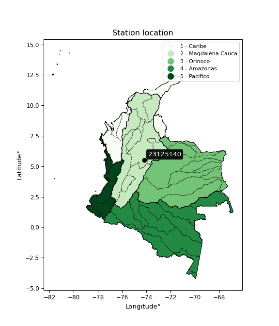</img>

</div>


## A. General information


### 1. General running parameters

• app_version: _v20251225_. • runtime: _2025-12-26 14:29:50.888910_. • Python version: _3.14.0_. • SciPy version: _1.16.3_. • Pandas version: _2.3.3_. • NumPy version: _2.3.5_. • Stations dataset (station_dataset_file): _dataset/pmax24h_in/automatic_colombia.csv_. • Stations catalog (station_catalog_file): _dataset/CNE_IDEAM.xls_. • Plot only fit distributions with Δo > Δ (plot_only_fit): _True_. • Eval low extreme values, if False, evaluates high extreme values (low_extreme): _False_. • Eval every SciPy distribution as logarithmic (pdist_logarithmic_on): _True_. • Standard deviation normalized (ddof): _1.0_. • Return periods to eval in years (Tr): _[2, 2.33, 5, 10, 15, 20, 25, 50, 75, 100, 200, 250, 500, 750, 1000]_. • Minimum data sample per station, 0 means any (minimum_sample): _5_. • Z-Score threshold to adjust a value, 0 means disable (zscore): _3.5_. • Avoid zeros, e.g. rain = 0 (avoid_zeros): _True_. • Avoid null values (avoid_nans): _True_. [:file_folder:Dataset file.](../../dataset/pmax24h_in/automatic_colombia.csv)


### 2. Station info and location

|   id |   CODIGO | NOMBRE                                | CATEGORIA               | TECNOLOGIA                              | ESTADO   | FECHA_INSTALACION   |   FECHA_SUSPENSION |   ALTITUD |   LATITUD |   LONGITUD | DEPARTAMENTO   | MUNICIPIO   | AREA_OPERATIVA                              | ENTIDAD                                                     | AREA_HIDROGRAFICA   | ZONA_HIDROGRAFICA   | SUBZONA_HIDROGRAFICA   |   CORRIENTE | OBSERVACION                                                                                    | SUBRED                                          | Catalogo   |
|-----:|---------:|:--------------------------------------|:------------------------|:----------------------------------------|:---------|:--------------------|-------------------:|----------:|----------:|-----------:|:---------------|:------------|:--------------------------------------------|:------------------------------------------------------------|:--------------------|:--------------------|:-----------------------|------------:|:-----------------------------------------------------------------------------------------------|:------------------------------------------------|:-----------|
|    0 | 23125140 | AEROPUERTO FURATENA  - AUT [23125140] | Climatológica Ordinaria | Automática con Telemetría, Convencional | Activa   | 15/05/1991          |                nan |      1250 |   5.52083 |   -74.1824 | Boyacá         | Quípama     | Area Operativa 06 - Boyacá-Casanare-Vichada | INSTITUTO DE HIDROLOGIA METEOROLOGIA Y ESTUDIOS AMBIENTALES | Magdalena Cauca     | Medio Magdalena     | Río Carare (Minero)    |         nan | Actualizada Tecnologia y Tipo de Transmision por solicitud del coordinador del AO (07/02/2023) | RED ALERTAS - AREA OPERATIVA 06,Magdalena Medio | CNE_IDEAM  |

<div align="center">

Map location in: [:earth_americas:Google](http://maps.google.com/maps?q=5.520833333,-74.18241667) [:earth_americas:OSM](https://www.openstreetmap.org/#map=18/5.520833333/-74.18241667&layers=P) [:earth_americas:Bing](https://www.bing.com/maps?cp=5.520833333~-74.18241667&lvl=18) [:earth_americas:Apple](https://maps.apple.com/frame?center=5.520833333%2C-74.18241667&span=0.003%2C0.006)

</div>


<div align="center">

```geojson
{
  "type": "Feature",
  "geometry": {
    "type": "Point", 
    "coordinates": [-74.18241667, 5.520833333]
  }, 
  "properties": {
    "Name": "23125140"
  }
}
```

</div>


### 3. Discrete values table and plot

|               |           0 |           1 |           2 |          3 |          4 |
|:--------------|------------:|------------:|------------:|-----------:|-----------:|
| Date          | 2018        | 2019        | 2020        | 2021       | 2023       |
| Value         |   52        |   92        |   96.8      |  129.4     |   37.8     |
| Value_initial |   52        |   92        |   96.8      |  129.4     |   37.8     |
| count         |    5        |    5        |    5        |    5       |    5       |
| mean          |   81.6      |   81.6      |   81.6      |   81.6     |   81.6     |
| std           |   36.8057   |   36.8057   |   36.8057   |   36.8057  |   36.8057  |
| zscore        |   -0.804223 |    0.282565 |    0.412979 |    1.29871 |   -1.19003 |

<div align="center">

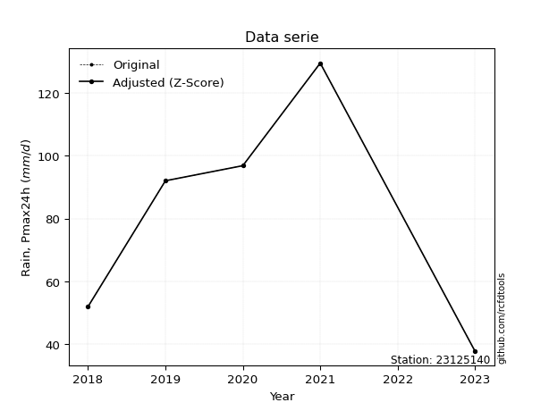</img>

</div>

> If Z-Score is active, values out of range or outliers are replaced with the station mean value.


### 4. Active continuous probability distributions from SciPy (45 of 104 available)

[scipy.stats](https://docs.scipy.org/doc/scipy/reference/stats.html) is a Python´s powerful submodule within the SciPy library for comprehensive statistical analysis, offering over 130 probability distributions (like Normal, Poisson), functions for descriptive stats (mean, variance), hypothesis testing (t-tests, chi-square), random variable generation, and statistical tests, making it essential for data science, modeling, and research. It provides tools to explore, model, and draw conclusions from data efficiently, working seamlessly with NumPy.

<div align="center">

|   id | p_dist             |   n_parameter | fit_method   | label                                                                       | active   | ref                                                                                                        |
|-----:|:-------------------|--------------:|:-------------|:----------------------------------------------------------------------------|:---------|:-----------------------------------------------------------------------------------------------------------|
|    0 | alpha              |             3 | MLE          | Alpha                                                                       | True     | [:mortar_board:](https://docs.scipy.org/doc/scipy/reference/generated/scipy.stats.alpha.html)              |
|    1 | betaprime          |             4 | MLE          | Beta prime                                                                  | True     | [:mortar_board:](https://docs.scipy.org/doc/scipy/reference/generated/scipy.stats.betaprime.html)          |
|    2 | chi2               |             3 | MLE          | Chi²                                                                        | True     | [:mortar_board:](https://docs.scipy.org/doc/scipy/reference/generated/scipy.stats.chi2.html)               |
|    3 | crystalball        |             4 | MLE          | Crystalball                                                                 | True     | [:mortar_board:](https://docs.scipy.org/doc/scipy/reference/generated/scipy.stats.crystalball.html)        |
|    4 | erlang             |             3 | MLE          | Erlang                                                                      | True     | [:mortar_board:](https://docs.scipy.org/doc/scipy/reference/generated/scipy.stats.erlang.html)             |
|    5 | expon              |             2 | MLE          | Exponential                                                                 | True     | [:mortar_board:](https://docs.scipy.org/doc/scipy/reference/generated/scipy.stats.expon.html)              |
|    6 | exponnorm          |             3 | MLE          | Exponentially modified Normal                                               | True     | [:mortar_board:](https://docs.scipy.org/doc/scipy/reference/generated/scipy.stats.exponnorm.html)          |
|    7 | f                  |             4 | MLE          | F                                                                           | True     | [:mortar_board:](https://docs.scipy.org/doc/scipy/reference/generated/scipy.stats.f.html)                  |
|    8 | fatiguelife        |             3 | MLE          | Fatigue-life (Birnbaum-Saunders)                                            | True     | [:mortar_board:](https://docs.scipy.org/doc/scipy/reference/generated/scipy.stats.fatiguelife.html)        |
|    9 | fisk               |             3 | MLE          | Fisk                                                                        | True     | [:mortar_board:](https://docs.scipy.org/doc/scipy/reference/generated/scipy.stats.fisk.html)               |
|   10 | gamma              |             3 | MLE          | Gamma                                                                       | True     | [:mortar_board:](https://docs.scipy.org/doc/scipy/reference/generated/scipy.stats.gamma.html)              |
|   11 | genexpon           |             5 | MLE          | Generalized exponential                                                     | True     | [:mortar_board:](https://docs.scipy.org/doc/scipy/reference/generated/scipy.stats.genexpon.html)           |
|   12 | genlogistic        |             3 | MLE          | Generalized logistic                                                        | True     | [:mortar_board:](https://docs.scipy.org/doc/scipy/reference/generated/scipy.stats.genlogistic.html)        |
|   13 | gibrat             |             2 | MM           | Gibrat                                                                      | True     | [:mortar_board:](https://docs.scipy.org/doc/scipy/reference/generated/scipy.stats.gibrat.html)             |
|   14 | gompertz           |             3 | MLE          | Gompertz (or truncated Gumbel)                                              | True     | [:mortar_board:](https://docs.scipy.org/doc/scipy/reference/generated/scipy.stats.gompertz.html)           |
|   15 | gumbel_l           |             2 | MM           | Gumbel Left Skew                                                            | True     | [:mortar_board:](https://docs.scipy.org/doc/scipy/reference/generated/scipy.stats.gumbel_l.html)           |
|   16 | gumbel_r           |             2 | MM           | Gumbel Right Skew                                                           | True     | [:mortar_board:](https://docs.scipy.org/doc/scipy/reference/generated/scipy.stats.gumbel_r.html)           |
|   17 | halflogistic       |             2 | MM           | Half-logistic                                                               | True     | [:mortar_board:](https://docs.scipy.org/doc/scipy/reference/generated/scipy.stats.halflogistic.html)       |
|   18 | halfnorm           |             2 | MM           | Half Normal                                                                 | True     | [:mortar_board:](https://docs.scipy.org/doc/scipy/reference/generated/scipy.stats.halfnorm.html)           |
|   19 | hypsecant          |             2 | MM           | hyperbolic secant                                                           | True     | [:mortar_board:](https://docs.scipy.org/doc/scipy/reference/generated/scipy.stats.hypsecant.html)          |
|   20 | invgamma           |             3 | MLE          | Inverted gamma                                                              | True     | [:mortar_board:](https://docs.scipy.org/doc/scipy/reference/generated/scipy.stats.invgamma.html)           |
|   21 | invgauss           |             3 | MLE          | Inverse Gaussian                                                            | True     | [:mortar_board:](https://docs.scipy.org/doc/scipy/reference/generated/scipy.stats.invgauss.html)           |
|   22 | invweibull         |             3 | MLE          | Inverted Weibull                                                            | True     | [:mortar_board:](https://docs.scipy.org/doc/scipy/reference/generated/scipy.stats.invweibull.html)         |
|   23 | johnsonsu          |             4 | MLE          | Johnson Su                                                                  | True     | [:mortar_board:](https://docs.scipy.org/doc/scipy/reference/generated/scipy.stats.johnsonsu.html)          |
|   24 | kstwobign          |             2 | MLE          | Limiting distribution of scaled Kolmogorov-Smirnov two-sided test statistic | True     | [:mortar_board:](https://docs.scipy.org/doc/scipy/reference/generated/scipy.stats.kstwobign.html)          |
|   25 | laplace            |             2 | MM           | Laplace                                                                     | True     | [:mortar_board:](https://docs.scipy.org/doc/scipy/reference/generated/scipy.stats.laplace.html)            |
|   26 | laplace_asymmetric |             3 | MLE          | Asymmetric Laplace                                                          | True     | [:mortar_board:](https://docs.scipy.org/doc/scipy/reference/generated/scipy.stats.laplace_asymmetric.html) |
|   27 | loggamma           |             3 | MLE          | Log gamma                                                                   | True     | [:mortar_board:](https://docs.scipy.org/doc/scipy/reference/generated/scipy.stats.loggamma.html)           |
|   28 | logistic           |             2 | MM           | Logistic (or Sech-squared)                                                  | True     | [:mortar_board:](https://docs.scipy.org/doc/scipy/reference/generated/scipy.stats.logistic.html)           |
|   29 | lognorm            |             3 | MLE          | Log Normal                                                                  | True     | [:mortar_board:](https://docs.scipy.org/doc/scipy/reference/generated/scipy.stats.lognorm.html)            |
|   30 | maxwell            |             2 | MM           | Maxwell                                                                     | True     | [:mortar_board:](https://docs.scipy.org/doc/scipy/reference/generated/scipy.stats.maxwell.html)            |
|   31 | mielke             |             4 | MLE          | Mielke Beta-Kappa / Dagum                                                   | True     | [:mortar_board:](https://docs.scipy.org/doc/scipy/reference/generated/scipy.stats.mielke.html)             |
|   32 | moyal              |             2 | MM           | Moyal                                                                       | True     | [:mortar_board:](https://docs.scipy.org/doc/scipy/reference/generated/scipy.stats.moyal.html)              |
|   33 | nakagami           |             3 | MLE          | Nakagami                                                                    | True     | [:mortar_board:](https://docs.scipy.org/doc/scipy/reference/generated/scipy.stats.nakagami.html)           |
|   34 | ncf                |             5 | MLE          | Non-central F distribution                                                  | True     | [:mortar_board:](https://docs.scipy.org/doc/scipy/reference/generated/scipy.stats.ncf.html)                |
|   35 | nct                |             4 | MLE          | Non-central Student’s t                                                     | True     | [:mortar_board:](https://docs.scipy.org/doc/scipy/reference/generated/scipy.stats.nct.html)                |
|   36 | norm               |             2 | MM           | Normal                                                                      | True     | [:mortar_board:](https://docs.scipy.org/doc/scipy/reference/generated/scipy.stats.norm.html)               |
|   37 | pareto             |             3 | MLE          | Pareto                                                                      | True     | [:mortar_board:](https://docs.scipy.org/doc/scipy/reference/generated/scipy.stats.pareto.html)             |
|   38 | pearson3           |             3 | MM           | Pearson type III                                                            | True     | [:mortar_board:](https://docs.scipy.org/doc/scipy/reference/generated/scipy.stats.pearson3.html)           |
|   39 | rayleigh           |             2 | MM           | Rayleigh                                                                    | True     | [:mortar_board:](https://docs.scipy.org/doc/scipy/reference/generated/scipy.stats.rayleigh.html)           |
|   40 | rice               |             3 | MLE          | Rice                                                                        | True     | [:mortar_board:](https://docs.scipy.org/doc/scipy/reference/generated/scipy.stats.rice.html)               |
|   41 | t                  |             3 | MLE          | Student’s t                                                                 | True     | [:mortar_board:](https://docs.scipy.org/doc/scipy/reference/generated/scipy.stats.t.html)                  |
|   42 | truncnorm          |             4 | MLE          | Truncated normal                                                            | True     | [:mortar_board:](https://docs.scipy.org/doc/scipy/reference/generated/scipy.stats.truncnorm.html)          |
|   43 | wald               |             2 | MM           | Wald                                                                        | True     | [:mortar_board:](https://docs.scipy.org/doc/scipy/reference/generated/scipy.stats.wald.html)               |
|   44 | weibull_min        |             3 | MLE          | Weibull minimum                                                             | True     | [:mortar_board:](https://docs.scipy.org/doc/scipy/reference/generated/scipy.stats.weibull_min.html)        |

</div>

> **n_parameter:** # arguments & localization & scale.
>
> **Fit methods:** (MLE) maximum likelihood, (MM) L-moments.
>
>**Inactive:** foldnorm, gennorm, norminvgauss, powernorm, powerlognorm, skewnorm, genextreme, anglit, arcsine, argus, beta, bradford, burr, burr12, cauchy, cosine, halfcauchy, foldcauchy, skewcauchy, wrapcauchy, dgamma, gengamma, exponweib, exponpow, truncexpon, gausshyper, genhalflogistic, genhyperbolic, geninvgauss, halfgennorm, johnsonsb, kappa4, kappa3, ksone, kstwo, loglaplace, levy, levy_l, levy_stable, ncx2, genpareto, truncpareto, lomax, powerlaw, rdist, rel_breitwigner, recipinvgauss, semicircular, studentized_range, trapezoid, triang, truncweibull_min, tukeylambda, uniform, loguniform, vonmises, vonmises_line, weibull_max, dweibull, 


## B. Probability distributions vs. Empirical distributions

A continuous probability distribution (CPD) describes probabilities for variables that can take any value within a range (like rain any time), unlike discrete variables with specific outcomes (like temperature). It uses a Probability Density Function (PDF), a curve where the total area under it equals 1, and the probability of the variable falling within an interval (a to b) is found by calculating the area under the curve between those points. A key feature is that the probability of hitting any single exact value is zero, so probabilities are always expressed for ranges, e.g., $P(a ≤ X ≤ b)$.

<div align="center">

Distributions parameters
|    |   station | p_dist                |   n |             loc |           scale | shape                  | shape1                | shape2                 | shape3   |
|---:|----------:|:----------------------|----:|----------------:|----------------:|:-----------------------|:----------------------|:-----------------------|:---------|
|  0 |  23125140 | alpha                 |   5 |  -332.343       |  5145.08        | 12.51313914978926      |                       |                        |          |
|  1 |  23125140 | betaprime             |   5 |    -0.213265    |    37.2822      | 15.636286888232696     | 8.157161739192224     |                        |          |
|  2 |  23125140 | chi2                  |   5 |    37.8         |    19.4112      | 1.659262564837726      |                       |                        |          |
|  3 |  23125140 | crystalball           |   5 |    81.6         |    32.92        | 7441.616638989259      | 74.82955632519179     |                        |          |
|  4 |  23125140 | erlang                |   5 | -2796.7         |     0.376561    | 7643.62986531268       |                       |                        |          |
|  5 |  23125140 | expon                 |   5 |    37.8         |    43.8         |                        |                       |                        |          |
|  6 |  23125140 | exponnorm             |   5 |    81.0633      |    32.9156      | 0.016306528711101054   |                       |                        |          |
|  7 |  23125140 | f                     |   5 |    37.7999      |    38.2932      | 1.1136736250237154     | 556.3727023216081     |                        |          |
|  8 |  23125140 | fatiguelife           |   5 |    37.8         |     3.40564e-05 | 1311.8143099720264     |                       |                        |          |
|  9 |  23125140 | fisk                  |   5 |    -9.54546e+08 |     9.54546e+08 | 47658626.19059746      |                       |                        |          |
| 10 |  23125140 | gamma                 |   5 | -2798.99        |     0.376159    | 7657.889088286231      |                       |                        |          |
| 11 |  23125140 | genexpon              |   5 |    37.7998      |     1.85953     | 0.04235064610215586    | 1.931395206170335e-05 | 2.0774214826476918     |          |
| 12 |  23125140 | genlogistic           |   5 |  -117.853       |    29.0359      | 547.5698053340654      |                       |                        |          |
| 13 |  23125140 | gibrat                |   5 |    56.4862      |    15.2323      |                        |                       |                        |          |
| 14 |  23125140 | gompertz              |   5 |    37.8         |    62.0374      | 0.7459721015068134     |                       |                        |          |
| 15 |  23125140 | gumbel_l              |   5 |    96.4158      |    25.6676      |                        |                       |                        |          |
| 16 |  23125140 | gumbel_r              |   5 |    66.7842      |    25.6676      |                        |                       |                        |          |
| 17 |  23125140 | halflogistic          |   5 |    42.5821      |    28.1454      |                        |                       |                        |          |
| 18 |  23125140 | halfnorm              |   5 |    38.0269      |    54.6109      |                        |                       |                        |          |
| 19 |  23125140 | hypsecant             |   5 |    81.6         |    20.9575      |                        |                       |                        |          |
| 20 |  23125140 | invgamma              |   5 |  -175.637       | 15072           | 59.55673272786194      |                       |                        |          |
| 21 |  23125140 | invgauss              |   5 |   -32.4616      |  1190.01        | 0.09592457066683649    |                       |                        |          |
| 22 |  23125140 | invweibull            |   5 |    37.8         |     1.48422     | 0.06046214959336481    |                       |                        |          |
| 23 |  23125140 | johnsonsu             |   5 |     2.68108e+07 |     3.80238e+08 | 815929.0388838276      | 11581312.88901554     |                        |          |
| 24 |  23125140 | kstwobign             |   5 |   -33.7831      |   131.519       |                        |                       |                        |          |
| 25 |  23125140 | laplace               |   5 |    81.6         |    23.278       |                        |                       |                        |          |
| 26 |  23125140 | laplace_asymmetric    |   5 |    96.8         |    24.8855      | 1.3509947746400148     |                       |                        |          |
| 27 |  23125140 | loggamma              |   5 | -6321.78        |   952.271       | 832.9262130405284      |                       |                        |          |
| 28 |  23125140 | logistic              |   5 |    81.6         |    18.1498      |                        |                       |                        |          |
| 29 |  23125140 | lognorm               |   5 |    37.8         |     0.0311979   | 14.568602575471505     |                       |                        |          |
| 30 |  23125140 | maxwell               |   5 |     3.59336     |    48.8834      |                        |                       |                        |          |
| 31 |  23125140 | mielke                |   5 |    -0.954183    |   106.73        | 2.3299675219250124     | 4.835241586294925     |                        |          |
| 32 |  23125140 | moyal                 |   5 |    62.7742      |    14.8192      |                        |                       |                        |          |
| 33 |  23125140 | nakagami              |   5 |    52           |    49.4599      | 0.27144777769121786    |                       |                        |          |
| 34 |  23125140 | ncf                   |   5 |    -2.74092     |    37.827       | 8.592617038653493      | 1025.0815800653054    | 10.531889001540588     |          |
| 35 |  23125140 | nct                   |   5 | -1036.26        |    32.883       | 182625.60070045356     | 33.99496262520938     |                        |          |
| 36 |  23125140 | norm                  |   5 |    81.6         |    32.92        |                        |                       |                        |          |
| 37 |  23125140 | pareto                |   5 |    37.3935      |     0.40653     | 0.26471446608557264    |                       |                        |          |
| 38 |  23125140 | pearson3              |   5 |    81.6         |    32.9201      | 0.021799751547315588   |                       |                        |          |
| 39 |  23125140 | rayleigh              |   5 |    18.6221      |    50.2491      |                        |                       |                        |          |
| 40 |  23125140 | rice                  |   5 |    19.6012      |    40.5179      | 1.0007520846310927     |                       |                        |          |
| 41 |  23125140 | t                     |   5 |    81.596       |    32.9173      | 6183175.837046742      |                       |                        |          |
| 42 |  23125140 | truncnorm             |   5 |    81.6         |    32.92        | -2057.369425528575     | 3703.62978094182      |                        |          |
| 43 |  23125140 | wald                  |   5 |    48.68        |    32.92        |                        |                       |                        |          |
| 44 |  23125140 | weibull_min           |   5 |    37.8         |    44.7567      | 0.25537465512692437    |                       |                        |          |
| 45 |  23125140 | logalpha              |   5 |    -8.00268     |   340.921       | 27.733106425201512     |                       |                        |          |
| 46 |  23125140 | logbetaprime          |   5 |    -5.80064     |     7.03104     | 1172.3346795242815     | 816.5126889782589     |                        |          |
| 47 |  23125140 | logchi2               |   5 |     3.63231     |     0.967639    | 1.0331948132912927     |                       |                        |          |
| 48 |  23125140 | logcrystalball        |   5 |     4.59504     |     0.207832    | 0.41535997086194965    | 617.7088023810245     |                        |          |
| 49 |  23125140 | logerlang             |   5 |    -2.99562     |     0.0284348   | 256.8363849885976      |                       |                        |          |
| 50 |  23125140 | logexpon              |   5 |     3.63231     |     0.67587     |                        |                       |                        |          |
| 51 |  23125140 | logexponnorm          |   5 |     4.30791     |     0.448889    | 0.0006116843981860637  |                       |                        |          |
| 52 |  23125140 | logf                  |   5 |  -244.226       |   248.534       | 916349.0367763801      | 1815959.2380949855    |                        |          |
| 53 |  23125140 | logfatiguelife        |   5 |   -69.853       |    74.1608      | 0.0060436097808955185  |                       |                        |          |
| 54 |  23125140 | logfisk               |   5 |    -1.5016e+07  |     1.5016e+07  | 54407594.479954846     |                       |                        |          |
| 55 |  23125140 | loggamma              |   5 |    -3.10316     |     0.027853    | 265.9533491848405      |                       |                        |          |
| 56 |  23125140 | loggenexpon           |   5 |     3.63172     |     0.00730488  | 0.006059789007299977   | 3.6268387926738166    | 1.9565275023159655e-05 |          |
| 57 |  23125140 | loggenlogistic        |   5 |     4.86293     |     1.70436e-06 | 3.0813172774865496e-06 |                       |                        |          |
| 58 |  23125140 | loggibrat             |   5 |     3.96571     |     0.207717    |                        |                       |                        |          |
| 59 |  23125140 | loggompertz           |   5 |     3.63231     |     1.04534     | 0.9609758338168446     |                       |                        |          |
| 60 |  23125140 | loggumbel_l           |   5 |     4.5102      |     0.349996    |                        |                       |                        |          |
| 61 |  23125140 | loggumbel_r           |   5 |     4.10616     |     0.349996    |                        |                       |                        |          |
| 62 |  23125140 | loghalflogistic       |   5 |     3.7761      |     0.383813    |                        |                       |                        |          |
| 63 |  23125140 | loghalfnorm           |   5 |     3.71398     |     0.744715    |                        |                       |                        |          |
| 64 |  23125140 | loghypsecant          |   5 |     4.30818     |     0.285771    |                        |                       |                        |          |
| 65 |  23125140 | loginvgamma           |   5 |    -1.3149      |   825.413       | 147.87075183402362     |                       |                        |          |
| 66 |  23125140 | loginvgauss           |   5 |     0.727015    |   208.914       | 0.01710183722515745    |                       |                        |          |
| 67 |  23125140 | loginvweibull         |   5 |    -1.59827e+07 |     1.59827e+07 | 38102832.774084955     |                       |                        |          |
| 68 |  23125140 | logjohnsonsu          |   5 |     5.12031     |     0.0130048   | 7.533098984955759      | 1.6194947399804391    |                        |          |
| 69 |  23125140 | logkstwobign          |   5 |     2.61059     |     1.9325      |                        |                       |                        |          |
| 70 |  23125140 | loglaplace            |   5 |     4.30818     |     0.317411    |                        |                       |                        |          |
| 71 |  23125140 | loglaplace_asymmetric |   5 |     4.57265     |     0.299089    | 1.5359215796313472     |                       |                        |          |
| 72 |  23125140 | logloggamma           |   5 |     4.86376     |     0.000122271 | 0.0002260590007354586  |                       |                        |          |
| 73 |  23125140 | loglogistic           |   5 |     4.30818     |     0.247485    |                        |                       |                        |          |
| 74 |  23125140 | loglognorm            |   5 |     3.63231     |     0.000680365 | 14.036339581573943     |                       |                        |          |
| 75 |  23125140 | logmaxwell            |   5 |     3.2445      |     0.666559    |                        |                       |                        |          |
| 76 |  23125140 | logmielke             |   5 |    -3.40816e+06 |     3.40816e+06 | 6010043.909221858      | 945978621.1207702     |                        |          |
| 77 |  23125140 | logmoyal              |   5 |     4.05148     |     0.20207     |                        |                       |                        |          |
| 78 |  23125140 | lognakagami           |   5 |     3.95124     |     0.534795    | 0.38694668848676916    |                       |                        |          |
| 79 |  23125140 | logncf                |   5 |    -4.58406     |     8.88276     | 1024.6233498278893     | 1443.1573530606772    | 1.7813329303453208e-11 |          |
| 80 |  23125140 | lognct                |   5 |    30.0353      |     0.447018    | 169876.63681522434     | -57.55238309042895    |                        |          |
| 81 |  23125140 | lognorm               |   5 |     4.30818     |     0.448888    |                        |                       |                        |          |
| 82 |  23125140 | logpareto             |   5 |     3.62578     |     0.00653399  | 0.262482832069457      |                       |                        |          |
| 83 |  23125140 | logpearson3           |   5 |     4.30818     |     0.448888    | -0.343386588524352     |                       |                        |          |
| 84 |  23125140 | lograyleigh           |   5 |     3.44943     |     0.685182    |                        |                       |                        |          |
| 85 |  23125140 | logrice               |   5 |     3.37186     |     0.519372    | 1.4131925501197968     |                       |                        |          |
| 86 |  23125140 | logt                  |   5 |     4.30818     |     0.448888    | 11574373476.119507     |                       |                        |          |
| 87 |  23125140 | logtruncnorm          |   5 |    -0.106423    |     0.99809     | 4.637065444687289      | 4.9788433977557975    |                        |          |
| 88 |  23125140 | logwald               |   5 |     3.85927     |     0.448904    |                        |                       |                        |          |
| 89 |  23125140 | logweibull_min        |   5 |    -5.54202e+06 |     5.54202e+06 | 15340354.303377165     |                       |                        |          |

</div>

> **loc** (Location parameter): This shifts the distribution along the x-axis. For many common distributions, like the normal (Gaussian) distribution, loc represents the mean $μ$. For others, like the uniform distribution, it might represent the minimum value, or for the beta distribution, the left end of the support interval.
>
> **scale** (Scale parameter): This determines the width or spread of the distribution. For the normal distribution, scale represents the standard deviation $σ$. For a uniform distribution, it defines the length of the interval (from $loc$ to $loc + scale$).
>
> **shape** (Shape parameters): Refers to parameters that define the specific form of a probability distribution, distinct from its location (loc) and scale (scale). These parameters are required arguments for most distribution functions. For example, a normal (Gaussian) distribution is fully defined by its location (mean) and scale (standard deviation), so it has no specific shape parameters beyond loc and scale. However, other distributions have intrinsic properties that need specification, as Gamma distribution that takes a shape parameter, often named $a$ or $alpha$.


### 0. Cumulative distribution values - CDF (90 evaluated)

> Ordered by x ascending and calculating $log(f(x))$ separately. 

|   id |   Station |   date |     x |   count |   mean |     std |    zscore |   Value_initial |   station |   m |     alpha |   alpha_pdf |   betaprime |   betaprime_pdf |        chi2 |    chi2_pdf |   crystalball |   crystalball_pdf |    erlang |   erlang_pdf |    expon |   expon_pdf |   exponnorm |   exponnorm_pdf |           f |      f_pdf |   fatiguelife |   fatiguelife_pdf |      fisk |   fisk_pdf |     gamma |   gamma_pdf |    genexpon |   genexpon_pdf |   genlogistic |   genlogistic_pdf |   gibrat |   gibrat_pdf |    gompertz |   gompertz_pdf |   gumbel_l |   gumbel_l_pdf |   gumbel_r |   gumbel_r_pdf |   halflogistic |   halflogistic_pdf |   halfnorm |   halfnorm_pdf |   hypsecant |   hypsecant_pdf |   invgamma |   invgamma_pdf |   invgauss |   invgauss_pdf |   invweibull |   invweibull_pdf |   johnsonsu |   johnsonsu_pdf |   kstwobign |   kstwobign_pdf |   laplace |   laplace_pdf |   laplace_asymmetric |   laplace_asymmetric_pdf |   loggamma |   loggamma_pdf |   logistic |   logistic_pdf |   lognorm |   lognorm_pdf |   maxwell |   maxwell_pdf |    mielke |   mielke_pdf |     moyal |   moyal_pdf |   nakagami |    nakagami_pdf |       ncf |    ncf_pdf |       nct |    nct_pdf |      norm |   norm_pdf |      pareto |   pareto_pdf |   pearson3 |   pearson3_pdf |   rayleigh |   rayleigh_pdf |      rice |   rice_pdf |         t |      t_pdf |   truncnorm |   truncnorm_pdf |      wald |   wald_pdf |   weibull_min |   weibull_min_pdf |   logalpha |   logalpha_pdf |   logbetaprime |   logbetaprime_pdf |     logchi2 |   logchi2_pdf |   logcrystalball |   logcrystalball_pdf |   logerlang |   logerlang_pdf |   logexpon |   logexpon_pdf |   logexponnorm |   logexponnorm_pdf |      logf |   logf_pdf |   logfatiguelife |   logfatiguelife_pdf |   logfisk |   logfisk_pdf |   loggenexpon |   loggenexpon_pdf |   loggenlogistic |   loggenlogistic_pdf |   loggibrat |   loggibrat_pdf |   loggompertz |   loggompertz_pdf |   loggumbel_l |   loggumbel_l_pdf |   loggumbel_r |   loggumbel_r_pdf |   loghalflogistic |   loghalflogistic_pdf |   loghalfnorm |   loghalfnorm_pdf |   loghypsecant |   loghypsecant_pdf |   loginvgamma |   loginvgamma_pdf |   loginvgauss |   loginvgauss_pdf |   loginvweibull |   loginvweibull_pdf |   logjohnsonsu |   logjohnsonsu_pdf |   logkstwobign |   logkstwobign_pdf |   loglaplace |   loglaplace_pdf |   loglaplace_asymmetric |   loglaplace_asymmetric_pdf |   logloggamma |   logloggamma_pdf |   loglogistic |   loglogistic_pdf |   loglognorm |   loglognorm_pdf |   logmaxwell |   logmaxwell_pdf |   logmielke |   logmielke_pdf |   logmoyal |   logmoyal_pdf |   lognakagami |   lognakagami_pdf |    logncf |   logncf_pdf |    lognct |   lognct_pdf |   logpareto |   logpareto_pdf |   logpearson3 |   logpearson3_pdf |   lograyleigh |   lograyleigh_pdf |   logrice |   logrice_pdf |      logt |   logt_pdf |   logtruncnorm |   logtruncnorm_pdf |   logwald |   logwald_pdf |   logweibull_min |   logweibull_min_pdf |
|-----:|----------:|-------:|------:|--------:|-------:|--------:|----------:|----------------:|----------:|----:|----------:|------------:|------------:|----------------:|------------:|------------:|--------------:|------------------:|----------:|-------------:|---------:|------------:|------------:|----------------:|------------:|-----------:|--------------:|------------------:|----------:|-----------:|----------:|------------:|------------:|---------------:|--------------:|------------------:|---------:|-------------:|------------:|---------------:|-----------:|---------------:|-----------:|---------------:|---------------:|-------------------:|-----------:|---------------:|------------:|----------------:|-----------:|---------------:|-----------:|---------------:|-------------:|-----------------:|------------:|----------------:|------------:|----------------:|----------:|--------------:|---------------------:|-------------------------:|-----------:|---------------:|-----------:|---------------:|----------:|--------------:|----------:|--------------:|----------:|-------------:|----------:|------------:|-----------:|----------------:|----------:|-----------:|----------:|-----------:|----------:|-----------:|------------:|-------------:|-----------:|---------------:|-----------:|---------------:|----------:|-----------:|----------:|-----------:|------------:|----------------:|----------:|-----------:|--------------:|------------------:|-----------:|---------------:|---------------:|-------------------:|------------:|--------------:|-----------------:|---------------------:|------------:|----------------:|-----------:|---------------:|---------------:|-------------------:|----------:|-----------:|-----------------:|---------------------:|----------:|--------------:|--------------:|------------------:|-----------------:|---------------------:|------------:|----------------:|--------------:|------------------:|--------------:|------------------:|--------------:|------------------:|------------------:|----------------------:|--------------:|------------------:|---------------:|-------------------:|--------------:|------------------:|--------------:|------------------:|----------------:|--------------------:|---------------:|-------------------:|---------------:|-------------------:|-------------:|-----------------:|------------------------:|----------------------------:|--------------:|------------------:|--------------:|------------------:|-------------:|-----------------:|-------------:|-----------------:|------------:|----------------:|-----------:|---------------:|--------------:|------------------:|----------:|-------------:|----------:|-------------:|------------:|----------------:|--------------:|------------------:|--------------:|------------------:|----------:|--------------:|----------:|-----------:|---------------:|-------------------:|----------:|--------------:|-----------------:|---------------------:|
|    0 |  23125140 |   2023 |  37.8 |       5 |   81.6 | 36.8057 | -1.19003  |            37.8 |  23125140 |   1 | 0.0827055 |  0.00572481 |   0.0631972 |      0.0078009  | 9.34866e-14 | 10.9155     |     0.0916773 |        0.00500093 | 0.0912388 |   0.00503411 | 0        |  0.0228311  |    0.091677 |      0.00500094 | 0.000489192 | 4.30645    |      0.036456 |       1.16427e+10 | 0.0997084 | 0.00448188 | 0.0912021 |  0.00503326 | 3.77576e-06 |     0.0227749  |     0.0768262 |        0.00677406 | 0        |   0          | 2.64863e-14 |     0.0120246  |  0.0968911 |     0.00358575 |  0.0453556 |     0.00546583 |       0        |         0          |   0        |     0          |   0.0783484 |      0.0037008  |  0.0814419 |     0.00576859 |  0.0735795 |     0.00668208 |  0.000647776 |      4.04697e+10 |   0.0916351 |      0.00500022 |   0.0715561 |      0.00732623 | 0.0761725 |    0.0032723  |             0.111717 |               0.0033229  |  0.0659802 |       0.300933 |  0.0821675 |     0.00415521 | 0.0660777 |      0.286088 | 0.0788436 |    0.00625673 | 0.0940451 |   0.00561229 | 0.0202079 |  0.00421478 |  0         |      0          | 0.0762298 | 0.00647004 | 0.0917531 | 0.00500292 | 0.0916773 | 0.00500093 | 1.11022e-16 |  0.651156    |  0.0912094 |     0.00503077 |  0.0702421 |     0.00706179 | 0.0596082 | 0.00638458 | 0.0916791 | 0.00500142 |   0.0916773 |      0.00500093 | 0         | 0          |   9.23097e-05 |       3.31753e+09 |  0.0584128 |       0.293755 |      0.0676369 |           0.305221 | 9.39569e-09 |   1.09298e+07 |       nan        |           nan        |   0.0656596 |        0.299209 |   0        |       1.47957  |      0.0660782 |           0.286089 | 0.0665249 |   0.287327 |        0.0650169 |             0.285558 | 0.0718871 |      0.241745 |   0.000492071 |          0.829934 |         0        |             0.195405 |    0        |        0        |   1.70162e-08 |          0.919292 |     0.0781815 |          0.214409 |     0.0208093 |          0.230234 |          0        |              0        |      0        |          0        |      0.0596302 |           0.207446 |     0.0635963 |          0.319066 |     0.0639245 |          0.331929 |       0.0571511 |            0.389952 |       0.102815 |           0.194901 |      0.0574261 |           0.439921 |    0.0594591 |         0.187325 |               0.0906832 |                    0.197405 |      0.10263  |          0.189747 |     0.0611711 |          0.232052 |    0.0228081 |      8.68017e+12 |    0.0473662 |         0.342095 |    0.111713 |        0.196997 |  0.0047836 |       0.104105 |   0           |          0        | 0.0896122 |     0.33931  | 0.0662178 |     0.286216 | 1.11022e-16 |      40.1719    |     0.0737159 |          0.267158 |      0.034992 |          0.375907 | 0.0462609 |      0.354326 | 0.0660779 |   0.286088 |    0           |            0       | 0         |      0        |        0.0815147 |             0.216177 |
|    1 |  23125140 |   2018 |  52   |       5 |   81.6 | 36.8057 | -0.804223 |            52   |  23125140 |   2 | 0.191184  |  0.00948779 |   0.219205  |      0.0133174  | 0.393717    |  0.0187255  |     0.184287  |        0.00808897 | 0.184556  |   0.00815183 | 0.276895 |  0.0165092  |    0.184287 |      0.00808899 | 0.43443     | 0.0148881  |      0.688723 |       0.00612565  | 0.183698  | 0.00748687 | 0.184512  |  0.00815169 | 0.276422    |     0.016487   |     0.206998  |        0.0112124  | 0        |   0          | 0.174587    |     0.0124781  |  0.162396  |     0.00578284 |  0.168826  |     0.0117004  |       0.165763 |         0.0172767  |   0.201947 |     0.0141399  |   0.152096  |      0.0069843  |  0.190816  |     0.00955399 |  0.201558  |     0.0110085  |  0.417961    |      0.0015525   |   0.184241  |      0.00808933 |   0.211481  |      0.0118329  | 0.140193  |    0.00602256 |             0.170431 |               0.00506931 |  0.220716  |       0.67467  |  0.16371   |     0.00754331 | 0.213261  |      0.647853 | 0.194051  |    0.00980242 | 0.192241  |   0.00818243 | 0.150325  |  0.0137623  |  2.841e-09 | 108534          | 0.198062  | 0.010444   | 0.18438   | 0.00808917 | 0.184287  | 0.00808897 | 0.612521    |  0.0070223   |  0.184469  |     0.00814724 |  0.197973  |     0.0106021  | 0.178738  | 0.0101355  | 0.184299  | 0.00808999 |   0.184287  |      0.00808897 | 0.0042659 | 0.00687345 |   0.525691    |       0.00636252  |  0.215796  |       0.698602 |      0.222996  |           0.672534 | 0.420495    |   0.610236    |       nan        |           nan        |   0.219491  |        0.670864 |   0.376176 |       0.922993 |      0.213262  |           0.647851 | 0.213968  |   0.647774 |        0.212614  |             0.650828 | 0.197427  |      0.574113 |   0.283181    |          0.899094 |         0        |             0.347817 |    0        |        0        |   0.290247    |          0.885246 |     0.183309  |          0.472506 |     0.210816  |          0.937702 |          0.224288 |              1.23718  |      0.249967 |          1.01838  |      0.1778    |           0.590325 |     0.228889  |          0.712904 |     0.235174  |          0.731671 |       0.262363  |            0.836903 |       0.19078  |           0.376843 |      0.278372  |           0.85688  |    0.162404  |         0.511652 |               0.181571  |                    0.395256 |      0.185081 |          0.342186 |     0.191197  |          0.624849 |    0.669364  |      0.0809592   |    0.228763  |         0.767055 |    0.196046 |        0.345713 |  0.200025  |       1.11307  |   1.66394e-12 |       2899.66     | 0.246216  |     0.637573 | 0.213357  |     0.647408 | 0.641508    |       0.289116  |     0.206607  |          0.583678 |      0.235237 |          0.817442 | 0.223125  |      0.732564 | 0.213262  |   0.647852 |    0           |            0       | 0.0681899 |      2.04846  |        0.185821  |             0.463295 |
|    2 |  23125140 |   2019 |  92   |       5 |   81.6 | 36.8057 |  0.282565 |            92   |  23125140 |   3 | 0.651115  |  0.0105711  |   0.701884  |      0.00835646 | 0.809119    |  0.00531935 |     0.623967  |        0.0115286  | 0.625354  |   0.0114869  | 0.709875 |  0.00662386 |    0.623968 |      0.0115286  | 0.762357    | 0.00459604 |      0.831893 |       0.00222889  | 0.623782  | 0.011717   | 0.625354  |  0.0114885  | 0.709154    |     0.00662703 |     0.671914  |        0.00919803 | 0.801364 |   0.00785076 | 0.646947    |     0.0101704  |  0.56913   |     0.0141334  |  0.687693  |     0.0100314  |       0.705367 |         0.0089261  |   0.677005 |     0.00896511 |   0.651848  |      0.0134926  |  0.649692  |     0.0104825  |  0.668015  |     0.00953229 |  0.44731     |      0.00040144  |   0.623994  |      0.0115307  |   0.680296  |      0.00918358 | 0.680156  |    0.0137402  |             0.560087 |               0.0166592  |  0.689444  |       0.762388 |  0.639457  |     0.0127027  | 0.682914  |      0.793598 | 0.648265  |    0.0104038  | 0.593683  |   0.00983791 | 0.709121  |  0.00936741 |  0.668247  |      0.00787869 | 0.659778  | 0.00992331 | 0.623915  | 0.0115232  | 0.623967  | 0.0115286  | 0.726695    |  0.00132489  |  0.625208  |     0.0114903  |  0.65569   |     0.0100059  | 0.644516  | 0.0106912  | 0.624024  | 0.0115291  |   0.623967  |      0.0115286  | 0.769208  | 0.00772926 |   0.650098    |       0.00173124  |  0.695928  |       0.760256 |      0.686358  |           0.752479 | 0.651197    |   0.276782    |         0.586843 |             1.16868  |   0.686704  |        0.762815 |   0.731808 |       0.39681  |      0.682913  |           0.793596 | 0.68239   |   0.790909 |        0.683254  |             0.79217  | 0.66034   |      0.812678 |   0.717676    |          0.56797  |         0        |             0.975709 |    0.837621 |        0.441783 |   0.72456     |          0.592953 |     0.644296  |          1.05051  |     0.737144  |          0.642317 |          0.74933  |              0.571247 |      0.721955 |          0.594908 |      0.718442  |           0.861712 |     0.695343  |          0.718545 |     0.700925  |          0.701423 |       0.709386  |            0.580678 |       0.582807 |           1.05588  |      0.717997  |           0.572363 |    0.744905  |         0.803673 |               0.628694  |                    1.36858  |      0.531467 |          0.982598 |     0.703312  |          0.84314  |    0.695404  |      0.0280394   |    0.700865  |         0.70088  |    0.536177 |        0.945509 |  0.754799  |       0.587251 |   0.730806    |          0.71594  | 0.667424  |     0.691332 | 0.6827    |     0.793413 | 0.725186    |       0.0805054 |     0.667059  |          0.856437 |      0.70616  |          0.671179 | 0.692441  |      0.733937 | 0.682914  |   0.793597 |    1.67937e-05 |            5.91625 | 0.805867  |      0.45907  |        0.631138  |             1.01829  |
|    3 |  23125140 |   2020 |  96.8 |       5 |   81.6 | 36.8057 |  0.412979 |            96.8 |  23125140 |   4 | 0.699843  |  0.00971596 |   0.73964   |      0.00738711 | 0.832965    |  0.00463322 |     0.677861  |        0.0108932  | 0.679013  |   0.0108382  | 0.739989 |  0.00593632 |    0.677861 |      0.0108932  | 0.78327     | 0.00412827 |      0.842155 |       0.00205058  | 0.678151  | 0.0108974  | 0.679021  |  0.0108396  | 0.739286    |     0.00594047 |     0.713868  |        0.00828425 | 0.834792 |   0.00616254 | 0.694224    |     0.00951709 |  0.637627  |     0.0143308  |  0.733042  |     0.00886907 |       0.745689 |         0.00788668 |   0.71817  |     0.00818751 |   0.712935  |      0.0119148  |  0.698011  |     0.00963559 |  0.711631  |     0.00863885 |  0.449155    |      0.000368407 |   0.677896  |      0.0108949  |   0.722297  |      0.00831789 | 0.739753  |    0.01118    |             0.646041 |               0.0192158  |  0.727029  |       0.714706 |  0.697933  |     0.0116157  | 0.722124  |      0.747133 | 0.696398  |    0.00963604 | 0.63946   |   0.0092153  | 0.751045  |  0.00812167 |  0.704287  |      0.00715057 | 0.705384  | 0.009071   | 0.677784  | 0.0108884  | 0.677861  | 0.0108932  | 0.732723    |  0.00119098  |  0.678885  |     0.0108424  |  0.701883  |     0.00923028 | 0.694021  | 0.0099191  | 0.677918  | 0.0108933  |   0.677861  |      0.0108932  | 0.80293   | 0.00637501 |   0.658056    |       0.00158827  |  0.733296  |       0.708427 |      0.723477  |           0.706334 | 0.664904    |   0.262453    |         0.648291 |             1.23637  |   0.724329  |        0.71582  |   0.751248 |       0.368047 |      0.722123  |           0.747132 | 0.721472  |   0.744798 |        0.72238   |             0.745283 | 0.700376  |      0.760352 |   0.74557     |          0.529019 |         0        |             1.06968  |    0.858195 |        0.369923 |   0.753792    |          0.556449 |     0.697393  |          1.03348  |     0.768184  |          0.578835 |          0.77697  |              0.51629  |      0.751095 |          0.551145 |      0.759767  |           0.763087 |     0.730668  |          0.66999  |     0.735369  |          0.652625 |       0.73775   |            0.53494  |       0.637903 |           1.1082   |      0.746036  |           0.530404 |    0.782672  |         0.684688 |               0.702298  |                    1.5288   |      0.583865 |          1.07947  |     0.744335  |          0.768939 |    0.696789  |      0.026469    |    0.735299  |         0.652824 |    0.586486 |        1.03423  |  0.783019  |       0.52346  |   0.765449    |          0.646953 | 0.701717  |     0.65649  | 0.721903  |     0.747063 | 0.72914     |       0.0750853 |     0.709704  |          0.818735 |      0.739107 |          0.624186 | 0.728623  |      0.688192 | 0.722123  |   0.747133 |    0.267893    |            4.66515 | 0.827609  |      0.397727 |        0.68276   |             1.00817  |
|    4 |  23125140 |   2021 | 129.4 |       5 |   81.6 | 36.8057 |  1.29871  |           129.4 |  23125140 |   5 | 0.914721  |  0.00376437 |   0.897762  |      0.00291264 | 0.931668    |  0.0018563  |     0.92675   |        0.00422314 | 0.926193  |   0.00420106 | 0.876477 |  0.00282017 |    0.926749 |      0.00422313 | 0.880731    | 0.00211653 |      0.894385 |       0.00124614  | 0.914741  | 0.0038939  | 0.926215  |  0.00420069 | 0.875958    |     0.00282635 |     0.896107  |        0.0033851  | 0.941309 |   0.00160573 | 0.919515    |     0.00423673 |  0.973079  |     0.00379135 |  0.916488  |     0.00311377 |       0.912507 |         0.0029726  |   0.905706 |     0.00360379 |   0.935161  |      0.00307247 |  0.912126  |     0.00379429 |  0.902767  |     0.00351635 |  0.458691    |      0.00023597  |   0.926791  |      0.00422217 |   0.907996  |      0.00347089 | 0.935854  |    0.00275566 |             0.939697 |               0.00327375 |  0.888802  |       0.397476 |  0.932996  |     0.00344438 | 0.891731  |      0.414145 | 0.915081  |    0.00394094 | 0.856156  |   0.00421618 | 0.915888  |  0.00282741 |  0.873898  |      0.00357945 | 0.907858  | 0.0036892  | 0.926632  | 0.00422522 | 0.92675   | 0.00422314 | 0.761949    |  0.000684903 |  0.926197  |     0.00420325 |  0.91197   |     0.00386214 | 0.918883  | 0.00399763 | 0.926784  | 0.004222   |   0.92675   |      0.00422314 | 0.924666  | 0.00205333 |   0.699014    |       0.00100754  |  0.891482  |       0.383532 |      0.884352  |           0.399502 | 0.731154    |   0.198352    |         0.936047 |             0.541916 |   0.886849  |        0.400989 |   0.838098 |       0.239546 |      0.89173   |           0.414146 | 0.890792  |   0.414517 |        0.891396  |             0.412618 | 0.869982  |      0.409846 |   0.868417    |          0.324235 |         0.999954 |             1.80782  |    0.92828  |        0.15247  |   0.884411    |          0.344849 |     0.935391  |          0.505689 |     0.891299  |          0.293049 |          0.888721 |              0.273798 |      0.877115 |          0.325916 |      0.909242  |           0.313305 |     0.882018  |          0.376171 |     0.882497  |          0.366106 |       0.858772  |            0.311708 |       0.942349 |           0.725429 |      0.86786   |           0.318498 |    0.91291   |         0.274376 |               0.932946  |                    0.344347 |      0.998563 |          1.84439  |     0.903912  |          0.350951 |    0.703452  |      0.0200233   |    0.883177  |         0.370235 |    0.978284 |        1.67068  |  0.893178  |       0.262735 |   0.903379    |          0.324916 | 0.857855  |     0.413294 | 0.891563  |     0.414495 | 0.747498    |       0.0535733 |     0.899297  |          0.461045 |      0.880904 |          0.35857  | 0.8857    |      0.392419 | 0.891731  |   0.414145 |    0.999997    |            1.14394 | 0.908269  |      0.188933 |        0.923     |             0.546471 |

An Empirical Distribution Function (EDF) is a step-function estimate of a true cumulative distribution function (CDF) based on observed sample data, representing the proportion of data points less than or equal to a given value. It is calculated by ordering your data and jumping up by $1/n$ (where $n$ is sample size) at each unique data point, allowing analysis without assuming an underlying population distribution, and it gets closer to the true CDF as the sample size grows.


### 1. Empirical - EDF California (1923)

California´s estimates the true probability distribution of water-related data (like rainfall, streamflow) using observed samples, crucial for risk assessment.

<div align="center">


$P=m/n$


</div>


**1.1. Empirical values**

<div align="center">

|                | 0              | 1                  | 2              | 3                 | 4              |
|:---------------|:---------------|:-------------------|:---------------|:------------------|:---------------|
| date           | 2023           | 2018               | 2019           | 2020              | 2021           |
| x              | 37.8           | 52.0               | 92.0           | 96.8              | 129.4          |
| m              | 1              | 2                  | 3              | 4                 | 5              |
| empirical_dist | edf_california | edf_california     | edf_california | edf_california    | edf_california |
| empirical      | 0.2            | 0.4                | 0.6            | 0.8               | 1.0            |
| empirical_tr   | 1.25           | 1.6666666666666667 | 2.5            | 5.000000000000001 | inf            |

</div>


**1.2. Kolmogorov-Smirnov fit test (sorted by Δ)**


<div align="center">

|                | 0                   | 1                  | 2                   | 3                   | 4                   | 5                   | 6                   | 7                   | 8                  | 9                   | 10                  | 11                  | 12                  | 13                  | 14                  | 15                  | 16                 | 17                  | 18                  | 19                  | 20                  | 21                  | 22                  | 23                  | 24                 | 25                 | 26                  | 27                  | 28                  | 29                  | 30                  | 31                  | 32                 | 33                 | 34                 | 35                 | 36                 | 37                  | 38                  | 39                 | 40                  | 41                  | 42                 | 43                  | 44                  | 45                 | 46                  | 47                 | 48                 | 49                 | 50                  | 51                  | 52                  | 53                  | 54                  | 55                 | 56                  | 57                  | 58                  | 59                  | 60                  | 61                  | 62                    | 63                  | 64                  | 65                 | 66                  | 67                 | 68                 | 69                  | 70                  | 71                 | 72                  | 73                  | 74                  | 75                 | 76                 | 77                 | 78                 | 79                  | 80                  | 81                  | 82                 | 83                  | 84                 | 85                 | 86                 | 87                 | 88                 | 89                 |
|:---------------|:--------------------|:-------------------|:--------------------|:--------------------|:--------------------|:--------------------|:--------------------|:--------------------|:-------------------|:--------------------|:--------------------|:--------------------|:--------------------|:--------------------|:--------------------|:--------------------|:-------------------|:--------------------|:--------------------|:--------------------|:--------------------|:--------------------|:--------------------|:--------------------|:-------------------|:-------------------|:--------------------|:--------------------|:--------------------|:--------------------|:--------------------|:--------------------|:-------------------|:-------------------|:-------------------|:-------------------|:-------------------|:--------------------|:--------------------|:-------------------|:--------------------|:--------------------|:-------------------|:--------------------|:--------------------|:-------------------|:--------------------|:-------------------|:-------------------|:-------------------|:--------------------|:--------------------|:--------------------|:--------------------|:--------------------|:-------------------|:--------------------|:--------------------|:--------------------|:--------------------|:--------------------|:--------------------|:----------------------|:--------------------|:--------------------|:-------------------|:--------------------|:-------------------|:-------------------|:--------------------|:--------------------|:-------------------|:--------------------|:--------------------|:--------------------|:-------------------|:-------------------|:-------------------|:-------------------|:--------------------|:--------------------|:--------------------|:-------------------|:--------------------|:-------------------|:-------------------|:-------------------|:-------------------|:-------------------|:-------------------|
| station        | 23125140            | 23125140           | 23125140            | 23125140            | 23125140            | 23125140            | 23125140            | 23125140            | 23125140           | 23125140            | 23125140            | 23125140            | 23125140            | 23125140            | 23125140            | 23125140            | 23125140           | 23125140            | 23125140            | 23125140            | 23125140            | 23125140            | 23125140            | 23125140            | 23125140           | 23125140           | 23125140            | 23125140            | 23125140            | 23125140            | 23125140            | 23125140            | 23125140           | 23125140           | 23125140           | 23125140           | 23125140           | 23125140            | 23125140            | 23125140           | 23125140            | 23125140            | 23125140           | 23125140            | 23125140            | 23125140           | 23125140            | 23125140           | 23125140           | 23125140           | 23125140            | 23125140            | 23125140            | 23125140            | 23125140            | 23125140           | 23125140            | 23125140            | 23125140            | 23125140            | 23125140            | 23125140            | 23125140              | 23125140            | 23125140            | 23125140           | 23125140            | 23125140           | 23125140           | 23125140            | 23125140            | 23125140           | 23125140            | 23125140            | 23125140            | 23125140           | 23125140           | 23125140           | 23125140           | 23125140            | 23125140            | 23125140            | 23125140           | 23125140            | 23125140           | 23125140           | 23125140           | 23125140           | 23125140           | 23125140           |
| empirical_dist | edf_california      | edf_california     | edf_california      | edf_california      | edf_california      | edf_california      | edf_california      | edf_california      | edf_california     | edf_california      | edf_california      | edf_california      | edf_california      | edf_california      | edf_california      | edf_california      | edf_california     | edf_california      | edf_california      | edf_california      | edf_california      | edf_california      | edf_california      | edf_california      | edf_california     | edf_california     | edf_california      | edf_california      | edf_california      | edf_california      | edf_california      | edf_california      | edf_california     | edf_california     | edf_california     | edf_california     | edf_california     | edf_california      | edf_california      | edf_california     | edf_california      | edf_california      | edf_california     | edf_california      | edf_california      | edf_california     | edf_california      | edf_california     | edf_california     | edf_california     | edf_california      | edf_california      | edf_california      | edf_california      | edf_california      | edf_california     | edf_california      | edf_california      | edf_california      | edf_california      | edf_california      | edf_california      | edf_california        | edf_california      | edf_california      | edf_california     | edf_california      | edf_california     | edf_california     | edf_california      | edf_california      | edf_california     | edf_california      | edf_california      | edf_california      | edf_california     | edf_california     | edf_california     | edf_california     | edf_california      | edf_california      | edf_california      | edf_california     | edf_california      | edf_california     | edf_california     | edf_california     | edf_california     | edf_california     | edf_california     |
| p_dist         | logkstwobign        | loginvweibull      | logcrystalball      | logncf              | loginvgauss         | lograyleigh         | loginvgamma         | logmaxwell          | logrice            | logbetaprime        | loggamma            | loggamma            | logerlang           | betaprime           | logalpha            | logf                | lognct             | logexponnorm        | logt                | lognorm             | lognorm             | logfatiguelife      | kstwobign           | loggumbel_r         | genlogistic        | logpearson3        | invgauss            | loggenexpon         | f                   | logmoyal            | genexpon            | loggompertz         | logexpon           | halfnorm           | loghalfnorm        | expon              | loghalflogistic    | ncf                 | rayleigh            | logfisk            | maxwell             | mielke              | loglogistic        | alpha               | chi2                | invgamma           | logjohnsonsu        | logmielke          | logweibull_min     | erlang             | gamma               | pearson3            | nct                 | t                   | exponnorm           | crystalball        | norm                | truncnorm           | johnsonsu           | logloggamma         | fisk                | loggumbel_l         | loglaplace_asymmetric | rice                | loghypsecant        | gompertz           | laplace_asymmetric  | gumbel_r           | halflogistic       | logistic            | loglaplace          | gumbel_l           | pareto              | hypsecant           | moyal               | logpareto          | laplace            | logchi2            | fatiguelife        | loglognorm          | weibull_min         | logwald             | wald               | nakagami            | lognakagami        | loggibrat          | gibrat             | invweibull         | logtruncnorm       | loggenlogistic     |
| delta          | 0.14257390035190606 | 0.1428488726752227 | 0.15170879305907414 | 0.15378410632615405 | 0.16482611006715103 | 0.16500801488557865 | 0.17111130379702635 | 0.17123732573259642 | 0.1768752402075282 | 0.17700407375284105 | 0.17928415571114814 | 0.17928415571114814 | 0.18050940986990832 | 0.18079496642287204 | 0.18420363643263327 | 0.18603248163711436 | 0.1866429312089103 | 0.18673814475862027 | 0.18673845497017644 | 0.18673864538337526 | 0.18673864538337526 | 0.18738633254979942 | 0.18851880898398962 | 0.18918359447130517 | 0.193002312679602  | 0.1933929609417713 | 0.19844246650505248 | 0.19950792938142856 | 0.19951080800368207 | 0.19997455396201924 | 0.19999622423698282 | 0.19999998298378963 | 0.2                | 0.2                | 0.2                | 0.2                | 0.2                | 0.20193809812319902 | 0.20202668025027237 | 0.2025731230862324 | 0.20594881139038737 | 0.20775877737510454 | 0.2088033939953989 | 0.20881571306747448 | 0.20911942689333407 | 0.2091842982974951 | 0.20922024343264878 | 0.2135138991137987 | 0.2141790952970458 | 0.2154435034908031 | 0.21548782810384529 | 0.21553132504946743 | 0.21561974937987757 | 0.21570074947999962 | 0.21571327129564752 | 0.2157132914507391 | 0.21571329333542394 | 0.21571329668463857 | 0.21575879040095164 | 0.21613477853573615 | 0.21630180601690446 | 0.21669104428595154 | 0.21842874307736299   | 0.22126246598594151 | 0.22219989709392987 | 0.2254134403859536 | 0.22956875886744382 | 0.2311739261937323 | 0.2342365871612663 | 0.23628953857249946 | 0.23759591707824457 | 0.23760371830515   | 0.23805096224829358 | 0.24790440554885454 | 0.24967549013887944 | 0.2525016110394479 | 0.2598070503186601 | 0.2688458661939527 | 0.2887230436302718 | 0.29654810077556315 | 0.30098636871465634 | 0.33181008344375856 | 0.3957340989917328 | 0.39999999715900253 | 0.3999999999983361 | 0.4                | 0.4                | 0.541309217982801  | 0.5999832063068707 | 0.8                |
| deltao         | 0.5865427407550001  | 0.5865427407550001 | 0.5865427407550001  | 0.5865427407550001  | 0.5865427407550001  | 0.5865427407550001  | 0.5865427407550001  | 0.5865427407550001  | 0.5865427407550001 | 0.5865427407550001  | 0.5865427407550001  | 0.5865427407550001  | 0.5865427407550001  | 0.5865427407550001  | 0.5865427407550001  | 0.5865427407550001  | 0.5865427407550001 | 0.5865427407550001  | 0.5865427407550001  | 0.5865427407550001  | 0.5865427407550001  | 0.5865427407550001  | 0.5865427407550001  | 0.5865427407550001  | 0.5865427407550001 | 0.5865427407550001 | 0.5865427407550001  | 0.5865427407550001  | 0.5865427407550001  | 0.5865427407550001  | 0.5865427407550001  | 0.5865427407550001  | 0.5865427407550001 | 0.5865427407550001 | 0.5865427407550001 | 0.5865427407550001 | 0.5865427407550001 | 0.5865427407550001  | 0.5865427407550001  | 0.5865427407550001 | 0.5865427407550001  | 0.5865427407550001  | 0.5865427407550001 | 0.5865427407550001  | 0.5865427407550001  | 0.5865427407550001 | 0.5865427407550001  | 0.5865427407550001 | 0.5865427407550001 | 0.5865427407550001 | 0.5865427407550001  | 0.5865427407550001  | 0.5865427407550001  | 0.5865427407550001  | 0.5865427407550001  | 0.5865427407550001 | 0.5865427407550001  | 0.5865427407550001  | 0.5865427407550001  | 0.5865427407550001  | 0.5865427407550001  | 0.5865427407550001  | 0.5865427407550001    | 0.5865427407550001  | 0.5865427407550001  | 0.5865427407550001 | 0.5865427407550001  | 0.5865427407550001 | 0.5865427407550001 | 0.5865427407550001  | 0.5865427407550001  | 0.5865427407550001 | 0.5865427407550001  | 0.5865427407550001  | 0.5865427407550001  | 0.5865427407550001 | 0.5865427407550001 | 0.5865427407550001 | 0.5865427407550001 | 0.5865427407550001  | 0.5865427407550001  | 0.5865427407550001  | 0.5865427407550001 | 0.5865427407550001  | 0.5865427407550001 | 0.5865427407550001 | 0.5865427407550001 | 0.5865427407550001 | 0.5865427407550001 | 0.5865427407550001 |
| eval           | Δo > Δ              | Δo > Δ             | Δo > Δ              | Δo > Δ              | Δo > Δ              | Δo > Δ              | Δo > Δ              | Δo > Δ              | Δo > Δ             | Δo > Δ              | Δo > Δ              | Δo > Δ              | Δo > Δ              | Δo > Δ              | Δo > Δ              | Δo > Δ              | Δo > Δ             | Δo > Δ              | Δo > Δ              | Δo > Δ              | Δo > Δ              | Δo > Δ              | Δo > Δ              | Δo > Δ              | Δo > Δ             | Δo > Δ             | Δo > Δ              | Δo > Δ              | Δo > Δ              | Δo > Δ              | Δo > Δ              | Δo > Δ              | Δo > Δ             | Δo > Δ             | Δo > Δ             | Δo > Δ             | Δo > Δ             | Δo > Δ              | Δo > Δ              | Δo > Δ             | Δo > Δ              | Δo > Δ              | Δo > Δ             | Δo > Δ              | Δo > Δ              | Δo > Δ             | Δo > Δ              | Δo > Δ             | Δo > Δ             | Δo > Δ             | Δo > Δ              | Δo > Δ              | Δo > Δ              | Δo > Δ              | Δo > Δ              | Δo > Δ             | Δo > Δ              | Δo > Δ              | Δo > Δ              | Δo > Δ              | Δo > Δ              | Δo > Δ              | Δo > Δ                | Δo > Δ              | Δo > Δ              | Δo > Δ             | Δo > Δ              | Δo > Δ             | Δo > Δ             | Δo > Δ              | Δo > Δ              | Δo > Δ             | Δo > Δ              | Δo > Δ              | Δo > Δ              | Δo > Δ             | Δo > Δ             | Δo > Δ             | Δo > Δ             | Δo > Δ              | Δo > Δ              | Δo > Δ              | Δo > Δ             | Δo > Δ              | Δo > Δ             | Δo > Δ             | Δo > Δ             | Δo > Δ             | Δo <= Δ            | Δo <= Δ            |
| fit            | 1                   | 1                  | 1                   | 1                   | 1                   | 1                   | 1                   | 1                   | 1                  | 1                   | 1                   | 1                   | 1                   | 1                   | 1                   | 1                   | 1                  | 1                   | 1                   | 1                   | 1                   | 1                   | 1                   | 1                   | 1                  | 1                  | 1                   | 1                   | 1                   | 1                   | 1                   | 1                   | 1                  | 1                  | 1                  | 1                  | 1                  | 1                   | 1                   | 1                  | 1                   | 1                   | 1                  | 1                   | 1                   | 1                  | 1                   | 1                  | 1                  | 1                  | 1                   | 1                   | 1                   | 1                   | 1                   | 1                  | 1                   | 1                   | 1                   | 1                   | 1                   | 1                   | 1                     | 1                   | 1                   | 1                  | 1                   | 1                  | 1                  | 1                   | 1                   | 1                  | 1                   | 1                   | 1                   | 1                  | 1                  | 1                  | 1                  | 1                   | 1                   | 1                   | 1                  | 1                   | 1                  | 1                  | 1                  | 1                  | 0                  | 0                  |
| n              | 5                   | 5                  | 5                   | 5                   | 5                   | 5                   | 5                   | 5                   | 5                  | 5                   | 5                   | 5                   | 5                   | 5                   | 5                   | 5                   | 5                  | 5                   | 5                   | 5                   | 5                   | 5                   | 5                   | 5                   | 5                  | 5                  | 5                   | 5                   | 5                   | 5                   | 5                   | 5                   | 5                  | 5                  | 5                  | 5                  | 5                  | 5                   | 5                   | 5                  | 5                   | 5                   | 5                  | 5                   | 5                   | 5                  | 5                   | 5                  | 5                  | 5                  | 5                   | 5                   | 5                   | 5                   | 5                   | 5                  | 5                   | 5                   | 5                   | 5                   | 5                   | 5                   | 5                     | 5                   | 5                   | 5                  | 5                   | 5                  | 5                  | 5                   | 5                   | 5                  | 5                   | 5                   | 5                   | 5                  | 5                  | 5                  | 5                  | 5                   | 5                   | 5                   | 5                  | 5                   | 5                  | 5                  | 5                  | 5                  | 5                  | 5                  |
| best_fit       | 1                   | 0                  | 0                   | 0                   | 0                   | 0                   | 0                   | 0                   | 0                  | 0                   | 0                   | 0                   | 0                   | 0                   | 0                   | 0                   | 0                  | 0                   | 0                   | 0                   | 0                   | 0                   | 0                   | 0                   | 0                  | 0                  | 0                   | 0                   | 0                   | 0                   | 0                   | 0                   | 0                  | 0                  | 0                  | 0                  | 0                  | 0                   | 0                   | 0                  | 0                   | 0                   | 0                  | 0                   | 0                   | 0                  | 0                   | 0                  | 0                  | 0                  | 0                   | 0                   | 0                   | 0                   | 0                   | 0                  | 0                   | 0                   | 0                   | 0                   | 0                   | 0                   | 0                     | 0                   | 0                   | 0                  | 0                   | 0                  | 0                  | 0                   | 0                   | 0                  | 0                   | 0                   | 0                   | 0                  | 0                  | 0                  | 0                  | 0                   | 0                   | 0                   | 0                  | 0                   | 0                  | 0                  | 0                  | 0                  | 0                  | 0                  |
| best_fit_sort  | 1                   | 2                  | 3                   | 4                   | 5                   | 6                   | 7                   | 8                   | 9                  | 10                  | 11                  | 12                  | 13                  | 14                  | 15                  | 16                  | 17                 | 18                  | 19                  | 20                  | 21                  | 22                  | 23                  | 24                  | 25                 | 26                 | 27                  | 28                  | 29                  | 30                  | 31                  | 32                  | 33                 | 34                 | 35                 | 36                 | 37                 | 38                  | 39                  | 40                 | 41                  | 42                  | 43                 | 44                  | 45                  | 46                 | 47                  | 48                 | 49                 | 50                 | 51                  | 52                  | 53                  | 54                  | 55                  | 56                 | 57                  | 58                  | 59                  | 60                  | 61                  | 62                  | 63                    | 64                  | 65                  | 66                 | 67                  | 68                 | 69                 | 70                  | 71                  | 72                 | 73                  | 74                  | 75                  | 76                 | 77                 | 78                 | 79                 | 80                  | 81                  | 82                  | 83                 | 84                  | 85                 | 86                 | 87                 | 88                 | 89                 | 90                 |

</div>


<div align="center">

</img>

</div>


**1.3. Best fit**

<div align="center">

|   id |   station | empirical_dist   | p_dist       |    delta |   deltao | eval   |   fit |   n |   best_fit |   best_fit_sort |
|-----:|----------:|:-----------------|:-------------|---------:|---------:|:-------|------:|----:|-----------:|----------------:|
|    0 |  23125140 | edf_california   | logkstwobign | 0.142574 | 0.586543 | Δo > Δ |     1 |   5 |          1 |               1 |

</div>


<div align="center">

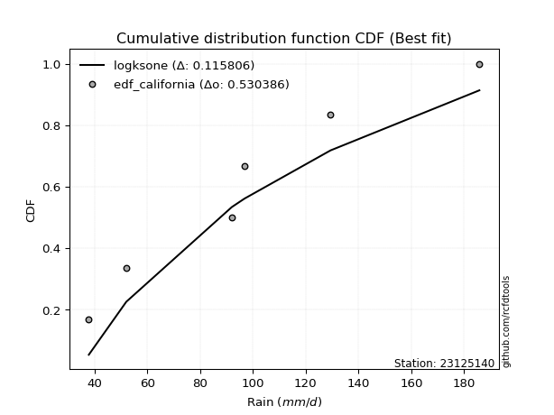</img>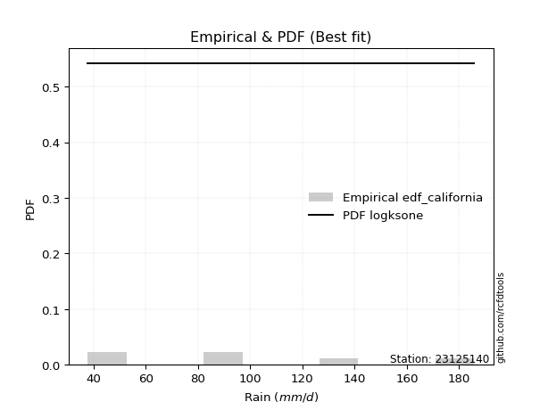</img>

</div>


### 2. Empirical - EDF Hazen (1930)

Hazen method for plotting positions is a formula used to estimate the empirical cumulative probability distribution of flood events or other hydrological data. This formula often results in biased estimations, particularly when extrapolating to extreme events (high return periods).

<div align="center">


$P=(m-0.5)/n$


</div>


**2.1. Empirical values**

<div align="center">

|                | 0                  | 1                  | 2         | 3                 | 4                  |
|:---------------|:-------------------|:-------------------|:----------|:------------------|:-------------------|
| date           | 2023               | 2018               | 2019      | 2020              | 2021               |
| x              | 37.8               | 52.0               | 92.0      | 96.8              | 129.4              |
| m              | 1                  | 2                  | 3         | 4                 | 5                  |
| empirical_dist | edf_hazen          | edf_hazen          | edf_hazen | edf_hazen         | edf_hazen          |
| empirical      | 0.1                | 0.3                | 0.5       | 0.7               | 0.9                |
| empirical_tr   | 1.1111111111111112 | 1.4285714285714286 | 2.0       | 3.333333333333333 | 10.000000000000002 |

</div>


**2.2. Kolmogorov-Smirnov fit test (sorted by Δ)**


<div align="center">

|                | 0                   | 1                  | 2                   | 3                   | 4                   | 5                   | 6                   | 7                   | 8                   | 9                   | 10                 | 11                  | 12                  | 13                  | 14                  | 15                 | 16                    | 17                 | 18                  | 19                  | 20                  | 21                  | 22                  | 23                  | 24                  | 25                  | 26                 | 27                  | 28                  | 29                  | 30                  | 31                  | 32                  | 33                  | 34                 | 35                 | 36                  | 37                  | 38                 | 39                 | 40                  | 41                 | 42                 | 43                  | 44                  | 45                 | 46                 | 47                  | 48                  | 49                  | 50                  | 51                  | 52                 | 53                  | 54                  | 55                  | 56                 | 57                 | 58                  | 59                  | 60                  | 61                  | 62                 | 63                  | 64                 | 65                  | 66                  | 67                  | 68                  | 69                 | 70                  | 71                  | 72                 | 73                 | 74                  | 75                  | 76                  | 77                 | 78                  | 79                 | 80                  | 81                  | 82                 | 83                 | 84                  | 85                 | 86                 | 87                  | 88                  | 89                 |
|:---------------|:--------------------|:-------------------|:--------------------|:--------------------|:--------------------|:--------------------|:--------------------|:--------------------|:--------------------|:--------------------|:-------------------|:--------------------|:--------------------|:--------------------|:--------------------|:-------------------|:----------------------|:-------------------|:--------------------|:--------------------|:--------------------|:--------------------|:--------------------|:--------------------|:--------------------|:--------------------|:-------------------|:--------------------|:--------------------|:--------------------|:--------------------|:--------------------|:--------------------|:--------------------|:-------------------|:-------------------|:--------------------|:--------------------|:-------------------|:-------------------|:--------------------|:-------------------|:-------------------|:--------------------|:--------------------|:-------------------|:-------------------|:--------------------|:--------------------|:--------------------|:--------------------|:--------------------|:-------------------|:--------------------|:--------------------|:--------------------|:-------------------|:-------------------|:--------------------|:--------------------|:--------------------|:--------------------|:-------------------|:--------------------|:-------------------|:--------------------|:--------------------|:--------------------|:--------------------|:-------------------|:--------------------|:--------------------|:-------------------|:-------------------|:--------------------|:--------------------|:--------------------|:-------------------|:--------------------|:-------------------|:--------------------|:--------------------|:-------------------|:-------------------|:--------------------|:-------------------|:-------------------|:--------------------|:--------------------|:-------------------|
| station        | 23125140            | 23125140           | 23125140            | 23125140            | 23125140            | 23125140            | 23125140            | 23125140            | 23125140            | 23125140            | 23125140           | 23125140            | 23125140            | 23125140            | 23125140            | 23125140           | 23125140              | 23125140           | 23125140            | 23125140            | 23125140            | 23125140            | 23125140            | 23125140            | 23125140            | 23125140            | 23125140           | 23125140            | 23125140            | 23125140            | 23125140            | 23125140            | 23125140            | 23125140            | 23125140           | 23125140           | 23125140            | 23125140            | 23125140           | 23125140           | 23125140            | 23125140           | 23125140           | 23125140            | 23125140            | 23125140           | 23125140           | 23125140            | 23125140            | 23125140            | 23125140            | 23125140            | 23125140           | 23125140            | 23125140            | 23125140            | 23125140           | 23125140           | 23125140            | 23125140            | 23125140            | 23125140            | 23125140           | 23125140            | 23125140           | 23125140            | 23125140            | 23125140            | 23125140            | 23125140           | 23125140            | 23125140            | 23125140           | 23125140           | 23125140            | 23125140            | 23125140            | 23125140           | 23125140            | 23125140           | 23125140            | 23125140            | 23125140           | 23125140           | 23125140            | 23125140           | 23125140           | 23125140            | 23125140            | 23125140           |
| empirical_dist | edf_hazen           | edf_hazen          | edf_hazen           | edf_hazen           | edf_hazen           | edf_hazen           | edf_hazen           | edf_hazen           | edf_hazen           | edf_hazen           | edf_hazen          | edf_hazen           | edf_hazen           | edf_hazen           | edf_hazen           | edf_hazen          | edf_hazen             | edf_hazen          | edf_hazen           | edf_hazen           | edf_hazen           | edf_hazen           | edf_hazen           | edf_hazen           | edf_hazen           | edf_hazen           | edf_hazen          | edf_hazen           | edf_hazen           | edf_hazen           | edf_hazen           | edf_hazen           | edf_hazen           | edf_hazen           | edf_hazen          | edf_hazen          | edf_hazen           | edf_hazen           | edf_hazen          | edf_hazen          | edf_hazen           | edf_hazen          | edf_hazen          | edf_hazen           | edf_hazen           | edf_hazen          | edf_hazen          | edf_hazen           | edf_hazen           | edf_hazen           | edf_hazen           | edf_hazen           | edf_hazen          | edf_hazen           | edf_hazen           | edf_hazen           | edf_hazen          | edf_hazen          | edf_hazen           | edf_hazen           | edf_hazen           | edf_hazen           | edf_hazen          | edf_hazen           | edf_hazen          | edf_hazen           | edf_hazen           | edf_hazen           | edf_hazen           | edf_hazen          | edf_hazen           | edf_hazen           | edf_hazen          | edf_hazen          | edf_hazen           | edf_hazen           | edf_hazen           | edf_hazen          | edf_hazen           | edf_hazen          | edf_hazen           | edf_hazen           | edf_hazen          | edf_hazen          | edf_hazen           | edf_hazen          | edf_hazen          | edf_hazen           | edf_hazen           | edf_hazen          |
| p_dist         | logcrystalball      | mielke             | logjohnsonsu        | logmielke           | logloggamma         | fisk                | nct                 | crystalball         | norm                | truncnorm           | exponnorm          | johnsonsu           | t                   | pearson3            | gamma               | erlang             | loglaplace_asymmetric | laplace_asymmetric | logweibull_min      | gumbel_l            | logistic            | loggumbel_l         | rice                | gompertz            | maxwell             | invgamma            | alpha              | hypsecant           | rayleigh            | ncf                 | logfisk             | logpearson3         | logncf              | invgauss            | logchi2            | genlogistic        | halfnorm            | laplace             | kstwobign          | logf               | lognct              | logexponnorm       | logt               | lognorm             | lognorm             | logfatiguelife     | logbetaprime       | logerlang           | gumbel_r            | loggamma            | loggamma            | logrice             | loginvgamma        | logalpha            | logmaxwell          | loginvgauss         | betaprime          | loglogistic        | halflogistic        | lograyleigh         | moyal               | genexpon            | loginvweibull      | expon               | loggenexpon        | logkstwobign        | loghypsecant        | loghalfnorm         | loggompertz         | weibull_min        | logexpon            | loggumbel_r         | loglaplace         | loghalflogistic    | logmoyal            | f                   | wald                | nakagami           | lognakagami         | gibrat             | logwald             | chi2                | pareto             | loggibrat          | logpareto           | loglognorm         | fatiguelife        | invweibull          | logtruncnorm        | loggenlogistic     |
| delta          | 0.08684276743049857 | 0.1077587773751045 | 0.10922024343264874 | 0.11351389911379861 | 0.11613477853573606 | 0.12378217713928186 | 0.12391535775986973 | 0.12396729766823256 | 0.12396729993083877 | 0.12396730107937981 | 0.1239677318311575 | 0.12399358030624275 | 0.12402372738935863 | 0.12520782008729836 | 0.12535405702025326 | 0.1253542865300472 | 0.1286944861835757    | 0.1295687588674438 | 0.13113751094511494 | 0.13760371830514997 | 0.13945749831991894 | 0.14429626843019916 | 0.14451578648019558 | 0.14694743566304136 | 0.14826486870803623 | 0.14969160269547166 | 0.1511152988087332 | 0.15184816142424973 | 0.15569009698349423 | 0.15977844744875203 | 0.16034036681928254 | 0.16705946757711854 | 0.16742429858810026 | 0.16801455928450038 | 0.1688458661939527 | 0.1719136621921996 | 0.17700536146598012 | 0.18015586747506096 | 0.180296303831894  | 0.1823904137251815 | 0.18269973703306785 | 0.1829133801265389 | 0.1829138882448209 | 0.18291421948839504 | 0.18291421948839504 | 0.1832543222800893 | 0.1863578907464858 | 0.18670441392229897 | 0.18769266333159185 | 0.18944423484992856 | 0.18944423484992856 | 0.19244055056999787 | 0.1953432050132503 | 0.19592752626700483 | 0.20086464524374592 | 0.20092500611089936 | 0.2018841555801879 | 0.2033123251465221 | 0.20536655023757933 | 0.20616049550717297 | 0.20912076037798066 | 0.20915379517988786 | 0.2093857525494256 | 0.20987485725466237 | 0.2176761385097653 | 0.21799653652744722 | 0.21844241062997294 | 0.22195504024180424 | 0.22456022395976638 | 0.2256905319600831 | 0.23180759704357068 | 0.23714381748743085 | 0.2449051717478874 | 0.2493300199840648 | 0.25479876743838337 | 0.26235733799672745 | 0.29573409899173275 | 0.2999999971590025 | 0.29999999999833604 | 0.3013639919794281 | 0.30586725616871635 | 0.30911942689333405 | 0.3125205313598303 | 0.3376214970642448 | 0.34150765627963914 | 0.3693635597025479 | 0.3887230436302718 | 0.44130921798280104 | 0.49998320630687076 | 0.7                |
| deltao         | 0.5865427407550001  | 0.5865427407550001 | 0.5865427407550001  | 0.5865427407550001  | 0.5865427407550001  | 0.5865427407550001  | 0.5865427407550001  | 0.5865427407550001  | 0.5865427407550001  | 0.5865427407550001  | 0.5865427407550001 | 0.5865427407550001  | 0.5865427407550001  | 0.5865427407550001  | 0.5865427407550001  | 0.5865427407550001 | 0.5865427407550001    | 0.5865427407550001 | 0.5865427407550001  | 0.5865427407550001  | 0.5865427407550001  | 0.5865427407550001  | 0.5865427407550001  | 0.5865427407550001  | 0.5865427407550001  | 0.5865427407550001  | 0.5865427407550001 | 0.5865427407550001  | 0.5865427407550001  | 0.5865427407550001  | 0.5865427407550001  | 0.5865427407550001  | 0.5865427407550001  | 0.5865427407550001  | 0.5865427407550001 | 0.5865427407550001 | 0.5865427407550001  | 0.5865427407550001  | 0.5865427407550001 | 0.5865427407550001 | 0.5865427407550001  | 0.5865427407550001 | 0.5865427407550001 | 0.5865427407550001  | 0.5865427407550001  | 0.5865427407550001 | 0.5865427407550001 | 0.5865427407550001  | 0.5865427407550001  | 0.5865427407550001  | 0.5865427407550001  | 0.5865427407550001  | 0.5865427407550001 | 0.5865427407550001  | 0.5865427407550001  | 0.5865427407550001  | 0.5865427407550001 | 0.5865427407550001 | 0.5865427407550001  | 0.5865427407550001  | 0.5865427407550001  | 0.5865427407550001  | 0.5865427407550001 | 0.5865427407550001  | 0.5865427407550001 | 0.5865427407550001  | 0.5865427407550001  | 0.5865427407550001  | 0.5865427407550001  | 0.5865427407550001 | 0.5865427407550001  | 0.5865427407550001  | 0.5865427407550001 | 0.5865427407550001 | 0.5865427407550001  | 0.5865427407550001  | 0.5865427407550001  | 0.5865427407550001 | 0.5865427407550001  | 0.5865427407550001 | 0.5865427407550001  | 0.5865427407550001  | 0.5865427407550001 | 0.5865427407550001 | 0.5865427407550001  | 0.5865427407550001 | 0.5865427407550001 | 0.5865427407550001  | 0.5865427407550001  | 0.5865427407550001 |
| eval           | Δo > Δ              | Δo > Δ             | Δo > Δ              | Δo > Δ              | Δo > Δ              | Δo > Δ              | Δo > Δ              | Δo > Δ              | Δo > Δ              | Δo > Δ              | Δo > Δ             | Δo > Δ              | Δo > Δ              | Δo > Δ              | Δo > Δ              | Δo > Δ             | Δo > Δ                | Δo > Δ             | Δo > Δ              | Δo > Δ              | Δo > Δ              | Δo > Δ              | Δo > Δ              | Δo > Δ              | Δo > Δ              | Δo > Δ              | Δo > Δ             | Δo > Δ              | Δo > Δ              | Δo > Δ              | Δo > Δ              | Δo > Δ              | Δo > Δ              | Δo > Δ              | Δo > Δ             | Δo > Δ             | Δo > Δ              | Δo > Δ              | Δo > Δ             | Δo > Δ             | Δo > Δ              | Δo > Δ             | Δo > Δ             | Δo > Δ              | Δo > Δ              | Δo > Δ             | Δo > Δ             | Δo > Δ              | Δo > Δ              | Δo > Δ              | Δo > Δ              | Δo > Δ              | Δo > Δ             | Δo > Δ              | Δo > Δ              | Δo > Δ              | Δo > Δ             | Δo > Δ             | Δo > Δ              | Δo > Δ              | Δo > Δ              | Δo > Δ              | Δo > Δ             | Δo > Δ              | Δo > Δ             | Δo > Δ              | Δo > Δ              | Δo > Δ              | Δo > Δ              | Δo > Δ             | Δo > Δ              | Δo > Δ              | Δo > Δ             | Δo > Δ             | Δo > Δ              | Δo > Δ              | Δo > Δ              | Δo > Δ             | Δo > Δ              | Δo > Δ             | Δo > Δ              | Δo > Δ              | Δo > Δ             | Δo > Δ             | Δo > Δ              | Δo > Δ             | Δo > Δ             | Δo > Δ              | Δo > Δ              | Δo <= Δ            |
| fit            | 1                   | 1                  | 1                   | 1                   | 1                   | 1                   | 1                   | 1                   | 1                   | 1                   | 1                  | 1                   | 1                   | 1                   | 1                   | 1                  | 1                     | 1                  | 1                   | 1                   | 1                   | 1                   | 1                   | 1                   | 1                   | 1                   | 1                  | 1                   | 1                   | 1                   | 1                   | 1                   | 1                   | 1                   | 1                  | 1                  | 1                   | 1                   | 1                  | 1                  | 1                   | 1                  | 1                  | 1                   | 1                   | 1                  | 1                  | 1                   | 1                   | 1                   | 1                   | 1                   | 1                  | 1                   | 1                   | 1                   | 1                  | 1                  | 1                   | 1                   | 1                   | 1                   | 1                  | 1                   | 1                  | 1                   | 1                   | 1                   | 1                   | 1                  | 1                   | 1                   | 1                  | 1                  | 1                   | 1                   | 1                   | 1                  | 1                   | 1                  | 1                   | 1                   | 1                  | 1                  | 1                   | 1                  | 1                  | 1                   | 1                   | 0                  |
| n              | 5                   | 5                  | 5                   | 5                   | 5                   | 5                   | 5                   | 5                   | 5                   | 5                   | 5                  | 5                   | 5                   | 5                   | 5                   | 5                  | 5                     | 5                  | 5                   | 5                   | 5                   | 5                   | 5                   | 5                   | 5                   | 5                   | 5                  | 5                   | 5                   | 5                   | 5                   | 5                   | 5                   | 5                   | 5                  | 5                  | 5                   | 5                   | 5                  | 5                  | 5                   | 5                  | 5                  | 5                   | 5                   | 5                  | 5                  | 5                   | 5                   | 5                   | 5                   | 5                   | 5                  | 5                   | 5                   | 5                   | 5                  | 5                  | 5                   | 5                   | 5                   | 5                   | 5                  | 5                   | 5                  | 5                   | 5                   | 5                   | 5                   | 5                  | 5                   | 5                   | 5                  | 5                  | 5                   | 5                   | 5                   | 5                  | 5                   | 5                  | 5                   | 5                   | 5                  | 5                  | 5                   | 5                  | 5                  | 5                   | 5                   | 5                  |
| best_fit       | 1                   | 0                  | 0                   | 0                   | 0                   | 0                   | 0                   | 0                   | 0                   | 0                   | 0                  | 0                   | 0                   | 0                   | 0                   | 0                  | 0                     | 0                  | 0                   | 0                   | 0                   | 0                   | 0                   | 0                   | 0                   | 0                   | 0                  | 0                   | 0                   | 0                   | 0                   | 0                   | 0                   | 0                   | 0                  | 0                  | 0                   | 0                   | 0                  | 0                  | 0                   | 0                  | 0                  | 0                   | 0                   | 0                  | 0                  | 0                   | 0                   | 0                   | 0                   | 0                   | 0                  | 0                   | 0                   | 0                   | 0                  | 0                  | 0                   | 0                   | 0                   | 0                   | 0                  | 0                   | 0                  | 0                   | 0                   | 0                   | 0                   | 0                  | 0                   | 0                   | 0                  | 0                  | 0                   | 0                   | 0                   | 0                  | 0                   | 0                  | 0                   | 0                   | 0                  | 0                  | 0                   | 0                  | 0                  | 0                   | 0                   | 0                  |
| best_fit_sort  | 1                   | 2                  | 3                   | 4                   | 5                   | 6                   | 7                   | 8                   | 9                   | 10                  | 11                 | 12                  | 13                  | 14                  | 15                  | 16                 | 17                    | 18                 | 19                  | 20                  | 21                  | 22                  | 23                  | 24                  | 25                  | 26                  | 27                 | 28                  | 29                  | 30                  | 31                  | 32                  | 33                  | 34                  | 35                 | 36                 | 37                  | 38                  | 39                 | 40                 | 41                  | 42                 | 43                 | 44                  | 45                  | 46                 | 47                 | 48                  | 49                  | 50                  | 51                  | 52                  | 53                 | 54                  | 55                  | 56                  | 57                 | 58                 | 59                  | 60                  | 61                  | 62                  | 63                 | 64                  | 65                 | 66                  | 67                  | 68                  | 69                  | 70                 | 71                  | 72                  | 73                 | 74                 | 75                  | 76                  | 77                  | 78                 | 79                  | 80                 | 81                  | 82                  | 83                 | 84                 | 85                  | 86                 | 87                 | 88                  | 89                  | 90                 |

</div>


<div align="center">

</img>

</div>


**2.3. Best fit**

<div align="center">

|   id |   station | empirical_dist   | p_dist         |     delta |   deltao | eval   |   fit |   n |   best_fit |   best_fit_sort |
|-----:|----------:|:-----------------|:---------------|----------:|---------:|:-------|------:|----:|-----------:|----------------:|
|    0 |  23125140 | edf_hazen        | logcrystalball | 0.0868428 | 0.586543 | Δo > Δ |     1 |   5 |          1 |               1 |

</div>


<div align="center">

</img>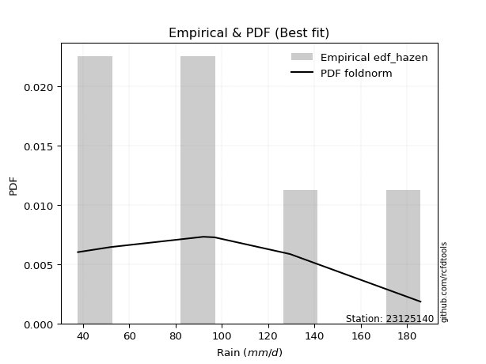</img>

</div>


### 3. Empirical - EDF Weibull (1939)

Weibull plotting position formula is an empirical method used to estimate the non-exceedance probability or plotting position for a set of observed data, is often recommended or widely used in practice, particularly in flood frequency analysis.

<div align="center">


$P=m/(n+1)$


</div>


**3.1. Empirical values**

<div align="center">

|                | 0                   | 1                  | 2           | 3                  | 4                  |
|:---------------|:--------------------|:-------------------|:------------|:-------------------|:-------------------|
| date           | 2023                | 2018               | 2019        | 2020               | 2021               |
| x              | 37.8                | 52.0               | 92.0        | 96.8               | 129.4              |
| m              | 1                   | 2                  | 3           | 4                  | 5                  |
| empirical_dist | edf_weibull         | edf_weibull        | edf_weibull | edf_weibull        | edf_weibull        |
| empirical      | 0.16666666666666666 | 0.3333333333333333 | 0.5         | 0.6666666666666666 | 0.8333333333333334 |
| empirical_tr   | 1.2                 | 1.4999999999999998 | 2.0         | 2.9999999999999996 | 6.000000000000002  |

</div>


**3.2. Kolmogorov-Smirnov fit test (sorted by Δ)**


<div align="center">

|                | 0                   | 1                   | 2                   | 3                   | 4                   | 5                   | 6                  | 7                   | 8                   | 9                   | 10                 | 11                 | 12                  | 13                  | 14                  | 15                  | 16                  | 17                  | 18                  | 19                 | 20                    | 21                 | 22                  | 23                  | 24                  | 25                  | 26                  | 27                  | 28                  | 29                  | 30                  | 31                  | 32                  | 33                 | 34                 | 35                  | 36                 | 37                  | 38                 | 39                  | 40                 | 41                 | 42                  | 43                  | 44                 | 45                 | 46                  | 47                  | 48                  | 49                  | 50                  | 51                  | 52                  | 53                 | 54                  | 55                  | 56                  | 57                 | 58                 | 59                  | 60                  | 61                  | 62                  | 63                 | 64                  | 65                 | 66                  | 67                  | 68                  | 69                  | 70                  | 71                  | 72                 | 73                 | 74                  | 75                  | 76                 | 77                  | 78                 | 79                  | 80                 | 81                 | 82                  | 83                 | 84                 | 85                 | 86                 | 87                 | 88                  | 89                 |
|:---------------|:--------------------|:--------------------|:--------------------|:--------------------|:--------------------|:--------------------|:-------------------|:--------------------|:--------------------|:--------------------|:-------------------|:-------------------|:--------------------|:--------------------|:--------------------|:--------------------|:--------------------|:--------------------|:--------------------|:-------------------|:----------------------|:-------------------|:--------------------|:--------------------|:--------------------|:--------------------|:--------------------|:--------------------|:--------------------|:--------------------|:--------------------|:--------------------|:--------------------|:-------------------|:-------------------|:--------------------|:-------------------|:--------------------|:-------------------|:--------------------|:-------------------|:-------------------|:--------------------|:--------------------|:-------------------|:-------------------|:--------------------|:--------------------|:--------------------|:--------------------|:--------------------|:--------------------|:--------------------|:-------------------|:--------------------|:--------------------|:--------------------|:-------------------|:-------------------|:--------------------|:--------------------|:--------------------|:--------------------|:-------------------|:--------------------|:-------------------|:--------------------|:--------------------|:--------------------|:--------------------|:--------------------|:--------------------|:-------------------|:-------------------|:--------------------|:--------------------|:-------------------|:--------------------|:-------------------|:--------------------|:-------------------|:-------------------|:--------------------|:-------------------|:-------------------|:-------------------|:-------------------|:-------------------|:--------------------|:-------------------|
| station        | 23125140            | 23125140            | 23125140            | 23125140            | 23125140            | 23125140            | 23125140           | 23125140            | 23125140            | 23125140            | 23125140           | 23125140           | 23125140            | 23125140            | 23125140            | 23125140            | 23125140            | 23125140            | 23125140            | 23125140           | 23125140              | 23125140           | 23125140            | 23125140            | 23125140            | 23125140            | 23125140            | 23125140            | 23125140            | 23125140            | 23125140            | 23125140            | 23125140            | 23125140           | 23125140           | 23125140            | 23125140           | 23125140            | 23125140           | 23125140            | 23125140           | 23125140           | 23125140            | 23125140            | 23125140           | 23125140           | 23125140            | 23125140            | 23125140            | 23125140            | 23125140            | 23125140            | 23125140            | 23125140           | 23125140            | 23125140            | 23125140            | 23125140           | 23125140           | 23125140            | 23125140            | 23125140            | 23125140            | 23125140           | 23125140            | 23125140           | 23125140            | 23125140            | 23125140            | 23125140            | 23125140            | 23125140            | 23125140           | 23125140           | 23125140            | 23125140            | 23125140           | 23125140            | 23125140           | 23125140            | 23125140           | 23125140           | 23125140            | 23125140           | 23125140           | 23125140           | 23125140           | 23125140           | 23125140            | 23125140           |
| empirical_dist | edf_weibull         | edf_weibull         | edf_weibull         | edf_weibull         | edf_weibull         | edf_weibull         | edf_weibull        | edf_weibull         | edf_weibull         | edf_weibull         | edf_weibull        | edf_weibull        | edf_weibull         | edf_weibull         | edf_weibull         | edf_weibull         | edf_weibull         | edf_weibull         | edf_weibull         | edf_weibull        | edf_weibull           | edf_weibull        | edf_weibull         | edf_weibull         | edf_weibull         | edf_weibull         | edf_weibull         | edf_weibull         | edf_weibull         | edf_weibull         | edf_weibull         | edf_weibull         | edf_weibull         | edf_weibull        | edf_weibull        | edf_weibull         | edf_weibull        | edf_weibull         | edf_weibull        | edf_weibull         | edf_weibull        | edf_weibull        | edf_weibull         | edf_weibull         | edf_weibull        | edf_weibull        | edf_weibull         | edf_weibull         | edf_weibull         | edf_weibull         | edf_weibull         | edf_weibull         | edf_weibull         | edf_weibull        | edf_weibull         | edf_weibull         | edf_weibull         | edf_weibull        | edf_weibull        | edf_weibull         | edf_weibull         | edf_weibull         | edf_weibull         | edf_weibull        | edf_weibull         | edf_weibull        | edf_weibull         | edf_weibull         | edf_weibull         | edf_weibull         | edf_weibull         | edf_weibull         | edf_weibull        | edf_weibull        | edf_weibull         | edf_weibull         | edf_weibull        | edf_weibull         | edf_weibull        | edf_weibull         | edf_weibull        | edf_weibull        | edf_weibull         | edf_weibull        | edf_weibull        | edf_weibull        | edf_weibull        | edf_weibull        | edf_weibull         | edf_weibull        |
| p_dist         | logcrystalball      | mielke              | logjohnsonsu        | logmielke           | logweibull_min      | maxwell             | erlang             | gamma               | pearson3            | nct                 | t                  | exponnorm          | crystalball         | norm                | truncnorm           | johnsonsu           | fisk                | invgamma            | loggumbel_l         | alpha              | loglaplace_asymmetric | rice               | rayleigh            | ncf                 | logfisk             | laplace_asymmetric  | logloggamma         | logchi2             | gompertz            | logpearson3         | logncf              | invgauss            | logistic            | gumbel_l           | genlogistic        | halfnorm            | kstwobign          | hypsecant           | logf               | lognct              | logexponnorm       | logt               | lognorm             | lognorm             | logfatiguelife     | logbetaprime       | logerlang           | gumbel_r            | loggamma            | loggamma            | weibull_min         | logrice             | laplace             | loginvgamma        | logalpha            | logmaxwell          | loginvgauss         | betaprime          | loglogistic        | halflogistic        | lograyleigh         | moyal               | genexpon            | loginvweibull      | expon               | loggenexpon        | logkstwobign        | loghypsecant        | loghalfnorm         | loggompertz         | logexpon            | loggumbel_r         | loglaplace         | loghalflogistic    | logmoyal            | f                   | pareto             | logwald             | logpareto          | chi2                | wald               | nakagami           | lognakagami         | gibrat             | loglognorm         | loggibrat          | fatiguelife        | invweibull         | logtruncnorm        | loggenlogistic     |
| delta          | 0.10271338362667526 | 0.14109211070843783 | 0.14255357676598207 | 0.14495067166508369 | 0.14751242863037908 | 0.14826486870803623 | 0.1487768368241364 | 0.14882116143717858 | 0.14886465838280072 | 0.14895308271321087 | 0.1490340828133329 | 0.1490466046289808 | 0.14904662478407238 | 0.14904662666875723 | 0.14904663001797186 | 0.14909212373428493 | 0.14963513935023776 | 0.14969160269547166 | 0.15002437761928483 | 0.1511152988087332 | 0.15176207641069628   | 0.1545957993192748 | 0.15569009698349423 | 0.15977844744875203 | 0.16034036681928254 | 0.16290209220077712 | 0.16522955965120556 | 0.16666665727097937 | 0.16666666666664018 | 0.16705946757711854 | 0.16742429858810026 | 0.16801455928450038 | 0.16962287190583275 | 0.1709370516384833 | 0.1719136621921996 | 0.17700536146598012 | 0.180296303831894  | 0.18123773888218783 | 0.1823904137251815 | 0.18269973703306785 | 0.1829133801265389 | 0.1829138882448209 | 0.18291421948839504 | 0.18291421948839504 | 0.1832543222800893 | 0.1863578907464858 | 0.18670441392229897 | 0.18769266333159185 | 0.18944423484992856 | 0.18944423484992856 | 0.19235719862674977 | 0.19244055056999787 | 0.19314038365199337 | 0.1953432050132503 | 0.19592752626700483 | 0.20086464524374592 | 0.20092500611089936 | 0.2018841555801879 | 0.2033123251465221 | 0.20536655023757933 | 0.20616049550717297 | 0.20912076037798066 | 0.20915379517988786 | 0.2093857525494256 | 0.20987485725466237 | 0.2176761385097653 | 0.21799653652744722 | 0.21844241062997294 | 0.22195504024180424 | 0.22456022395976638 | 0.23180759704357068 | 0.23714381748743085 | 0.2449051717478874 | 0.2493300199840648 | 0.25479876743838337 | 0.26235733799672745 | 0.279187198026497  | 0.30586725616871635 | 0.3081743229463058 | 0.30911942689333405 | 0.3290674323250661 | 0.3333333304923358 | 0.33333333333166937 | 0.3333333333333333 | 0.3360302263692146 | 0.3376214970642448 | 0.3553897102969385 | 0.3746425513161344 | 0.49998320630687076 | 0.6666666666666666 |
| deltao         | 0.5865427407550001  | 0.5865427407550001  | 0.5865427407550001  | 0.5865427407550001  | 0.5865427407550001  | 0.5865427407550001  | 0.5865427407550001 | 0.5865427407550001  | 0.5865427407550001  | 0.5865427407550001  | 0.5865427407550001 | 0.5865427407550001 | 0.5865427407550001  | 0.5865427407550001  | 0.5865427407550001  | 0.5865427407550001  | 0.5865427407550001  | 0.5865427407550001  | 0.5865427407550001  | 0.5865427407550001 | 0.5865427407550001    | 0.5865427407550001 | 0.5865427407550001  | 0.5865427407550001  | 0.5865427407550001  | 0.5865427407550001  | 0.5865427407550001  | 0.5865427407550001  | 0.5865427407550001  | 0.5865427407550001  | 0.5865427407550001  | 0.5865427407550001  | 0.5865427407550001  | 0.5865427407550001 | 0.5865427407550001 | 0.5865427407550001  | 0.5865427407550001 | 0.5865427407550001  | 0.5865427407550001 | 0.5865427407550001  | 0.5865427407550001 | 0.5865427407550001 | 0.5865427407550001  | 0.5865427407550001  | 0.5865427407550001 | 0.5865427407550001 | 0.5865427407550001  | 0.5865427407550001  | 0.5865427407550001  | 0.5865427407550001  | 0.5865427407550001  | 0.5865427407550001  | 0.5865427407550001  | 0.5865427407550001 | 0.5865427407550001  | 0.5865427407550001  | 0.5865427407550001  | 0.5865427407550001 | 0.5865427407550001 | 0.5865427407550001  | 0.5865427407550001  | 0.5865427407550001  | 0.5865427407550001  | 0.5865427407550001 | 0.5865427407550001  | 0.5865427407550001 | 0.5865427407550001  | 0.5865427407550001  | 0.5865427407550001  | 0.5865427407550001  | 0.5865427407550001  | 0.5865427407550001  | 0.5865427407550001 | 0.5865427407550001 | 0.5865427407550001  | 0.5865427407550001  | 0.5865427407550001 | 0.5865427407550001  | 0.5865427407550001 | 0.5865427407550001  | 0.5865427407550001 | 0.5865427407550001 | 0.5865427407550001  | 0.5865427407550001 | 0.5865427407550001 | 0.5865427407550001 | 0.5865427407550001 | 0.5865427407550001 | 0.5865427407550001  | 0.5865427407550001 |
| eval           | Δo > Δ              | Δo > Δ              | Δo > Δ              | Δo > Δ              | Δo > Δ              | Δo > Δ              | Δo > Δ             | Δo > Δ              | Δo > Δ              | Δo > Δ              | Δo > Δ             | Δo > Δ             | Δo > Δ              | Δo > Δ              | Δo > Δ              | Δo > Δ              | Δo > Δ              | Δo > Δ              | Δo > Δ              | Δo > Δ             | Δo > Δ                | Δo > Δ             | Δo > Δ              | Δo > Δ              | Δo > Δ              | Δo > Δ              | Δo > Δ              | Δo > Δ              | Δo > Δ              | Δo > Δ              | Δo > Δ              | Δo > Δ              | Δo > Δ              | Δo > Δ             | Δo > Δ             | Δo > Δ              | Δo > Δ             | Δo > Δ              | Δo > Δ             | Δo > Δ              | Δo > Δ             | Δo > Δ             | Δo > Δ              | Δo > Δ              | Δo > Δ             | Δo > Δ             | Δo > Δ              | Δo > Δ              | Δo > Δ              | Δo > Δ              | Δo > Δ              | Δo > Δ              | Δo > Δ              | Δo > Δ             | Δo > Δ              | Δo > Δ              | Δo > Δ              | Δo > Δ             | Δo > Δ             | Δo > Δ              | Δo > Δ              | Δo > Δ              | Δo > Δ              | Δo > Δ             | Δo > Δ              | Δo > Δ             | Δo > Δ              | Δo > Δ              | Δo > Δ              | Δo > Δ              | Δo > Δ              | Δo > Δ              | Δo > Δ             | Δo > Δ             | Δo > Δ              | Δo > Δ              | Δo > Δ             | Δo > Δ              | Δo > Δ             | Δo > Δ              | Δo > Δ             | Δo > Δ             | Δo > Δ              | Δo > Δ             | Δo > Δ             | Δo > Δ             | Δo > Δ             | Δo > Δ             | Δo > Δ              | Δo <= Δ            |
| fit            | 1                   | 1                   | 1                   | 1                   | 1                   | 1                   | 1                  | 1                   | 1                   | 1                   | 1                  | 1                  | 1                   | 1                   | 1                   | 1                   | 1                   | 1                   | 1                   | 1                  | 1                     | 1                  | 1                   | 1                   | 1                   | 1                   | 1                   | 1                   | 1                   | 1                   | 1                   | 1                   | 1                   | 1                  | 1                  | 1                   | 1                  | 1                   | 1                  | 1                   | 1                  | 1                  | 1                   | 1                   | 1                  | 1                  | 1                   | 1                   | 1                   | 1                   | 1                   | 1                   | 1                   | 1                  | 1                   | 1                   | 1                   | 1                  | 1                  | 1                   | 1                   | 1                   | 1                   | 1                  | 1                   | 1                  | 1                   | 1                   | 1                   | 1                   | 1                   | 1                   | 1                  | 1                  | 1                   | 1                   | 1                  | 1                   | 1                  | 1                   | 1                  | 1                  | 1                   | 1                  | 1                  | 1                  | 1                  | 1                  | 1                   | 0                  |
| n              | 5                   | 5                   | 5                   | 5                   | 5                   | 5                   | 5                  | 5                   | 5                   | 5                   | 5                  | 5                  | 5                   | 5                   | 5                   | 5                   | 5                   | 5                   | 5                   | 5                  | 5                     | 5                  | 5                   | 5                   | 5                   | 5                   | 5                   | 5                   | 5                   | 5                   | 5                   | 5                   | 5                   | 5                  | 5                  | 5                   | 5                  | 5                   | 5                  | 5                   | 5                  | 5                  | 5                   | 5                   | 5                  | 5                  | 5                   | 5                   | 5                   | 5                   | 5                   | 5                   | 5                   | 5                  | 5                   | 5                   | 5                   | 5                  | 5                  | 5                   | 5                   | 5                   | 5                   | 5                  | 5                   | 5                  | 5                   | 5                   | 5                   | 5                   | 5                   | 5                   | 5                  | 5                  | 5                   | 5                   | 5                  | 5                   | 5                  | 5                   | 5                  | 5                  | 5                   | 5                  | 5                  | 5                  | 5                  | 5                  | 5                   | 5                  |
| best_fit       | 1                   | 0                   | 0                   | 0                   | 0                   | 0                   | 0                  | 0                   | 0                   | 0                   | 0                  | 0                  | 0                   | 0                   | 0                   | 0                   | 0                   | 0                   | 0                   | 0                  | 0                     | 0                  | 0                   | 0                   | 0                   | 0                   | 0                   | 0                   | 0                   | 0                   | 0                   | 0                   | 0                   | 0                  | 0                  | 0                   | 0                  | 0                   | 0                  | 0                   | 0                  | 0                  | 0                   | 0                   | 0                  | 0                  | 0                   | 0                   | 0                   | 0                   | 0                   | 0                   | 0                   | 0                  | 0                   | 0                   | 0                   | 0                  | 0                  | 0                   | 0                   | 0                   | 0                   | 0                  | 0                   | 0                  | 0                   | 0                   | 0                   | 0                   | 0                   | 0                   | 0                  | 0                  | 0                   | 0                   | 0                  | 0                   | 0                  | 0                   | 0                  | 0                  | 0                   | 0                  | 0                  | 0                  | 0                  | 0                  | 0                   | 0                  |
| best_fit_sort  | 1                   | 2                   | 3                   | 4                   | 5                   | 6                   | 7                  | 8                   | 9                   | 10                  | 11                 | 12                 | 13                  | 14                  | 15                  | 16                  | 17                  | 18                  | 19                  | 20                 | 21                    | 22                 | 23                  | 24                  | 25                  | 26                  | 27                  | 28                  | 29                  | 30                  | 31                  | 32                  | 33                  | 34                 | 35                 | 36                  | 37                 | 38                  | 39                 | 40                  | 41                 | 42                 | 43                  | 44                  | 45                 | 46                 | 47                  | 48                  | 49                  | 50                  | 51                  | 52                  | 53                  | 54                 | 55                  | 56                  | 57                  | 58                 | 59                 | 60                  | 61                  | 62                  | 63                  | 64                 | 65                  | 66                 | 67                  | 68                  | 69                  | 70                  | 71                  | 72                  | 73                 | 74                 | 75                  | 76                  | 77                 | 78                  | 79                 | 80                  | 81                 | 82                 | 83                  | 84                 | 85                 | 86                 | 87                 | 88                 | 89                  | 90                 |

</div>


<div align="center">

</img>

</div>


**3.3. Best fit**

<div align="center">

|   id |   station | empirical_dist   | p_dist         |    delta |   deltao | eval   |   fit |   n |   best_fit |   best_fit_sort |
|-----:|----------:|:-----------------|:---------------|---------:|---------:|:-------|------:|----:|-----------:|----------------:|
|    0 |  23125140 | edf_weibull      | logcrystalball | 0.102713 | 0.586543 | Δo > Δ |     1 |   5 |          1 |               1 |

</div>


<div align="center">

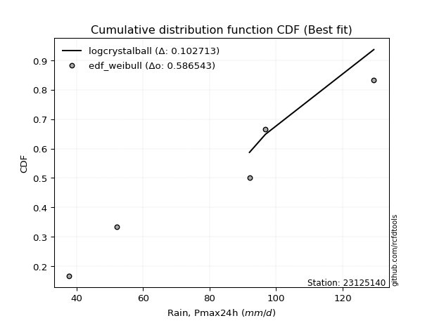</img></img>

</div>


### 4. Empirical - EDF Beard (1943)

The Beard formula (or Beard´s plotting position formula) in hydrology is used to estimate the empirical non-exceedance probability _(P)_ of a flood event (or other extreme hydrological data point) within a given dataset.

<div align="center">


$P=(m-0.31)/(n+0.38)$


</div>


**4.1. Empirical values**

<div align="center">

|                | 0                   | 1                  | 2         | 3                  | 4                  |
|:---------------|:--------------------|:-------------------|:----------|:-------------------|:-------------------|
| date           | 2023                | 2018               | 2019      | 2020               | 2021               |
| x              | 37.8                | 52.0               | 92.0      | 96.8               | 129.4              |
| m              | 1                   | 2                  | 3         | 4                  | 5                  |
| empirical_dist | edf_beard           | edf_beard          | edf_beard | edf_beard          | edf_beard          |
| empirical      | 0.12825278810408922 | 0.3141263940520446 | 0.5       | 0.6858736059479554 | 0.8717472118959109 |
| empirical_tr   | 1.1471215351812367  | 1.4579945799457996 | 2.0       | 3.183431952662722  | 7.797101449275368  |

</div>


**4.2. Kolmogorov-Smirnov fit test (sorted by Δ)**


<div align="center">

|                | 0                   | 1                   | 2                   | 3                   | 4                   | 5                  | 6                   | 7                   | 8                   | 9                   | 10                  | 11                  | 12                  | 13                  | 14                  | 15                  | 16                  | 17                    | 18                  | 19                  | 20                  | 21                  | 22                  | 23                  | 24                  | 25                 | 26                 | 27                 | 28                  | 29                  | 30                  | 31                  | 32                  | 33                  | 34                  | 35                 | 36                  | 37                  | 38                 | 39                 | 40                  | 41                 | 42                 | 43                  | 44                  | 45                 | 46                 | 47                  | 48                  | 49                  | 50                  | 51                  | 52                 | 53                  | 54                  | 55                  | 56                 | 57                 | 58                  | 59                  | 60                  | 61                  | 62                 | 63                  | 64                  | 65                 | 66                  | 67                  | 68                  | 69                  | 70                  | 71                  | 72                 | 73                 | 74                  | 75                  | 76                 | 77                  | 78                  | 79                 | 80                  | 81                 | 82                 | 83                 | 84                 | 85                 | 86                 | 87                 | 88                  | 89                 |
|:---------------|:--------------------|:--------------------|:--------------------|:--------------------|:--------------------|:-------------------|:--------------------|:--------------------|:--------------------|:--------------------|:--------------------|:--------------------|:--------------------|:--------------------|:--------------------|:--------------------|:--------------------|:----------------------|:--------------------|:--------------------|:--------------------|:--------------------|:--------------------|:--------------------|:--------------------|:-------------------|:-------------------|:-------------------|:--------------------|:--------------------|:--------------------|:--------------------|:--------------------|:--------------------|:--------------------|:-------------------|:--------------------|:--------------------|:-------------------|:-------------------|:--------------------|:-------------------|:-------------------|:--------------------|:--------------------|:-------------------|:-------------------|:--------------------|:--------------------|:--------------------|:--------------------|:--------------------|:-------------------|:--------------------|:--------------------|:--------------------|:-------------------|:-------------------|:--------------------|:--------------------|:--------------------|:--------------------|:-------------------|:--------------------|:--------------------|:-------------------|:--------------------|:--------------------|:--------------------|:--------------------|:--------------------|:--------------------|:-------------------|:-------------------|:--------------------|:--------------------|:-------------------|:--------------------|:--------------------|:-------------------|:--------------------|:-------------------|:-------------------|:-------------------|:-------------------|:-------------------|:-------------------|:-------------------|:--------------------|:-------------------|
| station        | 23125140            | 23125140            | 23125140            | 23125140            | 23125140            | 23125140           | 23125140            | 23125140            | 23125140            | 23125140            | 23125140            | 23125140            | 23125140            | 23125140            | 23125140            | 23125140            | 23125140            | 23125140              | 23125140            | 23125140            | 23125140            | 23125140            | 23125140            | 23125140            | 23125140            | 23125140           | 23125140           | 23125140           | 23125140            | 23125140            | 23125140            | 23125140            | 23125140            | 23125140            | 23125140            | 23125140           | 23125140            | 23125140            | 23125140           | 23125140           | 23125140            | 23125140           | 23125140           | 23125140            | 23125140            | 23125140           | 23125140           | 23125140            | 23125140            | 23125140            | 23125140            | 23125140            | 23125140           | 23125140            | 23125140            | 23125140            | 23125140           | 23125140           | 23125140            | 23125140            | 23125140            | 23125140            | 23125140           | 23125140            | 23125140            | 23125140           | 23125140            | 23125140            | 23125140            | 23125140            | 23125140            | 23125140            | 23125140           | 23125140           | 23125140            | 23125140            | 23125140           | 23125140            | 23125140            | 23125140           | 23125140            | 23125140           | 23125140           | 23125140           | 23125140           | 23125140           | 23125140           | 23125140           | 23125140            | 23125140           |
| empirical_dist | edf_beard           | edf_beard           | edf_beard           | edf_beard           | edf_beard           | edf_beard          | edf_beard           | edf_beard           | edf_beard           | edf_beard           | edf_beard           | edf_beard           | edf_beard           | edf_beard           | edf_beard           | edf_beard           | edf_beard           | edf_beard             | edf_beard           | edf_beard           | edf_beard           | edf_beard           | edf_beard           | edf_beard           | edf_beard           | edf_beard          | edf_beard          | edf_beard          | edf_beard           | edf_beard           | edf_beard           | edf_beard           | edf_beard           | edf_beard           | edf_beard           | edf_beard          | edf_beard           | edf_beard           | edf_beard          | edf_beard          | edf_beard           | edf_beard          | edf_beard          | edf_beard           | edf_beard           | edf_beard          | edf_beard          | edf_beard           | edf_beard           | edf_beard           | edf_beard           | edf_beard           | edf_beard          | edf_beard           | edf_beard           | edf_beard           | edf_beard          | edf_beard          | edf_beard           | edf_beard           | edf_beard           | edf_beard           | edf_beard          | edf_beard           | edf_beard           | edf_beard          | edf_beard           | edf_beard           | edf_beard           | edf_beard           | edf_beard           | edf_beard           | edf_beard          | edf_beard          | edf_beard           | edf_beard           | edf_beard          | edf_beard           | edf_beard           | edf_beard          | edf_beard           | edf_beard          | edf_beard          | edf_beard          | edf_beard          | edf_beard          | edf_beard          | edf_beard          | edf_beard           | edf_beard          |
| p_dist         | logcrystalball      | logmielke           | mielke              | logjohnsonsu        | logloggamma         | erlang             | gamma               | pearson3            | nct                 | t                   | exponnorm           | crystalball         | norm                | truncnorm           | johnsonsu           | fisk                | logweibull_min      | loglaplace_asymmetric | laplace_asymmetric  | loggumbel_l         | rice                | gompertz            | maxwell             | invgamma            | logistic            | alpha              | logchi2            | gumbel_l           | rayleigh            | ncf                 | logfisk             | hypsecant           | logpearson3         | logncf              | invgauss            | genlogistic        | halfnorm            | laplace             | kstwobign          | logf               | lognct              | logexponnorm       | logt               | lognorm             | lognorm             | logfatiguelife     | logbetaprime       | logerlang           | gumbel_r            | loggamma            | loggamma            | logrice             | loginvgamma        | logalpha            | logmaxwell          | loginvgauss         | betaprime          | loglogistic        | halflogistic        | lograyleigh         | moyal               | genexpon            | loginvweibull      | expon               | weibull_min         | loggenexpon        | logkstwobign        | loghypsecant        | loghalfnorm         | loggompertz         | logexpon            | loggumbel_r         | loglaplace         | loghalflogistic    | logmoyal            | f                   | pareto             | logwald             | chi2                | wald               | nakagami            | lognakagami        | gibrat             | logpareto          | loggibrat          | loglognorm         | fatiguelife        | invweibull         | logtruncnorm        | loggenlogistic     |
| delta          | 0.08684276743049857 | 0.11808037879163277 | 0.12188517142714914 | 0.12334663748469338 | 0.12904526791126933 | 0.1295698975428477 | 0.12961422215588989 | 0.12965771910151203 | 0.12974614343192217 | 0.12982714353204422 | 0.12983966534769212 | 0.12983968550278369 | 0.12983968738746854 | 0.12983969073668317 | 0.12988518445299624 | 0.13042820006894906 | 0.13113751094511494 | 0.13255513712940759   | 0.14369515291948842 | 0.14429626843019916 | 0.14451578648019558 | 0.14694743566304136 | 0.14826486870803623 | 0.14969160269547166 | 0.15041593262454406 | 0.1511152988087332 | 0.1511967260518532 | 0.1517301123571946 | 0.15569009698349423 | 0.15977844744875203 | 0.16034036681928254 | 0.16203079960089914 | 0.16705946757711854 | 0.16742429858810026 | 0.16801455928450038 | 0.1719136621921996 | 0.17700536146598012 | 0.18015586747506096 | 0.180296303831894  | 0.1823904137251815 | 0.18269973703306785 | 0.1829133801265389 | 0.1829138882448209 | 0.18291421948839504 | 0.18291421948839504 | 0.1832543222800893 | 0.1863578907464858 | 0.18670441392229897 | 0.18769266333159185 | 0.18944423484992856 | 0.18944423484992856 | 0.19244055056999787 | 0.1953432050132503 | 0.19592752626700483 | 0.20086464524374592 | 0.20092500611089936 | 0.2018841555801879 | 0.2033123251465221 | 0.20536655023757933 | 0.20616049550717297 | 0.20912076037798066 | 0.20915379517988786 | 0.2093857525494256 | 0.20987485725466237 | 0.21156413790803846 | 0.2176761385097653 | 0.21799653652744722 | 0.21844241062997294 | 0.22195504024180424 | 0.22456022395976638 | 0.23180759704357068 | 0.23714381748743085 | 0.2449051717478874 | 0.2493300199840648 | 0.25479876743838337 | 0.26235733799672745 | 0.2983941373077857 | 0.30586725616871635 | 0.30911942689333405 | 0.3098604930437774 | 0.31412639121104713 | 0.3141263940503807 | 0.3141263940520446 | 0.3273812622275945 | 0.3376214970642448 | 0.3552371656505033 | 0.3745966495782272 | 0.4130564298787119 | 0.49998320630687076 | 0.6858736059479554 |
| deltao         | 0.5865427407550001  | 0.5865427407550001  | 0.5865427407550001  | 0.5865427407550001  | 0.5865427407550001  | 0.5865427407550001 | 0.5865427407550001  | 0.5865427407550001  | 0.5865427407550001  | 0.5865427407550001  | 0.5865427407550001  | 0.5865427407550001  | 0.5865427407550001  | 0.5865427407550001  | 0.5865427407550001  | 0.5865427407550001  | 0.5865427407550001  | 0.5865427407550001    | 0.5865427407550001  | 0.5865427407550001  | 0.5865427407550001  | 0.5865427407550001  | 0.5865427407550001  | 0.5865427407550001  | 0.5865427407550001  | 0.5865427407550001 | 0.5865427407550001 | 0.5865427407550001 | 0.5865427407550001  | 0.5865427407550001  | 0.5865427407550001  | 0.5865427407550001  | 0.5865427407550001  | 0.5865427407550001  | 0.5865427407550001  | 0.5865427407550001 | 0.5865427407550001  | 0.5865427407550001  | 0.5865427407550001 | 0.5865427407550001 | 0.5865427407550001  | 0.5865427407550001 | 0.5865427407550001 | 0.5865427407550001  | 0.5865427407550001  | 0.5865427407550001 | 0.5865427407550001 | 0.5865427407550001  | 0.5865427407550001  | 0.5865427407550001  | 0.5865427407550001  | 0.5865427407550001  | 0.5865427407550001 | 0.5865427407550001  | 0.5865427407550001  | 0.5865427407550001  | 0.5865427407550001 | 0.5865427407550001 | 0.5865427407550001  | 0.5865427407550001  | 0.5865427407550001  | 0.5865427407550001  | 0.5865427407550001 | 0.5865427407550001  | 0.5865427407550001  | 0.5865427407550001 | 0.5865427407550001  | 0.5865427407550001  | 0.5865427407550001  | 0.5865427407550001  | 0.5865427407550001  | 0.5865427407550001  | 0.5865427407550001 | 0.5865427407550001 | 0.5865427407550001  | 0.5865427407550001  | 0.5865427407550001 | 0.5865427407550001  | 0.5865427407550001  | 0.5865427407550001 | 0.5865427407550001  | 0.5865427407550001 | 0.5865427407550001 | 0.5865427407550001 | 0.5865427407550001 | 0.5865427407550001 | 0.5865427407550001 | 0.5865427407550001 | 0.5865427407550001  | 0.5865427407550001 |
| eval           | Δo > Δ              | Δo > Δ              | Δo > Δ              | Δo > Δ              | Δo > Δ              | Δo > Δ             | Δo > Δ              | Δo > Δ              | Δo > Δ              | Δo > Δ              | Δo > Δ              | Δo > Δ              | Δo > Δ              | Δo > Δ              | Δo > Δ              | Δo > Δ              | Δo > Δ              | Δo > Δ                | Δo > Δ              | Δo > Δ              | Δo > Δ              | Δo > Δ              | Δo > Δ              | Δo > Δ              | Δo > Δ              | Δo > Δ             | Δo > Δ             | Δo > Δ             | Δo > Δ              | Δo > Δ              | Δo > Δ              | Δo > Δ              | Δo > Δ              | Δo > Δ              | Δo > Δ              | Δo > Δ             | Δo > Δ              | Δo > Δ              | Δo > Δ             | Δo > Δ             | Δo > Δ              | Δo > Δ             | Δo > Δ             | Δo > Δ              | Δo > Δ              | Δo > Δ             | Δo > Δ             | Δo > Δ              | Δo > Δ              | Δo > Δ              | Δo > Δ              | Δo > Δ              | Δo > Δ             | Δo > Δ              | Δo > Δ              | Δo > Δ              | Δo > Δ             | Δo > Δ             | Δo > Δ              | Δo > Δ              | Δo > Δ              | Δo > Δ              | Δo > Δ             | Δo > Δ              | Δo > Δ              | Δo > Δ             | Δo > Δ              | Δo > Δ              | Δo > Δ              | Δo > Δ              | Δo > Δ              | Δo > Δ              | Δo > Δ             | Δo > Δ             | Δo > Δ              | Δo > Δ              | Δo > Δ             | Δo > Δ              | Δo > Δ              | Δo > Δ             | Δo > Δ              | Δo > Δ             | Δo > Δ             | Δo > Δ             | Δo > Δ             | Δo > Δ             | Δo > Δ             | Δo > Δ             | Δo > Δ              | Δo <= Δ            |
| fit            | 1                   | 1                   | 1                   | 1                   | 1                   | 1                  | 1                   | 1                   | 1                   | 1                   | 1                   | 1                   | 1                   | 1                   | 1                   | 1                   | 1                   | 1                     | 1                   | 1                   | 1                   | 1                   | 1                   | 1                   | 1                   | 1                  | 1                  | 1                  | 1                   | 1                   | 1                   | 1                   | 1                   | 1                   | 1                   | 1                  | 1                   | 1                   | 1                  | 1                  | 1                   | 1                  | 1                  | 1                   | 1                   | 1                  | 1                  | 1                   | 1                   | 1                   | 1                   | 1                   | 1                  | 1                   | 1                   | 1                   | 1                  | 1                  | 1                   | 1                   | 1                   | 1                   | 1                  | 1                   | 1                   | 1                  | 1                   | 1                   | 1                   | 1                   | 1                   | 1                   | 1                  | 1                  | 1                   | 1                   | 1                  | 1                   | 1                   | 1                  | 1                   | 1                  | 1                  | 1                  | 1                  | 1                  | 1                  | 1                  | 1                   | 0                  |
| n              | 5                   | 5                   | 5                   | 5                   | 5                   | 5                  | 5                   | 5                   | 5                   | 5                   | 5                   | 5                   | 5                   | 5                   | 5                   | 5                   | 5                   | 5                     | 5                   | 5                   | 5                   | 5                   | 5                   | 5                   | 5                   | 5                  | 5                  | 5                  | 5                   | 5                   | 5                   | 5                   | 5                   | 5                   | 5                   | 5                  | 5                   | 5                   | 5                  | 5                  | 5                   | 5                  | 5                  | 5                   | 5                   | 5                  | 5                  | 5                   | 5                   | 5                   | 5                   | 5                   | 5                  | 5                   | 5                   | 5                   | 5                  | 5                  | 5                   | 5                   | 5                   | 5                   | 5                  | 5                   | 5                   | 5                  | 5                   | 5                   | 5                   | 5                   | 5                   | 5                   | 5                  | 5                  | 5                   | 5                   | 5                  | 5                   | 5                   | 5                  | 5                   | 5                  | 5                  | 5                  | 5                  | 5                  | 5                  | 5                  | 5                   | 5                  |
| best_fit       | 1                   | 0                   | 0                   | 0                   | 0                   | 0                  | 0                   | 0                   | 0                   | 0                   | 0                   | 0                   | 0                   | 0                   | 0                   | 0                   | 0                   | 0                     | 0                   | 0                   | 0                   | 0                   | 0                   | 0                   | 0                   | 0                  | 0                  | 0                  | 0                   | 0                   | 0                   | 0                   | 0                   | 0                   | 0                   | 0                  | 0                   | 0                   | 0                  | 0                  | 0                   | 0                  | 0                  | 0                   | 0                   | 0                  | 0                  | 0                   | 0                   | 0                   | 0                   | 0                   | 0                  | 0                   | 0                   | 0                   | 0                  | 0                  | 0                   | 0                   | 0                   | 0                   | 0                  | 0                   | 0                   | 0                  | 0                   | 0                   | 0                   | 0                   | 0                   | 0                   | 0                  | 0                  | 0                   | 0                   | 0                  | 0                   | 0                   | 0                  | 0                   | 0                  | 0                  | 0                  | 0                  | 0                  | 0                  | 0                  | 0                   | 0                  |
| best_fit_sort  | 1                   | 2                   | 3                   | 4                   | 5                   | 6                  | 7                   | 8                   | 9                   | 10                  | 11                  | 12                  | 13                  | 14                  | 15                  | 16                  | 17                  | 18                    | 19                  | 20                  | 21                  | 22                  | 23                  | 24                  | 25                  | 26                 | 27                 | 28                 | 29                  | 30                  | 31                  | 32                  | 33                  | 34                  | 35                  | 36                 | 37                  | 38                  | 39                 | 40                 | 41                  | 42                 | 43                 | 44                  | 45                  | 46                 | 47                 | 48                  | 49                  | 50                  | 51                  | 52                  | 53                 | 54                  | 55                  | 56                  | 57                 | 58                 | 59                  | 60                  | 61                  | 62                  | 63                 | 64                  | 65                  | 66                 | 67                  | 68                  | 69                  | 70                  | 71                  | 72                  | 73                 | 74                 | 75                  | 76                  | 77                 | 78                  | 79                  | 80                 | 81                  | 82                 | 83                 | 84                 | 85                 | 86                 | 87                 | 88                 | 89                  | 90                 |

</div>


<div align="center">

</img>

</div>


**4.3. Best fit**

<div align="center">

|   id |   station | empirical_dist   | p_dist         |     delta |   deltao | eval   |   fit |   n |   best_fit |   best_fit_sort |
|-----:|----------:|:-----------------|:---------------|----------:|---------:|:-------|------:|----:|-----------:|----------------:|
|    0 |  23125140 | edf_beard        | logcrystalball | 0.0868428 | 0.586543 | Δo > Δ |     1 |   5 |          1 |               1 |

</div>


<div align="center">

</img>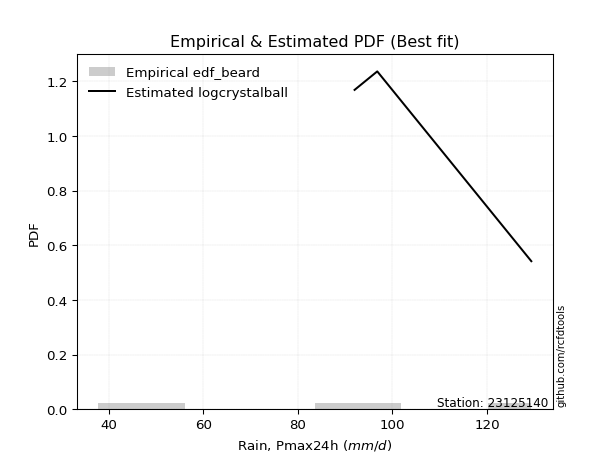</img>

</div>


### 5. Empirical - EDF Chegodayev (1955)

The Chegodayev formula is an empirical plotting position formula used in hydrological frequency analysis to estimate the exceedance probability or return period of a specific event from a set of observed data. It is primarily used for plotting observed data points on probability paper to fit a theoretical distribution, particularly for analyzing extreme events like maximum flood flows or rainfall intensities. The constant _b_ value in the generalized plotting position formula is 0.3.

<div align="center">


$P=(m-b)/(n+1-2b)$


</div>


**5.1. Empirical values**

<div align="center">

|                | 0                   | 1                   | 2              | 3                  | 4                  |
|:---------------|:--------------------|:--------------------|:---------------|:-------------------|:-------------------|
| date           | 2023                | 2018                | 2019           | 2020               | 2021               |
| x              | 37.8                | 52.0                | 92.0           | 96.8               | 129.4              |
| m              | 1                   | 2                   | 3              | 4                  | 5                  |
| empirical_dist | edf_chegodayev      | edf_chegodayev      | edf_chegodayev | edf_chegodayev     | edf_chegodayev     |
| empirical      | 0.12962962962962962 | 0.31481481481481477 | 0.5            | 0.6851851851851851 | 0.8703703703703703 |
| empirical_tr   | 1.148936170212766   | 1.4594594594594594  | 2.0            | 3.1764705882352935 | 7.714285714285713  |

</div>


**5.2. Kolmogorov-Smirnov fit test (sorted by Δ)**


<div align="center">

|                | 0                   | 1                   | 2                   | 3                   | 4                   | 5                   | 6                   | 7                   | 8                   | 9                   | 10                  | 11                  | 12                 | 13                  | 14                 | 15                 | 16                  | 17                    | 18                  | 19                  | 20                  | 21                  | 22                  | 23                  | 24                 | 25                 | 26                 | 27                  | 28                  | 29                  | 30                  | 31                 | 32                  | 33                  | 34                  | 35                 | 36                  | 37                  | 38                 | 39                 | 40                  | 41                 | 42                 | 43                  | 44                  | 45                 | 46                 | 47                  | 48                  | 49                  | 50                  | 51                  | 52                 | 53                  | 54                  | 55                  | 56                 | 57                 | 58                  | 59                  | 60                  | 61                  | 62                 | 63                  | 64                  | 65                 | 66                  | 67                  | 68                  | 69                  | 70                  | 71                  | 72                 | 73                 | 74                  | 75                  | 76                  | 77                  | 78                  | 79                  | 80                 | 81                 | 82                  | 83                  | 84                 | 85                  | 86                  | 87                  | 88                  | 89                 |
|:---------------|:--------------------|:--------------------|:--------------------|:--------------------|:--------------------|:--------------------|:--------------------|:--------------------|:--------------------|:--------------------|:--------------------|:--------------------|:-------------------|:--------------------|:-------------------|:-------------------|:--------------------|:----------------------|:--------------------|:--------------------|:--------------------|:--------------------|:--------------------|:--------------------|:-------------------|:-------------------|:-------------------|:--------------------|:--------------------|:--------------------|:--------------------|:-------------------|:--------------------|:--------------------|:--------------------|:-------------------|:--------------------|:--------------------|:-------------------|:-------------------|:--------------------|:-------------------|:-------------------|:--------------------|:--------------------|:-------------------|:-------------------|:--------------------|:--------------------|:--------------------|:--------------------|:--------------------|:-------------------|:--------------------|:--------------------|:--------------------|:-------------------|:-------------------|:--------------------|:--------------------|:--------------------|:--------------------|:-------------------|:--------------------|:--------------------|:-------------------|:--------------------|:--------------------|:--------------------|:--------------------|:--------------------|:--------------------|:-------------------|:-------------------|:--------------------|:--------------------|:--------------------|:--------------------|:--------------------|:--------------------|:-------------------|:-------------------|:--------------------|:--------------------|:-------------------|:--------------------|:--------------------|:--------------------|:--------------------|:-------------------|
| station        | 23125140            | 23125140            | 23125140            | 23125140            | 23125140            | 23125140            | 23125140            | 23125140            | 23125140            | 23125140            | 23125140            | 23125140            | 23125140           | 23125140            | 23125140           | 23125140           | 23125140            | 23125140              | 23125140            | 23125140            | 23125140            | 23125140            | 23125140            | 23125140            | 23125140           | 23125140           | 23125140           | 23125140            | 23125140            | 23125140            | 23125140            | 23125140           | 23125140            | 23125140            | 23125140            | 23125140           | 23125140            | 23125140            | 23125140           | 23125140           | 23125140            | 23125140           | 23125140           | 23125140            | 23125140            | 23125140           | 23125140           | 23125140            | 23125140            | 23125140            | 23125140            | 23125140            | 23125140           | 23125140            | 23125140            | 23125140            | 23125140           | 23125140           | 23125140            | 23125140            | 23125140            | 23125140            | 23125140           | 23125140            | 23125140            | 23125140           | 23125140            | 23125140            | 23125140            | 23125140            | 23125140            | 23125140            | 23125140           | 23125140           | 23125140            | 23125140            | 23125140            | 23125140            | 23125140            | 23125140            | 23125140           | 23125140           | 23125140            | 23125140            | 23125140           | 23125140            | 23125140            | 23125140            | 23125140            | 23125140           |
| empirical_dist | edf_chegodayev      | edf_chegodayev      | edf_chegodayev      | edf_chegodayev      | edf_chegodayev      | edf_chegodayev      | edf_chegodayev      | edf_chegodayev      | edf_chegodayev      | edf_chegodayev      | edf_chegodayev      | edf_chegodayev      | edf_chegodayev     | edf_chegodayev      | edf_chegodayev     | edf_chegodayev     | edf_chegodayev      | edf_chegodayev        | edf_chegodayev      | edf_chegodayev      | edf_chegodayev      | edf_chegodayev      | edf_chegodayev      | edf_chegodayev      | edf_chegodayev     | edf_chegodayev     | edf_chegodayev     | edf_chegodayev      | edf_chegodayev      | edf_chegodayev      | edf_chegodayev      | edf_chegodayev     | edf_chegodayev      | edf_chegodayev      | edf_chegodayev      | edf_chegodayev     | edf_chegodayev      | edf_chegodayev      | edf_chegodayev     | edf_chegodayev     | edf_chegodayev      | edf_chegodayev     | edf_chegodayev     | edf_chegodayev      | edf_chegodayev      | edf_chegodayev     | edf_chegodayev     | edf_chegodayev      | edf_chegodayev      | edf_chegodayev      | edf_chegodayev      | edf_chegodayev      | edf_chegodayev     | edf_chegodayev      | edf_chegodayev      | edf_chegodayev      | edf_chegodayev     | edf_chegodayev     | edf_chegodayev      | edf_chegodayev      | edf_chegodayev      | edf_chegodayev      | edf_chegodayev     | edf_chegodayev      | edf_chegodayev      | edf_chegodayev     | edf_chegodayev      | edf_chegodayev      | edf_chegodayev      | edf_chegodayev      | edf_chegodayev      | edf_chegodayev      | edf_chegodayev     | edf_chegodayev     | edf_chegodayev      | edf_chegodayev      | edf_chegodayev      | edf_chegodayev      | edf_chegodayev      | edf_chegodayev      | edf_chegodayev     | edf_chegodayev     | edf_chegodayev      | edf_chegodayev      | edf_chegodayev     | edf_chegodayev      | edf_chegodayev      | edf_chegodayev      | edf_chegodayev      | edf_chegodayev     |
| p_dist         | logcrystalball      | logmielke           | mielke              | logjohnsonsu        | logloggamma         | erlang              | gamma               | pearson3            | nct                 | t                   | exponnorm           | crystalball         | norm               | truncnorm           | johnsonsu          | fisk               | logweibull_min      | loglaplace_asymmetric | loggumbel_l         | laplace_asymmetric  | rice                | gompertz            | maxwell             | invgamma            | logistic           | alpha              | logchi2            | gumbel_l            | rayleigh            | ncf                 | logfisk             | hypsecant          | logpearson3         | logncf              | invgauss            | genlogistic        | halfnorm            | laplace             | kstwobign          | logf               | lognct              | logexponnorm       | logt               | lognorm             | lognorm             | logfatiguelife     | logbetaprime       | logerlang           | gumbel_r            | loggamma            | loggamma            | logrice             | loginvgamma        | logalpha            | logmaxwell          | loginvgauss         | betaprime          | loglogistic        | halflogistic        | lograyleigh         | moyal               | genexpon            | loginvweibull      | expon               | weibull_min         | loggenexpon        | logkstwobign        | loghypsecant        | loghalfnorm         | loggompertz         | logexpon            | loggumbel_r         | loglaplace         | loghalflogistic    | logmoyal            | f                   | pareto              | logwald             | chi2                | wald                | nakagami           | lognakagami        | gibrat              | logpareto           | loggibrat          | loglognorm          | fatiguelife         | invweibull          | logtruncnorm        | loggenlogistic     |
| delta          | 0.08684276743049857 | 0.11876879955440292 | 0.12257359218991928 | 0.12403505824746353 | 0.12973368867403948 | 0.13025831830561785 | 0.13030264291866003 | 0.13034613986428217 | 0.13043456419469232 | 0.13051556429481437 | 0.13052808611046227 | 0.13052810626555383 | 0.1305281081502387 | 0.13052811149945331 | 0.1305736052157664 | 0.1311166208317192 | 0.13113751094511494 | 0.13324355789217773   | 0.14429626843019916 | 0.14438357368225857 | 0.14451578648019558 | 0.14694743566304136 | 0.14826486870803623 | 0.14969160269547166 | 0.1511043533873142 | 0.1511152988087332 | 0.1511967260518532 | 0.15241853311996476 | 0.15569009698349423 | 0.15977844744875203 | 0.16034036681928254 | 0.1627192203636693 | 0.16705946757711854 | 0.16742429858810026 | 0.16801455928450038 | 0.1719136621921996 | 0.17700536146598012 | 0.18015586747506096 | 0.180296303831894  | 0.1823904137251815 | 0.18269973703306785 | 0.1829133801265389 | 0.1829138882448209 | 0.18291421948839504 | 0.18291421948839504 | 0.1832543222800893 | 0.1863578907464858 | 0.18670441392229897 | 0.18769266333159185 | 0.18944423484992856 | 0.18944423484992856 | 0.19244055056999787 | 0.1953432050132503 | 0.19592752626700483 | 0.20086464524374592 | 0.20092500611089936 | 0.2018841555801879 | 0.2033123251465221 | 0.20536655023757933 | 0.20616049550717297 | 0.20912076037798066 | 0.20915379517988786 | 0.2093857525494256 | 0.20987485725466237 | 0.21087571714526832 | 0.2176761385097653 | 0.21799653652744722 | 0.21844241062997294 | 0.22195504024180424 | 0.22456022395976638 | 0.23180759704357068 | 0.23714381748743085 | 0.2449051717478874 | 0.2493300199840648 | 0.25479876743838337 | 0.26235733799672745 | 0.29770571654501554 | 0.30586725616871635 | 0.30911942689333405 | 0.31054891380654753 | 0.3148148119738173 | 0.3148148148131508 | 0.31481481481481477 | 0.32669284146482436 | 0.3376214970642448 | 0.35454874488773314 | 0.37390822881545704 | 0.41167958835317137 | 0.49998320630687076 | 0.6851851851851851 |
| deltao         | 0.5865427407550001  | 0.5865427407550001  | 0.5865427407550001  | 0.5865427407550001  | 0.5865427407550001  | 0.5865427407550001  | 0.5865427407550001  | 0.5865427407550001  | 0.5865427407550001  | 0.5865427407550001  | 0.5865427407550001  | 0.5865427407550001  | 0.5865427407550001 | 0.5865427407550001  | 0.5865427407550001 | 0.5865427407550001 | 0.5865427407550001  | 0.5865427407550001    | 0.5865427407550001  | 0.5865427407550001  | 0.5865427407550001  | 0.5865427407550001  | 0.5865427407550001  | 0.5865427407550001  | 0.5865427407550001 | 0.5865427407550001 | 0.5865427407550001 | 0.5865427407550001  | 0.5865427407550001  | 0.5865427407550001  | 0.5865427407550001  | 0.5865427407550001 | 0.5865427407550001  | 0.5865427407550001  | 0.5865427407550001  | 0.5865427407550001 | 0.5865427407550001  | 0.5865427407550001  | 0.5865427407550001 | 0.5865427407550001 | 0.5865427407550001  | 0.5865427407550001 | 0.5865427407550001 | 0.5865427407550001  | 0.5865427407550001  | 0.5865427407550001 | 0.5865427407550001 | 0.5865427407550001  | 0.5865427407550001  | 0.5865427407550001  | 0.5865427407550001  | 0.5865427407550001  | 0.5865427407550001 | 0.5865427407550001  | 0.5865427407550001  | 0.5865427407550001  | 0.5865427407550001 | 0.5865427407550001 | 0.5865427407550001  | 0.5865427407550001  | 0.5865427407550001  | 0.5865427407550001  | 0.5865427407550001 | 0.5865427407550001  | 0.5865427407550001  | 0.5865427407550001 | 0.5865427407550001  | 0.5865427407550001  | 0.5865427407550001  | 0.5865427407550001  | 0.5865427407550001  | 0.5865427407550001  | 0.5865427407550001 | 0.5865427407550001 | 0.5865427407550001  | 0.5865427407550001  | 0.5865427407550001  | 0.5865427407550001  | 0.5865427407550001  | 0.5865427407550001  | 0.5865427407550001 | 0.5865427407550001 | 0.5865427407550001  | 0.5865427407550001  | 0.5865427407550001 | 0.5865427407550001  | 0.5865427407550001  | 0.5865427407550001  | 0.5865427407550001  | 0.5865427407550001 |
| eval           | Δo > Δ              | Δo > Δ              | Δo > Δ              | Δo > Δ              | Δo > Δ              | Δo > Δ              | Δo > Δ              | Δo > Δ              | Δo > Δ              | Δo > Δ              | Δo > Δ              | Δo > Δ              | Δo > Δ             | Δo > Δ              | Δo > Δ             | Δo > Δ             | Δo > Δ              | Δo > Δ                | Δo > Δ              | Δo > Δ              | Δo > Δ              | Δo > Δ              | Δo > Δ              | Δo > Δ              | Δo > Δ             | Δo > Δ             | Δo > Δ             | Δo > Δ              | Δo > Δ              | Δo > Δ              | Δo > Δ              | Δo > Δ             | Δo > Δ              | Δo > Δ              | Δo > Δ              | Δo > Δ             | Δo > Δ              | Δo > Δ              | Δo > Δ             | Δo > Δ             | Δo > Δ              | Δo > Δ             | Δo > Δ             | Δo > Δ              | Δo > Δ              | Δo > Δ             | Δo > Δ             | Δo > Δ              | Δo > Δ              | Δo > Δ              | Δo > Δ              | Δo > Δ              | Δo > Δ             | Δo > Δ              | Δo > Δ              | Δo > Δ              | Δo > Δ             | Δo > Δ             | Δo > Δ              | Δo > Δ              | Δo > Δ              | Δo > Δ              | Δo > Δ             | Δo > Δ              | Δo > Δ              | Δo > Δ             | Δo > Δ              | Δo > Δ              | Δo > Δ              | Δo > Δ              | Δo > Δ              | Δo > Δ              | Δo > Δ             | Δo > Δ             | Δo > Δ              | Δo > Δ              | Δo > Δ              | Δo > Δ              | Δo > Δ              | Δo > Δ              | Δo > Δ             | Δo > Δ             | Δo > Δ              | Δo > Δ              | Δo > Δ             | Δo > Δ              | Δo > Δ              | Δo > Δ              | Δo > Δ              | Δo <= Δ            |
| fit            | 1                   | 1                   | 1                   | 1                   | 1                   | 1                   | 1                   | 1                   | 1                   | 1                   | 1                   | 1                   | 1                  | 1                   | 1                  | 1                  | 1                   | 1                     | 1                   | 1                   | 1                   | 1                   | 1                   | 1                   | 1                  | 1                  | 1                  | 1                   | 1                   | 1                   | 1                   | 1                  | 1                   | 1                   | 1                   | 1                  | 1                   | 1                   | 1                  | 1                  | 1                   | 1                  | 1                  | 1                   | 1                   | 1                  | 1                  | 1                   | 1                   | 1                   | 1                   | 1                   | 1                  | 1                   | 1                   | 1                   | 1                  | 1                  | 1                   | 1                   | 1                   | 1                   | 1                  | 1                   | 1                   | 1                  | 1                   | 1                   | 1                   | 1                   | 1                   | 1                   | 1                  | 1                  | 1                   | 1                   | 1                   | 1                   | 1                   | 1                   | 1                  | 1                  | 1                   | 1                   | 1                  | 1                   | 1                   | 1                   | 1                   | 0                  |
| n              | 5                   | 5                   | 5                   | 5                   | 5                   | 5                   | 5                   | 5                   | 5                   | 5                   | 5                   | 5                   | 5                  | 5                   | 5                  | 5                  | 5                   | 5                     | 5                   | 5                   | 5                   | 5                   | 5                   | 5                   | 5                  | 5                  | 5                  | 5                   | 5                   | 5                   | 5                   | 5                  | 5                   | 5                   | 5                   | 5                  | 5                   | 5                   | 5                  | 5                  | 5                   | 5                  | 5                  | 5                   | 5                   | 5                  | 5                  | 5                   | 5                   | 5                   | 5                   | 5                   | 5                  | 5                   | 5                   | 5                   | 5                  | 5                  | 5                   | 5                   | 5                   | 5                   | 5                  | 5                   | 5                   | 5                  | 5                   | 5                   | 5                   | 5                   | 5                   | 5                   | 5                  | 5                  | 5                   | 5                   | 5                   | 5                   | 5                   | 5                   | 5                  | 5                  | 5                   | 5                   | 5                  | 5                   | 5                   | 5                   | 5                   | 5                  |
| best_fit       | 1                   | 0                   | 0                   | 0                   | 0                   | 0                   | 0                   | 0                   | 0                   | 0                   | 0                   | 0                   | 0                  | 0                   | 0                  | 0                  | 0                   | 0                     | 0                   | 0                   | 0                   | 0                   | 0                   | 0                   | 0                  | 0                  | 0                  | 0                   | 0                   | 0                   | 0                   | 0                  | 0                   | 0                   | 0                   | 0                  | 0                   | 0                   | 0                  | 0                  | 0                   | 0                  | 0                  | 0                   | 0                   | 0                  | 0                  | 0                   | 0                   | 0                   | 0                   | 0                   | 0                  | 0                   | 0                   | 0                   | 0                  | 0                  | 0                   | 0                   | 0                   | 0                   | 0                  | 0                   | 0                   | 0                  | 0                   | 0                   | 0                   | 0                   | 0                   | 0                   | 0                  | 0                  | 0                   | 0                   | 0                   | 0                   | 0                   | 0                   | 0                  | 0                  | 0                   | 0                   | 0                  | 0                   | 0                   | 0                   | 0                   | 0                  |
| best_fit_sort  | 1                   | 2                   | 3                   | 4                   | 5                   | 6                   | 7                   | 8                   | 9                   | 10                  | 11                  | 12                  | 13                 | 14                  | 15                 | 16                 | 17                  | 18                    | 19                  | 20                  | 21                  | 22                  | 23                  | 24                  | 25                 | 26                 | 27                 | 28                  | 29                  | 30                  | 31                  | 32                 | 33                  | 34                  | 35                  | 36                 | 37                  | 38                  | 39                 | 40                 | 41                  | 42                 | 43                 | 44                  | 45                  | 46                 | 47                 | 48                  | 49                  | 50                  | 51                  | 52                  | 53                 | 54                  | 55                  | 56                  | 57                 | 58                 | 59                  | 60                  | 61                  | 62                  | 63                 | 64                  | 65                  | 66                 | 67                  | 68                  | 69                  | 70                  | 71                  | 72                  | 73                 | 74                 | 75                  | 76                  | 77                  | 78                  | 79                  | 80                  | 81                 | 82                 | 83                  | 84                  | 85                 | 86                  | 87                  | 88                  | 89                  | 90                 |

</div>


<div align="center">

</img>

</div>


**5.3. Best fit**

<div align="center">

|   id |   station | empirical_dist   | p_dist         |     delta |   deltao | eval   |   fit |   n |   best_fit |   best_fit_sort |
|-----:|----------:|:-----------------|:---------------|----------:|---------:|:-------|------:|----:|-----------:|----------------:|
|    0 |  23125140 | edf_chegodayev   | logcrystalball | 0.0868428 | 0.586543 | Δo > Δ |     1 |   5 |          1 |               1 |

</div>


<div align="center">

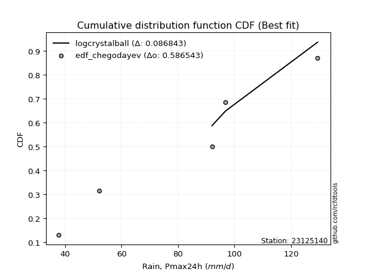</img>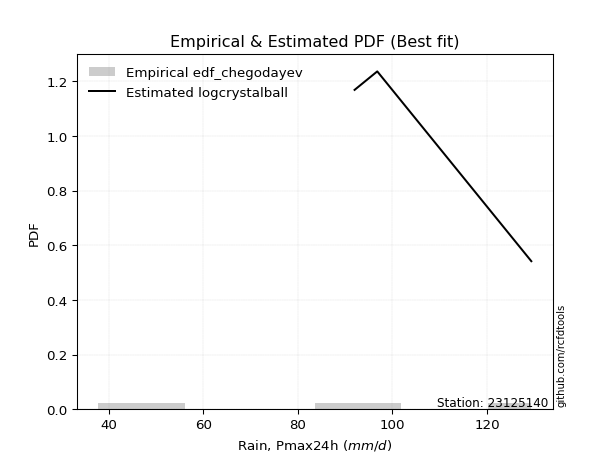</img>

</div>


### 6. Empirical - EDF Blom (1958)

The Blom formula is a specific "plotting position" formula used in hydrology and statistical analysis to estimate the empirical cumulative probability (or non-exceedance probability) of a data series. It is particularly recommended for data that are approximately normally distributed. The constant _a_ is set to 0.375 (or 3/8).

<div align="center">


$P=(m-a)/(n+1-2a)$


</div>


**6.1. Empirical values**

<div align="center">

|                | 0                   | 1                   | 2        | 3                  | 4                  |
|:---------------|:--------------------|:--------------------|:---------|:-------------------|:-------------------|
| date           | 2023                | 2018                | 2019     | 2020               | 2021               |
| x              | 37.8                | 52.0                | 92.0     | 96.8               | 129.4              |
| m              | 1                   | 2                   | 3        | 4                  | 5                  |
| empirical_dist | edf_blom            | edf_blom            | edf_blom | edf_blom           | edf_blom           |
| empirical      | 0.11904761904761904 | 0.30952380952380953 | 0.5      | 0.6904761904761905 | 0.8809523809523809 |
| empirical_tr   | 1.135135135135135   | 1.4482758620689655  | 2.0      | 3.230769230769231  | 8.399999999999999  |

</div>


**6.2. Kolmogorov-Smirnov fit test (sorted by Δ)**


<div align="center">

|                | 0                   | 1                   | 2                   | 3                   | 4                   | 5                   | 6                   | 7                   | 8                   | 9                  | 10                  | 11                  | 12                  | 13                  | 14                 | 15                  | 16                    | 17                  | 18                  | 19                  | 20                  | 21                  | 22                  | 23                  | 24                  | 25                  | 26                 | 27                 | 28                  | 29                  | 30                  | 31                  | 32                  | 33                  | 34                  | 35                 | 36                  | 37                  | 38                 | 39                 | 40                  | 41                 | 42                 | 43                  | 44                  | 45                 | 46                 | 47                  | 48                  | 49                  | 50                  | 51                  | 52                 | 53                  | 54                  | 55                  | 56                 | 57                 | 58                  | 59                  | 60                  | 61                  | 62                 | 63                  | 64                  | 65                 | 66                  | 67                  | 68                  | 69                  | 70                  | 71                  | 72                 | 73                 | 74                  | 75                  | 76                 | 77                 | 78                  | 79                  | 80                  | 81                 | 82                  | 83                 | 84                 | 85                  | 86                 | 87                  | 88                  | 89                 |
|:---------------|:--------------------|:--------------------|:--------------------|:--------------------|:--------------------|:--------------------|:--------------------|:--------------------|:--------------------|:-------------------|:--------------------|:--------------------|:--------------------|:--------------------|:-------------------|:--------------------|:----------------------|:--------------------|:--------------------|:--------------------|:--------------------|:--------------------|:--------------------|:--------------------|:--------------------|:--------------------|:-------------------|:-------------------|:--------------------|:--------------------|:--------------------|:--------------------|:--------------------|:--------------------|:--------------------|:-------------------|:--------------------|:--------------------|:-------------------|:-------------------|:--------------------|:-------------------|:-------------------|:--------------------|:--------------------|:-------------------|:-------------------|:--------------------|:--------------------|:--------------------|:--------------------|:--------------------|:-------------------|:--------------------|:--------------------|:--------------------|:-------------------|:-------------------|:--------------------|:--------------------|:--------------------|:--------------------|:-------------------|:--------------------|:--------------------|:-------------------|:--------------------|:--------------------|:--------------------|:--------------------|:--------------------|:--------------------|:-------------------|:-------------------|:--------------------|:--------------------|:-------------------|:-------------------|:--------------------|:--------------------|:--------------------|:-------------------|:--------------------|:-------------------|:-------------------|:--------------------|:-------------------|:--------------------|:--------------------|:-------------------|
| station        | 23125140            | 23125140            | 23125140            | 23125140            | 23125140            | 23125140            | 23125140            | 23125140            | 23125140            | 23125140           | 23125140            | 23125140            | 23125140            | 23125140            | 23125140           | 23125140            | 23125140              | 23125140            | 23125140            | 23125140            | 23125140            | 23125140            | 23125140            | 23125140            | 23125140            | 23125140            | 23125140           | 23125140           | 23125140            | 23125140            | 23125140            | 23125140            | 23125140            | 23125140            | 23125140            | 23125140           | 23125140            | 23125140            | 23125140           | 23125140           | 23125140            | 23125140           | 23125140           | 23125140            | 23125140            | 23125140           | 23125140           | 23125140            | 23125140            | 23125140            | 23125140            | 23125140            | 23125140           | 23125140            | 23125140            | 23125140            | 23125140           | 23125140           | 23125140            | 23125140            | 23125140            | 23125140            | 23125140           | 23125140            | 23125140            | 23125140           | 23125140            | 23125140            | 23125140            | 23125140            | 23125140            | 23125140            | 23125140           | 23125140           | 23125140            | 23125140            | 23125140           | 23125140           | 23125140            | 23125140            | 23125140            | 23125140           | 23125140            | 23125140           | 23125140           | 23125140            | 23125140           | 23125140            | 23125140            | 23125140           |
| empirical_dist | edf_blom            | edf_blom            | edf_blom            | edf_blom            | edf_blom            | edf_blom            | edf_blom            | edf_blom            | edf_blom            | edf_blom           | edf_blom            | edf_blom            | edf_blom            | edf_blom            | edf_blom           | edf_blom            | edf_blom              | edf_blom            | edf_blom            | edf_blom            | edf_blom            | edf_blom            | edf_blom            | edf_blom            | edf_blom            | edf_blom            | edf_blom           | edf_blom           | edf_blom            | edf_blom            | edf_blom            | edf_blom            | edf_blom            | edf_blom            | edf_blom            | edf_blom           | edf_blom            | edf_blom            | edf_blom           | edf_blom           | edf_blom            | edf_blom           | edf_blom           | edf_blom            | edf_blom            | edf_blom           | edf_blom           | edf_blom            | edf_blom            | edf_blom            | edf_blom            | edf_blom            | edf_blom           | edf_blom            | edf_blom            | edf_blom            | edf_blom           | edf_blom           | edf_blom            | edf_blom            | edf_blom            | edf_blom            | edf_blom           | edf_blom            | edf_blom            | edf_blom           | edf_blom            | edf_blom            | edf_blom            | edf_blom            | edf_blom            | edf_blom            | edf_blom           | edf_blom           | edf_blom            | edf_blom            | edf_blom           | edf_blom           | edf_blom            | edf_blom            | edf_blom            | edf_blom           | edf_blom            | edf_blom           | edf_blom           | edf_blom            | edf_blom           | edf_blom            | edf_blom            | edf_blom           |
| p_dist         | logcrystalball      | logmielke           | mielke              | logjohnsonsu        | logloggamma         | nct                 | pearson3            | t                   | exponnorm           | crystalball        | norm                | truncnorm           | johnsonsu           | gamma               | erlang             | fisk                | loglaplace_asymmetric | logweibull_min      | laplace_asymmetric  | loggumbel_l         | rice                | logistic            | gompertz            | gumbel_l            | maxwell             | invgamma            | alpha              | logchi2            | rayleigh            | hypsecant           | ncf                 | logfisk             | logpearson3         | logncf              | invgauss            | genlogistic        | halfnorm            | laplace             | kstwobign          | logf               | lognct              | logexponnorm       | logt               | lognorm             | lognorm             | logfatiguelife     | logbetaprime       | logerlang           | gumbel_r            | loggamma            | loggamma            | logrice             | loginvgamma        | logalpha            | logmaxwell          | loginvgauss         | betaprime          | loglogistic        | halflogistic        | lograyleigh         | moyal               | genexpon            | loginvweibull      | expon               | weibull_min         | loggenexpon        | logkstwobign        | loghypsecant        | loghalfnorm         | loggompertz         | logexpon            | loggumbel_r         | loglaplace         | loghalflogistic    | logmoyal            | f                   | pareto             | wald               | logwald             | chi2                | nakagami            | lognakagami        | gibrat              | logpareto          | loggibrat          | loglognorm          | fatiguelife        | invweibull          | logtruncnorm        | loggenlogistic     |
| delta          | 0.08684276743049857 | 0.11347779426339769 | 0.11728258689891405 | 0.11874405295645829 | 0.12444268338303424 | 0.12514355890368709 | 0.12520782008729836 | 0.12522455900380913 | 0.12523708081945703 | 0.1252371009745486 | 0.12523710285923345 | 0.12523710620844808 | 0.12528259992476115 | 0.12535405702025326 | 0.1253542865300472 | 0.12582561554071398 | 0.1286944861835757    | 0.13113751094511494 | 0.13909256839125334 | 0.14429626843019916 | 0.14451578648019558 | 0.14581334809630897 | 0.14694743566304136 | 0.14712752782895952 | 0.14826486870803623 | 0.14969160269547166 | 0.1511152988087332 | 0.1511967260518532 | 0.15569009698349423 | 0.15742821507266405 | 0.15977844744875203 | 0.16034036681928254 | 0.16705946757711854 | 0.16742429858810026 | 0.16801455928450038 | 0.1719136621921996 | 0.17700536146598012 | 0.18015586747506096 | 0.180296303831894  | 0.1823904137251815 | 0.18269973703306785 | 0.1829133801265389 | 0.1829138882448209 | 0.18291421948839504 | 0.18291421948839504 | 0.1832543222800893 | 0.1863578907464858 | 0.18670441392229897 | 0.18769266333159185 | 0.18944423484992856 | 0.18944423484992856 | 0.19244055056999787 | 0.1953432050132503 | 0.19592752626700483 | 0.20086464524374592 | 0.20092500611089936 | 0.2018841555801879 | 0.2033123251465221 | 0.20536655023757933 | 0.20616049550717297 | 0.20912076037798066 | 0.20915379517988786 | 0.2093857525494256 | 0.20987485725466237 | 0.21616672243627355 | 0.2176761385097653 | 0.21799653652744722 | 0.21844241062997294 | 0.22195504024180424 | 0.22456022395976638 | 0.23180759704357068 | 0.23714381748743085 | 0.2449051717478874 | 0.2493300199840648 | 0.25479876743838337 | 0.26235733799672745 | 0.3029967218360208 | 0.3052579085155423 | 0.30586725616871635 | 0.30911942689333405 | 0.30952380668281204 | 0.3095238095221456 | 0.30952380952380953 | 0.3319838467558296 | 0.3376214970642448 | 0.35983975017873837 | 0.3791992341064623 | 0.42226159893518195 | 0.49998320630687076 | 0.6904761904761905 |
| deltao         | 0.5865427407550001  | 0.5865427407550001  | 0.5865427407550001  | 0.5865427407550001  | 0.5865427407550001  | 0.5865427407550001  | 0.5865427407550001  | 0.5865427407550001  | 0.5865427407550001  | 0.5865427407550001 | 0.5865427407550001  | 0.5865427407550001  | 0.5865427407550001  | 0.5865427407550001  | 0.5865427407550001 | 0.5865427407550001  | 0.5865427407550001    | 0.5865427407550001  | 0.5865427407550001  | 0.5865427407550001  | 0.5865427407550001  | 0.5865427407550001  | 0.5865427407550001  | 0.5865427407550001  | 0.5865427407550001  | 0.5865427407550001  | 0.5865427407550001 | 0.5865427407550001 | 0.5865427407550001  | 0.5865427407550001  | 0.5865427407550001  | 0.5865427407550001  | 0.5865427407550001  | 0.5865427407550001  | 0.5865427407550001  | 0.5865427407550001 | 0.5865427407550001  | 0.5865427407550001  | 0.5865427407550001 | 0.5865427407550001 | 0.5865427407550001  | 0.5865427407550001 | 0.5865427407550001 | 0.5865427407550001  | 0.5865427407550001  | 0.5865427407550001 | 0.5865427407550001 | 0.5865427407550001  | 0.5865427407550001  | 0.5865427407550001  | 0.5865427407550001  | 0.5865427407550001  | 0.5865427407550001 | 0.5865427407550001  | 0.5865427407550001  | 0.5865427407550001  | 0.5865427407550001 | 0.5865427407550001 | 0.5865427407550001  | 0.5865427407550001  | 0.5865427407550001  | 0.5865427407550001  | 0.5865427407550001 | 0.5865427407550001  | 0.5865427407550001  | 0.5865427407550001 | 0.5865427407550001  | 0.5865427407550001  | 0.5865427407550001  | 0.5865427407550001  | 0.5865427407550001  | 0.5865427407550001  | 0.5865427407550001 | 0.5865427407550001 | 0.5865427407550001  | 0.5865427407550001  | 0.5865427407550001 | 0.5865427407550001 | 0.5865427407550001  | 0.5865427407550001  | 0.5865427407550001  | 0.5865427407550001 | 0.5865427407550001  | 0.5865427407550001 | 0.5865427407550001 | 0.5865427407550001  | 0.5865427407550001 | 0.5865427407550001  | 0.5865427407550001  | 0.5865427407550001 |
| eval           | Δo > Δ              | Δo > Δ              | Δo > Δ              | Δo > Δ              | Δo > Δ              | Δo > Δ              | Δo > Δ              | Δo > Δ              | Δo > Δ              | Δo > Δ             | Δo > Δ              | Δo > Δ              | Δo > Δ              | Δo > Δ              | Δo > Δ             | Δo > Δ              | Δo > Δ                | Δo > Δ              | Δo > Δ              | Δo > Δ              | Δo > Δ              | Δo > Δ              | Δo > Δ              | Δo > Δ              | Δo > Δ              | Δo > Δ              | Δo > Δ             | Δo > Δ             | Δo > Δ              | Δo > Δ              | Δo > Δ              | Δo > Δ              | Δo > Δ              | Δo > Δ              | Δo > Δ              | Δo > Δ             | Δo > Δ              | Δo > Δ              | Δo > Δ             | Δo > Δ             | Δo > Δ              | Δo > Δ             | Δo > Δ             | Δo > Δ              | Δo > Δ              | Δo > Δ             | Δo > Δ             | Δo > Δ              | Δo > Δ              | Δo > Δ              | Δo > Δ              | Δo > Δ              | Δo > Δ             | Δo > Δ              | Δo > Δ              | Δo > Δ              | Δo > Δ             | Δo > Δ             | Δo > Δ              | Δo > Δ              | Δo > Δ              | Δo > Δ              | Δo > Δ             | Δo > Δ              | Δo > Δ              | Δo > Δ             | Δo > Δ              | Δo > Δ              | Δo > Δ              | Δo > Δ              | Δo > Δ              | Δo > Δ              | Δo > Δ             | Δo > Δ             | Δo > Δ              | Δo > Δ              | Δo > Δ             | Δo > Δ             | Δo > Δ              | Δo > Δ              | Δo > Δ              | Δo > Δ             | Δo > Δ              | Δo > Δ             | Δo > Δ             | Δo > Δ              | Δo > Δ             | Δo > Δ              | Δo > Δ              | Δo <= Δ            |
| fit            | 1                   | 1                   | 1                   | 1                   | 1                   | 1                   | 1                   | 1                   | 1                   | 1                  | 1                   | 1                   | 1                   | 1                   | 1                  | 1                   | 1                     | 1                   | 1                   | 1                   | 1                   | 1                   | 1                   | 1                   | 1                   | 1                   | 1                  | 1                  | 1                   | 1                   | 1                   | 1                   | 1                   | 1                   | 1                   | 1                  | 1                   | 1                   | 1                  | 1                  | 1                   | 1                  | 1                  | 1                   | 1                   | 1                  | 1                  | 1                   | 1                   | 1                   | 1                   | 1                   | 1                  | 1                   | 1                   | 1                   | 1                  | 1                  | 1                   | 1                   | 1                   | 1                   | 1                  | 1                   | 1                   | 1                  | 1                   | 1                   | 1                   | 1                   | 1                   | 1                   | 1                  | 1                  | 1                   | 1                   | 1                  | 1                  | 1                   | 1                   | 1                   | 1                  | 1                   | 1                  | 1                  | 1                   | 1                  | 1                   | 1                   | 0                  |
| n              | 5                   | 5                   | 5                   | 5                   | 5                   | 5                   | 5                   | 5                   | 5                   | 5                  | 5                   | 5                   | 5                   | 5                   | 5                  | 5                   | 5                     | 5                   | 5                   | 5                   | 5                   | 5                   | 5                   | 5                   | 5                   | 5                   | 5                  | 5                  | 5                   | 5                   | 5                   | 5                   | 5                   | 5                   | 5                   | 5                  | 5                   | 5                   | 5                  | 5                  | 5                   | 5                  | 5                  | 5                   | 5                   | 5                  | 5                  | 5                   | 5                   | 5                   | 5                   | 5                   | 5                  | 5                   | 5                   | 5                   | 5                  | 5                  | 5                   | 5                   | 5                   | 5                   | 5                  | 5                   | 5                   | 5                  | 5                   | 5                   | 5                   | 5                   | 5                   | 5                   | 5                  | 5                  | 5                   | 5                   | 5                  | 5                  | 5                   | 5                   | 5                   | 5                  | 5                   | 5                  | 5                  | 5                   | 5                  | 5                   | 5                   | 5                  |
| best_fit       | 1                   | 0                   | 0                   | 0                   | 0                   | 0                   | 0                   | 0                   | 0                   | 0                  | 0                   | 0                   | 0                   | 0                   | 0                  | 0                   | 0                     | 0                   | 0                   | 0                   | 0                   | 0                   | 0                   | 0                   | 0                   | 0                   | 0                  | 0                  | 0                   | 0                   | 0                   | 0                   | 0                   | 0                   | 0                   | 0                  | 0                   | 0                   | 0                  | 0                  | 0                   | 0                  | 0                  | 0                   | 0                   | 0                  | 0                  | 0                   | 0                   | 0                   | 0                   | 0                   | 0                  | 0                   | 0                   | 0                   | 0                  | 0                  | 0                   | 0                   | 0                   | 0                   | 0                  | 0                   | 0                   | 0                  | 0                   | 0                   | 0                   | 0                   | 0                   | 0                   | 0                  | 0                  | 0                   | 0                   | 0                  | 0                  | 0                   | 0                   | 0                   | 0                  | 0                   | 0                  | 0                  | 0                   | 0                  | 0                   | 0                   | 0                  |
| best_fit_sort  | 1                   | 2                   | 3                   | 4                   | 5                   | 6                   | 7                   | 8                   | 9                   | 10                 | 11                  | 12                  | 13                  | 14                  | 15                 | 16                  | 17                    | 18                  | 19                  | 20                  | 21                  | 22                  | 23                  | 24                  | 25                  | 26                  | 27                 | 28                 | 29                  | 30                  | 31                  | 32                  | 33                  | 34                  | 35                  | 36                 | 37                  | 38                  | 39                 | 40                 | 41                  | 42                 | 43                 | 44                  | 45                  | 46                 | 47                 | 48                  | 49                  | 50                  | 51                  | 52                  | 53                 | 54                  | 55                  | 56                  | 57                 | 58                 | 59                  | 60                  | 61                  | 62                  | 63                 | 64                  | 65                  | 66                 | 67                  | 68                  | 69                  | 70                  | 71                  | 72                  | 73                 | 74                 | 75                  | 76                  | 77                 | 78                 | 79                  | 80                  | 81                  | 82                 | 83                  | 84                 | 85                 | 86                  | 87                 | 88                  | 89                  | 90                 |

</div>


<div align="center">

</img>

</div>


**6.3. Best fit**

<div align="center">

|   id |   station | empirical_dist   | p_dist         |     delta |   deltao | eval   |   fit |   n |   best_fit |   best_fit_sort |
|-----:|----------:|:-----------------|:---------------|----------:|---------:|:-------|------:|----:|-----------:|----------------:|
|    0 |  23125140 | edf_blom         | logcrystalball | 0.0868428 | 0.586543 | Δo > Δ |     1 |   5 |          1 |               1 |

</div>


<div align="center">

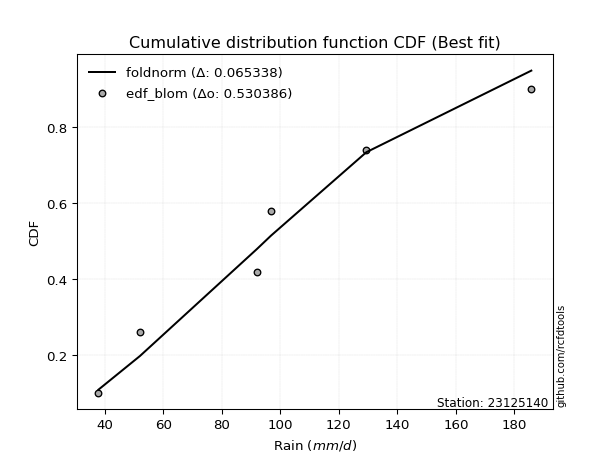</img>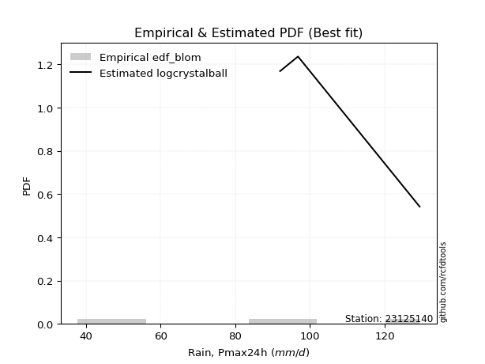</img>

</div>


### 7. Empirical - EDF Tukey (1962)

In hydrology, the Tukey formula is used as a plotting position formula to estimate the empirical probability or frequency of a flood event (or other hydrological data). The formula parameter is given as _c=0.333_ (or 1/3).

<div align="center">


$P=(m-c)/(n+1-2c)$


</div>


**7.1. Empirical values**

<div align="center">

|                | 0                  | 1                  | 2         | 3         | 4         |
|:---------------|:-------------------|:-------------------|:----------|:----------|:----------|
| date           | 2023               | 2018               | 2019      | 2020      | 2021      |
| x              | 37.8               | 52.0               | 92.0      | 96.8      | 129.4     |
| m              | 1                  | 2                  | 3         | 4         | 5         |
| empirical_dist | edf_tukey          | edf_tukey          | edf_tukey | edf_tukey | edf_tukey |
| empirical      | 0.125              | 0.3125             | 0.5       | 0.6875    | 0.875     |
| empirical_tr   | 1.1428571428571428 | 1.4545454545454546 | 2.0       | 3.2       | 8.0       |

</div>


**7.2. Kolmogorov-Smirnov fit test (sorted by Δ)**


<div align="center">

|                | 0                   | 1                   | 2                   | 3                   | 4                  | 5                   | 6                   | 7                  | 8                   | 9                  | 10                 | 11                  | 12                  | 13                  | 14                  | 15                  | 16                    | 17                  | 18                 | 19                  | 20                  | 21                  | 22                  | 23                  | 24                  | 25                  | 26                 | 27                 | 28                  | 29                  | 30                  | 31                  | 32                  | 33                  | 34                  | 35                 | 36                  | 37                  | 38                 | 39                 | 40                  | 41                 | 42                 | 43                  | 44                  | 45                 | 46                 | 47                  | 48                  | 49                  | 50                  | 51                  | 52                 | 53                  | 54                  | 55                  | 56                 | 57                 | 58                  | 59                  | 60                  | 61                  | 62                 | 63                  | 64                  | 65                 | 66                  | 67                  | 68                  | 69                  | 70                  | 71                  | 72                 | 73                 | 74                  | 75                  | 76                 | 77                  | 78                  | 79                  | 80                 | 81                  | 82                 | 83                 | 84                 | 85                 | 86                 | 87                 | 88                  | 89                 |
|:---------------|:--------------------|:--------------------|:--------------------|:--------------------|:-------------------|:--------------------|:--------------------|:-------------------|:--------------------|:-------------------|:-------------------|:--------------------|:--------------------|:--------------------|:--------------------|:--------------------|:----------------------|:--------------------|:-------------------|:--------------------|:--------------------|:--------------------|:--------------------|:--------------------|:--------------------|:--------------------|:-------------------|:-------------------|:--------------------|:--------------------|:--------------------|:--------------------|:--------------------|:--------------------|:--------------------|:-------------------|:--------------------|:--------------------|:-------------------|:-------------------|:--------------------|:-------------------|:-------------------|:--------------------|:--------------------|:-------------------|:-------------------|:--------------------|:--------------------|:--------------------|:--------------------|:--------------------|:-------------------|:--------------------|:--------------------|:--------------------|:-------------------|:-------------------|:--------------------|:--------------------|:--------------------|:--------------------|:-------------------|:--------------------|:--------------------|:-------------------|:--------------------|:--------------------|:--------------------|:--------------------|:--------------------|:--------------------|:-------------------|:-------------------|:--------------------|:--------------------|:-------------------|:--------------------|:--------------------|:--------------------|:-------------------|:--------------------|:-------------------|:-------------------|:-------------------|:-------------------|:-------------------|:-------------------|:--------------------|:-------------------|
| station        | 23125140            | 23125140            | 23125140            | 23125140            | 23125140           | 23125140            | 23125140            | 23125140           | 23125140            | 23125140           | 23125140           | 23125140            | 23125140            | 23125140            | 23125140            | 23125140            | 23125140              | 23125140            | 23125140           | 23125140            | 23125140            | 23125140            | 23125140            | 23125140            | 23125140            | 23125140            | 23125140           | 23125140           | 23125140            | 23125140            | 23125140            | 23125140            | 23125140            | 23125140            | 23125140            | 23125140           | 23125140            | 23125140            | 23125140           | 23125140           | 23125140            | 23125140           | 23125140           | 23125140            | 23125140            | 23125140           | 23125140           | 23125140            | 23125140            | 23125140            | 23125140            | 23125140            | 23125140           | 23125140            | 23125140            | 23125140            | 23125140           | 23125140           | 23125140            | 23125140            | 23125140            | 23125140            | 23125140           | 23125140            | 23125140            | 23125140           | 23125140            | 23125140            | 23125140            | 23125140            | 23125140            | 23125140            | 23125140           | 23125140           | 23125140            | 23125140            | 23125140           | 23125140            | 23125140            | 23125140            | 23125140           | 23125140            | 23125140           | 23125140           | 23125140           | 23125140           | 23125140           | 23125140           | 23125140            | 23125140           |
| empirical_dist | edf_tukey           | edf_tukey           | edf_tukey           | edf_tukey           | edf_tukey          | edf_tukey           | edf_tukey           | edf_tukey          | edf_tukey           | edf_tukey          | edf_tukey          | edf_tukey           | edf_tukey           | edf_tukey           | edf_tukey           | edf_tukey           | edf_tukey             | edf_tukey           | edf_tukey          | edf_tukey           | edf_tukey           | edf_tukey           | edf_tukey           | edf_tukey           | edf_tukey           | edf_tukey           | edf_tukey          | edf_tukey          | edf_tukey           | edf_tukey           | edf_tukey           | edf_tukey           | edf_tukey           | edf_tukey           | edf_tukey           | edf_tukey          | edf_tukey           | edf_tukey           | edf_tukey          | edf_tukey          | edf_tukey           | edf_tukey          | edf_tukey          | edf_tukey           | edf_tukey           | edf_tukey          | edf_tukey          | edf_tukey           | edf_tukey           | edf_tukey           | edf_tukey           | edf_tukey           | edf_tukey          | edf_tukey           | edf_tukey           | edf_tukey           | edf_tukey          | edf_tukey          | edf_tukey           | edf_tukey           | edf_tukey           | edf_tukey           | edf_tukey          | edf_tukey           | edf_tukey           | edf_tukey          | edf_tukey           | edf_tukey           | edf_tukey           | edf_tukey           | edf_tukey           | edf_tukey           | edf_tukey          | edf_tukey          | edf_tukey           | edf_tukey           | edf_tukey          | edf_tukey           | edf_tukey           | edf_tukey           | edf_tukey          | edf_tukey           | edf_tukey          | edf_tukey          | edf_tukey          | edf_tukey          | edf_tukey          | edf_tukey          | edf_tukey           | edf_tukey          |
| p_dist         | logcrystalball      | logmielke           | mielke              | logjohnsonsu        | logloggamma        | erlang              | gamma               | pearson3           | nct                 | t                  | exponnorm          | crystalball         | norm                | truncnorm           | johnsonsu           | fisk                | loglaplace_asymmetric | logweibull_min      | laplace_asymmetric | loggumbel_l         | rice                | gompertz            | maxwell             | logistic            | invgamma            | gumbel_l            | alpha              | logchi2            | rayleigh            | ncf                 | logfisk             | hypsecant           | logpearson3         | logncf              | invgauss            | genlogistic        | halfnorm            | laplace             | kstwobign          | logf               | lognct              | logexponnorm       | logt               | lognorm             | lognorm             | logfatiguelife     | logbetaprime       | logerlang           | gumbel_r            | loggamma            | loggamma            | logrice             | loginvgamma        | logalpha            | logmaxwell          | loginvgauss         | betaprime          | loglogistic        | halflogistic        | lograyleigh         | moyal               | genexpon            | loginvweibull      | expon               | weibull_min         | loggenexpon        | logkstwobign        | loghypsecant        | loghalfnorm         | loggompertz         | logexpon            | loggumbel_r         | loglaplace         | loghalflogistic    | logmoyal            | f                   | pareto             | logwald             | wald                | chi2                | nakagami           | lognakagami         | gibrat             | logpareto          | loggibrat          | loglognorm         | fatiguelife        | invweibull         | logtruncnorm        | loggenlogistic     |
| delta          | 0.08684276743049857 | 0.11645398473958815 | 0.12025877737510451 | 0.12172024343264876 | 0.1274188738592247 | 0.12794350349080308 | 0.12798782810384526 | 0.1280313250494674 | 0.12811974937987755 | 0.1282007494799996 | 0.1282132712956475 | 0.12821329145073906 | 0.12821329333542392 | 0.12821329668463854 | 0.12825879040095162 | 0.12880180601690444 | 0.13092874307736296   | 0.13113751094511494 | 0.1420687588674438 | 0.14429626843019916 | 0.14451578648019558 | 0.14694743566304136 | 0.14826486870803623 | 0.14878953857249944 | 0.14969160269547166 | 0.15010371830514999 | 0.1511152988087332 | 0.1511967260518532 | 0.15569009698349423 | 0.15977844744875203 | 0.16034036681928254 | 0.16040440554885452 | 0.16705946757711854 | 0.16742429858810026 | 0.16801455928450038 | 0.1719136621921996 | 0.17700536146598012 | 0.18015586747506096 | 0.180296303831894  | 0.1823904137251815 | 0.18269973703306785 | 0.1829133801265389 | 0.1829138882448209 | 0.18291421948839504 | 0.18291421948839504 | 0.1832543222800893 | 0.1863578907464858 | 0.18670441392229897 | 0.18769266333159185 | 0.18944423484992856 | 0.18944423484992856 | 0.19244055056999787 | 0.1953432050132503 | 0.19592752626700483 | 0.20086464524374592 | 0.20092500611089936 | 0.2018841555801879 | 0.2033123251465221 | 0.20536655023757933 | 0.20616049550717297 | 0.20912076037798066 | 0.20915379517988786 | 0.2093857525494256 | 0.20987485725466237 | 0.21319053196008309 | 0.2176761385097653 | 0.21799653652744722 | 0.21844241062997294 | 0.22195504024180424 | 0.22456022395976638 | 0.23180759704357068 | 0.23714381748743085 | 0.2449051717478874 | 0.2493300199840648 | 0.25479876743838337 | 0.26235733799672745 | 0.3000205313598303 | 0.30586725616871635 | 0.30823409899173276 | 0.30911942689333405 | 0.3124999971590025 | 0.31249999999833605 | 0.3125             | 0.3290076562796391 | 0.3376214970642448 | 0.3568635597025479 | 0.3762230436302718 | 0.416309217982801  | 0.49998320630687076 | 0.6875             |
| deltao         | 0.5865427407550001  | 0.5865427407550001  | 0.5865427407550001  | 0.5865427407550001  | 0.5865427407550001 | 0.5865427407550001  | 0.5865427407550001  | 0.5865427407550001 | 0.5865427407550001  | 0.5865427407550001 | 0.5865427407550001 | 0.5865427407550001  | 0.5865427407550001  | 0.5865427407550001  | 0.5865427407550001  | 0.5865427407550001  | 0.5865427407550001    | 0.5865427407550001  | 0.5865427407550001 | 0.5865427407550001  | 0.5865427407550001  | 0.5865427407550001  | 0.5865427407550001  | 0.5865427407550001  | 0.5865427407550001  | 0.5865427407550001  | 0.5865427407550001 | 0.5865427407550001 | 0.5865427407550001  | 0.5865427407550001  | 0.5865427407550001  | 0.5865427407550001  | 0.5865427407550001  | 0.5865427407550001  | 0.5865427407550001  | 0.5865427407550001 | 0.5865427407550001  | 0.5865427407550001  | 0.5865427407550001 | 0.5865427407550001 | 0.5865427407550001  | 0.5865427407550001 | 0.5865427407550001 | 0.5865427407550001  | 0.5865427407550001  | 0.5865427407550001 | 0.5865427407550001 | 0.5865427407550001  | 0.5865427407550001  | 0.5865427407550001  | 0.5865427407550001  | 0.5865427407550001  | 0.5865427407550001 | 0.5865427407550001  | 0.5865427407550001  | 0.5865427407550001  | 0.5865427407550001 | 0.5865427407550001 | 0.5865427407550001  | 0.5865427407550001  | 0.5865427407550001  | 0.5865427407550001  | 0.5865427407550001 | 0.5865427407550001  | 0.5865427407550001  | 0.5865427407550001 | 0.5865427407550001  | 0.5865427407550001  | 0.5865427407550001  | 0.5865427407550001  | 0.5865427407550001  | 0.5865427407550001  | 0.5865427407550001 | 0.5865427407550001 | 0.5865427407550001  | 0.5865427407550001  | 0.5865427407550001 | 0.5865427407550001  | 0.5865427407550001  | 0.5865427407550001  | 0.5865427407550001 | 0.5865427407550001  | 0.5865427407550001 | 0.5865427407550001 | 0.5865427407550001 | 0.5865427407550001 | 0.5865427407550001 | 0.5865427407550001 | 0.5865427407550001  | 0.5865427407550001 |
| eval           | Δo > Δ              | Δo > Δ              | Δo > Δ              | Δo > Δ              | Δo > Δ             | Δo > Δ              | Δo > Δ              | Δo > Δ             | Δo > Δ              | Δo > Δ             | Δo > Δ             | Δo > Δ              | Δo > Δ              | Δo > Δ              | Δo > Δ              | Δo > Δ              | Δo > Δ                | Δo > Δ              | Δo > Δ             | Δo > Δ              | Δo > Δ              | Δo > Δ              | Δo > Δ              | Δo > Δ              | Δo > Δ              | Δo > Δ              | Δo > Δ             | Δo > Δ             | Δo > Δ              | Δo > Δ              | Δo > Δ              | Δo > Δ              | Δo > Δ              | Δo > Δ              | Δo > Δ              | Δo > Δ             | Δo > Δ              | Δo > Δ              | Δo > Δ             | Δo > Δ             | Δo > Δ              | Δo > Δ             | Δo > Δ             | Δo > Δ              | Δo > Δ              | Δo > Δ             | Δo > Δ             | Δo > Δ              | Δo > Δ              | Δo > Δ              | Δo > Δ              | Δo > Δ              | Δo > Δ             | Δo > Δ              | Δo > Δ              | Δo > Δ              | Δo > Δ             | Δo > Δ             | Δo > Δ              | Δo > Δ              | Δo > Δ              | Δo > Δ              | Δo > Δ             | Δo > Δ              | Δo > Δ              | Δo > Δ             | Δo > Δ              | Δo > Δ              | Δo > Δ              | Δo > Δ              | Δo > Δ              | Δo > Δ              | Δo > Δ             | Δo > Δ             | Δo > Δ              | Δo > Δ              | Δo > Δ             | Δo > Δ              | Δo > Δ              | Δo > Δ              | Δo > Δ             | Δo > Δ              | Δo > Δ             | Δo > Δ             | Δo > Δ             | Δo > Δ             | Δo > Δ             | Δo > Δ             | Δo > Δ              | Δo <= Δ            |
| fit            | 1                   | 1                   | 1                   | 1                   | 1                  | 1                   | 1                   | 1                  | 1                   | 1                  | 1                  | 1                   | 1                   | 1                   | 1                   | 1                   | 1                     | 1                   | 1                  | 1                   | 1                   | 1                   | 1                   | 1                   | 1                   | 1                   | 1                  | 1                  | 1                   | 1                   | 1                   | 1                   | 1                   | 1                   | 1                   | 1                  | 1                   | 1                   | 1                  | 1                  | 1                   | 1                  | 1                  | 1                   | 1                   | 1                  | 1                  | 1                   | 1                   | 1                   | 1                   | 1                   | 1                  | 1                   | 1                   | 1                   | 1                  | 1                  | 1                   | 1                   | 1                   | 1                   | 1                  | 1                   | 1                   | 1                  | 1                   | 1                   | 1                   | 1                   | 1                   | 1                   | 1                  | 1                  | 1                   | 1                   | 1                  | 1                   | 1                   | 1                   | 1                  | 1                   | 1                  | 1                  | 1                  | 1                  | 1                  | 1                  | 1                   | 0                  |
| n              | 5                   | 5                   | 5                   | 5                   | 5                  | 5                   | 5                   | 5                  | 5                   | 5                  | 5                  | 5                   | 5                   | 5                   | 5                   | 5                   | 5                     | 5                   | 5                  | 5                   | 5                   | 5                   | 5                   | 5                   | 5                   | 5                   | 5                  | 5                  | 5                   | 5                   | 5                   | 5                   | 5                   | 5                   | 5                   | 5                  | 5                   | 5                   | 5                  | 5                  | 5                   | 5                  | 5                  | 5                   | 5                   | 5                  | 5                  | 5                   | 5                   | 5                   | 5                   | 5                   | 5                  | 5                   | 5                   | 5                   | 5                  | 5                  | 5                   | 5                   | 5                   | 5                   | 5                  | 5                   | 5                   | 5                  | 5                   | 5                   | 5                   | 5                   | 5                   | 5                   | 5                  | 5                  | 5                   | 5                   | 5                  | 5                   | 5                   | 5                   | 5                  | 5                   | 5                  | 5                  | 5                  | 5                  | 5                  | 5                  | 5                   | 5                  |
| best_fit       | 1                   | 0                   | 0                   | 0                   | 0                  | 0                   | 0                   | 0                  | 0                   | 0                  | 0                  | 0                   | 0                   | 0                   | 0                   | 0                   | 0                     | 0                   | 0                  | 0                   | 0                   | 0                   | 0                   | 0                   | 0                   | 0                   | 0                  | 0                  | 0                   | 0                   | 0                   | 0                   | 0                   | 0                   | 0                   | 0                  | 0                   | 0                   | 0                  | 0                  | 0                   | 0                  | 0                  | 0                   | 0                   | 0                  | 0                  | 0                   | 0                   | 0                   | 0                   | 0                   | 0                  | 0                   | 0                   | 0                   | 0                  | 0                  | 0                   | 0                   | 0                   | 0                   | 0                  | 0                   | 0                   | 0                  | 0                   | 0                   | 0                   | 0                   | 0                   | 0                   | 0                  | 0                  | 0                   | 0                   | 0                  | 0                   | 0                   | 0                   | 0                  | 0                   | 0                  | 0                  | 0                  | 0                  | 0                  | 0                  | 0                   | 0                  |
| best_fit_sort  | 1                   | 2                   | 3                   | 4                   | 5                  | 6                   | 7                   | 8                  | 9                   | 10                 | 11                 | 12                  | 13                  | 14                  | 15                  | 16                  | 17                    | 18                  | 19                 | 20                  | 21                  | 22                  | 23                  | 24                  | 25                  | 26                  | 27                 | 28                 | 29                  | 30                  | 31                  | 32                  | 33                  | 34                  | 35                  | 36                 | 37                  | 38                  | 39                 | 40                 | 41                  | 42                 | 43                 | 44                  | 45                  | 46                 | 47                 | 48                  | 49                  | 50                  | 51                  | 52                  | 53                 | 54                  | 55                  | 56                  | 57                 | 58                 | 59                  | 60                  | 61                  | 62                  | 63                 | 64                  | 65                  | 66                 | 67                  | 68                  | 69                  | 70                  | 71                  | 72                  | 73                 | 74                 | 75                  | 76                  | 77                 | 78                  | 79                  | 80                  | 81                 | 82                  | 83                 | 84                 | 85                 | 86                 | 87                 | 88                 | 89                  | 90                 |

</div>


<div align="center">

</img>

</div>


**7.3. Best fit**

<div align="center">

|   id |   station | empirical_dist   | p_dist         |     delta |   deltao | eval   |   fit |   n |   best_fit |   best_fit_sort |
|-----:|----------:|:-----------------|:---------------|----------:|---------:|:-------|------:|----:|-----------:|----------------:|
|    0 |  23125140 | edf_tukey        | logcrystalball | 0.0868428 | 0.586543 | Δo > Δ |     1 |   5 |          1 |               1 |

</div>


<div align="center">

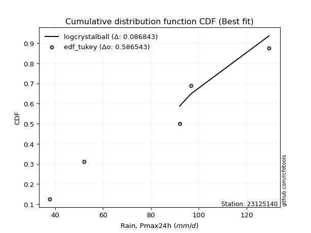</img></img>

</div>


### 8. Empirical - EDF Gringorten (1963)

Gringorten plotting position formula is essential for estimating the probability and return periods of extreme events like floods and heavy rainfall. The constant _a=0.44_.

<div align="center">


$P=(m-a)/(n+1-2a)$


</div>


**8.1. Empirical values**

<div align="center">

|                | 0                   | 1                  | 2              | 3                 | 4                  |
|:---------------|:--------------------|:-------------------|:---------------|:------------------|:-------------------|
| date           | 2023                | 2018               | 2019           | 2020              | 2021               |
| x              | 37.8                | 52.0               | 92.0           | 96.8              | 129.4              |
| m              | 1                   | 2                  | 3              | 4                 | 5                  |
| empirical_dist | edf_gringorten      | edf_gringorten     | edf_gringorten | edf_gringorten    | edf_gringorten     |
| empirical      | 0.10937500000000001 | 0.3046875          | 0.5            | 0.6953125         | 0.8906249999999999 |
| empirical_tr   | 1.1228070175438596  | 1.4382022471910112 | 2.0            | 3.282051282051282 | 9.142857142857133  |

</div>


**8.2. Kolmogorov-Smirnov fit test (sorted by Δ)**


<div align="center">

|                | 0                   | 1                   | 2                   | 3                   | 4                   | 5                   | 6                   | 7                   | 8                   | 9                   | 10                 | 11                  | 12                  | 13                  | 14                  | 15                 | 16                    | 17                  | 18                 | 19                  | 20                  | 21                  | 22                  | 23                  | 24                  | 25                  | 26                 | 27                  | 28                  | 29                  | 30                  | 31                  | 32                  | 33                  | 34                  | 35                 | 36                  | 37                  | 38                 | 39                 | 40                  | 41                 | 42                 | 43                  | 44                  | 45                 | 46                 | 47                  | 48                  | 49                  | 50                  | 51                  | 52                 | 53                  | 54                  | 55                  | 56                 | 57                 | 58                  | 59                  | 60                  | 61                  | 62                 | 63                  | 64                 | 65                  | 66                  | 67                  | 68                  | 69                  | 70                  | 71                  | 72                 | 73                 | 74                  | 75                  | 76                  | 77                 | 78                  | 79                 | 80                  | 81                 | 82                  | 83                 | 84                 | 85                 | 86                 | 87                 | 88                  | 89                 |
|:---------------|:--------------------|:--------------------|:--------------------|:--------------------|:--------------------|:--------------------|:--------------------|:--------------------|:--------------------|:--------------------|:-------------------|:--------------------|:--------------------|:--------------------|:--------------------|:-------------------|:----------------------|:--------------------|:-------------------|:--------------------|:--------------------|:--------------------|:--------------------|:--------------------|:--------------------|:--------------------|:-------------------|:--------------------|:--------------------|:--------------------|:--------------------|:--------------------|:--------------------|:--------------------|:--------------------|:-------------------|:--------------------|:--------------------|:-------------------|:-------------------|:--------------------|:-------------------|:-------------------|:--------------------|:--------------------|:-------------------|:-------------------|:--------------------|:--------------------|:--------------------|:--------------------|:--------------------|:-------------------|:--------------------|:--------------------|:--------------------|:-------------------|:-------------------|:--------------------|:--------------------|:--------------------|:--------------------|:-------------------|:--------------------|:-------------------|:--------------------|:--------------------|:--------------------|:--------------------|:--------------------|:--------------------|:--------------------|:-------------------|:-------------------|:--------------------|:--------------------|:--------------------|:-------------------|:--------------------|:-------------------|:--------------------|:-------------------|:--------------------|:-------------------|:-------------------|:-------------------|:-------------------|:-------------------|:--------------------|:-------------------|
| station        | 23125140            | 23125140            | 23125140            | 23125140            | 23125140            | 23125140            | 23125140            | 23125140            | 23125140            | 23125140            | 23125140           | 23125140            | 23125140            | 23125140            | 23125140            | 23125140           | 23125140              | 23125140            | 23125140           | 23125140            | 23125140            | 23125140            | 23125140            | 23125140            | 23125140            | 23125140            | 23125140           | 23125140            | 23125140            | 23125140            | 23125140            | 23125140            | 23125140            | 23125140            | 23125140            | 23125140           | 23125140            | 23125140            | 23125140           | 23125140           | 23125140            | 23125140           | 23125140           | 23125140            | 23125140            | 23125140           | 23125140           | 23125140            | 23125140            | 23125140            | 23125140            | 23125140            | 23125140           | 23125140            | 23125140            | 23125140            | 23125140           | 23125140           | 23125140            | 23125140            | 23125140            | 23125140            | 23125140           | 23125140            | 23125140           | 23125140            | 23125140            | 23125140            | 23125140            | 23125140            | 23125140            | 23125140            | 23125140           | 23125140           | 23125140            | 23125140            | 23125140            | 23125140           | 23125140            | 23125140           | 23125140            | 23125140           | 23125140            | 23125140           | 23125140           | 23125140           | 23125140           | 23125140           | 23125140            | 23125140           |
| empirical_dist | edf_gringorten      | edf_gringorten      | edf_gringorten      | edf_gringorten      | edf_gringorten      | edf_gringorten      | edf_gringorten      | edf_gringorten      | edf_gringorten      | edf_gringorten      | edf_gringorten     | edf_gringorten      | edf_gringorten      | edf_gringorten      | edf_gringorten      | edf_gringorten     | edf_gringorten        | edf_gringorten      | edf_gringorten     | edf_gringorten      | edf_gringorten      | edf_gringorten      | edf_gringorten      | edf_gringorten      | edf_gringorten      | edf_gringorten      | edf_gringorten     | edf_gringorten      | edf_gringorten      | edf_gringorten      | edf_gringorten      | edf_gringorten      | edf_gringorten      | edf_gringorten      | edf_gringorten      | edf_gringorten     | edf_gringorten      | edf_gringorten      | edf_gringorten     | edf_gringorten     | edf_gringorten      | edf_gringorten     | edf_gringorten     | edf_gringorten      | edf_gringorten      | edf_gringorten     | edf_gringorten     | edf_gringorten      | edf_gringorten      | edf_gringorten      | edf_gringorten      | edf_gringorten      | edf_gringorten     | edf_gringorten      | edf_gringorten      | edf_gringorten      | edf_gringorten     | edf_gringorten     | edf_gringorten      | edf_gringorten      | edf_gringorten      | edf_gringorten      | edf_gringorten     | edf_gringorten      | edf_gringorten     | edf_gringorten      | edf_gringorten      | edf_gringorten      | edf_gringorten      | edf_gringorten      | edf_gringorten      | edf_gringorten      | edf_gringorten     | edf_gringorten     | edf_gringorten      | edf_gringorten      | edf_gringorten      | edf_gringorten     | edf_gringorten      | edf_gringorten     | edf_gringorten      | edf_gringorten     | edf_gringorten      | edf_gringorten     | edf_gringorten     | edf_gringorten     | edf_gringorten     | edf_gringorten     | edf_gringorten      | edf_gringorten     |
| p_dist         | logcrystalball      | logmielke           | mielke              | logjohnsonsu        | logloggamma         | fisk                | nct                 | crystalball         | norm                | truncnorm           | exponnorm          | johnsonsu           | t                   | pearson3            | gamma               | erlang             | loglaplace_asymmetric | logweibull_min      | laplace_asymmetric | logistic            | gumbel_l            | loggumbel_l         | rice                | gompertz            | maxwell             | invgamma            | alpha              | hypsecant           | rayleigh            | logchi2             | ncf                 | logfisk             | logpearson3         | logncf              | invgauss            | genlogistic        | halfnorm            | laplace             | kstwobign          | logf               | lognct              | logexponnorm       | logt               | lognorm             | lognorm             | logfatiguelife     | logbetaprime       | logerlang           | gumbel_r            | loggamma            | loggamma            | logrice             | loginvgamma        | logalpha            | logmaxwell          | loginvgauss         | betaprime          | loglogistic        | halflogistic        | lograyleigh         | moyal               | genexpon            | loginvweibull      | expon               | loggenexpon        | logkstwobign        | loghypsecant        | weibull_min         | loghalfnorm         | loggompertz         | logexpon            | loggumbel_r         | loglaplace         | loghalflogistic    | logmoyal            | f                   | wald                | nakagami           | lognakagami         | gibrat             | logwald             | pareto             | chi2                | logpareto          | loggibrat          | loglognorm         | fatiguelife        | invweibull         | logtruncnorm        | loggenlogistic     |
| delta          | 0.08684276743049857 | 0.10882639911379866 | 0.11244627737510451 | 0.11390774343264876 | 0.11960637385922471 | 0.12378217713928186 | 0.12391535775986973 | 0.12396729766823256 | 0.12396729993083877 | 0.12396730107937981 | 0.1239677318311575 | 0.12399358030624275 | 0.12402372738935863 | 0.12520782008729836 | 0.12535405702025326 | 0.1253542865300472 | 0.1286944861835757    | 0.13113751094511494 | 0.1342562588674438 | 0.14097703857249944 | 0.14229121830514999 | 0.14429626843019916 | 0.14451578648019558 | 0.14694743566304136 | 0.14826486870803623 | 0.14969160269547166 | 0.1511152988087332 | 0.15259190554885452 | 0.15569009698349423 | 0.15947086619395257 | 0.15977844744875203 | 0.16034036681928254 | 0.16705946757711854 | 0.16742429858810026 | 0.16801455928450038 | 0.1719136621921996 | 0.17700536146598012 | 0.18015586747506096 | 0.180296303831894  | 0.1823904137251815 | 0.18269973703306785 | 0.1829133801265389 | 0.1829138882448209 | 0.18291421948839504 | 0.18291421948839504 | 0.1832543222800893 | 0.1863578907464858 | 0.18670441392229897 | 0.18769266333159185 | 0.18944423484992856 | 0.18944423484992856 | 0.19244055056999787 | 0.1953432050132503 | 0.19592752626700483 | 0.20086464524374592 | 0.20092500611089936 | 0.2018841555801879 | 0.2033123251465221 | 0.20536655023757933 | 0.20616049550717297 | 0.20912076037798066 | 0.20915379517988786 | 0.2093857525494256 | 0.20987485725466237 | 0.2176761385097653 | 0.21799653652744722 | 0.21844241062997294 | 0.22100303196008309 | 0.22195504024180424 | 0.22456022395976638 | 0.23180759704357068 | 0.23714381748743085 | 0.2449051717478874 | 0.2493300199840648 | 0.25479876743838337 | 0.26235733799672745 | 0.30042159899173276 | 0.3046874971590025 | 0.30468749999833605 | 0.3046875          | 0.30586725616871635 | 0.3078330313598303 | 0.30911942689333405 | 0.3368201562796391 | 0.3376214970642448 | 0.3646760597025479 | 0.3840355436302718 | 0.4319342179828009 | 0.49998320630687076 | 0.6953125          |
| deltao         | 0.5865427407550001  | 0.5865427407550001  | 0.5865427407550001  | 0.5865427407550001  | 0.5865427407550001  | 0.5865427407550001  | 0.5865427407550001  | 0.5865427407550001  | 0.5865427407550001  | 0.5865427407550001  | 0.5865427407550001 | 0.5865427407550001  | 0.5865427407550001  | 0.5865427407550001  | 0.5865427407550001  | 0.5865427407550001 | 0.5865427407550001    | 0.5865427407550001  | 0.5865427407550001 | 0.5865427407550001  | 0.5865427407550001  | 0.5865427407550001  | 0.5865427407550001  | 0.5865427407550001  | 0.5865427407550001  | 0.5865427407550001  | 0.5865427407550001 | 0.5865427407550001  | 0.5865427407550001  | 0.5865427407550001  | 0.5865427407550001  | 0.5865427407550001  | 0.5865427407550001  | 0.5865427407550001  | 0.5865427407550001  | 0.5865427407550001 | 0.5865427407550001  | 0.5865427407550001  | 0.5865427407550001 | 0.5865427407550001 | 0.5865427407550001  | 0.5865427407550001 | 0.5865427407550001 | 0.5865427407550001  | 0.5865427407550001  | 0.5865427407550001 | 0.5865427407550001 | 0.5865427407550001  | 0.5865427407550001  | 0.5865427407550001  | 0.5865427407550001  | 0.5865427407550001  | 0.5865427407550001 | 0.5865427407550001  | 0.5865427407550001  | 0.5865427407550001  | 0.5865427407550001 | 0.5865427407550001 | 0.5865427407550001  | 0.5865427407550001  | 0.5865427407550001  | 0.5865427407550001  | 0.5865427407550001 | 0.5865427407550001  | 0.5865427407550001 | 0.5865427407550001  | 0.5865427407550001  | 0.5865427407550001  | 0.5865427407550001  | 0.5865427407550001  | 0.5865427407550001  | 0.5865427407550001  | 0.5865427407550001 | 0.5865427407550001 | 0.5865427407550001  | 0.5865427407550001  | 0.5865427407550001  | 0.5865427407550001 | 0.5865427407550001  | 0.5865427407550001 | 0.5865427407550001  | 0.5865427407550001 | 0.5865427407550001  | 0.5865427407550001 | 0.5865427407550001 | 0.5865427407550001 | 0.5865427407550001 | 0.5865427407550001 | 0.5865427407550001  | 0.5865427407550001 |
| eval           | Δo > Δ              | Δo > Δ              | Δo > Δ              | Δo > Δ              | Δo > Δ              | Δo > Δ              | Δo > Δ              | Δo > Δ              | Δo > Δ              | Δo > Δ              | Δo > Δ             | Δo > Δ              | Δo > Δ              | Δo > Δ              | Δo > Δ              | Δo > Δ             | Δo > Δ                | Δo > Δ              | Δo > Δ             | Δo > Δ              | Δo > Δ              | Δo > Δ              | Δo > Δ              | Δo > Δ              | Δo > Δ              | Δo > Δ              | Δo > Δ             | Δo > Δ              | Δo > Δ              | Δo > Δ              | Δo > Δ              | Δo > Δ              | Δo > Δ              | Δo > Δ              | Δo > Δ              | Δo > Δ             | Δo > Δ              | Δo > Δ              | Δo > Δ             | Δo > Δ             | Δo > Δ              | Δo > Δ             | Δo > Δ             | Δo > Δ              | Δo > Δ              | Δo > Δ             | Δo > Δ             | Δo > Δ              | Δo > Δ              | Δo > Δ              | Δo > Δ              | Δo > Δ              | Δo > Δ             | Δo > Δ              | Δo > Δ              | Δo > Δ              | Δo > Δ             | Δo > Δ             | Δo > Δ              | Δo > Δ              | Δo > Δ              | Δo > Δ              | Δo > Δ             | Δo > Δ              | Δo > Δ             | Δo > Δ              | Δo > Δ              | Δo > Δ              | Δo > Δ              | Δo > Δ              | Δo > Δ              | Δo > Δ              | Δo > Δ             | Δo > Δ             | Δo > Δ              | Δo > Δ              | Δo > Δ              | Δo > Δ             | Δo > Δ              | Δo > Δ             | Δo > Δ              | Δo > Δ             | Δo > Δ              | Δo > Δ             | Δo > Δ             | Δo > Δ             | Δo > Δ             | Δo > Δ             | Δo > Δ              | Δo <= Δ            |
| fit            | 1                   | 1                   | 1                   | 1                   | 1                   | 1                   | 1                   | 1                   | 1                   | 1                   | 1                  | 1                   | 1                   | 1                   | 1                   | 1                  | 1                     | 1                   | 1                  | 1                   | 1                   | 1                   | 1                   | 1                   | 1                   | 1                   | 1                  | 1                   | 1                   | 1                   | 1                   | 1                   | 1                   | 1                   | 1                   | 1                  | 1                   | 1                   | 1                  | 1                  | 1                   | 1                  | 1                  | 1                   | 1                   | 1                  | 1                  | 1                   | 1                   | 1                   | 1                   | 1                   | 1                  | 1                   | 1                   | 1                   | 1                  | 1                  | 1                   | 1                   | 1                   | 1                   | 1                  | 1                   | 1                  | 1                   | 1                   | 1                   | 1                   | 1                   | 1                   | 1                   | 1                  | 1                  | 1                   | 1                   | 1                   | 1                  | 1                   | 1                  | 1                   | 1                  | 1                   | 1                  | 1                  | 1                  | 1                  | 1                  | 1                   | 0                  |
| n              | 5                   | 5                   | 5                   | 5                   | 5                   | 5                   | 5                   | 5                   | 5                   | 5                   | 5                  | 5                   | 5                   | 5                   | 5                   | 5                  | 5                     | 5                   | 5                  | 5                   | 5                   | 5                   | 5                   | 5                   | 5                   | 5                   | 5                  | 5                   | 5                   | 5                   | 5                   | 5                   | 5                   | 5                   | 5                   | 5                  | 5                   | 5                   | 5                  | 5                  | 5                   | 5                  | 5                  | 5                   | 5                   | 5                  | 5                  | 5                   | 5                   | 5                   | 5                   | 5                   | 5                  | 5                   | 5                   | 5                   | 5                  | 5                  | 5                   | 5                   | 5                   | 5                   | 5                  | 5                   | 5                  | 5                   | 5                   | 5                   | 5                   | 5                   | 5                   | 5                   | 5                  | 5                  | 5                   | 5                   | 5                   | 5                  | 5                   | 5                  | 5                   | 5                  | 5                   | 5                  | 5                  | 5                  | 5                  | 5                  | 5                   | 5                  |
| best_fit       | 1                   | 0                   | 0                   | 0                   | 0                   | 0                   | 0                   | 0                   | 0                   | 0                   | 0                  | 0                   | 0                   | 0                   | 0                   | 0                  | 0                     | 0                   | 0                  | 0                   | 0                   | 0                   | 0                   | 0                   | 0                   | 0                   | 0                  | 0                   | 0                   | 0                   | 0                   | 0                   | 0                   | 0                   | 0                   | 0                  | 0                   | 0                   | 0                  | 0                  | 0                   | 0                  | 0                  | 0                   | 0                   | 0                  | 0                  | 0                   | 0                   | 0                   | 0                   | 0                   | 0                  | 0                   | 0                   | 0                   | 0                  | 0                  | 0                   | 0                   | 0                   | 0                   | 0                  | 0                   | 0                  | 0                   | 0                   | 0                   | 0                   | 0                   | 0                   | 0                   | 0                  | 0                  | 0                   | 0                   | 0                   | 0                  | 0                   | 0                  | 0                   | 0                  | 0                   | 0                  | 0                  | 0                  | 0                  | 0                  | 0                   | 0                  |
| best_fit_sort  | 1                   | 2                   | 3                   | 4                   | 5                   | 6                   | 7                   | 8                   | 9                   | 10                  | 11                 | 12                  | 13                  | 14                  | 15                  | 16                 | 17                    | 18                  | 19                 | 20                  | 21                  | 22                  | 23                  | 24                  | 25                  | 26                  | 27                 | 28                  | 29                  | 30                  | 31                  | 32                  | 33                  | 34                  | 35                  | 36                 | 37                  | 38                  | 39                 | 40                 | 41                  | 42                 | 43                 | 44                  | 45                  | 46                 | 47                 | 48                  | 49                  | 50                  | 51                  | 52                  | 53                 | 54                  | 55                  | 56                  | 57                 | 58                 | 59                  | 60                  | 61                  | 62                  | 63                 | 64                  | 65                 | 66                  | 67                  | 68                  | 69                  | 70                  | 71                  | 72                  | 73                 | 74                 | 75                  | 76                  | 77                  | 78                 | 79                  | 80                 | 81                  | 82                 | 83                  | 84                 | 85                 | 86                 | 87                 | 88                 | 89                  | 90                 |

</div>


<div align="center">

</img>

</div>


**8.3. Best fit**

<div align="center">

|   id |   station | empirical_dist   | p_dist         |     delta |   deltao | eval   |   fit |   n |   best_fit |   best_fit_sort |
|-----:|----------:|:-----------------|:---------------|----------:|---------:|:-------|------:|----:|-----------:|----------------:|
|    0 |  23125140 | edf_gringorten   | logcrystalball | 0.0868428 | 0.586543 | Δo > Δ |     1 |   5 |          1 |               1 |

</div>


<div align="center">

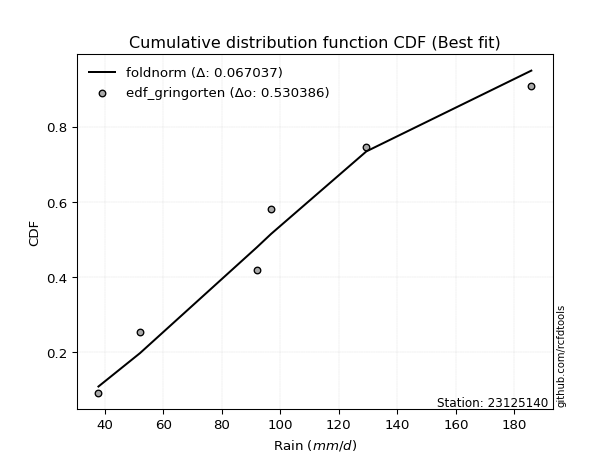</img></img>

</div>


### 9. Empirical - EDF Filliben (1975)

The specific values of the constants (0.3175) (often denoted as $alpha$) and (0.365) are derived from a method proposed by James J. Filliben in a 1975 paper. This particular formula is the mean value of the $i$-th order statistic of the normal distribution and is considered a robust and effective plotting position formula for the normal probability plot correlation coefficient test for normality.

<div align="center">


$P=(m-0.3175)/(n+0.365)$


</div>


**9.1. Empirical values**

<div align="center">

|                | 0                   | 1                  | 2            | 3                  | 4                  |
|:---------------|:--------------------|:-------------------|:-------------|:-------------------|:-------------------|
| date           | 2023                | 2018               | 2019         | 2020               | 2021               |
| x              | 37.8                | 52.0               | 92.0         | 96.8               | 129.4              |
| m              | 1                   | 2                  | 3            | 4                  | 5                  |
| empirical_dist | edf_filliben        | edf_filliben       | edf_filliben | edf_filliben       | edf_filliben       |
| empirical      | 0.12721342031686858 | 0.3136067101584343 | 0.5          | 0.6863932898415657 | 0.8727865796831314 |
| empirical_tr   | 1.1457554725040042  | 1.456890699253225  | 2.0          | 3.188707280832095  | 7.860805860805863  |

</div>


**9.2. Kolmogorov-Smirnov fit test (sorted by Δ)**


<div align="center">

|                | 0                   | 1                   | 2                   | 3                   | 4                   | 5                   | 6                   | 7                   | 8                   | 9                   | 10                  | 11                  | 12                 | 13                  | 14                 | 15                  | 16                  | 17                    | 18                  | 19                  | 20                  | 21                  | 22                  | 23                  | 24                 | 25                 | 26                 | 27                  | 28                  | 29                  | 30                  | 31                 | 32                  | 33                  | 34                  | 35                 | 36                  | 37                  | 38                 | 39                 | 40                  | 41                 | 42                 | 43                  | 44                  | 45                 | 46                 | 47                  | 48                  | 49                  | 50                  | 51                  | 52                 | 53                  | 54                  | 55                  | 56                 | 57                 | 58                  | 59                  | 60                  | 61                  | 62                 | 63                  | 64                 | 65                 | 66                  | 67                  | 68                  | 69                  | 70                  | 71                  | 72                 | 73                 | 74                  | 75                  | 76                  | 77                  | 78                  | 79                  | 80                 | 81                  | 82                 | 83                  | 84                 | 85                  | 86                  | 87                  | 88                  | 89                 |
|:---------------|:--------------------|:--------------------|:--------------------|:--------------------|:--------------------|:--------------------|:--------------------|:--------------------|:--------------------|:--------------------|:--------------------|:--------------------|:-------------------|:--------------------|:-------------------|:--------------------|:--------------------|:----------------------|:--------------------|:--------------------|:--------------------|:--------------------|:--------------------|:--------------------|:-------------------|:-------------------|:-------------------|:--------------------|:--------------------|:--------------------|:--------------------|:-------------------|:--------------------|:--------------------|:--------------------|:-------------------|:--------------------|:--------------------|:-------------------|:-------------------|:--------------------|:-------------------|:-------------------|:--------------------|:--------------------|:-------------------|:-------------------|:--------------------|:--------------------|:--------------------|:--------------------|:--------------------|:-------------------|:--------------------|:--------------------|:--------------------|:-------------------|:-------------------|:--------------------|:--------------------|:--------------------|:--------------------|:-------------------|:--------------------|:-------------------|:-------------------|:--------------------|:--------------------|:--------------------|:--------------------|:--------------------|:--------------------|:-------------------|:-------------------|:--------------------|:--------------------|:--------------------|:--------------------|:--------------------|:--------------------|:-------------------|:--------------------|:-------------------|:--------------------|:-------------------|:--------------------|:--------------------|:--------------------|:--------------------|:-------------------|
| station        | 23125140            | 23125140            | 23125140            | 23125140            | 23125140            | 23125140            | 23125140            | 23125140            | 23125140            | 23125140            | 23125140            | 23125140            | 23125140           | 23125140            | 23125140           | 23125140            | 23125140            | 23125140              | 23125140            | 23125140            | 23125140            | 23125140            | 23125140            | 23125140            | 23125140           | 23125140           | 23125140           | 23125140            | 23125140            | 23125140            | 23125140            | 23125140           | 23125140            | 23125140            | 23125140            | 23125140           | 23125140            | 23125140            | 23125140           | 23125140           | 23125140            | 23125140           | 23125140           | 23125140            | 23125140            | 23125140           | 23125140           | 23125140            | 23125140            | 23125140            | 23125140            | 23125140            | 23125140           | 23125140            | 23125140            | 23125140            | 23125140           | 23125140           | 23125140            | 23125140            | 23125140            | 23125140            | 23125140           | 23125140            | 23125140           | 23125140           | 23125140            | 23125140            | 23125140            | 23125140            | 23125140            | 23125140            | 23125140           | 23125140           | 23125140            | 23125140            | 23125140            | 23125140            | 23125140            | 23125140            | 23125140           | 23125140            | 23125140           | 23125140            | 23125140           | 23125140            | 23125140            | 23125140            | 23125140            | 23125140           |
| empirical_dist | edf_filliben        | edf_filliben        | edf_filliben        | edf_filliben        | edf_filliben        | edf_filliben        | edf_filliben        | edf_filliben        | edf_filliben        | edf_filliben        | edf_filliben        | edf_filliben        | edf_filliben       | edf_filliben        | edf_filliben       | edf_filliben        | edf_filliben        | edf_filliben          | edf_filliben        | edf_filliben        | edf_filliben        | edf_filliben        | edf_filliben        | edf_filliben        | edf_filliben       | edf_filliben       | edf_filliben       | edf_filliben        | edf_filliben        | edf_filliben        | edf_filliben        | edf_filliben       | edf_filliben        | edf_filliben        | edf_filliben        | edf_filliben       | edf_filliben        | edf_filliben        | edf_filliben       | edf_filliben       | edf_filliben        | edf_filliben       | edf_filliben       | edf_filliben        | edf_filliben        | edf_filliben       | edf_filliben       | edf_filliben        | edf_filliben        | edf_filliben        | edf_filliben        | edf_filliben        | edf_filliben       | edf_filliben        | edf_filliben        | edf_filliben        | edf_filliben       | edf_filliben       | edf_filliben        | edf_filliben        | edf_filliben        | edf_filliben        | edf_filliben       | edf_filliben        | edf_filliben       | edf_filliben       | edf_filliben        | edf_filliben        | edf_filliben        | edf_filliben        | edf_filliben        | edf_filliben        | edf_filliben       | edf_filliben       | edf_filliben        | edf_filliben        | edf_filliben        | edf_filliben        | edf_filliben        | edf_filliben        | edf_filliben       | edf_filliben        | edf_filliben       | edf_filliben        | edf_filliben       | edf_filliben        | edf_filliben        | edf_filliben        | edf_filliben        | edf_filliben       |
| p_dist         | logcrystalball      | logmielke           | mielke              | logjohnsonsu        | logloggamma         | erlang              | gamma               | pearson3            | nct                 | t                   | exponnorm           | crystalball         | norm               | truncnorm           | johnsonsu          | fisk                | logweibull_min      | loglaplace_asymmetric | laplace_asymmetric  | loggumbel_l         | rice                | gompertz            | maxwell             | invgamma            | logistic           | alpha              | logchi2            | gumbel_l            | rayleigh            | ncf                 | logfisk             | hypsecant          | logpearson3         | logncf              | invgauss            | genlogistic        | halfnorm            | laplace             | kstwobign          | logf               | lognct              | logexponnorm       | logt               | lognorm             | lognorm             | logfatiguelife     | logbetaprime       | logerlang           | gumbel_r            | loggamma            | loggamma            | logrice             | loginvgamma        | logalpha            | logmaxwell          | loginvgauss         | betaprime          | loglogistic        | halflogistic        | lograyleigh         | moyal               | genexpon            | loginvweibull      | expon               | weibull_min        | loggenexpon        | logkstwobign        | loghypsecant        | loghalfnorm         | loggompertz         | logexpon            | loggumbel_r         | loglaplace         | loghalflogistic    | logmoyal            | f                   | pareto              | logwald             | chi2                | wald                | nakagami           | lognakagami         | gibrat             | logpareto           | loggibrat          | loglognorm          | fatiguelife         | invweibull          | logtruncnorm        | loggenlogistic     |
| delta          | 0.08684276743049857 | 0.11756069489802243 | 0.12136548753353879 | 0.12282695359108303 | 0.12852558401765898 | 0.12905021364923736 | 0.12909453826227954 | 0.12913803520790168 | 0.12922645953831183 | 0.12930745963843387 | 0.12931998145408177 | 0.12932000160917334 | 0.1293200034938582 | 0.12932000684307282 | 0.1293655005593859 | 0.12990851617533872 | 0.13113751094511494 | 0.13203545323579724   | 0.14317546902587808 | 0.14429626843019916 | 0.14451578648019558 | 0.14694743566304136 | 0.14826486870803623 | 0.14969160269547166 | 0.1498962487309337 | 0.1511152988087332 | 0.1511967260518532 | 0.15121042846358426 | 0.15569009698349423 | 0.15977844744875203 | 0.16034036681928254 | 0.1615111157072888 | 0.16705946757711854 | 0.16742429858810026 | 0.16801455928450038 | 0.1719136621921996 | 0.17700536146598012 | 0.18015586747506096 | 0.180296303831894  | 0.1823904137251815 | 0.18269973703306785 | 0.1829133801265389 | 0.1829138882448209 | 0.18291421948839504 | 0.18291421948839504 | 0.1832543222800893 | 0.1863578907464858 | 0.18670441392229897 | 0.18769266333159185 | 0.18944423484992856 | 0.18944423484992856 | 0.19244055056999787 | 0.1953432050132503 | 0.19592752626700483 | 0.20086464524374592 | 0.20092500611089936 | 0.2018841555801879 | 0.2033123251465221 | 0.20536655023757933 | 0.20616049550717297 | 0.20912076037798066 | 0.20915379517988786 | 0.2093857525494256 | 0.20987485725466237 | 0.2120838218016488 | 0.2176761385097653 | 0.21799653652744722 | 0.21844241062997294 | 0.22195504024180424 | 0.22456022395976638 | 0.23180759704357068 | 0.23714381748743085 | 0.2449051717478874 | 0.2493300199840648 | 0.25479876743838337 | 0.26235733799672745 | 0.29891382120139603 | 0.30586725616871635 | 0.30911942689333405 | 0.30934080915016704 | 0.3136067073174368 | 0.31360671015677033 | 0.3136067101584343 | 0.32790094612120485 | 0.3376214970642448 | 0.35575684954411363 | 0.37511633347183754 | 0.41409579766593246 | 0.49998320630687076 | 0.6863932898415657 |
| deltao         | 0.5865427407550001  | 0.5865427407550001  | 0.5865427407550001  | 0.5865427407550001  | 0.5865427407550001  | 0.5865427407550001  | 0.5865427407550001  | 0.5865427407550001  | 0.5865427407550001  | 0.5865427407550001  | 0.5865427407550001  | 0.5865427407550001  | 0.5865427407550001 | 0.5865427407550001  | 0.5865427407550001 | 0.5865427407550001  | 0.5865427407550001  | 0.5865427407550001    | 0.5865427407550001  | 0.5865427407550001  | 0.5865427407550001  | 0.5865427407550001  | 0.5865427407550001  | 0.5865427407550001  | 0.5865427407550001 | 0.5865427407550001 | 0.5865427407550001 | 0.5865427407550001  | 0.5865427407550001  | 0.5865427407550001  | 0.5865427407550001  | 0.5865427407550001 | 0.5865427407550001  | 0.5865427407550001  | 0.5865427407550001  | 0.5865427407550001 | 0.5865427407550001  | 0.5865427407550001  | 0.5865427407550001 | 0.5865427407550001 | 0.5865427407550001  | 0.5865427407550001 | 0.5865427407550001 | 0.5865427407550001  | 0.5865427407550001  | 0.5865427407550001 | 0.5865427407550001 | 0.5865427407550001  | 0.5865427407550001  | 0.5865427407550001  | 0.5865427407550001  | 0.5865427407550001  | 0.5865427407550001 | 0.5865427407550001  | 0.5865427407550001  | 0.5865427407550001  | 0.5865427407550001 | 0.5865427407550001 | 0.5865427407550001  | 0.5865427407550001  | 0.5865427407550001  | 0.5865427407550001  | 0.5865427407550001 | 0.5865427407550001  | 0.5865427407550001 | 0.5865427407550001 | 0.5865427407550001  | 0.5865427407550001  | 0.5865427407550001  | 0.5865427407550001  | 0.5865427407550001  | 0.5865427407550001  | 0.5865427407550001 | 0.5865427407550001 | 0.5865427407550001  | 0.5865427407550001  | 0.5865427407550001  | 0.5865427407550001  | 0.5865427407550001  | 0.5865427407550001  | 0.5865427407550001 | 0.5865427407550001  | 0.5865427407550001 | 0.5865427407550001  | 0.5865427407550001 | 0.5865427407550001  | 0.5865427407550001  | 0.5865427407550001  | 0.5865427407550001  | 0.5865427407550001 |
| eval           | Δo > Δ              | Δo > Δ              | Δo > Δ              | Δo > Δ              | Δo > Δ              | Δo > Δ              | Δo > Δ              | Δo > Δ              | Δo > Δ              | Δo > Δ              | Δo > Δ              | Δo > Δ              | Δo > Δ             | Δo > Δ              | Δo > Δ             | Δo > Δ              | Δo > Δ              | Δo > Δ                | Δo > Δ              | Δo > Δ              | Δo > Δ              | Δo > Δ              | Δo > Δ              | Δo > Δ              | Δo > Δ             | Δo > Δ             | Δo > Δ             | Δo > Δ              | Δo > Δ              | Δo > Δ              | Δo > Δ              | Δo > Δ             | Δo > Δ              | Δo > Δ              | Δo > Δ              | Δo > Δ             | Δo > Δ              | Δo > Δ              | Δo > Δ             | Δo > Δ             | Δo > Δ              | Δo > Δ             | Δo > Δ             | Δo > Δ              | Δo > Δ              | Δo > Δ             | Δo > Δ             | Δo > Δ              | Δo > Δ              | Δo > Δ              | Δo > Δ              | Δo > Δ              | Δo > Δ             | Δo > Δ              | Δo > Δ              | Δo > Δ              | Δo > Δ             | Δo > Δ             | Δo > Δ              | Δo > Δ              | Δo > Δ              | Δo > Δ              | Δo > Δ             | Δo > Δ              | Δo > Δ             | Δo > Δ             | Δo > Δ              | Δo > Δ              | Δo > Δ              | Δo > Δ              | Δo > Δ              | Δo > Δ              | Δo > Δ             | Δo > Δ             | Δo > Δ              | Δo > Δ              | Δo > Δ              | Δo > Δ              | Δo > Δ              | Δo > Δ              | Δo > Δ             | Δo > Δ              | Δo > Δ             | Δo > Δ              | Δo > Δ             | Δo > Δ              | Δo > Δ              | Δo > Δ              | Δo > Δ              | Δo <= Δ            |
| fit            | 1                   | 1                   | 1                   | 1                   | 1                   | 1                   | 1                   | 1                   | 1                   | 1                   | 1                   | 1                   | 1                  | 1                   | 1                  | 1                   | 1                   | 1                     | 1                   | 1                   | 1                   | 1                   | 1                   | 1                   | 1                  | 1                  | 1                  | 1                   | 1                   | 1                   | 1                   | 1                  | 1                   | 1                   | 1                   | 1                  | 1                   | 1                   | 1                  | 1                  | 1                   | 1                  | 1                  | 1                   | 1                   | 1                  | 1                  | 1                   | 1                   | 1                   | 1                   | 1                   | 1                  | 1                   | 1                   | 1                   | 1                  | 1                  | 1                   | 1                   | 1                   | 1                   | 1                  | 1                   | 1                  | 1                  | 1                   | 1                   | 1                   | 1                   | 1                   | 1                   | 1                  | 1                  | 1                   | 1                   | 1                   | 1                   | 1                   | 1                   | 1                  | 1                   | 1                  | 1                   | 1                  | 1                   | 1                   | 1                   | 1                   | 0                  |
| n              | 5                   | 5                   | 5                   | 5                   | 5                   | 5                   | 5                   | 5                   | 5                   | 5                   | 5                   | 5                   | 5                  | 5                   | 5                  | 5                   | 5                   | 5                     | 5                   | 5                   | 5                   | 5                   | 5                   | 5                   | 5                  | 5                  | 5                  | 5                   | 5                   | 5                   | 5                   | 5                  | 5                   | 5                   | 5                   | 5                  | 5                   | 5                   | 5                  | 5                  | 5                   | 5                  | 5                  | 5                   | 5                   | 5                  | 5                  | 5                   | 5                   | 5                   | 5                   | 5                   | 5                  | 5                   | 5                   | 5                   | 5                  | 5                  | 5                   | 5                   | 5                   | 5                   | 5                  | 5                   | 5                  | 5                  | 5                   | 5                   | 5                   | 5                   | 5                   | 5                   | 5                  | 5                  | 5                   | 5                   | 5                   | 5                   | 5                   | 5                   | 5                  | 5                   | 5                  | 5                   | 5                  | 5                   | 5                   | 5                   | 5                   | 5                  |
| best_fit       | 1                   | 0                   | 0                   | 0                   | 0                   | 0                   | 0                   | 0                   | 0                   | 0                   | 0                   | 0                   | 0                  | 0                   | 0                  | 0                   | 0                   | 0                     | 0                   | 0                   | 0                   | 0                   | 0                   | 0                   | 0                  | 0                  | 0                  | 0                   | 0                   | 0                   | 0                   | 0                  | 0                   | 0                   | 0                   | 0                  | 0                   | 0                   | 0                  | 0                  | 0                   | 0                  | 0                  | 0                   | 0                   | 0                  | 0                  | 0                   | 0                   | 0                   | 0                   | 0                   | 0                  | 0                   | 0                   | 0                   | 0                  | 0                  | 0                   | 0                   | 0                   | 0                   | 0                  | 0                   | 0                  | 0                  | 0                   | 0                   | 0                   | 0                   | 0                   | 0                   | 0                  | 0                  | 0                   | 0                   | 0                   | 0                   | 0                   | 0                   | 0                  | 0                   | 0                  | 0                   | 0                  | 0                   | 0                   | 0                   | 0                   | 0                  |
| best_fit_sort  | 1                   | 2                   | 3                   | 4                   | 5                   | 6                   | 7                   | 8                   | 9                   | 10                  | 11                  | 12                  | 13                 | 14                  | 15                 | 16                  | 17                  | 18                    | 19                  | 20                  | 21                  | 22                  | 23                  | 24                  | 25                 | 26                 | 27                 | 28                  | 29                  | 30                  | 31                  | 32                 | 33                  | 34                  | 35                  | 36                 | 37                  | 38                  | 39                 | 40                 | 41                  | 42                 | 43                 | 44                  | 45                  | 46                 | 47                 | 48                  | 49                  | 50                  | 51                  | 52                  | 53                 | 54                  | 55                  | 56                  | 57                 | 58                 | 59                  | 60                  | 61                  | 62                  | 63                 | 64                  | 65                 | 66                 | 67                  | 68                  | 69                  | 70                  | 71                  | 72                  | 73                 | 74                 | 75                  | 76                  | 77                  | 78                  | 79                  | 80                  | 81                 | 82                  | 83                 | 84                  | 85                 | 86                  | 87                  | 88                  | 89                  | 90                 |

</div>


<div align="center">

</img>

</div>


**9.3. Best fit**

<div align="center">

|   id |   station | empirical_dist   | p_dist         |     delta |   deltao | eval   |   fit |   n |   best_fit |   best_fit_sort |
|-----:|----------:|:-----------------|:---------------|----------:|---------:|:-------|------:|----:|-----------:|----------------:|
|    0 |  23125140 | edf_filliben     | logcrystalball | 0.0868428 | 0.586543 | Δo > Δ |     1 |   5 |          1 |               1 |

</div>


<div align="center">

</img></img>

</div>


### 10. Empirical - EDF Jenkinson (1977)

The Jenkinson formula in hydrology is an empirical plotting position formula used to estimate the non-exceedance probability _(P)_ or return period _(T)_ of a given ordered observation within a sample. It is a widely used method in the frequency analysis of extreme events such as floods and rainfall, as it provides a distribution-free way to plot data. _a≈0.31_ and _b≈0.38_ are constants derived to approximate the median of the probability distribution for the given rank.

<div align="center">


$P=(m-a)/(n+b)$


</div>


**10.1. Empirical values**

<div align="center">

|                | 0                   | 1                  | 2             | 3                  | 4                  |
|:---------------|:--------------------|:-------------------|:--------------|:-------------------|:-------------------|
| date           | 2023                | 2018               | 2019          | 2020               | 2021               |
| x              | 37.8                | 52.0               | 92.0          | 96.8               | 129.4              |
| m              | 1                   | 2                  | 3             | 4                  | 5                  |
| empirical_dist | edf_jenkinson       | edf_jenkinson      | edf_jenkinson | edf_jenkinson      | edf_jenkinson      |
| empirical      | 0.12825278810408922 | 0.3141263940520446 | 0.5           | 0.6858736059479554 | 0.8717472118959109 |
| empirical_tr   | 1.1471215351812367  | 1.4579945799457996 | 2.0           | 3.183431952662722  | 7.797101449275368  |

</div>


**10.2. Kolmogorov-Smirnov fit test (sorted by Δ)**


<div align="center">

|                | 0                   | 1                   | 2                   | 3                   | 4                   | 5                  | 6                   | 7                   | 8                   | 9                   | 10                  | 11                  | 12                  | 13                  | 14                  | 15                  | 16                  | 17                    | 18                  | 19                  | 20                  | 21                  | 22                  | 23                  | 24                  | 25                 | 26                 | 27                 | 28                  | 29                  | 30                  | 31                  | 32                  | 33                  | 34                  | 35                 | 36                  | 37                  | 38                 | 39                 | 40                  | 41                 | 42                 | 43                  | 44                  | 45                 | 46                 | 47                  | 48                  | 49                  | 50                  | 51                  | 52                 | 53                  | 54                  | 55                  | 56                 | 57                 | 58                  | 59                  | 60                  | 61                  | 62                 | 63                  | 64                  | 65                 | 66                  | 67                  | 68                  | 69                  | 70                  | 71                  | 72                 | 73                 | 74                  | 75                  | 76                 | 77                  | 78                  | 79                 | 80                  | 81                 | 82                 | 83                 | 84                 | 85                 | 86                 | 87                 | 88                  | 89                 |
|:---------------|:--------------------|:--------------------|:--------------------|:--------------------|:--------------------|:-------------------|:--------------------|:--------------------|:--------------------|:--------------------|:--------------------|:--------------------|:--------------------|:--------------------|:--------------------|:--------------------|:--------------------|:----------------------|:--------------------|:--------------------|:--------------------|:--------------------|:--------------------|:--------------------|:--------------------|:-------------------|:-------------------|:-------------------|:--------------------|:--------------------|:--------------------|:--------------------|:--------------------|:--------------------|:--------------------|:-------------------|:--------------------|:--------------------|:-------------------|:-------------------|:--------------------|:-------------------|:-------------------|:--------------------|:--------------------|:-------------------|:-------------------|:--------------------|:--------------------|:--------------------|:--------------------|:--------------------|:-------------------|:--------------------|:--------------------|:--------------------|:-------------------|:-------------------|:--------------------|:--------------------|:--------------------|:--------------------|:-------------------|:--------------------|:--------------------|:-------------------|:--------------------|:--------------------|:--------------------|:--------------------|:--------------------|:--------------------|:-------------------|:-------------------|:--------------------|:--------------------|:-------------------|:--------------------|:--------------------|:-------------------|:--------------------|:-------------------|:-------------------|:-------------------|:-------------------|:-------------------|:-------------------|:-------------------|:--------------------|:-------------------|
| station        | 23125140            | 23125140            | 23125140            | 23125140            | 23125140            | 23125140           | 23125140            | 23125140            | 23125140            | 23125140            | 23125140            | 23125140            | 23125140            | 23125140            | 23125140            | 23125140            | 23125140            | 23125140              | 23125140            | 23125140            | 23125140            | 23125140            | 23125140            | 23125140            | 23125140            | 23125140           | 23125140           | 23125140           | 23125140            | 23125140            | 23125140            | 23125140            | 23125140            | 23125140            | 23125140            | 23125140           | 23125140            | 23125140            | 23125140           | 23125140           | 23125140            | 23125140           | 23125140           | 23125140            | 23125140            | 23125140           | 23125140           | 23125140            | 23125140            | 23125140            | 23125140            | 23125140            | 23125140           | 23125140            | 23125140            | 23125140            | 23125140           | 23125140           | 23125140            | 23125140            | 23125140            | 23125140            | 23125140           | 23125140            | 23125140            | 23125140           | 23125140            | 23125140            | 23125140            | 23125140            | 23125140            | 23125140            | 23125140           | 23125140           | 23125140            | 23125140            | 23125140           | 23125140            | 23125140            | 23125140           | 23125140            | 23125140           | 23125140           | 23125140           | 23125140           | 23125140           | 23125140           | 23125140           | 23125140            | 23125140           |
| empirical_dist | edf_jenkinson       | edf_jenkinson       | edf_jenkinson       | edf_jenkinson       | edf_jenkinson       | edf_jenkinson      | edf_jenkinson       | edf_jenkinson       | edf_jenkinson       | edf_jenkinson       | edf_jenkinson       | edf_jenkinson       | edf_jenkinson       | edf_jenkinson       | edf_jenkinson       | edf_jenkinson       | edf_jenkinson       | edf_jenkinson         | edf_jenkinson       | edf_jenkinson       | edf_jenkinson       | edf_jenkinson       | edf_jenkinson       | edf_jenkinson       | edf_jenkinson       | edf_jenkinson      | edf_jenkinson      | edf_jenkinson      | edf_jenkinson       | edf_jenkinson       | edf_jenkinson       | edf_jenkinson       | edf_jenkinson       | edf_jenkinson       | edf_jenkinson       | edf_jenkinson      | edf_jenkinson       | edf_jenkinson       | edf_jenkinson      | edf_jenkinson      | edf_jenkinson       | edf_jenkinson      | edf_jenkinson      | edf_jenkinson       | edf_jenkinson       | edf_jenkinson      | edf_jenkinson      | edf_jenkinson       | edf_jenkinson       | edf_jenkinson       | edf_jenkinson       | edf_jenkinson       | edf_jenkinson      | edf_jenkinson       | edf_jenkinson       | edf_jenkinson       | edf_jenkinson      | edf_jenkinson      | edf_jenkinson       | edf_jenkinson       | edf_jenkinson       | edf_jenkinson       | edf_jenkinson      | edf_jenkinson       | edf_jenkinson       | edf_jenkinson      | edf_jenkinson       | edf_jenkinson       | edf_jenkinson       | edf_jenkinson       | edf_jenkinson       | edf_jenkinson       | edf_jenkinson      | edf_jenkinson      | edf_jenkinson       | edf_jenkinson       | edf_jenkinson      | edf_jenkinson       | edf_jenkinson       | edf_jenkinson      | edf_jenkinson       | edf_jenkinson      | edf_jenkinson      | edf_jenkinson      | edf_jenkinson      | edf_jenkinson      | edf_jenkinson      | edf_jenkinson      | edf_jenkinson       | edf_jenkinson      |
| p_dist         | logcrystalball      | logmielke           | mielke              | logjohnsonsu        | logloggamma         | erlang             | gamma               | pearson3            | nct                 | t                   | exponnorm           | crystalball         | norm                | truncnorm           | johnsonsu           | fisk                | logweibull_min      | loglaplace_asymmetric | laplace_asymmetric  | loggumbel_l         | rice                | gompertz            | maxwell             | invgamma            | logistic            | alpha              | logchi2            | gumbel_l           | rayleigh            | ncf                 | logfisk             | hypsecant           | logpearson3         | logncf              | invgauss            | genlogistic        | halfnorm            | laplace             | kstwobign          | logf               | lognct              | logexponnorm       | logt               | lognorm             | lognorm             | logfatiguelife     | logbetaprime       | logerlang           | gumbel_r            | loggamma            | loggamma            | logrice             | loginvgamma        | logalpha            | logmaxwell          | loginvgauss         | betaprime          | loglogistic        | halflogistic        | lograyleigh         | moyal               | genexpon            | loginvweibull      | expon               | weibull_min         | loggenexpon        | logkstwobign        | loghypsecant        | loghalfnorm         | loggompertz         | logexpon            | loggumbel_r         | loglaplace         | loghalflogistic    | logmoyal            | f                   | pareto             | logwald             | chi2                | wald               | nakagami            | lognakagami        | gibrat             | logpareto          | loggibrat          | loglognorm         | fatiguelife        | invweibull         | logtruncnorm        | loggenlogistic     |
| delta          | 0.08684276743049857 | 0.11808037879163277 | 0.12188517142714914 | 0.12334663748469338 | 0.12904526791126933 | 0.1295698975428477 | 0.12961422215588989 | 0.12965771910151203 | 0.12974614343192217 | 0.12982714353204422 | 0.12983966534769212 | 0.12983968550278369 | 0.12983968738746854 | 0.12983969073668317 | 0.12988518445299624 | 0.13042820006894906 | 0.13113751094511494 | 0.13255513712940759   | 0.14369515291948842 | 0.14429626843019916 | 0.14451578648019558 | 0.14694743566304136 | 0.14826486870803623 | 0.14969160269547166 | 0.15041593262454406 | 0.1511152988087332 | 0.1511967260518532 | 0.1517301123571946 | 0.15569009698349423 | 0.15977844744875203 | 0.16034036681928254 | 0.16203079960089914 | 0.16705946757711854 | 0.16742429858810026 | 0.16801455928450038 | 0.1719136621921996 | 0.17700536146598012 | 0.18015586747506096 | 0.180296303831894  | 0.1823904137251815 | 0.18269973703306785 | 0.1829133801265389 | 0.1829138882448209 | 0.18291421948839504 | 0.18291421948839504 | 0.1832543222800893 | 0.1863578907464858 | 0.18670441392229897 | 0.18769266333159185 | 0.18944423484992856 | 0.18944423484992856 | 0.19244055056999787 | 0.1953432050132503 | 0.19592752626700483 | 0.20086464524374592 | 0.20092500611089936 | 0.2018841555801879 | 0.2033123251465221 | 0.20536655023757933 | 0.20616049550717297 | 0.20912076037798066 | 0.20915379517988786 | 0.2093857525494256 | 0.20987485725466237 | 0.21156413790803846 | 0.2176761385097653 | 0.21799653652744722 | 0.21844241062997294 | 0.22195504024180424 | 0.22456022395976638 | 0.23180759704357068 | 0.23714381748743085 | 0.2449051717478874 | 0.2493300199840648 | 0.25479876743838337 | 0.26235733799672745 | 0.2983941373077857 | 0.30586725616871635 | 0.30911942689333405 | 0.3098604930437774 | 0.31412639121104713 | 0.3141263940503807 | 0.3141263940520446 | 0.3273812622275945 | 0.3376214970642448 | 0.3552371656505033 | 0.3745966495782272 | 0.4130564298787119 | 0.49998320630687076 | 0.6858736059479554 |
| deltao         | 0.5865427407550001  | 0.5865427407550001  | 0.5865427407550001  | 0.5865427407550001  | 0.5865427407550001  | 0.5865427407550001 | 0.5865427407550001  | 0.5865427407550001  | 0.5865427407550001  | 0.5865427407550001  | 0.5865427407550001  | 0.5865427407550001  | 0.5865427407550001  | 0.5865427407550001  | 0.5865427407550001  | 0.5865427407550001  | 0.5865427407550001  | 0.5865427407550001    | 0.5865427407550001  | 0.5865427407550001  | 0.5865427407550001  | 0.5865427407550001  | 0.5865427407550001  | 0.5865427407550001  | 0.5865427407550001  | 0.5865427407550001 | 0.5865427407550001 | 0.5865427407550001 | 0.5865427407550001  | 0.5865427407550001  | 0.5865427407550001  | 0.5865427407550001  | 0.5865427407550001  | 0.5865427407550001  | 0.5865427407550001  | 0.5865427407550001 | 0.5865427407550001  | 0.5865427407550001  | 0.5865427407550001 | 0.5865427407550001 | 0.5865427407550001  | 0.5865427407550001 | 0.5865427407550001 | 0.5865427407550001  | 0.5865427407550001  | 0.5865427407550001 | 0.5865427407550001 | 0.5865427407550001  | 0.5865427407550001  | 0.5865427407550001  | 0.5865427407550001  | 0.5865427407550001  | 0.5865427407550001 | 0.5865427407550001  | 0.5865427407550001  | 0.5865427407550001  | 0.5865427407550001 | 0.5865427407550001 | 0.5865427407550001  | 0.5865427407550001  | 0.5865427407550001  | 0.5865427407550001  | 0.5865427407550001 | 0.5865427407550001  | 0.5865427407550001  | 0.5865427407550001 | 0.5865427407550001  | 0.5865427407550001  | 0.5865427407550001  | 0.5865427407550001  | 0.5865427407550001  | 0.5865427407550001  | 0.5865427407550001 | 0.5865427407550001 | 0.5865427407550001  | 0.5865427407550001  | 0.5865427407550001 | 0.5865427407550001  | 0.5865427407550001  | 0.5865427407550001 | 0.5865427407550001  | 0.5865427407550001 | 0.5865427407550001 | 0.5865427407550001 | 0.5865427407550001 | 0.5865427407550001 | 0.5865427407550001 | 0.5865427407550001 | 0.5865427407550001  | 0.5865427407550001 |
| eval           | Δo > Δ              | Δo > Δ              | Δo > Δ              | Δo > Δ              | Δo > Δ              | Δo > Δ             | Δo > Δ              | Δo > Δ              | Δo > Δ              | Δo > Δ              | Δo > Δ              | Δo > Δ              | Δo > Δ              | Δo > Δ              | Δo > Δ              | Δo > Δ              | Δo > Δ              | Δo > Δ                | Δo > Δ              | Δo > Δ              | Δo > Δ              | Δo > Δ              | Δo > Δ              | Δo > Δ              | Δo > Δ              | Δo > Δ             | Δo > Δ             | Δo > Δ             | Δo > Δ              | Δo > Δ              | Δo > Δ              | Δo > Δ              | Δo > Δ              | Δo > Δ              | Δo > Δ              | Δo > Δ             | Δo > Δ              | Δo > Δ              | Δo > Δ             | Δo > Δ             | Δo > Δ              | Δo > Δ             | Δo > Δ             | Δo > Δ              | Δo > Δ              | Δo > Δ             | Δo > Δ             | Δo > Δ              | Δo > Δ              | Δo > Δ              | Δo > Δ              | Δo > Δ              | Δo > Δ             | Δo > Δ              | Δo > Δ              | Δo > Δ              | Δo > Δ             | Δo > Δ             | Δo > Δ              | Δo > Δ              | Δo > Δ              | Δo > Δ              | Δo > Δ             | Δo > Δ              | Δo > Δ              | Δo > Δ             | Δo > Δ              | Δo > Δ              | Δo > Δ              | Δo > Δ              | Δo > Δ              | Δo > Δ              | Δo > Δ             | Δo > Δ             | Δo > Δ              | Δo > Δ              | Δo > Δ             | Δo > Δ              | Δo > Δ              | Δo > Δ             | Δo > Δ              | Δo > Δ             | Δo > Δ             | Δo > Δ             | Δo > Δ             | Δo > Δ             | Δo > Δ             | Δo > Δ             | Δo > Δ              | Δo <= Δ            |
| fit            | 1                   | 1                   | 1                   | 1                   | 1                   | 1                  | 1                   | 1                   | 1                   | 1                   | 1                   | 1                   | 1                   | 1                   | 1                   | 1                   | 1                   | 1                     | 1                   | 1                   | 1                   | 1                   | 1                   | 1                   | 1                   | 1                  | 1                  | 1                  | 1                   | 1                   | 1                   | 1                   | 1                   | 1                   | 1                   | 1                  | 1                   | 1                   | 1                  | 1                  | 1                   | 1                  | 1                  | 1                   | 1                   | 1                  | 1                  | 1                   | 1                   | 1                   | 1                   | 1                   | 1                  | 1                   | 1                   | 1                   | 1                  | 1                  | 1                   | 1                   | 1                   | 1                   | 1                  | 1                   | 1                   | 1                  | 1                   | 1                   | 1                   | 1                   | 1                   | 1                   | 1                  | 1                  | 1                   | 1                   | 1                  | 1                   | 1                   | 1                  | 1                   | 1                  | 1                  | 1                  | 1                  | 1                  | 1                  | 1                  | 1                   | 0                  |
| n              | 5                   | 5                   | 5                   | 5                   | 5                   | 5                  | 5                   | 5                   | 5                   | 5                   | 5                   | 5                   | 5                   | 5                   | 5                   | 5                   | 5                   | 5                     | 5                   | 5                   | 5                   | 5                   | 5                   | 5                   | 5                   | 5                  | 5                  | 5                  | 5                   | 5                   | 5                   | 5                   | 5                   | 5                   | 5                   | 5                  | 5                   | 5                   | 5                  | 5                  | 5                   | 5                  | 5                  | 5                   | 5                   | 5                  | 5                  | 5                   | 5                   | 5                   | 5                   | 5                   | 5                  | 5                   | 5                   | 5                   | 5                  | 5                  | 5                   | 5                   | 5                   | 5                   | 5                  | 5                   | 5                   | 5                  | 5                   | 5                   | 5                   | 5                   | 5                   | 5                   | 5                  | 5                  | 5                   | 5                   | 5                  | 5                   | 5                   | 5                  | 5                   | 5                  | 5                  | 5                  | 5                  | 5                  | 5                  | 5                  | 5                   | 5                  |
| best_fit       | 1                   | 0                   | 0                   | 0                   | 0                   | 0                  | 0                   | 0                   | 0                   | 0                   | 0                   | 0                   | 0                   | 0                   | 0                   | 0                   | 0                   | 0                     | 0                   | 0                   | 0                   | 0                   | 0                   | 0                   | 0                   | 0                  | 0                  | 0                  | 0                   | 0                   | 0                   | 0                   | 0                   | 0                   | 0                   | 0                  | 0                   | 0                   | 0                  | 0                  | 0                   | 0                  | 0                  | 0                   | 0                   | 0                  | 0                  | 0                   | 0                   | 0                   | 0                   | 0                   | 0                  | 0                   | 0                   | 0                   | 0                  | 0                  | 0                   | 0                   | 0                   | 0                   | 0                  | 0                   | 0                   | 0                  | 0                   | 0                   | 0                   | 0                   | 0                   | 0                   | 0                  | 0                  | 0                   | 0                   | 0                  | 0                   | 0                   | 0                  | 0                   | 0                  | 0                  | 0                  | 0                  | 0                  | 0                  | 0                  | 0                   | 0                  |
| best_fit_sort  | 1                   | 2                   | 3                   | 4                   | 5                   | 6                  | 7                   | 8                   | 9                   | 10                  | 11                  | 12                  | 13                  | 14                  | 15                  | 16                  | 17                  | 18                    | 19                  | 20                  | 21                  | 22                  | 23                  | 24                  | 25                  | 26                 | 27                 | 28                 | 29                  | 30                  | 31                  | 32                  | 33                  | 34                  | 35                  | 36                 | 37                  | 38                  | 39                 | 40                 | 41                  | 42                 | 43                 | 44                  | 45                  | 46                 | 47                 | 48                  | 49                  | 50                  | 51                  | 52                  | 53                 | 54                  | 55                  | 56                  | 57                 | 58                 | 59                  | 60                  | 61                  | 62                  | 63                 | 64                  | 65                  | 66                 | 67                  | 68                  | 69                  | 70                  | 71                  | 72                  | 73                 | 74                 | 75                  | 76                  | 77                 | 78                  | 79                  | 80                 | 81                  | 82                 | 83                 | 84                 | 85                 | 86                 | 87                 | 88                 | 89                  | 90                 |

</div>


<div align="center">

</img>

</div>


**10.3. Best fit**

<div align="center">

|   id |   station | empirical_dist   | p_dist         |     delta |   deltao | eval   |   fit |   n |   best_fit |   best_fit_sort |
|-----:|----------:|:-----------------|:---------------|----------:|---------:|:-------|------:|----:|-----------:|----------------:|
|    0 |  23125140 | edf_jenkinson    | logcrystalball | 0.0868428 | 0.586543 | Δo > Δ |     1 |   5 |          1 |               1 |

</div>


<div align="center">

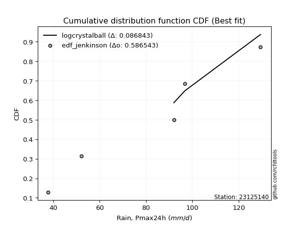</img></img>

</div>


### 11. Empirical - EDF Cunnane (1978)

Cunnane´s work in statistical hydrology has focused on the performance and evaluation of different probability distributions (such as GEV, Gumbel, Lognormal) for flood frequency estimation. _b_ is a constant, typically set to 0.4.

<div align="center">


$P=(m-b)/(n+1-2b)$


</div>


**11.1. Empirical values**

<div align="center">

|                | 0                   | 1                  | 2           | 3                  | 4                  |
|:---------------|:--------------------|:-------------------|:------------|:-------------------|:-------------------|
| date           | 2023                | 2018               | 2019        | 2020               | 2021               |
| x              | 37.8                | 52.0               | 92.0        | 96.8               | 129.4              |
| m              | 1                   | 2                  | 3           | 4                  | 5                  |
| empirical_dist | edf_cunnane         | edf_cunnane        | edf_cunnane | edf_cunnane        | edf_cunnane        |
| empirical      | 0.11538461538461538 | 0.3076923076923077 | 0.5         | 0.6923076923076923 | 0.8846153846153845 |
| empirical_tr   | 1.1304347826086958  | 1.4444444444444444 | 2.0         | 3.25               | 8.666666666666655  |

</div>


**11.2. Kolmogorov-Smirnov fit test (sorted by Δ)**


<div align="center">

|                | 0                   | 1                   | 2                   | 3                   | 4                   | 5                   | 6                   | 7                   | 8                   | 9                  | 10                  | 11                  | 12                  | 13                  | 14                  | 15                 | 16                    | 17                  | 18                 | 19                  | 20                  | 21                  | 22                 | 23                  | 24                  | 25                  | 26                 | 27                  | 28                  | 29                  | 30                  | 31                  | 32                  | 33                  | 34                  | 35                 | 36                  | 37                  | 38                 | 39                 | 40                  | 41                 | 42                 | 43                  | 44                  | 45                 | 46                 | 47                  | 48                  | 49                  | 50                  | 51                  | 52                 | 53                  | 54                  | 55                  | 56                 | 57                 | 58                  | 59                  | 60                  | 61                  | 62                 | 63                  | 64                 | 65                  | 66                  | 67                  | 68                  | 69                  | 70                  | 71                  | 72                 | 73                 | 74                  | 75                  | 76                 | 77                 | 78                  | 79                 | 80                  | 81                 | 82                  | 83                 | 84                 | 85                 | 86                 | 87                 | 88                  | 89                 |
|:---------------|:--------------------|:--------------------|:--------------------|:--------------------|:--------------------|:--------------------|:--------------------|:--------------------|:--------------------|:-------------------|:--------------------|:--------------------|:--------------------|:--------------------|:--------------------|:-------------------|:----------------------|:--------------------|:-------------------|:--------------------|:--------------------|:--------------------|:-------------------|:--------------------|:--------------------|:--------------------|:-------------------|:--------------------|:--------------------|:--------------------|:--------------------|:--------------------|:--------------------|:--------------------|:--------------------|:-------------------|:--------------------|:--------------------|:-------------------|:-------------------|:--------------------|:-------------------|:-------------------|:--------------------|:--------------------|:-------------------|:-------------------|:--------------------|:--------------------|:--------------------|:--------------------|:--------------------|:-------------------|:--------------------|:--------------------|:--------------------|:-------------------|:-------------------|:--------------------|:--------------------|:--------------------|:--------------------|:-------------------|:--------------------|:-------------------|:--------------------|:--------------------|:--------------------|:--------------------|:--------------------|:--------------------|:--------------------|:-------------------|:-------------------|:--------------------|:--------------------|:-------------------|:-------------------|:--------------------|:-------------------|:--------------------|:-------------------|:--------------------|:-------------------|:-------------------|:-------------------|:-------------------|:-------------------|:--------------------|:-------------------|
| station        | 23125140            | 23125140            | 23125140            | 23125140            | 23125140            | 23125140            | 23125140            | 23125140            | 23125140            | 23125140           | 23125140            | 23125140            | 23125140            | 23125140            | 23125140            | 23125140           | 23125140              | 23125140            | 23125140           | 23125140            | 23125140            | 23125140            | 23125140           | 23125140            | 23125140            | 23125140            | 23125140           | 23125140            | 23125140            | 23125140            | 23125140            | 23125140            | 23125140            | 23125140            | 23125140            | 23125140           | 23125140            | 23125140            | 23125140           | 23125140           | 23125140            | 23125140           | 23125140           | 23125140            | 23125140            | 23125140           | 23125140           | 23125140            | 23125140            | 23125140            | 23125140            | 23125140            | 23125140           | 23125140            | 23125140            | 23125140            | 23125140           | 23125140           | 23125140            | 23125140            | 23125140            | 23125140            | 23125140           | 23125140            | 23125140           | 23125140            | 23125140            | 23125140            | 23125140            | 23125140            | 23125140            | 23125140            | 23125140           | 23125140           | 23125140            | 23125140            | 23125140           | 23125140           | 23125140            | 23125140           | 23125140            | 23125140           | 23125140            | 23125140           | 23125140           | 23125140           | 23125140           | 23125140           | 23125140            | 23125140           |
| empirical_dist | edf_cunnane         | edf_cunnane         | edf_cunnane         | edf_cunnane         | edf_cunnane         | edf_cunnane         | edf_cunnane         | edf_cunnane         | edf_cunnane         | edf_cunnane        | edf_cunnane         | edf_cunnane         | edf_cunnane         | edf_cunnane         | edf_cunnane         | edf_cunnane        | edf_cunnane           | edf_cunnane         | edf_cunnane        | edf_cunnane         | edf_cunnane         | edf_cunnane         | edf_cunnane        | edf_cunnane         | edf_cunnane         | edf_cunnane         | edf_cunnane        | edf_cunnane         | edf_cunnane         | edf_cunnane         | edf_cunnane         | edf_cunnane         | edf_cunnane         | edf_cunnane         | edf_cunnane         | edf_cunnane        | edf_cunnane         | edf_cunnane         | edf_cunnane        | edf_cunnane        | edf_cunnane         | edf_cunnane        | edf_cunnane        | edf_cunnane         | edf_cunnane         | edf_cunnane        | edf_cunnane        | edf_cunnane         | edf_cunnane         | edf_cunnane         | edf_cunnane         | edf_cunnane         | edf_cunnane        | edf_cunnane         | edf_cunnane         | edf_cunnane         | edf_cunnane        | edf_cunnane        | edf_cunnane         | edf_cunnane         | edf_cunnane         | edf_cunnane         | edf_cunnane        | edf_cunnane         | edf_cunnane        | edf_cunnane         | edf_cunnane         | edf_cunnane         | edf_cunnane         | edf_cunnane         | edf_cunnane         | edf_cunnane         | edf_cunnane        | edf_cunnane        | edf_cunnane         | edf_cunnane         | edf_cunnane        | edf_cunnane        | edf_cunnane         | edf_cunnane        | edf_cunnane         | edf_cunnane        | edf_cunnane         | edf_cunnane        | edf_cunnane        | edf_cunnane        | edf_cunnane        | edf_cunnane        | edf_cunnane         | edf_cunnane        |
| p_dist         | logcrystalball      | logmielke           | mielke              | logjohnsonsu        | logloggamma         | nct                 | crystalball         | norm                | truncnorm           | exponnorm          | johnsonsu           | fisk                | t                   | pearson3            | gamma               | erlang             | loglaplace_asymmetric | logweibull_min      | laplace_asymmetric | logistic            | loggumbel_l         | rice                | gumbel_l           | gompertz            | maxwell             | invgamma            | alpha              | logchi2             | hypsecant           | rayleigh            | ncf                 | logfisk             | logpearson3         | logncf              | invgauss            | genlogistic        | halfnorm            | laplace             | kstwobign          | logf               | lognct              | logexponnorm       | logt               | lognorm             | lognorm             | logfatiguelife     | logbetaprime       | logerlang           | gumbel_r            | loggamma            | loggamma            | logrice             | loginvgamma        | logalpha            | logmaxwell          | loginvgauss         | betaprime          | loglogistic        | halflogistic        | lograyleigh         | moyal               | genexpon            | loginvweibull      | expon               | loggenexpon        | logkstwobign        | weibull_min         | loghypsecant        | loghalfnorm         | loggompertz         | logexpon            | loggumbel_r         | loglaplace         | loghalflogistic    | logmoyal            | f                   | wald               | pareto             | logwald             | nakagami           | lognakagami         | gibrat             | chi2                | logpareto          | loggibrat          | loglognorm         | fatiguelife        | invweibull         | logtruncnorm        | loggenlogistic     |
| delta          | 0.08684276743049857 | 0.11164629243189586 | 0.11545108506741222 | 0.11691255112495647 | 0.12261118155153242 | 0.12391535775986973 | 0.12396729766823256 | 0.12396729993083877 | 0.12396730107937981 | 0.1239677318311575 | 0.12399358030624275 | 0.12399411370921215 | 0.12402372738935863 | 0.12520782008729836 | 0.12535405702025326 | 0.1253542865300472 | 0.1286944861835757    | 0.13113751094511494 | 0.1372610665597515 | 0.14398184626480715 | 0.14429626843019916 | 0.14451578648019558 | 0.1452960259974577 | 0.14694743566304136 | 0.14826486870803623 | 0.14969160269547166 | 0.1511152988087332 | 0.15346125080933715 | 0.15559671324116223 | 0.15569009698349423 | 0.15977844744875203 | 0.16034036681928254 | 0.16705946757711854 | 0.16742429858810026 | 0.16801455928450038 | 0.1719136621921996 | 0.17700536146598012 | 0.18015586747506096 | 0.180296303831894  | 0.1823904137251815 | 0.18269973703306785 | 0.1829133801265389 | 0.1829138882448209 | 0.18291421948839504 | 0.18291421948839504 | 0.1832543222800893 | 0.1863578907464858 | 0.18670441392229897 | 0.18769266333159185 | 0.18944423484992856 | 0.18944423484992856 | 0.19244055056999787 | 0.1953432050132503 | 0.19592752626700483 | 0.20086464524374592 | 0.20092500611089936 | 0.2018841555801879 | 0.2033123251465221 | 0.20536655023757933 | 0.20616049550717297 | 0.20912076037798066 | 0.20915379517988786 | 0.2093857525494256 | 0.20987485725466237 | 0.2176761385097653 | 0.21799653652744722 | 0.21799822426777538 | 0.21844241062997294 | 0.22195504024180424 | 0.22456022395976638 | 0.23180759704357068 | 0.23714381748743085 | 0.2449051717478874 | 0.2493300199840648 | 0.25479876743838337 | 0.26235733799672745 | 0.3034264066840405 | 0.3048282236675226 | 0.30586725616871635 | 0.3076923048513102 | 0.30769230769064376 | 0.3076923076923077 | 0.30911942689333405 | 0.3338153485873314 | 0.3376214970642448 | 0.3616712520102402 | 0.3810307359379641 | 0.4259246025981855 | 0.49998320630687076 | 0.6923076923076923 |
| deltao         | 0.5865427407550001  | 0.5865427407550001  | 0.5865427407550001  | 0.5865427407550001  | 0.5865427407550001  | 0.5865427407550001  | 0.5865427407550001  | 0.5865427407550001  | 0.5865427407550001  | 0.5865427407550001 | 0.5865427407550001  | 0.5865427407550001  | 0.5865427407550001  | 0.5865427407550001  | 0.5865427407550001  | 0.5865427407550001 | 0.5865427407550001    | 0.5865427407550001  | 0.5865427407550001 | 0.5865427407550001  | 0.5865427407550001  | 0.5865427407550001  | 0.5865427407550001 | 0.5865427407550001  | 0.5865427407550001  | 0.5865427407550001  | 0.5865427407550001 | 0.5865427407550001  | 0.5865427407550001  | 0.5865427407550001  | 0.5865427407550001  | 0.5865427407550001  | 0.5865427407550001  | 0.5865427407550001  | 0.5865427407550001  | 0.5865427407550001 | 0.5865427407550001  | 0.5865427407550001  | 0.5865427407550001 | 0.5865427407550001 | 0.5865427407550001  | 0.5865427407550001 | 0.5865427407550001 | 0.5865427407550001  | 0.5865427407550001  | 0.5865427407550001 | 0.5865427407550001 | 0.5865427407550001  | 0.5865427407550001  | 0.5865427407550001  | 0.5865427407550001  | 0.5865427407550001  | 0.5865427407550001 | 0.5865427407550001  | 0.5865427407550001  | 0.5865427407550001  | 0.5865427407550001 | 0.5865427407550001 | 0.5865427407550001  | 0.5865427407550001  | 0.5865427407550001  | 0.5865427407550001  | 0.5865427407550001 | 0.5865427407550001  | 0.5865427407550001 | 0.5865427407550001  | 0.5865427407550001  | 0.5865427407550001  | 0.5865427407550001  | 0.5865427407550001  | 0.5865427407550001  | 0.5865427407550001  | 0.5865427407550001 | 0.5865427407550001 | 0.5865427407550001  | 0.5865427407550001  | 0.5865427407550001 | 0.5865427407550001 | 0.5865427407550001  | 0.5865427407550001 | 0.5865427407550001  | 0.5865427407550001 | 0.5865427407550001  | 0.5865427407550001 | 0.5865427407550001 | 0.5865427407550001 | 0.5865427407550001 | 0.5865427407550001 | 0.5865427407550001  | 0.5865427407550001 |
| eval           | Δo > Δ              | Δo > Δ              | Δo > Δ              | Δo > Δ              | Δo > Δ              | Δo > Δ              | Δo > Δ              | Δo > Δ              | Δo > Δ              | Δo > Δ             | Δo > Δ              | Δo > Δ              | Δo > Δ              | Δo > Δ              | Δo > Δ              | Δo > Δ             | Δo > Δ                | Δo > Δ              | Δo > Δ             | Δo > Δ              | Δo > Δ              | Δo > Δ              | Δo > Δ             | Δo > Δ              | Δo > Δ              | Δo > Δ              | Δo > Δ             | Δo > Δ              | Δo > Δ              | Δo > Δ              | Δo > Δ              | Δo > Δ              | Δo > Δ              | Δo > Δ              | Δo > Δ              | Δo > Δ             | Δo > Δ              | Δo > Δ              | Δo > Δ             | Δo > Δ             | Δo > Δ              | Δo > Δ             | Δo > Δ             | Δo > Δ              | Δo > Δ              | Δo > Δ             | Δo > Δ             | Δo > Δ              | Δo > Δ              | Δo > Δ              | Δo > Δ              | Δo > Δ              | Δo > Δ             | Δo > Δ              | Δo > Δ              | Δo > Δ              | Δo > Δ             | Δo > Δ             | Δo > Δ              | Δo > Δ              | Δo > Δ              | Δo > Δ              | Δo > Δ             | Δo > Δ              | Δo > Δ             | Δo > Δ              | Δo > Δ              | Δo > Δ              | Δo > Δ              | Δo > Δ              | Δo > Δ              | Δo > Δ              | Δo > Δ             | Δo > Δ             | Δo > Δ              | Δo > Δ              | Δo > Δ             | Δo > Δ             | Δo > Δ              | Δo > Δ             | Δo > Δ              | Δo > Δ             | Δo > Δ              | Δo > Δ             | Δo > Δ             | Δo > Δ             | Δo > Δ             | Δo > Δ             | Δo > Δ              | Δo <= Δ            |
| fit            | 1                   | 1                   | 1                   | 1                   | 1                   | 1                   | 1                   | 1                   | 1                   | 1                  | 1                   | 1                   | 1                   | 1                   | 1                   | 1                  | 1                     | 1                   | 1                  | 1                   | 1                   | 1                   | 1                  | 1                   | 1                   | 1                   | 1                  | 1                   | 1                   | 1                   | 1                   | 1                   | 1                   | 1                   | 1                   | 1                  | 1                   | 1                   | 1                  | 1                  | 1                   | 1                  | 1                  | 1                   | 1                   | 1                  | 1                  | 1                   | 1                   | 1                   | 1                   | 1                   | 1                  | 1                   | 1                   | 1                   | 1                  | 1                  | 1                   | 1                   | 1                   | 1                   | 1                  | 1                   | 1                  | 1                   | 1                   | 1                   | 1                   | 1                   | 1                   | 1                   | 1                  | 1                  | 1                   | 1                   | 1                  | 1                  | 1                   | 1                  | 1                   | 1                  | 1                   | 1                  | 1                  | 1                  | 1                  | 1                  | 1                   | 0                  |
| n              | 5                   | 5                   | 5                   | 5                   | 5                   | 5                   | 5                   | 5                   | 5                   | 5                  | 5                   | 5                   | 5                   | 5                   | 5                   | 5                  | 5                     | 5                   | 5                  | 5                   | 5                   | 5                   | 5                  | 5                   | 5                   | 5                   | 5                  | 5                   | 5                   | 5                   | 5                   | 5                   | 5                   | 5                   | 5                   | 5                  | 5                   | 5                   | 5                  | 5                  | 5                   | 5                  | 5                  | 5                   | 5                   | 5                  | 5                  | 5                   | 5                   | 5                   | 5                   | 5                   | 5                  | 5                   | 5                   | 5                   | 5                  | 5                  | 5                   | 5                   | 5                   | 5                   | 5                  | 5                   | 5                  | 5                   | 5                   | 5                   | 5                   | 5                   | 5                   | 5                   | 5                  | 5                  | 5                   | 5                   | 5                  | 5                  | 5                   | 5                  | 5                   | 5                  | 5                   | 5                  | 5                  | 5                  | 5                  | 5                  | 5                   | 5                  |
| best_fit       | 1                   | 0                   | 0                   | 0                   | 0                   | 0                   | 0                   | 0                   | 0                   | 0                  | 0                   | 0                   | 0                   | 0                   | 0                   | 0                  | 0                     | 0                   | 0                  | 0                   | 0                   | 0                   | 0                  | 0                   | 0                   | 0                   | 0                  | 0                   | 0                   | 0                   | 0                   | 0                   | 0                   | 0                   | 0                   | 0                  | 0                   | 0                   | 0                  | 0                  | 0                   | 0                  | 0                  | 0                   | 0                   | 0                  | 0                  | 0                   | 0                   | 0                   | 0                   | 0                   | 0                  | 0                   | 0                   | 0                   | 0                  | 0                  | 0                   | 0                   | 0                   | 0                   | 0                  | 0                   | 0                  | 0                   | 0                   | 0                   | 0                   | 0                   | 0                   | 0                   | 0                  | 0                  | 0                   | 0                   | 0                  | 0                  | 0                   | 0                  | 0                   | 0                  | 0                   | 0                  | 0                  | 0                  | 0                  | 0                  | 0                   | 0                  |
| best_fit_sort  | 1                   | 2                   | 3                   | 4                   | 5                   | 6                   | 7                   | 8                   | 9                   | 10                 | 11                  | 12                  | 13                  | 14                  | 15                  | 16                 | 17                    | 18                  | 19                 | 20                  | 21                  | 22                  | 23                 | 24                  | 25                  | 26                  | 27                 | 28                  | 29                  | 30                  | 31                  | 32                  | 33                  | 34                  | 35                  | 36                 | 37                  | 38                  | 39                 | 40                 | 41                  | 42                 | 43                 | 44                  | 45                  | 46                 | 47                 | 48                  | 49                  | 50                  | 51                  | 52                  | 53                 | 54                  | 55                  | 56                  | 57                 | 58                 | 59                  | 60                  | 61                  | 62                  | 63                 | 64                  | 65                 | 66                  | 67                  | 68                  | 69                  | 70                  | 71                  | 72                  | 73                 | 74                 | 75                  | 76                  | 77                 | 78                 | 79                  | 80                 | 81                  | 82                 | 83                  | 84                 | 85                 | 86                 | 87                 | 88                 | 89                  | 90                 |

</div>


<div align="center">

</img>

</div>


**11.3. Best fit**

<div align="center">

|   id |   station | empirical_dist   | p_dist         |     delta |   deltao | eval   |   fit |   n |   best_fit |   best_fit_sort |
|-----:|----------:|:-----------------|:---------------|----------:|---------:|:-------|------:|----:|-----------:|----------------:|
|    0 |  23125140 | edf_cunnane      | logcrystalball | 0.0868428 | 0.586543 | Δo > Δ |     1 |   5 |          1 |               1 |

</div>


<div align="center">

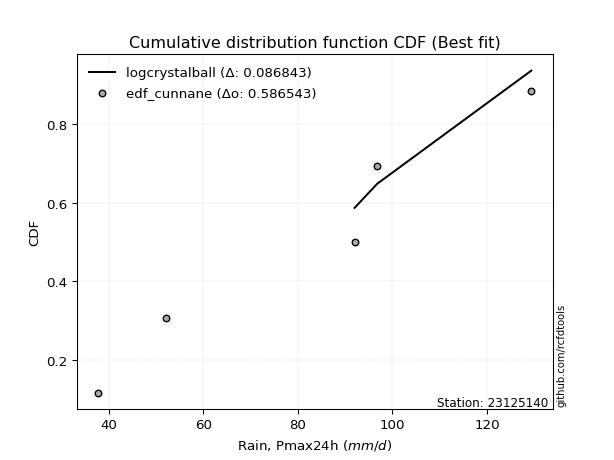</img>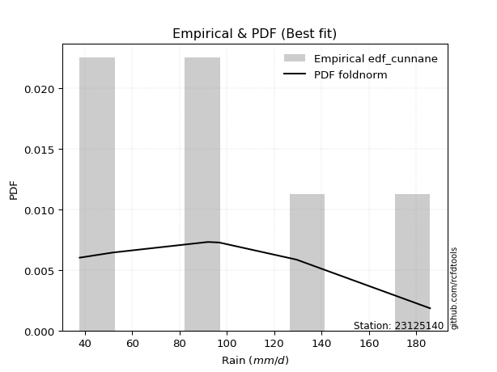</img>

</div>


### 12. Empirical - EDF Adamowski (1981)

The Adamowski formula in hydrology refers to a specific plotting position formula used for estimating the non-parametric empirical distribution of hydrological events (like flood peaks) to calculate their return periods. This formula provides an alternative to traditional parametric methods (like the Gumbel or Log Pearson Type III distributions). 

<div align="center">


$P=(m-0.25)/(n+0.5)$


</div>


**12.1. Empirical values**

<div align="center">

|                | 0                   | 1                  | 2             | 3                  | 4                  |
|:---------------|:--------------------|:-------------------|:--------------|:-------------------|:-------------------|
| date           | 2023                | 2018               | 2019          | 2020               | 2021               |
| x              | 37.8                | 52.0               | 92.0          | 96.8               | 129.4              |
| m              | 1                   | 2                  | 3             | 4                  | 5                  |
| empirical_dist | edf_adamowski       | edf_adamowski      | edf_adamowski | edf_adamowski      | edf_adamowski      |
| empirical      | 0.13636363636363635 | 0.3181818181818182 | 0.5           | 0.6818181818181818 | 0.8636363636363636 |
| empirical_tr   | 1.1578947368421053  | 1.4666666666666666 | 2.0           | 3.1428571428571423 | 7.333333333333334  |

</div>


**12.2. Kolmogorov-Smirnov fit test (sorted by Δ)**


<div align="center">

|                | 0                   | 1                   | 2                  | 3                   | 4                   | 5                   | 6                   | 7                   | 8                   | 9                   | 10                  | 11                  | 12                 | 13                  | 14                 | 15                  | 16                  | 17                    | 18                  | 19                  | 20                  | 21                  | 22                  | 23                  | 24                 | 25                 | 26                 | 27                  | 28                  | 29                  | 30                  | 31                 | 32                  | 33                  | 34                  | 35                 | 36                  | 37                  | 38                 | 39                 | 40                  | 41                 | 42                 | 43                  | 44                  | 45                 | 46                 | 47                  | 48                  | 49                  | 50                  | 51                  | 52                 | 53                  | 54                  | 55                  | 56                 | 57                 | 58                  | 59                  | 60                 | 61                  | 62                  | 63                 | 64                  | 65                 | 66                  | 67                  | 68                  | 69                  | 70                  | 71                  | 72                 | 73                 | 74                  | 75                  | 76                  | 77                  | 78                  | 79                  | 80                 | 81                  | 82                 | 83                  | 84                 | 85                  | 86                  | 87                  | 88                  | 89                 |
|:---------------|:--------------------|:--------------------|:-------------------|:--------------------|:--------------------|:--------------------|:--------------------|:--------------------|:--------------------|:--------------------|:--------------------|:--------------------|:-------------------|:--------------------|:-------------------|:--------------------|:--------------------|:----------------------|:--------------------|:--------------------|:--------------------|:--------------------|:--------------------|:--------------------|:-------------------|:-------------------|:-------------------|:--------------------|:--------------------|:--------------------|:--------------------|:-------------------|:--------------------|:--------------------|:--------------------|:-------------------|:--------------------|:--------------------|:-------------------|:-------------------|:--------------------|:-------------------|:-------------------|:--------------------|:--------------------|:-------------------|:-------------------|:--------------------|:--------------------|:--------------------|:--------------------|:--------------------|:-------------------|:--------------------|:--------------------|:--------------------|:-------------------|:-------------------|:--------------------|:--------------------|:-------------------|:--------------------|:--------------------|:-------------------|:--------------------|:-------------------|:--------------------|:--------------------|:--------------------|:--------------------|:--------------------|:--------------------|:-------------------|:-------------------|:--------------------|:--------------------|:--------------------|:--------------------|:--------------------|:--------------------|:-------------------|:--------------------|:-------------------|:--------------------|:-------------------|:--------------------|:--------------------|:--------------------|:--------------------|:-------------------|
| station        | 23125140            | 23125140            | 23125140           | 23125140            | 23125140            | 23125140            | 23125140            | 23125140            | 23125140            | 23125140            | 23125140            | 23125140            | 23125140           | 23125140            | 23125140           | 23125140            | 23125140            | 23125140              | 23125140            | 23125140            | 23125140            | 23125140            | 23125140            | 23125140            | 23125140           | 23125140           | 23125140           | 23125140            | 23125140            | 23125140            | 23125140            | 23125140           | 23125140            | 23125140            | 23125140            | 23125140           | 23125140            | 23125140            | 23125140           | 23125140           | 23125140            | 23125140           | 23125140           | 23125140            | 23125140            | 23125140           | 23125140           | 23125140            | 23125140            | 23125140            | 23125140            | 23125140            | 23125140           | 23125140            | 23125140            | 23125140            | 23125140           | 23125140           | 23125140            | 23125140            | 23125140           | 23125140            | 23125140            | 23125140           | 23125140            | 23125140           | 23125140            | 23125140            | 23125140            | 23125140            | 23125140            | 23125140            | 23125140           | 23125140           | 23125140            | 23125140            | 23125140            | 23125140            | 23125140            | 23125140            | 23125140           | 23125140            | 23125140           | 23125140            | 23125140           | 23125140            | 23125140            | 23125140            | 23125140            | 23125140           |
| empirical_dist | edf_adamowski       | edf_adamowski       | edf_adamowski      | edf_adamowski       | edf_adamowski       | edf_adamowski       | edf_adamowski       | edf_adamowski       | edf_adamowski       | edf_adamowski       | edf_adamowski       | edf_adamowski       | edf_adamowski      | edf_adamowski       | edf_adamowski      | edf_adamowski       | edf_adamowski       | edf_adamowski         | edf_adamowski       | edf_adamowski       | edf_adamowski       | edf_adamowski       | edf_adamowski       | edf_adamowski       | edf_adamowski      | edf_adamowski      | edf_adamowski      | edf_adamowski       | edf_adamowski       | edf_adamowski       | edf_adamowski       | edf_adamowski      | edf_adamowski       | edf_adamowski       | edf_adamowski       | edf_adamowski      | edf_adamowski       | edf_adamowski       | edf_adamowski      | edf_adamowski      | edf_adamowski       | edf_adamowski      | edf_adamowski      | edf_adamowski       | edf_adamowski       | edf_adamowski      | edf_adamowski      | edf_adamowski       | edf_adamowski       | edf_adamowski       | edf_adamowski       | edf_adamowski       | edf_adamowski      | edf_adamowski       | edf_adamowski       | edf_adamowski       | edf_adamowski      | edf_adamowski      | edf_adamowski       | edf_adamowski       | edf_adamowski      | edf_adamowski       | edf_adamowski       | edf_adamowski      | edf_adamowski       | edf_adamowski      | edf_adamowski       | edf_adamowski       | edf_adamowski       | edf_adamowski       | edf_adamowski       | edf_adamowski       | edf_adamowski      | edf_adamowski      | edf_adamowski       | edf_adamowski       | edf_adamowski       | edf_adamowski       | edf_adamowski       | edf_adamowski       | edf_adamowski      | edf_adamowski       | edf_adamowski      | edf_adamowski       | edf_adamowski      | edf_adamowski       | edf_adamowski       | edf_adamowski       | edf_adamowski       | edf_adamowski      |
| p_dist         | logcrystalball      | logmielke           | mielke             | logjohnsonsu        | logweibull_min      | erlang              | gamma               | pearson3            | nct                 | t                   | exponnorm           | crystalball         | norm               | truncnorm           | johnsonsu          | fisk                | logloggamma         | loglaplace_asymmetric | loggumbel_l         | rice                | gompertz            | laplace_asymmetric  | maxwell             | invgamma            | alpha              | logchi2            | logistic           | rayleigh            | gumbel_l            | ncf                 | logfisk             | hypsecant          | logpearson3         | logncf              | invgauss            | genlogistic        | halfnorm            | laplace             | kstwobign          | logf               | lognct              | logexponnorm       | logt               | lognorm             | lognorm             | logfatiguelife     | logbetaprime       | logerlang           | gumbel_r            | loggamma            | loggamma            | logrice             | loginvgamma        | logalpha            | logmaxwell          | loginvgauss         | betaprime          | loglogistic        | halflogistic        | lograyleigh         | weibull_min        | moyal               | genexpon            | loginvweibull      | expon               | loggenexpon        | logkstwobign        | loghypsecant        | loghalfnorm         | loggompertz         | logexpon            | loggumbel_r         | loglaplace         | loghalflogistic    | logmoyal            | f                   | pareto              | logwald             | chi2                | wald                | nakagami           | lognakagami         | gibrat             | logpareto           | loggibrat          | loglognorm          | fatiguelife         | invweibull          | logtruncnorm        | loggenlogistic     |
| delta          | 0.08684276743049857 | 0.12213580292140633 | 0.1259405955569227 | 0.12740206161446693 | 0.13236091347886395 | 0.13362532167262126 | 0.13366964628566344 | 0.13371314323128558 | 0.13380156756169573 | 0.13388256766181778 | 0.13389508947746567 | 0.13389510963255724 | 0.1338951115172421 | 0.13389511486645672 | 0.1339406085827698 | 0.13448362419872262 | 0.13492652934817528 | 0.13661056125918114   | 0.14429626843019916 | 0.14451578648019558 | 0.14694743566304136 | 0.14775057704926198 | 0.14826486870803623 | 0.14969160269547166 | 0.1511152988087332 | 0.1511967260518532 | 0.1544713567543176 | 0.15569009698349423 | 0.15578553648696816 | 0.15977844744875203 | 0.16034036681928254 | 0.1660862237306727 | 0.16705946757711854 | 0.16742429858810026 | 0.16801455928450038 | 0.1719136621921996 | 0.17700536146598012 | 0.18015586747506096 | 0.180296303831894  | 0.1823904137251815 | 0.18269973703306785 | 0.1829133801265389 | 0.1829138882448209 | 0.18291421948839504 | 0.18291421948839504 | 0.1832543222800893 | 0.1863578907464858 | 0.18670441392229897 | 0.18769266333159185 | 0.18944423484992856 | 0.18944423484992856 | 0.19244055056999787 | 0.1953432050132503 | 0.19592752626700483 | 0.20086464524374592 | 0.20092500611089936 | 0.2018841555801879 | 0.2033123251465221 | 0.20536655023757933 | 0.20616049550717297 | 0.2075087137782649 | 0.20912076037798066 | 0.20915379517988786 | 0.2093857525494256 | 0.20987485725466237 | 0.2176761385097653 | 0.21799653652744722 | 0.21844241062997294 | 0.22195504024180424 | 0.22456022395976638 | 0.23180759704357068 | 0.23714381748743085 | 0.2449051717478874 | 0.2493300199840648 | 0.25479876743838337 | 0.26235733799672745 | 0.29433871317801213 | 0.30586725616871635 | 0.30911942689333405 | 0.31391591717355094 | 0.3181818153408207 | 0.31818181818015423 | 0.3181818181818182 | 0.32332583809782095 | 0.3376214970642448 | 0.35118174152072973 | 0.37054122544845364 | 0.40494558161916466 | 0.49998320630687076 | 0.6818181818181818 |
| deltao         | 0.5865427407550001  | 0.5865427407550001  | 0.5865427407550001 | 0.5865427407550001  | 0.5865427407550001  | 0.5865427407550001  | 0.5865427407550001  | 0.5865427407550001  | 0.5865427407550001  | 0.5865427407550001  | 0.5865427407550001  | 0.5865427407550001  | 0.5865427407550001 | 0.5865427407550001  | 0.5865427407550001 | 0.5865427407550001  | 0.5865427407550001  | 0.5865427407550001    | 0.5865427407550001  | 0.5865427407550001  | 0.5865427407550001  | 0.5865427407550001  | 0.5865427407550001  | 0.5865427407550001  | 0.5865427407550001 | 0.5865427407550001 | 0.5865427407550001 | 0.5865427407550001  | 0.5865427407550001  | 0.5865427407550001  | 0.5865427407550001  | 0.5865427407550001 | 0.5865427407550001  | 0.5865427407550001  | 0.5865427407550001  | 0.5865427407550001 | 0.5865427407550001  | 0.5865427407550001  | 0.5865427407550001 | 0.5865427407550001 | 0.5865427407550001  | 0.5865427407550001 | 0.5865427407550001 | 0.5865427407550001  | 0.5865427407550001  | 0.5865427407550001 | 0.5865427407550001 | 0.5865427407550001  | 0.5865427407550001  | 0.5865427407550001  | 0.5865427407550001  | 0.5865427407550001  | 0.5865427407550001 | 0.5865427407550001  | 0.5865427407550001  | 0.5865427407550001  | 0.5865427407550001 | 0.5865427407550001 | 0.5865427407550001  | 0.5865427407550001  | 0.5865427407550001 | 0.5865427407550001  | 0.5865427407550001  | 0.5865427407550001 | 0.5865427407550001  | 0.5865427407550001 | 0.5865427407550001  | 0.5865427407550001  | 0.5865427407550001  | 0.5865427407550001  | 0.5865427407550001  | 0.5865427407550001  | 0.5865427407550001 | 0.5865427407550001 | 0.5865427407550001  | 0.5865427407550001  | 0.5865427407550001  | 0.5865427407550001  | 0.5865427407550001  | 0.5865427407550001  | 0.5865427407550001 | 0.5865427407550001  | 0.5865427407550001 | 0.5865427407550001  | 0.5865427407550001 | 0.5865427407550001  | 0.5865427407550001  | 0.5865427407550001  | 0.5865427407550001  | 0.5865427407550001 |
| eval           | Δo > Δ              | Δo > Δ              | Δo > Δ             | Δo > Δ              | Δo > Δ              | Δo > Δ              | Δo > Δ              | Δo > Δ              | Δo > Δ              | Δo > Δ              | Δo > Δ              | Δo > Δ              | Δo > Δ             | Δo > Δ              | Δo > Δ             | Δo > Δ              | Δo > Δ              | Δo > Δ                | Δo > Δ              | Δo > Δ              | Δo > Δ              | Δo > Δ              | Δo > Δ              | Δo > Δ              | Δo > Δ             | Δo > Δ             | Δo > Δ             | Δo > Δ              | Δo > Δ              | Δo > Δ              | Δo > Δ              | Δo > Δ             | Δo > Δ              | Δo > Δ              | Δo > Δ              | Δo > Δ             | Δo > Δ              | Δo > Δ              | Δo > Δ             | Δo > Δ             | Δo > Δ              | Δo > Δ             | Δo > Δ             | Δo > Δ              | Δo > Δ              | Δo > Δ             | Δo > Δ             | Δo > Δ              | Δo > Δ              | Δo > Δ              | Δo > Δ              | Δo > Δ              | Δo > Δ             | Δo > Δ              | Δo > Δ              | Δo > Δ              | Δo > Δ             | Δo > Δ             | Δo > Δ              | Δo > Δ              | Δo > Δ             | Δo > Δ              | Δo > Δ              | Δo > Δ             | Δo > Δ              | Δo > Δ             | Δo > Δ              | Δo > Δ              | Δo > Δ              | Δo > Δ              | Δo > Δ              | Δo > Δ              | Δo > Δ             | Δo > Δ             | Δo > Δ              | Δo > Δ              | Δo > Δ              | Δo > Δ              | Δo > Δ              | Δo > Δ              | Δo > Δ             | Δo > Δ              | Δo > Δ             | Δo > Δ              | Δo > Δ             | Δo > Δ              | Δo > Δ              | Δo > Δ              | Δo > Δ              | Δo <= Δ            |
| fit            | 1                   | 1                   | 1                  | 1                   | 1                   | 1                   | 1                   | 1                   | 1                   | 1                   | 1                   | 1                   | 1                  | 1                   | 1                  | 1                   | 1                   | 1                     | 1                   | 1                   | 1                   | 1                   | 1                   | 1                   | 1                  | 1                  | 1                  | 1                   | 1                   | 1                   | 1                   | 1                  | 1                   | 1                   | 1                   | 1                  | 1                   | 1                   | 1                  | 1                  | 1                   | 1                  | 1                  | 1                   | 1                   | 1                  | 1                  | 1                   | 1                   | 1                   | 1                   | 1                   | 1                  | 1                   | 1                   | 1                   | 1                  | 1                  | 1                   | 1                   | 1                  | 1                   | 1                   | 1                  | 1                   | 1                  | 1                   | 1                   | 1                   | 1                   | 1                   | 1                   | 1                  | 1                  | 1                   | 1                   | 1                   | 1                   | 1                   | 1                   | 1                  | 1                   | 1                  | 1                   | 1                  | 1                   | 1                   | 1                   | 1                   | 0                  |
| n              | 5                   | 5                   | 5                  | 5                   | 5                   | 5                   | 5                   | 5                   | 5                   | 5                   | 5                   | 5                   | 5                  | 5                   | 5                  | 5                   | 5                   | 5                     | 5                   | 5                   | 5                   | 5                   | 5                   | 5                   | 5                  | 5                  | 5                  | 5                   | 5                   | 5                   | 5                   | 5                  | 5                   | 5                   | 5                   | 5                  | 5                   | 5                   | 5                  | 5                  | 5                   | 5                  | 5                  | 5                   | 5                   | 5                  | 5                  | 5                   | 5                   | 5                   | 5                   | 5                   | 5                  | 5                   | 5                   | 5                   | 5                  | 5                  | 5                   | 5                   | 5                  | 5                   | 5                   | 5                  | 5                   | 5                  | 5                   | 5                   | 5                   | 5                   | 5                   | 5                   | 5                  | 5                  | 5                   | 5                   | 5                   | 5                   | 5                   | 5                   | 5                  | 5                   | 5                  | 5                   | 5                  | 5                   | 5                   | 5                   | 5                   | 5                  |
| best_fit       | 1                   | 0                   | 0                  | 0                   | 0                   | 0                   | 0                   | 0                   | 0                   | 0                   | 0                   | 0                   | 0                  | 0                   | 0                  | 0                   | 0                   | 0                     | 0                   | 0                   | 0                   | 0                   | 0                   | 0                   | 0                  | 0                  | 0                  | 0                   | 0                   | 0                   | 0                   | 0                  | 0                   | 0                   | 0                   | 0                  | 0                   | 0                   | 0                  | 0                  | 0                   | 0                  | 0                  | 0                   | 0                   | 0                  | 0                  | 0                   | 0                   | 0                   | 0                   | 0                   | 0                  | 0                   | 0                   | 0                   | 0                  | 0                  | 0                   | 0                   | 0                  | 0                   | 0                   | 0                  | 0                   | 0                  | 0                   | 0                   | 0                   | 0                   | 0                   | 0                   | 0                  | 0                  | 0                   | 0                   | 0                   | 0                   | 0                   | 0                   | 0                  | 0                   | 0                  | 0                   | 0                  | 0                   | 0                   | 0                   | 0                   | 0                  |
| best_fit_sort  | 1                   | 2                   | 3                  | 4                   | 5                   | 6                   | 7                   | 8                   | 9                   | 10                  | 11                  | 12                  | 13                 | 14                  | 15                 | 16                  | 17                  | 18                    | 19                  | 20                  | 21                  | 22                  | 23                  | 24                  | 25                 | 26                 | 27                 | 28                  | 29                  | 30                  | 31                  | 32                 | 33                  | 34                  | 35                  | 36                 | 37                  | 38                  | 39                 | 40                 | 41                  | 42                 | 43                 | 44                  | 45                  | 46                 | 47                 | 48                  | 49                  | 50                  | 51                  | 52                  | 53                 | 54                  | 55                  | 56                  | 57                 | 58                 | 59                  | 60                  | 61                 | 62                  | 63                  | 64                 | 65                  | 66                 | 67                  | 68                  | 69                  | 70                  | 71                  | 72                  | 73                 | 74                 | 75                  | 76                  | 77                  | 78                  | 79                  | 80                  | 81                 | 82                  | 83                 | 84                  | 85                 | 86                  | 87                  | 88                  | 89                  | 90                 |

</div>


<div align="center">

</img>

</div>


**12.3. Best fit**

<div align="center">

|   id |   station | empirical_dist   | p_dist         |     delta |   deltao | eval   |   fit |   n |   best_fit |   best_fit_sort |
|-----:|----------:|:-----------------|:---------------|----------:|---------:|:-------|------:|----:|-----------:|----------------:|
|    0 |  23125140 | edf_adamowski    | logcrystalball | 0.0868428 | 0.586543 | Δo > Δ |     1 |   5 |          1 |               1 |

</div>


<div align="center">

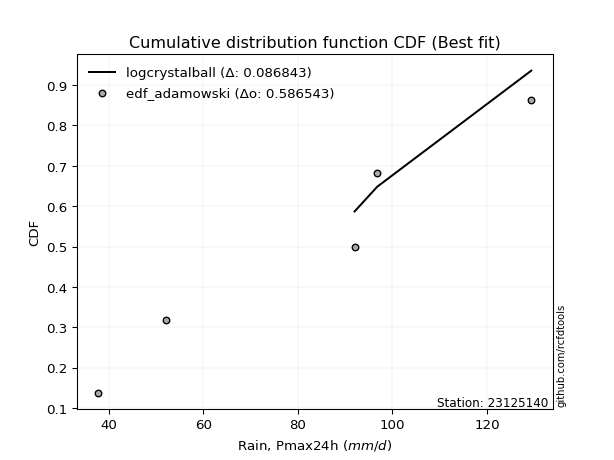</img>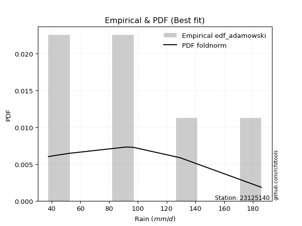</img>

</div>


## C. Best fit & Estimate extreme values for specific return periods - Tr


### 1. Best fit (ordered by delta Δ)

<div align="center">

|   id |   station | empirical_dist   | p_dist         |     delta |   deltao | eval   |   fit |   n |   best_fit |   best_fit_sort |
|-----:|----------:|:-----------------|:---------------|----------:|---------:|:-------|------:|----:|-----------:|----------------:|
|    0 |  23125140 | edf_adamowski    | logcrystalball | 0.0868428 | 0.586543 | Δo > Δ |     1 |   5 |          1 |               1 |
|    1 |  23125140 | edf_cunnane      | logcrystalball | 0.0868428 | 0.586543 | Δo > Δ |     1 |   5 |          1 |               2 |
|    2 |  23125140 | edf_jenkinson    | logcrystalball | 0.0868428 | 0.586543 | Δo > Δ |     1 |   5 |          1 |               3 |
|    3 |  23125140 | edf_filliben     | logcrystalball | 0.0868428 | 0.586543 | Δo > Δ |     1 |   5 |          1 |               4 |
|    4 |  23125140 | edf_gringorten   | logcrystalball | 0.0868428 | 0.586543 | Δo > Δ |     1 |   5 |          1 |               5 |
|    5 |  23125140 | edf_tukey        | logcrystalball | 0.0868428 | 0.586543 | Δo > Δ |     1 |   5 |          1 |               6 |
|    6 |  23125140 | edf_blom         | logcrystalball | 0.0868428 | 0.586543 | Δo > Δ |     1 |   5 |          1 |               7 |
|    7 |  23125140 | edf_chegodayev   | logcrystalball | 0.0868428 | 0.586543 | Δo > Δ |     1 |   5 |          1 |               8 |
|    8 |  23125140 | edf_beard        | logcrystalball | 0.0868428 | 0.586543 | Δo > Δ |     1 |   5 |          1 |               9 |
|    9 |  23125140 | edf_hazen        | logcrystalball | 0.0868428 | 0.586543 | Δo > Δ |     1 |   5 |          1 |              10 |
|   10 |  23125140 | edf_weibull      | logcrystalball | 0.102713  | 0.586543 | Δo > Δ |     1 |   5 |          1 |              11 |
|   11 |  23125140 | edf_california   | logkstwobign   | 0.142574  | 0.586543 | Δo > Δ |     1 |   5 |          1 |              12 |

</div>

:file_folder:Tables: [bestfit_23125140.csv](table/bestfit_23125140.csv) | [extreme_23125140.csv](table/extreme_23125140.csv)


### 2. Extreme values

In hydrology, a return period (or recurrence interval $Tr$) is the statistical average time between extreme events like floods or droughts of a specific magnitude, indicating how rare an event is, with a 100-year flood, for example, having a 1% chance of occurring in any given year, not that it happens exactly every century. It is a key tool for infrastructure design (like bridges or dams) and risk assessment, calculated from historical data to determine the probability of future events, although it is important to remember it is statistical average, and events can cluster or be missed.

> risk_rate: assuming the return period as the project useful life.

|   id |      tr |   prob_l |     prob_g |    alpha |   betaprime |     chi2 |   crystalball |   erlang |    expon |   exponnorm |        f |   fatiguelife |     fisk |    gamma |   genexpon |   genlogistic |   gibrat |   gompertz |   gumbel_l |   gumbel_r |   halflogistic |   halfnorm |   hypsecant |   invgamma |   invgauss |      invweibull |   johnsonsu |   kstwobign |   laplace |   laplace_asymmetric |   loggamma |   logistic |   lognorm |   maxwell |   mielke |    moyal |   nakagami |      ncf |      nct |     norm |          pareto |   pearson3 |   rayleigh |     rice |        t |   truncnorm |     wald |   weibull_min |   logalpha |   logbetaprime |          logchi2 |   logcrystalball |   logerlang |   logexpon |   logexponnorm |     logf |   logfatiguelife |   logfisk |   loggenexpon |   loggenlogistic |   loggibrat |   loggompertz |   loggumbel_l |   loggumbel_r |   loghalflogistic |   loghalfnorm |   loghypsecant |   loginvgamma |   loginvgauss |   loginvweibull |   logjohnsonsu |   logkstwobign |   loglaplace |   loglaplace_asymmetric |   logloggamma |   loglogistic |    loglognorm |   logmaxwell |   logmielke |   logmoyal |   lognakagami |   logncf |   lognct |      logpareto |   logpearson3 |   lograyleigh |   logrice |     logt |   logtruncnorm |   logwald |   logweibull_min |   station |   n |   risk_rate |
|-----:|--------:|---------:|-----------:|---------:|------------:|---------:|--------------:|---------:|---------:|------------:|---------:|--------------:|---------:|---------:|-----------:|--------------:|---------:|-----------:|-----------:|-----------:|---------------:|-----------:|------------:|-----------:|-----------:|----------------:|------------:|------------:|----------:|---------------------:|-----------:|-----------:|----------:|----------:|---------:|---------:|-----------:|---------:|---------:|---------:|----------------:|-----------:|-----------:|---------:|---------:|------------:|---------:|--------------:|-----------:|---------------:|-----------------:|-----------------:|------------:|-----------:|---------------:|---------:|-----------------:|----------:|--------------:|-----------------:|------------:|--------------:|--------------:|--------------:|------------------:|--------------:|---------------:|--------------:|--------------:|----------------:|---------------:|---------------:|-------------:|------------------------:|--------------:|--------------:|--------------:|-------------:|------------:|-----------:|--------------:|---------:|---------:|---------------:|--------------:|--------------:|----------:|---------:|---------------:|----------:|-----------------:|----------:|----:|------------:|
|    0 |    2    | 0.5      | 0.5        |  78.8309 |     72.6892 |  58.356  |       81.6    |  81.4665 |  68.1598 |     81.6    |  56.8795 |       37.8    |  81.8728 |  81.4679 |    68.221  |       75.856  |  71.7185 |    78.5646 |    87.0082 |    76.1918 |        73.5031 |    74.8613 |     81.6    |    78.8564 |    76.5016 |   674.784       |     81.5998 |     75.0582 |    81.6   |              88.1846 |    73.3443 |    81.6    |   74.3051 |   78.7845 |  82.8792 |  74.4458 |    74.3888 |  77.4979 |  81.5995 |  81.6    |    42.9689      |    81.4804 |    77.7859 |  79.4026 |  81.596  |     81.6    |  70.9287 |       48.4552 |    72.9839 |        73.3804 |     60.3548      |            0     |     73.5522 |    60.3878 |        74.3051 |  74.2953 |          74.2747 |   76.5778 |       66.9855 |          inf     |     64.9377 |       66.6871 |       79.9918 |       69.0226 |           66.537  |       67.7811 |        74.3051 |       72.2182 |       71.492  |         68.5201 |        84.7148 |        67.3482 |      74.3051 |                 82.8121 |       89.0125 |       74.3051 |  37.8257      |      71.5064 |     88.4268 |    67.3988 |       71.3129 |  73.4809 |  74.3157 |  41.1574       |       76.2353 |       70.5394 |   72.5995 |  74.3051 |        102.447 |   64.2423 |          80.6681 |  23125140 |   5 |    0.75     |
|    1 |    2.33 | 0.570815 | 0.429185   |  84.7795 |     78.6367 |  63.5218 |       87.4746 |  87.3452 |  74.849  |     87.4746 |  63.4012 |       39.6664 |  87.5846 |  87.3459 |    74.9236 |       82.0173 |  74.6943 |    84.8217 |    92.1192 |    81.6352 |        79.0998 |    81.2015 |     86.3014 |    84.8472 |    82.6194 | 21292.2         |     87.4732 |     81.2028 |    85.155 |              92.6379 |    79.5558 |    86.7759 |   80.5021 |   84.8878 |  89.7053 |  79.5987 |    80.9906 |  83.6079 |  87.4768 |  87.4746 |    47.3209      |    87.3587 |    83.9795 |  85.3868 |  87.4701 |     87.4746 |  74.7807 |       61.0375 |    79.0319 |        79.6903 |     71.5502      |            0     |     79.8026 |    66.954  |        80.5022 |  80.514  |          80.4628 |   82.8485 |       73.4733 |          inf     |     67.6271 |       73.1364 |       85.7654 |       74.3408 |           71.8141 |       73.9022 |        79.2246 |       78.4672 |       77.7151 |         74.8948 |        90.9544 |        73.7117 |      77.9958 |                 88.0075 |       95.6237 |       79.7388 |  38.1161      |      77.7121 |     95.3247 |    72.3048 |       76.2708 |  80.5641 |  80.5178 |  44.2444       |       82.4881 |       76.7555 |   78.8846 |  80.5021 |        104.605 |   67.707  |          86.6849 |  23125140 |   5 |    0.729209 |
|    2 |    5    | 0.8      | 0.2        | 108.48   |    106.028  |  90.3268 |      109.306  | 109.263  | 108.293  |    109.306  | 101.043  |       79.3123 | 109.639  | 109.26   |   108.435  |      108.779  |  91.827  |   109.129  |   108.631  |   105.284  |       104.424  |   108.013  |    105.16   |   108.829  |   108.484  |     8.8194e+10  |    109.3    |    107.303  |   102.929 |             107.315  |   108.178  |   106.761  |  108.416  |  108.91   | 118.125  | 103.468  |   112.417  | 108.655  | 109.32   | 109.306  |   215.041       |   109.271  |   108.775  | 108.806  | 109.3    |    109.306  |  96.3445 |      326.307  |   107.229  |       108.966  |    195.661       |          109.82  |    108.633  |   112.177  |       108.416  | 108.566  |         108.413  |  112.27   |      108.248  |          inf     |     85.4252 |      105.72   |      107.422  |      102.63   |          101.435  |      106.524  |       102.456  |      108.403  |      107.843  |        110.229  |       111.65   |       108.167  |      99.3869 |                104.596  |      114.777  |      104.717  |   3.00004e+41 |     107.831  |    115.435  |   100.119  |      102.439  | 114.322  | 108.453  | 759.389        |      109.016  |      107.633  |  108.36   | 108.416  |        114.082 |   90.8525 |         109.364  |  23125140 |   5 |    0.67232  |
|    3 |   10    | 0.9      | 0.1        | 125.747  |    130.177  | 115.431  |      123.789  | 123.863  | 138.653  |    123.789  | 139.405  |      134.053  | 125.881  | 123.858  |   138.856  |      130.571  | 111.356  |   125.132  |   117.823  |   124.546  |       125.455  |   127.854  |    120.219  |   126.376  |   128.623  |     2.16618e+16 |    123.78   |    127.176  |   119.064 |             120.083  |   133.247  |   121.479  |  132.086  |  125.815  | 141.882  | 124.249  |   137.398  | 127.343  | 123.812  | 123.789  |  2473.79        |   123.865  |   126.455  | 125.05   | 123.781  |    123.789  | 119.229  |     1210.61   |   132.399  |       134.858  |    554.905       |          122.314 |    133.917  |   179.21   |       132.086  | 132.401  |         132.21   |  140.431  |      144.192  |          inf     |    111.492  |      135.69   |      121.767  |      133.457  |          135.126  |      139.62   |       125.811  |      136.162  |      136.157  |        151.008  |       122.947  |       144.847  |     123.845  |                119.711  |      122.327  |      127.991  | inf           |     135.787  |    123.408  |   132.918  |      128.08   | 145.225  | 132.14   |   7.70299e+19  |      129.598  |      136.976  |  134.445  | 132.086  |        120.338 |  124.125  |         124.47   |  23125140 |   5 |    0.651322 |
|    4 |   15    | 0.933333 | 0.0666667  | 134.879  |    144.566  | 130.308  |      131.016  | 131.167  | 156.413  |    131.016  | 162.932  |      169.855  | 134.73   | 131.161  |   156.651  |      142.865  | 124.827  |   132.879  |   121.987  |   135.413  |       137.356  |   138.179  |    128.813  |   135.669  |   139.64   |     2.3814e+19  |    131.006  |    137.725  |   128.503 |             127.552  |   148.054  |   129.498  |  145.765  |  134.489  | 156.211  | 136.31   |   150.615  | 137.299  | 131.045  | 131.016  | 11308.3         |   131.165  |   135.564  | 133.298  | 131.008  |    131.016  | 133.924  |     2251.21   |   147.478  |       150.255  |   1055.32        |          128.763 |    148.865  |   235.709  |       145.766  | 146.193  |         146.001  |  158.644  |      167.493  |          inf     |    133.974  |      153.36   |      128.88   |      154.773  |          158.937  |      160.73   |       141.453  |      153.229  |      153.706  |        180.355  |       127.856  |       169.134  |     140.855  |                129.546  |      124.757  |      142.78   | inf           |     152.836  |    125.979  |   156.677  |      143.961  | 163.999  | 145.828  |   2.49827e+87  |      140.784  |      155.093  |  149.874  | 145.765  |        122.944 |  151.665  |         131.982  |  23125140 |   5 |    0.644736 |
|    5 |   20    | 0.95     | 0.05       | 141.06   |    154.991  | 140.926  |      135.749  | 135.957  | 169.013  |    135.749  | 179.981  |      196.361  | 140.846  | 135.951  |   169.276  |      151.473  | 135.393  |   137.842  |   124.578  |   143.022  |       145.695  |   145.062  |    134.876  |   141.961  |   147.221  |     3.20743e+21 |    135.738  |    144.832  |   135.2   |             132.851  |   158.711  |   135.041  |  155.483  |  140.246  | 166.798  | 144.852  |   159.466  | 144.049  | 135.781  | 135.749  | 33451.9         |   135.952  |   141.619  | 138.739  | 135.74   |    135.749  | 144.875  |     3324.47   |   158.428  |       161.381  |   1683.04        |          133.093 |    159.628  |   286.299  |       155.483  | 155.998  |         155.814  |  172.594  |      185.137  |          inf     |    154.739  |      165.952  |      133.515  |      171.694  |          178.078  |      176.548  |       153.643  |      165.815  |      166.709  |        204.235  |       130.82   |       187.751  |     154.323  |                137.011  |      125.957  |      153.989  | inf           |     165.316  |    127.25   |   176.031  |      155.648  | 177.731  | 155.551  |   2.35925e+258 |      148.443  |      168.441  |  160.972  | 155.483  |        124.382 |  176.092  |         136.884  |  23125140 |   5 |    0.641514 |
|    6 |   25    | 0.96     | 0.04       | 145.715  |    163.226  | 149.191  |      139.233  | 139.486  | 178.787  |    139.233  | 193.378  |      217.422  | 145.525  | 139.479  |   179.07   |      158.104  | 144.202  |   141.436  |   126.422  |   148.883  |       152.119  |   150.184  |    139.568  |   146.701  |   152.991  |     1.40055e+23 |    139.221  |    150.155  |   140.394 |             136.961  |   167.085  |   139.281  |  163.047  |  144.52   | 175.311  | 151.472  |   166.063  | 149.135  | 139.268  | 139.233  | 77667.1         |   139.479  |   146.118  | 142.762  | 139.224  |    139.233  | 153.646  |     4392.26   |   167.09   |       170.149  |   2429.57        |          136.341 |    168.088  |   332.903  |       163.048  | 163.636  |         163.463  |  184.089  |      199.492  |          inf     |    174.489  |      175.748  |      136.915  |      185.978  |          194.383  |      189.32   |       163.795  |      175.883  |      177.142  |        224.764  |       132.878  |       203.026  |     165.65   |                143.095  |      126.673  |      163.155  | inf           |     175.236  |    128.009  |   192.661  |      164.961  | 188.646  | 163.12   | inf            |      154.248  |      179.096  |  169.685  | 163.048  |        125.295 |  198.465  |         140.484  |  23125140 |   5 |    0.639603 |
|    7 |   50    | 0.98     | 0.02       | 159.567  |    189.798  | 174.999  |      149.209  | 149.609  | 209.147  |    149.21   | 235.781  |      284.994  | 159.821  | 149.6    |   209.49   |      178.528  | 175.254  |   151.431  |   131.428  |   166.938  |       171.914  |   165.071  |    154.115  |   160.8    |   170.431  |     1.58049e+28 |    149.196  |    165.787  |   156.529 |             149.729  |   193.817  |   152.236  |  186.808  |  156.914  | 203.826  | 172.025  |   185.266  | 164.251  | 149.253  | 149.209  |     1.06471e+06 |   149.594  |   159.176  | 154.357  | 149.2    |    149.209  | 182.285  |     9383.09   |   195.075  |       198.283  |   7774.86        |          145.954 |    195.112  |   531.833  |       186.809  | 187.646  |         187.539  |  224.171  |      248.05   |          inf     |    266.48   |      206.322  |      146.587  |      237.893  |          254.618  |      231.932  |       199.732  |      209.062  |      211.707  |        301.902  |       138.228  |       255.448  |     206.415  |                163.774  |      128.093  |      194.678  | inf           |     207.503  |    129.534  |   254.981  |      195.331  | 224.186  | 186.893  | inf            |      171.661  |      214.002  |  197.44   | 186.808  |        127.249 |  293.282  |         150.739  |  23125140 |   5 |    0.63583  |
|    8 |   75    | 0.986667 | 0.0133333  | 167.335  |    206.139  | 190.171  |      154.563  | 155.049  | 226.906  |    154.563  | 261.041  |      325.689  | 168.078  | 155.04   |   227.285  |      190.399  | 196.226  |   156.609  |   133.959  |   177.432  |       183.42   |   173.175  |    162.617  |   168.701  |   180.364  |     1.36613e+31 |    154.548  |    174.387  |   165.967 |             157.198  |   210.035  |   159.718  |  200.954  |  163.653  | 222.221  | 184.044  |   195.72   | 172.702  | 154.611  | 154.563  |     4.92528e+06 |   155.03   |   166.281  | 160.616  | 154.553  |    154.563  | 199.908  |    13787.9    |   212.298  |       215.454  |  15552.7         |          151.321 |    211.518  |   699.504  |       200.955  | 201.955  |         201.909  |  251.184  |      279.422  |          inf     |    354.706  |      224.301  |      151.735  |      274.49   |          297.876  |      259.033  |       224.281  |      229.952  |      233.594  |        358.381  |       140.785  |       289.857  |     234.765  |                177.229  |      128.564  |      215.588  | inf           |     227.473  |    130.073  |   300.389  |      214.154  | 246.234  | 201.045  | inf            |      181.481  |      235.771  |  214.221  | 200.954  |        127.943 |  372.95   |         156.206  |  23125140 |   5 |    0.634587 |
|    9 |  100    | 0.99     | 0.01       | 172.73   |    218.133  | 200.963  |      158.183  | 158.733  | 239.506  |    158.184  | 279.134  |      354.97   | 173.908  | 158.723  |   239.911  |      198.801  | 212.472  |   160.037  |   135.615  |   184.859  |       191.565  |   178.695  |    168.647  |   174.183  |   187.316  |     1.63673e+33 |    158.168  |    180.28   |   172.664 |             162.497  |   221.831  |   165      |  211.124  |  168.243  | 236.157  | 192.571  |   202.839  | 178.553  | 158.235  | 158.183  |     1.46017e+07 |   158.711  |   171.121  | 164.863  | 158.173  |    158.183  | 212.757  |    17739.1    |   224.939  |       227.989  |  25555.4         |          155.04  |    223.454  |   849.635  |       211.125  | 212.25   |         212.256  |  272.194  |      303.098  |          inf     |    442.674  |      237.096  |      155.199  |      303.746  |          332.865  |      279.287  |       243.503  |      245.504  |      249.942  |        404.63   |       142.399  |       316.073  |     257.212  |                187.441  |      128.799  |      231.69   | inf           |     242.165  |    130.37   |   337.428  |      228.003  | 262.489  | 211.22   | inf            |      188.31   |      251.856  |  226.395  | 211.125  |        128.298 |  444.368  |         159.889  |  23125140 |   5 |    0.633968 |
|   10 |  200    | 0.995    | 0.005      | 185.41   |    248.536  | 227.045  |      166.396  | 167.1    | 269.866  |    166.397  | 323.226  |      426.646  | 187.891  | 167.089  |   270.332  |      219.001  | 256.672  |   167.593  |   139.214  |   202.715  |       211.144  |   191.321  |    183.175  |   187.052  |   203.802  |     1.62505e+38 |    166.379  |    193.852  |   188.799 |             175.265  |   251.317  |   177.672  |  236.143  |  178.744  | 273.144  | 213.116  |   219.104  | 192.235  | 166.455  | 166.396  |     2.00258e+08 |   167.07   |   182.195  | 174.532  | 166.385  |    166.396  | 244.761  |    30689.1    |   256.955  |       259.489  |  85687.6         |          163.76  |    253.311  |  1357.34   |       236.144  | 237.596  |         237.763  |  330.038  |      365.282  |          inf     |    808.819  |      268.044  |      163.005  |      387.482  |          434.736  |      331.763  |       296.85   |      285.686  |      292.365  |        541.735  |       145.736  |       385.83   |     320.51   |                214.528  |      129.15   |      275.391  | inf           |     279.447  |    130.92   |   446.522  |      263.124  | 303.887  | 236.246  | inf            |      204.35   |      292.911  |  256.704  | 236.143  |        128.842 |  687.511  |         168.196  |  23125140 |   5 |    0.633042 |
|   11 |  250    | 0.996    | 0.004      | 189.413  |    258.81   | 235.462  |      168.906  | 169.661  | 279.64   |    168.907  | 337.552  |      450.005  | 192.381  | 169.649  |   280.125  |      225.495  | 272.532  |   169.842  |   140.273  |   208.456  |       217.439  |   195.206  |    187.852  |   191.109  |   209.041  |     6.56587e+39 |    168.889  |    198.052  |   193.993 |             179.375  |   261.15   |   181.74   |  244.364  |  181.977  | 286.181  | 219.729  |   224.102  | 196.53   | 168.968  | 168.906  |     4.65247e+08 |   169.628  |   185.604  | 177.495  | 168.895  |    168.906  | 255.35   |    36062.9    |   267.761  |       270.043  | 126930           |          166.506 |    263.271  |  1578.29   |       244.365  | 245.932  |         246.162  |  351.099  |      386.93   |          inf     |   1004.09   |      278.041  |      165.376  |      419.031  |          473.701  |      349.81   |       316.397  |      299.496  |      307.001  |        595.016  |       146.671  |       410.393  |     344.034  |                224.055  |      129.22   |      291.099  | inf           |     292.04   |    131.067  |   488.662  |      274.976  | 317.924  | 244.47   | inf            |      209.402  |      306.848  |  266.771  | 244.365  |        128.953 |  794.298  |         170.722  |  23125140 |   5 |    0.632858 |
|   12 |  500    | 0.998    | 0.002      | 201.657  |    292.375  | 261.661  |      176.349  | 177.261  | 310      |    176.35   | 382.409  |      523.282  | 206.304  | 177.249  |   310.546  |      245.65   | 327.34   |   176.35   |   143.308  |   226.273  |       236.976  |   206.787  |    202.379  |   203.494  |   225.147  |     6.35785e+44 |    176.33   |    210.639  |   210.128 |             192.143  |   292.821  |   194.357  |  270.467  |  191.623  | 330.651  | 240.273  |   238.985  | 209.583  | 176.418  | 176.349  |     6.38074e+09 |   177.221  |   195.776  | 186.305  | 176.337  |    176.349  | 289.016  |    57280.5    |   303.002  |       304.203  | 434015           |          174.89  |    295.372  |  2521.42   |       270.468  | 272.418  |         272.879  |  425.355  |      459.597  |          129.26  |   2120.16   |      309.192  |      172.365  |      534.266  |          618.316  |      409.658  |       385.709  |      345.367  |      355.778  |        796.126  |       149.232  |       493.769  |     428.699  |                256.433  |      129.361  |      345.746  | inf           |     333.093  |    131.476  |   646.647  |      313.556  | 363.889  | 270.578  | inf            |      224.787  |      352.498  |  299.055  | 270.468  |        129.175 | 1257.08   |         178.174  |  23125140 |   5 |    0.632489 |
|   13 |  750    | 0.998667 | 0.00133333 | 208.71   |    313.25   | 277.018  |      180.484  | 181.489  | 327.759  |    180.484  | 408.872  |      566.578  | 214.438  | 181.476  |   328.341  |      257.433  | 363.587  |   179.862  |   144.93   |   236.689  |       248.397  |   213.257  |    210.876  |   210.611  |   234.466  |     5.22552e+47 |    180.464  |    217.71   |   219.567 |             199.612  |   312.179  |   201.729  |  286.154  |  197.018  | 359.734  | 252.291  |   247.287  | 217.039  | 180.557  | 180.484  |     2.95177e+10 |   181.444  |   201.464  | 191.211  | 180.472  |    180.484  | 309.202  |    73354.9    |   324.863  |       325.2    | 895769           |          179.707 |    315.004  |  3316.35   |       286.155  | 288.35   |         288.971  |  475.808  |      506.122  |          129.308 |   3475.64   |      327.478  |      176.22   |      615.8    |          722.524  |      447.444  |       433.093  |      374.437  |      386.807  |        943.857  |       150.524  |       547.832  |     487.579  |                277.501  |      129.407  |      382.304  | inf           |     358.521  |    131.694  |   761.786  |      337.406  | 392.524  | 286.266  | inf            |      233.589  |      380.925  |  318.681  | 286.154  |        129.25  | 1655.41   |         182.289  |  23125140 |   5 |    0.632366 |
|   14 | 1000    | 0.999    | 0.001      | 213.675  |    328.655  | 287.928  |      183.331  | 184.402  | 340.36   |    183.331  | 427.739  |      597.461  | 220.207  | 184.389  |   340.967  |      265.791  | 391.326  |   182.239  |   146.022  |   244.077  |       256.499  |   217.725  |    216.905  |   215.614  |   241.039  |     6.10553e+49 |    183.31   |    222.609  |   226.263 |             204.911  |   326.305  |   206.956  |  297.48   |  200.747  | 381.886  | 260.817  |   253.015  | 222.259  | 183.407  | 183.331  |     8.75101e+10 |   184.354  |   205.394  | 194.594  | 183.318  |    183.331  | 323.722  |    86643.6    |   340.965  |       340.576  |      1.50104e+06 |          183.093 |    329.333  |  4028.12   |       297.481  | 299.859  |         300.607  |  515.173  |      541.036  |          129.332 |   5073.52   |      340.48   |      178.863  |      681.073  |          806.925  |      475.556  |       470.203  |      396.139  |      410.022  |       1064.98   |       151.364  |       588.72   |     534.198  |                293.49   |      129.431  |      410.549  | inf           |     377.222  |    131.843  |   855.709  |      354.921  | 413.664  | 297.593  | inf            |      239.753  |      401.898  |  332.95   | 297.48   |        129.287 | 2017.88   |         185.112  |  23125140 |   5 |    0.632305 |

<div align="center">

</img>

</div>


<div align="center">

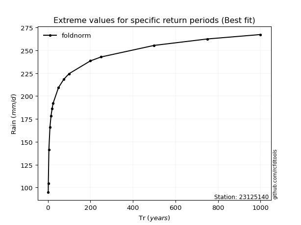</img>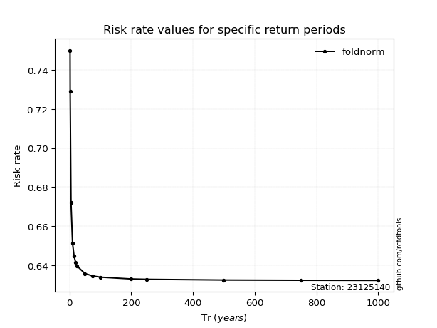</img>

</div>


<sub>**APP DISCLAIMER**: NO WARRANTY - This software is provided by [github.com/rcfdtools](https://github.com/rcfdtools) "as is", without any express or implied warranty, including warranties of merchantability, fitness for a particular purpose, or non-infringement. There is no guarantee that the software will be error-free or operate without interruption. LIMITATION OF LIABILITY - Neither the authors nor copyright holders will be liable for claims or damages arising from the software or its use. You are responsible for determining if the software is appropriate for your use and assume all associated risks, including errors, legal compliance, and data loss. NO PROFESSIONAL ADVICE - The software provides general information and does not offer professional advice. It should not replace consultation with professional advisors.</sub>