<div align="center">


</div>

# PMax24h Station (Rain): 23125160

Maximum Precipitation in 24 hours (PMax24h) is the greatest amount of rainfall for a specific duration that is meteorologically possible for a given location, acting as a "worst-case" scenario for extreme storms, crucial for designing safety-critical infrastructure like bridges, river deviations, dams, spillways, and nuclear plants to prevent catastrophic failure. The PMax24h is related with the Probable Maximum Precipitation (PMP) and it is calculated by hydrologists using meteorological data to determine the upper limit of extreme rainfall, often leading to the Probable Maximum Flood (PMF) for flood control design, and is increasingly being studied for climate change impacts. Probable Maximum Precipitation (PMP) is the theoretical upper limit of rainfall, a deterministic estimate for extreme events, while probability distributions (like GEV, Gumbel) describe the likelihood and frequency of various precipitation amounts, including rare ones, showing how often events occur, with PMP representing the extreme end of these distributions, used for critical infrastructure design to ensure safety against the worst conceivable weather, unlike standard statistical forecasts which cover typical probabilities.

The most common probability distributions in hydrology, used for analyzing floods, rainfall, and streamflow, include the Normal, Log-Normal, Gumbel, Gamma (including Log-Pearson Type III), and Generalized Extreme Value (GEV) distributions, often chosen based on the data´s skewness and whether modeling extremes or general conditions, with Gumbel and GEV popular for extreme events like floods, while the Normal distribution serves as a baseline, though often requiring transformations for skewed hydrological data. These distributions help in designing water infrastructure, managing water resources, and forecasting hydrologic events.

> Hydrological data often isn´t perfectly normal (it´s skewed), so different distributions are needed for different applications, such as: **Flood Frequency Analysis**: Using Gumbel, GEV, or Log-Pearson Type III for predicting extreme flood magnitudes and their return periods, **Rainfall Analysis**: Normal for annual totals, but Log-Normal, Weibull, or GEV for intensity or extreme daily rainfall, **Streamflow Modeling**: Gamma and Log-Normal for maximum flows, GEV for minimum flows, and Kappa for daily flows.

<div align="center">

</img>

</div>


## A. General information


### 1. General running parameters

• app_version: _v20260312_. • runtime: _2026-03-12 07:15:23.203550_. • Python version: _3.14.0_. • SciPy version: _1.16.3_. • Pandas version: _2.3.3_. • NumPy version: _2.3.5_. • Stations dataset (station_dataset_file): _dataset/pmax24h_in/automatic_colombia_2003_2025.csv_. • Stations catalog (station_catalog_file): _dataset/CNE.xls_. • Minimum year to eval til year_max (date_min): _1900_. • Maximum year to eval since year_min (date_max): _2025_. • Creates, save and include plots into reports (create_plot): _True_. • Plot only fit distributions with Δo > Δ (plot_only_fit): _True_. • Plot only simple graphs avoiding multiple CDFs and multiple Extreme values plots (plot_only_simple): _True_. • Eval low extreme values, if False, evaluates high extreme values (low_extreme): _False_. • Eval every SciPy distribution as logarithmic (pdist_logarithmic_on): _True_. • Standard deviation normalized (ddof): _1.0_. • Return periods to eval in years (Tr): _[2, 2.33, 5, 10, 15, 20, 25, 50, 75, 100, 200, 250, 500, 750, 1000]_. • Minimum data sample per station, 0 means any (minimum_sample): _5_. • Z-Score maximum threshold to adjust a value, 0 means disable (zscore_max): _3.5_. • Z-Score minimum threshold to adjust a value, 0 means disable (zscore_min): _-2.5_. • Avoid zeros, e.g. rain = 0 (avoid_zeros): _True_. • Avoid null values (avoid_nans): _True_. 

:file_folder:Table: [dataset.csv](../../dataset/pmax24h_in/automatic_colombia_2003_2025.csv)

> Delta Degrees of Freedom (DDOF): is a parameter used in the formulas for calculating variance and standard deviation. When ddof=0, the divisor is $N$ (the total number of observations) and this is used when your data set is the entire population. When ddof=1, the divisor is $N-1$ and this is used when your data set is a sample drawn from a larger population. Using $N-1$ provides an unbiased estimate of the population variance (known as Bessel´s correction).


### 2. Station info and location

|   id |   CODIGO | NOMBRE                                | CATEGORIA               | TECNOLOGIA                | ESTADO           | FECHA_INSTALACION   |   FECHA_SUSPENSION |   ALTITUD |   LATITUD |   LONGITUD | DEPARTAMENTO   | MUNICIPIO           | AREA_OPERATIVA                              | ENTIDAD                                                     | AREA_HIDROGRAFICA   | ZONA_HIDROGRAFICA   | SUBZONA_HIDROGRAFICA   |   CORRIENTE | Catalogo   |   Version |
|-----:|---------:|:--------------------------------------|:------------------------|:--------------------------|:-----------------|:--------------------|-------------------:|----------:|----------:|-----------:|:---------------|:--------------------|:--------------------------------------------|:------------------------------------------------------------|:--------------------|:--------------------|:-----------------------|------------:|:-----------|----------:|
|    0 | 23125160 | SAN PABLO DE BORBUR  - AUT [23125160] | Climatológica Principal | Automática con Telemetría | En Mantenimiento | 14/12/2004          |                nan |       742 |   5.64703 |   -74.0713 | Boyacá         | San Pablo De Borbur | Area Operativa 06 - Boyacá-Casanare-Vichada | INSTITUTO DE HIDROLOGIA METEOROLOGIA Y ESTUDIOS AMBIENTALES | Magdalena Cauca     | Medio Magdalena     | Río Carare (Minero)    |         nan | CNE_IDEAM  |  20251226 |

<div align="center">

Dynamic map: [:earth_americas:Google](http://maps.google.com/maps?q=5.647027778,-74.07130556) [:earth_americas:OSM](https://www.openstreetmap.org/#map=18/5.647027778/-74.07130556&layers=P) [:earth_americas:Bing](https://www.bing.com/maps?cp=5.647027778~-74.07130556&lvl=18) [:earth_americas:Apple](https://maps.apple.com/frame?center=5.647027778%2C-74.07130556&span=0.003%2C0.006)

</div>


<div align="center">

```geojson
{
  "type": "Feature",
  "geometry": {
    "type": "Point", 
    "coordinates": [-74.07130556, 5.647027778]
  }, 
  "properties": {
    "Name": "23125160"
  }
}
```

</div>


### 3. Discrete values table and plot

<div align="center">

|               |          0 |          1 |          2 |           3 |           4 |            5 |           6 |          7 |           8 |           9 |          10 |            11 |          12 |          13 |          14 |         15 |          16 |         17 |          18 |
|:--------------|-----------:|-----------:|-----------:|------------:|------------:|-------------:|------------:|-----------:|------------:|------------:|------------:|--------------:|------------:|------------:|------------:|-----------:|------------:|-----------:|------------:|
| Date          | 2005       | 2006       | 2007       | 2008        | 2009        | 2010         | 2011        | 2012       | 2013        | 2014        | 2015        | 2016          | 2017        | 2018        | 2019        | 2020       | 2021        | 2022       | 2025        |
| Value         |   68.9     |   40       |  148.4     |   63.3      |   54.1      |   77.4       |   79.1      |  103.1     |   57.5      |   64.5      |   70.9      |   74.9        |   90.3      |   66.4      |   92.5      |  114.7     |   56        |   45.2     |   56.8      |
| Value_initial |   68.9     |   40       |  148.4     |   63.3      |   54.1      |   77.4       |   79.1      |  103.1     |   57.5      |   64.5      |   70.9      |   74.9        |   90.3      |   66.4      |   92.5      |  114.7     |   56        |   45.2     |   56.8      |
| count         |   19       |   19       |   19       |   19        |   19        |   19         |   19        |   19       |   19        |   19        |   19        |   19          |   19        |   19        |   19        |   19       |   19        |   19       |   19        |
| mean          |   74.9474  |   74.9474  |   74.9474  |   74.9474   |   74.9474   |   74.9474    |   74.9474   |   74.9474  |   74.9474   |   74.9474   |   74.9474   |   74.9474     |   74.9474   |   74.9474   |   74.9474   |   74.9474  |   74.9474   |   74.9474  |   74.9474   |
| std           |   26.0764  |   26.0764  |   26.0764  |   26.0764   |   26.0764   |   26.0764    |   26.0764   |   26.0764  |   26.0764   |   26.0764   |   26.0764   |   26.0764     |   26.0764   |   26.0764   |   26.0764   |   26.0764  |   26.0764   |   26.0764  |   26.0764   |
| zscore        |   -0.23191 |   -1.34019 |    2.81683 |   -0.446664 |   -0.799474 |    0.0940557 |    0.159249 |    1.07962 |   -0.669087 |   -0.400645 |   -0.155212 |   -0.00181653 |    0.588756 |   -0.327782 |    0.673124 |    1.52447 |   -0.726611 |   -1.14078 |   -0.695932 |


</div>


<div align="center">

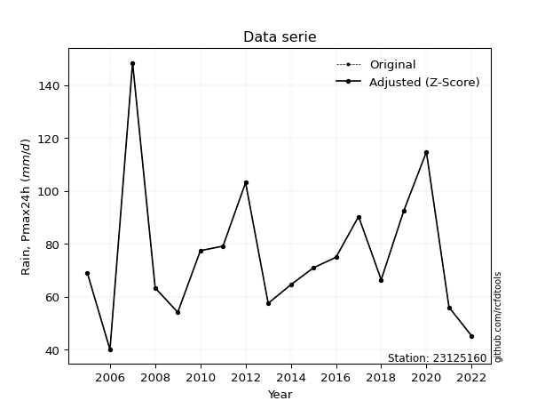</img>

</div>


> The initial value (value_initial) correspond to the initial obtained or null completed value, and value (value) is adjusted only when the initial value is outside the valid range (outlier) definite through the Z-Score value. If Z-Score is active, values out of range or outliers are replaced with the station mean value. A Z-Score (or standard score) measures how many standard deviations a data point is from the mean of a dataset, indicating its relative position; positive scores mean above the mean, negative mean below, and a score of zero is exactly at the mean, allowing for comparison of values from different distributions. It´s calculated using the formula $z=(x–μ)/σ$, where $x$ is the data point, $μ$ is the mean, and $σ$ is the standard deviation, helping identify outliers and understand probability.
>
> <sub>**Note**: In this study, "completing" (filling gaps in) and "extending" (forecasting or lengthening the historical record) rainfall data series are avoided for certain critical analyses because they introduce artificial bias and uncertainty, which can distort the statistics of rare events (extremes), alter day-to-day variability, and compromise the integrity and homogeneity of the original data. Some reasons against Completing/Extending rainfall data are: **Distortion of Extremes and Variability**: The primary issue is that most gap-filling or extension methods rely on averaging or regression with nearby stations, which inherently smooths the data. Rainfall is highly variable in space and time, with a large percentage of zero values and occasional large storms. Infilling methods often underestimate the highest values and overestimate the lowest (zero) values, which severely distorts analyses focused on flood frequency, drought severity, and intensity-duration-frequency (IDF) curves, **Loss of Data Homogeneity**: Infilled or extended data are synthetic estimates, not actual measurements. Combining these estimates with observed data can violate the assumption of data homogeneity, which requires that the data properties do not change over time. Inhomogeneity can lead to incorrect conclusions about long-term trends or changes in climate patterns, **Propagation of Errors**: Errors and biases from the original data (e.g., wind-induced undercatch, instrument errors, site changes) or the data used for imputation can propagate through the analysis, leading to unreliable hydrological models and inaccurate predictions, **Compromised Statistical Integrity**: For statistical analyses, especially those involving the frequency of events, using artificial data can introduce time bias or autocorrelation that doesn´t exist in reality, making it difficult to assess the true probability of events, **Difficulty in Validation**: It is difficult to accurately validate the quality of filled or extended data, especially for past periods where ground-truth measurements are unavailable. The reliability of imputation techniques heavily depends on the density of the surrounding station network and the complexity of the local topography.</sub>


### 4. Active continuous probability distributions from SciPy (80 of 104 available)

A Probability Density Function (PDF) describes the relative likelihood of a continuous random variable falling within a specific range, where the total area under its curve equals 1, and the area over any interval gives the actual probability for that range. Unlike discrete probabilities (like rolling a die), a PDF shows density, not direct probability for a single point (which is zero), with higher points indicating higher likelihood, often visualized as a bell curve for normal distributions.

A log of a probability density function (log-PDF) is simply the logarithm of the PDF´s value, denoted as $log(f(x))$, useful for converting multiplication of probabilities into addition, improving numerical stability with tiny numbers, and connecting to information theory concepts like entropy. Instead of dealing with very small probabilities (e.g., 0.000001), log-PDFs use negative numbers (e.g., $log(0.00001) ≈ -11.51$ that are easier for computers to handle, preventing underflow errors and simplifying complex calculations. In this study, each active probability distribution from SciPy is also evaluated in the $log$ form.

[scipy.stats](https://docs.scipy.org/doc/scipy/reference/stats.html) is a Python´s powerful submodule within the SciPy library for comprehensive statistical analysis, offering over 130 probability distributions (like Normal, Poisson, etc.), functions for descriptive stats (mean, variance), hypothesis testing (t-tests, chi-square), random variable generation, and statistical tests, making it essential for data science, modeling, and research. It provides tools to explore, model, and draw conclusions from data efficiently, working seamlessly with [NumPy](https://numpy.org/).

<div align="center">

|   id | p_dist           |   n_parameter | fit_method   | label                                                                       | active   | ref                                                                                                      |
|-----:|:-----------------|--------------:|:-------------|:----------------------------------------------------------------------------|:---------|:---------------------------------------------------------------------------------------------------------|
|    0 | alpha            |             3 | MLE          | Alpha                                                                       | True     | [:mortar_board:](https://docs.scipy.org/doc/scipy/reference/generated/scipy.stats.alpha.html)            |
|    1 | anglit           |             2 | MM           | Anglit                                                                      | True     | [:mortar_board:](https://docs.scipy.org/doc/scipy/reference/generated/scipy.stats.anglit.html)           |
|    2 | arcsine          |             2 | MM           | Arcsine                                                                     | True     | [:mortar_board:](https://docs.scipy.org/doc/scipy/reference/generated/scipy.stats.arcsine.html)          |
|    3 | argus            |             3 | MLE          | Argus                                                                       | True     | [:mortar_board:](https://docs.scipy.org/doc/scipy/reference/generated/scipy.stats.argus.html)            |
|    4 | beta             |             4 | MLE          | Beta                                                                        | True     | [:mortar_board:](https://docs.scipy.org/doc/scipy/reference/generated/scipy.stats.beta.html)             |
|    5 | betaprime        |             4 | MLE          | Beta prime                                                                  | True     | [:mortar_board:](https://docs.scipy.org/doc/scipy/reference/generated/scipy.stats.betaprime.html)        |
|    6 | bradford         |             3 | MLE          | Bradford                                                                    | True     | [:mortar_board:](https://docs.scipy.org/doc/scipy/reference/generated/scipy.stats.bradford.html)         |
|    7 | burr             |             4 | MLE          | Burr (Type III)                                                             | True     | [:mortar_board:](https://docs.scipy.org/doc/scipy/reference/generated/scipy.stats.burr.html)             |
|    8 | burr12           |             4 | MLE          | Burr (Type III) 12                                                          | True     | [:mortar_board:](https://docs.scipy.org/doc/scipy/reference/generated/scipy.stats.burr12.html)           |
|    9 | cosine           |             2 | MLE          | Cosine                                                                      | True     | [:mortar_board:](https://docs.scipy.org/doc/scipy/reference/generated/scipy.stats.cosine.html)           |
|   10 | crystalball      |             4 | MLE          | Crystalball                                                                 | True     | [:mortar_board:](https://docs.scipy.org/doc/scipy/reference/generated/scipy.stats.crystalball.html)      |
|   11 | dgamma           |             3 | MLE          | Double gamma                                                                | True     | [:mortar_board:](https://docs.scipy.org/doc/scipy/reference/generated/scipy.stats.dgamma.html)           |
|   12 | dweibull         |             3 | MLE          | Double Weibull                                                              | True     | [:mortar_board:](https://docs.scipy.org/doc/scipy/reference/generated/scipy.stats.dweibull.html)         |
|   13 | erlang           |             3 | MLE          | Erlang                                                                      | True     | [:mortar_board:](https://docs.scipy.org/doc/scipy/reference/generated/scipy.stats.erlang.html)           |
|   14 | exponnorm        |             3 | MLE          | Exponentially modified Normal                                               | True     | [:mortar_board:](https://docs.scipy.org/doc/scipy/reference/generated/scipy.stats.exponnorm.html)        |
|   15 | exponpow         |             3 | MLE          | Exponential power                                                           | True     | [:mortar_board:](https://docs.scipy.org/doc/scipy/reference/generated/scipy.stats.exponpow.html)         |
|   16 | exponweib        |             4 | MLE          | Exponentiated Weibull                                                       | True     | [:mortar_board:](https://docs.scipy.org/doc/scipy/reference/generated/scipy.stats.exponweib.html)        |
|   17 | f                |             4 | MLE          | F                                                                           | True     | [:mortar_board:](https://docs.scipy.org/doc/scipy/reference/generated/scipy.stats.f.html)                |
|   18 | fatiguelife      |             3 | MLE          | Fatigue-life (Birnbaum-Saunders)                                            | True     | [:mortar_board:](https://docs.scipy.org/doc/scipy/reference/generated/scipy.stats.fatiguelife.html)      |
|   19 | foldnorm         |             3 | MM           | Fold Normal                                                                 | True     | [:mortar_board:](https://docs.scipy.org/doc/scipy/reference/generated/scipy.stats.foldnorm.html)         |
|   20 | gamma            |             3 | MLE          | Gamma                                                                       | True     | [:mortar_board:](https://docs.scipy.org/doc/scipy/reference/generated/scipy.stats.gamma.html)            |
|   21 | gausshyper       |             6 | MLE          | Gauss hypergeometric                                                        | True     | [:mortar_board:](https://docs.scipy.org/doc/scipy/reference/generated/scipy.stats.gausshyper.html)       |
|   22 | genexpon         |             5 | MLE          | Generalized exponential                                                     | True     | [:mortar_board:](https://docs.scipy.org/doc/scipy/reference/generated/scipy.stats.genexpon.html)         |
|   23 | genextreme       |             3 | MLE          | Generalized exponential                                                     | True     | [:mortar_board:](https://docs.scipy.org/doc/scipy/reference/generated/scipy.stats.genextreme.html)       |
|   24 | gengamma         |             4 | MLE          | Generalized gamma                                                           | True     | [:mortar_board:](https://docs.scipy.org/doc/scipy/reference/generated/scipy.stats.gengamma.html)         |
|   25 | genhalflogistic  |             3 | MLE          | Generalized half-logistic                                                   | True     | [:mortar_board:](https://docs.scipy.org/doc/scipy/reference/generated/scipy.stats.genhalflogistic.html)  |
|   26 | genlogistic      |             3 | MLE          | Generalized logistic                                                        | True     | [:mortar_board:](https://docs.scipy.org/doc/scipy/reference/generated/scipy.stats.genlogistic.html)      |
|   27 | gennorm          |             3 | MLE          | Generalized Normal                                                          | True     | [:mortar_board:](https://docs.scipy.org/doc/scipy/reference/generated/scipy.stats.gennorm.html)          |
|   28 | genpareto        |             3 | MLE          | Generalized Pareto                                                          | True     | [:mortar_board:](https://docs.scipy.org/doc/scipy/reference/generated/scipy.stats.genpareto.html)        |
|   29 | gompertz         |             3 | MLE          | Gompertz (or truncated Gumbel)                                              | True     | [:mortar_board:](https://docs.scipy.org/doc/scipy/reference/generated/scipy.stats.gompertz.html)         |
|   30 | gumbel_l         |             2 | MM           | Gumbel Left Skew                                                            | True     | [:mortar_board:](https://docs.scipy.org/doc/scipy/reference/generated/scipy.stats.gumbel_l.html)         |
|   31 | gumbel_r         |             2 | MM           | Gumbel Right Skew                                                           | True     | [:mortar_board:](https://docs.scipy.org/doc/scipy/reference/generated/scipy.stats.gumbel_r.html)         |
|   32 | halfgennorm      |             3 | MLE          | Upper half of a generalized normal                                          | True     | [:mortar_board:](https://docs.scipy.org/doc/scipy/reference/generated/scipy.stats.halfgennorm.html)      |
|   33 | halflogistic     |             2 | MM           | Half-logistic                                                               | True     | [:mortar_board:](https://docs.scipy.org/doc/scipy/reference/generated/scipy.stats.halflogistic.html)     |
|   34 | halfnorm         |             2 | MM           | Half Normal                                                                 | True     | [:mortar_board:](https://docs.scipy.org/doc/scipy/reference/generated/scipy.stats.halfnorm.html)         |
|   35 | hypsecant        |             2 | MM           | hyperbolic secant                                                           | True     | [:mortar_board:](https://docs.scipy.org/doc/scipy/reference/generated/scipy.stats.hypsecant.html)        |
|   36 | invgamma         |             3 | MLE          | Inverted gamma                                                              | True     | [:mortar_board:](https://docs.scipy.org/doc/scipy/reference/generated/scipy.stats.invgamma.html)         |
|   37 | invgauss         |             3 | MLE          | Inverse Gaussian                                                            | True     | [:mortar_board:](https://docs.scipy.org/doc/scipy/reference/generated/scipy.stats.invgauss.html)         |
|   38 | invweibull       |             3 | MLE          | Inverted Weibull                                                            | True     | [:mortar_board:](https://docs.scipy.org/doc/scipy/reference/generated/scipy.stats.invweibull.html)       |
|   39 | johnsonsb        |             4 | MLE          | Johnson SB                                                                  | True     | [:mortar_board:](https://docs.scipy.org/doc/scipy/reference/generated/scipy.stats.johnsonsb.html)        |
|   40 | johnsonsu        |             4 | MLE          | Johnson Su                                                                  | True     | [:mortar_board:](https://docs.scipy.org/doc/scipy/reference/generated/scipy.stats.johnsonsu.html)        |
|   41 | kappa3           |             3 | MLE          | Kappa 3                                                                     | True     | [:mortar_board:](https://docs.scipy.org/doc/scipy/reference/generated/scipy.stats.kappa3.html)           |
|   42 | kappa4           |             4 | MLE          | Kappa 4                                                                     | True     | [:mortar_board:](https://docs.scipy.org/doc/scipy/reference/generated/scipy.stats.kappa4.html)           |
|   43 | ksone            |             3 | MLE          | Kolmogorov-Smirnov one-sided test statistic distribution                    | True     | [:mortar_board:](https://docs.scipy.org/doc/scipy/reference/generated/scipy.stats.ksone.html)            |
|   44 | kstwobign        |             2 | MLE          | Limiting distribution of scaled Kolmogorov-Smirnov two-sided test statistic | True     | [:mortar_board:](https://docs.scipy.org/doc/scipy/reference/generated/scipy.stats.kstwobign.html)        |
|   45 | laplace          |             2 | MM           | Laplace                                                                     | True     | [:mortar_board:](https://docs.scipy.org/doc/scipy/reference/generated/scipy.stats.laplace.html)          |
|   46 | levy_l           |             2 | MLE          | Left-skewed Levy                                                            | True     | [:mortar_board:](https://docs.scipy.org/doc/scipy/reference/generated/scipy.stats.levy_l.html)           |
|   47 | loggamma         |             3 | MLE          | Log gamma                                                                   | True     | [:mortar_board:](https://docs.scipy.org/doc/scipy/reference/generated/scipy.stats.loggamma.html)         |
|   48 | logistic         |             2 | MM           | Logistic (or Sech-squared)                                                  | True     | [:mortar_board:](https://docs.scipy.org/doc/scipy/reference/generated/scipy.stats.logistic.html)         |
|   49 | loglaplace       |             3 | MLE          | Log-Laplace                                                                 | True     | [:mortar_board:](https://docs.scipy.org/doc/scipy/reference/generated/scipy.stats.loglaplace.html)       |
|   50 | lomax            |             3 | MLE          | Lomax (Pareto of the second kind)                                           | True     | [:mortar_board:](https://docs.scipy.org/doc/scipy/reference/generated/scipy.stats.lomax.html)            |
|   51 | maxwell          |             2 | MM           | Maxwell                                                                     | True     | [:mortar_board:](https://docs.scipy.org/doc/scipy/reference/generated/scipy.stats.maxwell.html)          |
|   52 | mielke           |             4 | MLE          | Mielke Beta-Kappa / Dagum                                                   | True     | [:mortar_board:](https://docs.scipy.org/doc/scipy/reference/generated/scipy.stats.mielke.html)           |
|   53 | moyal            |             2 | MM           | Moyal                                                                       | True     | [:mortar_board:](https://docs.scipy.org/doc/scipy/reference/generated/scipy.stats.moyal.html)            |
|   54 | nakagami         |             3 | MLE          | Nakagami                                                                    | True     | [:mortar_board:](https://docs.scipy.org/doc/scipy/reference/generated/scipy.stats.nakagami.html)         |
|   55 | ncf              |             5 | MLE          | Non-central F distribution                                                  | True     | [:mortar_board:](https://docs.scipy.org/doc/scipy/reference/generated/scipy.stats.ncf.html)              |
|   56 | nct              |             4 | MLE          | Non-central Student’s t                                                     | True     | [:mortar_board:](https://docs.scipy.org/doc/scipy/reference/generated/scipy.stats.nct.html)              |
|   57 | norm             |             2 | MM           | Normal                                                                      | True     | [:mortar_board:](https://docs.scipy.org/doc/scipy/reference/generated/scipy.stats.norm.html)             |
|   58 | pearson3         |             3 | MM           | Pearson type III                                                            | True     | [:mortar_board:](https://docs.scipy.org/doc/scipy/reference/generated/scipy.stats.pearson3.html)         |
|   59 | powerlaw         |             3 | MLE          | Power-function                                                              | True     | [:mortar_board:](https://docs.scipy.org/doc/scipy/reference/generated/scipy.stats.powerlaw.html)         |
|   60 | rayleigh         |             2 | MM           | Rayleigh                                                                    | True     | [:mortar_board:](https://docs.scipy.org/doc/scipy/reference/generated/scipy.stats.rayleigh.html)         |
|   61 | rdist            |             3 | MLE          | R-distributed (symmetric beta)                                              | True     | [:mortar_board:](https://docs.scipy.org/doc/scipy/reference/generated/scipy.stats.rdist.html)            |
|   62 | rice             |             3 | MLE          | Rice                                                                        | True     | [:mortar_board:](https://docs.scipy.org/doc/scipy/reference/generated/scipy.stats.rice.html)             |
|   63 | semicircular     |             2 | MM           | Semicircular                                                                | True     | [:mortar_board:](https://docs.scipy.org/doc/scipy/reference/generated/scipy.stats.semicircular.html)     |
|   64 | skewnorm         |             3 | MLE          | Skew normal                                                                 | True     | [:mortar_board:](https://docs.scipy.org/doc/scipy/reference/generated/scipy.stats.skewnorm.html)         |
|   65 | t                |             3 | MLE          | Student’s t                                                                 | True     | [:mortar_board:](https://docs.scipy.org/doc/scipy/reference/generated/scipy.stats.t.html)                |
|   66 | trapezoid        |             4 | MLE          | Trapezoid                                                                   | True     | [:mortar_board:](https://docs.scipy.org/doc/scipy/reference/generated/scipy.stats.trapezoid.html)        |
|   67 | triang           |             3 | MLE          | Triangular                                                                  | True     | [:mortar_board:](https://docs.scipy.org/doc/scipy/reference/generated/scipy.stats.triang.html)           |
|   68 | truncexpon       |             3 | MLE          | Truncated exponential                                                       | True     | [:mortar_board:](https://docs.scipy.org/doc/scipy/reference/generated/scipy.stats.truncexpon.html)       |
|   69 | truncnorm        |             4 | MLE          | Truncated normal                                                            | True     | [:mortar_board:](https://docs.scipy.org/doc/scipy/reference/generated/scipy.stats.truncnorm.html)        |
|   70 | truncpareto      |             4 | MLE          | Upper truncated Pareto                                                      | True     | [:mortar_board:](https://docs.scipy.org/doc/scipy/reference/generated/scipy.stats.truncpareto.html)      |
|   71 | truncweibull_min |             5 | MLE          | Doubly truncated Weibull minimum                                            | True     | [:mortar_board:](https://docs.scipy.org/doc/scipy/reference/generated/scipy.stats.truncweibull_min.html) |
|   72 | tukeylambda      |             3 | MLE          | Tukey-Lamdba                                                                | True     | [:mortar_board:](https://docs.scipy.org/doc/scipy/reference/generated/scipy.stats.tukeylambda.html)      |
|   73 | uniform          |             2 | MLE          | Uniform                                                                     | True     | [:mortar_board:](https://docs.scipy.org/doc/scipy/reference/generated/scipy.stats.uniform.html)          |
|   74 | vonmises         |             3 | MLE          | Von Mises                                                                   | True     | [:mortar_board:](https://docs.scipy.org/doc/scipy/reference/generated/scipy.stats.vonmises.html)         |
|   75 | vonmises_line    |             3 | MLE          | Von Mises line                                                              | True     | [:mortar_board:](https://docs.scipy.org/doc/scipy/reference/generated/scipy.stats.vonmises_line.html)    |
|   76 | wald             |             2 | MM           | Wald                                                                        | True     | [:mortar_board:](https://docs.scipy.org/doc/scipy/reference/generated/scipy.stats.wald.html)             |
|   77 | weibull_max      |             3 | MLE          | Weibull maximum                                                             | True     | [:mortar_board:](https://docs.scipy.org/doc/scipy/reference/generated/scipy.stats.weibull_max.html)      |
|   78 | weibull_min      |             3 | MLE          | Weibull minimum                                                             | True     | [:mortar_board:](https://docs.scipy.org/doc/scipy/reference/generated/scipy.stats.weibull_min.html)      |
|   79 | wrapcauchy       |             3 | MLE          | Wrapped  Cauchy                                                             | True     | [:mortar_board:](https://docs.scipy.org/doc/scipy/reference/generated/scipy.stats.wrapcauchy.html)       |

</div>

> **n_parameter:** # arguments & localization & scale.
>
> **Fit methods:** (MLE) maximum likelihood, (MM) L-moments.
>
>**Inactive** (With the only purpose of prevent loops, zero divisions, infinite values, over high estimated values or horizontal trending for recurrence intervals estimations, the follow distributions were disabled.)**:** lognorm, norminvgauss, powernorm, powerlognorm, cauchy, halfcauchy, foldcauchy, skewcauchy, chi2, expon, fisk, genhyperbolic, geninvgauss, gibrat, kstwo, laplace_asymmetric, levy, levy_stable, ncx2, pareto, rel_breitwigner, recipinvgauss, studentized_range, loguniform, 


## B. Probability (PDF) vs. Empirical (EDF) distributions functions

A continuous probability distribution (CPD) describes probabilities for variables that can take any value within a range (like rain any time), unlike discrete variables with specific outcomes (like temperature). It uses a Probability Density Function (PDF), a curve where the total area under it equals 1, and the probability of the variable falling within an interval (a to b) is found by calculating the area under the curve between those points. A key feature is that the probability of hitting any single exact value is zero, so probabilities are always expressed for ranges, e.g., $P(a ≤ X ≤ b)$.

<div align="center">

Distributions parameters from station values
|     |   station | p_dist              |   n |              loc |           scale | shape                  | shape1                | shape2                 | shape3             |
|----:|----------:|:--------------------|----:|-----------------:|----------------:|:-----------------------|:----------------------|:-----------------------|:-------------------|
|   0 |  23125160 | alpha               |  19 |    -23.8812      |   420.508       | 4.499380048517148      |                       |                        |                    |
|   1 |  23125160 | anglit              |  19 |     74.9474      |    74.2492      |                        |                       |                        |                    |
|   2 |  23125160 | arcsine             |  19 |     39.0534      |    71.7879      |                        |                       |                        |                    |
|   3 |  23125160 | argus               |  19 |      4.50062     |   146.135       | 2.9286381584243e-06    |                       |                        |                    |
|   4 |  23125160 | beta                |  19 |     40           |   138.027       | 0.982934354068902      | 2.718608238147035     |                        |                    |
|   5 |  23125160 | betaprime           |  19 |     -0.565046    |     2.77636     | 284.45326355692134     | 11.471227769659293    |                        |                    |
|   6 |  23125160 | bradford            |  19 |     40           |   108.4         | 0.9543994895276546     |                       |                        |                    |
|   7 |  23125160 | burr                |  19 |     -0.194606    |    54.9473      | 4.62130080516736       | 2.3761709156642183    |                        |                    |
|   8 |  23125160 | burr12              |  19 |     -1.3602      |    41.1549      | 549.4982600429058      | 0.0032008387824953638 |                        |                    |
|   9 |  23125160 | cosine              |  19 |     81.2337      |    25.1159      |                        |                       |                        |                    |
|  10 |  23125160 | crystalball         |  19 |     74.9474      |    25.3809      | 2932.598128251169      | 8579.81015530216      |                        |                    |
|  11 |  23125160 | dgamma              |  19 |     68.9         |    18.1508      | 0.9566578024884385     |                       |                        |                    |
|  12 |  23125160 | dweibull            |  19 |     69.6096      |    18.6276      | 1.0396159794662265     |                       |                        |                    |
|  13 |  23125160 | erlang              |  19 |     35.3353      |    16.2439      | 2.438590281310043      |                       |                        |                    |
|  14 |  23125160 | exponnorm           |  19 |     50.9766      |     9.362       | 2.5604239065684515     |                       |                        |                    |
|  15 |  23125160 | exponpow            |  19 |     40           |    56.4132      | 0.7763815379955267     |                       |                        |                    |
|  16 |  23125160 | exponweib           |  19 |     40           |     1.12346     | 1.1952904427667357     | 0.2281777546563747    |                        |                    |
|  17 |  23125160 | f                   |  19 |     11.3314      |    56.1607      | 152.77968017755248     | 16.97411398419441     |                        |                    |
|  18 |  23125160 | fatiguelife         |  19 |     39.9472      |     2.43083     | 3.893297671196196      |                       |                        |                    |
|  19 |  23125160 | foldnorm            |  19 |     40.6937      |    42.4072      | 0.13905528949256568    |                       |                        |                    |
|  20 |  23125160 | gamma               |  19 |     35.3352      |    16.2438      | 2.4386025324671943     |                       |                        |                    |
|  21 |  23125160 | gausshyper          |  19 |     40           |   111.489       | 0.8079210420021034     | 1.244135888888689     | 0.8112668239208025     | 1.0869314887915547 |
|  22 |  23125160 | genexpon            |  19 |     39.9997      |     2.04654     | 0.058568019027012704   | 3.523105452480371e-08 | 1.2647998126190134     |                    |
|  23 |  23125160 | genextreme          |  19 |     62.9415      |    17.6156      | -0.09633508139073765   |                       |                        |                    |
|  24 |  23125160 | gengamma            |  19 |     40           |     0.793724    | 1.5191635797846537     | 0.2477211723639325    |                        |                    |
|  25 |  23125160 | genhalflogistic     |  19 |     40           |    29.7017      | 0.11256391595978013    |                       |                        |                    |
|  26 |  23125160 | genlogistic         |  19 |    -49.5792      |    18.2991      | 492.30718483062316     |                       |                        |                    |
|  27 |  23125160 | gennorm             |  19 |     68.9         |    19.0941      | 1.0165581164242687     |                       |                        |                    |
|  28 |  23125160 | genpareto           |  19 |     -1.04728     |   154.82        | -1.0359522251245288    |                       |                        |                    |
|  29 |  23125160 | gompertz            |  19 |     40           |    78.5892      | 1.5241277856223325     |                       |                        |                    |
|  30 |  23125160 | gumbel_l            |  19 |     86.3701      |    19.7894      |                        |                       |                        |                    |
|  31 |  23125160 | gumbel_r            |  19 |     63.5246      |    19.7894      |                        |                       |                        |                    |
|  32 |  23125160 | halfgennorm         |  19 |     40           |     1.17746     | 0.3476091986810378     |                       |                        |                    |
|  33 |  23125160 | halflogistic        |  19 |     44.8651      |    21.6998      |                        |                       |                        |                    |
|  34 |  23125160 | halfnorm            |  19 |     41.3531      |    42.1042      |                        |                       |                        |                    |
|  35 |  23125160 | hypsecant           |  19 |     74.9474      |    16.158       |                        |                       |                        |                    |
|  36 |  23125160 | invgamma            |  19 |      8.3713      |   498.63        | 8.48344376883999       |                       |                        |                    |
|  37 |  23125160 | invgauss            |  19 |     21.0417      |   242.721       | 0.2220889889633334     |                       |                        |                    |
|  38 |  23125160 | invweibull          |  19 |   -119.919       |   182.861       | 10.380582855341666     |                       |                        |                    |
|  39 |  23125160 | johnsonsb           |  19 |     27.7008      |   405.385       | 3.5934777949294423     | 1.6642410462410555    |                        |                    |
|  40 |  23125160 | johnsonsu           |  19 |     23.0519      |     2.97193     | -7.3600566739266       | 2.136716744502994     |                        |                    |
|  41 |  23125160 | kappa3              |  19 |     40           |    41.7579      | 3.7839885074522357     |                       |                        |                    |
|  42 |  23125160 | kappa4              |  19 |     28.7389      |   113.688       | 1.1095720011320747     | 0.9405602614656117    |                        |                    |
|  43 |  23125160 | ksone               |  19 |     29.16        |   130.08        | 1.0                    |                       |                        |                    |
|  44 |  23125160 | kstwobign           |  19 |     -3.09469     |    90.2425      |                        |                       |                        |                    |
|  45 |  23125160 | laplace             |  19 |     74.9474      |    17.947       |                        |                       |                        |                    |
|  46 |  23125160 | levy_l              |  19 |    156.098       |    53.4382      |                        |                       |                        |                    |
|  47 |  23125160 | loggamma            |  19 |  -7700.56        |  1047.51        | 1674.0599749309122     |                       |                        |                    |
|  48 |  23125160 | logistic            |  19 |     74.9474      |    13.9932      |                        |                       |                        |                    |
|  49 |  23125160 | loglaplace          |  19 |     -0.166348    |    69.0663      | 4.1785379603282715     |                       |                        |                    |
|  50 |  23125160 | lomax               |  19 |     40           |     2.79279e+11 | 3182551353.6726236     |                       |                        |                    |
|  51 |  23125160 | maxwell             |  19 |     14.8054      |    37.6884      |                        |                       |                        |                    |
|  52 |  23125160 | mielke              |  19 |      0.0852031   |    54.8015      | 10.864361069898449     | 4.608973818239026     |                        |                    |
|  53 |  23125160 | moyal               |  19 |     60.433       |    11.4254      |                        |                       |                        |                    |
|  54 |  23125160 | nakagami            |  19 |     40           |    42.5905      | 0.47628723331027206    |                       |                        |                    |
|  55 |  23125160 | ncf                 |  19 |     -0.0569239   |     2.17098e-05 | 2.9428808207835102e-06 | 8.480824750517094     | 9.100195760777714      |                    |
|  56 |  23125160 | nct                 |  19 |     -0.0834163   |     5.7255      | 6.47673971343634       | 11.531199911141854    |                        |                    |
|  57 |  23125160 | norm                |  19 |     74.9474      |    25.3809      |                        |                       |                        |                    |
|  58 |  23125160 | pearson3            |  19 |     74.9474      |    25.3809      | 1.257830630955195      |                       |                        |                    |
|  59 |  23125160 | powerlaw            |  19 |     40           |   108.4         | 0.3136377943522085     |                       |                        |                    |
|  60 |  23125160 | rayleigh            |  19 |     26.3923      |    38.7414      |                        |                       |                        |                    |
|  61 |  23125160 | rdist               |  19 |     32.542       |    59.958       | 1.0371865414124457     |                       |                        |                    |
|  62 |  23125160 | rice                |  19 |     32.3142      |    35.084       | 0.00033582888017745223 |                       |                        |                    |
|  63 |  23125160 | semicircular        |  19 |     74.9474      |    50.7618      |                        |                       |                        |                    |
|  64 |  23125160 | skewnorm            |  19 |     40           |    43.1909      | 81074533.1571452       |                       |                        |                    |
|  65 |  23125160 | t                   |  19 |     67.5205      |    19.0388      | 3.9018013455974483     |                       |                        |                    |
|  66 |  23125160 | trapezoid           |  19 |     29.16        |   130.08        | 0.9999999999999999     | 1.0                   |                        |                    |
|  67 |  23125160 | triang              |  19 |     33.4745      |   123.506       | 0.18238371517462737    |                       |                        |                    |
|  68 |  23125160 | truncexpon          |  19 |     39.9999      |   104.527       | 1.0370503716840593     |                       |                        |                    |
|  69 |  23125160 | truncnorm           |  19 |     59.8342      |    38.1593      | -0.5256103129177983    | 2.669606556545615     |                        |                    |
|  70 |  23125160 | truncpareto         |  19 |     40           |     1.66298e-07 | 0.05555556395868496    | 651842232.7952671     |                        |                    |
|  71 |  23125160 | truncweibull_min    |  19 |     39.8485      |   119.147       | 0.7874316371262886     | 0.0012715771465796517 | 0.9110687037761008     |                    |
|  72 |  23125160 | tukeylambda         |  19 |     69.4019      |     9.85049     | -0.20403359778330338   |                       |                        |                    |
|  73 |  23125160 | uniform             |  19 |     40           |   108.4         |                        |                       |                        |                    |
|  74 |  23125160 | vonmises            |  19 |      1.79885     |     1           | 0.4291096790436795     |                       |                        |                    |
|  75 |  23125160 | vonmises_line       |  19 |     77.3501      |    11.8889      | 0.30445983231312534    |                       |                        |                    |
|  76 |  23125160 | wald                |  19 |     49.5665      |    25.3809      |                        |                       |                        |                    |
|  77 |  23125160 | weibull_max         |  19 |    148.4         |     1.54759     | 0.21788431344045234    |                       |                        |                    |
|  78 |  23125160 | weibull_min         |  19 |     44.4532      |    33.9279      | 1.3056661773631455     |                       |                        |                    |
|  79 |  23125160 | wrapcauchy          |  19 |     40           |    18.115       | 0.5                    |                       |                        |                    |
|  80 |  23125160 | logalpha            |  19 |      0.241044    |    52.4822      | 13.115950584249902     |                       |                        |                    |
|  81 |  23125160 | loganglit           |  19 |      4.26609     |     0.912256    |                        |                       |                        |                    |
|  82 |  23125160 | logarcsine          |  19 |      3.82506     |     0.882071    |                        |                       |                        |                    |
|  83 |  23125160 | logargus            |  19 |      3.45041     |     1.57567     | 4.241454374025888e-06  |                       |                        |                    |
|  84 |  23125160 | logbeta             |  19 |      3.4619      |     2.42881     | 4.09543565740902       | 8.27267574815187      |                        |                    |
|  85 |  23125160 | logbetaprime        |  19 |      0.177815    |    11.0517      | 238.7999043338922      | 646.8616950148723     |                        |                    |
|  86 |  23125160 | logbradford         |  19 |      3.68888     |     1.31104     | 0.8801928452862959     |                       |                        |                    |
|  87 |  23125160 | logburr             |  19 |     -0.0938778   |     4.2102      | 21.73363889889246      | 1.608017230461668     |                        |                    |
|  88 |  23125160 | logburr12           |  19 |     -0.110061    |     4.27281     | 28.718997781493968     | 0.7122675386362534    |                        |                    |
|  89 |  23125160 | logcosine           |  19 |      4.29333     |     0.281926    |                        |                       |                        |                    |
|  90 |  23125160 | logcrystalball      |  19 |      4.26609     |     0.311847    | 3908.184156148482      | 101.61001452394308    |                        |                    |
|  91 |  23125160 | logdgamma           |  19 |      4.21749     |     0.191575    | 1.2645691780041632     |                       |                        |                    |
|  92 |  23125160 | logdweibull         |  19 |      4.21913     |     0.255356    | 1.1652981799268014     |                       |                        |                    |
|  93 |  23125160 | logerlang           |  19 |      2.93233     |     0.0731733   | 18.227524970496574     |                       |                        |                    |
|  94 |  23125160 | logexponnorm        |  19 |      4.05037     |     0.231864    | 0.9303858288415341     |                       |                        |                    |
|  95 |  23125160 | logexponpow         |  19 |      3.66045     |     0.920836    | 1.391747929323944      |                       |                        |                    |
|  96 |  23125160 | logexponweib        |  19 |      3.5979      |     0.821917    | 0.7875081409676524     | 2.5779331452839163    |                        |                    |
|  97 |  23125160 | logf                |  19 |      2.93452     |     1.33171     | 36.43447127695735      | 11331.750859207157    |                        |                    |
|  98 |  23125160 | logfatiguelife      |  19 |      2.28128     |     1.96068     | 0.15691911719652166    |                       |                        |                    |
|  99 |  23125160 | logfoldnorm         |  19 |      3.82503     |     0.401141    | 0.8982344320259184     |                       |                        |                    |
| 100 |  23125160 | loggamma            |  19 |      2.93233     |     0.0731733   | 18.22752206895283      |                       |                        |                    |
| 101 |  23125160 | loggausshyper       |  19 |      3.68755     |     1.31236     | 1.0554329946017564     | 0.8746814957444864    | 1.1029371914418586     | 1.106144071175455  |
| 102 |  23125160 | loggenexpon         |  19 |      3.68379     |     0.025454    | 0.008528179167766426   | 2.5589505078241706    | 0.0009367324629814431  |                    |
| 103 |  23125160 | loggenextreme       |  19 |      4.14107     |     0.286748    | 0.165354804151547      |                       |                        |                    |
| 104 |  23125160 | loggengamma         |  19 |      3.60777     |     0.87623     | 0.7091762318898769     | 2.721745864655211     |                        |                    |
| 105 |  23125160 | loggenhalflogistic  |  19 |      3.63768     |     1.45065     | 1.0649055483150747     |                       |                        |                    |
| 106 |  23125160 | loggenlogistic      |  19 |      4.00452     |     0.216793    | 2.3630423744696234     |                       |                        |                    |
| 107 |  23125160 | loggennorm          |  19 |      4.25529     |     0.396041    | 1.6735966973879546     |                       |                        |                    |
| 108 |  23125160 | loggenpareto        |  19 |     -0.00950689  |    11.4396      | -2.283627772978626     |                       |                        |                    |
| 109 |  23125160 | loggompertz         |  19 |      3.68811     |     0.47614     | 0.3080074963260311     |                       |                        |                    |
| 110 |  23125160 | loggumbel_l         |  19 |      4.40644     |     0.243146    |                        |                       |                        |                    |
| 111 |  23125160 | loggumbel_r         |  19 |      4.12575     |     0.243146    |                        |                       |                        |                    |
| 112 |  23125160 | loghalfgennorm      |  19 |      3.68888     |     1.11816     | 4.491573250779979      |                       |                        |                    |
| 113 |  23125160 | loghalflogistic     |  19 |      3.89645     |     0.266643    |                        |                       |                        |                    |
| 114 |  23125160 | loghalfnorm         |  19 |      3.85336     |     0.517287    |                        |                       |                        |                    |
| 115 |  23125160 | loghypsecant        |  19 |      4.26609     |     0.198528    |                        |                       |                        |                    |
| 116 |  23125160 | loginvgamma         |  19 |      1.60357     |   196.036       | 74.6273094086448       |                       |                        |                    |
| 117 |  23125160 | loginvgauss         |  19 |      2.36205     |    70.4268      | 0.027022443097021134   |                       |                        |                    |
| 118 |  23125160 | loginvweibull       |  19 |     -1.52369e+07 |     1.52369e+07 | 54738320.99760285      |                       |                        |                    |
| 119 |  23125160 | logjohnsonsb        |  19 |      3.24111     |     2.95958     | 1.3754748932852428     | 2.053581125912766     |                        |                    |
| 120 |  23125160 | logjohnsonsu        |  19 |      2.4497      |     0.568091    | -11.453961456299202    | 6.137293352058246     |                        |                    |
| 121 |  23125160 | logkappa3           |  19 |      3.68818     |     1.31071     | 3786.9703557150187     |                       |                        |                    |
| 122 |  23125160 | logkappa4           |  19 |      3.63895     |     1.47396     | 1.0350894105327673     | 1.0830280246139816    |                        |                    |
| 123 |  23125160 | logksone            |  19 |      3.55778     |     1.57324     | 1.0                    |                       |                        |                    |
| 124 |  23125160 | logkstwobign        |  19 |      3.10633     |     1.33328     |                        |                       |                        |                    |
| 125 |  23125160 | loglaplace          |  19 |      4.26609     |     0.220509    |                        |                       |                        |                    |
| 126 |  23125160 | loglevy_l           |  19 |      5.07283     |     0.502248    |                        |                       |                        |                    |
| 127 |  23125160 | logloggamma         |  19 |   -100.487       |    13.8483      | 1928.7753355566747     |                       |                        |                    |
| 128 |  23125160 | loglogistic         |  19 |      4.26609     |     0.17193     |                        |                       |                        |                    |
| 129 |  23125160 | logloglaplace       |  19 |     -0.031703    |     4.26436     | 17.811319543065373     |                       |                        |                    |
| 130 |  23125160 | loglomax            |  19 |      3.68888     |    14.7641      | 25.82085301170366      |                       |                        |                    |
| 131 |  23125160 | logmaxwell          |  19 |      3.52715     |     0.463065    |                        |                       |                        |                    |
| 132 |  23125160 | logmielke           |  19 | -50235.6         | 50239.6         | 554406.455463263       | 230994.2723708193     |                        |                    |
| 133 |  23125160 | logmoyal            |  19 |      4.08776     |     0.14038     |                        |                       |                        |                    |
| 134 |  23125160 | lognakagami         |  19 |      3.47808     |     0.847479    | 1.6784559872977989     |                       |                        |                    |
| 135 |  23125160 | logncf              |  19 |      1.30908     |     2.94085     | 369.6093831266219      | 364.6268082157472     | 2.6824323605244976e-06 |                    |
| 136 |  23125160 | lognct              |  19 |     -0.152147    |     0.114595    | 119.53676639939812     | 38.30868778038689     |                        |                    |
| 137 |  23125160 | lognorm             |  19 |      4.26609     |     0.311847    |                        |                       |                        |                    |
| 138 |  23125160 | logpearson3         |  19 |      4.26609     |     0.311847    | 0.4178843462358819     |                       |                        |                    |
| 139 |  23125160 | logpowerlaw         |  19 |      3.68888     |     1.31103     | 0.36758633670414503    |                       |                        |                    |
| 140 |  23125160 | lograyleigh         |  19 |      3.66951     |     0.476002    |                        |                       |                        |                    |
| 141 |  23125160 | logrdist            |  19 |      4.32039     |     0.679526    | 1.1442878733913504     |                       |                        |                    |
| 142 |  23125160 | logrice             |  19 |      3.58846     |     0.362087    | 1.4980312375308844     |                       |                        |                    |
| 143 |  23125160 | logsemicircular     |  19 |      4.26609     |     0.623653    |                        |                       |                        |                    |
| 144 |  23125160 | logskewnorm         |  19 |      3.94985     |     0.444142    | 1.9848272803771871     |                       |                        |                    |
| 145 |  23125160 | logt                |  19 |      4.26606     |     0.311755    | 3356.6818049756303     |                       |                        |                    |
| 146 |  23125160 | logtrapezoid        |  19 |      3.55778     |     1.57324     | 1.0                    | 1.0                   |                        |                    |
| 147 |  23125160 | logtriang           |  19 |      3.58055     |     1.53567     | 0.38166563498057127    |                       |                        |                    |
| 148 |  23125160 | logtruncexpon       |  19 |      3.68888     |     1.57672     | 0.8314974517820244     |                       |                        |                    |
| 149 |  23125160 | logtruncnorm        |  19 |     -0.127267    |     1.43982     | 2.650432426793077      | 3.560985579114665     |                        |                    |
| 150 |  23125160 | logtruncpareto      |  19 |     -1.34218e+08 |     1.34218e+08 | 232526497.6219228      | 1.0000000097679487    |                        |                    |
| 151 |  23125160 | logtruncweibull_min |  19 |      3.67735     |     1.31457     | 1.1943455680541155     | 0.0006276508627799558 | 1.0060799232344437     |                    |
| 152 |  23125160 | logtukeylambda      |  19 |      4.34439     |     0.715507    | 1.0915092658435692     |                       |                        |                    |
| 153 |  23125160 | loguniform          |  19 |      3.68888     |     1.31103     |                        |                       |                        |                    |
| 154 |  23125160 | logvonmises         |  19 |     -2.01924     |     1           | 10.805126550277945     |                       |                        |                    |
| 155 |  23125160 | logvonmises_line    |  19 |      4.27553     |     0.230576    | 0.9974940735333826     |                       |                        |                    |
| 156 |  23125160 | logwald             |  19 |      3.95421     |     0.311885    |                        |                       |                        |                    |
| 157 |  23125160 | logweibull_max      |  19 |      5.8753      |     1.73426     | 6.048328299890684      |                       |                        |                    |
| 158 |  23125160 | logweibull_min      |  19 |      3.55997     |     0.795698    | 2.3994248740570594     |                       |                        |                    |
| 159 |  23125160 | logwrapcauchy       |  19 |      3.68888     |     0.208657    | 0.5                    |                       |                        |                    |

</div>

> **loc** (Location parameter): This shifts the distribution along the x-axis. For many common distributions, like the normal (Gaussian) distribution, loc represents the mean $μ$. For others, like the uniform distribution, it might represent the minimum value, or for the beta distribution, the left end of the support interval.
>
> **scale** (Scale parameter): This determines the width or spread of the distribution. For the normal distribution, scale represents the standard deviation $σ$. For a uniform distribution, it defines the length of the interval (from $loc$ to $loc + scale$).
>
> **shape** (Shape parameters): Refers to parameters that define the specific form of a probability distribution, distinct from its location (loc) and scale (scale). These parameters are required arguments for most distribution functions. For example, a normal (Gaussian) distribution is fully defined by its location (mean) and scale (standard deviation), so it has no specific shape parameters beyond loc and scale. However, other distributions have intrinsic properties that need specification, as Gamma distribution that takes a shape parameter, often named $a$ or $alpha$.


### 0. Cumulative distribution values - CDF (160 evaluated)

Cumulative Distribution Function (CDF), denoted as $F$<sub>$X$</sub>$(x)$, is a function that gives the probability that a random variable $X$ will take a value less than or equal to a specific value, $x$ (i.e., $(P(X≥x)$. It essentially "accumulates" probabilities from a given point up to the far right (positive infinity), providing a complete picture of the distribution´s probabilities for both discrete (like rain) and continuous (like temperature) variables, helping to find probabilities over ranges or above certain values. Each station is evaluated separately ordering the $x$ values ascending, calculating the CDF and PDF values for the activated distributions and their logarithmic forms.

<div align="center">

CDF ordered by x ascending and calculating $log(f(x))$ separately
|   id |   Station |   date |     x |   count |    mean |     std |      zscore |   Value_initial |   station |   m |     alpha |   alpha_pdf |    anglit |   anglit_pdf |   arcsine |   arcsine_pdf |     argus |   argus_pdf |        beta |   beta_pdf |   betaprime |   betaprime_pdf |    bradford |   bradford_pdf |      burr |    burr_pdf |     burr12 |   burr12_pdf |   cosine |   cosine_pdf |   crystalball |   crystalball_pdf |    dgamma |   dgamma_pdf |   dweibull |   dweibull_pdf |    erlang |   erlang_pdf |   exponnorm |   exponnorm_pdf |    exponpow |   exponpow_pdf |   exponweib |   exponweib_pdf |         f |       f_pdf |   fatiguelife |   fatiguelife_pdf |   foldnorm |   foldnorm_pdf |     gamma |   gamma_pdf |   gausshyper |   gausshyper_pdf |   genexpon |   genexpon_pdf |   genextreme |   genextreme_pdf |    gengamma |   gengamma_pdf |   genhalflogistic |   genhalflogistic_pdf |   genlogistic |   genlogistic_pdf |   gennorm |   gennorm_pdf |   genpareto |   genpareto_pdf |    gompertz |   gompertz_pdf |   gumbel_l |   gumbel_l_pdf |   gumbel_r |   gumbel_r_pdf |   halfgennorm |   halfgennorm_pdf |   halflogistic |   halflogistic_pdf |   halfnorm |   halfnorm_pdf |   hypsecant |   hypsecant_pdf |   invgamma |   invgamma_pdf |   invgauss |   invgauss_pdf |   invweibull |   invweibull_pdf |   johnsonsb |   johnsonsb_pdf |   johnsonsu |   johnsonsu_pdf |      kappa3 |   kappa3_pdf |      kappa4 |   kappa4_pdf |     ksone |   ksone_pdf |   kstwobign |   kstwobign_pdf |   laplace |   laplace_pdf |   levy_l |   levy_l_pdf |   loggamma |   loggamma_pdf |   logistic |   logistic_pdf |   loglaplace |   loglaplace_pdf |      lomax |   lomax_pdf |   maxwell |   maxwell_pdf |    mielke |   mielke_pdf |     moyal |   moyal_pdf |    nakagami |   nakagami_pdf |      ncf |    ncf_pdf |       nct |     nct_pdf |      norm |   norm_pdf |   pearson3 |   pearson3_pdf |    powerlaw |   powerlaw_pdf |   rayleigh |   rayleigh_pdf |    rdist |       rdist_pdf |      rice |    rice_pdf |   semicircular |   semicircular_pdf |   skewnorm |   skewnorm_pdf |        t |       t_pdf |   trapezoid |   trapezoid_pdf |    triang |   triang_pdf |   truncexpon |   truncexpon_pdf |   truncnorm |   truncnorm_pdf |   truncpareto |   truncpareto_pdf |   truncweibull_min |   truncweibull_min_pdf |   tukeylambda |   tukeylambda_pdf |   uniform |   uniform_pdf |   vonmises |   vonmises_pdf |   vonmises_line |   vonmises_line_pdf |      wald |    wald_pdf |   weibull_max |   weibull_max_pdf |   weibull_min |   weibull_min_pdf |   wrapcauchy |   wrapcauchy_pdf |   logalpha |   logalpha_pdf |   loganglit |   loganglit_pdf |   logarcsine |   logarcsine_pdf |   logargus |   logargus_pdf |   logbeta |   logbeta_pdf |   logbetaprime |   logbetaprime_pdf |   logbradford |   logbradford_pdf |   logburr |   logburr_pdf |   logburr12 |   logburr12_pdf |   logcosine |   logcosine_pdf |   logcrystalball |   logcrystalball_pdf |   logdgamma |   logdgamma_pdf |   logdweibull |   logdweibull_pdf |   logerlang |   logerlang_pdf |   logexponnorm |   logexponnorm_pdf |   logexponpow |   logexponpow_pdf |   logexponweib |   logexponweib_pdf |      logf |   logf_pdf |   logfatiguelife |   logfatiguelife_pdf |   logfoldnorm |   logfoldnorm_pdf |   loggausshyper |   loggausshyper_pdf |   loggenexpon |   loggenexpon_pdf |   loggenextreme |   loggenextreme_pdf |   loggengamma |   loggengamma_pdf |   loggenhalflogistic |   loggenhalflogistic_pdf |   loggenlogistic |   loggenlogistic_pdf |   loggennorm |   loggennorm_pdf |   loggenpareto |   loggenpareto_pdf |   loggompertz |   loggompertz_pdf |   loggumbel_l |   loggumbel_l_pdf |   loggumbel_r |   loggumbel_r_pdf |   loghalfgennorm |   loghalfgennorm_pdf |   loghalflogistic |   loghalflogistic_pdf |   loghalfnorm |   loghalfnorm_pdf |   loghypsecant |   loghypsecant_pdf |   loginvgamma |   loginvgamma_pdf |   loginvgauss |   loginvgauss_pdf |   loginvweibull |   loginvweibull_pdf |   logjohnsonsb |   logjohnsonsb_pdf |   logjohnsonsu |   logjohnsonsu_pdf |   logkappa3 |   logkappa3_pdf |   logkappa4 |   logkappa4_pdf |   logksone |   logksone_pdf |   logkstwobign |   logkstwobign_pdf |   loglevy_l |   loglevy_l_pdf |   logloggamma |   logloggamma_pdf |   loglogistic |   loglogistic_pdf |   logloglaplace |   logloglaplace_pdf |    loglomax |   loglomax_pdf |   logmaxwell |   logmaxwell_pdf |   logmielke |   logmielke_pdf |    logmoyal |   logmoyal_pdf |   lognakagami |   lognakagami_pdf |    logncf |   logncf_pdf |    lognct |   lognct_pdf |   lognorm |   lognorm_pdf |   logpearson3 |   logpearson3_pdf |   logpowerlaw |   logpowerlaw_pdf |   lograyleigh |   lograyleigh_pdf |   logrdist |   logrdist_pdf |   logrice |   logrice_pdf |   logsemicircular |   logsemicircular_pdf |   logskewnorm |   logskewnorm_pdf |      logt |   logt_pdf |   logtrapezoid |   logtrapezoid_pdf |   logtriang |   logtriang_pdf |   logtruncexpon |   logtruncexpon_pdf |   logtruncnorm |   logtruncnorm_pdf |   logtruncpareto |   logtruncpareto_pdf |   logtruncweibull_min |   logtruncweibull_min_pdf |   logtukeylambda |   logtukeylambda_pdf |   loguniform |   loguniform_pdf |   logvonmises |   logvonmises_pdf |   logvonmises_line |   logvonmises_line_pdf |    logwald |   logwald_pdf |   logweibull_max |   logweibull_max_pdf |   logweibull_min |   logweibull_min_pdf |   logwrapcauchy |   logwrapcauchy_pdf |
|-----:|----------:|-------:|------:|--------:|--------:|--------:|------------:|----------------:|----------:|----:|----------:|------------:|----------:|-------------:|----------:|--------------:|----------:|------------:|------------:|-----------:|------------:|----------------:|------------:|---------------:|----------:|------------:|-----------:|-------------:|---------:|-------------:|--------------:|------------------:|----------:|-------------:|-----------:|---------------:|----------:|-------------:|------------:|----------------:|------------:|---------------:|------------:|----------------:|----------:|------------:|--------------:|------------------:|-----------:|---------------:|----------:|------------:|-------------:|-----------------:|-----------:|---------------:|-------------:|-----------------:|------------:|---------------:|------------------:|----------------------:|--------------:|------------------:|----------:|--------------:|------------:|----------------:|------------:|---------------:|-----------:|---------------:|-----------:|---------------:|--------------:|------------------:|---------------:|-------------------:|-----------:|---------------:|------------:|----------------:|-----------:|---------------:|-----------:|---------------:|-------------:|-----------------:|------------:|----------------:|------------:|----------------:|------------:|-------------:|------------:|-------------:|----------:|------------:|------------:|----------------:|----------:|--------------:|---------:|-------------:|-----------:|---------------:|-----------:|---------------:|-------------:|-----------------:|-----------:|------------:|----------:|--------------:|----------:|-------------:|----------:|------------:|------------:|---------------:|---------:|-----------:|----------:|------------:|----------:|-----------:|-----------:|---------------:|------------:|---------------:|-----------:|---------------:|---------:|----------------:|----------:|------------:|---------------:|-------------------:|-----------:|---------------:|---------:|------------:|------------:|----------------:|----------:|-------------:|-------------:|-----------------:|------------:|----------------:|--------------:|------------------:|-------------------:|-----------------------:|--------------:|------------------:|----------:|--------------:|-----------:|---------------:|----------------:|--------------------:|----------:|------------:|--------------:|------------------:|--------------:|------------------:|-------------:|-----------------:|-----------:|---------------:|------------:|----------------:|-------------:|-----------------:|-----------:|---------------:|----------:|--------------:|---------------:|-------------------:|--------------:|------------------:|----------:|--------------:|------------:|----------------:|------------:|----------------:|-----------------:|---------------------:|------------:|----------------:|--------------:|------------------:|------------:|----------------:|---------------:|-------------------:|--------------:|------------------:|---------------:|-------------------:|----------:|-----------:|-----------------:|---------------------:|--------------:|------------------:|----------------:|--------------------:|--------------:|------------------:|----------------:|--------------------:|--------------:|------------------:|---------------------:|-------------------------:|-----------------:|---------------------:|-------------:|-----------------:|---------------:|-------------------:|--------------:|------------------:|--------------:|------------------:|--------------:|------------------:|-----------------:|---------------------:|------------------:|----------------------:|--------------:|------------------:|---------------:|-------------------:|--------------:|------------------:|--------------:|------------------:|----------------:|--------------------:|---------------:|-------------------:|---------------:|-------------------:|------------:|----------------:|------------:|----------------:|-----------:|---------------:|---------------:|-------------------:|------------:|----------------:|--------------:|------------------:|--------------:|------------------:|----------------:|--------------------:|------------:|---------------:|-------------:|-----------------:|------------:|----------------:|------------:|---------------:|--------------:|------------------:|----------:|-------------:|----------:|-------------:|----------:|--------------:|--------------:|------------------:|--------------:|------------------:|--------------:|------------------:|-----------:|---------------:|----------:|--------------:|------------------:|----------------------:|--------------:|------------------:|----------:|-----------:|---------------:|-------------------:|------------:|----------------:|----------------:|--------------------:|---------------:|-------------------:|-----------------:|---------------------:|----------------------:|--------------------------:|-----------------:|---------------------:|-------------:|-----------------:|--------------:|------------------:|-------------------:|-----------------------:|-----------:|--------------:|-----------------:|---------------------:|-----------------:|---------------------:|----------------:|--------------------:|
|    0 |  23125160 |   2006 |  40   |      19 | 74.9474 | 26.0764 | -1.34019    |            40   |  23125160 |   1 | 0.0186126 | 0.00469357  | 0.0958223 |   0.00792863 | 0.0732649 |    0.0388709  | 0.0871973 |  0.00483754 | 2.62038e-16 | 0.0362492  |   0.0229268 |     0.00523522  | 3.81848e-07 |     0.0131393  | 0.0195225 | 0.00431584  | 0.00891363 |   0.0395763  | 0.079955 |  0.00588766  |     0.0842689 |        0.00609135 | 0.0953107 |  0.00534907  |  0.0990475 |    0.00563032  | 0.0125484 |   0.00602266 |   0.019808  |     0.00420087  | 4.52581e-13 |   49.4517      | 0.000134042 |     5.14368e+09 | 0.0170755 | 0.00482914  |     0.0441139 |       1.57263     |  0         |     0          | 0.0125484 | 0.00602263  |  1.28306e-13 |      14.5947     | 8.5418e-06 |     0.0286179  |    0.0179314 |      0.00468049  | 3.83431e-06 |    2.03052e+08 |       3.75206e-10 |            0.016834   |     0.0254851 |       0.00509172  |  0.106372 |   0.00574339  |    0.266532 |      0.00653149 | 2.84419e-13 |    0.0193936   |  0.0915557 |    0.00440794  |  0.0375165 |    0.00622383  |   1.30146e-12 |        0.164859   |     0          |        0           |  0         |    0           |   0.0728886 |     0.00447168  |  0.0169819 |    0.00480361  |  0.0155606 |    0.00510833  |    0.0179315 |      0.0046805   |   0.0149174 |     0.00525968  |   0.0160623 |     0.00498719  | 6.19358e-13 |  0.0168471   | 1.12449e-14 |   0.295138   | 0.0833333 |  0.00768758 |   0.0234755 |     0.00534918  | 0.0713326 |   0.00397463  | 0.50251  |   0.00185204 |  0.0165622 |       0.194064 |   0.076037 |    0.00502068  |    0.0364871 |         0.165468 | 2.8678e-10 |  0.0113956  | 0.0696055 |   0.00756645  | 0.0195352 |  0.00431586  | 0.0144711 | 0.00429431  | 7.41026e-16 |    0.0993442   | 0.310929 | 0.00884222 | 0.0172544 | 0.00467496  | 0.0842689 | 0.00609135 |  0.0148715 |    0.00629772  | 8.39966e-06 |    3.70766e+08 |  0.0598226 |    0.00852404  | 0.540706 |      0.00548551 | 0.0237099 | 0.00609607  |      0.0993485 |         0.00909592 |  0         |    0.0184735   | 0.11178  | 0.00687449  |  0.00694444 |      0.00128126 | 0.015306  |   0.00469116 |  2.03929e-06 |       0.0148208  |  0.00291632 |      0.0131113  |      0        |  494070           |        1.80079e-09 |             0.045214   |     0.0915426 |       0.005367    | 0         |    0.00922509 |    6.61521 |       0.221522 |     6.40412e-09 |          0.00964821 | 0         | 0           |     0.0801436 |       0.000406578 |    0          |       0           |     0        |       0.0263574  |  0.0176098 |       0.191819 |   0.0231259 |        0.32952  |     0        |         0        |  0.0341601 |       0.284832 | 0.0140632 |      0.21799  |      0.025739  |          0.219856  |   1.51528e-07 |          1.06335  | 0.0204209 |      0.171886 |   0.0236594 |        0.173789 |   0.0250558 |        0.258375 |        0.0320878 |            0.230682  |   0.0494729 |        0.239322 |     0.0480156 |         0.247246  |   0.0165622 |        0.194065 |      0.0193116 |           0.186248 |    0.00790471 |          0.386959 |      0.0114497 |           0.255064 | 0.0164785 |   0.193512 |        0.0169354 |             0.192869 |      0        |          0        |     0.000962179 |            0.764042 |    0.00175082 |          0.353243 |       0.0172402 |            0.193638 |     0.0111046 |          0.264034 |            0.0179866 |                 0.358018 |        0.019531  |             0.172634 |    0.0366834 |         0.229015 |       0.444011 |        0.185707    |   0.000496792 |          0.647606 |     0.0509359 |       0.204059    |    0.00240575 |         0.0596613 |      8.73205e-11 |             0.980108 |          0        |              0        |      0        |          0        |      0.0347334 |          0.174608  |     0.0173402 |          0.192056 |     0.0164995 |          0.192174 |      0.00963361 |            0.16067  |      0.0151589 |           0.206508 |      0.0172728 |           0.19241  | 0.000533999 |        0.761286 | 3.30508e-05 |        0.977211 |  0.0833333 |       0.635632 |     0.00895712 |           0.183346 |    0.453105 |        0.144838 |     0.0341042 |         0.236561  |     0.033658  |         0.189177  |       0.0440328 |           0.210795  | 1.16795e-11 |       1.7489   |    0.0109253 |         0.197747 |   0.0193381 |        0.172171 | 3.47183e-05 |     0.00223177 |     0.0137891 |          0.21116  | 0.0214157 |    0.205913  | 0.0220373 |    0.208496  | 0.0320878 |     0.230682  |     0.0182279 |          0.199889 |   2.05772e-06 |       1.70324e+09 |   0.000827274 |         0.0854006 |   0.100144 |    1.20494     | 0.0125492 |      0.250451 |         0.0120581 |              0.386524 |     0.0174214 |          0.184055 | 0.0321013 |  0.230636  |     0.00694444 |           0.105939 |   0.0130375 |        0.240707 |     2.32812e-06 |            1.12332  |    1.08985e-06 |           2.15504  |         0        |             1.93177  |            0.00525752 |                  0.568227 |      9.64175e-06 |             1.03716  |    0         |         0.762758 |       1.03282 |         0.227854  |          0.0294255 |               0.23924  | 0          |      0        |        0.0172406 |             0.193656 |        0.0126074 |             0.233171 |        0        |            2.28827  |
|    1 |  23125160 |   2022 |  45.2 |      19 | 74.9474 | 26.0764 | -1.14078    |            45.2 |  23125160 |   2 | 0.0561677 | 0.00996611  | 0.140875  |   0.00937094 | 0.189049  |    0.0158469  | 0.114061  |  0.0054912  | 0.103531    | 0.0189219  |   0.0624769 |     0.0101044   | 0.0668068   |     0.0125641  | 0.0539419 | 0.00923002  | 0.195109   |   0.0304055  | 0.113978 |  0.00719659  |     0.120591  |        0.00790886 | 0.12766   |  0.00718509  |  0.132967  |    0.00750084  | 0.06254   |   0.0128433  |   0.0532308 |     0.00898506  | 0.156421    |    0.0231512   | 0.717997    |     0.0170614   | 0.0565821 | 0.0105398   |     0.580372  |       0.0205461   |  0.0838153 |     0.0185309  | 0.0625397 | 0.0128432   |  0.128127    |       0.0193449  | 0.138278   |     0.0246609  |    0.0558728 |      0.0101326   | 0.6298      |    0.0221516   |       0.0881814   |            0.0170389  |     0.0630088 |       0.00949218  |  0.14081  |   0.00758641  |    0.300525 |      0.00654264 | 0.0990071   |    0.0186688   |  0.117396  |    0.00556957  |  0.0801106 |    0.010219    |   0.262546    |        0.0308581  |     0.00771615 |        0.0230404   |  0.0727988 |    0.0188713   |   0.100167  |     0.00609742  |  0.0563225 |    0.0105046   |  0.0581632 |    0.0113363   |    0.0558729 |      0.0101326   |   0.0589949 |     0.0116844   |   0.0573098 |     0.0109873   | 0.0876027   |  0.016845    | 0.0676499   |   0.0117067  | 0.123309  |  0.00768758 |   0.0630731 |     0.00994544  | 0.0953062 |   0.00531043  | 0.512423 |   0.00196253 |  0.0564864 |       0.481923 |   0.10661  |    0.00680648  |    0.0635109 |         0.28802  | 0.0575356  |  0.0107399  | 0.115196  |   0.00994669  | 0.0539458 |  0.00922655  | 0.0514562 | 0.0102055   | 0.106733    |    0.0194584   | 0.356238 | 0.00856672 | 0.0555083 | 0.0102527   | 0.120591  | 0.00790886 |  0.0651499 |    0.0127287   | 0.385748    |    0.0232664   |  0.111162  |    0.0111381   | 0.569419 |      0.00556531 | 0.0652245 | 0.00978589  |      0.149545  |         0.0101622  |  0.0958305 |    0.0183401   | 0.15381  | 0.00938669  |  0.015205   |      0.00189589 | 0.0494196 |   0.00842944 |  0.0751847   |       0.0141016  |  0.0733458  |      0.0139436  |      0.911971 |       0.00605727  |        0.12996     |             0.0195326  |     0.124842  |       0.00756431  | 0.0479705 |    0.00922509 |    7.36742 |       0.217681 |     0.0506573   |          0.00992873 | 0         | 0           |     0.0823279 |       0.00043403  |    0.00683192 |       0.0119041   |     0.130221 |       0.0226502  |  0.056515  |       0.467996 |   0.0799353 |        0.594555 |     0        |         0        |  0.0775606 |       0.42426  | 0.0599002 |      0.545967 |      0.0661376 |          0.458477  |   0.124903    |          0.982715 | 0.0541297 |      0.405448 |   0.056377  |        0.385145 |   0.0701641 |        0.485929 |        0.0722769 |            0.441271  |   0.0889217 |        0.422507 |     0.088944  |         0.438586  |   0.0564865 |        0.481923 |      0.0561391 |           0.439941 |    0.0804082  |          0.741194 |      0.0638211 |           0.598415 | 0.0563325 |   0.481372 |        0.0564397 |             0.476587 |      0        |          0        |     0.109456    |            0.892583 |    0.0700136  |          0.748573 |       0.0568433 |            0.477558 |     0.0649851 |          0.610174 |            0.0638485 |                 0.393342 |        0.0539444 |             0.41709  |    0.0755278 |         0.420751 |       0.467333 |        0.196208    |   0.0867783   |          0.764855 |     0.0827932 |       0.326007    |    0.0260528  |         0.390839  |      0.119785    |             0.98006  |          0        |              0        |      0        |          0        |      0.0641308 |          0.320851  |     0.0564495 |          0.47109  |     0.0562153 |          0.481257 |      0.0501499  |            0.539179 |      0.0584553 |           0.520797 |      0.0565079 |           0.472794 | 0.0935765   |        0.761286 | 0.0938944   |        0.744846 |  0.161019  |       0.635632 |     0.0573372  |           0.63706  |    0.471908 |        0.163486 |     0.0748139 |         0.443154  |     0.0662107 |         0.359605  |       0.0783053 |           0.362944  | 0.191736    |       1.40197  |    0.0548466 |         0.536838 |   0.0537501 |        0.41769  | 0.00738645  |     0.210476   |     0.0581721 |          0.531158 | 0.060962  |    0.460924  | 0.0618473 |    0.462407  | 0.0722768 |     0.441271  |     0.0582881 |          0.477064 |   0.418032    |       1.25729     |   0.043272    |         0.597837  |   0.209677 |    0.73112     | 0.0620472 |      0.560039 |         0.0808976 |              0.698127 |     0.055092  |          0.457853 | 0.0722814 |  0.44118   |     0.025927   |           0.204697 |   0.0590516 |        0.512278 |     0.132105    |            1.03953  |    0.235592    |           1.71468  |         0.212776 |             1.56315  |            0.0993016  |                  0.860192 |      0.0983818   |             0.776722 |    0.0932225 |         0.762758 |       1.07248 |         0.435955  |          0.0647828 |               0.355766 | 0          |      0        |        0.0568483 |             0.477621 |        0.0609087 |             0.563856 |        0.234072 |            1.37288  |
|    2 |  23125160 |   2009 |  54.1 |      19 | 74.9474 | 26.0764 | -0.799474   |            54.1 |  23125160 |   3 | 0.185914  | 0.0185149   | 0.23375   |   0.0113999  | 0.302738  |    0.0108938  | 0.16772   |  0.00655407 | 0.260858    | 0.0165123  |   0.188261  |     0.0175551   | 0.174636    |     0.0116883  | 0.180224  | 0.0187281   | 0.408271   |   0.018766   | 0.187665 |  0.00932163  |     0.205715  |        0.0112176  | 0.211046  |  0.0119742   |  0.218769  |    0.0121213   | 0.208353  |   0.0187267  |   0.178476  |     0.0188644   | 0.333733    |    0.0175793   | 0.802125    |     0.00559819  | 0.191197  | 0.0188192   |     0.696135  |       0.0089719   |  0.24579   |     0.0177427  | 0.208352  | 0.0187267   |  0.276094    |       0.0146598  | 0.332038   |     0.0191158  |    0.187735  |      0.0187325   | 0.741734    |    0.00760828  |       0.239211    |            0.0167667  |     0.182391  |       0.0169309   |  0.227208 |   0.0121847   |    0.358844 |      0.00656315 | 0.258823    |    0.0171988   |  0.177821  |    0.00813467  |  0.199884  |    0.0162621   |   0.453292    |        0.0154073  |     0.209633   |        0.0220291   |  0.237917  |    0.0181014   |   0.170971  |     0.0100797   |  0.1907    |    0.0188066   |  0.197629  |    0.0188835   |    0.187735  |      0.0187324   |   0.20036   |     0.018899    |   0.194705  |     0.0188705   | 0.237272    |  0.0167551   | 0.16582     |   0.0105518  | 0.191728  |  0.00768758 |   0.183359  |     0.0164864   | 0.156491  |   0.00871964  | 0.530824 |   0.00217863 |  0.191972  |       1.01979  |   0.183949 |    0.0107275   |    0.143497  |         0.650754 | 0.148434   |  0.00970411 | 0.2198    |   0.0133639   | 0.180188  |  0.0187248   | 0.18705   | 0.0192936   | 0.272084    |    0.0177408   | 0.429695 | 0.00791167 | 0.188648  | 0.0188479   | 0.205715  | 0.0112176  |  0.209052  |    0.0184901   | 0.527444    |    0.0117324   |  0.225667  |    0.0142948   | 0.619959 |      0.00581968 | 0.17535   | 0.0145957   |      0.246094  |         0.0114349  |  0.255922  |    0.0175148   | 0.260335 | 0.0146602   |  0.0367597  |      0.00294785 | 0.152914  |   0.0148276  |  0.195494    |       0.0129506  |  0.201969   |      0.0148391  |      0.942536 |       0.00211346  |        0.276746    |             0.0143377  |     0.215506  |       0.0132082   | 0.130074  |    0.00922509 |    8.8808  |       0.12546  |     0.145641    |          0.0116691  | 0.0455278 | 0.0315007   |     0.0864269 |       0.00048894  |    0.176003   |       0.0215901   |     0.282751 |       0.0122494  |  0.189408  |       1.01093  |   0.216248  |        0.902565 |     0.285458 |         0.923726 |  0.171157  |       0.613406 | 0.203277  |      1.02297  |      0.19028   |          0.930536  |   0.292361    |          0.884119 | 0.177507  |      1.00043  |   0.173831  |        0.969116 |   0.1894    |        0.834111 |        0.188705  |            0.866534  |   0.205061  |        0.925129 |     0.207887  |         0.931272  |   0.191972  |        1.0198   |      0.183832  |           0.995915 |    0.237699   |          0.980392 |      0.210921  |           1.01049  | 0.191741  |   1.01948  |        0.191032  |             1.01732  |      0.219043 |          1.30501  |     0.264579    |            0.831003 |    0.24165    |          1.11068  |       0.191515  |            1.01587  |     0.213013  |          1.00879  |            0.139975  |                 0.456185 |        0.180199  |             1.01307  |    0.187452  |         0.849829 |       0.504228 |        0.215145    |   0.239413    |          0.929164 |     0.165559  |       0.621144    |    0.175222   |         1.25515   |      0.295798    |             0.977373 |          0.175167 |              1.81763  |      0.209575 |          1.48892  |      0.155926  |          0.754378  |     0.189997  |          1.01366  |     0.192326  |          1.02777  |      0.208237   |            1.17381  |      0.199217  |           1.0246   |      0.190419  |           1.01534  | 0.230408    |        0.761286 | 0.226229    |        0.731347 |  0.275265  |       0.635632 |     0.229038   |           1.19279  |    0.504326 |        0.199175 |     0.190548  |         0.856335  |     0.167842  |         0.812371  |       0.176761  |           0.782676  | 0.407118    |       1.01611  |    0.199397  |         1.04648  |   0.180282  |        1.01508  | 0.157859    |     1.4805     |     0.20028   |          1.02972  | 0.188592  |    0.963994  | 0.189487  |    0.962696  | 0.188705  |     0.866534  |     0.191386  |          1.0013   |   0.582909    |       0.709608    |   0.203748    |         1.1292    |   0.324365 |    0.576152    | 0.202044  |      0.982208 |         0.228426  |              0.915983 |     0.187996  |          1.0244   | 0.1887    |  0.866559  |     0.075771   |           0.349935 |   0.187019  |        0.91166  |     0.308692    |            0.927536 |    0.496057    |           1.20922  |         0.454196 |             1.1449   |            0.259966   |                  0.904582 |      0.235638    |             0.754726 |    0.230318  |         0.762758 |       1.18834 |         0.867986  |          0.160183  |               0.758394 | 0.00911209 |      1.15337  |        0.191537  |             1.01598  |        0.20507   |             1.01596  |        0.38515  |            0.50776  |
|    3 |  23125160 |   2021 |  56   |      19 | 74.9474 | 26.0764 | -0.726611   |            56   |  23125160 |   4 | 0.222198  | 0.0196239   | 0.255749  |   0.0117518  | 0.322991  |    0.0104413  | 0.180379  |  0.00677046 | 0.291785    | 0.0160449  |   0.222595  |     0.0185427   | 0.19668     |     0.0115169  | 0.217188  | 0.0201208   | 0.442311   |   0.0171006  | 0.205773 |  0.00973556  |     0.227676  |        0.0118957  | 0.235102  |  0.013375    |  0.24299   |    0.0133938   | 0.244364  |   0.0191391  |   0.215815  |     0.020375    | 0.366413    |    0.0168324   | 0.812       |     0.00482953  | 0.227895  | 0.019755    |     0.712296  |       0.00807278  |  0.279257  |     0.0174807  | 0.244363  | 0.0191391   |  0.303361    |       0.014054   | 0.367389   |     0.0181042  |    0.224382  |      0.0197863   | 0.755181    |    0.00658975  |       0.27092     |            0.0166053  |     0.215661  |       0.0180511   |  0.251564 |   0.0134745   |    0.371318 |      0.00656779 | 0.291172    |    0.0168507   |  0.193884  |    0.00877946  |  0.231627  |    0.0171195   |   0.481041    |        0.013851   |     0.251082   |        0.0215891   |  0.272065  |    0.0178376   |   0.191111  |     0.0111297   |  0.227381  |    0.0197495   |  0.234222  |    0.0195826   |    0.224382  |      0.0197863   |   0.236901  |     0.0195148   |   0.231377  |     0.0196778   | 0.269057    |  0.016699    | 0.185729    |   0.0104083  | 0.206335  |  0.00768758 |   0.215527  |     0.0173383   | 0.173967  |   0.0096934   | 0.535012 |   0.00222984 |  0.228693  |       1.10594  |   0.205211 |    0.0116556   |    0.167813  |         0.761026 | 0.166673   |  0.00949625 | 0.245729  |   0.0139177   | 0.217147  |  0.020119    | 0.224713  | 0.0202867   | 0.305443    |    0.0173719   | 0.444578 | 0.00775359 | 0.225486  | 0.0198719   | 0.227676  | 0.0118957  |  0.244629  |    0.0189202   | 0.548776    |    0.0107573   |  0.253255  |    0.0147308   | 0.631089 |      0.00589782 | 0.203789  | 0.0153214   |      0.268014  |         0.0116349  |  0.288952  |    0.0172484   | 0.289267 | 0.0157854   |  0.042574   |      0.00317243 | 0.182384  |   0.0161935  |  0.219878    |       0.0127173  |  0.230258   |      0.014932   |      0.94629  |       0.00184945  |        0.303361    |             0.0136923  |     0.24199   |       0.0146791   | 0.147601  |    0.00922509 |    9.0822  |       0.112571 |     0.16833     |          0.0122228  | 0.116305  | 0.0410275   |     0.0873684 |       0.000502198 |    0.217144   |       0.0216709   |     0.304519 |       0.0107082  |  0.2259    |       1.10158  |   0.248184  |        0.947013 |     0.316205 |         0.861381 |  0.19291   |       0.646825 | 0.239756  |      1.08877  |      0.223909  |          1.01693   |   0.322588    |          0.867405 | 0.214129  |      1.12001  |   0.209543  |        1.09937  |   0.219215  |        0.892669 |        0.22006   |            0.949634  |   0.239296  |        1.0604   |     0.242161  |         1.05581   |   0.228694  |        1.10594  |      0.220009  |           1.09874  |    0.272043   |          1.00868  |      0.246799  |           1.06688  | 0.228452  |   1.10564  |        0.227697  |             1.10515  |      0.263889 |          1.29298  |     0.29305     |            0.818691 |    0.280604   |          1.14441  |       0.228104  |            1.10215  |     0.248796  |          1.06307  |            0.155959  |                 0.470063 |        0.21716   |             1.1267   |    0.218426  |         0.945016 |       0.511727 |        0.219396    |   0.27196     |          0.956275 |     0.188281  |       0.696395    |    0.220646   |         1.37136   |      0.329506    |             0.975665 |          0.237118 |              1.76974  |      0.260478 |          1.4595   |      0.184034  |          0.876207  |     0.226566  |          1.10331  |     0.229346  |          1.11515  |      0.250052   |            1.24513  |      0.235869  |           1.09702  |      0.227039  |           1.10456  | 0.256685    |        0.761286 | 0.25146     |        0.730585 |  0.297206  |       0.635632 |     0.271028   |           1.23658  |    0.511343 |        0.207507 |     0.221511  |         0.937156  |     0.197779  |         0.922831  |       0.205817  |           0.903578  | 0.441137    |       0.955617 |    0.23679   |         1.11808  |   0.217309  |        1.1285   | 0.211692    |     1.62716    |     0.237108  |          1.10222  | 0.22342   |    1.05259   | 0.224264  |    1.05092   | 0.22006   |     0.949634  |     0.227471  |          1.08773  |   0.606569    |       0.662659    |   0.243777    |         1.18764   |   0.343995 |    0.561728    | 0.237099  |      1.04768  |         0.260499  |              0.94167  |     0.22503   |          1.11925  | 0.220057  |  0.949708  |     0.0883312  |           0.377827 |   0.219811  |        0.988359 |     0.34036     |            0.907451 |    0.536394    |           1.12876  |         0.492557 |             1.07844  |            0.291139   |                  0.901258 |      0.261651    |             0.752552 |    0.256647  |         0.762758 |       1.21979 |         0.953899  |          0.188257  |               0.869545 | 0.0904573  |      3.18069  |        0.22813   |             1.10226  |        0.241274  |             1.08011  |        0.401507 |            0.442863 |
|    4 |  23125160 |   2025 |  56.8 |      19 | 74.9474 | 26.0764 | -0.695932   |            56.8 |  23125160 |   5 | 0.238048  | 0.0199929   | 0.265206  |   0.0118908  | 0.331278  |    0.0102785  | 0.185831  |  0.00686035 | 0.304544    | 0.0158514  |   0.237567  |     0.0188794   | 0.205865    |     0.0114462  | 0.233479  | 0.0205952   | 0.455733   |   0.0164595  | 0.213629 |  0.00990416  |     0.237304  |        0.0121728  | 0.246056  |  0.0140165   |  0.253932  |    0.0139634   | 0.259719  |   0.0192426  |   0.232325  |     0.0208885   | 0.37976     |    0.0165373   | 0.815754    |     0.00456     | 0.243821  | 0.0200501   |     0.718623  |       0.00774696  |  0.293194  |     0.0173614  | 0.259719  | 0.0192426   |  0.314509    |       0.0138188  | 0.381707   |     0.0176944  |    0.240352  |      0.0201279   | 0.760306    |    0.00623075  |       0.284173    |            0.0165268  |     0.230264  |       0.0184515   |  0.262575 |   0.0140566   |    0.376573 |      0.00656977 | 0.304592    |    0.0167008   |  0.20102   |    0.00906073  |  0.245446  |    0.0174221   |   0.491889    |        0.0132765  |     0.268272   |        0.0213834   |  0.286287  |    0.0177169   |   0.200198  |     0.0115892   |  0.243304  |    0.0200475   |  0.249972  |    0.0197856   |    0.240351  |      0.0201279   |   0.252585  |     0.0196865   |   0.247221  |     0.0199231   | 0.282404    |  0.0166693   | 0.194033    |   0.0103529  | 0.212485  |  0.00768758 |   0.229518  |     0.0176321   | 0.181897  |   0.0101353   | 0.536804 |   0.00225199 |  0.244609  |       1.13766  |   0.214692 |    0.0120487   |    0.178962  |         0.811589 | 0.174236   |  0.00941007 | 0.256948  |   0.0141286   | 0.233437  |  0.0205942   | 0.241068  | 0.0205898   | 0.319277    |    0.0172128   | 0.450753 | 0.00768583 | 0.241519  | 0.0202002   | 0.237304  | 0.0121728  |  0.259813  |    0.019033    | 0.557239    |    0.010403    |  0.265104  |    0.0148888   | 0.635821 |      0.00593375 | 0.216156  | 0.0155928   |      0.277353  |         0.0117125  |  0.302703  |    0.0171275   | 0.302077 | 0.0162393   |  0.0451497  |      0.00326698 | 0.195287  |   0.0160653  |  0.230013    |       0.0126203  |  0.242215   |      0.0149602  |      0.947732 |       0.00175661  |        0.314214    |             0.0134438  |     0.253986  |       0.0153107   | 0.154982  |    0.00922509 |    9.18696 |       0.1536   |     0.178207    |          0.0124711  | 0.149652  | 0.0421331   |     0.0877725 |       0.000507963 |    0.234467   |       0.0216297   |     0.312854 |       0.0101361  |  0.241767  |       1.13529  |   0.261737  |        0.963721 |     0.328277 |         0.841206 |  0.20218   |       0.660236 | 0.25537   |      1.11237  |      0.238573  |          1.05031   |   0.334844    |          0.860719 | 0.230345  |      1.166    |   0.225505  |        1.15098  |   0.232039  |        0.915356 |        0.233765  |            0.982555  |   0.254751  |        1.11895  |     0.257512  |         1.10872   |   0.244609  |        1.13766  |      0.235875  |           1.13797  |    0.286423   |          1.01884  |      0.26208   |           1.08738  | 0.244363  |   1.13737  |        0.243606  |             1.13759  |      0.282189 |          1.28716  |     0.304627    |            0.813713 |    0.296914   |          1.15489  |       0.243965  |            1.13386  |     0.264017  |          1.08283  |            0.162668  |                 0.475961 |        0.23345   |             1.16977  |    0.232109  |         0.984262 |       0.514852 |        0.221212    |   0.285599    |          0.966735 |     0.198389  |       0.729036    |    0.240375   |         1.40931   |      0.34334     |             0.974762 |          0.262058 |              1.74639  |      0.281084 |          1.44571  |      0.196839  |          0.929499  |     0.242455  |          1.13656  |     0.245395  |          1.14724  |      0.267878   |            1.26762  |      0.251618  |           1.12312  |      0.242944  |           1.1376   | 0.267484    |        0.761286 | 0.261821    |        0.730371 |  0.306222  |       0.635632 |     0.288657   |           1.24854  |    0.514312 |        0.211099 |     0.235032  |         0.969229  |     0.211196  |         0.968953  |       0.219017  |           0.958181  | 0.454523    |       0.931853 |    0.252834  |         1.14378  |   0.233623  |        1.17143  | 0.235072    |     1.66741    |     0.252932  |          1.12849  | 0.238592  |    1.08628   | 0.239411  |    1.0845    | 0.233765  |     0.982555  |     0.24313   |          1.11989  |   0.615846    |       0.645578    |   0.260766    |         1.20724   |   0.351926 |    0.556569    | 0.252136  |      1.07225  |         0.273923  |              0.951053 |     0.241157  |          1.1542   | 0.233762  |  0.982651  |     0.0937719  |           0.389289 |   0.234054  |        1.01988  |     0.353174    |            0.899324 |    0.55218     |           1.09709  |         0.507668 |             1.05226  |            0.303909   |                  0.899252 |      0.27232     |             0.751765 |    0.267466  |         0.762758 |       1.23356 |         0.988041  |          0.200928  |               0.917195 | 0.137489   |      3.40765  |        0.243993  |             1.13398  |        0.256763  |             1.10347  |        0.407629 |            0.420786 |
|    5 |  23125160 |   2013 |  57.5 |      19 | 74.9474 | 26.0764 | -0.669087   |            57.5 |  23125160 |   6 | 0.252142  | 0.0202679   | 0.273571  |   0.012008   | 0.338426  |    0.0101475  | 0.190661  |  0.0069384  | 0.315581    | 0.0156835  |   0.250874  |     0.0191356   | 0.213856    |     0.0113851  | 0.248024  | 0.0209535   | 0.467066   |   0.0159251  | 0.220612 |  0.0100487   |     0.245908  |        0.0124105  | 0.256072  |  0.0146053   |  0.263886  |    0.0144784   | 0.273211  |   0.0193018  |   0.247086  |     0.0212738   | 0.391248    |    0.016287    | 0.818869    |     0.00434528  | 0.257932  | 0.0202614   |     0.723952  |       0.00748277  |  0.305309  |     0.0172526  | 0.273211  | 0.0193018   |  0.324113    |       0.0136213  | 0.39397    |     0.0173435  |    0.254531  |      0.0203776   | 0.764566    |    0.00594403  |       0.295717    |            0.0164531  |     0.243292  |       0.0187659   |  0.272599 |   0.014586    |    0.381173 |      0.00657152 | 0.316236    |    0.0165681   |  0.20745   |    0.00931142  |  0.257725  |    0.0176579   |   0.501016    |        0.012807   |     0.283174   |        0.0211941   |  0.29865   |    0.0176067   |   0.208453  |     0.0119984   |  0.257414  |    0.0202613   |  0.263872  |    0.0199216   |    0.254531  |      0.0203776   |   0.266406  |     0.0197973   |   0.261229  |     0.0200937   | 0.294063    |  0.0166399   | 0.201264    |   0.0103066  | 0.217866  |  0.00768758 |   0.241941  |     0.017858    | 0.189132  |   0.0105384   | 0.538388 |   0.00227167 |  0.258701  |       1.16313  |   0.223247 |    0.0123923   |    0.189185  |         0.857946 | 0.180797   |  0.00933531 | 0.2669    |   0.014302    | 0.247981  |  0.0209531   | 0.255558  | 0.0208009   | 0.331276    |    0.0170715   | 0.456113 | 0.00762605 | 0.255745  | 0.0204384   | 0.245908  | 0.0124105  |  0.273161  |    0.0191011   | 0.564419    |    0.0101156   |  0.275571  |    0.0150146   | 0.639986 |      0.00596676 | 0.227149  | 0.0158137   |      0.285575  |         0.0117773  |  0.314654  |    0.0170176   | 0.31358  | 0.0166235   |  0.0474656  |      0.00334972 | 0.206494  |   0.015953   |  0.238818    |       0.0125361  |  0.252694   |      0.0149795  |      0.948935 |       0.00168253  |        0.323552    |             0.013236   |     0.264898  |       0.0158651   | 0.161439  |    0.00922509 |    9.31144 |       0.20202  |     0.187015    |          0.0126948  | 0.17922   | 0.0422364   |     0.0881298 |       0.000513101 |    0.249586   |       0.021563    |     0.319784 |       0.00966966 |  0.255841  |       1.1625   |   0.273626  |        0.977399 |     0.338484 |         0.825779 |  0.210337  |       0.671658 | 0.269111  |      1.13107  |      0.251608  |          1.07792   |   0.345352    |          0.855028 | 0.24486   |      1.20373  |   0.239868  |        1.194    |   0.243367  |        0.934235 |        0.24597   |            1.01022   |   0.268772  |        1.17054  |     0.271374  |         1.15484   |   0.258701  |        1.16314  |      0.250012  |           1.1701   |    0.298953   |          1.02692  |      0.275501  |           1.10377  | 0.258452  |   1.16285  |        0.257702  |             1.16367  |      0.297922 |          1.2817   |     0.314568    |            0.809459 |    0.311107   |          1.16238  |       0.258011  |            1.1593   |     0.277378  |          1.09864  |            0.16853   |                 0.481149 |        0.247995  |             1.20482  |    0.244372  |         1.01802  |       0.517571 |        0.222814    |   0.297494    |          0.975411 |     0.207496  |       0.757993    |    0.257813   |         1.43729   |      0.355274    |             0.973873 |          0.283317 |              1.72465  |      0.298715 |          1.43304  |      0.208512  |          0.976774  |     0.256542  |          1.16336  |     0.259606  |          1.17296  |      0.283507   |            1.28383  |      0.265503  |           1.14384  |      0.257043  |           1.16422  | 0.276809    |        0.761286 | 0.270766    |        0.730229 |  0.314008  |       0.635632 |     0.303999   |           1.25618  |    0.516917 |        0.214283 |     0.24707   |         0.996209  |     0.223308  |         1.00879   |       0.231055  |           1.00781   | 0.465813    |       0.911825 |    0.266971  |         1.16412  |   0.248188  |        1.20633  | 0.255661    |     1.69307    |     0.266884  |          1.14941  | 0.252068  |    1.11388   | 0.252864  |    1.11201   | 0.24597   |     1.01022   |     0.257008  |          1.14588  |   0.623667    |       0.631712    |   0.275646    |         1.22209   |   0.358718 |    0.552435    | 0.265394  |      1.09226  |         0.285619  |              0.958629 |     0.255468  |          1.18222  | 0.245969  |  1.01033   |     0.0986007  |           0.399186 |   0.246713  |        1.0471   |     0.364147    |            0.892365 |    0.565453    |           1.07037  |         0.520421 |             1.03017  |            0.314912   |                  0.897252 |      0.281524    |             0.751129 |    0.276809  |         0.762758 |       1.24584 |         1.01677   |          0.212417  |               0.958928 | 0.179528   |      3.43697  |        0.25804   |             1.15941  |        0.270395  |             1.12214  |        0.412676 |            0.403533 |
|    6 |  23125160 |   2008 |  63.3 |      19 | 74.9474 | 26.0764 | -0.446664   |            63.3 |  23125160 |   7 | 0.372968  | 0.0209433   | 0.345692  |   0.0128107  | 0.394806  |    0.00937538 | 0.232732  |  0.00756194 | 0.402607    | 0.0143387  |   0.365299  |     0.0199475   | 0.278471    |     0.0109027  | 0.374029  | 0.0219229   | 0.548263   |   0.0122879  | 0.282128 |  0.0111257   |     0.323152  |        0.0141473  | 0.357334  |  0.0207332   |  0.361443  |    0.0193255   | 0.384622  |   0.0188692  |   0.37496   |     0.0221523   | 0.48015     |    0.0144225   | 0.840045    |     0.0030834   | 0.377392  | 0.0205196   |     0.762153  |       0.00582176  |  0.402468  |     0.0162101  | 0.384621  | 0.0188692   |  0.398867    |       0.012217   | 0.486657   |     0.0146909  |    0.375358  |      0.0208385   | 0.793632    |    0.004245    |       0.389018    |            0.0156702  |     0.35703   |       0.0200738   |  0.371524 |   0.0197795   |    0.419331 |      0.00658657 | 0.409034    |    0.0154163   |  0.267783  |    0.0115323   |  0.363704  |    0.0185885   |   0.565926    |        0.00980265 |     0.400943   |        0.0193377   |  0.397809  |    0.016543    |   0.288173  |     0.0154964   |  0.376922  |    0.0205349   |  0.38001   |    0.0197864   |    0.375358  |      0.0208385   |   0.381385  |     0.0195353   |   0.378993  |     0.0201426   | 0.389578    |  0.0162479   | 0.260052    |   0.00998008 | 0.262454  |  0.00768758 |   0.348789  |     0.0186923   | 0.261287  |   0.0145588   | 0.552059 |   0.00244616 |  0.377743  |       1.29257  |   0.303147 |    0.0150965   |    0.292521  |         1.32657  | 0.233191   |  0.00873825 | 0.353164  |   0.0153173   | 0.373998  |  0.0219269   | 0.377731  | 0.0208733   | 0.426745    |    0.0158268   | 0.498881 | 0.00711882 | 0.376673  | 0.0208187   | 0.323152  | 0.0141473  |  0.383646  |    0.0187516   | 0.617437    |    0.00831122  |  0.364784  |    0.0156203   | 0.675517 |      0.00630674 | 0.322951  | 0.0170437   |      0.355219  |         0.0122067  |  0.410435  |    0.0159718   | 0.417841 | 0.0190725   |  0.068882   |      0.00403527 | 0.296324  |   0.0150229  |  0.309546    |       0.0118594  |  0.339645   |      0.0149458  |      0.957297 |       0.00124376  |        0.395907    |             0.0117848  |     0.369666  |       0.0200737   | 0.214945  |    0.00922509 |   10.2218  |       0.16841  |     0.266341    |          0.0146832  | 0.399983  | 0.0325071   |     0.0912365 |       0.000559299 |    0.371317   |       0.0202146   |     0.366779 |       0.00679837 |  0.37545   |       1.30433  |   0.371866  |        1.05958  |     0.41363  |         0.749143 |  0.279005  |       0.755722 | 0.382957  |      1.2214   |      0.363954  |          1.2435    |   0.42546     |          0.812857 | 0.371811  |      1.40764  |   0.36806   |        1.44207  |   0.339384  |        1.05559  |        0.352321  |            1.19061   |   0.400209  |        1.53665  |     0.398894  |         1.47403   |   0.377743  |        1.29257  |      0.372169  |           1.34799  |    0.399931   |          1.06791  |      0.386253  |           1.18765  | 0.377466  |   1.29227  |        0.377005  |             1.29715  |      0.418523 |          1.22342  |     0.390809    |            0.777761 |    0.424005   |          1.17357  |       0.37664   |            1.28764  |     0.387491  |          1.18007  |            0.216834  |                 0.525159 |        0.374008  |             1.38789  |    0.354373  |         1.26287  |       0.539628 |        0.236609    |   0.394047    |          1.02951  |     0.291983  |       1.00544     |    0.40133    |         1.50693   |      0.448381    |             0.962306 |          0.439402 |              1.51312  |      0.430891 |          1.31164  |      0.320768  |          1.35582   |     0.376075  |          1.30198  |     0.379594  |          1.30167  |      0.409625   |            1.31339  |      0.381151  |           1.24435  |      0.376585  |           1.30135  | 0.349969    |        0.761286 | 0.340929    |        0.730308 |  0.375092  |       0.635632 |     0.42499    |           1.24169  |    0.538809 |        0.242261 |     0.35189   |         1.17348   |     0.33458   |         1.29492   |       0.349663  |           1.49009   | 0.546395    |       0.769389 |    0.384396  |         1.26075  |   0.374271  |        1.38774  | 0.419536    |     1.65616    |     0.38318   |          1.25232  | 0.367561  |    1.27054   | 0.368159  |    1.26839   | 0.352321  |     1.19061   |     0.374723  |          1.28313  |   0.679917    |       0.544499    |   0.396488    |         1.27419   |   0.410548 |    0.528555    | 0.376432  |      1.20466  |         0.380059  |              1.00229  |     0.376942  |          1.32057  | 0.352338  |  1.19085   |     0.140694   |           0.476841 |   0.3576    |        1.26063  |     0.447342    |            0.8396   |    0.6589      |           0.879899 |         0.611618 |             0.872171 |            0.400137   |                  0.87457  |      0.35351     |             0.747345 |    0.35011   |         0.762758 |       1.35321 |         1.20468   |          0.320157  |               1.27507  | 0.461891   |      2.32839  |        0.376679  |             1.28772  |        0.383548  |             1.21711  |        0.446494 |            0.311186 |
|    7 |  23125160 |   2014 |  64.5 |      19 | 74.9474 | 26.0764 | -0.400645   |            64.5 |  23125160 |   8 | 0.398006  | 0.0207709   | 0.361143  |   0.0129384  | 0.405991  |    0.00926939 | 0.241881  |  0.00768548 | 0.419652    | 0.0140699  |   0.389188  |     0.0198541   | 0.291497    |     0.0108079  | 0.40023   | 0.0217254   | 0.56264    |   0.0116801  | 0.295596 |  0.0113184   |     0.340308  |        0.0144415  | 0.383185  |  0.022383    |  0.385294  |    0.0204293   | 0.407118  |   0.0186175  |   0.401388  |     0.0218731   | 0.497245    |    0.0140712   | 0.843634    |     0.00290069  | 0.401889  | 0.0202956   |     0.768981  |       0.0055612   |  0.421775  |     0.0159658  | 0.407118  | 0.0186175   |  0.413376    |       0.0119669  | 0.503987   |     0.014195   |    0.400248  |      0.0206293   | 0.798574    |    0.00399685  |       0.407705    |            0.0154724  |     0.381125  |       0.0200711   |  0.396017 |   0.0210548   |    0.427237 |      0.00658982 | 0.427385    |    0.0151674   |  0.281912  |    0.0120168   |  0.386004  |    0.0185675   |   0.5774      |        0.00932732 |     0.423888   |        0.0189016   |  0.417511  |    0.0162924   |   0.307191  |     0.016195    |  0.401438  |    0.0203129   |  0.403609  |    0.0195344   |    0.400247  |      0.0206293   |   0.404676  |     0.0192743   |   0.403028  |     0.0199044   | 0.409004    |  0.0161274   | 0.271993    |   0.00992233 | 0.271679  |  0.00768758 |   0.371207  |     0.0186596   | 0.279355  |   0.0155656   | 0.555018 |   0.00248499 |  0.402116  |       1.30227  |   0.321562 |    0.0155904   |    0.318525  |         1.4445   | 0.243605   |  0.00861957 | 0.371617  |   0.0154312   | 0.400204  |  0.0217299   | 0.402617  | 0.0205888   | 0.445574    |    0.0155531   | 0.507359 | 0.00701245 | 0.401531  | 0.0205981   | 0.340308  | 0.0144415  |  0.406011  |    0.0185169   | 0.627239    |    0.00802962  |  0.38355   |    0.0156517   | 0.683137 |      0.00639486 | 0.343481  | 0.0171669   |      0.369907  |         0.0122728  |  0.429455  |    0.0157281   | 0.440908 | 0.0193591   |  0.0738095  |      0.00417711 | 0.314236  |   0.0148305  |  0.323696    |       0.0117241  |  0.357552   |      0.0148958  |      0.95875  |       0.00117955  |        0.409895    |             0.0115312  |     0.394162  |       0.0207346   | 0.226015  |    0.00922509 |   10.4695  |       0.232715 |     0.28421     |          0.0150971  | 0.43757   | 0.030157    |     0.0919139 |       0.000569744 |    0.395336   |       0.0198126   |     0.37468  |       0.00637636 |  0.400061  |       1.31579  |   0.391868  |        1.07024  |     0.427617 |         0.740804 |  0.293341  |       0.770892 | 0.405955  |      1.22729  |      0.387499  |          1.26316   |   0.440652    |          0.805098 | 0.398414  |      1.42414  |   0.395373  |        1.465    |   0.359375  |        1.07303  |        0.374924  |            1.21589   |   0.429346  |        1.55961  |     0.426859  |         1.49957   |   0.402117  |        1.30227  |      0.397649  |           1.36453  |    0.420019   |          1.07117  |      0.408626  |           1.19443  | 0.401833  |   1.30196  |        0.401469  |             1.30736  |      0.441361 |          1.20856  |     0.40536     |            0.771952 |    0.445983   |          1.16662  |       0.400918  |            1.29706  |     0.40972   |          1.18678  |            0.226784  |                 0.534508 |        0.400213  |             1.40149  |    0.378469  |         1.3026   |       0.5441   |        0.239591    |   0.41345     |          1.03664  |     0.311344  |       1.05648     |    0.42951    |         1.49286   |      0.466421    |             0.958831 |          0.467374 |              1.46556  |      0.455265 |          1.28396  |      0.346855  |          1.42134   |     0.400637  |          1.31293  |     0.404133  |          1.31071  |      0.434185   |            1.30132  |      0.404588  |           1.25092  |      0.401134  |           1.31205  | 0.364265    |        0.761286 | 0.354646    |        0.730545 |  0.387029  |       0.635632 |     0.448168   |           1.22622  |    0.543416 |        0.248429 |     0.374171  |         1.19871   |     0.359321  |         1.33897   |       0.378729  |           1.60673   | 0.560608    |       0.744364 |    0.408132  |         1.26634  |   0.400469  |        1.40098  | 0.45025     |     1.61351    |     0.40677   |          1.2593   | 0.391583  |    1.28688   | 0.39214   |    1.28476   | 0.374924  |     1.21589   |     0.398938  |          1.29486  |   0.690013    |       0.530864    |   0.420401    |         1.27174   |   0.420444 |    0.52538     | 0.399171  |      1.21636  |         0.398935  |              1.00774  |     0.401836  |          1.32949  | 0.374945  |  1.21615   |     0.149792   |           0.492016 |   0.381666  |        1.30236  |     0.463016    |            0.829659 |    0.675108    |           0.846401 |         0.627733 |             0.844251 |            0.41651    |                  0.868972 |      0.36754     |             0.746819 |    0.364435  |         0.762758 |       1.37608 |         1.23099   |          0.344598  |               1.32691  | 0.503549   |      2.11154  |        0.400959  |             1.29713  |        0.406481  |             1.22455  |        0.452228 |            0.299725 |
|    8 |  23125160 |   2018 |  66.4 |      19 | 74.9474 | 26.0764 | -0.327782   |            66.4 |  23125160 |   9 | 0.437078  | 0.0203257   | 0.385897  |   0.0131128  | 0.423466  |    0.00913072 | 0.256666  |  0.00787697 | 0.445985    | 0.0136502  |   0.426654  |     0.0195556   | 0.311892    |     0.0106612  | 0.441042  | 0.0211944   | 0.58398    |   0.0107987  | 0.317373 |  0.0116002   |     0.368147  |        0.0148517  | 0.42853   |  0.0254695   |  0.42577   |    0.0221634   | 0.442049  |   0.0181365  |   0.44234   |     0.0211895   | 0.523466    |    0.0135327   | 0.848898    |     0.00264743  | 0.440001  | 0.019795    |     0.779186  |       0.00518881  |  0.451729  |     0.0155615  | 0.442049  | 0.0181365   |  0.435753    |       0.0115925  | 0.530237   |     0.0134437  |    0.439003  |      0.0201355   | 0.805832    |    0.00365191  |       0.436788    |            0.0151368  |     0.419128  |       0.0198995   |  0.438057 |   0.0232298   |    0.439762 |      0.00659506 | 0.455823    |    0.0147669   |  0.305481  |    0.0127936   |  0.421151  |    0.0184036   |   0.594464    |        0.0086486  |     0.459124   |        0.0181847   |  0.448076  |    0.0158771   |   0.338963  |     0.0172321   |  0.439585  |    0.0198146   |  0.440258  |    0.0190224   |    0.439002  |      0.0201355   |   0.440825  |     0.0187579   |   0.440389  |     0.0193992   | 0.439441    |  0.0159041   | 0.290762    |   0.009836   | 0.286285  |  0.00768758 |   0.406519  |     0.0184885   | 0.310552  |   0.0173039   | 0.559799 |   0.00254857 |  0.440024  |       1.30716  |   0.351872 |    0.0162978   |    0.363348  |         1.64777  | 0.259807   |  0.00843495 | 0.401056  |   0.0155442   | 0.441026  |  0.0211994   | 0.441193  | 0.0199905   | 0.474705    |    0.0151095   | 0.520523 | 0.00684386 | 0.440214  | 0.0200904   | 0.368147  | 0.0148517  |  0.440776  |    0.0180614   | 0.642106    |    0.00762836  |  0.413288  |    0.0156394   | 0.695432 |      0.00655005 | 0.376217  | 0.0172738   |      0.393313  |         0.0123623  |  0.45896   |    0.0153256   | 0.47798  | 0.0196239   |  0.0819593  |      0.00440168 | 0.342124  |   0.0145258  |  0.345771    |       0.0115129  |  0.385756   |      0.0147871  |      0.960904 |       0.00109012  |        0.431442    |             0.0111547  |     0.434367  |       0.0215305   | 0.243542  |    0.00922509 |   10.8455  |       0.139734 |     0.3135      |          0.0157278  | 0.49154   | 0.0267159   |     0.0930127 |       0.000586977 |    0.432334   |       0.0191223   |     0.386228 |       0.0057964  |  0.438394  |       1.32277  |   0.423137  |        1.08315  |     0.448975 |         0.731107 |  0.316052  |       0.793452 | 0.441633  |      1.22906  |      0.424505  |          1.2843    |   0.463855    |          0.793389 | 0.439941  |      1.43331  |   0.438195  |        1.48111  |   0.390867  |        1.09554  |        0.410701  |            1.24711   |   0.473708  |        1.4505   |     0.470025  |         1.44522   |   0.440024  |        1.30716  |      0.437487  |           1.37726  |    0.451154   |          1.07306  |      0.443382  |           1.19865  | 0.439732  |   1.30684  |        0.439533  |             1.31281  |      0.476087 |          1.18322  |     0.427644    |            0.763237 |    0.479635   |          1.15063  |       0.438669  |            1.30158  |     0.444255  |          1.19111  |            0.242518  |                 0.549493 |        0.441032  |             1.40754  |    0.417079  |         1.35524  |       0.551125 |        0.244415    |   0.443675    |          1.04503  |     0.343163  |       1.13546     |    0.472369   |         1.45704   |      0.494168    |             0.952468 |          0.508826 |              1.38968  |      0.491895 |          1.2391   |      0.389422  |          1.50758   |     0.438877  |          1.31927  |     0.442267  |          1.31431  |      0.471585   |            1.27342  |      0.440958  |           1.25295  |      0.439343  |           1.31806  | 0.386367    |        0.761286 | 0.375862    |        0.731042 |  0.405483  |       0.635632 |     0.483349   |           1.19621  |    0.550773 |        0.258483 |     0.409452  |         1.23023   |     0.399044  |         1.3948    |       0.428188  |           1.80409   | 0.581676    |       0.707326 |    0.444925  |         1.26665  |   0.441266  |        1.40652  | 0.49598     |     1.53458    |     0.44339   |          1.26172  | 0.429195  |    1.30222   | 0.429692  |    1.30017   | 0.410701  |     1.24711   |     0.436678  |          1.303    |   0.705139    |       0.511425    |   0.457181    |         1.26059   |   0.435635 |    0.521287    | 0.434665  |      1.22733  |         0.428291  |              1.01427  |     0.440499  |          1.33174  | 0.41073   |  1.24739   |     0.164416   |           0.515475 |   0.418898  |        1.26254  |     0.486883    |            0.814522 |    0.698955    |           0.796843 |         0.651637 |             0.802838 |            0.441605   |                  0.859733 |      0.389211    |             0.746125 |    0.386579  |         0.762758 |       1.41231 |         1.26333   |          0.384147  |               1.39486  | 0.560454   |      1.81665  |        0.438711  |             1.30163  |        0.442115  |             1.22884  |        0.460708 |            0.285088 |
|    9 |  23125160 |   2005 |  68.9 |      19 | 74.9474 | 26.0764 | -0.23191    |            68.9 |  23125160 |  10 | 0.486886  | 0.0194774   | 0.418913  |   0.0132899  | 0.446115  |    0.00899667 | 0.276665  |  0.00812094 | 0.479431    | 0.0131088  |   0.474805  |     0.018924    | 0.33831     |     0.0104742  | 0.492816  | 0.0201717   | 0.609663   |   0.00977147 | 0.34679  |  0.0119248   |     0.405838  |        0.0152783  | 0.5       |  0.121133    |  0.483542  |    0.0237099   | 0.486471  |   0.0173809  |   0.493836  |     0.0199571   | 0.556441    |    0.0128524   | 0.855156    |     0.0023681   | 0.488438  | 0.0189194   |     0.79161   |       0.00476071  |  0.489937  |     0.015      | 0.486471  | 0.017381    |  0.464156    |       0.0111354  | 0.562673   |     0.0125155  |    0.488276  |      0.0192435   | 0.814469    |    0.0032701   |       0.474038    |            0.0146565  |     0.468312  |       0.0193997   |  0.5      |   0.0263648   |    0.456259 |      0.00660215 | 0.49207     |    0.0142288   |  0.338749  |    0.0138209   |  0.466668  |    0.0179725   |   0.615089    |        0.00787121 |     0.503367   |        0.0172035   |  0.487053  |    0.015299    |   0.383555  |     0.0183963   |  0.488074  |    0.0189407   |  0.486798  |    0.0181831   |    0.488276  |      0.0192435   |   0.486713  |     0.0179284   |   0.487858  |     0.0185449   | 0.478769    |  0.0155459   | 0.315219    |   0.00973057 | 0.305504  |  0.00768758 |   0.45226   |     0.018071    | 0.35697   |   0.0198902   | 0.566279 |   0.00263634 |  0.488192  |       1.2963   |   0.39361  |    0.0170569   |    0.429649  |         1.94844  | 0.280596   |  0.00819803 | 0.439977  |   0.0155695   | 0.492811  |  0.0201768   | 0.489965  | 0.0189943   | 0.511731    |    0.0145085   | 0.537356 | 0.00662258 | 0.489358  | 0.0191867   | 0.405838  | 0.0152783  |  0.485048  |    0.0173359   | 0.660588    |    0.00716904  |  0.452254  |    0.0155131   | 0.712097 |      0.00678887 | 0.419417  | 0.0172567   |      0.424338  |         0.012452   |  0.496583  |    0.0147681   | 0.527101 | 0.0196019   |  0.0933329  |      0.00469718 | 0.377937  |   0.0141249  |  0.374212    |       0.0112408  |  0.42249    |      0.01459    |      0.963502 |       0.00099083  |        0.458751    |             0.0106997  |     0.488944  |       0.0220181   | 0.266605  |    0.00922509 |   11.1219  |       0.126519 |     0.353779    |          0.0164771  | 0.553267  | 0.0227779   |     0.0945098 |       0.000611045 |    0.478927   |       0.0181412   |     0.399907 |       0.00516989 |  0.487171  |       1.31341  |   0.463378  |        1.09324  |     0.475844 |         0.723816 |  0.345883  |       0.820511 | 0.486913  |      1.219    |      0.472219  |          1.29456   |   0.49291     |          0.778968 | 0.492709  |      1.4172   |   0.492806  |        1.46796  |   0.431765  |        1.11603  |        0.457305  |            1.27196   |   0.516955  |        1.36435  |     0.516038  |         1.35896   |   0.488192  |        1.2963   |      0.48835   |           1.37104  |    0.490774   |          1.06985  |      0.487618  |           1.19314  | 0.487888  |   1.29598  |        0.487917  |             1.30225  |      0.519158 |          1.14677  |     0.455655    |            0.752619 |    0.521657   |          1.12185  |       0.486625  |            1.29047  |     0.488221  |          1.1861   |            0.263194  |                 0.569564 |        0.492814  |             1.39007  |    0.468109  |         1.40169  |       0.560278 |        0.250965    |   0.482422    |          1.05072  |     0.386957  |       1.23372     |    0.525065   |         1.3912    |      0.529192    |             0.942391 |          0.558361 |              1.29055  |      0.536588 |          1.17886  |      0.446639  |          1.58088   |     0.487513  |          1.30935  |     0.490663  |          1.30143  |      0.517784   |            1.22433  |      0.487107  |           1.24188  |      0.487928  |           1.30783  | 0.414503    |        0.761286 | 0.402896    |        0.731897 |  0.428975  |       0.635632 |     0.526718   |           1.1492   |    0.560578 |        0.272274 |     0.455449  |         1.25613   |     0.451531  |         1.44042   |       0.499999  |           2.08839   | 0.606988    |       0.662922 |    0.491534  |         1.25305  |   0.493     |        1.38852  | 0.550605    |     1.41944    |     0.489865  |          1.25068  | 0.477422  |    1.30428   | 0.477845  |    1.30236   | 0.457305  |     1.27196   |     0.484769  |          1.29627  |   0.723621    |       0.489159    |   0.503327    |         1.23444   |   0.454825 |    0.517411    | 0.480094  |      1.22866  |         0.465882  |              1.01932  |     0.489482  |          1.31552  | 0.457345  |  1.27225   |     0.18402    |           0.54534  |   0.464624  |        1.21185  |     0.516636    |            0.795651 |    0.727296    |           0.737494 |         0.68038  |             0.753044 |            0.473149   |                  0.847078 |      0.416774    |             0.745436 |    0.41477   |         0.762758 |       1.45953 |         1.28868   |          0.436906  |               1.45469  | 0.621656   |      1.50658  |        0.486669  |             1.29051  |        0.487445  |             1.2219   |        0.470972 |            0.271122 |
|   10 |  23125160 |   2015 |  70.9 |      19 | 74.9474 | 26.0764 | -0.155212   |            70.9 |  23125160 |  11 | 0.525021  | 0.0186375   | 0.445597  |   0.0133882  | 0.464031  |    0.00892498 | 0.293097  |  0.00830926 | 0.505223    | 0.0126841  |   0.512012  |     0.0182632   | 0.359112    |     0.0103292  | 0.532174  | 0.0191643   | 0.628465   |   0.00904337 | 0.370866 |  0.0121448   |     0.436651  |        0.0155196  | 0.558498  |  0.0264353   |  0.530209  |    0.0235878   | 0.520563  |   0.0167018  |   0.532614  |     0.0188031   | 0.581618    |    0.0123277   | 0.859699    |     0.00217935  | 0.525462  | 0.0180891   |     0.800824  |       0.00445942  |  0.51947   |     0.0145297  | 0.520563  | 0.0167018   |  0.486082    |       0.0107946  | 0.587001   |     0.0118193  |    0.525922  |      0.018385    | 0.820745    |    0.00301128  |       0.502942    |            0.0142439  |     0.50655   |       0.0188142   |  0.550178 |   0.0238343   |    0.469469 |      0.00660799 | 0.520091    |    0.0137903   |  0.367206  |    0.0146327   |  0.50214   |    0.0174797   |   0.630277    |        0.00732744 |     0.536971   |        0.0163979   |  0.517169  |    0.0148142   |   0.421088  |     0.0190976   |  0.525142  |    0.018111    |  0.522407  |    0.017414    |    0.525922  |      0.018385    |   0.521829  |     0.0171766   |   0.524165  |     0.0177484   | 0.509527    |  0.0152039   | 0.3346      |   0.00965184 | 0.320879  |  0.00768758 |   0.487955  |     0.017607    | 0.399051  |   0.022235    | 0.571625 |   0.00271015 |  0.525013  |       1.27564  |   0.42819  |    0.0174973   |    0.489181  |         2.21842  | 0.296807   |  0.00801331 | 0.471053  |   0.0154924   | 0.53218   |  0.019169    | 0.527054  | 0.0180814   | 0.540257    |    0.0140154   | 0.550425 | 0.00644668 | 0.526885  | 0.0183235   | 0.436651  | 0.0155196  |  0.519072  |    0.0166777   | 0.674598    |    0.00684723  |  0.483107  |    0.015328    | 0.725894 |      0.00701479 | 0.453812  | 0.0171219   |      0.449294  |         0.0125014  |  0.525656  |    0.0143022   | 0.566029 | 0.0192827   |  0.102964   |      0.00493357 | 0.405866  |   0.0138041  |  0.39648     |       0.0110278  |  0.451476   |      0.0143897  |      0.965414 |       0.00092326  |        0.479811    |             0.0103641  |     0.532943  |       0.0219056   | 0.285055  |    0.00922509 |   11.4968  |       0.233558 |     0.387252    |          0.0169789  | 0.596071  | 0.0200909   |     0.0957522 |       0.000631538 |    0.514391   |       0.0173179   |     0.409824 |       0.00475916 |  0.524487  |       1.29301  |   0.494712  |        1.09612  |     0.496519 |         0.721776 |  0.369644  |       0.840099 | 0.521573  |      1.20233  |      0.509218  |          1.28966   |   0.515044    |          0.768157 | 0.532841  |      1.38517  |   0.534369  |        1.43387  |   0.463847  |        1.12541  |        0.493829  |            1.27914   |   0.559692  |        1.5554   |     0.557662  |         1.4987    |   0.525013  |        1.27564  |      0.52731   |           1.34972  |    0.521297   |          1.06296  |      0.521598  |           1.18075  | 0.5247    |   1.27533  |        0.524909  |             1.28153  |      0.551529 |          1.11534  |     0.477078    |            0.744774 |    0.553368   |          1.0938   |       0.52328   |            1.26988  |     0.522008  |          1.17431  |            0.279724  |                 0.585923 |        0.532179  |             1.35898  |    0.50845   |         1.41213  |       0.567536 |        0.256384    |   0.5125      |          1.05096  |     0.423299  |       1.30553     |    0.563995   |         1.32844   |      0.556025    |             0.93286  |          0.594182 |              1.21314  |      0.569629 |          1.13027  |      0.492267  |          1.60288   |     0.52471   |          1.28875  |     0.527607  |          1.27904  |      0.552171   |            1.17809  |      0.5224    |           1.22357  |      0.525079  |           1.28708  | 0.436287    |        0.761286 | 0.42385     |        0.732728 |  0.447163  |       0.635632 |     0.559015   |           1.10757  |    0.568531 |        0.283794 |     0.491538  |         1.26461   |     0.492986  |         1.45379   |       0.556147  |           1.84152   | 0.62549     |       0.630535 |    0.527115  |         1.23249  |   0.532316  |        1.35713  | 0.589872    |     1.3247     |     0.525404  |          1.23192  | 0.514606  |    1.29282   | 0.514976  |    1.29102   | 0.493829  |     1.27914   |     0.521633  |          1.27862  |   0.737392    |       0.473549    |   0.538258    |         1.20594   |   0.4696   |    0.515376    | 0.515148  |      1.22002  |         0.495075  |              1.02076  |     0.526782  |          1.28973  | 0.493877  |  1.27942   |     0.199955   |           0.568462 |   0.498738  |        1.17261  |     0.539198    |            0.781342 |    0.747775    |           0.694284 |         0.701402 |             0.716623 |            0.49724    |                  0.836696 |      0.438098    |             0.745044 |    0.436596  |         0.762758 |       1.49653 |         1.29546   |          0.478904  |               1.47711  | 0.661862   |      1.30922  |        0.523325  |             1.2699   |        0.52222   |             1.20737  |        0.478613 |            0.263421 |
|   11 |  23125160 |   2016 |  74.9 |      19 | 74.9474 | 26.0764 | -0.00181653 |            74.9 |  23125160 |  12 | 0.595771  | 0.0166947   | 0.499362  |   0.0134681  | 0.49958   |    0.00886807 | 0.327057  |  0.00866642 | 0.554294    | 0.0118565  |   0.581954  |     0.0166573   | 0.399868    |     0.0100509  | 0.604337  | 0.0168783   | 0.662056   |   0.00779429 | 0.420153 |  0.0124732   |     0.499255  |        0.0157182  | 0.650857  |  0.0202208   |  0.618384  |    0.0202622   | 0.584447  |   0.0152198  |   0.602925  |     0.0163438   | 0.628901    |    0.0113228   | 0.867773    |     0.00187124  | 0.594157  | 0.0162264   |     0.817595  |       0.00394284  |  0.575635  |     0.013544   | 0.584447  | 0.0152198   |  0.527985    |       0.0101683  | 0.631672   |     0.0105409  |    0.595649  |      0.0164436   | 0.831905    |    0.00258729  |       0.558167    |            0.0133559  |     0.578878  |       0.0172837   |  0.636306 |   0.0193707   |    0.495925 |      0.00662016 | 0.573471    |    0.0128964   |  0.428858  |    0.0161656   |  0.569609  |    0.0161995   |   0.657676    |        0.0064048  |     0.599301   |        0.014766    |  0.574409  |    0.0137963   |   0.499067  |     0.0196998   |  0.593923  |    0.0162473   |  0.588732  |    0.0157248   |    0.595649  |      0.0164436   |   0.587299  |     0.0155376   |   0.591675  |     0.0159786   | 0.568741    |  0.0143702   | 0.372912    |   0.00950648 | 0.35163   |  0.00768758 |   0.55611   |     0.0164222   | 0.498682  |   0.0277864   | 0.582777 |   0.00286821 |  0.593367  |       1.20995  |   0.499154 |    0.0178658   |    0.601547  |         1.80697  | 0.328141   |  0.00765624 | 0.532335  |   0.0150972   | 0.604359  |  0.0168819   | 0.595461  | 0.0161016   | 0.594306    |    0.0130042   | 0.575515 | 0.00609986 | 0.596361  | 0.0163809   | 0.499255  | 0.0157182  |  0.58293   |    0.0152289   | 0.700852    |    0.00629839  |  0.543363  |    0.0147582   | 0.755046 |      0.0075944  | 0.521301  | 0.0165618   |      0.499406  |         0.0125413  |  0.580933  |    0.013328    | 0.640739 | 0.0179272   |  0.123643   |      0.00540636 | 0.4598    |   0.0131627  |  0.439757    |       0.0106137  |  0.508065   |      0.0138823  |      0.968875 |       0.000811933 |        0.520026    |             0.00975587 |     0.618107  |       0.0204199   | 0.321956  |    0.00922509 |   12.0879  |       0.114365 |     0.456635    |          0.0176238  | 0.667357  | 0.0157623   |     0.098366  |       0.000676232 |    0.580289   |       0.0156263   |     0.427515 |       0.00412266 |  0.593763  |       1.22581  |   0.554764  |        1.08959  |     0.536209 |         0.726428 |  0.416706  |       0.874059 | 0.586261  |      1.15099  |      0.579094  |          1.25035   |   0.556652    |          0.748241 | 0.606316  |      1.28484  |   0.610225  |        1.32148  |   0.525761  |        1.12721  |        0.563767  |            1.26291   |   0.643275  |        1.44803  |     0.638304  |         1.40659   |   0.593367  |        1.20995  |      0.599486  |           1.27327  |    0.579042   |          1.0389   |      0.585346  |           1.13835  | 0.593038  |   1.20967  |        0.593568  |             1.21507  |      0.610927 |          1.04757  |     0.51756     |            0.730665 |    0.611662   |          1.02815  |       0.591337  |            1.2051   |     0.585441  |          1.1334   |            0.312789  |                 0.619501 |        0.604353  |             1.26437  |    0.584643  |         1.35319  |       0.581913 |        0.267756    |   0.569958    |          1.04036  |     0.498331  |       1.42326     |    0.633188   |         1.19006   |      0.606619    |             0.909705 |          0.656718 |              1.06645  |      0.629028 |          1.03372  |      0.579426  |          1.5537    |     0.593753  |          1.22169  |     0.596051  |          1.20987  |      0.614085   |            1.07574  |      0.588131  |           1.16748  |      0.594027  |           1.21994  | 0.478069    |        0.761286 | 0.464118    |        0.734735 |  0.482049  |       0.635632 |     0.617414   |           1.01903  |    0.584763 |        0.308228 |     0.560768  |         1.25184   |     0.572281  |         1.42369   |       0.646024  |           1.45009   | 0.658489    |       0.572927 |    0.593206  |         1.17153  |   0.60438   |        1.26225  | 0.65754     |     1.14193    |     0.591546  |          1.17382  | 0.584319  |    1.24151   | 0.584597  |    1.23996   | 0.563767  |     1.26291   |     0.590291  |          1.21783  |   0.762632    |       0.446907    |   0.60257     |         1.13424   |   0.497826 |    0.513712    | 0.581164  |      1.18087  |         0.551045  |              1.0175   |     0.59562   |          1.21356  | 0.56383   |  1.26315   |     0.232371   |           0.612811 |   0.561029  |        1.09733  |     0.581343    |            0.754613 |    0.783741    |           0.61768  |         0.738921 |             0.651624 |            0.542589   |                  0.815622 |      0.478975    |             0.744621 |    0.478459  |         0.762758 |       1.5673  |         1.27658   |          0.559806  |               1.45725  | 0.725126   |      1.01186  |        0.591382  |             1.20508  |        0.587274  |             1.15896  |        0.49281  |            0.25529  |
|   12 |  23125160 |   2010 |  77.4 |      19 | 74.9474 | 26.0764 |  0.0940557  |            77.4 |  23125160 |  13 | 0.63589   | 0.015396    | 0.533008  |   0.0134388  | 0.521767  |    0.00888884 | 0.348987  |  0.00887562 | 0.583304    | 0.0113534  |   0.62221   |     0.0155382   | 0.424786    |     0.00988448 | 0.644672  | 0.0153903   | 0.680696   |   0.00713063 | 0.451507 |  0.0125999   |     0.538491  |        0.015645   | 0.697714  |  0.017355    |  0.666185  |    0.017998    | 0.621289  |   0.0142512  |   0.64189   |     0.0148401   | 0.656452    |    0.0107211   | 0.872251    |     0.00171462  | 0.633196  | 0.0150028   |     0.8271    |       0.0036665   |  0.608699  |     0.0129048  | 0.621289  | 0.0142512   |  0.552952    |       0.00980864 | 0.657104   |     0.00981306 |    0.635164  |      0.015166    | 0.838097    |    0.00237104  |       0.590826    |            0.0127673  |     0.620711  |       0.0161684   |  0.681698 |   0.0169928   |    0.512485 |      0.00662811 | 0.605004    |    0.012329    |  0.470351  |    0.0170098   |  0.608953  |    0.0152632   |   0.673067    |        0.00591792 |     0.634946   |        0.0137523   |  0.608077  |    0.0131357   |   0.548132  |     0.0194751   |  0.633013  |    0.0150224   |  0.626671  |    0.0146248   |    0.635164  |      0.015166    |   0.624816  |     0.0144743   |   0.630176  |     0.0148198   | 0.603909    |  0.0137523   | 0.396572    |   0.00942233 | 0.370849  |  0.00768758 |   0.596104  |     0.0155611   | 0.563867  |   0.0243012   | 0.59008  |   0.0029747  |  0.632248  |       1.15702  |   0.543706 |    0.0177293   |    0.65667   |         1.55699  | 0.347011   |  0.0074412  | 0.569608  |   0.0147031   | 0.644702  |  0.015393    | 0.634134  | 0.0148384   | 0.626013    |    0.0123608   | 0.590499 | 0.00588758 | 0.635722  | 0.0151059   | 0.538491  | 0.015645   |  0.619814  |    0.0142754   | 0.716226    |    0.0060063   |  0.579683  |    0.0142844   | 0.774616 |      0.00808123 | 0.562079  | 0.0160405   |      0.530747  |         0.0125267  |  0.613468  |    0.0126977   | 0.684071 | 0.0166992   |  0.137529   |      0.00570186 | 0.492206  |   0.0127618  |  0.465977    |       0.0103629  |  0.542302   |      0.0134989  |      0.970832 |       0.000754753 |        0.54398     |             0.00941169 |     0.667257  |       0.0188364   | 0.345018  |    0.00922509 |   12.5473  |       0.23152  |     0.500885    |          0.0177376  | 0.704016  | 0.0136289   |     0.100095  |       0.000706994 |    0.61803    |       0.0145683   |     0.437433 |       0.00382221 |  0.633136  |       1.17097  |   0.590366  |        1.07813  |     0.560185 |         0.734829 |  0.445703  |       0.891919 | 0.623394  |      1.10972  |      0.619512  |          1.20969   |   0.58103     |          0.736812 | 0.647248  |      1.20679  |   0.652198  |        1.23332  |   0.562641  |        1.11809  |        0.604808  |            1.23488   |   0.688704  |        1.31629  |     0.682702  |         1.29484   |   0.632248  |        1.15702  |      0.64027   |           1.20912  |    0.612817   |          1.01769  |      0.62215   |           1.10228  | 0.631911  |   1.15679  |        0.632605  |             1.16139  |      0.644593 |          1.0027   |     0.54142     |            0.722828 |    0.644686   |          0.982858 |       0.630076  |            1.15324  |     0.622099  |          1.09833  |            0.33348   |                 0.641103 |        0.644694  |             1.19135  |    0.628112  |         1.29226  |       0.590826 |        0.275266    |   0.603906    |          1.02664  |     0.545949  |       1.4744      |    0.670814   |         1.10153   |      0.636211    |             0.892408 |          0.690331 |              0.981543 |      0.662001 |          0.97469  |      0.629205  |          1.47307   |     0.632996  |          1.16721  |     0.634897  |          1.15497  |      0.648321   |            1.00935  |      0.625749  |           1.12271  |      0.633214  |           1.16555  | 0.503064    |        0.761286 | 0.488265    |        0.7362   |  0.502918  |       0.635632 |     0.649952   |           0.962722 |    0.595146 |        0.324513 |     0.601487  |         1.22633   |     0.618251  |         1.37275   |       0.690415  |           1.25873   | 0.676772    |       0.5411   |    0.630905  |         1.12359  |   0.644651  |        1.18924  | 0.693296    |     1.03693    |     0.629342  |          1.12717  | 0.624342  |    1.19467   | 0.624572  |    1.19326   | 0.604808  |     1.23488   |     0.629469  |          1.16712  |   0.777069    |       0.432718    |   0.638978    |         1.08265   |   0.514697 |    0.514094    | 0.61936   |      1.14433  |         0.584366  |              1.01174  |     0.634525  |          1.15496  | 0.604878  |  1.23508   |     0.252927   |           0.639342 |   0.596319  |        1.0523   |     0.605863    |            0.739061 |    0.803323    |           0.575557 |         0.759718 |             0.615593 |            0.569152   |                  0.802424 |      0.503422    |             0.744568 |    0.503502  |         0.762758 |       1.60875 |         1.2459    |          0.606907  |               1.40749  | 0.756008   |      0.873486 |        0.63012   |             1.15322  |        0.624683  |             1.1185   |        0.501167 |            0.25428  |
|   13 |  23125160 |   2011 |  79.1 |      19 | 74.9474 | 26.0764 |  0.159249   |            79.1 |  23125160 |  14 | 0.661307  | 0.0145073   | 0.555812  |   0.013384   | 0.536908  |    0.00892801 | 0.364191  |  0.00901133 | 0.602319    | 0.0110174  |   0.64796   |     0.014754    | 0.441495    |     0.00977442 | 0.669984  | 0.0143914   | 0.692466   |   0.00672266 | 0.472974 |  0.0126508   |     0.564982  |        0.0155092  | 0.725766  |  0.0156789   |  0.695534  |    0.0165444   | 0.644953  |   0.0135879  |   0.666284  |     0.0138663   | 0.674338    |    0.0103225   | 0.875084    |     0.00162049  | 0.657993  | 0.0141703   |     0.833185  |       0.00349529  |  0.630262  |     0.0124632  | 0.644952  | 0.0135879   |  0.569427    |       0.00957605 | 0.673387   |     0.00934707 |    0.660207  |      0.0142977   | 0.842015    |    0.00224084  |       0.612182    |            0.0123562  |     0.647523  |       0.0153718   |  0.709332 |   0.015539    |    0.523758 |      0.00663369 | 0.625633    |    0.0119406   |  0.499702  |    0.0175085   |  0.634332  |    0.0145905   |   0.68287     |        0.00561912 |     0.657746   |        0.0130732   |  0.63002   |    0.012679    |   0.58092   |     0.0190667   |  0.657841  |    0.0141886   |  0.650897  |    0.0138765   |    0.660207  |      0.0142977   |   0.648807  |     0.0137514   |   0.654698  |     0.0140308   | 0.626902    |  0.0132941   | 0.412543    |   0.00936754 | 0.383918  |  0.00768758 |   0.622035  |     0.0149418   | 0.603282  |   0.022105    | 0.595201 |   0.0030508  |  0.656962  |       1.11754  |   0.57365  |    0.0174782   |    0.688884  |         1.4109   | 0.35954    |  0.00729843 | 0.594333  |   0.0143783   | 0.670018  |  0.0143934   | 0.658638  | 0.0139919   | 0.646653    |    0.0119207   | 0.600387 | 0.00574558 | 0.660665  | 0.0142401   | 0.564982  | 0.0155092  |  0.643526  |    0.0136201   | 0.726281    |    0.00582581  |  0.60366   |    0.0139185   | 0.788693 |      0.00849347 | 0.588999  | 0.0156221   |      0.552021  |         0.0124993  |  0.634685  |    0.0122627   | 0.711664 | 0.0157513   |  0.147393   |      0.00590279 | 0.513669  |   0.0124892  |  0.483451    |       0.0101957  |  0.565009   |      0.0132117  |      0.972085 |       0.000720157 |        0.559791    |             0.00919121 |     0.69823   |       0.0175863   | 0.360701  |    0.00922509 |   12.8637  |       0.132217 |     0.531005    |          0.0176794  | 0.726102  | 0.0123793   |     0.101315  |       0.000729309 |    0.642191   |       0.0138583   |     0.443782 |       0.00365184 |  0.658137  |       1.12993  |   0.613678  |        1.06748  |     0.576234 |         0.742939 |  0.465199  |       0.902646 | 0.647172  |      1.07874  |      0.645443  |          1.17662   |   0.596958    |          0.729439 | 0.672859  |      1.15028  |   0.678308  |        1.1698   |   0.586828  |        1.10792  |        0.631369  |            1.20929   |   0.716297  |        1.22368  |     0.709963  |         1.21425   |   0.656963  |        1.11754  |      0.666023  |           1.16087  |    0.634749   |          1.00087  |      0.645802  |           1.07449  | 0.65662   |   1.11734  |        0.657409  |             1.12134  |      0.66604  |          0.971418 |     0.557071    |            0.717896 |    0.665696   |          0.950953 |       0.654718  |            1.11469  |     0.645672  |          1.07121  |            0.347571  |                 0.656079 |        0.670008  |             1.13847  |    0.655681  |         1.2448   |       0.596863 |        0.280569    |   0.626083    |          1.01441  |     0.57825   |       1.49752     |    0.694103   |         1.04234   |      0.655461    |             0.879407 |          0.711062 |              0.927066 |      0.682751 |          0.93542  |      0.660476  |          1.40387   |     0.657919  |          1.12651  |     0.659554  |          1.11429  |      0.669764   |            0.964442 |      0.649782  |           1.08928  |      0.658102  |           1.12494  | 0.519604    |        0.761286 | 0.504271    |        0.737284 |  0.516728  |       0.635632 |     0.670457   |           0.924773 |    0.602321 |        0.336064 |     0.627881  |         1.2025    |     0.647598  |         1.32737   |       0.716528  |           1.14687   | 0.688309    |       0.521053 |    0.654934  |         1.088    |   0.66992   |        1.13643  | 0.715098    |     0.970479   |     0.653457  |          1.09225  | 0.649907  |    1.15809   | 0.650108  |    1.15678   | 0.631369  |     1.20929   |     0.654416  |          1.12879  |   0.786374    |       0.423946    |   0.662102    |         1.0457    |   0.525874 |    0.514914    | 0.643914  |      1.11533  |         0.60629   |              1.00633  |     0.659158  |          1.11226  | 0.631443  |  1.20945   |     0.267008   |           0.656898 |   0.618857  |        1.0225   |     0.62181     |            0.728948 |    0.815538    |           0.549117 |         0.772844 |             0.592853 |            0.586489   |                  0.793495 |      0.519599    |             0.744614 |    0.520074  |         0.762758 |       1.63553 |         1.21821   |          0.636999  |               1.36099  | 0.774113   |      0.794655 |        0.654762  |             1.11465  |        0.648654  |             1.08763  |        0.506699 |            0.255153 |
|   14 |  23125160 |   2017 |  90.3 |      19 | 74.9474 | 26.0764 |  0.588756   |            90.3 |  23125160 |  15 | 0.792913  | 0.00921954  | 0.700928  |   0.0123328  | 0.640684  |    0.00981077 | 0.469547  |  0.00975689 | 0.713796    | 0.00892345 |   0.784717  |     0.00979556  | 0.54714     |     0.00910641 | 0.797866  | 0.00877711  | 0.755465   |   0.00469236 | 0.613663 |  0.0122652   |     0.727374  |        0.0130903  | 0.854682  |  0.00819192  |  0.836103  |    0.00918532  | 0.773451  |   0.00946394 |   0.790748  |     0.00872894  | 0.776037    |    0.00789408  | 0.890488    |     0.00117139  | 0.787827  | 0.0092176   |     0.867054  |       0.00261433  |  0.753363  |     0.00952555 | 0.773451  | 0.00946396  |  0.668884    |       0.00823276 | 0.762954   |     0.00678382 |    0.790413  |      0.00917991  | 0.863303    |    0.0016172   |       0.734968    |            0.00956376 |     0.790014  |       0.0101735   |  0.840625 |   0.00857753  |    0.598276 |      0.0066744  | 0.744991    |    0.00937946  |  0.704674  |    0.0182018   |  0.77224   |    0.0100858   |   0.736776    |        0.00412463 |     0.780598   |        0.00900165  |  0.754975  |    0.00964164  |   0.765106  |     0.0132534   |  0.787831  |    0.00922706  |  0.780111  |    0.00935465  |    0.790413  |      0.00917994  |   0.777471  |     0.00937045  |   0.784313  |     0.00929209  | 0.756748    |  0.00980463  | 0.515589    |   0.00904208 | 0.470018  |  0.00768758 |   0.765578  |     0.0107014   | 0.787453  |   0.0118431   | 0.632517 |   0.00364051 |  0.78671   |       0.834119 |   0.749725 |    0.0134092   |    0.829348  |         0.7739   | 0.436281   |  0.00642392 | 0.739884  |   0.0114246   | 0.797904  |  0.0087762   | 0.786684  | 0.00910947  | 0.764001    |    0.009056    | 0.659719 | 0.00486693 | 0.790331  | 0.00914036  | 0.727374  | 0.0130903  |  0.772539  |    0.0095154   | 0.785984    |    0.00490088  |  0.74349   |    0.0109221   | 0.918534 |      0.0193167  | 0.74483   | 0.0120208   |      0.689565  |         0.011954   |  0.755818  |    0.00937635  | 0.850443 | 0.00914224  |  0.220917   |      0.00722661 | 0.64349   |   0.0106931  |  0.591738    |       0.00915975 |  0.700661   |      0.0109118  |      0.979128 |       0.000552025 |        0.655494    |             0.00795438 |     0.847269  |       0.00937578  | 0.464022  |    0.00922509 |   14.6228  |       0.2199   |     0.717296    |          0.015063   | 0.830393  | 0.00689809  |     0.110444  |       0.000912546 |    0.772717   |       0.0095898   |     0.480449 |       0.00301688 |  0.788794  |       0.835452 |   0.748303  |        0.951461 |     0.680621 |         0.855863 |  0.58807   |       0.946484 | 0.775312  |      0.846986 |      0.784138  |          0.901857  |   0.690723    |          0.68751  | 0.800927  |      0.78513  |   0.806539  |        0.772365 |   0.726255  |        0.979807 |        0.776411  |            0.958302  |   0.843367  |        0.722823 |     0.838797  |         0.748686  |   0.78671   |        0.834119 |      0.797629  |           0.820235 |    0.758355   |          0.853757 |      0.774327  |           0.854673 | 0.786359  |   0.834207 |        0.787408  |             0.834205 |      0.781067 |          0.761525 |     0.650364    |            0.692481 |    0.777755   |          0.738101 |       0.784575  |            0.838988 |     0.774009  |          0.854829 |            0.441129  |                 0.761227 |        0.797892  |             0.792513 |    0.798055  |         0.895484 |       0.636494 |        0.320426    |   0.752887    |          0.885357 |     0.774261  |       1.38182     |    0.809127   |         0.704813  |      0.765286    |             0.77051  |          0.81362  |              0.633848 |      0.790929 |          0.700782 |      0.812699  |          0.88994   |     0.788294  |          0.834701 |     0.788512  |          0.826304 |      0.779511   |            0.69754  |      0.778351  |           0.843598 |      0.788328  |           0.83406  | 0.620417    |        0.761286 | 0.602444    |        0.746091 |  0.600901  |       0.635632 |     0.777621   |           0.696054 |    0.652239 |        0.423125 |     0.772738  |         0.961889  |     0.798785  |         0.934842  |       0.83279   |           0.656744  | 0.749969    |       0.414422 |    0.782502  |         0.830378 |   0.797594  |        0.791479 | 0.819834    |     0.630686   |     0.781723  |          0.835937 | 0.78532   |    0.874476  | 0.785377  |    0.873584  | 0.776411  |     0.958302  |     0.785846  |          0.846809 |   0.839391    |       0.378932    |   0.784227    |         0.793869  |   0.59488  |    0.530473    | 0.776812  |      0.877595 |         0.736012  |              0.944182 |     0.787478  |          0.821308 | 0.776488  |  0.958201  |     0.361083   |           0.763904 |   0.742236  |        0.840875 |     0.714398    |            0.670226 |    0.878658    |           0.410247 |         0.842998 |             0.471315 |            0.687847   |                  0.736779 |      0.618291    |             0.746349 |    0.621082  |         0.762758 |       1.78077 |         0.952458  |          0.791253  |               0.945752 | 0.855134   |      0.464902 |        0.784611  |             0.838912 |        0.777708  |             0.850393 |        0.542178 |            0.289758 |
|   15 |  23125160 |   2019 |  92.5 |      19 | 74.9474 | 26.0764 |  0.673124   |            92.5 |  23125160 |  16 | 0.812242  | 0.00836357  | 0.727692  |   0.0119906  | 0.662643  |    0.0101666  | 0.491139  |  0.00986941 | 0.733       | 0.00853609 |   0.805321  |     0.00894466  | 0.567041    |     0.00898578 | 0.816218  | 0.00792035  | 0.765456   |   0.00439514 | 0.640414 |  0.0120467   |     0.755396  |        0.0123751  | 0.871619  |  0.00722611  |  0.855151  |    0.00815037  | 0.793475  |   0.00874525 |   0.809097  |     0.00796382  | 0.79292     |    0.00745644  | 0.892994    |     0.00110765  | 0.807203  | 0.00840692  |     0.872655  |       0.00247913  |  0.773699  |     0.00896327 | 0.793475  | 0.00874527  |  0.686738    |       0.00799941 | 0.777418   |     0.00636987 |    0.809688  |      0.00835307  | 0.866762    |    0.00152837  |       0.755412    |            0.00902299 |     0.811387  |       0.00926558  |  0.85843  |   0.00762705  |    0.612969 |      0.00668334 | 0.765082    |    0.0088858   |  0.744132  |    0.0176242   |  0.793529  |    0.00927346  |   0.745602    |        0.00390276 |     0.799632   |        0.0083086   |  0.775546  |    0.00906104  |   0.792807  |     0.0119365   |  0.807226  |    0.00841487  |  0.799846  |    0.00859373  |    0.809688  |      0.00835309  |   0.797262  |     0.00862833  |   0.803879  |     0.00850456  | 0.777536    |  0.00909479  | 0.535416    |   0.00898328 | 0.486931  |  0.00768758 |   0.788243  |     0.00990724  | 0.811974  |   0.0104768   | 0.640676 |   0.00377759 |  0.806137  |       0.780089 |   0.778055 |    0.0123407   |    0.846996  |         0.693867 | 0.450237   |  0.00626487 | 0.764275  |   0.0107466   | 0.816254  |  0.00791917  | 0.805853  | 0.00832657  | 0.783329    |    0.00851658  | 0.67025  | 0.00470712 | 0.809521  | 0.00831631  | 0.755396  | 0.0123751  |  0.792675  |    0.00879583  | 0.796608    |    0.00475898  |  0.766804  |    0.0102712   | 1        | 133896          | 0.770403  | 0.0112264   |      0.715664  |         0.0117677  |  0.775838  |    0.00882486  | 0.869314 | 0.00803007  |  0.237102   |      0.00748664 | 0.666626  |   0.0103403  |  0.611679    |       0.00896898 |  0.72411    |      0.0104036  |      0.980316 |       0.000527636 |        0.672763    |             0.00774677 |     0.866499  |       0.0081313   | 0.484317  |    0.00922509 |   14.9594  |       0.102511 |     0.749597    |          0.014299   | 0.844788  | 0.00620259  |     0.112501  |       0.000958033 |    0.793004   |       0.00885984  |     0.487028 |       0.00296749 |  0.808231  |       0.779646 |   0.77085   |        0.921422 |     0.701682 |         0.895561 |  0.610897  |       0.949902 | 0.79514   |      0.800437 |      0.805159  |          0.84459   |   0.707186    |          0.6804   | 0.819073  |      0.723035 |   0.824342  |        0.707435 |   0.749435  |        0.945684 |        0.798793  |            0.901005  |   0.859892  |        0.651268 |     0.855958  |         0.67804   |   0.806137  |        0.780089 |      0.816621  |           0.757977 |    0.7785     |          0.819723 |      0.794349  |           0.808728 | 0.805789  |   0.780235 |        0.806831  |             0.779622 |      0.798916 |          0.721472 |     0.666988    |            0.68879  |    0.795044   |          0.698386 |       0.804137  |            0.786415 |     0.79404   |          0.809299 |            0.459717  |                 0.783359 |        0.816243  |             0.732554 |    0.818814  |         0.829465 |       0.644315 |        0.329498    |   0.773807    |          0.852426 |     0.806652  |       1.30671     |    0.825443   |         0.651252  |      0.783529    |             0.745022 |          0.828328 |              0.588566 |      0.807309 |          0.660279 |      0.833062  |          0.802859  |     0.807719  |          0.779363 |     0.807747  |          0.772015 |      0.795764   |            0.653093 |      0.798075  |           0.795137 |      0.807739  |           0.778897 | 0.638742    |        0.761286 | 0.620428    |        0.748165 |  0.616202  |       0.635632 |     0.793901   |           0.656774 |    0.662658 |        0.442738 |     0.795224  |         0.906057  |     0.820351  |         0.857182  |       0.847836  |           0.594492  | 0.759741    |       0.397611 |    0.801888  |         0.780315 |   0.815922  |        0.731731 | 0.834413    |     0.581238   |     0.80124   |          0.785703 | 0.805689  |    0.817845  | 0.805725  |    0.817014  | 0.798793  |     0.901005  |     0.805572  |          0.792207 |   0.848428    |       0.372015    |   0.802767    |         0.74661   |   0.607709 |    0.535521    | 0.797335  |      0.827448 |         0.758537  |              0.927014 |     0.806603  |          0.767926 | 0.798867  |  0.900862  |     0.379705   |           0.783355 |   0.762079  |        0.80786  |     0.730408    |            0.660071 |    0.888272    |           0.388718 |         0.85411  |             0.452064 |            0.705455   |                  0.726208 |      0.636263    |             0.746955 |    0.639442  |         0.762758 |       1.80299 |         0.892825  |          0.813037  |               0.864587 | 0.865829   |      0.424451 |        0.804171  |             0.786335 |        0.797598  |             0.802097 |        0.549303 |            0.302662 |
|   16 |  23125160 |   2012 | 103.1 |      19 | 74.9474 | 26.0764 |  1.07962    |           103.1 |  23125160 |  17 | 0.882547  | 0.00513857  | 0.843854  |   0.0097777  | 0.786992  |    0.0142953  | 0.597922  |  0.0102233  | 0.814008    | 0.00677854 |   0.881325  |     0.00560513  | 0.659374    |     0.00844667 | 0.882335  | 0.00481367  | 0.805692   |   0.00327168 | 0.760272 |  0.01042     |     0.866329  |        0.00849647 | 0.929188  |  0.00396548  |  0.920604  |    0.00453531  | 0.869863  |   0.00581632 |   0.877322  |     0.00511782  | 0.861493    |    0.00553402  | 0.903382    |     0.000868624 | 0.878718  | 0.00529809  |     0.895948  |       0.0019445   |  0.855031  |     0.00644285 | 0.869863  | 0.00581633  |  0.765964    |       0.00697299 | 0.835659   |     0.00470313 |    0.880433  |      0.00521847  | 0.881074    |    0.00119463  |       0.837871    |            0.00659261 |     0.889477  |       0.00569232  |  0.920123 |   0.00432118  |    0.684063 |      0.00673229 | 0.847068    |    0.00661996  |  0.902597  |    0.0114628   |  0.873403  |    0.00597404  |   0.782166    |        0.0030482  |     0.872112   |        0.00551668  |  0.857495  |    0.00646541  |   0.88964   |     0.00669405  |  0.878794  |    0.00530064  |  0.874054  |    0.00558586  |    0.880433  |      0.00521848  |   0.872155  |     0.00567008  |   0.876738  |     0.00543752  | 0.856954    |  0.00600838  | 0.629188    |   0.00871205 | 0.568419  |  0.00768758 |   0.874654  |     0.00653327  | 0.895837  |   0.0058039   | 0.684692 |   0.0045656  |  0.878028  |       0.550323 |   0.882039 |    0.0074355   |    0.906453  |         0.424231 | 0.512791   |  0.00555204 | 0.860671  |   0.00747093  | 0.882355  |  0.00481212  | 0.877172  | 0.00533257  | 0.860572    |    0.00611993  | 0.716302 | 0.00399906 | 0.879937  | 0.00519235  | 0.866329  | 0.00849647 |  0.869539  |    0.00585386  | 0.843908    |    0.00419463  |  0.859169  |    0.00719762  | 1        |      0          | 0.869368  | 0.00751237  |      0.834028  |         0.0104358  |  0.855973  |    0.00635433  | 0.931592 | 0.00410484  |  0.323101   |      0.00873954 | 0.767224  |   0.00864045 |  0.702089    |       0.00810405 |  0.821083   |      0.00789147 |      0.985384 |       0.000434537 |        0.750051    |             0.00686615 |     0.928545  |       0.00404941  | 0.582103  |    0.00922509 |   16.6727  |       0.206928 |     0.882707    |          0.0110293  | 0.896769  | 0.00383318  |     0.124063  |       0.00124533  |    0.870405   |       0.00589546  |     0.518286 |       0.00300584 |  0.879738  |       0.544437 |   0.86225   |        0.755571 |     0.8163   |         1.32281  |  0.713958  |       0.943677 | 0.87056   |      0.591325 |      0.882823  |          0.590326  |   0.779335    |          0.650102 | 0.883855  |      0.482682 |   0.887133  |        0.463743 |   0.842434  |        0.761485 |        0.882034  |            0.633774  |   0.915942  |        0.40024  |     0.914731  |         0.421905  |   0.878028  |        0.550323 |      0.884739  |           0.507442 |    0.858303   |          0.647034 |      0.870621  |           0.597665 | 0.877709  |   0.550704 |        0.878571  |             0.548269 |      0.867459 |          0.543598 |     0.740976    |            0.67642  |    0.861338   |          0.526336 |       0.877011  |            0.561554 |     0.870438  |          0.599188 |            0.550691  |                 0.898204 |        0.882349  |             0.496177 |    0.893478  |         0.554975 |       0.682692 |        0.381506    |   0.857092    |          0.67638  |     0.923263  |       0.810265    |    0.884453   |         0.446639  |      0.857322    |             0.610285 |          0.882337 |              0.415315 |      0.869565 |          0.4915   |      0.901852  |          0.486581  |     0.879288  |          0.545692 |     0.878773  |          0.542887 |      0.85666    |            0.476138 |      0.87259   |           0.580927 |      0.879293  |           0.545821 | 0.721334    |        0.761286 | 0.702196    |        0.759961 |  0.685162  |       0.635632 |     0.856122   |           0.494583 |    0.716234 |        0.550754 |     0.879267  |         0.642756  |     0.895645  |         0.543624  |       0.899911  |           0.381949  | 0.799103    |       0.330175 |    0.87454   |         0.562425 |   0.881986  |        0.496155 | 0.887046    |     0.399616   |     0.874401  |          0.566238 | 0.880848  |    0.572107  | 0.880808  |    0.571535  | 0.882034  |     0.633775  |     0.878566  |          0.558224 |   0.887244    |       0.344457    |   0.87255     |         0.54348   |   0.667478 |    0.56986     | 0.874655  |      0.599047 |         0.853863  |              0.822211 |     0.877495  |          0.54467  | 0.882085  |  0.633519  |     0.469447   |           0.871021 |   0.841653  |        0.65906  |     0.799612    |            0.61618  |    0.925668    |           0.303819 |         0.898821 |             0.374603 |            0.781643   |                  0.678267 |      0.717502    |             0.751064 |    0.722194  |         0.762758 |       1.88493 |         0.619303  |          0.888866  |               0.550599 | 0.903853   |      0.287177 |        0.877036  |             0.561473 |        0.872759  |             0.585125 |        0.586798 |            0.401784 |
|   17 |  23125160 |   2020 | 114.7 |      19 | 74.9474 | 26.0764 |  1.52447    |           114.7 |  23125160 |  18 | 0.928542  | 0.00298699  | 0.93879   |   0.00645706 | 1         |    0          | 0.716706  |  0.0101672  | 0.882474    | 0.00506223 |   0.931546  |     0.0032501   | 0.754273    |     0.00792627 | 0.925585  | 0.00283255  | 0.838544   |   0.00244682 | 0.866726 |  0.00783278  |     0.941354  |        0.00461015 | 0.962975  |  0.00206655  |  0.95924   |    0.00235594  | 0.92344   |   0.00357465 |   0.924386  |     0.00315442  | 0.915245    |    0.00379902  | 0.91237     |     0.000692181 | 0.92665   | 0.00314765  |     0.915905  |       0.00151848  |  0.916102  |     0.0041845  | 0.92344   | 0.00357465  |  0.840979    |       0.00597638 | 0.882084   |     0.00337453 |    0.927533  |      0.00308717  | 0.89341     |    0.000947789 |       0.901158    |            0.00441254 |     0.939753  |       0.0031909   |  0.957402 |   0.00231261  |    0.76254  |      0.00680176 | 0.910975    |    0.00446653  |  0.984782  |    0.0032185   |  0.927446  |    0.00352996  |   0.813516    |        0.00239515 |     0.923029   |        0.00341056  |  0.918497  |    0.00415568  |   0.945756  |     0.0033409   |  0.926737  |    0.00314739  |  0.925148  |    0.00338925  |    0.927533  |      0.00308718  |   0.924264  |     0.00347356  |   0.926166  |     0.00325931  | 0.91167     |  0.00360353  | 0.728559    |   0.00841916 | 0.657595  |  0.00768758 |   0.933767  |     0.00383171  | 0.945423  |   0.00304099  | 0.744109 |   0.00574205 |  0.926392  |       0.364797 |   0.944844 |    0.00372423  |    0.942318  |         0.261584 | 0.573119   |  0.00486456 | 0.928906  |   0.00443469  | 0.925589  |  0.00283138  | 0.92588   | 0.00323429  | 0.918667    |    0.00399017  | 0.75875  | 0.00333881 | 0.926789  | 0.00307061  | 0.941354  | 0.00461015 |  0.923447  |    0.00359464  | 0.889779    |    0.00373585  |  0.925568  |    0.00437933  | 1        |      0          | 0.936526  | 0.00424845  |      0.94139   |         0.00779906 |  0.916286  |    0.00413999  | 0.965036 | 0.00193834  |  0.432432   |      0.0101106  | 0.856664  |   0.00678023 |  0.791067    |       0.0072528  |  0.897438   |      0.00533831 |      0.98999  |       0.000363634 |        0.824978    |             0.00607811 |     0.961753  |       0.00195471  | 0.689114  |    0.00922509 |   18.4543  |       0.231653 |     0.999998    |          0.00964821 | 0.931955  | 0.00237073  |     0.141324  |       0.00178787  |    0.924703   |       0.00361963  |     0.556145 |       0.00364998 |  0.92738   |       0.357737 |   0.932226  |        0.551067 |     1        |         0        |  0.812367  |       0.893699 | 0.923451  |      0.405775 |      0.933963  |          0.37751   |   0.847175    |          0.622844 | 0.925735  |      0.31345  |   0.927207  |        0.299112 |   0.912587  |        0.552221 |        0.936634  |            0.398624  |   0.949617  |        0.243617 |     0.95021   |         0.255814  |   0.926392  |        0.364797 |      0.928522  |           0.324752 |    0.917536   |          0.464042 |      0.923907  |           0.406754 | 0.926123  |   0.36532  |        0.926695  |             0.362533 |      0.91678  |          0.385536 |     0.812834    |            0.673419 |    0.909346   |          0.378566 |       0.926653  |            0.376817 |     0.923884  |          0.408098 |            0.653852  |                 1.04349  |        0.925587  |             0.3248   |    0.94081   |         0.343843 |       0.727347 |        0.463504    |   0.918825    |          0.480624 |     0.981322  |       0.305765    |    0.923858   |         0.300917  |      0.91428     |             0.456057 |          0.919558 |              0.289552 |      0.914295 |          0.352304 |      0.942335  |          0.288875  |     0.927097  |          0.359465 |     0.926461  |          0.359702 |      0.89989    |            0.341008 |      0.924344  |           0.395587 |      0.927131  |           0.359805 | 0.802503    |        0.761286 | 0.784085    |        0.777396 |  0.752933  |       0.635632 |     0.901554   |           0.362278 |    0.782322 |        0.696005 |     0.934846  |         0.407456  |     0.941026  |         0.322781  |       0.933063  |           0.249736  | 0.831295    |       0.275399 |    0.924391  |         0.379255 |   0.925249  |        0.325221 | 0.922598    |     0.27482    |     0.924555  |          0.381159 | 0.93067   |    0.370954  | 0.930582  |    0.370645  | 0.936634  |     0.398624  |     0.927518  |          0.368012 |   0.922737    |       0.321979    |   0.921115    |         0.373504  |   0.731233 |    0.632717    | 0.927471  |      0.397919 |         0.933515  |              0.659107 |     0.925625  |          0.365604 | 0.936658  |  0.398385  |     0.566909   |           0.957177 |   0.904127  |        0.512825 |     0.863137    |            0.575891 |    0.954374    |           0.237158 |         0.93529  |             0.311423 |            0.851457   |                  0.63143  |      0.797924    |             0.75816  |    0.80352   |         0.762758 |       1.93799 |         0.385192  |          0.936049  |               0.352524 | 0.929542   |      0.200756 |        0.92667   |             0.376748 |        0.924711  |             0.395175 |        0.639756 |            0.621797 |
|   18 |  23125160 |   2007 | 148.4 |      19 | 74.9474 | 26.0764 |  2.81683    |           148.4 |  23125160 |  19 | 0.980235  | 0.000679232 | 1         |   0          | 1         |    0          | 0.994709  |  0.00352257 | 0.98516     | 0.00136336 |   0.985717  |     0.000643322 | 1           |     0.00672293 | 0.976456  | 0.000719904 | 0.896884   |   0.00121104 | 0.997322 |  0.000679511 |     0.998098  |        0.00023863 | 0.994327  |  0.000315156 |  0.994325  |    0.000335375 | 0.98521   |   0.00074704 |   0.981463  |     0.000773307 | 0.9859      |    0.000882293 | 0.93034     |     0.000413473 | 0.981572  | 0.000715998 |     0.953247  |       0.000790437 |  0.988126  |     0.00078723 | 0.98521   | 0.000747037 |  0.993499    |       0.0026387  | 0.955051   |     0.00128637 |    0.981496  |      0.000709199 | 0.917854    |    0.000557828 |       0.981968    |            0.00102113 |     0.990195  |       0.000533165 |  0.993213 |   0.000371177 |    1        |      0.0231137  | 0.98922     |    0.000830465 |  1         |    1.21896e-10 |  0.986374  |    0.000683831 |   0.873915    |        0.00133469 |     0.983203   |        0.000767579 |  0.988991  |    0.000748149 |   0.993245  |     0.000418005 |  0.98162   |    0.000714814 |  0.984068  |    0.000737114 |    0.981496  |      0.000709199 |   0.984822  |     0.000751123 |   0.982855  |     0.000723697 | 0.974566    |  0.000835074 | 0.992501    |   0.00658147 | 0.916667  |  0.00768758 |   0.992869  |     0.000530643 | 0.991653  |   0.000465069 | 0.991581 |   0.0042446  |  0.981871  |       0.106838 |   0.994776 |    0.000371407 |    0.982065  |         0.081336 | 0.709247   |  0.0033133  | 0.994322  |   0.000497097 | 0.976441  |  0.000719764 | 0.983016  | 0.000743138 | 0.988013    |    0.000775691 | 0.846394 | 0.00198589 | 0.980578  | 0.000712684 | 0.998098  | 0.00023863 |  0.985392  |    0.000744417 | 1           |    0.00289334  |  0.99298   |    0.000570647 | 1        |      0          | 0.995806  | 0.000395554 |      1         |         0          |  0.98792   |    0.000792004 | 0.993053 | 0.000285238 |  0.840278   |      0.0140939  | 0.994097  |   0.00137599 |  1           |       0.00525397 |  0.990888   |      0.00101527 |      1        |       0.000245455 |        1           |             0.0044365  |     0.991386  |       0.000330406 | 1         |    0.00922509 |   23.8873  |       0.123006 |     1           |          0          | 0.977281  | 0.000697851 |     0.998984  |       7.78528e+09 |    0.986621   |       0.000724996 |     0.864826 |       0.0223802  |  0.981586  |       0.104596 |   1         |        0        |     1        |         0        |  0.994021  |       0.339835 | 0.985207  |      0.112838 |      0.987642  |          0.0898859 |   0.999998    |          0.565555 | 0.97493   |      0.104784 |   0.974374  |        0.101985 |   0.993334  |        0.110146 |        0.990692  |            0.0802733 |   0.98572   |        0.070573 |     0.987364  |         0.0693636 |   0.981871  |        0.106837 |      0.978167  |           0.101111 |    0.987605   |          0.116953 |      0.984983  |           0.10962  | 0.981738  |   0.107302 |        0.981787  |             0.106217 |      0.978788 |          0.127195 |     1           |           45.1334   |    0.972514   |          0.139854 |       0.984121  |            0.108835 |     0.985111  |          0.109543 |            1         |                12.9388   |        0.976446  |             0.10682  |    0.988918  |         0.079604 |       1        |        8.12207e+07 |   0.989268    |          0.109149 |     0.99999   |       0.000486969 |    0.972919   |         0.109855  |      0.985936    |             0.126981 |          0.968603 |              0.115901 |      0.973341 |          0.132258 |      0.984205  |          0.0795262 |     0.98164   |          0.10527  |     0.981369  |          0.10684  |      0.959051   |            0.144054 |      0.984584  |           0.111576 |      0.981732  |           0.105306 | 0.998602    |        0.757472 | 1           |       11.3407   |  0.916667  |       0.635632 |     0.9646     |           0.150833 |    0.991321 |        0.458616 |     0.990403  |         0.0829909 |     0.986185  |         0.0792403 |       0.973748  |           0.0929293 | 0.888832    |       0.178565 |    0.982389  |         0.110856 |   0.976249  |        0.107357 | 0.969035    |     0.110234   |     0.982646  |          0.110291 | 0.985054  |    0.0975614 | 0.984956  |    0.0977203 | 0.990692  |     0.0802733 |     0.982899  |          0.104415 |   1           |       0.280379    |   0.979876    |         0.118162  |   1        |    1.41445e+06 | 0.985934  |      0.102149 |         1         |              0        |     0.981934  |          0.109807 | 0.990684  |  0.0802535 |     0.840278   |           1.16532  |   0.990723  |        0.159527 |     0.999998    |            0.48909  |    1           |           0.127441 |         1        |             0.199315 |            1          |                  0.523463 |      1           |             1.33013  |    1         |         0.762758 |       1.99021 |         0.0790541 |          1         |               0.201293 | 0.965044   |      0.091256 |        0.984125  |             0.108807 |        0.984241  |             0.108985 |        1        |            2.28827  |


</div>

An Empirical Distribution Function (EDF) is a step-function estimate of a true cumulative distribution function (CDF) based on observed sample data, representing the proportion of data points less than or equal to a given value. It is calculated by ordering your data and jumping up by $1/n$ (where $n$ is sample size) at each unique data point, allowing analysis without assuming an underlying population distribution, and it gets closer to the true CDF as the sample size grows. For the empirical probability calculations, the parameter $m$ correspond to the order number which means the position of the $x$ values in an ascending order list.

The Kolmogorov-Smirnov (K-S) test is a non-parametric statistical test used to determine if a sample data set comes from a specific theoretical distribution (one-sample) or if two different samples come from the same underlying distribution (two-sample), by comparing their cumulative distribution functions (CDFs). It calculates the maximum vertical difference (D statistic) between these functions, with a small p-value indicating a significant difference and rejection of the null hypothesis (that the data/samples match).


### 1. EDF California (1923)

California´s estimates the true probability distribution of water-related data (like rainfall, streamflow) using observed samples, crucial for risk assessment.

<div align="center">


$P=m/n$


</div>


**1.1. Empirical values**

<div align="center">

|                | 0                   | 1                   | 2                   | 3                   | 4                  | 5                  | 6                  | 7                   | 8                   | 9                  | 10                 | 11                | 12                 | 13                 | 14                 | 15                 | 16                 | 17                 | 18             |
|:---------------|:--------------------|:--------------------|:--------------------|:--------------------|:-------------------|:-------------------|:-------------------|:--------------------|:--------------------|:-------------------|:-------------------|:------------------|:-------------------|:-------------------|:-------------------|:-------------------|:-------------------|:-------------------|:---------------|
| date           | 2006                | 2022                | 2009                | 2021                | 2025               | 2013               | 2008               | 2014                | 2018                | 2005               | 2015               | 2016              | 2010               | 2011               | 2017               | 2019               | 2012               | 2020               | 2007           |
| x              | 40.0                | 45.2                | 54.1                | 56.0                | 56.8               | 57.5               | 63.3               | 64.5                | 66.4                | 68.9               | 70.9               | 74.9              | 77.4               | 79.1               | 90.3               | 92.5               | 103.1              | 114.7              | 148.4          |
| m              | 1                   | 2                   | 3                   | 4                   | 5                  | 6                  | 7                  | 8                   | 9                   | 10                 | 11                 | 12                | 13                 | 14                 | 15                 | 16                 | 17                 | 18                 | 19             |
| empirical_dist | edf_california      | edf_california      | edf_california      | edf_california      | edf_california     | edf_california     | edf_california     | edf_california      | edf_california      | edf_california     | edf_california     | edf_california    | edf_california     | edf_california     | edf_california     | edf_california     | edf_california     | edf_california     | edf_california |
| empirical      | 0.05263157894736842 | 0.10526315789473684 | 0.15789473684210525 | 0.21052631578947367 | 0.2631578947368421 | 0.3157894736842105 | 0.3684210526315789 | 0.42105263157894735 | 0.47368421052631576 | 0.5263157894736842 | 0.5789473684210527 | 0.631578947368421 | 0.6842105263157895 | 0.7368421052631579 | 0.7894736842105263 | 0.8421052631578947 | 0.8947368421052632 | 0.9473684210526315 | 1.0            |
| empirical_tr   | 1.0555555555555556  | 1.1176470588235294  | 1.1875              | 1.2666666666666666  | 1.357142857142857  | 1.4615384615384615 | 1.5833333333333335 | 1.7272727272727273  | 1.8999999999999997  | 2.111111111111111  | 2.375              | 2.714285714285714 | 3.166666666666667  | 3.7999999999999994 | 4.75               | 6.333333333333331  | 9.5                | 18.999999999999982 | inf            |

</div>


**1.2. Kolmogorov-Smirnov fit test (sorted by Δ)**


<div align="center">

|                | 0                   | 1                    | 2                    | 3                   | 4                   | 5                   | 6                   | 7                   | 8                   | 9                   | 10                  | 11                  | 12                  | 13                  | 14                  | 15                  | 16                  | 17                  | 18                  | 19                  | 20                  | 21                  | 22                  | 23                  | 24                  | 25                  | 26                  | 27                  | 28                  | 29                  | 30                  | 31                  | 32                  | 33                  | 34                  | 35                  | 36                  | 37                  | 38                  | 39                  | 40                  | 41                  | 42                  | 43                  | 44                  | 45                  | 46                  | 47                  | 48                  | 49                  | 50                  | 51                  | 52                  | 53                  | 54                  | 55                  | 56                  | 57                  | 58                  | 59                  | 60                  | 61                  | 62                  | 63                  | 64                  | 65                  | 66                  | 67                  | 68                  | 69                  | 70                  | 71                  | 72                  | 73                  | 74                  | 75                  | 76                  | 77                  | 78                  | 79                  | 80                  | 81                  | 82                  | 83                  | 84                  | 85                  | 86                  | 87                  | 88                  | 89                  | 90                  | 91                  | 92                  | 93                  | 94                  | 95                  | 96                  | 97                  | 98                  | 99                  | 100                 | 101                 | 102                 | 103                 | 104                 | 105                 | 106                 | 107                 | 108                 | 109                 | 110                 | 111                 | 112                 | 113                 | 114                 | 115                 | 116                 | 117                 | 118                 | 119                 | 120                 | 121                 | 122                 | 123                 | 124                 | 125                 | 126                 | 127                 | 128                 | 129                 | 130                 | 131                 | 132                 | 133                 | 134                 | 135                 | 136                 | 137                 | 138                 | 139                 | 140                 | 141                 | 142                 | 143                 | 144                 | 145                 | 146                 | 147                 | 148                 | 149                 | 150                 | 151                 | 152                 | 153                 | 154                 | 155                 | 156                 | 157                 | 158                 | 159                 |
|:---------------|:--------------------|:---------------------|:---------------------|:--------------------|:--------------------|:--------------------|:--------------------|:--------------------|:--------------------|:--------------------|:--------------------|:--------------------|:--------------------|:--------------------|:--------------------|:--------------------|:--------------------|:--------------------|:--------------------|:--------------------|:--------------------|:--------------------|:--------------------|:--------------------|:--------------------|:--------------------|:--------------------|:--------------------|:--------------------|:--------------------|:--------------------|:--------------------|:--------------------|:--------------------|:--------------------|:--------------------|:--------------------|:--------------------|:--------------------|:--------------------|:--------------------|:--------------------|:--------------------|:--------------------|:--------------------|:--------------------|:--------------------|:--------------------|:--------------------|:--------------------|:--------------------|:--------------------|:--------------------|:--------------------|:--------------------|:--------------------|:--------------------|:--------------------|:--------------------|:--------------------|:--------------------|:--------------------|:--------------------|:--------------------|:--------------------|:--------------------|:--------------------|:--------------------|:--------------------|:--------------------|:--------------------|:--------------------|:--------------------|:--------------------|:--------------------|:--------------------|:--------------------|:--------------------|:--------------------|:--------------------|:--------------------|:--------------------|:--------------------|:--------------------|:--------------------|:--------------------|:--------------------|:--------------------|:--------------------|:--------------------|:--------------------|:--------------------|:--------------------|:--------------------|:--------------------|:--------------------|:--------------------|:--------------------|:--------------------|:--------------------|:--------------------|:--------------------|:--------------------|:--------------------|:--------------------|:--------------------|:--------------------|:--------------------|:--------------------|:--------------------|:--------------------|:--------------------|:--------------------|:--------------------|:--------------------|:--------------------|:--------------------|:--------------------|:--------------------|:--------------------|:--------------------|:--------------------|:--------------------|:--------------------|:--------------------|:--------------------|:--------------------|:--------------------|:--------------------|:--------------------|:--------------------|:--------------------|:--------------------|:--------------------|:--------------------|:--------------------|:--------------------|:--------------------|:--------------------|:--------------------|:--------------------|:--------------------|:--------------------|:--------------------|:--------------------|:--------------------|:--------------------|:--------------------|:--------------------|:--------------------|:--------------------|:--------------------|:--------------------|:--------------------|:--------------------|:--------------------|:--------------------|:--------------------|:--------------------|:--------------------|
| station        | 23125160            | 23125160             | 23125160             | 23125160            | 23125160            | 23125160            | 23125160            | 23125160            | 23125160            | 23125160            | 23125160            | 23125160            | 23125160            | 23125160            | 23125160            | 23125160            | 23125160            | 23125160            | 23125160            | 23125160            | 23125160            | 23125160            | 23125160            | 23125160            | 23125160            | 23125160            | 23125160            | 23125160            | 23125160            | 23125160            | 23125160            | 23125160            | 23125160            | 23125160            | 23125160            | 23125160            | 23125160            | 23125160            | 23125160            | 23125160            | 23125160            | 23125160            | 23125160            | 23125160            | 23125160            | 23125160            | 23125160            | 23125160            | 23125160            | 23125160            | 23125160            | 23125160            | 23125160            | 23125160            | 23125160            | 23125160            | 23125160            | 23125160            | 23125160            | 23125160            | 23125160            | 23125160            | 23125160            | 23125160            | 23125160            | 23125160            | 23125160            | 23125160            | 23125160            | 23125160            | 23125160            | 23125160            | 23125160            | 23125160            | 23125160            | 23125160            | 23125160            | 23125160            | 23125160            | 23125160            | 23125160            | 23125160            | 23125160            | 23125160            | 23125160            | 23125160            | 23125160            | 23125160            | 23125160            | 23125160            | 23125160            | 23125160            | 23125160            | 23125160            | 23125160            | 23125160            | 23125160            | 23125160            | 23125160            | 23125160            | 23125160            | 23125160            | 23125160            | 23125160            | 23125160            | 23125160            | 23125160            | 23125160            | 23125160            | 23125160            | 23125160            | 23125160            | 23125160            | 23125160            | 23125160            | 23125160            | 23125160            | 23125160            | 23125160            | 23125160            | 23125160            | 23125160            | 23125160            | 23125160            | 23125160            | 23125160            | 23125160            | 23125160            | 23125160            | 23125160            | 23125160            | 23125160            | 23125160            | 23125160            | 23125160            | 23125160            | 23125160            | 23125160            | 23125160            | 23125160            | 23125160            | 23125160            | 23125160            | 23125160            | 23125160            | 23125160            | 23125160            | 23125160            | 23125160            | 23125160            | 23125160            | 23125160            | 23125160            | 23125160            | 23125160            | 23125160            | 23125160            | 23125160            | 23125160            | 23125160            |
| empirical_dist | edf_california      | edf_california       | edf_california       | edf_california      | edf_california      | edf_california      | edf_california      | edf_california      | edf_california      | edf_california      | edf_california      | edf_california      | edf_california      | edf_california      | edf_california      | edf_california      | edf_california      | edf_california      | edf_california      | edf_california      | edf_california      | edf_california      | edf_california      | edf_california      | edf_california      | edf_california      | edf_california      | edf_california      | edf_california      | edf_california      | edf_california      | edf_california      | edf_california      | edf_california      | edf_california      | edf_california      | edf_california      | edf_california      | edf_california      | edf_california      | edf_california      | edf_california      | edf_california      | edf_california      | edf_california      | edf_california      | edf_california      | edf_california      | edf_california      | edf_california      | edf_california      | edf_california      | edf_california      | edf_california      | edf_california      | edf_california      | edf_california      | edf_california      | edf_california      | edf_california      | edf_california      | edf_california      | edf_california      | edf_california      | edf_california      | edf_california      | edf_california      | edf_california      | edf_california      | edf_california      | edf_california      | edf_california      | edf_california      | edf_california      | edf_california      | edf_california      | edf_california      | edf_california      | edf_california      | edf_california      | edf_california      | edf_california      | edf_california      | edf_california      | edf_california      | edf_california      | edf_california      | edf_california      | edf_california      | edf_california      | edf_california      | edf_california      | edf_california      | edf_california      | edf_california      | edf_california      | edf_california      | edf_california      | edf_california      | edf_california      | edf_california      | edf_california      | edf_california      | edf_california      | edf_california      | edf_california      | edf_california      | edf_california      | edf_california      | edf_california      | edf_california      | edf_california      | edf_california      | edf_california      | edf_california      | edf_california      | edf_california      | edf_california      | edf_california      | edf_california      | edf_california      | edf_california      | edf_california      | edf_california      | edf_california      | edf_california      | edf_california      | edf_california      | edf_california      | edf_california      | edf_california      | edf_california      | edf_california      | edf_california      | edf_california      | edf_california      | edf_california      | edf_california      | edf_california      | edf_california      | edf_california      | edf_california      | edf_california      | edf_california      | edf_california      | edf_california      | edf_california      | edf_california      | edf_california      | edf_california      | edf_california      | edf_california      | edf_california      | edf_california      | edf_california      | edf_california      | edf_california      | edf_california      | edf_california      | edf_california      |
| p_dist         | logdweibull         | logdgamma            | tukeylambda          | dweibull            | dgamma              | loginvweibull       | logmielke           | burr                | loggenlogistic      | mielke              | gennorm             | exponnorm           | logexponnorm        | logburr             | logkstwobign        | lograyleigh         | alpha               | logburr12           | nct                 | genextreme          | invweibull          | loginvgauss         | logskewnorm         | moyal               | logalpha            | logjohnsonsu        | f                   | loginvgamma         | invgamma            | loggumbel_r         | logfatiguelife      | logerlang           | loggamma            | loggamma            | logf                | loggennorm          | logmaxwell          | logweibull_max      | loggenextreme       | johnsonsu           | logpearson3         | lognakagami         | loggenexpon         | logloglaplace       | invgauss            | lognct              | logncf              | logjohnsonsb        | johnsonsb           | logweibull_min      | betaprime           | genlogistic         | logbeta             | logexponweib        | loggengamma         | logbetaprime        | erlang              | gamma               | loglogistic         | logrice             | pearson3            | halflogistic        | logmoyal            | weibull_min         | logexponpow         | skewnorm            | t                   | gumbel_r            | logvonmises_line    | loghalflogistic     | loghalfnorm         | logfoldnorm         | logt                | logcrystalball      | lognorm             | foldnorm            | halfnorm            | loghypsecant        | logloggamma         | kappa3              | loggompertz         | gompertz            | nakagami            | kstwobign           | logtriang           | loganglit           | genhalflogistic     | loglaplace          | loglaplace          | logsemicircular     | rayleigh            | beta                | wald                | loghalfgennorm      | logbradford         | maxwell             | rice                | logwald             | logcosine           | logtruncweibull_min | logtruncexpon       | hypsecant           | loggumbel_l         | logarcsine          | logistic            | gausshyper          | truncnorm           | norm                | crystalball         | genexpon            | exponpow            | truncweibull_min    | loggausshyper       | laplace             | anglit              | semicircular        | arcsine             | vonmises_line       | loguniform          | logkappa3           | logtukeylambda      | triang              | logksone            | genpareto           | logkappa4           | logrdist            | gumbel_l            | loglomax            | burr12              | truncexpon          | cosine              | logargus            | ncf                 | bradford            | halfgennorm         | logtruncpareto      | logwrapcauchy       | kappa4              | logtruncnorm        | ksone               | powerlaw            | argus               | uniform             | loggenhalflogistic  | wrapcauchy          | loggenpareto        | lomax               | loglevy_l           | logpowerlaw         | levy_l              | logtrapezoid        | rdist               | fatiguelife         | gengamma            | trapezoid           | exponweib           | weibull_max         | truncpareto         | logvonmises         | vonmises            |
| delta          | 0.0499921719840965  | 0.053892831117935414 | 0.057795361278907054 | 0.06087392090682853 | 0.06520826175354011 | 0.0670784163010274  | 0.0676017891521821  | 0.06776559443739791 | 0.06779446755831398 | 0.06780829621292811 | 0.06931305940469934 | 0.07055846872508087 | 0.0708189594563754  | 0.07092969834238658 | 0.0711436031001147  | 0.07473975374787345 | 0.07553492944337259 | 0.07592160485624169 | 0.0761773152978803  | 0.07663473044268831 | 0.07663532118560945 | 0.07728796213891531 | 0.07768381644948774 | 0.07820453122660365 | 0.07870527835883045 | 0.07874045717453604 | 0.07884950969834348 | 0.0789234957368179  | 0.07900075905337955 | 0.0792103725103537  | 0.07943349181884607 | 0.0798793836810513  | 0.07987968260380562 | 0.07987968260380562 | 0.08022182744020756 | 0.08116113723361262 | 0.08190779132521464 | 0.0820804960949093  | 0.08212408677612881 | 0.08214422801688315 | 0.0824258578024103  | 0.08338491957391081 | 0.08375547886509718 | 0.0847343114035172  | 0.0859455786703025  | 0.0867341598933512  | 0.08693465391691413 | 0.08705960881875363 | 0.08803483776176335 | 0.08818840665254624 | 0.088882323173744   | 0.08931884109636412 | 0.08966998216351907 | 0.09104018832419025 | 0.09117009850102531 | 0.09139938858207675 | 0.09188947408257997 | 0.09188971817731495 | 0.09248129331892219 | 0.0929283106996116  | 0.09331649025681388 | 0.09754700729654685 | 0.09787671272943978 | 0.09843123522511764 | 0.10209300629410023 | 0.10215694965886846 | 0.10243998063750914 | 0.10250986480856217 | 0.1033723218736792  | 0.10526315789473684 | 0.10526315789473684 | 0.10526315789473684 | 0.10539944500377818 | 0.10547298485640633 | 0.1054730389904982  | 0.1065799041183716  | 0.1068216343082159  | 0.10727715686435241 | 0.10896127075482331 | 0.10994005956717456 | 0.11075907854789513 | 0.1112088549832394  | 0.11418880582848939 | 0.11480732101720303 | 0.11798472467259946 | 0.12316425236624862 | 0.12466044591530367 | 0.12660489049144558 | 0.12660489049144558 | 0.1305517844582893  | 0.13318171857704764 | 0.13452330115863054 | 0.13656955873596843 | 0.13790290573086578 | 0.13988417551019572 | 0.14250924605925652 | 0.1478431903613392  | 0.14878265091497    | 0.150013783183633   | 0.15035284621938405 | 0.15079687906113126 | 0.15785906502316932 | 0.15859215763206402 | 0.1606078554742899  | 0.16319170723841536 | 0.16741470491830146 | 0.17183321109018146 | 0.1718601576547959  | 0.17186016275620764 | 0.17414352695731472 | 0.17583789168290564 | 0.17705127670142284 | 0.17977148607084137 | 0.17989600822095653 | 0.1810303239482175  | 0.18482073031839885 | 0.1999336868578916  | 0.20583661124944852 | 0.21676823610761664 | 0.21723816429407594 | 0.21724319283140436 | 0.22317308001313962 | 0.22590337709965347 | 0.22913582915854147 | 0.23257123154435477 | 0.23439658648936057 | 0.23714060393762038 | 0.24922361110238994 | 0.2503762030684244  | 0.2533907572571069  | 0.26386806262314155 | 0.27164337943744876 | 0.2718001516139496  | 0.29534679759002247 | 0.29539727886671197 | 0.2963016476714591  | 0.30793869992075307 | 0.324298734829607   | 0.33816274949006414 | 0.3551741438467016  | 0.36954937960566664 | 0.372650723666367   | 0.3761409982520878  | 0.3892715132238429  | 0.3912234373220126  | 0.39137949512950765 | 0.3918678075481463  | 0.400473151067769   | 0.4250141838797457  | 0.44987832775225906 | 0.4698340474787668  | 0.4880747162294408  | 0.5382402691630461  | 0.5838390659310724  | 0.6050033482042432  | 0.6442305761339551  | 0.8060441140658684  | 0.806708065969118   | 1.0304417957542298  | 22.887286111775314  |
| deltao         | 0.31564497164100014 | 0.31564497164100014  | 0.31564497164100014  | 0.31564497164100014 | 0.31564497164100014 | 0.31564497164100014 | 0.31564497164100014 | 0.31564497164100014 | 0.31564497164100014 | 0.31564497164100014 | 0.31564497164100014 | 0.31564497164100014 | 0.31564497164100014 | 0.31564497164100014 | 0.31564497164100014 | 0.31564497164100014 | 0.31564497164100014 | 0.31564497164100014 | 0.31564497164100014 | 0.31564497164100014 | 0.31564497164100014 | 0.31564497164100014 | 0.31564497164100014 | 0.31564497164100014 | 0.31564497164100014 | 0.31564497164100014 | 0.31564497164100014 | 0.31564497164100014 | 0.31564497164100014 | 0.31564497164100014 | 0.31564497164100014 | 0.31564497164100014 | 0.31564497164100014 | 0.31564497164100014 | 0.31564497164100014 | 0.31564497164100014 | 0.31564497164100014 | 0.31564497164100014 | 0.31564497164100014 | 0.31564497164100014 | 0.31564497164100014 | 0.31564497164100014 | 0.31564497164100014 | 0.31564497164100014 | 0.31564497164100014 | 0.31564497164100014 | 0.31564497164100014 | 0.31564497164100014 | 0.31564497164100014 | 0.31564497164100014 | 0.31564497164100014 | 0.31564497164100014 | 0.31564497164100014 | 0.31564497164100014 | 0.31564497164100014 | 0.31564497164100014 | 0.31564497164100014 | 0.31564497164100014 | 0.31564497164100014 | 0.31564497164100014 | 0.31564497164100014 | 0.31564497164100014 | 0.31564497164100014 | 0.31564497164100014 | 0.31564497164100014 | 0.31564497164100014 | 0.31564497164100014 | 0.31564497164100014 | 0.31564497164100014 | 0.31564497164100014 | 0.31564497164100014 | 0.31564497164100014 | 0.31564497164100014 | 0.31564497164100014 | 0.31564497164100014 | 0.31564497164100014 | 0.31564497164100014 | 0.31564497164100014 | 0.31564497164100014 | 0.31564497164100014 | 0.31564497164100014 | 0.31564497164100014 | 0.31564497164100014 | 0.31564497164100014 | 0.31564497164100014 | 0.31564497164100014 | 0.31564497164100014 | 0.31564497164100014 | 0.31564497164100014 | 0.31564497164100014 | 0.31564497164100014 | 0.31564497164100014 | 0.31564497164100014 | 0.31564497164100014 | 0.31564497164100014 | 0.31564497164100014 | 0.31564497164100014 | 0.31564497164100014 | 0.31564497164100014 | 0.31564497164100014 | 0.31564497164100014 | 0.31564497164100014 | 0.31564497164100014 | 0.31564497164100014 | 0.31564497164100014 | 0.31564497164100014 | 0.31564497164100014 | 0.31564497164100014 | 0.31564497164100014 | 0.31564497164100014 | 0.31564497164100014 | 0.31564497164100014 | 0.31564497164100014 | 0.31564497164100014 | 0.31564497164100014 | 0.31564497164100014 | 0.31564497164100014 | 0.31564497164100014 | 0.31564497164100014 | 0.31564497164100014 | 0.31564497164100014 | 0.31564497164100014 | 0.31564497164100014 | 0.31564497164100014 | 0.31564497164100014 | 0.31564497164100014 | 0.31564497164100014 | 0.31564497164100014 | 0.31564497164100014 | 0.31564497164100014 | 0.31564497164100014 | 0.31564497164100014 | 0.31564497164100014 | 0.31564497164100014 | 0.31564497164100014 | 0.31564497164100014 | 0.31564497164100014 | 0.31564497164100014 | 0.31564497164100014 | 0.31564497164100014 | 0.31564497164100014 | 0.31564497164100014 | 0.31564497164100014 | 0.31564497164100014 | 0.31564497164100014 | 0.31564497164100014 | 0.31564497164100014 | 0.31564497164100014 | 0.31564497164100014 | 0.31564497164100014 | 0.31564497164100014 | 0.31564497164100014 | 0.31564497164100014 | 0.31564497164100014 | 0.31564497164100014 | 0.31564497164100014 | 0.31564497164100014 | 0.31564497164100014 | 0.31564497164100014 | 0.31564497164100014 |
| eval           | Δo > Δ              | Δo > Δ               | Δo > Δ               | Δo > Δ              | Δo > Δ              | Δo > Δ              | Δo > Δ              | Δo > Δ              | Δo > Δ              | Δo > Δ              | Δo > Δ              | Δo > Δ              | Δo > Δ              | Δo > Δ              | Δo > Δ              | Δo > Δ              | Δo > Δ              | Δo > Δ              | Δo > Δ              | Δo > Δ              | Δo > Δ              | Δo > Δ              | Δo > Δ              | Δo > Δ              | Δo > Δ              | Δo > Δ              | Δo > Δ              | Δo > Δ              | Δo > Δ              | Δo > Δ              | Δo > Δ              | Δo > Δ              | Δo > Δ              | Δo > Δ              | Δo > Δ              | Δo > Δ              | Δo > Δ              | Δo > Δ              | Δo > Δ              | Δo > Δ              | Δo > Δ              | Δo > Δ              | Δo > Δ              | Δo > Δ              | Δo > Δ              | Δo > Δ              | Δo > Δ              | Δo > Δ              | Δo > Δ              | Δo > Δ              | Δo > Δ              | Δo > Δ              | Δo > Δ              | Δo > Δ              | Δo > Δ              | Δo > Δ              | Δo > Δ              | Δo > Δ              | Δo > Δ              | Δo > Δ              | Δo > Δ              | Δo > Δ              | Δo > Δ              | Δo > Δ              | Δo > Δ              | Δo > Δ              | Δo > Δ              | Δo > Δ              | Δo > Δ              | Δo > Δ              | Δo > Δ              | Δo > Δ              | Δo > Δ              | Δo > Δ              | Δo > Δ              | Δo > Δ              | Δo > Δ              | Δo > Δ              | Δo > Δ              | Δo > Δ              | Δo > Δ              | Δo > Δ              | Δo > Δ              | Δo > Δ              | Δo > Δ              | Δo > Δ              | Δo > Δ              | Δo > Δ              | Δo > Δ              | Δo > Δ              | Δo > Δ              | Δo > Δ              | Δo > Δ              | Δo > Δ              | Δo > Δ              | Δo > Δ              | Δo > Δ              | Δo > Δ              | Δo > Δ              | Δo > Δ              | Δo > Δ              | Δo > Δ              | Δo > Δ              | Δo > Δ              | Δo > Δ              | Δo > Δ              | Δo > Δ              | Δo > Δ              | Δo > Δ              | Δo > Δ              | Δo > Δ              | Δo > Δ              | Δo > Δ              | Δo > Δ              | Δo > Δ              | Δo > Δ              | Δo > Δ              | Δo > Δ              | Δo > Δ              | Δo > Δ              | Δo > Δ              | Δo > Δ              | Δo > Δ              | Δo > Δ              | Δo > Δ              | Δo > Δ              | Δo > Δ              | Δo > Δ              | Δo > Δ              | Δo > Δ              | Δo > Δ              | Δo > Δ              | Δo > Δ              | Δo > Δ              | Δo > Δ              | Δo > Δ              | Δo > Δ              | Δo <= Δ             | Δo <= Δ             | Δo <= Δ             | Δo <= Δ             | Δo <= Δ             | Δo <= Δ             | Δo <= Δ             | Δo <= Δ             | Δo <= Δ             | Δo <= Δ             | Δo <= Δ             | Δo <= Δ             | Δo <= Δ             | Δo <= Δ             | Δo <= Δ             | Δo <= Δ             | Δo <= Δ             | Δo <= Δ             | Δo <= Δ             | Δo <= Δ             | Δo <= Δ             | Δo <= Δ             | Δo <= Δ             |
| fit            | 1                   | 1                    | 1                    | 1                   | 1                   | 1                   | 1                   | 1                   | 1                   | 1                   | 1                   | 1                   | 1                   | 1                   | 1                   | 1                   | 1                   | 1                   | 1                   | 1                   | 1                   | 1                   | 1                   | 1                   | 1                   | 1                   | 1                   | 1                   | 1                   | 1                   | 1                   | 1                   | 1                   | 1                   | 1                   | 1                   | 1                   | 1                   | 1                   | 1                   | 1                   | 1                   | 1                   | 1                   | 1                   | 1                   | 1                   | 1                   | 1                   | 1                   | 1                   | 1                   | 1                   | 1                   | 1                   | 1                   | 1                   | 1                   | 1                   | 1                   | 1                   | 1                   | 1                   | 1                   | 1                   | 1                   | 1                   | 1                   | 1                   | 1                   | 1                   | 1                   | 1                   | 1                   | 1                   | 1                   | 1                   | 1                   | 1                   | 1                   | 1                   | 1                   | 1                   | 1                   | 1                   | 1                   | 1                   | 1                   | 1                   | 1                   | 1                   | 1                   | 1                   | 1                   | 1                   | 1                   | 1                   | 1                   | 1                   | 1                   | 1                   | 1                   | 1                   | 1                   | 1                   | 1                   | 1                   | 1                   | 1                   | 1                   | 1                   | 1                   | 1                   | 1                   | 1                   | 1                   | 1                   | 1                   | 1                   | 1                   | 1                   | 1                   | 1                   | 1                   | 1                   | 1                   | 1                   | 1                   | 1                   | 1                   | 1                   | 1                   | 1                   | 1                   | 1                   | 1                   | 1                   | 0                   | 0                   | 0                   | 0                   | 0                   | 0                   | 0                   | 0                   | 0                   | 0                   | 0                   | 0                   | 0                   | 0                   | 0                   | 0                   | 0                   | 0                   | 0                   | 0                   | 0                   | 0                   | 0                   |
| n              | 19                  | 19                   | 19                   | 19                  | 19                  | 19                  | 19                  | 19                  | 19                  | 19                  | 19                  | 19                  | 19                  | 19                  | 19                  | 19                  | 19                  | 19                  | 19                  | 19                  | 19                  | 19                  | 19                  | 19                  | 19                  | 19                  | 19                  | 19                  | 19                  | 19                  | 19                  | 19                  | 19                  | 19                  | 19                  | 19                  | 19                  | 19                  | 19                  | 19                  | 19                  | 19                  | 19                  | 19                  | 19                  | 19                  | 19                  | 19                  | 19                  | 19                  | 19                  | 19                  | 19                  | 19                  | 19                  | 19                  | 19                  | 19                  | 19                  | 19                  | 19                  | 19                  | 19                  | 19                  | 19                  | 19                  | 19                  | 19                  | 19                  | 19                  | 19                  | 19                  | 19                  | 19                  | 19                  | 19                  | 19                  | 19                  | 19                  | 19                  | 19                  | 19                  | 19                  | 19                  | 19                  | 19                  | 19                  | 19                  | 19                  | 19                  | 19                  | 19                  | 19                  | 19                  | 19                  | 19                  | 19                  | 19                  | 19                  | 19                  | 19                  | 19                  | 19                  | 19                  | 19                  | 19                  | 19                  | 19                  | 19                  | 19                  | 19                  | 19                  | 19                  | 19                  | 19                  | 19                  | 19                  | 19                  | 19                  | 19                  | 19                  | 19                  | 19                  | 19                  | 19                  | 19                  | 19                  | 19                  | 19                  | 19                  | 19                  | 19                  | 19                  | 19                  | 19                  | 19                  | 19                  | 19                  | 19                  | 19                  | 19                  | 19                  | 19                  | 19                  | 19                  | 19                  | 19                  | 19                  | 19                  | 19                  | 19                  | 19                  | 19                  | 19                  | 19                  | 19                  | 19                  | 19                  | 19                  | 19                  |
| best_fit       | 1                   | 0                    | 0                    | 0                   | 0                   | 0                   | 0                   | 0                   | 0                   | 0                   | 0                   | 0                   | 0                   | 0                   | 0                   | 0                   | 0                   | 0                   | 0                   | 0                   | 0                   | 0                   | 0                   | 0                   | 0                   | 0                   | 0                   | 0                   | 0                   | 0                   | 0                   | 0                   | 0                   | 0                   | 0                   | 0                   | 0                   | 0                   | 0                   | 0                   | 0                   | 0                   | 0                   | 0                   | 0                   | 0                   | 0                   | 0                   | 0                   | 0                   | 0                   | 0                   | 0                   | 0                   | 0                   | 0                   | 0                   | 0                   | 0                   | 0                   | 0                   | 0                   | 0                   | 0                   | 0                   | 0                   | 0                   | 0                   | 0                   | 0                   | 0                   | 0                   | 0                   | 0                   | 0                   | 0                   | 0                   | 0                   | 0                   | 0                   | 0                   | 0                   | 0                   | 0                   | 0                   | 0                   | 0                   | 0                   | 0                   | 0                   | 0                   | 0                   | 0                   | 0                   | 0                   | 0                   | 0                   | 0                   | 0                   | 0                   | 0                   | 0                   | 0                   | 0                   | 0                   | 0                   | 0                   | 0                   | 0                   | 0                   | 0                   | 0                   | 0                   | 0                   | 0                   | 0                   | 0                   | 0                   | 0                   | 0                   | 0                   | 0                   | 0                   | 0                   | 0                   | 0                   | 0                   | 0                   | 0                   | 0                   | 0                   | 0                   | 0                   | 0                   | 0                   | 0                   | 0                   | 0                   | 0                   | 0                   | 0                   | 0                   | 0                   | 0                   | 0                   | 0                   | 0                   | 0                   | 0                   | 0                   | 0                   | 0                   | 0                   | 0                   | 0                   | 0                   | 0                   | 0                   | 0                   | 0                   |
| best_fit_sort  | 1                   | 2                    | 3                    | 4                   | 5                   | 6                   | 7                   | 8                   | 9                   | 10                  | 11                  | 12                  | 13                  | 14                  | 15                  | 16                  | 17                  | 18                  | 19                  | 20                  | 21                  | 22                  | 23                  | 24                  | 25                  | 26                  | 27                  | 28                  | 29                  | 30                  | 31                  | 32                  | 33                  | 34                  | 35                  | 36                  | 37                  | 38                  | 39                  | 40                  | 41                  | 42                  | 43                  | 44                  | 45                  | 46                  | 47                  | 48                  | 49                  | 50                  | 51                  | 52                  | 53                  | 54                  | 55                  | 56                  | 57                  | 58                  | 59                  | 60                  | 61                  | 62                  | 63                  | 64                  | 65                  | 66                  | 67                  | 68                  | 69                  | 70                  | 71                  | 72                  | 73                  | 74                  | 75                  | 76                  | 77                  | 78                  | 79                  | 80                  | 81                  | 82                  | 83                  | 84                  | 85                  | 86                  | 87                  | 88                  | 89                  | 90                  | 91                  | 92                  | 93                  | 94                  | 95                  | 96                  | 97                  | 98                  | 99                  | 100                 | 101                 | 102                 | 103                 | 104                 | 105                 | 106                 | 107                 | 108                 | 109                 | 110                 | 111                 | 112                 | 113                 | 114                 | 115                 | 116                 | 117                 | 118                 | 119                 | 120                 | 121                 | 122                 | 123                 | 124                 | 125                 | 126                 | 127                 | 128                 | 129                 | 130                 | 131                 | 132                 | 133                 | 134                 | 135                 | 136                 | 137                 | 138                 | 139                 | 140                 | 141                 | 142                 | 143                 | 144                 | 145                 | 146                 | 147                 | 148                 | 149                 | 150                 | 151                 | 152                 | 153                 | 154                 | 155                 | 156                 | 157                 | 158                 | 159                 | 160                 |

</div>


**1.3. Best fit**

<div align="center">

|   id |   station | empirical_dist   | p_dist      |     delta |   deltao | eval   |   fit |   n |   best_fit |   best_fit_sort |
|-----:|----------:|:-----------------|:------------|----------:|---------:|:-------|------:|----:|-----------:|----------------:|
|    0 |  23125160 | edf_california   | logdweibull | 0.0499922 | 0.315645 | Δo > Δ |     1 |  19 |          1 |               1 |

</div>


<div align="center">

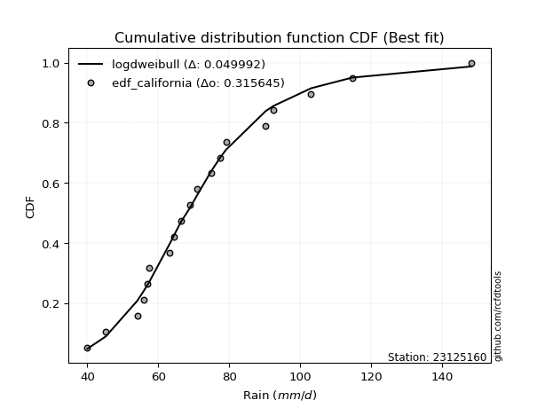</img>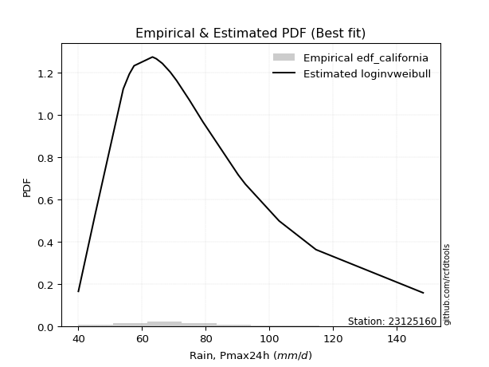</img>

</div>


### 2. EDF Hazen (1930)

Hazen method for plotting positions is a formula used to estimate the empirical cumulative probability distribution of flood events or other hydrological data. This formula often results in biased estimations, particularly when extrapolating to extreme events (high return periods).

<div align="center">


$P=(m-0.5)/n$


</div>


**2.1. Empirical values**

<div align="center">

|                | 0                   | 1                   | 2                   | 3                   | 4                   | 5                  | 6                   | 7                   | 8                  | 9         | 10                 | 11                 | 12                 | 13                 | 14                 | 15                 | 16                | 17                 | 18                 |
|:---------------|:--------------------|:--------------------|:--------------------|:--------------------|:--------------------|:-------------------|:--------------------|:--------------------|:-------------------|:----------|:-------------------|:-------------------|:-------------------|:-------------------|:-------------------|:-------------------|:------------------|:-------------------|:-------------------|
| date           | 2006                | 2022                | 2009                | 2021                | 2025                | 2013               | 2008                | 2014                | 2018               | 2005      | 2015               | 2016               | 2010               | 2011               | 2017               | 2019               | 2012              | 2020               | 2007               |
| x              | 40.0                | 45.2                | 54.1                | 56.0                | 56.8                | 57.5               | 63.3                | 64.5                | 66.4               | 68.9      | 70.9               | 74.9               | 77.4               | 79.1               | 90.3               | 92.5               | 103.1             | 114.7              | 148.4              |
| m              | 1                   | 2                   | 3                   | 4                   | 5                   | 6                  | 7                   | 8                   | 9                  | 10        | 11                 | 12                 | 13                 | 14                 | 15                 | 16                 | 17                | 18                 | 19                 |
| empirical_dist | edf_hazen           | edf_hazen           | edf_hazen           | edf_hazen           | edf_hazen           | edf_hazen          | edf_hazen           | edf_hazen           | edf_hazen          | edf_hazen | edf_hazen          | edf_hazen          | edf_hazen          | edf_hazen          | edf_hazen          | edf_hazen          | edf_hazen         | edf_hazen          | edf_hazen          |
| empirical      | 0.02631578947368421 | 0.07894736842105263 | 0.13157894736842105 | 0.18421052631578946 | 0.23684210526315788 | 0.2894736842105263 | 0.34210526315789475 | 0.39473684210526316 | 0.4473684210526316 | 0.5       | 0.5526315789473685 | 0.6052631578947368 | 0.6578947368421053 | 0.7105263157894737 | 0.7631578947368421 | 0.8157894736842105 | 0.868421052631579 | 0.9210526315789473 | 0.9736842105263158 |
| empirical_tr   | 1.027027027027027   | 1.0857142857142856  | 1.1515151515151514  | 1.2258064516129032  | 1.3103448275862069  | 1.4074074074074074 | 1.5199999999999998  | 1.6521739130434783  | 1.8095238095238098 | 2.0       | 2.235294117647059  | 2.533333333333333  | 2.9230769230769234 | 3.4545454545454546 | 4.222222222222223  | 5.428571428571428  | 7.600000000000002 | 12.666666666666663 | 38.00000000000004  |

</div>


**2.2. Kolmogorov-Smirnov fit test (sorted by Δ)**


<div align="center">

|                | 0                    | 1                    | 2                    | 3                    | 4                    | 5                   | 6                   | 7                   | 8                   | 9                    | 10                  | 11                  | 12                  | 13                   | 14                  | 15                  | 16                  | 17                   | 18                   | 19                  | 20                  | 21                   | 22                  | 23                  | 24                   | 25                  | 26                  | 27                  | 28                  | 29                  | 30                  | 31                  | 32                  | 33                  | 34                  | 35                  | 36                  | 37                  | 38                  | 39                  | 40                  | 41                  | 42                  | 43                  | 44                  | 45                  | 46                  | 47                  | 48                  | 49                  | 50                  | 51                  | 52                  | 53                  | 54                  | 55                  | 56                  | 57                  | 58                  | 59                  | 60                  | 61                  | 62                  | 63                  | 64                  | 65                  | 66                  | 67                  | 68                  | 69                  | 70                  | 71                  | 72                  | 73                  | 74                  | 75                  | 76                  | 77                  | 78                  | 79                  | 80                  | 81                  | 82                  | 83                  | 84                  | 85                  | 86                  | 87                  | 88                  | 89                  | 90                  | 91                  | 92                  | 93                  | 94                  | 95                  | 96                  | 97                  | 98                  | 99                  | 100                 | 101                 | 102                 | 103                 | 104                 | 105                 | 106                 | 107                 | 108                 | 109                 | 110                 | 111                 | 112                 | 113                 | 114                 | 115                 | 116                 | 117                 | 118                 | 119                 | 120                 | 121                 | 122                 | 123                 | 124                 | 125                 | 126                 | 127                 | 128                 | 129                 | 130                 | 131                 | 132                 | 133                 | 134                 | 135                 | 136                 | 137                 | 138                 | 139                 | 140                 | 141                 | 142                 | 143                 | 144                 | 145                 | 146                 | 147                 | 148                 | 149                 | 150                 | 151                 | 152                 | 153                 | 154                 | 155                 | 156                 | 157                 | 158                 | 159                 |
|:---------------|:---------------------|:---------------------|:---------------------|:---------------------|:---------------------|:--------------------|:--------------------|:--------------------|:--------------------|:---------------------|:--------------------|:--------------------|:--------------------|:---------------------|:--------------------|:--------------------|:--------------------|:---------------------|:---------------------|:--------------------|:--------------------|:---------------------|:--------------------|:--------------------|:---------------------|:--------------------|:--------------------|:--------------------|:--------------------|:--------------------|:--------------------|:--------------------|:--------------------|:--------------------|:--------------------|:--------------------|:--------------------|:--------------------|:--------------------|:--------------------|:--------------------|:--------------------|:--------------------|:--------------------|:--------------------|:--------------------|:--------------------|:--------------------|:--------------------|:--------------------|:--------------------|:--------------------|:--------------------|:--------------------|:--------------------|:--------------------|:--------------------|:--------------------|:--------------------|:--------------------|:--------------------|:--------------------|:--------------------|:--------------------|:--------------------|:--------------------|:--------------------|:--------------------|:--------------------|:--------------------|:--------------------|:--------------------|:--------------------|:--------------------|:--------------------|:--------------------|:--------------------|:--------------------|:--------------------|:--------------------|:--------------------|:--------------------|:--------------------|:--------------------|:--------------------|:--------------------|:--------------------|:--------------------|:--------------------|:--------------------|:--------------------|:--------------------|:--------------------|:--------------------|:--------------------|:--------------------|:--------------------|:--------------------|:--------------------|:--------------------|:--------------------|:--------------------|:--------------------|:--------------------|:--------------------|:--------------------|:--------------------|:--------------------|:--------------------|:--------------------|:--------------------|:--------------------|:--------------------|:--------------------|:--------------------|:--------------------|:--------------------|:--------------------|:--------------------|:--------------------|:--------------------|:--------------------|:--------------------|:--------------------|:--------------------|:--------------------|:--------------------|:--------------------|:--------------------|:--------------------|:--------------------|:--------------------|:--------------------|:--------------------|:--------------------|:--------------------|:--------------------|:--------------------|:--------------------|:--------------------|:--------------------|:--------------------|:--------------------|:--------------------|:--------------------|:--------------------|:--------------------|:--------------------|:--------------------|:--------------------|:--------------------|:--------------------|:--------------------|:--------------------|:--------------------|:--------------------|:--------------------|:--------------------|:--------------------|:--------------------|
| station        | 23125160             | 23125160             | 23125160             | 23125160             | 23125160             | 23125160            | 23125160            | 23125160            | 23125160            | 23125160             | 23125160            | 23125160            | 23125160            | 23125160             | 23125160            | 23125160            | 23125160            | 23125160             | 23125160             | 23125160            | 23125160            | 23125160             | 23125160            | 23125160            | 23125160             | 23125160            | 23125160            | 23125160            | 23125160            | 23125160            | 23125160            | 23125160            | 23125160            | 23125160            | 23125160            | 23125160            | 23125160            | 23125160            | 23125160            | 23125160            | 23125160            | 23125160            | 23125160            | 23125160            | 23125160            | 23125160            | 23125160            | 23125160            | 23125160            | 23125160            | 23125160            | 23125160            | 23125160            | 23125160            | 23125160            | 23125160            | 23125160            | 23125160            | 23125160            | 23125160            | 23125160            | 23125160            | 23125160            | 23125160            | 23125160            | 23125160            | 23125160            | 23125160            | 23125160            | 23125160            | 23125160            | 23125160            | 23125160            | 23125160            | 23125160            | 23125160            | 23125160            | 23125160            | 23125160            | 23125160            | 23125160            | 23125160            | 23125160            | 23125160            | 23125160            | 23125160            | 23125160            | 23125160            | 23125160            | 23125160            | 23125160            | 23125160            | 23125160            | 23125160            | 23125160            | 23125160            | 23125160            | 23125160            | 23125160            | 23125160            | 23125160            | 23125160            | 23125160            | 23125160            | 23125160            | 23125160            | 23125160            | 23125160            | 23125160            | 23125160            | 23125160            | 23125160            | 23125160            | 23125160            | 23125160            | 23125160            | 23125160            | 23125160            | 23125160            | 23125160            | 23125160            | 23125160            | 23125160            | 23125160            | 23125160            | 23125160            | 23125160            | 23125160            | 23125160            | 23125160            | 23125160            | 23125160            | 23125160            | 23125160            | 23125160            | 23125160            | 23125160            | 23125160            | 23125160            | 23125160            | 23125160            | 23125160            | 23125160            | 23125160            | 23125160            | 23125160            | 23125160            | 23125160            | 23125160            | 23125160            | 23125160            | 23125160            | 23125160            | 23125160            | 23125160            | 23125160            | 23125160            | 23125160            | 23125160            | 23125160            |
| empirical_dist | edf_hazen            | edf_hazen            | edf_hazen            | edf_hazen            | edf_hazen            | edf_hazen           | edf_hazen           | edf_hazen           | edf_hazen           | edf_hazen            | edf_hazen           | edf_hazen           | edf_hazen           | edf_hazen            | edf_hazen           | edf_hazen           | edf_hazen           | edf_hazen            | edf_hazen            | edf_hazen           | edf_hazen           | edf_hazen            | edf_hazen           | edf_hazen           | edf_hazen            | edf_hazen           | edf_hazen           | edf_hazen           | edf_hazen           | edf_hazen           | edf_hazen           | edf_hazen           | edf_hazen           | edf_hazen           | edf_hazen           | edf_hazen           | edf_hazen           | edf_hazen           | edf_hazen           | edf_hazen           | edf_hazen           | edf_hazen           | edf_hazen           | edf_hazen           | edf_hazen           | edf_hazen           | edf_hazen           | edf_hazen           | edf_hazen           | edf_hazen           | edf_hazen           | edf_hazen           | edf_hazen           | edf_hazen           | edf_hazen           | edf_hazen           | edf_hazen           | edf_hazen           | edf_hazen           | edf_hazen           | edf_hazen           | edf_hazen           | edf_hazen           | edf_hazen           | edf_hazen           | edf_hazen           | edf_hazen           | edf_hazen           | edf_hazen           | edf_hazen           | edf_hazen           | edf_hazen           | edf_hazen           | edf_hazen           | edf_hazen           | edf_hazen           | edf_hazen           | edf_hazen           | edf_hazen           | edf_hazen           | edf_hazen           | edf_hazen           | edf_hazen           | edf_hazen           | edf_hazen           | edf_hazen           | edf_hazen           | edf_hazen           | edf_hazen           | edf_hazen           | edf_hazen           | edf_hazen           | edf_hazen           | edf_hazen           | edf_hazen           | edf_hazen           | edf_hazen           | edf_hazen           | edf_hazen           | edf_hazen           | edf_hazen           | edf_hazen           | edf_hazen           | edf_hazen           | edf_hazen           | edf_hazen           | edf_hazen           | edf_hazen           | edf_hazen           | edf_hazen           | edf_hazen           | edf_hazen           | edf_hazen           | edf_hazen           | edf_hazen           | edf_hazen           | edf_hazen           | edf_hazen           | edf_hazen           | edf_hazen           | edf_hazen           | edf_hazen           | edf_hazen           | edf_hazen           | edf_hazen           | edf_hazen           | edf_hazen           | edf_hazen           | edf_hazen           | edf_hazen           | edf_hazen           | edf_hazen           | edf_hazen           | edf_hazen           | edf_hazen           | edf_hazen           | edf_hazen           | edf_hazen           | edf_hazen           | edf_hazen           | edf_hazen           | edf_hazen           | edf_hazen           | edf_hazen           | edf_hazen           | edf_hazen           | edf_hazen           | edf_hazen           | edf_hazen           | edf_hazen           | edf_hazen           | edf_hazen           | edf_hazen           | edf_hazen           | edf_hazen           | edf_hazen           | edf_hazen           | edf_hazen           | edf_hazen           | edf_hazen           |
| p_dist         | logburr              | exponnorm            | mielke               | loggenlogistic       | burr                 | logmielke           | logburr12           | logexponnorm        | alpha               | moyal                | loggennorm          | invweibull          | genextreme          | logskewnorm          | nct                 | logalpha            | loginvgamma         | logjohnsonsu         | invgamma             | loggumbel_r         | logfatiguelife      | f                    | logpearson3         | loggenextreme       | logweibull_max       | logf                | loggamma            | loggamma            | logerlang           | lognct              | logncf              | loginvgauss         | betaprime           | genlogistic         | johnsonsu           | logbetaprime        | invgauss            | loglogistic         | logjohnsonsb        | logmaxwell          | lognakagami         | johnsonsb           | logloglaplace       | logrice             | logbeta             | weibull_min         | lograyleigh         | logweibull_min      | gumbel_r            | logdweibull         | loginvweibull       | gamma               | erlang              | logvonmises_line    | logmoyal            | pearson3            | halflogistic        | logt                | logcrystalball      | lognorm             | logexponweib        | logdgamma           | loghypsecant        | loggengamma         | logloggamma         | tukeylambda         | dweibull            | logfoldnorm         | kstwobign           | loghalfnorm         | dgamma              | logtriang           | gennorm             | loganglit           | loghalflogistic     | logkstwobign        | loglaplace          | loglaplace          | logsemicircular     | kappa3              | logexponpow         | halfnorm            | rayleigh            | genhalflogistic     | loggompertz         | loggenexpon         | wald                | foldnorm            | maxwell             | rice                | logwald             | logcosine           | skewnorm            | gompertz            | logtruncweibull_min | t                   | beta                | hypsecant           | loggumbel_l         | logistic            | nakagami            | gausshyper          | truncnorm           | norm                | crystalball         | truncweibull_min    | loggausshyper       | laplace             | logarcsine          | anglit              | semicircular        | logbradford         | loghalfgennorm      | arcsine             | logtruncexpon       | vonmises_line       | loguniform          | logkappa3           | logtukeylambda      | triang              | logksone            | genexpon            | exponpow            | logkappa4           | logrdist            | gumbel_l            | truncexpon          | cosine              | genpareto           | logargus            | bradford            | loglomax            | burr12              | logwrapcauchy       | kappa4              | ncf                 | halfgennorm         | logtruncpareto      | ksone               | argus               | uniform             | loggenhalflogistic  | logtruncnorm        | wrapcauchy          | lomax               | powerlaw            | loggenpareto        | loglevy_l           | logtrapezoid        | logpowerlaw         | levy_l              | rdist               | fatiguelife         | trapezoid           | gengamma            | exponweib           | weibull_max         | truncpareto         | logvonmises         | vonmises            |
| delta          | 0.045928552168140374 | 0.046896607335188994 | 0.048608783632483527 | 0.048620323290189976 | 0.048644970353693445 | 0.04870264640550748 | 0.04960581538255751 | 0.05225308764233219 | 0.05433530394538613 | 0.055471287981668754 | 0.05587326220946806 | 0.05615606088285674 | 0.05615636299221091 | 0.056417013619464745 | 0.05706879057347339 | 0.05782932852277625 | 0.05841826259248439 | 0.058839886462605434 | 0.059120752342621596 | 0.05922488925379216 | 0.05945339240383765 | 0.059617743956234204 | 0.05980710145331966 | 0.05993591129432535 | 0.059958293786368466 | 0.06016177018581151 | 0.06039285506693054 | 0.06039285506693054 | 0.06039303993546494 | 0.06041837041966702 | 0.06061886444322995 | 0.06074754222167553 | 0.06256653370005982 | 0.06300305162267994 | 0.06312603176015466 | 0.06508359910839256 | 0.06605033511401473 | 0.066165503845238   | 0.06763852589162186 | 0.06781756545343628 | 0.06870130999911003 | 0.06878133180532711 | 0.06963224868125695 | 0.07046508634189028 | 0.07169847442611205 | 0.07211544575143343 | 0.07216897822708054 | 0.07349089540260698 | 0.07619407533487799 | 0.07630796145778071 | 0.07665832753851523 | 0.07677309643550584 | 0.0767736876807775  | 0.07705653239999502 | 0.07743062497606651 | 0.0774727253894616  | 0.07805434796777921 | 0.079083655530094   | 0.07915719538272215 | 0.07915724951681402 | 0.07934171852554328 | 0.0802086205916196  | 0.08096136739066823 | 0.08143425896443485 | 0.08264548128113913 | 0.08411115075259123 | 0.08718971038051274 | 0.0874641149718309  | 0.08849153154351885 | 0.08878565550752987 | 0.09152405122722429 | 0.09166893519891528 | 0.09562884887838355 | 0.09684846289256444 | 0.09729658149229992 | 0.0974593925737989  | 0.1002891010177614  | 0.1002891010177614  | 0.10423599498460512 | 0.10569337519038191 | 0.1061200777710247  | 0.10633836719735754 | 0.10686592910336346 | 0.10763199376101568 | 0.10783431124554729 | 0.11007126833878139 | 0.11025376926228425 | 0.11421065557424068 | 0.11619345658557234 | 0.12152740088765501 | 0.12246686144128581 | 0.12369799370994883 | 0.12434321309032106 | 0.12724372945386067 | 0.1283866394847741  | 0.12875577011119335 | 0.12927869520192922 | 0.13154327554948514 | 0.13227636815837984 | 0.13687591776473118 | 0.1405045953021736  | 0.14451493419297542 | 0.14551742161649728 | 0.14554436818111172 | 0.14554437328252345 | 0.15073548722773866 | 0.1534556965971572  | 0.15358021874727235 | 0.1538787058609196  | 0.15471453447453332 | 0.15850494084471467 | 0.16078188236031352 | 0.16421869520454999 | 0.1736178973842074  | 0.17711266853481547 | 0.17952082177576434 | 0.19045244663393246 | 0.19092237482039176 | 0.19092740335772018 | 0.19685729053945544 | 0.1995875876259693  | 0.20045931643099893 | 0.20215368115658985 | 0.2062554420706706  | 0.2080807970156764  | 0.2108248144639362  | 0.22707496778342273 | 0.23755227314945737 | 0.2402163087404379  | 0.24532758996376458 | 0.2690310081163383  | 0.2755394005760742  | 0.27669199254210863 | 0.2816229104470689  | 0.29798294535592285 | 0.29811594108763384 | 0.32171306834039615 | 0.32261743714514335 | 0.3288583543730174  | 0.3463349341926828  | 0.3498252087784036  | 0.3629557237501587  | 0.3644785389637484  | 0.3649076478483284  | 0.36555201807446214 | 0.3958651690793509  | 0.41769528460319183 | 0.4267889405414532  | 0.4435182580050826  | 0.45132997335342995 | 0.4761941172259433  | 0.5143905057031251  | 0.5645560586367304  | 0.578687558730559   | 0.6101548554047567  | 0.6705463656076392  | 0.7797283245921842  | 0.8330238554428022  | 1.056757585227914   | 22.913601901249     |
| deltao         | 0.31564497164100014  | 0.31564497164100014  | 0.31564497164100014  | 0.31564497164100014  | 0.31564497164100014  | 0.31564497164100014 | 0.31564497164100014 | 0.31564497164100014 | 0.31564497164100014 | 0.31564497164100014  | 0.31564497164100014 | 0.31564497164100014 | 0.31564497164100014 | 0.31564497164100014  | 0.31564497164100014 | 0.31564497164100014 | 0.31564497164100014 | 0.31564497164100014  | 0.31564497164100014  | 0.31564497164100014 | 0.31564497164100014 | 0.31564497164100014  | 0.31564497164100014 | 0.31564497164100014 | 0.31564497164100014  | 0.31564497164100014 | 0.31564497164100014 | 0.31564497164100014 | 0.31564497164100014 | 0.31564497164100014 | 0.31564497164100014 | 0.31564497164100014 | 0.31564497164100014 | 0.31564497164100014 | 0.31564497164100014 | 0.31564497164100014 | 0.31564497164100014 | 0.31564497164100014 | 0.31564497164100014 | 0.31564497164100014 | 0.31564497164100014 | 0.31564497164100014 | 0.31564497164100014 | 0.31564497164100014 | 0.31564497164100014 | 0.31564497164100014 | 0.31564497164100014 | 0.31564497164100014 | 0.31564497164100014 | 0.31564497164100014 | 0.31564497164100014 | 0.31564497164100014 | 0.31564497164100014 | 0.31564497164100014 | 0.31564497164100014 | 0.31564497164100014 | 0.31564497164100014 | 0.31564497164100014 | 0.31564497164100014 | 0.31564497164100014 | 0.31564497164100014 | 0.31564497164100014 | 0.31564497164100014 | 0.31564497164100014 | 0.31564497164100014 | 0.31564497164100014 | 0.31564497164100014 | 0.31564497164100014 | 0.31564497164100014 | 0.31564497164100014 | 0.31564497164100014 | 0.31564497164100014 | 0.31564497164100014 | 0.31564497164100014 | 0.31564497164100014 | 0.31564497164100014 | 0.31564497164100014 | 0.31564497164100014 | 0.31564497164100014 | 0.31564497164100014 | 0.31564497164100014 | 0.31564497164100014 | 0.31564497164100014 | 0.31564497164100014 | 0.31564497164100014 | 0.31564497164100014 | 0.31564497164100014 | 0.31564497164100014 | 0.31564497164100014 | 0.31564497164100014 | 0.31564497164100014 | 0.31564497164100014 | 0.31564497164100014 | 0.31564497164100014 | 0.31564497164100014 | 0.31564497164100014 | 0.31564497164100014 | 0.31564497164100014 | 0.31564497164100014 | 0.31564497164100014 | 0.31564497164100014 | 0.31564497164100014 | 0.31564497164100014 | 0.31564497164100014 | 0.31564497164100014 | 0.31564497164100014 | 0.31564497164100014 | 0.31564497164100014 | 0.31564497164100014 | 0.31564497164100014 | 0.31564497164100014 | 0.31564497164100014 | 0.31564497164100014 | 0.31564497164100014 | 0.31564497164100014 | 0.31564497164100014 | 0.31564497164100014 | 0.31564497164100014 | 0.31564497164100014 | 0.31564497164100014 | 0.31564497164100014 | 0.31564497164100014 | 0.31564497164100014 | 0.31564497164100014 | 0.31564497164100014 | 0.31564497164100014 | 0.31564497164100014 | 0.31564497164100014 | 0.31564497164100014 | 0.31564497164100014 | 0.31564497164100014 | 0.31564497164100014 | 0.31564497164100014 | 0.31564497164100014 | 0.31564497164100014 | 0.31564497164100014 | 0.31564497164100014 | 0.31564497164100014 | 0.31564497164100014 | 0.31564497164100014 | 0.31564497164100014 | 0.31564497164100014 | 0.31564497164100014 | 0.31564497164100014 | 0.31564497164100014 | 0.31564497164100014 | 0.31564497164100014 | 0.31564497164100014 | 0.31564497164100014 | 0.31564497164100014 | 0.31564497164100014 | 0.31564497164100014 | 0.31564497164100014 | 0.31564497164100014 | 0.31564497164100014 | 0.31564497164100014 | 0.31564497164100014 | 0.31564497164100014 | 0.31564497164100014 | 0.31564497164100014 |
| eval           | Δo > Δ               | Δo > Δ               | Δo > Δ               | Δo > Δ               | Δo > Δ               | Δo > Δ              | Δo > Δ              | Δo > Δ              | Δo > Δ              | Δo > Δ               | Δo > Δ              | Δo > Δ              | Δo > Δ              | Δo > Δ               | Δo > Δ              | Δo > Δ              | Δo > Δ              | Δo > Δ               | Δo > Δ               | Δo > Δ              | Δo > Δ              | Δo > Δ               | Δo > Δ              | Δo > Δ              | Δo > Δ               | Δo > Δ              | Δo > Δ              | Δo > Δ              | Δo > Δ              | Δo > Δ              | Δo > Δ              | Δo > Δ              | Δo > Δ              | Δo > Δ              | Δo > Δ              | Δo > Δ              | Δo > Δ              | Δo > Δ              | Δo > Δ              | Δo > Δ              | Δo > Δ              | Δo > Δ              | Δo > Δ              | Δo > Δ              | Δo > Δ              | Δo > Δ              | Δo > Δ              | Δo > Δ              | Δo > Δ              | Δo > Δ              | Δo > Δ              | Δo > Δ              | Δo > Δ              | Δo > Δ              | Δo > Δ              | Δo > Δ              | Δo > Δ              | Δo > Δ              | Δo > Δ              | Δo > Δ              | Δo > Δ              | Δo > Δ              | Δo > Δ              | Δo > Δ              | Δo > Δ              | Δo > Δ              | Δo > Δ              | Δo > Δ              | Δo > Δ              | Δo > Δ              | Δo > Δ              | Δo > Δ              | Δo > Δ              | Δo > Δ              | Δo > Δ              | Δo > Δ              | Δo > Δ              | Δo > Δ              | Δo > Δ              | Δo > Δ              | Δo > Δ              | Δo > Δ              | Δo > Δ              | Δo > Δ              | Δo > Δ              | Δo > Δ              | Δo > Δ              | Δo > Δ              | Δo > Δ              | Δo > Δ              | Δo > Δ              | Δo > Δ              | Δo > Δ              | Δo > Δ              | Δo > Δ              | Δo > Δ              | Δo > Δ              | Δo > Δ              | Δo > Δ              | Δo > Δ              | Δo > Δ              | Δo > Δ              | Δo > Δ              | Δo > Δ              | Δo > Δ              | Δo > Δ              | Δo > Δ              | Δo > Δ              | Δo > Δ              | Δo > Δ              | Δo > Δ              | Δo > Δ              | Δo > Δ              | Δo > Δ              | Δo > Δ              | Δo > Δ              | Δo > Δ              | Δo > Δ              | Δo > Δ              | Δo > Δ              | Δo > Δ              | Δo > Δ              | Δo > Δ              | Δo > Δ              | Δo > Δ              | Δo > Δ              | Δo > Δ              | Δo > Δ              | Δo > Δ              | Δo > Δ              | Δo > Δ              | Δo > Δ              | Δo > Δ              | Δo > Δ              | Δo > Δ              | Δo > Δ              | Δo <= Δ             | Δo <= Δ             | Δo <= Δ             | Δo <= Δ             | Δo <= Δ             | Δo <= Δ             | Δo <= Δ             | Δo <= Δ             | Δo <= Δ             | Δo <= Δ             | Δo <= Δ             | Δo <= Δ             | Δo <= Δ             | Δo <= Δ             | Δo <= Δ             | Δo <= Δ             | Δo <= Δ             | Δo <= Δ             | Δo <= Δ             | Δo <= Δ             | Δo <= Δ             | Δo <= Δ             | Δo <= Δ             | Δo <= Δ             |
| fit            | 1                    | 1                    | 1                    | 1                    | 1                    | 1                   | 1                   | 1                   | 1                   | 1                    | 1                   | 1                   | 1                   | 1                    | 1                   | 1                   | 1                   | 1                    | 1                    | 1                   | 1                   | 1                    | 1                   | 1                   | 1                    | 1                   | 1                   | 1                   | 1                   | 1                   | 1                   | 1                   | 1                   | 1                   | 1                   | 1                   | 1                   | 1                   | 1                   | 1                   | 1                   | 1                   | 1                   | 1                   | 1                   | 1                   | 1                   | 1                   | 1                   | 1                   | 1                   | 1                   | 1                   | 1                   | 1                   | 1                   | 1                   | 1                   | 1                   | 1                   | 1                   | 1                   | 1                   | 1                   | 1                   | 1                   | 1                   | 1                   | 1                   | 1                   | 1                   | 1                   | 1                   | 1                   | 1                   | 1                   | 1                   | 1                   | 1                   | 1                   | 1                   | 1                   | 1                   | 1                   | 1                   | 1                   | 1                   | 1                   | 1                   | 1                   | 1                   | 1                   | 1                   | 1                   | 1                   | 1                   | 1                   | 1                   | 1                   | 1                   | 1                   | 1                   | 1                   | 1                   | 1                   | 1                   | 1                   | 1                   | 1                   | 1                   | 1                   | 1                   | 1                   | 1                   | 1                   | 1                   | 1                   | 1                   | 1                   | 1                   | 1                   | 1                   | 1                   | 1                   | 1                   | 1                   | 1                   | 1                   | 1                   | 1                   | 1                   | 1                   | 1                   | 1                   | 1                   | 1                   | 0                   | 0                   | 0                   | 0                   | 0                   | 0                   | 0                   | 0                   | 0                   | 0                   | 0                   | 0                   | 0                   | 0                   | 0                   | 0                   | 0                   | 0                   | 0                   | 0                   | 0                   | 0                   | 0                   | 0                   |
| n              | 19                   | 19                   | 19                   | 19                   | 19                   | 19                  | 19                  | 19                  | 19                  | 19                   | 19                  | 19                  | 19                  | 19                   | 19                  | 19                  | 19                  | 19                   | 19                   | 19                  | 19                  | 19                   | 19                  | 19                  | 19                   | 19                  | 19                  | 19                  | 19                  | 19                  | 19                  | 19                  | 19                  | 19                  | 19                  | 19                  | 19                  | 19                  | 19                  | 19                  | 19                  | 19                  | 19                  | 19                  | 19                  | 19                  | 19                  | 19                  | 19                  | 19                  | 19                  | 19                  | 19                  | 19                  | 19                  | 19                  | 19                  | 19                  | 19                  | 19                  | 19                  | 19                  | 19                  | 19                  | 19                  | 19                  | 19                  | 19                  | 19                  | 19                  | 19                  | 19                  | 19                  | 19                  | 19                  | 19                  | 19                  | 19                  | 19                  | 19                  | 19                  | 19                  | 19                  | 19                  | 19                  | 19                  | 19                  | 19                  | 19                  | 19                  | 19                  | 19                  | 19                  | 19                  | 19                  | 19                  | 19                  | 19                  | 19                  | 19                  | 19                  | 19                  | 19                  | 19                  | 19                  | 19                  | 19                  | 19                  | 19                  | 19                  | 19                  | 19                  | 19                  | 19                  | 19                  | 19                  | 19                  | 19                  | 19                  | 19                  | 19                  | 19                  | 19                  | 19                  | 19                  | 19                  | 19                  | 19                  | 19                  | 19                  | 19                  | 19                  | 19                  | 19                  | 19                  | 19                  | 19                  | 19                  | 19                  | 19                  | 19                  | 19                  | 19                  | 19                  | 19                  | 19                  | 19                  | 19                  | 19                  | 19                  | 19                  | 19                  | 19                  | 19                  | 19                  | 19                  | 19                  | 19                  | 19                  | 19                  |
| best_fit       | 1                    | 0                    | 0                    | 0                    | 0                    | 0                   | 0                   | 0                   | 0                   | 0                    | 0                   | 0                   | 0                   | 0                    | 0                   | 0                   | 0                   | 0                    | 0                    | 0                   | 0                   | 0                    | 0                   | 0                   | 0                    | 0                   | 0                   | 0                   | 0                   | 0                   | 0                   | 0                   | 0                   | 0                   | 0                   | 0                   | 0                   | 0                   | 0                   | 0                   | 0                   | 0                   | 0                   | 0                   | 0                   | 0                   | 0                   | 0                   | 0                   | 0                   | 0                   | 0                   | 0                   | 0                   | 0                   | 0                   | 0                   | 0                   | 0                   | 0                   | 0                   | 0                   | 0                   | 0                   | 0                   | 0                   | 0                   | 0                   | 0                   | 0                   | 0                   | 0                   | 0                   | 0                   | 0                   | 0                   | 0                   | 0                   | 0                   | 0                   | 0                   | 0                   | 0                   | 0                   | 0                   | 0                   | 0                   | 0                   | 0                   | 0                   | 0                   | 0                   | 0                   | 0                   | 0                   | 0                   | 0                   | 0                   | 0                   | 0                   | 0                   | 0                   | 0                   | 0                   | 0                   | 0                   | 0                   | 0                   | 0                   | 0                   | 0                   | 0                   | 0                   | 0                   | 0                   | 0                   | 0                   | 0                   | 0                   | 0                   | 0                   | 0                   | 0                   | 0                   | 0                   | 0                   | 0                   | 0                   | 0                   | 0                   | 0                   | 0                   | 0                   | 0                   | 0                   | 0                   | 0                   | 0                   | 0                   | 0                   | 0                   | 0                   | 0                   | 0                   | 0                   | 0                   | 0                   | 0                   | 0                   | 0                   | 0                   | 0                   | 0                   | 0                   | 0                   | 0                   | 0                   | 0                   | 0                   | 0                   |
| best_fit_sort  | 1                    | 2                    | 3                    | 4                    | 5                    | 6                   | 7                   | 8                   | 9                   | 10                   | 11                  | 12                  | 13                  | 14                   | 15                  | 16                  | 17                  | 18                   | 19                   | 20                  | 21                  | 22                   | 23                  | 24                  | 25                   | 26                  | 27                  | 28                  | 29                  | 30                  | 31                  | 32                  | 33                  | 34                  | 35                  | 36                  | 37                  | 38                  | 39                  | 40                  | 41                  | 42                  | 43                  | 44                  | 45                  | 46                  | 47                  | 48                  | 49                  | 50                  | 51                  | 52                  | 53                  | 54                  | 55                  | 56                  | 57                  | 58                  | 59                  | 60                  | 61                  | 62                  | 63                  | 64                  | 65                  | 66                  | 67                  | 68                  | 69                  | 70                  | 71                  | 72                  | 73                  | 74                  | 75                  | 76                  | 77                  | 78                  | 79                  | 80                  | 81                  | 82                  | 83                  | 84                  | 85                  | 86                  | 87                  | 88                  | 89                  | 90                  | 91                  | 92                  | 93                  | 94                  | 95                  | 96                  | 97                  | 98                  | 99                  | 100                 | 101                 | 102                 | 103                 | 104                 | 105                 | 106                 | 107                 | 108                 | 109                 | 110                 | 111                 | 112                 | 113                 | 114                 | 115                 | 116                 | 117                 | 118                 | 119                 | 120                 | 121                 | 122                 | 123                 | 124                 | 125                 | 126                 | 127                 | 128                 | 129                 | 130                 | 131                 | 132                 | 133                 | 134                 | 135                 | 136                 | 137                 | 138                 | 139                 | 140                 | 141                 | 142                 | 143                 | 144                 | 145                 | 146                 | 147                 | 148                 | 149                 | 150                 | 151                 | 152                 | 153                 | 154                 | 155                 | 156                 | 157                 | 158                 | 159                 | 160                 |

</div>


**2.3. Best fit**

<div align="center">

|   id |   station | empirical_dist   | p_dist   |     delta |   deltao | eval   |   fit |   n |   best_fit |   best_fit_sort |
|-----:|----------:|:-----------------|:---------|----------:|---------:|:-------|------:|----:|-----------:|----------------:|
|    0 |  23125160 | edf_hazen        | logburr  | 0.0459286 | 0.315645 | Δo > Δ |     1 |  19 |          1 |               1 |

</div>


<div align="center">

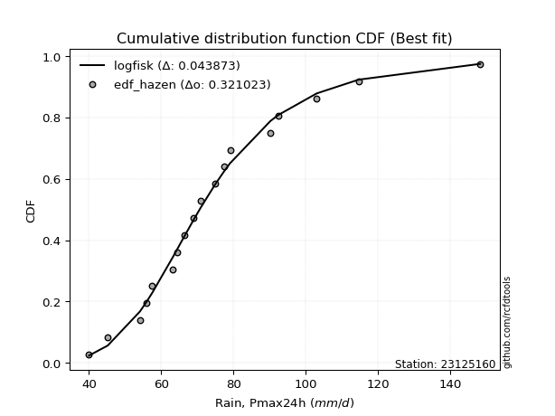</img>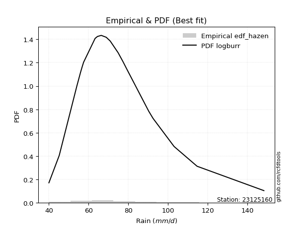</img>

</div>


### 3. EDF Weibull (1939)

Weibull plotting position formula is an empirical method used to estimate the non-exceedance probability or plotting position for a set of observed data, is often recommended or widely used in practice, particularly in flood frequency analysis.

<div align="center">


$P=m/(n+1)$


</div>


**3.1. Empirical values**

<div align="center">

|                | 0                  | 1                  | 2                  | 3           | 4                  | 5                  | 6                  | 7                  | 8                  | 9           | 10                 | 11          | 12                | 13                | 14          | 15                | 16                | 17                 | 18                 |
|:---------------|:-------------------|:-------------------|:-------------------|:------------|:-------------------|:-------------------|:-------------------|:-------------------|:-------------------|:------------|:-------------------|:------------|:------------------|:------------------|:------------|:------------------|:------------------|:-------------------|:-------------------|
| date           | 2006               | 2022               | 2009               | 2021        | 2025               | 2013               | 2008               | 2014               | 2018               | 2005        | 2015               | 2016        | 2010              | 2011              | 2017        | 2019              | 2012              | 2020               | 2007               |
| x              | 40.0               | 45.2               | 54.1               | 56.0        | 56.8               | 57.5               | 63.3               | 64.5               | 66.4               | 68.9        | 70.9               | 74.9        | 77.4              | 79.1              | 90.3        | 92.5              | 103.1             | 114.7              | 148.4              |
| m              | 1                  | 2                  | 3                  | 4           | 5                  | 6                  | 7                  | 8                  | 9                  | 10          | 11                 | 12          | 13                | 14                | 15          | 16                | 17                | 18                 | 19                 |
| empirical_dist | edf_weibull        | edf_weibull        | edf_weibull        | edf_weibull | edf_weibull        | edf_weibull        | edf_weibull        | edf_weibull        | edf_weibull        | edf_weibull | edf_weibull        | edf_weibull | edf_weibull       | edf_weibull       | edf_weibull | edf_weibull       | edf_weibull       | edf_weibull        | edf_weibull        |
| empirical      | 0.05               | 0.1                | 0.15               | 0.2         | 0.25               | 0.3                | 0.35               | 0.4                | 0.45               | 0.5         | 0.55               | 0.6         | 0.65              | 0.7               | 0.75        | 0.8               | 0.85              | 0.9                | 0.95               |
| empirical_tr   | 1.0526315789473684 | 1.1111111111111112 | 1.1764705882352942 | 1.25        | 1.3333333333333333 | 1.4285714285714286 | 1.5384615384615383 | 1.6666666666666667 | 1.8181818181818181 | 2.0         | 2.2222222222222223 | 2.5         | 2.857142857142857 | 3.333333333333333 | 4.0         | 5.000000000000001 | 6.666666666666666 | 10.000000000000002 | 19.999999999999982 |

</div>


**3.2. Kolmogorov-Smirnov fit test (sorted by Δ)**


<div align="center">

|                | 0                   | 1                    | 2                   | 3                    | 4                    | 5                    | 6                   | 7                    | 8                   | 9                   | 10                  | 11                  | 12                  | 13                  | 14                   | 15                  | 16                   | 17                  | 18                  | 19                  | 20                  | 21                   | 22                   | 23                   | 24                  | 25                  | 26                  | 27                   | 28                  | 29                   | 30                  | 31                   | 32                  | 33                   | 34                  | 35                  | 36                  | 37                  | 38                  | 39                  | 40                  | 41                  | 42                  | 43                  | 44                  | 45                   | 46                  | 47                  | 48                  | 49                  | 50                  | 51                  | 52                  | 53                  | 54                  | 55                  | 56                  | 57                  | 58                  | 59                  | 60                  | 61                  | 62                  | 63                  | 64                  | 65                  | 66                  | 67                  | 68                  | 69                  | 70                  | 71                  | 72                  | 73                  | 74                  | 75                  | 76                  | 77                  | 78                  | 79                  | 80                  | 81                  | 82                  | 83                  | 84                  | 85                  | 86                  | 87                  | 88                  | 89                  | 90                  | 91                  | 92                  | 93                  | 94                  | 95                  | 96                  | 97                  | 98                  | 99                  | 100                 | 101                 | 102                 | 103                 | 104                 | 105                 | 106                 | 107                 | 108                 | 109                 | 110                 | 111                 | 112                 | 113                 | 114                 | 115                 | 116                 | 117                 | 118                 | 119                 | 120                 | 121                 | 122                 | 123                 | 124                 | 125                 | 126                 | 127                 | 128                 | 129                 | 130                 | 131                 | 132                 | 133                 | 134                 | 135                 | 136                 | 137                 | 138                 | 139                 | 140                 | 141                 | 142                 | 143                 | 144                 | 145                 | 146                 | 147                 | 148                 | 149                 | 150                 | 151                 | 152                 | 153                 | 154                 | 155                 | 156                 | 157                 | 158                 | 159                 |
|:---------------|:--------------------|:---------------------|:--------------------|:---------------------|:---------------------|:---------------------|:--------------------|:---------------------|:--------------------|:--------------------|:--------------------|:--------------------|:--------------------|:--------------------|:---------------------|:--------------------|:---------------------|:--------------------|:--------------------|:--------------------|:--------------------|:---------------------|:---------------------|:---------------------|:--------------------|:--------------------|:--------------------|:---------------------|:--------------------|:---------------------|:--------------------|:---------------------|:--------------------|:---------------------|:--------------------|:--------------------|:--------------------|:--------------------|:--------------------|:--------------------|:--------------------|:--------------------|:--------------------|:--------------------|:--------------------|:---------------------|:--------------------|:--------------------|:--------------------|:--------------------|:--------------------|:--------------------|:--------------------|:--------------------|:--------------------|:--------------------|:--------------------|:--------------------|:--------------------|:--------------------|:--------------------|:--------------------|:--------------------|:--------------------|:--------------------|:--------------------|:--------------------|:--------------------|:--------------------|:--------------------|:--------------------|:--------------------|:--------------------|:--------------------|:--------------------|:--------------------|:--------------------|:--------------------|:--------------------|:--------------------|:--------------------|:--------------------|:--------------------|:--------------------|:--------------------|:--------------------|:--------------------|:--------------------|:--------------------|:--------------------|:--------------------|:--------------------|:--------------------|:--------------------|:--------------------|:--------------------|:--------------------|:--------------------|:--------------------|:--------------------|:--------------------|:--------------------|:--------------------|:--------------------|:--------------------|:--------------------|:--------------------|:--------------------|:--------------------|:--------------------|:--------------------|:--------------------|:--------------------|:--------------------|:--------------------|:--------------------|:--------------------|:--------------------|:--------------------|:--------------------|:--------------------|:--------------------|:--------------------|:--------------------|:--------------------|:--------------------|:--------------------|:--------------------|:--------------------|:--------------------|:--------------------|:--------------------|:--------------------|:--------------------|:--------------------|:--------------------|:--------------------|:--------------------|:--------------------|:--------------------|:--------------------|:--------------------|:--------------------|:--------------------|:--------------------|:--------------------|:--------------------|:--------------------|:--------------------|:--------------------|:--------------------|:--------------------|:--------------------|:--------------------|:--------------------|:--------------------|:--------------------|:--------------------|:--------------------|:--------------------|
| station        | 23125160            | 23125160             | 23125160            | 23125160             | 23125160             | 23125160             | 23125160            | 23125160             | 23125160            | 23125160            | 23125160            | 23125160            | 23125160            | 23125160            | 23125160             | 23125160            | 23125160             | 23125160            | 23125160            | 23125160            | 23125160            | 23125160             | 23125160             | 23125160             | 23125160            | 23125160            | 23125160            | 23125160             | 23125160            | 23125160             | 23125160            | 23125160             | 23125160            | 23125160             | 23125160            | 23125160            | 23125160            | 23125160            | 23125160            | 23125160            | 23125160            | 23125160            | 23125160            | 23125160            | 23125160            | 23125160             | 23125160            | 23125160            | 23125160            | 23125160            | 23125160            | 23125160            | 23125160            | 23125160            | 23125160            | 23125160            | 23125160            | 23125160            | 23125160            | 23125160            | 23125160            | 23125160            | 23125160            | 23125160            | 23125160            | 23125160            | 23125160            | 23125160            | 23125160            | 23125160            | 23125160            | 23125160            | 23125160            | 23125160            | 23125160            | 23125160            | 23125160            | 23125160            | 23125160            | 23125160            | 23125160            | 23125160            | 23125160            | 23125160            | 23125160            | 23125160            | 23125160            | 23125160            | 23125160            | 23125160            | 23125160            | 23125160            | 23125160            | 23125160            | 23125160            | 23125160            | 23125160            | 23125160            | 23125160            | 23125160            | 23125160            | 23125160            | 23125160            | 23125160            | 23125160            | 23125160            | 23125160            | 23125160            | 23125160            | 23125160            | 23125160            | 23125160            | 23125160            | 23125160            | 23125160            | 23125160            | 23125160            | 23125160            | 23125160            | 23125160            | 23125160            | 23125160            | 23125160            | 23125160            | 23125160            | 23125160            | 23125160            | 23125160            | 23125160            | 23125160            | 23125160            | 23125160            | 23125160            | 23125160            | 23125160            | 23125160            | 23125160            | 23125160            | 23125160            | 23125160            | 23125160            | 23125160            | 23125160            | 23125160            | 23125160            | 23125160            | 23125160            | 23125160            | 23125160            | 23125160            | 23125160            | 23125160            | 23125160            | 23125160            | 23125160            | 23125160            | 23125160            | 23125160            | 23125160            | 23125160            |
| empirical_dist | edf_weibull         | edf_weibull          | edf_weibull         | edf_weibull          | edf_weibull          | edf_weibull          | edf_weibull         | edf_weibull          | edf_weibull         | edf_weibull         | edf_weibull         | edf_weibull         | edf_weibull         | edf_weibull         | edf_weibull          | edf_weibull         | edf_weibull          | edf_weibull         | edf_weibull         | edf_weibull         | edf_weibull         | edf_weibull          | edf_weibull          | edf_weibull          | edf_weibull         | edf_weibull         | edf_weibull         | edf_weibull          | edf_weibull         | edf_weibull          | edf_weibull         | edf_weibull          | edf_weibull         | edf_weibull          | edf_weibull         | edf_weibull         | edf_weibull         | edf_weibull         | edf_weibull         | edf_weibull         | edf_weibull         | edf_weibull         | edf_weibull         | edf_weibull         | edf_weibull         | edf_weibull          | edf_weibull         | edf_weibull         | edf_weibull         | edf_weibull         | edf_weibull         | edf_weibull         | edf_weibull         | edf_weibull         | edf_weibull         | edf_weibull         | edf_weibull         | edf_weibull         | edf_weibull         | edf_weibull         | edf_weibull         | edf_weibull         | edf_weibull         | edf_weibull         | edf_weibull         | edf_weibull         | edf_weibull         | edf_weibull         | edf_weibull         | edf_weibull         | edf_weibull         | edf_weibull         | edf_weibull         | edf_weibull         | edf_weibull         | edf_weibull         | edf_weibull         | edf_weibull         | edf_weibull         | edf_weibull         | edf_weibull         | edf_weibull         | edf_weibull         | edf_weibull         | edf_weibull         | edf_weibull         | edf_weibull         | edf_weibull         | edf_weibull         | edf_weibull         | edf_weibull         | edf_weibull         | edf_weibull         | edf_weibull         | edf_weibull         | edf_weibull         | edf_weibull         | edf_weibull         | edf_weibull         | edf_weibull         | edf_weibull         | edf_weibull         | edf_weibull         | edf_weibull         | edf_weibull         | edf_weibull         | edf_weibull         | edf_weibull         | edf_weibull         | edf_weibull         | edf_weibull         | edf_weibull         | edf_weibull         | edf_weibull         | edf_weibull         | edf_weibull         | edf_weibull         | edf_weibull         | edf_weibull         | edf_weibull         | edf_weibull         | edf_weibull         | edf_weibull         | edf_weibull         | edf_weibull         | edf_weibull         | edf_weibull         | edf_weibull         | edf_weibull         | edf_weibull         | edf_weibull         | edf_weibull         | edf_weibull         | edf_weibull         | edf_weibull         | edf_weibull         | edf_weibull         | edf_weibull         | edf_weibull         | edf_weibull         | edf_weibull         | edf_weibull         | edf_weibull         | edf_weibull         | edf_weibull         | edf_weibull         | edf_weibull         | edf_weibull         | edf_weibull         | edf_weibull         | edf_weibull         | edf_weibull         | edf_weibull         | edf_weibull         | edf_weibull         | edf_weibull         | edf_weibull         | edf_weibull         | edf_weibull         | edf_weibull         |
| p_dist         | f                   | logjohnsonsu         | logerlang           | loggamma             | loggamma             | loginvgamma          | logfatiguelife      | logf                 | invgamma            | loginvgauss         | logalpha            | nct                 | logskewnorm         | logweibull_max      | loggenextreme        | johnsonsu           | genextreme           | invweibull          | logpearson3         | alpha               | moyal               | invgauss             | logmaxwell           | lognct               | logexponnorm        | logncf              | logjohnsonsb        | lognakagami          | johnsonsb           | logmielke            | burr                | loggenlogistic       | mielke              | betaprime            | exponnorm           | logbeta             | logbetaprime        | logweibull_min      | logburr             | loggennorm          | logrice             | genlogistic         | lograyleigh         | gamma               | erlang              | pearson3             | loginvweibull       | logburr12           | logexponweib        | loggengamma         | gumbel_r            | logt                | logcrystalball      | lognorm             | logloggamma         | loggumbel_r         | loglogistic         | kstwobign           | logkstwobign        | logtriang           | logloglaplace       | dweibull            | loganglit           | kappa3              | logvonmises_line    | logexponpow         | halfnorm            | logdweibull         | genhalflogistic     | loggompertz         | gennorm             | loghypsecant        | loggenexpon         | halflogistic        | logmoyal            | weibull_min         | logdgamma           | logsemicircular     | foldnorm            | rayleigh            | tukeylambda         | loghalflogistic     | loghalfnorm         | logfoldnorm         | dgamma              | maxwell             | skewnorm            | gompertz            | t                   | loglaplace          | loglaplace          | beta                | rice                | logcosine           | logtruncweibull_min | wald                | nakagami            | logistic            | loggumbel_l         | hypsecant           | gausshyper          | truncnorm           | norm                | crystalball         | logarcsine          | truncweibull_min    | logwald             | logbradford         | loggausshyper       | anglit              | loghalfgennorm      | semicircular        | laplace             | logtruncexpon       | arcsine             | vonmises_line       | loguniform          | logkappa3           | logtukeylambda      | genexpon            | exponpow            | logksone            | triang              | logrdist            | logkappa4           | gumbel_l            | genpareto           | truncexpon          | cosine              | logargus            | loglomax            | burr12              | bradford            | logwrapcauchy       | ncf                 | kappa4              | halfgennorm         | logtruncpareto      | ksone               | argus               | uniform             | wrapcauchy          | logtruncnorm        | lomax               | loggenhalflogistic  | powerlaw            | loggenpareto        | loglevy_l           | logpowerlaw         | logtrapezoid        | levy_l              | rdist               | fatiguelife         | trapezoid           | gengamma            | exponweib           | weibull_max         | truncpareto         | logvonmises         | vonmises            |
| delta          | 0.04341788499443589 | 0.043492111773166316 | 0.04351348323903997 | 0.043513552225004734 | 0.043513552225004734 | 0.043550494837514636 | 0.0435603344389457  | 0.043667451908445676 | 0.04367745419227562 | 0.0437847173803034  | 0.04415868373971027 | 0.04449173821230899 | 0.04490799334216042 | 0.04523839083175141 | 0.045281981512970915 | 0.04530212275372525 | 0.045468507612687725 | 0.04546896440998932 | 0.0455837525392524  | 0.04785794158084461 | 0.04854379216892078 | 0.049103473407144604 | 0.049396512821857336 | 0.049892054630193305 | 0.04998762404616458 | 0.05009254865375623 | 0.05021750355559573 | 0.050280257367531084 | 0.05119273249860545 | 0.051812315467971576 | 0.05197612075318739 | 0.052004993874103456 | 0.05201882252871759 | 0.052040217910586106 | 0.05291425352340534 | 0.0532774217945331  | 0.05455728331891885 | 0.05506984277102803 | 0.05514022465817606 | 0.05562836477994715 | 0.05608620543645371 | 0.05670750110289244 | 0.05672799442516429 | 0.05835204380392689 | 0.05835263504919855 | 0.059051672757882645 | 0.05962524975027372 | 0.06013213117203117 | 0.06092066589396433 | 0.0630132063328559  | 0.06566775954540427 | 0.06855733974062028 | 0.06863087959324843 | 0.0686309337273403  | 0.07211916549166542 | 0.07394721461561687 | 0.07669181963471167 | 0.07796521575404514 | 0.07903833994221995 | 0.08114261940944156 | 0.0827901434180991  | 0.08610266144943579 | 0.08632214710309072 | 0.08727232255880296 | 0.08758284818946868 | 0.08769902513944575 | 0.08791731456577859 | 0.08879702990777127 | 0.08921094112943673 | 0.08941325861396834 | 0.09062487521623996 | 0.09148768318014189 | 0.09165021570720244 | 0.09228384940181002 | 0.09261355483470295 | 0.09316807733038081 | 0.09336651532846174 | 0.0937096791951314  | 0.09578960294266173 | 0.09633961331388974 | 0.09726904548943338 | 0.1                 | 0.1                 | 0.1                 | 0.10468194596406644 | 0.10566714079609862 | 0.10592216045874212 | 0.10882267682228172 | 0.1103347174796144  | 0.11081541680723506 | 0.11081541680723506 | 0.11085764257035027 | 0.1110010850981813  | 0.11317167792047511 | 0.11351074095622615 | 0.12078008505175791 | 0.12208354267059465 | 0.12634960197525746 | 0.12670140909983074 | 0.1289116966021167  | 0.13057259965514356 | 0.13499110582702356 | 0.135018052391638   | 0.13501805749304974 | 0.13545765322934064 | 0.14020917143826495 | 0.14088791407286474 | 0.14236082972873457 | 0.14292938080768347 | 0.1441882186850596  | 0.14579764257297104 | 0.14797862505524095 | 0.15094863979990392 | 0.15869161590323652 | 0.1630915815947337  | 0.16899450598629062 | 0.17992613084445874 | 0.18039605903091804 | 0.18040108756824647 | 0.18203826379941998 | 0.1837326285250109  | 0.18379811394175882 | 0.18633097474998173 | 0.19229132333146592 | 0.19572912628119687 | 0.20029849867446248 | 0.21653209821412212 | 0.21654865199394902 | 0.22702595735998365 | 0.23480127417429086 | 0.2571183479444952  | 0.25827093991052963 | 0.25850469232686457 | 0.2632018578154899  | 0.27969488845605484 | 0.28745662956644913 | 0.30329201570881725 | 0.30419638451356434 | 0.31608241082410826 | 0.3358086184032091  | 0.3392988929889299  | 0.3438550162693811  | 0.3460574863321694  | 0.3497625443902517  | 0.352429407960685   | 0.37744411644777187 | 0.3940110740768761  | 0.4031047300151374  | 0.43290892072185094 | 0.4329919422156089  | 0.4525099066996275  | 0.49070629517680925 | 0.5461350060051514  | 0.5628980850463485  | 0.5917338027731777  | 0.6521253129760602  | 0.7586756930132369  | 0.8119712238638549  | 1.040207654524828   | 22.937286111775315  |
| deltao         | 0.31564497164100014 | 0.31564497164100014  | 0.31564497164100014 | 0.31564497164100014  | 0.31564497164100014  | 0.31564497164100014  | 0.31564497164100014 | 0.31564497164100014  | 0.31564497164100014 | 0.31564497164100014 | 0.31564497164100014 | 0.31564497164100014 | 0.31564497164100014 | 0.31564497164100014 | 0.31564497164100014  | 0.31564497164100014 | 0.31564497164100014  | 0.31564497164100014 | 0.31564497164100014 | 0.31564497164100014 | 0.31564497164100014 | 0.31564497164100014  | 0.31564497164100014  | 0.31564497164100014  | 0.31564497164100014 | 0.31564497164100014 | 0.31564497164100014 | 0.31564497164100014  | 0.31564497164100014 | 0.31564497164100014  | 0.31564497164100014 | 0.31564497164100014  | 0.31564497164100014 | 0.31564497164100014  | 0.31564497164100014 | 0.31564497164100014 | 0.31564497164100014 | 0.31564497164100014 | 0.31564497164100014 | 0.31564497164100014 | 0.31564497164100014 | 0.31564497164100014 | 0.31564497164100014 | 0.31564497164100014 | 0.31564497164100014 | 0.31564497164100014  | 0.31564497164100014 | 0.31564497164100014 | 0.31564497164100014 | 0.31564497164100014 | 0.31564497164100014 | 0.31564497164100014 | 0.31564497164100014 | 0.31564497164100014 | 0.31564497164100014 | 0.31564497164100014 | 0.31564497164100014 | 0.31564497164100014 | 0.31564497164100014 | 0.31564497164100014 | 0.31564497164100014 | 0.31564497164100014 | 0.31564497164100014 | 0.31564497164100014 | 0.31564497164100014 | 0.31564497164100014 | 0.31564497164100014 | 0.31564497164100014 | 0.31564497164100014 | 0.31564497164100014 | 0.31564497164100014 | 0.31564497164100014 | 0.31564497164100014 | 0.31564497164100014 | 0.31564497164100014 | 0.31564497164100014 | 0.31564497164100014 | 0.31564497164100014 | 0.31564497164100014 | 0.31564497164100014 | 0.31564497164100014 | 0.31564497164100014 | 0.31564497164100014 | 0.31564497164100014 | 0.31564497164100014 | 0.31564497164100014 | 0.31564497164100014 | 0.31564497164100014 | 0.31564497164100014 | 0.31564497164100014 | 0.31564497164100014 | 0.31564497164100014 | 0.31564497164100014 | 0.31564497164100014 | 0.31564497164100014 | 0.31564497164100014 | 0.31564497164100014 | 0.31564497164100014 | 0.31564497164100014 | 0.31564497164100014 | 0.31564497164100014 | 0.31564497164100014 | 0.31564497164100014 | 0.31564497164100014 | 0.31564497164100014 | 0.31564497164100014 | 0.31564497164100014 | 0.31564497164100014 | 0.31564497164100014 | 0.31564497164100014 | 0.31564497164100014 | 0.31564497164100014 | 0.31564497164100014 | 0.31564497164100014 | 0.31564497164100014 | 0.31564497164100014 | 0.31564497164100014 | 0.31564497164100014 | 0.31564497164100014 | 0.31564497164100014 | 0.31564497164100014 | 0.31564497164100014 | 0.31564497164100014 | 0.31564497164100014 | 0.31564497164100014 | 0.31564497164100014 | 0.31564497164100014 | 0.31564497164100014 | 0.31564497164100014 | 0.31564497164100014 | 0.31564497164100014 | 0.31564497164100014 | 0.31564497164100014 | 0.31564497164100014 | 0.31564497164100014 | 0.31564497164100014 | 0.31564497164100014 | 0.31564497164100014 | 0.31564497164100014 | 0.31564497164100014 | 0.31564497164100014 | 0.31564497164100014 | 0.31564497164100014 | 0.31564497164100014 | 0.31564497164100014 | 0.31564497164100014 | 0.31564497164100014 | 0.31564497164100014 | 0.31564497164100014 | 0.31564497164100014 | 0.31564497164100014 | 0.31564497164100014 | 0.31564497164100014 | 0.31564497164100014 | 0.31564497164100014 | 0.31564497164100014 | 0.31564497164100014 | 0.31564497164100014 | 0.31564497164100014 | 0.31564497164100014 |
| eval           | Δo > Δ              | Δo > Δ               | Δo > Δ              | Δo > Δ               | Δo > Δ               | Δo > Δ               | Δo > Δ              | Δo > Δ               | Δo > Δ              | Δo > Δ              | Δo > Δ              | Δo > Δ              | Δo > Δ              | Δo > Δ              | Δo > Δ               | Δo > Δ              | Δo > Δ               | Δo > Δ              | Δo > Δ              | Δo > Δ              | Δo > Δ              | Δo > Δ               | Δo > Δ               | Δo > Δ               | Δo > Δ              | Δo > Δ              | Δo > Δ              | Δo > Δ               | Δo > Δ              | Δo > Δ               | Δo > Δ              | Δo > Δ               | Δo > Δ              | Δo > Δ               | Δo > Δ              | Δo > Δ              | Δo > Δ              | Δo > Δ              | Δo > Δ              | Δo > Δ              | Δo > Δ              | Δo > Δ              | Δo > Δ              | Δo > Δ              | Δo > Δ              | Δo > Δ               | Δo > Δ              | Δo > Δ              | Δo > Δ              | Δo > Δ              | Δo > Δ              | Δo > Δ              | Δo > Δ              | Δo > Δ              | Δo > Δ              | Δo > Δ              | Δo > Δ              | Δo > Δ              | Δo > Δ              | Δo > Δ              | Δo > Δ              | Δo > Δ              | Δo > Δ              | Δo > Δ              | Δo > Δ              | Δo > Δ              | Δo > Δ              | Δo > Δ              | Δo > Δ              | Δo > Δ              | Δo > Δ              | Δo > Δ              | Δo > Δ              | Δo > Δ              | Δo > Δ              | Δo > Δ              | Δo > Δ              | Δo > Δ              | Δo > Δ              | Δo > Δ              | Δo > Δ              | Δo > Δ              | Δo > Δ              | Δo > Δ              | Δo > Δ              | Δo > Δ              | Δo > Δ              | Δo > Δ              | Δo > Δ              | Δo > Δ              | Δo > Δ              | Δo > Δ              | Δo > Δ              | Δo > Δ              | Δo > Δ              | Δo > Δ              | Δo > Δ              | Δo > Δ              | Δo > Δ              | Δo > Δ              | Δo > Δ              | Δo > Δ              | Δo > Δ              | Δo > Δ              | Δo > Δ              | Δo > Δ              | Δo > Δ              | Δo > Δ              | Δo > Δ              | Δo > Δ              | Δo > Δ              | Δo > Δ              | Δo > Δ              | Δo > Δ              | Δo > Δ              | Δo > Δ              | Δo > Δ              | Δo > Δ              | Δo > Δ              | Δo > Δ              | Δo > Δ              | Δo > Δ              | Δo > Δ              | Δo > Δ              | Δo > Δ              | Δo > Δ              | Δo > Δ              | Δo > Δ              | Δo > Δ              | Δo > Δ              | Δo > Δ              | Δo > Δ              | Δo > Δ              | Δo > Δ              | Δo > Δ              | Δo > Δ              | Δo > Δ              | Δo > Δ              | Δo <= Δ             | Δo <= Δ             | Δo <= Δ             | Δo <= Δ             | Δo <= Δ             | Δo <= Δ             | Δo <= Δ             | Δo <= Δ             | Δo <= Δ             | Δo <= Δ             | Δo <= Δ             | Δo <= Δ             | Δo <= Δ             | Δo <= Δ             | Δo <= Δ             | Δo <= Δ             | Δo <= Δ             | Δo <= Δ             | Δo <= Δ             | Δo <= Δ             | Δo <= Δ             | Δo <= Δ             |
| fit            | 1                   | 1                    | 1                   | 1                    | 1                    | 1                    | 1                   | 1                    | 1                   | 1                   | 1                   | 1                   | 1                   | 1                   | 1                    | 1                   | 1                    | 1                   | 1                   | 1                   | 1                   | 1                    | 1                    | 1                    | 1                   | 1                   | 1                   | 1                    | 1                   | 1                    | 1                   | 1                    | 1                   | 1                    | 1                   | 1                   | 1                   | 1                   | 1                   | 1                   | 1                   | 1                   | 1                   | 1                   | 1                   | 1                    | 1                   | 1                   | 1                   | 1                   | 1                   | 1                   | 1                   | 1                   | 1                   | 1                   | 1                   | 1                   | 1                   | 1                   | 1                   | 1                   | 1                   | 1                   | 1                   | 1                   | 1                   | 1                   | 1                   | 1                   | 1                   | 1                   | 1                   | 1                   | 1                   | 1                   | 1                   | 1                   | 1                   | 1                   | 1                   | 1                   | 1                   | 1                   | 1                   | 1                   | 1                   | 1                   | 1                   | 1                   | 1                   | 1                   | 1                   | 1                   | 1                   | 1                   | 1                   | 1                   | 1                   | 1                   | 1                   | 1                   | 1                   | 1                   | 1                   | 1                   | 1                   | 1                   | 1                   | 1                   | 1                   | 1                   | 1                   | 1                   | 1                   | 1                   | 1                   | 1                   | 1                   | 1                   | 1                   | 1                   | 1                   | 1                   | 1                   | 1                   | 1                   | 1                   | 1                   | 1                   | 1                   | 1                   | 1                   | 1                   | 1                   | 1                   | 1                   | 1                   | 0                   | 0                   | 0                   | 0                   | 0                   | 0                   | 0                   | 0                   | 0                   | 0                   | 0                   | 0                   | 0                   | 0                   | 0                   | 0                   | 0                   | 0                   | 0                   | 0                   | 0                   | 0                   |
| n              | 19                  | 19                   | 19                  | 19                   | 19                   | 19                   | 19                  | 19                   | 19                  | 19                  | 19                  | 19                  | 19                  | 19                  | 19                   | 19                  | 19                   | 19                  | 19                  | 19                  | 19                  | 19                   | 19                   | 19                   | 19                  | 19                  | 19                  | 19                   | 19                  | 19                   | 19                  | 19                   | 19                  | 19                   | 19                  | 19                  | 19                  | 19                  | 19                  | 19                  | 19                  | 19                  | 19                  | 19                  | 19                  | 19                   | 19                  | 19                  | 19                  | 19                  | 19                  | 19                  | 19                  | 19                  | 19                  | 19                  | 19                  | 19                  | 19                  | 19                  | 19                  | 19                  | 19                  | 19                  | 19                  | 19                  | 19                  | 19                  | 19                  | 19                  | 19                  | 19                  | 19                  | 19                  | 19                  | 19                  | 19                  | 19                  | 19                  | 19                  | 19                  | 19                  | 19                  | 19                  | 19                  | 19                  | 19                  | 19                  | 19                  | 19                  | 19                  | 19                  | 19                  | 19                  | 19                  | 19                  | 19                  | 19                  | 19                  | 19                  | 19                  | 19                  | 19                  | 19                  | 19                  | 19                  | 19                  | 19                  | 19                  | 19                  | 19                  | 19                  | 19                  | 19                  | 19                  | 19                  | 19                  | 19                  | 19                  | 19                  | 19                  | 19                  | 19                  | 19                  | 19                  | 19                  | 19                  | 19                  | 19                  | 19                  | 19                  | 19                  | 19                  | 19                  | 19                  | 19                  | 19                  | 19                  | 19                  | 19                  | 19                  | 19                  | 19                  | 19                  | 19                  | 19                  | 19                  | 19                  | 19                  | 19                  | 19                  | 19                  | 19                  | 19                  | 19                  | 19                  | 19                  | 19                  | 19                  | 19                  |
| best_fit       | 1                   | 0                    | 0                   | 0                    | 0                    | 0                    | 0                   | 0                    | 0                   | 0                   | 0                   | 0                   | 0                   | 0                   | 0                    | 0                   | 0                    | 0                   | 0                   | 0                   | 0                   | 0                    | 0                    | 0                    | 0                   | 0                   | 0                   | 0                    | 0                   | 0                    | 0                   | 0                    | 0                   | 0                    | 0                   | 0                   | 0                   | 0                   | 0                   | 0                   | 0                   | 0                   | 0                   | 0                   | 0                   | 0                    | 0                   | 0                   | 0                   | 0                   | 0                   | 0                   | 0                   | 0                   | 0                   | 0                   | 0                   | 0                   | 0                   | 0                   | 0                   | 0                   | 0                   | 0                   | 0                   | 0                   | 0                   | 0                   | 0                   | 0                   | 0                   | 0                   | 0                   | 0                   | 0                   | 0                   | 0                   | 0                   | 0                   | 0                   | 0                   | 0                   | 0                   | 0                   | 0                   | 0                   | 0                   | 0                   | 0                   | 0                   | 0                   | 0                   | 0                   | 0                   | 0                   | 0                   | 0                   | 0                   | 0                   | 0                   | 0                   | 0                   | 0                   | 0                   | 0                   | 0                   | 0                   | 0                   | 0                   | 0                   | 0                   | 0                   | 0                   | 0                   | 0                   | 0                   | 0                   | 0                   | 0                   | 0                   | 0                   | 0                   | 0                   | 0                   | 0                   | 0                   | 0                   | 0                   | 0                   | 0                   | 0                   | 0                   | 0                   | 0                   | 0                   | 0                   | 0                   | 0                   | 0                   | 0                   | 0                   | 0                   | 0                   | 0                   | 0                   | 0                   | 0                   | 0                   | 0                   | 0                   | 0                   | 0                   | 0                   | 0                   | 0                   | 0                   | 0                   | 0                   | 0                   | 0                   |
| best_fit_sort  | 1                   | 2                    | 3                   | 4                    | 5                    | 6                    | 7                   | 8                    | 9                   | 10                  | 11                  | 12                  | 13                  | 14                  | 15                   | 16                  | 17                   | 18                  | 19                  | 20                  | 21                  | 22                   | 23                   | 24                   | 25                  | 26                  | 27                  | 28                   | 29                  | 30                   | 31                  | 32                   | 33                  | 34                   | 35                  | 36                  | 37                  | 38                  | 39                  | 40                  | 41                  | 42                  | 43                  | 44                  | 45                  | 46                   | 47                  | 48                  | 49                  | 50                  | 51                  | 52                  | 53                  | 54                  | 55                  | 56                  | 57                  | 58                  | 59                  | 60                  | 61                  | 62                  | 63                  | 64                  | 65                  | 66                  | 67                  | 68                  | 69                  | 70                  | 71                  | 72                  | 73                  | 74                  | 75                  | 76                  | 77                  | 78                  | 79                  | 80                  | 81                  | 82                  | 83                  | 84                  | 85                  | 86                  | 87                  | 88                  | 89                  | 90                  | 91                  | 92                  | 93                  | 94                  | 95                  | 96                  | 97                  | 98                  | 99                  | 100                 | 101                 | 102                 | 103                 | 104                 | 105                 | 106                 | 107                 | 108                 | 109                 | 110                 | 111                 | 112                 | 113                 | 114                 | 115                 | 116                 | 117                 | 118                 | 119                 | 120                 | 121                 | 122                 | 123                 | 124                 | 125                 | 126                 | 127                 | 128                 | 129                 | 130                 | 131                 | 132                 | 133                 | 134                 | 135                 | 136                 | 137                 | 138                 | 139                 | 140                 | 141                 | 142                 | 143                 | 144                 | 145                 | 146                 | 147                 | 148                 | 149                 | 150                 | 151                 | 152                 | 153                 | 154                 | 155                 | 156                 | 157                 | 158                 | 159                 | 160                 |

</div>


**3.3. Best fit**

<div align="center">

|   id |   station | empirical_dist   | p_dist   |     delta |   deltao | eval   |   fit |   n |   best_fit |   best_fit_sort |
|-----:|----------:|:-----------------|:---------|----------:|---------:|:-------|------:|----:|-----------:|----------------:|
|    0 |  23125160 | edf_weibull      | f        | 0.0434179 | 0.315645 | Δo > Δ |     1 |  19 |          1 |               1 |

</div>


<div align="center">

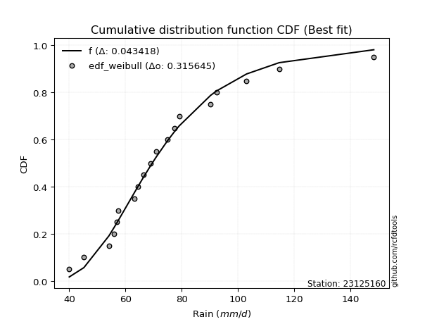</img>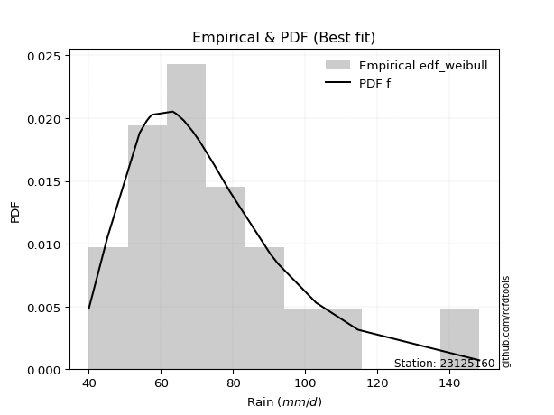</img>

</div>


### 4. EDF Beard (1943)

The Beard formula (or Beard´s plotting position formula) in hydrology is used to estimate the empirical non-exceedance probability _(P)_ of a flood event (or other extreme hydrological data point) within a given dataset.

<div align="center">


$P=(m-0.31)/(n+0.38)$


</div>


**4.1. Empirical values**

<div align="center">

|                | 0                   | 1                   | 2                  | 3                   | 4                   | 5                   | 6                  | 7                  | 8                  | 9         | 10                 | 11                 | 12                 | 13                 | 14                 | 15                 | 16                 | 17                 | 18                 |
|:---------------|:--------------------|:--------------------|:-------------------|:--------------------|:--------------------|:--------------------|:-------------------|:-------------------|:-------------------|:----------|:-------------------|:-------------------|:-------------------|:-------------------|:-------------------|:-------------------|:-------------------|:-------------------|:-------------------|
| date           | 2006                | 2022                | 2009               | 2021                | 2025                | 2013                | 2008               | 2014               | 2018               | 2005      | 2015               | 2016               | 2010               | 2011               | 2017               | 2019               | 2012               | 2020               | 2007               |
| x              | 40.0                | 45.2                | 54.1               | 56.0                | 56.8                | 57.5                | 63.3               | 64.5               | 66.4               | 68.9      | 70.9               | 74.9               | 77.4               | 79.1               | 90.3               | 92.5               | 103.1              | 114.7              | 148.4              |
| m              | 1                   | 2                   | 3                  | 4                   | 5                   | 6                   | 7                  | 8                  | 9                  | 10        | 11                 | 12                 | 13                 | 14                 | 15                 | 16                 | 17                 | 18                 | 19                 |
| empirical_dist | edf_beard           | edf_beard           | edf_beard          | edf_beard           | edf_beard           | edf_beard           | edf_beard          | edf_beard          | edf_beard          | edf_beard | edf_beard          | edf_beard          | edf_beard          | edf_beard          | edf_beard          | edf_beard          | edf_beard          | edf_beard          | edf_beard          |
| empirical      | 0.03560371517027864 | 0.08720330237358101 | 0.1388028895768834 | 0.19040247678018576 | 0.24200206398348817 | 0.29360165118679055 | 0.3452012383900929 | 0.3968008255933953 | 0.4484004127966976 | 0.5       | 0.5515995872033024 | 0.6031991744066048 | 0.6547987616099071 | 0.7063983488132095 | 0.7579979360165119 | 0.8095975232198143 | 0.8611971104231168 | 0.9127966976264191 | 0.9643962848297215 |
| empirical_tr   | 1.0369181380417336  | 1.0955342001130581  | 1.1611743559017376 | 1.2351816443594645  | 1.3192648059904697  | 1.4156318480642804  | 1.5271867612293144 | 1.6578272027373824 | 1.812909260991581  | 2.0       | 2.230149597238205  | 2.5201560468140443 | 2.896860986547085  | 3.40597539543058   | 4.132196162046909  | 5.252032520325204  | 7.204460966542758  | 11.467455621301793 | 28.086956521739243 |

</div>


**4.2. Kolmogorov-Smirnov fit test (sorted by Δ)**


<div align="center">

|                | 0                   | 1                   | 2                    | 3                   | 4                   | 5                   | 6                   | 7                   | 8                    | 9                   | 10                  | 11                   | 12                   | 13                  | 14                  | 15                  | 16                  | 17                   | 18                  | 19                  | 20                  | 21                  | 22                   | 23                  | 24                  | 25                  | 26                   | 27                   | 28                  | 29                  | 30                  | 31                   | 32                  | 33                  | 34                   | 35                  | 36                  | 37                  | 38                   | 39                  | 40                  | 41                  | 42                  | 43                  | 44                  | 45                  | 46                  | 47                  | 48                  | 49                  | 50                  | 51                  | 52                  | 53                  | 54                  | 55                  | 56                  | 57                  | 58                  | 59                  | 60                  | 61                  | 62                  | 63                  | 64                  | 65                  | 66                  | 67                  | 68                  | 69                  | 70                  | 71                  | 72                  | 73                  | 74                  | 75                  | 76                  | 77                  | 78                  | 79                  | 80                  | 81                  | 82                  | 83                  | 84                  | 85                  | 86                  | 87                  | 88                  | 89                  | 90                  | 91                  | 92                  | 93                  | 94                  | 95                  | 96                  | 97                  | 98                  | 99                  | 100                 | 101                 | 102                 | 103                 | 104                 | 105                 | 106                 | 107                 | 108                 | 109                 | 110                 | 111                 | 112                 | 113                 | 114                 | 115                 | 116                 | 117                 | 118                 | 119                 | 120                 | 121                 | 122                 | 123                 | 124                 | 125                 | 126                 | 127                 | 128                 | 129                 | 130                 | 131                 | 132                 | 133                 | 134                 | 135                 | 136                 | 137                 | 138                 | 139                 | 140                 | 141                 | 142                 | 143                 | 144                 | 145                 | 146                 | 147                 | 148                 | 149                 | 150                 | 151                 | 152                 | 153                 | 154                 | 155                 | 156                 | 157                 | 158                 | 159                 |
|:---------------|:--------------------|:--------------------|:---------------------|:--------------------|:--------------------|:--------------------|:--------------------|:--------------------|:---------------------|:--------------------|:--------------------|:---------------------|:---------------------|:--------------------|:--------------------|:--------------------|:--------------------|:---------------------|:--------------------|:--------------------|:--------------------|:--------------------|:---------------------|:--------------------|:--------------------|:--------------------|:---------------------|:---------------------|:--------------------|:--------------------|:--------------------|:---------------------|:--------------------|:--------------------|:---------------------|:--------------------|:--------------------|:--------------------|:---------------------|:--------------------|:--------------------|:--------------------|:--------------------|:--------------------|:--------------------|:--------------------|:--------------------|:--------------------|:--------------------|:--------------------|:--------------------|:--------------------|:--------------------|:--------------------|:--------------------|:--------------------|:--------------------|:--------------------|:--------------------|:--------------------|:--------------------|:--------------------|:--------------------|:--------------------|:--------------------|:--------------------|:--------------------|:--------------------|:--------------------|:--------------------|:--------------------|:--------------------|:--------------------|:--------------------|:--------------------|:--------------------|:--------------------|:--------------------|:--------------------|:--------------------|:--------------------|:--------------------|:--------------------|:--------------------|:--------------------|:--------------------|:--------------------|:--------------------|:--------------------|:--------------------|:--------------------|:--------------------|:--------------------|:--------------------|:--------------------|:--------------------|:--------------------|:--------------------|:--------------------|:--------------------|:--------------------|:--------------------|:--------------------|:--------------------|:--------------------|:--------------------|:--------------------|:--------------------|:--------------------|:--------------------|:--------------------|:--------------------|:--------------------|:--------------------|:--------------------|:--------------------|:--------------------|:--------------------|:--------------------|:--------------------|:--------------------|:--------------------|:--------------------|:--------------------|:--------------------|:--------------------|:--------------------|:--------------------|:--------------------|:--------------------|:--------------------|:--------------------|:--------------------|:--------------------|:--------------------|:--------------------|:--------------------|:--------------------|:--------------------|:--------------------|:--------------------|:--------------------|:--------------------|:--------------------|:--------------------|:--------------------|:--------------------|:--------------------|:--------------------|:--------------------|:--------------------|:--------------------|:--------------------|:--------------------|:--------------------|:--------------------|:--------------------|:--------------------|:--------------------|:--------------------|
| station        | 23125160            | 23125160            | 23125160             | 23125160            | 23125160            | 23125160            | 23125160            | 23125160            | 23125160             | 23125160            | 23125160            | 23125160             | 23125160             | 23125160            | 23125160            | 23125160            | 23125160            | 23125160             | 23125160            | 23125160            | 23125160            | 23125160            | 23125160             | 23125160            | 23125160            | 23125160            | 23125160             | 23125160             | 23125160            | 23125160            | 23125160            | 23125160             | 23125160            | 23125160            | 23125160             | 23125160            | 23125160            | 23125160            | 23125160             | 23125160            | 23125160            | 23125160            | 23125160            | 23125160            | 23125160            | 23125160            | 23125160            | 23125160            | 23125160            | 23125160            | 23125160            | 23125160            | 23125160            | 23125160            | 23125160            | 23125160            | 23125160            | 23125160            | 23125160            | 23125160            | 23125160            | 23125160            | 23125160            | 23125160            | 23125160            | 23125160            | 23125160            | 23125160            | 23125160            | 23125160            | 23125160            | 23125160            | 23125160            | 23125160            | 23125160            | 23125160            | 23125160            | 23125160            | 23125160            | 23125160            | 23125160            | 23125160            | 23125160            | 23125160            | 23125160            | 23125160            | 23125160            | 23125160            | 23125160            | 23125160            | 23125160            | 23125160            | 23125160            | 23125160            | 23125160            | 23125160            | 23125160            | 23125160            | 23125160            | 23125160            | 23125160            | 23125160            | 23125160            | 23125160            | 23125160            | 23125160            | 23125160            | 23125160            | 23125160            | 23125160            | 23125160            | 23125160            | 23125160            | 23125160            | 23125160            | 23125160            | 23125160            | 23125160            | 23125160            | 23125160            | 23125160            | 23125160            | 23125160            | 23125160            | 23125160            | 23125160            | 23125160            | 23125160            | 23125160            | 23125160            | 23125160            | 23125160            | 23125160            | 23125160            | 23125160            | 23125160            | 23125160            | 23125160            | 23125160            | 23125160            | 23125160            | 23125160            | 23125160            | 23125160            | 23125160            | 23125160            | 23125160            | 23125160            | 23125160            | 23125160            | 23125160            | 23125160            | 23125160            | 23125160            | 23125160            | 23125160            | 23125160            | 23125160            | 23125160            | 23125160            |
| empirical_dist | edf_beard           | edf_beard           | edf_beard            | edf_beard           | edf_beard           | edf_beard           | edf_beard           | edf_beard           | edf_beard            | edf_beard           | edf_beard           | edf_beard            | edf_beard            | edf_beard           | edf_beard           | edf_beard           | edf_beard           | edf_beard            | edf_beard           | edf_beard           | edf_beard           | edf_beard           | edf_beard            | edf_beard           | edf_beard           | edf_beard           | edf_beard            | edf_beard            | edf_beard           | edf_beard           | edf_beard           | edf_beard            | edf_beard           | edf_beard           | edf_beard            | edf_beard           | edf_beard           | edf_beard           | edf_beard            | edf_beard           | edf_beard           | edf_beard           | edf_beard           | edf_beard           | edf_beard           | edf_beard           | edf_beard           | edf_beard           | edf_beard           | edf_beard           | edf_beard           | edf_beard           | edf_beard           | edf_beard           | edf_beard           | edf_beard           | edf_beard           | edf_beard           | edf_beard           | edf_beard           | edf_beard           | edf_beard           | edf_beard           | edf_beard           | edf_beard           | edf_beard           | edf_beard           | edf_beard           | edf_beard           | edf_beard           | edf_beard           | edf_beard           | edf_beard           | edf_beard           | edf_beard           | edf_beard           | edf_beard           | edf_beard           | edf_beard           | edf_beard           | edf_beard           | edf_beard           | edf_beard           | edf_beard           | edf_beard           | edf_beard           | edf_beard           | edf_beard           | edf_beard           | edf_beard           | edf_beard           | edf_beard           | edf_beard           | edf_beard           | edf_beard           | edf_beard           | edf_beard           | edf_beard           | edf_beard           | edf_beard           | edf_beard           | edf_beard           | edf_beard           | edf_beard           | edf_beard           | edf_beard           | edf_beard           | edf_beard           | edf_beard           | edf_beard           | edf_beard           | edf_beard           | edf_beard           | edf_beard           | edf_beard           | edf_beard           | edf_beard           | edf_beard           | edf_beard           | edf_beard           | edf_beard           | edf_beard           | edf_beard           | edf_beard           | edf_beard           | edf_beard           | edf_beard           | edf_beard           | edf_beard           | edf_beard           | edf_beard           | edf_beard           | edf_beard           | edf_beard           | edf_beard           | edf_beard           | edf_beard           | edf_beard           | edf_beard           | edf_beard           | edf_beard           | edf_beard           | edf_beard           | edf_beard           | edf_beard           | edf_beard           | edf_beard           | edf_beard           | edf_beard           | edf_beard           | edf_beard           | edf_beard           | edf_beard           | edf_beard           | edf_beard           | edf_beard           | edf_beard           | edf_beard           | edf_beard           | edf_beard           |
| p_dist         | logexponnorm        | logmielke           | burr                 | loggenlogistic      | mielke              | exponnorm           | alpha               | moyal               | logburr              | invweibull          | genextreme          | logskewnorm          | nct                  | logalpha            | loggennorm          | loginvgamma         | logjohnsonsu        | invgamma             | logfatiguelife      | f                   | logpearson3         | loggenextreme       | logweibull_max       | logf                | loggamma            | loggamma            | logerlang            | loginvgauss          | logburr12           | johnsonsu           | lognct              | logncf               | betaprime           | invgauss            | genlogistic          | logjohnsonsb        | logmaxwell          | logbetaprime        | loggumbel_r          | lognakagami         | johnsonsb           | logrice             | logbeta             | lograyleigh         | logweibull_min      | loginvweibull       | gamma               | erlang              | pearson3            | loglogistic         | gumbel_r            | logexponweib        | loggengamma         | logloglaplace       | logt                | logcrystalball      | lognorm             | logloggamma         | halflogistic        | logmoyal            | dweibull            | weibull_min         | logdweibull         | logvonmises_line    | kstwobign           | loghypsecant        | logdgamma           | logfoldnorm         | loghalfnorm         | logtriang           | gennorm             | tukeylambda         | logkstwobign        | loganglit           | loghalflogistic     | dgamma              | kappa3              | logexponpow         | halfnorm            | logsemicircular     | genhalflogistic     | loggompertz         | rayleigh            | loggenexpon         | loglaplace          | loglaplace          | foldnorm            | maxwell             | wald                | skewnorm            | rice                | logcosine           | gompertz            | logtruncweibull_min | t                   | beta                | loggumbel_l         | logwald             | hypsecant           | logistic            | nakagami            | gausshyper          | truncnorm           | norm                | crystalball         | truncweibull_min    | logarcsine          | loggausshyper       | anglit              | laplace             | logbradford         | semicircular        | loghalfgennorm      | arcsine             | logtruncexpon       | vonmises_line       | loguniform          | logkappa3           | logtukeylambda      | triang              | genexpon            | logksone            | exponpow            | logrdist            | logkappa4           | gumbel_l            | truncexpon          | genpareto           | cosine              | logargus            | bradford            | loglomax            | burr12              | logwrapcauchy       | ncf                 | kappa4              | halfgennorm         | logtruncpareto      | ksone               | argus               | uniform             | wrapcauchy          | logtruncnorm        | loggenhalflogistic  | lomax               | powerlaw            | loggenpareto        | loglevy_l           | logtrapezoid        | logpowerlaw         | levy_l              | rdist               | fatiguelife         | trapezoid           | gengamma            | exponweib           | weibull_max         | truncpareto         | logvonmises         | vonmises            |
| delta          | 0.04502914543386985 | 0.04541396665476213 | 0.045577771939977946 | 0.04560664506089401 | 0.04562047371550815 | 0.0465159047101959  | 0.04711136173692379 | 0.04824734577320641 | 0.048741875844966615 | 0.0489321186743944  | 0.04893242078374857 | 0.049193071411002404 | 0.049844848365011046 | 0.05060538631431391 | 0.05071738078366428 | 0.05119432038402205 | 0.05161594425414309 | 0.051896810134159255 | 0.05222945019537531 | 0.05239380174777186 | 0.05258315924485732 | 0.05271196908586301 | 0.052734351577906124 | 0.05293782797734917 | 0.0531689128584682  | 0.0531689128584682  | 0.053169097727002596 | 0.053523600013213185 | 0.05373378235882173 | 0.05590208955169232 | 0.05629040344340286 | 0.056490897466965784 | 0.05843856672379566 | 0.05882639290555239 | 0.058875084646415776 | 0.06041458368315952 | 0.06059362324497394 | 0.0609556321321284  | 0.061150516989197885 | 0.06147736779064769 | 0.06155738959686477 | 0.06324114413342793 | 0.0644745322176497  | 0.0649450360186182  | 0.06626695319414463 | 0.06943438533005289 | 0.0695491542270435  | 0.06954974547231516 | 0.07024878318099925 | 0.07029347082150222 | 0.07206610835861382 | 0.07211777631708094 | 0.0742103167559725  | 0.07479220740158721 | 0.07495568855382984 | 0.07502922840645798 | 0.07502928254054986 | 0.07851751430487497 | 0.07948715177539102 | 0.07981685720828395 | 0.0799657681720504  | 0.08037137970396181 | 0.08079909389125939 | 0.08118449937625924 | 0.08436356456725469 | 0.08508933436693245 | 0.08536857931194985 | 0.08720330237358101 | 0.08720330237358101 | 0.08754096822265112 | 0.08840490666992121 | 0.0892711094729215  | 0.09023545036533656 | 0.09272049591630027 | 0.09420060626010174 | 0.09668400994755455 | 0.09846943298191957 | 0.09889613556256235 | 0.0991144249888952  | 0.10010802800834095 | 0.10040805155255333 | 0.10061036903708495 | 0.10273796212709929 | 0.10284732613031905 | 0.10441706799402561 | 0.10441706799402561 | 0.10698671336577834 | 0.11206548960930818 | 0.11438173623854847 | 0.11711927088185872 | 0.11739943391139085 | 0.11957002673368466 | 0.12001978724539833 | 0.12116269727631176 | 0.12153182790273101 | 0.12205475299346688 | 0.12830099630313307 | 0.12969080364974814 | 0.13051128380541904 | 0.13274795078846702 | 0.13328065309371126 | 0.13729099198451308 | 0.14138945464023311 | 0.14141640120484755 | 0.1414164063062593  | 0.1466075202514745  | 0.14665476365245725 | 0.14932772962089302 | 0.15058656749826915 | 0.15254822700320625 | 0.15355794015185117 | 0.1543769738684505  | 0.15699475299608764 | 0.16948993040794325 | 0.16988872632635313 | 0.17539285479950018 | 0.1863244796576683  | 0.1867944078441276  | 0.18679943638145602 | 0.19272932356319128 | 0.1932353742225366  | 0.19339563716157304 | 0.1949297389481275  | 0.20188884655128014 | 0.20212747509440643 | 0.20669684748767203 | 0.22294700080715857 | 0.23092838304384347 | 0.2334243061731932  | 0.24119962298750042 | 0.2649030411400741  | 0.26831545836761184 | 0.2694680503336463  | 0.27439896823860666 | 0.2908919988791715  | 0.2938549783796587  | 0.3144891261319338  | 0.315393494936681   | 0.32266640390862117 | 0.34220696721641863 | 0.34569724180213945 | 0.3566517138958002  | 0.35725459675528604 | 0.35882775677389456 | 0.3593600676100659  | 0.38864122687088853 | 0.4084073589065974  | 0.41750101484485874 | 0.43939029102881844 | 0.4441060311449676  | 0.4669061915293488  | 0.5051025800065306  | 0.5573321164282681  | 0.5724956082661627  | 0.6029309131962943  | 0.6633224233991769  | 0.771472390639656   | 0.8247679214902739  | 1.0495336430194517  | 22.922889826945593  |
| deltao         | 0.31564497164100014 | 0.31564497164100014 | 0.31564497164100014  | 0.31564497164100014 | 0.31564497164100014 | 0.31564497164100014 | 0.31564497164100014 | 0.31564497164100014 | 0.31564497164100014  | 0.31564497164100014 | 0.31564497164100014 | 0.31564497164100014  | 0.31564497164100014  | 0.31564497164100014 | 0.31564497164100014 | 0.31564497164100014 | 0.31564497164100014 | 0.31564497164100014  | 0.31564497164100014 | 0.31564497164100014 | 0.31564497164100014 | 0.31564497164100014 | 0.31564497164100014  | 0.31564497164100014 | 0.31564497164100014 | 0.31564497164100014 | 0.31564497164100014  | 0.31564497164100014  | 0.31564497164100014 | 0.31564497164100014 | 0.31564497164100014 | 0.31564497164100014  | 0.31564497164100014 | 0.31564497164100014 | 0.31564497164100014  | 0.31564497164100014 | 0.31564497164100014 | 0.31564497164100014 | 0.31564497164100014  | 0.31564497164100014 | 0.31564497164100014 | 0.31564497164100014 | 0.31564497164100014 | 0.31564497164100014 | 0.31564497164100014 | 0.31564497164100014 | 0.31564497164100014 | 0.31564497164100014 | 0.31564497164100014 | 0.31564497164100014 | 0.31564497164100014 | 0.31564497164100014 | 0.31564497164100014 | 0.31564497164100014 | 0.31564497164100014 | 0.31564497164100014 | 0.31564497164100014 | 0.31564497164100014 | 0.31564497164100014 | 0.31564497164100014 | 0.31564497164100014 | 0.31564497164100014 | 0.31564497164100014 | 0.31564497164100014 | 0.31564497164100014 | 0.31564497164100014 | 0.31564497164100014 | 0.31564497164100014 | 0.31564497164100014 | 0.31564497164100014 | 0.31564497164100014 | 0.31564497164100014 | 0.31564497164100014 | 0.31564497164100014 | 0.31564497164100014 | 0.31564497164100014 | 0.31564497164100014 | 0.31564497164100014 | 0.31564497164100014 | 0.31564497164100014 | 0.31564497164100014 | 0.31564497164100014 | 0.31564497164100014 | 0.31564497164100014 | 0.31564497164100014 | 0.31564497164100014 | 0.31564497164100014 | 0.31564497164100014 | 0.31564497164100014 | 0.31564497164100014 | 0.31564497164100014 | 0.31564497164100014 | 0.31564497164100014 | 0.31564497164100014 | 0.31564497164100014 | 0.31564497164100014 | 0.31564497164100014 | 0.31564497164100014 | 0.31564497164100014 | 0.31564497164100014 | 0.31564497164100014 | 0.31564497164100014 | 0.31564497164100014 | 0.31564497164100014 | 0.31564497164100014 | 0.31564497164100014 | 0.31564497164100014 | 0.31564497164100014 | 0.31564497164100014 | 0.31564497164100014 | 0.31564497164100014 | 0.31564497164100014 | 0.31564497164100014 | 0.31564497164100014 | 0.31564497164100014 | 0.31564497164100014 | 0.31564497164100014 | 0.31564497164100014 | 0.31564497164100014 | 0.31564497164100014 | 0.31564497164100014 | 0.31564497164100014 | 0.31564497164100014 | 0.31564497164100014 | 0.31564497164100014 | 0.31564497164100014 | 0.31564497164100014 | 0.31564497164100014 | 0.31564497164100014 | 0.31564497164100014 | 0.31564497164100014 | 0.31564497164100014 | 0.31564497164100014 | 0.31564497164100014 | 0.31564497164100014 | 0.31564497164100014 | 0.31564497164100014 | 0.31564497164100014 | 0.31564497164100014 | 0.31564497164100014 | 0.31564497164100014 | 0.31564497164100014 | 0.31564497164100014 | 0.31564497164100014 | 0.31564497164100014 | 0.31564497164100014 | 0.31564497164100014 | 0.31564497164100014 | 0.31564497164100014 | 0.31564497164100014 | 0.31564497164100014 | 0.31564497164100014 | 0.31564497164100014 | 0.31564497164100014 | 0.31564497164100014 | 0.31564497164100014 | 0.31564497164100014 | 0.31564497164100014 | 0.31564497164100014 | 0.31564497164100014 |
| eval           | Δo > Δ              | Δo > Δ              | Δo > Δ               | Δo > Δ              | Δo > Δ              | Δo > Δ              | Δo > Δ              | Δo > Δ              | Δo > Δ               | Δo > Δ              | Δo > Δ              | Δo > Δ               | Δo > Δ               | Δo > Δ              | Δo > Δ              | Δo > Δ              | Δo > Δ              | Δo > Δ               | Δo > Δ              | Δo > Δ              | Δo > Δ              | Δo > Δ              | Δo > Δ               | Δo > Δ              | Δo > Δ              | Δo > Δ              | Δo > Δ               | Δo > Δ               | Δo > Δ              | Δo > Δ              | Δo > Δ              | Δo > Δ               | Δo > Δ              | Δo > Δ              | Δo > Δ               | Δo > Δ              | Δo > Δ              | Δo > Δ              | Δo > Δ               | Δo > Δ              | Δo > Δ              | Δo > Δ              | Δo > Δ              | Δo > Δ              | Δo > Δ              | Δo > Δ              | Δo > Δ              | Δo > Δ              | Δo > Δ              | Δo > Δ              | Δo > Δ              | Δo > Δ              | Δo > Δ              | Δo > Δ              | Δo > Δ              | Δo > Δ              | Δo > Δ              | Δo > Δ              | Δo > Δ              | Δo > Δ              | Δo > Δ              | Δo > Δ              | Δo > Δ              | Δo > Δ              | Δo > Δ              | Δo > Δ              | Δo > Δ              | Δo > Δ              | Δo > Δ              | Δo > Δ              | Δo > Δ              | Δo > Δ              | Δo > Δ              | Δo > Δ              | Δo > Δ              | Δo > Δ              | Δo > Δ              | Δo > Δ              | Δo > Δ              | Δo > Δ              | Δo > Δ              | Δo > Δ              | Δo > Δ              | Δo > Δ              | Δo > Δ              | Δo > Δ              | Δo > Δ              | Δo > Δ              | Δo > Δ              | Δo > Δ              | Δo > Δ              | Δo > Δ              | Δo > Δ              | Δo > Δ              | Δo > Δ              | Δo > Δ              | Δo > Δ              | Δo > Δ              | Δo > Δ              | Δo > Δ              | Δo > Δ              | Δo > Δ              | Δo > Δ              | Δo > Δ              | Δo > Δ              | Δo > Δ              | Δo > Δ              | Δo > Δ              | Δo > Δ              | Δo > Δ              | Δo > Δ              | Δo > Δ              | Δo > Δ              | Δo > Δ              | Δo > Δ              | Δo > Δ              | Δo > Δ              | Δo > Δ              | Δo > Δ              | Δo > Δ              | Δo > Δ              | Δo > Δ              | Δo > Δ              | Δo > Δ              | Δo > Δ              | Δo > Δ              | Δo > Δ              | Δo > Δ              | Δo > Δ              | Δo > Δ              | Δo > Δ              | Δo > Δ              | Δo > Δ              | Δo > Δ              | Δo > Δ              | Δo > Δ              | Δo > Δ              | Δo > Δ              | Δo <= Δ             | Δo <= Δ             | Δo <= Δ             | Δo <= Δ             | Δo <= Δ             | Δo <= Δ             | Δo <= Δ             | Δo <= Δ             | Δo <= Δ             | Δo <= Δ             | Δo <= Δ             | Δo <= Δ             | Δo <= Δ             | Δo <= Δ             | Δo <= Δ             | Δo <= Δ             | Δo <= Δ             | Δo <= Δ             | Δo <= Δ             | Δo <= Δ             | Δo <= Δ             | Δo <= Δ             |
| fit            | 1                   | 1                   | 1                    | 1                   | 1                   | 1                   | 1                   | 1                   | 1                    | 1                   | 1                   | 1                    | 1                    | 1                   | 1                   | 1                   | 1                   | 1                    | 1                   | 1                   | 1                   | 1                   | 1                    | 1                   | 1                   | 1                   | 1                    | 1                    | 1                   | 1                   | 1                   | 1                    | 1                   | 1                   | 1                    | 1                   | 1                   | 1                   | 1                    | 1                   | 1                   | 1                   | 1                   | 1                   | 1                   | 1                   | 1                   | 1                   | 1                   | 1                   | 1                   | 1                   | 1                   | 1                   | 1                   | 1                   | 1                   | 1                   | 1                   | 1                   | 1                   | 1                   | 1                   | 1                   | 1                   | 1                   | 1                   | 1                   | 1                   | 1                   | 1                   | 1                   | 1                   | 1                   | 1                   | 1                   | 1                   | 1                   | 1                   | 1                   | 1                   | 1                   | 1                   | 1                   | 1                   | 1                   | 1                   | 1                   | 1                   | 1                   | 1                   | 1                   | 1                   | 1                   | 1                   | 1                   | 1                   | 1                   | 1                   | 1                   | 1                   | 1                   | 1                   | 1                   | 1                   | 1                   | 1                   | 1                   | 1                   | 1                   | 1                   | 1                   | 1                   | 1                   | 1                   | 1                   | 1                   | 1                   | 1                   | 1                   | 1                   | 1                   | 1                   | 1                   | 1                   | 1                   | 1                   | 1                   | 1                   | 1                   | 1                   | 1                   | 1                   | 1                   | 1                   | 1                   | 1                   | 1                   | 0                   | 0                   | 0                   | 0                   | 0                   | 0                   | 0                   | 0                   | 0                   | 0                   | 0                   | 0                   | 0                   | 0                   | 0                   | 0                   | 0                   | 0                   | 0                   | 0                   | 0                   | 0                   |
| n              | 19                  | 19                  | 19                   | 19                  | 19                  | 19                  | 19                  | 19                  | 19                   | 19                  | 19                  | 19                   | 19                   | 19                  | 19                  | 19                  | 19                  | 19                   | 19                  | 19                  | 19                  | 19                  | 19                   | 19                  | 19                  | 19                  | 19                   | 19                   | 19                  | 19                  | 19                  | 19                   | 19                  | 19                  | 19                   | 19                  | 19                  | 19                  | 19                   | 19                  | 19                  | 19                  | 19                  | 19                  | 19                  | 19                  | 19                  | 19                  | 19                  | 19                  | 19                  | 19                  | 19                  | 19                  | 19                  | 19                  | 19                  | 19                  | 19                  | 19                  | 19                  | 19                  | 19                  | 19                  | 19                  | 19                  | 19                  | 19                  | 19                  | 19                  | 19                  | 19                  | 19                  | 19                  | 19                  | 19                  | 19                  | 19                  | 19                  | 19                  | 19                  | 19                  | 19                  | 19                  | 19                  | 19                  | 19                  | 19                  | 19                  | 19                  | 19                  | 19                  | 19                  | 19                  | 19                  | 19                  | 19                  | 19                  | 19                  | 19                  | 19                  | 19                  | 19                  | 19                  | 19                  | 19                  | 19                  | 19                  | 19                  | 19                  | 19                  | 19                  | 19                  | 19                  | 19                  | 19                  | 19                  | 19                  | 19                  | 19                  | 19                  | 19                  | 19                  | 19                  | 19                  | 19                  | 19                  | 19                  | 19                  | 19                  | 19                  | 19                  | 19                  | 19                  | 19                  | 19                  | 19                  | 19                  | 19                  | 19                  | 19                  | 19                  | 19                  | 19                  | 19                  | 19                  | 19                  | 19                  | 19                  | 19                  | 19                  | 19                  | 19                  | 19                  | 19                  | 19                  | 19                  | 19                  | 19                  | 19                  |
| best_fit       | 1                   | 0                   | 0                    | 0                   | 0                   | 0                   | 0                   | 0                   | 0                    | 0                   | 0                   | 0                    | 0                    | 0                   | 0                   | 0                   | 0                   | 0                    | 0                   | 0                   | 0                   | 0                   | 0                    | 0                   | 0                   | 0                   | 0                    | 0                    | 0                   | 0                   | 0                   | 0                    | 0                   | 0                   | 0                    | 0                   | 0                   | 0                   | 0                    | 0                   | 0                   | 0                   | 0                   | 0                   | 0                   | 0                   | 0                   | 0                   | 0                   | 0                   | 0                   | 0                   | 0                   | 0                   | 0                   | 0                   | 0                   | 0                   | 0                   | 0                   | 0                   | 0                   | 0                   | 0                   | 0                   | 0                   | 0                   | 0                   | 0                   | 0                   | 0                   | 0                   | 0                   | 0                   | 0                   | 0                   | 0                   | 0                   | 0                   | 0                   | 0                   | 0                   | 0                   | 0                   | 0                   | 0                   | 0                   | 0                   | 0                   | 0                   | 0                   | 0                   | 0                   | 0                   | 0                   | 0                   | 0                   | 0                   | 0                   | 0                   | 0                   | 0                   | 0                   | 0                   | 0                   | 0                   | 0                   | 0                   | 0                   | 0                   | 0                   | 0                   | 0                   | 0                   | 0                   | 0                   | 0                   | 0                   | 0                   | 0                   | 0                   | 0                   | 0                   | 0                   | 0                   | 0                   | 0                   | 0                   | 0                   | 0                   | 0                   | 0                   | 0                   | 0                   | 0                   | 0                   | 0                   | 0                   | 0                   | 0                   | 0                   | 0                   | 0                   | 0                   | 0                   | 0                   | 0                   | 0                   | 0                   | 0                   | 0                   | 0                   | 0                   | 0                   | 0                   | 0                   | 0                   | 0                   | 0                   | 0                   |
| best_fit_sort  | 1                   | 2                   | 3                    | 4                   | 5                   | 6                   | 7                   | 8                   | 9                    | 10                  | 11                  | 12                   | 13                   | 14                  | 15                  | 16                  | 17                  | 18                   | 19                  | 20                  | 21                  | 22                  | 23                   | 24                  | 25                  | 26                  | 27                   | 28                   | 29                  | 30                  | 31                  | 32                   | 33                  | 34                  | 35                   | 36                  | 37                  | 38                  | 39                   | 40                  | 41                  | 42                  | 43                  | 44                  | 45                  | 46                  | 47                  | 48                  | 49                  | 50                  | 51                  | 52                  | 53                  | 54                  | 55                  | 56                  | 57                  | 58                  | 59                  | 60                  | 61                  | 62                  | 63                  | 64                  | 65                  | 66                  | 67                  | 68                  | 69                  | 70                  | 71                  | 72                  | 73                  | 74                  | 75                  | 76                  | 77                  | 78                  | 79                  | 80                  | 81                  | 82                  | 83                  | 84                  | 85                  | 86                  | 87                  | 88                  | 89                  | 90                  | 91                  | 92                  | 93                  | 94                  | 95                  | 96                  | 97                  | 98                  | 99                  | 100                 | 101                 | 102                 | 103                 | 104                 | 105                 | 106                 | 107                 | 108                 | 109                 | 110                 | 111                 | 112                 | 113                 | 114                 | 115                 | 116                 | 117                 | 118                 | 119                 | 120                 | 121                 | 122                 | 123                 | 124                 | 125                 | 126                 | 127                 | 128                 | 129                 | 130                 | 131                 | 132                 | 133                 | 134                 | 135                 | 136                 | 137                 | 138                 | 139                 | 140                 | 141                 | 142                 | 143                 | 144                 | 145                 | 146                 | 147                 | 148                 | 149                 | 150                 | 151                 | 152                 | 153                 | 154                 | 155                 | 156                 | 157                 | 158                 | 159                 | 160                 |

</div>


**4.3. Best fit**

<div align="center">

|   id |   station | empirical_dist   | p_dist       |     delta |   deltao | eval   |   fit |   n |   best_fit |   best_fit_sort |
|-----:|----------:|:-----------------|:-------------|----------:|---------:|:-------|------:|----:|-----------:|----------------:|
|    0 |  23125160 | edf_beard        | logexponnorm | 0.0450291 | 0.315645 | Δo > Δ |     1 |  19 |          1 |               1 |

</div>


<div align="center">

</img>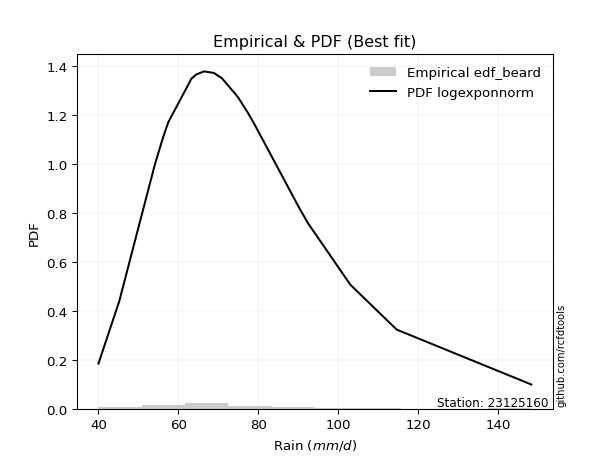</img>

</div>


### 5. EDF Chegodayev (1955)

The Chegodayev formula is an empirical plotting position formula used in hydrological frequency analysis to estimate the exceedance probability or return period of a specific event from a set of observed data. It is primarily used for plotting observed data points on probability paper to fit a theoretical distribution, particularly for analyzing extreme events like maximum flood flows or rainfall intensities. The constant _b_ value in the generalized plotting position formula is 0.3.

<div align="center">


$P=(m-b)/(n+1-2b)$


</div>


**5.1. Empirical values**

<div align="center">

|                | 0                   | 1                   | 2                  | 3                  | 4                   | 5                   | 6                  | 7                  | 8                  | 9              | 10                 | 11                 | 12                 | 13                 | 14                 | 15                 | 16                 | 17                 | 18                 |
|:---------------|:--------------------|:--------------------|:-------------------|:-------------------|:--------------------|:--------------------|:-------------------|:-------------------|:-------------------|:---------------|:-------------------|:-------------------|:-------------------|:-------------------|:-------------------|:-------------------|:-------------------|:-------------------|:-------------------|
| date           | 2006                | 2022                | 2009               | 2021               | 2025                | 2013                | 2008               | 2014               | 2018               | 2005           | 2015               | 2016               | 2010               | 2011               | 2017               | 2019               | 2012               | 2020               | 2007               |
| x              | 40.0                | 45.2                | 54.1               | 56.0               | 56.8                | 57.5                | 63.3               | 64.5               | 66.4               | 68.9           | 70.9               | 74.9               | 77.4               | 79.1               | 90.3               | 92.5               | 103.1              | 114.7              | 148.4              |
| m              | 1                   | 2                   | 3                  | 4                  | 5                   | 6                   | 7                  | 8                  | 9                  | 10             | 11                 | 12                 | 13                 | 14                 | 15                 | 16                 | 17                 | 18                 | 19                 |
| empirical_dist | edf_chegodayev      | edf_chegodayev      | edf_chegodayev     | edf_chegodayev     | edf_chegodayev      | edf_chegodayev      | edf_chegodayev     | edf_chegodayev     | edf_chegodayev     | edf_chegodayev | edf_chegodayev     | edf_chegodayev     | edf_chegodayev     | edf_chegodayev     | edf_chegodayev     | edf_chegodayev     | edf_chegodayev     | edf_chegodayev     | edf_chegodayev     |
| empirical      | 0.03608247422680413 | 0.08762886597938145 | 0.1391752577319588 | 0.1907216494845361 | 0.24226804123711343 | 0.29381443298969073 | 0.3453608247422681 | 0.3969072164948454 | 0.4484536082474227 | 0.5            | 0.5515463917525774 | 0.6030927835051546 | 0.654639175257732  | 0.7061855670103093 | 0.7577319587628866 | 0.8092783505154639 | 0.8608247422680413 | 0.9123711340206185 | 0.9639175257731959 |
| empirical_tr   | 1.0374331550802138  | 1.096045197740113   | 1.1616766467065869 | 1.2356687898089171 | 1.3197278911564627  | 1.416058394160584   | 1.5275590551181104 | 1.6581196581196582 | 1.8130841121495327 | 2.0            | 2.2298850574712645 | 2.519480519480519  | 2.8955223880597014 | 3.403508771929825  | 4.127659574468085  | 5.243243243243244  | 7.185185185185188  | 11.41176470588235  | 27.714285714285726 |

</div>


**5.2. Kolmogorov-Smirnov fit test (sorted by Δ)**


<div align="center">

|                | 0                   | 1                   | 2                   | 3                   | 4                   | 5                    | 6                   | 7                    | 8                   | 9                   | 10                   | 11                  | 12                  | 13                  | 14                  | 15                  | 16                   | 17                   | 18                  | 19                  | 20                  | 21                  | 22                   | 23                  | 24                  | 25                  | 26                  | 27                   | 28                   | 29                  | 30                  | 31                  | 32                   | 33                  | 34                  | 35                   | 36                   | 37                   | 38                  | 39                  | 40                  | 41                  | 42                  | 43                  | 44                  | 45                  | 46                  | 47                  | 48                  | 49                  | 50                  | 51                  | 52                  | 53                  | 54                  | 55                  | 56                  | 57                  | 58                  | 59                  | 60                  | 61                  | 62                  | 63                  | 64                  | 65                  | 66                  | 67                  | 68                  | 69                  | 70                  | 71                  | 72                  | 73                  | 74                  | 75                  | 76                  | 77                  | 78                  | 79                  | 80                  | 81                  | 82                  | 83                  | 84                  | 85                  | 86                  | 87                  | 88                  | 89                  | 90                  | 91                  | 92                  | 93                  | 94                  | 95                  | 96                  | 97                  | 98                  | 99                  | 100                 | 101                 | 102                 | 103                 | 104                 | 105                 | 106                 | 107                 | 108                 | 109                 | 110                 | 111                 | 112                 | 113                 | 114                 | 115                 | 116                 | 117                 | 118                 | 119                 | 120                 | 121                 | 122                 | 123                 | 124                 | 125                 | 126                 | 127                 | 128                 | 129                 | 130                 | 131                 | 132                 | 133                 | 134                 | 135                 | 136                 | 137                 | 138                 | 139                 | 140                 | 141                 | 142                 | 143                 | 144                 | 145                 | 146                 | 147                 | 148                 | 149                 | 150                 | 151                 | 152                 | 153                 | 154                 | 155                 | 156                 | 157                 | 158                 | 159                 |
|:---------------|:--------------------|:--------------------|:--------------------|:--------------------|:--------------------|:---------------------|:--------------------|:---------------------|:--------------------|:--------------------|:---------------------|:--------------------|:--------------------|:--------------------|:--------------------|:--------------------|:---------------------|:---------------------|:--------------------|:--------------------|:--------------------|:--------------------|:---------------------|:--------------------|:--------------------|:--------------------|:--------------------|:---------------------|:---------------------|:--------------------|:--------------------|:--------------------|:---------------------|:--------------------|:--------------------|:---------------------|:---------------------|:---------------------|:--------------------|:--------------------|:--------------------|:--------------------|:--------------------|:--------------------|:--------------------|:--------------------|:--------------------|:--------------------|:--------------------|:--------------------|:--------------------|:--------------------|:--------------------|:--------------------|:--------------------|:--------------------|:--------------------|:--------------------|:--------------------|:--------------------|:--------------------|:--------------------|:--------------------|:--------------------|:--------------------|:--------------------|:--------------------|:--------------------|:--------------------|:--------------------|:--------------------|:--------------------|:--------------------|:--------------------|:--------------------|:--------------------|:--------------------|:--------------------|:--------------------|:--------------------|:--------------------|:--------------------|:--------------------|:--------------------|:--------------------|:--------------------|:--------------------|:--------------------|:--------------------|:--------------------|:--------------------|:--------------------|:--------------------|:--------------------|:--------------------|:--------------------|:--------------------|:--------------------|:--------------------|:--------------------|:--------------------|:--------------------|:--------------------|:--------------------|:--------------------|:--------------------|:--------------------|:--------------------|:--------------------|:--------------------|:--------------------|:--------------------|:--------------------|:--------------------|:--------------------|:--------------------|:--------------------|:--------------------|:--------------------|:--------------------|:--------------------|:--------------------|:--------------------|:--------------------|:--------------------|:--------------------|:--------------------|:--------------------|:--------------------|:--------------------|:--------------------|:--------------------|:--------------------|:--------------------|:--------------------|:--------------------|:--------------------|:--------------------|:--------------------|:--------------------|:--------------------|:--------------------|:--------------------|:--------------------|:--------------------|:--------------------|:--------------------|:--------------------|:--------------------|:--------------------|:--------------------|:--------------------|:--------------------|:--------------------|:--------------------|:--------------------|:--------------------|:--------------------|:--------------------|:--------------------|
| station        | 23125160            | 23125160            | 23125160            | 23125160            | 23125160            | 23125160             | 23125160            | 23125160             | 23125160            | 23125160            | 23125160             | 23125160            | 23125160            | 23125160            | 23125160            | 23125160            | 23125160             | 23125160             | 23125160            | 23125160            | 23125160            | 23125160            | 23125160             | 23125160            | 23125160            | 23125160            | 23125160            | 23125160             | 23125160             | 23125160            | 23125160            | 23125160            | 23125160             | 23125160            | 23125160            | 23125160             | 23125160             | 23125160             | 23125160            | 23125160            | 23125160            | 23125160            | 23125160            | 23125160            | 23125160            | 23125160            | 23125160            | 23125160            | 23125160            | 23125160            | 23125160            | 23125160            | 23125160            | 23125160            | 23125160            | 23125160            | 23125160            | 23125160            | 23125160            | 23125160            | 23125160            | 23125160            | 23125160            | 23125160            | 23125160            | 23125160            | 23125160            | 23125160            | 23125160            | 23125160            | 23125160            | 23125160            | 23125160            | 23125160            | 23125160            | 23125160            | 23125160            | 23125160            | 23125160            | 23125160            | 23125160            | 23125160            | 23125160            | 23125160            | 23125160            | 23125160            | 23125160            | 23125160            | 23125160            | 23125160            | 23125160            | 23125160            | 23125160            | 23125160            | 23125160            | 23125160            | 23125160            | 23125160            | 23125160            | 23125160            | 23125160            | 23125160            | 23125160            | 23125160            | 23125160            | 23125160            | 23125160            | 23125160            | 23125160            | 23125160            | 23125160            | 23125160            | 23125160            | 23125160            | 23125160            | 23125160            | 23125160            | 23125160            | 23125160            | 23125160            | 23125160            | 23125160            | 23125160            | 23125160            | 23125160            | 23125160            | 23125160            | 23125160            | 23125160            | 23125160            | 23125160            | 23125160            | 23125160            | 23125160            | 23125160            | 23125160            | 23125160            | 23125160            | 23125160            | 23125160            | 23125160            | 23125160            | 23125160            | 23125160            | 23125160            | 23125160            | 23125160            | 23125160            | 23125160            | 23125160            | 23125160            | 23125160            | 23125160            | 23125160            | 23125160            | 23125160            | 23125160            | 23125160            | 23125160            | 23125160            |
| empirical_dist | edf_chegodayev      | edf_chegodayev      | edf_chegodayev      | edf_chegodayev      | edf_chegodayev      | edf_chegodayev       | edf_chegodayev      | edf_chegodayev       | edf_chegodayev      | edf_chegodayev      | edf_chegodayev       | edf_chegodayev      | edf_chegodayev      | edf_chegodayev      | edf_chegodayev      | edf_chegodayev      | edf_chegodayev       | edf_chegodayev       | edf_chegodayev      | edf_chegodayev      | edf_chegodayev      | edf_chegodayev      | edf_chegodayev       | edf_chegodayev      | edf_chegodayev      | edf_chegodayev      | edf_chegodayev      | edf_chegodayev       | edf_chegodayev       | edf_chegodayev      | edf_chegodayev      | edf_chegodayev      | edf_chegodayev       | edf_chegodayev      | edf_chegodayev      | edf_chegodayev       | edf_chegodayev       | edf_chegodayev       | edf_chegodayev      | edf_chegodayev      | edf_chegodayev      | edf_chegodayev      | edf_chegodayev      | edf_chegodayev      | edf_chegodayev      | edf_chegodayev      | edf_chegodayev      | edf_chegodayev      | edf_chegodayev      | edf_chegodayev      | edf_chegodayev      | edf_chegodayev      | edf_chegodayev      | edf_chegodayev      | edf_chegodayev      | edf_chegodayev      | edf_chegodayev      | edf_chegodayev      | edf_chegodayev      | edf_chegodayev      | edf_chegodayev      | edf_chegodayev      | edf_chegodayev      | edf_chegodayev      | edf_chegodayev      | edf_chegodayev      | edf_chegodayev      | edf_chegodayev      | edf_chegodayev      | edf_chegodayev      | edf_chegodayev      | edf_chegodayev      | edf_chegodayev      | edf_chegodayev      | edf_chegodayev      | edf_chegodayev      | edf_chegodayev      | edf_chegodayev      | edf_chegodayev      | edf_chegodayev      | edf_chegodayev      | edf_chegodayev      | edf_chegodayev      | edf_chegodayev      | edf_chegodayev      | edf_chegodayev      | edf_chegodayev      | edf_chegodayev      | edf_chegodayev      | edf_chegodayev      | edf_chegodayev      | edf_chegodayev      | edf_chegodayev      | edf_chegodayev      | edf_chegodayev      | edf_chegodayev      | edf_chegodayev      | edf_chegodayev      | edf_chegodayev      | edf_chegodayev      | edf_chegodayev      | edf_chegodayev      | edf_chegodayev      | edf_chegodayev      | edf_chegodayev      | edf_chegodayev      | edf_chegodayev      | edf_chegodayev      | edf_chegodayev      | edf_chegodayev      | edf_chegodayev      | edf_chegodayev      | edf_chegodayev      | edf_chegodayev      | edf_chegodayev      | edf_chegodayev      | edf_chegodayev      | edf_chegodayev      | edf_chegodayev      | edf_chegodayev      | edf_chegodayev      | edf_chegodayev      | edf_chegodayev      | edf_chegodayev      | edf_chegodayev      | edf_chegodayev      | edf_chegodayev      | edf_chegodayev      | edf_chegodayev      | edf_chegodayev      | edf_chegodayev      | edf_chegodayev      | edf_chegodayev      | edf_chegodayev      | edf_chegodayev      | edf_chegodayev      | edf_chegodayev      | edf_chegodayev      | edf_chegodayev      | edf_chegodayev      | edf_chegodayev      | edf_chegodayev      | edf_chegodayev      | edf_chegodayev      | edf_chegodayev      | edf_chegodayev      | edf_chegodayev      | edf_chegodayev      | edf_chegodayev      | edf_chegodayev      | edf_chegodayev      | edf_chegodayev      | edf_chegodayev      | edf_chegodayev      | edf_chegodayev      | edf_chegodayev      | edf_chegodayev      | edf_chegodayev      | edf_chegodayev      | edf_chegodayev      |
| p_dist         | logexponnorm        | logmielke           | burr                | loggenlogistic      | mielke              | exponnorm            | alpha               | moyal                | invweibull          | genextreme          | logskewnorm          | logburr             | nct                 | logalpha            | loggennorm          | loginvgamma         | logjohnsonsu         | invgamma             | logfatiguelife      | f                   | logpearson3         | loggenextreme       | logweibull_max       | logf                | loggamma            | loggamma            | logerlang           | loginvgauss          | logburr12            | johnsonsu           | lognct              | logncf              | betaprime            | invgauss            | genlogistic         | logjohnsonsb         | logmaxwell           | logbetaprime         | lognakagami         | johnsonsb           | loggumbel_r         | logrice             | logbeta             | lograyleigh         | logweibull_min      | loginvweibull       | gamma               | erlang              | pearson3            | loglogistic         | logexponweib        | gumbel_r            | loggengamma         | logt                | logcrystalball      | lognorm             | logloglaplace       | logloggamma         | dweibull            | halflogistic        | logmoyal            | weibull_min         | logdweibull         | logvonmises_line    | kstwobign           | loghypsecant        | logdgamma           | logtriang           | logfoldnorm         | loghalfnorm         | gennorm             | tukeylambda         | logkstwobign        | loganglit           | loghalflogistic     | dgamma              | kappa3              | logexponpow         | halfnorm            | logsemicircular     | genhalflogistic     | loggompertz         | loggenexpon         | rayleigh            | loglaplace          | loglaplace          | foldnorm            | maxwell             | wald                | skewnorm            | rice                | logcosine           | gompertz            | logtruncweibull_min | t                   | beta                | loggumbel_l         | logwald             | hypsecant           | logistic            | nakagami            | gausshyper          | truncnorm           | norm                | crystalball         | logarcsine          | truncweibull_min    | loggausshyper       | anglit              | laplace             | logbradford         | semicircular        | loghalfgennorm      | arcsine             | logtruncexpon       | vonmises_line       | loguniform          | logkappa3           | logtukeylambda      | triang              | genexpon            | logksone            | exponpow            | logrdist            | logkappa4           | gumbel_l            | truncexpon          | genpareto           | cosine              | logargus            | bradford            | loglomax            | burr12              | logwrapcauchy       | ncf                 | kappa4              | halfgennorm         | logtruncpareto      | ksone               | argus               | uniform             | wrapcauchy          | logtruncnorm        | loggenhalflogistic  | lomax               | powerlaw            | loggenpareto        | loglevy_l           | logtrapezoid        | logpowerlaw         | levy_l              | rdist               | fatiguelife         | trapezoid           | gengamma            | exponweib           | weibull_max         | truncpareto         | logvonmises         | vonmises            |
| delta          | 0.04465677727879444 | 0.04562674845766232 | 0.04579055374287813 | 0.0458194268637942  | 0.04583325551840833 | 0.046728686513096085 | 0.04673899358184838 | 0.047874977618131004 | 0.04855975051931899 | 0.04856005262867316 | 0.048820703255926995 | 0.0489546576478668  | 0.04947248020993564 | 0.0502330181592385  | 0.05050459898076409 | 0.05082195222894664 | 0.051243576099067684 | 0.051524441979083846 | 0.0518570820402999  | 0.05202143359269645 | 0.05221079108978191 | 0.0523396009307876  | 0.052361983422830716 | 0.05256545982227376 | 0.05279654470339279 | 0.05279654470339279 | 0.05279672957192719 | 0.053151231858137776 | 0.053946564161721916 | 0.05552972139661691 | 0.05607762164050267 | 0.0562781156640656  | 0.058225784920895474 | 0.05845402475047698 | 0.05866230284351559 | 0.060042215528084114 | 0.060221255089898534 | 0.060742850329228215 | 0.06110499963557228 | 0.06118502144178936 | 0.06157608059499833 | 0.06286877597835253 | 0.0641021640625743  | 0.0645726678635428  | 0.06589458503906923 | 0.06906201717497748 | 0.06917678607196809 | 0.06917737731723975 | 0.06987641502592384 | 0.07050625262440241 | 0.07174540816200553 | 0.07185332655571364 | 0.0738379486008971  | 0.07474290675092965 | 0.0748164466035578  | 0.07481650073764967 | 0.07505818465521252 | 0.07830473250197478 | 0.07959340001697499 | 0.07991271538119146 | 0.08024242081408439 | 0.08079694330976225 | 0.0810650711448847  | 0.08139728117915943 | 0.0841507827643545  | 0.08530211616983263 | 0.08563455656557517 | 0.08732818641975093 | 0.08762886597938145 | 0.08762886597938145 | 0.0880325385148458  | 0.08953708672654681 | 0.08986308221026115 | 0.09250771411340009 | 0.09404101990792657 | 0.09694998720117987 | 0.09809706482684416 | 0.09852376740748695 | 0.09874205683381979 | 0.09989524620544077 | 0.10003568339747793 | 0.10023800088200954 | 0.10247495797524364 | 0.1025251803241991  | 0.1046298497969258  | 0.1046298497969258  | 0.10661434521070293 | 0.11185270780640799 | 0.11459451804144866 | 0.11674690272678331 | 0.11718665210849066 | 0.11935724493078448 | 0.11964741909032292 | 0.12079032912123636 | 0.1211594597476556  | 0.12168238483839147 | 0.12824780085240806 | 0.13006317180482355 | 0.13045808835469402 | 0.13253516898556683 | 0.13290828493863585 | 0.13691862382943767 | 0.14117667283733293 | 0.14120361940194737 | 0.1412036245033591  | 0.14628239549738184 | 0.1463947384485743  | 0.14911494781799284 | 0.15037378569536897 | 0.15249503155248123 | 0.15318557199677577 | 0.15416419206555032 | 0.15662238484101224 | 0.16927714860504306 | 0.16951635817127772 | 0.1751800729966     | 0.1861116978547681  | 0.1865816260412274  | 0.18658665457855583 | 0.1925165417602911  | 0.19286300606746118 | 0.1930764644572227  | 0.1945573707930521  | 0.2015696738469298  | 0.20191469329150624 | 0.20648406568477184 | 0.22273421900425838 | 0.23044962398731797 | 0.23321152437029302 | 0.24098684118460023 | 0.26469025933717394 | 0.2679430902125364  | 0.2690956821785708  | 0.2740266000835312  | 0.29051963072409603 | 0.2936421965767585  | 0.31411675797685845 | 0.31502112678160554 | 0.32234723120427083 | 0.34199418541351845 | 0.34548445999923927 | 0.3562261502899996  | 0.35688222860021057 | 0.35861497497099437 | 0.35904089490571556 | 0.38826885871581307 | 0.40792859985007196 | 0.4170222557883333  | 0.43917750922591825 | 0.44373366298989214 | 0.46642743247282337 | 0.5046238209500051  | 0.5569597482731926  | 0.5721764355618124  | 0.6025585450412189  | 0.6629500552441014  | 0.7710468270338554  | 0.8243423578844734  | 1.0491612748643764  | 22.92336858600212   |
| deltao         | 0.31564497164100014 | 0.31564497164100014 | 0.31564497164100014 | 0.31564497164100014 | 0.31564497164100014 | 0.31564497164100014  | 0.31564497164100014 | 0.31564497164100014  | 0.31564497164100014 | 0.31564497164100014 | 0.31564497164100014  | 0.31564497164100014 | 0.31564497164100014 | 0.31564497164100014 | 0.31564497164100014 | 0.31564497164100014 | 0.31564497164100014  | 0.31564497164100014  | 0.31564497164100014 | 0.31564497164100014 | 0.31564497164100014 | 0.31564497164100014 | 0.31564497164100014  | 0.31564497164100014 | 0.31564497164100014 | 0.31564497164100014 | 0.31564497164100014 | 0.31564497164100014  | 0.31564497164100014  | 0.31564497164100014 | 0.31564497164100014 | 0.31564497164100014 | 0.31564497164100014  | 0.31564497164100014 | 0.31564497164100014 | 0.31564497164100014  | 0.31564497164100014  | 0.31564497164100014  | 0.31564497164100014 | 0.31564497164100014 | 0.31564497164100014 | 0.31564497164100014 | 0.31564497164100014 | 0.31564497164100014 | 0.31564497164100014 | 0.31564497164100014 | 0.31564497164100014 | 0.31564497164100014 | 0.31564497164100014 | 0.31564497164100014 | 0.31564497164100014 | 0.31564497164100014 | 0.31564497164100014 | 0.31564497164100014 | 0.31564497164100014 | 0.31564497164100014 | 0.31564497164100014 | 0.31564497164100014 | 0.31564497164100014 | 0.31564497164100014 | 0.31564497164100014 | 0.31564497164100014 | 0.31564497164100014 | 0.31564497164100014 | 0.31564497164100014 | 0.31564497164100014 | 0.31564497164100014 | 0.31564497164100014 | 0.31564497164100014 | 0.31564497164100014 | 0.31564497164100014 | 0.31564497164100014 | 0.31564497164100014 | 0.31564497164100014 | 0.31564497164100014 | 0.31564497164100014 | 0.31564497164100014 | 0.31564497164100014 | 0.31564497164100014 | 0.31564497164100014 | 0.31564497164100014 | 0.31564497164100014 | 0.31564497164100014 | 0.31564497164100014 | 0.31564497164100014 | 0.31564497164100014 | 0.31564497164100014 | 0.31564497164100014 | 0.31564497164100014 | 0.31564497164100014 | 0.31564497164100014 | 0.31564497164100014 | 0.31564497164100014 | 0.31564497164100014 | 0.31564497164100014 | 0.31564497164100014 | 0.31564497164100014 | 0.31564497164100014 | 0.31564497164100014 | 0.31564497164100014 | 0.31564497164100014 | 0.31564497164100014 | 0.31564497164100014 | 0.31564497164100014 | 0.31564497164100014 | 0.31564497164100014 | 0.31564497164100014 | 0.31564497164100014 | 0.31564497164100014 | 0.31564497164100014 | 0.31564497164100014 | 0.31564497164100014 | 0.31564497164100014 | 0.31564497164100014 | 0.31564497164100014 | 0.31564497164100014 | 0.31564497164100014 | 0.31564497164100014 | 0.31564497164100014 | 0.31564497164100014 | 0.31564497164100014 | 0.31564497164100014 | 0.31564497164100014 | 0.31564497164100014 | 0.31564497164100014 | 0.31564497164100014 | 0.31564497164100014 | 0.31564497164100014 | 0.31564497164100014 | 0.31564497164100014 | 0.31564497164100014 | 0.31564497164100014 | 0.31564497164100014 | 0.31564497164100014 | 0.31564497164100014 | 0.31564497164100014 | 0.31564497164100014 | 0.31564497164100014 | 0.31564497164100014 | 0.31564497164100014 | 0.31564497164100014 | 0.31564497164100014 | 0.31564497164100014 | 0.31564497164100014 | 0.31564497164100014 | 0.31564497164100014 | 0.31564497164100014 | 0.31564497164100014 | 0.31564497164100014 | 0.31564497164100014 | 0.31564497164100014 | 0.31564497164100014 | 0.31564497164100014 | 0.31564497164100014 | 0.31564497164100014 | 0.31564497164100014 | 0.31564497164100014 | 0.31564497164100014 | 0.31564497164100014 | 0.31564497164100014 |
| eval           | Δo > Δ              | Δo > Δ              | Δo > Δ              | Δo > Δ              | Δo > Δ              | Δo > Δ               | Δo > Δ              | Δo > Δ               | Δo > Δ              | Δo > Δ              | Δo > Δ               | Δo > Δ              | Δo > Δ              | Δo > Δ              | Δo > Δ              | Δo > Δ              | Δo > Δ               | Δo > Δ               | Δo > Δ              | Δo > Δ              | Δo > Δ              | Δo > Δ              | Δo > Δ               | Δo > Δ              | Δo > Δ              | Δo > Δ              | Δo > Δ              | Δo > Δ               | Δo > Δ               | Δo > Δ              | Δo > Δ              | Δo > Δ              | Δo > Δ               | Δo > Δ              | Δo > Δ              | Δo > Δ               | Δo > Δ               | Δo > Δ               | Δo > Δ              | Δo > Δ              | Δo > Δ              | Δo > Δ              | Δo > Δ              | Δo > Δ              | Δo > Δ              | Δo > Δ              | Δo > Δ              | Δo > Δ              | Δo > Δ              | Δo > Δ              | Δo > Δ              | Δo > Δ              | Δo > Δ              | Δo > Δ              | Δo > Δ              | Δo > Δ              | Δo > Δ              | Δo > Δ              | Δo > Δ              | Δo > Δ              | Δo > Δ              | Δo > Δ              | Δo > Δ              | Δo > Δ              | Δo > Δ              | Δo > Δ              | Δo > Δ              | Δo > Δ              | Δo > Δ              | Δo > Δ              | Δo > Δ              | Δo > Δ              | Δo > Δ              | Δo > Δ              | Δo > Δ              | Δo > Δ              | Δo > Δ              | Δo > Δ              | Δo > Δ              | Δo > Δ              | Δo > Δ              | Δo > Δ              | Δo > Δ              | Δo > Δ              | Δo > Δ              | Δo > Δ              | Δo > Δ              | Δo > Δ              | Δo > Δ              | Δo > Δ              | Δo > Δ              | Δo > Δ              | Δo > Δ              | Δo > Δ              | Δo > Δ              | Δo > Δ              | Δo > Δ              | Δo > Δ              | Δo > Δ              | Δo > Δ              | Δo > Δ              | Δo > Δ              | Δo > Δ              | Δo > Δ              | Δo > Δ              | Δo > Δ              | Δo > Δ              | Δo > Δ              | Δo > Δ              | Δo > Δ              | Δo > Δ              | Δo > Δ              | Δo > Δ              | Δo > Δ              | Δo > Δ              | Δo > Δ              | Δo > Δ              | Δo > Δ              | Δo > Δ              | Δo > Δ              | Δo > Δ              | Δo > Δ              | Δo > Δ              | Δo > Δ              | Δo > Δ              | Δo > Δ              | Δo > Δ              | Δo > Δ              | Δo > Δ              | Δo > Δ              | Δo > Δ              | Δo > Δ              | Δo > Δ              | Δo > Δ              | Δo > Δ              | Δo > Δ              | Δo > Δ              | Δo > Δ              | Δo <= Δ             | Δo <= Δ             | Δo <= Δ             | Δo <= Δ             | Δo <= Δ             | Δo <= Δ             | Δo <= Δ             | Δo <= Δ             | Δo <= Δ             | Δo <= Δ             | Δo <= Δ             | Δo <= Δ             | Δo <= Δ             | Δo <= Δ             | Δo <= Δ             | Δo <= Δ             | Δo <= Δ             | Δo <= Δ             | Δo <= Δ             | Δo <= Δ             | Δo <= Δ             | Δo <= Δ             |
| fit            | 1                   | 1                   | 1                   | 1                   | 1                   | 1                    | 1                   | 1                    | 1                   | 1                   | 1                    | 1                   | 1                   | 1                   | 1                   | 1                   | 1                    | 1                    | 1                   | 1                   | 1                   | 1                   | 1                    | 1                   | 1                   | 1                   | 1                   | 1                    | 1                    | 1                   | 1                   | 1                   | 1                    | 1                   | 1                   | 1                    | 1                    | 1                    | 1                   | 1                   | 1                   | 1                   | 1                   | 1                   | 1                   | 1                   | 1                   | 1                   | 1                   | 1                   | 1                   | 1                   | 1                   | 1                   | 1                   | 1                   | 1                   | 1                   | 1                   | 1                   | 1                   | 1                   | 1                   | 1                   | 1                   | 1                   | 1                   | 1                   | 1                   | 1                   | 1                   | 1                   | 1                   | 1                   | 1                   | 1                   | 1                   | 1                   | 1                   | 1                   | 1                   | 1                   | 1                   | 1                   | 1                   | 1                   | 1                   | 1                   | 1                   | 1                   | 1                   | 1                   | 1                   | 1                   | 1                   | 1                   | 1                   | 1                   | 1                   | 1                   | 1                   | 1                   | 1                   | 1                   | 1                   | 1                   | 1                   | 1                   | 1                   | 1                   | 1                   | 1                   | 1                   | 1                   | 1                   | 1                   | 1                   | 1                   | 1                   | 1                   | 1                   | 1                   | 1                   | 1                   | 1                   | 1                   | 1                   | 1                   | 1                   | 1                   | 1                   | 1                   | 1                   | 1                   | 1                   | 1                   | 1                   | 1                   | 0                   | 0                   | 0                   | 0                   | 0                   | 0                   | 0                   | 0                   | 0                   | 0                   | 0                   | 0                   | 0                   | 0                   | 0                   | 0                   | 0                   | 0                   | 0                   | 0                   | 0                   | 0                   |
| n              | 19                  | 19                  | 19                  | 19                  | 19                  | 19                   | 19                  | 19                   | 19                  | 19                  | 19                   | 19                  | 19                  | 19                  | 19                  | 19                  | 19                   | 19                   | 19                  | 19                  | 19                  | 19                  | 19                   | 19                  | 19                  | 19                  | 19                  | 19                   | 19                   | 19                  | 19                  | 19                  | 19                   | 19                  | 19                  | 19                   | 19                   | 19                   | 19                  | 19                  | 19                  | 19                  | 19                  | 19                  | 19                  | 19                  | 19                  | 19                  | 19                  | 19                  | 19                  | 19                  | 19                  | 19                  | 19                  | 19                  | 19                  | 19                  | 19                  | 19                  | 19                  | 19                  | 19                  | 19                  | 19                  | 19                  | 19                  | 19                  | 19                  | 19                  | 19                  | 19                  | 19                  | 19                  | 19                  | 19                  | 19                  | 19                  | 19                  | 19                  | 19                  | 19                  | 19                  | 19                  | 19                  | 19                  | 19                  | 19                  | 19                  | 19                  | 19                  | 19                  | 19                  | 19                  | 19                  | 19                  | 19                  | 19                  | 19                  | 19                  | 19                  | 19                  | 19                  | 19                  | 19                  | 19                  | 19                  | 19                  | 19                  | 19                  | 19                  | 19                  | 19                  | 19                  | 19                  | 19                  | 19                  | 19                  | 19                  | 19                  | 19                  | 19                  | 19                  | 19                  | 19                  | 19                  | 19                  | 19                  | 19                  | 19                  | 19                  | 19                  | 19                  | 19                  | 19                  | 19                  | 19                  | 19                  | 19                  | 19                  | 19                  | 19                  | 19                  | 19                  | 19                  | 19                  | 19                  | 19                  | 19                  | 19                  | 19                  | 19                  | 19                  | 19                  | 19                  | 19                  | 19                  | 19                  | 19                  | 19                  |
| best_fit       | 1                   | 0                   | 0                   | 0                   | 0                   | 0                    | 0                   | 0                    | 0                   | 0                   | 0                    | 0                   | 0                   | 0                   | 0                   | 0                   | 0                    | 0                    | 0                   | 0                   | 0                   | 0                   | 0                    | 0                   | 0                   | 0                   | 0                   | 0                    | 0                    | 0                   | 0                   | 0                   | 0                    | 0                   | 0                   | 0                    | 0                    | 0                    | 0                   | 0                   | 0                   | 0                   | 0                   | 0                   | 0                   | 0                   | 0                   | 0                   | 0                   | 0                   | 0                   | 0                   | 0                   | 0                   | 0                   | 0                   | 0                   | 0                   | 0                   | 0                   | 0                   | 0                   | 0                   | 0                   | 0                   | 0                   | 0                   | 0                   | 0                   | 0                   | 0                   | 0                   | 0                   | 0                   | 0                   | 0                   | 0                   | 0                   | 0                   | 0                   | 0                   | 0                   | 0                   | 0                   | 0                   | 0                   | 0                   | 0                   | 0                   | 0                   | 0                   | 0                   | 0                   | 0                   | 0                   | 0                   | 0                   | 0                   | 0                   | 0                   | 0                   | 0                   | 0                   | 0                   | 0                   | 0                   | 0                   | 0                   | 0                   | 0                   | 0                   | 0                   | 0                   | 0                   | 0                   | 0                   | 0                   | 0                   | 0                   | 0                   | 0                   | 0                   | 0                   | 0                   | 0                   | 0                   | 0                   | 0                   | 0                   | 0                   | 0                   | 0                   | 0                   | 0                   | 0                   | 0                   | 0                   | 0                   | 0                   | 0                   | 0                   | 0                   | 0                   | 0                   | 0                   | 0                   | 0                   | 0                   | 0                   | 0                   | 0                   | 0                   | 0                   | 0                   | 0                   | 0                   | 0                   | 0                   | 0                   | 0                   |
| best_fit_sort  | 1                   | 2                   | 3                   | 4                   | 5                   | 6                    | 7                   | 8                    | 9                   | 10                  | 11                   | 12                  | 13                  | 14                  | 15                  | 16                  | 17                   | 18                   | 19                  | 20                  | 21                  | 22                  | 23                   | 24                  | 25                  | 26                  | 27                  | 28                   | 29                   | 30                  | 31                  | 32                  | 33                   | 34                  | 35                  | 36                   | 37                   | 38                   | 39                  | 40                  | 41                  | 42                  | 43                  | 44                  | 45                  | 46                  | 47                  | 48                  | 49                  | 50                  | 51                  | 52                  | 53                  | 54                  | 55                  | 56                  | 57                  | 58                  | 59                  | 60                  | 61                  | 62                  | 63                  | 64                  | 65                  | 66                  | 67                  | 68                  | 69                  | 70                  | 71                  | 72                  | 73                  | 74                  | 75                  | 76                  | 77                  | 78                  | 79                  | 80                  | 81                  | 82                  | 83                  | 84                  | 85                  | 86                  | 87                  | 88                  | 89                  | 90                  | 91                  | 92                  | 93                  | 94                  | 95                  | 96                  | 97                  | 98                  | 99                  | 100                 | 101                 | 102                 | 103                 | 104                 | 105                 | 106                 | 107                 | 108                 | 109                 | 110                 | 111                 | 112                 | 113                 | 114                 | 115                 | 116                 | 117                 | 118                 | 119                 | 120                 | 121                 | 122                 | 123                 | 124                 | 125                 | 126                 | 127                 | 128                 | 129                 | 130                 | 131                 | 132                 | 133                 | 134                 | 135                 | 136                 | 137                 | 138                 | 139                 | 140                 | 141                 | 142                 | 143                 | 144                 | 145                 | 146                 | 147                 | 148                 | 149                 | 150                 | 151                 | 152                 | 153                 | 154                 | 155                 | 156                 | 157                 | 158                 | 159                 | 160                 |

</div>


**5.3. Best fit**

<div align="center">

|   id |   station | empirical_dist   | p_dist       |     delta |   deltao | eval   |   fit |   n |   best_fit |   best_fit_sort |
|-----:|----------:|:-----------------|:-------------|----------:|---------:|:-------|------:|----:|-----------:|----------------:|
|    0 |  23125160 | edf_chegodayev   | logexponnorm | 0.0446568 | 0.315645 | Δo > Δ |     1 |  19 |          1 |               1 |

</div>


<div align="center">

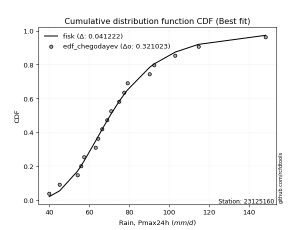</img>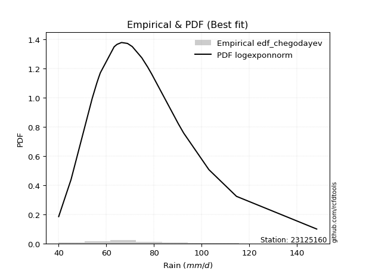</img>

</div>


### 6. EDF Blom (1958)

The Blom formula is a specific "plotting position" formula used in hydrology and statistical analysis to estimate the empirical cumulative probability (or non-exceedance probability) of a data series. It is particularly recommended for data that are approximately normally distributed. The constant _a_ is set to 0.375 (or 3/8).

<div align="center">


$P=(m-a)/(n+1-2a)$


</div>


**6.1. Empirical values**

<div align="center">

|                | 0                    | 1                   | 2                   | 3                   | 4                   | 5                  | 6                   | 7                  | 8                   | 9        | 10                 | 11                 | 12                 | 13                 | 14                 | 15                 | 16                 | 17                 | 18                 |
|:---------------|:---------------------|:--------------------|:--------------------|:--------------------|:--------------------|:-------------------|:--------------------|:-------------------|:--------------------|:---------|:-------------------|:-------------------|:-------------------|:-------------------|:-------------------|:-------------------|:-------------------|:-------------------|:-------------------|
| date           | 2006                 | 2022                | 2009                | 2021                | 2025                | 2013               | 2008                | 2014               | 2018                | 2005     | 2015               | 2016               | 2010               | 2011               | 2017               | 2019               | 2012               | 2020               | 2007               |
| x              | 40.0                 | 45.2                | 54.1                | 56.0                | 56.8                | 57.5               | 63.3                | 64.5               | 66.4                | 68.9     | 70.9               | 74.9               | 77.4               | 79.1               | 90.3               | 92.5               | 103.1              | 114.7              | 148.4              |
| m              | 1                    | 2                   | 3                   | 4                   | 5                   | 6                  | 7                   | 8                  | 9                   | 10       | 11                 | 12                 | 13                 | 14                 | 15                 | 16                 | 17                 | 18                 | 19                 |
| empirical_dist | edf_blom             | edf_blom            | edf_blom            | edf_blom            | edf_blom            | edf_blom           | edf_blom            | edf_blom           | edf_blom            | edf_blom | edf_blom           | edf_blom           | edf_blom           | edf_blom           | edf_blom           | edf_blom           | edf_blom           | edf_blom           | edf_blom           |
| empirical      | 0.032467532467532464 | 0.08441558441558442 | 0.13636363636363635 | 0.18831168831168832 | 0.24025974025974026 | 0.2922077922077922 | 0.34415584415584416 | 0.3961038961038961 | 0.44805194805194803 | 0.5      | 0.551948051948052  | 0.6038961038961039 | 0.6558441558441559 | 0.7077922077922078 | 0.7597402597402597 | 0.8116883116883117 | 0.8636363636363636 | 0.9155844155844156 | 0.9675324675324676 |
| empirical_tr   | 1.0335570469798658   | 1.0921985815602837  | 1.1578947368421053  | 1.232               | 1.3162393162393162  | 1.4128440366972477 | 1.5247524752475246  | 1.6559139784946235 | 1.811764705882353   | 2.0      | 2.2318840579710146 | 2.5245901639344264 | 2.905660377358491  | 3.4222222222222216 | 4.162162162162161  | 5.310344827586206  | 7.333333333333334  | 11.84615384615385  | 30.800000000000043 |

</div>


**6.2. Kolmogorov-Smirnov fit test (sorted by Δ)**


<div align="center">

|                | 0                   | 1                   | 2                   | 3                    | 4                    | 5                   | 6                   | 7                    | 8                    | 9                   | 10                   | 11                  | 12                  | 13                  | 14                  | 15                   | 16                   | 17                   | 18                  | 19                  | 20                   | 21                  | 22                  | 23                  | 24                  | 25                  | 26                  | 27                  | 28                  | 29                  | 30                   | 31                  | 32                  | 33                  | 34                  | 35                  | 36                  | 37                  | 38                  | 39                  | 40                  | 41                  | 42                  | 43                  | 44                  | 45                  | 46                  | 47                  | 48                  | 49                  | 50                  | 51                  | 52                  | 53                  | 54                  | 55                  | 56                  | 57                  | 58                  | 59                  | 60                  | 61                  | 62                  | 63                  | 64                  | 65                  | 66                  | 67                  | 68                  | 69                  | 70                  | 71                  | 72                  | 73                  | 74                  | 75                  | 76                  | 77                  | 78                  | 79                  | 80                  | 81                  | 82                  | 83                  | 84                  | 85                  | 86                  | 87                  | 88                  | 89                  | 90                  | 91                  | 92                  | 93                  | 94                  | 95                  | 96                  | 97                  | 98                  | 99                  | 100                 | 101                 | 102                 | 103                 | 104                 | 105                 | 106                 | 107                 | 108                 | 109                 | 110                 | 111                 | 112                 | 113                 | 114                 | 115                 | 116                 | 117                 | 118                 | 119                 | 120                 | 121                 | 122                 | 123                 | 124                 | 125                 | 126                 | 127                 | 128                 | 129                 | 130                 | 131                 | 132                 | 133                 | 134                 | 135                 | 136                 | 137                 | 138                 | 139                 | 140                 | 141                 | 142                 | 143                 | 144                 | 145                 | 146                 | 147                 | 148                 | 149                 | 150                 | 151                 | 152                 | 153                 | 154                 | 155                 | 156                 | 157                 | 158                 | 159                 |
|:---------------|:--------------------|:--------------------|:--------------------|:---------------------|:---------------------|:--------------------|:--------------------|:---------------------|:---------------------|:--------------------|:---------------------|:--------------------|:--------------------|:--------------------|:--------------------|:---------------------|:---------------------|:---------------------|:--------------------|:--------------------|:---------------------|:--------------------|:--------------------|:--------------------|:--------------------|:--------------------|:--------------------|:--------------------|:--------------------|:--------------------|:---------------------|:--------------------|:--------------------|:--------------------|:--------------------|:--------------------|:--------------------|:--------------------|:--------------------|:--------------------|:--------------------|:--------------------|:--------------------|:--------------------|:--------------------|:--------------------|:--------------------|:--------------------|:--------------------|:--------------------|:--------------------|:--------------------|:--------------------|:--------------------|:--------------------|:--------------------|:--------------------|:--------------------|:--------------------|:--------------------|:--------------------|:--------------------|:--------------------|:--------------------|:--------------------|:--------------------|:--------------------|:--------------------|:--------------------|:--------------------|:--------------------|:--------------------|:--------------------|:--------------------|:--------------------|:--------------------|:--------------------|:--------------------|:--------------------|:--------------------|:--------------------|:--------------------|:--------------------|:--------------------|:--------------------|:--------------------|:--------------------|:--------------------|:--------------------|:--------------------|:--------------------|:--------------------|:--------------------|:--------------------|:--------------------|:--------------------|:--------------------|:--------------------|:--------------------|:--------------------|:--------------------|:--------------------|:--------------------|:--------------------|:--------------------|:--------------------|:--------------------|:--------------------|:--------------------|:--------------------|:--------------------|:--------------------|:--------------------|:--------------------|:--------------------|:--------------------|:--------------------|:--------------------|:--------------------|:--------------------|:--------------------|:--------------------|:--------------------|:--------------------|:--------------------|:--------------------|:--------------------|:--------------------|:--------------------|:--------------------|:--------------------|:--------------------|:--------------------|:--------------------|:--------------------|:--------------------|:--------------------|:--------------------|:--------------------|:--------------------|:--------------------|:--------------------|:--------------------|:--------------------|:--------------------|:--------------------|:--------------------|:--------------------|:--------------------|:--------------------|:--------------------|:--------------------|:--------------------|:--------------------|:--------------------|:--------------------|:--------------------|:--------------------|:--------------------|:--------------------|
| station        | 23125160            | 23125160            | 23125160            | 23125160             | 23125160             | 23125160            | 23125160            | 23125160             | 23125160             | 23125160            | 23125160             | 23125160            | 23125160            | 23125160            | 23125160            | 23125160             | 23125160             | 23125160             | 23125160            | 23125160            | 23125160             | 23125160            | 23125160            | 23125160            | 23125160            | 23125160            | 23125160            | 23125160            | 23125160            | 23125160            | 23125160             | 23125160            | 23125160            | 23125160            | 23125160            | 23125160            | 23125160            | 23125160            | 23125160            | 23125160            | 23125160            | 23125160            | 23125160            | 23125160            | 23125160            | 23125160            | 23125160            | 23125160            | 23125160            | 23125160            | 23125160            | 23125160            | 23125160            | 23125160            | 23125160            | 23125160            | 23125160            | 23125160            | 23125160            | 23125160            | 23125160            | 23125160            | 23125160            | 23125160            | 23125160            | 23125160            | 23125160            | 23125160            | 23125160            | 23125160            | 23125160            | 23125160            | 23125160            | 23125160            | 23125160            | 23125160            | 23125160            | 23125160            | 23125160            | 23125160            | 23125160            | 23125160            | 23125160            | 23125160            | 23125160            | 23125160            | 23125160            | 23125160            | 23125160            | 23125160            | 23125160            | 23125160            | 23125160            | 23125160            | 23125160            | 23125160            | 23125160            | 23125160            | 23125160            | 23125160            | 23125160            | 23125160            | 23125160            | 23125160            | 23125160            | 23125160            | 23125160            | 23125160            | 23125160            | 23125160            | 23125160            | 23125160            | 23125160            | 23125160            | 23125160            | 23125160            | 23125160            | 23125160            | 23125160            | 23125160            | 23125160            | 23125160            | 23125160            | 23125160            | 23125160            | 23125160            | 23125160            | 23125160            | 23125160            | 23125160            | 23125160            | 23125160            | 23125160            | 23125160            | 23125160            | 23125160            | 23125160            | 23125160            | 23125160            | 23125160            | 23125160            | 23125160            | 23125160            | 23125160            | 23125160            | 23125160            | 23125160            | 23125160            | 23125160            | 23125160            | 23125160            | 23125160            | 23125160            | 23125160            | 23125160            | 23125160            | 23125160            | 23125160            | 23125160            | 23125160            |
| empirical_dist | edf_blom            | edf_blom            | edf_blom            | edf_blom             | edf_blom             | edf_blom            | edf_blom            | edf_blom             | edf_blom             | edf_blom            | edf_blom             | edf_blom            | edf_blom            | edf_blom            | edf_blom            | edf_blom             | edf_blom             | edf_blom             | edf_blom            | edf_blom            | edf_blom             | edf_blom            | edf_blom            | edf_blom            | edf_blom            | edf_blom            | edf_blom            | edf_blom            | edf_blom            | edf_blom            | edf_blom             | edf_blom            | edf_blom            | edf_blom            | edf_blom            | edf_blom            | edf_blom            | edf_blom            | edf_blom            | edf_blom            | edf_blom            | edf_blom            | edf_blom            | edf_blom            | edf_blom            | edf_blom            | edf_blom            | edf_blom            | edf_blom            | edf_blom            | edf_blom            | edf_blom            | edf_blom            | edf_blom            | edf_blom            | edf_blom            | edf_blom            | edf_blom            | edf_blom            | edf_blom            | edf_blom            | edf_blom            | edf_blom            | edf_blom            | edf_blom            | edf_blom            | edf_blom            | edf_blom            | edf_blom            | edf_blom            | edf_blom            | edf_blom            | edf_blom            | edf_blom            | edf_blom            | edf_blom            | edf_blom            | edf_blom            | edf_blom            | edf_blom            | edf_blom            | edf_blom            | edf_blom            | edf_blom            | edf_blom            | edf_blom            | edf_blom            | edf_blom            | edf_blom            | edf_blom            | edf_blom            | edf_blom            | edf_blom            | edf_blom            | edf_blom            | edf_blom            | edf_blom            | edf_blom            | edf_blom            | edf_blom            | edf_blom            | edf_blom            | edf_blom            | edf_blom            | edf_blom            | edf_blom            | edf_blom            | edf_blom            | edf_blom            | edf_blom            | edf_blom            | edf_blom            | edf_blom            | edf_blom            | edf_blom            | edf_blom            | edf_blom            | edf_blom            | edf_blom            | edf_blom            | edf_blom            | edf_blom            | edf_blom            | edf_blom            | edf_blom            | edf_blom            | edf_blom            | edf_blom            | edf_blom            | edf_blom            | edf_blom            | edf_blom            | edf_blom            | edf_blom            | edf_blom            | edf_blom            | edf_blom            | edf_blom            | edf_blom            | edf_blom            | edf_blom            | edf_blom            | edf_blom            | edf_blom            | edf_blom            | edf_blom            | edf_blom            | edf_blom            | edf_blom            | edf_blom            | edf_blom            | edf_blom            | edf_blom            | edf_blom            | edf_blom            | edf_blom            | edf_blom            | edf_blom            | edf_blom            | edf_blom            |
| p_dist         | logmielke           | burr                | loggenlogistic      | mielke               | exponnorm            | logburr             | logexponnorm        | alpha                | moyal                | invweibull          | genextreme           | logskewnorm         | loggennorm          | nct                 | logburr12           | logalpha             | loginvgamma          | logjohnsonsu         | invgamma            | logfatiguelife      | f                    | logpearson3         | loggenextreme       | logweibull_max      | logf                | loggamma            | loggamma            | logerlang           | loginvgauss         | lognct              | logncf               | johnsonsu           | loggumbel_r         | betaprime           | genlogistic         | invgauss            | logbetaprime        | logjohnsonsb        | logmaxwell          | lognakagami         | johnsonsb           | logrice             | logbeta             | lograyleigh         | logweibull_min      | loglogistic         | loginvweibull       | gamma               | erlang              | pearson3            | logloglaplace       | gumbel_r            | logexponweib        | logt                | logcrystalball      | lognorm             | loggengamma         | halflogistic        | logmoyal            | weibull_min         | logdweibull         | logvonmises_line    | logloggamma         | dweibull            | logdgamma           | loghypsecant        | logfoldnorm         | kstwobign           | loghalfnorm         | tukeylambda         | logtriang           | gennorm             | logkstwobign        | loganglit           | dgamma              | loghalflogistic     | kappa3              | logexponpow         | logsemicircular     | halfnorm            | genhalflogistic     | loglaplace          | loglaplace          | loggompertz         | rayleigh            | loggenexpon         | foldnorm            | wald                | maxwell             | rice                | skewnorm            | logcosine           | gompertz            | logtruncweibull_min | t                   | beta                | logwald             | loggumbel_l         | hypsecant           | logistic            | nakagami            | gausshyper          | truncnorm           | norm                | crystalball         | truncweibull_min    | logarcsine          | loggausshyper       | anglit              | laplace             | semicircular        | logbradford         | loghalfgennorm      | arcsine             | logtruncexpon       | vonmises_line       | loguniform          | logkappa3           | logtukeylambda      | triang              | logksone            | genexpon            | exponpow            | logkappa4           | logrdist            | gumbel_l            | truncexpon          | genpareto           | cosine              | logargus            | bradford            | loglomax            | burr12              | logwrapcauchy       | ncf                 | kappa4              | halfgennorm         | logtruncpareto      | ksone               | argus               | uniform             | wrapcauchy          | logtruncnorm        | loggenhalflogistic  | lomax               | powerlaw            | loggenpareto        | loglevy_l           | logtrapezoid        | logpowerlaw         | levy_l              | rdist               | fatiguelife         | trapezoid           | gengamma            | exponweib           | weibull_max         | truncpareto         | logvonmises         | vonmises            |
| delta          | 0.04402010767576378 | 0.04418391296097959 | 0.04421278608189566 | 0.044226614736509795 | 0.045122045731197546 | 0.04734801686596826 | 0.04746839864711688 | 0.049550614950170824 | 0.050686598986453446 | 0.05137137188764143 | 0.051371673996995604 | 0.05163232462424944 | 0.05211123976266252 | 0.05228410157825808 | 0.05233992337982338 | 0.053044639527560944 | 0.053633573597269085 | 0.054055197467390126 | 0.05433606334740629 | 0.05466870340862234 | 0.054833054961018896 | 0.05502241245810435 | 0.05515122229911004 | 0.05517360479115316 | 0.0553770811905962  | 0.05560816607171523 | 0.05560816607171523 | 0.05560835094024963 | 0.05596285322646022 | 0.0576842624224011  | 0.057884756445964025 | 0.05834134276493935 | 0.05836279903120129 | 0.0598324257027939  | 0.06026894362541402 | 0.06126564611879942 | 0.06234949111112664 | 0.06285383689640656 | 0.06303287645822098 | 0.06391662100389472 | 0.0639966428101118  | 0.06568039734667497 | 0.06691378543089674 | 0.06738428923186524 | 0.06870620640739167 | 0.06889961184250387 | 0.07187363854329992 | 0.07198840744029053 | 0.07198899868556219 | 0.07268803639424629 | 0.07304988367783938 | 0.07345996733761206 | 0.07455702953032797 | 0.07634954753282808 | 0.07642308738545622 | 0.0764231415195481  | 0.07664956996921954 | 0.07669943381739443 | 0.07702913925028736 | 0.07758366174596522 | 0.07905677016751156 | 0.07979064039726089 | 0.07991137328387321 | 0.08240502138529743 | 0.08362625558820203 | 0.08369547538793409 | 0.08441558441558442 | 0.08575742354625293 | 0.08673507450958046 | 0.08752878574917367 | 0.08893482720164936 | 0.09084415988316824 | 0.0926747035785836  | 0.09411435489529851 | 0.09494168622380672 | 0.0952460004943505  | 0.1009086861951666  | 0.10133538877580939 | 0.1015018869873392  | 0.10155367820214223 | 0.10284730476580037 | 0.10302320901502726 | 0.10302320901502726 | 0.10304962225033198 | 0.10413182110609753 | 0.10528657934356608 | 0.10942596657902537 | 0.11298787725955012 | 0.11345934858830642 | 0.11879329289038909 | 0.11955852409510576 | 0.1209638857126829  | 0.12245904045864536 | 0.1236019504895588  | 0.12397108111597804 | 0.12449400620671391 | 0.1272515504365011  | 0.12954226016111392 | 0.13085974855016863 | 0.13414180976746526 | 0.1357199063069583  | 0.13973024519776012 | 0.14278331361923136 | 0.1428102601838458  | 0.14281026528525753 | 0.14800137923047274 | 0.14909401686570428 | 0.15072158859989127 | 0.1519804264772674  | 0.15289669174795584 | 0.15577083284744875 | 0.1559971933650982  | 0.15943400620933468 | 0.1708837893869415  | 0.17232797953960016 | 0.17678671377849842 | 0.18771833863666654 | 0.18818826682312584 | 0.18819329536045426 | 0.19412318254218952 | 0.19548642563007046 | 0.19567462743578362 | 0.19736899216137455 | 0.20352133407340467 | 0.20397963501977756 | 0.20809070646667027 | 0.2243408597861568  | 0.23406456574658963 | 0.23481816515219145 | 0.24259348196649866 | 0.26629690011907237 | 0.27075471158085884 | 0.2719073035468933  | 0.27683822145185355 | 0.2933312520924185  | 0.2952488373586569  | 0.31692837934518087 | 0.317832748149928   | 0.3247571923771186  | 0.3436008261954169  | 0.3470911007811377  | 0.3594394318537967  | 0.35969384996853304 | 0.3602216157528928  | 0.3614508560785633  | 0.39108048008413554 | 0.4115435416093436  | 0.4206371975476049  | 0.4407841500078167  | 0.4465452843582146  | 0.470042374232095   | 0.5082387627092768  | 0.5597713696415151  | 0.5745863967346602  | 0.6053701664095413  | 0.6657616766124239  | 0.7742601085976525  | 0.8275556394482705  | 1.0519728962326989  | 22.919753644242846  |
| deltao         | 0.31564497164100014 | 0.31564497164100014 | 0.31564497164100014 | 0.31564497164100014  | 0.31564497164100014  | 0.31564497164100014 | 0.31564497164100014 | 0.31564497164100014  | 0.31564497164100014  | 0.31564497164100014 | 0.31564497164100014  | 0.31564497164100014 | 0.31564497164100014 | 0.31564497164100014 | 0.31564497164100014 | 0.31564497164100014  | 0.31564497164100014  | 0.31564497164100014  | 0.31564497164100014 | 0.31564497164100014 | 0.31564497164100014  | 0.31564497164100014 | 0.31564497164100014 | 0.31564497164100014 | 0.31564497164100014 | 0.31564497164100014 | 0.31564497164100014 | 0.31564497164100014 | 0.31564497164100014 | 0.31564497164100014 | 0.31564497164100014  | 0.31564497164100014 | 0.31564497164100014 | 0.31564497164100014 | 0.31564497164100014 | 0.31564497164100014 | 0.31564497164100014 | 0.31564497164100014 | 0.31564497164100014 | 0.31564497164100014 | 0.31564497164100014 | 0.31564497164100014 | 0.31564497164100014 | 0.31564497164100014 | 0.31564497164100014 | 0.31564497164100014 | 0.31564497164100014 | 0.31564497164100014 | 0.31564497164100014 | 0.31564497164100014 | 0.31564497164100014 | 0.31564497164100014 | 0.31564497164100014 | 0.31564497164100014 | 0.31564497164100014 | 0.31564497164100014 | 0.31564497164100014 | 0.31564497164100014 | 0.31564497164100014 | 0.31564497164100014 | 0.31564497164100014 | 0.31564497164100014 | 0.31564497164100014 | 0.31564497164100014 | 0.31564497164100014 | 0.31564497164100014 | 0.31564497164100014 | 0.31564497164100014 | 0.31564497164100014 | 0.31564497164100014 | 0.31564497164100014 | 0.31564497164100014 | 0.31564497164100014 | 0.31564497164100014 | 0.31564497164100014 | 0.31564497164100014 | 0.31564497164100014 | 0.31564497164100014 | 0.31564497164100014 | 0.31564497164100014 | 0.31564497164100014 | 0.31564497164100014 | 0.31564497164100014 | 0.31564497164100014 | 0.31564497164100014 | 0.31564497164100014 | 0.31564497164100014 | 0.31564497164100014 | 0.31564497164100014 | 0.31564497164100014 | 0.31564497164100014 | 0.31564497164100014 | 0.31564497164100014 | 0.31564497164100014 | 0.31564497164100014 | 0.31564497164100014 | 0.31564497164100014 | 0.31564497164100014 | 0.31564497164100014 | 0.31564497164100014 | 0.31564497164100014 | 0.31564497164100014 | 0.31564497164100014 | 0.31564497164100014 | 0.31564497164100014 | 0.31564497164100014 | 0.31564497164100014 | 0.31564497164100014 | 0.31564497164100014 | 0.31564497164100014 | 0.31564497164100014 | 0.31564497164100014 | 0.31564497164100014 | 0.31564497164100014 | 0.31564497164100014 | 0.31564497164100014 | 0.31564497164100014 | 0.31564497164100014 | 0.31564497164100014 | 0.31564497164100014 | 0.31564497164100014 | 0.31564497164100014 | 0.31564497164100014 | 0.31564497164100014 | 0.31564497164100014 | 0.31564497164100014 | 0.31564497164100014 | 0.31564497164100014 | 0.31564497164100014 | 0.31564497164100014 | 0.31564497164100014 | 0.31564497164100014 | 0.31564497164100014 | 0.31564497164100014 | 0.31564497164100014 | 0.31564497164100014 | 0.31564497164100014 | 0.31564497164100014 | 0.31564497164100014 | 0.31564497164100014 | 0.31564497164100014 | 0.31564497164100014 | 0.31564497164100014 | 0.31564497164100014 | 0.31564497164100014 | 0.31564497164100014 | 0.31564497164100014 | 0.31564497164100014 | 0.31564497164100014 | 0.31564497164100014 | 0.31564497164100014 | 0.31564497164100014 | 0.31564497164100014 | 0.31564497164100014 | 0.31564497164100014 | 0.31564497164100014 | 0.31564497164100014 | 0.31564497164100014 | 0.31564497164100014 | 0.31564497164100014 |
| eval           | Δo > Δ              | Δo > Δ              | Δo > Δ              | Δo > Δ               | Δo > Δ               | Δo > Δ              | Δo > Δ              | Δo > Δ               | Δo > Δ               | Δo > Δ              | Δo > Δ               | Δo > Δ              | Δo > Δ              | Δo > Δ              | Δo > Δ              | Δo > Δ               | Δo > Δ               | Δo > Δ               | Δo > Δ              | Δo > Δ              | Δo > Δ               | Δo > Δ              | Δo > Δ              | Δo > Δ              | Δo > Δ              | Δo > Δ              | Δo > Δ              | Δo > Δ              | Δo > Δ              | Δo > Δ              | Δo > Δ               | Δo > Δ              | Δo > Δ              | Δo > Δ              | Δo > Δ              | Δo > Δ              | Δo > Δ              | Δo > Δ              | Δo > Δ              | Δo > Δ              | Δo > Δ              | Δo > Δ              | Δo > Δ              | Δo > Δ              | Δo > Δ              | Δo > Δ              | Δo > Δ              | Δo > Δ              | Δo > Δ              | Δo > Δ              | Δo > Δ              | Δo > Δ              | Δo > Δ              | Δo > Δ              | Δo > Δ              | Δo > Δ              | Δo > Δ              | Δo > Δ              | Δo > Δ              | Δo > Δ              | Δo > Δ              | Δo > Δ              | Δo > Δ              | Δo > Δ              | Δo > Δ              | Δo > Δ              | Δo > Δ              | Δo > Δ              | Δo > Δ              | Δo > Δ              | Δo > Δ              | Δo > Δ              | Δo > Δ              | Δo > Δ              | Δo > Δ              | Δo > Δ              | Δo > Δ              | Δo > Δ              | Δo > Δ              | Δo > Δ              | Δo > Δ              | Δo > Δ              | Δo > Δ              | Δo > Δ              | Δo > Δ              | Δo > Δ              | Δo > Δ              | Δo > Δ              | Δo > Δ              | Δo > Δ              | Δo > Δ              | Δo > Δ              | Δo > Δ              | Δo > Δ              | Δo > Δ              | Δo > Δ              | Δo > Δ              | Δo > Δ              | Δo > Δ              | Δo > Δ              | Δo > Δ              | Δo > Δ              | Δo > Δ              | Δo > Δ              | Δo > Δ              | Δo > Δ              | Δo > Δ              | Δo > Δ              | Δo > Δ              | Δo > Δ              | Δo > Δ              | Δo > Δ              | Δo > Δ              | Δo > Δ              | Δo > Δ              | Δo > Δ              | Δo > Δ              | Δo > Δ              | Δo > Δ              | Δo > Δ              | Δo > Δ              | Δo > Δ              | Δo > Δ              | Δo > Δ              | Δo > Δ              | Δo > Δ              | Δo > Δ              | Δo > Δ              | Δo > Δ              | Δo > Δ              | Δo > Δ              | Δo > Δ              | Δo > Δ              | Δo > Δ              | Δo > Δ              | Δo > Δ              | Δo <= Δ             | Δo <= Δ             | Δo <= Δ             | Δo <= Δ             | Δo <= Δ             | Δo <= Δ             | Δo <= Δ             | Δo <= Δ             | Δo <= Δ             | Δo <= Δ             | Δo <= Δ             | Δo <= Δ             | Δo <= Δ             | Δo <= Δ             | Δo <= Δ             | Δo <= Δ             | Δo <= Δ             | Δo <= Δ             | Δo <= Δ             | Δo <= Δ             | Δo <= Δ             | Δo <= Δ             | Δo <= Δ             | Δo <= Δ             |
| fit            | 1                   | 1                   | 1                   | 1                    | 1                    | 1                   | 1                   | 1                    | 1                    | 1                   | 1                    | 1                   | 1                   | 1                   | 1                   | 1                    | 1                    | 1                    | 1                   | 1                   | 1                    | 1                   | 1                   | 1                   | 1                   | 1                   | 1                   | 1                   | 1                   | 1                   | 1                    | 1                   | 1                   | 1                   | 1                   | 1                   | 1                   | 1                   | 1                   | 1                   | 1                   | 1                   | 1                   | 1                   | 1                   | 1                   | 1                   | 1                   | 1                   | 1                   | 1                   | 1                   | 1                   | 1                   | 1                   | 1                   | 1                   | 1                   | 1                   | 1                   | 1                   | 1                   | 1                   | 1                   | 1                   | 1                   | 1                   | 1                   | 1                   | 1                   | 1                   | 1                   | 1                   | 1                   | 1                   | 1                   | 1                   | 1                   | 1                   | 1                   | 1                   | 1                   | 1                   | 1                   | 1                   | 1                   | 1                   | 1                   | 1                   | 1                   | 1                   | 1                   | 1                   | 1                   | 1                   | 1                   | 1                   | 1                   | 1                   | 1                   | 1                   | 1                   | 1                   | 1                   | 1                   | 1                   | 1                   | 1                   | 1                   | 1                   | 1                   | 1                   | 1                   | 1                   | 1                   | 1                   | 1                   | 1                   | 1                   | 1                   | 1                   | 1                   | 1                   | 1                   | 1                   | 1                   | 1                   | 1                   | 1                   | 1                   | 1                   | 1                   | 1                   | 1                   | 1                   | 1                   | 0                   | 0                   | 0                   | 0                   | 0                   | 0                   | 0                   | 0                   | 0                   | 0                   | 0                   | 0                   | 0                   | 0                   | 0                   | 0                   | 0                   | 0                   | 0                   | 0                   | 0                   | 0                   | 0                   | 0                   |
| n              | 19                  | 19                  | 19                  | 19                   | 19                   | 19                  | 19                  | 19                   | 19                   | 19                  | 19                   | 19                  | 19                  | 19                  | 19                  | 19                   | 19                   | 19                   | 19                  | 19                  | 19                   | 19                  | 19                  | 19                  | 19                  | 19                  | 19                  | 19                  | 19                  | 19                  | 19                   | 19                  | 19                  | 19                  | 19                  | 19                  | 19                  | 19                  | 19                  | 19                  | 19                  | 19                  | 19                  | 19                  | 19                  | 19                  | 19                  | 19                  | 19                  | 19                  | 19                  | 19                  | 19                  | 19                  | 19                  | 19                  | 19                  | 19                  | 19                  | 19                  | 19                  | 19                  | 19                  | 19                  | 19                  | 19                  | 19                  | 19                  | 19                  | 19                  | 19                  | 19                  | 19                  | 19                  | 19                  | 19                  | 19                  | 19                  | 19                  | 19                  | 19                  | 19                  | 19                  | 19                  | 19                  | 19                  | 19                  | 19                  | 19                  | 19                  | 19                  | 19                  | 19                  | 19                  | 19                  | 19                  | 19                  | 19                  | 19                  | 19                  | 19                  | 19                  | 19                  | 19                  | 19                  | 19                  | 19                  | 19                  | 19                  | 19                  | 19                  | 19                  | 19                  | 19                  | 19                  | 19                  | 19                  | 19                  | 19                  | 19                  | 19                  | 19                  | 19                  | 19                  | 19                  | 19                  | 19                  | 19                  | 19                  | 19                  | 19                  | 19                  | 19                  | 19                  | 19                  | 19                  | 19                  | 19                  | 19                  | 19                  | 19                  | 19                  | 19                  | 19                  | 19                  | 19                  | 19                  | 19                  | 19                  | 19                  | 19                  | 19                  | 19                  | 19                  | 19                  | 19                  | 19                  | 19                  | 19                  | 19                  |
| best_fit       | 1                   | 0                   | 0                   | 0                    | 0                    | 0                   | 0                   | 0                    | 0                    | 0                   | 0                    | 0                   | 0                   | 0                   | 0                   | 0                    | 0                    | 0                    | 0                   | 0                   | 0                    | 0                   | 0                   | 0                   | 0                   | 0                   | 0                   | 0                   | 0                   | 0                   | 0                    | 0                   | 0                   | 0                   | 0                   | 0                   | 0                   | 0                   | 0                   | 0                   | 0                   | 0                   | 0                   | 0                   | 0                   | 0                   | 0                   | 0                   | 0                   | 0                   | 0                   | 0                   | 0                   | 0                   | 0                   | 0                   | 0                   | 0                   | 0                   | 0                   | 0                   | 0                   | 0                   | 0                   | 0                   | 0                   | 0                   | 0                   | 0                   | 0                   | 0                   | 0                   | 0                   | 0                   | 0                   | 0                   | 0                   | 0                   | 0                   | 0                   | 0                   | 0                   | 0                   | 0                   | 0                   | 0                   | 0                   | 0                   | 0                   | 0                   | 0                   | 0                   | 0                   | 0                   | 0                   | 0                   | 0                   | 0                   | 0                   | 0                   | 0                   | 0                   | 0                   | 0                   | 0                   | 0                   | 0                   | 0                   | 0                   | 0                   | 0                   | 0                   | 0                   | 0                   | 0                   | 0                   | 0                   | 0                   | 0                   | 0                   | 0                   | 0                   | 0                   | 0                   | 0                   | 0                   | 0                   | 0                   | 0                   | 0                   | 0                   | 0                   | 0                   | 0                   | 0                   | 0                   | 0                   | 0                   | 0                   | 0                   | 0                   | 0                   | 0                   | 0                   | 0                   | 0                   | 0                   | 0                   | 0                   | 0                   | 0                   | 0                   | 0                   | 0                   | 0                   | 0                   | 0                   | 0                   | 0                   | 0                   |
| best_fit_sort  | 1                   | 2                   | 3                   | 4                    | 5                    | 6                   | 7                   | 8                    | 9                    | 10                  | 11                   | 12                  | 13                  | 14                  | 15                  | 16                   | 17                   | 18                   | 19                  | 20                  | 21                   | 22                  | 23                  | 24                  | 25                  | 26                  | 27                  | 28                  | 29                  | 30                  | 31                   | 32                  | 33                  | 34                  | 35                  | 36                  | 37                  | 38                  | 39                  | 40                  | 41                  | 42                  | 43                  | 44                  | 45                  | 46                  | 47                  | 48                  | 49                  | 50                  | 51                  | 52                  | 53                  | 54                  | 55                  | 56                  | 57                  | 58                  | 59                  | 60                  | 61                  | 62                  | 63                  | 64                  | 65                  | 66                  | 67                  | 68                  | 69                  | 70                  | 71                  | 72                  | 73                  | 74                  | 75                  | 76                  | 77                  | 78                  | 79                  | 80                  | 81                  | 82                  | 83                  | 84                  | 85                  | 86                  | 87                  | 88                  | 89                  | 90                  | 91                  | 92                  | 93                  | 94                  | 95                  | 96                  | 97                  | 98                  | 99                  | 100                 | 101                 | 102                 | 103                 | 104                 | 105                 | 106                 | 107                 | 108                 | 109                 | 110                 | 111                 | 112                 | 113                 | 114                 | 115                 | 116                 | 117                 | 118                 | 119                 | 120                 | 121                 | 122                 | 123                 | 124                 | 125                 | 126                 | 127                 | 128                 | 129                 | 130                 | 131                 | 132                 | 133                 | 134                 | 135                 | 136                 | 137                 | 138                 | 139                 | 140                 | 141                 | 142                 | 143                 | 144                 | 145                 | 146                 | 147                 | 148                 | 149                 | 150                 | 151                 | 152                 | 153                 | 154                 | 155                 | 156                 | 157                 | 158                 | 159                 | 160                 |

</div>


**6.3. Best fit**

<div align="center">

|   id |   station | empirical_dist   | p_dist    |     delta |   deltao | eval   |   fit |   n |   best_fit |   best_fit_sort |
|-----:|----------:|:-----------------|:----------|----------:|---------:|:-------|------:|----:|-----------:|----------------:|
|    0 |  23125160 | edf_blom         | logmielke | 0.0440201 | 0.315645 | Δo > Δ |     1 |  19 |          1 |               1 |

</div>


<div align="center">

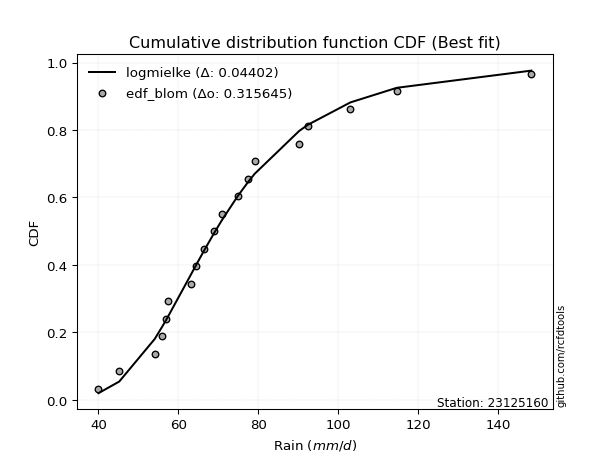</img></img>

</div>


### 7. EDF Tukey (1962)

In hydrology, the Tukey formula is used as a plotting position formula to estimate the empirical probability or frequency of a flood event (or other hydrological data). The formula parameter is given as _c=0.333_ (or 1/3).

<div align="center">


$P=(m-c)/(n+1-2c)$


</div>


**7.1. Empirical values**

<div align="center">

|                | 0                    | 1                   | 2                   | 3                  | 4                  | 5                   | 6                  | 7                   | 8                  | 9         | 10                 | 11                 | 12                 | 13                 | 14                 | 15                 | 16                 | 17                 | 18                 |
|:---------------|:---------------------|:--------------------|:--------------------|:-------------------|:-------------------|:--------------------|:-------------------|:--------------------|:-------------------|:----------|:-------------------|:-------------------|:-------------------|:-------------------|:-------------------|:-------------------|:-------------------|:-------------------|:-------------------|
| date           | 2006                 | 2022                | 2009                | 2021               | 2025               | 2013                | 2008               | 2014                | 2018               | 2005      | 2015               | 2016               | 2010               | 2011               | 2017               | 2019               | 2012               | 2020               | 2007               |
| x              | 40.0                 | 45.2                | 54.1                | 56.0               | 56.8               | 57.5                | 63.3               | 64.5                | 66.4               | 68.9      | 70.9               | 74.9               | 77.4               | 79.1               | 90.3               | 92.5               | 103.1              | 114.7              | 148.4              |
| m              | 1                    | 2                   | 3                   | 4                  | 5                  | 6                   | 7                  | 8                   | 9                  | 10        | 11                 | 12                 | 13                 | 14                 | 15                 | 16                 | 17                 | 18                 | 19                 |
| empirical_dist | edf_tukey            | edf_tukey           | edf_tukey           | edf_tukey          | edf_tukey          | edf_tukey           | edf_tukey          | edf_tukey           | edf_tukey          | edf_tukey | edf_tukey          | edf_tukey          | edf_tukey          | edf_tukey          | edf_tukey          | edf_tukey          | edf_tukey          | edf_tukey          | edf_tukey          |
| empirical      | 0.034482758620689655 | 0.08620689655172414 | 0.13793103448275862 | 0.1896551724137931 | 0.2413793103448276 | 0.29310344827586204 | 0.3448275862068966 | 0.39655172413793105 | 0.4482758620689655 | 0.5       | 0.5517241379310345 | 0.603448275862069  | 0.6551724137931034 | 0.7068965517241379 | 0.7586206896551724 | 0.8103448275862069 | 0.8620689655172413 | 0.9137931034482759 | 0.9655172413793104 |
| empirical_tr   | 1.0357142857142856   | 1.0943396226415094  | 1.1600000000000001  | 1.2340425531914894 | 1.3181818181818183 | 1.4146341463414636  | 1.5263157894736843 | 1.6571428571428573  | 1.8125             | 2.0       | 2.230769230769231  | 2.5217391304347827 | 2.9                | 3.4117647058823524 | 4.142857142857142  | 5.272727272727272  | 7.249999999999997  | 11.600000000000007 | 29.000000000000036 |

</div>


**7.2. Kolmogorov-Smirnov fit test (sorted by Δ)**


<div align="center">

|                | 0                   | 1                   | 2                   | 3                    | 4                   | 5                    | 6                   | 7                   | 8                   | 9                    | 10                  | 11                  | 12                   | 13                  | 14                  | 15                  | 16                  | 17                  | 18                  | 19                  | 20                  | 21                  | 22                  | 23                  | 24                   | 25                   | 26                   | 27                   | 28                  | 29                  | 30                  | 31                   | 32                  | 33                  | 34                   | 35                  | 36                  | 37                  | 38                  | 39                  | 40                  | 41                  | 42                  | 43                  | 44                  | 45                  | 46                  | 47                  | 48                  | 49                  | 50                  | 51                  | 52                  | 53                  | 54                  | 55                  | 56                  | 57                  | 58                  | 59                  | 60                  | 61                  | 62                  | 63                  | 64                  | 65                  | 66                  | 67                  | 68                  | 69                  | 70                  | 71                  | 72                  | 73                  | 74                  | 75                  | 76                  | 77                  | 78                  | 79                  | 80                  | 81                  | 82                  | 83                  | 84                  | 85                  | 86                  | 87                  | 88                  | 89                  | 90                  | 91                  | 92                  | 93                  | 94                  | 95                  | 96                  | 97                  | 98                  | 99                  | 100                 | 101                 | 102                 | 103                 | 104                 | 105                 | 106                 | 107                 | 108                 | 109                 | 110                 | 111                 | 112                 | 113                 | 114                 | 115                 | 116                 | 117                 | 118                 | 119                 | 120                 | 121                 | 122                 | 123                 | 124                 | 125                 | 126                 | 127                 | 128                 | 129                 | 130                 | 131                 | 132                 | 133                 | 134                 | 135                 | 136                 | 137                 | 138                 | 139                 | 140                 | 141                 | 142                 | 143                 | 144                 | 145                 | 146                 | 147                 | 148                 | 149                 | 150                 | 151                 | 152                 | 153                 | 154                 | 155                 | 156                 | 157                 | 158                 | 159                 |
|:---------------|:--------------------|:--------------------|:--------------------|:---------------------|:--------------------|:---------------------|:--------------------|:--------------------|:--------------------|:---------------------|:--------------------|:--------------------|:---------------------|:--------------------|:--------------------|:--------------------|:--------------------|:--------------------|:--------------------|:--------------------|:--------------------|:--------------------|:--------------------|:--------------------|:---------------------|:---------------------|:---------------------|:---------------------|:--------------------|:--------------------|:--------------------|:---------------------|:--------------------|:--------------------|:---------------------|:--------------------|:--------------------|:--------------------|:--------------------|:--------------------|:--------------------|:--------------------|:--------------------|:--------------------|:--------------------|:--------------------|:--------------------|:--------------------|:--------------------|:--------------------|:--------------------|:--------------------|:--------------------|:--------------------|:--------------------|:--------------------|:--------------------|:--------------------|:--------------------|:--------------------|:--------------------|:--------------------|:--------------------|:--------------------|:--------------------|:--------------------|:--------------------|:--------------------|:--------------------|:--------------------|:--------------------|:--------------------|:--------------------|:--------------------|:--------------------|:--------------------|:--------------------|:--------------------|:--------------------|:--------------------|:--------------------|:--------------------|:--------------------|:--------------------|:--------------------|:--------------------|:--------------------|:--------------------|:--------------------|:--------------------|:--------------------|:--------------------|:--------------------|:--------------------|:--------------------|:--------------------|:--------------------|:--------------------|:--------------------|:--------------------|:--------------------|:--------------------|:--------------------|:--------------------|:--------------------|:--------------------|:--------------------|:--------------------|:--------------------|:--------------------|:--------------------|:--------------------|:--------------------|:--------------------|:--------------------|:--------------------|:--------------------|:--------------------|:--------------------|:--------------------|:--------------------|:--------------------|:--------------------|:--------------------|:--------------------|:--------------------|:--------------------|:--------------------|:--------------------|:--------------------|:--------------------|:--------------------|:--------------------|:--------------------|:--------------------|:--------------------|:--------------------|:--------------------|:--------------------|:--------------------|:--------------------|:--------------------|:--------------------|:--------------------|:--------------------|:--------------------|:--------------------|:--------------------|:--------------------|:--------------------|:--------------------|:--------------------|:--------------------|:--------------------|:--------------------|:--------------------|:--------------------|:--------------------|:--------------------|:--------------------|
| station        | 23125160            | 23125160            | 23125160            | 23125160             | 23125160            | 23125160             | 23125160            | 23125160            | 23125160            | 23125160             | 23125160            | 23125160            | 23125160             | 23125160            | 23125160            | 23125160            | 23125160            | 23125160            | 23125160            | 23125160            | 23125160            | 23125160            | 23125160            | 23125160            | 23125160             | 23125160             | 23125160             | 23125160             | 23125160            | 23125160            | 23125160            | 23125160             | 23125160            | 23125160            | 23125160             | 23125160            | 23125160            | 23125160            | 23125160            | 23125160            | 23125160            | 23125160            | 23125160            | 23125160            | 23125160            | 23125160            | 23125160            | 23125160            | 23125160            | 23125160            | 23125160            | 23125160            | 23125160            | 23125160            | 23125160            | 23125160            | 23125160            | 23125160            | 23125160            | 23125160            | 23125160            | 23125160            | 23125160            | 23125160            | 23125160            | 23125160            | 23125160            | 23125160            | 23125160            | 23125160            | 23125160            | 23125160            | 23125160            | 23125160            | 23125160            | 23125160            | 23125160            | 23125160            | 23125160            | 23125160            | 23125160            | 23125160            | 23125160            | 23125160            | 23125160            | 23125160            | 23125160            | 23125160            | 23125160            | 23125160            | 23125160            | 23125160            | 23125160            | 23125160            | 23125160            | 23125160            | 23125160            | 23125160            | 23125160            | 23125160            | 23125160            | 23125160            | 23125160            | 23125160            | 23125160            | 23125160            | 23125160            | 23125160            | 23125160            | 23125160            | 23125160            | 23125160            | 23125160            | 23125160            | 23125160            | 23125160            | 23125160            | 23125160            | 23125160            | 23125160            | 23125160            | 23125160            | 23125160            | 23125160            | 23125160            | 23125160            | 23125160            | 23125160            | 23125160            | 23125160            | 23125160            | 23125160            | 23125160            | 23125160            | 23125160            | 23125160            | 23125160            | 23125160            | 23125160            | 23125160            | 23125160            | 23125160            | 23125160            | 23125160            | 23125160            | 23125160            | 23125160            | 23125160            | 23125160            | 23125160            | 23125160            | 23125160            | 23125160            | 23125160            | 23125160            | 23125160            | 23125160            | 23125160            | 23125160            | 23125160            |
| empirical_dist | edf_tukey           | edf_tukey           | edf_tukey           | edf_tukey            | edf_tukey           | edf_tukey            | edf_tukey           | edf_tukey           | edf_tukey           | edf_tukey            | edf_tukey           | edf_tukey           | edf_tukey            | edf_tukey           | edf_tukey           | edf_tukey           | edf_tukey           | edf_tukey           | edf_tukey           | edf_tukey           | edf_tukey           | edf_tukey           | edf_tukey           | edf_tukey           | edf_tukey            | edf_tukey            | edf_tukey            | edf_tukey            | edf_tukey           | edf_tukey           | edf_tukey           | edf_tukey            | edf_tukey           | edf_tukey           | edf_tukey            | edf_tukey           | edf_tukey           | edf_tukey           | edf_tukey           | edf_tukey           | edf_tukey           | edf_tukey           | edf_tukey           | edf_tukey           | edf_tukey           | edf_tukey           | edf_tukey           | edf_tukey           | edf_tukey           | edf_tukey           | edf_tukey           | edf_tukey           | edf_tukey           | edf_tukey           | edf_tukey           | edf_tukey           | edf_tukey           | edf_tukey           | edf_tukey           | edf_tukey           | edf_tukey           | edf_tukey           | edf_tukey           | edf_tukey           | edf_tukey           | edf_tukey           | edf_tukey           | edf_tukey           | edf_tukey           | edf_tukey           | edf_tukey           | edf_tukey           | edf_tukey           | edf_tukey           | edf_tukey           | edf_tukey           | edf_tukey           | edf_tukey           | edf_tukey           | edf_tukey           | edf_tukey           | edf_tukey           | edf_tukey           | edf_tukey           | edf_tukey           | edf_tukey           | edf_tukey           | edf_tukey           | edf_tukey           | edf_tukey           | edf_tukey           | edf_tukey           | edf_tukey           | edf_tukey           | edf_tukey           | edf_tukey           | edf_tukey           | edf_tukey           | edf_tukey           | edf_tukey           | edf_tukey           | edf_tukey           | edf_tukey           | edf_tukey           | edf_tukey           | edf_tukey           | edf_tukey           | edf_tukey           | edf_tukey           | edf_tukey           | edf_tukey           | edf_tukey           | edf_tukey           | edf_tukey           | edf_tukey           | edf_tukey           | edf_tukey           | edf_tukey           | edf_tukey           | edf_tukey           | edf_tukey           | edf_tukey           | edf_tukey           | edf_tukey           | edf_tukey           | edf_tukey           | edf_tukey           | edf_tukey           | edf_tukey           | edf_tukey           | edf_tukey           | edf_tukey           | edf_tukey           | edf_tukey           | edf_tukey           | edf_tukey           | edf_tukey           | edf_tukey           | edf_tukey           | edf_tukey           | edf_tukey           | edf_tukey           | edf_tukey           | edf_tukey           | edf_tukey           | edf_tukey           | edf_tukey           | edf_tukey           | edf_tukey           | edf_tukey           | edf_tukey           | edf_tukey           | edf_tukey           | edf_tukey           | edf_tukey           | edf_tukey           | edf_tukey           | edf_tukey           | edf_tukey           | edf_tukey           |
| p_dist         | logmielke           | burr                | loggenlogistic      | mielke               | logexponnorm        | exponnorm            | alpha               | logburr             | moyal               | invweibull           | genextreme          | logskewnorm         | nct                  | loggennorm          | logalpha            | loginvgamma         | logjohnsonsu        | invgamma            | logfatiguelife      | logburr12           | f                   | logpearson3         | loggenextreme       | logweibull_max      | logf                 | loggamma             | loggamma             | logerlang            | loginvgauss         | johnsonsu           | lognct              | logncf               | betaprime           | genlogistic         | invgauss             | loggumbel_r         | logjohnsonsb        | logbetaprime        | logmaxwell          | lognakagami         | johnsonsb           | logrice             | logbeta             | lograyleigh         | logweibull_min      | loglogistic         | loginvweibull       | gamma               | erlang              | pearson3            | gumbel_r            | logexponweib        | logloglaplace       | loggengamma         | logt                | logcrystalball      | lognorm             | halflogistic        | logmoyal            | logloggamma         | weibull_min         | logdweibull         | logvonmises_line    | dweibull            | loghypsecant        | logdgamma           | kstwobign           | logfoldnorm         | loghalfnorm         | logtriang           | tukeylambda         | gennorm             | logkstwobign        | loganglit           | loghalflogistic     | dgamma              | kappa3              | logexponpow         | halfnorm            | logsemicircular     | genhalflogistic     | loggompertz         | rayleigh            | loggenexpon         | loglaplace          | loglaplace          | foldnorm            | maxwell             | wald                | rice                | skewnorm            | logcosine           | gompertz            | logtruncweibull_min | t                   | beta                | loggumbel_l         | logwald             | hypsecant           | logistic            | nakagami            | gausshyper          | truncnorm           | norm                | crystalball         | truncweibull_min    | logarcsine          | loggausshyper       | anglit              | laplace             | logbradford         | semicircular        | loghalfgennorm      | arcsine             | logtruncexpon       | vonmises_line       | loguniform          | logkappa3           | logtukeylambda      | triang              | genexpon            | logksone            | exponpow            | logkappa4           | logrdist            | gumbel_l            | truncexpon          | genpareto           | cosine              | logargus            | bradford            | loglomax            | burr12              | logwrapcauchy       | ncf                 | kappa4              | halfgennorm         | logtruncpareto      | ksone               | argus               | uniform             | wrapcauchy          | logtruncnorm        | loggenhalflogistic  | lomax               | powerlaw            | loggenpareto        | loglevy_l           | logtrapezoid        | logpowerlaw         | levy_l              | rdist               | fatiguelife         | trapezoid           | gengamma            | exponweib           | weibull_max         | truncpareto         | logvonmises         | vonmises            |
| delta          | 0.04491576374383363 | 0.04507956902904944 | 0.04510844214996551 | 0.045122270804579645 | 0.04590100052799462 | 0.046017701799267396 | 0.04798321683104856 | 0.04824367293403811 | 0.04911920086733118 | 0.049803973768519166 | 0.04980427587787334 | 0.05006492650512717 | 0.050716703459135815 | 0.05121558369459267 | 0.05147724140843868 | 0.05206617547814682 | 0.05248779934826786 | 0.05276866522828402 | 0.05310130528950008 | 0.05323557944789323 | 0.05326565684189663 | 0.05345501433898209 | 0.05358382417998778 | 0.05360620667203089 | 0.053809683071473935 | 0.054040767952592966 | 0.054040767952592966 | 0.054040952821127364 | 0.05439545510733795 | 0.05677394464581709 | 0.05678860635433125 | 0.056989100377894175 | 0.05893676963472405 | 0.05937328755734417 | 0.059698247999677156 | 0.06015411116734102 | 0.06128643877728429 | 0.06145383504305679 | 0.06146547833909871 | 0.06234922288477246 | 0.06242924469098954 | 0.0641129992275527  | 0.06534638731177447 | 0.06581689111274297 | 0.0671388082882694  | 0.06979526791057372 | 0.07030624042417766 | 0.07042100932116827 | 0.07042160056643992 | 0.07112063827512402 | 0.07256431126954221 | 0.07298963141120571 | 0.07416945376292672 | 0.07508217185009727 | 0.07545389146475823 | 0.07552743131738637 | 0.07552748545147825 | 0.07849074595353416 | 0.07882045138642708 | 0.07901571721580336 | 0.07937497388210495 | 0.0801763402525989  | 0.08068629646533074 | 0.08083762326617516 | 0.08459113145600394 | 0.08474582567328937 | 0.08486176747818308 | 0.08620689655172414 | 0.08620689655172414 | 0.08803917113357951 | 0.088648355834261   | 0.08927676176404598 | 0.09110730545946133 | 0.09321869882722866 | 0.09457425844329809 | 0.09606125630889406 | 0.09934128807604434 | 0.09976799065668712 | 0.09998628008301996 | 0.10060623091926935 | 0.1012799066466781  | 0.10148222413120972 | 0.10323616503802768 | 0.10371918122444382 | 0.10391886508309711 | 0.10391886508309711 | 0.1078585684599031  | 0.11256369252023657 | 0.11388353332761997 | 0.11789763682231924 | 0.11799112597598349 | 0.12006822964461306 | 0.1208916423395231  | 0.12203455237043653 | 0.12240368299685578 | 0.12292660808759165 | 0.12864660409304407 | 0.12881894855562337 | 0.13063583453315114 | 0.1332461536993954  | 0.13415250818783603 | 0.13816284707863785 | 0.1418876575511615  | 0.14191460411577594 | 0.14191460921718768 | 0.1471057231624029  | 0.14752661874658202 | 0.14982593253182142 | 0.15108477040919754 | 0.15267277773093835 | 0.15442979524597594 | 0.1548751767793789  | 0.1578666080902124  | 0.16998813331887164 | 0.1707605814204779  | 0.17589105771042857 | 0.1868226825685967  | 0.187292610755056   | 0.1872976392923844  | 0.19322752647411967 | 0.19410722931666136 | 0.19414294152796563 | 0.19580159404225228 | 0.20262567800533482 | 0.20263615091767273 | 0.20719505039860042 | 0.22344520371808696 | 0.23204933959343244 | 0.2339225090841216  | 0.2416978258984288  | 0.2654012440510025  | 0.2691873134617366  | 0.27033990542777103 | 0.27527082333273123 | 0.29176385397329624 | 0.2943531812905871  | 0.3153609812260586  | 0.31626535003080575 | 0.32341370827501376 | 0.342705170127347   | 0.34619544471306785 | 0.357648119717657   | 0.3581264518494108  | 0.35932595968482295 | 0.3601073719764585  | 0.3895130819650133  | 0.4095283154561864  | 0.41862197139444773 | 0.4398884939397468  | 0.44497788623909235 | 0.4680271480789378  | 0.5062235365561196  | 0.5582039715223928  | 0.5732429126325553  | 0.603802768290419   | 0.6641942784933017  | 0.7724687964615128  | 0.8257643273121307  | 1.0504054981135764  | 22.921768870396004  |
| deltao         | 0.31564497164100014 | 0.31564497164100014 | 0.31564497164100014 | 0.31564497164100014  | 0.31564497164100014 | 0.31564497164100014  | 0.31564497164100014 | 0.31564497164100014 | 0.31564497164100014 | 0.31564497164100014  | 0.31564497164100014 | 0.31564497164100014 | 0.31564497164100014  | 0.31564497164100014 | 0.31564497164100014 | 0.31564497164100014 | 0.31564497164100014 | 0.31564497164100014 | 0.31564497164100014 | 0.31564497164100014 | 0.31564497164100014 | 0.31564497164100014 | 0.31564497164100014 | 0.31564497164100014 | 0.31564497164100014  | 0.31564497164100014  | 0.31564497164100014  | 0.31564497164100014  | 0.31564497164100014 | 0.31564497164100014 | 0.31564497164100014 | 0.31564497164100014  | 0.31564497164100014 | 0.31564497164100014 | 0.31564497164100014  | 0.31564497164100014 | 0.31564497164100014 | 0.31564497164100014 | 0.31564497164100014 | 0.31564497164100014 | 0.31564497164100014 | 0.31564497164100014 | 0.31564497164100014 | 0.31564497164100014 | 0.31564497164100014 | 0.31564497164100014 | 0.31564497164100014 | 0.31564497164100014 | 0.31564497164100014 | 0.31564497164100014 | 0.31564497164100014 | 0.31564497164100014 | 0.31564497164100014 | 0.31564497164100014 | 0.31564497164100014 | 0.31564497164100014 | 0.31564497164100014 | 0.31564497164100014 | 0.31564497164100014 | 0.31564497164100014 | 0.31564497164100014 | 0.31564497164100014 | 0.31564497164100014 | 0.31564497164100014 | 0.31564497164100014 | 0.31564497164100014 | 0.31564497164100014 | 0.31564497164100014 | 0.31564497164100014 | 0.31564497164100014 | 0.31564497164100014 | 0.31564497164100014 | 0.31564497164100014 | 0.31564497164100014 | 0.31564497164100014 | 0.31564497164100014 | 0.31564497164100014 | 0.31564497164100014 | 0.31564497164100014 | 0.31564497164100014 | 0.31564497164100014 | 0.31564497164100014 | 0.31564497164100014 | 0.31564497164100014 | 0.31564497164100014 | 0.31564497164100014 | 0.31564497164100014 | 0.31564497164100014 | 0.31564497164100014 | 0.31564497164100014 | 0.31564497164100014 | 0.31564497164100014 | 0.31564497164100014 | 0.31564497164100014 | 0.31564497164100014 | 0.31564497164100014 | 0.31564497164100014 | 0.31564497164100014 | 0.31564497164100014 | 0.31564497164100014 | 0.31564497164100014 | 0.31564497164100014 | 0.31564497164100014 | 0.31564497164100014 | 0.31564497164100014 | 0.31564497164100014 | 0.31564497164100014 | 0.31564497164100014 | 0.31564497164100014 | 0.31564497164100014 | 0.31564497164100014 | 0.31564497164100014 | 0.31564497164100014 | 0.31564497164100014 | 0.31564497164100014 | 0.31564497164100014 | 0.31564497164100014 | 0.31564497164100014 | 0.31564497164100014 | 0.31564497164100014 | 0.31564497164100014 | 0.31564497164100014 | 0.31564497164100014 | 0.31564497164100014 | 0.31564497164100014 | 0.31564497164100014 | 0.31564497164100014 | 0.31564497164100014 | 0.31564497164100014 | 0.31564497164100014 | 0.31564497164100014 | 0.31564497164100014 | 0.31564497164100014 | 0.31564497164100014 | 0.31564497164100014 | 0.31564497164100014 | 0.31564497164100014 | 0.31564497164100014 | 0.31564497164100014 | 0.31564497164100014 | 0.31564497164100014 | 0.31564497164100014 | 0.31564497164100014 | 0.31564497164100014 | 0.31564497164100014 | 0.31564497164100014 | 0.31564497164100014 | 0.31564497164100014 | 0.31564497164100014 | 0.31564497164100014 | 0.31564497164100014 | 0.31564497164100014 | 0.31564497164100014 | 0.31564497164100014 | 0.31564497164100014 | 0.31564497164100014 | 0.31564497164100014 | 0.31564497164100014 | 0.31564497164100014 | 0.31564497164100014 |
| eval           | Δo > Δ              | Δo > Δ              | Δo > Δ              | Δo > Δ               | Δo > Δ              | Δo > Δ               | Δo > Δ              | Δo > Δ              | Δo > Δ              | Δo > Δ               | Δo > Δ              | Δo > Δ              | Δo > Δ               | Δo > Δ              | Δo > Δ              | Δo > Δ              | Δo > Δ              | Δo > Δ              | Δo > Δ              | Δo > Δ              | Δo > Δ              | Δo > Δ              | Δo > Δ              | Δo > Δ              | Δo > Δ               | Δo > Δ               | Δo > Δ               | Δo > Δ               | Δo > Δ              | Δo > Δ              | Δo > Δ              | Δo > Δ               | Δo > Δ              | Δo > Δ              | Δo > Δ               | Δo > Δ              | Δo > Δ              | Δo > Δ              | Δo > Δ              | Δo > Δ              | Δo > Δ              | Δo > Δ              | Δo > Δ              | Δo > Δ              | Δo > Δ              | Δo > Δ              | Δo > Δ              | Δo > Δ              | Δo > Δ              | Δo > Δ              | Δo > Δ              | Δo > Δ              | Δo > Δ              | Δo > Δ              | Δo > Δ              | Δo > Δ              | Δo > Δ              | Δo > Δ              | Δo > Δ              | Δo > Δ              | Δo > Δ              | Δo > Δ              | Δo > Δ              | Δo > Δ              | Δo > Δ              | Δo > Δ              | Δo > Δ              | Δo > Δ              | Δo > Δ              | Δo > Δ              | Δo > Δ              | Δo > Δ              | Δo > Δ              | Δo > Δ              | Δo > Δ              | Δo > Δ              | Δo > Δ              | Δo > Δ              | Δo > Δ              | Δo > Δ              | Δo > Δ              | Δo > Δ              | Δo > Δ              | Δo > Δ              | Δo > Δ              | Δo > Δ              | Δo > Δ              | Δo > Δ              | Δo > Δ              | Δo > Δ              | Δo > Δ              | Δo > Δ              | Δo > Δ              | Δo > Δ              | Δo > Δ              | Δo > Δ              | Δo > Δ              | Δo > Δ              | Δo > Δ              | Δo > Δ              | Δo > Δ              | Δo > Δ              | Δo > Δ              | Δo > Δ              | Δo > Δ              | Δo > Δ              | Δo > Δ              | Δo > Δ              | Δo > Δ              | Δo > Δ              | Δo > Δ              | Δo > Δ              | Δo > Δ              | Δo > Δ              | Δo > Δ              | Δo > Δ              | Δo > Δ              | Δo > Δ              | Δo > Δ              | Δo > Δ              | Δo > Δ              | Δo > Δ              | Δo > Δ              | Δo > Δ              | Δo > Δ              | Δo > Δ              | Δo > Δ              | Δo > Δ              | Δo > Δ              | Δo > Δ              | Δo > Δ              | Δo > Δ              | Δo > Δ              | Δo > Δ              | Δo > Δ              | Δo > Δ              | Δo > Δ              | Δo <= Δ             | Δo <= Δ             | Δo <= Δ             | Δo <= Δ             | Δo <= Δ             | Δo <= Δ             | Δo <= Δ             | Δo <= Δ             | Δo <= Δ             | Δo <= Δ             | Δo <= Δ             | Δo <= Δ             | Δo <= Δ             | Δo <= Δ             | Δo <= Δ             | Δo <= Δ             | Δo <= Δ             | Δo <= Δ             | Δo <= Δ             | Δo <= Δ             | Δo <= Δ             | Δo <= Δ             | Δo <= Δ             |
| fit            | 1                   | 1                   | 1                   | 1                    | 1                   | 1                    | 1                   | 1                   | 1                   | 1                    | 1                   | 1                   | 1                    | 1                   | 1                   | 1                   | 1                   | 1                   | 1                   | 1                   | 1                   | 1                   | 1                   | 1                   | 1                    | 1                    | 1                    | 1                    | 1                   | 1                   | 1                   | 1                    | 1                   | 1                   | 1                    | 1                   | 1                   | 1                   | 1                   | 1                   | 1                   | 1                   | 1                   | 1                   | 1                   | 1                   | 1                   | 1                   | 1                   | 1                   | 1                   | 1                   | 1                   | 1                   | 1                   | 1                   | 1                   | 1                   | 1                   | 1                   | 1                   | 1                   | 1                   | 1                   | 1                   | 1                   | 1                   | 1                   | 1                   | 1                   | 1                   | 1                   | 1                   | 1                   | 1                   | 1                   | 1                   | 1                   | 1                   | 1                   | 1                   | 1                   | 1                   | 1                   | 1                   | 1                   | 1                   | 1                   | 1                   | 1                   | 1                   | 1                   | 1                   | 1                   | 1                   | 1                   | 1                   | 1                   | 1                   | 1                   | 1                   | 1                   | 1                   | 1                   | 1                   | 1                   | 1                   | 1                   | 1                   | 1                   | 1                   | 1                   | 1                   | 1                   | 1                   | 1                   | 1                   | 1                   | 1                   | 1                   | 1                   | 1                   | 1                   | 1                   | 1                   | 1                   | 1                   | 1                   | 1                   | 1                   | 1                   | 1                   | 1                   | 1                   | 1                   | 1                   | 1                   | 0                   | 0                   | 0                   | 0                   | 0                   | 0                   | 0                   | 0                   | 0                   | 0                   | 0                   | 0                   | 0                   | 0                   | 0                   | 0                   | 0                   | 0                   | 0                   | 0                   | 0                   | 0                   | 0                   |
| n              | 19                  | 19                  | 19                  | 19                   | 19                  | 19                   | 19                  | 19                  | 19                  | 19                   | 19                  | 19                  | 19                   | 19                  | 19                  | 19                  | 19                  | 19                  | 19                  | 19                  | 19                  | 19                  | 19                  | 19                  | 19                   | 19                   | 19                   | 19                   | 19                  | 19                  | 19                  | 19                   | 19                  | 19                  | 19                   | 19                  | 19                  | 19                  | 19                  | 19                  | 19                  | 19                  | 19                  | 19                  | 19                  | 19                  | 19                  | 19                  | 19                  | 19                  | 19                  | 19                  | 19                  | 19                  | 19                  | 19                  | 19                  | 19                  | 19                  | 19                  | 19                  | 19                  | 19                  | 19                  | 19                  | 19                  | 19                  | 19                  | 19                  | 19                  | 19                  | 19                  | 19                  | 19                  | 19                  | 19                  | 19                  | 19                  | 19                  | 19                  | 19                  | 19                  | 19                  | 19                  | 19                  | 19                  | 19                  | 19                  | 19                  | 19                  | 19                  | 19                  | 19                  | 19                  | 19                  | 19                  | 19                  | 19                  | 19                  | 19                  | 19                  | 19                  | 19                  | 19                  | 19                  | 19                  | 19                  | 19                  | 19                  | 19                  | 19                  | 19                  | 19                  | 19                  | 19                  | 19                  | 19                  | 19                  | 19                  | 19                  | 19                  | 19                  | 19                  | 19                  | 19                  | 19                  | 19                  | 19                  | 19                  | 19                  | 19                  | 19                  | 19                  | 19                  | 19                  | 19                  | 19                  | 19                  | 19                  | 19                  | 19                  | 19                  | 19                  | 19                  | 19                  | 19                  | 19                  | 19                  | 19                  | 19                  | 19                  | 19                  | 19                  | 19                  | 19                  | 19                  | 19                  | 19                  | 19                  | 19                  |
| best_fit       | 1                   | 0                   | 0                   | 0                    | 0                   | 0                    | 0                   | 0                   | 0                   | 0                    | 0                   | 0                   | 0                    | 0                   | 0                   | 0                   | 0                   | 0                   | 0                   | 0                   | 0                   | 0                   | 0                   | 0                   | 0                    | 0                    | 0                    | 0                    | 0                   | 0                   | 0                   | 0                    | 0                   | 0                   | 0                    | 0                   | 0                   | 0                   | 0                   | 0                   | 0                   | 0                   | 0                   | 0                   | 0                   | 0                   | 0                   | 0                   | 0                   | 0                   | 0                   | 0                   | 0                   | 0                   | 0                   | 0                   | 0                   | 0                   | 0                   | 0                   | 0                   | 0                   | 0                   | 0                   | 0                   | 0                   | 0                   | 0                   | 0                   | 0                   | 0                   | 0                   | 0                   | 0                   | 0                   | 0                   | 0                   | 0                   | 0                   | 0                   | 0                   | 0                   | 0                   | 0                   | 0                   | 0                   | 0                   | 0                   | 0                   | 0                   | 0                   | 0                   | 0                   | 0                   | 0                   | 0                   | 0                   | 0                   | 0                   | 0                   | 0                   | 0                   | 0                   | 0                   | 0                   | 0                   | 0                   | 0                   | 0                   | 0                   | 0                   | 0                   | 0                   | 0                   | 0                   | 0                   | 0                   | 0                   | 0                   | 0                   | 0                   | 0                   | 0                   | 0                   | 0                   | 0                   | 0                   | 0                   | 0                   | 0                   | 0                   | 0                   | 0                   | 0                   | 0                   | 0                   | 0                   | 0                   | 0                   | 0                   | 0                   | 0                   | 0                   | 0                   | 0                   | 0                   | 0                   | 0                   | 0                   | 0                   | 0                   | 0                   | 0                   | 0                   | 0                   | 0                   | 0                   | 0                   | 0                   | 0                   |
| best_fit_sort  | 1                   | 2                   | 3                   | 4                    | 5                   | 6                    | 7                   | 8                   | 9                   | 10                   | 11                  | 12                  | 13                   | 14                  | 15                  | 16                  | 17                  | 18                  | 19                  | 20                  | 21                  | 22                  | 23                  | 24                  | 25                   | 26                   | 27                   | 28                   | 29                  | 30                  | 31                  | 32                   | 33                  | 34                  | 35                   | 36                  | 37                  | 38                  | 39                  | 40                  | 41                  | 42                  | 43                  | 44                  | 45                  | 46                  | 47                  | 48                  | 49                  | 50                  | 51                  | 52                  | 53                  | 54                  | 55                  | 56                  | 57                  | 58                  | 59                  | 60                  | 61                  | 62                  | 63                  | 64                  | 65                  | 66                  | 67                  | 68                  | 69                  | 70                  | 71                  | 72                  | 73                  | 74                  | 75                  | 76                  | 77                  | 78                  | 79                  | 80                  | 81                  | 82                  | 83                  | 84                  | 85                  | 86                  | 87                  | 88                  | 89                  | 90                  | 91                  | 92                  | 93                  | 94                  | 95                  | 96                  | 97                  | 98                  | 99                  | 100                 | 101                 | 102                 | 103                 | 104                 | 105                 | 106                 | 107                 | 108                 | 109                 | 110                 | 111                 | 112                 | 113                 | 114                 | 115                 | 116                 | 117                 | 118                 | 119                 | 120                 | 121                 | 122                 | 123                 | 124                 | 125                 | 126                 | 127                 | 128                 | 129                 | 130                 | 131                 | 132                 | 133                 | 134                 | 135                 | 136                 | 137                 | 138                 | 139                 | 140                 | 141                 | 142                 | 143                 | 144                 | 145                 | 146                 | 147                 | 148                 | 149                 | 150                 | 151                 | 152                 | 153                 | 154                 | 155                 | 156                 | 157                 | 158                 | 159                 | 160                 |

</div>


**7.3. Best fit**

<div align="center">

|   id |   station | empirical_dist   | p_dist    |     delta |   deltao | eval   |   fit |   n |   best_fit |   best_fit_sort |
|-----:|----------:|:-----------------|:----------|----------:|---------:|:-------|------:|----:|-----------:|----------------:|
|    0 |  23125160 | edf_tukey        | logmielke | 0.0449158 | 0.315645 | Δo > Δ |     1 |  19 |          1 |               1 |

</div>


<div align="center">

</img>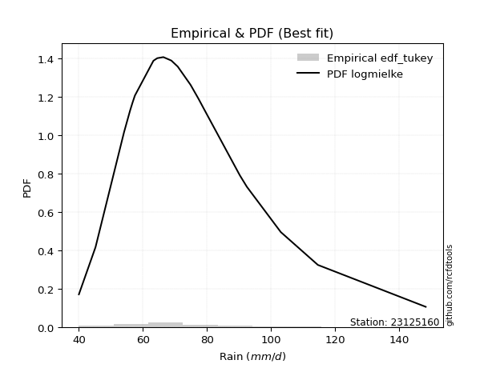</img>

</div>


### 8. EDF Gringorten (1963)

Gringorten plotting position formula is essential for estimating the probability and return periods of extreme events like floods and heavy rainfall. The constant _a=0.44_.

<div align="center">


$P=(m-a)/(n+1-2a)$


</div>


**8.1. Empirical values**

<div align="center">

|                | 0                    | 1                   | 2                   | 3                   | 4                   | 5                   | 6                  | 7                  | 8                  | 9              | 10                 | 11                | 12                 | 13                 | 14                 | 15                 | 16                 | 17                 | 18                 |
|:---------------|:---------------------|:--------------------|:--------------------|:--------------------|:--------------------|:--------------------|:-------------------|:-------------------|:-------------------|:---------------|:-------------------|:------------------|:-------------------|:-------------------|:-------------------|:-------------------|:-------------------|:-------------------|:-------------------|
| date           | 2006                 | 2022                | 2009                | 2021                | 2025                | 2013                | 2008               | 2014               | 2018               | 2005           | 2015               | 2016              | 2010               | 2011               | 2017               | 2019               | 2012               | 2020               | 2007               |
| x              | 40.0                 | 45.2                | 54.1                | 56.0                | 56.8                | 57.5                | 63.3               | 64.5               | 66.4               | 68.9           | 70.9               | 74.9              | 77.4               | 79.1               | 90.3               | 92.5               | 103.1              | 114.7              | 148.4              |
| m              | 1                    | 2                   | 3                   | 4                   | 5                   | 6                   | 7                  | 8                  | 9                  | 10             | 11                 | 12                | 13                 | 14                 | 15                 | 16                 | 17                 | 18                 | 19                 |
| empirical_dist | edf_gringorten       | edf_gringorten      | edf_gringorten      | edf_gringorten      | edf_gringorten      | edf_gringorten      | edf_gringorten     | edf_gringorten     | edf_gringorten     | edf_gringorten | edf_gringorten     | edf_gringorten    | edf_gringorten     | edf_gringorten     | edf_gringorten     | edf_gringorten     | edf_gringorten     | edf_gringorten     | edf_gringorten     |
| empirical      | 0.029288702928870293 | 0.08158995815899582 | 0.13389121338912133 | 0.18619246861924685 | 0.23849372384937234 | 0.29079497907949786 | 0.3430962343096234 | 0.3953974895397489 | 0.4476987447698745 | 0.5            | 0.5523012552301255 | 0.604602510460251 | 0.6569037656903766 | 0.7092050209205021 | 0.7615062761506276 | 0.8138075313807531 | 0.8661087866108785 | 0.918410041841004  | 0.9707112970711296 |
| empirical_tr   | 1.0301724137931034   | 1.0888382687927107  | 1.1545893719806763  | 1.2287917737789202  | 1.313186813186813   | 1.4100294985250739  | 1.522292993630573  | 1.6539792387543253 | 1.8106060606060606 | 2.0            | 2.2336448598130842 | 2.529100529100529 | 2.9146341463414633 | 3.4388489208633093 | 4.192982456140351  | 5.370786516853932  | 7.468749999999993  | 12.256410256410238 | 34.14285714285699  |

</div>


**8.2. Kolmogorov-Smirnov fit test (sorted by Δ)**


<div align="center">

|                | 0                   | 1                   | 2                    | 3                    | 4                   | 5                    | 6                   | 7                    | 8                   | 9                   | 10                  | 11                  | 12                  | 13                  | 14                   | 15                  | 16                  | 17                  | 18                   | 19                  | 20                  | 21                  | 22                  | 23                   | 24                   | 25                  | 26                  | 27                   | 28                  | 29                   | 30                  | 31                  | 32                  | 33                  | 34                  | 35                  | 36                  | 37                  | 38                  | 39                  | 40                  | 41                  | 42                  | 43                  | 44                  | 45                  | 46                  | 47                  | 48                  | 49                  | 50                  | 51                  | 52                  | 53                  | 54                  | 55                  | 56                  | 57                  | 58                  | 59                  | 60                  | 61                  | 62                  | 63                  | 64                  | 65                  | 66                  | 67                  | 68                  | 69                  | 70                  | 71                  | 72                  | 73                  | 74                  | 75                  | 76                  | 77                  | 78                  | 79                  | 80                  | 81                  | 82                  | 83                  | 84                  | 85                  | 86                  | 87                  | 88                  | 89                  | 90                  | 91                  | 92                  | 93                  | 94                  | 95                  | 96                  | 97                  | 98                  | 99                  | 100                 | 101                 | 102                 | 103                 | 104                 | 105                 | 106                 | 107                 | 108                 | 109                 | 110                 | 111                 | 112                 | 113                 | 114                 | 115                 | 116                 | 117                 | 118                 | 119                 | 120                 | 121                 | 122                 | 123                 | 124                 | 125                 | 126                 | 127                 | 128                 | 129                 | 130                 | 131                 | 132                 | 133                 | 134                 | 135                 | 136                 | 137                 | 138                 | 139                 | 140                 | 141                 | 142                 | 143                 | 144                 | 145                 | 146                 | 147                 | 148                 | 149                 | 150                 | 151                 | 152                 | 153                 | 154                 | 155                 | 156                 | 157                 | 158                 | 159                 |
|:---------------|:--------------------|:--------------------|:---------------------|:---------------------|:--------------------|:---------------------|:--------------------|:---------------------|:--------------------|:--------------------|:--------------------|:--------------------|:--------------------|:--------------------|:---------------------|:--------------------|:--------------------|:--------------------|:---------------------|:--------------------|:--------------------|:--------------------|:--------------------|:---------------------|:---------------------|:--------------------|:--------------------|:---------------------|:--------------------|:---------------------|:--------------------|:--------------------|:--------------------|:--------------------|:--------------------|:--------------------|:--------------------|:--------------------|:--------------------|:--------------------|:--------------------|:--------------------|:--------------------|:--------------------|:--------------------|:--------------------|:--------------------|:--------------------|:--------------------|:--------------------|:--------------------|:--------------------|:--------------------|:--------------------|:--------------------|:--------------------|:--------------------|:--------------------|:--------------------|:--------------------|:--------------------|:--------------------|:--------------------|:--------------------|:--------------------|:--------------------|:--------------------|:--------------------|:--------------------|:--------------------|:--------------------|:--------------------|:--------------------|:--------------------|:--------------------|:--------------------|:--------------------|:--------------------|:--------------------|:--------------------|:--------------------|:--------------------|:--------------------|:--------------------|:--------------------|:--------------------|:--------------------|:--------------------|:--------------------|:--------------------|:--------------------|:--------------------|:--------------------|:--------------------|:--------------------|:--------------------|:--------------------|:--------------------|:--------------------|:--------------------|:--------------------|:--------------------|:--------------------|:--------------------|:--------------------|:--------------------|:--------------------|:--------------------|:--------------------|:--------------------|:--------------------|:--------------------|:--------------------|:--------------------|:--------------------|:--------------------|:--------------------|:--------------------|:--------------------|:--------------------|:--------------------|:--------------------|:--------------------|:--------------------|:--------------------|:--------------------|:--------------------|:--------------------|:--------------------|:--------------------|:--------------------|:--------------------|:--------------------|:--------------------|:--------------------|:--------------------|:--------------------|:--------------------|:--------------------|:--------------------|:--------------------|:--------------------|:--------------------|:--------------------|:--------------------|:--------------------|:--------------------|:--------------------|:--------------------|:--------------------|:--------------------|:--------------------|:--------------------|:--------------------|:--------------------|:--------------------|:--------------------|:--------------------|:--------------------|:--------------------|
| station        | 23125160            | 23125160            | 23125160             | 23125160             | 23125160            | 23125160             | 23125160            | 23125160             | 23125160            | 23125160            | 23125160            | 23125160            | 23125160            | 23125160            | 23125160             | 23125160            | 23125160            | 23125160            | 23125160             | 23125160            | 23125160            | 23125160            | 23125160            | 23125160             | 23125160             | 23125160            | 23125160            | 23125160             | 23125160            | 23125160             | 23125160            | 23125160            | 23125160            | 23125160            | 23125160            | 23125160            | 23125160            | 23125160            | 23125160            | 23125160            | 23125160            | 23125160            | 23125160            | 23125160            | 23125160            | 23125160            | 23125160            | 23125160            | 23125160            | 23125160            | 23125160            | 23125160            | 23125160            | 23125160            | 23125160            | 23125160            | 23125160            | 23125160            | 23125160            | 23125160            | 23125160            | 23125160            | 23125160            | 23125160            | 23125160            | 23125160            | 23125160            | 23125160            | 23125160            | 23125160            | 23125160            | 23125160            | 23125160            | 23125160            | 23125160            | 23125160            | 23125160            | 23125160            | 23125160            | 23125160            | 23125160            | 23125160            | 23125160            | 23125160            | 23125160            | 23125160            | 23125160            | 23125160            | 23125160            | 23125160            | 23125160            | 23125160            | 23125160            | 23125160            | 23125160            | 23125160            | 23125160            | 23125160            | 23125160            | 23125160            | 23125160            | 23125160            | 23125160            | 23125160            | 23125160            | 23125160            | 23125160            | 23125160            | 23125160            | 23125160            | 23125160            | 23125160            | 23125160            | 23125160            | 23125160            | 23125160            | 23125160            | 23125160            | 23125160            | 23125160            | 23125160            | 23125160            | 23125160            | 23125160            | 23125160            | 23125160            | 23125160            | 23125160            | 23125160            | 23125160            | 23125160            | 23125160            | 23125160            | 23125160            | 23125160            | 23125160            | 23125160            | 23125160            | 23125160            | 23125160            | 23125160            | 23125160            | 23125160            | 23125160            | 23125160            | 23125160            | 23125160            | 23125160            | 23125160            | 23125160            | 23125160            | 23125160            | 23125160            | 23125160            | 23125160            | 23125160            | 23125160            | 23125160            | 23125160            | 23125160            |
| empirical_dist | edf_gringorten      | edf_gringorten      | edf_gringorten       | edf_gringorten       | edf_gringorten      | edf_gringorten       | edf_gringorten      | edf_gringorten       | edf_gringorten      | edf_gringorten      | edf_gringorten      | edf_gringorten      | edf_gringorten      | edf_gringorten      | edf_gringorten       | edf_gringorten      | edf_gringorten      | edf_gringorten      | edf_gringorten       | edf_gringorten      | edf_gringorten      | edf_gringorten      | edf_gringorten      | edf_gringorten       | edf_gringorten       | edf_gringorten      | edf_gringorten      | edf_gringorten       | edf_gringorten      | edf_gringorten       | edf_gringorten      | edf_gringorten      | edf_gringorten      | edf_gringorten      | edf_gringorten      | edf_gringorten      | edf_gringorten      | edf_gringorten      | edf_gringorten      | edf_gringorten      | edf_gringorten      | edf_gringorten      | edf_gringorten      | edf_gringorten      | edf_gringorten      | edf_gringorten      | edf_gringorten      | edf_gringorten      | edf_gringorten      | edf_gringorten      | edf_gringorten      | edf_gringorten      | edf_gringorten      | edf_gringorten      | edf_gringorten      | edf_gringorten      | edf_gringorten      | edf_gringorten      | edf_gringorten      | edf_gringorten      | edf_gringorten      | edf_gringorten      | edf_gringorten      | edf_gringorten      | edf_gringorten      | edf_gringorten      | edf_gringorten      | edf_gringorten      | edf_gringorten      | edf_gringorten      | edf_gringorten      | edf_gringorten      | edf_gringorten      | edf_gringorten      | edf_gringorten      | edf_gringorten      | edf_gringorten      | edf_gringorten      | edf_gringorten      | edf_gringorten      | edf_gringorten      | edf_gringorten      | edf_gringorten      | edf_gringorten      | edf_gringorten      | edf_gringorten      | edf_gringorten      | edf_gringorten      | edf_gringorten      | edf_gringorten      | edf_gringorten      | edf_gringorten      | edf_gringorten      | edf_gringorten      | edf_gringorten      | edf_gringorten      | edf_gringorten      | edf_gringorten      | edf_gringorten      | edf_gringorten      | edf_gringorten      | edf_gringorten      | edf_gringorten      | edf_gringorten      | edf_gringorten      | edf_gringorten      | edf_gringorten      | edf_gringorten      | edf_gringorten      | edf_gringorten      | edf_gringorten      | edf_gringorten      | edf_gringorten      | edf_gringorten      | edf_gringorten      | edf_gringorten      | edf_gringorten      | edf_gringorten      | edf_gringorten      | edf_gringorten      | edf_gringorten      | edf_gringorten      | edf_gringorten      | edf_gringorten      | edf_gringorten      | edf_gringorten      | edf_gringorten      | edf_gringorten      | edf_gringorten      | edf_gringorten      | edf_gringorten      | edf_gringorten      | edf_gringorten      | edf_gringorten      | edf_gringorten      | edf_gringorten      | edf_gringorten      | edf_gringorten      | edf_gringorten      | edf_gringorten      | edf_gringorten      | edf_gringorten      | edf_gringorten      | edf_gringorten      | edf_gringorten      | edf_gringorten      | edf_gringorten      | edf_gringorten      | edf_gringorten      | edf_gringorten      | edf_gringorten      | edf_gringorten      | edf_gringorten      | edf_gringorten      | edf_gringorten      | edf_gringorten      | edf_gringorten      | edf_gringorten      | edf_gringorten      | edf_gringorten      |
| p_dist         | exponnorm           | logburr             | mielke               | loggenlogistic       | burr                | logmielke            | logexponnorm        | logburr12            | alpha               | moyal               | loggennorm          | invweibull          | genextreme          | logskewnorm         | nct                  | logalpha            | loginvgamma         | logjohnsonsu        | invgamma             | logfatiguelife      | f                   | logpearson3         | loggenextreme       | logweibull_max       | logf                 | loggamma            | loggamma            | logerlang            | loggumbel_r         | loginvgauss          | lognct              | logncf              | johnsonsu           | betaprime           | genlogistic         | invgauss            | logbetaprime        | logjohnsonsb        | logmaxwell          | lognakagami         | johnsonsb           | loglogistic         | logrice             | logbeta             | lograyleigh         | logweibull_min      | logloglaplace       | loginvweibull       | gamma               | erlang              | weibull_min         | gumbel_r            | pearson3            | halflogistic        | logmoyal            | logexponweib        | logdweibull         | logt                | logcrystalball      | lognorm             | logvonmises_line    | loggengamma         | logloggamma         | logdgamma           | loghypsecant        | dweibull            | logfoldnorm         | tukeylambda         | kstwobign           | loghalfnorm         | logtriang           | dgamma              | gennorm             | logkstwobign        | loganglit           | loghalflogistic     | loglaplace          | loglaplace          | logsemicircular     | kappa3              | logexponpow         | halfnorm            | genhalflogistic     | loggompertz         | rayleigh            | loggenexpon         | wald                | foldnorm            | maxwell             | rice                | skewnorm            | logcosine           | logwald             | gompertz            | logtruncweibull_min | t                   | beta                | loggumbel_l         | hypsecant           | logistic            | nakagami            | gausshyper          | truncnorm           | norm                | crystalball         | truncweibull_min    | logarcsine          | loggausshyper       | laplace             | anglit              | semicircular        | logbradford         | loghalfgennorm      | arcsine             | logtruncexpon       | vonmises_line       | loguniform          | logkappa3           | logtukeylambda      | triang              | logksone            | genexpon            | exponpow            | logkappa4           | logrdist            | gumbel_l            | truncexpon          | cosine              | genpareto           | logargus            | bradford            | loglomax            | burr12              | logwrapcauchy       | ncf                 | kappa4              | halfgennorm         | logtruncpareto      | ksone               | argus               | uniform             | loggenhalflogistic  | logtruncnorm        | wrapcauchy          | lomax               | powerlaw            | loggenpareto        | loglevy_l           | logtrapezoid        | logpowerlaw         | levy_l              | rdist               | fatiguelife         | trapezoid           | gengamma            | exponweib           | weibull_max         | truncpareto         | logvonmises         | vonmises            |
| delta          | 0.04458434131448871 | 0.04593520373767393 | 0.046296517611783244 | 0.046308057269489694 | 0.04633270433299316 | 0.046390380384807195 | 0.04994082162163191 | 0.050927110251529045 | 0.05202303792468585 | 0.05315902196096847 | 0.05356099618876778 | 0.05384379486215646 | 0.05384409697151063 | 0.05410474759876446 | 0.054756524552773106 | 0.05551706250207597 | 0.05610599657178411 | 0.05652762044190515 | 0.056808486321921314 | 0.05714112638313737 | 0.05730547793553392 | 0.05749483543261938 | 0.05762364527362507 | 0.057646027765668184 | 0.057849504165111226 | 0.05808058904623026 | 0.05808058904623026 | 0.058080773914764655 | 0.05823391810206352 | 0.058435276200975245 | 0.05909707555069543 | 0.05929756957425836 | 0.06081376573945438 | 0.06124523883108823 | 0.06168175675370835 | 0.06373806909331445 | 0.06376230423942097 | 0.06532625987092158 | 0.065505299432736   | 0.06638904397840975 | 0.06646906578462683 | 0.06748679871420954 | 0.06815282032119    | 0.06938620840541176 | 0.06985671220638026 | 0.0711786293819067  | 0.07128386726747149 | 0.07434606151781495 | 0.07446083041480556 | 0.07446142166007721 | 0.07475803548937662 | 0.0748727804659064  | 0.07516045936876131 | 0.07574208194707893 | 0.07643965382433787 | 0.077029452504843   | 0.07729075375714367 | 0.07776236066112241 | 0.07783590051375056 | 0.07783595464784243 | 0.07837782726896655 | 0.07912199294373456 | 0.08132418641216754 | 0.08186023917783414 | 0.08228266225963976 | 0.08487744435981245 | 0.08515184895113062 | 0.08576276933880578 | 0.08717023667454726 | 0.08779468435580123 | 0.09034764032994369 | 0.09317566981343883 | 0.09331658285768327 | 0.09514712655309862 | 0.09552716802359285 | 0.09630561034057128 | 0.10161039588673293 | 0.10161039588673293 | 0.10291470011563353 | 0.10338110916968163 | 0.10380781175032441 | 0.10402610117665725 | 0.1053197277403154  | 0.10552204522484701 | 0.10554463423439187 | 0.10775900231808111 | 0.11157506413125579 | 0.1118983895535404  | 0.11487216171660075 | 0.12020610601868342 | 0.12203094706962078 | 0.12237669884097724 | 0.12477912746198609 | 0.12493146343316039 | 0.12607437346407382 | 0.12644350409049307 | 0.12696642918122894 | 0.13095507328940825 | 0.1312129518322422  | 0.1355546228957596  | 0.13819232928147332 | 0.14220266817227514 | 0.1441961267475257  | 0.14422307331214013 | 0.14422307841355186 | 0.14941419235876707 | 0.1515664398402193  | 0.1521344017281856  | 0.1532498950300294  | 0.15339323960556173 | 0.15718364597574308 | 0.15846961633961323 | 0.1619064291838497  | 0.17229660251523582 | 0.1748004025141152  | 0.17819952690679275 | 0.18913115176496087 | 0.18960107995142017 | 0.1896061084887486  | 0.19553599567048385 | 0.1976056453225119  | 0.19814705041029865 | 0.19984141513588957 | 0.204934147201699   | 0.206098854712219   | 0.2095035195949646  | 0.22575367291445114 | 0.23623097828048578 | 0.23724339528525182 | 0.244006295094793   | 0.2677097132473667  | 0.27322713455537384 | 0.2743797265214083  | 0.27931064442636844 | 0.2958036750669335  | 0.29666165048695126 | 0.3194008023196959  | 0.320305171124443   | 0.32687641206956003 | 0.3450136393237112  | 0.34850391390943203 | 0.36163442888118713 | 0.36216627294304804 | 0.3622650581103851  | 0.36357007577100475 | 0.39355290305865054 | 0.41472237114800575 | 0.4238160270862671  | 0.442196963136111   | 0.4490177073327296  | 0.47322120377075716 | 0.5114175922479389  | 0.5622437926160301  | 0.5767056164271016  | 0.6078425893840563  | 0.6682340995869389  | 0.7770857348542409  | 0.830381265704859   | 1.0544453192072138  | 22.916574814704184  |
| deltao         | 0.31564497164100014 | 0.31564497164100014 | 0.31564497164100014  | 0.31564497164100014  | 0.31564497164100014 | 0.31564497164100014  | 0.31564497164100014 | 0.31564497164100014  | 0.31564497164100014 | 0.31564497164100014 | 0.31564497164100014 | 0.31564497164100014 | 0.31564497164100014 | 0.31564497164100014 | 0.31564497164100014  | 0.31564497164100014 | 0.31564497164100014 | 0.31564497164100014 | 0.31564497164100014  | 0.31564497164100014 | 0.31564497164100014 | 0.31564497164100014 | 0.31564497164100014 | 0.31564497164100014  | 0.31564497164100014  | 0.31564497164100014 | 0.31564497164100014 | 0.31564497164100014  | 0.31564497164100014 | 0.31564497164100014  | 0.31564497164100014 | 0.31564497164100014 | 0.31564497164100014 | 0.31564497164100014 | 0.31564497164100014 | 0.31564497164100014 | 0.31564497164100014 | 0.31564497164100014 | 0.31564497164100014 | 0.31564497164100014 | 0.31564497164100014 | 0.31564497164100014 | 0.31564497164100014 | 0.31564497164100014 | 0.31564497164100014 | 0.31564497164100014 | 0.31564497164100014 | 0.31564497164100014 | 0.31564497164100014 | 0.31564497164100014 | 0.31564497164100014 | 0.31564497164100014 | 0.31564497164100014 | 0.31564497164100014 | 0.31564497164100014 | 0.31564497164100014 | 0.31564497164100014 | 0.31564497164100014 | 0.31564497164100014 | 0.31564497164100014 | 0.31564497164100014 | 0.31564497164100014 | 0.31564497164100014 | 0.31564497164100014 | 0.31564497164100014 | 0.31564497164100014 | 0.31564497164100014 | 0.31564497164100014 | 0.31564497164100014 | 0.31564497164100014 | 0.31564497164100014 | 0.31564497164100014 | 0.31564497164100014 | 0.31564497164100014 | 0.31564497164100014 | 0.31564497164100014 | 0.31564497164100014 | 0.31564497164100014 | 0.31564497164100014 | 0.31564497164100014 | 0.31564497164100014 | 0.31564497164100014 | 0.31564497164100014 | 0.31564497164100014 | 0.31564497164100014 | 0.31564497164100014 | 0.31564497164100014 | 0.31564497164100014 | 0.31564497164100014 | 0.31564497164100014 | 0.31564497164100014 | 0.31564497164100014 | 0.31564497164100014 | 0.31564497164100014 | 0.31564497164100014 | 0.31564497164100014 | 0.31564497164100014 | 0.31564497164100014 | 0.31564497164100014 | 0.31564497164100014 | 0.31564497164100014 | 0.31564497164100014 | 0.31564497164100014 | 0.31564497164100014 | 0.31564497164100014 | 0.31564497164100014 | 0.31564497164100014 | 0.31564497164100014 | 0.31564497164100014 | 0.31564497164100014 | 0.31564497164100014 | 0.31564497164100014 | 0.31564497164100014 | 0.31564497164100014 | 0.31564497164100014 | 0.31564497164100014 | 0.31564497164100014 | 0.31564497164100014 | 0.31564497164100014 | 0.31564497164100014 | 0.31564497164100014 | 0.31564497164100014 | 0.31564497164100014 | 0.31564497164100014 | 0.31564497164100014 | 0.31564497164100014 | 0.31564497164100014 | 0.31564497164100014 | 0.31564497164100014 | 0.31564497164100014 | 0.31564497164100014 | 0.31564497164100014 | 0.31564497164100014 | 0.31564497164100014 | 0.31564497164100014 | 0.31564497164100014 | 0.31564497164100014 | 0.31564497164100014 | 0.31564497164100014 | 0.31564497164100014 | 0.31564497164100014 | 0.31564497164100014 | 0.31564497164100014 | 0.31564497164100014 | 0.31564497164100014 | 0.31564497164100014 | 0.31564497164100014 | 0.31564497164100014 | 0.31564497164100014 | 0.31564497164100014 | 0.31564497164100014 | 0.31564497164100014 | 0.31564497164100014 | 0.31564497164100014 | 0.31564497164100014 | 0.31564497164100014 | 0.31564497164100014 | 0.31564497164100014 | 0.31564497164100014 | 0.31564497164100014 |
| eval           | Δo > Δ              | Δo > Δ              | Δo > Δ               | Δo > Δ               | Δo > Δ              | Δo > Δ               | Δo > Δ              | Δo > Δ               | Δo > Δ              | Δo > Δ              | Δo > Δ              | Δo > Δ              | Δo > Δ              | Δo > Δ              | Δo > Δ               | Δo > Δ              | Δo > Δ              | Δo > Δ              | Δo > Δ               | Δo > Δ              | Δo > Δ              | Δo > Δ              | Δo > Δ              | Δo > Δ               | Δo > Δ               | Δo > Δ              | Δo > Δ              | Δo > Δ               | Δo > Δ              | Δo > Δ               | Δo > Δ              | Δo > Δ              | Δo > Δ              | Δo > Δ              | Δo > Δ              | Δo > Δ              | Δo > Δ              | Δo > Δ              | Δo > Δ              | Δo > Δ              | Δo > Δ              | Δo > Δ              | Δo > Δ              | Δo > Δ              | Δo > Δ              | Δo > Δ              | Δo > Δ              | Δo > Δ              | Δo > Δ              | Δo > Δ              | Δo > Δ              | Δo > Δ              | Δo > Δ              | Δo > Δ              | Δo > Δ              | Δo > Δ              | Δo > Δ              | Δo > Δ              | Δo > Δ              | Δo > Δ              | Δo > Δ              | Δo > Δ              | Δo > Δ              | Δo > Δ              | Δo > Δ              | Δo > Δ              | Δo > Δ              | Δo > Δ              | Δo > Δ              | Δo > Δ              | Δo > Δ              | Δo > Δ              | Δo > Δ              | Δo > Δ              | Δo > Δ              | Δo > Δ              | Δo > Δ              | Δo > Δ              | Δo > Δ              | Δo > Δ              | Δo > Δ              | Δo > Δ              | Δo > Δ              | Δo > Δ              | Δo > Δ              | Δo > Δ              | Δo > Δ              | Δo > Δ              | Δo > Δ              | Δo > Δ              | Δo > Δ              | Δo > Δ              | Δo > Δ              | Δo > Δ              | Δo > Δ              | Δo > Δ              | Δo > Δ              | Δo > Δ              | Δo > Δ              | Δo > Δ              | Δo > Δ              | Δo > Δ              | Δo > Δ              | Δo > Δ              | Δo > Δ              | Δo > Δ              | Δo > Δ              | Δo > Δ              | Δo > Δ              | Δo > Δ              | Δo > Δ              | Δo > Δ              | Δo > Δ              | Δo > Δ              | Δo > Δ              | Δo > Δ              | Δo > Δ              | Δo > Δ              | Δo > Δ              | Δo > Δ              | Δo > Δ              | Δo > Δ              | Δo > Δ              | Δo > Δ              | Δo > Δ              | Δo > Δ              | Δo > Δ              | Δo > Δ              | Δo > Δ              | Δo > Δ              | Δo > Δ              | Δo > Δ              | Δo > Δ              | Δo > Δ              | Δo > Δ              | Δo > Δ              | Δo <= Δ             | Δo <= Δ             | Δo <= Δ             | Δo <= Δ             | Δo <= Δ             | Δo <= Δ             | Δo <= Δ             | Δo <= Δ             | Δo <= Δ             | Δo <= Δ             | Δo <= Δ             | Δo <= Δ             | Δo <= Δ             | Δo <= Δ             | Δo <= Δ             | Δo <= Δ             | Δo <= Δ             | Δo <= Δ             | Δo <= Δ             | Δo <= Δ             | Δo <= Δ             | Δo <= Δ             | Δo <= Δ             | Δo <= Δ             |
| fit            | 1                   | 1                   | 1                    | 1                    | 1                   | 1                    | 1                   | 1                    | 1                   | 1                   | 1                   | 1                   | 1                   | 1                   | 1                    | 1                   | 1                   | 1                   | 1                    | 1                   | 1                   | 1                   | 1                   | 1                    | 1                    | 1                   | 1                   | 1                    | 1                   | 1                    | 1                   | 1                   | 1                   | 1                   | 1                   | 1                   | 1                   | 1                   | 1                   | 1                   | 1                   | 1                   | 1                   | 1                   | 1                   | 1                   | 1                   | 1                   | 1                   | 1                   | 1                   | 1                   | 1                   | 1                   | 1                   | 1                   | 1                   | 1                   | 1                   | 1                   | 1                   | 1                   | 1                   | 1                   | 1                   | 1                   | 1                   | 1                   | 1                   | 1                   | 1                   | 1                   | 1                   | 1                   | 1                   | 1                   | 1                   | 1                   | 1                   | 1                   | 1                   | 1                   | 1                   | 1                   | 1                   | 1                   | 1                   | 1                   | 1                   | 1                   | 1                   | 1                   | 1                   | 1                   | 1                   | 1                   | 1                   | 1                   | 1                   | 1                   | 1                   | 1                   | 1                   | 1                   | 1                   | 1                   | 1                   | 1                   | 1                   | 1                   | 1                   | 1                   | 1                   | 1                   | 1                   | 1                   | 1                   | 1                   | 1                   | 1                   | 1                   | 1                   | 1                   | 1                   | 1                   | 1                   | 1                   | 1                   | 1                   | 1                   | 1                   | 1                   | 1                   | 1                   | 1                   | 1                   | 0                   | 0                   | 0                   | 0                   | 0                   | 0                   | 0                   | 0                   | 0                   | 0                   | 0                   | 0                   | 0                   | 0                   | 0                   | 0                   | 0                   | 0                   | 0                   | 0                   | 0                   | 0                   | 0                   | 0                   |
| n              | 19                  | 19                  | 19                   | 19                   | 19                  | 19                   | 19                  | 19                   | 19                  | 19                  | 19                  | 19                  | 19                  | 19                  | 19                   | 19                  | 19                  | 19                  | 19                   | 19                  | 19                  | 19                  | 19                  | 19                   | 19                   | 19                  | 19                  | 19                   | 19                  | 19                   | 19                  | 19                  | 19                  | 19                  | 19                  | 19                  | 19                  | 19                  | 19                  | 19                  | 19                  | 19                  | 19                  | 19                  | 19                  | 19                  | 19                  | 19                  | 19                  | 19                  | 19                  | 19                  | 19                  | 19                  | 19                  | 19                  | 19                  | 19                  | 19                  | 19                  | 19                  | 19                  | 19                  | 19                  | 19                  | 19                  | 19                  | 19                  | 19                  | 19                  | 19                  | 19                  | 19                  | 19                  | 19                  | 19                  | 19                  | 19                  | 19                  | 19                  | 19                  | 19                  | 19                  | 19                  | 19                  | 19                  | 19                  | 19                  | 19                  | 19                  | 19                  | 19                  | 19                  | 19                  | 19                  | 19                  | 19                  | 19                  | 19                  | 19                  | 19                  | 19                  | 19                  | 19                  | 19                  | 19                  | 19                  | 19                  | 19                  | 19                  | 19                  | 19                  | 19                  | 19                  | 19                  | 19                  | 19                  | 19                  | 19                  | 19                  | 19                  | 19                  | 19                  | 19                  | 19                  | 19                  | 19                  | 19                  | 19                  | 19                  | 19                  | 19                  | 19                  | 19                  | 19                  | 19                  | 19                  | 19                  | 19                  | 19                  | 19                  | 19                  | 19                  | 19                  | 19                  | 19                  | 19                  | 19                  | 19                  | 19                  | 19                  | 19                  | 19                  | 19                  | 19                  | 19                  | 19                  | 19                  | 19                  | 19                  |
| best_fit       | 1                   | 0                   | 0                    | 0                    | 0                   | 0                    | 0                   | 0                    | 0                   | 0                   | 0                   | 0                   | 0                   | 0                   | 0                    | 0                   | 0                   | 0                   | 0                    | 0                   | 0                   | 0                   | 0                   | 0                    | 0                    | 0                   | 0                   | 0                    | 0                   | 0                    | 0                   | 0                   | 0                   | 0                   | 0                   | 0                   | 0                   | 0                   | 0                   | 0                   | 0                   | 0                   | 0                   | 0                   | 0                   | 0                   | 0                   | 0                   | 0                   | 0                   | 0                   | 0                   | 0                   | 0                   | 0                   | 0                   | 0                   | 0                   | 0                   | 0                   | 0                   | 0                   | 0                   | 0                   | 0                   | 0                   | 0                   | 0                   | 0                   | 0                   | 0                   | 0                   | 0                   | 0                   | 0                   | 0                   | 0                   | 0                   | 0                   | 0                   | 0                   | 0                   | 0                   | 0                   | 0                   | 0                   | 0                   | 0                   | 0                   | 0                   | 0                   | 0                   | 0                   | 0                   | 0                   | 0                   | 0                   | 0                   | 0                   | 0                   | 0                   | 0                   | 0                   | 0                   | 0                   | 0                   | 0                   | 0                   | 0                   | 0                   | 0                   | 0                   | 0                   | 0                   | 0                   | 0                   | 0                   | 0                   | 0                   | 0                   | 0                   | 0                   | 0                   | 0                   | 0                   | 0                   | 0                   | 0                   | 0                   | 0                   | 0                   | 0                   | 0                   | 0                   | 0                   | 0                   | 0                   | 0                   | 0                   | 0                   | 0                   | 0                   | 0                   | 0                   | 0                   | 0                   | 0                   | 0                   | 0                   | 0                   | 0                   | 0                   | 0                   | 0                   | 0                   | 0                   | 0                   | 0                   | 0                   | 0                   |
| best_fit_sort  | 1                   | 2                   | 3                    | 4                    | 5                   | 6                    | 7                   | 8                    | 9                   | 10                  | 11                  | 12                  | 13                  | 14                  | 15                   | 16                  | 17                  | 18                  | 19                   | 20                  | 21                  | 22                  | 23                  | 24                   | 25                   | 26                  | 27                  | 28                   | 29                  | 30                   | 31                  | 32                  | 33                  | 34                  | 35                  | 36                  | 37                  | 38                  | 39                  | 40                  | 41                  | 42                  | 43                  | 44                  | 45                  | 46                  | 47                  | 48                  | 49                  | 50                  | 51                  | 52                  | 53                  | 54                  | 55                  | 56                  | 57                  | 58                  | 59                  | 60                  | 61                  | 62                  | 63                  | 64                  | 65                  | 66                  | 67                  | 68                  | 69                  | 70                  | 71                  | 72                  | 73                  | 74                  | 75                  | 76                  | 77                  | 78                  | 79                  | 80                  | 81                  | 82                  | 83                  | 84                  | 85                  | 86                  | 87                  | 88                  | 89                  | 90                  | 91                  | 92                  | 93                  | 94                  | 95                  | 96                  | 97                  | 98                  | 99                  | 100                 | 101                 | 102                 | 103                 | 104                 | 105                 | 106                 | 107                 | 108                 | 109                 | 110                 | 111                 | 112                 | 113                 | 114                 | 115                 | 116                 | 117                 | 118                 | 119                 | 120                 | 121                 | 122                 | 123                 | 124                 | 125                 | 126                 | 127                 | 128                 | 129                 | 130                 | 131                 | 132                 | 133                 | 134                 | 135                 | 136                 | 137                 | 138                 | 139                 | 140                 | 141                 | 142                 | 143                 | 144                 | 145                 | 146                 | 147                 | 148                 | 149                 | 150                 | 151                 | 152                 | 153                 | 154                 | 155                 | 156                 | 157                 | 158                 | 159                 | 160                 |

</div>


**8.3. Best fit**

<div align="center">

|   id |   station | empirical_dist   | p_dist    |     delta |   deltao | eval   |   fit |   n |   best_fit |   best_fit_sort |
|-----:|----------:|:-----------------|:----------|----------:|---------:|:-------|------:|----:|-----------:|----------------:|
|    0 |  23125160 | edf_gringorten   | exponnorm | 0.0445843 | 0.315645 | Δo > Δ |     1 |  19 |          1 |               1 |

</div>


<div align="center">

</img>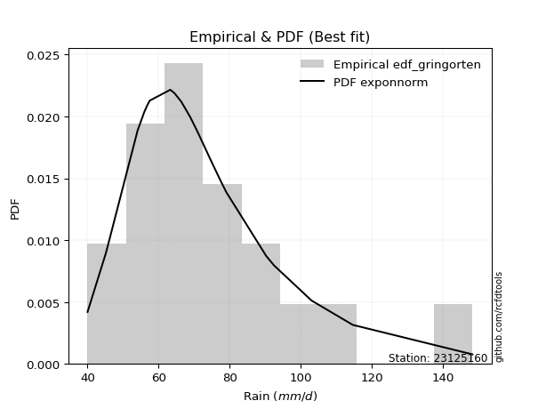</img>

</div>


### 9. EDF Filliben (1975)

The specific values of the constants (0.3175) (often denoted as $alpha$) and (0.365) are derived from a method proposed by James J. Filliben in a 1975 paper. This particular formula is the mean value of the $i$-th order statistic of the normal distribution and is considered a robust and effective plotting position formula for the normal probability plot correlation coefficient test for normality.

<div align="center">


$P=(m-0.3175)/(n+0.365)$


</div>


**9.1. Empirical values**

<div align="center">

|                | 0                   | 1                   | 2                  | 3                   | 4                   | 5                  | 6                  | 7                  | 8                  | 9            | 10                 | 11                 | 12                 | 13                 | 14                 | 15                 | 16                | 17                 | 18                 |
|:---------------|:--------------------|:--------------------|:-------------------|:--------------------|:--------------------|:-------------------|:-------------------|:-------------------|:-------------------|:-------------|:-------------------|:-------------------|:-------------------|:-------------------|:-------------------|:-------------------|:------------------|:-------------------|:-------------------|
| date           | 2006                | 2022                | 2009               | 2021                | 2025                | 2013               | 2008               | 2014               | 2018               | 2005         | 2015               | 2016               | 2010               | 2011               | 2017               | 2019               | 2012              | 2020               | 2007               |
| x              | 40.0                | 45.2                | 54.1               | 56.0                | 56.8                | 57.5               | 63.3               | 64.5               | 66.4               | 68.9         | 70.9               | 74.9               | 77.4               | 79.1               | 90.3               | 92.5               | 103.1             | 114.7              | 148.4              |
| m              | 1                   | 2                   | 3                  | 4                   | 5                   | 6                  | 7                  | 8                  | 9                  | 10           | 11                 | 12                 | 13                 | 14                 | 15                 | 16                 | 17                | 18                 | 19                 |
| empirical_dist | edf_filliben        | edf_filliben        | edf_filliben       | edf_filliben        | edf_filliben        | edf_filliben       | edf_filliben       | edf_filliben       | edf_filliben       | edf_filliben | edf_filliben       | edf_filliben       | edf_filliben       | edf_filliben       | edf_filliben       | edf_filliben       | edf_filliben      | edf_filliben       | edf_filliben       |
| empirical      | 0.03524399690162665 | 0.08688355280144593 | 0.1385231087012652 | 0.19016266460108444 | 0.24180222050090372 | 0.293441776400723  | 0.3450813323005423 | 0.3967208882003615 | 0.4483604441001807 | 0.5          | 0.5516395558998193 | 0.6032791117996386 | 0.6549186676994578 | 0.7065582235992771 | 0.7581977794990963 | 0.8098373353989156 | 0.861476891298735 | 0.9131164471985542 | 0.9647560030983735 |
| empirical_tr   | 1.0365315134484143  | 1.0951505726000283  | 1.1607972426195114 | 1.2348158775705405  | 1.3189170781542654  | 1.4153115293257812 | 1.5269071555292728 | 1.6576075326342818 | 1.8127779077931194 | 2.0          | 2.2303484019579614 | 2.5206638464041657 | 2.8978675645342316 | 3.407831060272768  | 4.135611318739989  | 5.258655804480651  | 7.219012115563846 | 11.509658246656779 | 28.373626373626497 |

</div>


**9.2. Kolmogorov-Smirnov fit test (sorted by Δ)**


<div align="center">

|                | 0                    | 1                    | 2                   | 3                    | 4                   | 5                   | 6                   | 7                   | 8                    | 9                    | 10                  | 11                  | 12                  | 13                  | 14                  | 15                  | 16                  | 17                  | 18                   | 19                  | 20                   | 21                   | 22                  | 23                  | 24                   | 25                   | 26                  | 27                  | 28                  | 29                   | 30                  | 31                  | 32                   | 33                  | 34                   | 35                  | 36                  | 37                  | 38                   | 39                  | 40                   | 41                  | 42                  | 43                  | 44                  | 45                  | 46                  | 47                  | 48                  | 49                  | 50                  | 51                  | 52                  | 53                  | 54                  | 55                  | 56                  | 57                  | 58                  | 59                  | 60                  | 61                  | 62                  | 63                  | 64                  | 65                  | 66                  | 67                  | 68                  | 69                  | 70                  | 71                  | 72                  | 73                  | 74                  | 75                  | 76                  | 77                  | 78                  | 79                  | 80                  | 81                  | 82                  | 83                  | 84                  | 85                  | 86                  | 87                  | 88                  | 89                  | 90                  | 91                  | 92                  | 93                  | 94                  | 95                  | 96                  | 97                  | 98                  | 99                  | 100                 | 101                 | 102                 | 103                 | 104                 | 105                 | 106                 | 107                 | 108                 | 109                 | 110                 | 111                 | 112                 | 113                 | 114                 | 115                 | 116                 | 117                 | 118                 | 119                 | 120                 | 121                 | 122                 | 123                 | 124                 | 125                 | 126                 | 127                 | 128                 | 129                 | 130                 | 131                 | 132                 | 133                 | 134                 | 135                 | 136                 | 137                 | 138                 | 139                 | 140                 | 141                 | 142                 | 143                 | 144                 | 145                 | 146                 | 147                 | 148                 | 149                 | 150                 | 151                 | 152                 | 153                 | 154                 | 155                 | 156                 | 157                 | 158                 | 159                 |
|:---------------|:---------------------|:---------------------|:--------------------|:---------------------|:--------------------|:--------------------|:--------------------|:--------------------|:---------------------|:---------------------|:--------------------|:--------------------|:--------------------|:--------------------|:--------------------|:--------------------|:--------------------|:--------------------|:---------------------|:--------------------|:---------------------|:---------------------|:--------------------|:--------------------|:---------------------|:---------------------|:--------------------|:--------------------|:--------------------|:---------------------|:--------------------|:--------------------|:---------------------|:--------------------|:---------------------|:--------------------|:--------------------|:--------------------|:---------------------|:--------------------|:---------------------|:--------------------|:--------------------|:--------------------|:--------------------|:--------------------|:--------------------|:--------------------|:--------------------|:--------------------|:--------------------|:--------------------|:--------------------|:--------------------|:--------------------|:--------------------|:--------------------|:--------------------|:--------------------|:--------------------|:--------------------|:--------------------|:--------------------|:--------------------|:--------------------|:--------------------|:--------------------|:--------------------|:--------------------|:--------------------|:--------------------|:--------------------|:--------------------|:--------------------|:--------------------|:--------------------|:--------------------|:--------------------|:--------------------|:--------------------|:--------------------|:--------------------|:--------------------|:--------------------|:--------------------|:--------------------|:--------------------|:--------------------|:--------------------|:--------------------|:--------------------|:--------------------|:--------------------|:--------------------|:--------------------|:--------------------|:--------------------|:--------------------|:--------------------|:--------------------|:--------------------|:--------------------|:--------------------|:--------------------|:--------------------|:--------------------|:--------------------|:--------------------|:--------------------|:--------------------|:--------------------|:--------------------|:--------------------|:--------------------|:--------------------|:--------------------|:--------------------|:--------------------|:--------------------|:--------------------|:--------------------|:--------------------|:--------------------|:--------------------|:--------------------|:--------------------|:--------------------|:--------------------|:--------------------|:--------------------|:--------------------|:--------------------|:--------------------|:--------------------|:--------------------|:--------------------|:--------------------|:--------------------|:--------------------|:--------------------|:--------------------|:--------------------|:--------------------|:--------------------|:--------------------|:--------------------|:--------------------|:--------------------|:--------------------|:--------------------|:--------------------|:--------------------|:--------------------|:--------------------|:--------------------|:--------------------|:--------------------|:--------------------|:--------------------|:--------------------|
| station        | 23125160             | 23125160             | 23125160            | 23125160             | 23125160            | 23125160            | 23125160            | 23125160            | 23125160             | 23125160             | 23125160            | 23125160            | 23125160            | 23125160            | 23125160            | 23125160            | 23125160            | 23125160            | 23125160             | 23125160            | 23125160             | 23125160             | 23125160            | 23125160            | 23125160             | 23125160             | 23125160            | 23125160            | 23125160            | 23125160             | 23125160            | 23125160            | 23125160             | 23125160            | 23125160             | 23125160            | 23125160            | 23125160            | 23125160             | 23125160            | 23125160             | 23125160            | 23125160            | 23125160            | 23125160            | 23125160            | 23125160            | 23125160            | 23125160            | 23125160            | 23125160            | 23125160            | 23125160            | 23125160            | 23125160            | 23125160            | 23125160            | 23125160            | 23125160            | 23125160            | 23125160            | 23125160            | 23125160            | 23125160            | 23125160            | 23125160            | 23125160            | 23125160            | 23125160            | 23125160            | 23125160            | 23125160            | 23125160            | 23125160            | 23125160            | 23125160            | 23125160            | 23125160            | 23125160            | 23125160            | 23125160            | 23125160            | 23125160            | 23125160            | 23125160            | 23125160            | 23125160            | 23125160            | 23125160            | 23125160            | 23125160            | 23125160            | 23125160            | 23125160            | 23125160            | 23125160            | 23125160            | 23125160            | 23125160            | 23125160            | 23125160            | 23125160            | 23125160            | 23125160            | 23125160            | 23125160            | 23125160            | 23125160            | 23125160            | 23125160            | 23125160            | 23125160            | 23125160            | 23125160            | 23125160            | 23125160            | 23125160            | 23125160            | 23125160            | 23125160            | 23125160            | 23125160            | 23125160            | 23125160            | 23125160            | 23125160            | 23125160            | 23125160            | 23125160            | 23125160            | 23125160            | 23125160            | 23125160            | 23125160            | 23125160            | 23125160            | 23125160            | 23125160            | 23125160            | 23125160            | 23125160            | 23125160            | 23125160            | 23125160            | 23125160            | 23125160            | 23125160            | 23125160            | 23125160            | 23125160            | 23125160            | 23125160            | 23125160            | 23125160            | 23125160            | 23125160            | 23125160            | 23125160            | 23125160            | 23125160            |
| empirical_dist | edf_filliben         | edf_filliben         | edf_filliben        | edf_filliben         | edf_filliben        | edf_filliben        | edf_filliben        | edf_filliben        | edf_filliben         | edf_filliben         | edf_filliben        | edf_filliben        | edf_filliben        | edf_filliben        | edf_filliben        | edf_filliben        | edf_filliben        | edf_filliben        | edf_filliben         | edf_filliben        | edf_filliben         | edf_filliben         | edf_filliben        | edf_filliben        | edf_filliben         | edf_filliben         | edf_filliben        | edf_filliben        | edf_filliben        | edf_filliben         | edf_filliben        | edf_filliben        | edf_filliben         | edf_filliben        | edf_filliben         | edf_filliben        | edf_filliben        | edf_filliben        | edf_filliben         | edf_filliben        | edf_filliben         | edf_filliben        | edf_filliben        | edf_filliben        | edf_filliben        | edf_filliben        | edf_filliben        | edf_filliben        | edf_filliben        | edf_filliben        | edf_filliben        | edf_filliben        | edf_filliben        | edf_filliben        | edf_filliben        | edf_filliben        | edf_filliben        | edf_filliben        | edf_filliben        | edf_filliben        | edf_filliben        | edf_filliben        | edf_filliben        | edf_filliben        | edf_filliben        | edf_filliben        | edf_filliben        | edf_filliben        | edf_filliben        | edf_filliben        | edf_filliben        | edf_filliben        | edf_filliben        | edf_filliben        | edf_filliben        | edf_filliben        | edf_filliben        | edf_filliben        | edf_filliben        | edf_filliben        | edf_filliben        | edf_filliben        | edf_filliben        | edf_filliben        | edf_filliben        | edf_filliben        | edf_filliben        | edf_filliben        | edf_filliben        | edf_filliben        | edf_filliben        | edf_filliben        | edf_filliben        | edf_filliben        | edf_filliben        | edf_filliben        | edf_filliben        | edf_filliben        | edf_filliben        | edf_filliben        | edf_filliben        | edf_filliben        | edf_filliben        | edf_filliben        | edf_filliben        | edf_filliben        | edf_filliben        | edf_filliben        | edf_filliben        | edf_filliben        | edf_filliben        | edf_filliben        | edf_filliben        | edf_filliben        | edf_filliben        | edf_filliben        | edf_filliben        | edf_filliben        | edf_filliben        | edf_filliben        | edf_filliben        | edf_filliben        | edf_filliben        | edf_filliben        | edf_filliben        | edf_filliben        | edf_filliben        | edf_filliben        | edf_filliben        | edf_filliben        | edf_filliben        | edf_filliben        | edf_filliben        | edf_filliben        | edf_filliben        | edf_filliben        | edf_filliben        | edf_filliben        | edf_filliben        | edf_filliben        | edf_filliben        | edf_filliben        | edf_filliben        | edf_filliben        | edf_filliben        | edf_filliben        | edf_filliben        | edf_filliben        | edf_filliben        | edf_filliben        | edf_filliben        | edf_filliben        | edf_filliben        | edf_filliben        | edf_filliben        | edf_filliben        | edf_filliben        | edf_filliben        | edf_filliben        | edf_filliben        |
| p_dist         | logmielke            | logexponnorm         | burr                | loggenlogistic       | mielke              | exponnorm           | alpha               | moyal               | logburr              | invweibull           | genextreme          | logskewnorm         | nct                 | loggennorm          | logalpha            | loginvgamma         | logjohnsonsu        | invgamma            | logfatiguelife       | f                   | logpearson3          | loggenextreme        | logweibull_max      | logf                | loggamma             | loggamma             | logerlang           | logburr12           | loginvgauss         | johnsonsu            | lognct              | logncf              | betaprime            | genlogistic         | invgauss             | logjohnsonsb        | loggumbel_r         | logmaxwell          | logbetaprime         | lognakagami         | johnsonsb            | logrice             | logbeta             | lograyleigh         | logweibull_min      | loginvweibull       | gamma               | erlang              | loglogistic         | pearson3            | gumbel_r            | logexponweib        | loggengamma         | logloglaplace       | logt                | logcrystalball      | lognorm             | logloggamma         | halflogistic        | logmoyal            | weibull_min         | dweibull            | logdweibull         | logvonmises_line    | kstwobign           | loghypsecant        | logdgamma           | logfoldnorm         | loghalfnorm         | logtriang           | gennorm             | tukeylambda         | logkstwobign        | loganglit           | loghalflogistic     | dgamma              | kappa3              | logexponpow         | halfnorm            | logsemicircular     | genhalflogistic     | loggompertz         | rayleigh            | loggenexpon         | loglaplace          | loglaplace          | foldnorm            | maxwell             | wald                | skewnorm            | rice                | logcosine           | gompertz            | logtruncweibull_min | t                   | beta                | loggumbel_l         | logwald             | hypsecant           | logistic            | nakagami            | gausshyper          | truncnorm           | norm                | crystalball         | truncweibull_min    | logarcsine          | loggausshyper       | anglit              | laplace             | logbradford         | semicircular        | loghalfgennorm      | arcsine             | logtruncexpon       | vonmises_line       | loguniform          | logkappa3           | logtukeylambda      | triang              | genexpon            | logksone            | exponpow            | logrdist            | logkappa4           | gumbel_l            | truncexpon          | genpareto           | cosine              | logargus            | bradford            | loglomax            | burr12              | logwrapcauchy       | ncf                 | kappa4              | halfgennorm         | logtruncpareto      | ksone               | argus               | uniform             | wrapcauchy          | logtruncnorm        | loggenhalflogistic  | lomax               | powerlaw            | loggenpareto        | loglevy_l           | logtrapezoid        | logpowerlaw         | levy_l              | rdist               | fatiguelife         | trapezoid           | gengamma            | exponweib           | weibull_max         | truncpareto         | logvonmises         | vonmises            |
| delta          | 0.045254091868694585 | 0.045308926309488046 | 0.0454178971539104  | 0.045446770274826465 | 0.0454605989294406  | 0.04635602992412835 | 0.04739114261254199 | 0.04852712664882461 | 0.048582001058899066 | 0.049211899550012594 | 0.04921220165936677 | 0.0494728522866206  | 0.05012462924062924 | 0.05087725556973188 | 0.05088516718993211 | 0.05147410125964025 | 0.05189572512976129 | 0.05217659100977745 | 0.052509231070993506 | 0.05267358262339006 | 0.052862940120475516 | 0.052991749961481205 | 0.05301413245352432 | 0.05321760885296736 | 0.053448693734086394 | 0.053448693734086394 | 0.05344887860262079 | 0.05357390757275418 | 0.05380338088883138 | 0.056181870427310515 | 0.05645027822947046 | 0.05665077225303339 | 0.058598441509863264 | 0.05903495943248338 | 0.059106173781170585 | 0.06069436455877772 | 0.0608307674170628  | 0.06087340412059214 | 0.061115506918196005 | 0.06175714866626589 | 0.061837170472482966 | 0.06352092500904613 | 0.0647543130932679  | 0.0652248168942364  | 0.06654673406976283 | 0.06971416620567109 | 0.0698289351026617  | 0.06982952634793335 | 0.07013359603543468 | 0.07052856405661745 | 0.07222598314468143 | 0.07239755719269914 | 0.0744900976315907  | 0.07459236391900281 | 0.07511556333989744 | 0.07518910319252559 | 0.07518915732661746 | 0.07867738909094257 | 0.07916740220325594 | 0.07949710763614887 | 0.08005163013182673 | 0.08024554904766859 | 0.080599250408675   | 0.08102462459019169 | 0.0845234393533223  | 0.0849294595808649  | 0.08516873582936546 | 0.08688355280144593 | 0.08688355280144593 | 0.08770084300871872 | 0.0886846875455394  | 0.0890712659903371  | 0.09051523124095476 | 0.09288037070236788 | 0.09432051234965239 | 0.09648416646497016 | 0.09874921385753777 | 0.09917591643818055 | 0.09939420586451339 | 0.10026790279440856 | 0.10068783242817153 | 0.10089014991270315 | 0.1028978369131669  | 0.10312710700593725 | 0.10425719320795807 | 0.10425719320795807 | 0.10726649424139653 | 0.11222536439537578 | 0.11422186145248092 | 0.11739905175747692 | 0.11755930869745845 | 0.11972990151975227 | 0.12029956812101653 | 0.12144247815192996 | 0.1218116087783492  | 0.12233453386908508 | 0.12834096499964998 | 0.12941102277412994 | 0.13055125250193594 | 0.13290782557453462 | 0.13356043396932946 | 0.13757077286013128 | 0.14154932942630072 | 0.14157627599091516 | 0.1415762810923269  | 0.1467673950375421  | 0.14693454452807544 | 0.14948760440696063 | 0.15074644228433676 | 0.15258819569972315 | 0.15383772102746937 | 0.1545368486545181  | 0.15727453387170584 | 0.16964980519401085 | 0.17016850720197133 | 0.17555272958556778 | 0.1864843544437359  | 0.1869542826301952  | 0.18695931116752362 | 0.19288919834925888 | 0.19351515509815478 | 0.19363544934067434 | 0.1952095198237457  | 0.20212865873038144 | 0.20228734988047403 | 0.20685672227373963 | 0.22310687559322617 | 0.23128810131249544 | 0.2335841809592608  | 0.24135949777356802 | 0.26506291592614173 | 0.26859523924323003 | 0.2697478312092645  | 0.27467874911422485 | 0.2911717797547897  | 0.2940148531657263  | 0.314768907007552   | 0.3156732758122992  | 0.32290621608772246 | 0.34236684200248624 | 0.34585711658820706 | 0.3569714634679353  | 0.35753437763090423 | 0.35898763155996216 | 0.3595998797891672  | 0.38892100774650673 | 0.4087670771752494  | 0.41786073311351074 | 0.43955016581488604 | 0.4443858120205858  | 0.4672659097980008  | 0.5054622982751826  | 0.5576118973038863  | 0.572735420445264   | 0.6032106940719125  | 0.6636022042747951  | 0.7717921402117911  | 0.825087671062409   | 1.0498134238950698  | 22.92253010867694   |
| deltao         | 0.31564497164100014  | 0.31564497164100014  | 0.31564497164100014 | 0.31564497164100014  | 0.31564497164100014 | 0.31564497164100014 | 0.31564497164100014 | 0.31564497164100014 | 0.31564497164100014  | 0.31564497164100014  | 0.31564497164100014 | 0.31564497164100014 | 0.31564497164100014 | 0.31564497164100014 | 0.31564497164100014 | 0.31564497164100014 | 0.31564497164100014 | 0.31564497164100014 | 0.31564497164100014  | 0.31564497164100014 | 0.31564497164100014  | 0.31564497164100014  | 0.31564497164100014 | 0.31564497164100014 | 0.31564497164100014  | 0.31564497164100014  | 0.31564497164100014 | 0.31564497164100014 | 0.31564497164100014 | 0.31564497164100014  | 0.31564497164100014 | 0.31564497164100014 | 0.31564497164100014  | 0.31564497164100014 | 0.31564497164100014  | 0.31564497164100014 | 0.31564497164100014 | 0.31564497164100014 | 0.31564497164100014  | 0.31564497164100014 | 0.31564497164100014  | 0.31564497164100014 | 0.31564497164100014 | 0.31564497164100014 | 0.31564497164100014 | 0.31564497164100014 | 0.31564497164100014 | 0.31564497164100014 | 0.31564497164100014 | 0.31564497164100014 | 0.31564497164100014 | 0.31564497164100014 | 0.31564497164100014 | 0.31564497164100014 | 0.31564497164100014 | 0.31564497164100014 | 0.31564497164100014 | 0.31564497164100014 | 0.31564497164100014 | 0.31564497164100014 | 0.31564497164100014 | 0.31564497164100014 | 0.31564497164100014 | 0.31564497164100014 | 0.31564497164100014 | 0.31564497164100014 | 0.31564497164100014 | 0.31564497164100014 | 0.31564497164100014 | 0.31564497164100014 | 0.31564497164100014 | 0.31564497164100014 | 0.31564497164100014 | 0.31564497164100014 | 0.31564497164100014 | 0.31564497164100014 | 0.31564497164100014 | 0.31564497164100014 | 0.31564497164100014 | 0.31564497164100014 | 0.31564497164100014 | 0.31564497164100014 | 0.31564497164100014 | 0.31564497164100014 | 0.31564497164100014 | 0.31564497164100014 | 0.31564497164100014 | 0.31564497164100014 | 0.31564497164100014 | 0.31564497164100014 | 0.31564497164100014 | 0.31564497164100014 | 0.31564497164100014 | 0.31564497164100014 | 0.31564497164100014 | 0.31564497164100014 | 0.31564497164100014 | 0.31564497164100014 | 0.31564497164100014 | 0.31564497164100014 | 0.31564497164100014 | 0.31564497164100014 | 0.31564497164100014 | 0.31564497164100014 | 0.31564497164100014 | 0.31564497164100014 | 0.31564497164100014 | 0.31564497164100014 | 0.31564497164100014 | 0.31564497164100014 | 0.31564497164100014 | 0.31564497164100014 | 0.31564497164100014 | 0.31564497164100014 | 0.31564497164100014 | 0.31564497164100014 | 0.31564497164100014 | 0.31564497164100014 | 0.31564497164100014 | 0.31564497164100014 | 0.31564497164100014 | 0.31564497164100014 | 0.31564497164100014 | 0.31564497164100014 | 0.31564497164100014 | 0.31564497164100014 | 0.31564497164100014 | 0.31564497164100014 | 0.31564497164100014 | 0.31564497164100014 | 0.31564497164100014 | 0.31564497164100014 | 0.31564497164100014 | 0.31564497164100014 | 0.31564497164100014 | 0.31564497164100014 | 0.31564497164100014 | 0.31564497164100014 | 0.31564497164100014 | 0.31564497164100014 | 0.31564497164100014 | 0.31564497164100014 | 0.31564497164100014 | 0.31564497164100014 | 0.31564497164100014 | 0.31564497164100014 | 0.31564497164100014 | 0.31564497164100014 | 0.31564497164100014 | 0.31564497164100014 | 0.31564497164100014 | 0.31564497164100014 | 0.31564497164100014 | 0.31564497164100014 | 0.31564497164100014 | 0.31564497164100014 | 0.31564497164100014 | 0.31564497164100014 | 0.31564497164100014 | 0.31564497164100014 |
| eval           | Δo > Δ               | Δo > Δ               | Δo > Δ              | Δo > Δ               | Δo > Δ              | Δo > Δ              | Δo > Δ              | Δo > Δ              | Δo > Δ               | Δo > Δ               | Δo > Δ              | Δo > Δ              | Δo > Δ              | Δo > Δ              | Δo > Δ              | Δo > Δ              | Δo > Δ              | Δo > Δ              | Δo > Δ               | Δo > Δ              | Δo > Δ               | Δo > Δ               | Δo > Δ              | Δo > Δ              | Δo > Δ               | Δo > Δ               | Δo > Δ              | Δo > Δ              | Δo > Δ              | Δo > Δ               | Δo > Δ              | Δo > Δ              | Δo > Δ               | Δo > Δ              | Δo > Δ               | Δo > Δ              | Δo > Δ              | Δo > Δ              | Δo > Δ               | Δo > Δ              | Δo > Δ               | Δo > Δ              | Δo > Δ              | Δo > Δ              | Δo > Δ              | Δo > Δ              | Δo > Δ              | Δo > Δ              | Δo > Δ              | Δo > Δ              | Δo > Δ              | Δo > Δ              | Δo > Δ              | Δo > Δ              | Δo > Δ              | Δo > Δ              | Δo > Δ              | Δo > Δ              | Δo > Δ              | Δo > Δ              | Δo > Δ              | Δo > Δ              | Δo > Δ              | Δo > Δ              | Δo > Δ              | Δo > Δ              | Δo > Δ              | Δo > Δ              | Δo > Δ              | Δo > Δ              | Δo > Δ              | Δo > Δ              | Δo > Δ              | Δo > Δ              | Δo > Δ              | Δo > Δ              | Δo > Δ              | Δo > Δ              | Δo > Δ              | Δo > Δ              | Δo > Δ              | Δo > Δ              | Δo > Δ              | Δo > Δ              | Δo > Δ              | Δo > Δ              | Δo > Δ              | Δo > Δ              | Δo > Δ              | Δo > Δ              | Δo > Δ              | Δo > Δ              | Δo > Δ              | Δo > Δ              | Δo > Δ              | Δo > Δ              | Δo > Δ              | Δo > Δ              | Δo > Δ              | Δo > Δ              | Δo > Δ              | Δo > Δ              | Δo > Δ              | Δo > Δ              | Δo > Δ              | Δo > Δ              | Δo > Δ              | Δo > Δ              | Δo > Δ              | Δo > Δ              | Δo > Δ              | Δo > Δ              | Δo > Δ              | Δo > Δ              | Δo > Δ              | Δo > Δ              | Δo > Δ              | Δo > Δ              | Δo > Δ              | Δo > Δ              | Δo > Δ              | Δo > Δ              | Δo > Δ              | Δo > Δ              | Δo > Δ              | Δo > Δ              | Δo > Δ              | Δo > Δ              | Δo > Δ              | Δo > Δ              | Δo > Δ              | Δo > Δ              | Δo > Δ              | Δo > Δ              | Δo > Δ              | Δo > Δ              | Δo > Δ              | Δo <= Δ             | Δo <= Δ             | Δo <= Δ             | Δo <= Δ             | Δo <= Δ             | Δo <= Δ             | Δo <= Δ             | Δo <= Δ             | Δo <= Δ             | Δo <= Δ             | Δo <= Δ             | Δo <= Δ             | Δo <= Δ             | Δo <= Δ             | Δo <= Δ             | Δo <= Δ             | Δo <= Δ             | Δo <= Δ             | Δo <= Δ             | Δo <= Δ             | Δo <= Δ             | Δo <= Δ             | Δo <= Δ             |
| fit            | 1                    | 1                    | 1                   | 1                    | 1                   | 1                   | 1                   | 1                   | 1                    | 1                    | 1                   | 1                   | 1                   | 1                   | 1                   | 1                   | 1                   | 1                   | 1                    | 1                   | 1                    | 1                    | 1                   | 1                   | 1                    | 1                    | 1                   | 1                   | 1                   | 1                    | 1                   | 1                   | 1                    | 1                   | 1                    | 1                   | 1                   | 1                   | 1                    | 1                   | 1                    | 1                   | 1                   | 1                   | 1                   | 1                   | 1                   | 1                   | 1                   | 1                   | 1                   | 1                   | 1                   | 1                   | 1                   | 1                   | 1                   | 1                   | 1                   | 1                   | 1                   | 1                   | 1                   | 1                   | 1                   | 1                   | 1                   | 1                   | 1                   | 1                   | 1                   | 1                   | 1                   | 1                   | 1                   | 1                   | 1                   | 1                   | 1                   | 1                   | 1                   | 1                   | 1                   | 1                   | 1                   | 1                   | 1                   | 1                   | 1                   | 1                   | 1                   | 1                   | 1                   | 1                   | 1                   | 1                   | 1                   | 1                   | 1                   | 1                   | 1                   | 1                   | 1                   | 1                   | 1                   | 1                   | 1                   | 1                   | 1                   | 1                   | 1                   | 1                   | 1                   | 1                   | 1                   | 1                   | 1                   | 1                   | 1                   | 1                   | 1                   | 1                   | 1                   | 1                   | 1                   | 1                   | 1                   | 1                   | 1                   | 1                   | 1                   | 1                   | 1                   | 1                   | 1                   | 1                   | 1                   | 0                   | 0                   | 0                   | 0                   | 0                   | 0                   | 0                   | 0                   | 0                   | 0                   | 0                   | 0                   | 0                   | 0                   | 0                   | 0                   | 0                   | 0                   | 0                   | 0                   | 0                   | 0                   | 0                   |
| n              | 19                   | 19                   | 19                  | 19                   | 19                  | 19                  | 19                  | 19                  | 19                   | 19                   | 19                  | 19                  | 19                  | 19                  | 19                  | 19                  | 19                  | 19                  | 19                   | 19                  | 19                   | 19                   | 19                  | 19                  | 19                   | 19                   | 19                  | 19                  | 19                  | 19                   | 19                  | 19                  | 19                   | 19                  | 19                   | 19                  | 19                  | 19                  | 19                   | 19                  | 19                   | 19                  | 19                  | 19                  | 19                  | 19                  | 19                  | 19                  | 19                  | 19                  | 19                  | 19                  | 19                  | 19                  | 19                  | 19                  | 19                  | 19                  | 19                  | 19                  | 19                  | 19                  | 19                  | 19                  | 19                  | 19                  | 19                  | 19                  | 19                  | 19                  | 19                  | 19                  | 19                  | 19                  | 19                  | 19                  | 19                  | 19                  | 19                  | 19                  | 19                  | 19                  | 19                  | 19                  | 19                  | 19                  | 19                  | 19                  | 19                  | 19                  | 19                  | 19                  | 19                  | 19                  | 19                  | 19                  | 19                  | 19                  | 19                  | 19                  | 19                  | 19                  | 19                  | 19                  | 19                  | 19                  | 19                  | 19                  | 19                  | 19                  | 19                  | 19                  | 19                  | 19                  | 19                  | 19                  | 19                  | 19                  | 19                  | 19                  | 19                  | 19                  | 19                  | 19                  | 19                  | 19                  | 19                  | 19                  | 19                  | 19                  | 19                  | 19                  | 19                  | 19                  | 19                  | 19                  | 19                  | 19                  | 19                  | 19                  | 19                  | 19                  | 19                  | 19                  | 19                  | 19                  | 19                  | 19                  | 19                  | 19                  | 19                  | 19                  | 19                  | 19                  | 19                  | 19                  | 19                  | 19                  | 19                  | 19                  |
| best_fit       | 1                    | 0                    | 0                   | 0                    | 0                   | 0                   | 0                   | 0                   | 0                    | 0                    | 0                   | 0                   | 0                   | 0                   | 0                   | 0                   | 0                   | 0                   | 0                    | 0                   | 0                    | 0                    | 0                   | 0                   | 0                    | 0                    | 0                   | 0                   | 0                   | 0                    | 0                   | 0                   | 0                    | 0                   | 0                    | 0                   | 0                   | 0                   | 0                    | 0                   | 0                    | 0                   | 0                   | 0                   | 0                   | 0                   | 0                   | 0                   | 0                   | 0                   | 0                   | 0                   | 0                   | 0                   | 0                   | 0                   | 0                   | 0                   | 0                   | 0                   | 0                   | 0                   | 0                   | 0                   | 0                   | 0                   | 0                   | 0                   | 0                   | 0                   | 0                   | 0                   | 0                   | 0                   | 0                   | 0                   | 0                   | 0                   | 0                   | 0                   | 0                   | 0                   | 0                   | 0                   | 0                   | 0                   | 0                   | 0                   | 0                   | 0                   | 0                   | 0                   | 0                   | 0                   | 0                   | 0                   | 0                   | 0                   | 0                   | 0                   | 0                   | 0                   | 0                   | 0                   | 0                   | 0                   | 0                   | 0                   | 0                   | 0                   | 0                   | 0                   | 0                   | 0                   | 0                   | 0                   | 0                   | 0                   | 0                   | 0                   | 0                   | 0                   | 0                   | 0                   | 0                   | 0                   | 0                   | 0                   | 0                   | 0                   | 0                   | 0                   | 0                   | 0                   | 0                   | 0                   | 0                   | 0                   | 0                   | 0                   | 0                   | 0                   | 0                   | 0                   | 0                   | 0                   | 0                   | 0                   | 0                   | 0                   | 0                   | 0                   | 0                   | 0                   | 0                   | 0                   | 0                   | 0                   | 0                   | 0                   |
| best_fit_sort  | 1                    | 2                    | 3                   | 4                    | 5                   | 6                   | 7                   | 8                   | 9                    | 10                   | 11                  | 12                  | 13                  | 14                  | 15                  | 16                  | 17                  | 18                  | 19                   | 20                  | 21                   | 22                   | 23                  | 24                  | 25                   | 26                   | 27                  | 28                  | 29                  | 30                   | 31                  | 32                  | 33                   | 34                  | 35                   | 36                  | 37                  | 38                  | 39                   | 40                  | 41                   | 42                  | 43                  | 44                  | 45                  | 46                  | 47                  | 48                  | 49                  | 50                  | 51                  | 52                  | 53                  | 54                  | 55                  | 56                  | 57                  | 58                  | 59                  | 60                  | 61                  | 62                  | 63                  | 64                  | 65                  | 66                  | 67                  | 68                  | 69                  | 70                  | 71                  | 72                  | 73                  | 74                  | 75                  | 76                  | 77                  | 78                  | 79                  | 80                  | 81                  | 82                  | 83                  | 84                  | 85                  | 86                  | 87                  | 88                  | 89                  | 90                  | 91                  | 92                  | 93                  | 94                  | 95                  | 96                  | 97                  | 98                  | 99                  | 100                 | 101                 | 102                 | 103                 | 104                 | 105                 | 106                 | 107                 | 108                 | 109                 | 110                 | 111                 | 112                 | 113                 | 114                 | 115                 | 116                 | 117                 | 118                 | 119                 | 120                 | 121                 | 122                 | 123                 | 124                 | 125                 | 126                 | 127                 | 128                 | 129                 | 130                 | 131                 | 132                 | 133                 | 134                 | 135                 | 136                 | 137                 | 138                 | 139                 | 140                 | 141                 | 142                 | 143                 | 144                 | 145                 | 146                 | 147                 | 148                 | 149                 | 150                 | 151                 | 152                 | 153                 | 154                 | 155                 | 156                 | 157                 | 158                 | 159                 | 160                 |

</div>


**9.3. Best fit**

<div align="center">

|   id |   station | empirical_dist   | p_dist    |     delta |   deltao | eval   |   fit |   n |   best_fit |   best_fit_sort |
|-----:|----------:|:-----------------|:----------|----------:|---------:|:-------|------:|----:|-----------:|----------------:|
|    0 |  23125160 | edf_filliben     | logmielke | 0.0452541 | 0.315645 | Δo > Δ |     1 |  19 |          1 |               1 |

</div>


<div align="center">

</img>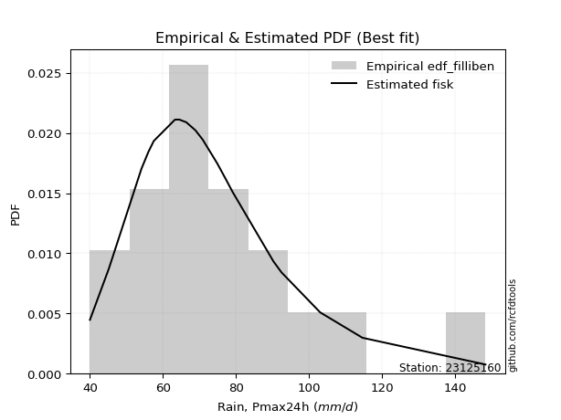</img>

</div>


### 10. EDF Jenkinson (1977)

The Jenkinson formula in hydrology is an empirical plotting position formula used to estimate the non-exceedance probability _(P)_ or return period _(T)_ of a given ordered observation within a sample. It is a widely used method in the frequency analysis of extreme events such as floods and rainfall, as it provides a distribution-free way to plot data. _a≈0.31_ and _b≈0.38_ are constants derived to approximate the median of the probability distribution for the given rank.

<div align="center">


$P=(m-a)/(n+b)$


</div>


**10.1. Empirical values**

<div align="center">

|                | 0                   | 1                   | 2                  | 3                   | 4                   | 5                   | 6                  | 7                  | 8                  | 9             | 10                 | 11                 | 12                 | 13                 | 14                 | 15                 | 16                 | 17                 | 18                 |
|:---------------|:--------------------|:--------------------|:-------------------|:--------------------|:--------------------|:--------------------|:-------------------|:-------------------|:-------------------|:--------------|:-------------------|:-------------------|:-------------------|:-------------------|:-------------------|:-------------------|:-------------------|:-------------------|:-------------------|
| date           | 2006                | 2022                | 2009               | 2021                | 2025                | 2013                | 2008               | 2014               | 2018               | 2005          | 2015               | 2016               | 2010               | 2011               | 2017               | 2019               | 2012               | 2020               | 2007               |
| x              | 40.0                | 45.2                | 54.1               | 56.0                | 56.8                | 57.5                | 63.3               | 64.5               | 66.4               | 68.9          | 70.9               | 74.9               | 77.4               | 79.1               | 90.3               | 92.5               | 103.1              | 114.7              | 148.4              |
| m              | 1                   | 2                   | 3                  | 4                   | 5                   | 6                   | 7                  | 8                  | 9                  | 10            | 11                 | 12                 | 13                 | 14                 | 15                 | 16                 | 17                 | 18                 | 19                 |
| empirical_dist | edf_jenkinson       | edf_jenkinson       | edf_jenkinson      | edf_jenkinson       | edf_jenkinson       | edf_jenkinson       | edf_jenkinson      | edf_jenkinson      | edf_jenkinson      | edf_jenkinson | edf_jenkinson      | edf_jenkinson      | edf_jenkinson      | edf_jenkinson      | edf_jenkinson      | edf_jenkinson      | edf_jenkinson      | edf_jenkinson      | edf_jenkinson      |
| empirical      | 0.03560371517027864 | 0.08720330237358101 | 0.1388028895768834 | 0.19040247678018576 | 0.24200206398348817 | 0.29360165118679055 | 0.3452012383900929 | 0.3968008255933953 | 0.4484004127966976 | 0.5           | 0.5515995872033024 | 0.6031991744066048 | 0.6547987616099071 | 0.7063983488132095 | 0.7579979360165119 | 0.8095975232198143 | 0.8611971104231168 | 0.9127966976264191 | 0.9643962848297215 |
| empirical_tr   | 1.0369181380417336  | 1.0955342001130581  | 1.1611743559017376 | 1.2351816443594645  | 1.3192648059904697  | 1.4156318480642804  | 1.5271867612293144 | 1.6578272027373824 | 1.812909260991581  | 2.0           | 2.230149597238205  | 2.5201560468140443 | 2.896860986547085  | 3.40597539543058   | 4.132196162046909  | 5.252032520325204  | 7.204460966542758  | 11.467455621301793 | 28.086956521739243 |

</div>


**10.2. Kolmogorov-Smirnov fit test (sorted by Δ)**


<div align="center">

|                | 0                   | 1                   | 2                    | 3                   | 4                   | 5                   | 6                   | 7                   | 8                    | 9                   | 10                  | 11                   | 12                   | 13                  | 14                  | 15                  | 16                  | 17                   | 18                  | 19                  | 20                  | 21                  | 22                   | 23                  | 24                  | 25                  | 26                   | 27                   | 28                  | 29                  | 30                  | 31                   | 32                  | 33                  | 34                   | 35                  | 36                  | 37                  | 38                   | 39                  | 40                  | 41                  | 42                  | 43                  | 44                  | 45                  | 46                  | 47                  | 48                  | 49                  | 50                  | 51                  | 52                  | 53                  | 54                  | 55                  | 56                  | 57                  | 58                  | 59                  | 60                  | 61                  | 62                  | 63                  | 64                  | 65                  | 66                  | 67                  | 68                  | 69                  | 70                  | 71                  | 72                  | 73                  | 74                  | 75                  | 76                  | 77                  | 78                  | 79                  | 80                  | 81                  | 82                  | 83                  | 84                  | 85                  | 86                  | 87                  | 88                  | 89                  | 90                  | 91                  | 92                  | 93                  | 94                  | 95                  | 96                  | 97                  | 98                  | 99                  | 100                 | 101                 | 102                 | 103                 | 104                 | 105                 | 106                 | 107                 | 108                 | 109                 | 110                 | 111                 | 112                 | 113                 | 114                 | 115                 | 116                 | 117                 | 118                 | 119                 | 120                 | 121                 | 122                 | 123                 | 124                 | 125                 | 126                 | 127                 | 128                 | 129                 | 130                 | 131                 | 132                 | 133                 | 134                 | 135                 | 136                 | 137                 | 138                 | 139                 | 140                 | 141                 | 142                 | 143                 | 144                 | 145                 | 146                 | 147                 | 148                 | 149                 | 150                 | 151                 | 152                 | 153                 | 154                 | 155                 | 156                 | 157                 | 158                 | 159                 |
|:---------------|:--------------------|:--------------------|:---------------------|:--------------------|:--------------------|:--------------------|:--------------------|:--------------------|:---------------------|:--------------------|:--------------------|:---------------------|:---------------------|:--------------------|:--------------------|:--------------------|:--------------------|:---------------------|:--------------------|:--------------------|:--------------------|:--------------------|:---------------------|:--------------------|:--------------------|:--------------------|:---------------------|:---------------------|:--------------------|:--------------------|:--------------------|:---------------------|:--------------------|:--------------------|:---------------------|:--------------------|:--------------------|:--------------------|:---------------------|:--------------------|:--------------------|:--------------------|:--------------------|:--------------------|:--------------------|:--------------------|:--------------------|:--------------------|:--------------------|:--------------------|:--------------------|:--------------------|:--------------------|:--------------------|:--------------------|:--------------------|:--------------------|:--------------------|:--------------------|:--------------------|:--------------------|:--------------------|:--------------------|:--------------------|:--------------------|:--------------------|:--------------------|:--------------------|:--------------------|:--------------------|:--------------------|:--------------------|:--------------------|:--------------------|:--------------------|:--------------------|:--------------------|:--------------------|:--------------------|:--------------------|:--------------------|:--------------------|:--------------------|:--------------------|:--------------------|:--------------------|:--------------------|:--------------------|:--------------------|:--------------------|:--------------------|:--------------------|:--------------------|:--------------------|:--------------------|:--------------------|:--------------------|:--------------------|:--------------------|:--------------------|:--------------------|:--------------------|:--------------------|:--------------------|:--------------------|:--------------------|:--------------------|:--------------------|:--------------------|:--------------------|:--------------------|:--------------------|:--------------------|:--------------------|:--------------------|:--------------------|:--------------------|:--------------------|:--------------------|:--------------------|:--------------------|:--------------------|:--------------------|:--------------------|:--------------------|:--------------------|:--------------------|:--------------------|:--------------------|:--------------------|:--------------------|:--------------------|:--------------------|:--------------------|:--------------------|:--------------------|:--------------------|:--------------------|:--------------------|:--------------------|:--------------------|:--------------------|:--------------------|:--------------------|:--------------------|:--------------------|:--------------------|:--------------------|:--------------------|:--------------------|:--------------------|:--------------------|:--------------------|:--------------------|:--------------------|:--------------------|:--------------------|:--------------------|:--------------------|:--------------------|
| station        | 23125160            | 23125160            | 23125160             | 23125160            | 23125160            | 23125160            | 23125160            | 23125160            | 23125160             | 23125160            | 23125160            | 23125160             | 23125160             | 23125160            | 23125160            | 23125160            | 23125160            | 23125160             | 23125160            | 23125160            | 23125160            | 23125160            | 23125160             | 23125160            | 23125160            | 23125160            | 23125160             | 23125160             | 23125160            | 23125160            | 23125160            | 23125160             | 23125160            | 23125160            | 23125160             | 23125160            | 23125160            | 23125160            | 23125160             | 23125160            | 23125160            | 23125160            | 23125160            | 23125160            | 23125160            | 23125160            | 23125160            | 23125160            | 23125160            | 23125160            | 23125160            | 23125160            | 23125160            | 23125160            | 23125160            | 23125160            | 23125160            | 23125160            | 23125160            | 23125160            | 23125160            | 23125160            | 23125160            | 23125160            | 23125160            | 23125160            | 23125160            | 23125160            | 23125160            | 23125160            | 23125160            | 23125160            | 23125160            | 23125160            | 23125160            | 23125160            | 23125160            | 23125160            | 23125160            | 23125160            | 23125160            | 23125160            | 23125160            | 23125160            | 23125160            | 23125160            | 23125160            | 23125160            | 23125160            | 23125160            | 23125160            | 23125160            | 23125160            | 23125160            | 23125160            | 23125160            | 23125160            | 23125160            | 23125160            | 23125160            | 23125160            | 23125160            | 23125160            | 23125160            | 23125160            | 23125160            | 23125160            | 23125160            | 23125160            | 23125160            | 23125160            | 23125160            | 23125160            | 23125160            | 23125160            | 23125160            | 23125160            | 23125160            | 23125160            | 23125160            | 23125160            | 23125160            | 23125160            | 23125160            | 23125160            | 23125160            | 23125160            | 23125160            | 23125160            | 23125160            | 23125160            | 23125160            | 23125160            | 23125160            | 23125160            | 23125160            | 23125160            | 23125160            | 23125160            | 23125160            | 23125160            | 23125160            | 23125160            | 23125160            | 23125160            | 23125160            | 23125160            | 23125160            | 23125160            | 23125160            | 23125160            | 23125160            | 23125160            | 23125160            | 23125160            | 23125160            | 23125160            | 23125160            | 23125160            | 23125160            |
| empirical_dist | edf_jenkinson       | edf_jenkinson       | edf_jenkinson        | edf_jenkinson       | edf_jenkinson       | edf_jenkinson       | edf_jenkinson       | edf_jenkinson       | edf_jenkinson        | edf_jenkinson       | edf_jenkinson       | edf_jenkinson        | edf_jenkinson        | edf_jenkinson       | edf_jenkinson       | edf_jenkinson       | edf_jenkinson       | edf_jenkinson        | edf_jenkinson       | edf_jenkinson       | edf_jenkinson       | edf_jenkinson       | edf_jenkinson        | edf_jenkinson       | edf_jenkinson       | edf_jenkinson       | edf_jenkinson        | edf_jenkinson        | edf_jenkinson       | edf_jenkinson       | edf_jenkinson       | edf_jenkinson        | edf_jenkinson       | edf_jenkinson       | edf_jenkinson        | edf_jenkinson       | edf_jenkinson       | edf_jenkinson       | edf_jenkinson        | edf_jenkinson       | edf_jenkinson       | edf_jenkinson       | edf_jenkinson       | edf_jenkinson       | edf_jenkinson       | edf_jenkinson       | edf_jenkinson       | edf_jenkinson       | edf_jenkinson       | edf_jenkinson       | edf_jenkinson       | edf_jenkinson       | edf_jenkinson       | edf_jenkinson       | edf_jenkinson       | edf_jenkinson       | edf_jenkinson       | edf_jenkinson       | edf_jenkinson       | edf_jenkinson       | edf_jenkinson       | edf_jenkinson       | edf_jenkinson       | edf_jenkinson       | edf_jenkinson       | edf_jenkinson       | edf_jenkinson       | edf_jenkinson       | edf_jenkinson       | edf_jenkinson       | edf_jenkinson       | edf_jenkinson       | edf_jenkinson       | edf_jenkinson       | edf_jenkinson       | edf_jenkinson       | edf_jenkinson       | edf_jenkinson       | edf_jenkinson       | edf_jenkinson       | edf_jenkinson       | edf_jenkinson       | edf_jenkinson       | edf_jenkinson       | edf_jenkinson       | edf_jenkinson       | edf_jenkinson       | edf_jenkinson       | edf_jenkinson       | edf_jenkinson       | edf_jenkinson       | edf_jenkinson       | edf_jenkinson       | edf_jenkinson       | edf_jenkinson       | edf_jenkinson       | edf_jenkinson       | edf_jenkinson       | edf_jenkinson       | edf_jenkinson       | edf_jenkinson       | edf_jenkinson       | edf_jenkinson       | edf_jenkinson       | edf_jenkinson       | edf_jenkinson       | edf_jenkinson       | edf_jenkinson       | edf_jenkinson       | edf_jenkinson       | edf_jenkinson       | edf_jenkinson       | edf_jenkinson       | edf_jenkinson       | edf_jenkinson       | edf_jenkinson       | edf_jenkinson       | edf_jenkinson       | edf_jenkinson       | edf_jenkinson       | edf_jenkinson       | edf_jenkinson       | edf_jenkinson       | edf_jenkinson       | edf_jenkinson       | edf_jenkinson       | edf_jenkinson       | edf_jenkinson       | edf_jenkinson       | edf_jenkinson       | edf_jenkinson       | edf_jenkinson       | edf_jenkinson       | edf_jenkinson       | edf_jenkinson       | edf_jenkinson       | edf_jenkinson       | edf_jenkinson       | edf_jenkinson       | edf_jenkinson       | edf_jenkinson       | edf_jenkinson       | edf_jenkinson       | edf_jenkinson       | edf_jenkinson       | edf_jenkinson       | edf_jenkinson       | edf_jenkinson       | edf_jenkinson       | edf_jenkinson       | edf_jenkinson       | edf_jenkinson       | edf_jenkinson       | edf_jenkinson       | edf_jenkinson       | edf_jenkinson       | edf_jenkinson       | edf_jenkinson       | edf_jenkinson       | edf_jenkinson       |
| p_dist         | logexponnorm        | logmielke           | burr                 | loggenlogistic      | mielke              | exponnorm           | alpha               | moyal               | logburr              | invweibull          | genextreme          | logskewnorm          | nct                  | logalpha            | loggennorm          | loginvgamma         | logjohnsonsu        | invgamma             | logfatiguelife      | f                   | logpearson3         | loggenextreme       | logweibull_max       | logf                | loggamma            | loggamma            | logerlang            | loginvgauss          | logburr12           | johnsonsu           | lognct              | logncf               | betaprime           | invgauss            | genlogistic          | logjohnsonsb        | logmaxwell          | logbetaprime        | loggumbel_r          | lognakagami         | johnsonsb           | logrice             | logbeta             | lograyleigh         | logweibull_min      | loginvweibull       | gamma               | erlang              | pearson3            | loglogistic         | gumbel_r            | logexponweib        | loggengamma         | logloglaplace       | logt                | logcrystalball      | lognorm             | logloggamma         | halflogistic        | logmoyal            | dweibull            | weibull_min         | logdweibull         | logvonmises_line    | kstwobign           | loghypsecant        | logdgamma           | logfoldnorm         | loghalfnorm         | logtriang           | gennorm             | tukeylambda         | logkstwobign        | loganglit           | loghalflogistic     | dgamma              | kappa3              | logexponpow         | halfnorm            | logsemicircular     | genhalflogistic     | loggompertz         | rayleigh            | loggenexpon         | loglaplace          | loglaplace          | foldnorm            | maxwell             | wald                | skewnorm            | rice                | logcosine           | gompertz            | logtruncweibull_min | t                   | beta                | loggumbel_l         | logwald             | hypsecant           | logistic            | nakagami            | gausshyper          | truncnorm           | norm                | crystalball         | truncweibull_min    | logarcsine          | loggausshyper       | anglit              | laplace             | logbradford         | semicircular        | loghalfgennorm      | arcsine             | logtruncexpon       | vonmises_line       | loguniform          | logkappa3           | logtukeylambda      | triang              | genexpon            | logksone            | exponpow            | logrdist            | logkappa4           | gumbel_l            | truncexpon          | genpareto           | cosine              | logargus            | bradford            | loglomax            | burr12              | logwrapcauchy       | ncf                 | kappa4              | halfgennorm         | logtruncpareto      | ksone               | argus               | uniform             | wrapcauchy          | logtruncnorm        | loggenhalflogistic  | lomax               | powerlaw            | loggenpareto        | loglevy_l           | logtrapezoid        | logpowerlaw         | levy_l              | rdist               | fatiguelife         | trapezoid           | gengamma            | exponweib           | weibull_max         | truncpareto         | logvonmises         | vonmises            |
| delta          | 0.04502914543386985 | 0.04541396665476213 | 0.045577771939977946 | 0.04560664506089401 | 0.04562047371550815 | 0.0465159047101959  | 0.04711136173692379 | 0.04824734577320641 | 0.048741875844966615 | 0.0489321186743944  | 0.04893242078374857 | 0.049193071411002404 | 0.049844848365011046 | 0.05060538631431391 | 0.05071738078366428 | 0.05119432038402205 | 0.05161594425414309 | 0.051896810134159255 | 0.05222945019537531 | 0.05239380174777186 | 0.05258315924485732 | 0.05271196908586301 | 0.052734351577906124 | 0.05293782797734917 | 0.0531689128584682  | 0.0531689128584682  | 0.053169097727002596 | 0.053523600013213185 | 0.05373378235882173 | 0.05590208955169232 | 0.05629040344340286 | 0.056490897466965784 | 0.05843856672379566 | 0.05882639290555239 | 0.058875084646415776 | 0.06041458368315952 | 0.06059362324497394 | 0.0609556321321284  | 0.061150516989197885 | 0.06147736779064769 | 0.06155738959686477 | 0.06324114413342793 | 0.0644745322176497  | 0.0649450360186182  | 0.06626695319414463 | 0.06943438533005289 | 0.0695491542270435  | 0.06954974547231516 | 0.07024878318099925 | 0.07029347082150222 | 0.07206610835861382 | 0.07211777631708094 | 0.0742103167559725  | 0.07479220740158721 | 0.07495568855382984 | 0.07502922840645798 | 0.07502928254054986 | 0.07851751430487497 | 0.07948715177539102 | 0.07981685720828395 | 0.0799657681720504  | 0.08037137970396181 | 0.08079909389125939 | 0.08118449937625924 | 0.08436356456725469 | 0.08508933436693245 | 0.08536857931194985 | 0.08720330237358101 | 0.08720330237358101 | 0.08754096822265112 | 0.08840490666992121 | 0.0892711094729215  | 0.09023545036533656 | 0.09272049591630027 | 0.09420060626010174 | 0.09668400994755455 | 0.09846943298191957 | 0.09889613556256235 | 0.0991144249888952  | 0.10010802800834095 | 0.10040805155255333 | 0.10061036903708495 | 0.10273796212709929 | 0.10284732613031905 | 0.10441706799402561 | 0.10441706799402561 | 0.10698671336577834 | 0.11206548960930818 | 0.11438173623854847 | 0.11711927088185872 | 0.11739943391139085 | 0.11957002673368466 | 0.12001978724539833 | 0.12116269727631176 | 0.12153182790273101 | 0.12205475299346688 | 0.12830099630313307 | 0.12969080364974814 | 0.13051128380541904 | 0.13274795078846702 | 0.13328065309371126 | 0.13729099198451308 | 0.14138945464023311 | 0.14141640120484755 | 0.1414164063062593  | 0.1466075202514745  | 0.14665476365245725 | 0.14932772962089302 | 0.15058656749826915 | 0.15254822700320625 | 0.15355794015185117 | 0.1543769738684505  | 0.15699475299608764 | 0.16948993040794325 | 0.16988872632635313 | 0.17539285479950018 | 0.1863244796576683  | 0.1867944078441276  | 0.18679943638145602 | 0.19272932356319128 | 0.1932353742225366  | 0.19339563716157304 | 0.1949297389481275  | 0.20188884655128014 | 0.20212747509440643 | 0.20669684748767203 | 0.22294700080715857 | 0.23092838304384347 | 0.2334243061731932  | 0.24119962298750042 | 0.2649030411400741  | 0.26831545836761184 | 0.2694680503336463  | 0.27439896823860666 | 0.2908919988791715  | 0.2938549783796587  | 0.3144891261319338  | 0.315393494936681   | 0.32266640390862117 | 0.34220696721641863 | 0.34569724180213945 | 0.3566517138958002  | 0.35725459675528604 | 0.35882775677389456 | 0.3593600676100659  | 0.38864122687088853 | 0.4084073589065974  | 0.41750101484485874 | 0.43939029102881844 | 0.4441060311449676  | 0.4669061915293488  | 0.5051025800065306  | 0.5573321164282681  | 0.5724956082661627  | 0.6029309131962943  | 0.6633224233991769  | 0.771472390639656   | 0.8247679214902739  | 1.0495336430194517  | 22.922889826945593  |
| deltao         | 0.31564497164100014 | 0.31564497164100014 | 0.31564497164100014  | 0.31564497164100014 | 0.31564497164100014 | 0.31564497164100014 | 0.31564497164100014 | 0.31564497164100014 | 0.31564497164100014  | 0.31564497164100014 | 0.31564497164100014 | 0.31564497164100014  | 0.31564497164100014  | 0.31564497164100014 | 0.31564497164100014 | 0.31564497164100014 | 0.31564497164100014 | 0.31564497164100014  | 0.31564497164100014 | 0.31564497164100014 | 0.31564497164100014 | 0.31564497164100014 | 0.31564497164100014  | 0.31564497164100014 | 0.31564497164100014 | 0.31564497164100014 | 0.31564497164100014  | 0.31564497164100014  | 0.31564497164100014 | 0.31564497164100014 | 0.31564497164100014 | 0.31564497164100014  | 0.31564497164100014 | 0.31564497164100014 | 0.31564497164100014  | 0.31564497164100014 | 0.31564497164100014 | 0.31564497164100014 | 0.31564497164100014  | 0.31564497164100014 | 0.31564497164100014 | 0.31564497164100014 | 0.31564497164100014 | 0.31564497164100014 | 0.31564497164100014 | 0.31564497164100014 | 0.31564497164100014 | 0.31564497164100014 | 0.31564497164100014 | 0.31564497164100014 | 0.31564497164100014 | 0.31564497164100014 | 0.31564497164100014 | 0.31564497164100014 | 0.31564497164100014 | 0.31564497164100014 | 0.31564497164100014 | 0.31564497164100014 | 0.31564497164100014 | 0.31564497164100014 | 0.31564497164100014 | 0.31564497164100014 | 0.31564497164100014 | 0.31564497164100014 | 0.31564497164100014 | 0.31564497164100014 | 0.31564497164100014 | 0.31564497164100014 | 0.31564497164100014 | 0.31564497164100014 | 0.31564497164100014 | 0.31564497164100014 | 0.31564497164100014 | 0.31564497164100014 | 0.31564497164100014 | 0.31564497164100014 | 0.31564497164100014 | 0.31564497164100014 | 0.31564497164100014 | 0.31564497164100014 | 0.31564497164100014 | 0.31564497164100014 | 0.31564497164100014 | 0.31564497164100014 | 0.31564497164100014 | 0.31564497164100014 | 0.31564497164100014 | 0.31564497164100014 | 0.31564497164100014 | 0.31564497164100014 | 0.31564497164100014 | 0.31564497164100014 | 0.31564497164100014 | 0.31564497164100014 | 0.31564497164100014 | 0.31564497164100014 | 0.31564497164100014 | 0.31564497164100014 | 0.31564497164100014 | 0.31564497164100014 | 0.31564497164100014 | 0.31564497164100014 | 0.31564497164100014 | 0.31564497164100014 | 0.31564497164100014 | 0.31564497164100014 | 0.31564497164100014 | 0.31564497164100014 | 0.31564497164100014 | 0.31564497164100014 | 0.31564497164100014 | 0.31564497164100014 | 0.31564497164100014 | 0.31564497164100014 | 0.31564497164100014 | 0.31564497164100014 | 0.31564497164100014 | 0.31564497164100014 | 0.31564497164100014 | 0.31564497164100014 | 0.31564497164100014 | 0.31564497164100014 | 0.31564497164100014 | 0.31564497164100014 | 0.31564497164100014 | 0.31564497164100014 | 0.31564497164100014 | 0.31564497164100014 | 0.31564497164100014 | 0.31564497164100014 | 0.31564497164100014 | 0.31564497164100014 | 0.31564497164100014 | 0.31564497164100014 | 0.31564497164100014 | 0.31564497164100014 | 0.31564497164100014 | 0.31564497164100014 | 0.31564497164100014 | 0.31564497164100014 | 0.31564497164100014 | 0.31564497164100014 | 0.31564497164100014 | 0.31564497164100014 | 0.31564497164100014 | 0.31564497164100014 | 0.31564497164100014 | 0.31564497164100014 | 0.31564497164100014 | 0.31564497164100014 | 0.31564497164100014 | 0.31564497164100014 | 0.31564497164100014 | 0.31564497164100014 | 0.31564497164100014 | 0.31564497164100014 | 0.31564497164100014 | 0.31564497164100014 | 0.31564497164100014 | 0.31564497164100014 |
| eval           | Δo > Δ              | Δo > Δ              | Δo > Δ               | Δo > Δ              | Δo > Δ              | Δo > Δ              | Δo > Δ              | Δo > Δ              | Δo > Δ               | Δo > Δ              | Δo > Δ              | Δo > Δ               | Δo > Δ               | Δo > Δ              | Δo > Δ              | Δo > Δ              | Δo > Δ              | Δo > Δ               | Δo > Δ              | Δo > Δ              | Δo > Δ              | Δo > Δ              | Δo > Δ               | Δo > Δ              | Δo > Δ              | Δo > Δ              | Δo > Δ               | Δo > Δ               | Δo > Δ              | Δo > Δ              | Δo > Δ              | Δo > Δ               | Δo > Δ              | Δo > Δ              | Δo > Δ               | Δo > Δ              | Δo > Δ              | Δo > Δ              | Δo > Δ               | Δo > Δ              | Δo > Δ              | Δo > Δ              | Δo > Δ              | Δo > Δ              | Δo > Δ              | Δo > Δ              | Δo > Δ              | Δo > Δ              | Δo > Δ              | Δo > Δ              | Δo > Δ              | Δo > Δ              | Δo > Δ              | Δo > Δ              | Δo > Δ              | Δo > Δ              | Δo > Δ              | Δo > Δ              | Δo > Δ              | Δo > Δ              | Δo > Δ              | Δo > Δ              | Δo > Δ              | Δo > Δ              | Δo > Δ              | Δo > Δ              | Δo > Δ              | Δo > Δ              | Δo > Δ              | Δo > Δ              | Δo > Δ              | Δo > Δ              | Δo > Δ              | Δo > Δ              | Δo > Δ              | Δo > Δ              | Δo > Δ              | Δo > Δ              | Δo > Δ              | Δo > Δ              | Δo > Δ              | Δo > Δ              | Δo > Δ              | Δo > Δ              | Δo > Δ              | Δo > Δ              | Δo > Δ              | Δo > Δ              | Δo > Δ              | Δo > Δ              | Δo > Δ              | Δo > Δ              | Δo > Δ              | Δo > Δ              | Δo > Δ              | Δo > Δ              | Δo > Δ              | Δo > Δ              | Δo > Δ              | Δo > Δ              | Δo > Δ              | Δo > Δ              | Δo > Δ              | Δo > Δ              | Δo > Δ              | Δo > Δ              | Δo > Δ              | Δo > Δ              | Δo > Δ              | Δo > Δ              | Δo > Δ              | Δo > Δ              | Δo > Δ              | Δo > Δ              | Δo > Δ              | Δo > Δ              | Δo > Δ              | Δo > Δ              | Δo > Δ              | Δo > Δ              | Δo > Δ              | Δo > Δ              | Δo > Δ              | Δo > Δ              | Δo > Δ              | Δo > Δ              | Δo > Δ              | Δo > Δ              | Δo > Δ              | Δo > Δ              | Δo > Δ              | Δo > Δ              | Δo > Δ              | Δo > Δ              | Δo > Δ              | Δo > Δ              | Δo > Δ              | Δo > Δ              | Δo <= Δ             | Δo <= Δ             | Δo <= Δ             | Δo <= Δ             | Δo <= Δ             | Δo <= Δ             | Δo <= Δ             | Δo <= Δ             | Δo <= Δ             | Δo <= Δ             | Δo <= Δ             | Δo <= Δ             | Δo <= Δ             | Δo <= Δ             | Δo <= Δ             | Δo <= Δ             | Δo <= Δ             | Δo <= Δ             | Δo <= Δ             | Δo <= Δ             | Δo <= Δ             | Δo <= Δ             |
| fit            | 1                   | 1                   | 1                    | 1                   | 1                   | 1                   | 1                   | 1                   | 1                    | 1                   | 1                   | 1                    | 1                    | 1                   | 1                   | 1                   | 1                   | 1                    | 1                   | 1                   | 1                   | 1                   | 1                    | 1                   | 1                   | 1                   | 1                    | 1                    | 1                   | 1                   | 1                   | 1                    | 1                   | 1                   | 1                    | 1                   | 1                   | 1                   | 1                    | 1                   | 1                   | 1                   | 1                   | 1                   | 1                   | 1                   | 1                   | 1                   | 1                   | 1                   | 1                   | 1                   | 1                   | 1                   | 1                   | 1                   | 1                   | 1                   | 1                   | 1                   | 1                   | 1                   | 1                   | 1                   | 1                   | 1                   | 1                   | 1                   | 1                   | 1                   | 1                   | 1                   | 1                   | 1                   | 1                   | 1                   | 1                   | 1                   | 1                   | 1                   | 1                   | 1                   | 1                   | 1                   | 1                   | 1                   | 1                   | 1                   | 1                   | 1                   | 1                   | 1                   | 1                   | 1                   | 1                   | 1                   | 1                   | 1                   | 1                   | 1                   | 1                   | 1                   | 1                   | 1                   | 1                   | 1                   | 1                   | 1                   | 1                   | 1                   | 1                   | 1                   | 1                   | 1                   | 1                   | 1                   | 1                   | 1                   | 1                   | 1                   | 1                   | 1                   | 1                   | 1                   | 1                   | 1                   | 1                   | 1                   | 1                   | 1                   | 1                   | 1                   | 1                   | 1                   | 1                   | 1                   | 1                   | 1                   | 0                   | 0                   | 0                   | 0                   | 0                   | 0                   | 0                   | 0                   | 0                   | 0                   | 0                   | 0                   | 0                   | 0                   | 0                   | 0                   | 0                   | 0                   | 0                   | 0                   | 0                   | 0                   |
| n              | 19                  | 19                  | 19                   | 19                  | 19                  | 19                  | 19                  | 19                  | 19                   | 19                  | 19                  | 19                   | 19                   | 19                  | 19                  | 19                  | 19                  | 19                   | 19                  | 19                  | 19                  | 19                  | 19                   | 19                  | 19                  | 19                  | 19                   | 19                   | 19                  | 19                  | 19                  | 19                   | 19                  | 19                  | 19                   | 19                  | 19                  | 19                  | 19                   | 19                  | 19                  | 19                  | 19                  | 19                  | 19                  | 19                  | 19                  | 19                  | 19                  | 19                  | 19                  | 19                  | 19                  | 19                  | 19                  | 19                  | 19                  | 19                  | 19                  | 19                  | 19                  | 19                  | 19                  | 19                  | 19                  | 19                  | 19                  | 19                  | 19                  | 19                  | 19                  | 19                  | 19                  | 19                  | 19                  | 19                  | 19                  | 19                  | 19                  | 19                  | 19                  | 19                  | 19                  | 19                  | 19                  | 19                  | 19                  | 19                  | 19                  | 19                  | 19                  | 19                  | 19                  | 19                  | 19                  | 19                  | 19                  | 19                  | 19                  | 19                  | 19                  | 19                  | 19                  | 19                  | 19                  | 19                  | 19                  | 19                  | 19                  | 19                  | 19                  | 19                  | 19                  | 19                  | 19                  | 19                  | 19                  | 19                  | 19                  | 19                  | 19                  | 19                  | 19                  | 19                  | 19                  | 19                  | 19                  | 19                  | 19                  | 19                  | 19                  | 19                  | 19                  | 19                  | 19                  | 19                  | 19                  | 19                  | 19                  | 19                  | 19                  | 19                  | 19                  | 19                  | 19                  | 19                  | 19                  | 19                  | 19                  | 19                  | 19                  | 19                  | 19                  | 19                  | 19                  | 19                  | 19                  | 19                  | 19                  | 19                  |
| best_fit       | 1                   | 0                   | 0                    | 0                   | 0                   | 0                   | 0                   | 0                   | 0                    | 0                   | 0                   | 0                    | 0                    | 0                   | 0                   | 0                   | 0                   | 0                    | 0                   | 0                   | 0                   | 0                   | 0                    | 0                   | 0                   | 0                   | 0                    | 0                    | 0                   | 0                   | 0                   | 0                    | 0                   | 0                   | 0                    | 0                   | 0                   | 0                   | 0                    | 0                   | 0                   | 0                   | 0                   | 0                   | 0                   | 0                   | 0                   | 0                   | 0                   | 0                   | 0                   | 0                   | 0                   | 0                   | 0                   | 0                   | 0                   | 0                   | 0                   | 0                   | 0                   | 0                   | 0                   | 0                   | 0                   | 0                   | 0                   | 0                   | 0                   | 0                   | 0                   | 0                   | 0                   | 0                   | 0                   | 0                   | 0                   | 0                   | 0                   | 0                   | 0                   | 0                   | 0                   | 0                   | 0                   | 0                   | 0                   | 0                   | 0                   | 0                   | 0                   | 0                   | 0                   | 0                   | 0                   | 0                   | 0                   | 0                   | 0                   | 0                   | 0                   | 0                   | 0                   | 0                   | 0                   | 0                   | 0                   | 0                   | 0                   | 0                   | 0                   | 0                   | 0                   | 0                   | 0                   | 0                   | 0                   | 0                   | 0                   | 0                   | 0                   | 0                   | 0                   | 0                   | 0                   | 0                   | 0                   | 0                   | 0                   | 0                   | 0                   | 0                   | 0                   | 0                   | 0                   | 0                   | 0                   | 0                   | 0                   | 0                   | 0                   | 0                   | 0                   | 0                   | 0                   | 0                   | 0                   | 0                   | 0                   | 0                   | 0                   | 0                   | 0                   | 0                   | 0                   | 0                   | 0                   | 0                   | 0                   | 0                   |
| best_fit_sort  | 1                   | 2                   | 3                    | 4                   | 5                   | 6                   | 7                   | 8                   | 9                    | 10                  | 11                  | 12                   | 13                   | 14                  | 15                  | 16                  | 17                  | 18                   | 19                  | 20                  | 21                  | 22                  | 23                   | 24                  | 25                  | 26                  | 27                   | 28                   | 29                  | 30                  | 31                  | 32                   | 33                  | 34                  | 35                   | 36                  | 37                  | 38                  | 39                   | 40                  | 41                  | 42                  | 43                  | 44                  | 45                  | 46                  | 47                  | 48                  | 49                  | 50                  | 51                  | 52                  | 53                  | 54                  | 55                  | 56                  | 57                  | 58                  | 59                  | 60                  | 61                  | 62                  | 63                  | 64                  | 65                  | 66                  | 67                  | 68                  | 69                  | 70                  | 71                  | 72                  | 73                  | 74                  | 75                  | 76                  | 77                  | 78                  | 79                  | 80                  | 81                  | 82                  | 83                  | 84                  | 85                  | 86                  | 87                  | 88                  | 89                  | 90                  | 91                  | 92                  | 93                  | 94                  | 95                  | 96                  | 97                  | 98                  | 99                  | 100                 | 101                 | 102                 | 103                 | 104                 | 105                 | 106                 | 107                 | 108                 | 109                 | 110                 | 111                 | 112                 | 113                 | 114                 | 115                 | 116                 | 117                 | 118                 | 119                 | 120                 | 121                 | 122                 | 123                 | 124                 | 125                 | 126                 | 127                 | 128                 | 129                 | 130                 | 131                 | 132                 | 133                 | 134                 | 135                 | 136                 | 137                 | 138                 | 139                 | 140                 | 141                 | 142                 | 143                 | 144                 | 145                 | 146                 | 147                 | 148                 | 149                 | 150                 | 151                 | 152                 | 153                 | 154                 | 155                 | 156                 | 157                 | 158                 | 159                 | 160                 |

</div>


**10.3. Best fit**

<div align="center">

|   id |   station | empirical_dist   | p_dist       |     delta |   deltao | eval   |   fit |   n |   best_fit |   best_fit_sort |
|-----:|----------:|:-----------------|:-------------|----------:|---------:|:-------|------:|----:|-----------:|----------------:|
|    0 |  23125160 | edf_jenkinson    | logexponnorm | 0.0450291 | 0.315645 | Δo > Δ |     1 |  19 |          1 |               1 |

</div>


<div align="center">

</img>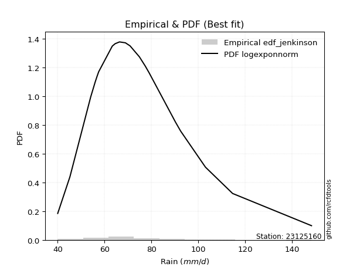</img>

</div>


### 11. EDF Cunnane (1978)

Cunnane´s work in statistical hydrology has focused on the performance and evaluation of different probability distributions (such as GEV, Gumbel, Lognormal) for flood frequency estimation. _b_ is a constant, typically set to 0.4.

<div align="center">


$P=(m-b)/(n+1-2b)$


</div>


**11.1. Empirical values**

<div align="center">

|                | 0                 | 1                   | 2                   | 3                  | 4                   | 5                  | 6                  | 7                  | 8                  | 9           | 10                 | 11                 | 12                | 13                 | 14                 | 15                | 16                 | 17                 | 18                 |
|:---------------|:------------------|:--------------------|:--------------------|:-------------------|:--------------------|:-------------------|:-------------------|:-------------------|:-------------------|:------------|:-------------------|:-------------------|:------------------|:-------------------|:-------------------|:------------------|:-------------------|:-------------------|:-------------------|
| date           | 2006              | 2022                | 2009                | 2021               | 2025                | 2013               | 2008               | 2014               | 2018               | 2005        | 2015               | 2016               | 2010              | 2011               | 2017               | 2019              | 2012               | 2020               | 2007               |
| x              | 40.0              | 45.2                | 54.1                | 56.0               | 56.8                | 57.5               | 63.3               | 64.5               | 66.4               | 68.9        | 70.9               | 74.9               | 77.4              | 79.1               | 90.3               | 92.5              | 103.1              | 114.7              | 148.4              |
| m              | 1                 | 2                   | 3                   | 4                  | 5                   | 6                  | 7                  | 8                  | 9                  | 10          | 11                 | 12                 | 13                | 14                 | 15                 | 16                | 17                 | 18                 | 19                 |
| empirical_dist | edf_cunnane       | edf_cunnane         | edf_cunnane         | edf_cunnane        | edf_cunnane         | edf_cunnane        | edf_cunnane        | edf_cunnane        | edf_cunnane        | edf_cunnane | edf_cunnane        | edf_cunnane        | edf_cunnane       | edf_cunnane        | edf_cunnane        | edf_cunnane       | edf_cunnane        | edf_cunnane        | edf_cunnane        |
| empirical      | 0.03125           | 0.08333333333333334 | 0.13541666666666669 | 0.1875             | 0.23958333333333331 | 0.2916666666666667 | 0.34375            | 0.3958333333333333 | 0.4479166666666667 | 0.5         | 0.5520833333333334 | 0.6041666666666666 | 0.65625           | 0.7083333333333334 | 0.7604166666666666 | 0.8125            | 0.8645833333333335 | 0.9166666666666667 | 0.9687500000000001 |
| empirical_tr   | 1.032258064516129 | 1.090909090909091   | 1.1566265060240966  | 1.2307692307692308 | 1.3150684931506849  | 1.411764705882353  | 1.5238095238095237 | 1.6551724137931032 | 1.8113207547169814 | 2.0         | 2.2325581395348837 | 2.526315789473684  | 2.909090909090909 | 3.428571428571429  | 4.17391304347826   | 5.333333333333333 | 7.384615384615393  | 12.00000000000001  | 32.000000000000114 |

</div>


**11.2. Kolmogorov-Smirnov fit test (sorted by Δ)**


<div align="center">

|                | 0                   | 1                   | 2                    | 3                    | 4                   | 5                   | 6                   | 7                   | 8                    | 9                   | 10                  | 11                  | 12                   | 13                  | 14                  | 15                  | 16                   | 17                   | 18                  | 19                  | 20                   | 21                  | 22                  | 23                   | 24                  | 25                  | 26                  | 27                  | 28                  | 29                  | 30                  | 31                   | 32                  | 33                  | 34                  | 35                  | 36                  | 37                  | 38                  | 39                  | 40                  | 41                  | 42                  | 43                  | 44                  | 45                  | 46                  | 47                  | 48                  | 49                  | 50                  | 51                  | 52                  | 53                  | 54                  | 55                  | 56                  | 57                  | 58                  | 59                  | 60                  | 61                  | 62                  | 63                  | 64                  | 65                  | 66                  | 67                  | 68                  | 69                  | 70                  | 71                  | 72                  | 73                  | 74                  | 75                  | 76                  | 77                  | 78                  | 79                  | 80                  | 81                  | 82                  | 83                  | 84                  | 85                  | 86                  | 87                  | 88                  | 89                  | 90                  | 91                  | 92                  | 93                  | 94                  | 95                  | 96                  | 97                  | 98                  | 99                  | 100                 | 101                 | 102                 | 103                 | 104                 | 105                 | 106                 | 107                 | 108                 | 109                 | 110                 | 111                 | 112                 | 113                 | 114                 | 115                 | 116                 | 117                 | 118                 | 119                 | 120                 | 121                 | 122                 | 123                 | 124                 | 125                 | 126                 | 127                 | 128                 | 129                 | 130                 | 131                 | 132                 | 133                 | 134                 | 135                 | 136                 | 137                 | 138                 | 139                 | 140                 | 141                 | 142                 | 143                 | 144                 | 145                 | 146                 | 147                 | 148                 | 149                 | 150                 | 151                 | 152                 | 153                 | 154                 | 155                 | 156                 | 157                 | 158                 | 159                 |
|:---------------|:--------------------|:--------------------|:---------------------|:---------------------|:--------------------|:--------------------|:--------------------|:--------------------|:---------------------|:--------------------|:--------------------|:--------------------|:---------------------|:--------------------|:--------------------|:--------------------|:---------------------|:---------------------|:--------------------|:--------------------|:---------------------|:--------------------|:--------------------|:---------------------|:--------------------|:--------------------|:--------------------|:--------------------|:--------------------|:--------------------|:--------------------|:---------------------|:--------------------|:--------------------|:--------------------|:--------------------|:--------------------|:--------------------|:--------------------|:--------------------|:--------------------|:--------------------|:--------------------|:--------------------|:--------------------|:--------------------|:--------------------|:--------------------|:--------------------|:--------------------|:--------------------|:--------------------|:--------------------|:--------------------|:--------------------|:--------------------|:--------------------|:--------------------|:--------------------|:--------------------|:--------------------|:--------------------|:--------------------|:--------------------|:--------------------|:--------------------|:--------------------|:--------------------|:--------------------|:--------------------|:--------------------|:--------------------|:--------------------|:--------------------|:--------------------|:--------------------|:--------------------|:--------------------|:--------------------|:--------------------|:--------------------|:--------------------|:--------------------|:--------------------|:--------------------|:--------------------|:--------------------|:--------------------|:--------------------|:--------------------|:--------------------|:--------------------|:--------------------|:--------------------|:--------------------|:--------------------|:--------------------|:--------------------|:--------------------|:--------------------|:--------------------|:--------------------|:--------------------|:--------------------|:--------------------|:--------------------|:--------------------|:--------------------|:--------------------|:--------------------|:--------------------|:--------------------|:--------------------|:--------------------|:--------------------|:--------------------|:--------------------|:--------------------|:--------------------|:--------------------|:--------------------|:--------------------|:--------------------|:--------------------|:--------------------|:--------------------|:--------------------|:--------------------|:--------------------|:--------------------|:--------------------|:--------------------|:--------------------|:--------------------|:--------------------|:--------------------|:--------------------|:--------------------|:--------------------|:--------------------|:--------------------|:--------------------|:--------------------|:--------------------|:--------------------|:--------------------|:--------------------|:--------------------|:--------------------|:--------------------|:--------------------|:--------------------|:--------------------|:--------------------|:--------------------|:--------------------|:--------------------|:--------------------|:--------------------|:--------------------|
| station        | 23125160            | 23125160            | 23125160             | 23125160             | 23125160            | 23125160            | 23125160            | 23125160            | 23125160             | 23125160            | 23125160            | 23125160            | 23125160             | 23125160            | 23125160            | 23125160            | 23125160             | 23125160             | 23125160            | 23125160            | 23125160             | 23125160            | 23125160            | 23125160             | 23125160            | 23125160            | 23125160            | 23125160            | 23125160            | 23125160            | 23125160            | 23125160             | 23125160            | 23125160            | 23125160            | 23125160            | 23125160            | 23125160            | 23125160            | 23125160            | 23125160            | 23125160            | 23125160            | 23125160            | 23125160            | 23125160            | 23125160            | 23125160            | 23125160            | 23125160            | 23125160            | 23125160            | 23125160            | 23125160            | 23125160            | 23125160            | 23125160            | 23125160            | 23125160            | 23125160            | 23125160            | 23125160            | 23125160            | 23125160            | 23125160            | 23125160            | 23125160            | 23125160            | 23125160            | 23125160            | 23125160            | 23125160            | 23125160            | 23125160            | 23125160            | 23125160            | 23125160            | 23125160            | 23125160            | 23125160            | 23125160            | 23125160            | 23125160            | 23125160            | 23125160            | 23125160            | 23125160            | 23125160            | 23125160            | 23125160            | 23125160            | 23125160            | 23125160            | 23125160            | 23125160            | 23125160            | 23125160            | 23125160            | 23125160            | 23125160            | 23125160            | 23125160            | 23125160            | 23125160            | 23125160            | 23125160            | 23125160            | 23125160            | 23125160            | 23125160            | 23125160            | 23125160            | 23125160            | 23125160            | 23125160            | 23125160            | 23125160            | 23125160            | 23125160            | 23125160            | 23125160            | 23125160            | 23125160            | 23125160            | 23125160            | 23125160            | 23125160            | 23125160            | 23125160            | 23125160            | 23125160            | 23125160            | 23125160            | 23125160            | 23125160            | 23125160            | 23125160            | 23125160            | 23125160            | 23125160            | 23125160            | 23125160            | 23125160            | 23125160            | 23125160            | 23125160            | 23125160            | 23125160            | 23125160            | 23125160            | 23125160            | 23125160            | 23125160            | 23125160            | 23125160            | 23125160            | 23125160            | 23125160            | 23125160            | 23125160            |
| empirical_dist | edf_cunnane         | edf_cunnane         | edf_cunnane          | edf_cunnane          | edf_cunnane         | edf_cunnane         | edf_cunnane         | edf_cunnane         | edf_cunnane          | edf_cunnane         | edf_cunnane         | edf_cunnane         | edf_cunnane          | edf_cunnane         | edf_cunnane         | edf_cunnane         | edf_cunnane          | edf_cunnane          | edf_cunnane         | edf_cunnane         | edf_cunnane          | edf_cunnane         | edf_cunnane         | edf_cunnane          | edf_cunnane         | edf_cunnane         | edf_cunnane         | edf_cunnane         | edf_cunnane         | edf_cunnane         | edf_cunnane         | edf_cunnane          | edf_cunnane         | edf_cunnane         | edf_cunnane         | edf_cunnane         | edf_cunnane         | edf_cunnane         | edf_cunnane         | edf_cunnane         | edf_cunnane         | edf_cunnane         | edf_cunnane         | edf_cunnane         | edf_cunnane         | edf_cunnane         | edf_cunnane         | edf_cunnane         | edf_cunnane         | edf_cunnane         | edf_cunnane         | edf_cunnane         | edf_cunnane         | edf_cunnane         | edf_cunnane         | edf_cunnane         | edf_cunnane         | edf_cunnane         | edf_cunnane         | edf_cunnane         | edf_cunnane         | edf_cunnane         | edf_cunnane         | edf_cunnane         | edf_cunnane         | edf_cunnane         | edf_cunnane         | edf_cunnane         | edf_cunnane         | edf_cunnane         | edf_cunnane         | edf_cunnane         | edf_cunnane         | edf_cunnane         | edf_cunnane         | edf_cunnane         | edf_cunnane         | edf_cunnane         | edf_cunnane         | edf_cunnane         | edf_cunnane         | edf_cunnane         | edf_cunnane         | edf_cunnane         | edf_cunnane         | edf_cunnane         | edf_cunnane         | edf_cunnane         | edf_cunnane         | edf_cunnane         | edf_cunnane         | edf_cunnane         | edf_cunnane         | edf_cunnane         | edf_cunnane         | edf_cunnane         | edf_cunnane         | edf_cunnane         | edf_cunnane         | edf_cunnane         | edf_cunnane         | edf_cunnane         | edf_cunnane         | edf_cunnane         | edf_cunnane         | edf_cunnane         | edf_cunnane         | edf_cunnane         | edf_cunnane         | edf_cunnane         | edf_cunnane         | edf_cunnane         | edf_cunnane         | edf_cunnane         | edf_cunnane         | edf_cunnane         | edf_cunnane         | edf_cunnane         | edf_cunnane         | edf_cunnane         | edf_cunnane         | edf_cunnane         | edf_cunnane         | edf_cunnane         | edf_cunnane         | edf_cunnane         | edf_cunnane         | edf_cunnane         | edf_cunnane         | edf_cunnane         | edf_cunnane         | edf_cunnane         | edf_cunnane         | edf_cunnane         | edf_cunnane         | edf_cunnane         | edf_cunnane         | edf_cunnane         | edf_cunnane         | edf_cunnane         | edf_cunnane         | edf_cunnane         | edf_cunnane         | edf_cunnane         | edf_cunnane         | edf_cunnane         | edf_cunnane         | edf_cunnane         | edf_cunnane         | edf_cunnane         | edf_cunnane         | edf_cunnane         | edf_cunnane         | edf_cunnane         | edf_cunnane         | edf_cunnane         | edf_cunnane         | edf_cunnane         | edf_cunnane         | edf_cunnane         |
| p_dist         | exponnorm           | mielke              | loggenlogistic       | burr                 | logmielke           | logburr             | logexponnorm        | alpha               | moyal                | logburr12           | invweibull          | genextreme          | logskewnorm          | loggennorm          | nct                 | logalpha            | loginvgamma          | logjohnsonsu         | invgamma            | logfatiguelife      | f                    | logpearson3         | loggenextreme       | logweibull_max       | logf                | loggamma            | loggamma            | logerlang           | loginvgauss         | loggumbel_r         | lognct              | logncf               | johnsonsu           | betaprime           | genlogistic         | invgauss            | logbetaprime        | logjohnsonsb        | logmaxwell          | lognakagami         | johnsonsb           | logrice             | logbeta             | lograyleigh         | loglogistic         | logweibull_min      | logloglaplace       | loginvweibull       | gamma               | erlang              | pearson3            | gumbel_r            | logexponweib        | halflogistic        | logmoyal            | weibull_min         | logt                | logcrystalball      | lognorm             | loggengamma         | logdweibull         | logvonmises_line    | logloggamma         | logdgamma           | loghypsecant        | dweibull            | logfoldnorm         | kstwobign           | tukeylambda         | loghalfnorm         | logtriang           | gennorm             | logkstwobign        | dgamma              | loganglit           | loghalflogistic     | kappa3              | logsemicircular     | logexponpow         | loglaplace          | loglaplace          | halfnorm            | genhalflogistic     | loggompertz         | rayleigh            | loggenexpon         | foldnorm            | wald                | maxwell             | rice                | skewnorm            | logcosine           | gompertz            | logtruncweibull_min | t                   | beta                | logwald             | loggumbel_l         | hypsecant           | logistic            | nakagami            | gausshyper          | truncnorm           | norm                | crystalball         | truncweibull_min    | logarcsine          | loggausshyper       | anglit              | laplace             | semicircular        | logbradford         | loghalfgennorm      | arcsine             | logtruncexpon       | vonmises_line       | loguniform          | logkappa3           | logtukeylambda      | triang              | logksone            | genexpon            | exponpow            | logkappa4           | logrdist            | gumbel_l            | truncexpon          | genpareto           | cosine              | logargus            | bradford            | loglomax            | burr12              | logwrapcauchy       | ncf                 | kappa4              | halfgennorm         | logtruncpareto      | ksone               | argus               | uniform             | wrapcauchy          | logtruncnorm        | loggenhalflogistic  | lomax               | powerlaw            | loggenpareto        | loglevy_l           | logtrapezoid        | logpowerlaw         | levy_l              | rdist               | fatiguelife         | trapezoid           | gengamma            | exponweib           | weibull_max         | truncpareto         | logvonmises         | vonmises            |
| delta          | 0.04458092019007204 | 0.04477106433423789 | 0.044782603991944336 | 0.044807251055447805 | 0.04486492710726184 | 0.04680689132484275 | 0.04841536834408655 | 0.05049758464714049 | 0.051633568683423114 | 0.05179879783869787 | 0.0523183415846111  | 0.05231864369396527 | 0.052579294321219106 | 0.05265236530378814 | 0.05323107127522775 | 0.05399160922453061 | 0.054580543294238754 | 0.055002167164359794 | 0.05528303304437596 | 0.05561567310559201 | 0.055780024657988564 | 0.05596938215507402 | 0.05609819199607971 | 0.056120574488122826 | 0.05632405088756587 | 0.0565551357686849  | 0.0565551357686849  | 0.0565553206372193  | 0.05690982292342989 | 0.0575801524116869  | 0.05822538796352672 | 0.058425881987089645 | 0.05928831246190902 | 0.06037355124391952 | 0.06081006916653964 | 0.06221261581576909 | 0.06289061665225226 | 0.06380080659337622 | 0.06397984615519064 | 0.06486359070086439 | 0.06494361250708147 | 0.06662736704364464 | 0.0678607551278664  | 0.0683312589288349  | 0.06835848630137836 | 0.06965317610436134 | 0.07237347675143246 | 0.07282060824026959 | 0.0729353771372602  | 0.07293596838253186 | 0.07363500609121595 | 0.07400109287873768 | 0.07550399922729764 | 0.07561718273514335 | 0.07594688816803628 | 0.07650141066371414 | 0.0768906730739537  | 0.07696421292658184 | 0.07696426706067372 | 0.07759653966618921 | 0.07838036324110464 | 0.07924951485613538 | 0.08045249882499883 | 0.08294984866179511 | 0.08315434984680858 | 0.0833519910822671  | 0.08362639567358526 | 0.08629854908737855 | 0.08685237882276675 | 0.08714091866542462 | 0.08947595274277498 | 0.09179112958013791 | 0.09362167327555326 | 0.0942652792973998  | 0.09465548043642413 | 0.09565184465019466 | 0.10185565589213627 | 0.10204301252846482 | 0.10228235847277906 | 0.10248208347390175 | 0.10248208347390175 | 0.1025006478991119  | 0.10379427446277004 | 0.10399659194730165 | 0.10467294664722315 | 0.10623354904053575 | 0.11037293627599504 | 0.11244675171842461 | 0.11400047412943204 | 0.11933441843151471 | 0.12050549379207542 | 0.12150501125380853 | 0.12340601015561503 | 0.12454892018652847 | 0.12491805081294771 | 0.12544097590368358 | 0.12630458073953144 | 0.13008338570223954 | 0.13099502993545004 | 0.13468293530859088 | 0.13666687600392796 | 0.14067721489472979 | 0.14332443916035698 | 0.14335138572497141 | 0.14335139082638315 | 0.14854250477159836 | 0.15004098656267395 | 0.15126271414101689 | 0.15252155201839301 | 0.15303197313323724 | 0.15631195838857437 | 0.15694416306206788 | 0.16038097590630435 | 0.1714249149280671  | 0.17327494923656983 | 0.17732783931962404 | 0.18825946417779216 | 0.18872939236425146 | 0.18873442090157988 | 0.19466430808331514 | 0.19629811394175878 | 0.1966215971327533  | 0.19831596185834421 | 0.2040624596145303  | 0.20479132333146588 | 0.2086318320077959  | 0.22488198532728243 | 0.2352820982141221  | 0.23535929069331707 | 0.24313460750762428 | 0.266838025660198   | 0.2717016812778285  | 0.27285427324386297 | 0.2777851911488234  | 0.2942782217893882  | 0.29578996289978254 | 0.31787534904215053 | 0.3187797178468977  | 0.3255688806888069  | 0.3441419517365425  | 0.3476322263222633  | 0.3605216829360478  | 0.3606408196655027  | 0.3607627412940184  | 0.36226254439025163 | 0.3920274497811052  | 0.41276107407687607 | 0.4218547300151374  | 0.4413252755489423  | 0.4474922540551843  | 0.4712599066996275  | 0.5094562951768092  | 0.5607183393384847  | 0.5753980850463485  | 0.606317136106511   | 0.6667086463093936  | 0.7753423596799036  | 0.8286378905305215  | 1.0529198659296684  | 22.918536111775314  |
| deltao         | 0.31564497164100014 | 0.31564497164100014 | 0.31564497164100014  | 0.31564497164100014  | 0.31564497164100014 | 0.31564497164100014 | 0.31564497164100014 | 0.31564497164100014 | 0.31564497164100014  | 0.31564497164100014 | 0.31564497164100014 | 0.31564497164100014 | 0.31564497164100014  | 0.31564497164100014 | 0.31564497164100014 | 0.31564497164100014 | 0.31564497164100014  | 0.31564497164100014  | 0.31564497164100014 | 0.31564497164100014 | 0.31564497164100014  | 0.31564497164100014 | 0.31564497164100014 | 0.31564497164100014  | 0.31564497164100014 | 0.31564497164100014 | 0.31564497164100014 | 0.31564497164100014 | 0.31564497164100014 | 0.31564497164100014 | 0.31564497164100014 | 0.31564497164100014  | 0.31564497164100014 | 0.31564497164100014 | 0.31564497164100014 | 0.31564497164100014 | 0.31564497164100014 | 0.31564497164100014 | 0.31564497164100014 | 0.31564497164100014 | 0.31564497164100014 | 0.31564497164100014 | 0.31564497164100014 | 0.31564497164100014 | 0.31564497164100014 | 0.31564497164100014 | 0.31564497164100014 | 0.31564497164100014 | 0.31564497164100014 | 0.31564497164100014 | 0.31564497164100014 | 0.31564497164100014 | 0.31564497164100014 | 0.31564497164100014 | 0.31564497164100014 | 0.31564497164100014 | 0.31564497164100014 | 0.31564497164100014 | 0.31564497164100014 | 0.31564497164100014 | 0.31564497164100014 | 0.31564497164100014 | 0.31564497164100014 | 0.31564497164100014 | 0.31564497164100014 | 0.31564497164100014 | 0.31564497164100014 | 0.31564497164100014 | 0.31564497164100014 | 0.31564497164100014 | 0.31564497164100014 | 0.31564497164100014 | 0.31564497164100014 | 0.31564497164100014 | 0.31564497164100014 | 0.31564497164100014 | 0.31564497164100014 | 0.31564497164100014 | 0.31564497164100014 | 0.31564497164100014 | 0.31564497164100014 | 0.31564497164100014 | 0.31564497164100014 | 0.31564497164100014 | 0.31564497164100014 | 0.31564497164100014 | 0.31564497164100014 | 0.31564497164100014 | 0.31564497164100014 | 0.31564497164100014 | 0.31564497164100014 | 0.31564497164100014 | 0.31564497164100014 | 0.31564497164100014 | 0.31564497164100014 | 0.31564497164100014 | 0.31564497164100014 | 0.31564497164100014 | 0.31564497164100014 | 0.31564497164100014 | 0.31564497164100014 | 0.31564497164100014 | 0.31564497164100014 | 0.31564497164100014 | 0.31564497164100014 | 0.31564497164100014 | 0.31564497164100014 | 0.31564497164100014 | 0.31564497164100014 | 0.31564497164100014 | 0.31564497164100014 | 0.31564497164100014 | 0.31564497164100014 | 0.31564497164100014 | 0.31564497164100014 | 0.31564497164100014 | 0.31564497164100014 | 0.31564497164100014 | 0.31564497164100014 | 0.31564497164100014 | 0.31564497164100014 | 0.31564497164100014 | 0.31564497164100014 | 0.31564497164100014 | 0.31564497164100014 | 0.31564497164100014 | 0.31564497164100014 | 0.31564497164100014 | 0.31564497164100014 | 0.31564497164100014 | 0.31564497164100014 | 0.31564497164100014 | 0.31564497164100014 | 0.31564497164100014 | 0.31564497164100014 | 0.31564497164100014 | 0.31564497164100014 | 0.31564497164100014 | 0.31564497164100014 | 0.31564497164100014 | 0.31564497164100014 | 0.31564497164100014 | 0.31564497164100014 | 0.31564497164100014 | 0.31564497164100014 | 0.31564497164100014 | 0.31564497164100014 | 0.31564497164100014 | 0.31564497164100014 | 0.31564497164100014 | 0.31564497164100014 | 0.31564497164100014 | 0.31564497164100014 | 0.31564497164100014 | 0.31564497164100014 | 0.31564497164100014 | 0.31564497164100014 | 0.31564497164100014 | 0.31564497164100014 | 0.31564497164100014 |
| eval           | Δo > Δ              | Δo > Δ              | Δo > Δ               | Δo > Δ               | Δo > Δ              | Δo > Δ              | Δo > Δ              | Δo > Δ              | Δo > Δ               | Δo > Δ              | Δo > Δ              | Δo > Δ              | Δo > Δ               | Δo > Δ              | Δo > Δ              | Δo > Δ              | Δo > Δ               | Δo > Δ               | Δo > Δ              | Δo > Δ              | Δo > Δ               | Δo > Δ              | Δo > Δ              | Δo > Δ               | Δo > Δ              | Δo > Δ              | Δo > Δ              | Δo > Δ              | Δo > Δ              | Δo > Δ              | Δo > Δ              | Δo > Δ               | Δo > Δ              | Δo > Δ              | Δo > Δ              | Δo > Δ              | Δo > Δ              | Δo > Δ              | Δo > Δ              | Δo > Δ              | Δo > Δ              | Δo > Δ              | Δo > Δ              | Δo > Δ              | Δo > Δ              | Δo > Δ              | Δo > Δ              | Δo > Δ              | Δo > Δ              | Δo > Δ              | Δo > Δ              | Δo > Δ              | Δo > Δ              | Δo > Δ              | Δo > Δ              | Δo > Δ              | Δo > Δ              | Δo > Δ              | Δo > Δ              | Δo > Δ              | Δo > Δ              | Δo > Δ              | Δo > Δ              | Δo > Δ              | Δo > Δ              | Δo > Δ              | Δo > Δ              | Δo > Δ              | Δo > Δ              | Δo > Δ              | Δo > Δ              | Δo > Δ              | Δo > Δ              | Δo > Δ              | Δo > Δ              | Δo > Δ              | Δo > Δ              | Δo > Δ              | Δo > Δ              | Δo > Δ              | Δo > Δ              | Δo > Δ              | Δo > Δ              | Δo > Δ              | Δo > Δ              | Δo > Δ              | Δo > Δ              | Δo > Δ              | Δo > Δ              | Δo > Δ              | Δo > Δ              | Δo > Δ              | Δo > Δ              | Δo > Δ              | Δo > Δ              | Δo > Δ              | Δo > Δ              | Δo > Δ              | Δo > Δ              | Δo > Δ              | Δo > Δ              | Δo > Δ              | Δo > Δ              | Δo > Δ              | Δo > Δ              | Δo > Δ              | Δo > Δ              | Δo > Δ              | Δo > Δ              | Δo > Δ              | Δo > Δ              | Δo > Δ              | Δo > Δ              | Δo > Δ              | Δo > Δ              | Δo > Δ              | Δo > Δ              | Δo > Δ              | Δo > Δ              | Δo > Δ              | Δo > Δ              | Δo > Δ              | Δo > Δ              | Δo > Δ              | Δo > Δ              | Δo > Δ              | Δo > Δ              | Δo > Δ              | Δo > Δ              | Δo > Δ              | Δo > Δ              | Δo > Δ              | Δo > Δ              | Δo > Δ              | Δo > Δ              | Δo > Δ              | Δo <= Δ             | Δo <= Δ             | Δo <= Δ             | Δo <= Δ             | Δo <= Δ             | Δo <= Δ             | Δo <= Δ             | Δo <= Δ             | Δo <= Δ             | Δo <= Δ             | Δo <= Δ             | Δo <= Δ             | Δo <= Δ             | Δo <= Δ             | Δo <= Δ             | Δo <= Δ             | Δo <= Δ             | Δo <= Δ             | Δo <= Δ             | Δo <= Δ             | Δo <= Δ             | Δo <= Δ             | Δo <= Δ             | Δo <= Δ             |
| fit            | 1                   | 1                   | 1                    | 1                    | 1                   | 1                   | 1                   | 1                   | 1                    | 1                   | 1                   | 1                   | 1                    | 1                   | 1                   | 1                   | 1                    | 1                    | 1                   | 1                   | 1                    | 1                   | 1                   | 1                    | 1                   | 1                   | 1                   | 1                   | 1                   | 1                   | 1                   | 1                    | 1                   | 1                   | 1                   | 1                   | 1                   | 1                   | 1                   | 1                   | 1                   | 1                   | 1                   | 1                   | 1                   | 1                   | 1                   | 1                   | 1                   | 1                   | 1                   | 1                   | 1                   | 1                   | 1                   | 1                   | 1                   | 1                   | 1                   | 1                   | 1                   | 1                   | 1                   | 1                   | 1                   | 1                   | 1                   | 1                   | 1                   | 1                   | 1                   | 1                   | 1                   | 1                   | 1                   | 1                   | 1                   | 1                   | 1                   | 1                   | 1                   | 1                   | 1                   | 1                   | 1                   | 1                   | 1                   | 1                   | 1                   | 1                   | 1                   | 1                   | 1                   | 1                   | 1                   | 1                   | 1                   | 1                   | 1                   | 1                   | 1                   | 1                   | 1                   | 1                   | 1                   | 1                   | 1                   | 1                   | 1                   | 1                   | 1                   | 1                   | 1                   | 1                   | 1                   | 1                   | 1                   | 1                   | 1                   | 1                   | 1                   | 1                   | 1                   | 1                   | 1                   | 1                   | 1                   | 1                   | 1                   | 1                   | 1                   | 1                   | 1                   | 1                   | 1                   | 1                   | 0                   | 0                   | 0                   | 0                   | 0                   | 0                   | 0                   | 0                   | 0                   | 0                   | 0                   | 0                   | 0                   | 0                   | 0                   | 0                   | 0                   | 0                   | 0                   | 0                   | 0                   | 0                   | 0                   | 0                   |
| n              | 19                  | 19                  | 19                   | 19                   | 19                  | 19                  | 19                  | 19                  | 19                   | 19                  | 19                  | 19                  | 19                   | 19                  | 19                  | 19                  | 19                   | 19                   | 19                  | 19                  | 19                   | 19                  | 19                  | 19                   | 19                  | 19                  | 19                  | 19                  | 19                  | 19                  | 19                  | 19                   | 19                  | 19                  | 19                  | 19                  | 19                  | 19                  | 19                  | 19                  | 19                  | 19                  | 19                  | 19                  | 19                  | 19                  | 19                  | 19                  | 19                  | 19                  | 19                  | 19                  | 19                  | 19                  | 19                  | 19                  | 19                  | 19                  | 19                  | 19                  | 19                  | 19                  | 19                  | 19                  | 19                  | 19                  | 19                  | 19                  | 19                  | 19                  | 19                  | 19                  | 19                  | 19                  | 19                  | 19                  | 19                  | 19                  | 19                  | 19                  | 19                  | 19                  | 19                  | 19                  | 19                  | 19                  | 19                  | 19                  | 19                  | 19                  | 19                  | 19                  | 19                  | 19                  | 19                  | 19                  | 19                  | 19                  | 19                  | 19                  | 19                  | 19                  | 19                  | 19                  | 19                  | 19                  | 19                  | 19                  | 19                  | 19                  | 19                  | 19                  | 19                  | 19                  | 19                  | 19                  | 19                  | 19                  | 19                  | 19                  | 19                  | 19                  | 19                  | 19                  | 19                  | 19                  | 19                  | 19                  | 19                  | 19                  | 19                  | 19                  | 19                  | 19                  | 19                  | 19                  | 19                  | 19                  | 19                  | 19                  | 19                  | 19                  | 19                  | 19                  | 19                  | 19                  | 19                  | 19                  | 19                  | 19                  | 19                  | 19                  | 19                  | 19                  | 19                  | 19                  | 19                  | 19                  | 19                  | 19                  |
| best_fit       | 1                   | 0                   | 0                    | 0                    | 0                   | 0                   | 0                   | 0                   | 0                    | 0                   | 0                   | 0                   | 0                    | 0                   | 0                   | 0                   | 0                    | 0                    | 0                   | 0                   | 0                    | 0                   | 0                   | 0                    | 0                   | 0                   | 0                   | 0                   | 0                   | 0                   | 0                   | 0                    | 0                   | 0                   | 0                   | 0                   | 0                   | 0                   | 0                   | 0                   | 0                   | 0                   | 0                   | 0                   | 0                   | 0                   | 0                   | 0                   | 0                   | 0                   | 0                   | 0                   | 0                   | 0                   | 0                   | 0                   | 0                   | 0                   | 0                   | 0                   | 0                   | 0                   | 0                   | 0                   | 0                   | 0                   | 0                   | 0                   | 0                   | 0                   | 0                   | 0                   | 0                   | 0                   | 0                   | 0                   | 0                   | 0                   | 0                   | 0                   | 0                   | 0                   | 0                   | 0                   | 0                   | 0                   | 0                   | 0                   | 0                   | 0                   | 0                   | 0                   | 0                   | 0                   | 0                   | 0                   | 0                   | 0                   | 0                   | 0                   | 0                   | 0                   | 0                   | 0                   | 0                   | 0                   | 0                   | 0                   | 0                   | 0                   | 0                   | 0                   | 0                   | 0                   | 0                   | 0                   | 0                   | 0                   | 0                   | 0                   | 0                   | 0                   | 0                   | 0                   | 0                   | 0                   | 0                   | 0                   | 0                   | 0                   | 0                   | 0                   | 0                   | 0                   | 0                   | 0                   | 0                   | 0                   | 0                   | 0                   | 0                   | 0                   | 0                   | 0                   | 0                   | 0                   | 0                   | 0                   | 0                   | 0                   | 0                   | 0                   | 0                   | 0                   | 0                   | 0                   | 0                   | 0                   | 0                   | 0                   |
| best_fit_sort  | 1                   | 2                   | 3                    | 4                    | 5                   | 6                   | 7                   | 8                   | 9                    | 10                  | 11                  | 12                  | 13                   | 14                  | 15                  | 16                  | 17                   | 18                   | 19                  | 20                  | 21                   | 22                  | 23                  | 24                   | 25                  | 26                  | 27                  | 28                  | 29                  | 30                  | 31                  | 32                   | 33                  | 34                  | 35                  | 36                  | 37                  | 38                  | 39                  | 40                  | 41                  | 42                  | 43                  | 44                  | 45                  | 46                  | 47                  | 48                  | 49                  | 50                  | 51                  | 52                  | 53                  | 54                  | 55                  | 56                  | 57                  | 58                  | 59                  | 60                  | 61                  | 62                  | 63                  | 64                  | 65                  | 66                  | 67                  | 68                  | 69                  | 70                  | 71                  | 72                  | 73                  | 74                  | 75                  | 76                  | 77                  | 78                  | 79                  | 80                  | 81                  | 82                  | 83                  | 84                  | 85                  | 86                  | 87                  | 88                  | 89                  | 90                  | 91                  | 92                  | 93                  | 94                  | 95                  | 96                  | 97                  | 98                  | 99                  | 100                 | 101                 | 102                 | 103                 | 104                 | 105                 | 106                 | 107                 | 108                 | 109                 | 110                 | 111                 | 112                 | 113                 | 114                 | 115                 | 116                 | 117                 | 118                 | 119                 | 120                 | 121                 | 122                 | 123                 | 124                 | 125                 | 126                 | 127                 | 128                 | 129                 | 130                 | 131                 | 132                 | 133                 | 134                 | 135                 | 136                 | 137                 | 138                 | 139                 | 140                 | 141                 | 142                 | 143                 | 144                 | 145                 | 146                 | 147                 | 148                 | 149                 | 150                 | 151                 | 152                 | 153                 | 154                 | 155                 | 156                 | 157                 | 158                 | 159                 | 160                 |

</div>


**11.3. Best fit**

<div align="center">

|   id |   station | empirical_dist   | p_dist    |     delta |   deltao | eval   |   fit |   n |   best_fit |   best_fit_sort |
|-----:|----------:|:-----------------|:----------|----------:|---------:|:-------|------:|----:|-----------:|----------------:|
|    0 |  23125160 | edf_cunnane      | exponnorm | 0.0445809 | 0.315645 | Δo > Δ |     1 |  19 |          1 |               1 |

</div>


<div align="center">

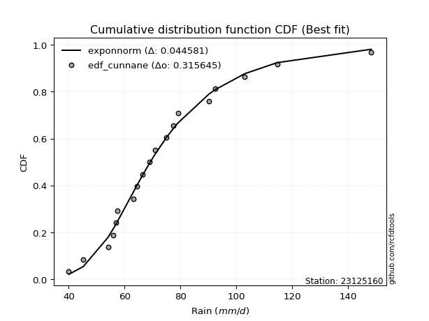</img></img>

</div>


### 12. EDF Adamowski (1981)

The Adamowski formula in hydrology refers to a specific plotting position formula used for estimating the non-parametric empirical distribution of hydrological events (like flood peaks) to calculate their return periods. This formula provides an alternative to traditional parametric methods (like the Gumbel or Log Pearson Type III distributions). 

<div align="center">


$P=(m-0.25)/(n+0.5)$


</div>


**12.1. Empirical values**

<div align="center">

|                | 0                    | 1                   | 2                   | 3                   | 4                   | 5                  | 6                   | 7                  | 8                   | 9             | 10                 | 11                 | 12                 | 13                 | 14                 | 15                 | 16                 | 17                 | 18                 |
|:---------------|:---------------------|:--------------------|:--------------------|:--------------------|:--------------------|:-------------------|:--------------------|:-------------------|:--------------------|:--------------|:-------------------|:-------------------|:-------------------|:-------------------|:-------------------|:-------------------|:-------------------|:-------------------|:-------------------|
| date           | 2006                 | 2022                | 2009                | 2021                | 2025                | 2013               | 2008                | 2014               | 2018                | 2005          | 2015               | 2016               | 2010               | 2011               | 2017               | 2019               | 2012               | 2020               | 2007               |
| x              | 40.0                 | 45.2                | 54.1                | 56.0                | 56.8                | 57.5               | 63.3                | 64.5               | 66.4                | 68.9          | 70.9               | 74.9               | 77.4               | 79.1               | 90.3               | 92.5               | 103.1              | 114.7              | 148.4              |
| m              | 1                    | 2                   | 3                   | 4                   | 5                   | 6                  | 7                   | 8                  | 9                   | 10            | 11                 | 12                 | 13                 | 14                 | 15                 | 16                 | 17                 | 18                 | 19                 |
| empirical_dist | edf_adamowski        | edf_adamowski       | edf_adamowski       | edf_adamowski       | edf_adamowski       | edf_adamowski      | edf_adamowski       | edf_adamowski      | edf_adamowski       | edf_adamowski | edf_adamowski      | edf_adamowski      | edf_adamowski      | edf_adamowski      | edf_adamowski      | edf_adamowski      | edf_adamowski      | edf_adamowski      | edf_adamowski      |
| empirical      | 0.038461538461538464 | 0.08974358974358974 | 0.14102564102564102 | 0.19230769230769232 | 0.24358974358974358 | 0.2948717948717949 | 0.34615384615384615 | 0.3974358974358974 | 0.44871794871794873 | 0.5           | 0.5512820512820513 | 0.6025641025641025 | 0.6538461538461539 | 0.7051282051282052 | 0.7564102564102564 | 0.8076923076923077 | 0.8589743589743589 | 0.9102564102564102 | 0.9615384615384616 |
| empirical_tr   | 1.04                 | 1.0985915492957747  | 1.164179104477612   | 1.2380952380952381  | 1.3220338983050848  | 1.4181818181818182 | 1.5294117647058822  | 1.6595744680851061 | 1.813953488372093   | 2.0           | 2.2285714285714286 | 2.5161290322580645 | 2.888888888888889  | 3.3913043478260874 | 4.105263157894736  | 5.2                | 7.090909090909088  | 11.14285714285714  | 26.000000000000018 |

</div>


**12.2. Kolmogorov-Smirnov fit test (sorted by Δ)**


<div align="center">

|                | 0                   | 1                   | 2                   | 3                    | 4                   | 5                   | 6                   | 7                    | 8                   | 9                    | 10                  | 11                  | 12                  | 13                   | 14                   | 15                  | 16                  | 17                  | 18                   | 19                  | 20                  | 21                  | 22                  | 23                  | 24                  | 25                  | 26                  | 27                  | 28                  | 29                  | 30                   | 31                  | 32                  | 33                  | 34                   | 35                   | 36                   | 37                   | 38                  | 39                  | 40                  | 41                  | 42                  | 43                  | 44                  | 45                  | 46                  | 47                  | 48                  | 49                  | 50                  | 51                  | 52                  | 53                  | 54                  | 55                  | 56                  | 57                  | 58                  | 59                  | 60                  | 61                  | 62                  | 63                  | 64                  | 65                  | 66                  | 67                  | 68                  | 69                  | 70                  | 71                  | 72                  | 73                  | 74                  | 75                  | 76                  | 77                  | 78                  | 79                  | 80                  | 81                  | 82                  | 83                  | 84                  | 85                  | 86                  | 87                  | 88                  | 89                  | 90                  | 91                  | 92                  | 93                  | 94                  | 95                  | 96                  | 97                  | 98                  | 99                  | 100                 | 101                 | 102                 | 103                 | 104                 | 105                 | 106                 | 107                 | 108                 | 109                 | 110                 | 111                 | 112                 | 113                 | 114                 | 115                 | 116                 | 117                 | 118                 | 119                 | 120                 | 121                 | 122                 | 123                 | 124                 | 125                 | 126                 | 127                 | 128                 | 129                 | 130                 | 131                 | 132                 | 133                 | 134                 | 135                 | 136                 | 137                 | 138                 | 139                 | 140                 | 141                 | 142                 | 143                 | 144                 | 145                 | 146                 | 147                 | 148                 | 149                 | 150                 | 151                 | 152                 | 153                 | 154                 | 155                 | 156                 | 157                 | 158                 | 159                 |
|:---------------|:--------------------|:--------------------|:--------------------|:---------------------|:--------------------|:--------------------|:--------------------|:---------------------|:--------------------|:---------------------|:--------------------|:--------------------|:--------------------|:---------------------|:---------------------|:--------------------|:--------------------|:--------------------|:---------------------|:--------------------|:--------------------|:--------------------|:--------------------|:--------------------|:--------------------|:--------------------|:--------------------|:--------------------|:--------------------|:--------------------|:---------------------|:--------------------|:--------------------|:--------------------|:---------------------|:---------------------|:---------------------|:---------------------|:--------------------|:--------------------|:--------------------|:--------------------|:--------------------|:--------------------|:--------------------|:--------------------|:--------------------|:--------------------|:--------------------|:--------------------|:--------------------|:--------------------|:--------------------|:--------------------|:--------------------|:--------------------|:--------------------|:--------------------|:--------------------|:--------------------|:--------------------|:--------------------|:--------------------|:--------------------|:--------------------|:--------------------|:--------------------|:--------------------|:--------------------|:--------------------|:--------------------|:--------------------|:--------------------|:--------------------|:--------------------|:--------------------|:--------------------|:--------------------|:--------------------|:--------------------|:--------------------|:--------------------|:--------------------|:--------------------|:--------------------|:--------------------|:--------------------|:--------------------|:--------------------|:--------------------|:--------------------|:--------------------|:--------------------|:--------------------|:--------------------|:--------------------|:--------------------|:--------------------|:--------------------|:--------------------|:--------------------|:--------------------|:--------------------|:--------------------|:--------------------|:--------------------|:--------------------|:--------------------|:--------------------|:--------------------|:--------------------|:--------------------|:--------------------|:--------------------|:--------------------|:--------------------|:--------------------|:--------------------|:--------------------|:--------------------|:--------------------|:--------------------|:--------------------|:--------------------|:--------------------|:--------------------|:--------------------|:--------------------|:--------------------|:--------------------|:--------------------|:--------------------|:--------------------|:--------------------|:--------------------|:--------------------|:--------------------|:--------------------|:--------------------|:--------------------|:--------------------|:--------------------|:--------------------|:--------------------|:--------------------|:--------------------|:--------------------|:--------------------|:--------------------|:--------------------|:--------------------|:--------------------|:--------------------|:--------------------|:--------------------|:--------------------|:--------------------|:--------------------|:--------------------|:--------------------|
| station        | 23125160            | 23125160            | 23125160            | 23125160             | 23125160            | 23125160            | 23125160            | 23125160             | 23125160            | 23125160             | 23125160            | 23125160            | 23125160            | 23125160             | 23125160             | 23125160            | 23125160            | 23125160            | 23125160             | 23125160            | 23125160            | 23125160            | 23125160            | 23125160            | 23125160            | 23125160            | 23125160            | 23125160            | 23125160            | 23125160            | 23125160             | 23125160            | 23125160            | 23125160            | 23125160             | 23125160             | 23125160             | 23125160             | 23125160            | 23125160            | 23125160            | 23125160            | 23125160            | 23125160            | 23125160            | 23125160            | 23125160            | 23125160            | 23125160            | 23125160            | 23125160            | 23125160            | 23125160            | 23125160            | 23125160            | 23125160            | 23125160            | 23125160            | 23125160            | 23125160            | 23125160            | 23125160            | 23125160            | 23125160            | 23125160            | 23125160            | 23125160            | 23125160            | 23125160            | 23125160            | 23125160            | 23125160            | 23125160            | 23125160            | 23125160            | 23125160            | 23125160            | 23125160            | 23125160            | 23125160            | 23125160            | 23125160            | 23125160            | 23125160            | 23125160            | 23125160            | 23125160            | 23125160            | 23125160            | 23125160            | 23125160            | 23125160            | 23125160            | 23125160            | 23125160            | 23125160            | 23125160            | 23125160            | 23125160            | 23125160            | 23125160            | 23125160            | 23125160            | 23125160            | 23125160            | 23125160            | 23125160            | 23125160            | 23125160            | 23125160            | 23125160            | 23125160            | 23125160            | 23125160            | 23125160            | 23125160            | 23125160            | 23125160            | 23125160            | 23125160            | 23125160            | 23125160            | 23125160            | 23125160            | 23125160            | 23125160            | 23125160            | 23125160            | 23125160            | 23125160            | 23125160            | 23125160            | 23125160            | 23125160            | 23125160            | 23125160            | 23125160            | 23125160            | 23125160            | 23125160            | 23125160            | 23125160            | 23125160            | 23125160            | 23125160            | 23125160            | 23125160            | 23125160            | 23125160            | 23125160            | 23125160            | 23125160            | 23125160            | 23125160            | 23125160            | 23125160            | 23125160            | 23125160            | 23125160            | 23125160            |
| empirical_dist | edf_adamowski       | edf_adamowski       | edf_adamowski       | edf_adamowski        | edf_adamowski       | edf_adamowski       | edf_adamowski       | edf_adamowski        | edf_adamowski       | edf_adamowski        | edf_adamowski       | edf_adamowski       | edf_adamowski       | edf_adamowski        | edf_adamowski        | edf_adamowski       | edf_adamowski       | edf_adamowski       | edf_adamowski        | edf_adamowski       | edf_adamowski       | edf_adamowski       | edf_adamowski       | edf_adamowski       | edf_adamowski       | edf_adamowski       | edf_adamowski       | edf_adamowski       | edf_adamowski       | edf_adamowski       | edf_adamowski        | edf_adamowski       | edf_adamowski       | edf_adamowski       | edf_adamowski        | edf_adamowski        | edf_adamowski        | edf_adamowski        | edf_adamowski       | edf_adamowski       | edf_adamowski       | edf_adamowski       | edf_adamowski       | edf_adamowski       | edf_adamowski       | edf_adamowski       | edf_adamowski       | edf_adamowski       | edf_adamowski       | edf_adamowski       | edf_adamowski       | edf_adamowski       | edf_adamowski       | edf_adamowski       | edf_adamowski       | edf_adamowski       | edf_adamowski       | edf_adamowski       | edf_adamowski       | edf_adamowski       | edf_adamowski       | edf_adamowski       | edf_adamowski       | edf_adamowski       | edf_adamowski       | edf_adamowski       | edf_adamowski       | edf_adamowski       | edf_adamowski       | edf_adamowski       | edf_adamowski       | edf_adamowski       | edf_adamowski       | edf_adamowski       | edf_adamowski       | edf_adamowski       | edf_adamowski       | edf_adamowski       | edf_adamowski       | edf_adamowski       | edf_adamowski       | edf_adamowski       | edf_adamowski       | edf_adamowski       | edf_adamowski       | edf_adamowski       | edf_adamowski       | edf_adamowski       | edf_adamowski       | edf_adamowski       | edf_adamowski       | edf_adamowski       | edf_adamowski       | edf_adamowski       | edf_adamowski       | edf_adamowski       | edf_adamowski       | edf_adamowski       | edf_adamowski       | edf_adamowski       | edf_adamowski       | edf_adamowski       | edf_adamowski       | edf_adamowski       | edf_adamowski       | edf_adamowski       | edf_adamowski       | edf_adamowski       | edf_adamowski       | edf_adamowski       | edf_adamowski       | edf_adamowski       | edf_adamowski       | edf_adamowski       | edf_adamowski       | edf_adamowski       | edf_adamowski       | edf_adamowski       | edf_adamowski       | edf_adamowski       | edf_adamowski       | edf_adamowski       | edf_adamowski       | edf_adamowski       | edf_adamowski       | edf_adamowski       | edf_adamowski       | edf_adamowski       | edf_adamowski       | edf_adamowski       | edf_adamowski       | edf_adamowski       | edf_adamowski       | edf_adamowski       | edf_adamowski       | edf_adamowski       | edf_adamowski       | edf_adamowski       | edf_adamowski       | edf_adamowski       | edf_adamowski       | edf_adamowski       | edf_adamowski       | edf_adamowski       | edf_adamowski       | edf_adamowski       | edf_adamowski       | edf_adamowski       | edf_adamowski       | edf_adamowski       | edf_adamowski       | edf_adamowski       | edf_adamowski       | edf_adamowski       | edf_adamowski       | edf_adamowski       | edf_adamowski       | edf_adamowski       | edf_adamowski       | edf_adamowski       |
| p_dist         | logexponnorm        | alpha               | moyal               | logmielke            | invweibull          | genextreme          | burr                | loggenlogistic       | mielke              | logskewnorm          | nct                 | exponnorm           | logalpha            | loginvgamma          | logjohnsonsu         | invgamma            | logfatiguelife      | logburr             | f                    | loggenextreme       | loggennorm          | logweibull_max      | logpearson3         | logf                | loggamma            | loggamma            | logerlang           | loginvgauss         | johnsonsu           | logburr12           | lognct               | logncf              | invgauss            | betaprime           | genlogistic          | logjohnsonsb         | logmaxwell           | lognakagami          | johnsonsb           | logbetaprime        | logrice             | logbeta             | lograyleigh         | loggumbel_r         | logweibull_min      | loginvweibull       | gamma               | erlang              | pearson3            | logexponweib        | gumbel_r            | loglogistic         | loggengamma         | logt                | logcrystalball      | lognorm             | logloglaplace       | logloggamma         | dweibull            | halflogistic        | logmoyal            | logdweibull         | logvonmises_line    | weibull_min         | kstwobign           | gennorm             | logtriang           | loghypsecant        | logdgamma           | logkstwobign        | logfoldnorm         | loghalfnorm         | tukeylambda         | loganglit           | loghalflogistic     | kappa3              | logexponpow         | halfnorm            | genhalflogistic     | dgamma              | loggompertz         | logsemicircular     | loggenexpon         | rayleigh            | foldnorm            | loglaplace          | loglaplace          | maxwell             | skewnorm            | wald                | rice                | gompertz            | logcosine           | logtruncweibull_min | t                   | beta                | loggumbel_l         | hypsecant           | nakagami            | logistic            | logwald             | gausshyper          | truncnorm           | norm                | crystalball         | logarcsine          | truncweibull_min    | loggausshyper       | anglit              | logbradford         | laplace             | semicircular        | loghalfgennorm      | logtruncexpon       | arcsine             | vonmises_line       | loguniform          | logkappa3           | logtukeylambda      | genexpon            | triang              | logksone            | exponpow            | logrdist            | logkappa4           | gumbel_l            | truncexpon          | genpareto           | cosine              | logargus            | bradford            | loglomax            | burr12              | logwrapcauchy       | ncf                 | kappa4              | halfgennorm         | logtruncpareto      | ksone               | argus               | uniform             | wrapcauchy          | logtruncnorm        | lomax               | loggenhalflogistic  | powerlaw            | loggenpareto        | loglevy_l           | logtrapezoid        | logpowerlaw         | levy_l              | rdist               | fatiguelife         | trapezoid           | gengamma            | exponweib           | weibull_max         | truncpareto         | logvonmises         | vonmises            |
| delta          | 0.04485941891795947 | 0.04488861028816615 | 0.04649063109165097 | 0.046684110339766466 | 0.04670936722563676 | 0.04670966933499093 | 0.04684791562498228 | 0.046876788745898346 | 0.04689061740051248 | 0.046970319962244766 | 0.04762209691625341 | 0.04778604839520023 | 0.04838263486555627 | 0.048971568935264415 | 0.049393192805385455 | 0.04967405868540162 | 0.05000669874661767 | 0.05001201952997095 | 0.050171050299014225 | 0.05048921763710537 | 0.05050015965174204 | 0.05051160012914849 | 0.05071195766745762 | 0.05071507652859153 | 0.05094616140971056 | 0.05094616140971056 | 0.05094634627824496 | 0.05130084856445555 | 0.05367933810293468 | 0.05500392604382606 | 0.055020259758398526 | 0.05522075378196145 | 0.05660364145679475 | 0.05716842303879133 | 0.057604940961411444 | 0.058191832234401886 | 0.058370871796216306 | 0.059254616341890054 | 0.05933463814810713 | 0.05968548844712407 | 0.06121441056465893 | 0.06225178076889207 | 0.06272228456986056 | 0.06369080435920663 | 0.064044201745387   | 0.06721163388129525 | 0.06732640277828586 | 0.06732699402355752 | 0.06802603173224162 | 0.0698950248683233  | 0.07079596467360949 | 0.07156361450650656 | 0.07198756530721487 | 0.0736855448688255  | 0.07375908472145365 | 0.07375913885554553 | 0.0763798870078427  | 0.07724737061987064 | 0.0796924050391794  | 0.08202743914539976 | 0.08235714457829268 | 0.08238677349751489 | 0.08245464306126357 | 0.08291166707397055 | 0.08309342088225036 | 0.08618215522116357 | 0.08627082453764678 | 0.08635947805193678 | 0.08695625891820535 | 0.08801269891657892 | 0.08974358974358974 | 0.08974358974358974 | 0.090858789079177   | 0.09145035223129594 | 0.09324799849634852 | 0.09624668153316193 | 0.09667338411380472 | 0.09689167354013756 | 0.0981853001037957  | 0.09827168955381005 | 0.09838761758832731 | 0.09883788432333662 | 0.10062457468156141 | 0.10146781844209496 | 0.1047639619170207  | 0.10568721167902995 | 0.10568721167902995 | 0.11079534592430385 | 0.11489651943310109 | 0.1156518799235528  | 0.11612929022638652 | 0.11779703579664069 | 0.11829988304868033 | 0.11893994582755413 | 0.11930907645397337 | 0.11983200154470924 | 0.12798346038188202 | 0.130193747884168   | 0.13105790164495362 | 0.13147780710346268 | 0.13191355509850577 | 0.13570080478334878 | 0.14011931095522878 | 0.14014625751984322 | 0.14014626262125496 | 0.1444320122036996  | 0.14533737656647017 | 0.1480575859358887  | 0.14931642381326482 | 0.15133518870309354 | 0.1522306910819552  | 0.15310683018344617 | 0.15477200154733    | 0.1676659748775955  | 0.1682197867229389  | 0.17412271111449584 | 0.18505433597266396 | 0.18552426415912326 | 0.1855292926964517  | 0.19101262277377895 | 0.19145917987818695 | 0.1914904216340665  | 0.19270698749936988 | 0.1999836310237736  | 0.2008573314094021  | 0.2054267038026677  | 0.22167685712215424 | 0.22807055975258364 | 0.23215416248818888 | 0.23992947930249608 | 0.2636328974550698  | 0.26609270691885417 | 0.2672452988848886  | 0.2721762167898488  | 0.28866924743041383 | 0.29258483469465435 | 0.3122663746831762  | 0.31317074348792334 | 0.3212106159523135  | 0.3409368235314143  | 0.3444270981171351  | 0.3541114265257913  | 0.35503184530652837 | 0.35745485208255934 | 0.3575576130888902  | 0.38641847542213087 | 0.4055495356153376  | 0.41464319155359897 | 0.4381201473438141  | 0.44188327969620994 | 0.46404836823808904 | 0.5022447567152708  | 0.5551093649795105  | 0.5705903927386562  | 0.6007081617475367  | 0.6610996719504192  | 0.7689321032696471  | 0.8222276341202651  | 1.0473108915706941  | 22.925747650236854  |
| deltao         | 0.31564497164100014 | 0.31564497164100014 | 0.31564497164100014 | 0.31564497164100014  | 0.31564497164100014 | 0.31564497164100014 | 0.31564497164100014 | 0.31564497164100014  | 0.31564497164100014 | 0.31564497164100014  | 0.31564497164100014 | 0.31564497164100014 | 0.31564497164100014 | 0.31564497164100014  | 0.31564497164100014  | 0.31564497164100014 | 0.31564497164100014 | 0.31564497164100014 | 0.31564497164100014  | 0.31564497164100014 | 0.31564497164100014 | 0.31564497164100014 | 0.31564497164100014 | 0.31564497164100014 | 0.31564497164100014 | 0.31564497164100014 | 0.31564497164100014 | 0.31564497164100014 | 0.31564497164100014 | 0.31564497164100014 | 0.31564497164100014  | 0.31564497164100014 | 0.31564497164100014 | 0.31564497164100014 | 0.31564497164100014  | 0.31564497164100014  | 0.31564497164100014  | 0.31564497164100014  | 0.31564497164100014 | 0.31564497164100014 | 0.31564497164100014 | 0.31564497164100014 | 0.31564497164100014 | 0.31564497164100014 | 0.31564497164100014 | 0.31564497164100014 | 0.31564497164100014 | 0.31564497164100014 | 0.31564497164100014 | 0.31564497164100014 | 0.31564497164100014 | 0.31564497164100014 | 0.31564497164100014 | 0.31564497164100014 | 0.31564497164100014 | 0.31564497164100014 | 0.31564497164100014 | 0.31564497164100014 | 0.31564497164100014 | 0.31564497164100014 | 0.31564497164100014 | 0.31564497164100014 | 0.31564497164100014 | 0.31564497164100014 | 0.31564497164100014 | 0.31564497164100014 | 0.31564497164100014 | 0.31564497164100014 | 0.31564497164100014 | 0.31564497164100014 | 0.31564497164100014 | 0.31564497164100014 | 0.31564497164100014 | 0.31564497164100014 | 0.31564497164100014 | 0.31564497164100014 | 0.31564497164100014 | 0.31564497164100014 | 0.31564497164100014 | 0.31564497164100014 | 0.31564497164100014 | 0.31564497164100014 | 0.31564497164100014 | 0.31564497164100014 | 0.31564497164100014 | 0.31564497164100014 | 0.31564497164100014 | 0.31564497164100014 | 0.31564497164100014 | 0.31564497164100014 | 0.31564497164100014 | 0.31564497164100014 | 0.31564497164100014 | 0.31564497164100014 | 0.31564497164100014 | 0.31564497164100014 | 0.31564497164100014 | 0.31564497164100014 | 0.31564497164100014 | 0.31564497164100014 | 0.31564497164100014 | 0.31564497164100014 | 0.31564497164100014 | 0.31564497164100014 | 0.31564497164100014 | 0.31564497164100014 | 0.31564497164100014 | 0.31564497164100014 | 0.31564497164100014 | 0.31564497164100014 | 0.31564497164100014 | 0.31564497164100014 | 0.31564497164100014 | 0.31564497164100014 | 0.31564497164100014 | 0.31564497164100014 | 0.31564497164100014 | 0.31564497164100014 | 0.31564497164100014 | 0.31564497164100014 | 0.31564497164100014 | 0.31564497164100014 | 0.31564497164100014 | 0.31564497164100014 | 0.31564497164100014 | 0.31564497164100014 | 0.31564497164100014 | 0.31564497164100014 | 0.31564497164100014 | 0.31564497164100014 | 0.31564497164100014 | 0.31564497164100014 | 0.31564497164100014 | 0.31564497164100014 | 0.31564497164100014 | 0.31564497164100014 | 0.31564497164100014 | 0.31564497164100014 | 0.31564497164100014 | 0.31564497164100014 | 0.31564497164100014 | 0.31564497164100014 | 0.31564497164100014 | 0.31564497164100014 | 0.31564497164100014 | 0.31564497164100014 | 0.31564497164100014 | 0.31564497164100014 | 0.31564497164100014 | 0.31564497164100014 | 0.31564497164100014 | 0.31564497164100014 | 0.31564497164100014 | 0.31564497164100014 | 0.31564497164100014 | 0.31564497164100014 | 0.31564497164100014 | 0.31564497164100014 | 0.31564497164100014 | 0.31564497164100014 |
| eval           | Δo > Δ              | Δo > Δ              | Δo > Δ              | Δo > Δ               | Δo > Δ              | Δo > Δ              | Δo > Δ              | Δo > Δ               | Δo > Δ              | Δo > Δ               | Δo > Δ              | Δo > Δ              | Δo > Δ              | Δo > Δ               | Δo > Δ               | Δo > Δ              | Δo > Δ              | Δo > Δ              | Δo > Δ               | Δo > Δ              | Δo > Δ              | Δo > Δ              | Δo > Δ              | Δo > Δ              | Δo > Δ              | Δo > Δ              | Δo > Δ              | Δo > Δ              | Δo > Δ              | Δo > Δ              | Δo > Δ               | Δo > Δ              | Δo > Δ              | Δo > Δ              | Δo > Δ               | Δo > Δ               | Δo > Δ               | Δo > Δ               | Δo > Δ              | Δo > Δ              | Δo > Δ              | Δo > Δ              | Δo > Δ              | Δo > Δ              | Δo > Δ              | Δo > Δ              | Δo > Δ              | Δo > Δ              | Δo > Δ              | Δo > Δ              | Δo > Δ              | Δo > Δ              | Δo > Δ              | Δo > Δ              | Δo > Δ              | Δo > Δ              | Δo > Δ              | Δo > Δ              | Δo > Δ              | Δo > Δ              | Δo > Δ              | Δo > Δ              | Δo > Δ              | Δo > Δ              | Δo > Δ              | Δo > Δ              | Δo > Δ              | Δo > Δ              | Δo > Δ              | Δo > Δ              | Δo > Δ              | Δo > Δ              | Δo > Δ              | Δo > Δ              | Δo > Δ              | Δo > Δ              | Δo > Δ              | Δo > Δ              | Δo > Δ              | Δo > Δ              | Δo > Δ              | Δo > Δ              | Δo > Δ              | Δo > Δ              | Δo > Δ              | Δo > Δ              | Δo > Δ              | Δo > Δ              | Δo > Δ              | Δo > Δ              | Δo > Δ              | Δo > Δ              | Δo > Δ              | Δo > Δ              | Δo > Δ              | Δo > Δ              | Δo > Δ              | Δo > Δ              | Δo > Δ              | Δo > Δ              | Δo > Δ              | Δo > Δ              | Δo > Δ              | Δo > Δ              | Δo > Δ              | Δo > Δ              | Δo > Δ              | Δo > Δ              | Δo > Δ              | Δo > Δ              | Δo > Δ              | Δo > Δ              | Δo > Δ              | Δo > Δ              | Δo > Δ              | Δo > Δ              | Δo > Δ              | Δo > Δ              | Δo > Δ              | Δo > Δ              | Δo > Δ              | Δo > Δ              | Δo > Δ              | Δo > Δ              | Δo > Δ              | Δo > Δ              | Δo > Δ              | Δo > Δ              | Δo > Δ              | Δo > Δ              | Δo > Δ              | Δo > Δ              | Δo > Δ              | Δo > Δ              | Δo > Δ              | Δo > Δ              | Δo > Δ              | Δo > Δ              | Δo <= Δ             | Δo <= Δ             | Δo <= Δ             | Δo <= Δ             | Δo <= Δ             | Δo <= Δ             | Δo <= Δ             | Δo <= Δ             | Δo <= Δ             | Δo <= Δ             | Δo <= Δ             | Δo <= Δ             | Δo <= Δ             | Δo <= Δ             | Δo <= Δ             | Δo <= Δ             | Δo <= Δ             | Δo <= Δ             | Δo <= Δ             | Δo <= Δ             | Δo <= Δ             | Δo <= Δ             |
| fit            | 1                   | 1                   | 1                   | 1                    | 1                   | 1                   | 1                   | 1                    | 1                   | 1                    | 1                   | 1                   | 1                   | 1                    | 1                    | 1                   | 1                   | 1                   | 1                    | 1                   | 1                   | 1                   | 1                   | 1                   | 1                   | 1                   | 1                   | 1                   | 1                   | 1                   | 1                    | 1                   | 1                   | 1                   | 1                    | 1                    | 1                    | 1                    | 1                   | 1                   | 1                   | 1                   | 1                   | 1                   | 1                   | 1                   | 1                   | 1                   | 1                   | 1                   | 1                   | 1                   | 1                   | 1                   | 1                   | 1                   | 1                   | 1                   | 1                   | 1                   | 1                   | 1                   | 1                   | 1                   | 1                   | 1                   | 1                   | 1                   | 1                   | 1                   | 1                   | 1                   | 1                   | 1                   | 1                   | 1                   | 1                   | 1                   | 1                   | 1                   | 1                   | 1                   | 1                   | 1                   | 1                   | 1                   | 1                   | 1                   | 1                   | 1                   | 1                   | 1                   | 1                   | 1                   | 1                   | 1                   | 1                   | 1                   | 1                   | 1                   | 1                   | 1                   | 1                   | 1                   | 1                   | 1                   | 1                   | 1                   | 1                   | 1                   | 1                   | 1                   | 1                   | 1                   | 1                   | 1                   | 1                   | 1                   | 1                   | 1                   | 1                   | 1                   | 1                   | 1                   | 1                   | 1                   | 1                   | 1                   | 1                   | 1                   | 1                   | 1                   | 1                   | 1                   | 1                   | 1                   | 1                   | 1                   | 0                   | 0                   | 0                   | 0                   | 0                   | 0                   | 0                   | 0                   | 0                   | 0                   | 0                   | 0                   | 0                   | 0                   | 0                   | 0                   | 0                   | 0                   | 0                   | 0                   | 0                   | 0                   |
| n              | 19                  | 19                  | 19                  | 19                   | 19                  | 19                  | 19                  | 19                   | 19                  | 19                   | 19                  | 19                  | 19                  | 19                   | 19                   | 19                  | 19                  | 19                  | 19                   | 19                  | 19                  | 19                  | 19                  | 19                  | 19                  | 19                  | 19                  | 19                  | 19                  | 19                  | 19                   | 19                  | 19                  | 19                  | 19                   | 19                   | 19                   | 19                   | 19                  | 19                  | 19                  | 19                  | 19                  | 19                  | 19                  | 19                  | 19                  | 19                  | 19                  | 19                  | 19                  | 19                  | 19                  | 19                  | 19                  | 19                  | 19                  | 19                  | 19                  | 19                  | 19                  | 19                  | 19                  | 19                  | 19                  | 19                  | 19                  | 19                  | 19                  | 19                  | 19                  | 19                  | 19                  | 19                  | 19                  | 19                  | 19                  | 19                  | 19                  | 19                  | 19                  | 19                  | 19                  | 19                  | 19                  | 19                  | 19                  | 19                  | 19                  | 19                  | 19                  | 19                  | 19                  | 19                  | 19                  | 19                  | 19                  | 19                  | 19                  | 19                  | 19                  | 19                  | 19                  | 19                  | 19                  | 19                  | 19                  | 19                  | 19                  | 19                  | 19                  | 19                  | 19                  | 19                  | 19                  | 19                  | 19                  | 19                  | 19                  | 19                  | 19                  | 19                  | 19                  | 19                  | 19                  | 19                  | 19                  | 19                  | 19                  | 19                  | 19                  | 19                  | 19                  | 19                  | 19                  | 19                  | 19                  | 19                  | 19                  | 19                  | 19                  | 19                  | 19                  | 19                  | 19                  | 19                  | 19                  | 19                  | 19                  | 19                  | 19                  | 19                  | 19                  | 19                  | 19                  | 19                  | 19                  | 19                  | 19                  | 19                  |
| best_fit       | 1                   | 0                   | 0                   | 0                    | 0                   | 0                   | 0                   | 0                    | 0                   | 0                    | 0                   | 0                   | 0                   | 0                    | 0                    | 0                   | 0                   | 0                   | 0                    | 0                   | 0                   | 0                   | 0                   | 0                   | 0                   | 0                   | 0                   | 0                   | 0                   | 0                   | 0                    | 0                   | 0                   | 0                   | 0                    | 0                    | 0                    | 0                    | 0                   | 0                   | 0                   | 0                   | 0                   | 0                   | 0                   | 0                   | 0                   | 0                   | 0                   | 0                   | 0                   | 0                   | 0                   | 0                   | 0                   | 0                   | 0                   | 0                   | 0                   | 0                   | 0                   | 0                   | 0                   | 0                   | 0                   | 0                   | 0                   | 0                   | 0                   | 0                   | 0                   | 0                   | 0                   | 0                   | 0                   | 0                   | 0                   | 0                   | 0                   | 0                   | 0                   | 0                   | 0                   | 0                   | 0                   | 0                   | 0                   | 0                   | 0                   | 0                   | 0                   | 0                   | 0                   | 0                   | 0                   | 0                   | 0                   | 0                   | 0                   | 0                   | 0                   | 0                   | 0                   | 0                   | 0                   | 0                   | 0                   | 0                   | 0                   | 0                   | 0                   | 0                   | 0                   | 0                   | 0                   | 0                   | 0                   | 0                   | 0                   | 0                   | 0                   | 0                   | 0                   | 0                   | 0                   | 0                   | 0                   | 0                   | 0                   | 0                   | 0                   | 0                   | 0                   | 0                   | 0                   | 0                   | 0                   | 0                   | 0                   | 0                   | 0                   | 0                   | 0                   | 0                   | 0                   | 0                   | 0                   | 0                   | 0                   | 0                   | 0                   | 0                   | 0                   | 0                   | 0                   | 0                   | 0                   | 0                   | 0                   | 0                   |
| best_fit_sort  | 1                   | 2                   | 3                   | 4                    | 5                   | 6                   | 7                   | 8                    | 9                   | 10                   | 11                  | 12                  | 13                  | 14                   | 15                   | 16                  | 17                  | 18                  | 19                   | 20                  | 21                  | 22                  | 23                  | 24                  | 25                  | 26                  | 27                  | 28                  | 29                  | 30                  | 31                   | 32                  | 33                  | 34                  | 35                   | 36                   | 37                   | 38                   | 39                  | 40                  | 41                  | 42                  | 43                  | 44                  | 45                  | 46                  | 47                  | 48                  | 49                  | 50                  | 51                  | 52                  | 53                  | 54                  | 55                  | 56                  | 57                  | 58                  | 59                  | 60                  | 61                  | 62                  | 63                  | 64                  | 65                  | 66                  | 67                  | 68                  | 69                  | 70                  | 71                  | 72                  | 73                  | 74                  | 75                  | 76                  | 77                  | 78                  | 79                  | 80                  | 81                  | 82                  | 83                  | 84                  | 85                  | 86                  | 87                  | 88                  | 89                  | 90                  | 91                  | 92                  | 93                  | 94                  | 95                  | 96                  | 97                  | 98                  | 99                  | 100                 | 101                 | 102                 | 103                 | 104                 | 105                 | 106                 | 107                 | 108                 | 109                 | 110                 | 111                 | 112                 | 113                 | 114                 | 115                 | 116                 | 117                 | 118                 | 119                 | 120                 | 121                 | 122                 | 123                 | 124                 | 125                 | 126                 | 127                 | 128                 | 129                 | 130                 | 131                 | 132                 | 133                 | 134                 | 135                 | 136                 | 137                 | 138                 | 139                 | 140                 | 141                 | 142                 | 143                 | 144                 | 145                 | 146                 | 147                 | 148                 | 149                 | 150                 | 151                 | 152                 | 153                 | 154                 | 155                 | 156                 | 157                 | 158                 | 159                 | 160                 |

</div>


**12.3. Best fit**

<div align="center">

|   id |   station | empirical_dist   | p_dist       |     delta |   deltao | eval   |   fit |   n |   best_fit |   best_fit_sort |
|-----:|----------:|:-----------------|:-------------|----------:|---------:|:-------|------:|----:|-----------:|----------------:|
|    0 |  23125160 | edf_adamowski    | logexponnorm | 0.0448594 | 0.315645 | Δo > Δ |     1 |  19 |          1 |               1 |

</div>


<div align="center">

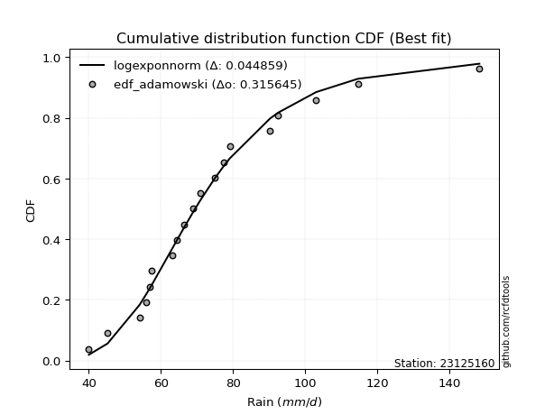</img>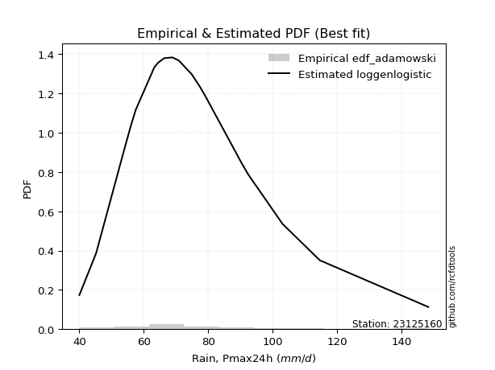</img>

</div>


## C. Best fit & Estimate extreme values for specific return periods - Tr

Best fit in probability distribution analysis means finding the theoretical distribution (like Normal, Poisson, Exponential, etc.) that most accurately mirrors your real-world data´s patterns (shape, center, spread) for better predictions, using methods like visual checks (Q-Q plots), goodness-of-fit tests (Kolmogorov-Smirnov, Chi-Squared), and information criteria (AIC) to score and select the simplest, most representative model.


### 1. Best fit (ordered by delta Δ)

:file_folder:Table: [bestfit_23125160.csv](table/bestfit_23125160.csv)

<div align="center">

|   id |   station | empirical_dist   | p_dist       |     delta |   deltao | eval   |   fit |   n |   best_fit |   best_fit_sort |
|-----:|----------:|:-----------------|:-------------|----------:|---------:|:-------|------:|----:|-----------:|----------------:|
|    0 |  23125160 | edf_weibull      | f            | 0.0434179 | 0.315645 | Δo > Δ |     1 |  19 |          1 |               1 |
|    1 |  23125160 | edf_blom         | logmielke    | 0.0440201 | 0.315645 | Δo > Δ |     1 |  19 |          1 |               2 |
|    2 |  23125160 | edf_cunnane      | exponnorm    | 0.0445809 | 0.315645 | Δo > Δ |     1 |  19 |          1 |               3 |
|    3 |  23125160 | edf_gringorten   | exponnorm    | 0.0445843 | 0.315645 | Δo > Δ |     1 |  19 |          1 |               4 |
|    4 |  23125160 | edf_chegodayev   | logexponnorm | 0.0446568 | 0.315645 | Δo > Δ |     1 |  19 |          1 |               5 |
|    5 |  23125160 | edf_adamowski    | logexponnorm | 0.0448594 | 0.315645 | Δo > Δ |     1 |  19 |          1 |               6 |
|    6 |  23125160 | edf_tukey        | logmielke    | 0.0449158 | 0.315645 | Δo > Δ |     1 |  19 |          1 |               7 |
|    7 |  23125160 | edf_jenkinson    | logexponnorm | 0.0450291 | 0.315645 | Δo > Δ |     1 |  19 |          1 |               8 |
|    8 |  23125160 | edf_beard        | logexponnorm | 0.0450291 | 0.315645 | Δo > Δ |     1 |  19 |          1 |               9 |
|    9 |  23125160 | edf_filliben     | logmielke    | 0.0452541 | 0.315645 | Δo > Δ |     1 |  19 |          1 |              10 |
|   10 |  23125160 | edf_hazen        | logburr      | 0.0459286 | 0.315645 | Δo > Δ |     1 |  19 |          1 |              11 |
|   11 |  23125160 | edf_california   | logdweibull  | 0.0499922 | 0.315645 | Δo > Δ |     1 |  19 |          1 |              12 |

</div>


### 2. Extreme values and % difference analysis

In hydrology, a return period (or recurrence interval $Tr$) is the statistical average time between extreme events like floods or droughts of a specific magnitude, indicating how rare an event is, with a 100-year flood, for example, having a 1% chance of occurring in any given year, not that it happens exactly every century. It is a key tool for infrastructure design (like bridges or dams) and risk assessment, calculated from historical data to determine the probability of future events, although it is important to remember it is statistical average, and events can cluster or be missed.

The extreme value porcentage difference is evaluated as $pdiff = 1 - (ETrBf / ETr) * 100$, where _ETrBf_ correspond to the bestfit extreme value for a specific recurrence interval and _ETr_ correspond to the extreme value for one of the most used PDFsused in hydrology.

> risk_rate: assuming the return period as the project useful life.

:file_folder:Table: [extreme_23125160.csv](table/extreme_23125160.csv), all PDFs.  
:file_folder:Table: [extremepdiff_23125160.csv](table/extremepdiff_23125160.csv), % difference between bestfit and most used PDFs in Hydrology.

<div align="center">

Extreme values table for only best fit PDFs
|   id |      tr |   prob_l |     prob_g |    alpha |   anglit |   arcsine |    argus |     beta |   betaprime |   bradford |     burr |   burr12 |   cosine |   crystalball |   dgamma |   dweibull |   erlang |   exponnorm |   exponpow |   exponweib |        f |   fatiguelife |   foldnorm |    gamma |   gausshyper |   genexpon |   genextreme |   gengamma |   genhalflogistic |   genlogistic |   gennorm |   genpareto |   gompertz |   gumbel_l |   gumbel_r |   halfgennorm |   halflogistic |   halfnorm |   hypsecant |   invgamma |   invgauss |   invweibull |   johnsonsb |   johnsonsu |   kappa3 |   kappa4 |   ksone |   kstwobign |   laplace |   levy_l |   loggamma |   logistic |   loglaplace |   lomax |   maxwell |   mielke |    moyal |   nakagami |      ncf |      nct |     norm |   pearson3 |   powerlaw |   rayleigh |   rdist |     rice |   semicircular |   skewnorm |        t |   trapezoid |   triang |   truncexpon |   truncnorm |   truncpareto |   truncweibull_min |   tukeylambda |   uniform |   vonmises |   vonmises_line |     wald |   weibull_max |   weibull_min |   wrapcauchy |   logalpha |   loganglit |   logarcsine |   logargus |   logbeta |   logbetaprime |   logbradford |   logburr |   logburr12 |   logcosine |   logcrystalball |   logdgamma |   logdweibull |   logerlang |   logexponnorm |   logexponpow |   logexponweib |     logf |   logfatiguelife |   logfoldnorm |   loggausshyper |   loggenexpon |   loggenextreme |   loggengamma |   loggenhalflogistic |   loggenlogistic |   loggennorm |   loggenpareto |   loggompertz |   loggumbel_l |   loggumbel_r |   loghalfgennorm |   loghalflogistic |   loghalfnorm |   loghypsecant |   loginvgamma |   loginvgauss |   loginvweibull |   logjohnsonsb |   logjohnsonsu |   logkappa3 |   logkappa4 |   logksone |   logkstwobign |   loglevy_l |   logloggamma |   loglogistic |   logloglaplace |   loglomax |   logmaxwell |   logmielke |   logmoyal |   lognakagami |   logncf |   lognct |   lognorm |   logpearson3 |   logpowerlaw |   lograyleigh |   logrdist |   logrice |   logsemicircular |   logskewnorm |     logt |   logtrapezoid |   logtriang |   logtruncexpon |   logtruncnorm |   logtruncpareto |   logtruncweibull_min |   logtukeylambda |   loguniform |   logvonmises |   logvonmises_line |   logwald |   logweibull_max |   logweibull_min |   logwrapcauchy |   station |   n |   risk_rate |
|-----:|--------:|---------:|-----------:|---------:|---------:|----------:|---------:|---------:|------------:|-----------:|---------:|---------:|---------:|--------------:|---------:|-----------:|---------:|------------:|-----------:|------------:|---------:|--------------:|-----------:|---------:|-------------:|-----------:|-------------:|-----------:|------------------:|--------------:|----------:|------------:|-----------:|-----------:|-----------:|--------------:|---------------:|-----------:|------------:|-----------:|-----------:|-------------:|------------:|------------:|---------:|---------:|--------:|------------:|----------:|---------:|-----------:|-----------:|-------------:|--------:|----------:|---------:|---------:|-----------:|---------:|---------:|---------:|-----------:|-----------:|-----------:|--------:|---------:|---------------:|-----------:|---------:|------------:|---------:|-------------:|------------:|--------------:|-------------------:|--------------:|----------:|-----------:|----------------:|---------:|--------------:|--------------:|-------------:|-----------:|------------:|-------------:|-----------:|----------:|---------------:|--------------:|----------:|------------:|------------:|-----------------:|------------:|--------------:|------------:|---------------:|--------------:|---------------:|---------:|-----------------:|--------------:|----------------:|--------------:|----------------:|--------------:|---------------------:|-----------------:|-------------:|---------------:|--------------:|--------------:|--------------:|-----------------:|------------------:|--------------:|---------------:|--------------:|--------------:|----------------:|---------------:|---------------:|------------:|------------:|-----------:|---------------:|------------:|--------------:|--------------:|----------------:|-----------:|-------------:|------------:|-----------:|--------------:|---------:|---------:|----------:|--------------:|--------------:|--------------:|-----------:|----------:|------------------:|--------------:|---------:|---------------:|------------:|----------------:|---------------:|-----------------:|----------------------:|-----------------:|-------------:|--------------:|-------------------:|----------:|-----------------:|-----------------:|----------------:|----------:|----:|------------:|
|    0 |    2    | 0.5      | 0.5        |  69.5779 |  74.9474 |   74.9474 |  93.3959 |  70.4897 |     70.2464 |    85.2044 |  69.2577 |  59.6739 |  81.2337 |       74.9474 |  68.9    |    69.6096 |  69.6842 |     69.2102 |    64.6962 |     40.473  |  69.5151 |       42.378  |    69.5744 |  69.6842 |      72.2022 |    64.2202 |      69.5132 |    41.6676 |           70.6937 |       70.5529 |   68.9    |     75.5155 |    69.4597 |    79.117  |    70.7777 |       57.4208 |        68.7047 |    69.7519 |     74.9474 |    69.5338 |    69.6315 |      69.5132 |     69.6468 |     69.5592 |  70.2757 |  88.5804 |  94.2   |     71.5876 |   74.9474 |  38.6347 |    69.5318 |    74.9474 |      71.2428 | 100.826 |   72.7766 |  69.2578 |  69.4316 |    68.0968 |  63.4574 |  69.458  |  74.9474 |    69.7694 |    51.8913 |    72.0067 | 32.542  |  73.6225 |        74.9474 |    69.1318 |  67.5205 |     121.14  |  78.0131 |      80.7358 |     74.3207 |       40.0003 |            72.8779 |       69.4019 |    94.2   |    1.79885 |         77.3501 |  66.7199 |       148.112 |       70.0772 |       96.91  |    69.5777 |     71.2429 |      71.2428 |    82.1795 |   69.6453 |        70.3955 |       69.5314 |   69.2559 |     69.239  |     73.2095 |          71.2428 |     67.8626 |       67.9741 |     69.5318 |        69.4889 |       69.4972 |        69.6198 |  69.5483 |          69.5436 |       67.7669 |         73.1285 |       67.5921 |         69.6195 |       69.5886 |              97.2305 |          69.2577 |      70.4772 |        53.0415 |       70.0619 |       74.9878 |       67.6849 |          66.8081 |           65.9821 |       66.8376 |        71.2428 |       69.5616 |       69.397  |         67.9148 |        69.6207 |        69.5403 |      39.972 |     78.643  |    77.0454 |        67.3373 |     52.9228 |       71.3759 |       71.2428 |         68.9    |    59.7746 |      69.3678 |     69.2488 |    66.5746 |       69.4616 |  70.1054 |  70.0843 |   71.2428 |       69.7161 |       48.8033 |       68.7147 |    75.2176 |   70.0269 |           71.2429 |       69.4543 |  71.2401 |        106.722 |     70.9764 |         67.4836 |        54.2772 |          56.3902 |               71.1344 |          77.0451 |      77.0454 |      0.132757 |            71.9185 |   64.3921 |          69.6171 |          69.6128 |         77.0454 |  23125160 |  19 |    0.75     |
|    1 |    2.33 | 0.570815 | 0.429185   |  73.4377 |  80.2231 |   82.8671 | 100.442  |  76.3104 |     74.237  |    92.9206 |  72.9784 |  65.2104 |  86.8446 |       79.4766 |  71.3743 |    72.6656 |  74.0142 |     73.0033 |    70.0316 |     41.0392 |  73.491  |       44.7525 |    74.5453 |  74.0142 |      79.2451 |    69.5568 |      73.4231 |    43.117  |           75.8549 |       74.4361 |   71.7857 |     86.1807 |    74.6945 |    83.0575 |    74.9745 |       63.804  |        73.0197 |    74.6402 |     78.5721 |    73.5066 |    73.778  |      73.4232 |     73.8539 |     73.6181 |  75.0445 |  96.4635 | 103.412 |     75.8037 |   77.6883 |  70.6006 |    73.5315 |    78.9379 |      73.6829 | 114.228 |   77.4822 |  72.9776 |  73.4044 |    73.1246 |  74.1337 |  73.3762 |  79.4766 |    74.1122 |    58.1402 |    76.7819 | 45.4508 |  77.9468 |        80.6057 |    74.1462 |  71.1486 |     127.438 |  83.8186 |      88.0404 |     79.5408 |       40.0011 |            80.3094 |       72.645  |   101.876 |    2.10405 |         81.3654 |  69.6898 |       148.291 |       74.2987 |      118.512 |    73.5259 |     76.0138 |      78.524  |    88.6658 |   73.9079 |        74.407  |       76.3378 |   72.9022 |     72.754  |     77.9687 |          75.3198 |     71.4079 |       71.5243 |     73.5315 |        73.256  |       74.3105 |        73.955  |  73.5508 |          73.5254 |       72.1481 |         80.6336 |       72.0493 |         73.6474 |       73.9446 |             105.401  |          72.9778 |      74.143  |        71.8084 |       74.9618 |       78.7077 |       71.2666 |          72.0367 |           69.5751 |       70.9746 |        74.4874 |       73.5219 |       73.3728 |         72.0447 |        73.8056 |        73.5038 |      39.972 |     86.5437 |    86.1255 |        71.6652 |     71.4695 |       75.5047 |       74.823  |         71.4772 |    65.4016 |      73.4966 |     72.9733 |    69.9049 |       73.6008 |  74.094  |  74.0765 |   75.3198 |       73.7219 |       53.2019 |       72.8669 |    86.2654 |   74.2488 |           76.3717 |       73.4043 |  75.316  |        115.168 |     75.5747 |         73.8669 |        57.7902 |          60.5157 |               77.5607 |          84.7304 |      84.541  |      0.140257 |            75.4697 |   66.7855 |          73.6447 |          73.8507 |         98.8122 |  23125160 |  19 |    0.729209 |
|    2 |    5    | 0.8      | 0.2        |  91.0819 |  98.8371 |  103.986  | 123.042  | 101.081  |     91.9124 |   120.558  |  90.5446 | 101.399  | 107.064  |       96.3085 |  84.6481 |    86.7349 |  93.2565 |     91.3841 |    93.4616 |     53.7262 |  91.6583 |       70.7157 |    95.5659 |  93.2565 |     108.143  |    96.2381 |      91.3683 |    64.8599 |           97.8171 |       91.3023 |   86.0767 |    120.191  |    96.6431 |    95.7876 |    93.2075 |      109.353  |        92.5443 |    95.3118 |     93.1118 |    91.6565 |    92.518  |      91.3683 |     92.8193 |     92.048  |  95.0865 | 123.303  | 133.224 |     93.7129 |   91.392  | 123.561  |    91.7831 |    94.3461 |      87.1948 | 181.233 |   96.0029 |  90.5402 |  91.807  |    94.5149 | 128.421  |  91.3825 |  96.3085 |    93.3457 |    93.216  |    95.899  | 80.4031 |  95.2592 |        99.9151 |    95.3513 |  85.4877 |     145.507 | 107.037  |     115.939  |    100.527  |       40.2028 |           110.674  |       85.9197 |   126.72  |    3.26296 |         96.1904 |  86.3151 |       148.398 |       93.3012 |      145.212 |    91.5432 |     95.5466 |     101.789  |   113.132  |   93.0675 |        91.9415 |      106.452  |   90.1937 |     89.5499 |     97.8341 |          92.6242 |     85.5986 |       86.1445 |     91.7831 |        90.5626 |       95.0202 |        93.1541 |  91.8233 |          91.7031 |       92.6394 |        112.534  |       93.1644 |         92.0182 |       93.1899 |             130.148  |          90.5415 |      90.497  |       130.709  |       95.4683 |       92.0334 |       89.1616 |          94.6036 |           88.4397 |       91.4955 |        89.0568 |       91.6012 |       91.5895 |         93.1075 |        92.7249 |        91.5983 |      39.972 |    117.066  |   123.516  |        93.373  |    117.569  |       92.9923 |       90.4177 |         86.2952 |   103.381  |      92.2772 |     90.5763 |    87.6405 |       92.3544 |  91.8651 |  91.8605 |   92.6242 |       91.858  |       81.7229 |       92.1595 |   126.814  |   92.7997 |           96.8192 |       91.7175 |  92.6166 |        143.298 |     97.143  |        103.165  |        76.9572 |          82.9666 |              105.954  |         115.014  |     114.172  |      0.172164 |            91.1535 |   81.9232 |          92.0142 |          92.7785 |        134.391  |  23125160 |  19 |    0.67232  |
|    3 |   10    | 0.9      | 0.1        | 106.799  | 109.373  |  109.085  | 133.94   | 118.341  |    106.717  |   134.013  | 107.124  | inf      | 119.28   |      107.474  |  96.9444 |    99.0508 | 108.923  |    107.999  |   110.941  |     99.3612 | 107.527  |      105.233  |   111.119  | 108.923  |     125.348  |   120.459  |     107.208  |   122.13   |          114.439  |      105.037  |   98.9437 |    134.643  |   112.348  |   102.875  |   108.058  |      171.471  |       108.759  |   110.608  |    104.722  |   107.508  |   108.272  |     107.208  |    108.591  |    107.835  | 111.677  | 135.825  | 146.232 |    107.348  |  103.832  | 136.346  |   107.645  |   105.694  |     101.594  | 242.059 |  109.037  | 107.12   | 107.829  |   110.404  | 182.91   | 107.347  | 107.474  |   108.952  |   117.471  |   109.53   | 89.2427 | 107.603  |       109.823  |   111.043  |  96.8534 |     152.565 | 121.665  |     130.914  |    115.184  |       43.5699 |           127.865  |       97.3047 |   137.56  |    3.9921  |        104.694  | 103.959  |       148.4   |      108.718  |      149.911 |   107.314  |    108.751  |     108.369  |   127.239  |  108.859  |       106.331  |      125.031  |  106.866  |    106.18   |    112.213  |         106.244  |     99.3953 |       99.811  |    107.645  |       106.459  |      110.702  |       108.786  | 107.714  |         107.542  |      110.142  |        130.373  |      112.009  |        107.76   |      108.808  |             139.866  |         107.121  |     104.35   |       144.581  |      110.578  |      100.407  |      107.009  |         111.326  |          107.938  |      110.412  |       102.712  |      107.404  |      107.543  |        114.737  |       108.535  |       107.401  |     130.372 |    132.651  |   144.559  |       114.212  |    132.581  |      106.712  |      103.945  |        103.124  |   158.532  |     108.304  |    107.212  |   106.709  |      108.298  | 106.857  | 106.87   |  106.244  |      107.456  |      107.039  |      108.962  |   141.459  |  107.934  |          109.352  |      107.81   | 106.236  |        156.066 |    113.79   |        122.445  |        95.4357 |         103.426  |              124.131  |         131.053  |     130.166  |      0.197527 |           105.305  |  101.757  |         107.755  |         108.463  |        141.867  |  23125160 |  19 |    0.651322 |
|    4 |   15    | 0.933333 | 0.0666667  | 116.367  | 113.872  |  110.057  | 138.083  | 126.59   |    115.257  |   138.702  | 117.616  | inf      | 124.845  |      113.046  | 104.177  |   106.154  | 117.65   |    117.719  |   119.918  |    155.995  | 116.932  |      127.765  |   119.212  | 117.65   |     132.254  |   134.627  |     116.663  |   182.446  |          123.244  |      112.785  |  106.44   |    139.361  |   120.263  |   106.085  |   116.437  |      217.615  |       117.935  |   118.569  |    111.348  |   116.902  |   117.254  |     116.663  |    117.471  |    117.015  | 121.715  | 140.18   | 150.568 |    114.587  |  111.109  | 140.209  |   116.997  |   111.876  |     111.096  | 277.64  |  115.724  | 117.616  | 117.128  |   118.68   | 218.232  | 116.941  | 113.046  |   117.631  |   126.995  |   116.553  | 91.0026 | 113.964  |       113.687  |   119.208  | 103.53   |     154.829 | 128.146  |     136.424  |    122.513  |       50.381  |           134.292  |      104.33   |   141.173 |    4.28718 |        107.903  | 115.288  |       148.4   |      117.219  |      151.257 |   116.697  |    114.932  |     109.672  |   133.052  |  117.676  |       114.51   |      132.222  |  117.669  |    117.182  |    119.445  |         113.773  |    108.222  |      108.307  |    116.997  |       116.47   |      118.958  |       117.527  | 117.087  |         116.906  |      120.18   |        136.673  |      123.192  |        116.83   |      117.524  |             142.902  |         117.616  |     112.352  |       146.875  |      118.447  |      104.446  |      118.612  |         119.99   |          120.821  |      121.756  |       111.423  |      116.785  |      117.006  |        129.088  |       117.466  |       116.771  |     136.207 |    138.04   |   152.343  |       127.104  |    137.482  |      114.279  |      112.149  |        114.825  |   204.675  |     117.579  |    117.748  |   119.624  |      117.508  | 115.54   | 115.569  |  113.773  |      116.592  |      118.576  |      118.782  |   144.925  |  116.459  |          114.668  |      117.256  | 113.765  |        160.4   |    122.05   |        130.214  |       105.815  |         113.986  |              131.406  |         136.763  |     135.98   |      0.211697 |           113.833  |  116.958  |         116.825  |         117.352  |        144.084  |  23125160 |  19 |    0.644736 |
|    5 |   20    | 0.95     | 0.05       | 123.43   | 116.518  |  110.399  | 140.358  | 131.744  |    121.329  |   141.086  | 125.523  | inf      | 128.267  |      116.695  | 109.321  |   111.16   | 123.701  |    124.615  |   125.835  |    216.382  | 123.725  |      144.44   |   124.608  | 123.701  |     136.067  |   144.679  |     123.517  |   241.281  |          129.168  |      118.21   |  111.748  |    141.691  |   125.431  |   108.083  |   122.303  |      254.969  |       124.364  |   123.876  |    116.022  |   123.687  |   123.565  |     123.517  |    123.654  |    123.558  | 129.19   | 142.409  | 152.736 |    119.464  |  116.272  | 142.187  |   123.727  |   116.15   |     118.372  | 302.885 |  120.163  | 125.526  | 123.713  |   124.2    | 245.133  | 123.936  | 116.695  |   123.644  |   132.046  |   121.221  | 91.6387 | 118.191  |       115.83   |   124.653  | 108.404  |     155.946 | 132.009  |     139.292  |    127.255  |       58.1452 |           137.655  |      109.578  |   142.98  |    4.44422 |        109.566  | 123.731  |       148.4   |      123.068  |      151.909 |   123.496  |    118.73   |     110.134  |   136.355  |  123.78   |       120.271  |      136.032  |  125.952  |    125.72   |    124.123  |         118.99   |    114.881  |      114.606  |    123.727  |       124.026  |      124.49   |       123.61   | 123.835  |         123.659  |      127.266  |        139.822  |      131.247  |        123.228  |      123.585  |             144.369  |         125.525  |     118.034  |       147.608  |      123.698  |      107.042  |      127.477  |         125.755  |          130.753  |      129.96   |       118.01   |      123.571  |      123.844  |        140.192  |       123.696  |       123.543  |     139.222 |    140.738  |   156.39   |       136.599  |    140.062  |      119.515  |      118.194  |        124.109  |   245.95   |     124.169  |    125.691  |   129.705  |      124.047  | 121.727  | 121.771  |  118.99   |      123.141  |      125.106  |      125.794  |   146.284  |  122.425  |          117.728  |      124.008  | 118.984  |        162.581 |    127.256  |        134.406  |       112.648  |         120.494  |              135.325  |         139.673  |     138.984  |      0.221593 |           119.722  |  129.744  |         123.222  |         123.591  |        145.169  |  23125160 |  19 |    0.641514 |
|    6 |   25    | 0.96     | 0.04       | 129.102  | 118.312  |  110.558  | 141.824  | 135.384  |    126.062  |   142.529  | 131.954  | inf      | 130.667  |      119.381  | 113.315  |   115.026  | 128.327  |    129.964  |   130.196  |    277.904  | 129.08   |      157.688  |   128.622  | 128.327  |     138.516  |   152.476  |     128.931  |   297.785  |          133.6    |      122.389  |  115.859  |    143.075  |   129.218  |   109.505  |   126.822  |      286.667  |       129.317  |   127.825  |    119.64   |   129.036  |   128.437  |     128.931  |    128.389  |    128.663  | 135.249  | 143.77   | 154.037 |    123.116  |  120.277  | 143.428  |   129.018  |   119.419  |     124.342  | 322.467 |  123.458  | 131.961  | 128.818  |   128.307  | 267.158  | 129.492  | 119.381  |   128.239  |   135.171  |   124.69   | 91.9394 | 121.332  |       117.22   |   128.703  | 112.296  |     156.612 | 134.645  |     141.051  |    130.693  |       65.5841 |           139.723  |      113.826  |   144.064 |    4.54102 |        110.579  | 130.494  |       148.4   |      127.515  |      152.295 |   128.871  |    121.375  |     110.349  |   138.528  |  128.434  |       124.733  |      138.39   |  132.783  |    132.82   |    127.512  |         122.982  |    120.292  |      119.66   |    129.018  |       130.186  |      128.618  |       128.277  | 129.14   |         128.976  |      132.757  |        141.691  |      137.577  |        128.17   |      128.23   |             145.23   |         131.959  |     122.456  |       147.923  |      127.608  |      108.928  |      134.755  |         130.041  |          138.958  |      136.42   |       123.374  |      128.928  |      129.236  |        149.392  |       128.473  |       128.885  |     141.062 |    142.348  |   158.87   |       144.173  |    141.706  |      123.518  |      123.038  |        131.939  |   284.018  |     129.299  |    132.154  |   138.101  |      129.134  | 126.558  | 126.616  |  122.982  |      128.275  |      129.297  |      131.271  |   146.963  |  127.022  |          119.756  |      129.283  | 122.978  |        163.895 |    130.936  |        137.027  |       117.534  |         124.921  |              137.775  |         141.431  |     140.818  |      0.229214 |           124.013  |  140.986  |         128.164  |         128.404  |        145.816  |  23125160 |  19 |    0.639603 |
|    7 |   50    | 0.98     | 0.02       | 148.057  | 122.727  |  110.771  | 145.149  | 144.967  |    140.988  |   145.445  | 153.824  | inf      | 136.951  |      127.073  | 125.746  |   126.957  | 142.394  |    146.579  |   142.655  |    578.136  | 146.301  |      200.184  |   140.289  | 142.394  |     143.952  |   176.697  |     146.378  |   547.535  |          146.559  |      135.261  |  128.602  |    145.803  |   139.938  |   113.364  |   140.742  |      400.929  |       144.578  |   139.302  |    130.856  |   146.236  |   143.482  |     146.378  |    142.791  |    144.763  | 155.919  | 146.565  | 156.638 |    133.842  |  132.716  | 146.223  |   145.935  |   129.406  |     144.877  | 383.293 |  133.014  | 153.851  | 144.664  |   140.246  | 342.828  | 147.603  | 127.073  |   142.2    |   141.638  |   134.758  | 92.3526 | 130.449  |       120.396  |   140.477  | 125.234  |     157.933 | 141.187  |     144.661  |    140.086  |       91.9056 |           143.979  |      128.175  |   146.232 |    4.73903 |        112.63   | 152.574  |       148.4   |      140.897  |      153.06  |   146.251  |    128.141  |     110.637  |   143.585  |  142.477  |       138.638  |      143.276  |  156.669  |    157.988  |    136.831  |         135.172  |    138.602  |      136.385  |    145.935  |       151.237  |      140.666  |       142.561  | 146.111  |         146.027  |      149.856  |        145.307  |      157.764  |        143.388  |      142.43   |             146.892  |         153.843  |     136.336  |       148.302  |      138.989  |      114.218  |      159.89   |         142.491  |          167.62   |      157.079  |       141.602  |      146.194  |      146.571  |        181.703  |       143.035  |       146.078  |     144.817 |    145.511  |   163.948  |       168.93   |    145.478  |      135.72   |      139.103  |        160.348  |   447.676  |     145.407  |    154.144  |   167.784  |      145.094  | 141.83   | 141.946  |  135.172  |      144.614  |      138.352  |      148.556  |   147.97   |  141.211  |          124.521  |      145.922  | 135.175  |        166.535 |    140.534  |        142.529  |       129.948  |         135.286  |              142.915  |         144.959  |     144.559  |      0.252766 |           134.749  |  184.931  |         143.382  |         143.287  |        147.107  |  23125160 |  19 |    0.63583  |
|    8 |   75    | 0.986667 | 0.0133333  | 160.301  | 124.67   |  110.81   | 146.468  | 149.543  |    149.931  |   146.426  | 168.123  | inf      | 139.952  |      131.201  | 133.03   |   133.89   | 150.45   |    156.298  |   149.29   |    854.867  | 156.85   |      225.774  |   146.64   | 150.45   |     146.019  |   190.865  |     157.076  |   757.181  |          153.634  |      142.742  |  136.039  |    146.694  |   145.591  |   115.316  |   148.832  |      479.328  |       153.45   |   145.55   |    137.41   |   156.773  |   152.247  |     157.076  |    151.011  |    154.39   | 169.589  | 147.53   | 157.506 |    139.743  |  139.993  | 147.372  |   156.228  |   135.175  |     158.427  | 418.873 |  138.209  | 168.167  | 153.93   |   146.745  | 392.826  | 158.886  | 131.201  |   150.189  |   143.859  |   140.235  | 92.4325 | 135.41   |       121.665  |   146.886  | 133.551  |     158.37  | 144.085  |     145.893  |    144.688  |      106.126  |           145.433  |      137.492  |   146.955 |    4.80595 |        113.319  | 166.161  |       148.4   |      148.463  |      153.314 |   156.978  |    131.237  |     110.691  |   145.641  |  150.414  |       146.851  |      144.957  |  172.847  |    175.283  |    141.519  |         142.203  |    150.474  |      146.953  |    156.228  |       165.067  |      147.248  |       150.816  | 156.441  |         156.439  |      159.935  |        146.444  |      169.985  |        152.173  |      150.624  |             147.423  |         168.154  |     144.593  |       148.361  |      145.195  |      116.99   |      176.601  |         149.274  |          186.926  |      169.611  |       153.478  |      156.808  |      157.187  |        203.605  |       151.368  |       156.625  |     146.091 |    146.531  |   165.677  |       184.319  |    147.057  |      142.744  |      149.32   |        180.365  |   587.552  |     154.992  |    168.531  |   188.017  |      154.582  | 151.004  | 151.167  |  142.204  |      154.5    |      141.585  |      158.898  |   148.188  |  149.494  |          126.478  |      155.864  | 142.212  |        167.418 |    145.008  |        144.443  |       135.207  |         139.298  |              144.703  |         146.129  |     145.828  |      0.266566 |           139.011  |  218.534  |         152.167  |         151.987  |        147.537  |  23125160 |  19 |    0.634587 |
|    9 |  100    | 0.99     | 0.01       | 169.62   | 125.825  |  110.824  | 147.204  | 152.4    |    156.392  |   146.918  | 179.027  | inf      | 141.833  |      133.992  | 138.201  |   138.79   | 156.101  |    163.194  |   153.749  |   1109.73   | 164.576  |      244.186  |   150.966  | 156.101  |     147.136  |   200.918  |     164.906  |   940.218  |          158.449  |      148.037  |  141.309  |    147.134  |   149.369  |   116.592  |   154.559  |      540.35   |       159.729  |   149.806  |    142.06   |   164.49   |   158.458  |     164.906  |    156.753  |    161.329  | 180.125  | 148.023  | 157.939 |    143.786  |  145.156  | 148.044  |   163.731  |   139.248  |     168.803  | 444.118 |  141.748  | 179.085  | 160.505  |   151.172  | 431.19   | 167.24   | 133.992  |   155.791  |   144.981  |   143.967  | 92.4612 | 138.789  |       122.376  |   151.252  | 139.86   |     158.588 | 145.813  |     146.514  |    147.548  |      114.728  |           146.168  |      144.568  |   147.316 |    4.83952 |        113.664  | 176.067  |       148.4   |      153.731  |      153.44  |   164.875  |    133.113  |     110.71   |   146.801  |  155.925  |       152.732  |      145.808  |  185.486  |    188.911  |    144.539  |         147.165  |    159.471  |      154.832  |    163.731  |       175.637  |      151.738  |       156.645  | 163.973  |         164.048  |      167.138  |        146.988  |      178.856  |        158.34   |      156.403  |             147.681  |         179.068  |     150.527  |       148.38   |      149.427  |      118.839  |      189.474  |         153.9    |          201.919  |      178.717  |       162.5    |      164.599  |      164.959  |        220.683  |       157.198  |       164.357  |     146.732 |    147.029  |   166.548  |       195.665  |    147.988  |      147.694  |      156.982  |        196.387  |   714.429  |     161.879  |    179.506  |   203.835  |      161.397  | 157.642  | 157.844  |  147.165  |      161.683  |      143.244  |      166.353  |   148.272  |  155.38   |          127.586  |      163.021  | 147.179  |        167.86  |    147.742  |        145.416  |       138.126  |         141.429  |              145.612  |         146.71   |     146.467  |      0.276408 |           141.261  |  246.823  |         158.334  |         158.172  |        147.753  |  23125160 |  19 |    0.633968 |
|   10 |  200    | 0.995    | 0.005      | 194.703  | 128.008  |  110.837  | 148.483  | 158.163  |    172.411  |   147.658  | 208.19   | inf      | 145.657  |      140.324  | 150.674  |   150.543  | 169.535  |    179.809  |   163.754  |   1976.49   | 184.097  |      289.254  |   160.86   | 169.534  |     148.984  |   225.138  |     184.648  |  1520.01   |          169.401  |      160.768  |  153.986  |    147.782  |   157.789  |   119.367  |   168.325  |      706.535  |       174.824  |   159.541  |    153.26   |   183.988  |   173.416  |     184.648  |    170.283  |    178.459  | 208.833  | 148.784  | 158.59  |    153.099  |  157.596  | 149.316  |   182.559  |   149.018  |     196.679  | 504.944 |  149.844  | 208.297  | 176.344  |   161.297  | 534.698  | 188.69   | 140.324  |   169.1    |   146.681  |   152.505  | 92.4898 | 146.521  |       123.614  |   161.238  | 156.702  |     158.914 | 149.084  |     147.453  |    153.063  |      129.917  |           147.278  |      163.386  |   147.858 |    4.88995 |        114.182  | 200.743  |       148.4   |      166.119  |      153.63  |   184.993  |    136.731  |     110.728  |   148.841  |  168.795  |       167.132  |      147.096  |  220.591  |    227.217  |    150.879  |         159.072  |    183.295  |      175.219  |    182.559  |       203.965  |      162.021  |       170.634  | 182.882  |         183.211  |      184.71   |        147.759  |      200.963  |        172.916  |      170.252  |             148.057  |         208.265  |     165.117  |       148.396  |      159.118  |      122.96   |      224.393  |         164.51   |          243.072  |      201.422  |       186.476  |      184.357  |      184.581  |        267.835  |       170.969  |       183.925  |     147.699 |    147.751  |   167.863  |       224.526  |    149.768  |      159.552  |      177.004  |        242.47   |  1154.72   |     178.811  |    208.877  |   247.627  |      178.138  | 174.137  | 174.458  |  159.072  |      179.626  |      145.788  |      184.753  |   148.362  |  169.633  |          129.543  |      180.651  | 159.101  |        168.524 |    153.061  |        146.896  |       142.945  |         144.8    |              146.994  |         147.572  |     147.43   |      0.300408 |           144.766  |  334.25   |         172.911  |         173.152  |        148.076  |  23125160 |  19 |    0.633042 |
|   11 |  250    | 0.996    | 0.004      | 203.716  | 128.563  |  110.839  | 148.783  | 159.727  |    177.718  |   147.806  | 218.533  | inf      | 146.705  |      142.259  | 154.693  |   154.312  | 173.811  |    185.158  |   166.778  |   2347.06   | 190.675  |      303.941  |   163.903  | 173.811  |     149.393  |   232.935  |     191.281  |  1754.51   |          172.744  |      164.86   |  158.062  |    147.91   |   160.318  |   120.183  |   172.751  |      765.99   |       179.677  |   162.536  |    156.866  |   190.558  |   178.232  |     191.281  |    174.546  |    184.105  | 219.203  | 148.941  | 158.72  |    155.981  |  161.601  | 149.647  |   188.863  |   152.154  |     206.599  | 524.526 |  152.337  | 218.659  | 181.443  |   164.412  | 571.696  | 196.027  | 142.259  |   173.336  |   147.024  |   155.133  | 92.4934 | 148.902  |       123.905  |   164.31   | 162.686  |     158.98  | 149.917  |     147.641  |    154.44   |      133.328  |           147.502  |      170.025  |   147.966 |    4.90005 |        114.286  | 208.906  |       148.4   |      170.024  |      153.668 |   191.828  |    137.668  |     110.73   |   149.322  |  172.815  |       171.847  |      147.356  |  233.499  |    241.449  |    152.665  |         162.899  |    191.665  |      182.232  |    188.863  |       214.024  |      165.186  |       175.13   | 189.215  |         189.648  |      190.442  |        147.903  |      208.312  |        177.511  |      174.696  |             148.13   |         218.622  |     169.91   |       148.398  |      162.103  |      124.2    |      236.933  |         167.783  |          258.009  |      208.971  |       194.923  |      191.04   |      191.188  |        285.039  |       175.317  |       190.529  |     147.893 |    147.89   |   168.127  |       234.293  |    150.235  |      163.358  |      183.958  |        259.953  |  1351.47   |     184.371  |    219.298  |   263.637  |      183.633  | 179.611  | 179.978  |  162.899  |      185.608  |      146.305  |      190.816  |   148.374  |  174.252  |          130.006  |      186.449  | 162.934  |        168.657 |    154.447  |        147.195  |       143.981  |         145.501  |              147.274  |         147.742  |     147.624  |      0.308245 |           145.484  |  369.518  |         177.506  |         178.006  |        148.141  |  23125160 |  19 |    0.632858 |
|   12 |  500    | 0.998    | 0.002      | 235.411  | 129.941  |  110.841  | 149.471  | 163.844  |    194.721  |   148.103  | 254.006  | inf      | 149.495  |      147.998  | 167.183  |   165.978  | 186.97   |    201.773  |   175.642  |   3855.48   | 212.107  |      350.014  |   172.977  | 186.97   |     150.286  |   257.156  |     212.803  |  2658.81   |          182.599  |      177.562  |  170.705  |    148.161  |   167.693  |   122.523  |   186.488  |      969.975  |       194.74   |   171.465  |    168.066  |   211.966  |   193.204  |     212.802  |    187.491  |    202.083  | 255.501  | 149.262  | 158.98  |    164.617  |  174.041  | 150.502  |   209.26   |   161.882  |     240.718  | 585.352 |  159.774  | 254.21   | 197.282  |   173.698  | 699.63   | 220.308  | 147.998  |   186.362  |   147.71   |   162.975  | 92.4983 | 156.003  |       124.574  |   173.47   | 183.336  |     159.11  | 151.986  |     148.02   |    157.632  |      140.566  |           147.95   |      192.672  |   148.183 |    4.92024 |        114.493  | 234.862  |       148.4   |      181.929  |      153.744 |   214.297  |    140.018  |     110.733  |   150.434  |  184.926  |       186.774  |      147.877  |  279.603  |    292.834  |    157.521  |         174.799  |    220.085  |      205.53   |    209.26   |       248.543  |      174.627  |       189.102  | 209.715  |         210.552  |      208.51   |        148.175  |      231.896  |        191.431  |      188.486  |             148.271  |         254.149  |     185.125  |       148.399  |      171.01   |      127.823  |      280.496  |         177.579  |          310.469  |      233.2    |       223.679  |      212.9    |      212.692  |        345.796  |       188.554  |       212.085  |     148.282 |    148.159  |   168.657  |       266.181  |    151.447  |      175.172  |      207.313  |        324.542  |  2222.57   |     202.012  |    255.06   |   320.276  |      201.058  | 197.178  | 197.718  |  174.799  |      204.887  |      147.347  |      210.117  |   148.392  |  188.722  |          131.079  |      204.864  | 174.855  |        168.923 |    157.941  |        147.796  |       146.133  |         146.931  |              147.835  |         148.078  |     148.011  |      0.333025 |           146.933  |  508.345  |         191.426  |         193.206  |        148.27   |  23125160 |  19 |    0.632489 |
|   13 |  750    | 0.998667 | 0.00133333 | 257.133  | 130.551  |  110.841  | 149.748  | 165.808  |    205.056  |   148.202  | 277.346  | inf      | 150.848  |      151.185  | 174.493  |   172.776  | 194.59   |    211.493  |   180.495  |   5035.84   | 225.395  |      377.236  |   178.046  | 194.589  |     150.62   |   271.324  |     226.067  |  3328.06   |          188.014  |      184.988  |  178.09   |    148.243  |   171.706  |   123.774  |   194.519  |     1103.29   |       203.546  |   176.453  |    174.618  |   225.238  |   201.975  |     226.066  |    194.853  |    212.924  | 279.977  | 149.373  | 159.067 |    169.469  |  181.318  | 150.907  |   221.801  |   167.565  |     263.231  | 620.933 |  163.933  | 277.608  | 206.548  |   178.885  | 784.616  | 235.644  | 151.185  |   193.902  |   147.94   |   167.361  | 92.4992 | 159.974  |       124.843  |   178.587  | 197.058  |     159.153 | 152.903  |     148.147  |    158.868  |      143.109  |           148.1    |      207.475  |   148.255 |    4.92697 |        114.562  | 250.425  |       148.4   |      188.748  |      153.769 |   228.385  |    141.071  |     110.733  |   150.884  |  191.744  |       195.722  |      148.051  |  311.49   |    328.826  |    159.93   |         181.782  |    238.561  |      220.295  |    221.801  |       271.261  |      179.9    |       197.293  | 222.324  |         223.46   |      219.28   |        148.258  |      246.247  |        199.299  |      196.554  |             148.316  |         277.529  |     194.268  |       148.4    |      175.992  |      129.802  |      309.583  |         183.077  |          345.947  |      247.939  |       242.429  |      226.52   |      226.004  |        387.148  |       196.105  |       225.477  |     148.413 |    148.245  |   168.834  |       285.963  |    152.025  |      182.091  |      222.306  |        371.032  |  2991.93   |     212.605  |    278.604  |   358.892  |      211.515  | 207.878  | 208.541  |  181.782  |      216.683  |      147.697  |      221.749  |   148.396  |  197.287  |          131.514  |      215.933  | 181.851  |        169.011 |    159.514  |        147.997  |       146.875  |         147.416  |              148.023  |         148.188  |     148.141  |      0.347876 |           147.42   |  615.48   |         199.295  |         202.195  |        148.314  |  23125160 |  19 |    0.632366 |
|   14 | 1000    | 0.999    | 0.001      | 274.319  | 130.914  |  110.841  | 149.903  | 167.034  |    212.577  |   148.251  | 295.187  | inf      | 151.7    |      153.38   | 179.682  |   177.588  | 199.965  |    218.389  |   183.806  |   6031.01   | 235.181  |      396.653  |   181.546  | 199.965  |     150.799  |   281.376  |     235.795  |  3874.04   |          191.708  |      190.256  |  183.325  |    148.283  |   174.435  |   124.616  |   200.215  |     1204.36   |       209.792  |   179.898  |    179.266  |   235.014  |   208.205  |     235.795  |    199.979  |    220.767  | 298.987  | 149.43   | 159.11  |    172.831  |  186.481  | 151.162  |   230.987  |   171.595  |     280.471  | 646.178 |  166.808  | 295.497  | 213.121  |   182.467  | 849.986  | 247.074  | 153.38   |   199.221  |   148.055  |   170.391  | 92.4995 | 162.719  |       124.995  |   182.121  | 207.631  |     159.175 | 153.449  |     148.21   |    159.527  |      144.406  |           148.175  |      218.745  |   148.292 |    4.93034 |        114.597  | 261.62   |       148.4   |      193.526  |      153.782 |   238.841  |    141.702  |     110.733  |   151.137  |  196.463  |       202.174  |      148.138  |  336.7    |    357.514  |    161.469  |         186.75   |    252.578  |      231.315  |    230.987  |       288.629  |      183.541  |       203.118  | 231.563  |         232.941  |      227.017  |        148.298  |      256.687  |        204.749  |      202.284  |             148.338  |         295.405  |     200.87   |       148.4    |      179.435  |      131.152  |      332.027  |         186.887  |          373.545  |      258.658  |       256.678  |      236.587  |      235.8    |        419.445  |       201.374  |       235.356  |     148.478 |    148.286  |   168.923  |       300.523  |    152.39   |      187.009  |      233.591  |        408.765  |  3704.97   |     220.249  |    296.609  |   389.083  |      219.059  | 215.671  | 216.434  |  186.75   |      225.298  |      147.872  |      230.161  |   148.398  |  203.413  |          131.758  |      223.924  | 186.831  |        169.056 |    160.459  |        148.098  |       147.251  |         147.661  |              148.117  |         148.242  |     148.206  |      0.358593 |           147.665  |  706.248  |         204.745  |         208.622  |        148.335  |  23125160 |  19 |    0.632305 |


</div>


<div align="center">

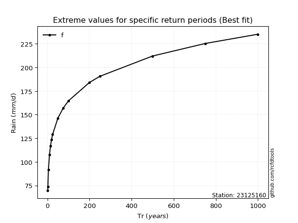</img>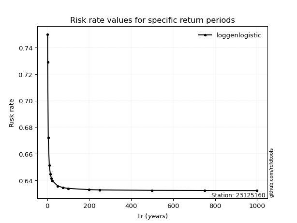</img>

</div>


<sub>**APP DISCLAIMER**: NO WARRANTY - This software is provided by [github.com/rcfdtools](https://github.com/rcfdtools) "as is", without any express or implied warranty, including warranties of merchantability, fitness for a particular purpose, or non-infringement. There is no guarantee that the software will be error-free or operate without interruption. LIMITATION OF LIABILITY - Neither the authors nor copyright holders will be liable for claims or damages arising from the software or its use. You are responsible for determining if the software is appropriate for your use and assume all associated risks, including errors, legal compliance, and data loss. NO PROFESSIONAL ADVICE - The software provides general information and does not offer professional advice. It should not replace consultation with professional advisors.</sub>