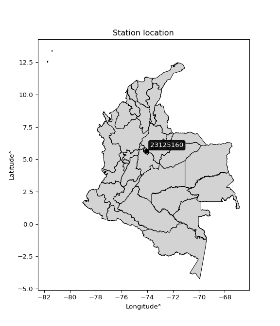

<div align="center">


</div>

# Station (rain, Pmax24h): 23125160

Probable Maximum Precipitation (PMP) is the greatest amount of rainfall for a specific duration that is meteorologically possible for a given location, acting as a "worst-case" scenario for extreme storms, crucial for designing safety-critical infrastructure like bridges, river deviations, dams, spillways, and nuclear plants to prevent catastrophic failure. PMP is calculated by hydrologists using meteorological data to determine the upper limit of extreme rainfall, often leading to the Probable Maximum Flood (PMF) for flood control design, and is increasingly being studied for climate change impacts.

<div align="center">

</img>

</div>


## A. General information


### 1. General running parameters

• app_version: _v20251226_. • runtime: _2025-12-26 15:38:16.554582_. • Python version: _3.14.0_. • SciPy version: _1.16.3_. • Pandas version: _2.3.3_. • NumPy version: _2.3.5_. • Stations dataset (station_dataset_file): _dataset/pmax24h_in/automatic_colombia_2003_2024.csv_. • Stations catalog (station_catalog_file): _dataset/CNE_IDEAM.xls_. • Minimum year to eval til year_max (date_min): _2003_. • Maximum year to eval since year_min (date_max): _2024_. • Creates, save and include plots into reports (create_plot): _False_. • Plot only fit distributions with Δo > Δ (plot_only_fit): _True_. • Eval low extreme values, if False, evaluates high extreme values (low_extreme): _False_. • Eval every SciPy distribution as logarithmic (pdist_logarithmic_on): _True_. • Standard deviation normalized (ddof): _1.0_. • Return periods to eval in years (Tr): _[2, 2.33, 5, 10, 15, 20, 25, 50, 75, 100, 200, 250, 500, 750, 1000]_. • Minimum data sample per station, 0 means any (minimum_sample): _5_. • Z-Score threshold to adjust a value, 0 means disable (zscore): _3.5_. • Avoid zeros, e.g. rain = 0 (avoid_zeros): _True_. • Avoid null values (avoid_nans): _True_. [:file_folder:Dataset file.](../../dataset/pmax24h_in/automatic_colombia_2003_2024.csv)


### 2. Station info and location

|   id |   CODIGO | NOMBRE                                | CATEGORIA               | TECNOLOGIA                | ESTADO           | FECHA_INSTALACION   |   FECHA_SUSPENSION |   ALTITUD |   LATITUD |   LONGITUD | DEPARTAMENTO   | MUNICIPIO           | AREA_OPERATIVA                              | ENTIDAD                                                     | AREA_HIDROGRAFICA   | ZONA_HIDROGRAFICA   | SUBZONA_HIDROGRAFICA   |   CORRIENTE | OBSERVACION                                                                                      | SUBRED                                                   | Catalogo   |
|-----:|---------:|:--------------------------------------|:------------------------|:--------------------------|:-----------------|:--------------------|-------------------:|----------:|----------:|-----------:|:---------------|:--------------------|:--------------------------------------------|:------------------------------------------------------------|:--------------------|:--------------------|:-----------------------|------------:|:-------------------------------------------------------------------------------------------------|:---------------------------------------------------------|:-----------|
|    0 | 23125160 | SAN PABLO DE BORBUR  - AUT [23125160] | Climatológica Principal | Automática con Telemetría | En Mantenimiento | 14/12/2004          |                nan |       742 |   5.64703 |   -74.0713 | Boyacá         | San Pablo De Borbur | Area Operativa 06 - Boyacá-Casanare-Vichada | INSTITUTO DE HIDROLOGIA METEOROLOGIA Y ESTUDIOS AMBIENTALES | Magdalena Cauca     | Medio Magdalena     | Río Carare (Minero)    |         nan | Cambio de tecnología por instalación o repotenciación de estaciones proyecto Fondo de Adaptación | Radiación Visible,Radiación Ultravioleta,Radición Global | CNE_IDEAM  |

<div align="center">

Map location in: [:earth_americas:Google](http://maps.google.com/maps?q=5.647027778,-74.07130556) [:earth_americas:OSM](https://www.openstreetmap.org/#map=18/5.647027778/-74.07130556&layers=P) [:earth_americas:Bing](https://www.bing.com/maps?cp=5.647027778~-74.07130556&lvl=18) [:earth_americas:Apple](https://maps.apple.com/frame?center=5.647027778%2C-74.07130556&span=0.003%2C0.006)

</div>


<div align="center">

```geojson
{
  "type": "Feature",
  "geometry": {
    "type": "Point", 
    "coordinates": [-74.07130556, 5.647027778]
  }, 
  "properties": {
    "Name": "23125160"
  }
}
```

</div>


### 3. Discrete values table and plot

|               |           0 |          1 |          2 |           3 |           4 |            5 |           6 |          7 |          8 |           9 |          10 |           11 |          12 |          13 |          14 |        15 |          16 |         17 |
|:--------------|------------:|-----------:|-----------:|------------:|------------:|-------------:|------------:|-----------:|-----------:|------------:|------------:|-------------:|------------:|------------:|------------:|----------:|------------:|-----------:|
| Date          | 2005        | 2006       | 2007       | 2008        | 2009        | 2010         | 2011        | 2012       | 2013       | 2014        | 2015        | 2016         | 2017        | 2018        | 2019        | 2020      | 2021        | 2022       |
| Value         |   68.9      |   40       |  148.4     |   63.3      |   54.1      |   77.4       |   79.1      |  103.1     |   57.5     |   64.5      |   70.9      |   74.9       |   90.3      |   66.4      |   92.5      |  114.7    |   56        |   45.2     |
| Value_initial |   68.9      |   40       |  148.4     |   63.3      |   54.1      |   77.4       |   79.1      |  103.1     |   57.5     |   64.5      |   70.9      |   74.9       |   90.3      |   66.4      |   92.5      |  114.7    |   56        |   45.2     |
| count         |   18        |   18       |   18       |   18        |   18        |   18         |   18        |   18       |   18       |   18        |   18        |   18         |   18        |   18        |   18        |   18      |   18        |   18       |
| mean          |   75.9556   |   75.9556  |   75.9556  |   75.9556   |   75.9556   |   75.9556    |   75.9556   |   75.9556  |   75.9556  |   75.9556   |   75.9556   |   75.9556    |   75.9556   |   75.9556   |   75.9556   |   75.9556 |   75.9556   |   75.9556  |
| std           |   26.4486   |   26.4486  |   26.4486  |   26.4486   |   26.4486   |   26.4486    |   26.4486   |   26.4486  |   26.4486  |   26.4486   |   26.4486   |   26.4486    |   26.4486   |   26.4486   |   26.4486   |   26.4486 |   26.4486   |   26.4486  |
| zscore        |   -0.266765 |   -1.35945 |    2.73907 |   -0.478497 |   -0.826341 |    0.0546133 |    0.118889 |    1.02631 |   -0.69779 |   -0.433126 |   -0.191147 |   -0.0399097 |    0.542352 |   -0.361288 |    0.625532 |    1.4649 |   -0.754504 |   -1.16284 |
> If Z-Score is active, values out of range or outliers are replaced with the station mean value.


### 4. Active continuous probability distributions from SciPy (45 of 104 available)

[scipy.stats](https://docs.scipy.org/doc/scipy/reference/stats.html) is a Python´s powerful submodule within the SciPy library for comprehensive statistical analysis, offering over 130 probability distributions (like Normal, Poisson), functions for descriptive stats (mean, variance), hypothesis testing (t-tests, chi-square), random variable generation, and statistical tests, making it essential for data science, modeling, and research. It provides tools to explore, model, and draw conclusions from data efficiently, working seamlessly with NumPy.

<div align="center">

|   id | p_dist             |   n_parameter | fit_method   | label                                                                       | active   | ref                                                                                                        |
|-----:|:-------------------|--------------:|:-------------|:----------------------------------------------------------------------------|:---------|:-----------------------------------------------------------------------------------------------------------|
|    0 | alpha              |             3 | MLE          | Alpha                                                                       | True     | [:mortar_board:](https://docs.scipy.org/doc/scipy/reference/generated/scipy.stats.alpha.html)              |
|    1 | betaprime          |             4 | MLE          | Beta prime                                                                  | True     | [:mortar_board:](https://docs.scipy.org/doc/scipy/reference/generated/scipy.stats.betaprime.html)          |
|    2 | chi2               |             3 | MLE          | Chi²                                                                        | True     | [:mortar_board:](https://docs.scipy.org/doc/scipy/reference/generated/scipy.stats.chi2.html)               |
|    3 | crystalball        |             4 | MLE          | Crystalball                                                                 | True     | [:mortar_board:](https://docs.scipy.org/doc/scipy/reference/generated/scipy.stats.crystalball.html)        |
|    4 | erlang             |             3 | MLE          | Erlang                                                                      | True     | [:mortar_board:](https://docs.scipy.org/doc/scipy/reference/generated/scipy.stats.erlang.html)             |
|    5 | expon              |             2 | MLE          | Exponential                                                                 | True     | [:mortar_board:](https://docs.scipy.org/doc/scipy/reference/generated/scipy.stats.expon.html)              |
|    6 | exponnorm          |             3 | MLE          | Exponentially modified Normal                                               | True     | [:mortar_board:](https://docs.scipy.org/doc/scipy/reference/generated/scipy.stats.exponnorm.html)          |
|    7 | f                  |             4 | MLE          | F                                                                           | True     | [:mortar_board:](https://docs.scipy.org/doc/scipy/reference/generated/scipy.stats.f.html)                  |
|    8 | fatiguelife        |             3 | MLE          | Fatigue-life (Birnbaum-Saunders)                                            | True     | [:mortar_board:](https://docs.scipy.org/doc/scipy/reference/generated/scipy.stats.fatiguelife.html)        |
|    9 | fisk               |             3 | MLE          | Fisk                                                                        | True     | [:mortar_board:](https://docs.scipy.org/doc/scipy/reference/generated/scipy.stats.fisk.html)               |
|   10 | gamma              |             3 | MLE          | Gamma                                                                       | True     | [:mortar_board:](https://docs.scipy.org/doc/scipy/reference/generated/scipy.stats.gamma.html)              |
|   11 | genexpon           |             5 | MLE          | Generalized exponential                                                     | True     | [:mortar_board:](https://docs.scipy.org/doc/scipy/reference/generated/scipy.stats.genexpon.html)           |
|   12 | genlogistic        |             3 | MLE          | Generalized logistic                                                        | True     | [:mortar_board:](https://docs.scipy.org/doc/scipy/reference/generated/scipy.stats.genlogistic.html)        |
|   13 | gibrat             |             2 | MM           | Gibrat                                                                      | True     | [:mortar_board:](https://docs.scipy.org/doc/scipy/reference/generated/scipy.stats.gibrat.html)             |
|   14 | gompertz           |             3 | MLE          | Gompertz (or truncated Gumbel)                                              | True     | [:mortar_board:](https://docs.scipy.org/doc/scipy/reference/generated/scipy.stats.gompertz.html)           |
|   15 | gumbel_l           |             2 | MM           | Gumbel Left Skew                                                            | True     | [:mortar_board:](https://docs.scipy.org/doc/scipy/reference/generated/scipy.stats.gumbel_l.html)           |
|   16 | gumbel_r           |             2 | MM           | Gumbel Right Skew                                                           | True     | [:mortar_board:](https://docs.scipy.org/doc/scipy/reference/generated/scipy.stats.gumbel_r.html)           |
|   17 | halflogistic       |             2 | MM           | Half-logistic                                                               | True     | [:mortar_board:](https://docs.scipy.org/doc/scipy/reference/generated/scipy.stats.halflogistic.html)       |
|   18 | halfnorm           |             2 | MM           | Half Normal                                                                 | True     | [:mortar_board:](https://docs.scipy.org/doc/scipy/reference/generated/scipy.stats.halfnorm.html)           |
|   19 | hypsecant          |             2 | MM           | hyperbolic secant                                                           | True     | [:mortar_board:](https://docs.scipy.org/doc/scipy/reference/generated/scipy.stats.hypsecant.html)          |
|   20 | invgamma           |             3 | MLE          | Inverted gamma                                                              | True     | [:mortar_board:](https://docs.scipy.org/doc/scipy/reference/generated/scipy.stats.invgamma.html)           |
|   21 | invgauss           |             3 | MLE          | Inverse Gaussian                                                            | True     | [:mortar_board:](https://docs.scipy.org/doc/scipy/reference/generated/scipy.stats.invgauss.html)           |
|   22 | invweibull         |             3 | MLE          | Inverted Weibull                                                            | True     | [:mortar_board:](https://docs.scipy.org/doc/scipy/reference/generated/scipy.stats.invweibull.html)         |
|   23 | johnsonsu          |             4 | MLE          | Johnson Su                                                                  | True     | [:mortar_board:](https://docs.scipy.org/doc/scipy/reference/generated/scipy.stats.johnsonsu.html)          |
|   24 | kstwobign          |             2 | MLE          | Limiting distribution of scaled Kolmogorov-Smirnov two-sided test statistic | True     | [:mortar_board:](https://docs.scipy.org/doc/scipy/reference/generated/scipy.stats.kstwobign.html)          |
|   25 | laplace            |             2 | MM           | Laplace                                                                     | True     | [:mortar_board:](https://docs.scipy.org/doc/scipy/reference/generated/scipy.stats.laplace.html)            |
|   26 | laplace_asymmetric |             3 | MLE          | Asymmetric Laplace                                                          | True     | [:mortar_board:](https://docs.scipy.org/doc/scipy/reference/generated/scipy.stats.laplace_asymmetric.html) |
|   27 | loggamma           |             3 | MLE          | Log gamma                                                                   | True     | [:mortar_board:](https://docs.scipy.org/doc/scipy/reference/generated/scipy.stats.loggamma.html)           |
|   28 | logistic           |             2 | MM           | Logistic (or Sech-squared)                                                  | True     | [:mortar_board:](https://docs.scipy.org/doc/scipy/reference/generated/scipy.stats.logistic.html)           |
|   29 | lognorm            |             3 | MLE          | Log Normal                                                                  | True     | [:mortar_board:](https://docs.scipy.org/doc/scipy/reference/generated/scipy.stats.lognorm.html)            |
|   30 | maxwell            |             2 | MM           | Maxwell                                                                     | True     | [:mortar_board:](https://docs.scipy.org/doc/scipy/reference/generated/scipy.stats.maxwell.html)            |
|   31 | mielke             |             4 | MLE          | Mielke Beta-Kappa / Dagum                                                   | True     | [:mortar_board:](https://docs.scipy.org/doc/scipy/reference/generated/scipy.stats.mielke.html)             |
|   32 | moyal              |             2 | MM           | Moyal                                                                       | True     | [:mortar_board:](https://docs.scipy.org/doc/scipy/reference/generated/scipy.stats.moyal.html)              |
|   33 | nakagami           |             3 | MLE          | Nakagami                                                                    | True     | [:mortar_board:](https://docs.scipy.org/doc/scipy/reference/generated/scipy.stats.nakagami.html)           |
|   34 | ncf                |             5 | MLE          | Non-central F distribution                                                  | True     | [:mortar_board:](https://docs.scipy.org/doc/scipy/reference/generated/scipy.stats.ncf.html)                |
|   35 | nct                |             4 | MLE          | Non-central Student’s t                                                     | True     | [:mortar_board:](https://docs.scipy.org/doc/scipy/reference/generated/scipy.stats.nct.html)                |
|   36 | norm               |             2 | MM           | Normal                                                                      | True     | [:mortar_board:](https://docs.scipy.org/doc/scipy/reference/generated/scipy.stats.norm.html)               |
|   37 | pareto             |             3 | MLE          | Pareto                                                                      | True     | [:mortar_board:](https://docs.scipy.org/doc/scipy/reference/generated/scipy.stats.pareto.html)             |
|   38 | pearson3           |             3 | MM           | Pearson type III                                                            | True     | [:mortar_board:](https://docs.scipy.org/doc/scipy/reference/generated/scipy.stats.pearson3.html)           |
|   39 | rayleigh           |             2 | MM           | Rayleigh                                                                    | True     | [:mortar_board:](https://docs.scipy.org/doc/scipy/reference/generated/scipy.stats.rayleigh.html)           |
|   40 | rice               |             3 | MLE          | Rice                                                                        | True     | [:mortar_board:](https://docs.scipy.org/doc/scipy/reference/generated/scipy.stats.rice.html)               |
|   41 | t                  |             3 | MLE          | Student’s t                                                                 | True     | [:mortar_board:](https://docs.scipy.org/doc/scipy/reference/generated/scipy.stats.t.html)                  |
|   42 | truncnorm          |             4 | MLE          | Truncated normal                                                            | True     | [:mortar_board:](https://docs.scipy.org/doc/scipy/reference/generated/scipy.stats.truncnorm.html)          |
|   43 | wald               |             2 | MM           | Wald                                                                        | True     | [:mortar_board:](https://docs.scipy.org/doc/scipy/reference/generated/scipy.stats.wald.html)               |
|   44 | weibull_min        |             3 | MLE          | Weibull minimum                                                             | True     | [:mortar_board:](https://docs.scipy.org/doc/scipy/reference/generated/scipy.stats.weibull_min.html)        |

</div>

> **n_parameter:** # arguments & localization & scale.
>
> **Fit methods:** (MLE) maximum likelihood, (MM) L-moments.
>
>**Inactive:** foldnorm, gennorm, norminvgauss, powernorm, powerlognorm, skewnorm, genextreme, anglit, arcsine, argus, beta, bradford, burr, burr12, cauchy, cosine, halfcauchy, foldcauchy, skewcauchy, wrapcauchy, dgamma, gengamma, exponweib, exponpow, truncexpon, gausshyper, genhalflogistic, genhyperbolic, geninvgauss, halfgennorm, johnsonsb, kappa4, kappa3, ksone, kstwo, loglaplace, levy, levy_l, levy_stable, ncx2, genpareto, truncpareto, lomax, powerlaw, rdist, rel_breitwigner, recipinvgauss, semicircular, studentized_range, trapezoid, triang, truncweibull_min, tukeylambda, uniform, loguniform, vonmises, vonmises_line, weibull_max, dweibull, 


## B. Probability distributions vs. Empirical distributions

A continuous probability distribution (CPD) describes probabilities for variables that can take any value within a range (like rain any time), unlike discrete variables with specific outcomes (like temperature). It uses a Probability Density Function (PDF), a curve where the total area under it equals 1, and the probability of the variable falling within an interval (a to b) is found by calculating the area under the curve between those points. A key feature is that the probability of hitting any single exact value is zero, so probabilities are always expressed for ranges, e.g., $P(a ≤ X ≤ b)$.

<div align="center">

Distributions parameters
|    |   station | p_dist                |   n |             loc |          scale | shape                 | shape1                | shape2                | shape3   |
|---:|----------:|:----------------------|----:|----------------:|---------------:|:----------------------|:----------------------|:----------------------|:---------|
|  0 |  23125160 | alpha                 |  18 |   -32.3898      |  493.801       | 4.78485363118735      |                       |                       |          |
|  1 |  23125160 | betaprime             |  18 |    -0.00566847  |    7.71144     | 104.80570701357587    | 11.643713334922975    |                       |          |
|  2 |  23125160 | chi2                  |  18 |    34.4124      |    8.07494     | 5.144692959360647     |                       |                       |          |
|  3 |  23125160 | crystalball           |  18 |    75.9556      |   25.7034      | 5369.112720491345     | 3044.704011898367     |                       |          |
|  4 |  23125160 | erlang                |  18 |    34.4124      |   16.1499      | 2.5723438611497262    |                       |                       |          |
|  5 |  23125160 | expon                 |  18 |    40           |   35.9556      |                       |                       |                       |          |
|  6 |  23125160 | exponnorm             |  18 |    51.9713      |   10.3971      | 2.3068126267190285    |                       |                       |          |
|  7 |  23125160 | f                     |  18 |     4.29437     |   64.1961      | 766.6048801545484     | 19.09097869113068     |                       |          |
|  8 |  23125160 | fatiguelife           |  18 |    19.3601      |   51.4307      | 0.4481442969432372    |                       |                       |          |
|  9 |  23125160 | fisk                  |  18 |    23.7403      |   46.8201      | 3.6685410440036548    |                       |                       |          |
| 10 |  23125160 | gamma                 |  18 |    34.4125      |   16.1499      | 2.5723410680761303    |                       |                       |          |
| 11 |  23125160 | genexpon              |  18 |    40           |    2.05444     | 0.05713287623987581   | 1.702672177634576e-06 | 1.257884768449073     |          |
| 12 |  23125160 | genlogistic           |  18 |   -54.9545      |   18.8877      | 562.0706975066444     |                       |                       |          |
| 13 |  23125160 | gibrat                |  18 |    56.3471      |   11.8931      |                       |                       |                       |          |
| 14 |  23125160 | gompertz              |  18 |    40           |   74.8292      | 1.3699894608776333    |                       |                       |          |
| 15 |  23125160 | gumbel_l              |  18 |    87.5235      |   20.0409      |                       |                       |                       |          |
| 16 |  23125160 | gumbel_r              |  18 |    64.3877      |   20.0409      |                       |                       |                       |          |
| 17 |  23125160 | halflogistic          |  18 |    45.4911      |   21.9755      |                       |                       |                       |          |
| 18 |  23125160 | halfnorm              |  18 |    41.9343      |   42.6393      |                       |                       |                       |          |
| 19 |  23125160 | hypsecant             |  18 |    75.9556      |   16.3633      |                       |                       |                       |          |
| 20 |  23125160 | invgamma              |  18 |     3.5077      |  619.445       | 9.544290689809944     |                       |                       |          |
| 21 |  23125160 | invgauss              |  18 |    18.1562      |  289.611       | 0.1995761545790093    |                       |                       |          |
| 22 |  23125160 | invweibull            |  18 |  -193.253       |  257.155       | 13.947828937193027    |                       |                       |          |
| 23 |  23125160 | johnsonsu             |  18 |    20.0943      |    3.31591     | -7.709829879716175    | 2.254359343541282     |                       |          |
| 24 |  23125160 | kstwobign             |  18 |    -4.44164     |   92.8812      |                       |                       |                       |          |
| 25 |  23125160 | laplace               |  18 |    75.9556      |   18.175       |                       |                       |                       |          |
| 26 |  23125160 | laplace_asymmetric    |  18 |    63.3         |   16.2483      | 0.6837161312733446    |                       |                       |          |
| 27 |  23125160 | loggamma              |  18 | -8479.48        | 1141.42        | 1799.932422942893     |                       |                       |          |
| 28 |  23125160 | logistic              |  18 |    75.9556      |   14.171       |                       |                       |                       |          |
| 29 |  23125160 | lognorm               |  18 |    19.9061      |   50.8338      | 0.44309931931407914   |                       |                       |          |
| 30 |  23125160 | maxwell               |  18 |    15.0493      |   38.1673      |                       |                       |                       |          |
| 31 |  23125160 | mielke                |  18 |    -0.432532    |   59.7227      | 9.018668424819882     | 4.749630608970191     |                       |          |
| 32 |  23125160 | moyal                 |  18 |    61.2567      |   11.5706      |                       |                       |                       |          |
| 33 |  23125160 | nakagami              |  18 |    40           |   50.2965      | 0.2328558791989987    |                       |                       |          |
| 34 |  23125160 | ncf                   |  18 |     4.36913     |    4.37727     | 45.83999810811355     | 19.512608072571723    | 628.7596810752675     |          |
| 35 |  23125160 | nct                   |  18 |    -0.120691    |    8.26464     | 6.848486802091706     | 8.162817642415163     |                       |          |
| 36 |  23125160 | norm                  |  18 |    75.9556      |   25.7034      |                       |                       |                       |          |
| 37 |  23125160 | pareto                |  18 |    40           |    4.67436e-07 | 0.05882355087855992   |                       |                       |          |
| 38 |  23125160 | pearson3              |  18 |    75.9556      |   25.7034      | 1.1802021493989723    |                       |                       |          |
| 39 |  23125160 | rayleigh              |  18 |    26.7835      |   39.2337      |                       |                       |                       |          |
| 40 |  23125160 | rice                  |  18 |    32.1423      |   35.9184      | 0.0003146758549555216 |                       |                       |          |
| 41 |  23125160 | t                     |  18 |    75.3524      |   20.2128      | 4.985748512072393     |                       |                       |          |
| 42 |  23125160 | truncnorm             |  18 |   192.75        |  134.999       | -1673.297952186398    | -0.3285212213784584   |                       |          |
| 43 |  23125160 | wald                  |  18 |    50.2522      |   25.7034      |                       |                       |                       |          |
| 44 |  23125160 | weibull_min           |  18 |    44.2499      |   35.5522      | 1.344529434090588     |                       |                       |          |
| 45 |  23125160 | logalpha              |  18 |    -0.956696    |   87.369       | 16.748292680903376    |                       |                       |          |
| 46 |  23125160 | logbetaprime          |  18 |     0.878203    |    5.66807     | 190.99268941808106    | 319.2575278997606     |                       |          |
| 47 |  23125160 | logchi2               |  18 |     3.68888     |    0.921151    | 1.119886462631442     |                       |                       |          |
| 48 |  23125160 | logcrystalball        |  18 |     4.27868     |    0.31566     | 3588.980995984418     | 16.236276320871784    |                       |          |
| 49 |  23125160 | logerlang             |  18 |     2.58827     |    0.0591195   | 28.593193662054034    |                       |                       |          |
| 50 |  23125160 | logexpon              |  18 |     3.68888     |    0.589801    |                       |                       |                       |          |
| 51 |  23125160 | logexponnorm          |  18 |     4.08574     |    0.253439    | 0.7612858578873827    |                       |                       |          |
| 52 |  23125160 | logf                  |  18 |     2.58001     |    1.69836     | 58.07069323249828     | 10617.478401526887    |                       |          |
| 53 |  23125160 | logfatiguelife        |  18 |     1.72875     |    2.53056     | 0.12371961447912491   |                       |                       |          |
| 54 |  23125160 | logfisk               |  18 |     2.00297     |    2.25489     | 12.727487602842338    |                       |                       |          |
| 55 |  23125160 | loggamma              |  18 |     2.58827     |    0.0591196   | 28.59312828200467     |                       |                       |          |
| 56 |  23125160 | loggenexpon           |  18 |     3.68475     |    0.0337128   | 0.012325356979701652  | 5.59658186719798      | 0.0007049783761453668 |          |
| 57 |  23125160 | loggenlogistic        |  18 |     4.08571     |    0.211359    | 1.878164180633358     |                       |                       |          |
| 58 |  23125160 | loggibrat             |  18 |     4.03784     |    0.146075    |                       |                       |                       |          |
| 59 |  23125160 | loggompertz           |  18 |     3.68888     |    0.465357    | 0.282711899152375     |                       |                       |          |
| 60 |  23125160 | loggumbel_l           |  18 |     4.42074     |    0.246119    |                       |                       |                       |          |
| 61 |  23125160 | loggumbel_r           |  18 |     4.13662     |    0.246119    |                       |                       |                       |          |
| 62 |  23125160 | loghalflogistic       |  18 |     3.90461     |    0.269835    |                       |                       |                       |          |
| 63 |  23125160 | loghalfnorm           |  18 |     3.86084     |    0.523689    |                       |                       |                       |          |
| 64 |  23125160 | loghypsecant          |  18 |     4.27868     |    0.200955    |                       |                       |                       |          |
| 65 |  23125160 | loginvgamma           |  18 |    -3.9356      | 5639.03        | 687.6426312723141     |                       |                       |          |
| 66 |  23125160 | loginvgauss           |  18 |     2.18308     |   90.7609      | 0.023086033996055695  |                       |                       |          |
| 67 |  23125160 | loginvweibull         |  18 |    -1.43496e+07 |    1.43496e+07 | 49789071.66980015     |                       |                       |          |
| 68 |  23125160 | logjohnsonsu          |  18 |     2.03238     |    0.899849    | -12.600996084552447   | 7.693160291086033     |                       |          |
| 69 |  23125160 | logkstwobign          |  18 |     3.08531     |    1.37104     |                       |                       |                       |          |
| 70 |  23125160 | loglaplace            |  18 |     4.27868     |    0.223205    |                       |                       |                       |          |
| 71 |  23125160 | loglaplace_asymmetric |  18 |     4.1957      |    0.237515    | 0.840426446950499     |                       |                       |          |
| 72 |  23125160 | logloggamma           |  18 |   -63.8756      |    9.92268     | 961.9783903072696     |                       |                       |          |
| 73 |  23125160 | loglogistic           |  18 |     4.27868     |    0.174032    |                       |                       |                       |          |
| 74 |  23125160 | loglognorm            |  18 |     1.70612     |    2.55337     | 0.12239434287495614   |                       |                       |          |
| 75 |  23125160 | logmaxwell            |  18 |     3.5307      |    0.468727    |                       |                       |                       |          |
| 76 |  23125160 | logmielke             |  18 |    -9.64012e+06 |    9.64012e+06 | 80350317.93533474     | 47064317.76091996     |                       |          |
| 77 |  23125160 | logmoyal              |  18 |     4.09817     |    0.142097    |                       |                       |                       |          |
| 78 |  23125160 | lognakagami           |  18 |     3.39317     |    0.940087    | 2.04857675067887      |                       |                       |          |
| 79 |  23125160 | logncf                |  18 |     1.93157     |    0.785314    | 107.17446594319509    | 267.2347608402292     | 210.76618508620868    |          |
| 80 |  23125160 | lognct                |  18 |     0.0835379   |    0.0984745   | 100.2042441720022     | 42.28132109090372     |                       |          |
| 81 |  23125160 | lognorm               |  18 |     4.27868     |    0.31566     |                       |                       |                       |          |
| 82 |  23125160 | logpareto             |  18 |    -3.35544e+07 |    3.35544e+07 | 56891087.43919476     |                       |                       |          |
| 83 |  23125160 | logpearson3           |  18 |     4.27868     |    0.315659    | 0.32622589901698895   |                       |                       |          |
| 84 |  23125160 | lograyleigh           |  18 |     3.67481     |    0.481823    |                       |                       |                       |          |
| 85 |  23125160 | logrice               |  18 |     3.5758      |    0.359433    | 1.6110231387904763    |                       |                       |          |
| 86 |  23125160 | logt                  |  18 |     4.27865     |    0.315571    | 3435.8153995057924    |                       |                       |          |
| 87 |  23125160 | logtruncnorm          |  18 |    -0.14309     |    1.66787     | 2.2975254481335625    | 5.83853488272625      |                       |          |
| 88 |  23125160 | logwald               |  18 |     3.963       |    0.315684    |                       |                       |                       |          |
| 89 |  23125160 | logweibull_min        |  18 |     3.53236     |    0.840175    | 2.5232845855082084    |                       |                       |          |

</div>

> **loc** (Location parameter): This shifts the distribution along the x-axis. For many common distributions, like the normal (Gaussian) distribution, loc represents the mean $μ$. For others, like the uniform distribution, it might represent the minimum value, or for the beta distribution, the left end of the support interval.
>
> **scale** (Scale parameter): This determines the width or spread of the distribution. For the normal distribution, scale represents the standard deviation $σ$. For a uniform distribution, it defines the length of the interval (from $loc$ to $loc + scale$).
>
> **shape** (Shape parameters): Refers to parameters that define the specific form of a probability distribution, distinct from its location (loc) and scale (scale). These parameters are required arguments for most distribution functions. For example, a normal (Gaussian) distribution is fully defined by its location (mean) and scale (standard deviation), so it has no specific shape parameters beyond loc and scale. However, other distributions have intrinsic properties that need specification, as Gamma distribution that takes a shape parameter, often named $a$ or $alpha$.


### 0. Cumulative distribution values - CDF (90 evaluated)

> Ordered by x ascending and calculating $log(f(x))$ separately. 

|   id |   Station |   date |     x |   count |    mean |     std |     zscore |   Value_initial |   station |   m |     alpha |   alpha_pdf |   betaprime |   betaprime_pdf |      chi2 |   chi2_pdf |   crystalball |   crystalball_pdf |    erlang |   erlang_pdf |    expon |   expon_pdf |   exponnorm |   exponnorm_pdf |         f |       f_pdf |   fatiguelife |   fatiguelife_pdf |      fisk |    fisk_pdf |     gamma |   gamma_pdf |    genexpon |   genexpon_pdf |   genlogistic |   genlogistic_pdf |     gibrat |   gibrat_pdf |   gompertz |   gompertz_pdf |   gumbel_l |   gumbel_l_pdf |   gumbel_r |   gumbel_r_pdf |   halflogistic |   halflogistic_pdf |   halfnorm |   halfnorm_pdf |   hypsecant |   hypsecant_pdf |   invgamma |   invgamma_pdf |   invgauss |   invgauss_pdf |   invweibull |   invweibull_pdf |   johnsonsu |   johnsonsu_pdf |   kstwobign |   kstwobign_pdf |   laplace |   laplace_pdf |   laplace_asymmetric |   laplace_asymmetric_pdf |   loggamma |   loggamma_pdf |   logistic |   logistic_pdf |   lognorm |   lognorm_pdf |   maxwell |   maxwell_pdf |    mielke |   mielke_pdf |     moyal |   moyal_pdf |    nakagami |   nakagami_pdf |       ncf |     ncf_pdf |       nct |     nct_pdf |      norm |    norm_pdf |   pareto |       pareto_pdf |   pearson3 |   pearson3_pdf |   rayleigh |   rayleigh_pdf |      rice |    rice_pdf |         t |       t_pdf |   truncnorm |   truncnorm_pdf |      wald |    wald_pdf |   weibull_min |   weibull_min_pdf |   logalpha |   logalpha_pdf |   logbetaprime |   logbetaprime_pdf |     logchi2 |   logchi2_pdf |   logcrystalball |   logcrystalball_pdf |   logerlang |   logerlang_pdf |   logexpon |   logexpon_pdf |   logexponnorm |   logexponnorm_pdf |      logf |   logf_pdf |   logfatiguelife |   logfatiguelife_pdf |   logfisk |   logfisk_pdf |   loggenexpon |   loggenexpon_pdf |   loggenlogistic |   loggenlogistic_pdf |   loggibrat |   loggibrat_pdf |   loggompertz |   loggompertz_pdf |   loggumbel_l |   loggumbel_l_pdf |   loggumbel_r |   loggumbel_r_pdf |   loghalflogistic |   loghalflogistic_pdf |   loghalfnorm |   loghalfnorm_pdf |   loghypsecant |   loghypsecant_pdf |   loginvgamma |   loginvgamma_pdf |   loginvgauss |   loginvgauss_pdf |   loginvweibull |   loginvweibull_pdf |   logjohnsonsu |   logjohnsonsu_pdf |   logkstwobign |   logkstwobign_pdf |   loglaplace |   loglaplace_pdf |   loglaplace_asymmetric |   loglaplace_asymmetric_pdf |   logloggamma |   logloggamma_pdf |   loglogistic |   loglogistic_pdf |   loglognorm |   loglognorm_pdf |   logmaxwell |   logmaxwell_pdf |   logmielke |   logmielke_pdf |    logmoyal |   logmoyal_pdf |   lognakagami |   lognakagami_pdf |    logncf |   logncf_pdf |    lognct |   lognct_pdf |   logpareto |   logpareto_pdf |   logpearson3 |   logpearson3_pdf |   lograyleigh |   lograyleigh_pdf |   logrice |   logrice_pdf |      logt |   logt_pdf |   logtruncnorm |   logtruncnorm_pdf |    logwald |   logwald_pdf |   logweibull_min |   logweibull_min_pdf |
|-----:|----------:|-------:|------:|--------:|--------:|--------:|-----------:|----------------:|----------:|----:|----------:|------------:|------------:|----------------:|----------:|-----------:|--------------:|------------------:|----------:|-------------:|---------:|------------:|------------:|----------------:|----------:|------------:|--------------:|------------------:|----------:|------------:|----------:|------------:|------------:|---------------:|--------------:|------------------:|-----------:|-------------:|-----------:|---------------:|-----------:|---------------:|-----------:|---------------:|---------------:|-------------------:|-----------:|---------------:|------------:|----------------:|-----------:|---------------:|-----------:|---------------:|-------------:|-----------------:|------------:|----------------:|------------:|----------------:|----------:|--------------:|---------------------:|-------------------------:|-----------:|---------------:|-----------:|---------------:|----------:|--------------:|----------:|--------------:|----------:|-------------:|----------:|------------:|------------:|---------------:|----------:|------------:|----------:|------------:|----------:|------------:|---------:|-----------------:|-----------:|---------------:|-----------:|---------------:|----------:|------------:|----------:|------------:|------------:|----------------:|----------:|------------:|--------------:|------------------:|-----------:|---------------:|---------------:|-------------------:|------------:|--------------:|-----------------:|---------------------:|------------:|----------------:|-----------:|---------------:|---------------:|-------------------:|----------:|-----------:|-----------------:|---------------------:|----------:|--------------:|--------------:|------------------:|-----------------:|---------------------:|------------:|----------------:|--------------:|------------------:|--------------:|------------------:|--------------:|------------------:|------------------:|----------------------:|--------------:|------------------:|---------------:|-------------------:|--------------:|------------------:|--------------:|------------------:|----------------:|--------------------:|---------------:|-------------------:|---------------:|-------------------:|-------------:|-----------------:|------------------------:|----------------------------:|--------------:|------------------:|--------------:|------------------:|-------------:|-----------------:|-------------:|-----------------:|------------:|----------------:|------------:|---------------:|--------------:|------------------:|----------:|-------------:|----------:|-------------:|------------:|----------------:|--------------:|------------------:|--------------:|------------------:|----------:|--------------:|----------:|-----------:|---------------:|-------------------:|-----------:|--------------:|-----------------:|---------------------:|
|    0 |  23125160 |   2006 |  40   |      18 | 75.9556 | 26.4486 | -1.35945   |            40   |  23125160 |   1 | 0.0208469 | 0.00472573  |   0.0230295 |      0.00507666 | 0.0141464 | 0.00589555 |     0.0809269 |       0.00583447  | 0.0141463 |  0.00589554  | 0        |  0.0278121  |   0.0225521 |     0.00426237  | 0.0192536 | 0.00483809  |     0.0174806 |       0.00516271  | 0.0202344 | 0.00447294  | 0.0141463 | 0.00589554  | 8.98352e-08 |     0.0278094  |     0.0253961 |       0.00492276  | 0          |  0           | 5.6458e-13 |    0.0183082   |  0.0891314 |    0.00424311  |  0.0341602 |    0.00575567  |       0        |        0           |  0         |    0           |   0.0704392 |     0.00426966  |  0.0192404 |    0.00483549  |  0.0176492 |    0.00511352  |    0.0202628 |      0.00472421  |   0.0182497 |     0.00500373  |   0.0239299 |     0.00526471  | 0.0691526 |   0.00380481  |            0.0391123 |              0.0035207   |  0.0188958 |       0.195104 |  0.0732872 |    0.00479261  | 0.0308481 |     0.220592  | 0.0654632 |   0.00721494  | 0.0224926 |  0.00433699  | 0.0122211 | 0.00374217  | 3.25105e-08 |    2.13084e+06 | 0.0196711 | 0.00484648  | 0.0196191 | 0.00467046  | 0.0809269 | 0.00583447  | 0        | 125843           |  0.0186231 |    0.00614957  |  0.0551602 |    0.00811257  | 0.0236451 | 0.00594661  | 0.0704351 | 0.00448515  |    0.347262 |      0.00419658 | 0         | 0           |     0         |       0           |  0.0197648 |       0.194055 |      0.0214139 |           0.195937 | 2.02142e-09 |   2.54877e+06 |        0.0308481 |            0.220592  |   0.0188958 |        0.195104 |   0        |       1.69549  |      0.0217693 |           0.191333 | 0.0189005 |   0.195059 |        0.0192157 |             0.194565 | 0.0241011 |      0.177562 |    0.00153626 |          0.379333 |        0.022514  |             0.173519 |  0          |        0        |    6.1859e-09 |          0.607516 |     0.0498331 |        0.197345   |    0.00209776 |         0.0525627 |          0        |              0        |      0        |          0        |      0.0337926 |          0.167844  |     0.0258261 |          0.211658 |     0.0172072 |          0.189311 |       0.0105128 |            0.166156 |      0.0196754 |           0.194868 |      0.0097888 |           0.19027  |    0.0355944 |         0.15947  |               0.0326791 |                    0.163712 |     0.0337161 |         0.229607  |     0.0326399 |         0.181429  |    0.0193915 |         0.19435  |   0.00987911 |         0.183126 |   0.023365  |        0.173176 | 2.42775e-05 |     0.00160011 |     0.0158723 |          0.20554  | 0.0194613 |     0.194192 | 0.0201986 |     0.195853 |    0        |        1.69549  |     0.0204049 |          0.199395 |   0.000426512 |         0.0605975 | 0.0136148 |      0.242408 | 0.0308609 |  0.220545  |    5.92679e-10 |           1.58238  | 0          |     0         |        0.0143007 |             0.228893 |
|    1 |  23125160 |   2022 |  45.2 |      18 | 75.9556 | 26.4486 | -1.16284   |            45.2 |  23125160 |   2 | 0.0571224 | 0.00940111  |   0.0609494 |      0.0096283  | 0.0613943 | 0.0120201  |     0.11574   |       0.00758612  | 0.0613942 |  0.0120201   | 0.134652 |  0.0240672  |   0.0549145 |     0.00844394  | 0.0570955 | 0.00986304  |     0.0586251 |       0.0107058   | 0.0540666 | 0.00874296  | 0.0613942 | 0.0120201   | 0.134642    |     0.0240658  |     0.0613382 |       0.00904248  | 0          |  0           | 0.0938845  |    0.0177832   |  0.113977  |    0.00535008  |  0.0739042 |    0.00960635  |       0        |        0           |  0.0610486 |    0.0186576   |   0.0964414 |     0.00580401  |  0.0570665 |    0.00985974  |  0.0583464 |    0.0105998   |    0.0568829 |      0.00953845  |   0.0577647 |     0.0102933   |   0.0624451 |     0.00960772  | 0.0920583 |   0.00506509  |            0.0624594 |              0.0056223   |  0.0571797 |       0.451161 |  0.102448  |    0.00648878  | 0.0692645 |     0.421912  | 0.109092  |   0.00954885  | 0.055384  |  0.00856106  | 0.0453469 | 0.00931254  | 0.271864    |    0.024299    | 0.0573071 | 0.00977101  | 0.0561369 | 0.00955997  | 0.11574   | 0.00758612  | 0.614954 |      0.00435573  |  0.065132  |    0.0115777   |  0.104319  |    0.0107163   | 0.063944  | 0.00947402  | 0.0980669 | 0.00622277  |    0.369562 |      0.00438028 | 0         | 0           |     0.0076433 |       0.0107745   |  0.0574513 |       0.442508 |      0.0585034 |           0.429316 | 0.240321    |   1.05499     |        0.0692646 |            0.421912  |   0.0571797 |        0.451161 |   0.187158 |       1.37816  |      0.0580013 |           0.421136 | 0.0571743 |   0.451051 |        0.0572583 |             0.447835 | 0.0567674 |      0.376904 |    0.0712097  |          0.746385 |        0.0553994 |             0.386795 |  0          |        0        |    0.0814068  |          0.725672 |     0.0805605 |        0.31377    |    0.0234422  |         0.357484  |          0        |              0        |      0        |          0        |      0.0619423 |          0.306298  |     0.0642731 |          0.433644 |     0.0554125 |          0.457362 |       0.0507508 |            0.524896 |      0.0575715 |           0.44507  |      0.0579913 |           0.623627 |    0.0615436 |         0.275727 |               0.0602804 |                    0.301985 |     0.0730391 |         0.426791  |     0.0637589 |         0.343004  |    0.0573087 |         0.446006 |   0.0511956  |         0.509353 |   0.0558226 |        0.379444 | 0.006034    |     0.177705   |     0.0573672 |          0.49023  | 0.0573106 |     0.445045 | 0.0580146 |     0.442448 |    0.187158 |        1.37816  |     0.0587576 |          0.447035 |   0.0392171   |         0.564053  | 0.0600797 |      0.521224 | 0.0692679 |  0.421813  |    0.177839    |           1.33361  | 0          |     0         |        0.0599164 |             0.525819 |
|    2 |  23125160 |   2009 |  54.1 |      18 | 75.9556 | 26.4486 | -0.826341  |            54.1 |  23125160 |   3 | 0.177613  | 0.0171765   |   0.180602  |      0.0167406  | 0.198865  | 0.0178394  |     0.19758   |       0.0108124   | 0.198864  |  0.0178394   | 0.324398 |  0.0187899  |   0.169446  |     0.017164    | 0.181819  | 0.0174984   |     0.189128  |       0.0177167   | 0.169497  | 0.0170098   | 0.198864  | 0.0178394   | 0.324379    |     0.0187892  |     0.174798  |       0.0161161   | 0          |  0           | 0.247285   |    0.0166383   |  0.171939  |    0.00779551  |  0.188087  |    0.0156812   |       0.193408 |        0.0219015   |  0.224598  |    0.0179661   |   0.163716  |     0.00956978  |  0.181765  |    0.0174965   |  0.188242  |    0.01771     |    0.179143  |      0.0173704   |   0.185608  |     0.0176481   |   0.178172  |     0.0158599   | 0.150221  |   0.00826521  |            0.139164  |              0.0125269   |  0.182803  |       0.949197 |  0.176205  |    0.0102432   | 0.180914  |     0.83392   | 0.210076  |   0.012966    | 0.170326  |  0.0170789   | 0.173065  | 0.0185695   | 0.431334    |    0.0140365   | 0.180606  | 0.0173011   | 0.179173  | 0.0175025   | 0.19758   | 0.0108124   | 0.636897 |      0.00151482  |  0.197478  |    0.0172915   |  0.215245  |    0.0139265   | 0.170438  | 0.0141189   | 0.170665  | 0.0103119   |    0.409955 |      0.00469733 | 0.0249369 | 0.0239516   |     0.163094  |       0.0203391   |  0.181195  |       0.940474 |      0.177659  |           0.906633 | 0.38545     |   0.642716    |        0.180914  |            0.83392   |   0.182803  |        0.949197 |   0.40068  |       1.01614  |      0.176916  |           0.917943 | 0.182782  |   0.949177 |        0.182201  |             0.946251 | 0.167398  |      0.892367 |    0.239794   |          1.0831   |        0.170283  |             0.92359  |  0          |        0        |    0.227575   |          0.897869 |     0.159987  |        0.595023   |    0.16395    |         1.20451   |          0.158418 |              1.80648  |      0.196047 |          1.47736  |      0.149192  |          0.71553   |     0.181624  |          0.882936 |     0.184153  |          0.974577 |       0.202361  |            1.1218   |      0.181814  |           0.942524 |      0.224366  |           1.15376  |    0.13769   |         0.616875 |               0.148329  |                    0.74308  |     0.18436   |         0.824415  |     0.160571  |         0.774501  |    0.181852  |         0.944401 |   0.189958   |         1.01319  |   0.168483  |        0.90951  | 0.144597    |     1.41313    |     0.189725  |          0.972312 | 0.181633  |     0.943248 | 0.181314  |     0.935757 |    0.40068  |        1.01614  |     0.18237   |          0.933094 |   0.193542    |         1.09783   | 0.191523  |      0.933192 | 0.180903  |  0.833911  |    0.388984    |           1.02695  | 0.00198442 |     0.432826  |        0.194978  |             0.960932 |
|    3 |  23125160 |   2021 |  56   |      18 | 75.9556 | 26.4486 | -0.754504  |            56   |  23125160 |   4 | 0.211341  | 0.0182838   |   0.213387  |      0.017731   | 0.233263  | 0.0183315  |     0.218763  |       0.0114824   | 0.233263  |  0.0183315   | 0.359172 |  0.0178228  |   0.203512  |     0.0186493   | 0.21604   | 0.0184768   |     0.223538  |       0.0184598   | 0.203185  | 0.0184112   | 0.233263  | 0.0183315   | 0.359152    |     0.0178221  |     0.206502  |       0.0172222   | 0          |  0           | 0.278632   |    0.0163555   |  0.18733   |    0.00841144  |  0.218773  |    0.0165898   |       0.23465  |        0.0214999   |  0.258506  |    0.0177215   |   0.182839  |     0.0105693   |  0.215982  |    0.0184753   |  0.222667  |    0.0184815   |    0.213206  |      0.0184389   |   0.220003  |     0.0185118   |   0.209136  |     0.016701    | 0.166775  |   0.00917602  |            0.165121  |              0.0148634   |  0.217081  |       1.03547  |  0.196519  |    0.0111424   | 0.211121  |     0.915869  | 0.235262  |   0.0135336   | 0.204165  |  0.0184964   | 0.209469  | 0.019687    | 0.457039    |    0.0130509   | 0.214453  | 0.0182827   | 0.213493  | 0.0185756   | 0.218763  | 0.0114824   | 0.639587 |      0.00132505  |  0.230897  |    0.0178507   |  0.242154  |    0.0143844   | 0.197957  | 0.0148317   | 0.19122   | 0.011331    |    0.418945 |      0.00476525 | 0.0860284 | 0.0381362   |     0.202037  |       0.0206076   |  0.215211  |       1.02909  |      0.210504  |           0.995424 | 0.406905    |   0.601446    |        0.211121  |            0.915869  |   0.217081  |        1.03547  |   0.434748 |       0.958377 |      0.210269  |           1.01359  | 0.21706   |   1.03549  |        0.216392  |             1.03342  | 0.200195  |      1.00767  |    0.277761   |          1.11496  |        0.20411   |             1.03549  |  0          |        0        |    0.259085   |          0.927553 |     0.181749  |        0.666873   |    0.207717   |         1.32637   |          0.220065 |              1.76325  |      0.246591 |          1.45023  |      0.175853  |          0.831248  |     0.213587  |          0.968282 |     0.219317  |          1.06123  |       0.242352  |            1.19185  |      0.215888  |           1.03043  |      0.265007  |           1.19775  |    0.160717  |         0.720044 |               0.176329  |                    0.883354 |     0.214188  |         0.903434  |     0.189134  |         0.881231  |    0.215988  |         1.03208  |   0.226226   |         1.08629  |   0.201855  |        1.02347  | 0.196347    |     1.57437    |     0.224631  |          1.04856  | 0.215732  |     1.03114  | 0.215157  |     1.02387  |    0.434748 |        0.958377 |     0.216086  |          1.0192   |   0.232532    |         1.15886   | 0.224932  |      1.00155  | 0.211111  |  0.915905  |    0.423536    |           0.975392 | 0.0615393  |     2.82027   |        0.22932   |             1.0275   |
|    4 |  23125160 |   2013 |  57.5 |      18 | 75.9556 | 26.4486 | -0.69779   |            57.5 |  23125160 |   5 | 0.239302  | 0.0189681   |   0.240463  |      0.0183446  | 0.260953  | 0.0185666  |     0.236372  |       0.0119941   | 0.260952  |  0.0185666   | 0.385356 |  0.0170945  |   0.232231  |     0.0196096   | 0.244209  | 0.0190535   |     0.251549  |       0.0188616   | 0.231515  | 0.0193334   | 0.260952  | 0.0185666   | 0.385335    |     0.017094   |     0.232894  |       0.0179443   | 0.00980696 |  0.0227267   | 0.302992   |    0.0161232   |  0.200327  |    0.0089202   |  0.244112  |    0.0171764   |       0.266632 |        0.0211351   |  0.284929  |    0.0175062   |   0.199311  |     0.0113999   |  0.24415   |    0.0190524   |  0.250725  |    0.0189032   |    0.24137   |      0.0190839   |   0.248159  |     0.019002    |   0.234596  |     0.0172246   | 0.181123  |   0.00996546  |            0.188992  |              0.0170121   |  0.245251  |       1.0949   |  0.213771  |    0.0118603   | 0.236132  |     0.976107  | 0.255867  |   0.013932    | 0.232621  |  0.019413    | 0.239492  | 0.0203056   | 0.476104    |    0.0123834   | 0.242336  | 0.0188676   | 0.241861  | 0.0192195   | 0.236372  | 0.0119941   | 0.641482 |      0.0012051   |  0.25791   |    0.0181465   |  0.263964  |    0.0146877   | 0.220579  | 0.0153196   | 0.208832  | 0.0121535   |    0.426133 |      0.00481889 | 0.146425  | 0.0415504   |     0.232994  |       0.0206453   |  0.243241  |       1.09066  |      0.23766   |           1.05842  | 0.422427    |   0.573471    |        0.236132  |            0.976107  |   0.245251  |        1.0949   |   0.459522 |       0.916373 |      0.237976  |           1.08185  | 0.245231  |   1.09495  |        0.244519  |             1.09365  | 0.227972  |      1.09333  |    0.307474   |          1.13217  |        0.232558  |             1.11602  |  0.00940879 |        1.81236  |    0.283889   |          0.948899 |     0.200148  |        0.725787   |    0.243768   |         1.39806   |          0.266139 |              1.72174  |      0.284607 |          1.4256   |      0.199083  |          0.927349  |     0.240002  |          1.02959  |     0.248161  |          1.11994  |       0.274404  |            1.23122  |      0.243945  |           1.09138  |      0.296965  |           1.21847  |    0.180923  |         0.81057  |               0.201296  |                    1.00843  |     0.238843  |         0.96163   |     0.213533  |         0.964976  |    0.244085  |         1.09278  |   0.255588   |         1.13404  |   0.230018  |        1.10656  | 0.239085    |     1.65289    |     0.253041  |          1.09987  | 0.243807  |     1.09203  | 0.243046  |     1.08525  |    0.459522 |        0.916373 |     0.243832  |          1.07913  |   0.26367     |         1.19568   | 0.252046  |      1.04923  | 0.236124  |  0.976179  |    0.448814    |           0.937394 | 0.145657   |     3.38192   |        0.257087  |             1.0725   |
|    5 |  23125160 |   2008 |  63.3 |      18 | 75.9556 | 26.4486 | -0.478497  |            63.3 |  23125160 |   6 | 0.353614  | 0.0200493   |   0.350793  |      0.0193519  | 0.368985  | 0.0184418  |     0.311229  |       0.0137492   | 0.368985  |  0.0184418   | 0.476921 |  0.0145479  |   0.352354  |     0.0212515   | 0.357891  | 0.0197704   |     0.362564  |       0.0191043   | 0.350201  | 0.0211026   | 0.368985  | 0.0184418   | 0.476897    |     0.0145476  |     0.342236  |       0.0194102   | 0.295703   |  0.0496787   | 0.393748   |    0.015154    |  0.258132  |    0.0110529   |  0.347924  |    0.018329    |       0.384389 |        0.0193908   |  0.383685  |    0.0165047   |   0.275226  |     0.0148009   |  0.35783   |    0.0197706   |  0.362141  |    0.0191926   |    0.355846  |      0.0199894   |   0.360758  |     0.0194773   |   0.337995  |     0.0181545   | 0.249209  |   0.0137116   |            0.318554  |              0.0286747   |  0.35863   |       1.24609  |  0.290479  |    0.0145438   | 0.339307  |     1.15987   | 0.340196  |   0.0150256   | 0.351464  |  0.02106     | 0.359935  | 0.0207593   | 0.541797    |    0.0103982   | 0.355106  | 0.0196475   | 0.357046  | 0.0200921   | 0.311229  | 0.0137492   | 0.647469 |      0.000890006 |  0.364227  |    0.0182683   |  0.351533  |    0.0153837   | 0.313563  | 0.016578    | 0.288516  | 0.0152796   |    0.454684 |      0.0050262  | 0.371643  | 0.0337983   |     0.350914  |       0.0197993   |  0.356621  |       1.25031  |      0.348509  |           1.23196  | 0.473363    |   0.490864    |        0.339307  |            1.15987   |   0.35863   |        1.24609  |   0.540786 |       0.778592 |      0.351857  |           1.26979  | 0.358619  |   1.24623  |        0.357922  |             1.24781  | 0.346063  |      1.34283  |    0.417494   |          1.14496  |        0.351398  |             1.33328  |  0.388495   |        3.48277  |    0.37834    |          1.01269  |     0.28108   |        0.963954   |    0.384717   |         1.49318   |          0.422537 |              1.52216  |      0.416397 |          1.31107  |      0.306069  |          1.29899   |     0.348064  |          1.20486  |     0.36357   |          1.26173  |       0.395943  |            1.27281  |      0.357278  |           1.24865  |      0.414718  |           1.21302  |    0.278278  |         1.24674  |               0.325775  |                    1.63203  |     0.340355  |         1.14054   |     0.320482  |         1.25134   |    0.357494  |         1.24879  |   0.370547   |         1.2403   |   0.348598  |        1.33826  | 0.401188    |     1.65695    |     0.365537  |          1.22409  | 0.357184  |     1.24889  | 0.355923  |     1.24564  |    0.540786 |        0.778592 |     0.35593   |          1.23614  |   0.382465    |         1.25841   | 0.359681  |      1.17796  | 0.339312  |  1.16007   |    0.53263     |           0.809589 | 0.435501   |     2.43513   |        0.366236  |             1.18492  |
|    6 |  23125160 |   2014 |  64.5 |      18 | 75.9556 | 26.4486 | -0.433126  |            64.5 |  23125160 |   7 | 0.377646  | 0.01999     |   0.374     |      0.0193141  | 0.391007  | 0.0182527  |     0.327913  |       0.0140536   | 0.391006  |  0.0182527   | 0.49409  |  0.0140704  |   0.377828  |     0.0211837   | 0.381556  | 0.0196579   |     0.385398  |       0.0189419   | 0.375539  | 0.0211068   | 0.391006  | 0.0182527   | 0.494066    |     0.0140701  |     0.365566  |       0.0194593   | 0.35287    |  0.0455656   | 0.411805   |    0.0149403   |  0.271676  |    0.0115207   |  0.369942  |    0.0183562   |       0.407411 |        0.0189761   |  0.403349  |    0.0162672   |   0.293406  |     0.0154973   |  0.381495  |    0.0196584   |  0.385083  |    0.0190338   |    0.379786  |      0.0198968   |   0.384054  |     0.0193379   |   0.359786  |     0.0181532   | 0.266219  |   0.0146475   |            0.352109  |              0.0272627   |  0.382187  |       1.26191  |  0.308236  |    0.0150467   | 0.361347  |     1.18672   | 0.35831   |   0.0151598   | 0.376731  |  0.0210335   | 0.384724  | 0.020541    | 0.554075    |    0.0100696   | 0.378633  | 0.0195513   | 0.381103  | 0.0199891   | 0.327913  | 0.0140536   | 0.648508 |      0.000843918 |  0.386068  |    0.0181262   |  0.370027  |    0.015436    | 0.333543  | 0.0167153   | 0.307209  | 0.0158704   |    0.460741 |      0.00506903 | 0.410778  | 0.0314391   |     0.374488  |       0.019486    |  0.380272  |       1.26762  |      0.371852  |           1.25324  | 0.482454    |   0.477387    |        0.361347  |            1.18672   |   0.382187  |        1.26191  |   0.555177 |       0.754191 |      0.375922  |           1.29226  | 0.382179  |   1.26206  |        0.381517  |             1.26413  | 0.371581  |      1.37356  |    0.438944   |          1.13901  |        0.37667   |             1.35692  |  0.449994   |        3.07245  |    0.397447   |          1.02199  |     0.299647  |        1.01352    |    0.412685   |         1.48406   |          0.450698 |              1.47659  |      0.440773 |          1.28473  |      0.331102  |          1.36619   |     0.370914  |          1.22786  |     0.387396  |          1.27478  |       0.419774  |            1.26429  |      0.380894  |           1.26555  |      0.43738   |           1.19988  |    0.302705  |         1.35617  |               0.357913  |                    1.79303  |     0.362029  |         1.16704   |     0.344422  |         1.29744   |    0.38111   |         1.26543  |   0.393921   |         1.24826  |   0.373993  |        1.36505  | 0.431974    |     1.62016    |     0.388643  |          1.2359   | 0.380804  |     1.26569  | 0.379489  |     1.26334  |    0.555177 |        0.754191 |     0.379316  |          1.25365  |   0.406102    |         1.25828   | 0.381954  |      1.19349  | 0.361356  |  1.18694   |    0.547615    |           0.786423 | 0.479107   |     2.21192   |        0.388604  |             1.19665  |
|    7 |  23125160 |   2018 |  66.4 |      18 | 75.9556 | 26.4486 | -0.361288  |            66.4 |  23125160 |   8 | 0.415411  | 0.01973     |   0.410528  |      0.0191082  | 0.425336  | 0.0178669  |     0.355035  |       0.0144847   | 0.425335  |  0.0178668   | 0.52013  |  0.0133462  |   0.417786  |     0.0208307   | 0.418624  | 0.0193332   |     0.421056  |       0.0185713   | 0.415473  | 0.0208844   | 0.425335  | 0.0178668   | 0.520106    |     0.013346   |     0.402491  |       0.0193778   | 0.433253   |  0.0391274   | 0.439864   |    0.0145935   |  0.294278  |    0.0122733   |  0.404758  |    0.0182672   |       0.44282  |        0.0182911   |  0.433885  |    0.0158723   |   0.323863  |     0.0165497   |  0.418564  |    0.019334    |  0.420918  |    0.0186649   |    0.417328  |      0.0195905   |   0.420486  |     0.0189865   |   0.394187  |     0.0180367   | 0.295556  |   0.0162616   |            0.401892  |              0.0251679   |  0.419069  |       1.27694  |  0.337534  |    0.015779    | 0.396318  |     1.22091   | 0.387266  |   0.0153071   | 0.416484  |  0.0207684   | 0.4233    | 0.0200359   | 0.572745    |    0.00958991  | 0.415523  | 0.0192528   | 0.418804  | 0.0196652   | 0.355035  | 0.0144847   | 0.650049 |      0.000779748 |  0.420224  |    0.0178093   |  0.399388  |    0.015458    | 0.365446  | 0.0168497   | 0.338195  | 0.0167296   |    0.470436 |      0.00513675 | 0.467121  | 0.027923    |     0.41099   |       0.0189247   |  0.417349  |       1.28467  |      0.408607  |           1.27691  | 0.496026    |   0.457881    |        0.396318  |            1.22091   |   0.419069  |        1.27694  |   0.576543 |       0.717966 |      0.413821  |           1.31638  | 0.419065  |   1.2771   |        0.418473  |             1.27982  | 0.411976  |      1.40613  |    0.471821   |          1.12495  |        0.416432  |             1.37939  |  0.530911   |        2.51967  |    0.427298   |          1.03389  |     0.330191  |        1.09067    |    0.455395   |         1.45543   |          0.492512 |              1.40351  |      0.477455 |          1.24189  |      0.372139  |          1.4579    |     0.406979  |          1.25492  |     0.424584  |          1.28519  |       0.456184  |            1.2423   |      0.417903  |           1.28208  |      0.47185   |           1.17361  |    0.344752  |         1.54455  |               0.413944  |                    2.07371  |     0.396426  |         1.20115   |     0.383001  |         1.35786   |    0.41811   |         1.28157  |   0.430244   |         1.25241  |   0.414059  |        1.39213  | 0.47801     |     1.54871    |     0.424693  |          1.2459   | 0.417815  |     1.28206  | 0.416453  |     1.28114  |    0.576543 |        0.717966 |     0.415998  |          1.27149  |   0.442545    |         1.25079   | 0.416872  |      1.21061  | 0.396334  |  1.22116   |    0.56994     |           0.751721 | 0.538759   |     1.90538   |        0.423528  |             1.20789  |
|    8 |  23125160 |   2005 |  68.9 |      18 | 75.9556 | 26.4486 | -0.266765  |            68.9 |  23125160 |   9 | 0.464034  | 0.0191232   |   0.457717  |      0.0186021  | 0.46923   | 0.0172268  |     0.391851  |       0.0149471   | 0.46923   |  0.0172268   | 0.552362 |  0.0124498  |   0.468887  |     0.019987    | 0.466186  | 0.0186777   |     0.466693  |       0.01791     | 0.466933  | 0.0202199   | 0.46923   | 0.0172268   | 0.552337    |     0.0124496  |     0.450528  |       0.0190053   | 0.521529   |  0.0317345   | 0.475762   |    0.0141223   |  0.326212  |    0.0132748   |  0.450053  |    0.0179293   |       0.487377 |        0.0173481   |  0.472883  |    0.0153209   |   0.366816  |     0.0177746   |  0.466129  |    0.0186787   |  0.466787  |    0.0180001   |    0.465541  |      0.0189373   |   0.467165  |     0.0183227   |   0.438895  |     0.017697    | 0.339138  |   0.0186596   |            0.461615  |              0.0226548   |  0.466369  |       1.27963  |  0.378038  |    0.016592    | 0.442038  |     1.25047   | 0.425654  |   0.0153808   | 0.467602  |  0.0200659   | 0.472316  | 0.0191401   | 0.595996    |    0.00902181  | 0.462926  | 0.0186309   | 0.467174  | 0.0189882   | 0.391851  | 0.0149471   | 0.651907 |      0.000708515 |  0.464076  |    0.0172479   |  0.437958  |    0.0153781   | 0.407639  | 0.0168772   | 0.38125   | 0.0176745   |    0.483389 |      0.00522566 | 0.531696  | 0.0238457   |     0.45728   |       0.0180918   |  0.464974  |       1.28933  |      0.456107  |           1.29039  | 0.512521    |   0.435099    |        0.442038  |            1.25047   |   0.466369  |        1.27963  |   0.602264 |       0.674357 |      0.462751  |           1.3278   | 0.466372  |   1.27978  |        0.465892  |             1.28313  | 0.464294  |      1.41977  |    0.512948   |          1.09916  |        0.467565  |             1.38301  |  0.613299   |        1.96466  |    0.465718   |          1.04426  |     0.372304  |        1.18771    |    0.508184   |         1.39768   |          0.542616 |              1.30741  |      0.522297 |          1.18414  |      0.427727  |          1.54333   |     0.453763  |          1.27375  |     0.472076  |          1.28169  |       0.501377  |            1.20104  |      0.465422  |           1.28623  |      0.514474  |           1.13149  |    0.406836  |         1.8227   |               0.485786  |                    1.8195   |     0.441426  |         1.2314    |     0.434268  |         1.41169   |    0.465603  |         1.2853   |   0.476421   |         1.24392  |   0.465759  |        1.4007   | 0.533295    |     1.44054    |     0.470761  |          1.24437  | 0.46533   |     1.28603  | 0.463967  |     1.28691  |    0.602264 |        0.674356 |     0.463165  |          1.27788  |   0.488415    |         1.22931   | 0.461831  |      1.21992  | 0.442064  |  1.25074   |    0.596935    |           0.709438 | 0.60297    |     1.58091   |        0.468254  |             1.21011  |
|    9 |  23125160 |   2015 |  70.9 |      18 | 75.9556 | 26.4486 | -0.191147  |            70.9 |  23125160 |  10 | 0.501644  | 0.0184648   |   0.494379  |      0.0180397  | 0.503099  | 0.016631   |     0.422036  |       0.0152237   | 0.503098  |  0.016631    | 0.576582 |  0.0117762  |   0.507984  |     0.0190826   | 0.502889  | 0.0180074   |     0.501889  |       0.017272    | 0.506628  | 0.019444    | 0.503099  | 0.016631    | 0.576557    |     0.0117761  |     0.488081  |       0.0185234   | 0.579975   |  0.0268605   | 0.50362    |    0.013734    |  0.353561  |    0.0140726   |  0.485507  |    0.0175047   |       0.521297 |        0.0165696   |  0.503064  |    0.0148567   |   0.403184  |     0.0185598   |  0.502834  |    0.0180086   |  0.502157  |    0.0173555   |    0.502753  |      0.0182548   |   0.503168  |     0.0176638   |   0.473906  |     0.0172975   | 0.378588  |   0.0208301   |            0.505071  |              0.0208262   |  0.502864  |       1.26945  |  0.411746  |    0.017092    | 0.478007  |     1.26192   | 0.456393  |   0.0153444   | 0.506973  |  0.0192773   | 0.509762  | 0.01829     | 0.613622    |    0.00860965  | 0.499561  | 0.0179855   | 0.504469  | 0.0182867   | 0.422036  | 0.0152237   | 0.653274 |      0.000660053 |  0.498041  |    0.0167045   |  0.468579  |    0.0152308   | 0.441317  | 0.0167838   | 0.417197  | 0.0182414   |    0.493912 |      0.00529659 | 0.57652   | 0.0210444   |     0.492748  |       0.0173701   |  0.501762  |       1.28015  |      0.493023  |           1.288    | 0.524736    |   0.418834    |        0.478007  |            1.26192   |   0.502864  |        1.26945  |   0.621099 |       0.642421 |      0.50069   |           1.32179  | 0.502871  |   1.2696   |        0.502491  |             1.27324  | 0.504808  |      1.40883  |    0.544046   |          1.07374  |        0.506951  |             1.36727  |  0.664572   |        1.63138  |    0.495665   |          1.04824  |     0.407328  |        1.2597     |    0.547378   |         1.34024   |          0.578947 |              1.2319   |      0.555515 |          1.13738  |      0.472457  |          1.57806   |     0.490269  |          1.27603  |     0.508561  |          1.26677  |       0.535184  |            1.16085  |      0.502118  |           1.27683  |      0.546318  |           1.09361  |    0.462482  |         2.072    |               0.535301  |                    1.6443   |     0.476864  |         1.24394   |     0.475011  |         1.43293   |    0.502268  |         1.27563  |   0.511799   |         1.2274   |   0.505694  |        1.38781  | 0.573222    |     1.34949    |     0.506221  |          1.23267  | 0.502018  |     1.2765   | 0.500699  |     1.27867  |    0.621099 |        0.642421 |     0.499651  |          1.27054  |   0.52325     |         1.20436   | 0.496722  |      1.21741  | 0.478041  |  1.26218   |    0.616784    |           0.678115 | 0.64516    |     1.37376   |        0.502792  |             1.20269  |
|   10 |  23125160 |   2016 |  74.9 |      18 | 75.9556 | 26.4486 | -0.0399097 |            74.9 |  23125160 |  11 | 0.572349  | 0.0168316   |   0.563797  |      0.0166143  | 0.566992  | 0.0152892  |     0.483621  |       0.0155079   | 0.566991  |  0.0152892   | 0.621161 |  0.0105363  |   0.580118  |     0.0169347   | 0.571811  | 0.0164082   |     0.568111  |       0.0158058   | 0.580586  | 0.0174612   | 0.566992  | 0.0152892   | 0.621135    |     0.0105363  |     0.559647  |       0.0171899   | 0.671719   |  0.0194788   | 0.556961   |    0.0129312   |  0.412954  |    0.0156027   |  0.553317  |    0.0163399   |       0.584407 |        0.0149819   |  0.560554  |    0.0138783   |   0.479481  |     0.0194123   |  0.571761  |    0.0164096   |  0.568675  |    0.0158697   |    0.572575  |      0.0166069   |   0.570816  |     0.0161213   |   0.54108   |     0.0162403   | 0.471789  |   0.025958    |            0.581742  |              0.0176      |  0.571404  |       1.22251  |  0.481387  |    0.0176172   | 0.547249  |     1.25496   | 0.51725   |   0.0150329   | 0.580283  |  0.0173123   | 0.579191  | 0.0163955   | 0.646554    |    0.00787441  | 0.568483  | 0.0164285   | 0.574347  | 0.016604    | 0.483621  | 0.0155079   | 0.655748 |      0.000580232 |  0.562395  |    0.01544     |  0.528596  |    0.0147357   | 0.507637  | 0.0163179   | 0.491507  | 0.0187722   |    0.515381 |      0.00543776 | 0.651201  | 0.0165141   |     0.559196  |       0.0158398   |  0.570912  |       1.23379  |      0.56294   |           1.2535   | 0.546929    |   0.390486    |        0.547249  |            1.25496   |   0.571403  |        1.22251  |   0.654767 |       0.585338 |      0.572175  |           1.27599  | 0.571418  |   1.22263  |        0.571245  |             1.22641  | 0.580505  |      1.33988  |    0.601391   |          1.01369  |        0.580288  |             1.29718  |  0.740414   |        1.16451  |    0.553174   |          1.04496  |     0.479932  |        1.38152    |    0.617446   |         1.20962   |          0.642592 |              1.08784  |      0.615395 |          1.04404  |      0.559016  |          1.55684   |     0.559785  |          1.25087  |     0.57672   |          1.21157  |       0.596457  |            1.06943  |      0.571083  |           1.23043  |      0.604142  |           1.01193  |    0.577275  |         1.89389  |               0.617324  |                    1.35407  |     0.545204  |         1.24031   |     0.553624  |         1.41999   |    0.571157  |         1.22891  |   0.577819   |         1.17399  |   0.580247  |        1.32029  | 0.642371    |     1.17051    |     0.572747  |          1.18672  | 0.570959  |     1.22991  | 0.56982   |     1.23416  |    0.654767 |        0.585338 |     0.568389  |          1.22851  |   0.587656    |         1.13915   | 0.562905  |      1.18937  | 0.547296  |  1.2552    |    0.652424    |           0.62134  | 0.711531   |     1.06132   |        0.567951  |             1.16727  |
|   11 |  23125160 |   2010 |  77.4 |      18 | 75.9556 | 26.4486 |  0.0546133 |            77.4 |  23125160 |  12 | 0.613005  | 0.0156831   |   0.604069  |      0.0155918  | 0.604098  | 0.0143903  |     0.522407  |       0.0154965   | 0.604097  |  0.0143903   | 0.646606 |  0.00982862 |   0.620679  |     0.0155141   | 0.611466  | 0.0153085   |     0.606395  |       0.0148162   | 0.622507  | 0.0160656   | 0.604097  | 0.0143903   | 0.646581    |     0.00982866 |     0.601385  |       0.0161839   | 0.716027   |  0.0160983   | 0.588646   |    0.0124144   |  0.453062  |    0.016468    |  0.593086  |    0.0154603   |       0.620619 |        0.013989    |  0.594456  |    0.0132404   |   0.528062  |     0.0193771   |  0.61142   |    0.0153099   |  0.607102  |    0.0148659   |    0.612679  |      0.0154685   |   0.609814  |     0.0150705   |   0.580714  |     0.0154543   | 0.538199  |   0.0254085   |            0.623507  |              0.0158425   |  0.610861  |       1.17933  |  0.52546   |    0.0175959   | 0.588126  |     1.23287   | 0.554427  |   0.0146909   | 0.62187   |  0.0159486   | 0.61864   | 0.015163    | 0.66572     |    0.00746344  | 0.608216  | 0.0153492   | 0.61442   | 0.0154467   | 0.522407  | 0.0154965   | 0.657146 |      0.000539248 |  0.599919  |    0.0145723   |  0.564917  |    0.0143069   | 0.547884  | 0.0158602   | 0.538371  | 0.0186626   |    0.529085 |      0.00552544 | 0.689608  | 0.0142775   |     0.597568  |       0.0148569   |  0.610735  |       1.19017  |      0.603508  |           1.21571  | 0.559494    |   0.375072    |        0.588126  |            1.23287   |   0.610861  |        1.17933  |   0.67346  |       0.553644 |      0.613339  |           1.22933  | 0.610879  |   1.17942  |        0.610827  |             1.18302  | 0.623453  |      1.2736   |    0.633998   |          0.971919 |        0.621891  |             1.23486  |  0.775217   |        0.963372 |    0.587345   |          1.03559  |     0.526262  |        1.43805    |    0.655769   |         1.12425   |          0.676924 |              1.0039   |      0.648735 |          0.986715 |      0.609159  |          1.49175   |     0.600355  |          1.2184   |     0.61575   |          1.16431  |       0.630584  |            1.00888  |      0.610798  |           1.18701  |      0.636509  |           0.959399 |    0.6351    |         1.63482  |               0.659296  |                    1.20555  |     0.585641  |         1.22081   |     0.599644  |         1.37946   |    0.61082   |         1.18542  |   0.615669   |         1.1303   |   0.622607  |        1.25771  | 0.67908     |     1.06626    |     0.61107   |          1.14621  | 0.610656  |     1.18643  | 0.609671  |     1.19157  |    0.67346  |        0.553644 |     0.608084  |          1.18772  |   0.624285    |         1.09109   | 0.601481  |      1.15882  | 0.588181  |  1.23308   |    0.672295    |           0.589369 | 0.743918   |     0.915928  |        0.605751  |             1.13386  |
|   12 |  23125160 |   2011 |  79.1 |      18 | 75.9556 | 26.4486 |  0.118889  |            79.1 |  23125160 |  13 | 0.638983  | 0.0148769   |   0.62996   |      0.014865   | 0.628032  | 0.013767   |     0.548683  |       0.0154053   | 0.628031  |  0.013767    | 0.662926 |  0.00937473 |   0.64624   |     0.0145606   | 0.636841  | 0.0145427   |     0.631     |       0.0141302   | 0.648995  | 0.0150957   | 0.628032  | 0.013767    | 0.662901    |     0.0093748  |     0.628281  |       0.0154536   | 0.741744   |  0.0142064   | 0.609447   |    0.0120574   |  0.481513  |    0.0169934   |  0.618827  |    0.0148194   |       0.643832 |        0.0133212   |  0.61659   |    0.0127984   |   0.560795  |     0.019099    |  0.636797  |    0.0145442   |  0.631783  |    0.01417     |    0.638303  |      0.0146755   |   0.634814  |     0.0143405   |   0.606505  |     0.0148832   | 0.579435  |   0.0231397   |            0.649498  |              0.0147488   |  0.636123  |       1.1455   |  0.555247  |    0.0174262   | 0.614687  |     1.21125   | 0.579161  |   0.0144006   | 0.648181  |  0.0150053   | 0.643707  | 0.0143296   | 0.678183    |    0.00720154  | 0.633669  | 0.0145947   | 0.639996  | 0.0146425   | 0.548683  | 0.0154053   | 0.658042 |      0.000514455 |  0.624175  |    0.0139635   |  0.588958  |    0.0139704   | 0.574535  | 0.0154859   | 0.569892  | 0.0183956   |    0.538528 |      0.00558477 | 0.712744  | 0.012967    |     0.622256  |       0.0141878   |  0.636226  |       1.15579  |      0.62959   |           1.1845   | 0.567538    |   0.36543     |        0.614687  |            1.21125   |   0.636123  |        1.1455   |   0.68527  |       0.533621 |      0.639648  |           1.19174  | 0.636143  |   1.14558  |        0.636167  |             1.14898  | 0.650572  |      1.22197  |    0.654795   |          0.942362 |        0.648211  |             1.18731  |  0.794927   |        0.853742 |    0.609747   |          1.02618  |     0.557825  |        1.46611    |    0.679569   |         1.06662   |          0.698145 |              0.949828 |      0.669757 |          0.948469 |      0.640934  |          1.43125   |     0.626531  |          1.19043  |     0.64066   |          1.12826  |       0.652055  |            0.967481 |      0.636223  |           1.15283  |      0.656967  |           0.923786 |    0.668944  |         1.48319  |               0.684507  |                    1.11635  |     0.61196   |         1.20105   |     0.629209  |         1.34059   |    0.636211  |         1.15124  |   0.639873   |         1.09735  |   0.649415  |        1.20933  | 0.70152     |     0.999843   |     0.635637  |          1.11483  | 0.636068  |     1.15223  | 0.6352    |     1.15781  |    0.68527  |        0.533621 |     0.633543  |          1.1552   |   0.647616    |         1.05631   | 0.626389  |      1.13341  | 0.614745  |  1.21142   |    0.684878    |           0.569002 | 0.762901   |     0.83312   |        0.630102  |             1.10724  |
|   13 |  23125160 |   2017 |  90.3 |      18 | 75.9556 | 26.4486 |  0.542352  |            90.3 |  23125160 |  14 | 0.776391  | 0.00980396  |   0.769416  |      0.0101223  | 0.75949   | 0.0097808  |     0.711604  |       0.0132828   | 0.759489  |  0.00978081  | 0.753144 |  0.00686559 |   0.777801  |     0.00925968  | 0.772145  | 0.00975414  |     0.764459  |       0.00980388  | 0.784239  | 0.00932616  | 0.759489  | 0.0097808   | 0.75312     |     0.00686579 |     0.773434  |       0.010518    | 0.852914   |  0.00677763  | 0.731038   |    0.00964426  |  0.68292   |    0.0181728   |  0.759988  |    0.0104078   |       0.769671 |        0.00927412  |  0.743331  |    0.00983426  |   0.748929  |     0.0138013   |  0.772117  |    0.0097553   |  0.765365  |    0.00979104  |    0.774217  |      0.00974564  |   0.769106  |     0.00976066  |   0.750856  |     0.0108805   | 0.772905  |   0.0124949   |            0.781217  |              0.0092062   |  0.771124  |       0.881015 |  0.733458  |    0.0137956   | 0.76148   |     0.981514  | 0.726096  |   0.0116356   | 0.783386  |  0.00939449  | 0.775596  | 0.00943732  | 0.750285    |    0.00574053  | 0.769788  | 0.0098365   | 0.775253  | 0.00966989  | 0.711604  | 0.0132828   | 0.663071 |      0.000394023 |  0.757962  |    0.00997806  |  0.730306  |    0.0111286   | 0.730407  | 0.0121529   | 0.753539  | 0.013752    |    0.603238 |      0.0059682  | 0.821953  | 0.00722155  |     0.757328  |       0.0100331   |  0.772214  |       0.885139 |      0.77004   |           0.920056 | 0.612423    |   0.314533    |        0.76148   |            0.981513  |   0.771124  |        0.881016 |   0.748563 |       0.426308 |      0.77847   |           0.890141 | 0.771146  |   0.880977 |        0.771495  |             0.882341 | 0.788213  |      0.849797 |    0.766622   |          0.742701 |        0.783443  |             0.848334 |  0.876681   |        0.438244 |    0.739141   |          0.911739 |     0.752815  |        1.40367    |    0.798075   |         0.731387  |          0.803728 |              0.655997 |      0.779987 |          0.71815  |      0.798644  |          0.936494  |     0.768702  |          0.937534 |     0.772884  |          0.858771 |       0.763307  |            0.715335 |      0.771943  |           0.884164 |      0.764796  |           0.706134 |    0.817089  |         0.819475 |               0.802535  |                    0.698715 |     0.758189  |         0.98291   |     0.784104  |         0.972723  |    0.771752  |         0.883185 |   0.769556   |         0.851684 |   0.786889  |        0.859025 | 0.809933    |     0.655997   |     0.767869  |          0.870573 | 0.771714  |     0.883726 | 0.771634  |     0.889365 |    0.748563 |        0.426308 |     0.770108  |          0.893488 |   0.771852    |         0.814041  | 0.762778  |      0.909942 | 0.761547  |  0.981457  |    0.752615    |           0.457537 | 0.847814   |     0.487096  |        0.763049  |             0.886828 |
|   14 |  23125160 |   2019 |  92.5 |      18 | 75.9556 | 26.4486 |  0.625532  |            92.5 |  23125160 |  15 | 0.797002  | 0.00894272  |   0.790757  |      0.00928588 | 0.780219  | 0.00906939 |     0.740105  |       0.0126169   | 0.780218  |  0.0090694   | 0.767795 |  0.0064581  |   0.797269  |     0.00845069  | 0.792696  | 0.00893685  |     0.785189  |       0.00904833  | 0.803741  | 0.008416    | 0.780219  | 0.0090694   | 0.767772    |     0.00645831 |     0.795589  |       0.00963019  | 0.866887   |  0.00594775  | 0.751731   |    0.00916788  |  0.722482  |    0.0177508   |  0.781985  |    0.00959566  |       0.789302 |        0.00857781  |  0.764336  |    0.00926289  |   0.777857  |     0.0125002   |  0.79267   |    0.00893793  |  0.78606   |    0.00902905  |    0.794731  |      0.0089124   |   0.789703  |     0.00897123  |   0.773949  |     0.0101164   | 0.798795  |   0.0110704   |            0.800562  |              0.0083922   |  0.791689  |       0.827671 |  0.76269   |    0.0127721   | 0.784455  |     0.92701   | 0.75098   |   0.0109835   | 0.803058  |  0.00850145  | 0.795473  | 0.00864204  | 0.762642    |    0.00549513  | 0.79052   | 0.00901874  | 0.795597  | 0.00883394  | 0.740104  | 0.0126169   | 0.663918 |      0.000376562 |  0.779112  |    0.0092548   |  0.754097  |    0.0104983   | 0.756318  | 0.0114005   | 0.782466  | 0.0125425   |    0.616449 |      0.00604167 | 0.837022  | 0.00649327  |     0.778591  |       0.00930239  |  0.792864  |       0.830534 |      0.791518  |           0.864312 | 0.619897    |   0.306495    |        0.784455  |            0.92701   |   0.791689  |        0.827671 |   0.758618 |       0.409259 |      0.799169  |           0.829633 | 0.791711  |   0.827617 |        0.792088  |             0.828577 | 0.807856  |      0.782657 |    0.784045   |          0.704987 |        0.803114  |             0.786339 |  0.886667   |        0.392536 |    0.76072    |          0.880715 |     0.78588   |        1.34084    |    0.815024   |         0.677327  |          0.818962 |              0.61019  |      0.79679  |          0.678067 |      0.820115  |          0.848258  |     0.790606  |          0.882188 |     0.792921  |          0.805985 |       0.780006  |            0.672414 |      0.792574  |           0.829941 |      0.781336  |           0.668274 |    0.835788  |         0.735699 |               0.818657  |                    0.641667 |     0.781219  |         0.930142  |     0.806598  |         0.896371  |    0.792361  |         0.829133 |   0.789471   |         0.802923 |   0.806788  |        0.794634 | 0.825108    |     0.605445   |     0.788228  |          0.820891 | 0.792335  |     0.82957  | 0.792387  |     0.834842 |    0.758618 |        0.409259 |     0.79097   |          0.839783 |   0.79089     |         0.767794  | 0.784094  |      0.860892 | 0.78452   |  0.926914  |    0.763409    |           0.439461 | 0.859019   |     0.444702  |        0.783832  |             0.839799 |
|   15 |  23125160 |   2012 | 103.1 |      18 | 75.9556 | 26.4486 |  1.02631   |           103.1 |  23125160 |  16 | 0.872918  | 0.00560145  |   0.870433  |      0.00594002 | 0.860014  | 0.00612333 |     0.854531  |       0.00888672  | 0.860013  |  0.00612334  | 0.827083 |  0.00480918 |   0.869686  |     0.00543333  | 0.869342  | 0.00572262  |     0.864024  |       0.00598776  | 0.873891  | 0.00509444  | 0.860014  | 0.00612333  | 0.827063    |     0.00480943 |     0.87768   |       0.00606216  | 0.914487   |  0.00334336  | 0.836958   |    0.00693689  |  0.886444  |    0.0123266   |  0.865104  |    0.00625515  |       0.864466 |        0.00574955  |  0.848568  |    0.00668794  |   0.880249  |     0.00714688  |  0.869325  |    0.00572334  |  0.864593  |    0.00595432  |    0.870892  |      0.00566612  |   0.867169  |     0.00582681  |   0.863081  |     0.00682065  | 0.887707  |   0.00617839  |            0.872328  |              0.00537234  |  0.868592  |       0.593357 |  0.871635  |    0.00789553  | 0.870978  |     0.666673  | 0.850324  |   0.00777416  | 0.874303  |  0.00520163  | 0.869768  | 0.00557747  | 0.815166    |    0.00444959  | 0.867966  | 0.00578917  | 0.870929  | 0.0055922   | 0.854531  | 0.00888672  | 0.667535 |      0.000309933 |  0.860497  |    0.00623585  |  0.849209  |    0.0074761   | 0.857917  | 0.00781458  | 0.885824  | 0.00719301  |    0.682326 |      0.00638471 | 0.891444  | 0.004014    |     0.860433  |       0.00627912  |  0.869806  |       0.59158  |      0.871611  |           0.614738 | 0.651331    |   0.273899    |        0.870978  |            0.666673  |   0.868592  |        0.593357 |   0.799175 |       0.340496 |      0.874822  |           0.571027 | 0.868605  |   0.593261 |        0.868999  |             0.592752 | 0.877797  |      0.518575 |    0.851462   |          0.539807 |        0.874345  |             0.536095 |  0.920617   |        0.247213 |    0.847383   |          0.709217 |     0.908827  |        0.887212   |    0.876671   |         0.46884   |          0.875156 |              0.433789 |      0.861027 |          0.50988  |      0.893288  |          0.521134  |     0.872517  |          0.629144 |     0.867758  |          0.577747 |       0.84323   |            0.498887 |      0.86953   |           0.592322 |      0.845068  |           0.510424 |    0.899002  |         0.452488 |               0.876468  |                    0.437109 |     0.868397  |         0.674808  |     0.886094  |         0.579957  |    0.869272  |         0.592263 |   0.864763   |         0.58762  |   0.878399  |        0.535428 | 0.88009     |     0.418741   |     0.865149  |          0.59926  | 0.86927   |     0.5923   | 0.869775  |     0.595264 |    0.799175 |        0.340496 |     0.869012  |          0.601814 |   0.863112    |         0.566585  | 0.865107  |      0.632419 | 0.871025  |  0.666456  |    0.806967    |           0.365508 | 0.898859   |     0.30093   |        0.863147  |             0.622464 |
|   16 |  23125160 |   2020 | 114.7 |      18 | 75.9556 | 26.4486 |  1.4649    |           114.7 |  23125160 |  17 | 0.923314  | 0.00328603  |   0.92414   |      0.00351163 | 0.916792  | 0.00381596 |     0.934142  |       0.00498342  | 0.916791  |  0.00381598  | 0.874765 |  0.00348304 |   0.919658  |     0.00334981  | 0.921339  | 0.0034266   |     0.919128  |       0.00367651  | 0.919553  | 0.00298353  | 0.916791  | 0.00381597  | 0.874748    |     0.0034833  |     0.931832  |       0.00348298  | 0.944144   |  0.00192974  | 0.904402   |    0.00474941  |  0.979367  |    0.00399554  |  0.921983  |    0.00373693  |       0.917768 |        0.00358814  |  0.912093  |    0.00436251  |   0.940529  |     0.00361332  |  0.921329  |    0.00342703  |  0.919325  |    0.00364783  |    0.92227   |      0.00338004  |   0.920404  |     0.00352688  |   0.925556  |     0.00411179  | 0.940685  |   0.00326357  |            0.921637  |              0.00329743  |  0.920977  |       0.396659 |  0.939007  |    0.00404156  | 0.929056  |     0.42976   | 0.922026  |   0.00471615  | 0.921045  |  0.00305837  | 0.920887  | 0.00340748  | 0.86115     |    0.00350963  | 0.9206    | 0.00347004  | 0.92157   | 0.00332826  | 0.934142  | 0.00498342  | 0.670819 |      0.000259218 |  0.918142  |    0.00385699  |  0.918788  |    0.00463845  | 0.928746  | 0.00455968  | 0.94535   | 0.00345786  |    0.758448 |      0.00673472 | 0.928304  | 0.00248494  |     0.918577  |       0.00389743  |  0.921869  |       0.392822 |      0.925422  |           0.402533 | 0.679044    |   0.24664     |        0.929056  |            0.42976   |   0.920977  |        0.396659 |   0.832386 |       0.284187 |      0.924314  |           0.367457 | 0.92098   |   0.396571 |        0.921279  |             0.395413 | 0.922514  |      0.332116 |    0.901107   |          0.395233 |        0.921064  |             0.350595 |  0.94218    |        0.164255 |    0.912547   |          0.511042 |     0.975116  |        0.373432   |    0.918193   |         0.318407  |          0.914157 |              0.304477 |      0.907668 |          0.36952  |      0.936838  |          0.312251  |     0.927464  |          0.409196 |     0.918913  |          0.389192 |       0.888885  |            0.363277 |      0.921706  |           0.394056 |      0.89229   |           0.379608 |    0.937359  |         0.280643 |               0.91529   |                    0.29974  |     0.927399  |         0.438326  |     0.934875  |         0.349843  |    0.92147   |         0.394479 |   0.917237   |         0.4027   |   0.924759  |        0.345188 | 0.917436    |     0.28948    |     0.918492  |          0.407542 | 0.92146   |     0.394325 | 0.922154  |     0.395014 |    0.832386 |        0.284187 |     0.922047  |          0.400421 |   0.914084    |         0.395068  | 0.92121   |      0.42558  | 0.929079  |  0.429541  |    0.842554    |           0.303713 | 0.925784   |     0.210487  |        0.918739  |             0.425371 |
|   17 |  23125160 |   2007 | 148.4 |      18 | 75.9556 | 26.4486 |  2.73907   |           148.4 |  23125160 |  18 | 0.979989  | 0.000731873 |   0.983662  |      0.00072404 | 0.983547  | 0.00082165 |     0.997587  |       0.000292376 | 0.983547  |  0.000821655 | 0.950946 |  0.0013643  |   0.980288  |     0.000821856 | 0.981005  | 0.000767898 |     0.98324   |       0.000797769 | 0.973208  | 0.000767312 | 0.983547  | 0.000821653 | 0.950936    |     0.00136448 |     0.988213  |       0.000620341 | 0.979642   |  0.000533964 | 0.988466   |    0.000899007 |  1         |    9.11674e-10 |  0.984998  |    0.000742906 |       0.981665 |        0.000826676 |  0.987471  |    0.000828576 |   0.992395  |     0.000464746 |  0.981002  |    0.000767999 |  0.982983  |    0.000796428 |    0.98117   |      0.000761463 |   0.981887  |     0.000781712 |   0.991108  |     0.000630157 | 0.990712  |   0.000511008 |            0.981022  |              0.000798576 |  0.981238  |       0.114756 |  0.994013  |    0.000419955 | 0.988839  |     0.0929133 | 0.993293  |   0.000570363 | 0.975633  |  0.000763101 | 0.98153   | 0.000798005 | 0.944667    |    0.00163002  | 0.980978  | 0.000774847 | 0.979776  | 0.000763904 | 0.997587  | 0.000292376 | 0.67795  |      0.000174761 |  0.984661  |    0.000794894 |  0.991806  |    0.000647378 | 0.99469   | 0.000478501 | 0.992304  | 0.000399633 |    1        |      0.00754167 | 0.975899  | 0.000735088 |     0.985628  |       0.000787144 |  0.98127   |       0.11276  |      0.984466  |           0.104923 | 0.735534    |   0.194775    |        0.988839  |            0.0929133 |   0.981238  |        0.114756 |   0.891699 |       0.183624 |      0.979325  |           0.106354 | 0.981228  |   0.114748 |        0.981264  |             0.114117 | 0.973937  |      0.107798 |    0.968433   |          0.153695 |        0.975619  |             0.113191 |  0.970283   |        0.070171 |    0.98829    |          0.119023 |     0.999973  |        0.00115454 |    0.970477   |         0.118167  |          0.966058 |              0.123653 |      0.970377 |          0.143064 |      0.982417  |          0.0874502 |     0.986319  |          0.09979  |     0.979101  |          0.119006 |       0.952954  |            0.159333 |      0.981349  |           0.113197 |      0.959523  |           0.164904 |    0.980246  |         0.088502 |               0.965952  |                    0.120476 |     0.988636  |         0.0954015 |     0.984392  |         0.0882851 |    0.981254  |         0.113675 |   0.979885   |         0.122998 |   0.977645  |        0.107199 | 0.966596    |     0.117471   |     0.981069  |          0.119865 | 0.98121   |     0.113637 | 0.981699  |     0.112152 |    0.891699 |        0.183624 |     0.982271  |          0.112308 |   0.977218    |         0.130037  | 0.984418  |      0.112127 | 0.98883   |  0.0928906 |    0.905262    |           0.190904 | 0.963042   |     0.0959072 |        0.983178  |             0.118156 |

An Empirical Distribution Function (EDF) is a step-function estimate of a true cumulative distribution function (CDF) based on observed sample data, representing the proportion of data points less than or equal to a given value. It is calculated by ordering your data and jumping up by $1/n$ (where $n$ is sample size) at each unique data point, allowing analysis without assuming an underlying population distribution, and it gets closer to the true CDF as the sample size grows.


### 1. Empirical - EDF California (1923)

California´s estimates the true probability distribution of water-related data (like rainfall, streamflow) using observed samples, crucial for risk assessment.

<div align="center">


$P=m/n$


</div>


**1.1. Empirical values**

<div align="center">

|                | 0                   | 1                  | 2                   | 3                  | 4                  | 5                  | 6                  | 7                  | 8              | 9                  | 10                 | 11                 | 12                 | 13                 | 14                 | 15                 | 16                 | 17             |
|:---------------|:--------------------|:-------------------|:--------------------|:-------------------|:-------------------|:-------------------|:-------------------|:-------------------|:---------------|:-------------------|:-------------------|:-------------------|:-------------------|:-------------------|:-------------------|:-------------------|:-------------------|:---------------|
| date           | 2006                | 2022               | 2009                | 2021               | 2013               | 2008               | 2014               | 2018               | 2005           | 2015               | 2016               | 2010               | 2011               | 2017               | 2019               | 2012               | 2020               | 2007           |
| x              | 40.0                | 45.2               | 54.1                | 56.0               | 57.5               | 63.3               | 64.5               | 66.4               | 68.9           | 70.9               | 74.9               | 77.4               | 79.1               | 90.3               | 92.5               | 103.1              | 114.7              | 148.4          |
| m              | 1                   | 2                  | 3                   | 4                  | 5                  | 6                  | 7                  | 8                  | 9              | 10                 | 11                 | 12                 | 13                 | 14                 | 15                 | 16                 | 17                 | 18             |
| empirical_dist | edf_california      | edf_california     | edf_california      | edf_california     | edf_california     | edf_california     | edf_california     | edf_california     | edf_california | edf_california     | edf_california     | edf_california     | edf_california     | edf_california     | edf_california     | edf_california     | edf_california     | edf_california |
| empirical      | 0.05555555555555555 | 0.1111111111111111 | 0.16666666666666666 | 0.2222222222222222 | 0.2777777777777778 | 0.3333333333333333 | 0.3888888888888889 | 0.4444444444444444 | 0.5            | 0.5555555555555556 | 0.6111111111111112 | 0.6666666666666666 | 0.7222222222222222 | 0.7777777777777778 | 0.8333333333333334 | 0.8888888888888888 | 0.9444444444444444 | 1.0            |
| empirical_tr   | 1.0588235294117647  | 1.125              | 1.2                 | 1.2857142857142856 | 1.3846153846153846 | 1.4999999999999998 | 1.6363636363636362 | 1.7999999999999998 | 2.0            | 2.25               | 2.5714285714285716 | 2.9999999999999996 | 3.5999999999999996 | 4.5                | 6.000000000000002  | 8.999999999999996  | 17.999999999999993 | inf            |

</div>


**1.2. Kolmogorov-Smirnov fit test (sorted by Δ)**


<div align="center">

|                | 0                   | 1                   | 2                   | 3                   | 4                   | 5                   | 6                   | 7                   | 8                     | 9                   | 10                  | 11                  | 12                  | 13                  | 14                  | 15                  | 16                  | 17                  | 18                  | 19                  | 20                  | 21                  | 22                  | 23                  | 24                  | 25                  | 26                  | 27                  | 28                  | 29                  | 30                  | 31                  | 32                  | 33                  | 34                  | 35                  | 36                  | 37                  | 38                  | 39                  | 40                  | 41                  | 42                  | 43                  | 44                  | 45                  | 46                  | 47                  | 48                  | 49                  | 50                  | 51                  | 52                  | 53                  | 54                  | 55                  | 56                  | 57                  | 58                  | 59                  | 60                  | 61                  | 62                  | 63                  | 64                  | 65                  | 66                  | 67                  | 68                  | 69                  | 70                  | 71                  | 72                  | 73                  | 74                  | 75                  | 76                  | 77                  | 78                  | 79                  | 80                  | 81                  | 82                  | 83                  | 84                  | 85                  | 86                  | 87                  | 88                  | 89                  |
|:---------------|:--------------------|:--------------------|:--------------------|:--------------------|:--------------------|:--------------------|:--------------------|:--------------------|:----------------------|:--------------------|:--------------------|:--------------------|:--------------------|:--------------------|:--------------------|:--------------------|:--------------------|:--------------------|:--------------------|:--------------------|:--------------------|:--------------------|:--------------------|:--------------------|:--------------------|:--------------------|:--------------------|:--------------------|:--------------------|:--------------------|:--------------------|:--------------------|:--------------------|:--------------------|:--------------------|:--------------------|:--------------------|:--------------------|:--------------------|:--------------------|:--------------------|:--------------------|:--------------------|:--------------------|:--------------------|:--------------------|:--------------------|:--------------------|:--------------------|:--------------------|:--------------------|:--------------------|:--------------------|:--------------------|:--------------------|:--------------------|:--------------------|:--------------------|:--------------------|:--------------------|:--------------------|:--------------------|:--------------------|:--------------------|:--------------------|:--------------------|:--------------------|:--------------------|:--------------------|:--------------------|:--------------------|:--------------------|:--------------------|:--------------------|:--------------------|:--------------------|:--------------------|:--------------------|:--------------------|:--------------------|:--------------------|:--------------------|:--------------------|:--------------------|:--------------------|:--------------------|:--------------------|:--------------------|:--------------------|:--------------------|
| station        | 23125160            | 23125160            | 23125160            | 23125160            | 23125160            | 23125160            | 23125160            | 23125160            | 23125160              | 23125160            | 23125160            | 23125160            | 23125160            | 23125160            | 23125160            | 23125160            | 23125160            | 23125160            | 23125160            | 23125160            | 23125160            | 23125160            | 23125160            | 23125160            | 23125160            | 23125160            | 23125160            | 23125160            | 23125160            | 23125160            | 23125160            | 23125160            | 23125160            | 23125160            | 23125160            | 23125160            | 23125160            | 23125160            | 23125160            | 23125160            | 23125160            | 23125160            | 23125160            | 23125160            | 23125160            | 23125160            | 23125160            | 23125160            | 23125160            | 23125160            | 23125160            | 23125160            | 23125160            | 23125160            | 23125160            | 23125160            | 23125160            | 23125160            | 23125160            | 23125160            | 23125160            | 23125160            | 23125160            | 23125160            | 23125160            | 23125160            | 23125160            | 23125160            | 23125160            | 23125160            | 23125160            | 23125160            | 23125160            | 23125160            | 23125160            | 23125160            | 23125160            | 23125160            | 23125160            | 23125160            | 23125160            | 23125160            | 23125160            | 23125160            | 23125160            | 23125160            | 23125160            | 23125160            | 23125160            | 23125160            |
| empirical_dist | edf_california      | edf_california      | edf_california      | edf_california      | edf_california      | edf_california      | edf_california      | edf_california      | edf_california        | edf_california      | edf_california      | edf_california      | edf_california      | edf_california      | edf_california      | edf_california      | edf_california      | edf_california      | edf_california      | edf_california      | edf_california      | edf_california      | edf_california      | edf_california      | edf_california      | edf_california      | edf_california      | edf_california      | edf_california      | edf_california      | edf_california      | edf_california      | edf_california      | edf_california      | edf_california      | edf_california      | edf_california      | edf_california      | edf_california      | edf_california      | edf_california      | edf_california      | edf_california      | edf_california      | edf_california      | edf_california      | edf_california      | edf_california      | edf_california      | edf_california      | edf_california      | edf_california      | edf_california      | edf_california      | edf_california      | edf_california      | edf_california      | edf_california      | edf_california      | edf_california      | edf_california      | edf_california      | edf_california      | edf_california      | edf_california      | edf_california      | edf_california      | edf_california      | edf_california      | edf_california      | edf_california      | edf_california      | edf_california      | edf_california      | edf_california      | edf_california      | edf_california      | edf_california      | edf_california      | edf_california      | edf_california      | edf_california      | edf_california      | edf_california      | edf_california      | edf_california      | edf_california      | edf_california      | edf_california      | edf_california      |
| p_dist         | loginvweibull       | logfisk             | logmielke           | fisk                | loggenlogistic      | mielke              | lograyleigh         | exponnorm           | loglaplace_asymmetric | moyal               | logkstwobign        | loginvgauss         | nct                 | logmaxwell          | logexponnorm        | loghypsecant        | alpha               | invweibull          | loggenexpon         | f                   | invgamma            | logalpha            | logjohnsonsu        | loglognorm          | logfatiguelife      | logf                | loggamma            | loggamma            | logerlang           | logncf              | lognakagami         | lognct              | johnsonsu           | loggumbel_r         | ncf                 | logpearson3         | laplace_asymmetric  | invgauss            | fatiguelife         | logweibull_min      | betaprime           | logbetaprime        | loglogistic         | genlogistic         | chi2                | gamma               | erlang              | loginvgamma         | logrice             | pearson3            | loglaplace          | gumbel_r            | weibull_min         | logmoyal            | halfnorm            | logt                | logcrystalball      | lognorm             | lognorm             | logloggamma         | loghalflogistic     | loghalfnorm         | halflogistic        | loggompertz         | gompertz            | kstwobign           | rayleigh            | wald                | maxwell             | rice                | t                   | genexpon            | expon               | hypsecant           | loggumbel_l         | logwald             | logistic            | crystalball         | norm                | laplace             | logtruncnorm        | logexpon            | logpareto           | gumbel_l            | nakagami            | logchi2             | gibrat              | loggibrat           | truncnorm           | pareto              |
| delta          | 0.07016747730398154 | 0.07165050869842793 | 0.07280725261130372 | 0.07322707301163933 | 0.07401160244776517 | 0.07404152719365253 | 0.07460617626956678 | 0.07598271790730926 | 0.07648187188664121   | 0.07851482214694017 | 0.08138460902851186 | 0.08156182878725893 | 0.08222581805094908 | 0.0823487889484974  | 0.0825742027915114  | 0.0830986695568704  | 0.08323963808296564 | 0.08391957210488687 | 0.08416033980605536 | 0.08538165290825461 | 0.08542540678512833 | 0.08599596244589369 | 0.0859994736222286  | 0.08601160867239199 | 0.0860552393990952  | 0.08607923402024964 | 0.08609945692734933 | 0.08609945692734933 | 0.08609956505305694 | 0.08615448939705861 | 0.08658472731189526 | 0.08702196231400294 | 0.08740824360452137 | 0.08766893264029704 | 0.08855288976692854 | 0.0886793713423989  | 0.08878592624312903 | 0.09043925197378322 | 0.09122205076988121 | 0.0921199816314816  | 0.0922621181496045  | 0.09263197299936143 | 0.09301370962970923 | 0.09394111407263295 | 0.09419003025551753 | 0.09419032469083954 | 0.09419084439406356 | 0.09569101452963635 | 0.09583370018139759 | 0.09804672928129798 | 0.09969219241685329 | 0.10339481993438948 | 0.10346781406170705 | 0.10507711010986645 | 0.10563264990619736 | 0.10747699795608368 | 0.10753551939112971 | 0.10753554913051522 | 0.10753554913051522 | 0.11026257587013877 | 0.1111111111111111  | 0.1111111111111111  | 0.1111111111111111  | 0.11247518643260912 | 0.11277512098655806 | 0.11571758291612755 | 0.13326467994696078 | 0.14172981118476663 | 0.14306165820991756 | 0.14768704238862518 | 0.15232973407445483 | 0.15771244702681894 | 0.15773111020880856 | 0.16142737007890362 | 0.16439767475797462 | 0.16468224513774704 | 0.16697558969598092 | 0.1735387695452002  | 0.17353878358182018 | 0.17696739850805004 | 0.22231768744822347 | 0.23401367828803907 | 0.23401367926514513 | 0.2407091014611209  | 0.26466731675518895 | 0.26540064819888076 | 0.26797082076823564 | 0.2683689834144764  | 0.29170681303732016 | 0.5038427875925606  |
| deltao         | 0.32102346734599996 | 0.32102346734599996 | 0.32102346734599996 | 0.32102346734599996 | 0.32102346734599996 | 0.32102346734599996 | 0.32102346734599996 | 0.32102346734599996 | 0.32102346734599996   | 0.32102346734599996 | 0.32102346734599996 | 0.32102346734599996 | 0.32102346734599996 | 0.32102346734599996 | 0.32102346734599996 | 0.32102346734599996 | 0.32102346734599996 | 0.32102346734599996 | 0.32102346734599996 | 0.32102346734599996 | 0.32102346734599996 | 0.32102346734599996 | 0.32102346734599996 | 0.32102346734599996 | 0.32102346734599996 | 0.32102346734599996 | 0.32102346734599996 | 0.32102346734599996 | 0.32102346734599996 | 0.32102346734599996 | 0.32102346734599996 | 0.32102346734599996 | 0.32102346734599996 | 0.32102346734599996 | 0.32102346734599996 | 0.32102346734599996 | 0.32102346734599996 | 0.32102346734599996 | 0.32102346734599996 | 0.32102346734599996 | 0.32102346734599996 | 0.32102346734599996 | 0.32102346734599996 | 0.32102346734599996 | 0.32102346734599996 | 0.32102346734599996 | 0.32102346734599996 | 0.32102346734599996 | 0.32102346734599996 | 0.32102346734599996 | 0.32102346734599996 | 0.32102346734599996 | 0.32102346734599996 | 0.32102346734599996 | 0.32102346734599996 | 0.32102346734599996 | 0.32102346734599996 | 0.32102346734599996 | 0.32102346734599996 | 0.32102346734599996 | 0.32102346734599996 | 0.32102346734599996 | 0.32102346734599996 | 0.32102346734599996 | 0.32102346734599996 | 0.32102346734599996 | 0.32102346734599996 | 0.32102346734599996 | 0.32102346734599996 | 0.32102346734599996 | 0.32102346734599996 | 0.32102346734599996 | 0.32102346734599996 | 0.32102346734599996 | 0.32102346734599996 | 0.32102346734599996 | 0.32102346734599996 | 0.32102346734599996 | 0.32102346734599996 | 0.32102346734599996 | 0.32102346734599996 | 0.32102346734599996 | 0.32102346734599996 | 0.32102346734599996 | 0.32102346734599996 | 0.32102346734599996 | 0.32102346734599996 | 0.32102346734599996 | 0.32102346734599996 | 0.32102346734599996 |
| eval           | Δo > Δ              | Δo > Δ              | Δo > Δ              | Δo > Δ              | Δo > Δ              | Δo > Δ              | Δo > Δ              | Δo > Δ              | Δo > Δ                | Δo > Δ              | Δo > Δ              | Δo > Δ              | Δo > Δ              | Δo > Δ              | Δo > Δ              | Δo > Δ              | Δo > Δ              | Δo > Δ              | Δo > Δ              | Δo > Δ              | Δo > Δ              | Δo > Δ              | Δo > Δ              | Δo > Δ              | Δo > Δ              | Δo > Δ              | Δo > Δ              | Δo > Δ              | Δo > Δ              | Δo > Δ              | Δo > Δ              | Δo > Δ              | Δo > Δ              | Δo > Δ              | Δo > Δ              | Δo > Δ              | Δo > Δ              | Δo > Δ              | Δo > Δ              | Δo > Δ              | Δo > Δ              | Δo > Δ              | Δo > Δ              | Δo > Δ              | Δo > Δ              | Δo > Δ              | Δo > Δ              | Δo > Δ              | Δo > Δ              | Δo > Δ              | Δo > Δ              | Δo > Δ              | Δo > Δ              | Δo > Δ              | Δo > Δ              | Δo > Δ              | Δo > Δ              | Δo > Δ              | Δo > Δ              | Δo > Δ              | Δo > Δ              | Δo > Δ              | Δo > Δ              | Δo > Δ              | Δo > Δ              | Δo > Δ              | Δo > Δ              | Δo > Δ              | Δo > Δ              | Δo > Δ              | Δo > Δ              | Δo > Δ              | Δo > Δ              | Δo > Δ              | Δo > Δ              | Δo > Δ              | Δo > Δ              | Δo > Δ              | Δo > Δ              | Δo > Δ              | Δo > Δ              | Δo > Δ              | Δo > Δ              | Δo > Δ              | Δo > Δ              | Δo > Δ              | Δo > Δ              | Δo > Δ              | Δo > Δ              | Δo <= Δ             |
| fit            | 1                   | 1                   | 1                   | 1                   | 1                   | 1                   | 1                   | 1                   | 1                     | 1                   | 1                   | 1                   | 1                   | 1                   | 1                   | 1                   | 1                   | 1                   | 1                   | 1                   | 1                   | 1                   | 1                   | 1                   | 1                   | 1                   | 1                   | 1                   | 1                   | 1                   | 1                   | 1                   | 1                   | 1                   | 1                   | 1                   | 1                   | 1                   | 1                   | 1                   | 1                   | 1                   | 1                   | 1                   | 1                   | 1                   | 1                   | 1                   | 1                   | 1                   | 1                   | 1                   | 1                   | 1                   | 1                   | 1                   | 1                   | 1                   | 1                   | 1                   | 1                   | 1                   | 1                   | 1                   | 1                   | 1                   | 1                   | 1                   | 1                   | 1                   | 1                   | 1                   | 1                   | 1                   | 1                   | 1                   | 1                   | 1                   | 1                   | 1                   | 1                   | 1                   | 1                   | 1                   | 1                   | 1                   | 1                   | 1                   | 1                   | 0                   |
| n              | 18                  | 18                  | 18                  | 18                  | 18                  | 18                  | 18                  | 18                  | 18                    | 18                  | 18                  | 18                  | 18                  | 18                  | 18                  | 18                  | 18                  | 18                  | 18                  | 18                  | 18                  | 18                  | 18                  | 18                  | 18                  | 18                  | 18                  | 18                  | 18                  | 18                  | 18                  | 18                  | 18                  | 18                  | 18                  | 18                  | 18                  | 18                  | 18                  | 18                  | 18                  | 18                  | 18                  | 18                  | 18                  | 18                  | 18                  | 18                  | 18                  | 18                  | 18                  | 18                  | 18                  | 18                  | 18                  | 18                  | 18                  | 18                  | 18                  | 18                  | 18                  | 18                  | 18                  | 18                  | 18                  | 18                  | 18                  | 18                  | 18                  | 18                  | 18                  | 18                  | 18                  | 18                  | 18                  | 18                  | 18                  | 18                  | 18                  | 18                  | 18                  | 18                  | 18                  | 18                  | 18                  | 18                  | 18                  | 18                  | 18                  | 18                  |
| best_fit       | 1                   | 0                   | 0                   | 0                   | 0                   | 0                   | 0                   | 0                   | 0                     | 0                   | 0                   | 0                   | 0                   | 0                   | 0                   | 0                   | 0                   | 0                   | 0                   | 0                   | 0                   | 0                   | 0                   | 0                   | 0                   | 0                   | 0                   | 0                   | 0                   | 0                   | 0                   | 0                   | 0                   | 0                   | 0                   | 0                   | 0                   | 0                   | 0                   | 0                   | 0                   | 0                   | 0                   | 0                   | 0                   | 0                   | 0                   | 0                   | 0                   | 0                   | 0                   | 0                   | 0                   | 0                   | 0                   | 0                   | 0                   | 0                   | 0                   | 0                   | 0                   | 0                   | 0                   | 0                   | 0                   | 0                   | 0                   | 0                   | 0                   | 0                   | 0                   | 0                   | 0                   | 0                   | 0                   | 0                   | 0                   | 0                   | 0                   | 0                   | 0                   | 0                   | 0                   | 0                   | 0                   | 0                   | 0                   | 0                   | 0                   | 0                   |
| best_fit_sort  | 1                   | 2                   | 3                   | 4                   | 5                   | 6                   | 7                   | 8                   | 9                     | 10                  | 11                  | 12                  | 13                  | 14                  | 15                  | 16                  | 17                  | 18                  | 19                  | 20                  | 21                  | 22                  | 23                  | 24                  | 25                  | 26                  | 27                  | 28                  | 29                  | 30                  | 31                  | 32                  | 33                  | 34                  | 35                  | 36                  | 37                  | 38                  | 39                  | 40                  | 41                  | 42                  | 43                  | 44                  | 45                  | 46                  | 47                  | 48                  | 49                  | 50                  | 51                  | 52                  | 53                  | 54                  | 55                  | 56                  | 57                  | 58                  | 59                  | 60                  | 61                  | 62                  | 63                  | 64                  | 65                  | 66                  | 67                  | 68                  | 69                  | 70                  | 71                  | 72                  | 73                  | 74                  | 75                  | 76                  | 77                  | 78                  | 79                  | 80                  | 81                  | 82                  | 83                  | 84                  | 85                  | 86                  | 87                  | 88                  | 89                  | 90                  |

</div>


**1.3. Best fit**

<div align="center">

|   id |   station | empirical_dist   | p_dist        |     delta |   deltao | eval   |   fit |   n |   best_fit |   best_fit_sort |
|-----:|----------:|:-----------------|:--------------|----------:|---------:|:-------|------:|----:|-----------:|----------------:|
|    0 |  23125160 | edf_california   | loginvweibull | 0.0701675 | 0.321023 | Δo > Δ |     1 |  18 |          1 |               1 |

</div>


### 2. Empirical - EDF Hazen (1930)

Hazen method for plotting positions is a formula used to estimate the empirical cumulative probability distribution of flood events or other hydrological data. This formula often results in biased estimations, particularly when extrapolating to extreme events (high return periods).

<div align="center">


$P=(m-0.5)/n$


</div>


**2.1. Empirical values**

<div align="center">

|                | 0                    | 1                   | 2                  | 3                   | 4                  | 5                  | 6                  | 7                  | 8                  | 9                  | 10                 | 11                 | 12                 | 13        | 14                 | 15                 | 16                 | 17                 |
|:---------------|:---------------------|:--------------------|:-------------------|:--------------------|:-------------------|:-------------------|:-------------------|:-------------------|:-------------------|:-------------------|:-------------------|:-------------------|:-------------------|:----------|:-------------------|:-------------------|:-------------------|:-------------------|
| date           | 2006                 | 2022                | 2009               | 2021                | 2013               | 2008               | 2014               | 2018               | 2005               | 2015               | 2016               | 2010               | 2011               | 2017      | 2019               | 2012               | 2020               | 2007               |
| x              | 40.0                 | 45.2                | 54.1               | 56.0                | 57.5               | 63.3               | 64.5               | 66.4               | 68.9               | 70.9               | 74.9               | 77.4               | 79.1               | 90.3      | 92.5               | 103.1              | 114.7              | 148.4              |
| m              | 1                    | 2                   | 3                  | 4                   | 5                  | 6                  | 7                  | 8                  | 9                  | 10                 | 11                 | 12                 | 13                 | 14        | 15                 | 16                 | 17                 | 18                 |
| empirical_dist | edf_hazen            | edf_hazen           | edf_hazen          | edf_hazen           | edf_hazen          | edf_hazen          | edf_hazen          | edf_hazen          | edf_hazen          | edf_hazen          | edf_hazen          | edf_hazen          | edf_hazen          | edf_hazen | edf_hazen          | edf_hazen          | edf_hazen          | edf_hazen          |
| empirical      | 0.027777777777777776 | 0.08333333333333333 | 0.1388888888888889 | 0.19444444444444445 | 0.25               | 0.3055555555555556 | 0.3611111111111111 | 0.4166666666666667 | 0.4722222222222222 | 0.5277777777777778 | 0.5833333333333334 | 0.6388888888888888 | 0.6944444444444444 | 0.75      | 0.8055555555555556 | 0.8611111111111112 | 0.9166666666666666 | 0.9722222222222222 |
| empirical_tr   | 1.0285714285714287   | 1.090909090909091   | 1.161290322580645  | 1.2413793103448276  | 1.3333333333333333 | 1.44               | 1.565217391304348  | 1.7142857142857144 | 1.894736842105263  | 2.1176470588235294 | 2.4000000000000004 | 2.7692307692307687 | 3.2727272727272725 | 4.0       | 5.142857142857143  | 7.200000000000003  | 11.999999999999995 | 35.999999999999986 |

</div>


**2.2. Kolmogorov-Smirnov fit test (sorted by Δ)**


<div align="center">

|                | 0                   | 1                   | 2                   | 3                   | 4                    | 5                   | 6                     | 7                   | 8                    | 9                   | 10                  | 11                  | 12                   | 13                  | 14                  | 15                  | 16                  | 17                   | 18                  | 19                  | 20                  | 21                  | 22                  | 23                  | 24                  | 25                  | 26                   | 27                  | 28                   | 29                   | 30                  | 31                  | 32                  | 33                  | 34                  | 35                  | 36                  | 37                  | 38                  | 39                  | 40                  | 41                  | 42                  | 43                  | 44                  | 45                  | 46                  | 47                  | 48                  | 49                  | 50                  | 51                  | 52                  | 53                  | 54                  | 55                  | 56                  | 57                  | 58                  | 59                  | 60                  | 61                  | 62                  | 63                  | 64                  | 65                  | 66                  | 67                  | 68                  | 69                  | 70                  | 71                  | 72                  | 73                  | 74                  | 75                  | 76                  | 77                  | 78                  | 79                  | 80                  | 81                  | 82                  | 83                  | 84                  | 85                  | 86                  | 87                  | 88                  | 89                  |
|:---------------|:--------------------|:--------------------|:--------------------|:--------------------|:---------------------|:--------------------|:----------------------|:--------------------|:---------------------|:--------------------|:--------------------|:--------------------|:---------------------|:--------------------|:--------------------|:--------------------|:--------------------|:---------------------|:--------------------|:--------------------|:--------------------|:--------------------|:--------------------|:--------------------|:--------------------|:--------------------|:---------------------|:--------------------|:---------------------|:---------------------|:--------------------|:--------------------|:--------------------|:--------------------|:--------------------|:--------------------|:--------------------|:--------------------|:--------------------|:--------------------|:--------------------|:--------------------|:--------------------|:--------------------|:--------------------|:--------------------|:--------------------|:--------------------|:--------------------|:--------------------|:--------------------|:--------------------|:--------------------|:--------------------|:--------------------|:--------------------|:--------------------|:--------------------|:--------------------|:--------------------|:--------------------|:--------------------|:--------------------|:--------------------|:--------------------|:--------------------|:--------------------|:--------------------|:--------------------|:--------------------|:--------------------|:--------------------|:--------------------|:--------------------|:--------------------|:--------------------|:--------------------|:--------------------|:--------------------|:--------------------|:--------------------|:--------------------|:--------------------|:--------------------|:--------------------|:--------------------|:--------------------|:--------------------|:--------------------|:--------------------|
| station        | 23125160            | 23125160            | 23125160            | 23125160            | 23125160             | 23125160            | 23125160              | 23125160            | 23125160             | 23125160            | 23125160            | 23125160            | 23125160             | 23125160            | 23125160            | 23125160            | 23125160            | 23125160             | 23125160            | 23125160            | 23125160            | 23125160            | 23125160            | 23125160            | 23125160            | 23125160            | 23125160             | 23125160            | 23125160             | 23125160             | 23125160            | 23125160            | 23125160            | 23125160            | 23125160            | 23125160            | 23125160            | 23125160            | 23125160            | 23125160            | 23125160            | 23125160            | 23125160            | 23125160            | 23125160            | 23125160            | 23125160            | 23125160            | 23125160            | 23125160            | 23125160            | 23125160            | 23125160            | 23125160            | 23125160            | 23125160            | 23125160            | 23125160            | 23125160            | 23125160            | 23125160            | 23125160            | 23125160            | 23125160            | 23125160            | 23125160            | 23125160            | 23125160            | 23125160            | 23125160            | 23125160            | 23125160            | 23125160            | 23125160            | 23125160            | 23125160            | 23125160            | 23125160            | 23125160            | 23125160            | 23125160            | 23125160            | 23125160            | 23125160            | 23125160            | 23125160            | 23125160            | 23125160            | 23125160            | 23125160            |
| empirical_dist | edf_hazen           | edf_hazen           | edf_hazen           | edf_hazen           | edf_hazen            | edf_hazen           | edf_hazen             | edf_hazen           | edf_hazen            | edf_hazen           | edf_hazen           | edf_hazen           | edf_hazen            | edf_hazen           | edf_hazen           | edf_hazen           | edf_hazen           | edf_hazen            | edf_hazen           | edf_hazen           | edf_hazen           | edf_hazen           | edf_hazen           | edf_hazen           | edf_hazen           | edf_hazen           | edf_hazen            | edf_hazen           | edf_hazen            | edf_hazen            | edf_hazen           | edf_hazen           | edf_hazen           | edf_hazen           | edf_hazen           | edf_hazen           | edf_hazen           | edf_hazen           | edf_hazen           | edf_hazen           | edf_hazen           | edf_hazen           | edf_hazen           | edf_hazen           | edf_hazen           | edf_hazen           | edf_hazen           | edf_hazen           | edf_hazen           | edf_hazen           | edf_hazen           | edf_hazen           | edf_hazen           | edf_hazen           | edf_hazen           | edf_hazen           | edf_hazen           | edf_hazen           | edf_hazen           | edf_hazen           | edf_hazen           | edf_hazen           | edf_hazen           | edf_hazen           | edf_hazen           | edf_hazen           | edf_hazen           | edf_hazen           | edf_hazen           | edf_hazen           | edf_hazen           | edf_hazen           | edf_hazen           | edf_hazen           | edf_hazen           | edf_hazen           | edf_hazen           | edf_hazen           | edf_hazen           | edf_hazen           | edf_hazen           | edf_hazen           | edf_hazen           | edf_hazen           | edf_hazen           | edf_hazen           | edf_hazen           | edf_hazen           | edf_hazen           | edf_hazen           |
| p_dist         | logfisk             | logmielke           | fisk                | loggenlogistic      | mielke               | exponnorm           | loglaplace_asymmetric | moyal               | nct                  | logexponnorm        | loghypsecant        | alpha               | invweibull           | f                   | invgamma            | loginvgauss         | logalpha            | logjohnsonsu         | loglognorm          | logfatiguelife      | logf                | loggamma            | loggamma            | logerlang           | logncf              | lognct              | johnsonsu            | lognakagami         | ncf                  | logpearson3          | laplace_asymmetric  | invgauss            | fatiguelife         | logweibull_min      | betaprime           | logbetaprime        | logmaxwell          | loglogistic         | genlogistic         | chi2                | gamma               | erlang              | loginvgamma         | logrice             | pearson3            | loglaplace          | gumbel_r            | weibull_min         | lograyleigh         | loggumbel_r         | logt                | logcrystalball      | lognorm             | lognorm             | logloggamma         | halflogistic        | halfnorm            | kstwobign           | loggompertz         | loginvweibull       | logmoyal            | rayleigh            | gompertz            | logkstwobign        | loghalfnorm         | loggenexpon         | wald                | maxwell             | loghalflogistic     | rice                | t                   | hypsecant           | loggumbel_l         | logwald             | logistic            | crystalball         | norm                | laplace             | genexpon            | expon               | gumbel_l            | gibrat              | loggibrat           | logchi2             | logtruncnorm        | logexpon            | logpareto           | nakagami            | truncnorm           | pareto              |
| delta          | 0.04387273092065014 | 0.04502947483352593 | 0.04544929523386154 | 0.04623382466998738 | 0.046263749415874744 | 0.04820494012953147 | 0.05253471920461483   | 0.05437945731618554 | 0.054448040273171294 | 0.05479642501373361 | 0.05532089177909261 | 0.05546186030518785 | 0.056141794327109085 | 0.05760387513047682 | 0.05764762900735054 | 0.05801457274713995 | 0.0582181846681159  | 0.058221695844450805 | 0.0582338308946142  | 0.05827746162131742 | 0.05830145624247185 | 0.05832167914957154 | 0.05832167914957154 | 0.05832178727527915 | 0.05837671161928082 | 0.05924418453622515 | 0.059630465826743584 | 0.05998193527156814 | 0.060775111989150754 | 0.060901593564621104 | 0.06100814846535124 | 0.06266147419600543 | 0.06344427299210342 | 0.06434220385370382 | 0.06448434037182671 | 0.06485419522158364 | 0.06499136813631878 | 0.06523593185193144 | 0.06616333629485516 | 0.06641225247773974 | 0.06641254691306175 | 0.06641306661628577 | 0.06791323675185856 | 0.0680559224036198  | 0.0702689515035202  | 0.07191441463907555 | 0.07561704215661169 | 0.07569003628392927 | 0.0769092681081911  | 0.07916098179394537 | 0.07969922017830589 | 0.07975774161335192 | 0.07975777135273743 | 0.07975777135273743 | 0.08248479809236098 | 0.08333333333333333 | 0.08570883633860976 | 0.08793980513834976 | 0.08868651520338161 | 0.09038738211125291 | 0.09563281390917444 | 0.105486902169183   | 0.1083965348345386  | 0.10916238680628959 | 0.11084106027792867 | 0.1119381175838331  | 0.11395203340698887 | 0.11528388043213977 | 0.11698183902755332 | 0.11990926461084739 | 0.12455195629667704 | 0.13364959230112583 | 0.13661989698019683 | 0.13690446735996928 | 0.13919781191820313 | 0.1457609917674224  | 0.1457610058040424  | 0.14918962073027225 | 0.1854902248045967  | 0.18550888798658632 | 0.2129313236833431  | 0.24019304299045785 | 0.24059120563669864 | 0.24656061174306632 | 0.25009546522600123 | 0.26179145606581683 | 0.2617914570429229  | 0.2924450945329667  | 0.3194845908150979  | 0.5316205653703384  |
| deltao         | 0.32102346734599996 | 0.32102346734599996 | 0.32102346734599996 | 0.32102346734599996 | 0.32102346734599996  | 0.32102346734599996 | 0.32102346734599996   | 0.32102346734599996 | 0.32102346734599996  | 0.32102346734599996 | 0.32102346734599996 | 0.32102346734599996 | 0.32102346734599996  | 0.32102346734599996 | 0.32102346734599996 | 0.32102346734599996 | 0.32102346734599996 | 0.32102346734599996  | 0.32102346734599996 | 0.32102346734599996 | 0.32102346734599996 | 0.32102346734599996 | 0.32102346734599996 | 0.32102346734599996 | 0.32102346734599996 | 0.32102346734599996 | 0.32102346734599996  | 0.32102346734599996 | 0.32102346734599996  | 0.32102346734599996  | 0.32102346734599996 | 0.32102346734599996 | 0.32102346734599996 | 0.32102346734599996 | 0.32102346734599996 | 0.32102346734599996 | 0.32102346734599996 | 0.32102346734599996 | 0.32102346734599996 | 0.32102346734599996 | 0.32102346734599996 | 0.32102346734599996 | 0.32102346734599996 | 0.32102346734599996 | 0.32102346734599996 | 0.32102346734599996 | 0.32102346734599996 | 0.32102346734599996 | 0.32102346734599996 | 0.32102346734599996 | 0.32102346734599996 | 0.32102346734599996 | 0.32102346734599996 | 0.32102346734599996 | 0.32102346734599996 | 0.32102346734599996 | 0.32102346734599996 | 0.32102346734599996 | 0.32102346734599996 | 0.32102346734599996 | 0.32102346734599996 | 0.32102346734599996 | 0.32102346734599996 | 0.32102346734599996 | 0.32102346734599996 | 0.32102346734599996 | 0.32102346734599996 | 0.32102346734599996 | 0.32102346734599996 | 0.32102346734599996 | 0.32102346734599996 | 0.32102346734599996 | 0.32102346734599996 | 0.32102346734599996 | 0.32102346734599996 | 0.32102346734599996 | 0.32102346734599996 | 0.32102346734599996 | 0.32102346734599996 | 0.32102346734599996 | 0.32102346734599996 | 0.32102346734599996 | 0.32102346734599996 | 0.32102346734599996 | 0.32102346734599996 | 0.32102346734599996 | 0.32102346734599996 | 0.32102346734599996 | 0.32102346734599996 | 0.32102346734599996 |
| eval           | Δo > Δ              | Δo > Δ              | Δo > Δ              | Δo > Δ              | Δo > Δ               | Δo > Δ              | Δo > Δ                | Δo > Δ              | Δo > Δ               | Δo > Δ              | Δo > Δ              | Δo > Δ              | Δo > Δ               | Δo > Δ              | Δo > Δ              | Δo > Δ              | Δo > Δ              | Δo > Δ               | Δo > Δ              | Δo > Δ              | Δo > Δ              | Δo > Δ              | Δo > Δ              | Δo > Δ              | Δo > Δ              | Δo > Δ              | Δo > Δ               | Δo > Δ              | Δo > Δ               | Δo > Δ               | Δo > Δ              | Δo > Δ              | Δo > Δ              | Δo > Δ              | Δo > Δ              | Δo > Δ              | Δo > Δ              | Δo > Δ              | Δo > Δ              | Δo > Δ              | Δo > Δ              | Δo > Δ              | Δo > Δ              | Δo > Δ              | Δo > Δ              | Δo > Δ              | Δo > Δ              | Δo > Δ              | Δo > Δ              | Δo > Δ              | Δo > Δ              | Δo > Δ              | Δo > Δ              | Δo > Δ              | Δo > Δ              | Δo > Δ              | Δo > Δ              | Δo > Δ              | Δo > Δ              | Δo > Δ              | Δo > Δ              | Δo > Δ              | Δo > Δ              | Δo > Δ              | Δo > Δ              | Δo > Δ              | Δo > Δ              | Δo > Δ              | Δo > Δ              | Δo > Δ              | Δo > Δ              | Δo > Δ              | Δo > Δ              | Δo > Δ              | Δo > Δ              | Δo > Δ              | Δo > Δ              | Δo > Δ              | Δo > Δ              | Δo > Δ              | Δo > Δ              | Δo > Δ              | Δo > Δ              | Δo > Δ              | Δo > Δ              | Δo > Δ              | Δo > Δ              | Δo > Δ              | Δo > Δ              | Δo <= Δ             |
| fit            | 1                   | 1                   | 1                   | 1                   | 1                    | 1                   | 1                     | 1                   | 1                    | 1                   | 1                   | 1                   | 1                    | 1                   | 1                   | 1                   | 1                   | 1                    | 1                   | 1                   | 1                   | 1                   | 1                   | 1                   | 1                   | 1                   | 1                    | 1                   | 1                    | 1                    | 1                   | 1                   | 1                   | 1                   | 1                   | 1                   | 1                   | 1                   | 1                   | 1                   | 1                   | 1                   | 1                   | 1                   | 1                   | 1                   | 1                   | 1                   | 1                   | 1                   | 1                   | 1                   | 1                   | 1                   | 1                   | 1                   | 1                   | 1                   | 1                   | 1                   | 1                   | 1                   | 1                   | 1                   | 1                   | 1                   | 1                   | 1                   | 1                   | 1                   | 1                   | 1                   | 1                   | 1                   | 1                   | 1                   | 1                   | 1                   | 1                   | 1                   | 1                   | 1                   | 1                   | 1                   | 1                   | 1                   | 1                   | 1                   | 1                   | 0                   |
| n              | 18                  | 18                  | 18                  | 18                  | 18                   | 18                  | 18                    | 18                  | 18                   | 18                  | 18                  | 18                  | 18                   | 18                  | 18                  | 18                  | 18                  | 18                   | 18                  | 18                  | 18                  | 18                  | 18                  | 18                  | 18                  | 18                  | 18                   | 18                  | 18                   | 18                   | 18                  | 18                  | 18                  | 18                  | 18                  | 18                  | 18                  | 18                  | 18                  | 18                  | 18                  | 18                  | 18                  | 18                  | 18                  | 18                  | 18                  | 18                  | 18                  | 18                  | 18                  | 18                  | 18                  | 18                  | 18                  | 18                  | 18                  | 18                  | 18                  | 18                  | 18                  | 18                  | 18                  | 18                  | 18                  | 18                  | 18                  | 18                  | 18                  | 18                  | 18                  | 18                  | 18                  | 18                  | 18                  | 18                  | 18                  | 18                  | 18                  | 18                  | 18                  | 18                  | 18                  | 18                  | 18                  | 18                  | 18                  | 18                  | 18                  | 18                  |
| best_fit       | 1                   | 0                   | 0                   | 0                   | 0                    | 0                   | 0                     | 0                   | 0                    | 0                   | 0                   | 0                   | 0                    | 0                   | 0                   | 0                   | 0                   | 0                    | 0                   | 0                   | 0                   | 0                   | 0                   | 0                   | 0                   | 0                   | 0                    | 0                   | 0                    | 0                    | 0                   | 0                   | 0                   | 0                   | 0                   | 0                   | 0                   | 0                   | 0                   | 0                   | 0                   | 0                   | 0                   | 0                   | 0                   | 0                   | 0                   | 0                   | 0                   | 0                   | 0                   | 0                   | 0                   | 0                   | 0                   | 0                   | 0                   | 0                   | 0                   | 0                   | 0                   | 0                   | 0                   | 0                   | 0                   | 0                   | 0                   | 0                   | 0                   | 0                   | 0                   | 0                   | 0                   | 0                   | 0                   | 0                   | 0                   | 0                   | 0                   | 0                   | 0                   | 0                   | 0                   | 0                   | 0                   | 0                   | 0                   | 0                   | 0                   | 0                   |
| best_fit_sort  | 1                   | 2                   | 3                   | 4                   | 5                    | 6                   | 7                     | 8                   | 9                    | 10                  | 11                  | 12                  | 13                   | 14                  | 15                  | 16                  | 17                  | 18                   | 19                  | 20                  | 21                  | 22                  | 23                  | 24                  | 25                  | 26                  | 27                   | 28                  | 29                   | 30                   | 31                  | 32                  | 33                  | 34                  | 35                  | 36                  | 37                  | 38                  | 39                  | 40                  | 41                  | 42                  | 43                  | 44                  | 45                  | 46                  | 47                  | 48                  | 49                  | 50                  | 51                  | 52                  | 53                  | 54                  | 55                  | 56                  | 57                  | 58                  | 59                  | 60                  | 61                  | 62                  | 63                  | 64                  | 65                  | 66                  | 67                  | 68                  | 69                  | 70                  | 71                  | 72                  | 73                  | 74                  | 75                  | 76                  | 77                  | 78                  | 79                  | 80                  | 81                  | 82                  | 83                  | 84                  | 85                  | 86                  | 87                  | 88                  | 89                  | 90                  |

</div>


**2.3. Best fit**

<div align="center">

|   id |   station | empirical_dist   | p_dist   |     delta |   deltao | eval   |   fit |   n |   best_fit |   best_fit_sort |
|-----:|----------:|:-----------------|:---------|----------:|---------:|:-------|------:|----:|-----------:|----------------:|
|    0 |  23125160 | edf_hazen        | logfisk  | 0.0438727 | 0.321023 | Δo > Δ |     1 |  18 |          1 |               1 |

</div>


### 3. Empirical - EDF Weibull (1939)

Weibull plotting position formula is an empirical method used to estimate the non-exceedance probability or plotting position for a set of observed data, is often recommended or widely used in practice, particularly in flood frequency analysis.

<div align="center">


$P=m/(n+1)$


</div>


**3.1. Empirical values**

<div align="center">

|                | 0                   | 1                   | 2                   | 3                   | 4                  | 5                  | 6                  | 7                   | 8                   | 9                  | 10                 | 11                | 12                 | 13                 | 14                 | 15                 | 16                 | 17                 |
|:---------------|:--------------------|:--------------------|:--------------------|:--------------------|:-------------------|:-------------------|:-------------------|:--------------------|:--------------------|:-------------------|:-------------------|:------------------|:-------------------|:-------------------|:-------------------|:-------------------|:-------------------|:-------------------|
| date           | 2006                | 2022                | 2009                | 2021                | 2013               | 2008               | 2014               | 2018                | 2005                | 2015               | 2016               | 2010              | 2011               | 2017               | 2019               | 2012               | 2020               | 2007               |
| x              | 40.0                | 45.2                | 54.1                | 56.0                | 57.5               | 63.3               | 64.5               | 66.4                | 68.9                | 70.9               | 74.9               | 77.4              | 79.1               | 90.3               | 92.5               | 103.1              | 114.7              | 148.4              |
| m              | 1                   | 2                   | 3                   | 4                   | 5                  | 6                  | 7                  | 8                   | 9                   | 10                 | 11                 | 12                | 13                 | 14                 | 15                 | 16                 | 17                 | 18                 |
| empirical_dist | edf_weibull         | edf_weibull         | edf_weibull         | edf_weibull         | edf_weibull        | edf_weibull        | edf_weibull        | edf_weibull         | edf_weibull         | edf_weibull        | edf_weibull        | edf_weibull       | edf_weibull        | edf_weibull        | edf_weibull        | edf_weibull        | edf_weibull        | edf_weibull        |
| empirical      | 0.05263157894736842 | 0.10526315789473684 | 0.15789473684210525 | 0.21052631578947367 | 0.2631578947368421 | 0.3157894736842105 | 0.3684210526315789 | 0.42105263157894735 | 0.47368421052631576 | 0.5263157894736842 | 0.5789473684210527 | 0.631578947368421 | 0.6842105263157895 | 0.7368421052631579 | 0.7894736842105263 | 0.8421052631578947 | 0.8947368421052632 | 0.9473684210526315 |
| empirical_tr   | 1.0555555555555556  | 1.1176470588235294  | 1.1875              | 1.2666666666666666  | 1.357142857142857  | 1.4615384615384615 | 1.5833333333333335 | 1.7272727272727273  | 1.8999999999999997  | 2.111111111111111  | 2.375              | 2.714285714285714 | 3.166666666666667  | 3.7999999999999994 | 4.75               | 6.333333333333331  | 9.5                | 18.999999999999982 |

</div>


**3.2. Kolmogorov-Smirnov fit test (sorted by Δ)**


<div align="center">

|                | 0                   | 1                    | 2                    | 3                    | 4                   | 5                   | 6                   | 7                   | 8                   | 9                   | 10                  | 11                   | 12                  | 13                   | 14                   | 15                   | 16                   | 17                   | 18                   | 19                  | 20                  | 21                  | 22                   | 23                   | 24                   | 25                  | 26                   | 27                  | 28                   | 29                  | 30                  | 31                   | 32                   | 33                  | 34                  | 35                  | 36                   | 37                  | 38                   | 39                  | 40                  | 41                   | 42                  | 43                  | 44                    | 45                  | 46                  | 47                  | 48                  | 49                  | 50                  | 51                  | 52                  | 53                  | 54                  | 55                  | 56                  | 57                  | 58                  | 59                  | 60                  | 61                  | 62                  | 63                  | 64                  | 65                  | 66                  | 67                  | 68                  | 69                  | 70                  | 71                  | 72                  | 73                  | 74                  | 75                  | 76                  | 77                  | 78                  | 79                  | 80                  | 81                  | 82                  | 83                  | 84                  | 85                  | 86                  | 87                  | 88                  | 89                  |
|:---------------|:--------------------|:---------------------|:---------------------|:---------------------|:--------------------|:--------------------|:--------------------|:--------------------|:--------------------|:--------------------|:--------------------|:---------------------|:--------------------|:---------------------|:---------------------|:---------------------|:---------------------|:---------------------|:---------------------|:--------------------|:--------------------|:--------------------|:---------------------|:---------------------|:---------------------|:--------------------|:---------------------|:--------------------|:---------------------|:--------------------|:--------------------|:---------------------|:---------------------|:--------------------|:--------------------|:--------------------|:---------------------|:--------------------|:---------------------|:--------------------|:--------------------|:---------------------|:--------------------|:--------------------|:----------------------|:--------------------|:--------------------|:--------------------|:--------------------|:--------------------|:--------------------|:--------------------|:--------------------|:--------------------|:--------------------|:--------------------|:--------------------|:--------------------|:--------------------|:--------------------|:--------------------|:--------------------|:--------------------|:--------------------|:--------------------|:--------------------|:--------------------|:--------------------|:--------------------|:--------------------|:--------------------|:--------------------|:--------------------|:--------------------|:--------------------|:--------------------|:--------------------|:--------------------|:--------------------|:--------------------|:--------------------|:--------------------|:--------------------|:--------------------|:--------------------|:--------------------|:--------------------|:--------------------|:--------------------|:--------------------|
| station        | 23125160            | 23125160             | 23125160             | 23125160             | 23125160            | 23125160            | 23125160            | 23125160            | 23125160            | 23125160            | 23125160            | 23125160             | 23125160            | 23125160             | 23125160             | 23125160             | 23125160             | 23125160             | 23125160             | 23125160            | 23125160            | 23125160            | 23125160             | 23125160             | 23125160             | 23125160            | 23125160             | 23125160            | 23125160             | 23125160            | 23125160            | 23125160             | 23125160             | 23125160            | 23125160            | 23125160            | 23125160             | 23125160            | 23125160             | 23125160            | 23125160            | 23125160             | 23125160            | 23125160            | 23125160              | 23125160            | 23125160            | 23125160            | 23125160            | 23125160            | 23125160            | 23125160            | 23125160            | 23125160            | 23125160            | 23125160            | 23125160            | 23125160            | 23125160            | 23125160            | 23125160            | 23125160            | 23125160            | 23125160            | 23125160            | 23125160            | 23125160            | 23125160            | 23125160            | 23125160            | 23125160            | 23125160            | 23125160            | 23125160            | 23125160            | 23125160            | 23125160            | 23125160            | 23125160            | 23125160            | 23125160            | 23125160            | 23125160            | 23125160            | 23125160            | 23125160            | 23125160            | 23125160            | 23125160            | 23125160            |
| empirical_dist | edf_weibull         | edf_weibull          | edf_weibull          | edf_weibull          | edf_weibull         | edf_weibull         | edf_weibull         | edf_weibull         | edf_weibull         | edf_weibull         | edf_weibull         | edf_weibull          | edf_weibull         | edf_weibull          | edf_weibull          | edf_weibull          | edf_weibull          | edf_weibull          | edf_weibull          | edf_weibull         | edf_weibull         | edf_weibull         | edf_weibull          | edf_weibull          | edf_weibull          | edf_weibull         | edf_weibull          | edf_weibull         | edf_weibull          | edf_weibull         | edf_weibull         | edf_weibull          | edf_weibull          | edf_weibull         | edf_weibull         | edf_weibull         | edf_weibull          | edf_weibull         | edf_weibull          | edf_weibull         | edf_weibull         | edf_weibull          | edf_weibull         | edf_weibull         | edf_weibull           | edf_weibull         | edf_weibull         | edf_weibull         | edf_weibull         | edf_weibull         | edf_weibull         | edf_weibull         | edf_weibull         | edf_weibull         | edf_weibull         | edf_weibull         | edf_weibull         | edf_weibull         | edf_weibull         | edf_weibull         | edf_weibull         | edf_weibull         | edf_weibull         | edf_weibull         | edf_weibull         | edf_weibull         | edf_weibull         | edf_weibull         | edf_weibull         | edf_weibull         | edf_weibull         | edf_weibull         | edf_weibull         | edf_weibull         | edf_weibull         | edf_weibull         | edf_weibull         | edf_weibull         | edf_weibull         | edf_weibull         | edf_weibull         | edf_weibull         | edf_weibull         | edf_weibull         | edf_weibull         | edf_weibull         | edf_weibull         | edf_weibull         | edf_weibull         | edf_weibull         |
| p_dist         | logexponnorm        | logalpha             | logjohnsonsu         | loglognorm           | logfatiguelife      | loggamma            | loggamma            | logerlang           | logf                | alpha               | logncf              | f                    | invgamma            | invweibull           | lognct               | nct                  | johnsonsu            | lognakagami          | loginvgauss          | loggenlogistic      | mielke              | logmielke           | exponnorm            | ncf                  | logpearson3          | fisk                | logfisk              | invgauss            | fatiguelife          | logweibull_min      | betaprime           | logbetaprime         | logmaxwell           | loglogistic         | genlogistic         | chi2                | gamma                | erlang              | loginvgamma          | logrice             | moyal               | pearson3             | loghypsecant        | gumbel_r            | loglaplace_asymmetric | lograyleigh         | halfnorm            | logt                | logcrystalball      | lognorm             | lognorm             | logloggamma         | laplace_asymmetric  | loggompertz         | kstwobign           | loginvweibull       | loggumbel_r         | loglaplace          | gompertz            | rayleigh            | weibull_min         | logkstwobign        | logmoyal            | loggenexpon         | maxwell             | halflogistic        | loghalfnorm         | loghalflogistic     | rice                | t                   | hypsecant           | loggumbel_l         | logistic            | wald                | crystalball         | norm                | laplace             | logwald             | genexpon            | expon               | gumbel_l            | logchi2             | logtruncnorm        | logexpon            | logpareto           | gibrat              | loggibrat           | nakagami            | truncnorm           | pareto              |
| delta          | 0.04726187547250772 | 0.047984266539460974 | 0.047987777715795876 | 0.047999912765959274 | 0.04804354349266249 | 0.04808776102091661 | 0.04808776102091661 | 0.04808786914662422 | 0.04808884951608706 | 0.04814078495973122 | 0.04814279349062589 | 0.048167664550199975 | 0.04819665228912341 | 0.048380208156340726 | 0.049010266407570224 | 0.049126227505174695 | 0.049396547698088655 | 0.049748017142913215 | 0.049850609552877956 | 0.04986375366463346 | 0.04987912633029289 | 0.05004677515153255 | 0.050348702251493876 | 0.050541193860495826 | 0.050667675435966175 | 0.05119657998069038 | 0.051371244243389014 | 0.0524275560673505  | 0.053210354863448495 | 0.05410828572504889 | 0.05425042224317178 | 0.054620277092928715 | 0.054757450007663855 | 0.05500201372327651 | 0.05592941816620023 | 0.05617833434908481 | 0.056178628784406826 | 0.05617914848763084 | 0.057679318623203635 | 0.05782200427496487 | 0.05991627043151359 | 0.060035033374865265 | 0.06407461818249932 | 0.06538312402795676 | 0.06569261394145698   | 0.06667534997953617 | 0.06789518213099277 | 0.06946530204965096 | 0.06952382348469699 | 0.0695238532240825  | 0.0695238532240825  | 0.07225087996370605 | 0.07416604320219333 | 0.0744634905261764  | 0.07770588700969483 | 0.08015346398259798 | 0.08182097942392277 | 0.08223463602812642 | 0.08939068688132223 | 0.09525298404052807 | 0.09761986084533278 | 0.09892846867763466 | 0.09922915689349218 | 0.10170419945517817 | 0.10504996230348485 | 0.10526315789473684 | 0.10526315789473684 | 0.1067479208988984  | 0.10967534648219246 | 0.1143180381680221  | 0.1234156741724709  | 0.1263859788515419  | 0.1289638937895482  | 0.13295788136020523 | 0.13552707363876748 | 0.13552708767538746 | 0.14772763242617865 | 0.15591031531318564 | 0.16648437685138034 | 0.16650304003336996 | 0.20269740555468818 | 0.22755476378984996 | 0.23108961727278488 | 0.24278560811260047 | 0.24278560908970653 | 0.25335093772729994 | 0.2537491003735407  | 0.27343924657975033 | 0.29463078964550726 | 0.509690740808935   |
| deltao         | 0.32102346734599996 | 0.32102346734599996  | 0.32102346734599996  | 0.32102346734599996  | 0.32102346734599996 | 0.32102346734599996 | 0.32102346734599996 | 0.32102346734599996 | 0.32102346734599996 | 0.32102346734599996 | 0.32102346734599996 | 0.32102346734599996  | 0.32102346734599996 | 0.32102346734599996  | 0.32102346734599996  | 0.32102346734599996  | 0.32102346734599996  | 0.32102346734599996  | 0.32102346734599996  | 0.32102346734599996 | 0.32102346734599996 | 0.32102346734599996 | 0.32102346734599996  | 0.32102346734599996  | 0.32102346734599996  | 0.32102346734599996 | 0.32102346734599996  | 0.32102346734599996 | 0.32102346734599996  | 0.32102346734599996 | 0.32102346734599996 | 0.32102346734599996  | 0.32102346734599996  | 0.32102346734599996 | 0.32102346734599996 | 0.32102346734599996 | 0.32102346734599996  | 0.32102346734599996 | 0.32102346734599996  | 0.32102346734599996 | 0.32102346734599996 | 0.32102346734599996  | 0.32102346734599996 | 0.32102346734599996 | 0.32102346734599996   | 0.32102346734599996 | 0.32102346734599996 | 0.32102346734599996 | 0.32102346734599996 | 0.32102346734599996 | 0.32102346734599996 | 0.32102346734599996 | 0.32102346734599996 | 0.32102346734599996 | 0.32102346734599996 | 0.32102346734599996 | 0.32102346734599996 | 0.32102346734599996 | 0.32102346734599996 | 0.32102346734599996 | 0.32102346734599996 | 0.32102346734599996 | 0.32102346734599996 | 0.32102346734599996 | 0.32102346734599996 | 0.32102346734599996 | 0.32102346734599996 | 0.32102346734599996 | 0.32102346734599996 | 0.32102346734599996 | 0.32102346734599996 | 0.32102346734599996 | 0.32102346734599996 | 0.32102346734599996 | 0.32102346734599996 | 0.32102346734599996 | 0.32102346734599996 | 0.32102346734599996 | 0.32102346734599996 | 0.32102346734599996 | 0.32102346734599996 | 0.32102346734599996 | 0.32102346734599996 | 0.32102346734599996 | 0.32102346734599996 | 0.32102346734599996 | 0.32102346734599996 | 0.32102346734599996 | 0.32102346734599996 | 0.32102346734599996 |
| eval           | Δo > Δ              | Δo > Δ               | Δo > Δ               | Δo > Δ               | Δo > Δ              | Δo > Δ              | Δo > Δ              | Δo > Δ              | Δo > Δ              | Δo > Δ              | Δo > Δ              | Δo > Δ               | Δo > Δ              | Δo > Δ               | Δo > Δ               | Δo > Δ               | Δo > Δ               | Δo > Δ               | Δo > Δ               | Δo > Δ              | Δo > Δ              | Δo > Δ              | Δo > Δ               | Δo > Δ               | Δo > Δ               | Δo > Δ              | Δo > Δ               | Δo > Δ              | Δo > Δ               | Δo > Δ              | Δo > Δ              | Δo > Δ               | Δo > Δ               | Δo > Δ              | Δo > Δ              | Δo > Δ              | Δo > Δ               | Δo > Δ              | Δo > Δ               | Δo > Δ              | Δo > Δ              | Δo > Δ               | Δo > Δ              | Δo > Δ              | Δo > Δ                | Δo > Δ              | Δo > Δ              | Δo > Δ              | Δo > Δ              | Δo > Δ              | Δo > Δ              | Δo > Δ              | Δo > Δ              | Δo > Δ              | Δo > Δ              | Δo > Δ              | Δo > Δ              | Δo > Δ              | Δo > Δ              | Δo > Δ              | Δo > Δ              | Δo > Δ              | Δo > Δ              | Δo > Δ              | Δo > Δ              | Δo > Δ              | Δo > Δ              | Δo > Δ              | Δo > Δ              | Δo > Δ              | Δo > Δ              | Δo > Δ              | Δo > Δ              | Δo > Δ              | Δo > Δ              | Δo > Δ              | Δo > Δ              | Δo > Δ              | Δo > Δ              | Δo > Δ              | Δo > Δ              | Δo > Δ              | Δo > Δ              | Δo > Δ              | Δo > Δ              | Δo > Δ              | Δo > Δ              | Δo > Δ              | Δo > Δ              | Δo <= Δ             |
| fit            | 1                   | 1                    | 1                    | 1                    | 1                   | 1                   | 1                   | 1                   | 1                   | 1                   | 1                   | 1                    | 1                   | 1                    | 1                    | 1                    | 1                    | 1                    | 1                    | 1                   | 1                   | 1                   | 1                    | 1                    | 1                    | 1                   | 1                    | 1                   | 1                    | 1                   | 1                   | 1                    | 1                    | 1                   | 1                   | 1                   | 1                    | 1                   | 1                    | 1                   | 1                   | 1                    | 1                   | 1                   | 1                     | 1                   | 1                   | 1                   | 1                   | 1                   | 1                   | 1                   | 1                   | 1                   | 1                   | 1                   | 1                   | 1                   | 1                   | 1                   | 1                   | 1                   | 1                   | 1                   | 1                   | 1                   | 1                   | 1                   | 1                   | 1                   | 1                   | 1                   | 1                   | 1                   | 1                   | 1                   | 1                   | 1                   | 1                   | 1                   | 1                   | 1                   | 1                   | 1                   | 1                   | 1                   | 1                   | 1                   | 1                   | 0                   |
| n              | 18                  | 18                   | 18                   | 18                   | 18                  | 18                  | 18                  | 18                  | 18                  | 18                  | 18                  | 18                   | 18                  | 18                   | 18                   | 18                   | 18                   | 18                   | 18                   | 18                  | 18                  | 18                  | 18                   | 18                   | 18                   | 18                  | 18                   | 18                  | 18                   | 18                  | 18                  | 18                   | 18                   | 18                  | 18                  | 18                  | 18                   | 18                  | 18                   | 18                  | 18                  | 18                   | 18                  | 18                  | 18                    | 18                  | 18                  | 18                  | 18                  | 18                  | 18                  | 18                  | 18                  | 18                  | 18                  | 18                  | 18                  | 18                  | 18                  | 18                  | 18                  | 18                  | 18                  | 18                  | 18                  | 18                  | 18                  | 18                  | 18                  | 18                  | 18                  | 18                  | 18                  | 18                  | 18                  | 18                  | 18                  | 18                  | 18                  | 18                  | 18                  | 18                  | 18                  | 18                  | 18                  | 18                  | 18                  | 18                  | 18                  | 18                  |
| best_fit       | 1                   | 0                    | 0                    | 0                    | 0                   | 0                   | 0                   | 0                   | 0                   | 0                   | 0                   | 0                    | 0                   | 0                    | 0                    | 0                    | 0                    | 0                    | 0                    | 0                   | 0                   | 0                   | 0                    | 0                    | 0                    | 0                   | 0                    | 0                   | 0                    | 0                   | 0                   | 0                    | 0                    | 0                   | 0                   | 0                   | 0                    | 0                   | 0                    | 0                   | 0                   | 0                    | 0                   | 0                   | 0                     | 0                   | 0                   | 0                   | 0                   | 0                   | 0                   | 0                   | 0                   | 0                   | 0                   | 0                   | 0                   | 0                   | 0                   | 0                   | 0                   | 0                   | 0                   | 0                   | 0                   | 0                   | 0                   | 0                   | 0                   | 0                   | 0                   | 0                   | 0                   | 0                   | 0                   | 0                   | 0                   | 0                   | 0                   | 0                   | 0                   | 0                   | 0                   | 0                   | 0                   | 0                   | 0                   | 0                   | 0                   | 0                   |
| best_fit_sort  | 1                   | 2                    | 3                    | 4                    | 5                   | 6                   | 7                   | 8                   | 9                   | 10                  | 11                  | 12                   | 13                  | 14                   | 15                   | 16                   | 17                   | 18                   | 19                   | 20                  | 21                  | 22                  | 23                   | 24                   | 25                   | 26                  | 27                   | 28                  | 29                   | 30                  | 31                  | 32                   | 33                   | 34                  | 35                  | 36                  | 37                   | 38                  | 39                   | 40                  | 41                  | 42                   | 43                  | 44                  | 45                    | 46                  | 47                  | 48                  | 49                  | 50                  | 51                  | 52                  | 53                  | 54                  | 55                  | 56                  | 57                  | 58                  | 59                  | 60                  | 61                  | 62                  | 63                  | 64                  | 65                  | 66                  | 67                  | 68                  | 69                  | 70                  | 71                  | 72                  | 73                  | 74                  | 75                  | 76                  | 77                  | 78                  | 79                  | 80                  | 81                  | 82                  | 83                  | 84                  | 85                  | 86                  | 87                  | 88                  | 89                  | 90                  |

</div>


**3.3. Best fit**

<div align="center">

|   id |   station | empirical_dist   | p_dist       |     delta |   deltao | eval   |   fit |   n |   best_fit |   best_fit_sort |
|-----:|----------:|:-----------------|:-------------|----------:|---------:|:-------|------:|----:|-----------:|----------------:|
|    0 |  23125160 | edf_weibull      | logexponnorm | 0.0472619 | 0.321023 | Δo > Δ |     1 |  18 |          1 |               1 |

</div>


### 4. Empirical - EDF Beard (1943)

The Beard formula (or Beard´s plotting position formula) in hydrology is used to estimate the empirical non-exceedance probability _(P)_ of a flood event (or other extreme hydrological data point) within a given dataset.

<div align="center">


$P=(m-0.31)/(n+0.38)$


</div>


**4.1. Empirical values**

<div align="center">

|                | 0                   | 1                   | 2                   | 3                   | 4                  | 5                   | 6                  | 7                  | 8                   | 9                  | 10                 | 11                 | 12                | 13                 | 14                 | 15                 | 16                 | 17                 |
|:---------------|:--------------------|:--------------------|:--------------------|:--------------------|:-------------------|:--------------------|:-------------------|:-------------------|:--------------------|:-------------------|:-------------------|:-------------------|:------------------|:-------------------|:-------------------|:-------------------|:-------------------|:-------------------|
| date           | 2006                | 2022                | 2009                | 2021                | 2013               | 2008                | 2014               | 2018               | 2005                | 2015               | 2016               | 2010               | 2011              | 2017               | 2019               | 2012               | 2020               | 2007               |
| x              | 40.0                | 45.2                | 54.1                | 56.0                | 57.5               | 63.3                | 64.5               | 66.4               | 68.9                | 70.9               | 74.9               | 77.4               | 79.1              | 90.3               | 92.5               | 103.1              | 114.7              | 148.4              |
| m              | 1                   | 2                   | 3                   | 4                   | 5                  | 6                   | 7                  | 8                  | 9                   | 10                 | 11                 | 12                 | 13                | 14                 | 15                 | 16                 | 17                 | 18                 |
| empirical_dist | edf_beard           | edf_beard           | edf_beard           | edf_beard           | edf_beard          | edf_beard           | edf_beard          | edf_beard          | edf_beard           | edf_beard          | edf_beard          | edf_beard          | edf_beard         | edf_beard          | edf_beard          | edf_beard          | edf_beard          | edf_beard          |
| empirical      | 0.03754080522306855 | 0.09194776931447225 | 0.14635473340587596 | 0.20076169749727965 | 0.2551686615886834 | 0.30957562568008706 | 0.3639825897714908 | 0.4183895538628945 | 0.47279651795429817 | 0.5272034820457019 | 0.5816104461371056 | 0.6360174102285092 | 0.690424374319913 | 0.7448313384113167 | 0.7992383025027203 | 0.8536452665941241 | 0.9080522306855279 | 0.9624591947769315 |
| empirical_tr   | 1.0390050876201244  | 1.1012582384661473  | 1.17144678138942    | 1.2511912865895167  | 1.3425858290723158 | 1.4483845547675334  | 1.572284003421728  | 1.7193638914873717 | 1.896800825593395   | 2.1150747986191027 | 2.390117035110533  | 2.747384155455904  | 3.230228471001758 | 3.9189765458422174 | 4.981029810298102  | 6.832713754646843  | 10.875739644970428 | 26.637681159420353 |

</div>


**4.2. Kolmogorov-Smirnov fit test (sorted by Δ)**


<div align="center">

|                | 0                    | 1                   | 2                   | 3                   | 4                   | 5                   | 6                   | 7                   | 8                   | 9                   | 10                  | 11                   | 12                   | 13                   | 14                   | 15                  | 16                   | 17                  | 18                  | 19                  | 20                  | 21                  | 22                  | 23                   | 24                   | 25                  | 26                  | 27                  | 28                   | 29                    | 30                  | 31                   | 32                  | 33                  | 34                   | 35                  | 36                  | 37                  | 38                   | 39                  | 40                  | 41                  | 42                  | 43                  | 44                  | 45                  | 46                  | 47                  | 48                  | 49                  | 50                  | 51                  | 52                  | 53                  | 54                  | 55                  | 56                  | 57                  | 58                  | 59                  | 60                  | 61                  | 62                  | 63                  | 64                  | 65                  | 66                  | 67                  | 68                  | 69                  | 70                  | 71                  | 72                  | 73                  | 74                  | 75                  | 76                  | 77                  | 78                  | 79                  | 80                  | 81                  | 82                  | 83                  | 84                  | 85                  | 86                  | 87                  | 88                  | 89                  |
|:---------------|:---------------------|:--------------------|:--------------------|:--------------------|:--------------------|:--------------------|:--------------------|:--------------------|:--------------------|:--------------------|:--------------------|:---------------------|:---------------------|:---------------------|:---------------------|:--------------------|:---------------------|:--------------------|:--------------------|:--------------------|:--------------------|:--------------------|:--------------------|:---------------------|:---------------------|:--------------------|:--------------------|:--------------------|:---------------------|:----------------------|:--------------------|:---------------------|:--------------------|:--------------------|:---------------------|:--------------------|:--------------------|:--------------------|:---------------------|:--------------------|:--------------------|:--------------------|:--------------------|:--------------------|:--------------------|:--------------------|:--------------------|:--------------------|:--------------------|:--------------------|:--------------------|:--------------------|:--------------------|:--------------------|:--------------------|:--------------------|:--------------------|:--------------------|:--------------------|:--------------------|:--------------------|:--------------------|:--------------------|:--------------------|:--------------------|:--------------------|:--------------------|:--------------------|:--------------------|:--------------------|:--------------------|:--------------------|:--------------------|:--------------------|:--------------------|:--------------------|:--------------------|:--------------------|:--------------------|:--------------------|:--------------------|:--------------------|:--------------------|:--------------------|:--------------------|:--------------------|:--------------------|:--------------------|:--------------------|:--------------------|
| station        | 23125160             | 23125160            | 23125160            | 23125160            | 23125160            | 23125160            | 23125160            | 23125160            | 23125160            | 23125160            | 23125160            | 23125160             | 23125160             | 23125160             | 23125160             | 23125160            | 23125160             | 23125160            | 23125160            | 23125160            | 23125160            | 23125160            | 23125160            | 23125160             | 23125160             | 23125160            | 23125160            | 23125160            | 23125160             | 23125160              | 23125160            | 23125160             | 23125160            | 23125160            | 23125160             | 23125160            | 23125160            | 23125160            | 23125160             | 23125160            | 23125160            | 23125160            | 23125160            | 23125160            | 23125160            | 23125160            | 23125160            | 23125160            | 23125160            | 23125160            | 23125160            | 23125160            | 23125160            | 23125160            | 23125160            | 23125160            | 23125160            | 23125160            | 23125160            | 23125160            | 23125160            | 23125160            | 23125160            | 23125160            | 23125160            | 23125160            | 23125160            | 23125160            | 23125160            | 23125160            | 23125160            | 23125160            | 23125160            | 23125160            | 23125160            | 23125160            | 23125160            | 23125160            | 23125160            | 23125160            | 23125160            | 23125160            | 23125160            | 23125160            | 23125160            | 23125160            | 23125160            | 23125160            | 23125160            | 23125160            |
| empirical_dist | edf_beard            | edf_beard           | edf_beard           | edf_beard           | edf_beard           | edf_beard           | edf_beard           | edf_beard           | edf_beard           | edf_beard           | edf_beard           | edf_beard            | edf_beard            | edf_beard            | edf_beard            | edf_beard           | edf_beard            | edf_beard           | edf_beard           | edf_beard           | edf_beard           | edf_beard           | edf_beard           | edf_beard            | edf_beard            | edf_beard           | edf_beard           | edf_beard           | edf_beard            | edf_beard             | edf_beard           | edf_beard            | edf_beard           | edf_beard           | edf_beard            | edf_beard           | edf_beard           | edf_beard           | edf_beard            | edf_beard           | edf_beard           | edf_beard           | edf_beard           | edf_beard           | edf_beard           | edf_beard           | edf_beard           | edf_beard           | edf_beard           | edf_beard           | edf_beard           | edf_beard           | edf_beard           | edf_beard           | edf_beard           | edf_beard           | edf_beard           | edf_beard           | edf_beard           | edf_beard           | edf_beard           | edf_beard           | edf_beard           | edf_beard           | edf_beard           | edf_beard           | edf_beard           | edf_beard           | edf_beard           | edf_beard           | edf_beard           | edf_beard           | edf_beard           | edf_beard           | edf_beard           | edf_beard           | edf_beard           | edf_beard           | edf_beard           | edf_beard           | edf_beard           | edf_beard           | edf_beard           | edf_beard           | edf_beard           | edf_beard           | edf_beard           | edf_beard           | edf_beard           | edf_beard           |
| p_dist         | fisk                 | logmielke           | loggenlogistic      | mielke              | logfisk             | exponnorm           | moyal               | nct                 | logexponnorm        | alpha               | invweibull          | f                    | invgamma             | loginvgauss          | logalpha             | logjohnsonsu        | loglognorm           | logfatiguelife      | logf                | loggamma            | loggamma            | logerlang           | logncf              | lognct               | johnsonsu            | lognakagami         | loghypsecant        | ncf                 | logpearson3          | loglaplace_asymmetric | invgauss            | fatiguelife          | logweibull_min      | betaprime           | logbetaprime         | logmaxwell          | loglogistic         | genlogistic         | chi2                 | gamma               | erlang              | loginvgamma         | logrice             | laplace_asymmetric  | pearson3            | gumbel_r            | lograyleigh         | loglaplace          | loggumbel_r         | logt                | logcrystalball      | lognorm             | lognorm             | halfnorm            | logloggamma         | loggompertz         | kstwobign           | weibull_min         | loginvweibull       | logmoyal            | halflogistic        | gompertz            | rayleigh            | logkstwobign        | loghalfnorm         | loggenexpon         | maxwell             | loghalflogistic     | rice                | t                   | wald                | hypsecant           | loggumbel_l         | logistic            | crystalball         | norm                | logwald             | laplace             | genexpon            | expon               | gumbel_l            | logchi2             | logtruncnorm        | gibrat              | loggibrat           | logexpon            | logpareto           | nakagami            | truncnorm           | pareto              |
| delta          | 0.041429225109330114 | 0.04205754200337375 | 0.04221375454545595 | 0.04224367929134332 | 0.04338201109523021 | 0.04418487000500004 | 0.05035938719165406 | 0.05042797014863987 | 0.05077635488920218 | 0.05144179018065642 | 0.05212172420257766 | 0.053583805005945395 | 0.053627558882819115 | 0.053994502622608465 | 0.054198114543584475 | 0.05420162571991938 | 0.054213760770082775 | 0.05425739149678599 | 0.05428138611794042 | 0.05430160902504011 | 0.05430160902504011 | 0.05430171715074772 | 0.05435664149474939 | 0.055224114411693725 | 0.055610395702212156 | 0.05596186514703666 | 0.05608538503434063 | 0.05675504186461933 | 0.056881523440089676 | 0.057703380793298176  | 0.058641404071474   | 0.059424202867571996 | 0.06032213372917239 | 0.06046427024729528 | 0.060834125097052216 | 0.0609712980117873  | 0.06121586172740001 | 0.06214326617032373 | 0.062392182353208314 | 0.06239247678853033 | 0.06239299649175434 | 0.06389316662732714 | 0.06403585227908837 | 0.06617681005403464 | 0.06624888137898877 | 0.07159697203208026 | 0.07288919798365961 | 0.07424540287996773 | 0.07514091166941389 | 0.07567915005377446 | 0.07573767148882049 | 0.075737701228206   | 0.075737701228206   | 0.0782429918216227  | 0.07846472796782955 | 0.08122067068639455 | 0.08391973501381833 | 0.0843044722650682  | 0.08636731198672143 | 0.09161274378464296 | 0.09194776931447225 | 0.10093069031755153 | 0.10146683204465157 | 0.10514231668175811 | 0.10682099015339719 | 0.10791804745930161 | 0.11126381030760835 | 0.11296176890302184 | 0.11588919448631596 | 0.12053188617214561 | 0.12141787792397593 | 0.1296295221765944  | 0.1325998268556654  | 0.1351777417936717  | 0.14174092164289098 | 0.14174093567951096 | 0.14437031187695634 | 0.14861532499819635 | 0.17802438028760964 | 0.17804304346959926 | 0.20891125355881168 | 0.23909476722607925 | 0.24262962070901417 | 0.24536170457914125 | 0.24575986722538204 | 0.25432561154882977 | 0.25432561252593583 | 0.2849792500159796  | 0.3097215633698071  | 0.5230061293891995  |
| deltao         | 0.32102346734599996  | 0.32102346734599996 | 0.32102346734599996 | 0.32102346734599996 | 0.32102346734599996 | 0.32102346734599996 | 0.32102346734599996 | 0.32102346734599996 | 0.32102346734599996 | 0.32102346734599996 | 0.32102346734599996 | 0.32102346734599996  | 0.32102346734599996  | 0.32102346734599996  | 0.32102346734599996  | 0.32102346734599996 | 0.32102346734599996  | 0.32102346734599996 | 0.32102346734599996 | 0.32102346734599996 | 0.32102346734599996 | 0.32102346734599996 | 0.32102346734599996 | 0.32102346734599996  | 0.32102346734599996  | 0.32102346734599996 | 0.32102346734599996 | 0.32102346734599996 | 0.32102346734599996  | 0.32102346734599996   | 0.32102346734599996 | 0.32102346734599996  | 0.32102346734599996 | 0.32102346734599996 | 0.32102346734599996  | 0.32102346734599996 | 0.32102346734599996 | 0.32102346734599996 | 0.32102346734599996  | 0.32102346734599996 | 0.32102346734599996 | 0.32102346734599996 | 0.32102346734599996 | 0.32102346734599996 | 0.32102346734599996 | 0.32102346734599996 | 0.32102346734599996 | 0.32102346734599996 | 0.32102346734599996 | 0.32102346734599996 | 0.32102346734599996 | 0.32102346734599996 | 0.32102346734599996 | 0.32102346734599996 | 0.32102346734599996 | 0.32102346734599996 | 0.32102346734599996 | 0.32102346734599996 | 0.32102346734599996 | 0.32102346734599996 | 0.32102346734599996 | 0.32102346734599996 | 0.32102346734599996 | 0.32102346734599996 | 0.32102346734599996 | 0.32102346734599996 | 0.32102346734599996 | 0.32102346734599996 | 0.32102346734599996 | 0.32102346734599996 | 0.32102346734599996 | 0.32102346734599996 | 0.32102346734599996 | 0.32102346734599996 | 0.32102346734599996 | 0.32102346734599996 | 0.32102346734599996 | 0.32102346734599996 | 0.32102346734599996 | 0.32102346734599996 | 0.32102346734599996 | 0.32102346734599996 | 0.32102346734599996 | 0.32102346734599996 | 0.32102346734599996 | 0.32102346734599996 | 0.32102346734599996 | 0.32102346734599996 | 0.32102346734599996 | 0.32102346734599996 |
| eval           | Δo > Δ               | Δo > Δ              | Δo > Δ              | Δo > Δ              | Δo > Δ              | Δo > Δ              | Δo > Δ              | Δo > Δ              | Δo > Δ              | Δo > Δ              | Δo > Δ              | Δo > Δ               | Δo > Δ               | Δo > Δ               | Δo > Δ               | Δo > Δ              | Δo > Δ               | Δo > Δ              | Δo > Δ              | Δo > Δ              | Δo > Δ              | Δo > Δ              | Δo > Δ              | Δo > Δ               | Δo > Δ               | Δo > Δ              | Δo > Δ              | Δo > Δ              | Δo > Δ               | Δo > Δ                | Δo > Δ              | Δo > Δ               | Δo > Δ              | Δo > Δ              | Δo > Δ               | Δo > Δ              | Δo > Δ              | Δo > Δ              | Δo > Δ               | Δo > Δ              | Δo > Δ              | Δo > Δ              | Δo > Δ              | Δo > Δ              | Δo > Δ              | Δo > Δ              | Δo > Δ              | Δo > Δ              | Δo > Δ              | Δo > Δ              | Δo > Δ              | Δo > Δ              | Δo > Δ              | Δo > Δ              | Δo > Δ              | Δo > Δ              | Δo > Δ              | Δo > Δ              | Δo > Δ              | Δo > Δ              | Δo > Δ              | Δo > Δ              | Δo > Δ              | Δo > Δ              | Δo > Δ              | Δo > Δ              | Δo > Δ              | Δo > Δ              | Δo > Δ              | Δo > Δ              | Δo > Δ              | Δo > Δ              | Δo > Δ              | Δo > Δ              | Δo > Δ              | Δo > Δ              | Δo > Δ              | Δo > Δ              | Δo > Δ              | Δo > Δ              | Δo > Δ              | Δo > Δ              | Δo > Δ              | Δo > Δ              | Δo > Δ              | Δo > Δ              | Δo > Δ              | Δo > Δ              | Δo > Δ              | Δo <= Δ             |
| fit            | 1                    | 1                   | 1                   | 1                   | 1                   | 1                   | 1                   | 1                   | 1                   | 1                   | 1                   | 1                    | 1                    | 1                    | 1                    | 1                   | 1                    | 1                   | 1                   | 1                   | 1                   | 1                   | 1                   | 1                    | 1                    | 1                   | 1                   | 1                   | 1                    | 1                     | 1                   | 1                    | 1                   | 1                   | 1                    | 1                   | 1                   | 1                   | 1                    | 1                   | 1                   | 1                   | 1                   | 1                   | 1                   | 1                   | 1                   | 1                   | 1                   | 1                   | 1                   | 1                   | 1                   | 1                   | 1                   | 1                   | 1                   | 1                   | 1                   | 1                   | 1                   | 1                   | 1                   | 1                   | 1                   | 1                   | 1                   | 1                   | 1                   | 1                   | 1                   | 1                   | 1                   | 1                   | 1                   | 1                   | 1                   | 1                   | 1                   | 1                   | 1                   | 1                   | 1                   | 1                   | 1                   | 1                   | 1                   | 1                   | 1                   | 0                   |
| n              | 18                   | 18                  | 18                  | 18                  | 18                  | 18                  | 18                  | 18                  | 18                  | 18                  | 18                  | 18                   | 18                   | 18                   | 18                   | 18                  | 18                   | 18                  | 18                  | 18                  | 18                  | 18                  | 18                  | 18                   | 18                   | 18                  | 18                  | 18                  | 18                   | 18                    | 18                  | 18                   | 18                  | 18                  | 18                   | 18                  | 18                  | 18                  | 18                   | 18                  | 18                  | 18                  | 18                  | 18                  | 18                  | 18                  | 18                  | 18                  | 18                  | 18                  | 18                  | 18                  | 18                  | 18                  | 18                  | 18                  | 18                  | 18                  | 18                  | 18                  | 18                  | 18                  | 18                  | 18                  | 18                  | 18                  | 18                  | 18                  | 18                  | 18                  | 18                  | 18                  | 18                  | 18                  | 18                  | 18                  | 18                  | 18                  | 18                  | 18                  | 18                  | 18                  | 18                  | 18                  | 18                  | 18                  | 18                  | 18                  | 18                  | 18                  |
| best_fit       | 1                    | 0                   | 0                   | 0                   | 0                   | 0                   | 0                   | 0                   | 0                   | 0                   | 0                   | 0                    | 0                    | 0                    | 0                    | 0                   | 0                    | 0                   | 0                   | 0                   | 0                   | 0                   | 0                   | 0                    | 0                    | 0                   | 0                   | 0                   | 0                    | 0                     | 0                   | 0                    | 0                   | 0                   | 0                    | 0                   | 0                   | 0                   | 0                    | 0                   | 0                   | 0                   | 0                   | 0                   | 0                   | 0                   | 0                   | 0                   | 0                   | 0                   | 0                   | 0                   | 0                   | 0                   | 0                   | 0                   | 0                   | 0                   | 0                   | 0                   | 0                   | 0                   | 0                   | 0                   | 0                   | 0                   | 0                   | 0                   | 0                   | 0                   | 0                   | 0                   | 0                   | 0                   | 0                   | 0                   | 0                   | 0                   | 0                   | 0                   | 0                   | 0                   | 0                   | 0                   | 0                   | 0                   | 0                   | 0                   | 0                   | 0                   |
| best_fit_sort  | 1                    | 2                   | 3                   | 4                   | 5                   | 6                   | 7                   | 8                   | 9                   | 10                  | 11                  | 12                   | 13                   | 14                   | 15                   | 16                  | 17                   | 18                  | 19                  | 20                  | 21                  | 22                  | 23                  | 24                   | 25                   | 26                  | 27                  | 28                  | 29                   | 30                    | 31                  | 32                   | 33                  | 34                  | 35                   | 36                  | 37                  | 38                  | 39                   | 40                  | 41                  | 42                  | 43                  | 44                  | 45                  | 46                  | 47                  | 48                  | 49                  | 50                  | 51                  | 52                  | 53                  | 54                  | 55                  | 56                  | 57                  | 58                  | 59                  | 60                  | 61                  | 62                  | 63                  | 64                  | 65                  | 66                  | 67                  | 68                  | 69                  | 70                  | 71                  | 72                  | 73                  | 74                  | 75                  | 76                  | 77                  | 78                  | 79                  | 80                  | 81                  | 82                  | 83                  | 84                  | 85                  | 86                  | 87                  | 88                  | 89                  | 90                  |

</div>


**4.3. Best fit**

<div align="center">

|   id |   station | empirical_dist   | p_dist   |     delta |   deltao | eval   |   fit |   n |   best_fit |   best_fit_sort |
|-----:|----------:|:-----------------|:---------|----------:|---------:|:-------|------:|----:|-----------:|----------------:|
|    0 |  23125160 | edf_beard        | fisk     | 0.0414292 | 0.321023 | Δo > Δ |     1 |  18 |          1 |               1 |

</div>


### 5. Empirical - EDF Chegodayev (1955)

The Chegodayev formula is an empirical plotting position formula used in hydrological frequency analysis to estimate the exceedance probability or return period of a specific event from a set of observed data. It is primarily used for plotting observed data points on probability paper to fit a theoretical distribution, particularly for analyzing extreme events like maximum flood flows or rainfall intensities. The constant _b_ value in the generalized plotting position formula is 0.3.

<div align="center">


$P=(m-b)/(n+1-2b)$


</div>


**5.1. Empirical values**

<div align="center">

|                | 0                   | 1                  | 2                   | 3                   | 4                  | 5                  | 6                   | 7                   | 8                   | 9                  | 10                 | 11                 | 12                 | 13                 | 14                 | 15                 | 16                | 17                 |
|:---------------|:--------------------|:-------------------|:--------------------|:--------------------|:-------------------|:-------------------|:--------------------|:--------------------|:--------------------|:-------------------|:-------------------|:-------------------|:-------------------|:-------------------|:-------------------|:-------------------|:------------------|:-------------------|
| date           | 2006                | 2022               | 2009                | 2021                | 2013               | 2008               | 2014                | 2018                | 2005                | 2015               | 2016               | 2010               | 2011               | 2017               | 2019               | 2012               | 2020              | 2007               |
| x              | 40.0                | 45.2               | 54.1                | 56.0                | 57.5               | 63.3               | 64.5                | 66.4                | 68.9                | 70.9               | 74.9               | 77.4               | 79.1               | 90.3               | 92.5               | 103.1              | 114.7             | 148.4              |
| m              | 1                   | 2                  | 3                   | 4                   | 5                  | 6                  | 7                   | 8                   | 9                   | 10                 | 11                 | 12                 | 13                 | 14                 | 15                 | 16                 | 17                | 18                 |
| empirical_dist | edf_chegodayev      | edf_chegodayev     | edf_chegodayev      | edf_chegodayev      | edf_chegodayev     | edf_chegodayev     | edf_chegodayev      | edf_chegodayev      | edf_chegodayev      | edf_chegodayev     | edf_chegodayev     | edf_chegodayev     | edf_chegodayev     | edf_chegodayev     | edf_chegodayev     | edf_chegodayev     | edf_chegodayev    | edf_chegodayev     |
| empirical      | 0.03804347826086957 | 0.0923913043478261 | 0.14673913043478262 | 0.20108695652173916 | 0.2554347826086957 | 0.3097826086956522 | 0.36413043478260876 | 0.41847826086956524 | 0.47282608695652173 | 0.5271739130434783 | 0.5815217391304348 | 0.6358695652173914 | 0.6902173913043479 | 0.7445652173913043 | 0.7989130434782609 | 0.8532608695652174 | 0.907608695652174 | 0.9619565217391305 |
| empirical_tr   | 1.03954802259887    | 1.1017964071856288 | 1.1719745222929936  | 1.251700680272109   | 1.343065693430657  | 1.4488188976377954 | 1.5726495726495728  | 1.719626168224299   | 1.8969072164948453  | 2.1149425287356323 | 2.38961038961039   | 2.7462686567164183 | 3.228070175438597  | 3.914893617021276  | 4.972972972972973  | 6.814814814814816  | 10.82352941176471 | 26.285714285714324 |

</div>


**5.2. Kolmogorov-Smirnov fit test (sorted by Δ)**


<div align="center">

|                | 0                    | 1                   | 2                   | 3                   | 4                    | 5                    | 6                    | 7                   | 8                   | 9                   | 10                  | 11                   | 12                   | 13                  | 14                   | 15                  | 16                   | 17                  | 18                   | 19                  | 20                  | 21                  | 22                  | 23                  | 24                  | 25                   | 26                  | 27                  | 28                  | 29                    | 30                  | 31                  | 32                  | 33                  | 34                  | 35                   | 36                  | 37                  | 38                   | 39                  | 40                  | 41                  | 42                  | 43                  | 44                  | 45                  | 46                  | 47                  | 48                  | 49                  | 50                  | 51                  | 52                  | 53                  | 54                  | 55                  | 56                  | 57                  | 58                  | 59                  | 60                  | 61                  | 62                  | 63                  | 64                  | 65                  | 66                  | 67                  | 68                  | 69                  | 70                  | 71                  | 72                  | 73                  | 74                  | 75                  | 76                  | 77                  | 78                  | 79                  | 80                  | 81                  | 82                  | 83                  | 84                  | 85                  | 86                  | 87                  | 88                  | 89                  |
|:---------------|:---------------------|:--------------------|:--------------------|:--------------------|:---------------------|:---------------------|:---------------------|:--------------------|:--------------------|:--------------------|:--------------------|:---------------------|:---------------------|:--------------------|:---------------------|:--------------------|:---------------------|:--------------------|:---------------------|:--------------------|:--------------------|:--------------------|:--------------------|:--------------------|:--------------------|:---------------------|:--------------------|:--------------------|:--------------------|:----------------------|:--------------------|:--------------------|:--------------------|:--------------------|:--------------------|:---------------------|:--------------------|:--------------------|:---------------------|:--------------------|:--------------------|:--------------------|:--------------------|:--------------------|:--------------------|:--------------------|:--------------------|:--------------------|:--------------------|:--------------------|:--------------------|:--------------------|:--------------------|:--------------------|:--------------------|:--------------------|:--------------------|:--------------------|:--------------------|:--------------------|:--------------------|:--------------------|:--------------------|:--------------------|:--------------------|:--------------------|:--------------------|:--------------------|:--------------------|:--------------------|:--------------------|:--------------------|:--------------------|:--------------------|:--------------------|:--------------------|:--------------------|:--------------------|:--------------------|:--------------------|:--------------------|:--------------------|:--------------------|:--------------------|:--------------------|:--------------------|:--------------------|:--------------------|:--------------------|:--------------------|
| station        | 23125160             | 23125160            | 23125160            | 23125160            | 23125160             | 23125160             | 23125160             | 23125160            | 23125160            | 23125160            | 23125160            | 23125160             | 23125160             | 23125160            | 23125160             | 23125160            | 23125160             | 23125160            | 23125160             | 23125160            | 23125160            | 23125160            | 23125160            | 23125160            | 23125160            | 23125160             | 23125160            | 23125160            | 23125160            | 23125160              | 23125160            | 23125160            | 23125160            | 23125160            | 23125160            | 23125160             | 23125160            | 23125160            | 23125160             | 23125160            | 23125160            | 23125160            | 23125160            | 23125160            | 23125160            | 23125160            | 23125160            | 23125160            | 23125160            | 23125160            | 23125160            | 23125160            | 23125160            | 23125160            | 23125160            | 23125160            | 23125160            | 23125160            | 23125160            | 23125160            | 23125160            | 23125160            | 23125160            | 23125160            | 23125160            | 23125160            | 23125160            | 23125160            | 23125160            | 23125160            | 23125160            | 23125160            | 23125160            | 23125160            | 23125160            | 23125160            | 23125160            | 23125160            | 23125160            | 23125160            | 23125160            | 23125160            | 23125160            | 23125160            | 23125160            | 23125160            | 23125160            | 23125160            | 23125160            | 23125160            |
| empirical_dist | edf_chegodayev       | edf_chegodayev      | edf_chegodayev      | edf_chegodayev      | edf_chegodayev       | edf_chegodayev       | edf_chegodayev       | edf_chegodayev      | edf_chegodayev      | edf_chegodayev      | edf_chegodayev      | edf_chegodayev       | edf_chegodayev       | edf_chegodayev      | edf_chegodayev       | edf_chegodayev      | edf_chegodayev       | edf_chegodayev      | edf_chegodayev       | edf_chegodayev      | edf_chegodayev      | edf_chegodayev      | edf_chegodayev      | edf_chegodayev      | edf_chegodayev      | edf_chegodayev       | edf_chegodayev      | edf_chegodayev      | edf_chegodayev      | edf_chegodayev        | edf_chegodayev      | edf_chegodayev      | edf_chegodayev      | edf_chegodayev      | edf_chegodayev      | edf_chegodayev       | edf_chegodayev      | edf_chegodayev      | edf_chegodayev       | edf_chegodayev      | edf_chegodayev      | edf_chegodayev      | edf_chegodayev      | edf_chegodayev      | edf_chegodayev      | edf_chegodayev      | edf_chegodayev      | edf_chegodayev      | edf_chegodayev      | edf_chegodayev      | edf_chegodayev      | edf_chegodayev      | edf_chegodayev      | edf_chegodayev      | edf_chegodayev      | edf_chegodayev      | edf_chegodayev      | edf_chegodayev      | edf_chegodayev      | edf_chegodayev      | edf_chegodayev      | edf_chegodayev      | edf_chegodayev      | edf_chegodayev      | edf_chegodayev      | edf_chegodayev      | edf_chegodayev      | edf_chegodayev      | edf_chegodayev      | edf_chegodayev      | edf_chegodayev      | edf_chegodayev      | edf_chegodayev      | edf_chegodayev      | edf_chegodayev      | edf_chegodayev      | edf_chegodayev      | edf_chegodayev      | edf_chegodayev      | edf_chegodayev      | edf_chegodayev      | edf_chegodayev      | edf_chegodayev      | edf_chegodayev      | edf_chegodayev      | edf_chegodayev      | edf_chegodayev      | edf_chegodayev      | edf_chegodayev      | edf_chegodayev      |
| p_dist         | fisk                 | loggenlogistic      | mielke              | logmielke           | logfisk              | exponnorm            | moyal                | nct                 | logexponnorm        | alpha               | invweibull          | f                    | invgamma             | loginvgauss         | logalpha             | logjohnsonsu        | loglognorm           | logfatiguelife      | logf                 | loggamma            | loggamma            | logerlang           | logncf              | lognct              | johnsonsu           | lognakagami          | loghypsecant        | ncf                 | logpearson3         | loglaplace_asymmetric | invgauss            | fatiguelife         | logweibull_min      | betaprime           | logbetaprime        | logmaxwell           | loglogistic         | genlogistic         | chi2                 | gamma               | erlang              | loginvgamma         | logrice             | pearson3            | laplace_asymmetric  | gumbel_r            | lograyleigh         | loglaplace          | loggumbel_r         | logt                | logcrystalball      | lognorm             | lognorm             | halfnorm            | logloggamma         | loggompertz         | kstwobign           | weibull_min         | loginvweibull       | logmoyal            | halflogistic        | gompertz            | rayleigh            | logkstwobign        | loghalfnorm         | loggenexpon         | maxwell             | loghalflogistic     | rice                | t                   | wald                | hypsecant           | loggumbel_l         | logistic            | crystalball         | norm                | logwald             | laplace             | genexpon            | expon               | gumbel_l            | logchi2             | logtruncnorm        | gibrat              | loggibrat           | logexpon            | logpareto           | nakagami            | truncnorm           | pareto              |
| delta          | 0.041222242093765016 | 0.04200677152989085 | 0.04203669627577822 | 0.04232366302338608 | 0.043648132115242544 | 0.043977886989434944 | 0.050152404176088905 | 0.05022098713307477 | 0.05056937187363708 | 0.05123480716509132 | 0.05191474118701256 | 0.053376821990380297 | 0.053420575867254017 | 0.05378751960704331 | 0.053991131528019376 | 0.05399464270435428 | 0.054006777754517676 | 0.05405040848122089 | 0.054074403102375324 | 0.05409462600947501 | 0.05409462600947501 | 0.05409473413518262 | 0.05414965847918429 | 0.05501713139612863 | 0.05540341268664706 | 0.055754882131471506 | 0.05635150605435291 | 0.05654805884905423 | 0.05667454042452458 | 0.05796950181331051   | 0.0584344210559089  | 0.0592172198520069  | 0.06011515071360729 | 0.06025728723173018 | 0.06062714208148712 | 0.060764314996222146 | 0.06100887871183491 | 0.06193628315475863 | 0.062185199337643216 | 0.06218549377296523 | 0.06218601347618924 | 0.06368618361176204 | 0.06382886926352327 | 0.06604189836342367 | 0.06644293107404692 | 0.07138998901651517 | 0.07268221496809446 | 0.07451152389998    | 0.07493392865384874 | 0.07547216703820936 | 0.07553068847325539 | 0.0755307182126409  | 0.0755307182126409  | 0.07785859479271603 | 0.07825774495226445 | 0.08083627365748788 | 0.08371275199825323 | 0.08474800729842204 | 0.08616032897115627 | 0.0914057607690778  | 0.0923913043478261  | 0.10054629328864487 | 0.10125984902908647 | 0.10493533366619295 | 0.10661400713783203 | 0.10771106444373646 | 0.11105682729204325 | 0.11275478588745669 | 0.11568221147075086 | 0.12032490315658051 | 0.1218022749528826  | 0.1294225391610293  | 0.1323928438401003  | 0.1349707587781066  | 0.14153393862732588 | 0.14153395266394586 | 0.144754708905863   | 0.14858575599597273 | 0.17763998325870298 | 0.1776586464406926  | 0.20870427054324658 | 0.2387103701971726  | 0.2422452236801075  | 0.24562782559915353 | 0.24602598824539432 | 0.25394121451992313 | 0.2539412154970292  | 0.284594852987073   | 0.3092188903320061  | 0.5225625943558457  |
| deltao         | 0.32102346734599996  | 0.32102346734599996 | 0.32102346734599996 | 0.32102346734599996 | 0.32102346734599996  | 0.32102346734599996  | 0.32102346734599996  | 0.32102346734599996 | 0.32102346734599996 | 0.32102346734599996 | 0.32102346734599996 | 0.32102346734599996  | 0.32102346734599996  | 0.32102346734599996 | 0.32102346734599996  | 0.32102346734599996 | 0.32102346734599996  | 0.32102346734599996 | 0.32102346734599996  | 0.32102346734599996 | 0.32102346734599996 | 0.32102346734599996 | 0.32102346734599996 | 0.32102346734599996 | 0.32102346734599996 | 0.32102346734599996  | 0.32102346734599996 | 0.32102346734599996 | 0.32102346734599996 | 0.32102346734599996   | 0.32102346734599996 | 0.32102346734599996 | 0.32102346734599996 | 0.32102346734599996 | 0.32102346734599996 | 0.32102346734599996  | 0.32102346734599996 | 0.32102346734599996 | 0.32102346734599996  | 0.32102346734599996 | 0.32102346734599996 | 0.32102346734599996 | 0.32102346734599996 | 0.32102346734599996 | 0.32102346734599996 | 0.32102346734599996 | 0.32102346734599996 | 0.32102346734599996 | 0.32102346734599996 | 0.32102346734599996 | 0.32102346734599996 | 0.32102346734599996 | 0.32102346734599996 | 0.32102346734599996 | 0.32102346734599996 | 0.32102346734599996 | 0.32102346734599996 | 0.32102346734599996 | 0.32102346734599996 | 0.32102346734599996 | 0.32102346734599996 | 0.32102346734599996 | 0.32102346734599996 | 0.32102346734599996 | 0.32102346734599996 | 0.32102346734599996 | 0.32102346734599996 | 0.32102346734599996 | 0.32102346734599996 | 0.32102346734599996 | 0.32102346734599996 | 0.32102346734599996 | 0.32102346734599996 | 0.32102346734599996 | 0.32102346734599996 | 0.32102346734599996 | 0.32102346734599996 | 0.32102346734599996 | 0.32102346734599996 | 0.32102346734599996 | 0.32102346734599996 | 0.32102346734599996 | 0.32102346734599996 | 0.32102346734599996 | 0.32102346734599996 | 0.32102346734599996 | 0.32102346734599996 | 0.32102346734599996 | 0.32102346734599996 | 0.32102346734599996 |
| eval           | Δo > Δ               | Δo > Δ              | Δo > Δ              | Δo > Δ              | Δo > Δ               | Δo > Δ               | Δo > Δ               | Δo > Δ              | Δo > Δ              | Δo > Δ              | Δo > Δ              | Δo > Δ               | Δo > Δ               | Δo > Δ              | Δo > Δ               | Δo > Δ              | Δo > Δ               | Δo > Δ              | Δo > Δ               | Δo > Δ              | Δo > Δ              | Δo > Δ              | Δo > Δ              | Δo > Δ              | Δo > Δ              | Δo > Δ               | Δo > Δ              | Δo > Δ              | Δo > Δ              | Δo > Δ                | Δo > Δ              | Δo > Δ              | Δo > Δ              | Δo > Δ              | Δo > Δ              | Δo > Δ               | Δo > Δ              | Δo > Δ              | Δo > Δ               | Δo > Δ              | Δo > Δ              | Δo > Δ              | Δo > Δ              | Δo > Δ              | Δo > Δ              | Δo > Δ              | Δo > Δ              | Δo > Δ              | Δo > Δ              | Δo > Δ              | Δo > Δ              | Δo > Δ              | Δo > Δ              | Δo > Δ              | Δo > Δ              | Δo > Δ              | Δo > Δ              | Δo > Δ              | Δo > Δ              | Δo > Δ              | Δo > Δ              | Δo > Δ              | Δo > Δ              | Δo > Δ              | Δo > Δ              | Δo > Δ              | Δo > Δ              | Δo > Δ              | Δo > Δ              | Δo > Δ              | Δo > Δ              | Δo > Δ              | Δo > Δ              | Δo > Δ              | Δo > Δ              | Δo > Δ              | Δo > Δ              | Δo > Δ              | Δo > Δ              | Δo > Δ              | Δo > Δ              | Δo > Δ              | Δo > Δ              | Δo > Δ              | Δo > Δ              | Δo > Δ              | Δo > Δ              | Δo > Δ              | Δo > Δ              | Δo <= Δ             |
| fit            | 1                    | 1                   | 1                   | 1                   | 1                    | 1                    | 1                    | 1                   | 1                   | 1                   | 1                   | 1                    | 1                    | 1                   | 1                    | 1                   | 1                    | 1                   | 1                    | 1                   | 1                   | 1                   | 1                   | 1                   | 1                   | 1                    | 1                   | 1                   | 1                   | 1                     | 1                   | 1                   | 1                   | 1                   | 1                   | 1                    | 1                   | 1                   | 1                    | 1                   | 1                   | 1                   | 1                   | 1                   | 1                   | 1                   | 1                   | 1                   | 1                   | 1                   | 1                   | 1                   | 1                   | 1                   | 1                   | 1                   | 1                   | 1                   | 1                   | 1                   | 1                   | 1                   | 1                   | 1                   | 1                   | 1                   | 1                   | 1                   | 1                   | 1                   | 1                   | 1                   | 1                   | 1                   | 1                   | 1                   | 1                   | 1                   | 1                   | 1                   | 1                   | 1                   | 1                   | 1                   | 1                   | 1                   | 1                   | 1                   | 1                   | 0                   |
| n              | 18                   | 18                  | 18                  | 18                  | 18                   | 18                   | 18                   | 18                  | 18                  | 18                  | 18                  | 18                   | 18                   | 18                  | 18                   | 18                  | 18                   | 18                  | 18                   | 18                  | 18                  | 18                  | 18                  | 18                  | 18                  | 18                   | 18                  | 18                  | 18                  | 18                    | 18                  | 18                  | 18                  | 18                  | 18                  | 18                   | 18                  | 18                  | 18                   | 18                  | 18                  | 18                  | 18                  | 18                  | 18                  | 18                  | 18                  | 18                  | 18                  | 18                  | 18                  | 18                  | 18                  | 18                  | 18                  | 18                  | 18                  | 18                  | 18                  | 18                  | 18                  | 18                  | 18                  | 18                  | 18                  | 18                  | 18                  | 18                  | 18                  | 18                  | 18                  | 18                  | 18                  | 18                  | 18                  | 18                  | 18                  | 18                  | 18                  | 18                  | 18                  | 18                  | 18                  | 18                  | 18                  | 18                  | 18                  | 18                  | 18                  | 18                  |
| best_fit       | 1                    | 0                   | 0                   | 0                   | 0                    | 0                    | 0                    | 0                   | 0                   | 0                   | 0                   | 0                    | 0                    | 0                   | 0                    | 0                   | 0                    | 0                   | 0                    | 0                   | 0                   | 0                   | 0                   | 0                   | 0                   | 0                    | 0                   | 0                   | 0                   | 0                     | 0                   | 0                   | 0                   | 0                   | 0                   | 0                    | 0                   | 0                   | 0                    | 0                   | 0                   | 0                   | 0                   | 0                   | 0                   | 0                   | 0                   | 0                   | 0                   | 0                   | 0                   | 0                   | 0                   | 0                   | 0                   | 0                   | 0                   | 0                   | 0                   | 0                   | 0                   | 0                   | 0                   | 0                   | 0                   | 0                   | 0                   | 0                   | 0                   | 0                   | 0                   | 0                   | 0                   | 0                   | 0                   | 0                   | 0                   | 0                   | 0                   | 0                   | 0                   | 0                   | 0                   | 0                   | 0                   | 0                   | 0                   | 0                   | 0                   | 0                   |
| best_fit_sort  | 1                    | 2                   | 3                   | 4                   | 5                    | 6                    | 7                    | 8                   | 9                   | 10                  | 11                  | 12                   | 13                   | 14                  | 15                   | 16                  | 17                   | 18                  | 19                   | 20                  | 21                  | 22                  | 23                  | 24                  | 25                  | 26                   | 27                  | 28                  | 29                  | 30                    | 31                  | 32                  | 33                  | 34                  | 35                  | 36                   | 37                  | 38                  | 39                   | 40                  | 41                  | 42                  | 43                  | 44                  | 45                  | 46                  | 47                  | 48                  | 49                  | 50                  | 51                  | 52                  | 53                  | 54                  | 55                  | 56                  | 57                  | 58                  | 59                  | 60                  | 61                  | 62                  | 63                  | 64                  | 65                  | 66                  | 67                  | 68                  | 69                  | 70                  | 71                  | 72                  | 73                  | 74                  | 75                  | 76                  | 77                  | 78                  | 79                  | 80                  | 81                  | 82                  | 83                  | 84                  | 85                  | 86                  | 87                  | 88                  | 89                  | 90                  |

</div>


**5.3. Best fit**

<div align="center">

|   id |   station | empirical_dist   | p_dist   |     delta |   deltao | eval   |   fit |   n |   best_fit |   best_fit_sort |
|-----:|----------:|:-----------------|:---------|----------:|---------:|:-------|------:|----:|-----------:|----------------:|
|    0 |  23125160 | edf_chegodayev   | fisk     | 0.0412222 | 0.321023 | Δo > Δ |     1 |  18 |          1 |               1 |

</div>


### 6. Empirical - EDF Blom (1958)

The Blom formula is a specific "plotting position" formula used in hydrology and statistical analysis to estimate the empirical cumulative probability (or non-exceedance probability) of a data series. It is particularly recommended for data that are approximately normally distributed. The constant _a_ is set to 0.375 (or 3/8).

<div align="center">


$P=(m-a)/(n+1-2a)$


</div>


**6.1. Empirical values**

<div align="center">

|                | 0                   | 1                   | 2                   | 3                   | 4                  | 5                  | 6                  | 7                  | 8                  | 9                  | 10                 | 11                 | 12                 | 13                 | 14                 | 15                 | 16                 | 17                 |
|:---------------|:--------------------|:--------------------|:--------------------|:--------------------|:-------------------|:-------------------|:-------------------|:-------------------|:-------------------|:-------------------|:-------------------|:-------------------|:-------------------|:-------------------|:-------------------|:-------------------|:-------------------|:-------------------|
| date           | 2006                | 2022                | 2009                | 2021                | 2013               | 2008               | 2014               | 2018               | 2005               | 2015               | 2016               | 2010               | 2011               | 2017               | 2019               | 2012               | 2020               | 2007               |
| x              | 40.0                | 45.2                | 54.1                | 56.0                | 57.5               | 63.3               | 64.5               | 66.4               | 68.9               | 70.9               | 74.9               | 77.4               | 79.1               | 90.3               | 92.5               | 103.1              | 114.7              | 148.4              |
| m              | 1                   | 2                   | 3                   | 4                   | 5                  | 6                  | 7                  | 8                  | 9                  | 10                 | 11                 | 12                 | 13                 | 14                 | 15                 | 16                 | 17                 | 18                 |
| empirical_dist | edf_blom            | edf_blom            | edf_blom            | edf_blom            | edf_blom           | edf_blom           | edf_blom           | edf_blom           | edf_blom           | edf_blom           | edf_blom           | edf_blom           | edf_blom           | edf_blom           | edf_blom           | edf_blom           | edf_blom           | edf_blom           |
| empirical      | 0.03424657534246575 | 0.08904109589041095 | 0.14383561643835616 | 0.19863013698630136 | 0.2534246575342466 | 0.3082191780821918 | 0.363013698630137  | 0.4178082191780822 | 0.4726027397260274 | 0.5273972602739726 | 0.5821917808219178 | 0.636986301369863  | 0.6917808219178082 | 0.7465753424657534 | 0.8013698630136986 | 0.8561643835616438 | 0.910958904109589  | 0.9657534246575342 |
| empirical_tr   | 1.0354609929078014  | 1.0977443609022557  | 1.168               | 1.2478632478632479  | 1.3394495412844036 | 1.4455445544554455 | 1.5698924731182795 | 1.7176470588235295 | 1.896103896103896  | 2.1159420289855073 | 2.3934426229508197 | 2.7547169811320753 | 3.2444444444444445 | 3.9459459459459456 | 5.0344827586206895 | 6.952380952380952  | 11.230769230769228 | 29.199999999999978 |

</div>


**6.2. Kolmogorov-Smirnov fit test (sorted by Δ)**


<div align="center">

|                | 0                   | 1                   | 2                   | 3                   | 4                   | 5                   | 6                   | 7                   | 8                    | 9                   | 10                  | 11                  | 12                  | 13                  | 14                   | 15                  | 16                   | 17                  | 18                   | 19                  | 20                   | 21                   | 22                   | 23                  | 24                    | 25                  | 26                  | 27                  | 28                  | 29                  | 30                  | 31                  | 32                   | 33                  | 34                  | 35                  | 36                  | 37                  | 38                  | 39                  | 40                  | 41                  | 42                  | 43                  | 44                  | 45                  | 46                  | 47                  | 48                  | 49                  | 50                  | 51                  | 52                  | 53                  | 54                  | 55                  | 56                  | 57                  | 58                  | 59                  | 60                  | 61                  | 62                  | 63                  | 64                  | 65                  | 66                  | 67                  | 68                  | 69                  | 70                  | 71                  | 72                  | 73                  | 74                  | 75                  | 76                  | 77                  | 78                  | 79                  | 80                  | 81                  | 82                  | 83                  | 84                  | 85                  | 86                  | 87                  | 88                  | 89                  |
|:---------------|:--------------------|:--------------------|:--------------------|:--------------------|:--------------------|:--------------------|:--------------------|:--------------------|:---------------------|:--------------------|:--------------------|:--------------------|:--------------------|:--------------------|:---------------------|:--------------------|:---------------------|:--------------------|:---------------------|:--------------------|:---------------------|:---------------------|:---------------------|:--------------------|:----------------------|:--------------------|:--------------------|:--------------------|:--------------------|:--------------------|:--------------------|:--------------------|:---------------------|:--------------------|:--------------------|:--------------------|:--------------------|:--------------------|:--------------------|:--------------------|:--------------------|:--------------------|:--------------------|:--------------------|:--------------------|:--------------------|:--------------------|:--------------------|:--------------------|:--------------------|:--------------------|:--------------------|:--------------------|:--------------------|:--------------------|:--------------------|:--------------------|:--------------------|:--------------------|:--------------------|:--------------------|:--------------------|:--------------------|:--------------------|:--------------------|:--------------------|:--------------------|:--------------------|:--------------------|:--------------------|:--------------------|:--------------------|:--------------------|:--------------------|:--------------------|:--------------------|:--------------------|:--------------------|:--------------------|:--------------------|:--------------------|:--------------------|:--------------------|:--------------------|:--------------------|:--------------------|:--------------------|:--------------------|:--------------------|:--------------------|
| station        | 23125160            | 23125160            | 23125160            | 23125160            | 23125160            | 23125160            | 23125160            | 23125160            | 23125160             | 23125160            | 23125160            | 23125160            | 23125160            | 23125160            | 23125160             | 23125160            | 23125160             | 23125160            | 23125160             | 23125160            | 23125160             | 23125160             | 23125160             | 23125160            | 23125160              | 23125160            | 23125160            | 23125160            | 23125160            | 23125160            | 23125160            | 23125160            | 23125160             | 23125160            | 23125160            | 23125160            | 23125160            | 23125160            | 23125160            | 23125160            | 23125160            | 23125160            | 23125160            | 23125160            | 23125160            | 23125160            | 23125160            | 23125160            | 23125160            | 23125160            | 23125160            | 23125160            | 23125160            | 23125160            | 23125160            | 23125160            | 23125160            | 23125160            | 23125160            | 23125160            | 23125160            | 23125160            | 23125160            | 23125160            | 23125160            | 23125160            | 23125160            | 23125160            | 23125160            | 23125160            | 23125160            | 23125160            | 23125160            | 23125160            | 23125160            | 23125160            | 23125160            | 23125160            | 23125160            | 23125160            | 23125160            | 23125160            | 23125160            | 23125160            | 23125160            | 23125160            | 23125160            | 23125160            | 23125160            | 23125160            |
| empirical_dist | edf_blom            | edf_blom            | edf_blom            | edf_blom            | edf_blom            | edf_blom            | edf_blom            | edf_blom            | edf_blom             | edf_blom            | edf_blom            | edf_blom            | edf_blom            | edf_blom            | edf_blom             | edf_blom            | edf_blom             | edf_blom            | edf_blom             | edf_blom            | edf_blom             | edf_blom             | edf_blom             | edf_blom            | edf_blom              | edf_blom            | edf_blom            | edf_blom            | edf_blom            | edf_blom            | edf_blom            | edf_blom            | edf_blom             | edf_blom            | edf_blom            | edf_blom            | edf_blom            | edf_blom            | edf_blom            | edf_blom            | edf_blom            | edf_blom            | edf_blom            | edf_blom            | edf_blom            | edf_blom            | edf_blom            | edf_blom            | edf_blom            | edf_blom            | edf_blom            | edf_blom            | edf_blom            | edf_blom            | edf_blom            | edf_blom            | edf_blom            | edf_blom            | edf_blom            | edf_blom            | edf_blom            | edf_blom            | edf_blom            | edf_blom            | edf_blom            | edf_blom            | edf_blom            | edf_blom            | edf_blom            | edf_blom            | edf_blom            | edf_blom            | edf_blom            | edf_blom            | edf_blom            | edf_blom            | edf_blom            | edf_blom            | edf_blom            | edf_blom            | edf_blom            | edf_blom            | edf_blom            | edf_blom            | edf_blom            | edf_blom            | edf_blom            | edf_blom            | edf_blom            | edf_blom            |
| p_dist         | logfisk             | logmielke           | fisk                | loggenlogistic      | mielke              | exponnorm           | moyal               | nct                 | logexponnorm         | alpha               | invweibull          | f                   | loghypsecant        | invgamma            | loginvgauss          | logalpha            | logjohnsonsu         | loglognorm          | logfatiguelife       | logf                | loggamma             | loggamma             | logerlang            | logncf              | loglaplace_asymmetric | lognct              | johnsonsu           | lognakagami         | ncf                 | logpearson3         | invgauss            | fatiguelife         | logweibull_min       | betaprime           | logbetaprime        | logmaxwell          | loglogistic         | genlogistic         | chi2                | gamma               | erlang              | laplace_asymmetric  | loginvgamma         | logrice             | pearson3            | gumbel_r            | loglaplace          | lograyleigh         | loggumbel_r         | logt                | logcrystalball      | lognorm             | lognorm             | logloggamma         | halfnorm            | weibull_min         | loggompertz         | kstwobign           | loginvweibull       | halflogistic        | logmoyal            | rayleigh            | gompertz            | logkstwobign        | loghalfnorm         | loggenexpon         | maxwell             | loghalflogistic     | rice                | wald                | t                   | hypsecant           | loggumbel_l         | logistic            | logwald             | crystalball         | norm                | laplace             | genexpon            | expon               | gumbel_l            | logchi2             | gibrat              | loggibrat           | logtruncnorm        | logexpon            | logpareto           | nakagami            | truncnorm           | pareto              |
| delta          | 0.04163800704079346 | 0.04236585230688972 | 0.04278567270722533 | 0.04357020214335117 | 0.04360012688923853 | 0.04554131760289526 | 0.05171583478954933 | 0.05178441774653508 | 0.052132802487097396 | 0.05279823777855164 | 0.05347817180047287 | 0.05494025260384061 | 0.05494037427528742 | 0.05498400648071433 | 0.055350950220503736 | 0.05555456214147969 | 0.055558073317814594 | 0.05557020836797799 | 0.055613839094681206 | 0.05563783371583564 | 0.055658056622935326 | 0.055658056622935326 | 0.055658164748642935 | 0.05571308909264461 | 0.05595937673886142   | 0.05658056200958894 | 0.05696684330010737 | 0.05731831274493193 | 0.05811148946251454 | 0.05823797103798489 | 0.05999785166936922 | 0.06078065046546721 | 0.061678581327067605 | 0.0618207178451905  | 0.06219057269494743 | 0.06232774560968257 | 0.06257230932529523 | 0.06349971376821895 | 0.06374862995110353 | 0.06374892438642554 | 0.06374944408964955 | 0.06443280599959783 | 0.06524961422522235 | 0.06539229987698358 | 0.06760532897688398 | 0.07295341962997548 | 0.07305596715049106 | 0.07424564558155489 | 0.07649735926730916 | 0.07703559765166967 | 0.0770941190867157  | 0.07709414882610122 | 0.07709414882610122 | 0.07982117556572477 | 0.0807621087891425  | 0.0813977988410069  | 0.08373978765391435 | 0.08527618261171355 | 0.0877237595846167  | 0.08904109589041095 | 0.09296919138253823 | 0.10282327964254678 | 0.10344980728507133 | 0.10649876427965338 | 0.10817743775129246 | 0.10927449505719689 | 0.11262025790550356 | 0.11431821650091711 | 0.11724564208421118 | 0.11889876095645613 | 0.12188833377004082 | 0.13098596977448962 | 0.13395627445356062 | 0.13653418939156692 | 0.14185119490943654 | 0.1430973692407862  | 0.14309738327740618 | 0.14880910322646707 | 0.18054349725512944 | 0.18056216043711906 | 0.2102677011567069  | 0.24161388419359905 | 0.24361770052470444 | 0.24401586317094523 | 0.24514873767653397 | 0.25684472851634954 | 0.2568447294934556  | 0.2874983669834994  | 0.31301579325040996 | 0.5259128028132608  |
| deltao         | 0.32102346734599996 | 0.32102346734599996 | 0.32102346734599996 | 0.32102346734599996 | 0.32102346734599996 | 0.32102346734599996 | 0.32102346734599996 | 0.32102346734599996 | 0.32102346734599996  | 0.32102346734599996 | 0.32102346734599996 | 0.32102346734599996 | 0.32102346734599996 | 0.32102346734599996 | 0.32102346734599996  | 0.32102346734599996 | 0.32102346734599996  | 0.32102346734599996 | 0.32102346734599996  | 0.32102346734599996 | 0.32102346734599996  | 0.32102346734599996  | 0.32102346734599996  | 0.32102346734599996 | 0.32102346734599996   | 0.32102346734599996 | 0.32102346734599996 | 0.32102346734599996 | 0.32102346734599996 | 0.32102346734599996 | 0.32102346734599996 | 0.32102346734599996 | 0.32102346734599996  | 0.32102346734599996 | 0.32102346734599996 | 0.32102346734599996 | 0.32102346734599996 | 0.32102346734599996 | 0.32102346734599996 | 0.32102346734599996 | 0.32102346734599996 | 0.32102346734599996 | 0.32102346734599996 | 0.32102346734599996 | 0.32102346734599996 | 0.32102346734599996 | 0.32102346734599996 | 0.32102346734599996 | 0.32102346734599996 | 0.32102346734599996 | 0.32102346734599996 | 0.32102346734599996 | 0.32102346734599996 | 0.32102346734599996 | 0.32102346734599996 | 0.32102346734599996 | 0.32102346734599996 | 0.32102346734599996 | 0.32102346734599996 | 0.32102346734599996 | 0.32102346734599996 | 0.32102346734599996 | 0.32102346734599996 | 0.32102346734599996 | 0.32102346734599996 | 0.32102346734599996 | 0.32102346734599996 | 0.32102346734599996 | 0.32102346734599996 | 0.32102346734599996 | 0.32102346734599996 | 0.32102346734599996 | 0.32102346734599996 | 0.32102346734599996 | 0.32102346734599996 | 0.32102346734599996 | 0.32102346734599996 | 0.32102346734599996 | 0.32102346734599996 | 0.32102346734599996 | 0.32102346734599996 | 0.32102346734599996 | 0.32102346734599996 | 0.32102346734599996 | 0.32102346734599996 | 0.32102346734599996 | 0.32102346734599996 | 0.32102346734599996 | 0.32102346734599996 | 0.32102346734599996 |
| eval           | Δo > Δ              | Δo > Δ              | Δo > Δ              | Δo > Δ              | Δo > Δ              | Δo > Δ              | Δo > Δ              | Δo > Δ              | Δo > Δ               | Δo > Δ              | Δo > Δ              | Δo > Δ              | Δo > Δ              | Δo > Δ              | Δo > Δ               | Δo > Δ              | Δo > Δ               | Δo > Δ              | Δo > Δ               | Δo > Δ              | Δo > Δ               | Δo > Δ               | Δo > Δ               | Δo > Δ              | Δo > Δ                | Δo > Δ              | Δo > Δ              | Δo > Δ              | Δo > Δ              | Δo > Δ              | Δo > Δ              | Δo > Δ              | Δo > Δ               | Δo > Δ              | Δo > Δ              | Δo > Δ              | Δo > Δ              | Δo > Δ              | Δo > Δ              | Δo > Δ              | Δo > Δ              | Δo > Δ              | Δo > Δ              | Δo > Δ              | Δo > Δ              | Δo > Δ              | Δo > Δ              | Δo > Δ              | Δo > Δ              | Δo > Δ              | Δo > Δ              | Δo > Δ              | Δo > Δ              | Δo > Δ              | Δo > Δ              | Δo > Δ              | Δo > Δ              | Δo > Δ              | Δo > Δ              | Δo > Δ              | Δo > Δ              | Δo > Δ              | Δo > Δ              | Δo > Δ              | Δo > Δ              | Δo > Δ              | Δo > Δ              | Δo > Δ              | Δo > Δ              | Δo > Δ              | Δo > Δ              | Δo > Δ              | Δo > Δ              | Δo > Δ              | Δo > Δ              | Δo > Δ              | Δo > Δ              | Δo > Δ              | Δo > Δ              | Δo > Δ              | Δo > Δ              | Δo > Δ              | Δo > Δ              | Δo > Δ              | Δo > Δ              | Δo > Δ              | Δo > Δ              | Δo > Δ              | Δo > Δ              | Δo <= Δ             |
| fit            | 1                   | 1                   | 1                   | 1                   | 1                   | 1                   | 1                   | 1                   | 1                    | 1                   | 1                   | 1                   | 1                   | 1                   | 1                    | 1                   | 1                    | 1                   | 1                    | 1                   | 1                    | 1                    | 1                    | 1                   | 1                     | 1                   | 1                   | 1                   | 1                   | 1                   | 1                   | 1                   | 1                    | 1                   | 1                   | 1                   | 1                   | 1                   | 1                   | 1                   | 1                   | 1                   | 1                   | 1                   | 1                   | 1                   | 1                   | 1                   | 1                   | 1                   | 1                   | 1                   | 1                   | 1                   | 1                   | 1                   | 1                   | 1                   | 1                   | 1                   | 1                   | 1                   | 1                   | 1                   | 1                   | 1                   | 1                   | 1                   | 1                   | 1                   | 1                   | 1                   | 1                   | 1                   | 1                   | 1                   | 1                   | 1                   | 1                   | 1                   | 1                   | 1                   | 1                   | 1                   | 1                   | 1                   | 1                   | 1                   | 1                   | 0                   |
| n              | 18                  | 18                  | 18                  | 18                  | 18                  | 18                  | 18                  | 18                  | 18                   | 18                  | 18                  | 18                  | 18                  | 18                  | 18                   | 18                  | 18                   | 18                  | 18                   | 18                  | 18                   | 18                   | 18                   | 18                  | 18                    | 18                  | 18                  | 18                  | 18                  | 18                  | 18                  | 18                  | 18                   | 18                  | 18                  | 18                  | 18                  | 18                  | 18                  | 18                  | 18                  | 18                  | 18                  | 18                  | 18                  | 18                  | 18                  | 18                  | 18                  | 18                  | 18                  | 18                  | 18                  | 18                  | 18                  | 18                  | 18                  | 18                  | 18                  | 18                  | 18                  | 18                  | 18                  | 18                  | 18                  | 18                  | 18                  | 18                  | 18                  | 18                  | 18                  | 18                  | 18                  | 18                  | 18                  | 18                  | 18                  | 18                  | 18                  | 18                  | 18                  | 18                  | 18                  | 18                  | 18                  | 18                  | 18                  | 18                  | 18                  | 18                  |
| best_fit       | 1                   | 0                   | 0                   | 0                   | 0                   | 0                   | 0                   | 0                   | 0                    | 0                   | 0                   | 0                   | 0                   | 0                   | 0                    | 0                   | 0                    | 0                   | 0                    | 0                   | 0                    | 0                    | 0                    | 0                   | 0                     | 0                   | 0                   | 0                   | 0                   | 0                   | 0                   | 0                   | 0                    | 0                   | 0                   | 0                   | 0                   | 0                   | 0                   | 0                   | 0                   | 0                   | 0                   | 0                   | 0                   | 0                   | 0                   | 0                   | 0                   | 0                   | 0                   | 0                   | 0                   | 0                   | 0                   | 0                   | 0                   | 0                   | 0                   | 0                   | 0                   | 0                   | 0                   | 0                   | 0                   | 0                   | 0                   | 0                   | 0                   | 0                   | 0                   | 0                   | 0                   | 0                   | 0                   | 0                   | 0                   | 0                   | 0                   | 0                   | 0                   | 0                   | 0                   | 0                   | 0                   | 0                   | 0                   | 0                   | 0                   | 0                   |
| best_fit_sort  | 1                   | 2                   | 3                   | 4                   | 5                   | 6                   | 7                   | 8                   | 9                    | 10                  | 11                  | 12                  | 13                  | 14                  | 15                   | 16                  | 17                   | 18                  | 19                   | 20                  | 21                   | 22                   | 23                   | 24                  | 25                    | 26                  | 27                  | 28                  | 29                  | 30                  | 31                  | 32                  | 33                   | 34                  | 35                  | 36                  | 37                  | 38                  | 39                  | 40                  | 41                  | 42                  | 43                  | 44                  | 45                  | 46                  | 47                  | 48                  | 49                  | 50                  | 51                  | 52                  | 53                  | 54                  | 55                  | 56                  | 57                  | 58                  | 59                  | 60                  | 61                  | 62                  | 63                  | 64                  | 65                  | 66                  | 67                  | 68                  | 69                  | 70                  | 71                  | 72                  | 73                  | 74                  | 75                  | 76                  | 77                  | 78                  | 79                  | 80                  | 81                  | 82                  | 83                  | 84                  | 85                  | 86                  | 87                  | 88                  | 89                  | 90                  |

</div>


**6.3. Best fit**

<div align="center">

|   id |   station | empirical_dist   | p_dist   |    delta |   deltao | eval   |   fit |   n |   best_fit |   best_fit_sort |
|-----:|----------:|:-----------------|:---------|---------:|---------:|:-------|------:|----:|-----------:|----------------:|
|    0 |  23125160 | edf_blom         | logfisk  | 0.041638 | 0.321023 | Δo > Δ |     1 |  18 |          1 |               1 |

</div>


### 7. Empirical - EDF Tukey (1962)

In hydrology, the Tukey formula is used as a plotting position formula to estimate the empirical probability or frequency of a flood event (or other hydrological data). The formula parameter is given as _c=0.333_ (or 1/3).

<div align="center">


$P=(m-c)/(n+1-2c)$


</div>


**7.1. Empirical values**

<div align="center">

|                | 0                   | 1                   | 2                   | 3         | 4                  | 5                  | 6                   | 7                   | 8                  | 9                  | 10                 | 11                 | 12                 | 13                 | 14                | 15                 | 16                 | 17                 |
|:---------------|:--------------------|:--------------------|:--------------------|:----------|:-------------------|:-------------------|:--------------------|:--------------------|:-------------------|:-------------------|:-------------------|:-------------------|:-------------------|:-------------------|:------------------|:-------------------|:-------------------|:-------------------|
| date           | 2006                | 2022                | 2009                | 2021      | 2013               | 2008               | 2014                | 2018                | 2005               | 2015               | 2016               | 2010               | 2011               | 2017               | 2019              | 2012               | 2020               | 2007               |
| x              | 40.0                | 45.2                | 54.1                | 56.0      | 57.5               | 63.3               | 64.5                | 66.4                | 68.9               | 70.9               | 74.9               | 77.4               | 79.1               | 90.3               | 92.5              | 103.1              | 114.7              | 148.4              |
| m              | 1                   | 2                   | 3                   | 4         | 5                  | 6                  | 7                   | 8                   | 9                  | 10                 | 11                 | 12                 | 13                 | 14                 | 15                | 16                 | 17                 | 18                 |
| empirical_dist | edf_tukey           | edf_tukey           | edf_tukey           | edf_tukey | edf_tukey          | edf_tukey          | edf_tukey           | edf_tukey           | edf_tukey          | edf_tukey          | edf_tukey          | edf_tukey          | edf_tukey          | edf_tukey          | edf_tukey         | edf_tukey          | edf_tukey          | edf_tukey          |
| empirical      | 0.03636363636363636 | 0.09090909090909091 | 0.14545454545454545 | 0.2       | 0.2545454545454545 | 0.3090909090909091 | 0.36363636363636365 | 0.41818181818181815 | 0.4727272727272727 | 0.5272727272727272 | 0.5818181818181818 | 0.6363636363636364 | 0.6909090909090909 | 0.7454545454545455 | 0.8               | 0.8545454545454545 | 0.9090909090909091 | 0.9636363636363636 |
| empirical_tr   | 1.0377358490566038  | 1.1                 | 1.1702127659574468  | 1.25      | 1.3414634146341462 | 1.4473684210526316 | 1.5714285714285714  | 1.71875             | 1.8965517241379308 | 2.115384615384615  | 2.391304347826087  | 2.75               | 3.235294117647059  | 3.928571428571429  | 5.000000000000001 | 6.874999999999997  | 10.999999999999996 | 27.49999999999999  |

</div>


**7.2. Kolmogorov-Smirnov fit test (sorted by Δ)**


<div align="center">

|                | 0                    | 1                   | 2                    | 3                   | 4                   | 5                   | 6                   | 7                   | 8                    | 9                    | 10                  | 11                  | 12                  | 13                   | 14                  | 15                  | 16                  | 17                   | 18                  | 19                   | 20                   | 21                   | 22                   | 23                  | 24                  | 25                  | 26                  | 27                    | 28                  | 29                  | 30                   | 31                  | 32                   | 33                  | 34                  | 35                  | 36                   | 37                  | 38                  | 39                  | 40                  | 41                  | 42                  | 43                  | 44                  | 45                  | 46                  | 47                  | 48                  | 49                  | 50                  | 51                  | 52                  | 53                  | 54                  | 55                  | 56                  | 57                  | 58                  | 59                  | 60                  | 61                  | 62                  | 63                  | 64                  | 65                  | 66                  | 67                  | 68                  | 69                  | 70                  | 71                  | 72                  | 73                  | 74                  | 75                  | 76                  | 77                  | 78                  | 79                  | 80                  | 81                  | 82                  | 83                  | 84                  | 85                  | 86                  | 87                  | 88                  | 89                  |
|:---------------|:---------------------|:--------------------|:---------------------|:--------------------|:--------------------|:--------------------|:--------------------|:--------------------|:---------------------|:---------------------|:--------------------|:--------------------|:--------------------|:---------------------|:--------------------|:--------------------|:--------------------|:---------------------|:--------------------|:---------------------|:---------------------|:---------------------|:---------------------|:--------------------|:--------------------|:--------------------|:--------------------|:----------------------|:--------------------|:--------------------|:---------------------|:--------------------|:---------------------|:--------------------|:--------------------|:--------------------|:---------------------|:--------------------|:--------------------|:--------------------|:--------------------|:--------------------|:--------------------|:--------------------|:--------------------|:--------------------|:--------------------|:--------------------|:--------------------|:--------------------|:--------------------|:--------------------|:--------------------|:--------------------|:--------------------|:--------------------|:--------------------|:--------------------|:--------------------|:--------------------|:--------------------|:--------------------|:--------------------|:--------------------|:--------------------|:--------------------|:--------------------|:--------------------|:--------------------|:--------------------|:--------------------|:--------------------|:--------------------|:--------------------|:--------------------|:--------------------|:--------------------|:--------------------|:--------------------|:--------------------|:--------------------|:--------------------|:--------------------|:--------------------|:--------------------|:--------------------|:--------------------|:--------------------|:--------------------|:--------------------|
| station        | 23125160             | 23125160            | 23125160             | 23125160            | 23125160            | 23125160            | 23125160            | 23125160            | 23125160             | 23125160             | 23125160            | 23125160            | 23125160            | 23125160             | 23125160            | 23125160            | 23125160            | 23125160             | 23125160            | 23125160             | 23125160             | 23125160             | 23125160             | 23125160            | 23125160            | 23125160            | 23125160            | 23125160              | 23125160            | 23125160            | 23125160             | 23125160            | 23125160             | 23125160            | 23125160            | 23125160            | 23125160             | 23125160            | 23125160            | 23125160            | 23125160            | 23125160            | 23125160            | 23125160            | 23125160            | 23125160            | 23125160            | 23125160            | 23125160            | 23125160            | 23125160            | 23125160            | 23125160            | 23125160            | 23125160            | 23125160            | 23125160            | 23125160            | 23125160            | 23125160            | 23125160            | 23125160            | 23125160            | 23125160            | 23125160            | 23125160            | 23125160            | 23125160            | 23125160            | 23125160            | 23125160            | 23125160            | 23125160            | 23125160            | 23125160            | 23125160            | 23125160            | 23125160            | 23125160            | 23125160            | 23125160            | 23125160            | 23125160            | 23125160            | 23125160            | 23125160            | 23125160            | 23125160            | 23125160            | 23125160            |
| empirical_dist | edf_tukey            | edf_tukey           | edf_tukey            | edf_tukey           | edf_tukey           | edf_tukey           | edf_tukey           | edf_tukey           | edf_tukey            | edf_tukey            | edf_tukey           | edf_tukey           | edf_tukey           | edf_tukey            | edf_tukey           | edf_tukey           | edf_tukey           | edf_tukey            | edf_tukey           | edf_tukey            | edf_tukey            | edf_tukey            | edf_tukey            | edf_tukey           | edf_tukey           | edf_tukey           | edf_tukey           | edf_tukey             | edf_tukey           | edf_tukey           | edf_tukey            | edf_tukey           | edf_tukey            | edf_tukey           | edf_tukey           | edf_tukey           | edf_tukey            | edf_tukey           | edf_tukey           | edf_tukey           | edf_tukey           | edf_tukey           | edf_tukey           | edf_tukey           | edf_tukey           | edf_tukey           | edf_tukey           | edf_tukey           | edf_tukey           | edf_tukey           | edf_tukey           | edf_tukey           | edf_tukey           | edf_tukey           | edf_tukey           | edf_tukey           | edf_tukey           | edf_tukey           | edf_tukey           | edf_tukey           | edf_tukey           | edf_tukey           | edf_tukey           | edf_tukey           | edf_tukey           | edf_tukey           | edf_tukey           | edf_tukey           | edf_tukey           | edf_tukey           | edf_tukey           | edf_tukey           | edf_tukey           | edf_tukey           | edf_tukey           | edf_tukey           | edf_tukey           | edf_tukey           | edf_tukey           | edf_tukey           | edf_tukey           | edf_tukey           | edf_tukey           | edf_tukey           | edf_tukey           | edf_tukey           | edf_tukey           | edf_tukey           | edf_tukey           | edf_tukey           |
| p_dist         | logmielke            | fisk                | loggenlogistic       | mielke              | logfisk             | exponnorm           | moyal               | nct                 | logexponnorm         | alpha                | invweibull          | f                   | invgamma            | loginvgauss          | logalpha            | logjohnsonsu        | loglognorm          | logfatiguelife       | logf                | loggamma             | loggamma             | logerlang            | logncf               | loghypsecant        | lognct              | johnsonsu           | lognakagami         | loglaplace_asymmetric | ncf                 | logpearson3         | invgauss             | fatiguelife         | logweibull_min       | betaprime           | logbetaprime        | logmaxwell          | loglogistic          | genlogistic         | chi2                | gamma               | erlang              | loginvgamma         | logrice             | laplace_asymmetric  | pearson3            | gumbel_r            | lograyleigh         | loglaplace          | loggumbel_r         | logt                | logcrystalball      | lognorm             | lognorm             | logloggamma         | halfnorm            | loggompertz         | weibull_min         | kstwobign           | loginvweibull       | halflogistic        | logmoyal            | gompertz            | rayleigh            | logkstwobign        | loghalfnorm         | loggenexpon         | maxwell             | loghalflogistic     | rice                | wald                | t                   | hypsecant           | loggumbel_l         | logistic            | crystalball         | norm                | logwald             | laplace             | genexpon            | expon               | gumbel_l            | logchi2             | logtruncnorm        | gibrat              | loggibrat           | logexpon            | logpareto           | nakagami            | truncnorm           | pareto              |
| delta          | 0.041494121298172426 | 0.04191394169850804 | 0.042698471134633875 | 0.04272839588052124 | 0.04275880405200139 | 0.04466958659417797 | 0.05084410378083204 | 0.05091268673781779 | 0.051261071478380105 | 0.051926506769834346 | 0.05260644079175558 | 0.05406852159512332 | 0.05411227547199704 | 0.054479219211786445 | 0.0546828311327624  | 0.0546863423090973  | 0.0546984773592607  | 0.054742108085963914 | 0.05476610270711835 | 0.054786325614218034 | 0.054786325614218034 | 0.054786433739925644 | 0.054841358083927316 | 0.05546217799111175 | 0.05570883100087165 | 0.05609511229139008 | 0.05644658173621464 | 0.05708017375006935   | 0.05723975845379725 | 0.0573662400292676  | 0.059126120660651926 | 0.05990891945674992 | 0.060806850318350314 | 0.06094898683647321 | 0.06131884168623014 | 0.06145601460096528 | 0.061700578316577936 | 0.06262798275950165 | 0.06287689894238624 | 0.06287719337770825 | 0.06287771308093226 | 0.06437788321650506 | 0.06452056886826629 | 0.06555360301080576 | 0.06673359796816669 | 0.07208168862125819 | 0.0733739145728376  | 0.07362219583673885 | 0.07562562825859187 | 0.07616386664295238 | 0.07622238807799842 | 0.07622241781738393 | 0.07622241781738393 | 0.07894944455700748 | 0.07914317977295321 | 0.08212085863772506 | 0.08326579385968685 | 0.08440445160299626 | 0.08685202857589941 | 0.09090909090909091 | 0.09209746037382094 | 0.10183087826888204 | 0.10195154863382949 | 0.10562703327093609 | 0.10730570674257517 | 0.1084027640484796  | 0.11174852689678627 | 0.11344648549219982 | 0.11637391107549389 | 0.12051768997264542 | 0.12101660276132353 | 0.13011423876577233 | 0.13308454344484333 | 0.13566245838284963 | 0.1422256382320689  | 0.14222565226868888 | 0.14347012392562583 | 0.1486845702252217  | 0.17892456823894015 | 0.17894323142092977 | 0.2093959701479896  | 0.23999495517740976 | 0.24352980866034468 | 0.24473849753591237 | 0.24513666018215316 | 0.2552257995001603  | 0.25522580047726634 | 0.28587943796731013 | 0.3108987322292393  | 0.5240448077945808  |
| deltao         | 0.32102346734599996  | 0.32102346734599996 | 0.32102346734599996  | 0.32102346734599996 | 0.32102346734599996 | 0.32102346734599996 | 0.32102346734599996 | 0.32102346734599996 | 0.32102346734599996  | 0.32102346734599996  | 0.32102346734599996 | 0.32102346734599996 | 0.32102346734599996 | 0.32102346734599996  | 0.32102346734599996 | 0.32102346734599996 | 0.32102346734599996 | 0.32102346734599996  | 0.32102346734599996 | 0.32102346734599996  | 0.32102346734599996  | 0.32102346734599996  | 0.32102346734599996  | 0.32102346734599996 | 0.32102346734599996 | 0.32102346734599996 | 0.32102346734599996 | 0.32102346734599996   | 0.32102346734599996 | 0.32102346734599996 | 0.32102346734599996  | 0.32102346734599996 | 0.32102346734599996  | 0.32102346734599996 | 0.32102346734599996 | 0.32102346734599996 | 0.32102346734599996  | 0.32102346734599996 | 0.32102346734599996 | 0.32102346734599996 | 0.32102346734599996 | 0.32102346734599996 | 0.32102346734599996 | 0.32102346734599996 | 0.32102346734599996 | 0.32102346734599996 | 0.32102346734599996 | 0.32102346734599996 | 0.32102346734599996 | 0.32102346734599996 | 0.32102346734599996 | 0.32102346734599996 | 0.32102346734599996 | 0.32102346734599996 | 0.32102346734599996 | 0.32102346734599996 | 0.32102346734599996 | 0.32102346734599996 | 0.32102346734599996 | 0.32102346734599996 | 0.32102346734599996 | 0.32102346734599996 | 0.32102346734599996 | 0.32102346734599996 | 0.32102346734599996 | 0.32102346734599996 | 0.32102346734599996 | 0.32102346734599996 | 0.32102346734599996 | 0.32102346734599996 | 0.32102346734599996 | 0.32102346734599996 | 0.32102346734599996 | 0.32102346734599996 | 0.32102346734599996 | 0.32102346734599996 | 0.32102346734599996 | 0.32102346734599996 | 0.32102346734599996 | 0.32102346734599996 | 0.32102346734599996 | 0.32102346734599996 | 0.32102346734599996 | 0.32102346734599996 | 0.32102346734599996 | 0.32102346734599996 | 0.32102346734599996 | 0.32102346734599996 | 0.32102346734599996 | 0.32102346734599996 |
| eval           | Δo > Δ               | Δo > Δ              | Δo > Δ               | Δo > Δ              | Δo > Δ              | Δo > Δ              | Δo > Δ              | Δo > Δ              | Δo > Δ               | Δo > Δ               | Δo > Δ              | Δo > Δ              | Δo > Δ              | Δo > Δ               | Δo > Δ              | Δo > Δ              | Δo > Δ              | Δo > Δ               | Δo > Δ              | Δo > Δ               | Δo > Δ               | Δo > Δ               | Δo > Δ               | Δo > Δ              | Δo > Δ              | Δo > Δ              | Δo > Δ              | Δo > Δ                | Δo > Δ              | Δo > Δ              | Δo > Δ               | Δo > Δ              | Δo > Δ               | Δo > Δ              | Δo > Δ              | Δo > Δ              | Δo > Δ               | Δo > Δ              | Δo > Δ              | Δo > Δ              | Δo > Δ              | Δo > Δ              | Δo > Δ              | Δo > Δ              | Δo > Δ              | Δo > Δ              | Δo > Δ              | Δo > Δ              | Δo > Δ              | Δo > Δ              | Δo > Δ              | Δo > Δ              | Δo > Δ              | Δo > Δ              | Δo > Δ              | Δo > Δ              | Δo > Δ              | Δo > Δ              | Δo > Δ              | Δo > Δ              | Δo > Δ              | Δo > Δ              | Δo > Δ              | Δo > Δ              | Δo > Δ              | Δo > Δ              | Δo > Δ              | Δo > Δ              | Δo > Δ              | Δo > Δ              | Δo > Δ              | Δo > Δ              | Δo > Δ              | Δo > Δ              | Δo > Δ              | Δo > Δ              | Δo > Δ              | Δo > Δ              | Δo > Δ              | Δo > Δ              | Δo > Δ              | Δo > Δ              | Δo > Δ              | Δo > Δ              | Δo > Δ              | Δo > Δ              | Δo > Δ              | Δo > Δ              | Δo > Δ              | Δo <= Δ             |
| fit            | 1                    | 1                   | 1                    | 1                   | 1                   | 1                   | 1                   | 1                   | 1                    | 1                    | 1                   | 1                   | 1                   | 1                    | 1                   | 1                   | 1                   | 1                    | 1                   | 1                    | 1                    | 1                    | 1                    | 1                   | 1                   | 1                   | 1                   | 1                     | 1                   | 1                   | 1                    | 1                   | 1                    | 1                   | 1                   | 1                   | 1                    | 1                   | 1                   | 1                   | 1                   | 1                   | 1                   | 1                   | 1                   | 1                   | 1                   | 1                   | 1                   | 1                   | 1                   | 1                   | 1                   | 1                   | 1                   | 1                   | 1                   | 1                   | 1                   | 1                   | 1                   | 1                   | 1                   | 1                   | 1                   | 1                   | 1                   | 1                   | 1                   | 1                   | 1                   | 1                   | 1                   | 1                   | 1                   | 1                   | 1                   | 1                   | 1                   | 1                   | 1                   | 1                   | 1                   | 1                   | 1                   | 1                   | 1                   | 1                   | 1                   | 0                   |
| n              | 18                   | 18                  | 18                   | 18                  | 18                  | 18                  | 18                  | 18                  | 18                   | 18                   | 18                  | 18                  | 18                  | 18                   | 18                  | 18                  | 18                  | 18                   | 18                  | 18                   | 18                   | 18                   | 18                   | 18                  | 18                  | 18                  | 18                  | 18                    | 18                  | 18                  | 18                   | 18                  | 18                   | 18                  | 18                  | 18                  | 18                   | 18                  | 18                  | 18                  | 18                  | 18                  | 18                  | 18                  | 18                  | 18                  | 18                  | 18                  | 18                  | 18                  | 18                  | 18                  | 18                  | 18                  | 18                  | 18                  | 18                  | 18                  | 18                  | 18                  | 18                  | 18                  | 18                  | 18                  | 18                  | 18                  | 18                  | 18                  | 18                  | 18                  | 18                  | 18                  | 18                  | 18                  | 18                  | 18                  | 18                  | 18                  | 18                  | 18                  | 18                  | 18                  | 18                  | 18                  | 18                  | 18                  | 18                  | 18                  | 18                  | 18                  |
| best_fit       | 1                    | 0                   | 0                    | 0                   | 0                   | 0                   | 0                   | 0                   | 0                    | 0                    | 0                   | 0                   | 0                   | 0                    | 0                   | 0                   | 0                   | 0                    | 0                   | 0                    | 0                    | 0                    | 0                    | 0                   | 0                   | 0                   | 0                   | 0                     | 0                   | 0                   | 0                    | 0                   | 0                    | 0                   | 0                   | 0                   | 0                    | 0                   | 0                   | 0                   | 0                   | 0                   | 0                   | 0                   | 0                   | 0                   | 0                   | 0                   | 0                   | 0                   | 0                   | 0                   | 0                   | 0                   | 0                   | 0                   | 0                   | 0                   | 0                   | 0                   | 0                   | 0                   | 0                   | 0                   | 0                   | 0                   | 0                   | 0                   | 0                   | 0                   | 0                   | 0                   | 0                   | 0                   | 0                   | 0                   | 0                   | 0                   | 0                   | 0                   | 0                   | 0                   | 0                   | 0                   | 0                   | 0                   | 0                   | 0                   | 0                   | 0                   |
| best_fit_sort  | 1                    | 2                   | 3                    | 4                   | 5                   | 6                   | 7                   | 8                   | 9                    | 10                   | 11                  | 12                  | 13                  | 14                   | 15                  | 16                  | 17                  | 18                   | 19                  | 20                   | 21                   | 22                   | 23                   | 24                  | 25                  | 26                  | 27                  | 28                    | 29                  | 30                  | 31                   | 32                  | 33                   | 34                  | 35                  | 36                  | 37                   | 38                  | 39                  | 40                  | 41                  | 42                  | 43                  | 44                  | 45                  | 46                  | 47                  | 48                  | 49                  | 50                  | 51                  | 52                  | 53                  | 54                  | 55                  | 56                  | 57                  | 58                  | 59                  | 60                  | 61                  | 62                  | 63                  | 64                  | 65                  | 66                  | 67                  | 68                  | 69                  | 70                  | 71                  | 72                  | 73                  | 74                  | 75                  | 76                  | 77                  | 78                  | 79                  | 80                  | 81                  | 82                  | 83                  | 84                  | 85                  | 86                  | 87                  | 88                  | 89                  | 90                  |

</div>


**7.3. Best fit**

<div align="center">

|   id |   station | empirical_dist   | p_dist    |     delta |   deltao | eval   |   fit |   n |   best_fit |   best_fit_sort |
|-----:|----------:|:-----------------|:----------|----------:|---------:|:-------|------:|----:|-----------:|----------------:|
|    0 |  23125160 | edf_tukey        | logmielke | 0.0414941 | 0.321023 | Δo > Δ |     1 |  18 |          1 |               1 |

</div>


### 8. Empirical - EDF Gringorten (1963)

Gringorten plotting position formula is essential for estimating the probability and return periods of extreme events like floods and heavy rainfall. The constant _a=0.44_.

<div align="center">


$P=(m-a)/(n+1-2a)$


</div>


**8.1. Empirical values**

<div align="center">

|                | 0                   | 1                   | 2                  | 3                   | 4                  | 5                  | 6                   | 7                  | 8                   | 9                  | 10                 | 11                 | 12                 | 13                 | 14                 | 15                 | 16                 | 17                 |
|:---------------|:--------------------|:--------------------|:-------------------|:--------------------|:-------------------|:-------------------|:--------------------|:-------------------|:--------------------|:-------------------|:-------------------|:-------------------|:-------------------|:-------------------|:-------------------|:-------------------|:-------------------|:-------------------|
| date           | 2006                | 2022                | 2009               | 2021                | 2013               | 2008               | 2014                | 2018               | 2005                | 2015               | 2016               | 2010               | 2011               | 2017               | 2019               | 2012               | 2020               | 2007               |
| x              | 40.0                | 45.2                | 54.1               | 56.0                | 57.5               | 63.3               | 64.5                | 66.4               | 68.9                | 70.9               | 74.9               | 77.4               | 79.1               | 90.3               | 92.5               | 103.1              | 114.7              | 148.4              |
| m              | 1                   | 2                   | 3                  | 4                   | 5                  | 6                  | 7                   | 8                  | 9                   | 10                 | 11                 | 12                 | 13                 | 14                 | 15                 | 16                 | 17                 | 18                 |
| empirical_dist | edf_gringorten      | edf_gringorten      | edf_gringorten     | edf_gringorten      | edf_gringorten     | edf_gringorten     | edf_gringorten      | edf_gringorten     | edf_gringorten      | edf_gringorten     | edf_gringorten     | edf_gringorten     | edf_gringorten     | edf_gringorten     | edf_gringorten     | edf_gringorten     | edf_gringorten     | edf_gringorten     |
| empirical      | 0.03090507726269316 | 0.08609271523178808 | 0.141280353200883  | 0.19646799116997793 | 0.2516556291390728 | 0.3068432671081677 | 0.36203090507726265 | 0.4172185430463576 | 0.47240618101545256 | 0.5275938189845475 | 0.5827814569536424 | 0.6379690949227373 | 0.6931567328918322 | 0.7483443708609271 | 0.8035320088300221 | 0.8587196467991169 | 0.9139072847682118 | 0.9690949227373067 |
| empirical_tr   | 1.031890660592255   | 1.0942028985507246  | 1.1645244215938304 | 1.2445054945054945  | 1.3362831858407078 | 1.4426751592356688 | 1.5674740484429064  | 1.7159090909090906 | 1.8953974895397487  | 2.1168224299065423 | 2.3968253968253967 | 2.76219512195122   | 3.2589928057553954 | 3.9736842105263146 | 5.089887640449438  | 7.078124999999997  | 11.6153846153846   | 32.35714285714269  |

</div>


**8.2. Kolmogorov-Smirnov fit test (sorted by Δ)**


<div align="center">

|                | 0                    | 1                    | 2                   | 3                    | 4                   | 5                   | 6                    | 7                   | 8                    | 9                    | 10                    | 11                  | 12                  | 13                  | 14                  | 15                  | 16                  | 17                  | 18                  | 19                   | 20                  | 21                   | 22                   | 23                   | 24                   | 25                  | 26                  | 27                   | 28                  | 29                  | 30                   | 31                  | 32                  | 33                  | 34                  | 35                  | 36                  | 37                  | 38                  | 39                  | 40                  | 41                  | 42                  | 43                  | 44                  | 45                  | 46                  | 47                  | 48                  | 49                  | 50                  | 51                  | 52                  | 53                  | 54                  | 55                  | 56                  | 57                  | 58                  | 59                  | 60                  | 61                  | 62                  | 63                  | 64                  | 65                  | 66                  | 67                  | 68                  | 69                  | 70                  | 71                  | 72                  | 73                  | 74                  | 75                  | 76                  | 77                  | 78                  | 79                  | 80                  | 81                  | 82                  | 83                  | 84                  | 85                  | 86                  | 87                  | 88                  | 89                  |
|:---------------|:---------------------|:---------------------|:--------------------|:---------------------|:--------------------|:--------------------|:---------------------|:--------------------|:---------------------|:---------------------|:----------------------|:--------------------|:--------------------|:--------------------|:--------------------|:--------------------|:--------------------|:--------------------|:--------------------|:---------------------|:--------------------|:---------------------|:---------------------|:---------------------|:---------------------|:--------------------|:--------------------|:---------------------|:--------------------|:--------------------|:---------------------|:--------------------|:--------------------|:--------------------|:--------------------|:--------------------|:--------------------|:--------------------|:--------------------|:--------------------|:--------------------|:--------------------|:--------------------|:--------------------|:--------------------|:--------------------|:--------------------|:--------------------|:--------------------|:--------------------|:--------------------|:--------------------|:--------------------|:--------------------|:--------------------|:--------------------|:--------------------|:--------------------|:--------------------|:--------------------|:--------------------|:--------------------|:--------------------|:--------------------|:--------------------|:--------------------|:--------------------|:--------------------|:--------------------|:--------------------|:--------------------|:--------------------|:--------------------|:--------------------|:--------------------|:--------------------|:--------------------|:--------------------|:--------------------|:--------------------|:--------------------|:--------------------|:--------------------|:--------------------|:--------------------|:--------------------|:--------------------|:--------------------|:--------------------|:--------------------|
| station        | 23125160             | 23125160             | 23125160            | 23125160             | 23125160            | 23125160            | 23125160             | 23125160            | 23125160             | 23125160             | 23125160              | 23125160            | 23125160            | 23125160            | 23125160            | 23125160            | 23125160            | 23125160            | 23125160            | 23125160             | 23125160            | 23125160             | 23125160             | 23125160             | 23125160             | 23125160            | 23125160            | 23125160             | 23125160            | 23125160            | 23125160             | 23125160            | 23125160            | 23125160            | 23125160            | 23125160            | 23125160            | 23125160            | 23125160            | 23125160            | 23125160            | 23125160            | 23125160            | 23125160            | 23125160            | 23125160            | 23125160            | 23125160            | 23125160            | 23125160            | 23125160            | 23125160            | 23125160            | 23125160            | 23125160            | 23125160            | 23125160            | 23125160            | 23125160            | 23125160            | 23125160            | 23125160            | 23125160            | 23125160            | 23125160            | 23125160            | 23125160            | 23125160            | 23125160            | 23125160            | 23125160            | 23125160            | 23125160            | 23125160            | 23125160            | 23125160            | 23125160            | 23125160            | 23125160            | 23125160            | 23125160            | 23125160            | 23125160            | 23125160            | 23125160            | 23125160            | 23125160            | 23125160            | 23125160            | 23125160            |
| empirical_dist | edf_gringorten       | edf_gringorten       | edf_gringorten      | edf_gringorten       | edf_gringorten      | edf_gringorten      | edf_gringorten       | edf_gringorten      | edf_gringorten       | edf_gringorten       | edf_gringorten        | edf_gringorten      | edf_gringorten      | edf_gringorten      | edf_gringorten      | edf_gringorten      | edf_gringorten      | edf_gringorten      | edf_gringorten      | edf_gringorten       | edf_gringorten      | edf_gringorten       | edf_gringorten       | edf_gringorten       | edf_gringorten       | edf_gringorten      | edf_gringorten      | edf_gringorten       | edf_gringorten      | edf_gringorten      | edf_gringorten       | edf_gringorten      | edf_gringorten      | edf_gringorten      | edf_gringorten      | edf_gringorten      | edf_gringorten      | edf_gringorten      | edf_gringorten      | edf_gringorten      | edf_gringorten      | edf_gringorten      | edf_gringorten      | edf_gringorten      | edf_gringorten      | edf_gringorten      | edf_gringorten      | edf_gringorten      | edf_gringorten      | edf_gringorten      | edf_gringorten      | edf_gringorten      | edf_gringorten      | edf_gringorten      | edf_gringorten      | edf_gringorten      | edf_gringorten      | edf_gringorten      | edf_gringorten      | edf_gringorten      | edf_gringorten      | edf_gringorten      | edf_gringorten      | edf_gringorten      | edf_gringorten      | edf_gringorten      | edf_gringorten      | edf_gringorten      | edf_gringorten      | edf_gringorten      | edf_gringorten      | edf_gringorten      | edf_gringorten      | edf_gringorten      | edf_gringorten      | edf_gringorten      | edf_gringorten      | edf_gringorten      | edf_gringorten      | edf_gringorten      | edf_gringorten      | edf_gringorten      | edf_gringorten      | edf_gringorten      | edf_gringorten      | edf_gringorten      | edf_gringorten      | edf_gringorten      | edf_gringorten      | edf_gringorten      |
| p_dist         | logfisk              | logmielke            | fisk                | loggenlogistic       | mielke              | exponnorm           | moyal                | nct                 | logexponnorm         | alpha                | loglaplace_asymmetric | invweibull          | loghypsecant        | f                   | invgamma            | loginvgauss         | logalpha            | logjohnsonsu        | loglognorm          | logfatiguelife       | logf                | loggamma             | loggamma             | logerlang            | logncf               | lognct              | johnsonsu           | lognakagami          | ncf                 | logpearson3         | invgauss             | fatiguelife         | laplace_asymmetric  | logweibull_min      | betaprime           | logbetaprime        | logmaxwell          | loglogistic         | genlogistic         | chi2                | gamma               | erlang              | loginvgamma         | logrice             | pearson3            | loglaplace          | gumbel_r            | lograyleigh         | loggumbel_r         | logt                | weibull_min         | logcrystalball      | lognorm             | lognorm             | logloggamma         | halfnorm            | halflogistic        | loggompertz         | kstwobign           | loginvweibull       | logmoyal            | rayleigh            | gompertz            | logkstwobign        | loghalfnorm         | loggenexpon         | maxwell             | loghalflogistic     | wald                | rice                | t                   | hypsecant           | loggumbel_l         | logistic            | logwald             | crystalball         | norm                | laplace             | genexpon            | expon               | gumbel_l            | gibrat              | loggibrat           | logchi2             | logtruncnorm        | logexpon            | logpareto           | nakagami            | truncnorm           | pareto              |
| delta          | 0.042585019368037935 | 0.043741763280913726 | 0.04416158368124934 | 0.044946113117375175 | 0.04497603786326254 | 0.04691722857691927 | 0.053091745763573395 | 0.05316032872055909 | 0.053508713461121404 | 0.054174148752575646 | 0.054190348343687744  | 0.05485408277449688 | 0.05513693298586231 | 0.05631616357786462 | 0.05635991745473834 | 0.0567268611945278  | 0.0569304731155037  | 0.0569339842918386  | 0.056946119342002   | 0.056989750068705214 | 0.05701374468985965 | 0.057033967596959334 | 0.057033967596959334 | 0.057034075722666944 | 0.057089000066668616 | 0.05795647298361295 | 0.05834275427413138 | 0.058694223718955996 | 0.05948740043653855 | 0.0596138820120089  | 0.061373762643393226 | 0.06215656143949122 | 0.06266377760442404 | 0.06305449230109161 | 0.0631966288192145  | 0.06356648366897144 | 0.06370365658370664 | 0.06394822029931924 | 0.06487562474224295 | 0.06512454092512754 | 0.06512483536044955 | 0.06512535506367356 | 0.06662552519924636 | 0.06676821085100759 | 0.06898123995090799 | 0.07246629101876645 | 0.07432933060399949 | 0.07562155655557895 | 0.07787327024133323 | 0.07841150862569368 | 0.07844941818238402 | 0.07847003006073971 | 0.07847005980012522 | 0.07847005980012522 | 0.08119708653974878 | 0.08331737202661565 | 0.08609271523178808 | 0.0862950508913875  | 0.08665209358573756 | 0.08909967055864076 | 0.0943451023565623  | 0.10419919061657079 | 0.10600507052254449 | 0.10787467525367744 | 0.10955334872531652 | 0.11065040603122095 | 0.11399616887952757 | 0.11569412747494118 | 0.11634349771898297 | 0.11862155305823519 | 0.12326424474406483 | 0.13236188074851363 | 0.13533218542758463 | 0.13791010036559093 | 0.13929593167196339 | 0.1444732802148102  | 0.14447329425143018 | 0.14900566193704196 | 0.1830987604926026  | 0.18311742367459222 | 0.2116436121307309  | 0.24184867212953065 | 0.24224683477577144 | 0.2441691474310722  | 0.24770400091400713 | 0.2593999917538227  | 0.2593999927309288  | 0.2900536302209726  | 0.31635729133018253 | 0.5288611834718837  |
| deltao         | 0.32102346734599996  | 0.32102346734599996  | 0.32102346734599996 | 0.32102346734599996  | 0.32102346734599996 | 0.32102346734599996 | 0.32102346734599996  | 0.32102346734599996 | 0.32102346734599996  | 0.32102346734599996  | 0.32102346734599996   | 0.32102346734599996 | 0.32102346734599996 | 0.32102346734599996 | 0.32102346734599996 | 0.32102346734599996 | 0.32102346734599996 | 0.32102346734599996 | 0.32102346734599996 | 0.32102346734599996  | 0.32102346734599996 | 0.32102346734599996  | 0.32102346734599996  | 0.32102346734599996  | 0.32102346734599996  | 0.32102346734599996 | 0.32102346734599996 | 0.32102346734599996  | 0.32102346734599996 | 0.32102346734599996 | 0.32102346734599996  | 0.32102346734599996 | 0.32102346734599996 | 0.32102346734599996 | 0.32102346734599996 | 0.32102346734599996 | 0.32102346734599996 | 0.32102346734599996 | 0.32102346734599996 | 0.32102346734599996 | 0.32102346734599996 | 0.32102346734599996 | 0.32102346734599996 | 0.32102346734599996 | 0.32102346734599996 | 0.32102346734599996 | 0.32102346734599996 | 0.32102346734599996 | 0.32102346734599996 | 0.32102346734599996 | 0.32102346734599996 | 0.32102346734599996 | 0.32102346734599996 | 0.32102346734599996 | 0.32102346734599996 | 0.32102346734599996 | 0.32102346734599996 | 0.32102346734599996 | 0.32102346734599996 | 0.32102346734599996 | 0.32102346734599996 | 0.32102346734599996 | 0.32102346734599996 | 0.32102346734599996 | 0.32102346734599996 | 0.32102346734599996 | 0.32102346734599996 | 0.32102346734599996 | 0.32102346734599996 | 0.32102346734599996 | 0.32102346734599996 | 0.32102346734599996 | 0.32102346734599996 | 0.32102346734599996 | 0.32102346734599996 | 0.32102346734599996 | 0.32102346734599996 | 0.32102346734599996 | 0.32102346734599996 | 0.32102346734599996 | 0.32102346734599996 | 0.32102346734599996 | 0.32102346734599996 | 0.32102346734599996 | 0.32102346734599996 | 0.32102346734599996 | 0.32102346734599996 | 0.32102346734599996 | 0.32102346734599996 | 0.32102346734599996 |
| eval           | Δo > Δ               | Δo > Δ               | Δo > Δ              | Δo > Δ               | Δo > Δ              | Δo > Δ              | Δo > Δ               | Δo > Δ              | Δo > Δ               | Δo > Δ               | Δo > Δ                | Δo > Δ              | Δo > Δ              | Δo > Δ              | Δo > Δ              | Δo > Δ              | Δo > Δ              | Δo > Δ              | Δo > Δ              | Δo > Δ               | Δo > Δ              | Δo > Δ               | Δo > Δ               | Δo > Δ               | Δo > Δ               | Δo > Δ              | Δo > Δ              | Δo > Δ               | Δo > Δ              | Δo > Δ              | Δo > Δ               | Δo > Δ              | Δo > Δ              | Δo > Δ              | Δo > Δ              | Δo > Δ              | Δo > Δ              | Δo > Δ              | Δo > Δ              | Δo > Δ              | Δo > Δ              | Δo > Δ              | Δo > Δ              | Δo > Δ              | Δo > Δ              | Δo > Δ              | Δo > Δ              | Δo > Δ              | Δo > Δ              | Δo > Δ              | Δo > Δ              | Δo > Δ              | Δo > Δ              | Δo > Δ              | Δo > Δ              | Δo > Δ              | Δo > Δ              | Δo > Δ              | Δo > Δ              | Δo > Δ              | Δo > Δ              | Δo > Δ              | Δo > Δ              | Δo > Δ              | Δo > Δ              | Δo > Δ              | Δo > Δ              | Δo > Δ              | Δo > Δ              | Δo > Δ              | Δo > Δ              | Δo > Δ              | Δo > Δ              | Δo > Δ              | Δo > Δ              | Δo > Δ              | Δo > Δ              | Δo > Δ              | Δo > Δ              | Δo > Δ              | Δo > Δ              | Δo > Δ              | Δo > Δ              | Δo > Δ              | Δo > Δ              | Δo > Δ              | Δo > Δ              | Δo > Δ              | Δo > Δ              | Δo <= Δ             |
| fit            | 1                    | 1                    | 1                   | 1                    | 1                   | 1                   | 1                    | 1                   | 1                    | 1                    | 1                     | 1                   | 1                   | 1                   | 1                   | 1                   | 1                   | 1                   | 1                   | 1                    | 1                   | 1                    | 1                    | 1                    | 1                    | 1                   | 1                   | 1                    | 1                   | 1                   | 1                    | 1                   | 1                   | 1                   | 1                   | 1                   | 1                   | 1                   | 1                   | 1                   | 1                   | 1                   | 1                   | 1                   | 1                   | 1                   | 1                   | 1                   | 1                   | 1                   | 1                   | 1                   | 1                   | 1                   | 1                   | 1                   | 1                   | 1                   | 1                   | 1                   | 1                   | 1                   | 1                   | 1                   | 1                   | 1                   | 1                   | 1                   | 1                   | 1                   | 1                   | 1                   | 1                   | 1                   | 1                   | 1                   | 1                   | 1                   | 1                   | 1                   | 1                   | 1                   | 1                   | 1                   | 1                   | 1                   | 1                   | 1                   | 1                   | 0                   |
| n              | 18                   | 18                   | 18                  | 18                   | 18                  | 18                  | 18                   | 18                  | 18                   | 18                   | 18                    | 18                  | 18                  | 18                  | 18                  | 18                  | 18                  | 18                  | 18                  | 18                   | 18                  | 18                   | 18                   | 18                   | 18                   | 18                  | 18                  | 18                   | 18                  | 18                  | 18                   | 18                  | 18                  | 18                  | 18                  | 18                  | 18                  | 18                  | 18                  | 18                  | 18                  | 18                  | 18                  | 18                  | 18                  | 18                  | 18                  | 18                  | 18                  | 18                  | 18                  | 18                  | 18                  | 18                  | 18                  | 18                  | 18                  | 18                  | 18                  | 18                  | 18                  | 18                  | 18                  | 18                  | 18                  | 18                  | 18                  | 18                  | 18                  | 18                  | 18                  | 18                  | 18                  | 18                  | 18                  | 18                  | 18                  | 18                  | 18                  | 18                  | 18                  | 18                  | 18                  | 18                  | 18                  | 18                  | 18                  | 18                  | 18                  | 18                  |
| best_fit       | 1                    | 0                    | 0                   | 0                    | 0                   | 0                   | 0                    | 0                   | 0                    | 0                    | 0                     | 0                   | 0                   | 0                   | 0                   | 0                   | 0                   | 0                   | 0                   | 0                    | 0                   | 0                    | 0                    | 0                    | 0                    | 0                   | 0                   | 0                    | 0                   | 0                   | 0                    | 0                   | 0                   | 0                   | 0                   | 0                   | 0                   | 0                   | 0                   | 0                   | 0                   | 0                   | 0                   | 0                   | 0                   | 0                   | 0                   | 0                   | 0                   | 0                   | 0                   | 0                   | 0                   | 0                   | 0                   | 0                   | 0                   | 0                   | 0                   | 0                   | 0                   | 0                   | 0                   | 0                   | 0                   | 0                   | 0                   | 0                   | 0                   | 0                   | 0                   | 0                   | 0                   | 0                   | 0                   | 0                   | 0                   | 0                   | 0                   | 0                   | 0                   | 0                   | 0                   | 0                   | 0                   | 0                   | 0                   | 0                   | 0                   | 0                   |
| best_fit_sort  | 1                    | 2                    | 3                   | 4                    | 5                   | 6                   | 7                    | 8                   | 9                    | 10                   | 11                    | 12                  | 13                  | 14                  | 15                  | 16                  | 17                  | 18                  | 19                  | 20                   | 21                  | 22                   | 23                   | 24                   | 25                   | 26                  | 27                  | 28                   | 29                  | 30                  | 31                   | 32                  | 33                  | 34                  | 35                  | 36                  | 37                  | 38                  | 39                  | 40                  | 41                  | 42                  | 43                  | 44                  | 45                  | 46                  | 47                  | 48                  | 49                  | 50                  | 51                  | 52                  | 53                  | 54                  | 55                  | 56                  | 57                  | 58                  | 59                  | 60                  | 61                  | 62                  | 63                  | 64                  | 65                  | 66                  | 67                  | 68                  | 69                  | 70                  | 71                  | 72                  | 73                  | 74                  | 75                  | 76                  | 77                  | 78                  | 79                  | 80                  | 81                  | 82                  | 83                  | 84                  | 85                  | 86                  | 87                  | 88                  | 89                  | 90                  |

</div>


**8.3. Best fit**

<div align="center">

|   id |   station | empirical_dist   | p_dist   |    delta |   deltao | eval   |   fit |   n |   best_fit |   best_fit_sort |
|-----:|----------:|:-----------------|:---------|---------:|---------:|:-------|------:|----:|-----------:|----------------:|
|    0 |  23125160 | edf_gringorten   | logfisk  | 0.042585 | 0.321023 | Δo > Δ |     1 |  18 |          1 |               1 |

</div>


### 9. Empirical - EDF Filliben (1975)

The specific values of the constants (0.3175) (often denoted as $alpha$) and (0.365) are derived from a method proposed by James J. Filliben in a 1975 paper. This particular formula is the mean value of the $i$-th order statistic of the normal distribution and is considered a robust and effective plotting position formula for the normal probability plot correlation coefficient test for normality.

<div align="center">


$P=(m-0.3175)/(n+0.365)$


</div>


**9.1. Empirical values**

<div align="center">

|                | 0                  | 1                  | 2                   | 3                   | 4                   | 5                  | 6                   | 7                  | 8                   | 9                  | 10                | 11                 | 12                 | 13                 | 14                 | 15                 | 16                 | 17                 |
|:---------------|:-------------------|:-------------------|:--------------------|:--------------------|:--------------------|:-------------------|:--------------------|:-------------------|:--------------------|:-------------------|:------------------|:-------------------|:-------------------|:-------------------|:-------------------|:-------------------|:-------------------|:-------------------|
| date           | 2006               | 2022               | 2009                | 2021                | 2013                | 2008               | 2014                | 2018               | 2005                | 2015               | 2016              | 2010               | 2011               | 2017               | 2019               | 2012               | 2020               | 2007               |
| x              | 40.0               | 45.2               | 54.1                | 56.0                | 57.5                | 63.3               | 64.5                | 66.4               | 68.9                | 70.9               | 74.9              | 77.4               | 79.1               | 90.3               | 92.5               | 103.1              | 114.7              | 148.4              |
| m              | 1                  | 2                  | 3                   | 4                   | 5                   | 6                  | 7                   | 8                  | 9                   | 10                 | 11                | 12                 | 13                 | 14                 | 15                 | 16                 | 17                 | 18                 |
| empirical_dist | edf_filliben       | edf_filliben       | edf_filliben        | edf_filliben        | edf_filliben        | edf_filliben       | edf_filliben        | edf_filliben       | edf_filliben        | edf_filliben       | edf_filliben      | edf_filliben       | edf_filliben       | edf_filliben       | edf_filliben       | edf_filliben       | edf_filliben       | edf_filliben       |
| empirical      | 0.0371630819493602 | 0.0916144840729649 | 0.14606588619656957 | 0.20051728832017426 | 0.25496869044377896 | 0.3094200925673836 | 0.36387149469098834 | 0.418322896814593  | 0.47277429893819767 | 0.5272257010618023 | 0.581677103185407 | 0.6361285053090118 | 0.6905799074326164 | 0.7450313095562211 | 0.7994827116798258 | 0.8539341138034304 | 0.9083855159270352 | 0.96283691805064   |
| empirical_tr   | 1.03859748338753   | 1.100854188520905  | 1.1710505340347521  | 1.2508087859696917  | 1.3422254704915038  | 1.4480583481174847 | 1.5720094157928526  | 1.7191668616896794 | 1.8967208882003614  | 2.1151742009789807 | 2.390497884803124 | 2.7482229704451933 | 3.2318521777386717 | 3.9220501868659907 | 4.987101154107265  | 6.846225535880707  | 10.915304606240722 | 26.908424908425033 |

</div>


**9.2. Kolmogorov-Smirnov fit test (sorted by Δ)**


<div align="center">

|                | 0                   | 1                    | 2                    | 3                   | 4                   | 5                    | 6                   | 7                   | 8                   | 9                    | 10                  | 11                  | 12                  | 13                  | 14                  | 15                  | 16                  | 17                  | 18                   | 19                  | 20                  | 21                  | 22                   | 23                  | 24                  | 25                   | 26                  | 27                  | 28                  | 29                    | 30                   | 31                  | 32                  | 33                   | 34                  | 35                   | 36                   | 37                  | 38                  | 39                  | 40                  | 41                  | 42                  | 43                  | 44                  | 45                  | 46                  | 47                  | 48                  | 49                  | 50                  | 51                  | 52                  | 53                  | 54                  | 55                  | 56                  | 57                  | 58                  | 59                  | 60                  | 61                  | 62                  | 63                  | 64                  | 65                  | 66                  | 67                  | 68                  | 69                  | 70                  | 71                  | 72                  | 73                  | 74                  | 75                  | 76                  | 77                  | 78                  | 79                  | 80                  | 81                  | 82                  | 83                  | 84                  | 85                  | 86                  | 87                  | 88                  | 89                  |
|:---------------|:--------------------|:---------------------|:---------------------|:--------------------|:--------------------|:---------------------|:--------------------|:--------------------|:--------------------|:---------------------|:--------------------|:--------------------|:--------------------|:--------------------|:--------------------|:--------------------|:--------------------|:--------------------|:---------------------|:--------------------|:--------------------|:--------------------|:---------------------|:--------------------|:--------------------|:---------------------|:--------------------|:--------------------|:--------------------|:----------------------|:---------------------|:--------------------|:--------------------|:---------------------|:--------------------|:---------------------|:---------------------|:--------------------|:--------------------|:--------------------|:--------------------|:--------------------|:--------------------|:--------------------|:--------------------|:--------------------|:--------------------|:--------------------|:--------------------|:--------------------|:--------------------|:--------------------|:--------------------|:--------------------|:--------------------|:--------------------|:--------------------|:--------------------|:--------------------|:--------------------|:--------------------|:--------------------|:--------------------|:--------------------|:--------------------|:--------------------|:--------------------|:--------------------|:--------------------|:--------------------|:--------------------|:--------------------|:--------------------|:--------------------|:--------------------|:--------------------|:--------------------|:--------------------|:--------------------|:--------------------|:--------------------|:--------------------|:--------------------|:--------------------|:--------------------|:--------------------|:--------------------|:--------------------|:--------------------|:--------------------|
| station        | 23125160            | 23125160             | 23125160             | 23125160            | 23125160            | 23125160             | 23125160            | 23125160            | 23125160            | 23125160             | 23125160            | 23125160            | 23125160            | 23125160            | 23125160            | 23125160            | 23125160            | 23125160            | 23125160             | 23125160            | 23125160            | 23125160            | 23125160             | 23125160            | 23125160            | 23125160             | 23125160            | 23125160            | 23125160            | 23125160              | 23125160             | 23125160            | 23125160            | 23125160             | 23125160            | 23125160             | 23125160             | 23125160            | 23125160            | 23125160            | 23125160            | 23125160            | 23125160            | 23125160            | 23125160            | 23125160            | 23125160            | 23125160            | 23125160            | 23125160            | 23125160            | 23125160            | 23125160            | 23125160            | 23125160            | 23125160            | 23125160            | 23125160            | 23125160            | 23125160            | 23125160            | 23125160            | 23125160            | 23125160            | 23125160            | 23125160            | 23125160            | 23125160            | 23125160            | 23125160            | 23125160            | 23125160            | 23125160            | 23125160            | 23125160            | 23125160            | 23125160            | 23125160            | 23125160            | 23125160            | 23125160            | 23125160            | 23125160            | 23125160            | 23125160            | 23125160            | 23125160            | 23125160            | 23125160            | 23125160            |
| empirical_dist | edf_filliben        | edf_filliben         | edf_filliben         | edf_filliben        | edf_filliben        | edf_filliben         | edf_filliben        | edf_filliben        | edf_filliben        | edf_filliben         | edf_filliben        | edf_filliben        | edf_filliben        | edf_filliben        | edf_filliben        | edf_filliben        | edf_filliben        | edf_filliben        | edf_filliben         | edf_filliben        | edf_filliben        | edf_filliben        | edf_filliben         | edf_filliben        | edf_filliben        | edf_filliben         | edf_filliben        | edf_filliben        | edf_filliben        | edf_filliben          | edf_filliben         | edf_filliben        | edf_filliben        | edf_filliben         | edf_filliben        | edf_filliben         | edf_filliben         | edf_filliben        | edf_filliben        | edf_filliben        | edf_filliben        | edf_filliben        | edf_filliben        | edf_filliben        | edf_filliben        | edf_filliben        | edf_filliben        | edf_filliben        | edf_filliben        | edf_filliben        | edf_filliben        | edf_filliben        | edf_filliben        | edf_filliben        | edf_filliben        | edf_filliben        | edf_filliben        | edf_filliben        | edf_filliben        | edf_filliben        | edf_filliben        | edf_filliben        | edf_filliben        | edf_filliben        | edf_filliben        | edf_filliben        | edf_filliben        | edf_filliben        | edf_filliben        | edf_filliben        | edf_filliben        | edf_filliben        | edf_filliben        | edf_filliben        | edf_filliben        | edf_filliben        | edf_filliben        | edf_filliben        | edf_filliben        | edf_filliben        | edf_filliben        | edf_filliben        | edf_filliben        | edf_filliben        | edf_filliben        | edf_filliben        | edf_filliben        | edf_filliben        | edf_filliben        | edf_filliben        |
| p_dist         | fisk                | logmielke            | loggenlogistic       | mielke              | logfisk             | exponnorm            | moyal               | nct                 | logexponnorm        | alpha                | invweibull          | f                   | invgamma            | loginvgauss         | logalpha            | logjohnsonsu        | loglognorm          | logfatiguelife      | logf                 | loggamma            | loggamma            | logerlang           | logncf               | lognct              | johnsonsu           | loghypsecant         | lognakagami         | ncf                 | logpearson3         | loglaplace_asymmetric | invgauss             | fatiguelife         | logweibull_min      | betaprime            | logbetaprime        | logmaxwell           | loglogistic          | genlogistic         | chi2                | gamma               | erlang              | loginvgamma         | logrice             | laplace_asymmetric  | pearson3            | gumbel_r            | lograyleigh         | loglaplace          | loggumbel_r         | logt                | logcrystalball      | lognorm             | lognorm             | halfnorm            | logloggamma         | loggompertz         | weibull_min         | kstwobign           | loginvweibull       | halflogistic        | logmoyal            | gompertz            | rayleigh            | logkstwobign        | loghalfnorm         | loggenexpon         | maxwell             | loghalflogistic     | rice                | t                   | wald                | hypsecant           | loggumbel_l         | logistic            | crystalball         | norm                | logwald             | laplace             | genexpon            | expon               | gumbel_l            | logchi2             | logtruncnorm        | gibrat              | loggibrat           | logexpon            | logpareto           | nakagami            | truncnorm           | pareto              |
| delta          | 0.04158475822203356 | 0.041857570858469306 | 0.042369287658159394 | 0.04239921240404676 | 0.04318203995032577 | 0.044340403117703486 | 0.0505149203043575  | 0.05058350326134331 | 0.05093188800190562 | 0.051597323293359865 | 0.0522772573152811  | 0.05373933811864884 | 0.05378309199552256 | 0.05415003573531191 | 0.05435364765628792 | 0.05435715883262282 | 0.05436929388278622 | 0.05441292460948943 | 0.054436919230643865 | 0.05445714213774355 | 0.05445714213774355 | 0.05445725026345116 | 0.054512174607452835 | 0.05537964752439717 | 0.0557659288149156  | 0.055885413889436186 | 0.0561173982597401  | 0.05691057497732277 | 0.05703705655279312 | 0.05750340964839373   | 0.058796937184177445 | 0.05957973598027544 | 0.06047766684187583 | 0.060619803359998725 | 0.06098965820975566 | 0.061126831124490744 | 0.061371394840103455 | 0.06229879928302717 | 0.06254771546591176 | 0.06254800990123377 | 0.06254852960445778 | 0.06404869974003058 | 0.06419138539179181 | 0.0659768389091302  | 0.06640441449169221 | 0.07175250514478371 | 0.07304473109636306 | 0.07404543173506328 | 0.07529644478211733 | 0.0758346831664779  | 0.07589320460152393 | 0.07589323434090944 | 0.07589323434090944 | 0.07853183903092908 | 0.078620261080533   | 0.08150951789570093 | 0.08397118702356084 | 0.08407526812652177 | 0.08652284509942487 | 0.0916144840729649  | 0.0917682768973464  | 0.10121953752685792 | 0.10162236515735501 | 0.10529784979446155 | 0.10697652326610063 | 0.10807358057200506 | 0.11141934342031179 | 0.11311730201572529 | 0.1160447275990194  | 0.12068741928484905 | 0.12112903071466954 | 0.12978505528929785 | 0.13275535996836885 | 0.13533327490637515 | 0.14189645475559443 | 0.1418964687922144  | 0.14408146466764996 | 0.1486375440142968  | 0.17831322749691603 | 0.17833189067890565 | 0.20906678667151513 | 0.23938361443538564 | 0.24291846791832056 | 0.2451617334342368  | 0.2455598960804776  | 0.25461445875813615 | 0.2546144597352422  | 0.285268097225286   | 0.3100992866435155  | 0.5233394146307069  |
| deltao         | 0.32102346734599996 | 0.32102346734599996  | 0.32102346734599996  | 0.32102346734599996 | 0.32102346734599996 | 0.32102346734599996  | 0.32102346734599996 | 0.32102346734599996 | 0.32102346734599996 | 0.32102346734599996  | 0.32102346734599996 | 0.32102346734599996 | 0.32102346734599996 | 0.32102346734599996 | 0.32102346734599996 | 0.32102346734599996 | 0.32102346734599996 | 0.32102346734599996 | 0.32102346734599996  | 0.32102346734599996 | 0.32102346734599996 | 0.32102346734599996 | 0.32102346734599996  | 0.32102346734599996 | 0.32102346734599996 | 0.32102346734599996  | 0.32102346734599996 | 0.32102346734599996 | 0.32102346734599996 | 0.32102346734599996   | 0.32102346734599996  | 0.32102346734599996 | 0.32102346734599996 | 0.32102346734599996  | 0.32102346734599996 | 0.32102346734599996  | 0.32102346734599996  | 0.32102346734599996 | 0.32102346734599996 | 0.32102346734599996 | 0.32102346734599996 | 0.32102346734599996 | 0.32102346734599996 | 0.32102346734599996 | 0.32102346734599996 | 0.32102346734599996 | 0.32102346734599996 | 0.32102346734599996 | 0.32102346734599996 | 0.32102346734599996 | 0.32102346734599996 | 0.32102346734599996 | 0.32102346734599996 | 0.32102346734599996 | 0.32102346734599996 | 0.32102346734599996 | 0.32102346734599996 | 0.32102346734599996 | 0.32102346734599996 | 0.32102346734599996 | 0.32102346734599996 | 0.32102346734599996 | 0.32102346734599996 | 0.32102346734599996 | 0.32102346734599996 | 0.32102346734599996 | 0.32102346734599996 | 0.32102346734599996 | 0.32102346734599996 | 0.32102346734599996 | 0.32102346734599996 | 0.32102346734599996 | 0.32102346734599996 | 0.32102346734599996 | 0.32102346734599996 | 0.32102346734599996 | 0.32102346734599996 | 0.32102346734599996 | 0.32102346734599996 | 0.32102346734599996 | 0.32102346734599996 | 0.32102346734599996 | 0.32102346734599996 | 0.32102346734599996 | 0.32102346734599996 | 0.32102346734599996 | 0.32102346734599996 | 0.32102346734599996 | 0.32102346734599996 | 0.32102346734599996 |
| eval           | Δo > Δ              | Δo > Δ               | Δo > Δ               | Δo > Δ              | Δo > Δ              | Δo > Δ               | Δo > Δ              | Δo > Δ              | Δo > Δ              | Δo > Δ               | Δo > Δ              | Δo > Δ              | Δo > Δ              | Δo > Δ              | Δo > Δ              | Δo > Δ              | Δo > Δ              | Δo > Δ              | Δo > Δ               | Δo > Δ              | Δo > Δ              | Δo > Δ              | Δo > Δ               | Δo > Δ              | Δo > Δ              | Δo > Δ               | Δo > Δ              | Δo > Δ              | Δo > Δ              | Δo > Δ                | Δo > Δ               | Δo > Δ              | Δo > Δ              | Δo > Δ               | Δo > Δ              | Δo > Δ               | Δo > Δ               | Δo > Δ              | Δo > Δ              | Δo > Δ              | Δo > Δ              | Δo > Δ              | Δo > Δ              | Δo > Δ              | Δo > Δ              | Δo > Δ              | Δo > Δ              | Δo > Δ              | Δo > Δ              | Δo > Δ              | Δo > Δ              | Δo > Δ              | Δo > Δ              | Δo > Δ              | Δo > Δ              | Δo > Δ              | Δo > Δ              | Δo > Δ              | Δo > Δ              | Δo > Δ              | Δo > Δ              | Δo > Δ              | Δo > Δ              | Δo > Δ              | Δo > Δ              | Δo > Δ              | Δo > Δ              | Δo > Δ              | Δo > Δ              | Δo > Δ              | Δo > Δ              | Δo > Δ              | Δo > Δ              | Δo > Δ              | Δo > Δ              | Δo > Δ              | Δo > Δ              | Δo > Δ              | Δo > Δ              | Δo > Δ              | Δo > Δ              | Δo > Δ              | Δo > Δ              | Δo > Δ              | Δo > Δ              | Δo > Δ              | Δo > Δ              | Δo > Δ              | Δo > Δ              | Δo <= Δ             |
| fit            | 1                   | 1                    | 1                    | 1                   | 1                   | 1                    | 1                   | 1                   | 1                   | 1                    | 1                   | 1                   | 1                   | 1                   | 1                   | 1                   | 1                   | 1                   | 1                    | 1                   | 1                   | 1                   | 1                    | 1                   | 1                   | 1                    | 1                   | 1                   | 1                   | 1                     | 1                    | 1                   | 1                   | 1                    | 1                   | 1                    | 1                    | 1                   | 1                   | 1                   | 1                   | 1                   | 1                   | 1                   | 1                   | 1                   | 1                   | 1                   | 1                   | 1                   | 1                   | 1                   | 1                   | 1                   | 1                   | 1                   | 1                   | 1                   | 1                   | 1                   | 1                   | 1                   | 1                   | 1                   | 1                   | 1                   | 1                   | 1                   | 1                   | 1                   | 1                   | 1                   | 1                   | 1                   | 1                   | 1                   | 1                   | 1                   | 1                   | 1                   | 1                   | 1                   | 1                   | 1                   | 1                   | 1                   | 1                   | 1                   | 1                   | 0                   |
| n              | 18                  | 18                   | 18                   | 18                  | 18                  | 18                   | 18                  | 18                  | 18                  | 18                   | 18                  | 18                  | 18                  | 18                  | 18                  | 18                  | 18                  | 18                  | 18                   | 18                  | 18                  | 18                  | 18                   | 18                  | 18                  | 18                   | 18                  | 18                  | 18                  | 18                    | 18                   | 18                  | 18                  | 18                   | 18                  | 18                   | 18                   | 18                  | 18                  | 18                  | 18                  | 18                  | 18                  | 18                  | 18                  | 18                  | 18                  | 18                  | 18                  | 18                  | 18                  | 18                  | 18                  | 18                  | 18                  | 18                  | 18                  | 18                  | 18                  | 18                  | 18                  | 18                  | 18                  | 18                  | 18                  | 18                  | 18                  | 18                  | 18                  | 18                  | 18                  | 18                  | 18                  | 18                  | 18                  | 18                  | 18                  | 18                  | 18                  | 18                  | 18                  | 18                  | 18                  | 18                  | 18                  | 18                  | 18                  | 18                  | 18                  | 18                  |
| best_fit       | 1                   | 0                    | 0                    | 0                   | 0                   | 0                    | 0                   | 0                   | 0                   | 0                    | 0                   | 0                   | 0                   | 0                   | 0                   | 0                   | 0                   | 0                   | 0                    | 0                   | 0                   | 0                   | 0                    | 0                   | 0                   | 0                    | 0                   | 0                   | 0                   | 0                     | 0                    | 0                   | 0                   | 0                    | 0                   | 0                    | 0                    | 0                   | 0                   | 0                   | 0                   | 0                   | 0                   | 0                   | 0                   | 0                   | 0                   | 0                   | 0                   | 0                   | 0                   | 0                   | 0                   | 0                   | 0                   | 0                   | 0                   | 0                   | 0                   | 0                   | 0                   | 0                   | 0                   | 0                   | 0                   | 0                   | 0                   | 0                   | 0                   | 0                   | 0                   | 0                   | 0                   | 0                   | 0                   | 0                   | 0                   | 0                   | 0                   | 0                   | 0                   | 0                   | 0                   | 0                   | 0                   | 0                   | 0                   | 0                   | 0                   | 0                   |
| best_fit_sort  | 1                   | 2                    | 3                    | 4                   | 5                   | 6                    | 7                   | 8                   | 9                   | 10                   | 11                  | 12                  | 13                  | 14                  | 15                  | 16                  | 17                  | 18                  | 19                   | 20                  | 21                  | 22                  | 23                   | 24                  | 25                  | 26                   | 27                  | 28                  | 29                  | 30                    | 31                   | 32                  | 33                  | 34                   | 35                  | 36                   | 37                   | 38                  | 39                  | 40                  | 41                  | 42                  | 43                  | 44                  | 45                  | 46                  | 47                  | 48                  | 49                  | 50                  | 51                  | 52                  | 53                  | 54                  | 55                  | 56                  | 57                  | 58                  | 59                  | 60                  | 61                  | 62                  | 63                  | 64                  | 65                  | 66                  | 67                  | 68                  | 69                  | 70                  | 71                  | 72                  | 73                  | 74                  | 75                  | 76                  | 77                  | 78                  | 79                  | 80                  | 81                  | 82                  | 83                  | 84                  | 85                  | 86                  | 87                  | 88                  | 89                  | 90                  |

</div>


**9.3. Best fit**

<div align="center">

|   id |   station | empirical_dist   | p_dist   |     delta |   deltao | eval   |   fit |   n |   best_fit |   best_fit_sort |
|-----:|----------:|:-----------------|:---------|----------:|---------:|:-------|------:|----:|-----------:|----------------:|
|    0 |  23125160 | edf_filliben     | fisk     | 0.0415848 | 0.321023 | Δo > Δ |     1 |  18 |          1 |               1 |

</div>


### 10. Empirical - EDF Jenkinson (1977)

The Jenkinson formula in hydrology is an empirical plotting position formula used to estimate the non-exceedance probability _(P)_ or return period _(T)_ of a given ordered observation within a sample. It is a widely used method in the frequency analysis of extreme events such as floods and rainfall, as it provides a distribution-free way to plot data. _a≈0.31_ and _b≈0.38_ are constants derived to approximate the median of the probability distribution for the given rank.

<div align="center">


$P=(m-a)/(n+b)$


</div>


**10.1. Empirical values**

<div align="center">

|                | 0                   | 1                   | 2                   | 3                   | 4                  | 5                   | 6                  | 7                  | 8                   | 9                  | 10                 | 11                 | 12                | 13                 | 14                 | 15                 | 16                 | 17                 |
|:---------------|:--------------------|:--------------------|:--------------------|:--------------------|:-------------------|:--------------------|:-------------------|:-------------------|:--------------------|:-------------------|:-------------------|:-------------------|:------------------|:-------------------|:-------------------|:-------------------|:-------------------|:-------------------|
| date           | 2006                | 2022                | 2009                | 2021                | 2013               | 2008                | 2014               | 2018               | 2005                | 2015               | 2016               | 2010               | 2011              | 2017               | 2019               | 2012               | 2020               | 2007               |
| x              | 40.0                | 45.2                | 54.1                | 56.0                | 57.5               | 63.3                | 64.5               | 66.4               | 68.9                | 70.9               | 74.9               | 77.4               | 79.1              | 90.3               | 92.5               | 103.1              | 114.7              | 148.4              |
| m              | 1                   | 2                   | 3                   | 4                   | 5                  | 6                   | 7                  | 8                  | 9                   | 10                 | 11                 | 12                 | 13                | 14                 | 15                 | 16                 | 17                 | 18                 |
| empirical_dist | edf_jenkinson       | edf_jenkinson       | edf_jenkinson       | edf_jenkinson       | edf_jenkinson      | edf_jenkinson       | edf_jenkinson      | edf_jenkinson      | edf_jenkinson       | edf_jenkinson      | edf_jenkinson      | edf_jenkinson      | edf_jenkinson     | edf_jenkinson      | edf_jenkinson      | edf_jenkinson      | edf_jenkinson      | edf_jenkinson      |
| empirical      | 0.03754080522306855 | 0.09194776931447225 | 0.14635473340587596 | 0.20076169749727965 | 0.2551686615886834 | 0.30957562568008706 | 0.3639825897714908 | 0.4183895538628945 | 0.47279651795429817 | 0.5272034820457019 | 0.5816104461371056 | 0.6360174102285092 | 0.690424374319913 | 0.7448313384113167 | 0.7992383025027203 | 0.8536452665941241 | 0.9080522306855279 | 0.9624591947769315 |
| empirical_tr   | 1.0390050876201244  | 1.1012582384661473  | 1.17144678138942    | 1.2511912865895167  | 1.3425858290723158 | 1.4483845547675334  | 1.572284003421728  | 1.7193638914873717 | 1.896800825593395   | 2.1150747986191027 | 2.390117035110533  | 2.747384155455904  | 3.230228471001758 | 3.9189765458422174 | 4.981029810298102  | 6.832713754646843  | 10.875739644970428 | 26.637681159420353 |

</div>


**10.2. Kolmogorov-Smirnov fit test (sorted by Δ)**


<div align="center">

|                | 0                    | 1                   | 2                   | 3                   | 4                   | 5                   | 6                   | 7                   | 8                   | 9                   | 10                  | 11                   | 12                   | 13                   | 14                   | 15                  | 16                   | 17                  | 18                  | 19                  | 20                  | 21                  | 22                  | 23                   | 24                   | 25                  | 26                  | 27                  | 28                   | 29                    | 30                  | 31                   | 32                  | 33                  | 34                   | 35                  | 36                  | 37                  | 38                   | 39                  | 40                  | 41                  | 42                  | 43                  | 44                  | 45                  | 46                  | 47                  | 48                  | 49                  | 50                  | 51                  | 52                  | 53                  | 54                  | 55                  | 56                  | 57                  | 58                  | 59                  | 60                  | 61                  | 62                  | 63                  | 64                  | 65                  | 66                  | 67                  | 68                  | 69                  | 70                  | 71                  | 72                  | 73                  | 74                  | 75                  | 76                  | 77                  | 78                  | 79                  | 80                  | 81                  | 82                  | 83                  | 84                  | 85                  | 86                  | 87                  | 88                  | 89                  |
|:---------------|:---------------------|:--------------------|:--------------------|:--------------------|:--------------------|:--------------------|:--------------------|:--------------------|:--------------------|:--------------------|:--------------------|:---------------------|:---------------------|:---------------------|:---------------------|:--------------------|:---------------------|:--------------------|:--------------------|:--------------------|:--------------------|:--------------------|:--------------------|:---------------------|:---------------------|:--------------------|:--------------------|:--------------------|:---------------------|:----------------------|:--------------------|:---------------------|:--------------------|:--------------------|:---------------------|:--------------------|:--------------------|:--------------------|:---------------------|:--------------------|:--------------------|:--------------------|:--------------------|:--------------------|:--------------------|:--------------------|:--------------------|:--------------------|:--------------------|:--------------------|:--------------------|:--------------------|:--------------------|:--------------------|:--------------------|:--------------------|:--------------------|:--------------------|:--------------------|:--------------------|:--------------------|:--------------------|:--------------------|:--------------------|:--------------------|:--------------------|:--------------------|:--------------------|:--------------------|:--------------------|:--------------------|:--------------------|:--------------------|:--------------------|:--------------------|:--------------------|:--------------------|:--------------------|:--------------------|:--------------------|:--------------------|:--------------------|:--------------------|:--------------------|:--------------------|:--------------------|:--------------------|:--------------------|:--------------------|:--------------------|
| station        | 23125160             | 23125160            | 23125160            | 23125160            | 23125160            | 23125160            | 23125160            | 23125160            | 23125160            | 23125160            | 23125160            | 23125160             | 23125160             | 23125160             | 23125160             | 23125160            | 23125160             | 23125160            | 23125160            | 23125160            | 23125160            | 23125160            | 23125160            | 23125160             | 23125160             | 23125160            | 23125160            | 23125160            | 23125160             | 23125160              | 23125160            | 23125160             | 23125160            | 23125160            | 23125160             | 23125160            | 23125160            | 23125160            | 23125160             | 23125160            | 23125160            | 23125160            | 23125160            | 23125160            | 23125160            | 23125160            | 23125160            | 23125160            | 23125160            | 23125160            | 23125160            | 23125160            | 23125160            | 23125160            | 23125160            | 23125160            | 23125160            | 23125160            | 23125160            | 23125160            | 23125160            | 23125160            | 23125160            | 23125160            | 23125160            | 23125160            | 23125160            | 23125160            | 23125160            | 23125160            | 23125160            | 23125160            | 23125160            | 23125160            | 23125160            | 23125160            | 23125160            | 23125160            | 23125160            | 23125160            | 23125160            | 23125160            | 23125160            | 23125160            | 23125160            | 23125160            | 23125160            | 23125160            | 23125160            | 23125160            |
| empirical_dist | edf_jenkinson        | edf_jenkinson       | edf_jenkinson       | edf_jenkinson       | edf_jenkinson       | edf_jenkinson       | edf_jenkinson       | edf_jenkinson       | edf_jenkinson       | edf_jenkinson       | edf_jenkinson       | edf_jenkinson        | edf_jenkinson        | edf_jenkinson        | edf_jenkinson        | edf_jenkinson       | edf_jenkinson        | edf_jenkinson       | edf_jenkinson       | edf_jenkinson       | edf_jenkinson       | edf_jenkinson       | edf_jenkinson       | edf_jenkinson        | edf_jenkinson        | edf_jenkinson       | edf_jenkinson       | edf_jenkinson       | edf_jenkinson        | edf_jenkinson         | edf_jenkinson       | edf_jenkinson        | edf_jenkinson       | edf_jenkinson       | edf_jenkinson        | edf_jenkinson       | edf_jenkinson       | edf_jenkinson       | edf_jenkinson        | edf_jenkinson       | edf_jenkinson       | edf_jenkinson       | edf_jenkinson       | edf_jenkinson       | edf_jenkinson       | edf_jenkinson       | edf_jenkinson       | edf_jenkinson       | edf_jenkinson       | edf_jenkinson       | edf_jenkinson       | edf_jenkinson       | edf_jenkinson       | edf_jenkinson       | edf_jenkinson       | edf_jenkinson       | edf_jenkinson       | edf_jenkinson       | edf_jenkinson       | edf_jenkinson       | edf_jenkinson       | edf_jenkinson       | edf_jenkinson       | edf_jenkinson       | edf_jenkinson       | edf_jenkinson       | edf_jenkinson       | edf_jenkinson       | edf_jenkinson       | edf_jenkinson       | edf_jenkinson       | edf_jenkinson       | edf_jenkinson       | edf_jenkinson       | edf_jenkinson       | edf_jenkinson       | edf_jenkinson       | edf_jenkinson       | edf_jenkinson       | edf_jenkinson       | edf_jenkinson       | edf_jenkinson       | edf_jenkinson       | edf_jenkinson       | edf_jenkinson       | edf_jenkinson       | edf_jenkinson       | edf_jenkinson       | edf_jenkinson       | edf_jenkinson       |
| p_dist         | fisk                 | logmielke           | loggenlogistic      | mielke              | logfisk             | exponnorm           | moyal               | nct                 | logexponnorm        | alpha               | invweibull          | f                    | invgamma             | loginvgauss          | logalpha             | logjohnsonsu        | loglognorm           | logfatiguelife      | logf                | loggamma            | loggamma            | logerlang           | logncf              | lognct               | johnsonsu            | lognakagami         | loghypsecant        | ncf                 | logpearson3          | loglaplace_asymmetric | invgauss            | fatiguelife          | logweibull_min      | betaprime           | logbetaprime         | logmaxwell          | loglogistic         | genlogistic         | chi2                 | gamma               | erlang              | loginvgamma         | logrice             | laplace_asymmetric  | pearson3            | gumbel_r            | lograyleigh         | loglaplace          | loggumbel_r         | logt                | logcrystalball      | lognorm             | lognorm             | halfnorm            | logloggamma         | loggompertz         | kstwobign           | weibull_min         | loginvweibull       | logmoyal            | halflogistic        | gompertz            | rayleigh            | logkstwobign        | loghalfnorm         | loggenexpon         | maxwell             | loghalflogistic     | rice                | t                   | wald                | hypsecant           | loggumbel_l         | logistic            | crystalball         | norm                | logwald             | laplace             | genexpon            | expon               | gumbel_l            | logchi2             | logtruncnorm        | gibrat              | loggibrat           | logexpon            | logpareto           | nakagami            | truncnorm           | pareto              |
| delta          | 0.041429225109330114 | 0.04205754200337375 | 0.04221375454545595 | 0.04224367929134332 | 0.04338201109523021 | 0.04418487000500004 | 0.05035938719165406 | 0.05042797014863987 | 0.05077635488920218 | 0.05144179018065642 | 0.05212172420257766 | 0.053583805005945395 | 0.053627558882819115 | 0.053994502622608465 | 0.054198114543584475 | 0.05420162571991938 | 0.054213760770082775 | 0.05425739149678599 | 0.05428138611794042 | 0.05430160902504011 | 0.05430160902504011 | 0.05430171715074772 | 0.05435664149474939 | 0.055224114411693725 | 0.055610395702212156 | 0.05596186514703666 | 0.05608538503434063 | 0.05675504186461933 | 0.056881523440089676 | 0.057703380793298176  | 0.058641404071474   | 0.059424202867571996 | 0.06032213372917239 | 0.06046427024729528 | 0.060834125097052216 | 0.0609712980117873  | 0.06121586172740001 | 0.06214326617032373 | 0.062392182353208314 | 0.06239247678853033 | 0.06239299649175434 | 0.06389316662732714 | 0.06403585227908837 | 0.06617681005403464 | 0.06624888137898877 | 0.07159697203208026 | 0.07288919798365961 | 0.07424540287996773 | 0.07514091166941389 | 0.07567915005377446 | 0.07573767148882049 | 0.075737701228206   | 0.075737701228206   | 0.0782429918216227  | 0.07846472796782955 | 0.08122067068639455 | 0.08391973501381833 | 0.0843044722650682  | 0.08636731198672143 | 0.09161274378464296 | 0.09194776931447225 | 0.10093069031755153 | 0.10146683204465157 | 0.10514231668175811 | 0.10682099015339719 | 0.10791804745930161 | 0.11126381030760835 | 0.11296176890302184 | 0.11588919448631596 | 0.12053188617214561 | 0.12141787792397593 | 0.1296295221765944  | 0.1325998268556654  | 0.1351777417936717  | 0.14174092164289098 | 0.14174093567951096 | 0.14437031187695634 | 0.14861532499819635 | 0.17802438028760964 | 0.17804304346959926 | 0.20891125355881168 | 0.23909476722607925 | 0.24262962070901417 | 0.24536170457914125 | 0.24575986722538204 | 0.25432561154882977 | 0.25432561252593583 | 0.2849792500159796  | 0.3097215633698071  | 0.5230061293891995  |
| deltao         | 0.32102346734599996  | 0.32102346734599996 | 0.32102346734599996 | 0.32102346734599996 | 0.32102346734599996 | 0.32102346734599996 | 0.32102346734599996 | 0.32102346734599996 | 0.32102346734599996 | 0.32102346734599996 | 0.32102346734599996 | 0.32102346734599996  | 0.32102346734599996  | 0.32102346734599996  | 0.32102346734599996  | 0.32102346734599996 | 0.32102346734599996  | 0.32102346734599996 | 0.32102346734599996 | 0.32102346734599996 | 0.32102346734599996 | 0.32102346734599996 | 0.32102346734599996 | 0.32102346734599996  | 0.32102346734599996  | 0.32102346734599996 | 0.32102346734599996 | 0.32102346734599996 | 0.32102346734599996  | 0.32102346734599996   | 0.32102346734599996 | 0.32102346734599996  | 0.32102346734599996 | 0.32102346734599996 | 0.32102346734599996  | 0.32102346734599996 | 0.32102346734599996 | 0.32102346734599996 | 0.32102346734599996  | 0.32102346734599996 | 0.32102346734599996 | 0.32102346734599996 | 0.32102346734599996 | 0.32102346734599996 | 0.32102346734599996 | 0.32102346734599996 | 0.32102346734599996 | 0.32102346734599996 | 0.32102346734599996 | 0.32102346734599996 | 0.32102346734599996 | 0.32102346734599996 | 0.32102346734599996 | 0.32102346734599996 | 0.32102346734599996 | 0.32102346734599996 | 0.32102346734599996 | 0.32102346734599996 | 0.32102346734599996 | 0.32102346734599996 | 0.32102346734599996 | 0.32102346734599996 | 0.32102346734599996 | 0.32102346734599996 | 0.32102346734599996 | 0.32102346734599996 | 0.32102346734599996 | 0.32102346734599996 | 0.32102346734599996 | 0.32102346734599996 | 0.32102346734599996 | 0.32102346734599996 | 0.32102346734599996 | 0.32102346734599996 | 0.32102346734599996 | 0.32102346734599996 | 0.32102346734599996 | 0.32102346734599996 | 0.32102346734599996 | 0.32102346734599996 | 0.32102346734599996 | 0.32102346734599996 | 0.32102346734599996 | 0.32102346734599996 | 0.32102346734599996 | 0.32102346734599996 | 0.32102346734599996 | 0.32102346734599996 | 0.32102346734599996 | 0.32102346734599996 |
| eval           | Δo > Δ               | Δo > Δ              | Δo > Δ              | Δo > Δ              | Δo > Δ              | Δo > Δ              | Δo > Δ              | Δo > Δ              | Δo > Δ              | Δo > Δ              | Δo > Δ              | Δo > Δ               | Δo > Δ               | Δo > Δ               | Δo > Δ               | Δo > Δ              | Δo > Δ               | Δo > Δ              | Δo > Δ              | Δo > Δ              | Δo > Δ              | Δo > Δ              | Δo > Δ              | Δo > Δ               | Δo > Δ               | Δo > Δ              | Δo > Δ              | Δo > Δ              | Δo > Δ               | Δo > Δ                | Δo > Δ              | Δo > Δ               | Δo > Δ              | Δo > Δ              | Δo > Δ               | Δo > Δ              | Δo > Δ              | Δo > Δ              | Δo > Δ               | Δo > Δ              | Δo > Δ              | Δo > Δ              | Δo > Δ              | Δo > Δ              | Δo > Δ              | Δo > Δ              | Δo > Δ              | Δo > Δ              | Δo > Δ              | Δo > Δ              | Δo > Δ              | Δo > Δ              | Δo > Δ              | Δo > Δ              | Δo > Δ              | Δo > Δ              | Δo > Δ              | Δo > Δ              | Δo > Δ              | Δo > Δ              | Δo > Δ              | Δo > Δ              | Δo > Δ              | Δo > Δ              | Δo > Δ              | Δo > Δ              | Δo > Δ              | Δo > Δ              | Δo > Δ              | Δo > Δ              | Δo > Δ              | Δo > Δ              | Δo > Δ              | Δo > Δ              | Δo > Δ              | Δo > Δ              | Δo > Δ              | Δo > Δ              | Δo > Δ              | Δo > Δ              | Δo > Δ              | Δo > Δ              | Δo > Δ              | Δo > Δ              | Δo > Δ              | Δo > Δ              | Δo > Δ              | Δo > Δ              | Δo > Δ              | Δo <= Δ             |
| fit            | 1                    | 1                   | 1                   | 1                   | 1                   | 1                   | 1                   | 1                   | 1                   | 1                   | 1                   | 1                    | 1                    | 1                    | 1                    | 1                   | 1                    | 1                   | 1                   | 1                   | 1                   | 1                   | 1                   | 1                    | 1                    | 1                   | 1                   | 1                   | 1                    | 1                     | 1                   | 1                    | 1                   | 1                   | 1                    | 1                   | 1                   | 1                   | 1                    | 1                   | 1                   | 1                   | 1                   | 1                   | 1                   | 1                   | 1                   | 1                   | 1                   | 1                   | 1                   | 1                   | 1                   | 1                   | 1                   | 1                   | 1                   | 1                   | 1                   | 1                   | 1                   | 1                   | 1                   | 1                   | 1                   | 1                   | 1                   | 1                   | 1                   | 1                   | 1                   | 1                   | 1                   | 1                   | 1                   | 1                   | 1                   | 1                   | 1                   | 1                   | 1                   | 1                   | 1                   | 1                   | 1                   | 1                   | 1                   | 1                   | 1                   | 0                   |
| n              | 18                   | 18                  | 18                  | 18                  | 18                  | 18                  | 18                  | 18                  | 18                  | 18                  | 18                  | 18                   | 18                   | 18                   | 18                   | 18                  | 18                   | 18                  | 18                  | 18                  | 18                  | 18                  | 18                  | 18                   | 18                   | 18                  | 18                  | 18                  | 18                   | 18                    | 18                  | 18                   | 18                  | 18                  | 18                   | 18                  | 18                  | 18                  | 18                   | 18                  | 18                  | 18                  | 18                  | 18                  | 18                  | 18                  | 18                  | 18                  | 18                  | 18                  | 18                  | 18                  | 18                  | 18                  | 18                  | 18                  | 18                  | 18                  | 18                  | 18                  | 18                  | 18                  | 18                  | 18                  | 18                  | 18                  | 18                  | 18                  | 18                  | 18                  | 18                  | 18                  | 18                  | 18                  | 18                  | 18                  | 18                  | 18                  | 18                  | 18                  | 18                  | 18                  | 18                  | 18                  | 18                  | 18                  | 18                  | 18                  | 18                  | 18                  |
| best_fit       | 1                    | 0                   | 0                   | 0                   | 0                   | 0                   | 0                   | 0                   | 0                   | 0                   | 0                   | 0                    | 0                    | 0                    | 0                    | 0                   | 0                    | 0                   | 0                   | 0                   | 0                   | 0                   | 0                   | 0                    | 0                    | 0                   | 0                   | 0                   | 0                    | 0                     | 0                   | 0                    | 0                   | 0                   | 0                    | 0                   | 0                   | 0                   | 0                    | 0                   | 0                   | 0                   | 0                   | 0                   | 0                   | 0                   | 0                   | 0                   | 0                   | 0                   | 0                   | 0                   | 0                   | 0                   | 0                   | 0                   | 0                   | 0                   | 0                   | 0                   | 0                   | 0                   | 0                   | 0                   | 0                   | 0                   | 0                   | 0                   | 0                   | 0                   | 0                   | 0                   | 0                   | 0                   | 0                   | 0                   | 0                   | 0                   | 0                   | 0                   | 0                   | 0                   | 0                   | 0                   | 0                   | 0                   | 0                   | 0                   | 0                   | 0                   |
| best_fit_sort  | 1                    | 2                   | 3                   | 4                   | 5                   | 6                   | 7                   | 8                   | 9                   | 10                  | 11                  | 12                   | 13                   | 14                   | 15                   | 16                  | 17                   | 18                  | 19                  | 20                  | 21                  | 22                  | 23                  | 24                   | 25                   | 26                  | 27                  | 28                  | 29                   | 30                    | 31                  | 32                   | 33                  | 34                  | 35                   | 36                  | 37                  | 38                  | 39                   | 40                  | 41                  | 42                  | 43                  | 44                  | 45                  | 46                  | 47                  | 48                  | 49                  | 50                  | 51                  | 52                  | 53                  | 54                  | 55                  | 56                  | 57                  | 58                  | 59                  | 60                  | 61                  | 62                  | 63                  | 64                  | 65                  | 66                  | 67                  | 68                  | 69                  | 70                  | 71                  | 72                  | 73                  | 74                  | 75                  | 76                  | 77                  | 78                  | 79                  | 80                  | 81                  | 82                  | 83                  | 84                  | 85                  | 86                  | 87                  | 88                  | 89                  | 90                  |

</div>


**10.3. Best fit**

<div align="center">

|   id |   station | empirical_dist   | p_dist   |     delta |   deltao | eval   |   fit |   n |   best_fit |   best_fit_sort |
|-----:|----------:|:-----------------|:---------|----------:|---------:|:-------|------:|----:|-----------:|----------------:|
|    0 |  23125160 | edf_jenkinson    | fisk     | 0.0414292 | 0.321023 | Δo > Δ |     1 |  18 |          1 |               1 |

</div>


### 11. Empirical - EDF Cunnane (1978)

Cunnane´s work in statistical hydrology has focused on the performance and evaluation of different probability distributions (such as GEV, Gumbel, Lognormal) for flood frequency estimation. _b_ is a constant, typically set to 0.4.

<div align="center">


$P=(m-b)/(n+1-2b)$


</div>


**11.1. Empirical values**

<div align="center">

|                | 0                   | 1                   | 2                   | 3                   | 4                   | 5                  | 6                  | 7                  | 8                  | 9                  | 10                 | 11                 | 12                 | 13                 | 14                 | 15                 | 16                 | 17                 |
|:---------------|:--------------------|:--------------------|:--------------------|:--------------------|:--------------------|:-------------------|:-------------------|:-------------------|:-------------------|:-------------------|:-------------------|:-------------------|:-------------------|:-------------------|:-------------------|:-------------------|:-------------------|:-------------------|
| date           | 2006                | 2022                | 2009                | 2021                | 2013                | 2008               | 2014               | 2018               | 2005               | 2015               | 2016               | 2010               | 2011               | 2017               | 2019               | 2012               | 2020               | 2007               |
| x              | 40.0                | 45.2                | 54.1                | 56.0                | 57.5                | 63.3               | 64.5               | 66.4               | 68.9               | 70.9               | 74.9               | 77.4               | 79.1               | 90.3               | 92.5               | 103.1              | 114.7              | 148.4              |
| m              | 1                   | 2                   | 3                   | 4                   | 5                   | 6                  | 7                  | 8                  | 9                  | 10                 | 11                 | 12                 | 13                 | 14                 | 15                 | 16                 | 17                 | 18                 |
| empirical_dist | edf_cunnane         | edf_cunnane         | edf_cunnane         | edf_cunnane         | edf_cunnane         | edf_cunnane        | edf_cunnane        | edf_cunnane        | edf_cunnane        | edf_cunnane        | edf_cunnane        | edf_cunnane        | edf_cunnane        | edf_cunnane        | edf_cunnane        | edf_cunnane        | edf_cunnane        | edf_cunnane        |
| empirical      | 0.03296703296703297 | 0.08791208791208792 | 0.14285714285714288 | 0.19780219780219782 | 0.25274725274725274 | 0.3076923076923077 | 0.3626373626373626 | 0.4175824175824176 | 0.4725274725274725 | 0.5274725274725275 | 0.5824175824175825 | 0.6373626373626373 | 0.6923076923076923 | 0.7472527472527473 | 0.8021978021978022 | 0.8571428571428572 | 0.9120879120879122 | 0.9670329670329672 |
| empirical_tr   | 1.0340909090909092  | 1.0963855421686748  | 1.1666666666666667  | 1.2465753424657533  | 1.338235294117647   | 1.4444444444444444 | 1.5689655172413794 | 1.716981132075472  | 1.8958333333333333 | 2.116279069767442  | 2.3947368421052633 | 2.7575757575757573 | 3.25               | 3.956521739130435  | 5.055555555555556  | 7.0000000000000036 | 11.375000000000012 | 30.333333333333442 |

</div>


**11.2. Kolmogorov-Smirnov fit test (sorted by Δ)**


<div align="center">

|                | 0                   | 1                   | 2                   | 3                   | 4                    | 5                   | 6                   | 7                    | 8                   | 9                   | 10                   | 11                  | 12                    | 13                  | 14                  | 15                  | 16                  | 17                   | 18                  | 19                  | 20                  | 21                  | 22                  | 23                  | 24                  | 25                   | 26                   | 27                   | 28                   | 29                   | 30                  | 31                   | 32                  | 33                  | 34                  | 35                  | 36                  | 37                  | 38                  | 39                  | 40                  | 41                  | 42                  | 43                  | 44                  | 45                  | 46                  | 47                  | 48                  | 49                  | 50                  | 51                  | 52                  | 53                  | 54                  | 55                  | 56                  | 57                  | 58                  | 59                  | 60                  | 61                  | 62                  | 63                  | 64                  | 65                  | 66                  | 67                  | 68                  | 69                  | 70                  | 71                  | 72                  | 73                  | 74                  | 75                  | 76                  | 77                  | 78                  | 79                  | 80                  | 81                  | 82                  | 83                  | 84                  | 85                  | 86                  | 87                  | 88                  | 89                  |
|:---------------|:--------------------|:--------------------|:--------------------|:--------------------|:---------------------|:--------------------|:--------------------|:---------------------|:--------------------|:--------------------|:---------------------|:--------------------|:----------------------|:--------------------|:--------------------|:--------------------|:--------------------|:---------------------|:--------------------|:--------------------|:--------------------|:--------------------|:--------------------|:--------------------|:--------------------|:---------------------|:---------------------|:---------------------|:---------------------|:---------------------|:--------------------|:---------------------|:--------------------|:--------------------|:--------------------|:--------------------|:--------------------|:--------------------|:--------------------|:--------------------|:--------------------|:--------------------|:--------------------|:--------------------|:--------------------|:--------------------|:--------------------|:--------------------|:--------------------|:--------------------|:--------------------|:--------------------|:--------------------|:--------------------|:--------------------|:--------------------|:--------------------|:--------------------|:--------------------|:--------------------|:--------------------|:--------------------|:--------------------|:--------------------|:--------------------|:--------------------|:--------------------|:--------------------|:--------------------|:--------------------|:--------------------|:--------------------|:--------------------|:--------------------|:--------------------|:--------------------|:--------------------|:--------------------|:--------------------|:--------------------|:--------------------|:--------------------|:--------------------|:--------------------|:--------------------|:--------------------|:--------------------|:--------------------|:--------------------|:--------------------|
| station        | 23125160            | 23125160            | 23125160            | 23125160            | 23125160             | 23125160            | 23125160            | 23125160             | 23125160            | 23125160            | 23125160             | 23125160            | 23125160              | 23125160            | 23125160            | 23125160            | 23125160            | 23125160             | 23125160            | 23125160            | 23125160            | 23125160            | 23125160            | 23125160            | 23125160            | 23125160             | 23125160             | 23125160             | 23125160             | 23125160             | 23125160            | 23125160             | 23125160            | 23125160            | 23125160            | 23125160            | 23125160            | 23125160            | 23125160            | 23125160            | 23125160            | 23125160            | 23125160            | 23125160            | 23125160            | 23125160            | 23125160            | 23125160            | 23125160            | 23125160            | 23125160            | 23125160            | 23125160            | 23125160            | 23125160            | 23125160            | 23125160            | 23125160            | 23125160            | 23125160            | 23125160            | 23125160            | 23125160            | 23125160            | 23125160            | 23125160            | 23125160            | 23125160            | 23125160            | 23125160            | 23125160            | 23125160            | 23125160            | 23125160            | 23125160            | 23125160            | 23125160            | 23125160            | 23125160            | 23125160            | 23125160            | 23125160            | 23125160            | 23125160            | 23125160            | 23125160            | 23125160            | 23125160            | 23125160            | 23125160            |
| empirical_dist | edf_cunnane         | edf_cunnane         | edf_cunnane         | edf_cunnane         | edf_cunnane          | edf_cunnane         | edf_cunnane         | edf_cunnane          | edf_cunnane         | edf_cunnane         | edf_cunnane          | edf_cunnane         | edf_cunnane           | edf_cunnane         | edf_cunnane         | edf_cunnane         | edf_cunnane         | edf_cunnane          | edf_cunnane         | edf_cunnane         | edf_cunnane         | edf_cunnane         | edf_cunnane         | edf_cunnane         | edf_cunnane         | edf_cunnane          | edf_cunnane          | edf_cunnane          | edf_cunnane          | edf_cunnane          | edf_cunnane         | edf_cunnane          | edf_cunnane         | edf_cunnane         | edf_cunnane         | edf_cunnane         | edf_cunnane         | edf_cunnane         | edf_cunnane         | edf_cunnane         | edf_cunnane         | edf_cunnane         | edf_cunnane         | edf_cunnane         | edf_cunnane         | edf_cunnane         | edf_cunnane         | edf_cunnane         | edf_cunnane         | edf_cunnane         | edf_cunnane         | edf_cunnane         | edf_cunnane         | edf_cunnane         | edf_cunnane         | edf_cunnane         | edf_cunnane         | edf_cunnane         | edf_cunnane         | edf_cunnane         | edf_cunnane         | edf_cunnane         | edf_cunnane         | edf_cunnane         | edf_cunnane         | edf_cunnane         | edf_cunnane         | edf_cunnane         | edf_cunnane         | edf_cunnane         | edf_cunnane         | edf_cunnane         | edf_cunnane         | edf_cunnane         | edf_cunnane         | edf_cunnane         | edf_cunnane         | edf_cunnane         | edf_cunnane         | edf_cunnane         | edf_cunnane         | edf_cunnane         | edf_cunnane         | edf_cunnane         | edf_cunnane         | edf_cunnane         | edf_cunnane         | edf_cunnane         | edf_cunnane         | edf_cunnane         |
| p_dist         | logfisk             | logmielke           | fisk                | loggenlogistic      | mielke               | exponnorm           | moyal               | nct                  | logexponnorm        | alpha               | invweibull           | loghypsecant        | loglaplace_asymmetric | f                   | invgamma            | loginvgauss         | logalpha            | logjohnsonsu         | loglognorm          | logfatiguelife      | logf                | loggamma            | loggamma            | logerlang           | logncf              | lognct               | johnsonsu            | lognakagami          | ncf                  | logpearson3          | invgauss            | fatiguelife          | logweibull_min      | betaprime           | logbetaprime        | logmaxwell          | loglogistic         | laplace_asymmetric  | genlogistic         | chi2                | gamma               | erlang              | loginvgamma         | logrice             | pearson3            | loglaplace          | gumbel_r            | lograyleigh         | loggumbel_r         | logt                | logcrystalball      | lognorm             | lognorm             | weibull_min         | logloggamma         | halfnorm            | loggompertz         | kstwobign           | halflogistic        | loginvweibull       | logmoyal            | rayleigh            | gompertz            | logkstwobign        | loghalfnorm         | loggenexpon         | maxwell             | loghalflogistic     | rice                | wald                | t                   | hypsecant           | loggumbel_l         | logistic            | logwald             | crystalball         | norm                | laplace             | genexpon            | expon               | gumbel_l            | logchi2             | gibrat              | loggibrat           | logtruncnorm        | logexpon            | logpareto           | nakagami            | truncnorm           | pareto              |
| delta          | 0.04173597878389801 | 0.0428927226967738  | 0.04331254309710941 | 0.04409707253323525 | 0.044126997279122615 | 0.04606818799277934 | 0.05224270517943341 | 0.052311288136419165 | 0.05265967287698148 | 0.05332510816843572 | 0.054005042190356956 | 0.0550156414738423  | 0.05528197195186757   | 0.05546712299372469 | 0.05551087687059841 | 0.05587782061038782 | 0.05608143253136377 | 0.056084943707698676 | 0.05609707875786207 | 0.05614070948456529 | 0.05616470410571972 | 0.05618492701281941 | 0.05618492701281941 | 0.05618503513852702 | 0.05623995948252869 | 0.057107432399473024 | 0.057493713689991455 | 0.057845183134816014 | 0.058638359852398625 | 0.058764841427868975 | 0.0605247220592533  | 0.061307520855351294 | 0.06220545171695169 | 0.06234758823507458 | 0.06271744308483151 | 0.06285461599956665 | 0.06309917971517931 | 0.06375540121260398 | 0.06402658415810303 | 0.06427550034098761 | 0.06427579477630962 | 0.06427631447953364 | 0.06577648461510643 | 0.06591917026686767 | 0.06813219936676806 | 0.07283016555482646 | 0.07348029001985956 | 0.07477251597143897 | 0.07702422965719324 | 0.07756246804155376 | 0.07762098947659979 | 0.0776210192159853  | 0.0776210192159853  | 0.08026879086268386 | 0.08034804595560885 | 0.08174058237035578 | 0.08471826123512763 | 0.08580305300159763 | 0.08791208791208792 | 0.08825062997450078 | 0.09349606177242231 | 0.10335015003243087 | 0.10442828086628461 | 0.10702563466953746 | 0.10870430814117654 | 0.10980136544708097 | 0.11314712829538764 | 0.1148450868908012  | 0.11777251247409526 | 0.11792028737524285 | 0.1224152041599249  | 0.1315128401643737  | 0.1344831448434447  | 0.137061059781451   | 0.14087272132822326 | 0.14362423963067028 | 0.14362425366729026 | 0.14888437042502195 | 0.18152197083634272 | 0.18154063401833234 | 0.21079457154659098 | 0.24259235777481233 | 0.2429402957377106  | 0.24333845838395138 | 0.24612721125774725 | 0.2578232020975628  | 0.2578232030746689  | 0.2884768405647127  | 0.3142953356258427  | 0.5270418107915839  |
| deltao         | 0.32102346734599996 | 0.32102346734599996 | 0.32102346734599996 | 0.32102346734599996 | 0.32102346734599996  | 0.32102346734599996 | 0.32102346734599996 | 0.32102346734599996  | 0.32102346734599996 | 0.32102346734599996 | 0.32102346734599996  | 0.32102346734599996 | 0.32102346734599996   | 0.32102346734599996 | 0.32102346734599996 | 0.32102346734599996 | 0.32102346734599996 | 0.32102346734599996  | 0.32102346734599996 | 0.32102346734599996 | 0.32102346734599996 | 0.32102346734599996 | 0.32102346734599996 | 0.32102346734599996 | 0.32102346734599996 | 0.32102346734599996  | 0.32102346734599996  | 0.32102346734599996  | 0.32102346734599996  | 0.32102346734599996  | 0.32102346734599996 | 0.32102346734599996  | 0.32102346734599996 | 0.32102346734599996 | 0.32102346734599996 | 0.32102346734599996 | 0.32102346734599996 | 0.32102346734599996 | 0.32102346734599996 | 0.32102346734599996 | 0.32102346734599996 | 0.32102346734599996 | 0.32102346734599996 | 0.32102346734599996 | 0.32102346734599996 | 0.32102346734599996 | 0.32102346734599996 | 0.32102346734599996 | 0.32102346734599996 | 0.32102346734599996 | 0.32102346734599996 | 0.32102346734599996 | 0.32102346734599996 | 0.32102346734599996 | 0.32102346734599996 | 0.32102346734599996 | 0.32102346734599996 | 0.32102346734599996 | 0.32102346734599996 | 0.32102346734599996 | 0.32102346734599996 | 0.32102346734599996 | 0.32102346734599996 | 0.32102346734599996 | 0.32102346734599996 | 0.32102346734599996 | 0.32102346734599996 | 0.32102346734599996 | 0.32102346734599996 | 0.32102346734599996 | 0.32102346734599996 | 0.32102346734599996 | 0.32102346734599996 | 0.32102346734599996 | 0.32102346734599996 | 0.32102346734599996 | 0.32102346734599996 | 0.32102346734599996 | 0.32102346734599996 | 0.32102346734599996 | 0.32102346734599996 | 0.32102346734599996 | 0.32102346734599996 | 0.32102346734599996 | 0.32102346734599996 | 0.32102346734599996 | 0.32102346734599996 | 0.32102346734599996 | 0.32102346734599996 | 0.32102346734599996 |
| eval           | Δo > Δ              | Δo > Δ              | Δo > Δ              | Δo > Δ              | Δo > Δ               | Δo > Δ              | Δo > Δ              | Δo > Δ               | Δo > Δ              | Δo > Δ              | Δo > Δ               | Δo > Δ              | Δo > Δ                | Δo > Δ              | Δo > Δ              | Δo > Δ              | Δo > Δ              | Δo > Δ               | Δo > Δ              | Δo > Δ              | Δo > Δ              | Δo > Δ              | Δo > Δ              | Δo > Δ              | Δo > Δ              | Δo > Δ               | Δo > Δ               | Δo > Δ               | Δo > Δ               | Δo > Δ               | Δo > Δ              | Δo > Δ               | Δo > Δ              | Δo > Δ              | Δo > Δ              | Δo > Δ              | Δo > Δ              | Δo > Δ              | Δo > Δ              | Δo > Δ              | Δo > Δ              | Δo > Δ              | Δo > Δ              | Δo > Δ              | Δo > Δ              | Δo > Δ              | Δo > Δ              | Δo > Δ              | Δo > Δ              | Δo > Δ              | Δo > Δ              | Δo > Δ              | Δo > Δ              | Δo > Δ              | Δo > Δ              | Δo > Δ              | Δo > Δ              | Δo > Δ              | Δo > Δ              | Δo > Δ              | Δo > Δ              | Δo > Δ              | Δo > Δ              | Δo > Δ              | Δo > Δ              | Δo > Δ              | Δo > Δ              | Δo > Δ              | Δo > Δ              | Δo > Δ              | Δo > Δ              | Δo > Δ              | Δo > Δ              | Δo > Δ              | Δo > Δ              | Δo > Δ              | Δo > Δ              | Δo > Δ              | Δo > Δ              | Δo > Δ              | Δo > Δ              | Δo > Δ              | Δo > Δ              | Δo > Δ              | Δo > Δ              | Δo > Δ              | Δo > Δ              | Δo > Δ              | Δo > Δ              | Δo <= Δ             |
| fit            | 1                   | 1                   | 1                   | 1                   | 1                    | 1                   | 1                   | 1                    | 1                   | 1                   | 1                    | 1                   | 1                     | 1                   | 1                   | 1                   | 1                   | 1                    | 1                   | 1                   | 1                   | 1                   | 1                   | 1                   | 1                   | 1                    | 1                    | 1                    | 1                    | 1                    | 1                   | 1                    | 1                   | 1                   | 1                   | 1                   | 1                   | 1                   | 1                   | 1                   | 1                   | 1                   | 1                   | 1                   | 1                   | 1                   | 1                   | 1                   | 1                   | 1                   | 1                   | 1                   | 1                   | 1                   | 1                   | 1                   | 1                   | 1                   | 1                   | 1                   | 1                   | 1                   | 1                   | 1                   | 1                   | 1                   | 1                   | 1                   | 1                   | 1                   | 1                   | 1                   | 1                   | 1                   | 1                   | 1                   | 1                   | 1                   | 1                   | 1                   | 1                   | 1                   | 1                   | 1                   | 1                   | 1                   | 1                   | 1                   | 1                   | 0                   |
| n              | 18                  | 18                  | 18                  | 18                  | 18                   | 18                  | 18                  | 18                   | 18                  | 18                  | 18                   | 18                  | 18                    | 18                  | 18                  | 18                  | 18                  | 18                   | 18                  | 18                  | 18                  | 18                  | 18                  | 18                  | 18                  | 18                   | 18                   | 18                   | 18                   | 18                   | 18                  | 18                   | 18                  | 18                  | 18                  | 18                  | 18                  | 18                  | 18                  | 18                  | 18                  | 18                  | 18                  | 18                  | 18                  | 18                  | 18                  | 18                  | 18                  | 18                  | 18                  | 18                  | 18                  | 18                  | 18                  | 18                  | 18                  | 18                  | 18                  | 18                  | 18                  | 18                  | 18                  | 18                  | 18                  | 18                  | 18                  | 18                  | 18                  | 18                  | 18                  | 18                  | 18                  | 18                  | 18                  | 18                  | 18                  | 18                  | 18                  | 18                  | 18                  | 18                  | 18                  | 18                  | 18                  | 18                  | 18                  | 18                  | 18                  | 18                  |
| best_fit       | 1                   | 0                   | 0                   | 0                   | 0                    | 0                   | 0                   | 0                    | 0                   | 0                   | 0                    | 0                   | 0                     | 0                   | 0                   | 0                   | 0                   | 0                    | 0                   | 0                   | 0                   | 0                   | 0                   | 0                   | 0                   | 0                    | 0                    | 0                    | 0                    | 0                    | 0                   | 0                    | 0                   | 0                   | 0                   | 0                   | 0                   | 0                   | 0                   | 0                   | 0                   | 0                   | 0                   | 0                   | 0                   | 0                   | 0                   | 0                   | 0                   | 0                   | 0                   | 0                   | 0                   | 0                   | 0                   | 0                   | 0                   | 0                   | 0                   | 0                   | 0                   | 0                   | 0                   | 0                   | 0                   | 0                   | 0                   | 0                   | 0                   | 0                   | 0                   | 0                   | 0                   | 0                   | 0                   | 0                   | 0                   | 0                   | 0                   | 0                   | 0                   | 0                   | 0                   | 0                   | 0                   | 0                   | 0                   | 0                   | 0                   | 0                   |
| best_fit_sort  | 1                   | 2                   | 3                   | 4                   | 5                    | 6                   | 7                   | 8                    | 9                   | 10                  | 11                   | 12                  | 13                    | 14                  | 15                  | 16                  | 17                  | 18                   | 19                  | 20                  | 21                  | 22                  | 23                  | 24                  | 25                  | 26                   | 27                   | 28                   | 29                   | 30                   | 31                  | 32                   | 33                  | 34                  | 35                  | 36                  | 37                  | 38                  | 39                  | 40                  | 41                  | 42                  | 43                  | 44                  | 45                  | 46                  | 47                  | 48                  | 49                  | 50                  | 51                  | 52                  | 53                  | 54                  | 55                  | 56                  | 57                  | 58                  | 59                  | 60                  | 61                  | 62                  | 63                  | 64                  | 65                  | 66                  | 67                  | 68                  | 69                  | 70                  | 71                  | 72                  | 73                  | 74                  | 75                  | 76                  | 77                  | 78                  | 79                  | 80                  | 81                  | 82                  | 83                  | 84                  | 85                  | 86                  | 87                  | 88                  | 89                  | 90                  |

</div>


**11.3. Best fit**

<div align="center">

|   id |   station | empirical_dist   | p_dist   |    delta |   deltao | eval   |   fit |   n |   best_fit |   best_fit_sort |
|-----:|----------:|:-----------------|:---------|---------:|---------:|:-------|------:|----:|-----------:|----------------:|
|    0 |  23125160 | edf_cunnane      | logfisk  | 0.041736 | 0.321023 | Δo > Δ |     1 |  18 |          1 |               1 |

</div>


### 12. Empirical - EDF Adamowski (1981)

The Adamowski formula in hydrology refers to a specific plotting position formula used for estimating the non-parametric empirical distribution of hydrological events (like flood peaks) to calculate their return periods. This formula provides an alternative to traditional parametric methods (like the Gumbel or Log Pearson Type III distributions). 

<div align="center">


$P=(m-0.25)/(n+0.5)$


</div>


**12.1. Empirical values**

<div align="center">

|                | 0                   | 1                  | 2                   | 3                   | 4                   | 5                  | 6                   | 7                  | 8                   | 9                 | 10                | 11                 | 12                 | 13                 | 14                 | 15                 | 16                 | 17                 |
|:---------------|:--------------------|:-------------------|:--------------------|:--------------------|:--------------------|:-------------------|:--------------------|:-------------------|:--------------------|:------------------|:------------------|:-------------------|:-------------------|:-------------------|:-------------------|:-------------------|:-------------------|:-------------------|
| date           | 2006                | 2022               | 2009                | 2021                | 2013                | 2008               | 2014                | 2018               | 2005                | 2015              | 2016              | 2010               | 2011               | 2017               | 2019               | 2012               | 2020               | 2007               |
| x              | 40.0                | 45.2               | 54.1                | 56.0                | 57.5                | 63.3               | 64.5                | 66.4               | 68.9                | 70.9              | 74.9              | 77.4               | 79.1               | 90.3               | 92.5               | 103.1              | 114.7              | 148.4              |
| m              | 1                   | 2                  | 3                   | 4                   | 5                   | 6                  | 7                   | 8                  | 9                   | 10                | 11                | 12                 | 13                 | 14                 | 15                 | 16                 | 17                 | 18                 |
| empirical_dist | edf_adamowski       | edf_adamowski      | edf_adamowski       | edf_adamowski       | edf_adamowski       | edf_adamowski      | edf_adamowski       | edf_adamowski      | edf_adamowski       | edf_adamowski     | edf_adamowski     | edf_adamowski      | edf_adamowski      | edf_adamowski      | edf_adamowski      | edf_adamowski      | edf_adamowski      | edf_adamowski      |
| empirical      | 0.04054054054054054 | 0.0945945945945946 | 0.14864864864864866 | 0.20270270270270271 | 0.25675675675675674 | 0.3108108108108108 | 0.36486486486486486 | 0.4189189189189189 | 0.47297297297297297 | 0.527027027027027 | 0.581081081081081 | 0.6351351351351351 | 0.6891891891891891 | 0.7432432432432432 | 0.7972972972972973 | 0.8513513513513513 | 0.9054054054054054 | 0.9594594594594594 |
| empirical_tr   | 1.0422535211267605  | 1.1044776119402986 | 1.1746031746031746  | 1.2542372881355932  | 1.3454545454545455  | 1.4509803921568627 | 1.574468085106383   | 1.7209302325581393 | 1.8974358974358976  | 2.114285714285714 | 2.387096774193548 | 2.7407407407407405 | 3.2173913043478257 | 3.8947368421052624 | 4.933333333333333  | 6.727272727272726  | 10.571428571428568 | 24.66666666666665  |

</div>


**12.2. Kolmogorov-Smirnov fit test (sorted by Δ)**


<div align="center">

|                | 0                   | 1                   | 2                   | 3                    | 4                    | 5                    | 6                   | 7                   | 8                   | 9                   | 10                  | 11                  | 12                  | 13                  | 14                   | 15                  | 16                  | 17                  | 18                   | 19                  | 20                  | 21                  | 22                  | 23                  | 24                  | 25                  | 26                  | 27                  | 28                  | 29                   | 30                  | 31                  | 32                   | 33                    | 34                  | 35                  | 36                   | 37                  | 38                   | 39                  | 40                  | 41                  | 42                  | 43                  | 44                  | 45                  | 46                  | 47                  | 48                  | 49                  | 50                  | 51                  | 52                  | 53                  | 54                  | 55                  | 56                  | 57                  | 58                  | 59                  | 60                  | 61                  | 62                  | 63                  | 64                  | 65                  | 66                  | 67                  | 68                  | 69                  | 70                  | 71                  | 72                  | 73                  | 74                  | 75                  | 76                  | 77                  | 78                  | 79                  | 80                  | 81                  | 82                  | 83                  | 84                  | 85                  | 86                  | 87                  | 88                  | 89                  |
|:---------------|:--------------------|:--------------------|:--------------------|:---------------------|:---------------------|:---------------------|:--------------------|:--------------------|:--------------------|:--------------------|:--------------------|:--------------------|:--------------------|:--------------------|:---------------------|:--------------------|:--------------------|:--------------------|:---------------------|:--------------------|:--------------------|:--------------------|:--------------------|:--------------------|:--------------------|:--------------------|:--------------------|:--------------------|:--------------------|:---------------------|:--------------------|:--------------------|:---------------------|:----------------------|:--------------------|:--------------------|:---------------------|:--------------------|:---------------------|:--------------------|:--------------------|:--------------------|:--------------------|:--------------------|:--------------------|:--------------------|:--------------------|:--------------------|:--------------------|:--------------------|:--------------------|:--------------------|:--------------------|:--------------------|:--------------------|:--------------------|:--------------------|:--------------------|:--------------------|:--------------------|:--------------------|:--------------------|:--------------------|:--------------------|:--------------------|:--------------------|:--------------------|:--------------------|:--------------------|:--------------------|:--------------------|:--------------------|:--------------------|:--------------------|:--------------------|:--------------------|:--------------------|:--------------------|:--------------------|:--------------------|:--------------------|:--------------------|:--------------------|:--------------------|:--------------------|:--------------------|:--------------------|:--------------------|:--------------------|:--------------------|
| station        | 23125160            | 23125160            | 23125160            | 23125160             | 23125160             | 23125160             | 23125160            | 23125160            | 23125160            | 23125160            | 23125160            | 23125160            | 23125160            | 23125160            | 23125160             | 23125160            | 23125160            | 23125160            | 23125160             | 23125160            | 23125160            | 23125160            | 23125160            | 23125160            | 23125160            | 23125160            | 23125160            | 23125160            | 23125160            | 23125160             | 23125160            | 23125160            | 23125160             | 23125160              | 23125160            | 23125160            | 23125160             | 23125160            | 23125160             | 23125160            | 23125160            | 23125160            | 23125160            | 23125160            | 23125160            | 23125160            | 23125160            | 23125160            | 23125160            | 23125160            | 23125160            | 23125160            | 23125160            | 23125160            | 23125160            | 23125160            | 23125160            | 23125160            | 23125160            | 23125160            | 23125160            | 23125160            | 23125160            | 23125160            | 23125160            | 23125160            | 23125160            | 23125160            | 23125160            | 23125160            | 23125160            | 23125160            | 23125160            | 23125160            | 23125160            | 23125160            | 23125160            | 23125160            | 23125160            | 23125160            | 23125160            | 23125160            | 23125160            | 23125160            | 23125160            | 23125160            | 23125160            | 23125160            | 23125160            | 23125160            |
| empirical_dist | edf_adamowski       | edf_adamowski       | edf_adamowski       | edf_adamowski        | edf_adamowski        | edf_adamowski        | edf_adamowski       | edf_adamowski       | edf_adamowski       | edf_adamowski       | edf_adamowski       | edf_adamowski       | edf_adamowski       | edf_adamowski       | edf_adamowski        | edf_adamowski       | edf_adamowski       | edf_adamowski       | edf_adamowski        | edf_adamowski       | edf_adamowski       | edf_adamowski       | edf_adamowski       | edf_adamowski       | edf_adamowski       | edf_adamowski       | edf_adamowski       | edf_adamowski       | edf_adamowski       | edf_adamowski        | edf_adamowski       | edf_adamowski       | edf_adamowski        | edf_adamowski         | edf_adamowski       | edf_adamowski       | edf_adamowski        | edf_adamowski       | edf_adamowski        | edf_adamowski       | edf_adamowski       | edf_adamowski       | edf_adamowski       | edf_adamowski       | edf_adamowski       | edf_adamowski       | edf_adamowski       | edf_adamowski       | edf_adamowski       | edf_adamowski       | edf_adamowski       | edf_adamowski       | edf_adamowski       | edf_adamowski       | edf_adamowski       | edf_adamowski       | edf_adamowski       | edf_adamowski       | edf_adamowski       | edf_adamowski       | edf_adamowski       | edf_adamowski       | edf_adamowski       | edf_adamowski       | edf_adamowski       | edf_adamowski       | edf_adamowski       | edf_adamowski       | edf_adamowski       | edf_adamowski       | edf_adamowski       | edf_adamowski       | edf_adamowski       | edf_adamowski       | edf_adamowski       | edf_adamowski       | edf_adamowski       | edf_adamowski       | edf_adamowski       | edf_adamowski       | edf_adamowski       | edf_adamowski       | edf_adamowski       | edf_adamowski       | edf_adamowski       | edf_adamowski       | edf_adamowski       | edf_adamowski       | edf_adamowski       | edf_adamowski       |
| p_dist         | loggenlogistic      | fisk                | mielke              | exponnorm            | logmielke            | logfisk              | nct                 | moyal               | logexponnorm        | alpha               | invweibull          | f                   | invgamma            | loginvgauss         | logalpha             | logjohnsonsu        | loglognorm          | logfatiguelife      | logf                 | loggamma            | loggamma            | logerlang           | logncf              | lognct              | johnsonsu           | lognakagami         | ncf                 | logpearson3         | invgauss            | loghypsecant         | fatiguelife         | logweibull_min      | betaprime            | loglaplace_asymmetric | logbetaprime        | logmaxwell          | loglogistic          | genlogistic         | chi2                 | gamma               | erlang              | loginvgamma         | logrice             | pearson3            | laplace_asymmetric  | gumbel_r            | lograyleigh         | loggumbel_r         | logt                | logcrystalball      | lognorm             | lognorm             | loglaplace          | halfnorm            | logloggamma         | loggompertz         | kstwobign           | loginvweibull       | weibull_min         | logmoyal            | halflogistic        | gompertz            | rayleigh            | logkstwobign        | loghalfnorm         | loggenexpon         | maxwell             | loghalflogistic     | rice                | t                   | wald                | hypsecant           | loggumbel_l         | logistic            | crystalball         | norm                | logwald             | laplace             | genexpon            | expon               | gumbel_l            | logchi2             | logtruncnorm        | gibrat              | loggibrat           | logexpon            | logpareto           | nakagami            | truncnorm           | pareto              |
| delta          | 0.0409785694147321  | 0.04099599523375341 | 0.04100849416061947 | 0.042949684874276195 | 0.043645637171447205 | 0.044970106263303666 | 0.04919278501791602 | 0.04924770713137135 | 0.04954116975847833 | 0.05020660504993257 | 0.05088653907185381 | 0.05234861987522155 | 0.05239237375209527 | 0.05275931749188473 | 0.052962929412860626 | 0.05296644058919553 | 0.05297857563935893 | 0.05302220636606214 | 0.053046200987216574 | 0.05306642389431626 | 0.05306642389431626 | 0.05306653202002387 | 0.05312145636402554 | 0.05398892928096988 | 0.05437521057148831 | 0.05472668001631292 | 0.05551985673389548 | 0.05564633830936583 | 0.05740621894075015 | 0.057673480202413974 | 0.05818901773684815 | 0.05908694859844854 | 0.059229085116571434 | 0.05929147596137163   | 0.05959893996632837 | 0.05973611288106356 | 0.059980676596676163 | 0.06090808103959988 | 0.061156997222484466 | 0.06115729165780648 | 0.06115781136103049 | 0.06265798149660329 | 0.06280066714836452 | 0.06501369624826492 | 0.06776490522210799 | 0.07036178690135642 | 0.07165401285293588 | 0.07390572653869015 | 0.07444396492305061 | 0.07450248635809664 | 0.07450251609748215 | 0.07450251609748215 | 0.07583349804804107 | 0.07594907657885    | 0.0772295428371057  | 0.07944215339957605 | 0.08268454988309448 | 0.08513212685599769 | 0.08695129754519054 | 0.09037755865391922 | 0.0945945945945946  | 0.09863677507477883 | 0.10023164691392772 | 0.10390713155103437 | 0.10558580502267345 | 0.10668286232857788 | 0.1100286251768845  | 0.1117265837722981  | 0.11465400935559211 | 0.11929670104142176 | 0.12371179316674863 | 0.12839433704587055 | 0.13136464172494156 | 0.13394255666294785 | 0.14050573651216713 | 0.1405057505487871  | 0.14666422711972904 | 0.14843886997952144 | 0.17573046504483694 | 0.17574912822682656 | 0.20767606842808783 | 0.23680085198330655 | 0.24033570546624147 | 0.2469497997472146  | 0.24734796239345538 | 0.25203169630605704 | 0.2520316972831631  | 0.2826853347732069  | 0.30672182805233517 | 0.5203593041090772  |
| deltao         | 0.32102346734599996 | 0.32102346734599996 | 0.32102346734599996 | 0.32102346734599996  | 0.32102346734599996  | 0.32102346734599996  | 0.32102346734599996 | 0.32102346734599996 | 0.32102346734599996 | 0.32102346734599996 | 0.32102346734599996 | 0.32102346734599996 | 0.32102346734599996 | 0.32102346734599996 | 0.32102346734599996  | 0.32102346734599996 | 0.32102346734599996 | 0.32102346734599996 | 0.32102346734599996  | 0.32102346734599996 | 0.32102346734599996 | 0.32102346734599996 | 0.32102346734599996 | 0.32102346734599996 | 0.32102346734599996 | 0.32102346734599996 | 0.32102346734599996 | 0.32102346734599996 | 0.32102346734599996 | 0.32102346734599996  | 0.32102346734599996 | 0.32102346734599996 | 0.32102346734599996  | 0.32102346734599996   | 0.32102346734599996 | 0.32102346734599996 | 0.32102346734599996  | 0.32102346734599996 | 0.32102346734599996  | 0.32102346734599996 | 0.32102346734599996 | 0.32102346734599996 | 0.32102346734599996 | 0.32102346734599996 | 0.32102346734599996 | 0.32102346734599996 | 0.32102346734599996 | 0.32102346734599996 | 0.32102346734599996 | 0.32102346734599996 | 0.32102346734599996 | 0.32102346734599996 | 0.32102346734599996 | 0.32102346734599996 | 0.32102346734599996 | 0.32102346734599996 | 0.32102346734599996 | 0.32102346734599996 | 0.32102346734599996 | 0.32102346734599996 | 0.32102346734599996 | 0.32102346734599996 | 0.32102346734599996 | 0.32102346734599996 | 0.32102346734599996 | 0.32102346734599996 | 0.32102346734599996 | 0.32102346734599996 | 0.32102346734599996 | 0.32102346734599996 | 0.32102346734599996 | 0.32102346734599996 | 0.32102346734599996 | 0.32102346734599996 | 0.32102346734599996 | 0.32102346734599996 | 0.32102346734599996 | 0.32102346734599996 | 0.32102346734599996 | 0.32102346734599996 | 0.32102346734599996 | 0.32102346734599996 | 0.32102346734599996 | 0.32102346734599996 | 0.32102346734599996 | 0.32102346734599996 | 0.32102346734599996 | 0.32102346734599996 | 0.32102346734599996 | 0.32102346734599996 |
| eval           | Δo > Δ              | Δo > Δ              | Δo > Δ              | Δo > Δ               | Δo > Δ               | Δo > Δ               | Δo > Δ              | Δo > Δ              | Δo > Δ              | Δo > Δ              | Δo > Δ              | Δo > Δ              | Δo > Δ              | Δo > Δ              | Δo > Δ               | Δo > Δ              | Δo > Δ              | Δo > Δ              | Δo > Δ               | Δo > Δ              | Δo > Δ              | Δo > Δ              | Δo > Δ              | Δo > Δ              | Δo > Δ              | Δo > Δ              | Δo > Δ              | Δo > Δ              | Δo > Δ              | Δo > Δ               | Δo > Δ              | Δo > Δ              | Δo > Δ               | Δo > Δ                | Δo > Δ              | Δo > Δ              | Δo > Δ               | Δo > Δ              | Δo > Δ               | Δo > Δ              | Δo > Δ              | Δo > Δ              | Δo > Δ              | Δo > Δ              | Δo > Δ              | Δo > Δ              | Δo > Δ              | Δo > Δ              | Δo > Δ              | Δo > Δ              | Δo > Δ              | Δo > Δ              | Δo > Δ              | Δo > Δ              | Δo > Δ              | Δo > Δ              | Δo > Δ              | Δo > Δ              | Δo > Δ              | Δo > Δ              | Δo > Δ              | Δo > Δ              | Δo > Δ              | Δo > Δ              | Δo > Δ              | Δo > Δ              | Δo > Δ              | Δo > Δ              | Δo > Δ              | Δo > Δ              | Δo > Δ              | Δo > Δ              | Δo > Δ              | Δo > Δ              | Δo > Δ              | Δo > Δ              | Δo > Δ              | Δo > Δ              | Δo > Δ              | Δo > Δ              | Δo > Δ              | Δo > Δ              | Δo > Δ              | Δo > Δ              | Δo > Δ              | Δo > Δ              | Δo > Δ              | Δo > Δ              | Δo > Δ              | Δo <= Δ             |
| fit            | 1                   | 1                   | 1                   | 1                    | 1                    | 1                    | 1                   | 1                   | 1                   | 1                   | 1                   | 1                   | 1                   | 1                   | 1                    | 1                   | 1                   | 1                   | 1                    | 1                   | 1                   | 1                   | 1                   | 1                   | 1                   | 1                   | 1                   | 1                   | 1                   | 1                    | 1                   | 1                   | 1                    | 1                     | 1                   | 1                   | 1                    | 1                   | 1                    | 1                   | 1                   | 1                   | 1                   | 1                   | 1                   | 1                   | 1                   | 1                   | 1                   | 1                   | 1                   | 1                   | 1                   | 1                   | 1                   | 1                   | 1                   | 1                   | 1                   | 1                   | 1                   | 1                   | 1                   | 1                   | 1                   | 1                   | 1                   | 1                   | 1                   | 1                   | 1                   | 1                   | 1                   | 1                   | 1                   | 1                   | 1                   | 1                   | 1                   | 1                   | 1                   | 1                   | 1                   | 1                   | 1                   | 1                   | 1                   | 1                   | 1                   | 0                   |
| n              | 18                  | 18                  | 18                  | 18                   | 18                   | 18                   | 18                  | 18                  | 18                  | 18                  | 18                  | 18                  | 18                  | 18                  | 18                   | 18                  | 18                  | 18                  | 18                   | 18                  | 18                  | 18                  | 18                  | 18                  | 18                  | 18                  | 18                  | 18                  | 18                  | 18                   | 18                  | 18                  | 18                   | 18                    | 18                  | 18                  | 18                   | 18                  | 18                   | 18                  | 18                  | 18                  | 18                  | 18                  | 18                  | 18                  | 18                  | 18                  | 18                  | 18                  | 18                  | 18                  | 18                  | 18                  | 18                  | 18                  | 18                  | 18                  | 18                  | 18                  | 18                  | 18                  | 18                  | 18                  | 18                  | 18                  | 18                  | 18                  | 18                  | 18                  | 18                  | 18                  | 18                  | 18                  | 18                  | 18                  | 18                  | 18                  | 18                  | 18                  | 18                  | 18                  | 18                  | 18                  | 18                  | 18                  | 18                  | 18                  | 18                  | 18                  |
| best_fit       | 1                   | 0                   | 0                   | 0                    | 0                    | 0                    | 0                   | 0                   | 0                   | 0                   | 0                   | 0                   | 0                   | 0                   | 0                    | 0                   | 0                   | 0                   | 0                    | 0                   | 0                   | 0                   | 0                   | 0                   | 0                   | 0                   | 0                   | 0                   | 0                   | 0                    | 0                   | 0                   | 0                    | 0                     | 0                   | 0                   | 0                    | 0                   | 0                    | 0                   | 0                   | 0                   | 0                   | 0                   | 0                   | 0                   | 0                   | 0                   | 0                   | 0                   | 0                   | 0                   | 0                   | 0                   | 0                   | 0                   | 0                   | 0                   | 0                   | 0                   | 0                   | 0                   | 0                   | 0                   | 0                   | 0                   | 0                   | 0                   | 0                   | 0                   | 0                   | 0                   | 0                   | 0                   | 0                   | 0                   | 0                   | 0                   | 0                   | 0                   | 0                   | 0                   | 0                   | 0                   | 0                   | 0                   | 0                   | 0                   | 0                   | 0                   |
| best_fit_sort  | 1                   | 2                   | 3                   | 4                    | 5                    | 6                    | 7                   | 8                   | 9                   | 10                  | 11                  | 12                  | 13                  | 14                  | 15                   | 16                  | 17                  | 18                  | 19                   | 20                  | 21                  | 22                  | 23                  | 24                  | 25                  | 26                  | 27                  | 28                  | 29                  | 30                   | 31                  | 32                  | 33                   | 34                    | 35                  | 36                  | 37                   | 38                  | 39                   | 40                  | 41                  | 42                  | 43                  | 44                  | 45                  | 46                  | 47                  | 48                  | 49                  | 50                  | 51                  | 52                  | 53                  | 54                  | 55                  | 56                  | 57                  | 58                  | 59                  | 60                  | 61                  | 62                  | 63                  | 64                  | 65                  | 66                  | 67                  | 68                  | 69                  | 70                  | 71                  | 72                  | 73                  | 74                  | 75                  | 76                  | 77                  | 78                  | 79                  | 80                  | 81                  | 82                  | 83                  | 84                  | 85                  | 86                  | 87                  | 88                  | 89                  | 90                  |

</div>


**12.3. Best fit**

<div align="center">

|   id |   station | empirical_dist   | p_dist         |     delta |   deltao | eval   |   fit |   n |   best_fit |   best_fit_sort |
|-----:|----------:|:-----------------|:---------------|----------:|---------:|:-------|------:|----:|-----------:|----------------:|
|    0 |  23125160 | edf_adamowski    | loggenlogistic | 0.0409786 | 0.321023 | Δo > Δ |     1 |  18 |          1 |               1 |

</div>


## C. Best fit & Estimate extreme values for specific return periods - Tr


### 1. Best fit (ordered by delta Δ)

<div align="center">

|   id |   station | empirical_dist   | p_dist         |     delta |   deltao | eval   |   fit |   n |   best_fit |   best_fit_sort |
|-----:|----------:|:-----------------|:---------------|----------:|---------:|:-------|------:|----:|-----------:|----------------:|
|    0 |  23125160 | edf_adamowski    | loggenlogistic | 0.0409786 | 0.321023 | Δo > Δ |     1 |  18 |          1 |               1 |
|    1 |  23125160 | edf_chegodayev   | fisk           | 0.0412222 | 0.321023 | Δo > Δ |     1 |  18 |          1 |               2 |
|    2 |  23125160 | edf_jenkinson    | fisk           | 0.0414292 | 0.321023 | Δo > Δ |     1 |  18 |          1 |               3 |
|    3 |  23125160 | edf_beard        | fisk           | 0.0414292 | 0.321023 | Δo > Δ |     1 |  18 |          1 |               4 |
|    4 |  23125160 | edf_tukey        | logmielke      | 0.0414941 | 0.321023 | Δo > Δ |     1 |  18 |          1 |               5 |
|    5 |  23125160 | edf_filliben     | fisk           | 0.0415848 | 0.321023 | Δo > Δ |     1 |  18 |          1 |               6 |
|    6 |  23125160 | edf_blom         | logfisk        | 0.041638  | 0.321023 | Δo > Δ |     1 |  18 |          1 |               7 |
|    7 |  23125160 | edf_cunnane      | logfisk        | 0.041736  | 0.321023 | Δo > Δ |     1 |  18 |          1 |               8 |
|    8 |  23125160 | edf_gringorten   | logfisk        | 0.042585  | 0.321023 | Δo > Δ |     1 |  18 |          1 |               9 |
|    9 |  23125160 | edf_hazen        | logfisk        | 0.0438727 | 0.321023 | Δo > Δ |     1 |  18 |          1 |              10 |
|   10 |  23125160 | edf_weibull      | logexponnorm   | 0.0472619 | 0.321023 | Δo > Δ |     1 |  18 |          1 |              11 |
|   11 |  23125160 | edf_california   | loginvweibull  | 0.0701675 | 0.321023 | Δo > Δ |     1 |  18 |          1 |              12 |

</div>

:file_folder:Tables: [bestfit_23125160.csv](table/bestfit_23125160.csv) | [extreme_23125160.csv](table/extreme_23125160.csv)


### 2. Extreme values

In hydrology, a return period (or recurrence interval $Tr$) is the statistical average time between extreme events like floods or droughts of a specific magnitude, indicating how rare an event is, with a 100-year flood, for example, having a 1% chance of occurring in any given year, not that it happens exactly every century. It is a key tool for infrastructure design (like bridges or dams) and risk assessment, calculated from historical data to determine the probability of future events, although it is important to remember it is statistical average, and events can cluster or be missed.

> risk_rate: assuming the return period as the project useful life.

|   id |      tr |   prob_l |     prob_g |    alpha |   betaprime |     chi2 |   crystalball |   erlang |    expon |   exponnorm |        f |   fatiguelife |     fisk |    gamma |   genexpon |   genlogistic |   gibrat |   gompertz |   gumbel_l |   gumbel_r |   halflogistic |   halfnorm |   hypsecant |   invgamma |   invgauss |   invweibull |   johnsonsu |   kstwobign |   laplace |   laplace_asymmetric |   loggamma |   logistic |   lognorm |   maxwell |   mielke |    moyal |   nakagami |      ncf |      nct |     norm |           pareto |   pearson3 |   rayleigh |     rice |        t |   truncnorm |     wald |   weibull_min |   logalpha |   logbetaprime |          logchi2 |   logcrystalball |   logerlang |   logexpon |   logexponnorm |     logf |   logfatiguelife |   logfisk |   loggenexpon |   loggenlogistic |   loggibrat |   loggompertz |   loggumbel_l |   loggumbel_r |   loghalflogistic |   loghalfnorm |   loghypsecant |   loginvgamma |   loginvgauss |   loginvweibull |   logjohnsonsu |   logkstwobign |   loglaplace |   loglaplace_asymmetric |   logloggamma |   loglogistic |   loglognorm |   logmaxwell |   logmielke |   logmoyal |   lognakagami |   logncf |   lognct |   logpareto |   logpearson3 |   lograyleigh |   logrice |     logt |   logtruncnorm |   logwald |   logweibull_min |   station |   n |   risk_rate |
|-----:|--------:|---------:|-----------:|---------:|------------:|---------:|--------------:|---------:|---------:|------------:|---------:|--------------:|---------:|---------:|-----------:|--------------:|---------:|-----------:|-----------:|-----------:|---------------:|-----------:|------------:|-----------:|-----------:|-------------:|------------:|------------:|----------:|---------------------:|-----------:|-----------:|----------:|----------:|---------:|---------:|-----------:|---------:|---------:|---------:|-----------------:|-----------:|-----------:|---------:|---------:|------------:|---------:|--------------:|-----------:|---------------:|-----------------:|-----------------:|------------:|-----------:|---------------:|---------:|-----------------:|----------:|--------------:|-----------------:|------------:|--------------:|--------------:|--------------:|------------------:|--------------:|---------------:|--------------:|--------------:|----------------:|---------------:|---------------:|-------------:|------------------------:|--------------:|--------------:|-------------:|-------------:|------------:|-----------:|--------------:|---------:|---------:|------------:|--------------:|--------------:|----------:|---------:|---------------:|----------:|-----------------:|----------:|----:|------------:|
|    0 |    2    | 0.5      | 0.5        |  70.8111 |     71.2124 |  70.714  |       75.9556 |  70.714  |  64.9225 |     70.4838 |  70.7398 |       70.7907 |  70.5604 |  70.714  |    64.9242 |       71.5466 |  68.2402 |    70.6369 |    80.1782 |    71.7329 |        69.6336 |    70.6941 |     75.9556 |    70.7429 |    70.7759 |      70.7494 |     70.721  |     72.4244 |   75.9556 |              70.6578 |    70.7403 |    75.9556 |   72.1452 |   73.7572 |  70.5397 |  70.3697 |    59.4934 |  70.9244 |  70.6562 |  75.9556 |     40.0613      |    71.0174 |    72.9776 |  74.433  |  75.3524 |     72.0451 |  67.6236 |       71.3194 |    70.8025 |        71.2853 |     66.9824      |          72.1452 |     70.7403 |    60.2016 |        70.863  |  70.7399 |          70.7615 |   70.6587 |       68.0965 |          70.541  |     65.6224 |       71.1938 |       75.9852 |       68.4992 |           66.757  |       67.6305 |        72.1452 |       71.443  |       70.4233 |         68.8211 |        70.7825 |        68.0302 |      72.1452 |                 69.448  |       72.2291 |       72.1452 |      70.7741 |      70.2235 |     70.61   |    67.362  |       70.5435 |  70.7881 |  70.8612 |     60.2016 |       70.9195 |       69.5543 |   71.0912 |  72.143  |        60.8725 |   65.1276 |          70.7356 |  23125160 |  18 |    0.75     |
|    1 |    2.33 | 0.570815 | 0.429185   |  74.809  |     75.3246 |  75.1508 |       80.5423 |  75.1508 |  70.4137 |     74.3556 |  74.8394 |       75.0715 |  74.3452 |  75.1508 |    70.4158 |       75.5545 |  70.5637 |    75.9806 |    84.1688 |    75.9831 |        74.0035 |    75.6444 |     79.6264 |    74.8424 |    75.0351 |      74.7942 |     74.9    |     76.7637 |   78.7313 |              74.2871 |    74.864  |    79.9968 |   76.3257 |   78.5226 |  74.3576 |  74.393  |    66.1993 |  75.0422 |  74.6879 |  80.5423 |     40.8218      |    75.4487 |    77.8134 |  78.8602 |  79.1502 |     84.7811 |  70.6312 |       75.6403 |    74.8941 |        75.3732 |     79.8166      |          76.3257 |     74.864  |    65.876  |        74.8203 |  74.8631 |          74.8738 |   74.3628 |       72.7115 |          74.3575 |     67.5221 |       76.1776 |       79.8018 |       72.1696 |           70.4368 |       71.87   |        75.472  |       75.5654 |       74.5368 |         73.1588 |        74.8837 |        72.5305 |      74.6469 |                 72.511  |       76.4691 |       75.8161 |      74.8792 |      74.4558 |     74.3692 |    70.774  |       74.7783 |  74.8913 |  74.9605 |     65.876  |       75.0482 |       73.8102 |   75.4009 |  76.3226 |        66.4775 |   67.5783 |          75.0842 |  23125160 |  18 |    0.729209 |
|    2 |    5    | 0.8      | 0.2        |  92.8376 |     93.5158 |  94.7693 |       97.5881 |  94.7694 |  97.8682 |     92.8254 |  93.3311 |       94.1888 |  92.0601 |  94.7694 |    97.8722 |       92.9624 |  83.9406 |    98.1369 |    97.0606 |    94.4477 |        93.7761 |    96.5788 |     94.3508 |    93.334  |    94.0905 |      93.0985 |     93.6743 |     95.1966 |   92.6092 |              92.4331 |    93.4465 |    95.6008 |   94.0989 |   97.2787 |  92.1432 |  93.0294 |    99.803  |  93.5739 |  93.0036 |  97.5881 | 356662           |    94.8516 |    97.1735 |  96.5844 |  93.9438 |    120.792  |  87.4678 |       94.9001 |    93.3079 |        93.4247 |    218.892       |          94.0989 |     93.4465 |   103.351  |        92.5929 |  93.444  |          93.3994 |   91.5918 |       94.6738 |          92.1368 |     79.5793 |       96.8867 |       93.4913 |       90.539  |           89.7926 |       92.9415 |        90.4312 |       93.5046 |       93.3261 |         95.4091 |        93.3418 |        95.2113 |      88.5176 |                 89.9751 |       94.4361 |       91.8301 |      93.3672 |      93.742  |     91.724  |    88.9756 |       93.8614 |  93.3697 |  93.3582 |    103.351  |       93.5148 |       93.621  |   94.2656 |  94.0922 |       101.184  |   83.1022 |          94.3414 |  23125160 |  18 |    0.67232  |
|    3 |   10    | 0.9      | 0.1        | 108.563  |    108.727  | 110.662  |      108.896  | 110.662  | 122.791  |    109.451  | 109.205  |      110.004  | 108.961  | 110.662  |   122.796  |      107.138  |  99.1888 |   113.788  |   104.238  |   109.487  |       110.197  |   112.07   |    106.109  |   109.208  |   109.928  |     108.927  |    109.545  |    109.231  |  105.207  |             108.906  |   109.328  |   107.092  |  108.117  |  110.478  | 108.709  | 109.255  |   127.324  | 109.433  | 109.012  | 108.896  |      4.6743e+10  |   110.414  |   110.978  | 109.222  | 105.197  |    134.899  | 105.335  |      110.36   |   109.086  |       108.455  |    609.902       |         108.117  |    109.328  |   155.547  |       108.214  | 109.327  |         109.247  |  108.068  |      114.381  |         108.702  |     95.9701 |      112.033  |      102.106  |      108.905  |          109.851  |      112.418  |       104.479  |      108.134  |      109.709  |        118.446  |       109.136  |       117.127  |     103.329  |                109.445  |      108.538  |      105.749  |     109.194  |     110.239  |    107.735  |   108.596  |      110.004  | 109.194  | 109.05   |    155.547  |      109.14   |      110.917  |  109.606  | 108.11   |       144.463  |  103.494  |         110.128  |  23125160 |  18 |    0.651322 |
|    4 |   15    | 0.933333 | 0.0666667  | 117.986  |    117.491  | 119.494  |      114.539  | 119.494  | 137.369  |    119.175  | 118.507  |      118.93   | 119.869  | 119.494  |   137.376  |      115.136  | 109.706  |   121.625  |   107.489  |   117.972  |       119.489  |   120.131  |    112.819  |   118.51   |   118.902  |     118.24   |    118.7    |    116.681  |  112.577  |             118.541  |   118.592  |   113.354  |  115.875  |  117.251  | 119.128  | 118.672  |   141.981  | 118.709  | 118.549  | 114.539  |      4.60539e+13 |   119.021  |   118.09   | 115.734  | 111.569  |    139.457  | 116.809  |      118.836  |   118.329  |       117.082  |   1141.86        |         115.875  |    118.592  |   197.57   |       117.72   | 118.592  |         118.503  |  118.798  |      126.112  |         119.123  |    109.204  |      119.892  |      106.265  |      120.865  |          123.129  |      124.118  |       113.453  |      116.413  |      119.4    |        133.817  |       118.371  |       130.744  |     113.116  |                122.733  |      116.315  |      114.201  |     118.448  |     119.8    |    117.754  |   121.909  |      119.308  | 118.453  | 118.211  |    197.57   |      118.195  |      121.041  |  118.235  | 115.869  |       176.239  |  119.156  |         119.018  |  23125160 |  18 |    0.644736 |
|    5 |   20    | 0.95     | 0.05       | 124.871  |    123.718  | 125.61   |      118.234  | 125.61   | 147.713  |    126.075  | 125.182  |      125.168  | 128.214  | 125.61   |   147.721  |      120.735  | 117.957  |   126.726  |   109.512  |   123.913  |       126      |   125.506  |    117.553  |   125.185  |   125.19   |     124.931  |    125.196  |    121.7    |  117.805  |             125.378  |   125.217  |   117.681  |  121.255  |  121.745  | 126.953  | 125.341  |   151.814  | 125.357  | 125.469  | 118.234  |      6.12667e+15 |   124.968  |   122.818  | 120.062  | 116.108  |    141.713  | 125.359  |      124.652  |   124.962  |       123.196  |   1797.79        |         121.255  |    125.217  |   234.104  |       124.753  | 125.219  |         125.129  |  127.077  |      134.576  |         126.953  |    120.85   |      125.127  |      108.938  |      130.013  |          133.376  |      132.588  |       120.244  |      122.232  |      126.389  |        145.753  |       124.99   |       140.798  |     120.618  |                133.129  |      121.697  |      120.435  |     125.078  |     126.598  |    125.259  |   132.314  |      125.906  | 125.09   | 124.769  |    234.104  |      124.646  |      128.276  |  124.27   | 121.251  |       202.168  |  132.35   |         125.233  |  23125160 |  18 |    0.641514 |
|    6 |   25    | 0.96     | 0.04       | 130.357  |    128.57   | 130.283  |      120.954  | 130.284  | 155.736  |    131.427  | 130.42   |      129.963  | 135.083  | 130.284  |   155.744  |      125.048  | 124.834  |   130.456  |   110.952  |   128.489  |       131.016  |   129.505  |    121.216  |   130.424  |   130.034  |     130.183  |    130.251  |    125.459  |  121.861  |             130.681  |   130.401  |   120.992  |  125.374  |  125.082  | 133.305  | 130.511  |   159.148  | 130.57   | 130.946  | 120.954  |      2.72078e+17 |   129.505  |   126.33   | 123.277  | 119.669  |    143.06   | 132.208  |      129.065  |   130.169  |       127.95   |   2567.34        |         125.374  |    130.401  |   267.034  |       130.411  | 130.405  |         130.319  |  133.946  |      141.236  |         133.309  |    131.502  |      129.02   |      110.882  |      137.529  |          141.849  |      139.263  |       125.778  |      126.73   |      131.892  |        155.668  |       130.178  |       148.832  |     126.778  |                141.795  |      125.812  |      125.432  |     130.276  |     131.894  |    131.339  |   140.986  |      131.036  | 130.294  | 129.908  |    267.034  |      129.681  |      133.93   |  128.917  | 125.371  |       224.424  |  143.964  |         130.016  |  23125160 |  18 |    0.639603 |
|    7 |   50    | 0.98     | 0.02       | 148.415  |    143.858  | 144.477  |      128.744  | 144.477  | 180.659  |    148.052  | 147.127  |      144.681  | 158.997  | 144.477  |   180.668  |      138.334  | 149.079  |   140.982  |   114.86   |   142.586  |       146.471  |   141.128  |    132.574  |   147.13   |   144.946  |     146.913  |    146.108  |    136.499  |  134.459  |             147.153  |   146.853  |   131.107  |  137.96   |  134.76   | 154.831  | 146.558  |   180.505  | 147.171  | 148.695  | 128.744  |      3.56617e+22 |   143.252  |   136.526  | 132.612  | 131.122  |    145.739  | 154.569  |      142.305  |   146.787  |       142.875  |   7915.57        |         137.96   |    146.853  |   401.897  |       149.36   | 146.864  |         146.813  |  158.286  |      162.517  |         154.857  |    177.115  |      140.333  |      116.334  |      163.524  |          171.492  |      160.632  |       144.605  |      140.701  |      149.548  |        190.652  |       146.696  |       175.173  |     147.991  |                172.478  |      138.353  |      142.022  |     146.819  |     148.539  |    151.882  |   171.698  |      147.114  | 146.872  | 146.257  |    401.897  |      145.584  |      151.796  |  143.252  | 137.965  |       307.22   |  189.462  |         144.742  |  23125160 |  18 |    0.63583  |
|    8 |   75    | 0.986667 | 0.0133333  | 159.862  |    153.009  | 152.594  |      132.924  | 152.595  | 195.238  |    157.776  | 157.267  |      153.196  | 175.083  | 152.595  |   195.248  |      146.056  | 165.454  |   146.517  |   116.837  |   150.779  |       155.455  |   147.455  |    139.212  |   157.271  |   153.606  |     157.031  |    155.536  |    142.572  |  141.828  |             156.789  |   156.773  |   136.949  |  145.227  |  140.021  | 168.851  | 155.942  |   192.134  | 157.231  | 159.68   | 132.924  |      3.5136e+25  |   151.096  |   142.073  | 137.69   | 138.205  |    146.628  | 168.328  |      149.767  |   156.885  |       151.766  |  15461           |         145.227  |    156.773  |   510.474  |       161.575  | 156.791  |         156.78   |  175.07   |      175.427  |         168.898  |    216.571  |      146.49   |      119.192  |      180.834  |          191.494  |      173.613  |       156.887  |      148.924  |      160.331  |        214.494  |       156.701  |       191.603  |     162.009  |                193.419  |      145.571  |      152.586  |     156.836  |     158.454  |    165.216  |   192.671  |      156.662  | 156.92   | 156.153  |    510.474  |      155.123  |      162.497  |  151.615  | 145.238  |       366.715  |  224.345  |         153.309  |  23125160 |  18 |    0.634587 |
|    9 |  100    | 0.99     | 0.01       | 168.462  |    159.616  | 158.286  |      135.751  | 158.286  | 205.581  |    164.676  | 164.651  |      159.206  | 187.58   | 158.286  |   205.593  |      151.522  | 178.138  |   150.209  |   118.129  |   156.579  |       161.814  |   151.766  |    143.921  |   164.655  |   159.732  |     164.374  |    162.31   |    146.734  |  147.057  |             163.626  |   163.966  |   141.073  |  150.357  |  143.605  | 179.519  | 162.6    |   200.052  | 164.549  | 167.781  | 135.751  |      4.67423e+27 |   156.59   |   145.852  | 141.149  | 143.449  |    147.072  | 178.36   |      154.953  |   164.246  |       158.167  |  24959.8         |         150.357  |    163.966  |   604.871  |       170.817  | 163.989  |         164.016  |  188.356  |      184.811  |         179.585  |    253.083  |      150.684  |      121.099  |      194.183  |          207.044  |      183.052  |       166.226  |      154.799  |      168.212  |        233.15   |       163.977  |       203.742  |     172.753  |                209.802  |      150.658  |      160.514  |     164.119  |     165.583  |    175.34   |   209.087  |      163.516  | 164.23   | 163.347  |    604.871  |      162.017  |      170.216  |  157.554  | 150.374  |       414.654  |  253.762  |         159.381  |  23125160 |  18 |    0.633968 |
|   10 |  200    | 0.995    | 0.005      | 191.142  |    175.986  | 171.805  |      142.163  | 171.806  | 230.504  |    181.301  | 183.161  |      173.604  | 221.926  | 171.805  |   230.517  |      164.662  | 212.649  |   158.422  |   120.939  |   170.52   |       177.101  |   161.624  |    155.264  |   183.166  |   174.455  |     182.664  |    178.957  |    156.319  |  159.655  |             180.098  |   181.881  |   150.967  |  162.677  |  151.804  | 207.962  | 178.641  |   218.135  | 182.869  | 188.468  | 142.163  |      6.12658e+32 |   169.616  |   154.499  | 149.066  | 156.973  |    147.736  | 203.349  |      167.12   |   182.729  |       173.954  |  80032.2         |         162.677  |    181.881  |   910.354  |       195.28   | 181.921  |         182.077  |  226.054  |      208.234  |         208.089  |    386.677  |      160.276  |      125.351  |      230.446  |          249.796  |      206.613  |       191.072  |      169.138  |      188.065  |        284.911  |       182.185  |       234.708  |     201.659  |                255.202  |      162.842  |      181.252  |     182.334  |     183.125  |    202.253  |   254.613  |      180.342  | 182.534  | 181.344  |    910.354  |      179.111  |      189.286  |  171.931  | 162.709  |       552.737  |  344.917  |         174.03   |  23125160 |  18 |    0.633042 |
|   11 |  250    | 0.996    | 0.004      | 199.131  |    181.405  | 176.106  |      144.123  | 176.107  | 238.527  |    186.653  | 189.355  |      178.219  | 234.413  | 176.107  |   238.541  |      168.886  | 225.032  |   160.885  |   121.766  |   175.002  |       182.016  |   164.657  |    158.915  |   189.36   |   179.187  |     188.74   |    184.423  |    159.285  |  163.71   |             185.401  |   187.838  |   154.144  |  166.639  |  154.328  | 218.022  | 183.805  |   223.689  | 188.992  | 195.51   | 144.123  |      2.72074e+34 |   173.756  |   157.16   | 151.502  | 161.633  |    147.869  | 211.616  |      170.949  |   188.924  |       179.159  | 116796           |         166.639  |    187.838  |  1038.41   |       203.872  | 187.884  |         188.094  |  240.206  |      216.031  |         218.174  |    450.193  |      163.227  |      126.63   |      243.486  |          265.335  |      214.454  |       199.836  |      173.82   |      194.736  |        303.88   |       188.267  |       245.213  |     211.957  |                271.814  |      166.751  |      188.462  |     188.415  |     188.89   |    211.746  |   271.282  |      185.861  | 188.651  | 187.354  |   1038.41   |      184.772  |      195.575  |  176.587  | 166.677  |       604.865  |  381.778  |         178.76   |  23125160 |  18 |    0.632858 |
|   12 |  500    | 0.998    | 0.002      | 226.575  |    198.754  | 189.333  |      149.934  | 189.334  | 263.45   |    203.277  | 209.392  |      192.508  | 278.366  | 189.333  |   263.465  |      181.997  | 267.826  |   168.057  |   124.136  |   188.914  |       197.27   |   173.7    |    170.258  |   209.398  |   193.877  |     208.232  |    201.761  |    168.174  |  176.308  |             201.874  |   206.985  |   163.995  |  178.967  |  161.86   | 252.428  | 199.845  |   240.223  | 208.774  | 218.7    | 149.934  |      3.56612e+39 |   186.47   |   165.102  | 158.773  | 177.217  |    148.135  | 237.903  |      182.598  |   209.009  |       195.748  | 380725           |         178.967  |    206.985  |  1562.84   |       233.047  | 207.056  |         207.475  |  292.006  |      241.09   |         252.679  |    761.494  |      172.025  |      130.37   |      288.848  |          319.993  |      239.644  |       229.703  |      188.601  |      216.399  |        371.182  |       207.91   |       279.596  |     247.423  |                330.633  |      178.885  |      212.698  |     208.048  |     207.194  |    244.127  |   330.349  |      203.354  | 208.422  | 206.766  |   1562.84   |      202.895  |      215.611  |  191.17   | 179.026  |       794.793  |  527.255  |         193.523  |  23125160 |  18 |    0.632489 |
|   13 |  750    | 0.998667 | 0.00133333 | 244.826  |    209.291  | 196.988  |      153.162  | 196.988  | 278.028  |    213.002  | 221.712  |      200.84   | 308.174  | 196.988  |   278.044  |      189.661  | 296.127  |   171.954  |   125.403  |   197.046  |       206.188  |   178.751  |    176.892  |   221.719  |   202.468  |     220.084  |    212.171  |    173.168  |  183.678  |             211.509  |   218.665  |   169.75   |  186.205  |  166.072  | 274.992  | 209.228  |   249.441  | 220.92   | 233.266  | 153.162  |      3.51355e+42 |   193.818  |   169.543  | 162.839  | 187.208  |    148.223  | 253.663  |      189.256  |   221.393  |       205.771  | 763473           |         186.205  |    218.665  |  1985.06   |       252.01   | 218.753  |         219.328  |  328.946  |      256.361  |         275.318  |   1078.02   |      176.94   |      132.414  |      319.187  |          357.022  |      254.984  |       249.204  |      197.432  |      229.777  |        417.234  |       219.964  |       300.985  |     270.859  |                370.776  |      185.989  |      228.276  |     220.088  |     218.195  |    265.297  |   370.695  |      213.847  | 220.564  | 218.68   |   1985.06   |      213.898  |      227.697  |  199.796  | 186.279  |       928.266  |  639.863  |         202.219  |  23125160 |  18 |    0.632366 |
|   14 | 1000    | 0.999    | 0.001      | 258.96   |    216.954  | 202.386  |      155.385  | 202.386  | 288.372  |    219.902  | 230.74   |      206.742  | 331.405  | 202.386  |   288.389  |      195.098  | 317.784  |   174.6    |   126.255  |   202.815  |       212.513  |   182.24   |    181.6    |   230.748  |   208.565  |     228.703  |    219.683  |    176.628  |  188.906  |             218.346  |   227.18   |   173.831  |  191.357  |  168.984  | 292.205  | 215.885  |   255.799  | 229.812  | 244.086  | 155.385  |      4.67416e+44 |   198.997  |   172.612  | 165.648  | 194.735  |    148.267  | 265.001  |      193.917  |   230.485  |       213.035  |      1.25305e+06 |         191.357  |    227.18   |  2352.14   |       266.394  | 227.282  |         227.983  |  358.778  |      267.48   |         292.593  |   1406.54   |      180.335  |      133.808  |      342.62   |          385.858  |      266.147  |       264.035  |      203.787  |      239.606  |        453.324  |       228.786  |       316.755  |     288.822  |                402.18   |      191.038  |      240.01   |     228.895  |     226.138  |    281.415  |   402.275  |      221.414  | 229.455  | 227.4    |   2352.14   |      221.896  |      236.442  |  205.965  | 191.443  |      1034.4    |  735.46   |         208.422  |  23125160 |  18 |    0.632305 |

<sub>**APP DISCLAIMER**: NO WARRANTY - This software is provided by [github.com/rcfdtools](https://github.com/rcfdtools) "as is", without any express or implied warranty, including warranties of merchantability, fitness for a particular purpose, or non-infringement. There is no guarantee that the software will be error-free or operate without interruption. LIMITATION OF LIABILITY - Neither the authors nor copyright holders will be liable for claims or damages arising from the software or its use. You are responsible for determining if the software is appropriate for your use and assume all associated risks, including errors, legal compliance, and data loss. NO PROFESSIONAL ADVICE - The software provides general information and does not offer professional advice. It should not replace consultation with professional advisors.</sub>