<div align="center">


</div>

# Station (rain, Pmax24h): 23125170

Probable Maximum Precipitation (PMP) is the greatest amount of rainfall for a specific duration that is meteorologically possible for a given location, acting as a "worst-case" scenario for extreme storms, crucial for designing safety-critical infrastructure like bridges, river deviations, dams, spillways, and nuclear plants to prevent catastrophic failure. PMP is calculated by hydrologists using meteorological data to determine the upper limit of extreme rainfall, often leading to the Probable Maximum Flood (PMF) for flood control design, and is increasingly being studied for climate change impacts.

<div align="center">

</img>

</div>


## A. General information


### 1. General running parameters

• app_version: _v20251225_. • runtime: _2025-12-26 14:29:50.888910_. • Python version: _3.14.0_. • SciPy version: _1.16.3_. • Pandas version: _2.3.3_. • NumPy version: _2.3.5_. • Stations dataset (station_dataset_file): _dataset/pmax24h_in/automatic_colombia.csv_. • Stations catalog (station_catalog_file): _dataset/CNE_IDEAM.xls_. • Plot only fit distributions with Δo > Δ (plot_only_fit): _True_. • Eval low extreme values, if False, evaluates high extreme values (low_extreme): _False_. • Eval every SciPy distribution as logarithmic (pdist_logarithmic_on): _True_. • Standard deviation normalized (ddof): _1.0_. • Return periods to eval in years (Tr): _[2, 2.33, 5, 10, 15, 20, 25, 50, 75, 100, 200, 250, 500, 750, 1000]_. • Minimum data sample per station, 0 means any (minimum_sample): _5_. • Z-Score threshold to adjust a value, 0 means disable (zscore): _3.5_. • Avoid zeros, e.g. rain = 0 (avoid_zeros): _True_. • Avoid null values (avoid_nans): _True_. [:file_folder:Dataset file.](../../dataset/pmax24h_in/automatic_colombia.csv)


### 2. Station info and location

|   id |   CODIGO | NOMBRE                  | CATEGORIA               | TECNOLOGIA                              | ESTADO           | FECHA_INSTALACION   |   FECHA_SUSPENSION |   ALTITUD |   LATITUD |   LONGITUD | DEPARTAMENTO   | MUNICIPIO    | AREA_OPERATIVA                            | ENTIDAD                                                     | AREA_HIDROGRAFICA   | ZONA_HIDROGRAFICA   | SUBZONA_HIDROGRAFICA   |   CORRIENTE | OBSERVACION                                                                                                                                                                                                                                                                                                                                                                                                                                                                                                         | SUBRED                                                                                                   | Catalogo   |
|-----:|---------:|:------------------------|:------------------------|:----------------------------------------|:-----------------|:--------------------|-------------------:|----------:|----------:|-----------:|:---------------|:-------------|:------------------------------------------|:------------------------------------------------------------|:--------------------|:--------------------|:-----------------------|------------:|:--------------------------------------------------------------------------------------------------------------------------------------------------------------------------------------------------------------------------------------------------------------------------------------------------------------------------------------------------------------------------------------------------------------------------------------------------------------------------------------------------------------------|:---------------------------------------------------------------------------------------------------------|:-----------|
|    0 | 23125170 | SAN CAYETANO [23125170] | Climatológica Principal | Automática con Telemetría, Convencional | En Mantenimiento | 01/12/2004          |                nan |      2807 |   5.33241 |    -74.024 | Cundinamarca   | San Cayetano | Area Operativa 11 - Cundinamarca-Amazonas | INSTITUTO DE HIDROLOGIA METEOROLOGIA Y ESTUDIOS AMBIENTALES | Magdalena Cauca     | Medio Magdalena     | Río Carare (Minero)    |         nan | 22/08/2022$Migracion$Se Cambia Estado por orden de la Coordinación de Planeacion Operativa Decisión tomada en la Reunión de la RED 19/08/2022|18/06/2025$mvelez$La estación fue actualizada en su estado luego de la reunión con el grupo de automatización 17/06/2025 se realiza el cambio bajo el memorando 20253180105293. |27/06/2025$mvelez$La estación fue actualizada en sus coordenadas luego de la reunión con el grupo de automatización 17/06/2025 se realiza el cambio bajo el memorando 20253180105293 | Radiación Ultravioleta,Altiplano Cundiboyacense y oriente de Santander,Radición Global,Radiación Visible | CNE_IDEAM  |

<div align="center">

Map location in: [:earth_americas:Google](http://maps.google.com/maps?q=5.332411,-74.024004) [:earth_americas:OSM](https://www.openstreetmap.org/#map=18/5.332411/-74.024004&layers=P) [:earth_americas:Bing](https://www.bing.com/maps?cp=5.332411~-74.024004&lvl=18) [:earth_americas:Apple](https://maps.apple.com/frame?center=5.332411%2C-74.024004&span=0.003%2C0.006)

</div>


<div align="center">

```geojson
{
  "type": "Feature",
  "geometry": {
    "type": "Point", 
    "coordinates": [-74.024004, 5.332411]
  }, 
  "properties": {
    "Name": "23125170"
  }
}
```

</div>


### 3. Discrete values table and plot

|               |           0 |          1 |          2 |           3 |           4 |           5 |          6 |         7 |           8 |           9 |          10 |            11 |            12 |         13 |         14 |         15 |         16 |
|:--------------|------------:|-----------:|-----------:|------------:|------------:|------------:|-----------:|----------:|------------:|------------:|------------:|--------------:|--------------:|-----------:|-----------:|-----------:|-----------:|
| Date          | 2005        | 2006       | 2008       | 2009        | 2010        | 2012        | 2013       | 2014      | 2015        | 2016        | 2017        | 2018          | 2020          | 2021       | 2022       | 2024       | 2025       |
| Value         |   39        |   53.4     |   39.6     |   47.9      |   22.3      |   56.8      |   64.6     |   63.4    |   28.8      |   37.3      |   38        |   42          |   41.9        |   29.4     |    4.9     |   88.2     |   16       |
| Value_initial |   39        |   53.4     |   39.6     |   47.9      |   22.3      |   56.8      |   64.6     |   63.4    |   28.8      |   37.3      |   38        |   42          |   41.9        |   29.4     |    4.9     |   88.2     |   16       |
| count         |   17        |   17       |   17       |   17        |   17        |   17        |   17       |   17      |   17        |   17        |   17        |   17          |   17          |   17       |   17       |   17       |   17       |
| mean          |   41.9706   |   41.9706  |   41.9706  |   41.9706   |   41.9706   |   41.9706   |   41.9706  |   41.9706 |   41.9706   |   41.9706   |   41.9706   |   41.9706     |   41.9706     |   41.9706  |   41.9706  |   41.9706  |   41.9706  |
| std           |   19.8641   |   19.8641  |   19.8641  |   19.8641   |   19.8641   |   19.8641   |   19.8641  |   19.8641 |   19.8641   |   19.8641   |   19.8641   |   19.8641     |   19.8641     |   19.8641  |   19.8641  |   19.8641  |   19.8641  |
| zscore        |   -0.149546 |    0.57538 |   -0.11934 |    0.298499 |   -0.990259 |    0.746544 |    1.13921 |    1.0788 |   -0.663035 |   -0.235127 |   -0.199888 |    0.00148065 |   -0.00355356 |   -0.63283 |   -1.86621 |    2.32729 |   -1.30741 |

<div align="center">

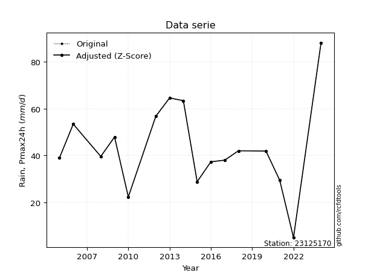</img>

</div>

> If Z-Score is active, values out of range or outliers are replaced with the station mean value.


### 4. Active continuous probability distributions from SciPy (45 of 104 available)

[scipy.stats](https://docs.scipy.org/doc/scipy/reference/stats.html) is a Python´s powerful submodule within the SciPy library for comprehensive statistical analysis, offering over 130 probability distributions (like Normal, Poisson), functions for descriptive stats (mean, variance), hypothesis testing (t-tests, chi-square), random variable generation, and statistical tests, making it essential for data science, modeling, and research. It provides tools to explore, model, and draw conclusions from data efficiently, working seamlessly with NumPy.

<div align="center">

|   id | p_dist             |   n_parameter | fit_method   | label                                                                       | active   | ref                                                                                                        |
|-----:|:-------------------|--------------:|:-------------|:----------------------------------------------------------------------------|:---------|:-----------------------------------------------------------------------------------------------------------|
|    0 | alpha              |             3 | MLE          | Alpha                                                                       | True     | [:mortar_board:](https://docs.scipy.org/doc/scipy/reference/generated/scipy.stats.alpha.html)              |
|    1 | betaprime          |             4 | MLE          | Beta prime                                                                  | True     | [:mortar_board:](https://docs.scipy.org/doc/scipy/reference/generated/scipy.stats.betaprime.html)          |
|    2 | chi2               |             3 | MLE          | Chi²                                                                        | True     | [:mortar_board:](https://docs.scipy.org/doc/scipy/reference/generated/scipy.stats.chi2.html)               |
|    3 | crystalball        |             4 | MLE          | Crystalball                                                                 | True     | [:mortar_board:](https://docs.scipy.org/doc/scipy/reference/generated/scipy.stats.crystalball.html)        |
|    4 | erlang             |             3 | MLE          | Erlang                                                                      | True     | [:mortar_board:](https://docs.scipy.org/doc/scipy/reference/generated/scipy.stats.erlang.html)             |
|    5 | expon              |             2 | MLE          | Exponential                                                                 | True     | [:mortar_board:](https://docs.scipy.org/doc/scipy/reference/generated/scipy.stats.expon.html)              |
|    6 | exponnorm          |             3 | MLE          | Exponentially modified Normal                                               | True     | [:mortar_board:](https://docs.scipy.org/doc/scipy/reference/generated/scipy.stats.exponnorm.html)          |
|    7 | f                  |             4 | MLE          | F                                                                           | True     | [:mortar_board:](https://docs.scipy.org/doc/scipy/reference/generated/scipy.stats.f.html)                  |
|    8 | fatiguelife        |             3 | MLE          | Fatigue-life (Birnbaum-Saunders)                                            | True     | [:mortar_board:](https://docs.scipy.org/doc/scipy/reference/generated/scipy.stats.fatiguelife.html)        |
|    9 | fisk               |             3 | MLE          | Fisk                                                                        | True     | [:mortar_board:](https://docs.scipy.org/doc/scipy/reference/generated/scipy.stats.fisk.html)               |
|   10 | gamma              |             3 | MLE          | Gamma                                                                       | True     | [:mortar_board:](https://docs.scipy.org/doc/scipy/reference/generated/scipy.stats.gamma.html)              |
|   11 | genexpon           |             5 | MLE          | Generalized exponential                                                     | True     | [:mortar_board:](https://docs.scipy.org/doc/scipy/reference/generated/scipy.stats.genexpon.html)           |
|   12 | genlogistic        |             3 | MLE          | Generalized logistic                                                        | True     | [:mortar_board:](https://docs.scipy.org/doc/scipy/reference/generated/scipy.stats.genlogistic.html)        |
|   13 | gibrat             |             2 | MM           | Gibrat                                                                      | True     | [:mortar_board:](https://docs.scipy.org/doc/scipy/reference/generated/scipy.stats.gibrat.html)             |
|   14 | gompertz           |             3 | MLE          | Gompertz (or truncated Gumbel)                                              | True     | [:mortar_board:](https://docs.scipy.org/doc/scipy/reference/generated/scipy.stats.gompertz.html)           |
|   15 | gumbel_l           |             2 | MM           | Gumbel Left Skew                                                            | True     | [:mortar_board:](https://docs.scipy.org/doc/scipy/reference/generated/scipy.stats.gumbel_l.html)           |
|   16 | gumbel_r           |             2 | MM           | Gumbel Right Skew                                                           | True     | [:mortar_board:](https://docs.scipy.org/doc/scipy/reference/generated/scipy.stats.gumbel_r.html)           |
|   17 | halflogistic       |             2 | MM           | Half-logistic                                                               | True     | [:mortar_board:](https://docs.scipy.org/doc/scipy/reference/generated/scipy.stats.halflogistic.html)       |
|   18 | halfnorm           |             2 | MM           | Half Normal                                                                 | True     | [:mortar_board:](https://docs.scipy.org/doc/scipy/reference/generated/scipy.stats.halfnorm.html)           |
|   19 | hypsecant          |             2 | MM           | hyperbolic secant                                                           | True     | [:mortar_board:](https://docs.scipy.org/doc/scipy/reference/generated/scipy.stats.hypsecant.html)          |
|   20 | invgamma           |             3 | MLE          | Inverted gamma                                                              | True     | [:mortar_board:](https://docs.scipy.org/doc/scipy/reference/generated/scipy.stats.invgamma.html)           |
|   21 | invgauss           |             3 | MLE          | Inverse Gaussian                                                            | True     | [:mortar_board:](https://docs.scipy.org/doc/scipy/reference/generated/scipy.stats.invgauss.html)           |
|   22 | invweibull         |             3 | MLE          | Inverted Weibull                                                            | True     | [:mortar_board:](https://docs.scipy.org/doc/scipy/reference/generated/scipy.stats.invweibull.html)         |
|   23 | johnsonsu          |             4 | MLE          | Johnson Su                                                                  | True     | [:mortar_board:](https://docs.scipy.org/doc/scipy/reference/generated/scipy.stats.johnsonsu.html)          |
|   24 | kstwobign          |             2 | MLE          | Limiting distribution of scaled Kolmogorov-Smirnov two-sided test statistic | True     | [:mortar_board:](https://docs.scipy.org/doc/scipy/reference/generated/scipy.stats.kstwobign.html)          |
|   25 | laplace            |             2 | MM           | Laplace                                                                     | True     | [:mortar_board:](https://docs.scipy.org/doc/scipy/reference/generated/scipy.stats.laplace.html)            |
|   26 | laplace_asymmetric |             3 | MLE          | Asymmetric Laplace                                                          | True     | [:mortar_board:](https://docs.scipy.org/doc/scipy/reference/generated/scipy.stats.laplace_asymmetric.html) |
|   27 | loggamma           |             3 | MLE          | Log gamma                                                                   | True     | [:mortar_board:](https://docs.scipy.org/doc/scipy/reference/generated/scipy.stats.loggamma.html)           |
|   28 | logistic           |             2 | MM           | Logistic (or Sech-squared)                                                  | True     | [:mortar_board:](https://docs.scipy.org/doc/scipy/reference/generated/scipy.stats.logistic.html)           |
|   29 | lognorm            |             3 | MLE          | Log Normal                                                                  | True     | [:mortar_board:](https://docs.scipy.org/doc/scipy/reference/generated/scipy.stats.lognorm.html)            |
|   30 | maxwell            |             2 | MM           | Maxwell                                                                     | True     | [:mortar_board:](https://docs.scipy.org/doc/scipy/reference/generated/scipy.stats.maxwell.html)            |
|   31 | mielke             |             4 | MLE          | Mielke Beta-Kappa / Dagum                                                   | True     | [:mortar_board:](https://docs.scipy.org/doc/scipy/reference/generated/scipy.stats.mielke.html)             |
|   32 | moyal              |             2 | MM           | Moyal                                                                       | True     | [:mortar_board:](https://docs.scipy.org/doc/scipy/reference/generated/scipy.stats.moyal.html)              |
|   33 | nakagami           |             3 | MLE          | Nakagami                                                                    | True     | [:mortar_board:](https://docs.scipy.org/doc/scipy/reference/generated/scipy.stats.nakagami.html)           |
|   34 | ncf                |             5 | MLE          | Non-central F distribution                                                  | True     | [:mortar_board:](https://docs.scipy.org/doc/scipy/reference/generated/scipy.stats.ncf.html)                |
|   35 | nct                |             4 | MLE          | Non-central Student’s t                                                     | True     | [:mortar_board:](https://docs.scipy.org/doc/scipy/reference/generated/scipy.stats.nct.html)                |
|   36 | norm               |             2 | MM           | Normal                                                                      | True     | [:mortar_board:](https://docs.scipy.org/doc/scipy/reference/generated/scipy.stats.norm.html)               |
|   37 | pareto             |             3 | MLE          | Pareto                                                                      | True     | [:mortar_board:](https://docs.scipy.org/doc/scipy/reference/generated/scipy.stats.pareto.html)             |
|   38 | pearson3           |             3 | MM           | Pearson type III                                                            | True     | [:mortar_board:](https://docs.scipy.org/doc/scipy/reference/generated/scipy.stats.pearson3.html)           |
|   39 | rayleigh           |             2 | MM           | Rayleigh                                                                    | True     | [:mortar_board:](https://docs.scipy.org/doc/scipy/reference/generated/scipy.stats.rayleigh.html)           |
|   40 | rice               |             3 | MLE          | Rice                                                                        | True     | [:mortar_board:](https://docs.scipy.org/doc/scipy/reference/generated/scipy.stats.rice.html)               |
|   41 | t                  |             3 | MLE          | Student’s t                                                                 | True     | [:mortar_board:](https://docs.scipy.org/doc/scipy/reference/generated/scipy.stats.t.html)                  |
|   42 | truncnorm          |             4 | MLE          | Truncated normal                                                            | True     | [:mortar_board:](https://docs.scipy.org/doc/scipy/reference/generated/scipy.stats.truncnorm.html)          |
|   43 | wald               |             2 | MM           | Wald                                                                        | True     | [:mortar_board:](https://docs.scipy.org/doc/scipy/reference/generated/scipy.stats.wald.html)               |
|   44 | weibull_min        |             3 | MLE          | Weibull minimum                                                             | True     | [:mortar_board:](https://docs.scipy.org/doc/scipy/reference/generated/scipy.stats.weibull_min.html)        |

</div>

> **n_parameter:** # arguments & localization & scale.
>
> **Fit methods:** (MLE) maximum likelihood, (MM) L-moments.
>
>**Inactive:** foldnorm, gennorm, norminvgauss, powernorm, powerlognorm, skewnorm, genextreme, anglit, arcsine, argus, beta, bradford, burr, burr12, cauchy, cosine, halfcauchy, foldcauchy, skewcauchy, wrapcauchy, dgamma, gengamma, exponweib, exponpow, truncexpon, gausshyper, genhalflogistic, genhyperbolic, geninvgauss, halfgennorm, johnsonsb, kappa4, kappa3, ksone, kstwo, loglaplace, levy, levy_l, levy_stable, ncx2, genpareto, truncpareto, lomax, powerlaw, rdist, rel_breitwigner, recipinvgauss, semicircular, studentized_range, trapezoid, triang, truncweibull_min, tukeylambda, uniform, loguniform, vonmises, vonmises_line, weibull_max, dweibull, 


## B. Probability distributions vs. Empirical distributions

A continuous probability distribution (CPD) describes probabilities for variables that can take any value within a range (like rain any time), unlike discrete variables with specific outcomes (like temperature). It uses a Probability Density Function (PDF), a curve where the total area under it equals 1, and the probability of the variable falling within an interval (a to b) is found by calculating the area under the curve between those points. A key feature is that the probability of hitting any single exact value is zero, so probabilities are always expressed for ranges, e.g., $P(a ≤ X ≤ b)$.

<div align="center">

Distributions parameters
|    |   station | p_dist                |   n |               loc |            scale | shape                  | shape1                | shape2                | shape3   |
|---:|----------:|:----------------------|----:|------------------:|-----------------:|:-----------------------|:----------------------|:----------------------|:---------|
|  0 |  23125170 | alpha                 |  17 |      -0.0448307   |     17.6669      | 5.292369652069669e-10  |                       |                       |          |
|  1 |  23125170 | betaprime             |  17 |     -71.8434      |  12041.1         | 35.26527276166355      | 3731.927973634381     |                       |          |
|  2 |  23125170 | chi2                  |  17 |     -70.8984      |      1.64301     | 68.69671167102013      |                       |                       |          |
|  3 |  23125170 | crystalball           |  17 |      41.9706      |     19.271       | 2485.3849614897654     | 3586.6031611715443    |                       |          |
|  4 |  23125170 | erlang                |  17 |     -70.8983      |      3.286       | 34.348429928042194     |                       |                       |          |
|  5 |  23125170 | expon                 |  17 |       4.9         |     37.0706      |                        |                       |                       |          |
|  6 |  23125170 | exponnorm             |  17 |      29.8426      |     15.1199      | 0.8021200105275821     |                       |                       |          |
|  7 |  23125170 | f                     |  17 |     -71.492       |    113.444       | 69.83471710149635      | 12075.901942934623    |                       |          |
|  8 |  23125170 | fatiguelife           |  17 |       4.9         |      9.29788e-05 | 606.0273279787789      |                       |                       |          |
|  9 |  23125170 | fisk                  |  17 |    -118.836       |    159.716       | 14.992973577200317     |                       |                       |          |
| 10 |  23125170 | gamma                 |  17 |     -70.8983      |      3.286       | 34.348468951145556     |                       |                       |          |
| 11 |  23125170 | genexpon              |  17 |       4.89676     |      1.81443     | 0.04898583112404427    | 3.467799231846082e-07 | 0.8621130631711712    |          |
| 12 |  23125170 | genlogistic           |  17 |      33.5069      |     12.2483      | 1.5857635995021593     |                       |                       |          |
| 13 |  23125170 | gibrat                |  17 |      27.2692      |      8.91683     |                        |                       |                       |          |
| 14 |  23125170 | gompertz              |  17 |       0.423548    |      3.14727     | 1.3086549138842536e-11 |                       |                       |          |
| 15 |  23125170 | gumbel_l              |  17 |      50.6436      |     15.0255      |                        |                       |                       |          |
| 16 |  23125170 | gumbel_r              |  17 |      33.2976      |     15.0255      |                        |                       |                       |          |
| 17 |  23125170 | halflogistic          |  17 |      19.13        |     16.476       |                        |                       |                       |          |
| 18 |  23125170 | halfnorm              |  17 |      16.4633      |     31.9686      |                        |                       |                       |          |
| 19 |  23125170 | hypsecant             |  17 |      41.9706      |     12.2683      |                        |                       |                       |          |
| 20 |  23125170 | invgamma              |  17 |    -125.28        |  12490.3         | 75.76007340390174      |                       |                       |          |
| 21 |  23125170 | invgauss              |  17 |     -79.8857      |   4725.45        | 0.02579735608143137    |                       |                       |          |
| 22 |  23125170 | invweibull            |  17 |      -1.22568e+09 |      1.22568e+09 | 69183522.72690411      |                       |                       |          |
| 23 |  23125170 | johnsonsu             |  17 |      21.0351      |     52.4227      | -1.138685188357723     | 3.0757589409372708    |                       |          |
| 24 |  23125170 | kstwobign             |  17 |     -31.9992      |     85.0605      |                        |                       |                       |          |
| 25 |  23125170 | laplace               |  17 |      41.9706      |     13.6267      |                        |                       |                       |          |
| 26 |  23125170 | laplace_asymmetric    |  17 |      39           |     14.0658      | 0.8999620190310416     |                       |                       |          |
| 27 |  23125170 | loggamma              |  17 |   -4942.02        |    697.022       | 1274.9498473821818     |                       |                       |          |
| 28 |  23125170 | logistic              |  17 |      41.9706      |     10.6247      |                        |                       |                       |          |
| 29 |  23125170 | lognorm               |  17 |    -124.369       |    165.236       | 0.11540459942750002    |                       |                       |          |
| 30 |  23125170 | maxwell               |  17 |      -3.69359     |     28.6158      |                        |                       |                       |          |
| 31 |  23125170 | mielke                |  17 |      -4.60741     |     59.7409      | 2.329945787719793      | 6.5199193176765275    |                       |          |
| 32 |  23125170 | moyal                 |  17 |      30.9502      |      8.675       |                        |                       |                       |          |
| 33 |  23125170 | nakagami              |  17 |      14.3685      |     33.92        | 0.7505537522976904     |                       |                       |          |
| 34 |  23125170 | ncf                   |  17 |       2.44238     |      0.00654109  | 0.0022925466709561425  | 625.1259800644962     | 13.772856759406892    |          |
| 35 |  23125170 | nct                   |  17 |      -0.19849     |     16.9909      | 19.765986060145188     | 2.3861036372489055    |                       |          |
| 36 |  23125170 | norm                  |  17 |      41.9706      |     19.271       |                        |                       |                       |          |
| 37 |  23125170 | pareto                |  17 |       4.9         |      1.46737e-06 | 0.06250004884373282    |                       |                       |          |
| 38 |  23125170 | pearson3              |  17 |      41.9706      |     19.271       | 0.3669460820712863     |                       |                       |          |
| 39 |  23125170 | rayleigh              |  17 |       5.10409     |     29.4152      |                        |                       |                       |          |
| 40 |  23125170 | rice                  |  17 |      -2.52924     |     21.5294      | 1.7531129526961555     |                       |                       |          |
| 41 |  23125170 | t                     |  17 |      41.797       |     19.2317      | 39.44781943622878      |                       |                       |          |
| 42 |  23125170 | truncnorm             |  17 |      40.6036      |     19.2929      | -121.26496198514658    | 2.4681868049067583    |                       |          |
| 43 |  23125170 | wald                  |  17 |      22.6996      |     19.271       |                        |                       |                       |          |
| 44 |  23125170 | weibull_min           |  17 |      -5.23732     |     53.062       | 2.608430573416638      |                       |                       |          |
| 45 |  23125170 | logalpha              |  17 |     -18.2109      |    694.629       | 31.94016992357784      |                       |                       |          |
| 46 |  23125170 | logbetaprime          |  17 |      -6.51377     |   6310.06        | 210.38274293126665     | 131435.28042585414    |                       |          |
| 47 |  23125170 | logchi2               |  17 |      -6.26436     |      0.0248563   | 396.3004421945848      |                       |                       |          |
| 48 |  23125170 | logcrystalball        |  17 |       3.58609     |      0.638539    | 1164.6650433198965     | 22.11474573960505     |                       |          |
| 49 |  23125170 | logerlang             |  17 |      -9.0552      |      0.0356302   | 354.62238879181086     |                       |                       |          |
| 50 |  23125170 | logexpon              |  17 |       1.58924     |      1.99685     |                        |                       |                       |          |
| 51 |  23125170 | logexponnorm          |  17 |       3.58568     |      0.638539    | 0.0006380840892468533  |                       |                       |          |
| 52 |  23125170 | logf                  |  17 |    -555.179       |    558.766       | 5093471.728291189      | 2144239.086976041     |                       |          |
| 53 |  23125170 | logfatiguelife        |  17 |    -551.221       |    554.807       | 0.0011437535089683184  |                       |                       |          |
| 54 |  23125170 | logfisk               |  17 | -167383           | 167387           | 536548.5797718223      |                       |                       |          |
| 55 |  23125170 | loggamma              |  17 |      -8.19896     |      0.0390711   | 301.5390885649538      |                       |                       |          |
| 56 |  23125170 | loggenexpon           |  17 |       1.47079     |      0.0464165   | 0.0004527887778316732  | 14.720403579129695    | 5.883132313840505e-05 |          |
| 57 |  23125170 | loggenlogistic        |  17 |       4.05968     |      0.155938    | 0.29105222788908247    |                       |                       |          |
| 58 |  23125170 | loggibrat             |  17 |       3.09899     |      0.29544     |                        |                       |                       |          |
| 59 |  23125170 | loggompertz           |  17 |       1.58923     |      0.453809    | 0.006925598388938602   |                       |                       |          |
| 60 |  23125170 | loggumbel_l           |  17 |       3.87346     |      0.497867    |                        |                       |                       |          |
| 61 |  23125170 | loggumbel_r           |  17 |       3.29871     |      0.497867    |                        |                       |                       |          |
| 62 |  23125170 | loghalflogistic       |  17 |       2.8293      |      0.545906    |                        |                       |                       |          |
| 63 |  23125170 | loghalfnorm           |  17 |       2.74088     |      1.0593      |                        |                       |                       |          |
| 64 |  23125170 | loghypsecant          |  17 |       3.58609     |      0.406506    |                        |                       |                       |          |
| 65 |  23125170 | loginvgamma           |  17 |     -13.6547      |  11861.2         | 689.0871516622583      |                       |                       |          |
| 66 |  23125170 | loginvgauss           |  17 |      -4.50658     |   1001.37        | 0.008061394593884995   |                       |                       |          |
| 67 |  23125170 | loginvweibull         |  17 |      -1.64869e+08 |      1.64869e+08 | 193400006.1971612      |                       |                       |          |
| 68 |  23125170 | logjohnsonsu          |  17 |       4.04737     |      0.427555    | 0.8929379896851697     | 1.2518385130427219    |                       |          |
| 69 |  23125170 | logkstwobign          |  17 |      -0.062261    |      4.21225     |                        |                       |                       |          |
| 70 |  23125170 | loglaplace            |  17 |       3.58609     |      0.451515    |                        |                       |                       |          |
| 71 |  23125170 | loglaplace_asymmetric |  17 |       3.73767     |      0.395791    | 1.2096692866483663     |                       |                       |          |
| 72 |  23125170 | logloggamma           |  17 |       4.04283     |      0.343189    | 0.6625604548013609     |                       |                       |          |
| 73 |  23125170 | loglogistic           |  17 |       3.58609     |      0.352045    |                        |                       |                       |          |
| 74 |  23125170 | loglognorm            |  17 |      -2.08292e+06 |      2.08292e+06 | 3.0655896336385715e-07 |                       |                       |          |
| 75 |  23125170 | logmaxwell            |  17 |       2.07304     |      0.948164    |                        |                       |                       |          |
| 76 |  23125170 | logmielke             |  17 | -351112           | 351116           | 634555.0795476775      | 2241247.574725179     |                       |          |
| 77 |  23125170 | logmoyal              |  17 |       3.22093     |      0.287443    |                        |                       |                       |          |
| 78 |  23125170 | lognakagami           |  17 |       2.20594     |      1.55232     | 3.193207942233549      |                       |                       |          |
| 79 |  23125170 | logncf                |  17 |      -8.37266     |     11.6846      | 1416.4605364953559     | 995.0829902729624     | 25.622925738522717    |          |
| 80 |  23125170 | lognct                |  17 |     -49.3762      |      0.617334    | 48539.481200624636     | 85.79072731819508     |                       |          |
| 81 |  23125170 | lognorm               |  17 |       3.58609     |      0.638539    |                        |                       |                       |          |
| 82 |  23125170 | logpareto             |  17 |       1.58924     |      8.60083e-08 | 0.06250004239698188    |                       |                       |          |
| 83 |  23125170 | logpearson3           |  17 |       3.58609     |      0.63854     | -1.6626351607236645    |                       |                       |          |
| 84 |  23125170 | lograyleigh           |  17 |       2.36454     |      0.974656    |                        |                       |                       |          |
| 85 |  23125170 | logrice               |  17 |    -469.33        |      0.638482    | 740.687860495606       |                       |                       |          |
| 86 |  23125170 | logt                  |  17 |       3.72455     |      0.320315    | 2.0238761020599414     |                       |                       |          |
| 87 |  23125170 | logtruncnorm          |  17 |      -0.339449    |      3.07345     | 1.0125339229195345     | 1.5679630195899965    |                       |          |
| 88 |  23125170 | logwald               |  17 |       2.94754     |      0.638546    |                        |                       |                       |          |
| 89 |  23125170 | logweibull_min        |  17 |      -5.94007e+07 |      5.94007e+07 | 133994941.04050896     |                       |                       |          |

</div>

> **loc** (Location parameter): This shifts the distribution along the x-axis. For many common distributions, like the normal (Gaussian) distribution, loc represents the mean $μ$. For others, like the uniform distribution, it might represent the minimum value, or for the beta distribution, the left end of the support interval.
>
> **scale** (Scale parameter): This determines the width or spread of the distribution. For the normal distribution, scale represents the standard deviation $σ$. For a uniform distribution, it defines the length of the interval (from $loc$ to $loc + scale$).
>
> **shape** (Shape parameters): Refers to parameters that define the specific form of a probability distribution, distinct from its location (loc) and scale (scale). These parameters are required arguments for most distribution functions. For example, a normal (Gaussian) distribution is fully defined by its location (mean) and scale (standard deviation), so it has no specific shape parameters beyond loc and scale. However, other distributions have intrinsic properties that need specification, as Gamma distribution that takes a shape parameter, often named $a$ or $alpha$.


### 0. Cumulative distribution values - CDF (90 evaluated)

> Ordered by x ascending and calculating $log(f(x))$ separately. 

|   id |   Station |   date |    x |   count |    mean |     std |      zscore |   Value_initial |   station |   m |       alpha |   alpha_pdf |   betaprime |   betaprime_pdf |      chi2 |   chi2_pdf |   crystalball |   crystalball_pdf |    erlang |   erlang_pdf |    expon |   expon_pdf |   exponnorm |   exponnorm_pdf |         f |      f_pdf |   fatiguelife |   fatiguelife_pdf |      fisk |   fisk_pdf |     gamma |   gamma_pdf |    genexpon |   genexpon_pdf |   genlogistic |   genlogistic_pdf |    gibrat |   gibrat_pdf |    gompertz |   gompertz_pdf |   gumbel_l |   gumbel_l_pdf |   gumbel_r |   gumbel_r_pdf |   halflogistic |   halflogistic_pdf |   halfnorm |   halfnorm_pdf |   hypsecant |   hypsecant_pdf |   invgamma |   invgamma_pdf |   invgauss |   invgauss_pdf |   invweibull |   invweibull_pdf |   johnsonsu |   johnsonsu_pdf |   kstwobign |   kstwobign_pdf |   laplace |   laplace_pdf |   laplace_asymmetric |   laplace_asymmetric_pdf |    loggamma |   loggamma_pdf |   logistic |   logistic_pdf |     lognorm |   lognorm_pdf |    maxwell |   maxwell_pdf |    mielke |   mielke_pdf |       moyal |   moyal_pdf |   nakagami |   nakagami_pdf |        ncf |    ncf_pdf |       nct |    nct_pdf |      norm |   norm_pdf |   pareto |      pareto_pdf |   pearson3 |   pearson3_pdf |   rayleigh |   rayleigh_pdf |      rice |   rice_pdf |         t |      t_pdf |   truncnorm |   truncnorm_pdf |     wald |   wald_pdf |   weibull_min |   weibull_min_pdf |    logalpha |   logalpha_pdf |   logbetaprime |   logbetaprime_pdf |    logchi2 |   logchi2_pdf |   logcrystalball |   logcrystalball_pdf |   logerlang |   logerlang_pdf |   logexpon |   logexpon_pdf |   logexponnorm |   logexponnorm_pdf |        logf |   logf_pdf |   logfatiguelife |   logfatiguelife_pdf |    logfisk |   logfisk_pdf |   loggenexpon |   loggenexpon_pdf |   loggenlogistic |   loggenlogistic_pdf |   loggibrat |   loggibrat_pdf |   loggompertz |   loggompertz_pdf |   loggumbel_l |   loggumbel_l_pdf |   loggumbel_r |   loggumbel_r_pdf |   loghalflogistic |   loghalflogistic_pdf |   loghalfnorm |   loghalfnorm_pdf |   loghypsecant |   loghypsecant_pdf |   loginvgamma |   loginvgamma_pdf |   loginvgauss |   loginvgauss_pdf |   loginvweibull |   loginvweibull_pdf |   logjohnsonsu |   logjohnsonsu_pdf |   logkstwobign |   logkstwobign_pdf |   loglaplace |   loglaplace_pdf |   loglaplace_asymmetric |   loglaplace_asymmetric_pdf |   logloggamma |   logloggamma_pdf |   loglogistic |   loglogistic_pdf |   loglognorm |   loglognorm_pdf |   logmaxwell |   logmaxwell_pdf |   logmielke |   logmielke_pdf |    logmoyal |   logmoyal_pdf |   lognakagami |   lognakagami_pdf |     logncf |   logncf_pdf |      lognct |   lognct_pdf |   logpareto |   logpareto_pdf |   logpearson3 |   logpearson3_pdf |   lograyleigh |   lograyleigh_pdf |     logrice |   logrice_pdf |      logt |   logt_pdf |   logtruncnorm |   logtruncnorm_pdf |   logwald |   logwald_pdf |   logweibull_min |   logweibull_min_pdf |
|-----:|----------:|-------:|-----:|--------:|--------:|--------:|------------:|----------------:|----------:|----:|------------:|------------:|------------:|----------------:|----------:|-----------:|--------------:|------------------:|----------:|-------------:|---------:|------------:|------------:|----------------:|----------:|-----------:|--------------:|------------------:|----------:|-----------:|----------:|------------:|------------:|---------------:|--------------:|------------------:|----------:|-------------:|------------:|---------------:|-----------:|---------------:|-----------:|---------------:|---------------:|-------------------:|-----------:|---------------:|------------:|----------------:|-----------:|---------------:|-----------:|---------------:|-------------:|-----------------:|------------:|----------------:|------------:|----------------:|----------:|--------------:|---------------------:|-------------------------:|------------:|---------------:|-----------:|---------------:|------------:|--------------:|-----------:|--------------:|----------:|-------------:|------------:|------------:|-----------:|---------------:|-----------:|-----------:|----------:|-----------:|----------:|-----------:|---------:|----------------:|-----------:|---------------:|-----------:|---------------:|----------:|-----------:|----------:|-----------:|------------:|----------------:|---------:|-----------:|--------------:|------------------:|------------:|---------------:|---------------:|-------------------:|-----------:|--------------:|-----------------:|---------------------:|------------:|----------------:|-----------:|---------------:|---------------:|-------------------:|------------:|-----------:|-----------------:|---------------------:|-----------:|--------------:|--------------:|------------------:|-----------------:|---------------------:|------------:|----------------:|--------------:|------------------:|--------------:|------------------:|--------------:|------------------:|------------------:|----------------------:|--------------:|------------------:|---------------:|-------------------:|--------------:|------------------:|--------------:|------------------:|----------------:|--------------------:|---------------:|-------------------:|---------------:|-------------------:|-------------:|-----------------:|------------------------:|----------------------------:|--------------:|------------------:|--------------:|------------------:|-------------:|-----------------:|-------------:|-----------------:|------------:|----------------:|------------:|---------------:|--------------:|------------------:|-----------:|-------------:|------------:|-------------:|------------:|----------------:|--------------:|------------------:|--------------:|------------------:|------------:|--------------:|----------:|-----------:|---------------:|-------------------:|----------:|--------------:|-----------------:|---------------------:|
|    0 |  23125170 |   2022 |  4.9 |      17 | 41.9706 | 19.8641 | -1.86621    |             4.9 |  23125170 |   1 | 0.000353195 | 0.000974868 |   0.0166008 |      0.00280579 | 0.0165974 | 0.00280697 |     0.0271995 |        0.0032544  | 0.0165974 |   0.00280698 | 0        |  0.0269756  |   0.0173998 |      0.00264737 | 0.0166005 | 0.00280629 |     0.0238964 |       8.61654e+08 | 0.021312  | 0.00252733 | 0.0165974 |  0.00280698 | 8.75788e-05 |     0.0269956  |     0.021277  |        0.00251167 | 0         |   0          | 4.11803e-11 |    1.72425e-11 |  0.0465092 |     0.00302222 | 0.00133466 |    0.000587946 |      0         |         0          |   0        |     0          |   0.0309919 |      0.00252219 |  0.0147093 |     0.00269696 |  0.0138731 |     0.00265209 |   0.00837887 |       0.00226165 |   0.0191782 |      0.00262006 |  0.00821504 |      0.00269651 | 0.0329227 |    0.00241605 |            0.0302611 |               0.00239054 | 0.000958916 |     0.00540807 |  0.0296237 |     0.00270561 | 0.000882341 |    0.00470036 | 0.00701143 |    0.00240375 | 0.0138106 |   0.0033845  | 7.18266e-06 | 8.71982e-06 | 0          |     0          | 0.00582259 | 0.00274908 | 0.0184239 | 0.00266296 | 0.0271995 | 0.0032544  | 0        | 42593.4         |  0.0158153 |     0.00276111 |  0         |     0          | 0.0130039 | 0.00355223 | 0.0311494 | 0.00339319 |   0.0323325 |     0.00375662  | 0        | 0          |     0.0132438 |        0.00338508 | 0.000839373 |     0.00507921 |     0.00111754 |         0.00620517 | 0.00114797 |    0.00635912 |       0.00088234 |           0.00470036 | 0.000900947 |      0.00511577 |   0        |       0.500789 |    0.000882336 |         0.00470033 | 0.000929637 |   0.004915 |      0.000807867 |           0.00437706 | 0.00125748 |    0.00402577 |    0.00396724 |         0.0571358 |       0.00994203 |            0.0185564 | 0           |       0         |   2.45215e-08 |         0.0152611 |     0.0101213 |         0.0202261 |   3.48414e-14 |       2.16858e-12 |          0        |              0        |     0         |          0        |     0.00468296 |          0.0115196 |   0.000543047 |        0.00344118 |   0.000978023 |        0.00609384 |      0.00112001 |          0.00892675 |      0.0148641 |          0.0188526 |     0.00209029 |          0.0190505 |   0.00600176 |        0.0132925 |              0.00668325 |                    0.013959 |    0.00971425 |         0.0187455 |    0.00342867 |         0.0097059 |  0.000882339 |       0.00470036 |    0         |         0        |   0.0113303 |       0.0204769 | 1.87214e-65 |    9.53973e-63 |    0          |         0         | 0.00114441 |   0.00659316 | 0.000886207 |   0.00473041 |    0        | 726675          |     0.0139257 |         0.0243223 |     0         |          0        | 0.000881529 |     0.0046968 | 0.0105587 | 0.00967889 |    0           |           0        |  0        |      0        |       0.00603622 |            0.0135752 |
|    1 |  23125170 |   2025 | 16   |      17 | 41.9706 | 19.8641 | -1.30741    |            16   |  23125170 |   2 | 0.270856    | 0.0298647   |   0.0791812 |      0.00912784 | 0.0792027 | 0.00913047 |     0.0888853 |        0.00834893 | 0.0792029 |   0.00913052 | 0.258758 |  0.0199954  |   0.0757497 |      0.00859248 | 0.0791903 | 0.00912876 |     0.715705  |       0.00870873  | 0.0731753 | 0.00754128 | 0.0792029 |  0.00913052 | 0.259009    |     0.0200054  |     0.0737542 |        0.00770393 | 0         |   0          | 1.83292e-09 |    5.86542e-10 |  0.094886  |     0.00600543 | 0.0423397  |    0.00891013  |      0         |         0          |   0        |     0          |   0.0762856 |      0.00615876 |  0.0782197 |     0.00948264 |  0.0773125 |     0.00950626 |   0.0776379  |       0.0111998  |   0.0758353 |      0.00833741 |  0.0922525  |      0.0129707  | 0.0743469 |    0.00545599 |            0.0727282 |               0.00574531 | 0.114499    |     0.299087   |  0.0798513 |     0.00691552 | 0.101332    |    0.277509   | 0.0753545  |    0.0104214  | 0.0837212 |   0.00945665 | 0.0179261   | 0.00660863  | 0.00921495 |     0.00846986 | 0.0880492  | 0.012352   | 0.0765734 | 0.00854614 | 0.0888853 | 0.00834893 | 0.6284   |     0.00209234  |  0.07845   |     0.009198   |  0.0663042 |     0.0117578  | 0.0860613 | 0.00982818 | 0.0937349 | 0.00836357 |   0.101799  |     0.0092326   | 0        | 0          |     0.0876791 |        0.0102825  | 0.122327    |     0.319877   |     0.119449   |         0.302639   | 0.12051    |    0.303696   |       0.101332   |           0.277509   | 0.112705    |      0.298009   |   0.447118 |       0.276877 |    0.101331    |         0.277508   | 0.102576    |   0.27838  |      0.099662    |           0.276288   | 0.0529409  |    0.160715   |    0.297501   |         0.374149  |       0.0905027  |            0.168876  | 0           |       0         |   0.083351    |         0.189782  |     0.103782  |         0.197241  |   0.0563031   |       0.325357    |          0        |              0        |     0.0238776 |          0.752881 |     0.0855361  |          0.207894  |   0.105924    |        0.297012   |   0.133721    |        0.330827   |      0.183512   |          0.364984   |      0.0843883 |          0.144094  |     0.244419   |          0.383472  |   0.0825086  |        0.182737  |              0.0791404  |                    0.165297 |    0.0945071  |         0.179761  |    0.0902344  |         0.233187  |  0.101332    |       0.277509   |    0.0909535 |         0.348921 |   0.0961625 |       0.173746  | 0.0291688   |    0.280509    |    0.00616362 |         0.0625612 | 0.13144    |   0.328068   | 0.101842    |   0.278343   |    0.642036 |      0.0189062  |     0.105676  |         0.176084  |     0.0839093 |          0.393508 | 0.101314    |     0.277497  | 0.0478291 | 0.0871976  |    5.21342e-05 |           0.799833 |  0        |      0        |       0.0836649  |            0.180605  |
|    2 |  23125170 |   2010 | 22.3 |      17 | 41.9706 | 19.8641 | -0.990259   |            22.3 |  23125170 |   3 | 0.429151    | 0.0206539   |   0.151511  |      0.0138518  | 0.151545  | 0.0138527  |     0.15369   |        0.0122959  | 0.151546  |   0.0138528  | 0.374607 |  0.0168703  |   0.145087  |      0.0135105  | 0.151524  | 0.013852   |     0.76233   |       0.00634277  | 0.135374  | 0.0124341  | 0.151546  |  0.0138528  | 0.374907    |     0.0168763  |     0.137367  |        0.0126985  | 0         |   0          | 1.36508e-08 |    4.34152e-09 |  0.140688  |     0.00867133 | 0.125045   |    0.0173024   |      0.0959049 |         0.030068   |   0.144869 |     0.0245458  |   0.126411  |      0.0100352  |  0.153814  |     0.0145082  |  0.152992  |     0.0144982  |   0.166809   |       0.0168624  |   0.143556  |      0.0132789  |  0.190201   |      0.0177066  | 0.118046  |    0.00866284 |            0.119631  |               0.00945048 | 0.243558    |     0.474783   |  0.135708  |     0.0110395  | 0.225405    |    0.470165   | 0.156552   |    0.0152294  | 0.155616  |   0.013401   | 0.0996885   | 0.0195247   | 0.0972988  |     0.0179866  | 0.181345   | 0.0169713  | 0.145553  | 0.0134422  | 0.15369   | 0.0122959  | 0.638695 |     0.00129779  |  0.151445  |     0.0139856  |  0.157072  |     0.0167522  | 0.16027   | 0.0137147  | 0.15843   | 0.0122528  |   0.172553  |     0.0132747   | 0        | 0          |     0.165314  |        0.0142869  | 0.258548    |     0.49447    |     0.248326   |         0.4694     | 0.249526   |    0.469033   |       0.225405   |           0.470165   | 0.241977    |      0.477429   |   0.531805 |       0.234467 |    0.225404    |         0.470163   | 0.226558    |   0.468505 |      0.223724    |           0.471515   | 0.139436   |    0.384633   |    0.424229   |         0.383348  |       0.168087   |            0.313043  | 3.65016e-05 |       0.0273495 |   0.171675    |         0.35643   |     0.19221   |         0.346328  |   0.228357    |       0.677386    |          0.246926 |              0.860063 |     0.26866   |          0.710105 |     0.18899    |          0.438076  |   0.23675     |        0.487616   |   0.270499    |        0.484998   |      0.317092   |          0.427226   |      0.152783  |          0.285419  |     0.375893   |          0.399449  |   0.172122   |        0.381209  |              0.158326   |                    0.330688 |    0.176574   |         0.327768  |    0.202988   |         0.459555  |  0.225406    |       0.470165   |    0.243066  |         0.551125 |   0.175128  |       0.315828  | 0.220837    |    0.803083    |    0.0730291  |         0.393647  | 0.268785   |   0.492292   | 0.226099    |   0.47027    |    0.647527 |      0.0145376  |     0.182514  |         0.296213  |     0.250437  |          0.583939 | 0.225388    |     0.470186  | 0.0955364 | 0.226752   |    0.251113    |           0.712793 |  0.108499 |      1.61227  |       0.168703   |            0.346481  |
|    3 |  23125170 |   2015 | 28.8 |      17 | 41.9706 | 19.8641 | -0.663035   |            28.8 |  23125170 |   4 | 0.540221    | 0.0140444   |   0.256211  |      0.0181529  | 0.256241  | 0.0181508  |     0.247164  |        0.01639    | 0.256243  |   0.0181509  | 0.475188 |  0.0141571  |   0.249343  |      0.0184013  | 0.256222  | 0.018152   |     0.798589  |       0.00492063  | 0.235199  | 0.0182676  | 0.256243  |  0.0181509  | 0.475517    |     0.0141601  |     0.238602  |        0.0183774  | 0.0390209 |   0.0551706  | 1.07761e-07 |    3.42438e-08 |  0.208392  |     0.0123117  | 0.259511   |    0.0232983   |      0.285314  |         0.0278768  |   0.300429 |     0.0231675  |   0.209668  |      0.0158809  |  0.263113  |     0.0188518  |  0.261925  |     0.0187442  |   0.289127   |       0.0202511  |   0.24675   |      0.0183153  |  0.313482   |      0.0197449  | 0.1902    |    0.0139579  |            0.199915  |               0.0157927  | 0.378185    |     0.567487   |  0.224501  |     0.0163865  | 0.361865    |    0.586936   | 0.268346   |    0.0188682  | 0.256085  |   0.0174655  | 0.257661    | 0.0274307   | 0.229612   |     0.0220817  | 0.301331   | 0.0195407  | 0.249227  | 0.0182834  | 0.247164  | 0.01639    | 0.645792 |     0.000926277 |  0.257062  |     0.0182886  |  0.277089  |     0.0197977  | 0.261391  | 0.0172542  | 0.251552  | 0.0163318  |   0.27218   |     0.017266    | 0.183486 | 0.0555798  |     0.26953   |        0.0175812  | 0.39689     |     0.575537   |     0.380599   |         0.554873   | 0.381531   |    0.553188   |       0.361865   |           0.586936   | 0.377676    |      0.573026   |   0.588097 |       0.206276 |    0.361863    |         0.586934   | 0.362302    |   0.583116 |      0.360799    |           0.590258   | 0.268928   |    0.630209   |    0.52072    |         0.368272  |       0.270229   |            0.498746  | 0.451264    |       1.51486   |   0.28551     |         0.540206  |     0.30009   |         0.501601  |   0.413333    |       0.733491    |          0.451366 |              0.729308 |     0.441326  |          0.634827 |     0.331699   |          0.676112  |   0.375757    |        0.587621   |   0.404123    |        0.549016   |      0.42706    |          0.426236   |      0.249808  |          0.491415  |     0.476124   |          0.380775  |   0.303297   |        0.671732  |              0.270132   |                    0.564212 |    0.281337   |         0.499799  |    0.344989   |         0.641883  |  0.361865    |       0.586936   |    0.394463  |         0.617144 |   0.277362  |       0.495858  | 0.432681    |    0.800449    |    0.221253   |         0.756518  | 0.405472   |   0.565229   | 0.362453    |   0.585981   |    0.650946 |      0.0123174  |     0.274844  |         0.432928  |     0.40665   |          0.622011 | 0.361856    |     0.586984  | 0.18613   | 0.523801   |    0.424998    |           0.647078 |  0.480051 |      1.09113  |       0.280368   |            0.534101  |
|    4 |  23125170 |   2021 | 29.4 |      17 | 41.9706 | 19.8641 | -0.63283    |            29.4 |  23125170 |   5 | 0.548507    | 0.0135803   |   0.2672    |      0.0184736  | 0.267229  | 0.0184713  |     0.257102  |        0.0167344  | 0.26723   |   0.0184714  | 0.483614 |  0.0139298  |   0.2605    |      0.018785   | 0.26721   | 0.0184726  |     0.80151   |       0.00481749  | 0.246313  | 0.0187765  | 0.26723   |  0.0184714  | 0.483945    |     0.0139325  |     0.249772  |        0.0188543  | 0.0761503 |   0.0672086  | 1.30397e-07 |    4.14359e-08 |  0.215893  |     0.0126919  | 0.273583   |    0.0236001   |      0.301951  |         0.0275803  |   0.314279 |     0.0229962  |   0.219382  |      0.0164996  |  0.274516  |     0.0191581  |  0.273262  |     0.0190408  |   0.301325   |       0.0204026  |   0.257859  |      0.0187133  |  0.325344   |      0.0197941  | 0.198762  |    0.0145863  |            0.209619  |               0.0165592  | 0.389934    |     0.571977   |  0.234486  |     0.0168949  | 0.374034    |    0.593365   | 0.279739   |    0.0191068  | 0.266671  |   0.0178181  | 0.274191    | 0.0276573   | 0.242921   |     0.0222787  | 0.313091   | 0.0196551  | 0.260311  | 0.0186604  | 0.257102  | 0.0167344  | 0.64634  |     0.000902193 |  0.268131  |     0.0186057  |  0.289018  |     0.019964   | 0.271826  | 0.0175288  | 0.261455  | 0.0166766  |   0.282637  |     0.0175891   | 0.216624 | 0.0547605  |     0.280151  |        0.0178194  | 0.408792    |     0.578801   |     0.392082   |         0.558925   | 0.392979   |    0.55715    |       0.374034   |           0.593365   | 0.38954     |      0.577681   |   0.592328 |       0.204157 |    0.374032    |         0.593363   | 0.374391    |   0.589414 |      0.373038    |           0.596797   | 0.28212    |    0.649192   |    0.528294   |         0.366353  |       0.280703   |            0.517261  | 0.48144     |       1.41313   |   0.296816    |         0.556372  |     0.31057   |         0.514982  |   0.428416    |       0.729415    |          0.466275 |              0.716778 |     0.454341  |          0.627523 |     0.345815   |          0.692958  |   0.387923    |        0.592328   |   0.415467    |        0.551229   |      0.435832   |          0.424596   |      0.260162  |          0.513021  |     0.483951   |          0.378445  |   0.317469   |        0.703119  |              0.282019   |                    0.589042 |    0.291806   |         0.515706  |    0.358341   |         0.653135  |  0.374034    |       0.593365   |    0.407202  |         0.618391 |   0.287769  |       0.513684  | 0.449068    |    0.788879    |    0.237105   |         0.78089   | 0.417156   |   0.567993   | 0.374602    |   0.592323   |    0.651198 |      0.0121669  |     0.283904  |         0.445877  |     0.419468  |          0.621174 | 0.374027    |     0.593414  | 0.197297  | 0.55969    |    0.438286    |           0.641859 |  0.501969 |      1.03536  |       0.291553   |            0.550833  |
|    5 |  23125170 |   2016 | 37.3 |      17 | 41.9706 | 19.8641 | -0.235127   |            37.3 |  23125170 |   6 | 0.636161    | 0.00903735  |   0.425108  |      0.0209192  | 0.425108  | 0.0209147  |     0.404249  |        0.0201025  | 0.42511   |   0.0209148  | 0.582724 |  0.0112562  |   0.423757  |      0.0218762  | 0.425107  | 0.0209175  |     0.834987  |       0.0037316   | 0.415832  | 0.0233261  | 0.42511   |  0.0209148  | 0.583065    |     0.0112564  |     0.41788   |        0.0228955  | 0.546854  |   0.0394972  | 1.60485e-06 |    5.09922e-07 |  0.337314  |     0.0181467  | 0.464797   |    0.0237001   |      0.501575  |         0.0227125  |   0.48546  |     0.0201821  |   0.381644  |      0.0241727  |  0.436391  |     0.0211769  |  0.433807  |     0.020975   |   0.463937   |       0.0201118  |   0.421103  |      0.0219169  |  0.479586   |      0.0188059  | 0.354906  |    0.026045   |            0.391257  |               0.0309082  | 0.529065    |     0.585184   |  0.391837  |     0.022429   | 0.520551    |    0.623945   | 0.438358   |    0.0205081  | 0.423222  |   0.0214086  | 0.487987    | 0.0250759   | 0.422882   |     0.0226382  | 0.469495   | 0.0194422  | 0.422204  | 0.0216607  | 0.404249  | 0.0201025  | 0.652464 |     0.000670401 |  0.426765  |     0.0209602  |  0.45064   |     0.0204416  | 0.421284  | 0.0198852  | 0.408162  | 0.0200435  |   0.434974  |     0.0205166   | 0.55089  | 0.030198   |     0.4298    |        0.0196423  | 0.547793    |     0.577336   |     0.527721   |         0.569765   | 0.528103   |    0.567341   |       0.520551   |           0.623945   | 0.530162    |      0.591617   |   0.638133 |       0.181219 |    0.520549    |         0.623944   | 0.519858    |   0.619358 |      0.520457    |           0.627825   | 0.457334   |    0.795524   |    0.612329   |         0.338079  |       0.432025   |            0.761256  | 0.714089    |       0.653874  |   0.451033    |         0.733848  |     0.451092  |         0.661319  |   0.591231    |       0.624104    |          0.61894  |              0.565036 |     0.592869  |          0.534202 |     0.52574    |          0.780479  |   0.531825    |        0.603598   |   0.546939    |        0.543586   |      0.533557   |          0.393178   |      0.416012  |          0.806795  |     0.570301   |          0.345567  |   0.535145   |        1.02954   |              0.463624   |                    0.968351 |    0.43721    |         0.705952  |    0.523352   |         0.708588  |  0.520551    |       0.623945   |    0.552665  |         0.592121 |   0.437089  |       0.747461  | 0.61682     |    0.612741    |    0.446177   |         0.932301  | 0.553106   |   0.563329   | 0.52077     |   0.622144   |    0.653907 |      0.0106569  |     0.409532  |         0.615872  |     0.563202  |          0.576812 | 0.520556    |     0.624     | 0.38637   | 1.02128    |    0.583964    |           0.582676 |  0.68789  |      0.578676 |       0.445466   |            0.737568  |
|    6 |  23125170 |   2017 | 38   |      17 | 41.9706 | 19.8641 | -0.199888   |            38   |  23125170 |   7 | 0.642383    | 0.00874344  |   0.439768  |      0.0209617  | 0.439765  | 0.0209573  |     0.41838   |        0.0202669  | 0.439767  |   0.0209573  | 0.59053  |  0.0110457  |   0.439096  |      0.0219441  | 0.439766  | 0.0209601  |     0.837572  |       0.00365429  | 0.43221   | 0.0234599  | 0.439767  |  0.0209573  | 0.590871    |     0.0110457  |     0.433945  |        0.0229956  | 0.573454  |   0.0365454  | 2.0046e-06  |    6.36938e-07 |  0.35019   |     0.0186427  | 0.481293   |    0.0234241   |      0.517304  |         0.0222262  |   0.499487 |     0.0198913  |   0.398733  |      0.0246437  |  0.451213  |     0.0211678  |  0.448487  |     0.0209644  |   0.477948   |       0.0199165  |   0.436472  |      0.0219868  |  0.492681   |      0.0186055  | 0.373614  |    0.0274179  |            0.413503  |               0.0326655  | 0.539928    |     0.58319    |  0.407644  |     0.0227273  | 0.532141    |    0.622745   | 0.452704   |    0.0204777  | 0.438271  |   0.0215836  | 0.505353    | 0.0245375   | 0.438681   |     0.0224984  | 0.483053   | 0.0192907  | 0.437391  | 0.021724   | 0.41838   | 0.0202669  | 0.652928 |     0.000655347 |  0.44145   |     0.0209926  |  0.464916  |     0.0203432  | 0.435233  | 0.0199639  | 0.422251  | 0.0202053  |   0.449377  |     0.0206308   | 0.571424 | 0.0284902  |     0.443563  |        0.0196781  | 0.558499    |     0.574272   |     0.538297   |         0.567816   | 0.538634   |    0.565375   |       0.532141   |           0.622745   | 0.541143    |      0.589579   |   0.641487 |       0.179539 |    0.532139    |         0.622745   | 0.531363    |   0.618185 |      0.532119    |           0.626592   | 0.472158   |    0.798874   |    0.61859    |         0.335461  |       0.446363   |            0.780988  | 0.725914    |       0.618505  |   0.464786    |         0.745386  |     0.463478  |         0.670992  |   0.602731    |       0.612921    |          0.629335 |              0.553151 |     0.602729  |          0.526405 |     0.540219   |          0.776796  |   0.543025    |        0.601138   |   0.557018    |        0.540544   |      0.540837   |          0.389945   |      0.431236  |          0.830723  |     0.576699   |          0.342641  |   0.553899   |        0.98801   |              0.481982   |                    1.0067   |    0.450467   |         0.72      |    0.536507   |         0.706351  |  0.532141    |       0.622745   |    0.563629  |         0.587253 |   0.451162  |       0.766335  | 0.628075    |    0.59791     |    0.463517   |         0.932603  | 0.563551   |   0.560225   | 0.532327    |   0.620912   |    0.654104 |      0.0105541  |     0.421119  |         0.630564  |     0.573874  |          0.57106  | 0.532148    |     0.6228    | 0.405605  | 1.04707    |    0.594756    |           0.578144 |  0.698422 |      0.554477 |       0.459296   |            0.749978  |
|    7 |  23125170 |   2005 | 39   |      17 | 41.9706 | 19.8641 | -0.149546   |            39   |  23125170 |   8 | 0.650926    | 0.0083467   |   0.46074   |      0.0209725  | 0.460732  | 0.0209681  |     0.438746  |        0.0204572  | 0.460735  |   0.0209681  | 0.601428 |  0.0107517  |   0.461064  |      0.0219792  | 0.460736  | 0.0209709  |     0.841173  |       0.00354798  | 0.455729  | 0.0235616  | 0.460735  |  0.0209681  | 0.601769    |     0.0107515  |     0.456979  |        0.0230576  | 0.608064  |   0.0327528  | 2.75436e-06 |    8.7516e-07  |  0.369184  |     0.0193433  | 0.504496   |    0.0229725   |      0.53918   |         0.0215248  |   0.519167 |     0.019467   |   0.423668  |      0.0252033  |  0.472354  |     0.0211037  |  0.469424  |     0.0209     |   0.49771    |       0.0196018  |   0.458483  |      0.0220227  |  0.511134   |      0.0182969  | 0.402063  |    0.0295057  |            0.447493  |               0.0353506  | 0.555033    |     0.579695   |  0.430553  |     0.0230762  | 0.548287    |    0.620192   | 0.473144   |    0.0203935  | 0.459957  |   0.0217786  | 0.52949     | 0.0237295   | 0.461064   |     0.0222586  | 0.502223   | 0.019044   | 0.459136  | 0.0217546  | 0.438746  | 0.0204572  | 0.653573 |     0.000634946 |  0.462445  |     0.0209888  |  0.485175  |     0.020168   | 0.455237  | 0.0200366  | 0.442553  | 0.0203907  |   0.470071  |     0.0207478   | 0.598771 | 0.02624    |     0.463252  |        0.0196929  | 0.573354    |     0.569329   |     0.553004   |         0.564441   | 0.553277   |    0.561986   |       0.548287   |           0.620192   | 0.556413    |      0.585999   |   0.646121 |       0.177219 |    0.548284    |         0.620192   | 0.54739     |   0.61569  |      0.548363    |           0.623976   | 0.492945   |    0.8012     |    0.627256   |         0.33172   |       0.467002   |            0.807935  | 0.741379    |       0.572957  |   0.484346    |         0.760449  |     0.481075  |         0.683743  |   0.618446    |       0.59693     |          0.643489 |              0.536651 |     0.61626   |          0.515435 |     0.560303   |          0.769028  |   0.558588    |        0.596931   |   0.570998    |        0.535755   |      0.550906   |          0.385284   |      0.453239  |          0.863234  |     0.585545   |          0.33849   |   0.578838   |        0.932774  |              0.508854   |                    1.06282  |    0.469418   |         0.738971  |    0.554798   |         0.701607  |  0.548287    |       0.620192   |    0.578789  |         0.579872 |   0.471405  |       0.792129  | 0.643338    |    0.577319    |    0.487717   |         0.930183  | 0.57804    |   0.555276   | 0.548424    |   0.618321   |    0.654376 |      0.0104137  |     0.437768  |         0.651349  |     0.588598  |          0.562576 | 0.548294    |     0.620246  | 0.433198  | 1.07598    |    0.609691    |           0.571835 |  0.712408 |      0.522718 |       0.478991   |            0.766269  |
|    8 |  23125170 |   2008 | 39.6 |      17 | 41.9706 | 19.8641 | -0.11934    |            39.6 |  23125170 |   9 | 0.655866    | 0.0081209   |   0.473318  |      0.0209511  | 0.473308  | 0.0209467  |     0.451048  |        0.0205456  | 0.47331   |   0.0209468  | 0.607827 |  0.0105791  |   0.474249  |      0.0219654  | 0.473314  | 0.0209495  |     0.843283  |       0.0034864   | 0.469871  | 0.0235719  | 0.47331   |  0.0209468  | 0.608168    |     0.0105787  |     0.470813  |        0.0230494  | 0.627091  |   0.0306974  | 3.33284e-06 |    1.05897e-06 |  0.380915  |     0.019757   | 0.518191   |    0.0226724   |      0.551968  |         0.0211013  |   0.530769 |     0.0192078  |   0.438873  |      0.0254688  |  0.484997  |     0.0210371  |  0.481945  |     0.0208343  |   0.50941    |       0.0193945  |   0.471693  |      0.0220086  |  0.522053   |      0.0181002  | 0.420162  |    0.0308339  |            0.468301  |               0.0340192  | 0.563865    |     0.577262   |  0.44445   |     0.0232397  | 0.557741    |    0.618219   | 0.485359   |    0.0203204  | 0.473051  |   0.0218627  | 0.543578    | 0.0232278   | 0.47437    |     0.0220932  | 0.513601   | 0.01888    | 0.472186  | 0.0217395  | 0.451048  | 0.0205456  | 0.653951 |     0.000623288 |  0.475031  |     0.0209588  |  0.497239  |     0.020044   | 0.467266  | 0.0200575  | 0.454814  | 0.0204755  |   0.482534  |     0.0207914   | 0.614137 | 0.0249901  |     0.475065  |        0.0196814  | 0.582021    |     0.566072   |     0.561604   |         0.562109   | 0.56184    |    0.559651   |       0.557741   |           0.618219   | 0.565341    |      0.583503   |   0.648816 |       0.175869 |    0.557738    |         0.618218   | 0.556776    |   0.613761 |      0.557875    |           0.621958   | 0.505179   |    0.801273   |    0.632303   |         0.329479  |       0.479455   |            0.82329   | 0.749935    |       0.548118  |   0.49602     |         0.768664  |     0.491569  |         0.690779  |   0.627486    |       0.587366    |          0.651609 |              0.527019 |     0.62408   |          0.508952 |     0.572      |          0.763092  |   0.56768     |        0.594047   |   0.579155    |        0.532656   |      0.556767   |          0.382471   |      0.46656   |          0.881631  |     0.590694   |          0.336018  |   0.592841   |        0.901761  |              0.525342   |                    1.09726  |    0.480782   |         0.749696  |    0.565482   |         0.697957  |  0.557741    |       0.618218   |    0.587607  |         0.575232 |   0.483611  |       0.806841  | 0.652061    |    0.565315    |    0.501898   |         0.927245  | 0.586494   |   0.552042   | 0.557849    |   0.61633    |    0.654535 |      0.0103329  |     0.447806  |         0.66369   |     0.597148  |          0.55736  | 0.557749    |     0.618272  | 0.449726  | 1.08864    |    0.618393    |           0.56814  |  0.720253 |      0.505096 |       0.490759   |            0.775205  |
|    9 |  23125170 |   2020 | 41.9 |      17 | 41.9706 | 19.8641 | -0.00355356 |            41.9 |  23125170 |  10 | 0.673614    | 0.00733195  |   0.521252  |      0.0206818  | 0.521232  | 0.0206778  |     0.498539  |        0.0207016  | 0.521234  |   0.0206778  | 0.631419 |  0.00994267 |   0.524508  |      0.021677   | 0.521244  | 0.0206804  |     0.851043  |       0.00326449  | 0.523838  | 0.0232663  | 0.521234  |  0.0206778  | 0.631759    |     0.00994182 |     0.52353   |        0.0227126  | 0.689766  |   0.024121   | 6.9214e-06  |    2.19917e-06 |  0.428121  |     0.0212693  | 0.56887    |    0.0213571   |      0.598627  |         0.0194721  |   0.57378  |     0.0181861  |   0.498169  |      0.0259453  |  0.53293   |     0.0205964  |  0.529422  |     0.0204047  |   0.553009   |       0.018491   |   0.522046  |      0.0217144  |  0.562759   |      0.0172795  | 0.497417  |    0.0365032  |            0.541061  |               0.0293639  | 0.596152    |     0.565913   |  0.498339  |     0.0235299  | 0.592375    |    0.607949   | 0.531647   |    0.019892   | 0.5235    |   0.0219392  | 0.594726    | 0.021237    | 0.524339   |     0.0213238  | 0.556217   | 0.0181528  | 0.521928  | 0.0214562  | 0.498539  | 0.0207016  | 0.655336 |     0.000582203 |  0.522945  |     0.0206574  |  0.54269   |     0.0194476  | 0.513357  | 0.0199805  | 0.502123  | 0.0206126  |   0.530389  |     0.0207726   | 0.666637 | 0.0208158  |     0.520163  |        0.0194979  | 0.613595    |     0.551882   |     0.59305    |         0.551324   | 0.593148   |    0.548885   |       0.592375   |           0.607949   | 0.597973    |      0.571841   |   0.658606 |       0.170966 |    0.592373    |         0.607949   | 0.591165    |   0.603721 |      0.592715    |           0.611469   | 0.550251   |    0.793264   |    0.650665   |         0.320931  |       0.527442   |            0.875145  | 0.778518    |       0.467132  |   0.540175    |         0.794226  |     0.531232  |         0.713366  |   0.659632    |       0.551262    |          0.680368 |              0.491934 |     0.652134  |          0.484803 |     0.614291   |          0.733103  |   0.600863    |        0.58085    |   0.608867    |        0.519458   |      0.578058   |          0.37165    |      0.518114  |          0.942485  |     0.609403   |          0.326699  |   0.640698   |        0.795771  |              0.59109    |                    1.23459  |    0.524157   |         0.78584   |    0.604395   |         0.67918   |  0.592375    |       0.607949   |    0.619561  |         0.556278 |   0.53061   |       0.856688  | 0.682741    |    0.521812    |    0.553745   |         0.907068  | 0.617281   |   0.538099   | 0.592376    |   0.606026   |    0.65511  |      0.0100443  |     0.486577  |         0.709918  |     0.628041  |          0.536723 | 0.592387    |     0.608     | 0.511867  | 1.10432    |    0.650085    |           0.554564 |  0.747058 |      0.445983 |       0.535358   |            0.803379  |
|   10 |  23125170 |   2018 | 42   |      17 | 41.9706 | 19.8641 |  0.00148065 |            42   |  23125170 |  11 | 0.674346    | 0.00730019  |   0.523319  |      0.0206636  | 0.523299  | 0.0206596  |     0.500609  |        0.0207017  | 0.523301  |   0.0206596  | 0.632412 |  0.00991588 |   0.526675  |      0.0216562  | 0.523311  | 0.0206622  |     0.851369  |       0.00325532  | 0.526164  | 0.023241   | 0.523301  |  0.0206596  | 0.632752    |     0.00991501 |     0.5258    |        0.0226874  | 0.692166  |   0.0238761  | 7.14484e-06 |    2.27017e-06 |  0.430251  |     0.0213315  | 0.571003   |    0.0212949   |      0.600571  |         0.0194014  |   0.575596 |     0.0181408  |   0.500763  |      0.0259456  |  0.534989  |     0.0205709  |  0.531462  |     0.0203799  |   0.554856   |       0.0184483  |   0.524217  |      0.0216933  |  0.564485   |      0.0172417  | 0.501078  |    0.0366137  |            0.543988  |               0.0291767  | 0.5975      |     0.565355   |  0.500692  |     0.0235301  | 0.593824    |    0.607415   | 0.533635   |    0.0198683  | 0.525694  |   0.0219333  | 0.596846    | 0.0211493   | 0.526469   |     0.0212858  | 0.558031   | 0.018118   | 0.524073  | 0.021436   | 0.500609  | 0.0207017  | 0.655394 |     0.000580536 |  0.52501   |     0.0206379  |  0.544633  |     0.0194176  | 0.515355  | 0.0199715  | 0.504185  | 0.0206118  |   0.532466  |     0.0207651   | 0.66871  | 0.0206543  |     0.522112  |        0.019485   | 0.61491     |     0.551212   |     0.594364   |         0.550796   | 0.594455   |    0.548358   |       0.593824   |           0.607415   | 0.599335    |      0.571267   |   0.659013 |       0.170762 |    0.593821    |         0.607415   | 0.592603    |   0.603198 |      0.594172    |           0.610924   | 0.552142   |    0.792644   |    0.65143    |         0.320561  |       0.52953    |            0.87711   | 0.779628    |       0.464052  |   0.54207     |         0.79512   |     0.532934  |         0.714188  |   0.660944    |       0.549721    |          0.681539 |              0.490473 |     0.653288  |          0.483779 |     0.616037   |          0.731582  |   0.602247    |        0.580208   |   0.610104    |        0.518844   |      0.578943   |          0.37118    |      0.520364  |          0.944731  |     0.610181   |          0.3263    |   0.64259    |        0.79158   |              0.594041   |                    1.24075  |    0.526032   |         0.787222  |    0.606013   |         0.678213  |  0.593824    |       0.607415   |    0.620886  |         0.555419 |   0.532654  |       0.858585  | 0.683983    |    0.520011    |    0.555906   |         0.905908  | 0.618563   |   0.537445   | 0.59382     |   0.605492   |    0.655134 |      0.0100325  |     0.488272  |         0.711884  |     0.62932   |          0.535809 | 0.593835    |     0.607465  | 0.514499  | 1.10387    |    0.651406    |           0.553994 |  0.748118 |      0.443681 |       0.537275   |            0.80438   |
|   11 |  23125170 |   2009 | 47.9 |      17 | 41.9706 | 19.8641 |  0.298499   |            47.9 |  23125170 |  12 | 0.712513    | 0.00572969  |   0.64036   |      0.0187567  | 0.640321  | 0.0187546  |     0.620839  |        0.0197446  | 0.640324  |   0.0187547  | 0.686498 |  0.0084569  |   0.648689  |      0.0193872  | 0.640346  | 0.0187561  |     0.8691    |       0.0027735   | 0.65586   | 0.0202958  | 0.640324  |  0.0187547  | 0.686829    |     0.00845502 |     0.65264   |        0.0199354  | 0.799222  |   0.0136018  | 4.65726e-05 |    1.47975e-05 |  0.565303  |     0.0241022  | 0.684965   |    0.0172494   |      0.70294   |         0.0153519  |   0.67457  |     0.0153899  |   0.648181  |      0.0231847  |  0.650338  |     0.0183016  |  0.645878  |     0.0181851  |   0.655603   |       0.0156238  |   0.646399  |      0.019412   |  0.659226   |      0.0148248  | 0.676411  |    0.0237468  |            0.687369  |               0.0200028  | 0.669388    |     0.525641   |  0.636008  |     0.0217891  | 0.671206    |    0.566318   | 0.64544    |    0.0178414  | 0.651293  |   0.0201948  | 0.706572    | 0.0161283   | 0.64438    |     0.0185342  | 0.658145   | 0.0157229  | 0.645016  | 0.0192632  | 0.620839  | 0.0197446  | 0.658558 |     0.000496282 |  0.641699  |     0.0186691  |  0.652973  |     0.0171641  | 0.630056  | 0.0186633  | 0.623671  | 0.019577   |   0.651782  |     0.0193827   | 0.767102 | 0.0133515  |     0.633483  |        0.0180585  | 0.68458     |     0.506431   |     0.66448    |         0.513467   | 0.664263   |    0.511253   |       0.671206   |           0.566318   | 0.671928    |      0.530377   |   0.680736 |       0.159884 |    0.671204    |         0.566319   | 0.669486    |   0.562998 |      0.671967    |           0.569044   | 0.652641   |    0.726674   |    0.692187   |         0.299295  |       0.649968   |            0.937055  | 0.830991    |       0.327357  |   0.648576    |         0.815188  |     0.628909  |         0.738884  |   0.727602    |       0.464739    |          0.740856 |              0.413196 |     0.713157  |          0.427163 |     0.705622   |          0.625263  |   0.675761    |        0.535406   |   0.675792    |        0.478678   |      0.62597    |          0.343983   |      0.649905  |          1.00108   |     0.651602   |          0.303781  |   0.732863   |        0.591647  |              0.728351   |                    0.83025  |    0.633436   |         0.837542  |    0.690821   |         0.606705  |  0.671206    |       0.566318   |    0.690506  |         0.502065 |   0.650552  |       0.918191  | 0.746059    |    0.426497    |    0.669276   |         0.809087  | 0.686508   |   0.49413    | 0.670954    |   0.564502   |    0.656411 |      0.00941905 |     0.588951  |         0.819222  |     0.696238  |          0.481112 | 0.671224    |     0.566357  | 0.652248  | 0.95607    |    0.722178    |           0.52296  |  0.799004 |      0.336629 |       0.645345   |            0.829312  |
|   12 |  23125170 |   2006 | 53.4 |      17 | 41.9706 | 19.8641 |  0.57538    |            53.4 |  23125170 |  13 | 0.740975    | 0.00467261  |   0.736021  |      0.0159096  | 0.735977  | 0.0159098  |     0.723439  |        0.0173629  | 0.73598   |   0.0159097  | 0.729725 |  0.00729082 |   0.746354  |      0.0159989  | 0.736006  | 0.0159098  |     0.883321  |       0.00240945  | 0.756112  | 0.0160525  | 0.73598   |  0.0159097  | 0.730044    |     0.00728831 |     0.751822  |        0.0160249  | 0.858852  |   0.00856517 | 0.000267321 |    8.4926e-05  |  0.699214  |     0.0240491  | 0.769203   |    0.0134331   |      0.777887  |         0.0119838  |   0.752075 |     0.0128036  |   0.761109  |      0.0176951  |  0.742956  |     0.015289   |  0.73812   |     0.0152702  |   0.733797   |       0.0128202  |   0.744266  |      0.0160552  |  0.734244   |      0.0124579  | 0.783876  |    0.0158604  |            0.780111  |               0.014069   | 0.724213    |     0.481749   |  0.745688  |     0.0178488  | 0.730218    |    0.517607   | 0.736448   |    0.0151667  | 0.75303   |   0.0165705  | 0.783939    | 0.0121441   | 0.737876   |     0.0154156  | 0.737669   | 0.0131754  | 0.742431  | 0.0160375  | 0.723439  | 0.0173629  | 0.661117 |     0.000436705 |  0.736802  |     0.0158005  |  0.740206  |     0.0145009  | 0.726605  | 0.0162961  | 0.725128  | 0.0171185  |   0.751524  |     0.0167087   | 0.828312 | 0.00921933 |     0.726847  |        0.0157686  | 0.737173    |     0.460188   |     0.718129   |         0.472393   | 0.717689   |    0.470516   |       0.730218   |           0.517607   | 0.727199    |      0.485176   |   0.69765  |       0.151413 |    0.730216    |         0.517608   | 0.72819     |   0.515305 |      0.731231    |           0.519502   | 0.726926   |    0.636292   |    0.723713   |         0.280675  |       0.74972    |            0.879214  | 0.862169    |       0.250589  |   0.735697    |         0.779023  |     0.708634  |         0.72169   |   0.774428    |       0.397631    |          0.782555 |              0.355013 |     0.757066  |          0.380929 |     0.767978   |          0.521553  |   0.731403    |        0.487026   |   0.725663    |        0.438067   |      0.662077   |          0.320271   |      0.754951  |          0.908579  |     0.683587   |          0.28471   |   0.790017   |        0.465064  |              0.805136   |                    0.595569 |    0.724341   |         0.825264  |    0.752635   |         0.528841  |  0.730218    |       0.517607   |    0.742366  |         0.451474 |   0.748534  |       0.866444  | 0.78866     |    0.3589      |    0.751152   |         0.693765  | 0.737863   |   0.449779   | 0.729781    |   0.516056   |    0.65741  |      0.00896429 |     0.682415  |         0.897593  |     0.745864  |          0.43159  | 0.730239    |     0.517633  | 0.744424  | 0.735712   |    0.777655    |           0.497926 |  0.831886 |      0.271288 |       0.734104   |            0.794529  |
|   13 |  23125170 |   2012 | 56.8 |      17 | 41.9706 | 19.8641 |  0.746544   |            56.8 |  23125170 |  14 | 0.75596     | 0.00415664  |   0.786728  |      0.0139028  | 0.786687  | 0.0139041  |     0.779208  |        0.0153964  | 0.786689  |   0.0139041  | 0.753411 |  0.00665188 |   0.796815  |      0.0136778  | 0.786714  | 0.0139035  |     0.891178  |       0.00221607  | 0.806053  | 0.0133451  | 0.786689  |  0.0139041  | 0.753721    |     0.00664907 |     0.801976  |        0.0134888  | 0.884443  |   0.00659551 | 0.000787207 |    0.000250025 |  0.778296  |     0.0222273  | 0.811182   |    0.0112975   |      0.815481  |         0.010166   |   0.792964 |     0.0112593  |   0.81529   |      0.0142251  |  0.791515  |     0.0132705  |  0.786715  |     0.0133097  |   0.77455    |       0.0111692  |   0.79498   |      0.0137716  |  0.774171   |      0.0110383  | 0.8316    |    0.0123581  |            0.8231    |               0.0113184  | 0.75309     |     0.453601   |  0.801509  |     0.0149739  | 0.761191    |    0.48553    | 0.784925   |    0.0133388  | 0.804861  |   0.0139033  | 0.821672    | 0.0101054   | 0.786889   |     0.0134175  | 0.779767   | 0.011595   | 0.793199  | 0.0138178  | 0.779208  | 0.0153964  | 0.662549 |     0.000406372 |  0.787141  |     0.0137974  |  0.786544  |     0.0127532  | 0.77897   | 0.0144751  | 0.780011  | 0.0151242  |   0.804871  |     0.0146364   | 0.856501 | 0.0074397  |     0.777596  |        0.0140573  | 0.764699    |     0.431467   |     0.746485   |         0.446057   | 0.745935   |    0.444417   |       0.761191   |           0.48553    | 0.756262    |      0.456208   |   0.706854 |       0.146804 |    0.761189    |         0.485532   | 0.75904     |   0.483867 |      0.762305    |           0.486924   | 0.764397   |    0.577279   |    0.740704   |         0.269827  |       0.801601   |            0.796321  | 0.876567    |       0.216943  |   0.782498    |         0.734485  |     0.752401  |         0.694231  |   0.797859    |       0.361894    |          0.803519 |              0.324559 |     0.779784  |          0.355269 |     0.798368   |          0.463501  |   0.76053     |        0.456418   |   0.751935    |        0.413006   |      0.681424   |          0.306606   |      0.807848  |          0.799902  |     0.700825   |          0.273835  |   0.816847   |        0.405641  |              0.838638   |                    0.493175 |    0.774301   |         0.78984   |    0.783817   |         0.481325  |  0.761191    |       0.48553    |    0.769307  |         0.421324 |   0.799787  |       0.78882   | 0.80974     |    0.324607    |    0.79175    |         0.621212  | 0.764784   |   0.4223     | 0.760665    |   0.484187   |    0.657956 |      0.00872455 |     0.738902  |         0.930694  |     0.771614  |          0.4027   | 0.761213    |     0.485549  | 0.785974  | 0.612361   |    0.807959    |           0.483978 |  0.847676 |      0.24107  |       0.781845   |            0.749261  |
|   14 |  23125170 |   2014 | 63.4 |      17 | 41.9706 | 19.8641 |  1.0788     |            63.4 |  23125170 |  15 | 0.780659    | 0.00336875  |   0.865505  |      0.0100136  | 0.865477  | 0.0100161  |     0.866932  |        0.0111556  | 0.865479  |   0.010016   | 0.793627 |  0.00556703 |   0.872656  |      0.00940919 | 0.865497  | 0.0100146  |     0.904709  |       0.00189505  | 0.878429  | 0.00878599 | 0.865479  |  0.010016   | 0.793917    |     0.00556385 |     0.875949  |        0.0090873  | 0.919124  |   0.00414866 | 0.00639157  |    0.00202433  |  0.903409  |     0.015025   | 0.873826   |    0.00784373  |      0.872503  |         0.00724504 |   0.857953 |     0.00849423 |   0.890114  |      0.00878004 |  0.866447  |     0.00950627 |  0.862203  |     0.00962751 |   0.838604   |       0.00833178 |   0.871673  |      0.00956725 |  0.838477   |      0.00850541 | 0.896249  |    0.00761386 |            0.884034  |               0.00741979 | 0.800031    |     0.399861   |  0.882565  |     0.00975502 | 0.811191    |    0.423337   | 0.861201   |    0.00981201 | 0.880109  |   0.00906051 | 0.877549    | 0.007002    | 0.863051   |     0.00973003 | 0.84666    | 0.00873674 | 0.870442  | 0.00967344 | 0.866932  | 0.0111556  | 0.665065 |     0.000357837 |  0.865312  |     0.00993924 |  0.859679  |     0.00945403 | 0.86199   | 0.0106698  | 0.86595   | 0.0109043  |   0.887342  |     0.0103585   | 0.897041 | 0.005033   |     0.858701  |        0.0105081  | 0.809207    |     0.377973   |     0.792781   |         0.39569    | 0.792077   |    0.394517   |       0.811191   |           0.423337   | 0.803408    |      0.400977   |   0.722555 |       0.138941 |    0.811189    |         0.423339   | 0.808921    |   0.42283  |      0.81241     |           0.42386    | 0.821905   |    0.469202   |    0.769291   |         0.250239  |       0.878229   |            0.589944  | 0.897696    |       0.169862  |   0.857096    |         0.614843  |     0.824627  |         0.613209  |   0.834366    |       0.303474    |          0.836424 |              0.275135 |     0.816392  |          0.311148 |     0.843983   |          0.368616  |   0.807557    |        0.398728   |   0.794789    |        0.366388   |      0.713791   |          0.282313   |      0.882796  |          0.560272  |     0.729866   |          0.254575  |   0.856425   |        0.317985  |              0.884684   |                    0.352443 |    0.855272   |         0.671896  |    0.832061   |         0.396926  |  0.811191    |       0.423337   |    0.81263   |         0.366872 |   0.87609   |       0.591001  | 0.842374    |    0.270592    |    0.852816   |         0.49033   | 0.808412   |   0.371138   | 0.81054     |   0.422429   |    0.658893 |      0.00832708 |     0.842691  |         0.944732  |     0.813049  |          0.351274 | 0.811215    |     0.423342  | 0.842731  | 0.429168   |    0.859817    |           0.459638 |  0.87164  |      0.196739 |       0.857873   |            0.625516  |
|   15 |  23125170 |   2013 | 64.6 |      17 | 41.9706 | 19.8641 |  1.13921    |            64.6 |  23125170 |  16 | 0.78463     | 0.00324948  |   0.877121  |      0.00935009 | 0.877097  | 0.00935271 |     0.879857  |        0.0103891  | 0.877099  |   0.00935264 | 0.800201 |  0.0053897  |   0.883529  |      0.00871644 | 0.877115  | 0.00935113 |     0.906952  |       0.00184324  | 0.888553  | 0.00809389 | 0.877099  |  0.00935264 | 0.800487    |     0.00538648 |     0.886438  |        0.0084007  | 0.923911  |   0.00383382 | 0.0093444   |    0.00295513  |  0.920468  |     0.0134001  | 0.88292    |    0.00731702  |      0.880926  |         0.00679685 |   0.867868 |     0.0080331  |   0.900178  |      0.00800385 |  0.877475  |     0.00887879 |  0.873383  |     0.00900946 |   0.848327   |       0.0078764  |   0.882739  |      0.00888062 |  0.848429   |      0.00808397 | 0.904994  |    0.00697204 |            0.892604  |               0.00687143 | 0.80744     |     0.390418   |  0.893775  |     0.00893593 | 0.819026    |    0.412332   | 0.87261    |    0.00920604 | 0.890525  |   0.00830685 | 0.885674    | 0.00654411  | 0.874355   |     0.00911235 | 0.856857   | 0.00826122 | 0.881637  | 0.00898915 | 0.879857  | 0.0103891  | 0.665489 |     0.0003502   |  0.876844  |     0.0092832  |  0.870685  |     0.00889185 | 0.874383  | 0.00998792 | 0.878583  | 0.0101524  |   0.899319  |     0.00960592  | 0.902879 | 0.00470241 |     0.870927  |        0.0098702  | 0.816207    |     0.368719   |     0.800118   |         0.386822   | 0.799392   |    0.385732   |       0.819026   |           0.412332   | 0.810836    |      0.391285   |   0.725148 |       0.137643 |    0.819024    |         0.412334   | 0.816748    |   0.412017 |      0.820254    |           0.412715   | 0.830533   |    0.451157   |    0.773952   |         0.246882  |       0.888935   |            0.55199   | 0.900818    |       0.163154  |   0.868394    |         0.590117  |     0.835962  |         0.59559   |   0.839969    |       0.29422     |          0.841509 |              0.267319 |     0.822158  |          0.303862 |     0.850756   |          0.353835  |   0.81494     |        0.388684   |   0.801584    |        0.358312   |      0.719046   |          0.278205   |      0.892919  |          0.519645  |     0.734609   |          0.251318  |   0.862265   |        0.30505   |              0.891107   |                    0.332813 |    0.867623   |         0.645279  |    0.839372   |         0.382981  |  0.819026    |       0.412332   |    0.819422  |         0.357627 |   0.886825  |       0.55409   | 0.847369    |    0.262236    |    0.861806   |         0.468599  | 0.815288   |   0.362282   | 0.818359    |   0.411503   |    0.659048 |      0.00826277 |     0.860344  |         0.937566  |     0.819554  |          0.342613 | 0.819049    |     0.412335  | 0.850533  | 0.403313   |    0.868398    |           0.455553 |  0.875268 |      0.190196 |       0.869362   |            0.599791  |
|   16 |  23125170 |   2024 | 88.2 |      17 | 41.9706 | 19.8641 |  2.32729    |            88.2 |  23125170 |  17 | 0.841322    | 0.00177426  |   0.985695  |      0.00150404 | 0.985707  | 0.00150414 |     0.991778  |        0.00116513 | 0.985708  |   0.00150411 | 0.894291 |  0.00285156 |   0.982331  |      0.00145218 | 0.985701  | 0.001504   |     0.940838  |       0.00110452  | 0.979976  | 0.00142105 | 0.985708  |  0.00150411 | 0.894498    |     0.00284834 |     0.98203   |        0.00144559 | 0.972684  |   0.00103296 | 1           |    2.34369e-07 |  0.999995  |     4.1736e-06 | 0.974443   |    0.00167896  |      0.970223  |         0.0017804  |   0.975166 |     0.00201276 |   0.985301  |      0.00119772 |  0.98288   |     0.00158895 |  0.981895  |     0.0016738  |   0.957517   |       0.00234631 |   0.983943  |      0.00144941 |  0.963138   |      0.00244949 | 0.983189  |    0.00123369 |            0.976275  |               0.001518   | 0.904765    |     0.23767    |  0.987272  |     0.00118272 | 0.919142    |    0.234707   | 0.983911   |    0.00165725 | 0.980524  |   0.00131822 | 0.970569    | 0.00169552  | 0.983929   |     0.00163667 | 0.968435   | 0.00219911 | 0.984266  | 0.00145485 | 0.991778  | 0.00116513 | 0.672382 |     0.000245812 |  0.985213  |     0.00152628 |  0.981502  |     0.00177644 | 0.98867   | 0.00141587 | 0.989714  | 0.00127374 |   0.999978  |     0.000992766 | 0.966329 | 0.0014169  |     0.987413  |        0.00153732 | 0.907741    |     0.223157   |     0.897662   |         0.242029   | 0.896802   |    0.242191   |       0.919142   |           0.234707   | 0.907866    |      0.235244   |   0.764834 |       0.117768 |    0.919141    |         0.234709   | 0.917186    |   0.236782 |      0.920197    |           0.233468   | 0.930056   |    0.208518   |    0.842214   |         0.192006  |       0.98112    |            0.116084  | 0.938441    |       0.0880302 |   0.982306    |         0.157575  |     0.965908  |         0.231362  |   0.910919    |       0.170709    |          0.90721  |              0.162089 |     0.899283  |          0.195836 |     0.929611   |          0.171748  |   0.910588    |        0.229904   |   0.892672    |        0.22952    |      0.795406   |          0.213578   |      0.977568  |          0.109856  |     0.804665   |          0.199446  |   0.930892   |        0.153058  |              0.957959   |                    0.128491 |    0.987514   |         0.139964  |    0.926769   |         0.192782  |  0.919142    |       0.234707   |    0.908028  |         0.216368 |   0.980405  |       0.119615  | 0.91084     |    0.154445    |    0.958765   |         0.180404  | 0.90576    |   0.222372   | 0.918415    |   0.235083   |    0.661469 |      0.00732024 |     1         |         0         |     0.905069  |          0.211364 | 0.919162    |     0.234684  | 0.929499  | 0.150087   |    1           |           0.390638 |  0.921005 |      0.111784 |       0.98357    |            0.152279  |

An Empirical Distribution Function (EDF) is a step-function estimate of a true cumulative distribution function (CDF) based on observed sample data, representing the proportion of data points less than or equal to a given value. It is calculated by ordering your data and jumping up by $1/n$ (where $n$ is sample size) at each unique data point, allowing analysis without assuming an underlying population distribution, and it gets closer to the true CDF as the sample size grows.


### 1. Empirical - EDF California (1923)

California´s estimates the true probability distribution of water-related data (like rainfall, streamflow) using observed samples, crucial for risk assessment.

<div align="center">


$P=m/n$


</div>


**1.1. Empirical values**

<div align="center">

|                | 0                    | 1                   | 2                   | 3                   | 4                   | 5                   | 6                  | 7                   | 8                  | 9                  | 10                 | 11                 | 12                 | 13                 | 14                 | 15                 | 16             |
|:---------------|:---------------------|:--------------------|:--------------------|:--------------------|:--------------------|:--------------------|:-------------------|:--------------------|:-------------------|:-------------------|:-------------------|:-------------------|:-------------------|:-------------------|:-------------------|:-------------------|:---------------|
| date           | 2022                 | 2025                | 2010                | 2015                | 2021                | 2016                | 2017               | 2005                | 2008               | 2020               | 2018               | 2009               | 2006               | 2012               | 2014               | 2013               | 2024           |
| x              | 4.9                  | 16.0                | 22.3                | 28.8                | 29.4                | 37.3                | 38.0               | 39.0                | 39.6               | 41.9               | 42.0               | 47.9               | 53.4               | 56.8               | 63.4               | 64.6               | 88.2           |
| m              | 1                    | 2                   | 3                   | 4                   | 5                   | 6                   | 7                  | 8                   | 9                  | 10                 | 11                 | 12                 | 13                 | 14                 | 15                 | 16                 | 17             |
| empirical_dist | edf_california       | edf_california      | edf_california      | edf_california      | edf_california      | edf_california      | edf_california     | edf_california      | edf_california     | edf_california     | edf_california     | edf_california     | edf_california     | edf_california     | edf_california     | edf_california     | edf_california |
| empirical      | 0.058823529411764705 | 0.11764705882352941 | 0.17647058823529413 | 0.23529411764705882 | 0.29411764705882354 | 0.35294117647058826 | 0.4117647058823529 | 0.47058823529411764 | 0.5294117647058824 | 0.5882352941176471 | 0.6470588235294118 | 0.7058823529411765 | 0.7647058823529411 | 0.8235294117647058 | 0.8823529411764706 | 0.9411764705882353 | 1.0            |
| empirical_tr   | 1.0625               | 1.1333333333333333  | 1.2142857142857144  | 1.3076923076923077  | 1.4166666666666667  | 1.5454545454545456  | 1.7                | 1.8888888888888888  | 2.125              | 2.428571428571429  | 2.8333333333333335 | 3.4000000000000004 | 4.249999999999999  | 5.666666666666665  | 8.499999999999998  | 16.999999999999996 | inf            |

</div>


**1.2. Kolmogorov-Smirnov fit test (sorted by Δ)**


<div align="center">

|                | 0                   | 1                   | 2                   | 3                   | 4                   | 5                     | 6                   | 7                   | 8                   | 9                   | 10                  | 11                 | 12                 | 13                  | 14                  | 15                 | 16                  | 17                  | 18                  | 19                  | 20                  | 21                 | 22                  | 23                 | 24                  | 25                  | 26                  | 27                 | 28                  | 29                  | 30                  | 31                  | 32                 | 33                  | 34                  | 35                  | 36                  | 37                  | 38                 | 39                  | 40                 | 41                  | 42                  | 43                  | 44                  | 45                  | 46                 | 47                  | 48                  | 49                  | 50                  | 51                  | 52                 | 53                  | 54                 | 55                 | 56                  | 57                  | 58                 | 59                 | 60                 | 61                 | 62                  | 63                  | 64                 | 65                  | 66                 | 67                  | 68                  | 69                  | 70                  | 71                  | 72                  | 73                  | 74                  | 75                  | 76                  | 77                 | 78                  | 79                 | 80                  | 81                 | 82                 | 83                 | 84                  | 85                  | 86                 | 87                 | 88                 | 89                 |
|:---------------|:--------------------|:--------------------|:--------------------|:--------------------|:--------------------|:----------------------|:--------------------|:--------------------|:--------------------|:--------------------|:--------------------|:-------------------|:-------------------|:--------------------|:--------------------|:-------------------|:--------------------|:--------------------|:--------------------|:--------------------|:--------------------|:-------------------|:--------------------|:-------------------|:--------------------|:--------------------|:--------------------|:-------------------|:--------------------|:--------------------|:--------------------|:--------------------|:-------------------|:--------------------|:--------------------|:--------------------|:--------------------|:--------------------|:-------------------|:--------------------|:-------------------|:--------------------|:--------------------|:--------------------|:--------------------|:--------------------|:-------------------|:--------------------|:--------------------|:--------------------|:--------------------|:--------------------|:-------------------|:--------------------|:-------------------|:-------------------|:--------------------|:--------------------|:-------------------|:-------------------|:-------------------|:-------------------|:--------------------|:--------------------|:-------------------|:--------------------|:-------------------|:--------------------|:--------------------|:--------------------|:--------------------|:--------------------|:--------------------|:--------------------|:--------------------|:--------------------|:--------------------|:-------------------|:--------------------|:-------------------|:--------------------|:-------------------|:-------------------|:-------------------|:--------------------|:--------------------|:-------------------|:-------------------|:-------------------|:-------------------|
| station        | 23125170            | 23125170            | 23125170            | 23125170            | 23125170            | 23125170              | 23125170            | 23125170            | 23125170            | 23125170            | 23125170            | 23125170           | 23125170           | 23125170            | 23125170            | 23125170           | 23125170            | 23125170            | 23125170            | 23125170            | 23125170            | 23125170           | 23125170            | 23125170           | 23125170            | 23125170            | 23125170            | 23125170           | 23125170            | 23125170            | 23125170            | 23125170            | 23125170           | 23125170            | 23125170            | 23125170            | 23125170            | 23125170            | 23125170           | 23125170            | 23125170           | 23125170            | 23125170            | 23125170            | 23125170            | 23125170            | 23125170           | 23125170            | 23125170            | 23125170            | 23125170            | 23125170            | 23125170           | 23125170            | 23125170           | 23125170           | 23125170            | 23125170            | 23125170           | 23125170           | 23125170           | 23125170           | 23125170            | 23125170            | 23125170           | 23125170            | 23125170           | 23125170            | 23125170            | 23125170            | 23125170            | 23125170            | 23125170            | 23125170            | 23125170            | 23125170            | 23125170            | 23125170           | 23125170            | 23125170           | 23125170            | 23125170           | 23125170           | 23125170           | 23125170            | 23125170            | 23125170           | 23125170           | 23125170           | 23125170           |
| empirical_dist | edf_california      | edf_california      | edf_california      | edf_california      | edf_california      | edf_california        | edf_california      | edf_california      | edf_california      | edf_california      | edf_california      | edf_california     | edf_california     | edf_california      | edf_california      | edf_california     | edf_california      | edf_california      | edf_california      | edf_california      | edf_california      | edf_california     | edf_california      | edf_california     | edf_california      | edf_california      | edf_california      | edf_california     | edf_california      | edf_california      | edf_california      | edf_california      | edf_california     | edf_california      | edf_california      | edf_california      | edf_california      | edf_california      | edf_california     | edf_california      | edf_california     | edf_california      | edf_california      | edf_california      | edf_california      | edf_california      | edf_california     | edf_california      | edf_california      | edf_california      | edf_california      | edf_california      | edf_california     | edf_california      | edf_california     | edf_california     | edf_california      | edf_california      | edf_california     | edf_california     | edf_california     | edf_california     | edf_california      | edf_california      | edf_california     | edf_california      | edf_california     | edf_california      | edf_california      | edf_california      | edf_california      | edf_california      | edf_california      | edf_california      | edf_california      | edf_california      | edf_california      | edf_california     | edf_california      | edf_california     | edf_california      | edf_california     | edf_california     | edf_california     | edf_california      | edf_california      | edf_california     | edf_california     | edf_california     | edf_california     |
| p_dist         | rayleigh            | laplace_asymmetric  | loggompertz         | logweibull_min      | logfisk             | loglaplace_asymmetric | invweibull          | lognakagami         | gumbel_r            | invgamma            | maxwell             | loggumbel_l        | logmielke          | truncnorm           | invgauss            | ncf                | loggenlogistic      | exponnorm           | nakagami            | fisk                | logloggamma         | genlogistic        | mielke              | pearson3           | johnsonsu           | nct                 | betaprime           | f                  | erlang              | gamma               | chi2                | weibull_min         | kstwobign          | logjohnsonsu        | rice                | halfnorm            | logt                | moyal               | t                  | laplace             | hypsecant          | logistic            | norm                | crystalball         | halflogistic        | logpearson3         | logf               | logfatiguelife      | logexponnorm        | lognorm             | lognorm             | logcrystalball      | loglognorm         | logrice             | lognct             | loglogistic        | loghypsecant        | logbetaprime        | logchi2            | loggamma           | loggamma           | logerlang          | loginvgamma         | loglaplace          | loginvgauss        | logalpha            | wald               | logmaxwell          | logncf              | lograyleigh         | gumbel_l            | gibrat              | loginvweibull       | logtruncnorm        | loggumbel_r         | expon               | loghalfnorm         | genexpon           | logkstwobign        | logmoyal           | loghalflogistic     | loggenexpon        | alpha              | logwald            | logexpon            | loggibrat           | pareto             | logpareto          | fatiguelife        | gompertz           |
| delta          | 0.10242581893388503 | 0.10307106500219987 | 0.10498912737969157 | 0.10978423180121022 | 0.11064355942439408 | 0.11068261655228923   | 0.11099550044465434 | 0.11148343519650286 | 0.11185615863237397 | 0.11207020051701622 | 0.11342415840378162 | 0.1141249930830559 | 0.1144045168067489 | 0.11459314034659085 | 0.11559721322249172 | 0.1165542549858703 | 0.11752875364587012 | 0.12038427032236798 | 0.12058949488592896 | 0.12089498448143177 | 0.12102719547793372 | 0.1212588794797268 | 0.12136516265424191 | 0.1220492770167817 | 0.12284203259282445 | 0.12298625523221851 | 0.12373957184624618 | 0.1237479389640258 | 0.12375762673975965 | 0.12375764307201453 | 0.12376006248787819 | 0.12494660023485127 | 0.1266446143537085 | 0.12669514999694176 | 0.13170389678048644 | 0.13251932282327822 | 0.13255973643963526 | 0.13504558481116807 | 0.1428742614034446 | 0.14598078768780665 | 0.1462957148512033 | 0.14636676029074747 | 0.14644995054999232 | 0.14644996798509702 | 0.14863357619624568 | 0.15878694135143867 | 0.1669164729415475 | 0.16751533499737764 | 0.16760741993038825 | 0.16760965382126297 | 0.16760965382126297 | 0.16760968575447827 | 0.1676097093382672 | 0.16761511574795435 | 0.1678287681033203 | 0.170410856892578  | 0.17279877320186282 | 0.17478000406604183 | 0.1751618862749566 | 0.1761242252704836 | 0.1761242252704836 | 0.1772206123360694 | 0.17888384867391566 | 0.18220404518707195 | 0.1939980720800148 | 0.19485156059790826 | 0.1979487555758967 | 0.19972377021637072 | 0.20016434773368702 | 0.21026112285642978 | 0.21680769606677386 | 0.21796736260263455 | 0.22213026827766624 | 0.23102302364113175 | 0.23828995680934523 | 0.23989429560353465 | 0.23992794830999048 | 0.2402227963929489 | 0.24082971420264926 | 0.2638790959951918 | 0.26599892627851224 | 0.2854260548610222 | 0.3049267794276041 | 0.3349490144164456 | 0.35533461220255935 | 0.36114789174267264 | 0.5107530084651257 | 0.5243893980831669 | 0.5980580461499454 | 0.9318320727197928 |
| deltao         | 0.3260541228310003  | 0.3260541228310003  | 0.3260541228310003  | 0.3260541228310003  | 0.3260541228310003  | 0.3260541228310003    | 0.3260541228310003  | 0.3260541228310003  | 0.3260541228310003  | 0.3260541228310003  | 0.3260541228310003  | 0.3260541228310003 | 0.3260541228310003 | 0.3260541228310003  | 0.3260541228310003  | 0.3260541228310003 | 0.3260541228310003  | 0.3260541228310003  | 0.3260541228310003  | 0.3260541228310003  | 0.3260541228310003  | 0.3260541228310003 | 0.3260541228310003  | 0.3260541228310003 | 0.3260541228310003  | 0.3260541228310003  | 0.3260541228310003  | 0.3260541228310003 | 0.3260541228310003  | 0.3260541228310003  | 0.3260541228310003  | 0.3260541228310003  | 0.3260541228310003 | 0.3260541228310003  | 0.3260541228310003  | 0.3260541228310003  | 0.3260541228310003  | 0.3260541228310003  | 0.3260541228310003 | 0.3260541228310003  | 0.3260541228310003 | 0.3260541228310003  | 0.3260541228310003  | 0.3260541228310003  | 0.3260541228310003  | 0.3260541228310003  | 0.3260541228310003 | 0.3260541228310003  | 0.3260541228310003  | 0.3260541228310003  | 0.3260541228310003  | 0.3260541228310003  | 0.3260541228310003 | 0.3260541228310003  | 0.3260541228310003 | 0.3260541228310003 | 0.3260541228310003  | 0.3260541228310003  | 0.3260541228310003 | 0.3260541228310003 | 0.3260541228310003 | 0.3260541228310003 | 0.3260541228310003  | 0.3260541228310003  | 0.3260541228310003 | 0.3260541228310003  | 0.3260541228310003 | 0.3260541228310003  | 0.3260541228310003  | 0.3260541228310003  | 0.3260541228310003  | 0.3260541228310003  | 0.3260541228310003  | 0.3260541228310003  | 0.3260541228310003  | 0.3260541228310003  | 0.3260541228310003  | 0.3260541228310003 | 0.3260541228310003  | 0.3260541228310003 | 0.3260541228310003  | 0.3260541228310003 | 0.3260541228310003 | 0.3260541228310003 | 0.3260541228310003  | 0.3260541228310003  | 0.3260541228310003 | 0.3260541228310003 | 0.3260541228310003 | 0.3260541228310003 |
| eval           | Δo > Δ              | Δo > Δ              | Δo > Δ              | Δo > Δ              | Δo > Δ              | Δo > Δ                | Δo > Δ              | Δo > Δ              | Δo > Δ              | Δo > Δ              | Δo > Δ              | Δo > Δ             | Δo > Δ             | Δo > Δ              | Δo > Δ              | Δo > Δ             | Δo > Δ              | Δo > Δ              | Δo > Δ              | Δo > Δ              | Δo > Δ              | Δo > Δ             | Δo > Δ              | Δo > Δ             | Δo > Δ              | Δo > Δ              | Δo > Δ              | Δo > Δ             | Δo > Δ              | Δo > Δ              | Δo > Δ              | Δo > Δ              | Δo > Δ             | Δo > Δ              | Δo > Δ              | Δo > Δ              | Δo > Δ              | Δo > Δ              | Δo > Δ             | Δo > Δ              | Δo > Δ             | Δo > Δ              | Δo > Δ              | Δo > Δ              | Δo > Δ              | Δo > Δ              | Δo > Δ             | Δo > Δ              | Δo > Δ              | Δo > Δ              | Δo > Δ              | Δo > Δ              | Δo > Δ             | Δo > Δ              | Δo > Δ             | Δo > Δ             | Δo > Δ              | Δo > Δ              | Δo > Δ             | Δo > Δ             | Δo > Δ             | Δo > Δ             | Δo > Δ              | Δo > Δ              | Δo > Δ             | Δo > Δ              | Δo > Δ             | Δo > Δ              | Δo > Δ              | Δo > Δ              | Δo > Δ              | Δo > Δ              | Δo > Δ              | Δo > Δ              | Δo > Δ              | Δo > Δ              | Δo > Δ              | Δo > Δ             | Δo > Δ              | Δo > Δ             | Δo > Δ              | Δo > Δ             | Δo > Δ             | Δo <= Δ            | Δo <= Δ             | Δo <= Δ             | Δo <= Δ            | Δo <= Δ            | Δo <= Δ            | Δo <= Δ            |
| fit            | 1                   | 1                   | 1                   | 1                   | 1                   | 1                     | 1                   | 1                   | 1                   | 1                   | 1                   | 1                  | 1                  | 1                   | 1                   | 1                  | 1                   | 1                   | 1                   | 1                   | 1                   | 1                  | 1                   | 1                  | 1                   | 1                   | 1                   | 1                  | 1                   | 1                   | 1                   | 1                   | 1                  | 1                   | 1                   | 1                   | 1                   | 1                   | 1                  | 1                   | 1                  | 1                   | 1                   | 1                   | 1                   | 1                   | 1                  | 1                   | 1                   | 1                   | 1                   | 1                   | 1                  | 1                   | 1                  | 1                  | 1                   | 1                   | 1                  | 1                  | 1                  | 1                  | 1                   | 1                   | 1                  | 1                   | 1                  | 1                   | 1                   | 1                   | 1                   | 1                   | 1                   | 1                   | 1                   | 1                   | 1                   | 1                  | 1                   | 1                  | 1                   | 1                  | 1                  | 0                  | 0                   | 0                   | 0                  | 0                  | 0                  | 0                  |
| n              | 17                  | 17                  | 17                  | 17                  | 17                  | 17                    | 17                  | 17                  | 17                  | 17                  | 17                  | 17                 | 17                 | 17                  | 17                  | 17                 | 17                  | 17                  | 17                  | 17                  | 17                  | 17                 | 17                  | 17                 | 17                  | 17                  | 17                  | 17                 | 17                  | 17                  | 17                  | 17                  | 17                 | 17                  | 17                  | 17                  | 17                  | 17                  | 17                 | 17                  | 17                 | 17                  | 17                  | 17                  | 17                  | 17                  | 17                 | 17                  | 17                  | 17                  | 17                  | 17                  | 17                 | 17                  | 17                 | 17                 | 17                  | 17                  | 17                 | 17                 | 17                 | 17                 | 17                  | 17                  | 17                 | 17                  | 17                 | 17                  | 17                  | 17                  | 17                  | 17                  | 17                  | 17                  | 17                  | 17                  | 17                  | 17                 | 17                  | 17                 | 17                  | 17                 | 17                 | 17                 | 17                  | 17                  | 17                 | 17                 | 17                 | 17                 |
| best_fit       | 1                   | 0                   | 0                   | 0                   | 0                   | 0                     | 0                   | 0                   | 0                   | 0                   | 0                   | 0                  | 0                  | 0                   | 0                   | 0                  | 0                   | 0                   | 0                   | 0                   | 0                   | 0                  | 0                   | 0                  | 0                   | 0                   | 0                   | 0                  | 0                   | 0                   | 0                   | 0                   | 0                  | 0                   | 0                   | 0                   | 0                   | 0                   | 0                  | 0                   | 0                  | 0                   | 0                   | 0                   | 0                   | 0                   | 0                  | 0                   | 0                   | 0                   | 0                   | 0                   | 0                  | 0                   | 0                  | 0                  | 0                   | 0                   | 0                  | 0                  | 0                  | 0                  | 0                   | 0                   | 0                  | 0                   | 0                  | 0                   | 0                   | 0                   | 0                   | 0                   | 0                   | 0                   | 0                   | 0                   | 0                   | 0                  | 0                   | 0                  | 0                   | 0                  | 0                  | 0                  | 0                   | 0                   | 0                  | 0                  | 0                  | 0                  |
| best_fit_sort  | 1                   | 2                   | 3                   | 4                   | 5                   | 6                     | 7                   | 8                   | 9                   | 10                  | 11                  | 12                 | 13                 | 14                  | 15                  | 16                 | 17                  | 18                  | 19                  | 20                  | 21                  | 22                 | 23                  | 24                 | 25                  | 26                  | 27                  | 28                 | 29                  | 30                  | 31                  | 32                  | 33                 | 34                  | 35                  | 36                  | 37                  | 38                  | 39                 | 40                  | 41                 | 42                  | 43                  | 44                  | 45                  | 46                  | 47                 | 48                  | 49                  | 50                  | 51                  | 52                  | 53                 | 54                  | 55                 | 56                 | 57                  | 58                  | 59                 | 60                 | 61                 | 62                 | 63                  | 64                  | 65                 | 66                  | 67                 | 68                  | 69                  | 70                  | 71                  | 72                  | 73                  | 74                  | 75                  | 76                  | 77                  | 78                 | 79                  | 80                 | 81                  | 82                 | 83                 | 84                 | 85                  | 86                  | 87                 | 88                 | 89                 | 90                 |

</div>


<div align="center">

</img>

</div>


**1.3. Best fit**

<div align="center">

|   id |   station | empirical_dist   | p_dist   |    delta |   deltao | eval   |   fit |   n |   best_fit |   best_fit_sort |
|-----:|----------:|:-----------------|:---------|---------:|---------:|:-------|------:|----:|-----------:|----------------:|
|    0 |  23125170 | edf_california   | rayleigh | 0.102426 | 0.326054 | Δo > Δ |     1 |  17 |          1 |               1 |

</div>


<div align="center">

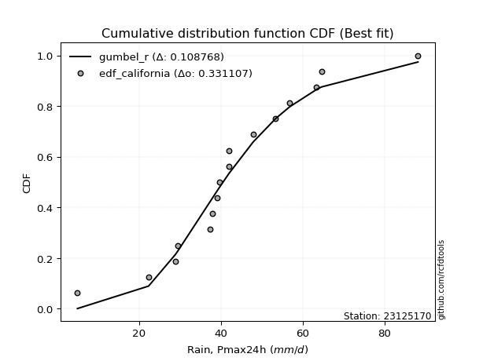</img>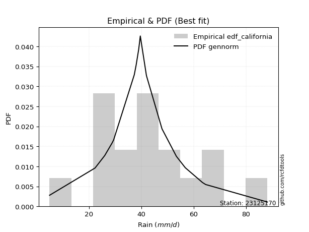</img>

</div>


### 2. Empirical - EDF Hazen (1930)

Hazen method for plotting positions is a formula used to estimate the empirical cumulative probability distribution of flood events or other hydrological data. This formula often results in biased estimations, particularly when extrapolating to extreme events (high return periods).

<div align="center">


$P=(m-0.5)/n$


</div>


**2.1. Empirical values**

<div align="center">

|                | 0                    | 1                   | 2                   | 3                   | 4                  | 5                  | 6                   | 7                  | 8         | 9                  | 10                 | 11                 | 12                 | 13                 | 14                 | 15                 | 16                 |
|:---------------|:---------------------|:--------------------|:--------------------|:--------------------|:-------------------|:-------------------|:--------------------|:-------------------|:----------|:-------------------|:-------------------|:-------------------|:-------------------|:-------------------|:-------------------|:-------------------|:-------------------|
| date           | 2022                 | 2025                | 2010                | 2015                | 2021               | 2016               | 2017                | 2005               | 2008      | 2020               | 2018               | 2009               | 2006               | 2012               | 2014               | 2013               | 2024               |
| x              | 4.9                  | 16.0                | 22.3                | 28.8                | 29.4               | 37.3               | 38.0                | 39.0               | 39.6      | 41.9               | 42.0               | 47.9               | 53.4               | 56.8               | 63.4               | 64.6               | 88.2               |
| m              | 1                    | 2                   | 3                   | 4                   | 5                  | 6                  | 7                   | 8                  | 9         | 10                 | 11                 | 12                 | 13                 | 14                 | 15                 | 16                 | 17                 |
| empirical_dist | edf_hazen            | edf_hazen           | edf_hazen           | edf_hazen           | edf_hazen          | edf_hazen          | edf_hazen           | edf_hazen          | edf_hazen | edf_hazen          | edf_hazen          | edf_hazen          | edf_hazen          | edf_hazen          | edf_hazen          | edf_hazen          | edf_hazen          |
| empirical      | 0.029411764705882353 | 0.08823529411764706 | 0.14705882352941177 | 0.20588235294117646 | 0.2647058823529412 | 0.3235294117647059 | 0.38235294117647056 | 0.4411764705882353 | 0.5       | 0.5588235294117647 | 0.6176470588235294 | 0.6764705882352942 | 0.7352941176470589 | 0.7941176470588235 | 0.8529411764705882 | 0.9117647058823529 | 0.9705882352941176 |
| empirical_tr   | 1.0303030303030303   | 1.096774193548387   | 1.1724137931034484  | 1.259259259259259   | 1.3599999999999999 | 1.4782608695652173 | 1.619047619047619   | 1.7894736842105263 | 2.0       | 2.2666666666666666 | 2.6153846153846154 | 3.0909090909090913 | 3.7777777777777786 | 4.857142857142856  | 6.799999999999999  | 11.33333333333333  | 33.99999999999999  |

</div>


**2.2. Kolmogorov-Smirnov fit test (sorted by Δ)**


<div align="center">

|                | 0                   | 1                   | 2                   | 3                  | 4                   | 5                  | 6                   | 7                   | 8                   | 9                   | 10                  | 11                  | 12                  | 13                 | 14                  | 15                 | 16                  | 17                 | 18                  | 19                 | 20                  | 21                  | 22                  | 23                  | 24                  | 25                  | 26                  | 27                  | 28                 | 29                  | 30                  | 31                 | 32                  | 33                  | 34                 | 35                  | 36                 | 37                  | 38                    | 39                 | 40                  | 41                  | 42                  | 43                  | 44                  | 45                  | 46                 | 47                  | 48                 | 49                 | 50                  | 51                  | 52                  | 53                  | 54                 | 55                  | 56                  | 57                  | 58                 | 59                  | 60                  | 61                  | 62                  | 63                  | 64                 | 65                  | 66                 | 67                  | 68                  | 69                  | 70                  | 71                  | 72                  | 73                 | 74                 | 75                 | 76                  | 77                  | 78                 | 79                 | 80                 | 81                  | 82                  | 83                  | 84                 | 85                 | 86                 | 87                 | 88                 | 89                 |
|:---------------|:--------------------|:--------------------|:--------------------|:-------------------|:--------------------|:-------------------|:--------------------|:--------------------|:--------------------|:--------------------|:--------------------|:--------------------|:--------------------|:-------------------|:--------------------|:-------------------|:--------------------|:-------------------|:--------------------|:-------------------|:--------------------|:--------------------|:--------------------|:--------------------|:--------------------|:--------------------|:--------------------|:--------------------|:-------------------|:--------------------|:--------------------|:-------------------|:--------------------|:--------------------|:-------------------|:--------------------|:-------------------|:--------------------|:----------------------|:-------------------|:--------------------|:--------------------|:--------------------|:--------------------|:--------------------|:--------------------|:-------------------|:--------------------|:-------------------|:-------------------|:--------------------|:--------------------|:--------------------|:--------------------|:-------------------|:--------------------|:--------------------|:--------------------|:-------------------|:--------------------|:--------------------|:--------------------|:--------------------|:--------------------|:-------------------|:--------------------|:-------------------|:--------------------|:--------------------|:--------------------|:--------------------|:--------------------|:--------------------|:-------------------|:-------------------|:-------------------|:--------------------|:--------------------|:-------------------|:-------------------|:-------------------|:--------------------|:--------------------|:--------------------|:-------------------|:-------------------|:-------------------|:-------------------|:-------------------|:-------------------|
| station        | 23125170            | 23125170            | 23125170            | 23125170           | 23125170            | 23125170           | 23125170            | 23125170            | 23125170            | 23125170            | 23125170            | 23125170            | 23125170            | 23125170           | 23125170            | 23125170           | 23125170            | 23125170           | 23125170            | 23125170           | 23125170            | 23125170            | 23125170            | 23125170            | 23125170            | 23125170            | 23125170            | 23125170            | 23125170           | 23125170            | 23125170            | 23125170           | 23125170            | 23125170            | 23125170           | 23125170            | 23125170           | 23125170            | 23125170              | 23125170           | 23125170            | 23125170            | 23125170            | 23125170            | 23125170            | 23125170            | 23125170           | 23125170            | 23125170           | 23125170           | 23125170            | 23125170            | 23125170            | 23125170            | 23125170           | 23125170            | 23125170            | 23125170            | 23125170           | 23125170            | 23125170            | 23125170            | 23125170            | 23125170            | 23125170           | 23125170            | 23125170           | 23125170            | 23125170            | 23125170            | 23125170            | 23125170            | 23125170            | 23125170           | 23125170           | 23125170           | 23125170            | 23125170            | 23125170           | 23125170           | 23125170           | 23125170            | 23125170            | 23125170            | 23125170           | 23125170           | 23125170           | 23125170           | 23125170           | 23125170           |
| empirical_dist | edf_hazen           | edf_hazen           | edf_hazen           | edf_hazen          | edf_hazen           | edf_hazen          | edf_hazen           | edf_hazen           | edf_hazen           | edf_hazen           | edf_hazen           | edf_hazen           | edf_hazen           | edf_hazen          | edf_hazen           | edf_hazen          | edf_hazen           | edf_hazen          | edf_hazen           | edf_hazen          | edf_hazen           | edf_hazen           | edf_hazen           | edf_hazen           | edf_hazen           | edf_hazen           | edf_hazen           | edf_hazen           | edf_hazen          | edf_hazen           | edf_hazen           | edf_hazen          | edf_hazen           | edf_hazen           | edf_hazen          | edf_hazen           | edf_hazen          | edf_hazen           | edf_hazen             | edf_hazen          | edf_hazen           | edf_hazen           | edf_hazen           | edf_hazen           | edf_hazen           | edf_hazen           | edf_hazen          | edf_hazen           | edf_hazen          | edf_hazen          | edf_hazen           | edf_hazen           | edf_hazen           | edf_hazen           | edf_hazen          | edf_hazen           | edf_hazen           | edf_hazen           | edf_hazen          | edf_hazen           | edf_hazen           | edf_hazen           | edf_hazen           | edf_hazen           | edf_hazen          | edf_hazen           | edf_hazen          | edf_hazen           | edf_hazen           | edf_hazen           | edf_hazen           | edf_hazen           | edf_hazen           | edf_hazen          | edf_hazen          | edf_hazen          | edf_hazen           | edf_hazen           | edf_hazen          | edf_hazen          | edf_hazen          | edf_hazen           | edf_hazen           | edf_hazen           | edf_hazen          | edf_hazen          | edf_hazen          | edf_hazen          | edf_hazen          | edf_hazen          |
| p_dist         | laplace_asymmetric  | fisk                | genlogistic         | logjohnsonsu       | johnsonsu           | nct                | nakagami            | mielke              | exponnorm           | f                   | chi2                | betaprime           | gamma               | erlang             | rice                | logt               | pearson3            | weibull_min        | loggenlogistic      | invgauss           | truncnorm           | invgamma            | t                   | logmielke           | logloggamma         | maxwell             | laplace             | hypsecant           | logistic           | norm                | crystalball         | logweibull_min     | lognakagami         | rayleigh            | loggompertz        | loggumbel_l         | logpearson3        | logfisk             | loglaplace_asymmetric | invweibull         | gumbel_r            | ncf                 | kstwobign           | halfnorm            | moyal               | halflogistic        | gumbel_l           | logf                | logfatiguelife     | logexponnorm       | lognorm             | lognorm             | logcrystalball      | loglognorm          | logrice            | lognct              | loglogistic         | loghypsecant        | logbetaprime       | logchi2             | loggamma            | loggamma            | logerlang           | loginvgamma         | loglaplace         | loginvweibull       | gibrat             | loginvgauss         | logalpha            | wald                | logmaxwell          | logncf              | lograyleigh         | logtruncnorm       | loggumbel_r        | expon              | loghalfnorm         | genexpon            | logkstwobign       | logmoyal           | loghalflogistic    | loggenexpon         | alpha               | logwald             | logexpon           | loggibrat          | pareto             | logpareto          | fatiguelife        | gompertz           |
| delta          | 0.07365930029631751 | 0.09230227903843369 | 0.09435047210118869 | 0.0972833852910594 | 0.09757390489913853 | 0.0986750345979916 | 0.09935263528932992 | 0.09969217346809622 | 0.10022752945107827 | 0.10157774159492511 | 0.10157862209005597 | 0.10157877883650418 | 0.10158071696709498 | 0.1015807356521568 | 0.10229213207460408 | 0.1031479717337529 | 0.10323526388475512 | 0.1062701609452818 | 0.10849601204762577 | 0.1102770964316575 | 0.11144433481891614 | 0.11286126923006157 | 0.11346249669756225 | 0.11355933978713101 | 0.11368098537790794 | 0.11482821857520153 | 0.11656902298192429 | 0.11688395014532094 | 0.1169549955848651 | 0.11703818584410997 | 0.11703820327921466 | 0.1219363785753253 | 0.12264793708556843 | 0.12711030592643996 | 0.1275039471664144 | 0.12756266449434855 | 0.1293751766455563 | 0.13380411058789415 | 0.14009438125817159   | 0.1404072651505367 | 0.14126792333825633 | 0.14596601969175266 | 0.15605637905959086 | 0.16193108752916058 | 0.16445734951705043 | 0.17804534090212804 | 0.1873959313608915 | 0.19632823764742985 | 0.19692709970326   | 0.1970191846362706 | 0.19702141852714533 | 0.19702141852714533 | 0.19702145046036063 | 0.19702147404414955 | 0.1970268804538367 | 0.19724053280920267 | 0.19982262159846037 | 0.20221053790774518 | 0.2041917687719242 | 0.20457365098083896 | 0.20553598997636596 | 0.20553598997636596 | 0.20663237704195175 | 0.20829561337979802 | 0.2116158098929543 | 0.22117719890087012 | 0.2233250559464574 | 0.22340983678589715 | 0.22426332530379062 | 0.22736052028177905 | 0.22913553492225308 | 0.22957611243956938 | 0.23967288756231214 | 0.2604347883470141 | 0.2677017215152276 | 0.269306060309417  | 0.26933971301587284 | 0.26963456109883127 | 0.2702414789085316 | 0.2932908607010742 | 0.2954106909843946 | 0.31483781956690454 | 0.33433854413348646 | 0.36436077912232795 | 0.3847463769084417 | 0.390559656448555  | 0.5401647731710081 | 0.5538011627890492 | 0.6274698108558278 | 0.9024203080139106 |
| deltao         | 0.3260541228310003  | 0.3260541228310003  | 0.3260541228310003  | 0.3260541228310003 | 0.3260541228310003  | 0.3260541228310003 | 0.3260541228310003  | 0.3260541228310003  | 0.3260541228310003  | 0.3260541228310003  | 0.3260541228310003  | 0.3260541228310003  | 0.3260541228310003  | 0.3260541228310003 | 0.3260541228310003  | 0.3260541228310003 | 0.3260541228310003  | 0.3260541228310003 | 0.3260541228310003  | 0.3260541228310003 | 0.3260541228310003  | 0.3260541228310003  | 0.3260541228310003  | 0.3260541228310003  | 0.3260541228310003  | 0.3260541228310003  | 0.3260541228310003  | 0.3260541228310003  | 0.3260541228310003 | 0.3260541228310003  | 0.3260541228310003  | 0.3260541228310003 | 0.3260541228310003  | 0.3260541228310003  | 0.3260541228310003 | 0.3260541228310003  | 0.3260541228310003 | 0.3260541228310003  | 0.3260541228310003    | 0.3260541228310003 | 0.3260541228310003  | 0.3260541228310003  | 0.3260541228310003  | 0.3260541228310003  | 0.3260541228310003  | 0.3260541228310003  | 0.3260541228310003 | 0.3260541228310003  | 0.3260541228310003 | 0.3260541228310003 | 0.3260541228310003  | 0.3260541228310003  | 0.3260541228310003  | 0.3260541228310003  | 0.3260541228310003 | 0.3260541228310003  | 0.3260541228310003  | 0.3260541228310003  | 0.3260541228310003 | 0.3260541228310003  | 0.3260541228310003  | 0.3260541228310003  | 0.3260541228310003  | 0.3260541228310003  | 0.3260541228310003 | 0.3260541228310003  | 0.3260541228310003 | 0.3260541228310003  | 0.3260541228310003  | 0.3260541228310003  | 0.3260541228310003  | 0.3260541228310003  | 0.3260541228310003  | 0.3260541228310003 | 0.3260541228310003 | 0.3260541228310003 | 0.3260541228310003  | 0.3260541228310003  | 0.3260541228310003 | 0.3260541228310003 | 0.3260541228310003 | 0.3260541228310003  | 0.3260541228310003  | 0.3260541228310003  | 0.3260541228310003 | 0.3260541228310003 | 0.3260541228310003 | 0.3260541228310003 | 0.3260541228310003 | 0.3260541228310003 |
| eval           | Δo > Δ              | Δo > Δ              | Δo > Δ              | Δo > Δ             | Δo > Δ              | Δo > Δ             | Δo > Δ              | Δo > Δ              | Δo > Δ              | Δo > Δ              | Δo > Δ              | Δo > Δ              | Δo > Δ              | Δo > Δ             | Δo > Δ              | Δo > Δ             | Δo > Δ              | Δo > Δ             | Δo > Δ              | Δo > Δ             | Δo > Δ              | Δo > Δ              | Δo > Δ              | Δo > Δ              | Δo > Δ              | Δo > Δ              | Δo > Δ              | Δo > Δ              | Δo > Δ             | Δo > Δ              | Δo > Δ              | Δo > Δ             | Δo > Δ              | Δo > Δ              | Δo > Δ             | Δo > Δ              | Δo > Δ             | Δo > Δ              | Δo > Δ                | Δo > Δ             | Δo > Δ              | Δo > Δ              | Δo > Δ              | Δo > Δ              | Δo > Δ              | Δo > Δ              | Δo > Δ             | Δo > Δ              | Δo > Δ             | Δo > Δ             | Δo > Δ              | Δo > Δ              | Δo > Δ              | Δo > Δ              | Δo > Δ             | Δo > Δ              | Δo > Δ              | Δo > Δ              | Δo > Δ             | Δo > Δ              | Δo > Δ              | Δo > Δ              | Δo > Δ              | Δo > Δ              | Δo > Δ             | Δo > Δ              | Δo > Δ             | Δo > Δ              | Δo > Δ              | Δo > Δ              | Δo > Δ              | Δo > Δ              | Δo > Δ              | Δo > Δ             | Δo > Δ             | Δo > Δ             | Δo > Δ              | Δo > Δ              | Δo > Δ             | Δo > Δ             | Δo > Δ             | Δo > Δ              | Δo <= Δ             | Δo <= Δ             | Δo <= Δ            | Δo <= Δ            | Δo <= Δ            | Δo <= Δ            | Δo <= Δ            | Δo <= Δ            |
| fit            | 1                   | 1                   | 1                   | 1                  | 1                   | 1                  | 1                   | 1                   | 1                   | 1                   | 1                   | 1                   | 1                   | 1                  | 1                   | 1                  | 1                   | 1                  | 1                   | 1                  | 1                   | 1                   | 1                   | 1                   | 1                   | 1                   | 1                   | 1                   | 1                  | 1                   | 1                   | 1                  | 1                   | 1                   | 1                  | 1                   | 1                  | 1                   | 1                     | 1                  | 1                   | 1                   | 1                   | 1                   | 1                   | 1                   | 1                  | 1                   | 1                  | 1                  | 1                   | 1                   | 1                   | 1                   | 1                  | 1                   | 1                   | 1                   | 1                  | 1                   | 1                   | 1                   | 1                   | 1                   | 1                  | 1                   | 1                  | 1                   | 1                   | 1                   | 1                   | 1                   | 1                   | 1                  | 1                  | 1                  | 1                   | 1                   | 1                  | 1                  | 1                  | 1                   | 0                   | 0                   | 0                  | 0                  | 0                  | 0                  | 0                  | 0                  |
| n              | 17                  | 17                  | 17                  | 17                 | 17                  | 17                 | 17                  | 17                  | 17                  | 17                  | 17                  | 17                  | 17                  | 17                 | 17                  | 17                 | 17                  | 17                 | 17                  | 17                 | 17                  | 17                  | 17                  | 17                  | 17                  | 17                  | 17                  | 17                  | 17                 | 17                  | 17                  | 17                 | 17                  | 17                  | 17                 | 17                  | 17                 | 17                  | 17                    | 17                 | 17                  | 17                  | 17                  | 17                  | 17                  | 17                  | 17                 | 17                  | 17                 | 17                 | 17                  | 17                  | 17                  | 17                  | 17                 | 17                  | 17                  | 17                  | 17                 | 17                  | 17                  | 17                  | 17                  | 17                  | 17                 | 17                  | 17                 | 17                  | 17                  | 17                  | 17                  | 17                  | 17                  | 17                 | 17                 | 17                 | 17                  | 17                  | 17                 | 17                 | 17                 | 17                  | 17                  | 17                  | 17                 | 17                 | 17                 | 17                 | 17                 | 17                 |
| best_fit       | 1                   | 0                   | 0                   | 0                  | 0                   | 0                  | 0                   | 0                   | 0                   | 0                   | 0                   | 0                   | 0                   | 0                  | 0                   | 0                  | 0                   | 0                  | 0                   | 0                  | 0                   | 0                   | 0                   | 0                   | 0                   | 0                   | 0                   | 0                   | 0                  | 0                   | 0                   | 0                  | 0                   | 0                   | 0                  | 0                   | 0                  | 0                   | 0                     | 0                  | 0                   | 0                   | 0                   | 0                   | 0                   | 0                   | 0                  | 0                   | 0                  | 0                  | 0                   | 0                   | 0                   | 0                   | 0                  | 0                   | 0                   | 0                   | 0                  | 0                   | 0                   | 0                   | 0                   | 0                   | 0                  | 0                   | 0                  | 0                   | 0                   | 0                   | 0                   | 0                   | 0                   | 0                  | 0                  | 0                  | 0                   | 0                   | 0                  | 0                  | 0                  | 0                   | 0                   | 0                   | 0                  | 0                  | 0                  | 0                  | 0                  | 0                  |
| best_fit_sort  | 1                   | 2                   | 3                   | 4                  | 5                   | 6                  | 7                   | 8                   | 9                   | 10                  | 11                  | 12                  | 13                  | 14                 | 15                  | 16                 | 17                  | 18                 | 19                  | 20                 | 21                  | 22                  | 23                  | 24                  | 25                  | 26                  | 27                  | 28                  | 29                 | 30                  | 31                  | 32                 | 33                  | 34                  | 35                 | 36                  | 37                 | 38                  | 39                    | 40                 | 41                  | 42                  | 43                  | 44                  | 45                  | 46                  | 47                 | 48                  | 49                 | 50                 | 51                  | 52                  | 53                  | 54                  | 55                 | 56                  | 57                  | 58                  | 59                 | 60                  | 61                  | 62                  | 63                  | 64                  | 65                 | 66                  | 67                 | 68                  | 69                  | 70                  | 71                  | 72                  | 73                  | 74                 | 75                 | 76                 | 77                  | 78                  | 79                 | 80                 | 81                 | 82                  | 83                  | 84                  | 85                 | 86                 | 87                 | 88                 | 89                 | 90                 |

</div>


<div align="center">

</img>

</div>


**2.3. Best fit**

<div align="center">

|   id |   station | empirical_dist   | p_dist             |     delta |   deltao | eval   |   fit |   n |   best_fit |   best_fit_sort |
|-----:|----------:|:-----------------|:-------------------|----------:|---------:|:-------|------:|----:|-----------:|----------------:|
|    0 |  23125170 | edf_hazen        | laplace_asymmetric | 0.0736593 | 0.326054 | Δo > Δ |     1 |  17 |          1 |               1 |

</div>


<div align="center">

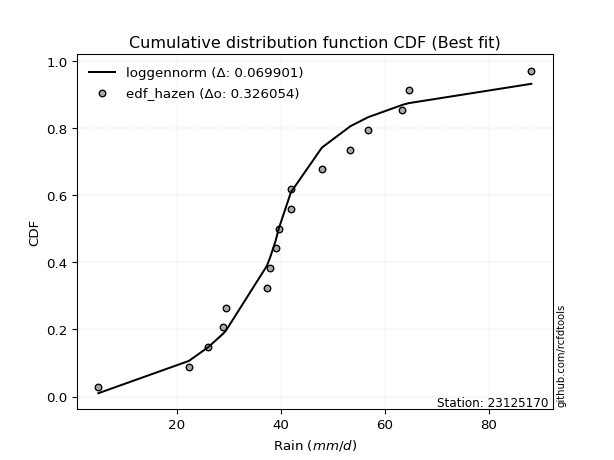</img>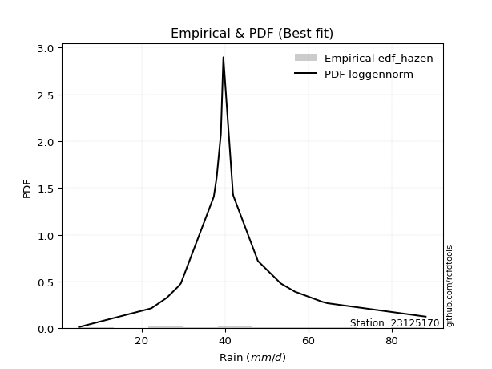</img>

</div>


### 3. Empirical - EDF Weibull (1939)

Weibull plotting position formula is an empirical method used to estimate the non-exceedance probability or plotting position for a set of observed data, is often recommended or widely used in practice, particularly in flood frequency analysis.

<div align="center">


$P=m/(n+1)$


</div>


**3.1. Empirical values**

<div align="center">

|                | 0                   | 1                  | 2                   | 3                  | 4                  | 5                  | 6                  | 7                  | 8           | 9                  | 10                 | 11                 | 12                 | 13                 | 14                 | 15                 | 16                 |
|:---------------|:--------------------|:-------------------|:--------------------|:-------------------|:-------------------|:-------------------|:-------------------|:-------------------|:------------|:-------------------|:-------------------|:-------------------|:-------------------|:-------------------|:-------------------|:-------------------|:-------------------|
| date           | 2022                | 2025               | 2010                | 2015               | 2021               | 2016               | 2017               | 2005               | 2008        | 2020               | 2018               | 2009               | 2006               | 2012               | 2014               | 2013               | 2024               |
| x              | 4.9                 | 16.0               | 22.3                | 28.8               | 29.4               | 37.3               | 38.0               | 39.0               | 39.6        | 41.9               | 42.0               | 47.9               | 53.4               | 56.8               | 63.4               | 64.6               | 88.2               |
| m              | 1                   | 2                  | 3                   | 4                  | 5                  | 6                  | 7                  | 8                  | 9           | 10                 | 11                 | 12                 | 13                 | 14                 | 15                 | 16                 | 17                 |
| empirical_dist | edf_weibull         | edf_weibull        | edf_weibull         | edf_weibull        | edf_weibull        | edf_weibull        | edf_weibull        | edf_weibull        | edf_weibull | edf_weibull        | edf_weibull        | edf_weibull        | edf_weibull        | edf_weibull        | edf_weibull        | edf_weibull        | edf_weibull        |
| empirical      | 0.05555555555555555 | 0.1111111111111111 | 0.16666666666666666 | 0.2222222222222222 | 0.2777777777777778 | 0.3333333333333333 | 0.3888888888888889 | 0.4444444444444444 | 0.5         | 0.5555555555555556 | 0.6111111111111112 | 0.6666666666666666 | 0.7222222222222222 | 0.7777777777777778 | 0.8333333333333334 | 0.8888888888888888 | 0.9444444444444444 |
| empirical_tr   | 1.0588235294117647  | 1.125              | 1.2                 | 1.2857142857142856 | 1.3846153846153846 | 1.4999999999999998 | 1.6363636363636362 | 1.7999999999999998 | 2.0         | 2.25               | 2.5714285714285716 | 2.9999999999999996 | 3.5999999999999996 | 4.5                | 6.000000000000002  | 8.999999999999996  | 17.999999999999993 |

</div>


**3.2. Kolmogorov-Smirnov fit test (sorted by Δ)**


<div align="center">

|                | 0                   | 1                   | 2                   | 3                   | 4                   | 5                   | 6                   | 7                   | 8                   | 9                   | 10                  | 11                  | 12                  | 13                  | 14                 | 15                  | 16                  | 17                  | 18                  | 19                  | 20                  | 21                  | 22                  | 23                  | 24                  | 25                  | 26                  | 27                  | 28                  | 29                  | 30                  | 31                  | 32                  | 33                  | 34                  | 35                  | 36                  | 37                  | 38                    | 39                  | 40                 | 41                  | 42                  | 43                  | 44                  | 45                  | 46                  | 47                  | 48                  | 49                 | 50                  | 51                  | 52                 | 53                  | 54                 | 55                  | 56                  | 57                  | 58                  | 59                  | 60                  | 61                  | 62                  | 63                 | 64                 | 65                  | 66                 | 67                  | 68                 | 69                  | 70                  | 71                  | 72                  | 73                 | 74                  | 75                 | 76                  | 77                  | 78                 | 79                  | 80                 | 81                 | 82                 | 83                  | 84                 | 85                 | 86                 | 87                 | 88                 | 89                 |
|:---------------|:--------------------|:--------------------|:--------------------|:--------------------|:--------------------|:--------------------|:--------------------|:--------------------|:--------------------|:--------------------|:--------------------|:--------------------|:--------------------|:--------------------|:-------------------|:--------------------|:--------------------|:--------------------|:--------------------|:--------------------|:--------------------|:--------------------|:--------------------|:--------------------|:--------------------|:--------------------|:--------------------|:--------------------|:--------------------|:--------------------|:--------------------|:--------------------|:--------------------|:--------------------|:--------------------|:--------------------|:--------------------|:--------------------|:----------------------|:--------------------|:-------------------|:--------------------|:--------------------|:--------------------|:--------------------|:--------------------|:--------------------|:--------------------|:--------------------|:-------------------|:--------------------|:--------------------|:-------------------|:--------------------|:-------------------|:--------------------|:--------------------|:--------------------|:--------------------|:--------------------|:--------------------|:--------------------|:--------------------|:-------------------|:-------------------|:--------------------|:-------------------|:--------------------|:-------------------|:--------------------|:--------------------|:--------------------|:--------------------|:-------------------|:--------------------|:-------------------|:--------------------|:--------------------|:-------------------|:--------------------|:-------------------|:-------------------|:-------------------|:--------------------|:-------------------|:-------------------|:-------------------|:-------------------|:-------------------|:-------------------|
| station        | 23125170            | 23125170            | 23125170            | 23125170            | 23125170            | 23125170            | 23125170            | 23125170            | 23125170            | 23125170            | 23125170            | 23125170            | 23125170            | 23125170            | 23125170           | 23125170            | 23125170            | 23125170            | 23125170            | 23125170            | 23125170            | 23125170            | 23125170            | 23125170            | 23125170            | 23125170            | 23125170            | 23125170            | 23125170            | 23125170            | 23125170            | 23125170            | 23125170            | 23125170            | 23125170            | 23125170            | 23125170            | 23125170            | 23125170              | 23125170            | 23125170           | 23125170            | 23125170            | 23125170            | 23125170            | 23125170            | 23125170            | 23125170            | 23125170            | 23125170           | 23125170            | 23125170            | 23125170           | 23125170            | 23125170           | 23125170            | 23125170            | 23125170            | 23125170            | 23125170            | 23125170            | 23125170            | 23125170            | 23125170           | 23125170           | 23125170            | 23125170           | 23125170            | 23125170           | 23125170            | 23125170            | 23125170            | 23125170            | 23125170           | 23125170            | 23125170           | 23125170            | 23125170            | 23125170           | 23125170            | 23125170           | 23125170           | 23125170           | 23125170            | 23125170           | 23125170           | 23125170           | 23125170           | 23125170           | 23125170           |
| empirical_dist | edf_weibull         | edf_weibull         | edf_weibull         | edf_weibull         | edf_weibull         | edf_weibull         | edf_weibull         | edf_weibull         | edf_weibull         | edf_weibull         | edf_weibull         | edf_weibull         | edf_weibull         | edf_weibull         | edf_weibull        | edf_weibull         | edf_weibull         | edf_weibull         | edf_weibull         | edf_weibull         | edf_weibull         | edf_weibull         | edf_weibull         | edf_weibull         | edf_weibull         | edf_weibull         | edf_weibull         | edf_weibull         | edf_weibull         | edf_weibull         | edf_weibull         | edf_weibull         | edf_weibull         | edf_weibull         | edf_weibull         | edf_weibull         | edf_weibull         | edf_weibull         | edf_weibull           | edf_weibull         | edf_weibull        | edf_weibull         | edf_weibull         | edf_weibull         | edf_weibull         | edf_weibull         | edf_weibull         | edf_weibull         | edf_weibull         | edf_weibull        | edf_weibull         | edf_weibull         | edf_weibull        | edf_weibull         | edf_weibull        | edf_weibull         | edf_weibull         | edf_weibull         | edf_weibull         | edf_weibull         | edf_weibull         | edf_weibull         | edf_weibull         | edf_weibull        | edf_weibull        | edf_weibull         | edf_weibull        | edf_weibull         | edf_weibull        | edf_weibull         | edf_weibull         | edf_weibull         | edf_weibull         | edf_weibull        | edf_weibull         | edf_weibull        | edf_weibull         | edf_weibull         | edf_weibull        | edf_weibull         | edf_weibull        | edf_weibull        | edf_weibull        | edf_weibull         | edf_weibull        | edf_weibull        | edf_weibull        | edf_weibull        | edf_weibull        | edf_weibull        |
| p_dist         | laplace_asymmetric  | fisk                | genlogistic         | johnsonsu           | nct                 | mielke              | exponnorm           | logjohnsonsu        | f                   | chi2                | betaprime           | gamma               | erlang              | pearson3            | rice               | weibull_min         | logt                | loggenlogistic      | invgauss            | truncnorm           | nakagami            | invgamma            | logmielke           | logloggamma         | maxwell             | t                   | laplace             | hypsecant           | logistic            | norm                | crystalball         | logweibull_min      | lognakagami         | rayleigh            | loggompertz         | loggumbel_l         | logpearson3         | logfisk             | loglaplace_asymmetric | invweibull          | gumbel_r           | ncf                 | kstwobign           | halfnorm            | moyal               | halflogistic        | gumbel_l            | logf                | logfatiguelife      | logexponnorm       | lognorm             | lognorm             | logcrystalball     | loglognorm          | logrice            | lognct              | loglogistic         | loghypsecant        | logbetaprime        | logchi2             | loggamma            | loggamma            | logerlang           | loginvgamma        | loglaplace         | loginvweibull       | gibrat             | loginvgauss         | logalpha           | wald                | logmaxwell          | logncf              | lograyleigh         | logtruncnorm       | expon               | genexpon           | logkstwobign        | loggumbel_r         | loghalfnorm        | logmoyal            | loghalflogistic    | loggenexpon        | alpha              | logwald             | logexpon           | loggibrat          | pareto             | logpareto          | fatiguelife        | gompertz           |
| delta          | 0.06815923750492667 | 0.08494727206313113 | 0.08531116706142616 | 0.08776998333051111 | 0.08887111302936418 | 0.08988825189946881 | 0.09042360788245085 | 0.09074743757864112 | 0.09177382002629769 | 0.09177470052142855 | 0.09177485726787676 | 0.09177679539846756 | 0.09177681408352939 | 0.09343134231612771 | 0.0957561843621858 | 0.09646623937665438 | 0.09661202402133462 | 0.09869209047899835 | 0.10047317486303009 | 0.10164041325028872 | 0.10189616197592435 | 0.10305734766143415 | 0.10375541821850359 | 0.10387706380928052 | 0.10502429700657412 | 0.10692654898514398 | 0.11003307526950601 | 0.11034800243290266 | 0.11041904787244683 | 0.11050223813169169 | 0.11050225556679638 | 0.11213245700669788 | 0.11284401551694101 | 0.11730638435781254 | 0.11770002559778697 | 0.11775874292572114 | 0.12283922893313803 | 0.12400018901926674 | 0.13029045968954417   | 0.13060334358190928 | 0.1314640017696289 | 0.13616209812312524 | 0.14625245749096344 | 0.15212716596053316 | 0.15465342794842302 | 0.16824141933350062 | 0.18085998364847322 | 0.18652431607880243 | 0.18712317813463258 | 0.1872152630676432 | 0.18721749695851791 | 0.18721749695851791 | 0.1872175288917332 | 0.18721755247552213 | 0.1872229588852093 | 0.18743661124057526 | 0.19001870002983295 | 0.19240661633911776 | 0.19438784720329677 | 0.19476972941221155 | 0.19573206840773855 | 0.19573206840773855 | 0.19682845547332434 | 0.1984916918111706 | 0.2018118883243269 | 0.20483732961982437 | 0.21352113437783   | 0.21360591521726974 | 0.2144594037351632 | 0.21755659871315164 | 0.21933161335362567 | 0.21977219087094196 | 0.22986896599368473 | 0.2506308667783867 | 0.25296619102837126 | 0.2532946918177855 | 0.25390160962748587 | 0.25789779994660017 | 0.2595357914472454 | 0.28348693913244677 | 0.2856067694157672 | 0.2984979502858588 | 0.3179986748524407 | 0.35455685755370053 | 0.3658745805930609 | 0.3807557348799276 | 0.517288956177544  | 0.5309253457955851 | 0.6045939938623637 | 0.8795444910204464 |
| deltao         | 0.3260541228310003  | 0.3260541228310003  | 0.3260541228310003  | 0.3260541228310003  | 0.3260541228310003  | 0.3260541228310003  | 0.3260541228310003  | 0.3260541228310003  | 0.3260541228310003  | 0.3260541228310003  | 0.3260541228310003  | 0.3260541228310003  | 0.3260541228310003  | 0.3260541228310003  | 0.3260541228310003 | 0.3260541228310003  | 0.3260541228310003  | 0.3260541228310003  | 0.3260541228310003  | 0.3260541228310003  | 0.3260541228310003  | 0.3260541228310003  | 0.3260541228310003  | 0.3260541228310003  | 0.3260541228310003  | 0.3260541228310003  | 0.3260541228310003  | 0.3260541228310003  | 0.3260541228310003  | 0.3260541228310003  | 0.3260541228310003  | 0.3260541228310003  | 0.3260541228310003  | 0.3260541228310003  | 0.3260541228310003  | 0.3260541228310003  | 0.3260541228310003  | 0.3260541228310003  | 0.3260541228310003    | 0.3260541228310003  | 0.3260541228310003 | 0.3260541228310003  | 0.3260541228310003  | 0.3260541228310003  | 0.3260541228310003  | 0.3260541228310003  | 0.3260541228310003  | 0.3260541228310003  | 0.3260541228310003  | 0.3260541228310003 | 0.3260541228310003  | 0.3260541228310003  | 0.3260541228310003 | 0.3260541228310003  | 0.3260541228310003 | 0.3260541228310003  | 0.3260541228310003  | 0.3260541228310003  | 0.3260541228310003  | 0.3260541228310003  | 0.3260541228310003  | 0.3260541228310003  | 0.3260541228310003  | 0.3260541228310003 | 0.3260541228310003 | 0.3260541228310003  | 0.3260541228310003 | 0.3260541228310003  | 0.3260541228310003 | 0.3260541228310003  | 0.3260541228310003  | 0.3260541228310003  | 0.3260541228310003  | 0.3260541228310003 | 0.3260541228310003  | 0.3260541228310003 | 0.3260541228310003  | 0.3260541228310003  | 0.3260541228310003 | 0.3260541228310003  | 0.3260541228310003 | 0.3260541228310003 | 0.3260541228310003 | 0.3260541228310003  | 0.3260541228310003 | 0.3260541228310003 | 0.3260541228310003 | 0.3260541228310003 | 0.3260541228310003 | 0.3260541228310003 |
| eval           | Δo > Δ              | Δo > Δ              | Δo > Δ              | Δo > Δ              | Δo > Δ              | Δo > Δ              | Δo > Δ              | Δo > Δ              | Δo > Δ              | Δo > Δ              | Δo > Δ              | Δo > Δ              | Δo > Δ              | Δo > Δ              | Δo > Δ             | Δo > Δ              | Δo > Δ              | Δo > Δ              | Δo > Δ              | Δo > Δ              | Δo > Δ              | Δo > Δ              | Δo > Δ              | Δo > Δ              | Δo > Δ              | Δo > Δ              | Δo > Δ              | Δo > Δ              | Δo > Δ              | Δo > Δ              | Δo > Δ              | Δo > Δ              | Δo > Δ              | Δo > Δ              | Δo > Δ              | Δo > Δ              | Δo > Δ              | Δo > Δ              | Δo > Δ                | Δo > Δ              | Δo > Δ             | Δo > Δ              | Δo > Δ              | Δo > Δ              | Δo > Δ              | Δo > Δ              | Δo > Δ              | Δo > Δ              | Δo > Δ              | Δo > Δ             | Δo > Δ              | Δo > Δ              | Δo > Δ             | Δo > Δ              | Δo > Δ             | Δo > Δ              | Δo > Δ              | Δo > Δ              | Δo > Δ              | Δo > Δ              | Δo > Δ              | Δo > Δ              | Δo > Δ              | Δo > Δ             | Δo > Δ             | Δo > Δ              | Δo > Δ             | Δo > Δ              | Δo > Δ             | Δo > Δ              | Δo > Δ              | Δo > Δ              | Δo > Δ              | Δo > Δ             | Δo > Δ              | Δo > Δ             | Δo > Δ              | Δo > Δ              | Δo > Δ             | Δo > Δ              | Δo > Δ             | Δo > Δ             | Δo > Δ             | Δo <= Δ             | Δo <= Δ            | Δo <= Δ            | Δo <= Δ            | Δo <= Δ            | Δo <= Δ            | Δo <= Δ            |
| fit            | 1                   | 1                   | 1                   | 1                   | 1                   | 1                   | 1                   | 1                   | 1                   | 1                   | 1                   | 1                   | 1                   | 1                   | 1                  | 1                   | 1                   | 1                   | 1                   | 1                   | 1                   | 1                   | 1                   | 1                   | 1                   | 1                   | 1                   | 1                   | 1                   | 1                   | 1                   | 1                   | 1                   | 1                   | 1                   | 1                   | 1                   | 1                   | 1                     | 1                   | 1                  | 1                   | 1                   | 1                   | 1                   | 1                   | 1                   | 1                   | 1                   | 1                  | 1                   | 1                   | 1                  | 1                   | 1                  | 1                   | 1                   | 1                   | 1                   | 1                   | 1                   | 1                   | 1                   | 1                  | 1                  | 1                   | 1                  | 1                   | 1                  | 1                   | 1                   | 1                   | 1                   | 1                  | 1                   | 1                  | 1                   | 1                   | 1                  | 1                   | 1                  | 1                  | 1                  | 0                   | 0                  | 0                  | 0                  | 0                  | 0                  | 0                  |
| n              | 17                  | 17                  | 17                  | 17                  | 17                  | 17                  | 17                  | 17                  | 17                  | 17                  | 17                  | 17                  | 17                  | 17                  | 17                 | 17                  | 17                  | 17                  | 17                  | 17                  | 17                  | 17                  | 17                  | 17                  | 17                  | 17                  | 17                  | 17                  | 17                  | 17                  | 17                  | 17                  | 17                  | 17                  | 17                  | 17                  | 17                  | 17                  | 17                    | 17                  | 17                 | 17                  | 17                  | 17                  | 17                  | 17                  | 17                  | 17                  | 17                  | 17                 | 17                  | 17                  | 17                 | 17                  | 17                 | 17                  | 17                  | 17                  | 17                  | 17                  | 17                  | 17                  | 17                  | 17                 | 17                 | 17                  | 17                 | 17                  | 17                 | 17                  | 17                  | 17                  | 17                  | 17                 | 17                  | 17                 | 17                  | 17                  | 17                 | 17                  | 17                 | 17                 | 17                 | 17                  | 17                 | 17                 | 17                 | 17                 | 17                 | 17                 |
| best_fit       | 1                   | 0                   | 0                   | 0                   | 0                   | 0                   | 0                   | 0                   | 0                   | 0                   | 0                   | 0                   | 0                   | 0                   | 0                  | 0                   | 0                   | 0                   | 0                   | 0                   | 0                   | 0                   | 0                   | 0                   | 0                   | 0                   | 0                   | 0                   | 0                   | 0                   | 0                   | 0                   | 0                   | 0                   | 0                   | 0                   | 0                   | 0                   | 0                     | 0                   | 0                  | 0                   | 0                   | 0                   | 0                   | 0                   | 0                   | 0                   | 0                   | 0                  | 0                   | 0                   | 0                  | 0                   | 0                  | 0                   | 0                   | 0                   | 0                   | 0                   | 0                   | 0                   | 0                   | 0                  | 0                  | 0                   | 0                  | 0                   | 0                  | 0                   | 0                   | 0                   | 0                   | 0                  | 0                   | 0                  | 0                   | 0                   | 0                  | 0                   | 0                  | 0                  | 0                  | 0                   | 0                  | 0                  | 0                  | 0                  | 0                  | 0                  |
| best_fit_sort  | 1                   | 2                   | 3                   | 4                   | 5                   | 6                   | 7                   | 8                   | 9                   | 10                  | 11                  | 12                  | 13                  | 14                  | 15                 | 16                  | 17                  | 18                  | 19                  | 20                  | 21                  | 22                  | 23                  | 24                  | 25                  | 26                  | 27                  | 28                  | 29                  | 30                  | 31                  | 32                  | 33                  | 34                  | 35                  | 36                  | 37                  | 38                  | 39                    | 40                  | 41                 | 42                  | 43                  | 44                  | 45                  | 46                  | 47                  | 48                  | 49                  | 50                 | 51                  | 52                  | 53                 | 54                  | 55                 | 56                  | 57                  | 58                  | 59                  | 60                  | 61                  | 62                  | 63                  | 64                 | 65                 | 66                  | 67                 | 68                  | 69                 | 70                  | 71                  | 72                  | 73                  | 74                 | 75                  | 76                 | 77                  | 78                  | 79                 | 80                  | 81                 | 82                 | 83                 | 84                  | 85                 | 86                 | 87                 | 88                 | 89                 | 90                 |

</div>


<div align="center">

</img>

</div>


**3.3. Best fit**

<div align="center">

|   id |   station | empirical_dist   | p_dist             |     delta |   deltao | eval   |   fit |   n |   best_fit |   best_fit_sort |
|-----:|----------:|:-----------------|:-------------------|----------:|---------:|:-------|------:|----:|-----------:|----------------:|
|    0 |  23125170 | edf_weibull      | laplace_asymmetric | 0.0681592 | 0.326054 | Δo > Δ |     1 |  17 |          1 |               1 |

</div>


<div align="center">

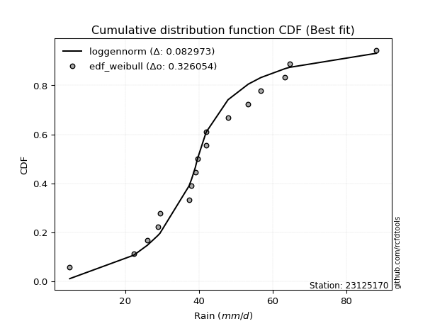</img>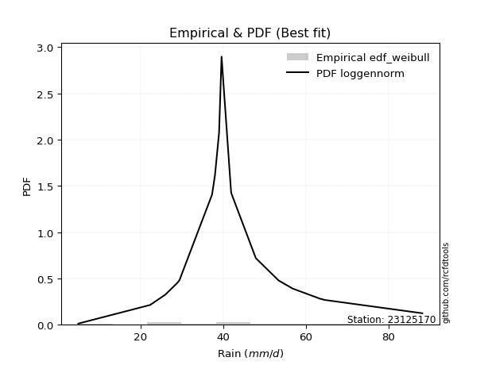</img>

</div>


### 4. Empirical - EDF Beard (1943)

The Beard formula (or Beard´s plotting position formula) in hydrology is used to estimate the empirical non-exceedance probability _(P)_ of a flood event (or other extreme hydrological data point) within a given dataset.

<div align="center">


$P=(m-0.31)/(n+0.38)$


</div>


**4.1. Empirical values**

<div align="center">

|                | 0                   | 1                   | 2                   | 3                   | 4                  | 5                   | 6                   | 7                   | 8         | 9                  | 10                 | 11                 | 12                 | 13                 | 14                 | 15                 | 16                 |
|:---------------|:--------------------|:--------------------|:--------------------|:--------------------|:-------------------|:--------------------|:--------------------|:--------------------|:----------|:-------------------|:-------------------|:-------------------|:-------------------|:-------------------|:-------------------|:-------------------|:-------------------|
| date           | 2022                | 2025                | 2010                | 2015                | 2021               | 2016                | 2017                | 2005                | 2008      | 2020               | 2018               | 2009               | 2006               | 2012               | 2014               | 2013               | 2024               |
| x              | 4.9                 | 16.0                | 22.3                | 28.8                | 29.4               | 37.3                | 38.0                | 39.0                | 39.6      | 41.9               | 42.0               | 47.9               | 53.4               | 56.8               | 63.4               | 64.6               | 88.2               |
| m              | 1                   | 2                   | 3                   | 4                   | 5                  | 6                   | 7                   | 8                   | 9         | 10                 | 11                 | 12                 | 13                 | 14                 | 15                 | 16                 | 17                 |
| empirical_dist | edf_beard           | edf_beard           | edf_beard           | edf_beard           | edf_beard          | edf_beard           | edf_beard           | edf_beard           | edf_beard | edf_beard          | edf_beard          | edf_beard          | edf_beard          | edf_beard          | edf_beard          | edf_beard          | edf_beard          |
| empirical      | 0.03970080552359033 | 0.09723820483314155 | 0.15477560414269276 | 0.21231300345224396 | 0.2698504027617952 | 0.32738780207134643 | 0.38492520138089764 | 0.44246260069044885 | 0.5       | 0.5575373993095513 | 0.6150747986191024 | 0.6726121979286537 | 0.7301495972382048 | 0.7876869965477561 | 0.8452243958573072 | 0.9027617951668585 | 0.9602991944764098 |
| empirical_tr   | 1.0413421210305571  | 1.1077119184193753  | 1.1831177671885638  | 1.2695398100803508  | 1.3695823483057525 | 1.4867408041060737  | 1.6258185219831622  | 1.7936016511867907  | 2.0       | 2.2600780234070226 | 2.5979073243647233 | 3.0544815465729354 | 3.7057569296375266 | 4.710027100271004  | 6.460966542750929  | 10.284023668639058 | 25.188405797101513 |

</div>


**4.2. Kolmogorov-Smirnov fit test (sorted by Δ)**


<div align="center">

|                | 0                   | 1                   | 2                   | 3                  | 4                   | 5                   | 6                   | 7                   | 8                   | 9                   | 10                  | 11                  | 12                  | 13                  | 14                  | 15                  | 16                  | 17                  | 18                  | 19                  | 20                 | 21                  | 22                  | 23                 | 24                  | 25                 | 26                  | 27                  | 28                  | 29                  | 30                  | 31                  | 32                  | 33                  | 34                  | 35                  | 36                 | 37                  | 38                    | 39                  | 40                 | 41                  | 42                  | 43                  | 44                 | 45                 | 46                  | 47                 | 48                  | 49                  | 50                 | 51                 | 52                 | 53                 | 54                  | 55                  | 56                  | 57                  | 58                  | 59                  | 60                  | 61                  | 62                  | 63                  | 64                  | 65                  | 66                  | 67                  | 68                  | 69                  | 70                  | 71                  | 72                 | 73                 | 74                 | 75                  | 76                 | 77                  | 78                 | 79                  | 80                  | 81                  | 82                  | 83                 | 84                  | 85                  | 86                 | 87                 | 88                 | 89                 |
|:---------------|:--------------------|:--------------------|:--------------------|:-------------------|:--------------------|:--------------------|:--------------------|:--------------------|:--------------------|:--------------------|:--------------------|:--------------------|:--------------------|:--------------------|:--------------------|:--------------------|:--------------------|:--------------------|:--------------------|:--------------------|:-------------------|:--------------------|:--------------------|:-------------------|:--------------------|:-------------------|:--------------------|:--------------------|:--------------------|:--------------------|:--------------------|:--------------------|:--------------------|:--------------------|:--------------------|:--------------------|:-------------------|:--------------------|:----------------------|:--------------------|:-------------------|:--------------------|:--------------------|:--------------------|:-------------------|:-------------------|:--------------------|:-------------------|:--------------------|:--------------------|:-------------------|:-------------------|:-------------------|:-------------------|:--------------------|:--------------------|:--------------------|:--------------------|:--------------------|:--------------------|:--------------------|:--------------------|:--------------------|:--------------------|:--------------------|:--------------------|:--------------------|:--------------------|:--------------------|:--------------------|:--------------------|:--------------------|:-------------------|:-------------------|:-------------------|:--------------------|:-------------------|:--------------------|:-------------------|:--------------------|:--------------------|:--------------------|:--------------------|:-------------------|:--------------------|:--------------------|:-------------------|:-------------------|:-------------------|:-------------------|
| station        | 23125170            | 23125170            | 23125170            | 23125170           | 23125170            | 23125170            | 23125170            | 23125170            | 23125170            | 23125170            | 23125170            | 23125170            | 23125170            | 23125170            | 23125170            | 23125170            | 23125170            | 23125170            | 23125170            | 23125170            | 23125170           | 23125170            | 23125170            | 23125170           | 23125170            | 23125170           | 23125170            | 23125170            | 23125170            | 23125170            | 23125170            | 23125170            | 23125170            | 23125170            | 23125170            | 23125170            | 23125170           | 23125170            | 23125170              | 23125170            | 23125170           | 23125170            | 23125170            | 23125170            | 23125170           | 23125170           | 23125170            | 23125170           | 23125170            | 23125170            | 23125170           | 23125170           | 23125170           | 23125170           | 23125170            | 23125170            | 23125170            | 23125170            | 23125170            | 23125170            | 23125170            | 23125170            | 23125170            | 23125170            | 23125170            | 23125170            | 23125170            | 23125170            | 23125170            | 23125170            | 23125170            | 23125170            | 23125170           | 23125170           | 23125170           | 23125170            | 23125170           | 23125170            | 23125170           | 23125170            | 23125170            | 23125170            | 23125170            | 23125170           | 23125170            | 23125170            | 23125170           | 23125170           | 23125170           | 23125170           |
| empirical_dist | edf_beard           | edf_beard           | edf_beard           | edf_beard          | edf_beard           | edf_beard           | edf_beard           | edf_beard           | edf_beard           | edf_beard           | edf_beard           | edf_beard           | edf_beard           | edf_beard           | edf_beard           | edf_beard           | edf_beard           | edf_beard           | edf_beard           | edf_beard           | edf_beard          | edf_beard           | edf_beard           | edf_beard          | edf_beard           | edf_beard          | edf_beard           | edf_beard           | edf_beard           | edf_beard           | edf_beard           | edf_beard           | edf_beard           | edf_beard           | edf_beard           | edf_beard           | edf_beard          | edf_beard           | edf_beard             | edf_beard           | edf_beard          | edf_beard           | edf_beard           | edf_beard           | edf_beard          | edf_beard          | edf_beard           | edf_beard          | edf_beard           | edf_beard           | edf_beard          | edf_beard          | edf_beard          | edf_beard          | edf_beard           | edf_beard           | edf_beard           | edf_beard           | edf_beard           | edf_beard           | edf_beard           | edf_beard           | edf_beard           | edf_beard           | edf_beard           | edf_beard           | edf_beard           | edf_beard           | edf_beard           | edf_beard           | edf_beard           | edf_beard           | edf_beard          | edf_beard          | edf_beard          | edf_beard           | edf_beard          | edf_beard           | edf_beard          | edf_beard           | edf_beard           | edf_beard           | edf_beard           | edf_beard          | edf_beard           | edf_beard           | edf_beard          | edf_beard          | edf_beard          | edf_beard          |
| p_dist         | laplace_asymmetric  | fisk                | genlogistic         | johnsonsu          | logjohnsonsu        | nct                 | nakagami            | mielke              | exponnorm           | f                   | chi2                | betaprime           | gamma               | erlang              | pearson3            | rice                | logt                | weibull_min         | loggenlogistic      | invgauss            | truncnorm          | invgamma            | logmielke           | logloggamma        | t                   | maxwell            | laplace             | hypsecant           | logistic            | norm                | crystalball         | logweibull_min      | lognakagami         | rayleigh            | loggompertz         | loggumbel_l         | logpearson3        | logfisk             | loglaplace_asymmetric | invweibull          | gumbel_r           | ncf                 | kstwobign           | halfnorm            | moyal              | halflogistic       | gumbel_l            | logf               | logfatiguelife      | logexponnorm        | lognorm            | lognorm            | logcrystalball     | loglognorm         | logrice             | lognct              | loglogistic         | loghypsecant        | logbetaprime        | logchi2             | loggamma            | loggamma            | logerlang           | loginvgamma         | loglaplace          | loginvweibull       | gibrat              | loginvgauss         | logalpha            | wald                | logmaxwell          | logncf              | lograyleigh        | logtruncnorm       | expon              | genexpon            | logkstwobign       | loggumbel_r         | loghalfnorm        | logmoyal            | loghalflogistic     | loggenexpon         | alpha               | logwald            | logexpon            | loggibrat           | pareto             | logpareto          | fatiguelife        | gompertz           |
| delta          | 0.07108704009189049 | 0.08891095957112238 | 0.09049208179454815 | 0.093715514592498  | 0.09471112508663238 | 0.09481664429135106 | 0.09549424498268938 | 0.09583378316145569 | 0.09636913914443773 | 0.09771935128828457 | 0.09772023178341543 | 0.09772038852986364 | 0.09772232666045444 | 0.09772234534551627 | 0.09937687357811459 | 0.09971987187017706 | 0.10057571152932587 | 0.10241177063864126 | 0.10463762174098523 | 0.10641870612501697 | 0.1075859445122756 | 0.10900287892342103 | 0.10970094948049047 | 0.1098225950712674 | 0.11089023649313523 | 0.110969828268561  | 0.11399676277749726 | 0.11431168994089391 | 0.11438273538043808 | 0.11446592563968294 | 0.11446594307478763 | 0.11807798826868476 | 0.11878954677892789 | 0.12325191561979942 | 0.12364555685977385 | 0.12370427418770802 | 0.1268029164411293 | 0.12994572028125362 | 0.13623599095153105   | 0.13654887484389616 | 0.1374095330316158 | 0.14210762938511212 | 0.15219798875295032 | 0.15807269722252004 | 0.1605989592104099 | 0.1741869505954875 | 0.18482367115646448 | 0.1924698473407893 | 0.19306870939661946 | 0.19316079432963007 | 0.1931630282205048 | 0.1931630282205048 | 0.1931630601537201 | 0.193163083737509  | 0.19316849014719617 | 0.19338214250256214 | 0.19596423129181983 | 0.19835214760110464 | 0.20033337846528365 | 0.20071526067419843 | 0.20167759966972543 | 0.20167759966972543 | 0.20277398673531122 | 0.20443722307315748 | 0.20775741958631377 | 0.21474654838980262 | 0.21946666563981687 | 0.21955144647925662 | 0.22040493499715008 | 0.22350212997513852 | 0.22527714461561255 | 0.22571772213292884 | 0.2358144972556716 | 0.2565763980403736 | 0.2628754097983495 | 0.26320391058776377 | 0.2638108283974641 | 0.26384333120858705 | 0.2654813227092323 | 0.28943247039443365 | 0.29155230067775406 | 0.30840716905583704 | 0.32790789362241896 | 0.3605023888156874 | 0.37702959629516075 | 0.38670126614191447 | 0.5311618624555137 | 0.5447982520735548 | 0.6184669001403333 | 0.8934173972984161 |
| deltao         | 0.3260541228310003  | 0.3260541228310003  | 0.3260541228310003  | 0.3260541228310003 | 0.3260541228310003  | 0.3260541228310003  | 0.3260541228310003  | 0.3260541228310003  | 0.3260541228310003  | 0.3260541228310003  | 0.3260541228310003  | 0.3260541228310003  | 0.3260541228310003  | 0.3260541228310003  | 0.3260541228310003  | 0.3260541228310003  | 0.3260541228310003  | 0.3260541228310003  | 0.3260541228310003  | 0.3260541228310003  | 0.3260541228310003 | 0.3260541228310003  | 0.3260541228310003  | 0.3260541228310003 | 0.3260541228310003  | 0.3260541228310003 | 0.3260541228310003  | 0.3260541228310003  | 0.3260541228310003  | 0.3260541228310003  | 0.3260541228310003  | 0.3260541228310003  | 0.3260541228310003  | 0.3260541228310003  | 0.3260541228310003  | 0.3260541228310003  | 0.3260541228310003 | 0.3260541228310003  | 0.3260541228310003    | 0.3260541228310003  | 0.3260541228310003 | 0.3260541228310003  | 0.3260541228310003  | 0.3260541228310003  | 0.3260541228310003 | 0.3260541228310003 | 0.3260541228310003  | 0.3260541228310003 | 0.3260541228310003  | 0.3260541228310003  | 0.3260541228310003 | 0.3260541228310003 | 0.3260541228310003 | 0.3260541228310003 | 0.3260541228310003  | 0.3260541228310003  | 0.3260541228310003  | 0.3260541228310003  | 0.3260541228310003  | 0.3260541228310003  | 0.3260541228310003  | 0.3260541228310003  | 0.3260541228310003  | 0.3260541228310003  | 0.3260541228310003  | 0.3260541228310003  | 0.3260541228310003  | 0.3260541228310003  | 0.3260541228310003  | 0.3260541228310003  | 0.3260541228310003  | 0.3260541228310003  | 0.3260541228310003 | 0.3260541228310003 | 0.3260541228310003 | 0.3260541228310003  | 0.3260541228310003 | 0.3260541228310003  | 0.3260541228310003 | 0.3260541228310003  | 0.3260541228310003  | 0.3260541228310003  | 0.3260541228310003  | 0.3260541228310003 | 0.3260541228310003  | 0.3260541228310003  | 0.3260541228310003 | 0.3260541228310003 | 0.3260541228310003 | 0.3260541228310003 |
| eval           | Δo > Δ              | Δo > Δ              | Δo > Δ              | Δo > Δ             | Δo > Δ              | Δo > Δ              | Δo > Δ              | Δo > Δ              | Δo > Δ              | Δo > Δ              | Δo > Δ              | Δo > Δ              | Δo > Δ              | Δo > Δ              | Δo > Δ              | Δo > Δ              | Δo > Δ              | Δo > Δ              | Δo > Δ              | Δo > Δ              | Δo > Δ             | Δo > Δ              | Δo > Δ              | Δo > Δ             | Δo > Δ              | Δo > Δ             | Δo > Δ              | Δo > Δ              | Δo > Δ              | Δo > Δ              | Δo > Δ              | Δo > Δ              | Δo > Δ              | Δo > Δ              | Δo > Δ              | Δo > Δ              | Δo > Δ             | Δo > Δ              | Δo > Δ                | Δo > Δ              | Δo > Δ             | Δo > Δ              | Δo > Δ              | Δo > Δ              | Δo > Δ             | Δo > Δ             | Δo > Δ              | Δo > Δ             | Δo > Δ              | Δo > Δ              | Δo > Δ             | Δo > Δ             | Δo > Δ             | Δo > Δ             | Δo > Δ              | Δo > Δ              | Δo > Δ              | Δo > Δ              | Δo > Δ              | Δo > Δ              | Δo > Δ              | Δo > Δ              | Δo > Δ              | Δo > Δ              | Δo > Δ              | Δo > Δ              | Δo > Δ              | Δo > Δ              | Δo > Δ              | Δo > Δ              | Δo > Δ              | Δo > Δ              | Δo > Δ             | Δo > Δ             | Δo > Δ             | Δo > Δ              | Δo > Δ             | Δo > Δ              | Δo > Δ             | Δo > Δ              | Δo > Δ              | Δo > Δ              | Δo <= Δ             | Δo <= Δ            | Δo <= Δ             | Δo <= Δ             | Δo <= Δ            | Δo <= Δ            | Δo <= Δ            | Δo <= Δ            |
| fit            | 1                   | 1                   | 1                   | 1                  | 1                   | 1                   | 1                   | 1                   | 1                   | 1                   | 1                   | 1                   | 1                   | 1                   | 1                   | 1                   | 1                   | 1                   | 1                   | 1                   | 1                  | 1                   | 1                   | 1                  | 1                   | 1                  | 1                   | 1                   | 1                   | 1                   | 1                   | 1                   | 1                   | 1                   | 1                   | 1                   | 1                  | 1                   | 1                     | 1                   | 1                  | 1                   | 1                   | 1                   | 1                  | 1                  | 1                   | 1                  | 1                   | 1                   | 1                  | 1                  | 1                  | 1                  | 1                   | 1                   | 1                   | 1                   | 1                   | 1                   | 1                   | 1                   | 1                   | 1                   | 1                   | 1                   | 1                   | 1                   | 1                   | 1                   | 1                   | 1                   | 1                  | 1                  | 1                  | 1                   | 1                  | 1                   | 1                  | 1                   | 1                   | 1                   | 0                   | 0                  | 0                   | 0                   | 0                  | 0                  | 0                  | 0                  |
| n              | 17                  | 17                  | 17                  | 17                 | 17                  | 17                  | 17                  | 17                  | 17                  | 17                  | 17                  | 17                  | 17                  | 17                  | 17                  | 17                  | 17                  | 17                  | 17                  | 17                  | 17                 | 17                  | 17                  | 17                 | 17                  | 17                 | 17                  | 17                  | 17                  | 17                  | 17                  | 17                  | 17                  | 17                  | 17                  | 17                  | 17                 | 17                  | 17                    | 17                  | 17                 | 17                  | 17                  | 17                  | 17                 | 17                 | 17                  | 17                 | 17                  | 17                  | 17                 | 17                 | 17                 | 17                 | 17                  | 17                  | 17                  | 17                  | 17                  | 17                  | 17                  | 17                  | 17                  | 17                  | 17                  | 17                  | 17                  | 17                  | 17                  | 17                  | 17                  | 17                  | 17                 | 17                 | 17                 | 17                  | 17                 | 17                  | 17                 | 17                  | 17                  | 17                  | 17                  | 17                 | 17                  | 17                  | 17                 | 17                 | 17                 | 17                 |
| best_fit       | 1                   | 0                   | 0                   | 0                  | 0                   | 0                   | 0                   | 0                   | 0                   | 0                   | 0                   | 0                   | 0                   | 0                   | 0                   | 0                   | 0                   | 0                   | 0                   | 0                   | 0                  | 0                   | 0                   | 0                  | 0                   | 0                  | 0                   | 0                   | 0                   | 0                   | 0                   | 0                   | 0                   | 0                   | 0                   | 0                   | 0                  | 0                   | 0                     | 0                   | 0                  | 0                   | 0                   | 0                   | 0                  | 0                  | 0                   | 0                  | 0                   | 0                   | 0                  | 0                  | 0                  | 0                  | 0                   | 0                   | 0                   | 0                   | 0                   | 0                   | 0                   | 0                   | 0                   | 0                   | 0                   | 0                   | 0                   | 0                   | 0                   | 0                   | 0                   | 0                   | 0                  | 0                  | 0                  | 0                   | 0                  | 0                   | 0                  | 0                   | 0                   | 0                   | 0                   | 0                  | 0                   | 0                   | 0                  | 0                  | 0                  | 0                  |
| best_fit_sort  | 1                   | 2                   | 3                   | 4                  | 5                   | 6                   | 7                   | 8                   | 9                   | 10                  | 11                  | 12                  | 13                  | 14                  | 15                  | 16                  | 17                  | 18                  | 19                  | 20                  | 21                 | 22                  | 23                  | 24                 | 25                  | 26                 | 27                  | 28                  | 29                  | 30                  | 31                  | 32                  | 33                  | 34                  | 35                  | 36                  | 37                 | 38                  | 39                    | 40                  | 41                 | 42                  | 43                  | 44                  | 45                 | 46                 | 47                  | 48                 | 49                  | 50                  | 51                 | 52                 | 53                 | 54                 | 55                  | 56                  | 57                  | 58                  | 59                  | 60                  | 61                  | 62                  | 63                  | 64                  | 65                  | 66                  | 67                  | 68                  | 69                  | 70                  | 71                  | 72                  | 73                 | 74                 | 75                 | 76                  | 77                 | 78                  | 79                 | 80                  | 81                  | 82                  | 83                  | 84                 | 85                  | 86                  | 87                 | 88                 | 89                 | 90                 |

</div>


<div align="center">

</img>

</div>


**4.3. Best fit**

<div align="center">

|   id |   station | empirical_dist   | p_dist             |    delta |   deltao | eval   |   fit |   n |   best_fit |   best_fit_sort |
|-----:|----------:|:-----------------|:-------------------|---------:|---------:|:-------|------:|----:|-----------:|----------------:|
|    0 |  23125170 | edf_beard        | laplace_asymmetric | 0.071087 | 0.326054 | Δo > Δ |     1 |  17 |          1 |               1 |

</div>


<div align="center">

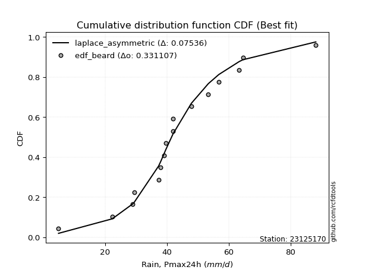</img>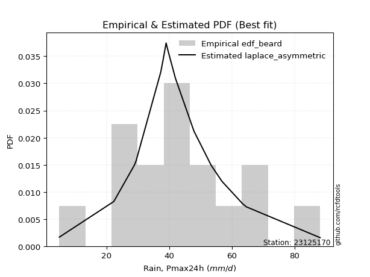</img>

</div>


### 5. Empirical - EDF Chegodayev (1955)

The Chegodayev formula is an empirical plotting position formula used in hydrological frequency analysis to estimate the exceedance probability or return period of a specific event from a set of observed data. It is primarily used for plotting observed data points on probability paper to fit a theoretical distribution, particularly for analyzing extreme events like maximum flood flows or rainfall intensities. The constant _b_ value in the generalized plotting position formula is 0.3.

<div align="center">


$P=(m-b)/(n+1-2b)$


</div>


**5.1. Empirical values**

<div align="center">

|                | 0                    | 1                   | 2                   | 3                   | 4                  | 5                   | 6                   | 7                 | 8              | 9                  | 10                 | 11                 | 12                 | 13                 | 14                 | 15                 | 16                 |
|:---------------|:---------------------|:--------------------|:--------------------|:--------------------|:-------------------|:--------------------|:--------------------|:------------------|:---------------|:-------------------|:-------------------|:-------------------|:-------------------|:-------------------|:-------------------|:-------------------|:-------------------|
| date           | 2022                 | 2025                | 2010                | 2015                | 2021               | 2016                | 2017                | 2005              | 2008           | 2020               | 2018               | 2009               | 2006               | 2012               | 2014               | 2013               | 2024               |
| x              | 4.9                  | 16.0                | 22.3                | 28.8                | 29.4               | 37.3                | 38.0                | 39.0              | 39.6           | 41.9               | 42.0               | 47.9               | 53.4               | 56.8               | 63.4               | 64.6               | 88.2               |
| m              | 1                    | 2                   | 3                   | 4                   | 5                  | 6                   | 7                   | 8                 | 9              | 10                 | 11                 | 12                 | 13                 | 14                 | 15                 | 16                 | 17                 |
| empirical_dist | edf_chegodayev       | edf_chegodayev      | edf_chegodayev      | edf_chegodayev      | edf_chegodayev     | edf_chegodayev      | edf_chegodayev      | edf_chegodayev    | edf_chegodayev | edf_chegodayev     | edf_chegodayev     | edf_chegodayev     | edf_chegodayev     | edf_chegodayev     | edf_chegodayev     | edf_chegodayev     | edf_chegodayev     |
| empirical      | 0.040229885057471264 | 0.09770114942528736 | 0.15517241379310348 | 0.21264367816091956 | 0.2701149425287357 | 0.32758620689655177 | 0.38505747126436785 | 0.442528735632184 | 0.5            | 0.5574712643678161 | 0.6149425287356322 | 0.6724137931034483 | 0.7298850574712644 | 0.7873563218390804 | 0.8448275862068966 | 0.9022988505747127 | 0.9597701149425287 |
| empirical_tr   | 1.0419161676646707   | 1.10828025477707    | 1.183673469387755   | 1.27007299270073    | 1.3700787401574803 | 1.4871794871794874  | 1.6261682242990656  | 1.793814432989691 | 2.0            | 2.25974025974026   | 2.5970149253731343 | 3.0526315789473686 | 3.7021276595744688 | 4.702702702702703  | 6.4444444444444455 | 10.235294117647065 | 24.857142857142854 |

</div>


**5.2. Kolmogorov-Smirnov fit test (sorted by Δ)**


<div align="center">

|                | 0                   | 1                   | 2                   | 3                   | 4                   | 5                   | 6                   | 7                   | 8                  | 9                   | 10                 | 11                  | 12                 | 13                  | 14                  | 15                 | 16                  | 17                  | 18                 | 19                  | 20                  | 21                 | 22                  | 23                  | 24                  | 25                  | 26                 | 27                  | 28                  | 29                  | 30                  | 31                  | 32                  | 33                  | 34                  | 35                  | 36                  | 37                  | 38                    | 39                  | 40                  | 41                 | 42                  | 43                 | 44                  | 45                  | 46                  | 47                  | 48                  | 49                  | 50                  | 51                  | 52                  | 53                  | 54                  | 55                 | 56                 | 57                 | 58                  | 59                 | 60                 | 61                 | 62                  | 63                  | 64                  | 65                  | 66                  | 67                  | 68                  | 69                  | 70                 | 71                 | 72                  | 73                  | 74                 | 75                 | 76                 | 77                 | 78                  | 79                 | 80                 | 81                  | 82                  | 83                 | 84                  | 85                  | 86                 | 87                 | 88                 | 89                 |
|:---------------|:--------------------|:--------------------|:--------------------|:--------------------|:--------------------|:--------------------|:--------------------|:--------------------|:-------------------|:--------------------|:-------------------|:--------------------|:-------------------|:--------------------|:--------------------|:-------------------|:--------------------|:--------------------|:-------------------|:--------------------|:--------------------|:-------------------|:--------------------|:--------------------|:--------------------|:--------------------|:-------------------|:--------------------|:--------------------|:--------------------|:--------------------|:--------------------|:--------------------|:--------------------|:--------------------|:--------------------|:--------------------|:--------------------|:----------------------|:--------------------|:--------------------|:-------------------|:--------------------|:-------------------|:--------------------|:--------------------|:--------------------|:--------------------|:--------------------|:--------------------|:--------------------|:--------------------|:--------------------|:--------------------|:--------------------|:-------------------|:-------------------|:-------------------|:--------------------|:-------------------|:-------------------|:-------------------|:--------------------|:--------------------|:--------------------|:--------------------|:--------------------|:--------------------|:--------------------|:--------------------|:-------------------|:-------------------|:--------------------|:--------------------|:-------------------|:-------------------|:-------------------|:-------------------|:--------------------|:-------------------|:-------------------|:--------------------|:--------------------|:-------------------|:--------------------|:--------------------|:-------------------|:-------------------|:-------------------|:-------------------|
| station        | 23125170            | 23125170            | 23125170            | 23125170            | 23125170            | 23125170            | 23125170            | 23125170            | 23125170           | 23125170            | 23125170           | 23125170            | 23125170           | 23125170            | 23125170            | 23125170           | 23125170            | 23125170            | 23125170           | 23125170            | 23125170            | 23125170           | 23125170            | 23125170            | 23125170            | 23125170            | 23125170           | 23125170            | 23125170            | 23125170            | 23125170            | 23125170            | 23125170            | 23125170            | 23125170            | 23125170            | 23125170            | 23125170            | 23125170              | 23125170            | 23125170            | 23125170           | 23125170            | 23125170           | 23125170            | 23125170            | 23125170            | 23125170            | 23125170            | 23125170            | 23125170            | 23125170            | 23125170            | 23125170            | 23125170            | 23125170           | 23125170           | 23125170           | 23125170            | 23125170           | 23125170           | 23125170           | 23125170            | 23125170            | 23125170            | 23125170            | 23125170            | 23125170            | 23125170            | 23125170            | 23125170           | 23125170           | 23125170            | 23125170            | 23125170           | 23125170           | 23125170           | 23125170           | 23125170            | 23125170           | 23125170           | 23125170            | 23125170            | 23125170           | 23125170            | 23125170            | 23125170           | 23125170           | 23125170           | 23125170           |
| empirical_dist | edf_chegodayev      | edf_chegodayev      | edf_chegodayev      | edf_chegodayev      | edf_chegodayev      | edf_chegodayev      | edf_chegodayev      | edf_chegodayev      | edf_chegodayev     | edf_chegodayev      | edf_chegodayev     | edf_chegodayev      | edf_chegodayev     | edf_chegodayev      | edf_chegodayev      | edf_chegodayev     | edf_chegodayev      | edf_chegodayev      | edf_chegodayev     | edf_chegodayev      | edf_chegodayev      | edf_chegodayev     | edf_chegodayev      | edf_chegodayev      | edf_chegodayev      | edf_chegodayev      | edf_chegodayev     | edf_chegodayev      | edf_chegodayev      | edf_chegodayev      | edf_chegodayev      | edf_chegodayev      | edf_chegodayev      | edf_chegodayev      | edf_chegodayev      | edf_chegodayev      | edf_chegodayev      | edf_chegodayev      | edf_chegodayev        | edf_chegodayev      | edf_chegodayev      | edf_chegodayev     | edf_chegodayev      | edf_chegodayev     | edf_chegodayev      | edf_chegodayev      | edf_chegodayev      | edf_chegodayev      | edf_chegodayev      | edf_chegodayev      | edf_chegodayev      | edf_chegodayev      | edf_chegodayev      | edf_chegodayev      | edf_chegodayev      | edf_chegodayev     | edf_chegodayev     | edf_chegodayev     | edf_chegodayev      | edf_chegodayev     | edf_chegodayev     | edf_chegodayev     | edf_chegodayev      | edf_chegodayev      | edf_chegodayev      | edf_chegodayev      | edf_chegodayev      | edf_chegodayev      | edf_chegodayev      | edf_chegodayev      | edf_chegodayev     | edf_chegodayev     | edf_chegodayev      | edf_chegodayev      | edf_chegodayev     | edf_chegodayev     | edf_chegodayev     | edf_chegodayev     | edf_chegodayev      | edf_chegodayev     | edf_chegodayev     | edf_chegodayev      | edf_chegodayev      | edf_chegodayev     | edf_chegodayev      | edf_chegodayev      | edf_chegodayev     | edf_chegodayev     | edf_chegodayev     | edf_chegodayev     |
| p_dist         | laplace_asymmetric  | fisk                | genlogistic         | johnsonsu           | logjohnsonsu        | nct                 | nakagami            | mielke              | exponnorm          | f                   | chi2               | betaprime           | gamma              | erlang              | pearson3            | rice               | logt                | weibull_min         | loggenlogistic     | invgauss            | truncnorm           | invgamma           | logmielke           | logloggamma         | t                   | maxwell             | laplace            | hypsecant           | logistic            | norm                | crystalball         | logweibull_min      | lognakagami         | rayleigh            | loggompertz         | loggumbel_l         | logpearson3         | logfisk             | loglaplace_asymmetric | invweibull          | gumbel_r            | ncf                | kstwobign           | halfnorm           | moyal               | halflogistic        | gumbel_l            | logf                | logfatiguelife      | logexponnorm        | lognorm             | lognorm             | logcrystalball      | loglognorm          | logrice             | lognct             | loglogistic        | loghypsecant       | logbetaprime        | logchi2            | loggamma           | loggamma           | logerlang           | loginvgamma         | loglaplace          | loginvweibull       | gibrat              | loginvgauss         | logalpha            | wald                | logmaxwell         | logncf             | lograyleigh         | logtruncnorm        | expon              | genexpon           | logkstwobign       | loggumbel_r        | loghalfnorm         | logmoyal           | loghalflogistic    | loggenexpon         | alpha               | logwald            | logexpon            | loggibrat           | pareto             | logpareto          | fatiguelife        | gompertz           |
| delta          | 0.07095477020842023 | 0.08877868968765212 | 0.09029367696934282 | 0.09351710976729266 | 0.09457885520316212 | 0.09461823946614573 | 0.09529584015748405 | 0.09563537833625035 | 0.0961707343192324 | 0.09752094646307924 | 0.0975218269582101 | 0.09752198370465831 | 0.0975239218352491 | 0.09752394052031094 | 0.09917846875290925 | 0.0995876019867068 | 0.10044344164585561 | 0.10221336581343593 | 0.1044392169157799 | 0.10622030129981164 | 0.10738753968707027 | 0.1088044740982157 | 0.10950254465528514 | 0.10962419024606207 | 0.11075796660966497 | 0.11077142344335567 | 0.113864492894027  | 0.11417942005742365 | 0.11425046549696782 | 0.11433365575621268 | 0.11433367319131738 | 0.11787958344347943 | 0.11859114195372256 | 0.12305351079459409 | 0.12344715203456852 | 0.12350586936250268 | 0.12667064655765903 | 0.12974731545604828 | 0.13603758612632572   | 0.13635047001869083 | 0.13721112820641046 | 0.1419092245599068 | 0.15199958392774499 | 0.1578742923973147 | 0.16040055438520456 | 0.17398854577028217 | 0.18469140127299422 | 0.19227144251558398 | 0.19287030457141413 | 0.19296238950442474 | 0.19296462339529946 | 0.19296462339529946 | 0.19296465532851476 | 0.19296467891230368 | 0.19297008532199084 | 0.1931837376773568 | 0.1957658264666145 | 0.1981537427758993 | 0.20013497364007832 | 0.2005168558489931 | 0.2014791948445201 | 0.2014791948445201 | 0.20257558191010588 | 0.20423881824795215 | 0.20755901476110844 | 0.21441587368112702 | 0.21926826081461154 | 0.21935304165405128 | 0.22020653017194475 | 0.22330372514993319 | 0.2250787397904072 | 0.2255193173077235 | 0.23561609243046627 | 0.25637799321516824 | 0.2625447350896739 | 0.2628732358790882 | 0.2634801536887885 | 0.2636449263833817 | 0.26528291788402697 | 0.2892340655692283 | 0.2913538958525487 | 0.30807649434716144 | 0.32757721891374336 | 0.3603039839904821 | 0.37663278664475003 | 0.38650286131670913 | 0.5306989178633678 | 0.5443353074814089 | 0.6180039555481874 | 0.8929544527062703 |
| deltao         | 0.3260541228310003  | 0.3260541228310003  | 0.3260541228310003  | 0.3260541228310003  | 0.3260541228310003  | 0.3260541228310003  | 0.3260541228310003  | 0.3260541228310003  | 0.3260541228310003 | 0.3260541228310003  | 0.3260541228310003 | 0.3260541228310003  | 0.3260541228310003 | 0.3260541228310003  | 0.3260541228310003  | 0.3260541228310003 | 0.3260541228310003  | 0.3260541228310003  | 0.3260541228310003 | 0.3260541228310003  | 0.3260541228310003  | 0.3260541228310003 | 0.3260541228310003  | 0.3260541228310003  | 0.3260541228310003  | 0.3260541228310003  | 0.3260541228310003 | 0.3260541228310003  | 0.3260541228310003  | 0.3260541228310003  | 0.3260541228310003  | 0.3260541228310003  | 0.3260541228310003  | 0.3260541228310003  | 0.3260541228310003  | 0.3260541228310003  | 0.3260541228310003  | 0.3260541228310003  | 0.3260541228310003    | 0.3260541228310003  | 0.3260541228310003  | 0.3260541228310003 | 0.3260541228310003  | 0.3260541228310003 | 0.3260541228310003  | 0.3260541228310003  | 0.3260541228310003  | 0.3260541228310003  | 0.3260541228310003  | 0.3260541228310003  | 0.3260541228310003  | 0.3260541228310003  | 0.3260541228310003  | 0.3260541228310003  | 0.3260541228310003  | 0.3260541228310003 | 0.3260541228310003 | 0.3260541228310003 | 0.3260541228310003  | 0.3260541228310003 | 0.3260541228310003 | 0.3260541228310003 | 0.3260541228310003  | 0.3260541228310003  | 0.3260541228310003  | 0.3260541228310003  | 0.3260541228310003  | 0.3260541228310003  | 0.3260541228310003  | 0.3260541228310003  | 0.3260541228310003 | 0.3260541228310003 | 0.3260541228310003  | 0.3260541228310003  | 0.3260541228310003 | 0.3260541228310003 | 0.3260541228310003 | 0.3260541228310003 | 0.3260541228310003  | 0.3260541228310003 | 0.3260541228310003 | 0.3260541228310003  | 0.3260541228310003  | 0.3260541228310003 | 0.3260541228310003  | 0.3260541228310003  | 0.3260541228310003 | 0.3260541228310003 | 0.3260541228310003 | 0.3260541228310003 |
| eval           | Δo > Δ              | Δo > Δ              | Δo > Δ              | Δo > Δ              | Δo > Δ              | Δo > Δ              | Δo > Δ              | Δo > Δ              | Δo > Δ             | Δo > Δ              | Δo > Δ             | Δo > Δ              | Δo > Δ             | Δo > Δ              | Δo > Δ              | Δo > Δ             | Δo > Δ              | Δo > Δ              | Δo > Δ             | Δo > Δ              | Δo > Δ              | Δo > Δ             | Δo > Δ              | Δo > Δ              | Δo > Δ              | Δo > Δ              | Δo > Δ             | Δo > Δ              | Δo > Δ              | Δo > Δ              | Δo > Δ              | Δo > Δ              | Δo > Δ              | Δo > Δ              | Δo > Δ              | Δo > Δ              | Δo > Δ              | Δo > Δ              | Δo > Δ                | Δo > Δ              | Δo > Δ              | Δo > Δ             | Δo > Δ              | Δo > Δ             | Δo > Δ              | Δo > Δ              | Δo > Δ              | Δo > Δ              | Δo > Δ              | Δo > Δ              | Δo > Δ              | Δo > Δ              | Δo > Δ              | Δo > Δ              | Δo > Δ              | Δo > Δ             | Δo > Δ             | Δo > Δ             | Δo > Δ              | Δo > Δ             | Δo > Δ             | Δo > Δ             | Δo > Δ              | Δo > Δ              | Δo > Δ              | Δo > Δ              | Δo > Δ              | Δo > Δ              | Δo > Δ              | Δo > Δ              | Δo > Δ             | Δo > Δ             | Δo > Δ              | Δo > Δ              | Δo > Δ             | Δo > Δ             | Δo > Δ             | Δo > Δ             | Δo > Δ              | Δo > Δ             | Δo > Δ             | Δo > Δ              | Δo <= Δ             | Δo <= Δ            | Δo <= Δ             | Δo <= Δ             | Δo <= Δ            | Δo <= Δ            | Δo <= Δ            | Δo <= Δ            |
| fit            | 1                   | 1                   | 1                   | 1                   | 1                   | 1                   | 1                   | 1                   | 1                  | 1                   | 1                  | 1                   | 1                  | 1                   | 1                   | 1                  | 1                   | 1                   | 1                  | 1                   | 1                   | 1                  | 1                   | 1                   | 1                   | 1                   | 1                  | 1                   | 1                   | 1                   | 1                   | 1                   | 1                   | 1                   | 1                   | 1                   | 1                   | 1                   | 1                     | 1                   | 1                   | 1                  | 1                   | 1                  | 1                   | 1                   | 1                   | 1                   | 1                   | 1                   | 1                   | 1                   | 1                   | 1                   | 1                   | 1                  | 1                  | 1                  | 1                   | 1                  | 1                  | 1                  | 1                   | 1                   | 1                   | 1                   | 1                   | 1                   | 1                   | 1                   | 1                  | 1                  | 1                   | 1                   | 1                  | 1                  | 1                  | 1                  | 1                   | 1                  | 1                  | 1                   | 0                   | 0                  | 0                   | 0                   | 0                  | 0                  | 0                  | 0                  |
| n              | 17                  | 17                  | 17                  | 17                  | 17                  | 17                  | 17                  | 17                  | 17                 | 17                  | 17                 | 17                  | 17                 | 17                  | 17                  | 17                 | 17                  | 17                  | 17                 | 17                  | 17                  | 17                 | 17                  | 17                  | 17                  | 17                  | 17                 | 17                  | 17                  | 17                  | 17                  | 17                  | 17                  | 17                  | 17                  | 17                  | 17                  | 17                  | 17                    | 17                  | 17                  | 17                 | 17                  | 17                 | 17                  | 17                  | 17                  | 17                  | 17                  | 17                  | 17                  | 17                  | 17                  | 17                  | 17                  | 17                 | 17                 | 17                 | 17                  | 17                 | 17                 | 17                 | 17                  | 17                  | 17                  | 17                  | 17                  | 17                  | 17                  | 17                  | 17                 | 17                 | 17                  | 17                  | 17                 | 17                 | 17                 | 17                 | 17                  | 17                 | 17                 | 17                  | 17                  | 17                 | 17                  | 17                  | 17                 | 17                 | 17                 | 17                 |
| best_fit       | 1                   | 0                   | 0                   | 0                   | 0                   | 0                   | 0                   | 0                   | 0                  | 0                   | 0                  | 0                   | 0                  | 0                   | 0                   | 0                  | 0                   | 0                   | 0                  | 0                   | 0                   | 0                  | 0                   | 0                   | 0                   | 0                   | 0                  | 0                   | 0                   | 0                   | 0                   | 0                   | 0                   | 0                   | 0                   | 0                   | 0                   | 0                   | 0                     | 0                   | 0                   | 0                  | 0                   | 0                  | 0                   | 0                   | 0                   | 0                   | 0                   | 0                   | 0                   | 0                   | 0                   | 0                   | 0                   | 0                  | 0                  | 0                  | 0                   | 0                  | 0                  | 0                  | 0                   | 0                   | 0                   | 0                   | 0                   | 0                   | 0                   | 0                   | 0                  | 0                  | 0                   | 0                   | 0                  | 0                  | 0                  | 0                  | 0                   | 0                  | 0                  | 0                   | 0                   | 0                  | 0                   | 0                   | 0                  | 0                  | 0                  | 0                  |
| best_fit_sort  | 1                   | 2                   | 3                   | 4                   | 5                   | 6                   | 7                   | 8                   | 9                  | 10                  | 11                 | 12                  | 13                 | 14                  | 15                  | 16                 | 17                  | 18                  | 19                 | 20                  | 21                  | 22                 | 23                  | 24                  | 25                  | 26                  | 27                 | 28                  | 29                  | 30                  | 31                  | 32                  | 33                  | 34                  | 35                  | 36                  | 37                  | 38                  | 39                    | 40                  | 41                  | 42                 | 43                  | 44                 | 45                  | 46                  | 47                  | 48                  | 49                  | 50                  | 51                  | 52                  | 53                  | 54                  | 55                  | 56                 | 57                 | 58                 | 59                  | 60                 | 61                 | 62                 | 63                  | 64                  | 65                  | 66                  | 67                  | 68                  | 69                  | 70                  | 71                 | 72                 | 73                  | 74                  | 75                 | 76                 | 77                 | 78                 | 79                  | 80                 | 81                 | 82                  | 83                  | 84                 | 85                  | 86                  | 87                 | 88                 | 89                 | 90                 |

</div>


<div align="center">

</img>

</div>


**5.3. Best fit**

<div align="center">

|   id |   station | empirical_dist   | p_dist             |     delta |   deltao | eval   |   fit |   n |   best_fit |   best_fit_sort |
|-----:|----------:|:-----------------|:-------------------|----------:|---------:|:-------|------:|----:|-----------:|----------------:|
|    0 |  23125170 | edf_chegodayev   | laplace_asymmetric | 0.0709548 | 0.326054 | Δo > Δ |     1 |  17 |          1 |               1 |

</div>


<div align="center">

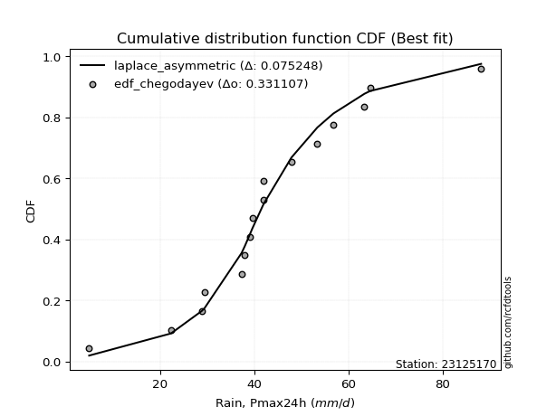</img>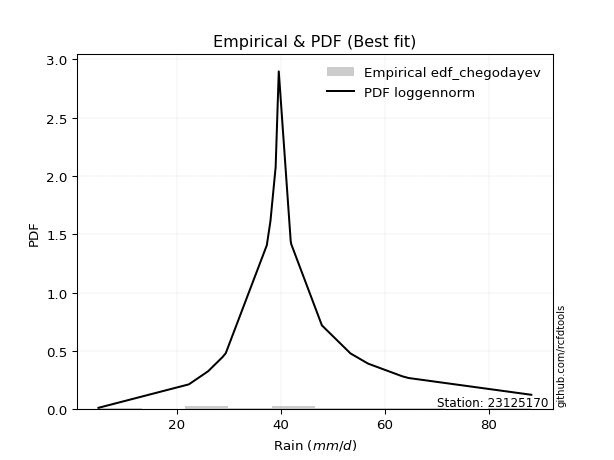</img>

</div>


### 6. Empirical - EDF Blom (1958)

The Blom formula is a specific "plotting position" formula used in hydrology and statistical analysis to estimate the empirical cumulative probability (or non-exceedance probability) of a data series. It is particularly recommended for data that are approximately normally distributed. The constant _a_ is set to 0.375 (or 3/8).

<div align="center">


$P=(m-a)/(n+1-2a)$


</div>


**6.1. Empirical values**

<div align="center">

|                | 0                    | 1                   | 2                   | 3                   | 4                   | 5                   | 6                   | 7                  | 8        | 9                  | 10                 | 11                 | 12                 | 13                 | 14                 | 15                 | 16                 |
|:---------------|:---------------------|:--------------------|:--------------------|:--------------------|:--------------------|:--------------------|:--------------------|:-------------------|:---------|:-------------------|:-------------------|:-------------------|:-------------------|:-------------------|:-------------------|:-------------------|:-------------------|
| date           | 2022                 | 2025                | 2010                | 2015                | 2021                | 2016                | 2017                | 2005               | 2008     | 2020               | 2018               | 2009               | 2006               | 2012               | 2014               | 2013               | 2024               |
| x              | 4.9                  | 16.0                | 22.3                | 28.8                | 29.4                | 37.3                | 38.0                | 39.0               | 39.6     | 41.9               | 42.0               | 47.9               | 53.4               | 56.8               | 63.4               | 64.6               | 88.2               |
| m              | 1                    | 2                   | 3                   | 4                   | 5                   | 6                   | 7                   | 8                  | 9        | 10                 | 11                 | 12                 | 13                 | 14                 | 15                 | 16                 | 17                 |
| empirical_dist | edf_blom             | edf_blom            | edf_blom            | edf_blom            | edf_blom            | edf_blom            | edf_blom            | edf_blom           | edf_blom | edf_blom           | edf_blom           | edf_blom           | edf_blom           | edf_blom           | edf_blom           | edf_blom           | edf_blom           |
| empirical      | 0.036231884057971016 | 0.09420289855072464 | 0.15217391304347827 | 0.21014492753623187 | 0.26811594202898553 | 0.32608695652173914 | 0.38405797101449274 | 0.4420289855072464 | 0.5      | 0.5579710144927537 | 0.6159420289855072 | 0.6739130434782609 | 0.7318840579710145 | 0.7898550724637681 | 0.8478260869565217 | 0.9057971014492754 | 0.9637681159420289 |
| empirical_tr   | 1.037593984962406    | 1.1039999999999999  | 1.1794871794871795  | 1.2660550458715598  | 1.3663366336633664  | 1.4838709677419355  | 1.6235294117647057  | 1.7922077922077921 | 2.0      | 2.2622950819672134 | 2.6037735849056602 | 3.0666666666666664 | 3.7297297297297303 | 4.758620689655172  | 6.571428571428571  | 10.615384615384619 | 27.599999999999962 |

</div>


**6.2. Kolmogorov-Smirnov fit test (sorted by Δ)**


<div align="center">

|                | 0                   | 1                   | 2                   | 3                  | 4                   | 5                   | 6                   | 7                   | 8                   | 9                   | 10                  | 11                  | 12                  | 13                  | 14                  | 15                  | 16                  | 17                  | 18                  | 19                  | 20                 | 21                  | 22                  | 23                 | 24                  | 25                 | 26                  | 27                 | 28                  | 29                  | 30                  | 31                  | 32                  | 33                  | 34                  | 35                  | 36                  | 37                  | 38                    | 39                  | 40                 | 41                  | 42                  | 43                  | 44                 | 45                 | 46                  | 47                 | 48                  | 49                  | 50                 | 51                 | 52                 | 53                 | 54                  | 55                  | 56                  | 57                  | 58                  | 59                  | 60                  | 61                  | 62                  | 63                  | 64                  | 65                 | 66                  | 67                  | 68                  | 69                  | 70                  | 71                  | 72                 | 73                 | 74                 | 75                  | 76                  | 77                 | 78                 | 79                  | 80                  | 81                  | 82                  | 83                 | 84                  | 85                  | 86                 | 87                 | 88                 | 89                 |
|:---------------|:--------------------|:--------------------|:--------------------|:-------------------|:--------------------|:--------------------|:--------------------|:--------------------|:--------------------|:--------------------|:--------------------|:--------------------|:--------------------|:--------------------|:--------------------|:--------------------|:--------------------|:--------------------|:--------------------|:--------------------|:-------------------|:--------------------|:--------------------|:-------------------|:--------------------|:-------------------|:--------------------|:-------------------|:--------------------|:--------------------|:--------------------|:--------------------|:--------------------|:--------------------|:--------------------|:--------------------|:--------------------|:--------------------|:----------------------|:--------------------|:-------------------|:--------------------|:--------------------|:--------------------|:-------------------|:-------------------|:--------------------|:-------------------|:--------------------|:--------------------|:-------------------|:-------------------|:-------------------|:-------------------|:--------------------|:--------------------|:--------------------|:--------------------|:--------------------|:--------------------|:--------------------|:--------------------|:--------------------|:--------------------|:--------------------|:-------------------|:--------------------|:--------------------|:--------------------|:--------------------|:--------------------|:--------------------|:-------------------|:-------------------|:-------------------|:--------------------|:--------------------|:-------------------|:-------------------|:--------------------|:--------------------|:--------------------|:--------------------|:-------------------|:--------------------|:--------------------|:-------------------|:-------------------|:-------------------|:-------------------|
| station        | 23125170            | 23125170            | 23125170            | 23125170           | 23125170            | 23125170            | 23125170            | 23125170            | 23125170            | 23125170            | 23125170            | 23125170            | 23125170            | 23125170            | 23125170            | 23125170            | 23125170            | 23125170            | 23125170            | 23125170            | 23125170           | 23125170            | 23125170            | 23125170           | 23125170            | 23125170           | 23125170            | 23125170           | 23125170            | 23125170            | 23125170            | 23125170            | 23125170            | 23125170            | 23125170            | 23125170            | 23125170            | 23125170            | 23125170              | 23125170            | 23125170           | 23125170            | 23125170            | 23125170            | 23125170           | 23125170           | 23125170            | 23125170           | 23125170            | 23125170            | 23125170           | 23125170           | 23125170           | 23125170           | 23125170            | 23125170            | 23125170            | 23125170            | 23125170            | 23125170            | 23125170            | 23125170            | 23125170            | 23125170            | 23125170            | 23125170           | 23125170            | 23125170            | 23125170            | 23125170            | 23125170            | 23125170            | 23125170           | 23125170           | 23125170           | 23125170            | 23125170            | 23125170           | 23125170           | 23125170            | 23125170            | 23125170            | 23125170            | 23125170           | 23125170            | 23125170            | 23125170           | 23125170           | 23125170           | 23125170           |
| empirical_dist | edf_blom            | edf_blom            | edf_blom            | edf_blom           | edf_blom            | edf_blom            | edf_blom            | edf_blom            | edf_blom            | edf_blom            | edf_blom            | edf_blom            | edf_blom            | edf_blom            | edf_blom            | edf_blom            | edf_blom            | edf_blom            | edf_blom            | edf_blom            | edf_blom           | edf_blom            | edf_blom            | edf_blom           | edf_blom            | edf_blom           | edf_blom            | edf_blom           | edf_blom            | edf_blom            | edf_blom            | edf_blom            | edf_blom            | edf_blom            | edf_blom            | edf_blom            | edf_blom            | edf_blom            | edf_blom              | edf_blom            | edf_blom           | edf_blom            | edf_blom            | edf_blom            | edf_blom           | edf_blom           | edf_blom            | edf_blom           | edf_blom            | edf_blom            | edf_blom           | edf_blom           | edf_blom           | edf_blom           | edf_blom            | edf_blom            | edf_blom            | edf_blom            | edf_blom            | edf_blom            | edf_blom            | edf_blom            | edf_blom            | edf_blom            | edf_blom            | edf_blom           | edf_blom            | edf_blom            | edf_blom            | edf_blom            | edf_blom            | edf_blom            | edf_blom           | edf_blom           | edf_blom           | edf_blom            | edf_blom            | edf_blom           | edf_blom           | edf_blom            | edf_blom            | edf_blom            | edf_blom            | edf_blom           | edf_blom            | edf_blom            | edf_blom           | edf_blom           | edf_blom           | edf_blom           |
| p_dist         | laplace_asymmetric  | fisk                | genlogistic         | johnsonsu          | logjohnsonsu        | nct                 | nakagami            | mielke              | exponnorm           | f                   | chi2                | betaprime           | gamma               | erlang              | rice                | pearson3            | logt                | weibull_min         | loggenlogistic      | invgauss            | truncnorm          | invgamma            | logmielke           | logloggamma        | t                   | maxwell            | laplace             | hypsecant          | logistic            | norm                | crystalball         | logweibull_min      | lognakagami         | rayleigh            | loggompertz         | loggumbel_l         | logpearson3         | logfisk             | loglaplace_asymmetric | invweibull          | gumbel_r           | ncf                 | kstwobign           | halfnorm            | moyal              | halflogistic       | gumbel_l            | logf               | logfatiguelife      | logexponnorm        | lognorm            | lognorm            | logcrystalball     | loglognorm         | logrice             | lognct              | loglogistic         | loghypsecant        | logbetaprime        | logchi2             | loggamma            | loggamma            | logerlang           | loginvgamma         | loglaplace          | loginvweibull      | gibrat              | loginvgauss         | logalpha            | wald                | logmaxwell          | logncf              | lograyleigh        | logtruncnorm       | expon              | loggumbel_r         | genexpon            | logkstwobign       | loghalfnorm        | logmoyal            | loghalflogistic     | loggenexpon         | alpha               | logwald            | logexpon            | loggibrat           | pareto             | logpareto          | fatiguelife        | gompertz           |
| delta          | 0.07195427045829528 | 0.08977818993752718 | 0.09179292734415545 | 0.0950163601421053 | 0.09557835545303717 | 0.09611748984095836 | 0.09679509053229668 | 0.09713462871106299 | 0.09766998469404503 | 0.09902019683789187 | 0.09902107733302273 | 0.09902123407947094 | 0.09902317221006174 | 0.09902319089512357 | 0.10058710223658185 | 0.10067771912772189 | 0.10144294189573067 | 0.10371261618824856 | 0.10593846729059253 | 0.10771955167462427 | 0.1088867900618829 | 0.11030372447302833 | 0.11100179503009777 | 0.1111234406208747 | 0.11175746685954002 | 0.1122706738181683 | 0.11486399314390205 | 0.1151789203072987 | 0.11524996574684288 | 0.11533315600608773 | 0.11533317344119243 | 0.11937883381829206 | 0.12009039232853519 | 0.12455276116940672 | 0.12494640240938115 | 0.12500511973731532 | 0.12767014680753408 | 0.13124656583086092 | 0.13753683650113835   | 0.13784972039350346 | 0.1387103785812231 | 0.14340847493471942 | 0.15349883430255762 | 0.15937354277212734 | 0.1618998047600172 | 0.1754877961450948 | 0.18569090152286927 | 0.1937706928903966 | 0.19436955494622676 | 0.19446163987923737 | 0.1944638737701121 | 0.1944638737701121 | 0.1944639057033274 | 0.1944639292871163 | 0.19446933569680347 | 0.19468298805216944 | 0.19726507684142713 | 0.19965299315071194 | 0.20163422401489095 | 0.20201610622380572 | 0.20297844521933273 | 0.20297844521933273 | 0.20407483228491852 | 0.20573806862276478 | 0.20905826513592107 | 0.2169146243058147 | 0.22076751118942417 | 0.22085229202886392 | 0.22170578054675738 | 0.22480297552474582 | 0.22657799016521984 | 0.22701856768253614 | 0.2371153428052789 | 0.2578772435899809 | 0.2650434857143616 | 0.26514417675819435 | 0.26537198650377586 | 0.2659789043134762 | 0.2667821682588396 | 0.29073331594404095 | 0.29285314622736136 | 0.31057524497184913 | 0.33007596953843105 | 0.3618032343652947 | 0.37963128739437524 | 0.38800211169152177 | 0.5341971687379306 | 0.5478335583559717 | 0.6215022064227502 | 0.896452703580833  |
| deltao         | 0.3260541228310003  | 0.3260541228310003  | 0.3260541228310003  | 0.3260541228310003 | 0.3260541228310003  | 0.3260541228310003  | 0.3260541228310003  | 0.3260541228310003  | 0.3260541228310003  | 0.3260541228310003  | 0.3260541228310003  | 0.3260541228310003  | 0.3260541228310003  | 0.3260541228310003  | 0.3260541228310003  | 0.3260541228310003  | 0.3260541228310003  | 0.3260541228310003  | 0.3260541228310003  | 0.3260541228310003  | 0.3260541228310003 | 0.3260541228310003  | 0.3260541228310003  | 0.3260541228310003 | 0.3260541228310003  | 0.3260541228310003 | 0.3260541228310003  | 0.3260541228310003 | 0.3260541228310003  | 0.3260541228310003  | 0.3260541228310003  | 0.3260541228310003  | 0.3260541228310003  | 0.3260541228310003  | 0.3260541228310003  | 0.3260541228310003  | 0.3260541228310003  | 0.3260541228310003  | 0.3260541228310003    | 0.3260541228310003  | 0.3260541228310003 | 0.3260541228310003  | 0.3260541228310003  | 0.3260541228310003  | 0.3260541228310003 | 0.3260541228310003 | 0.3260541228310003  | 0.3260541228310003 | 0.3260541228310003  | 0.3260541228310003  | 0.3260541228310003 | 0.3260541228310003 | 0.3260541228310003 | 0.3260541228310003 | 0.3260541228310003  | 0.3260541228310003  | 0.3260541228310003  | 0.3260541228310003  | 0.3260541228310003  | 0.3260541228310003  | 0.3260541228310003  | 0.3260541228310003  | 0.3260541228310003  | 0.3260541228310003  | 0.3260541228310003  | 0.3260541228310003 | 0.3260541228310003  | 0.3260541228310003  | 0.3260541228310003  | 0.3260541228310003  | 0.3260541228310003  | 0.3260541228310003  | 0.3260541228310003 | 0.3260541228310003 | 0.3260541228310003 | 0.3260541228310003  | 0.3260541228310003  | 0.3260541228310003 | 0.3260541228310003 | 0.3260541228310003  | 0.3260541228310003  | 0.3260541228310003  | 0.3260541228310003  | 0.3260541228310003 | 0.3260541228310003  | 0.3260541228310003  | 0.3260541228310003 | 0.3260541228310003 | 0.3260541228310003 | 0.3260541228310003 |
| eval           | Δo > Δ              | Δo > Δ              | Δo > Δ              | Δo > Δ             | Δo > Δ              | Δo > Δ              | Δo > Δ              | Δo > Δ              | Δo > Δ              | Δo > Δ              | Δo > Δ              | Δo > Δ              | Δo > Δ              | Δo > Δ              | Δo > Δ              | Δo > Δ              | Δo > Δ              | Δo > Δ              | Δo > Δ              | Δo > Δ              | Δo > Δ             | Δo > Δ              | Δo > Δ              | Δo > Δ             | Δo > Δ              | Δo > Δ             | Δo > Δ              | Δo > Δ             | Δo > Δ              | Δo > Δ              | Δo > Δ              | Δo > Δ              | Δo > Δ              | Δo > Δ              | Δo > Δ              | Δo > Δ              | Δo > Δ              | Δo > Δ              | Δo > Δ                | Δo > Δ              | Δo > Δ             | Δo > Δ              | Δo > Δ              | Δo > Δ              | Δo > Δ             | Δo > Δ             | Δo > Δ              | Δo > Δ             | Δo > Δ              | Δo > Δ              | Δo > Δ             | Δo > Δ             | Δo > Δ             | Δo > Δ             | Δo > Δ              | Δo > Δ              | Δo > Δ              | Δo > Δ              | Δo > Δ              | Δo > Δ              | Δo > Δ              | Δo > Δ              | Δo > Δ              | Δo > Δ              | Δo > Δ              | Δo > Δ             | Δo > Δ              | Δo > Δ              | Δo > Δ              | Δo > Δ              | Δo > Δ              | Δo > Δ              | Δo > Δ             | Δo > Δ             | Δo > Δ             | Δo > Δ              | Δo > Δ              | Δo > Δ             | Δo > Δ             | Δo > Δ              | Δo > Δ              | Δo > Δ              | Δo <= Δ             | Δo <= Δ            | Δo <= Δ             | Δo <= Δ             | Δo <= Δ            | Δo <= Δ            | Δo <= Δ            | Δo <= Δ            |
| fit            | 1                   | 1                   | 1                   | 1                  | 1                   | 1                   | 1                   | 1                   | 1                   | 1                   | 1                   | 1                   | 1                   | 1                   | 1                   | 1                   | 1                   | 1                   | 1                   | 1                   | 1                  | 1                   | 1                   | 1                  | 1                   | 1                  | 1                   | 1                  | 1                   | 1                   | 1                   | 1                   | 1                   | 1                   | 1                   | 1                   | 1                   | 1                   | 1                     | 1                   | 1                  | 1                   | 1                   | 1                   | 1                  | 1                  | 1                   | 1                  | 1                   | 1                   | 1                  | 1                  | 1                  | 1                  | 1                   | 1                   | 1                   | 1                   | 1                   | 1                   | 1                   | 1                   | 1                   | 1                   | 1                   | 1                  | 1                   | 1                   | 1                   | 1                   | 1                   | 1                   | 1                  | 1                  | 1                  | 1                   | 1                   | 1                  | 1                  | 1                   | 1                   | 1                   | 0                   | 0                  | 0                   | 0                   | 0                  | 0                  | 0                  | 0                  |
| n              | 17                  | 17                  | 17                  | 17                 | 17                  | 17                  | 17                  | 17                  | 17                  | 17                  | 17                  | 17                  | 17                  | 17                  | 17                  | 17                  | 17                  | 17                  | 17                  | 17                  | 17                 | 17                  | 17                  | 17                 | 17                  | 17                 | 17                  | 17                 | 17                  | 17                  | 17                  | 17                  | 17                  | 17                  | 17                  | 17                  | 17                  | 17                  | 17                    | 17                  | 17                 | 17                  | 17                  | 17                  | 17                 | 17                 | 17                  | 17                 | 17                  | 17                  | 17                 | 17                 | 17                 | 17                 | 17                  | 17                  | 17                  | 17                  | 17                  | 17                  | 17                  | 17                  | 17                  | 17                  | 17                  | 17                 | 17                  | 17                  | 17                  | 17                  | 17                  | 17                  | 17                 | 17                 | 17                 | 17                  | 17                  | 17                 | 17                 | 17                  | 17                  | 17                  | 17                  | 17                 | 17                  | 17                  | 17                 | 17                 | 17                 | 17                 |
| best_fit       | 1                   | 0                   | 0                   | 0                  | 0                   | 0                   | 0                   | 0                   | 0                   | 0                   | 0                   | 0                   | 0                   | 0                   | 0                   | 0                   | 0                   | 0                   | 0                   | 0                   | 0                  | 0                   | 0                   | 0                  | 0                   | 0                  | 0                   | 0                  | 0                   | 0                   | 0                   | 0                   | 0                   | 0                   | 0                   | 0                   | 0                   | 0                   | 0                     | 0                   | 0                  | 0                   | 0                   | 0                   | 0                  | 0                  | 0                   | 0                  | 0                   | 0                   | 0                  | 0                  | 0                  | 0                  | 0                   | 0                   | 0                   | 0                   | 0                   | 0                   | 0                   | 0                   | 0                   | 0                   | 0                   | 0                  | 0                   | 0                   | 0                   | 0                   | 0                   | 0                   | 0                  | 0                  | 0                  | 0                   | 0                   | 0                  | 0                  | 0                   | 0                   | 0                   | 0                   | 0                  | 0                   | 0                   | 0                  | 0                  | 0                  | 0                  |
| best_fit_sort  | 1                   | 2                   | 3                   | 4                  | 5                   | 6                   | 7                   | 8                   | 9                   | 10                  | 11                  | 12                  | 13                  | 14                  | 15                  | 16                  | 17                  | 18                  | 19                  | 20                  | 21                 | 22                  | 23                  | 24                 | 25                  | 26                 | 27                  | 28                 | 29                  | 30                  | 31                  | 32                  | 33                  | 34                  | 35                  | 36                  | 37                  | 38                  | 39                    | 40                  | 41                 | 42                  | 43                  | 44                  | 45                 | 46                 | 47                  | 48                 | 49                  | 50                  | 51                 | 52                 | 53                 | 54                 | 55                  | 56                  | 57                  | 58                  | 59                  | 60                  | 61                  | 62                  | 63                  | 64                  | 65                  | 66                 | 67                  | 68                  | 69                  | 70                  | 71                  | 72                  | 73                 | 74                 | 75                 | 76                  | 77                  | 78                 | 79                 | 80                  | 81                  | 82                  | 83                  | 84                 | 85                  | 86                  | 87                 | 88                 | 89                 | 90                 |

</div>


<div align="center">

</img>

</div>


**6.3. Best fit**

<div align="center">

|   id |   station | empirical_dist   | p_dist             |     delta |   deltao | eval   |   fit |   n |   best_fit |   best_fit_sort |
|-----:|----------:|:-----------------|:-------------------|----------:|---------:|:-------|------:|----:|-----------:|----------------:|
|    0 |  23125170 | edf_blom         | laplace_asymmetric | 0.0719543 | 0.326054 | Δo > Δ |     1 |  17 |          1 |               1 |

</div>


<div align="center">

</img>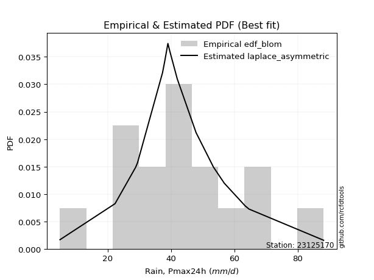</img>

</div>


### 7. Empirical - EDF Tukey (1962)

In hydrology, the Tukey formula is used as a plotting position formula to estimate the empirical probability or frequency of a flood event (or other hydrological data). The formula parameter is given as _c=0.333_ (or 1/3).

<div align="center">


$P=(m-c)/(n+1-2c)$


</div>


**7.1. Empirical values**

<div align="center">

|                | 0                    | 1                   | 2                   | 3                   | 4                  | 5                  | 6                   | 7                  | 8         | 9                  | 10                 | 11                 | 12                 | 13                 | 14                 | 15                 | 16                 |
|:---------------|:---------------------|:--------------------|:--------------------|:--------------------|:-------------------|:-------------------|:--------------------|:-------------------|:----------|:-------------------|:-------------------|:-------------------|:-------------------|:-------------------|:-------------------|:-------------------|:-------------------|
| date           | 2022                 | 2025                | 2010                | 2015                | 2021               | 2016               | 2017                | 2005               | 2008      | 2020               | 2018               | 2009               | 2006               | 2012               | 2014               | 2013               | 2024               |
| x              | 4.9                  | 16.0                | 22.3                | 28.8                | 29.4               | 37.3               | 38.0                | 39.0               | 39.6      | 41.9               | 42.0               | 47.9               | 53.4               | 56.8               | 63.4               | 64.6               | 88.2               |
| m              | 1                    | 2                   | 3                   | 4                   | 5                  | 6                  | 7                   | 8                  | 9         | 10                 | 11                 | 12                 | 13                 | 14                 | 15                 | 16                 | 17                 |
| empirical_dist | edf_tukey            | edf_tukey           | edf_tukey           | edf_tukey           | edf_tukey          | edf_tukey          | edf_tukey           | edf_tukey          | edf_tukey | edf_tukey          | edf_tukey          | edf_tukey          | edf_tukey          | edf_tukey          | edf_tukey          | edf_tukey          | edf_tukey          |
| empirical      | 0.038461538461538464 | 0.09615384615384616 | 0.15384615384615385 | 0.21153846153846154 | 0.2692307692307692 | 0.3269230769230769 | 0.38461538461538464 | 0.4423076923076923 | 0.5       | 0.5576923076923077 | 0.6153846153846154 | 0.6730769230769231 | 0.7307692307692307 | 0.7884615384615384 | 0.8461538461538461 | 0.9038461538461539 | 0.9615384615384616 |
| empirical_tr   | 1.04                 | 1.1063829787234043  | 1.1818181818181819  | 1.2682926829268293  | 1.3684210526315788 | 1.4857142857142855 | 1.625               | 1.793103448275862  | 2.0       | 2.2608695652173916 | 2.6                | 3.0588235294117654 | 3.7142857142857135 | 4.727272727272727  | 6.5                | 10.4               | 26.000000000000018 |

</div>


**7.2. Kolmogorov-Smirnov fit test (sorted by Δ)**


<div align="center">

|                | 0                   | 1                   | 2                   | 3                  | 4                   | 5                   | 6                   | 7                  | 8                   | 9                   | 10                  | 11                  | 12                  | 13                  | 14                 | 15                  | 16                  | 17                  | 18                  | 19                  | 20                 | 21                  | 22                  | 23                  | 24                  | 25                 | 26                  | 27                  | 28                  | 29                  | 30                  | 31                  | 32                 | 33                  | 34                  | 35                  | 36                 | 37                  | 38                    | 39                  | 40                 | 41                  | 42                  | 43                  | 44                 | 45                 | 46                  | 47                  | 48                  | 49                  | 50                 | 51                 | 52                 | 53                  | 54                  | 55                  | 56                  | 57                  | 58                  | 59                  | 60                  | 61                  | 62                  | 63                 | 64                  | 65                  | 66                  | 67                  | 68                 | 69                  | 70                  | 71                  | 72                 | 73                 | 74                 | 75                  | 76                  | 77                 | 78                 | 79                  | 80                  | 81                  | 82                  | 83                 | 84                  | 85                 | 86                 | 87                 | 88                 | 89                 |
|:---------------|:--------------------|:--------------------|:--------------------|:-------------------|:--------------------|:--------------------|:--------------------|:-------------------|:--------------------|:--------------------|:--------------------|:--------------------|:--------------------|:--------------------|:-------------------|:--------------------|:--------------------|:--------------------|:--------------------|:--------------------|:-------------------|:--------------------|:--------------------|:--------------------|:--------------------|:-------------------|:--------------------|:--------------------|:--------------------|:--------------------|:--------------------|:--------------------|:-------------------|:--------------------|:--------------------|:--------------------|:-------------------|:--------------------|:----------------------|:--------------------|:-------------------|:--------------------|:--------------------|:--------------------|:-------------------|:-------------------|:--------------------|:--------------------|:--------------------|:--------------------|:-------------------|:-------------------|:-------------------|:--------------------|:--------------------|:--------------------|:--------------------|:--------------------|:--------------------|:--------------------|:--------------------|:--------------------|:--------------------|:-------------------|:--------------------|:--------------------|:--------------------|:--------------------|:-------------------|:--------------------|:--------------------|:--------------------|:-------------------|:-------------------|:-------------------|:--------------------|:--------------------|:-------------------|:-------------------|:--------------------|:--------------------|:--------------------|:--------------------|:-------------------|:--------------------|:-------------------|:-------------------|:-------------------|:-------------------|:-------------------|
| station        | 23125170            | 23125170            | 23125170            | 23125170           | 23125170            | 23125170            | 23125170            | 23125170           | 23125170            | 23125170            | 23125170            | 23125170            | 23125170            | 23125170            | 23125170           | 23125170            | 23125170            | 23125170            | 23125170            | 23125170            | 23125170           | 23125170            | 23125170            | 23125170            | 23125170            | 23125170           | 23125170            | 23125170            | 23125170            | 23125170            | 23125170            | 23125170            | 23125170           | 23125170            | 23125170            | 23125170            | 23125170           | 23125170            | 23125170              | 23125170            | 23125170           | 23125170            | 23125170            | 23125170            | 23125170           | 23125170           | 23125170            | 23125170            | 23125170            | 23125170            | 23125170           | 23125170           | 23125170           | 23125170            | 23125170            | 23125170            | 23125170            | 23125170            | 23125170            | 23125170            | 23125170            | 23125170            | 23125170            | 23125170           | 23125170            | 23125170            | 23125170            | 23125170            | 23125170           | 23125170            | 23125170            | 23125170            | 23125170           | 23125170           | 23125170           | 23125170            | 23125170            | 23125170           | 23125170           | 23125170            | 23125170            | 23125170            | 23125170            | 23125170           | 23125170            | 23125170           | 23125170           | 23125170           | 23125170           | 23125170           |
| empirical_dist | edf_tukey           | edf_tukey           | edf_tukey           | edf_tukey          | edf_tukey           | edf_tukey           | edf_tukey           | edf_tukey          | edf_tukey           | edf_tukey           | edf_tukey           | edf_tukey           | edf_tukey           | edf_tukey           | edf_tukey          | edf_tukey           | edf_tukey           | edf_tukey           | edf_tukey           | edf_tukey           | edf_tukey          | edf_tukey           | edf_tukey           | edf_tukey           | edf_tukey           | edf_tukey          | edf_tukey           | edf_tukey           | edf_tukey           | edf_tukey           | edf_tukey           | edf_tukey           | edf_tukey          | edf_tukey           | edf_tukey           | edf_tukey           | edf_tukey          | edf_tukey           | edf_tukey             | edf_tukey           | edf_tukey          | edf_tukey           | edf_tukey           | edf_tukey           | edf_tukey          | edf_tukey          | edf_tukey           | edf_tukey           | edf_tukey           | edf_tukey           | edf_tukey          | edf_tukey          | edf_tukey          | edf_tukey           | edf_tukey           | edf_tukey           | edf_tukey           | edf_tukey           | edf_tukey           | edf_tukey           | edf_tukey           | edf_tukey           | edf_tukey           | edf_tukey          | edf_tukey           | edf_tukey           | edf_tukey           | edf_tukey           | edf_tukey          | edf_tukey           | edf_tukey           | edf_tukey           | edf_tukey          | edf_tukey          | edf_tukey          | edf_tukey           | edf_tukey           | edf_tukey          | edf_tukey          | edf_tukey           | edf_tukey           | edf_tukey           | edf_tukey           | edf_tukey          | edf_tukey           | edf_tukey          | edf_tukey          | edf_tukey          | edf_tukey          | edf_tukey          |
| p_dist         | laplace_asymmetric  | fisk                | genlogistic         | johnsonsu          | logjohnsonsu        | nct                 | nakagami            | mielke             | exponnorm           | f                   | chi2                | betaprime           | gamma               | erlang              | pearson3           | rice                | logt                | weibull_min         | loggenlogistic      | invgauss            | truncnorm          | invgamma            | logmielke           | logloggamma         | t                   | maxwell            | laplace             | hypsecant           | logistic            | norm                | crystalball         | logweibull_min      | lognakagami        | rayleigh            | loggompertz         | loggumbel_l         | logpearson3        | logfisk             | loglaplace_asymmetric | invweibull          | gumbel_r           | ncf                 | kstwobign           | halfnorm            | moyal              | halflogistic       | gumbel_l            | logf                | logfatiguelife      | logexponnorm        | lognorm            | lognorm            | logcrystalball     | loglognorm          | logrice             | lognct              | loglogistic         | loghypsecant        | logbetaprime        | logchi2             | loggamma            | loggamma            | logerlang           | loginvgamma        | loglaplace          | loginvweibull       | gibrat              | loginvgauss         | logalpha           | wald                | logmaxwell          | logncf              | lograyleigh        | logtruncnorm       | expon              | genexpon            | loggumbel_r         | logkstwobign       | loghalfnorm        | logmoyal            | loghalflogistic     | loggenexpon         | alpha               | logwald            | logexpon            | loggibrat          | pareto             | logpareto          | fatiguelife        | gompertz           |
| delta          | 0.07139685685740349 | 0.08922077633663539 | 0.09095680694281766 | 0.0941802397407675 | 0.09502094185214538 | 0.09528136943962057 | 0.09595897013095889 | 0.0962985083097252 | 0.09683386429270724 | 0.09818407643655408 | 0.09818495693168494 | 0.09818511367813315 | 0.09818705180872395 | 0.09818707049378578 | 0.0998415987263841 | 0.10002968863569006 | 0.10088552829483888 | 0.10287649578691077 | 0.10510234688925474 | 0.10688343127328648 | 0.1080506696605451 | 0.10946760407169054 | 0.11016567462875998 | 0.11028732021953691 | 0.11120005325864823 | 0.1114345534168305 | 0.11430657954301027 | 0.11462150670640692 | 0.11469255214595109 | 0.11477574240519595 | 0.11477575984030064 | 0.11854271341695427 | 0.1192542719271974 | 0.12371664076806893 | 0.12411028200804336 | 0.12416899933597753 | 0.1271127332066423 | 0.13041044542952313 | 0.13670071609980056   | 0.13701359999216567 | 0.1378742581798853 | 0.14257235453338163 | 0.15266271390121983 | 0.15853742237078955 | 0.1610636843586794 | 0.174651675743757  | 0.18513348792197748 | 0.19293457248905882 | 0.19353343454488897 | 0.19362551947789958 | 0.1936277533687743 | 0.1936277533687743 | 0.1936277853019896 | 0.19362780888577852 | 0.19363321529546568 | 0.19384686765083164 | 0.19642895644008934 | 0.19881687274937415 | 0.20079810361355316 | 0.20117998582246793 | 0.20214232481799493 | 0.20214232481799493 | 0.20323871188358072 | 0.204901948221427  | 0.20822214473458328 | 0.21552109030358504 | 0.21993139078808638 | 0.22001617162752612 | 0.2208696601454196 | 0.22396685512340803 | 0.22574186976388205 | 0.22618244728119835 | 0.2362792224039411 | 0.2570411231886431 | 0.2636499517121319 | 0.26397845250154617 | 0.26430805635685656 | 0.2645853703112465 | 0.2659460478575018 | 0.28989719554270316 | 0.29201702582602357 | 0.30918171096961944 | 0.32868243553620136 | 0.3609671139639569 | 0.37795904659169965 | 0.387165991290184  | 0.532246221134809  | 0.5458826107528502 | 0.6195512588196287 | 0.8945017559777115 |
| deltao         | 0.3260541228310003  | 0.3260541228310003  | 0.3260541228310003  | 0.3260541228310003 | 0.3260541228310003  | 0.3260541228310003  | 0.3260541228310003  | 0.3260541228310003 | 0.3260541228310003  | 0.3260541228310003  | 0.3260541228310003  | 0.3260541228310003  | 0.3260541228310003  | 0.3260541228310003  | 0.3260541228310003 | 0.3260541228310003  | 0.3260541228310003  | 0.3260541228310003  | 0.3260541228310003  | 0.3260541228310003  | 0.3260541228310003 | 0.3260541228310003  | 0.3260541228310003  | 0.3260541228310003  | 0.3260541228310003  | 0.3260541228310003 | 0.3260541228310003  | 0.3260541228310003  | 0.3260541228310003  | 0.3260541228310003  | 0.3260541228310003  | 0.3260541228310003  | 0.3260541228310003 | 0.3260541228310003  | 0.3260541228310003  | 0.3260541228310003  | 0.3260541228310003 | 0.3260541228310003  | 0.3260541228310003    | 0.3260541228310003  | 0.3260541228310003 | 0.3260541228310003  | 0.3260541228310003  | 0.3260541228310003  | 0.3260541228310003 | 0.3260541228310003 | 0.3260541228310003  | 0.3260541228310003  | 0.3260541228310003  | 0.3260541228310003  | 0.3260541228310003 | 0.3260541228310003 | 0.3260541228310003 | 0.3260541228310003  | 0.3260541228310003  | 0.3260541228310003  | 0.3260541228310003  | 0.3260541228310003  | 0.3260541228310003  | 0.3260541228310003  | 0.3260541228310003  | 0.3260541228310003  | 0.3260541228310003  | 0.3260541228310003 | 0.3260541228310003  | 0.3260541228310003  | 0.3260541228310003  | 0.3260541228310003  | 0.3260541228310003 | 0.3260541228310003  | 0.3260541228310003  | 0.3260541228310003  | 0.3260541228310003 | 0.3260541228310003 | 0.3260541228310003 | 0.3260541228310003  | 0.3260541228310003  | 0.3260541228310003 | 0.3260541228310003 | 0.3260541228310003  | 0.3260541228310003  | 0.3260541228310003  | 0.3260541228310003  | 0.3260541228310003 | 0.3260541228310003  | 0.3260541228310003 | 0.3260541228310003 | 0.3260541228310003 | 0.3260541228310003 | 0.3260541228310003 |
| eval           | Δo > Δ              | Δo > Δ              | Δo > Δ              | Δo > Δ             | Δo > Δ              | Δo > Δ              | Δo > Δ              | Δo > Δ             | Δo > Δ              | Δo > Δ              | Δo > Δ              | Δo > Δ              | Δo > Δ              | Δo > Δ              | Δo > Δ             | Δo > Δ              | Δo > Δ              | Δo > Δ              | Δo > Δ              | Δo > Δ              | Δo > Δ             | Δo > Δ              | Δo > Δ              | Δo > Δ              | Δo > Δ              | Δo > Δ             | Δo > Δ              | Δo > Δ              | Δo > Δ              | Δo > Δ              | Δo > Δ              | Δo > Δ              | Δo > Δ             | Δo > Δ              | Δo > Δ              | Δo > Δ              | Δo > Δ             | Δo > Δ              | Δo > Δ                | Δo > Δ              | Δo > Δ             | Δo > Δ              | Δo > Δ              | Δo > Δ              | Δo > Δ             | Δo > Δ             | Δo > Δ              | Δo > Δ              | Δo > Δ              | Δo > Δ              | Δo > Δ             | Δo > Δ             | Δo > Δ             | Δo > Δ              | Δo > Δ              | Δo > Δ              | Δo > Δ              | Δo > Δ              | Δo > Δ              | Δo > Δ              | Δo > Δ              | Δo > Δ              | Δo > Δ              | Δo > Δ             | Δo > Δ              | Δo > Δ              | Δo > Δ              | Δo > Δ              | Δo > Δ             | Δo > Δ              | Δo > Δ              | Δo > Δ              | Δo > Δ             | Δo > Δ             | Δo > Δ             | Δo > Δ              | Δo > Δ              | Δo > Δ             | Δo > Δ             | Δo > Δ              | Δo > Δ              | Δo > Δ              | Δo <= Δ             | Δo <= Δ            | Δo <= Δ             | Δo <= Δ            | Δo <= Δ            | Δo <= Δ            | Δo <= Δ            | Δo <= Δ            |
| fit            | 1                   | 1                   | 1                   | 1                  | 1                   | 1                   | 1                   | 1                  | 1                   | 1                   | 1                   | 1                   | 1                   | 1                   | 1                  | 1                   | 1                   | 1                   | 1                   | 1                   | 1                  | 1                   | 1                   | 1                   | 1                   | 1                  | 1                   | 1                   | 1                   | 1                   | 1                   | 1                   | 1                  | 1                   | 1                   | 1                   | 1                  | 1                   | 1                     | 1                   | 1                  | 1                   | 1                   | 1                   | 1                  | 1                  | 1                   | 1                   | 1                   | 1                   | 1                  | 1                  | 1                  | 1                   | 1                   | 1                   | 1                   | 1                   | 1                   | 1                   | 1                   | 1                   | 1                   | 1                  | 1                   | 1                   | 1                   | 1                   | 1                  | 1                   | 1                   | 1                   | 1                  | 1                  | 1                  | 1                   | 1                   | 1                  | 1                  | 1                   | 1                   | 1                   | 0                   | 0                  | 0                   | 0                  | 0                  | 0                  | 0                  | 0                  |
| n              | 17                  | 17                  | 17                  | 17                 | 17                  | 17                  | 17                  | 17                 | 17                  | 17                  | 17                  | 17                  | 17                  | 17                  | 17                 | 17                  | 17                  | 17                  | 17                  | 17                  | 17                 | 17                  | 17                  | 17                  | 17                  | 17                 | 17                  | 17                  | 17                  | 17                  | 17                  | 17                  | 17                 | 17                  | 17                  | 17                  | 17                 | 17                  | 17                    | 17                  | 17                 | 17                  | 17                  | 17                  | 17                 | 17                 | 17                  | 17                  | 17                  | 17                  | 17                 | 17                 | 17                 | 17                  | 17                  | 17                  | 17                  | 17                  | 17                  | 17                  | 17                  | 17                  | 17                  | 17                 | 17                  | 17                  | 17                  | 17                  | 17                 | 17                  | 17                  | 17                  | 17                 | 17                 | 17                 | 17                  | 17                  | 17                 | 17                 | 17                  | 17                  | 17                  | 17                  | 17                 | 17                  | 17                 | 17                 | 17                 | 17                 | 17                 |
| best_fit       | 1                   | 0                   | 0                   | 0                  | 0                   | 0                   | 0                   | 0                  | 0                   | 0                   | 0                   | 0                   | 0                   | 0                   | 0                  | 0                   | 0                   | 0                   | 0                   | 0                   | 0                  | 0                   | 0                   | 0                   | 0                   | 0                  | 0                   | 0                   | 0                   | 0                   | 0                   | 0                   | 0                  | 0                   | 0                   | 0                   | 0                  | 0                   | 0                     | 0                   | 0                  | 0                   | 0                   | 0                   | 0                  | 0                  | 0                   | 0                   | 0                   | 0                   | 0                  | 0                  | 0                  | 0                   | 0                   | 0                   | 0                   | 0                   | 0                   | 0                   | 0                   | 0                   | 0                   | 0                  | 0                   | 0                   | 0                   | 0                   | 0                  | 0                   | 0                   | 0                   | 0                  | 0                  | 0                  | 0                   | 0                   | 0                  | 0                  | 0                   | 0                   | 0                   | 0                   | 0                  | 0                   | 0                  | 0                  | 0                  | 0                  | 0                  |
| best_fit_sort  | 1                   | 2                   | 3                   | 4                  | 5                   | 6                   | 7                   | 8                  | 9                   | 10                  | 11                  | 12                  | 13                  | 14                  | 15                 | 16                  | 17                  | 18                  | 19                  | 20                  | 21                 | 22                  | 23                  | 24                  | 25                  | 26                 | 27                  | 28                  | 29                  | 30                  | 31                  | 32                  | 33                 | 34                  | 35                  | 36                  | 37                 | 38                  | 39                    | 40                  | 41                 | 42                  | 43                  | 44                  | 45                 | 46                 | 47                  | 48                  | 49                  | 50                  | 51                 | 52                 | 53                 | 54                  | 55                  | 56                  | 57                  | 58                  | 59                  | 60                  | 61                  | 62                  | 63                  | 64                 | 65                  | 66                  | 67                  | 68                  | 69                 | 70                  | 71                  | 72                  | 73                 | 74                 | 75                 | 76                  | 77                  | 78                 | 79                 | 80                  | 81                  | 82                  | 83                  | 84                 | 85                  | 86                 | 87                 | 88                 | 89                 | 90                 |

</div>


<div align="center">

</img>

</div>


**7.3. Best fit**

<div align="center">

|   id |   station | empirical_dist   | p_dist             |     delta |   deltao | eval   |   fit |   n |   best_fit |   best_fit_sort |
|-----:|----------:|:-----------------|:-------------------|----------:|---------:|:-------|------:|----:|-----------:|----------------:|
|    0 |  23125170 | edf_tukey        | laplace_asymmetric | 0.0713969 | 0.326054 | Δo > Δ |     1 |  17 |          1 |               1 |

</div>


<div align="center">

</img></img>

</div>


### 8. Empirical - EDF Gringorten (1963)

Gringorten plotting position formula is essential for estimating the probability and return periods of extreme events like floods and heavy rainfall. The constant _a=0.44_.

<div align="center">


$P=(m-a)/(n+1-2a)$


</div>


**8.1. Empirical values**

<div align="center">

|                | 0                   | 1                  | 2                   | 3                   | 4                   | 5                   | 6                  | 7                   | 8              | 9                  | 10                 | 11                 | 12                 | 13                 | 14                 | 15                 | 16                 |
|:---------------|:--------------------|:-------------------|:--------------------|:--------------------|:--------------------|:--------------------|:-------------------|:--------------------|:---------------|:-------------------|:-------------------|:-------------------|:-------------------|:-------------------|:-------------------|:-------------------|:-------------------|
| date           | 2022                | 2025               | 2010                | 2015                | 2021                | 2016                | 2017               | 2005                | 2008           | 2020               | 2018               | 2009               | 2006               | 2012               | 2014               | 2013               | 2024               |
| x              | 4.9                 | 16.0               | 22.3                | 28.8                | 29.4                | 37.3                | 38.0               | 39.0                | 39.6           | 41.9               | 42.0               | 47.9               | 53.4               | 56.8               | 63.4               | 64.6               | 88.2               |
| m              | 1                   | 2                  | 3                   | 4                   | 5                   | 6                   | 7                  | 8                   | 9              | 10                 | 11                 | 12                 | 13                 | 14                 | 15                 | 16                 | 17                 |
| empirical_dist | edf_gringorten      | edf_gringorten     | edf_gringorten      | edf_gringorten      | edf_gringorten      | edf_gringorten      | edf_gringorten     | edf_gringorten      | edf_gringorten | edf_gringorten     | edf_gringorten     | edf_gringorten     | edf_gringorten     | edf_gringorten     | edf_gringorten     | edf_gringorten     | edf_gringorten     |
| empirical      | 0.03271028037383178 | 0.0911214953271028 | 0.14953271028037382 | 0.20794392523364486 | 0.26635514018691586 | 0.32476635514018687 | 0.3831775700934579 | 0.44158878504672894 | 0.5            | 0.5584112149532711 | 0.616822429906542  | 0.6752336448598131 | 0.7336448598130841 | 0.7920560747663551 | 0.8504672897196262 | 0.9088785046728972 | 0.967289719626168  |
| empirical_tr   | 1.0338164251207729  | 1.1002570694087404 | 1.1758241758241759  | 1.262536873156342   | 1.3630573248407643  | 1.480968858131488   | 1.621212121212121  | 1.7907949790794977  | 2.0            | 2.2645502645502646 | 2.6097560975609753 | 3.079136690647482  | 3.7543859649122813 | 4.808988764044942  | 6.687499999999999  | 10.974358974358976 | 30.571428571428413 |

</div>


**8.2. Kolmogorov-Smirnov fit test (sorted by Δ)**


<div align="center">

|                | 0                   | 1                   | 2                   | 3                   | 4                   | 5                   | 6                   | 7                   | 8                  | 9                   | 10                 | 11                  | 12                 | 13                  | 14                  | 15                  | 16                  | 17                  | 18                 | 19                  | 20                  | 21                 | 22                  | 23                  | 24                  | 25                  | 26                  | 27                  | 28                  | 29                  | 30                  | 31                  | 32                  | 33                 | 34                  | 35                  | 36                 | 37                  | 38                    | 39                  | 40                  | 41                 | 42                  | 43                 | 44                  | 45                  | 46                  | 47                  | 48                  | 49                  | 50                  | 51                  | 52                  | 53                  | 54                  | 55                 | 56                 | 57                 | 58                  | 59                 | 60                 | 61                 | 62                  | 63                  | 64                  | 65                  | 66                  | 67                  | 68                  | 69                  | 70                 | 71                 | 72                  | 73                  | 74                 | 75                 | 76                 | 77                  | 78                 | 79                 | 80                 | 81                  | 82                  | 83                 | 84                  | 85                  | 86                 | 87                 | 88                 | 89                 |
|:---------------|:--------------------|:--------------------|:--------------------|:--------------------|:--------------------|:--------------------|:--------------------|:--------------------|:-------------------|:--------------------|:-------------------|:--------------------|:-------------------|:--------------------|:--------------------|:--------------------|:--------------------|:--------------------|:-------------------|:--------------------|:--------------------|:-------------------|:--------------------|:--------------------|:--------------------|:--------------------|:--------------------|:--------------------|:--------------------|:--------------------|:--------------------|:--------------------|:--------------------|:-------------------|:--------------------|:--------------------|:-------------------|:--------------------|:----------------------|:--------------------|:--------------------|:-------------------|:--------------------|:-------------------|:--------------------|:--------------------|:--------------------|:--------------------|:--------------------|:--------------------|:--------------------|:--------------------|:--------------------|:--------------------|:--------------------|:-------------------|:-------------------|:-------------------|:--------------------|:-------------------|:-------------------|:-------------------|:--------------------|:--------------------|:--------------------|:--------------------|:--------------------|:--------------------|:--------------------|:--------------------|:-------------------|:-------------------|:--------------------|:--------------------|:-------------------|:-------------------|:-------------------|:--------------------|:-------------------|:-------------------|:-------------------|:--------------------|:--------------------|:-------------------|:--------------------|:--------------------|:-------------------|:-------------------|:-------------------|:-------------------|
| station        | 23125170            | 23125170            | 23125170            | 23125170            | 23125170            | 23125170            | 23125170            | 23125170            | 23125170           | 23125170            | 23125170           | 23125170            | 23125170           | 23125170            | 23125170            | 23125170            | 23125170            | 23125170            | 23125170           | 23125170            | 23125170            | 23125170           | 23125170            | 23125170            | 23125170            | 23125170            | 23125170            | 23125170            | 23125170            | 23125170            | 23125170            | 23125170            | 23125170            | 23125170           | 23125170            | 23125170            | 23125170           | 23125170            | 23125170              | 23125170            | 23125170            | 23125170           | 23125170            | 23125170           | 23125170            | 23125170            | 23125170            | 23125170            | 23125170            | 23125170            | 23125170            | 23125170            | 23125170            | 23125170            | 23125170            | 23125170           | 23125170           | 23125170           | 23125170            | 23125170           | 23125170           | 23125170           | 23125170            | 23125170            | 23125170            | 23125170            | 23125170            | 23125170            | 23125170            | 23125170            | 23125170           | 23125170           | 23125170            | 23125170            | 23125170           | 23125170           | 23125170           | 23125170            | 23125170           | 23125170           | 23125170           | 23125170            | 23125170            | 23125170           | 23125170            | 23125170            | 23125170           | 23125170           | 23125170           | 23125170           |
| empirical_dist | edf_gringorten      | edf_gringorten      | edf_gringorten      | edf_gringorten      | edf_gringorten      | edf_gringorten      | edf_gringorten      | edf_gringorten      | edf_gringorten     | edf_gringorten      | edf_gringorten     | edf_gringorten      | edf_gringorten     | edf_gringorten      | edf_gringorten      | edf_gringorten      | edf_gringorten      | edf_gringorten      | edf_gringorten     | edf_gringorten      | edf_gringorten      | edf_gringorten     | edf_gringorten      | edf_gringorten      | edf_gringorten      | edf_gringorten      | edf_gringorten      | edf_gringorten      | edf_gringorten      | edf_gringorten      | edf_gringorten      | edf_gringorten      | edf_gringorten      | edf_gringorten     | edf_gringorten      | edf_gringorten      | edf_gringorten     | edf_gringorten      | edf_gringorten        | edf_gringorten      | edf_gringorten      | edf_gringorten     | edf_gringorten      | edf_gringorten     | edf_gringorten      | edf_gringorten      | edf_gringorten      | edf_gringorten      | edf_gringorten      | edf_gringorten      | edf_gringorten      | edf_gringorten      | edf_gringorten      | edf_gringorten      | edf_gringorten      | edf_gringorten     | edf_gringorten     | edf_gringorten     | edf_gringorten      | edf_gringorten     | edf_gringorten     | edf_gringorten     | edf_gringorten      | edf_gringorten      | edf_gringorten      | edf_gringorten      | edf_gringorten      | edf_gringorten      | edf_gringorten      | edf_gringorten      | edf_gringorten     | edf_gringorten     | edf_gringorten      | edf_gringorten      | edf_gringorten     | edf_gringorten     | edf_gringorten     | edf_gringorten      | edf_gringorten     | edf_gringorten     | edf_gringorten     | edf_gringorten      | edf_gringorten      | edf_gringorten     | edf_gringorten      | edf_gringorten      | edf_gringorten     | edf_gringorten     | edf_gringorten     | edf_gringorten     |
| p_dist         | laplace_asymmetric  | fisk                | genlogistic         | johnsonsu           | logjohnsonsu        | nct                 | nakagami            | mielke              | exponnorm          | f                   | chi2               | betaprime           | gamma              | erlang              | rice                | pearson3            | logt                | weibull_min         | loggenlogistic     | invgauss            | truncnorm           | invgamma           | logmielke           | logloggamma         | t                   | maxwell             | laplace             | hypsecant           | logistic            | norm                | crystalball         | logweibull_min      | lognakagami         | rayleigh           | loggompertz         | loggumbel_l         | logpearson3        | logfisk             | loglaplace_asymmetric | invweibull          | gumbel_r            | ncf                | kstwobign           | halfnorm           | moyal               | halflogistic        | gumbel_l            | logf                | logfatiguelife      | logexponnorm        | lognorm             | lognorm             | logcrystalball      | loglognorm          | logrice             | lognct             | loglogistic        | loghypsecant       | logbetaprime        | logchi2            | loggamma           | loggamma           | logerlang           | loginvgamma         | loglaplace          | loginvweibull       | gibrat              | loginvgauss         | logalpha            | wald                | logmaxwell         | logncf             | lograyleigh         | logtruncnorm        | loggumbel_r        | expon              | genexpon           | loghalfnorm         | logkstwobign       | logmoyal           | loghalflogistic    | loggenexpon         | alpha               | logwald            | logexpon            | loggibrat           | pareto             | logpareto          | fatiguelife        | gompertz           |
| delta          | 0.07283467137933008 | 0.09106533566295272 | 0.09311352872570772 | 0.09633696152365756 | 0.09645875637407197 | 0.09743809122251063 | 0.09811569191384895 | 0.09845523009261525 | 0.0989905860755973 | 0.10034079821944414 | 0.100341678714575  | 0.10034183546102321 | 0.100343773591614  | 0.10034379227667584 | 0.10146750315761666 | 0.10199832050927415 | 0.10232334281676547 | 0.10503321756980083 | 0.1072590686721448 | 0.10904015305617654 | 0.11020739144343517 | 0.1116243258545806 | 0.11232239641165004 | 0.11244404200242697 | 0.11263786778057483 | 0.11359127519972056 | 0.11574439406493686 | 0.11605932122833351 | 0.11613036666787768 | 0.11621355692712254 | 0.11621357436222723 | 0.12069943519984433 | 0.12141099371008746 | 0.125873362550959  | 0.12626700379093342 | 0.12632572111886758 | 0.1285505477285689 | 0.13256716721241318 | 0.13885743788269062   | 0.13917032177505573 | 0.14003097996277536 | 0.1447290763162717 | 0.15481943568410989 | 0.1606941441536796 | 0.16322040614156946 | 0.17680839752664707 | 0.18657130244390407 | 0.19509129427194888 | 0.19569015632777903 | 0.19578224126078964 | 0.19578447515166436 | 0.19578447515166436 | 0.19578450708487966 | 0.19578453066866858 | 0.19578993707835574 | 0.1960035894337217 | 0.1985856782229794 | 0.2009735945322642 | 0.20295482539644322 | 0.203336707605358  | 0.204299046600885  | 0.204299046600885  | 0.20539543366647078 | 0.20705867000431705 | 0.21037886651747334 | 0.21911562660840173 | 0.22208811257097644 | 0.22217289341041618 | 0.22302638192830965 | 0.22612357690629808 | 0.2278985915467721 | 0.2283391690640884 | 0.23843594418683117 | 0.25919784497153314 | 0.2664647781397466 | 0.2672444880169486 | 0.2675729888063629 | 0.26810276964039187 | 0.2681799066160632 | 0.2920539173255932 | 0.2941737476089136 | 0.31277624727443615 | 0.33227697184101807 | 0.363123835746847  | 0.38227249015747966 | 0.38932271307307403 | 0.5372785719615524 | 0.5509149615795935 | 0.624583609646372  | 0.8995341068044549 |
| deltao         | 0.3260541228310003  | 0.3260541228310003  | 0.3260541228310003  | 0.3260541228310003  | 0.3260541228310003  | 0.3260541228310003  | 0.3260541228310003  | 0.3260541228310003  | 0.3260541228310003 | 0.3260541228310003  | 0.3260541228310003 | 0.3260541228310003  | 0.3260541228310003 | 0.3260541228310003  | 0.3260541228310003  | 0.3260541228310003  | 0.3260541228310003  | 0.3260541228310003  | 0.3260541228310003 | 0.3260541228310003  | 0.3260541228310003  | 0.3260541228310003 | 0.3260541228310003  | 0.3260541228310003  | 0.3260541228310003  | 0.3260541228310003  | 0.3260541228310003  | 0.3260541228310003  | 0.3260541228310003  | 0.3260541228310003  | 0.3260541228310003  | 0.3260541228310003  | 0.3260541228310003  | 0.3260541228310003 | 0.3260541228310003  | 0.3260541228310003  | 0.3260541228310003 | 0.3260541228310003  | 0.3260541228310003    | 0.3260541228310003  | 0.3260541228310003  | 0.3260541228310003 | 0.3260541228310003  | 0.3260541228310003 | 0.3260541228310003  | 0.3260541228310003  | 0.3260541228310003  | 0.3260541228310003  | 0.3260541228310003  | 0.3260541228310003  | 0.3260541228310003  | 0.3260541228310003  | 0.3260541228310003  | 0.3260541228310003  | 0.3260541228310003  | 0.3260541228310003 | 0.3260541228310003 | 0.3260541228310003 | 0.3260541228310003  | 0.3260541228310003 | 0.3260541228310003 | 0.3260541228310003 | 0.3260541228310003  | 0.3260541228310003  | 0.3260541228310003  | 0.3260541228310003  | 0.3260541228310003  | 0.3260541228310003  | 0.3260541228310003  | 0.3260541228310003  | 0.3260541228310003 | 0.3260541228310003 | 0.3260541228310003  | 0.3260541228310003  | 0.3260541228310003 | 0.3260541228310003 | 0.3260541228310003 | 0.3260541228310003  | 0.3260541228310003 | 0.3260541228310003 | 0.3260541228310003 | 0.3260541228310003  | 0.3260541228310003  | 0.3260541228310003 | 0.3260541228310003  | 0.3260541228310003  | 0.3260541228310003 | 0.3260541228310003 | 0.3260541228310003 | 0.3260541228310003 |
| eval           | Δo > Δ              | Δo > Δ              | Δo > Δ              | Δo > Δ              | Δo > Δ              | Δo > Δ              | Δo > Δ              | Δo > Δ              | Δo > Δ             | Δo > Δ              | Δo > Δ             | Δo > Δ              | Δo > Δ             | Δo > Δ              | Δo > Δ              | Δo > Δ              | Δo > Δ              | Δo > Δ              | Δo > Δ             | Δo > Δ              | Δo > Δ              | Δo > Δ             | Δo > Δ              | Δo > Δ              | Δo > Δ              | Δo > Δ              | Δo > Δ              | Δo > Δ              | Δo > Δ              | Δo > Δ              | Δo > Δ              | Δo > Δ              | Δo > Δ              | Δo > Δ             | Δo > Δ              | Δo > Δ              | Δo > Δ             | Δo > Δ              | Δo > Δ                | Δo > Δ              | Δo > Δ              | Δo > Δ             | Δo > Δ              | Δo > Δ             | Δo > Δ              | Δo > Δ              | Δo > Δ              | Δo > Δ              | Δo > Δ              | Δo > Δ              | Δo > Δ              | Δo > Δ              | Δo > Δ              | Δo > Δ              | Δo > Δ              | Δo > Δ             | Δo > Δ             | Δo > Δ             | Δo > Δ              | Δo > Δ             | Δo > Δ             | Δo > Δ             | Δo > Δ              | Δo > Δ              | Δo > Δ              | Δo > Δ              | Δo > Δ              | Δo > Δ              | Δo > Δ              | Δo > Δ              | Δo > Δ             | Δo > Δ             | Δo > Δ              | Δo > Δ              | Δo > Δ             | Δo > Δ             | Δo > Δ             | Δo > Δ              | Δo > Δ             | Δo > Δ             | Δo > Δ             | Δo > Δ              | Δo <= Δ             | Δo <= Δ            | Δo <= Δ             | Δo <= Δ             | Δo <= Δ            | Δo <= Δ            | Δo <= Δ            | Δo <= Δ            |
| fit            | 1                   | 1                   | 1                   | 1                   | 1                   | 1                   | 1                   | 1                   | 1                  | 1                   | 1                  | 1                   | 1                  | 1                   | 1                   | 1                   | 1                   | 1                   | 1                  | 1                   | 1                   | 1                  | 1                   | 1                   | 1                   | 1                   | 1                   | 1                   | 1                   | 1                   | 1                   | 1                   | 1                   | 1                  | 1                   | 1                   | 1                  | 1                   | 1                     | 1                   | 1                   | 1                  | 1                   | 1                  | 1                   | 1                   | 1                   | 1                   | 1                   | 1                   | 1                   | 1                   | 1                   | 1                   | 1                   | 1                  | 1                  | 1                  | 1                   | 1                  | 1                  | 1                  | 1                   | 1                   | 1                   | 1                   | 1                   | 1                   | 1                   | 1                   | 1                  | 1                  | 1                   | 1                   | 1                  | 1                  | 1                  | 1                   | 1                  | 1                  | 1                  | 1                   | 0                   | 0                  | 0                   | 0                   | 0                  | 0                  | 0                  | 0                  |
| n              | 17                  | 17                  | 17                  | 17                  | 17                  | 17                  | 17                  | 17                  | 17                 | 17                  | 17                 | 17                  | 17                 | 17                  | 17                  | 17                  | 17                  | 17                  | 17                 | 17                  | 17                  | 17                 | 17                  | 17                  | 17                  | 17                  | 17                  | 17                  | 17                  | 17                  | 17                  | 17                  | 17                  | 17                 | 17                  | 17                  | 17                 | 17                  | 17                    | 17                  | 17                  | 17                 | 17                  | 17                 | 17                  | 17                  | 17                  | 17                  | 17                  | 17                  | 17                  | 17                  | 17                  | 17                  | 17                  | 17                 | 17                 | 17                 | 17                  | 17                 | 17                 | 17                 | 17                  | 17                  | 17                  | 17                  | 17                  | 17                  | 17                  | 17                  | 17                 | 17                 | 17                  | 17                  | 17                 | 17                 | 17                 | 17                  | 17                 | 17                 | 17                 | 17                  | 17                  | 17                 | 17                  | 17                  | 17                 | 17                 | 17                 | 17                 |
| best_fit       | 1                   | 0                   | 0                   | 0                   | 0                   | 0                   | 0                   | 0                   | 0                  | 0                   | 0                  | 0                   | 0                  | 0                   | 0                   | 0                   | 0                   | 0                   | 0                  | 0                   | 0                   | 0                  | 0                   | 0                   | 0                   | 0                   | 0                   | 0                   | 0                   | 0                   | 0                   | 0                   | 0                   | 0                  | 0                   | 0                   | 0                  | 0                   | 0                     | 0                   | 0                   | 0                  | 0                   | 0                  | 0                   | 0                   | 0                   | 0                   | 0                   | 0                   | 0                   | 0                   | 0                   | 0                   | 0                   | 0                  | 0                  | 0                  | 0                   | 0                  | 0                  | 0                  | 0                   | 0                   | 0                   | 0                   | 0                   | 0                   | 0                   | 0                   | 0                  | 0                  | 0                   | 0                   | 0                  | 0                  | 0                  | 0                   | 0                  | 0                  | 0                  | 0                   | 0                   | 0                  | 0                   | 0                   | 0                  | 0                  | 0                  | 0                  |
| best_fit_sort  | 1                   | 2                   | 3                   | 4                   | 5                   | 6                   | 7                   | 8                   | 9                  | 10                  | 11                 | 12                  | 13                 | 14                  | 15                  | 16                  | 17                  | 18                  | 19                 | 20                  | 21                  | 22                 | 23                  | 24                  | 25                  | 26                  | 27                  | 28                  | 29                  | 30                  | 31                  | 32                  | 33                  | 34                 | 35                  | 36                  | 37                 | 38                  | 39                    | 40                  | 41                  | 42                 | 43                  | 44                 | 45                  | 46                  | 47                  | 48                  | 49                  | 50                  | 51                  | 52                  | 53                  | 54                  | 55                  | 56                 | 57                 | 58                 | 59                  | 60                 | 61                 | 62                 | 63                  | 64                  | 65                  | 66                  | 67                  | 68                  | 69                  | 70                  | 71                 | 72                 | 73                  | 74                  | 75                 | 76                 | 77                 | 78                  | 79                 | 80                 | 81                 | 82                  | 83                  | 84                 | 85                  | 86                  | 87                 | 88                 | 89                 | 90                 |

</div>


<div align="center">

</img>

</div>


**8.3. Best fit**

<div align="center">

|   id |   station | empirical_dist   | p_dist             |     delta |   deltao | eval   |   fit |   n |   best_fit |   best_fit_sort |
|-----:|----------:|:-----------------|:-------------------|----------:|---------:|:-------|------:|----:|-----------:|----------------:|
|    0 |  23125170 | edf_gringorten   | laplace_asymmetric | 0.0728347 | 0.326054 | Δo > Δ |     1 |  17 |          1 |               1 |

</div>


<div align="center">

</img></img>

</div>


### 9. Empirical - EDF Filliben (1975)

The specific values of the constants (0.3175) (often denoted as $alpha$) and (0.365) are derived from a method proposed by James J. Filliben in a 1975 paper. This particular formula is the mean value of the $i$-th order statistic of the normal distribution and is considered a robust and effective plotting position formula for the normal probability plot correlation coefficient test for normality.

<div align="center">


$P=(m-0.3175)/(n+0.365)$


</div>


**9.1. Empirical values**

<div align="center">

|                | 0                   | 1                   | 2                  | 3                   | 4                  | 5                 | 6                  | 7                  | 8            | 9                  | 10                 | 11                 | 12                 | 13                 | 14                 | 15                 | 16                 |
|:---------------|:--------------------|:--------------------|:-------------------|:--------------------|:-------------------|:------------------|:-------------------|:-------------------|:-------------|:-------------------|:-------------------|:-------------------|:-------------------|:-------------------|:-------------------|:-------------------|:-------------------|
| date           | 2022                | 2025                | 2010               | 2015                | 2021               | 2016              | 2017               | 2005               | 2008         | 2020               | 2018               | 2009               | 2006               | 2012               | 2014               | 2013               | 2024               |
| x              | 4.9                 | 16.0                | 22.3               | 28.8                | 29.4               | 37.3              | 38.0               | 39.0               | 39.6         | 41.9               | 42.0               | 47.9               | 53.4               | 56.8               | 63.4               | 64.6               | 88.2               |
| m              | 1                   | 2                   | 3                  | 4                   | 5                  | 6                 | 7                  | 8                  | 9            | 10                 | 11                 | 12                 | 13                 | 14                 | 15                 | 16                 | 17                 |
| empirical_dist | edf_filliben        | edf_filliben        | edf_filliben       | edf_filliben        | edf_filliben       | edf_filliben      | edf_filliben       | edf_filliben       | edf_filliben | edf_filliben       | edf_filliben       | edf_filliben       | edf_filliben       | edf_filliben       | edf_filliben       | edf_filliben       | edf_filliben       |
| empirical      | 0.03930319608407717 | 0.09689029657356754 | 0.1544773970630579 | 0.21206449755254825 | 0.2696515980420386 | 0.327238698531529 | 0.3848257990210193 | 0.4424128995105097 | 0.5          | 0.5575871004894903 | 0.6151742009789807 | 0.6727613014684711 | 0.7303484019579615 | 0.7879355024474518 | 0.8455226029369421 | 0.9031097034264325 | 0.9606968039159229 |
| empirical_tr   | 1.0409111344222988  | 1.1072851904989638  | 1.1827004937851184 | 1.2691394116572265  | 1.369209540705697  | 1.486411298951423 | 1.6255558155862393 | 1.793441776400723  | 2.0          | 2.2603319232020826 | 2.598578376356154  | 3.055873295204576  | 3.708489054991992  | 4.7155465037338775 | 6.473438956197578  | 10.320950965824666 | 25.44322344322351  |

</div>


**9.2. Kolmogorov-Smirnov fit test (sorted by Δ)**


<div align="center">

|                | 0                   | 1                   | 2                  | 3                   | 4                   | 5                   | 6                   | 7                   | 8                   | 9                   | 10                  | 11                 | 12                  | 13                  | 14                  | 15                  | 16                  | 17                  | 18                  | 19                  | 20                  | 21                  | 22                  | 23                  | 24                 | 25                  | 26                  | 27                  | 28                  | 29                 | 30                 | 31                  | 32                  | 33                  | 34                 | 35                  | 36                  | 37                  | 38                    | 39                  | 40                  | 41                  | 42                  | 43                 | 44                  | 45                  | 46                  | 47                  | 48                  | 49                  | 50                  | 51                  | 52                  | 53                  | 54                  | 55                 | 56                 | 57                 | 58                 | 59                  | 60                  | 61                  | 62                  | 63                  | 64                  | 65                  | 66                  | 67                  | 68                  | 69                  | 70                 | 71                 | 72                  | 73                  | 74                 | 75                 | 76                 | 77                  | 78                  | 79                 | 80                 | 81                  | 82                 | 83                  | 84                 | 85                 | 86                 | 87                 | 88                 | 89                 |
|:---------------|:--------------------|:--------------------|:-------------------|:--------------------|:--------------------|:--------------------|:--------------------|:--------------------|:--------------------|:--------------------|:--------------------|:-------------------|:--------------------|:--------------------|:--------------------|:--------------------|:--------------------|:--------------------|:--------------------|:--------------------|:--------------------|:--------------------|:--------------------|:--------------------|:-------------------|:--------------------|:--------------------|:--------------------|:--------------------|:-------------------|:-------------------|:--------------------|:--------------------|:--------------------|:-------------------|:--------------------|:--------------------|:--------------------|:----------------------|:--------------------|:--------------------|:--------------------|:--------------------|:-------------------|:--------------------|:--------------------|:--------------------|:--------------------|:--------------------|:--------------------|:--------------------|:--------------------|:--------------------|:--------------------|:--------------------|:-------------------|:-------------------|:-------------------|:-------------------|:--------------------|:--------------------|:--------------------|:--------------------|:--------------------|:--------------------|:--------------------|:--------------------|:--------------------|:--------------------|:--------------------|:-------------------|:-------------------|:--------------------|:--------------------|:-------------------|:-------------------|:-------------------|:--------------------|:--------------------|:-------------------|:-------------------|:--------------------|:-------------------|:--------------------|:-------------------|:-------------------|:-------------------|:-------------------|:-------------------|:-------------------|
| station        | 23125170            | 23125170            | 23125170           | 23125170            | 23125170            | 23125170            | 23125170            | 23125170            | 23125170            | 23125170            | 23125170            | 23125170           | 23125170            | 23125170            | 23125170            | 23125170            | 23125170            | 23125170            | 23125170            | 23125170            | 23125170            | 23125170            | 23125170            | 23125170            | 23125170           | 23125170            | 23125170            | 23125170            | 23125170            | 23125170           | 23125170           | 23125170            | 23125170            | 23125170            | 23125170           | 23125170            | 23125170            | 23125170            | 23125170              | 23125170            | 23125170            | 23125170            | 23125170            | 23125170           | 23125170            | 23125170            | 23125170            | 23125170            | 23125170            | 23125170            | 23125170            | 23125170            | 23125170            | 23125170            | 23125170            | 23125170           | 23125170           | 23125170           | 23125170           | 23125170            | 23125170            | 23125170            | 23125170            | 23125170            | 23125170            | 23125170            | 23125170            | 23125170            | 23125170            | 23125170            | 23125170           | 23125170           | 23125170            | 23125170            | 23125170           | 23125170           | 23125170           | 23125170            | 23125170            | 23125170           | 23125170           | 23125170            | 23125170           | 23125170            | 23125170           | 23125170           | 23125170           | 23125170           | 23125170           | 23125170           |
| empirical_dist | edf_filliben        | edf_filliben        | edf_filliben       | edf_filliben        | edf_filliben        | edf_filliben        | edf_filliben        | edf_filliben        | edf_filliben        | edf_filliben        | edf_filliben        | edf_filliben       | edf_filliben        | edf_filliben        | edf_filliben        | edf_filliben        | edf_filliben        | edf_filliben        | edf_filliben        | edf_filliben        | edf_filliben        | edf_filliben        | edf_filliben        | edf_filliben        | edf_filliben       | edf_filliben        | edf_filliben        | edf_filliben        | edf_filliben        | edf_filliben       | edf_filliben       | edf_filliben        | edf_filliben        | edf_filliben        | edf_filliben       | edf_filliben        | edf_filliben        | edf_filliben        | edf_filliben          | edf_filliben        | edf_filliben        | edf_filliben        | edf_filliben        | edf_filliben       | edf_filliben        | edf_filliben        | edf_filliben        | edf_filliben        | edf_filliben        | edf_filliben        | edf_filliben        | edf_filliben        | edf_filliben        | edf_filliben        | edf_filliben        | edf_filliben       | edf_filliben       | edf_filliben       | edf_filliben       | edf_filliben        | edf_filliben        | edf_filliben        | edf_filliben        | edf_filliben        | edf_filliben        | edf_filliben        | edf_filliben        | edf_filliben        | edf_filliben        | edf_filliben        | edf_filliben       | edf_filliben       | edf_filliben        | edf_filliben        | edf_filliben       | edf_filliben       | edf_filliben       | edf_filliben        | edf_filliben        | edf_filliben       | edf_filliben       | edf_filliben        | edf_filliben       | edf_filliben        | edf_filliben       | edf_filliben       | edf_filliben       | edf_filliben       | edf_filliben       | edf_filliben       |
| p_dist         | laplace_asymmetric  | fisk                | genlogistic        | johnsonsu           | logjohnsonsu        | nct                 | nakagami            | mielke              | exponnorm           | f                   | chi2                | betaprime          | gamma               | erlang              | pearson3            | rice                | logt                | weibull_min         | loggenlogistic      | invgauss            | truncnorm           | invgamma            | logmielke           | logloggamma         | t                  | maxwell             | laplace             | hypsecant           | logistic            | norm               | crystalball        | logweibull_min      | lognakagami         | rayleigh            | loggompertz        | loggumbel_l         | logpearson3         | logfisk             | loglaplace_asymmetric | invweibull          | gumbel_r            | ncf                 | kstwobign           | halfnorm           | moyal               | halflogistic        | gumbel_l            | logf                | logfatiguelife      | logexponnorm        | lognorm             | lognorm             | logcrystalball      | loglognorm          | logrice             | lognct             | loglogistic        | loghypsecant       | logbetaprime       | logchi2             | loggamma            | loggamma            | logerlang           | loginvgamma         | loglaplace          | loginvweibull       | gibrat              | loginvgauss         | logalpha            | wald                | logmaxwell         | logncf             | lograyleigh         | logtruncnorm        | expon              | genexpon           | loggumbel_r        | logkstwobign        | loghalfnorm         | logmoyal           | loghalflogistic    | loggenexpon         | alpha              | logwald             | logexpon           | loggibrat          | pareto             | logpareto          | fatiguelife        | gompertz           |
| delta          | 0.07118644245176875 | 0.08901036193100065 | 0.0906411853343656 | 0.09386461813231545 | 0.09481052744651064 | 0.09496574783116851 | 0.09564334852250683 | 0.09598288670127314 | 0.09651824268425518 | 0.09786845482810203 | 0.09786933532323289 | 0.0978694920696811 | 0.09787143020027189 | 0.09787144888533372 | 0.09952597711793204 | 0.09981927423005532 | 0.10067511388920414 | 0.10256087417845872 | 0.10478672528080268 | 0.10656780966483442 | 0.10773504805209305 | 0.10915198246323848 | 0.10985005302030793 | 0.10997169861108486 | 0.1109896388530135 | 0.11111893180837845 | 0.11409616513737553 | 0.11441109230077218 | 0.11448213774031635 | 0.1145653279995612 | 0.1145653454346659 | 0.11822709180850222 | 0.11893865031874534 | 0.12340101915961688 | 0.1237946603995913 | 0.12385337772752547 | 0.12690231880100755 | 0.13009482382107107 | 0.1363850944913485    | 0.13669797838371361 | 0.13755863657143325 | 0.14225673292492957 | 0.15234709229276777 | 0.1582218007623375 | 0.16074806275022735 | 0.17433605413530495 | 0.18492307351634274 | 0.19261895088060677 | 0.19321781293643692 | 0.19330989786944752 | 0.19331213176032225 | 0.19331213176032225 | 0.19331216369353754 | 0.19331218727732646 | 0.19331759368701362 | 0.1935312460423796 | 0.1961133348316373 | 0.1985012511409221 | 0.2004824820051011 | 0.20086436421401588 | 0.20182670320954288 | 0.20182670320954288 | 0.20292309027512867 | 0.20458632661297493 | 0.20790652312613123 | 0.21499505428949833 | 0.21961576917963432 | 0.21970055001907407 | 0.22055403853696753 | 0.22365123351495597 | 0.22542624815543   | 0.2258668256727463 | 0.23596360079548906 | 0.25672550158019103 | 0.2631239156980452 | 0.2634524164874595 | 0.2639924347484045 | 0.26405933429715983 | 0.26563042624904976 | 0.2895815739342511 | 0.2917014042175715 | 0.30865567495553276 | 0.3281563995221147 | 0.36065149235550487 | 0.3773278033747956 | 0.3868503696817319 | 0.5315097707150876 | 0.5451461603331288 | 0.6188148083999073 | 0.8937653055579902 |
| deltao         | 0.3260541228310003  | 0.3260541228310003  | 0.3260541228310003 | 0.3260541228310003  | 0.3260541228310003  | 0.3260541228310003  | 0.3260541228310003  | 0.3260541228310003  | 0.3260541228310003  | 0.3260541228310003  | 0.3260541228310003  | 0.3260541228310003 | 0.3260541228310003  | 0.3260541228310003  | 0.3260541228310003  | 0.3260541228310003  | 0.3260541228310003  | 0.3260541228310003  | 0.3260541228310003  | 0.3260541228310003  | 0.3260541228310003  | 0.3260541228310003  | 0.3260541228310003  | 0.3260541228310003  | 0.3260541228310003 | 0.3260541228310003  | 0.3260541228310003  | 0.3260541228310003  | 0.3260541228310003  | 0.3260541228310003 | 0.3260541228310003 | 0.3260541228310003  | 0.3260541228310003  | 0.3260541228310003  | 0.3260541228310003 | 0.3260541228310003  | 0.3260541228310003  | 0.3260541228310003  | 0.3260541228310003    | 0.3260541228310003  | 0.3260541228310003  | 0.3260541228310003  | 0.3260541228310003  | 0.3260541228310003 | 0.3260541228310003  | 0.3260541228310003  | 0.3260541228310003  | 0.3260541228310003  | 0.3260541228310003  | 0.3260541228310003  | 0.3260541228310003  | 0.3260541228310003  | 0.3260541228310003  | 0.3260541228310003  | 0.3260541228310003  | 0.3260541228310003 | 0.3260541228310003 | 0.3260541228310003 | 0.3260541228310003 | 0.3260541228310003  | 0.3260541228310003  | 0.3260541228310003  | 0.3260541228310003  | 0.3260541228310003  | 0.3260541228310003  | 0.3260541228310003  | 0.3260541228310003  | 0.3260541228310003  | 0.3260541228310003  | 0.3260541228310003  | 0.3260541228310003 | 0.3260541228310003 | 0.3260541228310003  | 0.3260541228310003  | 0.3260541228310003 | 0.3260541228310003 | 0.3260541228310003 | 0.3260541228310003  | 0.3260541228310003  | 0.3260541228310003 | 0.3260541228310003 | 0.3260541228310003  | 0.3260541228310003 | 0.3260541228310003  | 0.3260541228310003 | 0.3260541228310003 | 0.3260541228310003 | 0.3260541228310003 | 0.3260541228310003 | 0.3260541228310003 |
| eval           | Δo > Δ              | Δo > Δ              | Δo > Δ             | Δo > Δ              | Δo > Δ              | Δo > Δ              | Δo > Δ              | Δo > Δ              | Δo > Δ              | Δo > Δ              | Δo > Δ              | Δo > Δ             | Δo > Δ              | Δo > Δ              | Δo > Δ              | Δo > Δ              | Δo > Δ              | Δo > Δ              | Δo > Δ              | Δo > Δ              | Δo > Δ              | Δo > Δ              | Δo > Δ              | Δo > Δ              | Δo > Δ             | Δo > Δ              | Δo > Δ              | Δo > Δ              | Δo > Δ              | Δo > Δ             | Δo > Δ             | Δo > Δ              | Δo > Δ              | Δo > Δ              | Δo > Δ             | Δo > Δ              | Δo > Δ              | Δo > Δ              | Δo > Δ                | Δo > Δ              | Δo > Δ              | Δo > Δ              | Δo > Δ              | Δo > Δ             | Δo > Δ              | Δo > Δ              | Δo > Δ              | Δo > Δ              | Δo > Δ              | Δo > Δ              | Δo > Δ              | Δo > Δ              | Δo > Δ              | Δo > Δ              | Δo > Δ              | Δo > Δ             | Δo > Δ             | Δo > Δ             | Δo > Δ             | Δo > Δ              | Δo > Δ              | Δo > Δ              | Δo > Δ              | Δo > Δ              | Δo > Δ              | Δo > Δ              | Δo > Δ              | Δo > Δ              | Δo > Δ              | Δo > Δ              | Δo > Δ             | Δo > Δ             | Δo > Δ              | Δo > Δ              | Δo > Δ             | Δo > Δ             | Δo > Δ             | Δo > Δ              | Δo > Δ              | Δo > Δ             | Δo > Δ             | Δo > Δ              | Δo <= Δ            | Δo <= Δ             | Δo <= Δ            | Δo <= Δ            | Δo <= Δ            | Δo <= Δ            | Δo <= Δ            | Δo <= Δ            |
| fit            | 1                   | 1                   | 1                  | 1                   | 1                   | 1                   | 1                   | 1                   | 1                   | 1                   | 1                   | 1                  | 1                   | 1                   | 1                   | 1                   | 1                   | 1                   | 1                   | 1                   | 1                   | 1                   | 1                   | 1                   | 1                  | 1                   | 1                   | 1                   | 1                   | 1                  | 1                  | 1                   | 1                   | 1                   | 1                  | 1                   | 1                   | 1                   | 1                     | 1                   | 1                   | 1                   | 1                   | 1                  | 1                   | 1                   | 1                   | 1                   | 1                   | 1                   | 1                   | 1                   | 1                   | 1                   | 1                   | 1                  | 1                  | 1                  | 1                  | 1                   | 1                   | 1                   | 1                   | 1                   | 1                   | 1                   | 1                   | 1                   | 1                   | 1                   | 1                  | 1                  | 1                   | 1                   | 1                  | 1                  | 1                  | 1                   | 1                   | 1                  | 1                  | 1                   | 0                  | 0                   | 0                  | 0                  | 0                  | 0                  | 0                  | 0                  |
| n              | 17                  | 17                  | 17                 | 17                  | 17                  | 17                  | 17                  | 17                  | 17                  | 17                  | 17                  | 17                 | 17                  | 17                  | 17                  | 17                  | 17                  | 17                  | 17                  | 17                  | 17                  | 17                  | 17                  | 17                  | 17                 | 17                  | 17                  | 17                  | 17                  | 17                 | 17                 | 17                  | 17                  | 17                  | 17                 | 17                  | 17                  | 17                  | 17                    | 17                  | 17                  | 17                  | 17                  | 17                 | 17                  | 17                  | 17                  | 17                  | 17                  | 17                  | 17                  | 17                  | 17                  | 17                  | 17                  | 17                 | 17                 | 17                 | 17                 | 17                  | 17                  | 17                  | 17                  | 17                  | 17                  | 17                  | 17                  | 17                  | 17                  | 17                  | 17                 | 17                 | 17                  | 17                  | 17                 | 17                 | 17                 | 17                  | 17                  | 17                 | 17                 | 17                  | 17                 | 17                  | 17                 | 17                 | 17                 | 17                 | 17                 | 17                 |
| best_fit       | 1                   | 0                   | 0                  | 0                   | 0                   | 0                   | 0                   | 0                   | 0                   | 0                   | 0                   | 0                  | 0                   | 0                   | 0                   | 0                   | 0                   | 0                   | 0                   | 0                   | 0                   | 0                   | 0                   | 0                   | 0                  | 0                   | 0                   | 0                   | 0                   | 0                  | 0                  | 0                   | 0                   | 0                   | 0                  | 0                   | 0                   | 0                   | 0                     | 0                   | 0                   | 0                   | 0                   | 0                  | 0                   | 0                   | 0                   | 0                   | 0                   | 0                   | 0                   | 0                   | 0                   | 0                   | 0                   | 0                  | 0                  | 0                  | 0                  | 0                   | 0                   | 0                   | 0                   | 0                   | 0                   | 0                   | 0                   | 0                   | 0                   | 0                   | 0                  | 0                  | 0                   | 0                   | 0                  | 0                  | 0                  | 0                   | 0                   | 0                  | 0                  | 0                   | 0                  | 0                   | 0                  | 0                  | 0                  | 0                  | 0                  | 0                  |
| best_fit_sort  | 1                   | 2                   | 3                  | 4                   | 5                   | 6                   | 7                   | 8                   | 9                   | 10                  | 11                  | 12                 | 13                  | 14                  | 15                  | 16                  | 17                  | 18                  | 19                  | 20                  | 21                  | 22                  | 23                  | 24                  | 25                 | 26                  | 27                  | 28                  | 29                  | 30                 | 31                 | 32                  | 33                  | 34                  | 35                 | 36                  | 37                  | 38                  | 39                    | 40                  | 41                  | 42                  | 43                  | 44                 | 45                  | 46                  | 47                  | 48                  | 49                  | 50                  | 51                  | 52                  | 53                  | 54                  | 55                  | 56                 | 57                 | 58                 | 59                 | 60                  | 61                  | 62                  | 63                  | 64                  | 65                  | 66                  | 67                  | 68                  | 69                  | 70                  | 71                 | 72                 | 73                  | 74                  | 75                 | 76                 | 77                 | 78                  | 79                  | 80                 | 81                 | 82                  | 83                 | 84                  | 85                 | 86                 | 87                 | 88                 | 89                 | 90                 |

</div>


<div align="center">

</img>

</div>


**9.3. Best fit**

<div align="center">

|   id |   station | empirical_dist   | p_dist             |     delta |   deltao | eval   |   fit |   n |   best_fit |   best_fit_sort |
|-----:|----------:|:-----------------|:-------------------|----------:|---------:|:-------|------:|----:|-----------:|----------------:|
|    0 |  23125170 | edf_filliben     | laplace_asymmetric | 0.0711864 | 0.326054 | Δo > Δ |     1 |  17 |          1 |               1 |

</div>


<div align="center">

</img></img>

</div>


### 10. Empirical - EDF Jenkinson (1977)

The Jenkinson formula in hydrology is an empirical plotting position formula used to estimate the non-exceedance probability _(P)_ or return period _(T)_ of a given ordered observation within a sample. It is a widely used method in the frequency analysis of extreme events such as floods and rainfall, as it provides a distribution-free way to plot data. _a≈0.31_ and _b≈0.38_ are constants derived to approximate the median of the probability distribution for the given rank.

<div align="center">


$P=(m-a)/(n+b)$


</div>


**10.1. Empirical values**

<div align="center">

|                | 0                   | 1                   | 2                   | 3                   | 4                  | 5                   | 6                   | 7                   | 8             | 9                  | 10                 | 11                 | 12                 | 13                 | 14                 | 15                 | 16                 |
|:---------------|:--------------------|:--------------------|:--------------------|:--------------------|:-------------------|:--------------------|:--------------------|:--------------------|:--------------|:-------------------|:-------------------|:-------------------|:-------------------|:-------------------|:-------------------|:-------------------|:-------------------|
| date           | 2022                | 2025                | 2010                | 2015                | 2021               | 2016                | 2017                | 2005                | 2008          | 2020               | 2018               | 2009               | 2006               | 2012               | 2014               | 2013               | 2024               |
| x              | 4.9                 | 16.0                | 22.3                | 28.8                | 29.4               | 37.3                | 38.0                | 39.0                | 39.6          | 41.9               | 42.0               | 47.9               | 53.4               | 56.8               | 63.4               | 64.6               | 88.2               |
| m              | 1                   | 2                   | 3                   | 4                   | 5                  | 6                   | 7                   | 8                   | 9             | 10                 | 11                 | 12                 | 13                 | 14                 | 15                 | 16                 | 17                 |
| empirical_dist | edf_jenkinson       | edf_jenkinson       | edf_jenkinson       | edf_jenkinson       | edf_jenkinson      | edf_jenkinson       | edf_jenkinson       | edf_jenkinson       | edf_jenkinson | edf_jenkinson      | edf_jenkinson      | edf_jenkinson      | edf_jenkinson      | edf_jenkinson      | edf_jenkinson      | edf_jenkinson      | edf_jenkinson      |
| empirical      | 0.03970080552359033 | 0.09723820483314155 | 0.15477560414269276 | 0.21231300345224396 | 0.2698504027617952 | 0.32738780207134643 | 0.38492520138089764 | 0.44246260069044885 | 0.5           | 0.5575373993095513 | 0.6150747986191024 | 0.6726121979286537 | 0.7301495972382048 | 0.7876869965477561 | 0.8452243958573072 | 0.9027617951668585 | 0.9602991944764098 |
| empirical_tr   | 1.0413421210305571  | 1.1077119184193753  | 1.1831177671885638  | 1.2695398100803508  | 1.3695823483057525 | 1.4867408041060737  | 1.6258185219831622  | 1.7936016511867907  | 2.0           | 2.2600780234070226 | 2.5979073243647233 | 3.0544815465729354 | 3.7057569296375266 | 4.710027100271004  | 6.460966542750929  | 10.284023668639058 | 25.188405797101513 |

</div>


**10.2. Kolmogorov-Smirnov fit test (sorted by Δ)**


<div align="center">

|                | 0                   | 1                   | 2                   | 3                  | 4                   | 5                   | 6                   | 7                   | 8                   | 9                   | 10                  | 11                  | 12                  | 13                  | 14                  | 15                  | 16                  | 17                  | 18                  | 19                  | 20                 | 21                  | 22                  | 23                 | 24                  | 25                 | 26                  | 27                  | 28                  | 29                  | 30                  | 31                  | 32                  | 33                  | 34                  | 35                  | 36                 | 37                  | 38                    | 39                  | 40                 | 41                  | 42                  | 43                  | 44                 | 45                 | 46                  | 47                 | 48                  | 49                  | 50                 | 51                 | 52                 | 53                 | 54                  | 55                  | 56                  | 57                  | 58                  | 59                  | 60                  | 61                  | 62                  | 63                  | 64                  | 65                  | 66                  | 67                  | 68                  | 69                  | 70                  | 71                  | 72                 | 73                 | 74                 | 75                  | 76                 | 77                  | 78                 | 79                  | 80                  | 81                  | 82                  | 83                 | 84                  | 85                  | 86                 | 87                 | 88                 | 89                 |
|:---------------|:--------------------|:--------------------|:--------------------|:-------------------|:--------------------|:--------------------|:--------------------|:--------------------|:--------------------|:--------------------|:--------------------|:--------------------|:--------------------|:--------------------|:--------------------|:--------------------|:--------------------|:--------------------|:--------------------|:--------------------|:-------------------|:--------------------|:--------------------|:-------------------|:--------------------|:-------------------|:--------------------|:--------------------|:--------------------|:--------------------|:--------------------|:--------------------|:--------------------|:--------------------|:--------------------|:--------------------|:-------------------|:--------------------|:----------------------|:--------------------|:-------------------|:--------------------|:--------------------|:--------------------|:-------------------|:-------------------|:--------------------|:-------------------|:--------------------|:--------------------|:-------------------|:-------------------|:-------------------|:-------------------|:--------------------|:--------------------|:--------------------|:--------------------|:--------------------|:--------------------|:--------------------|:--------------------|:--------------------|:--------------------|:--------------------|:--------------------|:--------------------|:--------------------|:--------------------|:--------------------|:--------------------|:--------------------|:-------------------|:-------------------|:-------------------|:--------------------|:-------------------|:--------------------|:-------------------|:--------------------|:--------------------|:--------------------|:--------------------|:-------------------|:--------------------|:--------------------|:-------------------|:-------------------|:-------------------|:-------------------|
| station        | 23125170            | 23125170            | 23125170            | 23125170           | 23125170            | 23125170            | 23125170            | 23125170            | 23125170            | 23125170            | 23125170            | 23125170            | 23125170            | 23125170            | 23125170            | 23125170            | 23125170            | 23125170            | 23125170            | 23125170            | 23125170           | 23125170            | 23125170            | 23125170           | 23125170            | 23125170           | 23125170            | 23125170            | 23125170            | 23125170            | 23125170            | 23125170            | 23125170            | 23125170            | 23125170            | 23125170            | 23125170           | 23125170            | 23125170              | 23125170            | 23125170           | 23125170            | 23125170            | 23125170            | 23125170           | 23125170           | 23125170            | 23125170           | 23125170            | 23125170            | 23125170           | 23125170           | 23125170           | 23125170           | 23125170            | 23125170            | 23125170            | 23125170            | 23125170            | 23125170            | 23125170            | 23125170            | 23125170            | 23125170            | 23125170            | 23125170            | 23125170            | 23125170            | 23125170            | 23125170            | 23125170            | 23125170            | 23125170           | 23125170           | 23125170           | 23125170            | 23125170           | 23125170            | 23125170           | 23125170            | 23125170            | 23125170            | 23125170            | 23125170           | 23125170            | 23125170            | 23125170           | 23125170           | 23125170           | 23125170           |
| empirical_dist | edf_jenkinson       | edf_jenkinson       | edf_jenkinson       | edf_jenkinson      | edf_jenkinson       | edf_jenkinson       | edf_jenkinson       | edf_jenkinson       | edf_jenkinson       | edf_jenkinson       | edf_jenkinson       | edf_jenkinson       | edf_jenkinson       | edf_jenkinson       | edf_jenkinson       | edf_jenkinson       | edf_jenkinson       | edf_jenkinson       | edf_jenkinson       | edf_jenkinson       | edf_jenkinson      | edf_jenkinson       | edf_jenkinson       | edf_jenkinson      | edf_jenkinson       | edf_jenkinson      | edf_jenkinson       | edf_jenkinson       | edf_jenkinson       | edf_jenkinson       | edf_jenkinson       | edf_jenkinson       | edf_jenkinson       | edf_jenkinson       | edf_jenkinson       | edf_jenkinson       | edf_jenkinson      | edf_jenkinson       | edf_jenkinson         | edf_jenkinson       | edf_jenkinson      | edf_jenkinson       | edf_jenkinson       | edf_jenkinson       | edf_jenkinson      | edf_jenkinson      | edf_jenkinson       | edf_jenkinson      | edf_jenkinson       | edf_jenkinson       | edf_jenkinson      | edf_jenkinson      | edf_jenkinson      | edf_jenkinson      | edf_jenkinson       | edf_jenkinson       | edf_jenkinson       | edf_jenkinson       | edf_jenkinson       | edf_jenkinson       | edf_jenkinson       | edf_jenkinson       | edf_jenkinson       | edf_jenkinson       | edf_jenkinson       | edf_jenkinson       | edf_jenkinson       | edf_jenkinson       | edf_jenkinson       | edf_jenkinson       | edf_jenkinson       | edf_jenkinson       | edf_jenkinson      | edf_jenkinson      | edf_jenkinson      | edf_jenkinson       | edf_jenkinson      | edf_jenkinson       | edf_jenkinson      | edf_jenkinson       | edf_jenkinson       | edf_jenkinson       | edf_jenkinson       | edf_jenkinson      | edf_jenkinson       | edf_jenkinson       | edf_jenkinson      | edf_jenkinson      | edf_jenkinson      | edf_jenkinson      |
| p_dist         | laplace_asymmetric  | fisk                | genlogistic         | johnsonsu          | logjohnsonsu        | nct                 | nakagami            | mielke              | exponnorm           | f                   | chi2                | betaprime           | gamma               | erlang              | pearson3            | rice                | logt                | weibull_min         | loggenlogistic      | invgauss            | truncnorm          | invgamma            | logmielke           | logloggamma        | t                   | maxwell            | laplace             | hypsecant           | logistic            | norm                | crystalball         | logweibull_min      | lognakagami         | rayleigh            | loggompertz         | loggumbel_l         | logpearson3        | logfisk             | loglaplace_asymmetric | invweibull          | gumbel_r           | ncf                 | kstwobign           | halfnorm            | moyal              | halflogistic       | gumbel_l            | logf               | logfatiguelife      | logexponnorm        | lognorm            | lognorm            | logcrystalball     | loglognorm         | logrice             | lognct              | loglogistic         | loghypsecant        | logbetaprime        | logchi2             | loggamma            | loggamma            | logerlang           | loginvgamma         | loglaplace          | loginvweibull       | gibrat              | loginvgauss         | logalpha            | wald                | logmaxwell          | logncf              | lograyleigh        | logtruncnorm       | expon              | genexpon            | logkstwobign       | loggumbel_r         | loghalfnorm        | logmoyal            | loghalflogistic     | loggenexpon         | alpha               | logwald            | logexpon            | loggibrat           | pareto             | logpareto          | fatiguelife        | gompertz           |
| delta          | 0.07108704009189049 | 0.08891095957112238 | 0.09049208179454815 | 0.093715514592498  | 0.09471112508663238 | 0.09481664429135106 | 0.09549424498268938 | 0.09583378316145569 | 0.09636913914443773 | 0.09771935128828457 | 0.09772023178341543 | 0.09772038852986364 | 0.09772232666045444 | 0.09772234534551627 | 0.09937687357811459 | 0.09971987187017706 | 0.10057571152932587 | 0.10241177063864126 | 0.10463762174098523 | 0.10641870612501697 | 0.1075859445122756 | 0.10900287892342103 | 0.10970094948049047 | 0.1098225950712674 | 0.11089023649313523 | 0.110969828268561  | 0.11399676277749726 | 0.11431168994089391 | 0.11438273538043808 | 0.11446592563968294 | 0.11446594307478763 | 0.11807798826868476 | 0.11878954677892789 | 0.12325191561979942 | 0.12364555685977385 | 0.12370427418770802 | 0.1268029164411293 | 0.12994572028125362 | 0.13623599095153105   | 0.13654887484389616 | 0.1374095330316158 | 0.14210762938511212 | 0.15219798875295032 | 0.15807269722252004 | 0.1605989592104099 | 0.1741869505954875 | 0.18482367115646448 | 0.1924698473407893 | 0.19306870939661946 | 0.19316079432963007 | 0.1931630282205048 | 0.1931630282205048 | 0.1931630601537201 | 0.193163083737509  | 0.19316849014719617 | 0.19338214250256214 | 0.19596423129181983 | 0.19835214760110464 | 0.20033337846528365 | 0.20071526067419843 | 0.20167759966972543 | 0.20167759966972543 | 0.20277398673531122 | 0.20443722307315748 | 0.20775741958631377 | 0.21474654838980262 | 0.21946666563981687 | 0.21955144647925662 | 0.22040493499715008 | 0.22350212997513852 | 0.22527714461561255 | 0.22571772213292884 | 0.2358144972556716 | 0.2565763980403736 | 0.2628754097983495 | 0.26320391058776377 | 0.2638108283974641 | 0.26384333120858705 | 0.2654813227092323 | 0.28943247039443365 | 0.29155230067775406 | 0.30840716905583704 | 0.32790789362241896 | 0.3605023888156874 | 0.37702959629516075 | 0.38670126614191447 | 0.5311618624555137 | 0.5447982520735548 | 0.6184669001403333 | 0.8934173972984161 |
| deltao         | 0.3260541228310003  | 0.3260541228310003  | 0.3260541228310003  | 0.3260541228310003 | 0.3260541228310003  | 0.3260541228310003  | 0.3260541228310003  | 0.3260541228310003  | 0.3260541228310003  | 0.3260541228310003  | 0.3260541228310003  | 0.3260541228310003  | 0.3260541228310003  | 0.3260541228310003  | 0.3260541228310003  | 0.3260541228310003  | 0.3260541228310003  | 0.3260541228310003  | 0.3260541228310003  | 0.3260541228310003  | 0.3260541228310003 | 0.3260541228310003  | 0.3260541228310003  | 0.3260541228310003 | 0.3260541228310003  | 0.3260541228310003 | 0.3260541228310003  | 0.3260541228310003  | 0.3260541228310003  | 0.3260541228310003  | 0.3260541228310003  | 0.3260541228310003  | 0.3260541228310003  | 0.3260541228310003  | 0.3260541228310003  | 0.3260541228310003  | 0.3260541228310003 | 0.3260541228310003  | 0.3260541228310003    | 0.3260541228310003  | 0.3260541228310003 | 0.3260541228310003  | 0.3260541228310003  | 0.3260541228310003  | 0.3260541228310003 | 0.3260541228310003 | 0.3260541228310003  | 0.3260541228310003 | 0.3260541228310003  | 0.3260541228310003  | 0.3260541228310003 | 0.3260541228310003 | 0.3260541228310003 | 0.3260541228310003 | 0.3260541228310003  | 0.3260541228310003  | 0.3260541228310003  | 0.3260541228310003  | 0.3260541228310003  | 0.3260541228310003  | 0.3260541228310003  | 0.3260541228310003  | 0.3260541228310003  | 0.3260541228310003  | 0.3260541228310003  | 0.3260541228310003  | 0.3260541228310003  | 0.3260541228310003  | 0.3260541228310003  | 0.3260541228310003  | 0.3260541228310003  | 0.3260541228310003  | 0.3260541228310003 | 0.3260541228310003 | 0.3260541228310003 | 0.3260541228310003  | 0.3260541228310003 | 0.3260541228310003  | 0.3260541228310003 | 0.3260541228310003  | 0.3260541228310003  | 0.3260541228310003  | 0.3260541228310003  | 0.3260541228310003 | 0.3260541228310003  | 0.3260541228310003  | 0.3260541228310003 | 0.3260541228310003 | 0.3260541228310003 | 0.3260541228310003 |
| eval           | Δo > Δ              | Δo > Δ              | Δo > Δ              | Δo > Δ             | Δo > Δ              | Δo > Δ              | Δo > Δ              | Δo > Δ              | Δo > Δ              | Δo > Δ              | Δo > Δ              | Δo > Δ              | Δo > Δ              | Δo > Δ              | Δo > Δ              | Δo > Δ              | Δo > Δ              | Δo > Δ              | Δo > Δ              | Δo > Δ              | Δo > Δ             | Δo > Δ              | Δo > Δ              | Δo > Δ             | Δo > Δ              | Δo > Δ             | Δo > Δ              | Δo > Δ              | Δo > Δ              | Δo > Δ              | Δo > Δ              | Δo > Δ              | Δo > Δ              | Δo > Δ              | Δo > Δ              | Δo > Δ              | Δo > Δ             | Δo > Δ              | Δo > Δ                | Δo > Δ              | Δo > Δ             | Δo > Δ              | Δo > Δ              | Δo > Δ              | Δo > Δ             | Δo > Δ             | Δo > Δ              | Δo > Δ             | Δo > Δ              | Δo > Δ              | Δo > Δ             | Δo > Δ             | Δo > Δ             | Δo > Δ             | Δo > Δ              | Δo > Δ              | Δo > Δ              | Δo > Δ              | Δo > Δ              | Δo > Δ              | Δo > Δ              | Δo > Δ              | Δo > Δ              | Δo > Δ              | Δo > Δ              | Δo > Δ              | Δo > Δ              | Δo > Δ              | Δo > Δ              | Δo > Δ              | Δo > Δ              | Δo > Δ              | Δo > Δ             | Δo > Δ             | Δo > Δ             | Δo > Δ              | Δo > Δ             | Δo > Δ              | Δo > Δ             | Δo > Δ              | Δo > Δ              | Δo > Δ              | Δo <= Δ             | Δo <= Δ            | Δo <= Δ             | Δo <= Δ             | Δo <= Δ            | Δo <= Δ            | Δo <= Δ            | Δo <= Δ            |
| fit            | 1                   | 1                   | 1                   | 1                  | 1                   | 1                   | 1                   | 1                   | 1                   | 1                   | 1                   | 1                   | 1                   | 1                   | 1                   | 1                   | 1                   | 1                   | 1                   | 1                   | 1                  | 1                   | 1                   | 1                  | 1                   | 1                  | 1                   | 1                   | 1                   | 1                   | 1                   | 1                   | 1                   | 1                   | 1                   | 1                   | 1                  | 1                   | 1                     | 1                   | 1                  | 1                   | 1                   | 1                   | 1                  | 1                  | 1                   | 1                  | 1                   | 1                   | 1                  | 1                  | 1                  | 1                  | 1                   | 1                   | 1                   | 1                   | 1                   | 1                   | 1                   | 1                   | 1                   | 1                   | 1                   | 1                   | 1                   | 1                   | 1                   | 1                   | 1                   | 1                   | 1                  | 1                  | 1                  | 1                   | 1                  | 1                   | 1                  | 1                   | 1                   | 1                   | 0                   | 0                  | 0                   | 0                   | 0                  | 0                  | 0                  | 0                  |
| n              | 17                  | 17                  | 17                  | 17                 | 17                  | 17                  | 17                  | 17                  | 17                  | 17                  | 17                  | 17                  | 17                  | 17                  | 17                  | 17                  | 17                  | 17                  | 17                  | 17                  | 17                 | 17                  | 17                  | 17                 | 17                  | 17                 | 17                  | 17                  | 17                  | 17                  | 17                  | 17                  | 17                  | 17                  | 17                  | 17                  | 17                 | 17                  | 17                    | 17                  | 17                 | 17                  | 17                  | 17                  | 17                 | 17                 | 17                  | 17                 | 17                  | 17                  | 17                 | 17                 | 17                 | 17                 | 17                  | 17                  | 17                  | 17                  | 17                  | 17                  | 17                  | 17                  | 17                  | 17                  | 17                  | 17                  | 17                  | 17                  | 17                  | 17                  | 17                  | 17                  | 17                 | 17                 | 17                 | 17                  | 17                 | 17                  | 17                 | 17                  | 17                  | 17                  | 17                  | 17                 | 17                  | 17                  | 17                 | 17                 | 17                 | 17                 |
| best_fit       | 1                   | 0                   | 0                   | 0                  | 0                   | 0                   | 0                   | 0                   | 0                   | 0                   | 0                   | 0                   | 0                   | 0                   | 0                   | 0                   | 0                   | 0                   | 0                   | 0                   | 0                  | 0                   | 0                   | 0                  | 0                   | 0                  | 0                   | 0                   | 0                   | 0                   | 0                   | 0                   | 0                   | 0                   | 0                   | 0                   | 0                  | 0                   | 0                     | 0                   | 0                  | 0                   | 0                   | 0                   | 0                  | 0                  | 0                   | 0                  | 0                   | 0                   | 0                  | 0                  | 0                  | 0                  | 0                   | 0                   | 0                   | 0                   | 0                   | 0                   | 0                   | 0                   | 0                   | 0                   | 0                   | 0                   | 0                   | 0                   | 0                   | 0                   | 0                   | 0                   | 0                  | 0                  | 0                  | 0                   | 0                  | 0                   | 0                  | 0                   | 0                   | 0                   | 0                   | 0                  | 0                   | 0                   | 0                  | 0                  | 0                  | 0                  |
| best_fit_sort  | 1                   | 2                   | 3                   | 4                  | 5                   | 6                   | 7                   | 8                   | 9                   | 10                  | 11                  | 12                  | 13                  | 14                  | 15                  | 16                  | 17                  | 18                  | 19                  | 20                  | 21                 | 22                  | 23                  | 24                 | 25                  | 26                 | 27                  | 28                  | 29                  | 30                  | 31                  | 32                  | 33                  | 34                  | 35                  | 36                  | 37                 | 38                  | 39                    | 40                  | 41                 | 42                  | 43                  | 44                  | 45                 | 46                 | 47                  | 48                 | 49                  | 50                  | 51                 | 52                 | 53                 | 54                 | 55                  | 56                  | 57                  | 58                  | 59                  | 60                  | 61                  | 62                  | 63                  | 64                  | 65                  | 66                  | 67                  | 68                  | 69                  | 70                  | 71                  | 72                  | 73                 | 74                 | 75                 | 76                  | 77                 | 78                  | 79                 | 80                  | 81                  | 82                  | 83                  | 84                 | 85                  | 86                  | 87                 | 88                 | 89                 | 90                 |

</div>


<div align="center">

</img>

</div>


**10.3. Best fit**

<div align="center">

|   id |   station | empirical_dist   | p_dist             |    delta |   deltao | eval   |   fit |   n |   best_fit |   best_fit_sort |
|-----:|----------:|:-----------------|:-------------------|---------:|---------:|:-------|------:|----:|-----------:|----------------:|
|    0 |  23125170 | edf_jenkinson    | laplace_asymmetric | 0.071087 | 0.326054 | Δo > Δ |     1 |  17 |          1 |               1 |

</div>


<div align="center">

</img></img>

</div>


### 11. Empirical - EDF Cunnane (1978)

Cunnane´s work in statistical hydrology has focused on the performance and evaluation of different probability distributions (such as GEV, Gumbel, Lognormal) for flood frequency estimation. _b_ is a constant, typically set to 0.4.

<div align="center">


$P=(m-b)/(n+1-2b)$


</div>


**11.1. Empirical values**

<div align="center">

|                | 0                   | 1                  | 2                   | 3                   | 4                   | 5                  | 6                   | 7                  | 8           | 9                  | 10                 | 11                 | 12                 | 13                 | 14                 | 15                 | 16                 |
|:---------------|:--------------------|:-------------------|:--------------------|:--------------------|:--------------------|:-------------------|:--------------------|:-------------------|:------------|:-------------------|:-------------------|:-------------------|:-------------------|:-------------------|:-------------------|:-------------------|:-------------------|
| date           | 2022                | 2025               | 2010                | 2015                | 2021                | 2016               | 2017                | 2005               | 2008        | 2020               | 2018               | 2009               | 2006               | 2012               | 2014               | 2013               | 2024               |
| x              | 4.9                 | 16.0               | 22.3                | 28.8                | 29.4                | 37.3               | 38.0                | 39.0               | 39.6        | 41.9               | 42.0               | 47.9               | 53.4               | 56.8               | 63.4               | 64.6               | 88.2               |
| m              | 1                   | 2                  | 3                   | 4                   | 5                   | 6                  | 7                   | 8                  | 9           | 10                 | 11                 | 12                 | 13                 | 14                 | 15                 | 16                 | 17                 |
| empirical_dist | edf_cunnane         | edf_cunnane        | edf_cunnane         | edf_cunnane         | edf_cunnane         | edf_cunnane        | edf_cunnane         | edf_cunnane        | edf_cunnane | edf_cunnane        | edf_cunnane        | edf_cunnane        | edf_cunnane        | edf_cunnane        | edf_cunnane        | edf_cunnane        | edf_cunnane        |
| empirical      | 0.03488372093023256 | 0.0930232558139535 | 0.15116279069767444 | 0.20930232558139536 | 0.26744186046511625 | 0.3255813953488372 | 0.38372093023255816 | 0.4418604651162791 | 0.5         | 0.5581395348837209 | 0.6162790697674418 | 0.6744186046511628 | 0.7325581395348837 | 0.7906976744186046 | 0.8488372093023256 | 0.9069767441860466 | 0.9651162790697676 |
| empirical_tr   | 1.036144578313253   | 1.1025641025641026 | 1.178082191780822   | 1.2647058823529413  | 1.3650793650793651  | 1.482758620689655  | 1.6226415094339623  | 1.7916666666666667 | 2.0         | 2.263157894736842  | 2.606060606060606  | 3.071428571428571  | 3.7391304347826084 | 4.777777777777777  | 6.6153846153846185 | 10.750000000000007 | 28.6666666666668   |

</div>


**11.2. Kolmogorov-Smirnov fit test (sorted by Δ)**


<div align="center">

|                | 0                   | 1                   | 2                   | 3                   | 4                  | 5                   | 6                   | 7                   | 8                   | 9                   | 10                  | 11                 | 12                 | 13                  | 14                  | 15                  | 16                 | 17                  | 18                  | 19                  | 20                  | 21                  | 22                  | 23                  | 24                  | 25                  | 26                 | 27                  | 28                  | 29                  | 30                  | 31                  | 32                  | 33                  | 34                 | 35                  | 36                  | 37                  | 38                    | 39                  | 40                  | 41                  | 42                  | 43                 | 44                  | 45                  | 46                 | 47                  | 48                  | 49                  | 50                  | 51                  | 52                  | 53                  | 54                  | 55                 | 56                 | 57                 | 58                 | 59                  | 60                  | 61                  | 62                  | 63                  | 64                  | 65                  | 66                  | 67                  | 68                  | 69                  | 70                 | 71                 | 72                  | 73                  | 74                 | 75                 | 76                  | 77                 | 78                  | 79                 | 80                 | 81                 | 82                  | 83                  | 84                  | 85                 | 86                 | 87                 | 88                 | 89                 |
|:---------------|:--------------------|:--------------------|:--------------------|:--------------------|:-------------------|:--------------------|:--------------------|:--------------------|:--------------------|:--------------------|:--------------------|:-------------------|:-------------------|:--------------------|:--------------------|:--------------------|:-------------------|:--------------------|:--------------------|:--------------------|:--------------------|:--------------------|:--------------------|:--------------------|:--------------------|:--------------------|:-------------------|:--------------------|:--------------------|:--------------------|:--------------------|:--------------------|:--------------------|:--------------------|:-------------------|:--------------------|:--------------------|:--------------------|:----------------------|:--------------------|:--------------------|:--------------------|:--------------------|:-------------------|:--------------------|:--------------------|:-------------------|:--------------------|:--------------------|:--------------------|:--------------------|:--------------------|:--------------------|:--------------------|:--------------------|:-------------------|:-------------------|:-------------------|:-------------------|:--------------------|:--------------------|:--------------------|:--------------------|:--------------------|:--------------------|:--------------------|:--------------------|:--------------------|:--------------------|:--------------------|:-------------------|:-------------------|:--------------------|:--------------------|:-------------------|:-------------------|:--------------------|:-------------------|:--------------------|:-------------------|:-------------------|:-------------------|:--------------------|:--------------------|:--------------------|:-------------------|:-------------------|:-------------------|:-------------------|:-------------------|
| station        | 23125170            | 23125170            | 23125170            | 23125170            | 23125170           | 23125170            | 23125170            | 23125170            | 23125170            | 23125170            | 23125170            | 23125170           | 23125170           | 23125170            | 23125170            | 23125170            | 23125170           | 23125170            | 23125170            | 23125170            | 23125170            | 23125170            | 23125170            | 23125170            | 23125170            | 23125170            | 23125170           | 23125170            | 23125170            | 23125170            | 23125170            | 23125170            | 23125170            | 23125170            | 23125170           | 23125170            | 23125170            | 23125170            | 23125170              | 23125170            | 23125170            | 23125170            | 23125170            | 23125170           | 23125170            | 23125170            | 23125170           | 23125170            | 23125170            | 23125170            | 23125170            | 23125170            | 23125170            | 23125170            | 23125170            | 23125170           | 23125170           | 23125170           | 23125170           | 23125170            | 23125170            | 23125170            | 23125170            | 23125170            | 23125170            | 23125170            | 23125170            | 23125170            | 23125170            | 23125170            | 23125170           | 23125170           | 23125170            | 23125170            | 23125170           | 23125170           | 23125170            | 23125170           | 23125170            | 23125170           | 23125170           | 23125170           | 23125170            | 23125170            | 23125170            | 23125170           | 23125170           | 23125170           | 23125170           | 23125170           |
| empirical_dist | edf_cunnane         | edf_cunnane         | edf_cunnane         | edf_cunnane         | edf_cunnane        | edf_cunnane         | edf_cunnane         | edf_cunnane         | edf_cunnane         | edf_cunnane         | edf_cunnane         | edf_cunnane        | edf_cunnane        | edf_cunnane         | edf_cunnane         | edf_cunnane         | edf_cunnane        | edf_cunnane         | edf_cunnane         | edf_cunnane         | edf_cunnane         | edf_cunnane         | edf_cunnane         | edf_cunnane         | edf_cunnane         | edf_cunnane         | edf_cunnane        | edf_cunnane         | edf_cunnane         | edf_cunnane         | edf_cunnane         | edf_cunnane         | edf_cunnane         | edf_cunnane         | edf_cunnane        | edf_cunnane         | edf_cunnane         | edf_cunnane         | edf_cunnane           | edf_cunnane         | edf_cunnane         | edf_cunnane         | edf_cunnane         | edf_cunnane        | edf_cunnane         | edf_cunnane         | edf_cunnane        | edf_cunnane         | edf_cunnane         | edf_cunnane         | edf_cunnane         | edf_cunnane         | edf_cunnane         | edf_cunnane         | edf_cunnane         | edf_cunnane        | edf_cunnane        | edf_cunnane        | edf_cunnane        | edf_cunnane         | edf_cunnane         | edf_cunnane         | edf_cunnane         | edf_cunnane         | edf_cunnane         | edf_cunnane         | edf_cunnane         | edf_cunnane         | edf_cunnane         | edf_cunnane         | edf_cunnane        | edf_cunnane        | edf_cunnane         | edf_cunnane         | edf_cunnane        | edf_cunnane        | edf_cunnane         | edf_cunnane        | edf_cunnane         | edf_cunnane        | edf_cunnane        | edf_cunnane        | edf_cunnane         | edf_cunnane         | edf_cunnane         | edf_cunnane        | edf_cunnane        | edf_cunnane        | edf_cunnane        | edf_cunnane        |
| p_dist         | laplace_asymmetric  | fisk                | genlogistic         | johnsonsu           | logjohnsonsu       | nct                 | nakagami            | mielke              | exponnorm           | f                   | chi2                | betaprime          | gamma              | erlang              | rice                | pearson3            | logt               | weibull_min         | loggenlogistic      | invgauss            | truncnorm           | invgamma            | logmielke           | logloggamma         | t                   | maxwell             | laplace            | hypsecant           | logistic            | norm                | crystalball         | logweibull_min      | lognakagami         | rayleigh            | loggompertz        | loggumbel_l         | logpearson3         | logfisk             | loglaplace_asymmetric | invweibull          | gumbel_r            | ncf                 | kstwobign           | halfnorm           | moyal               | halflogistic        | gumbel_l           | logf                | logfatiguelife      | logexponnorm        | lognorm             | lognorm             | logcrystalball      | loglognorm          | logrice             | lognct             | loglogistic        | loghypsecant       | logbetaprime       | logchi2             | loggamma            | loggamma            | logerlang           | loginvgamma         | loglaplace          | loginvweibull       | gibrat              | loginvgauss         | logalpha            | wald                | logmaxwell         | logncf             | lograyleigh         | logtruncnorm        | loggumbel_r        | expon              | genexpon            | logkstwobign       | loghalfnorm         | logmoyal           | loghalflogistic    | loggenexpon        | alpha               | logwald             | logexpon            | loggibrat          | pareto             | logpareto          | fatiguelife        | gompertz           |
| delta          | 0.07229131124022992 | 0.09025029545430241 | 0.09229848851705741 | 0.09552192131500725 | 0.0959153962349718 | 0.09662305101386032 | 0.09730065170519864 | 0.09764018988396495 | 0.09817554586694699 | 0.09952575801079383 | 0.09952663850592469 | 0.0995267952523729 | 0.0995287333829637 | 0.09952875206802553 | 0.10092414301851649 | 0.10118328030062385 | 0.1017799826776653 | 0.10421817736115052 | 0.10644402846349449 | 0.10822511284752623 | 0.10939235123478486 | 0.11080928564593029 | 0.11150735620299973 | 0.11162900179377666 | 0.11209450764147466 | 0.11277623499107026 | 0.1152010339258367 | 0.11551596108923334 | 0.11558700652877751 | 0.11567019678802237 | 0.11567021422312707 | 0.11988439499119402 | 0.12059595350143715 | 0.12505832234230868 | 0.1254519635822831 | 0.12551068091021728 | 0.12800718758946872 | 0.13175212700376288 | 0.1380423976740403    | 0.13835528156640542 | 0.13921593975412505 | 0.14391403610762138 | 0.15400439547545958 | 0.1598791039450293 | 0.16240536593291915 | 0.17599335731799676 | 0.1860279423048039 | 0.19427625406329857 | 0.19487511611912872 | 0.19496720105213933 | 0.19496943494301405 | 0.19496943494301405 | 0.19496946687622935 | 0.19496949046001827 | 0.19497489686970543 | 0.1951885492250714 | 0.1977706380143291 | 0.2001585543236139 | 0.2021397851877929 | 0.20252166739670768 | 0.20348400639223468 | 0.20348400639223468 | 0.20458039345782048 | 0.20624362979566674 | 0.20956382630882303 | 0.21775722626065122 | 0.22127307236232613 | 0.22135785320176588 | 0.22221134171965934 | 0.22530853669764778 | 0.2270835513381218 | 0.2275241288554381 | 0.23762090397818086 | 0.25838280476288283 | 0.2656497379310963 | 0.2658860876691981 | 0.26621458845861234 | 0.2668215062683127 | 0.26728772943174156 | 0.2912388771169429 | 0.2933587074002633 | 0.3114178469266856 | 0.33091857149326753 | 0.36230879553819667 | 0.38064240974017904 | 0.3885076728644237 | 0.5353768114747016 | 0.5490132010927428 | 0.6226818491595213 | 0.8976323463176041 |
| deltao         | 0.3260541228310003  | 0.3260541228310003  | 0.3260541228310003  | 0.3260541228310003  | 0.3260541228310003 | 0.3260541228310003  | 0.3260541228310003  | 0.3260541228310003  | 0.3260541228310003  | 0.3260541228310003  | 0.3260541228310003  | 0.3260541228310003 | 0.3260541228310003 | 0.3260541228310003  | 0.3260541228310003  | 0.3260541228310003  | 0.3260541228310003 | 0.3260541228310003  | 0.3260541228310003  | 0.3260541228310003  | 0.3260541228310003  | 0.3260541228310003  | 0.3260541228310003  | 0.3260541228310003  | 0.3260541228310003  | 0.3260541228310003  | 0.3260541228310003 | 0.3260541228310003  | 0.3260541228310003  | 0.3260541228310003  | 0.3260541228310003  | 0.3260541228310003  | 0.3260541228310003  | 0.3260541228310003  | 0.3260541228310003 | 0.3260541228310003  | 0.3260541228310003  | 0.3260541228310003  | 0.3260541228310003    | 0.3260541228310003  | 0.3260541228310003  | 0.3260541228310003  | 0.3260541228310003  | 0.3260541228310003 | 0.3260541228310003  | 0.3260541228310003  | 0.3260541228310003 | 0.3260541228310003  | 0.3260541228310003  | 0.3260541228310003  | 0.3260541228310003  | 0.3260541228310003  | 0.3260541228310003  | 0.3260541228310003  | 0.3260541228310003  | 0.3260541228310003 | 0.3260541228310003 | 0.3260541228310003 | 0.3260541228310003 | 0.3260541228310003  | 0.3260541228310003  | 0.3260541228310003  | 0.3260541228310003  | 0.3260541228310003  | 0.3260541228310003  | 0.3260541228310003  | 0.3260541228310003  | 0.3260541228310003  | 0.3260541228310003  | 0.3260541228310003  | 0.3260541228310003 | 0.3260541228310003 | 0.3260541228310003  | 0.3260541228310003  | 0.3260541228310003 | 0.3260541228310003 | 0.3260541228310003  | 0.3260541228310003 | 0.3260541228310003  | 0.3260541228310003 | 0.3260541228310003 | 0.3260541228310003 | 0.3260541228310003  | 0.3260541228310003  | 0.3260541228310003  | 0.3260541228310003 | 0.3260541228310003 | 0.3260541228310003 | 0.3260541228310003 | 0.3260541228310003 |
| eval           | Δo > Δ              | Δo > Δ              | Δo > Δ              | Δo > Δ              | Δo > Δ             | Δo > Δ              | Δo > Δ              | Δo > Δ              | Δo > Δ              | Δo > Δ              | Δo > Δ              | Δo > Δ             | Δo > Δ             | Δo > Δ              | Δo > Δ              | Δo > Δ              | Δo > Δ             | Δo > Δ              | Δo > Δ              | Δo > Δ              | Δo > Δ              | Δo > Δ              | Δo > Δ              | Δo > Δ              | Δo > Δ              | Δo > Δ              | Δo > Δ             | Δo > Δ              | Δo > Δ              | Δo > Δ              | Δo > Δ              | Δo > Δ              | Δo > Δ              | Δo > Δ              | Δo > Δ             | Δo > Δ              | Δo > Δ              | Δo > Δ              | Δo > Δ                | Δo > Δ              | Δo > Δ              | Δo > Δ              | Δo > Δ              | Δo > Δ             | Δo > Δ              | Δo > Δ              | Δo > Δ             | Δo > Δ              | Δo > Δ              | Δo > Δ              | Δo > Δ              | Δo > Δ              | Δo > Δ              | Δo > Δ              | Δo > Δ              | Δo > Δ             | Δo > Δ             | Δo > Δ             | Δo > Δ             | Δo > Δ              | Δo > Δ              | Δo > Δ              | Δo > Δ              | Δo > Δ              | Δo > Δ              | Δo > Δ              | Δo > Δ              | Δo > Δ              | Δo > Δ              | Δo > Δ              | Δo > Δ             | Δo > Δ             | Δo > Δ              | Δo > Δ              | Δo > Δ             | Δo > Δ             | Δo > Δ              | Δo > Δ             | Δo > Δ              | Δo > Δ             | Δo > Δ             | Δo > Δ             | Δo <= Δ             | Δo <= Δ             | Δo <= Δ             | Δo <= Δ            | Δo <= Δ            | Δo <= Δ            | Δo <= Δ            | Δo <= Δ            |
| fit            | 1                   | 1                   | 1                   | 1                   | 1                  | 1                   | 1                   | 1                   | 1                   | 1                   | 1                   | 1                  | 1                  | 1                   | 1                   | 1                   | 1                  | 1                   | 1                   | 1                   | 1                   | 1                   | 1                   | 1                   | 1                   | 1                   | 1                  | 1                   | 1                   | 1                   | 1                   | 1                   | 1                   | 1                   | 1                  | 1                   | 1                   | 1                   | 1                     | 1                   | 1                   | 1                   | 1                   | 1                  | 1                   | 1                   | 1                  | 1                   | 1                   | 1                   | 1                   | 1                   | 1                   | 1                   | 1                   | 1                  | 1                  | 1                  | 1                  | 1                   | 1                   | 1                   | 1                   | 1                   | 1                   | 1                   | 1                   | 1                   | 1                   | 1                   | 1                  | 1                  | 1                   | 1                   | 1                  | 1                  | 1                   | 1                  | 1                   | 1                  | 1                  | 1                  | 0                   | 0                   | 0                   | 0                  | 0                  | 0                  | 0                  | 0                  |
| n              | 17                  | 17                  | 17                  | 17                  | 17                 | 17                  | 17                  | 17                  | 17                  | 17                  | 17                  | 17                 | 17                 | 17                  | 17                  | 17                  | 17                 | 17                  | 17                  | 17                  | 17                  | 17                  | 17                  | 17                  | 17                  | 17                  | 17                 | 17                  | 17                  | 17                  | 17                  | 17                  | 17                  | 17                  | 17                 | 17                  | 17                  | 17                  | 17                    | 17                  | 17                  | 17                  | 17                  | 17                 | 17                  | 17                  | 17                 | 17                  | 17                  | 17                  | 17                  | 17                  | 17                  | 17                  | 17                  | 17                 | 17                 | 17                 | 17                 | 17                  | 17                  | 17                  | 17                  | 17                  | 17                  | 17                  | 17                  | 17                  | 17                  | 17                  | 17                 | 17                 | 17                  | 17                  | 17                 | 17                 | 17                  | 17                 | 17                  | 17                 | 17                 | 17                 | 17                  | 17                  | 17                  | 17                 | 17                 | 17                 | 17                 | 17                 |
| best_fit       | 1                   | 0                   | 0                   | 0                   | 0                  | 0                   | 0                   | 0                   | 0                   | 0                   | 0                   | 0                  | 0                  | 0                   | 0                   | 0                   | 0                  | 0                   | 0                   | 0                   | 0                   | 0                   | 0                   | 0                   | 0                   | 0                   | 0                  | 0                   | 0                   | 0                   | 0                   | 0                   | 0                   | 0                   | 0                  | 0                   | 0                   | 0                   | 0                     | 0                   | 0                   | 0                   | 0                   | 0                  | 0                   | 0                   | 0                  | 0                   | 0                   | 0                   | 0                   | 0                   | 0                   | 0                   | 0                   | 0                  | 0                  | 0                  | 0                  | 0                   | 0                   | 0                   | 0                   | 0                   | 0                   | 0                   | 0                   | 0                   | 0                   | 0                   | 0                  | 0                  | 0                   | 0                   | 0                  | 0                  | 0                   | 0                  | 0                   | 0                  | 0                  | 0                  | 0                   | 0                   | 0                   | 0                  | 0                  | 0                  | 0                  | 0                  |
| best_fit_sort  | 1                   | 2                   | 3                   | 4                   | 5                  | 6                   | 7                   | 8                   | 9                   | 10                  | 11                  | 12                 | 13                 | 14                  | 15                  | 16                  | 17                 | 18                  | 19                  | 20                  | 21                  | 22                  | 23                  | 24                  | 25                  | 26                  | 27                 | 28                  | 29                  | 30                  | 31                  | 32                  | 33                  | 34                  | 35                 | 36                  | 37                  | 38                  | 39                    | 40                  | 41                  | 42                  | 43                  | 44                 | 45                  | 46                  | 47                 | 48                  | 49                  | 50                  | 51                  | 52                  | 53                  | 54                  | 55                  | 56                 | 57                 | 58                 | 59                 | 60                  | 61                  | 62                  | 63                  | 64                  | 65                  | 66                  | 67                  | 68                  | 69                  | 70                  | 71                 | 72                 | 73                  | 74                  | 75                 | 76                 | 77                  | 78                 | 79                  | 80                 | 81                 | 82                 | 83                  | 84                  | 85                  | 86                 | 87                 | 88                 | 89                 | 90                 |

</div>


<div align="center">

</img>

</div>


**11.3. Best fit**

<div align="center">

|   id |   station | empirical_dist   | p_dist             |     delta |   deltao | eval   |   fit |   n |   best_fit |   best_fit_sort |
|-----:|----------:|:-----------------|:-------------------|----------:|---------:|:-------|------:|----:|-----------:|----------------:|
|    0 |  23125170 | edf_cunnane      | laplace_asymmetric | 0.0722913 | 0.326054 | Δo > Δ |     1 |  17 |          1 |               1 |

</div>


<div align="center">

</img>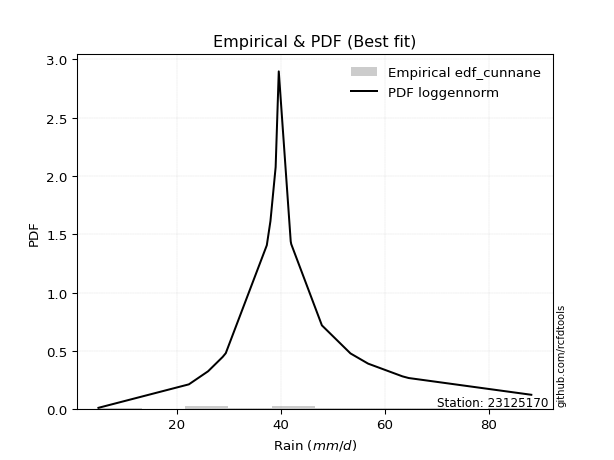</img>

</div>


### 12. Empirical - EDF Adamowski (1981)

The Adamowski formula in hydrology refers to a specific plotting position formula used for estimating the non-parametric empirical distribution of hydrological events (like flood peaks) to calculate their return periods. This formula provides an alternative to traditional parametric methods (like the Gumbel or Log Pearson Type III distributions). 

<div align="center">


$P=(m-0.25)/(n+0.5)$


</div>


**12.1. Empirical values**

<div align="center">

|                | 0                   | 1                  | 2                   | 3                   | 4                  | 5                   | 6                   | 7                   | 8             | 9                  | 10                 | 11                 | 12                 | 13                 | 14                 | 15                 | 16                 |
|:---------------|:--------------------|:-------------------|:--------------------|:--------------------|:-------------------|:--------------------|:--------------------|:--------------------|:--------------|:-------------------|:-------------------|:-------------------|:-------------------|:-------------------|:-------------------|:-------------------|:-------------------|
| date           | 2022                | 2025               | 2010                | 2015                | 2021               | 2016                | 2017                | 2005                | 2008          | 2020               | 2018               | 2009               | 2006               | 2012               | 2014               | 2013               | 2024               |
| x              | 4.9                 | 16.0               | 22.3                | 28.8                | 29.4               | 37.3                | 38.0                | 39.0                | 39.6          | 41.9               | 42.0               | 47.9               | 53.4               | 56.8               | 63.4               | 64.6               | 88.2               |
| m              | 1                   | 2                  | 3                   | 4                   | 5                  | 6                   | 7                   | 8                   | 9             | 10                 | 11                 | 12                 | 13                 | 14                 | 15                 | 16                 | 17                 |
| empirical_dist | edf_adamowski       | edf_adamowski      | edf_adamowski       | edf_adamowski       | edf_adamowski      | edf_adamowski       | edf_adamowski       | edf_adamowski       | edf_adamowski | edf_adamowski      | edf_adamowski      | edf_adamowski      | edf_adamowski      | edf_adamowski      | edf_adamowski      | edf_adamowski      | edf_adamowski      |
| empirical      | 0.04285714285714286 | 0.1                | 0.15714285714285714 | 0.21428571428571427 | 0.2714285714285714 | 0.32857142857142857 | 0.38571428571428573 | 0.44285714285714284 | 0.5           | 0.5571428571428572 | 0.6142857142857143 | 0.6714285714285714 | 0.7285714285714285 | 0.7857142857142857 | 0.8428571428571429 | 0.9                | 0.9571428571428572 |
| empirical_tr   | 1.044776119402985   | 1.1111111111111112 | 1.1864406779661016  | 1.2727272727272727  | 1.372549019607843  | 1.4893617021276595  | 1.627906976744186   | 1.7948717948717947  | 2.0           | 2.2580645161290325 | 2.592592592592593  | 3.0434782608695645 | 3.684210526315789  | 4.666666666666666  | 6.363636363636364  | 10.000000000000002 | 23.333333333333357 |

</div>


**12.2. Kolmogorov-Smirnov fit test (sorted by Δ)**


<div align="center">

|                | 0                  | 1                   | 2                   | 3                   | 4                   | 5                   | 6                   | 7                   | 8                  | 9                   | 10                 | 11                  | 12                 | 13                  | 14                  | 15                  | 16                  | 17                  | 18                 | 19                  | 20                  | 21                 | 22                  | 23                  | 24                  | 25                  | 26                  | 27                  | 28                  | 29                  | 30                  | 31                  | 32                  | 33                  | 34                  | 35                  | 36                 | 37                  | 38                    | 39                  | 40                  | 41                 | 42                  | 43                 | 44                  | 45                  | 46                  | 47                  | 48                  | 49                  | 50                  | 51                  | 52                  | 53                  | 54                  | 55                 | 56                 | 57                 | 58                  | 59                 | 60                 | 61                 | 62                  | 63                  | 64                  | 65                 | 66                  | 67                  | 68                  | 69                  | 70                 | 71                 | 72                  | 73                  | 74                  | 75                  | 76                 | 77                 | 78                  | 79                 | 80                 | 81                 | 82                 | 83                 | 84                  | 85                  | 86                 | 87                 | 88                 | 89                 |
|:---------------|:-------------------|:--------------------|:--------------------|:--------------------|:--------------------|:--------------------|:--------------------|:--------------------|:-------------------|:--------------------|:-------------------|:--------------------|:-------------------|:--------------------|:--------------------|:--------------------|:--------------------|:--------------------|:-------------------|:--------------------|:--------------------|:-------------------|:--------------------|:--------------------|:--------------------|:--------------------|:--------------------|:--------------------|:--------------------|:--------------------|:--------------------|:--------------------|:--------------------|:--------------------|:--------------------|:--------------------|:-------------------|:--------------------|:----------------------|:--------------------|:--------------------|:-------------------|:--------------------|:-------------------|:--------------------|:--------------------|:--------------------|:--------------------|:--------------------|:--------------------|:--------------------|:--------------------|:--------------------|:--------------------|:--------------------|:-------------------|:-------------------|:-------------------|:--------------------|:-------------------|:-------------------|:-------------------|:--------------------|:--------------------|:--------------------|:-------------------|:--------------------|:--------------------|:--------------------|:--------------------|:-------------------|:-------------------|:--------------------|:--------------------|:--------------------|:--------------------|:-------------------|:-------------------|:--------------------|:-------------------|:-------------------|:-------------------|:-------------------|:-------------------|:--------------------|:--------------------|:-------------------|:-------------------|:-------------------|:-------------------|
| station        | 23125170           | 23125170            | 23125170            | 23125170            | 23125170            | 23125170            | 23125170            | 23125170            | 23125170           | 23125170            | 23125170           | 23125170            | 23125170           | 23125170            | 23125170            | 23125170            | 23125170            | 23125170            | 23125170           | 23125170            | 23125170            | 23125170           | 23125170            | 23125170            | 23125170            | 23125170            | 23125170            | 23125170            | 23125170            | 23125170            | 23125170            | 23125170            | 23125170            | 23125170            | 23125170            | 23125170            | 23125170           | 23125170            | 23125170              | 23125170            | 23125170            | 23125170           | 23125170            | 23125170           | 23125170            | 23125170            | 23125170            | 23125170            | 23125170            | 23125170            | 23125170            | 23125170            | 23125170            | 23125170            | 23125170            | 23125170           | 23125170           | 23125170           | 23125170            | 23125170           | 23125170           | 23125170           | 23125170            | 23125170            | 23125170            | 23125170           | 23125170            | 23125170            | 23125170            | 23125170            | 23125170           | 23125170           | 23125170            | 23125170            | 23125170            | 23125170            | 23125170           | 23125170           | 23125170            | 23125170           | 23125170           | 23125170           | 23125170           | 23125170           | 23125170            | 23125170            | 23125170           | 23125170           | 23125170           | 23125170           |
| empirical_dist | edf_adamowski      | edf_adamowski       | edf_adamowski       | edf_adamowski       | edf_adamowski       | edf_adamowski       | edf_adamowski       | edf_adamowski       | edf_adamowski      | edf_adamowski       | edf_adamowski      | edf_adamowski       | edf_adamowski      | edf_adamowski       | edf_adamowski       | edf_adamowski       | edf_adamowski       | edf_adamowski       | edf_adamowski      | edf_adamowski       | edf_adamowski       | edf_adamowski      | edf_adamowski       | edf_adamowski       | edf_adamowski       | edf_adamowski       | edf_adamowski       | edf_adamowski       | edf_adamowski       | edf_adamowski       | edf_adamowski       | edf_adamowski       | edf_adamowski       | edf_adamowski       | edf_adamowski       | edf_adamowski       | edf_adamowski      | edf_adamowski       | edf_adamowski         | edf_adamowski       | edf_adamowski       | edf_adamowski      | edf_adamowski       | edf_adamowski      | edf_adamowski       | edf_adamowski       | edf_adamowski       | edf_adamowski       | edf_adamowski       | edf_adamowski       | edf_adamowski       | edf_adamowski       | edf_adamowski       | edf_adamowski       | edf_adamowski       | edf_adamowski      | edf_adamowski      | edf_adamowski      | edf_adamowski       | edf_adamowski      | edf_adamowski      | edf_adamowski      | edf_adamowski       | edf_adamowski       | edf_adamowski       | edf_adamowski      | edf_adamowski       | edf_adamowski       | edf_adamowski       | edf_adamowski       | edf_adamowski      | edf_adamowski      | edf_adamowski       | edf_adamowski       | edf_adamowski       | edf_adamowski       | edf_adamowski      | edf_adamowski      | edf_adamowski       | edf_adamowski      | edf_adamowski      | edf_adamowski      | edf_adamowski      | edf_adamowski      | edf_adamowski       | edf_adamowski       | edf_adamowski      | edf_adamowski      | edf_adamowski      | edf_adamowski      |
| p_dist         | laplace_asymmetric | fisk                | genlogistic         | johnsonsu           | nct                 | logjohnsonsu        | nakagami            | mielke              | exponnorm          | f                   | chi2               | betaprime           | gamma              | erlang              | pearson3            | rice                | logt                | weibull_min         | loggenlogistic     | invgauss            | truncnorm           | invgamma           | logmielke           | logloggamma         | maxwell             | t                   | laplace             | hypsecant           | logistic            | norm                | crystalball         | logweibull_min      | lognakagami         | rayleigh            | loggompertz         | loggumbel_l         | logpearson3        | logfisk             | loglaplace_asymmetric | invweibull          | gumbel_r            | ncf                | kstwobign           | halfnorm           | moyal               | halflogistic        | gumbel_l            | logf                | logfatiguelife      | logexponnorm        | lognorm             | lognorm             | logcrystalball      | loglognorm          | logrice             | lognct             | loglogistic        | loghypsecant       | logbetaprime        | logchi2            | loggamma           | loggamma           | logerlang           | loginvgamma         | loglaplace          | loginvweibull      | gibrat              | loginvgauss         | logalpha            | wald                | logmaxwell         | logncf             | lograyleigh         | logtruncnorm        | expon               | genexpon            | logkstwobign       | loggumbel_r        | loghalfnorm         | logmoyal           | loghalflogistic    | loggenexpon        | alpha              | logwald            | logexpon            | loggibrat           | pareto             | logpareto          | fatiguelife        | gompertz           |
| delta          | 0.0702979557585024 | 0.08812187523773429 | 0.08930845529446602 | 0.09253188809241586 | 0.09363301779126892 | 0.09392204075324428 | 0.09431061848260724 | 0.09465015666137355 | 0.0951855126443556 | 0.09653572478820244 | 0.0965366052833333 | 0.09653676202978151 | 0.0965387001603723 | 0.09653871884543413 | 0.09819324707803245 | 0.09893078753678897 | 0.09978662719593778 | 0.10122814413855913 | 0.1034539952409031 | 0.10523507962493484 | 0.10640231801219346 | 0.1078192524233389 | 0.10851732298040834 | 0.10863896857118527 | 0.10978620176847886 | 0.11010115215974714 | 0.11320767844410917 | 0.11352260560750582 | 0.11359365104704999 | 0.11367684130629485 | 0.11367685874139954 | 0.11689436176860263 | 0.11760592027884575 | 0.12206828911971729 | 0.12246193035969172 | 0.12252064768762588 | 0.1260138321077412 | 0.12876209378117148 | 0.13505236445144891   | 0.13536524834381403 | 0.13622590653153366 | 0.14092400288503   | 0.15101436225286818 | 0.1568890707224379 | 0.15941533271032776 | 0.17300332409540536 | 0.18403458682307638 | 0.19128622084070718 | 0.19188508289653733 | 0.19197716782954793 | 0.19197940172042266 | 0.19197940172042266 | 0.19197943365363795 | 0.19197945723742688 | 0.19198486364711403 | 0.19219851600248   | 0.1947806047917377 | 0.1971685211010225 | 0.19914975196520152 | 0.1995316341741163 | 0.2004939731696433 | 0.2004939731696433 | 0.20159036023522908 | 0.20325359657307535 | 0.20657379308623164 | 0.2127738375563323 | 0.21828303913973474 | 0.21836781997917448 | 0.21922130849706795 | 0.22231850347505638 | 0.2240935181155304 | 0.2245340956328467 | 0.23463087075558947 | 0.25539277154029144 | 0.26090269896487917 | 0.26123119975429343 | 0.2618381175639938 | 0.2626597047085049 | 0.26429769620915017 | 0.2882488438943515 | 0.2903686741776719 | 0.3064344582223667 | 0.3259351827889486 | 0.3593187623156053 | 0.37466234329499637 | 0.38551763964183233 | 0.5284000672886552 | 0.5420364569066963 | 0.6157051049734749 | 0.8906556021315577 |
| deltao         | 0.3260541228310003 | 0.3260541228310003  | 0.3260541228310003  | 0.3260541228310003  | 0.3260541228310003  | 0.3260541228310003  | 0.3260541228310003  | 0.3260541228310003  | 0.3260541228310003 | 0.3260541228310003  | 0.3260541228310003 | 0.3260541228310003  | 0.3260541228310003 | 0.3260541228310003  | 0.3260541228310003  | 0.3260541228310003  | 0.3260541228310003  | 0.3260541228310003  | 0.3260541228310003 | 0.3260541228310003  | 0.3260541228310003  | 0.3260541228310003 | 0.3260541228310003  | 0.3260541228310003  | 0.3260541228310003  | 0.3260541228310003  | 0.3260541228310003  | 0.3260541228310003  | 0.3260541228310003  | 0.3260541228310003  | 0.3260541228310003  | 0.3260541228310003  | 0.3260541228310003  | 0.3260541228310003  | 0.3260541228310003  | 0.3260541228310003  | 0.3260541228310003 | 0.3260541228310003  | 0.3260541228310003    | 0.3260541228310003  | 0.3260541228310003  | 0.3260541228310003 | 0.3260541228310003  | 0.3260541228310003 | 0.3260541228310003  | 0.3260541228310003  | 0.3260541228310003  | 0.3260541228310003  | 0.3260541228310003  | 0.3260541228310003  | 0.3260541228310003  | 0.3260541228310003  | 0.3260541228310003  | 0.3260541228310003  | 0.3260541228310003  | 0.3260541228310003 | 0.3260541228310003 | 0.3260541228310003 | 0.3260541228310003  | 0.3260541228310003 | 0.3260541228310003 | 0.3260541228310003 | 0.3260541228310003  | 0.3260541228310003  | 0.3260541228310003  | 0.3260541228310003 | 0.3260541228310003  | 0.3260541228310003  | 0.3260541228310003  | 0.3260541228310003  | 0.3260541228310003 | 0.3260541228310003 | 0.3260541228310003  | 0.3260541228310003  | 0.3260541228310003  | 0.3260541228310003  | 0.3260541228310003 | 0.3260541228310003 | 0.3260541228310003  | 0.3260541228310003 | 0.3260541228310003 | 0.3260541228310003 | 0.3260541228310003 | 0.3260541228310003 | 0.3260541228310003  | 0.3260541228310003  | 0.3260541228310003 | 0.3260541228310003 | 0.3260541228310003 | 0.3260541228310003 |
| eval           | Δo > Δ             | Δo > Δ              | Δo > Δ              | Δo > Δ              | Δo > Δ              | Δo > Δ              | Δo > Δ              | Δo > Δ              | Δo > Δ             | Δo > Δ              | Δo > Δ             | Δo > Δ              | Δo > Δ             | Δo > Δ              | Δo > Δ              | Δo > Δ              | Δo > Δ              | Δo > Δ              | Δo > Δ             | Δo > Δ              | Δo > Δ              | Δo > Δ             | Δo > Δ              | Δo > Δ              | Δo > Δ              | Δo > Δ              | Δo > Δ              | Δo > Δ              | Δo > Δ              | Δo > Δ              | Δo > Δ              | Δo > Δ              | Δo > Δ              | Δo > Δ              | Δo > Δ              | Δo > Δ              | Δo > Δ             | Δo > Δ              | Δo > Δ                | Δo > Δ              | Δo > Δ              | Δo > Δ             | Δo > Δ              | Δo > Δ             | Δo > Δ              | Δo > Δ              | Δo > Δ              | Δo > Δ              | Δo > Δ              | Δo > Δ              | Δo > Δ              | Δo > Δ              | Δo > Δ              | Δo > Δ              | Δo > Δ              | Δo > Δ             | Δo > Δ             | Δo > Δ             | Δo > Δ              | Δo > Δ             | Δo > Δ             | Δo > Δ             | Δo > Δ              | Δo > Δ              | Δo > Δ              | Δo > Δ             | Δo > Δ              | Δo > Δ              | Δo > Δ              | Δo > Δ              | Δo > Δ             | Δo > Δ             | Δo > Δ              | Δo > Δ              | Δo > Δ              | Δo > Δ              | Δo > Δ             | Δo > Δ             | Δo > Δ              | Δo > Δ             | Δo > Δ             | Δo > Δ             | Δo > Δ             | Δo <= Δ            | Δo <= Δ             | Δo <= Δ             | Δo <= Δ            | Δo <= Δ            | Δo <= Δ            | Δo <= Δ            |
| fit            | 1                  | 1                   | 1                   | 1                   | 1                   | 1                   | 1                   | 1                   | 1                  | 1                   | 1                  | 1                   | 1                  | 1                   | 1                   | 1                   | 1                   | 1                   | 1                  | 1                   | 1                   | 1                  | 1                   | 1                   | 1                   | 1                   | 1                   | 1                   | 1                   | 1                   | 1                   | 1                   | 1                   | 1                   | 1                   | 1                   | 1                  | 1                   | 1                     | 1                   | 1                   | 1                  | 1                   | 1                  | 1                   | 1                   | 1                   | 1                   | 1                   | 1                   | 1                   | 1                   | 1                   | 1                   | 1                   | 1                  | 1                  | 1                  | 1                   | 1                  | 1                  | 1                  | 1                   | 1                   | 1                   | 1                  | 1                   | 1                   | 1                   | 1                   | 1                  | 1                  | 1                   | 1                   | 1                   | 1                   | 1                  | 1                  | 1                   | 1                  | 1                  | 1                  | 1                  | 0                  | 0                   | 0                   | 0                  | 0                  | 0                  | 0                  |
| n              | 17                 | 17                  | 17                  | 17                  | 17                  | 17                  | 17                  | 17                  | 17                 | 17                  | 17                 | 17                  | 17                 | 17                  | 17                  | 17                  | 17                  | 17                  | 17                 | 17                  | 17                  | 17                 | 17                  | 17                  | 17                  | 17                  | 17                  | 17                  | 17                  | 17                  | 17                  | 17                  | 17                  | 17                  | 17                  | 17                  | 17                 | 17                  | 17                    | 17                  | 17                  | 17                 | 17                  | 17                 | 17                  | 17                  | 17                  | 17                  | 17                  | 17                  | 17                  | 17                  | 17                  | 17                  | 17                  | 17                 | 17                 | 17                 | 17                  | 17                 | 17                 | 17                 | 17                  | 17                  | 17                  | 17                 | 17                  | 17                  | 17                  | 17                  | 17                 | 17                 | 17                  | 17                  | 17                  | 17                  | 17                 | 17                 | 17                  | 17                 | 17                 | 17                 | 17                 | 17                 | 17                  | 17                  | 17                 | 17                 | 17                 | 17                 |
| best_fit       | 1                  | 0                   | 0                   | 0                   | 0                   | 0                   | 0                   | 0                   | 0                  | 0                   | 0                  | 0                   | 0                  | 0                   | 0                   | 0                   | 0                   | 0                   | 0                  | 0                   | 0                   | 0                  | 0                   | 0                   | 0                   | 0                   | 0                   | 0                   | 0                   | 0                   | 0                   | 0                   | 0                   | 0                   | 0                   | 0                   | 0                  | 0                   | 0                     | 0                   | 0                   | 0                  | 0                   | 0                  | 0                   | 0                   | 0                   | 0                   | 0                   | 0                   | 0                   | 0                   | 0                   | 0                   | 0                   | 0                  | 0                  | 0                  | 0                   | 0                  | 0                  | 0                  | 0                   | 0                   | 0                   | 0                  | 0                   | 0                   | 0                   | 0                   | 0                  | 0                  | 0                   | 0                   | 0                   | 0                   | 0                  | 0                  | 0                   | 0                  | 0                  | 0                  | 0                  | 0                  | 0                   | 0                   | 0                  | 0                  | 0                  | 0                  |
| best_fit_sort  | 1                  | 2                   | 3                   | 4                   | 5                   | 6                   | 7                   | 8                   | 9                  | 10                  | 11                 | 12                  | 13                 | 14                  | 15                  | 16                  | 17                  | 18                  | 19                 | 20                  | 21                  | 22                 | 23                  | 24                  | 25                  | 26                  | 27                  | 28                  | 29                  | 30                  | 31                  | 32                  | 33                  | 34                  | 35                  | 36                  | 37                 | 38                  | 39                    | 40                  | 41                  | 42                 | 43                  | 44                 | 45                  | 46                  | 47                  | 48                  | 49                  | 50                  | 51                  | 52                  | 53                  | 54                  | 55                  | 56                 | 57                 | 58                 | 59                  | 60                 | 61                 | 62                 | 63                  | 64                  | 65                  | 66                 | 67                  | 68                  | 69                  | 70                  | 71                 | 72                 | 73                  | 74                  | 75                  | 76                  | 77                 | 78                 | 79                  | 80                 | 81                 | 82                 | 83                 | 84                 | 85                  | 86                  | 87                 | 88                 | 89                 | 90                 |

</div>


<div align="center">

</img>

</div>


**12.3. Best fit**

<div align="center">

|   id |   station | empirical_dist   | p_dist             |    delta |   deltao | eval   |   fit |   n |   best_fit |   best_fit_sort |
|-----:|----------:|:-----------------|:-------------------|---------:|---------:|:-------|------:|----:|-----------:|----------------:|
|    0 |  23125170 | edf_adamowski    | laplace_asymmetric | 0.070298 | 0.326054 | Δo > Δ |     1 |  17 |          1 |               1 |

</div>


<div align="center">

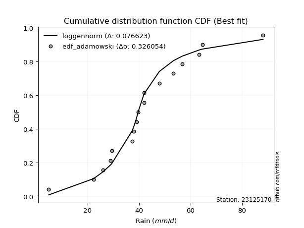</img>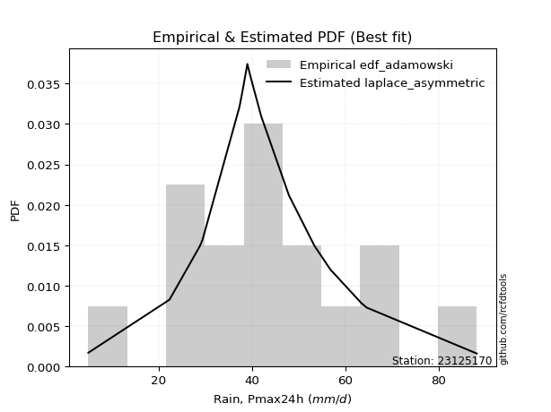</img>

</div>


## C. Best fit & Estimate extreme values for specific return periods - Tr


### 1. Best fit (ordered by delta Δ)

<div align="center">

|   id |   station | empirical_dist   | p_dist             |     delta |   deltao | eval   |   fit |   n |   best_fit |   best_fit_sort |
|-----:|----------:|:-----------------|:-------------------|----------:|---------:|:-------|------:|----:|-----------:|----------------:|
|    0 |  23125170 | edf_weibull      | laplace_asymmetric | 0.0681592 | 0.326054 | Δo > Δ |     1 |  17 |          1 |               1 |
|    1 |  23125170 | edf_adamowski    | laplace_asymmetric | 0.070298  | 0.326054 | Δo > Δ |     1 |  17 |          1 |               2 |
|    2 |  23125170 | edf_chegodayev   | laplace_asymmetric | 0.0709548 | 0.326054 | Δo > Δ |     1 |  17 |          1 |               3 |
|    3 |  23125170 | edf_jenkinson    | laplace_asymmetric | 0.071087  | 0.326054 | Δo > Δ |     1 |  17 |          1 |               4 |
|    4 |  23125170 | edf_beard        | laplace_asymmetric | 0.071087  | 0.326054 | Δo > Δ |     1 |  17 |          1 |               5 |
|    5 |  23125170 | edf_filliben     | laplace_asymmetric | 0.0711864 | 0.326054 | Δo > Δ |     1 |  17 |          1 |               6 |
|    6 |  23125170 | edf_tukey        | laplace_asymmetric | 0.0713969 | 0.326054 | Δo > Δ |     1 |  17 |          1 |               7 |
|    7 |  23125170 | edf_blom         | laplace_asymmetric | 0.0719543 | 0.326054 | Δo > Δ |     1 |  17 |          1 |               8 |
|    8 |  23125170 | edf_cunnane      | laplace_asymmetric | 0.0722913 | 0.326054 | Δo > Δ |     1 |  17 |          1 |               9 |
|    9 |  23125170 | edf_gringorten   | laplace_asymmetric | 0.0728347 | 0.326054 | Δo > Δ |     1 |  17 |          1 |              10 |
|   10 |  23125170 | edf_hazen        | laplace_asymmetric | 0.0736593 | 0.326054 | Δo > Δ |     1 |  17 |          1 |              11 |
|   11 |  23125170 | edf_california   | rayleigh           | 0.102426  | 0.326054 | Δo > Δ |     1 |  17 |          1 |              12 |

</div>

:file_folder:Tables: [bestfit_23125170.csv](table/bestfit_23125170.csv) | [extreme_23125170.csv](table/extreme_23125170.csv)


### 2. Extreme values

In hydrology, a return period (or recurrence interval $Tr$) is the statistical average time between extreme events like floods or droughts of a specific magnitude, indicating how rare an event is, with a 100-year flood, for example, having a 1% chance of occurring in any given year, not that it happens exactly every century. It is a key tool for infrastructure design (like bridges or dams) and risk assessment, calculated from historical data to determine the probability of future events, although it is important to remember it is statistical average, and events can cluster or be missed.

> risk_rate: assuming the return period as the project useful life.

|   id |      tr |   prob_l |     prob_g |      alpha |   betaprime |     chi2 |   crystalball |   erlang |    expon |   exponnorm |        f |   fatiguelife |     fisk |    gamma |   genexpon |   genlogistic |   gibrat |   gompertz |   gumbel_l |   gumbel_r |   halflogistic |   halfnorm |   hypsecant |   invgamma |   invgauss |   invweibull |   johnsonsu |   kstwobign |   laplace |   laplace_asymmetric |   loggamma |   logistic |   lognorm |   maxwell |   mielke |    moyal |   nakagami |      ncf |      nct |     norm |           pareto |   pearson3 |   rayleigh |     rice |        t |   truncnorm |     wald |   weibull_min |   logalpha |   logbetaprime |   logchi2 |   logcrystalball |   logerlang |         logexpon |   logexponnorm |     logf |   logfatiguelife |   logfisk |   loggenexpon |   loggenlogistic |   loggibrat |   loggompertz |   loggumbel_l |   loggumbel_r |   loghalflogistic |   loghalfnorm |   loghypsecant |   loginvgamma |   loginvgauss |   loginvweibull |   logjohnsonsu |   logkstwobign |   loglaplace |   loglaplace_asymmetric |   logloggamma |   loglogistic |   loglognorm |   logmaxwell |   logmielke |   logmoyal |   lognakagami |   logncf |   lognct |   logpareto |   logpearson3 |   lograyleigh |   logrice |       logt |   logtruncnorm |   logwald |   logweibull_min |   station |   n |   risk_rate |
|-----:|--------:|---------:|-----------:|-----------:|------------:|---------:|--------------:|---------:|---------:|------------:|---------:|--------------:|---------:|---------:|-----------:|--------------:|---------:|-----------:|-----------:|-----------:|---------------:|-----------:|------------:|-----------:|-----------:|-------------:|------------:|------------:|----------:|---------------------:|-----------:|-----------:|----------:|----------:|---------:|---------:|-----------:|---------:|---------:|---------:|-----------------:|-----------:|-----------:|---------:|---------:|------------:|---------:|--------------:|-----------:|---------------:|----------:|-----------------:|------------:|-----------------:|---------------:|---------:|-----------------:|----------:|--------------:|-----------------:|------------:|--------------:|--------------:|--------------:|------------------:|--------------:|---------------:|--------------:|--------------:|----------------:|---------------:|---------------:|-------------:|------------------------:|--------------:|--------------:|-------------:|-------------:|------------:|-----------:|--------------:|---------:|---------:|------------:|--------------:|--------------:|----------:|-----------:|---------------:|----------:|-----------------:|----------:|----:|------------:|
|    0 |    2    | 0.5      | 0.5        |    26.1481 |     40.8765 |  40.8773 |       41.9706 |  40.8772 |  30.5954 |     40.7746 |  40.8768 |       4.90009 |  40.8802 |  40.8772 |    30.5707 |       40.8691 |  36.186  |    78.1388 |    45.1365 |    38.8047 |        37.2307 |    38.0258 |     41.9706 |    40.3149 |    40.4692 |      39.1169 |     40.8891 |     38.3947 |   41.9706 |              40.5607 |    35.4982 |    41.9706 |   36.0925 |   40.3224 |  40.8296 |  37.7826 |    40.7695 |  38.8834 |  40.8823 |  41.9706 |      4.99616     |    40.7944 |    39.7379 |  41.2323 |  41.797  |     40.4394 |  35.7237 |       40.869  |    34.3609 |        35.5342 |   35.5032 |          36.0925 |     35.4519 |     19.5573      |        36.0926 |  36.124  |          36.1053 |   39.3449 |       27.2344 |          40.5861 |     29.7977 |       39.8052 |       40.0844 |       32.4982 |           30.847  |       31.67   |        36.0925 |       35.392  |       34.2434 |         34.2988 |        41.0943 |        30.6823 |      36.0925 |                 38.6736 |       40.6164 |       36.0925 |      36.0925 |      34.1744 |     40.4031 |    31.416  |       39.519  |  33.9765 |  36.0765 |     4.9277  |       42.6911 |       33.5187 |   36.0923 |    41.4524 |        32.4282 |   29.3443 |          40.0729 |  23125170 |  17 |    0.75     |
|    1 |    2.33 | 0.570815 | 0.429185   |    31.1218 |     44.328  |  44.3294 |       45.4095 |  44.3293 |  36.2568 |     44.0634 |  44.3285 |       5.98762 |  43.9472 |  44.3293 |    36.2274 |       44.0119 |  37.9281 |    78.7655 |    48.1284 |    41.9912 |        40.507  |    41.7373 |     44.7228 |    43.7632 |    43.9573 |      42.8741 |     44.1766 |     42.3687 |   44.0517 |              42.9476 |    40.0806 |    45.0005 |   40.4486 |   43.8952 |  44.0687 |  40.7991 |    44.1264 |  42.7106 |  44.209  |  45.4095 |      6.0072      |    44.2484 |    43.3635 |  44.8035 |  45.2514 |     43.8561 |  37.9787 |       44.5264 |    38.8267 |        40.2559 |   40.2418 |          40.4486 |     39.9738 |     26.5308      |        40.4488 |  40.5188 |          40.4347 |   43.0057 |       33.0835 |          43.9839 |     31.5681 |       43.5344 |       44.2619 |       36.1172 |           34.3841 |       35.8145 |        39.5386 |       39.8098 |       38.9867 |         41.0955 |        44.2511 |        37.3556 |      38.6691 |                 41.2056 |       44.4119 |       39.9042 |      40.4486 |      38.4692 |     43.8732 |    34.7183 |       42.7003 |  38.497  |  40.4441 |     5.22855 |       46.8399 |       37.7973 |   40.448  |    44.2239 |        36.4716 |   31.6208 |          43.771  |  23125170 |  17 |    0.729209 |
|    2 |    5    | 0.8      | 0.2        |    69.689  |     57.7752 |  57.7782 |       58.1895 |  57.778  |  64.5628 |     57.0342 |  57.7762 |      29.0883  |  56.3523 |  57.778  |    64.5097 |       56.6541 |  47.9574 |    80.7901 |    57.794  |    55.835  |        55.3315 |    57.4328 |     55.7623 |    57.4488 |    57.8207 |      59.1971 |     57.1678 |     59.2494 |   54.4566 |              54.8817 |    63.395  |    56.6995 |   61.7747 |   57.9575 |  56.4538 |  54.7716 |    57.7988 |  58.6091 |  57.2981 |  58.1895 | 223903           |    57.7516 |    57.8786 |  58.2966 |  58.1599 |     56.4696 |  50.6018 |       58.4446 |    61.8975 |        64.5803 |   64.7019 |          61.7746 |     62.8663 |    121.881       |        61.7749 |  62.0945 |          61.6059 |   60.6336 |       72.1033 |          56.6861 |     44.0113 |       58.1906 |       60.9704 |       57.1386 |           56.1923 |       60.2457 |        57.0011 |       62.2242 |       64.3159 |         90.1368 |        56.252  |        86.1792 |      54.5875 |                 52.9474 |       58.7119 |       58.7989 |      61.7747 |      61.3014 |     56.8153 |    55.1604 |       57.5694 |  61.9989 |  61.8631 |   inf       |       60.6084 |       61.1413 |   61.7713 |    58.1662 |        55.8771 |   48.0424 |          58.2148 |  23125170 |  17 |    0.67232  |
|    3 |   10    | 0.9      | 0.1        |   140.546  |     67.2455 |  67.2477 |       66.6674 |  67.2475 |  90.2582 |     66.6177 |  67.246  |      60.9844  |  66.0887 |  67.2475 |    90.1837 |       66.3083 |  59.3896 |    81.9173 |    63.1754 |    67.1106 |        67.6426 |    69.047  |     64.5778 |    67.3488 |    67.8393 |      72.4919 |     66.6758 |     72.1019 |   63.9018 |              65.7152 |    86.4812 |    65.3154 |   81.8105 |   67.8538 |  65.7915 |  66.9369 |    67.6679 |  70.6294 |  66.7875 |  66.6674 |      1.46732e+10 |    67.3002 |    68.2281 |  67.3787 |  66.8633 |     64.6711 |  63.998  |       67.8171 |    85.2844 |        89.0636 |   89.3862 |          81.8105 |     85.3873 |    486.459       |        81.8109 |  82.4383 |          81.4721 |   78.0879 |      125.682  |          65.9602 |     64.2788 |       68.4202 |       72.8716 |       83.0208 |           84.4948 |       88.5243 |        76.3377 |       84.3954 |       91.1415 |        170.895  |        65.5126 |       162.861  |      74.647  |                 66.4261 |       68.1571 |       78.2264 |      81.8105 |      85.09   |     66.2269 |    82.5445 |       70.7888 |  85.9954 |  82.0333 |   inf       |       67.4359 |       86.152  |   81.804  |    75.5966 |        69.3223 |   74.886  |          68.2316 |  23125170 |  17 |    0.651322 |
|    4 |   15    | 0.933333 | 0.0666667  |   211.15   |     72.1385 |  72.1395 |       70.898  |  72.1392 | 105.289  |     71.8315 |  72.1384 |      81.845   |  71.6193 |  72.1392 |   105.202  |       71.6358 |  67.2751 |    82.4278 |    65.6124 |    73.4722 |        74.6096 |    75.0911 |     69.6086 |    72.5557 |    73.0959 |      79.9927 |     71.7574 |     78.9251 |   69.427  |              72.0523 |   101.171  |    70.0097 |   94.1215 |   72.9315 |  71.1273 |  73.9972 |    72.7709 |  77.0736 |  71.8245 |  70.898  |      9.63793e+12 |    72.2446 |    73.5607 |  71.9378 |  71.2733 |     68.6512 |  72.6004 |       72.504  |   100.424  |       104.808  |  105.287  |          94.1215 |     99.6574 |   1093.14        |        94.122  |  94.9671 |          93.6712 |   89.6286 |      167.354  |          71.1864 |     83.4709 |       73.6313 |       79.0002 |      102.502  |          106.434  |      108.153  |        90.1851 |       98.5142 |      109.011  |        245.176  |        71.0475 |       228.327  |      89.6438 |                 75.8497 |       72.8186 |       91.3914 |      94.1216 |     100.681  |     71.521  |   104.3    |       78.6557 | 101.592  |  94.4462 |   inf       |       70.0461 |      102.802  |   94.1129 |    90.573  |        74.8806 |   99.5847 |          73.3183 |  23125170 |  17 |    0.644736 |
|    5 |   20    | 0.95     | 0.05       |   281.693  |     75.4037 |  75.4035 |       73.6686 |  75.4033 | 115.954  |     75.4393 |  75.4031 |      97.2898  |  75.5384 |  75.4033 |   115.858  |       75.3355 |  73.4606 |    82.7455 |    67.1294 |    77.9264 |        79.4909 |    79.1207 |     73.1577 |    76.0668 |    76.6336 |      85.2446 |     75.2237 |     83.5214 |   73.3471 |              76.5486 |   112.196  |    73.2543 |  103.171  |   76.3014 |  74.9603 |  78.9973 |    76.1666 |  81.456  |  75.2472 |  73.6686 |      9.61617e+14 |    75.548  |    77.1051 |  74.9315 |  74.1911 |     71.1884 |  79.0109 |       75.572  |   111.91   |       116.698  |  117.307  |         103.171  |    110.341  |   1941.59        |       103.172  | 104.189  |         102.636  |   98.5876 |      202.444  |          74.9209 |    102.457  |       77.0748 |       83.0726 |      118.803  |          125.119  |      123.603  |       101.439  |      109.121  |      122.799  |        315.667  |        75.1816 |       286.687  |     102.078  |                 83.3359 |       75.8477 |      101.764  |     103.171  |     112.574  |     75.3017 |   123.095  |       84.3382 | 113.451  | 103.579  |   inf       |       71.4784 |      115.613  |  103.161  |   104.834  |        77.9123 |  123.152  |          76.6743 |  23125170 |  17 |    0.641514 |
|    6 |   25    | 0.96     | 0.04       |   352.21   |     77.8384 |  77.8371 |       75.7081 |  77.8368 | 124.226  |     78.2042 |  77.8373 |     109.561   |  78.5907 |  77.8368 |   124.123  |       78.1729 |  78.6172 |    82.9716 |    68.2089 |    81.3573 |        83.2517 |    82.1189 |     75.9044 |    78.7043 |    79.2869 |      89.2899 |     77.8505 |     86.9642 |   76.3878 |              80.0362 |   121.115  |    75.7363 |  110.384  |   78.8031 |  77.9857 |  82.8729 |    78.691  |  84.7646 |  77.8345 |  75.7081 |      3.41634e+16 |    78.013  |    79.7385 |  77.1389 |  76.3558 |     73.0078 |  84.1456 |       77.8286 |   121.276  |       126.359  |  127.08   |         110.384  |    118.969  |   3031.61        |       110.385  | 111.546  |         109.779  |  106.041  |      233.201  |          77.8605 |    121.546  |       79.6233 |       86.0978 |      133.107  |          141.723  |      136.513  |       111.105  |      117.709  |      134.179  |        383.5    |        78.5549 |       339.979  |     112.899  |                 89.6479 |       78.0646 |      110.488  |     110.384  |     122.304  |     78.2767 |   139.962  |       88.8138 | 123.136  | 110.863  |   inf       |       72.4006 |      126.154  |  110.372  |   118.908  |        79.8203 |  145.993  |          79.1556 |  23125170 |  17 |    0.639603 |
|    7 |   50    | 0.98     | 0.02       |   704.687  |     84.9568 |  84.9512 |       81.5484 |  84.9509 | 149.921  |     86.6914 |  84.9539 |     148.934   |  88.2169 |  84.9509 |   149.797  |       86.8683 |  96.7944 |    83.5854 |    71.1392 |    91.9263 |        94.8392 |    90.8335 |     84.4203 |    86.5141 |    87.1187 |     101.752  |     85.756  |     97.0739 |   85.8331 |              90.8697 |   151.024  |    83.3199 |  133.952  |   86.0588 |  87.8085 |  94.9045 |    86.023  |  94.6292 |  85.5902 |  81.5484 |      2.23891e+21 |    85.2289 |    87.3829 |  83.4752 |  82.6434 |     77.8855 | 100.91   |       84.2772 |   153.146  |       159.007  |  160.15   |         133.952  |    147.814  |  12100           |       133.953  | 135.623  |         133.114  |  132.489  |      351.607  |          87.3765 |    221.973  |       86.9764 |       94.8768 |      188.926  |          208.056  |      182.214  |       147.325  |      146.567  |      173.724  |        698.528  |        90.3011 |       560.889  |     154.386  |                112.469  |       84.3493 |      142.05   |     133.952  |     155.543  |     87.9047 |   208.52   |      103.153  | 156.163  | 134.691  |   inf       |       74.4822 |      162.519  |  133.936  |   192.198  |        83.8529 |  254.439  |          86.3035 |  23125170 |  17 |    0.63583  |
|    8 |   75    | 0.986667 | 0.0133333  |  1057.11   |     88.8665 |  88.8579 |       84.6821 |  88.8576 | 164.952  |     91.6225 |  88.8623 |     172.645   |  93.989  |  88.8576 |   164.815  |       91.9023 | 109.071  |    83.8958 |    72.621  |    98.0695 |       101.575  |    95.5774 |     89.3969 |    90.8676 |    91.4666 |     108.995  |     90.2519 |    102.636  |   91.3582 |              97.2068 |   170.183  |    87.6998 |  148.609  |   90.0036 |  93.9336 | 101.94   |    90.0132 | 100.162  |  89.9839 |  84.6821 |      1.4706e+24  |    89.1974 |    91.5417 |  86.8834 |  86.0779 |     80.2133 | 111.227  |       87.7263 |   173.912  |       180.101  |  181.546  |         148.609  |    166.229  |  27190.2         |       148.61   | 150.622  |         147.62   |  150.673  |      439.63   |          93.2995 |    333.394  |       90.9505 |       99.6514 |      231.575  |          260.08   |      213.231  |       173.737  |      165.102  |      200.106  |        989.804  |        98.3377 |       738.76   |     185.403  |                128.425  |       87.6809 |      164.237  |     148.609  |     177.262  |     93.8969 |   263.266  |      111.882  | 177.734  | 149.529  |   inf       |       75.3012 |      186.53   |  148.589  |   275.603  |        85.2653 |  358.128  |          90.1602 |  23125170 |  17 |    0.634587 |
|    9 |  100    | 0.99     | 0.01       |  1409.53   |     91.5469 |  91.5357 |       86.8016 |  91.5354 | 175.616  |     95.1156 |  91.5416 |     189.707   |  98.1608 |  91.5354 |   175.471  |       95.4595 | 118.582  |    84.0988 |    73.5903 |   102.417  |       106.343  |    98.8091 |     92.927  |    93.8792 |    94.4659 |     114.121  |     93.4017 |    106.447  |   95.2784 |             101.703  |   184.576  |    90.7922 |  159.421  |   92.6905 |  98.4805 | 106.932  |    92.7318 | 104.001  |  93.0561 |  86.8016 |      1.46728e+26 |    91.9201 |    94.375  |  89.1915 |  88.4275 |     81.634  | 118.748  |       90.054  |   189.681  |       196.031  |  197.718  |         159.421  |    180.034  |  48294.4         |       159.422  | 161.699  |         158.32   |  164.994  |      511.915  |          97.6947 |    456.886  |       93.6481 |      102.904  |      267.46   |          304.585  |      237.332  |       195.295  |      179.053  |      220.43   |       1266.72   |       104.706  |       892.208  |     211.119  |                141.1    |       89.918  |      181.958  |     159.421  |     193.767  |     98.3438 |   310.617  |      118.242  | 194.135  | 160.483  |   inf       |       75.7557 |      204.89   |  159.399  |   372.39   |        85.985  |  459.489  |          92.7756 |  23125170 |  17 |    0.633968 |
|   10 |  200    | 0.995    | 0.005      |  2819.16   |     97.735  |  97.7172 |       91.6094 |  97.7169 | 201.312  |    103.525  |  97.727  |     231.47    | 108.505  |  97.7169 |   201.144  |      104      | 144.456  |    84.5401 |    75.697  |   112.87   |       117.804  |   106.2    |    101.432  |   100.918  |   101.448  |     126.446  |    100.896  |    115.225  |  104.724  |             112.537  |   222.164  |    98.2102 |  186.952  |   98.8378 | 110.213  | 118.958  |    98.9516 | 112.996  | 100.351  |  91.6094 |      9.61589e+30 |    98.2119 |   100.858  |  94.4348 |  93.8446 |     84.3022 | 137.483  |       95.3163 |   231.511  |       237.941  |  240.313  |         186.952  |    215.983  | 192756           |       186.953  | 189.946  |         185.559  |  205.147  |      725.238  |         109.037  |   1076.77   |       99.7915 |      110.344  |      378.16   |          445.285  |      303.194  |       258.865  |      215.597  |      275.441  |       2292.09   |       122.93   |      1377.99   |     288.7    |                177.02   |       94.943  |      232.657  |     186.952  |     237.542  |    109.821  |   462.688  |      134.173  | 237.716  | 188.408  |   inf       |       76.5388 |      253.986  |  186.923  |   935.638  |        87.0819 |  854.837  |          98.7252 |  23125170 |  17 |    0.633042 |
|   11 |  250    | 0.996    | 0.004      |  3523.97   |     99.6562 |  99.636  |       93.0786 |  99.6357 | 209.584  |    106.232  |  99.6472 |     245.081   | 111.929  |  99.6357 |   209.41   |      106.743  | 153.74   |    84.6699 |    76.3168 |   116.23   |       121.489  |   108.474  |    104.169  |   103.129  |   103.631  |     130.408  |    103.289  |    117.942  |  107.764  |             116.024  |   235.19   |   100.592  |  196.278  |  100.73   | 114.245  | 122.83   |   100.866  | 115.826  | 102.678  |  93.0786 |      3.41624e+32 |   100.167  |   102.853  |  96.0392 |  95.5261 |     84.9509 | 143.682  |       96.9192 |   246.215  |       252.559  |  255.187  |         196.278  |    228.41   | 300970           |       196.28   | 199.528  |         194.785  |  220.006  |      807.334  |         112.937  |   1464.57   |      101.675  |      112.633  |      422.7    |          503.107  |      326.921  |       283.445  |      228.298  |      295.124  |       2773.52   |       129.852  |      1576.41   |     319.303  |                190.428  |       96.465  |      251.76   |     196.279  |     252.913  |    113.769  |   526.018  |      139.494  | 253.056  | 197.877  |   inf       |       76.7202 |      271.348  |  196.248  |  1352.93   |        87.3038 | 1049.73   |         100.547  |  23125170 |  17 |    0.632858 |
|   12 |  500    | 0.998    | 0.002      |  7048      |    105.437  | 105.409  |       97.4356 | 105.408  | 235.279  |    114.638  | 105.425  |     287.778   | 122.88   | 105.408  |   235.084  |      115.253  | 185.824  |    85.0421 |    78.0938 |   126.66   |       132.926  |   115.254  |    112.673  |   109.853  |   110.246  |     142.706  |    110.687  |    126.082  |  117.21   |             126.858  |   278.743  |   107.977  |  226.762  |  106.377  | 127.654  | 134.856  |   106.576  | 124.44   | 109.866  |  97.4356 |      2.23885e+37 |   106.054  |   108.808  | 100.802  | 100.591  |     86.4227 | 163.39   |      101.657  |   296.106  |       301.752  |  305.291  |         226.762  |    269.852  |      1.20126e+06 |       226.764  | 230.885  |         224.937  |  273.287  |     1111.8    |         125.915  |   4240.21   |      107.274  |      119.464  |      597.202  |          734.906  |      409.266  |       375.7    |      270.902  |      363.109  |       5012.14   |       155.643  |      2359.12   |     436.639  |                238.904  |      100.941  |      321.565  |     226.763  |     304.949  |    126.909  |   783.537  |      156.654  | 305.164  | 228.859  |   inf       |       77.1337 |      330.529  |  226.724  |  5705.74   |        87.7502 | 2016.9    |         105.959  |  23125170 |  17 |    0.632489 |
|   13 |  750    | 0.998667 | 0.00133333 | 10572      |    108.703  | 108.669  |       99.856  | 108.669  | 250.31   |    119.556  | 108.688  |     313.005   | 129.518  | 108.669  |   250.102  |      120.226  | 207.043  |    85.241  |    79.0434 |   132.758  |       139.612  |   119.041  |    117.647  |   113.7    |   114.012  |     149.895  |    115.004  |    130.656  |  122.735  |             133.195  |   306.515  |   112.292  |  245.698  |  109.535  | 136.168  | 141.891  |   109.769  | 129.371  | 114.06   |  99.856  |      1.47056e+40 |   109.382  |   112.137  | 103.451  | 103.458  |     86.9786 | 175.206  |      104.279  |   328.475  |       333.355  |  337.517  |         245.698  |    296.201  |      2.69937e+06 |       245.699  | 250.392  |         243.664  |  310.203  |     1329.67   |         134.165  |   8564.69   |      110.392  |      123.283  |      730.91   |          917.15   |      463.992  |       443.02   |      298.177  |      408.122  |       7083.71   |       174.499  |      2958.74   |     524.362  |                272.797  |      103.404  |      370.991  |     245.698  |     338.59   |    135.264  |   989.219  |      167.153  | 339.012  | 248.126  |   inf       |       77.2977 |      369.081  |  245.654  | 17119.9    |        87.8997 | 2983.52   |         108.97   |  23125170 |  17 |    0.632366 |
|   14 | 1000    | 0.999    | 0.001      | 14096.1    |    110.974  | 110.936  |      101.522  | 110.936  | 260.975  |    123.045  | 110.958  |     331       | 134.335  | 110.936  |   260.757  |      123.753  | 223.281  |    85.3749 |    79.6826 |   137.083  |       144.354  |   121.657  |    121.177  |   116.398  |   116.644  |     154.995  |    118.067  |    133.824  |  126.655  |             137.691  |   327.31   |   115.353  |  259.646  |  111.718  | 142.533  | 146.882  |   111.974  | 132.827  | 117.037  | 101.522  |      1.46724e+42 |   111.698  |   114.438  | 105.276  | 105.456  |     87.2717 | 183.706  |      106.08   |   352.981  |       357.128  |  361.777  |         259.646  |    315.895  |      4.79454e+06 |       259.647  | 264.774  |         257.457  |  339.366  |     1504.72   |         140.337  |  14667.7    |      112.541  |      125.922  |      843.534  |         1073.21   |      506.001  |       497.98   |      318.653  |      442.632  |       9053.77   |       190.015  |      3461.36   |     597.094  |                299.721  |      105.089  |      410.581  |     259.646  |     363.986  |    141.516  |  1167.13   |      174.818  | 364.653  | 262.329  |   inf       |       77.3891 |      398.32   |  259.598  | 43119.3    |        87.9747 | 3954.1    |         111.044  |  23125170 |  17 |    0.632305 |

<div align="center">

</img>

</div>


<div align="center">

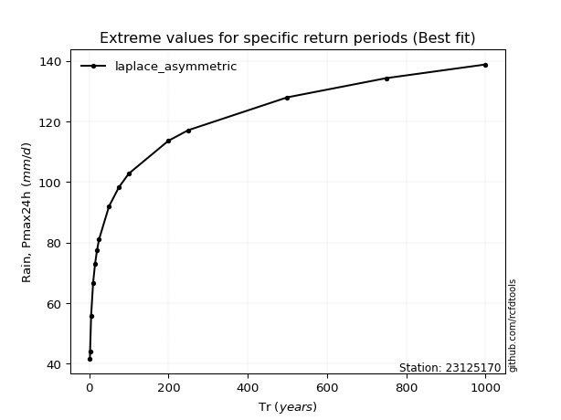</img>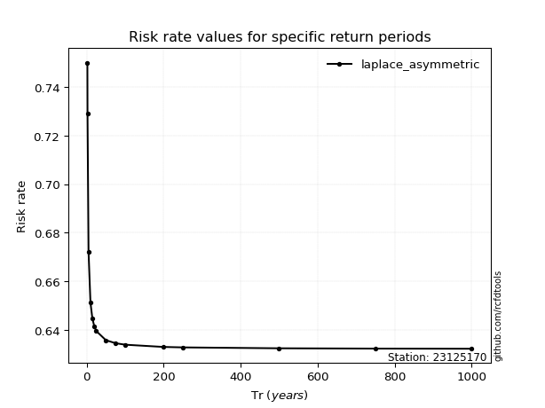</img>

</div>


<sub>**APP DISCLAIMER**: NO WARRANTY - This software is provided by [github.com/rcfdtools](https://github.com/rcfdtools) "as is", without any express or implied warranty, including warranties of merchantability, fitness for a particular purpose, or non-infringement. There is no guarantee that the software will be error-free or operate without interruption. LIMITATION OF LIABILITY - Neither the authors nor copyright holders will be liable for claims or damages arising from the software or its use. You are responsible for determining if the software is appropriate for your use and assume all associated risks, including errors, legal compliance, and data loss. NO PROFESSIONAL ADVICE - The software provides general information and does not offer professional advice. It should not replace consultation with professional advisors.</sub>