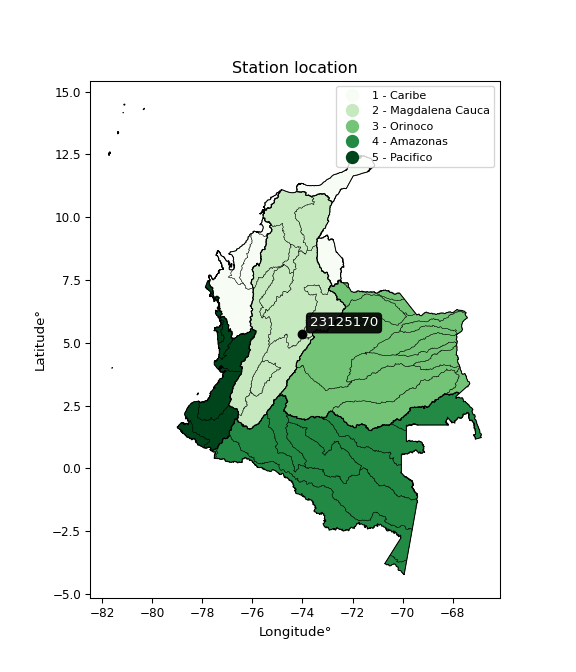

<div align="center">


</div>

# PMP Station (Rain, Pmax24h): 23125170

Probable Maximum Precipitation (PMP) is the greatest amount of rainfall for a specific duration that is meteorologically possible for a given location, acting as a "worst-case" scenario for extreme storms, crucial for designing safety-critical infrastructure like bridges, river deviations, dams, spillways, and nuclear plants to prevent catastrophic failure. PMP is calculated by hydrologists using meteorological data to determine the upper limit of extreme rainfall, often leading to the Probable Maximum Flood (PMF) for flood control design, and is increasingly being studied for climate change impacts. Probable Maximum Precipitation (PMP) is the theoretical upper limit of rainfall, a deterministic estimate for extreme events, while probability distributions (like GEV, Gumbel) describe the likelihood and frequency of various precipitation amounts, including rare ones, showing how often events occur, with PMP representing the extreme end of these distributions, used for critical infrastructure design to ensure safety against the worst conceivable weather, unlike standard statistical forecasts which cover typical probabilities.

The most common probability distributions in hydrology, used for analyzing floods, rainfall, and streamflow, include the Normal, Log-Normal, Gumbel, Gamma (including Log-Pearson Type III), and Generalized Extreme Value (GEV) distributions, often chosen based on the data´s skewness and whether modeling extremes or general conditions, with Gumbel and GEV popular for extreme events like floods, while the Normal distribution serves as a baseline, though often requiring transformations for skewed hydrological data. These distributions help in designing water infrastructure, managing water resources, and forecasting hydrologic events.

> Hydrological data often isn´t perfectly normal (it´s skewed), so different distributions are needed for different applications, such as: **Flood Frequency Analysis**: Using Gumbel, GEV, or Log-Pearson Type III for predicting extreme flood magnitudes and their return periods, **Rainfall Analysis**: Normal for annual totals, but Log-Normal, Weibull, or GEV for intensity or extreme daily rainfall, **Streamflow Modeling**: Gamma and Log-Normal for maximum flows, GEV for minimum flows, and Kappa for daily flows.

<div align="center">

</img>

</div>


## A. General information


### 1. General running parameters

• app_version: _v20260108_. • runtime: _2026-01-08 13:24:42.400241_. • Python version: _3.14.0_. • SciPy version: _1.16.3_. • Pandas version: _2.3.3_. • NumPy version: _2.3.5_. • Stations dataset (station_dataset_file): _dataset/pmax24h_in/automatic_colombia_2003_2024.csv_. • Stations catalog (station_catalog_file): _dataset/CNE.xls_. • Minimum year to eval til year_max (date_min): _1900_. • Maximum year to eval since year_min (date_max): _2024_. • Creates, save and include plots into reports (create_plot): _False_. • Plot only fit distributions with Δo > Δ (plot_only_fit): _True_. • Plot only simple graphs avoiding multiple CDFs and multiple Extreme values plots (plot_only_simple): _True_. • Eval low extreme values, if False, evaluates high extreme values (low_extreme): _False_. • Eval every SciPy distribution as logarithmic (pdist_logarithmic_on): _True_. • Standard deviation normalized (ddof): _1.0_. • Return periods to eval in years (Tr): _[2, 2.33, 5, 10, 15, 20, 25, 50, 75, 100, 200, 250, 500, 750, 1000]_. • Minimum data sample per station, 0 means any (minimum_sample): _5_. • Z-Score maximum threshold to adjust a value, 0 means disable (zscore_max): _3.5_. • Z-Score minimum threshold to adjust a value, 0 means disable (zscore_min): _-2.5_. • Avoid zeros, e.g. rain = 0 (avoid_zeros): _True_. • Avoid null values (avoid_nans): _True_. 

:file_folder:Table: [dataset.csv](../../dataset/pmax24h_in/automatic_colombia_2003_2024.csv)

> Delta Degrees of Freedom (DDOF): is a parameter used in the formulas for calculating variance and standard deviation. When ddof=0, the divisor is $N$ (the total number of observations) and this is used when your data set is the entire population. When ddof=1, the divisor is $N-1$ and this is used when your data set is a sample drawn from a larger population. Using $N-1$ provides an unbiased estimate of the population variance (known as Bessel´s correction).


### 2. Station info and location

|   id |   CODIGO | NOMBRE                  | CATEGORIA               | TECNOLOGIA                              | ESTADO           | FECHA_INSTALACION   |   FECHA_SUSPENSION |   ALTITUD |   LATITUD |   LONGITUD | DEPARTAMENTO   | MUNICIPIO    | AREA_OPERATIVA                            | ENTIDAD                                                     | AREA_HIDROGRAFICA   | ZONA_HIDROGRAFICA   | SUBZONA_HIDROGRAFICA   |   CORRIENTE | Catalogo   |   Version |
|-----:|---------:|:------------------------|:------------------------|:----------------------------------------|:-----------------|:--------------------|-------------------:|----------:|----------:|-----------:|:---------------|:-------------|:------------------------------------------|:------------------------------------------------------------|:--------------------|:--------------------|:-----------------------|------------:|:-----------|----------:|
|    0 | 23125170 | SAN CAYETANO [23125170] | Climatológica Principal | Automática con Telemetría, Convencional | En Mantenimiento | 01/12/2004          |                nan |      2807 |   5.33241 |    -74.024 | Cundinamarca   | San Cayetano | Area Operativa 11 - Cundinamarca-Amazonas | INSTITUTO DE HIDROLOGIA METEOROLOGIA Y ESTUDIOS AMBIENTALES | Magdalena Cauca     | Medio Magdalena     | Río Carare (Minero)    |         nan | CNE_IDEAM  |  20251226 |

<div align="center">

Dynamic map: [:earth_americas:Google](http://maps.google.com/maps?q=5.332411,-74.024004) [:earth_americas:OSM](https://www.openstreetmap.org/#map=18/5.332411/-74.024004&layers=P) [:earth_americas:Bing](https://www.bing.com/maps?cp=5.332411~-74.024004&lvl=18) [:earth_americas:Apple](https://maps.apple.com/frame?center=5.332411%2C-74.024004&span=0.003%2C0.006)

</div>


<div align="center">

```geojson
{
  "type": "Feature",
  "geometry": {
    "type": "Point", 
    "coordinates": [-74.024004, 5.332411]
  }, 
  "properties": {
    "Name": "23125170"
  }
}
```

</div>


### 3. Discrete values table and plot

<div align="center">

|               |           0 |           1 |           2 |           3 |          4 |          5 |         6 |          7 |           8 |           9 |         10 |           11 |           12 |          13 |         14 |         15 |
|:--------------|------------:|------------:|------------:|------------:|-----------:|-----------:|----------:|-----------:|------------:|------------:|-----------:|-------------:|-------------:|------------:|-----------:|-----------:|
| Date          | 2005        | 2006        | 2008        | 2009        | 2010       | 2012       | 2013      | 2014       | 2015        | 2016        | 2017       | 2018         | 2020         | 2021        | 2022       | 2024       |
| Value         |   39        |   53.4      |   39.6      |   47.9      |   22.3     |   56.8     |   64.6    |   63.4     |   28.8      |   37.3      |   38       |   42         |   41.9       |   29.4      |    4.9     |   88.2     |
| Value_initial |   39        |   53.4      |   39.6      |   47.9      |   22.3     |   56.8     |   64.6    |   63.4     |   28.8      |   37.3      |   38       |   42         |   41.9       |   29.4      |    4.9     |   88.2     |
| count         |   16        |   16        |   16        |   16        |   16       |   16       |   16      |   16       |   16        |   16        |   16       |   16         |   16         |   16        |   16       |   16       |
| mean          |   43.5938   |   43.5938   |   43.5938   |   43.5938   |   43.5938  |   43.5938  |   43.5938 |   43.5938  |   43.5938   |   43.5938   |   43.5938  |   43.5938    |   43.5938    |   43.5938   |   43.5938  |   43.5938  |
| std           |   19.3161   |   19.3161   |   19.3161   |   19.3161   |   19.3161  |   19.3161  |   19.3161 |   19.3161  |   19.3161   |   19.3161   |   19.3161  |   19.3161    |   19.3161    |   19.3161   |   19.3161  |   19.3161  |
| zscore        |   -0.237819 |    0.507672 |   -0.206757 |    0.222936 |   -1.10238 |    0.68369 |    1.0875 |    1.02537 |   -0.765876 |   -0.325829 |   -0.28959 |   -0.0825088 |   -0.0876858 |   -0.734814 |   -2.00318 |    2.30928 |


</div>


> The initial value (value_initial) correspond to the initial obtained or null completed value, and value (value) is adjusted only when the initial value is outside the valid range (outlier) definite through the Z-Score value. If Z-Score is active, values out of range or outliers are replaced with the station mean value. A Z-Score (or standard score) measures how many standard deviations a data point is from the mean of a dataset, indicating its relative position; positive scores mean above the mean, negative mean below, and a score of zero is exactly at the mean, allowing for comparison of values from different distributions. It´s calculated using the formula $z=(x–μ)/σ$, where $x$ is the data point, $μ$ is the mean, and $σ$ is the standard deviation, helping identify outliers and understand probability.
>
> <sub>**Note**: In this study, "completing" (filling gaps in) and "extending" (forecasting or lengthening the historical record) rainfall data series are avoided for certain critical analyses because they introduce artificial bias and uncertainty, which can distort the statistics of rare events (extremes), alter day-to-day variability, and compromise the integrity and homogeneity of the original data. Some reasons against Completing/Extending rainfall data are: **Distortion of Extremes and Variability**: The primary issue is that most gap-filling or extension methods rely on averaging or regression with nearby stations, which inherently smooths the data. Rainfall is highly variable in space and time, with a large percentage of zero values and occasional large storms. Infilling methods often underestimate the highest values and overestimate the lowest (zero) values, which severely distorts analyses focused on flood frequency, drought severity, and intensity-duration-frequency (IDF) curves, **Loss of Data Homogeneity**: Infilled or extended data are synthetic estimates, not actual measurements. Combining these estimates with observed data can violate the assumption of data homogeneity, which requires that the data properties do not change over time. Inhomogeneity can lead to incorrect conclusions about long-term trends or changes in climate patterns, **Propagation of Errors**: Errors and biases from the original data (e.g., wind-induced undercatch, instrument errors, site changes) or the data used for imputation can propagate through the analysis, leading to unreliable hydrological models and inaccurate predictions, **Compromised Statistical Integrity**: For statistical analyses, especially those involving the frequency of events, using artificial data can introduce time bias or autocorrelation that doesn´t exist in reality, making it difficult to assess the true probability of events, **Difficulty in Validation**: It is difficult to accurately validate the quality of filled or extended data, especially for past periods where ground-truth measurements are unavailable. The reliability of imputation techniques heavily depends on the density of the surrounding station network and the complexity of the local topography.</sub>


### 4. Active continuous probability distributions from SciPy (43 of 104 available)

A Probability Density Function (PDF) describes the relative likelihood of a continuous random variable falling within a specific range, where the total area under its curve equals 1, and the area over any interval gives the actual probability for that range. Unlike discrete probabilities (like rolling a die), a PDF shows density, not direct probability for a single point (which is zero), with higher points indicating higher likelihood, often visualized as a bell curve for normal distributions.

A log of a probability density function (log-PDF) is simply the logarithm of the PDF´s value, denoted as $log(f(x))$, useful for converting multiplication of probabilities into addition, improving numerical stability with tiny numbers, and connecting to information theory concepts like entropy. Instead of dealing with very small probabilities (e.g., 0.000001), log-PDFs use negative numbers (e.g., $log(0.00001) ≈ -11.51$ that are easier for computers to handle, preventing underflow errors and simplifying complex calculations. In this study, each active probability distribution from SciPy is also evaluated in the $log$ form.

[scipy.stats](https://docs.scipy.org/doc/scipy/reference/stats.html) is a Python´s powerful submodule within the SciPy library for comprehensive statistical analysis, offering over 130 probability distributions (like Normal, Poisson), functions for descriptive stats (mean, variance), hypothesis testing (t-tests, chi-square), random variable generation, and statistical tests, making it essential for data science, modeling, and research. It provides tools to explore, model, and draw conclusions from data efficiently, working seamlessly with NumPy.

<div align="center">

|   id | p_dist             |   n_parameter | fit_method   | label                                                                       | active   | ref                                                                                                        |
|-----:|:-------------------|--------------:|:-------------|:----------------------------------------------------------------------------|:---------|:-----------------------------------------------------------------------------------------------------------|
|    0 | alpha              |             3 | MLE          | Alpha                                                                       | True     | [:mortar_board:](https://docs.scipy.org/doc/scipy/reference/generated/scipy.stats.alpha.html)              |
|    1 | betaprime          |             4 | MLE          | Beta prime                                                                  | True     | [:mortar_board:](https://docs.scipy.org/doc/scipy/reference/generated/scipy.stats.betaprime.html)          |
|    2 | chi2               |             3 | MLE          | Chi²                                                                        | True     | [:mortar_board:](https://docs.scipy.org/doc/scipy/reference/generated/scipy.stats.chi2.html)               |
|    3 | crystalball        |             4 | MLE          | Crystalball                                                                 | True     | [:mortar_board:](https://docs.scipy.org/doc/scipy/reference/generated/scipy.stats.crystalball.html)        |
|    4 | erlang             |             3 | MLE          | Erlang                                                                      | True     | [:mortar_board:](https://docs.scipy.org/doc/scipy/reference/generated/scipy.stats.erlang.html)             |
|    5 | expon              |             2 | MLE          | Exponential                                                                 | True     | [:mortar_board:](https://docs.scipy.org/doc/scipy/reference/generated/scipy.stats.expon.html)              |
|    6 | exponnorm          |             3 | MLE          | Exponentially modified Normal                                               | True     | [:mortar_board:](https://docs.scipy.org/doc/scipy/reference/generated/scipy.stats.exponnorm.html)          |
|    7 | f                  |             4 | MLE          | F                                                                           | True     | [:mortar_board:](https://docs.scipy.org/doc/scipy/reference/generated/scipy.stats.f.html)                  |
|    8 | fatiguelife        |             3 | MLE          | Fatigue-life (Birnbaum-Saunders)                                            | True     | [:mortar_board:](https://docs.scipy.org/doc/scipy/reference/generated/scipy.stats.fatiguelife.html)        |
|    9 | fisk               |             3 | MLE          | Fisk                                                                        | True     | [:mortar_board:](https://docs.scipy.org/doc/scipy/reference/generated/scipy.stats.fisk.html)               |
|   10 | gamma              |             3 | MLE          | Gamma                                                                       | True     | [:mortar_board:](https://docs.scipy.org/doc/scipy/reference/generated/scipy.stats.gamma.html)              |
|   11 | genexpon           |             5 | MLE          | Generalized exponential                                                     | True     | [:mortar_board:](https://docs.scipy.org/doc/scipy/reference/generated/scipy.stats.genexpon.html)           |
|   12 | genlogistic        |             3 | MLE          | Generalized logistic                                                        | True     | [:mortar_board:](https://docs.scipy.org/doc/scipy/reference/generated/scipy.stats.genlogistic.html)        |
|   13 | gibrat             |             2 | MM           | Gibrat                                                                      | True     | [:mortar_board:](https://docs.scipy.org/doc/scipy/reference/generated/scipy.stats.gibrat.html)             |
|   14 | gompertz           |             3 | MLE          | Gompertz (or truncated Gumbel)                                              | True     | [:mortar_board:](https://docs.scipy.org/doc/scipy/reference/generated/scipy.stats.gompertz.html)           |
|   15 | gumbel_l           |             2 | MM           | Gumbel Left Skew                                                            | True     | [:mortar_board:](https://docs.scipy.org/doc/scipy/reference/generated/scipy.stats.gumbel_l.html)           |
|   16 | gumbel_r           |             2 | MM           | Gumbel Right Skew                                                           | True     | [:mortar_board:](https://docs.scipy.org/doc/scipy/reference/generated/scipy.stats.gumbel_r.html)           |
|   17 | halflogistic       |             2 | MM           | Half-logistic                                                               | True     | [:mortar_board:](https://docs.scipy.org/doc/scipy/reference/generated/scipy.stats.halflogistic.html)       |
|   18 | halfnorm           |             2 | MM           | Half Normal                                                                 | True     | [:mortar_board:](https://docs.scipy.org/doc/scipy/reference/generated/scipy.stats.halfnorm.html)           |
|   19 | hypsecant          |             2 | MM           | hyperbolic secant                                                           | True     | [:mortar_board:](https://docs.scipy.org/doc/scipy/reference/generated/scipy.stats.hypsecant.html)          |
|   20 | invgamma           |             3 | MLE          | Inverted gamma                                                              | True     | [:mortar_board:](https://docs.scipy.org/doc/scipy/reference/generated/scipy.stats.invgamma.html)           |
|   21 | invgauss           |             3 | MLE          | Inverse Gaussian                                                            | True     | [:mortar_board:](https://docs.scipy.org/doc/scipy/reference/generated/scipy.stats.invgauss.html)           |
|   22 | invweibull         |             3 | MLE          | Inverted Weibull                                                            | True     | [:mortar_board:](https://docs.scipy.org/doc/scipy/reference/generated/scipy.stats.invweibull.html)         |
|   23 | kstwobign          |             2 | MLE          | Limiting distribution of scaled Kolmogorov-Smirnov two-sided test statistic | True     | [:mortar_board:](https://docs.scipy.org/doc/scipy/reference/generated/scipy.stats.kstwobign.html)          |
|   24 | laplace            |             2 | MM           | Laplace                                                                     | True     | [:mortar_board:](https://docs.scipy.org/doc/scipy/reference/generated/scipy.stats.laplace.html)            |
|   25 | laplace_asymmetric |             3 | MLE          | Asymmetric Laplace                                                          | True     | [:mortar_board:](https://docs.scipy.org/doc/scipy/reference/generated/scipy.stats.laplace_asymmetric.html) |
|   26 | loggamma           |             3 | MLE          | Log gamma                                                                   | True     | [:mortar_board:](https://docs.scipy.org/doc/scipy/reference/generated/scipy.stats.loggamma.html)           |
|   27 | logistic           |             2 | MM           | Logistic (or Sech-squared)                                                  | True     | [:mortar_board:](https://docs.scipy.org/doc/scipy/reference/generated/scipy.stats.logistic.html)           |
|   28 | lognorm            |             3 | MLE          | Log Normal                                                                  | True     | [:mortar_board:](https://docs.scipy.org/doc/scipy/reference/generated/scipy.stats.lognorm.html)            |
|   29 | maxwell            |             2 | MM           | Maxwell                                                                     | True     | [:mortar_board:](https://docs.scipy.org/doc/scipy/reference/generated/scipy.stats.maxwell.html)            |
|   30 | mielke             |             4 | MLE          | Mielke Beta-Kappa / Dagum                                                   | True     | [:mortar_board:](https://docs.scipy.org/doc/scipy/reference/generated/scipy.stats.mielke.html)             |
|   31 | moyal              |             2 | MM           | Moyal                                                                       | True     | [:mortar_board:](https://docs.scipy.org/doc/scipy/reference/generated/scipy.stats.moyal.html)              |
|   32 | nakagami           |             3 | MLE          | Nakagami                                                                    | True     | [:mortar_board:](https://docs.scipy.org/doc/scipy/reference/generated/scipy.stats.nakagami.html)           |
|   33 | ncf                |             5 | MLE          | Non-central F distribution                                                  | True     | [:mortar_board:](https://docs.scipy.org/doc/scipy/reference/generated/scipy.stats.ncf.html)                |
|   34 | nct                |             4 | MLE          | Non-central Student’s t                                                     | True     | [:mortar_board:](https://docs.scipy.org/doc/scipy/reference/generated/scipy.stats.nct.html)                |
|   35 | norm               |             2 | MM           | Normal                                                                      | True     | [:mortar_board:](https://docs.scipy.org/doc/scipy/reference/generated/scipy.stats.norm.html)               |
|   36 | pearson3           |             3 | MM           | Pearson type III                                                            | True     | [:mortar_board:](https://docs.scipy.org/doc/scipy/reference/generated/scipy.stats.pearson3.html)           |
|   37 | rayleigh           |             2 | MM           | Rayleigh                                                                    | True     | [:mortar_board:](https://docs.scipy.org/doc/scipy/reference/generated/scipy.stats.rayleigh.html)           |
|   38 | rice               |             3 | MLE          | Rice                                                                        | True     | [:mortar_board:](https://docs.scipy.org/doc/scipy/reference/generated/scipy.stats.rice.html)               |
|   39 | t                  |             3 | MLE          | Student’s t                                                                 | True     | [:mortar_board:](https://docs.scipy.org/doc/scipy/reference/generated/scipy.stats.t.html)                  |
|   40 | truncnorm          |             4 | MLE          | Truncated normal                                                            | True     | [:mortar_board:](https://docs.scipy.org/doc/scipy/reference/generated/scipy.stats.truncnorm.html)          |
|   41 | wald               |             2 | MM           | Wald                                                                        | True     | [:mortar_board:](https://docs.scipy.org/doc/scipy/reference/generated/scipy.stats.wald.html)               |
|   42 | weibull_min        |             3 | MLE          | Weibull minimum                                                             | True     | [:mortar_board:](https://docs.scipy.org/doc/scipy/reference/generated/scipy.stats.weibull_min.html)        |

</div>

> **n_parameter:** # arguments & localization & scale.
>
> **Fit methods:** (MLE) maximum likelihood, (MM) L-moments.
>
>**Inactive** (With the only purpose of prevent loops, zero divisions, infinite values, over high estimated values or horizontal trending for recurrence intervals estimations, the follow distributions were disabled.)**:** foldnorm, gennorm, norminvgauss, powernorm, powerlognorm, skewnorm, genextreme, anglit, arcsine, argus, beta, bradford, burr, burr12, cauchy, cosine, halfcauchy, foldcauchy, skewcauchy, wrapcauchy, dgamma, gengamma, exponweib, exponpow, truncexpon, gausshyper, genhalflogistic, genhyperbolic, geninvgauss, halfgennorm, johnsonsb, johnsonsu, kappa4, kappa3, ksone, kstwo, loglaplace, levy, levy_l, levy_stable, ncx2, pareto, genpareto, truncpareto, lomax, powerlaw, rdist, rel_breitwigner, recipinvgauss, semicircular, studentized_range, trapezoid, triang, truncweibull_min, tukeylambda, uniform, loguniform, vonmises, vonmises_line, weibull_max, dweibull, 


## B. Probability (PDF) vs. Empirical (EDF) distributions functions

A continuous probability distribution (CPD) describes probabilities for variables that can take any value within a range (like rain any time), unlike discrete variables with specific outcomes (like temperature). It uses a Probability Density Function (PDF), a curve where the total area under it equals 1, and the probability of the variable falling within an interval (a to b) is found by calculating the area under the curve between those points. A key feature is that the probability of hitting any single exact value is zero, so probabilities are always expressed for ranges, e.g., $P(a ≤ X ≤ b)$.

<div align="center">

Distributions parameters from station values
|    |   station | p_dist                |   n |               loc |            scale | shape                  | shape1                | shape2             | shape3   |
|---:|----------:|:----------------------|----:|------------------:|-----------------:|:-----------------------|:----------------------|:-------------------|:---------|
|  0 |  23125170 | alpha                 |  16 |      -0.0437398   |     17.7921      | 1.1437732627240825e-10 |                       |                    |          |
|  1 |  23125170 | betaprime             |  16 |    -108.346       |  10543.5         | 67.206147577409        | 4664.586806402292     |                    |          |
|  2 |  23125170 | chi2                  |  16 |     -96.8635      |      1.24698     | 112.60965346917746     |                       |                    |          |
|  3 |  23125170 | crystalball           |  16 |      43.5937      |     18.7028      | 2320.045957216318      | 2838.6820181713974    |                    |          |
|  4 |  23125170 | erlang                |  16 |    -106.827       |      2.31701     | 64.9203300727944       |                       |                    |          |
|  5 |  23125170 | expon                 |  16 |       4.9         |     38.6938      |                        |                       |                    |          |
|  6 |  23125170 | exponnorm             |  16 |      31.9158      |     14.7115      | 0.7937976252516465     |                       |                    |          |
|  7 |  23125170 | f                     |  16 |    -107.265       |    150.85        | 131.08608626324133     | 35658.514557703136    |                    |          |
|  8 |  23125170 | fatiguelife           |  16 |       4.9         |      5.65645e-05 | 762.2804835941856      |                       |                    |          |
|  9 |  23125170 | fisk                  |  16 |    -129.571       |    172.102       | 16.947838277272556     |                       |                    |          |
| 10 |  23125170 | gamma                 |  16 |    -106.827       |      2.31701     | 64.92030883587694      |                       |                    |          |
| 11 |  23125170 | genexpon              |  16 |       4.9         |      1.99592     | 0.050492691324134406   | 0.0011888605399923736 | 0.7544259306725436 |          |
| 12 |  23125170 | genlogistic           |  16 |      37.2397      |     11.3644      | 1.4330075321148554     |                       |                    |          |
| 13 |  23125170 | gibrat                |  16 |      29.3259      |      8.65389     |                        |                       |                    |          |
| 14 |  23125170 | gompertz              |  16 |       0.42355     |      3.14727     | 1.2322162170926136e-11 |                       |                    |          |
| 15 |  23125170 | gumbel_l              |  16 |      52.011       |     14.5825      |                        |                       |                    |          |
| 16 |  23125170 | gumbel_r              |  16 |      35.1765      |     14.5825      |                        |                       |                    |          |
| 17 |  23125170 | halflogistic          |  16 |      21.4267      |     15.9902      |                        |                       |                    |          |
| 18 |  23125170 | halfnorm              |  16 |      18.8387      |     31.0259      |                        |                       |                    |          |
| 19 |  23125170 | hypsecant             |  16 |      43.5938      |     11.9065      |                        |                       |                    |          |
| 20 |  23125170 | invgamma              |  16 |    -144.856       |  18785.1         | 100.76343809049033     |                       |                    |          |
| 21 |  23125170 | invgauss              |  16 |     -66.8142      |   3545.06        | 0.030999999533469436   |                       |                    |          |
| 22 |  23125170 | invweibull            |  16 |      -2.89249e+09 |      2.89249e+09 | 164309112.67308262     |                       |                    |          |
| 23 |  23125170 | kstwobign             |  16 |     -31.6431      |     86.6817      |                        |                       |                    |          |
| 24 |  23125170 | laplace               |  16 |      43.5938      |     13.2248      |                        |                       |                    |          |
| 25 |  23125170 | laplace_asymmetric    |  16 |      39           |     13.1625      | 0.8406136576957313     |                       |                    |          |
| 26 |  23125170 | loggamma              |  16 |   -4307.7         |    621.531       | 1098.2790237007966     |                       |                    |          |
| 27 |  23125170 | logistic              |  16 |      43.5938      |     10.3114      |                        |                       |                    |          |
| 28 |  23125170 | lognorm               |  16 |    -169.511       |    212.291       | 0.087456808468266      |                       |                    |          |
| 29 |  23125170 | maxwell               |  16 |      -0.723929    |     27.772       |                        |                       |                    |          |
| 30 |  23125170 | mielke                |  16 |     -87.5326      |    131.729       | 11.830488605317973     | 13.354386197806257    |                    |          |
| 31 |  23125170 | moyal                 |  16 |      32.8983      |      8.4192      |                        |                       |                    |          |
| 32 |  23125170 | nakagami              |  16 |      22.3         |     33.9593      | 0.1419523812992502     |                       |                    |          |
| 33 |  23125170 | ncf                   |  16 |      -0.631709    |     30.6304      | 7.1353745999936        | 104.56807479244482    | 3.167299939394309  |          |
| 34 |  23125170 | nct                   |  16 |      -0.0543524   |     16.5114      | 21.660405934958778     | 2.551923547615103     |                    |          |
| 35 |  23125170 | norm                  |  16 |      43.5938      |     18.7028      |                        |                       |                    |          |
| 36 |  23125170 | pearson3              |  16 |      43.5938      |     18.7028      | 0.33283691784533376    |                       |                    |          |
| 37 |  23125170 | rayleigh              |  16 |       7.8143      |     28.5479      |                        |                       |                    |          |
| 38 |  23125170 | rice                  |  16 |      -4.05739     |     20.157       | 2.1093633385868698     |                       |                    |          |
| 39 |  23125170 | t                     |  16 |      43.5936      |     18.7022      | 45945.81048458975      |                       |                    |          |
| 40 |  23125170 | truncnorm             |  16 |      43.5938      |     18.7028      | -121.11977796432933    | 219.68432211610497    |                    |          |
| 41 |  23125170 | wald                  |  16 |      24.8909      |     18.7028      |                        |                       |                    |          |
| 42 |  23125170 | weibull_min           |  16 |      -7.66095     |     57.3217      | 2.9212228054884446     |                       |                    |          |
| 43 |  23125170 | logalpha              |  16 |     -14.9231      |    505.885       | 27.277805877179397     |                       |                    |          |
| 44 |  23125170 | logbetaprime          |  16 |     -10.1832      |    122.456       | 451.6246349385069      | 3986.3574242637187    |                    |          |
| 45 |  23125170 | logchi2               |  16 |       1.58924     |      1.17459     | 1.4223276004578143     |                       |                    |          |
| 46 |  23125170 | logcrystalball        |  16 |       3.63693     |      0.623914    | 863.4897285146137      | 346.8640146480583     |                    |          |
| 47 |  23125170 | logerlang             |  16 |      -2.79034     |      0.0781762   | 82.07184612713249      |                       |                    |          |
| 48 |  23125170 | logexpon              |  16 |       1.58924     |      2.04769     |                        |                       |                    |          |
| 49 |  23125170 | logexponnorm          |  16 |       3.63654     |      0.623914    | 0.0006271834655300392  |                       |                    |          |
| 50 |  23125170 | logf                  |  16 |    -818.089       |    821.724       | 13416979.04925561      | 4622845.400983611     |                    |          |
| 51 |  23125170 | logfatiguelife        |  16 |    -596.043       |    599.678       | 0.0010387414339158951  |                       |                    |          |
| 52 |  23125170 | logfisk               |  16 |      -3.59634e+07 |      3.59634e+07 | 125876159.0578223      |                       |                    |          |
| 53 |  23125170 | loggamma              |  16 |      -8.36514     |      0.0362194   | 331.45955160104        |                       |                    |          |
| 54 |  23125170 | loggenexpon           |  16 |       1.46337     |      9.64916e+12 | 71101376065.72775      | 32131033588586.445    | 1199278574249.7131 |          |
| 55 |  23125170 | loggenlogistic        |  16 |       4.05661     |      0.154035    | 0.31704895726703586    |                       |                    |          |
| 56 |  23125170 | loggibrat             |  16 |       3.16096     |      0.288688    |                        |                       |                    |          |
| 57 |  23125170 | loggompertz           |  16 |       1.55485     |      0.421995    | 0.00400854089264242    |                       |                    |          |
| 58 |  23125170 | loggumbel_l           |  16 |       3.91772     |      0.486464    |                        |                       |                    |          |
| 59 |  23125170 | loggumbel_r           |  16 |       3.35613     |      0.486464    |                        |                       |                    |          |
| 60 |  23125170 | loghalflogistic       |  16 |       2.89747     |      0.533414    |                        |                       |                    |          |
| 61 |  23125170 | loghalfnorm           |  16 |       2.81109     |      1.03503     |                        |                       |                    |          |
| 62 |  23125170 | loghypsecant          |  16 |       3.63693     |      0.397196    |                        |                       |                    |          |
| 63 |  23125170 | loginvgamma           |  16 |     -14.3241      |  13234.4         | 738.1078475416164      |                       |                    |          |
| 64 |  23125170 | loginvgauss           |  16 |      -4.36704     |    980.788       | 0.00814895577712077    |                       |                    |          |
| 65 |  23125170 | loginvweibull         |  16 |      -1.74177e+08 |      1.74177e+08 | 198721130.61803532     |                       |                    |          |
| 66 |  23125170 | logkstwobign          |  16 |       2.45412     |      1.50035     |                        |                       |                    |          |
| 67 |  23125170 | loglaplace            |  16 |       3.63693     |      0.441174    |                        |                       |                    |          |
| 68 |  23125170 | loglaplace_asymmetric |  16 |       3.73767     |      0.372847    | 1.143955809327958      |                       |                    |          |
| 69 |  23125170 | logloggamma           |  16 |       4.05276     |      0.330657    | 0.6869213465030746     |                       |                    |          |
| 70 |  23125170 | loglogistic           |  16 |       3.63693     |      0.343982    |                        |                       |                    |          |
| 71 |  23125170 | loglognorm            |  16 | -358495           | 358499           | 1.7403549804996053e-06 |                       |                    |          |
| 72 |  23125170 | logmaxwell            |  16 |       2.15852     |      0.926456    |                        |                       |                    |          |
| 73 |  23125170 | logmielke             |  16 |  -92299.3         |  92303.3         | 197664.3913985889      | 584176.4871298213     |                    |          |
| 74 |  23125170 | logmoyal              |  16 |       3.28014     |      0.28086     |                        |                       |                    |          |
| 75 |  23125170 | lognakagami           |  16 |       2.92625     |      0.903727    | 1.5065733612383108     |                       |                    |          |
| 76 |  23125170 | logncf                |  16 |     -10.412       |     14.0228      | 1311.7125922369978     | 2097.760181507023     | 1.4029805601366934 |          |
| 77 |  23125170 | lognct                |  16 |     -33.2812      |      0.583672    | 12231.30157090721      | 63.24680398899676     |                    |          |
| 78 |  23125170 | lognorm               |  16 |       3.63693     |      0.623914    |                        |                       |                    |          |
| 79 |  23125170 | logpearson3           |  16 |       3.63693     |      0.623914    | -2.0001559681208114    |                       |                    |          |
| 80 |  23125170 | lograyleigh           |  16 |       2.44336     |      0.952332    |                        |                       |                    |          |
| 81 |  23125170 | logrice               |  16 |    -115.073       |      0.623917    | 190.2628337287193      |                       |                    |          |
| 82 |  23125170 | logt                  |  16 |       3.74797     |      0.280907    | 1.9468061393206746     |                       |                    |          |
| 83 |  23125170 | logtruncnorm          |  16 |      -0.522879    |      1.89689     | 1.9123221889838005     | 2.6372061237022884    |                    |          |
| 84 |  23125170 | logwald               |  16 |       3.01302     |      0.623909    |                        |                       |                    |          |
| 85 |  23125170 | logweibull_min        |  16 |      -8.24459e+07 |      8.24459e+07 | 203529638.58912235     |                       |                    |          |

</div>

> **loc** (Location parameter): This shifts the distribution along the x-axis. For many common distributions, like the normal (Gaussian) distribution, loc represents the mean $μ$. For others, like the uniform distribution, it might represent the minimum value, or for the beta distribution, the left end of the support interval.
>
> **scale** (Scale parameter): This determines the width or spread of the distribution. For the normal distribution, scale represents the standard deviation $σ$. For a uniform distribution, it defines the length of the interval (from $loc$ to $loc + scale$).
>
> **shape** (Shape parameters): Refers to parameters that define the specific form of a probability distribution, distinct from its location (loc) and scale (scale). These parameters are required arguments for most distribution functions. For example, a normal (Gaussian) distribution is fully defined by its location (mean) and scale (standard deviation), so it has no specific shape parameters beyond loc and scale. However, other distributions have intrinsic properties that need specification, as Gamma distribution that takes a shape parameter, often named $a$ or $alpha$.


### 0. Cumulative distribution values - CDF (86 evaluated)

Cumulative Distribution Function (CDF), denoted as $F$<sub>$X$</sub>$(x)$, is a function that gives the probability that a random variable $X$ will take a value less than or equal to a specific value, $x$ (i.e., $(P(X≥x)$. It essentially "accumulates" probabilities from a given point up to the far right (positive infinity), providing a complete picture of the distribution´s probabilities for both discrete (like rain) and continuous (like temperature) variables, helping to find probabilities over ranges or above certain values. Each station is evaluated separately ordering the $x$ values ascending, calculating the CDF and PDF values for the activated distributions and their logarithmic forms.

<div align="center">

CDF ordered by x ascending and calculating $log(f(x))$ separately
|   id |   Station |   date |    x |   count |    mean |     std |     zscore |   Value_initial |   station |   m |      alpha |   alpha_pdf |   betaprime |   betaprime_pdf |     chi2 |   chi2_pdf |   crystalball |   crystalball_pdf |    erlang |   erlang_pdf |    expon |   expon_pdf |   exponnorm |   exponnorm_pdf |         f |      f_pdf |   fatiguelife |   fatiguelife_pdf |      fisk |   fisk_pdf |     gamma |   gamma_pdf |    genexpon |   genexpon_pdf |   genlogistic |   genlogistic_pdf |      gibrat |   gibrat_pdf |    gompertz |   gompertz_pdf |   gumbel_l |   gumbel_l_pdf |    gumbel_r |   gumbel_r_pdf |   halflogistic |   halflogistic_pdf |   halfnorm |   halfnorm_pdf |   hypsecant |   hypsecant_pdf |   invgamma |   invgamma_pdf |   invgauss |   invgauss_pdf |   invweibull |   invweibull_pdf |   kstwobign |   kstwobign_pdf |   laplace |   laplace_pdf |   laplace_asymmetric |   laplace_asymmetric_pdf |    loggamma |   loggamma_pdf |   logistic |   logistic_pdf |     lognorm |   lognorm_pdf |    maxwell |   maxwell_pdf |    mielke |   mielke_pdf |      moyal |   moyal_pdf |    nakagami |   nakagami_pdf |        ncf |    ncf_pdf |      nct |    nct_pdf |      norm |   norm_pdf |   pearson3 |   pearson3_pdf |   rayleigh |   rayleigh_pdf |      rice |   rice_pdf |         t |      t_pdf |   truncnorm |   truncnorm_pdf |      wald |   wald_pdf |   weibull_min |   weibull_min_pdf |    logalpha |   logalpha_pdf |   logbetaprime |   logbetaprime_pdf |     logchi2 |   logchi2_pdf |   logcrystalball |   logcrystalball_pdf |   logerlang |   logerlang_pdf |   logexpon |   logexpon_pdf |   logexponnorm |   logexponnorm_pdf |        logf |   logf_pdf |   logfatiguelife |   logfatiguelife_pdf |     logfisk |   logfisk_pdf |   loggenexpon |   loggenexpon_pdf |   loggenlogistic |   loggenlogistic_pdf |   loggibrat |   loggibrat_pdf |   loggompertz |   loggompertz_pdf |   loggumbel_l |   loggumbel_l_pdf |   loggumbel_r |   loggumbel_r_pdf |   loghalflogistic |   loghalflogistic_pdf |   loghalfnorm |   loghalfnorm_pdf |   loghypsecant |   loghypsecant_pdf |   loginvgamma |   loginvgamma_pdf |   loginvgauss |   loginvgauss_pdf |   loginvweibull |   loginvweibull_pdf |   logkstwobign |   logkstwobign_pdf |   loglaplace |   loglaplace_pdf |   loglaplace_asymmetric |   loglaplace_asymmetric_pdf |   logloggamma |   logloggamma_pdf |   loglogistic |   loglogistic_pdf |   loglognorm |   loglognorm_pdf |   logmaxwell |   logmaxwell_pdf |   logmielke |   logmielke_pdf |    logmoyal |   logmoyal_pdf |   lognakagami |   lognakagami_pdf |      logncf |   logncf_pdf |      lognct |   lognct_pdf |   logpearson3 |   logpearson3_pdf |   lograyleigh |   lograyleigh_pdf |     logrice |   logrice_pdf |       logt |   logt_pdf |   logtruncnorm |   logtruncnorm_pdf |   logwald |   logwald_pdf |   logweibull_min |   logweibull_min_pdf |
|-----:|----------:|-------:|-----:|--------:|--------:|--------:|-----------:|----------------:|----------:|----:|-----------:|------------:|------------:|----------------:|---------:|-----------:|--------------:|------------------:|----------:|-------------:|---------:|------------:|------------:|----------------:|----------:|-----------:|--------------:|------------------:|----------:|-----------:|----------:|------------:|------------:|---------------:|--------------:|------------------:|------------:|-------------:|------------:|---------------:|-----------:|---------------:|------------:|---------------:|---------------:|-------------------:|-----------:|---------------:|------------:|----------------:|-----------:|---------------:|-----------:|---------------:|-------------:|-----------------:|------------:|----------------:|----------:|--------------:|---------------------:|-------------------------:|------------:|---------------:|-----------:|---------------:|------------:|--------------:|-----------:|--------------:|----------:|-------------:|-----------:|------------:|------------:|---------------:|-----------:|-----------:|---------:|-----------:|----------:|-----------:|-----------:|---------------:|-----------:|---------------:|----------:|-----------:|----------:|-----------:|------------:|----------------:|----------:|-----------:|--------------:|------------------:|------------:|---------------:|---------------:|-------------------:|------------:|--------------:|-----------------:|---------------------:|------------:|----------------:|-----------:|---------------:|---------------:|-------------------:|------------:|-----------:|-----------------:|---------------------:|------------:|--------------:|--------------:|------------------:|-----------------:|---------------------:|------------:|----------------:|--------------:|------------------:|--------------:|------------------:|--------------:|------------------:|------------------:|----------------------:|--------------:|------------------:|---------------:|-------------------:|--------------:|------------------:|--------------:|------------------:|----------------:|--------------------:|---------------:|-------------------:|-------------:|-----------------:|------------------------:|----------------------------:|--------------:|------------------:|--------------:|------------------:|-------------:|-----------------:|-------------:|-----------------:|------------:|----------------:|------------:|---------------:|--------------:|------------------:|------------:|-------------:|------------:|-------------:|--------------:|------------------:|--------------:|------------------:|------------:|--------------:|-----------:|-----------:|---------------:|-------------------:|----------:|--------------:|-----------------:|---------------------:|
|    0 |  23125170 |   2022 |  4.9 |      16 | 43.5938 | 19.3161 | -2.00318   |             4.9 |  23125170 |   1 | 0.00031956 | 0.000894413 |   0.0125091 |      0.00211939 | 0.0123   | 0.00211854 |     0.0192787 |        0.00250933 | 0.0125254 |   0.00212141 | 0        |  0.025844   |   0.0112398 |      0.00187627 | 0.0125227 | 0.00212097 |     0.0472517 |       2.36716e+09 | 0.0150441 | 0.00186752 | 0.0125254 |  0.00212141 | 1.21892e-07 |     0.025298   |     0.0156259 |        0.00186218 | 0           |  0           | 3.8775e-11  |    1.62354e-11 |  0.0387604 |    0.00260582  | 0.000344191 |    0.000188218 |      0         |         0          |  0         |     0          |   0.0246773 |      0.00207051 |  0.0103189 |     0.00197723 |  0.0090116 |     0.00197935 |   0.00481147 |       0.00145863 |  0.00574838 |      0.00202656 | 0.0268099 |    0.00202724 |            0.0189931 |               0.00171657 | 0.000503162 |     0.00307425 |  0.0229206 |     0.0021719  | 0.000515344 |    0.00292927 | 0.00218163 |    0.00115423 | 0.0150114 |   0.00190452 | 1.3357e-07 | 2.28077e-07 | 0           |    0           | 0.00269546 | 0.00159022 | 0.01213  | 0.00191511 | 0.0192787 | 0.00250933 |  0.0103815 |     0.00195907 |   0        |     0          | 0.0113019 | 0.00266005 | 0.0192792 | 0.00250926 |   0.0192787 |      0.00250933 | 0         | 0          |     0.0117889 |        0.00272546 | 0.000391144 |     0.00262614 |    0.000634965 |         0.00362974 | 4.41112e-12 |  14127.9      |      0.000515343 |           0.00292927 | 0.000653104 |      0.00415895 |   0        |       0.488354 |    0.000515338 |         0.00292924 | 0.000538909 | 0.00304813 |       0.00050074 |           0.00286674 | 0.000573092 |    0.00200474 |    0.00417982 |         0.0588076 |       0.00622882 |            0.0128207 |    0        |       0         |   0.000340216 |         0.0103019 |     0.0083064 |          0.017004 |   3.86021e-17 |       2.99899e-15 |          0        |              0        |      0        |          0        |     0.00367219 |         0.00924507 |   0.000450297 |        0.00286643 |   0.000624434 |        0.00410764 |      0.00106576 |          0.00832198 |     0          |           0        |   0.00482177 |        0.0109294 |              0.00368019 |                   0.0086284 |    0.00660711 |         0.0137212 |    0.00259153 |        0.00751438 |  0.000515339 |       0.00292926 |     0        |         0        |  0.00525365 |       0.0112508 | 1.51814e-91 |    1.11553e-88 |     0         |          0        | 0.000892011 |    0.0050059 | 0.000530811 |   0.00302775 |     0.0138157 |         0.0221425 |      0        |          0        | 0.000515332 |    0.00292922 | 0.00890554 | 0.00783936 |    0           |           0        | 0         |      0        |        0.0033883 |           0.00835032 |
|    1 |  23125170 |   2010 | 22.3 |      16 | 43.5938 | 19.3161 | -1.10238   |            22.3 |  23125170 |   2 | 0.425865   | 0.0207094   |   0.123505  |      0.0121124  | 0.124262 | 0.0122248  |     0.127448  |        0.0111564  | 0.123541  |   0.0121106  | 0.362171 |  0.016484   |   0.116385  |      0.0120133  | 0.123531  | 0.0121107  |     0.766568  |       0.00640126  | 0.107229  | 0.010683   | 0.123542  |  0.0121106  | 0.361718    |     0.0165269  |     0.108095  |        0.0107445  | 0           |  0           | 1.28535e-08 |    4.08795e-09 |  0.122222  |    0.00784698  | 0.0890841   |    0.0147726   |      0.0273016 |         0.0312459  |  0.0888299 |     0.0255572  |   0.105484  |      0.00869803 |  0.125384  |     0.012848   |  0.133501  |     0.0138634  |   0.137221   |       0.015482   |  0.166566   |      0.0165853  | 0.0999306 |    0.00755628 |            0.0915297 |               0.00827234 | 0.210077    |     0.450644   |  0.112538  |     0.00968574 | 0.196766    |    0.444326   | 0.123813   |    0.0140034  | 0.108004  |   0.0106902  | 0.0605853  | 0.015288    | 2.35275e-05 |    1.88013e+09 | 0.164786   | 0.0166212  | 0.117241 | 0.0119585  | 0.127448  | 0.0111564  |  0.122379  |     0.0124806  |   0.120794 |     0.0156272  | 0.130239  | 0.0119956  | 0.127447  | 0.0111563  |   0.127448  |      0.0111564  | 0         | 0          |     0.139534  |        0.0126081  | 0.216592    |     0.456767   |    0.197561    |         0.416388   | 0.626107    |      0.197916 |      0.196766    |           0.444326   | 0.235857    |      0.459973   |   0.5229   |       0.232994 |    0.196765    |         0.444324   | 0.198478    | 0.444992   |       0.197059   |           0.445838   | 0.103402    |    0.324497   |    0.413422   |         0.364747  |       0.14083    |            0.289271  |    0        |       0         |   0.142481    |         0.320497  |     0.171352  |          0.320173 |   0.186906    |       0.644384    |          0.191743 |              0.902896 |      0.223253 |          0.7405   |     0.162997   |         0.392668   |   0.215748    |        0.460718   |   0.241264    |        0.462973   |      0.2968     |          0.411325   |     0.00815578 |           0.152059 |   0.149599   |        0.339093  |              0.128482   |                   0.301232  |    0.150422   |         0.302095  |    0.175435   |        0.420538   |  0.196766    |       0.444326   |     0.209098 |         0.533177 |  0.134713   |       0.287716  | 0.171668    |    0.762861    |     0.0100836 |          0.166406 | 0.225138    |    0.44448   | 0.199303    |   0.445473   |     0.156726  |         0.251194  |      0.214193 |          0.572916 | 0.196765    |    0.444326   | 0.076286   | 0.182933   |    3.37776e-06 |           1.42339  | 0.0231609 |      0.952198 |        0.133251  |           0.30599    |
|    2 |  23125170 |   2015 | 28.8 |      16 | 43.5938 | 19.3161 | -0.765876  |            28.8 |  23125170 |   3 | 0.537338   | 0.0141072   |   0.21819   |      0.0169166  | 0.219685 | 0.0170215  |     0.214474  |        0.0156006  | 0.218204  |   0.0169116  | 0.460801 |  0.013935   |   0.212378  |      0.0174479  | 0.218197  | 0.0169125  |     0.803095  |       0.00494763  | 0.196377  | 0.0168881  | 0.218204  |  0.0169116  | 0.460591    |     0.0139672  |     0.197505  |        0.0168747  | 0           |  0           | 1.01468e-07 |    3.22438e-08 |  0.184194  |    0.0113891   | 0.212571    |    0.0225724   |      0.226558  |         0.0296642  |  0.251839  |     0.0244248  |   0.178906  |      0.0142472  |  0.225457  |     0.0177692  |  0.23979   |     0.0185759  |   0.253356   |       0.0197596  |  0.284273   |      0.0191635  | 0.163363  |    0.0123527  |            0.1647    |               0.0148854  | 0.341188    |     0.565179   |  0.192367  |     0.0150671  | 0.32879     |    0.57959    | 0.230198   |    0.0184527  | 0.196972  |   0.0168306  | 0.202109   | 0.0267934   | 0.506232    |    0.0220105   | 0.282104   | 0.0190338  | 0.212641 | 0.0173116  | 0.214474  | 0.0156006  |  0.219911  |     0.0173859  |   0.236766 |     0.0196532  | 0.222174  | 0.0162223  | 0.214472  | 0.0156007  |   0.214474  |      0.0156006  | 0.0720239 | 0.0499722  |     0.234089  |        0.0163652  | 0.347837    |     0.559266   |    0.319254    |         0.527859   | 0.673       |      0.169679 |      0.32879     |           0.57959    | 0.365791    |      0.546124   |   0.578925 |       0.205634 |    0.328789    |         0.579589   | 0.330439    | 0.578378   |       0.329511   |           0.581303   | 0.220168    |    0.600949   |    0.505114   |         0.349782  |       0.237761   |            0.484108  |    0.355699 |       1.86826   |   0.248096    |         0.515212  |     0.272395  |          0.475629 |   0.371086    |       0.756203    |          0.408585 |              0.780874 |      0.404368 |          0.669622 |     0.294374   |         0.639914   |   0.348999    |        0.57104    |   0.371139    |        0.542439   |      0.403633   |          0.417798   |     0.141092   |           0.897202 |   0.267134   |        0.605507  |              0.234041   |                   0.548722  |    0.249221   |         0.480954  |    0.309175   |        0.620922   |  0.328791    |       0.57959    |     0.359254 |         0.624793 |  0.232125   |       0.490456  | 0.386004    |    0.845664    |     0.124202  |          0.747275 | 0.352248    |    0.540622  | 0.331189    |   0.577203   |     0.236151  |         0.378497  |      0.370988 |          0.636004 | 0.32879     |    0.579591   | 0.152379   | 0.459311   |    0.320026    |           1.08989  | 0.412735  |      1.29025  |        0.235781  |           0.507304   |
|    3 |  23125170 |   2021 | 29.4 |      16 | 43.5938 | 19.3161 | -0.734814  |            29.4 |  23125170 |   4 | 0.545662   | 0.0136424   |   0.228459  |      0.0173137  | 0.230017 | 0.0174149  |     0.223953  |        0.0159933  | 0.228471  |   0.0173085  | 0.469098 |  0.0137206  |   0.222986  |      0.0179074  | 0.228464  | 0.0173094  |     0.806032  |       0.00484227  | 0.206688  | 0.0174805  | 0.228471  |  0.0173085  | 0.468907    |     0.0137519  |     0.207802  |        0.0174495  | 9.67387e-07 |  6.46708e-05 | 1.22781e-07 |    3.90159e-08 |  0.19114   |    0.0117664   | 0.226263    |    0.0230578   |      0.244279  |         0.0294033  |  0.266447  |     0.0242691  |   0.187638  |      0.0148623  |  0.236235  |     0.0181548  |  0.251038  |     0.0189164  |   0.265285   |       0.0199966  |  0.295802   |      0.0192636  | 0.170945  |    0.0129261  |            0.173878  |               0.0157148  | 0.352908    |     0.571609   |  0.201569  |     0.0156079  | 0.340827    |    0.587822   | 0.241365   |    0.0187697  | 0.207248  |   0.0174198  | 0.218355   | 0.0273436   | 0.519017    |    0.0206412   | 0.293553   | 0.0191266  | 0.223163 | 0.0177611  | 0.223953  | 0.0159933  |  0.230461  |     0.01778    |   0.248633 |     0.0199008  | 0.232015  | 0.0165805  | 0.223951  | 0.0159935  |   0.223953  |      0.0159933  | 0.103525  | 0.0545743  |     0.243999  |        0.016668   | 0.359424    |     0.564577   |    0.330209    |         0.534618   | 0.676478    |      0.167635 |      0.340827    |           0.587822   | 0.377095    |      0.550275   |   0.583144 |       0.203574 |    0.340825    |         0.587821   | 0.342449    | 0.586455   |       0.341583   |           0.589516   | 0.232809    |    0.625152   |    0.512308   |         0.347981  |       0.247947   |            0.504071  |    0.392971 |       1.74748   |   0.258905    |         0.533234  |     0.282344  |          0.489437 |   0.386671    |       0.755262    |          0.424558 |              0.7684   |      0.418101 |          0.662448 |     0.307773   |         0.659648   |   0.360836    |        0.57694    |   0.382361    |        0.546028   |      0.412238   |          0.416784   |     0.160082   |           0.943925 |   0.279915   |        0.634478  |              0.245633   |                   0.575901  |    0.259314   |         0.498039  |    0.322122   |        0.6348     |  0.340827    |       0.587822   |     0.37217  |         0.627863 |  0.242452   |       0.511323  | 0.403356    |    0.837157    |     0.140086  |          0.793172 | 0.36345     |    0.545811  | 0.343174    |   0.585129   |     0.244085  |         0.391215  |      0.384111 |          0.636738 | 0.340826    |    0.587823   | 0.162226   | 0.496297   |    0.342251    |           1.06584  | 0.438652  |      1.22402  |        0.246437  |           0.526352   |
|    4 |  23125170 |   2016 | 37.3 |      16 | 43.5938 | 19.3161 | -0.325829  |            37.3 |  23125170 |   5 | 0.633761   | 0.00908739  |   0.381967  |      0.0210149  | 0.384025 | 0.0210316  |     0.368241  |        0.0201565  | 0.381931  |   0.0210091  | 0.567142 |  0.0111868  |   0.383848  |      0.0221755  | 0.381934  | 0.0210105  |     0.839609  |       0.00373394  | 0.372139  | 0.0237302  | 0.381931  |  0.0210091  | 0.567156    |     0.0112079  |     0.371767  |        0.023377   | 0.4674      |  0.0498625   | 1.51112e-06 |    4.80141e-07 |  0.305562  |    0.0173652   | 0.421268    |    0.0249738   |      0.459239  |         0.0246745  |  0.448176  |     0.0215443  |   0.339072  |      0.0233896  |  0.394845  |     0.0213753  |  0.412642  |     0.0213297  |   0.428635   |       0.0206271  |  0.448288   |      0.0188595  | 0.310662  |    0.0234908  |            0.35508   |               0.0320917  | 0.494519    |     0.605601   |  0.351975  |     0.0221201  | 0.488533    |    0.639155   | 0.401155   |    0.0210949  | 0.372298  |   0.023717   | 0.44132    | 0.0271254   | 0.640105    |    0.0118247   | 0.444806   | 0.0187014  | 0.382319 | 0.021896   | 0.368241  | 0.0201565  |  0.386965  |     0.021256   |   0.413387 |     0.0212234  | 0.378732  | 0.0201542  | 0.368242  | 0.0201569  |   0.368241  |      0.0201565  | 0.49171   | 0.0362404  |     0.388524  |        0.0195419  | 0.497905    |     0.587      |    0.464015    |         0.578946   | 0.713742    |      0.146123 |      0.488533    |           0.639155   | 0.510892    |      0.563292   |   0.628884 |       0.181236 |    0.488531    |         0.639154   | 0.489118    | 0.636353   |       0.489635   |           0.64025    | 0.411082    |    0.847356   |    0.592223   |         0.322144  |       0.399025   |            0.776014  |    0.677811 |       0.782982  |   0.411206    |         0.744634  |     0.417913  |          0.647505 |   0.558474    |       0.66878     |          0.589128 |              0.612028 |      0.564937 |          0.56844  |     0.485631   |         0.800576   |   0.502894    |        0.603866   |   0.514449    |        0.553585   |      0.508936   |          0.392192   |     0.417023   |           1.1074   |   0.48008    |        1.08819   |              0.429165   |                   1.0062    |    0.402885   |         0.711167  |    0.486968   |        0.726289   |  0.488533    |       0.639154   |     0.522003 |         0.617772 |  0.396591   |       0.794082  | 0.584358    |    0.66904     |     0.376197  |          1.11838  | 0.497654    |    0.571045  | 0.489858    |   0.633512   |     0.357445  |         0.572915  |      0.533255 |          0.605029 | 0.488533    |    0.639156   | 0.346142   | 1.07834    |    0.565267    |           0.816832 | 0.656383  |      0.667734 |        0.399004  |           0.755424   |
|    5 |  23125170 |   2017 | 38   |      16 | 43.5938 | 19.3161 | -0.28959   |            38   |  23125170 |   6 | 0.640018   | 0.00879236  |   0.396735  |      0.0211747  | 0.398802 | 0.021182   |     0.382437  |        0.0203976  | 0.396695  |   0.021169   | 0.574902 |  0.0109862  |   0.399434  |      0.0223473  | 0.396699  | 0.0211704  |     0.842195  |       0.00365511  | 0.38886   | 0.0240352  | 0.396695  |  0.021169   | 0.574931    |     0.0110066  |     0.388232  |        0.0236588  | 0.500931    |  0.0459921   | 1.88753e-06 |    5.99739e-07 |  0.317903  |    0.0178954   | 0.438687    |    0.0247876   |      0.476337  |         0.0241743  |  0.463155  |     0.0212516  |   0.355672  |      0.0240327  |  0.409843  |     0.021471   |  0.427582  |     0.0213492  |   0.443027   |       0.0204885  |  0.461435   |      0.0187006  | 0.327548  |    0.0247676  |            0.37827   |               0.0341876  | 0.505773    |     0.604969   |  0.36761   |     0.0225453  | 0.50042     |    0.639418   | 0.415935   |    0.0211299  | 0.389014  |   0.0240329  | 0.460141   | 0.0266436   | 0.648237    |    0.0114145   | 0.457842   | 0.0185438  | 0.397706 | 0.0220603  | 0.382437  | 0.0203976  |  0.401891  |     0.0213836  |   0.428229 |     0.0211776  | 0.392906  | 0.0203387  | 0.382438  | 0.0203981  |   0.382437  |      0.0203976  | 0.516322  | 0.0341031  |     0.402252  |        0.0196787  | 0.508807    |     0.58569    |    0.474786    |         0.579577   | 0.716445    |      0.14459  |      0.50042     |           0.639418   | 0.52135     |      0.561609   |   0.632239 |       0.179598 |    0.500418    |         0.639418   | 0.501563    | 0.636547   |       0.501541   |           0.640442   | 0.426922    |    0.856338   |    0.598191   |         0.319792  |       0.413665   |            0.798836  |    0.691947 |       0.73816   |   0.425192    |         0.759691  |     0.430057  |          0.658698 |   0.570808    |       0.657918    |          0.600391 |              0.59947  |      0.575431 |          0.560435 |     0.500527   |         0.801391   |   0.514111    |        0.602671   |   0.524724    |        0.551599   |      0.516202   |          0.389443   |     0.437514   |           1.09638  |   0.500744   |        1.13165   |              0.448286   |                   1.05103   |    0.416262   |         0.727748  |    0.500478   |        0.726782   |  0.50042     |       0.639417   |     0.533453 |         0.613747 |  0.411573   |       0.817444  | 0.596653    |    0.65349     |     0.397049  |          1.12417  | 0.508264    |    0.570235  | 0.501639    |   0.633624   |     0.368257  |         0.590246  |      0.544456 |          0.599847 | 0.50042     |    0.639419   | 0.366596   | 1.12125    |    0.580293    |           0.799497 | 0.668523  |      0.638412 |        0.413206  |           0.772215   |
|    6 |  23125170 |   2005 | 39   |      16 | 43.5938 | 19.3161 | -0.237819  |            39   |  23125170 |   7 | 0.648609   | 0.00839404  |   0.418002  |      0.0213497  | 0.42007  | 0.0213436  |     0.402989  |        0.0206969  | 0.417957  |   0.0213443  | 0.585747 |  0.0107059  |   0.421877  |      0.022526   | 0.417963  | 0.0213457  |     0.845796  |       0.00354675  | 0.413074  | 0.0243748  | 0.417957  |  0.0213443  | 0.585796    |     0.0107252  |     0.412056  |        0.0239713  | 0.544368    |  0.0409828   | 2.5935e-06  |    8.24049e-07 |  0.336177  |    0.0186521   | 0.46331     |    0.0244438   |      0.500148  |         0.0234473  |  0.484193  |     0.0208219  |   0.380129  |      0.0248606  |  0.43136   |     0.0215518  |  0.448923  |     0.0213238  |   0.463399   |       0.0202472  |  0.480011   |      0.018448   | 0.353276  |    0.0267131  |            0.41405   |               0.0374213  | 0.521468    |     0.603286   |  0.39043   |     0.0230808  | 0.517024    |    0.638836   | 0.437071   |    0.0211327  | 0.413234  |   0.0243884  | 0.486412   | 0.0258862   | 0.659378    |    0.0108773   | 0.476263   | 0.018293   | 0.419858 | 0.0222306  | 0.402989  | 0.0206969  |  0.423343  |     0.0215109  |   0.449357 |     0.0210707  | 0.413358  | 0.0205582  | 0.40299   | 0.0206973  |   0.402989  |      0.0206968  | 0.548991  | 0.0312789  |     0.422014  |        0.0198368  | 0.52399     |     0.58314    |    0.489845    |         0.579749   | 0.720173    |      0.142481 |      0.517024    |           0.638837   | 0.535901    |      0.558632   |   0.636874 |       0.177334 |    0.517022    |         0.638836   | 0.518026    | 0.635879   |       0.518171   |           0.639754   | 0.4493      |    0.866033   |    0.606454   |         0.316439  |       0.434825   |            0.830275  |    0.710362 |       0.680672  |   0.445189    |         0.779815  |     0.447364  |          0.673727 |   0.587695    |       0.64216     |          0.615735 |              0.581978 |      0.589842 |          0.549143 |     0.521327   |         0.799594   |   0.529736    |        0.600215   |   0.539009    |        0.548239   |      0.526267   |          0.385442   |     0.465753   |           1.07719  |   0.529291   |        1.06695   |              0.476436   |                   1.11703   |    0.435461   |         0.750421  |    0.519346   |        0.725695   |  0.517025    |       0.638835   |     0.549315 |         0.607436 |  0.433224   |       0.849437  | 0.613345    |    0.631726    |     0.426303  |          1.12731  | 0.523054    |    0.568434  | 0.51809     |   0.632856   |     0.383913  |         0.615341  |      0.559938 |          0.592065 | 0.517024    |    0.638837   | 0.396423   | 1.17364    |    0.600751    |           0.775769 | 0.684602  |      0.600035 |        0.433561  |           0.794795   |
|    7 |  23125170 |   2008 | 39.6 |      16 | 43.5938 | 19.3161 | -0.206757  |            39.6 |  23125170 |   8 | 0.653577   | 0.00816731  |   0.430835  |      0.0214244  | 0.432897 | 0.0214102  |     0.415454  |        0.0208498  | 0.430787  |   0.0214193  | 0.592121 |  0.0105412  |   0.435415  |      0.0225951  | 0.430794  | 0.0214206  |     0.847905  |       0.00348401  | 0.427745  | 0.0245223  | 0.430787  |  0.0214192  | 0.592181    |     0.0105599  |     0.426481  |        0.0241065  | 0.568131    |  0.0382622   | 3.1382e-06  |    9.9712e-07  |  0.347504  |    0.019104    | 0.477904    |    0.0241974   |      0.514084  |         0.0230053  |  0.496607  |     0.0205581  |   0.395179  |      0.0252975  |  0.444297  |     0.0215689  |  0.461705  |     0.0212793  |   0.475498   |       0.0200797  |  0.491031   |      0.0182832  | 0.369673  |    0.0279529  |            0.436078  |               0.0360145  | 0.530668    |     0.601866   |  0.404364  |     0.0233581  | 0.526772    |    0.637978   | 0.449744   |    0.0211084  | 0.427916  |   0.0245454  | 0.501799   | 0.0253997   | 0.665814    |    0.0105792   | 0.48719    | 0.0181291  | 0.433217 | 0.0222962  | 0.415454  | 0.0208498  |  0.436265  |     0.0215563  |   0.461975 |     0.020984   | 0.425726  | 0.0206644  | 0.415455  | 0.0208503  |   0.415454  |      0.0208498  | 0.567283  | 0.0297095  |     0.433939  |        0.0199103  | 0.532879    |     0.581256   |    0.498695    |         0.579465   | 0.722339    |      0.141258 |      0.526772    |           0.637979   | 0.544414    |      0.556549   |   0.639572 |       0.176017 |    0.52677     |         0.637978   | 0.527716    | 0.634978   |       0.527931   |           0.638832   | 0.462554    |    0.870122   |    0.61127    |         0.314434  |       0.44764    |            0.848352  |    0.720513 |       0.649444  |   0.457181    |         0.791068  |     0.457715  |          0.682186 |   0.597426    |       0.632624    |          0.624542 |              0.571739 |      0.598175 |          0.542452 |     0.533516   |         0.796954   |   0.538885    |        0.598349   |   0.547362    |        0.545951   |      0.532133   |          0.383008   |     0.4821     |           1.06406  |   0.545302   |        1.03066   |              0.493799   |                   1.15774   |    0.447018   |         0.763404  |    0.530415   |        0.724093   |  0.526772    |       0.637977   |     0.558558 |         0.603368 |  0.446333   |       0.86771   | 0.622892    |    0.618954    |     0.44351   |          1.12652  | 0.531723    |    0.567016  | 0.527745    |   0.631902   |     0.393423  |         0.630585  |      0.56894  |          0.58721  | 0.526771    |    0.63798    | 0.414543   | 1.19933    |    0.61249     |           0.762086 | 0.693599  |      0.578797 |        0.445793  |           0.8075     |
|    8 |  23125170 |   2020 | 41.9 |      16 | 43.5938 | 19.3161 | -0.0876858 |            41.9 |  23125170 |   9 | 0.671428   | 0.00737495  |   0.480262  |      0.0214997  | 0.482256 | 0.0214559  |     0.463921  |        0.0212434  | 0.480203  |   0.0214957  | 0.61566  |  0.00993288 |   0.487463  |      0.0225949  | 0.480212  | 0.0214968  |     0.855654  |       0.00325798  | 0.484457  | 0.0246855  | 0.480203  |  0.0214957  | 0.61576     |     0.00994936 |     0.482209  |        0.0242546  | 0.645661    |  0.0295882   | 6.51718e-06 |    2.07074e-06 |  0.393403  |    0.0207943   | 0.532266    |    0.0230176   |      0.565025  |         0.0212864  |  0.542696  |     0.0195095  |   0.454871  |      0.0264658  |  0.4938    |     0.0214219  |  0.510287  |     0.0209157  |   0.520824   |       0.0193     |  0.532287   |      0.0175718  | 0.439894  |    0.0332627  |            0.513115  |               0.0310946  | 0.564442    |     0.593904   |  0.459027  |     0.0240823  | 0.562632    |    0.631523   | 0.498038   |    0.0208413  | 0.484721  |   0.024742   | 0.557937   | 0.0233843   | 0.688953    |    0.0095741   | 0.528095   | 0.0174205  | 0.484574 | 0.0222959  | 0.463921  | 0.0212434  |  0.485864  |     0.0215178  |   0.50973  |     0.020505   | 0.473569  | 0.0208898  | 0.463923  | 0.0212439  |   0.46392   |      0.0212434  | 0.629378  | 0.0244841  |     0.479929  |        0.0200413  | 0.565448    |     0.571895   |    0.531328    |         0.575958   | 0.730189    |      0.136846 |      0.562632    |           0.631523   | 0.575574    |      0.546771   |   0.649373 |       0.17123  |    0.56263     |         0.631523   | 0.563395    | 0.62841    |       0.563833   |           0.632128   | 0.511883    |    0.874535   |    0.628809   |         0.30681   |       0.497333   |            0.910582  |    0.754224 |       0.548299  |   0.502924    |         0.828102  |     0.497053  |          0.710558 |   0.632118    |       0.596015    |          0.65576  |              0.534275 |      0.628096 |          0.517435 |     0.578029   |         0.777435   |   0.572416    |        0.588812   |   0.577906    |        0.535563   |      0.553492   |          0.37353    |     0.540597   |           1.00592  |   0.59992    |        0.906854  |              0.563684   |                   1.32159   |    0.491411   |         0.80834   |    0.571001   |        0.712127   |  0.562632    |       0.631521   |     0.592152 |         0.586161 |  0.497119   |       0.929641  | 0.656513    |    0.57223     |     0.506689  |          1.10752  | 0.563539    |    0.559515  | 0.563255    |   0.625193   |     0.430685  |         0.690313  |      0.60155  |          0.567591 | 0.562631    |    0.631524   | 0.484093   | 1.25278    |    0.654121    |           0.713149 | 0.724221  |      0.50788  |        0.492615  |           0.849839   |
|    9 |  23125170 |   2018 | 42   |      16 | 43.5938 | 19.3161 | -0.0825088 |            42   |  23125170 |  10 | 0.672164   | 0.00734305  |   0.482412  |      0.0214955  | 0.484402 | 0.0214504  |     0.466045  |        0.0212534  | 0.482352  |   0.0214915  | 0.616652 |  0.00990724 |   0.489722  |      0.0225855  | 0.482362  | 0.0214926  |     0.855979  |       0.00324864  | 0.486926  | 0.0246781  | 0.482352  |  0.0214915  | 0.616754    |     0.00992363 |     0.484634  |        0.0242478  | 0.648604    |  0.0292671   | 6.72758e-06 |    2.13759e-06 |  0.395486  |    0.0208655   | 0.534565    |    0.022959    |      0.56715   |         0.0212112  |  0.544644  |     0.0194627  |   0.457519  |      0.0264963  |  0.495942  |     0.0214081  |  0.512377  |     0.0208933  |   0.522752   |       0.0192617  |  0.534042   |      0.0175384  | 0.443233  |    0.0335152  |            0.516215  |               0.0308966  | 0.565858    |     0.593476   |  0.461436  |     0.0241009  | 0.564137    |    0.631138   | 0.500121   |    0.0208236  | 0.487195  |   0.0247359  | 0.560271   | 0.023293    | 0.689908    |    0.00953466  | 0.529836   | 0.0173871  | 0.486803 | 0.0222869  | 0.466045  | 0.0212534  |  0.488015  |     0.0215086  |   0.511779 |     0.0204792  | 0.475658  | 0.020893   | 0.466048  | 0.0212538  |   0.466045  |      0.0212534  | 0.631816  | 0.0242829  |     0.481933  |        0.0200415  | 0.566811    |     0.571419   |    0.532701    |         0.575726   | 0.730515    |      0.136663 |      0.564137    |           0.631138   | 0.576877    |      0.546288   |   0.649781 |       0.171031 |    0.564135    |         0.631138   | 0.564893    | 0.628023   |       0.565339   |           0.631732   | 0.513968    |    0.874347   |    0.62954    |         0.306482  |       0.499507   |            0.912989  |    0.755526 |       0.544474  |   0.5049      |         0.829483  |     0.498748  |          0.711641 |   0.633536    |       0.594433    |          0.657031 |              0.53271  |      0.629328 |          0.51637  |     0.579881   |         0.77629    |   0.573819    |        0.588321   |   0.579182    |        0.53506    |      0.554382   |          0.373114   |     0.542991   |           1.00319  |   0.602076   |        0.901967  |              0.566844   |                   1.32899   |    0.49334    |         0.810106  |    0.572698   |        0.711419   |  0.564137    |       0.631136   |     0.593548 |         0.585364 |  0.499338   |       0.931995  | 0.657874    |    0.570283    |     0.509328  |          1.10619  | 0.564872    |    0.559122  | 0.564744    |   0.624801   |     0.432333  |         0.692956  |      0.602902 |          0.566708 | 0.564136    |    0.631139   | 0.48708    | 1.25344    |    0.655819    |           0.711139 | 0.725428  |      0.505129 |        0.494642  |           0.851438   |
|   10 |  23125170 |   2009 | 47.9 |      16 | 43.5938 | 19.3161 |  0.222936  |            47.9 |  23125170 |  11 | 0.710561   | 0.00576497  |   0.606411  |      0.0202137  | 0.607947 | 0.0201108  |     0.59105   |        0.0207727  | 0.606338  |   0.0202134  | 0.670866 |  0.00850613 |   0.61878   |      0.0207737  | 0.606352  | 0.0202138  |     0.873645  |       0.00275851  | 0.62731   | 0.0223262  | 0.606338  |  0.0202134  | 0.67105     |     0.0085177  |     0.622924  |        0.0220953  | 0.777495    |  0.0160448   | 4.38529e-05 |    1.39333e-05 |  0.529679  |    0.0243293   | 0.65843     |    0.018869    |      0.679293  |         0.0168404  |  0.651077  |     0.0165843  |   0.612693  |      0.025076   |  0.617892  |     0.0196371  |  0.630088  |     0.0187673  |   0.628806   |       0.0165715  |  0.631167   |      0.0153171  | 0.63896   |    0.0273002  |            0.668098  |               0.0211967  | 0.641837    |     0.559215   |  0.602914  |     0.0232179  | 0.645108    |    0.59664    | 0.618348   |    0.0190186  | 0.628047  |   0.0224099  | 0.681602   | 0.0178717   | 0.740222    |    0.00764795  | 0.626059   | 0.0151598  | 0.614339 | 0.0205809  | 0.59105   | 0.0207727  |  0.611298  |     0.0199731  |   0.62687  |     0.0183528  | 0.597555  | 0.0201175  | 0.591055  | 0.0207731  |   0.59105   |      0.0207727  | 0.746085  | 0.0152988  |     0.598638  |        0.0192642  | 0.639784    |     0.536036   |    0.607088    |         0.552898   | 0.747836    |      0.127029 |      0.645108    |           0.59664    | 0.646581    |      0.511813   |   0.671556 |       0.160397 |    0.645106    |         0.596641   | 0.645452    | 0.593565   |       0.646348   |           0.596624   | 0.626203    |    0.819283   |    0.668602   |         0.287645  |       0.626165   |            0.994429  |    0.815223 |       0.376656  |   0.617632    |         0.874727  |     0.595421  |          0.752588 |   0.705843    |       0.505463    |          0.721508 |              0.449394 |      0.69332  |          0.457177 |     0.676299   |         0.681585   |   0.648912    |        0.551045   |   0.647364    |        0.500101   |      0.601849   |          0.34865    |     0.663976   |           0.832633 |   0.704604   |        0.669568  |              0.710602   |                   0.887919  |    0.605167   |         0.881833  |    0.662621   |        0.649902   |  0.645108    |       0.596638   |     0.667261 |         0.533919 |  0.628047   |       1.00478   | 0.725999    |    0.468144    |     0.647387  |          0.978046 | 0.636543    |    0.52857   | 0.644876    |   0.590354   |     0.533727  |         0.85549   |      0.673945 |          0.512578 | 0.645107    |    0.596641   | 0.64534    | 1.09688    |    0.742317    |           0.607179 | 0.78299   |      0.378241 |        0.610973  |           0.906691   |
|   11 |  23125170 |   2006 | 53.4 |      16 | 43.5938 | 19.3161 |  0.507672  |            53.4 |  23125170 |  12 | 0.739201   | 0.00470225  |   0.710768  |      0.0175512  | 0.711672 | 0.01743    |     0.699972  |        0.0185912  | 0.710703  |   0.017554   | 0.714477 |  0.00737905 |   0.72435   |      0.0174308  | 0.710717  | 0.0175537  |     0.887767  |       0.00238892  | 0.738454  | 0.0178897  | 0.710703  |  0.017554   | 0.714715    |     0.00738707 |     0.733685  |        0.01798    | 0.846876    |  0.00981865  | 0.000251712 |    7.99677e-05 |  0.667108  |    0.0251096   | 0.750815    |    0.0147561   |      0.761502  |         0.0131367  |  0.7347    |     0.013828   |   0.736731  |      0.0196752  |  0.718324  |     0.0167433  |  0.725487  |     0.0158252  |   0.712166   |       0.0137322  |  0.709182   |      0.0130434  | 0.761801  |    0.0180115  |            0.766406  |               0.0149184  | 0.700437    |     0.517242   |  0.721319  |     0.0194948  | 0.707591    |    0.550763   | 0.715891   |    0.0163363  | 0.739526  |   0.0179201  | 0.767266   | 0.0134228   | 0.778696    |    0.0064025   | 0.703168   | 0.012871   | 0.719374 | 0.0174382  | 0.699972  | 0.0185912  |  0.713936  |     0.0171883  |   0.720544 |     0.0156313  | 0.702639  | 0.017888   | 0.699979  | 0.0185914  |   0.699972  |      0.0185912  | 0.815553  | 0.0103568  |     0.69963   |        0.0172834  | 0.695917    |     0.495357   |    0.66553     |         0.520615   | 0.761239    |      0.119665 |      0.707591    |           0.550763   | 0.700198    |      0.473493   |   0.688536 |       0.152105 |    0.707589    |         0.550764   | 0.707616    | 0.548007   |       0.708803   |           0.550269   | 0.710211    |    0.720364   |    0.698981   |         0.27125   |       0.732624   |            0.942738  |    0.850854 |       0.284352  |   0.712056    |         0.85224   |     0.677441  |          0.750242 |   0.756837    |       0.433456    |          0.766864 |              0.386116 |      0.740354 |          0.408384 |     0.744746   |         0.575946   |   0.706528    |        0.50746    |   0.69973     |        0.462315   |      0.638567   |          0.326776   |     0.746299   |           0.682654 |   0.769111   |        0.523352  |              0.792671   |                   0.636119  |    0.701725   |         0.884014  |    0.729283   |        0.573953   |  0.707591    |       0.550762   |     0.722578 |         0.482966 |  0.73495    |       0.940428  | 0.772738    |    0.39346     |     0.745215  |          0.816731 | 0.692084    |    0.491889  | 0.706708    |   0.545153   |     0.635308  |         1.01834   |      0.726944 |          0.461986 | 0.707591    |    0.550764   | 0.749382   | 0.811746   |    0.804091    |           0.530865 | 0.819764  |      0.301926 |        0.709073  |           0.886744   |
|   12 |  23125170 |   2012 | 56.8 |      16 | 43.5938 | 19.3161 |  0.68369   |            56.8 |  23125170 |  13 | 0.754281   | 0.00418338  |   0.766986  |      0.0154838  | 0.767485 | 0.0153687  |     0.759941  |        0.016624   | 0.766933  |   0.015488   | 0.738495 |  0.00675833 |   0.779509  |      0.0149957  | 0.766946  | 0.0154873  |     0.89555   |       0.00219294  | 0.794127  | 0.014867   | 0.766933  |  0.015488   | 0.738757    |     0.00676453 |     0.789946  |        0.0151125  | 0.876003    |  0.00745055  | 0.000741252 |    0.000235435 |  0.750615  |    0.0237501   | 0.796927    |    0.012405    |      0.802678  |         0.0111227  |  0.778873  |     0.0121657  |   0.797173  |      0.0159053  |  0.771743  |     0.0146604  |  0.775902  |     0.0138228  |   0.755915   |       0.0120158  |  0.751148   |      0.0116486  | 0.815801  |    0.0139282  |            0.811999  |               0.0120066  | 0.731512    |     0.489197   |  0.782577  |     0.0165012  | 0.740631    |    0.519236   | 0.768221   |    0.0144278  | 0.795229  |   0.0148549  | 0.808903   | 0.0111293   | 0.799385    |    0.00578309  | 0.744535   | 0.0114698  | 0.774784 | 0.015134   | 0.759941  | 0.016624   |  0.768889  |     0.0151106  |   0.770575 |     0.0137899  | 0.760322  | 0.0159939  | 0.759948  | 0.016624   |   0.759941  |      0.016624   | 0.847057  | 0.00827053 |     0.755617  |        0.0156047  | 0.725686    |     0.468856   |    0.696977    |         0.497827   | 0.768502    |      0.115706 |      0.740631    |           0.519236   | 0.728672    |      0.448806   |   0.697785 |       0.147588 |    0.74063     |         0.519237   | 0.740495    | 0.516754   |       0.741806   |           0.518503   | 0.752586    |    0.651722   |    0.715431   |         0.261725  |       0.788342   |            0.856244  |    0.867135 |       0.244434  |   0.763479    |         0.810304  |     0.723224  |          0.73085  |   0.782386    |       0.394692    |          0.789661 |              0.352856 |      0.764719 |          0.381155 |     0.778379   |         0.513965   |   0.736981    |        0.478896   |   0.727532    |        0.438262   |      0.658343   |          0.313987   |     0.785894   |           0.600945 |   0.799257   |        0.455021  |              0.828442   |                   0.526369  |    0.755474   |         0.853285  |    0.763223   |        0.525358   |  0.740631    |       0.519235   |     0.751439 |         0.451974 |  0.790333   |       0.848145  | 0.795834    |    0.355427    |     0.792532  |          0.715975 | 0.721704    |    0.467479  | 0.73942     |   0.514225   |     0.701381  |         1.12427   |      0.754538 |          0.432006 | 0.740631    |    0.519237   | 0.794575   | 0.655716   |    0.835621    |           0.49116  | 0.837295  |      0.26697  |        0.762577  |           0.842779   |
|   13 |  23125170 |   2014 | 63.4 |      16 | 43.5938 | 19.3161 |  1.02537   |            63.4 |  23125170 |  14 | 0.779141   | 0.00339087  |   0.855129  |      0.0112319  | 0.854975 | 0.0111533  |     0.8552    |        0.0121752  | 0.855106  |   0.0112367  | 0.779503 |  0.00569851 |   0.862884  |      0.0103565  | 0.855113  | 0.0112357  |     0.908916  |       0.00186822  | 0.874328  | 0.00965015 | 0.855106  |  0.0112367  | 0.779796    |     0.00570188 |     0.872264  |        0.0100048  | 0.914739    |  0.00457727  | 0.00601945  |    0.00190683  |  0.887373  |    0.0168655   | 0.865575    |    0.00856887  |      0.8649    |         0.00787823 |  0.849072  |     0.00916798 |   0.880787  |      0.00977996 |  0.854934  |     0.0105919  |  0.854447  |     0.0100386  |   0.825028   |       0.00901413 |  0.819503   |      0.00911244 | 0.888173  |    0.00845583 |            0.87666   |               0.00787702 | 0.782308    |     0.434102   |  0.872229  |     0.010808   | 0.794314    |    0.456296   | 0.85091    |    0.0106537  | 0.875151  |   0.00958665 | 0.870188   | 0.00764088  | 0.834169    |    0.00479786  | 0.811719   | 0.00894204 | 0.859719 | 0.0106662  | 0.8552    | 0.0121752  |  0.854797  |     0.0109465  |   0.849773 |     0.0102462  | 0.852272  | 0.011821   | 0.855206  | 0.0121749  |   0.8552    |      0.0121752  | 0.891747  | 0.0054985  |     0.846369  |        0.0118303  | 0.774449    |     0.417666   |    0.749198    |         0.451155   | 0.78085     |      0.109025 |      0.794315    |           0.456296   | 0.775433    |      0.401381   |   0.713581 |       0.139874 |    0.794313    |         0.456298   | 0.793937    | 0.454415   |       0.795389   |           0.455221   | 0.817159    |    0.522954   |    0.74326    |         0.244553  |       0.870757   |            0.633937  |    0.890809 |       0.189218  |   0.846173    |         0.683821  |     0.800158  |          0.66149  |   0.8222      |       0.330884    |          0.825414 |              0.298729 |      0.804014 |          0.334124 |     0.829055   |         0.409988   |   0.786625    |        0.423574   |   0.773217    |        0.392437   |      0.691595   |          0.290967   |     0.844474   |           0.467861 |   0.843531   |        0.354664  |              0.877557   |                   0.375676  |    0.843471   |         0.734024  |    0.816079   |        0.436343   |  0.794314    |       0.456295   |     0.79801  |         0.395153 |  0.871609   |       0.622979  | 0.831519    |    0.295439    |     0.861398  |          0.53884  | 0.770498    |    0.419468  | 0.792623    |   0.452625   |     0.836531  |         1.341     |      0.799059 |          0.378006 | 0.794314    |    0.456297   | 0.853841   | 0.435931   |    0.885992    |           0.42654  | 0.863728  |      0.21612  |        0.848353  |           0.706122   |
|   14 |  23125170 |   2013 | 64.6 |      16 | 43.5938 | 19.3161 |  1.0875    |            64.6 |  23125170 |  15 | 0.783138   | 0.00327087  |   0.868157  |      0.010484   | 0.867914 | 0.0104138  |     0.869316  |        0.011352   | 0.86814   |   0.0104887  | 0.786236 |  0.0055245  |   0.874849  |      0.0095906  | 0.868146  | 0.0104877  |     0.911126  |       0.0018159   | 0.885426  | 0.00885459 | 0.86814   |  0.0104887  | 0.786533    |     0.00552743 |     0.883785  |        0.00920504 | 0.92001     |  0.00421419  | 0.00880113  |    0.00278409  |  0.906609  |    0.0151844   | 0.875503    |    0.00798248  |      0.874052  |         0.00738055 |  0.859771  |     0.00866609 |   0.891987  |      0.00889863 |  0.867225  |     0.00989644 |  0.866109  |     0.00940144 |   0.835551   |       0.00852754 |  0.83018    |      0.00868487 | 0.897873  |    0.00772234 |            0.88576   |               0.0072959  | 0.790356    |     0.424257   |  0.884647  |     0.00989651 | 0.802764    |    0.444968   | 0.863299   |    0.00999703 | 0.88617   |   0.00878754 | 0.879046   | 0.00712793  | 0.839832    |    0.00464245  | 0.822195   | 0.00851971 | 0.872065 | 0.00991393 | 0.869316  | 0.011352   |  0.867497  |     0.010224   |   0.861701 |     0.0096363  | 0.865996  | 0.0110552  | 0.869321  | 0.0113517  |   0.869316  |      0.011352   | 0.898117  | 0.00512282 |     0.86014   |        0.011122   | 0.782196    |     0.408604   |    0.757577    |         0.442591   | 0.782884    |      0.107931 |      0.802764    |           0.444968   | 0.782881    |      0.393001   |   0.716191 |       0.138599 |    0.802763    |         0.44497    | 0.802353    | 0.443199   |       0.803818   |           0.443847   | 0.826761    |    0.501312   |    0.747818   |         0.241612  |       0.882257   |            0.592721  |    0.894283 |       0.181418  |   0.858741    |         0.656483  |     0.812412  |          0.64533  |   0.828309    |       0.320738    |          0.830934 |              0.290158 |      0.810206 |          0.326335 |     0.836588   |         0.39358    |   0.794476    |        0.413775   |   0.7805      |        0.384378   |      0.697014   |          0.28704    |     0.853051   |           0.447049 |   0.850042   |        0.339906  |              0.884402   |                   0.354673  |    0.856973   |         0.705797  |    0.82412    |        0.421377   |  0.802764    |       0.444967   |     0.805328 |         0.385415 |  0.882908   |       0.582183  | 0.836971    |    0.286158    |     0.871232  |          0.510187 | 0.778283    |    0.410866  | 0.801007    |   0.441549   |     0.862057  |         1.38195   |      0.806061 |          0.368844 | 0.802764    |    0.444969   | 0.861733   | 0.406296   |    0.893893    |           0.41626  | 0.86771   |      0.208662 |        0.861317  |           0.676353   |
|   15 |  23125170 |   2024 | 88.2 |      16 | 43.5938 | 19.3161 |  2.30928   |            88.2 |  23125170 |  16 | 0.840211   | 0.00178637  |   0.987021  |      0.00150636 | 0.986605 | 0.00152952 |     0.991461  |        0.00124112 | 0.987046  |   0.00150563 | 0.883842 |  0.00300199 |   0.982185  |      0.00151998 | 0.987041  | 0.00150572 |     0.944304  |       0.00107359  | 0.981816  | 0.00138945 | 0.987046  |  0.00150563 | 0.884139    |     0.00300006 |     0.984046  |        0.00138478 | 0.972406    |  0.00107812  | 1           |    5.93755e-07 |  0.999994  |    5.23858e-06 | 0.97399     |    0.00176028  |      0.969742  |         0.00186366 |  0.974622  |     0.0021132  |   0.984976  |      0.00126133 |  0.983278  |     0.00166394 |  0.980194  |     0.00179131 |   0.954072   |       0.00254808 |  0.956275   |      0.00278956 | 0.982855  |    0.00129641 |            0.974692  |               0.00161626 | 0.896665    |     0.260579   |  0.986951  |     0.00124896 | 0.911593    |    0.256841   | 0.983462   |    0.00174939 | 0.9815    |   0.0013782  | 0.970112   | 0.00177418  | 0.921023    |    0.00246809  | 0.946953   | 0.00286153 | 0.984197 | 0.0015319  | 0.991461  | 0.00124112 |  0.985403  |     0.00158652 |   0.981021 |     0.00187199 | 0.989502  | 0.00140751 | 0.99146   | 0.00124107 |   0.991461  |      0.00124112 | 0.965946  | 0.00147831 |     0.988794  |        0.00153369 | 0.885879    |     0.25941    |    0.872017    |         0.291669   | 0.813849    |      0.09147  |      0.911593    |           0.256841   | 0.883448    |      0.254601   |   0.756229 |       0.119047 |    0.911592    |         0.256842   | 0.910918    | 0.256836   |       0.912238   |           0.255496   | 0.934181    |    0.215213   |    0.815498   |         0.193433  |       0.980472   |            0.121708  |    0.93562  |       0.0954417 |   0.983392    |         0.161432  |     0.95817   |          0.272938 |   0.905458    |       0.184854    |          0.902035 |              0.174661 |      0.893047 |          0.210228 |     0.924067   |         0.189364   |   0.897928    |        0.253341   |   0.879317    |        0.252063   |      0.776453   |          0.224142   |     0.947759   |           0.188013 |   0.925966   |        0.167812  |              0.955535   |                   0.136427  |    0.987544   |         0.146649  |    0.920545   |        0.212633   |  0.911593    |       0.256841   |     0.901104 |         0.234355 |  0.979852   |       0.122499  | 0.905907    |    0.16673     |     0.969043  |          0.160693 | 0.883443    |    0.265456  | 0.909431    |   0.257496   |     1         |         0         |      0.898316 |          0.2283   | 0.911593    |    0.256841   | 0.937737   | 0.137501   |    0.999999    |           0.273653 | 0.917443  |      0.120362 |        0.985896  |           0.14837    |


</div>

An Empirical Distribution Function (EDF) is a step-function estimate of a true cumulative distribution function (CDF) based on observed sample data, representing the proportion of data points less than or equal to a given value. It is calculated by ordering your data and jumping up by $1/n$ (where $n$ is sample size) at each unique data point, allowing analysis without assuming an underlying population distribution, and it gets closer to the true CDF as the sample size grows. For the empirical probability calculations, the parameter $m$ correspond to the order number which means the position of the $x$ values in an ascending order list.

The Kolmogorov-Smirnov (K-S) test is a non-parametric statistical test used to determine if a sample data set comes from a specific theoretical distribution (one-sample) or if two different samples come from the same underlying distribution (two-sample), by comparing their cumulative distribution functions (CDFs). It calculates the maximum vertical difference (D statistic) between these functions, with a small p-value indicating a significant difference and rejection of the null hypothesis (that the data/samples match).


### 1. EDF California (1923)

California´s estimates the true probability distribution of water-related data (like rainfall, streamflow) using observed samples, crucial for risk assessment.

<div align="center">


$P=m/n$


</div>


**1.1. Empirical values**

<div align="center">

|                | 0                  | 1                  | 2                  | 3                  | 4                  | 5              | 6                  | 7              | 8                  | 9                  | 10             | 11             | 12                | 13             | 14             | 15             |
|:---------------|:-------------------|:-------------------|:-------------------|:-------------------|:-------------------|:---------------|:-------------------|:---------------|:-------------------|:-------------------|:---------------|:---------------|:------------------|:---------------|:---------------|:---------------|
| date           | 2022               | 2010               | 2015               | 2021               | 2016               | 2017           | 2005               | 2008           | 2020               | 2018               | 2009           | 2006           | 2012              | 2014           | 2013           | 2024           |
| x              | 4.9                | 22.3               | 28.8               | 29.4               | 37.3               | 38.0           | 39.0               | 39.6           | 41.9               | 42.0               | 47.9           | 53.4           | 56.8              | 63.4           | 64.6           | 88.2           |
| m              | 1                  | 2                  | 3                  | 4                  | 5                  | 6              | 7                  | 8              | 9                  | 10                 | 11             | 12             | 13                | 14             | 15             | 16             |
| empirical_dist | edf_california     | edf_california     | edf_california     | edf_california     | edf_california     | edf_california | edf_california     | edf_california | edf_california     | edf_california     | edf_california | edf_california | edf_california    | edf_california | edf_california | edf_california |
| empirical      | 0.0625             | 0.125              | 0.1875             | 0.25               | 0.3125             | 0.375          | 0.4375             | 0.5            | 0.5625             | 0.625              | 0.6875         | 0.75           | 0.8125            | 0.875          | 0.9375         | 1.0            |
| empirical_tr   | 1.0666666666666667 | 1.1428571428571428 | 1.2307692307692308 | 1.3333333333333333 | 1.4545454545454546 | 1.6            | 1.7777777777777777 | 2.0            | 2.2857142857142856 | 2.6666666666666665 | 3.2            | 4.0            | 5.333333333333333 | 8.0            | 16.0           | inf            |

</div>


**1.2. Kolmogorov-Smirnov fit test (sorted by Δ)**


<div align="center">

|                | 0                  | 1                   | 2                   | 3                   | 4                   | 5                   | 6                   | 7                     | 8                   | 9                   | 10                  | 11                  | 12                  | 13                 | 14                  | 15                 | 16                  | 17                | 18                  | 19                  | 20                  | 21                  | 22                  | 23                  | 24                  | 25                  | 26                  | 27                | 28                  | 29                  | 30                  | 31                  | 32                  | 33                  | 34                  | 35                  | 36                  | 37                  | 38                  | 39                 | 40                  | 41                  | 42                  | 43                  | 44                 | 45                  | 46                  | 47                  | 48                  | 49                  | 50                 | 51                  | 52                  | 53                  | 54                  | 55                  | 56                  | 57                  | 58                  | 59                  | 60                  | 61                  | 62                 | 63                  | 64                 | 65                  | 66                 | 67                  | 68                  | 69                  | 70                 | 71                 | 72                  | 73                  | 74                  | 75                 | 76                 | 77                 | 78                 | 79                 | 80                 | 81                  | 82                  | 83                 | 84                 | 85                 |
|:---------------|:-------------------|:--------------------|:--------------------|:--------------------|:--------------------|:--------------------|:--------------------|:----------------------|:--------------------|:--------------------|:--------------------|:--------------------|:--------------------|:-------------------|:--------------------|:-------------------|:--------------------|:------------------|:--------------------|:--------------------|:--------------------|:--------------------|:--------------------|:--------------------|:--------------------|:--------------------|:--------------------|:------------------|:--------------------|:--------------------|:--------------------|:--------------------|:--------------------|:--------------------|:--------------------|:--------------------|:--------------------|:--------------------|:--------------------|:-------------------|:--------------------|:--------------------|:--------------------|:--------------------|:-------------------|:--------------------|:--------------------|:--------------------|:--------------------|:--------------------|:-------------------|:--------------------|:--------------------|:--------------------|:--------------------|:--------------------|:--------------------|:--------------------|:--------------------|:--------------------|:--------------------|:--------------------|:-------------------|:--------------------|:-------------------|:--------------------|:-------------------|:--------------------|:--------------------|:--------------------|:-------------------|:-------------------|:--------------------|:--------------------|:--------------------|:-------------------|:-------------------|:-------------------|:-------------------|:-------------------|:-------------------|:--------------------|:--------------------|:-------------------|:-------------------|:-------------------|
| station        | 23125170           | 23125170            | 23125170            | 23125170            | 23125170            | 23125170            | 23125170            | 23125170              | 23125170            | 23125170            | 23125170            | 23125170            | 23125170            | 23125170           | 23125170            | 23125170           | 23125170            | 23125170          | 23125170            | 23125170            | 23125170            | 23125170            | 23125170            | 23125170            | 23125170            | 23125170            | 23125170            | 23125170          | 23125170            | 23125170            | 23125170            | 23125170            | 23125170            | 23125170            | 23125170            | 23125170            | 23125170            | 23125170            | 23125170            | 23125170           | 23125170            | 23125170            | 23125170            | 23125170            | 23125170           | 23125170            | 23125170            | 23125170            | 23125170            | 23125170            | 23125170           | 23125170            | 23125170            | 23125170            | 23125170            | 23125170            | 23125170            | 23125170            | 23125170            | 23125170            | 23125170            | 23125170            | 23125170           | 23125170            | 23125170           | 23125170            | 23125170           | 23125170            | 23125170            | 23125170            | 23125170           | 23125170           | 23125170            | 23125170            | 23125170            | 23125170           | 23125170           | 23125170           | 23125170           | 23125170           | 23125170           | 23125170            | 23125170            | 23125170           | 23125170           | 23125170           |
| empirical_dist | edf_california     | edf_california      | edf_california      | edf_california      | edf_california      | edf_california      | edf_california      | edf_california        | edf_california      | edf_california      | edf_california      | edf_california      | edf_california      | edf_california     | edf_california      | edf_california     | edf_california      | edf_california    | edf_california      | edf_california      | edf_california      | edf_california      | edf_california      | edf_california      | edf_california      | edf_california      | edf_california      | edf_california    | edf_california      | edf_california      | edf_california      | edf_california      | edf_california      | edf_california      | edf_california      | edf_california      | edf_california      | edf_california      | edf_california      | edf_california     | edf_california      | edf_california      | edf_california      | edf_california      | edf_california     | edf_california      | edf_california      | edf_california      | edf_california      | edf_california      | edf_california     | edf_california      | edf_california      | edf_california      | edf_california      | edf_california      | edf_california      | edf_california      | edf_california      | edf_california      | edf_california      | edf_california      | edf_california     | edf_california      | edf_california     | edf_california      | edf_california     | edf_california      | edf_california      | edf_california      | edf_california     | edf_california     | edf_california      | edf_california      | edf_california      | edf_california     | edf_california     | edf_california     | edf_california     | edf_california     | edf_california     | edf_california      | edf_california      | edf_california     | edf_california     | edf_california     |
| p_dist         | gumbel_r           | laplace_asymmetric  | logfisk             | invgauss            | rayleigh            | lognakagami         | invweibull          | loglaplace_asymmetric | logkstwobign        | loggompertz         | maxwell             | loggenlogistic      | logmielke           | loggumbel_l        | moyal               | invgamma           | logweibull_min      | logloggamma       | ncf                 | exponnorm           | halfnorm            | kstwobign           | pearson3            | mielke              | logt                | fisk                | nct                 | genlogistic       | chi2                | betaprime           | f                   | gamma               | erlang              | weibull_min         | halflogistic        | rice                | t                   | crystalball         | norm                | truncnorm          | logistic            | hypsecant           | loglaplace          | loghypsecant        | loglogistic        | logexponnorm        | logrice             | lognorm             | lognorm             | logcrystalball      | loglognorm         | logf                | logfatiguelife      | lognct              | wald                | logbetaprime        | laplace             | loggamma            | loggamma            | logncf              | logalpha            | loginvgamma         | logpearson3        | logerlang           | loginvgauss        | logmaxwell          | lograyleigh        | gumbel_l            | loginvweibull       | loggumbel_r         | gibrat             | loghalfnorm        | logtruncnorm        | logmoyal            | genexpon            | expon              | loghalflogistic    | loggenexpon        | nakagami           | logwald            | alpha              | loggibrat           | logexpon            | logchi2            | fatiguelife        | gompertz           |
| delta          | 0.1087675870348444 | 0.10878502536241752 | 0.11103229147631777 | 0.11262293119989852 | 0.11322083838698149 | 0.11567238506454691 | 0.11613507799922762 | 0.11666461504107484   | 0.11684421971764589 | 0.12009983825050918 | 0.12487860674703777 | 0.12549306357184514 | 0.12566231916042214 | 0.1262522721540169 | 0.12881950743261383 | 0.1290580480989587 | 0.13035761173008875 | 0.131659647154241 | 0.13230565707433495 | 0.13527778872381313 | 0.13567633222259412 | 0.13578768211488168 | 0.13698484166617814 | 0.13780534635692337 | 0.13792015074277614 | 0.13807443973295708 | 0.13819694458061288 | 0.140365583186651 | 0.14059832680327838 | 0.14258817613145414 | 0.14263809284371465 | 0.14264773431022726 | 0.14264778645828236 | 0.14306658029678176 | 0.14673902880072542 | 0.14934152169200704 | 0.15895204269041874 | 0.15895464491946149 | 0.15895465320852908 | 0.1589546854583026 | 0.16356385605542628 | 0.16748068989879772 | 0.16758033444041942 | 0.17313129465972465 | 0.1744675504835022 | 0.17603141336188372 | 0.17603267777988568 | 0.17603311574816738 | 0.17603311574816738 | 0.17603323403825655 | 0.1760334824281422 | 0.17661760294559348 | 0.17713457515765674 | 0.17735835771535702 | 0.17920983650053718 | 0.17992267407295015 | 0.18176668797612155 | 0.18201858658600095 | 0.18201858658600095 | 0.18515361889698057 | 0.18540496631438702 | 0.19039363127620124 | 0.1926667364956023 | 0.19839185247985625 | 0.2019487380789251 | 0.20950318437265336 | 0.2207547196048647 | 0.22951382163680412 | 0.24048618408055777 | 0.24597430544076082 | 0.2499990326131107 | 0.2524365281529817 | 0.25276720996270186 | 0.27185801116200525 | 0.27309147706415315 | 0.2733011285906144 | 0.2766281766243952 | 0.3176144736869295 | 0.3276049312033321 | 0.3438832690968522 | 0.3498384883102499 | 0.36531062068919395 | 0.39789959784790807 | 0.5011069557291299 | 0.6415675426312889 | 0.9286988723056967 |
| deltao         | 0.331107277296     | 0.331107277296      | 0.331107277296      | 0.331107277296      | 0.331107277296      | 0.331107277296      | 0.331107277296      | 0.331107277296        | 0.331107277296      | 0.331107277296      | 0.331107277296      | 0.331107277296      | 0.331107277296      | 0.331107277296     | 0.331107277296      | 0.331107277296     | 0.331107277296      | 0.331107277296    | 0.331107277296      | 0.331107277296      | 0.331107277296      | 0.331107277296      | 0.331107277296      | 0.331107277296      | 0.331107277296      | 0.331107277296      | 0.331107277296      | 0.331107277296    | 0.331107277296      | 0.331107277296      | 0.331107277296      | 0.331107277296      | 0.331107277296      | 0.331107277296      | 0.331107277296      | 0.331107277296      | 0.331107277296      | 0.331107277296      | 0.331107277296      | 0.331107277296     | 0.331107277296      | 0.331107277296      | 0.331107277296      | 0.331107277296      | 0.331107277296     | 0.331107277296      | 0.331107277296      | 0.331107277296      | 0.331107277296      | 0.331107277296      | 0.331107277296     | 0.331107277296      | 0.331107277296      | 0.331107277296      | 0.331107277296      | 0.331107277296      | 0.331107277296      | 0.331107277296      | 0.331107277296      | 0.331107277296      | 0.331107277296      | 0.331107277296      | 0.331107277296     | 0.331107277296      | 0.331107277296     | 0.331107277296      | 0.331107277296     | 0.331107277296      | 0.331107277296      | 0.331107277296      | 0.331107277296     | 0.331107277296     | 0.331107277296      | 0.331107277296      | 0.331107277296      | 0.331107277296     | 0.331107277296     | 0.331107277296     | 0.331107277296     | 0.331107277296     | 0.331107277296     | 0.331107277296      | 0.331107277296      | 0.331107277296     | 0.331107277296     | 0.331107277296     |
| eval           | Δo > Δ             | Δo > Δ              | Δo > Δ              | Δo > Δ              | Δo > Δ              | Δo > Δ              | Δo > Δ              | Δo > Δ                | Δo > Δ              | Δo > Δ              | Δo > Δ              | Δo > Δ              | Δo > Δ              | Δo > Δ             | Δo > Δ              | Δo > Δ             | Δo > Δ              | Δo > Δ            | Δo > Δ              | Δo > Δ              | Δo > Δ              | Δo > Δ              | Δo > Δ              | Δo > Δ              | Δo > Δ              | Δo > Δ              | Δo > Δ              | Δo > Δ            | Δo > Δ              | Δo > Δ              | Δo > Δ              | Δo > Δ              | Δo > Δ              | Δo > Δ              | Δo > Δ              | Δo > Δ              | Δo > Δ              | Δo > Δ              | Δo > Δ              | Δo > Δ             | Δo > Δ              | Δo > Δ              | Δo > Δ              | Δo > Δ              | Δo > Δ             | Δo > Δ              | Δo > Δ              | Δo > Δ              | Δo > Δ              | Δo > Δ              | Δo > Δ             | Δo > Δ              | Δo > Δ              | Δo > Δ              | Δo > Δ              | Δo > Δ              | Δo > Δ              | Δo > Δ              | Δo > Δ              | Δo > Δ              | Δo > Δ              | Δo > Δ              | Δo > Δ             | Δo > Δ              | Δo > Δ             | Δo > Δ              | Δo > Δ             | Δo > Δ              | Δo > Δ              | Δo > Δ              | Δo > Δ             | Δo > Δ             | Δo > Δ              | Δo > Δ              | Δo > Δ              | Δo > Δ             | Δo > Δ             | Δo > Δ             | Δo > Δ             | Δo <= Δ            | Δo <= Δ            | Δo <= Δ             | Δo <= Δ             | Δo <= Δ            | Δo <= Δ            | Δo <= Δ            |
| fit            | 1                  | 1                   | 1                   | 1                   | 1                   | 1                   | 1                   | 1                     | 1                   | 1                   | 1                   | 1                   | 1                   | 1                  | 1                   | 1                  | 1                   | 1                 | 1                   | 1                   | 1                   | 1                   | 1                   | 1                   | 1                   | 1                   | 1                   | 1                 | 1                   | 1                   | 1                   | 1                   | 1                   | 1                   | 1                   | 1                   | 1                   | 1                   | 1                   | 1                  | 1                   | 1                   | 1                   | 1                   | 1                  | 1                   | 1                   | 1                   | 1                   | 1                   | 1                  | 1                   | 1                   | 1                   | 1                   | 1                   | 1                   | 1                   | 1                   | 1                   | 1                   | 1                   | 1                  | 1                   | 1                  | 1                   | 1                  | 1                   | 1                   | 1                   | 1                  | 1                  | 1                   | 1                   | 1                   | 1                  | 1                  | 1                  | 1                  | 0                  | 0                  | 0                   | 0                   | 0                  | 0                  | 0                  |
| n              | 16                 | 16                  | 16                  | 16                  | 16                  | 16                  | 16                  | 16                    | 16                  | 16                  | 16                  | 16                  | 16                  | 16                 | 16                  | 16                 | 16                  | 16                | 16                  | 16                  | 16                  | 16                  | 16                  | 16                  | 16                  | 16                  | 16                  | 16                | 16                  | 16                  | 16                  | 16                  | 16                  | 16                  | 16                  | 16                  | 16                  | 16                  | 16                  | 16                 | 16                  | 16                  | 16                  | 16                  | 16                 | 16                  | 16                  | 16                  | 16                  | 16                  | 16                 | 16                  | 16                  | 16                  | 16                  | 16                  | 16                  | 16                  | 16                  | 16                  | 16                  | 16                  | 16                 | 16                  | 16                 | 16                  | 16                 | 16                  | 16                  | 16                  | 16                 | 16                 | 16                  | 16                  | 16                  | 16                 | 16                 | 16                 | 16                 | 16                 | 16                 | 16                  | 16                  | 16                 | 16                 | 16                 |
| best_fit       | 1                  | 0                   | 0                   | 0                   | 0                   | 0                   | 0                   | 0                     | 0                   | 0                   | 0                   | 0                   | 0                   | 0                  | 0                   | 0                  | 0                   | 0                 | 0                   | 0                   | 0                   | 0                   | 0                   | 0                   | 0                   | 0                   | 0                   | 0                 | 0                   | 0                   | 0                   | 0                   | 0                   | 0                   | 0                   | 0                   | 0                   | 0                   | 0                   | 0                  | 0                   | 0                   | 0                   | 0                   | 0                  | 0                   | 0                   | 0                   | 0                   | 0                   | 0                  | 0                   | 0                   | 0                   | 0                   | 0                   | 0                   | 0                   | 0                   | 0                   | 0                   | 0                   | 0                  | 0                   | 0                  | 0                   | 0                  | 0                   | 0                   | 0                   | 0                  | 0                  | 0                   | 0                   | 0                   | 0                  | 0                  | 0                  | 0                  | 0                  | 0                  | 0                   | 0                   | 0                  | 0                  | 0                  |
| best_fit_sort  | 1                  | 2                   | 3                   | 4                   | 5                   | 6                   | 7                   | 8                     | 9                   | 10                  | 11                  | 12                  | 13                  | 14                 | 15                  | 16                 | 17                  | 18                | 19                  | 20                  | 21                  | 22                  | 23                  | 24                  | 25                  | 26                  | 27                  | 28                | 29                  | 30                  | 31                  | 32                  | 33                  | 34                  | 35                  | 36                  | 37                  | 38                  | 39                  | 40                 | 41                  | 42                  | 43                  | 44                  | 45                 | 46                  | 47                  | 48                  | 49                  | 50                  | 51                 | 52                  | 53                  | 54                  | 55                  | 56                  | 57                  | 58                  | 59                  | 60                  | 61                  | 62                  | 63                 | 64                  | 65                 | 66                  | 67                 | 68                  | 69                  | 70                  | 71                 | 72                 | 73                  | 74                  | 75                  | 76                 | 77                 | 78                 | 79                 | 80                 | 81                 | 82                  | 83                  | 84                 | 85                 | 86                 |

</div>


<div align="center">

</img>

</div>


**1.3. Best fit**

<div align="center">

|   id |   station | empirical_dist   | p_dist   |    delta |   deltao | eval   |   fit |   n |   best_fit |   best_fit_sort |
|-----:|----------:|:-----------------|:---------|---------:|---------:|:-------|------:|----:|-----------:|----------------:|
|    0 |  23125170 | edf_california   | gumbel_r | 0.108768 | 0.331107 | Δo > Δ |     1 |  16 |          1 |               1 |

</div>


### 2. EDF Hazen (1930)

Hazen method for plotting positions is a formula used to estimate the empirical cumulative probability distribution of flood events or other hydrological data. This formula often results in biased estimations, particularly when extrapolating to extreme events (high return periods).

<div align="center">


$P=(m-0.5)/n$


</div>


**2.1. Empirical values**

<div align="center">

|                | 0                 | 1                 | 2                  | 3         | 4                 | 5                  | 6                  | 7                  | 8                  | 9                  | 10                | 11                 | 12                | 13        | 14                 | 15        |
|:---------------|:------------------|:------------------|:-------------------|:----------|:------------------|:-------------------|:-------------------|:-------------------|:-------------------|:-------------------|:------------------|:-------------------|:------------------|:----------|:-------------------|:----------|
| date           | 2022              | 2010              | 2015               | 2021      | 2016              | 2017               | 2005               | 2008               | 2020               | 2018               | 2009              | 2006               | 2012              | 2014      | 2013               | 2024      |
| x              | 4.9               | 22.3              | 28.8               | 29.4      | 37.3              | 38.0               | 39.0               | 39.6               | 41.9               | 42.0               | 47.9              | 53.4               | 56.8              | 63.4      | 64.6               | 88.2      |
| m              | 1                 | 2                 | 3                  | 4         | 5                 | 6                  | 7                  | 8                  | 9                  | 10                 | 11                | 12                 | 13                | 14        | 15                 | 16        |
| empirical_dist | edf_hazen         | edf_hazen         | edf_hazen          | edf_hazen | edf_hazen         | edf_hazen          | edf_hazen          | edf_hazen          | edf_hazen          | edf_hazen          | edf_hazen         | edf_hazen          | edf_hazen         | edf_hazen | edf_hazen          | edf_hazen |
| empirical      | 0.03125           | 0.09375           | 0.15625            | 0.21875   | 0.28125           | 0.34375            | 0.40625            | 0.46875            | 0.53125            | 0.59375            | 0.65625           | 0.71875            | 0.78125           | 0.84375   | 0.90625            | 0.96875   |
| empirical_tr   | 1.032258064516129 | 1.103448275862069 | 1.1851851851851851 | 1.28      | 1.391304347826087 | 1.5238095238095237 | 1.6842105263157894 | 1.8823529411764706 | 2.1333333333333333 | 2.4615384615384617 | 2.909090909090909 | 3.5555555555555554 | 4.571428571428571 | 6.4       | 10.666666666666666 | 32.0      |

</div>


**2.2. Kolmogorov-Smirnov fit test (sorted by Δ)**


<div align="center">

|                | 0                   | 1                   | 2                   | 3                   | 4                   | 5                   | 6                   | 7                   | 8                   | 9                   | 10                  | 11                  | 12                  | 13                  | 14                  | 15                  | 16                  | 17                  | 18                  | 19                  | 20                  | 21                  | 22                  | 23                  | 24                  | 25                 | 26                  | 27                 | 28                  | 29                  | 30                  | 31                  | 32                  | 33                  | 34                 | 35                  | 36                    | 37                  | 38                  | 39                 | 40                  | 41                  | 42                  | 43                  | 44                  | 45                  | 46                  | 47                  | 48                 | 49                  | 50                  | 51                  | 52                  | 53                  | 54                 | 55                  | 56                  | 57                  | 58                  | 59                  | 60                  | 61                  | 62                  | 63                 | 64                  | 65                  | 66                 | 67                  | 68                  | 69                 | 70                 | 71                 | 72                  | 73                  | 74                  | 75                 | 76                 | 77                 | 78                 | 79                 | 80                 | 81                  | 82                  | 83                 | 84                 | 85                 |
|:---------------|:--------------------|:--------------------|:--------------------|:--------------------|:--------------------|:--------------------|:--------------------|:--------------------|:--------------------|:--------------------|:--------------------|:--------------------|:--------------------|:--------------------|:--------------------|:--------------------|:--------------------|:--------------------|:--------------------|:--------------------|:--------------------|:--------------------|:--------------------|:--------------------|:--------------------|:-------------------|:--------------------|:-------------------|:--------------------|:--------------------|:--------------------|:--------------------|:--------------------|:--------------------|:-------------------|:--------------------|:----------------------|:--------------------|:--------------------|:-------------------|:--------------------|:--------------------|:--------------------|:--------------------|:--------------------|:--------------------|:--------------------|:--------------------|:-------------------|:--------------------|:--------------------|:--------------------|:--------------------|:--------------------|:-------------------|:--------------------|:--------------------|:--------------------|:--------------------|:--------------------|:--------------------|:--------------------|:--------------------|:-------------------|:--------------------|:--------------------|:-------------------|:--------------------|:--------------------|:-------------------|:-------------------|:-------------------|:--------------------|:--------------------|:--------------------|:-------------------|:-------------------|:-------------------|:-------------------|:-------------------|:-------------------|:--------------------|:--------------------|:-------------------|:-------------------|:-------------------|
| station        | 23125170            | 23125170            | 23125170            | 23125170            | 23125170            | 23125170            | 23125170            | 23125170            | 23125170            | 23125170            | 23125170            | 23125170            | 23125170            | 23125170            | 23125170            | 23125170            | 23125170            | 23125170            | 23125170            | 23125170            | 23125170            | 23125170            | 23125170            | 23125170            | 23125170            | 23125170           | 23125170            | 23125170           | 23125170            | 23125170            | 23125170            | 23125170            | 23125170            | 23125170            | 23125170           | 23125170            | 23125170              | 23125170            | 23125170            | 23125170           | 23125170            | 23125170            | 23125170            | 23125170            | 23125170            | 23125170            | 23125170            | 23125170            | 23125170           | 23125170            | 23125170            | 23125170            | 23125170            | 23125170            | 23125170           | 23125170            | 23125170            | 23125170            | 23125170            | 23125170            | 23125170            | 23125170            | 23125170            | 23125170           | 23125170            | 23125170            | 23125170           | 23125170            | 23125170            | 23125170           | 23125170           | 23125170           | 23125170            | 23125170            | 23125170            | 23125170           | 23125170           | 23125170           | 23125170           | 23125170           | 23125170           | 23125170            | 23125170            | 23125170           | 23125170           | 23125170           |
| empirical_dist | edf_hazen           | edf_hazen           | edf_hazen           | edf_hazen           | edf_hazen           | edf_hazen           | edf_hazen           | edf_hazen           | edf_hazen           | edf_hazen           | edf_hazen           | edf_hazen           | edf_hazen           | edf_hazen           | edf_hazen           | edf_hazen           | edf_hazen           | edf_hazen           | edf_hazen           | edf_hazen           | edf_hazen           | edf_hazen           | edf_hazen           | edf_hazen           | edf_hazen           | edf_hazen          | edf_hazen           | edf_hazen          | edf_hazen           | edf_hazen           | edf_hazen           | edf_hazen           | edf_hazen           | edf_hazen           | edf_hazen          | edf_hazen           | edf_hazen             | edf_hazen           | edf_hazen           | edf_hazen          | edf_hazen           | edf_hazen           | edf_hazen           | edf_hazen           | edf_hazen           | edf_hazen           | edf_hazen           | edf_hazen           | edf_hazen          | edf_hazen           | edf_hazen           | edf_hazen           | edf_hazen           | edf_hazen           | edf_hazen          | edf_hazen           | edf_hazen           | edf_hazen           | edf_hazen           | edf_hazen           | edf_hazen           | edf_hazen           | edf_hazen           | edf_hazen          | edf_hazen           | edf_hazen           | edf_hazen          | edf_hazen           | edf_hazen           | edf_hazen          | edf_hazen          | edf_hazen          | edf_hazen           | edf_hazen           | edf_hazen           | edf_hazen          | edf_hazen          | edf_hazen          | edf_hazen          | edf_hazen          | edf_hazen          | edf_hazen           | edf_hazen           | edf_hazen          | edf_hazen          | edf_hazen          |
| p_dist         | laplace_asymmetric  | lognakagami         | exponnorm           | pearson3            | mielke              | logt                | fisk                | nct                 | genlogistic         | chi2                | betaprime           | f                   | gamma               | erlang              | weibull_min         | invgamma            | logmielke           | logweibull_min      | loggenlogistic      | rice                | maxwell             | logloggamma         | t                   | crystalball         | norm                | truncnorm          | logfisk             | loggompertz        | invgauss            | rayleigh            | logistic            | logkstwobign        | hypsecant           | loggumbel_l         | gumbel_r           | invweibull          | loglaplace_asymmetric | laplace             | moyal               | logpearson3        | ncf                 | halfnorm            | kstwobign           | halflogistic        | logbetaprime        | gumbel_l            | loglaplace          | loghypsecant        | loglogistic        | logexponnorm        | logrice             | lognorm             | lognorm             | logcrystalball      | loglognorm         | logf                | logfatiguelife      | lognct              | wald                | loggamma            | loggamma            | logncf              | logalpha            | gibrat             | loginvgamma         | logerlang           | loginvgauss        | logmaxwell          | loginvweibull       | lograyleigh        | loggumbel_r        | loghalfnorm        | logtruncnorm        | logmoyal            | genexpon            | expon              | loghalflogistic    | loggenexpon        | nakagami           | logwald            | alpha              | loggibrat           | logexpon            | logchi2            | fatiguelife        | gompertz           |
| delta          | 0.07753502536241752 | 0.09494653985899071 | 0.10402778872381313 | 0.10573484166617814 | 0.10655534635692337 | 0.10667015074277614 | 0.10682443973295708 | 0.10694694458061288 | 0.10911558318665099 | 0.10934832680327838 | 0.11133817613145414 | 0.11138809284371465 | 0.11139773431022726 | 0.11139778645828236 | 0.11181658029678176 | 0.11359511858312399 | 0.11534094925045851 | 0.11775420163166705 | 0.11777465099878132 | 0.11809152169200704 | 0.11990491430713973 | 0.12163460346074095 | 0.12770204269041874 | 0.12770464491946149 | 0.12770465320852908 | 0.1277046854583026 | 0.12983163818205645 | 0.1299559818860314 | 0.13139216938363701 | 0.13213744693471496 | 0.13231385605542628 | 0.13577316068460538 | 0.13623068989879772 | 0.13666315194543832 | 0.1400175870348444 | 0.14738507799922762 | 0.14791461504107484   | 0.15051668797612155 | 0.16006950743261383 | 0.1614167364956023 | 0.16355565707433495 | 0.16692633222259412 | 0.16703768211488168 | 0.17798902880072542 | 0.18276542619820307 | 0.19826382163680412 | 0.19883033444041942 | 0.20438129465972465 | 0.2057175504835022 | 0.20728141336188372 | 0.20728267777988568 | 0.20728311574816738 | 0.20728311574816738 | 0.20728323403825655 | 0.2072834824281422 | 0.20786760294559348 | 0.20838457515765674 | 0.20860835771535702 | 0.21045983650053718 | 0.21326858658600095 | 0.21326858658600095 | 0.21640361889698057 | 0.21665496631438702 | 0.2187490326131107 | 0.22164363127620124 | 0.22964185247985625 | 0.2331987380789251 | 0.24075318437265336 | 0.24738347748489992 | 0.2520047196048647 | 0.2772243054407608 | 0.2836865281529817 | 0.28401720996270186 | 0.30310801116200525 | 0.30434147706415315 | 0.3045511285906144 | 0.3078781766243952 | 0.3488644736869295 | 0.3588549312033321 | 0.3751332690968522 | 0.3810884883102499 | 0.39656062068919395 | 0.42914959784790807 | 0.5323569557291299 | 0.6728175426312889 | 0.8974488723056967 |
| deltao         | 0.331107277296      | 0.331107277296      | 0.331107277296      | 0.331107277296      | 0.331107277296      | 0.331107277296      | 0.331107277296      | 0.331107277296      | 0.331107277296      | 0.331107277296      | 0.331107277296      | 0.331107277296      | 0.331107277296      | 0.331107277296      | 0.331107277296      | 0.331107277296      | 0.331107277296      | 0.331107277296      | 0.331107277296      | 0.331107277296      | 0.331107277296      | 0.331107277296      | 0.331107277296      | 0.331107277296      | 0.331107277296      | 0.331107277296     | 0.331107277296      | 0.331107277296     | 0.331107277296      | 0.331107277296      | 0.331107277296      | 0.331107277296      | 0.331107277296      | 0.331107277296      | 0.331107277296     | 0.331107277296      | 0.331107277296        | 0.331107277296      | 0.331107277296      | 0.331107277296     | 0.331107277296      | 0.331107277296      | 0.331107277296      | 0.331107277296      | 0.331107277296      | 0.331107277296      | 0.331107277296      | 0.331107277296      | 0.331107277296     | 0.331107277296      | 0.331107277296      | 0.331107277296      | 0.331107277296      | 0.331107277296      | 0.331107277296     | 0.331107277296      | 0.331107277296      | 0.331107277296      | 0.331107277296      | 0.331107277296      | 0.331107277296      | 0.331107277296      | 0.331107277296      | 0.331107277296     | 0.331107277296      | 0.331107277296      | 0.331107277296     | 0.331107277296      | 0.331107277296      | 0.331107277296     | 0.331107277296     | 0.331107277296     | 0.331107277296      | 0.331107277296      | 0.331107277296      | 0.331107277296     | 0.331107277296     | 0.331107277296     | 0.331107277296     | 0.331107277296     | 0.331107277296     | 0.331107277296      | 0.331107277296      | 0.331107277296     | 0.331107277296     | 0.331107277296     |
| eval           | Δo > Δ              | Δo > Δ              | Δo > Δ              | Δo > Δ              | Δo > Δ              | Δo > Δ              | Δo > Δ              | Δo > Δ              | Δo > Δ              | Δo > Δ              | Δo > Δ              | Δo > Δ              | Δo > Δ              | Δo > Δ              | Δo > Δ              | Δo > Δ              | Δo > Δ              | Δo > Δ              | Δo > Δ              | Δo > Δ              | Δo > Δ              | Δo > Δ              | Δo > Δ              | Δo > Δ              | Δo > Δ              | Δo > Δ             | Δo > Δ              | Δo > Δ             | Δo > Δ              | Δo > Δ              | Δo > Δ              | Δo > Δ              | Δo > Δ              | Δo > Δ              | Δo > Δ             | Δo > Δ              | Δo > Δ                | Δo > Δ              | Δo > Δ              | Δo > Δ             | Δo > Δ              | Δo > Δ              | Δo > Δ              | Δo > Δ              | Δo > Δ              | Δo > Δ              | Δo > Δ              | Δo > Δ              | Δo > Δ             | Δo > Δ              | Δo > Δ              | Δo > Δ              | Δo > Δ              | Δo > Δ              | Δo > Δ             | Δo > Δ              | Δo > Δ              | Δo > Δ              | Δo > Δ              | Δo > Δ              | Δo > Δ              | Δo > Δ              | Δo > Δ              | Δo > Δ             | Δo > Δ              | Δo > Δ              | Δo > Δ             | Δo > Δ              | Δo > Δ              | Δo > Δ             | Δo > Δ             | Δo > Δ             | Δo > Δ              | Δo > Δ              | Δo > Δ              | Δo > Δ             | Δo > Δ             | Δo <= Δ            | Δo <= Δ            | Δo <= Δ            | Δo <= Δ            | Δo <= Δ             | Δo <= Δ             | Δo <= Δ            | Δo <= Δ            | Δo <= Δ            |
| fit            | 1                   | 1                   | 1                   | 1                   | 1                   | 1                   | 1                   | 1                   | 1                   | 1                   | 1                   | 1                   | 1                   | 1                   | 1                   | 1                   | 1                   | 1                   | 1                   | 1                   | 1                   | 1                   | 1                   | 1                   | 1                   | 1                  | 1                   | 1                  | 1                   | 1                   | 1                   | 1                   | 1                   | 1                   | 1                  | 1                   | 1                     | 1                   | 1                   | 1                  | 1                   | 1                   | 1                   | 1                   | 1                   | 1                   | 1                   | 1                   | 1                  | 1                   | 1                   | 1                   | 1                   | 1                   | 1                  | 1                   | 1                   | 1                   | 1                   | 1                   | 1                   | 1                   | 1                   | 1                  | 1                   | 1                   | 1                  | 1                   | 1                   | 1                  | 1                  | 1                  | 1                   | 1                   | 1                   | 1                  | 1                  | 0                  | 0                  | 0                  | 0                  | 0                   | 0                   | 0                  | 0                  | 0                  |
| n              | 16                  | 16                  | 16                  | 16                  | 16                  | 16                  | 16                  | 16                  | 16                  | 16                  | 16                  | 16                  | 16                  | 16                  | 16                  | 16                  | 16                  | 16                  | 16                  | 16                  | 16                  | 16                  | 16                  | 16                  | 16                  | 16                 | 16                  | 16                 | 16                  | 16                  | 16                  | 16                  | 16                  | 16                  | 16                 | 16                  | 16                    | 16                  | 16                  | 16                 | 16                  | 16                  | 16                  | 16                  | 16                  | 16                  | 16                  | 16                  | 16                 | 16                  | 16                  | 16                  | 16                  | 16                  | 16                 | 16                  | 16                  | 16                  | 16                  | 16                  | 16                  | 16                  | 16                  | 16                 | 16                  | 16                  | 16                 | 16                  | 16                  | 16                 | 16                 | 16                 | 16                  | 16                  | 16                  | 16                 | 16                 | 16                 | 16                 | 16                 | 16                 | 16                  | 16                  | 16                 | 16                 | 16                 |
| best_fit       | 1                   | 0                   | 0                   | 0                   | 0                   | 0                   | 0                   | 0                   | 0                   | 0                   | 0                   | 0                   | 0                   | 0                   | 0                   | 0                   | 0                   | 0                   | 0                   | 0                   | 0                   | 0                   | 0                   | 0                   | 0                   | 0                  | 0                   | 0                  | 0                   | 0                   | 0                   | 0                   | 0                   | 0                   | 0                  | 0                   | 0                     | 0                   | 0                   | 0                  | 0                   | 0                   | 0                   | 0                   | 0                   | 0                   | 0                   | 0                   | 0                  | 0                   | 0                   | 0                   | 0                   | 0                   | 0                  | 0                   | 0                   | 0                   | 0                   | 0                   | 0                   | 0                   | 0                   | 0                  | 0                   | 0                   | 0                  | 0                   | 0                   | 0                  | 0                  | 0                  | 0                   | 0                   | 0                   | 0                  | 0                  | 0                  | 0                  | 0                  | 0                  | 0                   | 0                   | 0                  | 0                  | 0                  |
| best_fit_sort  | 1                   | 2                   | 3                   | 4                   | 5                   | 6                   | 7                   | 8                   | 9                   | 10                  | 11                  | 12                  | 13                  | 14                  | 15                  | 16                  | 17                  | 18                  | 19                  | 20                  | 21                  | 22                  | 23                  | 24                  | 25                  | 26                 | 27                  | 28                 | 29                  | 30                  | 31                  | 32                  | 33                  | 34                  | 35                 | 36                  | 37                    | 38                  | 39                  | 40                 | 41                  | 42                  | 43                  | 44                  | 45                  | 46                  | 47                  | 48                  | 49                 | 50                  | 51                  | 52                  | 53                  | 54                  | 55                 | 56                  | 57                  | 58                  | 59                  | 60                  | 61                  | 62                  | 63                  | 64                 | 65                  | 66                  | 67                 | 68                  | 69                  | 70                 | 71                 | 72                 | 73                  | 74                  | 75                  | 76                 | 77                 | 78                 | 79                 | 80                 | 81                 | 82                  | 83                  | 84                 | 85                 | 86                 |

</div>


<div align="center">

</img>

</div>


**2.3. Best fit**

<div align="center">

|   id |   station | empirical_dist   | p_dist             |    delta |   deltao | eval   |   fit |   n |   best_fit |   best_fit_sort |
|-----:|----------:|:-----------------|:-------------------|---------:|---------:|:-------|------:|----:|-----------:|----------------:|
|    0 |  23125170 | edf_hazen        | laplace_asymmetric | 0.077535 | 0.331107 | Δo > Δ |     1 |  16 |          1 |               1 |

</div>


### 3. EDF Weibull (1939)

Weibull plotting position formula is an empirical method used to estimate the non-exceedance probability or plotting position for a set of observed data, is often recommended or widely used in practice, particularly in flood frequency analysis.

<div align="center">


$P=m/(n+1)$


</div>


**3.1. Empirical values**

<div align="center">

|                | 0                    | 1                   | 2                   | 3                   | 4                   | 5                   | 6                  | 7                   | 8                  | 9                  | 10                 | 11                 | 12                 | 13                 | 14                 | 15                 |
|:---------------|:---------------------|:--------------------|:--------------------|:--------------------|:--------------------|:--------------------|:-------------------|:--------------------|:-------------------|:-------------------|:-------------------|:-------------------|:-------------------|:-------------------|:-------------------|:-------------------|
| date           | 2022                 | 2010                | 2015                | 2021                | 2016                | 2017                | 2005               | 2008                | 2020               | 2018               | 2009               | 2006               | 2012               | 2014               | 2013               | 2024               |
| x              | 4.9                  | 22.3                | 28.8                | 29.4                | 37.3                | 38.0                | 39.0               | 39.6                | 41.9               | 42.0               | 47.9               | 53.4               | 56.8               | 63.4               | 64.6               | 88.2               |
| m              | 1                    | 2                   | 3                   | 4                   | 5                   | 6                   | 7                  | 8                   | 9                  | 10                 | 11                 | 12                 | 13                 | 14                 | 15                 | 16                 |
| empirical_dist | edf_weibull          | edf_weibull         | edf_weibull         | edf_weibull         | edf_weibull         | edf_weibull         | edf_weibull        | edf_weibull         | edf_weibull        | edf_weibull        | edf_weibull        | edf_weibull        | edf_weibull        | edf_weibull        | edf_weibull        | edf_weibull        |
| empirical      | 0.058823529411764705 | 0.11764705882352941 | 0.17647058823529413 | 0.23529411764705882 | 0.29411764705882354 | 0.35294117647058826 | 0.4117647058823529 | 0.47058823529411764 | 0.5294117647058824 | 0.5882352941176471 | 0.6470588235294118 | 0.7058823529411765 | 0.7647058823529411 | 0.8235294117647058 | 0.8823529411764706 | 0.9411764705882353 |
| empirical_tr   | 1.0625               | 1.1333333333333333  | 1.2142857142857144  | 1.3076923076923077  | 1.4166666666666667  | 1.5454545454545456  | 1.7                | 1.8888888888888888  | 2.125              | 2.428571428571429  | 2.8333333333333335 | 3.4000000000000004 | 4.249999999999999  | 5.666666666666665  | 8.499999999999998  | 16.999999999999996 |

</div>


**3.2. Kolmogorov-Smirnov fit test (sorted by Δ)**


<div align="center">

|                | 0                  | 1                   | 2                   | 3                   | 4                   | 5                   | 6                   | 7                   | 8                   | 9                   | 10                  | 11                  | 12                  | 13                  | 14                  | 15                  | 16                  | 17                  | 18                  | 19                  | 20                  | 21                  | 22                  | 23                  | 24                  | 25                  | 26                  | 27                  | 28                  | 29                  | 30                  | 31                  | 32                  | 33                  | 34                 | 35                  | 36                    | 37                  | 38                 | 39                 | 40                  | 41                  | 42                  | 43                  | 44                  | 45                  | 46                  | 47                 | 48                  | 49                  | 50                  | 51                  | 52                  | 53                | 54                  | 55                  | 56                 | 57                  | 58                  | 59                 | 60                 | 61                  | 62                  | 63                 | 64                 | 65                  | 66                 | 67                  | 68                  | 69                  | 70                 | 71                  | 72                 | 73                | 74                  | 75                 | 76                  | 77                  | 78                 | 79                 | 80                  | 81                 | 82                  | 83                 | 84                 | 85                 |
|:---------------|:-------------------|:--------------------|:--------------------|:--------------------|:--------------------|:--------------------|:--------------------|:--------------------|:--------------------|:--------------------|:--------------------|:--------------------|:--------------------|:--------------------|:--------------------|:--------------------|:--------------------|:--------------------|:--------------------|:--------------------|:--------------------|:--------------------|:--------------------|:--------------------|:--------------------|:--------------------|:--------------------|:--------------------|:--------------------|:--------------------|:--------------------|:--------------------|:--------------------|:--------------------|:-------------------|:--------------------|:----------------------|:--------------------|:-------------------|:-------------------|:--------------------|:--------------------|:--------------------|:--------------------|:--------------------|:--------------------|:--------------------|:-------------------|:--------------------|:--------------------|:--------------------|:--------------------|:--------------------|:------------------|:--------------------|:--------------------|:-------------------|:--------------------|:--------------------|:-------------------|:-------------------|:--------------------|:--------------------|:-------------------|:-------------------|:--------------------|:-------------------|:--------------------|:--------------------|:--------------------|:-------------------|:--------------------|:-------------------|:------------------|:--------------------|:-------------------|:--------------------|:--------------------|:-------------------|:-------------------|:--------------------|:-------------------|:--------------------|:-------------------|:-------------------|:-------------------|
| station        | 23125170           | 23125170            | 23125170            | 23125170            | 23125170            | 23125170            | 23125170            | 23125170            | 23125170            | 23125170            | 23125170            | 23125170            | 23125170            | 23125170            | 23125170            | 23125170            | 23125170            | 23125170            | 23125170            | 23125170            | 23125170            | 23125170            | 23125170            | 23125170            | 23125170            | 23125170            | 23125170            | 23125170            | 23125170            | 23125170            | 23125170            | 23125170            | 23125170            | 23125170            | 23125170           | 23125170            | 23125170              | 23125170            | 23125170           | 23125170           | 23125170            | 23125170            | 23125170            | 23125170            | 23125170            | 23125170            | 23125170            | 23125170           | 23125170            | 23125170            | 23125170            | 23125170            | 23125170            | 23125170          | 23125170            | 23125170            | 23125170           | 23125170            | 23125170            | 23125170           | 23125170           | 23125170            | 23125170            | 23125170           | 23125170           | 23125170            | 23125170           | 23125170            | 23125170            | 23125170            | 23125170           | 23125170            | 23125170           | 23125170          | 23125170            | 23125170           | 23125170            | 23125170            | 23125170           | 23125170           | 23125170            | 23125170           | 23125170            | 23125170           | 23125170           | 23125170           |
| empirical_dist | edf_weibull        | edf_weibull         | edf_weibull         | edf_weibull         | edf_weibull         | edf_weibull         | edf_weibull         | edf_weibull         | edf_weibull         | edf_weibull         | edf_weibull         | edf_weibull         | edf_weibull         | edf_weibull         | edf_weibull         | edf_weibull         | edf_weibull         | edf_weibull         | edf_weibull         | edf_weibull         | edf_weibull         | edf_weibull         | edf_weibull         | edf_weibull         | edf_weibull         | edf_weibull         | edf_weibull         | edf_weibull         | edf_weibull         | edf_weibull         | edf_weibull         | edf_weibull         | edf_weibull         | edf_weibull         | edf_weibull        | edf_weibull         | edf_weibull           | edf_weibull         | edf_weibull        | edf_weibull        | edf_weibull         | edf_weibull         | edf_weibull         | edf_weibull         | edf_weibull         | edf_weibull         | edf_weibull         | edf_weibull        | edf_weibull         | edf_weibull         | edf_weibull         | edf_weibull         | edf_weibull         | edf_weibull       | edf_weibull         | edf_weibull         | edf_weibull        | edf_weibull         | edf_weibull         | edf_weibull        | edf_weibull        | edf_weibull         | edf_weibull         | edf_weibull        | edf_weibull        | edf_weibull         | edf_weibull        | edf_weibull         | edf_weibull         | edf_weibull         | edf_weibull        | edf_weibull         | edf_weibull        | edf_weibull       | edf_weibull         | edf_weibull        | edf_weibull         | edf_weibull         | edf_weibull        | edf_weibull        | edf_weibull         | edf_weibull        | edf_weibull         | edf_weibull        | edf_weibull        | edf_weibull        |
| p_dist         | laplace_asymmetric | exponnorm           | pearson3            | invgamma            | mielke              | logt                | fisk                | nct                 | logmielke           | genlogistic         | chi2                | logweibull_min      | loggenlogistic      | betaprime           | f                   | gamma               | erlang              | weibull_min         | maxwell             | lognakagami         | logloggamma         | rice                | logfisk             | loggompertz         | invgauss            | rayleigh            | t                   | crystalball         | norm                | truncnorm           | logkstwobign        | loggumbel_l         | logistic            | gumbel_r            | hypsecant          | invweibull          | loglaplace_asymmetric | laplace             | moyal              | ncf                | halfnorm            | kstwobign           | logpearson3         | halflogistic        | logbetaprime        | loglaplace          | loghypsecant        | gumbel_l           | loglogistic         | logexponnorm        | logrice             | lognorm             | lognorm             | logcrystalball    | loglognorm          | logf                | logfatiguelife     | lognct              | wald                | loggamma           | loggamma           | logncf              | logalpha            | loginvgamma        | logerlang          | loginvgauss         | loginvweibull      | logmaxwell          | gibrat              | lograyleigh         | loggumbel_r        | loghalfnorm         | logtruncnorm       | genexpon          | expon               | logmoyal           | loghalflogistic     | loggenexpon         | nakagami           | alpha              | logwald             | loggibrat          | logexpon            | logchi2            | fatiguelife        | gompertz           |
| delta          | 0.0720203194800646 | 0.09851308284146021 | 0.10022013578382521 | 0.10072747152430045 | 0.10104064047457045 | 0.10115544486042322 | 0.10130973385060416 | 0.10143223869825996 | 0.10247330219163497 | 0.10360087730429807 | 0.10383362092092546 | 0.10488655457284352 | 0.10490700393995778 | 0.10582347024910121 | 0.10587338696136173 | 0.10588302842787434 | 0.10588308057592943 | 0.10630187441442884 | 0.10703726724831619 | 0.10756345069516537 | 0.10876695640191741 | 0.11257681580965412 | 0.11696399112323291 | 0.11708833482720787 | 0.11852452232481347 | 0.11926979987589142 | 0.12218733680806582 | 0.12218993903710856 | 0.12218994732617616 | 0.12218997957594968 | 0.12290551362578184 | 0.12379550488661478 | 0.12679915017307336 | 0.12714993997602086 | 0.1307159840164448 | 0.13451743094040408 | 0.1350469679822513    | 0.14500198209376863 | 0.1472018603737903 | 0.1506880100155114 | 0.15405868516377058 | 0.15417003505605814 | 0.15590203061324936 | 0.16512138174190188 | 0.16989777913937953 | 0.18596268738159588 | 0.19151364760090112 | 0.1927491157544512 | 0.19284990342467867 | 0.19441376630306018 | 0.19441503072106214 | 0.19441546868934384 | 0.19441546868934384 | 0.194415586979433 | 0.19441583536931867 | 0.19499995588676994 | 0.1955169280988332 | 0.19574071065653348 | 0.19759218944171364 | 0.2004009395271774 | 0.2004009395271774 | 0.20353597183815703 | 0.20378731925556348 | 0.2087759842173777 | 0.2167742054210327 | 0.22033109102010157 | 0.2271628892496058 | 0.22788553731382982 | 0.23529315026016953 | 0.23913707254604116 | 0.2643566583819373 | 0.27081888109415814 | 0.2711495629038783 | 0.284120888828859 | 0.28433054035532024 | 0.2902403641031817 | 0.29501052956557167 | 0.32864388545163536 | 0.3459872841445086 | 0.3608679000749557 | 0.36226562203802865 | 0.3836929736303704 | 0.40525253902437863 | 0.5084598969056005 | 0.6489204838077595 | 0.8735518134821673 |
| deltao         | 0.331107277296     | 0.331107277296      | 0.331107277296      | 0.331107277296      | 0.331107277296      | 0.331107277296      | 0.331107277296      | 0.331107277296      | 0.331107277296      | 0.331107277296      | 0.331107277296      | 0.331107277296      | 0.331107277296      | 0.331107277296      | 0.331107277296      | 0.331107277296      | 0.331107277296      | 0.331107277296      | 0.331107277296      | 0.331107277296      | 0.331107277296      | 0.331107277296      | 0.331107277296      | 0.331107277296      | 0.331107277296      | 0.331107277296      | 0.331107277296      | 0.331107277296      | 0.331107277296      | 0.331107277296      | 0.331107277296      | 0.331107277296      | 0.331107277296      | 0.331107277296      | 0.331107277296     | 0.331107277296      | 0.331107277296        | 0.331107277296      | 0.331107277296     | 0.331107277296     | 0.331107277296      | 0.331107277296      | 0.331107277296      | 0.331107277296      | 0.331107277296      | 0.331107277296      | 0.331107277296      | 0.331107277296     | 0.331107277296      | 0.331107277296      | 0.331107277296      | 0.331107277296      | 0.331107277296      | 0.331107277296    | 0.331107277296      | 0.331107277296      | 0.331107277296     | 0.331107277296      | 0.331107277296      | 0.331107277296     | 0.331107277296     | 0.331107277296      | 0.331107277296      | 0.331107277296     | 0.331107277296     | 0.331107277296      | 0.331107277296     | 0.331107277296      | 0.331107277296      | 0.331107277296      | 0.331107277296     | 0.331107277296      | 0.331107277296     | 0.331107277296    | 0.331107277296      | 0.331107277296     | 0.331107277296      | 0.331107277296      | 0.331107277296     | 0.331107277296     | 0.331107277296      | 0.331107277296     | 0.331107277296      | 0.331107277296     | 0.331107277296     | 0.331107277296     |
| eval           | Δo > Δ             | Δo > Δ              | Δo > Δ              | Δo > Δ              | Δo > Δ              | Δo > Δ              | Δo > Δ              | Δo > Δ              | Δo > Δ              | Δo > Δ              | Δo > Δ              | Δo > Δ              | Δo > Δ              | Δo > Δ              | Δo > Δ              | Δo > Δ              | Δo > Δ              | Δo > Δ              | Δo > Δ              | Δo > Δ              | Δo > Δ              | Δo > Δ              | Δo > Δ              | Δo > Δ              | Δo > Δ              | Δo > Δ              | Δo > Δ              | Δo > Δ              | Δo > Δ              | Δo > Δ              | Δo > Δ              | Δo > Δ              | Δo > Δ              | Δo > Δ              | Δo > Δ             | Δo > Δ              | Δo > Δ                | Δo > Δ              | Δo > Δ             | Δo > Δ             | Δo > Δ              | Δo > Δ              | Δo > Δ              | Δo > Δ              | Δo > Δ              | Δo > Δ              | Δo > Δ              | Δo > Δ             | Δo > Δ              | Δo > Δ              | Δo > Δ              | Δo > Δ              | Δo > Δ              | Δo > Δ            | Δo > Δ              | Δo > Δ              | Δo > Δ             | Δo > Δ              | Δo > Δ              | Δo > Δ             | Δo > Δ             | Δo > Δ              | Δo > Δ              | Δo > Δ             | Δo > Δ             | Δo > Δ              | Δo > Δ             | Δo > Δ              | Δo > Δ              | Δo > Δ              | Δo > Δ             | Δo > Δ              | Δo > Δ             | Δo > Δ            | Δo > Δ              | Δo > Δ             | Δo > Δ              | Δo > Δ              | Δo <= Δ            | Δo <= Δ            | Δo <= Δ             | Δo <= Δ            | Δo <= Δ             | Δo <= Δ            | Δo <= Δ            | Δo <= Δ            |
| fit            | 1                  | 1                   | 1                   | 1                   | 1                   | 1                   | 1                   | 1                   | 1                   | 1                   | 1                   | 1                   | 1                   | 1                   | 1                   | 1                   | 1                   | 1                   | 1                   | 1                   | 1                   | 1                   | 1                   | 1                   | 1                   | 1                   | 1                   | 1                   | 1                   | 1                   | 1                   | 1                   | 1                   | 1                   | 1                  | 1                   | 1                     | 1                   | 1                  | 1                  | 1                   | 1                   | 1                   | 1                   | 1                   | 1                   | 1                   | 1                  | 1                   | 1                   | 1                   | 1                   | 1                   | 1                 | 1                   | 1                   | 1                  | 1                   | 1                   | 1                  | 1                  | 1                   | 1                   | 1                  | 1                  | 1                   | 1                  | 1                   | 1                   | 1                   | 1                  | 1                   | 1                  | 1                 | 1                   | 1                  | 1                   | 1                   | 0                  | 0                  | 0                   | 0                  | 0                   | 0                  | 0                  | 0                  |
| n              | 16                 | 16                  | 16                  | 16                  | 16                  | 16                  | 16                  | 16                  | 16                  | 16                  | 16                  | 16                  | 16                  | 16                  | 16                  | 16                  | 16                  | 16                  | 16                  | 16                  | 16                  | 16                  | 16                  | 16                  | 16                  | 16                  | 16                  | 16                  | 16                  | 16                  | 16                  | 16                  | 16                  | 16                  | 16                 | 16                  | 16                    | 16                  | 16                 | 16                 | 16                  | 16                  | 16                  | 16                  | 16                  | 16                  | 16                  | 16                 | 16                  | 16                  | 16                  | 16                  | 16                  | 16                | 16                  | 16                  | 16                 | 16                  | 16                  | 16                 | 16                 | 16                  | 16                  | 16                 | 16                 | 16                  | 16                 | 16                  | 16                  | 16                  | 16                 | 16                  | 16                 | 16                | 16                  | 16                 | 16                  | 16                  | 16                 | 16                 | 16                  | 16                 | 16                  | 16                 | 16                 | 16                 |
| best_fit       | 1                  | 0                   | 0                   | 0                   | 0                   | 0                   | 0                   | 0                   | 0                   | 0                   | 0                   | 0                   | 0                   | 0                   | 0                   | 0                   | 0                   | 0                   | 0                   | 0                   | 0                   | 0                   | 0                   | 0                   | 0                   | 0                   | 0                   | 0                   | 0                   | 0                   | 0                   | 0                   | 0                   | 0                   | 0                  | 0                   | 0                     | 0                   | 0                  | 0                  | 0                   | 0                   | 0                   | 0                   | 0                   | 0                   | 0                   | 0                  | 0                   | 0                   | 0                   | 0                   | 0                   | 0                 | 0                   | 0                   | 0                  | 0                   | 0                   | 0                  | 0                  | 0                   | 0                   | 0                  | 0                  | 0                   | 0                  | 0                   | 0                   | 0                   | 0                  | 0                   | 0                  | 0                 | 0                   | 0                  | 0                   | 0                   | 0                  | 0                  | 0                   | 0                  | 0                   | 0                  | 0                  | 0                  |
| best_fit_sort  | 1                  | 2                   | 3                   | 4                   | 5                   | 6                   | 7                   | 8                   | 9                   | 10                  | 11                  | 12                  | 13                  | 14                  | 15                  | 16                  | 17                  | 18                  | 19                  | 20                  | 21                  | 22                  | 23                  | 24                  | 25                  | 26                  | 27                  | 28                  | 29                  | 30                  | 31                  | 32                  | 33                  | 34                  | 35                 | 36                  | 37                    | 38                  | 39                 | 40                 | 41                  | 42                  | 43                  | 44                  | 45                  | 46                  | 47                  | 48                 | 49                  | 50                  | 51                  | 52                  | 53                  | 54                | 55                  | 56                  | 57                 | 58                  | 59                  | 60                 | 61                 | 62                  | 63                  | 64                 | 65                 | 66                  | 67                 | 68                  | 69                  | 70                  | 71                 | 72                  | 73                 | 74                | 75                  | 76                 | 77                  | 78                  | 79                 | 80                 | 81                  | 82                 | 83                  | 84                 | 85                 | 86                 |

</div>


<div align="center">

</img>

</div>


**3.3. Best fit**

<div align="center">

|   id |   station | empirical_dist   | p_dist             |     delta |   deltao | eval   |   fit |   n |   best_fit |   best_fit_sort |
|-----:|----------:|:-----------------|:-------------------|----------:|---------:|:-------|------:|----:|-----------:|----------------:|
|    0 |  23125170 | edf_weibull      | laplace_asymmetric | 0.0720203 | 0.331107 | Δo > Δ |     1 |  16 |          1 |               1 |

</div>


### 4. EDF Beard (1943)

The Beard formula (or Beard´s plotting position formula) in hydrology is used to estimate the empirical non-exceedance probability _(P)_ of a flood event (or other extreme hydrological data point) within a given dataset.

<div align="center">


$P=(m-0.31)/(n+0.38)$


</div>


**4.1. Empirical values**

<div align="center">

|                | 0                   | 1                   | 2                   | 3                   | 4                   | 5                  | 6                  | 7                   | 8                  | 9                  | 10                 | 11                 | 12                 | 13                 | 14                 | 15                 |
|:---------------|:--------------------|:--------------------|:--------------------|:--------------------|:--------------------|:-------------------|:-------------------|:--------------------|:-------------------|:-------------------|:-------------------|:-------------------|:-------------------|:-------------------|:-------------------|:-------------------|
| date           | 2022                | 2010                | 2015                | 2021                | 2016                | 2017               | 2005               | 2008                | 2020               | 2018               | 2009               | 2006               | 2012               | 2014               | 2013               | 2024               |
| x              | 4.9                 | 22.3                | 28.8                | 29.4                | 37.3                | 38.0               | 39.0               | 39.6                | 41.9               | 42.0               | 47.9               | 53.4               | 56.8               | 63.4               | 64.6               | 88.2               |
| m              | 1                   | 2                   | 3                   | 4                   | 5                   | 6                  | 7                  | 8                   | 9                  | 10                 | 11                 | 12                 | 13                 | 14                 | 15                 | 16                 |
| empirical_dist | edf_beard           | edf_beard           | edf_beard           | edf_beard           | edf_beard           | edf_beard          | edf_beard          | edf_beard           | edf_beard          | edf_beard          | edf_beard          | edf_beard          | edf_beard          | edf_beard          | edf_beard          | edf_beard          |
| empirical      | 0.04212454212454212 | 0.10317460317460318 | 0.16422466422466422 | 0.22527472527472528 | 0.28632478632478636 | 0.3473748473748474 | 0.4084249084249085 | 0.46947496947496953 | 0.5305250305250305 | 0.5915750915750916 | 0.6526251526251526 | 0.7136752136752137 | 0.7747252747252747 | 0.8357753357753358 | 0.8968253968253969 | 0.9578754578754579 |
| empirical_tr   | 1.0439770554493308  | 1.1150442477876106  | 1.1964937910883857  | 1.2907801418439715  | 1.4011976047904193  | 1.5322731524789526 | 1.690402476780186  | 1.884925201380898   | 2.130039011703511  | 2.4484304932735426 | 2.878734622144113  | 3.492537313432836  | 4.439024390243903  | 6.08921933085502   | 9.692307692307695  | 23.73913043478263  |

</div>


**4.2. Kolmogorov-Smirnov fit test (sorted by Δ)**


<div align="center">

|                | 0                  | 1                   | 2                   | 3                   | 4                   | 5                   | 6                   | 7                   | 8                   | 9                   | 10                  | 11                  | 12                  | 13                  | 14                  | 15                  | 16                  | 17                  | 18                  | 19                  | 20                  | 21                  | 22                  | 23                  | 24                  | 25                  | 26                  | 27                  | 28                  | 29                 | 30                  | 31                  | 32                  | 33                 | 34                  | 35                  | 36                    | 37                  | 38                  | 39                  | 40                  | 41                  | 42                  | 43                  | 44                 | 45                  | 46                 | 47                 | 48                  | 49                  | 50                  | 51                  | 52                  | 53                  | 54                  | 55                  | 56                  | 57                  | 58                  | 59                 | 60                 | 61                 | 62                  | 63                  | 64                  | 65                | 66                  | 67                | 68                 | 69                  | 70                  | 71                 | 72                 | 73                  | 74                 | 75                 | 76                  | 77                 | 78                  | 79                 | 80                 | 81                 | 82                 | 83                 | 84                 | 85                 |
|:---------------|:-------------------|:--------------------|:--------------------|:--------------------|:--------------------|:--------------------|:--------------------|:--------------------|:--------------------|:--------------------|:--------------------|:--------------------|:--------------------|:--------------------|:--------------------|:--------------------|:--------------------|:--------------------|:--------------------|:--------------------|:--------------------|:--------------------|:--------------------|:--------------------|:--------------------|:--------------------|:--------------------|:--------------------|:--------------------|:-------------------|:--------------------|:--------------------|:--------------------|:-------------------|:--------------------|:--------------------|:----------------------|:--------------------|:--------------------|:--------------------|:--------------------|:--------------------|:--------------------|:--------------------|:-------------------|:--------------------|:-------------------|:-------------------|:--------------------|:--------------------|:--------------------|:--------------------|:--------------------|:--------------------|:--------------------|:--------------------|:--------------------|:--------------------|:--------------------|:-------------------|:-------------------|:-------------------|:--------------------|:--------------------|:--------------------|:------------------|:--------------------|:------------------|:-------------------|:--------------------|:--------------------|:-------------------|:-------------------|:--------------------|:-------------------|:-------------------|:--------------------|:-------------------|:--------------------|:-------------------|:-------------------|:-------------------|:-------------------|:-------------------|:-------------------|:-------------------|
| station        | 23125170           | 23125170            | 23125170            | 23125170            | 23125170            | 23125170            | 23125170            | 23125170            | 23125170            | 23125170            | 23125170            | 23125170            | 23125170            | 23125170            | 23125170            | 23125170            | 23125170            | 23125170            | 23125170            | 23125170            | 23125170            | 23125170            | 23125170            | 23125170            | 23125170            | 23125170            | 23125170            | 23125170            | 23125170            | 23125170           | 23125170            | 23125170            | 23125170            | 23125170           | 23125170            | 23125170            | 23125170              | 23125170            | 23125170            | 23125170            | 23125170            | 23125170            | 23125170            | 23125170            | 23125170           | 23125170            | 23125170           | 23125170           | 23125170            | 23125170            | 23125170            | 23125170            | 23125170            | 23125170            | 23125170            | 23125170            | 23125170            | 23125170            | 23125170            | 23125170           | 23125170           | 23125170           | 23125170            | 23125170            | 23125170            | 23125170          | 23125170            | 23125170          | 23125170           | 23125170            | 23125170            | 23125170           | 23125170           | 23125170            | 23125170           | 23125170           | 23125170            | 23125170           | 23125170            | 23125170           | 23125170           | 23125170           | 23125170           | 23125170           | 23125170           | 23125170           |
| empirical_dist | edf_beard          | edf_beard           | edf_beard           | edf_beard           | edf_beard           | edf_beard           | edf_beard           | edf_beard           | edf_beard           | edf_beard           | edf_beard           | edf_beard           | edf_beard           | edf_beard           | edf_beard           | edf_beard           | edf_beard           | edf_beard           | edf_beard           | edf_beard           | edf_beard           | edf_beard           | edf_beard           | edf_beard           | edf_beard           | edf_beard           | edf_beard           | edf_beard           | edf_beard           | edf_beard          | edf_beard           | edf_beard           | edf_beard           | edf_beard          | edf_beard           | edf_beard           | edf_beard             | edf_beard           | edf_beard           | edf_beard           | edf_beard           | edf_beard           | edf_beard           | edf_beard           | edf_beard          | edf_beard           | edf_beard          | edf_beard          | edf_beard           | edf_beard           | edf_beard           | edf_beard           | edf_beard           | edf_beard           | edf_beard           | edf_beard           | edf_beard           | edf_beard           | edf_beard           | edf_beard          | edf_beard          | edf_beard          | edf_beard           | edf_beard           | edf_beard           | edf_beard         | edf_beard           | edf_beard         | edf_beard          | edf_beard           | edf_beard           | edf_beard          | edf_beard          | edf_beard           | edf_beard          | edf_beard          | edf_beard           | edf_beard          | edf_beard           | edf_beard          | edf_beard          | edf_beard          | edf_beard          | edf_beard          | edf_beard          | edf_beard          |
| p_dist         | laplace_asymmetric | lognakagami         | exponnorm           | pearson3            | mielke              | logt                | fisk                | nct                 | genlogistic         | chi2                | invgamma            | betaprime           | f                   | gamma               | erlang              | weibull_min         | logmielke           | logweibull_min      | loggenlogistic      | maxwell             | rice                | logloggamma         | logfisk             | loggompertz         | t                   | crystalball         | norm                | truncnorm           | invgauss            | rayleigh           | logistic            | logkstwobign        | loggumbel_l         | hypsecant          | gumbel_r            | invweibull          | loglaplace_asymmetric | laplace             | moyal               | ncf                 | logpearson3         | halfnorm            | kstwobign           | halflogistic        | logbetaprime       | loglaplace          | gumbel_l           | loghypsecant       | loglogistic         | logexponnorm        | logrice             | lognorm             | lognorm             | logcrystalball      | loglognorm          | logf                | logfatiguelife      | lognct              | wald                | loggamma           | loggamma           | logncf             | logalpha            | loginvgamma         | logerlang           | gibrat            | loginvgauss         | logmaxwell        | loginvweibull      | lograyleigh         | loggumbel_r         | loghalfnorm        | logtruncnorm       | genexpon            | expon              | logmoyal           | loghalflogistic     | loggenexpon        | nakagami            | logwald            | alpha              | loggibrat          | logexpon           | logchi2            | fatiguelife        | gompertz           |
| delta          | 0.0753601169375091 | 0.09309099504623916 | 0.10185288029890471 | 0.10355993324126972 | 0.10438043793201496 | 0.10449524231786772 | 0.10464953130804866 | 0.10477203615570446 | 0.10694067476174257 | 0.10717341837836997 | 0.10852033225833763 | 0.10916326770654572 | 0.10921318441880623 | 0.10922282588531884 | 0.10922287803337394 | 0.10964167187187335 | 0.11026616292567215 | 0.11267941530688069 | 0.11269986467399495 | 0.11483012798235337 | 0.11591661326709862 | 0.11655981713595459 | 0.12475685185727009 | 0.12488119556124505 | 0.12552713426551032 | 0.12552973649455307 | 0.12552974478362067 | 0.12552977703339419 | 0.12631738305885065 | 0.1270626606099286 | 0.13013894763051786 | 0.13069837435981901 | 0.13158836562065196 | 0.1340557814738893 | 0.13494280071005804 | 0.14231029167444126 | 0.14283982871628847   | 0.14834177955121314 | 0.15499472110782747 | 0.15848087074954859 | 0.15924182807069387 | 0.16185154589780776 | 0.16196289579009532 | 0.17291424247593906 | 0.1776906398734167 | 0.19375554811563306 | 0.1960889132118957 | 0.1993065083349383 | 0.20064276415871585 | 0.20220662703709735 | 0.20220789145509932 | 0.20220832942338102 | 0.20220832942338102 | 0.20220844771347019 | 0.20220869610335584 | 0.20279281662080711 | 0.20330978883287038 | 0.20353357139057066 | 0.20538505017575082 | 0.2081938002612146 | 0.2081938002612146 | 0.2113288325721942 | 0.21158017998960066 | 0.21656884495141487 | 0.22456706615506988 | 0.225273757887836 | 0.22812395175413874 | 0.235678398047867 | 0.2394088132602357 | 0.24692993328007834 | 0.27214951911597446 | 0.2786117418281953 | 0.2789424236379155 | 0.29636681283948896 | 0.2965764643659502 | 0.2980332248372189 | 0.30280339029960884 | 0.3408898094622653 | 0.35378014487854575 | 0.3700584827720658 | 0.3731138240855857 | 0.3914858343644076 | 0.4197249946733049 | 0.5229323525545267 | 0.6633929394566858 | 0.8880242691310936 |
| deltao         | 0.331107277296     | 0.331107277296      | 0.331107277296      | 0.331107277296      | 0.331107277296      | 0.331107277296      | 0.331107277296      | 0.331107277296      | 0.331107277296      | 0.331107277296      | 0.331107277296      | 0.331107277296      | 0.331107277296      | 0.331107277296      | 0.331107277296      | 0.331107277296      | 0.331107277296      | 0.331107277296      | 0.331107277296      | 0.331107277296      | 0.331107277296      | 0.331107277296      | 0.331107277296      | 0.331107277296      | 0.331107277296      | 0.331107277296      | 0.331107277296      | 0.331107277296      | 0.331107277296      | 0.331107277296     | 0.331107277296      | 0.331107277296      | 0.331107277296      | 0.331107277296     | 0.331107277296      | 0.331107277296      | 0.331107277296        | 0.331107277296      | 0.331107277296      | 0.331107277296      | 0.331107277296      | 0.331107277296      | 0.331107277296      | 0.331107277296      | 0.331107277296     | 0.331107277296      | 0.331107277296     | 0.331107277296     | 0.331107277296      | 0.331107277296      | 0.331107277296      | 0.331107277296      | 0.331107277296      | 0.331107277296      | 0.331107277296      | 0.331107277296      | 0.331107277296      | 0.331107277296      | 0.331107277296      | 0.331107277296     | 0.331107277296     | 0.331107277296     | 0.331107277296      | 0.331107277296      | 0.331107277296      | 0.331107277296    | 0.331107277296      | 0.331107277296    | 0.331107277296     | 0.331107277296      | 0.331107277296      | 0.331107277296     | 0.331107277296     | 0.331107277296      | 0.331107277296     | 0.331107277296     | 0.331107277296      | 0.331107277296     | 0.331107277296      | 0.331107277296     | 0.331107277296     | 0.331107277296     | 0.331107277296     | 0.331107277296     | 0.331107277296     | 0.331107277296     |
| eval           | Δo > Δ             | Δo > Δ              | Δo > Δ              | Δo > Δ              | Δo > Δ              | Δo > Δ              | Δo > Δ              | Δo > Δ              | Δo > Δ              | Δo > Δ              | Δo > Δ              | Δo > Δ              | Δo > Δ              | Δo > Δ              | Δo > Δ              | Δo > Δ              | Δo > Δ              | Δo > Δ              | Δo > Δ              | Δo > Δ              | Δo > Δ              | Δo > Δ              | Δo > Δ              | Δo > Δ              | Δo > Δ              | Δo > Δ              | Δo > Δ              | Δo > Δ              | Δo > Δ              | Δo > Δ             | Δo > Δ              | Δo > Δ              | Δo > Δ              | Δo > Δ             | Δo > Δ              | Δo > Δ              | Δo > Δ                | Δo > Δ              | Δo > Δ              | Δo > Δ              | Δo > Δ              | Δo > Δ              | Δo > Δ              | Δo > Δ              | Δo > Δ             | Δo > Δ              | Δo > Δ             | Δo > Δ             | Δo > Δ              | Δo > Δ              | Δo > Δ              | Δo > Δ              | Δo > Δ              | Δo > Δ              | Δo > Δ              | Δo > Δ              | Δo > Δ              | Δo > Δ              | Δo > Δ              | Δo > Δ             | Δo > Δ             | Δo > Δ             | Δo > Δ              | Δo > Δ              | Δo > Δ              | Δo > Δ            | Δo > Δ              | Δo > Δ            | Δo > Δ             | Δo > Δ              | Δo > Δ              | Δo > Δ             | Δo > Δ             | Δo > Δ              | Δo > Δ             | Δo > Δ             | Δo > Δ              | Δo <= Δ            | Δo <= Δ             | Δo <= Δ            | Δo <= Δ            | Δo <= Δ            | Δo <= Δ            | Δo <= Δ            | Δo <= Δ            | Δo <= Δ            |
| fit            | 1                  | 1                   | 1                   | 1                   | 1                   | 1                   | 1                   | 1                   | 1                   | 1                   | 1                   | 1                   | 1                   | 1                   | 1                   | 1                   | 1                   | 1                   | 1                   | 1                   | 1                   | 1                   | 1                   | 1                   | 1                   | 1                   | 1                   | 1                   | 1                   | 1                  | 1                   | 1                   | 1                   | 1                  | 1                   | 1                   | 1                     | 1                   | 1                   | 1                   | 1                   | 1                   | 1                   | 1                   | 1                  | 1                   | 1                  | 1                  | 1                   | 1                   | 1                   | 1                   | 1                   | 1                   | 1                   | 1                   | 1                   | 1                   | 1                   | 1                  | 1                  | 1                  | 1                   | 1                   | 1                   | 1                 | 1                   | 1                 | 1                  | 1                   | 1                   | 1                  | 1                  | 1                   | 1                  | 1                  | 1                   | 0                  | 0                   | 0                  | 0                  | 0                  | 0                  | 0                  | 0                  | 0                  |
| n              | 16                 | 16                  | 16                  | 16                  | 16                  | 16                  | 16                  | 16                  | 16                  | 16                  | 16                  | 16                  | 16                  | 16                  | 16                  | 16                  | 16                  | 16                  | 16                  | 16                  | 16                  | 16                  | 16                  | 16                  | 16                  | 16                  | 16                  | 16                  | 16                  | 16                 | 16                  | 16                  | 16                  | 16                 | 16                  | 16                  | 16                    | 16                  | 16                  | 16                  | 16                  | 16                  | 16                  | 16                  | 16                 | 16                  | 16                 | 16                 | 16                  | 16                  | 16                  | 16                  | 16                  | 16                  | 16                  | 16                  | 16                  | 16                  | 16                  | 16                 | 16                 | 16                 | 16                  | 16                  | 16                  | 16                | 16                  | 16                | 16                 | 16                  | 16                  | 16                 | 16                 | 16                  | 16                 | 16                 | 16                  | 16                 | 16                  | 16                 | 16                 | 16                 | 16                 | 16                 | 16                 | 16                 |
| best_fit       | 1                  | 0                   | 0                   | 0                   | 0                   | 0                   | 0                   | 0                   | 0                   | 0                   | 0                   | 0                   | 0                   | 0                   | 0                   | 0                   | 0                   | 0                   | 0                   | 0                   | 0                   | 0                   | 0                   | 0                   | 0                   | 0                   | 0                   | 0                   | 0                   | 0                  | 0                   | 0                   | 0                   | 0                  | 0                   | 0                   | 0                     | 0                   | 0                   | 0                   | 0                   | 0                   | 0                   | 0                   | 0                  | 0                   | 0                  | 0                  | 0                   | 0                   | 0                   | 0                   | 0                   | 0                   | 0                   | 0                   | 0                   | 0                   | 0                   | 0                  | 0                  | 0                  | 0                   | 0                   | 0                   | 0                 | 0                   | 0                 | 0                  | 0                   | 0                   | 0                  | 0                  | 0                   | 0                  | 0                  | 0                   | 0                  | 0                   | 0                  | 0                  | 0                  | 0                  | 0                  | 0                  | 0                  |
| best_fit_sort  | 1                  | 2                   | 3                   | 4                   | 5                   | 6                   | 7                   | 8                   | 9                   | 10                  | 11                  | 12                  | 13                  | 14                  | 15                  | 16                  | 17                  | 18                  | 19                  | 20                  | 21                  | 22                  | 23                  | 24                  | 25                  | 26                  | 27                  | 28                  | 29                  | 30                 | 31                  | 32                  | 33                  | 34                 | 35                  | 36                  | 37                    | 38                  | 39                  | 40                  | 41                  | 42                  | 43                  | 44                  | 45                 | 46                  | 47                 | 48                 | 49                  | 50                  | 51                  | 52                  | 53                  | 54                  | 55                  | 56                  | 57                  | 58                  | 59                  | 60                 | 61                 | 62                 | 63                  | 64                  | 65                  | 66                | 67                  | 68                | 69                 | 70                  | 71                  | 72                 | 73                 | 74                  | 75                 | 76                 | 77                  | 78                 | 79                  | 80                 | 81                 | 82                 | 83                 | 84                 | 85                 | 86                 |

</div>


<div align="center">

</img>

</div>


**4.3. Best fit**

<div align="center">

|   id |   station | empirical_dist   | p_dist             |     delta |   deltao | eval   |   fit |   n |   best_fit |   best_fit_sort |
|-----:|----------:|:-----------------|:-------------------|----------:|---------:|:-------|------:|----:|-----------:|----------------:|
|    0 |  23125170 | edf_beard        | laplace_asymmetric | 0.0753601 | 0.331107 | Δo > Δ |     1 |  16 |          1 |               1 |

</div>


### 5. EDF Chegodayev (1955)

The Chegodayev formula is an empirical plotting position formula used in hydrological frequency analysis to estimate the exceedance probability or return period of a specific event from a set of observed data. It is primarily used for plotting observed data points on probability paper to fit a theoretical distribution, particularly for analyzing extreme events like maximum flood flows or rainfall intensities. The constant _b_ value in the generalized plotting position formula is 0.3.

<div align="center">


$P=(m-b)/(n+1-2b)$


</div>


**5.1. Empirical values**

<div align="center">

|                | 0                    | 1                   | 2                   | 3                  | 4                   | 5                   | 6                  | 7                   | 8                  | 9                  | 10                 | 11                 | 12                 | 13                 | 14                 | 15                 |
|:---------------|:---------------------|:--------------------|:--------------------|:-------------------|:--------------------|:--------------------|:-------------------|:--------------------|:-------------------|:-------------------|:-------------------|:-------------------|:-------------------|:-------------------|:-------------------|:-------------------|
| date           | 2022                 | 2010                | 2015                | 2021               | 2016                | 2017                | 2005               | 2008                | 2020               | 2018               | 2009               | 2006               | 2012               | 2014               | 2013               | 2024               |
| x              | 4.9                  | 22.3                | 28.8                | 29.4               | 37.3                | 38.0                | 39.0               | 39.6                | 41.9               | 42.0               | 47.9               | 53.4               | 56.8               | 63.4               | 64.6               | 88.2               |
| m              | 1                    | 2                   | 3                   | 4                  | 5                   | 6                   | 7                  | 8                   | 9                  | 10                 | 11                 | 12                 | 13                 | 14                 | 15                 | 16                 |
| empirical_dist | edf_chegodayev       | edf_chegodayev      | edf_chegodayev      | edf_chegodayev     | edf_chegodayev      | edf_chegodayev      | edf_chegodayev     | edf_chegodayev      | edf_chegodayev     | edf_chegodayev     | edf_chegodayev     | edf_chegodayev     | edf_chegodayev     | edf_chegodayev     | edf_chegodayev     | edf_chegodayev     |
| empirical      | 0.042682926829268296 | 0.10365853658536586 | 0.16463414634146345 | 0.225609756097561  | 0.28658536585365857 | 0.34756097560975613 | 0.4085365853658537 | 0.46951219512195125 | 0.5304878048780488 | 0.5914634146341463 | 0.6524390243902439 | 0.7134146341463414 | 0.774390243902439  | 0.8353658536585367 | 0.8963414634146342 | 0.9573170731707318 |
| empirical_tr   | 1.0445859872611465   | 1.1156462585034013  | 1.197080291970803   | 1.2913385826771653 | 1.4017094017094018  | 1.532710280373832   | 1.690721649484536  | 1.8850574712643677  | 2.12987012987013   | 2.4477611940298507 | 2.8771929824561404 | 3.4893617021276593 | 4.4324324324324325 | 6.074074074074077  | 9.647058823529413  | 23.42857142857147  |

</div>


**5.2. Kolmogorov-Smirnov fit test (sorted by Δ)**


<div align="center">

|                | 0                   | 1                   | 2                   | 3                   | 4                   | 5                   | 6                   | 7                   | 8                  | 9                  | 10                  | 11                  | 12                  | 13                  | 14                  | 15                  | 16                  | 17                  | 18                  | 19                  | 20                  | 21                  | 22                  | 23                  | 24                  | 25                 | 26                 | 27                  | 28                  | 29                 | 30                 | 31                 | 32                  | 33                  | 34                  | 35                  | 36                    | 37                  | 38                  | 39                  | 40                 | 41                  | 42                 | 43                  | 44                 | 45                  | 46                  | 47                  | 48                  | 49                  | 50                 | 51                 | 52                 | 53                  | 54                  | 55                 | 56                  | 57                  | 58                 | 59                  | 60                  | 61                | 62                  | 63                  | 64                  | 65                  | 66                  | 67                 | 68                  | 69                  | 70                  | 71                 | 72                 | 73                 | 74                  | 75                 | 76                  | 77                  | 78                  | 79                 | 80                  | 81                 | 82                  | 83                | 84                 | 85                 |
|:---------------|:--------------------|:--------------------|:--------------------|:--------------------|:--------------------|:--------------------|:--------------------|:--------------------|:-------------------|:-------------------|:--------------------|:--------------------|:--------------------|:--------------------|:--------------------|:--------------------|:--------------------|:--------------------|:--------------------|:--------------------|:--------------------|:--------------------|:--------------------|:--------------------|:--------------------|:-------------------|:-------------------|:--------------------|:--------------------|:-------------------|:-------------------|:-------------------|:--------------------|:--------------------|:--------------------|:--------------------|:----------------------|:--------------------|:--------------------|:--------------------|:-------------------|:--------------------|:-------------------|:--------------------|:-------------------|:--------------------|:--------------------|:--------------------|:--------------------|:--------------------|:-------------------|:-------------------|:-------------------|:--------------------|:--------------------|:-------------------|:--------------------|:--------------------|:-------------------|:--------------------|:--------------------|:------------------|:--------------------|:--------------------|:--------------------|:--------------------|:--------------------|:-------------------|:--------------------|:--------------------|:--------------------|:-------------------|:-------------------|:-------------------|:--------------------|:-------------------|:--------------------|:--------------------|:--------------------|:-------------------|:--------------------|:-------------------|:--------------------|:------------------|:-------------------|:-------------------|
| station        | 23125170            | 23125170            | 23125170            | 23125170            | 23125170            | 23125170            | 23125170            | 23125170            | 23125170           | 23125170           | 23125170            | 23125170            | 23125170            | 23125170            | 23125170            | 23125170            | 23125170            | 23125170            | 23125170            | 23125170            | 23125170            | 23125170            | 23125170            | 23125170            | 23125170            | 23125170           | 23125170           | 23125170            | 23125170            | 23125170           | 23125170           | 23125170           | 23125170            | 23125170            | 23125170            | 23125170            | 23125170              | 23125170            | 23125170            | 23125170            | 23125170           | 23125170            | 23125170           | 23125170            | 23125170           | 23125170            | 23125170            | 23125170            | 23125170            | 23125170            | 23125170           | 23125170           | 23125170           | 23125170            | 23125170            | 23125170           | 23125170            | 23125170            | 23125170           | 23125170            | 23125170            | 23125170          | 23125170            | 23125170            | 23125170            | 23125170            | 23125170            | 23125170           | 23125170            | 23125170            | 23125170            | 23125170           | 23125170           | 23125170           | 23125170            | 23125170           | 23125170            | 23125170            | 23125170            | 23125170           | 23125170            | 23125170           | 23125170            | 23125170          | 23125170           | 23125170           |
| empirical_dist | edf_chegodayev      | edf_chegodayev      | edf_chegodayev      | edf_chegodayev      | edf_chegodayev      | edf_chegodayev      | edf_chegodayev      | edf_chegodayev      | edf_chegodayev     | edf_chegodayev     | edf_chegodayev      | edf_chegodayev      | edf_chegodayev      | edf_chegodayev      | edf_chegodayev      | edf_chegodayev      | edf_chegodayev      | edf_chegodayev      | edf_chegodayev      | edf_chegodayev      | edf_chegodayev      | edf_chegodayev      | edf_chegodayev      | edf_chegodayev      | edf_chegodayev      | edf_chegodayev     | edf_chegodayev     | edf_chegodayev      | edf_chegodayev      | edf_chegodayev     | edf_chegodayev     | edf_chegodayev     | edf_chegodayev      | edf_chegodayev      | edf_chegodayev      | edf_chegodayev      | edf_chegodayev        | edf_chegodayev      | edf_chegodayev      | edf_chegodayev      | edf_chegodayev     | edf_chegodayev      | edf_chegodayev     | edf_chegodayev      | edf_chegodayev     | edf_chegodayev      | edf_chegodayev      | edf_chegodayev      | edf_chegodayev      | edf_chegodayev      | edf_chegodayev     | edf_chegodayev     | edf_chegodayev     | edf_chegodayev      | edf_chegodayev      | edf_chegodayev     | edf_chegodayev      | edf_chegodayev      | edf_chegodayev     | edf_chegodayev      | edf_chegodayev      | edf_chegodayev    | edf_chegodayev      | edf_chegodayev      | edf_chegodayev      | edf_chegodayev      | edf_chegodayev      | edf_chegodayev     | edf_chegodayev      | edf_chegodayev      | edf_chegodayev      | edf_chegodayev     | edf_chegodayev     | edf_chegodayev     | edf_chegodayev      | edf_chegodayev     | edf_chegodayev      | edf_chegodayev      | edf_chegodayev      | edf_chegodayev     | edf_chegodayev      | edf_chegodayev     | edf_chegodayev      | edf_chegodayev    | edf_chegodayev     | edf_chegodayev     |
| p_dist         | laplace_asymmetric  | lognakagami         | exponnorm           | pearson3            | mielke              | logt                | fisk                | nct                 | genlogistic        | chi2               | invgamma            | betaprime           | f                   | gamma               | erlang              | weibull_min         | logmielke           | logweibull_min      | loggenlogistic      | maxwell             | rice                | logloggamma         | logfisk             | loggompertz         | t                   | crystalball        | norm               | truncnorm           | invgauss            | rayleigh           | logistic           | logkstwobign       | loggumbel_l         | hypsecant           | gumbel_r            | invweibull          | loglaplace_asymmetric | laplace             | moyal               | ncf                 | logpearson3        | halfnorm            | kstwobign          | halflogistic        | logbetaprime       | loglaplace          | gumbel_l            | loghypsecant        | loglogistic         | logexponnorm        | logrice            | lognorm            | lognorm            | logcrystalball      | loglognorm          | logf               | logfatiguelife      | lognct              | wald               | loggamma            | loggamma            | logncf            | logalpha            | loginvgamma         | logerlang           | gibrat              | loginvgauss         | logmaxwell         | loginvweibull       | lograyleigh         | loggumbel_r         | loghalfnorm        | logtruncnorm       | genexpon           | expon               | logmoyal           | loghalflogistic     | loggenexpon         | nakagami            | logwald            | alpha               | loggibrat          | logexpon            | logchi2           | fatiguelife        | gompertz           |
| delta          | 0.07524843999656383 | 0.09357492845700183 | 0.10174120335795944 | 0.10344825630032445 | 0.10426876099106969 | 0.10438356537692245 | 0.10453785436710339 | 0.10466035921475919 | 0.1068289978207973 | 0.1070617414374247 | 0.10825975272946542 | 0.10905159076560045 | 0.10910150747786096 | 0.10911114894437357 | 0.10911120109242867 | 0.10952999493092808 | 0.11000558339679994 | 0.11241883577800849 | 0.11243928514512275 | 0.11456954845348116 | 0.11580493632615335 | 0.11629923760708238 | 0.12449627232839788 | 0.12462061603237284 | 0.12541545732456505 | 0.1254180595536078 | 0.1254180678426754 | 0.12541810009244891 | 0.12605680352997845 | 0.1268020810810564 | 0.1300272706895726 | 0.1304377948309468 | 0.13132778609177975 | 0.13394410453294403 | 0.13468222118118583 | 0.14204971214556905 | 0.14257924918741627   | 0.14823010261026787 | 0.15473414157895526 | 0.15822029122067638 | 0.1591301511297486 | 0.16159096636893555 | 0.1617023162612231 | 0.17265366294706685 | 0.1774300603445445 | 0.19349496858676085 | 0.19597723627095043 | 0.19904592880606609 | 0.20038218462984364 | 0.20194604750822515 | 0.2019473119262271 | 0.2019477498945088 | 0.2019477498945088 | 0.20194786818459798 | 0.20194811657448364 | 0.2025322370919349 | 0.20304920930399817 | 0.20327299186169845 | 0.2051244706468786 | 0.20793322073234238 | 0.20793322073234238 | 0.211068253043322 | 0.21131960046072845 | 0.21630826542254267 | 0.22430648662619768 | 0.22560878871067172 | 0.22786337222526654 | 0.2354178185189948 | 0.23899933114343647 | 0.24666935375120613 | 0.27188893958710225 | 0.2783511622993231 | 0.2786818441090433 | 0.2959573307226897 | 0.29616698224915095 | 0.2977726453083467 | 0.30254281077073664 | 0.34048032734546607 | 0.35351956534967355 | 0.3697979032431936 | 0.37270434196878643 | 0.3912252548355354 | 0.41924106126254224 | 0.522448419143764 | 0.6629090060459231 | 0.8875403357203309 |
| deltao         | 0.331107277296      | 0.331107277296      | 0.331107277296      | 0.331107277296      | 0.331107277296      | 0.331107277296      | 0.331107277296      | 0.331107277296      | 0.331107277296     | 0.331107277296     | 0.331107277296      | 0.331107277296      | 0.331107277296      | 0.331107277296      | 0.331107277296      | 0.331107277296      | 0.331107277296      | 0.331107277296      | 0.331107277296      | 0.331107277296      | 0.331107277296      | 0.331107277296      | 0.331107277296      | 0.331107277296      | 0.331107277296      | 0.331107277296     | 0.331107277296     | 0.331107277296      | 0.331107277296      | 0.331107277296     | 0.331107277296     | 0.331107277296     | 0.331107277296      | 0.331107277296      | 0.331107277296      | 0.331107277296      | 0.331107277296        | 0.331107277296      | 0.331107277296      | 0.331107277296      | 0.331107277296     | 0.331107277296      | 0.331107277296     | 0.331107277296      | 0.331107277296     | 0.331107277296      | 0.331107277296      | 0.331107277296      | 0.331107277296      | 0.331107277296      | 0.331107277296     | 0.331107277296     | 0.331107277296     | 0.331107277296      | 0.331107277296      | 0.331107277296     | 0.331107277296      | 0.331107277296      | 0.331107277296     | 0.331107277296      | 0.331107277296      | 0.331107277296    | 0.331107277296      | 0.331107277296      | 0.331107277296      | 0.331107277296      | 0.331107277296      | 0.331107277296     | 0.331107277296      | 0.331107277296      | 0.331107277296      | 0.331107277296     | 0.331107277296     | 0.331107277296     | 0.331107277296      | 0.331107277296     | 0.331107277296      | 0.331107277296      | 0.331107277296      | 0.331107277296     | 0.331107277296      | 0.331107277296     | 0.331107277296      | 0.331107277296    | 0.331107277296     | 0.331107277296     |
| eval           | Δo > Δ              | Δo > Δ              | Δo > Δ              | Δo > Δ              | Δo > Δ              | Δo > Δ              | Δo > Δ              | Δo > Δ              | Δo > Δ             | Δo > Δ             | Δo > Δ              | Δo > Δ              | Δo > Δ              | Δo > Δ              | Δo > Δ              | Δo > Δ              | Δo > Δ              | Δo > Δ              | Δo > Δ              | Δo > Δ              | Δo > Δ              | Δo > Δ              | Δo > Δ              | Δo > Δ              | Δo > Δ              | Δo > Δ             | Δo > Δ             | Δo > Δ              | Δo > Δ              | Δo > Δ             | Δo > Δ             | Δo > Δ             | Δo > Δ              | Δo > Δ              | Δo > Δ              | Δo > Δ              | Δo > Δ                | Δo > Δ              | Δo > Δ              | Δo > Δ              | Δo > Δ             | Δo > Δ              | Δo > Δ             | Δo > Δ              | Δo > Δ             | Δo > Δ              | Δo > Δ              | Δo > Δ              | Δo > Δ              | Δo > Δ              | Δo > Δ             | Δo > Δ             | Δo > Δ             | Δo > Δ              | Δo > Δ              | Δo > Δ             | Δo > Δ              | Δo > Δ              | Δo > Δ             | Δo > Δ              | Δo > Δ              | Δo > Δ            | Δo > Δ              | Δo > Δ              | Δo > Δ              | Δo > Δ              | Δo > Δ              | Δo > Δ             | Δo > Δ              | Δo > Δ              | Δo > Δ              | Δo > Δ             | Δo > Δ             | Δo > Δ             | Δo > Δ              | Δo > Δ             | Δo > Δ              | Δo <= Δ             | Δo <= Δ             | Δo <= Δ            | Δo <= Δ             | Δo <= Δ            | Δo <= Δ             | Δo <= Δ           | Δo <= Δ            | Δo <= Δ            |
| fit            | 1                   | 1                   | 1                   | 1                   | 1                   | 1                   | 1                   | 1                   | 1                  | 1                  | 1                   | 1                   | 1                   | 1                   | 1                   | 1                   | 1                   | 1                   | 1                   | 1                   | 1                   | 1                   | 1                   | 1                   | 1                   | 1                  | 1                  | 1                   | 1                   | 1                  | 1                  | 1                  | 1                   | 1                   | 1                   | 1                   | 1                     | 1                   | 1                   | 1                   | 1                  | 1                   | 1                  | 1                   | 1                  | 1                   | 1                   | 1                   | 1                   | 1                   | 1                  | 1                  | 1                  | 1                   | 1                   | 1                  | 1                   | 1                   | 1                  | 1                   | 1                   | 1                 | 1                   | 1                   | 1                   | 1                   | 1                   | 1                  | 1                   | 1                   | 1                   | 1                  | 1                  | 1                  | 1                   | 1                  | 1                   | 0                   | 0                   | 0                  | 0                   | 0                  | 0                   | 0                 | 0                  | 0                  |
| n              | 16                  | 16                  | 16                  | 16                  | 16                  | 16                  | 16                  | 16                  | 16                 | 16                 | 16                  | 16                  | 16                  | 16                  | 16                  | 16                  | 16                  | 16                  | 16                  | 16                  | 16                  | 16                  | 16                  | 16                  | 16                  | 16                 | 16                 | 16                  | 16                  | 16                 | 16                 | 16                 | 16                  | 16                  | 16                  | 16                  | 16                    | 16                  | 16                  | 16                  | 16                 | 16                  | 16                 | 16                  | 16                 | 16                  | 16                  | 16                  | 16                  | 16                  | 16                 | 16                 | 16                 | 16                  | 16                  | 16                 | 16                  | 16                  | 16                 | 16                  | 16                  | 16                | 16                  | 16                  | 16                  | 16                  | 16                  | 16                 | 16                  | 16                  | 16                  | 16                 | 16                 | 16                 | 16                  | 16                 | 16                  | 16                  | 16                  | 16                 | 16                  | 16                 | 16                  | 16                | 16                 | 16                 |
| best_fit       | 1                   | 0                   | 0                   | 0                   | 0                   | 0                   | 0                   | 0                   | 0                  | 0                  | 0                   | 0                   | 0                   | 0                   | 0                   | 0                   | 0                   | 0                   | 0                   | 0                   | 0                   | 0                   | 0                   | 0                   | 0                   | 0                  | 0                  | 0                   | 0                   | 0                  | 0                  | 0                  | 0                   | 0                   | 0                   | 0                   | 0                     | 0                   | 0                   | 0                   | 0                  | 0                   | 0                  | 0                   | 0                  | 0                   | 0                   | 0                   | 0                   | 0                   | 0                  | 0                  | 0                  | 0                   | 0                   | 0                  | 0                   | 0                   | 0                  | 0                   | 0                   | 0                 | 0                   | 0                   | 0                   | 0                   | 0                   | 0                  | 0                   | 0                   | 0                   | 0                  | 0                  | 0                  | 0                   | 0                  | 0                   | 0                   | 0                   | 0                  | 0                   | 0                  | 0                   | 0                 | 0                  | 0                  |
| best_fit_sort  | 1                   | 2                   | 3                   | 4                   | 5                   | 6                   | 7                   | 8                   | 9                  | 10                 | 11                  | 12                  | 13                  | 14                  | 15                  | 16                  | 17                  | 18                  | 19                  | 20                  | 21                  | 22                  | 23                  | 24                  | 25                  | 26                 | 27                 | 28                  | 29                  | 30                 | 31                 | 32                 | 33                  | 34                  | 35                  | 36                  | 37                    | 38                  | 39                  | 40                  | 41                 | 42                  | 43                 | 44                  | 45                 | 46                  | 47                  | 48                  | 49                  | 50                  | 51                 | 52                 | 53                 | 54                  | 55                  | 56                 | 57                  | 58                  | 59                 | 60                  | 61                  | 62                | 63                  | 64                  | 65                  | 66                  | 67                  | 68                 | 69                  | 70                  | 71                  | 72                 | 73                 | 74                 | 75                  | 76                 | 77                  | 78                  | 79                  | 80                 | 81                  | 82                 | 83                  | 84                | 85                 | 86                 |

</div>


<div align="center">

</img>

</div>


**5.3. Best fit**

<div align="center">

|   id |   station | empirical_dist   | p_dist             |     delta |   deltao | eval   |   fit |   n |   best_fit |   best_fit_sort |
|-----:|----------:|:-----------------|:-------------------|----------:|---------:|:-------|------:|----:|-----------:|----------------:|
|    0 |  23125170 | edf_chegodayev   | laplace_asymmetric | 0.0752484 | 0.331107 | Δo > Δ |     1 |  16 |          1 |               1 |

</div>


### 6. EDF Blom (1958)

The Blom formula is a specific "plotting position" formula used in hydrology and statistical analysis to estimate the empirical cumulative probability (or non-exceedance probability) of a data series. It is particularly recommended for data that are approximately normally distributed. The constant _a_ is set to 0.375 (or 3/8).

<div align="center">


$P=(m-a)/(n+1-2a)$


</div>


**6.1. Empirical values**

<div align="center">

|                | 0                    | 1                  | 2                   | 3                  | 4                  | 5                   | 6                  | 7                   | 8                  | 9                  | 10                 | 11                 | 12                 | 13                 | 14                 | 15                 |
|:---------------|:---------------------|:-------------------|:--------------------|:-------------------|:-------------------|:--------------------|:-------------------|:--------------------|:-------------------|:-------------------|:-------------------|:-------------------|:-------------------|:-------------------|:-------------------|:-------------------|
| date           | 2022                 | 2010               | 2015                | 2021               | 2016               | 2017                | 2005               | 2008                | 2020               | 2018               | 2009               | 2006               | 2012               | 2014               | 2013               | 2024               |
| x              | 4.9                  | 22.3               | 28.8                | 29.4               | 37.3               | 38.0                | 39.0               | 39.6                | 41.9               | 42.0               | 47.9               | 53.4               | 56.8               | 63.4               | 64.6               | 88.2               |
| m              | 1                    | 2                  | 3                   | 4                  | 5                  | 6                   | 7                  | 8                   | 9                  | 10                 | 11                 | 12                 | 13                 | 14                 | 15                 | 16                 |
| empirical_dist | edf_blom             | edf_blom           | edf_blom            | edf_blom           | edf_blom           | edf_blom            | edf_blom           | edf_blom            | edf_blom           | edf_blom           | edf_blom           | edf_blom           | edf_blom           | edf_blom           | edf_blom           | edf_blom           |
| empirical      | 0.038461538461538464 | 0.1                | 0.16153846153846155 | 0.2230769230769231 | 0.2846153846153846 | 0.34615384615384615 | 0.4076923076923077 | 0.46923076923076923 | 0.5307692307692308 | 0.5923076923076923 | 0.6538461538461539 | 0.7153846153846154 | 0.7769230769230769 | 0.8384615384615385 | 0.9                | 0.9615384615384616 |
| empirical_tr   | 1.04                 | 1.1111111111111112 | 1.1926605504587156  | 1.2871287128712872 | 1.3978494623655913 | 1.5294117647058822  | 1.6883116883116882 | 1.8840579710144927  | 2.1311475409836067 | 2.452830188679245  | 2.888888888888889  | 3.5135135135135136 | 4.482758620689656  | 6.190476190476192  | 10.000000000000002 | 26.000000000000018 |

</div>


**6.2. Kolmogorov-Smirnov fit test (sorted by Δ)**


<div align="center">

|                | 0                   | 1                  | 2                   | 3                   | 4                   | 5                   | 6                   | 7                   | 8                  | 9                  | 10                  | 11                  | 12                  | 13                  | 14                  | 15                  | 16                  | 17                  | 18                  | 19                  | 20                  | 21                  | 22                  | 23                 | 24                 | 25                  | 26                  | 27                 | 28                 | 29                  | 30                 | 31                  | 32                  | 33                  | 34                 | 35                  | 36                    | 37                  | 38                  | 39                 | 40                  | 41                  | 42                  | 43                  | 44                  | 45                  | 46                  | 47                  | 48                 | 49                 | 50                  | 51                  | 52                  | 53                  | 54                 | 55                  | 56                  | 57                  | 58                  | 59                  | 60                  | 61                  | 62                  | 63                  | 64                 | 65                  | 66                 | 67                  | 68                  | 69                 | 70                 | 71                 | 72                  | 73                  | 74                 | 75                  | 76                 | 77                | 78                 | 79                 | 80                  | 81                  | 82                 | 83                 | 84                 | 85                 |
|:---------------|:--------------------|:-------------------|:--------------------|:--------------------|:--------------------|:--------------------|:--------------------|:--------------------|:-------------------|:-------------------|:--------------------|:--------------------|:--------------------|:--------------------|:--------------------|:--------------------|:--------------------|:--------------------|:--------------------|:--------------------|:--------------------|:--------------------|:--------------------|:-------------------|:-------------------|:--------------------|:--------------------|:-------------------|:-------------------|:--------------------|:-------------------|:--------------------|:--------------------|:--------------------|:-------------------|:--------------------|:----------------------|:--------------------|:--------------------|:-------------------|:--------------------|:--------------------|:--------------------|:--------------------|:--------------------|:--------------------|:--------------------|:--------------------|:-------------------|:-------------------|:--------------------|:--------------------|:--------------------|:--------------------|:-------------------|:--------------------|:--------------------|:--------------------|:--------------------|:--------------------|:--------------------|:--------------------|:--------------------|:--------------------|:-------------------|:--------------------|:-------------------|:--------------------|:--------------------|:-------------------|:-------------------|:-------------------|:--------------------|:--------------------|:-------------------|:--------------------|:-------------------|:------------------|:-------------------|:-------------------|:--------------------|:--------------------|:-------------------|:-------------------|:-------------------|:-------------------|
| station        | 23125170            | 23125170           | 23125170            | 23125170            | 23125170            | 23125170            | 23125170            | 23125170            | 23125170           | 23125170           | 23125170            | 23125170            | 23125170            | 23125170            | 23125170            | 23125170            | 23125170            | 23125170            | 23125170            | 23125170            | 23125170            | 23125170            | 23125170            | 23125170           | 23125170           | 23125170            | 23125170            | 23125170           | 23125170           | 23125170            | 23125170           | 23125170            | 23125170            | 23125170            | 23125170           | 23125170            | 23125170              | 23125170            | 23125170            | 23125170           | 23125170            | 23125170            | 23125170            | 23125170            | 23125170            | 23125170            | 23125170            | 23125170            | 23125170           | 23125170           | 23125170            | 23125170            | 23125170            | 23125170            | 23125170           | 23125170            | 23125170            | 23125170            | 23125170            | 23125170            | 23125170            | 23125170            | 23125170            | 23125170            | 23125170           | 23125170            | 23125170           | 23125170            | 23125170            | 23125170           | 23125170           | 23125170           | 23125170            | 23125170            | 23125170           | 23125170            | 23125170           | 23125170          | 23125170           | 23125170           | 23125170            | 23125170            | 23125170           | 23125170           | 23125170           | 23125170           |
| empirical_dist | edf_blom            | edf_blom           | edf_blom            | edf_blom            | edf_blom            | edf_blom            | edf_blom            | edf_blom            | edf_blom           | edf_blom           | edf_blom            | edf_blom            | edf_blom            | edf_blom            | edf_blom            | edf_blom            | edf_blom            | edf_blom            | edf_blom            | edf_blom            | edf_blom            | edf_blom            | edf_blom            | edf_blom           | edf_blom           | edf_blom            | edf_blom            | edf_blom           | edf_blom           | edf_blom            | edf_blom           | edf_blom            | edf_blom            | edf_blom            | edf_blom           | edf_blom            | edf_blom              | edf_blom            | edf_blom            | edf_blom           | edf_blom            | edf_blom            | edf_blom            | edf_blom            | edf_blom            | edf_blom            | edf_blom            | edf_blom            | edf_blom           | edf_blom           | edf_blom            | edf_blom            | edf_blom            | edf_blom            | edf_blom           | edf_blom            | edf_blom            | edf_blom            | edf_blom            | edf_blom            | edf_blom            | edf_blom            | edf_blom            | edf_blom            | edf_blom           | edf_blom            | edf_blom           | edf_blom            | edf_blom            | edf_blom           | edf_blom           | edf_blom           | edf_blom            | edf_blom            | edf_blom           | edf_blom            | edf_blom           | edf_blom          | edf_blom           | edf_blom           | edf_blom            | edf_blom            | edf_blom           | edf_blom           | edf_blom           | edf_blom           |
| p_dist         | laplace_asymmetric  | lognakagami        | exponnorm           | pearson3            | mielke              | logt                | fisk                | nct                 | genlogistic        | chi2               | betaprime           | f                   | gamma               | erlang              | invgamma            | weibull_min         | logmielke           | logweibull_min      | loggenlogistic      | maxwell             | rice                | logloggamma         | t                   | crystalball        | norm               | truncnorm           | logfisk             | loggompertz        | invgauss           | rayleigh            | logistic           | logkstwobign        | loggumbel_l         | hypsecant           | gumbel_r           | invweibull          | loglaplace_asymmetric | laplace             | moyal               | logpearson3        | ncf                 | halfnorm            | kstwobign           | halflogistic        | logbetaprime        | loglaplace          | gumbel_l            | loghypsecant        | loglogistic        | logexponnorm       | logrice             | lognorm             | lognorm             | logcrystalball      | loglognorm         | logf                | logfatiguelife      | lognct              | wald                | loggamma            | loggamma            | logncf              | logalpha            | loginvgamma         | gibrat             | logerlang           | loginvgauss        | logmaxwell          | loginvweibull       | lograyleigh        | loggumbel_r        | loghalfnorm        | logtruncnorm        | genexpon            | expon              | logmoyal            | loghalflogistic    | loggenexpon       | nakagami           | logwald            | alpha               | loggibrat           | logexpon           | logchi2            | fatiguelife        | gompertz           |
| delta          | 0.07609271767010983 | 0.0915811552436061 | 0.10258548103150544 | 0.10429253397387045 | 0.10511303866461569 | 0.10522784305046845 | 0.10538213204064939 | 0.10550463688830519 | 0.1076732754943433 | 0.1079060191109707 | 0.10989586843914645 | 0.10994578515140696 | 0.10995542661791957 | 0.10995547876597467 | 0.11022973396773939 | 0.11037427260447408 | 0.11197556463507391 | 0.11438881701628245 | 0.11440926638339671 | 0.11653952969175513 | 0.11664921399969935 | 0.11826921884535635 | 0.12625973499811105 | 0.1262623372271538 | 0.1262623455162214 | 0.12626237776599492 | 0.12646625356667185 | 0.1265905972706468 | 0.1280267847682524 | 0.12877206231933036 | 0.1308715483631186 | 0.13240777606922077 | 0.13329776733005372 | 0.13478838220649003 | 0.1366522024194598 | 0.14401969338384302 | 0.14454923042569023   | 0.14907438028381387 | 0.15670412281722923 | 0.1599744288032946 | 0.16019027245895034 | 0.16356094760720952 | 0.16367229749949708 | 0.17462364418534082 | 0.17940004158281847 | 0.19546494982503482 | 0.19682151394449643 | 0.20101591004434005 | 0.2023521658681176 | 0.2039160287464991 | 0.20391729316450108 | 0.20391773113278278 | 0.20391773113278278 | 0.20391784942287194 | 0.2039180978127576 | 0.20450221833020887 | 0.20501919054227213 | 0.20524297309997241 | 0.20709445188515258 | 0.20990320197061635 | 0.20990320197061635 | 0.21303823428159596 | 0.21328958169900242 | 0.21827824666081663 | 0.2230759556900338 | 0.22627646786447164 | 0.2298333534635405 | 0.23738779975726876 | 0.24209501594643837 | 0.2486393349894801 | 0.2738589208253762 | 0.2803211435375971 | 0.28065182534731725 | 0.29905301552569163 | 0.2992626670521529 | 0.29974262654662065 | 0.3045127920090106 | 0.343576012148468 | 0.3554895465879475 | 0.3717678844814676 | 0.37580002677178836 | 0.39319523607380935 | 0.4228995978479081 | 0.5261069557291299 | 0.6665675426312889 | 0.8911988723056967 |
| deltao         | 0.331107277296      | 0.331107277296     | 0.331107277296      | 0.331107277296      | 0.331107277296      | 0.331107277296      | 0.331107277296      | 0.331107277296      | 0.331107277296     | 0.331107277296     | 0.331107277296      | 0.331107277296      | 0.331107277296      | 0.331107277296      | 0.331107277296      | 0.331107277296      | 0.331107277296      | 0.331107277296      | 0.331107277296      | 0.331107277296      | 0.331107277296      | 0.331107277296      | 0.331107277296      | 0.331107277296     | 0.331107277296     | 0.331107277296      | 0.331107277296      | 0.331107277296     | 0.331107277296     | 0.331107277296      | 0.331107277296     | 0.331107277296      | 0.331107277296      | 0.331107277296      | 0.331107277296     | 0.331107277296      | 0.331107277296        | 0.331107277296      | 0.331107277296      | 0.331107277296     | 0.331107277296      | 0.331107277296      | 0.331107277296      | 0.331107277296      | 0.331107277296      | 0.331107277296      | 0.331107277296      | 0.331107277296      | 0.331107277296     | 0.331107277296     | 0.331107277296      | 0.331107277296      | 0.331107277296      | 0.331107277296      | 0.331107277296     | 0.331107277296      | 0.331107277296      | 0.331107277296      | 0.331107277296      | 0.331107277296      | 0.331107277296      | 0.331107277296      | 0.331107277296      | 0.331107277296      | 0.331107277296     | 0.331107277296      | 0.331107277296     | 0.331107277296      | 0.331107277296      | 0.331107277296     | 0.331107277296     | 0.331107277296     | 0.331107277296      | 0.331107277296      | 0.331107277296     | 0.331107277296      | 0.331107277296     | 0.331107277296    | 0.331107277296     | 0.331107277296     | 0.331107277296      | 0.331107277296      | 0.331107277296     | 0.331107277296     | 0.331107277296     | 0.331107277296     |
| eval           | Δo > Δ              | Δo > Δ             | Δo > Δ              | Δo > Δ              | Δo > Δ              | Δo > Δ              | Δo > Δ              | Δo > Δ              | Δo > Δ             | Δo > Δ             | Δo > Δ              | Δo > Δ              | Δo > Δ              | Δo > Δ              | Δo > Δ              | Δo > Δ              | Δo > Δ              | Δo > Δ              | Δo > Δ              | Δo > Δ              | Δo > Δ              | Δo > Δ              | Δo > Δ              | Δo > Δ             | Δo > Δ             | Δo > Δ              | Δo > Δ              | Δo > Δ             | Δo > Δ             | Δo > Δ              | Δo > Δ             | Δo > Δ              | Δo > Δ              | Δo > Δ              | Δo > Δ             | Δo > Δ              | Δo > Δ                | Δo > Δ              | Δo > Δ              | Δo > Δ             | Δo > Δ              | Δo > Δ              | Δo > Δ              | Δo > Δ              | Δo > Δ              | Δo > Δ              | Δo > Δ              | Δo > Δ              | Δo > Δ             | Δo > Δ             | Δo > Δ              | Δo > Δ              | Δo > Δ              | Δo > Δ              | Δo > Δ             | Δo > Δ              | Δo > Δ              | Δo > Δ              | Δo > Δ              | Δo > Δ              | Δo > Δ              | Δo > Δ              | Δo > Δ              | Δo > Δ              | Δo > Δ             | Δo > Δ              | Δo > Δ             | Δo > Δ              | Δo > Δ              | Δo > Δ             | Δo > Δ             | Δo > Δ             | Δo > Δ              | Δo > Δ              | Δo > Δ             | Δo > Δ              | Δo > Δ             | Δo <= Δ           | Δo <= Δ            | Δo <= Δ            | Δo <= Δ             | Δo <= Δ             | Δo <= Δ            | Δo <= Δ            | Δo <= Δ            | Δo <= Δ            |
| fit            | 1                   | 1                  | 1                   | 1                   | 1                   | 1                   | 1                   | 1                   | 1                  | 1                  | 1                   | 1                   | 1                   | 1                   | 1                   | 1                   | 1                   | 1                   | 1                   | 1                   | 1                   | 1                   | 1                   | 1                  | 1                  | 1                   | 1                   | 1                  | 1                  | 1                   | 1                  | 1                   | 1                   | 1                   | 1                  | 1                   | 1                     | 1                   | 1                   | 1                  | 1                   | 1                   | 1                   | 1                   | 1                   | 1                   | 1                   | 1                   | 1                  | 1                  | 1                   | 1                   | 1                   | 1                   | 1                  | 1                   | 1                   | 1                   | 1                   | 1                   | 1                   | 1                   | 1                   | 1                   | 1                  | 1                   | 1                  | 1                   | 1                   | 1                  | 1                  | 1                  | 1                   | 1                   | 1                  | 1                   | 1                  | 0                 | 0                  | 0                  | 0                   | 0                   | 0                  | 0                  | 0                  | 0                  |
| n              | 16                  | 16                 | 16                  | 16                  | 16                  | 16                  | 16                  | 16                  | 16                 | 16                 | 16                  | 16                  | 16                  | 16                  | 16                  | 16                  | 16                  | 16                  | 16                  | 16                  | 16                  | 16                  | 16                  | 16                 | 16                 | 16                  | 16                  | 16                 | 16                 | 16                  | 16                 | 16                  | 16                  | 16                  | 16                 | 16                  | 16                    | 16                  | 16                  | 16                 | 16                  | 16                  | 16                  | 16                  | 16                  | 16                  | 16                  | 16                  | 16                 | 16                 | 16                  | 16                  | 16                  | 16                  | 16                 | 16                  | 16                  | 16                  | 16                  | 16                  | 16                  | 16                  | 16                  | 16                  | 16                 | 16                  | 16                 | 16                  | 16                  | 16                 | 16                 | 16                 | 16                  | 16                  | 16                 | 16                  | 16                 | 16                | 16                 | 16                 | 16                  | 16                  | 16                 | 16                 | 16                 | 16                 |
| best_fit       | 1                   | 0                  | 0                   | 0                   | 0                   | 0                   | 0                   | 0                   | 0                  | 0                  | 0                   | 0                   | 0                   | 0                   | 0                   | 0                   | 0                   | 0                   | 0                   | 0                   | 0                   | 0                   | 0                   | 0                  | 0                  | 0                   | 0                   | 0                  | 0                  | 0                   | 0                  | 0                   | 0                   | 0                   | 0                  | 0                   | 0                     | 0                   | 0                   | 0                  | 0                   | 0                   | 0                   | 0                   | 0                   | 0                   | 0                   | 0                   | 0                  | 0                  | 0                   | 0                   | 0                   | 0                   | 0                  | 0                   | 0                   | 0                   | 0                   | 0                   | 0                   | 0                   | 0                   | 0                   | 0                  | 0                   | 0                  | 0                   | 0                   | 0                  | 0                  | 0                  | 0                   | 0                   | 0                  | 0                   | 0                  | 0                 | 0                  | 0                  | 0                   | 0                   | 0                  | 0                  | 0                  | 0                  |
| best_fit_sort  | 1                   | 2                  | 3                   | 4                   | 5                   | 6                   | 7                   | 8                   | 9                  | 10                 | 11                  | 12                  | 13                  | 14                  | 15                  | 16                  | 17                  | 18                  | 19                  | 20                  | 21                  | 22                  | 23                  | 24                 | 25                 | 26                  | 27                  | 28                 | 29                 | 30                  | 31                 | 32                  | 33                  | 34                  | 35                 | 36                  | 37                    | 38                  | 39                  | 40                 | 41                  | 42                  | 43                  | 44                  | 45                  | 46                  | 47                  | 48                  | 49                 | 50                 | 51                  | 52                  | 53                  | 54                  | 55                 | 56                  | 57                  | 58                  | 59                  | 60                  | 61                  | 62                  | 63                  | 64                  | 65                 | 66                  | 67                 | 68                  | 69                  | 70                 | 71                 | 72                 | 73                  | 74                  | 75                 | 76                  | 77                 | 78                | 79                 | 80                 | 81                  | 82                  | 83                 | 84                 | 85                 | 86                 |

</div>


<div align="center">

</img>

</div>


**6.3. Best fit**

<div align="center">

|   id |   station | empirical_dist   | p_dist             |     delta |   deltao | eval   |   fit |   n |   best_fit |   best_fit_sort |
|-----:|----------:|:-----------------|:-------------------|----------:|---------:|:-------|------:|----:|-----------:|----------------:|
|    0 |  23125170 | edf_blom         | laplace_asymmetric | 0.0760927 | 0.331107 | Δo > Δ |     1 |  16 |          1 |               1 |

</div>


### 7. EDF Tukey (1962)

In hydrology, the Tukey formula is used as a plotting position formula to estimate the empirical probability or frequency of a flood event (or other hydrological data). The formula parameter is given as _c=0.333_ (or 1/3).

<div align="center">


$P=(m-c)/(n+1-2c)$


</div>


**7.1. Empirical values**

<div align="center">

|                | 0                   | 1                   | 2                   | 3                   | 4                  | 5                  | 6                   | 7                   | 8                  | 9                  | 10                 | 11                 | 12                 | 13                 | 14                 | 15                 |
|:---------------|:--------------------|:--------------------|:--------------------|:--------------------|:-------------------|:-------------------|:--------------------|:--------------------|:-------------------|:-------------------|:-------------------|:-------------------|:-------------------|:-------------------|:-------------------|:-------------------|
| date           | 2022                | 2010                | 2015                | 2021                | 2016               | 2017               | 2005                | 2008                | 2020               | 2018               | 2009               | 2006               | 2012               | 2014               | 2013               | 2024               |
| x              | 4.9                 | 22.3                | 28.8                | 29.4                | 37.3               | 38.0               | 39.0                | 39.6                | 41.9               | 42.0               | 47.9               | 53.4               | 56.8               | 63.4               | 64.6               | 88.2               |
| m              | 1                   | 2                   | 3                   | 4                   | 5                  | 6                  | 7                   | 8                   | 9                  | 10                 | 11                 | 12                 | 13                 | 14                 | 15                 | 16                 |
| empirical_dist | edf_tukey           | edf_tukey           | edf_tukey           | edf_tukey           | edf_tukey          | edf_tukey          | edf_tukey           | edf_tukey           | edf_tukey          | edf_tukey          | edf_tukey          | edf_tukey          | edf_tukey          | edf_tukey          | edf_tukey          | edf_tukey          |
| empirical      | 0.04081632653061224 | 0.10204081632653061 | 0.16326530612244897 | 0.22448979591836735 | 0.2857142857142857 | 0.3469387755102041 | 0.40816326530612246 | 0.46938775510204084 | 0.5306122448979592 | 0.5918367346938775 | 0.6530612244897959 | 0.7142857142857143 | 0.7755102040816326 | 0.8367346938775511 | 0.8979591836734694 | 0.9591836734693877 |
| empirical_tr   | 1.0425531914893618  | 1.1136363636363635  | 1.1951219512195121  | 1.2894736842105263  | 1.4                | 1.5312499999999998 | 1.6896551724137931  | 1.8846153846153848  | 2.130434782608696  | 2.4499999999999997 | 2.88235294117647   | 3.5                | 4.454545454545454  | 6.125000000000002  | 9.799999999999999  | 24.49999999999997  |

</div>


**7.2. Kolmogorov-Smirnov fit test (sorted by Δ)**


<div align="center">

|                | 0                   | 1                   | 2                   | 3                   | 4                   | 5                   | 6                   | 7                   | 8                   | 9                   | 10                  | 11                  | 12                  | 13                 | 14                 | 15                 | 16                  | 17                  | 18                  | 19                  | 20                  | 21                  | 22                  | 23                  | 24                  | 25                  | 26                  | 27                  | 28                  | 29                  | 30                  | 31                  | 32                  | 33                  | 34                 | 35                  | 36                    | 37                 | 38                  | 39                  | 40                  | 41                  | 42                  | 43                  | 44                  | 45                  | 46                  | 47                  | 48                 | 49                  | 50                  | 51                  | 52                  | 53                  | 54                 | 55                  | 56                  | 57                  | 58                  | 59                  | 60                  | 61                  | 62                  | 63                  | 64                  | 65                  | 66                 | 67                  | 68                  | 69                | 70                 | 71                | 72                  | 73                 | 74                  | 75                  | 76                 | 77                 | 78                 | 79                 | 80                  | 81                  | 82                  | 83                 | 84                 | 85                 |
|:---------------|:--------------------|:--------------------|:--------------------|:--------------------|:--------------------|:--------------------|:--------------------|:--------------------|:--------------------|:--------------------|:--------------------|:--------------------|:--------------------|:-------------------|:-------------------|:-------------------|:--------------------|:--------------------|:--------------------|:--------------------|:--------------------|:--------------------|:--------------------|:--------------------|:--------------------|:--------------------|:--------------------|:--------------------|:--------------------|:--------------------|:--------------------|:--------------------|:--------------------|:--------------------|:-------------------|:--------------------|:----------------------|:-------------------|:--------------------|:--------------------|:--------------------|:--------------------|:--------------------|:--------------------|:--------------------|:--------------------|:--------------------|:--------------------|:-------------------|:--------------------|:--------------------|:--------------------|:--------------------|:--------------------|:-------------------|:--------------------|:--------------------|:--------------------|:--------------------|:--------------------|:--------------------|:--------------------|:--------------------|:--------------------|:--------------------|:--------------------|:-------------------|:--------------------|:--------------------|:------------------|:-------------------|:------------------|:--------------------|:-------------------|:--------------------|:--------------------|:-------------------|:-------------------|:-------------------|:-------------------|:--------------------|:--------------------|:--------------------|:-------------------|:-------------------|:-------------------|
| station        | 23125170            | 23125170            | 23125170            | 23125170            | 23125170            | 23125170            | 23125170            | 23125170            | 23125170            | 23125170            | 23125170            | 23125170            | 23125170            | 23125170           | 23125170           | 23125170           | 23125170            | 23125170            | 23125170            | 23125170            | 23125170            | 23125170            | 23125170            | 23125170            | 23125170            | 23125170            | 23125170            | 23125170            | 23125170            | 23125170            | 23125170            | 23125170            | 23125170            | 23125170            | 23125170           | 23125170            | 23125170              | 23125170           | 23125170            | 23125170            | 23125170            | 23125170            | 23125170            | 23125170            | 23125170            | 23125170            | 23125170            | 23125170            | 23125170           | 23125170            | 23125170            | 23125170            | 23125170            | 23125170            | 23125170           | 23125170            | 23125170            | 23125170            | 23125170            | 23125170            | 23125170            | 23125170            | 23125170            | 23125170            | 23125170            | 23125170            | 23125170           | 23125170            | 23125170            | 23125170          | 23125170           | 23125170          | 23125170            | 23125170           | 23125170            | 23125170            | 23125170           | 23125170           | 23125170           | 23125170           | 23125170            | 23125170            | 23125170            | 23125170           | 23125170           | 23125170           |
| empirical_dist | edf_tukey           | edf_tukey           | edf_tukey           | edf_tukey           | edf_tukey           | edf_tukey           | edf_tukey           | edf_tukey           | edf_tukey           | edf_tukey           | edf_tukey           | edf_tukey           | edf_tukey           | edf_tukey          | edf_tukey          | edf_tukey          | edf_tukey           | edf_tukey           | edf_tukey           | edf_tukey           | edf_tukey           | edf_tukey           | edf_tukey           | edf_tukey           | edf_tukey           | edf_tukey           | edf_tukey           | edf_tukey           | edf_tukey           | edf_tukey           | edf_tukey           | edf_tukey           | edf_tukey           | edf_tukey           | edf_tukey          | edf_tukey           | edf_tukey             | edf_tukey          | edf_tukey           | edf_tukey           | edf_tukey           | edf_tukey           | edf_tukey           | edf_tukey           | edf_tukey           | edf_tukey           | edf_tukey           | edf_tukey           | edf_tukey          | edf_tukey           | edf_tukey           | edf_tukey           | edf_tukey           | edf_tukey           | edf_tukey          | edf_tukey           | edf_tukey           | edf_tukey           | edf_tukey           | edf_tukey           | edf_tukey           | edf_tukey           | edf_tukey           | edf_tukey           | edf_tukey           | edf_tukey           | edf_tukey          | edf_tukey           | edf_tukey           | edf_tukey         | edf_tukey          | edf_tukey         | edf_tukey           | edf_tukey          | edf_tukey           | edf_tukey           | edf_tukey          | edf_tukey          | edf_tukey          | edf_tukey          | edf_tukey           | edf_tukey           | edf_tukey           | edf_tukey          | edf_tukey          | edf_tukey          |
| p_dist         | laplace_asymmetric  | lognakagami         | exponnorm           | pearson3            | mielke              | logt                | fisk                | nct                 | genlogistic         | chi2                | invgamma            | betaprime           | f                   | gamma              | erlang             | weibull_min        | logmielke           | logweibull_min      | loggenlogistic      | maxwell             | rice                | logloggamma         | logfisk             | loggompertz         | t                   | crystalball         | norm                | truncnorm           | invgauss            | rayleigh            | logistic            | logkstwobign        | loggumbel_l         | hypsecant           | gumbel_r           | invweibull          | loglaplace_asymmetric | laplace            | moyal               | ncf                 | logpearson3         | halfnorm            | kstwobign           | halflogistic        | logbetaprime        | loglaplace          | gumbel_l            | loghypsecant        | loglogistic        | logexponnorm        | logrice             | lognorm             | lognorm             | logcrystalball      | loglognorm         | logf                | logfatiguelife      | lognct              | wald                | loggamma            | loggamma            | logncf              | logalpha            | loginvgamma         | gibrat              | logerlang           | loginvgauss        | logmaxwell          | loginvweibull       | lograyleigh       | loggumbel_r        | loghalfnorm       | logtruncnorm        | genexpon           | expon               | logmoyal            | loghalflogistic    | loggenexpon        | nakagami           | logwald            | alpha               | loggibrat           | logexpon            | logchi2            | fatiguelife        | gompertz           |
| delta          | 0.07562176005629506 | 0.09195720819816658 | 0.10211452341769067 | 0.10382157636005568 | 0.10464208105080092 | 0.10475688543665368 | 0.10491117442683462 | 0.10503367927449042 | 0.10720231788052853 | 0.10743506149715593 | 0.10913083286883829 | 0.10942491082533168 | 0.10947482753759219 | 0.1094844690041048 | 0.1094845211521599 | 0.1099033149906593 | 0.11087666353617281 | 0.11328991591738136 | 0.11331036528449562 | 0.11544062859285403 | 0.11617825638588458 | 0.11717031774645525 | 0.12536735246777075 | 0.12549169617174571 | 0.12578877738429628 | 0.12579137961333903 | 0.12579138790240663 | 0.12579142015218014 | 0.12692788366935132 | 0.12767316122042927 | 0.13040059074930382 | 0.13130887497031968 | 0.13219886623115262 | 0.13431742459267526 | 0.1355533013205587 | 0.14292079228494192 | 0.14345032932678914   | 0.1486034226699991 | 0.15560522171832813 | 0.15909137136004925 | 0.15950347118947983 | 0.16246204650830842 | 0.16257339640059598 | 0.17352474308643973 | 0.17830114048391738 | 0.19436604872613372 | 0.19635055633068166 | 0.19991700894543896 | 0.2012532647692165 | 0.20281712764759802 | 0.20281839206559998 | 0.20281883003388168 | 0.20281883003388168 | 0.20281894832397085 | 0.2028191967138565 | 0.20340331723130778 | 0.20392028944337104 | 0.20414407200107132 | 0.20599555078625148 | 0.20880430087171525 | 0.20880430087171525 | 0.21193933318269487 | 0.21219068060010132 | 0.21717934556191554 | 0.22448882853147806 | 0.22517756676557055 | 0.2287344523646394 | 0.23628889865836766 | 0.24036817136245095 | 0.247540433890579 | 0.2727600197264751 | 0.279222242438696 | 0.27955292424841616 | 0.2973261709417042 | 0.29753582246816546 | 0.29864372544771955 | 0.3034138909101095 | 0.3418491675644806 | 0.3543906454890464 | 0.3706689833825665 | 0.37407318218780095 | 0.39209633497490826 | 0.42085878152137746 | 0.5240661394025993 | 0.6645267263047583 | 0.8891580559791661 |
| deltao         | 0.331107277296      | 0.331107277296      | 0.331107277296      | 0.331107277296      | 0.331107277296      | 0.331107277296      | 0.331107277296      | 0.331107277296      | 0.331107277296      | 0.331107277296      | 0.331107277296      | 0.331107277296      | 0.331107277296      | 0.331107277296     | 0.331107277296     | 0.331107277296     | 0.331107277296      | 0.331107277296      | 0.331107277296      | 0.331107277296      | 0.331107277296      | 0.331107277296      | 0.331107277296      | 0.331107277296      | 0.331107277296      | 0.331107277296      | 0.331107277296      | 0.331107277296      | 0.331107277296      | 0.331107277296      | 0.331107277296      | 0.331107277296      | 0.331107277296      | 0.331107277296      | 0.331107277296     | 0.331107277296      | 0.331107277296        | 0.331107277296     | 0.331107277296      | 0.331107277296      | 0.331107277296      | 0.331107277296      | 0.331107277296      | 0.331107277296      | 0.331107277296      | 0.331107277296      | 0.331107277296      | 0.331107277296      | 0.331107277296     | 0.331107277296      | 0.331107277296      | 0.331107277296      | 0.331107277296      | 0.331107277296      | 0.331107277296     | 0.331107277296      | 0.331107277296      | 0.331107277296      | 0.331107277296      | 0.331107277296      | 0.331107277296      | 0.331107277296      | 0.331107277296      | 0.331107277296      | 0.331107277296      | 0.331107277296      | 0.331107277296     | 0.331107277296      | 0.331107277296      | 0.331107277296    | 0.331107277296     | 0.331107277296    | 0.331107277296      | 0.331107277296     | 0.331107277296      | 0.331107277296      | 0.331107277296     | 0.331107277296     | 0.331107277296     | 0.331107277296     | 0.331107277296      | 0.331107277296      | 0.331107277296      | 0.331107277296     | 0.331107277296     | 0.331107277296     |
| eval           | Δo > Δ              | Δo > Δ              | Δo > Δ              | Δo > Δ              | Δo > Δ              | Δo > Δ              | Δo > Δ              | Δo > Δ              | Δo > Δ              | Δo > Δ              | Δo > Δ              | Δo > Δ              | Δo > Δ              | Δo > Δ             | Δo > Δ             | Δo > Δ             | Δo > Δ              | Δo > Δ              | Δo > Δ              | Δo > Δ              | Δo > Δ              | Δo > Δ              | Δo > Δ              | Δo > Δ              | Δo > Δ              | Δo > Δ              | Δo > Δ              | Δo > Δ              | Δo > Δ              | Δo > Δ              | Δo > Δ              | Δo > Δ              | Δo > Δ              | Δo > Δ              | Δo > Δ             | Δo > Δ              | Δo > Δ                | Δo > Δ             | Δo > Δ              | Δo > Δ              | Δo > Δ              | Δo > Δ              | Δo > Δ              | Δo > Δ              | Δo > Δ              | Δo > Δ              | Δo > Δ              | Δo > Δ              | Δo > Δ             | Δo > Δ              | Δo > Δ              | Δo > Δ              | Δo > Δ              | Δo > Δ              | Δo > Δ             | Δo > Δ              | Δo > Δ              | Δo > Δ              | Δo > Δ              | Δo > Δ              | Δo > Δ              | Δo > Δ              | Δo > Δ              | Δo > Δ              | Δo > Δ              | Δo > Δ              | Δo > Δ             | Δo > Δ              | Δo > Δ              | Δo > Δ            | Δo > Δ             | Δo > Δ            | Δo > Δ              | Δo > Δ             | Δo > Δ              | Δo > Δ              | Δo > Δ             | Δo <= Δ            | Δo <= Δ            | Δo <= Δ            | Δo <= Δ             | Δo <= Δ             | Δo <= Δ             | Δo <= Δ            | Δo <= Δ            | Δo <= Δ            |
| fit            | 1                   | 1                   | 1                   | 1                   | 1                   | 1                   | 1                   | 1                   | 1                   | 1                   | 1                   | 1                   | 1                   | 1                  | 1                  | 1                  | 1                   | 1                   | 1                   | 1                   | 1                   | 1                   | 1                   | 1                   | 1                   | 1                   | 1                   | 1                   | 1                   | 1                   | 1                   | 1                   | 1                   | 1                   | 1                  | 1                   | 1                     | 1                  | 1                   | 1                   | 1                   | 1                   | 1                   | 1                   | 1                   | 1                   | 1                   | 1                   | 1                  | 1                   | 1                   | 1                   | 1                   | 1                   | 1                  | 1                   | 1                   | 1                   | 1                   | 1                   | 1                   | 1                   | 1                   | 1                   | 1                   | 1                   | 1                  | 1                   | 1                   | 1                 | 1                  | 1                 | 1                   | 1                  | 1                   | 1                   | 1                  | 0                  | 0                  | 0                  | 0                   | 0                   | 0                   | 0                  | 0                  | 0                  |
| n              | 16                  | 16                  | 16                  | 16                  | 16                  | 16                  | 16                  | 16                  | 16                  | 16                  | 16                  | 16                  | 16                  | 16                 | 16                 | 16                 | 16                  | 16                  | 16                  | 16                  | 16                  | 16                  | 16                  | 16                  | 16                  | 16                  | 16                  | 16                  | 16                  | 16                  | 16                  | 16                  | 16                  | 16                  | 16                 | 16                  | 16                    | 16                 | 16                  | 16                  | 16                  | 16                  | 16                  | 16                  | 16                  | 16                  | 16                  | 16                  | 16                 | 16                  | 16                  | 16                  | 16                  | 16                  | 16                 | 16                  | 16                  | 16                  | 16                  | 16                  | 16                  | 16                  | 16                  | 16                  | 16                  | 16                  | 16                 | 16                  | 16                  | 16                | 16                 | 16                | 16                  | 16                 | 16                  | 16                  | 16                 | 16                 | 16                 | 16                 | 16                  | 16                  | 16                  | 16                 | 16                 | 16                 |
| best_fit       | 1                   | 0                   | 0                   | 0                   | 0                   | 0                   | 0                   | 0                   | 0                   | 0                   | 0                   | 0                   | 0                   | 0                  | 0                  | 0                  | 0                   | 0                   | 0                   | 0                   | 0                   | 0                   | 0                   | 0                   | 0                   | 0                   | 0                   | 0                   | 0                   | 0                   | 0                   | 0                   | 0                   | 0                   | 0                  | 0                   | 0                     | 0                  | 0                   | 0                   | 0                   | 0                   | 0                   | 0                   | 0                   | 0                   | 0                   | 0                   | 0                  | 0                   | 0                   | 0                   | 0                   | 0                   | 0                  | 0                   | 0                   | 0                   | 0                   | 0                   | 0                   | 0                   | 0                   | 0                   | 0                   | 0                   | 0                  | 0                   | 0                   | 0                 | 0                  | 0                 | 0                   | 0                  | 0                   | 0                   | 0                  | 0                  | 0                  | 0                  | 0                   | 0                   | 0                   | 0                  | 0                  | 0                  |
| best_fit_sort  | 1                   | 2                   | 3                   | 4                   | 5                   | 6                   | 7                   | 8                   | 9                   | 10                  | 11                  | 12                  | 13                  | 14                 | 15                 | 16                 | 17                  | 18                  | 19                  | 20                  | 21                  | 22                  | 23                  | 24                  | 25                  | 26                  | 27                  | 28                  | 29                  | 30                  | 31                  | 32                  | 33                  | 34                  | 35                 | 36                  | 37                    | 38                 | 39                  | 40                  | 41                  | 42                  | 43                  | 44                  | 45                  | 46                  | 47                  | 48                  | 49                 | 50                  | 51                  | 52                  | 53                  | 54                  | 55                 | 56                  | 57                  | 58                  | 59                  | 60                  | 61                  | 62                  | 63                  | 64                  | 65                  | 66                  | 67                 | 68                  | 69                  | 70                | 71                 | 72                | 73                  | 74                 | 75                  | 76                  | 77                 | 78                 | 79                 | 80                 | 81                  | 82                  | 83                  | 84                 | 85                 | 86                 |

</div>


<div align="center">

</img>

</div>


**7.3. Best fit**

<div align="center">

|   id |   station | empirical_dist   | p_dist             |     delta |   deltao | eval   |   fit |   n |   best_fit |   best_fit_sort |
|-----:|----------:|:-----------------|:-------------------|----------:|---------:|:-------|------:|----:|-----------:|----------------:|
|    0 |  23125170 | edf_tukey        | laplace_asymmetric | 0.0756218 | 0.331107 | Δo > Δ |     1 |  16 |          1 |               1 |

</div>


### 8. EDF Gringorten (1963)

Gringorten plotting position formula is essential for estimating the probability and return periods of extreme events like floods and heavy rainfall. The constant _a=0.44_.

<div align="center">


$P=(m-a)/(n+1-2a)$


</div>


**8.1. Empirical values**

<div align="center">

|                | 0                    | 1                  | 2                  | 3                   | 4                  | 5                   | 6                  | 7                  | 8                  | 9                  | 10                 | 11                 | 12                 | 13                 | 14                 | 15                 |
|:---------------|:---------------------|:-------------------|:-------------------|:--------------------|:-------------------|:--------------------|:-------------------|:-------------------|:-------------------|:-------------------|:-------------------|:-------------------|:-------------------|:-------------------|:-------------------|:-------------------|
| date           | 2022                 | 2010               | 2015               | 2021                | 2016               | 2017                | 2005               | 2008               | 2020               | 2018               | 2009               | 2006               | 2012               | 2014               | 2013               | 2024               |
| x              | 4.9                  | 22.3               | 28.8               | 29.4                | 37.3               | 38.0                | 39.0               | 39.6               | 41.9               | 42.0               | 47.9               | 53.4               | 56.8               | 63.4               | 64.6               | 88.2               |
| m              | 1                    | 2                  | 3                  | 4                   | 5                  | 6                   | 7                  | 8                  | 9                  | 10                 | 11                 | 12                 | 13                 | 14                 | 15                 | 16                 |
| empirical_dist | edf_gringorten       | edf_gringorten     | edf_gringorten     | edf_gringorten      | edf_gringorten     | edf_gringorten      | edf_gringorten     | edf_gringorten     | edf_gringorten     | edf_gringorten     | edf_gringorten     | edf_gringorten     | edf_gringorten     | edf_gringorten     | edf_gringorten     | edf_gringorten     |
| empirical      | 0.034739454094292806 | 0.0967741935483871 | 0.1588089330024814 | 0.22084367245657568 | 0.2828784119106699 | 0.34491315136476425 | 0.4069478908188585 | 0.4689826302729528 | 0.5310173697270472 | 0.5930521091811415 | 0.6550868486352357 | 0.71712158808933   | 0.7791563275434243 | 0.8411910669975186 | 0.9032258064516129 | 0.9652605459057072 |
| empirical_tr   | 1.0359897172236503   | 1.1071428571428572 | 1.1887905604719764 | 1.28343949044586    | 1.3944636678200693 | 1.5265151515151516  | 1.6861924686192467 | 1.8831775700934574 | 2.1322751322751325 | 2.457317073170732  | 2.899280575539568  | 3.5350877192982457 | 4.52808988764045   | 6.296874999999998  | 10.33333333333333  | 28.785714285714292 |

</div>


**8.2. Kolmogorov-Smirnov fit test (sorted by Δ)**


<div align="center">

|                | 0                  | 1                   | 2                   | 3                   | 4                   | 5                   | 6                   | 7                   | 8                   | 9                   | 10                  | 11                  | 12                  | 13                  | 14                  | 15                  | 16                  | 17                  | 18                  | 19                  | 20                  | 21                  | 22                  | 23                  | 24                  | 25                 | 26                  | 27                 | 28                 | 29                  | 30                  | 31                  | 32                 | 33                 | 34                  | 35                 | 36                    | 37                  | 38                 | 39                  | 40                  | 41                 | 42                  | 43                 | 44                  | 45                 | 46                 | 47                  | 48                  | 49                 | 50                  | 51                  | 52                  | 53                  | 54                  | 55                  | 56                 | 57                 | 58                  | 59                  | 60                  | 61                  | 62                 | 63                 | 64                 | 65                  | 66                  | 67                  | 68                  | 69                 | 70                 | 71                  | 72                  | 73                  | 74                  | 75                | 76                 | 77                  | 78                 | 79                  | 80                 | 81                  | 82                  | 83                 | 84                 | 85                 |
|:---------------|:-------------------|:--------------------|:--------------------|:--------------------|:--------------------|:--------------------|:--------------------|:--------------------|:--------------------|:--------------------|:--------------------|:--------------------|:--------------------|:--------------------|:--------------------|:--------------------|:--------------------|:--------------------|:--------------------|:--------------------|:--------------------|:--------------------|:--------------------|:--------------------|:--------------------|:-------------------|:--------------------|:-------------------|:-------------------|:--------------------|:--------------------|:--------------------|:-------------------|:-------------------|:--------------------|:-------------------|:----------------------|:--------------------|:-------------------|:--------------------|:--------------------|:-------------------|:--------------------|:-------------------|:--------------------|:-------------------|:-------------------|:--------------------|:--------------------|:-------------------|:--------------------|:--------------------|:--------------------|:--------------------|:--------------------|:--------------------|:-------------------|:-------------------|:--------------------|:--------------------|:--------------------|:--------------------|:-------------------|:-------------------|:-------------------|:--------------------|:--------------------|:--------------------|:--------------------|:-------------------|:-------------------|:--------------------|:--------------------|:--------------------|:--------------------|:------------------|:-------------------|:--------------------|:-------------------|:--------------------|:-------------------|:--------------------|:--------------------|:-------------------|:-------------------|:-------------------|
| station        | 23125170           | 23125170            | 23125170            | 23125170            | 23125170            | 23125170            | 23125170            | 23125170            | 23125170            | 23125170            | 23125170            | 23125170            | 23125170            | 23125170            | 23125170            | 23125170            | 23125170            | 23125170            | 23125170            | 23125170            | 23125170            | 23125170            | 23125170            | 23125170            | 23125170            | 23125170           | 23125170            | 23125170           | 23125170           | 23125170            | 23125170            | 23125170            | 23125170           | 23125170           | 23125170            | 23125170           | 23125170              | 23125170            | 23125170           | 23125170            | 23125170            | 23125170           | 23125170            | 23125170           | 23125170            | 23125170           | 23125170           | 23125170            | 23125170            | 23125170           | 23125170            | 23125170            | 23125170            | 23125170            | 23125170            | 23125170            | 23125170           | 23125170           | 23125170            | 23125170            | 23125170            | 23125170            | 23125170           | 23125170           | 23125170           | 23125170            | 23125170            | 23125170            | 23125170            | 23125170           | 23125170           | 23125170            | 23125170            | 23125170            | 23125170            | 23125170          | 23125170           | 23125170            | 23125170           | 23125170            | 23125170           | 23125170            | 23125170            | 23125170           | 23125170           | 23125170           |
| empirical_dist | edf_gringorten     | edf_gringorten      | edf_gringorten      | edf_gringorten      | edf_gringorten      | edf_gringorten      | edf_gringorten      | edf_gringorten      | edf_gringorten      | edf_gringorten      | edf_gringorten      | edf_gringorten      | edf_gringorten      | edf_gringorten      | edf_gringorten      | edf_gringorten      | edf_gringorten      | edf_gringorten      | edf_gringorten      | edf_gringorten      | edf_gringorten      | edf_gringorten      | edf_gringorten      | edf_gringorten      | edf_gringorten      | edf_gringorten     | edf_gringorten      | edf_gringorten     | edf_gringorten     | edf_gringorten      | edf_gringorten      | edf_gringorten      | edf_gringorten     | edf_gringorten     | edf_gringorten      | edf_gringorten     | edf_gringorten        | edf_gringorten      | edf_gringorten     | edf_gringorten      | edf_gringorten      | edf_gringorten     | edf_gringorten      | edf_gringorten     | edf_gringorten      | edf_gringorten     | edf_gringorten     | edf_gringorten      | edf_gringorten      | edf_gringorten     | edf_gringorten      | edf_gringorten      | edf_gringorten      | edf_gringorten      | edf_gringorten      | edf_gringorten      | edf_gringorten     | edf_gringorten     | edf_gringorten      | edf_gringorten      | edf_gringorten      | edf_gringorten      | edf_gringorten     | edf_gringorten     | edf_gringorten     | edf_gringorten      | edf_gringorten      | edf_gringorten      | edf_gringorten      | edf_gringorten     | edf_gringorten     | edf_gringorten      | edf_gringorten      | edf_gringorten      | edf_gringorten      | edf_gringorten    | edf_gringorten     | edf_gringorten      | edf_gringorten     | edf_gringorten      | edf_gringorten     | edf_gringorten      | edf_gringorten      | edf_gringorten     | edf_gringorten     | edf_gringorten     |
| p_dist         | laplace_asymmetric | lognakagami         | exponnorm           | pearson3            | mielke              | logt                | fisk                | nct                 | genlogistic         | chi2                | betaprime           | f                   | gamma               | erlang              | weibull_min         | invgamma            | logmielke           | logweibull_min      | loggenlogistic      | rice                | maxwell             | logloggamma         | t                   | crystalball         | norm                | truncnorm          | logfisk             | loggompertz        | invgauss           | rayleigh            | logistic            | logkstwobign        | loggumbel_l        | hypsecant          | gumbel_r            | invweibull         | loglaplace_asymmetric | laplace             | moyal              | logpearson3         | ncf                 | halfnorm           | kstwobign           | halflogistic       | logbetaprime        | loglaplace         | gumbel_l           | loghypsecant        | loglogistic         | logexponnorm       | logrice             | lognorm             | lognorm             | logcrystalball      | loglognorm          | logf                | logfatiguelife     | lognct             | wald                | loggamma            | loggamma            | logncf              | logalpha           | loginvgamma        | gibrat             | logerlang           | loginvgauss         | logmaxwell          | loginvweibull       | lograyleigh        | loggumbel_r        | loghalfnorm         | logtruncnorm        | logmoyal            | genexpon            | expon             | loghalflogistic    | loggenexpon         | nakagami           | logwald             | alpha              | loggibrat           | logexpon            | logchi2            | fatiguelife        | gompertz           |
| delta          | 0.076837134543559  | 0.09331812794832078 | 0.10332989790495462 | 0.10503695084731962 | 0.10585745553806486 | 0.10597225992391762 | 0.10612654891409856 | 0.10624905376175436 | 0.10841769236779247 | 0.10865043598441987 | 0.11064028531259562 | 0.11069020202485613 | 0.11069984349136874 | 0.11069989563942384 | 0.11111868947792325 | 0.11196670667245406 | 0.11371253733978859 | 0.11612578972099713 | 0.11614623908811139 | 0.11739363087314852 | 0.11827650239646981 | 0.12000619155007103 | 0.12700415187156022 | 0.12700675410060297 | 0.12700676238967057 | 0.1270067946394441 | 0.12820322627138653 | 0.1283275699753615 | 0.1297637574729671 | 0.13050903502404504 | 0.13161596523656777 | 0.13414474877393545 | 0.1350347400347684 | 0.1355327990799392 | 0.13838917512417448 | 0.1457566660885577 | 0.1462862031304049    | 0.14981879715726304 | 0.1584410955219439 | 0.16071884567674377 | 0.16192724516366502 | 0.1652979203119242 | 0.16540927020421176 | 0.1763606168900555 | 0.18113701428753315 | 0.1972019225297495 | 0.1975659308179456 | 0.20275288274905473 | 0.20408913857283228 | 0.2056530014512138 | 0.20565426586921576 | 0.20565470383749745 | 0.20565470383749745 | 0.20565482212758662 | 0.20565507051747228 | 0.20623919103492355 | 0.2067561632469868 | 0.2069799458046871 | 0.20883142458986725 | 0.21164017467533103 | 0.21164017467533103 | 0.21477520698631064 | 0.2150265544037171 | 0.2200152193655313 | 0.2208427050696864 | 0.22801344056918632 | 0.23157032616825518 | 0.23912477246198344 | 0.24482454448241853 | 0.2503763076941948 | 0.2755958935300909 | 0.28205811624231175 | 0.28238879805203193 | 0.30147959925133533 | 0.30178254406167176 | 0.301992195588133 | 0.3062497647137253 | 0.34630554068444813 | 0.3572265192926622 | 0.37350485718618226 | 0.3785295553077685 | 0.39493220877852403 | 0.42612540429952095 | 0.5293327621807428 | 0.6697933490829018 | 0.8944246787573096 |
| deltao         | 0.331107277296     | 0.331107277296      | 0.331107277296      | 0.331107277296      | 0.331107277296      | 0.331107277296      | 0.331107277296      | 0.331107277296      | 0.331107277296      | 0.331107277296      | 0.331107277296      | 0.331107277296      | 0.331107277296      | 0.331107277296      | 0.331107277296      | 0.331107277296      | 0.331107277296      | 0.331107277296      | 0.331107277296      | 0.331107277296      | 0.331107277296      | 0.331107277296      | 0.331107277296      | 0.331107277296      | 0.331107277296      | 0.331107277296     | 0.331107277296      | 0.331107277296     | 0.331107277296     | 0.331107277296      | 0.331107277296      | 0.331107277296      | 0.331107277296     | 0.331107277296     | 0.331107277296      | 0.331107277296     | 0.331107277296        | 0.331107277296      | 0.331107277296     | 0.331107277296      | 0.331107277296      | 0.331107277296     | 0.331107277296      | 0.331107277296     | 0.331107277296      | 0.331107277296     | 0.331107277296     | 0.331107277296      | 0.331107277296      | 0.331107277296     | 0.331107277296      | 0.331107277296      | 0.331107277296      | 0.331107277296      | 0.331107277296      | 0.331107277296      | 0.331107277296     | 0.331107277296     | 0.331107277296      | 0.331107277296      | 0.331107277296      | 0.331107277296      | 0.331107277296     | 0.331107277296     | 0.331107277296     | 0.331107277296      | 0.331107277296      | 0.331107277296      | 0.331107277296      | 0.331107277296     | 0.331107277296     | 0.331107277296      | 0.331107277296      | 0.331107277296      | 0.331107277296      | 0.331107277296    | 0.331107277296     | 0.331107277296      | 0.331107277296     | 0.331107277296      | 0.331107277296     | 0.331107277296      | 0.331107277296      | 0.331107277296     | 0.331107277296     | 0.331107277296     |
| eval           | Δo > Δ             | Δo > Δ              | Δo > Δ              | Δo > Δ              | Δo > Δ              | Δo > Δ              | Δo > Δ              | Δo > Δ              | Δo > Δ              | Δo > Δ              | Δo > Δ              | Δo > Δ              | Δo > Δ              | Δo > Δ              | Δo > Δ              | Δo > Δ              | Δo > Δ              | Δo > Δ              | Δo > Δ              | Δo > Δ              | Δo > Δ              | Δo > Δ              | Δo > Δ              | Δo > Δ              | Δo > Δ              | Δo > Δ             | Δo > Δ              | Δo > Δ             | Δo > Δ             | Δo > Δ              | Δo > Δ              | Δo > Δ              | Δo > Δ             | Δo > Δ             | Δo > Δ              | Δo > Δ             | Δo > Δ                | Δo > Δ              | Δo > Δ             | Δo > Δ              | Δo > Δ              | Δo > Δ             | Δo > Δ              | Δo > Δ             | Δo > Δ              | Δo > Δ             | Δo > Δ             | Δo > Δ              | Δo > Δ              | Δo > Δ             | Δo > Δ              | Δo > Δ              | Δo > Δ              | Δo > Δ              | Δo > Δ              | Δo > Δ              | Δo > Δ             | Δo > Δ             | Δo > Δ              | Δo > Δ              | Δo > Δ              | Δo > Δ              | Δo > Δ             | Δo > Δ             | Δo > Δ             | Δo > Δ              | Δo > Δ              | Δo > Δ              | Δo > Δ              | Δo > Δ             | Δo > Δ             | Δo > Δ              | Δo > Δ              | Δo > Δ              | Δo > Δ              | Δo > Δ            | Δo > Δ             | Δo <= Δ             | Δo <= Δ            | Δo <= Δ             | Δo <= Δ            | Δo <= Δ             | Δo <= Δ             | Δo <= Δ            | Δo <= Δ            | Δo <= Δ            |
| fit            | 1                  | 1                   | 1                   | 1                   | 1                   | 1                   | 1                   | 1                   | 1                   | 1                   | 1                   | 1                   | 1                   | 1                   | 1                   | 1                   | 1                   | 1                   | 1                   | 1                   | 1                   | 1                   | 1                   | 1                   | 1                   | 1                  | 1                   | 1                  | 1                  | 1                   | 1                   | 1                   | 1                  | 1                  | 1                   | 1                  | 1                     | 1                   | 1                  | 1                   | 1                   | 1                  | 1                   | 1                  | 1                   | 1                  | 1                  | 1                   | 1                   | 1                  | 1                   | 1                   | 1                   | 1                   | 1                   | 1                   | 1                  | 1                  | 1                   | 1                   | 1                   | 1                   | 1                  | 1                  | 1                  | 1                   | 1                   | 1                   | 1                   | 1                  | 1                  | 1                   | 1                   | 1                   | 1                   | 1                 | 1                  | 0                   | 0                  | 0                   | 0                  | 0                   | 0                   | 0                  | 0                  | 0                  |
| n              | 16                 | 16                  | 16                  | 16                  | 16                  | 16                  | 16                  | 16                  | 16                  | 16                  | 16                  | 16                  | 16                  | 16                  | 16                  | 16                  | 16                  | 16                  | 16                  | 16                  | 16                  | 16                  | 16                  | 16                  | 16                  | 16                 | 16                  | 16                 | 16                 | 16                  | 16                  | 16                  | 16                 | 16                 | 16                  | 16                 | 16                    | 16                  | 16                 | 16                  | 16                  | 16                 | 16                  | 16                 | 16                  | 16                 | 16                 | 16                  | 16                  | 16                 | 16                  | 16                  | 16                  | 16                  | 16                  | 16                  | 16                 | 16                 | 16                  | 16                  | 16                  | 16                  | 16                 | 16                 | 16                 | 16                  | 16                  | 16                  | 16                  | 16                 | 16                 | 16                  | 16                  | 16                  | 16                  | 16                | 16                 | 16                  | 16                 | 16                  | 16                 | 16                  | 16                  | 16                 | 16                 | 16                 |
| best_fit       | 1                  | 0                   | 0                   | 0                   | 0                   | 0                   | 0                   | 0                   | 0                   | 0                   | 0                   | 0                   | 0                   | 0                   | 0                   | 0                   | 0                   | 0                   | 0                   | 0                   | 0                   | 0                   | 0                   | 0                   | 0                   | 0                  | 0                   | 0                  | 0                  | 0                   | 0                   | 0                   | 0                  | 0                  | 0                   | 0                  | 0                     | 0                   | 0                  | 0                   | 0                   | 0                  | 0                   | 0                  | 0                   | 0                  | 0                  | 0                   | 0                   | 0                  | 0                   | 0                   | 0                   | 0                   | 0                   | 0                   | 0                  | 0                  | 0                   | 0                   | 0                   | 0                   | 0                  | 0                  | 0                  | 0                   | 0                   | 0                   | 0                   | 0                  | 0                  | 0                   | 0                   | 0                   | 0                   | 0                 | 0                  | 0                   | 0                  | 0                   | 0                  | 0                   | 0                   | 0                  | 0                  | 0                  |
| best_fit_sort  | 1                  | 2                   | 3                   | 4                   | 5                   | 6                   | 7                   | 8                   | 9                   | 10                  | 11                  | 12                  | 13                  | 14                  | 15                  | 16                  | 17                  | 18                  | 19                  | 20                  | 21                  | 22                  | 23                  | 24                  | 25                  | 26                 | 27                  | 28                 | 29                 | 30                  | 31                  | 32                  | 33                 | 34                 | 35                  | 36                 | 37                    | 38                  | 39                 | 40                  | 41                  | 42                 | 43                  | 44                 | 45                  | 46                 | 47                 | 48                  | 49                  | 50                 | 51                  | 52                  | 53                  | 54                  | 55                  | 56                  | 57                 | 58                 | 59                  | 60                  | 61                  | 62                  | 63                 | 64                 | 65                 | 66                  | 67                  | 68                  | 69                  | 70                 | 71                 | 72                  | 73                  | 74                  | 75                  | 76                | 77                 | 78                  | 79                 | 80                  | 81                 | 82                  | 83                  | 84                 | 85                 | 86                 |

</div>


<div align="center">

</img>

</div>


**8.3. Best fit**

<div align="center">

|   id |   station | empirical_dist   | p_dist             |     delta |   deltao | eval   |   fit |   n |   best_fit |   best_fit_sort |
|-----:|----------:|:-----------------|:-------------------|----------:|---------:|:-------|------:|----:|-----------:|----------------:|
|    0 |  23125170 | edf_gringorten   | laplace_asymmetric | 0.0768371 | 0.331107 | Δo > Δ |     1 |  16 |          1 |               1 |

</div>


### 9. EDF Filliben (1975)

The specific values of the constants (0.3175) (often denoted as $alpha$) and (0.365) are derived from a method proposed by James J. Filliben in a 1975 paper. This particular formula is the mean value of the $i$-th order statistic of the normal distribution and is considered a robust and effective plotting position formula for the normal probability plot correlation coefficient test for normality.

<div align="center">


$P=(m-0.3175)/(n+0.365)$


</div>


**9.1. Empirical values**

<div align="center">

|                | 0                    | 1                   | 2                  | 3                  | 4                  | 5                  | 6                   | 7                   | 8                  | 9                  | 10                 | 11                 | 12                 | 13                 | 14                 | 15                 |
|:---------------|:---------------------|:--------------------|:-------------------|:-------------------|:-------------------|:-------------------|:--------------------|:--------------------|:-------------------|:-------------------|:-------------------|:-------------------|:-------------------|:-------------------|:-------------------|:-------------------|
| date           | 2022                 | 2010                | 2015               | 2021               | 2016               | 2017               | 2005                | 2008                | 2020               | 2018               | 2009               | 2006               | 2012               | 2014               | 2013               | 2024               |
| x              | 4.9                  | 22.3                | 28.8               | 29.4               | 37.3               | 38.0               | 39.0                | 39.6                | 41.9               | 42.0               | 47.9               | 53.4               | 56.8               | 63.4               | 64.6               | 88.2               |
| m              | 1                    | 2                   | 3                  | 4                  | 5                  | 6                  | 7                   | 8                   | 9                  | 10                 | 11                 | 12                 | 13                 | 14                 | 15                 | 16                 |
| empirical_dist | edf_filliben         | edf_filliben        | edf_filliben       | edf_filliben       | edf_filliben       | edf_filliben       | edf_filliben        | edf_filliben        | edf_filliben       | edf_filliben       | edf_filliben       | edf_filliben       | edf_filliben       | edf_filliben       | edf_filliben       | edf_filliben       |
| empirical      | 0.041704857928505965 | 0.10281087687137185 | 0.1639168958142377 | 0.2250229147571036 | 0.2861289336999695 | 0.3472349526428354 | 0.40834097158570126 | 0.46944699052856714 | 0.5305530094714329 | 0.5916590284142988 | 0.6527650473571647 | 0.7138710663000306 | 0.7749770852428964 | 0.8360831041857624 | 0.8971891231286282 | 0.9582951420714941 |
| empirical_tr   | 1.0435198469631755   | 1.1145922016005447  | 1.1960533528229491 | 1.2903607332939089 | 1.4008131821099936 | 1.531944769482799  | 1.6901626646010846  | 1.8848257990210198  | 2.1301659616010413 | 2.4489337822671158 | 2.8798944126704793 | 3.4949279231179933 | 4.443991853360489  | 6.100652376514448  | 9.72659732540862   | 23.97802197802203  |

</div>


**9.2. Kolmogorov-Smirnov fit test (sorted by Δ)**


<div align="center">

|                | 0                   | 1                   | 2                   | 3                   | 4                   | 5                   | 6                   | 7                   | 8                   | 9                   | 10                  | 11                  | 12                 | 13                  | 14                 | 15                  | 16                  | 17                  | 18                  | 19                  | 20                  | 21                  | 22                  | 23                 | 24                 | 25                  | 26                  | 27                  | 28                 | 29                  | 30                  | 31                  | 32                  | 33                  | 34                 | 35                  | 36                    | 37                 | 38                  | 39                  | 40                  | 41                  | 42                  | 43                  | 44                  | 45                  | 46                  | 47                  | 48                 | 49                  | 50                  | 51                  | 52                  | 53                  | 54                 | 55                  | 56                  | 57                  | 58                  | 59                  | 60                  | 61                  | 62                  | 63                  | 64                  | 65                 | 66                 | 67                  | 68                 | 69                 | 70                 | 71                 | 72                  | 73                 | 74                  | 75                  | 76                 | 77                 | 78                 | 79                 | 80                  | 81                  | 82                 | 83                 | 84                 | 85                 |
|:---------------|:--------------------|:--------------------|:--------------------|:--------------------|:--------------------|:--------------------|:--------------------|:--------------------|:--------------------|:--------------------|:--------------------|:--------------------|:-------------------|:--------------------|:-------------------|:--------------------|:--------------------|:--------------------|:--------------------|:--------------------|:--------------------|:--------------------|:--------------------|:-------------------|:-------------------|:--------------------|:--------------------|:--------------------|:-------------------|:--------------------|:--------------------|:--------------------|:--------------------|:--------------------|:-------------------|:--------------------|:----------------------|:-------------------|:--------------------|:--------------------|:--------------------|:--------------------|:--------------------|:--------------------|:--------------------|:--------------------|:--------------------|:--------------------|:-------------------|:--------------------|:--------------------|:--------------------|:--------------------|:--------------------|:-------------------|:--------------------|:--------------------|:--------------------|:--------------------|:--------------------|:--------------------|:--------------------|:--------------------|:--------------------|:--------------------|:-------------------|:-------------------|:--------------------|:-------------------|:-------------------|:-------------------|:-------------------|:--------------------|:-------------------|:--------------------|:--------------------|:-------------------|:-------------------|:-------------------|:-------------------|:--------------------|:--------------------|:-------------------|:-------------------|:-------------------|:-------------------|
| station        | 23125170            | 23125170            | 23125170            | 23125170            | 23125170            | 23125170            | 23125170            | 23125170            | 23125170            | 23125170            | 23125170            | 23125170            | 23125170           | 23125170            | 23125170           | 23125170            | 23125170            | 23125170            | 23125170            | 23125170            | 23125170            | 23125170            | 23125170            | 23125170           | 23125170           | 23125170            | 23125170            | 23125170            | 23125170           | 23125170            | 23125170            | 23125170            | 23125170            | 23125170            | 23125170           | 23125170            | 23125170              | 23125170           | 23125170            | 23125170            | 23125170            | 23125170            | 23125170            | 23125170            | 23125170            | 23125170            | 23125170            | 23125170            | 23125170           | 23125170            | 23125170            | 23125170            | 23125170            | 23125170            | 23125170           | 23125170            | 23125170            | 23125170            | 23125170            | 23125170            | 23125170            | 23125170            | 23125170            | 23125170            | 23125170            | 23125170           | 23125170           | 23125170            | 23125170           | 23125170           | 23125170           | 23125170           | 23125170            | 23125170           | 23125170            | 23125170            | 23125170           | 23125170           | 23125170           | 23125170           | 23125170            | 23125170            | 23125170           | 23125170           | 23125170           | 23125170           |
| empirical_dist | edf_filliben        | edf_filliben        | edf_filliben        | edf_filliben        | edf_filliben        | edf_filliben        | edf_filliben        | edf_filliben        | edf_filliben        | edf_filliben        | edf_filliben        | edf_filliben        | edf_filliben       | edf_filliben        | edf_filliben       | edf_filliben        | edf_filliben        | edf_filliben        | edf_filliben        | edf_filliben        | edf_filliben        | edf_filliben        | edf_filliben        | edf_filliben       | edf_filliben       | edf_filliben        | edf_filliben        | edf_filliben        | edf_filliben       | edf_filliben        | edf_filliben        | edf_filliben        | edf_filliben        | edf_filliben        | edf_filliben       | edf_filliben        | edf_filliben          | edf_filliben       | edf_filliben        | edf_filliben        | edf_filliben        | edf_filliben        | edf_filliben        | edf_filliben        | edf_filliben        | edf_filliben        | edf_filliben        | edf_filliben        | edf_filliben       | edf_filliben        | edf_filliben        | edf_filliben        | edf_filliben        | edf_filliben        | edf_filliben       | edf_filliben        | edf_filliben        | edf_filliben        | edf_filliben        | edf_filliben        | edf_filliben        | edf_filliben        | edf_filliben        | edf_filliben        | edf_filliben        | edf_filliben       | edf_filliben       | edf_filliben        | edf_filliben       | edf_filliben       | edf_filliben       | edf_filliben       | edf_filliben        | edf_filliben       | edf_filliben        | edf_filliben        | edf_filliben       | edf_filliben       | edf_filliben       | edf_filliben       | edf_filliben        | edf_filliben        | edf_filliben       | edf_filliben       | edf_filliben       | edf_filliben       |
| p_dist         | laplace_asymmetric  | lognakagami         | exponnorm           | pearson3            | mielke              | logt                | fisk                | nct                 | genlogistic         | chi2                | invgamma            | betaprime           | f                  | gamma               | erlang             | weibull_min         | logmielke           | logweibull_min      | loggenlogistic      | maxwell             | rice                | logloggamma         | logfisk             | loggompertz        | t                  | crystalball         | norm                | truncnorm           | invgauss           | rayleigh            | logistic            | logkstwobign        | loggumbel_l         | hypsecant           | gumbel_r           | invweibull          | loglaplace_asymmetric | laplace            | moyal               | ncf                 | logpearson3         | halfnorm            | kstwobign           | halflogistic        | logbetaprime        | loglaplace          | gumbel_l            | loghypsecant        | loglogistic        | logexponnorm        | logrice             | lognorm             | lognorm             | logcrystalball      | loglognorm         | logf                | logfatiguelife      | lognct              | wald                | loggamma            | loggamma            | logncf              | logalpha            | loginvgamma         | logerlang           | gibrat             | loginvgauss        | logmaxwell          | loginvweibull      | lograyleigh        | loggumbel_r        | loghalfnorm        | logtruncnorm        | genexpon           | expon               | logmoyal            | loghalflogistic    | loggenexpon        | nakagami           | logwald            | alpha               | loggibrat           | logexpon           | logchi2            | fatiguelife        | gompertz           |
| delta          | 0.07544405377671637 | 0.09272726874300782 | 0.10193681713811198 | 0.10364387008047699 | 0.10446437477122222 | 0.10457917915707499 | 0.10473346814725593 | 0.10485597299491173 | 0.10702461160094984 | 0.10725735521757723 | 0.10871618488315449 | 0.10924720454575299 | 0.1092971212580135 | 0.10930676272452611 | 0.1093068148725812 | 0.10972560871108061 | 0.11046201555048901 | 0.11287526793169755 | 0.11289571729881182 | 0.11502598060717023 | 0.11600055010630589 | 0.11675566976077145 | 0.12495270448208695 | 0.1250770481860619 | 0.1256110711047176 | 0.12561367333376033 | 0.12561368162282793 | 0.12561371387260145 | 0.1265132356836675 | 0.12725851323474546 | 0.13022288446972513 | 0.13089422698463588 | 0.13178421824546882 | 0.13413971831309657 | 0.1351386533348749 | 0.14250614429925812 | 0.14303568134110534   | 0.1484257163904204 | 0.15519057373264433 | 0.15867672337436545 | 0.15932576490990114 | 0.16204739852262462 | 0.16215874841491218 | 0.17311009510075592 | 0.17788649249823357 | 0.19395140074044992 | 0.19617285005110296 | 0.19950236095975515 | 0.2008386167835327 | 0.20240247966191421 | 0.20240374407991618 | 0.20240418204819788 | 0.20240418204819788 | 0.20240430033828705 | 0.2024045487281727 | 0.20298866924562398 | 0.20350564145768724 | 0.20372942401538752 | 0.20558090280056768 | 0.20838965288603145 | 0.20838965288603145 | 0.21152468519701106 | 0.21177603261441752 | 0.21676469757623174 | 0.22476291877988674 | 0.2250219473702143 | 0.2283198043789556 | 0.23587425067268386 | 0.2397165816706622 | 0.2471257859048952 | 0.2723453717407913 | 0.2788075944530122 | 0.27913827626273235 | 0.2966745812499154 | 0.29688423277637666 | 0.29822907746203575 | 0.3029992429244257 | 0.3411975778726918 | 0.3539759975033626 | 0.3702543353968827 | 0.37342159249601214 | 0.39168168698922445 | 0.4200887209765362 | 0.5232960788577581 | 0.6637566657599171 | 0.8883879954343249 |
| deltao         | 0.331107277296      | 0.331107277296      | 0.331107277296      | 0.331107277296      | 0.331107277296      | 0.331107277296      | 0.331107277296      | 0.331107277296      | 0.331107277296      | 0.331107277296      | 0.331107277296      | 0.331107277296      | 0.331107277296     | 0.331107277296      | 0.331107277296     | 0.331107277296      | 0.331107277296      | 0.331107277296      | 0.331107277296      | 0.331107277296      | 0.331107277296      | 0.331107277296      | 0.331107277296      | 0.331107277296     | 0.331107277296     | 0.331107277296      | 0.331107277296      | 0.331107277296      | 0.331107277296     | 0.331107277296      | 0.331107277296      | 0.331107277296      | 0.331107277296      | 0.331107277296      | 0.331107277296     | 0.331107277296      | 0.331107277296        | 0.331107277296     | 0.331107277296      | 0.331107277296      | 0.331107277296      | 0.331107277296      | 0.331107277296      | 0.331107277296      | 0.331107277296      | 0.331107277296      | 0.331107277296      | 0.331107277296      | 0.331107277296     | 0.331107277296      | 0.331107277296      | 0.331107277296      | 0.331107277296      | 0.331107277296      | 0.331107277296     | 0.331107277296      | 0.331107277296      | 0.331107277296      | 0.331107277296      | 0.331107277296      | 0.331107277296      | 0.331107277296      | 0.331107277296      | 0.331107277296      | 0.331107277296      | 0.331107277296     | 0.331107277296     | 0.331107277296      | 0.331107277296     | 0.331107277296     | 0.331107277296     | 0.331107277296     | 0.331107277296      | 0.331107277296     | 0.331107277296      | 0.331107277296      | 0.331107277296     | 0.331107277296     | 0.331107277296     | 0.331107277296     | 0.331107277296      | 0.331107277296      | 0.331107277296     | 0.331107277296     | 0.331107277296     | 0.331107277296     |
| eval           | Δo > Δ              | Δo > Δ              | Δo > Δ              | Δo > Δ              | Δo > Δ              | Δo > Δ              | Δo > Δ              | Δo > Δ              | Δo > Δ              | Δo > Δ              | Δo > Δ              | Δo > Δ              | Δo > Δ             | Δo > Δ              | Δo > Δ             | Δo > Δ              | Δo > Δ              | Δo > Δ              | Δo > Δ              | Δo > Δ              | Δo > Δ              | Δo > Δ              | Δo > Δ              | Δo > Δ             | Δo > Δ             | Δo > Δ              | Δo > Δ              | Δo > Δ              | Δo > Δ             | Δo > Δ              | Δo > Δ              | Δo > Δ              | Δo > Δ              | Δo > Δ              | Δo > Δ             | Δo > Δ              | Δo > Δ                | Δo > Δ             | Δo > Δ              | Δo > Δ              | Δo > Δ              | Δo > Δ              | Δo > Δ              | Δo > Δ              | Δo > Δ              | Δo > Δ              | Δo > Δ              | Δo > Δ              | Δo > Δ             | Δo > Δ              | Δo > Δ              | Δo > Δ              | Δo > Δ              | Δo > Δ              | Δo > Δ             | Δo > Δ              | Δo > Δ              | Δo > Δ              | Δo > Δ              | Δo > Δ              | Δo > Δ              | Δo > Δ              | Δo > Δ              | Δo > Δ              | Δo > Δ              | Δo > Δ             | Δo > Δ             | Δo > Δ              | Δo > Δ             | Δo > Δ             | Δo > Δ             | Δo > Δ             | Δo > Δ              | Δo > Δ             | Δo > Δ              | Δo > Δ              | Δo > Δ             | Δo <= Δ            | Δo <= Δ            | Δo <= Δ            | Δo <= Δ             | Δo <= Δ             | Δo <= Δ            | Δo <= Δ            | Δo <= Δ            | Δo <= Δ            |
| fit            | 1                   | 1                   | 1                   | 1                   | 1                   | 1                   | 1                   | 1                   | 1                   | 1                   | 1                   | 1                   | 1                  | 1                   | 1                  | 1                   | 1                   | 1                   | 1                   | 1                   | 1                   | 1                   | 1                   | 1                  | 1                  | 1                   | 1                   | 1                   | 1                  | 1                   | 1                   | 1                   | 1                   | 1                   | 1                  | 1                   | 1                     | 1                  | 1                   | 1                   | 1                   | 1                   | 1                   | 1                   | 1                   | 1                   | 1                   | 1                   | 1                  | 1                   | 1                   | 1                   | 1                   | 1                   | 1                  | 1                   | 1                   | 1                   | 1                   | 1                   | 1                   | 1                   | 1                   | 1                   | 1                   | 1                  | 1                  | 1                   | 1                  | 1                  | 1                  | 1                  | 1                   | 1                  | 1                   | 1                   | 1                  | 0                  | 0                  | 0                  | 0                   | 0                   | 0                  | 0                  | 0                  | 0                  |
| n              | 16                  | 16                  | 16                  | 16                  | 16                  | 16                  | 16                  | 16                  | 16                  | 16                  | 16                  | 16                  | 16                 | 16                  | 16                 | 16                  | 16                  | 16                  | 16                  | 16                  | 16                  | 16                  | 16                  | 16                 | 16                 | 16                  | 16                  | 16                  | 16                 | 16                  | 16                  | 16                  | 16                  | 16                  | 16                 | 16                  | 16                    | 16                 | 16                  | 16                  | 16                  | 16                  | 16                  | 16                  | 16                  | 16                  | 16                  | 16                  | 16                 | 16                  | 16                  | 16                  | 16                  | 16                  | 16                 | 16                  | 16                  | 16                  | 16                  | 16                  | 16                  | 16                  | 16                  | 16                  | 16                  | 16                 | 16                 | 16                  | 16                 | 16                 | 16                 | 16                 | 16                  | 16                 | 16                  | 16                  | 16                 | 16                 | 16                 | 16                 | 16                  | 16                  | 16                 | 16                 | 16                 | 16                 |
| best_fit       | 1                   | 0                   | 0                   | 0                   | 0                   | 0                   | 0                   | 0                   | 0                   | 0                   | 0                   | 0                   | 0                  | 0                   | 0                  | 0                   | 0                   | 0                   | 0                   | 0                   | 0                   | 0                   | 0                   | 0                  | 0                  | 0                   | 0                   | 0                   | 0                  | 0                   | 0                   | 0                   | 0                   | 0                   | 0                  | 0                   | 0                     | 0                  | 0                   | 0                   | 0                   | 0                   | 0                   | 0                   | 0                   | 0                   | 0                   | 0                   | 0                  | 0                   | 0                   | 0                   | 0                   | 0                   | 0                  | 0                   | 0                   | 0                   | 0                   | 0                   | 0                   | 0                   | 0                   | 0                   | 0                   | 0                  | 0                  | 0                   | 0                  | 0                  | 0                  | 0                  | 0                   | 0                  | 0                   | 0                   | 0                  | 0                  | 0                  | 0                  | 0                   | 0                   | 0                  | 0                  | 0                  | 0                  |
| best_fit_sort  | 1                   | 2                   | 3                   | 4                   | 5                   | 6                   | 7                   | 8                   | 9                   | 10                  | 11                  | 12                  | 13                 | 14                  | 15                 | 16                  | 17                  | 18                  | 19                  | 20                  | 21                  | 22                  | 23                  | 24                 | 25                 | 26                  | 27                  | 28                  | 29                 | 30                  | 31                  | 32                  | 33                  | 34                  | 35                 | 36                  | 37                    | 38                 | 39                  | 40                  | 41                  | 42                  | 43                  | 44                  | 45                  | 46                  | 47                  | 48                  | 49                 | 50                  | 51                  | 52                  | 53                  | 54                  | 55                 | 56                  | 57                  | 58                  | 59                  | 60                  | 61                  | 62                  | 63                  | 64                  | 65                  | 66                 | 67                 | 68                  | 69                 | 70                 | 71                 | 72                 | 73                  | 74                 | 75                  | 76                  | 77                 | 78                 | 79                 | 80                 | 81                  | 82                  | 83                 | 84                 | 85                 | 86                 |

</div>


<div align="center">

</img>

</div>


**9.3. Best fit**

<div align="center">

|   id |   station | empirical_dist   | p_dist             |     delta |   deltao | eval   |   fit |   n |   best_fit |   best_fit_sort |
|-----:|----------:|:-----------------|:-------------------|----------:|---------:|:-------|------:|----:|-----------:|----------------:|
|    0 |  23125170 | edf_filliben     | laplace_asymmetric | 0.0754441 | 0.331107 | Δo > Δ |     1 |  16 |          1 |               1 |

</div>


### 10. EDF Jenkinson (1977)

The Jenkinson formula in hydrology is an empirical plotting position formula used to estimate the non-exceedance probability _(P)_ or return period _(T)_ of a given ordered observation within a sample. It is a widely used method in the frequency analysis of extreme events such as floods and rainfall, as it provides a distribution-free way to plot data. _a≈0.31_ and _b≈0.38_ are constants derived to approximate the median of the probability distribution for the given rank.

<div align="center">


$P=(m-a)/(n+b)$


</div>


**10.1. Empirical values**

<div align="center">

|                | 0                   | 1                   | 2                   | 3                   | 4                   | 5                  | 6                  | 7                   | 8                  | 9                  | 10                 | 11                 | 12                 | 13                 | 14                 | 15                 |
|:---------------|:--------------------|:--------------------|:--------------------|:--------------------|:--------------------|:-------------------|:-------------------|:--------------------|:-------------------|:-------------------|:-------------------|:-------------------|:-------------------|:-------------------|:-------------------|:-------------------|
| date           | 2022                | 2010                | 2015                | 2021                | 2016                | 2017               | 2005               | 2008                | 2020               | 2018               | 2009               | 2006               | 2012               | 2014               | 2013               | 2024               |
| x              | 4.9                 | 22.3                | 28.8                | 29.4                | 37.3                | 38.0               | 39.0               | 39.6                | 41.9               | 42.0               | 47.9               | 53.4               | 56.8               | 63.4               | 64.6               | 88.2               |
| m              | 1                   | 2                   | 3                   | 4                   | 5                   | 6                  | 7                  | 8                   | 9                  | 10                 | 11                 | 12                 | 13                 | 14                 | 15                 | 16                 |
| empirical_dist | edf_jenkinson       | edf_jenkinson       | edf_jenkinson       | edf_jenkinson       | edf_jenkinson       | edf_jenkinson      | edf_jenkinson      | edf_jenkinson       | edf_jenkinson      | edf_jenkinson      | edf_jenkinson      | edf_jenkinson      | edf_jenkinson      | edf_jenkinson      | edf_jenkinson      | edf_jenkinson      |
| empirical      | 0.04212454212454212 | 0.10317460317460318 | 0.16422466422466422 | 0.22527472527472528 | 0.28632478632478636 | 0.3473748473748474 | 0.4084249084249085 | 0.46947496947496953 | 0.5305250305250305 | 0.5915750915750916 | 0.6526251526251526 | 0.7136752136752137 | 0.7747252747252747 | 0.8357753357753358 | 0.8968253968253969 | 0.9578754578754579 |
| empirical_tr   | 1.0439770554493308  | 1.1150442477876106  | 1.1964937910883857  | 1.2907801418439715  | 1.4011976047904193  | 1.5322731524789526 | 1.690402476780186  | 1.884925201380898   | 2.130039011703511  | 2.4484304932735426 | 2.878734622144113  | 3.492537313432836  | 4.439024390243903  | 6.08921933085502   | 9.692307692307695  | 23.73913043478263  |

</div>


**10.2. Kolmogorov-Smirnov fit test (sorted by Δ)**


<div align="center">

|                | 0                  | 1                   | 2                   | 3                   | 4                   | 5                   | 6                   | 7                   | 8                   | 9                   | 10                  | 11                  | 12                  | 13                  | 14                  | 15                  | 16                  | 17                  | 18                  | 19                  | 20                  | 21                  | 22                  | 23                  | 24                  | 25                  | 26                  | 27                  | 28                  | 29                 | 30                  | 31                  | 32                  | 33                 | 34                  | 35                  | 36                    | 37                  | 38                  | 39                  | 40                  | 41                  | 42                  | 43                  | 44                 | 45                  | 46                 | 47                 | 48                  | 49                  | 50                  | 51                  | 52                  | 53                  | 54                  | 55                  | 56                  | 57                  | 58                  | 59                 | 60                 | 61                 | 62                  | 63                  | 64                  | 65                | 66                  | 67                | 68                 | 69                  | 70                  | 71                 | 72                 | 73                  | 74                 | 75                 | 76                  | 77                 | 78                  | 79                 | 80                 | 81                 | 82                 | 83                 | 84                 | 85                 |
|:---------------|:-------------------|:--------------------|:--------------------|:--------------------|:--------------------|:--------------------|:--------------------|:--------------------|:--------------------|:--------------------|:--------------------|:--------------------|:--------------------|:--------------------|:--------------------|:--------------------|:--------------------|:--------------------|:--------------------|:--------------------|:--------------------|:--------------------|:--------------------|:--------------------|:--------------------|:--------------------|:--------------------|:--------------------|:--------------------|:-------------------|:--------------------|:--------------------|:--------------------|:-------------------|:--------------------|:--------------------|:----------------------|:--------------------|:--------------------|:--------------------|:--------------------|:--------------------|:--------------------|:--------------------|:-------------------|:--------------------|:-------------------|:-------------------|:--------------------|:--------------------|:--------------------|:--------------------|:--------------------|:--------------------|:--------------------|:--------------------|:--------------------|:--------------------|:--------------------|:-------------------|:-------------------|:-------------------|:--------------------|:--------------------|:--------------------|:------------------|:--------------------|:------------------|:-------------------|:--------------------|:--------------------|:-------------------|:-------------------|:--------------------|:-------------------|:-------------------|:--------------------|:-------------------|:--------------------|:-------------------|:-------------------|:-------------------|:-------------------|:-------------------|:-------------------|:-------------------|
| station        | 23125170           | 23125170            | 23125170            | 23125170            | 23125170            | 23125170            | 23125170            | 23125170            | 23125170            | 23125170            | 23125170            | 23125170            | 23125170            | 23125170            | 23125170            | 23125170            | 23125170            | 23125170            | 23125170            | 23125170            | 23125170            | 23125170            | 23125170            | 23125170            | 23125170            | 23125170            | 23125170            | 23125170            | 23125170            | 23125170           | 23125170            | 23125170            | 23125170            | 23125170           | 23125170            | 23125170            | 23125170              | 23125170            | 23125170            | 23125170            | 23125170            | 23125170            | 23125170            | 23125170            | 23125170           | 23125170            | 23125170           | 23125170           | 23125170            | 23125170            | 23125170            | 23125170            | 23125170            | 23125170            | 23125170            | 23125170            | 23125170            | 23125170            | 23125170            | 23125170           | 23125170           | 23125170           | 23125170            | 23125170            | 23125170            | 23125170          | 23125170            | 23125170          | 23125170           | 23125170            | 23125170            | 23125170           | 23125170           | 23125170            | 23125170           | 23125170           | 23125170            | 23125170           | 23125170            | 23125170           | 23125170           | 23125170           | 23125170           | 23125170           | 23125170           | 23125170           |
| empirical_dist | edf_jenkinson      | edf_jenkinson       | edf_jenkinson       | edf_jenkinson       | edf_jenkinson       | edf_jenkinson       | edf_jenkinson       | edf_jenkinson       | edf_jenkinson       | edf_jenkinson       | edf_jenkinson       | edf_jenkinson       | edf_jenkinson       | edf_jenkinson       | edf_jenkinson       | edf_jenkinson       | edf_jenkinson       | edf_jenkinson       | edf_jenkinson       | edf_jenkinson       | edf_jenkinson       | edf_jenkinson       | edf_jenkinson       | edf_jenkinson       | edf_jenkinson       | edf_jenkinson       | edf_jenkinson       | edf_jenkinson       | edf_jenkinson       | edf_jenkinson      | edf_jenkinson       | edf_jenkinson       | edf_jenkinson       | edf_jenkinson      | edf_jenkinson       | edf_jenkinson       | edf_jenkinson         | edf_jenkinson       | edf_jenkinson       | edf_jenkinson       | edf_jenkinson       | edf_jenkinson       | edf_jenkinson       | edf_jenkinson       | edf_jenkinson      | edf_jenkinson       | edf_jenkinson      | edf_jenkinson      | edf_jenkinson       | edf_jenkinson       | edf_jenkinson       | edf_jenkinson       | edf_jenkinson       | edf_jenkinson       | edf_jenkinson       | edf_jenkinson       | edf_jenkinson       | edf_jenkinson       | edf_jenkinson       | edf_jenkinson      | edf_jenkinson      | edf_jenkinson      | edf_jenkinson       | edf_jenkinson       | edf_jenkinson       | edf_jenkinson     | edf_jenkinson       | edf_jenkinson     | edf_jenkinson      | edf_jenkinson       | edf_jenkinson       | edf_jenkinson      | edf_jenkinson      | edf_jenkinson       | edf_jenkinson      | edf_jenkinson      | edf_jenkinson       | edf_jenkinson      | edf_jenkinson       | edf_jenkinson      | edf_jenkinson      | edf_jenkinson      | edf_jenkinson      | edf_jenkinson      | edf_jenkinson      | edf_jenkinson      |
| p_dist         | laplace_asymmetric | lognakagami         | exponnorm           | pearson3            | mielke              | logt                | fisk                | nct                 | genlogistic         | chi2                | invgamma            | betaprime           | f                   | gamma               | erlang              | weibull_min         | logmielke           | logweibull_min      | loggenlogistic      | maxwell             | rice                | logloggamma         | logfisk             | loggompertz         | t                   | crystalball         | norm                | truncnorm           | invgauss            | rayleigh           | logistic            | logkstwobign        | loggumbel_l         | hypsecant          | gumbel_r            | invweibull          | loglaplace_asymmetric | laplace             | moyal               | ncf                 | logpearson3         | halfnorm            | kstwobign           | halflogistic        | logbetaprime       | loglaplace          | gumbel_l           | loghypsecant       | loglogistic         | logexponnorm        | logrice             | lognorm             | lognorm             | logcrystalball      | loglognorm          | logf                | logfatiguelife      | lognct              | wald                | loggamma           | loggamma           | logncf             | logalpha            | loginvgamma         | logerlang           | gibrat            | loginvgauss         | logmaxwell        | loginvweibull      | lograyleigh         | loggumbel_r         | loghalfnorm        | logtruncnorm       | genexpon            | expon              | logmoyal           | loghalflogistic     | loggenexpon        | nakagami            | logwald            | alpha              | loggibrat          | logexpon           | logchi2            | fatiguelife        | gompertz           |
| delta          | 0.0753601169375091 | 0.09309099504623916 | 0.10185288029890471 | 0.10355993324126972 | 0.10438043793201496 | 0.10449524231786772 | 0.10464953130804866 | 0.10477203615570446 | 0.10694067476174257 | 0.10717341837836997 | 0.10852033225833763 | 0.10916326770654572 | 0.10921318441880623 | 0.10922282588531884 | 0.10922287803337394 | 0.10964167187187335 | 0.11026616292567215 | 0.11267941530688069 | 0.11269986467399495 | 0.11483012798235337 | 0.11591661326709862 | 0.11655981713595459 | 0.12475685185727009 | 0.12488119556124505 | 0.12552713426551032 | 0.12552973649455307 | 0.12552974478362067 | 0.12552977703339419 | 0.12631738305885065 | 0.1270626606099286 | 0.13013894763051786 | 0.13069837435981901 | 0.13158836562065196 | 0.1340557814738893 | 0.13494280071005804 | 0.14231029167444126 | 0.14283982871628847   | 0.14834177955121314 | 0.15499472110782747 | 0.15848087074954859 | 0.15924182807069387 | 0.16185154589780776 | 0.16196289579009532 | 0.17291424247593906 | 0.1776906398734167 | 0.19375554811563306 | 0.1960889132118957 | 0.1993065083349383 | 0.20064276415871585 | 0.20220662703709735 | 0.20220789145509932 | 0.20220832942338102 | 0.20220832942338102 | 0.20220844771347019 | 0.20220869610335584 | 0.20279281662080711 | 0.20330978883287038 | 0.20353357139057066 | 0.20538505017575082 | 0.2081938002612146 | 0.2081938002612146 | 0.2113288325721942 | 0.21158017998960066 | 0.21656884495141487 | 0.22456706615506988 | 0.225273757887836 | 0.22812395175413874 | 0.235678398047867 | 0.2394088132602357 | 0.24692993328007834 | 0.27214951911597446 | 0.2786117418281953 | 0.2789424236379155 | 0.29636681283948896 | 0.2965764643659502 | 0.2980332248372189 | 0.30280339029960884 | 0.3408898094622653 | 0.35378014487854575 | 0.3700584827720658 | 0.3731138240855857 | 0.3914858343644076 | 0.4197249946733049 | 0.5229323525545267 | 0.6633929394566858 | 0.8880242691310936 |
| deltao         | 0.331107277296     | 0.331107277296      | 0.331107277296      | 0.331107277296      | 0.331107277296      | 0.331107277296      | 0.331107277296      | 0.331107277296      | 0.331107277296      | 0.331107277296      | 0.331107277296      | 0.331107277296      | 0.331107277296      | 0.331107277296      | 0.331107277296      | 0.331107277296      | 0.331107277296      | 0.331107277296      | 0.331107277296      | 0.331107277296      | 0.331107277296      | 0.331107277296      | 0.331107277296      | 0.331107277296      | 0.331107277296      | 0.331107277296      | 0.331107277296      | 0.331107277296      | 0.331107277296      | 0.331107277296     | 0.331107277296      | 0.331107277296      | 0.331107277296      | 0.331107277296     | 0.331107277296      | 0.331107277296      | 0.331107277296        | 0.331107277296      | 0.331107277296      | 0.331107277296      | 0.331107277296      | 0.331107277296      | 0.331107277296      | 0.331107277296      | 0.331107277296     | 0.331107277296      | 0.331107277296     | 0.331107277296     | 0.331107277296      | 0.331107277296      | 0.331107277296      | 0.331107277296      | 0.331107277296      | 0.331107277296      | 0.331107277296      | 0.331107277296      | 0.331107277296      | 0.331107277296      | 0.331107277296      | 0.331107277296     | 0.331107277296     | 0.331107277296     | 0.331107277296      | 0.331107277296      | 0.331107277296      | 0.331107277296    | 0.331107277296      | 0.331107277296    | 0.331107277296     | 0.331107277296      | 0.331107277296      | 0.331107277296     | 0.331107277296     | 0.331107277296      | 0.331107277296     | 0.331107277296     | 0.331107277296      | 0.331107277296     | 0.331107277296      | 0.331107277296     | 0.331107277296     | 0.331107277296     | 0.331107277296     | 0.331107277296     | 0.331107277296     | 0.331107277296     |
| eval           | Δo > Δ             | Δo > Δ              | Δo > Δ              | Δo > Δ              | Δo > Δ              | Δo > Δ              | Δo > Δ              | Δo > Δ              | Δo > Δ              | Δo > Δ              | Δo > Δ              | Δo > Δ              | Δo > Δ              | Δo > Δ              | Δo > Δ              | Δo > Δ              | Δo > Δ              | Δo > Δ              | Δo > Δ              | Δo > Δ              | Δo > Δ              | Δo > Δ              | Δo > Δ              | Δo > Δ              | Δo > Δ              | Δo > Δ              | Δo > Δ              | Δo > Δ              | Δo > Δ              | Δo > Δ             | Δo > Δ              | Δo > Δ              | Δo > Δ              | Δo > Δ             | Δo > Δ              | Δo > Δ              | Δo > Δ                | Δo > Δ              | Δo > Δ              | Δo > Δ              | Δo > Δ              | Δo > Δ              | Δo > Δ              | Δo > Δ              | Δo > Δ             | Δo > Δ              | Δo > Δ             | Δo > Δ             | Δo > Δ              | Δo > Δ              | Δo > Δ              | Δo > Δ              | Δo > Δ              | Δo > Δ              | Δo > Δ              | Δo > Δ              | Δo > Δ              | Δo > Δ              | Δo > Δ              | Δo > Δ             | Δo > Δ             | Δo > Δ             | Δo > Δ              | Δo > Δ              | Δo > Δ              | Δo > Δ            | Δo > Δ              | Δo > Δ            | Δo > Δ             | Δo > Δ              | Δo > Δ              | Δo > Δ             | Δo > Δ             | Δo > Δ              | Δo > Δ             | Δo > Δ             | Δo > Δ              | Δo <= Δ            | Δo <= Δ             | Δo <= Δ            | Δo <= Δ            | Δo <= Δ            | Δo <= Δ            | Δo <= Δ            | Δo <= Δ            | Δo <= Δ            |
| fit            | 1                  | 1                   | 1                   | 1                   | 1                   | 1                   | 1                   | 1                   | 1                   | 1                   | 1                   | 1                   | 1                   | 1                   | 1                   | 1                   | 1                   | 1                   | 1                   | 1                   | 1                   | 1                   | 1                   | 1                   | 1                   | 1                   | 1                   | 1                   | 1                   | 1                  | 1                   | 1                   | 1                   | 1                  | 1                   | 1                   | 1                     | 1                   | 1                   | 1                   | 1                   | 1                   | 1                   | 1                   | 1                  | 1                   | 1                  | 1                  | 1                   | 1                   | 1                   | 1                   | 1                   | 1                   | 1                   | 1                   | 1                   | 1                   | 1                   | 1                  | 1                  | 1                  | 1                   | 1                   | 1                   | 1                 | 1                   | 1                 | 1                  | 1                   | 1                   | 1                  | 1                  | 1                   | 1                  | 1                  | 1                   | 0                  | 0                   | 0                  | 0                  | 0                  | 0                  | 0                  | 0                  | 0                  |
| n              | 16                 | 16                  | 16                  | 16                  | 16                  | 16                  | 16                  | 16                  | 16                  | 16                  | 16                  | 16                  | 16                  | 16                  | 16                  | 16                  | 16                  | 16                  | 16                  | 16                  | 16                  | 16                  | 16                  | 16                  | 16                  | 16                  | 16                  | 16                  | 16                  | 16                 | 16                  | 16                  | 16                  | 16                 | 16                  | 16                  | 16                    | 16                  | 16                  | 16                  | 16                  | 16                  | 16                  | 16                  | 16                 | 16                  | 16                 | 16                 | 16                  | 16                  | 16                  | 16                  | 16                  | 16                  | 16                  | 16                  | 16                  | 16                  | 16                  | 16                 | 16                 | 16                 | 16                  | 16                  | 16                  | 16                | 16                  | 16                | 16                 | 16                  | 16                  | 16                 | 16                 | 16                  | 16                 | 16                 | 16                  | 16                 | 16                  | 16                 | 16                 | 16                 | 16                 | 16                 | 16                 | 16                 |
| best_fit       | 1                  | 0                   | 0                   | 0                   | 0                   | 0                   | 0                   | 0                   | 0                   | 0                   | 0                   | 0                   | 0                   | 0                   | 0                   | 0                   | 0                   | 0                   | 0                   | 0                   | 0                   | 0                   | 0                   | 0                   | 0                   | 0                   | 0                   | 0                   | 0                   | 0                  | 0                   | 0                   | 0                   | 0                  | 0                   | 0                   | 0                     | 0                   | 0                   | 0                   | 0                   | 0                   | 0                   | 0                   | 0                  | 0                   | 0                  | 0                  | 0                   | 0                   | 0                   | 0                   | 0                   | 0                   | 0                   | 0                   | 0                   | 0                   | 0                   | 0                  | 0                  | 0                  | 0                   | 0                   | 0                   | 0                 | 0                   | 0                 | 0                  | 0                   | 0                   | 0                  | 0                  | 0                   | 0                  | 0                  | 0                   | 0                  | 0                   | 0                  | 0                  | 0                  | 0                  | 0                  | 0                  | 0                  |
| best_fit_sort  | 1                  | 2                   | 3                   | 4                   | 5                   | 6                   | 7                   | 8                   | 9                   | 10                  | 11                  | 12                  | 13                  | 14                  | 15                  | 16                  | 17                  | 18                  | 19                  | 20                  | 21                  | 22                  | 23                  | 24                  | 25                  | 26                  | 27                  | 28                  | 29                  | 30                 | 31                  | 32                  | 33                  | 34                 | 35                  | 36                  | 37                    | 38                  | 39                  | 40                  | 41                  | 42                  | 43                  | 44                  | 45                 | 46                  | 47                 | 48                 | 49                  | 50                  | 51                  | 52                  | 53                  | 54                  | 55                  | 56                  | 57                  | 58                  | 59                  | 60                 | 61                 | 62                 | 63                  | 64                  | 65                  | 66                | 67                  | 68                | 69                 | 70                  | 71                  | 72                 | 73                 | 74                  | 75                 | 76                 | 77                  | 78                 | 79                  | 80                 | 81                 | 82                 | 83                 | 84                 | 85                 | 86                 |

</div>


<div align="center">

</img>

</div>


**10.3. Best fit**

<div align="center">

|   id |   station | empirical_dist   | p_dist             |     delta |   deltao | eval   |   fit |   n |   best_fit |   best_fit_sort |
|-----:|----------:|:-----------------|:-------------------|----------:|---------:|:-------|------:|----:|-----------:|----------------:|
|    0 |  23125170 | edf_jenkinson    | laplace_asymmetric | 0.0753601 | 0.331107 | Δo > Δ |     1 |  16 |          1 |               1 |

</div>


### 11. EDF Cunnane (1978)

Cunnane´s work in statistical hydrology has focused on the performance and evaluation of different probability distributions (such as GEV, Gumbel, Lognormal) for flood frequency estimation. _b_ is a constant, typically set to 0.4.

<div align="center">


$P=(m-b)/(n+1-2b)$


</div>


**11.1. Empirical values**

<div align="center">

|                | 0                    | 1                   | 2                   | 3                   | 4                  | 5                  | 6                  | 7                  | 8                  | 9                  | 10                 | 11                 | 12                 | 13                 | 14                 | 15                 |
|:---------------|:---------------------|:--------------------|:--------------------|:--------------------|:-------------------|:-------------------|:-------------------|:-------------------|:-------------------|:-------------------|:-------------------|:-------------------|:-------------------|:-------------------|:-------------------|:-------------------|
| date           | 2022                 | 2010                | 2015                | 2021                | 2016               | 2017               | 2005               | 2008               | 2020               | 2018               | 2009               | 2006               | 2012               | 2014               | 2013               | 2024               |
| x              | 4.9                  | 22.3                | 28.8                | 29.4                | 37.3               | 38.0               | 39.0               | 39.6               | 41.9               | 42.0               | 47.9               | 53.4               | 56.8               | 63.4               | 64.6               | 88.2               |
| m              | 1                    | 2                   | 3                   | 4                   | 5                  | 6                  | 7                  | 8                  | 9                  | 10                 | 11                 | 12                 | 13                 | 14                 | 15                 | 16                 |
| empirical_dist | edf_cunnane          | edf_cunnane         | edf_cunnane         | edf_cunnane         | edf_cunnane        | edf_cunnane        | edf_cunnane        | edf_cunnane        | edf_cunnane        | edf_cunnane        | edf_cunnane        | edf_cunnane        | edf_cunnane        | edf_cunnane        | edf_cunnane        | edf_cunnane        |
| empirical      | 0.037037037037037035 | 0.09876543209876544 | 0.16049382716049385 | 0.22222222222222224 | 0.2839506172839506 | 0.345679012345679  | 0.4074074074074074 | 0.4691358024691358 | 0.5308641975308642 | 0.5925925925925926 | 0.654320987654321  | 0.7160493827160493 | 0.7777777777777778 | 0.8395061728395062 | 0.9012345679012346 | 0.962962962962963  |
| empirical_tr   | 1.0384615384615383   | 1.1095890410958904  | 1.1911764705882353  | 1.2857142857142856  | 1.3965517241379308 | 1.5283018867924527 | 1.6875             | 1.8837209302325582 | 2.1315789473684212 | 2.454545454545454  | 2.8928571428571432 | 3.5217391304347823 | 4.5                | 6.2307692307692335 | 10.125             | 27.000000000000043 |

</div>


**11.2. Kolmogorov-Smirnov fit test (sorted by Δ)**


<div align="center">

|                | 0                   | 1                  | 2                   | 3                  | 4                   | 5                  | 6                   | 7                   | 8                   | 9                   | 10                 | 11                  | 12                  | 13                  | 14                  | 15                  | 16                  | 17                  | 18                  | 19                 | 20                  | 21                  | 22                 | 23                  | 24                  | 25                  | 26                  | 27                 | 28                 | 29                  | 30                  | 31                  | 32                  | 33                  | 34                 | 35                  | 36                    | 37                  | 38                  | 39                  | 40                  | 41                  | 42                  | 43                  | 44                  | 45                  | 46                  | 47                  | 48                 | 49                 | 50                  | 51                  | 52                  | 53                  | 54                 | 55                  | 56                  | 57                  | 58                  | 59                  | 60                  | 61                  | 62                  | 63                  | 64                  | 65                  | 66                 | 67                  | 68                  | 69                 | 70                 | 71                 | 72                  | 73                 | 74                 | 75                  | 76                 | 77                  | 78                 | 79                 | 80                | 81                  | 82                  | 83                 | 84                 | 85                 |
|:---------------|:--------------------|:-------------------|:--------------------|:-------------------|:--------------------|:-------------------|:--------------------|:--------------------|:--------------------|:--------------------|:-------------------|:--------------------|:--------------------|:--------------------|:--------------------|:--------------------|:--------------------|:--------------------|:--------------------|:-------------------|:--------------------|:--------------------|:-------------------|:--------------------|:--------------------|:--------------------|:--------------------|:-------------------|:-------------------|:--------------------|:--------------------|:--------------------|:--------------------|:--------------------|:-------------------|:--------------------|:----------------------|:--------------------|:--------------------|:--------------------|:--------------------|:--------------------|:--------------------|:--------------------|:--------------------|:--------------------|:--------------------|:--------------------|:-------------------|:-------------------|:--------------------|:--------------------|:--------------------|:--------------------|:-------------------|:--------------------|:--------------------|:--------------------|:--------------------|:--------------------|:--------------------|:--------------------|:--------------------|:--------------------|:--------------------|:--------------------|:-------------------|:--------------------|:--------------------|:-------------------|:-------------------|:-------------------|:--------------------|:-------------------|:-------------------|:--------------------|:-------------------|:--------------------|:-------------------|:-------------------|:------------------|:--------------------|:--------------------|:-------------------|:-------------------|:-------------------|
| station        | 23125170            | 23125170           | 23125170            | 23125170           | 23125170            | 23125170           | 23125170            | 23125170            | 23125170            | 23125170            | 23125170           | 23125170            | 23125170            | 23125170            | 23125170            | 23125170            | 23125170            | 23125170            | 23125170            | 23125170           | 23125170            | 23125170            | 23125170           | 23125170            | 23125170            | 23125170            | 23125170            | 23125170           | 23125170           | 23125170            | 23125170            | 23125170            | 23125170            | 23125170            | 23125170           | 23125170            | 23125170              | 23125170            | 23125170            | 23125170            | 23125170            | 23125170            | 23125170            | 23125170            | 23125170            | 23125170            | 23125170            | 23125170            | 23125170           | 23125170           | 23125170            | 23125170            | 23125170            | 23125170            | 23125170           | 23125170            | 23125170            | 23125170            | 23125170            | 23125170            | 23125170            | 23125170            | 23125170            | 23125170            | 23125170            | 23125170            | 23125170           | 23125170            | 23125170            | 23125170           | 23125170           | 23125170           | 23125170            | 23125170           | 23125170           | 23125170            | 23125170           | 23125170            | 23125170           | 23125170           | 23125170          | 23125170            | 23125170            | 23125170           | 23125170           | 23125170           |
| empirical_dist | edf_cunnane         | edf_cunnane        | edf_cunnane         | edf_cunnane        | edf_cunnane         | edf_cunnane        | edf_cunnane         | edf_cunnane         | edf_cunnane         | edf_cunnane         | edf_cunnane        | edf_cunnane         | edf_cunnane         | edf_cunnane         | edf_cunnane         | edf_cunnane         | edf_cunnane         | edf_cunnane         | edf_cunnane         | edf_cunnane        | edf_cunnane         | edf_cunnane         | edf_cunnane        | edf_cunnane         | edf_cunnane         | edf_cunnane         | edf_cunnane         | edf_cunnane        | edf_cunnane        | edf_cunnane         | edf_cunnane         | edf_cunnane         | edf_cunnane         | edf_cunnane         | edf_cunnane        | edf_cunnane         | edf_cunnane           | edf_cunnane         | edf_cunnane         | edf_cunnane         | edf_cunnane         | edf_cunnane         | edf_cunnane         | edf_cunnane         | edf_cunnane         | edf_cunnane         | edf_cunnane         | edf_cunnane         | edf_cunnane        | edf_cunnane        | edf_cunnane         | edf_cunnane         | edf_cunnane         | edf_cunnane         | edf_cunnane        | edf_cunnane         | edf_cunnane         | edf_cunnane         | edf_cunnane         | edf_cunnane         | edf_cunnane         | edf_cunnane         | edf_cunnane         | edf_cunnane         | edf_cunnane         | edf_cunnane         | edf_cunnane        | edf_cunnane         | edf_cunnane         | edf_cunnane        | edf_cunnane        | edf_cunnane        | edf_cunnane         | edf_cunnane        | edf_cunnane        | edf_cunnane         | edf_cunnane        | edf_cunnane         | edf_cunnane        | edf_cunnane        | edf_cunnane       | edf_cunnane         | edf_cunnane         | edf_cunnane        | edf_cunnane        | edf_cunnane        |
| p_dist         | laplace_asymmetric  | lognakagami        | exponnorm           | pearson3           | mielke              | logt               | fisk                | nct                 | genlogistic         | chi2                | betaprime          | f                   | gamma               | erlang              | weibull_min         | invgamma            | logmielke           | logweibull_min      | loggenlogistic      | rice               | maxwell             | logloggamma         | t                  | crystalball         | norm                | truncnorm           | logfisk             | loggompertz        | invgauss           | rayleigh            | logistic            | logkstwobign        | loggumbel_l         | hypsecant           | gumbel_r           | invweibull          | loglaplace_asymmetric | laplace             | moyal               | logpearson3         | ncf                 | halfnorm            | kstwobign           | halflogistic        | logbetaprime        | loglaplace          | gumbel_l            | loghypsecant        | loglogistic        | logexponnorm       | logrice             | lognorm             | lognorm             | logcrystalball      | loglognorm         | logf                | logfatiguelife      | lognct              | wald                | loggamma            | loggamma            | logncf              | logalpha            | loginvgamma         | gibrat              | logerlang           | loginvgauss        | logmaxwell          | loginvweibull       | lograyleigh        | loggumbel_r        | loghalfnorm        | logtruncnorm        | genexpon           | expon              | logmoyal            | loghalflogistic    | loggenexpon         | nakagami           | logwald            | alpha             | loggibrat           | logexpon            | logchi2            | fatiguelife        | gompertz           |
| delta          | 0.07637761795501008 | 0.0922459225750401 | 0.10287038131640569 | 0.1045774342587707 | 0.10539793894951593 | 0.1055127433353687 | 0.10566703232554964 | 0.10578953717320544 | 0.10795817577924355 | 0.10819091939587094 | 0.1101807687240467 | 0.11023068543630721 | 0.11024032690281982 | 0.11024037905087491 | 0.11065917288937432 | 0.11089450129917339 | 0.11264033196650791 | 0.11505358434771645 | 0.11507403371483071 | 0.1169341142845996 | 0.11720429702318913 | 0.11893398617679035 | 0.1265446352830113 | 0.12654723751205404 | 0.12654724580112164 | 0.12654727805089516 | 0.12713102089810585 | 0.1272553646020808 | 0.1286915520996864 | 0.12943682965076436 | 0.13115644864801884 | 0.13307254340065477 | 0.13396253466148772 | 0.13507328249139028 | 0.1373169697508938 | 0.14468446071527702 | 0.14521399775712424   | 0.14935928056871411 | 0.15736889014866323 | 0.16025932908819485 | 0.16085503979038435 | 0.16422571493864352 | 0.16433706483093108 | 0.17528841151677482 | 0.18006480891425247 | 0.19612971715646882 | 0.19710641422939668 | 0.20168067737577405 | 0.2030169331995516 | 0.2045807960779331 | 0.20458206049593508 | 0.20458249846421678 | 0.20458249846421678 | 0.20458261675430595 | 0.2045828651441916 | 0.20516698566164288 | 0.20568395787370614 | 0.20590774043140642 | 0.20775921921658658 | 0.21056796930205035 | 0.21056796930205035 | 0.21370300161302996 | 0.21395434903043642 | 0.21894301399225063 | 0.22222125483533295 | 0.22694123519590564 | 0.2304981207949745 | 0.23805256708870276 | 0.24313965032440607 | 0.2493041023209141 | 0.2745236881568102 | 0.2809859108690311 | 0.28131659267875125 | 0.3000976499036593 | 0.3003073014301205 | 0.30040739387805465 | 0.3051775593404446 | 0.34462064652643565 | 0.3561543139193815 | 0.3724326518129016 | 0.376844661149756 | 0.39386000340524335 | 0.42413416574914264 | 0.5273415236303645 | 0.6678021105325235 | 0.8924334402069313 |
| deltao         | 0.331107277296      | 0.331107277296     | 0.331107277296      | 0.331107277296     | 0.331107277296      | 0.331107277296     | 0.331107277296      | 0.331107277296      | 0.331107277296      | 0.331107277296      | 0.331107277296     | 0.331107277296      | 0.331107277296      | 0.331107277296      | 0.331107277296      | 0.331107277296      | 0.331107277296      | 0.331107277296      | 0.331107277296      | 0.331107277296     | 0.331107277296      | 0.331107277296      | 0.331107277296     | 0.331107277296      | 0.331107277296      | 0.331107277296      | 0.331107277296      | 0.331107277296     | 0.331107277296     | 0.331107277296      | 0.331107277296      | 0.331107277296      | 0.331107277296      | 0.331107277296      | 0.331107277296     | 0.331107277296      | 0.331107277296        | 0.331107277296      | 0.331107277296      | 0.331107277296      | 0.331107277296      | 0.331107277296      | 0.331107277296      | 0.331107277296      | 0.331107277296      | 0.331107277296      | 0.331107277296      | 0.331107277296      | 0.331107277296     | 0.331107277296     | 0.331107277296      | 0.331107277296      | 0.331107277296      | 0.331107277296      | 0.331107277296     | 0.331107277296      | 0.331107277296      | 0.331107277296      | 0.331107277296      | 0.331107277296      | 0.331107277296      | 0.331107277296      | 0.331107277296      | 0.331107277296      | 0.331107277296      | 0.331107277296      | 0.331107277296     | 0.331107277296      | 0.331107277296      | 0.331107277296     | 0.331107277296     | 0.331107277296     | 0.331107277296      | 0.331107277296     | 0.331107277296     | 0.331107277296      | 0.331107277296     | 0.331107277296      | 0.331107277296     | 0.331107277296     | 0.331107277296    | 0.331107277296      | 0.331107277296      | 0.331107277296     | 0.331107277296     | 0.331107277296     |
| eval           | Δo > Δ              | Δo > Δ             | Δo > Δ              | Δo > Δ             | Δo > Δ              | Δo > Δ             | Δo > Δ              | Δo > Δ              | Δo > Δ              | Δo > Δ              | Δo > Δ             | Δo > Δ              | Δo > Δ              | Δo > Δ              | Δo > Δ              | Δo > Δ              | Δo > Δ              | Δo > Δ              | Δo > Δ              | Δo > Δ             | Δo > Δ              | Δo > Δ              | Δo > Δ             | Δo > Δ              | Δo > Δ              | Δo > Δ              | Δo > Δ              | Δo > Δ             | Δo > Δ             | Δo > Δ              | Δo > Δ              | Δo > Δ              | Δo > Δ              | Δo > Δ              | Δo > Δ             | Δo > Δ              | Δo > Δ                | Δo > Δ              | Δo > Δ              | Δo > Δ              | Δo > Δ              | Δo > Δ              | Δo > Δ              | Δo > Δ              | Δo > Δ              | Δo > Δ              | Δo > Δ              | Δo > Δ              | Δo > Δ             | Δo > Δ             | Δo > Δ              | Δo > Δ              | Δo > Δ              | Δo > Δ              | Δo > Δ             | Δo > Δ              | Δo > Δ              | Δo > Δ              | Δo > Δ              | Δo > Δ              | Δo > Δ              | Δo > Δ              | Δo > Δ              | Δo > Δ              | Δo > Δ              | Δo > Δ              | Δo > Δ             | Δo > Δ              | Δo > Δ              | Δo > Δ             | Δo > Δ             | Δo > Δ             | Δo > Δ              | Δo > Δ             | Δo > Δ             | Δo > Δ              | Δo > Δ             | Δo <= Δ             | Δo <= Δ            | Δo <= Δ            | Δo <= Δ           | Δo <= Δ             | Δo <= Δ             | Δo <= Δ            | Δo <= Δ            | Δo <= Δ            |
| fit            | 1                   | 1                  | 1                   | 1                  | 1                   | 1                  | 1                   | 1                   | 1                   | 1                   | 1                  | 1                   | 1                   | 1                   | 1                   | 1                   | 1                   | 1                   | 1                   | 1                  | 1                   | 1                   | 1                  | 1                   | 1                   | 1                   | 1                   | 1                  | 1                  | 1                   | 1                   | 1                   | 1                   | 1                   | 1                  | 1                   | 1                     | 1                   | 1                   | 1                   | 1                   | 1                   | 1                   | 1                   | 1                   | 1                   | 1                   | 1                   | 1                  | 1                  | 1                   | 1                   | 1                   | 1                   | 1                  | 1                   | 1                   | 1                   | 1                   | 1                   | 1                   | 1                   | 1                   | 1                   | 1                   | 1                   | 1                  | 1                   | 1                   | 1                  | 1                  | 1                  | 1                   | 1                  | 1                  | 1                   | 1                  | 0                   | 0                  | 0                  | 0                 | 0                   | 0                   | 0                  | 0                  | 0                  |
| n              | 16                  | 16                 | 16                  | 16                 | 16                  | 16                 | 16                  | 16                  | 16                  | 16                  | 16                 | 16                  | 16                  | 16                  | 16                  | 16                  | 16                  | 16                  | 16                  | 16                 | 16                  | 16                  | 16                 | 16                  | 16                  | 16                  | 16                  | 16                 | 16                 | 16                  | 16                  | 16                  | 16                  | 16                  | 16                 | 16                  | 16                    | 16                  | 16                  | 16                  | 16                  | 16                  | 16                  | 16                  | 16                  | 16                  | 16                  | 16                  | 16                 | 16                 | 16                  | 16                  | 16                  | 16                  | 16                 | 16                  | 16                  | 16                  | 16                  | 16                  | 16                  | 16                  | 16                  | 16                  | 16                  | 16                  | 16                 | 16                  | 16                  | 16                 | 16                 | 16                 | 16                  | 16                 | 16                 | 16                  | 16                 | 16                  | 16                 | 16                 | 16                | 16                  | 16                  | 16                 | 16                 | 16                 |
| best_fit       | 1                   | 0                  | 0                   | 0                  | 0                   | 0                  | 0                   | 0                   | 0                   | 0                   | 0                  | 0                   | 0                   | 0                   | 0                   | 0                   | 0                   | 0                   | 0                   | 0                  | 0                   | 0                   | 0                  | 0                   | 0                   | 0                   | 0                   | 0                  | 0                  | 0                   | 0                   | 0                   | 0                   | 0                   | 0                  | 0                   | 0                     | 0                   | 0                   | 0                   | 0                   | 0                   | 0                   | 0                   | 0                   | 0                   | 0                   | 0                   | 0                  | 0                  | 0                   | 0                   | 0                   | 0                   | 0                  | 0                   | 0                   | 0                   | 0                   | 0                   | 0                   | 0                   | 0                   | 0                   | 0                   | 0                   | 0                  | 0                   | 0                   | 0                  | 0                  | 0                  | 0                   | 0                  | 0                  | 0                   | 0                  | 0                   | 0                  | 0                  | 0                 | 0                   | 0                   | 0                  | 0                  | 0                  |
| best_fit_sort  | 1                   | 2                  | 3                   | 4                  | 5                   | 6                  | 7                   | 8                   | 9                   | 10                  | 11                 | 12                  | 13                  | 14                  | 15                  | 16                  | 17                  | 18                  | 19                  | 20                 | 21                  | 22                  | 23                 | 24                  | 25                  | 26                  | 27                  | 28                 | 29                 | 30                  | 31                  | 32                  | 33                  | 34                  | 35                 | 36                  | 37                    | 38                  | 39                  | 40                  | 41                  | 42                  | 43                  | 44                  | 45                  | 46                  | 47                  | 48                  | 49                 | 50                 | 51                  | 52                  | 53                  | 54                  | 55                 | 56                  | 57                  | 58                  | 59                  | 60                  | 61                  | 62                  | 63                  | 64                  | 65                  | 66                  | 67                 | 68                  | 69                  | 70                 | 71                 | 72                 | 73                  | 74                 | 75                 | 76                  | 77                 | 78                  | 79                 | 80                 | 81                | 82                  | 83                  | 84                 | 85                 | 86                 |

</div>


<div align="center">

</img>

</div>


**11.3. Best fit**

<div align="center">

|   id |   station | empirical_dist   | p_dist             |     delta |   deltao | eval   |   fit |   n |   best_fit |   best_fit_sort |
|-----:|----------:|:-----------------|:-------------------|----------:|---------:|:-------|------:|----:|-----------:|----------------:|
|    0 |  23125170 | edf_cunnane      | laplace_asymmetric | 0.0763776 | 0.331107 | Δo > Δ |     1 |  16 |          1 |               1 |

</div>


### 12. EDF Adamowski (1981)

The Adamowski formula in hydrology refers to a specific plotting position formula used for estimating the non-parametric empirical distribution of hydrological events (like flood peaks) to calculate their return periods. This formula provides an alternative to traditional parametric methods (like the Gumbel or Log Pearson Type III distributions). 

<div align="center">


$P=(m-0.25)/(n+0.5)$


</div>


**12.1. Empirical values**

<div align="center">

|                | 0                    | 1                   | 2                   | 3                   | 4                  | 5                  | 6                  | 7                  | 8                  | 9                  | 10                 | 11                 | 12                 | 13                 | 14                 | 15                 |
|:---------------|:---------------------|:--------------------|:--------------------|:--------------------|:-------------------|:-------------------|:-------------------|:-------------------|:-------------------|:-------------------|:-------------------|:-------------------|:-------------------|:-------------------|:-------------------|:-------------------|
| date           | 2022                 | 2010                | 2015                | 2021                | 2016               | 2017               | 2005               | 2008               | 2020               | 2018               | 2009               | 2006               | 2012               | 2014               | 2013               | 2024               |
| x              | 4.9                  | 22.3                | 28.8                | 29.4                | 37.3               | 38.0               | 39.0               | 39.6               | 41.9               | 42.0               | 47.9               | 53.4               | 56.8               | 63.4               | 64.6               | 88.2               |
| m              | 1                    | 2                   | 3                   | 4                   | 5                  | 6                  | 7                  | 8                  | 9                  | 10                 | 11                 | 12                 | 13                 | 14                 | 15                 | 16                 |
| empirical_dist | edf_adamowski        | edf_adamowski       | edf_adamowski       | edf_adamowski       | edf_adamowski      | edf_adamowski      | edf_adamowski      | edf_adamowski      | edf_adamowski      | edf_adamowski      | edf_adamowski      | edf_adamowski      | edf_adamowski      | edf_adamowski      | edf_adamowski      | edf_adamowski      |
| empirical      | 0.045454545454545456 | 0.10606060606060606 | 0.16666666666666666 | 0.22727272727272727 | 0.2878787878787879 | 0.3484848484848485 | 0.4090909090909091 | 0.4696969696969697 | 0.5303030303030303 | 0.5909090909090909 | 0.6515151515151515 | 0.7121212121212122 | 0.7727272727272727 | 0.8333333333333334 | 0.8939393939393939 | 0.9545454545454546 |
| empirical_tr   | 1.0476190476190477   | 1.1186440677966103  | 1.2                 | 1.2941176470588236  | 1.4042553191489362 | 1.5348837209302326 | 1.6923076923076925 | 1.885714285714286  | 2.129032258064516  | 2.4444444444444446 | 2.869565217391304  | 3.4736842105263164 | 4.3999999999999995 | 6.000000000000002  | 9.428571428571427  | 22.00000000000002  |

</div>


**12.2. Kolmogorov-Smirnov fit test (sorted by Δ)**


<div align="center">

|                | 0                   | 1                   | 2                   | 3                   | 4                   | 5                   | 6                   | 7                   | 8                   | 9                   | 10                  | 11                  | 12                  | 13                 | 14                 | 15                  | 16                 | 17                  | 18                  | 19                  | 20                  | 21                  | 22                  | 23                  | 24                  | 25                  | 26                  | 27                  | 28                  | 29                  | 30                  | 31                  | 32                  | 33                 | 34                  | 35                  | 36                    | 37                 | 38                  | 39                  | 40                  | 41                  | 42                  | 43                  | 44                  | 45                  | 46                  | 47                  | 48                 | 49                  | 50                  | 51                  | 52                  | 53                  | 54                 | 55                  | 56                  | 57                  | 58                  | 59                  | 60                  | 61                  | 62                  | 63                  | 64                  | 65                 | 66                  | 67                  | 68                  | 69                 | 70                 | 71                 | 72                  | 73                 | 74                  | 75                  | 76                 | 77                 | 78                 | 79                 | 80                  | 81                  | 82                | 83                 | 84                 | 85                 |
|:---------------|:--------------------|:--------------------|:--------------------|:--------------------|:--------------------|:--------------------|:--------------------|:--------------------|:--------------------|:--------------------|:--------------------|:--------------------|:--------------------|:-------------------|:-------------------|:--------------------|:-------------------|:--------------------|:--------------------|:--------------------|:--------------------|:--------------------|:--------------------|:--------------------|:--------------------|:--------------------|:--------------------|:--------------------|:--------------------|:--------------------|:--------------------|:--------------------|:--------------------|:-------------------|:--------------------|:--------------------|:----------------------|:-------------------|:--------------------|:--------------------|:--------------------|:--------------------|:--------------------|:--------------------|:--------------------|:--------------------|:--------------------|:--------------------|:-------------------|:--------------------|:--------------------|:--------------------|:--------------------|:--------------------|:-------------------|:--------------------|:--------------------|:--------------------|:--------------------|:--------------------|:--------------------|:--------------------|:--------------------|:--------------------|:--------------------|:-------------------|:--------------------|:--------------------|:--------------------|:-------------------|:-------------------|:-------------------|:--------------------|:-------------------|:--------------------|:--------------------|:-------------------|:-------------------|:-------------------|:-------------------|:--------------------|:--------------------|:------------------|:-------------------|:-------------------|:-------------------|
| station        | 23125170            | 23125170            | 23125170            | 23125170            | 23125170            | 23125170            | 23125170            | 23125170            | 23125170            | 23125170            | 23125170            | 23125170            | 23125170            | 23125170           | 23125170           | 23125170            | 23125170           | 23125170            | 23125170            | 23125170            | 23125170            | 23125170            | 23125170            | 23125170            | 23125170            | 23125170            | 23125170            | 23125170            | 23125170            | 23125170            | 23125170            | 23125170            | 23125170            | 23125170           | 23125170            | 23125170            | 23125170              | 23125170           | 23125170            | 23125170            | 23125170            | 23125170            | 23125170            | 23125170            | 23125170            | 23125170            | 23125170            | 23125170            | 23125170           | 23125170            | 23125170            | 23125170            | 23125170            | 23125170            | 23125170           | 23125170            | 23125170            | 23125170            | 23125170            | 23125170            | 23125170            | 23125170            | 23125170            | 23125170            | 23125170            | 23125170           | 23125170            | 23125170            | 23125170            | 23125170           | 23125170           | 23125170           | 23125170            | 23125170           | 23125170            | 23125170            | 23125170           | 23125170           | 23125170           | 23125170           | 23125170            | 23125170            | 23125170          | 23125170           | 23125170           | 23125170           |
| empirical_dist | edf_adamowski       | edf_adamowski       | edf_adamowski       | edf_adamowski       | edf_adamowski       | edf_adamowski       | edf_adamowski       | edf_adamowski       | edf_adamowski       | edf_adamowski       | edf_adamowski       | edf_adamowski       | edf_adamowski       | edf_adamowski      | edf_adamowski      | edf_adamowski       | edf_adamowski      | edf_adamowski       | edf_adamowski       | edf_adamowski       | edf_adamowski       | edf_adamowski       | edf_adamowski       | edf_adamowski       | edf_adamowski       | edf_adamowski       | edf_adamowski       | edf_adamowski       | edf_adamowski       | edf_adamowski       | edf_adamowski       | edf_adamowski       | edf_adamowski       | edf_adamowski      | edf_adamowski       | edf_adamowski       | edf_adamowski         | edf_adamowski      | edf_adamowski       | edf_adamowski       | edf_adamowski       | edf_adamowski       | edf_adamowski       | edf_adamowski       | edf_adamowski       | edf_adamowski       | edf_adamowski       | edf_adamowski       | edf_adamowski      | edf_adamowski       | edf_adamowski       | edf_adamowski       | edf_adamowski       | edf_adamowski       | edf_adamowski      | edf_adamowski       | edf_adamowski       | edf_adamowski       | edf_adamowski       | edf_adamowski       | edf_adamowski       | edf_adamowski       | edf_adamowski       | edf_adamowski       | edf_adamowski       | edf_adamowski      | edf_adamowski       | edf_adamowski       | edf_adamowski       | edf_adamowski      | edf_adamowski      | edf_adamowski      | edf_adamowski       | edf_adamowski      | edf_adamowski       | edf_adamowski       | edf_adamowski      | edf_adamowski      | edf_adamowski      | edf_adamowski      | edf_adamowski       | edf_adamowski       | edf_adamowski     | edf_adamowski      | edf_adamowski      | edf_adamowski      |
| p_dist         | laplace_asymmetric  | lognakagami         | exponnorm           | pearson3            | mielke              | logt                | fisk                | nct                 | genlogistic         | chi2                | invgamma            | betaprime           | f                   | gamma              | erlang             | logmielke           | weibull_min        | logweibull_min      | loggenlogistic      | maxwell             | logloggamma         | rice                | logfisk             | loggompertz         | invgauss            | t                   | crystalball         | norm                | truncnorm           | rayleigh            | logkstwobign        | logistic            | loggumbel_l         | gumbel_r           | hypsecant           | invweibull          | loglaplace_asymmetric | laplace            | moyal               | ncf                 | logpearson3         | halfnorm            | kstwobign           | halflogistic        | logbetaprime        | loglaplace          | gumbel_l            | loghypsecant        | loglogistic        | logexponnorm        | logrice             | lognorm             | lognorm             | logcrystalball      | loglognorm         | logf                | logfatiguelife      | lognct              | wald                | loggamma            | loggamma            | logncf              | logalpha            | loginvgamma         | logerlang           | loginvgauss        | gibrat              | logmaxwell          | loginvweibull       | lograyleigh        | loggumbel_r        | loghalfnorm        | logtruncnorm        | genexpon           | expon               | logmoyal            | loghalflogistic    | loggenexpon        | nakagami           | logwald            | alpha               | loggibrat           | logexpon          | logchi2            | fatiguelife        | gompertz           |
| delta          | 0.07469411627150846 | 0.09597699793224204 | 0.10118687963290407 | 0.10289393257526908 | 0.10371443726601431 | 0.10382924165186708 | 0.10398353064204802 | 0.10410603548970382 | 0.10627467409574193 | 0.10650741771236932 | 0.10696633070433609 | 0.10849726704054508 | 0.10854718375280559 | 0.1085568252193182 | 0.1085568773673733 | 0.10871216137167061 | 0.1089756712058727 | 0.11112541375287915 | 0.11114586311999342 | 0.11327612642835183 | 0.11500581558195305 | 0.11525061260109798 | 0.12320285030326855 | 0.12332719400724351 | 0.12476338150484911 | 0.12486113359950968 | 0.12486373582855242 | 0.12486374411762002 | 0.12486377636739354 | 0.12550865905592706 | 0.12914437280581748 | 0.12947294696451722 | 0.13003436406665042 | 0.1333887991560565 | 0.13338978080788866 | 0.14075629012043972 | 0.14128582716228694   | 0.1476757788852125 | 0.15344071955382593 | 0.15692686919554705 | 0.15857582740469323 | 0.16029754434380622 | 0.16040889423609378 | 0.17136024092193752 | 0.17613663831941517 | 0.19220154656163152 | 0.19542291254589506 | 0.19775250678093675 | 0.1990887626047143 | 0.20065262548309581 | 0.20065388990109778 | 0.20065432786937948 | 0.20065432786937948 | 0.20065444615946865 | 0.2006546945493543 | 0.20123881506680558 | 0.20175578727886884 | 0.20197956983656912 | 0.20383104862174928 | 0.20663979870721305 | 0.20663979870721305 | 0.20977483101819266 | 0.21002617843559912 | 0.21501484339741334 | 0.22301306460106834 | 0.2265699502001372 | 0.22727175988583798 | 0.23412439649386546 | 0.23696681081823326 | 0.2453759317260768 | 0.2705955175619729 | 0.2770577402741938 | 0.27738842208391395 | 0.2939248103974865 | 0.29413446192394777 | 0.29647922328321735 | 0.3012493887456073 | 0.3384478070202629 | 0.3522261433245442 | 0.3685044812180643 | 0.37067182164358325 | 0.38993183281040605 | 0.416838991787302 | 0.5200463496685238 | 0.6605069365706828 | 0.8851382662450906 |
| deltao         | 0.331107277296      | 0.331107277296      | 0.331107277296      | 0.331107277296      | 0.331107277296      | 0.331107277296      | 0.331107277296      | 0.331107277296      | 0.331107277296      | 0.331107277296      | 0.331107277296      | 0.331107277296      | 0.331107277296      | 0.331107277296     | 0.331107277296     | 0.331107277296      | 0.331107277296     | 0.331107277296      | 0.331107277296      | 0.331107277296      | 0.331107277296      | 0.331107277296      | 0.331107277296      | 0.331107277296      | 0.331107277296      | 0.331107277296      | 0.331107277296      | 0.331107277296      | 0.331107277296      | 0.331107277296      | 0.331107277296      | 0.331107277296      | 0.331107277296      | 0.331107277296     | 0.331107277296      | 0.331107277296      | 0.331107277296        | 0.331107277296     | 0.331107277296      | 0.331107277296      | 0.331107277296      | 0.331107277296      | 0.331107277296      | 0.331107277296      | 0.331107277296      | 0.331107277296      | 0.331107277296      | 0.331107277296      | 0.331107277296     | 0.331107277296      | 0.331107277296      | 0.331107277296      | 0.331107277296      | 0.331107277296      | 0.331107277296     | 0.331107277296      | 0.331107277296      | 0.331107277296      | 0.331107277296      | 0.331107277296      | 0.331107277296      | 0.331107277296      | 0.331107277296      | 0.331107277296      | 0.331107277296      | 0.331107277296     | 0.331107277296      | 0.331107277296      | 0.331107277296      | 0.331107277296     | 0.331107277296     | 0.331107277296     | 0.331107277296      | 0.331107277296     | 0.331107277296      | 0.331107277296      | 0.331107277296     | 0.331107277296     | 0.331107277296     | 0.331107277296     | 0.331107277296      | 0.331107277296      | 0.331107277296    | 0.331107277296     | 0.331107277296     | 0.331107277296     |
| eval           | Δo > Δ              | Δo > Δ              | Δo > Δ              | Δo > Δ              | Δo > Δ              | Δo > Δ              | Δo > Δ              | Δo > Δ              | Δo > Δ              | Δo > Δ              | Δo > Δ              | Δo > Δ              | Δo > Δ              | Δo > Δ             | Δo > Δ             | Δo > Δ              | Δo > Δ             | Δo > Δ              | Δo > Δ              | Δo > Δ              | Δo > Δ              | Δo > Δ              | Δo > Δ              | Δo > Δ              | Δo > Δ              | Δo > Δ              | Δo > Δ              | Δo > Δ              | Δo > Δ              | Δo > Δ              | Δo > Δ              | Δo > Δ              | Δo > Δ              | Δo > Δ             | Δo > Δ              | Δo > Δ              | Δo > Δ                | Δo > Δ             | Δo > Δ              | Δo > Δ              | Δo > Δ              | Δo > Δ              | Δo > Δ              | Δo > Δ              | Δo > Δ              | Δo > Δ              | Δo > Δ              | Δo > Δ              | Δo > Δ             | Δo > Δ              | Δo > Δ              | Δo > Δ              | Δo > Δ              | Δo > Δ              | Δo > Δ             | Δo > Δ              | Δo > Δ              | Δo > Δ              | Δo > Δ              | Δo > Δ              | Δo > Δ              | Δo > Δ              | Δo > Δ              | Δo > Δ              | Δo > Δ              | Δo > Δ             | Δo > Δ              | Δo > Δ              | Δo > Δ              | Δo > Δ             | Δo > Δ             | Δo > Δ             | Δo > Δ              | Δo > Δ             | Δo > Δ              | Δo > Δ              | Δo > Δ             | Δo <= Δ            | Δo <= Δ            | Δo <= Δ            | Δo <= Δ             | Δo <= Δ             | Δo <= Δ           | Δo <= Δ            | Δo <= Δ            | Δo <= Δ            |
| fit            | 1                   | 1                   | 1                   | 1                   | 1                   | 1                   | 1                   | 1                   | 1                   | 1                   | 1                   | 1                   | 1                   | 1                  | 1                  | 1                   | 1                  | 1                   | 1                   | 1                   | 1                   | 1                   | 1                   | 1                   | 1                   | 1                   | 1                   | 1                   | 1                   | 1                   | 1                   | 1                   | 1                   | 1                  | 1                   | 1                   | 1                     | 1                  | 1                   | 1                   | 1                   | 1                   | 1                   | 1                   | 1                   | 1                   | 1                   | 1                   | 1                  | 1                   | 1                   | 1                   | 1                   | 1                   | 1                  | 1                   | 1                   | 1                   | 1                   | 1                   | 1                   | 1                   | 1                   | 1                   | 1                   | 1                  | 1                   | 1                   | 1                   | 1                  | 1                  | 1                  | 1                   | 1                  | 1                   | 1                   | 1                  | 0                  | 0                  | 0                  | 0                   | 0                   | 0                 | 0                  | 0                  | 0                  |
| n              | 16                  | 16                  | 16                  | 16                  | 16                  | 16                  | 16                  | 16                  | 16                  | 16                  | 16                  | 16                  | 16                  | 16                 | 16                 | 16                  | 16                 | 16                  | 16                  | 16                  | 16                  | 16                  | 16                  | 16                  | 16                  | 16                  | 16                  | 16                  | 16                  | 16                  | 16                  | 16                  | 16                  | 16                 | 16                  | 16                  | 16                    | 16                 | 16                  | 16                  | 16                  | 16                  | 16                  | 16                  | 16                  | 16                  | 16                  | 16                  | 16                 | 16                  | 16                  | 16                  | 16                  | 16                  | 16                 | 16                  | 16                  | 16                  | 16                  | 16                  | 16                  | 16                  | 16                  | 16                  | 16                  | 16                 | 16                  | 16                  | 16                  | 16                 | 16                 | 16                 | 16                  | 16                 | 16                  | 16                  | 16                 | 16                 | 16                 | 16                 | 16                  | 16                  | 16                | 16                 | 16                 | 16                 |
| best_fit       | 1                   | 0                   | 0                   | 0                   | 0                   | 0                   | 0                   | 0                   | 0                   | 0                   | 0                   | 0                   | 0                   | 0                  | 0                  | 0                   | 0                  | 0                   | 0                   | 0                   | 0                   | 0                   | 0                   | 0                   | 0                   | 0                   | 0                   | 0                   | 0                   | 0                   | 0                   | 0                   | 0                   | 0                  | 0                   | 0                   | 0                     | 0                  | 0                   | 0                   | 0                   | 0                   | 0                   | 0                   | 0                   | 0                   | 0                   | 0                   | 0                  | 0                   | 0                   | 0                   | 0                   | 0                   | 0                  | 0                   | 0                   | 0                   | 0                   | 0                   | 0                   | 0                   | 0                   | 0                   | 0                   | 0                  | 0                   | 0                   | 0                   | 0                  | 0                  | 0                  | 0                   | 0                  | 0                   | 0                   | 0                  | 0                  | 0                  | 0                  | 0                   | 0                   | 0                 | 0                  | 0                  | 0                  |
| best_fit_sort  | 1                   | 2                   | 3                   | 4                   | 5                   | 6                   | 7                   | 8                   | 9                   | 10                  | 11                  | 12                  | 13                  | 14                 | 15                 | 16                  | 17                 | 18                  | 19                  | 20                  | 21                  | 22                  | 23                  | 24                  | 25                  | 26                  | 27                  | 28                  | 29                  | 30                  | 31                  | 32                  | 33                  | 34                 | 35                  | 36                  | 37                    | 38                 | 39                  | 40                  | 41                  | 42                  | 43                  | 44                  | 45                  | 46                  | 47                  | 48                  | 49                 | 50                  | 51                  | 52                  | 53                  | 54                  | 55                 | 56                  | 57                  | 58                  | 59                  | 60                  | 61                  | 62                  | 63                  | 64                  | 65                  | 66                 | 67                  | 68                  | 69                  | 70                 | 71                 | 72                 | 73                  | 74                 | 75                  | 76                  | 77                 | 78                 | 79                 | 80                 | 81                  | 82                  | 83                | 84                 | 85                 | 86                 |

</div>


<div align="center">

</img>

</div>


**12.3. Best fit**

<div align="center">

|   id |   station | empirical_dist   | p_dist             |     delta |   deltao | eval   |   fit |   n |   best_fit |   best_fit_sort |
|-----:|----------:|:-----------------|:-------------------|----------:|---------:|:-------|------:|----:|-----------:|----------------:|
|    0 |  23125170 | edf_adamowski    | laplace_asymmetric | 0.0746941 | 0.331107 | Δo > Δ |     1 |  16 |          1 |               1 |

</div>


## C. Best fit & Estimate extreme values for specific return periods - Tr

Best fit in probability distribution analysis means finding the theoretical distribution (like Normal, Poisson, Exponential) that most accurately mirrors your real-world data´s patterns (shape, center, spread) for better predictions, using methods like visual checks (Q-Q plots), goodness-of-fit tests (Kolmogorov-Smirnov, Chi-Squared), and information criteria (AIC) to score and select the simplest, most representative model.


### 1. Best fit (ordered by delta Δ)

:file_folder:Table: [bestfit_23125170.csv](table/bestfit_23125170.csv)

<div align="center">

|   id |   station | empirical_dist   | p_dist             |     delta |   deltao | eval   |   fit |   n |   best_fit |   best_fit_sort |
|-----:|----------:|:-----------------|:-------------------|----------:|---------:|:-------|------:|----:|-----------:|----------------:|
|    0 |  23125170 | edf_weibull      | laplace_asymmetric | 0.0720203 | 0.331107 | Δo > Δ |     1 |  16 |          1 |               1 |
|    1 |  23125170 | edf_adamowski    | laplace_asymmetric | 0.0746941 | 0.331107 | Δo > Δ |     1 |  16 |          1 |               2 |
|    2 |  23125170 | edf_chegodayev   | laplace_asymmetric | 0.0752484 | 0.331107 | Δo > Δ |     1 |  16 |          1 |               3 |
|    3 |  23125170 | edf_jenkinson    | laplace_asymmetric | 0.0753601 | 0.331107 | Δo > Δ |     1 |  16 |          1 |               4 |
|    4 |  23125170 | edf_beard        | laplace_asymmetric | 0.0753601 | 0.331107 | Δo > Δ |     1 |  16 |          1 |               5 |
|    5 |  23125170 | edf_filliben     | laplace_asymmetric | 0.0754441 | 0.331107 | Δo > Δ |     1 |  16 |          1 |               6 |
|    6 |  23125170 | edf_tukey        | laplace_asymmetric | 0.0756218 | 0.331107 | Δo > Δ |     1 |  16 |          1 |               7 |
|    7 |  23125170 | edf_blom         | laplace_asymmetric | 0.0760927 | 0.331107 | Δo > Δ |     1 |  16 |          1 |               8 |
|    8 |  23125170 | edf_cunnane      | laplace_asymmetric | 0.0763776 | 0.331107 | Δo > Δ |     1 |  16 |          1 |               9 |
|    9 |  23125170 | edf_gringorten   | laplace_asymmetric | 0.0768371 | 0.331107 | Δo > Δ |     1 |  16 |          1 |              10 |
|   10 |  23125170 | edf_hazen        | laplace_asymmetric | 0.077535  | 0.331107 | Δo > Δ |     1 |  16 |          1 |              11 |
|   11 |  23125170 | edf_california   | gumbel_r           | 0.108768  | 0.331107 | Δo > Δ |     1 |  16 |          1 |              12 |

</div>


### 2. Extreme values and % difference analysis

In hydrology, a return period (or recurrence interval $Tr$) is the statistical average time between extreme events like floods or droughts of a specific magnitude, indicating how rare an event is, with a 100-year flood, for example, having a 1% chance of occurring in any given year, not that it happens exactly every century. It is a key tool for infrastructure design (like bridges or dams) and risk assessment, calculated from historical data to determine the probability of future events, although it is important to remember it is statistical average, and events can cluster or be missed.

> risk_rate: assuming the return period as the project useful life.

:file_folder:Table: [extreme_23125170.csv](table/extreme_23125170.csv), all PDFs.  
:file_folder:Table: [extremepdiff_23125170.csv](table/extremepdiff_23125170.csv), % difference between bestfit and most used PDFs in Hydrology.

<div align="center">

Extreme values table for only best fit PDFs
|   id |      tr |   prob_l |     prob_g |      alpha |   betaprime |     chi2 |   crystalball |   erlang |    expon |   exponnorm |        f |   fatiguelife |     fisk |    gamma |   genexpon |   genlogistic |   gibrat |   gompertz |   gumbel_l |   gumbel_r |   halflogistic |   halfnorm |   hypsecant |   invgamma |   invgauss |   invweibull |   kstwobign |   laplace |   laplace_asymmetric |   loggamma |   logistic |   lognorm |   maxwell |   mielke |    moyal |   nakagami |      ncf |      nct |     norm |   pearson3 |   rayleigh |     rice |        t |   truncnorm |     wald |   weibull_min |   logalpha |   logbetaprime |          logchi2 |   logcrystalball |   logerlang |         logexpon |   logexponnorm |     logf |   logfatiguelife |   logfisk |   loggenexpon |   loggenlogistic |   loggibrat |   loggompertz |   loggumbel_l |   loggumbel_r |   loghalflogistic |   loghalfnorm |   loghypsecant |   loginvgamma |   loginvgauss |   loginvweibull |   logkstwobign |   loglaplace |   loglaplace_asymmetric |   logloggamma |   loglogistic |   loglognorm |   logmaxwell |   logmielke |   logmoyal |   lognakagami |   logncf |   lognct |   logpearson3 |   lograyleigh |   logrice |       logt |   logtruncnorm |   logwald |   logweibull_min |   station |   n |   risk_rate |
|-----:|--------:|---------:|-----------:|-----------:|------------:|---------:|--------------:|---------:|---------:|------------:|---------:|--------------:|---------:|---------:|-----------:|--------------:|---------:|-----------:|-----------:|-----------:|---------------:|-----------:|------------:|-----------:|-----------:|-------------:|------------:|----------:|---------------------:|-----------:|-----------:|----------:|----------:|---------:|---------:|-----------:|---------:|---------:|---------:|-----------:|-----------:|---------:|---------:|------------:|---------:|--------------:|-----------:|---------------:|-----------------:|-----------------:|------------:|-----------------:|---------------:|---------:|-----------------:|----------:|--------------:|-----------------:|------------:|--------------:|--------------:|--------------:|------------------:|--------------:|---------------:|--------------:|--------------:|----------------:|---------------:|-------------:|------------------------:|--------------:|--------------:|-------------:|-------------:|------------:|-----------:|--------------:|---------:|---------:|--------------:|--------------:|----------:|-----------:|---------------:|----------:|-----------------:|----------:|----:|------------:|
|    0 |    2    | 0.5      | 0.5        |    26.3348 |     42.8192 |  42.7281 |       43.5937 |  42.8221 |  31.7205 |     42.4556 |  42.8216 |       4.90006 |  42.5304 |  42.8221 |    31.7299 |       42.6345 |  37.9798 |    78.3282 |    46.6663 |    40.5212 |        38.9937 |    39.7653 |     43.5938 |    42.1897 |    41.4094 |      40.832  |     40.0925 |   43.5938 |              41.4838 |    37.6392 |    43.5938 |   37.975  |   41.9942 |  42.5182 |  39.5293 |    28.5213 |  40.3106 |  42.593  |  43.5938 |    42.558  |    41.4268 |  43.1648 |  43.5936 |     43.5938 |  37.5311 |       42.9017 |    37.4334 |        39.6893 |     13.0758      |          37.975  |     36.5866 |     20.2588      |        37.9751 |  37.909  |          37.9087 |   41.3347 |       28.3827 |          42.0227 |     31.4895 |       41.7521 |       42.0739 |       34.2755 |           32.5729 |       33.4219 |        37.975  |       37.1217 |       36.341  |         36.4632 |        40.2768 |      37.975  |                 39.8113 |       42.3454 |       37.975  |      37.975  |      36.0018 |     42.0298 |    33.1598 |       41.6481 |  37.4536 |  37.9018 |       45.9885 |       35.3268 |   37.9751 |    42.4349 |        34.5544 |   31.0215 |          42.2645 |  23125170 |  16 |    0.75     |
|    1 |    2.33 | 0.570815 | 0.429185   |    31.3438 |     46.1648 |  46.0825 |       46.9313 |  46.1682 |  37.6298 |     45.6461 |  46.1676 |       5.94678 |  45.4508 |  46.1682 |    37.6279 |       45.608  |  39.6704 |    78.9549 |    49.57   |    43.6138 |        42.1733 |    43.3674 |     46.2648 |    45.5593 |    44.8503 |      44.5653 |     44.1422 |   45.6135 |              43.8751 |    42.3528 |    46.5343 |   42.4475 |   45.4616 |  45.4287 |  42.4568 |    32.2521 |  44.4155 |  45.8296 |  46.9313 |    45.9106 |    44.9456 |  46.5822 |  46.931  |     46.9313 |  39.7195 |       46.4685 |    42.2958 |        44.8962 |     17.2394      |          42.4474 |     41.5375 |     27.6967      |        42.4476 |  42.3985 |          42.3661 |   44.8436 |       34.9305 |          45.287  |     33.3165 |       45.3922 |       46.3534 |       38.0004 |           36.2178 |       37.6893 |        41.5141 |       41.7863 |       41.3503 |         43.9119 |        43.2014 |      40.6218 |                 42.1263 |       46.0555 |       41.8891 |      42.4474 |      40.4166 |     45.2343 |    36.5617 |       44.4455 |  42.4495 |  42.4106 |       49.9503 |       39.7268 |   42.4475 |    44.925  |        37.5552 |   33.371  |          45.8148 |  23125170 |  16 |    0.729209 |
|    2 |    5    | 0.8      | 0.2        |    70.1842 |     59.0356 |  59.0176 |       59.3344 |  59.0387 |  67.1752 |     58.2151 |  59.0379 |      28.1814  |  57.1997 |  59.0387 |    67.1166 |       57.478  |  49.404  |    80.9795 |    58.9506 |    57.0494 |        56.5607 |    58.6    |     56.9788 |    58.8142 |    58.6138 |      60.7848 |     61.3447 |   55.7116 |              55.8312 |    66.1073 |    57.8883 |   64.2016 |   59.1093 |  57.1243 |  56.0173 |    56.9064 |  62.1224 |  58.5352 |  59.3344 |    58.9565 |    59.0327 |  59.4111 |  59.3339 |     59.3344 |  51.9705 |       59.8025 |    67.5577 |        71.4882 |     76.244       |          64.2016 |     67.5535 |    132.273       |        64.2018 |  64.2592 |          64.0499 |   61.4223 |       81.6017 |          57.5898 |     46.0974 |       59.4927 |       63.3848 |       59.4896 |           58.5275 |       62.6485 |        59.3497 |       65.4758 |       68.0663 |         98.4687 |        58.185  |      56.893  |                 54.0301 |       59.9263 |       61.1781 |      64.2017 |      63.7212 |     57.4592 |    57.4763 |       57.4029 |  68.2211 |  64.4531 |       61.6584 |       63.5583 |   64.2016 |    57.2791 |        52.992  |   50.2177 |          59.453  |  23125170 |  16 |    0.67232  |
|    3 |   10    | 0.9      | 0.1        |   141.544  |     67.9597 |  68.0117 |       67.5623 |  67.96   |  93.9957 |     67.4827 |  67.9597 |      58.8817  |  66.3537 |  67.96   |    93.8856 |       66.4821 |  60.4991 |    82.1066 |    64.1732 |    67.9924 |        68.5088 |    69.8717 |     65.5343 |    68.2904 |    68.6393 |      73.9952 |     74.4422 |   64.8783 |              66.6847 |    89.3501 |    66.2501 |   84.4793 |   68.7138 |  66.273  |  67.8239 |    80.5308 |  76.174  |  67.7068 |  67.5623 |    68.1296 |    69.0771 |  68.0015 |  67.5618 |     67.5623 |  64.9717 |       68.602  |    93.3932 |        97.9373 |    319.669       |          84.4793 |     94.4847 |    546.877       |        84.4796 |  84.6817 |          84.268  |   77.4366 |      152.085  |          66.6868 |     66.7453 |       69.1774 |       75.4485 |       85.7003 |           87.1883 |       91.247  |        78.9531 |       88.9298 |       96.3182 |        190.087  |        72.9904 |      77.2441 |                 67.7251 |       69.0183 |       80.8612 |      84.4795 |      87.7874 |     66.6438 |    85.2199 |       68.7251 |  94.2145 |  85.1416 |       66.3592 |       88.8571 |   84.4793 |    72.5364 |        65.5641 |   77.4843 |          68.7354 |  23125170 |  16 |    0.651322 |
|    4 |   15    | 0.933333 | 0.0666667  |   212.648  |     72.5299 |  72.6249 |       71.6682 |  72.5277 | 109.685  |     72.5172 |  72.5278 |      78.9603  |  71.5286 |  72.5277 |   109.545  |       71.4393 |  68.1521 |    82.6171 |    66.5385 |    74.1664 |        75.2703 |    75.7375 |     70.4168 |    73.2385 |    73.9235 |      81.4485 |     81.3954 |   70.2405 |              73.0335 |   104.031  |    70.806  |   96.8804 |   73.6417 |  71.4756 |  74.6759 |    93.561  |  83.9315 |  72.5588 |  71.6682 |    72.8644 |    74.2524 |  72.3055 |  71.6678 |     71.6682 |  73.3204 |       72.9562 |   110.228  |       114.811  |    755.03        |          96.8804 |    112.142  |   1254.5         |        96.8807 |  97.1888 |          96.6359 |   87.8555 |      210.847  |          71.8415 |     86.1577 |       74.07   |       81.6427 |      105.3    |          109.249  |      110.969  |        92.9195 |      103.872  |      115.121  |        275.496  |        82.3254 |      92.3745 |                 77.2934 |       73.4895 |       94.1338 |      96.8807 |     103.473  |     71.8884 |   107.106  |       75.375  | 110.956  |  97.8516 |       67.8817 |      105.602  |   96.8804 |    85.5499 |        71.4785 |  102.369  |          73.4032 |  23125170 |  16 |    0.644736 |
|    5 |   20    | 0.95     | 0.05       |   283.69   |     75.5653 |  75.6914 |       74.357  |  75.5611 | 120.816  |     75.9981 |  75.5616 |      93.826   |  75.1851 |  75.5611 |   120.655  |       74.8789 |  74.1552 |    82.9349 |    68.0107 |    78.4893 |        80.0077 |    79.6483 |     73.8613 |    76.5616 |    77.4884 |      86.6671 |     86.0793 |   74.0451 |              77.5381 |   115.002  |    73.9549 |  105.972  |   76.9122 |  75.1678 |  79.5286 |   102.382  |  89.2946 |  75.8487 |  74.357  |    76.0224 |    77.6923 |  75.1293 |  74.3567 |     74.357  |  79.5419 |       75.7911 |   123.055  |       127.494  |   1398.77        |         105.972  |    125.634  |   2261.03        |       105.972  | 106.366  |         105.705  |   95.8652 |      262.578  |          75.5323 |    105.261  |       77.2893 |       85.7526 |      121.635  |          127.953  |      126.434  |       104.234  |      115.098  |      129.622  |        357.238  |        89.2777 |     104.875  |                 84.8914 |       76.39   |      104.56   |     105.972  |     115.401  |     75.657  |   125.926  |       80.1398 | 123.612  | 107.195  |       68.6353 |      118.442  |  105.972  |    97.8763 |        74.9338 |  125.98   |          76.4673 |  23125170 |  16 |    0.641514 |
|    6 |   25    | 0.96     | 0.04       |   354.708  |     77.8213 |  77.9718 |       76.3364 |  77.8154 | 129.45   |     78.6645 |  77.8163 |     105.637   |  78.0271 |  77.8154 |   129.272  |       77.5156 |  79.1598 |    83.161  |    69.0584 |    81.8191 |        83.6575 |    82.5581 |     76.527  |    79.0507 |    80.1665 |      90.6867 |     89.5877 |   76.9961 |              81.0321 |   123.852  |    76.3638 |  113.206  |   79.3402 |  78.0475 |  83.29   |   108.985  |  93.3898 |  78.3317 |  76.3364 |    78.3763 |    80.248  |  77.2105 |  76.3361 |     76.3364 |  84.5252 |       77.8689 |   133.547  |       137.764  |   2263.87        |         113.206  |    136.691  |   3570.67        |       113.206  | 113.671  |         112.921  |  102.482  |      309.437  |          78.4403 |    124.386  |       79.6653 |       88.8025 |      135.925  |          144.52   |      139.322  |       113.928  |      124.19   |      141.587  |        436.391  |        94.8673 |     115.725  |                 91.2955 |       78.5104 |      113.309  |     113.206  |     125.137  |     78.6329 |   142.761  |       83.8708 | 133.903  | 114.643  |       69.085  |      128.983  |  113.206  |   109.987  |        77.2029 |  148.764  |          78.7254 |  23125170 |  16 |    0.639603 |
|    7 |   50    | 0.98     | 0.02       |   709.682  |     84.3838 |  84.6109 |       82.0045 |  84.3718 | 156.271  |     86.8436 |  84.3739 |     143.534   |  86.9569 |  84.3718 |   156.041  |       85.5914 |  96.8009 |    83.7748 |    71.9023 |    92.0765 |        94.9034 |    91.0157 |     84.7917 |    86.3867 |    88.0924 |     103.069  |     99.8901 |   86.1629 |              91.8855 |   153.378  |    83.7237 |  136.769  |   86.3819 |  87.1558 |  94.9668 |   128.271  | 105.833  |  85.7545 |  82.0045 |    85.2543 |    87.667  |  83.1802 |  82.0044 |     82.0045 | 100.796  |       83.7738 |   169.45   |       172.265  |  10249.6         |         136.769  |    174.626  |  14762.7         |       136.769  | 137.492  |         136.435  |  125.664  |      501.325  |          87.8628 |    224.054  |       86.491  |       97.6399 |      191.385  |          210.307  |      184.738  |       150.095  |      154.741  |      183.138  |        808.406  |       113.386  |     157.12   |                114.436  |       84.5115 |      144.842  |     136.769  |     158.272  |     88.3069 |   210.757  |       95.7032 | 168.73   | 138.986  |       69.9791 |      165.203  |  136.769  |   172.422  |        82.2684 |  255.988  |          85.197  |  23125170 |  16 |    0.63583  |
|    8 |   75    | 0.986667 | 0.0133333  |  1064.61   |     87.9676 |  88.2401 |       85.0458 |  87.9516 | 171.96   |     91.5933 |  87.9546 |     166.357   |  92.2884 |  87.9516 |   171.7    |       90.2646 | 108.716  |    84.0852 |    73.3404 |    98.0384 |       101.441  |    95.6197 |     89.6216 |    90.4541 |    92.5054 |     110.267  |    105.558  |   91.5251 |              98.2344 |   172.186  |    87.9746 |  151.373  |   90.2104 |  92.6384 | 101.795  |   138.782  | 112.965  |  89.9454 |  85.0458 |    89.0294 |    91.7032 |  86.3889 |  85.0459 |     85.0458 | 110.808  |       86.9133 |   193      |       194.405  |  25000.2         |         151.373  |    199.566  |  33864.7         |       151.374  | 152.273  |         151.013  |  141.372  |      654.226  |          93.7297 |    333.405  |       90.1627 |      102.438  |      233.498  |          261.554  |      215.407  |       176.336  |      174.365  |      210.841  |       1156.8    |       125.075  |     187.897  |                130.604  |       87.6871 |      166.909  |     151.374  |     179.833  |     94.3504 |   264.673  |      102.822  | 191.269  | 154.132  |       70.2756 |      189.013  |  151.373  |   242.613  |        84.1381 |  357.496  |          88.6694 |  23125170 |  16 |    0.634587 |
|    9 |  100    | 0.99     | 0.01       |  1419.52   |     90.4165 |  90.7214 |       87.1029 |  90.3974 | 183.091  |     94.9573 |  90.4011 |     182.778   |  96.1314 |  90.3974 |   182.81   |       93.5665 | 117.946  |    84.2882 |    74.2811 |   102.258  |       106.068  |    98.7561 |     93.0476 |    93.2589 |    95.5547 |     115.361  |    109.442  |   95.3297 |             102.739  |   186.267  |    90.9757 |  162.125  |   92.8181 |  96.6113 | 106.64   |   145.934  | 117.975  |  92.8698 |  87.1029 |    91.6163 |    94.4529 |  88.5611 |  87.103  |     87.1029 | 118.107  |       89.0249 |   210.96   |       211.056  |  47206           |         162.125  |    218.604  |  61035.7         |       162.126  | 163.162  |         161.748  |  153.63   |      785.502  |          98.0827 |    453.623  |       92.6485 |      105.704  |      268.793  |          305.206  |      239.167  |       197.687  |      189.136  |      232.176  |       1490.75   |       133.772  |     213.324  |                143.442  |       89.8173 |      184.485  |     162.126  |     196.178  |     98.8426 |   311.097  |      107.972  | 208.309  | 165.309  |       70.4236 |      207.171  |  162.125  |   323.364  |        85.1115 |  456.066  |          91.0169 |  23125170 |  16 |    0.633968 |
|   10 |  200    | 0.995    | 0.005      |  2839.14   |     96.0465 |  96.4296 |       91.7689 |  96.0194 | 209.912  |    103.055  |  96.0248 |     222.976   | 105.624  |  96.0194 |   209.579  |      101.492  | 143.057  |    84.7294 |    76.3257 |   112.403  |       117.191  |   105.929  |    101.301  |    99.7864 |   102.668  |     127.607  |    118.387  |  104.496  |             113.592  |   222.874  |    98.175  |  189.431  |   98.7841 | 106.499  | 118.311  |   162.25   | 129.92   |  99.7936 |  91.7689 |    97.5857 |   100.745  |  93.4939 |  91.7694 |     91.7689 | 136.29   |       93.7787 |   258.898  |       254.607  | 220213           |         189.431  |    269.461  | 252349           |       189.432  | 190.841  |         189.017  |  187.546  |     1199.24   |         109.311  |   1048.34   |       98.291  |      113.165  |      377.041  |          442.332  |      303.829  |       260.349  |      227.827  |      289.892  |       2742.92   |       156.173  |     289.632  |                179.801  |       94.5965 |      234.564  |     189.432  |     239.379  |    110.457  |   459.193  |      120.746  | 253.211  | 193.785  |       70.6452 |      255.554  |  189.431  |   786.554  |        86.623  |  836.48   |          96.3359 |  23125170 |  16 |    0.633042 |
|   11 |  250    | 0.996    | 0.004      |  3548.94   |     97.7879 |  98.1962 |       93.1948 |  97.758  | 218.546  |    105.661  |  97.764  |     236.077   | 108.755  |  97.758  |   218.197  |      104.038  | 152.067  |    84.8593 |    76.9272 |   115.664  |       120.767  |   108.136  |    103.958  |   101.828  |   104.897  |     131.544  |    121.156  |  107.447  |             117.086  |   235.508  |   100.486  |  198.66   |  100.621  | 109.785  | 122.069  |   167.255  | 133.736  | 101.995  |  93.1948 |    99.4381 |   102.681  |  95.0027 |  93.1954 |     93.1948 | 142.306  |       95.2214 |   275.845  |       269.719  | 362350           |         198.659  |    287.444  | 398514           |       198.66   | 200.203  |         198.236  |  199.949  |     1367.88   |         113.17   |   1415.91   |      100.016  |      115.459  |      420.376  |          498.377  |      327.041  |       284.479  |      241.274  |      310.535  |       3336.91   |       163.838  |     319.595  |                193.365  |       96.0425 |      253.365  |     198.661  |     254.503  |    114.457  |   520.513  |      124.974  | 268.896  | 203.437  |       70.6894 |      272.61   |  198.659  |  1126.36   |        86.933  | 1022.36   |          97.9593 |  23125170 |  16 |    0.632858 |
|   12 |  500    | 0.998    | 0.002      |  7097.95   |    103.01   | 103.497  |       97.4233 | 102.971  | 245.366  |    113.756  | 102.979  |     277.173   | 118.734  | 102.971  |   244.966  |      111.934  | 183.206  |    85.2315 |    78.6518 |   125.786  |       131.867  |   114.716  |    112.211  |   108.017  |   111.661  |     143.764  |    129.452  |  116.614  |             127.94   |   277.583  |   107.654  |  228.756  |  106.101  | 120.33   | 133.74   |   182.13   | 145.524  | 108.781  |  97.4233 |   105.009  |   108.46   |  99.4808 |  97.4244 |     97.4233 | 161.433  |       99.4718 |   333.684  |       320.311  |      1.71189e+06 |         228.756  |    348.81   |      1.64763e+06 |       228.756  | 230.76   |         228.308  |  243.879  |     2033.23   |         126.003  |   4000.94   |      105.13   |      122.296  |      589.237  |          721.711  |      407.315  |       374.645  |      286.374  |      381.803  |       6131.63   |       189.137  |     433.917  |                242.377  |      100.291  |      321.807  |     228.757  |     305.554  |    127.785  |   768.294  |      138.492  | 321.763  | 235.007  |       70.7779 |      330.568  |  228.755  |  4636.25   |        87.5611 | 1935.14   |         102.766  |  23125170 |  16 |    0.632489 |
|   13 |  750    | 0.998667 | 0.00133333 | 10647      |    105.948  | 106.481  |       99.7723 | 105.903  | 261.055  |    118.491  | 105.912  |     301.454   | 124.756  | 105.903  |   260.625  |      116.549  | 203.798  |    85.4304 |    79.5734 |   131.704  |       138.356  |   118.392  |    117.039  |   111.543  |   115.52   |     150.908  |    134.112  |  121.976  |             134.289  |   304.291  |   111.842  |  247.402  |  109.166  | 126.749  | 140.568  |   190.409  | 152.388  | 112.727  |  99.7723 |   108.155  |   111.691  | 101.971  |  99.7737 |     99.7723 | 172.901  |      101.815  |   371.471  |       352.617  |      4.26064e+06 |         247.402  |    388.873  |      3.77956e+06 |       247.403  | 249.709  |         246.947  |  273.885  |     2544.08   |         134.152  |   7952.58   |      107.97   |      126.115  |      717.832  |          896.128  |      460.453  |       440.111  |      315.243  |      428.969  |       8750.75   |       205.027  |     518.912  |                276.62   |      102.626  |      370.056  |     247.404  |     338.451  |    136.268  |   964.809  |      146.681  | 355.79   | 254.633  |       70.8074 |      368.194  |  247.402  | 13816.2    |        87.7729 | 2836.99   |         105.431  |  23125170 |  16 |    0.632366 |
|   14 | 1000    | 0.999    | 0.001      | 14196      |    107.986  | 108.552  |      101.39   | 107.938  | 272.187  |    121.851  | 107.948  |     318.774   | 129.115  | 107.938  |   271.735  |      119.821  | 219.557  |    85.5643 |    80.1937 |   135.901  |       142.958  |   120.93   |    120.464  |   114.008  |   118.219  |     155.975  |    137.341  |  125.781  |             138.793  |   324.233  |   114.812  |  261.117  |  111.284  | 131.421  | 145.412  |   196.112  | 157.249  | 115.522  | 101.39   |   110.342  |   113.925  | 103.686  | 101.391  |    101.39   | 181.15   |      103.421  |   400.206  |       376.828  |      8.1478e+06  |         261.117  |    419.315  |      6.81205e+06 |       261.118  | 263.654  |         260.658  |  297.375  |     2973.45   |         140.245  |  13453      |      109.925  |      128.752  |      825.727  |         1044.85   |      501.146  |       493.387  |      336.914  |      465.119  |      11262      |       216.811  |     589.133  |                303.812  |      104.223  |      408.596  |     261.119  |     363.235  |    142.62   |  1134.02   |      152.622  | 381.416  | 269.098  |       70.8221 |      396.669  |  261.116  | 34817.7    |        87.8793 | 3735.7    |         107.264  |  23125170 |  16 |    0.632305 |


</div>


<div align="center">

</img>

</div>


<sub>**APP DISCLAIMER**: NO WARRANTY - This software is provided by [github.com/rcfdtools](https://github.com/rcfdtools) "as is", without any express or implied warranty, including warranties of merchantability, fitness for a particular purpose, or non-infringement. There is no guarantee that the software will be error-free or operate without interruption. LIMITATION OF LIABILITY - Neither the authors nor copyright holders will be liable for claims or damages arising from the software or its use. You are responsible for determining if the software is appropriate for your use and assume all associated risks, including errors, legal compliance, and data loss. NO PROFESSIONAL ADVICE - The software provides general information and does not offer professional advice. It should not replace consultation with professional advisors.</sub>