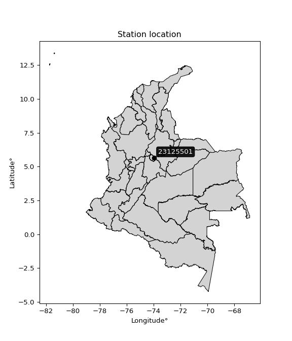

<div align="center">


</div>

# Station (rain, Pmax24h): 23125501

Probable Maximum Precipitation (PMP) is the greatest amount of rainfall for a specific duration that is meteorologically possible for a given location, acting as a "worst-case" scenario for extreme storms, crucial for designing safety-critical infrastructure like bridges, river deviations, dams, spillways, and nuclear plants to prevent catastrophic failure. PMP is calculated by hydrologists using meteorological data to determine the upper limit of extreme rainfall, often leading to the Probable Maximum Flood (PMF) for flood control design, and is increasingly being studied for climate change impacts.

<div align="center">

</img>

</div>


## A. General information


### 1. General running parameters

• app_version: _v20251226_. • runtime: _2025-12-26 15:38:16.554582_. • Python version: _3.14.0_. • SciPy version: _1.16.3_. • Pandas version: _2.3.3_. • NumPy version: _2.3.5_. • Stations dataset (station_dataset_file): _dataset/pmax24h_in/automatic_colombia_2003_2024.csv_. • Stations catalog (station_catalog_file): _dataset/CNE_IDEAM.xls_. • Minimum year to eval til year_max (date_min): _2003_. • Maximum year to eval since year_min (date_max): _2024_. • Creates, save and include plots into reports (create_plot): _False_. • Plot only fit distributions with Δo > Δ (plot_only_fit): _True_. • Eval low extreme values, if False, evaluates high extreme values (low_extreme): _False_. • Eval every SciPy distribution as logarithmic (pdist_logarithmic_on): _True_. • Standard deviation normalized (ddof): _1.0_. • Return periods to eval in years (Tr): _[2, 2.33, 5, 10, 15, 20, 25, 50, 75, 100, 200, 250, 500, 750, 1000]_. • Minimum data sample per station, 0 means any (minimum_sample): _5_. • Z-Score threshold to adjust a value, 0 means disable (zscore): _3.5_. • Avoid zeros, e.g. rain = 0 (avoid_zeros): _True_. • Avoid null values (avoid_nans): _True_. [:file_folder:Dataset file.](../../dataset/pmax24h_in/automatic_colombia_2003_2024.csv)


### 2. Station info and location

|   id |   CODIGO | NOMBRE                   | CATEGORIA               | TECNOLOGIA                | ESTADO   | FECHA_INSTALACION   |   FECHA_SUSPENSION |   ALTITUD |   LATITUD |   LONGITUD | DEPARTAMENTO   | MUNICIPIO   | AREA_OPERATIVA                              | ENTIDAD                                    | AREA_HIDROGRAFICA   | ZONA_HIDROGRAFICA   | SUBZONA_HIDROGRAFICA   |   CORRIENTE | OBSERVACION                                                                                                                                                                                                                                                   |   SUBRED | Catalogo   |
|-----:|---------:|:-------------------------|:------------------------|:--------------------------|:---------|:--------------------|-------------------:|----------:|----------:|-----------:|:---------------|:------------|:--------------------------------------------|:-------------------------------------------|:--------------------|:--------------------|:-----------------------|------------:|:--------------------------------------------------------------------------------------------------------------------------------------------------------------------------------------------------------------------------------------------------------------|---------:|:-----------|
|    0 | 23125501 | PAUNA  - AUT  [23125501] | Climatológica Principal | Automática con Telemetría | Activa   | 10/10/2014          |                nan |      1410 |   5.65713 |   -73.9603 | Boyacá         | Pauna       | Area Operativa 06 - Boyacá-Casanare-Vichada | CENTRO NACIONAL DE INVESTIGACIONES DE CAFE | Magdalena Cauca     | Medio Magdalena     | Río Carare (Minero)    |         nan | Mediante orfeo 20191040002573 se hace entrega del archivo Excel que contiene el catálogo de estaciones automáticas de Cenicafé, el cual comprende 103 estaciones, con el fin de que se actualice su metadata en el Catálogo Nacional de estaciones del IDEAM. |      nan | CNE_OE     |

<div align="center">

Map location in: [:earth_americas:Google](http://maps.google.com/maps?q=5.657130556,-73.96032778) [:earth_americas:OSM](https://www.openstreetmap.org/#map=18/5.657130556/-73.96032778&layers=P) [:earth_americas:Bing](https://www.bing.com/maps?cp=5.657130556~-73.96032778&lvl=18) [:earth_americas:Apple](https://maps.apple.com/frame?center=5.657130556%2C-73.96032778&span=0.003%2C0.006)

</div>


<div align="center">

```geojson
{
  "type": "Feature",
  "geometry": {
    "type": "Point", 
    "coordinates": [-73.96032778, 5.657130556]
  }, 
  "properties": {
    "Name": "23125501"
  }
}
```

</div>


### 3. Discrete values table and plot

|               |         0 |          1 |           2 |           3 |          4 |           5 |           6 |          7 |
|:--------------|----------:|-----------:|------------:|------------:|-----------:|------------:|------------:|-----------:|
| Date          | 2016      | 2017       | 2018        | 2019        | 2020       | 2021        | 2022        | 2023       |
| Value         |   33.9    |   78.7     |   63.3      |   53.1      |   77.3     |   68.4      |   41.9      |   35.9     |
| Value_initial |   33.9    |   78.7     |   63.3      |   53.1      |   77.3     |   68.4      |   41.9      |   35.9     |
| count         |    8      |    8       |    8        |    8        |    8       |    8        |    8        |    8       |
| mean          |   56.5625 |   56.5625  |   56.5625   |   56.5625   |   56.5625  |   56.5625   |   56.5625   |   56.5625  |
| std           |   18.0204 |   18.0204  |   18.0204   |   18.0204   |   18.0204  |   18.0204   |   18.0204   |   18.0204  |
| zscore        |   -1.2576 |    1.22847 |    0.373882 |   -0.192144 |    1.15078 |    0.656895 |   -0.813662 |   -1.14662 |
> If Z-Score is active, values out of range or outliers are replaced with the station mean value.


### 4. Active continuous probability distributions from SciPy (45 of 104 available)

[scipy.stats](https://docs.scipy.org/doc/scipy/reference/stats.html) is a Python´s powerful submodule within the SciPy library for comprehensive statistical analysis, offering over 130 probability distributions (like Normal, Poisson), functions for descriptive stats (mean, variance), hypothesis testing (t-tests, chi-square), random variable generation, and statistical tests, making it essential for data science, modeling, and research. It provides tools to explore, model, and draw conclusions from data efficiently, working seamlessly with NumPy.

<div align="center">

|   id | p_dist             |   n_parameter | fit_method   | label                                                                       | active   | ref                                                                                                        |
|-----:|:-------------------|--------------:|:-------------|:----------------------------------------------------------------------------|:---------|:-----------------------------------------------------------------------------------------------------------|
|    0 | alpha              |             3 | MLE          | Alpha                                                                       | True     | [:mortar_board:](https://docs.scipy.org/doc/scipy/reference/generated/scipy.stats.alpha.html)              |
|    1 | betaprime          |             4 | MLE          | Beta prime                                                                  | True     | [:mortar_board:](https://docs.scipy.org/doc/scipy/reference/generated/scipy.stats.betaprime.html)          |
|    2 | chi2               |             3 | MLE          | Chi²                                                                        | True     | [:mortar_board:](https://docs.scipy.org/doc/scipy/reference/generated/scipy.stats.chi2.html)               |
|    3 | crystalball        |             4 | MLE          | Crystalball                                                                 | True     | [:mortar_board:](https://docs.scipy.org/doc/scipy/reference/generated/scipy.stats.crystalball.html)        |
|    4 | erlang             |             3 | MLE          | Erlang                                                                      | True     | [:mortar_board:](https://docs.scipy.org/doc/scipy/reference/generated/scipy.stats.erlang.html)             |
|    5 | expon              |             2 | MLE          | Exponential                                                                 | True     | [:mortar_board:](https://docs.scipy.org/doc/scipy/reference/generated/scipy.stats.expon.html)              |
|    6 | exponnorm          |             3 | MLE          | Exponentially modified Normal                                               | True     | [:mortar_board:](https://docs.scipy.org/doc/scipy/reference/generated/scipy.stats.exponnorm.html)          |
|    7 | f                  |             4 | MLE          | F                                                                           | True     | [:mortar_board:](https://docs.scipy.org/doc/scipy/reference/generated/scipy.stats.f.html)                  |
|    8 | fatiguelife        |             3 | MLE          | Fatigue-life (Birnbaum-Saunders)                                            | True     | [:mortar_board:](https://docs.scipy.org/doc/scipy/reference/generated/scipy.stats.fatiguelife.html)        |
|    9 | fisk               |             3 | MLE          | Fisk                                                                        | True     | [:mortar_board:](https://docs.scipy.org/doc/scipy/reference/generated/scipy.stats.fisk.html)               |
|   10 | gamma              |             3 | MLE          | Gamma                                                                       | True     | [:mortar_board:](https://docs.scipy.org/doc/scipy/reference/generated/scipy.stats.gamma.html)              |
|   11 | genexpon           |             5 | MLE          | Generalized exponential                                                     | True     | [:mortar_board:](https://docs.scipy.org/doc/scipy/reference/generated/scipy.stats.genexpon.html)           |
|   12 | genlogistic        |             3 | MLE          | Generalized logistic                                                        | True     | [:mortar_board:](https://docs.scipy.org/doc/scipy/reference/generated/scipy.stats.genlogistic.html)        |
|   13 | gibrat             |             2 | MM           | Gibrat                                                                      | True     | [:mortar_board:](https://docs.scipy.org/doc/scipy/reference/generated/scipy.stats.gibrat.html)             |
|   14 | gompertz           |             3 | MLE          | Gompertz (or truncated Gumbel)                                              | True     | [:mortar_board:](https://docs.scipy.org/doc/scipy/reference/generated/scipy.stats.gompertz.html)           |
|   15 | gumbel_l           |             2 | MM           | Gumbel Left Skew                                                            | True     | [:mortar_board:](https://docs.scipy.org/doc/scipy/reference/generated/scipy.stats.gumbel_l.html)           |
|   16 | gumbel_r           |             2 | MM           | Gumbel Right Skew                                                           | True     | [:mortar_board:](https://docs.scipy.org/doc/scipy/reference/generated/scipy.stats.gumbel_r.html)           |
|   17 | halflogistic       |             2 | MM           | Half-logistic                                                               | True     | [:mortar_board:](https://docs.scipy.org/doc/scipy/reference/generated/scipy.stats.halflogistic.html)       |
|   18 | halfnorm           |             2 | MM           | Half Normal                                                                 | True     | [:mortar_board:](https://docs.scipy.org/doc/scipy/reference/generated/scipy.stats.halfnorm.html)           |
|   19 | hypsecant          |             2 | MM           | hyperbolic secant                                                           | True     | [:mortar_board:](https://docs.scipy.org/doc/scipy/reference/generated/scipy.stats.hypsecant.html)          |
|   20 | invgamma           |             3 | MLE          | Inverted gamma                                                              | True     | [:mortar_board:](https://docs.scipy.org/doc/scipy/reference/generated/scipy.stats.invgamma.html)           |
|   21 | invgauss           |             3 | MLE          | Inverse Gaussian                                                            | True     | [:mortar_board:](https://docs.scipy.org/doc/scipy/reference/generated/scipy.stats.invgauss.html)           |
|   22 | invweibull         |             3 | MLE          | Inverted Weibull                                                            | True     | [:mortar_board:](https://docs.scipy.org/doc/scipy/reference/generated/scipy.stats.invweibull.html)         |
|   23 | johnsonsu          |             4 | MLE          | Johnson Su                                                                  | True     | [:mortar_board:](https://docs.scipy.org/doc/scipy/reference/generated/scipy.stats.johnsonsu.html)          |
|   24 | kstwobign          |             2 | MLE          | Limiting distribution of scaled Kolmogorov-Smirnov two-sided test statistic | True     | [:mortar_board:](https://docs.scipy.org/doc/scipy/reference/generated/scipy.stats.kstwobign.html)          |
|   25 | laplace            |             2 | MM           | Laplace                                                                     | True     | [:mortar_board:](https://docs.scipy.org/doc/scipy/reference/generated/scipy.stats.laplace.html)            |
|   26 | laplace_asymmetric |             3 | MLE          | Asymmetric Laplace                                                          | True     | [:mortar_board:](https://docs.scipy.org/doc/scipy/reference/generated/scipy.stats.laplace_asymmetric.html) |
|   27 | loggamma           |             3 | MLE          | Log gamma                                                                   | True     | [:mortar_board:](https://docs.scipy.org/doc/scipy/reference/generated/scipy.stats.loggamma.html)           |
|   28 | logistic           |             2 | MM           | Logistic (or Sech-squared)                                                  | True     | [:mortar_board:](https://docs.scipy.org/doc/scipy/reference/generated/scipy.stats.logistic.html)           |
|   29 | lognorm            |             3 | MLE          | Log Normal                                                                  | True     | [:mortar_board:](https://docs.scipy.org/doc/scipy/reference/generated/scipy.stats.lognorm.html)            |
|   30 | maxwell            |             2 | MM           | Maxwell                                                                     | True     | [:mortar_board:](https://docs.scipy.org/doc/scipy/reference/generated/scipy.stats.maxwell.html)            |
|   31 | mielke             |             4 | MLE          | Mielke Beta-Kappa / Dagum                                                   | True     | [:mortar_board:](https://docs.scipy.org/doc/scipy/reference/generated/scipy.stats.mielke.html)             |
|   32 | moyal              |             2 | MM           | Moyal                                                                       | True     | [:mortar_board:](https://docs.scipy.org/doc/scipy/reference/generated/scipy.stats.moyal.html)              |
|   33 | nakagami           |             3 | MLE          | Nakagami                                                                    | True     | [:mortar_board:](https://docs.scipy.org/doc/scipy/reference/generated/scipy.stats.nakagami.html)           |
|   34 | ncf                |             5 | MLE          | Non-central F distribution                                                  | True     | [:mortar_board:](https://docs.scipy.org/doc/scipy/reference/generated/scipy.stats.ncf.html)                |
|   35 | nct                |             4 | MLE          | Non-central Student’s t                                                     | True     | [:mortar_board:](https://docs.scipy.org/doc/scipy/reference/generated/scipy.stats.nct.html)                |
|   36 | norm               |             2 | MM           | Normal                                                                      | True     | [:mortar_board:](https://docs.scipy.org/doc/scipy/reference/generated/scipy.stats.norm.html)               |
|   37 | pareto             |             3 | MLE          | Pareto                                                                      | True     | [:mortar_board:](https://docs.scipy.org/doc/scipy/reference/generated/scipy.stats.pareto.html)             |
|   38 | pearson3           |             3 | MM           | Pearson type III                                                            | True     | [:mortar_board:](https://docs.scipy.org/doc/scipy/reference/generated/scipy.stats.pearson3.html)           |
|   39 | rayleigh           |             2 | MM           | Rayleigh                                                                    | True     | [:mortar_board:](https://docs.scipy.org/doc/scipy/reference/generated/scipy.stats.rayleigh.html)           |
|   40 | rice               |             3 | MLE          | Rice                                                                        | True     | [:mortar_board:](https://docs.scipy.org/doc/scipy/reference/generated/scipy.stats.rice.html)               |
|   41 | t                  |             3 | MLE          | Student’s t                                                                 | True     | [:mortar_board:](https://docs.scipy.org/doc/scipy/reference/generated/scipy.stats.t.html)                  |
|   42 | truncnorm          |             4 | MLE          | Truncated normal                                                            | True     | [:mortar_board:](https://docs.scipy.org/doc/scipy/reference/generated/scipy.stats.truncnorm.html)          |
|   43 | wald               |             2 | MM           | Wald                                                                        | True     | [:mortar_board:](https://docs.scipy.org/doc/scipy/reference/generated/scipy.stats.wald.html)               |
|   44 | weibull_min        |             3 | MLE          | Weibull minimum                                                             | True     | [:mortar_board:](https://docs.scipy.org/doc/scipy/reference/generated/scipy.stats.weibull_min.html)        |

</div>

> **n_parameter:** # arguments & localization & scale.
>
> **Fit methods:** (MLE) maximum likelihood, (MM) L-moments.
>
>**Inactive:** foldnorm, gennorm, norminvgauss, powernorm, powerlognorm, skewnorm, genextreme, anglit, arcsine, argus, beta, bradford, burr, burr12, cauchy, cosine, halfcauchy, foldcauchy, skewcauchy, wrapcauchy, dgamma, gengamma, exponweib, exponpow, truncexpon, gausshyper, genhalflogistic, genhyperbolic, geninvgauss, halfgennorm, johnsonsb, kappa4, kappa3, ksone, kstwo, loglaplace, levy, levy_l, levy_stable, ncx2, genpareto, truncpareto, lomax, powerlaw, rdist, rel_breitwigner, recipinvgauss, semicircular, studentized_range, trapezoid, triang, truncweibull_min, tukeylambda, uniform, loguniform, vonmises, vonmises_line, weibull_max, dweibull, 


## B. Probability distributions vs. Empirical distributions

A continuous probability distribution (CPD) describes probabilities for variables that can take any value within a range (like rain any time), unlike discrete variables with specific outcomes (like temperature). It uses a Probability Density Function (PDF), a curve where the total area under it equals 1, and the probability of the variable falling within an interval (a to b) is found by calculating the area under the curve between those points. A key feature is that the probability of hitting any single exact value is zero, so probabilities are always expressed for ranges, e.g., $P(a ≤ X ≤ b)$.

<div align="center">

Distributions parameters
|    |   station | p_dist                |   n |              loc |           scale | shape                  | shape1                | shape2                | shape3   |
|---:|----------:|:----------------------|----:|-----------------:|----------------:|:-----------------------|:----------------------|:----------------------|:---------|
|  0 |  23125501 | alpha                 |   8 |   -183.764       |  3357.17        | 14.053681034159078     |                       |                       |          |
|  1 |  23125501 | betaprime             |   8 |     -4.95571     |     0.422137    | 1674.6737590660669     | 12.475416411236509    |                       |          |
|  2 |  23125501 | chi2                  |   8 |     33.9         |    25.6123      | 0.3738979320736459     |                       |                       |          |
|  3 |  23125501 | crystalball           |   8 |     56.5625      |    16.8565      | 7103.512812256411      | 121.95849985405275    |                       |          |
|  4 |  23125501 | erlang                |   8 |   -702.584       |     0.374907    | 2024.8612472765712     |                       |                       |          |
|  5 |  23125501 | expon                 |   8 |     33.9         |    22.6625      |                        |                       |                       |          |
|  6 |  23125501 | exponnorm             |   8 |     56.546       |    16.8566      | 0.0009797310897127025  |                       |                       |          |
|  7 |  23125501 | f                     |   8 |     28.7576      |    27.2424      | 3.7273962079594902     | 7969.345175061393     |                       |          |
|  8 |  23125501 | fatiguelife           |   8 |     33.9         |     4.89926e-05 | 610.2637272264933      |                       |                       |          |
|  9 |  23125501 | fisk                  |   8 |     -4.61386e+08 |     4.61386e+08 | 43913985.135993086     |                       |                       |          |
| 10 |  23125501 | gamma                 |   8 |   -698.669       |     0.376659    | 2005.0901834075203     |                       |                       |          |
| 11 |  23125501 | genexpon              |   8 |     33.9         |     2.28336     | 0.10076945883001033    | 3.185311514840661e-07 | 1.2733006397105555    |          |
| 12 |  23125501 | genlogistic           |   8 |    -41.955       |    14.8985      | 424.02648711739107     |                       |                       |          |
| 13 |  23125501 | gibrat                |   8 |     43.7031      |     7.79964     |                        |                       |                       |          |
| 14 |  23125501 | gompertz              |   8 |     33.9         |    29.5169      | 0.6592401246886879     |                       |                       |          |
| 15 |  23125501 | gumbel_l              |   8 |     64.1488      |    13.143       |                        |                       |                       |          |
| 16 |  23125501 | gumbel_r              |   8 |     48.9762      |    13.143       |                        |                       |                       |          |
| 17 |  23125501 | halflogistic          |   8 |     36.5836      |    14.4117      |                        |                       |                       |          |
| 18 |  23125501 | halfnorm              |   8 |     34.2511      |    27.9632      |                        |                       |                       |          |
| 19 |  23125501 | hypsecant             |   8 |     56.5625      |    10.7312      |                        |                       |                       |          |
| 20 |  23125501 | invgamma              |   8 |    -70.6508      |  6814.34        | 54.616709522896485     |                       |                       |          |
| 21 |  23125501 | invgauss              |   8 |     -6.59525     |   772.223       | 0.08171155134845506    |                       |                       |          |
| 22 |  23125501 | invweibull            |   8 |     -2.43011e+07 |     2.43011e+07 | 1629083.9736214997     |                       |                       |          |
| 23 |  23125501 | johnsonsu             |   8 |    126.833       |     4.06842     | 14.296443898876692     | 4.069536887621492     |                       |          |
| 24 |  23125501 | kstwobign             |   8 |     -2.57841     |    67.3573      |                        |                       |                       |          |
| 25 |  23125501 | laplace               |   8 |     56.5625      |    11.9194      |                        |                       |                       |          |
| 26 |  23125501 | laplace_asymmetric    |   8 |     53.1         |    15.0657      | 0.8916669581163683     |                       |                       |          |
| 27 |  23125501 | loggamma              |   8 |   -163.258       |    74.2787      | 19.784307063667395     |                       |                       |          |
| 28 |  23125501 | logistic              |   8 |     56.5625      |     9.29349     |                        |                       |                       |          |
| 29 |  23125501 | lognorm               |   8 |     33.9         |     0.213424    | 11.7708123500906       |                       |                       |          |
| 30 |  23125501 | maxwell               |   8 |     16.6196      |    25.0305      |                        |                       |                       |          |
| 31 |  23125501 | mielke                |   8 |     33.8996      |    44.9662      | 0.556916688116139      | 4842.669599321458     |                       |          |
| 32 |  23125501 | moyal                 |   8 |     46.9229      |     7.5881      |                        |                       |                       |          |
| 33 |  23125501 | nakagami              |   8 |     33.9         |    35.0243      | 0.2892681734117475     |                       |                       |          |
| 34 |  23125501 | ncf                   |   8 |     -0.552269    |     0.00220095  | 0.0021715925524621194  | 100.47830716982845    | 55.29687996202169     |          |
| 35 |  23125501 | nct                   |   8 |   -738.931       |    16.8005      | 154301.77599891322     | 47.34918423811652     |                       |          |
| 36 |  23125501 | norm                  |   8 |     56.5625      |    16.8565      |                        |                       |                       |          |
| 37 |  23125501 | pareto                |   8 |     33.8937      |     0.00631128  | 0.14366528757627878    |                       |                       |          |
| 38 |  23125501 | pearson3              |   8 |     56.5625      |    16.8565      | -0.05023825953568529   |                       |                       |          |
| 39 |  23125501 | rayleigh              |   8 |     24.315       |    25.7298      |                        |                       |                       |          |
| 40 |  23125501 | rice                  |   8 |     24.7615      |    20.6215      | 1.0229043111226566     |                       |                       |          |
| 41 |  23125501 | t                     |   8 |     56.562       |    16.857       | 28387148.379225332     |                       |                       |          |
| 42 |  23125501 | truncnorm             |   8 |     56.5625      |    16.8565      | -407.4195350831428     | 119.3763566309471     |                       |          |
| 43 |  23125501 | wald                  |   8 |     39.706       |    16.8565      |                        |                       |                       |          |
| 44 |  23125501 | weibull_min           |   8 |     33.9         |    26.2431      | 0.21398482940599547    |                       |                       |          |
| 45 |  23125501 | logalpha              |   8 |     -4.33826     |   214.85        | 25.847511366609112     |                       |                       |          |
| 46 |  23125501 | logbetaprime          |   8 |     -7.48688     |    37.2709      | 1688.0348019634698     | 5484.38573053172      |                       |          |
| 47 |  23125501 | logchi2               |   8 |      3.52342     |     0.937934    | 1.119158028113338      |                       |                       |          |
| 48 |  23125501 | logcrystalball        |   8 |      3.98728     |     0.316172    | 455.40017261444524     | 5.294315011780083     |                       |          |
| 49 |  23125501 | logerlang             |   8 |     -1.23147     |     0.0196573   | 265.39649887650245     |                       |                       |          |
| 50 |  23125501 | logexpon              |   8 |      3.52342     |     0.463861    |                        |                       |                       |          |
| 51 |  23125501 | logexponnorm          |   8 |      3.98693     |     0.316172    | 0.001090834743519157   |                       |                       |          |
| 52 |  23125501 | logf                  |   8 |   -121.044       |   125.031       | 1140531.4239246184     | 429201.4323537664     |                       |          |
| 53 |  23125501 | logfatiguelife        |   8 |    -45.4322      |    49.4177      | 0.006382075569570414   |                       |                       |          |
| 54 |  23125501 | logfisk               |   8 | -78169           | 78173           | 398209.02297718497     |                       |                       |          |
| 55 |  23125501 | loggamma              |   8 |     -1.64343     |     0.0181516   | 310.1234101574871      |                       |                       |          |
| 56 |  23125501 | loggenexpon           |   8 |      3.5225      |     0.0106402   | 0.013279560271431571   | 4.449098160641862     | 6.767834074527512e-05 |          |
| 57 |  23125501 | loggenlogistic        |   8 |      4.36565     |     7.04282e-07 | 1.8539653353853584e-06 |                       |                       |          |
| 58 |  23125501 | loggibrat             |   8 |      3.74604     |     0.146314    |                        |                       |                       |          |
| 59 |  23125501 | loggompertz           |   8 |      3.52342     |     0.421714    | 0.3508007633084391     |                       |                       |          |
| 60 |  23125501 | loggumbel_l           |   8 |      4.12957     |     0.246518    |                        |                       |                       |          |
| 61 |  23125501 | loggumbel_r           |   8 |      3.84498     |     0.246518    |                        |                       |                       |          |
| 62 |  23125501 | loghalflogistic       |   8 |      3.6126      |     0.270272    |                        |                       |                       |          |
| 63 |  23125501 | loghalfnorm           |   8 |      3.56881     |     0.524474    |                        |                       |                       |          |
| 64 |  23125501 | loghypsecant          |   8 |      3.98728     |     0.201281    |                        |                       |                       |          |
| 65 |  23125501 | loginvgamma           |   8 |     -1.55445     |  1645.54        | 298.0762515599422      |                       |                       |          |
| 66 |  23125501 | loginvgauss           |   8 |      1.8353      |    90.7998      | 0.023635348462904576   |                       |                       |          |
| 67 |  23125501 | loginvweibull         |   8 |     -1.72018e+07 |     1.72018e+07 | 58429134.63011735      |                       |                       |          |
| 68 |  23125501 | logjohnsonsu          |   8 |      4.36954     |     0.000102929 | 4.471347623389688      | 0.5555249097960229    |                       |          |
| 69 |  23125501 | logkstwobign          |   8 |      2.82445     |     1.32343     |                        |                       |                       |          |
| 70 |  23125501 | loglaplace            |   8 |      3.98728     |     0.223567    |                        |                       |                       |          |
| 71 |  23125501 | loglaplace_asymmetric |   8 |      4.36564     |     0.00305955  | 123.51368024087395     |                       |                       |          |
| 72 |  23125501 | logloggamma           |   8 |      4.36566     |     4.916e-07   | 1.292683670914637e-06  |                       |                       |          |
| 73 |  23125501 | loglogistic           |   8 |      3.98728     |     0.174315    |                        |                       |                       |          |
| 74 |  23125501 | loglognorm            |   8 |      3.52342     |     0.00541254  | 11.420319347670686     |                       |                       |          |
| 75 |  23125501 | logmaxwell            |   8 |      3.23808     |     0.469488    |                        |                       |                       |          |
| 76 |  23125501 | logmielke             |   8 |      3.28553     |     1.08033     | 2.256240621024805      | 22843.31515063112     |                       |          |
| 77 |  23125501 | logmoyal              |   8 |      3.80647     |     0.142327    |                        |                       |                       |          |
| 78 |  23125501 | lognakagami           |   8 |      3.52342     |     0.601297    | 0.14761037217049233    |                       |                       |          |
| 79 |  23125501 | logncf                |   8 |     -3.89494     |     7.8759      | 823.9928503485439      | 735.6864884466532     | 5.373883337098048e-09 |          |
| 80 |  23125501 | lognct                |   8 |     -8.59902     |     0.190283    | 1199.1433696429822     | 66.1083318346798      |                       |          |
| 81 |  23125501 | lognorm               |   8 |      3.98728     |     0.316172    |                        |                       |                       |          |
| 82 |  23125501 | logpareto             |   8 |      3.52328     |     0.000139691 | 0.14353656041242788    |                       |                       |          |
| 83 |  23125501 | logpearson3           |   8 |      3.98728     |     0.316171    | -0.2545668437754929    |                       |                       |          |
| 84 |  23125501 | lograyleigh           |   8 |      3.38242     |     0.482604    |                        |                       |                       |          |
| 85 |  23125501 | logrice               |   8 |      3.35327     |     0.372418    | 1.2723758680259882     |                       |                       |          |
| 86 |  23125501 | logt                  |   8 |      3.98728     |     0.316173    | 2671703878.266445      |                       |                       |          |
| 87 |  23125501 | logtruncnorm          |   8 |     -0.124924    |     1.2082      | 3.1938082055244363     | 3.716727833428741     |                       |          |
| 88 |  23125501 | logwald               |   8 |      3.67114     |     0.316143    |                        |                       |                       |          |
| 89 |  23125501 | logweibull_min        |   8 |     -3.65386e+06 |     3.65386e+06 | 14162335.866077626     |                       |                       |          |

</div>

> **loc** (Location parameter): This shifts the distribution along the x-axis. For many common distributions, like the normal (Gaussian) distribution, loc represents the mean $μ$. For others, like the uniform distribution, it might represent the minimum value, or for the beta distribution, the left end of the support interval.
>
> **scale** (Scale parameter): This determines the width or spread of the distribution. For the normal distribution, scale represents the standard deviation $σ$. For a uniform distribution, it defines the length of the interval (from $loc$ to $loc + scale$).
>
> **shape** (Shape parameters): Refers to parameters that define the specific form of a probability distribution, distinct from its location (loc) and scale (scale). These parameters are required arguments for most distribution functions. For example, a normal (Gaussian) distribution is fully defined by its location (mean) and scale (standard deviation), so it has no specific shape parameters beyond loc and scale. However, other distributions have intrinsic properties that need specification, as Gamma distribution that takes a shape parameter, often named $a$ or $alpha$.


### 0. Cumulative distribution values - CDF (90 evaluated)

> Ordered by x ascending and calculating $log(f(x))$ separately. 

|   id |   Station |   date |    x |   count |    mean |     std |    zscore |   Value_initial |   station |   m |    alpha |   alpha_pdf |   betaprime |   betaprime_pdf |     chi2 |    chi2_pdf |   crystalball |   crystalball_pdf |    erlang |   erlang_pdf |     expon |   expon_pdf |   exponnorm |   exponnorm_pdf |         f |      f_pdf |   fatiguelife |   fatiguelife_pdf |     fisk |   fisk_pdf |    gamma |   gamma_pdf |    genexpon |   genexpon_pdf |   genlogistic |   genlogistic_pdf |   gibrat |   gibrat_pdf |    gompertz |   gompertz_pdf |   gumbel_l |   gumbel_l_pdf |   gumbel_r |   gumbel_r_pdf |   halflogistic |   halflogistic_pdf |   halfnorm |   halfnorm_pdf |   hypsecant |   hypsecant_pdf |   invgamma |   invgamma_pdf |   invgauss |   invgauss_pdf |   invweibull |   invweibull_pdf |   johnsonsu |   johnsonsu_pdf |   kstwobign |   kstwobign_pdf |   laplace |   laplace_pdf |   laplace_asymmetric |   laplace_asymmetric_pdf |   loggamma |   loggamma_pdf |   logistic |   logistic_pdf |   lognorm |   lognorm_pdf |   maxwell |   maxwell_pdf |     mielke |   mielke_pdf |     moyal |   moyal_pdf |    nakagami |   nakagami_pdf |       ncf |    ncf_pdf |       nct |    nct_pdf |      norm |   norm_pdf |   pareto |   pareto_pdf |   pearson3 |   pearson3_pdf |   rayleigh |   rayleigh_pdf |      rice |   rice_pdf |        t |      t_pdf |   truncnorm |   truncnorm_pdf |      wald |   wald_pdf |   weibull_min |   weibull_min_pdf |   logalpha |   logalpha_pdf |   logbetaprime |   logbetaprime_pdf |     logchi2 |   logchi2_pdf |   logcrystalball |   logcrystalball_pdf |   logerlang |   logerlang_pdf |   logexpon |   logexpon_pdf |   logexponnorm |   logexponnorm_pdf |      logf |   logf_pdf |   logfatiguelife |   logfatiguelife_pdf |   logfisk |   logfisk_pdf |   loggenexpon |   loggenexpon_pdf |   loggenlogistic |   loggenlogistic_pdf |   loggibrat |   loggibrat_pdf |   loggompertz |   loggompertz_pdf |   loggumbel_l |   loggumbel_l_pdf |   loggumbel_r |   loggumbel_r_pdf |   loghalflogistic |   loghalflogistic_pdf |   loghalfnorm |   loghalfnorm_pdf |   loghypsecant |   loghypsecant_pdf |   loginvgamma |   loginvgamma_pdf |   loginvgauss |   loginvgauss_pdf |   loginvweibull |   loginvweibull_pdf |   logjohnsonsu |   logjohnsonsu_pdf |   logkstwobign |   logkstwobign_pdf |   loglaplace |   loglaplace_pdf |   loglaplace_asymmetric |   loglaplace_asymmetric_pdf |   logloggamma |   logloggamma_pdf |   loglogistic |   loglogistic_pdf |   loglognorm |   loglognorm_pdf |   logmaxwell |   logmaxwell_pdf |   logmielke |   logmielke_pdf |   logmoyal |   logmoyal_pdf |   lognakagami |   lognakagami_pdf |   logncf |   logncf_pdf |    lognct |   lognct_pdf |   logpareto |   logpareto_pdf |   logpearson3 |   logpearson3_pdf |   lograyleigh |   lograyleigh_pdf |   logrice |   logrice_pdf |      logt |   logt_pdf |   logtruncnorm |   logtruncnorm_pdf |   logwald |   logwald_pdf |   logweibull_min |   logweibull_min_pdf |
|-----:|----------:|-------:|-----:|--------:|--------:|--------:|----------:|----------------:|----------:|----:|---------:|------------:|------------:|----------------:|---------:|------------:|--------------:|------------------:|----------:|-------------:|----------:|------------:|------------:|----------------:|----------:|-----------:|--------------:|------------------:|---------:|-----------:|---------:|------------:|------------:|---------------:|--------------:|------------------:|---------:|-------------:|------------:|---------------:|-----------:|---------------:|-----------:|---------------:|---------------:|-------------------:|-----------:|---------------:|------------:|----------------:|-----------:|---------------:|-----------:|---------------:|-------------:|-----------------:|------------:|----------------:|------------:|----------------:|----------:|--------------:|---------------------:|-------------------------:|-----------:|---------------:|-----------:|---------------:|----------:|--------------:|----------:|--------------:|-----------:|-------------:|----------:|------------:|------------:|---------------:|----------:|-----------:|----------:|-----------:|----------:|-----------:|---------:|-------------:|-----------:|---------------:|-----------:|---------------:|----------:|-----------:|---------:|-----------:|------------:|----------------:|----------:|-----------:|--------------:|------------------:|-----------:|---------------:|---------------:|-------------------:|------------:|--------------:|-----------------:|---------------------:|------------:|----------------:|-----------:|---------------:|---------------:|-------------------:|----------:|-----------:|-----------------:|---------------------:|----------:|--------------:|--------------:|------------------:|-----------------:|---------------------:|------------:|----------------:|--------------:|------------------:|--------------:|------------------:|--------------:|------------------:|------------------:|----------------------:|--------------:|------------------:|---------------:|-------------------:|--------------:|------------------:|--------------:|------------------:|----------------:|--------------------:|---------------:|-------------------:|---------------:|-------------------:|-------------:|-----------------:|------------------------:|----------------------------:|--------------:|------------------:|--------------:|------------------:|-------------:|-----------------:|-------------:|-----------------:|------------:|----------------:|-----------:|---------------:|--------------:|------------------:|---------:|-------------:|----------:|-------------:|------------:|----------------:|--------------:|------------------:|--------------:|------------------:|----------:|--------------:|----------:|-----------:|---------------:|-------------------:|----------:|--------------:|-----------------:|---------------------:|
|    0 |  23125501 |   2016 | 33.9 |       8 | 56.5625 | 18.0204 | -1.2576   |            33.9 |  23125501 |   1 | 0.085353 |  0.0110607  |   0.0660947 |      0.0131827  | 0.001177 | 3.09677e+10 |     0.0894039 |        0.00958622 | 0.0887048 |   0.00971699 | 0         |  0.0441258  |    0.089404 |      0.00958621 | 0.0643605 | 0.0205519  |     0.0845918 |       1.53141e+09 | 0.101929 | 0.00871257 | 0.088495 |  0.0097034  | 1.63493e-07 |     0.0441321  |     0.0743163 |        0.0129267  | 0        |   0          | 1.12263e-09 |     0.0223343  |  0.0952589 |     0.00689117 |  0.0428944 |     0.0102774  |       0        |         0          |   0        |     0          |   0.0766683 |      0.00707555 |  0.0821902 |     0.01138    |  0.0749351 |     0.0126553  |    0.0743516 |       0.012954   |    0.104136 |      0.00790751 |   0.0689659 |      0.0140145  | 0.0746858 |    0.00626592 |             0.106073 |               0.00789614 |   0.070902 |       0.449191 |  0.080281  |     0.00794491 | 0.0711719 |      0.430122 | 0.0760019 |    0.0119713  | 0.00142877 |    2.27205   | 0.0183391 |  0.00767995 | 6.47875e-10 | 52751.1        | 0.0764927 | 0.0115698  | 0.0894556 | 0.00959141 | 0.0894039 | 0.00958622 | 0        | 22.7633      |  0.0904577 |     0.00945842 |  0.0670351 |     0.0135078  | 0.0568395 | 0.0121454  | 0.089415 | 0.00958684 |   0.0894038 |      0.00958621 | 0         | 0          |   0.000466344 |        1.4041e+10 |  0.069275  |       0.463015 |      0.0715627 |           0.442357 | 2.02755e-09 |   2.55483e+06 |        0.0711718 |             0.430121 |   0.0711494 |        0.451699 |   0        |       2.15582  |      0.0711719 |           0.430121 | 0.0710971 |   0.430982 |        0.0705179 |             0.43219  |  0.080115 |      0.375409 |    0.00113649 |          1.24906  |         0        |             0.286728 |    0        |        0        |   2.17521e-09 |          0.831845 |     0.0819759 |          0.318517 |     0.0250818 |          0.37499  |          0        |              0        |     0         |          0        |      0.0633277 |           0.312552 |     0.0690899 |          0.464752 |     0.0676781 |          0.509282 |       0.0608541 |            0.578615 |       0.178414 |           0.171323 |      0.0569566 |           0.639308 |    0.0627896 |         0.280853 |                0.107658 |                    0.284888 |      0.109185 |          0.287106 |     0.0653107 |          0.350201 |   0.00416481 |       2.4219e+12 |    0.0535042 |         0.521872 |   0.0329022 |        0.312064 | 0.00687082 |       0.196292 |   2.75369e-05 |       1.83059e+10 | 0.201624 |     0.528968 | 0.0708414 |     0.442116 |    0        |    1027.53      |     0.0768717 |          0.407138 |     0.0417784 |          0.580073 | 0.0459649 |      0.534344 | 0.0711717 |   0.430119 |     0          |           0        | 0         |      0        |        0.0876282 |             0.32431  |
|    1 |  23125501 |   2023 | 35.9 |       8 | 56.5625 | 18.0204 | -1.14662  |            35.9 |  23125501 |   2 | 0.10944  |  0.0130348  |   0.0955901 |      0.016288   | 0.588076 | 0.0531889   |     0.110139  |        0.0111652  | 0.10974   |   0.0113336  | 0.0844694 |  0.0403985  |    0.11014  |      0.0111652  | 0.108981  | 0.0238035  |     0.629705  |       0.0312602   | 0.120721 | 0.010103   | 0.109503 |  0.0113201  | 0.0844812   |     0.0404038  |     0.102925  |        0.0156659  | 0        |   0          | 0.045165    |     0.0228206  |  0.110023  |     0.00789287 |  0.0669038 |     0.0137671  |       0        |         0          |   0.047022 |     0.0284838  |   0.092175  |      0.0084699  |  0.107048  |     0.0134826  |  0.102794  |     0.0151888  |    0.103019  |       0.0156965  |    0.121024 |      0.0089972  |   0.100097  |      0.0170675  | 0.0883304 |    0.00741066 |             0.123102 |               0.00916374 |   0.100287 |       0.578297 |  0.0976748 |     0.00948346 | 0.0992534 |      0.552042 | 0.102041  |    0.014058   | 0.176673   |    0.0491875 | 0.03869   |  0.0128244  | 0.148226    |     0.0428458  | 0.101886  | 0.0138246  | 0.110202  | 0.0111706  | 0.110139  | 0.0111652  | 0.562972 |  0.0312941   |  0.110896  |     0.0109956  |  0.0963973 |     0.0158125  | 0.0834748 | 0.0144596  | 0.110152 | 0.0111658  |   0.110139  |      0.0111652  | 0         | 0          |   0.438115    |        0.0346552  |  0.0996775 |       0.599849 |      0.100454  |           0.567925 | 0.157894    |   1.51139     |        0.0992533 |             0.552041 |   0.100694  |        0.581313 |   0.116246 |       1.90521  |      0.0992534 |           0.552041 | 0.0992378 |   0.553236 |        0.0987716 |             0.556006 |  0.104445 |      0.476469 |    0.0742828  |          1.2987   |         0        |             0.333429 |    0        |        0        |   0.0497935   |          0.905509 |     0.102303  |          0.393001 |     0.0538824 |          0.638444 |          0        |              0        |     0.0181465 |          1.52091  |      0.083981  |           0.412409 |     0.099627  |          0.602826 |     0.101319  |          0.665871 |       0.0998566 |            0.781479 |       0.188766 |           0.190348 |      0.100334  |           0.869688 |    0.0811409 |         0.362938 |                0.125293 |                    0.331552 |      0.126947 |          0.333814 |     0.0884899 |          0.462723 |   0.581857   |       0.596534   |    0.0883445 |         0.693604 |   0.0535513 |        0.409287 | 0.0271036  |       0.538801 |   0.403327    |       2.07478     | 0.233163 |     0.570842 | 0.0997415 |     0.568476 |    0.578532 |       1.0528    |     0.10319   |          0.513423 |     0.080965  |          0.782541 | 0.0814172 |      0.700727 | 0.099253  |   0.552039 |     0          |           0        | 0         |      0        |        0.10821   |             0.395862 |
|    2 |  23125501 |   2022 | 41.9 |       8 | 56.5625 | 18.0204 | -0.813662 |            41.9 |  23125501 |   3 | 0.205209 |  0.0187423  |   0.216976  |      0.0234486  | 0.748635 | 0.0153266   |     0.192194  |        0.0162122  | 0.193072  |   0.0164566  | 0.297427  |  0.0310016  |    0.192194 |      0.0162122  | 0.264504  | 0.0267336  |     0.746064  |       0.0132601   | 0.195518 | 0.0149707  | 0.192759 |  0.0164457  | 0.297463    |     0.0310045  |     0.218417  |        0.0222635  | 0        |   0          | 0.185542    |     0.0238533  |  0.168063  |     0.0116469  |  0.180277  |     0.0235001  |       0.182384 |         0.0335399  |   0.215558 |     0.0274856  |   0.158973  |      0.0142059  |  0.20624   |     0.0193733  |  0.214052  |     0.0214291  |    0.218679  |       0.0222849  |    0.186092 |      0.012822   |   0.224166  |      0.023479   | 0.146126  |    0.0122595  |             0.192415 |               0.0143234  |   0.218675 |       0.951494 |  0.171119  |     0.015262   | 0.212724  |      0.918441 | 0.203603  |    0.0195252  | 0.382328   |    0.0266145 | 0.163826  |  0.0277693  | 0.329507    |     0.0235514  | 0.204054  | 0.0199574  | 0.192286  | 0.0162166  | 0.192194  | 0.0162122  | 0.64177  |  0.00642807  |  0.19162   |     0.015951   |  0.208283  |     0.02103    | 0.188247  | 0.0201057  | 0.192209 | 0.0162126  |   0.192194  |      0.0162122  | 0.0143549 | 0.0275505  |   0.539541    |        0.00955176 |  0.222423  |       0.9821   |      0.216718  |           0.936062 | 0.318754    |   0.782612    |        0.212724  |             0.918441 |   0.219568  |        0.954294 |   0.366664 |       1.36536  |      0.212724  |           0.918439 | 0.21292   |   0.919716 |        0.213224  |             0.926683 |  0.203993 |      0.827157 |    0.278011   |          1.3094   |         0        |             0.50083  |    0        |        0        |   0.204643    |          1.09344  |     0.182917  |          0.669577 |     0.210039  |          1.32955  |          0.223143 |              1.75787  |     0.249074  |          1.44656  |      0.177311  |           0.836056 |     0.223081  |          0.988041 |     0.236188  |          1.06014  |       0.255886  |            1.18469  |       0.223235 |           0.261513 |      0.269291  |           1.24441  |    0.16198   |         0.724525 |                0.188599 |                    0.499074 |      0.190598 |          0.501185 |     0.190678  |          0.885297 |   0.625939   |       0.156592   |    0.228126  |         1.08791  |   0.13846   |        0.694595 | 0.199102   |       1.5782   |   0.592001    |       0.811819    | 0.328843 |     0.660853 | 0.216215  |     0.937841 |    0.650552 |       0.236585  |     0.207925  |          0.849521 |     0.234559  |          1.15968  | 0.219954  |      1.06735  | 0.212723  |   0.918436 |     0.00480048 |           3.33546  | 0.0663971 |      2.88504  |        0.188178  |             0.655989 |
|    3 |  23125501 |   2019 | 53.1 |       8 | 56.5625 | 18.0204 | -0.192144 |            53.1 |  23125501 |   4 | 0.452355 |  0.0237014  |   0.496482  |      0.023934   | 0.854741 | 0.00604447  |     0.418626  |        0.0231729  | 0.421753  |   0.0232616  | 0.571393  |  0.0189126  |    0.418625 |      0.0231728  | 0.538873  | 0.0211568  |     0.847509  |       0.00629719  | 0.413734 | 0.0230863  | 0.421385 |  0.0232636  | 0.571446    |     0.018913   |     0.487699  |        0.0234855  | 0.573898 |   0.0417241  | 0.453467    |     0.023393   |  0.350416  |     0.0213229  |  0.481577  |     0.0267735  |       0.517573 |         0.0254     |   0.499728 |     0.0227348  |   0.399032  |      0.0281823  |  0.457953  |     0.0237447  |  0.477926  |     0.0235882  |    0.48798   |       0.0234709  |    0.375368 |      0.0209036  |   0.498488  |      0.023377   | 0.373947  |    0.0313731  |             0.442919 |               0.032971   |   0.490523 |       1.24959  |  0.40792   |     0.0259882  | 0.480955  |      1.26035  | 0.452952  |    0.0234101  | 0.622553   |    0.0180575 | 0.505651  |  0.0280413  | 0.538208    |     0.0151556  | 0.460432  | 0.023865   | 0.418726  | 0.0231688  | 0.418626  | 0.0231729  | 0.684087 |  0.00236306  |  0.415497  |     0.0230544  |  0.465163  |     0.023255   | 0.443622  | 0.0239411  | 0.41864  | 0.0231724  |   0.418626  |      0.0231729  | 0.571769  | 0.0325385  |   0.607539    |        0.00409108 |  0.497819  |       1.24105  |      0.486284  |           1.24975  | 0.464541    |   0.495621    |        0.480955  |             1.26035  |   0.491552  |        1.24749  |   0.619949 |       0.819321 |      0.480954  |           1.26035  | 0.481152  |   1.2587   |        0.483185  |             1.26414  |  0.461375 |      1.26589  |    0.563889   |          1.06512  |         0        |             0.934362 |    0.668353 |        1.60467  |   0.486209    |          1.23873  |     0.410277  |          1.26333  |     0.550502  |          1.333    |          0.581818 |              1.22375  |     0.558161  |          1.13181  |      0.476144  |           1.57698  |     0.499899  |          1.2457   |     0.519316  |          1.21651  |       0.543564  |            1.12553  |       0.307992 |           0.491816 |      0.560487  |           1.11377  |    0.467346  |         2.09041  |                0.353007 |                    0.934136 |      0.355342 |          0.934387 |     0.478358  |          1.4315   |   0.650561   |       0.0722307  |    0.514663  |         1.2237   |   0.359685  |        1.18188  | 0.576364   |       1.33974  |   0.732911    |       0.448737    | 0.493255 |     0.706606 | 0.485887  |     1.248    |    0.686224 |       0.10033   |     0.46411   |          1.25105  |     0.52606   |          1.20009  | 0.50364   |      1.23399  | 0.480953  |   1.26035  |     0.588784   |           1.74884  | 0.648343  |      1.35641  |        0.406772  |             1.20066  |
|    4 |  23125501 |   2018 | 63.3 |       8 | 56.5625 | 18.0204 |  0.373882 |            63.3 |  23125501 |   5 | 0.67919  |  0.019689   |   0.705543  |      0.0166965  | 0.901679 | 0.0035029   |     0.65531   |        0.02185    | 0.657749  |   0.0216456  | 0.726731  |  0.0120582  |    0.655309 |      0.02185    | 0.718686  | 0.0142457  |     0.897847  |       0.00384797  | 0.650735 | 0.0216321  | 0.657459 |  0.0216575  | 0.726782    |     0.0120577  |     0.696108  |        0.0169183  | 0.821552 |   0.0133171  | 0.675567    |     0.0196188  |  0.608378  |     0.0279335  |  0.714432  |     0.018279   |       0.729144 |         0.0162489  |   0.701114 |     0.0166348  |   0.687881  |      0.0246434  |  0.682032  |     0.0192099  |  0.692202  |     0.0177944  |    0.696202  |       0.0169005  |    0.613013 |      0.0244715  |   0.705717  |      0.0169268  | 0.715893  |    0.0238358  |             0.695393 |               0.0180282  |   0.698859 |       1.06908  |  0.673701  |     0.023654   | 0.694267  |      1.10906  | 0.676374  |    0.0194788  | 0.789278   |    0.0149509 | 0.733939  |  0.0168667  | 0.67168     |     0.0112672  | 0.683161  | 0.0189101  | 0.655333  | 0.0218404  | 0.65531   | 0.02185    | 0.702841 |  0.00145178  |  0.652715  |     0.0220585  |  0.682688  |     0.0186858  | 0.672973  | 0.0200912  | 0.655318 | 0.0218492  |   0.65531   |      0.02185    | 0.789373  | 0.0134992  |   0.641062    |        0.00267677 |  0.701884  |       1.03435  |      0.695999  |           1.08269  | 0.541685    |   0.390186    |        0.694266  |             1.10906  |   0.699275  |        1.06485  |   0.739784 |       0.560978 |      0.694266  |           1.10906  | 0.694023  |   1.10618  |        0.696416  |             1.1047   |  0.677048 |      1.11381  |    0.727446   |          0.7926   |         0        |             1.48386  |    0.843825 |        0.595951 |   0.696225    |          1.11095  |     0.659426  |          1.48809  |     0.746272  |          0.885971 |          0.757476 |              0.788522 |     0.730455  |          0.826991 |      0.730666  |           1.18405  |     0.704385  |          1.03436  |     0.713635  |          0.960482 |       0.714892  |            0.814982 |       0.429647 |           0.984269 |      0.730009  |           0.80996  |    0.756232  |         1.09036  |                0.561972 |                    1.4871   |      0.564033 |          1.48315  |     0.715322  |          1.16821  |   0.66121    |       0.0513078  |    0.710873  |         0.976126 |   0.601428  |        1.57356  | 0.76313    |       0.807243 |   0.80042     |       0.329173    | 0.614421 |     0.662343 | 0.695055  |     1.07891  |    0.700754 |       0.0687673 |     0.683207  |          1.17722  |     0.715742  |          0.934232 | 0.704872  |      1.01755  | 0.694264  |   1.10906  |     0.830609   |           1.05677  | 0.812363  |      0.625536 |        0.643631  |             1.42519  |
|    5 |  23125501 |   2021 | 68.4 |       8 | 56.5625 | 18.0204 |  0.656895 |            68.4 |  23125501 |   6 | 0.770428 |  0.0160149  |   0.781101  |      0.0130047  | 0.917614 | 0.00278423  |     0.758739  |        0.018495   | 0.759965  |   0.0182394  | 0.781799  |  0.00962828 |    0.758737 |      0.018495   | 0.783681  | 0.0113198  |     0.915446  |       0.00308887  | 0.751696 | 0.0177649  | 0.759739 |  0.0182524  | 0.781847    |     0.00962755 |     0.773156  |        0.0133472  | 0.875463 |   0.00831359 | 0.768303    |     0.0166535  |  0.748898  |     0.0264017  |  0.796029  |     0.0138165  |       0.801873 |         0.0123857  |   0.777993 |     0.0135366  |   0.796021  |      0.0177335  |  0.770754  |     0.0155343  |  0.773795  |     0.0142155  |    0.77317   |       0.0133339  |    0.734656 |      0.0227716  |   0.783237  |      0.0135124  | 0.814793  |    0.0155384  |             0.774758 |               0.013331   |   0.775751 |       0.91076  |  0.781383  |     0.018381   | 0.774293  |      0.950261 | 0.767177  |    0.016054   | 0.862819   |    0.0139279 | 0.808098  |  0.0123982  | 0.725196    |     0.00975352 | 0.770281  | 0.0152259  | 0.758714  | 0.0184866  | 0.758738  | 0.018495   | 0.709591 |  0.0012091   |  0.757423  |     0.0187709  |  0.769578  |     0.0153441  | 0.766787  | 0.0166063  | 0.758742 | 0.0184943  |   0.758738  |      0.018495   | 0.846458  | 0.0092193  |   0.653643    |        0.00227777 |  0.776048  |       0.87632  |      0.774014  |           0.925586 | 0.570544    |   0.355598    |        0.774293  |             0.950261 |   0.775849  |        0.906893 |   0.779816 |       0.474676 |      0.774292  |           0.950262 | 0.773841  |   0.947859 |        0.776018  |             0.94391  |  0.756752 |      0.937682 |    0.784158   |          0.671975 |         0        |             1.81962  |    0.882313 |        0.411635 |   0.77744     |          0.978113 |     0.771209  |          1.36888  |     0.807569  |          0.70015  |          0.812253 |              0.629448 |     0.789377  |          0.694891 |      0.810729  |           0.885892 |     0.778474  |          0.874456 |     0.782082  |          0.804843 |       0.772629  |            0.676974 |       0.524593 |           1.53434  |      0.787571  |           0.677199 |    0.827634  |         0.77098  |                0.689869 |                    1.82555  |      0.691505 |          1.81834  |     0.796717  |          0.929119 |   0.664949   |       0.0454477  |    0.780667  |         0.823535 |   0.730293  |        1.75318  | 0.818439   |       0.626704 |   0.824395    |       0.290668    | 0.664367 |     0.625294 | 0.772795  |     0.922433 |    0.705735 |       0.0601594 |     0.769065  |          1.02928  |     0.782473  |          0.787288 | 0.777969  |      0.865958 | 0.774291  |   0.950264 |     0.903826   |           0.840588 | 0.854127  |      0.462437 |        0.751731  |             1.3407   |
|    6 |  23125501 |   2020 | 77.3 |       8 | 56.5625 | 18.0204 |  1.15078  |            77.3 |  23125501 |   7 | 0.883786 |  0.00963275 |   0.872727  |      0.00790125 | 0.938346 | 0.00194183  |     0.890696  |        0.0111044  | 0.889962  |   0.0109502  | 0.852667  |  0.00650119 |    0.890695 |      0.0111044  | 0.865663  | 0.00733604 |     0.938497  |       0.00215796  | 0.875966 | 0.0103411  | 0.889844 |  0.0109604  | 0.852708    |     0.00650033 |     0.867981  |        0.00824735 | 0.927904 |   0.00408802 | 0.890182    |     0.010671   |  0.934124  |     0.0136333  |  0.890567  |     0.00785316 |       0.888048 |         0.0073333  |   0.876314 |     0.00872392 |   0.908458  |      0.00841335 |  0.880809  |     0.00939838 |  0.874909  |     0.00875143 |    0.867915  |       0.00824226 |    0.902769 |      0.0140779  |   0.879937  |      0.00844978 | 0.912224  |    0.00736418 |             0.86699  |               0.00787226 |   0.870243 |       0.634055 |  0.903034  |     0.00942203 | 0.872845  |      0.658887 | 0.882251  |    0.00991854 | 0.980454   |    0.0125813 | 0.892521  |  0.00703908 | 0.801724    |     0.00751885 | 0.878228  | 0.00925196 | 0.890623  | 0.0111022  | 0.890696  | 0.0111044  | 0.719008 |  0.000930021 |  0.891537  |     0.0112765  |  0.880008  |     0.00960357 | 0.885604  | 0.0101813  | 0.890695 | 0.0111041  |   0.890696  |      0.0111044  | 0.907801  | 0.00506122 |   0.671643    |        0.00180298 |  0.866979  |       0.612052 |      0.870148  |           0.645183 | 0.611175    |   0.310395    |        0.872845  |             0.658887 |   0.86996   |        0.63183  |   0.830854 |       0.364647 |      0.872844  |           0.658889 | 0.872191  |   0.658085 |        0.873753  |             0.65246  |  0.852965 |      0.638857 |    0.855407   |          0.496971 |         0        |             2.51086  |    0.921307 |        0.244035 |   0.880712    |          0.700659 |     0.911304  |          0.871617 |     0.877984  |          0.463451 |          0.876372 |              0.429146 |     0.862477  |          0.505017 |      0.894745  |           0.513447 |     0.869045  |          0.608263 |     0.865535  |          0.563877 |       0.843448  |            0.487772 |       0.866488 |           5.47931  |      0.858682  |           0.491095 |    0.900268  |         0.446094 |                0.953549 |                    2.5233   |      0.953862 |          2.50822  |     0.887717  |          0.571815 |   0.670058   |       0.0384684  |    0.86641   |         0.58136  |   0.962466  |        2.04446  | 0.881263   |       0.414034 |   0.856769    |       0.240507    | 0.736503 |     0.551635 | 0.868679  |     0.644424 |    0.712441 |       0.0500658 |     0.876424  |          0.717215 |     0.864701  |          0.560743 | 0.868278  |      0.611442 | 0.872843  |   0.658892 |     0.989857   |           0.580821 | 0.899719  |      0.297519 |        0.893369  |             0.925127 |
|    7 |  23125501 |   2017 | 78.7 |       8 | 56.5625 | 18.0204 |  1.22847  |            78.7 |  23125501 |   8 | 0.896655 |  0.00876012 |   0.883341  |      0.00727007 | 0.940993 | 0.00184133  |     0.905457  |        0.00999129 | 0.904527  |   0.00986454 | 0.861493  |  0.00611173 |    0.905456 |      0.00999134 | 0.875577  | 0.006832   |     0.941437  |       0.00204404  | 0.889733 | 0.00933777 | 0.904423 |  0.00987406 | 0.861533    |     0.00611086 |     0.879071  |        0.00760381 | 0.933346 |   0.00369426 | 0.904464    |     0.00973421 |  0.951476  |     0.0111708  |  0.901057  |     0.00714281 |       0.897882 |         0.00672394 |   0.888064 |     0.00806666 |   0.919527  |      0.00741931 |  0.893382  |     0.0085718  |  0.886656  |     0.0080379  |    0.878999  |       0.00759973 |    0.921285 |      0.0123722  |   0.891298  |      0.00778565 | 0.921951  |    0.00654808 |             0.877567 |               0.00724626 |   0.881269 |       0.594681 |  0.915448  |     0.00832875 | 0.884291  |      0.616603 | 0.895525  |    0.00905093 | 0.997944   |    0.0124055 | 0.901942  |  0.00642866 | 0.81203     |     0.007206   | 0.890618  | 0.00845585 | 0.905382  | 0.00999015 | 0.905457  | 0.00999129 | 0.720287 |  0.000896862 |  0.906519  |     0.0101326  |  0.892886  |     0.00879941 | 0.899208  | 0.00926004 | 0.905456 | 0.00999108 |   0.905457  |      0.00999129 | 0.914582  | 0.00463337 |   0.674126    |        0.00174524 |  0.877633  |       0.575163 |      0.881366  |           0.604906 | 0.616694    |   0.304536    |        0.884291  |             0.616603 |   0.880948  |        0.592743 |   0.837274 |       0.350807 |      0.88429   |           0.616605 | 0.883625  |   0.616064 |        0.885085  |             0.610425 |  0.864066 |      0.598311 |    0.864115   |          0.473492 |         0.999973 |             2.63235  |    0.925534 |        0.22722  |   0.892892    |          0.656472 |     0.926135  |          0.780702 |     0.886044  |          0.434861 |          0.883854 |              0.40478  |     0.871314  |          0.47971  |      0.903582  |           0.47173  |     0.879629  |          0.571215 |     0.875363  |          0.531345 |       0.851985  |            0.463567 |       0.980659 |           6.70735  |      0.867277  |           0.466747 |    0.907962  |         0.411679 |                0.999933 |                    2.64605  |      0.999962 |          2.62944  |     0.897578  |          0.52739  |   0.670741   |       0.0376172  |    0.876545  |         0.548055 |   0.999551  |        2.06574  | 0.88847    |       0.389247 |   0.861027    |       0.234008    | 0.746298 |     0.539716 | 0.879887  |     0.604553 |    0.713329 |       0.0488478 |     0.888865  |          0.669109 |     0.874487  |          0.529856 | 0.878929  |      0.575477 | 0.884289  |   0.616608 |     1          |           0.54968  | 0.904898  |      0.279738 |        0.90925   |             0.844067 |

An Empirical Distribution Function (EDF) is a step-function estimate of a true cumulative distribution function (CDF) based on observed sample data, representing the proportion of data points less than or equal to a given value. It is calculated by ordering your data and jumping up by $1/n$ (where $n$ is sample size) at each unique data point, allowing analysis without assuming an underlying population distribution, and it gets closer to the true CDF as the sample size grows.


### 1. Empirical - EDF California (1923)

California´s estimates the true probability distribution of water-related data (like rainfall, streamflow) using observed samples, crucial for risk assessment.

<div align="center">


$P=m/n$


</div>


**1.1. Empirical values**

<div align="center">

|                | 0                  | 1                  | 2              | 3              | 4                  | 5              | 6              | 7              |
|:---------------|:-------------------|:-------------------|:---------------|:---------------|:-------------------|:---------------|:---------------|:---------------|
| date           | 2016               | 2023               | 2022           | 2019           | 2018               | 2021           | 2020           | 2017           |
| x              | 33.9               | 35.9               | 41.9           | 53.1           | 63.3               | 68.4           | 77.3           | 78.7           |
| m              | 1                  | 2                  | 3              | 4              | 5                  | 6              | 7              | 8              |
| empirical_dist | edf_california     | edf_california     | edf_california | edf_california | edf_california     | edf_california | edf_california | edf_california |
| empirical      | 0.125              | 0.25               | 0.375          | 0.5            | 0.625              | 0.75           | 0.875          | 1.0            |
| empirical_tr   | 1.1428571428571428 | 1.3333333333333333 | 1.6            | 2.0            | 2.6666666666666665 | 4.0            | 8.0            | inf            |

</div>


**1.2. Kolmogorov-Smirnov fit test (sorted by Δ)**


<div align="center">

|                | 0                   | 1                   | 2                   | 3                   | 4                   | 5                   | 6                   | 7                  | 8                  | 9                   | 10                  | 11                  | 12                  | 13                  | 14                 | 15                  | 16                  | 17                  | 18                  | 19                 | 20                 | 21                  | 22                 | 23                  | 24                 | 25                  | 26                  | 27                  | 28                  | 29                 | 30                 | 31                 | 32                  | 33                 | 34                  | 35                  | 36                 | 37                  | 38                  | 39                  | 40                 | 41                  | 42                  | 43                  | 44                  | 45                 | 46                  | 47                  | 48                 | 49                 | 50                  | 51                    | 52                  | 53                 | 54                 | 55                  | 56                 | 57                  | 58                  | 59                  | 60                 | 61                  | 62                  | 63                  | 64                  | 65                  | 66                 | 67                 | 68                  | 69                  | 70                 | 71                  | 72                 | 73                  | 74                 | 75                 | 76                 | 77                  | 78                  | 79                  | 80                 | 81                 | 82                  | 83                  | 84                  | 85                 | 86                 | 87                 | 88                 | 89                 |
|:---------------|:--------------------|:--------------------|:--------------------|:--------------------|:--------------------|:--------------------|:--------------------|:-------------------|:-------------------|:--------------------|:--------------------|:--------------------|:--------------------|:--------------------|:-------------------|:--------------------|:--------------------|:--------------------|:--------------------|:-------------------|:-------------------|:--------------------|:-------------------|:--------------------|:-------------------|:--------------------|:--------------------|:--------------------|:--------------------|:-------------------|:-------------------|:-------------------|:--------------------|:-------------------|:--------------------|:--------------------|:-------------------|:--------------------|:--------------------|:--------------------|:-------------------|:--------------------|:--------------------|:--------------------|:--------------------|:-------------------|:--------------------|:--------------------|:-------------------|:-------------------|:--------------------|:----------------------|:--------------------|:-------------------|:-------------------|:--------------------|:-------------------|:--------------------|:--------------------|:--------------------|:-------------------|:--------------------|:--------------------|:--------------------|:--------------------|:--------------------|:-------------------|:-------------------|:--------------------|:--------------------|:-------------------|:--------------------|:-------------------|:--------------------|:-------------------|:-------------------|:-------------------|:--------------------|:--------------------|:--------------------|:-------------------|:-------------------|:--------------------|:--------------------|:--------------------|:-------------------|:-------------------|:-------------------|:-------------------|:-------------------|
| station        | 23125501            | 23125501            | 23125501            | 23125501            | 23125501            | 23125501            | 23125501            | 23125501           | 23125501           | 23125501            | 23125501            | 23125501            | 23125501            | 23125501            | 23125501           | 23125501            | 23125501            | 23125501            | 23125501            | 23125501           | 23125501           | 23125501            | 23125501           | 23125501            | 23125501           | 23125501            | 23125501            | 23125501            | 23125501            | 23125501           | 23125501           | 23125501           | 23125501            | 23125501           | 23125501            | 23125501            | 23125501           | 23125501            | 23125501            | 23125501            | 23125501           | 23125501            | 23125501            | 23125501            | 23125501            | 23125501           | 23125501            | 23125501            | 23125501           | 23125501           | 23125501            | 23125501              | 23125501            | 23125501           | 23125501           | 23125501            | 23125501           | 23125501            | 23125501            | 23125501            | 23125501           | 23125501            | 23125501            | 23125501            | 23125501            | 23125501            | 23125501           | 23125501           | 23125501            | 23125501            | 23125501           | 23125501            | 23125501           | 23125501            | 23125501           | 23125501           | 23125501           | 23125501            | 23125501            | 23125501            | 23125501           | 23125501           | 23125501            | 23125501            | 23125501            | 23125501           | 23125501           | 23125501           | 23125501           | 23125501           |
| empirical_dist | edf_california      | edf_california      | edf_california      | edf_california      | edf_california      | edf_california      | edf_california      | edf_california     | edf_california     | edf_california      | edf_california      | edf_california      | edf_california      | edf_california      | edf_california     | edf_california      | edf_california      | edf_california      | edf_california      | edf_california     | edf_california     | edf_california      | edf_california     | edf_california      | edf_california     | edf_california      | edf_california      | edf_california      | edf_california      | edf_california     | edf_california     | edf_california     | edf_california      | edf_california     | edf_california      | edf_california      | edf_california     | edf_california      | edf_california      | edf_california      | edf_california     | edf_california      | edf_california      | edf_california      | edf_california      | edf_california     | edf_california      | edf_california      | edf_california     | edf_california     | edf_california      | edf_california        | edf_california      | edf_california     | edf_california     | edf_california      | edf_california     | edf_california      | edf_california      | edf_california      | edf_california     | edf_california      | edf_california      | edf_california      | edf_california      | edf_california      | edf_california     | edf_california     | edf_california      | edf_california      | edf_california     | edf_california      | edf_california     | edf_california      | edf_california     | edf_california     | edf_california     | edf_california      | edf_california      | edf_california      | edf_california     | edf_california     | edf_california      | edf_california      | edf_california      | edf_california     | edf_california     | edf_california     | edf_california     | edf_california     |
| p_dist         | f                   | loginvgauss         | logkstwobign        | loginvweibull       | kstwobign           | loginvgamma         | logalpha            | logerlang          | invweibull         | loggamma            | loggamma            | genlogistic         | betaprime           | logbetaprime        | lognct             | invgauss            | logmaxwell          | logfatiguelife      | logf                | lognorm            | lognorm            | logcrystalball      | logexponnorm       | logt                | logexpon           | mielke              | genexpon            | expon               | rayleigh            | logpearson3        | logrice            | invgamma           | lograyleigh         | alpha              | ncf                 | logfisk             | maxwell            | loggenexpon         | fisk                | erlang              | gamma              | laplace_asymmetric  | nct                 | t                   | crystalball         | norm               | exponnorm           | truncnorm           | pearson3           | loglogistic        | logloggamma         | loglaplace_asymmetric | rice                | logweibull_min     | nakagami           | johnsonsu           | loggumbel_l        | gumbel_r            | loggumbel_r         | loghypsecant        | loggompertz        | halfnorm            | logistic            | gompertz            | gumbel_l            | moyal               | loglaplace         | hypsecant          | logmoyal            | logjohnsonsu        | laplace            | loghalfnorm         | lognakagami        | logmielke           | loghalflogistic    | halflogistic       | logncf             | logwald             | pareto              | weibull_min         | logpareto          | loglognorm         | wald                | logtruncnorm        | chi2                | gibrat             | loggibrat          | fatiguelife        | logchi2            | loggenlogistic     |
| delta          | 0.14101941356050351 | 0.14868081901871397 | 0.14966633101117308 | 0.15014341629813324 | 0.15083368198813765 | 0.15191853970825933 | 0.15257703753959034 | 0.1554321353752618 | 0.1563208212164812 | 0.15632487665635617 | 0.15632487665635617 | 0.15658281357278944 | 0.15802381867366644 | 0.15828173906237214 | 0.1587846149433349 | 0.16094774704522685 | 0.16165546728704766 | 0.16177557572608403 | 0.16207988777098503 | 0.1622760191307876 | 0.1622760191307876 | 0.16227623245097228 | 0.1622762788888721 | 0.16227708783767442 | 0.1627256383528366 | 0.16427802077763576 | 0.16551878883892157 | 0.16553057642044883 | 0.16671677225294793 | 0.1670751423474122 | 0.1685827848522835 | 0.168759602718413  | 0.16903500846507297 | 0.1697906647954296 | 0.17094629352714058 | 0.17100695581557668 | 0.1713965690717605 | 0.17571716563645087 | 0.17948228451856996 | 0.18192821621618935 | 0.182240674217366  | 0.18258508223544795 | 0.18271355494802818 | 0.18279123625064986 | 0.18280643887115688 | 0.1828064429573928 | 0.18280648022848678 | 0.18280648116064055 | 0.1833804929196729 | 0.1843215310599276 | 0.18440228735841702 | 0.18640136038221314   | 0.18675306554072543 | 0.1868217734767303 | 0.1879697970148554 | 0.18890848068803395 | 0.1920828913677189 | 0.19472324491263576 | 0.19611757904484942 | 0.19768931040288737 | 0.2002064939692233 | 0.20297797250819777 | 0.20388104237034532 | 0.20483500875526106 | 0.20693748936772144 | 0.21131003173371438 | 0.213020073899643  | 0.2160268410460309 | 0.22289639129474442 | 0.22540650312346422 | 0.2288743784941302 | 0.23185345988626965 | 0.2329109557808996 | 0.23654040423827982 | 0.25               | 0.25               | 0.2537019480468268 | 0.30860285016194927 | 0.31297216000983175 | 0.32587361860117403 | 0.3285317516522859 | 0.3318571071833458 | 0.36064513017102057 | 0.37019952211561097 | 0.37363483910026707 | 0.375              | 0.375              | 0.3797047475220312 | 0.3833061045053373 | 0.875              |
| deltao         | 0.4472608134160001  | 0.4472608134160001  | 0.4472608134160001  | 0.4472608134160001  | 0.4472608134160001  | 0.4472608134160001  | 0.4472608134160001  | 0.4472608134160001 | 0.4472608134160001 | 0.4472608134160001  | 0.4472608134160001  | 0.4472608134160001  | 0.4472608134160001  | 0.4472608134160001  | 0.4472608134160001 | 0.4472608134160001  | 0.4472608134160001  | 0.4472608134160001  | 0.4472608134160001  | 0.4472608134160001 | 0.4472608134160001 | 0.4472608134160001  | 0.4472608134160001 | 0.4472608134160001  | 0.4472608134160001 | 0.4472608134160001  | 0.4472608134160001  | 0.4472608134160001  | 0.4472608134160001  | 0.4472608134160001 | 0.4472608134160001 | 0.4472608134160001 | 0.4472608134160001  | 0.4472608134160001 | 0.4472608134160001  | 0.4472608134160001  | 0.4472608134160001 | 0.4472608134160001  | 0.4472608134160001  | 0.4472608134160001  | 0.4472608134160001 | 0.4472608134160001  | 0.4472608134160001  | 0.4472608134160001  | 0.4472608134160001  | 0.4472608134160001 | 0.4472608134160001  | 0.4472608134160001  | 0.4472608134160001 | 0.4472608134160001 | 0.4472608134160001  | 0.4472608134160001    | 0.4472608134160001  | 0.4472608134160001 | 0.4472608134160001 | 0.4472608134160001  | 0.4472608134160001 | 0.4472608134160001  | 0.4472608134160001  | 0.4472608134160001  | 0.4472608134160001 | 0.4472608134160001  | 0.4472608134160001  | 0.4472608134160001  | 0.4472608134160001  | 0.4472608134160001  | 0.4472608134160001 | 0.4472608134160001 | 0.4472608134160001  | 0.4472608134160001  | 0.4472608134160001 | 0.4472608134160001  | 0.4472608134160001 | 0.4472608134160001  | 0.4472608134160001 | 0.4472608134160001 | 0.4472608134160001 | 0.4472608134160001  | 0.4472608134160001  | 0.4472608134160001  | 0.4472608134160001 | 0.4472608134160001 | 0.4472608134160001  | 0.4472608134160001  | 0.4472608134160001  | 0.4472608134160001 | 0.4472608134160001 | 0.4472608134160001 | 0.4472608134160001 | 0.4472608134160001 |
| eval           | Δo > Δ              | Δo > Δ              | Δo > Δ              | Δo > Δ              | Δo > Δ              | Δo > Δ              | Δo > Δ              | Δo > Δ             | Δo > Δ             | Δo > Δ              | Δo > Δ              | Δo > Δ              | Δo > Δ              | Δo > Δ              | Δo > Δ             | Δo > Δ              | Δo > Δ              | Δo > Δ              | Δo > Δ              | Δo > Δ             | Δo > Δ             | Δo > Δ              | Δo > Δ             | Δo > Δ              | Δo > Δ             | Δo > Δ              | Δo > Δ              | Δo > Δ              | Δo > Δ              | Δo > Δ             | Δo > Δ             | Δo > Δ             | Δo > Δ              | Δo > Δ             | Δo > Δ              | Δo > Δ              | Δo > Δ             | Δo > Δ              | Δo > Δ              | Δo > Δ              | Δo > Δ             | Δo > Δ              | Δo > Δ              | Δo > Δ              | Δo > Δ              | Δo > Δ             | Δo > Δ              | Δo > Δ              | Δo > Δ             | Δo > Δ             | Δo > Δ              | Δo > Δ                | Δo > Δ              | Δo > Δ             | Δo > Δ             | Δo > Δ              | Δo > Δ             | Δo > Δ              | Δo > Δ              | Δo > Δ              | Δo > Δ             | Δo > Δ              | Δo > Δ              | Δo > Δ              | Δo > Δ              | Δo > Δ              | Δo > Δ             | Δo > Δ             | Δo > Δ              | Δo > Δ              | Δo > Δ             | Δo > Δ              | Δo > Δ             | Δo > Δ              | Δo > Δ             | Δo > Δ             | Δo > Δ             | Δo > Δ              | Δo > Δ              | Δo > Δ              | Δo > Δ             | Δo > Δ             | Δo > Δ              | Δo > Δ              | Δo > Δ              | Δo > Δ             | Δo > Δ             | Δo > Δ             | Δo > Δ             | Δo <= Δ            |
| fit            | 1                   | 1                   | 1                   | 1                   | 1                   | 1                   | 1                   | 1                  | 1                  | 1                   | 1                   | 1                   | 1                   | 1                   | 1                  | 1                   | 1                   | 1                   | 1                   | 1                  | 1                  | 1                   | 1                  | 1                   | 1                  | 1                   | 1                   | 1                   | 1                   | 1                  | 1                  | 1                  | 1                   | 1                  | 1                   | 1                   | 1                  | 1                   | 1                   | 1                   | 1                  | 1                   | 1                   | 1                   | 1                   | 1                  | 1                   | 1                   | 1                  | 1                  | 1                   | 1                     | 1                   | 1                  | 1                  | 1                   | 1                  | 1                   | 1                   | 1                   | 1                  | 1                   | 1                   | 1                   | 1                   | 1                   | 1                  | 1                  | 1                   | 1                   | 1                  | 1                   | 1                  | 1                   | 1                  | 1                  | 1                  | 1                   | 1                   | 1                   | 1                  | 1                  | 1                   | 1                   | 1                   | 1                  | 1                  | 1                  | 1                  | 0                  |
| n              | 8                   | 8                   | 8                   | 8                   | 8                   | 8                   | 8                   | 8                  | 8                  | 8                   | 8                   | 8                   | 8                   | 8                   | 8                  | 8                   | 8                   | 8                   | 8                   | 8                  | 8                  | 8                   | 8                  | 8                   | 8                  | 8                   | 8                   | 8                   | 8                   | 8                  | 8                  | 8                  | 8                   | 8                  | 8                   | 8                   | 8                  | 8                   | 8                   | 8                   | 8                  | 8                   | 8                   | 8                   | 8                   | 8                  | 8                   | 8                   | 8                  | 8                  | 8                   | 8                     | 8                   | 8                  | 8                  | 8                   | 8                  | 8                   | 8                   | 8                   | 8                  | 8                   | 8                   | 8                   | 8                   | 8                   | 8                  | 8                  | 8                   | 8                   | 8                  | 8                   | 8                  | 8                   | 8                  | 8                  | 8                  | 8                   | 8                   | 8                   | 8                  | 8                  | 8                   | 8                   | 8                   | 8                  | 8                  | 8                  | 8                  | 8                  |
| best_fit       | 1                   | 0                   | 0                   | 0                   | 0                   | 0                   | 0                   | 0                  | 0                  | 0                   | 0                   | 0                   | 0                   | 0                   | 0                  | 0                   | 0                   | 0                   | 0                   | 0                  | 0                  | 0                   | 0                  | 0                   | 0                  | 0                   | 0                   | 0                   | 0                   | 0                  | 0                  | 0                  | 0                   | 0                  | 0                   | 0                   | 0                  | 0                   | 0                   | 0                   | 0                  | 0                   | 0                   | 0                   | 0                   | 0                  | 0                   | 0                   | 0                  | 0                  | 0                   | 0                     | 0                   | 0                  | 0                  | 0                   | 0                  | 0                   | 0                   | 0                   | 0                  | 0                   | 0                   | 0                   | 0                   | 0                   | 0                  | 0                  | 0                   | 0                   | 0                  | 0                   | 0                  | 0                   | 0                  | 0                  | 0                  | 0                   | 0                   | 0                   | 0                  | 0                  | 0                   | 0                   | 0                   | 0                  | 0                  | 0                  | 0                  | 0                  |
| best_fit_sort  | 1                   | 2                   | 3                   | 4                   | 5                   | 6                   | 7                   | 8                  | 9                  | 10                  | 11                  | 12                  | 13                  | 14                  | 15                 | 16                  | 17                  | 18                  | 19                  | 20                 | 21                 | 22                  | 23                 | 24                  | 25                 | 26                  | 27                  | 28                  | 29                  | 30                 | 31                 | 32                 | 33                  | 34                 | 35                  | 36                  | 37                 | 38                  | 39                  | 40                  | 41                 | 42                  | 43                  | 44                  | 45                  | 46                 | 47                  | 48                  | 49                 | 50                 | 51                  | 52                    | 53                  | 54                 | 55                 | 56                  | 57                 | 58                  | 59                  | 60                  | 61                 | 62                  | 63                  | 64                  | 65                  | 66                  | 67                 | 68                 | 69                  | 70                  | 71                 | 72                  | 73                 | 74                  | 75                 | 76                 | 77                 | 78                  | 79                  | 80                  | 81                 | 82                 | 83                  | 84                  | 85                  | 86                 | 87                 | 88                 | 89                 | 90                 |

</div>


**1.3. Best fit**

<div align="center">

|   id |   station | empirical_dist   | p_dist   |    delta |   deltao | eval   |   fit |   n |   best_fit |   best_fit_sort |
|-----:|----------:|:-----------------|:---------|---------:|---------:|:-------|------:|----:|-----------:|----------------:|
|    0 |  23125501 | edf_california   | f        | 0.141019 | 0.447261 | Δo > Δ |     1 |   8 |          1 |               1 |

</div>


### 2. Empirical - EDF Hazen (1930)

Hazen method for plotting positions is a formula used to estimate the empirical cumulative probability distribution of flood events or other hydrological data. This formula often results in biased estimations, particularly when extrapolating to extreme events (high return periods).

<div align="center">


$P=(m-0.5)/n$


</div>


**2.1. Empirical values**

<div align="center">

|                | 0                  | 1                  | 2                  | 3                  | 4                  | 5         | 6                 | 7         |
|:---------------|:-------------------|:-------------------|:-------------------|:-------------------|:-------------------|:----------|:------------------|:----------|
| date           | 2016               | 2023               | 2022               | 2019               | 2018               | 2021      | 2020              | 2017      |
| x              | 33.9               | 35.9               | 41.9               | 53.1               | 63.3               | 68.4      | 77.3              | 78.7      |
| m              | 1                  | 2                  | 3                  | 4                  | 5                  | 6         | 7                 | 8         |
| empirical_dist | edf_hazen          | edf_hazen          | edf_hazen          | edf_hazen          | edf_hazen          | edf_hazen | edf_hazen         | edf_hazen |
| empirical      | 0.0625             | 0.1875             | 0.3125             | 0.4375             | 0.5625             | 0.6875    | 0.8125            | 0.9375    |
| empirical_tr   | 1.0666666666666667 | 1.2307692307692308 | 1.4545454545454546 | 1.7777777777777777 | 2.2857142857142856 | 3.2       | 5.333333333333333 | 16.0      |

</div>


**2.2. Kolmogorov-Smirnov fit test (sorted by Δ)**


<div align="center">

|                | 0                   | 1                  | 2                  | 3                   | 4                   | 5                   | 6                  | 7                   | 8                   | 9                   | 10                  | 11                  | 12                  | 13                  | 14                  | 15                  | 16                 | 17                  | 18                  | 19                 | 20                  | 21                 | 22                  | 23                  | 24                 | 25                 | 26                  | 27                  | 28                  | 29                  | 30                  | 31                  | 32                 | 33                 | 34                  | 35                  | 36                  | 37                 | 38                 | 39                 | 40                  | 41                    | 42                 | 43                  | 44                  | 45                  | 46                  | 47                  | 48                 | 49                  | 50                  | 51                 | 52                  | 53                 | 54                  | 55                 | 56                 | 57                  | 58                  | 59                 | 60                  | 61                  | 62                 | 63                 | 64                  | 65                  | 66                 | 67                  | 68                 | 69                  | 70                 | 71                  | 72                 | 73                  | 74                 | 75                  | 76                  | 77                  | 78                 | 79                  | 80                  | 81                 | 82                 | 83                 | 84                  | 85                 | 86                 | 87                  | 88                 | 89                 |
|:---------------|:--------------------|:-------------------|:-------------------|:--------------------|:--------------------|:--------------------|:-------------------|:--------------------|:--------------------|:--------------------|:--------------------|:--------------------|:--------------------|:--------------------|:--------------------|:--------------------|:-------------------|:--------------------|:--------------------|:-------------------|:--------------------|:-------------------|:--------------------|:--------------------|:-------------------|:-------------------|:--------------------|:--------------------|:--------------------|:--------------------|:--------------------|:--------------------|:-------------------|:-------------------|:--------------------|:--------------------|:--------------------|:-------------------|:-------------------|:-------------------|:--------------------|:----------------------|:-------------------|:--------------------|:--------------------|:--------------------|:--------------------|:--------------------|:-------------------|:--------------------|:--------------------|:-------------------|:--------------------|:-------------------|:--------------------|:-------------------|:-------------------|:--------------------|:--------------------|:-------------------|:--------------------|:--------------------|:-------------------|:-------------------|:--------------------|:--------------------|:-------------------|:--------------------|:-------------------|:--------------------|:-------------------|:--------------------|:-------------------|:--------------------|:-------------------|:--------------------|:--------------------|:--------------------|:-------------------|:--------------------|:--------------------|:-------------------|:-------------------|:-------------------|:--------------------|:-------------------|:-------------------|:--------------------|:-------------------|:-------------------|
| station        | 23125501            | 23125501           | 23125501           | 23125501            | 23125501            | 23125501            | 23125501           | 23125501            | 23125501            | 23125501            | 23125501            | 23125501            | 23125501            | 23125501            | 23125501            | 23125501            | 23125501           | 23125501            | 23125501            | 23125501           | 23125501            | 23125501           | 23125501            | 23125501            | 23125501           | 23125501           | 23125501            | 23125501            | 23125501            | 23125501            | 23125501            | 23125501            | 23125501           | 23125501           | 23125501            | 23125501            | 23125501            | 23125501           | 23125501           | 23125501           | 23125501            | 23125501              | 23125501           | 23125501            | 23125501            | 23125501            | 23125501            | 23125501            | 23125501           | 23125501            | 23125501            | 23125501           | 23125501            | 23125501           | 23125501            | 23125501           | 23125501           | 23125501            | 23125501            | 23125501           | 23125501            | 23125501            | 23125501           | 23125501           | 23125501            | 23125501            | 23125501           | 23125501            | 23125501           | 23125501            | 23125501           | 23125501            | 23125501           | 23125501            | 23125501           | 23125501            | 23125501            | 23125501            | 23125501           | 23125501            | 23125501            | 23125501           | 23125501           | 23125501           | 23125501            | 23125501           | 23125501           | 23125501            | 23125501           | 23125501           |
| empirical_dist | edf_hazen           | edf_hazen          | edf_hazen          | edf_hazen           | edf_hazen           | edf_hazen           | edf_hazen          | edf_hazen           | edf_hazen           | edf_hazen           | edf_hazen           | edf_hazen           | edf_hazen           | edf_hazen           | edf_hazen           | edf_hazen           | edf_hazen          | edf_hazen           | edf_hazen           | edf_hazen          | edf_hazen           | edf_hazen          | edf_hazen           | edf_hazen           | edf_hazen          | edf_hazen          | edf_hazen           | edf_hazen           | edf_hazen           | edf_hazen           | edf_hazen           | edf_hazen           | edf_hazen          | edf_hazen          | edf_hazen           | edf_hazen           | edf_hazen           | edf_hazen          | edf_hazen          | edf_hazen          | edf_hazen           | edf_hazen             | edf_hazen          | edf_hazen           | edf_hazen           | edf_hazen           | edf_hazen           | edf_hazen           | edf_hazen          | edf_hazen           | edf_hazen           | edf_hazen          | edf_hazen           | edf_hazen          | edf_hazen           | edf_hazen          | edf_hazen          | edf_hazen           | edf_hazen           | edf_hazen          | edf_hazen           | edf_hazen           | edf_hazen          | edf_hazen          | edf_hazen           | edf_hazen           | edf_hazen          | edf_hazen           | edf_hazen          | edf_hazen           | edf_hazen          | edf_hazen           | edf_hazen          | edf_hazen           | edf_hazen          | edf_hazen           | edf_hazen           | edf_hazen           | edf_hazen          | edf_hazen           | edf_hazen           | edf_hazen          | edf_hazen          | edf_hazen          | edf_hazen           | edf_hazen          | edf_hazen          | edf_hazen           | edf_hazen          | edf_hazen          |
| p_dist         | maxwell             | logfisk            | alpha              | fisk                | erlang              | invgamma            | gamma              | rayleigh            | nct                 | t                   | crystalball         | norm                | exponnorm           | truncnorm           | ncf                 | logpearson3         | pearson3           | rice                | logweibull_min      | nakagami           | johnsonsu           | loggumbel_l        | invgauss            | logf                | logt               | logexponnorm       | logcrystalball      | lognorm             | lognorm             | lognct              | laplace_asymmetric  | logbetaprime        | genlogistic        | invweibull         | logfatiguelife      | loggamma            | loggamma            | logerlang          | loggompertz        | logalpha           | halfnorm            | loglaplace_asymmetric | logloggamma        | logistic            | loginvgamma         | gompertz            | logrice             | betaprime           | kstwobign          | gumbel_l            | logmaxwell          | loginvgauss        | gumbel_r            | loginvweibull      | loglogistic         | lograyleigh        | hypsecant          | f                   | logjohnsonsu        | expon              | genexpon            | loggenexpon         | laplace            | logkstwobign       | loghypsecant        | loghalfnorm         | moyal              | logmielke           | logexpon           | loggumbel_r         | halflogistic       | logncf              | loglaplace         | loghalflogistic     | logmoyal           | mielke              | logwald             | weibull_min         | lognakagami        | wald                | logtruncnorm        | loggibrat          | gibrat             | logchi2            | pareto              | logpareto          | loglognorm         | chi2                | fatiguelife        | loggenlogistic     |
| delta          | 0.11387389947044757 | 0.1145479494492675 | 0.1166896592532346 | 0.11698228451856996 | 0.11942821621618935 | 0.11953181329844476 | 0.119740674217366  | 0.12018815750219136 | 0.12021355494802818 | 0.12029123625064986 | 0.12030643887115688 | 0.12030644295739279 | 0.12030648022848678 | 0.12030648116064055 | 0.12066068980049094 | 0.12070661752919609 | 0.1208804929196729 | 0.12425306554072543 | 0.12432177347673029 | 0.1254697970148554 | 0.12640848068803395 | 0.1295828913677189 | 0.12970227133724888 | 0.13152260613100952 | 0.1317638992373973 | 0.1317655497398137 | 0.13176626258449953 | 0.13176650468793194 | 0.13176650468793194 | 0.13255539969330665 | 0.13289335137108904 | 0.13349930588943426 | 0.1336077371893193 | 0.1337015225154754 | 0.13391569220424282 | 0.13635947614904564 | 0.13635947614904564 | 0.1367753897161118 | 0.1377064939692233 | 0.1393840443619534 | 0.14047797250819777 | 0.14104883829320503   | 0.1413616811711732 | 0.14138104237034532 | 0.14188464930247946 | 0.14233500875526106 | 0.14237204526235758 | 0.14304318837035834 | 0.1432168776201248 | 0.14443748936772144 | 0.14837321525837832 | 0.1511349898211688 | 0.15193162706602792 | 0.1523917462924006 | 0.15282214381802117 | 0.1532421487172163 | 0.1535268410460309 | 0.15618581019767208 | 0.16290650312346422 | 0.1642306382869212 | 0.16428234895683314 | 0.16494594207229052 | 0.1663743784941302 | 0.1675090544093032 | 0.16816612057689995 | 0.16935345988626965 | 0.1714393250153794 | 0.17404040423827982 | 0.1824485107618946 | 0.18377195828440607 | 0.1875             | 0.19120194804682678 | 0.1937324445776485 | 0.19497557855405845 | 0.2006299341456138 | 0.22677802077763576 | 0.24986255030475024 | 0.26337361860117403 | 0.2954109557808996 | 0.29814513017102057 | 0.30769952211561097 | 0.3125             | 0.3125             | 0.3208061045053373 | 0.37547216000983175 | 0.3910317516522859 | 0.3943571071833458 | 0.43613483910026707 | 0.4422047475220312 | 0.8125             |
| deltao         | 0.4472608134160001  | 0.4472608134160001 | 0.4472608134160001 | 0.4472608134160001  | 0.4472608134160001  | 0.4472608134160001  | 0.4472608134160001 | 0.4472608134160001  | 0.4472608134160001  | 0.4472608134160001  | 0.4472608134160001  | 0.4472608134160001  | 0.4472608134160001  | 0.4472608134160001  | 0.4472608134160001  | 0.4472608134160001  | 0.4472608134160001 | 0.4472608134160001  | 0.4472608134160001  | 0.4472608134160001 | 0.4472608134160001  | 0.4472608134160001 | 0.4472608134160001  | 0.4472608134160001  | 0.4472608134160001 | 0.4472608134160001 | 0.4472608134160001  | 0.4472608134160001  | 0.4472608134160001  | 0.4472608134160001  | 0.4472608134160001  | 0.4472608134160001  | 0.4472608134160001 | 0.4472608134160001 | 0.4472608134160001  | 0.4472608134160001  | 0.4472608134160001  | 0.4472608134160001 | 0.4472608134160001 | 0.4472608134160001 | 0.4472608134160001  | 0.4472608134160001    | 0.4472608134160001 | 0.4472608134160001  | 0.4472608134160001  | 0.4472608134160001  | 0.4472608134160001  | 0.4472608134160001  | 0.4472608134160001 | 0.4472608134160001  | 0.4472608134160001  | 0.4472608134160001 | 0.4472608134160001  | 0.4472608134160001 | 0.4472608134160001  | 0.4472608134160001 | 0.4472608134160001 | 0.4472608134160001  | 0.4472608134160001  | 0.4472608134160001 | 0.4472608134160001  | 0.4472608134160001  | 0.4472608134160001 | 0.4472608134160001 | 0.4472608134160001  | 0.4472608134160001  | 0.4472608134160001 | 0.4472608134160001  | 0.4472608134160001 | 0.4472608134160001  | 0.4472608134160001 | 0.4472608134160001  | 0.4472608134160001 | 0.4472608134160001  | 0.4472608134160001 | 0.4472608134160001  | 0.4472608134160001  | 0.4472608134160001  | 0.4472608134160001 | 0.4472608134160001  | 0.4472608134160001  | 0.4472608134160001 | 0.4472608134160001 | 0.4472608134160001 | 0.4472608134160001  | 0.4472608134160001 | 0.4472608134160001 | 0.4472608134160001  | 0.4472608134160001 | 0.4472608134160001 |
| eval           | Δo > Δ              | Δo > Δ             | Δo > Δ             | Δo > Δ              | Δo > Δ              | Δo > Δ              | Δo > Δ             | Δo > Δ              | Δo > Δ              | Δo > Δ              | Δo > Δ              | Δo > Δ              | Δo > Δ              | Δo > Δ              | Δo > Δ              | Δo > Δ              | Δo > Δ             | Δo > Δ              | Δo > Δ              | Δo > Δ             | Δo > Δ              | Δo > Δ             | Δo > Δ              | Δo > Δ              | Δo > Δ             | Δo > Δ             | Δo > Δ              | Δo > Δ              | Δo > Δ              | Δo > Δ              | Δo > Δ              | Δo > Δ              | Δo > Δ             | Δo > Δ             | Δo > Δ              | Δo > Δ              | Δo > Δ              | Δo > Δ             | Δo > Δ             | Δo > Δ             | Δo > Δ              | Δo > Δ                | Δo > Δ             | Δo > Δ              | Δo > Δ              | Δo > Δ              | Δo > Δ              | Δo > Δ              | Δo > Δ             | Δo > Δ              | Δo > Δ              | Δo > Δ             | Δo > Δ              | Δo > Δ             | Δo > Δ              | Δo > Δ             | Δo > Δ             | Δo > Δ              | Δo > Δ              | Δo > Δ             | Δo > Δ              | Δo > Δ              | Δo > Δ             | Δo > Δ             | Δo > Δ              | Δo > Δ              | Δo > Δ             | Δo > Δ              | Δo > Δ             | Δo > Δ              | Δo > Δ             | Δo > Δ              | Δo > Δ             | Δo > Δ              | Δo > Δ             | Δo > Δ              | Δo > Δ              | Δo > Δ              | Δo > Δ             | Δo > Δ              | Δo > Δ              | Δo > Δ             | Δo > Δ             | Δo > Δ             | Δo > Δ              | Δo > Δ             | Δo > Δ             | Δo > Δ              | Δo > Δ             | Δo <= Δ            |
| fit            | 1                   | 1                  | 1                  | 1                   | 1                   | 1                   | 1                  | 1                   | 1                   | 1                   | 1                   | 1                   | 1                   | 1                   | 1                   | 1                   | 1                  | 1                   | 1                   | 1                  | 1                   | 1                  | 1                   | 1                   | 1                  | 1                  | 1                   | 1                   | 1                   | 1                   | 1                   | 1                   | 1                  | 1                  | 1                   | 1                   | 1                   | 1                  | 1                  | 1                  | 1                   | 1                     | 1                  | 1                   | 1                   | 1                   | 1                   | 1                   | 1                  | 1                   | 1                   | 1                  | 1                   | 1                  | 1                   | 1                  | 1                  | 1                   | 1                   | 1                  | 1                   | 1                   | 1                  | 1                  | 1                   | 1                   | 1                  | 1                   | 1                  | 1                   | 1                  | 1                   | 1                  | 1                   | 1                  | 1                   | 1                   | 1                   | 1                  | 1                   | 1                   | 1                  | 1                  | 1                  | 1                   | 1                  | 1                  | 1                   | 1                  | 0                  |
| n              | 8                   | 8                  | 8                  | 8                   | 8                   | 8                   | 8                  | 8                   | 8                   | 8                   | 8                   | 8                   | 8                   | 8                   | 8                   | 8                   | 8                  | 8                   | 8                   | 8                  | 8                   | 8                  | 8                   | 8                   | 8                  | 8                  | 8                   | 8                   | 8                   | 8                   | 8                   | 8                   | 8                  | 8                  | 8                   | 8                   | 8                   | 8                  | 8                  | 8                  | 8                   | 8                     | 8                  | 8                   | 8                   | 8                   | 8                   | 8                   | 8                  | 8                   | 8                   | 8                  | 8                   | 8                  | 8                   | 8                  | 8                  | 8                   | 8                   | 8                  | 8                   | 8                   | 8                  | 8                  | 8                   | 8                   | 8                  | 8                   | 8                  | 8                   | 8                  | 8                   | 8                  | 8                   | 8                  | 8                   | 8                   | 8                   | 8                  | 8                   | 8                   | 8                  | 8                  | 8                  | 8                   | 8                  | 8                  | 8                   | 8                  | 8                  |
| best_fit       | 1                   | 0                  | 0                  | 0                   | 0                   | 0                   | 0                  | 0                   | 0                   | 0                   | 0                   | 0                   | 0                   | 0                   | 0                   | 0                   | 0                  | 0                   | 0                   | 0                  | 0                   | 0                  | 0                   | 0                   | 0                  | 0                  | 0                   | 0                   | 0                   | 0                   | 0                   | 0                   | 0                  | 0                  | 0                   | 0                   | 0                   | 0                  | 0                  | 0                  | 0                   | 0                     | 0                  | 0                   | 0                   | 0                   | 0                   | 0                   | 0                  | 0                   | 0                   | 0                  | 0                   | 0                  | 0                   | 0                  | 0                  | 0                   | 0                   | 0                  | 0                   | 0                   | 0                  | 0                  | 0                   | 0                   | 0                  | 0                   | 0                  | 0                   | 0                  | 0                   | 0                  | 0                   | 0                  | 0                   | 0                   | 0                   | 0                  | 0                   | 0                   | 0                  | 0                  | 0                  | 0                   | 0                  | 0                  | 0                   | 0                  | 0                  |
| best_fit_sort  | 1                   | 2                  | 3                  | 4                   | 5                   | 6                   | 7                  | 8                   | 9                   | 10                  | 11                  | 12                  | 13                  | 14                  | 15                  | 16                  | 17                 | 18                  | 19                  | 20                 | 21                  | 22                 | 23                  | 24                  | 25                 | 26                 | 27                  | 28                  | 29                  | 30                  | 31                  | 32                  | 33                 | 34                 | 35                  | 36                  | 37                  | 38                 | 39                 | 40                 | 41                  | 42                    | 43                 | 44                  | 45                  | 46                  | 47                  | 48                  | 49                 | 50                  | 51                  | 52                 | 53                  | 54                 | 55                  | 56                 | 57                 | 58                  | 59                  | 60                 | 61                  | 62                  | 63                 | 64                 | 65                  | 66                  | 67                 | 68                  | 69                 | 70                  | 71                 | 72                  | 73                 | 74                  | 75                 | 76                  | 77                  | 78                  | 79                 | 80                  | 81                  | 82                 | 83                 | 84                 | 85                  | 86                 | 87                 | 88                  | 89                 | 90                 |

</div>


**2.3. Best fit**

<div align="center">

|   id |   station | empirical_dist   | p_dist   |    delta |   deltao | eval   |   fit |   n |   best_fit |   best_fit_sort |
|-----:|----------:|:-----------------|:---------|---------:|---------:|:-------|------:|----:|-----------:|----------------:|
|    0 |  23125501 | edf_hazen        | maxwell  | 0.113874 | 0.447261 | Δo > Δ |     1 |   8 |          1 |               1 |

</div>


### 3. Empirical - EDF Weibull (1939)

Weibull plotting position formula is an empirical method used to estimate the non-exceedance probability or plotting position for a set of observed data, is often recommended or widely used in practice, particularly in flood frequency analysis.

<div align="center">


$P=m/(n+1)$


</div>


**3.1. Empirical values**

<div align="center">

|                | 0                  | 1                  | 2                  | 3                  | 4                  | 5                  | 6                  | 7                  |
|:---------------|:-------------------|:-------------------|:-------------------|:-------------------|:-------------------|:-------------------|:-------------------|:-------------------|
| date           | 2016               | 2023               | 2022               | 2019               | 2018               | 2021               | 2020               | 2017               |
| x              | 33.9               | 35.9               | 41.9               | 53.1               | 63.3               | 68.4               | 77.3               | 78.7               |
| m              | 1                  | 2                  | 3                  | 4                  | 5                  | 6                  | 7                  | 8                  |
| empirical_dist | edf_weibull        | edf_weibull        | edf_weibull        | edf_weibull        | edf_weibull        | edf_weibull        | edf_weibull        | edf_weibull        |
| empirical      | 0.1111111111111111 | 0.2222222222222222 | 0.3333333333333333 | 0.4444444444444444 | 0.5555555555555556 | 0.6666666666666666 | 0.7777777777777778 | 0.8888888888888888 |
| empirical_tr   | 1.125              | 1.2857142857142856 | 1.4999999999999998 | 1.7999999999999998 | 2.25               | 2.9999999999999996 | 4.5                | 8.999999999999996  |

</div>


**3.2. Kolmogorov-Smirnov fit test (sorted by Δ)**


<div align="center">

|                | 0                   | 1                   | 2                   | 3                  | 4                  | 5                  | 6                  | 7                   | 8                  | 9                   | 10                  | 11                 | 12                 | 13                  | 14                  | 15                  | 16                  | 17                  | 18                  | 19                 | 20                  | 21                  | 22                  | 23                  | 24                 | 25                  | 26                 | 27                 | 28                 | 29                  | 30                  | 31                  | 32                  | 33                  | 34                  | 35                  | 36                  | 37                 | 38                  | 39                  | 40                  | 41                 | 42                  | 43                  | 44                 | 45                  | 46                  | 47                  | 48                  | 49                 | 50                  | 51                  | 52                 | 53                  | 54                 | 55                  | 56                  | 57                 | 58                 | 59                 | 60                  | 61                  | 62                    | 63                 | 64                  | 65                 | 66                 | 67                 | 68                 | 69                  | 70                 | 71                  | 72                  | 73                  | 74                 | 75                 | 76                  | 77                 | 78                  | 79                 | 80                 | 81                 | 82                 | 83                 | 84                  | 85                  | 86                 | 87                  | 88                  | 89                 |
|:---------------|:--------------------|:--------------------|:--------------------|:-------------------|:-------------------|:-------------------|:-------------------|:--------------------|:-------------------|:--------------------|:--------------------|:-------------------|:-------------------|:--------------------|:--------------------|:--------------------|:--------------------|:--------------------|:--------------------|:-------------------|:--------------------|:--------------------|:--------------------|:--------------------|:-------------------|:--------------------|:-------------------|:-------------------|:-------------------|:--------------------|:--------------------|:--------------------|:--------------------|:--------------------|:--------------------|:--------------------|:--------------------|:-------------------|:--------------------|:--------------------|:--------------------|:-------------------|:--------------------|:--------------------|:-------------------|:--------------------|:--------------------|:--------------------|:--------------------|:-------------------|:--------------------|:--------------------|:-------------------|:--------------------|:-------------------|:--------------------|:--------------------|:-------------------|:-------------------|:-------------------|:--------------------|:--------------------|:----------------------|:-------------------|:--------------------|:-------------------|:-------------------|:-------------------|:-------------------|:--------------------|:-------------------|:--------------------|:--------------------|:--------------------|:-------------------|:-------------------|:--------------------|:-------------------|:--------------------|:-------------------|:-------------------|:-------------------|:-------------------|:-------------------|:--------------------|:--------------------|:-------------------|:--------------------|:--------------------|:-------------------|
| station        | 23125501            | 23125501            | 23125501            | 23125501           | 23125501           | 23125501           | 23125501           | 23125501            | 23125501           | 23125501            | 23125501            | 23125501           | 23125501           | 23125501            | 23125501            | 23125501            | 23125501            | 23125501            | 23125501            | 23125501           | 23125501            | 23125501            | 23125501            | 23125501            | 23125501           | 23125501            | 23125501           | 23125501           | 23125501           | 23125501            | 23125501            | 23125501            | 23125501            | 23125501            | 23125501            | 23125501            | 23125501            | 23125501           | 23125501            | 23125501            | 23125501            | 23125501           | 23125501            | 23125501            | 23125501           | 23125501            | 23125501            | 23125501            | 23125501            | 23125501           | 23125501            | 23125501            | 23125501           | 23125501            | 23125501           | 23125501            | 23125501            | 23125501           | 23125501           | 23125501           | 23125501            | 23125501            | 23125501              | 23125501           | 23125501            | 23125501           | 23125501           | 23125501           | 23125501           | 23125501            | 23125501           | 23125501            | 23125501            | 23125501            | 23125501           | 23125501           | 23125501            | 23125501           | 23125501            | 23125501           | 23125501           | 23125501           | 23125501           | 23125501           | 23125501            | 23125501            | 23125501           | 23125501            | 23125501            | 23125501           |
| empirical_dist | edf_weibull         | edf_weibull         | edf_weibull         | edf_weibull        | edf_weibull        | edf_weibull        | edf_weibull        | edf_weibull         | edf_weibull        | edf_weibull         | edf_weibull         | edf_weibull        | edf_weibull        | edf_weibull         | edf_weibull         | edf_weibull         | edf_weibull         | edf_weibull         | edf_weibull         | edf_weibull        | edf_weibull         | edf_weibull         | edf_weibull         | edf_weibull         | edf_weibull        | edf_weibull         | edf_weibull        | edf_weibull        | edf_weibull        | edf_weibull         | edf_weibull         | edf_weibull         | edf_weibull         | edf_weibull         | edf_weibull         | edf_weibull         | edf_weibull         | edf_weibull        | edf_weibull         | edf_weibull         | edf_weibull         | edf_weibull        | edf_weibull         | edf_weibull         | edf_weibull        | edf_weibull         | edf_weibull         | edf_weibull         | edf_weibull         | edf_weibull        | edf_weibull         | edf_weibull         | edf_weibull        | edf_weibull         | edf_weibull        | edf_weibull         | edf_weibull         | edf_weibull        | edf_weibull        | edf_weibull        | edf_weibull         | edf_weibull         | edf_weibull           | edf_weibull        | edf_weibull         | edf_weibull        | edf_weibull        | edf_weibull        | edf_weibull        | edf_weibull         | edf_weibull        | edf_weibull         | edf_weibull         | edf_weibull         | edf_weibull        | edf_weibull        | edf_weibull         | edf_weibull        | edf_weibull         | edf_weibull        | edf_weibull        | edf_weibull        | edf_weibull        | edf_weibull        | edf_weibull         | edf_weibull         | edf_weibull        | edf_weibull         | edf_weibull         | edf_weibull        |
| p_dist         | nakagami            | invgamma            | rayleigh            | logpearson3        | alpha              | ncf                | logfisk            | maxwell             | invgauss           | fisk                | logf                | logt               | logexponnorm       | logcrystalball      | lognorm             | lognorm             | lognct              | erlang              | logbetaprime        | genlogistic        | gamma               | invweibull          | logfatiguelife      | laplace_asymmetric  | nct                | t                   | crystalball        | norm               | exponnorm          | truncnorm           | pearson3            | logjohnsonsu        | logncf              | loggamma            | loggamma            | logerlang           | rice                | logweibull_min     | logalpha            | johnsonsu           | loginvgamma         | logrice            | betaprime           | kstwobign           | loggumbel_l        | logmaxwell          | loginvgauss         | gumbel_r            | loginvweibull       | loglogistic        | lograyleigh         | logistic            | f                  | gumbel_l            | expon              | genexpon            | loggenexpon         | loggompertz        | hypsecant          | logkstwobign       | loghypsecant        | halfnorm            | loglaplace_asymmetric | logloggamma        | gompertz            | moyal              | logexpon           | laplace            | loggumbel_r        | logmielke           | loglaplace         | loghalfnorm         | logmoyal            | weibull_min         | halflogistic       | loghalflogistic    | mielke              | logwald            | logchi2             | lognakagami        | wald               | logtruncnorm       | loggibrat          | gibrat             | pareto              | logpareto           | loglognorm         | fatiguelife         | chi2                | loggenlogistic     |
| delta          | 0.11612409540833213 | 0.12709293605174632 | 0.12713260194663578 | 0.1276510619736405 | 0.1281239981287629 | 0.1292796268604739 | 0.12934028914891   | 0.12972990240509383 | 0.1366467157816933 | 0.13781561785190327 | 0.13846705057545394 | 0.1387083436818417 | 0.1387099941842581 | 0.13871070702894395 | 0.13871094913237636 | 0.13871094913237636 | 0.13949984413775107 | 0.14026154954952266 | 0.14044375033387868 | 0.1405521816337637 | 0.14057400755069932 | 0.14064596695991982 | 0.14086013664868724 | 0.14091841556878126 | 0.1410468882813615 | 0.14112456958398317 | 0.1411397722044902 | 0.1411397762907261 | 0.1411398135618201 | 0.14113981449397386 | 0.14171382625300621 | 0.14207316979013085 | 0.14259083693571561 | 0.14330392059349006 | 0.14330392059349006 | 0.14371983416055623 | 0.14508639887405875 | 0.1451551068100636 | 0.14632848880639782 | 0.14724181402136727 | 0.14882909374692388 | 0.149316489706802  | 0.14998763281480276 | 0.15016132206456922 | 0.1504162247010522 | 0.15531765970282274 | 0.15807943426561322 | 0.15887607151047234 | 0.15933619073684502 | 0.1597665882624656 | 0.16018659316166073 | 0.16221437570367864 | 0.1631302546421165 | 0.16527082270105475 | 0.1711750827313656 | 0.17122679340127755 | 0.17189038651673494 | 0.1724287161914455 | 0.1743601743793642 | 0.1744534988537476 | 0.17511056502134437 | 0.17520019473041998 | 0.17577106051542724   | 0.1760839033933954 | 0.17705723097748327 | 0.1835322539559366 | 0.1842285645526207 | 0.1872077118274635 | 0.1907164027288505 | 0.19487373757161314 | 0.2006768890220929 | 0.20407568210849186 | 0.20757437859005823 | 0.21589311302220215 | 0.2222222222222222 | 0.2222222222222222 | 0.23372246522208018 | 0.2669361834952826 | 0.27219499339422615 | 0.2884665113364552 | 0.3189784635043539 | 0.3285328554489443 | 0.3333333333333333 | 0.3333333333333333 | 0.34074993778760954 | 0.35630952943006367 | 0.3596348849611236 | 0.41273075202187987 | 0.41530150576693375 | 0.7777777777777778 |
| deltao         | 0.4472608134160001  | 0.4472608134160001  | 0.4472608134160001  | 0.4472608134160001 | 0.4472608134160001 | 0.4472608134160001 | 0.4472608134160001 | 0.4472608134160001  | 0.4472608134160001 | 0.4472608134160001  | 0.4472608134160001  | 0.4472608134160001 | 0.4472608134160001 | 0.4472608134160001  | 0.4472608134160001  | 0.4472608134160001  | 0.4472608134160001  | 0.4472608134160001  | 0.4472608134160001  | 0.4472608134160001 | 0.4472608134160001  | 0.4472608134160001  | 0.4472608134160001  | 0.4472608134160001  | 0.4472608134160001 | 0.4472608134160001  | 0.4472608134160001 | 0.4472608134160001 | 0.4472608134160001 | 0.4472608134160001  | 0.4472608134160001  | 0.4472608134160001  | 0.4472608134160001  | 0.4472608134160001  | 0.4472608134160001  | 0.4472608134160001  | 0.4472608134160001  | 0.4472608134160001 | 0.4472608134160001  | 0.4472608134160001  | 0.4472608134160001  | 0.4472608134160001 | 0.4472608134160001  | 0.4472608134160001  | 0.4472608134160001 | 0.4472608134160001  | 0.4472608134160001  | 0.4472608134160001  | 0.4472608134160001  | 0.4472608134160001 | 0.4472608134160001  | 0.4472608134160001  | 0.4472608134160001 | 0.4472608134160001  | 0.4472608134160001 | 0.4472608134160001  | 0.4472608134160001  | 0.4472608134160001 | 0.4472608134160001 | 0.4472608134160001 | 0.4472608134160001  | 0.4472608134160001  | 0.4472608134160001    | 0.4472608134160001 | 0.4472608134160001  | 0.4472608134160001 | 0.4472608134160001 | 0.4472608134160001 | 0.4472608134160001 | 0.4472608134160001  | 0.4472608134160001 | 0.4472608134160001  | 0.4472608134160001  | 0.4472608134160001  | 0.4472608134160001 | 0.4472608134160001 | 0.4472608134160001  | 0.4472608134160001 | 0.4472608134160001  | 0.4472608134160001 | 0.4472608134160001 | 0.4472608134160001 | 0.4472608134160001 | 0.4472608134160001 | 0.4472608134160001  | 0.4472608134160001  | 0.4472608134160001 | 0.4472608134160001  | 0.4472608134160001  | 0.4472608134160001 |
| eval           | Δo > Δ              | Δo > Δ              | Δo > Δ              | Δo > Δ             | Δo > Δ             | Δo > Δ             | Δo > Δ             | Δo > Δ              | Δo > Δ             | Δo > Δ              | Δo > Δ              | Δo > Δ             | Δo > Δ             | Δo > Δ              | Δo > Δ              | Δo > Δ              | Δo > Δ              | Δo > Δ              | Δo > Δ              | Δo > Δ             | Δo > Δ              | Δo > Δ              | Δo > Δ              | Δo > Δ              | Δo > Δ             | Δo > Δ              | Δo > Δ             | Δo > Δ             | Δo > Δ             | Δo > Δ              | Δo > Δ              | Δo > Δ              | Δo > Δ              | Δo > Δ              | Δo > Δ              | Δo > Δ              | Δo > Δ              | Δo > Δ             | Δo > Δ              | Δo > Δ              | Δo > Δ              | Δo > Δ             | Δo > Δ              | Δo > Δ              | Δo > Δ             | Δo > Δ              | Δo > Δ              | Δo > Δ              | Δo > Δ              | Δo > Δ             | Δo > Δ              | Δo > Δ              | Δo > Δ             | Δo > Δ              | Δo > Δ             | Δo > Δ              | Δo > Δ              | Δo > Δ             | Δo > Δ             | Δo > Δ             | Δo > Δ              | Δo > Δ              | Δo > Δ                | Δo > Δ             | Δo > Δ              | Δo > Δ             | Δo > Δ             | Δo > Δ             | Δo > Δ             | Δo > Δ              | Δo > Δ             | Δo > Δ              | Δo > Δ              | Δo > Δ              | Δo > Δ             | Δo > Δ             | Δo > Δ              | Δo > Δ             | Δo > Δ              | Δo > Δ             | Δo > Δ             | Δo > Δ             | Δo > Δ             | Δo > Δ             | Δo > Δ              | Δo > Δ              | Δo > Δ             | Δo > Δ              | Δo > Δ              | Δo <= Δ            |
| fit            | 1                   | 1                   | 1                   | 1                  | 1                  | 1                  | 1                  | 1                   | 1                  | 1                   | 1                   | 1                  | 1                  | 1                   | 1                   | 1                   | 1                   | 1                   | 1                   | 1                  | 1                   | 1                   | 1                   | 1                   | 1                  | 1                   | 1                  | 1                  | 1                  | 1                   | 1                   | 1                   | 1                   | 1                   | 1                   | 1                   | 1                   | 1                  | 1                   | 1                   | 1                   | 1                  | 1                   | 1                   | 1                  | 1                   | 1                   | 1                   | 1                   | 1                  | 1                   | 1                   | 1                  | 1                   | 1                  | 1                   | 1                   | 1                  | 1                  | 1                  | 1                   | 1                   | 1                     | 1                  | 1                   | 1                  | 1                  | 1                  | 1                  | 1                   | 1                  | 1                   | 1                   | 1                   | 1                  | 1                  | 1                   | 1                  | 1                   | 1                  | 1                  | 1                  | 1                  | 1                  | 1                   | 1                   | 1                  | 1                   | 1                   | 0                  |
| n              | 8                   | 8                   | 8                   | 8                  | 8                  | 8                  | 8                  | 8                   | 8                  | 8                   | 8                   | 8                  | 8                  | 8                   | 8                   | 8                   | 8                   | 8                   | 8                   | 8                  | 8                   | 8                   | 8                   | 8                   | 8                  | 8                   | 8                  | 8                  | 8                  | 8                   | 8                   | 8                   | 8                   | 8                   | 8                   | 8                   | 8                   | 8                  | 8                   | 8                   | 8                   | 8                  | 8                   | 8                   | 8                  | 8                   | 8                   | 8                   | 8                   | 8                  | 8                   | 8                   | 8                  | 8                   | 8                  | 8                   | 8                   | 8                  | 8                  | 8                  | 8                   | 8                   | 8                     | 8                  | 8                   | 8                  | 8                  | 8                  | 8                  | 8                   | 8                  | 8                   | 8                   | 8                   | 8                  | 8                  | 8                   | 8                  | 8                   | 8                  | 8                  | 8                  | 8                  | 8                  | 8                   | 8                   | 8                  | 8                   | 8                   | 8                  |
| best_fit       | 1                   | 0                   | 0                   | 0                  | 0                  | 0                  | 0                  | 0                   | 0                  | 0                   | 0                   | 0                  | 0                  | 0                   | 0                   | 0                   | 0                   | 0                   | 0                   | 0                  | 0                   | 0                   | 0                   | 0                   | 0                  | 0                   | 0                  | 0                  | 0                  | 0                   | 0                   | 0                   | 0                   | 0                   | 0                   | 0                   | 0                   | 0                  | 0                   | 0                   | 0                   | 0                  | 0                   | 0                   | 0                  | 0                   | 0                   | 0                   | 0                   | 0                  | 0                   | 0                   | 0                  | 0                   | 0                  | 0                   | 0                   | 0                  | 0                  | 0                  | 0                   | 0                   | 0                     | 0                  | 0                   | 0                  | 0                  | 0                  | 0                  | 0                   | 0                  | 0                   | 0                   | 0                   | 0                  | 0                  | 0                   | 0                  | 0                   | 0                  | 0                  | 0                  | 0                  | 0                  | 0                   | 0                   | 0                  | 0                   | 0                   | 0                  |
| best_fit_sort  | 1                   | 2                   | 3                   | 4                  | 5                  | 6                  | 7                  | 8                   | 9                  | 10                  | 11                  | 12                 | 13                 | 14                  | 15                  | 16                  | 17                  | 18                  | 19                  | 20                 | 21                  | 22                  | 23                  | 24                  | 25                 | 26                  | 27                 | 28                 | 29                 | 30                  | 31                  | 32                  | 33                  | 34                  | 35                  | 36                  | 37                  | 38                 | 39                  | 40                  | 41                  | 42                 | 43                  | 44                  | 45                 | 46                  | 47                  | 48                  | 49                  | 50                 | 51                  | 52                  | 53                 | 54                  | 55                 | 56                  | 57                  | 58                 | 59                 | 60                 | 61                  | 62                  | 63                    | 64                 | 65                  | 66                 | 67                 | 68                 | 69                 | 70                  | 71                 | 72                  | 73                  | 74                  | 75                 | 76                 | 77                  | 78                 | 79                  | 80                 | 81                 | 82                 | 83                 | 84                 | 85                  | 86                  | 87                 | 88                  | 89                  | 90                 |

</div>


**3.3. Best fit**

<div align="center">

|   id |   station | empirical_dist   | p_dist   |    delta |   deltao | eval   |   fit |   n |   best_fit |   best_fit_sort |
|-----:|----------:|:-----------------|:---------|---------:|---------:|:-------|------:|----:|-----------:|----------------:|
|    0 |  23125501 | edf_weibull      | nakagami | 0.116124 | 0.447261 | Δo > Δ |     1 |   8 |          1 |               1 |

</div>


### 4. Empirical - EDF Beard (1943)

The Beard formula (or Beard´s plotting position formula) in hydrology is used to estimate the empirical non-exceedance probability _(P)_ of a flood event (or other extreme hydrological data point) within a given dataset.

<div align="center">


$P=(m-0.31)/(n+0.38)$


</div>


**4.1. Empirical values**

<div align="center">

|                | 0                   | 1                   | 2                  | 3                   | 4                  | 5                  | 6                  | 7                  |
|:---------------|:--------------------|:--------------------|:-------------------|:--------------------|:-------------------|:-------------------|:-------------------|:-------------------|
| date           | 2016                | 2023                | 2022               | 2019                | 2018               | 2021               | 2020               | 2017               |
| x              | 33.9                | 35.9                | 41.9               | 53.1                | 63.3               | 68.4               | 77.3               | 78.7               |
| m              | 1                   | 2                   | 3                  | 4                   | 5                  | 6                  | 7                  | 8                  |
| empirical_dist | edf_beard           | edf_beard           | edf_beard          | edf_beard           | edf_beard          | edf_beard          | edf_beard          | edf_beard          |
| empirical      | 0.08233890214797135 | 0.20167064439140808 | 0.3210023866348448 | 0.44033412887828155 | 0.5596658711217184 | 0.6789976133651551 | 0.7983293556085919 | 0.9176610978520287 |
| empirical_tr   | 1.0897269180754225  | 1.2526158445440956  | 1.4727592267135323 | 1.7867803837953091  | 2.2710027100271004 | 3.115241635687732  | 4.958579881656804  | 12.144927536231886 |

</div>


**4.2. Kolmogorov-Smirnov fit test (sorted by Δ)**


<div align="center">

|                | 0                   | 1                  | 2                   | 3                  | 4                   | 5                   | 6                   | 7                  | 8                   | 9                   | 10                  | 11                 | 12                  | 13                 | 14                 | 15                 | 16                  | 17                  | 18                  | 19                  | 20                 | 21                  | 22                 | 23                 | 24                  | 25                  | 26                  | 27                  | 28                  | 29                  | 30                  | 31                 | 32                 | 33                  | 34                 | 35                  | 36                  | 37                 | 38                 | 39                  | 40                 | 41                  | 42                 | 43                  | 44                  | 45                  | 46                  | 47                 | 48                 | 49                  | 50                  | 51                    | 52                 | 53                  | 54                  | 55                  | 56                  | 57                 | 58                  | 59                 | 60                  | 61                  | 62                 | 63                  | 64                  | 65                 | 66                  | 67                 | 68                  | 69                  | 70                  | 71                 | 72                  | 73                  | 74                  | 75                  | 76                  | 77                 | 78                  | 79                  | 80                 | 81                 | 82                 | 83                 | 84                  | 85                 | 86                  | 87                  | 88                 | 89                 |
|:---------------|:--------------------|:-------------------|:--------------------|:-------------------|:--------------------|:--------------------|:--------------------|:-------------------|:--------------------|:--------------------|:--------------------|:-------------------|:--------------------|:-------------------|:-------------------|:-------------------|:--------------------|:--------------------|:--------------------|:--------------------|:-------------------|:--------------------|:-------------------|:-------------------|:--------------------|:--------------------|:--------------------|:--------------------|:--------------------|:--------------------|:--------------------|:-------------------|:-------------------|:--------------------|:-------------------|:--------------------|:--------------------|:-------------------|:-------------------|:--------------------|:-------------------|:--------------------|:-------------------|:--------------------|:--------------------|:--------------------|:--------------------|:-------------------|:-------------------|:--------------------|:--------------------|:----------------------|:-------------------|:--------------------|:--------------------|:--------------------|:--------------------|:-------------------|:--------------------|:-------------------|:--------------------|:--------------------|:-------------------|:--------------------|:--------------------|:-------------------|:--------------------|:-------------------|:--------------------|:--------------------|:--------------------|:-------------------|:--------------------|:--------------------|:--------------------|:--------------------|:--------------------|:-------------------|:--------------------|:--------------------|:-------------------|:-------------------|:-------------------|:-------------------|:--------------------|:-------------------|:--------------------|:--------------------|:-------------------|:-------------------|
| station        | 23125501            | 23125501           | 23125501            | 23125501           | 23125501            | 23125501            | 23125501            | 23125501           | 23125501            | 23125501            | 23125501            | 23125501           | 23125501            | 23125501           | 23125501           | 23125501           | 23125501            | 23125501            | 23125501            | 23125501            | 23125501           | 23125501            | 23125501           | 23125501           | 23125501            | 23125501            | 23125501            | 23125501            | 23125501            | 23125501            | 23125501            | 23125501           | 23125501           | 23125501            | 23125501           | 23125501            | 23125501            | 23125501           | 23125501           | 23125501            | 23125501           | 23125501            | 23125501           | 23125501            | 23125501            | 23125501            | 23125501            | 23125501           | 23125501           | 23125501            | 23125501            | 23125501              | 23125501           | 23125501            | 23125501            | 23125501            | 23125501            | 23125501           | 23125501            | 23125501           | 23125501            | 23125501            | 23125501           | 23125501            | 23125501            | 23125501           | 23125501            | 23125501           | 23125501            | 23125501            | 23125501            | 23125501           | 23125501            | 23125501            | 23125501            | 23125501            | 23125501            | 23125501           | 23125501            | 23125501            | 23125501           | 23125501           | 23125501           | 23125501           | 23125501            | 23125501           | 23125501            | 23125501            | 23125501           | 23125501           |
| empirical_dist | edf_beard           | edf_beard          | edf_beard           | edf_beard          | edf_beard           | edf_beard           | edf_beard           | edf_beard          | edf_beard           | edf_beard           | edf_beard           | edf_beard          | edf_beard           | edf_beard          | edf_beard          | edf_beard          | edf_beard           | edf_beard           | edf_beard           | edf_beard           | edf_beard          | edf_beard           | edf_beard          | edf_beard          | edf_beard           | edf_beard           | edf_beard           | edf_beard           | edf_beard           | edf_beard           | edf_beard           | edf_beard          | edf_beard          | edf_beard           | edf_beard          | edf_beard           | edf_beard           | edf_beard          | edf_beard          | edf_beard           | edf_beard          | edf_beard           | edf_beard          | edf_beard           | edf_beard           | edf_beard           | edf_beard           | edf_beard          | edf_beard          | edf_beard           | edf_beard           | edf_beard             | edf_beard          | edf_beard           | edf_beard           | edf_beard           | edf_beard           | edf_beard          | edf_beard           | edf_beard          | edf_beard           | edf_beard           | edf_beard          | edf_beard           | edf_beard           | edf_beard          | edf_beard           | edf_beard          | edf_beard           | edf_beard           | edf_beard           | edf_beard          | edf_beard           | edf_beard           | edf_beard           | edf_beard           | edf_beard           | edf_beard          | edf_beard           | edf_beard           | edf_beard          | edf_beard          | edf_beard          | edf_beard          | edf_beard           | edf_beard          | edf_beard           | edf_beard           | edf_beard          | edf_beard          |
| p_dist         | nakagami            | logfisk            | maxwell             | alpha              | invgamma            | rayleigh            | ncf                 | logpearson3        | fisk                | erlang              | gamma               | nct                | t                   | crystalball        | norm               | exponnorm          | truncnorm           | pearson3            | invgauss            | rice                | logweibull_min     | logf                | logt               | logexponnorm       | logcrystalball      | lognorm             | lognorm             | johnsonsu           | lognct              | laplace_asymmetric  | logbetaprime        | genlogistic        | invweibull         | logfatiguelife      | loggumbel_l        | loggamma            | loggamma            | logerlang          | logalpha           | loginvgamma         | logrice            | betaprime           | kstwobign          | logistic            | logmaxwell          | loggompertz         | gumbel_l            | loginvgauss        | logjohnsonsu       | halfnorm            | gumbel_r            | loglaplace_asymmetric | loginvweibull      | logloggamma         | loglogistic         | lograyleigh         | gompertz            | f                  | hypsecant           | expon              | genexpon            | loggenexpon         | logkstwobign       | loghypsecant        | logncf              | moyal              | laplace             | logexpon           | logmielke           | loghalfnorm         | loggumbel_r         | loglaplace         | loghalflogistic     | halflogistic        | logmoyal            | mielke              | weibull_min         | logwald            | lognakagami         | logchi2             | wald               | logtruncnorm       | loggibrat          | gibrat             | pareto              | logpareto          | loglognorm          | chi2                | fatiguelife        | loggenlogistic     |
| delta          | 0.11201377984216931 | 0.1173820783275491 | 0.11739895570660533 | 0.1195237881315162 | 0.12236594217672636 | 0.12302228638047297 | 0.12349481867877254 | 0.1235407464074777 | 0.12548467115341477 | 0.12793060285103416 | 0.12824306085221082 | 0.128715941582873  | 0.12879362288549467 | 0.1288088255060017 | 0.1288088295922376 | 0.1288088668633316 | 0.12880886779548537 | 0.12938287955451772 | 0.13253640021553048 | 0.13275545217557025 | 0.1328241601115751 | 0.13435673500929113 | 0.1345980281156789 | 0.1345996786180953 | 0.13460039146278113 | 0.13460063356621355 | 0.13460063356621355 | 0.13491086732287877 | 0.13538952857158826 | 0.13572748024937065 | 0.13633343476771587 | 0.1364418660676009 | 0.136535651393757  | 0.13674982108252443 | 0.1380852780025637 | 0.13919360502732725 | 0.13919360502732725 | 0.1396095185943934 | 0.142218173240235  | 0.14471877818076107 | 0.1452061741406392 | 0.14587731724863995 | 0.1460510064984064 | 0.14988342900519014 | 0.15120734413665993 | 0.15187713836063138 | 0.15293987600256626 | 0.1539691186994504 | 0.1544041164886193 | 0.15464861689960585 | 0.15476575594430952 | 0.15521948268461316   | 0.1552258751706822 | 0.15553232556258134 | 0.15565627269630278 | 0.15607627759549791 | 0.15650565314666914 | 0.1590199390759537 | 0.16202922768087571 | 0.1670647671652028 | 0.16711647783511474 | 0.16778007095057212 | 0.1703431832875848 | 0.17100024945518155 | 0.17136304589885543 | 0.174273453893661  | 0.17487676512897501 | 0.1801182489864579 | 0.18254279087312464 | 0.18352410427767774 | 0.18660608716268767 | 0.1965665734559301 | 0.20167064439140808 | 0.20167064439140808 | 0.20346406302389541 | 0.22961214965591736 | 0.24353471645320268 | 0.2546052367967941 | 0.29257682690261805 | 0.30096720235736596 | 0.3066475168058654 | 0.3162019087504558 | 0.3210023866348448 | 0.3210023866348448 | 0.36130151561842366 | 0.3768611072608778 | 0.38018646279193774 | 0.42763245246542225 | 0.4280341031306231 | 0.7983293556085919 |
| deltao         | 0.4472608134160001  | 0.4472608134160001 | 0.4472608134160001  | 0.4472608134160001 | 0.4472608134160001  | 0.4472608134160001  | 0.4472608134160001  | 0.4472608134160001 | 0.4472608134160001  | 0.4472608134160001  | 0.4472608134160001  | 0.4472608134160001 | 0.4472608134160001  | 0.4472608134160001 | 0.4472608134160001 | 0.4472608134160001 | 0.4472608134160001  | 0.4472608134160001  | 0.4472608134160001  | 0.4472608134160001  | 0.4472608134160001 | 0.4472608134160001  | 0.4472608134160001 | 0.4472608134160001 | 0.4472608134160001  | 0.4472608134160001  | 0.4472608134160001  | 0.4472608134160001  | 0.4472608134160001  | 0.4472608134160001  | 0.4472608134160001  | 0.4472608134160001 | 0.4472608134160001 | 0.4472608134160001  | 0.4472608134160001 | 0.4472608134160001  | 0.4472608134160001  | 0.4472608134160001 | 0.4472608134160001 | 0.4472608134160001  | 0.4472608134160001 | 0.4472608134160001  | 0.4472608134160001 | 0.4472608134160001  | 0.4472608134160001  | 0.4472608134160001  | 0.4472608134160001  | 0.4472608134160001 | 0.4472608134160001 | 0.4472608134160001  | 0.4472608134160001  | 0.4472608134160001    | 0.4472608134160001 | 0.4472608134160001  | 0.4472608134160001  | 0.4472608134160001  | 0.4472608134160001  | 0.4472608134160001 | 0.4472608134160001  | 0.4472608134160001 | 0.4472608134160001  | 0.4472608134160001  | 0.4472608134160001 | 0.4472608134160001  | 0.4472608134160001  | 0.4472608134160001 | 0.4472608134160001  | 0.4472608134160001 | 0.4472608134160001  | 0.4472608134160001  | 0.4472608134160001  | 0.4472608134160001 | 0.4472608134160001  | 0.4472608134160001  | 0.4472608134160001  | 0.4472608134160001  | 0.4472608134160001  | 0.4472608134160001 | 0.4472608134160001  | 0.4472608134160001  | 0.4472608134160001 | 0.4472608134160001 | 0.4472608134160001 | 0.4472608134160001 | 0.4472608134160001  | 0.4472608134160001 | 0.4472608134160001  | 0.4472608134160001  | 0.4472608134160001 | 0.4472608134160001 |
| eval           | Δo > Δ              | Δo > Δ             | Δo > Δ              | Δo > Δ             | Δo > Δ              | Δo > Δ              | Δo > Δ              | Δo > Δ             | Δo > Δ              | Δo > Δ              | Δo > Δ              | Δo > Δ             | Δo > Δ              | Δo > Δ             | Δo > Δ             | Δo > Δ             | Δo > Δ              | Δo > Δ              | Δo > Δ              | Δo > Δ              | Δo > Δ             | Δo > Δ              | Δo > Δ             | Δo > Δ             | Δo > Δ              | Δo > Δ              | Δo > Δ              | Δo > Δ              | Δo > Δ              | Δo > Δ              | Δo > Δ              | Δo > Δ             | Δo > Δ             | Δo > Δ              | Δo > Δ             | Δo > Δ              | Δo > Δ              | Δo > Δ             | Δo > Δ             | Δo > Δ              | Δo > Δ             | Δo > Δ              | Δo > Δ             | Δo > Δ              | Δo > Δ              | Δo > Δ              | Δo > Δ              | Δo > Δ             | Δo > Δ             | Δo > Δ              | Δo > Δ              | Δo > Δ                | Δo > Δ             | Δo > Δ              | Δo > Δ              | Δo > Δ              | Δo > Δ              | Δo > Δ             | Δo > Δ              | Δo > Δ             | Δo > Δ              | Δo > Δ              | Δo > Δ             | Δo > Δ              | Δo > Δ              | Δo > Δ             | Δo > Δ              | Δo > Δ             | Δo > Δ              | Δo > Δ              | Δo > Δ              | Δo > Δ             | Δo > Δ              | Δo > Δ              | Δo > Δ              | Δo > Δ              | Δo > Δ              | Δo > Δ             | Δo > Δ              | Δo > Δ              | Δo > Δ             | Δo > Δ             | Δo > Δ             | Δo > Δ             | Δo > Δ              | Δo > Δ             | Δo > Δ              | Δo > Δ              | Δo > Δ             | Δo <= Δ            |
| fit            | 1                   | 1                  | 1                   | 1                  | 1                   | 1                   | 1                   | 1                  | 1                   | 1                   | 1                   | 1                  | 1                   | 1                  | 1                  | 1                  | 1                   | 1                   | 1                   | 1                   | 1                  | 1                   | 1                  | 1                  | 1                   | 1                   | 1                   | 1                   | 1                   | 1                   | 1                   | 1                  | 1                  | 1                   | 1                  | 1                   | 1                   | 1                  | 1                  | 1                   | 1                  | 1                   | 1                  | 1                   | 1                   | 1                   | 1                   | 1                  | 1                  | 1                   | 1                   | 1                     | 1                  | 1                   | 1                   | 1                   | 1                   | 1                  | 1                   | 1                  | 1                   | 1                   | 1                  | 1                   | 1                   | 1                  | 1                   | 1                  | 1                   | 1                   | 1                   | 1                  | 1                   | 1                   | 1                   | 1                   | 1                   | 1                  | 1                   | 1                   | 1                  | 1                  | 1                  | 1                  | 1                   | 1                  | 1                   | 1                   | 1                  | 0                  |
| n              | 8                   | 8                  | 8                   | 8                  | 8                   | 8                   | 8                   | 8                  | 8                   | 8                   | 8                   | 8                  | 8                   | 8                  | 8                  | 8                  | 8                   | 8                   | 8                   | 8                   | 8                  | 8                   | 8                  | 8                  | 8                   | 8                   | 8                   | 8                   | 8                   | 8                   | 8                   | 8                  | 8                  | 8                   | 8                  | 8                   | 8                   | 8                  | 8                  | 8                   | 8                  | 8                   | 8                  | 8                   | 8                   | 8                   | 8                   | 8                  | 8                  | 8                   | 8                   | 8                     | 8                  | 8                   | 8                   | 8                   | 8                   | 8                  | 8                   | 8                  | 8                   | 8                   | 8                  | 8                   | 8                   | 8                  | 8                   | 8                  | 8                   | 8                   | 8                   | 8                  | 8                   | 8                   | 8                   | 8                   | 8                   | 8                  | 8                   | 8                   | 8                  | 8                  | 8                  | 8                  | 8                   | 8                  | 8                   | 8                   | 8                  | 8                  |
| best_fit       | 1                   | 0                  | 0                   | 0                  | 0                   | 0                   | 0                   | 0                  | 0                   | 0                   | 0                   | 0                  | 0                   | 0                  | 0                  | 0                  | 0                   | 0                   | 0                   | 0                   | 0                  | 0                   | 0                  | 0                  | 0                   | 0                   | 0                   | 0                   | 0                   | 0                   | 0                   | 0                  | 0                  | 0                   | 0                  | 0                   | 0                   | 0                  | 0                  | 0                   | 0                  | 0                   | 0                  | 0                   | 0                   | 0                   | 0                   | 0                  | 0                  | 0                   | 0                   | 0                     | 0                  | 0                   | 0                   | 0                   | 0                   | 0                  | 0                   | 0                  | 0                   | 0                   | 0                  | 0                   | 0                   | 0                  | 0                   | 0                  | 0                   | 0                   | 0                   | 0                  | 0                   | 0                   | 0                   | 0                   | 0                   | 0                  | 0                   | 0                   | 0                  | 0                  | 0                  | 0                  | 0                   | 0                  | 0                   | 0                   | 0                  | 0                  |
| best_fit_sort  | 1                   | 2                  | 3                   | 4                  | 5                   | 6                   | 7                   | 8                  | 9                   | 10                  | 11                  | 12                 | 13                  | 14                 | 15                 | 16                 | 17                  | 18                  | 19                  | 20                  | 21                 | 22                  | 23                 | 24                 | 25                  | 26                  | 27                  | 28                  | 29                  | 30                  | 31                  | 32                 | 33                 | 34                  | 35                 | 36                  | 37                  | 38                 | 39                 | 40                  | 41                 | 42                  | 43                 | 44                  | 45                  | 46                  | 47                  | 48                 | 49                 | 50                  | 51                  | 52                    | 53                 | 54                  | 55                  | 56                  | 57                  | 58                 | 59                  | 60                 | 61                  | 62                  | 63                 | 64                  | 65                  | 66                 | 67                  | 68                 | 69                  | 70                  | 71                  | 72                 | 73                  | 74                  | 75                  | 76                  | 77                  | 78                 | 79                  | 80                  | 81                 | 82                 | 83                 | 84                 | 85                  | 86                 | 87                  | 88                  | 89                 | 90                 |

</div>


**4.3. Best fit**

<div align="center">

|   id |   station | empirical_dist   | p_dist   |    delta |   deltao | eval   |   fit |   n |   best_fit |   best_fit_sort |
|-----:|----------:|:-----------------|:---------|---------:|---------:|:-------|------:|----:|-----------:|----------------:|
|    0 |  23125501 | edf_beard        | nakagami | 0.112014 | 0.447261 | Δo > Δ |     1 |   8 |          1 |               1 |

</div>


### 5. Empirical - EDF Chegodayev (1955)

The Chegodayev formula is an empirical plotting position formula used in hydrological frequency analysis to estimate the exceedance probability or return period of a specific event from a set of observed data. It is primarily used for plotting observed data points on probability paper to fit a theoretical distribution, particularly for analyzing extreme events like maximum flood flows or rainfall intensities. The constant _b_ value in the generalized plotting position formula is 0.3.

<div align="center">


$P=(m-b)/(n+1-2b)$


</div>


**5.1. Empirical values**

<div align="center">

|                | 0                   | 1                   | 2                   | 3                   | 4                  | 5                  | 6                  | 7                  |
|:---------------|:--------------------|:--------------------|:--------------------|:--------------------|:-------------------|:-------------------|:-------------------|:-------------------|
| date           | 2016                | 2023                | 2022                | 2019                | 2018               | 2021               | 2020               | 2017               |
| x              | 33.9                | 35.9                | 41.9                | 53.1                | 63.3               | 68.4               | 77.3               | 78.7               |
| m              | 1                   | 2                   | 3                   | 4                   | 5                  | 6                  | 7                  | 8                  |
| empirical_dist | edf_chegodayev      | edf_chegodayev      | edf_chegodayev      | edf_chegodayev      | edf_chegodayev     | edf_chegodayev     | edf_chegodayev     | edf_chegodayev     |
| empirical      | 0.08333333333333333 | 0.20238095238095236 | 0.32142857142857145 | 0.44047619047619047 | 0.5595238095238095 | 0.6785714285714286 | 0.7976190476190476 | 0.9166666666666666 |
| empirical_tr   | 1.090909090909091   | 1.253731343283582   | 1.4736842105263157  | 1.7872340425531914  | 2.27027027027027   | 3.1111111111111116 | 4.941176470588234  | 11.999999999999995 |

</div>


**5.2. Kolmogorov-Smirnov fit test (sorted by Δ)**


<div align="center">

|                | 0                   | 1                   | 2                   | 3                   | 4                   | 5                   | 6                  | 7                   | 8                  | 9                  | 10                  | 11                  | 12                 | 13                  | 14                  | 15                  | 16                 | 17                  | 18                  | 19                  | 20                  | 21                 | 22                  | 23                  | 24                 | 25                 | 26                 | 27                 | 28                  | 29                 | 30                  | 31                  | 32                  | 33                  | 34                  | 35                 | 36                 | 37                  | 38                  | 39                  | 40                  | 41                 | 42                  | 43                  | 44                 | 45                  | 46                 | 47                  | 48                  | 49                  | 50                  | 51                  | 52                  | 53                    | 54                  | 55                  | 56                  | 57                  | 58                  | 59                  | 60                 | 61                  | 62                 | 63                  | 64                 | 65                  | 66                  | 67                  | 68                  | 69                 | 70                  | 71                  | 72                  | 73                  | 74                  | 75                  | 76                  | 77                 | 78                  | 79                  | 80                 | 81                 | 82                  | 83                  | 84                 | 85                  | 86                 | 87                 | 88                 | 89                 |
|:---------------|:--------------------|:--------------------|:--------------------|:--------------------|:--------------------|:--------------------|:-------------------|:--------------------|:-------------------|:-------------------|:--------------------|:--------------------|:-------------------|:--------------------|:--------------------|:--------------------|:-------------------|:--------------------|:--------------------|:--------------------|:--------------------|:-------------------|:--------------------|:--------------------|:-------------------|:-------------------|:-------------------|:-------------------|:--------------------|:-------------------|:--------------------|:--------------------|:--------------------|:--------------------|:--------------------|:-------------------|:-------------------|:--------------------|:--------------------|:--------------------|:--------------------|:-------------------|:--------------------|:--------------------|:-------------------|:--------------------|:-------------------|:--------------------|:--------------------|:--------------------|:--------------------|:--------------------|:--------------------|:----------------------|:--------------------|:--------------------|:--------------------|:--------------------|:--------------------|:--------------------|:-------------------|:--------------------|:-------------------|:--------------------|:-------------------|:--------------------|:--------------------|:--------------------|:--------------------|:-------------------|:--------------------|:--------------------|:--------------------|:--------------------|:--------------------|:--------------------|:--------------------|:-------------------|:--------------------|:--------------------|:-------------------|:-------------------|:--------------------|:--------------------|:-------------------|:--------------------|:-------------------|:-------------------|:-------------------|:-------------------|
| station        | 23125501            | 23125501            | 23125501            | 23125501            | 23125501            | 23125501            | 23125501           | 23125501            | 23125501           | 23125501           | 23125501            | 23125501            | 23125501           | 23125501            | 23125501            | 23125501            | 23125501           | 23125501            | 23125501            | 23125501            | 23125501            | 23125501           | 23125501            | 23125501            | 23125501           | 23125501           | 23125501           | 23125501           | 23125501            | 23125501           | 23125501            | 23125501            | 23125501            | 23125501            | 23125501            | 23125501           | 23125501           | 23125501            | 23125501            | 23125501            | 23125501            | 23125501           | 23125501            | 23125501            | 23125501           | 23125501            | 23125501           | 23125501            | 23125501            | 23125501            | 23125501            | 23125501            | 23125501            | 23125501              | 23125501            | 23125501            | 23125501            | 23125501            | 23125501            | 23125501            | 23125501           | 23125501            | 23125501           | 23125501            | 23125501           | 23125501            | 23125501            | 23125501            | 23125501            | 23125501           | 23125501            | 23125501            | 23125501            | 23125501            | 23125501            | 23125501            | 23125501            | 23125501           | 23125501            | 23125501            | 23125501           | 23125501           | 23125501            | 23125501            | 23125501           | 23125501            | 23125501           | 23125501           | 23125501           | 23125501           |
| empirical_dist | edf_chegodayev      | edf_chegodayev      | edf_chegodayev      | edf_chegodayev      | edf_chegodayev      | edf_chegodayev      | edf_chegodayev     | edf_chegodayev      | edf_chegodayev     | edf_chegodayev     | edf_chegodayev      | edf_chegodayev      | edf_chegodayev     | edf_chegodayev      | edf_chegodayev      | edf_chegodayev      | edf_chegodayev     | edf_chegodayev      | edf_chegodayev      | edf_chegodayev      | edf_chegodayev      | edf_chegodayev     | edf_chegodayev      | edf_chegodayev      | edf_chegodayev     | edf_chegodayev     | edf_chegodayev     | edf_chegodayev     | edf_chegodayev      | edf_chegodayev     | edf_chegodayev      | edf_chegodayev      | edf_chegodayev      | edf_chegodayev      | edf_chegodayev      | edf_chegodayev     | edf_chegodayev     | edf_chegodayev      | edf_chegodayev      | edf_chegodayev      | edf_chegodayev      | edf_chegodayev     | edf_chegodayev      | edf_chegodayev      | edf_chegodayev     | edf_chegodayev      | edf_chegodayev     | edf_chegodayev      | edf_chegodayev      | edf_chegodayev      | edf_chegodayev      | edf_chegodayev      | edf_chegodayev      | edf_chegodayev        | edf_chegodayev      | edf_chegodayev      | edf_chegodayev      | edf_chegodayev      | edf_chegodayev      | edf_chegodayev      | edf_chegodayev     | edf_chegodayev      | edf_chegodayev     | edf_chegodayev      | edf_chegodayev     | edf_chegodayev      | edf_chegodayev      | edf_chegodayev      | edf_chegodayev      | edf_chegodayev     | edf_chegodayev      | edf_chegodayev      | edf_chegodayev      | edf_chegodayev      | edf_chegodayev      | edf_chegodayev      | edf_chegodayev      | edf_chegodayev     | edf_chegodayev      | edf_chegodayev      | edf_chegodayev     | edf_chegodayev     | edf_chegodayev      | edf_chegodayev      | edf_chegodayev     | edf_chegodayev      | edf_chegodayev     | edf_chegodayev     | edf_chegodayev     | edf_chegodayev     |
| p_dist         | nakagami            | logfisk             | maxwell             | alpha               | invgamma            | rayleigh            | ncf                | logpearson3         | fisk               | erlang             | gamma               | nct                 | t                  | crystalball         | norm                | exponnorm           | truncnorm          | pearson3            | invgauss            | rice                | logweibull_min      | logf               | logt                | logexponnorm        | logcrystalball     | lognorm            | lognorm            | johnsonsu          | lognct              | laplace_asymmetric | logbetaprime        | genlogistic         | invweibull          | logfatiguelife      | loggumbel_l         | loggamma           | loggamma           | logerlang           | logalpha            | loginvgamma         | logrice             | betaprime          | kstwobign           | logistic            | logmaxwell         | loggompertz         | gumbel_l           | logjohnsonsu        | loginvgauss         | gumbel_r            | halfnorm            | loginvweibull       | loglogistic         | loglaplace_asymmetric | lograyleigh         | logloggamma         | gompertz            | f                   | hypsecant           | expon               | genexpon           | loggenexpon         | logncf             | logkstwobign        | loghypsecant       | moyal               | laplace             | logexpon            | logmielke           | loghalfnorm        | loggumbel_r         | loglaplace          | loghalflogistic     | halflogistic        | logmoyal            | mielke              | weibull_min         | logwald            | lognakagami         | logchi2             | wald               | logtruncnorm       | loggibrat           | gibrat              | pareto             | logpareto           | loglognorm         | chi2               | fatiguelife        | loggenlogistic     |
| delta          | 0.11215584144007817 | 0.11752413992545796 | 0.11782514050033197 | 0.11966584972942507 | 0.12250800377463522 | 0.12316434797838183 | 0.1236368802766814 | 0.12368280800538656 | 0.1259108559471414 | 0.1283567876447608 | 0.12866924564593746 | 0.12914212637659964 | 0.1292198076792213 | 0.12923501029972834 | 0.12923501438596424 | 0.12923505165705823 | 0.129235052589212  | 0.12980906434824435 | 0.13267846181343934 | 0.13318163696929688 | 0.13325034490530174 | 0.1344987966072    | 0.13474008971358775 | 0.13474174021600416 | 0.13474245306069   | 0.1347426951641224 | 0.1347426951641224 | 0.1353370521166054 | 0.13553159016949712 | 0.1358695418472795 | 0.13647549636562473 | 0.13658392766550975 | 0.13667771299166587 | 0.13689188268043329 | 0.13851146279629034 | 0.1393356666252361 | 0.1393356666252361 | 0.13975158019230227 | 0.14236023483814386 | 0.14486083977866993 | 0.14534823573854805 | 0.1460193788465488 | 0.14619306809631527 | 0.15030961379891677 | 0.1513494057345688 | 0.15258744635017565 | 0.1533660607962929 | 0.15397793169489282 | 0.15411118029735926 | 0.15490781754221838 | 0.15535892488915015 | 0.15536793676859106 | 0.15579833429421164 | 0.15592979067415746   | 0.15621833919340677 | 0.15624263355212564 | 0.15721596113621342 | 0.15916200067386255 | 0.16245541247460235 | 0.16720682876311166 | 0.1672585394330236 | 0.16792213254848098 | 0.1703686147134934 | 0.17048524488549366 | 0.1711423110530904 | 0.17441551549156986 | 0.17530294992270165 | 0.18026031058436676 | 0.18296897566685127 | 0.184234412267222  | 0.18674814876059653 | 0.19670863505383895 | 0.20238095238095236 | 0.20238095238095236 | 0.20360612462180427 | 0.22975421125382622 | 0.24254028526784066 | 0.2550314215905207 | 0.29243476530470913 | 0.29997277117200394 | 0.307073701599592  | 0.3166280935441824 | 0.32142857142857145 | 0.32142857142857145 | 0.3605912076288794 | 0.37615079927133355 | 0.3794761548023935 | 0.4272062676716956 | 0.4273237951410789 | 0.7976190476190476 |
| deltao         | 0.4472608134160001  | 0.4472608134160001  | 0.4472608134160001  | 0.4472608134160001  | 0.4472608134160001  | 0.4472608134160001  | 0.4472608134160001 | 0.4472608134160001  | 0.4472608134160001 | 0.4472608134160001 | 0.4472608134160001  | 0.4472608134160001  | 0.4472608134160001 | 0.4472608134160001  | 0.4472608134160001  | 0.4472608134160001  | 0.4472608134160001 | 0.4472608134160001  | 0.4472608134160001  | 0.4472608134160001  | 0.4472608134160001  | 0.4472608134160001 | 0.4472608134160001  | 0.4472608134160001  | 0.4472608134160001 | 0.4472608134160001 | 0.4472608134160001 | 0.4472608134160001 | 0.4472608134160001  | 0.4472608134160001 | 0.4472608134160001  | 0.4472608134160001  | 0.4472608134160001  | 0.4472608134160001  | 0.4472608134160001  | 0.4472608134160001 | 0.4472608134160001 | 0.4472608134160001  | 0.4472608134160001  | 0.4472608134160001  | 0.4472608134160001  | 0.4472608134160001 | 0.4472608134160001  | 0.4472608134160001  | 0.4472608134160001 | 0.4472608134160001  | 0.4472608134160001 | 0.4472608134160001  | 0.4472608134160001  | 0.4472608134160001  | 0.4472608134160001  | 0.4472608134160001  | 0.4472608134160001  | 0.4472608134160001    | 0.4472608134160001  | 0.4472608134160001  | 0.4472608134160001  | 0.4472608134160001  | 0.4472608134160001  | 0.4472608134160001  | 0.4472608134160001 | 0.4472608134160001  | 0.4472608134160001 | 0.4472608134160001  | 0.4472608134160001 | 0.4472608134160001  | 0.4472608134160001  | 0.4472608134160001  | 0.4472608134160001  | 0.4472608134160001 | 0.4472608134160001  | 0.4472608134160001  | 0.4472608134160001  | 0.4472608134160001  | 0.4472608134160001  | 0.4472608134160001  | 0.4472608134160001  | 0.4472608134160001 | 0.4472608134160001  | 0.4472608134160001  | 0.4472608134160001 | 0.4472608134160001 | 0.4472608134160001  | 0.4472608134160001  | 0.4472608134160001 | 0.4472608134160001  | 0.4472608134160001 | 0.4472608134160001 | 0.4472608134160001 | 0.4472608134160001 |
| eval           | Δo > Δ              | Δo > Δ              | Δo > Δ              | Δo > Δ              | Δo > Δ              | Δo > Δ              | Δo > Δ             | Δo > Δ              | Δo > Δ             | Δo > Δ             | Δo > Δ              | Δo > Δ              | Δo > Δ             | Δo > Δ              | Δo > Δ              | Δo > Δ              | Δo > Δ             | Δo > Δ              | Δo > Δ              | Δo > Δ              | Δo > Δ              | Δo > Δ             | Δo > Δ              | Δo > Δ              | Δo > Δ             | Δo > Δ             | Δo > Δ             | Δo > Δ             | Δo > Δ              | Δo > Δ             | Δo > Δ              | Δo > Δ              | Δo > Δ              | Δo > Δ              | Δo > Δ              | Δo > Δ             | Δo > Δ             | Δo > Δ              | Δo > Δ              | Δo > Δ              | Δo > Δ              | Δo > Δ             | Δo > Δ              | Δo > Δ              | Δo > Δ             | Δo > Δ              | Δo > Δ             | Δo > Δ              | Δo > Δ              | Δo > Δ              | Δo > Δ              | Δo > Δ              | Δo > Δ              | Δo > Δ                | Δo > Δ              | Δo > Δ              | Δo > Δ              | Δo > Δ              | Δo > Δ              | Δo > Δ              | Δo > Δ             | Δo > Δ              | Δo > Δ             | Δo > Δ              | Δo > Δ             | Δo > Δ              | Δo > Δ              | Δo > Δ              | Δo > Δ              | Δo > Δ             | Δo > Δ              | Δo > Δ              | Δo > Δ              | Δo > Δ              | Δo > Δ              | Δo > Δ              | Δo > Δ              | Δo > Δ             | Δo > Δ              | Δo > Δ              | Δo > Δ             | Δo > Δ             | Δo > Δ              | Δo > Δ              | Δo > Δ             | Δo > Δ              | Δo > Δ             | Δo > Δ             | Δo > Δ             | Δo <= Δ            |
| fit            | 1                   | 1                   | 1                   | 1                   | 1                   | 1                   | 1                  | 1                   | 1                  | 1                  | 1                   | 1                   | 1                  | 1                   | 1                   | 1                   | 1                  | 1                   | 1                   | 1                   | 1                   | 1                  | 1                   | 1                   | 1                  | 1                  | 1                  | 1                  | 1                   | 1                  | 1                   | 1                   | 1                   | 1                   | 1                   | 1                  | 1                  | 1                   | 1                   | 1                   | 1                   | 1                  | 1                   | 1                   | 1                  | 1                   | 1                  | 1                   | 1                   | 1                   | 1                   | 1                   | 1                   | 1                     | 1                   | 1                   | 1                   | 1                   | 1                   | 1                   | 1                  | 1                   | 1                  | 1                   | 1                  | 1                   | 1                   | 1                   | 1                   | 1                  | 1                   | 1                   | 1                   | 1                   | 1                   | 1                   | 1                   | 1                  | 1                   | 1                   | 1                  | 1                  | 1                   | 1                   | 1                  | 1                   | 1                  | 1                  | 1                  | 0                  |
| n              | 8                   | 8                   | 8                   | 8                   | 8                   | 8                   | 8                  | 8                   | 8                  | 8                  | 8                   | 8                   | 8                  | 8                   | 8                   | 8                   | 8                  | 8                   | 8                   | 8                   | 8                   | 8                  | 8                   | 8                   | 8                  | 8                  | 8                  | 8                  | 8                   | 8                  | 8                   | 8                   | 8                   | 8                   | 8                   | 8                  | 8                  | 8                   | 8                   | 8                   | 8                   | 8                  | 8                   | 8                   | 8                  | 8                   | 8                  | 8                   | 8                   | 8                   | 8                   | 8                   | 8                   | 8                     | 8                   | 8                   | 8                   | 8                   | 8                   | 8                   | 8                  | 8                   | 8                  | 8                   | 8                  | 8                   | 8                   | 8                   | 8                   | 8                  | 8                   | 8                   | 8                   | 8                   | 8                   | 8                   | 8                   | 8                  | 8                   | 8                   | 8                  | 8                  | 8                   | 8                   | 8                  | 8                   | 8                  | 8                  | 8                  | 8                  |
| best_fit       | 1                   | 0                   | 0                   | 0                   | 0                   | 0                   | 0                  | 0                   | 0                  | 0                  | 0                   | 0                   | 0                  | 0                   | 0                   | 0                   | 0                  | 0                   | 0                   | 0                   | 0                   | 0                  | 0                   | 0                   | 0                  | 0                  | 0                  | 0                  | 0                   | 0                  | 0                   | 0                   | 0                   | 0                   | 0                   | 0                  | 0                  | 0                   | 0                   | 0                   | 0                   | 0                  | 0                   | 0                   | 0                  | 0                   | 0                  | 0                   | 0                   | 0                   | 0                   | 0                   | 0                   | 0                     | 0                   | 0                   | 0                   | 0                   | 0                   | 0                   | 0                  | 0                   | 0                  | 0                   | 0                  | 0                   | 0                   | 0                   | 0                   | 0                  | 0                   | 0                   | 0                   | 0                   | 0                   | 0                   | 0                   | 0                  | 0                   | 0                   | 0                  | 0                  | 0                   | 0                   | 0                  | 0                   | 0                  | 0                  | 0                  | 0                  |
| best_fit_sort  | 1                   | 2                   | 3                   | 4                   | 5                   | 6                   | 7                  | 8                   | 9                  | 10                 | 11                  | 12                  | 13                 | 14                  | 15                  | 16                  | 17                 | 18                  | 19                  | 20                  | 21                  | 22                 | 23                  | 24                  | 25                 | 26                 | 27                 | 28                 | 29                  | 30                 | 31                  | 32                  | 33                  | 34                  | 35                  | 36                 | 37                 | 38                  | 39                  | 40                  | 41                  | 42                 | 43                  | 44                  | 45                 | 46                  | 47                 | 48                  | 49                  | 50                  | 51                  | 52                  | 53                  | 54                    | 55                  | 56                  | 57                  | 58                  | 59                  | 60                  | 61                 | 62                  | 63                 | 64                  | 65                 | 66                  | 67                  | 68                  | 69                  | 70                 | 71                  | 72                  | 73                  | 74                  | 75                  | 76                  | 77                  | 78                 | 79                  | 80                  | 81                 | 82                 | 83                  | 84                  | 85                 | 86                  | 87                 | 88                 | 89                 | 90                 |

</div>


**5.3. Best fit**

<div align="center">

|   id |   station | empirical_dist   | p_dist   |    delta |   deltao | eval   |   fit |   n |   best_fit |   best_fit_sort |
|-----:|----------:|:-----------------|:---------|---------:|---------:|:-------|------:|----:|-----------:|----------------:|
|    0 |  23125501 | edf_chegodayev   | nakagami | 0.112156 | 0.447261 | Δo > Δ |     1 |   8 |          1 |               1 |

</div>


### 6. Empirical - EDF Blom (1958)

The Blom formula is a specific "plotting position" formula used in hydrology and statistical analysis to estimate the empirical cumulative probability (or non-exceedance probability) of a data series. It is particularly recommended for data that are approximately normally distributed. The constant _a_ is set to 0.375 (or 3/8).

<div align="center">


$P=(m-a)/(n+1-2a)$


</div>


**6.1. Empirical values**

<div align="center">

|                | 0                   | 1                   | 2                  | 3                  | 4                  | 5                  | 6                 | 7                  |
|:---------------|:--------------------|:--------------------|:-------------------|:-------------------|:-------------------|:-------------------|:------------------|:-------------------|
| date           | 2016                | 2023                | 2022               | 2019               | 2018               | 2021               | 2020              | 2017               |
| x              | 33.9                | 35.9                | 41.9               | 53.1               | 63.3               | 68.4               | 77.3              | 78.7               |
| m              | 1                   | 2                   | 3                  | 4                  | 5                  | 6                  | 7                 | 8                  |
| empirical_dist | edf_blom            | edf_blom            | edf_blom           | edf_blom           | edf_blom           | edf_blom           | edf_blom          | edf_blom           |
| empirical      | 0.07575757575757576 | 0.19696969696969696 | 0.3181818181818182 | 0.4393939393939394 | 0.5606060606060606 | 0.6818181818181818 | 0.803030303030303 | 0.9242424242424242 |
| empirical_tr   | 1.0819672131147542  | 1.2452830188679247  | 1.4666666666666666 | 1.783783783783784  | 2.275862068965517  | 3.1428571428571423 | 5.076923076923076 | 13.199999999999992 |

</div>


**6.2. Kolmogorov-Smirnov fit test (sorted by Δ)**


<div align="center">

|                | 0                   | 1                   | 2                   | 3                   | 4                  | 5                   | 6                   | 7                   | 8                   | 9                   | 10                  | 11                  | 12                  | 13                  | 14                  | 15                  | 16                  | 17                  | 18                 | 19                  | 20                  | 21                  | 22                  | 23                  | 24                  | 25                  | 26                 | 27                 | 28                 | 29                 | 30                  | 31                 | 32                  | 33                  | 34                  | 35                 | 36                 | 37                  | 38                  | 39                 | 40                  | 41                 | 42                  | 43                 | 44                  | 45                  | 46                  | 47                  | 48                    | 49                  | 50                  | 51                  | 52                  | 53                  | 54                  | 55                  | 56                 | 57                  | 58                  | 59                  | 60                  | 61                  | 62                  | 63                 | 64                  | 65                  | 66                  | 67                  | 68                 | 69                  | 70                  | 71                  | 72                  | 73                  | 74                  | 75                 | 76                  | 77                  | 78                 | 79                  | 80                 | 81                  | 82                 | 83                 | 84                 | 85                 | 86                  | 87                 | 88                  | 89                 |
|:---------------|:--------------------|:--------------------|:--------------------|:--------------------|:-------------------|:--------------------|:--------------------|:--------------------|:--------------------|:--------------------|:--------------------|:--------------------|:--------------------|:--------------------|:--------------------|:--------------------|:--------------------|:--------------------|:-------------------|:--------------------|:--------------------|:--------------------|:--------------------|:--------------------|:--------------------|:--------------------|:-------------------|:-------------------|:-------------------|:-------------------|:--------------------|:-------------------|:--------------------|:--------------------|:--------------------|:-------------------|:-------------------|:--------------------|:--------------------|:-------------------|:--------------------|:-------------------|:--------------------|:-------------------|:--------------------|:--------------------|:--------------------|:--------------------|:----------------------|:--------------------|:--------------------|:--------------------|:--------------------|:--------------------|:--------------------|:--------------------|:-------------------|:--------------------|:--------------------|:--------------------|:--------------------|:--------------------|:--------------------|:-------------------|:--------------------|:--------------------|:--------------------|:--------------------|:-------------------|:--------------------|:--------------------|:--------------------|:--------------------|:--------------------|:--------------------|:-------------------|:--------------------|:--------------------|:-------------------|:--------------------|:-------------------|:--------------------|:-------------------|:-------------------|:-------------------|:-------------------|:--------------------|:-------------------|:--------------------|:-------------------|
| station        | 23125501            | 23125501            | 23125501            | 23125501            | 23125501           | 23125501            | 23125501            | 23125501            | 23125501            | 23125501            | 23125501            | 23125501            | 23125501            | 23125501            | 23125501            | 23125501            | 23125501            | 23125501            | 23125501           | 23125501            | 23125501            | 23125501            | 23125501            | 23125501            | 23125501            | 23125501            | 23125501           | 23125501           | 23125501           | 23125501           | 23125501            | 23125501           | 23125501            | 23125501            | 23125501            | 23125501           | 23125501           | 23125501            | 23125501            | 23125501           | 23125501            | 23125501           | 23125501            | 23125501           | 23125501            | 23125501            | 23125501            | 23125501            | 23125501              | 23125501            | 23125501            | 23125501            | 23125501            | 23125501            | 23125501            | 23125501            | 23125501           | 23125501            | 23125501            | 23125501            | 23125501            | 23125501            | 23125501            | 23125501           | 23125501            | 23125501            | 23125501            | 23125501            | 23125501           | 23125501            | 23125501            | 23125501            | 23125501            | 23125501            | 23125501            | 23125501           | 23125501            | 23125501            | 23125501           | 23125501            | 23125501           | 23125501            | 23125501           | 23125501           | 23125501           | 23125501           | 23125501            | 23125501           | 23125501            | 23125501           |
| empirical_dist | edf_blom            | edf_blom            | edf_blom            | edf_blom            | edf_blom           | edf_blom            | edf_blom            | edf_blom            | edf_blom            | edf_blom            | edf_blom            | edf_blom            | edf_blom            | edf_blom            | edf_blom            | edf_blom            | edf_blom            | edf_blom            | edf_blom           | edf_blom            | edf_blom            | edf_blom            | edf_blom            | edf_blom            | edf_blom            | edf_blom            | edf_blom           | edf_blom           | edf_blom           | edf_blom           | edf_blom            | edf_blom           | edf_blom            | edf_blom            | edf_blom            | edf_blom           | edf_blom           | edf_blom            | edf_blom            | edf_blom           | edf_blom            | edf_blom           | edf_blom            | edf_blom           | edf_blom            | edf_blom            | edf_blom            | edf_blom            | edf_blom              | edf_blom            | edf_blom            | edf_blom            | edf_blom            | edf_blom            | edf_blom            | edf_blom            | edf_blom           | edf_blom            | edf_blom            | edf_blom            | edf_blom            | edf_blom            | edf_blom            | edf_blom           | edf_blom            | edf_blom            | edf_blom            | edf_blom            | edf_blom           | edf_blom            | edf_blom            | edf_blom            | edf_blom            | edf_blom            | edf_blom            | edf_blom           | edf_blom            | edf_blom            | edf_blom           | edf_blom            | edf_blom           | edf_blom            | edf_blom           | edf_blom           | edf_blom           | edf_blom           | edf_blom            | edf_blom           | edf_blom            | edf_blom           |
| p_dist         | nakagami            | maxwell             | logfisk             | alpha               | invgamma           | rayleigh            | ncf                 | logpearson3         | fisk                | erlang              | gamma               | nct                 | t                   | crystalball         | norm                | exponnorm           | truncnorm           | pearson3            | rice               | logweibull_min      | invgauss            | johnsonsu           | logf                | logt                | logexponnorm        | logcrystalball      | lognorm            | lognorm            | lognct             | laplace_asymmetric | loggumbel_l         | logbetaprime       | genlogistic         | invweibull          | logfatiguelife      | loggamma           | loggamma           | logerlang           | logalpha            | loginvgamma        | logrice             | betaprime          | kstwobign           | logistic           | loggompertz         | halfnorm            | gumbel_l            | logmaxwell          | loglaplace_asymmetric | logloggamma         | gompertz            | loginvgauss         | gumbel_r            | loginvweibull       | loglogistic         | lograyleigh         | logjohnsonsu       | f                   | hypsecant           | expon               | genexpon            | loggenexpon         | logkstwobign        | loghypsecant       | laplace             | moyal               | logncf              | loghalfnorm         | logmielke          | logexpon            | loggumbel_r         | loglaplace          | loghalflogistic     | halflogistic        | logmoyal            | mielke             | weibull_min         | logwald             | lognakagami        | wald                | logchi2            | logtruncnorm        | loggibrat          | gibrat             | pareto             | logpareto          | loglognorm          | chi2               | fatiguelife         | loggenlogistic     |
| delta          | 0.11221222125727959 | 0.11576783886438702 | 0.11644188884320694 | 0.11858359864717405 | 0.1214257526923842 | 0.12208209689613081 | 0.12255462919443039 | 0.12260055692313554 | 0.12266410270038813 | 0.12511003439800752 | 0.12542249239918418 | 0.12589537312984636 | 0.12597305443246803 | 0.12598825705297506 | 0.12598826113921097 | 0.12598829841030496 | 0.12598829934245873 | 0.12656231110149108 | 0.1299348837225436 | 0.13000359165854847 | 0.13159621073118832 | 0.13209029886985213 | 0.13341654552494897 | 0.13365783863133673 | 0.13365948913375314 | 0.13366020197843897 | 0.1336604440818714 | 0.1336604440818714 | 0.1344493390872461 | 0.1347872907650285 | 0.13526470954953707 | 0.1353932452833737 | 0.13550167658325873 | 0.13559546190941485 | 0.13580963159818227 | 0.1382534155429851 | 0.1382534155429851 | 0.13866932911005125 | 0.14127798375589284 | 0.1437785886964189 | 0.14426598465629703 | 0.1449371277642978 | 0.14511081701406425 | 0.1470628605521635 | 0.14717619093892026 | 0.14994766947789473 | 0.15011930754953962 | 0.15026715465231777 | 0.15051853526290204   | 0.15083137814087022 | 0.15180470572495802 | 0.15302892921510824 | 0.15382556645996737 | 0.15428568568634005 | 0.15471608321196062 | 0.15513608811115576 | 0.157224684941646  | 0.15807974959161153 | 0.15920865922784908 | 0.16612457768086064 | 0.16617628835077258 | 0.16683988146622997 | 0.16940299380324264 | 0.1700600599708394 | 0.17205619667594838 | 0.17333326440931884 | 0.17794437228925097 | 0.17882315685596661 | 0.179722222420098  | 0.18055457136795522 | 0.18566589767834552 | 0.19562638397158794 | 0.19696969696969696 | 0.19696969696969696 | 0.20252387353955326 | 0.2286719601715752 | 0.25011604284359823 | 0.25178466834376745 | 0.2935170163869602 | 0.30382694835283874 | 0.3075485287477615 | 0.31338134029742915 | 0.3181818181818182 | 0.3181818181818182 | 0.3660024630401348 | 0.3815620546825889 | 0.38488741021364886 | 0.4304530209184489 | 0.43273505055233424 | 0.803030303030303  |
| deltao         | 0.4472608134160001  | 0.4472608134160001  | 0.4472608134160001  | 0.4472608134160001  | 0.4472608134160001 | 0.4472608134160001  | 0.4472608134160001  | 0.4472608134160001  | 0.4472608134160001  | 0.4472608134160001  | 0.4472608134160001  | 0.4472608134160001  | 0.4472608134160001  | 0.4472608134160001  | 0.4472608134160001  | 0.4472608134160001  | 0.4472608134160001  | 0.4472608134160001  | 0.4472608134160001 | 0.4472608134160001  | 0.4472608134160001  | 0.4472608134160001  | 0.4472608134160001  | 0.4472608134160001  | 0.4472608134160001  | 0.4472608134160001  | 0.4472608134160001 | 0.4472608134160001 | 0.4472608134160001 | 0.4472608134160001 | 0.4472608134160001  | 0.4472608134160001 | 0.4472608134160001  | 0.4472608134160001  | 0.4472608134160001  | 0.4472608134160001 | 0.4472608134160001 | 0.4472608134160001  | 0.4472608134160001  | 0.4472608134160001 | 0.4472608134160001  | 0.4472608134160001 | 0.4472608134160001  | 0.4472608134160001 | 0.4472608134160001  | 0.4472608134160001  | 0.4472608134160001  | 0.4472608134160001  | 0.4472608134160001    | 0.4472608134160001  | 0.4472608134160001  | 0.4472608134160001  | 0.4472608134160001  | 0.4472608134160001  | 0.4472608134160001  | 0.4472608134160001  | 0.4472608134160001 | 0.4472608134160001  | 0.4472608134160001  | 0.4472608134160001  | 0.4472608134160001  | 0.4472608134160001  | 0.4472608134160001  | 0.4472608134160001 | 0.4472608134160001  | 0.4472608134160001  | 0.4472608134160001  | 0.4472608134160001  | 0.4472608134160001 | 0.4472608134160001  | 0.4472608134160001  | 0.4472608134160001  | 0.4472608134160001  | 0.4472608134160001  | 0.4472608134160001  | 0.4472608134160001 | 0.4472608134160001  | 0.4472608134160001  | 0.4472608134160001 | 0.4472608134160001  | 0.4472608134160001 | 0.4472608134160001  | 0.4472608134160001 | 0.4472608134160001 | 0.4472608134160001 | 0.4472608134160001 | 0.4472608134160001  | 0.4472608134160001 | 0.4472608134160001  | 0.4472608134160001 |
| eval           | Δo > Δ              | Δo > Δ              | Δo > Δ              | Δo > Δ              | Δo > Δ             | Δo > Δ              | Δo > Δ              | Δo > Δ              | Δo > Δ              | Δo > Δ              | Δo > Δ              | Δo > Δ              | Δo > Δ              | Δo > Δ              | Δo > Δ              | Δo > Δ              | Δo > Δ              | Δo > Δ              | Δo > Δ             | Δo > Δ              | Δo > Δ              | Δo > Δ              | Δo > Δ              | Δo > Δ              | Δo > Δ              | Δo > Δ              | Δo > Δ             | Δo > Δ             | Δo > Δ             | Δo > Δ             | Δo > Δ              | Δo > Δ             | Δo > Δ              | Δo > Δ              | Δo > Δ              | Δo > Δ             | Δo > Δ             | Δo > Δ              | Δo > Δ              | Δo > Δ             | Δo > Δ              | Δo > Δ             | Δo > Δ              | Δo > Δ             | Δo > Δ              | Δo > Δ              | Δo > Δ              | Δo > Δ              | Δo > Δ                | Δo > Δ              | Δo > Δ              | Δo > Δ              | Δo > Δ              | Δo > Δ              | Δo > Δ              | Δo > Δ              | Δo > Δ             | Δo > Δ              | Δo > Δ              | Δo > Δ              | Δo > Δ              | Δo > Δ              | Δo > Δ              | Δo > Δ             | Δo > Δ              | Δo > Δ              | Δo > Δ              | Δo > Δ              | Δo > Δ             | Δo > Δ              | Δo > Δ              | Δo > Δ              | Δo > Δ              | Δo > Δ              | Δo > Δ              | Δo > Δ             | Δo > Δ              | Δo > Δ              | Δo > Δ             | Δo > Δ              | Δo > Δ             | Δo > Δ              | Δo > Δ             | Δo > Δ             | Δo > Δ             | Δo > Δ             | Δo > Δ              | Δo > Δ             | Δo > Δ              | Δo <= Δ            |
| fit            | 1                   | 1                   | 1                   | 1                   | 1                  | 1                   | 1                   | 1                   | 1                   | 1                   | 1                   | 1                   | 1                   | 1                   | 1                   | 1                   | 1                   | 1                   | 1                  | 1                   | 1                   | 1                   | 1                   | 1                   | 1                   | 1                   | 1                  | 1                  | 1                  | 1                  | 1                   | 1                  | 1                   | 1                   | 1                   | 1                  | 1                  | 1                   | 1                   | 1                  | 1                   | 1                  | 1                   | 1                  | 1                   | 1                   | 1                   | 1                   | 1                     | 1                   | 1                   | 1                   | 1                   | 1                   | 1                   | 1                   | 1                  | 1                   | 1                   | 1                   | 1                   | 1                   | 1                   | 1                  | 1                   | 1                   | 1                   | 1                   | 1                  | 1                   | 1                   | 1                   | 1                   | 1                   | 1                   | 1                  | 1                   | 1                   | 1                  | 1                   | 1                  | 1                   | 1                  | 1                  | 1                  | 1                  | 1                   | 1                  | 1                   | 0                  |
| n              | 8                   | 8                   | 8                   | 8                   | 8                  | 8                   | 8                   | 8                   | 8                   | 8                   | 8                   | 8                   | 8                   | 8                   | 8                   | 8                   | 8                   | 8                   | 8                  | 8                   | 8                   | 8                   | 8                   | 8                   | 8                   | 8                   | 8                  | 8                  | 8                  | 8                  | 8                   | 8                  | 8                   | 8                   | 8                   | 8                  | 8                  | 8                   | 8                   | 8                  | 8                   | 8                  | 8                   | 8                  | 8                   | 8                   | 8                   | 8                   | 8                     | 8                   | 8                   | 8                   | 8                   | 8                   | 8                   | 8                   | 8                  | 8                   | 8                   | 8                   | 8                   | 8                   | 8                   | 8                  | 8                   | 8                   | 8                   | 8                   | 8                  | 8                   | 8                   | 8                   | 8                   | 8                   | 8                   | 8                  | 8                   | 8                   | 8                  | 8                   | 8                  | 8                   | 8                  | 8                  | 8                  | 8                  | 8                   | 8                  | 8                   | 8                  |
| best_fit       | 1                   | 0                   | 0                   | 0                   | 0                  | 0                   | 0                   | 0                   | 0                   | 0                   | 0                   | 0                   | 0                   | 0                   | 0                   | 0                   | 0                   | 0                   | 0                  | 0                   | 0                   | 0                   | 0                   | 0                   | 0                   | 0                   | 0                  | 0                  | 0                  | 0                  | 0                   | 0                  | 0                   | 0                   | 0                   | 0                  | 0                  | 0                   | 0                   | 0                  | 0                   | 0                  | 0                   | 0                  | 0                   | 0                   | 0                   | 0                   | 0                     | 0                   | 0                   | 0                   | 0                   | 0                   | 0                   | 0                   | 0                  | 0                   | 0                   | 0                   | 0                   | 0                   | 0                   | 0                  | 0                   | 0                   | 0                   | 0                   | 0                  | 0                   | 0                   | 0                   | 0                   | 0                   | 0                   | 0                  | 0                   | 0                   | 0                  | 0                   | 0                  | 0                   | 0                  | 0                  | 0                  | 0                  | 0                   | 0                  | 0                   | 0                  |
| best_fit_sort  | 1                   | 2                   | 3                   | 4                   | 5                  | 6                   | 7                   | 8                   | 9                   | 10                  | 11                  | 12                  | 13                  | 14                  | 15                  | 16                  | 17                  | 18                  | 19                 | 20                  | 21                  | 22                  | 23                  | 24                  | 25                  | 26                  | 27                 | 28                 | 29                 | 30                 | 31                  | 32                 | 33                  | 34                  | 35                  | 36                 | 37                 | 38                  | 39                  | 40                 | 41                  | 42                 | 43                  | 44                 | 45                  | 46                  | 47                  | 48                  | 49                    | 50                  | 51                  | 52                  | 53                  | 54                  | 55                  | 56                  | 57                 | 58                  | 59                  | 60                  | 61                  | 62                  | 63                  | 64                 | 65                  | 66                  | 67                  | 68                  | 69                 | 70                  | 71                  | 72                  | 73                  | 74                  | 75                  | 76                 | 77                  | 78                  | 79                 | 80                  | 81                 | 82                  | 83                 | 84                 | 85                 | 86                 | 87                  | 88                 | 89                  | 90                 |

</div>


**6.3. Best fit**

<div align="center">

|   id |   station | empirical_dist   | p_dist   |    delta |   deltao | eval   |   fit |   n |   best_fit |   best_fit_sort |
|-----:|----------:|:-----------------|:---------|---------:|---------:|:-------|------:|----:|-----------:|----------------:|
|    0 |  23125501 | edf_blom         | nakagami | 0.112212 | 0.447261 | Δo > Δ |     1 |   8 |          1 |               1 |

</div>


### 7. Empirical - EDF Tukey (1962)

In hydrology, the Tukey formula is used as a plotting position formula to estimate the empirical probability or frequency of a flood event (or other hydrological data). The formula parameter is given as _c=0.333_ (or 1/3).

<div align="center">


$P=(m-c)/(n+1-2c)$


</div>


**7.1. Empirical values**

<div align="center">

|                | 0                  | 1         | 2                  | 3                  | 4                 | 5                  | 6                 | 7                  |
|:---------------|:-------------------|:----------|:-------------------|:-------------------|:------------------|:-------------------|:------------------|:-------------------|
| date           | 2016               | 2023      | 2022               | 2019               | 2018              | 2021               | 2020              | 2017               |
| x              | 33.9               | 35.9      | 41.9               | 53.1               | 63.3              | 68.4               | 77.3              | 78.7               |
| m              | 1                  | 2         | 3                  | 4                  | 5                 | 6                  | 7                 | 8                  |
| empirical_dist | edf_tukey          | edf_tukey | edf_tukey          | edf_tukey          | edf_tukey         | edf_tukey          | edf_tukey         | edf_tukey          |
| empirical      | 0.08               | 0.2       | 0.32               | 0.44               | 0.56              | 0.68               | 0.8               | 0.92               |
| empirical_tr   | 1.0869565217391304 | 1.25      | 1.4705882352941178 | 1.7857142857142856 | 2.272727272727273 | 3.1250000000000004 | 5.000000000000001 | 12.500000000000007 |

</div>


**7.2. Kolmogorov-Smirnov fit test (sorted by Δ)**


<div align="center">

|                | 0                   | 1                   | 2                   | 3                   | 4                  | 5                   | 6                   | 7                   | 8                   | 9                   | 10                 | 11                 | 12                  | 13                 | 14                 | 15                  | 16                  | 17                 | 18                  | 19                 | 20                  | 21                  | 22                  | 23                  | 24                  | 25                  | 26                 | 27                 | 28                 | 29                 | 30                 | 31                  | 32                  | 33                  | 34                 | 35                 | 36                 | 37                  | 38                  | 39                 | 40                  | 41                 | 42                  | 43                  | 44                 | 45                  | 46                  | 47                  | 48                    | 49                  | 50                  | 51                  | 52                  | 53                  | 54                  | 55                  | 56                  | 57                  | 58                 | 59                  | 60                  | 61                  | 62                  | 63                 | 64                  | 65                 | 66                  | 67                 | 68                  | 69                  | 70                  | 71                  | 72                 | 73                 | 74                  | 75                 | 76                  | 77                 | 78                 | 79                  | 80                 | 81                 | 82                 | 83                 | 84                  | 85                  | 86                 | 87                  | 88                 | 89                 |
|:---------------|:--------------------|:--------------------|:--------------------|:--------------------|:-------------------|:--------------------|:--------------------|:--------------------|:--------------------|:--------------------|:-------------------|:-------------------|:--------------------|:-------------------|:-------------------|:--------------------|:--------------------|:-------------------|:--------------------|:-------------------|:--------------------|:--------------------|:--------------------|:--------------------|:--------------------|:--------------------|:-------------------|:-------------------|:-------------------|:-------------------|:-------------------|:--------------------|:--------------------|:--------------------|:-------------------|:-------------------|:-------------------|:--------------------|:--------------------|:-------------------|:--------------------|:-------------------|:--------------------|:--------------------|:-------------------|:--------------------|:--------------------|:--------------------|:----------------------|:--------------------|:--------------------|:--------------------|:--------------------|:--------------------|:--------------------|:--------------------|:--------------------|:--------------------|:-------------------|:--------------------|:--------------------|:--------------------|:--------------------|:-------------------|:--------------------|:-------------------|:--------------------|:-------------------|:--------------------|:--------------------|:--------------------|:--------------------|:-------------------|:-------------------|:--------------------|:-------------------|:--------------------|:-------------------|:-------------------|:--------------------|:-------------------|:-------------------|:-------------------|:-------------------|:--------------------|:--------------------|:-------------------|:--------------------|:-------------------|:-------------------|
| station        | 23125501            | 23125501            | 23125501            | 23125501            | 23125501           | 23125501            | 23125501            | 23125501            | 23125501            | 23125501            | 23125501           | 23125501           | 23125501            | 23125501           | 23125501           | 23125501            | 23125501            | 23125501           | 23125501            | 23125501           | 23125501            | 23125501            | 23125501            | 23125501            | 23125501            | 23125501            | 23125501           | 23125501           | 23125501           | 23125501           | 23125501           | 23125501            | 23125501            | 23125501            | 23125501           | 23125501           | 23125501           | 23125501            | 23125501            | 23125501           | 23125501            | 23125501           | 23125501            | 23125501            | 23125501           | 23125501            | 23125501            | 23125501            | 23125501              | 23125501            | 23125501            | 23125501            | 23125501            | 23125501            | 23125501            | 23125501            | 23125501            | 23125501            | 23125501           | 23125501            | 23125501            | 23125501            | 23125501            | 23125501           | 23125501            | 23125501           | 23125501            | 23125501           | 23125501            | 23125501            | 23125501            | 23125501            | 23125501           | 23125501           | 23125501            | 23125501           | 23125501            | 23125501           | 23125501           | 23125501            | 23125501           | 23125501           | 23125501           | 23125501           | 23125501            | 23125501            | 23125501           | 23125501            | 23125501           | 23125501           |
| empirical_dist | edf_tukey           | edf_tukey           | edf_tukey           | edf_tukey           | edf_tukey          | edf_tukey           | edf_tukey           | edf_tukey           | edf_tukey           | edf_tukey           | edf_tukey          | edf_tukey          | edf_tukey           | edf_tukey          | edf_tukey          | edf_tukey           | edf_tukey           | edf_tukey          | edf_tukey           | edf_tukey          | edf_tukey           | edf_tukey           | edf_tukey           | edf_tukey           | edf_tukey           | edf_tukey           | edf_tukey          | edf_tukey          | edf_tukey          | edf_tukey          | edf_tukey          | edf_tukey           | edf_tukey           | edf_tukey           | edf_tukey          | edf_tukey          | edf_tukey          | edf_tukey           | edf_tukey           | edf_tukey          | edf_tukey           | edf_tukey          | edf_tukey           | edf_tukey           | edf_tukey          | edf_tukey           | edf_tukey           | edf_tukey           | edf_tukey             | edf_tukey           | edf_tukey           | edf_tukey           | edf_tukey           | edf_tukey           | edf_tukey           | edf_tukey           | edf_tukey           | edf_tukey           | edf_tukey          | edf_tukey           | edf_tukey           | edf_tukey           | edf_tukey           | edf_tukey          | edf_tukey           | edf_tukey          | edf_tukey           | edf_tukey          | edf_tukey           | edf_tukey           | edf_tukey           | edf_tukey           | edf_tukey          | edf_tukey          | edf_tukey           | edf_tukey          | edf_tukey           | edf_tukey          | edf_tukey          | edf_tukey           | edf_tukey          | edf_tukey          | edf_tukey          | edf_tukey          | edf_tukey           | edf_tukey           | edf_tukey          | edf_tukey           | edf_tukey          | edf_tukey          |
| p_dist         | nakagami            | maxwell             | logfisk             | alpha               | invgamma           | rayleigh            | ncf                 | logpearson3         | fisk                | erlang              | gamma              | nct                | t                   | crystalball        | norm               | exponnorm           | truncnorm           | pearson3           | rice                | logweibull_min     | invgauss            | johnsonsu           | logf                | logt                | logexponnorm        | logcrystalball      | lognorm            | lognorm            | lognct             | laplace_asymmetric | logbetaprime       | genlogistic         | invweibull          | logfatiguelife      | loggumbel_l        | loggamma           | loggamma           | logerlang           | logalpha            | loginvgamma        | logrice             | betaprime          | kstwobign           | logistic            | loggompertz        | logmaxwell          | gumbel_l            | halfnorm            | loglaplace_asymmetric | loginvgauss         | logloggamma         | gumbel_r            | gompertz            | loginvweibull       | loglogistic         | logjohnsonsu        | lograyleigh         | f                   | hypsecant          | expon               | genexpon            | loggenexpon         | logkstwobign        | loghypsecant       | logncf              | laplace            | moyal               | logexpon           | logmielke           | loghalfnorm         | loggumbel_r         | loglaplace          | loghalflogistic    | halflogistic       | logmoyal            | mielke             | weibull_min         | logwald            | lognakagami        | logchi2             | wald               | logtruncnorm       | loggibrat          | gibrat             | pareto              | logpareto           | loglognorm         | chi2                | fatiguelife        | loggenlogistic     |
| delta          | 0.11167965096388766 | 0.11639656907176052 | 0.11704794944926744 | 0.11918965925323455 | 0.1220318132984447 | 0.12268815750219131 | 0.12316068980049089 | 0.12320661752919604 | 0.12448228451856996 | 0.12692821621618935 | 0.127240674217366  | 0.1277135549480282 | 0.12779123625064986 | 0.1278064388711569 | 0.1278064429573928 | 0.12780648022848679 | 0.12780648116064056 | 0.1283804929196729 | 0.13175306554072544 | 0.1318217734767303 | 0.13220227133724882 | 0.13390848068803396 | 0.13402260613100947 | 0.13426389923739723 | 0.13426554973981364 | 0.13426626258449947 | 0.1342665046879319 | 0.1342665046879319 | 0.1350553996933066 | 0.135393351371089  | 0.1359993058894342 | 0.13610773718931923 | 0.13620152251547535 | 0.13641569220424277 | 0.1370828913677189 | 0.1388594761490456 | 0.1388594761490456 | 0.13927538971611175 | 0.14188404436195334 | 0.1443846493024794 | 0.14487204526235753 | 0.1455431883703583 | 0.14571687762012475 | 0.14888104237034533 | 0.1502064939692233 | 0.15087321525837827 | 0.15193748936772145 | 0.15297797250819778 | 0.15354883829320498   | 0.15363498982116874 | 0.15386168117117316 | 0.15443162706602787 | 0.15483500875526107 | 0.15489174629240055 | 0.15532214381802112 | 0.15540650312346427 | 0.15574214871721626 | 0.15868581019767203 | 0.1610268410460309 | 0.16673063828692114 | 0.16678234895683308 | 0.16744594207229047 | 0.17000905440930314 | 0.1706661205768999 | 0.17370194804682682 | 0.1738743784941302 | 0.17393932501537934 | 0.1799485107618946 | 0.18154040423827983 | 0.18185345988626966 | 0.18627195828440601 | 0.19623244457764843 | 0.2                | 0.2                | 0.20312993414561376 | 0.2292780207776357 | 0.24587361860117407 | 0.2536028501619493 | 0.2929109557808996 | 0.30330610450533735 | 0.3056451301710206 | 0.315199522115611  | 0.32               | 0.32               | 0.36297216000983173 | 0.37853175165228586 | 0.3818571071833458 | 0.42863483910026706 | 0.4297047475220312 | 0.8                |
| deltao         | 0.4472608134160001  | 0.4472608134160001  | 0.4472608134160001  | 0.4472608134160001  | 0.4472608134160001 | 0.4472608134160001  | 0.4472608134160001  | 0.4472608134160001  | 0.4472608134160001  | 0.4472608134160001  | 0.4472608134160001 | 0.4472608134160001 | 0.4472608134160001  | 0.4472608134160001 | 0.4472608134160001 | 0.4472608134160001  | 0.4472608134160001  | 0.4472608134160001 | 0.4472608134160001  | 0.4472608134160001 | 0.4472608134160001  | 0.4472608134160001  | 0.4472608134160001  | 0.4472608134160001  | 0.4472608134160001  | 0.4472608134160001  | 0.4472608134160001 | 0.4472608134160001 | 0.4472608134160001 | 0.4472608134160001 | 0.4472608134160001 | 0.4472608134160001  | 0.4472608134160001  | 0.4472608134160001  | 0.4472608134160001 | 0.4472608134160001 | 0.4472608134160001 | 0.4472608134160001  | 0.4472608134160001  | 0.4472608134160001 | 0.4472608134160001  | 0.4472608134160001 | 0.4472608134160001  | 0.4472608134160001  | 0.4472608134160001 | 0.4472608134160001  | 0.4472608134160001  | 0.4472608134160001  | 0.4472608134160001    | 0.4472608134160001  | 0.4472608134160001  | 0.4472608134160001  | 0.4472608134160001  | 0.4472608134160001  | 0.4472608134160001  | 0.4472608134160001  | 0.4472608134160001  | 0.4472608134160001  | 0.4472608134160001 | 0.4472608134160001  | 0.4472608134160001  | 0.4472608134160001  | 0.4472608134160001  | 0.4472608134160001 | 0.4472608134160001  | 0.4472608134160001 | 0.4472608134160001  | 0.4472608134160001 | 0.4472608134160001  | 0.4472608134160001  | 0.4472608134160001  | 0.4472608134160001  | 0.4472608134160001 | 0.4472608134160001 | 0.4472608134160001  | 0.4472608134160001 | 0.4472608134160001  | 0.4472608134160001 | 0.4472608134160001 | 0.4472608134160001  | 0.4472608134160001 | 0.4472608134160001 | 0.4472608134160001 | 0.4472608134160001 | 0.4472608134160001  | 0.4472608134160001  | 0.4472608134160001 | 0.4472608134160001  | 0.4472608134160001 | 0.4472608134160001 |
| eval           | Δo > Δ              | Δo > Δ              | Δo > Δ              | Δo > Δ              | Δo > Δ             | Δo > Δ              | Δo > Δ              | Δo > Δ              | Δo > Δ              | Δo > Δ              | Δo > Δ             | Δo > Δ             | Δo > Δ              | Δo > Δ             | Δo > Δ             | Δo > Δ              | Δo > Δ              | Δo > Δ             | Δo > Δ              | Δo > Δ             | Δo > Δ              | Δo > Δ              | Δo > Δ              | Δo > Δ              | Δo > Δ              | Δo > Δ              | Δo > Δ             | Δo > Δ             | Δo > Δ             | Δo > Δ             | Δo > Δ             | Δo > Δ              | Δo > Δ              | Δo > Δ              | Δo > Δ             | Δo > Δ             | Δo > Δ             | Δo > Δ              | Δo > Δ              | Δo > Δ             | Δo > Δ              | Δo > Δ             | Δo > Δ              | Δo > Δ              | Δo > Δ             | Δo > Δ              | Δo > Δ              | Δo > Δ              | Δo > Δ                | Δo > Δ              | Δo > Δ              | Δo > Δ              | Δo > Δ              | Δo > Δ              | Δo > Δ              | Δo > Δ              | Δo > Δ              | Δo > Δ              | Δo > Δ             | Δo > Δ              | Δo > Δ              | Δo > Δ              | Δo > Δ              | Δo > Δ             | Δo > Δ              | Δo > Δ             | Δo > Δ              | Δo > Δ             | Δo > Δ              | Δo > Δ              | Δo > Δ              | Δo > Δ              | Δo > Δ             | Δo > Δ             | Δo > Δ              | Δo > Δ             | Δo > Δ              | Δo > Δ             | Δo > Δ             | Δo > Δ              | Δo > Δ             | Δo > Δ             | Δo > Δ             | Δo > Δ             | Δo > Δ              | Δo > Δ              | Δo > Δ             | Δo > Δ              | Δo > Δ             | Δo <= Δ            |
| fit            | 1                   | 1                   | 1                   | 1                   | 1                  | 1                   | 1                   | 1                   | 1                   | 1                   | 1                  | 1                  | 1                   | 1                  | 1                  | 1                   | 1                   | 1                  | 1                   | 1                  | 1                   | 1                   | 1                   | 1                   | 1                   | 1                   | 1                  | 1                  | 1                  | 1                  | 1                  | 1                   | 1                   | 1                   | 1                  | 1                  | 1                  | 1                   | 1                   | 1                  | 1                   | 1                  | 1                   | 1                   | 1                  | 1                   | 1                   | 1                   | 1                     | 1                   | 1                   | 1                   | 1                   | 1                   | 1                   | 1                   | 1                   | 1                   | 1                  | 1                   | 1                   | 1                   | 1                   | 1                  | 1                   | 1                  | 1                   | 1                  | 1                   | 1                   | 1                   | 1                   | 1                  | 1                  | 1                   | 1                  | 1                   | 1                  | 1                  | 1                   | 1                  | 1                  | 1                  | 1                  | 1                   | 1                   | 1                  | 1                   | 1                  | 0                  |
| n              | 8                   | 8                   | 8                   | 8                   | 8                  | 8                   | 8                   | 8                   | 8                   | 8                   | 8                  | 8                  | 8                   | 8                  | 8                  | 8                   | 8                   | 8                  | 8                   | 8                  | 8                   | 8                   | 8                   | 8                   | 8                   | 8                   | 8                  | 8                  | 8                  | 8                  | 8                  | 8                   | 8                   | 8                   | 8                  | 8                  | 8                  | 8                   | 8                   | 8                  | 8                   | 8                  | 8                   | 8                   | 8                  | 8                   | 8                   | 8                   | 8                     | 8                   | 8                   | 8                   | 8                   | 8                   | 8                   | 8                   | 8                   | 8                   | 8                  | 8                   | 8                   | 8                   | 8                   | 8                  | 8                   | 8                  | 8                   | 8                  | 8                   | 8                   | 8                   | 8                   | 8                  | 8                  | 8                   | 8                  | 8                   | 8                  | 8                  | 8                   | 8                  | 8                  | 8                  | 8                  | 8                   | 8                   | 8                  | 8                   | 8                  | 8                  |
| best_fit       | 1                   | 0                   | 0                   | 0                   | 0                  | 0                   | 0                   | 0                   | 0                   | 0                   | 0                  | 0                  | 0                   | 0                  | 0                  | 0                   | 0                   | 0                  | 0                   | 0                  | 0                   | 0                   | 0                   | 0                   | 0                   | 0                   | 0                  | 0                  | 0                  | 0                  | 0                  | 0                   | 0                   | 0                   | 0                  | 0                  | 0                  | 0                   | 0                   | 0                  | 0                   | 0                  | 0                   | 0                   | 0                  | 0                   | 0                   | 0                   | 0                     | 0                   | 0                   | 0                   | 0                   | 0                   | 0                   | 0                   | 0                   | 0                   | 0                  | 0                   | 0                   | 0                   | 0                   | 0                  | 0                   | 0                  | 0                   | 0                  | 0                   | 0                   | 0                   | 0                   | 0                  | 0                  | 0                   | 0                  | 0                   | 0                  | 0                  | 0                   | 0                  | 0                  | 0                  | 0                  | 0                   | 0                   | 0                  | 0                   | 0                  | 0                  |
| best_fit_sort  | 1                   | 2                   | 3                   | 4                   | 5                  | 6                   | 7                   | 8                   | 9                   | 10                  | 11                 | 12                 | 13                  | 14                 | 15                 | 16                  | 17                  | 18                 | 19                  | 20                 | 21                  | 22                  | 23                  | 24                  | 25                  | 26                  | 27                 | 28                 | 29                 | 30                 | 31                 | 32                  | 33                  | 34                  | 35                 | 36                 | 37                 | 38                  | 39                  | 40                 | 41                  | 42                 | 43                  | 44                  | 45                 | 46                  | 47                  | 48                  | 49                    | 50                  | 51                  | 52                  | 53                  | 54                  | 55                  | 56                  | 57                  | 58                  | 59                 | 60                  | 61                  | 62                  | 63                  | 64                 | 65                  | 66                 | 67                  | 68                 | 69                  | 70                  | 71                  | 72                  | 73                 | 74                 | 75                  | 76                 | 77                  | 78                 | 79                 | 80                  | 81                 | 82                 | 83                 | 84                 | 85                  | 86                  | 87                 | 88                  | 89                 | 90                 |

</div>


**7.3. Best fit**

<div align="center">

|   id |   station | empirical_dist   | p_dist   |   delta |   deltao | eval   |   fit |   n |   best_fit |   best_fit_sort |
|-----:|----------:|:-----------------|:---------|--------:|---------:|:-------|------:|----:|-----------:|----------------:|
|    0 |  23125501 | edf_tukey        | nakagami | 0.11168 | 0.447261 | Δo > Δ |     1 |   8 |          1 |               1 |

</div>


### 8. Empirical - EDF Gringorten (1963)

Gringorten plotting position formula is essential for estimating the probability and return periods of extreme events like floods and heavy rainfall. The constant _a=0.44_.

<div align="center">


$P=(m-a)/(n+1-2a)$


</div>


**8.1. Empirical values**

<div align="center">

|                | 0                   | 1                   | 2                  | 3                  | 4                  | 5                  | 6                  | 7                  |
|:---------------|:--------------------|:--------------------|:-------------------|:-------------------|:-------------------|:-------------------|:-------------------|:-------------------|
| date           | 2016                | 2023                | 2022               | 2019               | 2018               | 2021               | 2020               | 2017               |
| x              | 33.9                | 35.9                | 41.9               | 53.1               | 63.3               | 68.4               | 77.3               | 78.7               |
| m              | 1                   | 2                   | 3                  | 4                  | 5                  | 6                  | 7                  | 8                  |
| empirical_dist | edf_gringorten      | edf_gringorten      | edf_gringorten     | edf_gringorten     | edf_gringorten     | edf_gringorten     | edf_gringorten     | edf_gringorten     |
| empirical      | 0.06896551724137932 | 0.19211822660098524 | 0.3152709359605912 | 0.4384236453201971 | 0.5615763546798029 | 0.6847290640394089 | 0.8078817733990148 | 0.9310344827586208 |
| empirical_tr   | 1.0740740740740742  | 1.2378048780487805  | 1.460431654676259  | 1.780701754385965  | 2.2808988764044944 | 3.1718750000000004 | 5.205128205128205  | 14.500000000000018 |

</div>


**8.2. Kolmogorov-Smirnov fit test (sorted by Δ)**


<div align="center">

|                | 0                   | 1                   | 2                   | 3                   | 4                   | 5                   | 6                   | 7                  | 8                   | 9                   | 10                 | 11                  | 12                  | 13                  | 14                  | 15                  | 16                  | 17                  | 18                  | 19                  | 20                  | 21                  | 22                  | 23                 | 24                  | 25                  | 26                 | 27                 | 28                 | 29                  | 30                 | 31                  | 32                  | 33                  | 34                  | 35                 | 36                 | 37                  | 38                  | 39                  | 40                  | 41                  | 42                 | 43                  | 44                  | 45                  | 46                    | 47                 | 48                 | 49                  | 50                  | 51                  | 52                  | 53                  | 54                  | 55                  | 56                 | 57                  | 58                  | 59                  | 60                 | 61                  | 62                  | 63                 | 64                 | 65                  | 66                 | 67                  | 68                 | 69                  | 70                  | 71                  | 72                  | 73                 | 74                  | 75                  | 76                 | 77                 | 78                 | 79                  | 80                  | 81                 | 82                 | 83                 | 84                  | 85                  | 86                 | 87                 | 88                 | 89                 |
|:---------------|:--------------------|:--------------------|:--------------------|:--------------------|:--------------------|:--------------------|:--------------------|:-------------------|:--------------------|:--------------------|:-------------------|:--------------------|:--------------------|:--------------------|:--------------------|:--------------------|:--------------------|:--------------------|:--------------------|:--------------------|:--------------------|:--------------------|:--------------------|:-------------------|:--------------------|:--------------------|:-------------------|:-------------------|:-------------------|:--------------------|:-------------------|:--------------------|:--------------------|:--------------------|:--------------------|:-------------------|:-------------------|:--------------------|:--------------------|:--------------------|:--------------------|:--------------------|:-------------------|:--------------------|:--------------------|:--------------------|:----------------------|:-------------------|:-------------------|:--------------------|:--------------------|:--------------------|:--------------------|:--------------------|:--------------------|:--------------------|:-------------------|:--------------------|:--------------------|:--------------------|:-------------------|:--------------------|:--------------------|:-------------------|:-------------------|:--------------------|:-------------------|:--------------------|:-------------------|:--------------------|:--------------------|:--------------------|:--------------------|:-------------------|:--------------------|:--------------------|:-------------------|:-------------------|:-------------------|:--------------------|:--------------------|:-------------------|:-------------------|:-------------------|:--------------------|:--------------------|:-------------------|:-------------------|:-------------------|:-------------------|
| station        | 23125501            | 23125501            | 23125501            | 23125501            | 23125501            | 23125501            | 23125501            | 23125501           | 23125501            | 23125501            | 23125501           | 23125501            | 23125501            | 23125501            | 23125501            | 23125501            | 23125501            | 23125501            | 23125501            | 23125501            | 23125501            | 23125501            | 23125501            | 23125501           | 23125501            | 23125501            | 23125501           | 23125501           | 23125501           | 23125501            | 23125501           | 23125501            | 23125501            | 23125501            | 23125501            | 23125501           | 23125501           | 23125501            | 23125501            | 23125501            | 23125501            | 23125501            | 23125501           | 23125501            | 23125501            | 23125501            | 23125501              | 23125501           | 23125501           | 23125501            | 23125501            | 23125501            | 23125501            | 23125501            | 23125501            | 23125501            | 23125501           | 23125501            | 23125501            | 23125501            | 23125501           | 23125501            | 23125501            | 23125501           | 23125501           | 23125501            | 23125501           | 23125501            | 23125501           | 23125501            | 23125501            | 23125501            | 23125501            | 23125501           | 23125501            | 23125501            | 23125501           | 23125501           | 23125501           | 23125501            | 23125501            | 23125501           | 23125501           | 23125501           | 23125501            | 23125501            | 23125501           | 23125501           | 23125501           | 23125501           |
| empirical_dist | edf_gringorten      | edf_gringorten      | edf_gringorten      | edf_gringorten      | edf_gringorten      | edf_gringorten      | edf_gringorten      | edf_gringorten     | edf_gringorten      | edf_gringorten      | edf_gringorten     | edf_gringorten      | edf_gringorten      | edf_gringorten      | edf_gringorten      | edf_gringorten      | edf_gringorten      | edf_gringorten      | edf_gringorten      | edf_gringorten      | edf_gringorten      | edf_gringorten      | edf_gringorten      | edf_gringorten     | edf_gringorten      | edf_gringorten      | edf_gringorten     | edf_gringorten     | edf_gringorten     | edf_gringorten      | edf_gringorten     | edf_gringorten      | edf_gringorten      | edf_gringorten      | edf_gringorten      | edf_gringorten     | edf_gringorten     | edf_gringorten      | edf_gringorten      | edf_gringorten      | edf_gringorten      | edf_gringorten      | edf_gringorten     | edf_gringorten      | edf_gringorten      | edf_gringorten      | edf_gringorten        | edf_gringorten     | edf_gringorten     | edf_gringorten      | edf_gringorten      | edf_gringorten      | edf_gringorten      | edf_gringorten      | edf_gringorten      | edf_gringorten      | edf_gringorten     | edf_gringorten      | edf_gringorten      | edf_gringorten      | edf_gringorten     | edf_gringorten      | edf_gringorten      | edf_gringorten     | edf_gringorten     | edf_gringorten      | edf_gringorten     | edf_gringorten      | edf_gringorten     | edf_gringorten      | edf_gringorten      | edf_gringorten      | edf_gringorten      | edf_gringorten     | edf_gringorten      | edf_gringorten      | edf_gringorten     | edf_gringorten     | edf_gringorten     | edf_gringorten      | edf_gringorten      | edf_gringorten     | edf_gringorten     | edf_gringorten     | edf_gringorten      | edf_gringorten      | edf_gringorten     | edf_gringorten     | edf_gringorten     | edf_gringorten     |
| p_dist         | maxwell             | logfisk             | alpha               | nakagami            | fisk                | invgamma            | rayleigh            | ncf                | logpearson3         | erlang              | gamma              | nct                 | t                   | crystalball         | norm                | exponnorm           | truncnorm           | pearson3            | rice                | logweibull_min      | johnsonsu           | invgauss            | loggumbel_l         | logf               | logt                | logexponnorm        | logcrystalball     | lognorm            | lognorm            | lognct              | laplace_asymmetric | logbetaprime        | genlogistic         | invweibull          | logfatiguelife      | loggamma           | loggamma           | logerlang           | logalpha            | loggompertz         | loginvgamma         | logrice             | betaprime          | kstwobign           | logistic            | halfnorm            | loglaplace_asymmetric | logloggamma        | gompertz           | gumbel_l            | logmaxwell          | loginvgauss         | gumbel_r            | loginvweibull       | loglogistic         | lograyleigh         | hypsecant          | f                   | logjohnsonsu        | expon               | genexpon           | loggenexpon         | logkstwobign        | loghypsecant       | laplace            | moyal               | loghalfnorm        | logmielke           | logexpon           | loggumbel_r         | logncf              | halflogistic        | loglaplace          | loghalflogistic    | logmoyal            | mielke              | logwald            | weibull_min        | lognakagami        | wald                | logtruncnorm        | logchi2            | loggibrat          | gibrat             | pareto              | logpareto           | loglognorm         | chi2               | fatiguelife        | loggenlogistic     |
| delta          | 0.11479754479064463 | 0.11547159476946456 | 0.11761330457343167 | 0.11900427977347616 | 0.11975322047916115 | 0.12045545861864182 | 0.12111180282238843 | 0.121584335120688  | 0.12163026284939316 | 0.12219915217678054 | 0.1225116101779572 | 0.12298449090861938 | 0.12306217221124105 | 0.12307737483174808 | 0.12307737891798398 | 0.12307741618907797 | 0.12307741712123174 | 0.12365142888026409 | 0.12702400150131662 | 0.12709270943732148 | 0.12917941664862514 | 0.13062591665744594 | 0.13235382732831008 | 0.1324462514512066 | 0.13268754455759435 | 0.13268919506001076 | 0.1326899079046966 | 0.132690150008129  | 0.132690150008129  | 0.13347904501350372 | 0.1338169966912861 | 0.13442295120963133 | 0.13453138250951635 | 0.13462516783567247 | 0.13483933752443988 | 0.1372831214692427 | 0.1372831214692427 | 0.13769903503630887 | 0.14030768968215046 | 0.14232472057020853 | 0.14280829462267652 | 0.14329569058255465 | 0.1439668336905554 | 0.14414052294032187 | 0.14415197833093651 | 0.14509619910918303 | 0.14566706489419023   | 0.1459799077721584 | 0.1469532353562463 | 0.14720842532831263 | 0.14929686057857539 | 0.15205863514136586 | 0.15285527238622498 | 0.15331539161259766 | 0.15374578913821824 | 0.15416579403741337 | 0.1562977770066221 | 0.15710945551786915 | 0.16013556716287314 | 0.16515428360711826 | 0.1652059942770302 | 0.16586958739248758 | 0.16843269972950026 | 0.169089765897097  | 0.1691453144547214 | 0.17236297033557646 | 0.1739716864872549 | 0.17681134019887101 | 0.1815248654416975 | 0.18469560360460313 | 0.18473643080544755 | 0.19211822660098524 | 0.19465608989784555 | 0.1958992238742555 | 0.20155357946581087 | 0.22770166609783282 | 0.2507861956249473 | 0.2569081013597948 | 0.2944873104607025 | 0.30091606613161176 | 0.31047045807620216 | 0.3143405872639581 | 0.3152709359605912 | 0.3152709359605912 | 0.37085393340884654 | 0.38641352505130067 | 0.3897388805823606 | 0.4333639031396759 | 0.437586520921046  | 0.8078817733990148 |
| deltao         | 0.4472608134160001  | 0.4472608134160001  | 0.4472608134160001  | 0.4472608134160001  | 0.4472608134160001  | 0.4472608134160001  | 0.4472608134160001  | 0.4472608134160001 | 0.4472608134160001  | 0.4472608134160001  | 0.4472608134160001 | 0.4472608134160001  | 0.4472608134160001  | 0.4472608134160001  | 0.4472608134160001  | 0.4472608134160001  | 0.4472608134160001  | 0.4472608134160001  | 0.4472608134160001  | 0.4472608134160001  | 0.4472608134160001  | 0.4472608134160001  | 0.4472608134160001  | 0.4472608134160001 | 0.4472608134160001  | 0.4472608134160001  | 0.4472608134160001 | 0.4472608134160001 | 0.4472608134160001 | 0.4472608134160001  | 0.4472608134160001 | 0.4472608134160001  | 0.4472608134160001  | 0.4472608134160001  | 0.4472608134160001  | 0.4472608134160001 | 0.4472608134160001 | 0.4472608134160001  | 0.4472608134160001  | 0.4472608134160001  | 0.4472608134160001  | 0.4472608134160001  | 0.4472608134160001 | 0.4472608134160001  | 0.4472608134160001  | 0.4472608134160001  | 0.4472608134160001    | 0.4472608134160001 | 0.4472608134160001 | 0.4472608134160001  | 0.4472608134160001  | 0.4472608134160001  | 0.4472608134160001  | 0.4472608134160001  | 0.4472608134160001  | 0.4472608134160001  | 0.4472608134160001 | 0.4472608134160001  | 0.4472608134160001  | 0.4472608134160001  | 0.4472608134160001 | 0.4472608134160001  | 0.4472608134160001  | 0.4472608134160001 | 0.4472608134160001 | 0.4472608134160001  | 0.4472608134160001 | 0.4472608134160001  | 0.4472608134160001 | 0.4472608134160001  | 0.4472608134160001  | 0.4472608134160001  | 0.4472608134160001  | 0.4472608134160001 | 0.4472608134160001  | 0.4472608134160001  | 0.4472608134160001 | 0.4472608134160001 | 0.4472608134160001 | 0.4472608134160001  | 0.4472608134160001  | 0.4472608134160001 | 0.4472608134160001 | 0.4472608134160001 | 0.4472608134160001  | 0.4472608134160001  | 0.4472608134160001 | 0.4472608134160001 | 0.4472608134160001 | 0.4472608134160001 |
| eval           | Δo > Δ              | Δo > Δ              | Δo > Δ              | Δo > Δ              | Δo > Δ              | Δo > Δ              | Δo > Δ              | Δo > Δ             | Δo > Δ              | Δo > Δ              | Δo > Δ             | Δo > Δ              | Δo > Δ              | Δo > Δ              | Δo > Δ              | Δo > Δ              | Δo > Δ              | Δo > Δ              | Δo > Δ              | Δo > Δ              | Δo > Δ              | Δo > Δ              | Δo > Δ              | Δo > Δ             | Δo > Δ              | Δo > Δ              | Δo > Δ             | Δo > Δ             | Δo > Δ             | Δo > Δ              | Δo > Δ             | Δo > Δ              | Δo > Δ              | Δo > Δ              | Δo > Δ              | Δo > Δ             | Δo > Δ             | Δo > Δ              | Δo > Δ              | Δo > Δ              | Δo > Δ              | Δo > Δ              | Δo > Δ             | Δo > Δ              | Δo > Δ              | Δo > Δ              | Δo > Δ                | Δo > Δ             | Δo > Δ             | Δo > Δ              | Δo > Δ              | Δo > Δ              | Δo > Δ              | Δo > Δ              | Δo > Δ              | Δo > Δ              | Δo > Δ             | Δo > Δ              | Δo > Δ              | Δo > Δ              | Δo > Δ             | Δo > Δ              | Δo > Δ              | Δo > Δ             | Δo > Δ             | Δo > Δ              | Δo > Δ             | Δo > Δ              | Δo > Δ             | Δo > Δ              | Δo > Δ              | Δo > Δ              | Δo > Δ              | Δo > Δ             | Δo > Δ              | Δo > Δ              | Δo > Δ             | Δo > Δ             | Δo > Δ             | Δo > Δ              | Δo > Δ              | Δo > Δ             | Δo > Δ             | Δo > Δ             | Δo > Δ              | Δo > Δ              | Δo > Δ             | Δo > Δ             | Δo > Δ             | Δo <= Δ            |
| fit            | 1                   | 1                   | 1                   | 1                   | 1                   | 1                   | 1                   | 1                  | 1                   | 1                   | 1                  | 1                   | 1                   | 1                   | 1                   | 1                   | 1                   | 1                   | 1                   | 1                   | 1                   | 1                   | 1                   | 1                  | 1                   | 1                   | 1                  | 1                  | 1                  | 1                   | 1                  | 1                   | 1                   | 1                   | 1                   | 1                  | 1                  | 1                   | 1                   | 1                   | 1                   | 1                   | 1                  | 1                   | 1                   | 1                   | 1                     | 1                  | 1                  | 1                   | 1                   | 1                   | 1                   | 1                   | 1                   | 1                   | 1                  | 1                   | 1                   | 1                   | 1                  | 1                   | 1                   | 1                  | 1                  | 1                   | 1                  | 1                   | 1                  | 1                   | 1                   | 1                   | 1                   | 1                  | 1                   | 1                   | 1                  | 1                  | 1                  | 1                   | 1                   | 1                  | 1                  | 1                  | 1                   | 1                   | 1                  | 1                  | 1                  | 0                  |
| n              | 8                   | 8                   | 8                   | 8                   | 8                   | 8                   | 8                   | 8                  | 8                   | 8                   | 8                  | 8                   | 8                   | 8                   | 8                   | 8                   | 8                   | 8                   | 8                   | 8                   | 8                   | 8                   | 8                   | 8                  | 8                   | 8                   | 8                  | 8                  | 8                  | 8                   | 8                  | 8                   | 8                   | 8                   | 8                   | 8                  | 8                  | 8                   | 8                   | 8                   | 8                   | 8                   | 8                  | 8                   | 8                   | 8                   | 8                     | 8                  | 8                  | 8                   | 8                   | 8                   | 8                   | 8                   | 8                   | 8                   | 8                  | 8                   | 8                   | 8                   | 8                  | 8                   | 8                   | 8                  | 8                  | 8                   | 8                  | 8                   | 8                  | 8                   | 8                   | 8                   | 8                   | 8                  | 8                   | 8                   | 8                  | 8                  | 8                  | 8                   | 8                   | 8                  | 8                  | 8                  | 8                   | 8                   | 8                  | 8                  | 8                  | 8                  |
| best_fit       | 1                   | 0                   | 0                   | 0                   | 0                   | 0                   | 0                   | 0                  | 0                   | 0                   | 0                  | 0                   | 0                   | 0                   | 0                   | 0                   | 0                   | 0                   | 0                   | 0                   | 0                   | 0                   | 0                   | 0                  | 0                   | 0                   | 0                  | 0                  | 0                  | 0                   | 0                  | 0                   | 0                   | 0                   | 0                   | 0                  | 0                  | 0                   | 0                   | 0                   | 0                   | 0                   | 0                  | 0                   | 0                   | 0                   | 0                     | 0                  | 0                  | 0                   | 0                   | 0                   | 0                   | 0                   | 0                   | 0                   | 0                  | 0                   | 0                   | 0                   | 0                  | 0                   | 0                   | 0                  | 0                  | 0                   | 0                  | 0                   | 0                  | 0                   | 0                   | 0                   | 0                   | 0                  | 0                   | 0                   | 0                  | 0                  | 0                  | 0                   | 0                   | 0                  | 0                  | 0                  | 0                   | 0                   | 0                  | 0                  | 0                  | 0                  |
| best_fit_sort  | 1                   | 2                   | 3                   | 4                   | 5                   | 6                   | 7                   | 8                  | 9                   | 10                  | 11                 | 12                  | 13                  | 14                  | 15                  | 16                  | 17                  | 18                  | 19                  | 20                  | 21                  | 22                  | 23                  | 24                 | 25                  | 26                  | 27                 | 28                 | 29                 | 30                  | 31                 | 32                  | 33                  | 34                  | 35                  | 36                 | 37                 | 38                  | 39                  | 40                  | 41                  | 42                  | 43                 | 44                  | 45                  | 46                  | 47                    | 48                 | 49                 | 50                  | 51                  | 52                  | 53                  | 54                  | 55                  | 56                  | 57                 | 58                  | 59                  | 60                  | 61                 | 62                  | 63                  | 64                 | 65                 | 66                  | 67                 | 68                  | 69                 | 70                  | 71                  | 72                  | 73                  | 74                 | 75                  | 76                  | 77                 | 78                 | 79                 | 80                  | 81                  | 82                 | 83                 | 84                 | 85                  | 86                  | 87                 | 88                 | 89                 | 90                 |

</div>


**8.3. Best fit**

<div align="center">

|   id |   station | empirical_dist   | p_dist   |    delta |   deltao | eval   |   fit |   n |   best_fit |   best_fit_sort |
|-----:|----------:|:-----------------|:---------|---------:|---------:|:-------|------:|----:|-----------:|----------------:|
|    0 |  23125501 | edf_gringorten   | maxwell  | 0.114798 | 0.447261 | Δo > Δ |     1 |   8 |          1 |               1 |

</div>


### 9. Empirical - EDF Filliben (1975)

The specific values of the constants (0.3175) (often denoted as $alpha$) and (0.365) are derived from a method proposed by James J. Filliben in a 1975 paper. This particular formula is the mean value of the $i$-th order statistic of the normal distribution and is considered a robust and effective plotting position formula for the normal probability plot correlation coefficient test for normality.

<div align="center">


$P=(m-0.3175)/(n+0.365)$


</div>


**9.1. Empirical values**

<div align="center">

|                | 0                  | 1                   | 2                  | 3                   | 4                  | 5                  | 6                  | 7                  |
|:---------------|:-------------------|:--------------------|:-------------------|:--------------------|:-------------------|:-------------------|:-------------------|:-------------------|
| date           | 2016               | 2023                | 2022               | 2019                | 2018               | 2021               | 2020               | 2017               |
| x              | 33.9               | 35.9                | 41.9               | 53.1                | 63.3               | 68.4               | 77.3               | 78.7               |
| m              | 1                  | 2                   | 3                  | 4                   | 5                  | 6                  | 7                  | 8                  |
| empirical_dist | edf_filliben       | edf_filliben        | edf_filliben       | edf_filliben        | edf_filliben       | edf_filliben       | edf_filliben       | edf_filliben       |
| empirical      | 0.0815899581589958 | 0.20113568439928273 | 0.3206814106395696 | 0.44022713687985654 | 0.5597728631201434 | 0.6793185893604303 | 0.7988643156007172 | 0.9184100418410042 |
| empirical_tr   | 1.0888382687927107 | 1.2517770295548074  | 1.4720633523977125 | 1.7864388681260008  | 2.271554650373387  | 3.118359739049394  | 4.971768202080237  | 12.256410256410254 |

</div>


**9.2. Kolmogorov-Smirnov fit test (sorted by Δ)**


<div align="center">

|                | 0                  | 1                   | 2                   | 3                  | 4                   | 5                   | 6                   | 7                   | 8                   | 9                   | 10                  | 11                 | 12                  | 13                 | 14                 | 15                 | 16                  | 17                  | 18                  | 19                  | 20                 | 21                  | 22                  | 23                 | 24                  | 25                  | 26                  | 27                  | 28                  | 29                  | 30                  | 31                  | 32                 | 33                  | 34                 | 35                  | 36                  | 37                 | 38                 | 39                  | 40                  | 41                  | 42                 | 43                  | 44                  | 45                  | 46                  | 47                 | 48                  | 49                  | 50                    | 51                  | 52                  | 53                 | 54                  | 55                 | 56                 | 57                  | 58                  | 59                 | 60                  | 61                  | 62                 | 63                  | 64                  | 65                 | 66                  | 67                  | 68                  | 69                  | 70                  | 71                  | 72                  | 73                  | 74                 | 75                  | 76                 | 77                 | 78                  | 79                 | 80                 | 81                 | 82                 | 83                 | 84                 | 85                 | 86                  | 87                  | 88                  | 89                 |
|:---------------|:-------------------|:--------------------|:--------------------|:-------------------|:--------------------|:--------------------|:--------------------|:--------------------|:--------------------|:--------------------|:--------------------|:-------------------|:--------------------|:-------------------|:-------------------|:-------------------|:--------------------|:--------------------|:--------------------|:--------------------|:-------------------|:--------------------|:--------------------|:-------------------|:--------------------|:--------------------|:--------------------|:--------------------|:--------------------|:--------------------|:--------------------|:--------------------|:-------------------|:--------------------|:-------------------|:--------------------|:--------------------|:-------------------|:-------------------|:--------------------|:--------------------|:--------------------|:-------------------|:--------------------|:--------------------|:--------------------|:--------------------|:-------------------|:--------------------|:--------------------|:----------------------|:--------------------|:--------------------|:-------------------|:--------------------|:-------------------|:-------------------|:--------------------|:--------------------|:-------------------|:--------------------|:--------------------|:-------------------|:--------------------|:--------------------|:-------------------|:--------------------|:--------------------|:--------------------|:--------------------|:--------------------|:--------------------|:--------------------|:--------------------|:-------------------|:--------------------|:-------------------|:-------------------|:--------------------|:-------------------|:-------------------|:-------------------|:-------------------|:-------------------|:-------------------|:-------------------|:--------------------|:--------------------|:--------------------|:-------------------|
| station        | 23125501           | 23125501            | 23125501            | 23125501           | 23125501            | 23125501            | 23125501            | 23125501            | 23125501            | 23125501            | 23125501            | 23125501           | 23125501            | 23125501           | 23125501           | 23125501           | 23125501            | 23125501            | 23125501            | 23125501            | 23125501           | 23125501            | 23125501            | 23125501           | 23125501            | 23125501            | 23125501            | 23125501            | 23125501            | 23125501            | 23125501            | 23125501            | 23125501           | 23125501            | 23125501           | 23125501            | 23125501            | 23125501           | 23125501           | 23125501            | 23125501            | 23125501            | 23125501           | 23125501            | 23125501            | 23125501            | 23125501            | 23125501           | 23125501            | 23125501            | 23125501              | 23125501            | 23125501            | 23125501           | 23125501            | 23125501           | 23125501           | 23125501            | 23125501            | 23125501           | 23125501            | 23125501            | 23125501           | 23125501            | 23125501            | 23125501           | 23125501            | 23125501            | 23125501            | 23125501            | 23125501            | 23125501            | 23125501            | 23125501            | 23125501           | 23125501            | 23125501           | 23125501           | 23125501            | 23125501           | 23125501           | 23125501           | 23125501           | 23125501           | 23125501           | 23125501           | 23125501            | 23125501            | 23125501            | 23125501           |
| empirical_dist | edf_filliben       | edf_filliben        | edf_filliben        | edf_filliben       | edf_filliben        | edf_filliben        | edf_filliben        | edf_filliben        | edf_filliben        | edf_filliben        | edf_filliben        | edf_filliben       | edf_filliben        | edf_filliben       | edf_filliben       | edf_filliben       | edf_filliben        | edf_filliben        | edf_filliben        | edf_filliben        | edf_filliben       | edf_filliben        | edf_filliben        | edf_filliben       | edf_filliben        | edf_filliben        | edf_filliben        | edf_filliben        | edf_filliben        | edf_filliben        | edf_filliben        | edf_filliben        | edf_filliben       | edf_filliben        | edf_filliben       | edf_filliben        | edf_filliben        | edf_filliben       | edf_filliben       | edf_filliben        | edf_filliben        | edf_filliben        | edf_filliben       | edf_filliben        | edf_filliben        | edf_filliben        | edf_filliben        | edf_filliben       | edf_filliben        | edf_filliben        | edf_filliben          | edf_filliben        | edf_filliben        | edf_filliben       | edf_filliben        | edf_filliben       | edf_filliben       | edf_filliben        | edf_filliben        | edf_filliben       | edf_filliben        | edf_filliben        | edf_filliben       | edf_filliben        | edf_filliben        | edf_filliben       | edf_filliben        | edf_filliben        | edf_filliben        | edf_filliben        | edf_filliben        | edf_filliben        | edf_filliben        | edf_filliben        | edf_filliben       | edf_filliben        | edf_filliben       | edf_filliben       | edf_filliben        | edf_filliben       | edf_filliben       | edf_filliben       | edf_filliben       | edf_filliben       | edf_filliben       | edf_filliben       | edf_filliben        | edf_filliben        | edf_filliben        | edf_filliben       |
| p_dist         | nakagami           | maxwell             | logfisk             | alpha              | invgamma            | rayleigh            | ncf                 | logpearson3         | fisk                | erlang              | gamma               | nct                | t                   | crystalball        | norm               | exponnorm          | truncnorm           | pearson3            | invgauss            | rice                | logweibull_min     | logf                | logt                | logexponnorm       | logcrystalball      | lognorm             | lognorm             | johnsonsu           | lognct              | laplace_asymmetric  | logbetaprime        | genlogistic         | invweibull         | logfatiguelife      | loggumbel_l        | loggamma            | loggamma            | logerlang          | logalpha           | loginvgamma         | logrice             | betaprime           | kstwobign          | logistic            | logmaxwell          | loggompertz         | gumbel_l            | loginvgauss        | halfnorm            | gumbel_r            | loglaplace_asymmetric | logjohnsonsu        | logloggamma         | loginvweibull      | loglogistic         | lograyleigh        | gompertz           | f                   | hypsecant           | expon              | genexpon            | loggenexpon         | logkstwobign       | loghypsecant        | logncf              | moyal              | laplace             | logexpon            | logmielke           | loghalfnorm         | loggumbel_r         | loglaplace          | loghalflogistic     | halflogistic        | logmoyal           | mielke              | weibull_min        | logwald            | lognakagami         | logchi2            | wald               | logtruncnorm       | loggibrat          | gibrat             | pareto             | logpareto          | loglognorm          | chi2                | fatiguelife         | loggenlogistic     |
| delta          | 0.1119067878437443 | 0.11707797971133013 | 0.11727508632912409 | 0.1194167961330912 | 0.12225895017830135 | 0.12291529438204796 | 0.12338782668034753 | 0.12343375440905269 | 0.12516369515813958 | 0.12760962685575897 | 0.12792208485693563 | 0.1283949655875978 | 0.12847264689021948 | 0.1284878495107265 | 0.1284878535969624 | 0.1284878908680564 | 0.12848789180021017 | 0.12906190355924252 | 0.13242940821710547 | 0.13243447618029505 | 0.1325031841162999 | 0.13424974301086612 | 0.13449103611725388 | 0.1344926866196703 | 0.13449339946435612 | 0.13449364156778854 | 0.13449364156778854 | 0.13458989132760357 | 0.13528253657316325 | 0.13562048825094564 | 0.13622644276929086 | 0.13633487406917588 | 0.136428659395332  | 0.13664282908409942 | 0.1377643020072885 | 0.13908661302890224 | 0.13908661302890224 | 0.1395025265959684 | 0.14211118124181   | 0.14461178618233606 | 0.14509918214221418 | 0.14577032525021494 | 0.1459440144999814 | 0.14956245300991494 | 0.15110035213823492 | 0.15134217836850603 | 0.15261890000729106 | 0.1538621267010254 | 0.15411365690748052 | 0.15465876394588451 | 0.15468452269248778   | 0.15472509248389454 | 0.15499736557045596 | 0.1551188831722572 | 0.15554928069787777 | 0.1559692855970729 | 0.1559706931545438 | 0.15891294707752868 | 0.16170825168560052 | 0.1669577751667778 | 0.16700948583668973 | 0.16767307895214711 | 0.1702361912891598 | 0.17089325745675654 | 0.17211198988783094 | 0.174166461895236  | 0.17455578913369982 | 0.18001125698803289 | 0.18222181487784944 | 0.18298914428555238 | 0.18649909516426266 | 0.19645958145750508 | 0.20113568439928273 | 0.20113568439928273 | 0.2033570710254704 | 0.22950515765749235 | 0.2442836604421782 | 0.2542842608015189 | 0.29268381890104306 | 0.3017161463463415 | 0.3063265408105902 | 0.3158809327551806 | 0.3206814106395696 | 0.3206814106395696 | 0.361836475610549  | 0.3773960672530031 | 0.38072142278406307 | 0.42795342846069745 | 0.42856906312274845 | 0.7988643156007172 |
| deltao         | 0.4472608134160001 | 0.4472608134160001  | 0.4472608134160001  | 0.4472608134160001 | 0.4472608134160001  | 0.4472608134160001  | 0.4472608134160001  | 0.4472608134160001  | 0.4472608134160001  | 0.4472608134160001  | 0.4472608134160001  | 0.4472608134160001 | 0.4472608134160001  | 0.4472608134160001 | 0.4472608134160001 | 0.4472608134160001 | 0.4472608134160001  | 0.4472608134160001  | 0.4472608134160001  | 0.4472608134160001  | 0.4472608134160001 | 0.4472608134160001  | 0.4472608134160001  | 0.4472608134160001 | 0.4472608134160001  | 0.4472608134160001  | 0.4472608134160001  | 0.4472608134160001  | 0.4472608134160001  | 0.4472608134160001  | 0.4472608134160001  | 0.4472608134160001  | 0.4472608134160001 | 0.4472608134160001  | 0.4472608134160001 | 0.4472608134160001  | 0.4472608134160001  | 0.4472608134160001 | 0.4472608134160001 | 0.4472608134160001  | 0.4472608134160001  | 0.4472608134160001  | 0.4472608134160001 | 0.4472608134160001  | 0.4472608134160001  | 0.4472608134160001  | 0.4472608134160001  | 0.4472608134160001 | 0.4472608134160001  | 0.4472608134160001  | 0.4472608134160001    | 0.4472608134160001  | 0.4472608134160001  | 0.4472608134160001 | 0.4472608134160001  | 0.4472608134160001 | 0.4472608134160001 | 0.4472608134160001  | 0.4472608134160001  | 0.4472608134160001 | 0.4472608134160001  | 0.4472608134160001  | 0.4472608134160001 | 0.4472608134160001  | 0.4472608134160001  | 0.4472608134160001 | 0.4472608134160001  | 0.4472608134160001  | 0.4472608134160001  | 0.4472608134160001  | 0.4472608134160001  | 0.4472608134160001  | 0.4472608134160001  | 0.4472608134160001  | 0.4472608134160001 | 0.4472608134160001  | 0.4472608134160001 | 0.4472608134160001 | 0.4472608134160001  | 0.4472608134160001 | 0.4472608134160001 | 0.4472608134160001 | 0.4472608134160001 | 0.4472608134160001 | 0.4472608134160001 | 0.4472608134160001 | 0.4472608134160001  | 0.4472608134160001  | 0.4472608134160001  | 0.4472608134160001 |
| eval           | Δo > Δ             | Δo > Δ              | Δo > Δ              | Δo > Δ             | Δo > Δ              | Δo > Δ              | Δo > Δ              | Δo > Δ              | Δo > Δ              | Δo > Δ              | Δo > Δ              | Δo > Δ             | Δo > Δ              | Δo > Δ             | Δo > Δ             | Δo > Δ             | Δo > Δ              | Δo > Δ              | Δo > Δ              | Δo > Δ              | Δo > Δ             | Δo > Δ              | Δo > Δ              | Δo > Δ             | Δo > Δ              | Δo > Δ              | Δo > Δ              | Δo > Δ              | Δo > Δ              | Δo > Δ              | Δo > Δ              | Δo > Δ              | Δo > Δ             | Δo > Δ              | Δo > Δ             | Δo > Δ              | Δo > Δ              | Δo > Δ             | Δo > Δ             | Δo > Δ              | Δo > Δ              | Δo > Δ              | Δo > Δ             | Δo > Δ              | Δo > Δ              | Δo > Δ              | Δo > Δ              | Δo > Δ             | Δo > Δ              | Δo > Δ              | Δo > Δ                | Δo > Δ              | Δo > Δ              | Δo > Δ             | Δo > Δ              | Δo > Δ             | Δo > Δ             | Δo > Δ              | Δo > Δ              | Δo > Δ             | Δo > Δ              | Δo > Δ              | Δo > Δ             | Δo > Δ              | Δo > Δ              | Δo > Δ             | Δo > Δ              | Δo > Δ              | Δo > Δ              | Δo > Δ              | Δo > Δ              | Δo > Δ              | Δo > Δ              | Δo > Δ              | Δo > Δ             | Δo > Δ              | Δo > Δ             | Δo > Δ             | Δo > Δ              | Δo > Δ             | Δo > Δ             | Δo > Δ             | Δo > Δ             | Δo > Δ             | Δo > Δ             | Δo > Δ             | Δo > Δ              | Δo > Δ              | Δo > Δ              | Δo <= Δ            |
| fit            | 1                  | 1                   | 1                   | 1                  | 1                   | 1                   | 1                   | 1                   | 1                   | 1                   | 1                   | 1                  | 1                   | 1                  | 1                  | 1                  | 1                   | 1                   | 1                   | 1                   | 1                  | 1                   | 1                   | 1                  | 1                   | 1                   | 1                   | 1                   | 1                   | 1                   | 1                   | 1                   | 1                  | 1                   | 1                  | 1                   | 1                   | 1                  | 1                  | 1                   | 1                   | 1                   | 1                  | 1                   | 1                   | 1                   | 1                   | 1                  | 1                   | 1                   | 1                     | 1                   | 1                   | 1                  | 1                   | 1                  | 1                  | 1                   | 1                   | 1                  | 1                   | 1                   | 1                  | 1                   | 1                   | 1                  | 1                   | 1                   | 1                   | 1                   | 1                   | 1                   | 1                   | 1                   | 1                  | 1                   | 1                  | 1                  | 1                   | 1                  | 1                  | 1                  | 1                  | 1                  | 1                  | 1                  | 1                   | 1                   | 1                   | 0                  |
| n              | 8                  | 8                   | 8                   | 8                  | 8                   | 8                   | 8                   | 8                   | 8                   | 8                   | 8                   | 8                  | 8                   | 8                  | 8                  | 8                  | 8                   | 8                   | 8                   | 8                   | 8                  | 8                   | 8                   | 8                  | 8                   | 8                   | 8                   | 8                   | 8                   | 8                   | 8                   | 8                   | 8                  | 8                   | 8                  | 8                   | 8                   | 8                  | 8                  | 8                   | 8                   | 8                   | 8                  | 8                   | 8                   | 8                   | 8                   | 8                  | 8                   | 8                   | 8                     | 8                   | 8                   | 8                  | 8                   | 8                  | 8                  | 8                   | 8                   | 8                  | 8                   | 8                   | 8                  | 8                   | 8                   | 8                  | 8                   | 8                   | 8                   | 8                   | 8                   | 8                   | 8                   | 8                   | 8                  | 8                   | 8                  | 8                  | 8                   | 8                  | 8                  | 8                  | 8                  | 8                  | 8                  | 8                  | 8                   | 8                   | 8                   | 8                  |
| best_fit       | 1                  | 0                   | 0                   | 0                  | 0                   | 0                   | 0                   | 0                   | 0                   | 0                   | 0                   | 0                  | 0                   | 0                  | 0                  | 0                  | 0                   | 0                   | 0                   | 0                   | 0                  | 0                   | 0                   | 0                  | 0                   | 0                   | 0                   | 0                   | 0                   | 0                   | 0                   | 0                   | 0                  | 0                   | 0                  | 0                   | 0                   | 0                  | 0                  | 0                   | 0                   | 0                   | 0                  | 0                   | 0                   | 0                   | 0                   | 0                  | 0                   | 0                   | 0                     | 0                   | 0                   | 0                  | 0                   | 0                  | 0                  | 0                   | 0                   | 0                  | 0                   | 0                   | 0                  | 0                   | 0                   | 0                  | 0                   | 0                   | 0                   | 0                   | 0                   | 0                   | 0                   | 0                   | 0                  | 0                   | 0                  | 0                  | 0                   | 0                  | 0                  | 0                  | 0                  | 0                  | 0                  | 0                  | 0                   | 0                   | 0                   | 0                  |
| best_fit_sort  | 1                  | 2                   | 3                   | 4                  | 5                   | 6                   | 7                   | 8                   | 9                   | 10                  | 11                  | 12                 | 13                  | 14                 | 15                 | 16                 | 17                  | 18                  | 19                  | 20                  | 21                 | 22                  | 23                  | 24                 | 25                  | 26                  | 27                  | 28                  | 29                  | 30                  | 31                  | 32                  | 33                 | 34                  | 35                 | 36                  | 37                  | 38                 | 39                 | 40                  | 41                  | 42                  | 43                 | 44                  | 45                  | 46                  | 47                  | 48                 | 49                  | 50                  | 51                    | 52                  | 53                  | 54                 | 55                  | 56                 | 57                 | 58                  | 59                  | 60                 | 61                  | 62                  | 63                 | 64                  | 65                  | 66                 | 67                  | 68                  | 69                  | 70                  | 71                  | 72                  | 73                  | 74                  | 75                 | 76                  | 77                 | 78                 | 79                  | 80                 | 81                 | 82                 | 83                 | 84                 | 85                 | 86                 | 87                  | 88                  | 89                  | 90                 |

</div>


**9.3. Best fit**

<div align="center">

|   id |   station | empirical_dist   | p_dist   |    delta |   deltao | eval   |   fit |   n |   best_fit |   best_fit_sort |
|-----:|----------:|:-----------------|:---------|---------:|---------:|:-------|------:|----:|-----------:|----------------:|
|    0 |  23125501 | edf_filliben     | nakagami | 0.111907 | 0.447261 | Δo > Δ |     1 |   8 |          1 |               1 |

</div>


### 10. Empirical - EDF Jenkinson (1977)

The Jenkinson formula in hydrology is an empirical plotting position formula used to estimate the non-exceedance probability _(P)_ or return period _(T)_ of a given ordered observation within a sample. It is a widely used method in the frequency analysis of extreme events such as floods and rainfall, as it provides a distribution-free way to plot data. _a≈0.31_ and _b≈0.38_ are constants derived to approximate the median of the probability distribution for the given rank.

<div align="center">


$P=(m-a)/(n+b)$


</div>


**10.1. Empirical values**

<div align="center">

|                | 0                   | 1                   | 2                  | 3                   | 4                  | 5                  | 6                  | 7                  |
|:---------------|:--------------------|:--------------------|:-------------------|:--------------------|:-------------------|:-------------------|:-------------------|:-------------------|
| date           | 2016                | 2023                | 2022               | 2019                | 2018               | 2021               | 2020               | 2017               |
| x              | 33.9                | 35.9                | 41.9               | 53.1                | 63.3               | 68.4               | 77.3               | 78.7               |
| m              | 1                   | 2                   | 3                  | 4                   | 5                  | 6                  | 7                  | 8                  |
| empirical_dist | edf_jenkinson       | edf_jenkinson       | edf_jenkinson      | edf_jenkinson       | edf_jenkinson      | edf_jenkinson      | edf_jenkinson      | edf_jenkinson      |
| empirical      | 0.08233890214797135 | 0.20167064439140808 | 0.3210023866348448 | 0.44033412887828155 | 0.5596658711217184 | 0.6789976133651551 | 0.7983293556085919 | 0.9176610978520287 |
| empirical_tr   | 1.0897269180754225  | 1.2526158445440956  | 1.4727592267135323 | 1.7867803837953091  | 2.2710027100271004 | 3.115241635687732  | 4.958579881656804  | 12.144927536231886 |

</div>


**10.2. Kolmogorov-Smirnov fit test (sorted by Δ)**


<div align="center">

|                | 0                   | 1                  | 2                   | 3                  | 4                   | 5                   | 6                   | 7                  | 8                   | 9                   | 10                  | 11                 | 12                  | 13                 | 14                 | 15                 | 16                  | 17                  | 18                  | 19                  | 20                 | 21                  | 22                 | 23                 | 24                  | 25                  | 26                  | 27                  | 28                  | 29                  | 30                  | 31                 | 32                 | 33                  | 34                 | 35                  | 36                  | 37                 | 38                 | 39                  | 40                 | 41                  | 42                 | 43                  | 44                  | 45                  | 46                  | 47                 | 48                 | 49                  | 50                  | 51                    | 52                 | 53                  | 54                  | 55                  | 56                  | 57                 | 58                  | 59                 | 60                  | 61                  | 62                 | 63                  | 64                  | 65                 | 66                  | 67                 | 68                  | 69                  | 70                  | 71                 | 72                  | 73                  | 74                  | 75                  | 76                  | 77                 | 78                  | 79                  | 80                 | 81                 | 82                 | 83                 | 84                  | 85                 | 86                  | 87                  | 88                 | 89                 |
|:---------------|:--------------------|:-------------------|:--------------------|:-------------------|:--------------------|:--------------------|:--------------------|:-------------------|:--------------------|:--------------------|:--------------------|:-------------------|:--------------------|:-------------------|:-------------------|:-------------------|:--------------------|:--------------------|:--------------------|:--------------------|:-------------------|:--------------------|:-------------------|:-------------------|:--------------------|:--------------------|:--------------------|:--------------------|:--------------------|:--------------------|:--------------------|:-------------------|:-------------------|:--------------------|:-------------------|:--------------------|:--------------------|:-------------------|:-------------------|:--------------------|:-------------------|:--------------------|:-------------------|:--------------------|:--------------------|:--------------------|:--------------------|:-------------------|:-------------------|:--------------------|:--------------------|:----------------------|:-------------------|:--------------------|:--------------------|:--------------------|:--------------------|:-------------------|:--------------------|:-------------------|:--------------------|:--------------------|:-------------------|:--------------------|:--------------------|:-------------------|:--------------------|:-------------------|:--------------------|:--------------------|:--------------------|:-------------------|:--------------------|:--------------------|:--------------------|:--------------------|:--------------------|:-------------------|:--------------------|:--------------------|:-------------------|:-------------------|:-------------------|:-------------------|:--------------------|:-------------------|:--------------------|:--------------------|:-------------------|:-------------------|
| station        | 23125501            | 23125501           | 23125501            | 23125501           | 23125501            | 23125501            | 23125501            | 23125501           | 23125501            | 23125501            | 23125501            | 23125501           | 23125501            | 23125501           | 23125501           | 23125501           | 23125501            | 23125501            | 23125501            | 23125501            | 23125501           | 23125501            | 23125501           | 23125501           | 23125501            | 23125501            | 23125501            | 23125501            | 23125501            | 23125501            | 23125501            | 23125501           | 23125501           | 23125501            | 23125501           | 23125501            | 23125501            | 23125501           | 23125501           | 23125501            | 23125501           | 23125501            | 23125501           | 23125501            | 23125501            | 23125501            | 23125501            | 23125501           | 23125501           | 23125501            | 23125501            | 23125501              | 23125501           | 23125501            | 23125501            | 23125501            | 23125501            | 23125501           | 23125501            | 23125501           | 23125501            | 23125501            | 23125501           | 23125501            | 23125501            | 23125501           | 23125501            | 23125501           | 23125501            | 23125501            | 23125501            | 23125501           | 23125501            | 23125501            | 23125501            | 23125501            | 23125501            | 23125501           | 23125501            | 23125501            | 23125501           | 23125501           | 23125501           | 23125501           | 23125501            | 23125501           | 23125501            | 23125501            | 23125501           | 23125501           |
| empirical_dist | edf_jenkinson       | edf_jenkinson      | edf_jenkinson       | edf_jenkinson      | edf_jenkinson       | edf_jenkinson       | edf_jenkinson       | edf_jenkinson      | edf_jenkinson       | edf_jenkinson       | edf_jenkinson       | edf_jenkinson      | edf_jenkinson       | edf_jenkinson      | edf_jenkinson      | edf_jenkinson      | edf_jenkinson       | edf_jenkinson       | edf_jenkinson       | edf_jenkinson       | edf_jenkinson      | edf_jenkinson       | edf_jenkinson      | edf_jenkinson      | edf_jenkinson       | edf_jenkinson       | edf_jenkinson       | edf_jenkinson       | edf_jenkinson       | edf_jenkinson       | edf_jenkinson       | edf_jenkinson      | edf_jenkinson      | edf_jenkinson       | edf_jenkinson      | edf_jenkinson       | edf_jenkinson       | edf_jenkinson      | edf_jenkinson      | edf_jenkinson       | edf_jenkinson      | edf_jenkinson       | edf_jenkinson      | edf_jenkinson       | edf_jenkinson       | edf_jenkinson       | edf_jenkinson       | edf_jenkinson      | edf_jenkinson      | edf_jenkinson       | edf_jenkinson       | edf_jenkinson         | edf_jenkinson      | edf_jenkinson       | edf_jenkinson       | edf_jenkinson       | edf_jenkinson       | edf_jenkinson      | edf_jenkinson       | edf_jenkinson      | edf_jenkinson       | edf_jenkinson       | edf_jenkinson      | edf_jenkinson       | edf_jenkinson       | edf_jenkinson      | edf_jenkinson       | edf_jenkinson      | edf_jenkinson       | edf_jenkinson       | edf_jenkinson       | edf_jenkinson      | edf_jenkinson       | edf_jenkinson       | edf_jenkinson       | edf_jenkinson       | edf_jenkinson       | edf_jenkinson      | edf_jenkinson       | edf_jenkinson       | edf_jenkinson      | edf_jenkinson      | edf_jenkinson      | edf_jenkinson      | edf_jenkinson       | edf_jenkinson      | edf_jenkinson       | edf_jenkinson       | edf_jenkinson      | edf_jenkinson      |
| p_dist         | nakagami            | logfisk            | maxwell             | alpha              | invgamma            | rayleigh            | ncf                 | logpearson3        | fisk                | erlang              | gamma               | nct                | t                   | crystalball        | norm               | exponnorm          | truncnorm           | pearson3            | invgauss            | rice                | logweibull_min     | logf                | logt               | logexponnorm       | logcrystalball      | lognorm             | lognorm             | johnsonsu           | lognct              | laplace_asymmetric  | logbetaprime        | genlogistic        | invweibull         | logfatiguelife      | loggumbel_l        | loggamma            | loggamma            | logerlang          | logalpha           | loginvgamma         | logrice            | betaprime           | kstwobign          | logistic            | logmaxwell          | loggompertz         | gumbel_l            | loginvgauss        | logjohnsonsu       | halfnorm            | gumbel_r            | loglaplace_asymmetric | loginvweibull      | logloggamma         | loglogistic         | lograyleigh         | gompertz            | f                  | hypsecant           | expon              | genexpon            | loggenexpon         | logkstwobign       | loghypsecant        | logncf              | moyal              | laplace             | logexpon           | logmielke           | loghalfnorm         | loggumbel_r         | loglaplace         | loghalflogistic     | halflogistic        | logmoyal            | mielke              | weibull_min         | logwald            | lognakagami         | logchi2             | wald               | logtruncnorm       | loggibrat          | gibrat             | pareto              | logpareto          | loglognorm          | chi2                | fatiguelife        | loggenlogistic     |
| delta          | 0.11201377984216931 | 0.1173820783275491 | 0.11739895570660533 | 0.1195237881315162 | 0.12236594217672636 | 0.12302228638047297 | 0.12349481867877254 | 0.1235407464074777 | 0.12548467115341477 | 0.12793060285103416 | 0.12824306085221082 | 0.128715941582873  | 0.12879362288549467 | 0.1288088255060017 | 0.1288088295922376 | 0.1288088668633316 | 0.12880886779548537 | 0.12938287955451772 | 0.13253640021553048 | 0.13275545217557025 | 0.1328241601115751 | 0.13435673500929113 | 0.1345980281156789 | 0.1345996786180953 | 0.13460039146278113 | 0.13460063356621355 | 0.13460063356621355 | 0.13491086732287877 | 0.13538952857158826 | 0.13572748024937065 | 0.13633343476771587 | 0.1364418660676009 | 0.136535651393757  | 0.13674982108252443 | 0.1380852780025637 | 0.13919360502732725 | 0.13919360502732725 | 0.1396095185943934 | 0.142218173240235  | 0.14471877818076107 | 0.1452061741406392 | 0.14587731724863995 | 0.1460510064984064 | 0.14988342900519014 | 0.15120734413665993 | 0.15187713836063138 | 0.15293987600256626 | 0.1539691186994504 | 0.1544041164886193 | 0.15464861689960585 | 0.15476575594430952 | 0.15521948268461316   | 0.1552258751706822 | 0.15553232556258134 | 0.15565627269630278 | 0.15607627759549791 | 0.15650565314666914 | 0.1590199390759537 | 0.16202922768087571 | 0.1670647671652028 | 0.16711647783511474 | 0.16778007095057212 | 0.1703431832875848 | 0.17100024945518155 | 0.17136304589885543 | 0.174273453893661  | 0.17487676512897501 | 0.1801182489864579 | 0.18254279087312464 | 0.18352410427767774 | 0.18660608716268767 | 0.1965665734559301 | 0.20167064439140808 | 0.20167064439140808 | 0.20346406302389541 | 0.22961214965591736 | 0.24353471645320268 | 0.2546052367967941 | 0.29257682690261805 | 0.30096720235736596 | 0.3066475168058654 | 0.3162019087504558 | 0.3210023866348448 | 0.3210023866348448 | 0.36130151561842366 | 0.3768611072608778 | 0.38018646279193774 | 0.42763245246542225 | 0.4280341031306231 | 0.7983293556085919 |
| deltao         | 0.4472608134160001  | 0.4472608134160001 | 0.4472608134160001  | 0.4472608134160001 | 0.4472608134160001  | 0.4472608134160001  | 0.4472608134160001  | 0.4472608134160001 | 0.4472608134160001  | 0.4472608134160001  | 0.4472608134160001  | 0.4472608134160001 | 0.4472608134160001  | 0.4472608134160001 | 0.4472608134160001 | 0.4472608134160001 | 0.4472608134160001  | 0.4472608134160001  | 0.4472608134160001  | 0.4472608134160001  | 0.4472608134160001 | 0.4472608134160001  | 0.4472608134160001 | 0.4472608134160001 | 0.4472608134160001  | 0.4472608134160001  | 0.4472608134160001  | 0.4472608134160001  | 0.4472608134160001  | 0.4472608134160001  | 0.4472608134160001  | 0.4472608134160001 | 0.4472608134160001 | 0.4472608134160001  | 0.4472608134160001 | 0.4472608134160001  | 0.4472608134160001  | 0.4472608134160001 | 0.4472608134160001 | 0.4472608134160001  | 0.4472608134160001 | 0.4472608134160001  | 0.4472608134160001 | 0.4472608134160001  | 0.4472608134160001  | 0.4472608134160001  | 0.4472608134160001  | 0.4472608134160001 | 0.4472608134160001 | 0.4472608134160001  | 0.4472608134160001  | 0.4472608134160001    | 0.4472608134160001 | 0.4472608134160001  | 0.4472608134160001  | 0.4472608134160001  | 0.4472608134160001  | 0.4472608134160001 | 0.4472608134160001  | 0.4472608134160001 | 0.4472608134160001  | 0.4472608134160001  | 0.4472608134160001 | 0.4472608134160001  | 0.4472608134160001  | 0.4472608134160001 | 0.4472608134160001  | 0.4472608134160001 | 0.4472608134160001  | 0.4472608134160001  | 0.4472608134160001  | 0.4472608134160001 | 0.4472608134160001  | 0.4472608134160001  | 0.4472608134160001  | 0.4472608134160001  | 0.4472608134160001  | 0.4472608134160001 | 0.4472608134160001  | 0.4472608134160001  | 0.4472608134160001 | 0.4472608134160001 | 0.4472608134160001 | 0.4472608134160001 | 0.4472608134160001  | 0.4472608134160001 | 0.4472608134160001  | 0.4472608134160001  | 0.4472608134160001 | 0.4472608134160001 |
| eval           | Δo > Δ              | Δo > Δ             | Δo > Δ              | Δo > Δ             | Δo > Δ              | Δo > Δ              | Δo > Δ              | Δo > Δ             | Δo > Δ              | Δo > Δ              | Δo > Δ              | Δo > Δ             | Δo > Δ              | Δo > Δ             | Δo > Δ             | Δo > Δ             | Δo > Δ              | Δo > Δ              | Δo > Δ              | Δo > Δ              | Δo > Δ             | Δo > Δ              | Δo > Δ             | Δo > Δ             | Δo > Δ              | Δo > Δ              | Δo > Δ              | Δo > Δ              | Δo > Δ              | Δo > Δ              | Δo > Δ              | Δo > Δ             | Δo > Δ             | Δo > Δ              | Δo > Δ             | Δo > Δ              | Δo > Δ              | Δo > Δ             | Δo > Δ             | Δo > Δ              | Δo > Δ             | Δo > Δ              | Δo > Δ             | Δo > Δ              | Δo > Δ              | Δo > Δ              | Δo > Δ              | Δo > Δ             | Δo > Δ             | Δo > Δ              | Δo > Δ              | Δo > Δ                | Δo > Δ             | Δo > Δ              | Δo > Δ              | Δo > Δ              | Δo > Δ              | Δo > Δ             | Δo > Δ              | Δo > Δ             | Δo > Δ              | Δo > Δ              | Δo > Δ             | Δo > Δ              | Δo > Δ              | Δo > Δ             | Δo > Δ              | Δo > Δ             | Δo > Δ              | Δo > Δ              | Δo > Δ              | Δo > Δ             | Δo > Δ              | Δo > Δ              | Δo > Δ              | Δo > Δ              | Δo > Δ              | Δo > Δ             | Δo > Δ              | Δo > Δ              | Δo > Δ             | Δo > Δ             | Δo > Δ             | Δo > Δ             | Δo > Δ              | Δo > Δ             | Δo > Δ              | Δo > Δ              | Δo > Δ             | Δo <= Δ            |
| fit            | 1                   | 1                  | 1                   | 1                  | 1                   | 1                   | 1                   | 1                  | 1                   | 1                   | 1                   | 1                  | 1                   | 1                  | 1                  | 1                  | 1                   | 1                   | 1                   | 1                   | 1                  | 1                   | 1                  | 1                  | 1                   | 1                   | 1                   | 1                   | 1                   | 1                   | 1                   | 1                  | 1                  | 1                   | 1                  | 1                   | 1                   | 1                  | 1                  | 1                   | 1                  | 1                   | 1                  | 1                   | 1                   | 1                   | 1                   | 1                  | 1                  | 1                   | 1                   | 1                     | 1                  | 1                   | 1                   | 1                   | 1                   | 1                  | 1                   | 1                  | 1                   | 1                   | 1                  | 1                   | 1                   | 1                  | 1                   | 1                  | 1                   | 1                   | 1                   | 1                  | 1                   | 1                   | 1                   | 1                   | 1                   | 1                  | 1                   | 1                   | 1                  | 1                  | 1                  | 1                  | 1                   | 1                  | 1                   | 1                   | 1                  | 0                  |
| n              | 8                   | 8                  | 8                   | 8                  | 8                   | 8                   | 8                   | 8                  | 8                   | 8                   | 8                   | 8                  | 8                   | 8                  | 8                  | 8                  | 8                   | 8                   | 8                   | 8                   | 8                  | 8                   | 8                  | 8                  | 8                   | 8                   | 8                   | 8                   | 8                   | 8                   | 8                   | 8                  | 8                  | 8                   | 8                  | 8                   | 8                   | 8                  | 8                  | 8                   | 8                  | 8                   | 8                  | 8                   | 8                   | 8                   | 8                   | 8                  | 8                  | 8                   | 8                   | 8                     | 8                  | 8                   | 8                   | 8                   | 8                   | 8                  | 8                   | 8                  | 8                   | 8                   | 8                  | 8                   | 8                   | 8                  | 8                   | 8                  | 8                   | 8                   | 8                   | 8                  | 8                   | 8                   | 8                   | 8                   | 8                   | 8                  | 8                   | 8                   | 8                  | 8                  | 8                  | 8                  | 8                   | 8                  | 8                   | 8                   | 8                  | 8                  |
| best_fit       | 1                   | 0                  | 0                   | 0                  | 0                   | 0                   | 0                   | 0                  | 0                   | 0                   | 0                   | 0                  | 0                   | 0                  | 0                  | 0                  | 0                   | 0                   | 0                   | 0                   | 0                  | 0                   | 0                  | 0                  | 0                   | 0                   | 0                   | 0                   | 0                   | 0                   | 0                   | 0                  | 0                  | 0                   | 0                  | 0                   | 0                   | 0                  | 0                  | 0                   | 0                  | 0                   | 0                  | 0                   | 0                   | 0                   | 0                   | 0                  | 0                  | 0                   | 0                   | 0                     | 0                  | 0                   | 0                   | 0                   | 0                   | 0                  | 0                   | 0                  | 0                   | 0                   | 0                  | 0                   | 0                   | 0                  | 0                   | 0                  | 0                   | 0                   | 0                   | 0                  | 0                   | 0                   | 0                   | 0                   | 0                   | 0                  | 0                   | 0                   | 0                  | 0                  | 0                  | 0                  | 0                   | 0                  | 0                   | 0                   | 0                  | 0                  |
| best_fit_sort  | 1                   | 2                  | 3                   | 4                  | 5                   | 6                   | 7                   | 8                  | 9                   | 10                  | 11                  | 12                 | 13                  | 14                 | 15                 | 16                 | 17                  | 18                  | 19                  | 20                  | 21                 | 22                  | 23                 | 24                 | 25                  | 26                  | 27                  | 28                  | 29                  | 30                  | 31                  | 32                 | 33                 | 34                  | 35                 | 36                  | 37                  | 38                 | 39                 | 40                  | 41                 | 42                  | 43                 | 44                  | 45                  | 46                  | 47                  | 48                 | 49                 | 50                  | 51                  | 52                    | 53                 | 54                  | 55                  | 56                  | 57                  | 58                 | 59                  | 60                 | 61                  | 62                  | 63                 | 64                  | 65                  | 66                 | 67                  | 68                 | 69                  | 70                  | 71                  | 72                 | 73                  | 74                  | 75                  | 76                  | 77                  | 78                 | 79                  | 80                  | 81                 | 82                 | 83                 | 84                 | 85                  | 86                 | 87                  | 88                  | 89                 | 90                 |

</div>


**10.3. Best fit**

<div align="center">

|   id |   station | empirical_dist   | p_dist   |    delta |   deltao | eval   |   fit |   n |   best_fit |   best_fit_sort |
|-----:|----------:|:-----------------|:---------|---------:|---------:|:-------|------:|----:|-----------:|----------------:|
|    0 |  23125501 | edf_jenkinson    | nakagami | 0.112014 | 0.447261 | Δo > Δ |     1 |   8 |          1 |               1 |

</div>


### 11. Empirical - EDF Cunnane (1978)

Cunnane´s work in statistical hydrology has focused on the performance and evaluation of different probability distributions (such as GEV, Gumbel, Lognormal) for flood frequency estimation. _b_ is a constant, typically set to 0.4.

<div align="center">


$P=(m-b)/(n+1-2b)$


</div>


**11.1. Empirical values**

<div align="center">

|                | 0                   | 1                   | 2                  | 3                  | 4                  | 5                  | 6                  | 7                  |
|:---------------|:--------------------|:--------------------|:-------------------|:-------------------|:-------------------|:-------------------|:-------------------|:-------------------|
| date           | 2016                | 2023                | 2022               | 2019               | 2018               | 2021               | 2020               | 2017               |
| x              | 33.9                | 35.9                | 41.9               | 53.1               | 63.3               | 68.4               | 77.3               | 78.7               |
| m              | 1                   | 2                   | 3                  | 4                  | 5                  | 6                  | 7                  | 8                  |
| empirical_dist | edf_cunnane         | edf_cunnane         | edf_cunnane        | edf_cunnane        | edf_cunnane        | edf_cunnane        | edf_cunnane        | edf_cunnane        |
| empirical      | 0.07317073170731708 | 0.19512195121951223 | 0.3170731707317074 | 0.4390243902439025 | 0.5609756097560976 | 0.6829268292682927 | 0.8048780487804879 | 0.926829268292683  |
| empirical_tr   | 1.0789473684210527  | 1.2424242424242424  | 1.4642857142857144 | 1.782608695652174  | 2.277777777777778  | 3.153846153846154  | 5.125000000000001  | 13.666666666666675 |

</div>


**11.2. Kolmogorov-Smirnov fit test (sorted by Δ)**


<div align="center">

|                | 0                   | 1                   | 2                   | 3                   | 4                   | 5                   | 6                   | 7                   | 8                   | 9                   | 10                  | 11                  | 12                  | 13                  | 14                  | 15                  | 16                  | 17                  | 18                 | 19                  | 20                  | 21                  | 22                 | 23                  | 24                  | 25                 | 26                  | 27                  | 28                  | 29                  | 30                  | 31                  | 32                  | 33                 | 34                 | 35                  | 36                  | 37                 | 38                  | 39                  | 40                  | 41                  | 42                 | 43                  | 44                 | 45                  | 46                    | 47                  | 48                  | 49                 | 50                 | 51                  | 52                 | 53                  | 54                  | 55                 | 56                  | 57                  | 58                  | 59                  | 60                  | 61                 | 62                  | 63                  | 64                  | 65                  | 66                  | 67                 | 68                  | 69                  | 70                  | 71                  | 72                  | 73                  | 74                 | 75                  | 76                 | 77                 | 78                 | 79                  | 80                 | 81                  | 82                 | 83                 | 84                 | 85                 | 86                  | 87                 | 88                  | 89                 |
|:---------------|:--------------------|:--------------------|:--------------------|:--------------------|:--------------------|:--------------------|:--------------------|:--------------------|:--------------------|:--------------------|:--------------------|:--------------------|:--------------------|:--------------------|:--------------------|:--------------------|:--------------------|:--------------------|:-------------------|:--------------------|:--------------------|:--------------------|:-------------------|:--------------------|:--------------------|:-------------------|:--------------------|:--------------------|:--------------------|:--------------------|:--------------------|:--------------------|:--------------------|:-------------------|:-------------------|:--------------------|:--------------------|:-------------------|:--------------------|:--------------------|:--------------------|:--------------------|:-------------------|:--------------------|:-------------------|:--------------------|:----------------------|:--------------------|:--------------------|:-------------------|:-------------------|:--------------------|:-------------------|:--------------------|:--------------------|:-------------------|:--------------------|:--------------------|:--------------------|:--------------------|:--------------------|:-------------------|:--------------------|:--------------------|:--------------------|:--------------------|:--------------------|:-------------------|:--------------------|:--------------------|:--------------------|:--------------------|:--------------------|:--------------------|:-------------------|:--------------------|:-------------------|:-------------------|:-------------------|:--------------------|:-------------------|:--------------------|:-------------------|:-------------------|:-------------------|:-------------------|:--------------------|:-------------------|:--------------------|:-------------------|
| station        | 23125501            | 23125501            | 23125501            | 23125501            | 23125501            | 23125501            | 23125501            | 23125501            | 23125501            | 23125501            | 23125501            | 23125501            | 23125501            | 23125501            | 23125501            | 23125501            | 23125501            | 23125501            | 23125501           | 23125501            | 23125501            | 23125501            | 23125501           | 23125501            | 23125501            | 23125501           | 23125501            | 23125501            | 23125501            | 23125501            | 23125501            | 23125501            | 23125501            | 23125501           | 23125501           | 23125501            | 23125501            | 23125501           | 23125501            | 23125501            | 23125501            | 23125501            | 23125501           | 23125501            | 23125501           | 23125501            | 23125501              | 23125501            | 23125501            | 23125501           | 23125501           | 23125501            | 23125501           | 23125501            | 23125501            | 23125501           | 23125501            | 23125501            | 23125501            | 23125501            | 23125501            | 23125501           | 23125501            | 23125501            | 23125501            | 23125501            | 23125501            | 23125501           | 23125501            | 23125501            | 23125501            | 23125501            | 23125501            | 23125501            | 23125501           | 23125501            | 23125501           | 23125501           | 23125501           | 23125501            | 23125501           | 23125501            | 23125501           | 23125501           | 23125501           | 23125501           | 23125501            | 23125501           | 23125501            | 23125501           |
| empirical_dist | edf_cunnane         | edf_cunnane         | edf_cunnane         | edf_cunnane         | edf_cunnane         | edf_cunnane         | edf_cunnane         | edf_cunnane         | edf_cunnane         | edf_cunnane         | edf_cunnane         | edf_cunnane         | edf_cunnane         | edf_cunnane         | edf_cunnane         | edf_cunnane         | edf_cunnane         | edf_cunnane         | edf_cunnane        | edf_cunnane         | edf_cunnane         | edf_cunnane         | edf_cunnane        | edf_cunnane         | edf_cunnane         | edf_cunnane        | edf_cunnane         | edf_cunnane         | edf_cunnane         | edf_cunnane         | edf_cunnane         | edf_cunnane         | edf_cunnane         | edf_cunnane        | edf_cunnane        | edf_cunnane         | edf_cunnane         | edf_cunnane        | edf_cunnane         | edf_cunnane         | edf_cunnane         | edf_cunnane         | edf_cunnane        | edf_cunnane         | edf_cunnane        | edf_cunnane         | edf_cunnane           | edf_cunnane         | edf_cunnane         | edf_cunnane        | edf_cunnane        | edf_cunnane         | edf_cunnane        | edf_cunnane         | edf_cunnane         | edf_cunnane        | edf_cunnane         | edf_cunnane         | edf_cunnane         | edf_cunnane         | edf_cunnane         | edf_cunnane        | edf_cunnane         | edf_cunnane         | edf_cunnane         | edf_cunnane         | edf_cunnane         | edf_cunnane        | edf_cunnane         | edf_cunnane         | edf_cunnane         | edf_cunnane         | edf_cunnane         | edf_cunnane         | edf_cunnane        | edf_cunnane         | edf_cunnane        | edf_cunnane        | edf_cunnane        | edf_cunnane         | edf_cunnane        | edf_cunnane         | edf_cunnane        | edf_cunnane        | edf_cunnane        | edf_cunnane        | edf_cunnane         | edf_cunnane        | edf_cunnane         | edf_cunnane        |
| p_dist         | nakagami            | maxwell             | logfisk             | alpha               | invgamma            | fisk                | rayleigh            | ncf                 | logpearson3         | erlang              | gamma               | nct                 | t                   | crystalball         | norm                | exponnorm           | truncnorm           | pearson3            | rice               | logweibull_min      | johnsonsu           | invgauss            | logf               | logt                | logexponnorm        | logcrystalball     | lognorm             | lognorm             | lognct              | loggumbel_l         | laplace_asymmetric  | logbetaprime        | genlogistic         | invweibull         | logfatiguelife     | loggamma            | loggamma            | logerlang          | logalpha            | loginvgamma         | logrice             | betaprime           | kstwobign          | loggompertz         | logistic           | halfnorm            | loglaplace_asymmetric | logloggamma         | gumbel_l            | logmaxwell         | gompertz           | loginvgauss         | gumbel_r           | loginvweibull       | loglogistic         | lograyleigh        | f                   | hypsecant           | logjohnsonsu        | expon               | genexpon            | loggenexpon        | logkstwobign        | loghypsecant        | laplace             | moyal               | loghalfnorm         | logmielke          | logncf              | logexpon            | loggumbel_r         | halflogistic        | loglaplace          | loghalflogistic     | logmoyal           | mielke              | logwald            | weibull_min        | lognakagami        | wald                | logchi2            | logtruncnorm        | loggibrat          | gibrat             | pareto             | logpareto          | loglognorm          | chi2               | fatiguelife         | loggenlogistic     |
| delta          | 0.11479906530753836 | 0.11539828971434996 | 0.11607233969316988 | 0.11821404949713699 | 0.12105620354234714 | 0.12155545525027733 | 0.12171254774609375 | 0.12218508004439332 | 0.12223100777309848 | 0.12400138694789672 | 0.12431384494907338 | 0.12478672567973556 | 0.12486440698235723 | 0.12487960960286426 | 0.12487961368910017 | 0.12487965096019416 | 0.12487965189234793 | 0.12545366365138028 | 0.1288262362724328 | 0.12889494420843767 | 0.13098165141974133 | 0.13122666158115126 | 0.1330469963749119 | 0.13328828948129967 | 0.13328993998371608 | 0.1332906528284019 | 0.13329089493183433 | 0.13329089493183433 | 0.13407978993720904 | 0.13415606209942627 | 0.13441774161499143 | 0.13502369613333665 | 0.13513212743322167 | 0.1352259127593778 | 0.1354400824481452 | 0.13788386639294803 | 0.13788386639294803 | 0.1382997799600142 | 0.14090843460585578 | 0.14340903954638184 | 0.14389643550625997 | 0.14456757861426073 | 0.1447412678640272 | 0.14532844518873553 | 0.1459542131020527 | 0.14809992372771003 | 0.14867078951271717   | 0.14898363239068535 | 0.14901066009942882 | 0.1498976055022807 | 0.1499569599747733 | 0.15265938006507118 | 0.1534560173099303 | 0.15391613653630298 | 0.15434653406192356 | 0.1547665389611187 | 0.15771020044157447 | 0.15810001177773828 | 0.15833333239175695 | 0.16575502853082358 | 0.16580673920073552 | 0.1664703323161929 | 0.16903344465320558 | 0.16969051082080233 | 0.17094754922583758 | 0.17296371525928178 | 0.17697541110578188 | 0.1786135749699872 | 0.18053121633950975 | 0.18092412051799212 | 0.18529634852830845 | 0.19512195121951223 | 0.19525683482155087 | 0.19649996879796083 | 0.2021543243895162 | 0.22830241102153814 | 0.2513869405486526 | 0.252702886893857  | 0.2938865655369971 | 0.30271830090272794 | 0.3101353727980203 | 0.31227269284731834 | 0.3170731707317074 | 0.3170731707317074 | 0.3678502087903195 | 0.3834098004327736 | 0.38673515596383357 | 0.4315616683685597 | 0.43458279630251895 | 0.8048780487804879 |
| deltao         | 0.4472608134160001  | 0.4472608134160001  | 0.4472608134160001  | 0.4472608134160001  | 0.4472608134160001  | 0.4472608134160001  | 0.4472608134160001  | 0.4472608134160001  | 0.4472608134160001  | 0.4472608134160001  | 0.4472608134160001  | 0.4472608134160001  | 0.4472608134160001  | 0.4472608134160001  | 0.4472608134160001  | 0.4472608134160001  | 0.4472608134160001  | 0.4472608134160001  | 0.4472608134160001 | 0.4472608134160001  | 0.4472608134160001  | 0.4472608134160001  | 0.4472608134160001 | 0.4472608134160001  | 0.4472608134160001  | 0.4472608134160001 | 0.4472608134160001  | 0.4472608134160001  | 0.4472608134160001  | 0.4472608134160001  | 0.4472608134160001  | 0.4472608134160001  | 0.4472608134160001  | 0.4472608134160001 | 0.4472608134160001 | 0.4472608134160001  | 0.4472608134160001  | 0.4472608134160001 | 0.4472608134160001  | 0.4472608134160001  | 0.4472608134160001  | 0.4472608134160001  | 0.4472608134160001 | 0.4472608134160001  | 0.4472608134160001 | 0.4472608134160001  | 0.4472608134160001    | 0.4472608134160001  | 0.4472608134160001  | 0.4472608134160001 | 0.4472608134160001 | 0.4472608134160001  | 0.4472608134160001 | 0.4472608134160001  | 0.4472608134160001  | 0.4472608134160001 | 0.4472608134160001  | 0.4472608134160001  | 0.4472608134160001  | 0.4472608134160001  | 0.4472608134160001  | 0.4472608134160001 | 0.4472608134160001  | 0.4472608134160001  | 0.4472608134160001  | 0.4472608134160001  | 0.4472608134160001  | 0.4472608134160001 | 0.4472608134160001  | 0.4472608134160001  | 0.4472608134160001  | 0.4472608134160001  | 0.4472608134160001  | 0.4472608134160001  | 0.4472608134160001 | 0.4472608134160001  | 0.4472608134160001 | 0.4472608134160001 | 0.4472608134160001 | 0.4472608134160001  | 0.4472608134160001 | 0.4472608134160001  | 0.4472608134160001 | 0.4472608134160001 | 0.4472608134160001 | 0.4472608134160001 | 0.4472608134160001  | 0.4472608134160001 | 0.4472608134160001  | 0.4472608134160001 |
| eval           | Δo > Δ              | Δo > Δ              | Δo > Δ              | Δo > Δ              | Δo > Δ              | Δo > Δ              | Δo > Δ              | Δo > Δ              | Δo > Δ              | Δo > Δ              | Δo > Δ              | Δo > Δ              | Δo > Δ              | Δo > Δ              | Δo > Δ              | Δo > Δ              | Δo > Δ              | Δo > Δ              | Δo > Δ             | Δo > Δ              | Δo > Δ              | Δo > Δ              | Δo > Δ             | Δo > Δ              | Δo > Δ              | Δo > Δ             | Δo > Δ              | Δo > Δ              | Δo > Δ              | Δo > Δ              | Δo > Δ              | Δo > Δ              | Δo > Δ              | Δo > Δ             | Δo > Δ             | Δo > Δ              | Δo > Δ              | Δo > Δ             | Δo > Δ              | Δo > Δ              | Δo > Δ              | Δo > Δ              | Δo > Δ             | Δo > Δ              | Δo > Δ             | Δo > Δ              | Δo > Δ                | Δo > Δ              | Δo > Δ              | Δo > Δ             | Δo > Δ             | Δo > Δ              | Δo > Δ             | Δo > Δ              | Δo > Δ              | Δo > Δ             | Δo > Δ              | Δo > Δ              | Δo > Δ              | Δo > Δ              | Δo > Δ              | Δo > Δ             | Δo > Δ              | Δo > Δ              | Δo > Δ              | Δo > Δ              | Δo > Δ              | Δo > Δ             | Δo > Δ              | Δo > Δ              | Δo > Δ              | Δo > Δ              | Δo > Δ              | Δo > Δ              | Δo > Δ             | Δo > Δ              | Δo > Δ             | Δo > Δ             | Δo > Δ             | Δo > Δ              | Δo > Δ             | Δo > Δ              | Δo > Δ             | Δo > Δ             | Δo > Δ             | Δo > Δ             | Δo > Δ              | Δo > Δ             | Δo > Δ              | Δo <= Δ            |
| fit            | 1                   | 1                   | 1                   | 1                   | 1                   | 1                   | 1                   | 1                   | 1                   | 1                   | 1                   | 1                   | 1                   | 1                   | 1                   | 1                   | 1                   | 1                   | 1                  | 1                   | 1                   | 1                   | 1                  | 1                   | 1                   | 1                  | 1                   | 1                   | 1                   | 1                   | 1                   | 1                   | 1                   | 1                  | 1                  | 1                   | 1                   | 1                  | 1                   | 1                   | 1                   | 1                   | 1                  | 1                   | 1                  | 1                   | 1                     | 1                   | 1                   | 1                  | 1                  | 1                   | 1                  | 1                   | 1                   | 1                  | 1                   | 1                   | 1                   | 1                   | 1                   | 1                  | 1                   | 1                   | 1                   | 1                   | 1                   | 1                  | 1                   | 1                   | 1                   | 1                   | 1                   | 1                   | 1                  | 1                   | 1                  | 1                  | 1                  | 1                   | 1                  | 1                   | 1                  | 1                  | 1                  | 1                  | 1                   | 1                  | 1                   | 0                  |
| n              | 8                   | 8                   | 8                   | 8                   | 8                   | 8                   | 8                   | 8                   | 8                   | 8                   | 8                   | 8                   | 8                   | 8                   | 8                   | 8                   | 8                   | 8                   | 8                  | 8                   | 8                   | 8                   | 8                  | 8                   | 8                   | 8                  | 8                   | 8                   | 8                   | 8                   | 8                   | 8                   | 8                   | 8                  | 8                  | 8                   | 8                   | 8                  | 8                   | 8                   | 8                   | 8                   | 8                  | 8                   | 8                  | 8                   | 8                     | 8                   | 8                   | 8                  | 8                  | 8                   | 8                  | 8                   | 8                   | 8                  | 8                   | 8                   | 8                   | 8                   | 8                   | 8                  | 8                   | 8                   | 8                   | 8                   | 8                   | 8                  | 8                   | 8                   | 8                   | 8                   | 8                   | 8                   | 8                  | 8                   | 8                  | 8                  | 8                  | 8                   | 8                  | 8                   | 8                  | 8                  | 8                  | 8                  | 8                   | 8                  | 8                   | 8                  |
| best_fit       | 1                   | 0                   | 0                   | 0                   | 0                   | 0                   | 0                   | 0                   | 0                   | 0                   | 0                   | 0                   | 0                   | 0                   | 0                   | 0                   | 0                   | 0                   | 0                  | 0                   | 0                   | 0                   | 0                  | 0                   | 0                   | 0                  | 0                   | 0                   | 0                   | 0                   | 0                   | 0                   | 0                   | 0                  | 0                  | 0                   | 0                   | 0                  | 0                   | 0                   | 0                   | 0                   | 0                  | 0                   | 0                  | 0                   | 0                     | 0                   | 0                   | 0                  | 0                  | 0                   | 0                  | 0                   | 0                   | 0                  | 0                   | 0                   | 0                   | 0                   | 0                   | 0                  | 0                   | 0                   | 0                   | 0                   | 0                   | 0                  | 0                   | 0                   | 0                   | 0                   | 0                   | 0                   | 0                  | 0                   | 0                  | 0                  | 0                  | 0                   | 0                  | 0                   | 0                  | 0                  | 0                  | 0                  | 0                   | 0                  | 0                   | 0                  |
| best_fit_sort  | 1                   | 2                   | 3                   | 4                   | 5                   | 6                   | 7                   | 8                   | 9                   | 10                  | 11                  | 12                  | 13                  | 14                  | 15                  | 16                  | 17                  | 18                  | 19                 | 20                  | 21                  | 22                  | 23                 | 24                  | 25                  | 26                 | 27                  | 28                  | 29                  | 30                  | 31                  | 32                  | 33                  | 34                 | 35                 | 36                  | 37                  | 38                 | 39                  | 40                  | 41                  | 42                  | 43                 | 44                  | 45                 | 46                  | 47                    | 48                  | 49                  | 50                 | 51                 | 52                  | 53                 | 54                  | 55                  | 56                 | 57                  | 58                  | 59                  | 60                  | 61                  | 62                 | 63                  | 64                  | 65                  | 66                  | 67                  | 68                 | 69                  | 70                  | 71                  | 72                  | 73                  | 74                  | 75                 | 76                  | 77                 | 78                 | 79                 | 80                  | 81                 | 82                  | 83                 | 84                 | 85                 | 86                 | 87                  | 88                 | 89                  | 90                 |

</div>


**11.3. Best fit**

<div align="center">

|   id |   station | empirical_dist   | p_dist   |    delta |   deltao | eval   |   fit |   n |   best_fit |   best_fit_sort |
|-----:|----------:|:-----------------|:---------|---------:|---------:|:-------|------:|----:|-----------:|----------------:|
|    0 |  23125501 | edf_cunnane      | nakagami | 0.114799 | 0.447261 | Δo > Δ |     1 |   8 |          1 |               1 |

</div>


### 12. Empirical - EDF Adamowski (1981)

The Adamowski formula in hydrology refers to a specific plotting position formula used for estimating the non-parametric empirical distribution of hydrological events (like flood peaks) to calculate their return periods. This formula provides an alternative to traditional parametric methods (like the Gumbel or Log Pearson Type III distributions). 

<div align="center">


$P=(m-0.25)/(n+0.5)$


</div>


**12.1. Empirical values**

<div align="center">

|                | 0                   | 1                   | 2                  | 3                  | 4                  | 5                  | 6                  | 7                  |
|:---------------|:--------------------|:--------------------|:-------------------|:-------------------|:-------------------|:-------------------|:-------------------|:-------------------|
| date           | 2016                | 2023                | 2022               | 2019               | 2018               | 2021               | 2020               | 2017               |
| x              | 33.9                | 35.9                | 41.9               | 53.1               | 63.3               | 68.4               | 77.3               | 78.7               |
| m              | 1                   | 2                   | 3                  | 4                  | 5                  | 6                  | 7                  | 8                  |
| empirical_dist | edf_adamowski       | edf_adamowski       | edf_adamowski      | edf_adamowski      | edf_adamowski      | edf_adamowski      | edf_adamowski      | edf_adamowski      |
| empirical      | 0.08823529411764706 | 0.20588235294117646 | 0.3235294117647059 | 0.4411764705882353 | 0.5588235294117647 | 0.6764705882352942 | 0.7941176470588235 | 0.9117647058823529 |
| empirical_tr   | 1.096774193548387   | 1.259259259259259   | 1.4782608695652173 | 1.7894736842105263 | 2.2666666666666666 | 3.0909090909090913 | 4.857142857142856  | 11.33333333333333  |

</div>


**12.2. Kolmogorov-Smirnov fit test (sorted by Δ)**


<div align="center">

|                | 0                   | 1                   | 2                   | 3                   | 4                   | 5                   | 6                   | 7                   | 8                   | 9                   | 10                 | 11                  | 12                  | 13                  | 14                 | 15                  | 16                  | 17                 | 18                  | 19                 | 20                  | 21                 | 22                  | 23                  | 24                 | 25                  | 26                  | 27                  | 28                  | 29                  | 30                  | 31                  | 32                  | 33                 | 34                  | 35                  | 36                 | 37                 | 38                  | 39                  | 40                  | 41                  | 42                  | 43                  | 44                 | 45                  | 46                  | 47                  | 48                 | 49                  | 50                  | 51                  | 52                 | 53                  | 54                    | 55                  | 56                  | 57                  | 58                 | 59                 | 60                  | 61                  | 62                 | 63                  | 64                  | 65                  | 66                 | 67                  | 68                  | 69                  | 70                 | 71                  | 72                 | 73                  | 74                  | 75                  | 76                  | 77                  | 78                 | 79                  | 80                  | 81                  | 82                 | 83                 | 84                 | 85                 | 86                  | 87                  | 88                  | 89                 |
|:---------------|:--------------------|:--------------------|:--------------------|:--------------------|:--------------------|:--------------------|:--------------------|:--------------------|:--------------------|:--------------------|:-------------------|:--------------------|:--------------------|:--------------------|:-------------------|:--------------------|:--------------------|:-------------------|:--------------------|:-------------------|:--------------------|:-------------------|:--------------------|:--------------------|:-------------------|:--------------------|:--------------------|:--------------------|:--------------------|:--------------------|:--------------------|:--------------------|:--------------------|:-------------------|:--------------------|:--------------------|:-------------------|:-------------------|:--------------------|:--------------------|:--------------------|:--------------------|:--------------------|:--------------------|:-------------------|:--------------------|:--------------------|:--------------------|:-------------------|:--------------------|:--------------------|:--------------------|:-------------------|:--------------------|:----------------------|:--------------------|:--------------------|:--------------------|:-------------------|:-------------------|:--------------------|:--------------------|:-------------------|:--------------------|:--------------------|:--------------------|:-------------------|:--------------------|:--------------------|:--------------------|:-------------------|:--------------------|:-------------------|:--------------------|:--------------------|:--------------------|:--------------------|:--------------------|:-------------------|:--------------------|:--------------------|:--------------------|:-------------------|:-------------------|:-------------------|:-------------------|:--------------------|:--------------------|:--------------------|:-------------------|
| station        | 23125501            | 23125501            | 23125501            | 23125501            | 23125501            | 23125501            | 23125501            | 23125501            | 23125501            | 23125501            | 23125501           | 23125501            | 23125501            | 23125501            | 23125501           | 23125501            | 23125501            | 23125501           | 23125501            | 23125501           | 23125501            | 23125501           | 23125501            | 23125501            | 23125501           | 23125501            | 23125501            | 23125501            | 23125501            | 23125501            | 23125501            | 23125501            | 23125501            | 23125501           | 23125501            | 23125501            | 23125501           | 23125501           | 23125501            | 23125501            | 23125501            | 23125501            | 23125501            | 23125501            | 23125501           | 23125501            | 23125501            | 23125501            | 23125501           | 23125501            | 23125501            | 23125501            | 23125501           | 23125501            | 23125501              | 23125501            | 23125501            | 23125501            | 23125501           | 23125501           | 23125501            | 23125501            | 23125501           | 23125501            | 23125501            | 23125501            | 23125501           | 23125501            | 23125501            | 23125501            | 23125501           | 23125501            | 23125501           | 23125501            | 23125501            | 23125501            | 23125501            | 23125501            | 23125501           | 23125501            | 23125501            | 23125501            | 23125501           | 23125501           | 23125501           | 23125501           | 23125501            | 23125501            | 23125501            | 23125501           |
| empirical_dist | edf_adamowski       | edf_adamowski       | edf_adamowski       | edf_adamowski       | edf_adamowski       | edf_adamowski       | edf_adamowski       | edf_adamowski       | edf_adamowski       | edf_adamowski       | edf_adamowski      | edf_adamowski       | edf_adamowski       | edf_adamowski       | edf_adamowski      | edf_adamowski       | edf_adamowski       | edf_adamowski      | edf_adamowski       | edf_adamowski      | edf_adamowski       | edf_adamowski      | edf_adamowski       | edf_adamowski       | edf_adamowski      | edf_adamowski       | edf_adamowski       | edf_adamowski       | edf_adamowski       | edf_adamowski       | edf_adamowski       | edf_adamowski       | edf_adamowski       | edf_adamowski      | edf_adamowski       | edf_adamowski       | edf_adamowski      | edf_adamowski      | edf_adamowski       | edf_adamowski       | edf_adamowski       | edf_adamowski       | edf_adamowski       | edf_adamowski       | edf_adamowski      | edf_adamowski       | edf_adamowski       | edf_adamowski       | edf_adamowski      | edf_adamowski       | edf_adamowski       | edf_adamowski       | edf_adamowski      | edf_adamowski       | edf_adamowski         | edf_adamowski       | edf_adamowski       | edf_adamowski       | edf_adamowski      | edf_adamowski      | edf_adamowski       | edf_adamowski       | edf_adamowski      | edf_adamowski       | edf_adamowski       | edf_adamowski       | edf_adamowski      | edf_adamowski       | edf_adamowski       | edf_adamowski       | edf_adamowski      | edf_adamowski       | edf_adamowski      | edf_adamowski       | edf_adamowski       | edf_adamowski       | edf_adamowski       | edf_adamowski       | edf_adamowski      | edf_adamowski       | edf_adamowski       | edf_adamowski       | edf_adamowski      | edf_adamowski      | edf_adamowski      | edf_adamowski      | edf_adamowski       | edf_adamowski       | edf_adamowski       | edf_adamowski      |
| p_dist         | nakagami            | logfisk             | maxwell             | alpha               | invgamma            | rayleigh            | ncf                 | logpearson3         | fisk                | erlang              | gamma              | nct                 | t                   | crystalball         | norm               | exponnorm           | truncnorm           | pearson3           | invgauss            | logf               | rice                | logweibull_min     | logt                | logexponnorm        | logcrystalball     | lognorm             | lognorm             | lognct              | laplace_asymmetric  | logbetaprime        | genlogistic         | invweibull          | johnsonsu           | logfatiguelife     | loggamma            | loggamma            | logerlang          | loggumbel_l        | logalpha            | loginvgamma         | logrice             | betaprime           | kstwobign           | logjohnsonsu        | logmaxwell         | logistic            | loginvgauss         | gumbel_l            | gumbel_r           | loginvweibull       | loggompertz         | loglogistic         | lograyleigh        | halfnorm            | loglaplace_asymmetric | logloggamma         | f                   | gompertz            | hypsecant          | logncf             | expon               | genexpon            | loggenexpon        | logkstwobign        | loghypsecant        | moyal               | laplace            | logexpon            | logmielke           | loggumbel_r         | loghalfnorm        | loglaplace          | logmoyal           | halflogistic        | loghalflogistic     | mielke              | weibull_min         | logwald             | lognakagami        | logchi2             | wald                | logtruncnorm        | loggibrat          | gibrat             | pareto             | logpareto          | loglognorm          | fatiguelife         | chi2                | loggenlogistic     |
| delta          | 0.11285612155212299 | 0.11953636758028258 | 0.11992598083646641 | 0.12036612984146988 | 0.12320828388668004 | 0.12386462809042664 | 0.12433716038872622 | 0.12438308811743137 | 0.12801169628327586 | 0.13045762798089525 | 0.1307700859820719 | 0.13124296671273408 | 0.13132064801535576 | 0.13133585063586278 | 0.1313358547220987 | 0.13133589199319268 | 0.13133589292534645 | 0.1319099046843788 | 0.13337874192548416 | 0.1351990767192448 | 0.13528247730543133 | 0.1353511852414362 | 0.13544036982563257 | 0.13544202032804897 | 0.1354427331727348 | 0.13544297527616722 | 0.13544297527616722 | 0.13623187028154193 | 0.13656982195932432 | 0.13717577647766954 | 0.13728420777755457 | 0.13737799310371068 | 0.13743789245273985 | 0.1375921627924781 | 0.14003594673728093 | 0.14003594673728093 | 0.1404518603043471 | 0.1406123031324248 | 0.14306051495018868 | 0.14556111989071474 | 0.14604851585059286 | 0.14671965895859362 | 0.14689334820836009 | 0.15187709135875838 | 0.1520496858466136 | 0.15241045413505122 | 0.15481146040940408 | 0.15546690113242734 | 0.1556080976542632 | 0.15606821688063588 | 0.15608884691039976 | 0.15649861440625645 | 0.1569186193054516 | 0.15886032544937423 | 0.15943119123438154   | 0.15974403411234972 | 0.15986228078590736 | 0.16071736169643752 | 0.1645562528107368 | 0.1654666539291797 | 0.16790710887515647 | 0.16795881954506842 | 0.1686224126605258 | 0.17118552499753847 | 0.17184259116513523 | 0.17511579560361468 | 0.1774037902588361 | 0.18096059069641157 | 0.18506981600298572 | 0.18744842887264135 | 0.1877358128274461 | 0.19740891516588377 | 0.2043064047338491 | 0.20588235294117646 | 0.20588235294117646 | 0.23045449136587104 | 0.23763832448352695 | 0.25713226192665517 | 0.2917344851926643 | 0.29507081038769023 | 0.30917454193572647 | 0.31872893388031687 | 0.3235294117647059 | 0.3235294117647059 | 0.3570898070686553 | 0.3726493987111094 | 0.37597475424216936 | 0.42382239458085474 | 0.42510542733556117 | 0.7941176470588235 |
| deltao         | 0.4472608134160001  | 0.4472608134160001  | 0.4472608134160001  | 0.4472608134160001  | 0.4472608134160001  | 0.4472608134160001  | 0.4472608134160001  | 0.4472608134160001  | 0.4472608134160001  | 0.4472608134160001  | 0.4472608134160001 | 0.4472608134160001  | 0.4472608134160001  | 0.4472608134160001  | 0.4472608134160001 | 0.4472608134160001  | 0.4472608134160001  | 0.4472608134160001 | 0.4472608134160001  | 0.4472608134160001 | 0.4472608134160001  | 0.4472608134160001 | 0.4472608134160001  | 0.4472608134160001  | 0.4472608134160001 | 0.4472608134160001  | 0.4472608134160001  | 0.4472608134160001  | 0.4472608134160001  | 0.4472608134160001  | 0.4472608134160001  | 0.4472608134160001  | 0.4472608134160001  | 0.4472608134160001 | 0.4472608134160001  | 0.4472608134160001  | 0.4472608134160001 | 0.4472608134160001 | 0.4472608134160001  | 0.4472608134160001  | 0.4472608134160001  | 0.4472608134160001  | 0.4472608134160001  | 0.4472608134160001  | 0.4472608134160001 | 0.4472608134160001  | 0.4472608134160001  | 0.4472608134160001  | 0.4472608134160001 | 0.4472608134160001  | 0.4472608134160001  | 0.4472608134160001  | 0.4472608134160001 | 0.4472608134160001  | 0.4472608134160001    | 0.4472608134160001  | 0.4472608134160001  | 0.4472608134160001  | 0.4472608134160001 | 0.4472608134160001 | 0.4472608134160001  | 0.4472608134160001  | 0.4472608134160001 | 0.4472608134160001  | 0.4472608134160001  | 0.4472608134160001  | 0.4472608134160001 | 0.4472608134160001  | 0.4472608134160001  | 0.4472608134160001  | 0.4472608134160001 | 0.4472608134160001  | 0.4472608134160001 | 0.4472608134160001  | 0.4472608134160001  | 0.4472608134160001  | 0.4472608134160001  | 0.4472608134160001  | 0.4472608134160001 | 0.4472608134160001  | 0.4472608134160001  | 0.4472608134160001  | 0.4472608134160001 | 0.4472608134160001 | 0.4472608134160001 | 0.4472608134160001 | 0.4472608134160001  | 0.4472608134160001  | 0.4472608134160001  | 0.4472608134160001 |
| eval           | Δo > Δ              | Δo > Δ              | Δo > Δ              | Δo > Δ              | Δo > Δ              | Δo > Δ              | Δo > Δ              | Δo > Δ              | Δo > Δ              | Δo > Δ              | Δo > Δ             | Δo > Δ              | Δo > Δ              | Δo > Δ              | Δo > Δ             | Δo > Δ              | Δo > Δ              | Δo > Δ             | Δo > Δ              | Δo > Δ             | Δo > Δ              | Δo > Δ             | Δo > Δ              | Δo > Δ              | Δo > Δ             | Δo > Δ              | Δo > Δ              | Δo > Δ              | Δo > Δ              | Δo > Δ              | Δo > Δ              | Δo > Δ              | Δo > Δ              | Δo > Δ             | Δo > Δ              | Δo > Δ              | Δo > Δ             | Δo > Δ             | Δo > Δ              | Δo > Δ              | Δo > Δ              | Δo > Δ              | Δo > Δ              | Δo > Δ              | Δo > Δ             | Δo > Δ              | Δo > Δ              | Δo > Δ              | Δo > Δ             | Δo > Δ              | Δo > Δ              | Δo > Δ              | Δo > Δ             | Δo > Δ              | Δo > Δ                | Δo > Δ              | Δo > Δ              | Δo > Δ              | Δo > Δ             | Δo > Δ             | Δo > Δ              | Δo > Δ              | Δo > Δ             | Δo > Δ              | Δo > Δ              | Δo > Δ              | Δo > Δ             | Δo > Δ              | Δo > Δ              | Δo > Δ              | Δo > Δ             | Δo > Δ              | Δo > Δ             | Δo > Δ              | Δo > Δ              | Δo > Δ              | Δo > Δ              | Δo > Δ              | Δo > Δ             | Δo > Δ              | Δo > Δ              | Δo > Δ              | Δo > Δ             | Δo > Δ             | Δo > Δ             | Δo > Δ             | Δo > Δ              | Δo > Δ              | Δo > Δ              | Δo <= Δ            |
| fit            | 1                   | 1                   | 1                   | 1                   | 1                   | 1                   | 1                   | 1                   | 1                   | 1                   | 1                  | 1                   | 1                   | 1                   | 1                  | 1                   | 1                   | 1                  | 1                   | 1                  | 1                   | 1                  | 1                   | 1                   | 1                  | 1                   | 1                   | 1                   | 1                   | 1                   | 1                   | 1                   | 1                   | 1                  | 1                   | 1                   | 1                  | 1                  | 1                   | 1                   | 1                   | 1                   | 1                   | 1                   | 1                  | 1                   | 1                   | 1                   | 1                  | 1                   | 1                   | 1                   | 1                  | 1                   | 1                     | 1                   | 1                   | 1                   | 1                  | 1                  | 1                   | 1                   | 1                  | 1                   | 1                   | 1                   | 1                  | 1                   | 1                   | 1                   | 1                  | 1                   | 1                  | 1                   | 1                   | 1                   | 1                   | 1                   | 1                  | 1                   | 1                   | 1                   | 1                  | 1                  | 1                  | 1                  | 1                   | 1                   | 1                   | 0                  |
| n              | 8                   | 8                   | 8                   | 8                   | 8                   | 8                   | 8                   | 8                   | 8                   | 8                   | 8                  | 8                   | 8                   | 8                   | 8                  | 8                   | 8                   | 8                  | 8                   | 8                  | 8                   | 8                  | 8                   | 8                   | 8                  | 8                   | 8                   | 8                   | 8                   | 8                   | 8                   | 8                   | 8                   | 8                  | 8                   | 8                   | 8                  | 8                  | 8                   | 8                   | 8                   | 8                   | 8                   | 8                   | 8                  | 8                   | 8                   | 8                   | 8                  | 8                   | 8                   | 8                   | 8                  | 8                   | 8                     | 8                   | 8                   | 8                   | 8                  | 8                  | 8                   | 8                   | 8                  | 8                   | 8                   | 8                   | 8                  | 8                   | 8                   | 8                   | 8                  | 8                   | 8                  | 8                   | 8                   | 8                   | 8                   | 8                   | 8                  | 8                   | 8                   | 8                   | 8                  | 8                  | 8                  | 8                  | 8                   | 8                   | 8                   | 8                  |
| best_fit       | 1                   | 0                   | 0                   | 0                   | 0                   | 0                   | 0                   | 0                   | 0                   | 0                   | 0                  | 0                   | 0                   | 0                   | 0                  | 0                   | 0                   | 0                  | 0                   | 0                  | 0                   | 0                  | 0                   | 0                   | 0                  | 0                   | 0                   | 0                   | 0                   | 0                   | 0                   | 0                   | 0                   | 0                  | 0                   | 0                   | 0                  | 0                  | 0                   | 0                   | 0                   | 0                   | 0                   | 0                   | 0                  | 0                   | 0                   | 0                   | 0                  | 0                   | 0                   | 0                   | 0                  | 0                   | 0                     | 0                   | 0                   | 0                   | 0                  | 0                  | 0                   | 0                   | 0                  | 0                   | 0                   | 0                   | 0                  | 0                   | 0                   | 0                   | 0                  | 0                   | 0                  | 0                   | 0                   | 0                   | 0                   | 0                   | 0                  | 0                   | 0                   | 0                   | 0                  | 0                  | 0                  | 0                  | 0                   | 0                   | 0                   | 0                  |
| best_fit_sort  | 1                   | 2                   | 3                   | 4                   | 5                   | 6                   | 7                   | 8                   | 9                   | 10                  | 11                 | 12                  | 13                  | 14                  | 15                 | 16                  | 17                  | 18                 | 19                  | 20                 | 21                  | 22                 | 23                  | 24                  | 25                 | 26                  | 27                  | 28                  | 29                  | 30                  | 31                  | 32                  | 33                  | 34                 | 35                  | 36                  | 37                 | 38                 | 39                  | 40                  | 41                  | 42                  | 43                  | 44                  | 45                 | 46                  | 47                  | 48                  | 49                 | 50                  | 51                  | 52                  | 53                 | 54                  | 55                    | 56                  | 57                  | 58                  | 59                 | 60                 | 61                  | 62                  | 63                 | 64                  | 65                  | 66                  | 67                 | 68                  | 69                  | 70                  | 71                 | 72                  | 73                 | 74                  | 75                  | 76                  | 77                  | 78                  | 79                 | 80                  | 81                  | 82                  | 83                 | 84                 | 85                 | 86                 | 87                  | 88                  | 89                  | 90                 |

</div>


**12.3. Best fit**

<div align="center">

|   id |   station | empirical_dist   | p_dist   |    delta |   deltao | eval   |   fit |   n |   best_fit |   best_fit_sort |
|-----:|----------:|:-----------------|:---------|---------:|---------:|:-------|------:|----:|-----------:|----------------:|
|    0 |  23125501 | edf_adamowski    | nakagami | 0.112856 | 0.447261 | Δo > Δ |     1 |   8 |          1 |               1 |

</div>


## C. Best fit & Estimate extreme values for specific return periods - Tr


### 1. Best fit (ordered by delta Δ)

<div align="center">

|   id |   station | empirical_dist   | p_dist   |    delta |   deltao | eval   |   fit |   n |   best_fit |   best_fit_sort |
|-----:|----------:|:-----------------|:---------|---------:|---------:|:-------|------:|----:|-----------:|----------------:|
|    0 |  23125501 | edf_tukey        | nakagami | 0.11168  | 0.447261 | Δo > Δ |     1 |   8 |          1 |               1 |
|    1 |  23125501 | edf_filliben     | nakagami | 0.111907 | 0.447261 | Δo > Δ |     1 |   8 |          1 |               2 |
|    2 |  23125501 | edf_jenkinson    | nakagami | 0.112014 | 0.447261 | Δo > Δ |     1 |   8 |          1 |               3 |
|    3 |  23125501 | edf_beard        | nakagami | 0.112014 | 0.447261 | Δo > Δ |     1 |   8 |          1 |               4 |
|    4 |  23125501 | edf_chegodayev   | nakagami | 0.112156 | 0.447261 | Δo > Δ |     1 |   8 |          1 |               5 |
|    5 |  23125501 | edf_blom         | nakagami | 0.112212 | 0.447261 | Δo > Δ |     1 |   8 |          1 |               6 |
|    6 |  23125501 | edf_adamowski    | nakagami | 0.112856 | 0.447261 | Δo > Δ |     1 |   8 |          1 |               7 |
|    7 |  23125501 | edf_hazen        | maxwell  | 0.113874 | 0.447261 | Δo > Δ |     1 |   8 |          1 |               8 |
|    8 |  23125501 | edf_gringorten   | maxwell  | 0.114798 | 0.447261 | Δo > Δ |     1 |   8 |          1 |               9 |
|    9 |  23125501 | edf_cunnane      | nakagami | 0.114799 | 0.447261 | Δo > Δ |     1 |   8 |          1 |              10 |
|   10 |  23125501 | edf_weibull      | nakagami | 0.116124 | 0.447261 | Δo > Δ |     1 |   8 |          1 |              11 |
|   11 |  23125501 | edf_california   | f        | 0.141019 | 0.447261 | Δo > Δ |     1 |   8 |          1 |              12 |

</div>

:file_folder:Tables: [bestfit_23125501.csv](table/bestfit_23125501.csv) | [extreme_23125501.csv](table/extreme_23125501.csv)


### 2. Extreme values

In hydrology, a return period (or recurrence interval $Tr$) is the statistical average time between extreme events like floods or droughts of a specific magnitude, indicating how rare an event is, with a 100-year flood, for example, having a 1% chance of occurring in any given year, not that it happens exactly every century. It is a key tool for infrastructure design (like bridges or dams) and risk assessment, calculated from historical data to determine the probability of future events, although it is important to remember it is statistical average, and events can cluster or be missed.

> risk_rate: assuming the return period as the project useful life.

|   id |      tr |   prob_l |     prob_g |    alpha |   betaprime |     chi2 |   crystalball |   erlang |    expon |   exponnorm |        f |   fatiguelife |     fisk |    gamma |   genexpon |   genlogistic |   gibrat |   gompertz |   gumbel_l |   gumbel_r |   halflogistic |   halfnorm |   hypsecant |   invgamma |   invgauss |   invweibull |   johnsonsu |   kstwobign |   laplace |   laplace_asymmetric |   loggamma |   logistic |   lognorm |   maxwell |   mielke |    moyal |   nakagami |      ncf |      nct |     norm |           pareto |   pearson3 |   rayleigh |     rice |        t |   truncnorm |     wald |   weibull_min |   logalpha |   logbetaprime |          logchi2 |   logcrystalball |   logerlang |   logexpon |   logexponnorm |     logf |   logfatiguelife |   logfisk |   loggenexpon |   loggenlogistic |   loggibrat |   loggompertz |   loggumbel_l |   loggumbel_r |   loghalflogistic |   loghalfnorm |   loghypsecant |   loginvgamma |   loginvgauss |   loginvweibull |   logjohnsonsu |   logkstwobign |   loglaplace |   loglaplace_asymmetric |   logloggamma |   loglogistic |    loglognorm |   logmaxwell |   logmielke |   logmoyal |   lognakagami |   logncf |   lognct |     logpareto |   logpearson3 |   lograyleigh |   logrice |     logt |   logtruncnorm |   logwald |   logweibull_min |   station |   n |   risk_rate |
|-----:|--------:|---------:|-----------:|---------:|------------:|---------:|--------------:|---------:|---------:|------------:|---------:|--------------:|---------:|---------:|-----------:|--------------:|---------:|-----------:|-----------:|-----------:|---------------:|-----------:|------------:|-----------:|-----------:|-------------:|------------:|------------:|----------:|---------------------:|-----------:|-----------:|----------:|----------:|---------:|---------:|-----------:|---------:|---------:|---------:|-----------------:|-----------:|-----------:|---------:|---------:|------------:|---------:|--------------:|-----------:|---------------:|-----------------:|-----------------:|------------:|-----------:|---------------:|---------:|-----------------:|----------:|--------------:|-----------------:|------------:|--------------:|--------------:|--------------:|------------------:|--------------:|---------------:|--------------:|--------------:|----------------:|---------------:|---------------:|-------------:|------------------------:|--------------:|--------------:|--------------:|-------------:|------------:|-----------:|--------------:|---------:|---------:|--------------:|--------------:|--------------:|----------:|---------:|---------------:|----------:|-----------------:|----------:|----:|------------:|
|    0 |    2    | 0.5      | 0.5        |  55.1177 |     53.2472 |  34.7238 |       56.5625 |  56.4252 |  49.6084 |     56.5625 |  51.3147 |       33.9    |  56.7621 |  56.4402 |    49.6062 |       53.6264 |  51.5027 |    55.1091 |    59.3318 |    53.7932 |        52.4165 |    53.112  |     56.5625 |    54.8811 |    54.0423 |      53.6147 |     58.6454 |     53.1647 |   56.5625 |              54.9265 |    53.5043 |    56.5625 |   53.9079 |   55.1208 |  33.8996 |  52.8992 |    50.6744 |  54.7704 |  56.5591 |  56.5625 |     34.6798      |    56.7036 |    54.6095 |  55.4696 |  56.562  |     56.5625 |  51.0983 |       38.6332 |    53.1934 |        53.686  |     57.2686      |          53.9079 |     53.4609 |    46.7558 |        53.9079 |  53.9006 |          53.8107 |   54.7385 |       50.1184 |         inf      |     49.0263 |       53.6947 |       56.7819 |       51.1793 |           49.8754 |       50.5297 |        53.9079 |       53.1043 |       52.2672 |         51.1298 |        67.2517 |        50.3843 |      53.9079 |                 60.5658 |       60.4646 |       53.9079 |  34.084       |      52.4697 |     26.7231 |    50.3282 |       38.1807 |  53.6095 |  53.7039 |  34.4928      |       54.6352 |       51.9689 |   52.9437 |  53.908  |        50.6381 |   48.6571 |          57.1256 |  23125501 |   8 |    0.75     |
|    1 |    2.33 | 0.570815 | 0.429185   |  58.1899 |     56.336  |  35.597  |       59.5706 |  59.4394 |  53.0695 |     59.5706 |  54.6495 |       34.4811 |  59.7583 |  59.4536 |    53.0667 |       56.7884 |  53.0265 |    58.2672 |    61.9488 |    56.5805 |        55.2823 |    56.3585 |     58.9698 |    57.9697 |    57.1834 |      56.7782 |     61.5762 |     56.3117 |   58.3828 |              57.5069 |    56.654  |    59.2128 |   57.0368 |   58.246  |  33.8996 |  55.5378 |    55.3255 |  57.8623 |  59.5681 |  59.5706 |     36.1695      |    59.7068 |    57.7809 |  58.5312 |  59.5701 |     59.5706 |  53.0707 |       45.9028 |    56.3578 |        56.8402 |     68.4522      |          57.0368 |     56.6144 |    50.1882 |        57.0369 |  57.0347 |          56.9279 |   57.8904 |       53.448  |         inf      |     50.4479 |       56.877  |       59.6387 |       53.9261 |           52.6292 |       53.702  |        56.3978 |       56.25   |       55.4339 |         54.4239 |        70.2951 |        53.598  |      55.7802 |                 63.6746 |       63.5884 |       56.6554 |  35.3379      |      55.6372 |     26.7231 |    52.8816 |       40.8682 |  59.338  |  56.8663 |  35.6559      |       57.7714 |       55.154  |   56.1173 |  57.037  |        52.5648 |   50.4907 |          60.137  |  23125501 |   8 |    0.729209 |
|    2 |    5    | 0.8      | 0.2        |  70.3347 |     69.9118 |  46.0556 |       70.7493 |  70.7108 |  70.3739 |     70.7494 |  69.8927 |       46.8241 |  71.3273 |  70.7227 |    70.3686 |       70.5211 |  61.7992 |    70.3789 |    70.4034 |    68.6898 |        68.2494 |    70.0874 |     68.6263 |    70.3752 |    70.3326 |      70.5221 |     71.4099 |     69.6791 |   67.4841 |              70.4083 |    70.3108 |    69.446  |   70.3423 |   70.5464 |  33.8996 |  67.7597 |    77.0715 |  70.4521 |  70.7519 |  70.7493 |    496.684       |    70.7889 |    70.4774 |  70.4971 |  70.7492 |     70.7493 |  64.1123 |      276.478  |    70.3651 |        70.4196 |    191.127       |          70.3423 |     70.3112 |    71.5196 |        70.3424 |  70.3834 |          70.2193 |   71.8596 |       70.078  |         inf      |     59.4723 |       70.0366 |       69.8873 |       67.6769 |           67.1179 |       69.4737 |        67.5962 |       70.1614 |       69.9864 |         71.3826 |        76.2585 |        69.6967 |      66.1635 |                 72.3375 |       72.2981 |       68.6436 |   4.37693e+36 |      70.0751 |     26.7231 |    66.5064 |       63.2193 |  87.5667 |  70.527  |   1.05588e+06 |       70.5643 |       69.9844 |   70.2205 |  70.3425 |        61.5642 |   62.108  |          70.9936 |  23125501 |   8 |    0.67232  |
|    3 |   10    | 0.9      | 0.1        |  79.087  |     81.1657 |  62.826  |       78.165  |  78.2489 |  86.0823 |     78.1651 |  82.651  |       63.8667 |  79.8474 |  78.2596 |    86.0747 |       81.7034 |  71.7991 |    78.2484 |    75.1105 |    78.5527 |        79.0181 |    80.2465 |     76.3372 |    79.4928 |    80.452  |      81.7163 |     77.1049 |     79.8567 |   75.746  |              82.1197 |    81.3823 |    76.9824 |   80.8396 |   79.2028 |  33.8996 |  78.4008 |    94.1763 |  79.8521 |  78.1721 |  78.165  |  57676.2         |    78.0723 |    79.5302 |  78.7858 |  78.1651 |     78.165  |  75.8301 |     1327.3    |    82.0693 |        81.3197 |    542.431       |          80.8396 |     81.4411 |    98.6418 |        80.8397 |  80.9383 |          80.7464 |   84.2602 |       85.7028 |         inf      |     71.7437 |       79.575  |       76.3383 |       81.4296 |           82.1381 |       84.0567 |        78.1151 |       81.7656 |       82.7782 |         89.031  |        77.7501 |        85.125  |      77.2536 |                 75.63   |       75.6101 |       79.0661 | inf           |      82.4286 |     26.7231 |    81.1979 |       95.3607 | 114.577  |  81.5463 | inf           |       80.0679 |       82.9364 |   81.8477 |  80.8398 |        68.0915 |   77.3731 |          77.8661 |  23125501 |   8 |    0.651322 |
|    4 |   15    | 0.933333 | 0.0666667  |  83.684  |     87.6141 |  74.8393 |       81.8656 |  82.0288 |  95.2712 |     81.8657 |  89.8512 |       75.0128 |  84.4895 |  82.0389 |    95.2622 |       88.0119 |  78.6966 |    82.0355 |    77.2422 |    84.1172 |        85.1122 |    85.5332 |     80.7378 |    84.3355 |    85.9527 |      88.0319 |     79.7254 |     85.2598 |   80.5789 |              88.9705 |    87.621  |    81.0885 |   86.65   |   83.6443 |  73.6265 |  84.5764 |   103.204  |  84.8873 |  81.8754 |  81.8656 | 969307           |    81.6866 |    84.1947 |  82.9916 |  81.8658 |     81.8656 |  83.3547 |     2793.96   |    88.8035 |        87.4222 |   1027.08        |          86.65   |     87.7223 |   119.054  |        86.6501 |  86.7892 |          86.5887 |   91.895  |       95.2232 |         inf      |     81.654  |       84.493  |       79.4524 |       90.3879 |           92.0828 |       92.8188 |        84.8363 |       88.433  |       90.3835 |        100.85   |        78.1583 |        94.6589 |      84.5838 |                 76.6766 |       76.6631 |       85.3963 | inf           |      89.5896 |     76.197  |    91.1698 |      119.525  | 131.462  |  87.7363 | inf           |       85.1202 |       90.5193 |   88.4287 |  86.6503 |        70.9842 |   89.1003 |          81.1936 |  23125501 |   8 |    0.644736 |
|    5 |   20    | 0.95     | 0.05       |  86.7826 |     92.1809 |  84.0957 |       84.289  |  84.5107 | 101.791  |     84.2891 |  94.8753 |       83.2652 |  87.6981 |  84.5205 |   101.781  |       92.4288 |  84.1071 |    84.4553 |    78.5692 |    88.0134 |        89.3819 |    89.058  |     83.8422 |    87.6191 |    89.7249 |      92.454  |     81.3668 |     88.8995 |   84.0078 |              93.8312 |    91.9932 |    83.9266 |   90.6796 |   86.5919 |  74.9094 |  88.9501 |   109.247  |  88.3167 |  84.3007 |  84.289  |      7.17959e+06 |    84.0462 |    87.295  |  85.7658 |  84.2893 |     84.289  |  88.962  |     4457.97   |    93.5827 |        91.6827 |   1630.37        |          90.6796 |     92.1281 |   136.05   |        90.6797 |  90.8504 |          90.6466 |   97.5727 |      102.177  |         inf      |     90.3769 |       87.7573 |       81.4547 |       97.2407 |           99.7594 |       99.1624 |        89.9228 |       93.1605 |       95.8853 |        110.047  |        78.3511 |       101.676  |      90.2026 |                 77.1912 |       77.1808 |       90.0653 | inf           |      94.6823 |     76.8284 |    98.9642 |      139.249  | 144.022  |  92.0665 | inf           |       88.5413 |       95.9392 |   93.046  |  90.6799 |        72.6306 |   98.981  |          83.3363 |  23125501 |   8 |    0.641514 |
|    6 |   25    | 0.96     | 0.04       |  89.1099 |     95.7314 |  91.6242 |       86.073  |  86.3411 | 106.848  |     86.0731 |  98.7321 |       89.822  |  90.1525 |  86.3506 |   106.837  |       95.8309 |  88.6177 |    86.2045 |    79.5134 |    91.0144 |        92.6715 |    91.6805 |     86.2447 |    90.0953 |    92.5897 |      95.8602 |     82.5386 |     91.6258 |   86.6676 |              97.6015 |    95.3661 |    86.0977 |   93.7652 |   88.7803 |  75.6877 |  92.3402 |   113.749  |  90.9104 |  86.0862 |  86.073  |      3.39353e+07 |    85.7795 |    89.5985 |  87.8169 |  86.0733 |     86.073  |  93.4533 |     6223.08   |    97.3034 |        94.9606 |   2343.3         |          93.7652 |     95.5291 |   150.886  |        93.7653 |  93.962  |          93.7573 |  102.152  |      107.693  |         inf      |     98.3568 |       90.179  |       82.9102 |      102.871  |          106.108  |      104.162  |        94.0677 |       96.8383 |      100.227  |        117.699  |        78.4645 |       107.271  |      94.8168 |                 77.4972 |       77.4888 |       93.8087 | inf           |      98.6495 |     77.2068 |   105.461  |      156.111  | 154.125  |  95.4029 | inf           |       91.1168 |      100.175  |   96.6091 |  93.7655 |        73.6958 |  107.68   |          84.8954 |  23125501 |   8 |    0.639603 |
|    7 |   50    | 0.98     | 0.02       |  96.0015 |    106.875  | 116.569  |       91.1816 |  91.5982 | 122.556  |     91.1817 | 110.531  |      110.859  |  97.6518 |  91.6071 |   122.543  |      106.311  | 104.517  |    91.0582 |    82.0766 |   100.259  |       102.807  |    99.3033 |     93.6936 |    97.4745 |   101.218  |     106.353  |     85.7313 |     99.6314 |   94.9294 |             109.313  |   105.806  |    92.7311 |  103.194  |   95.1269 |  77.2639 | 102.864  |   126.852  |  98.6765 |  91.1993 |  91.1816 |      4.22677e+09 |    90.7257 |    96.2851 |  93.7261 |  91.182  |     91.1816 | 108.118  |    15431.1    |   109.006  |       105.06   |   7373.4         |         103.194  |    106.067  |   208.107  |       103.194  | 103.481  |         103.281  |  117.517  |      125.559  |         inf      |    132.538  |       97.1866 |       86.9936 |      122.349  |          128.321  |      120.171  |       108.173  |      108.391  |      114.206  |        144.78   |        78.6923 |       125.543  |     110.71   |                 78.1034 |       78.0988 |      106.238  | inf           |     111.12   |     77.9624 |   128.476  |      217.954  | 187.71   | 105.708  | inf           |       98.7599 |      113.561  |  107.635  | 103.195  |        76.0317 |  141.768  |          89.2762 |  23125501 |   8 |    0.63583  |
|    8 |   75    | 0.986667 | 0.0133333  |  99.8447 |    113.515  | 132.034  |       93.9227 |  94.4285 | 131.745  |     93.9228 | 117.329  |      123.529  | 101.983  |  94.4372 |   131.731  |      112.402  | 115.256  |    93.5667 |    83.3727 |   105.633  |       108.699  |   103.453  |     98.0467 |   101.618  |   106.114  |     112.452  |     87.3493 |    104.036  |   99.7623 |             116.164  |   111.924  |    96.5623 |  108.639  |   98.5774 |  77.795  | 109.019  |   133.986  | 103.06   |  93.943  |  93.9227 |      7.10744e+10 |    93.3692 |    99.9228 |  96.9158 |  93.9232 |     93.9227 | 117.141  |    24445.4    |   115.994  |       110.946  |  14577.6         |         108.639  |    112.251  |   251.17   |       108.639  | 108.984  |         108.793  |  127.423  |      136.556  |         inf      |    162.117  |      100.983  |       89.1344 |      135.323  |          143.313  |      129.897  |       117.376  |      115.278  |      122.779  |        163.299  |        78.7721 |       136.892  |     121.214  |                 78.3038 |       78.3004 |      114.153  | inf           |     118.55   |     78.2141 |   144.196  |      261.419  | 209.04   | 111.732  | inf           |      103.024  |      121.58   |  114.089  | 108.639  |        76.8801 |  167.91   |          91.5769 |  23125501 |   8 |    0.634587 |
|    9 |  100    | 0.99     | 0.01       | 102.505  |    118.297  | 143.319  |       95.7766 |  96.3466 | 138.265  |     95.7768 | 122.114  |      132.645  | 105.041  |  96.3552 |   138.249  |      116.713  | 123.575  |    95.2254 |    84.2205 |   109.436  |       112.869  |   106.28   |    101.135  |   104.498  |   109.534  |     116.768  |     88.4078 |    107.054  |  103.191  |             121.024  |   116.283  |    99.2672 |  112.483  |  100.928  |  78.0617 | 113.385  |   138.844  | 106.115  |  95.7989 |  95.7766 |      5.26459e+11 |    95.1529 |   102.401  |  99.0797 |  95.7772 |     95.7766 | 123.72   |    33033.9    |   121.031  |       115.127  |  23738.7         |         112.483  |    116.659  |   287.027  |       112.483  | 112.872  |         112.69   |  134.915  |      144.618  |         inf      |    189.497  |      103.562  |       90.5632 |      145.329  |          154.97   |      136.97   |       124.375  |      120.238  |      129.061  |        177.82   |        78.8143 |       145.255  |     129.266  |                 78.4037 |       78.4009 |      120.094  | inf           |     123.893  |     78.3398 |   156.502  |      295.857  | 224.992  | 116.019  | inf           |      105.973  |      127.365  |  118.682  | 112.483  |        77.3191 |  189.961  |          93.1137 |  23125501 |   8 |    0.633968 |
|   10 |  200    | 0.995    | 0.005      | 108.727  |    130.1    | 171.38   |       99.982  | 100.709  | 153.973  |     99.9822 | 133.535  |      154.96   | 112.377  | 100.717  |   153.956  |      127.078  | 146.208  |    98.8764 |    86.0633 |   118.579  |       122.895  |   112.745  |    108.574  |   111.267  |   117.621  |     127.145  |     90.7058 |    114.005  |  111.453  |             132.736  |   126.881  |   105.756  |  121.715  |  106.305  |  78.463  | 123.904  |   149.945  | 113.323  | 100.009  |  99.982  |      6.55724e+13 |    99.1865 |   108.072  | 104.005  |  99.9827 |     99.982  | 140.108  |    63578.3    |   133.483  |       125.246  |  77741.3         |         121.715  |    127.39   |   395.875  |       121.715  | 122.219  |         122.066  |  154.735  |      164.97   |         inf      |    289.727  |      109.44   |       93.7481 |      172.517  |          187.027  |      154.628  |       142.998  |      132.478  |      144.94   |        218.237  |        78.8842 |       166.511  |     150.934  |                 78.5531 |       78.5513 |      135.636  | inf           |     137.04   |     78.5284 |   190.64   |      392.37   | 266.439  | 126.42   | inf           |      112.854  |      141.658  |  129.827  | 121.715  |        77.9971 |  258.314  |          96.5437 |  23125501 |   8 |    0.633042 |
|   11 |  250    | 0.996    | 0.004      | 110.683  |    133.994  | 180.636  |      101.267  | 102.045  | 159.03   |    101.267  | 137.183  |      162.232  | 114.732  | 102.053  |   159.012  |      130.41   | 154.328  |    99.9618 |    86.6055 |   121.518  |       126.118  |   114.734  |    110.968  |   113.404  |   120.186  |     130.482  |     91.3806 |    116.156  |  114.113  |             136.506  |   130.328  |   107.839  |  124.684  |  107.96   |  78.5434 | 127.291  |   153.356  | 115.606  | 101.295  | 101.267  |      3.09938e+14 |   100.416  |   109.817  | 105.515  | 101.268  |    101.267  | 145.53   |    77089.3    |   137.595  |       128.524  | 114233           |         124.684  |    130.884  |   439.047  |       124.685  | 125.229  |         125.087  |  161.696  |      171.812  |         inf      |    337.401  |      111.242  |       94.7064 |      182.295  |          198.68   |      160.506  |       149.567  |      136.515  |      150.292  |        233.089  |        78.9    |       173.699  |     158.654  |                 78.5829 |       78.5813 |      141.041  | inf           |     141.362  |     78.5661 |   203.142  |      427.869  | 280.746  | 129.798  | inf           |      115.01   |      146.373  |  133.445  | 124.685  |        78.1356 |  285.961  |          97.5767 |  23125501 |   8 |    0.632858 |
|   12 |  500    | 0.998    | 0.002      | 116.64   |    146.42   | 209.954  |      105.078  | 106.016  | 174.739  |    105.078  | 148.442  |      185.046  | 122.035  | 106.024  |   174.718  |      140.752  | 182.393  |   103.099  |    88.1598 |   130.641  |       136.122  |   120.664  |    118.407  |   119.938  |   128.053  |     140.836  |     93.3095 |    122.603  |  122.375  |             148.218  |   141.174  |   114.299  |  133.924  |  112.899  |  78.7045 | 137.81   |   163.517  | 122.608  | 105.111  | 105.078  |      3.8604e+16  |   104.051  |   115.026  | 110.002  | 105.079  |    105.078  | 162.769  |   133946      |   150.73   |       138.797  | 380439           |         133.924  |    141.886  |   605.546  |       133.924  | 134.6    |         134.503  |  185.338  |      194.009  |         inf      |    571.201  |      116.602  |       97.508  |      216.318  |          239.68   |      179.389  |       171.96   |      149.389  |      167.728  |        285.94   |        78.9359 |       197.154  |     185.248  |                 78.6425 |       78.6413 |      159.21   | inf           |     155.084  |     78.6415 |   247.451  |      553.507  | 328.436  | 140.406  | inf           |      121.547  |      161.394  |  144.799  | 133.924  |        78.4158 |  395.112  |         100.6    |  23125501 |   8 |    0.632489 |
|   13 |  750    | 0.998667 | 0.00133333 | 120.054  |    153.938  | 227.444  |      107.195  | 108.228  | 183.927  |    107.196  | 154.982  |      198.525  | 126.302  | 108.236  |   183.906  |      146.798  | 200.953  |   104.791  |    88.9905 |   135.975  |       141.97   |   123.977  |    122.758  |   123.699  |   132.595  |     146.89   |     94.3359 |    126.224  |  127.208  |             155.068  |   147.625  |   118.074  |  139.349  |  115.662  |  78.7583 | 143.964  |   169.186  | 126.652  | 107.231  | 107.195  |      6.49138e+17 |   106.065  |   117.938  | 112.501  | 107.196  |    107.195  | 173.105  |   179960      |   158.684  |       144.879  | 772592           |         139.349  |    148.437  |   730.852  |       139.349  | 140.109  |         140.042  |  200.721  |      207.681  |         inf      |    809.092  |      119.586  |       99.0392 |      239.077  |          267.463  |      190.889  |       186.583  |      157.17   |      178.534  |        322.226  |        78.9505 |       211.694  |     202.825  |                 78.6623 |       78.6612 |      170.89   | inf           |     163.331  |     78.6666 |   277.725  |      638.788  | 358.761  | 146.705  | inf           |      125.271  |      170.456  |  151.531  | 139.349  |        78.51   |  479.633  |         102.254  |  23125501 |   8 |    0.632366 |
|   14 | 1000    | 0.999    | 0.001      | 122.45   |    159.392  | 239.984  |      108.653  | 109.753  | 190.447  |    108.653  | 159.605  |      208.14   | 129.328  | 109.761  |   190.424  |      151.086  | 215.156  |   105.935  |    89.5495 |   139.758  |       146.119  |   126.265  |    125.845  |   126.345  |   135.794  |     151.184  |     95.0245 |    128.733  |  130.637  |             159.929  |   152.255  |   120.75   |  143.211  |  117.571  |  78.7852 | 148.33   |   173.097  | 129.504  | 108.69   | 108.653  |      4.80827e+18 |   107.449  |   119.951  | 114.224  | 108.654  |    108.653  | 180.54   |   219531      |   164.458  |       149.232  |      1.27947e+06 |         143.211  |    153.142  |   835.187  |       143.211  | 144.034  |         143.991  |  212.397  |      217.7    |          78.6709 |   1056.12   |      121.643  |      100.083  |      256.658  |          289.102  |      199.259  |       197.706  |      162.811  |      186.49   |        350.723  |        78.9587 |       222.391  |     216.298  |                 78.6722 |       78.6712 |      179.688  | inf           |     169.287  |     78.6792 |   301.425  |      705.079  | 381.439  | 151.219  | inf           |      127.872  |      177.013  |  156.352  | 143.212  |        78.5574 |  551.402  |         103.382  |  23125501 |   8 |    0.632305 |

<sub>**APP DISCLAIMER**: NO WARRANTY - This software is provided by [github.com/rcfdtools](https://github.com/rcfdtools) "as is", without any express or implied warranty, including warranties of merchantability, fitness for a particular purpose, or non-infringement. There is no guarantee that the software will be error-free or operate without interruption. LIMITATION OF LIABILITY - Neither the authors nor copyright holders will be liable for claims or damages arising from the software or its use. You are responsible for determining if the software is appropriate for your use and assume all associated risks, including errors, legal compliance, and data loss. NO PROFESSIONAL ADVICE - The software provides general information and does not offer professional advice. It should not replace consultation with professional advisors.</sub>