<div align="center">


</div>

# Station (rain, Pmax24h): 23127020

Probable Maximum Precipitation (PMP) is the greatest amount of rainfall for a specific duration that is meteorologically possible for a given location, acting as a "worst-case" scenario for extreme storms, crucial for designing safety-critical infrastructure like bridges, river deviations, dams, spillways, and nuclear plants to prevent catastrophic failure. PMP is calculated by hydrologists using meteorological data to determine the upper limit of extreme rainfall, often leading to the Probable Maximum Flood (PMF) for flood control design, and is increasingly being studied for climate change impacts.

<div align="center">

</img>

</div>


## A. General information


### 1. General running parameters

• app_version: _v20251225_. • runtime: _2025-12-26 14:29:50.888910_. • Python version: _3.14.0_. • SciPy version: _1.16.3_. • Pandas version: _2.3.3_. • NumPy version: _2.3.5_. • Stations dataset (station_dataset_file): _dataset/pmax24h_in/automatic_colombia.csv_. • Stations catalog (station_catalog_file): _dataset/CNE_IDEAM.xls_. • Plot only fit distributions with Δo > Δ (plot_only_fit): _True_. • Eval low extreme values, if False, evaluates high extreme values (low_extreme): _False_. • Eval every SciPy distribution as logarithmic (pdist_logarithmic_on): _True_. • Standard deviation normalized (ddof): _1.0_. • Return periods to eval in years (Tr): _[2, 2.33, 5, 10, 15, 20, 25, 50, 75, 100, 200, 250, 500, 750, 1000]_. • Minimum data sample per station, 0 means any (minimum_sample): _5_. • Z-Score threshold to adjust a value, 0 means disable (zscore): _3.5_. • Avoid zeros, e.g. rain = 0 (avoid_zeros): _True_. • Avoid null values (avoid_nans): _True_. [:file_folder:Dataset file.](../../dataset/pmax24h_in/automatic_colombia.csv)


### 2. Station info and location

|   id |   CODIGO | NOMBRE                         | CATEGORIA    | TECNOLOGIA                              | ESTADO           | FECHA_INSTALACION   |   FECHA_SUSPENSION |   ALTITUD |   LATITUD |   LONGITUD | DEPARTAMENTO   | MUNICIPIO   | AREA_OPERATIVA                         | ENTIDAD                                                     | AREA_HIDROGRAFICA   | ZONA_HIDROGRAFICA   | SUBZONA_HIDROGRAFICA   | CORRIENTE   | OBSERVACION                                                                                                                                   | SUBRED                                          | Catalogo   |
|-----:|---------:|:-------------------------------|:-------------|:----------------------------------------|:-----------------|:--------------------|-------------------:|----------:|----------:|-----------:|:---------------|:------------|:---------------------------------------|:------------------------------------------------------------|:--------------------|:--------------------|:-----------------------|:------------|:----------------------------------------------------------------------------------------------------------------------------------------------|:------------------------------------------------|:-----------|
|    0 | 23127020 | PUERTO ARAUJO - AUT [23127020] | Limnigráfica | Automática con Telemetría, Convencional | En Mantenimiento | 15/10/1965          |                nan |        92 |   6.52556 |   -74.0858 | Santander      | Cimitarra   | Area Operativa 08 - Santanderes-Arauca | INSTITUTO DE HIDROLOGIA METEOROLOGIA Y ESTUDIOS AMBIENTALES | Magdalena Cauca     | Medio Magdalena     | Río Carare (Minero)    | Carare      | 22/08/2022$Migracion$Se Cambia Estado por orden de la Coordinación de Planeacion Operativa Decisión tomada en la Reunión de la RED 19/08/2022 | Magdalena Medio,RED ALERTAS - AREA OPERATIVA 08 | CNE_IDEAM  |

<div align="center">

Map location in: [:earth_americas:Google](http://maps.google.com/maps?q=6.525555556,-74.08583333) [:earth_americas:OSM](https://www.openstreetmap.org/#map=18/6.525555556/-74.08583333&layers=P) [:earth_americas:Bing](https://www.bing.com/maps?cp=6.525555556~-74.08583333&lvl=18) [:earth_americas:Apple](https://maps.apple.com/frame?center=6.525555556%2C-74.08583333&span=0.003%2C0.006)

</div>


<div align="center">

```geojson
{
  "type": "Feature",
  "geometry": {
    "type": "Point", 
    "coordinates": [-74.08583333, 6.525555556]
  }, 
  "properties": {
    "Name": "23127020"
  }
}
```

</div>


### 3. Discrete values table and plot

|               |          0 |           1 |           2 |          3 |           4 |         5 |          6 |           7 |           8 |          9 |          10 |          11 |          12 |          13 |
|:--------------|-----------:|------------:|------------:|-----------:|------------:|----------:|-----------:|------------:|------------:|-----------:|------------:|------------:|------------:|------------:|
| Date          | 2009       | 2010        | 2011        | 2012       | 2013        | 2014      | 2015       | 2016        | 2017        | 2018       | 2019        | 2020        | 2024        | 2025        |
| Value         |   70.6     |   84.4      |  281.1      | 8576.4     |   86.6      |   76.1    |   74.6     |   45.6      |  101.3      |   73.1     |   63.5      |    0.8      |   10.4      |   11        |
| Value_initial |   70.6     |   84.4      |  281.1      | 8576.4     |   86.6      |   76.1    |   74.6     |   45.6      |  101.3      |   73.1     |   63.5      |    0.8      |   10.4      |   11        |
| count         |   14       |   14        |   14        |   14       |   14        |   14      |   14       |   14        |   14        |   14       |   14        |   14        |   14        |   14        |
| mean          |  682.536   |  682.536    |  682.536    |  682.536   |  682.536    |  682.536  |  682.536   |  682.536    |  682.536    |  682.536   |  682.536    |  682.536    |  682.536    |  682.536    |
| std           | 2273       | 2273        | 2273        | 2273       | 2273        | 2273      | 2273       | 2273        | 2273        | 2273       | 2273        | 2273        | 2273        | 2273        |
| zscore        |   -0.26922 |   -0.263149 |   -0.176611 |    3.47289 |   -0.262181 |   -0.2668 |   -0.26746 |   -0.280219 |   -0.255714 |   -0.26812 |   -0.272344 |   -0.299928 |   -0.295705 |   -0.295441 |

<div align="center">

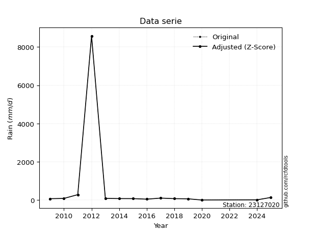</img>

</div>

> If Z-Score is active, values out of range or outliers are replaced with the station mean value.


### 4. Active continuous probability distributions from SciPy (45 of 104 available)

[scipy.stats](https://docs.scipy.org/doc/scipy/reference/stats.html) is a Python´s powerful submodule within the SciPy library for comprehensive statistical analysis, offering over 130 probability distributions (like Normal, Poisson), functions for descriptive stats (mean, variance), hypothesis testing (t-tests, chi-square), random variable generation, and statistical tests, making it essential for data science, modeling, and research. It provides tools to explore, model, and draw conclusions from data efficiently, working seamlessly with NumPy.

<div align="center">

|   id | p_dist             |   n_parameter | fit_method   | label                                                                       | active   | ref                                                                                                        |
|-----:|:-------------------|--------------:|:-------------|:----------------------------------------------------------------------------|:---------|:-----------------------------------------------------------------------------------------------------------|
|    0 | alpha              |             3 | MLE          | Alpha                                                                       | True     | [:mortar_board:](https://docs.scipy.org/doc/scipy/reference/generated/scipy.stats.alpha.html)              |
|    1 | betaprime          |             4 | MLE          | Beta prime                                                                  | True     | [:mortar_board:](https://docs.scipy.org/doc/scipy/reference/generated/scipy.stats.betaprime.html)          |
|    2 | chi2               |             3 | MLE          | Chi²                                                                        | True     | [:mortar_board:](https://docs.scipy.org/doc/scipy/reference/generated/scipy.stats.chi2.html)               |
|    3 | crystalball        |             4 | MLE          | Crystalball                                                                 | True     | [:mortar_board:](https://docs.scipy.org/doc/scipy/reference/generated/scipy.stats.crystalball.html)        |
|    4 | erlang             |             3 | MLE          | Erlang                                                                      | True     | [:mortar_board:](https://docs.scipy.org/doc/scipy/reference/generated/scipy.stats.erlang.html)             |
|    5 | expon              |             2 | MLE          | Exponential                                                                 | True     | [:mortar_board:](https://docs.scipy.org/doc/scipy/reference/generated/scipy.stats.expon.html)              |
|    6 | exponnorm          |             3 | MLE          | Exponentially modified Normal                                               | True     | [:mortar_board:](https://docs.scipy.org/doc/scipy/reference/generated/scipy.stats.exponnorm.html)          |
|    7 | f                  |             4 | MLE          | F                                                                           | True     | [:mortar_board:](https://docs.scipy.org/doc/scipy/reference/generated/scipy.stats.f.html)                  |
|    8 | fatiguelife        |             3 | MLE          | Fatigue-life (Birnbaum-Saunders)                                            | True     | [:mortar_board:](https://docs.scipy.org/doc/scipy/reference/generated/scipy.stats.fatiguelife.html)        |
|    9 | fisk               |             3 | MLE          | Fisk                                                                        | True     | [:mortar_board:](https://docs.scipy.org/doc/scipy/reference/generated/scipy.stats.fisk.html)               |
|   10 | gamma              |             3 | MLE          | Gamma                                                                       | True     | [:mortar_board:](https://docs.scipy.org/doc/scipy/reference/generated/scipy.stats.gamma.html)              |
|   11 | genexpon           |             5 | MLE          | Generalized exponential                                                     | True     | [:mortar_board:](https://docs.scipy.org/doc/scipy/reference/generated/scipy.stats.genexpon.html)           |
|   12 | genlogistic        |             3 | MLE          | Generalized logistic                                                        | True     | [:mortar_board:](https://docs.scipy.org/doc/scipy/reference/generated/scipy.stats.genlogistic.html)        |
|   13 | gibrat             |             2 | MM           | Gibrat                                                                      | True     | [:mortar_board:](https://docs.scipy.org/doc/scipy/reference/generated/scipy.stats.gibrat.html)             |
|   14 | gompertz           |             3 | MLE          | Gompertz (or truncated Gumbel)                                              | True     | [:mortar_board:](https://docs.scipy.org/doc/scipy/reference/generated/scipy.stats.gompertz.html)           |
|   15 | gumbel_l           |             2 | MM           | Gumbel Left Skew                                                            | True     | [:mortar_board:](https://docs.scipy.org/doc/scipy/reference/generated/scipy.stats.gumbel_l.html)           |
|   16 | gumbel_r           |             2 | MM           | Gumbel Right Skew                                                           | True     | [:mortar_board:](https://docs.scipy.org/doc/scipy/reference/generated/scipy.stats.gumbel_r.html)           |
|   17 | halflogistic       |             2 | MM           | Half-logistic                                                               | True     | [:mortar_board:](https://docs.scipy.org/doc/scipy/reference/generated/scipy.stats.halflogistic.html)       |
|   18 | halfnorm           |             2 | MM           | Half Normal                                                                 | True     | [:mortar_board:](https://docs.scipy.org/doc/scipy/reference/generated/scipy.stats.halfnorm.html)           |
|   19 | hypsecant          |             2 | MM           | hyperbolic secant                                                           | True     | [:mortar_board:](https://docs.scipy.org/doc/scipy/reference/generated/scipy.stats.hypsecant.html)          |
|   20 | invgamma           |             3 | MLE          | Inverted gamma                                                              | True     | [:mortar_board:](https://docs.scipy.org/doc/scipy/reference/generated/scipy.stats.invgamma.html)           |
|   21 | invgauss           |             3 | MLE          | Inverse Gaussian                                                            | True     | [:mortar_board:](https://docs.scipy.org/doc/scipy/reference/generated/scipy.stats.invgauss.html)           |
|   22 | invweibull         |             3 | MLE          | Inverted Weibull                                                            | True     | [:mortar_board:](https://docs.scipy.org/doc/scipy/reference/generated/scipy.stats.invweibull.html)         |
|   23 | johnsonsu          |             4 | MLE          | Johnson Su                                                                  | True     | [:mortar_board:](https://docs.scipy.org/doc/scipy/reference/generated/scipy.stats.johnsonsu.html)          |
|   24 | kstwobign          |             2 | MLE          | Limiting distribution of scaled Kolmogorov-Smirnov two-sided test statistic | True     | [:mortar_board:](https://docs.scipy.org/doc/scipy/reference/generated/scipy.stats.kstwobign.html)          |
|   25 | laplace            |             2 | MM           | Laplace                                                                     | True     | [:mortar_board:](https://docs.scipy.org/doc/scipy/reference/generated/scipy.stats.laplace.html)            |
|   26 | laplace_asymmetric |             3 | MLE          | Asymmetric Laplace                                                          | True     | [:mortar_board:](https://docs.scipy.org/doc/scipy/reference/generated/scipy.stats.laplace_asymmetric.html) |
|   27 | loggamma           |             3 | MLE          | Log gamma                                                                   | True     | [:mortar_board:](https://docs.scipy.org/doc/scipy/reference/generated/scipy.stats.loggamma.html)           |
|   28 | logistic           |             2 | MM           | Logistic (or Sech-squared)                                                  | True     | [:mortar_board:](https://docs.scipy.org/doc/scipy/reference/generated/scipy.stats.logistic.html)           |
|   29 | lognorm            |             3 | MLE          | Log Normal                                                                  | True     | [:mortar_board:](https://docs.scipy.org/doc/scipy/reference/generated/scipy.stats.lognorm.html)            |
|   30 | maxwell            |             2 | MM           | Maxwell                                                                     | True     | [:mortar_board:](https://docs.scipy.org/doc/scipy/reference/generated/scipy.stats.maxwell.html)            |
|   31 | mielke             |             4 | MLE          | Mielke Beta-Kappa / Dagum                                                   | True     | [:mortar_board:](https://docs.scipy.org/doc/scipy/reference/generated/scipy.stats.mielke.html)             |
|   32 | moyal              |             2 | MM           | Moyal                                                                       | True     | [:mortar_board:](https://docs.scipy.org/doc/scipy/reference/generated/scipy.stats.moyal.html)              |
|   33 | nakagami           |             3 | MLE          | Nakagami                                                                    | True     | [:mortar_board:](https://docs.scipy.org/doc/scipy/reference/generated/scipy.stats.nakagami.html)           |
|   34 | ncf                |             5 | MLE          | Non-central F distribution                                                  | True     | [:mortar_board:](https://docs.scipy.org/doc/scipy/reference/generated/scipy.stats.ncf.html)                |
|   35 | nct                |             4 | MLE          | Non-central Student’s t                                                     | True     | [:mortar_board:](https://docs.scipy.org/doc/scipy/reference/generated/scipy.stats.nct.html)                |
|   36 | norm               |             2 | MM           | Normal                                                                      | True     | [:mortar_board:](https://docs.scipy.org/doc/scipy/reference/generated/scipy.stats.norm.html)               |
|   37 | pareto             |             3 | MLE          | Pareto                                                                      | True     | [:mortar_board:](https://docs.scipy.org/doc/scipy/reference/generated/scipy.stats.pareto.html)             |
|   38 | pearson3           |             3 | MM           | Pearson type III                                                            | True     | [:mortar_board:](https://docs.scipy.org/doc/scipy/reference/generated/scipy.stats.pearson3.html)           |
|   39 | rayleigh           |             2 | MM           | Rayleigh                                                                    | True     | [:mortar_board:](https://docs.scipy.org/doc/scipy/reference/generated/scipy.stats.rayleigh.html)           |
|   40 | rice               |             3 | MLE          | Rice                                                                        | True     | [:mortar_board:](https://docs.scipy.org/doc/scipy/reference/generated/scipy.stats.rice.html)               |
|   41 | t                  |             3 | MLE          | Student’s t                                                                 | True     | [:mortar_board:](https://docs.scipy.org/doc/scipy/reference/generated/scipy.stats.t.html)                  |
|   42 | truncnorm          |             4 | MLE          | Truncated normal                                                            | True     | [:mortar_board:](https://docs.scipy.org/doc/scipy/reference/generated/scipy.stats.truncnorm.html)          |
|   43 | wald               |             2 | MM           | Wald                                                                        | True     | [:mortar_board:](https://docs.scipy.org/doc/scipy/reference/generated/scipy.stats.wald.html)               |
|   44 | weibull_min        |             3 | MLE          | Weibull minimum                                                             | True     | [:mortar_board:](https://docs.scipy.org/doc/scipy/reference/generated/scipy.stats.weibull_min.html)        |

</div>

> **n_parameter:** # arguments & localization & scale.
>
> **Fit methods:** (MLE) maximum likelihood, (MM) L-moments.
>
>**Inactive:** foldnorm, gennorm, norminvgauss, powernorm, powerlognorm, skewnorm, genextreme, anglit, arcsine, argus, beta, bradford, burr, burr12, cauchy, cosine, halfcauchy, foldcauchy, skewcauchy, wrapcauchy, dgamma, gengamma, exponweib, exponpow, truncexpon, gausshyper, genhalflogistic, genhyperbolic, geninvgauss, halfgennorm, johnsonsb, kappa4, kappa3, ksone, kstwo, loglaplace, levy, levy_l, levy_stable, ncx2, genpareto, truncpareto, lomax, powerlaw, rdist, rel_breitwigner, recipinvgauss, semicircular, studentized_range, trapezoid, triang, truncweibull_min, tukeylambda, uniform, loguniform, vonmises, vonmises_line, weibull_max, dweibull, 


## B. Probability distributions vs. Empirical distributions

A continuous probability distribution (CPD) describes probabilities for variables that can take any value within a range (like rain any time), unlike discrete variables with specific outcomes (like temperature). It uses a Probability Density Function (PDF), a curve where the total area under it equals 1, and the probability of the variable falling within an interval (a to b) is found by calculating the area under the curve between those points. A key feature is that the probability of hitting any single exact value is zero, so probabilities are always expressed for ranges, e.g., $P(a ≤ X ≤ b)$.

<div align="center">

Distributions parameters
|    |   station | p_dist                |   n |               loc |           scale | shape                  | shape1             | shape2                | shape3   |
|---:|----------:|:----------------------|----:|------------------:|----------------:|:-----------------------|:-------------------|:----------------------|:---------|
|  0 |  23127020 | alpha                 |  14 |     -56.2181      |   200.158       | 1.5971898145237327     |                    |                       |          |
|  1 |  23127020 | betaprime             |  14 |       0.8         |    74.1827      | 0.9148212527512003     | 0.9652264538148124 |                       |          |
|  2 |  23127020 | chi2                  |  14 |       0.8         |  2088.08        | 1.4190766169756563     |                    |                       |          |
|  3 |  23127020 | crystalball           |  14 |      -1.31357     |  2298.47        | 4.9515058885457925     | 6.260685025541534  |                       |          |
|  4 |  23127020 | erlang                |  14 |       0.8         |  3132.53        | 0.2585753195109023     |                    |                       |          |
|  5 |  23127020 | expon                 |  14 |       0.8         |   681.736       |                        |                    |                       |          |
|  6 |  23127020 | exponnorm             |  14 |       0.218659    |     0.184362    | 3682.2553406224997     |                    |                       |          |
|  7 |  23127020 | f                     |  14 |       0.797189    |    65.2526      | 1.6240926801126152     | 2.212166752105293  |                       |          |
|  8 |  23127020 | fatiguelife           |  14 |      -4.18477     |   200.601       | 2.8227686377720413     |                    |                       |          |
|  9 |  23127020 | fisk                  |  14 |       0.8         |    66.2772      | 0.8842042212642705     |                    |                       |          |
| 10 |  23127020 | gamma                 |  14 |       0.8         |  4528.83        | 0.5456375328064234     |                    |                       |          |
| 11 |  23127020 | genexpon              |  14 |       0.8         |  1572.79        | 2.3004132311215404     | 1.6622637457166305 | 2.667931687002083e-05 |          |
| 12 |  23127020 | genlogistic           |  14 |   -4714.2         |   613.523       | 2629.082362963908      |                    |                       |          |
| 13 |  23127020 | gibrat                |  14 |    -988.397       |  1013.47        |                        |                    |                       |          |
| 14 |  23127020 | gompertz              |  14 |       0.8         |     7.06175e+14 | 867963817299.9218      |                    |                       |          |
| 15 |  23127020 | gumbel_l              |  14 |    1668.29        |  1707.78        |                        |                    |                       |          |
| 16 |  23127020 | gumbel_r              |  14 |    -303.222       |  1707.78        |                        |                    |                       |          |
| 17 |  23127020 | halflogistic          |  14 |   -1913.49        |  1872.64        |                        |                    |                       |          |
| 18 |  23127020 | halfnorm              |  14 |   -2216.58        |  3633.5         |                        |                    |                       |          |
| 19 |  23127020 | hypsecant             |  14 |     682.536       |  1394.4         |                        |                    |                       |          |
| 20 |  23127020 | invgamma              |  14 |     -12.2116      |    48.3607      | 0.9468808739011598     |                    |                       |          |
| 21 |  23127020 | invgauss              |  14 |      -6.05636     |    38.4975      | 17.8866985919503       |                    |                       |          |
| 22 |  23127020 | invweibull            |  14 |       0.78723     |     2.53629     | 0.2852024247881817     |                    |                       |          |
| 23 |  23127020 | johnsonsu             |  14 |       0.0820572   |     0.00385694  | -5.315193518179857     | 0.5122333760088033 |                       |          |
| 24 |  23127020 | kstwobign             |  14 |   -3683.19        |  5334.66        |                        |                    |                       |          |
| 25 |  23127020 | laplace               |  14 |     682.536       |  1548.79        |                        |                    |                       |          |
| 26 |  23127020 | laplace_asymmetric    |  14 |       0.8         |     0.0275657   | 4.04356271815835e-05   |                    |                       |          |
| 27 |  23127020 | loggamma              |  14 | -492012           | 71301.7         | 1002.7691010775989     |                    |                       |          |
| 28 |  23127020 | logistic              |  14 |     682.536       |  1207.58        |                        |                    |                       |          |
| 29 |  23127020 | lognorm               |  14 |       0.8         |     4.51961     | 10.716500685082622     |                    |                       |          |
| 30 |  23127020 | maxwell               |  14 |   -4507.59        |  3252.43        |                        |                    |                       |          |
| 31 |  23127020 | mielke                |  14 |       0.8         |   124.468       | 0.5809757335353056     | 1.174310603237311  |                       |          |
| 32 |  23127020 | moyal                 |  14 |    -570.026       |   985.987       |                        |                    |                       |          |
| 33 |  23127020 | nakagami              |  14 |      10.4         |  3471.96        | 0.06776789814599277    |                    |                       |          |
| 34 |  23127020 | ncf                   |  14 |       0.8         |    22.6229      | 1.3466191757331005     | 1.725773294876989  | 1.8927127710317388    |          |
| 35 |  23127020 | nct                   |  14 |      -0.0987737   |    28.9714      | 0.9771133731457393     | 1.6720283387215362 |                       |          |
| 36 |  23127020 | norm                  |  14 |     682.536       |  2190.31        |                        |                    |                       |          |
| 37 |  23127020 | pareto                |  14 |     -57.61        |    58.41        | 0.9725564488557212     |                    |                       |          |
| 38 |  23127020 | pearson3              |  14 |     682.536       |  2190.31        | 3.3232097256332294     |                    |                       |          |
| 39 |  23127020 | rayleigh              |  14 |   -3507.66        |  3343.29        |                        |                    |                       |          |
| 40 |  23127020 | rice                  |  14 |   -2040.89        |  2471.29        | 8.418572814644063e-05  |                    |                       |          |
| 41 |  23127020 | t                     |  14 |      73.9889      |     9.36452     | 0.48471872009009764    |                    |                       |          |
| 42 |  23127020 | truncnorm             |  14 |  -11499.2         |  3619.67        | 3.177081830655233      | 87722.14112250478  |                       |          |
| 43 |  23127020 | wald                  |  14 |   -1507.78        |  2190.31        |                        |                    |                       |          |
| 44 |  23127020 | weibull_min           |  14 |       0.8         |  2102.76        | 0.4003821274865884     |                    |                       |          |
| 45 |  23127020 | logalpha              |  14 |     -30.0592      |   594.907       | 17.466321864283053     |                    |                       |          |
| 46 |  23127020 | logbetaprime          |  14 |      -4.90908     |     5.45635e+06 | 18.317628943553643     | 11019512.730043458 |                       |          |
| 47 |  23127020 | logchi2               |  14 |      -0.223144    |     2.1905      | 1.882534471538142      |                    |                       |          |
| 48 |  23127020 | logcrystalball        |  14 |       4.13507     |     1.93374     | 23.428550209112178     | 443.23288078431506 |                       |          |
| 49 |  23127020 | logerlang             |  14 |     -24.8069      |     0.128891    | 224.51454828707568     |                    |                       |          |
| 50 |  23127020 | logexpon              |  14 |      -0.223144    |     4.35821     |                        |                    |                       |          |
| 51 |  23127020 | logexponnorm          |  14 |       2.96563     |     1.51048     | 0.7741972154960779     |                    |                       |          |
| 52 |  23127020 | logf                  |  14 |      -0.223144    |     1.39687     | 1.133301577032173      | 1.2584442604730912 |                       |          |
| 53 |  23127020 | logfatiguelife        |  14 |     -41.2327      |    45.3268      | 0.04254244085795421    |                    |                       |          |
| 54 |  23127020 | logfisk               |  14 |     -76.0184      |    80.1453      | 85.6707220204139       |                    |                       |          |
| 55 |  23127020 | loggamma              |  14 |     -24.2307      |     0.131799    | 215.19803220425945     |                    |                       |          |
| 56 |  23127020 | loggenexpon           |  14 |      -0.922047    |     0.0546295   | 1.5125490922107868e-06 | 1.974402203382751  | 0.0001033334766993233 |          |
| 57 |  23127020 | loggenlogistic        |  14 |       4.38033     |     0.855522    | 0.8125378870547371     |                    |                       |          |
| 58 |  23127020 | loggibrat             |  14 |       2.6599      |     0.894742    |                        |                    |                       |          |
| 59 |  23127020 | loggompertz           |  14 |      -0.223144    |     2.41048     | 0.1261107216446887     |                    |                       |          |
| 60 |  23127020 | loggumbel_l           |  14 |       5.00536     |     1.50773     |                        |                    |                       |          |
| 61 |  23127020 | loggumbel_r           |  14 |       3.26478     |     1.50773     |                        |                    |                       |          |
| 62 |  23127020 | loghalflogistic       |  14 |       1.84312     |     1.65329     |                        |                    |                       |          |
| 63 |  23127020 | loghalfnorm           |  14 |       1.57557     |     3.20787     |                        |                    |                       |          |
| 64 |  23127020 | loghypsecant          |  14 |       4.13507     |     1.23106     |                        |                    |                       |          |
| 65 |  23127020 | loginvgamma           |  14 |     -27.1253      |  8147.91        | 261.77454171337786     |                    |                       |          |
| 66 |  23127020 | loginvgauss           |  14 |     -14.1083      |  1532.83        | 0.011896772452722144   |                    |                       |          |
| 67 |  23127020 | loginvweibull         |  14 |      -2.29731e+08 |     2.29731e+08 | 115336723.18330567     |                    |                       |          |
| 68 |  23127020 | logjohnsonsu          |  14 |       4.31542     |     0.0555492   | 0.11384448984217908    | 0.3341341599631946 |                       |          |
| 69 |  23127020 | logkstwobign          |  14 |      -4.33227     |     9.77375     |                        |                    |                       |          |
| 70 |  23127020 | loglaplace            |  14 |       4.13507     |     1.36736     |                        |                    |                       |          |
| 71 |  23127020 | loglaplace_asymmetric |  14 |       4.31214     |     1.11971     | 1.0819420811321976     |                    |                       |          |
| 72 |  23127020 | logloggamma           |  14 |    -481.203       |    68.2851      | 1221.3763105203057     |                    |                       |          |
| 73 |  23127020 | loglogistic           |  14 |       4.13507     |     1.06613     |                        |                    |                       |          |
| 74 |  23127020 | loglognorm            |  14 |     -39.1581      |    43.2502      | 0.04456837822543755    |                    |                       |          |
| 75 |  23127020 | logmaxwell            |  14 |      -0.44708     |     2.87144     |                        |                    |                       |          |
| 76 |  23127020 | logmielke             |  14 |      -0.223144    |     4.51484     | 0.7284121659258759     | 1.4573695328362262 |                       |          |
| 77 |  23127020 | logmoyal              |  14 |       3.02923     |     0.870489    |                        |                    |                       |          |
| 78 |  23127020 | lognakagami           |  14 |     -21.2894      |    25.4979      | 43.454256196042905     |                    |                       |          |
| 79 |  23127020 | logncf                |  14 |      -0.223144    |     1.24772     | 1.1953114380380274     | 1.3485057440589006 | 1.048552505708531     |          |
| 80 |  23127020 | lognct                |  14 |       4.34678     |     0.151786    | 0.5512121906225769     | -0.216653744382874 |                       |          |
| 81 |  23127020 | lognorm               |  14 |       4.13507     |     1.93374     |                        |                    |                       |          |
| 82 |  23127020 | logpareto             |  14 |      -0.223147    |     3.71868e-06 | 0.07692401498395858    |                    |                       |          |
| 83 |  23127020 | logpearson3           |  14 |       4.13507     |     1.93375     | 0.2863426353208576     |                    |                       |          |
| 84 |  23127020 | lograyleigh           |  14 |       0.435689    |     2.95168     |                        |                    |                       |          |
| 85 |  23127020 | logrice               |  14 |      -1.43403     |     2.03837     | 2.522798867170433      |                    |                       |          |
| 86 |  23127020 | logt                  |  14 |       4.31777     |     0.138935    | 0.5249143196031654     |                    |                       |          |
| 87 |  23127020 | logtruncnorm          |  14 |       1.15444     |     4.23334     | -0.3254138659596952    | 1.8666993437403743 |                       |          |
| 88 |  23127020 | logwald               |  14 |       2.20135     |     1.93372     |                        |                    |                       |          |
| 89 |  23127020 | logweibull_min        |  14 |      -1.96713     |     6.76289     | 3.308812018778746      |                    |                       |          |

</div>

> **loc** (Location parameter): This shifts the distribution along the x-axis. For many common distributions, like the normal (Gaussian) distribution, loc represents the mean $μ$. For others, like the uniform distribution, it might represent the minimum value, or for the beta distribution, the left end of the support interval.
>
> **scale** (Scale parameter): This determines the width or spread of the distribution. For the normal distribution, scale represents the standard deviation $σ$. For a uniform distribution, it defines the length of the interval (from $loc$ to $loc + scale$).
>
> **shape** (Shape parameters): Refers to parameters that define the specific form of a probability distribution, distinct from its location (loc) and scale (scale). These parameters are required arguments for most distribution functions. For example, a normal (Gaussian) distribution is fully defined by its location (mean) and scale (standard deviation), so it has no specific shape parameters beyond loc and scale. However, other distributions have intrinsic properties that need specification, as Gamma distribution that takes a shape parameter, often named $a$ or $alpha$.


### 0. Cumulative distribution values - CDF (90 evaluated)

> Ordered by x ascending and calculating $log(f(x))$ separately. 

|   id |   Station |   date |      x |   count |    mean |   std |    zscore |   Value_initial |   station |   m |     alpha |   alpha_pdf |   betaprime |   betaprime_pdf |        chi2 |     chi2_pdf |   crystalball |   crystalball_pdf |      erlang |   erlang_pdf |     expon |   expon_pdf |   exponnorm |   exponnorm_pdf |           f |       f_pdf |   fatiguelife |   fatiguelife_pdf |        fisk |    fisk_pdf |       gamma |        gamma_pdf |    genexpon |   genexpon_pdf |   genlogistic |   genlogistic_pdf |   gibrat |   gibrat_pdf |    gompertz |   gompertz_pdf |   gumbel_l |   gumbel_l_pdf |   gumbel_r |   gumbel_r_pdf |   halflogistic |   halflogistic_pdf |   halfnorm |   halfnorm_pdf |   hypsecant |   hypsecant_pdf |   invgamma |   invgamma_pdf |   invgauss |   invgauss_pdf |   invweibull |   invweibull_pdf |   johnsonsu |   johnsonsu_pdf |   kstwobign |   kstwobign_pdf |   laplace |   laplace_pdf |   laplace_asymmetric |   laplace_asymmetric_pdf |   loggamma |   loggamma_pdf |   logistic |   logistic_pdf |   lognorm |   lognorm_pdf |   maxwell |   maxwell_pdf |      mielke |       mielke_pdf |    moyal |   moyal_pdf |   nakagami |   nakagami_pdf |         ncf |     ncf_pdf |       nct |     nct_pdf |     norm |    norm_pdf |   pareto |   pareto_pdf |   pearson3 |   pearson3_pdf |   rayleigh |   rayleigh_pdf |     rice |    rice_pdf |        t |       t_pdf |   truncnorm |   truncnorm_pdf |     wald |    wald_pdf |   weibull_min |   weibull_min_pdf |   logalpha |   logalpha_pdf |   logbetaprime |   logbetaprime_pdf |     logchi2 |   logchi2_pdf |   logcrystalball |   logcrystalball_pdf |   logerlang |   logerlang_pdf |   logexpon |   logexpon_pdf |   logexponnorm |   logexponnorm_pdf |        logf |    logf_pdf |   logfatiguelife |   logfatiguelife_pdf |   logfisk |   logfisk_pdf |   loggenexpon |   loggenexpon_pdf |   loggenlogistic |   loggenlogistic_pdf |   loggibrat |   loggibrat_pdf |   loggompertz |   loggompertz_pdf |   loggumbel_l |   loggumbel_l_pdf |   loggumbel_r |   loggumbel_r_pdf |   loghalflogistic |   loghalflogistic_pdf |   loghalfnorm |   loghalfnorm_pdf |   loghypsecant |   loghypsecant_pdf |   loginvgamma |   loginvgamma_pdf |   loginvgauss |   loginvgauss_pdf |   loginvweibull |   loginvweibull_pdf |   logjohnsonsu |   logjohnsonsu_pdf |   logkstwobign |   logkstwobign_pdf |   loglaplace |   loglaplace_pdf |   loglaplace_asymmetric |   loglaplace_asymmetric_pdf |   logloggamma |   logloggamma_pdf |   loglogistic |   loglogistic_pdf |   loglognorm |   loglognorm_pdf |   logmaxwell |   logmaxwell_pdf |   logmielke |   logmielke_pdf |    logmoyal |   logmoyal_pdf |   lognakagami |   lognakagami_pdf |      logncf |     logncf_pdf |    lognct |   lognct_pdf |   logpareto |   logpareto_pdf |   logpearson3 |   logpearson3_pdf |   lograyleigh |   lograyleigh_pdf |    logrice |   logrice_pdf |      logt |   logt_pdf |   logtruncnorm |   logtruncnorm_pdf |     logwald |   logwald_pdf |   logweibull_min |   logweibull_min_pdf |
|-----:|----------:|-------:|-------:|--------:|--------:|------:|----------:|----------------:|----------:|----:|----------:|------------:|------------:|----------------:|------------:|-------------:|--------------:|------------------:|------------:|-------------:|----------:|------------:|------------:|----------------:|------------:|------------:|--------------:|------------------:|------------:|------------:|------------:|-----------------:|------------:|---------------:|--------------:|------------------:|---------:|-------------:|------------:|---------------:|-----------:|---------------:|-----------:|---------------:|---------------:|-------------------:|-----------:|---------------:|------------:|----------------:|-----------:|---------------:|-----------:|---------------:|-------------:|-----------------:|------------:|----------------:|------------:|----------------:|----------:|--------------:|---------------------:|-------------------------:|-----------:|---------------:|-----------:|---------------:|----------:|--------------:|----------:|--------------:|------------:|-----------------:|---------:|------------:|-----------:|---------------:|------------:|------------:|----------:|------------:|---------:|------------:|---------:|-------------:|-----------:|---------------:|-----------:|---------------:|---------:|------------:|---------:|------------:|------------:|----------------:|---------:|------------:|--------------:|------------------:|-----------:|---------------:|---------------:|-------------------:|------------:|--------------:|-----------------:|---------------------:|------------:|----------------:|-----------:|---------------:|---------------:|-------------------:|------------:|------------:|-----------------:|---------------------:|----------:|--------------:|--------------:|------------------:|-----------------:|---------------------:|------------:|----------------:|--------------:|------------------:|--------------:|------------------:|--------------:|------------------:|------------------:|----------------------:|--------------:|------------------:|---------------:|-------------------:|--------------:|------------------:|--------------:|------------------:|----------------:|--------------------:|---------------:|-------------------:|---------------:|-------------------:|-------------:|-----------------:|------------------------:|----------------------------:|--------------:|------------------:|--------------:|------------------:|-------------:|-----------------:|-------------:|-----------------:|------------:|----------------:|------------:|---------------:|--------------:|------------------:|------------:|---------------:|----------:|-------------:|------------:|----------------:|--------------:|------------------:|--------------:|------------------:|-----------:|--------------:|----------:|-----------:|---------------:|-------------------:|------------:|--------------:|-----------------:|---------------------:|
|    0 |  23127020 |   2020 |    0.8 |      14 | 682.536 |  2273 | -0.299928 |             0.8 |  23127020 |   1 | 0.0294834 | 0.0041688   | 2.61676e-14 |     0.218682    | 1.41663e-14 | 90.5363      |      0.500367 |       0.000173568 | 1.03298e-05 |  2.40585e+10 | 0         | 0.00146684  | 0.000855995 |     0.00147059  | 0.000242043 | 0.0699155   |      0.014208 |        0.00834991 | 6.52786e-16 | 1.29973     | 2.24413e-11 | 110292           | 1.41905e-13 |    0.00146264  |      0.298769 |       0.000588169 | 0.490329 |  0.000403181 | 1.71917e-13 |    0.00122911  |   0.313851 |    0.000151334 |   0.43304  |    0.000212218 |       0.470819 |        0.000207816 |   0.45831  |    0.000182283 |    0.350228 |     0.000203471 |   0.021685 |    0.00626664  |  0.0188287 |    0.0087982   |    0.0108597 |      1.09693     |   0.0112169 |     0.021016    |    0.273142 |     0.000309462 |  0.321962 |   0.00020788  |           1.6406e-09 |              0.00146688  | 0.00922548 |     0.0143665  |   0.362496 |    0.000191368 | 0.0121052 |    0.0162747  |  0.411129 |   0.000180353 | 3.26282e-11 | 170742           | 0.454062 | 0.000228883 | 0          |    0           | 4.54009e-07 | 5.75301     | 0.0497695 | 0.00288424  | 0.377805 | 0.000173527 | 0        |  0.0166505   |   0.571063 |    0.000285474 |   0.42341  |    0.000180982 | 0.289136 | 0.000237646 | 0.118759 | 0.000782819 | 6.27485e-10 |     0.000952617 | 0.508486 | 0.000297008 |   1.91286e-08 |       6.89837e+07 | 0.00670181 |      0.0125317 |     0.00684847 |          0.0141611 | 1.27503e-16 |     2.16199   |        0.0121052 |           0.0162747  |  0.00923152 |      0.0143554  |   0        |      0.229452  |     0.00564152 |          0.0100397 | 2.34442e-10 | 4.78631e+06 |       0.00929266 |           0.0143458  |  0.008318 |    0.00932356 |     0.0165698 |         0.0469838 |        0.0125767 |           0.0118901  |    0        |      0          |   1.73911e-08 |        0.0523176  |     0.0307045 |       0.0200488   |   4.07373e-05 |       0.000273118 |          0        |             0         |      0        |          0        |      0.0184612 |         0.0149878  |    0.00737407 |         0.0128879 |    0.00702186 |         0.013043  |      0.00405508 |           0.0112131 |      0.0560305 |         0.00831001 |     0.00554867 |          0.0174992 |    0.0206412 |       0.0150956  |               0.0127639 |                  0.0105359  |     0.0137475 |        0.017602   |     0.0164977 |        0.0152192  |   0.00917782 |        0.0142494 |  0.000125922 |       0.00168489 | 2.90459e-13 |    7622.76      | 9.40631e-11 |    2.31775e-09 |     0.0103186 |        0.0151461  | 4.62747e-11 | 996424         | 0.0602944 |   0.00726943 |    0        |  20685.9        |    0.00610092 |         0.0116131 |      0        |         0         | 0.00871707 |    0.016678   | 0.0510935 | 0.00590448 |    3.27934e-08 |          0.149814  | 0           |     0         |        0.0112207 |           0.0211688  |
|    1 |  23127020 |   2024 |   10.4 |      14 | 682.536 |  2273 | -0.295705 |            10.4 |  23127020 |   2 | 0.0843048 | 0.0070732   | 0.13354     |     0.0112928   | 0.0147297   |  0.00108721  |      0.502033 |       0.000173566 | 0.247328    |  0.00664555  | 0.013983  | 0.00144633  | 0.0148856   |     0.00145111  | 0.164067    | 0.0124451   |      0.111552 |        0.00917684 | 0.153377    | 0.01196     | 0.039094    |      0.00221895  | 0.0139432   |    0.00144224  |      0.304425 |       0.000590002 | 0.494181 |  0.00039938  | 0.0117301   |    0.00121469  |   0.315307 |    0.000151864 |   0.435077 |    0.000212021 |       0.472811 |        0.000207314 |   0.460059 |    0.000181988 |    0.352185 |     0.000204104 |   0.107496 |    0.0103536   |  0.133334  |    0.0121654   |    0.504665  |      0.0102394   |   0.179384  |     0.0129988   |    0.276115 |     0.00031001  |  0.323964 |   0.000209173 |           0.0139834  |              0.00144637  | 0.177911   |     0.140707   |   0.364335 |    0.000191784 | 0.176871  |    0.134205   |  0.412861 |   0.000180382 | 0.220368    |      0.0127092   | 0.456257 | 0.000228391 | 0.00286477 |    2.18581e+11 | 0.171532    | 0.0122301   | 0.0884189 | 0.00527365  | 0.379472 | 0.000173762 | 0.137562 |  0.012333    |   0.573787 |    0.000282016 |   0.425147 |    0.00018093  | 0.291419 | 0.000237996 | 0.127088 | 0.000962722 | 0.00910669  |     0.00094462  | 0.511327 | 0.000294902 |   0.109154    |       0.00429442  | 0.185547   |      0.151539  |     0.199263   |          0.153015  | 0.472555    |     0.126422  |        0.176871  |           0.134205   |  0.177769   |      0.140664   |   0.444858 |      0.127378  |     0.166549   |          0.148156  | 0.619935    | 0.0662309   |       0.177019   |           0.140096   |  0.126771 |    0.121028   |     0.304741  |         0.154673  |        0.13428   |           0.116757   |    0        |      0          |   0.212884    |        0.119347   |     0.157106  |       0.0955491   |   0.158117    |       0.193426    |          0.149684 |             0.295652  |      0.188787 |          0.241732 |      0.145736  |         0.11429    |    0.180193   |         0.146825  |    0.186123   |         0.149756  |      0.218807   |           0.166928  |      0.0949621 |         0.0285951  |     0.26045    |          0.167472  |    0.134711  |       0.0985187  |               0.106044  |                  0.0875341  |     0.181076  |        0.133614   |     0.156826  |        0.12403    |   0.176993   |        0.140372  |  0.185039    |       0.163555   | 0.552306    |       0.109024  | 0.137765    |    0.226104    |     0.177128  |        0.137758   | 0.511963    |      0.0763536 | 0.0949042 |   0.0260332  |    0.64448  |      0.0106622  |    0.177848   |         0.148088  |      0.188209 |         0.177605  | 0.181247   |    0.138127   | 0.0790507 | 0.0209669  |    0.398949    |          0.151868  | 0.000544438 |     0.0282956 |        0.201515  |           0.137984   |
|    2 |  23127020 |   2025 |   11   |      14 | 682.536 |  2273 | -0.295441 |            11   |  23127020 |   3 | 0.0885907 | 0.00721214  | 0.140253    |     0.0110849   | 0.0153762   |  0.00106808  |      0.502137 |       0.000173566 | 0.251225    |  0.00635224  | 0.0148504 | 0.00144506  | 0.0157559   |     0.00144983  | 0.171448    | 0.0121616   |      0.116994 |        0.00896126 | 0.160468    | 0.0116783   | 0.040407    |      0.00215838  | 0.0148082   |    0.00144098  |      0.304779 |       0.000590111 | 0.494421 |  0.000399144 | 0.0124586   |    0.00121379  |   0.315398 |    0.000151898 |   0.435204 |    0.000212008 |       0.472936 |        0.000207283 |   0.460168 |    0.00018197  |    0.352307 |     0.000204143 |   0.113722 |    0.0103982   |  0.140589  |    0.0120132   |    0.510608  |      0.00958441  |   0.187066  |     0.0126099   |    0.276301 |     0.000310043 |  0.324089 |   0.000209254 |           0.0148508  |              0.0014451   | 0.185908   |     0.144426   |   0.364451 |    0.00019181  | 0.184499  |    0.137806   |  0.412969 |   0.000180384 | 0.227878    |      0.0123264   | 0.456394 | 0.00022836  | 0.266832   |    0.0602754   | 0.178789    | 0.0119623   | 0.0916316 | 0.00543545  | 0.379576 | 0.000173777 | 0.144898 |  0.0121212   |   0.573956 |    0.000281803 |   0.425255 |    0.000180927 | 0.291562 | 0.000238018 | 0.12767  | 0.000976225 | 0.00967331  |     0.000944123 | 0.511504 | 0.000294771 |   0.111681    |       0.00412937  | 0.194153   |      0.155285  |     0.207933   |          0.156133  | 0.479596    |     0.124655  |        0.184499  |           0.137806   |  0.185763   |      0.144389   |   0.451957 |      0.125749  |     0.174986   |          0.152661  | 0.623603    | 0.0645595   |       0.184982   |           0.143825   |  0.133714 |    0.12655    |     0.313436  |         0.155355  |        0.140972  |           0.121878   |    0        |      0          |   0.219628    |        0.12111    |     0.162548  |       0.0985302   |   0.169134    |       0.199347    |          0.166223 |             0.294072  |      0.202316 |          0.240688 |      0.152279  |         0.119033   |    0.188535   |         0.150635  |    0.194625   |         0.153385  |      0.228236   |           0.169287  |      0.0965995 |         0.0298033  |     0.269875   |          0.168564  |    0.140351  |       0.102644   |               0.111069  |                  0.0916821  |     0.188668  |        0.137106   |     0.163909  |        0.128543   |   0.184971   |        0.14411   |  0.194309    |       0.166969   | 0.558359    |       0.106817  | 0.150686    |    0.234512    |     0.184957  |        0.141426   | 0.516199    |      0.0746954 | 0.0963967 |   0.0272001  |    0.645071 |      0.0104167  |    0.186263   |         0.151941  |      0.198254 |         0.180569  | 0.189093   |    0.141611   | 0.0802528 | 0.0219056  |    0.407451    |          0.151291  | 0.00444681  |     0.120145  |        0.209333  |           0.140774   |
|    3 |  23127020 |   2016 |   45.6 |      14 | 682.536 |  2273 | -0.280219 |            45.6 |  23127020 |   4 | 0.376969  | 0.00761626  | 0.398619    |     0.0051219   | 0.0437888   |  0.000689182 |      0.508142 |       0.000173532 | 0.367504    |  0.00209716  | 0.0636019 | 0.00137355  | 0.0646631   |     0.00137779  | 0.441291    | 0.00518454  |      0.296451 |        0.00308272 | 0.414283    | 0.00478916  | 0.0903558   |      0.00109345  | 0.0634254   |    0.00136987  |      0.325293 |       0.000595308 | 0.507998 |  0.000385748 | 0.0535754   |    0.00116326  |   0.320687 |    0.000153809 |   0.442527 |    0.000211252 |       0.480076 |        0.000205466 |   0.466446 |    0.000180902 |    0.359409 |     0.000206371 |   0.40842  |    0.00612255  |  0.409879  |    0.00484706  |    0.643487  |      0.00180545  |   0.437446  |     0.00443417  |    0.28706  |     0.00031181  |  0.331411 |   0.000213981 |           0.0636035  |              0.00137358  | 0.444597   |     0.205833   |   0.371113 |    0.000193269 | 0.435267  |    0.203584   |  0.419212 |   0.000180459 | 0.484846    |      0.00483211  | 0.464264 | 0.000226545 | 0.463359   |    0.00178413  | 0.445775    | 0.00507849  | 0.359486  | 0.00758181  | 0.385603 | 0.000174599 | 0.425155 |  0.00541681  |   0.583499 |    0.000270009 |   0.431512 |    0.000180717 | 0.299818 | 0.000239211 | 0.186759 | 0.00309242  | 0.041848    |     0.000915815 | 0.521574 | 0.000287313 |   0.192788    |       0.00154504  | 0.462805   |      0.205874  |     0.466223   |          0.192148  | 0.62902     |     0.0878394 |        0.435267  |           0.203584   |  0.44456    |      0.206026   |   0.604532 |      0.0907408 |     0.454716   |          0.221856  | 0.693506    | 0.0376759   |       0.443303   |           0.206041   |  0.418516 |    0.261139   |     0.535341  |         0.14997   |        0.418046  |           0.261313   |    0.602433 |      0.332513   |   0.422302    |        0.161727   |     0.365902  |       0.191589    |   0.500579    |       0.229746    |          0.535508 |             0.215701  |      0.515845 |          0.19473  |      0.419385  |         0.250318   |    0.454315   |         0.207595  |    0.459458   |         0.203269  |      0.485053   |           0.176187  |      0.197662  |         0.186282   |     0.510199   |          0.15938   |    0.397072  |       0.290393   |               0.359227  |                  0.296524   |     0.436942  |        0.201294   |     0.42663   |        0.229444   |   0.443684   |        0.206196  |  0.469671    |       0.203411   | 0.678239    |       0.0660002 | 0.525439    |    0.237878    |     0.440098  |        0.20487    | 0.59977     |      0.0464457 | 0.196647  |   0.199346   |    0.656709 |      0.00653152 |    0.453659   |         0.208047  |      0.48174  |         0.201311  | 0.44162    |    0.201729   | 0.162019  | 0.166742   |    0.608621    |          0.129557  | 0.594271    |     0.26517   |        0.449614  |           0.187913   |
|    4 |  23127020 |   2019 |   63.5 |      14 | 682.536 |  2273 | -0.272344 |            63.5 |  23127020 |   5 | 0.497644  | 0.00587991  | 0.477817    |     0.00382443  | 0.0554853   |  0.000622397 |      0.511248 |       0.000173499 | 0.400409    |  0.00162521  | 0.0878685 | 0.00133795  | 0.0890032   |     0.00134193  | 0.520964    | 0.00382465  |      0.343069 |        0.00221534 | 0.487738    | 0.00352341  | 0.108395    |      0.000934872 | 0.0876279   |    0.00133447  |      0.335966 |       0.000597169 | 0.514843 |  0.000378997 | 0.0741703   |    0.00113794  |   0.323449 |    0.000154798 |   0.446304 |    0.000210834 |       0.483746 |        0.000204521 |   0.469679 |    0.000180346 |    0.363113 |     0.000207493 |   0.50161  |    0.00441319  |  0.482586  |    0.00341185  |    0.669944  |      0.00122041  |   0.504959  |     0.00322205  |    0.292649 |     0.000312601 |  0.335264 |   0.000216469 |           0.0878707  |              0.00133799  | 0.512969   |     0.206111   |   0.374579 |    0.000193999 | 0.503295  |    0.206299   |  0.422442 |   0.000180482 | 0.559245    |      0.00358118  | 0.46831  | 0.000225582 | 0.489911   |    0.00125046  | 0.523209    | 0.00368598  | 0.478313  | 0.00570577  | 0.388732 | 0.000175008 | 0.507962 |  0.00395124  |   0.588281 |    0.000264276 |   0.434746 |    0.000180594 | 0.304105 | 0.000239786 | 0.290392 | 0.0110552   | 0.0581124   |     0.000901472 | 0.526683 | 0.000283534 |   0.217314    |       0.00122462  | 0.530528   |      0.202196  |     0.529219   |          0.187599  | 0.65697     |     0.0810691 |        0.503295  |           0.206299   |  0.513002   |      0.206339   |   0.633466 |      0.0841019 |     0.527886   |          0.218765  | 0.705355    | 0.0339924   |       0.511781   |           0.206537   |  0.50643  |    0.267111   |     0.583987  |         0.1436    |        0.506939  |           0.272802   |    0.695241 |      0.234824   |   0.476948    |        0.167991   |     0.433024  |       0.213383    |   0.57376     |       0.21141     |          0.603084 |             0.192432  |      0.577945 |          0.1802   |      0.504129  |         0.258545   |    0.522908   |         0.205682  |    0.526408   |         0.200171  |      0.541894   |           0.166686  |      0.312269  |         0.681513   |     0.561561   |          0.150609  |    0.505806  |       0.361422   |               0.472146  |                  0.389733   |     0.504231  |        0.204164   |     0.503745  |        0.234481   |   0.512196   |        0.206586  |  0.53621     |       0.197688   | 0.699001    |       0.0595426 | 0.599582    |    0.209631    |     0.508333  |        0.206256   | 0.614448    |      0.0423106 | 0.323587  |   0.746831   |    0.658782 |      0.00600063 |    0.522329   |         0.205702  |      0.54715  |         0.193115  | 0.508814   |    0.203167   | 0.275261  | 0.719253   |    0.65044     |          0.122954  | 0.671375    |     0.203772  |        0.512198  |           0.189376   |
|    5 |  23127020 |   2009 |   70.6 |      14 | 682.536 |  2273 | -0.26922  |            70.6 |  23127020 |   6 | 0.537134  | 0.00525367  | 0.503591    |     0.00344596  | 0.0598313   |  0.000602279 |      0.51248  |       0.000173483 | 0.411481    |  0.00149756  | 0.0973187 | 0.00132409  | 0.0984813   |     0.00132797  | 0.546692    | 0.00343323  |      0.357964 |        0.0019884  | 0.511446    | 0.00316526  | 0.114866    |      0.000889004 | 0.0970536   |    0.00132068  |      0.340208 |       0.000597755 | 0.517524 |  0.000376354 | 0.0822146   |    0.00112806  |   0.324549 |    0.00015519  |   0.447801 |    0.000210663 |       0.485197 |        0.000204146 |   0.470958 |    0.000180125 |    0.364588 |     0.000207931 |   0.531126 |    0.00391513  |  0.50539   |    0.00302468  |    0.678078  |      0.00107617  |   0.526625  |     0.00289141  |    0.294869 |     0.000312893 |  0.336804 |   0.000217463 |           0.0973211  |              0.00132412  | 0.534757   |     0.204927   |   0.375957 |    0.000194283 | 0.525144  |    0.205896   |  0.423724 |   0.000180488 | 0.583362    |      0.00322201  | 0.46991  | 0.000225196 | 0.498315   |    0.0011219   | 0.547932    | 0.00328982  | 0.516426  | 0.00504304  | 0.389976 | 0.000175168 | 0.534483 |  0.00353125  |   0.590149 |    0.000262067 |   0.436028 |    0.000180543 | 0.305808 | 0.000240006 | 0.408964 | 0.0238989   | 0.0644928   |     0.00089584  | 0.52869  | 0.00028205  |   0.225685    |       0.00113605  | 0.551838   |      0.199835  |     0.548981   |          0.185243  | 0.665453    |     0.0790202 |        0.525144  |           0.205896   |  0.534815   |      0.205162   |   0.642273 |      0.0820812 |     0.550941   |          0.216154  | 0.708901    | 0.0329358   |       0.533617   |           0.205414   |  0.534672 |    0.26552    |     0.599085  |         0.141266  |        0.535868  |           0.272778   |    0.71885  |      0.211186   |   0.494838    |        0.169538   |     0.455977  |       0.219656    |   0.595811    |       0.204632    |          0.623086 |             0.185014  |      0.596789 |          0.175387 |      0.531483  |         0.257303   |    0.544614   |         0.203811  |    0.547516   |         0.198037  |      0.559375   |           0.163147  |      0.423636  |         1.62355    |     0.577363   |          0.147538  |    0.542666  |       0.334465   |               0.515314  |                  0.425366   |     0.525859  |        0.203852   |     0.528568  |        0.233728   |   0.534036   |        0.205427  |  0.557019    |       0.194899   | 0.705211    |       0.0576505 | 0.621311    |    0.200391    |     0.530156  |        0.205427   | 0.618869    |      0.041111  | 0.43418   |   1.41279    |    0.65941  |      0.00584789 |    0.544031   |         0.203706  |      0.567442 |         0.189724  | 0.530313   |    0.202428   | 0.389807  | 1.553      |    0.663356    |          0.120757  | 0.692117    |     0.187872  |        0.532251  |           0.188937   |
|    6 |  23127020 |   2018 |   73.1 |      14 | 682.536 |  2273 | -0.26812  |            73.1 |  23127020 |   7 | 0.550009  | 0.00504725  | 0.512055    |     0.00332623  | 0.0613288   |  0.000595797 |      0.512914 |       0.000173477 | 0.415175    |  0.00145783  | 0.100623  | 0.00131925  | 0.101795    |     0.00132309  | 0.555119    | 0.00330986  |      0.362848 |        0.00191881 | 0.519217    | 0.0030529   | 0.11707     |      0.000874419 | 0.100349    |    0.00131586  |      0.341703 |       0.00059794  | 0.518464 |  0.000375427 | 0.0850304   |    0.0011246   |   0.324937 |    0.000155328 |   0.448327 |    0.000210602 |       0.485707 |        0.000204014 |   0.471409 |    0.000180047 |    0.365108 |     0.000208085 |   0.540716 |    0.00375864  |  0.512801  |    0.00290518  |    0.680713  |      0.00103259  |   0.533724  |     0.00278864  |    0.295652 |     0.000312992 |  0.337348 |   0.000217815 |           0.100625   |              0.00131928  | 0.54188    |     0.204408   |   0.376443 |    0.000194383 | 0.532305  |    0.205629   |  0.424175 |   0.00018049  | 0.591274    |      0.00310866  | 0.470473 | 0.000225059 | 0.501071   |    0.00108312  | 0.556       | 0.00316561  | 0.528763  | 0.00482836  | 0.390414 | 0.000175224 | 0.543144 |  0.00339926  |   0.590804 |    0.000261297 |   0.436479 |    0.000180525 | 0.306408 | 0.000240082 | 0.474746 | 0.0281543   | 0.06673     |     0.000893864 | 0.529395 | 0.00028153  |   0.22849     |       0.0011083   | 0.558777   |      0.198944  |     0.555412   |          0.184382  | 0.668191    |     0.0783594 |        0.532305  |           0.205629   |  0.541946   |      0.204644   |   0.645117 |      0.0814284 |     0.558445   |          0.215136  | 0.710042    | 0.0326005   |       0.540757   |           0.204913   |  0.543896 |    0.264631   |     0.603987  |         0.140471  |        0.545354  |           0.272359   |    0.726075 |      0.20407    |   0.500745    |        0.169992   |     0.463654  |       0.221612    |   0.602892    |       0.20234     |          0.629482 |             0.182592  |      0.602865 |          0.173793 |      0.540423  |         0.256484   |    0.551694   |         0.20307   |    0.554393   |         0.197223  |      0.565031   |           0.161943  |      0.490373  |         2.20803    |     0.582479   |          0.146507  |    0.554158  |       0.326061   |               0.530331  |                  0.437762   |     0.532949  |        0.203619   |     0.536693  |        0.233231   |   0.541176   |        0.204914  |  0.563784    |       0.193891   | 0.707206    |       0.0570465 | 0.628232    |    0.197367    |     0.537298  |        0.205022   | 0.620293    |      0.040729  | 0.488071  |   1.67598    |    0.659612 |      0.00579936 |    0.551106   |         0.202927  |      0.574023 |         0.188539  | 0.537351   |    0.20206    | 0.449781  | 1.87368    |    0.667545    |          0.120027  | 0.698569    |     0.182987  |        0.538821  |           0.188696   |
|    7 |  23127020 |   2015 |   74.6 |      14 | 682.536 |  2273 | -0.26746  |            74.6 |  23127020 |   8 | 0.557489  | 0.00492707  | 0.516992    |     0.00325743  | 0.0622197   |  0.000592041 |      0.513174 |       0.000173474 | 0.417344    |  0.00143512  | 0.1026    | 0.00131635  | 0.103778    |     0.00132017  | 0.56003     | 0.00323904  |      0.365696 |        0.00187928 | 0.523748    | 0.00298851  | 0.118375    |      0.000866012 | 0.102321    |    0.00131298  |      0.3426   |       0.000598046 | 0.519026 |  0.000374873 | 0.0867157   |    0.00112252  |   0.32517  |    0.000155411 |   0.448643 |    0.000210566 |       0.486013 |        0.000203934 |   0.471679 |    0.00018     |    0.36542  |     0.000208177 |   0.546287 |    0.003669    |  0.517108  |    0.00283715  |    0.682243  |      0.00100796  |   0.537862  |     0.00272995  |    0.296121 |     0.000313051 |  0.337675 |   0.000218026 |           0.102602   |              0.00131638  | 0.546028   |     0.204075   |   0.376735 |    0.000194443 | 0.53648   |    0.205443   |  0.424446 |   0.000180491 | 0.595888    |      0.00304356  | 0.470811 | 0.000224977 | 0.502679   |    0.00106121  | 0.560695    | 0.00309448  | 0.535912  | 0.0047043   | 0.390676 | 0.000175257 | 0.548186 |  0.00332361  |   0.591195 |    0.000260838 |   0.43675  |    0.000180514 | 0.306768 | 0.000240128 | 0.517406 | 0.0283571   | 0.0680699   |     0.000892681 | 0.529817 | 0.000281218 |   0.230141    |       0.0010924   | 0.562812   |      0.198398  |     0.559152   |          0.18386   | 0.669779    |     0.0779764 |        0.53648   |           0.205443   |  0.546099   |      0.204312   |   0.646768 |      0.0810498 |     0.562809   |          0.214506  | 0.710702    | 0.0324073   |       0.544916   |           0.20459    |  0.549266 |    0.264031   |     0.606835  |         0.140001  |        0.550883  |           0.272022   |    0.730179 |      0.200053   |   0.504201    |        0.170244   |     0.468167  |       0.222728    |   0.606988    |       0.200988    |          0.633177 |             0.181181  |      0.606386 |          0.17286  |      0.545627  |         0.255915   |    0.555814   |         0.20261   |    0.558394   |         0.196724  |      0.568313   |           0.161231  |      0.537486  |         2.38491    |     0.585449   |          0.145901  |    0.560732  |       0.321253   |               0.539298  |                  0.445163   |     0.537083  |        0.203453   |     0.541427  |        0.232884   |   0.545335   |        0.204585  |  0.567716    |       0.193282   | 0.708361    |       0.0566977 | 0.632223    |    0.195605    |     0.541459  |        0.204755   | 0.621118    |      0.0405087 | 0.523283  |   1.78128    |    0.65973  |      0.0057714  |    0.555223   |         0.202444  |      0.577846 |         0.187831  | 0.541453   |    0.201816   | 0.488929  | 1.96316    |    0.669979    |          0.1196    | 0.702257    |     0.180207  |        0.542652  |           0.188534   |
|    8 |  23127020 |   2014 |   76.1 |      14 | 682.536 |  2273 | -0.2668   |            76.1 |  23127020 |   9 | 0.564791  | 0.00480966  | 0.521828    |     0.00319077  | 0.063105    |  0.00058838  |      0.513434 |       0.00017347  | 0.41948     |  0.00141319  | 0.104572  | 0.00131345  | 0.105756    |     0.00131726  | 0.564837    | 0.00317051  |      0.368486 |        0.00184129 | 0.528184    | 0.00292628  | 0.119668    |      0.000857846 | 0.104288    |    0.0013101   |      0.343497 |       0.000598149 | 0.519588 |  0.000374319 | 0.0883979   |    0.00112046  |   0.325403 |    0.000155493 |   0.448959 |    0.000210529 |       0.486319 |        0.000203855 |   0.471949 |    0.000179953 |    0.365733 |     0.000208269 |   0.551725 |    0.00358239  |  0.521314  |    0.00277168  |    0.683737  |      0.000984385 |   0.541915  |     0.00267335  |    0.296591 |     0.000313109 |  0.338002 |   0.000218237 |           0.104574   |              0.00131348  | 0.550087   |     0.203728   |   0.377026 |    0.000194502 | 0.540568  |    0.205239   |  0.424716 |   0.000180492 | 0.600406    |      0.00298052  | 0.471148 | 0.000224895 | 0.504255   |    0.00104023  | 0.565285    | 0.00302575  | 0.542878  | 0.00458377  | 0.390939 | 0.00017529  | 0.553117 |  0.00325046  |   0.591586 |    0.00026038  |   0.43702  |    0.000180502 | 0.307129 | 0.000240173 | 0.558773 | 0.0265055   | 0.069408    |     0.000891498 | 0.530239 | 0.000280906 |   0.231768    |       0.00107702  | 0.566756   |      0.197845  |     0.562807   |          0.183335  | 0.671328    |     0.0776029 |        0.540568  |           0.205239   |  0.550163   |      0.203965   |   0.648377 |      0.0806804 |     0.567073   |          0.213864  | 0.711345    | 0.0322198   |       0.548986   |           0.204254   |  0.554515 |    0.263385   |     0.609618  |         0.139537  |        0.556294  |           0.271624   |    0.734123 |      0.19621    |   0.507592    |        0.170482   |     0.472612  |       0.223802    |   0.610976    |       0.199655    |          0.63677  |             0.179801  |      0.609818 |          0.171944 |      0.550716  |         0.255291   |    0.559843   |         0.202139  |    0.562305   |         0.196216  |      0.571516   |           0.160527  |      0.584104  |         2.24766    |     0.588347   |          0.145304  |    0.567081  |       0.316609   |               0.548075  |                  0.436682   |     0.541132  |        0.203269   |     0.546059  |        0.232504   |   0.549404   |        0.204242  |  0.571558    |       0.192671   | 0.709487    |       0.0563585 | 0.6361      |    0.193883    |     0.545533  |        0.204473   | 0.621922    |      0.0402946 | 0.559205  |   1.81398    |    0.659845 |      0.00574424 |    0.559248   |         0.201952  |      0.581578 |         0.187127  | 0.545468   |    0.201557   | 0.527953  | 1.93819    |    0.672355    |          0.11918   | 0.705818    |     0.177533  |        0.546404  |           0.188359   |
|    9 |  23127020 |   2010 |   84.4 |      14 | 682.536 |  2273 | -0.263149 |            84.4 |  23127020 |  10 | 0.602164  | 0.00420982  | 0.546887    |     0.00285697  | 0.0679091   |  0.000569645 |      0.514874 |       0.000173448 | 0.430744    |  0.00130431  | 0.115407  | 0.00129756  | 0.116622    |     0.00130125  | 0.589691    | 0.0028282   |      0.382971 |        0.00165552 | 0.551148    | 0.00261648  | 0.126612    |      0.000816546 | 0.115096    |    0.00129429  |      0.348464 |       0.000598647 | 0.522683 |  0.00037127  | 0.0976505   |    0.00110908  |   0.326696 |    0.000155952 |   0.450705 |    0.000210323 |       0.488009 |        0.000203415 |   0.473441 |    0.000179694 |    0.367463 |     0.000208774 |   0.57962  |    0.00315249  |  0.542941  |    0.0024504   |    0.691416  |      0.000870286 |   0.562905  |     0.00239339  |    0.299191 |     0.000313422 |  0.339818 |   0.00021941  |           0.11541    |              0.00129759  | 0.571071   |     0.201594   |   0.378642 |    0.000194829 | 0.561746  |    0.20383    |  0.426214 |   0.000180495 | 0.623798    |      0.00266504  | 0.473013 | 0.000224438 | 0.512452   |    0.000938561 | 0.588938    | 0.00268431  | 0.578341  | 0.00397851  | 0.392395 | 0.000175473 | 0.578539 |  0.00288638  |   0.593737 |    0.000257873 |   0.438518 |    0.000180439 | 0.309123 | 0.000240421 | 0.708746 | 0.0111434   | 0.0767804   |     0.000884983 | 0.532563 | 0.000279189 |   0.240379    |       0.00100022  | 0.587078   |      0.194688  |     0.581637   |          0.180398  | 0.679262    |     0.0756907 |        0.561746  |           0.20383    |  0.571172   |      0.201835   |   0.656631 |      0.0787866 |     0.589025   |          0.210139  | 0.714631    | 0.0312725   |       0.570027   |           0.20217    |  0.581573 |    0.259125   |     0.623935  |         0.137054  |        0.584266  |           0.268501   |    0.753453 |      0.177639   |   0.525299    |        0.171563   |     0.496057  |       0.229052    |   0.631281    |       0.192602    |          0.655013 |             0.172674  |      0.62737  |          0.167155 |      0.576938  |         0.25105    |    0.580629   |         0.199378  |    0.582471   |         0.193302  |      0.587941   |           0.156777  |      0.732298  |         0.831097   |     0.603226   |          0.142151  |    0.598646  |       0.293525   |               0.591093  |                  0.395115   |     0.562112  |        0.201976   |     0.570002  |        0.229897   |   0.570442   |        0.202124  |  0.59133     |       0.189273   | 0.715231    |       0.054637  | 0.655709    |    0.184998    |     0.566611  |        0.202668   | 0.626037    |      0.03921   | 0.71485   |   1.06635    |    0.660432 |      0.0056069  |    0.58001    |         0.199087  |      0.600753 |         0.183295  | 0.566252   |    0.199892   | 0.68276   | 1.01938    |    0.684579    |          0.116977  | 0.723505    |     0.164392  |        0.565846  |           0.187199   |
|   10 |  23127020 |   2013 |   86.6 |      14 | 682.536 |  2273 | -0.262181 |            86.6 |  23127020 |  11 | 0.611265  | 0.00406462  | 0.553084    |     0.0027774   | 0.0691573   |  0.000565066 |      0.515255 |       0.000173441 | 0.433585    |  0.00127853  | 0.118258  | 0.00129338  | 0.11948     |     0.00129704  | 0.595823    | 0.00274683  |      0.386565 |        0.00161228 | 0.556823    | 0.00254308  | 0.128398    |      0.000806573 | 0.117939    |    0.00129014  |      0.349781 |       0.00059876  | 0.523498 |  0.000370466 | 0.100087    |    0.00110609  |   0.327039 |    0.000156073 |   0.451168 |    0.000210268 |       0.488456 |        0.000203299 |   0.473836 |    0.000179625 |    0.367923 |     0.000208907 |   0.586443 |    0.0030511   |  0.548248  |    0.00237541  |    0.693302  |      0.000844012 |   0.568098  |     0.00232746  |    0.299881 |     0.000313502 |  0.340301 |   0.000219722 |           0.11826    |              0.00129341  | 0.576251   |     0.20098    |   0.379071 |    0.000194915 | 0.566985  |    0.203391   |  0.426611 |   0.000180496 | 0.629577    |      0.00258986  | 0.473507 | 0.000224317 | 0.51449    |    0.000915088 | 0.594755    | 0.00260363  | 0.586934  | 0.00383467  | 0.392781 | 0.000175521 | 0.584794 |  0.00280016  |   0.594303 |    0.000257216 |   0.438915 |    0.000180422 | 0.309652 | 0.000240486 | 0.730768 | 0.00898895  | 0.0787255   |     0.000883263 | 0.533177 | 0.000278736 |   0.24256     |       0.000981939 | 0.592077   |      0.193833  |     0.586269   |          0.179616  | 0.681203    |     0.0752231 |        0.566985  |           0.203391   |  0.576358   |      0.201221   |   0.658652 |      0.0783228 |     0.594419   |          0.209115  | 0.715433    | 0.0310441   |       0.575221   |           0.201567   |  0.588225 |    0.25784    |     0.627454  |         0.13642   |        0.591162  |           0.267455   |    0.757969 |      0.173365   |   0.529716    |        0.171791   |     0.501966  |       0.230262    |   0.636214    |       0.190822    |          0.659434 |             0.170916  |      0.631656 |          0.165958 |      0.583382  |         0.249746   |    0.58575    |         0.198614  |    0.587435   |         0.192508  |      0.591963   |           0.155823  |      0.751606  |         0.677904   |     0.606874   |          0.141356  |    0.606128  |       0.288052   |               0.601135  |                  0.385412   |     0.567304  |        0.201568   |     0.575907  |        0.229089   |   0.575635   |        0.201513  |  0.596189    |       0.188373   | 0.716632    |       0.0542198 | 0.660442    |    0.182812    |     0.571819  |        0.202133   | 0.627042    |      0.0389477 | 0.739761  |   0.87634    |    0.660576 |      0.00557374 |    0.585123   |         0.198299  |      0.605457 |         0.182301  | 0.571389   |    0.199396   | 0.706651  | 0.844441   |    0.687582    |          0.116425  | 0.727696    |     0.161314  |        0.570659  |           0.186847   |
|   11 |  23127020 |   2017 |  101.3 |      14 | 682.536 |  2273 | -0.255714 |           101.3 |  23127020 |  12 | 0.664601  | 0.0032292   | 0.59042     |     0.00232281  | 0.0772568   |  0.000537801 |      0.517805 |       0.000173395 | 0.451252    |  0.00113176  | 0.137067  | 0.00126579  | 0.138342    |     0.00126926  | 0.632639    | 0.00228358  |      0.408408 |        0.00137229 | 0.591001    | 0.00212665  | 0.139809    |      0.00074822  | 0.136702    |    0.00126269  |      0.358587 |       0.000599308 | 0.528905 |  0.000365142 | 0.116201    |    0.00108628  |   0.329339 |    0.000156884 |   0.454256 |    0.000209893 |       0.491439 |        0.000202518 |   0.476474 |    0.000179163 |    0.371    |     0.000209787 |   0.626896 |    0.00248151  |  0.579939  |    0.00195841  |    0.70459   |      0.000700017 |   0.599446  |     0.00195587  |    0.304493 |     0.000314005 |  0.343547 |   0.000221817 |           0.13707    |              0.00126582  | 0.60743    |     0.196548   |   0.38194  |    0.000195483 | 0.598623  |    0.19997    |  0.429265 |   0.000180495 | 0.664348    |      0.00216015  | 0.476798 | 0.000223499 | 0.526939   |    0.000785654 | 0.629517    | 0.00214823  | 0.63706   | 0.00302672  | 0.395364 | 0.000175838 | 0.622197 |  0.00231222  |   0.598053 |    0.000252908 |   0.441567 |    0.000180304 | 0.31319  | 0.000240906 | 0.809817 | 0.00326555  | 0.0916254   |     0.000871849 | 0.537252 | 0.000275729 |   0.256189    |       0.000877035 | 0.622027   |      0.188058  |     0.614033   |          0.174433  | 0.692778    |     0.0724384 |        0.598623  |           0.19997    |  0.607574   |      0.196788   |   0.670714 |      0.0755552 |     0.626673   |          0.202109  | 0.720194    | 0.0297088   |       0.606497   |           0.197194   |  0.627935 |    0.248219   |     0.648533  |         0.13243   |        0.632471  |           0.258878   |    0.783257 |      0.149914   |   0.556739    |        0.172802   |     0.538595  |       0.236705    |   0.665274    |       0.179831    |          0.6854   |             0.160356  |      0.657102 |          0.15863  |      0.621805  |         0.239865   |    0.616489   |         0.193319  |    0.617207   |         0.187117  |      0.61593    |           0.149859  |      0.819826  |         0.2851     |     0.628652   |          0.136432  |    0.648798  |       0.256847   |               0.657207  |                  0.33123    |     0.598671  |        0.19835    |     0.611366  |        0.222861   |   0.606899   |        0.197092  |  0.625269    |       0.182451   | 0.724938    |       0.0517657 | 0.688074    |    0.169747    |     0.603215  |        0.198158   | 0.633027    |      0.0374085 | 0.824309  |   0.328318   |    0.661434 |      0.00537959 |    0.615802   |         0.192874  |      0.633546 |         0.175917  | 0.602376   |    0.195688   | 0.790987  | 0.34263    |    0.70557     |          0.113028  | 0.7516      |     0.14402   |        0.599755  |           0.18415    |
|   12 |  23127020 |   2011 |  281.1 |      14 | 682.536 |  2273 | -0.176611 |           281.1 |  23127020 |  13 | 0.891391  | 0.000448765 | 0.795529    |     0.000562662 | 0.157152    |  0.000382415 |      0.548895 |       0.000172263 | 0.581554    |  0.00049952  | 0.337117  | 0.000972346 | 0.338833    |     0.000973925 | 0.829734    | 0.00052339  |      0.549899 |        0.00049916 | 0.781604    | 0.00053847  | 0.241308    |      0.00045122  | 0.336335    |    0.000970704 |      0.465288 |       0.000580156 | 0.589103 |  0.000306381 | 0.291439    |    0.000870898 |   0.358436 |    0.00016674  |   0.491526 |    0.000204418 |       0.526986 |        0.000192852 |   0.508171 |    0.000173383 |    0.409601 |     0.000219134 |   0.828693 |    0.000507529 |  0.753142  |    0.000497227 |    0.77002   |      0.000204747 |   0.780824  |     0.000538552 |    0.361243 |     0.000316026 |  0.385837 |   0.000249122 |           0.337124   |              0.000972361 | 0.784791   |     0.146074   |   0.41765  |    0.000201409 | 0.781592  |    0.152482   |  0.46168  |   0.000179895 | 0.851037    |      0.000490758 | 0.51604  | 0.000212814 | 0.610919   |    0.000305761 | 0.813248    | 0.000491722 | 0.857695  | 0.000484832 | 0.42729  | 0.000179106 | 0.819029 |  0.000519631 |   0.639389 |    0.000209428 |   0.473824 |    0.000178353 | 0.356872 | 0.000244518 | 0.9282   | 0.000167941 | 0.236486    |     0.000742623 | 0.583697 | 0.000241747 |   0.35999     |       0.000407979 | 0.788519   |      0.135098  |     0.770246   |          0.129375  | 0.758363    |     0.0567431 |        0.781592  |           0.152482   |  0.785134   |      0.146196   |   0.739464 |      0.0597805 |     0.801502   |          0.136914  | 0.746801    | 0.022906    |       0.784573   |           0.146722   |  0.832145 |    0.146545   |     0.769018  |         0.102965  |        0.845336  |           0.14998    |    0.885462 |      0.0649745  |   0.729903    |        0.160803   |     0.78174   |       0.220335    |   0.81293     |       0.111669    |          0.817055 |             0.100533  |      0.794708 |          0.111519 |      0.817488  |         0.140265   |    0.788793   |         0.140373  |    0.783947   |         0.136348  |      0.748028   |           0.109027  |      0.91999   |         0.0375093  |     0.751007   |          0.103353  |    0.833509  |       0.121761   |               0.872141  |                  0.123546   |     0.780759  |        0.152342   |     0.803825  |        0.147909   |   0.784757   |        0.146446  |  0.786991    |       0.132087   | 0.770787    |       0.0388871 | 0.823236    |    0.099854    |     0.783177  |        0.149038   | 0.666857    |      0.0294005 | 0.923992  |   0.032301   |    0.66638  |      0.00437803 |    0.787502   |         0.139839  |      0.788518 |         0.126297  | 0.780961   |    0.148835   | 0.902391  | 0.0386526  |    0.809308    |          0.0901354 | 0.857652    |     0.0734359 |        0.771227  |           0.146801   |
|   13 |  23127020 |   2012 | 8576.4 |      14 | 682.536 |  2273 |  3.47289  |          8576.4 |  23127020 |  14 | 0.997215  | 3.28578e-07 | 0.990721    |     1.03587e-06 | 0.926574    |  1.94246e-05 |      0.999905 |       1.6414e-07  | 0.992789    |  2.79898e-06 | 0.999997  | 5.05085e-09 | 0.999997    |     4.80562e-09 | 0.994938    | 6.46838e-07 |      0.988175 |        4.2607e-06 | 0.98661     | 1.36216e-06 | 0.941222    |      1.52717e-05 | 0.999996    |    5.21851e-09 |      0.999999 |       1.67479e-09 | 0.987607 |  3.35809e-06 | 0.999974    |    3.25075e-08 |   1        |    5.23922e-27 |   0.994496 |    3.21405e-06 |       0.992644 |        3.91385e-06 |   0.997026 |    2.66475e-06 |    0.997785 |     1.58814e-06 |   0.992445 |    8.30497e-07 |  0.984012  |    2.31848e-06 |    0.906182  |      2.96897e-06 |   0.994231  |     9.80772e-07 |    0.999948 |     8.91433e-08 |  0.996942 |   1.97452e-06 |           0.999997   |              5.04935e-09 | 0.992563   |     0.00956097 |   0.998553 |    1.19641e-06 | 0.994539  |    0.00808824 |  0.99896  |   1.21522e-06 | 0.996584    |      4.65348e-07 | 0.992281 | 3.91445e-06 | 0.95269    |    1.02203e-05 | 0.988896    | 1.11123e-06 | 0.994906  | 5.80355e-07 | 0.999843 | 2.75382e-07 | 0.992241 |  8.74022e-07 |   0.985047 |    4.92052e-06 |   0.998544 |    1.57416e-06 | 0.999902 | 1.70646e-07 | 0.988138 | 6.76271e-07 | 0.99998     |     3.0984e-08  | 0.986768 | 4.49871e-06 |   0.827195    |       1.41641e-05 | 0.988012   |      0.0121332 |     0.980556   |          0.016789  | 0.891315    |     0.0253139 |        0.994539  |           0.00808824 |  0.992669   |      0.00947014 |   0.881079 |      0.0272867 |     0.987417   |          0.0107365 | 0.803062    | 0.0119278   |       0.992724   |           0.00943763 |  0.994024 |    0.00598224 |     0.966043  |         0.0229486 |        0.996578  |           0.00398435 |    0.97541  |      0.00901064 |   0.99697     |        0.00744858 |     1         |       4.06767e-06 |   0.978768    |       0.0139317   |          0.974846 |             0.0150233 |      0.980307 |          0.016394 |      0.988317  |         0.00948789 |    0.99074    |         0.0106039 |    0.987975   |         0.0124896 |      0.949147   |           0.0248704 |      0.966471  |         0.00525617 |     0.953118   |          0.0262834 |    0.98633   |       0.00999724 |               0.995297  |                  0.00454417 |     0.994641  |        0.00806369 |     0.990209  |        0.00909399 |   0.99262    |        0.0095018 |  0.988027    |       0.012725   | 0.860732    |       0.0175136 | 0.974981    |    0.0143661   |     0.993528  |        0.00889563 | 0.740339    |      0.0158205 | 0.962706  |   0.00436325 |    0.677963 |      0.00266946 |    0.990231   |         0.0110009 |      0.985953 |         0.0138996 | 0.993547   |    0.00903287 | 0.950039  | 0.00553246 |    0.999999    |          0.0276626 | 0.970073    |     0.0123957 |        0.993504  |           0.00981968 |

An Empirical Distribution Function (EDF) is a step-function estimate of a true cumulative distribution function (CDF) based on observed sample data, representing the proportion of data points less than or equal to a given value. It is calculated by ordering your data and jumping up by $1/n$ (where $n$ is sample size) at each unique data point, allowing analysis without assuming an underlying population distribution, and it gets closer to the true CDF as the sample size grows.


### 1. Empirical - EDF California (1923)

California´s estimates the true probability distribution of water-related data (like rainfall, streamflow) using observed samples, crucial for risk assessment.

<div align="center">


$P=m/n$


</div>


**1.1. Empirical values**

<div align="center">

|                | 0                   | 1                   | 2                   | 3                  | 4                   | 5                   | 6              | 7                  | 8                  | 9                  | 10                 | 11                 | 12                 | 13             |
|:---------------|:--------------------|:--------------------|:--------------------|:-------------------|:--------------------|:--------------------|:---------------|:-------------------|:-------------------|:-------------------|:-------------------|:-------------------|:-------------------|:---------------|
| date           | 2020                | 2024                | 2025                | 2016               | 2019                | 2009                | 2018           | 2015               | 2014               | 2010               | 2013               | 2017               | 2011               | 2012           |
| x              | 0.8                 | 10.4                | 11.0                | 45.6               | 63.5                | 70.6                | 73.1           | 74.6               | 76.1               | 84.4               | 86.6               | 101.3              | 281.1              | 8576.4         |
| m              | 1                   | 2                   | 3                   | 4                  | 5                   | 6                   | 7              | 8                  | 9                  | 10                 | 11                 | 12                 | 13                 | 14             |
| empirical_dist | edf_california      | edf_california      | edf_california      | edf_california     | edf_california      | edf_california      | edf_california | edf_california     | edf_california     | edf_california     | edf_california     | edf_california     | edf_california     | edf_california |
| empirical      | 0.07142857142857142 | 0.14285714285714285 | 0.21428571428571427 | 0.2857142857142857 | 0.35714285714285715 | 0.42857142857142855 | 0.5            | 0.5714285714285714 | 0.6428571428571429 | 0.7142857142857143 | 0.7857142857142857 | 0.8571428571428571 | 0.9285714285714286 | 1.0            |
| empirical_tr   | 1.0769230769230769  | 1.1666666666666665  | 1.2727272727272727  | 1.4                | 1.5555555555555558  | 1.75                | 2.0            | 2.333333333333333  | 2.8000000000000003 | 3.5                | 4.666666666666666  | 6.999999999999997  | 14.000000000000007 | inf            |

</div>


**1.2. Kolmogorov-Smirnov fit test (sorted by Δ)**


<div align="center">

|                | 0                   | 1                   | 2                   | 3                   | 4                  | 5                     | 6                  | 7                   | 8                  | 9                   | 10                  | 11                  | 12                 | 13                  | 14                  | 15                  | 16                  | 17                  | 18                  | 19                  | 20                  | 21                  | 22                 | 23                  | 24                 | 25                  | 26                  | 27                  | 28                 | 29                  | 30                  | 31                  | 32                  | 33                  | 34                 | 35                  | 36                  | 37                  | 38                 | 39                  | 40                  | 41                 | 42                 | 43               | 44               | 45                  | 46                 | 47                 | 48                  | 49                  | 50                 | 51                 | 52               | 53                 | 54                 | 55                 | 56                  | 57                  | 58                 | 59                  | 60                 | 61                 | 62                  | 63                 | 64                 | 65                 | 66                  | 67                  | 68                 | 69                  | 70                 | 71                 | 72                  | 73                 | 74                 | 75                 | 76                 | 77                 | 78                | 79                 | 80                 | 81                 | 82                 | 83                 | 84                 | 85                 | 86                 | 87                | 88                 | 89                 |
|:---------------|:--------------------|:--------------------|:--------------------|:--------------------|:-------------------|:----------------------|:-------------------|:--------------------|:-------------------|:--------------------|:--------------------|:--------------------|:-------------------|:--------------------|:--------------------|:--------------------|:--------------------|:--------------------|:--------------------|:--------------------|:--------------------|:--------------------|:-------------------|:--------------------|:-------------------|:--------------------|:--------------------|:--------------------|:-------------------|:--------------------|:--------------------|:--------------------|:--------------------|:--------------------|:-------------------|:--------------------|:--------------------|:--------------------|:-------------------|:--------------------|:--------------------|:-------------------|:-------------------|:-----------------|:-----------------|:--------------------|:-------------------|:-------------------|:--------------------|:--------------------|:-------------------|:-------------------|:-----------------|:-------------------|:-------------------|:-------------------|:--------------------|:--------------------|:-------------------|:--------------------|:-------------------|:-------------------|:--------------------|:-------------------|:-------------------|:-------------------|:--------------------|:--------------------|:-------------------|:--------------------|:-------------------|:-------------------|:--------------------|:-------------------|:-------------------|:-------------------|:-------------------|:-------------------|:------------------|:-------------------|:-------------------|:-------------------|:-------------------|:-------------------|:-------------------|:-------------------|:-------------------|:------------------|:-------------------|:-------------------|
| station        | 23127020            | 23127020            | 23127020            | 23127020            | 23127020           | 23127020              | 23127020           | 23127020            | 23127020           | 23127020            | 23127020            | 23127020            | 23127020           | 23127020            | 23127020            | 23127020            | 23127020            | 23127020            | 23127020            | 23127020            | 23127020            | 23127020            | 23127020           | 23127020            | 23127020           | 23127020            | 23127020            | 23127020            | 23127020           | 23127020            | 23127020            | 23127020            | 23127020            | 23127020            | 23127020           | 23127020            | 23127020            | 23127020            | 23127020           | 23127020            | 23127020            | 23127020           | 23127020           | 23127020         | 23127020         | 23127020            | 23127020           | 23127020           | 23127020            | 23127020            | 23127020           | 23127020           | 23127020         | 23127020           | 23127020           | 23127020           | 23127020            | 23127020            | 23127020           | 23127020            | 23127020           | 23127020           | 23127020            | 23127020           | 23127020           | 23127020           | 23127020            | 23127020            | 23127020           | 23127020            | 23127020           | 23127020           | 23127020            | 23127020           | 23127020           | 23127020           | 23127020           | 23127020           | 23127020          | 23127020           | 23127020           | 23127020           | 23127020           | 23127020           | 23127020           | 23127020           | 23127020           | 23127020          | 23127020           | 23127020           |
| empirical_dist | edf_california      | edf_california      | edf_california      | edf_california      | edf_california     | edf_california        | edf_california     | edf_california      | edf_california     | edf_california      | edf_california      | edf_california      | edf_california     | edf_california      | edf_california      | edf_california      | edf_california      | edf_california      | edf_california      | edf_california      | edf_california      | edf_california      | edf_california     | edf_california      | edf_california     | edf_california      | edf_california      | edf_california      | edf_california     | edf_california      | edf_california      | edf_california      | edf_california      | edf_california      | edf_california     | edf_california      | edf_california      | edf_california      | edf_california     | edf_california      | edf_california      | edf_california     | edf_california     | edf_california   | edf_california   | edf_california      | edf_california     | edf_california     | edf_california      | edf_california      | edf_california     | edf_california     | edf_california   | edf_california     | edf_california     | edf_california     | edf_california      | edf_california      | edf_california     | edf_california      | edf_california     | edf_california     | edf_california      | edf_california     | edf_california     | edf_california     | edf_california      | edf_california      | edf_california     | edf_california      | edf_california     | edf_california     | edf_california      | edf_california     | edf_california     | edf_california     | edf_california     | edf_california     | edf_california    | edf_california     | edf_california     | edf_california     | edf_california     | edf_california     | edf_california     | edf_california     | edf_california     | edf_california    | edf_california     | edf_california     |
| p_dist         | t                   | logjohnsonsu        | lognct              | logt                | alpha              | loglaplace_asymmetric | mielke             | loglaplace          | loggumbel_r        | nct                 | lograyleigh         | f                   | loggenlogistic     | ncf                 | logkstwobign        | logfisk             | loghalfnorm         | invgamma            | logexponnorm        | logmaxwell          | pareto              | logalpha            | loghypsecant       | loginvgauss         | loginvgamma        | loginvweibull       | logpearson3         | logmoyal            | logbetaprime       | loglogistic         | logerlang           | loggenexpon         | loggamma            | loggamma            | loghalflogistic    | loglognorm          | logfatiguelife      | lognakagami         | logrice            | logweibull_min      | johnsonsu           | logloggamma        | logcrystalball     | lognorm          | lognorm          | fisk                | betaprime          | invgauss           | loggompertz         | logwald             | loggumbel_l        | logexpon           | logtruncnorm     | nakagami           | loggibrat          | logchi2            | invweibull          | logncf              | halflogistic       | erlang              | logmielke          | moyal              | gibrat              | halfnorm           | crystalball        | gumbel_r           | wald                | fatiguelife         | rayleigh           | maxwell             | logf               | genlogistic        | pearson3            | norm               | logpareto          | logistic           | hypsecant          | laplace            | kstwobign         | gumbel_l           | rice               | weibull_min        | gamma              | exponnorm          | laplace_asymmetric | expon              | genexpon           | gompertz          | truncnorm          | chi2               |
| delta          | 0.09895568019329001 | 0.11768619521343163 | 0.11788898876633751 | 0.13403295227241951 | 0.1925422849393229 | 0.19993538510723685   | 0.2021024636667344 | 0.20834467644687948 | 0.2166171711416051 | 0.22008311424149096 | 0.22359703041622703 | 0.22450412780408235 | 0.2246716709622163 | 0.22762559326054577 | 0.22849046237314297 | 0.22920775512724645 | 0.23013060101097838 | 0.23024638024945077 | 0.23047004006722493 | 0.23187408434559809 | 0.23494539537386372 | 0.23511632260129345 | 0.2353375143858547 | 0.23993599648034492 | 0.2406538627106498 | 0.24121327083618804 | 0.24134067279356142 | 0.24243928021434086 | 0.2431097794482363 | 0.24577705171886732 | 0.24956850984512313 | 0.24962674827891862 | 0.24971296450127634 | 0.24971296450127634 | 0.2497938440222811 | 0.25024409075712717 | 0.25064593671714974 | 0.25392753843602955 | 0.2547667086172527 | 0.25738814417490674 | 0.25769644729932595 | 0.2584714975315541 | 0.2585202549963632 | 0.25852029028237 | 0.25852029028237 | 0.26614179563753226 | 0.2667231517977945 | 0.2772033703578515 | 0.30040429589156614 | 0.31423242835684634 | 0.3185476387651609 | 0.3188176926303311 | 0.32290628896049 | 0.3302041000649195 | 0.3380983598098059 | 0.3433056791001896 | 0.36180768230472254 | 0.36910588845481435 | 0.4015856770514742 | 0.40589112378988906 | 0.4094489321489763 | 0.4125316128364118 | 0.41890052855027815 | 0.4204003439414242 | 0.4289383206835613 | 0.4370450595531981 | 0.43705748111639053 | 0.44873485242068056 | 0.4547477374434886 | 0.46689145475185084 | 0.4770782921174292 | 0.4985558818886591 | 0.49963424627611097 | 0.5012813963588159 | 0.5016225151754021 | 0.5109217323369248 | 0.5189700680914768 | 0.5427347491274611 | 0.567328234464927 | 0.5701359083354673 | 0.5716992520226494 | 0.6009533700258995 | 0.7173336429610941 | 0.7188009241858656 | 0.720072937575601  | 0.7200761993199419 | 0.7204411027415069 | 0.740942208828587 | 0.7655174950257273 | 0.7798860605165935 |
| deltao         | 0.343224222286      | 0.343224222286      | 0.343224222286      | 0.343224222286      | 0.343224222286     | 0.343224222286        | 0.343224222286     | 0.343224222286      | 0.343224222286     | 0.343224222286      | 0.343224222286      | 0.343224222286      | 0.343224222286     | 0.343224222286      | 0.343224222286      | 0.343224222286      | 0.343224222286      | 0.343224222286      | 0.343224222286      | 0.343224222286      | 0.343224222286      | 0.343224222286      | 0.343224222286     | 0.343224222286      | 0.343224222286     | 0.343224222286      | 0.343224222286      | 0.343224222286      | 0.343224222286     | 0.343224222286      | 0.343224222286      | 0.343224222286      | 0.343224222286      | 0.343224222286      | 0.343224222286     | 0.343224222286      | 0.343224222286      | 0.343224222286      | 0.343224222286     | 0.343224222286      | 0.343224222286      | 0.343224222286     | 0.343224222286     | 0.343224222286   | 0.343224222286   | 0.343224222286      | 0.343224222286     | 0.343224222286     | 0.343224222286      | 0.343224222286      | 0.343224222286     | 0.343224222286     | 0.343224222286   | 0.343224222286     | 0.343224222286     | 0.343224222286     | 0.343224222286      | 0.343224222286      | 0.343224222286     | 0.343224222286      | 0.343224222286     | 0.343224222286     | 0.343224222286      | 0.343224222286     | 0.343224222286     | 0.343224222286     | 0.343224222286      | 0.343224222286      | 0.343224222286     | 0.343224222286      | 0.343224222286     | 0.343224222286     | 0.343224222286      | 0.343224222286     | 0.343224222286     | 0.343224222286     | 0.343224222286     | 0.343224222286     | 0.343224222286    | 0.343224222286     | 0.343224222286     | 0.343224222286     | 0.343224222286     | 0.343224222286     | 0.343224222286     | 0.343224222286     | 0.343224222286     | 0.343224222286    | 0.343224222286     | 0.343224222286     |
| eval           | Δo > Δ              | Δo > Δ              | Δo > Δ              | Δo > Δ              | Δo > Δ             | Δo > Δ                | Δo > Δ             | Δo > Δ              | Δo > Δ             | Δo > Δ              | Δo > Δ              | Δo > Δ              | Δo > Δ             | Δo > Δ              | Δo > Δ              | Δo > Δ              | Δo > Δ              | Δo > Δ              | Δo > Δ              | Δo > Δ              | Δo > Δ              | Δo > Δ              | Δo > Δ             | Δo > Δ              | Δo > Δ             | Δo > Δ              | Δo > Δ              | Δo > Δ              | Δo > Δ             | Δo > Δ              | Δo > Δ              | Δo > Δ              | Δo > Δ              | Δo > Δ              | Δo > Δ             | Δo > Δ              | Δo > Δ              | Δo > Δ              | Δo > Δ             | Δo > Δ              | Δo > Δ              | Δo > Δ             | Δo > Δ             | Δo > Δ           | Δo > Δ           | Δo > Δ              | Δo > Δ             | Δo > Δ             | Δo > Δ              | Δo > Δ              | Δo > Δ             | Δo > Δ             | Δo > Δ           | Δo > Δ             | Δo > Δ             | Δo <= Δ            | Δo <= Δ             | Δo <= Δ             | Δo <= Δ            | Δo <= Δ             | Δo <= Δ            | Δo <= Δ            | Δo <= Δ             | Δo <= Δ            | Δo <= Δ            | Δo <= Δ            | Δo <= Δ             | Δo <= Δ             | Δo <= Δ            | Δo <= Δ             | Δo <= Δ            | Δo <= Δ            | Δo <= Δ             | Δo <= Δ            | Δo <= Δ            | Δo <= Δ            | Δo <= Δ            | Δo <= Δ            | Δo <= Δ           | Δo <= Δ            | Δo <= Δ            | Δo <= Δ            | Δo <= Δ            | Δo <= Δ            | Δo <= Δ            | Δo <= Δ            | Δo <= Δ            | Δo <= Δ           | Δo <= Δ            | Δo <= Δ            |
| fit            | 1                   | 1                   | 1                   | 1                   | 1                  | 1                     | 1                  | 1                   | 1                  | 1                   | 1                   | 1                   | 1                  | 1                   | 1                   | 1                   | 1                   | 1                   | 1                   | 1                   | 1                   | 1                   | 1                  | 1                   | 1                  | 1                   | 1                   | 1                   | 1                  | 1                   | 1                   | 1                   | 1                   | 1                   | 1                  | 1                   | 1                   | 1                   | 1                  | 1                   | 1                   | 1                  | 1                  | 1                | 1                | 1                   | 1                  | 1                  | 1                   | 1                   | 1                  | 1                  | 1                | 1                  | 1                  | 0                  | 0                   | 0                   | 0                  | 0                   | 0                  | 0                  | 0                   | 0                  | 0                  | 0                  | 0                   | 0                   | 0                  | 0                   | 0                  | 0                  | 0                   | 0                  | 0                  | 0                  | 0                  | 0                  | 0                 | 0                  | 0                  | 0                  | 0                  | 0                  | 0                  | 0                  | 0                  | 0                 | 0                  | 0                  |
| n              | 14                  | 14                  | 14                  | 14                  | 14                 | 14                    | 14                 | 14                  | 14                 | 14                  | 14                  | 14                  | 14                 | 14                  | 14                  | 14                  | 14                  | 14                  | 14                  | 14                  | 14                  | 14                  | 14                 | 14                  | 14                 | 14                  | 14                  | 14                  | 14                 | 14                  | 14                  | 14                  | 14                  | 14                  | 14                 | 14                  | 14                  | 14                  | 14                 | 14                  | 14                  | 14                 | 14                 | 14               | 14               | 14                  | 14                 | 14                 | 14                  | 14                  | 14                 | 14                 | 14               | 14                 | 14                 | 14                 | 14                  | 14                  | 14                 | 14                  | 14                 | 14                 | 14                  | 14                 | 14                 | 14                 | 14                  | 14                  | 14                 | 14                  | 14                 | 14                 | 14                  | 14                 | 14                 | 14                 | 14                 | 14                 | 14                | 14                 | 14                 | 14                 | 14                 | 14                 | 14                 | 14                 | 14                 | 14                | 14                 | 14                 |
| best_fit       | 1                   | 0                   | 0                   | 0                   | 0                  | 0                     | 0                  | 0                   | 0                  | 0                   | 0                   | 0                   | 0                  | 0                   | 0                   | 0                   | 0                   | 0                   | 0                   | 0                   | 0                   | 0                   | 0                  | 0                   | 0                  | 0                   | 0                   | 0                   | 0                  | 0                   | 0                   | 0                   | 0                   | 0                   | 0                  | 0                   | 0                   | 0                   | 0                  | 0                   | 0                   | 0                  | 0                  | 0                | 0                | 0                   | 0                  | 0                  | 0                   | 0                   | 0                  | 0                  | 0                | 0                  | 0                  | 0                  | 0                   | 0                   | 0                  | 0                   | 0                  | 0                  | 0                   | 0                  | 0                  | 0                  | 0                   | 0                   | 0                  | 0                   | 0                  | 0                  | 0                   | 0                  | 0                  | 0                  | 0                  | 0                  | 0                 | 0                  | 0                  | 0                  | 0                  | 0                  | 0                  | 0                  | 0                  | 0                 | 0                  | 0                  |
| best_fit_sort  | 1                   | 2                   | 3                   | 4                   | 5                  | 6                     | 7                  | 8                   | 9                  | 10                  | 11                  | 12                  | 13                 | 14                  | 15                  | 16                  | 17                  | 18                  | 19                  | 20                  | 21                  | 22                  | 23                 | 24                  | 25                 | 26                  | 27                  | 28                  | 29                 | 30                  | 31                  | 32                  | 33                  | 34                  | 35                 | 36                  | 37                  | 38                  | 39                 | 40                  | 41                  | 42                 | 43                 | 44               | 45               | 46                  | 47                 | 48                 | 49                  | 50                  | 51                 | 52                 | 53               | 54                 | 55                 | 56                 | 57                  | 58                  | 59                 | 60                  | 61                 | 62                 | 63                  | 64                 | 65                 | 66                 | 67                  | 68                  | 69                 | 70                  | 71                 | 72                 | 73                  | 74                 | 75                 | 76                 | 77                 | 78                 | 79                | 80                 | 81                 | 82                 | 83                 | 84                 | 85                 | 86                 | 87                 | 88                | 89                 | 90                 |

</div>


<div align="center">

</img>

</div>


**1.3. Best fit**

<div align="center">

|   id |   station | empirical_dist   | p_dist   |     delta |   deltao | eval   |   fit |   n |   best_fit |   best_fit_sort |
|-----:|----------:|:-----------------|:---------|----------:|---------:|:-------|------:|----:|-----------:|----------------:|
|    0 |  23127020 | edf_california   | t        | 0.0989557 | 0.343224 | Δo > Δ |     1 |  14 |          1 |               1 |

</div>


<div align="center">

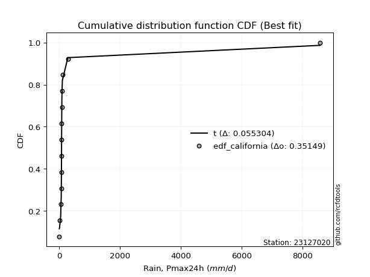</img>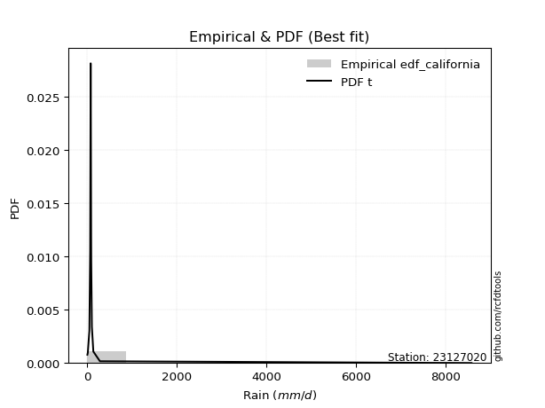</img>

</div>


### 2. Empirical - EDF Hazen (1930)

Hazen method for plotting positions is a formula used to estimate the empirical cumulative probability distribution of flood events or other hydrological data. This formula often results in biased estimations, particularly when extrapolating to extreme events (high return periods).

<div align="center">


$P=(m-0.5)/n$


</div>


**2.1. Empirical values**

<div align="center">

|                | 0                   | 1                   | 2                   | 3                  | 4                   | 5                   | 6                  | 7                  | 8                  | 9                  | 10        | 11                 | 12                 | 13                 |
|:---------------|:--------------------|:--------------------|:--------------------|:-------------------|:--------------------|:--------------------|:-------------------|:-------------------|:-------------------|:-------------------|:----------|:-------------------|:-------------------|:-------------------|
| date           | 2020                | 2024                | 2025                | 2016               | 2019                | 2009                | 2018               | 2015               | 2014               | 2010               | 2013      | 2017               | 2011               | 2012               |
| x              | 0.8                 | 10.4                | 11.0                | 45.6               | 63.5                | 70.6                | 73.1               | 74.6               | 76.1               | 84.4               | 86.6      | 101.3              | 281.1              | 8576.4             |
| m              | 1                   | 2                   | 3                   | 4                  | 5                   | 6                   | 7                  | 8                  | 9                  | 10                 | 11        | 12                 | 13                 | 14                 |
| empirical_dist | edf_hazen           | edf_hazen           | edf_hazen           | edf_hazen          | edf_hazen           | edf_hazen           | edf_hazen          | edf_hazen          | edf_hazen          | edf_hazen          | edf_hazen | edf_hazen          | edf_hazen          | edf_hazen          |
| empirical      | 0.03571428571428571 | 0.10714285714285714 | 0.17857142857142858 | 0.25               | 0.32142857142857145 | 0.39285714285714285 | 0.4642857142857143 | 0.5357142857142857 | 0.6071428571428571 | 0.6785714285714286 | 0.75      | 0.8214285714285714 | 0.8928571428571429 | 0.9642857142857143 |
| empirical_tr   | 1.037037037037037   | 1.1199999999999999  | 1.2173913043478262  | 1.3333333333333333 | 1.4736842105263157  | 1.6470588235294117  | 1.8666666666666667 | 2.1538461538461537 | 2.545454545454545  | 3.1111111111111116 | 4.0       | 5.599999999999999  | 9.333333333333337  | 28.000000000000014 |

</div>


**2.2. Kolmogorov-Smirnov fit test (sorted by Δ)**


<div align="center">

|                | 0                   | 1                   | 2                   | 3                   | 4                     | 5                   | 6                   | 7                   | 8                  | 9                   | 10                  | 11                  | 12                 | 13                | 14                  | 15                  | 16                  | 17                 | 18                  | 19                  | 20                  | 21                  | 22                  | 23                  | 24                  | 25                  | 26                  | 27                  | 28                | 29                  | 30                  | 31                  | 32                  | 33                  | 34                 | 35                 | 36                  | 37                 | 38                 | 39                 | 40                 | 41                  | 42                 | 43                  | 44                  | 45                 | 46                  | 47                 | 48                 | 49                 | 50                 | 51                  | 52                 | 53                 | 54                  | 55                 | 56                 | 57                  | 58                 | 59                  | 60                  | 61                 | 62                 | 63                  | 64                  | 65                  | 66                | 67                 | 68                 | 69                | 70                  | 71                  | 72                 | 73                 | 74                 | 75                | 76                 | 77                 | 78                 | 79                 | 80                 | 81                | 82                 | 83                 | 84                 | 85                 | 86                 | 87                 | 88                 | 89                 |
|:---------------|:--------------------|:--------------------|:--------------------|:--------------------|:----------------------|:--------------------|:--------------------|:--------------------|:-------------------|:--------------------|:--------------------|:--------------------|:-------------------|:------------------|:--------------------|:--------------------|:--------------------|:-------------------|:--------------------|:--------------------|:--------------------|:--------------------|:--------------------|:--------------------|:--------------------|:--------------------|:--------------------|:--------------------|:------------------|:--------------------|:--------------------|:--------------------|:--------------------|:--------------------|:-------------------|:-------------------|:--------------------|:-------------------|:-------------------|:-------------------|:-------------------|:--------------------|:-------------------|:--------------------|:--------------------|:-------------------|:--------------------|:-------------------|:-------------------|:-------------------|:-------------------|:--------------------|:-------------------|:-------------------|:--------------------|:-------------------|:-------------------|:--------------------|:-------------------|:--------------------|:--------------------|:-------------------|:-------------------|:--------------------|:--------------------|:--------------------|:------------------|:-------------------|:-------------------|:------------------|:--------------------|:--------------------|:-------------------|:-------------------|:-------------------|:------------------|:-------------------|:-------------------|:-------------------|:-------------------|:-------------------|:------------------|:-------------------|:-------------------|:-------------------|:-------------------|:-------------------|:-------------------|:-------------------|:-------------------|
| station        | 23127020            | 23127020            | 23127020            | 23127020            | 23127020              | 23127020            | 23127020            | 23127020            | 23127020           | 23127020            | 23127020            | 23127020            | 23127020           | 23127020          | 23127020            | 23127020            | 23127020            | 23127020           | 23127020            | 23127020            | 23127020            | 23127020            | 23127020            | 23127020            | 23127020            | 23127020            | 23127020            | 23127020            | 23127020          | 23127020            | 23127020            | 23127020            | 23127020            | 23127020            | 23127020           | 23127020           | 23127020            | 23127020           | 23127020           | 23127020           | 23127020           | 23127020            | 23127020           | 23127020            | 23127020            | 23127020           | 23127020            | 23127020           | 23127020           | 23127020           | 23127020           | 23127020            | 23127020           | 23127020           | 23127020            | 23127020           | 23127020           | 23127020            | 23127020           | 23127020            | 23127020            | 23127020           | 23127020           | 23127020            | 23127020            | 23127020            | 23127020          | 23127020           | 23127020           | 23127020          | 23127020            | 23127020            | 23127020           | 23127020           | 23127020           | 23127020          | 23127020           | 23127020           | 23127020           | 23127020           | 23127020           | 23127020          | 23127020           | 23127020           | 23127020           | 23127020           | 23127020           | 23127020           | 23127020           | 23127020           |
| empirical_dist | edf_hazen           | edf_hazen           | edf_hazen           | edf_hazen           | edf_hazen             | edf_hazen           | edf_hazen           | edf_hazen           | edf_hazen          | edf_hazen           | edf_hazen           | edf_hazen           | edf_hazen          | edf_hazen         | edf_hazen           | edf_hazen           | edf_hazen           | edf_hazen          | edf_hazen           | edf_hazen           | edf_hazen           | edf_hazen           | edf_hazen           | edf_hazen           | edf_hazen           | edf_hazen           | edf_hazen           | edf_hazen           | edf_hazen         | edf_hazen           | edf_hazen           | edf_hazen           | edf_hazen           | edf_hazen           | edf_hazen          | edf_hazen          | edf_hazen           | edf_hazen          | edf_hazen          | edf_hazen          | edf_hazen          | edf_hazen           | edf_hazen          | edf_hazen           | edf_hazen           | edf_hazen          | edf_hazen           | edf_hazen          | edf_hazen          | edf_hazen          | edf_hazen          | edf_hazen           | edf_hazen          | edf_hazen          | edf_hazen           | edf_hazen          | edf_hazen          | edf_hazen           | edf_hazen          | edf_hazen           | edf_hazen           | edf_hazen          | edf_hazen          | edf_hazen           | edf_hazen           | edf_hazen           | edf_hazen         | edf_hazen          | edf_hazen          | edf_hazen         | edf_hazen           | edf_hazen           | edf_hazen          | edf_hazen          | edf_hazen          | edf_hazen         | edf_hazen          | edf_hazen          | edf_hazen          | edf_hazen          | edf_hazen          | edf_hazen         | edf_hazen          | edf_hazen          | edf_hazen          | edf_hazen          | edf_hazen          | edf_hazen          | edf_hazen          | edf_hazen          |
| p_dist         | logjohnsonsu        | lognct              | t                   | logt                | loglaplace_asymmetric | alpha               | nct                 | loglaplace          | loggenlogistic     | logfisk             | invgamma            | pareto              | f                  | loghypsecant      | ncf                 | loginvgamma         | logpearson3         | logexponnorm       | loginvgauss         | loglogistic         | logalpha            | logerlang           | loggamma            | loggamma            | loglognorm          | logfatiguelife      | logbetaprime        | lognakagami         | logrice           | logmaxwell          | logweibull_min      | johnsonsu           | logloggamma         | logcrystalball      | lognorm            | lognorm            | fisk                | betaprime          | lograyleigh        | loginvweibull      | mielke             | invgauss            | loggumbel_r        | logkstwobign        | loggompertz         | loghalfnorm        | logmoyal            | loggumbel_l        | loggenexpon        | loghalflogistic    | nakagami           | logwald             | logexpon           | logtruncnorm       | erlang              | loggibrat          | logchi2            | invweibull          | gumbel_r           | logncf              | fatiguelife         | moyal              | rayleigh           | halfnorm            | maxwell             | halflogistic        | logmielke         | gibrat             | genlogistic        | crystalball       | norm                | wald                | logistic           | hypsecant          | laplace            | logf              | kstwobign          | gumbel_l           | pearson3           | rice               | logpareto          | weibull_min       | gamma              | exponnorm          | laplace_asymmetric | expon              | genexpon           | gompertz           | truncnorm          | chi2               |
| delta          | 0.08197190949914593 | 0.08217470305205181 | 0.08304493811807673 | 0.09831866655813383 | 0.16422109939295115   | 0.17621517734059577 | 0.18436882852720526 | 0.18437698741002512 | 0.1889573852479306 | 0.19349346941296075 | 0.19453209453516507 | 0.19923110965957802 | 0.1995357073459066 | 0.199623228671569 | 0.20178015332917915 | 0.20493957699636411 | 0.20562638707927572 | 0.2064572492786791 | 0.20945814682770308 | 0.21006276600458162 | 0.21280507520500203 | 0.21385422413083743 | 0.21399867878699064 | 0.21399867878699064 | 0.21452980504284147 | 0.21493165100286404 | 0.21622258355119778 | 0.21821325272174386 | 0.219052422902967 | 0.21967077011565878 | 0.22167385846062104 | 0.22198216158504025 | 0.22275721181726837 | 0.22280596928207752 | 0.2228060045680843 | 0.2228060045680843 | 0.23042750992324657 | 0.2310088660835088 | 0.2317396867752416 | 0.2350527051964429 | 0.2378167493810201 | 0.24148908464356578 | 0.2523314568558908 | 0.26019903790179233 | 0.26469001017728044 | 0.2658448867252641 | 0.27815356592862656 | 0.2828333530508752 | 0.2853410339932043 | 0.2855081297365668 | 0.2944898143506338 | 0.34994671407113204 | 0.3545319783446168 | 0.3586205746747757 | 0.37017683807560336 | 0.3738126455240916 | 0.3790199648144753 | 0.39752196801900824 | 0.4013307738389124 | 0.40482017416910004 | 0.41302056670639486 | 0.4183473559010804 | 0.4190334517292029 | 0.42259588919079555 | 0.43117716903756514 | 0.43510454624160105 | 0.445163217863262 | 0.4546148142645639 | 0.4628415961743734 | 0.464652606397847 | 0.46556711064453016 | 0.47277176683067623 | 0.4752074466226391 | 0.4832557823771911 | 0.5070204634131754 | 0.512792577831715 | 0.5316139487506413 | 0.5344216226211818 | 0.5353485319903967 | 0.5359849663083638 | 0.5373368008896879 | 0.565239084311614 | 0.6816193572468084 | 0.6830866384715799 | 0.6843586518613153 | 0.6843619136056562 | 0.6847268170272212 | 0.7052279231143013 | 0.7298032093114416 | 0.7441717748023078 |
| deltao         | 0.343224222286      | 0.343224222286      | 0.343224222286      | 0.343224222286      | 0.343224222286        | 0.343224222286      | 0.343224222286      | 0.343224222286      | 0.343224222286     | 0.343224222286      | 0.343224222286      | 0.343224222286      | 0.343224222286     | 0.343224222286    | 0.343224222286      | 0.343224222286      | 0.343224222286      | 0.343224222286     | 0.343224222286      | 0.343224222286      | 0.343224222286      | 0.343224222286      | 0.343224222286      | 0.343224222286      | 0.343224222286      | 0.343224222286      | 0.343224222286      | 0.343224222286      | 0.343224222286    | 0.343224222286      | 0.343224222286      | 0.343224222286      | 0.343224222286      | 0.343224222286      | 0.343224222286     | 0.343224222286     | 0.343224222286      | 0.343224222286     | 0.343224222286     | 0.343224222286     | 0.343224222286     | 0.343224222286      | 0.343224222286     | 0.343224222286      | 0.343224222286      | 0.343224222286     | 0.343224222286      | 0.343224222286     | 0.343224222286     | 0.343224222286     | 0.343224222286     | 0.343224222286      | 0.343224222286     | 0.343224222286     | 0.343224222286      | 0.343224222286     | 0.343224222286     | 0.343224222286      | 0.343224222286     | 0.343224222286      | 0.343224222286      | 0.343224222286     | 0.343224222286     | 0.343224222286      | 0.343224222286      | 0.343224222286      | 0.343224222286    | 0.343224222286     | 0.343224222286     | 0.343224222286    | 0.343224222286      | 0.343224222286      | 0.343224222286     | 0.343224222286     | 0.343224222286     | 0.343224222286    | 0.343224222286     | 0.343224222286     | 0.343224222286     | 0.343224222286     | 0.343224222286     | 0.343224222286    | 0.343224222286     | 0.343224222286     | 0.343224222286     | 0.343224222286     | 0.343224222286     | 0.343224222286     | 0.343224222286     | 0.343224222286     |
| eval           | Δo > Δ              | Δo > Δ              | Δo > Δ              | Δo > Δ              | Δo > Δ                | Δo > Δ              | Δo > Δ              | Δo > Δ              | Δo > Δ             | Δo > Δ              | Δo > Δ              | Δo > Δ              | Δo > Δ             | Δo > Δ            | Δo > Δ              | Δo > Δ              | Δo > Δ              | Δo > Δ             | Δo > Δ              | Δo > Δ              | Δo > Δ              | Δo > Δ              | Δo > Δ              | Δo > Δ              | Δo > Δ              | Δo > Δ              | Δo > Δ              | Δo > Δ              | Δo > Δ            | Δo > Δ              | Δo > Δ              | Δo > Δ              | Δo > Δ              | Δo > Δ              | Δo > Δ             | Δo > Δ             | Δo > Δ              | Δo > Δ             | Δo > Δ             | Δo > Δ             | Δo > Δ             | Δo > Δ              | Δo > Δ             | Δo > Δ              | Δo > Δ              | Δo > Δ             | Δo > Δ              | Δo > Δ             | Δo > Δ             | Δo > Δ             | Δo > Δ             | Δo <= Δ             | Δo <= Δ            | Δo <= Δ            | Δo <= Δ             | Δo <= Δ            | Δo <= Δ            | Δo <= Δ             | Δo <= Δ            | Δo <= Δ             | Δo <= Δ             | Δo <= Δ            | Δo <= Δ            | Δo <= Δ             | Δo <= Δ             | Δo <= Δ             | Δo <= Δ           | Δo <= Δ            | Δo <= Δ            | Δo <= Δ           | Δo <= Δ             | Δo <= Δ             | Δo <= Δ            | Δo <= Δ            | Δo <= Δ            | Δo <= Δ           | Δo <= Δ            | Δo <= Δ            | Δo <= Δ            | Δo <= Δ            | Δo <= Δ            | Δo <= Δ           | Δo <= Δ            | Δo <= Δ            | Δo <= Δ            | Δo <= Δ            | Δo <= Δ            | Δo <= Δ            | Δo <= Δ            | Δo <= Δ            |
| fit            | 1                   | 1                   | 1                   | 1                   | 1                     | 1                   | 1                   | 1                   | 1                  | 1                   | 1                   | 1                   | 1                  | 1                 | 1                   | 1                   | 1                   | 1                  | 1                   | 1                   | 1                   | 1                   | 1                   | 1                   | 1                   | 1                   | 1                   | 1                   | 1                 | 1                   | 1                   | 1                   | 1                   | 1                   | 1                  | 1                  | 1                   | 1                  | 1                  | 1                  | 1                  | 1                   | 1                  | 1                   | 1                   | 1                  | 1                   | 1                  | 1                  | 1                  | 1                  | 0                   | 0                  | 0                  | 0                   | 0                  | 0                  | 0                   | 0                  | 0                   | 0                   | 0                  | 0                  | 0                   | 0                   | 0                   | 0                 | 0                  | 0                  | 0                 | 0                   | 0                   | 0                  | 0                  | 0                  | 0                 | 0                  | 0                  | 0                  | 0                  | 0                  | 0                 | 0                  | 0                  | 0                  | 0                  | 0                  | 0                  | 0                  | 0                  |
| n              | 14                  | 14                  | 14                  | 14                  | 14                    | 14                  | 14                  | 14                  | 14                 | 14                  | 14                  | 14                  | 14                 | 14                | 14                  | 14                  | 14                  | 14                 | 14                  | 14                  | 14                  | 14                  | 14                  | 14                  | 14                  | 14                  | 14                  | 14                  | 14                | 14                  | 14                  | 14                  | 14                  | 14                  | 14                 | 14                 | 14                  | 14                 | 14                 | 14                 | 14                 | 14                  | 14                 | 14                  | 14                  | 14                 | 14                  | 14                 | 14                 | 14                 | 14                 | 14                  | 14                 | 14                 | 14                  | 14                 | 14                 | 14                  | 14                 | 14                  | 14                  | 14                 | 14                 | 14                  | 14                  | 14                  | 14                | 14                 | 14                 | 14                | 14                  | 14                  | 14                 | 14                 | 14                 | 14                | 14                 | 14                 | 14                 | 14                 | 14                 | 14                | 14                 | 14                 | 14                 | 14                 | 14                 | 14                 | 14                 | 14                 |
| best_fit       | 1                   | 0                   | 0                   | 0                   | 0                     | 0                   | 0                   | 0                   | 0                  | 0                   | 0                   | 0                   | 0                  | 0                 | 0                   | 0                   | 0                   | 0                  | 0                   | 0                   | 0                   | 0                   | 0                   | 0                   | 0                   | 0                   | 0                   | 0                   | 0                 | 0                   | 0                   | 0                   | 0                   | 0                   | 0                  | 0                  | 0                   | 0                  | 0                  | 0                  | 0                  | 0                   | 0                  | 0                   | 0                   | 0                  | 0                   | 0                  | 0                  | 0                  | 0                  | 0                   | 0                  | 0                  | 0                   | 0                  | 0                  | 0                   | 0                  | 0                   | 0                   | 0                  | 0                  | 0                   | 0                   | 0                   | 0                 | 0                  | 0                  | 0                 | 0                   | 0                   | 0                  | 0                  | 0                  | 0                 | 0                  | 0                  | 0                  | 0                  | 0                  | 0                 | 0                  | 0                  | 0                  | 0                  | 0                  | 0                  | 0                  | 0                  |
| best_fit_sort  | 1                   | 2                   | 3                   | 4                   | 5                     | 6                   | 7                   | 8                   | 9                  | 10                  | 11                  | 12                  | 13                 | 14                | 15                  | 16                  | 17                  | 18                 | 19                  | 20                  | 21                  | 22                  | 23                  | 24                  | 25                  | 26                  | 27                  | 28                  | 29                | 30                  | 31                  | 32                  | 33                  | 34                  | 35                 | 36                 | 37                  | 38                 | 39                 | 40                 | 41                 | 42                  | 43                 | 44                  | 45                  | 46                 | 47                  | 48                 | 49                 | 50                 | 51                 | 52                  | 53                 | 54                 | 55                  | 56                 | 57                 | 58                  | 59                 | 60                  | 61                  | 62                 | 63                 | 64                  | 65                  | 66                  | 67                | 68                 | 69                 | 70                | 71                  | 72                  | 73                 | 74                 | 75                 | 76                | 77                 | 78                 | 79                 | 80                 | 81                 | 82                | 83                 | 84                 | 85                 | 86                 | 87                 | 88                 | 89                 | 90                 |

</div>


<div align="center">

</img>

</div>


**2.3. Best fit**

<div align="center">

|   id |   station | empirical_dist   | p_dist       |     delta |   deltao | eval   |   fit |   n |   best_fit |   best_fit_sort |
|-----:|----------:|:-----------------|:-------------|----------:|---------:|:-------|------:|----:|-----------:|----------------:|
|    0 |  23127020 | edf_hazen        | logjohnsonsu | 0.0819719 | 0.343224 | Δo > Δ |     1 |  14 |          1 |               1 |

</div>


<div align="center">

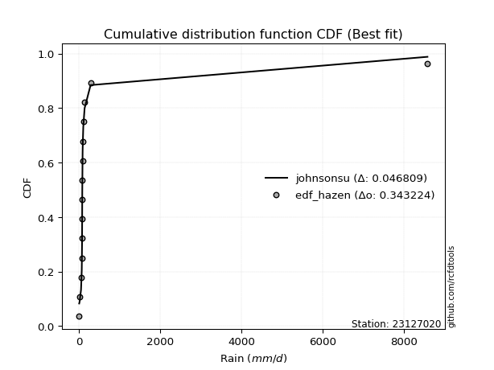</img></img>

</div>


### 3. Empirical - EDF Weibull (1939)

Weibull plotting position formula is an empirical method used to estimate the non-exceedance probability or plotting position for a set of observed data, is often recommended or widely used in practice, particularly in flood frequency analysis.

<div align="center">


$P=m/(n+1)$


</div>


**3.1. Empirical values**

<div align="center">

|                | 0                   | 1                   | 2           | 3                   | 4                  | 5                  | 6                  | 7                  | 8           | 9                  | 10                 | 11                | 12                 | 13                 |
|:---------------|:--------------------|:--------------------|:------------|:--------------------|:-------------------|:-------------------|:-------------------|:-------------------|:------------|:-------------------|:-------------------|:------------------|:-------------------|:-------------------|
| date           | 2020                | 2024                | 2025        | 2016                | 2019               | 2009               | 2018               | 2015               | 2014        | 2010               | 2013               | 2017              | 2011               | 2012               |
| x              | 0.8                 | 10.4                | 11.0        | 45.6                | 63.5               | 70.6               | 73.1               | 74.6               | 76.1        | 84.4               | 86.6               | 101.3             | 281.1              | 8576.4             |
| m              | 1                   | 2                   | 3           | 4                   | 5                  | 6                  | 7                  | 8                  | 9           | 10                 | 11                 | 12                | 13                 | 14                 |
| empirical_dist | edf_weibull         | edf_weibull         | edf_weibull | edf_weibull         | edf_weibull        | edf_weibull        | edf_weibull        | edf_weibull        | edf_weibull | edf_weibull        | edf_weibull        | edf_weibull       | edf_weibull        | edf_weibull        |
| empirical      | 0.06666666666666667 | 0.13333333333333333 | 0.2         | 0.26666666666666666 | 0.3333333333333333 | 0.4                | 0.4666666666666667 | 0.5333333333333333 | 0.6         | 0.6666666666666666 | 0.7333333333333333 | 0.8               | 0.8666666666666667 | 0.9333333333333333 |
| empirical_tr   | 1.0714285714285714  | 1.1538461538461537  | 1.25        | 1.3636363636363635  | 1.4999999999999998 | 1.6666666666666667 | 1.875              | 2.142857142857143  | 2.5         | 2.9999999999999996 | 3.749999999999999  | 5.000000000000001 | 7.500000000000002  | 15.000000000000004 |

</div>


**3.2. Kolmogorov-Smirnov fit test (sorted by Δ)**


<div align="center">

|                | 0                   | 1                   | 2                   | 3                   | 4                     | 5                  | 6                  | 7                   | 8                  | 9                   | 10                  | 11                  | 12                  | 13                  | 14                  | 15                  | 16                  | 17                  | 18                  | 19                  | 20                  | 21                  | 22                  | 23                 | 24                  | 25                 | 26                  | 27                  | 28                  | 29                 | 30                 | 31                  | 32                  | 33                  | 34                  | 35                 | 36                 | 37                  | 38                  | 39                  | 40                  | 41                  | 42                  | 43                 | 44                  | 45                 | 46                  | 47                 | 48                  | 49                  | 50                  | 51                  | 52                 | 53                  | 54                | 55                  | 56                  | 57                 | 58                 | 59                 | 60                  | 61                 | 62                 | 63                 | 64                 | 65                  | 66                  | 67                  | 68                  | 69                  | 70                 | 71                 | 72                 | 73                  | 74                 | 75                  | 76                 | 77                 | 78                 | 79                 | 80                 | 81                 | 82                 | 83                 | 84                 | 85                 | 86                 | 87                 | 88                 | 89                 |
|:---------------|:--------------------|:--------------------|:--------------------|:--------------------|:----------------------|:-------------------|:-------------------|:--------------------|:-------------------|:--------------------|:--------------------|:--------------------|:--------------------|:--------------------|:--------------------|:--------------------|:--------------------|:--------------------|:--------------------|:--------------------|:--------------------|:--------------------|:--------------------|:-------------------|:--------------------|:-------------------|:--------------------|:--------------------|:--------------------|:-------------------|:-------------------|:--------------------|:--------------------|:--------------------|:--------------------|:-------------------|:-------------------|:--------------------|:--------------------|:--------------------|:--------------------|:--------------------|:--------------------|:-------------------|:--------------------|:-------------------|:--------------------|:-------------------|:--------------------|:--------------------|:--------------------|:--------------------|:-------------------|:--------------------|:------------------|:--------------------|:--------------------|:-------------------|:-------------------|:-------------------|:--------------------|:-------------------|:-------------------|:-------------------|:-------------------|:--------------------|:--------------------|:--------------------|:--------------------|:--------------------|:-------------------|:-------------------|:-------------------|:--------------------|:-------------------|:--------------------|:-------------------|:-------------------|:-------------------|:-------------------|:-------------------|:-------------------|:-------------------|:-------------------|:-------------------|:-------------------|:-------------------|:-------------------|:-------------------|:-------------------|
| station        | 23127020            | 23127020            | 23127020            | 23127020            | 23127020              | 23127020           | 23127020           | 23127020            | 23127020           | 23127020            | 23127020            | 23127020            | 23127020            | 23127020            | 23127020            | 23127020            | 23127020            | 23127020            | 23127020            | 23127020            | 23127020            | 23127020            | 23127020            | 23127020           | 23127020            | 23127020           | 23127020            | 23127020            | 23127020            | 23127020           | 23127020           | 23127020            | 23127020            | 23127020            | 23127020            | 23127020           | 23127020           | 23127020            | 23127020            | 23127020            | 23127020            | 23127020            | 23127020            | 23127020           | 23127020            | 23127020           | 23127020            | 23127020           | 23127020            | 23127020            | 23127020            | 23127020            | 23127020           | 23127020            | 23127020          | 23127020            | 23127020            | 23127020           | 23127020           | 23127020           | 23127020            | 23127020           | 23127020           | 23127020           | 23127020           | 23127020            | 23127020            | 23127020            | 23127020            | 23127020            | 23127020           | 23127020           | 23127020           | 23127020            | 23127020           | 23127020            | 23127020           | 23127020           | 23127020           | 23127020           | 23127020           | 23127020           | 23127020           | 23127020           | 23127020           | 23127020           | 23127020           | 23127020           | 23127020           | 23127020           |
| empirical_dist | edf_weibull         | edf_weibull         | edf_weibull         | edf_weibull         | edf_weibull           | edf_weibull        | edf_weibull        | edf_weibull         | edf_weibull        | edf_weibull         | edf_weibull         | edf_weibull         | edf_weibull         | edf_weibull         | edf_weibull         | edf_weibull         | edf_weibull         | edf_weibull         | edf_weibull         | edf_weibull         | edf_weibull         | edf_weibull         | edf_weibull         | edf_weibull        | edf_weibull         | edf_weibull        | edf_weibull         | edf_weibull         | edf_weibull         | edf_weibull        | edf_weibull        | edf_weibull         | edf_weibull         | edf_weibull         | edf_weibull         | edf_weibull        | edf_weibull        | edf_weibull         | edf_weibull         | edf_weibull         | edf_weibull         | edf_weibull         | edf_weibull         | edf_weibull        | edf_weibull         | edf_weibull        | edf_weibull         | edf_weibull        | edf_weibull         | edf_weibull         | edf_weibull         | edf_weibull         | edf_weibull        | edf_weibull         | edf_weibull       | edf_weibull         | edf_weibull         | edf_weibull        | edf_weibull        | edf_weibull        | edf_weibull         | edf_weibull        | edf_weibull        | edf_weibull        | edf_weibull        | edf_weibull         | edf_weibull         | edf_weibull         | edf_weibull         | edf_weibull         | edf_weibull        | edf_weibull        | edf_weibull        | edf_weibull         | edf_weibull        | edf_weibull         | edf_weibull        | edf_weibull        | edf_weibull        | edf_weibull        | edf_weibull        | edf_weibull        | edf_weibull        | edf_weibull        | edf_weibull        | edf_weibull        | edf_weibull        | edf_weibull        | edf_weibull        | edf_weibull        |
| p_dist         | t                   | logjohnsonsu        | lognct              | logt                | loglaplace_asymmetric | nct                | alpha              | loglaplace          | logfisk            | invgamma            | loggenlogistic      | pareto              | loghypsecant        | f                   | loglogistic         | logpearson3         | loginvgamma         | ncf                 | logerlang           | loggamma            | loggamma            | loginvgauss         | loglognorm          | logfatiguelife     | logexponnorm        | lognakagami        | logalpha            | logrice             | logbetaprime        | logweibull_min     | johnsonsu          | logloggamma         | logcrystalball      | lognorm             | lognorm             | logmaxwell         | fisk               | betaprime           | lograyleigh         | loginvweibull       | invgauss            | mielke              | loggumbel_r         | loggompertz        | logkstwobign        | loghalfnorm        | loggumbel_l         | logmoyal           | loggenexpon         | loghalflogistic     | nakagami            | logexpon            | logwald            | logtruncnorm        | erlang            | loggibrat           | logchi2             | gumbel_r           | invweibull         | logncf             | moyal               | fatiguelife        | halfnorm           | rayleigh           | halflogistic       | maxwell             | logmielke           | gibrat              | crystalball         | norm                | genlogistic        | wald               | logistic           | hypsecant           | laplace            | logf                | pearson3           | kstwobign          | gumbel_l           | rice               | logpareto          | weibull_min        | gamma              | exponnorm          | laplace_asymmetric | expon              | genexpon           | gompertz           | truncnorm          | chi2               |
| delta          | 0.07990806114567098 | 0.10340048092771736 | 0.10360327448062324 | 0.11974723798670527 | 0.1427925279643798    | 0.1629402570986339 | 0.1643104154358339 | 0.17247222550526325 | 0.1730965501961979 | 0.17310352310659372 | 0.17360547361143702 | 0.17780253823100667 | 0.17819465724299766 | 0.18763094544114473 | 0.18863419457601027 | 0.18899575660610007 | 0.18957449423555023 | 0.18987539142441728 | 0.19242565270226608 | 0.19257010735841928 | 0.19257010735841928 | 0.19307480789084447 | 0.19310123361427012 | 0.1935030795742927 | 0.19455248737391723 | 0.1967846812931725 | 0.19719440840734365 | 0.19762385147439565 | 0.19955591688453111 | 0.2002452870320497 | 0.2005535901564689 | 0.20132864038869702 | 0.20137739785350617 | 0.20137743313951295 | 0.20137743313951295 | 0.2030041034489921 | 0.2089989384946752 | 0.20958029465493744 | 0.21507302010857493 | 0.21838603852977623 | 0.22006051321499442 | 0.22591198747625824 | 0.24042669495112895 | 0.2432614387487091 | 0.24353237123512567 | 0.2491782200585974 | 0.26140478162230385 | 0.2662488040238647 | 0.26867436732653766 | 0.26975068237680006 | 0.27306124292206246 | 0.33786531167795014 | 0.3380419521663702 | 0.34195390800810904 | 0.348748266647032 | 0.36190788361932974 | 0.36235329814780864 | 0.3751402976484362 | 0.3768200418046446 | 0.3786296979786239 | 0.38739497494869946 | 0.3915919952778235 | 0.3916435082384146 | 0.3928429755387267 | 0.4041521652892201 | 0.40498669284708894 | 0.41897274167278586 | 0.42366243331218295 | 0.43370022544546605 | 0.43937663445405395 | 0.4414130247458021 | 0.4418193858782953 | 0.4490169704321629 | 0.45706530618671487 | 0.4808299872226992 | 0.48660210164123874 | 0.5043961510380157 | 0.5054234725601651 | 0.5082311464307054 | 0.5097944901178875 | 0.5111463246992117 | 0.5438105128830426 | 0.6601907858182371 | 0.6616580670430086 | 0.6629300804327439 | 0.6629333421770849 | 0.6632982455986498 | 0.6837993516857299 | 0.7083746378828703 | 0.7227432033737364 |
| deltao         | 0.343224222286      | 0.343224222286      | 0.343224222286      | 0.343224222286      | 0.343224222286        | 0.343224222286     | 0.343224222286     | 0.343224222286      | 0.343224222286     | 0.343224222286      | 0.343224222286      | 0.343224222286      | 0.343224222286      | 0.343224222286      | 0.343224222286      | 0.343224222286      | 0.343224222286      | 0.343224222286      | 0.343224222286      | 0.343224222286      | 0.343224222286      | 0.343224222286      | 0.343224222286      | 0.343224222286     | 0.343224222286      | 0.343224222286     | 0.343224222286      | 0.343224222286      | 0.343224222286      | 0.343224222286     | 0.343224222286     | 0.343224222286      | 0.343224222286      | 0.343224222286      | 0.343224222286      | 0.343224222286     | 0.343224222286     | 0.343224222286      | 0.343224222286      | 0.343224222286      | 0.343224222286      | 0.343224222286      | 0.343224222286      | 0.343224222286     | 0.343224222286      | 0.343224222286     | 0.343224222286      | 0.343224222286     | 0.343224222286      | 0.343224222286      | 0.343224222286      | 0.343224222286      | 0.343224222286     | 0.343224222286      | 0.343224222286    | 0.343224222286      | 0.343224222286      | 0.343224222286     | 0.343224222286     | 0.343224222286     | 0.343224222286      | 0.343224222286     | 0.343224222286     | 0.343224222286     | 0.343224222286     | 0.343224222286      | 0.343224222286      | 0.343224222286      | 0.343224222286      | 0.343224222286      | 0.343224222286     | 0.343224222286     | 0.343224222286     | 0.343224222286      | 0.343224222286     | 0.343224222286      | 0.343224222286     | 0.343224222286     | 0.343224222286     | 0.343224222286     | 0.343224222286     | 0.343224222286     | 0.343224222286     | 0.343224222286     | 0.343224222286     | 0.343224222286     | 0.343224222286     | 0.343224222286     | 0.343224222286     | 0.343224222286     |
| eval           | Δo > Δ              | Δo > Δ              | Δo > Δ              | Δo > Δ              | Δo > Δ                | Δo > Δ             | Δo > Δ             | Δo > Δ              | Δo > Δ             | Δo > Δ              | Δo > Δ              | Δo > Δ              | Δo > Δ              | Δo > Δ              | Δo > Δ              | Δo > Δ              | Δo > Δ              | Δo > Δ              | Δo > Δ              | Δo > Δ              | Δo > Δ              | Δo > Δ              | Δo > Δ              | Δo > Δ             | Δo > Δ              | Δo > Δ             | Δo > Δ              | Δo > Δ              | Δo > Δ              | Δo > Δ             | Δo > Δ             | Δo > Δ              | Δo > Δ              | Δo > Δ              | Δo > Δ              | Δo > Δ             | Δo > Δ             | Δo > Δ              | Δo > Δ              | Δo > Δ              | Δo > Δ              | Δo > Δ              | Δo > Δ              | Δo > Δ             | Δo > Δ              | Δo > Δ             | Δo > Δ              | Δo > Δ             | Δo > Δ              | Δo > Δ              | Δo > Δ              | Δo > Δ              | Δo > Δ             | Δo > Δ              | Δo <= Δ           | Δo <= Δ             | Δo <= Δ             | Δo <= Δ            | Δo <= Δ            | Δo <= Δ            | Δo <= Δ             | Δo <= Δ            | Δo <= Δ            | Δo <= Δ            | Δo <= Δ            | Δo <= Δ             | Δo <= Δ             | Δo <= Δ             | Δo <= Δ             | Δo <= Δ             | Δo <= Δ            | Δo <= Δ            | Δo <= Δ            | Δo <= Δ             | Δo <= Δ            | Δo <= Δ             | Δo <= Δ            | Δo <= Δ            | Δo <= Δ            | Δo <= Δ            | Δo <= Δ            | Δo <= Δ            | Δo <= Δ            | Δo <= Δ            | Δo <= Δ            | Δo <= Δ            | Δo <= Δ            | Δo <= Δ            | Δo <= Δ            | Δo <= Δ            |
| fit            | 1                   | 1                   | 1                   | 1                   | 1                     | 1                  | 1                  | 1                   | 1                  | 1                   | 1                   | 1                   | 1                   | 1                   | 1                   | 1                   | 1                   | 1                   | 1                   | 1                   | 1                   | 1                   | 1                   | 1                  | 1                   | 1                  | 1                   | 1                   | 1                   | 1                  | 1                  | 1                   | 1                   | 1                   | 1                   | 1                  | 1                  | 1                   | 1                   | 1                   | 1                   | 1                   | 1                   | 1                  | 1                   | 1                  | 1                   | 1                  | 1                   | 1                   | 1                   | 1                   | 1                  | 1                   | 0                 | 0                   | 0                   | 0                  | 0                  | 0                  | 0                   | 0                  | 0                  | 0                  | 0                  | 0                   | 0                   | 0                   | 0                   | 0                   | 0                  | 0                  | 0                  | 0                   | 0                  | 0                   | 0                  | 0                  | 0                  | 0                  | 0                  | 0                  | 0                  | 0                  | 0                  | 0                  | 0                  | 0                  | 0                  | 0                  |
| n              | 14                  | 14                  | 14                  | 14                  | 14                    | 14                 | 14                 | 14                  | 14                 | 14                  | 14                  | 14                  | 14                  | 14                  | 14                  | 14                  | 14                  | 14                  | 14                  | 14                  | 14                  | 14                  | 14                  | 14                 | 14                  | 14                 | 14                  | 14                  | 14                  | 14                 | 14                 | 14                  | 14                  | 14                  | 14                  | 14                 | 14                 | 14                  | 14                  | 14                  | 14                  | 14                  | 14                  | 14                 | 14                  | 14                 | 14                  | 14                 | 14                  | 14                  | 14                  | 14                  | 14                 | 14                  | 14                | 14                  | 14                  | 14                 | 14                 | 14                 | 14                  | 14                 | 14                 | 14                 | 14                 | 14                  | 14                  | 14                  | 14                  | 14                  | 14                 | 14                 | 14                 | 14                  | 14                 | 14                  | 14                 | 14                 | 14                 | 14                 | 14                 | 14                 | 14                 | 14                 | 14                 | 14                 | 14                 | 14                 | 14                 | 14                 |
| best_fit       | 1                   | 0                   | 0                   | 0                   | 0                     | 0                  | 0                  | 0                   | 0                  | 0                   | 0                   | 0                   | 0                   | 0                   | 0                   | 0                   | 0                   | 0                   | 0                   | 0                   | 0                   | 0                   | 0                   | 0                  | 0                   | 0                  | 0                   | 0                   | 0                   | 0                  | 0                  | 0                   | 0                   | 0                   | 0                   | 0                  | 0                  | 0                   | 0                   | 0                   | 0                   | 0                   | 0                   | 0                  | 0                   | 0                  | 0                   | 0                  | 0                   | 0                   | 0                   | 0                   | 0                  | 0                   | 0                 | 0                   | 0                   | 0                  | 0                  | 0                  | 0                   | 0                  | 0                  | 0                  | 0                  | 0                   | 0                   | 0                   | 0                   | 0                   | 0                  | 0                  | 0                  | 0                   | 0                  | 0                   | 0                  | 0                  | 0                  | 0                  | 0                  | 0                  | 0                  | 0                  | 0                  | 0                  | 0                  | 0                  | 0                  | 0                  |
| best_fit_sort  | 1                   | 2                   | 3                   | 4                   | 5                     | 6                  | 7                  | 8                   | 9                  | 10                  | 11                  | 12                  | 13                  | 14                  | 15                  | 16                  | 17                  | 18                  | 19                  | 20                  | 21                  | 22                  | 23                  | 24                 | 25                  | 26                 | 27                  | 28                  | 29                  | 30                 | 31                 | 32                  | 33                  | 34                  | 35                  | 36                 | 37                 | 38                  | 39                  | 40                  | 41                  | 42                  | 43                  | 44                 | 45                  | 46                 | 47                  | 48                 | 49                  | 50                  | 51                  | 52                  | 53                 | 54                  | 55                | 56                  | 57                  | 58                 | 59                 | 60                 | 61                  | 62                 | 63                 | 64                 | 65                 | 66                  | 67                  | 68                  | 69                  | 70                  | 71                 | 72                 | 73                 | 74                  | 75                 | 76                  | 77                 | 78                 | 79                 | 80                 | 81                 | 82                 | 83                 | 84                 | 85                 | 86                 | 87                 | 88                 | 89                 | 90                 |

</div>


<div align="center">

</img>

</div>


**3.3. Best fit**

<div align="center">

|   id |   station | empirical_dist   | p_dist   |     delta |   deltao | eval   |   fit |   n |   best_fit |   best_fit_sort |
|-----:|----------:|:-----------------|:---------|----------:|---------:|:-------|------:|----:|-----------:|----------------:|
|    0 |  23127020 | edf_weibull      | t        | 0.0799081 | 0.343224 | Δo > Δ |     1 |  14 |          1 |               1 |

</div>


<div align="center">

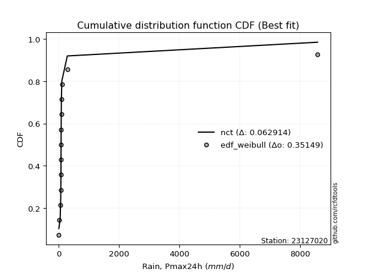</img>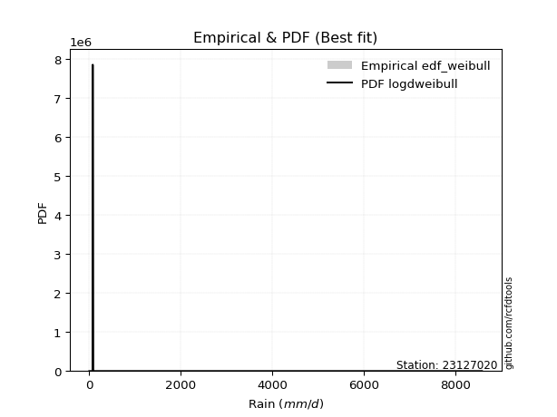</img>

</div>


### 4. Empirical - EDF Beard (1943)

The Beard formula (or Beard´s plotting position formula) in hydrology is used to estimate the empirical non-exceedance probability _(P)_ of a flood event (or other extreme hydrological data point) within a given dataset.

<div align="center">


$P=(m-0.31)/(n+0.38)$


</div>


**4.1. Empirical values**

<div align="center">

|                | 0                   | 1                   | 2                  | 3                  | 4                   | 5                  | 6                   | 7                  | 8                  | 9                  | 10                 | 11                 | 12                 | 13                 |
|:---------------|:--------------------|:--------------------|:-------------------|:-------------------|:--------------------|:-------------------|:--------------------|:-------------------|:-------------------|:-------------------|:-------------------|:-------------------|:-------------------|:-------------------|
| date           | 2020                | 2024                | 2025               | 2016               | 2019                | 2009               | 2018                | 2015               | 2014               | 2010               | 2013               | 2017               | 2011               | 2012               |
| x              | 0.8                 | 10.4                | 11.0               | 45.6               | 63.5                | 70.6               | 73.1                | 74.6               | 76.1               | 84.4               | 86.6               | 101.3              | 281.1              | 8576.4             |
| m              | 1                   | 2                   | 3                  | 4                  | 5                   | 6                  | 7                   | 8                  | 9                  | 10                 | 11                 | 12                 | 13                 | 14                 |
| empirical_dist | edf_beard           | edf_beard           | edf_beard          | edf_beard          | edf_beard           | edf_beard          | edf_beard           | edf_beard          | edf_beard          | edf_beard          | edf_beard          | edf_beard          | edf_beard          | edf_beard          |
| empirical      | 0.04798331015299026 | 0.11752433936022252 | 0.1870653685674548 | 0.256606397774687  | 0.32614742698191934 | 0.3956884561891516 | 0.46522948539638387 | 0.5347705146036161 | 0.6043115438108483 | 0.6738525730180805 | 0.7433936022253128 | 0.8129346314325451 | 0.8824756606397773 | 0.9520166898470096 |
| empirical_tr   | 1.0504017531044558  | 1.1331757289204099  | 1.2301112061591104 | 1.3451824134705332 | 1.4840041279669762  | 1.6547756041426929 | 1.869960988296489   | 2.1494768310911807 | 2.527240773286467  | 3.066098081023453  | 3.8970189701897002 | 5.345724907063193  | 8.50887573964496   | 20.84057971014487  |

</div>


**4.2. Kolmogorov-Smirnov fit test (sorted by Δ)**


<div align="center">

|                | 0                   | 1                   | 2                   | 3                   | 4                     | 5                   | 6                   | 7                   | 8                 | 9                   | 10                  | 11                 | 12                  | 13                 | 14                  | 15                 | 16                  | 17                 | 18                 | 19                  | 20                 | 21                  | 22                  | 23                  | 24                | 25                  | 26                  | 27                  | 28                  | 29                  | 30                  | 31                  | 32                  | 33                 | 34                  | 35                  | 36                  | 37                  | 38                  | 39                  | 40                  | 41                 | 42                  | 43                 | 44                 | 45                  | 46                  | 47                 | 48                 | 49                 | 50                 | 51                  | 52                 | 53                 | 54                  | 55                 | 56                 | 57                  | 58                  | 59                  | 60                  | 61                 | 62                  | 63                | 64                 | 65                 | 66                 | 67                  | 68                 | 69                 | 70                 | 71                  | 72                 | 73                 | 74                  | 75                 | 76                 | 77                 | 78                 | 79                 | 80                 | 81                 | 82                 | 83                 | 84                 | 85                 | 86                 | 87                | 88                 | 89                 |
|:---------------|:--------------------|:--------------------|:--------------------|:--------------------|:----------------------|:--------------------|:--------------------|:--------------------|:------------------|:--------------------|:--------------------|:-------------------|:--------------------|:-------------------|:--------------------|:-------------------|:--------------------|:-------------------|:-------------------|:--------------------|:-------------------|:--------------------|:--------------------|:--------------------|:------------------|:--------------------|:--------------------|:--------------------|:--------------------|:--------------------|:--------------------|:--------------------|:--------------------|:-------------------|:--------------------|:--------------------|:--------------------|:--------------------|:--------------------|:--------------------|:--------------------|:-------------------|:--------------------|:-------------------|:-------------------|:--------------------|:--------------------|:-------------------|:-------------------|:-------------------|:-------------------|:--------------------|:-------------------|:-------------------|:--------------------|:-------------------|:-------------------|:--------------------|:--------------------|:--------------------|:--------------------|:-------------------|:--------------------|:------------------|:-------------------|:-------------------|:-------------------|:--------------------|:-------------------|:-------------------|:-------------------|:--------------------|:-------------------|:-------------------|:--------------------|:-------------------|:-------------------|:-------------------|:-------------------|:-------------------|:-------------------|:-------------------|:-------------------|:-------------------|:-------------------|:-------------------|:-------------------|:------------------|:-------------------|:-------------------|
| station        | 23127020            | 23127020            | 23127020            | 23127020            | 23127020              | 23127020            | 23127020            | 23127020            | 23127020          | 23127020            | 23127020            | 23127020           | 23127020            | 23127020           | 23127020            | 23127020           | 23127020            | 23127020           | 23127020           | 23127020            | 23127020           | 23127020            | 23127020            | 23127020            | 23127020          | 23127020            | 23127020            | 23127020            | 23127020            | 23127020            | 23127020            | 23127020            | 23127020            | 23127020           | 23127020            | 23127020            | 23127020            | 23127020            | 23127020            | 23127020            | 23127020            | 23127020           | 23127020            | 23127020           | 23127020           | 23127020            | 23127020            | 23127020           | 23127020           | 23127020           | 23127020           | 23127020            | 23127020           | 23127020           | 23127020            | 23127020           | 23127020           | 23127020            | 23127020            | 23127020            | 23127020            | 23127020           | 23127020            | 23127020          | 23127020           | 23127020           | 23127020           | 23127020            | 23127020           | 23127020           | 23127020           | 23127020            | 23127020           | 23127020           | 23127020            | 23127020           | 23127020           | 23127020           | 23127020           | 23127020           | 23127020           | 23127020           | 23127020           | 23127020           | 23127020           | 23127020           | 23127020           | 23127020          | 23127020           | 23127020           |
| empirical_dist | edf_beard           | edf_beard           | edf_beard           | edf_beard           | edf_beard             | edf_beard           | edf_beard           | edf_beard           | edf_beard         | edf_beard           | edf_beard           | edf_beard          | edf_beard           | edf_beard          | edf_beard           | edf_beard          | edf_beard           | edf_beard          | edf_beard          | edf_beard           | edf_beard          | edf_beard           | edf_beard           | edf_beard           | edf_beard         | edf_beard           | edf_beard           | edf_beard           | edf_beard           | edf_beard           | edf_beard           | edf_beard           | edf_beard           | edf_beard          | edf_beard           | edf_beard           | edf_beard           | edf_beard           | edf_beard           | edf_beard           | edf_beard           | edf_beard          | edf_beard           | edf_beard          | edf_beard          | edf_beard           | edf_beard           | edf_beard          | edf_beard          | edf_beard          | edf_beard          | edf_beard           | edf_beard          | edf_beard          | edf_beard           | edf_beard          | edf_beard          | edf_beard           | edf_beard           | edf_beard           | edf_beard           | edf_beard          | edf_beard           | edf_beard         | edf_beard          | edf_beard          | edf_beard          | edf_beard           | edf_beard          | edf_beard          | edf_beard          | edf_beard           | edf_beard          | edf_beard          | edf_beard           | edf_beard          | edf_beard          | edf_beard          | edf_beard          | edf_beard          | edf_beard          | edf_beard          | edf_beard          | edf_beard          | edf_beard          | edf_beard          | edf_beard          | edf_beard         | edf_beard          | edf_beard          |
| p_dist         | t                   | logjohnsonsu        | lognct              | logt                | loglaplace_asymmetric | alpha               | nct                 | loglaplace          | loggenlogistic    | logfisk             | invgamma            | pareto             | loghypsecant        | f                  | ncf                 | logpearson3        | loginvgamma         | loglogistic        | logexponnorm       | loginvgauss         | logerlang          | loggamma            | loggamma            | loglognorm          | logalpha          | logfatiguelife      | logbetaprime        | lognakagami         | logrice             | logmaxwell          | logweibull_min      | johnsonsu           | logloggamma         | logcrystalball     | lognorm             | lognorm             | fisk                | betaprime           | lograyleigh         | loginvweibull       | invgauss            | mielke             | loggumbel_r         | logkstwobign       | loggompertz        | loghalfnorm         | logmoyal            | loggumbel_l        | loggenexpon        | loghalflogistic    | nakagami           | logwald             | logexpon           | logtruncnorm       | erlang              | loggibrat          | logchi2            | invweibull          | gumbel_r            | logncf              | fatiguelife         | moyal              | rayleigh            | halfnorm          | maxwell            | halflogistic       | logmielke          | gibrat              | crystalball        | genlogistic        | norm               | wald                | logistic           | hypsecant          | laplace             | logf               | kstwobign          | pearson3           | gumbel_l           | rice               | logpareto          | weibull_min        | gamma              | exponnorm          | laplace_asymmetric | expon              | genexpon           | gompertz          | truncnorm          | chi2               |
| delta          | 0.07077591367937218 | 0.09046584949517214 | 0.09066864304807802 | 0.10681260655416004 | 0.15572715939692483   | 0.17149632178724789 | 0.17587488853117894 | 0.17965813185667723 | 0.180791379962851 | 0.18499952941693443 | 0.18603815453913874 | 0.1907371696635517 | 0.19112928867554269 | 0.1948168517925587 | 0.19706129777583126 | 0.1971324470832494 | 0.19770843900611285 | 0.2015688260085553 | 0.2017383937253312 | 0.20285174905301606 | 0.2053602841348111 | 0.20550473879096431 | 0.20550473879096431 | 0.20603586504681515 | 0.206198677430315 | 0.20643771100683772 | 0.20961618577651076 | 0.20971931272571753 | 0.21055848290694068 | 0.21306437234097175 | 0.21317991846459472 | 0.21348822158901393 | 0.21426327182124205 | 0.2143120292860512 | 0.21431206457205798 | 0.21431206457205798 | 0.22193356992722024 | 0.22251492608748247 | 0.22513328900055457 | 0.22844630742175587 | 0.23299514464753945 | 0.2330978938276722 | 0.24761260130254292 | 0.2535926401271053 | 0.2561960701812541 | 0.25923848895057705 | 0.27343471037527867 | 0.2743394130548489 | 0.2787346362185173 | 0.2789017319618798 | 0.2859958743546075 | 0.34522785851778415 | 0.3479255805699298 | 0.3520141769000887 | 0.36168289807957704 | 0.3690937899707437 | 0.3724135670397883 | 0.38714048580164284 | 0.39094929162154685 | 0.39443869195173464 | 0.40452662671036854 | 0.4060783314623758 | 0.40865196951183735 | 0.410326864752091 | 0.4207956868201996 | 0.4228355218028965 | 0.4347817356458966 | 0.44234578982585937 | 0.4523835819591424 | 0.4543476561783471 | 0.4551856284271646 | 0.46050274239197164 | 0.4648259644052735 | 0.4728743001598255 | 0.49663898119580985 | 0.5024110956143495 | 0.5212324665332757 | 0.5230795075516921 | 0.5240401404038162 | 0.5256034840909982 | 0.5269553186723225 | 0.5567451443155875 | 0.6731254172507821 | 0.6745926984755536 | 0.675864711865289  | 0.6758679736096299 | 0.6762328770311948 | 0.696733983118275 | 0.7213092693154153 | 0.7356778348062815 |
| deltao         | 0.343224222286      | 0.343224222286      | 0.343224222286      | 0.343224222286      | 0.343224222286        | 0.343224222286      | 0.343224222286      | 0.343224222286      | 0.343224222286    | 0.343224222286      | 0.343224222286      | 0.343224222286     | 0.343224222286      | 0.343224222286     | 0.343224222286      | 0.343224222286     | 0.343224222286      | 0.343224222286     | 0.343224222286     | 0.343224222286      | 0.343224222286     | 0.343224222286      | 0.343224222286      | 0.343224222286      | 0.343224222286    | 0.343224222286      | 0.343224222286      | 0.343224222286      | 0.343224222286      | 0.343224222286      | 0.343224222286      | 0.343224222286      | 0.343224222286      | 0.343224222286     | 0.343224222286      | 0.343224222286      | 0.343224222286      | 0.343224222286      | 0.343224222286      | 0.343224222286      | 0.343224222286      | 0.343224222286     | 0.343224222286      | 0.343224222286     | 0.343224222286     | 0.343224222286      | 0.343224222286      | 0.343224222286     | 0.343224222286     | 0.343224222286     | 0.343224222286     | 0.343224222286      | 0.343224222286     | 0.343224222286     | 0.343224222286      | 0.343224222286     | 0.343224222286     | 0.343224222286      | 0.343224222286      | 0.343224222286      | 0.343224222286      | 0.343224222286     | 0.343224222286      | 0.343224222286    | 0.343224222286     | 0.343224222286     | 0.343224222286     | 0.343224222286      | 0.343224222286     | 0.343224222286     | 0.343224222286     | 0.343224222286      | 0.343224222286     | 0.343224222286     | 0.343224222286      | 0.343224222286     | 0.343224222286     | 0.343224222286     | 0.343224222286     | 0.343224222286     | 0.343224222286     | 0.343224222286     | 0.343224222286     | 0.343224222286     | 0.343224222286     | 0.343224222286     | 0.343224222286     | 0.343224222286    | 0.343224222286     | 0.343224222286     |
| eval           | Δo > Δ              | Δo > Δ              | Δo > Δ              | Δo > Δ              | Δo > Δ                | Δo > Δ              | Δo > Δ              | Δo > Δ              | Δo > Δ            | Δo > Δ              | Δo > Δ              | Δo > Δ             | Δo > Δ              | Δo > Δ             | Δo > Δ              | Δo > Δ             | Δo > Δ              | Δo > Δ             | Δo > Δ             | Δo > Δ              | Δo > Δ             | Δo > Δ              | Δo > Δ              | Δo > Δ              | Δo > Δ            | Δo > Δ              | Δo > Δ              | Δo > Δ              | Δo > Δ              | Δo > Δ              | Δo > Δ              | Δo > Δ              | Δo > Δ              | Δo > Δ             | Δo > Δ              | Δo > Δ              | Δo > Δ              | Δo > Δ              | Δo > Δ              | Δo > Δ              | Δo > Δ              | Δo > Δ             | Δo > Δ              | Δo > Δ             | Δo > Δ             | Δo > Δ              | Δo > Δ              | Δo > Δ             | Δo > Δ             | Δo > Δ             | Δo > Δ             | Δo <= Δ             | Δo <= Δ            | Δo <= Δ            | Δo <= Δ             | Δo <= Δ            | Δo <= Δ            | Δo <= Δ             | Δo <= Δ             | Δo <= Δ             | Δo <= Δ             | Δo <= Δ            | Δo <= Δ             | Δo <= Δ           | Δo <= Δ            | Δo <= Δ            | Δo <= Δ            | Δo <= Δ             | Δo <= Δ            | Δo <= Δ            | Δo <= Δ            | Δo <= Δ             | Δo <= Δ            | Δo <= Δ            | Δo <= Δ             | Δo <= Δ            | Δo <= Δ            | Δo <= Δ            | Δo <= Δ            | Δo <= Δ            | Δo <= Δ            | Δo <= Δ            | Δo <= Δ            | Δo <= Δ            | Δo <= Δ            | Δo <= Δ            | Δo <= Δ            | Δo <= Δ           | Δo <= Δ            | Δo <= Δ            |
| fit            | 1                   | 1                   | 1                   | 1                   | 1                     | 1                   | 1                   | 1                   | 1                 | 1                   | 1                   | 1                  | 1                   | 1                  | 1                   | 1                  | 1                   | 1                  | 1                  | 1                   | 1                  | 1                   | 1                   | 1                   | 1                 | 1                   | 1                   | 1                   | 1                   | 1                   | 1                   | 1                   | 1                   | 1                  | 1                   | 1                   | 1                   | 1                   | 1                   | 1                   | 1                   | 1                  | 1                   | 1                  | 1                  | 1                   | 1                   | 1                  | 1                  | 1                  | 1                  | 0                   | 0                  | 0                  | 0                   | 0                  | 0                  | 0                   | 0                   | 0                   | 0                   | 0                  | 0                   | 0                 | 0                  | 0                  | 0                  | 0                   | 0                  | 0                  | 0                  | 0                   | 0                  | 0                  | 0                   | 0                  | 0                  | 0                  | 0                  | 0                  | 0                  | 0                  | 0                  | 0                  | 0                  | 0                  | 0                  | 0                 | 0                  | 0                  |
| n              | 14                  | 14                  | 14                  | 14                  | 14                    | 14                  | 14                  | 14                  | 14                | 14                  | 14                  | 14                 | 14                  | 14                 | 14                  | 14                 | 14                  | 14                 | 14                 | 14                  | 14                 | 14                  | 14                  | 14                  | 14                | 14                  | 14                  | 14                  | 14                  | 14                  | 14                  | 14                  | 14                  | 14                 | 14                  | 14                  | 14                  | 14                  | 14                  | 14                  | 14                  | 14                 | 14                  | 14                 | 14                 | 14                  | 14                  | 14                 | 14                 | 14                 | 14                 | 14                  | 14                 | 14                 | 14                  | 14                 | 14                 | 14                  | 14                  | 14                  | 14                  | 14                 | 14                  | 14                | 14                 | 14                 | 14                 | 14                  | 14                 | 14                 | 14                 | 14                  | 14                 | 14                 | 14                  | 14                 | 14                 | 14                 | 14                 | 14                 | 14                 | 14                 | 14                 | 14                 | 14                 | 14                 | 14                 | 14                | 14                 | 14                 |
| best_fit       | 1                   | 0                   | 0                   | 0                   | 0                     | 0                   | 0                   | 0                   | 0                 | 0                   | 0                   | 0                  | 0                   | 0                  | 0                   | 0                  | 0                   | 0                  | 0                  | 0                   | 0                  | 0                   | 0                   | 0                   | 0                 | 0                   | 0                   | 0                   | 0                   | 0                   | 0                   | 0                   | 0                   | 0                  | 0                   | 0                   | 0                   | 0                   | 0                   | 0                   | 0                   | 0                  | 0                   | 0                  | 0                  | 0                   | 0                   | 0                  | 0                  | 0                  | 0                  | 0                   | 0                  | 0                  | 0                   | 0                  | 0                  | 0                   | 0                   | 0                   | 0                   | 0                  | 0                   | 0                 | 0                  | 0                  | 0                  | 0                   | 0                  | 0                  | 0                  | 0                   | 0                  | 0                  | 0                   | 0                  | 0                  | 0                  | 0                  | 0                  | 0                  | 0                  | 0                  | 0                  | 0                  | 0                  | 0                  | 0                 | 0                  | 0                  |
| best_fit_sort  | 1                   | 2                   | 3                   | 4                   | 5                     | 6                   | 7                   | 8                   | 9                 | 10                  | 11                  | 12                 | 13                  | 14                 | 15                  | 16                 | 17                  | 18                 | 19                 | 20                  | 21                 | 22                  | 23                  | 24                  | 25                | 26                  | 27                  | 28                  | 29                  | 30                  | 31                  | 32                  | 33                  | 34                 | 35                  | 36                  | 37                  | 38                  | 39                  | 40                  | 41                  | 42                 | 43                  | 44                 | 45                 | 46                  | 47                  | 48                 | 49                 | 50                 | 51                 | 52                  | 53                 | 54                 | 55                  | 56                 | 57                 | 58                  | 59                  | 60                  | 61                  | 62                 | 63                  | 64                | 65                 | 66                 | 67                 | 68                  | 69                 | 70                 | 71                 | 72                  | 73                 | 74                 | 75                  | 76                 | 77                 | 78                 | 79                 | 80                 | 81                 | 82                 | 83                 | 84                 | 85                 | 86                 | 87                 | 88                | 89                 | 90                 |

</div>


<div align="center">

</img>

</div>


**4.3. Best fit**

<div align="center">

|   id |   station | empirical_dist   | p_dist   |     delta |   deltao | eval   |   fit |   n |   best_fit |   best_fit_sort |
|-----:|----------:|:-----------------|:---------|----------:|---------:|:-------|------:|----:|-----------:|----------------:|
|    0 |  23127020 | edf_beard        | t        | 0.0707759 | 0.343224 | Δo > Δ |     1 |  14 |          1 |               1 |

</div>


<div align="center">

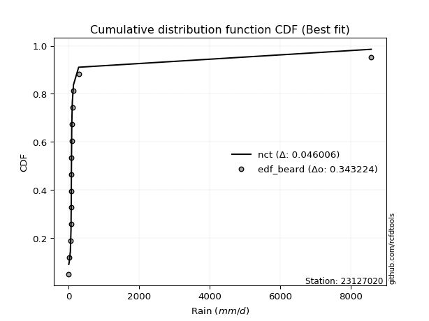</img></img>

</div>


### 5. Empirical - EDF Chegodayev (1955)

The Chegodayev formula is an empirical plotting position formula used in hydrological frequency analysis to estimate the exceedance probability or return period of a specific event from a set of observed data. It is primarily used for plotting observed data points on probability paper to fit a theoretical distribution, particularly for analyzing extreme events like maximum flood flows or rainfall intensities. The constant _b_ value in the generalized plotting position formula is 0.3.

<div align="center">


$P=(m-b)/(n+1-2b)$


</div>


**5.1. Empirical values**

<div align="center">

|                | 0                    | 1                   | 2                  | 3                  | 4                  | 5                  | 6                  | 7                  | 8                  | 9                 | 10                 | 11                 | 12                 | 13                 |
|:---------------|:---------------------|:--------------------|:-------------------|:-------------------|:-------------------|:-------------------|:-------------------|:-------------------|:-------------------|:------------------|:-------------------|:-------------------|:-------------------|:-------------------|
| date           | 2020                 | 2024                | 2025               | 2016               | 2019               | 2009               | 2018               | 2015               | 2014               | 2010              | 2013               | 2017               | 2011               | 2012               |
| x              | 0.8                  | 10.4                | 11.0               | 45.6               | 63.5               | 70.6               | 73.1               | 74.6               | 76.1               | 84.4              | 86.6               | 101.3              | 281.1              | 8576.4             |
| m              | 1                    | 2                   | 3                  | 4                  | 5                  | 6                  | 7                  | 8                  | 9                  | 10                | 11                 | 12                 | 13                 | 14                 |
| empirical_dist | edf_chegodayev       | edf_chegodayev      | edf_chegodayev     | edf_chegodayev     | edf_chegodayev     | edf_chegodayev     | edf_chegodayev     | edf_chegodayev     | edf_chegodayev     | edf_chegodayev    | edf_chegodayev     | edf_chegodayev     | edf_chegodayev     | edf_chegodayev     |
| empirical      | 0.048611111111111105 | 0.11805555555555555 | 0.1875             | 0.2569444444444445 | 0.3263888888888889 | 0.3958333333333333 | 0.4652777777777778 | 0.5347222222222222 | 0.6041666666666666 | 0.673611111111111 | 0.7430555555555555 | 0.8124999999999999 | 0.8819444444444444 | 0.9513888888888888 |
| empirical_tr   | 1.051094890510949    | 1.1338582677165354  | 1.2307692307692308 | 1.3457943925233644 | 1.4845360824742266 | 1.6551724137931032 | 1.87012987012987   | 2.1492537313432836 | 2.526315789473684  | 3.063829787234042 | 3.8918918918918908 | 5.33333333333333   | 8.470588235294116  | 20.57142857142855  |

</div>


**5.2. Kolmogorov-Smirnov fit test (sorted by Δ)**


<div align="center">

|                | 0                   | 1                   | 2                   | 3                   | 4                     | 5                   | 6                   | 7                   | 8                   | 9                   | 10                  | 11                 | 12                 | 13                  | 14                  | 15                 | 16                 | 17                  | 18                  | 19                 | 20                  | 21                  | 22                  | 23                  | 24                  | 25                  | 26                 | 27                  | 28                 | 29                 | 30                  | 31                  | 32                  | 33                | 34                 | 35                 | 36                  | 37                  | 38                  | 39                  | 40                  | 41                  | 42                  | 43                  | 44                  | 45                 | 46                 | 47                 | 48                  | 49                  | 50                 | 51                 | 52                  | 53                  | 54                  | 55                  | 56                  | 57                 | 58                  | 59                 | 60                  | 61                | 62                  | 63                  | 64                  | 65                  | 66                 | 67                 | 68                 | 69                 | 70                 | 71                 | 72                 | 73                 | 74                  | 75                 | 76                 | 77                 | 78                 | 79                 | 80                 | 81                 | 82                 | 83                 | 84                 | 85                 | 86                 | 87                 | 88                 | 89                 |
|:---------------|:--------------------|:--------------------|:--------------------|:--------------------|:----------------------|:--------------------|:--------------------|:--------------------|:--------------------|:--------------------|:--------------------|:-------------------|:-------------------|:--------------------|:--------------------|:-------------------|:-------------------|:--------------------|:--------------------|:-------------------|:--------------------|:--------------------|:--------------------|:--------------------|:--------------------|:--------------------|:-------------------|:--------------------|:-------------------|:-------------------|:--------------------|:--------------------|:--------------------|:------------------|:-------------------|:-------------------|:--------------------|:--------------------|:--------------------|:--------------------|:--------------------|:--------------------|:--------------------|:--------------------|:--------------------|:-------------------|:-------------------|:-------------------|:--------------------|:--------------------|:-------------------|:-------------------|:--------------------|:--------------------|:--------------------|:--------------------|:--------------------|:-------------------|:--------------------|:-------------------|:--------------------|:------------------|:--------------------|:--------------------|:--------------------|:--------------------|:-------------------|:-------------------|:-------------------|:-------------------|:-------------------|:-------------------|:-------------------|:-------------------|:--------------------|:-------------------|:-------------------|:-------------------|:-------------------|:-------------------|:-------------------|:-------------------|:-------------------|:-------------------|:-------------------|:-------------------|:-------------------|:-------------------|:-------------------|:-------------------|
| station        | 23127020            | 23127020            | 23127020            | 23127020            | 23127020              | 23127020            | 23127020            | 23127020            | 23127020            | 23127020            | 23127020            | 23127020           | 23127020           | 23127020            | 23127020            | 23127020           | 23127020           | 23127020            | 23127020            | 23127020           | 23127020            | 23127020            | 23127020            | 23127020            | 23127020            | 23127020            | 23127020           | 23127020            | 23127020           | 23127020           | 23127020            | 23127020            | 23127020            | 23127020          | 23127020           | 23127020           | 23127020            | 23127020            | 23127020            | 23127020            | 23127020            | 23127020            | 23127020            | 23127020            | 23127020            | 23127020           | 23127020           | 23127020           | 23127020            | 23127020            | 23127020           | 23127020           | 23127020            | 23127020            | 23127020            | 23127020            | 23127020            | 23127020           | 23127020            | 23127020           | 23127020            | 23127020          | 23127020            | 23127020            | 23127020            | 23127020            | 23127020           | 23127020           | 23127020           | 23127020           | 23127020           | 23127020           | 23127020           | 23127020           | 23127020            | 23127020           | 23127020           | 23127020           | 23127020           | 23127020           | 23127020           | 23127020           | 23127020           | 23127020           | 23127020           | 23127020           | 23127020           | 23127020           | 23127020           | 23127020           |
| empirical_dist | edf_chegodayev      | edf_chegodayev      | edf_chegodayev      | edf_chegodayev      | edf_chegodayev        | edf_chegodayev      | edf_chegodayev      | edf_chegodayev      | edf_chegodayev      | edf_chegodayev      | edf_chegodayev      | edf_chegodayev     | edf_chegodayev     | edf_chegodayev      | edf_chegodayev      | edf_chegodayev     | edf_chegodayev     | edf_chegodayev      | edf_chegodayev      | edf_chegodayev     | edf_chegodayev      | edf_chegodayev      | edf_chegodayev      | edf_chegodayev      | edf_chegodayev      | edf_chegodayev      | edf_chegodayev     | edf_chegodayev      | edf_chegodayev     | edf_chegodayev     | edf_chegodayev      | edf_chegodayev      | edf_chegodayev      | edf_chegodayev    | edf_chegodayev     | edf_chegodayev     | edf_chegodayev      | edf_chegodayev      | edf_chegodayev      | edf_chegodayev      | edf_chegodayev      | edf_chegodayev      | edf_chegodayev      | edf_chegodayev      | edf_chegodayev      | edf_chegodayev     | edf_chegodayev     | edf_chegodayev     | edf_chegodayev      | edf_chegodayev      | edf_chegodayev     | edf_chegodayev     | edf_chegodayev      | edf_chegodayev      | edf_chegodayev      | edf_chegodayev      | edf_chegodayev      | edf_chegodayev     | edf_chegodayev      | edf_chegodayev     | edf_chegodayev      | edf_chegodayev    | edf_chegodayev      | edf_chegodayev      | edf_chegodayev      | edf_chegodayev      | edf_chegodayev     | edf_chegodayev     | edf_chegodayev     | edf_chegodayev     | edf_chegodayev     | edf_chegodayev     | edf_chegodayev     | edf_chegodayev     | edf_chegodayev      | edf_chegodayev     | edf_chegodayev     | edf_chegodayev     | edf_chegodayev     | edf_chegodayev     | edf_chegodayev     | edf_chegodayev     | edf_chegodayev     | edf_chegodayev     | edf_chegodayev     | edf_chegodayev     | edf_chegodayev     | edf_chegodayev     | edf_chegodayev     | edf_chegodayev     |
| p_dist         | t                   | logjohnsonsu        | lognct              | logt                | loglaplace_asymmetric | alpha               | nct                 | loglaplace          | loggenlogistic      | logfisk             | invgamma            | pareto             | loghypsecant       | f                   | logpearson3         | ncf                | loginvgamma        | loglogistic         | logexponnorm        | loginvgauss        | logerlang           | loggamma            | loggamma            | loglognorm          | logalpha            | logfatiguelife      | logbetaprime       | lognakagami         | logrice            | logmaxwell         | logweibull_min      | johnsonsu           | logloggamma         | logcrystalball    | lognorm            | lognorm            | fisk                | betaprime           | lograyleigh         | loginvweibull       | invgauss            | mielke              | loggumbel_r         | logkstwobign        | loggompertz         | loghalfnorm        | logmoyal           | loggumbel_l        | loggenexpon         | loghalflogistic     | nakagami           | logwald            | logexpon            | logtruncnorm        | erlang              | loggibrat           | logchi2             | invweibull         | gumbel_r            | logncf             | fatiguelife         | moyal             | rayleigh            | halfnorm            | maxwell             | halflogistic        | logmielke          | gibrat             | crystalball        | genlogistic        | norm               | wald               | logistic           | hypsecant          | laplace             | logf               | kstwobign          | pearson3           | gumbel_l           | rice               | logpareto          | weibull_min        | gamma              | exponnorm          | laplace_asymmetric | expon              | genexpon           | gompertz           | truncnorm          | chi2               |
| delta          | 0.07018583892344879 | 0.09090048092771735 | 0.09110327448062323 | 0.10724723798670525 | 0.15529252796437965   | 0.17125485988027833 | 0.17544025709863376 | 0.17941666994970767 | 0.18054991805588144 | 0.18456489798438924 | 0.18560352310659356 | 0.1903025382310065 | 0.1906946572429975 | 0.19457538988558915 | 0.19671452883256652 | 0.1968198358688617 | 0.1973703923363554 | 0.20113419457601012 | 0.20149693181836165 | 0.2025137023832586 | 0.20492565270226593 | 0.20507010735841913 | 0.20507010735841913 | 0.20560123361426996 | 0.20586063076055755 | 0.20600307957429254 | 0.2092781391067533 | 0.20928468129317235 | 0.2101238514743955 | 0.2127263256712143 | 0.21274528703204953 | 0.21305359015646874 | 0.21382864038869687 | 0.213877397853506 | 0.2138774331395128 | 0.2138774331395128 | 0.22149893849467506 | 0.22208029465493728 | 0.22479524233079712 | 0.22810826075199842 | 0.23256051321499427 | 0.23285643192070266 | 0.24737113939557337 | 0.25325459345734785 | 0.25576143874870894 | 0.2589004422808196 | 0.2731932484683091 | 0.2739047816223037 | 0.27839658954875984 | 0.27856368529212233 | 0.2855612429220623 | 0.3449863966108146 | 0.34758753390017233 | 0.35167613023033123 | 0.36124826664703186 | 0.36885232806377416 | 0.37207552037003083 | 0.3866092696063098 | 0.39041807542621393 | 0.3939074757564016 | 0.40409199527782336 | 0.405450530504255 | 0.40812075331650444 | 0.40969906379397014 | 0.42026447062486666 | 0.42220772084477565 | 0.4342505194505636 | 0.4417179888677385 | 0.4517557810010216 | 0.4539130247458019 | 0.4546544122318317 | 0.4598749414338508 | 0.4642947482099406 | 0.4723430839644926 | 0.49610776500047693 | 0.5018798794190165 | 0.5207012503379428 | 0.5224517065935712 | 0.5235089242084832 | 0.5250722678956652 | 0.5264241024769895 | 0.5563105128830423 | 0.6726907858182369 | 0.6741580670430084 | 0.6754300804327438 | 0.6754333421770847 | 0.6757982455986496 | 0.6962993516857298 | 0.7208746378828701 | 0.7352432033737363 |
| deltao         | 0.343224222286      | 0.343224222286      | 0.343224222286      | 0.343224222286      | 0.343224222286        | 0.343224222286      | 0.343224222286      | 0.343224222286      | 0.343224222286      | 0.343224222286      | 0.343224222286      | 0.343224222286     | 0.343224222286     | 0.343224222286      | 0.343224222286      | 0.343224222286     | 0.343224222286     | 0.343224222286      | 0.343224222286      | 0.343224222286     | 0.343224222286      | 0.343224222286      | 0.343224222286      | 0.343224222286      | 0.343224222286      | 0.343224222286      | 0.343224222286     | 0.343224222286      | 0.343224222286     | 0.343224222286     | 0.343224222286      | 0.343224222286      | 0.343224222286      | 0.343224222286    | 0.343224222286     | 0.343224222286     | 0.343224222286      | 0.343224222286      | 0.343224222286      | 0.343224222286      | 0.343224222286      | 0.343224222286      | 0.343224222286      | 0.343224222286      | 0.343224222286      | 0.343224222286     | 0.343224222286     | 0.343224222286     | 0.343224222286      | 0.343224222286      | 0.343224222286     | 0.343224222286     | 0.343224222286      | 0.343224222286      | 0.343224222286      | 0.343224222286      | 0.343224222286      | 0.343224222286     | 0.343224222286      | 0.343224222286     | 0.343224222286      | 0.343224222286    | 0.343224222286      | 0.343224222286      | 0.343224222286      | 0.343224222286      | 0.343224222286     | 0.343224222286     | 0.343224222286     | 0.343224222286     | 0.343224222286     | 0.343224222286     | 0.343224222286     | 0.343224222286     | 0.343224222286      | 0.343224222286     | 0.343224222286     | 0.343224222286     | 0.343224222286     | 0.343224222286     | 0.343224222286     | 0.343224222286     | 0.343224222286     | 0.343224222286     | 0.343224222286     | 0.343224222286     | 0.343224222286     | 0.343224222286     | 0.343224222286     | 0.343224222286     |
| eval           | Δo > Δ              | Δo > Δ              | Δo > Δ              | Δo > Δ              | Δo > Δ                | Δo > Δ              | Δo > Δ              | Δo > Δ              | Δo > Δ              | Δo > Δ              | Δo > Δ              | Δo > Δ             | Δo > Δ             | Δo > Δ              | Δo > Δ              | Δo > Δ             | Δo > Δ             | Δo > Δ              | Δo > Δ              | Δo > Δ             | Δo > Δ              | Δo > Δ              | Δo > Δ              | Δo > Δ              | Δo > Δ              | Δo > Δ              | Δo > Δ             | Δo > Δ              | Δo > Δ             | Δo > Δ             | Δo > Δ              | Δo > Δ              | Δo > Δ              | Δo > Δ            | Δo > Δ             | Δo > Δ             | Δo > Δ              | Δo > Δ              | Δo > Δ              | Δo > Δ              | Δo > Δ              | Δo > Δ              | Δo > Δ              | Δo > Δ              | Δo > Δ              | Δo > Δ             | Δo > Δ             | Δo > Δ             | Δo > Δ              | Δo > Δ              | Δo > Δ             | Δo <= Δ            | Δo <= Δ             | Δo <= Δ             | Δo <= Δ             | Δo <= Δ             | Δo <= Δ             | Δo <= Δ            | Δo <= Δ             | Δo <= Δ            | Δo <= Δ             | Δo <= Δ           | Δo <= Δ             | Δo <= Δ             | Δo <= Δ             | Δo <= Δ             | Δo <= Δ            | Δo <= Δ            | Δo <= Δ            | Δo <= Δ            | Δo <= Δ            | Δo <= Δ            | Δo <= Δ            | Δo <= Δ            | Δo <= Δ             | Δo <= Δ            | Δo <= Δ            | Δo <= Δ            | Δo <= Δ            | Δo <= Δ            | Δo <= Δ            | Δo <= Δ            | Δo <= Δ            | Δo <= Δ            | Δo <= Δ            | Δo <= Δ            | Δo <= Δ            | Δo <= Δ            | Δo <= Δ            | Δo <= Δ            |
| fit            | 1                   | 1                   | 1                   | 1                   | 1                     | 1                   | 1                   | 1                   | 1                   | 1                   | 1                   | 1                  | 1                  | 1                   | 1                   | 1                  | 1                  | 1                   | 1                   | 1                  | 1                   | 1                   | 1                   | 1                   | 1                   | 1                   | 1                  | 1                   | 1                  | 1                  | 1                   | 1                   | 1                   | 1                 | 1                  | 1                  | 1                   | 1                   | 1                   | 1                   | 1                   | 1                   | 1                   | 1                   | 1                   | 1                  | 1                  | 1                  | 1                   | 1                   | 1                  | 0                  | 0                   | 0                   | 0                   | 0                   | 0                   | 0                  | 0                   | 0                  | 0                   | 0                 | 0                   | 0                   | 0                   | 0                   | 0                  | 0                  | 0                  | 0                  | 0                  | 0                  | 0                  | 0                  | 0                   | 0                  | 0                  | 0                  | 0                  | 0                  | 0                  | 0                  | 0                  | 0                  | 0                  | 0                  | 0                  | 0                  | 0                  | 0                  |
| n              | 14                  | 14                  | 14                  | 14                  | 14                    | 14                  | 14                  | 14                  | 14                  | 14                  | 14                  | 14                 | 14                 | 14                  | 14                  | 14                 | 14                 | 14                  | 14                  | 14                 | 14                  | 14                  | 14                  | 14                  | 14                  | 14                  | 14                 | 14                  | 14                 | 14                 | 14                  | 14                  | 14                  | 14                | 14                 | 14                 | 14                  | 14                  | 14                  | 14                  | 14                  | 14                  | 14                  | 14                  | 14                  | 14                 | 14                 | 14                 | 14                  | 14                  | 14                 | 14                 | 14                  | 14                  | 14                  | 14                  | 14                  | 14                 | 14                  | 14                 | 14                  | 14                | 14                  | 14                  | 14                  | 14                  | 14                 | 14                 | 14                 | 14                 | 14                 | 14                 | 14                 | 14                 | 14                  | 14                 | 14                 | 14                 | 14                 | 14                 | 14                 | 14                 | 14                 | 14                 | 14                 | 14                 | 14                 | 14                 | 14                 | 14                 |
| best_fit       | 1                   | 0                   | 0                   | 0                   | 0                     | 0                   | 0                   | 0                   | 0                   | 0                   | 0                   | 0                  | 0                  | 0                   | 0                   | 0                  | 0                  | 0                   | 0                   | 0                  | 0                   | 0                   | 0                   | 0                   | 0                   | 0                   | 0                  | 0                   | 0                  | 0                  | 0                   | 0                   | 0                   | 0                 | 0                  | 0                  | 0                   | 0                   | 0                   | 0                   | 0                   | 0                   | 0                   | 0                   | 0                   | 0                  | 0                  | 0                  | 0                   | 0                   | 0                  | 0                  | 0                   | 0                   | 0                   | 0                   | 0                   | 0                  | 0                   | 0                  | 0                   | 0                 | 0                   | 0                   | 0                   | 0                   | 0                  | 0                  | 0                  | 0                  | 0                  | 0                  | 0                  | 0                  | 0                   | 0                  | 0                  | 0                  | 0                  | 0                  | 0                  | 0                  | 0                  | 0                  | 0                  | 0                  | 0                  | 0                  | 0                  | 0                  |
| best_fit_sort  | 1                   | 2                   | 3                   | 4                   | 5                     | 6                   | 7                   | 8                   | 9                   | 10                  | 11                  | 12                 | 13                 | 14                  | 15                  | 16                 | 17                 | 18                  | 19                  | 20                 | 21                  | 22                  | 23                  | 24                  | 25                  | 26                  | 27                 | 28                  | 29                 | 30                 | 31                  | 32                  | 33                  | 34                | 35                 | 36                 | 37                  | 38                  | 39                  | 40                  | 41                  | 42                  | 43                  | 44                  | 45                  | 46                 | 47                 | 48                 | 49                  | 50                  | 51                 | 52                 | 53                  | 54                  | 55                  | 56                  | 57                  | 58                 | 59                  | 60                 | 61                  | 62                | 63                  | 64                  | 65                  | 66                  | 67                 | 68                 | 69                 | 70                 | 71                 | 72                 | 73                 | 74                 | 75                  | 76                 | 77                 | 78                 | 79                 | 80                 | 81                 | 82                 | 83                 | 84                 | 85                 | 86                 | 87                 | 88                 | 89                 | 90                 |

</div>


<div align="center">

</img>

</div>


**5.3. Best fit**

<div align="center">

|   id |   station | empirical_dist   | p_dist   |     delta |   deltao | eval   |   fit |   n |   best_fit |   best_fit_sort |
|-----:|----------:|:-----------------|:---------|----------:|---------:|:-------|------:|----:|-----------:|----------------:|
|    0 |  23127020 | edf_chegodayev   | t        | 0.0701858 | 0.343224 | Δo > Δ |     1 |  14 |          1 |               1 |

</div>


<div align="center">

</img>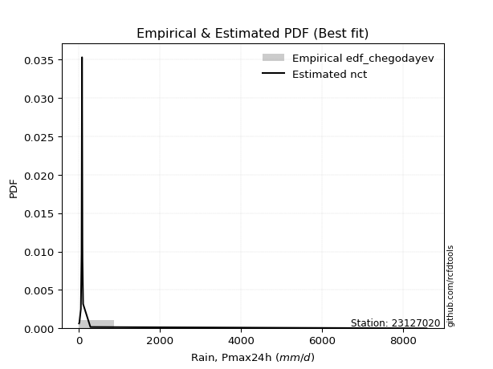</img>

</div>


### 6. Empirical - EDF Blom (1958)

The Blom formula is a specific "plotting position" formula used in hydrology and statistical analysis to estimate the empirical cumulative probability (or non-exceedance probability) of a data series. It is particularly recommended for data that are approximately normally distributed. The constant _a_ is set to 0.375 (or 3/8).

<div align="center">


$P=(m-a)/(n+1-2a)$


</div>


**6.1. Empirical values**

<div align="center">

|                | 0                    | 1                   | 2                   | 3                  | 4                   | 5                   | 6                  | 7                  | 8                  | 9                  | 10                 | 11                 | 12                 | 13                 |
|:---------------|:---------------------|:--------------------|:--------------------|:-------------------|:--------------------|:--------------------|:-------------------|:-------------------|:-------------------|:-------------------|:-------------------|:-------------------|:-------------------|:-------------------|
| date           | 2020                 | 2024                | 2025                | 2016               | 2019                | 2009                | 2018               | 2015               | 2014               | 2010               | 2013               | 2017               | 2011               | 2012               |
| x              | 0.8                  | 10.4                | 11.0                | 45.6               | 63.5                | 70.6                | 73.1               | 74.6               | 76.1               | 84.4               | 86.6               | 101.3              | 281.1              | 8576.4             |
| m              | 1                    | 2                   | 3                   | 4                  | 5                   | 6                   | 7                  | 8                  | 9                  | 10                 | 11                 | 12                 | 13                 | 14                 |
| empirical_dist | edf_blom             | edf_blom            | edf_blom            | edf_blom           | edf_blom            | edf_blom            | edf_blom           | edf_blom           | edf_blom           | edf_blom           | edf_blom           | edf_blom           | edf_blom           | edf_blom           |
| empirical      | 0.043859649122807015 | 0.11403508771929824 | 0.18421052631578946 | 0.2543859649122807 | 0.32456140350877194 | 0.39473684210526316 | 0.4649122807017544 | 0.5350877192982456 | 0.6052631578947368 | 0.6754385964912281 | 0.7456140350877193 | 0.8157894736842105 | 0.8859649122807017 | 0.956140350877193  |
| empirical_tr   | 1.0458715596330275   | 1.1287128712871288  | 1.2258064516129032  | 1.3411764705882354 | 1.4805194805194806  | 1.6521739130434783  | 1.8688524590163935 | 2.150943396226415  | 2.533333333333333  | 3.081081081081081  | 3.9310344827586206 | 5.428571428571428  | 8.769230769230768  | 22.799999999999986 |

</div>


**6.2. Kolmogorov-Smirnov fit test (sorted by Δ)**


<div align="center">

|                | 0                   | 1                   | 2                  | 3                   | 4                     | 5                  | 6                   | 7                   | 8                  | 9                   | 10                  | 11                  | 12                  | 13                 | 14                  | 15                  | 16                  | 17                 | 18                  | 19                  | 20                  | 21                  | 22                  | 23                 | 24                  | 25                  | 26                  | 27                  | 28                  | 29                  | 30                  | 31                  | 32                 | 33                  | 34                  | 35                  | 36                  | 37                 | 38                  | 39                  | 40                 | 41                 | 42                  | 43                 | 44                  | 45                  | 46                  | 47                 | 48                 | 49                 | 50                  | 51                  | 52                 | 53                | 54                 | 55                 | 56                 | 57                 | 58                  | 59                  | 60                | 61                  | 62                  | 63                  | 64                | 65                  | 66                 | 67                 | 68                  | 69                  | 70                | 71                 | 72                 | 73                 | 74                 | 75                 | 76                 | 77                 | 78                 | 79                 | 80                 | 81                | 82                 | 83                | 84                 | 85                 | 86                 | 87                 | 88                 | 89                 |
|:---------------|:--------------------|:--------------------|:-------------------|:--------------------|:----------------------|:-------------------|:--------------------|:--------------------|:-------------------|:--------------------|:--------------------|:--------------------|:--------------------|:-------------------|:--------------------|:--------------------|:--------------------|:-------------------|:--------------------|:--------------------|:--------------------|:--------------------|:--------------------|:-------------------|:--------------------|:--------------------|:--------------------|:--------------------|:--------------------|:--------------------|:--------------------|:--------------------|:-------------------|:--------------------|:--------------------|:--------------------|:--------------------|:-------------------|:--------------------|:--------------------|:-------------------|:-------------------|:--------------------|:-------------------|:--------------------|:--------------------|:--------------------|:-------------------|:-------------------|:-------------------|:--------------------|:--------------------|:-------------------|:------------------|:-------------------|:-------------------|:-------------------|:-------------------|:--------------------|:--------------------|:------------------|:--------------------|:--------------------|:--------------------|:------------------|:--------------------|:-------------------|:-------------------|:--------------------|:--------------------|:------------------|:-------------------|:-------------------|:-------------------|:-------------------|:-------------------|:-------------------|:-------------------|:-------------------|:-------------------|:-------------------|:------------------|:-------------------|:------------------|:-------------------|:-------------------|:-------------------|:-------------------|:-------------------|:-------------------|
| station        | 23127020            | 23127020            | 23127020           | 23127020            | 23127020              | 23127020           | 23127020            | 23127020            | 23127020           | 23127020            | 23127020            | 23127020            | 23127020            | 23127020           | 23127020            | 23127020            | 23127020            | 23127020           | 23127020            | 23127020            | 23127020            | 23127020            | 23127020            | 23127020           | 23127020            | 23127020            | 23127020            | 23127020            | 23127020            | 23127020            | 23127020            | 23127020            | 23127020           | 23127020            | 23127020            | 23127020            | 23127020            | 23127020           | 23127020            | 23127020            | 23127020           | 23127020           | 23127020            | 23127020           | 23127020            | 23127020            | 23127020            | 23127020           | 23127020           | 23127020           | 23127020            | 23127020            | 23127020           | 23127020          | 23127020           | 23127020           | 23127020           | 23127020           | 23127020            | 23127020            | 23127020          | 23127020            | 23127020            | 23127020            | 23127020          | 23127020            | 23127020           | 23127020           | 23127020            | 23127020            | 23127020          | 23127020           | 23127020           | 23127020           | 23127020           | 23127020           | 23127020           | 23127020           | 23127020           | 23127020           | 23127020           | 23127020          | 23127020           | 23127020          | 23127020           | 23127020           | 23127020           | 23127020           | 23127020           | 23127020           |
| empirical_dist | edf_blom            | edf_blom            | edf_blom           | edf_blom            | edf_blom              | edf_blom           | edf_blom            | edf_blom            | edf_blom           | edf_blom            | edf_blom            | edf_blom            | edf_blom            | edf_blom           | edf_blom            | edf_blom            | edf_blom            | edf_blom           | edf_blom            | edf_blom            | edf_blom            | edf_blom            | edf_blom            | edf_blom           | edf_blom            | edf_blom            | edf_blom            | edf_blom            | edf_blom            | edf_blom            | edf_blom            | edf_blom            | edf_blom           | edf_blom            | edf_blom            | edf_blom            | edf_blom            | edf_blom           | edf_blom            | edf_blom            | edf_blom           | edf_blom           | edf_blom            | edf_blom           | edf_blom            | edf_blom            | edf_blom            | edf_blom           | edf_blom           | edf_blom           | edf_blom            | edf_blom            | edf_blom           | edf_blom          | edf_blom           | edf_blom           | edf_blom           | edf_blom           | edf_blom            | edf_blom            | edf_blom          | edf_blom            | edf_blom            | edf_blom            | edf_blom          | edf_blom            | edf_blom           | edf_blom           | edf_blom            | edf_blom            | edf_blom          | edf_blom           | edf_blom           | edf_blom           | edf_blom           | edf_blom           | edf_blom           | edf_blom           | edf_blom           | edf_blom           | edf_blom           | edf_blom          | edf_blom           | edf_blom          | edf_blom           | edf_blom           | edf_blom           | edf_blom           | edf_blom           | edf_blom           |
| p_dist         | t                   | logjohnsonsu        | lognct             | logt                | loglaplace_asymmetric | alpha              | nct                 | loglaplace          | loggenlogistic     | logfisk             | invgamma            | pareto              | loghypsecant        | f                  | ncf                 | loginvgamma         | logpearson3         | logexponnorm       | loglogistic         | loginvgauss         | logerlang           | loggamma            | loggamma            | logalpha           | loglognorm          | logfatiguelife      | logbetaprime        | lognakagami         | logrice             | logmaxwell          | logweibull_min      | johnsonsu           | logloggamma        | logcrystalball      | lognorm             | lognorm             | fisk                | betaprime          | lograyleigh         | loginvweibull       | mielke             | invgauss           | loggumbel_r         | logkstwobign       | loggompertz         | loghalfnorm         | logmoyal            | loggumbel_l        | loggenexpon        | loghalflogistic    | nakagami            | logwald             | logexpon           | logtruncnorm      | erlang             | loggibrat          | logchi2            | invweibull         | gumbel_r            | logncf              | fatiguelife       | moyal               | rayleigh            | halfnorm            | maxwell           | halflogistic        | logmielke          | gibrat             | crystalball         | genlogistic         | norm              | wald               | logistic           | hypsecant          | laplace            | logf               | kstwobign          | pearson3           | gumbel_l           | rice               | logpareto          | weibull_min       | gamma              | exponnorm         | laplace_asymmetric | expon              | genexpon           | gompertz           | truncnorm          | chi2               |
| delta          | 0.07489957470955542 | 0.08761100724350682 | 0.0878138007964127 | 0.10395776430249472 | 0.15858200164859027   | 0.1730823452603953 | 0.17872973078284438 | 0.18124415532982463 | 0.1833182875035697 | 0.18785437166859986 | 0.18889299679080418 | 0.19359201191521713 | 0.19398413092720812 | 0.1964028752657061 | 0.19864732124897866 | 0.19992887186851915 | 0.19998728933491483 | 0.2033244171984786 | 0.20442366826022074 | 0.20507218191542237 | 0.20821512638647655 | 0.20835958104262975 | 0.20835958104262975 | 0.2084191102927213 | 0.20889070729848058 | 0.20929255325850316 | 0.21183661863891706 | 0.21257415497738297 | 0.21341332515860612 | 0.21528480520337806 | 0.21603476071626015 | 0.21634306384067936 | 0.2171181140729075 | 0.21716687153771663 | 0.21716690682372342 | 0.21716690682372342 | 0.22478841217888568 | 0.2253697683391479 | 0.22735372186296088 | 0.23066674028416218 | 0.2346839173008196 | 0.2358499868992049 | 0.24919862477569032 | 0.2558130729895116 | 0.25905091243291956 | 0.26145892181298336 | 0.27502073384842607 | 0.2771942553065143 | 0.2809550690809236 | 0.2811221648242861 | 0.28885071660627293 | 0.34681388199093155 | 0.3501460134323361 | 0.354234609762495 | 0.3645377403312425 | 0.3706798134438911 | 0.3746339999021946 | 0.3906297374425671 | 0.39443854326247124 | 0.39792794359265893 | 0.407381468962034 | 0.41020199249255906 | 0.41214122115276175 | 0.41445052578227426 | 0.424284938461124 | 0.42695918283307976 | 0.4382709872868209 | 0.4464694508560426 | 0.45650724298932566 | 0.45720249843001254 | 0.458674880068089 | 0.4646264034221549 | 0.4683152160461979 | 0.4763635518007499 | 0.5001282328367342 | 0.5059003472552738 | 0.5247217181742001 | 0.5272031685818753 | 0.5275293920447406 | 0.5290927357319226 | 0.5304445703132468 | 0.559599986567253 | 0.6759802595024476 | 0.677447540727219 | 0.6787195541169544 | 0.6787228158612953 | 0.6790877192828603 | 0.6995888253699404 | 0.7241641115670807 | 0.7385326770579469 |
| deltao         | 0.343224222286      | 0.343224222286      | 0.343224222286     | 0.343224222286      | 0.343224222286        | 0.343224222286     | 0.343224222286      | 0.343224222286      | 0.343224222286     | 0.343224222286      | 0.343224222286      | 0.343224222286      | 0.343224222286      | 0.343224222286     | 0.343224222286      | 0.343224222286      | 0.343224222286      | 0.343224222286     | 0.343224222286      | 0.343224222286      | 0.343224222286      | 0.343224222286      | 0.343224222286      | 0.343224222286     | 0.343224222286      | 0.343224222286      | 0.343224222286      | 0.343224222286      | 0.343224222286      | 0.343224222286      | 0.343224222286      | 0.343224222286      | 0.343224222286     | 0.343224222286      | 0.343224222286      | 0.343224222286      | 0.343224222286      | 0.343224222286     | 0.343224222286      | 0.343224222286      | 0.343224222286     | 0.343224222286     | 0.343224222286      | 0.343224222286     | 0.343224222286      | 0.343224222286      | 0.343224222286      | 0.343224222286     | 0.343224222286     | 0.343224222286     | 0.343224222286      | 0.343224222286      | 0.343224222286     | 0.343224222286    | 0.343224222286     | 0.343224222286     | 0.343224222286     | 0.343224222286     | 0.343224222286      | 0.343224222286      | 0.343224222286    | 0.343224222286      | 0.343224222286      | 0.343224222286      | 0.343224222286    | 0.343224222286      | 0.343224222286     | 0.343224222286     | 0.343224222286      | 0.343224222286      | 0.343224222286    | 0.343224222286     | 0.343224222286     | 0.343224222286     | 0.343224222286     | 0.343224222286     | 0.343224222286     | 0.343224222286     | 0.343224222286     | 0.343224222286     | 0.343224222286     | 0.343224222286    | 0.343224222286     | 0.343224222286    | 0.343224222286     | 0.343224222286     | 0.343224222286     | 0.343224222286     | 0.343224222286     | 0.343224222286     |
| eval           | Δo > Δ              | Δo > Δ              | Δo > Δ             | Δo > Δ              | Δo > Δ                | Δo > Δ             | Δo > Δ              | Δo > Δ              | Δo > Δ             | Δo > Δ              | Δo > Δ              | Δo > Δ              | Δo > Δ              | Δo > Δ             | Δo > Δ              | Δo > Δ              | Δo > Δ              | Δo > Δ             | Δo > Δ              | Δo > Δ              | Δo > Δ              | Δo > Δ              | Δo > Δ              | Δo > Δ             | Δo > Δ              | Δo > Δ              | Δo > Δ              | Δo > Δ              | Δo > Δ              | Δo > Δ              | Δo > Δ              | Δo > Δ              | Δo > Δ             | Δo > Δ              | Δo > Δ              | Δo > Δ              | Δo > Δ              | Δo > Δ             | Δo > Δ              | Δo > Δ              | Δo > Δ             | Δo > Δ             | Δo > Δ              | Δo > Δ             | Δo > Δ              | Δo > Δ              | Δo > Δ              | Δo > Δ             | Δo > Δ             | Δo > Δ             | Δo > Δ              | Δo <= Δ             | Δo <= Δ            | Δo <= Δ           | Δo <= Δ            | Δo <= Δ            | Δo <= Δ            | Δo <= Δ            | Δo <= Δ             | Δo <= Δ             | Δo <= Δ           | Δo <= Δ             | Δo <= Δ             | Δo <= Δ             | Δo <= Δ           | Δo <= Δ             | Δo <= Δ            | Δo <= Δ            | Δo <= Δ             | Δo <= Δ             | Δo <= Δ           | Δo <= Δ            | Δo <= Δ            | Δo <= Δ            | Δo <= Δ            | Δo <= Δ            | Δo <= Δ            | Δo <= Δ            | Δo <= Δ            | Δo <= Δ            | Δo <= Δ            | Δo <= Δ           | Δo <= Δ            | Δo <= Δ           | Δo <= Δ            | Δo <= Δ            | Δo <= Δ            | Δo <= Δ            | Δo <= Δ            | Δo <= Δ            |
| fit            | 1                   | 1                   | 1                  | 1                   | 1                     | 1                  | 1                   | 1                   | 1                  | 1                   | 1                   | 1                   | 1                   | 1                  | 1                   | 1                   | 1                   | 1                  | 1                   | 1                   | 1                   | 1                   | 1                   | 1                  | 1                   | 1                   | 1                   | 1                   | 1                   | 1                   | 1                   | 1                   | 1                  | 1                   | 1                   | 1                   | 1                   | 1                  | 1                   | 1                   | 1                  | 1                  | 1                   | 1                  | 1                   | 1                   | 1                   | 1                  | 1                  | 1                  | 1                   | 0                   | 0                  | 0                 | 0                  | 0                  | 0                  | 0                  | 0                   | 0                   | 0                 | 0                   | 0                   | 0                   | 0                 | 0                   | 0                  | 0                  | 0                   | 0                   | 0                 | 0                  | 0                  | 0                  | 0                  | 0                  | 0                  | 0                  | 0                  | 0                  | 0                  | 0                 | 0                  | 0                 | 0                  | 0                  | 0                  | 0                  | 0                  | 0                  |
| n              | 14                  | 14                  | 14                 | 14                  | 14                    | 14                 | 14                  | 14                  | 14                 | 14                  | 14                  | 14                  | 14                  | 14                 | 14                  | 14                  | 14                  | 14                 | 14                  | 14                  | 14                  | 14                  | 14                  | 14                 | 14                  | 14                  | 14                  | 14                  | 14                  | 14                  | 14                  | 14                  | 14                 | 14                  | 14                  | 14                  | 14                  | 14                 | 14                  | 14                  | 14                 | 14                 | 14                  | 14                 | 14                  | 14                  | 14                  | 14                 | 14                 | 14                 | 14                  | 14                  | 14                 | 14                | 14                 | 14                 | 14                 | 14                 | 14                  | 14                  | 14                | 14                  | 14                  | 14                  | 14                | 14                  | 14                 | 14                 | 14                  | 14                  | 14                | 14                 | 14                 | 14                 | 14                 | 14                 | 14                 | 14                 | 14                 | 14                 | 14                 | 14                | 14                 | 14                | 14                 | 14                 | 14                 | 14                 | 14                 | 14                 |
| best_fit       | 1                   | 0                   | 0                  | 0                   | 0                     | 0                  | 0                   | 0                   | 0                  | 0                   | 0                   | 0                   | 0                   | 0                  | 0                   | 0                   | 0                   | 0                  | 0                   | 0                   | 0                   | 0                   | 0                   | 0                  | 0                   | 0                   | 0                   | 0                   | 0                   | 0                   | 0                   | 0                   | 0                  | 0                   | 0                   | 0                   | 0                   | 0                  | 0                   | 0                   | 0                  | 0                  | 0                   | 0                  | 0                   | 0                   | 0                   | 0                  | 0                  | 0                  | 0                   | 0                   | 0                  | 0                 | 0                  | 0                  | 0                  | 0                  | 0                   | 0                   | 0                 | 0                   | 0                   | 0                   | 0                 | 0                   | 0                  | 0                  | 0                   | 0                   | 0                 | 0                  | 0                  | 0                  | 0                  | 0                  | 0                  | 0                  | 0                  | 0                  | 0                  | 0                 | 0                  | 0                 | 0                  | 0                  | 0                  | 0                  | 0                  | 0                  |
| best_fit_sort  | 1                   | 2                   | 3                  | 4                   | 5                     | 6                  | 7                   | 8                   | 9                  | 10                  | 11                  | 12                  | 13                  | 14                 | 15                  | 16                  | 17                  | 18                 | 19                  | 20                  | 21                  | 22                  | 23                  | 24                 | 25                  | 26                  | 27                  | 28                  | 29                  | 30                  | 31                  | 32                  | 33                 | 34                  | 35                  | 36                  | 37                  | 38                 | 39                  | 40                  | 41                 | 42                 | 43                  | 44                 | 45                  | 46                  | 47                  | 48                 | 49                 | 50                 | 51                  | 52                  | 53                 | 54                | 55                 | 56                 | 57                 | 58                 | 59                  | 60                  | 61                | 62                  | 63                  | 64                  | 65                | 66                  | 67                 | 68                 | 69                  | 70                  | 71                | 72                 | 73                 | 74                 | 75                 | 76                 | 77                 | 78                 | 79                 | 80                 | 81                 | 82                | 83                 | 84                | 85                 | 86                 | 87                 | 88                 | 89                 | 90                 |

</div>


<div align="center">

</img>

</div>


**6.3. Best fit**

<div align="center">

|   id |   station | empirical_dist   | p_dist   |     delta |   deltao | eval   |   fit |   n |   best_fit |   best_fit_sort |
|-----:|----------:|:-----------------|:---------|----------:|---------:|:-------|------:|----:|-----------:|----------------:|
|    0 |  23127020 | edf_blom         | t        | 0.0748996 | 0.343224 | Δo > Δ |     1 |  14 |          1 |               1 |

</div>


<div align="center">

</img>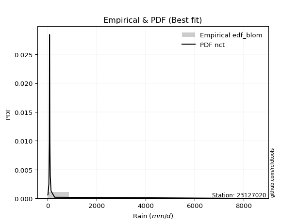</img>

</div>


### 7. Empirical - EDF Tukey (1962)

In hydrology, the Tukey formula is used as a plotting position formula to estimate the empirical probability or frequency of a flood event (or other hydrological data). The formula parameter is given as _c=0.333_ (or 1/3).

<div align="center">


$P=(m-c)/(n+1-2c)$


</div>


**7.1. Empirical values**

<div align="center">

|                | 0                    | 1                   | 2                   | 3                  | 4                   | 5                  | 6                   | 7                  | 8                  | 9                  | 10                 | 11                | 12                 | 13                 |
|:---------------|:---------------------|:--------------------|:--------------------|:-------------------|:--------------------|:-------------------|:--------------------|:-------------------|:-------------------|:-------------------|:-------------------|:------------------|:-------------------|:-------------------|
| date           | 2020                 | 2024                | 2025                | 2016               | 2019                | 2009               | 2018                | 2015               | 2014               | 2010               | 2013               | 2017              | 2011               | 2012               |
| x              | 0.8                  | 10.4                | 11.0                | 45.6               | 63.5                | 70.6               | 73.1                | 74.6               | 76.1               | 84.4               | 86.6               | 101.3             | 281.1              | 8576.4             |
| m              | 1                    | 2                   | 3                   | 4                  | 5                   | 6                  | 7                   | 8                  | 9                  | 10                 | 11                 | 12                | 13                 | 14                 |
| empirical_dist | edf_tukey            | edf_tukey           | edf_tukey           | edf_tukey          | edf_tukey           | edf_tukey          | edf_tukey           | edf_tukey          | edf_tukey          | edf_tukey          | edf_tukey          | edf_tukey         | edf_tukey          | edf_tukey          |
| empirical      | 0.046511627906976744 | 0.11627906976744186 | 0.18604651162790697 | 0.2558139534883721 | 0.32558139534883723 | 0.3953488372093023 | 0.46511627906976744 | 0.5348837209302325 | 0.6046511627906976 | 0.6744186046511628 | 0.7441860465116279 | 0.813953488372093 | 0.8837209302325582 | 0.9534883720930233 |
| empirical_tr   | 1.048780487804878    | 1.131578947368421   | 1.2285714285714286  | 1.34375            | 1.4827586206896552  | 1.653846153846154  | 1.8695652173913042  | 2.15               | 2.5294117647058822 | 3.071428571428571  | 3.9090909090909087 | 5.375             | 8.600000000000001  | 21.500000000000014 |

</div>


**7.2. Kolmogorov-Smirnov fit test (sorted by Δ)**


<div align="center">

|                | 0                  | 1                   | 2                   | 3                   | 4                     | 5                | 6                  | 7                   | 8                   | 9                   | 10                 | 11                  | 12                  | 13                 | 14                  | 15                  | 16                  | 17                 | 18                  | 19                  | 20                  | 21                  | 22                  | 23                  | 24                 | 25                  | 26                  | 27                  | 28                  | 29                  | 30                  | 31                  | 32               | 33                  | 34                  | 35                  | 36                 | 37                  | 38                 | 39                 | 40                  | 41                 | 42                  | 43                 | 44                 | 45                  | 46                 | 47                  | 48                 | 49                 | 50                  | 51                  | 52                 | 53                 | 54                | 55                 | 56                 | 57                  | 58                  | 59                  | 60                 | 61                 | 62                  | 63                 | 64                 | 65               | 66                 | 67                  | 68                | 69                  | 70                 | 71                 | 72                  | 73                  | 74                  | 75                 | 76                 | 77                 | 78                 | 79                 | 80                 | 81                 | 82                 | 83                 | 84                 | 85                 | 86                 | 87                 | 88                 | 89                 |
|:---------------|:-------------------|:--------------------|:--------------------|:--------------------|:----------------------|:-----------------|:-------------------|:--------------------|:--------------------|:--------------------|:-------------------|:--------------------|:--------------------|:-------------------|:--------------------|:--------------------|:--------------------|:-------------------|:--------------------|:--------------------|:--------------------|:--------------------|:--------------------|:--------------------|:-------------------|:--------------------|:--------------------|:--------------------|:--------------------|:--------------------|:--------------------|:--------------------|:-----------------|:--------------------|:--------------------|:--------------------|:-------------------|:--------------------|:-------------------|:-------------------|:--------------------|:-------------------|:--------------------|:-------------------|:-------------------|:--------------------|:-------------------|:--------------------|:-------------------|:-------------------|:--------------------|:--------------------|:-------------------|:-------------------|:------------------|:-------------------|:-------------------|:--------------------|:--------------------|:--------------------|:-------------------|:-------------------|:--------------------|:-------------------|:-------------------|:-----------------|:-------------------|:--------------------|:------------------|:--------------------|:-------------------|:-------------------|:--------------------|:--------------------|:--------------------|:-------------------|:-------------------|:-------------------|:-------------------|:-------------------|:-------------------|:-------------------|:-------------------|:-------------------|:-------------------|:-------------------|:-------------------|:-------------------|:-------------------|:-------------------|
| station        | 23127020           | 23127020            | 23127020            | 23127020            | 23127020              | 23127020         | 23127020           | 23127020            | 23127020            | 23127020            | 23127020           | 23127020            | 23127020            | 23127020           | 23127020            | 23127020            | 23127020            | 23127020           | 23127020            | 23127020            | 23127020            | 23127020            | 23127020            | 23127020            | 23127020           | 23127020            | 23127020            | 23127020            | 23127020            | 23127020            | 23127020            | 23127020            | 23127020         | 23127020            | 23127020            | 23127020            | 23127020           | 23127020            | 23127020           | 23127020           | 23127020            | 23127020           | 23127020            | 23127020           | 23127020           | 23127020            | 23127020           | 23127020            | 23127020           | 23127020           | 23127020            | 23127020            | 23127020           | 23127020           | 23127020          | 23127020           | 23127020           | 23127020            | 23127020            | 23127020            | 23127020           | 23127020           | 23127020            | 23127020           | 23127020           | 23127020         | 23127020           | 23127020            | 23127020          | 23127020            | 23127020           | 23127020           | 23127020            | 23127020            | 23127020            | 23127020           | 23127020           | 23127020           | 23127020           | 23127020           | 23127020           | 23127020           | 23127020           | 23127020           | 23127020           | 23127020           | 23127020           | 23127020           | 23127020           | 23127020           |
| empirical_dist | edf_tukey          | edf_tukey           | edf_tukey           | edf_tukey           | edf_tukey             | edf_tukey        | edf_tukey          | edf_tukey           | edf_tukey           | edf_tukey           | edf_tukey          | edf_tukey           | edf_tukey           | edf_tukey          | edf_tukey           | edf_tukey           | edf_tukey           | edf_tukey          | edf_tukey           | edf_tukey           | edf_tukey           | edf_tukey           | edf_tukey           | edf_tukey           | edf_tukey          | edf_tukey           | edf_tukey           | edf_tukey           | edf_tukey           | edf_tukey           | edf_tukey           | edf_tukey           | edf_tukey        | edf_tukey           | edf_tukey           | edf_tukey           | edf_tukey          | edf_tukey           | edf_tukey          | edf_tukey          | edf_tukey           | edf_tukey          | edf_tukey           | edf_tukey          | edf_tukey          | edf_tukey           | edf_tukey          | edf_tukey           | edf_tukey          | edf_tukey          | edf_tukey           | edf_tukey           | edf_tukey          | edf_tukey          | edf_tukey         | edf_tukey          | edf_tukey          | edf_tukey           | edf_tukey           | edf_tukey           | edf_tukey          | edf_tukey          | edf_tukey           | edf_tukey          | edf_tukey          | edf_tukey        | edf_tukey          | edf_tukey           | edf_tukey         | edf_tukey           | edf_tukey          | edf_tukey          | edf_tukey           | edf_tukey           | edf_tukey           | edf_tukey          | edf_tukey          | edf_tukey          | edf_tukey          | edf_tukey          | edf_tukey          | edf_tukey          | edf_tukey          | edf_tukey          | edf_tukey          | edf_tukey          | edf_tukey          | edf_tukey          | edf_tukey          | edf_tukey          |
| p_dist         | t                  | logjohnsonsu        | lognct              | logt                | loglaplace_asymmetric | alpha            | nct                | loglaplace          | loggenlogistic      | logfisk             | invgamma           | pareto              | loghypsecant        | f                  | ncf                 | logpearson3         | loginvgamma         | logexponnorm       | loglogistic         | loginvgauss         | logerlang           | loggamma            | loggamma            | logalpha            | loglognorm         | logfatiguelife      | logbetaprime        | lognakagami         | logrice             | logmaxwell          | logweibull_min      | johnsonsu           | logloggamma      | logcrystalball      | lognorm             | lognorm             | fisk               | betaprime           | lograyleigh        | loginvweibull      | mielke              | invgauss           | loggumbel_r         | logkstwobign       | loggompertz        | loghalfnorm         | logmoyal           | loggumbel_l         | loggenexpon        | loghalflogistic    | nakagami            | logwald             | logexpon           | logtruncnorm       | erlang            | loggibrat          | logchi2            | invweibull          | gumbel_r            | logncf              | fatiguelife        | moyal              | rayleigh            | halfnorm           | maxwell            | halflogistic     | logmielke          | gibrat              | crystalball       | genlogistic         | norm               | wald               | logistic            | hypsecant           | laplace             | logf               | kstwobign          | pearson3           | gumbel_l           | rice               | logpareto          | weibull_min        | gamma              | exponnorm          | laplace_asymmetric | expon              | genexpon           | gompertz           | truncnorm          | chi2               |
| delta          | 0.0722475959253857 | 0.08944699255562433 | 0.08964978610853021 | 0.10579374961461223 | 0.15674601633647278   | 0.17206235342033 | 0.1768937454707269 | 0.18022416348975934 | 0.18148230219145223 | 0.18601838635648238 | 0.1870570114786867 | 0.19175602660309965 | 0.19214814561509064 | 0.1953828834256408 | 0.19762732940891337 | 0.19815130402279735 | 0.19850088329242777 | 0.2023044253584133 | 0.20258768294810325 | 0.20364419333933098 | 0.20637914107435906 | 0.20652359573051227 | 0.20652359573051227 | 0.20699112171662992 | 0.2070547219863631 | 0.20745656794638567 | 0.21040863006282567 | 0.21073816966526548 | 0.21157733984648863 | 0.21385681662728667 | 0.21419877540414267 | 0.21450707852856188 | 0.21528212876079 | 0.21533088622559915 | 0.21533092151160593 | 0.21533092151160593 | 0.2229524268667682 | 0.22353378302703042 | 0.2259257332868695 | 0.2292387517080708 | 0.23366392546075432 | 0.2340140015870874 | 0.24817863293562503 | 0.2543850844134202 | 0.2572149271208021 | 0.26003093323689197 | 0.2740007420083608 | 0.27535826999439683 | 0.2795270805048322 | 0.2796941762481947 | 0.28701473129415545 | 0.34579389015086626 | 0.3487180248562447 | 0.3528066211864036 | 0.362701755019125 | 0.3696598216038258 | 0.3732060113261032 | 0.38838575539442355 | 0.39219456121432766 | 0.39568396154451535 | 0.4055454836499165 | 0.4075500137083894 | 0.40989723910461817 | 0.4117985469981045 | 0.4220409564129804 | 0.42430720404891 | 0.4360270052386773 | 0.44381747207187283 | 0.453855264205156 | 0.45536651311789506 | 0.4564308980199454 | 0.4619744246379852 | 0.46607123399805434 | 0.47411956975260633 | 0.49788425078859067 | 0.5036563652071302 | 0.5224777361260565 | 0.5245511897977057 | 0.5252854099965969 | 0.5268487536837789 | 0.5282005882651032 | 0.5577640012551355 | 0.6741442741903301 | 0.6756115554151015 | 0.6768835688048369 | 0.6768868305491779 | 0.6772517339707428 | 0.6977528400578229 | 0.7223281262549632 | 0.7366966917458294 |
| deltao         | 0.343224222286     | 0.343224222286      | 0.343224222286      | 0.343224222286      | 0.343224222286        | 0.343224222286   | 0.343224222286     | 0.343224222286      | 0.343224222286      | 0.343224222286      | 0.343224222286     | 0.343224222286      | 0.343224222286      | 0.343224222286     | 0.343224222286      | 0.343224222286      | 0.343224222286      | 0.343224222286     | 0.343224222286      | 0.343224222286      | 0.343224222286      | 0.343224222286      | 0.343224222286      | 0.343224222286      | 0.343224222286     | 0.343224222286      | 0.343224222286      | 0.343224222286      | 0.343224222286      | 0.343224222286      | 0.343224222286      | 0.343224222286      | 0.343224222286   | 0.343224222286      | 0.343224222286      | 0.343224222286      | 0.343224222286     | 0.343224222286      | 0.343224222286     | 0.343224222286     | 0.343224222286      | 0.343224222286     | 0.343224222286      | 0.343224222286     | 0.343224222286     | 0.343224222286      | 0.343224222286     | 0.343224222286      | 0.343224222286     | 0.343224222286     | 0.343224222286      | 0.343224222286      | 0.343224222286     | 0.343224222286     | 0.343224222286    | 0.343224222286     | 0.343224222286     | 0.343224222286      | 0.343224222286      | 0.343224222286      | 0.343224222286     | 0.343224222286     | 0.343224222286      | 0.343224222286     | 0.343224222286     | 0.343224222286   | 0.343224222286     | 0.343224222286      | 0.343224222286    | 0.343224222286      | 0.343224222286     | 0.343224222286     | 0.343224222286      | 0.343224222286      | 0.343224222286      | 0.343224222286     | 0.343224222286     | 0.343224222286     | 0.343224222286     | 0.343224222286     | 0.343224222286     | 0.343224222286     | 0.343224222286     | 0.343224222286     | 0.343224222286     | 0.343224222286     | 0.343224222286     | 0.343224222286     | 0.343224222286     | 0.343224222286     |
| eval           | Δo > Δ             | Δo > Δ              | Δo > Δ              | Δo > Δ              | Δo > Δ                | Δo > Δ           | Δo > Δ             | Δo > Δ              | Δo > Δ              | Δo > Δ              | Δo > Δ             | Δo > Δ              | Δo > Δ              | Δo > Δ             | Δo > Δ              | Δo > Δ              | Δo > Δ              | Δo > Δ             | Δo > Δ              | Δo > Δ              | Δo > Δ              | Δo > Δ              | Δo > Δ              | Δo > Δ              | Δo > Δ             | Δo > Δ              | Δo > Δ              | Δo > Δ              | Δo > Δ              | Δo > Δ              | Δo > Δ              | Δo > Δ              | Δo > Δ           | Δo > Δ              | Δo > Δ              | Δo > Δ              | Δo > Δ             | Δo > Δ              | Δo > Δ             | Δo > Δ             | Δo > Δ              | Δo > Δ             | Δo > Δ              | Δo > Δ             | Δo > Δ             | Δo > Δ              | Δo > Δ             | Δo > Δ              | Δo > Δ             | Δo > Δ             | Δo > Δ              | Δo <= Δ             | Δo <= Δ            | Δo <= Δ            | Δo <= Δ           | Δo <= Δ            | Δo <= Δ            | Δo <= Δ             | Δo <= Δ             | Δo <= Δ             | Δo <= Δ            | Δo <= Δ            | Δo <= Δ             | Δo <= Δ            | Δo <= Δ            | Δo <= Δ          | Δo <= Δ            | Δo <= Δ             | Δo <= Δ           | Δo <= Δ             | Δo <= Δ            | Δo <= Δ            | Δo <= Δ             | Δo <= Δ             | Δo <= Δ             | Δo <= Δ            | Δo <= Δ            | Δo <= Δ            | Δo <= Δ            | Δo <= Δ            | Δo <= Δ            | Δo <= Δ            | Δo <= Δ            | Δo <= Δ            | Δo <= Δ            | Δo <= Δ            | Δo <= Δ            | Δo <= Δ            | Δo <= Δ            | Δo <= Δ            |
| fit            | 1                  | 1                   | 1                   | 1                   | 1                     | 1                | 1                  | 1                   | 1                   | 1                   | 1                  | 1                   | 1                   | 1                  | 1                   | 1                   | 1                   | 1                  | 1                   | 1                   | 1                   | 1                   | 1                   | 1                   | 1                  | 1                   | 1                   | 1                   | 1                   | 1                   | 1                   | 1                   | 1                | 1                   | 1                   | 1                   | 1                  | 1                   | 1                  | 1                  | 1                   | 1                  | 1                   | 1                  | 1                  | 1                   | 1                  | 1                   | 1                  | 1                  | 1                   | 0                   | 0                  | 0                  | 0                 | 0                  | 0                  | 0                   | 0                   | 0                   | 0                  | 0                  | 0                   | 0                  | 0                  | 0                | 0                  | 0                   | 0                 | 0                   | 0                  | 0                  | 0                   | 0                   | 0                   | 0                  | 0                  | 0                  | 0                  | 0                  | 0                  | 0                  | 0                  | 0                  | 0                  | 0                  | 0                  | 0                  | 0                  | 0                  |
| n              | 14                 | 14                  | 14                  | 14                  | 14                    | 14               | 14                 | 14                  | 14                  | 14                  | 14                 | 14                  | 14                  | 14                 | 14                  | 14                  | 14                  | 14                 | 14                  | 14                  | 14                  | 14                  | 14                  | 14                  | 14                 | 14                  | 14                  | 14                  | 14                  | 14                  | 14                  | 14                  | 14               | 14                  | 14                  | 14                  | 14                 | 14                  | 14                 | 14                 | 14                  | 14                 | 14                  | 14                 | 14                 | 14                  | 14                 | 14                  | 14                 | 14                 | 14                  | 14                  | 14                 | 14                 | 14                | 14                 | 14                 | 14                  | 14                  | 14                  | 14                 | 14                 | 14                  | 14                 | 14                 | 14               | 14                 | 14                  | 14                | 14                  | 14                 | 14                 | 14                  | 14                  | 14                  | 14                 | 14                 | 14                 | 14                 | 14                 | 14                 | 14                 | 14                 | 14                 | 14                 | 14                 | 14                 | 14                 | 14                 | 14                 |
| best_fit       | 1                  | 0                   | 0                   | 0                   | 0                     | 0                | 0                  | 0                   | 0                   | 0                   | 0                  | 0                   | 0                   | 0                  | 0                   | 0                   | 0                   | 0                  | 0                   | 0                   | 0                   | 0                   | 0                   | 0                   | 0                  | 0                   | 0                   | 0                   | 0                   | 0                   | 0                   | 0                   | 0                | 0                   | 0                   | 0                   | 0                  | 0                   | 0                  | 0                  | 0                   | 0                  | 0                   | 0                  | 0                  | 0                   | 0                  | 0                   | 0                  | 0                  | 0                   | 0                   | 0                  | 0                  | 0                 | 0                  | 0                  | 0                   | 0                   | 0                   | 0                  | 0                  | 0                   | 0                  | 0                  | 0                | 0                  | 0                   | 0                 | 0                   | 0                  | 0                  | 0                   | 0                   | 0                   | 0                  | 0                  | 0                  | 0                  | 0                  | 0                  | 0                  | 0                  | 0                  | 0                  | 0                  | 0                  | 0                  | 0                  | 0                  |
| best_fit_sort  | 1                  | 2                   | 3                   | 4                   | 5                     | 6                | 7                  | 8                   | 9                   | 10                  | 11                 | 12                  | 13                  | 14                 | 15                  | 16                  | 17                  | 18                 | 19                  | 20                  | 21                  | 22                  | 23                  | 24                  | 25                 | 26                  | 27                  | 28                  | 29                  | 30                  | 31                  | 32                  | 33               | 34                  | 35                  | 36                  | 37                 | 38                  | 39                 | 40                 | 41                  | 42                 | 43                  | 44                 | 45                 | 46                  | 47                 | 48                  | 49                 | 50                 | 51                  | 52                  | 53                 | 54                 | 55                | 56                 | 57                 | 58                  | 59                  | 60                  | 61                 | 62                 | 63                  | 64                 | 65                 | 66               | 67                 | 68                  | 69                | 70                  | 71                 | 72                 | 73                  | 74                  | 75                  | 76                 | 77                 | 78                 | 79                 | 80                 | 81                 | 82                 | 83                 | 84                 | 85                 | 86                 | 87                 | 88                 | 89                 | 90                 |

</div>


<div align="center">

</img>

</div>


**7.3. Best fit**

<div align="center">

|   id |   station | empirical_dist   | p_dist   |     delta |   deltao | eval   |   fit |   n |   best_fit |   best_fit_sort |
|-----:|----------:|:-----------------|:---------|----------:|---------:|:-------|------:|----:|-----------:|----------------:|
|    0 |  23127020 | edf_tukey        | t        | 0.0722476 | 0.343224 | Δo > Δ |     1 |  14 |          1 |               1 |

</div>


<div align="center">

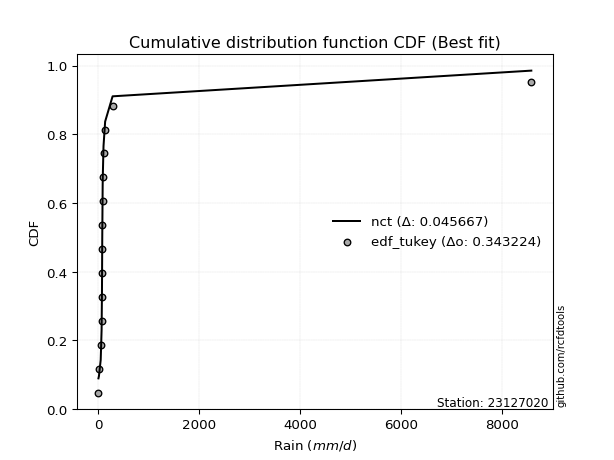</img></img>

</div>


### 8. Empirical - EDF Gringorten (1963)

Gringorten plotting position formula is essential for estimating the probability and return periods of extreme events like floods and heavy rainfall. The constant _a=0.44_.

<div align="center">


$P=(m-a)/(n+1-2a)$


</div>


**8.1. Empirical values**

<div align="center">

|                | 0                  | 1                  | 2                  | 3                  | 4                   | 5                  | 6                   | 7                  | 8                  | 9                  | 10                 | 11                 | 12                 | 13                 |
|:---------------|:-------------------|:-------------------|:-------------------|:-------------------|:--------------------|:-------------------|:--------------------|:-------------------|:-------------------|:-------------------|:-------------------|:-------------------|:-------------------|:-------------------|
| date           | 2020               | 2024               | 2025               | 2016               | 2019                | 2009               | 2018                | 2015               | 2014               | 2010               | 2013               | 2017               | 2011               | 2012               |
| x              | 0.8                | 10.4               | 11.0               | 45.6               | 63.5                | 70.6               | 73.1                | 74.6               | 76.1               | 84.4               | 86.6               | 101.3              | 281.1              | 8576.4             |
| m              | 1                  | 2                  | 3                  | 4                  | 5                   | 6                  | 7                   | 8                  | 9                  | 10                 | 11                 | 12                 | 13                 | 14                 |
| empirical_dist | edf_gringorten     | edf_gringorten     | edf_gringorten     | edf_gringorten     | edf_gringorten      | edf_gringorten     | edf_gringorten      | edf_gringorten     | edf_gringorten     | edf_gringorten     | edf_gringorten     | edf_gringorten     | edf_gringorten     | edf_gringorten     |
| empirical      | 0.0396600566572238 | 0.1104815864022663 | 0.1813031161473088 | 0.2521246458923513 | 0.32294617563739375 | 0.3937677053824363 | 0.46458923512747874 | 0.5354107648725213 | 0.6062322946175638 | 0.6770538243626063 | 0.7478753541076488 | 0.8186968838526913 | 0.8895184135977338 | 0.9603399433427763 |
| empirical_tr   | 1.041297935103245  | 1.124203821656051  | 1.221453287197232  | 1.3371212121212122 | 1.4769874476987446  | 1.6495327102803736 | 1.8677248677248677  | 2.152439024390244  | 2.539568345323741  | 3.096491228070176  | 3.966292134831462  | 5.5156250000000036 | 9.051282051282055  | 25.214285714285765 |

</div>


**8.2. Kolmogorov-Smirnov fit test (sorted by Δ)**


<div align="center">

|                | 0                   | 1                   | 2                   | 3                   | 4                     | 5                   | 6                   | 7                   | 8                   | 9                  | 10                  | 11                  | 12                  | 13                 | 14                  | 15                  | 16                  | 17                 | 18                  | 19                 | 20                  | 21                  | 22                 | 23                 | 24                  | 25                | 26                 | 27                 | 28                  | 29                 | 30                | 31                 | 32                  | 33                  | 34                  | 35                  | 36                  | 37                  | 38                 | 39                 | 40                 | 41                  | 42                 | 43                  | 44                 | 45                 | 46                  | 47                  | 48                  | 49                 | 50                  | 51                  | 52                 | 53                 | 54                 | 55                 | 56                | 57                 | 58                  | 59                 | 60                 | 61                 | 62                 | 63                 | 64                | 65                | 66                  | 67                  | 68                 | 69                  | 70                | 71                 | 72                  | 73                  | 74                 | 75                 | 76                 | 77                 | 78                 | 79                 | 80                 | 81                 | 82                 | 83                 | 84                 | 85                 | 86                 | 87                 | 88                 | 89                 |
|:---------------|:--------------------|:--------------------|:--------------------|:--------------------|:----------------------|:--------------------|:--------------------|:--------------------|:--------------------|:-------------------|:--------------------|:--------------------|:--------------------|:-------------------|:--------------------|:--------------------|:--------------------|:-------------------|:--------------------|:-------------------|:--------------------|:--------------------|:-------------------|:-------------------|:--------------------|:------------------|:-------------------|:-------------------|:--------------------|:-------------------|:------------------|:-------------------|:--------------------|:--------------------|:--------------------|:--------------------|:--------------------|:--------------------|:-------------------|:-------------------|:-------------------|:--------------------|:-------------------|:--------------------|:-------------------|:-------------------|:--------------------|:--------------------|:--------------------|:-------------------|:--------------------|:--------------------|:-------------------|:-------------------|:-------------------|:-------------------|:------------------|:-------------------|:--------------------|:-------------------|:-------------------|:-------------------|:-------------------|:-------------------|:------------------|:------------------|:--------------------|:--------------------|:-------------------|:--------------------|:------------------|:-------------------|:--------------------|:--------------------|:-------------------|:-------------------|:-------------------|:-------------------|:-------------------|:-------------------|:-------------------|:-------------------|:-------------------|:-------------------|:-------------------|:-------------------|:-------------------|:-------------------|:-------------------|:-------------------|
| station        | 23127020            | 23127020            | 23127020            | 23127020            | 23127020              | 23127020            | 23127020            | 23127020            | 23127020            | 23127020           | 23127020            | 23127020            | 23127020            | 23127020           | 23127020            | 23127020            | 23127020            | 23127020           | 23127020            | 23127020           | 23127020            | 23127020            | 23127020           | 23127020           | 23127020            | 23127020          | 23127020           | 23127020           | 23127020            | 23127020           | 23127020          | 23127020           | 23127020            | 23127020            | 23127020            | 23127020            | 23127020            | 23127020            | 23127020           | 23127020           | 23127020           | 23127020            | 23127020           | 23127020            | 23127020           | 23127020           | 23127020            | 23127020            | 23127020            | 23127020           | 23127020            | 23127020            | 23127020           | 23127020           | 23127020           | 23127020           | 23127020          | 23127020           | 23127020            | 23127020           | 23127020           | 23127020           | 23127020           | 23127020           | 23127020          | 23127020          | 23127020            | 23127020            | 23127020           | 23127020            | 23127020          | 23127020           | 23127020            | 23127020            | 23127020           | 23127020           | 23127020           | 23127020           | 23127020           | 23127020           | 23127020           | 23127020           | 23127020           | 23127020           | 23127020           | 23127020           | 23127020           | 23127020           | 23127020           | 23127020           |
| empirical_dist | edf_gringorten      | edf_gringorten      | edf_gringorten      | edf_gringorten      | edf_gringorten        | edf_gringorten      | edf_gringorten      | edf_gringorten      | edf_gringorten      | edf_gringorten     | edf_gringorten      | edf_gringorten      | edf_gringorten      | edf_gringorten     | edf_gringorten      | edf_gringorten      | edf_gringorten      | edf_gringorten     | edf_gringorten      | edf_gringorten     | edf_gringorten      | edf_gringorten      | edf_gringorten     | edf_gringorten     | edf_gringorten      | edf_gringorten    | edf_gringorten     | edf_gringorten     | edf_gringorten      | edf_gringorten     | edf_gringorten    | edf_gringorten     | edf_gringorten      | edf_gringorten      | edf_gringorten      | edf_gringorten      | edf_gringorten      | edf_gringorten      | edf_gringorten     | edf_gringorten     | edf_gringorten     | edf_gringorten      | edf_gringorten     | edf_gringorten      | edf_gringorten     | edf_gringorten     | edf_gringorten      | edf_gringorten      | edf_gringorten      | edf_gringorten     | edf_gringorten      | edf_gringorten      | edf_gringorten     | edf_gringorten     | edf_gringorten     | edf_gringorten     | edf_gringorten    | edf_gringorten     | edf_gringorten      | edf_gringorten     | edf_gringorten     | edf_gringorten     | edf_gringorten     | edf_gringorten     | edf_gringorten    | edf_gringorten    | edf_gringorten      | edf_gringorten      | edf_gringorten     | edf_gringorten      | edf_gringorten    | edf_gringorten     | edf_gringorten      | edf_gringorten      | edf_gringorten     | edf_gringorten     | edf_gringorten     | edf_gringorten     | edf_gringorten     | edf_gringorten     | edf_gringorten     | edf_gringorten     | edf_gringorten     | edf_gringorten     | edf_gringorten     | edf_gringorten     | edf_gringorten     | edf_gringorten     | edf_gringorten     | edf_gringorten     |
| p_dist         | t                   | logjohnsonsu        | lognct              | logt                | loglaplace_asymmetric | alpha               | nct                 | loglaplace          | loggenlogistic      | logfisk            | invgamma            | pareto              | loghypsecant        | f                  | ncf                 | loginvgamma         | logpearson3         | logexponnorm       | loglogistic         | loginvgauss        | logalpha            | logerlang           | loggamma           | loggamma           | loglognorm          | logfatiguelife    | logbetaprime       | lognakagami        | logrice             | logmaxwell         | logweibull_min    | johnsonsu          | logloggamma         | logcrystalball      | lognorm             | lognorm             | fisk                | betaprime           | lograyleigh        | loginvweibull      | mielke             | invgauss            | loggumbel_r        | logkstwobign        | loggompertz        | loghalfnorm        | logmoyal            | loggumbel_l         | loggenexpon         | loghalflogistic    | nakagami            | logwald             | logexpon           | logtruncnorm       | erlang             | loggibrat          | logchi2           | invweibull         | gumbel_r            | logncf             | fatiguelife        | moyal              | rayleigh           | halfnorm           | maxwell           | halflogistic      | logmielke           | gibrat              | genlogistic        | crystalball         | norm              | wald               | logistic            | hypsecant           | laplace            | logf               | kstwobign          | gumbel_l           | pearson3           | rice               | logpareto          | weibull_min        | gamma              | exponnorm          | laplace_asymmetric | expon              | genexpon           | gompertz           | truncnorm          | chi2               |
| delta          | 0.07909916717513864 | 0.08470359707502614 | 0.08490639062793202 | 0.10105035413401404 | 0.1614894118170711    | 0.17469757313177348 | 0.18163714095132522 | 0.18285938320120282 | 0.18622569767205055 | 0.1907617818370807 | 0.19180040695928502 | 0.19649942208369797 | 0.19689154109568896 | 0.1980181031370843 | 0.20026254912035685 | 0.20220788942048407 | 0.20289469950339567 | 0.2049396450698568 | 0.20733107842870158 | 0.2073335009353518 | 0.21068042931265074 | 0.21112253655495739 | 0.2112669912111106 | 0.2112669912111106 | 0.21179811746696142 | 0.212199963426984 | 0.2140979376588465 | 0.2154815651458638 | 0.21632073532708695 | 0.2175461242233075 | 0.218942170884741 | 0.2192504740091602 | 0.22002552424138833 | 0.22007428170619747 | 0.22007431699220426 | 0.22007431699220426 | 0.22769582234736652 | 0.22827717850762874 | 0.2296150408828903 | 0.2329280593040916 | 0.2362991451721978 | 0.23875739706768573 | 0.2508138526470685 | 0.25807439200944104 | 0.2619583226014004 | 0.2637202408329128 | 0.27663596171980426 | 0.28010166547499515 | 0.28321638810085303 | 0.2833834838442155 | 0.29175812677475377 | 0.34842910986230974 | 0.3524073324522655 | 0.3564959287824244 | 0.3674451504997233 | 0.3722950413152693 | 0.376895318922124 | 0.3941832387595991 | 0.39799204457950327 | 0.4014814449096909 | 0.4102888791305148 | 0.4144015849581423 | 0.4156947224697938 | 0.4186501182478575 | 0.427838439778156 | 0.431158775298663 | 0.44182448860385287 | 0.45066904332162583 | 0.4601099085984934 | 0.46070683545490887 | 0.462228381385121 | 0.4688259958877381 | 0.47186871736322994 | 0.47991705311778193 | 0.5036817341537663 | 0.5094538485723057 | 0.5282752194912321 | 0.5310828933617726 | 0.5314027610474585 | 0.5326462370489546 | 0.5339980716302788 | 0.5625073967357339 | 0.6788876696709284 | 0.6803549508956999 | 0.6816269642854352 | 0.6816302260297762 | 0.6819951294513411 | 0.7024962355384212 | 0.7270715217355616 | 0.7414400872264277 |
| deltao         | 0.343224222286      | 0.343224222286      | 0.343224222286      | 0.343224222286      | 0.343224222286        | 0.343224222286      | 0.343224222286      | 0.343224222286      | 0.343224222286      | 0.343224222286     | 0.343224222286      | 0.343224222286      | 0.343224222286      | 0.343224222286     | 0.343224222286      | 0.343224222286      | 0.343224222286      | 0.343224222286     | 0.343224222286      | 0.343224222286     | 0.343224222286      | 0.343224222286      | 0.343224222286     | 0.343224222286     | 0.343224222286      | 0.343224222286    | 0.343224222286     | 0.343224222286     | 0.343224222286      | 0.343224222286     | 0.343224222286    | 0.343224222286     | 0.343224222286      | 0.343224222286      | 0.343224222286      | 0.343224222286      | 0.343224222286      | 0.343224222286      | 0.343224222286     | 0.343224222286     | 0.343224222286     | 0.343224222286      | 0.343224222286     | 0.343224222286      | 0.343224222286     | 0.343224222286     | 0.343224222286      | 0.343224222286      | 0.343224222286      | 0.343224222286     | 0.343224222286      | 0.343224222286      | 0.343224222286     | 0.343224222286     | 0.343224222286     | 0.343224222286     | 0.343224222286    | 0.343224222286     | 0.343224222286      | 0.343224222286     | 0.343224222286     | 0.343224222286     | 0.343224222286     | 0.343224222286     | 0.343224222286    | 0.343224222286    | 0.343224222286      | 0.343224222286      | 0.343224222286     | 0.343224222286      | 0.343224222286    | 0.343224222286     | 0.343224222286      | 0.343224222286      | 0.343224222286     | 0.343224222286     | 0.343224222286     | 0.343224222286     | 0.343224222286     | 0.343224222286     | 0.343224222286     | 0.343224222286     | 0.343224222286     | 0.343224222286     | 0.343224222286     | 0.343224222286     | 0.343224222286     | 0.343224222286     | 0.343224222286     | 0.343224222286     |
| eval           | Δo > Δ              | Δo > Δ              | Δo > Δ              | Δo > Δ              | Δo > Δ                | Δo > Δ              | Δo > Δ              | Δo > Δ              | Δo > Δ              | Δo > Δ             | Δo > Δ              | Δo > Δ              | Δo > Δ              | Δo > Δ             | Δo > Δ              | Δo > Δ              | Δo > Δ              | Δo > Δ             | Δo > Δ              | Δo > Δ             | Δo > Δ              | Δo > Δ              | Δo > Δ             | Δo > Δ             | Δo > Δ              | Δo > Δ            | Δo > Δ             | Δo > Δ             | Δo > Δ              | Δo > Δ             | Δo > Δ            | Δo > Δ             | Δo > Δ              | Δo > Δ              | Δo > Δ              | Δo > Δ              | Δo > Δ              | Δo > Δ              | Δo > Δ             | Δo > Δ             | Δo > Δ             | Δo > Δ              | Δo > Δ             | Δo > Δ              | Δo > Δ             | Δo > Δ             | Δo > Δ              | Δo > Δ              | Δo > Δ              | Δo > Δ             | Δo > Δ              | Δo <= Δ             | Δo <= Δ            | Δo <= Δ            | Δo <= Δ            | Δo <= Δ            | Δo <= Δ           | Δo <= Δ            | Δo <= Δ             | Δo <= Δ            | Δo <= Δ            | Δo <= Δ            | Δo <= Δ            | Δo <= Δ            | Δo <= Δ           | Δo <= Δ           | Δo <= Δ             | Δo <= Δ             | Δo <= Δ            | Δo <= Δ             | Δo <= Δ           | Δo <= Δ            | Δo <= Δ             | Δo <= Δ             | Δo <= Δ            | Δo <= Δ            | Δo <= Δ            | Δo <= Δ            | Δo <= Δ            | Δo <= Δ            | Δo <= Δ            | Δo <= Δ            | Δo <= Δ            | Δo <= Δ            | Δo <= Δ            | Δo <= Δ            | Δo <= Δ            | Δo <= Δ            | Δo <= Δ            | Δo <= Δ            |
| fit            | 1                   | 1                   | 1                   | 1                   | 1                     | 1                   | 1                   | 1                   | 1                   | 1                  | 1                   | 1                   | 1                   | 1                  | 1                   | 1                   | 1                   | 1                  | 1                   | 1                  | 1                   | 1                   | 1                  | 1                  | 1                   | 1                 | 1                  | 1                  | 1                   | 1                  | 1                 | 1                  | 1                   | 1                   | 1                   | 1                   | 1                   | 1                   | 1                  | 1                  | 1                  | 1                   | 1                  | 1                   | 1                  | 1                  | 1                   | 1                   | 1                   | 1                  | 1                   | 0                   | 0                  | 0                  | 0                  | 0                  | 0                 | 0                  | 0                   | 0                  | 0                  | 0                  | 0                  | 0                  | 0                 | 0                 | 0                   | 0                   | 0                  | 0                   | 0                 | 0                  | 0                   | 0                   | 0                  | 0                  | 0                  | 0                  | 0                  | 0                  | 0                  | 0                  | 0                  | 0                  | 0                  | 0                  | 0                  | 0                  | 0                  | 0                  |
| n              | 14                  | 14                  | 14                  | 14                  | 14                    | 14                  | 14                  | 14                  | 14                  | 14                 | 14                  | 14                  | 14                  | 14                 | 14                  | 14                  | 14                  | 14                 | 14                  | 14                 | 14                  | 14                  | 14                 | 14                 | 14                  | 14                | 14                 | 14                 | 14                  | 14                 | 14                | 14                 | 14                  | 14                  | 14                  | 14                  | 14                  | 14                  | 14                 | 14                 | 14                 | 14                  | 14                 | 14                  | 14                 | 14                 | 14                  | 14                  | 14                  | 14                 | 14                  | 14                  | 14                 | 14                 | 14                 | 14                 | 14                | 14                 | 14                  | 14                 | 14                 | 14                 | 14                 | 14                 | 14                | 14                | 14                  | 14                  | 14                 | 14                  | 14                | 14                 | 14                  | 14                  | 14                 | 14                 | 14                 | 14                 | 14                 | 14                 | 14                 | 14                 | 14                 | 14                 | 14                 | 14                 | 14                 | 14                 | 14                 | 14                 |
| best_fit       | 1                   | 0                   | 0                   | 0                   | 0                     | 0                   | 0                   | 0                   | 0                   | 0                  | 0                   | 0                   | 0                   | 0                  | 0                   | 0                   | 0                   | 0                  | 0                   | 0                  | 0                   | 0                   | 0                  | 0                  | 0                   | 0                 | 0                  | 0                  | 0                   | 0                  | 0                 | 0                  | 0                   | 0                   | 0                   | 0                   | 0                   | 0                   | 0                  | 0                  | 0                  | 0                   | 0                  | 0                   | 0                  | 0                  | 0                   | 0                   | 0                   | 0                  | 0                   | 0                   | 0                  | 0                  | 0                  | 0                  | 0                 | 0                  | 0                   | 0                  | 0                  | 0                  | 0                  | 0                  | 0                 | 0                 | 0                   | 0                   | 0                  | 0                   | 0                 | 0                  | 0                   | 0                   | 0                  | 0                  | 0                  | 0                  | 0                  | 0                  | 0                  | 0                  | 0                  | 0                  | 0                  | 0                  | 0                  | 0                  | 0                  | 0                  |
| best_fit_sort  | 1                   | 2                   | 3                   | 4                   | 5                     | 6                   | 7                   | 8                   | 9                   | 10                 | 11                  | 12                  | 13                  | 14                 | 15                  | 16                  | 17                  | 18                 | 19                  | 20                 | 21                  | 22                  | 23                 | 24                 | 25                  | 26                | 27                 | 28                 | 29                  | 30                 | 31                | 32                 | 33                  | 34                  | 35                  | 36                  | 37                  | 38                  | 39                 | 40                 | 41                 | 42                  | 43                 | 44                  | 45                 | 46                 | 47                  | 48                  | 49                  | 50                 | 51                  | 52                  | 53                 | 54                 | 55                 | 56                 | 57                | 58                 | 59                  | 60                 | 61                 | 62                 | 63                 | 64                 | 65                | 66                | 67                  | 68                  | 69                 | 70                  | 71                | 72                 | 73                  | 74                  | 75                 | 76                 | 77                 | 78                 | 79                 | 80                 | 81                 | 82                 | 83                 | 84                 | 85                 | 86                 | 87                 | 88                 | 89                 | 90                 |

</div>


<div align="center">

</img>

</div>


**8.3. Best fit**

<div align="center">

|   id |   station | empirical_dist   | p_dist   |     delta |   deltao | eval   |   fit |   n |   best_fit |   best_fit_sort |
|-----:|----------:|:-----------------|:---------|----------:|---------:|:-------|------:|----:|-----------:|----------------:|
|    0 |  23127020 | edf_gringorten   | t        | 0.0790992 | 0.343224 | Δo > Δ |     1 |  14 |          1 |               1 |

</div>


<div align="center">

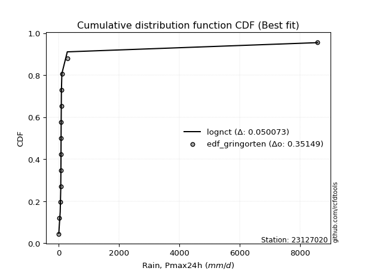</img></img>

</div>


### 9. Empirical - EDF Filliben (1975)

The specific values of the constants (0.3175) (often denoted as $alpha$) and (0.365) are derived from a method proposed by James J. Filliben in a 1975 paper. This particular formula is the mean value of the $i$-th order statistic of the normal distribution and is considered a robust and effective plotting position formula for the normal probability plot correlation coefficient test for normality.

<div align="center">


$P=(m-0.3175)/(n+0.365)$


</div>


**9.1. Empirical values**

<div align="center">

|                | 0                   | 1                   | 2                   | 3                   | 4                  | 5                  | 6                   | 7                  | 8                  | 9                  | 10                | 11                 | 12                 | 13                 |
|:---------------|:--------------------|:--------------------|:--------------------|:--------------------|:-------------------|:-------------------|:--------------------|:-------------------|:-------------------|:-------------------|:------------------|:-------------------|:-------------------|:-------------------|
| date           | 2020                | 2024                | 2025                | 2016                | 2019               | 2009               | 2018                | 2015               | 2014               | 2010               | 2013              | 2017               | 2011               | 2012               |
| x              | 0.8                 | 10.4                | 11.0                | 45.6                | 63.5               | 70.6               | 73.1                | 74.6               | 76.1               | 84.4               | 86.6              | 101.3              | 281.1              | 8576.4             |
| m              | 1                   | 2                   | 3                   | 4                   | 5                  | 6                  | 7                   | 8                  | 9                  | 10                 | 11                | 12                 | 13                 | 14                 |
| empirical_dist | edf_filliben        | edf_filliben        | edf_filliben        | edf_filliben        | edf_filliben       | edf_filliben       | edf_filliben        | edf_filliben       | edf_filliben       | edf_filliben       | edf_filliben      | edf_filliben       | edf_filliben       | edf_filliben       |
| empirical      | 0.04751131221719457 | 0.11712495649147234 | 0.18673860076575008 | 0.25635224504002785 | 0.3259658893143056 | 0.3955795335885834 | 0.46519317786286113 | 0.5348068221371389 | 0.6044204664114166 | 0.6740341106856943 | 0.743647754959972 | 0.8132613992342499 | 0.8828750435085276 | 0.9524886877828054 |
| empirical_tr   | 1.0498812351543945  | 1.132663118470333   | 1.2296169484271346  | 1.3447226772759187  | 1.4836044410018074 | 1.6544773970630582 | 1.8698340383989585  | 2.1496445940890387 | 2.5279366476022873 | 3.0678056593699936 | 3.900882552613712 | 5.355079217148182  | 8.537890044576521  | 21.047619047619023 |

</div>


**9.2. Kolmogorov-Smirnov fit test (sorted by Δ)**


<div align="center">

|                | 0                   | 1                   | 2                   | 3                   | 4                     | 5                   | 6                   | 7                   | 8                   | 9                   | 10                  | 11                  | 12                 | 13                  | 14                | 15                  | 16                  | 17                  | 18                  | 19                  | 20                  | 21                  | 22                  | 23                  | 24                  | 25                  | 26                  | 27                  | 28                 | 29                  | 30                  | 31                  | 32                  | 33                  | 34                 | 35                 | 36                  | 37                 | 38                  | 39                  | 40                  | 41                  | 42                  | 43                 | 44                  | 45                 | 46                 | 47                 | 48                  | 49                  | 50                 | 51                 | 52                  | 53                  | 54                  | 55                  | 56                  | 57                  | 58                  | 59                  | 60                  | 61                  | 62                  | 63                 | 64                 | 65                 | 66                 | 67                  | 68                  | 69                 | 70                 | 71                  | 72                 | 73                 | 74                  | 75                 | 76                | 77                 | 78                 | 79                 | 80                 | 81                 | 82                 | 83                 | 84                 | 85                 | 86                 | 87                 | 88                 | 89                 |
|:---------------|:--------------------|:--------------------|:--------------------|:--------------------|:----------------------|:--------------------|:--------------------|:--------------------|:--------------------|:--------------------|:--------------------|:--------------------|:-------------------|:--------------------|:------------------|:--------------------|:--------------------|:--------------------|:--------------------|:--------------------|:--------------------|:--------------------|:--------------------|:--------------------|:--------------------|:--------------------|:--------------------|:--------------------|:-------------------|:--------------------|:--------------------|:--------------------|:--------------------|:--------------------|:-------------------|:-------------------|:--------------------|:-------------------|:--------------------|:--------------------|:--------------------|:--------------------|:--------------------|:-------------------|:--------------------|:-------------------|:-------------------|:-------------------|:--------------------|:--------------------|:-------------------|:-------------------|:--------------------|:--------------------|:--------------------|:--------------------|:--------------------|:--------------------|:--------------------|:--------------------|:--------------------|:--------------------|:--------------------|:-------------------|:-------------------|:-------------------|:-------------------|:--------------------|:--------------------|:-------------------|:-------------------|:--------------------|:-------------------|:-------------------|:--------------------|:-------------------|:------------------|:-------------------|:-------------------|:-------------------|:-------------------|:-------------------|:-------------------|:-------------------|:-------------------|:-------------------|:-------------------|:-------------------|:-------------------|:-------------------|
| station        | 23127020            | 23127020            | 23127020            | 23127020            | 23127020              | 23127020            | 23127020            | 23127020            | 23127020            | 23127020            | 23127020            | 23127020            | 23127020           | 23127020            | 23127020          | 23127020            | 23127020            | 23127020            | 23127020            | 23127020            | 23127020            | 23127020            | 23127020            | 23127020            | 23127020            | 23127020            | 23127020            | 23127020            | 23127020           | 23127020            | 23127020            | 23127020            | 23127020            | 23127020            | 23127020           | 23127020           | 23127020            | 23127020           | 23127020            | 23127020            | 23127020            | 23127020            | 23127020            | 23127020           | 23127020            | 23127020           | 23127020           | 23127020           | 23127020            | 23127020            | 23127020           | 23127020           | 23127020            | 23127020            | 23127020            | 23127020            | 23127020            | 23127020            | 23127020            | 23127020            | 23127020            | 23127020            | 23127020            | 23127020           | 23127020           | 23127020           | 23127020           | 23127020            | 23127020            | 23127020           | 23127020           | 23127020            | 23127020           | 23127020           | 23127020            | 23127020           | 23127020          | 23127020           | 23127020           | 23127020           | 23127020           | 23127020           | 23127020           | 23127020           | 23127020           | 23127020           | 23127020           | 23127020           | 23127020           | 23127020           |
| empirical_dist | edf_filliben        | edf_filliben        | edf_filliben        | edf_filliben        | edf_filliben          | edf_filliben        | edf_filliben        | edf_filliben        | edf_filliben        | edf_filliben        | edf_filliben        | edf_filliben        | edf_filliben       | edf_filliben        | edf_filliben      | edf_filliben        | edf_filliben        | edf_filliben        | edf_filliben        | edf_filliben        | edf_filliben        | edf_filliben        | edf_filliben        | edf_filliben        | edf_filliben        | edf_filliben        | edf_filliben        | edf_filliben        | edf_filliben       | edf_filliben        | edf_filliben        | edf_filliben        | edf_filliben        | edf_filliben        | edf_filliben       | edf_filliben       | edf_filliben        | edf_filliben       | edf_filliben        | edf_filliben        | edf_filliben        | edf_filliben        | edf_filliben        | edf_filliben       | edf_filliben        | edf_filliben       | edf_filliben       | edf_filliben       | edf_filliben        | edf_filliben        | edf_filliben       | edf_filliben       | edf_filliben        | edf_filliben        | edf_filliben        | edf_filliben        | edf_filliben        | edf_filliben        | edf_filliben        | edf_filliben        | edf_filliben        | edf_filliben        | edf_filliben        | edf_filliben       | edf_filliben       | edf_filliben       | edf_filliben       | edf_filliben        | edf_filliben        | edf_filliben       | edf_filliben       | edf_filliben        | edf_filliben       | edf_filliben       | edf_filliben        | edf_filliben       | edf_filliben      | edf_filliben       | edf_filliben       | edf_filliben       | edf_filliben       | edf_filliben       | edf_filliben       | edf_filliben       | edf_filliben       | edf_filliben       | edf_filliben       | edf_filliben       | edf_filliben       | edf_filliben       |
| p_dist         | t                   | logjohnsonsu        | lognct              | logt                | loglaplace_asymmetric | alpha               | nct                 | loglaplace          | loggenlogistic      | logfisk             | invgamma            | pareto              | loghypsecant       | f                   | ncf               | logpearson3         | loginvgamma         | loglogistic         | logexponnorm        | loginvgauss         | logerlang           | loggamma            | loggamma            | loglognorm          | logalpha            | logfatiguelife      | logbetaprime        | lognakagami         | logrice            | logmaxwell          | logweibull_min      | johnsonsu           | logloggamma         | logcrystalball      | lognorm            | lognorm            | fisk                | betaprime          | lograyleigh         | loginvweibull       | mielke              | invgauss            | loggumbel_r         | logkstwobign       | loggompertz         | loghalfnorm        | logmoyal           | loggumbel_l        | loggenexpon         | loghalflogistic     | nakagami           | logwald            | logexpon            | logtruncnorm        | erlang              | loggibrat           | logchi2             | invweibull          | gumbel_r            | logncf              | fatiguelife         | moyal               | rayleigh            | halfnorm           | maxwell            | halflogistic       | logmielke          | gibrat              | crystalball         | genlogistic        | norm               | wald                | logistic           | hypsecant          | laplace             | logf               | kstwobign         | pearson3           | gumbel_l           | rice               | logpareto          | weibull_min        | gamma              | exponnorm          | laplace_asymmetric | expon              | genexpon           | gompertz           | truncnorm          | chi2               |
| delta          | 0.07124791161516787 | 0.09013908169346743 | 0.09034187524637331 | 0.10648583875245533 | 0.15605392719862965   | 0.17167785945486164 | 0.17620165633288376 | 0.17983966952429098 | 0.18097291763046475 | 0.18532629721863925 | 0.18636492234084356 | 0.19106393746525652 | 0.1914560564772475 | 0.19499838946017245 | 0.197242835443445 | 0.19745921488495422 | 0.19796259174077202 | 0.20189559381026012 | 0.20191993139294495 | 0.20310590178767524 | 0.20568705193651593 | 0.20583150659266913 | 0.20583150659266913 | 0.20636263284851997 | 0.20645283016497418 | 0.20676447880854254 | 0.20987033851116993 | 0.21004608052742235 | 0.2108852507086455 | 0.21331852507563093 | 0.21350668626629954 | 0.21381498939071875 | 0.21459003962294687 | 0.21463879708775602 | 0.2146388323737628 | 0.2146388323737628 | 0.22226033772892506 | 0.2228416938891873 | 0.22538744173521374 | 0.22870046015641504 | 0.23327943149528596 | 0.23332191244924427 | 0.24779413897015667 | 0.2538467928617645 | 0.25652283798295894 | 0.2594926416852362 | 0.2736162480428924 | 0.2746661808565537 | 0.27898878895317647 | 0.27915588469653896 | 0.2863226421563123 | 0.3454093961853979 | 0.34817973330458896 | 0.35226832963474786 | 0.36200966588128186 | 0.36927532763835746 | 0.37266771977444746 | 0.38753986867039303 | 0.39134867449029714 | 0.39483807482048483 | 0.40485339451207336 | 0.40655032939817154 | 0.40905135238058765 | 0.4107988626878867 | 0.4211950696889499 | 0.4233075197386922 | 0.4351811185146468 | 0.44281778776165504 | 0.45285557989493813 | 0.4546744239800519 | 0.4555850112959149 | 0.46097474032776736 | 0.4652253472740238 | 0.4732736830285758 | 0.49703836406456015 | 0.5028104784830997 | 0.521631849402026 | 0.5235515054874877 | 0.5244395232725665 | 0.5260028669597485 | 0.5273547015410727 | 0.5570719121172925 | 0.6734521850524869 | 0.6749194662772584 | 0.6761914796669938 | 0.6761947414113347 | 0.6765596448328997 | 0.6970607509199798 | 0.7216360371171201 | 0.7360046026079863 |
| deltao         | 0.343224222286      | 0.343224222286      | 0.343224222286      | 0.343224222286      | 0.343224222286        | 0.343224222286      | 0.343224222286      | 0.343224222286      | 0.343224222286      | 0.343224222286      | 0.343224222286      | 0.343224222286      | 0.343224222286     | 0.343224222286      | 0.343224222286    | 0.343224222286      | 0.343224222286      | 0.343224222286      | 0.343224222286      | 0.343224222286      | 0.343224222286      | 0.343224222286      | 0.343224222286      | 0.343224222286      | 0.343224222286      | 0.343224222286      | 0.343224222286      | 0.343224222286      | 0.343224222286     | 0.343224222286      | 0.343224222286      | 0.343224222286      | 0.343224222286      | 0.343224222286      | 0.343224222286     | 0.343224222286     | 0.343224222286      | 0.343224222286     | 0.343224222286      | 0.343224222286      | 0.343224222286      | 0.343224222286      | 0.343224222286      | 0.343224222286     | 0.343224222286      | 0.343224222286     | 0.343224222286     | 0.343224222286     | 0.343224222286      | 0.343224222286      | 0.343224222286     | 0.343224222286     | 0.343224222286      | 0.343224222286      | 0.343224222286      | 0.343224222286      | 0.343224222286      | 0.343224222286      | 0.343224222286      | 0.343224222286      | 0.343224222286      | 0.343224222286      | 0.343224222286      | 0.343224222286     | 0.343224222286     | 0.343224222286     | 0.343224222286     | 0.343224222286      | 0.343224222286      | 0.343224222286     | 0.343224222286     | 0.343224222286      | 0.343224222286     | 0.343224222286     | 0.343224222286      | 0.343224222286     | 0.343224222286    | 0.343224222286     | 0.343224222286     | 0.343224222286     | 0.343224222286     | 0.343224222286     | 0.343224222286     | 0.343224222286     | 0.343224222286     | 0.343224222286     | 0.343224222286     | 0.343224222286     | 0.343224222286     | 0.343224222286     |
| eval           | Δo > Δ              | Δo > Δ              | Δo > Δ              | Δo > Δ              | Δo > Δ                | Δo > Δ              | Δo > Δ              | Δo > Δ              | Δo > Δ              | Δo > Δ              | Δo > Δ              | Δo > Δ              | Δo > Δ             | Δo > Δ              | Δo > Δ            | Δo > Δ              | Δo > Δ              | Δo > Δ              | Δo > Δ              | Δo > Δ              | Δo > Δ              | Δo > Δ              | Δo > Δ              | Δo > Δ              | Δo > Δ              | Δo > Δ              | Δo > Δ              | Δo > Δ              | Δo > Δ             | Δo > Δ              | Δo > Δ              | Δo > Δ              | Δo > Δ              | Δo > Δ              | Δo > Δ             | Δo > Δ             | Δo > Δ              | Δo > Δ             | Δo > Δ              | Δo > Δ              | Δo > Δ              | Δo > Δ              | Δo > Δ              | Δo > Δ             | Δo > Δ              | Δo > Δ             | Δo > Δ             | Δo > Δ             | Δo > Δ              | Δo > Δ              | Δo > Δ             | Δo <= Δ            | Δo <= Δ             | Δo <= Δ             | Δo <= Δ             | Δo <= Δ             | Δo <= Δ             | Δo <= Δ             | Δo <= Δ             | Δo <= Δ             | Δo <= Δ             | Δo <= Δ             | Δo <= Δ             | Δo <= Δ            | Δo <= Δ            | Δo <= Δ            | Δo <= Δ            | Δo <= Δ             | Δo <= Δ             | Δo <= Δ            | Δo <= Δ            | Δo <= Δ             | Δo <= Δ            | Δo <= Δ            | Δo <= Δ             | Δo <= Δ            | Δo <= Δ           | Δo <= Δ            | Δo <= Δ            | Δo <= Δ            | Δo <= Δ            | Δo <= Δ            | Δo <= Δ            | Δo <= Δ            | Δo <= Δ            | Δo <= Δ            | Δo <= Δ            | Δo <= Δ            | Δo <= Δ            | Δo <= Δ            |
| fit            | 1                   | 1                   | 1                   | 1                   | 1                     | 1                   | 1                   | 1                   | 1                   | 1                   | 1                   | 1                   | 1                  | 1                   | 1                 | 1                   | 1                   | 1                   | 1                   | 1                   | 1                   | 1                   | 1                   | 1                   | 1                   | 1                   | 1                   | 1                   | 1                  | 1                   | 1                   | 1                   | 1                   | 1                   | 1                  | 1                  | 1                   | 1                  | 1                   | 1                   | 1                   | 1                   | 1                   | 1                  | 1                   | 1                  | 1                  | 1                  | 1                   | 1                   | 1                  | 0                  | 0                   | 0                   | 0                   | 0                   | 0                   | 0                   | 0                   | 0                   | 0                   | 0                   | 0                   | 0                  | 0                  | 0                  | 0                  | 0                   | 0                   | 0                  | 0                  | 0                   | 0                  | 0                  | 0                   | 0                  | 0                 | 0                  | 0                  | 0                  | 0                  | 0                  | 0                  | 0                  | 0                  | 0                  | 0                  | 0                  | 0                  | 0                  |
| n              | 14                  | 14                  | 14                  | 14                  | 14                    | 14                  | 14                  | 14                  | 14                  | 14                  | 14                  | 14                  | 14                 | 14                  | 14                | 14                  | 14                  | 14                  | 14                  | 14                  | 14                  | 14                  | 14                  | 14                  | 14                  | 14                  | 14                  | 14                  | 14                 | 14                  | 14                  | 14                  | 14                  | 14                  | 14                 | 14                 | 14                  | 14                 | 14                  | 14                  | 14                  | 14                  | 14                  | 14                 | 14                  | 14                 | 14                 | 14                 | 14                  | 14                  | 14                 | 14                 | 14                  | 14                  | 14                  | 14                  | 14                  | 14                  | 14                  | 14                  | 14                  | 14                  | 14                  | 14                 | 14                 | 14                 | 14                 | 14                  | 14                  | 14                 | 14                 | 14                  | 14                 | 14                 | 14                  | 14                 | 14                | 14                 | 14                 | 14                 | 14                 | 14                 | 14                 | 14                 | 14                 | 14                 | 14                 | 14                 | 14                 | 14                 |
| best_fit       | 1                   | 0                   | 0                   | 0                   | 0                     | 0                   | 0                   | 0                   | 0                   | 0                   | 0                   | 0                   | 0                  | 0                   | 0                 | 0                   | 0                   | 0                   | 0                   | 0                   | 0                   | 0                   | 0                   | 0                   | 0                   | 0                   | 0                   | 0                   | 0                  | 0                   | 0                   | 0                   | 0                   | 0                   | 0                  | 0                  | 0                   | 0                  | 0                   | 0                   | 0                   | 0                   | 0                   | 0                  | 0                   | 0                  | 0                  | 0                  | 0                   | 0                   | 0                  | 0                  | 0                   | 0                   | 0                   | 0                   | 0                   | 0                   | 0                   | 0                   | 0                   | 0                   | 0                   | 0                  | 0                  | 0                  | 0                  | 0                   | 0                   | 0                  | 0                  | 0                   | 0                  | 0                  | 0                   | 0                  | 0                 | 0                  | 0                  | 0                  | 0                  | 0                  | 0                  | 0                  | 0                  | 0                  | 0                  | 0                  | 0                  | 0                  |
| best_fit_sort  | 1                   | 2                   | 3                   | 4                   | 5                     | 6                   | 7                   | 8                   | 9                   | 10                  | 11                  | 12                  | 13                 | 14                  | 15                | 16                  | 17                  | 18                  | 19                  | 20                  | 21                  | 22                  | 23                  | 24                  | 25                  | 26                  | 27                  | 28                  | 29                 | 30                  | 31                  | 32                  | 33                  | 34                  | 35                 | 36                 | 37                  | 38                 | 39                  | 40                  | 41                  | 42                  | 43                  | 44                 | 45                  | 46                 | 47                 | 48                 | 49                  | 50                  | 51                 | 52                 | 53                  | 54                  | 55                  | 56                  | 57                  | 58                  | 59                  | 60                  | 61                  | 62                  | 63                  | 64                 | 65                 | 66                 | 67                 | 68                  | 69                  | 70                 | 71                 | 72                  | 73                 | 74                 | 75                  | 76                 | 77                | 78                 | 79                 | 80                 | 81                 | 82                 | 83                 | 84                 | 85                 | 86                 | 87                 | 88                 | 89                 | 90                 |

</div>


<div align="center">

</img>

</div>


**9.3. Best fit**

<div align="center">

|   id |   station | empirical_dist   | p_dist   |     delta |   deltao | eval   |   fit |   n |   best_fit |   best_fit_sort |
|-----:|----------:|:-----------------|:---------|----------:|---------:|:-------|------:|----:|-----------:|----------------:|
|    0 |  23127020 | edf_filliben     | t        | 0.0712479 | 0.343224 | Δo > Δ |     1 |  14 |          1 |               1 |

</div>


<div align="center">

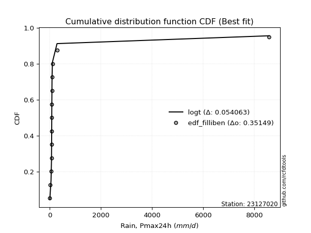</img>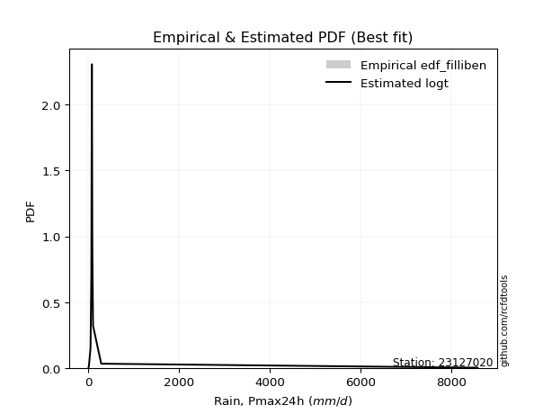</img>

</div>


### 10. Empirical - EDF Jenkinson (1977)

The Jenkinson formula in hydrology is an empirical plotting position formula used to estimate the non-exceedance probability _(P)_ or return period _(T)_ of a given ordered observation within a sample. It is a widely used method in the frequency analysis of extreme events such as floods and rainfall, as it provides a distribution-free way to plot data. _a≈0.31_ and _b≈0.38_ are constants derived to approximate the median of the probability distribution for the given rank.

<div align="center">


$P=(m-a)/(n+b)$


</div>


**10.1. Empirical values**

<div align="center">

|                | 0                   | 1                   | 2                  | 3                  | 4                   | 5                  | 6                   | 7                  | 8                  | 9                  | 10                 | 11                 | 12                 | 13                 |
|:---------------|:--------------------|:--------------------|:-------------------|:-------------------|:--------------------|:-------------------|:--------------------|:-------------------|:-------------------|:-------------------|:-------------------|:-------------------|:-------------------|:-------------------|
| date           | 2020                | 2024                | 2025               | 2016               | 2019                | 2009               | 2018                | 2015               | 2014               | 2010               | 2013               | 2017               | 2011               | 2012               |
| x              | 0.8                 | 10.4                | 11.0               | 45.6               | 63.5                | 70.6               | 73.1                | 74.6               | 76.1               | 84.4               | 86.6               | 101.3              | 281.1              | 8576.4             |
| m              | 1                   | 2                   | 3                  | 4                  | 5                   | 6                  | 7                   | 8                  | 9                  | 10                 | 11                 | 12                 | 13                 | 14                 |
| empirical_dist | edf_jenkinson       | edf_jenkinson       | edf_jenkinson      | edf_jenkinson      | edf_jenkinson       | edf_jenkinson      | edf_jenkinson       | edf_jenkinson      | edf_jenkinson      | edf_jenkinson      | edf_jenkinson      | edf_jenkinson      | edf_jenkinson      | edf_jenkinson      |
| empirical      | 0.04798331015299026 | 0.11752433936022252 | 0.1870653685674548 | 0.256606397774687  | 0.32614742698191934 | 0.3956884561891516 | 0.46522948539638387 | 0.5347705146036161 | 0.6043115438108483 | 0.6738525730180805 | 0.7433936022253128 | 0.8129346314325451 | 0.8824756606397773 | 0.9520166898470096 |
| empirical_tr   | 1.0504017531044558  | 1.1331757289204099  | 1.2301112061591104 | 1.3451824134705332 | 1.4840041279669762  | 1.6547756041426929 | 1.869960988296489   | 2.1494768310911807 | 2.527240773286467  | 3.066098081023453  | 3.8970189701897002 | 5.345724907063193  | 8.50887573964496   | 20.84057971014487  |

</div>


**10.2. Kolmogorov-Smirnov fit test (sorted by Δ)**


<div align="center">

|                | 0                   | 1                   | 2                   | 3                   | 4                     | 5                   | 6                   | 7                   | 8                 | 9                   | 10                  | 11                 | 12                  | 13                 | 14                  | 15                 | 16                  | 17                 | 18                 | 19                  | 20                 | 21                  | 22                  | 23                  | 24                | 25                  | 26                  | 27                  | 28                  | 29                  | 30                  | 31                  | 32                  | 33                 | 34                  | 35                  | 36                  | 37                  | 38                  | 39                  | 40                  | 41                 | 42                  | 43                 | 44                 | 45                  | 46                  | 47                 | 48                 | 49                 | 50                 | 51                  | 52                 | 53                 | 54                  | 55                 | 56                 | 57                  | 58                  | 59                  | 60                  | 61                 | 62                  | 63                | 64                 | 65                 | 66                 | 67                  | 68                 | 69                 | 70                 | 71                  | 72                 | 73                 | 74                  | 75                 | 76                 | 77                 | 78                 | 79                 | 80                 | 81                 | 82                 | 83                 | 84                 | 85                 | 86                 | 87                | 88                 | 89                 |
|:---------------|:--------------------|:--------------------|:--------------------|:--------------------|:----------------------|:--------------------|:--------------------|:--------------------|:------------------|:--------------------|:--------------------|:-------------------|:--------------------|:-------------------|:--------------------|:-------------------|:--------------------|:-------------------|:-------------------|:--------------------|:-------------------|:--------------------|:--------------------|:--------------------|:------------------|:--------------------|:--------------------|:--------------------|:--------------------|:--------------------|:--------------------|:--------------------|:--------------------|:-------------------|:--------------------|:--------------------|:--------------------|:--------------------|:--------------------|:--------------------|:--------------------|:-------------------|:--------------------|:-------------------|:-------------------|:--------------------|:--------------------|:-------------------|:-------------------|:-------------------|:-------------------|:--------------------|:-------------------|:-------------------|:--------------------|:-------------------|:-------------------|:--------------------|:--------------------|:--------------------|:--------------------|:-------------------|:--------------------|:------------------|:-------------------|:-------------------|:-------------------|:--------------------|:-------------------|:-------------------|:-------------------|:--------------------|:-------------------|:-------------------|:--------------------|:-------------------|:-------------------|:-------------------|:-------------------|:-------------------|:-------------------|:-------------------|:-------------------|:-------------------|:-------------------|:-------------------|:-------------------|:------------------|:-------------------|:-------------------|
| station        | 23127020            | 23127020            | 23127020            | 23127020            | 23127020              | 23127020            | 23127020            | 23127020            | 23127020          | 23127020            | 23127020            | 23127020           | 23127020            | 23127020           | 23127020            | 23127020           | 23127020            | 23127020           | 23127020           | 23127020            | 23127020           | 23127020            | 23127020            | 23127020            | 23127020          | 23127020            | 23127020            | 23127020            | 23127020            | 23127020            | 23127020            | 23127020            | 23127020            | 23127020           | 23127020            | 23127020            | 23127020            | 23127020            | 23127020            | 23127020            | 23127020            | 23127020           | 23127020            | 23127020           | 23127020           | 23127020            | 23127020            | 23127020           | 23127020           | 23127020           | 23127020           | 23127020            | 23127020           | 23127020           | 23127020            | 23127020           | 23127020           | 23127020            | 23127020            | 23127020            | 23127020            | 23127020           | 23127020            | 23127020          | 23127020           | 23127020           | 23127020           | 23127020            | 23127020           | 23127020           | 23127020           | 23127020            | 23127020           | 23127020           | 23127020            | 23127020           | 23127020           | 23127020           | 23127020           | 23127020           | 23127020           | 23127020           | 23127020           | 23127020           | 23127020           | 23127020           | 23127020           | 23127020          | 23127020           | 23127020           |
| empirical_dist | edf_jenkinson       | edf_jenkinson       | edf_jenkinson       | edf_jenkinson       | edf_jenkinson         | edf_jenkinson       | edf_jenkinson       | edf_jenkinson       | edf_jenkinson     | edf_jenkinson       | edf_jenkinson       | edf_jenkinson      | edf_jenkinson       | edf_jenkinson      | edf_jenkinson       | edf_jenkinson      | edf_jenkinson       | edf_jenkinson      | edf_jenkinson      | edf_jenkinson       | edf_jenkinson      | edf_jenkinson       | edf_jenkinson       | edf_jenkinson       | edf_jenkinson     | edf_jenkinson       | edf_jenkinson       | edf_jenkinson       | edf_jenkinson       | edf_jenkinson       | edf_jenkinson       | edf_jenkinson       | edf_jenkinson       | edf_jenkinson      | edf_jenkinson       | edf_jenkinson       | edf_jenkinson       | edf_jenkinson       | edf_jenkinson       | edf_jenkinson       | edf_jenkinson       | edf_jenkinson      | edf_jenkinson       | edf_jenkinson      | edf_jenkinson      | edf_jenkinson       | edf_jenkinson       | edf_jenkinson      | edf_jenkinson      | edf_jenkinson      | edf_jenkinson      | edf_jenkinson       | edf_jenkinson      | edf_jenkinson      | edf_jenkinson       | edf_jenkinson      | edf_jenkinson      | edf_jenkinson       | edf_jenkinson       | edf_jenkinson       | edf_jenkinson       | edf_jenkinson      | edf_jenkinson       | edf_jenkinson     | edf_jenkinson      | edf_jenkinson      | edf_jenkinson      | edf_jenkinson       | edf_jenkinson      | edf_jenkinson      | edf_jenkinson      | edf_jenkinson       | edf_jenkinson      | edf_jenkinson      | edf_jenkinson       | edf_jenkinson      | edf_jenkinson      | edf_jenkinson      | edf_jenkinson      | edf_jenkinson      | edf_jenkinson      | edf_jenkinson      | edf_jenkinson      | edf_jenkinson      | edf_jenkinson      | edf_jenkinson      | edf_jenkinson      | edf_jenkinson     | edf_jenkinson      | edf_jenkinson      |
| p_dist         | t                   | logjohnsonsu        | lognct              | logt                | loglaplace_asymmetric | alpha               | nct                 | loglaplace          | loggenlogistic    | logfisk             | invgamma            | pareto             | loghypsecant        | f                  | ncf                 | logpearson3        | loginvgamma         | loglogistic        | logexponnorm       | loginvgauss         | logerlang          | loggamma            | loggamma            | loglognorm          | logalpha          | logfatiguelife      | logbetaprime        | lognakagami         | logrice             | logmaxwell          | logweibull_min      | johnsonsu           | logloggamma         | logcrystalball     | lognorm             | lognorm             | fisk                | betaprime           | lograyleigh         | loginvweibull       | invgauss            | mielke             | loggumbel_r         | logkstwobign       | loggompertz        | loghalfnorm         | logmoyal            | loggumbel_l        | loggenexpon        | loghalflogistic    | nakagami           | logwald             | logexpon           | logtruncnorm       | erlang              | loggibrat          | logchi2            | invweibull          | gumbel_r            | logncf              | fatiguelife         | moyal              | rayleigh            | halfnorm          | maxwell            | halflogistic       | logmielke          | gibrat              | crystalball        | genlogistic        | norm               | wald                | logistic           | hypsecant          | laplace             | logf               | kstwobign          | pearson3           | gumbel_l           | rice               | logpareto          | weibull_min        | gamma              | exponnorm          | laplace_asymmetric | expon              | genexpon           | gompertz          | truncnorm          | chi2               |
| delta          | 0.07077591367937218 | 0.09046584949517214 | 0.09066864304807802 | 0.10681260655416004 | 0.15572715939692483   | 0.17149632178724789 | 0.17587488853117894 | 0.17965813185667723 | 0.180791379962851 | 0.18499952941693443 | 0.18603815453913874 | 0.1907371696635517 | 0.19112928867554269 | 0.1948168517925587 | 0.19706129777583126 | 0.1971324470832494 | 0.19770843900611285 | 0.2015688260085553 | 0.2017383937253312 | 0.20285174905301606 | 0.2053602841348111 | 0.20550473879096431 | 0.20550473879096431 | 0.20603586504681515 | 0.206198677430315 | 0.20643771100683772 | 0.20961618577651076 | 0.20971931272571753 | 0.21055848290694068 | 0.21306437234097175 | 0.21317991846459472 | 0.21348822158901393 | 0.21426327182124205 | 0.2143120292860512 | 0.21431206457205798 | 0.21431206457205798 | 0.22193356992722024 | 0.22251492608748247 | 0.22513328900055457 | 0.22844630742175587 | 0.23299514464753945 | 0.2330978938276722 | 0.24761260130254292 | 0.2535926401271053 | 0.2561960701812541 | 0.25923848895057705 | 0.27343471037527867 | 0.2743394130548489 | 0.2787346362185173 | 0.2789017319618798 | 0.2859958743546075 | 0.34522785851778415 | 0.3479255805699298 | 0.3520141769000887 | 0.36168289807957704 | 0.3690937899707437 | 0.3724135670397883 | 0.38714048580164284 | 0.39094929162154685 | 0.39443869195173464 | 0.40452662671036854 | 0.4060783314623758 | 0.40865196951183735 | 0.410326864752091 | 0.4207956868201996 | 0.4228355218028965 | 0.4347817356458966 | 0.44234578982585937 | 0.4523835819591424 | 0.4543476561783471 | 0.4551856284271646 | 0.46050274239197164 | 0.4648259644052735 | 0.4728743001598255 | 0.49663898119580985 | 0.5024110956143495 | 0.5212324665332757 | 0.5230795075516921 | 0.5240401404038162 | 0.5256034840909982 | 0.5269553186723225 | 0.5567451443155875 | 0.6731254172507821 | 0.6745926984755536 | 0.675864711865289  | 0.6758679736096299 | 0.6762328770311948 | 0.696733983118275 | 0.7213092693154153 | 0.7356778348062815 |
| deltao         | 0.343224222286      | 0.343224222286      | 0.343224222286      | 0.343224222286      | 0.343224222286        | 0.343224222286      | 0.343224222286      | 0.343224222286      | 0.343224222286    | 0.343224222286      | 0.343224222286      | 0.343224222286     | 0.343224222286      | 0.343224222286     | 0.343224222286      | 0.343224222286     | 0.343224222286      | 0.343224222286     | 0.343224222286     | 0.343224222286      | 0.343224222286     | 0.343224222286      | 0.343224222286      | 0.343224222286      | 0.343224222286    | 0.343224222286      | 0.343224222286      | 0.343224222286      | 0.343224222286      | 0.343224222286      | 0.343224222286      | 0.343224222286      | 0.343224222286      | 0.343224222286     | 0.343224222286      | 0.343224222286      | 0.343224222286      | 0.343224222286      | 0.343224222286      | 0.343224222286      | 0.343224222286      | 0.343224222286     | 0.343224222286      | 0.343224222286     | 0.343224222286     | 0.343224222286      | 0.343224222286      | 0.343224222286     | 0.343224222286     | 0.343224222286     | 0.343224222286     | 0.343224222286      | 0.343224222286     | 0.343224222286     | 0.343224222286      | 0.343224222286     | 0.343224222286     | 0.343224222286      | 0.343224222286      | 0.343224222286      | 0.343224222286      | 0.343224222286     | 0.343224222286      | 0.343224222286    | 0.343224222286     | 0.343224222286     | 0.343224222286     | 0.343224222286      | 0.343224222286     | 0.343224222286     | 0.343224222286     | 0.343224222286      | 0.343224222286     | 0.343224222286     | 0.343224222286      | 0.343224222286     | 0.343224222286     | 0.343224222286     | 0.343224222286     | 0.343224222286     | 0.343224222286     | 0.343224222286     | 0.343224222286     | 0.343224222286     | 0.343224222286     | 0.343224222286     | 0.343224222286     | 0.343224222286    | 0.343224222286     | 0.343224222286     |
| eval           | Δo > Δ              | Δo > Δ              | Δo > Δ              | Δo > Δ              | Δo > Δ                | Δo > Δ              | Δo > Δ              | Δo > Δ              | Δo > Δ            | Δo > Δ              | Δo > Δ              | Δo > Δ             | Δo > Δ              | Δo > Δ             | Δo > Δ              | Δo > Δ             | Δo > Δ              | Δo > Δ             | Δo > Δ             | Δo > Δ              | Δo > Δ             | Δo > Δ              | Δo > Δ              | Δo > Δ              | Δo > Δ            | Δo > Δ              | Δo > Δ              | Δo > Δ              | Δo > Δ              | Δo > Δ              | Δo > Δ              | Δo > Δ              | Δo > Δ              | Δo > Δ             | Δo > Δ              | Δo > Δ              | Δo > Δ              | Δo > Δ              | Δo > Δ              | Δo > Δ              | Δo > Δ              | Δo > Δ             | Δo > Δ              | Δo > Δ             | Δo > Δ             | Δo > Δ              | Δo > Δ              | Δo > Δ             | Δo > Δ             | Δo > Δ             | Δo > Δ             | Δo <= Δ             | Δo <= Δ            | Δo <= Δ            | Δo <= Δ             | Δo <= Δ            | Δo <= Δ            | Δo <= Δ             | Δo <= Δ             | Δo <= Δ             | Δo <= Δ             | Δo <= Δ            | Δo <= Δ             | Δo <= Δ           | Δo <= Δ            | Δo <= Δ            | Δo <= Δ            | Δo <= Δ             | Δo <= Δ            | Δo <= Δ            | Δo <= Δ            | Δo <= Δ             | Δo <= Δ            | Δo <= Δ            | Δo <= Δ             | Δo <= Δ            | Δo <= Δ            | Δo <= Δ            | Δo <= Δ            | Δo <= Δ            | Δo <= Δ            | Δo <= Δ            | Δo <= Δ            | Δo <= Δ            | Δo <= Δ            | Δo <= Δ            | Δo <= Δ            | Δo <= Δ           | Δo <= Δ            | Δo <= Δ            |
| fit            | 1                   | 1                   | 1                   | 1                   | 1                     | 1                   | 1                   | 1                   | 1                 | 1                   | 1                   | 1                  | 1                   | 1                  | 1                   | 1                  | 1                   | 1                  | 1                  | 1                   | 1                  | 1                   | 1                   | 1                   | 1                 | 1                   | 1                   | 1                   | 1                   | 1                   | 1                   | 1                   | 1                   | 1                  | 1                   | 1                   | 1                   | 1                   | 1                   | 1                   | 1                   | 1                  | 1                   | 1                  | 1                  | 1                   | 1                   | 1                  | 1                  | 1                  | 1                  | 0                   | 0                  | 0                  | 0                   | 0                  | 0                  | 0                   | 0                   | 0                   | 0                   | 0                  | 0                   | 0                 | 0                  | 0                  | 0                  | 0                   | 0                  | 0                  | 0                  | 0                   | 0                  | 0                  | 0                   | 0                  | 0                  | 0                  | 0                  | 0                  | 0                  | 0                  | 0                  | 0                  | 0                  | 0                  | 0                  | 0                 | 0                  | 0                  |
| n              | 14                  | 14                  | 14                  | 14                  | 14                    | 14                  | 14                  | 14                  | 14                | 14                  | 14                  | 14                 | 14                  | 14                 | 14                  | 14                 | 14                  | 14                 | 14                 | 14                  | 14                 | 14                  | 14                  | 14                  | 14                | 14                  | 14                  | 14                  | 14                  | 14                  | 14                  | 14                  | 14                  | 14                 | 14                  | 14                  | 14                  | 14                  | 14                  | 14                  | 14                  | 14                 | 14                  | 14                 | 14                 | 14                  | 14                  | 14                 | 14                 | 14                 | 14                 | 14                  | 14                 | 14                 | 14                  | 14                 | 14                 | 14                  | 14                  | 14                  | 14                  | 14                 | 14                  | 14                | 14                 | 14                 | 14                 | 14                  | 14                 | 14                 | 14                 | 14                  | 14                 | 14                 | 14                  | 14                 | 14                 | 14                 | 14                 | 14                 | 14                 | 14                 | 14                 | 14                 | 14                 | 14                 | 14                 | 14                | 14                 | 14                 |
| best_fit       | 1                   | 0                   | 0                   | 0                   | 0                     | 0                   | 0                   | 0                   | 0                 | 0                   | 0                   | 0                  | 0                   | 0                  | 0                   | 0                  | 0                   | 0                  | 0                  | 0                   | 0                  | 0                   | 0                   | 0                   | 0                 | 0                   | 0                   | 0                   | 0                   | 0                   | 0                   | 0                   | 0                   | 0                  | 0                   | 0                   | 0                   | 0                   | 0                   | 0                   | 0                   | 0                  | 0                   | 0                  | 0                  | 0                   | 0                   | 0                  | 0                  | 0                  | 0                  | 0                   | 0                  | 0                  | 0                   | 0                  | 0                  | 0                   | 0                   | 0                   | 0                   | 0                  | 0                   | 0                 | 0                  | 0                  | 0                  | 0                   | 0                  | 0                  | 0                  | 0                   | 0                  | 0                  | 0                   | 0                  | 0                  | 0                  | 0                  | 0                  | 0                  | 0                  | 0                  | 0                  | 0                  | 0                  | 0                  | 0                 | 0                  | 0                  |
| best_fit_sort  | 1                   | 2                   | 3                   | 4                   | 5                     | 6                   | 7                   | 8                   | 9                 | 10                  | 11                  | 12                 | 13                  | 14                 | 15                  | 16                 | 17                  | 18                 | 19                 | 20                  | 21                 | 22                  | 23                  | 24                  | 25                | 26                  | 27                  | 28                  | 29                  | 30                  | 31                  | 32                  | 33                  | 34                 | 35                  | 36                  | 37                  | 38                  | 39                  | 40                  | 41                  | 42                 | 43                  | 44                 | 45                 | 46                  | 47                  | 48                 | 49                 | 50                 | 51                 | 52                  | 53                 | 54                 | 55                  | 56                 | 57                 | 58                  | 59                  | 60                  | 61                  | 62                 | 63                  | 64                | 65                 | 66                 | 67                 | 68                  | 69                 | 70                 | 71                 | 72                  | 73                 | 74                 | 75                  | 76                 | 77                 | 78                 | 79                 | 80                 | 81                 | 82                 | 83                 | 84                 | 85                 | 86                 | 87                 | 88                | 89                 | 90                 |

</div>


<div align="center">

</img>

</div>


**10.3. Best fit**

<div align="center">

|   id |   station | empirical_dist   | p_dist   |     delta |   deltao | eval   |   fit |   n |   best_fit |   best_fit_sort |
|-----:|----------:|:-----------------|:---------|----------:|---------:|:-------|------:|----:|-----------:|----------------:|
|    0 |  23127020 | edf_jenkinson    | t        | 0.0707759 | 0.343224 | Δo > Δ |     1 |  14 |          1 |               1 |

</div>


<div align="center">

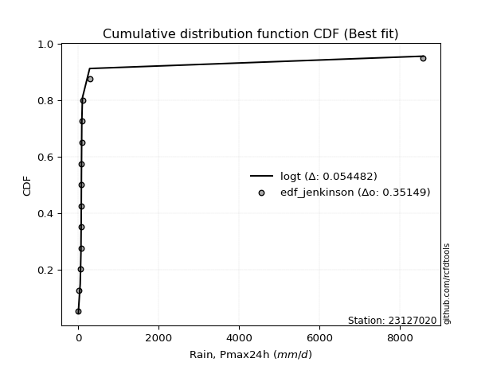</img></img>

</div>


### 11. Empirical - EDF Cunnane (1978)

Cunnane´s work in statistical hydrology has focused on the performance and evaluation of different probability distributions (such as GEV, Gumbel, Lognormal) for flood frequency estimation. _b_ is a constant, typically set to 0.4.

<div align="center">


$P=(m-b)/(n+1-2b)$


</div>


**11.1. Empirical values**

<div align="center">

|                | 0                   | 1                   | 2                   | 3                  | 4                  | 5                   | 6                  | 7                  | 8                  | 9                  | 10                 | 11                 | 12                 | 13                 |
|:---------------|:--------------------|:--------------------|:--------------------|:-------------------|:-------------------|:--------------------|:-------------------|:-------------------|:-------------------|:-------------------|:-------------------|:-------------------|:-------------------|:-------------------|
| date           | 2020                | 2024                | 2025                | 2016               | 2019               | 2009                | 2018               | 2015               | 2014               | 2010               | 2013               | 2017               | 2011               | 2012               |
| x              | 0.8                 | 10.4                | 11.0                | 45.6               | 63.5               | 70.6                | 73.1               | 74.6               | 76.1               | 84.4               | 86.6               | 101.3              | 281.1              | 8576.4             |
| m              | 1                   | 2                   | 3                   | 4                  | 5                  | 6                   | 7                  | 8                  | 9                  | 10                 | 11                 | 12                 | 13                 | 14                 |
| empirical_dist | edf_cunnane         | edf_cunnane         | edf_cunnane         | edf_cunnane        | edf_cunnane        | edf_cunnane         | edf_cunnane        | edf_cunnane        | edf_cunnane        | edf_cunnane        | edf_cunnane        | edf_cunnane        | edf_cunnane        | edf_cunnane        |
| empirical      | 0.04225352112676056 | 0.11267605633802819 | 0.18309859154929578 | 0.2535211267605634 | 0.323943661971831  | 0.39436619718309857 | 0.4647887323943662 | 0.5352112676056338 | 0.6056338028169014 | 0.676056338028169  | 0.7464788732394366 | 0.8169014084507042 | 0.8873239436619719 | 0.9577464788732395 |
| empirical_tr   | 1.0441176470588234  | 1.126984126984127   | 1.2241379310344827  | 1.3396226415094339 | 1.4791666666666667 | 1.6511627906976742  | 1.8684210526315792 | 2.1515151515151514 | 2.5357142857142856 | 3.0869565217391304 | 3.9444444444444446 | 5.461538461538463  | 8.875000000000004  | 23.6666666666667   |

</div>


**11.2. Kolmogorov-Smirnov fit test (sorted by Δ)**


<div align="center">

|                | 0                   | 1                   | 2                   | 3                   | 4                     | 5                   | 6                   | 7                   | 8                   | 9                  | 10                  | 11                  | 12                  | 13                  | 14                 | 15                 | 16                  | 17                  | 18                  | 19                 | 20                  | 21                  | 22                 | 23                 | 24                  | 25                 | 26                 | 27                 | 28                  | 29                 | 30                 | 31                 | 32                  | 33                  | 34                  | 35                  | 36                  | 37                  | 38                  | 39                  | 40                  | 41                  | 42                  | 43                  | 44                 | 45                 | 46                | 47                  | 48                  | 49                  | 50                  | 51                 | 52                  | 53                  | 54                 | 55                  | 56                  | 57                 | 58                 | 59                | 60                 | 61                  | 62                 | 63                 | 64                 | 65                 | 66                | 67                  | 68                  | 69                 | 70                 | 71                  | 72                  | 73                  | 74                 | 75                 | 76                 | 77                 | 78                 | 79                 | 80                 | 81                 | 82                 | 83                 | 84                 | 85                 | 86                | 87                 | 88                 | 89                 |
|:---------------|:--------------------|:--------------------|:--------------------|:--------------------|:----------------------|:--------------------|:--------------------|:--------------------|:--------------------|:-------------------|:--------------------|:--------------------|:--------------------|:--------------------|:-------------------|:-------------------|:--------------------|:--------------------|:--------------------|:-------------------|:--------------------|:--------------------|:-------------------|:-------------------|:--------------------|:-------------------|:-------------------|:-------------------|:--------------------|:-------------------|:-------------------|:-------------------|:--------------------|:--------------------|:--------------------|:--------------------|:--------------------|:--------------------|:--------------------|:--------------------|:--------------------|:--------------------|:--------------------|:--------------------|:-------------------|:-------------------|:------------------|:--------------------|:--------------------|:--------------------|:--------------------|:-------------------|:--------------------|:--------------------|:-------------------|:--------------------|:--------------------|:-------------------|:-------------------|:------------------|:-------------------|:--------------------|:-------------------|:-------------------|:-------------------|:-------------------|:------------------|:--------------------|:--------------------|:-------------------|:-------------------|:--------------------|:--------------------|:--------------------|:-------------------|:-------------------|:-------------------|:-------------------|:-------------------|:-------------------|:-------------------|:-------------------|:-------------------|:-------------------|:-------------------|:-------------------|:------------------|:-------------------|:-------------------|:-------------------|
| station        | 23127020            | 23127020            | 23127020            | 23127020            | 23127020              | 23127020            | 23127020            | 23127020            | 23127020            | 23127020           | 23127020            | 23127020            | 23127020            | 23127020            | 23127020           | 23127020           | 23127020            | 23127020            | 23127020            | 23127020           | 23127020            | 23127020            | 23127020           | 23127020           | 23127020            | 23127020           | 23127020           | 23127020           | 23127020            | 23127020           | 23127020           | 23127020           | 23127020            | 23127020            | 23127020            | 23127020            | 23127020            | 23127020            | 23127020            | 23127020            | 23127020            | 23127020            | 23127020            | 23127020            | 23127020           | 23127020           | 23127020          | 23127020            | 23127020            | 23127020            | 23127020            | 23127020           | 23127020            | 23127020            | 23127020           | 23127020            | 23127020            | 23127020           | 23127020           | 23127020          | 23127020           | 23127020            | 23127020           | 23127020           | 23127020           | 23127020           | 23127020          | 23127020            | 23127020            | 23127020           | 23127020           | 23127020            | 23127020            | 23127020            | 23127020           | 23127020           | 23127020           | 23127020           | 23127020           | 23127020           | 23127020           | 23127020           | 23127020           | 23127020           | 23127020           | 23127020           | 23127020          | 23127020           | 23127020           | 23127020           |
| empirical_dist | edf_cunnane         | edf_cunnane         | edf_cunnane         | edf_cunnane         | edf_cunnane           | edf_cunnane         | edf_cunnane         | edf_cunnane         | edf_cunnane         | edf_cunnane        | edf_cunnane         | edf_cunnane         | edf_cunnane         | edf_cunnane         | edf_cunnane        | edf_cunnane        | edf_cunnane         | edf_cunnane         | edf_cunnane         | edf_cunnane        | edf_cunnane         | edf_cunnane         | edf_cunnane        | edf_cunnane        | edf_cunnane         | edf_cunnane        | edf_cunnane        | edf_cunnane        | edf_cunnane         | edf_cunnane        | edf_cunnane        | edf_cunnane        | edf_cunnane         | edf_cunnane         | edf_cunnane         | edf_cunnane         | edf_cunnane         | edf_cunnane         | edf_cunnane         | edf_cunnane         | edf_cunnane         | edf_cunnane         | edf_cunnane         | edf_cunnane         | edf_cunnane        | edf_cunnane        | edf_cunnane       | edf_cunnane         | edf_cunnane         | edf_cunnane         | edf_cunnane         | edf_cunnane        | edf_cunnane         | edf_cunnane         | edf_cunnane        | edf_cunnane         | edf_cunnane         | edf_cunnane        | edf_cunnane        | edf_cunnane       | edf_cunnane        | edf_cunnane         | edf_cunnane        | edf_cunnane        | edf_cunnane        | edf_cunnane        | edf_cunnane       | edf_cunnane         | edf_cunnane         | edf_cunnane        | edf_cunnane        | edf_cunnane         | edf_cunnane         | edf_cunnane         | edf_cunnane        | edf_cunnane        | edf_cunnane        | edf_cunnane        | edf_cunnane        | edf_cunnane        | edf_cunnane        | edf_cunnane        | edf_cunnane        | edf_cunnane        | edf_cunnane        | edf_cunnane        | edf_cunnane       | edf_cunnane        | edf_cunnane        | edf_cunnane        |
| p_dist         | t                   | logjohnsonsu        | lognct              | logt                | loglaplace_asymmetric | alpha               | nct                 | loglaplace          | loggenlogistic      | logfisk            | invgamma            | pareto              | loghypsecant        | f                   | ncf                | loginvgamma        | logpearson3         | logexponnorm        | loglogistic         | loginvgauss        | logalpha            | logerlang           | loggamma           | loggamma           | loglognorm          | logfatiguelife     | logbetaprime       | lognakagami        | logrice             | logmaxwell         | logweibull_min     | johnsonsu          | logloggamma         | logcrystalball      | lognorm             | lognorm             | fisk                | betaprime           | lograyleigh         | loginvweibull       | mielke              | invgauss            | loggumbel_r         | logkstwobign        | loggompertz        | loghalfnorm        | logmoyal          | loggumbel_l         | loggenexpon         | loghalflogistic     | nakagami            | logwald            | logexpon            | logtruncnorm        | erlang             | loggibrat           | logchi2             | invweibull         | gumbel_r           | logncf            | fatiguelife        | moyal               | rayleigh           | halfnorm           | maxwell            | halflogistic       | logmielke         | gibrat              | crystalball         | genlogistic        | norm               | wald                | logistic            | hypsecant           | laplace            | logf               | kstwobign          | pearson3           | gumbel_l           | rice               | logpareto          | weibull_min        | gamma              | exponnorm          | laplace_asymmetric | expon              | genexpon          | gompertz           | truncnorm          | chi2               |
| delta          | 0.07650570270560188 | 0.08649907247701313 | 0.08670186602991901 | 0.10284582953600103 | 0.159693936415084     | 0.17370008679733623 | 0.17984166554933811 | 0.18186189686676557 | 0.18443022227006345 | 0.1889663064350936 | 0.19000493155729792 | 0.19470394668171087 | 0.19509606569370186 | 0.19702061680264704 | 0.1992650627859196 | 0.2007937100202365 | 0.20109922410140857 | 0.20394215873541954 | 0.20553560302671448 | 0.2059370200671397 | 0.20928394844443865 | 0.20932706115297028 | 0.2094715158091235 | 0.2094715158091235 | 0.21000264206497432 | 0.2104044880249969 | 0.2127014567906344 | 0.2136860897438767 | 0.21452525992509985 | 0.2161496433550954 | 0.2171466954827539 | 0.2174549986071731 | 0.21823004883940123 | 0.21827880630421037 | 0.21827884159021715 | 0.21827884159021715 | 0.22590034694537942 | 0.22648170310564164 | 0.22821856001467822 | 0.23153157843587951 | 0.23530165883776055 | 0.23696192166569863 | 0.24981636631263127 | 0.25667791114122895 | 0.2601628471994133 | 0.2623237599647007 | 0.275638475385367 | 0.27830619007300805 | 0.28181990723264094 | 0.28198700297600343 | 0.28996265137276667 | 0.3474316235278725 | 0.35101085158405343 | 0.35509944791421233 | 0.3656496750977362 | 0.37129755498083206 | 0.37549883805391193 | 0.3919887688238372 | 0.3957975746437414 | 0.399286974973929 | 0.4084934037285277 | 0.41180812048860554 | 0.4135002525340319 | 0.4160566537783207 | 0.4256439698423941 | 0.4285653108291262 | 0.439630018668091 | 0.44807557885208904 | 0.45811337098537214 | 0.4583144331965063 | 0.4600339114493591 | 0.46623253141820137 | 0.46967424742746805 | 0.47772258318202004 | 0.5014872642180044 | 0.5072593786365438 | 0.5260807495554702 | 0.5288092965779219 | 0.5288884234260107 | 0.5304517671131928 | 0.5318036016945169 | 0.5607119213337468 | 0.6770921942689413 | 0.6785594754937128 | 0.6798314888834481 | 0.6798347506277891 | 0.680199654049354 | 0.7007007601364341 | 0.7252760463335745 | 0.7396446118244406 |
| deltao         | 0.343224222286      | 0.343224222286      | 0.343224222286      | 0.343224222286      | 0.343224222286        | 0.343224222286      | 0.343224222286      | 0.343224222286      | 0.343224222286      | 0.343224222286     | 0.343224222286      | 0.343224222286      | 0.343224222286      | 0.343224222286      | 0.343224222286     | 0.343224222286     | 0.343224222286      | 0.343224222286      | 0.343224222286      | 0.343224222286     | 0.343224222286      | 0.343224222286      | 0.343224222286     | 0.343224222286     | 0.343224222286      | 0.343224222286     | 0.343224222286     | 0.343224222286     | 0.343224222286      | 0.343224222286     | 0.343224222286     | 0.343224222286     | 0.343224222286      | 0.343224222286      | 0.343224222286      | 0.343224222286      | 0.343224222286      | 0.343224222286      | 0.343224222286      | 0.343224222286      | 0.343224222286      | 0.343224222286      | 0.343224222286      | 0.343224222286      | 0.343224222286     | 0.343224222286     | 0.343224222286    | 0.343224222286      | 0.343224222286      | 0.343224222286      | 0.343224222286      | 0.343224222286     | 0.343224222286      | 0.343224222286      | 0.343224222286     | 0.343224222286      | 0.343224222286      | 0.343224222286     | 0.343224222286     | 0.343224222286    | 0.343224222286     | 0.343224222286      | 0.343224222286     | 0.343224222286     | 0.343224222286     | 0.343224222286     | 0.343224222286    | 0.343224222286      | 0.343224222286      | 0.343224222286     | 0.343224222286     | 0.343224222286      | 0.343224222286      | 0.343224222286      | 0.343224222286     | 0.343224222286     | 0.343224222286     | 0.343224222286     | 0.343224222286     | 0.343224222286     | 0.343224222286     | 0.343224222286     | 0.343224222286     | 0.343224222286     | 0.343224222286     | 0.343224222286     | 0.343224222286    | 0.343224222286     | 0.343224222286     | 0.343224222286     |
| eval           | Δo > Δ              | Δo > Δ              | Δo > Δ              | Δo > Δ              | Δo > Δ                | Δo > Δ              | Δo > Δ              | Δo > Δ              | Δo > Δ              | Δo > Δ             | Δo > Δ              | Δo > Δ              | Δo > Δ              | Δo > Δ              | Δo > Δ             | Δo > Δ             | Δo > Δ              | Δo > Δ              | Δo > Δ              | Δo > Δ             | Δo > Δ              | Δo > Δ              | Δo > Δ             | Δo > Δ             | Δo > Δ              | Δo > Δ             | Δo > Δ             | Δo > Δ             | Δo > Δ              | Δo > Δ             | Δo > Δ             | Δo > Δ             | Δo > Δ              | Δo > Δ              | Δo > Δ              | Δo > Δ              | Δo > Δ              | Δo > Δ              | Δo > Δ              | Δo > Δ              | Δo > Δ              | Δo > Δ              | Δo > Δ              | Δo > Δ              | Δo > Δ             | Δo > Δ             | Δo > Δ            | Δo > Δ              | Δo > Δ              | Δo > Δ              | Δo > Δ              | Δo <= Δ            | Δo <= Δ             | Δo <= Δ             | Δo <= Δ            | Δo <= Δ             | Δo <= Δ             | Δo <= Δ            | Δo <= Δ            | Δo <= Δ           | Δo <= Δ            | Δo <= Δ             | Δo <= Δ            | Δo <= Δ            | Δo <= Δ            | Δo <= Δ            | Δo <= Δ           | Δo <= Δ             | Δo <= Δ             | Δo <= Δ            | Δo <= Δ            | Δo <= Δ             | Δo <= Δ             | Δo <= Δ             | Δo <= Δ            | Δo <= Δ            | Δo <= Δ            | Δo <= Δ            | Δo <= Δ            | Δo <= Δ            | Δo <= Δ            | Δo <= Δ            | Δo <= Δ            | Δo <= Δ            | Δo <= Δ            | Δo <= Δ            | Δo <= Δ           | Δo <= Δ            | Δo <= Δ            | Δo <= Δ            |
| fit            | 1                   | 1                   | 1                   | 1                   | 1                     | 1                   | 1                   | 1                   | 1                   | 1                  | 1                   | 1                   | 1                   | 1                   | 1                  | 1                  | 1                   | 1                   | 1                   | 1                  | 1                   | 1                   | 1                  | 1                  | 1                   | 1                  | 1                  | 1                  | 1                   | 1                  | 1                  | 1                  | 1                   | 1                   | 1                   | 1                   | 1                   | 1                   | 1                   | 1                   | 1                   | 1                   | 1                   | 1                   | 1                  | 1                  | 1                 | 1                   | 1                   | 1                   | 1                   | 0                  | 0                   | 0                   | 0                  | 0                   | 0                   | 0                  | 0                  | 0                 | 0                  | 0                   | 0                  | 0                  | 0                  | 0                  | 0                 | 0                   | 0                   | 0                  | 0                  | 0                   | 0                   | 0                   | 0                  | 0                  | 0                  | 0                  | 0                  | 0                  | 0                  | 0                  | 0                  | 0                  | 0                  | 0                  | 0                 | 0                  | 0                  | 0                  |
| n              | 14                  | 14                  | 14                  | 14                  | 14                    | 14                  | 14                  | 14                  | 14                  | 14                 | 14                  | 14                  | 14                  | 14                  | 14                 | 14                 | 14                  | 14                  | 14                  | 14                 | 14                  | 14                  | 14                 | 14                 | 14                  | 14                 | 14                 | 14                 | 14                  | 14                 | 14                 | 14                 | 14                  | 14                  | 14                  | 14                  | 14                  | 14                  | 14                  | 14                  | 14                  | 14                  | 14                  | 14                  | 14                 | 14                 | 14                | 14                  | 14                  | 14                  | 14                  | 14                 | 14                  | 14                  | 14                 | 14                  | 14                  | 14                 | 14                 | 14                | 14                 | 14                  | 14                 | 14                 | 14                 | 14                 | 14                | 14                  | 14                  | 14                 | 14                 | 14                  | 14                  | 14                  | 14                 | 14                 | 14                 | 14                 | 14                 | 14                 | 14                 | 14                 | 14                 | 14                 | 14                 | 14                 | 14                | 14                 | 14                 | 14                 |
| best_fit       | 1                   | 0                   | 0                   | 0                   | 0                     | 0                   | 0                   | 0                   | 0                   | 0                  | 0                   | 0                   | 0                   | 0                   | 0                  | 0                  | 0                   | 0                   | 0                   | 0                  | 0                   | 0                   | 0                  | 0                  | 0                   | 0                  | 0                  | 0                  | 0                   | 0                  | 0                  | 0                  | 0                   | 0                   | 0                   | 0                   | 0                   | 0                   | 0                   | 0                   | 0                   | 0                   | 0                   | 0                   | 0                  | 0                  | 0                 | 0                   | 0                   | 0                   | 0                   | 0                  | 0                   | 0                   | 0                  | 0                   | 0                   | 0                  | 0                  | 0                 | 0                  | 0                   | 0                  | 0                  | 0                  | 0                  | 0                 | 0                   | 0                   | 0                  | 0                  | 0                   | 0                   | 0                   | 0                  | 0                  | 0                  | 0                  | 0                  | 0                  | 0                  | 0                  | 0                  | 0                  | 0                  | 0                  | 0                 | 0                  | 0                  | 0                  |
| best_fit_sort  | 1                   | 2                   | 3                   | 4                   | 5                     | 6                   | 7                   | 8                   | 9                   | 10                 | 11                  | 12                  | 13                  | 14                  | 15                 | 16                 | 17                  | 18                  | 19                  | 20                 | 21                  | 22                  | 23                 | 24                 | 25                  | 26                 | 27                 | 28                 | 29                  | 30                 | 31                 | 32                 | 33                  | 34                  | 35                  | 36                  | 37                  | 38                  | 39                  | 40                  | 41                  | 42                  | 43                  | 44                  | 45                 | 46                 | 47                | 48                  | 49                  | 50                  | 51                  | 52                 | 53                  | 54                  | 55                 | 56                  | 57                  | 58                 | 59                 | 60                | 61                 | 62                  | 63                 | 64                 | 65                 | 66                 | 67                | 68                  | 69                  | 70                 | 71                 | 72                  | 73                  | 74                  | 75                 | 76                 | 77                 | 78                 | 79                 | 80                 | 81                 | 82                 | 83                 | 84                 | 85                 | 86                 | 87                | 88                 | 89                 | 90                 |

</div>


<div align="center">

</img>

</div>


**11.3. Best fit**

<div align="center">

|   id |   station | empirical_dist   | p_dist   |     delta |   deltao | eval   |   fit |   n |   best_fit |   best_fit_sort |
|-----:|----------:|:-----------------|:---------|----------:|---------:|:-------|------:|----:|-----------:|----------------:|
|    0 |  23127020 | edf_cunnane      | t        | 0.0765057 | 0.343224 | Δo > Δ |     1 |  14 |          1 |               1 |

</div>


<div align="center">

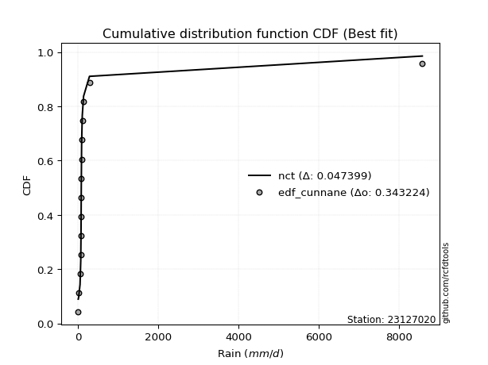</img>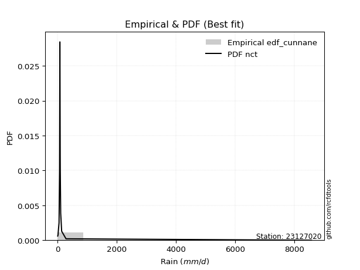</img>

</div>


### 12. Empirical - EDF Adamowski (1981)

The Adamowski formula in hydrology refers to a specific plotting position formula used for estimating the non-parametric empirical distribution of hydrological events (like flood peaks) to calculate their return periods. This formula provides an alternative to traditional parametric methods (like the Gumbel or Log Pearson Type III distributions). 

<div align="center">


$P=(m-0.25)/(n+0.5)$


</div>


**12.1. Empirical values**

<div align="center">

|                | 0                   | 1                  | 2                  | 3                   | 4                  | 5                   | 6                   | 7                  | 8                  | 9                  | 10                 | 11                 | 12                 | 13                 |
|:---------------|:--------------------|:-------------------|:-------------------|:--------------------|:-------------------|:--------------------|:--------------------|:-------------------|:-------------------|:-------------------|:-------------------|:-------------------|:-------------------|:-------------------|
| date           | 2020                | 2024               | 2025               | 2016                | 2019               | 2009                | 2018                | 2015               | 2014               | 2010               | 2013               | 2017               | 2011               | 2012               |
| x              | 0.8                 | 10.4               | 11.0               | 45.6                | 63.5               | 70.6                | 73.1                | 74.6               | 76.1               | 84.4               | 86.6               | 101.3              | 281.1              | 8576.4             |
| m              | 1                   | 2                  | 3                  | 4                   | 5                  | 6                   | 7                   | 8                  | 9                  | 10                 | 11                 | 12                 | 13                 | 14                 |
| empirical_dist | edf_adamowski       | edf_adamowski      | edf_adamowski      | edf_adamowski       | edf_adamowski      | edf_adamowski       | edf_adamowski       | edf_adamowski      | edf_adamowski      | edf_adamowski      | edf_adamowski      | edf_adamowski      | edf_adamowski      | edf_adamowski      |
| empirical      | 0.05172413793103448 | 0.1206896551724138 | 0.1896551724137931 | 0.25862068965517243 | 0.3275862068965517 | 0.39655172413793105 | 0.46551724137931033 | 0.5344827586206896 | 0.603448275862069  | 0.6724137931034483 | 0.7413793103448276 | 0.8103448275862069 | 0.8793103448275862 | 0.9482758620689655 |
| empirical_tr   | 1.0545454545454545  | 1.1372549019607843 | 1.2340425531914894 | 1.3488372093023255  | 1.4871794871794872 | 1.6571428571428573  | 1.8709677419354835  | 2.148148148148148  | 2.5217391304347827 | 3.0526315789473686 | 3.866666666666667  | 5.272727272727272  | 8.285714285714285  | 19.333333333333336 |

</div>


**12.2. Kolmogorov-Smirnov fit test (sorted by Δ)**


<div align="center">

|                | 0                   | 1                   | 2                   | 3                   | 4                     | 5                   | 6                   | 7                   | 8                   | 9                  | 10                  | 11                  | 12                  | 13                  | 14                  | 15                  | 16                  | 17                  | 18                  | 19                  | 20                 | 21                 | 22                 | 23                  | 24                 | 25                 | 26                 | 27                  | 28                  | 29                 | 30                 | 31                  | 32                  | 33                  | 34                  | 35                  | 36                  | 37                  | 38                  | 39                  | 40                  | 41                  | 42                  | 43                 | 44                 | 45                  | 46                  | 47                 | 48                 | 49                 | 50                  | 51                 | 52                 | 53                 | 54                 | 55                  | 56                 | 57                  | 58                 | 59                 | 60                 | 61                  | 62                 | 63                  | 64                 | 65                 | 66                  | 67                  | 68                 | 69                 | 70                  | 71                  | 72                  | 73                  | 74                 | 75                  | 76                 | 77                 | 78                | 79                 | 80                 | 81                 | 82                 | 83                 | 84                 | 85                 | 86                 | 87                 | 88                 | 89                 |
|:---------------|:--------------------|:--------------------|:--------------------|:--------------------|:----------------------|:--------------------|:--------------------|:--------------------|:--------------------|:-------------------|:--------------------|:--------------------|:--------------------|:--------------------|:--------------------|:--------------------|:--------------------|:--------------------|:--------------------|:--------------------|:-------------------|:-------------------|:-------------------|:--------------------|:-------------------|:-------------------|:-------------------|:--------------------|:--------------------|:-------------------|:-------------------|:--------------------|:--------------------|:--------------------|:--------------------|:--------------------|:--------------------|:--------------------|:--------------------|:--------------------|:--------------------|:--------------------|:--------------------|:-------------------|:-------------------|:--------------------|:--------------------|:-------------------|:-------------------|:-------------------|:--------------------|:-------------------|:-------------------|:-------------------|:-------------------|:--------------------|:-------------------|:--------------------|:-------------------|:-------------------|:-------------------|:--------------------|:-------------------|:--------------------|:-------------------|:-------------------|:--------------------|:--------------------|:-------------------|:-------------------|:--------------------|:--------------------|:--------------------|:--------------------|:-------------------|:--------------------|:-------------------|:-------------------|:------------------|:-------------------|:-------------------|:-------------------|:-------------------|:-------------------|:-------------------|:-------------------|:-------------------|:-------------------|:-------------------|:-------------------|
| station        | 23127020            | 23127020            | 23127020            | 23127020            | 23127020              | 23127020            | 23127020            | 23127020            | 23127020            | 23127020           | 23127020            | 23127020            | 23127020            | 23127020            | 23127020            | 23127020            | 23127020            | 23127020            | 23127020            | 23127020            | 23127020           | 23127020           | 23127020           | 23127020            | 23127020           | 23127020           | 23127020           | 23127020            | 23127020            | 23127020           | 23127020           | 23127020            | 23127020            | 23127020            | 23127020            | 23127020            | 23127020            | 23127020            | 23127020            | 23127020            | 23127020            | 23127020            | 23127020            | 23127020           | 23127020           | 23127020            | 23127020            | 23127020           | 23127020           | 23127020           | 23127020            | 23127020           | 23127020           | 23127020           | 23127020           | 23127020            | 23127020           | 23127020            | 23127020           | 23127020           | 23127020           | 23127020            | 23127020           | 23127020            | 23127020           | 23127020           | 23127020            | 23127020            | 23127020           | 23127020           | 23127020            | 23127020            | 23127020            | 23127020            | 23127020           | 23127020            | 23127020           | 23127020           | 23127020          | 23127020           | 23127020           | 23127020           | 23127020           | 23127020           | 23127020           | 23127020           | 23127020           | 23127020           | 23127020           | 23127020           |
| empirical_dist | edf_adamowski       | edf_adamowski       | edf_adamowski       | edf_adamowski       | edf_adamowski         | edf_adamowski       | edf_adamowski       | edf_adamowski       | edf_adamowski       | edf_adamowski      | edf_adamowski       | edf_adamowski       | edf_adamowski       | edf_adamowski       | edf_adamowski       | edf_adamowski       | edf_adamowski       | edf_adamowski       | edf_adamowski       | edf_adamowski       | edf_adamowski      | edf_adamowski      | edf_adamowski      | edf_adamowski       | edf_adamowski      | edf_adamowski      | edf_adamowski      | edf_adamowski       | edf_adamowski       | edf_adamowski      | edf_adamowski      | edf_adamowski       | edf_adamowski       | edf_adamowski       | edf_adamowski       | edf_adamowski       | edf_adamowski       | edf_adamowski       | edf_adamowski       | edf_adamowski       | edf_adamowski       | edf_adamowski       | edf_adamowski       | edf_adamowski      | edf_adamowski      | edf_adamowski       | edf_adamowski       | edf_adamowski      | edf_adamowski      | edf_adamowski      | edf_adamowski       | edf_adamowski      | edf_adamowski      | edf_adamowski      | edf_adamowski      | edf_adamowski       | edf_adamowski      | edf_adamowski       | edf_adamowski      | edf_adamowski      | edf_adamowski      | edf_adamowski       | edf_adamowski      | edf_adamowski       | edf_adamowski      | edf_adamowski      | edf_adamowski       | edf_adamowski       | edf_adamowski      | edf_adamowski      | edf_adamowski       | edf_adamowski       | edf_adamowski       | edf_adamowski       | edf_adamowski      | edf_adamowski       | edf_adamowski      | edf_adamowski      | edf_adamowski     | edf_adamowski      | edf_adamowski      | edf_adamowski      | edf_adamowski      | edf_adamowski      | edf_adamowski      | edf_adamowski      | edf_adamowski      | edf_adamowski      | edf_adamowski      | edf_adamowski      |
| p_dist         | t                   | logjohnsonsu        | lognct              | logt                | loglaplace_asymmetric | alpha               | nct                 | loglaplace          | loggenlogistic      | logfisk            | invgamma            | pareto              | loghypsecant        | f                   | logpearson3         | ncf                 | loginvgamma         | loglogistic         | logexponnorm        | loginvgauss         | logerlang          | loggamma           | loggamma           | loglognorm          | logfatiguelife     | logalpha           | lognakagami        | logbetaprime        | logrice             | logweibull_min     | johnsonsu          | logmaxwell          | logloggamma         | logcrystalball      | lognorm             | lognorm             | fisk                | betaprime           | lograyleigh         | loginvweibull       | invgauss            | mielke              | loggumbel_r         | logkstwobign       | loggompertz        | loghalfnorm         | loggumbel_l         | logmoyal           | loggenexpon        | loghalflogistic    | nakagami            | logwald            | logexpon           | logtruncnorm       | erlang             | loggibrat           | logchi2            | invweibull          | gumbel_r           | logncf             | fatiguelife        | moyal               | rayleigh           | halfnorm            | maxwell            | halflogistic       | logmielke           | gibrat              | crystalball        | genlogistic        | norm                | wald                | logistic            | hypsecant           | laplace            | logf                | kstwobign          | pearson3           | gumbel_l          | rice               | logpareto          | weibull_min        | gamma              | exponnorm          | laplace_asymmetric | expon              | genexpon           | gompertz           | truncnorm          | chi2               |
| delta          | 0.07186208413417675 | 0.09305565334151045 | 0.09325844689441633 | 0.10940241040049835 | 0.1531373555505866    | 0.17005754187261551 | 0.17328508468484072 | 0.17821935194204486 | 0.17935260004821862 | 0.1824097255705962 | 0.18344835069280052 | 0.18814736581721347 | 0.18853948482920446 | 0.19337807187792633 | 0.19503828362183856 | 0.19562251786119889 | 0.19569414712562744 | 0.19897902216221708 | 0.20029961381069883 | 0.20083745717253065 | 0.2027704802884729 | 0.2029149349446261 | 0.2029149349446261 | 0.20344606120047692 | 0.2038479071604995 | 0.2041843855498296 | 0.2071295088793793 | 0.20760189389602535 | 0.20796867906060246 | 0.2105901146182565 | 0.2108984177426757 | 0.21105008046048634 | 0.21167346797490383 | 0.21172222543971297 | 0.21172226072571976 | 0.21172226072571976 | 0.21934376608088202 | 0.21992512224114424 | 0.22311899712006916 | 0.22643201554127046 | 0.23040534080120123 | 0.23165911391303984 | 0.24617382138791055 | 0.2515783482466199 | 0.2536062663349159 | 0.25722419707009164 | 0.27174960920851066 | 0.2719959304606463 | 0.2767203443380319 | 0.2768874400813944 | 0.28340607050826927 | 0.3437890786031518 | 0.3459112886894444 | 0.3499998850196033 | 0.3590930942332388 | 0.36765501005611134 | 0.3703992751593029 | 0.38486601881613886 | 0.3877839758093557 | 0.3912733761395434 | 0.4019368228640303 | 0.40233750368433163 | 0.4054866536996462 | 0.40658603697404677 | 0.4176303710080084 | 0.4190946940248523 | 0.43161641983370536 | 0.43860496204781513 | 0.4486427541810982 | 0.4517578523320089 | 0.45202031261497344 | 0.45676191461392746 | 0.46166064859308237 | 0.46970898434763436 | 0.4934736653836187 | 0.49924577980215823 | 0.5180671507210846 | 0.5193386797736479 | 0.520874824591625 | 0.5224381682788071 | 0.5237900028601312 | 0.5541553404692494 | 0.6705356134044439 | 0.6720028946292154 | 0.6732749080189507 | 0.6732781697632917 | 0.6736430731848566 | 0.6941441792719367 | 0.7187194654690771 | 0.7330880309599432 |
| deltao         | 0.343224222286      | 0.343224222286      | 0.343224222286      | 0.343224222286      | 0.343224222286        | 0.343224222286      | 0.343224222286      | 0.343224222286      | 0.343224222286      | 0.343224222286     | 0.343224222286      | 0.343224222286      | 0.343224222286      | 0.343224222286      | 0.343224222286      | 0.343224222286      | 0.343224222286      | 0.343224222286      | 0.343224222286      | 0.343224222286      | 0.343224222286     | 0.343224222286     | 0.343224222286     | 0.343224222286      | 0.343224222286     | 0.343224222286     | 0.343224222286     | 0.343224222286      | 0.343224222286      | 0.343224222286     | 0.343224222286     | 0.343224222286      | 0.343224222286      | 0.343224222286      | 0.343224222286      | 0.343224222286      | 0.343224222286      | 0.343224222286      | 0.343224222286      | 0.343224222286      | 0.343224222286      | 0.343224222286      | 0.343224222286      | 0.343224222286     | 0.343224222286     | 0.343224222286      | 0.343224222286      | 0.343224222286     | 0.343224222286     | 0.343224222286     | 0.343224222286      | 0.343224222286     | 0.343224222286     | 0.343224222286     | 0.343224222286     | 0.343224222286      | 0.343224222286     | 0.343224222286      | 0.343224222286     | 0.343224222286     | 0.343224222286     | 0.343224222286      | 0.343224222286     | 0.343224222286      | 0.343224222286     | 0.343224222286     | 0.343224222286      | 0.343224222286      | 0.343224222286     | 0.343224222286     | 0.343224222286      | 0.343224222286      | 0.343224222286      | 0.343224222286      | 0.343224222286     | 0.343224222286      | 0.343224222286     | 0.343224222286     | 0.343224222286    | 0.343224222286     | 0.343224222286     | 0.343224222286     | 0.343224222286     | 0.343224222286     | 0.343224222286     | 0.343224222286     | 0.343224222286     | 0.343224222286     | 0.343224222286     | 0.343224222286     |
| eval           | Δo > Δ              | Δo > Δ              | Δo > Δ              | Δo > Δ              | Δo > Δ                | Δo > Δ              | Δo > Δ              | Δo > Δ              | Δo > Δ              | Δo > Δ             | Δo > Δ              | Δo > Δ              | Δo > Δ              | Δo > Δ              | Δo > Δ              | Δo > Δ              | Δo > Δ              | Δo > Δ              | Δo > Δ              | Δo > Δ              | Δo > Δ             | Δo > Δ             | Δo > Δ             | Δo > Δ              | Δo > Δ             | Δo > Δ             | Δo > Δ             | Δo > Δ              | Δo > Δ              | Δo > Δ             | Δo > Δ             | Δo > Δ              | Δo > Δ              | Δo > Δ              | Δo > Δ              | Δo > Δ              | Δo > Δ              | Δo > Δ              | Δo > Δ              | Δo > Δ              | Δo > Δ              | Δo > Δ              | Δo > Δ              | Δo > Δ             | Δo > Δ             | Δo > Δ              | Δo > Δ              | Δo > Δ             | Δo > Δ             | Δo > Δ             | Δo > Δ              | Δo <= Δ            | Δo <= Δ            | Δo <= Δ            | Δo <= Δ            | Δo <= Δ             | Δo <= Δ            | Δo <= Δ             | Δo <= Δ            | Δo <= Δ            | Δo <= Δ            | Δo <= Δ             | Δo <= Δ            | Δo <= Δ             | Δo <= Δ            | Δo <= Δ            | Δo <= Δ             | Δo <= Δ             | Δo <= Δ            | Δo <= Δ            | Δo <= Δ             | Δo <= Δ             | Δo <= Δ             | Δo <= Δ             | Δo <= Δ            | Δo <= Δ             | Δo <= Δ            | Δo <= Δ            | Δo <= Δ           | Δo <= Δ            | Δo <= Δ            | Δo <= Δ            | Δo <= Δ            | Δo <= Δ            | Δo <= Δ            | Δo <= Δ            | Δo <= Δ            | Δo <= Δ            | Δo <= Δ            | Δo <= Δ            |
| fit            | 1                   | 1                   | 1                   | 1                   | 1                     | 1                   | 1                   | 1                   | 1                   | 1                  | 1                   | 1                   | 1                   | 1                   | 1                   | 1                   | 1                   | 1                   | 1                   | 1                   | 1                  | 1                  | 1                  | 1                   | 1                  | 1                  | 1                  | 1                   | 1                   | 1                  | 1                  | 1                   | 1                   | 1                   | 1                   | 1                   | 1                   | 1                   | 1                   | 1                   | 1                   | 1                   | 1                   | 1                  | 1                  | 1                   | 1                   | 1                  | 1                  | 1                  | 1                   | 0                  | 0                  | 0                  | 0                  | 0                   | 0                  | 0                   | 0                  | 0                  | 0                  | 0                   | 0                  | 0                   | 0                  | 0                  | 0                   | 0                   | 0                  | 0                  | 0                   | 0                   | 0                   | 0                   | 0                  | 0                   | 0                  | 0                  | 0                 | 0                  | 0                  | 0                  | 0                  | 0                  | 0                  | 0                  | 0                  | 0                  | 0                  | 0                  |
| n              | 14                  | 14                  | 14                  | 14                  | 14                    | 14                  | 14                  | 14                  | 14                  | 14                 | 14                  | 14                  | 14                  | 14                  | 14                  | 14                  | 14                  | 14                  | 14                  | 14                  | 14                 | 14                 | 14                 | 14                  | 14                 | 14                 | 14                 | 14                  | 14                  | 14                 | 14                 | 14                  | 14                  | 14                  | 14                  | 14                  | 14                  | 14                  | 14                  | 14                  | 14                  | 14                  | 14                  | 14                 | 14                 | 14                  | 14                  | 14                 | 14                 | 14                 | 14                  | 14                 | 14                 | 14                 | 14                 | 14                  | 14                 | 14                  | 14                 | 14                 | 14                 | 14                  | 14                 | 14                  | 14                 | 14                 | 14                  | 14                  | 14                 | 14                 | 14                  | 14                  | 14                  | 14                  | 14                 | 14                  | 14                 | 14                 | 14                | 14                 | 14                 | 14                 | 14                 | 14                 | 14                 | 14                 | 14                 | 14                 | 14                 | 14                 |
| best_fit       | 1                   | 0                   | 0                   | 0                   | 0                     | 0                   | 0                   | 0                   | 0                   | 0                  | 0                   | 0                   | 0                   | 0                   | 0                   | 0                   | 0                   | 0                   | 0                   | 0                   | 0                  | 0                  | 0                  | 0                   | 0                  | 0                  | 0                  | 0                   | 0                   | 0                  | 0                  | 0                   | 0                   | 0                   | 0                   | 0                   | 0                   | 0                   | 0                   | 0                   | 0                   | 0                   | 0                   | 0                  | 0                  | 0                   | 0                   | 0                  | 0                  | 0                  | 0                   | 0                  | 0                  | 0                  | 0                  | 0                   | 0                  | 0                   | 0                  | 0                  | 0                  | 0                   | 0                  | 0                   | 0                  | 0                  | 0                   | 0                   | 0                  | 0                  | 0                   | 0                   | 0                   | 0                   | 0                  | 0                   | 0                  | 0                  | 0                 | 0                  | 0                  | 0                  | 0                  | 0                  | 0                  | 0                  | 0                  | 0                  | 0                  | 0                  |
| best_fit_sort  | 1                   | 2                   | 3                   | 4                   | 5                     | 6                   | 7                   | 8                   | 9                   | 10                 | 11                  | 12                  | 13                  | 14                  | 15                  | 16                  | 17                  | 18                  | 19                  | 20                  | 21                 | 22                 | 23                 | 24                  | 25                 | 26                 | 27                 | 28                  | 29                  | 30                 | 31                 | 32                  | 33                  | 34                  | 35                  | 36                  | 37                  | 38                  | 39                  | 40                  | 41                  | 42                  | 43                  | 44                 | 45                 | 46                  | 47                  | 48                 | 49                 | 50                 | 51                  | 52                 | 53                 | 54                 | 55                 | 56                  | 57                 | 58                  | 59                 | 60                 | 61                 | 62                  | 63                 | 64                  | 65                 | 66                 | 67                  | 68                  | 69                 | 70                 | 71                  | 72                  | 73                  | 74                  | 75                 | 76                  | 77                 | 78                 | 79                | 80                 | 81                 | 82                 | 83                 | 84                 | 85                 | 86                 | 87                 | 88                 | 89                 | 90                 |

</div>


<div align="center">

</img>

</div>


**12.3. Best fit**

<div align="center">

|   id |   station | empirical_dist   | p_dist   |     delta |   deltao | eval   |   fit |   n |   best_fit |   best_fit_sort |
|-----:|----------:|:-----------------|:---------|----------:|---------:|:-------|------:|----:|-----------:|----------------:|
|    0 |  23127020 | edf_adamowski    | t        | 0.0718621 | 0.343224 | Δo > Δ |     1 |  14 |          1 |               1 |

</div>


<div align="center">

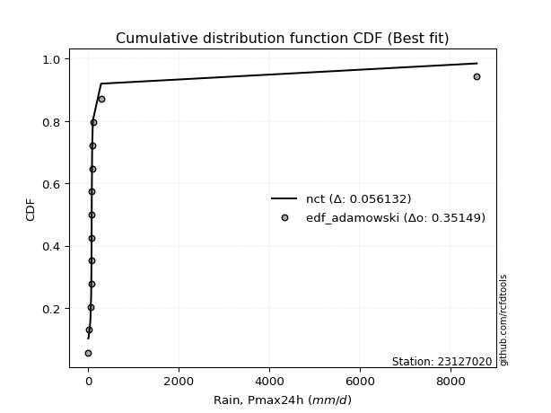</img></img>

</div>


## C. Best fit & Estimate extreme values for specific return periods - Tr


### 1. Best fit (ordered by delta Δ)

<div align="center">

|   id |   station | empirical_dist   | p_dist       |     delta |   deltao | eval   |   fit |   n |   best_fit |   best_fit_sort |
|-----:|----------:|:-----------------|:-------------|----------:|---------:|:-------|------:|----:|-----------:|----------------:|
|    0 |  23127020 | edf_chegodayev   | t            | 0.0701858 | 0.343224 | Δo > Δ |     1 |  14 |          1 |               1 |
|    1 |  23127020 | edf_jenkinson    | t            | 0.0707759 | 0.343224 | Δo > Δ |     1 |  14 |          1 |               2 |
|    2 |  23127020 | edf_beard        | t            | 0.0707759 | 0.343224 | Δo > Δ |     1 |  14 |          1 |               3 |
|    3 |  23127020 | edf_filliben     | t            | 0.0712479 | 0.343224 | Δo > Δ |     1 |  14 |          1 |               4 |
|    4 |  23127020 | edf_adamowski    | t            | 0.0718621 | 0.343224 | Δo > Δ |     1 |  14 |          1 |               5 |
|    5 |  23127020 | edf_tukey        | t            | 0.0722476 | 0.343224 | Δo > Δ |     1 |  14 |          1 |               6 |
|    6 |  23127020 | edf_blom         | t            | 0.0748996 | 0.343224 | Δo > Δ |     1 |  14 |          1 |               7 |
|    7 |  23127020 | edf_cunnane      | t            | 0.0765057 | 0.343224 | Δo > Δ |     1 |  14 |          1 |               8 |
|    8 |  23127020 | edf_gringorten   | t            | 0.0790992 | 0.343224 | Δo > Δ |     1 |  14 |          1 |               9 |
|    9 |  23127020 | edf_weibull      | t            | 0.0799081 | 0.343224 | Δo > Δ |     1 |  14 |          1 |              10 |
|   10 |  23127020 | edf_hazen        | logjohnsonsu | 0.0819719 | 0.343224 | Δo > Δ |     1 |  14 |          1 |              11 |
|   11 |  23127020 | edf_california   | t            | 0.0989557 | 0.343224 | Δo > Δ |     1 |  14 |          1 |              12 |

</div>

:file_folder:Tables: [bestfit_23127020.csv](table/bestfit_23127020.csv) | [extreme_23127020.csv](table/extreme_23127020.csv)


### 2. Extreme values

In hydrology, a return period (or recurrence interval $Tr$) is the statistical average time between extreme events like floods or droughts of a specific magnitude, indicating how rare an event is, with a 100-year flood, for example, having a 1% chance of occurring in any given year, not that it happens exactly every century. It is a key tool for infrastructure design (like bridges or dams) and risk assessment, calculated from historical data to determine the probability of future events, although it is important to remember it is statistical average, and events can cluster or be missed.

> risk_rate: assuming the return period as the project useful life.

|   id |      tr |   prob_l |     prob_g |      alpha |   betaprime |     chi2 |   crystalball |    erlang |    expon |   exponnorm |          f |   fatiguelife |        fisk |    gamma |   genexpon |   genlogistic |     gibrat |   gompertz |   gumbel_l |   gumbel_r |   halflogistic |   halfnorm |   hypsecant |   invgamma |   invgauss |       invweibull |   johnsonsu |   kstwobign |   laplace |   laplace_asymmetric |   loggamma |   logistic |    lognorm |   maxwell |     mielke |     moyal |   nakagami |         ncf |        nct |     norm |     pareto |      pearson3 |   rayleigh |     rice |                t |   truncnorm |       wald |   weibull_min |   logalpha |   logbetaprime |          logchi2 |   logcrystalball |   logerlang |         logexpon |   logexponnorm |           logf |   logfatiguelife |    logfisk |   loggenexpon |   loggenlogistic |        loggibrat |   loggompertz |   loggumbel_l |   loggumbel_r |   loghalflogistic |   loghalfnorm |   loghypsecant |   loginvgamma |   loginvgauss |    loginvweibull |     logjohnsonsu |     logkstwobign |   loglaplace |   loglaplace_asymmetric |   logloggamma |   loglogistic |   loglognorm |   logmaxwell |         logmielke |         logmoyal |   lognakagami |         logncf |          lognct |   logpareto |   logpearson3 |   lograyleigh |    logrice |              logt |   logtruncnorm |          logwald |   logweibull_min |   station |   n |   risk_rate |
|-----:|--------:|---------:|-----------:|-----------:|------------:|---------:|--------------:|----------:|---------:|------------:|-----------:|--------------:|------------:|---------:|-----------:|--------------:|-----------:|-----------:|-----------:|-----------:|---------------:|-----------:|------------:|-----------:|-----------:|-----------------:|------------:|------------:|----------:|---------------------:|-----------:|-----------:|-----------:|----------:|-----------:|----------:|-----------:|------------:|-----------:|---------:|-----------:|--------------:|-----------:|---------:|-----------------:|------------:|-----------:|--------------:|-----------:|---------------:|-----------------:|-----------------:|------------:|-----------------:|---------------:|---------------:|-----------------:|-----------:|--------------:|-----------------:|-----------------:|--------------:|--------------:|--------------:|------------------:|--------------:|---------------:|--------------:|--------------:|-----------------:|-----------------:|-----------------:|-------------:|------------------------:|--------------:|--------------:|-------------:|-------------:|------------------:|-----------------:|--------------:|---------------:|----------------:|------------:|--------------:|--------------:|-----------:|------------------:|---------------:|-----------------:|-----------------:|----------:|----:|------------:|
|    0 |    2    | 0.5      | 0.5        |    63.902  |     69.5657 |  1739.34 |      -1.31382 |   152.15  |  473.343 |     470.774 |    58.2443 |       196.416 |     67.0772 |  1210.85 |    474.701 |       341.702 |    25.0749 |    564.744 |    1042.37 |    322.702 |        143.811 |    234.18  |     682.536 |    63.1363 |    68.8434 |      9.95597     |     61.9796 |     731.625 |   682.536 |              473.331 |    59.6317 |    682.536 |    62.494  |   495.206 |    48.8292 |   206.535 |    72.1178 |     57.5146 |    67.4319 |  682.536 |    61.5174 |  -212.429     |    428.766 |  868.829 |     73.9889      |     709.577 |   -27.4733 |       842.646 |    54.6536 |        54.405  |     13.0009      |          62.494  |     59.6261 |     16.4075      |        55.9377 |    2.93635     |          59.9825 |    61.9901 |       36.129  |          61.9045 |     34.9752      |       72.7802 |        85.863 |       45.4852 |      38.8396      |       42.0662 |        62.494  |       56.8292 |       55.6888 |     49.6634      |     73.4151      |     42.7864      |      62.494  |                 68.0663 |       62.1975 |       62.494  |      59.8633 |      52.9678 |      6.68823      |     41.0516      |       60.9866 |   8.93372      |   73.6154       |    0.82474  |       56.991  |       49.9501 |    60.8052 |     75.0212       |        20.6001 |     33.3895      |          59.5396 |  23127020 |  14 |    0.75     |
|    1 |    2.33 | 0.570815 | 0.429185   |    77.3653 |     93.2546 |  2229.83 |     408.85    |   260.274 |  577.459 |     574.452 |    78.0111 |       326.07  |     92.303  |  1631.17 |    579.115 |       471.831 |   223.071  |    688.998 |    1382.42 |    684.88  |        516.187 |    656.023 |     995.343 |    81.6643 |    96.7717 |     20.0735      |     87.7764 |     980.86  |   919.068 |              577.444 |    84.2929 |   1026.91  |    88.2477 |   901.286 |    66.8128 |   549.383 |   174.409  |     77.9531 |    82.5381 | 1073.4   |    81.7728 |    -0.0660351 |    840.853 | 1173.43  |     76.5618      |     860.972 |   228.819  |      1385.07  |    77.6798 |        79.5091 |     24.6709      |          88.2477 |     84.2511 |     31.9231      |        77.4453 |    5.52683     |          84.73   |    80.9802 |       57.9698 |          80.2895 |     41.6558      |      109.89   |       115.929 |       62.6235 |      53.9575      |       61.0487 |        82.3712 |       80.3599 |       79.4833 |     75.7687      |     75.6587      |     67.5486      |      77.0069 |                 80.2767 |       88.1229 |       84.6993 |      84.5561 |      75.8074 |     12.3919       |     55.5629      |       86.1711 |  25.7501       |   76.5895       |    0.998651 |       80.6032 |       71.8688 |    86.3513 |     77.8639       |        34.2623 |     41.8675      |          86.6726 |  23127020 |  14 |    0.729209 |
|    2 |    5    | 0.8      | 0.2        |   165.2    |    289.228  |  4869.31 |    1933.13    |  1190.91  | 1098.01  |    1092.82  |   232.388  |      1502.49  |    318.685  |  4070.53 |   1101.16  |      1037.14  |  1362.98   |   1310.24  |    2481    |   2258.35  |       2201.12  |   2439.94  |    2250.08  |   232.858  |   403.609  |    488.591       |    320.146  |    2039.55  |  2101.67  |             1097.98  |   312.686  |   2356.6   |   318.158  |  2499.58  |   201.704  |  2137.48  |  2010.16   |    256.075  |   196.391  | 2525.95  |   248.009  |  1463.29      |   2490.62  | 2392.9   |     98.5109      |    1594.76  |  1663.55   |      6902.9   |   306.527  |       357.692  |    629.615       |         318.157  |    311.893  |    889.92        |       278.042  | 6668.46        |         313.022  |   229.157  |      385.392  |         213.962  |    113.956       |      444.498  |       305.779 |      251.21   |     238.832       |      294.894  |       249.385  |      304.896  |      317.184  |    474.783       |     95.3462      |    469.892       |     218.759  |                176.921  |      320.015  |      273.975  |     312.678  |     310.837  |    648.793        |    225.786       |      315.559  |   1.60797e+06  |   95.1659       |  inf        |      307.928  |      308.389  |   320.565  |    104.174        |       253.851  |    148.586       |         344.414  |  23127020 |  14 |    0.67232  |
|    3 |   10    | 0.9      | 0.1        |   301.82   |    666.428  |  7415.17 |    2944.3     |  2425.85  | 1570.55  |    1563.37  |   503.637  |      3008.82  |    796.179  |  6563.84 |   1575.06  |      1497.56  |  2662.36   |   1874.18  |    3092.64 |   3539.91  |       3600.38  |   3760     |    3252.03  |   525.52   |  1170.49   |   6776.66        |    755.575  |    2845.61  |  3175.21  |             1570.51  |   762.354  |   3335.87  |   744.905  |  3624.38  |   424.415  |  3520.17  |  5044.23   |    629.076  |   405.441  | 3489.53  |   565.702  |  3150.54      |   3666.93  | 3262.41  |    178.463       |    2230.66  |  3186.14   |     16884.4   |   810.777  |      1054.36   |  12264.3         |         744.905  |    759.024  |  18251.7         |       710.329  |    4.75408e+12 |         760.189  |   497.24   |     1489.72   |         433.503  |    358.87        |      999.187  |       524.713 |      778.783  |     821.489       |      945.81   |       604.001  |      769.875  |      839.765  |   2116.63        |    186.702       |   2057.62        |     564.394  |                362.507  |      749.498  |      650.401  |     760.732  |     839.083  | 160198            |    765.33        |      754.961  |   8.36975e+18  |  168.938        |  inf        |      784.436  |      871.216  |   769.322  |    264.803        |       910.421  |    569.858       |         840.951  |  23127020 |  14 |    0.651322 |
|    4 |   15    | 0.933333 | 0.0666667  |   428.811  |   1050.89   |  8942.01 |    3448.89    |  3256.87  | 1846.97  |    1838.63  |   761.826  |      3988.53  |   1311.76   |  8093.38 |   1852.26  |      1757.32  |  3558.6    |   2204.07  |    3369.63 |   4262.96  |       4392.24  |   4446.95  |    3823.84  |   826.559  |  2006.82   |  29901.3         |   1159.82   |    3273.53  |  3803.19  |             1846.93  |  1197.07   |   3869.42  |  1138.86   |  4201.5   |   628.198  |  4322.63  |  6968.28   |   1034.13   |   615.669  | 3970.38  |   888.117  |  4232.3       |   4273.02  | 3710.42  |    315.371       |    2590.73  |  4163.88   |     25317     |  1344.04   |      1854.88   |  70158.6         |        1138.86   |   1190.57   | 106843           |      1180.25   |    4.78423e+24 |        1190.96   |   760.704  |     2991.26   |         634.986  |    791.722       |     1449.68   |       670.082 |     1474.51   |    1652.79        |     1734.59   |      1000.64   |     1238.25   |     1388.71   |   4919.14        |    436.998       |   4506.63        |     982.567  |                551.512  |     1144.55   |     1041.73   |    1193.36   |    1396.64   |      1.50089e+07  |   1554.27        |     1170.54   |   1.77639e+35  |  398.2          |  inf        |     1268.39   |     1487.7    |  1192.2    |   1155.73         |      1601.33   |   1350.98        |        1302.07   |  23127020 |  14 |    0.644736 |
|    5 |   20    | 0.95     | 0.05       |   552.258  |   1440.11   | 10037.5  |    3779.34    |  3882.05  | 2043.1   |    2033.93  |  1011.79   |      4713.01  |   1852.56   |  9201.56 |   2048.95  |      1939.2   |  4261.64   |   2438.12  |    3542.05 |   4769.22  |       4947.04  |   4904.95  |    4227.22  |  1133.31   |  2837.7    |  84546.1         |   1535.6    |    3561.79  |  4248.75  |             2043.05  |  1612.39   |   4238.19  |  1503.86   |  4584.52  |   821.012  |  4890.94  |  8319.77   |   1461.59   |   827.237  | 4285.28  |  1213.64   |  5030.6       |   4675.87  | 4008.19  |    511.033       |    2841.27  |  4892.48   |     32577.7   |  1885.66   |      2710.27   | 242374           |        1503.86   |   1602.45   | 374332           |      1675.48   |    2.1242e+39  |        1601.6    |  1021.87   |     4755.05   |         826.045  |   1472.75        |     1830.12   |       780.255 |     2305.47   |    2697.37        |     2598.98   |      1428.71   |     1698.48   |     1942.72   |   8878.18        |   1128.95        |   7642.17        |    1456.12   |                742.771  |     1509.5    |     1442.62   |    1606.44   |    1958.58   |      8.47553e+08  |   2567.01        |     1561.75   |   2.98092e+54  | 1227.93         |  inf        |     1746.31   |     2123.14   |  1588.88   |   8516.83         |      2226.08   |   2570.46        |        1728.24   |  23127020 |  14 |    0.641514 |
|    6 |   25    | 0.96     | 0.04       |   673.948  |   1832.89   | 10892.9  |    4022.59    |  4383.84  | 2195.22  |    2185.41  |  1255.79   |      5288.33  |   2412.53   | 10072    |   2201.51  |      2079.29  |  4847.73   |   2619.67  |    3664.74 |   5159.17  |       5374.48  |   5245.72  |    4539.4   |  1444.42   |  3639.41   | 188277           |   1888      |    3777.71  |  4594.35  |             2195.17  |  2010.06   |   4520.3   |  1845.38   |  4868.87  |  1006.22   |  5331.43  |  9347.35   |   1906.53   |  1039.93   | 4517.09  |  1541.49   |  5664.4       |   4975.18  | 4229.44  |    766.574       |    3032.93  |  5476.08   |     38980.5   |  2429.03   |      3600.04   | 634716           |        1845.38   |   1996.51   | 989946           |      2190.57   |    2.08154e+56 |        1994.15   |  1281.63   |     6710.51   |        1009.86   |   2470.85        |     2161.5    |       869.52  |     3252.93   |    3933.99        |     3511.24   |      1882.1    |     2148.69   |     2495.4    |  13990.9         |   3103.93        |  11350.6         |    1975.65   |                935.724  |     1850.17   |     1850.62   |    2001.82   |    2517.48   |      3.43811e+10  |   3787.25        |     1932.16   |   1.543e+76    | 4888.16         |  inf        |     2215.45   |     2765.29   |  1963.33   | 104523            |      2769.46   |   4303.01        |        2125.31   |  23127020 |  14 |    0.639603 |
|    7 |   50    | 0.98     | 0.02       |  1272.63   |   3832.12   | 13576.2  |    4719.17    |  6018.19  | 2667.77  |    2655.97  |  2419.65   |      7133.21  |   5407.21   | 12825.1  |   2675.39  |      2510.85  |  6913.72   |   3183.62  |    3997.8  |   6360.43  |       6691.51  |   6236.21  |    5507.3   |  3043.6    |  7115.98   |      2.21774e+06 |   3411.49   |    4411.76  |  5667.88  |             2667.7   |  3800.15   |   5382.23  |  3315.9    |  5693.53  |  1864.06   |  6698.92  | 12388.9    |   4313.81   |  2115.16   | 5180.89  |  3203.75   |  7698.74      |   5844.03  | 4871.67  |   2968.16        |    3614.2   |  7381.54   |     63443.1   |  5113.27   |      8300.35   |      1.26891e+07 |        3315.9    |   3767.8    |      2.03032e+07 |      4978.1    |    4.4299e+170 |        3755.98   |  2570.24   |    18247.6    |        1863.6    |  15310.1         |     3403.29   |      1166.76  |     9394.28   |   12583.8         |     8418.48   |      4423.4    |     4263.15   |     5189.85   |  56796.2         | 760951           |  36267.3         |    5097.13   |               1917.28   |     3309.84   |     3960.96   |    3780.78   |    5213.88   |      2.4041e+17   |  12666.3         |     3563.55   |   3.65767e+214 |    1.67336e+08  |  inf        |     4432.61   |     5954.93   |  3601.47   |      4.47792e+13  |      4569.13   |  23139.7         |        3813.32   |  23127020 |  14 |    0.63583  |
|    8 |   75    | 0.986667 | 0.0133333  |  1866.05   |   5869.38   | 15160.6  |    5092.94    |  7016.69  | 2944.19  |    2931.23  |  3526.47   |      8243.86  |   8618.49   | 14463.3  |   2952.6   |      2761.68  |  8309.1    |   3513.5   |    4166.22 |   7058.65  |       7457.09  |   6775.39  |    6072.94  |  4690.3    |  9883.09   |      9.3e+06     |   4686.11   |    4760.6   |  6295.86  |             2944.11  |  5366.65   |   5880.05  |  4541.16   |  6141.89  |  2655.55   |  7498.6   | 14057.1    |   6928.93   |  3203.39   | 5537.06  |  4890.73   |  8925.73      |   6316.72  | 5221.07  |   6754.52        |    3944.99  |  8554.07   |     81162.5   |  7717.02   |     13174.9    |      7.33837e+07 |        4541.16   |   5315.47   |      1.18852e+08 |      8013.47   |  inf           |        5292.92   |  3851.84   |    31454      |        2653.47   |  52479.3         |     4286.13   |      1353.8   |    17401      |   24737.4         |    13550.9    |      7288.4    |     6202.94   |     7760.95   | 128229           |      2.47444e+08 |  68720.4         |    8873.73   |               2916.91   |     4519.01   |     6147.17   |    5337.07   |    7745.88   |      1.41097e+23  |  25660.4         |     4956.99   | inf            |    1.28507e+15  |  inf        |     6479      |     9038.9    |  4989.23   |      2.34741e+27  |      5535.99   |  65151.9         |        5193.94   |  23127020 |  14 |    0.634587 |
|    9 |  100    | 0.99     | 0.01       |  2457.91   |   7931.72   | 16290.2  |    5345.73    |  7740.4   | 3140.31  |    3126.52  |  4597.78   |      9042.9   |  11977.8    | 15635.7  |   3149.28  |      2939.22  |  9390.04   |   3747.56  |    4276.38 |   7552.82  |       7998.96  |   7142.7   |    6474.17  |  6368.66   | 12175.7    |      2.56517e+07 |   5808.47   |    4999.62  |  6741.42  |             3140.23  |  6787.09   |   6231.52  |  5617.38   |  6447.28  |  3407.28   |  8065.95  | 15192.9    |   9688.89   |  4300.24   | 5777.97  |  6593.95   |  9809.64      |   6638.75  | 5459.1   |  12167.9         |    4175.83  |  9408.95   |     95350.8   | 10245.3    |     18107      |      2.55158e+08 |        5617.38   |   6717.45   |      4.16407e+08 |     11225.2    |  inf           |        6683.83   |  5131.25   |    45585.4    |        3404.86   | 136282           |     4985.81   |      1492.09  |    26918.5    |   39913.3         |    18741.3    |     10386.6    |     8017.69   |    10227.5    | 228191           |      8.60519e+10 | 106479           |   13150.5    |               3928.47   |     5576.91   |     8383.74   |    6748.15   |   10143      |      2.09535e+28  |  42344.2         |     6200.6    | inf            |    1.47448e+24  |  inf        |     8400.26   |    12011.3    |  6220.67   |      9.53553e+45  |      6130.63   | 138582           |        6389.4    |  23127020 |  14 |    0.633968 |
|   10 |  200    | 0.995    | 0.005      |  4821.02   |  16338.3    | 19027    |    5919.16    |  9526.98  | 3612.85  |    3597.08  |  8673.9    |     10998.5   |  26380.9    | 18489.2  |   3623.16  |      3366.02  | 12330.9    |   4311.51  |    4515.83 |   8740.86  |       9301.67  |   7982.79  |    7440.78  | 13282.4    | 18766.2    |      2.94065e+08 |   9453.24   |    5550.13  |  7814.96  |             3612.76  | 11608.7    |   7074.64  |  9100.21   |  7145.98  |  6187.65   |  9432.85  | 17780.3    |  21690.8    |  8741.64   | 6324.41  | 13508.3    | 11977         |   7375.59  | 6003.76  |  50610.7         |    4719.64  | 11538.4    |    135335     | 19789.8    |     37870.2    |      5.15325e+09 |        9100.22   |  11469.5    |      8.54026e+09 |     25259.9    |  inf           |       11391.8    | 10250.3    |   106584      |        6190.5    |      1.8281e+06  |     6932.01   |      1843.33  |    76837      |  126069           |    39346.4    |     24383.2    |    14481.2    |    19348.2    | 912168           |      9.80237e+20 | 291940           |   33928      |               8049.36   |     8979.55   |    17648.4    |   11538.4    |   18795.7    |      7.34674e+45  | 141545           |    10321.6    | inf            |    1.74118e+80  |  inf        |    15275.6    |    23020.3    | 10264.2    |      1.14176e+167 |      7207.4    | 908167           |       10166.2    |  23127020 |  14 |    0.633042 |
|   11 |  250    | 0.996    | 0.004      |  6001.74   |  20605.9    | 19912    |    6094.4     | 10113.1   | 3764.98  |    3748.56  | 10630.7    |     11635.8   |  33992.3    | 19415.3  |   3775.72  |      3503.23  | 13386      |   4493.06  |    4586.28 |   9122.8   |       9720.48  |   8241.23  |    7751.94  | 16822      | 21187.1    |      6.44171e+08 |  10970.3    |    5720.49  |  8160.56  |             3764.88  | 13693.4    |   7345.32  | 10545.8    |  7361.06  |  7492.08   |  9872.89  | 18572.3    |  28105.6    | 10984.4    | 6491.4   | 17006.8    | 12684.5       |   7602.4   | 6171.42  |  80156.4         |    4891.18  | 12242.8    |    150022     | 24307.3    |     47668.3    |      1.35711e+10 |       10545.8    |  13521.7    |      2.25853e+10 |     32792.6    |  inf           |       13422.6    | 12815.5    |   138445      |        7499.82   |      4.64058e+06 |     7639.43   |      1961.62  |   107650      |  182468           |    49430.8    |     32092      |    17393.1    |    23585.9    |      1.42409e+06 |      7.78256e+25 | 398890           |   46033      |              10140.4    |    10384.2    |    22412.5    |   13609.9    |   22726.1    |      3.36122e+53  | 208745           |    12067      | inf            |    2.19774e+119 |  inf        |    18383.9    |    28124      | 11962.8    |      3.65633e+254 |      7454.83   |      1.69151e+06 |       11699      |  23127020 |  14 |    0.632858 |
|   12 |  500    | 0.998    | 0.002      | 11903.6    |  42327.6    | 22671.5  |    6614.06    | 11962     | 4237.52  |    4219.12  | 19963.7    |     13634.9   |  74612.8    | 22311.1  |   4249.6   |      3929.11  | 17032.7    |   5057     |    4788.24 |  10308.3   |      11020.4   |   9011.79  |    8718.47  | 35018      | 29533      |      7.34554e+09 |  17057.3    |    6231.05  |  9234.09  |             4237.41  | 22417.3    |   8184.77  | 16328.8    |  8002.85  | 13553.4    | 11239.8   | 20919.8    |  62813      | 22328.5    | 6986.61  | 34745.4    | 14907.1       |   8279.15  | 6671.65  | 334714           |    5413.79  | 14482.8    |    201573     | 45293.1    |     95528.8    |      2.75278e+11 |       16328.8    |  22097.7    |      4.63211e+11 |     73759.7    |  inf           |       21899.4    | 25714.6    |   302200      |       13596.3    |      1.16081e+08 |    10098.4    |      2344.51  |   306579      |  574904           |    97599.1    |     75333.3    |    30162.2    |    42816.8    |      5.67549e+06 |      1.32487e+49 |      1.01648e+06 |  118764      |              20777.5    |    15969.4    |    47027.8    |   22281.8    |   40050.1    |      2.30048e+86  | 697756           |    19204.7    | inf            |  inf            |  inf        |    32060.2    |    51116.3    | 18844.3    |    inf            |      7987.61   |      1.22216e+07 |       17671.2    |  23127020 |  14 |    0.632489 |
|   13 |  750    | 0.998667 | 0.00133333 | 17804.6    |  64462.3    | 24292    |    6902.75    | 13060.5   | 4513.94  |    4494.38  | 28838.9    |     14815.9   | 118111      | 24016.7  |   4526.8   |      4178.08  | 19444.4    |   5386.89  |    4896.18 |  11001.3   |      11780.3   |   9442.27  |    9283.86  | 53755.3    | 34934      |      3.0476e+10  |  21797      |    6517.87  |  9862.07  |             4513.82  | 29538.3    |   8675.21  | 20817.7    |  8361.81  | 19158.8    | 12039.3   | 22221.8    | 100517      | 33812.5    | 7261.71  | 52747.6    | 16222.4       |   8657.58  | 6951.38  | 772511           |    5712.69  | 15825.9    |    236042     | 64541      |    141727      |      1.60301e+12 |       20817.7    |  29087.7    |      2.71158e+12 |    118507      |  inf           |       28799.9    | 38727.3    |   467673      |       19246.3    |      9.75976e+08 |    11725.8    |      2578.92  |   565273      |       1.12451e+06 |   142725      |    124098      |    41145.3    |    59981      |      1.27361e+07 |      4.7939e+70  |      1.71915e+06 |  206760      |              31610.4    |    20274.4    |    72510.2    |   29364.2    |   54984      |      1.49276e+114 |      1.41343e+06 |    24882.5    | inf            |  inf            |  inf        |    43860.1    |    71393.7    | 24259.3    |    inf            |      8177.37   |      4.00018e+07 |       22164.1    |  23127020 |  14 |    0.632366 |
|   14 | 1000    | 0.999    | 0.001      | 23705.4    |  86869.6    | 25444.3  |    7101.5     | 13846.5   | 4710.06  |    4689.68  | 37429.3    |     15658.4   | 163590      | 25231.5  |   4723.47  |      4354.68  | 21289.9    |   5620.94  |    4968.83 |  11492.9   |      12319.3   |   9739.56  |    9685     | 72853      | 38971.3    |      8.36145e+10 |  25805.5    |    6716.58  | 10307.6   |             4709.94  | 35746.6    |   9023.01  | 24606.7    |  8609.91  | 24487.5    | 12606.6   | 23117      | 140310      | 45388.2    | 7451.11  | 70923.3    | 17161.5       |   8919.1   | 7144.69  |      1.39843e+06 |    5921.88  | 16792      |    262500     | 82659.3    |    186600      |      5.59802e+12 |       24606.7    |  35176.2    |      9.50018e+12 |    165901      |  inf           |       34805.8    | 51837.6    |   632453      |       24624.8    |      4.97793e+09 |    12967.6    |      2749.74  |   872452      |       1.80985e+06 |   185561      |    176837      |    51054.1    |    75835.8    |      2.25963e+07 |      1.00994e+91 |      2.47412e+06 |  306410      |              42572.6    |    23891.8    |    98572.2    |   35541.7    |   68448.3    |      1.44231e+139 |      2.33233e+06 |    29750.7    | inf            |  inf            |  inf        |    54523.3    |    89935.5    | 28869      |    inf            |      8274.69   |      9.38636e+07 |       25878.2    |  23127020 |  14 |    0.632305 |

<div align="center">

</img>

</div>


<div align="center">

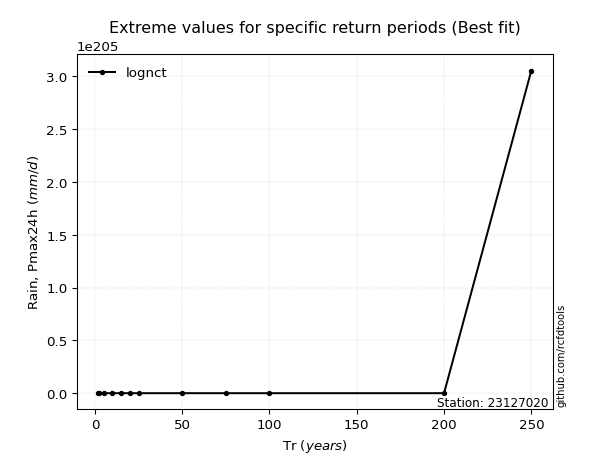</img>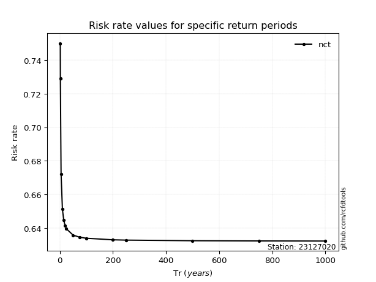</img>

</div>


<sub>**APP DISCLAIMER**: NO WARRANTY - This software is provided by [github.com/rcfdtools](https://github.com/rcfdtools) "as is", without any express or implied warranty, including warranties of merchantability, fitness for a particular purpose, or non-infringement. There is no guarantee that the software will be error-free or operate without interruption. LIMITATION OF LIABILITY - Neither the authors nor copyright holders will be liable for claims or damages arising from the software or its use. You are responsible for determining if the software is appropriate for your use and assume all associated risks, including errors, legal compliance, and data loss. NO PROFESSIONAL ADVICE - The software provides general information and does not offer professional advice. It should not replace consultation with professional advisors.</sub>