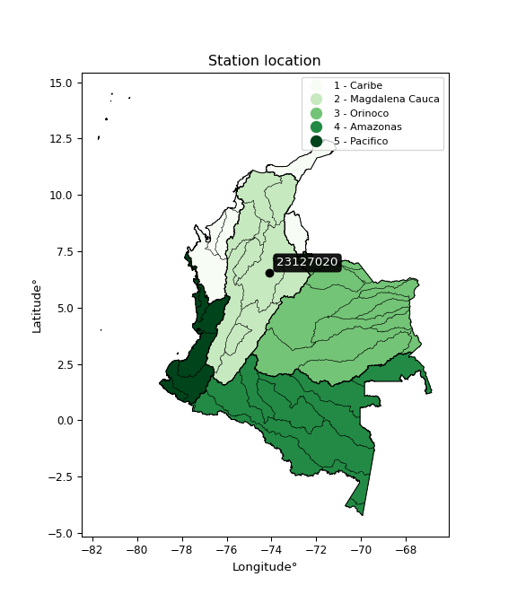

<div align="center">


</div>

# PMP Station (Rain, Pmax24h): 23127020

Probable Maximum Precipitation (PMP) is the greatest amount of rainfall for a specific duration that is meteorologically possible for a given location, acting as a "worst-case" scenario for extreme storms, crucial for designing safety-critical infrastructure like bridges, river deviations, dams, spillways, and nuclear plants to prevent catastrophic failure. PMP is calculated by hydrologists using meteorological data to determine the upper limit of extreme rainfall, often leading to the Probable Maximum Flood (PMF) for flood control design, and is increasingly being studied for climate change impacts. Probable Maximum Precipitation (PMP) is the theoretical upper limit of rainfall, a deterministic estimate for extreme events, while probability distributions (like GEV, Gumbel) describe the likelihood and frequency of various precipitation amounts, including rare ones, showing how often events occur, with PMP representing the extreme end of these distributions, used for critical infrastructure design to ensure safety against the worst conceivable weather, unlike standard statistical forecasts which cover typical probabilities.

The most common probability distributions in hydrology, used for analyzing floods, rainfall, and streamflow, include the Normal, Log-Normal, Gumbel, Gamma (including Log-Pearson Type III), and Generalized Extreme Value (GEV) distributions, often chosen based on the data´s skewness and whether modeling extremes or general conditions, with Gumbel and GEV popular for extreme events like floods, while the Normal distribution serves as a baseline, though often requiring transformations for skewed hydrological data. These distributions help in designing water infrastructure, managing water resources, and forecasting hydrologic events.

> Hydrological data often isn´t perfectly normal (it´s skewed), so different distributions are needed for different applications, such as: **Flood Frequency Analysis**: Using Gumbel, GEV, or Log-Pearson Type III for predicting extreme flood magnitudes and their return periods, **Rainfall Analysis**: Normal for annual totals, but Log-Normal, Weibull, or GEV for intensity or extreme daily rainfall, **Streamflow Modeling**: Gamma and Log-Normal for maximum flows, GEV for minimum flows, and Kappa for daily flows.

<div align="center">

</img>

</div>


## A. General information


### 1. General running parameters

• app_version: _v20260108_. • runtime: _2026-01-09 11:32:22.148588_. • Python version: _3.14.0_. • SciPy version: _1.16.3_. • Pandas version: _2.3.3_. • NumPy version: _2.3.5_. • Stations dataset (station_dataset_file): _dataset/pmax24h_in/automatic_colombia_2003_2024.csv_. • Stations catalog (station_catalog_file): _dataset/CNE.xls_. • Minimum year to eval til year_max (date_min): _1900_. • Maximum year to eval since year_min (date_max): _2024_. • Creates, save and include plots into reports (create_plot): _False_. • Plot only fit distributions with Δo > Δ (plot_only_fit): _True_. • Plot only simple graphs avoiding multiple CDFs and multiple Extreme values plots (plot_only_simple): _True_. • Eval low extreme values, if False, evaluates high extreme values (low_extreme): _False_. • Eval every SciPy distribution as logarithmic (pdist_logarithmic_on): _True_. • Standard deviation normalized (ddof): _1.0_. • Return periods to eval in years (Tr): _[2, 2.33, 5, 10, 15, 20, 25, 50, 75, 100, 200, 250, 500, 750, 1000]_. • Minimum data sample per station, 0 means any (minimum_sample): _5_. • Z-Score maximum threshold to adjust a value, 0 means disable (zscore_max): _3.5_. • Z-Score minimum threshold to adjust a value, 0 means disable (zscore_min): _-2.5_. • Avoid zeros, e.g. rain = 0 (avoid_zeros): _True_. • Avoid null values (avoid_nans): _True_. 

:file_folder:Table: [dataset.csv](../../dataset/pmax24h_in/automatic_colombia_2003_2024.csv)

> Delta Degrees of Freedom (DDOF): is a parameter used in the formulas for calculating variance and standard deviation. When ddof=0, the divisor is $N$ (the total number of observations) and this is used when your data set is the entire population. When ddof=1, the divisor is $N-1$ and this is used when your data set is a sample drawn from a larger population. Using $N-1$ provides an unbiased estimate of the population variance (known as Bessel´s correction).


### 2. Station info and location

|   id |   CODIGO | NOMBRE                         | CATEGORIA    | TECNOLOGIA                              | ESTADO           | FECHA_INSTALACION   |   FECHA_SUSPENSION |   ALTITUD |   LATITUD |   LONGITUD | DEPARTAMENTO   | MUNICIPIO   | AREA_OPERATIVA                         | ENTIDAD                                                     | AREA_HIDROGRAFICA   | ZONA_HIDROGRAFICA   | SUBZONA_HIDROGRAFICA   | CORRIENTE   | Catalogo   |   Version |
|-----:|---------:|:-------------------------------|:-------------|:----------------------------------------|:-----------------|:--------------------|-------------------:|----------:|----------:|-----------:|:---------------|:------------|:---------------------------------------|:------------------------------------------------------------|:--------------------|:--------------------|:-----------------------|:------------|:-----------|----------:|
|    0 | 23127020 | PUERTO ARAUJO - AUT [23127020] | Limnigráfica | Automática con Telemetría, Convencional | En Mantenimiento | 15/10/1965          |                nan |        92 |   6.52556 |   -74.0858 | Santander      | Cimitarra   | Area Operativa 08 - Santanderes-Arauca | INSTITUTO DE HIDROLOGIA METEOROLOGIA Y ESTUDIOS AMBIENTALES | Magdalena Cauca     | Medio Magdalena     | Río Carare (Minero)    | Carare      | CNE_IDEAM  |  20251226 |

<div align="center">

Dynamic map: [:earth_americas:Google](http://maps.google.com/maps?q=6.525555556,-74.08583333) [:earth_americas:OSM](https://www.openstreetmap.org/#map=18/6.525555556/-74.08583333&layers=P) [:earth_americas:Bing](https://www.bing.com/maps?cp=6.525555556~-74.08583333&lvl=18) [:earth_americas:Apple](https://maps.apple.com/frame?center=6.525555556%2C-74.08583333&span=0.003%2C0.006)

</div>


<div align="center">

```geojson
{
  "type": "Feature",
  "geometry": {
    "type": "Point", 
    "coordinates": [-74.08583333, 6.525555556]
  }, 
  "properties": {
    "Name": "23127020"
  }
}
```

</div>


### 3. Discrete values table and plot

<div align="center">

|               |           0 |           1 |           2 |          3 |           4 |           5 |           6 |           7 |           8 |           9 |          10 |          11 |          12 |
|:--------------|------------:|------------:|------------:|-----------:|------------:|------------:|------------:|------------:|------------:|------------:|------------:|------------:|------------:|
| Date          | 2009        | 2010        | 2011        | 2012       | 2013        | 2014        | 2015        | 2016        | 2017        | 2018        | 2019        | 2020        | 2024        |
| Value         |   70.6      |   84.4      |  281.1      | 8576.4     |   86.6      |   76.1      |   74.6      |   45.6      |  101.3      |   73.1      |   63.5      |    0.8      |   10.4      |
| Value_initial |   70.6      |   84.4      |  281.1      | 8576.4     |   86.6      |   76.1      |   74.6      |   45.6      |  101.3      |   73.1      |   63.5      |    0.8      |   10.4      |
| count         |   13        |   13        |   13        |   13       |   13        |   13        |   13        |   13        |   13        |   13        |   13        |   13        |   13        |
| mean          |  734.192    |  734.192    |  734.192    |  734.192   |  734.192    |  734.192    |  734.192    |  734.192    |  734.192    |  734.192    |  734.192    |  734.192    |  734.192    |
| std           | 2357.24     | 2357.24     | 2357.24     | 2357.24    | 2357.24     | 2357.24     | 2357.24     | 2357.24     | 2357.24     | 2357.24     | 2357.24     | 2357.24     | 2357.24     |
| zscore        |   -0.281512 |   -0.275658 |   -0.192213 |    3.32686 |   -0.274725 |   -0.279179 |   -0.279816 |   -0.292118 |   -0.268489 |   -0.280452 |   -0.284524 |   -0.311123 |   -0.307051 |


</div>


> The initial value (value_initial) correspond to the initial obtained or null completed value, and value (value) is adjusted only when the initial value is outside the valid range (outlier) definite through the Z-Score value. If Z-Score is active, values out of range or outliers are replaced with the station mean value. A Z-Score (or standard score) measures how many standard deviations a data point is from the mean of a dataset, indicating its relative position; positive scores mean above the mean, negative mean below, and a score of zero is exactly at the mean, allowing for comparison of values from different distributions. It´s calculated using the formula $z=(x–μ)/σ$, where $x$ is the data point, $μ$ is the mean, and $σ$ is the standard deviation, helping identify outliers and understand probability.
>
> <sub>**Note**: In this study, "completing" (filling gaps in) and "extending" (forecasting or lengthening the historical record) rainfall data series are avoided for certain critical analyses because they introduce artificial bias and uncertainty, which can distort the statistics of rare events (extremes), alter day-to-day variability, and compromise the integrity and homogeneity of the original data. Some reasons against Completing/Extending rainfall data are: **Distortion of Extremes and Variability**: The primary issue is that most gap-filling or extension methods rely on averaging or regression with nearby stations, which inherently smooths the data. Rainfall is highly variable in space and time, with a large percentage of zero values and occasional large storms. Infilling methods often underestimate the highest values and overestimate the lowest (zero) values, which severely distorts analyses focused on flood frequency, drought severity, and intensity-duration-frequency (IDF) curves, **Loss of Data Homogeneity**: Infilled or extended data are synthetic estimates, not actual measurements. Combining these estimates with observed data can violate the assumption of data homogeneity, which requires that the data properties do not change over time. Inhomogeneity can lead to incorrect conclusions about long-term trends or changes in climate patterns, **Propagation of Errors**: Errors and biases from the original data (e.g., wind-induced undercatch, instrument errors, site changes) or the data used for imputation can propagate through the analysis, leading to unreliable hydrological models and inaccurate predictions, **Compromised Statistical Integrity**: For statistical analyses, especially those involving the frequency of events, using artificial data can introduce time bias or autocorrelation that doesn´t exist in reality, making it difficult to assess the true probability of events, **Difficulty in Validation**: It is difficult to accurately validate the quality of filled or extended data, especially for past periods where ground-truth measurements are unavailable. The reliability of imputation techniques heavily depends on the density of the surrounding station network and the complexity of the local topography.</sub>


### 4. Active continuous probability distributions from SciPy (45 of 104 available)

A Probability Density Function (PDF) describes the relative likelihood of a continuous random variable falling within a specific range, where the total area under its curve equals 1, and the area over any interval gives the actual probability for that range. Unlike discrete probabilities (like rolling a die), a PDF shows density, not direct probability for a single point (which is zero), with higher points indicating higher likelihood, often visualized as a bell curve for normal distributions.

A log of a probability density function (log-PDF) is simply the logarithm of the PDF´s value, denoted as $log(f(x))$, useful for converting multiplication of probabilities into addition, improving numerical stability with tiny numbers, and connecting to information theory concepts like entropy. Instead of dealing with very small probabilities (e.g., 0.000001), log-PDFs use negative numbers (e.g., $log(0.00001) ≈ -11.51$ that are easier for computers to handle, preventing underflow errors and simplifying complex calculations. In this study, each active probability distribution from SciPy is also evaluated in the $log$ form.

[scipy.stats](https://docs.scipy.org/doc/scipy/reference/stats.html) is a Python´s powerful submodule within the SciPy library for comprehensive statistical analysis, offering over 130 probability distributions (like Normal, Poisson), functions for descriptive stats (mean, variance), hypothesis testing (t-tests, chi-square), random variable generation, and statistical tests, making it essential for data science, modeling, and research. It provides tools to explore, model, and draw conclusions from data efficiently, working seamlessly with NumPy.

<div align="center">

|   id | p_dist             |   n_parameter | fit_method   | label                                                                       | active   | ref                                                                                                        |
|-----:|:-------------------|--------------:|:-------------|:----------------------------------------------------------------------------|:---------|:-----------------------------------------------------------------------------------------------------------|
|    0 | alpha              |             3 | MLE          | Alpha                                                                       | True     | [:mortar_board:](https://docs.scipy.org/doc/scipy/reference/generated/scipy.stats.alpha.html)              |
|    1 | betaprime          |             4 | MLE          | Beta prime                                                                  | True     | [:mortar_board:](https://docs.scipy.org/doc/scipy/reference/generated/scipy.stats.betaprime.html)          |
|    2 | chi2               |             3 | MLE          | Chi²                                                                        | True     | [:mortar_board:](https://docs.scipy.org/doc/scipy/reference/generated/scipy.stats.chi2.html)               |
|    3 | crystalball        |             4 | MLE          | Crystalball                                                                 | True     | [:mortar_board:](https://docs.scipy.org/doc/scipy/reference/generated/scipy.stats.crystalball.html)        |
|    4 | dweibull           |             3 | MLE          | Double Weibull                                                              | True     | [:mortar_board:](https://docs.scipy.org/doc/scipy/reference/generated/scipy.stats.dweibull.html)           |
|    5 | erlang             |             3 | MLE          | Erlang                                                                      | True     | [:mortar_board:](https://docs.scipy.org/doc/scipy/reference/generated/scipy.stats.erlang.html)             |
|    6 | expon              |             2 | MLE          | Exponential                                                                 | True     | [:mortar_board:](https://docs.scipy.org/doc/scipy/reference/generated/scipy.stats.expon.html)              |
|    7 | exponnorm          |             3 | MLE          | Exponentially modified Normal                                               | True     | [:mortar_board:](https://docs.scipy.org/doc/scipy/reference/generated/scipy.stats.exponnorm.html)          |
|    8 | f                  |             4 | MLE          | F                                                                           | True     | [:mortar_board:](https://docs.scipy.org/doc/scipy/reference/generated/scipy.stats.f.html)                  |
|    9 | fatiguelife        |             3 | MLE          | Fatigue-life (Birnbaum-Saunders)                                            | True     | [:mortar_board:](https://docs.scipy.org/doc/scipy/reference/generated/scipy.stats.fatiguelife.html)        |
|   10 | fisk               |             3 | MLE          | Fisk                                                                        | True     | [:mortar_board:](https://docs.scipy.org/doc/scipy/reference/generated/scipy.stats.fisk.html)               |
|   11 | gamma              |             3 | MLE          | Gamma                                                                       | True     | [:mortar_board:](https://docs.scipy.org/doc/scipy/reference/generated/scipy.stats.gamma.html)              |
|   12 | genexpon           |             5 | MLE          | Generalized exponential                                                     | True     | [:mortar_board:](https://docs.scipy.org/doc/scipy/reference/generated/scipy.stats.genexpon.html)           |
|   13 | genlogistic        |             3 | MLE          | Generalized logistic                                                        | True     | [:mortar_board:](https://docs.scipy.org/doc/scipy/reference/generated/scipy.stats.genlogistic.html)        |
|   14 | gibrat             |             2 | MM           | Gibrat                                                                      | True     | [:mortar_board:](https://docs.scipy.org/doc/scipy/reference/generated/scipy.stats.gibrat.html)             |
|   15 | gompertz           |             3 | MLE          | Gompertz (or truncated Gumbel)                                              | True     | [:mortar_board:](https://docs.scipy.org/doc/scipy/reference/generated/scipy.stats.gompertz.html)           |
|   16 | gumbel_l           |             2 | MM           | Gumbel Left Skew                                                            | True     | [:mortar_board:](https://docs.scipy.org/doc/scipy/reference/generated/scipy.stats.gumbel_l.html)           |
|   17 | gumbel_r           |             2 | MM           | Gumbel Right Skew                                                           | True     | [:mortar_board:](https://docs.scipy.org/doc/scipy/reference/generated/scipy.stats.gumbel_r.html)           |
|   18 | halflogistic       |             2 | MM           | Half-logistic                                                               | True     | [:mortar_board:](https://docs.scipy.org/doc/scipy/reference/generated/scipy.stats.halflogistic.html)       |
|   19 | halfnorm           |             2 | MM           | Half Normal                                                                 | True     | [:mortar_board:](https://docs.scipy.org/doc/scipy/reference/generated/scipy.stats.halfnorm.html)           |
|   20 | hypsecant          |             2 | MM           | hyperbolic secant                                                           | True     | [:mortar_board:](https://docs.scipy.org/doc/scipy/reference/generated/scipy.stats.hypsecant.html)          |
|   21 | invgamma           |             3 | MLE          | Inverted gamma                                                              | True     | [:mortar_board:](https://docs.scipy.org/doc/scipy/reference/generated/scipy.stats.invgamma.html)           |
|   22 | invgauss           |             3 | MLE          | Inverse Gaussian                                                            | True     | [:mortar_board:](https://docs.scipy.org/doc/scipy/reference/generated/scipy.stats.invgauss.html)           |
|   23 | invweibull         |             3 | MLE          | Inverted Weibull                                                            | True     | [:mortar_board:](https://docs.scipy.org/doc/scipy/reference/generated/scipy.stats.invweibull.html)         |
|   24 | kappa4             |             4 | MLE          | Kappa 4                                                                     | True     | [:mortar_board:](https://docs.scipy.org/doc/scipy/reference/generated/scipy.stats.kappa4.html)             |
|   25 | kstwobign          |             2 | MLE          | Limiting distribution of scaled Kolmogorov-Smirnov two-sided test statistic | True     | [:mortar_board:](https://docs.scipy.org/doc/scipy/reference/generated/scipy.stats.kstwobign.html)          |
|   26 | laplace            |             2 | MM           | Laplace                                                                     | True     | [:mortar_board:](https://docs.scipy.org/doc/scipy/reference/generated/scipy.stats.laplace.html)            |
|   27 | laplace_asymmetric |             3 | MLE          | Asymmetric Laplace                                                          | True     | [:mortar_board:](https://docs.scipy.org/doc/scipy/reference/generated/scipy.stats.laplace_asymmetric.html) |
|   28 | loggamma           |             3 | MLE          | Log gamma                                                                   | True     | [:mortar_board:](https://docs.scipy.org/doc/scipy/reference/generated/scipy.stats.loggamma.html)           |
|   29 | logistic           |             2 | MM           | Logistic (or Sech-squared)                                                  | True     | [:mortar_board:](https://docs.scipy.org/doc/scipy/reference/generated/scipy.stats.logistic.html)           |
|   30 | lognorm            |             3 | MLE          | Log Normal                                                                  | True     | [:mortar_board:](https://docs.scipy.org/doc/scipy/reference/generated/scipy.stats.lognorm.html)            |
|   31 | maxwell            |             2 | MM           | Maxwell                                                                     | True     | [:mortar_board:](https://docs.scipy.org/doc/scipy/reference/generated/scipy.stats.maxwell.html)            |
|   32 | mielke             |             4 | MLE          | Mielke Beta-Kappa / Dagum                                                   | True     | [:mortar_board:](https://docs.scipy.org/doc/scipy/reference/generated/scipy.stats.mielke.html)             |
|   33 | moyal              |             2 | MM           | Moyal                                                                       | True     | [:mortar_board:](https://docs.scipy.org/doc/scipy/reference/generated/scipy.stats.moyal.html)              |
|   34 | nakagami           |             3 | MLE          | Nakagami                                                                    | True     | [:mortar_board:](https://docs.scipy.org/doc/scipy/reference/generated/scipy.stats.nakagami.html)           |
|   35 | ncf                |             5 | MLE          | Non-central F distribution                                                  | True     | [:mortar_board:](https://docs.scipy.org/doc/scipy/reference/generated/scipy.stats.ncf.html)                |
|   36 | nct                |             4 | MLE          | Non-central Student’s t                                                     | True     | [:mortar_board:](https://docs.scipy.org/doc/scipy/reference/generated/scipy.stats.nct.html)                |
|   37 | norm               |             2 | MM           | Normal                                                                      | True     | [:mortar_board:](https://docs.scipy.org/doc/scipy/reference/generated/scipy.stats.norm.html)               |
|   38 | pearson3           |             3 | MM           | Pearson type III                                                            | True     | [:mortar_board:](https://docs.scipy.org/doc/scipy/reference/generated/scipy.stats.pearson3.html)           |
|   39 | rayleigh           |             2 | MM           | Rayleigh                                                                    | True     | [:mortar_board:](https://docs.scipy.org/doc/scipy/reference/generated/scipy.stats.rayleigh.html)           |
|   40 | rice               |             3 | MLE          | Rice                                                                        | True     | [:mortar_board:](https://docs.scipy.org/doc/scipy/reference/generated/scipy.stats.rice.html)               |
|   41 | t                  |             3 | MLE          | Student’s t                                                                 | True     | [:mortar_board:](https://docs.scipy.org/doc/scipy/reference/generated/scipy.stats.t.html)                  |
|   42 | truncnorm          |             4 | MLE          | Truncated normal                                                            | True     | [:mortar_board:](https://docs.scipy.org/doc/scipy/reference/generated/scipy.stats.truncnorm.html)          |
|   43 | wald               |             2 | MM           | Wald                                                                        | True     | [:mortar_board:](https://docs.scipy.org/doc/scipy/reference/generated/scipy.stats.wald.html)               |
|   44 | weibull_min        |             3 | MLE          | Weibull minimum                                                             | True     | [:mortar_board:](https://docs.scipy.org/doc/scipy/reference/generated/scipy.stats.weibull_min.html)        |

</div>

> **n_parameter:** # arguments & localization & scale.
>
> **Fit methods:** (MLE) maximum likelihood, (MM) L-moments.
>
>**Inactive** (With the only purpose of prevent loops, zero divisions, infinite values, over high estimated values or horizontal trending for recurrence intervals estimations, the follow distributions were disabled.)**:** foldnorm, gennorm, norminvgauss, powernorm, powerlognorm, skewnorm, genextreme, anglit, arcsine, argus, beta, bradford, burr, burr12, cauchy, cosine, halfcauchy, foldcauchy, skewcauchy, wrapcauchy, dgamma, gengamma, exponweib, exponpow, truncexpon, gausshyper, genhalflogistic, genhyperbolic, geninvgauss, halfgennorm, johnsonsb, johnsonsu, kappa3, ksone, kstwo, loglaplace, levy, levy_l, levy_stable, ncx2, pareto, genpareto, truncpareto, lomax, powerlaw, rdist, rel_breitwigner, recipinvgauss, semicircular, studentized_range, trapezoid, triang, truncweibull_min, tukeylambda, uniform, loguniform, vonmises, vonmises_line, weibull_max, 


## B. Probability (PDF) vs. Empirical (EDF) distributions functions

A continuous probability distribution (CPD) describes probabilities for variables that can take any value within a range (like rain any time), unlike discrete variables with specific outcomes (like temperature). It uses a Probability Density Function (PDF), a curve where the total area under it equals 1, and the probability of the variable falling within an interval (a to b) is found by calculating the area under the curve between those points. A key feature is that the probability of hitting any single exact value is zero, so probabilities are always expressed for ranges, e.g., $P(a ≤ X ≤ b)$.

<div align="center">

Distributions parameters from station values
|    |   station | p_dist                |   n |               loc |            scale | shape                  | shape1               | shape2                 | shape3   |
|---:|----------:|:----------------------|----:|------------------:|-----------------:|:-----------------------|:---------------------|:-----------------------|:---------|
|  0 |  23127020 | alpha                 |  13 |     -64.9066      |    249.354       | 1.7642158942709003     |                      |                        |          |
|  1 |  23127020 | betaprime             |  13 |       0.8         |     63.6267      | 0.7283712196637971     | 0.821611133954541    |                        |          |
|  2 |  23127020 | chi2                  |  13 |       0.8         |   2155.23        | 1.421141710634453      |                      |                        |          |
|  3 |  23127020 | crystalball           |  13 |      -1.37228     |   2381.35        | 7.800996944450258      | 1.1701973657427827   |                        |          |
|  4 |  23127020 | dweibull              |  13 |      74.6         |    250.885       | 0.3648702502869524     |                      |                        |          |
|  5 |  23127020 | erlang                |  13 |       0.8         |   2430.27        | 0.30878673332926104    |                      |                        |          |
|  6 |  23127020 | expon                 |  13 |       0.8         |    733.392       |                        |                      |                        |          |
|  7 |  23127020 | exponnorm             |  13 |       0.330722    |      0.154836    | 4736.967550453122      |                      |                        |          |
|  8 |  23127020 | f                     |  13 |       0.8         |     80.6431      | 1.648286921919421      | 2.5581758759818674   |                        |          |
|  9 |  23127020 | fatiguelife           |  13 |      -5.83538     |    235.325       | 2.6727339690282217     |                      |                        |          |
| 10 |  23127020 | fisk                  |  13 |       0.8         |     31.1373      | 0.6653654632258622     |                      |                        |          |
| 11 |  23127020 | gamma                 |  13 |       0.8         |   4507.81        | 0.5955294724061411     |                      |                        |          |
| 12 |  23127020 | genexpon              |  13 |       0.79557     |   1826.15        | 2.4899936709143833     | 1.2459052795890002   | 3.1470368548856506e-10 |          |
| 13 |  23127020 | genlogistic           |  13 |   -5134.75        |    658.15        | 2969.852940904162      |                      |                        |          |
| 14 |  23127020 | gibrat                |  13 |    -993.536       |   1047.92        |                        |                      |                        |          |
| 15 |  23127020 | gompertz              |  13 |       0.8         |      3.06438e+14 | 415727043455.6139      |                      |                        |          |
| 16 |  23127020 | gumbel_l              |  13 |    1753.46        |   1765.83        |                        |                      |                        |          |
| 17 |  23127020 | gumbel_r              |  13 |    -285.071       |   1765.83        |                        |                      |                        |          |
| 18 |  23127020 | halflogistic          |  13 |   -1950.08        |   1936.29        |                        |                      |                        |          |
| 19 |  23127020 | halfnorm              |  13 |   -2263.47        |   3757.01        |                        |                      |                        |          |
| 20 |  23127020 | hypsecant             |  13 |     734.192       |   1441.79        |                        |                      |                        |          |
| 21 |  23127020 | invgamma              |  13 |     -15.6942      |     65.2366      | 1.0262748043728964     |                      |                        |          |
| 22 |  23127020 | invgauss              |  13 |      -7.88837     |     48.4653      | 15.311570862678206     |                      |                        |          |
| 23 |  23127020 | invweibull            |  13 |       0.8         |      2.60056     | 0.06295437274950552    |                      |                        |          |
| 24 |  23127020 | kappa4                |  13 |    -841.005       |   9300.78        | 1.0993519426153908     | 0.9677856928902595   |                        |          |
| 25 |  23127020 | kstwobign             |  13 |   -3827.02        |   5557.65        |                        |                      |                        |          |
| 26 |  23127020 | laplace               |  13 |     734.192       |   1601.43        |                        |                      |                        |          |
| 27 |  23127020 | laplace_asymmetric    |  13 |       0.8         |      0.00273956  | 3.7354638848198194e-06 |                      |                        |          |
| 28 |  23127020 | loggamma              |  13 | -994734           | 126097           | 2682.5621296101926     |                      |                        |          |
| 29 |  23127020 | logistic              |  13 |     734.192       |   1248.63        |                        |                      |                        |          |
| 30 |  23127020 | lognorm               |  13 |       0.8         |      4.24531     | 11.11857046871879      |                      |                        |          |
| 31 |  23127020 | maxwell               |  13 |   -4632.34        |   3362.98        |                        |                      |                        |          |
| 32 |  23127020 | mielke                |  13 |       0.8         |    110.471       | 0.866957106221905      | 1.4781308258281751   |                        |          |
| 33 |  23127020 | moyal                 |  13 |    -560.944       |   1019.5         |                        |                      |                        |          |
| 34 |  23127020 | nakagami              |  13 |      10.4         |   1457.91        | 0.06518273905618258    |                      |                        |          |
| 35 |  23127020 | ncf                   |  13 |     -15.6697      |     23.8258      | 1620.9941172810818     | 2.0525489523597713   | 2703.707439524685      |          |
| 36 |  23127020 | nct                   |  13 |      73.5535      |      7.31604     | 0.45247849379945765    | 0.11080544656916932  |                        |          |
| 37 |  23127020 | norm                  |  13 |     734.192       |   2264.76        |                        |                      |                        |          |
| 38 |  23127020 | pearson3              |  13 |     734.192       |   2264.76        | 3.170941224420039      |                      |                        |          |
| 39 |  23127020 | rayleigh              |  13 |   -3598.43        |   3456.93        |                        |                      |                        |          |
| 40 |  23127020 | rice                  |  13 |   -2101.3         |   2566.05        | 0.0001717276840558224  |                      |                        |          |
| 41 |  23127020 | t                     |  13 |      74.1406      |      7.36039     | 0.45279219177391683    |                      |                        |          |
| 42 |  23127020 | truncnorm             |  13 |   -7592.24        |   2570.74        | 2.9536339248703616     | 64723.24064550409    |                        |          |
| 43 |  23127020 | wald                  |  13 |   -1530.57        |   2264.76        |                        |                      |                        |          |
| 44 |  23127020 | weibull_min           |  13 |       0.8         |   3336.9         | 0.32161846823318413    |                      |                        |          |
| 45 |  23127020 | logalpha              |  13 |     -39.772       |    990.168       | 22.537078668387444     |                      |                        |          |
| 46 |  23127020 | logbetaprime          |  13 |     -82.4483      |     75.5457      | 4281.531357127024      | 3730.9632696439767   |                        |          |
| 47 |  23127020 | logchi2               |  13 |      -0.223144    |      2.21107     | 1.9063640752132085     |                      |                        |          |
| 48 |  23127020 | logcrystalball        |  13 |       4.2687      |      1.94345     | 6.354028023328237      | 168.65393250537878   |                        |          |
| 49 |  23127020 | logdweibull           |  13 |       4.29183     |      1.45046     | 0.6619335773545928     |                      |                        |          |
| 50 |  23127020 | logerlang             |  13 |     -35.8873      |      0.0947918   | 423.60003529158803     |                      |                        |          |
| 51 |  23127020 | logexpon              |  13 |      -0.223144    |      4.49184     |                        |                      |                        |          |
| 52 |  23127020 | logexponnorm          |  13 |       3.13588     |      1.55667     | 0.7277196470696707     |                      |                        |          |
| 53 |  23127020 | logf                  |  13 |      -0.223144    |      1.49706     | 1.3302615020234838     | 1.0300953250228368   |                        |          |
| 54 |  23127020 | logfatiguelife        |  13 |     -87.5105      |     91.7587      | 0.021164160888884037   |                      |                        |          |
| 55 |  23127020 | logfisk               |  13 |      -0.223144    |      1.76849     | 0.6715246414349372     |                      |                        |          |
| 56 |  23127020 | loggamma              |  13 |     -36.7877      |      0.0920469   | 446.01388340609424     |                      |                        |          |
| 57 |  23127020 | loggenexpon           |  13 |      -0.448052    |      0.0474107   | 0.0010261598605122895  | 2.161833286192559    | 7.135385655611463e-05  |          |
| 58 |  23127020 | loggenlogistic        |  13 |       4.52924     |      0.819217    | 0.7904336949471813     |                      |                        |          |
| 59 |  23127020 | loggibrat             |  13 |       2.78606     |      0.899259    |                        |                      |                        |          |
| 60 |  23127020 | loggompertz           |  13 |      -0.223144    |      2.42206     | 0.12088559883624256    |                      |                        |          |
| 61 |  23127020 | loggumbel_l           |  13 |       5.14336     |      1.5153      |                        |                      |                        |          |
| 62 |  23127020 | loggumbel_r           |  13 |       3.39404     |      1.5153      |                        |                      |                        |          |
| 63 |  23127020 | loghalflogistic       |  13 |       1.96524     |      1.66159     |                        |                      |                        |          |
| 64 |  23127020 | loghalfnorm           |  13 |       1.69632     |      3.224       |                        |                      |                        |          |
| 65 |  23127020 | loghypsecant          |  13 |       4.2687      |      1.23724     |                        |                      |                        |          |
| 66 |  23127020 | loginvgamma           |  13 |     -31.4716      |  11903.6         | 334.28625810200947     |                      |                        |          |
| 67 |  23127020 | loginvgauss           |  13 |     -11.5861      |    958.998       | 0.016529592670097758   |                      |                        |          |
| 68 |  23127020 | loginvweibull         |  13 |      -2.81336e+06 |      2.81336e+06 | 1361085.6794240095     |                      |                        |          |
| 69 |  23127020 | logkappa4             |  13 |      -1.15588     |     10.2158      | 1.1004764485947263     | 0.9998681381513426   |                        |          |
| 70 |  23127020 | logkstwobign          |  13 |      -4.51179     |     10.1355      |                        |                      |                        |          |
| 71 |  23127020 | loglaplace            |  13 |       4.2687      |      1.37423     |                        |                      |                        |          |
| 72 |  23127020 | loglaplace_asymmetric |  13 |       4.31214     |      1.07006     | 1.020012163304957      |                      |                        |          |
| 73 |  23127020 | logloggamma           |  13 |    -518.869       |     72.4437      | 1368.652418091012      |                      |                        |          |
| 74 |  23127020 | loglogistic           |  13 |       4.2687      |      1.07148     |                        |                      |                        |          |
| 75 |  23127020 | loglognorm            |  13 |     -83.066       |     87.3131      | 0.022239588969998773   |                      |                        |          |
| 76 |  23127020 | logmaxwell            |  13 |      -0.336461    |      2.88586     |                        |                      |                        |          |
| 77 |  23127020 | logmielke             |  13 |      -2.59138e+08 |      2.59138e+08 | 584396713.5491403      | 190080051.93363184   |                        |          |
| 78 |  23127020 | logmoyal              |  13 |       3.15731     |      0.87486     |                        |                      |                        |          |
| 79 |  23127020 | lognakagami           |  13 |     -48.5048      |     52.8092      | 184.59708736393708     |                      |                        |          |
| 80 |  23127020 | logncf                |  13 |      -0.223144    |      1.24772     | 1.1953114380380274     | 1.3485057440589006   | 1.0485525057085312     |          |
| 81 |  23127020 | lognct                |  13 |       4.31657     |      0.118519    | 0.5289576811921697     | 0.004289757649574164 |                        |          |
| 82 |  23127020 | lognorm               |  13 |       4.2687      |      1.94345     |                        |                      |                        |          |
| 83 |  23127020 | logpearson3           |  13 |       4.2687      |      1.94345     | 0.1521835093503134     |                      |                        |          |
| 84 |  23127020 | lograyleigh           |  13 |       0.550737    |      2.9665      |                        |                      |                        |          |
| 85 |  23127020 | logrice               |  13 |      -1.65607     |      2.0342      | 2.719542512157048      |                      |                        |          |
| 86 |  23127020 | logt                  |  13 |       4.31703     |      0.118707    | 0.5293550232829973     |                      |                        |          |
| 87 |  23127020 | logtruncnorm          |  13 |       1.7493      |      4.53332     | -0.4443749058285169    | 1.6119477316037472   |                        |          |
| 88 |  23127020 | logwald               |  13 |       2.32521     |      1.94347     |                        |                      |                        |          |
| 89 |  23127020 | logweibull_min        |  13 |      -2.31494     |      7.26541     | 3.5651350347892903     |                      |                        |          |

</div>

> **loc** (Location parameter): This shifts the distribution along the x-axis. For many common distributions, like the normal (Gaussian) distribution, loc represents the mean $μ$. For others, like the uniform distribution, it might represent the minimum value, or for the beta distribution, the left end of the support interval.
>
> **scale** (Scale parameter): This determines the width or spread of the distribution. For the normal distribution, scale represents the standard deviation $σ$. For a uniform distribution, it defines the length of the interval (from $loc$ to $loc + scale$).
>
> **shape** (Shape parameters): Refers to parameters that define the specific form of a probability distribution, distinct from its location (loc) and scale (scale). These parameters are required arguments for most distribution functions. For example, a normal (Gaussian) distribution is fully defined by its location (mean) and scale (standard deviation), so it has no specific shape parameters beyond loc and scale. However, other distributions have intrinsic properties that need specification, as Gamma distribution that takes a shape parameter, often named $a$ or $alpha$.


### 0. Cumulative distribution values - CDF (90 evaluated)

Cumulative Distribution Function (CDF), denoted as $F$<sub>$X$</sub>$(x)$, is a function that gives the probability that a random variable $X$ will take a value less than or equal to a specific value, $x$ (i.e., $(P(X≥x)$. It essentially "accumulates" probabilities from a given point up to the far right (positive infinity), providing a complete picture of the distribution´s probabilities for both discrete (like rain) and continuous (like temperature) variables, helping to find probabilities over ranges or above certain values. Each station is evaluated separately ordering the $x$ values ascending, calculating the CDF and PDF values for the activated distributions and their logarithmic forms.

<div align="center">

CDF ordered by x ascending and calculating $log(f(x))$ separately
|   id |   Station |   date |      x |   count |    mean |     std |    zscore |   Value_initial |   station |   m |     alpha |   alpha_pdf |   betaprime |   betaprime_pdf |        chi2 |     chi2_pdf |   crystalball |   crystalball_pdf |   dweibull |   dweibull_pdf |      erlang |   erlang_pdf |     expon |   expon_pdf |   exponnorm |   exponnorm_pdf |         f |        f_pdf |   fatiguelife |   fatiguelife_pdf |        fisk |       fisk_pdf |       gamma |       gamma_pdf |    genexpon |   genexpon_pdf |   genlogistic |   genlogistic_pdf |   gibrat |   gibrat_pdf |   gompertz |   gompertz_pdf |   gumbel_l |   gumbel_l_pdf |   gumbel_r |   gumbel_r_pdf |   halflogistic |   halflogistic_pdf |   halfnorm |   halfnorm_pdf |   hypsecant |   hypsecant_pdf |   invgamma |   invgamma_pdf |   invgauss |   invgauss_pdf |   invweibull |   invweibull_pdf |      kappa4 |   kappa4_pdf |   kstwobign |   kstwobign_pdf |   laplace |   laplace_pdf |   laplace_asymmetric |   laplace_asymmetric_pdf |   loggamma |   loggamma_pdf |   logistic |   logistic_pdf |   lognorm |   lognorm_pdf |   maxwell |   maxwell_pdf |      mielke |   mielke_pdf |    moyal |   moyal_pdf |   nakagami |   nakagami_pdf |       ncf |     ncf_pdf |      nct |     nct_pdf |     norm |    norm_pdf |   pearson3 |   pearson3_pdf |   rayleigh |   rayleigh_pdf |     rice |    rice_pdf |        t |       t_pdf |   truncnorm |   truncnorm_pdf |     wald |    wald_pdf |   weibull_min |   weibull_min_pdf |   logalpha |   logalpha_pdf |   logbetaprime |   logbetaprime_pdf |     logchi2 |   logchi2_pdf |   logcrystalball |   logcrystalball_pdf |   logdweibull |   logdweibull_pdf |   logerlang |   logerlang_pdf |   logexpon |   logexpon_pdf |   logexponnorm |   logexponnorm_pdf |        logf |       logf_pdf |   logfatiguelife |   logfatiguelife_pdf |     logfisk |    logfisk_pdf |   loggenexpon |   loggenexpon_pdf |   loggenlogistic |   loggenlogistic_pdf |   loggibrat |   loggibrat_pdf |   loggompertz |   loggompertz_pdf |   loggumbel_l |   loggumbel_l_pdf |   loggumbel_r |   loggumbel_r_pdf |   loghalflogistic |   loghalflogistic_pdf |   loghalfnorm |   loghalfnorm_pdf |   loghypsecant |   loghypsecant_pdf |   loginvgamma |   loginvgamma_pdf |   loginvgauss |   loginvgauss_pdf |   loginvweibull |   loginvweibull_pdf |   logkappa4 |   logkappa4_pdf |   logkstwobign |   logkstwobign_pdf |   loglaplace |   loglaplace_pdf |   loglaplace_asymmetric |   loglaplace_asymmetric_pdf |   logloggamma |   logloggamma_pdf |   loglogistic |   loglogistic_pdf |   loglognorm |   loglognorm_pdf |   logmaxwell |   logmaxwell_pdf |   logmielke |   logmielke_pdf |    logmoyal |   logmoyal_pdf |   lognakagami |   lognakagami_pdf |      logncf |     logncf_pdf |    lognct |   lognct_pdf |   logpearson3 |   logpearson3_pdf |   lograyleigh |   lograyleigh_pdf |    logrice |   logrice_pdf |      logt |   logt_pdf |   logtruncnorm |   logtruncnorm_pdf |     logwald |   logwald_pdf |   logweibull_min |   logweibull_min_pdf |
|-----:|----------:|-------:|-------:|--------:|--------:|--------:|----------:|----------------:|----------:|----:|----------:|------------:|------------:|----------------:|------------:|-------------:|--------------:|------------------:|-----------:|---------------:|------------:|-------------:|----------:|------------:|------------:|----------------:|----------:|-------------:|--------------:|------------------:|------------:|---------------:|------------:|----------------:|------------:|---------------:|--------------:|------------------:|---------:|-------------:|-----------:|---------------:|-----------:|---------------:|-----------:|---------------:|---------------:|-------------------:|-----------:|---------------:|------------:|----------------:|-----------:|---------------:|-----------:|---------------:|-------------:|-----------------:|------------:|-------------:|------------:|----------------:|----------:|--------------:|---------------------:|-------------------------:|-----------:|---------------:|-----------:|---------------:|----------:|--------------:|----------:|--------------:|------------:|-------------:|---------:|------------:|-----------:|---------------:|----------:|------------:|---------:|------------:|---------:|------------:|-----------:|---------------:|-----------:|---------------:|---------:|------------:|---------:|------------:|------------:|----------------:|---------:|------------:|--------------:|------------------:|-----------:|---------------:|---------------:|-------------------:|------------:|--------------:|-----------------:|---------------------:|--------------:|------------------:|------------:|----------------:|-----------:|---------------:|---------------:|-------------------:|------------:|---------------:|-----------------:|---------------------:|------------:|---------------:|--------------:|------------------:|-----------------:|---------------------:|------------:|----------------:|--------------:|------------------:|--------------:|------------------:|--------------:|------------------:|------------------:|----------------------:|--------------:|------------------:|---------------:|-------------------:|--------------:|------------------:|--------------:|------------------:|----------------:|--------------------:|------------:|----------------:|---------------:|-------------------:|-------------:|-----------------:|------------------------:|----------------------------:|--------------:|------------------:|--------------:|------------------:|-------------:|-----------------:|-------------:|-----------------:|------------:|----------------:|------------:|---------------:|--------------:|------------------:|------------:|---------------:|----------:|-------------:|--------------:|------------------:|--------------:|------------------:|-----------:|--------------:|----------:|-----------:|---------------:|-------------------:|------------:|--------------:|-----------------:|---------------------:|
|    0 |  23127020 |   2020 |    0.8 |      13 | 734.192 | 2357.24 | -0.311123 |             0.8 |  23127020 |   1 | 0.0219951 | 0.00304944  | 7.80131e-13 |   301.066       | 1.32184e-14 | 84.6013      |      0.500364 |       0.000167528 |   0.263677 |    0.000834171 | 1.19013e-06 |  3.31012e+09 | 0         | 0.00136353  | 0.000639666 |     0.00136088  | 4.067e-15 | 10.0634      |     0.0151813 |       0.00660556  | 6.18556e-12 | 9267.64        | 2.35324e-12 | 12622.9         | 6.04055e-06 |    0.00136351  |      0.297318 |       0.000547837 | 0.47907  |  0.000400662 | 7.5748e-13 |    0.00135664  |   0.309703 |    0.000144888 |   0.427187 |    0.00020576  |       0.465074 |        0.000202373 |   0.453277 |    0.000177103 |    0.344648 |     0.000194998 |  0.0202641 |    0.00483252  |   0.019407 |    0.00711424  |  2.19101e-05 |      1.33291e+11 | 3.07098e-15 |  0.00296498  |    0.270124 |     0.000296486 |  0.316286 |   0.000197502 |          1.46173e-11 |              0.00136353  |  0.0085719 |      0.0129465 |   0.357241 |    0.000183898 | 0.0104089 |    0.0142017  |  0.406162 |   0.000174328 | 1.46705e-14 |  1.04146     | 0.447737 | 0.000222698 | 0          |    0           | 0.0202641 | 0.00483252  | 0.102312 | 0.000634721 | 0.373034 | 0.000167154 |   0.55582  |    0.000276552 |   0.418422 |    0.00017516  | 0.285051 | 0.000228245 | 0.114833 | 0.000707053 | 3.16289e-05 |     0.00126032  | 0.50022  | 0.000293174 |   5.43922e-07 |       1.57568e+09 | 0.00621814 |      0.0111098 |     0.00902324 |          0.0132422 | 7.91256e-17 |     1.35867   |        0.0104089 |            0.0142017 |     0.0599874 |         0.0186489 |  0.00873291 |       0.0131365 |   0        |      0.222626  |     0.00518692 |         0.00907816 | 5.23683e-12 | 125495         |       0.00912133 |            0.0133167 | 5.19434e-12 | 125673         |    0.00658167 |         0.0368319 |        0.0101753 |           0.00978818 |    0        |       0         |   3.31507e-08 |        0.0499103  |     0.0285532 |       0.0185716   |   1.87941e-05 |       0.000134968 |          0        |             0         |      0        |          0        |      0.0168677 |          0.0136269 |    0.00695447 |         0.0118455 |    0.00549504 |         0.0109385 |      0.00419392 |           0.011107  | 3.17766e-15 |       2.80169   |     0.00602626 |          0.0179598 |    0.0190292 |        0.0138472 |              0.00799683 |                  0.00732662 |     0.0115507 |        0.0151151  |     0.0148882 |         0.0136881 |    0.0090607 |        0.0132708 |  1.60946e-05 |      0.000425962 |    0.002011 |      0.00393325 | 5.08134e-12 |    1.41189e-10 |    0.00963824 |         0.0136927 | 4.62747e-11 | 996424         | 0.0460684 |   0.00536663 |    0.00740739 |         0.0120012 |      0        |         0         | 0.00822398 |     0.0143964 | 0.0462433 | 0.0053905  |     0.00543497 |          0.129511  | 0           |   0           |        0.0117389 |            0.0198892 |
|    1 |  23127020 |   2024 |   10.4 |      13 | 734.192 | 2357.24 | -0.307051 |            10.4 |  23127020 |   2 | 0.0633988 | 0.00551586  | 0.196018    |     0.0131145   | 0.0143093   |  0.00105776  |      0.501972 |       0.000167526 |   0.272175 |    0.000940743 | 0.201869    |  0.00647359  | 0.0130046 | 0.00134579  | 0.0136348   |     0.00134482  | 0.139323  |  0.0109822   |     0.092391  |       0.00776486  | 0.313696    |    0.0149216   | 0.0286894   |     0.00177735  | 0.0130104   |    0.00134578  |      0.302586 |       0.000549472 | 0.482899 |  0.000397013 | 0.0129393  |    0.00133909  |   0.311097 |    0.000145384 |   0.429161 |    0.00020559  |       0.467015 |        0.000201906 |   0.454976 |    0.00017683  |    0.346523 |     0.000195604 |  0.0860037 |    0.00817426  |   0.110473 |    0.0100675   |  0.398093    |      0.00240454  | 0.0020885   |  0.000197888 |    0.272973 |     0.000297014 |  0.318188 |   0.00019869  |          0.0130045   |              0.00134579  |  0.161052  |      0.12979   |   0.359009 |    0.000184299 | 0.160725  |    0.125566   |  0.407836 |   0.000174363 | 0.118409    |  0.010412    | 0.449873 | 0.000222251 | 0.00400108 |    2.93636e+11 | 0.0860037 | 0.00817426  | 0.109057 | 0.000778776 | 0.37464  | 0.000167382 |   0.558461 |    0.000273545 |   0.420103 |    0.00017512  | 0.287244 | 0.000228584 | 0.122341 | 0.000865974 | 0.0120642   |     0.00124648  | 0.503025 | 0.000291161 |   0.141283    |       0.00438192  | 0.164865   |      0.138513  |     0.160575   |          0.128486  | 0.463474    |     0.126184  |        0.160725  |            0.125566  |     0.148145  |         0.0611708 |  0.161941   |       0.129884  |   0.435053 |      0.125772  |     0.150758   |         0.136146   | 0.561991    |      0.0659396 |       0.160599   |            0.128268  | 0.562098    |      0.0644425 |    0.278972   |         0.153361  |        0.114923  |           0.103704   |    0        |       0         |   0.203625    |        0.11461    |     0.145655  |       0.0887552   |   0.134994    |       0.1784      |          0.112831 |             0.297085  |      0.158685 |          0.242572 |      0.13219   |          0.103798  |    0.165409   |         0.136777  |    0.172285   |         0.143132  |      0.205422   |           0.157291  | 0.310727    |       0.11008   |     0.249593   |          0.160102  |    0.123032  |        0.089528  |              0.0838497  |                  0.0768222  |     0.163257  |        0.124773   |     0.142052  |         0.113743  |    0.160584  |        0.128402  |  0.165246    |      0.154808    |    0.119484 |      0.134442   | 0.110997    |    0.204098    |    0.16069    |         0.127146  | 0.511963    |      0.0763536 | 0.0715355 |   0.0191395  |    0.160588   |         0.132235  |      0.16662  |         0.169615  | 0.164186   |     0.128783  | 0.0718258 | 0.0192269  |     0.361751   |          0.141158  | 7.39846e-27 |   2.63165e-23 |        0.185177  |            0.127748  |
|    2 |  23127020 |   2016 |   45.6 |      13 | 734.192 | 2357.24 | -0.292118 |            45.6 |  23127020 |   3 | 0.323854  | 0.0075083   | 0.464339    |     0.00469688  | 0.0426112   |  0.000671756 |      0.507869 |       0.000167495 |   0.317198 |    0.00181618  | 0.323721    |  0.00220003  | 0.0592577 | 0.00128273  | 0.0598546   |     0.00128181  | 0.398647  |  0.00514119  |     0.265865  |       0.00311023  | 0.560221    |    0.00365911  | 0.071593    |     0.000945776 | 0.059263    |    0.00128271  |      0.322018 |       0.000554318 | 0.496642 |  0.000383904 | 0.0589675  |    0.00127664  |   0.316246 |    0.000147202 |   0.436386 |    0.000204926 |       0.474092 |        0.000200186 |   0.461183 |    0.000175822 |    0.353447 |     0.000197785 |  0.355937  |    0.00608806  |   0.363742 |    0.00480643  |  0.433467    |      0.000509189 | 0.0084792   |  0.000172148 |    0.28346  |     0.000298766 |  0.325259 |   0.000203106 |          0.0592576   |              0.00128273  |  0.414979  |      0.202001  |   0.365521 |    0.000185736 | 0.408686  |    0.199874   |  0.413975 |   0.000174468 | 0.398678    |  0.00610662  | 0.457667 | 0.000220574 | 0.533021   |    0.00197401  | 0.355937  | 0.00608806  | 0.157213 | 0.00250258  | 0.380546 | 0.000168195 |   0.567902 |    0.000263041 |   0.426265 |    0.000174949 | 0.295311 | 0.000229764 | 0.175465 | 0.00273527  | 0.0550626   |     0.0011969   | 0.513145 | 0.000283905 |   0.221185    |       0.00139768  | 0.429586   |      0.204631  |     0.412845   |          0.201552  | 0.620306    |     0.0884275 |        0.408686  |            0.199874  |     0.310764  |         0.207298  |  0.415441   |       0.201358  |   0.593466 |      0.090505  |     0.423929   |         0.217061   | 0.635821    |      0.0381635 |       0.412534   |            0.201412  | 0.635357    |      0.0384803 |    0.511328   |         0.153246  |        0.382142  |           0.259533   |    0.555461 |       0.382146  |   0.405958    |        0.157383   |     0.341331  |       0.181493    |   0.470012    |       0.234183    |          0.506565 |             0.223698  |      0.489898 |          0.19922  |      0.386989  |          0.241229  |    0.427678   |         0.203866  |    0.437105   |         0.199339  |      0.461089   |           0.172694  | 0.46985     |       0.105597  |     0.491251   |          0.156334  |    0.360694  |        0.262471  |              0.324812   |                  0.29759    |     0.408843  |        0.197957   |     0.396791  |         0.223381  |    0.412726  |        0.201499  |  0.442877    |      0.203286    |    0.409699 |      0.232753   | 0.493496    |    0.246996    |    0.410933   |         0.200728  | 0.59977     |      0.0464457 | 0.147802  |   0.154625   |    0.418049   |         0.203287  |      0.455144 |         0.202409  | 0.414123   |     0.19868   | 0.148425  | 0.155235   |     0.562489   |          0.128267  | 0.557492    |   0.293977    |        0.421413  |            0.183976  |
|    3 |  23127020 |   2019 |   63.5 |      13 | 734.192 | 2357.24 | -0.284524 |            63.5 |  23127020 |   4 | 0.446841  | 0.00617878  | 0.535614    |     0.00338298  | 0.0540147   |  0.000606952 |      0.510867 |       0.000167466 |   0.362871 |    0.00382365  | 0.35851     |  0.00173109  | 0.0819405 | 0.0012518   | 0.0825213   |     0.0012509   | 0.479033  |  0.00392578  |     0.313413  |       0.00228109  | 0.614372    |    0.00251416  | 0.0873312   |     0.000822272 | 0.0819456   |    0.00125178  |      0.331956 |       0.0005561   | 0.503455 |  0.000377402 | 0.0815441  |    0.00124602  |   0.318889 |    0.000148127 |   0.440051 |    0.000204563 |       0.477667 |        0.000199307 |   0.464325 |    0.000175306 |    0.356997 |     0.000198866 |  0.450973  |    0.00460769  |   0.436999 |    0.0034895   |  0.441121    |      0.000362494 | 0.0115116   |  0.000166986 |    0.288815 |     0.000299546 |  0.328915 |   0.000205388 |          0.0819405   |              0.0012518   |  0.482594  |      0.2054    |   0.368852 |    0.000186445 | 0.475862  |    0.204899   |  0.417099 |   0.000174507 | 0.495584    |  0.00478217  | 0.461607 | 0.000219698 | 0.562367   |    0.00138055  | 0.450973  | 0.00460769  | 0.243922 | 0.00975988  | 0.383561 | 0.000168595 |   0.572565 |    0.000257992 |   0.429395 |    0.000174849 | 0.299429 | 0.000230325 | 0.268114 | 0.0101628   | 0.0762669   |     0.00117237  | 0.518195 | 0.000280288 |   0.2431      |       0.00108137  | 0.497532   |      0.204751  |     0.480393   |          0.205444  | 0.648465    |     0.081746  |        0.475862  |            0.2049    |     0.403855  |         0.405486  |  0.482828   |       0.204675  |   0.622357 |      0.0840731 |     0.496136   |         0.217781   | 0.647845    |      0.0345599 |       0.480049   |            0.205389  | 0.647514    |      0.0350394 |    0.56117    |         0.147521  |        0.471793  |           0.279233   |    0.661779 |       0.267896  |   0.459259    |        0.16425    |     0.40519   |       0.203927    |   0.545096    |       0.21828     |          0.576858 |             0.200781  |      0.553575 |          0.185209 |      0.469775  |          0.256115  |    0.495488   |         0.204703  |    0.50297    |         0.197578  |      0.517075   |           0.164996  | 0.504689    |       0.10484   |     0.541795   |          0.148705  |    0.458972  |        0.333986  |              0.439935   |                  0.403064   |     0.475416  |        0.20321    |     0.472575  |         0.23262   |    0.480262  |        0.205423  |  0.509711    |      0.199553    |    0.486456 |      0.229216   | 0.570922    |    0.220082    |    0.478293   |         0.205142  | 0.614448    |      0.0423106 | 0.255382  |   0.706748   |    0.485937   |         0.205748  |      0.521201 |         0.195885  | 0.480712   |     0.202583  | 0.256305  | 0.707719   |     0.604225   |          0.123727  | 0.642815    |   0.224989    |        0.483125  |            0.188079  |
|    4 |  23127020 |   2009 |   70.6 |      13 | 734.192 | 2357.24 | -0.281512 |            70.6 |  23127020 |   5 | 0.488718  | 0.00562031  | 0.558301    |     0.00301882  | 0.0582532   |  0.000587429 |      0.512056 |       0.000167452 |   0.400902 |    0.00807782  | 0.370331    |  0.00160269  | 0.0907854 | 0.00123974  | 0.0913598   |     0.00123885  | 0.505588  |  0.00356326  |     0.328789  |       0.00205733  | 0.631138    |    0.00221918  | 0.0930378   |     0.000786119 | 0.0907903   |    0.00123972  |      0.335907 |       0.000556683 | 0.506126 |  0.000374854 | 0.0903484  |    0.00123407  |   0.319942 |    0.000148494 |   0.441503 |    0.000204414 |       0.479081 |        0.000198958 |   0.465569 |    0.000175101 |    0.358411 |     0.00019929  |  0.482002  |    0.00414345  |   0.460425 |    0.0031203   |  0.443558    |      0.000325216 | 0.0126914   |  0.000165371 |    0.290943 |     0.000299835 |  0.330377 |   0.000206301 |          0.0907854   |              0.00123974  |  0.504361  |      0.20523   |   0.370177 |    0.000186722 | 0.497605  |    0.205272   |  0.418338 |   0.000174519 | 0.527977    |  0.00435067  | 0.463166 | 0.000219347 | 0.571642   |    0.00123778  | 0.482002  | 0.00414344  | 0.361438 | 0.0268615   | 0.384758 | 0.00016875  |   0.57439  |    0.00025604  |   0.430637 |    0.000174807 | 0.301065 | 0.000230541 | 0.386448 | 0.0263722   | 0.0845566   |     0.00116276  | 0.52018  | 0.000278866 |   0.250464    |       0.000995689 | 0.519175   |      0.203535  |     0.502173   |          0.205432  | 0.657022    |     0.0797206 |        0.497605  |            0.205272  |     0.45941   |         0.739878  |  0.504517   |       0.204491  |   0.631164 |      0.0821125 |     0.519152   |         0.21641    | 0.651453    |      0.0335248 |       0.501824   |            0.205407  | 0.651175    |      0.0340465 |    0.576693   |         0.145361  |        0.501542  |           0.281793   |    0.688678 |       0.240281  |   0.476765    |        0.166042   |     0.427162  |       0.210623    |   0.567906    |       0.212051    |          0.597748 |             0.193398  |      0.572958 |          0.180533 |      0.496998  |          0.257263  |    0.517138   |         0.203719  |    0.523827   |         0.195909  |      0.534407   |           0.162002  | 0.515789    |       0.104611  |     0.557413   |          0.145984  |    0.495772  |        0.360765  |              0.484799   |                  0.444168   |     0.496985  |        0.20369    |     0.497277  |         0.233315  |    0.50204   |        0.205423  |  0.530749    |      0.197351    |    0.510595 |      0.226129   | 0.593767    |    0.210976    |    0.50005    |         0.205309  | 0.618869    |      0.041111  | 0.374317  |   1.71127    |    0.507724   |         0.205267  |      0.541812 |         0.192972  | 0.502192   |     0.202645  | 0.375203  | 1.70835    |     0.617257   |          0.122171  | 0.665699    |   0.207129    |        0.503086  |            0.188516  |
|    5 |  23127020 |   2018 |   73.1 |      13 | 734.192 | 2357.24 | -0.280452 |            73.1 |  23127020 |   6 | 0.502529  | 0.00542925  | 0.565705    |     0.00290529  | 0.0597139   |  0.000581139 |      0.512474 |       0.000167446 |   0.428448 |    0.0160953   | 0.374287    |  0.00156257  | 0.0938795 | 0.00123552  | 0.0944517   |     0.00123464  | 0.51435   |  0.00344763  |     0.333845  |       0.00198815  | 0.636572    |    0.00212906  | 0.0949886   |     0.000774579 | 0.0938844   |    0.0012355   |      0.337299 |       0.000556871 | 0.507062 |  0.00037396  | 0.0934283  |    0.00122989  |   0.320314 |    0.000148623 |   0.442014 |    0.000204361 |       0.479578 |        0.000198835 |   0.466007 |    0.000175028 |    0.358909 |     0.000199439 |  0.492173  |    0.0039946   |   0.46808  |    0.00300512  |  0.444357    |      0.00031384  | 0.0131042   |  0.000164845 |    0.291692 |     0.000299934 |  0.330893 |   0.000206623 |          0.0938794   |              0.00123552  |  0.511499  |      0.205041  |   0.370644 |    0.000186819 | 0.504748  |    0.205261   |  0.418774 |   0.000174523 | 0.538677    |  0.0042097   | 0.463714 | 0.000219223 | 0.574682   |    0.00119474  | 0.492173  | 0.0039946   | 0.439866 | 0.0349994   | 0.38518  | 0.000168805 |   0.575029 |    0.00025536  |   0.431074 |    0.000174792 | 0.301641 | 0.000230616 | 0.463348 | 0.0344941   | 0.0874593   |     0.0011594   | 0.520876 | 0.000278368 |   0.252919    |       0.000969016 | 0.526248   |      0.203008  |     0.50932    |          0.205295  | 0.659785    |     0.0790671 |        0.504748  |            0.205261  |     0.5       |     31716.5       |  0.51163    |       0.204299  |   0.63401  |      0.0814788 |     0.526673   |         0.215796   | 0.652614    |      0.0331962 |       0.50897    |            0.205279  | 0.652354    |      0.0337309 |    0.581738   |         0.14462   |        0.511356  |           0.282193   |    0.696894 |       0.23198   |   0.482552    |        0.166582   |     0.434528  |       0.212745    |   0.575248    |       0.209916    |          0.604436 |             0.190979  |      0.579213 |          0.178981 |      0.50595   |          0.25723   |    0.524219   |         0.203267  |    0.530633   |         0.195251  |      0.540026   |           0.160973  | 0.519428    |       0.104537  |     0.562477   |          0.145066  |    0.508345  |        0.357769  |              0.500505   |                  0.458557   |     0.504074  |        0.203718   |     0.505396  |         0.233295  |    0.509186  |        0.205289  |  0.537602    |      0.19653     |    0.518443 |      0.224931   | 0.601057    |    0.207972    |    0.507193   |         0.20523   | 0.620293    |      0.040729  | 0.442286  |   2.17329    |    0.514863   |         0.204977  |      0.548509 |         0.191936  | 0.509242   |     0.202539  | 0.443036  | 2.16879    |     0.621499   |          0.12165   | 0.672811    |   0.201645    |        0.509647  |            0.188564  |
|    6 |  23127020 |   2015 |   74.6 |      13 | 734.192 | 2357.24 | -0.279816 |            74.6 |  23127020 |   7 | 0.510588  | 0.00531652  | 0.570014    |     0.0028404   | 0.0605828   |  0.000577495 |      0.512725 |       0.000167443 |   0.499999 |    9.75665e+06 | 0.376614    |  0.00153959  | 0.0957309 | 0.001233    | 0.0963018   |     0.00123212  | 0.519471  |  0.00338096  |     0.336797  |       0.00194872  | 0.639727    |    0.00207793  | 0.0961454   |     0.000767917 | 0.0957357   |    0.00123298  |      0.338134 |       0.00055698  | 0.507622 |  0.000373426 | 0.0952713  |    0.00122739  |   0.320537 |    0.000148701 |   0.442321 |    0.000204329 |       0.479876 |        0.000198761 |   0.466269 |    0.000174985 |    0.359208 |     0.000199528 |  0.4981    |    0.0039087   |   0.472538 |    0.00293928  |  0.444822    |      0.000307386 | 0.0133512   |  0.000164538 |    0.292142 |     0.000299993 |  0.331203 |   0.000206817 |          0.0957308   |              0.00123299  |  0.515663  |      0.2049    |   0.370924 |    0.000186877 | 0.508917  |    0.205224   |  0.419036 |   0.000174526 | 0.544929    |  0.0041277   | 0.464043 | 0.000219148 | 0.576456   |    0.00117042  | 0.4981    | 0.0039087   | 0.493168 | 0.0352852   | 0.385433 | 0.000168837 |   0.575412 |    0.000254953 |   0.431336 |    0.000174783 | 0.301987 | 0.000230661 | 0.516317 | 0.0353729   | 0.0891969   |     0.00115738  | 0.521294 | 0.000278069 |   0.254361    |       0.000953767 | 0.530369   |      0.202672  |     0.513488   |          0.205185  | 0.661387    |     0.0786882 |        0.508917  |            0.205224  |     0.528781  |         0.910381  |  0.515778   |       0.204157  |   0.635661 |      0.0811112 |     0.531052   |         0.215401   | 0.653286    |      0.0330068 |       0.513139   |            0.205175  | 0.653037    |      0.0335489 |    0.584672   |         0.14418   |        0.517089  |           0.282323   |    0.701558 |       0.227296  |   0.485939    |        0.166885   |     0.438862  |       0.213963    |   0.579499    |       0.208651    |          0.6083   |             0.189568  |      0.582839 |          0.178072 |      0.511174  |          0.257116  |    0.528345   |         0.202975  |    0.534595   |         0.194843  |      0.54329    |           0.160362  | 0.521551    |       0.104494  |     0.565418   |          0.144526  |    0.515558  |        0.352519  |              0.509906   |                  0.467171   |     0.508212  |        0.203704   |     0.510134  |         0.233226  |    0.513355  |        0.205181  |  0.541589    |      0.196028    |    0.523004 |      0.224192   | 0.605263    |    0.206218    |    0.511361   |         0.205154  | 0.621118    |      0.0405087 | 0.488064  |   2.30656    |    0.519024   |         0.204777  |      0.552402 |         0.191315  | 0.513355   |     0.202448  | 0.488729  | 2.30296    |     0.623967   |          0.121343  | 0.676875    |   0.198527    |        0.513478  |            0.18857   |
|    7 |  23127020 |   2014 |   76.1 |      13 | 734.192 | 2357.24 | -0.279179 |            76.1 |  23127020 |   8 | 0.518479  | 0.00520536  | 0.574227    |     0.00277778  | 0.0614464   |  0.000573941 |      0.512976 |       0.000167439 |   0.571552 |    0.0160953   | 0.378906    |  0.00151739  | 0.0975785 | 0.00123048  | 0.098148    |     0.0012296   | 0.524494  |  0.00331622  |     0.339692  |       0.00191076  | 0.642807    |    0.00202885  | 0.0972924   |     0.000761439 | 0.0975833   |    0.00123046  |      0.33897  |       0.000557085 | 0.508182 |  0.000372892 | 0.0971105  |    0.0012249   |   0.32076  |    0.000148778 |   0.442627 |    0.000204297 |       0.480174 |        0.000198687 |   0.466532 |    0.000174941 |    0.359508 |     0.000199616 |  0.5039    |    0.00382526  |   0.476899 |    0.00287575  |  0.445279    |      0.00030119  | 0.0135978   |  0.000164238 |    0.292592 |     0.000300051 |  0.331513 |   0.000207011 |          0.0975784   |              0.00123048  |  0.51974   |      0.204741  |   0.371205 |    0.000186934 | 0.513002  |    0.205166   |  0.419298 |   0.000174528 | 0.551061    |  0.00404759  | 0.464372 | 0.000219073 | 0.578194   |    0.00114714  | 0.5039    | 0.00382526  | 0.543674 | 0.0315717   | 0.385687 | 0.00016887  |   0.575794 |    0.000254548 |   0.431598 |    0.000174773 | 0.302333 | 0.000230706 | 0.567294 | 0.0320259   | 0.0909314   |     0.00115537  | 0.521711 | 0.000277771 |   0.255781    |       0.000939045 | 0.5344     |      0.202322  |     0.517572   |          0.205055  | 0.66295     |     0.0783187 |        0.513002  |            0.205166  |     0.544486  |         0.698559  |  0.519841   |       0.203997  |   0.637272 |      0.0807525 |     0.535336   |         0.214988   | 0.653942    |      0.032823  |       0.517222   |            0.20505   | 0.653703    |      0.0333722 |    0.587538   |         0.143745  |        0.52271   |           0.282376   |    0.706038 |       0.222818  |   0.489264    |        0.167174   |     0.443133  |       0.215143    |   0.58364     |       0.2074      |          0.61206  |             0.188187  |      0.586375 |          0.177179 |      0.516291  |          0.256938  |    0.532383   |         0.202668  |    0.53847    |         0.194425  |      0.546476   |           0.159756  | 0.523631    |       0.104452  |     0.56829    |          0.143992  |    0.522526  |        0.347449  |              0.519119   |                  0.458389   |     0.512267  |        0.20367    |     0.514776  |         0.233118  |    0.517439  |        0.205053  |  0.545486    |      0.195521    |    0.52746  |      0.22344    | 0.609351    |    0.204499    |    0.515444   |         0.205058  | 0.621922    |      0.0402946 | 0.533803  |   2.25813    |    0.523099   |         0.204561  |      0.556204 |         0.190693  | 0.517384   |     0.202339  | 0.534415  | 2.25657    |     0.62638    |          0.121041  | 0.680797    |   0.195527    |        0.517232  |            0.188561  |
|    8 |  23127020 |   2010 |   84.4 |      13 | 734.192 | 2357.24 | -0.275658 |            84.4 |  23127020 |   9 | 0.559225  | 0.00462223  | 0.595956    |     0.00246776  | 0.066133    |  0.000555761 |      0.514366 |       0.000167419 |   0.631924 |    0.00419781  | 0.391028    |  0.00140678  | 0.107734  | 0.00121663  | 0.108296    |     0.00121576  | 0.550628  |  0.0029895   |     0.35475   |       0.00172394  | 0.658617    |    0.00178949  | 0.103473    |     0.000728564 | 0.107739    |    0.00121661  |      0.343596 |       0.000557614 | 0.511265 |  0.000369951 | 0.10722    |    0.00121118  |   0.321997 |    0.000149207 |   0.444322 |    0.000204118 |       0.481822 |        0.000198278 |   0.467983 |    0.0001747   |    0.361166 |     0.000200105 |  0.533858  |    0.0034047   |   0.499422 |    0.00256136  |  0.447649    |      0.000270942 | 0.0149544   |  0.000162689 |    0.295084 |     0.000300365 |  0.333236 |   0.000208087 |          0.107734    |              0.00121663  |  0.540879  |      0.203574  |   0.372758 |    0.000187253 | 0.534212  |    0.20452    |  0.420746 |   0.000174539 | 0.582913    |  0.00363642  | 0.466188 | 0.000218657 | 0.58723    |    0.00103436  | 0.533858  | 0.0034047   | 0.70428  | 0.0109519   | 0.387089 | 0.000169049 |   0.577898 |    0.000252327 |   0.433048 |    0.000174721 | 0.304249 | 0.000230949 | 0.727927 | 0.0106122   | 0.100475    |     0.00114429  | 0.524009 | 0.000276126 |   0.263262    |       0.000865949 | 0.555238   |      0.200187  |     0.538751   |          0.204036  | 0.670959    |     0.0764262 |        0.534212  |            0.20452   |     0.597335  |         0.401466  |  0.540903   |       0.202827  |   0.645536 |      0.0789128 |     0.557465   |         0.212436   | 0.657291    |      0.0318939 |       0.538402   |            0.20406   | 0.657111    |      0.0324779 |    0.602298   |         0.141406  |        0.551911  |           0.281466   |    0.727962 |       0.201205  |   0.506643    |        0.168537   |     0.465713  |       0.221014    |   0.604766    |       0.200716    |          0.631171 |             0.181038  |      0.604475 |          0.1725   |      0.542801  |          0.254952  |    0.553268   |         0.200748  |    0.558474   |         0.191985  |      0.562847   |           0.156505  | 0.534433    |       0.104238  |     0.583051   |          0.141166  |    0.557172  |        0.322238  |              0.564305   |                  0.415316   |     0.533329  |        0.203151   |     0.538856  |         0.231913  |    0.538618  |        0.204045  |  0.565581    |      0.192647    |    0.550372 |      0.219108   | 0.630059    |    0.19558     |    0.536633   |         0.204213  | 0.626037    |      0.03921   | 0.702512  |   1.02652    |    0.544204   |         0.203098  |      0.57577  |         0.187276  | 0.538289   |     0.201442  | 0.703199  | 1.02712    |     0.638827   |          0.119445  | 0.700263    |   0.180797    |        0.536739  |            0.188258  |
|    9 |  23127020 |   2013 |   86.6 |      13 | 734.192 | 2357.24 | -0.274725 |            86.6 |  23127020 |  10 | 0.569234  | 0.00447741  | 0.601304    |     0.00239471  | 0.0673508   |  0.000551317 |      0.514734 |       0.000167414 |   0.64047  |    0.00360543  | 0.394094    |  0.0013805   | 0.110406  | 0.00121298  | 0.110967    |     0.00121212  | 0.557118  |  0.00291098  |     0.358494  |       0.00168018  | 0.662493    |    0.00173395  | 0.105067    |     0.000720598 | 0.110411    |    0.00121297  |      0.344823 |       0.000557738 | 0.512078 |  0.000369175 | 0.109881   |    0.00120757  |   0.322325 |    0.000149321 |   0.444771 |    0.000204069 |       0.482258 |        0.000198169 |   0.468367 |    0.000174636 |    0.361607 |     0.000200234 |  0.541237  |    0.00330396  |   0.504975 |    0.00248735  |  0.448237    |      0.00026391  | 0.0153119   |  0.000162306 |    0.295745 |     0.000300445 |  0.333694 |   0.000208373 |          0.110406    |              0.00121298  |  0.546113  |      0.203196  |   0.37317  |    0.000187337 | 0.539472  |    0.20427    |  0.42113  |   0.000174542 | 0.590802    |  0.00353599  | 0.466669 | 0.000218546 | 0.589476   |    0.00100833  | 0.541237  | 0.00330396  | 0.725795 | 0.00873697  | 0.387461 | 0.000169096 |   0.578452 |    0.000251744 |   0.433433 |    0.000174707 | 0.304757 | 0.000231013 | 0.748663 | 0.00837595  | 0.102989    |     0.00114137  | 0.524616 | 0.000275691 |   0.265148    |       0.000848645 | 0.560382   |      0.199576  |     0.543997   |          0.203694  | 0.672919    |     0.0759631 |        0.539472  |            0.20427   |     0.607252  |         0.370374  |  0.546117   |       0.20245   |   0.647561 |      0.078462  |     0.562922   |         0.211698   | 0.658109    |      0.0316698 |       0.543649   |            0.203725  | 0.657944    |      0.0322619 |    0.605929   |         0.140806  |        0.559148  |           0.28093    |    0.733075 |       0.196239  |   0.510983    |        0.168839   |     0.471418  |       0.222399    |   0.609909    |       0.199014    |          0.635807 |             0.179271  |      0.608899 |          0.171328 |      0.549352  |          0.254188  |    0.558427   |         0.200189  |    0.563406   |         0.191311  |      0.566864   |           0.155671  | 0.537114    |       0.104185  |     0.586674   |          0.140451  |    0.565387  |        0.31626   |              0.574862   |                  0.405253   |     0.538554  |        0.202935   |     0.544817  |         0.231448  |    0.543865  |        0.203706  |  0.570529    |      0.191872    |    0.555995 |      0.217927   | 0.635063    |    0.193373    |    0.541884   |         0.203914  | 0.627042    |      0.0389477 | 0.726321  |   0.833149   |    0.549424   |         0.202649  |      0.580578 |         0.186381  | 0.543468   |     0.201135  | 0.727018  | 0.833364   |     0.641896   |          0.119042  | 0.704871    |   0.177349    |        0.541582  |            0.188117  |
|   10 |  23127020 |   2017 |  101.3 |      13 | 734.192 | 2357.24 | -0.268489 |           101.3 |  23127020 |  11 | 0.628508  | 0.00361833  | 0.633334    |     0.00198351  | 0.0752543   |  0.000524859 |      0.517195 |       0.000167372 |   0.678485 |    0.00194009  | 0.413233    |  0.00123009  | 0.12806   | 0.00118891  | 0.128608    |     0.00118807  | 0.596434  |  0.00245716  |     0.381302  |       0.00143545  | 0.685603    |    0.00142707  | 0.115303    |     0.000673749 | 0.128064    |    0.0011889   |      0.353027 |       0.0005584   | 0.517467 |  0.000364036 | 0.127456   |    0.00118373  |   0.324526 |    0.00015008  |   0.447769 |    0.000203742 |       0.485166 |        0.000197443 |   0.470931 |    0.000174208 |    0.364557 |     0.000201087 |  0.585373  |    0.00272694  |   0.538329 |    0.00207135  |  0.451814    |      0.000224856 | 0.0176803   |  0.000159994 |    0.300165 |     0.000300954 |  0.336771 |   0.000210294 |          0.12806     |              0.00118891  |  0.57775   |      0.20016   |   0.375928 |    0.000187891 | 0.571336  |    0.201985   |  0.423696 |   0.000174555 | 0.638276    |  0.00294518  | 0.469876 | 0.000217801 | 0.603186   |    0.000864862 | 0.585373  | 0.00272694  | 0.802171 | 0.0031628   | 0.389949 | 0.000169406 |   0.582125 |    0.000247915 |   0.436    |    0.000174609 | 0.308156 | 0.000231428 | 0.820622 | 0.00293317  | 0.119625    |     0.00112202  | 0.528648 | 0.000272809 |   0.276866    |       0.000750161 | 0.591343   |      0.195191  |     0.575729   |          0.200867  | 0.684612    |     0.0732041 |        0.571336  |            0.201985  |     0.655489  |         0.260352  |  0.577638   |       0.199425  |   0.659651 |      0.0757705 |     0.595714   |         0.206369   | 0.66297     |      0.0303589 |       0.575389   |            0.20094   | 0.662902    |      0.0309964 |    0.62771    |         0.136999  |        0.602791  |           0.275052   |    0.761646 |       0.169051  |   0.53758     |        0.170333   |     0.506907  |       0.230083    |   0.640284    |       0.188389    |          0.663076 |             0.168612  |      0.635198 |          0.164136 |      0.588717  |          0.247346  |    0.589509   |         0.196107  |    0.593047   |         0.186652  |      0.590862   |           0.150409  | 0.553424    |       0.103872  |     0.608348   |          0.135998  |    0.612248  |        0.28216   |              0.63388    |                  0.348995   |     0.570226  |        0.200865   |     0.580805  |         0.227228  |    0.575599  |        0.200895  |  0.600214    |      0.18667     |    0.589554 |      0.209941   | 0.664336    |    0.180097    |    0.57367    |         0.201341  | 0.633027    |      0.0374085 | 0.807325  |   0.322316   |    0.580942   |         0.199192  |      0.609351 |         0.180554  | 0.574817   |     0.19855   | 0.807982  | 0.321889   |     0.660365   |          0.116535  | 0.731125    |   0.158008    |        0.570977  |            0.186694  |
|   11 |  23127020 |   2011 |  281.1 |      13 | 734.192 | 2357.24 | -0.192213 |           281.1 |  23127020 |  12 | 0.886076  | 0.000501522 | 0.806507    |     0.000476922 | 0.153323    |  0.00037411  |      0.547211 |       0.000166354 |   0.803004 |    0.000324208 | 0.557647    |  0.000562212 | 0.317639  | 0.000930417 | 0.318054    |     0.000929775 | 0.816055  |  0.000598187 |     0.529619  |       0.000521317 | 0.811855    |    0.000362584 | 0.209277    |     0.000427565 | 0.317641    |    0.000930408 |      0.452783 |       0.00054503  | 0.577637 |  0.00030704  | 0.316321   |    0.000927508 |   0.352343 |    0.000159324 |   0.483988 |    0.000198902 |       0.519859 |        0.000188439 |   0.501775 |    0.000168845 |    0.401576 |     0.000210303 |  0.812783  |    0.000579663 |   0.725679 |    0.000547935 |  0.474828    |      7.94292e-05 | 0.0449317   |  0.000145733 |    0.354603 |     0.000303476 |  0.376786 |   0.000235281 |          0.317639    |              0.000930417 |  0.762366  |      0.155601  |   0.410265 |    0.000193771 | 0.759576  |    0.160114   |  0.455063 |   0.000174185 | 0.876292    |  0.000546416 | 0.508174 | 0.000208017 | 0.695316   |    0.000334149 | 0.812783  | 0.000579663 | 0.920056 | 0.000174225 | 0.420716 | 0.000172662 |   0.622976 |    0.000208578 |   0.467258 |    0.000172947 | 0.350137 | 0.00023513  | 0.928171 | 0.000157096 | 0.301509    |     0.000907891 | 0.57469  | 0.000240125 |   0.362911    |       0.000329569 | 0.768019   |      0.146501  |     0.761521   |          0.156968  | 0.751035    |     0.0575985 |        0.759576  |            0.160114  |     0.807044  |         0.0902914 |  0.761652   |       0.155221  |   0.728827 |      0.06037   |     0.778908   |         0.147555   | 0.690299    |      0.0236567 |       0.76136    |            0.157205  | 0.690982    |      0.0244612 |    0.753184   |         0.107968  |        0.834017  |           0.165101   |    0.875838 |       0.0718235 |   0.710281    |        0.162647   |     0.750093  |       0.228692    |   0.796654    |       0.119519    |          0.802432 |             0.107157  |      0.778604 |          0.117178 |      0.796823  |          0.153292  |    0.767766   |         0.148349  |    0.761651   |         0.140249  |      0.725326   |           0.112688  | 0.658487    |       0.10207   |     0.731583   |          0.105311  |    0.815495  |        0.134261  |              0.86161    |                  0.131917   |     0.758088  |        0.160434   |     0.782214  |         0.158991  |    0.76146   |        0.157059  |  0.767903    |      0.138967    |    0.77007  |      0.141484   | 0.808659    |    0.107235    |    0.760568   |         0.158419  | 0.666857    |      0.0294005 | 0.910779  |   0.0356035  |    0.763613   |         0.153192  |      0.770271 |         0.132822  | 0.759328   |     0.156826  | 0.911186  | 0.03548    |     0.770322   |          0.0985313 | 0.846875    |   0.0797034   |        0.748625  |            0.155584  |
|   12 |  23127020 |   2012 | 8576.4 |      13 | 734.192 | 2357.24 |  3.32686  |          8576.4 |  23127020 |  13 | 0.997409  | 3.07497e-07 | 0.986627    |     1.27325e-06 | 0.921009    |  2.02875e-05 |      0.999842 |       2.55049e-07 |   0.986559 |    2.08604e-06 | 0.99636     |  1.74028e-06 | 0.999992  | 1.13876e-08 | 0.999992    |     1.13904e-08 | 0.996476  |  5.18674e-07 |     0.986009  |       4.8239e-06  | 0.976756    |    1.76152e-06 | 0.933648    |     1.70182e-05 | 0.999992    |    1.13884e-08 |      0.999997 |       4.044e-09   | 0.98651  |  3.61148e-06 | 0.999991   |    1.20192e-08 |   1        |    5.45861e-23 |   0.993406 |    3.72181e-06 |       0.991328 |        4.45945e-06 |   0.996089 |    3.30699e-06 |    0.997235 |     1.91757e-06 |  0.993422  |    7.82792e-07 |   0.982988 |    2.54773e-06 |  0.548536    |      2.41814e-06 | 0.982354    |  9.45699e-05 |    0.999906 |     1.51553e-07 |  0.996266 |   2.33195e-06 |          0.999992    |              1.13877e-08 |  0.991577  |      0.0109641 |   0.998131 |    1.49379e-06 | 0.993124  |    0.00986953 |  0.998514 |   1.63535e-06 | 0.999058    |  1.62157e-07 | 0.990969 | 4.42893e-06 | 0.997485   |    1.74966e-06 | 0.993422  | 7.82793e-07 | 0.985099 | 7.92965e-07 | 0.999733 | 4.38752e-07 |   0.983813 |    5.33402e-06 |   0.997974 |    2.06394e-06 | 0.999826 | 2.81843e-07 | 0.986644 | 7.11293e-07 | 1           |     2.54107e-10 | 0.985293 | 4.87598e-06 |   0.741971    |       1.31094e-05 | 0.988049   |      0.0129256 |     0.992012   |          0.0106663 | 0.886767    |     0.0260247 |        0.993124  |            0.0098695 |     0.944458  |         0.0169551 |  0.991344   |       0.0111724 |   0.873302 |      0.0282063 |     0.986225   |         0.0120967  | 0.749238    |      0.0127013 |       0.992104   |            0.0106059 | 0.752726    |      0.0134689 |    0.962779   |         0.0249114 |        0.996866  |           0.00381225 |    0.973936 |       0.0096514 |   0.995726    |        0.00983881 |     0.999998  |       1.56587e-05 |   0.976457    |       0.0153526   |          0.972365 |             0.0164018 |      0.97757  |          0.01827  |      0.986723  |          0.0107284 |    0.989205   |         0.0123146 |    0.983335   |         0.0157823 |      0.9404     |           0.0279572 | 0.999563    |       0.0977924 |     0.94449    |          0.0293255 |    0.984661  |        0.0111621 |              0.994678   |                  0.00507328 |     0.993254  |        0.00984674 |     0.988667  |         0.010457  |    0.992048  |        0.010643  |  0.985867    |      0.0146615   |    0.978099 |      0.0158302  | 0.972612    |    0.0156467   |    0.992552   |         0.0102983 | 0.740339    |      0.0158205 | 0.954562  |   0.00506944 |    0.990605   |         0.0115886 |      0.983607 |         0.0158455 | 0.992147   |     0.0107516 | 0.954798  | 0.00504739 |     1          |          0.0388316 | 0.968047    |   0.0132587   |        0.992839  |            0.0110879 |


</div>

An Empirical Distribution Function (EDF) is a step-function estimate of a true cumulative distribution function (CDF) based on observed sample data, representing the proportion of data points less than or equal to a given value. It is calculated by ordering your data and jumping up by $1/n$ (where $n$ is sample size) at each unique data point, allowing analysis without assuming an underlying population distribution, and it gets closer to the true CDF as the sample size grows. For the empirical probability calculations, the parameter $m$ correspond to the order number which means the position of the $x$ values in an ascending order list.

The Kolmogorov-Smirnov (K-S) test is a non-parametric statistical test used to determine if a sample data set comes from a specific theoretical distribution (one-sample) or if two different samples come from the same underlying distribution (two-sample), by comparing their cumulative distribution functions (CDFs). It calculates the maximum vertical difference (D statistic) between these functions, with a small p-value indicating a significant difference and rejection of the null hypothesis (that the data/samples match).


### 1. EDF California (1923)

California´s estimates the true probability distribution of water-related data (like rainfall, streamflow) using observed samples, crucial for risk assessment.

<div align="center">


$P=m/n$


</div>


**1.1. Empirical values**

<div align="center">

|                | 0                   | 1                   | 2                   | 3                  | 4                   | 5                   | 6                  | 7                  | 8                  | 9                  | 10                 | 11                 | 12             |
|:---------------|:--------------------|:--------------------|:--------------------|:-------------------|:--------------------|:--------------------|:-------------------|:-------------------|:-------------------|:-------------------|:-------------------|:-------------------|:---------------|
| date           | 2020                | 2024                | 2016                | 2019               | 2009                | 2018                | 2015               | 2014               | 2010               | 2013               | 2017               | 2011               | 2012           |
| x              | 0.8                 | 10.4                | 45.6                | 63.5               | 70.6                | 73.1                | 74.6               | 76.1               | 84.4               | 86.6               | 101.3              | 281.1              | 8576.4         |
| m              | 1                   | 2                   | 3                   | 4                  | 5                   | 6                   | 7                  | 8                  | 9                  | 10                 | 11                 | 12                 | 13             |
| empirical_dist | edf_california      | edf_california      | edf_california      | edf_california     | edf_california      | edf_california      | edf_california     | edf_california     | edf_california     | edf_california     | edf_california     | edf_california     | edf_california |
| empirical      | 0.07692307692307693 | 0.15384615384615385 | 0.23076923076923078 | 0.3076923076923077 | 0.38461538461538464 | 0.46153846153846156 | 0.5384615384615384 | 0.6153846153846154 | 0.6923076923076923 | 0.7692307692307693 | 0.8461538461538461 | 0.9230769230769231 | 1.0            |
| empirical_tr   | 1.0833333333333333  | 1.1818181818181819  | 1.3                 | 1.4444444444444444 | 1.625               | 1.8571428571428572  | 2.1666666666666665 | 2.6                | 3.25               | 4.333333333333334  | 6.5                | 13.000000000000009 | inf            |

</div>


**1.2. Kolmogorov-Smirnov fit test (sorted by Δ)**


<div align="center">

|                | 0                   | 1                   | 2                   | 3                   | 4                   | 5                   | 6                   | 7                     | 8                   | 9                   | 10                  | 11                  | 12                  | 13                  | 14                  | 15                  | 16                  | 17                  | 18                  | 19                  | 20                  | 21                  | 22                  | 23                  | 24                  | 25                  | 26                  | 27                  | 28                  | 29                  | 30                  | 31                  | 32                  | 33                  | 34                  | 35                  | 36                  | 37                  | 38                  | 39                  | 40                  | 41                  | 42                  | 43                  | 44                  | 45                  | 46                  | 47                  | 48                  | 49                  | 50                  | 51                  | 52                  | 53                  | 54                  | 55                  | 56                  | 57                  | 58                  | 59                  | 60                  | 61                  | 62                  | 63                  | 64                  | 65                  | 66                  | 67                  | 68                  | 69                  | 70                  | 71                  | 72                  | 73                  | 74                  | 75                  | 76                  | 77                  | 78                  | 79                  | 80                  | 81                  | 82                  | 83                  | 84                  | 85                  | 86                  | 87                  | 88                  | 89                  |
|:---------------|:--------------------|:--------------------|:--------------------|:--------------------|:--------------------|:--------------------|:--------------------|:----------------------|:--------------------|:--------------------|:--------------------|:--------------------|:--------------------|:--------------------|:--------------------|:--------------------|:--------------------|:--------------------|:--------------------|:--------------------|:--------------------|:--------------------|:--------------------|:--------------------|:--------------------|:--------------------|:--------------------|:--------------------|:--------------------|:--------------------|:--------------------|:--------------------|:--------------------|:--------------------|:--------------------|:--------------------|:--------------------|:--------------------|:--------------------|:--------------------|:--------------------|:--------------------|:--------------------|:--------------------|:--------------------|:--------------------|:--------------------|:--------------------|:--------------------|:--------------------|:--------------------|:--------------------|:--------------------|:--------------------|:--------------------|:--------------------|:--------------------|:--------------------|:--------------------|:--------------------|:--------------------|:--------------------|:--------------------|:--------------------|:--------------------|:--------------------|:--------------------|:--------------------|:--------------------|:--------------------|:--------------------|:--------------------|:--------------------|:--------------------|:--------------------|:--------------------|:--------------------|:--------------------|:--------------------|:--------------------|:--------------------|:--------------------|:--------------------|:--------------------|:--------------------|:--------------------|:--------------------|:--------------------|:--------------------|:--------------------|
| station        | 23127020            | 23127020            | 23127020            | 23127020            | 23127020            | 23127020            | 23127020            | 23127020              | 23127020            | 23127020            | 23127020            | 23127020            | 23127020            | 23127020            | 23127020            | 23127020            | 23127020            | 23127020            | 23127020            | 23127020            | 23127020            | 23127020            | 23127020            | 23127020            | 23127020            | 23127020            | 23127020            | 23127020            | 23127020            | 23127020            | 23127020            | 23127020            | 23127020            | 23127020            | 23127020            | 23127020            | 23127020            | 23127020            | 23127020            | 23127020            | 23127020            | 23127020            | 23127020            | 23127020            | 23127020            | 23127020            | 23127020            | 23127020            | 23127020            | 23127020            | 23127020            | 23127020            | 23127020            | 23127020            | 23127020            | 23127020            | 23127020            | 23127020            | 23127020            | 23127020            | 23127020            | 23127020            | 23127020            | 23127020            | 23127020            | 23127020            | 23127020            | 23127020            | 23127020            | 23127020            | 23127020            | 23127020            | 23127020            | 23127020            | 23127020            | 23127020            | 23127020            | 23127020            | 23127020            | 23127020            | 23127020            | 23127020            | 23127020            | 23127020            | 23127020            | 23127020            | 23127020            | 23127020            | 23127020            | 23127020            |
| empirical_dist | edf_california      | edf_california      | edf_california      | edf_california      | edf_california      | edf_california      | edf_california      | edf_california        | edf_california      | edf_california      | edf_california      | edf_california      | edf_california      | edf_california      | edf_california      | edf_california      | edf_california      | edf_california      | edf_california      | edf_california      | edf_california      | edf_california      | edf_california      | edf_california      | edf_california      | edf_california      | edf_california      | edf_california      | edf_california      | edf_california      | edf_california      | edf_california      | edf_california      | edf_california      | edf_california      | edf_california      | edf_california      | edf_california      | edf_california      | edf_california      | edf_california      | edf_california      | edf_california      | edf_california      | edf_california      | edf_california      | edf_california      | edf_california      | edf_california      | edf_california      | edf_california      | edf_california      | edf_california      | edf_california      | edf_california      | edf_california      | edf_california      | edf_california      | edf_california      | edf_california      | edf_california      | edf_california      | edf_california      | edf_california      | edf_california      | edf_california      | edf_california      | edf_california      | edf_california      | edf_california      | edf_california      | edf_california      | edf_california      | edf_california      | edf_california      | edf_california      | edf_california      | edf_california      | edf_california      | edf_california      | edf_california      | edf_california      | edf_california      | edf_california      | edf_california      | edf_california      | edf_california      | edf_california      | edf_california      | edf_california      |
| p_dist         | t                   | nct                 | logt                | lognct              | dweibull            | logdweibull         | mielke              | loglaplace_asymmetric | alpha               | betaprime           | loglaplace          | lograyleigh         | loggumbel_r         | loggenlogistic      | logmaxwell          | f                   | logexponnorm        | loginvgauss         | logalpha            | loginvweibull       | logmielke           | loginvgamma         | loghypsecant        | loghalfnorm         | logkstwobign        | ncf                 | invgamma            | logmoyal            | logpearson3         | loglogistic         | loggamma            | loggamma            | logerlang           | logbetaprime        | loglognorm          | logfatiguelife      | logrice             | lognakagami         | logcrystalball      | lognorm             | lognorm             | logweibull_min      | loghalflogistic     | logloggamma         | loggenexpon         | logkappa4           | nakagami            | invgauss            | loggompertz         | fisk                | logtruncnorm        | logwald             | loggumbel_l         | loggibrat           | logexpon            | logncf              | logchi2             | gibrat              | halflogistic        | logf                | logfisk             | moyal               | halfnorm            | wald                | crystalball         | erlang              | gumbel_r            | invweibull          | rayleigh            | fatiguelife         | maxwell             | pearson3            | genlogistic         | norm                | logistic            | hypsecant           | laplace             | kstwobign           | weibull_min         | gumbel_l            | rice                | exponnorm           | genexpon            | expon               | laplace_asymmetric  | gompertz            | truncnorm           | gamma               | chi2                | kappa4              |
| delta          | 0.05530375171747878 | 0.07355587341436018 | 0.08234435859053532 | 0.08296727223643932 | 0.1867536604528851  | 0.19066507306153568 | 0.20787762448595004 | 0.2122739315636175    | 0.217645995005597   | 0.2335696236111076  | 0.23390560814374795 | 0.23680262911949101 | 0.2392431646885464  | 0.2433631418033646  | 0.24593942870407526 | 0.2497203283110292  | 0.2504395951449315  | 0.25310657188265895 | 0.2548105531852861  | 0.2552916438011933  | 0.2565997566730679  | 0.2566450735459772  | 0.25743688031167866 | 0.2591291259000166  | 0.2604816031171035  | 0.2607807329496964  | 0.2607807854534806  | 0.2632301390219285  | 0.2652122017432127  | 0.2653488140480931  | 0.26840411846839207 | 0.26840411846839207 | 0.26851603294954174 | 0.27042523568532795 | 0.27055473153969467 | 0.27076507821481377 | 0.2713371438655664  | 0.272483765503748   | 0.2748177072934319  | 0.2748177551770862  | 0.2748177551770862  | 0.27517671447608827 | 0.2757958374926795  | 0.27592832117114396 | 0.28055907590211066 | 0.29272950262454744 | 0.3022513052945452  | 0.307825038580707   | 0.3085738919357899  | 0.3294521552639064  | 0.3317200854779894  | 0.33512248947808576 | 0.33924673496532043 | 0.3540866468583651  | 0.3626966531797195  | 0.3690010439178382  | 0.38953643141294275 | 0.4021470632958954  | 0.40321745864943237 | 0.4081448837672057  | 0.4082519553546775  | 0.41490250891370517 | 0.4213018799229308  | 0.42329691478655723 | 0.42344084023102496 | 0.43292082498252005 | 0.4390884658209047  | 0.45146350451140993 | 0.45581865972447033 | 0.46485142535334983 | 0.46801426823367365 | 0.47889723663297595 | 0.49312718359460267 | 0.5023607687679499  | 0.5128123671081393  | 0.5215008460264705  | 0.5462906558758999  | 0.5684738421726241  | 0.5692873888559555  | 0.5707343653729414  | 0.5729395006853534  | 0.7175462067475665  | 0.7180895888952327  | 0.718094047124002   | 0.7180941334285299  | 0.7186975783181017  | 0.7265291645870466  | 0.7308511802307688  | 0.7708995437522901  | 0.8781452014293549  |
| deltao         | 0.35149047353100005 | 0.35149047353100005 | 0.35149047353100005 | 0.35149047353100005 | 0.35149047353100005 | 0.35149047353100005 | 0.35149047353100005 | 0.35149047353100005   | 0.35149047353100005 | 0.35149047353100005 | 0.35149047353100005 | 0.35149047353100005 | 0.35149047353100005 | 0.35149047353100005 | 0.35149047353100005 | 0.35149047353100005 | 0.35149047353100005 | 0.35149047353100005 | 0.35149047353100005 | 0.35149047353100005 | 0.35149047353100005 | 0.35149047353100005 | 0.35149047353100005 | 0.35149047353100005 | 0.35149047353100005 | 0.35149047353100005 | 0.35149047353100005 | 0.35149047353100005 | 0.35149047353100005 | 0.35149047353100005 | 0.35149047353100005 | 0.35149047353100005 | 0.35149047353100005 | 0.35149047353100005 | 0.35149047353100005 | 0.35149047353100005 | 0.35149047353100005 | 0.35149047353100005 | 0.35149047353100005 | 0.35149047353100005 | 0.35149047353100005 | 0.35149047353100005 | 0.35149047353100005 | 0.35149047353100005 | 0.35149047353100005 | 0.35149047353100005 | 0.35149047353100005 | 0.35149047353100005 | 0.35149047353100005 | 0.35149047353100005 | 0.35149047353100005 | 0.35149047353100005 | 0.35149047353100005 | 0.35149047353100005 | 0.35149047353100005 | 0.35149047353100005 | 0.35149047353100005 | 0.35149047353100005 | 0.35149047353100005 | 0.35149047353100005 | 0.35149047353100005 | 0.35149047353100005 | 0.35149047353100005 | 0.35149047353100005 | 0.35149047353100005 | 0.35149047353100005 | 0.35149047353100005 | 0.35149047353100005 | 0.35149047353100005 | 0.35149047353100005 | 0.35149047353100005 | 0.35149047353100005 | 0.35149047353100005 | 0.35149047353100005 | 0.35149047353100005 | 0.35149047353100005 | 0.35149047353100005 | 0.35149047353100005 | 0.35149047353100005 | 0.35149047353100005 | 0.35149047353100005 | 0.35149047353100005 | 0.35149047353100005 | 0.35149047353100005 | 0.35149047353100005 | 0.35149047353100005 | 0.35149047353100005 | 0.35149047353100005 | 0.35149047353100005 | 0.35149047353100005 |
| eval           | Δo > Δ              | Δo > Δ              | Δo > Δ              | Δo > Δ              | Δo > Δ              | Δo > Δ              | Δo > Δ              | Δo > Δ                | Δo > Δ              | Δo > Δ              | Δo > Δ              | Δo > Δ              | Δo > Δ              | Δo > Δ              | Δo > Δ              | Δo > Δ              | Δo > Δ              | Δo > Δ              | Δo > Δ              | Δo > Δ              | Δo > Δ              | Δo > Δ              | Δo > Δ              | Δo > Δ              | Δo > Δ              | Δo > Δ              | Δo > Δ              | Δo > Δ              | Δo > Δ              | Δo > Δ              | Δo > Δ              | Δo > Δ              | Δo > Δ              | Δo > Δ              | Δo > Δ              | Δo > Δ              | Δo > Δ              | Δo > Δ              | Δo > Δ              | Δo > Δ              | Δo > Δ              | Δo > Δ              | Δo > Δ              | Δo > Δ              | Δo > Δ              | Δo > Δ              | Δo > Δ              | Δo > Δ              | Δo > Δ              | Δo > Δ              | Δo > Δ              | Δo > Δ              | Δo > Δ              | Δo <= Δ             | Δo <= Δ             | Δo <= Δ             | Δo <= Δ             | Δo <= Δ             | Δo <= Δ             | Δo <= Δ             | Δo <= Δ             | Δo <= Δ             | Δo <= Δ             | Δo <= Δ             | Δo <= Δ             | Δo <= Δ             | Δo <= Δ             | Δo <= Δ             | Δo <= Δ             | Δo <= Δ             | Δo <= Δ             | Δo <= Δ             | Δo <= Δ             | Δo <= Δ             | Δo <= Δ             | Δo <= Δ             | Δo <= Δ             | Δo <= Δ             | Δo <= Δ             | Δo <= Δ             | Δo <= Δ             | Δo <= Δ             | Δo <= Δ             | Δo <= Δ             | Δo <= Δ             | Δo <= Δ             | Δo <= Δ             | Δo <= Δ             | Δo <= Δ             | Δo <= Δ             |
| fit            | 1                   | 1                   | 1                   | 1                   | 1                   | 1                   | 1                   | 1                     | 1                   | 1                   | 1                   | 1                   | 1                   | 1                   | 1                   | 1                   | 1                   | 1                   | 1                   | 1                   | 1                   | 1                   | 1                   | 1                   | 1                   | 1                   | 1                   | 1                   | 1                   | 1                   | 1                   | 1                   | 1                   | 1                   | 1                   | 1                   | 1                   | 1                   | 1                   | 1                   | 1                   | 1                   | 1                   | 1                   | 1                   | 1                   | 1                   | 1                   | 1                   | 1                   | 1                   | 1                   | 1                   | 0                   | 0                   | 0                   | 0                   | 0                   | 0                   | 0                   | 0                   | 0                   | 0                   | 0                   | 0                   | 0                   | 0                   | 0                   | 0                   | 0                   | 0                   | 0                   | 0                   | 0                   | 0                   | 0                   | 0                   | 0                   | 0                   | 0                   | 0                   | 0                   | 0                   | 0                   | 0                   | 0                   | 0                   | 0                   | 0                   | 0                   |
| n              | 13                  | 13                  | 13                  | 13                  | 13                  | 13                  | 13                  | 13                    | 13                  | 13                  | 13                  | 13                  | 13                  | 13                  | 13                  | 13                  | 13                  | 13                  | 13                  | 13                  | 13                  | 13                  | 13                  | 13                  | 13                  | 13                  | 13                  | 13                  | 13                  | 13                  | 13                  | 13                  | 13                  | 13                  | 13                  | 13                  | 13                  | 13                  | 13                  | 13                  | 13                  | 13                  | 13                  | 13                  | 13                  | 13                  | 13                  | 13                  | 13                  | 13                  | 13                  | 13                  | 13                  | 13                  | 13                  | 13                  | 13                  | 13                  | 13                  | 13                  | 13                  | 13                  | 13                  | 13                  | 13                  | 13                  | 13                  | 13                  | 13                  | 13                  | 13                  | 13                  | 13                  | 13                  | 13                  | 13                  | 13                  | 13                  | 13                  | 13                  | 13                  | 13                  | 13                  | 13                  | 13                  | 13                  | 13                  | 13                  | 13                  | 13                  |
| best_fit       | 1                   | 0                   | 0                   | 0                   | 0                   | 0                   | 0                   | 0                     | 0                   | 0                   | 0                   | 0                   | 0                   | 0                   | 0                   | 0                   | 0                   | 0                   | 0                   | 0                   | 0                   | 0                   | 0                   | 0                   | 0                   | 0                   | 0                   | 0                   | 0                   | 0                   | 0                   | 0                   | 0                   | 0                   | 0                   | 0                   | 0                   | 0                   | 0                   | 0                   | 0                   | 0                   | 0                   | 0                   | 0                   | 0                   | 0                   | 0                   | 0                   | 0                   | 0                   | 0                   | 0                   | 0                   | 0                   | 0                   | 0                   | 0                   | 0                   | 0                   | 0                   | 0                   | 0                   | 0                   | 0                   | 0                   | 0                   | 0                   | 0                   | 0                   | 0                   | 0                   | 0                   | 0                   | 0                   | 0                   | 0                   | 0                   | 0                   | 0                   | 0                   | 0                   | 0                   | 0                   | 0                   | 0                   | 0                   | 0                   | 0                   | 0                   |
| best_fit_sort  | 1                   | 2                   | 3                   | 4                   | 5                   | 6                   | 7                   | 8                     | 9                   | 10                  | 11                  | 12                  | 13                  | 14                  | 15                  | 16                  | 17                  | 18                  | 19                  | 20                  | 21                  | 22                  | 23                  | 24                  | 25                  | 26                  | 27                  | 28                  | 29                  | 30                  | 31                  | 32                  | 33                  | 34                  | 35                  | 36                  | 37                  | 38                  | 39                  | 40                  | 41                  | 42                  | 43                  | 44                  | 45                  | 46                  | 47                  | 48                  | 49                  | 50                  | 51                  | 52                  | 53                  | 54                  | 55                  | 56                  | 57                  | 58                  | 59                  | 60                  | 61                  | 62                  | 63                  | 64                  | 65                  | 66                  | 67                  | 68                  | 69                  | 70                  | 71                  | 72                  | 73                  | 74                  | 75                  | 76                  | 77                  | 78                  | 79                  | 80                  | 81                  | 82                  | 83                  | 84                  | 85                  | 86                  | 87                  | 88                  | 89                  | 90                  |

</div>


**1.3. Best fit**

<div align="center">

|   id |   station | empirical_dist   | p_dist   |     delta |   deltao | eval   |   fit |   n |   best_fit |   best_fit_sort |
|-----:|----------:|:-----------------|:---------|----------:|---------:|:-------|------:|----:|-----------:|----------------:|
|    0 |  23127020 | edf_california   | t        | 0.0553038 |  0.35149 | Δo > Δ |     1 |  13 |          1 |               1 |

</div>


### 2. EDF Hazen (1930)

Hazen method for plotting positions is a formula used to estimate the empirical cumulative probability distribution of flood events or other hydrological data. This formula often results in biased estimations, particularly when extrapolating to extreme events (high return periods).

<div align="center">


$P=(m-0.5)/n$


</div>


**2.1. Empirical values**

<div align="center">

|                | 0                    | 1                   | 2                   | 3                  | 4                   | 5                  | 6         | 7                  | 8                  | 9                  | 10                 | 11                 | 12                 |
|:---------------|:---------------------|:--------------------|:--------------------|:-------------------|:--------------------|:-------------------|:----------|:-------------------|:-------------------|:-------------------|:-------------------|:-------------------|:-------------------|
| date           | 2020                 | 2024                | 2016                | 2019               | 2009                | 2018               | 2015      | 2014               | 2010               | 2013               | 2017               | 2011               | 2012               |
| x              | 0.8                  | 10.4                | 45.6                | 63.5               | 70.6                | 73.1               | 74.6      | 76.1               | 84.4               | 86.6               | 101.3              | 281.1              | 8576.4             |
| m              | 1                    | 2                   | 3                   | 4                  | 5                   | 6                  | 7         | 8                  | 9                  | 10                 | 11                 | 12                 | 13                 |
| empirical_dist | edf_hazen            | edf_hazen           | edf_hazen           | edf_hazen          | edf_hazen           | edf_hazen          | edf_hazen | edf_hazen          | edf_hazen          | edf_hazen          | edf_hazen          | edf_hazen          | edf_hazen          |
| empirical      | 0.038461538461538464 | 0.11538461538461539 | 0.19230769230769232 | 0.2692307692307692 | 0.34615384615384615 | 0.4230769230769231 | 0.5       | 0.5769230769230769 | 0.6538461538461539 | 0.7307692307692307 | 0.8076923076923077 | 0.8846153846153846 | 0.9615384615384616 |
| empirical_tr   | 1.04                 | 1.1304347826086958  | 1.2380952380952381  | 1.3684210526315788 | 1.5294117647058822  | 1.7333333333333334 | 2.0       | 2.3636363636363633 | 2.888888888888889  | 3.7142857142857135 | 5.2                | 8.666666666666664  | 26.000000000000018 |

</div>


**2.2. Kolmogorov-Smirnov fit test (sorted by Δ)**


<div align="center">

|                | 0                   | 1                    | 2                   | 3                   | 4                   | 5                     | 6                   | 7                   | 8                   | 9                   | 10                  | 11                  | 12                  | 13                  | 14                  | 15                  | 16                  | 17                  | 18                  | 19                  | 20                  | 21                  | 22                  | 23                  | 24                  | 25                  | 26                  | 27                  | 28                  | 29                  | 30                  | 31                  | 32                  | 33                  | 34                  | 35                  | 36                  | 37                  | 38                  | 39                  | 40                  | 41                  | 42                  | 43                  | 44                  | 45                  | 46                  | 47                  | 48                  | 49                  | 50                  | 51                  | 52                  | 53                  | 54                  | 55                  | 56                  | 57                  | 58                  | 59                  | 60                  | 61                  | 62                  | 63                  | 64                  | 65                  | 66                  | 67                  | 68                  | 69                  | 70                  | 71                  | 72                  | 73                  | 74                  | 75                  | 76                  | 77                  | 78                  | 79                  | 80                  | 81                  | 82                  | 83                  | 84                  | 85                  | 86                  | 87                  | 88                  | 89                  |
|:---------------|:--------------------|:---------------------|:--------------------|:--------------------|:--------------------|:----------------------|:--------------------|:--------------------|:--------------------|:--------------------|:--------------------|:--------------------|:--------------------|:--------------------|:--------------------|:--------------------|:--------------------|:--------------------|:--------------------|:--------------------|:--------------------|:--------------------|:--------------------|:--------------------|:--------------------|:--------------------|:--------------------|:--------------------|:--------------------|:--------------------|:--------------------|:--------------------|:--------------------|:--------------------|:--------------------|:--------------------|:--------------------|:--------------------|:--------------------|:--------------------|:--------------------|:--------------------|:--------------------|:--------------------|:--------------------|:--------------------|:--------------------|:--------------------|:--------------------|:--------------------|:--------------------|:--------------------|:--------------------|:--------------------|:--------------------|:--------------------|:--------------------|:--------------------|:--------------------|:--------------------|:--------------------|:--------------------|:--------------------|:--------------------|:--------------------|:--------------------|:--------------------|:--------------------|:--------------------|:--------------------|:--------------------|:--------------------|:--------------------|:--------------------|:--------------------|:--------------------|:--------------------|:--------------------|:--------------------|:--------------------|:--------------------|:--------------------|:--------------------|:--------------------|:--------------------|:--------------------|:--------------------|:--------------------|:--------------------|:--------------------|
| station        | 23127020            | 23127020             | 23127020            | 23127020            | 23127020            | 23127020              | 23127020            | 23127020            | 23127020            | 23127020            | 23127020            | 23127020            | 23127020            | 23127020            | 23127020            | 23127020            | 23127020            | 23127020            | 23127020            | 23127020            | 23127020            | 23127020            | 23127020            | 23127020            | 23127020            | 23127020            | 23127020            | 23127020            | 23127020            | 23127020            | 23127020            | 23127020            | 23127020            | 23127020            | 23127020            | 23127020            | 23127020            | 23127020            | 23127020            | 23127020            | 23127020            | 23127020            | 23127020            | 23127020            | 23127020            | 23127020            | 23127020            | 23127020            | 23127020            | 23127020            | 23127020            | 23127020            | 23127020            | 23127020            | 23127020            | 23127020            | 23127020            | 23127020            | 23127020            | 23127020            | 23127020            | 23127020            | 23127020            | 23127020            | 23127020            | 23127020            | 23127020            | 23127020            | 23127020            | 23127020            | 23127020            | 23127020            | 23127020            | 23127020            | 23127020            | 23127020            | 23127020            | 23127020            | 23127020            | 23127020            | 23127020            | 23127020            | 23127020            | 23127020            | 23127020            | 23127020            | 23127020            | 23127020            | 23127020            | 23127020            |
| empirical_dist | edf_hazen           | edf_hazen            | edf_hazen           | edf_hazen           | edf_hazen           | edf_hazen             | edf_hazen           | edf_hazen           | edf_hazen           | edf_hazen           | edf_hazen           | edf_hazen           | edf_hazen           | edf_hazen           | edf_hazen           | edf_hazen           | edf_hazen           | edf_hazen           | edf_hazen           | edf_hazen           | edf_hazen           | edf_hazen           | edf_hazen           | edf_hazen           | edf_hazen           | edf_hazen           | edf_hazen           | edf_hazen           | edf_hazen           | edf_hazen           | edf_hazen           | edf_hazen           | edf_hazen           | edf_hazen           | edf_hazen           | edf_hazen           | edf_hazen           | edf_hazen           | edf_hazen           | edf_hazen           | edf_hazen           | edf_hazen           | edf_hazen           | edf_hazen           | edf_hazen           | edf_hazen           | edf_hazen           | edf_hazen           | edf_hazen           | edf_hazen           | edf_hazen           | edf_hazen           | edf_hazen           | edf_hazen           | edf_hazen           | edf_hazen           | edf_hazen           | edf_hazen           | edf_hazen           | edf_hazen           | edf_hazen           | edf_hazen           | edf_hazen           | edf_hazen           | edf_hazen           | edf_hazen           | edf_hazen           | edf_hazen           | edf_hazen           | edf_hazen           | edf_hazen           | edf_hazen           | edf_hazen           | edf_hazen           | edf_hazen           | edf_hazen           | edf_hazen           | edf_hazen           | edf_hazen           | edf_hazen           | edf_hazen           | edf_hazen           | edf_hazen           | edf_hazen           | edf_hazen           | edf_hazen           | edf_hazen           | edf_hazen           | edf_hazen           | edf_hazen           |
| p_dist         | lognct              | logt                 | nct                 | t                   | logdweibull         | loglaplace_asymmetric | alpha               | loglaplace          | loggenlogistic      | f                   | logmielke           | loghypsecant        | ncf                 | invgamma            | dweibull            | mielke              | logpearson3         | loglogistic         | loggamma            | loggamma            | logerlang           | logexponnorm        | logbetaprime        | loglognorm          | logfatiguelife      | logrice             | lognakagami         | loginvgamma         | logcrystalball      | lognorm             | lognorm             | logweibull_min      | logalpha            | logloggamma         | loginvgauss         | logmaxwell          | lograyleigh         | loginvweibull       | invgauss            | loggompertz         | betaprime           | logkappa4           | loggumbel_r         | loghalfnorm         | logkstwobign        | loggumbel_l         | logmoyal            | loghalflogistic     | loggenexpon         | nakagami            | fisk                | logtruncnorm        | logwald             | loggibrat           | erlang              | gumbel_r            | logexpon            | logncf              | moyal               | invweibull          | halfnorm            | rayleigh            | fatiguelife         | halflogistic        | logchi2             | maxwell             | gibrat              | logf                | logfisk             | genlogistic         | wald                | crystalball         | norm                | logistic            | hypsecant           | laplace             | pearson3            | kstwobign           | weibull_min         | gumbel_l            | rice                | exponnorm           | genexpon            | expon               | laplace_asymmetric  | gompertz            | truncnorm           | gamma               | chi2                | kappa4              |
| delta          | 0.04866622123573572 | 0.049352807564487566 | 0.06385001799155549 | 0.07637183651425072 | 0.15220353459999725 | 0.17381239310207908   | 0.17918445654405857 | 0.1954440696822095  | 0.20490160334182617 | 0.21125878984949076 | 0.21813821821152946 | 0.21897534185014023 | 0.22231919448815796 | 0.22231924699194217 | 0.22521519891442357 | 0.22635314253972266 | 0.22675066328167426 | 0.22688727558655464 | 0.22994258000685364 | 0.22994258000685364 | 0.2300544944880033  | 0.23162104151191718 | 0.2319636972237895  | 0.23209319307815623 | 0.23230353975327533 | 0.23287560540402796 | 0.23402222704220954 | 0.23537000712037034 | 0.23635616883189348 | 0.23635621671554774 | 0.23635621671554774 | 0.23671517601454983 | 0.23727834811681772 | 0.23746678270960553 | 0.2447973770136577  | 0.25056976167760425 | 0.2628358798170193  | 0.2687817499876952  | 0.26936350011916854 | 0.27011235347425144 | 0.2720311620726461  | 0.27754236174777547 | 0.2777047031500849  | 0.297590664361555   | 0.298943141578642   | 0.300785196503782   | 0.301691677483467   | 0.314257375954218   | 0.31902061436364915 | 0.3407128437560837  | 0.3679136937254449  | 0.3701816239395279  | 0.37358402793962425 | 0.3925481853199036  | 0.3944592865209816  | 0.40062692735936617 | 0.401158191641258   | 0.4074625823793767  | 0.4092757115893847  | 0.4130019660498715  | 0.4148155708215695  | 0.4173571212629318  | 0.4263898868918114  | 0.42661263113858783 | 0.42799796987448124 | 0.4295527297721351  | 0.4406086017574339  | 0.44660642222874414 | 0.44671349381621595 | 0.45466564513306423 | 0.4617584532480957  | 0.46190237869256345 | 0.4638992303064113  | 0.47435082864660066 | 0.483039307564932   | 0.5078291174143613  | 0.5173587750945144  | 0.5300123037110855  | 0.5308258503944171  | 0.5322728269114029  | 0.5344779622238148  | 0.6790846682860281  | 0.6796280504336942  | 0.6796325086624637  | 0.6796325949669915  | 0.6802360398565632  | 0.6880676261255082  | 0.6923896417692303  | 0.7324380052907516  | 0.8396836629678164  |
| deltao         | 0.35149047353100005 | 0.35149047353100005  | 0.35149047353100005 | 0.35149047353100005 | 0.35149047353100005 | 0.35149047353100005   | 0.35149047353100005 | 0.35149047353100005 | 0.35149047353100005 | 0.35149047353100005 | 0.35149047353100005 | 0.35149047353100005 | 0.35149047353100005 | 0.35149047353100005 | 0.35149047353100005 | 0.35149047353100005 | 0.35149047353100005 | 0.35149047353100005 | 0.35149047353100005 | 0.35149047353100005 | 0.35149047353100005 | 0.35149047353100005 | 0.35149047353100005 | 0.35149047353100005 | 0.35149047353100005 | 0.35149047353100005 | 0.35149047353100005 | 0.35149047353100005 | 0.35149047353100005 | 0.35149047353100005 | 0.35149047353100005 | 0.35149047353100005 | 0.35149047353100005 | 0.35149047353100005 | 0.35149047353100005 | 0.35149047353100005 | 0.35149047353100005 | 0.35149047353100005 | 0.35149047353100005 | 0.35149047353100005 | 0.35149047353100005 | 0.35149047353100005 | 0.35149047353100005 | 0.35149047353100005 | 0.35149047353100005 | 0.35149047353100005 | 0.35149047353100005 | 0.35149047353100005 | 0.35149047353100005 | 0.35149047353100005 | 0.35149047353100005 | 0.35149047353100005 | 0.35149047353100005 | 0.35149047353100005 | 0.35149047353100005 | 0.35149047353100005 | 0.35149047353100005 | 0.35149047353100005 | 0.35149047353100005 | 0.35149047353100005 | 0.35149047353100005 | 0.35149047353100005 | 0.35149047353100005 | 0.35149047353100005 | 0.35149047353100005 | 0.35149047353100005 | 0.35149047353100005 | 0.35149047353100005 | 0.35149047353100005 | 0.35149047353100005 | 0.35149047353100005 | 0.35149047353100005 | 0.35149047353100005 | 0.35149047353100005 | 0.35149047353100005 | 0.35149047353100005 | 0.35149047353100005 | 0.35149047353100005 | 0.35149047353100005 | 0.35149047353100005 | 0.35149047353100005 | 0.35149047353100005 | 0.35149047353100005 | 0.35149047353100005 | 0.35149047353100005 | 0.35149047353100005 | 0.35149047353100005 | 0.35149047353100005 | 0.35149047353100005 | 0.35149047353100005 |
| eval           | Δo > Δ              | Δo > Δ               | Δo > Δ              | Δo > Δ              | Δo > Δ              | Δo > Δ                | Δo > Δ              | Δo > Δ              | Δo > Δ              | Δo > Δ              | Δo > Δ              | Δo > Δ              | Δo > Δ              | Δo > Δ              | Δo > Δ              | Δo > Δ              | Δo > Δ              | Δo > Δ              | Δo > Δ              | Δo > Δ              | Δo > Δ              | Δo > Δ              | Δo > Δ              | Δo > Δ              | Δo > Δ              | Δo > Δ              | Δo > Δ              | Δo > Δ              | Δo > Δ              | Δo > Δ              | Δo > Δ              | Δo > Δ              | Δo > Δ              | Δo > Δ              | Δo > Δ              | Δo > Δ              | Δo > Δ              | Δo > Δ              | Δo > Δ              | Δo > Δ              | Δo > Δ              | Δo > Δ              | Δo > Δ              | Δo > Δ              | Δo > Δ              | Δo > Δ              | Δo > Δ              | Δo > Δ              | Δo > Δ              | Δo > Δ              | Δo <= Δ             | Δo <= Δ             | Δo <= Δ             | Δo <= Δ             | Δo <= Δ             | Δo <= Δ             | Δo <= Δ             | Δo <= Δ             | Δo <= Δ             | Δo <= Δ             | Δo <= Δ             | Δo <= Δ             | Δo <= Δ             | Δo <= Δ             | Δo <= Δ             | Δo <= Δ             | Δo <= Δ             | Δo <= Δ             | Δo <= Δ             | Δo <= Δ             | Δo <= Δ             | Δo <= Δ             | Δo <= Δ             | Δo <= Δ             | Δo <= Δ             | Δo <= Δ             | Δo <= Δ             | Δo <= Δ             | Δo <= Δ             | Δo <= Δ             | Δo <= Δ             | Δo <= Δ             | Δo <= Δ             | Δo <= Δ             | Δo <= Δ             | Δo <= Δ             | Δo <= Δ             | Δo <= Δ             | Δo <= Δ             | Δo <= Δ             |
| fit            | 1                   | 1                    | 1                   | 1                   | 1                   | 1                     | 1                   | 1                   | 1                   | 1                   | 1                   | 1                   | 1                   | 1                   | 1                   | 1                   | 1                   | 1                   | 1                   | 1                   | 1                   | 1                   | 1                   | 1                   | 1                   | 1                   | 1                   | 1                   | 1                   | 1                   | 1                   | 1                   | 1                   | 1                   | 1                   | 1                   | 1                   | 1                   | 1                   | 1                   | 1                   | 1                   | 1                   | 1                   | 1                   | 1                   | 1                   | 1                   | 1                   | 1                   | 0                   | 0                   | 0                   | 0                   | 0                   | 0                   | 0                   | 0                   | 0                   | 0                   | 0                   | 0                   | 0                   | 0                   | 0                   | 0                   | 0                   | 0                   | 0                   | 0                   | 0                   | 0                   | 0                   | 0                   | 0                   | 0                   | 0                   | 0                   | 0                   | 0                   | 0                   | 0                   | 0                   | 0                   | 0                   | 0                   | 0                   | 0                   | 0                   | 0                   |
| n              | 13                  | 13                   | 13                  | 13                  | 13                  | 13                    | 13                  | 13                  | 13                  | 13                  | 13                  | 13                  | 13                  | 13                  | 13                  | 13                  | 13                  | 13                  | 13                  | 13                  | 13                  | 13                  | 13                  | 13                  | 13                  | 13                  | 13                  | 13                  | 13                  | 13                  | 13                  | 13                  | 13                  | 13                  | 13                  | 13                  | 13                  | 13                  | 13                  | 13                  | 13                  | 13                  | 13                  | 13                  | 13                  | 13                  | 13                  | 13                  | 13                  | 13                  | 13                  | 13                  | 13                  | 13                  | 13                  | 13                  | 13                  | 13                  | 13                  | 13                  | 13                  | 13                  | 13                  | 13                  | 13                  | 13                  | 13                  | 13                  | 13                  | 13                  | 13                  | 13                  | 13                  | 13                  | 13                  | 13                  | 13                  | 13                  | 13                  | 13                  | 13                  | 13                  | 13                  | 13                  | 13                  | 13                  | 13                  | 13                  | 13                  | 13                  |
| best_fit       | 1                   | 0                    | 0                   | 0                   | 0                   | 0                     | 0                   | 0                   | 0                   | 0                   | 0                   | 0                   | 0                   | 0                   | 0                   | 0                   | 0                   | 0                   | 0                   | 0                   | 0                   | 0                   | 0                   | 0                   | 0                   | 0                   | 0                   | 0                   | 0                   | 0                   | 0                   | 0                   | 0                   | 0                   | 0                   | 0                   | 0                   | 0                   | 0                   | 0                   | 0                   | 0                   | 0                   | 0                   | 0                   | 0                   | 0                   | 0                   | 0                   | 0                   | 0                   | 0                   | 0                   | 0                   | 0                   | 0                   | 0                   | 0                   | 0                   | 0                   | 0                   | 0                   | 0                   | 0                   | 0                   | 0                   | 0                   | 0                   | 0                   | 0                   | 0                   | 0                   | 0                   | 0                   | 0                   | 0                   | 0                   | 0                   | 0                   | 0                   | 0                   | 0                   | 0                   | 0                   | 0                   | 0                   | 0                   | 0                   | 0                   | 0                   |
| best_fit_sort  | 1                   | 2                    | 3                   | 4                   | 5                   | 6                     | 7                   | 8                   | 9                   | 10                  | 11                  | 12                  | 13                  | 14                  | 15                  | 16                  | 17                  | 18                  | 19                  | 20                  | 21                  | 22                  | 23                  | 24                  | 25                  | 26                  | 27                  | 28                  | 29                  | 30                  | 31                  | 32                  | 33                  | 34                  | 35                  | 36                  | 37                  | 38                  | 39                  | 40                  | 41                  | 42                  | 43                  | 44                  | 45                  | 46                  | 47                  | 48                  | 49                  | 50                  | 51                  | 52                  | 53                  | 54                  | 55                  | 56                  | 57                  | 58                  | 59                  | 60                  | 61                  | 62                  | 63                  | 64                  | 65                  | 66                  | 67                  | 68                  | 69                  | 70                  | 71                  | 72                  | 73                  | 74                  | 75                  | 76                  | 77                  | 78                  | 79                  | 80                  | 81                  | 82                  | 83                  | 84                  | 85                  | 86                  | 87                  | 88                  | 89                  | 90                  |

</div>


**2.3. Best fit**

<div align="center">

|   id |   station | empirical_dist   | p_dist   |     delta |   deltao | eval   |   fit |   n |   best_fit |   best_fit_sort |
|-----:|----------:|:-----------------|:---------|----------:|---------:|:-------|------:|----:|-----------:|----------------:|
|    0 |  23127020 | edf_hazen        | lognct   | 0.0486662 |  0.35149 | Δo > Δ |     1 |  13 |          1 |               1 |

</div>


### 3. EDF Weibull (1939)

Weibull plotting position formula is an empirical method used to estimate the non-exceedance probability or plotting position for a set of observed data, is often recommended or widely used in practice, particularly in flood frequency analysis.

<div align="center">


$P=m/(n+1)$


</div>


**3.1. Empirical values**

<div align="center">

|                | 0                   | 1                   | 2                   | 3                  | 4                   | 5                   | 6           | 7                  | 8                  | 9                  | 10                 | 11                 | 12                 |
|:---------------|:--------------------|:--------------------|:--------------------|:-------------------|:--------------------|:--------------------|:------------|:-------------------|:-------------------|:-------------------|:-------------------|:-------------------|:-------------------|
| date           | 2020                | 2024                | 2016                | 2019               | 2009                | 2018                | 2015        | 2014               | 2010               | 2013               | 2017               | 2011               | 2012               |
| x              | 0.8                 | 10.4                | 45.6                | 63.5               | 70.6                | 73.1                | 74.6        | 76.1               | 84.4               | 86.6               | 101.3              | 281.1              | 8576.4             |
| m              | 1                   | 2                   | 3                   | 4                  | 5                   | 6                   | 7           | 8                  | 9                  | 10                 | 11                 | 12                 | 13                 |
| empirical_dist | edf_weibull         | edf_weibull         | edf_weibull         | edf_weibull        | edf_weibull         | edf_weibull         | edf_weibull | edf_weibull        | edf_weibull        | edf_weibull        | edf_weibull        | edf_weibull        | edf_weibull        |
| empirical      | 0.07142857142857142 | 0.14285714285714285 | 0.21428571428571427 | 0.2857142857142857 | 0.35714285714285715 | 0.42857142857142855 | 0.5         | 0.5714285714285714 | 0.6428571428571429 | 0.7142857142857143 | 0.7857142857142857 | 0.8571428571428571 | 0.9285714285714286 |
| empirical_tr   | 1.0769230769230769  | 1.1666666666666665  | 1.2727272727272727  | 1.4                | 1.5555555555555558  | 1.75                | 2.0         | 2.333333333333333  | 2.8000000000000003 | 3.5                | 4.666666666666666  | 6.999999999999997  | 14.000000000000007 |

</div>


**3.2. Kolmogorov-Smirnov fit test (sorted by Δ)**


<div align="center">

|                | 0                   | 1                   | 2                   | 3                   | 4                   | 5                     | 6                   | 7                   | 8                   | 9                   | 10                  | 11                  | 12                  | 13                  | 14                  | 15                  | 16                  | 17                  | 18                  | 19                  | 20                  | 21                  | 22                  | 23                  | 24                  | 25                  | 26                  | 27                  | 28                  | 29                  | 30                  | 31                  | 32                  | 33                  | 34                  | 35                  | 36                  | 37                  | 38                  | 39                  | 40                  | 41                  | 42                  | 43                  | 44                  | 45                  | 46                  | 47                  | 48                  | 49                  | 50                  | 51                  | 52                  | 53                  | 54                  | 55                  | 56                  | 57                  | 58                  | 59                  | 60                  | 61                  | 62                  | 63                  | 64                  | 65                  | 66                  | 67                  | 68                  | 69                  | 70                  | 71                  | 72                  | 73                  | 74                  | 75                  | 76                  | 77                  | 78                  | 79                  | 80                  | 81                  | 82                  | 83                  | 84                  | 85                  | 86                  | 87                  | 88                  | 89                  |
|:---------------|:--------------------|:--------------------|:--------------------|:--------------------|:--------------------|:----------------------|:--------------------|:--------------------|:--------------------|:--------------------|:--------------------|:--------------------|:--------------------|:--------------------|:--------------------|:--------------------|:--------------------|:--------------------|:--------------------|:--------------------|:--------------------|:--------------------|:--------------------|:--------------------|:--------------------|:--------------------|:--------------------|:--------------------|:--------------------|:--------------------|:--------------------|:--------------------|:--------------------|:--------------------|:--------------------|:--------------------|:--------------------|:--------------------|:--------------------|:--------------------|:--------------------|:--------------------|:--------------------|:--------------------|:--------------------|:--------------------|:--------------------|:--------------------|:--------------------|:--------------------|:--------------------|:--------------------|:--------------------|:--------------------|:--------------------|:--------------------|:--------------------|:--------------------|:--------------------|:--------------------|:--------------------|:--------------------|:--------------------|:--------------------|:--------------------|:--------------------|:--------------------|:--------------------|:--------------------|:--------------------|:--------------------|:--------------------|:--------------------|:--------------------|:--------------------|:--------------------|:--------------------|:--------------------|:--------------------|:--------------------|:--------------------|:--------------------|:--------------------|:--------------------|:--------------------|:--------------------|:--------------------|:--------------------|:--------------------|:--------------------|
| station        | 23127020            | 23127020            | 23127020            | 23127020            | 23127020            | 23127020              | 23127020            | 23127020            | 23127020            | 23127020            | 23127020            | 23127020            | 23127020            | 23127020            | 23127020            | 23127020            | 23127020            | 23127020            | 23127020            | 23127020            | 23127020            | 23127020            | 23127020            | 23127020            | 23127020            | 23127020            | 23127020            | 23127020            | 23127020            | 23127020            | 23127020            | 23127020            | 23127020            | 23127020            | 23127020            | 23127020            | 23127020            | 23127020            | 23127020            | 23127020            | 23127020            | 23127020            | 23127020            | 23127020            | 23127020            | 23127020            | 23127020            | 23127020            | 23127020            | 23127020            | 23127020            | 23127020            | 23127020            | 23127020            | 23127020            | 23127020            | 23127020            | 23127020            | 23127020            | 23127020            | 23127020            | 23127020            | 23127020            | 23127020            | 23127020            | 23127020            | 23127020            | 23127020            | 23127020            | 23127020            | 23127020            | 23127020            | 23127020            | 23127020            | 23127020            | 23127020            | 23127020            | 23127020            | 23127020            | 23127020            | 23127020            | 23127020            | 23127020            | 23127020            | 23127020            | 23127020            | 23127020            | 23127020            | 23127020            | 23127020            |
| empirical_dist | edf_weibull         | edf_weibull         | edf_weibull         | edf_weibull         | edf_weibull         | edf_weibull           | edf_weibull         | edf_weibull         | edf_weibull         | edf_weibull         | edf_weibull         | edf_weibull         | edf_weibull         | edf_weibull         | edf_weibull         | edf_weibull         | edf_weibull         | edf_weibull         | edf_weibull         | edf_weibull         | edf_weibull         | edf_weibull         | edf_weibull         | edf_weibull         | edf_weibull         | edf_weibull         | edf_weibull         | edf_weibull         | edf_weibull         | edf_weibull         | edf_weibull         | edf_weibull         | edf_weibull         | edf_weibull         | edf_weibull         | edf_weibull         | edf_weibull         | edf_weibull         | edf_weibull         | edf_weibull         | edf_weibull         | edf_weibull         | edf_weibull         | edf_weibull         | edf_weibull         | edf_weibull         | edf_weibull         | edf_weibull         | edf_weibull         | edf_weibull         | edf_weibull         | edf_weibull         | edf_weibull         | edf_weibull         | edf_weibull         | edf_weibull         | edf_weibull         | edf_weibull         | edf_weibull         | edf_weibull         | edf_weibull         | edf_weibull         | edf_weibull         | edf_weibull         | edf_weibull         | edf_weibull         | edf_weibull         | edf_weibull         | edf_weibull         | edf_weibull         | edf_weibull         | edf_weibull         | edf_weibull         | edf_weibull         | edf_weibull         | edf_weibull         | edf_weibull         | edf_weibull         | edf_weibull         | edf_weibull         | edf_weibull         | edf_weibull         | edf_weibull         | edf_weibull         | edf_weibull         | edf_weibull         | edf_weibull         | edf_weibull         | edf_weibull         | edf_weibull         |
| p_dist         | nct                 | logt                | lognct              | t                   | logdweibull         | loglaplace_asymmetric | alpha               | loglaplace          | loggenlogistic      | dweibull            | f                   | loghypsecant        | ncf                 | invgamma            | logmielke           | logpearson3         | loglogistic         | loggamma            | loggamma            | logerlang           | mielke              | logbetaprime        | loglognorm          | logfatiguelife      | logexponnorm        | logrice             | lognakagami         | loginvgamma         | logcrystalball      | lognorm             | lognorm             | logweibull_min      | logalpha            | logloggamma         | loginvgauss         | logmaxwell          | lograyleigh         | loginvweibull       | invgauss            | loggompertz         | betaprime           | logkappa4           | loggumbel_r         | loghalfnorm         | logkstwobign        | loggumbel_l         | logmoyal            | loghalflogistic     | loggenexpon         | nakagami            | fisk                | logtruncnorm        | logwald             | erlang              | gumbel_r            | loggibrat           | moyal               | logexpon            | halfnorm            | invweibull          | logncf              | rayleigh            | halflogistic        | maxwell             | fatiguelife         | logchi2             | gibrat              | logfisk             | logf                | wald                | crystalball         | genlogistic         | norm                | logistic            | hypsecant           | laplace             | pearson3            | kstwobign           | gumbel_l            | rice                | weibull_min         | exponnorm           | genexpon            | expon               | laplace_asymmetric  | gompertz            | truncnorm           | gamma               | chi2                | kappa4              |
| delta          | 0.06291354845511432 | 0.07103138749225513 | 0.07132165062719306 | 0.0850699303626169  | 0.13022551262197524 | 0.1542210477873368    | 0.16112720206246234 | 0.1734660477041875  | 0.1860784133295092  | 0.1922481659473906  | 0.1933190831933717  | 0.19699731987211822 | 0.20034117251013595 | 0.20034122501392015 | 0.20074167050716168 | 0.20477264130365225 | 0.20490925360853263 | 0.20796455802883163 | 0.20796455802883163 | 0.2080764725099813  | 0.20986962605620618 | 0.2099856752457675  | 0.21011517110013422 | 0.21032551777525332 | 0.21042150305313023 | 0.21089758342600595 | 0.21204420506418753 | 0.2133919851423484  | 0.21437814685387147 | 0.21437819473752573 | 0.21437819473752573 | 0.21473715403652782 | 0.21530032613879577 | 0.21548876073158352 | 0.22281935503563574 | 0.22859173969958232 | 0.2408578578389973  | 0.2468037280096733  | 0.24738547814114653 | 0.24813433149622943 | 0.2500531400946241  | 0.25556433976975357 | 0.2593821019755491  | 0.2756126423835331  | 0.27696511960062    | 0.27880717452576    | 0.2852081609999505  | 0.292279353976196   | 0.29704259238562714 | 0.31873482177806167 | 0.3459356717474229  | 0.3482036019615059  | 0.35710051145610777 | 0.3724812645429596  | 0.3731543998868387  | 0.3760646688363871  | 0.37630867862235173 | 0.379180169663236   | 0.38184853785453654 | 0.38231525111864495 | 0.3854845604013547  | 0.3898845937904043  | 0.39364559817155487 | 0.4020802022996076  | 0.4044118649137894  | 0.40601994789645923 | 0.4076415687904009  | 0.4210707977587046  | 0.4215356342129313  | 0.42879142028106276 | 0.4289353457255305  | 0.4326876231550422  | 0.4364267028338838  | 0.4468783011740732  | 0.45556678009240453 | 0.48035658994183383 | 0.4843917421274815  | 0.502539776238558   | 0.5048002994388754  | 0.5070054347512873  | 0.5088478284163951  | 0.6571066463080061  | 0.6576500284556722  | 0.6576544866844416  | 0.6576545729889695  | 0.6582580178785412  | 0.6660896041474862  | 0.6704116197912083  | 0.7104599833127296  | 0.8122111354952889  |
| deltao         | 0.35149047353100005 | 0.35149047353100005 | 0.35149047353100005 | 0.35149047353100005 | 0.35149047353100005 | 0.35149047353100005   | 0.35149047353100005 | 0.35149047353100005 | 0.35149047353100005 | 0.35149047353100005 | 0.35149047353100005 | 0.35149047353100005 | 0.35149047353100005 | 0.35149047353100005 | 0.35149047353100005 | 0.35149047353100005 | 0.35149047353100005 | 0.35149047353100005 | 0.35149047353100005 | 0.35149047353100005 | 0.35149047353100005 | 0.35149047353100005 | 0.35149047353100005 | 0.35149047353100005 | 0.35149047353100005 | 0.35149047353100005 | 0.35149047353100005 | 0.35149047353100005 | 0.35149047353100005 | 0.35149047353100005 | 0.35149047353100005 | 0.35149047353100005 | 0.35149047353100005 | 0.35149047353100005 | 0.35149047353100005 | 0.35149047353100005 | 0.35149047353100005 | 0.35149047353100005 | 0.35149047353100005 | 0.35149047353100005 | 0.35149047353100005 | 0.35149047353100005 | 0.35149047353100005 | 0.35149047353100005 | 0.35149047353100005 | 0.35149047353100005 | 0.35149047353100005 | 0.35149047353100005 | 0.35149047353100005 | 0.35149047353100005 | 0.35149047353100005 | 0.35149047353100005 | 0.35149047353100005 | 0.35149047353100005 | 0.35149047353100005 | 0.35149047353100005 | 0.35149047353100005 | 0.35149047353100005 | 0.35149047353100005 | 0.35149047353100005 | 0.35149047353100005 | 0.35149047353100005 | 0.35149047353100005 | 0.35149047353100005 | 0.35149047353100005 | 0.35149047353100005 | 0.35149047353100005 | 0.35149047353100005 | 0.35149047353100005 | 0.35149047353100005 | 0.35149047353100005 | 0.35149047353100005 | 0.35149047353100005 | 0.35149047353100005 | 0.35149047353100005 | 0.35149047353100005 | 0.35149047353100005 | 0.35149047353100005 | 0.35149047353100005 | 0.35149047353100005 | 0.35149047353100005 | 0.35149047353100005 | 0.35149047353100005 | 0.35149047353100005 | 0.35149047353100005 | 0.35149047353100005 | 0.35149047353100005 | 0.35149047353100005 | 0.35149047353100005 | 0.35149047353100005 |
| eval           | Δo > Δ              | Δo > Δ              | Δo > Δ              | Δo > Δ              | Δo > Δ              | Δo > Δ                | Δo > Δ              | Δo > Δ              | Δo > Δ              | Δo > Δ              | Δo > Δ              | Δo > Δ              | Δo > Δ              | Δo > Δ              | Δo > Δ              | Δo > Δ              | Δo > Δ              | Δo > Δ              | Δo > Δ              | Δo > Δ              | Δo > Δ              | Δo > Δ              | Δo > Δ              | Δo > Δ              | Δo > Δ              | Δo > Δ              | Δo > Δ              | Δo > Δ              | Δo > Δ              | Δo > Δ              | Δo > Δ              | Δo > Δ              | Δo > Δ              | Δo > Δ              | Δo > Δ              | Δo > Δ              | Δo > Δ              | Δo > Δ              | Δo > Δ              | Δo > Δ              | Δo > Δ              | Δo > Δ              | Δo > Δ              | Δo > Δ              | Δo > Δ              | Δo > Δ              | Δo > Δ              | Δo > Δ              | Δo > Δ              | Δo > Δ              | Δo > Δ              | Δo > Δ              | Δo <= Δ             | Δo <= Δ             | Δo <= Δ             | Δo <= Δ             | Δo <= Δ             | Δo <= Δ             | Δo <= Δ             | Δo <= Δ             | Δo <= Δ             | Δo <= Δ             | Δo <= Δ             | Δo <= Δ             | Δo <= Δ             | Δo <= Δ             | Δo <= Δ             | Δo <= Δ             | Δo <= Δ             | Δo <= Δ             | Δo <= Δ             | Δo <= Δ             | Δo <= Δ             | Δo <= Δ             | Δo <= Δ             | Δo <= Δ             | Δo <= Δ             | Δo <= Δ             | Δo <= Δ             | Δo <= Δ             | Δo <= Δ             | Δo <= Δ             | Δo <= Δ             | Δo <= Δ             | Δo <= Δ             | Δo <= Δ             | Δo <= Δ             | Δo <= Δ             | Δo <= Δ             | Δo <= Δ             |
| fit            | 1                   | 1                   | 1                   | 1                   | 1                   | 1                     | 1                   | 1                   | 1                   | 1                   | 1                   | 1                   | 1                   | 1                   | 1                   | 1                   | 1                   | 1                   | 1                   | 1                   | 1                   | 1                   | 1                   | 1                   | 1                   | 1                   | 1                   | 1                   | 1                   | 1                   | 1                   | 1                   | 1                   | 1                   | 1                   | 1                   | 1                   | 1                   | 1                   | 1                   | 1                   | 1                   | 1                   | 1                   | 1                   | 1                   | 1                   | 1                   | 1                   | 1                   | 1                   | 1                   | 0                   | 0                   | 0                   | 0                   | 0                   | 0                   | 0                   | 0                   | 0                   | 0                   | 0                   | 0                   | 0                   | 0                   | 0                   | 0                   | 0                   | 0                   | 0                   | 0                   | 0                   | 0                   | 0                   | 0                   | 0                   | 0                   | 0                   | 0                   | 0                   | 0                   | 0                   | 0                   | 0                   | 0                   | 0                   | 0                   | 0                   | 0                   |
| n              | 13                  | 13                  | 13                  | 13                  | 13                  | 13                    | 13                  | 13                  | 13                  | 13                  | 13                  | 13                  | 13                  | 13                  | 13                  | 13                  | 13                  | 13                  | 13                  | 13                  | 13                  | 13                  | 13                  | 13                  | 13                  | 13                  | 13                  | 13                  | 13                  | 13                  | 13                  | 13                  | 13                  | 13                  | 13                  | 13                  | 13                  | 13                  | 13                  | 13                  | 13                  | 13                  | 13                  | 13                  | 13                  | 13                  | 13                  | 13                  | 13                  | 13                  | 13                  | 13                  | 13                  | 13                  | 13                  | 13                  | 13                  | 13                  | 13                  | 13                  | 13                  | 13                  | 13                  | 13                  | 13                  | 13                  | 13                  | 13                  | 13                  | 13                  | 13                  | 13                  | 13                  | 13                  | 13                  | 13                  | 13                  | 13                  | 13                  | 13                  | 13                  | 13                  | 13                  | 13                  | 13                  | 13                  | 13                  | 13                  | 13                  | 13                  |
| best_fit       | 1                   | 0                   | 0                   | 0                   | 0                   | 0                     | 0                   | 0                   | 0                   | 0                   | 0                   | 0                   | 0                   | 0                   | 0                   | 0                   | 0                   | 0                   | 0                   | 0                   | 0                   | 0                   | 0                   | 0                   | 0                   | 0                   | 0                   | 0                   | 0                   | 0                   | 0                   | 0                   | 0                   | 0                   | 0                   | 0                   | 0                   | 0                   | 0                   | 0                   | 0                   | 0                   | 0                   | 0                   | 0                   | 0                   | 0                   | 0                   | 0                   | 0                   | 0                   | 0                   | 0                   | 0                   | 0                   | 0                   | 0                   | 0                   | 0                   | 0                   | 0                   | 0                   | 0                   | 0                   | 0                   | 0                   | 0                   | 0                   | 0                   | 0                   | 0                   | 0                   | 0                   | 0                   | 0                   | 0                   | 0                   | 0                   | 0                   | 0                   | 0                   | 0                   | 0                   | 0                   | 0                   | 0                   | 0                   | 0                   | 0                   | 0                   |
| best_fit_sort  | 1                   | 2                   | 3                   | 4                   | 5                   | 6                     | 7                   | 8                   | 9                   | 10                  | 11                  | 12                  | 13                  | 14                  | 15                  | 16                  | 17                  | 18                  | 19                  | 20                  | 21                  | 22                  | 23                  | 24                  | 25                  | 26                  | 27                  | 28                  | 29                  | 30                  | 31                  | 32                  | 33                  | 34                  | 35                  | 36                  | 37                  | 38                  | 39                  | 40                  | 41                  | 42                  | 43                  | 44                  | 45                  | 46                  | 47                  | 48                  | 49                  | 50                  | 51                  | 52                  | 53                  | 54                  | 55                  | 56                  | 57                  | 58                  | 59                  | 60                  | 61                  | 62                  | 63                  | 64                  | 65                  | 66                  | 67                  | 68                  | 69                  | 70                  | 71                  | 72                  | 73                  | 74                  | 75                  | 76                  | 77                  | 78                  | 79                  | 80                  | 81                  | 82                  | 83                  | 84                  | 85                  | 86                  | 87                  | 88                  | 89                  | 90                  |

</div>


**3.3. Best fit**

<div align="center">

|   id |   station | empirical_dist   | p_dist   |     delta |   deltao | eval   |   fit |   n |   best_fit |   best_fit_sort |
|-----:|----------:|:-----------------|:---------|----------:|---------:|:-------|------:|----:|-----------:|----------------:|
|    0 |  23127020 | edf_weibull      | nct      | 0.0629135 |  0.35149 | Δo > Δ |     1 |  13 |          1 |               1 |

</div>


### 4. EDF Beard (1943)

The Beard formula (or Beard´s plotting position formula) in hydrology is used to estimate the empirical non-exceedance probability _(P)_ of a flood event (or other extreme hydrological data point) within a given dataset.

<div align="center">


$P=(m-0.31)/(n+0.38)$


</div>


**4.1. Empirical values**

<div align="center">

|                | 0                    | 1                   | 2                   | 3                   | 4                  | 5                  | 6         | 7                  | 8                  | 9                  | 10                 | 11                 | 12                 |
|:---------------|:---------------------|:--------------------|:--------------------|:--------------------|:-------------------|:-------------------|:----------|:-------------------|:-------------------|:-------------------|:-------------------|:-------------------|:-------------------|
| date           | 2020                 | 2024                | 2016                | 2019                | 2009               | 2018               | 2015      | 2014               | 2010               | 2013               | 2017               | 2011               | 2012               |
| x              | 0.8                  | 10.4                | 45.6                | 63.5                | 70.6               | 73.1               | 74.6      | 76.1               | 84.4               | 86.6               | 101.3              | 281.1              | 8576.4             |
| m              | 1                    | 2                   | 3                   | 4                   | 5                  | 6                  | 7         | 8                  | 9                  | 10                 | 11                 | 12                 | 13                 |
| empirical_dist | edf_beard            | edf_beard           | edf_beard           | edf_beard           | edf_beard          | edf_beard          | edf_beard | edf_beard          | edf_beard          | edf_beard          | edf_beard          | edf_beard          | edf_beard          |
| empirical      | 0.051569506726457395 | 0.12630792227204782 | 0.20104633781763825 | 0.27578475336322866 | 0.3505231689088191 | 0.4252615844544096 | 0.5       | 0.5747384155455905 | 0.6494768310911808 | 0.7242152466367712 | 0.7989536621823616 | 0.8736920777279521 | 0.9484304932735426 |
| empirical_tr   | 1.0543735224586288   | 1.1445680068434558  | 1.2516370439663236  | 1.3808049535603715  | 1.5397008055235901 | 1.739921976592978  | 2.0       | 2.351493848857645  | 2.852878464818763  | 3.6260162601626    | 4.973977695167283  | 7.917159763313605  | 19.391304347826072 |

</div>


**4.2. Kolmogorov-Smirnov fit test (sorted by Δ)**


<div align="center">

|                | 0                    | 1                   | 2                   | 3                   | 4                   | 5                     | 6                   | 7                   | 8                   | 9                   | 10                  | 11                  | 12                  | 13                  | 14                  | 15                  | 16                  | 17                  | 18                  | 19                  | 20                  | 21                  | 22                  | 23                  | 24                  | 25                  | 26                  | 27                  | 28                  | 29                  | 30                  | 31                  | 32                  | 33                  | 34                  | 35                  | 36                  | 37                  | 38                  | 39                  | 40                  | 41                  | 42                  | 43                  | 44                  | 45                  | 46                  | 47                  | 48                  | 49                  | 50                  | 51                  | 52                  | 53                  | 54                  | 55                  | 56                  | 57                  | 58                  | 59                  | 60                  | 61                  | 62                  | 63                  | 64                  | 65                  | 66                  | 67                  | 68                  | 69                  | 70                  | 71                  | 72                  | 73                  | 74                  | 75                  | 76                  | 77                  | 78                  | 79                  | 80                  | 81                  | 82                  | 83                  | 84                  | 85                  | 86                  | 87                  | 88                  | 89                  |
|:---------------|:---------------------|:--------------------|:--------------------|:--------------------|:--------------------|:----------------------|:--------------------|:--------------------|:--------------------|:--------------------|:--------------------|:--------------------|:--------------------|:--------------------|:--------------------|:--------------------|:--------------------|:--------------------|:--------------------|:--------------------|:--------------------|:--------------------|:--------------------|:--------------------|:--------------------|:--------------------|:--------------------|:--------------------|:--------------------|:--------------------|:--------------------|:--------------------|:--------------------|:--------------------|:--------------------|:--------------------|:--------------------|:--------------------|:--------------------|:--------------------|:--------------------|:--------------------|:--------------------|:--------------------|:--------------------|:--------------------|:--------------------|:--------------------|:--------------------|:--------------------|:--------------------|:--------------------|:--------------------|:--------------------|:--------------------|:--------------------|:--------------------|:--------------------|:--------------------|:--------------------|:--------------------|:--------------------|:--------------------|:--------------------|:--------------------|:--------------------|:--------------------|:--------------------|:--------------------|:--------------------|:--------------------|:--------------------|:--------------------|:--------------------|:--------------------|:--------------------|:--------------------|:--------------------|:--------------------|:--------------------|:--------------------|:--------------------|:--------------------|:--------------------|:--------------------|:--------------------|:--------------------|:--------------------|:--------------------|:--------------------|
| station        | 23127020             | 23127020            | 23127020            | 23127020            | 23127020            | 23127020              | 23127020            | 23127020            | 23127020            | 23127020            | 23127020            | 23127020            | 23127020            | 23127020            | 23127020            | 23127020            | 23127020            | 23127020            | 23127020            | 23127020            | 23127020            | 23127020            | 23127020            | 23127020            | 23127020            | 23127020            | 23127020            | 23127020            | 23127020            | 23127020            | 23127020            | 23127020            | 23127020            | 23127020            | 23127020            | 23127020            | 23127020            | 23127020            | 23127020            | 23127020            | 23127020            | 23127020            | 23127020            | 23127020            | 23127020            | 23127020            | 23127020            | 23127020            | 23127020            | 23127020            | 23127020            | 23127020            | 23127020            | 23127020            | 23127020            | 23127020            | 23127020            | 23127020            | 23127020            | 23127020            | 23127020            | 23127020            | 23127020            | 23127020            | 23127020            | 23127020            | 23127020            | 23127020            | 23127020            | 23127020            | 23127020            | 23127020            | 23127020            | 23127020            | 23127020            | 23127020            | 23127020            | 23127020            | 23127020            | 23127020            | 23127020            | 23127020            | 23127020            | 23127020            | 23127020            | 23127020            | 23127020            | 23127020            | 23127020            | 23127020            |
| empirical_dist | edf_beard            | edf_beard           | edf_beard           | edf_beard           | edf_beard           | edf_beard             | edf_beard           | edf_beard           | edf_beard           | edf_beard           | edf_beard           | edf_beard           | edf_beard           | edf_beard           | edf_beard           | edf_beard           | edf_beard           | edf_beard           | edf_beard           | edf_beard           | edf_beard           | edf_beard           | edf_beard           | edf_beard           | edf_beard           | edf_beard           | edf_beard           | edf_beard           | edf_beard           | edf_beard           | edf_beard           | edf_beard           | edf_beard           | edf_beard           | edf_beard           | edf_beard           | edf_beard           | edf_beard           | edf_beard           | edf_beard           | edf_beard           | edf_beard           | edf_beard           | edf_beard           | edf_beard           | edf_beard           | edf_beard           | edf_beard           | edf_beard           | edf_beard           | edf_beard           | edf_beard           | edf_beard           | edf_beard           | edf_beard           | edf_beard           | edf_beard           | edf_beard           | edf_beard           | edf_beard           | edf_beard           | edf_beard           | edf_beard           | edf_beard           | edf_beard           | edf_beard           | edf_beard           | edf_beard           | edf_beard           | edf_beard           | edf_beard           | edf_beard           | edf_beard           | edf_beard           | edf_beard           | edf_beard           | edf_beard           | edf_beard           | edf_beard           | edf_beard           | edf_beard           | edf_beard           | edf_beard           | edf_beard           | edf_beard           | edf_beard           | edf_beard           | edf_beard           | edf_beard           | edf_beard           |
| p_dist         | logt                 | lognct              | nct                 | t                   | logdweibull         | loglaplace_asymmetric | alpha               | loglaplace          | loggenlogistic      | f                   | loghypsecant        | logmielke           | dweibull            | ncf                 | invgamma            | logpearson3         | loglogistic         | mielke              | loggamma            | loggamma            | logerlang           | logexponnorm        | logbetaprime        | loglognorm          | logfatiguelife      | logrice             | lognakagami         | loginvgamma         | logcrystalball      | lognorm             | lognorm             | logweibull_min      | logalpha            | logloggamma         | loginvgauss         | logmaxwell          | lograyleigh         | loginvweibull       | invgauss            | loggompertz         | betaprime           | logkappa4           | loggumbel_r         | loghalfnorm         | logkstwobign        | loggumbel_l         | logmoyal            | loghalflogistic     | loggenexpon         | nakagami            | fisk                | logtruncnorm        | logwald             | erlang              | loggibrat           | gumbel_r            | logexpon            | moyal               | logncf              | invweibull          | halfnorm            | rayleigh            | halflogistic        | fatiguelife         | maxwell             | logchi2             | gibrat              | logf                | logfisk             | genlogistic         | wald                | crystalball         | norm                | logistic            | hypsecant           | laplace             | pearson3            | kstwobign           | gumbel_l            | weibull_min         | rice                | exponnorm           | genexpon            | expon               | laplace_asymmetric  | gompertz            | truncnorm           | gamma               | chi2                | kappa4              |
| delta          | 0.054482166907160096 | 0.05477243004209803 | 0.05480334735272174 | 0.07845024212857898 | 0.14346488909005117 | 0.165073747592133     | 0.17105673441351937 | 0.18670542417226343 | 0.1961629578318801  | 0.20324861554442875 | 0.21023669634019415 | 0.21067120285821872 | 0.21210723064950465 | 0.21358054897821188 | 0.2135806014819961  | 0.21801201777172818 | 0.21814863007660856 | 0.21979915840726322 | 0.22120393449690756 | 0.22120393449690756 | 0.22131584897805723 | 0.22288239600197124 | 0.22322505171384344 | 0.22335454756821016 | 0.22356489424332926 | 0.2241369598940819  | 0.22528358153226347 | 0.2266313616104244  | 0.2276175233219474  | 0.22761757120560167 | 0.22761757120560167 | 0.22797653050460376 | 0.2285397026068718  | 0.22872813719965945 | 0.23605873150371176 | 0.24183111616765834 | 0.2540972343070733  | 0.2600431044777493  | 0.26062485460922247 | 0.26137370796430537 | 0.26329251656270014 | 0.26880371623782956 | 0.26931163432660615 | 0.2888520188516091  | 0.290204496068696   | 0.2920465509938359  | 0.29513769335100754 | 0.305518730444272   | 0.3102819688537032  | 0.3319741982461377  | 0.35917504821549895 | 0.36144297842958195 | 0.3670300438071648  | 0.38572064101103554 | 0.38599420118744415 | 0.3897036204719337  | 0.392419546131312   | 0.39616774332446575 | 0.39872393686943075 | 0.3998939977849525  | 0.40170760255665056 | 0.4064338143754993  | 0.4135046628736689  | 0.4176512413818653  | 0.4186294228847026  | 0.4192593243645353  | 0.42750063349251494 | 0.43568311534131177 | 0.4357901869287836  | 0.44592699962311816 | 0.4486504849831768  | 0.4487944104276445  | 0.4529759234189788  | 0.4634275217591682  | 0.47211600067749954 | 0.49690581052692884 | 0.5042508068295954  | 0.519088996823653   | 0.5213495200239704  | 0.522087204884471   | 0.5235546553363823  | 0.670346022776082   | 0.6708894049237482  | 0.6708938631525176  | 0.6708939494570454  | 0.6714973943466171  | 0.6793289806155621  | 0.6836509962592843  | 0.7236993597808056  | 0.8287603560803839  |
| deltao         | 0.35149047353100005  | 0.35149047353100005 | 0.35149047353100005 | 0.35149047353100005 | 0.35149047353100005 | 0.35149047353100005   | 0.35149047353100005 | 0.35149047353100005 | 0.35149047353100005 | 0.35149047353100005 | 0.35149047353100005 | 0.35149047353100005 | 0.35149047353100005 | 0.35149047353100005 | 0.35149047353100005 | 0.35149047353100005 | 0.35149047353100005 | 0.35149047353100005 | 0.35149047353100005 | 0.35149047353100005 | 0.35149047353100005 | 0.35149047353100005 | 0.35149047353100005 | 0.35149047353100005 | 0.35149047353100005 | 0.35149047353100005 | 0.35149047353100005 | 0.35149047353100005 | 0.35149047353100005 | 0.35149047353100005 | 0.35149047353100005 | 0.35149047353100005 | 0.35149047353100005 | 0.35149047353100005 | 0.35149047353100005 | 0.35149047353100005 | 0.35149047353100005 | 0.35149047353100005 | 0.35149047353100005 | 0.35149047353100005 | 0.35149047353100005 | 0.35149047353100005 | 0.35149047353100005 | 0.35149047353100005 | 0.35149047353100005 | 0.35149047353100005 | 0.35149047353100005 | 0.35149047353100005 | 0.35149047353100005 | 0.35149047353100005 | 0.35149047353100005 | 0.35149047353100005 | 0.35149047353100005 | 0.35149047353100005 | 0.35149047353100005 | 0.35149047353100005 | 0.35149047353100005 | 0.35149047353100005 | 0.35149047353100005 | 0.35149047353100005 | 0.35149047353100005 | 0.35149047353100005 | 0.35149047353100005 | 0.35149047353100005 | 0.35149047353100005 | 0.35149047353100005 | 0.35149047353100005 | 0.35149047353100005 | 0.35149047353100005 | 0.35149047353100005 | 0.35149047353100005 | 0.35149047353100005 | 0.35149047353100005 | 0.35149047353100005 | 0.35149047353100005 | 0.35149047353100005 | 0.35149047353100005 | 0.35149047353100005 | 0.35149047353100005 | 0.35149047353100005 | 0.35149047353100005 | 0.35149047353100005 | 0.35149047353100005 | 0.35149047353100005 | 0.35149047353100005 | 0.35149047353100005 | 0.35149047353100005 | 0.35149047353100005 | 0.35149047353100005 | 0.35149047353100005 |
| eval           | Δo > Δ               | Δo > Δ              | Δo > Δ              | Δo > Δ              | Δo > Δ              | Δo > Δ                | Δo > Δ              | Δo > Δ              | Δo > Δ              | Δo > Δ              | Δo > Δ              | Δo > Δ              | Δo > Δ              | Δo > Δ              | Δo > Δ              | Δo > Δ              | Δo > Δ              | Δo > Δ              | Δo > Δ              | Δo > Δ              | Δo > Δ              | Δo > Δ              | Δo > Δ              | Δo > Δ              | Δo > Δ              | Δo > Δ              | Δo > Δ              | Δo > Δ              | Δo > Δ              | Δo > Δ              | Δo > Δ              | Δo > Δ              | Δo > Δ              | Δo > Δ              | Δo > Δ              | Δo > Δ              | Δo > Δ              | Δo > Δ              | Δo > Δ              | Δo > Δ              | Δo > Δ              | Δo > Δ              | Δo > Δ              | Δo > Δ              | Δo > Δ              | Δo > Δ              | Δo > Δ              | Δo > Δ              | Δo > Δ              | Δo > Δ              | Δo <= Δ             | Δo <= Δ             | Δo <= Δ             | Δo <= Δ             | Δo <= Δ             | Δo <= Δ             | Δo <= Δ             | Δo <= Δ             | Δo <= Δ             | Δo <= Δ             | Δo <= Δ             | Δo <= Δ             | Δo <= Δ             | Δo <= Δ             | Δo <= Δ             | Δo <= Δ             | Δo <= Δ             | Δo <= Δ             | Δo <= Δ             | Δo <= Δ             | Δo <= Δ             | Δo <= Δ             | Δo <= Δ             | Δo <= Δ             | Δo <= Δ             | Δo <= Δ             | Δo <= Δ             | Δo <= Δ             | Δo <= Δ             | Δo <= Δ             | Δo <= Δ             | Δo <= Δ             | Δo <= Δ             | Δo <= Δ             | Δo <= Δ             | Δo <= Δ             | Δo <= Δ             | Δo <= Δ             | Δo <= Δ             | Δo <= Δ             |
| fit            | 1                    | 1                   | 1                   | 1                   | 1                   | 1                     | 1                   | 1                   | 1                   | 1                   | 1                   | 1                   | 1                   | 1                   | 1                   | 1                   | 1                   | 1                   | 1                   | 1                   | 1                   | 1                   | 1                   | 1                   | 1                   | 1                   | 1                   | 1                   | 1                   | 1                   | 1                   | 1                   | 1                   | 1                   | 1                   | 1                   | 1                   | 1                   | 1                   | 1                   | 1                   | 1                   | 1                   | 1                   | 1                   | 1                   | 1                   | 1                   | 1                   | 1                   | 0                   | 0                   | 0                   | 0                   | 0                   | 0                   | 0                   | 0                   | 0                   | 0                   | 0                   | 0                   | 0                   | 0                   | 0                   | 0                   | 0                   | 0                   | 0                   | 0                   | 0                   | 0                   | 0                   | 0                   | 0                   | 0                   | 0                   | 0                   | 0                   | 0                   | 0                   | 0                   | 0                   | 0                   | 0                   | 0                   | 0                   | 0                   | 0                   | 0                   |
| n              | 13                   | 13                  | 13                  | 13                  | 13                  | 13                    | 13                  | 13                  | 13                  | 13                  | 13                  | 13                  | 13                  | 13                  | 13                  | 13                  | 13                  | 13                  | 13                  | 13                  | 13                  | 13                  | 13                  | 13                  | 13                  | 13                  | 13                  | 13                  | 13                  | 13                  | 13                  | 13                  | 13                  | 13                  | 13                  | 13                  | 13                  | 13                  | 13                  | 13                  | 13                  | 13                  | 13                  | 13                  | 13                  | 13                  | 13                  | 13                  | 13                  | 13                  | 13                  | 13                  | 13                  | 13                  | 13                  | 13                  | 13                  | 13                  | 13                  | 13                  | 13                  | 13                  | 13                  | 13                  | 13                  | 13                  | 13                  | 13                  | 13                  | 13                  | 13                  | 13                  | 13                  | 13                  | 13                  | 13                  | 13                  | 13                  | 13                  | 13                  | 13                  | 13                  | 13                  | 13                  | 13                  | 13                  | 13                  | 13                  | 13                  | 13                  |
| best_fit       | 1                    | 0                   | 0                   | 0                   | 0                   | 0                     | 0                   | 0                   | 0                   | 0                   | 0                   | 0                   | 0                   | 0                   | 0                   | 0                   | 0                   | 0                   | 0                   | 0                   | 0                   | 0                   | 0                   | 0                   | 0                   | 0                   | 0                   | 0                   | 0                   | 0                   | 0                   | 0                   | 0                   | 0                   | 0                   | 0                   | 0                   | 0                   | 0                   | 0                   | 0                   | 0                   | 0                   | 0                   | 0                   | 0                   | 0                   | 0                   | 0                   | 0                   | 0                   | 0                   | 0                   | 0                   | 0                   | 0                   | 0                   | 0                   | 0                   | 0                   | 0                   | 0                   | 0                   | 0                   | 0                   | 0                   | 0                   | 0                   | 0                   | 0                   | 0                   | 0                   | 0                   | 0                   | 0                   | 0                   | 0                   | 0                   | 0                   | 0                   | 0                   | 0                   | 0                   | 0                   | 0                   | 0                   | 0                   | 0                   | 0                   | 0                   |
| best_fit_sort  | 1                    | 2                   | 3                   | 4                   | 5                   | 6                     | 7                   | 8                   | 9                   | 10                  | 11                  | 12                  | 13                  | 14                  | 15                  | 16                  | 17                  | 18                  | 19                  | 20                  | 21                  | 22                  | 23                  | 24                  | 25                  | 26                  | 27                  | 28                  | 29                  | 30                  | 31                  | 32                  | 33                  | 34                  | 35                  | 36                  | 37                  | 38                  | 39                  | 40                  | 41                  | 42                  | 43                  | 44                  | 45                  | 46                  | 47                  | 48                  | 49                  | 50                  | 51                  | 52                  | 53                  | 54                  | 55                  | 56                  | 57                  | 58                  | 59                  | 60                  | 61                  | 62                  | 63                  | 64                  | 65                  | 66                  | 67                  | 68                  | 69                  | 70                  | 71                  | 72                  | 73                  | 74                  | 75                  | 76                  | 77                  | 78                  | 79                  | 80                  | 81                  | 82                  | 83                  | 84                  | 85                  | 86                  | 87                  | 88                  | 89                  | 90                  |

</div>


**4.3. Best fit**

<div align="center">

|   id |   station | empirical_dist   | p_dist   |     delta |   deltao | eval   |   fit |   n |   best_fit |   best_fit_sort |
|-----:|----------:|:-----------------|:---------|----------:|---------:|:-------|------:|----:|-----------:|----------------:|
|    0 |  23127020 | edf_beard        | logt     | 0.0544822 |  0.35149 | Δo > Δ |     1 |  13 |          1 |               1 |

</div>


### 5. EDF Chegodayev (1955)

The Chegodayev formula is an empirical plotting position formula used in hydrological frequency analysis to estimate the exceedance probability or return period of a specific event from a set of observed data. It is primarily used for plotting observed data points on probability paper to fit a theoretical distribution, particularly for analyzing extreme events like maximum flood flows or rainfall intensities. The constant _b_ value in the generalized plotting position formula is 0.3.

<div align="center">


$P=(m-b)/(n+1-2b)$


</div>


**5.1. Empirical values**

<div align="center">

|                | 0                   | 1                   | 2                   | 3                   | 4                   | 5                  | 6              | 7                  | 8                  | 9                  | 10                 | 11                 | 12                 |
|:---------------|:--------------------|:--------------------|:--------------------|:--------------------|:--------------------|:-------------------|:---------------|:-------------------|:-------------------|:-------------------|:-------------------|:-------------------|:-------------------|
| date           | 2020                | 2024                | 2016                | 2019                | 2009                | 2018               | 2015           | 2014               | 2010               | 2013               | 2017               | 2011               | 2012               |
| x              | 0.8                 | 10.4                | 45.6                | 63.5                | 70.6                | 73.1               | 74.6           | 76.1               | 84.4               | 86.6               | 101.3              | 281.1              | 8576.4             |
| m              | 1                   | 2                   | 3                   | 4                   | 5                   | 6                  | 7              | 8                  | 9                  | 10                 | 11                 | 12                 | 13                 |
| empirical_dist | edf_chegodayev      | edf_chegodayev      | edf_chegodayev      | edf_chegodayev      | edf_chegodayev      | edf_chegodayev     | edf_chegodayev | edf_chegodayev     | edf_chegodayev     | edf_chegodayev     | edf_chegodayev     | edf_chegodayev     | edf_chegodayev     |
| empirical      | 0.05223880597014925 | 0.12686567164179105 | 0.20149253731343283 | 0.27611940298507465 | 0.35074626865671643 | 0.4253731343283582 | 0.5            | 0.5746268656716418 | 0.6492537313432835 | 0.7238805970149254 | 0.7985074626865671 | 0.8731343283582089 | 0.9477611940298507 |
| empirical_tr   | 1.0551181102362206  | 1.1452991452991454  | 1.252336448598131   | 1.3814432989690721  | 1.5402298850574714  | 1.7402597402597402 | 2.0            | 2.350877192982456  | 2.851063829787233  | 3.6216216216216215 | 4.962962962962962  | 7.882352941176468  | 19.142857142857128 |

</div>


**5.2. Kolmogorov-Smirnov fit test (sorted by Δ)**


<div align="center">

|                | 0                   | 1                   | 2                   | 3                   | 4                   | 5                     | 6                   | 7                   | 8                   | 9                   | 10                  | 11                  | 12                  | 13                  | 14                  | 15                  | 16                  | 17                  | 18                  | 19                  | 20                  | 21                  | 22                  | 23                  | 24                  | 25                  | 26                  | 27                  | 28                  | 29                  | 30                  | 31                  | 32                  | 33                  | 34                  | 35                  | 36                  | 37                  | 38                  | 39                  | 40                  | 41                  | 42                  | 43                  | 44                  | 45                  | 46                  | 47                  | 48                  | 49                  | 50                  | 51                  | 52                  | 53                  | 54                  | 55                  | 56                  | 57                  | 58                  | 59                  | 60                  | 61                  | 62                  | 63                  | 64                  | 65                  | 66                  | 67                  | 68                  | 69                  | 70                  | 71                  | 72                  | 73                  | 74                  | 75                  | 76                  | 77                  | 78                  | 79                  | 80                  | 81                  | 82                  | 83                  | 84                  | 85                  | 86                  | 87                  | 88                  | 89                  |
|:---------------|:--------------------|:--------------------|:--------------------|:--------------------|:--------------------|:----------------------|:--------------------|:--------------------|:--------------------|:--------------------|:--------------------|:--------------------|:--------------------|:--------------------|:--------------------|:--------------------|:--------------------|:--------------------|:--------------------|:--------------------|:--------------------|:--------------------|:--------------------|:--------------------|:--------------------|:--------------------|:--------------------|:--------------------|:--------------------|:--------------------|:--------------------|:--------------------|:--------------------|:--------------------|:--------------------|:--------------------|:--------------------|:--------------------|:--------------------|:--------------------|:--------------------|:--------------------|:--------------------|:--------------------|:--------------------|:--------------------|:--------------------|:--------------------|:--------------------|:--------------------|:--------------------|:--------------------|:--------------------|:--------------------|:--------------------|:--------------------|:--------------------|:--------------------|:--------------------|:--------------------|:--------------------|:--------------------|:--------------------|:--------------------|:--------------------|:--------------------|:--------------------|:--------------------|:--------------------|:--------------------|:--------------------|:--------------------|:--------------------|:--------------------|:--------------------|:--------------------|:--------------------|:--------------------|:--------------------|:--------------------|:--------------------|:--------------------|:--------------------|:--------------------|:--------------------|:--------------------|:--------------------|:--------------------|:--------------------|:--------------------|
| station        | 23127020            | 23127020            | 23127020            | 23127020            | 23127020            | 23127020              | 23127020            | 23127020            | 23127020            | 23127020            | 23127020            | 23127020            | 23127020            | 23127020            | 23127020            | 23127020            | 23127020            | 23127020            | 23127020            | 23127020            | 23127020            | 23127020            | 23127020            | 23127020            | 23127020            | 23127020            | 23127020            | 23127020            | 23127020            | 23127020            | 23127020            | 23127020            | 23127020            | 23127020            | 23127020            | 23127020            | 23127020            | 23127020            | 23127020            | 23127020            | 23127020            | 23127020            | 23127020            | 23127020            | 23127020            | 23127020            | 23127020            | 23127020            | 23127020            | 23127020            | 23127020            | 23127020            | 23127020            | 23127020            | 23127020            | 23127020            | 23127020            | 23127020            | 23127020            | 23127020            | 23127020            | 23127020            | 23127020            | 23127020            | 23127020            | 23127020            | 23127020            | 23127020            | 23127020            | 23127020            | 23127020            | 23127020            | 23127020            | 23127020            | 23127020            | 23127020            | 23127020            | 23127020            | 23127020            | 23127020            | 23127020            | 23127020            | 23127020            | 23127020            | 23127020            | 23127020            | 23127020            | 23127020            | 23127020            | 23127020            |
| empirical_dist | edf_chegodayev      | edf_chegodayev      | edf_chegodayev      | edf_chegodayev      | edf_chegodayev      | edf_chegodayev        | edf_chegodayev      | edf_chegodayev      | edf_chegodayev      | edf_chegodayev      | edf_chegodayev      | edf_chegodayev      | edf_chegodayev      | edf_chegodayev      | edf_chegodayev      | edf_chegodayev      | edf_chegodayev      | edf_chegodayev      | edf_chegodayev      | edf_chegodayev      | edf_chegodayev      | edf_chegodayev      | edf_chegodayev      | edf_chegodayev      | edf_chegodayev      | edf_chegodayev      | edf_chegodayev      | edf_chegodayev      | edf_chegodayev      | edf_chegodayev      | edf_chegodayev      | edf_chegodayev      | edf_chegodayev      | edf_chegodayev      | edf_chegodayev      | edf_chegodayev      | edf_chegodayev      | edf_chegodayev      | edf_chegodayev      | edf_chegodayev      | edf_chegodayev      | edf_chegodayev      | edf_chegodayev      | edf_chegodayev      | edf_chegodayev      | edf_chegodayev      | edf_chegodayev      | edf_chegodayev      | edf_chegodayev      | edf_chegodayev      | edf_chegodayev      | edf_chegodayev      | edf_chegodayev      | edf_chegodayev      | edf_chegodayev      | edf_chegodayev      | edf_chegodayev      | edf_chegodayev      | edf_chegodayev      | edf_chegodayev      | edf_chegodayev      | edf_chegodayev      | edf_chegodayev      | edf_chegodayev      | edf_chegodayev      | edf_chegodayev      | edf_chegodayev      | edf_chegodayev      | edf_chegodayev      | edf_chegodayev      | edf_chegodayev      | edf_chegodayev      | edf_chegodayev      | edf_chegodayev      | edf_chegodayev      | edf_chegodayev      | edf_chegodayev      | edf_chegodayev      | edf_chegodayev      | edf_chegodayev      | edf_chegodayev      | edf_chegodayev      | edf_chegodayev      | edf_chegodayev      | edf_chegodayev      | edf_chegodayev      | edf_chegodayev      | edf_chegodayev      | edf_chegodayev      | edf_chegodayev      |
| p_dist         | nct                 | logt                | lognct              | t                   | logdweibull         | loglaplace_asymmetric | alpha               | loglaplace          | loggenlogistic      | f                   | loghypsecant        | logmielke           | dweibull            | ncf                 | invgamma            | logpearson3         | loglogistic         | mielke              | loggamma            | loggamma            | logerlang           | logexponnorm        | logbetaprime        | loglognorm          | logfatiguelife      | logrice             | lognakagami         | loginvgamma         | logcrystalball      | lognorm             | lognorm             | logweibull_min      | logalpha            | logloggamma         | loginvgauss         | logmaxwell          | lograyleigh         | loginvweibull       | invgauss            | loggompertz         | betaprime           | logkappa4           | loggumbel_r         | loghalfnorm         | logkstwobign        | loggumbel_l         | logmoyal            | loghalflogistic     | loggenexpon         | nakagami            | fisk                | logtruncnorm        | logwald             | erlang              | loggibrat           | gumbel_r            | logexpon            | moyal               | logncf              | invweibull          | halfnorm            | rayleigh            | halflogistic        | fatiguelife         | maxwell             | logchi2             | gibrat              | logf                | logfisk             | genlogistic         | wald                | crystalball         | norm                | logistic            | hypsecant           | laplace             | pearson3            | kstwobign           | gumbel_l            | weibull_min         | rice                | exponnorm           | genexpon            | expon               | laplace_asymmetric  | gompertz            | truncnorm           | gamma               | chi2                | kappa4              |
| delta          | 0.0550264471006191  | 0.05503991627690333 | 0.05533017941184126 | 0.07867334187647634 | 0.14301868959425668 | 0.1646275480963385    | 0.1707220847916734  | 0.18625922467646894 | 0.1957167583360856  | 0.20291396592258276 | 0.20979049684439965 | 0.21033655323637274 | 0.2114379314058128  | 0.21313434948241738 | 0.2131344019862016  | 0.2175658182759337  | 0.21770243058081407 | 0.21946450878541723 | 0.22075773500111306 | 0.22075773500111306 | 0.22086964948226273 | 0.22243619650617666 | 0.22277885221804894 | 0.22290834807241566 | 0.22311869474753476 | 0.2236907603982874  | 0.22483738203646897 | 0.22618516211462983 | 0.2271713238261529  | 0.22717137170980717 | 0.22717137170980717 | 0.22753033100880926 | 0.2280935031110772  | 0.22828193770386496 | 0.23561253200791718 | 0.24138491667186376 | 0.2536510348112787  | 0.25959690498195476 | 0.26017865511342797 | 0.26092750846851087 | 0.26284631706690553 | 0.268357516742035   | 0.26897698470476017 | 0.28840581935581455 | 0.2897582965729014  | 0.2916003514980414  | 0.29480304372916155 | 0.3050725309484774  | 0.3098357693579086  | 0.3315279987503431  | 0.35872884871970434 | 0.36099677893378734 | 0.3666953941853188  | 0.38527444151524104 | 0.38565955156559817 | 0.3891458711021905  | 0.3919733466355174  | 0.3954984440807739  | 0.39827773737363614 | 0.39922469854126064 | 0.4010383033129587  | 0.4058760650057561  | 0.412835363629977   | 0.4172050418860708  | 0.41807167351495944 | 0.41881312486874067 | 0.4268313342488231  | 0.4351253659715685  | 0.4352324375590403  | 0.44548080012732366 | 0.4479811857394849  | 0.44812511118395265 | 0.4524181740492356  | 0.462869772389425   | 0.47155825130775636 | 0.49634806115718566 | 0.5035815075859036  | 0.5185312474539099  | 0.5207917706542272  | 0.5216410053886765  | 0.5229969059666392  | 0.6698998232802875  | 0.6704432054279537  | 0.6704476636567231  | 0.6704477499612509  | 0.6710511948508227  | 0.6788827811197676  | 0.6832047967634898  | 0.7232531602850111  | 0.8282026067106407  |
| deltao         | 0.35149047353100005 | 0.35149047353100005 | 0.35149047353100005 | 0.35149047353100005 | 0.35149047353100005 | 0.35149047353100005   | 0.35149047353100005 | 0.35149047353100005 | 0.35149047353100005 | 0.35149047353100005 | 0.35149047353100005 | 0.35149047353100005 | 0.35149047353100005 | 0.35149047353100005 | 0.35149047353100005 | 0.35149047353100005 | 0.35149047353100005 | 0.35149047353100005 | 0.35149047353100005 | 0.35149047353100005 | 0.35149047353100005 | 0.35149047353100005 | 0.35149047353100005 | 0.35149047353100005 | 0.35149047353100005 | 0.35149047353100005 | 0.35149047353100005 | 0.35149047353100005 | 0.35149047353100005 | 0.35149047353100005 | 0.35149047353100005 | 0.35149047353100005 | 0.35149047353100005 | 0.35149047353100005 | 0.35149047353100005 | 0.35149047353100005 | 0.35149047353100005 | 0.35149047353100005 | 0.35149047353100005 | 0.35149047353100005 | 0.35149047353100005 | 0.35149047353100005 | 0.35149047353100005 | 0.35149047353100005 | 0.35149047353100005 | 0.35149047353100005 | 0.35149047353100005 | 0.35149047353100005 | 0.35149047353100005 | 0.35149047353100005 | 0.35149047353100005 | 0.35149047353100005 | 0.35149047353100005 | 0.35149047353100005 | 0.35149047353100005 | 0.35149047353100005 | 0.35149047353100005 | 0.35149047353100005 | 0.35149047353100005 | 0.35149047353100005 | 0.35149047353100005 | 0.35149047353100005 | 0.35149047353100005 | 0.35149047353100005 | 0.35149047353100005 | 0.35149047353100005 | 0.35149047353100005 | 0.35149047353100005 | 0.35149047353100005 | 0.35149047353100005 | 0.35149047353100005 | 0.35149047353100005 | 0.35149047353100005 | 0.35149047353100005 | 0.35149047353100005 | 0.35149047353100005 | 0.35149047353100005 | 0.35149047353100005 | 0.35149047353100005 | 0.35149047353100005 | 0.35149047353100005 | 0.35149047353100005 | 0.35149047353100005 | 0.35149047353100005 | 0.35149047353100005 | 0.35149047353100005 | 0.35149047353100005 | 0.35149047353100005 | 0.35149047353100005 | 0.35149047353100005 |
| eval           | Δo > Δ              | Δo > Δ              | Δo > Δ              | Δo > Δ              | Δo > Δ              | Δo > Δ                | Δo > Δ              | Δo > Δ              | Δo > Δ              | Δo > Δ              | Δo > Δ              | Δo > Δ              | Δo > Δ              | Δo > Δ              | Δo > Δ              | Δo > Δ              | Δo > Δ              | Δo > Δ              | Δo > Δ              | Δo > Δ              | Δo > Δ              | Δo > Δ              | Δo > Δ              | Δo > Δ              | Δo > Δ              | Δo > Δ              | Δo > Δ              | Δo > Δ              | Δo > Δ              | Δo > Δ              | Δo > Δ              | Δo > Δ              | Δo > Δ              | Δo > Δ              | Δo > Δ              | Δo > Δ              | Δo > Δ              | Δo > Δ              | Δo > Δ              | Δo > Δ              | Δo > Δ              | Δo > Δ              | Δo > Δ              | Δo > Δ              | Δo > Δ              | Δo > Δ              | Δo > Δ              | Δo > Δ              | Δo > Δ              | Δo > Δ              | Δo <= Δ             | Δo <= Δ             | Δo <= Δ             | Δo <= Δ             | Δo <= Δ             | Δo <= Δ             | Δo <= Δ             | Δo <= Δ             | Δo <= Δ             | Δo <= Δ             | Δo <= Δ             | Δo <= Δ             | Δo <= Δ             | Δo <= Δ             | Δo <= Δ             | Δo <= Δ             | Δo <= Δ             | Δo <= Δ             | Δo <= Δ             | Δo <= Δ             | Δo <= Δ             | Δo <= Δ             | Δo <= Δ             | Δo <= Δ             | Δo <= Δ             | Δo <= Δ             | Δo <= Δ             | Δo <= Δ             | Δo <= Δ             | Δo <= Δ             | Δo <= Δ             | Δo <= Δ             | Δo <= Δ             | Δo <= Δ             | Δo <= Δ             | Δo <= Δ             | Δo <= Δ             | Δo <= Δ             | Δo <= Δ             | Δo <= Δ             |
| fit            | 1                   | 1                   | 1                   | 1                   | 1                   | 1                     | 1                   | 1                   | 1                   | 1                   | 1                   | 1                   | 1                   | 1                   | 1                   | 1                   | 1                   | 1                   | 1                   | 1                   | 1                   | 1                   | 1                   | 1                   | 1                   | 1                   | 1                   | 1                   | 1                   | 1                   | 1                   | 1                   | 1                   | 1                   | 1                   | 1                   | 1                   | 1                   | 1                   | 1                   | 1                   | 1                   | 1                   | 1                   | 1                   | 1                   | 1                   | 1                   | 1                   | 1                   | 0                   | 0                   | 0                   | 0                   | 0                   | 0                   | 0                   | 0                   | 0                   | 0                   | 0                   | 0                   | 0                   | 0                   | 0                   | 0                   | 0                   | 0                   | 0                   | 0                   | 0                   | 0                   | 0                   | 0                   | 0                   | 0                   | 0                   | 0                   | 0                   | 0                   | 0                   | 0                   | 0                   | 0                   | 0                   | 0                   | 0                   | 0                   | 0                   | 0                   |
| n              | 13                  | 13                  | 13                  | 13                  | 13                  | 13                    | 13                  | 13                  | 13                  | 13                  | 13                  | 13                  | 13                  | 13                  | 13                  | 13                  | 13                  | 13                  | 13                  | 13                  | 13                  | 13                  | 13                  | 13                  | 13                  | 13                  | 13                  | 13                  | 13                  | 13                  | 13                  | 13                  | 13                  | 13                  | 13                  | 13                  | 13                  | 13                  | 13                  | 13                  | 13                  | 13                  | 13                  | 13                  | 13                  | 13                  | 13                  | 13                  | 13                  | 13                  | 13                  | 13                  | 13                  | 13                  | 13                  | 13                  | 13                  | 13                  | 13                  | 13                  | 13                  | 13                  | 13                  | 13                  | 13                  | 13                  | 13                  | 13                  | 13                  | 13                  | 13                  | 13                  | 13                  | 13                  | 13                  | 13                  | 13                  | 13                  | 13                  | 13                  | 13                  | 13                  | 13                  | 13                  | 13                  | 13                  | 13                  | 13                  | 13                  | 13                  |
| best_fit       | 1                   | 0                   | 0                   | 0                   | 0                   | 0                     | 0                   | 0                   | 0                   | 0                   | 0                   | 0                   | 0                   | 0                   | 0                   | 0                   | 0                   | 0                   | 0                   | 0                   | 0                   | 0                   | 0                   | 0                   | 0                   | 0                   | 0                   | 0                   | 0                   | 0                   | 0                   | 0                   | 0                   | 0                   | 0                   | 0                   | 0                   | 0                   | 0                   | 0                   | 0                   | 0                   | 0                   | 0                   | 0                   | 0                   | 0                   | 0                   | 0                   | 0                   | 0                   | 0                   | 0                   | 0                   | 0                   | 0                   | 0                   | 0                   | 0                   | 0                   | 0                   | 0                   | 0                   | 0                   | 0                   | 0                   | 0                   | 0                   | 0                   | 0                   | 0                   | 0                   | 0                   | 0                   | 0                   | 0                   | 0                   | 0                   | 0                   | 0                   | 0                   | 0                   | 0                   | 0                   | 0                   | 0                   | 0                   | 0                   | 0                   | 0                   |
| best_fit_sort  | 1                   | 2                   | 3                   | 4                   | 5                   | 6                     | 7                   | 8                   | 9                   | 10                  | 11                  | 12                  | 13                  | 14                  | 15                  | 16                  | 17                  | 18                  | 19                  | 20                  | 21                  | 22                  | 23                  | 24                  | 25                  | 26                  | 27                  | 28                  | 29                  | 30                  | 31                  | 32                  | 33                  | 34                  | 35                  | 36                  | 37                  | 38                  | 39                  | 40                  | 41                  | 42                  | 43                  | 44                  | 45                  | 46                  | 47                  | 48                  | 49                  | 50                  | 51                  | 52                  | 53                  | 54                  | 55                  | 56                  | 57                  | 58                  | 59                  | 60                  | 61                  | 62                  | 63                  | 64                  | 65                  | 66                  | 67                  | 68                  | 69                  | 70                  | 71                  | 72                  | 73                  | 74                  | 75                  | 76                  | 77                  | 78                  | 79                  | 80                  | 81                  | 82                  | 83                  | 84                  | 85                  | 86                  | 87                  | 88                  | 89                  | 90                  |

</div>


**5.3. Best fit**

<div align="center">

|   id |   station | empirical_dist   | p_dist   |     delta |   deltao | eval   |   fit |   n |   best_fit |   best_fit_sort |
|-----:|----------:|:-----------------|:---------|----------:|---------:|:-------|------:|----:|-----------:|----------------:|
|    0 |  23127020 | edf_chegodayev   | nct      | 0.0550264 |  0.35149 | Δo > Δ |     1 |  13 |          1 |               1 |

</div>


### 6. EDF Blom (1958)

The Blom formula is a specific "plotting position" formula used in hydrology and statistical analysis to estimate the empirical cumulative probability (or non-exceedance probability) of a data series. It is particularly recommended for data that are approximately normally distributed. The constant _a_ is set to 0.375 (or 3/8).

<div align="center">


$P=(m-a)/(n+1-2a)$


</div>


**6.1. Empirical values**

<div align="center">

|                | 0                   | 1                   | 2                   | 3                   | 4                  | 5                   | 6        | 7                  | 8                  | 9                  | 10                 | 11                 | 12                 |
|:---------------|:--------------------|:--------------------|:--------------------|:--------------------|:-------------------|:--------------------|:---------|:-------------------|:-------------------|:-------------------|:-------------------|:-------------------|:-------------------|
| date           | 2020                | 2024                | 2016                | 2019                | 2009               | 2018                | 2015     | 2014               | 2010               | 2013               | 2017               | 2011               | 2012               |
| x              | 0.8                 | 10.4                | 45.6                | 63.5                | 70.6               | 73.1                | 74.6     | 76.1               | 84.4               | 86.6               | 101.3              | 281.1              | 8576.4             |
| m              | 1                   | 2                   | 3                   | 4                   | 5                  | 6                   | 7        | 8                  | 9                  | 10                 | 11                 | 12                 | 13                 |
| empirical_dist | edf_blom            | edf_blom            | edf_blom            | edf_blom            | edf_blom           | edf_blom            | edf_blom | edf_blom           | edf_blom           | edf_blom           | edf_blom           | edf_blom           | edf_blom           |
| empirical      | 0.04716981132075472 | 0.12264150943396226 | 0.19811320754716982 | 0.27358490566037735 | 0.3490566037735849 | 0.42452830188679247 | 0.5      | 0.5754716981132075 | 0.6509433962264151 | 0.7264150943396226 | 0.8018867924528302 | 0.8773584905660378 | 0.9528301886792453 |
| empirical_tr   | 1.0495049504950495  | 1.139784946236559   | 1.2470588235294118  | 1.3766233766233766  | 1.5362318840579712 | 1.737704918032787   | 2.0      | 2.3555555555555556 | 2.8648648648648645 | 3.6551724137931028 | 5.047619047619048  | 8.153846153846155  | 21.200000000000006 |

</div>


**6.2. Kolmogorov-Smirnov fit test (sorted by Δ)**


<div align="center">

|                | 0                   | 1                   | 2                   | 3                   | 4                   | 5                     | 6                   | 7                   | 8                   | 9                   | 10                  | 11                  | 12                  | 13                  | 14                  | 15                  | 16                  | 17                  | 18                  | 19                  | 20                  | 21                  | 22                  | 23                  | 24                  | 25                  | 26                  | 27                  | 28                  | 29                  | 30                  | 31                  | 32                  | 33                  | 34                  | 35                  | 36                  | 37                  | 38                  | 39                  | 40                  | 41                  | 42                  | 43                  | 44                  | 45                  | 46                  | 47                  | 48                  | 49                  | 50                  | 51                  | 52                  | 53                  | 54                  | 55                  | 56                  | 57                  | 58                  | 59                  | 60                  | 61                  | 62                  | 63                  | 64                  | 65                  | 66                  | 67                  | 68                  | 69                  | 70                  | 71                  | 72                  | 73                  | 74                  | 75                  | 76                  | 77                  | 78                  | 79                  | 80                  | 81                  | 82                  | 83                  | 84                  | 85                  | 86                  | 87                  | 88                  | 89                  |
|:---------------|:--------------------|:--------------------|:--------------------|:--------------------|:--------------------|:----------------------|:--------------------|:--------------------|:--------------------|:--------------------|:--------------------|:--------------------|:--------------------|:--------------------|:--------------------|:--------------------|:--------------------|:--------------------|:--------------------|:--------------------|:--------------------|:--------------------|:--------------------|:--------------------|:--------------------|:--------------------|:--------------------|:--------------------|:--------------------|:--------------------|:--------------------|:--------------------|:--------------------|:--------------------|:--------------------|:--------------------|:--------------------|:--------------------|:--------------------|:--------------------|:--------------------|:--------------------|:--------------------|:--------------------|:--------------------|:--------------------|:--------------------|:--------------------|:--------------------|:--------------------|:--------------------|:--------------------|:--------------------|:--------------------|:--------------------|:--------------------|:--------------------|:--------------------|:--------------------|:--------------------|:--------------------|:--------------------|:--------------------|:--------------------|:--------------------|:--------------------|:--------------------|:--------------------|:--------------------|:--------------------|:--------------------|:--------------------|:--------------------|:--------------------|:--------------------|:--------------------|:--------------------|:--------------------|:--------------------|:--------------------|:--------------------|:--------------------|:--------------------|:--------------------|:--------------------|:--------------------|:--------------------|:--------------------|:--------------------|:--------------------|
| station        | 23127020            | 23127020            | 23127020            | 23127020            | 23127020            | 23127020              | 23127020            | 23127020            | 23127020            | 23127020            | 23127020            | 23127020            | 23127020            | 23127020            | 23127020            | 23127020            | 23127020            | 23127020            | 23127020            | 23127020            | 23127020            | 23127020            | 23127020            | 23127020            | 23127020            | 23127020            | 23127020            | 23127020            | 23127020            | 23127020            | 23127020            | 23127020            | 23127020            | 23127020            | 23127020            | 23127020            | 23127020            | 23127020            | 23127020            | 23127020            | 23127020            | 23127020            | 23127020            | 23127020            | 23127020            | 23127020            | 23127020            | 23127020            | 23127020            | 23127020            | 23127020            | 23127020            | 23127020            | 23127020            | 23127020            | 23127020            | 23127020            | 23127020            | 23127020            | 23127020            | 23127020            | 23127020            | 23127020            | 23127020            | 23127020            | 23127020            | 23127020            | 23127020            | 23127020            | 23127020            | 23127020            | 23127020            | 23127020            | 23127020            | 23127020            | 23127020            | 23127020            | 23127020            | 23127020            | 23127020            | 23127020            | 23127020            | 23127020            | 23127020            | 23127020            | 23127020            | 23127020            | 23127020            | 23127020            | 23127020            |
| empirical_dist | edf_blom            | edf_blom            | edf_blom            | edf_blom            | edf_blom            | edf_blom              | edf_blom            | edf_blom            | edf_blom            | edf_blom            | edf_blom            | edf_blom            | edf_blom            | edf_blom            | edf_blom            | edf_blom            | edf_blom            | edf_blom            | edf_blom            | edf_blom            | edf_blom            | edf_blom            | edf_blom            | edf_blom            | edf_blom            | edf_blom            | edf_blom            | edf_blom            | edf_blom            | edf_blom            | edf_blom            | edf_blom            | edf_blom            | edf_blom            | edf_blom            | edf_blom            | edf_blom            | edf_blom            | edf_blom            | edf_blom            | edf_blom            | edf_blom            | edf_blom            | edf_blom            | edf_blom            | edf_blom            | edf_blom            | edf_blom            | edf_blom            | edf_blom            | edf_blom            | edf_blom            | edf_blom            | edf_blom            | edf_blom            | edf_blom            | edf_blom            | edf_blom            | edf_blom            | edf_blom            | edf_blom            | edf_blom            | edf_blom            | edf_blom            | edf_blom            | edf_blom            | edf_blom            | edf_blom            | edf_blom            | edf_blom            | edf_blom            | edf_blom            | edf_blom            | edf_blom            | edf_blom            | edf_blom            | edf_blom            | edf_blom            | edf_blom            | edf_blom            | edf_blom            | edf_blom            | edf_blom            | edf_blom            | edf_blom            | edf_blom            | edf_blom            | edf_blom            | edf_blom            | edf_blom            |
| p_dist         | lognct              | logt                | nct                 | t                   | logdweibull         | loglaplace_asymmetric | alpha               | loglaplace          | loggenlogistic      | f                   | logmielke           | loghypsecant        | dweibull            | ncf                 | invgamma            | logpearson3         | loglogistic         | mielke              | loggamma            | loggamma            | logerlang           | logexponnorm        | logbetaprime        | loglognorm          | logfatiguelife      | logrice             | lognakagami         | loginvgamma         | logcrystalball      | lognorm             | lognorm             | logweibull_min      | logalpha            | logloggamma         | loginvgauss         | logmaxwell          | lograyleigh         | loginvweibull       | invgauss            | loggompertz         | betaprime           | logkappa4           | loggumbel_r         | loghalfnorm         | logkstwobign        | loggumbel_l         | logmoyal            | loghalflogistic     | loggenexpon         | nakagami            | fisk                | logtruncnorm        | logwald             | loggibrat           | erlang              | gumbel_r            | logexpon            | moyal               | logncf              | invweibull          | halfnorm            | rayleigh            | halflogistic        | fatiguelife         | logchi2             | maxwell             | gibrat              | logf                | logfisk             | genlogistic         | wald                | crystalball         | norm                | logistic            | hypsecant           | laplace             | pearson3            | kstwobign           | gumbel_l            | weibull_min         | rice                | exponnorm           | genexpon            | expon               | laplace_asymmetric  | gompertz            | truncnorm           | gamma               | chi2                | kappa4              |
| delta          | 0.05156897885547451 | 0.05225556518422636 | 0.05514174513233923 | 0.07698367699334474 | 0.14639801936051977 | 0.1680068778626016    | 0.1733789413045811  | 0.18963855444273203 | 0.1990960881023487  | 0.20545327461001328 | 0.21287105056107003 | 0.21316982661066275 | 0.21650692605520733 | 0.21651367924868048 | 0.2165137317524647  | 0.22094514804219678 | 0.22108176034707716 | 0.22199900611011453 | 0.22413706476737616 | 0.22413706476737616 | 0.22424897924852583 | 0.22581552627243967 | 0.22615818198431203 | 0.22628767783867876 | 0.22649802451379786 | 0.2270700901645505  | 0.22821671180273206 | 0.22956449188089284 | 0.230550653592416   | 0.23055070147607026 | 0.23055070147607026 | 0.23090966077507236 | 0.23147283287734022 | 0.23166126747012805 | 0.2389918617741802  | 0.24476424643812678 | 0.25703036457754175 | 0.26297623474821774 | 0.26355798487969107 | 0.26430683823477397 | 0.26622564683316857 | 0.271736846508298   | 0.27189918791060735 | 0.29178514912207754 | 0.29313762633916446 | 0.2949796812643045  | 0.29733754105385884 | 0.30845186071474046 | 0.3132150991241716  | 0.33490732851660615 | 0.3621081784859674  | 0.3643761087000504  | 0.3692298915100161  | 0.38819404889029546 | 0.38865377128150413 | 0.39337003331001935 | 0.39535267640178046 | 0.4005674387301684  | 0.4016570671398992  | 0.4042936931906552  | 0.40610729796235323 | 0.41010022721358497 | 0.41790435827937156 | 0.4205843716523339  | 0.4221924546350037  | 0.4222958357227883  | 0.4319003288982176  | 0.4393495281793973  | 0.4394565997668691  | 0.44886012989358676 | 0.45305018038887945 | 0.4531941058333472  | 0.45664233625706446 | 0.46709393459725385 | 0.4757824135155852  | 0.5005722233650145  | 0.5086505022352982  | 0.5227554096617386  | 0.5250159328620561  | 0.5250203351549396  | 0.527221068174468   | 0.6732791530465506  | 0.6738225351942168  | 0.6738269934229861  | 0.673827079727514   | 0.6744305246170857  | 0.6822621108860307  | 0.6865841265297529  | 0.7266324900512742  | 0.8324267689184696  |
| deltao         | 0.35149047353100005 | 0.35149047353100005 | 0.35149047353100005 | 0.35149047353100005 | 0.35149047353100005 | 0.35149047353100005   | 0.35149047353100005 | 0.35149047353100005 | 0.35149047353100005 | 0.35149047353100005 | 0.35149047353100005 | 0.35149047353100005 | 0.35149047353100005 | 0.35149047353100005 | 0.35149047353100005 | 0.35149047353100005 | 0.35149047353100005 | 0.35149047353100005 | 0.35149047353100005 | 0.35149047353100005 | 0.35149047353100005 | 0.35149047353100005 | 0.35149047353100005 | 0.35149047353100005 | 0.35149047353100005 | 0.35149047353100005 | 0.35149047353100005 | 0.35149047353100005 | 0.35149047353100005 | 0.35149047353100005 | 0.35149047353100005 | 0.35149047353100005 | 0.35149047353100005 | 0.35149047353100005 | 0.35149047353100005 | 0.35149047353100005 | 0.35149047353100005 | 0.35149047353100005 | 0.35149047353100005 | 0.35149047353100005 | 0.35149047353100005 | 0.35149047353100005 | 0.35149047353100005 | 0.35149047353100005 | 0.35149047353100005 | 0.35149047353100005 | 0.35149047353100005 | 0.35149047353100005 | 0.35149047353100005 | 0.35149047353100005 | 0.35149047353100005 | 0.35149047353100005 | 0.35149047353100005 | 0.35149047353100005 | 0.35149047353100005 | 0.35149047353100005 | 0.35149047353100005 | 0.35149047353100005 | 0.35149047353100005 | 0.35149047353100005 | 0.35149047353100005 | 0.35149047353100005 | 0.35149047353100005 | 0.35149047353100005 | 0.35149047353100005 | 0.35149047353100005 | 0.35149047353100005 | 0.35149047353100005 | 0.35149047353100005 | 0.35149047353100005 | 0.35149047353100005 | 0.35149047353100005 | 0.35149047353100005 | 0.35149047353100005 | 0.35149047353100005 | 0.35149047353100005 | 0.35149047353100005 | 0.35149047353100005 | 0.35149047353100005 | 0.35149047353100005 | 0.35149047353100005 | 0.35149047353100005 | 0.35149047353100005 | 0.35149047353100005 | 0.35149047353100005 | 0.35149047353100005 | 0.35149047353100005 | 0.35149047353100005 | 0.35149047353100005 | 0.35149047353100005 |
| eval           | Δo > Δ              | Δo > Δ              | Δo > Δ              | Δo > Δ              | Δo > Δ              | Δo > Δ                | Δo > Δ              | Δo > Δ              | Δo > Δ              | Δo > Δ              | Δo > Δ              | Δo > Δ              | Δo > Δ              | Δo > Δ              | Δo > Δ              | Δo > Δ              | Δo > Δ              | Δo > Δ              | Δo > Δ              | Δo > Δ              | Δo > Δ              | Δo > Δ              | Δo > Δ              | Δo > Δ              | Δo > Δ              | Δo > Δ              | Δo > Δ              | Δo > Δ              | Δo > Δ              | Δo > Δ              | Δo > Δ              | Δo > Δ              | Δo > Δ              | Δo > Δ              | Δo > Δ              | Δo > Δ              | Δo > Δ              | Δo > Δ              | Δo > Δ              | Δo > Δ              | Δo > Δ              | Δo > Δ              | Δo > Δ              | Δo > Δ              | Δo > Δ              | Δo > Δ              | Δo > Δ              | Δo > Δ              | Δo > Δ              | Δo > Δ              | Δo <= Δ             | Δo <= Δ             | Δo <= Δ             | Δo <= Δ             | Δo <= Δ             | Δo <= Δ             | Δo <= Δ             | Δo <= Δ             | Δo <= Δ             | Δo <= Δ             | Δo <= Δ             | Δo <= Δ             | Δo <= Δ             | Δo <= Δ             | Δo <= Δ             | Δo <= Δ             | Δo <= Δ             | Δo <= Δ             | Δo <= Δ             | Δo <= Δ             | Δo <= Δ             | Δo <= Δ             | Δo <= Δ             | Δo <= Δ             | Δo <= Δ             | Δo <= Δ             | Δo <= Δ             | Δo <= Δ             | Δo <= Δ             | Δo <= Δ             | Δo <= Δ             | Δo <= Δ             | Δo <= Δ             | Δo <= Δ             | Δo <= Δ             | Δo <= Δ             | Δo <= Δ             | Δo <= Δ             | Δo <= Δ             | Δo <= Δ             |
| fit            | 1                   | 1                   | 1                   | 1                   | 1                   | 1                     | 1                   | 1                   | 1                   | 1                   | 1                   | 1                   | 1                   | 1                   | 1                   | 1                   | 1                   | 1                   | 1                   | 1                   | 1                   | 1                   | 1                   | 1                   | 1                   | 1                   | 1                   | 1                   | 1                   | 1                   | 1                   | 1                   | 1                   | 1                   | 1                   | 1                   | 1                   | 1                   | 1                   | 1                   | 1                   | 1                   | 1                   | 1                   | 1                   | 1                   | 1                   | 1                   | 1                   | 1                   | 0                   | 0                   | 0                   | 0                   | 0                   | 0                   | 0                   | 0                   | 0                   | 0                   | 0                   | 0                   | 0                   | 0                   | 0                   | 0                   | 0                   | 0                   | 0                   | 0                   | 0                   | 0                   | 0                   | 0                   | 0                   | 0                   | 0                   | 0                   | 0                   | 0                   | 0                   | 0                   | 0                   | 0                   | 0                   | 0                   | 0                   | 0                   | 0                   | 0                   |
| n              | 13                  | 13                  | 13                  | 13                  | 13                  | 13                    | 13                  | 13                  | 13                  | 13                  | 13                  | 13                  | 13                  | 13                  | 13                  | 13                  | 13                  | 13                  | 13                  | 13                  | 13                  | 13                  | 13                  | 13                  | 13                  | 13                  | 13                  | 13                  | 13                  | 13                  | 13                  | 13                  | 13                  | 13                  | 13                  | 13                  | 13                  | 13                  | 13                  | 13                  | 13                  | 13                  | 13                  | 13                  | 13                  | 13                  | 13                  | 13                  | 13                  | 13                  | 13                  | 13                  | 13                  | 13                  | 13                  | 13                  | 13                  | 13                  | 13                  | 13                  | 13                  | 13                  | 13                  | 13                  | 13                  | 13                  | 13                  | 13                  | 13                  | 13                  | 13                  | 13                  | 13                  | 13                  | 13                  | 13                  | 13                  | 13                  | 13                  | 13                  | 13                  | 13                  | 13                  | 13                  | 13                  | 13                  | 13                  | 13                  | 13                  | 13                  |
| best_fit       | 1                   | 0                   | 0                   | 0                   | 0                   | 0                     | 0                   | 0                   | 0                   | 0                   | 0                   | 0                   | 0                   | 0                   | 0                   | 0                   | 0                   | 0                   | 0                   | 0                   | 0                   | 0                   | 0                   | 0                   | 0                   | 0                   | 0                   | 0                   | 0                   | 0                   | 0                   | 0                   | 0                   | 0                   | 0                   | 0                   | 0                   | 0                   | 0                   | 0                   | 0                   | 0                   | 0                   | 0                   | 0                   | 0                   | 0                   | 0                   | 0                   | 0                   | 0                   | 0                   | 0                   | 0                   | 0                   | 0                   | 0                   | 0                   | 0                   | 0                   | 0                   | 0                   | 0                   | 0                   | 0                   | 0                   | 0                   | 0                   | 0                   | 0                   | 0                   | 0                   | 0                   | 0                   | 0                   | 0                   | 0                   | 0                   | 0                   | 0                   | 0                   | 0                   | 0                   | 0                   | 0                   | 0                   | 0                   | 0                   | 0                   | 0                   |
| best_fit_sort  | 1                   | 2                   | 3                   | 4                   | 5                   | 6                     | 7                   | 8                   | 9                   | 10                  | 11                  | 12                  | 13                  | 14                  | 15                  | 16                  | 17                  | 18                  | 19                  | 20                  | 21                  | 22                  | 23                  | 24                  | 25                  | 26                  | 27                  | 28                  | 29                  | 30                  | 31                  | 32                  | 33                  | 34                  | 35                  | 36                  | 37                  | 38                  | 39                  | 40                  | 41                  | 42                  | 43                  | 44                  | 45                  | 46                  | 47                  | 48                  | 49                  | 50                  | 51                  | 52                  | 53                  | 54                  | 55                  | 56                  | 57                  | 58                  | 59                  | 60                  | 61                  | 62                  | 63                  | 64                  | 65                  | 66                  | 67                  | 68                  | 69                  | 70                  | 71                  | 72                  | 73                  | 74                  | 75                  | 76                  | 77                  | 78                  | 79                  | 80                  | 81                  | 82                  | 83                  | 84                  | 85                  | 86                  | 87                  | 88                  | 89                  | 90                  |

</div>


**6.3. Best fit**

<div align="center">

|   id |   station | empirical_dist   | p_dist   |    delta |   deltao | eval   |   fit |   n |   best_fit |   best_fit_sort |
|-----:|----------:|:-----------------|:---------|---------:|---------:|:-------|------:|----:|-----------:|----------------:|
|    0 |  23127020 | edf_blom         | lognct   | 0.051569 |  0.35149 | Δo > Δ |     1 |  13 |          1 |               1 |

</div>


### 7. EDF Tukey (1962)

In hydrology, the Tukey formula is used as a plotting position formula to estimate the empirical probability or frequency of a flood event (or other hydrological data). The formula parameter is given as _c=0.333_ (or 1/3).

<div align="center">


$P=(m-c)/(n+1-2c)$


</div>


**7.1. Empirical values**

<div align="center">

|                | 0                  | 1                  | 2         | 3                  | 4                  | 5                  | 6         | 7                 | 8                 | 9                  | 10                | 11        | 12                 |
|:---------------|:-------------------|:-------------------|:----------|:-------------------|:-------------------|:-------------------|:----------|:------------------|:------------------|:-------------------|:------------------|:----------|:-------------------|
| date           | 2020               | 2024               | 2016      | 2019               | 2009               | 2018               | 2015      | 2014              | 2010              | 2013               | 2017              | 2011      | 2012               |
| x              | 0.8                | 10.4               | 45.6      | 63.5               | 70.6               | 73.1               | 74.6      | 76.1              | 84.4              | 86.6               | 101.3             | 281.1     | 8576.4             |
| m              | 1                  | 2                  | 3         | 4                  | 5                  | 6                  | 7         | 8                 | 9                 | 10                 | 11                | 12        | 13                 |
| empirical_dist | edf_tukey          | edf_tukey          | edf_tukey | edf_tukey          | edf_tukey          | edf_tukey          | edf_tukey | edf_tukey         | edf_tukey         | edf_tukey          | edf_tukey         | edf_tukey | edf_tukey          |
| empirical      | 0.05               | 0.125              | 0.2       | 0.275              | 0.35               | 0.425              | 0.5       | 0.575             | 0.65              | 0.725              | 0.8               | 0.875     | 0.95               |
| empirical_tr   | 1.0526315789473684 | 1.1428571428571428 | 1.25      | 1.3793103448275863 | 1.5384615384615383 | 1.7391304347826089 | 2.0       | 2.352941176470588 | 2.857142857142857 | 3.6363636363636362 | 5.000000000000001 | 8.0       | 19.999999999999982 |

</div>


**7.2. Kolmogorov-Smirnov fit test (sorted by Δ)**


<div align="center">

|                | 0                   | 1                   | 2                   | 3                   | 4                   | 5                     | 6                   | 7                   | 8                   | 9                   | 10                  | 11                  | 12                  | 13                  | 14                  | 15                  | 16                  | 17                  | 18                  | 19                  | 20                  | 21                  | 22                  | 23                  | 24                  | 25                  | 26                  | 27                  | 28                  | 29                  | 30                  | 31                  | 32                  | 33                  | 34                  | 35                  | 36                  | 37                  | 38                  | 39                  | 40                  | 41                  | 42                  | 43                  | 44                  | 45                  | 46                  | 47                  | 48                  | 49                  | 50                  | 51                  | 52                  | 53                  | 54                  | 55                  | 56                  | 57                  | 58                  | 59                  | 60                  | 61                  | 62                  | 63                  | 64                  | 65                  | 66                  | 67                  | 68                  | 69                  | 70                  | 71                  | 72                  | 73                  | 74                  | 75                  | 76                  | 77                  | 78                  | 79                  | 80                  | 81                  | 82                  | 83                  | 84                  | 85                  | 86                  | 87                  | 88                  | 89                  |
|:---------------|:--------------------|:--------------------|:--------------------|:--------------------|:--------------------|:----------------------|:--------------------|:--------------------|:--------------------|:--------------------|:--------------------|:--------------------|:--------------------|:--------------------|:--------------------|:--------------------|:--------------------|:--------------------|:--------------------|:--------------------|:--------------------|:--------------------|:--------------------|:--------------------|:--------------------|:--------------------|:--------------------|:--------------------|:--------------------|:--------------------|:--------------------|:--------------------|:--------------------|:--------------------|:--------------------|:--------------------|:--------------------|:--------------------|:--------------------|:--------------------|:--------------------|:--------------------|:--------------------|:--------------------|:--------------------|:--------------------|:--------------------|:--------------------|:--------------------|:--------------------|:--------------------|:--------------------|:--------------------|:--------------------|:--------------------|:--------------------|:--------------------|:--------------------|:--------------------|:--------------------|:--------------------|:--------------------|:--------------------|:--------------------|:--------------------|:--------------------|:--------------------|:--------------------|:--------------------|:--------------------|:--------------------|:--------------------|:--------------------|:--------------------|:--------------------|:--------------------|:--------------------|:--------------------|:--------------------|:--------------------|:--------------------|:--------------------|:--------------------|:--------------------|:--------------------|:--------------------|:--------------------|:--------------------|:--------------------|:--------------------|
| station        | 23127020            | 23127020            | 23127020            | 23127020            | 23127020            | 23127020              | 23127020            | 23127020            | 23127020            | 23127020            | 23127020            | 23127020            | 23127020            | 23127020            | 23127020            | 23127020            | 23127020            | 23127020            | 23127020            | 23127020            | 23127020            | 23127020            | 23127020            | 23127020            | 23127020            | 23127020            | 23127020            | 23127020            | 23127020            | 23127020            | 23127020            | 23127020            | 23127020            | 23127020            | 23127020            | 23127020            | 23127020            | 23127020            | 23127020            | 23127020            | 23127020            | 23127020            | 23127020            | 23127020            | 23127020            | 23127020            | 23127020            | 23127020            | 23127020            | 23127020            | 23127020            | 23127020            | 23127020            | 23127020            | 23127020            | 23127020            | 23127020            | 23127020            | 23127020            | 23127020            | 23127020            | 23127020            | 23127020            | 23127020            | 23127020            | 23127020            | 23127020            | 23127020            | 23127020            | 23127020            | 23127020            | 23127020            | 23127020            | 23127020            | 23127020            | 23127020            | 23127020            | 23127020            | 23127020            | 23127020            | 23127020            | 23127020            | 23127020            | 23127020            | 23127020            | 23127020            | 23127020            | 23127020            | 23127020            | 23127020            |
| empirical_dist | edf_tukey           | edf_tukey           | edf_tukey           | edf_tukey           | edf_tukey           | edf_tukey             | edf_tukey           | edf_tukey           | edf_tukey           | edf_tukey           | edf_tukey           | edf_tukey           | edf_tukey           | edf_tukey           | edf_tukey           | edf_tukey           | edf_tukey           | edf_tukey           | edf_tukey           | edf_tukey           | edf_tukey           | edf_tukey           | edf_tukey           | edf_tukey           | edf_tukey           | edf_tukey           | edf_tukey           | edf_tukey           | edf_tukey           | edf_tukey           | edf_tukey           | edf_tukey           | edf_tukey           | edf_tukey           | edf_tukey           | edf_tukey           | edf_tukey           | edf_tukey           | edf_tukey           | edf_tukey           | edf_tukey           | edf_tukey           | edf_tukey           | edf_tukey           | edf_tukey           | edf_tukey           | edf_tukey           | edf_tukey           | edf_tukey           | edf_tukey           | edf_tukey           | edf_tukey           | edf_tukey           | edf_tukey           | edf_tukey           | edf_tukey           | edf_tukey           | edf_tukey           | edf_tukey           | edf_tukey           | edf_tukey           | edf_tukey           | edf_tukey           | edf_tukey           | edf_tukey           | edf_tukey           | edf_tukey           | edf_tukey           | edf_tukey           | edf_tukey           | edf_tukey           | edf_tukey           | edf_tukey           | edf_tukey           | edf_tukey           | edf_tukey           | edf_tukey           | edf_tukey           | edf_tukey           | edf_tukey           | edf_tukey           | edf_tukey           | edf_tukey           | edf_tukey           | edf_tukey           | edf_tukey           | edf_tukey           | edf_tukey           | edf_tukey           | edf_tukey           |
| p_dist         | logt                | lognct              | nct                 | t                   | logdweibull         | loglaplace_asymmetric | alpha               | loglaplace          | loggenlogistic      | f                   | loghypsecant        | logmielke           | dweibull            | ncf                 | invgamma            | logpearson3         | loglogistic         | mielke              | loggamma            | loggamma            | logerlang           | logexponnorm        | logbetaprime        | loglognorm          | logfatiguelife      | logrice             | lognakagami         | loginvgamma         | logcrystalball      | lognorm             | lognorm             | logweibull_min      | logalpha            | logloggamma         | loginvgauss         | logmaxwell          | lograyleigh         | loginvweibull       | invgauss            | loggompertz         | betaprime           | logkappa4           | loggumbel_r         | loghalfnorm         | logkstwobign        | loggumbel_l         | logmoyal            | loghalflogistic     | loggenexpon         | nakagami            | fisk                | logtruncnorm        | logwald             | erlang              | loggibrat           | gumbel_r            | logexpon            | moyal               | logncf              | invweibull          | halfnorm            | rayleigh            | halflogistic        | fatiguelife         | maxwell             | logchi2             | gibrat              | logf                | logfisk             | genlogistic         | wald                | crystalball         | norm                | logistic            | hypsecant           | laplace             | pearson3            | kstwobign           | gumbel_l            | weibull_min         | rice                | exponnorm           | genexpon            | expon               | laplace_asymmetric  | gompertz            | truncnorm           | gamma               | chi2                | kappa4              |
| delta          | 0.0531989614106414  | 0.05346450777005021 | 0.05428017844390254 | 0.07792707321975978 | 0.14451122690768958 | 0.1661200854097714    | 0.17184148777674801 | 0.18775176198990184 | 0.1972092956495185  | 0.2040333689076574  | 0.21128303415783256 | 0.21145595622144736 | 0.21367673737596204 | 0.2146268867958503  | 0.2146269392996345  | 0.2190583555893666  | 0.21919496789424697 | 0.22058391177049186 | 0.22225027231454597 | 0.22225027231454597 | 0.22236218679569564 | 0.22392873381960948 | 0.22427138953148185 | 0.22440088538584857 | 0.22461123206096767 | 0.2251832977117203  | 0.22632991934990188 | 0.22767769942806265 | 0.2286638611395858  | 0.22866390902324008 | 0.22866390902324008 | 0.22902286832224217 | 0.22958604042451003 | 0.22977447501729786 | 0.23710506932135    | 0.2428774539852966  | 0.25514357212471156 | 0.26108944229538755 | 0.2616711924268609  | 0.2624200457819438  | 0.2643388543803384  | 0.2698500540554678  | 0.2700963876898348  | 0.28989835666924735 | 0.29125083388633427 | 0.29309288881147433 | 0.2959224467142362  | 0.30656506826191027 | 0.3113283066713414  | 0.33302053606377596 | 0.3602213860331372  | 0.3624893162472202  | 0.36781479717039345 | 0.38676697882867395 | 0.3867789545506728  | 0.3910115427439816  | 0.39346588394895027 | 0.39773725005092314 | 0.399770274687069   | 0.4014635045114099  | 0.40327710928310795 | 0.4077417366475472  | 0.4150741696001263  | 0.41869757919950373 | 0.4199373451567505  | 0.4203056621821735  | 0.42907014021897233 | 0.43699103761335956 | 0.43709810920083136 | 0.44697333744075657 | 0.45021999170963417 | 0.4503639171541019  | 0.4542838456910267  | 0.4647354440312161  | 0.47342392294954744 | 0.49821373279897674 | 0.5058203135560528  | 0.520396919095701   | 0.5226574422960183  | 0.5231335427021094  | 0.5248625776084302  | 0.6713923605937204  | 0.6719357427413866  | 0.671940200970156   | 0.6719402872746838  | 0.6725437321642556  | 0.6803753184332005  | 0.6846973340769227  | 0.724745697598444   | 0.8300682783524318  |
| deltao         | 0.35149047353100005 | 0.35149047353100005 | 0.35149047353100005 | 0.35149047353100005 | 0.35149047353100005 | 0.35149047353100005   | 0.35149047353100005 | 0.35149047353100005 | 0.35149047353100005 | 0.35149047353100005 | 0.35149047353100005 | 0.35149047353100005 | 0.35149047353100005 | 0.35149047353100005 | 0.35149047353100005 | 0.35149047353100005 | 0.35149047353100005 | 0.35149047353100005 | 0.35149047353100005 | 0.35149047353100005 | 0.35149047353100005 | 0.35149047353100005 | 0.35149047353100005 | 0.35149047353100005 | 0.35149047353100005 | 0.35149047353100005 | 0.35149047353100005 | 0.35149047353100005 | 0.35149047353100005 | 0.35149047353100005 | 0.35149047353100005 | 0.35149047353100005 | 0.35149047353100005 | 0.35149047353100005 | 0.35149047353100005 | 0.35149047353100005 | 0.35149047353100005 | 0.35149047353100005 | 0.35149047353100005 | 0.35149047353100005 | 0.35149047353100005 | 0.35149047353100005 | 0.35149047353100005 | 0.35149047353100005 | 0.35149047353100005 | 0.35149047353100005 | 0.35149047353100005 | 0.35149047353100005 | 0.35149047353100005 | 0.35149047353100005 | 0.35149047353100005 | 0.35149047353100005 | 0.35149047353100005 | 0.35149047353100005 | 0.35149047353100005 | 0.35149047353100005 | 0.35149047353100005 | 0.35149047353100005 | 0.35149047353100005 | 0.35149047353100005 | 0.35149047353100005 | 0.35149047353100005 | 0.35149047353100005 | 0.35149047353100005 | 0.35149047353100005 | 0.35149047353100005 | 0.35149047353100005 | 0.35149047353100005 | 0.35149047353100005 | 0.35149047353100005 | 0.35149047353100005 | 0.35149047353100005 | 0.35149047353100005 | 0.35149047353100005 | 0.35149047353100005 | 0.35149047353100005 | 0.35149047353100005 | 0.35149047353100005 | 0.35149047353100005 | 0.35149047353100005 | 0.35149047353100005 | 0.35149047353100005 | 0.35149047353100005 | 0.35149047353100005 | 0.35149047353100005 | 0.35149047353100005 | 0.35149047353100005 | 0.35149047353100005 | 0.35149047353100005 | 0.35149047353100005 |
| eval           | Δo > Δ              | Δo > Δ              | Δo > Δ              | Δo > Δ              | Δo > Δ              | Δo > Δ                | Δo > Δ              | Δo > Δ              | Δo > Δ              | Δo > Δ              | Δo > Δ              | Δo > Δ              | Δo > Δ              | Δo > Δ              | Δo > Δ              | Δo > Δ              | Δo > Δ              | Δo > Δ              | Δo > Δ              | Δo > Δ              | Δo > Δ              | Δo > Δ              | Δo > Δ              | Δo > Δ              | Δo > Δ              | Δo > Δ              | Δo > Δ              | Δo > Δ              | Δo > Δ              | Δo > Δ              | Δo > Δ              | Δo > Δ              | Δo > Δ              | Δo > Δ              | Δo > Δ              | Δo > Δ              | Δo > Δ              | Δo > Δ              | Δo > Δ              | Δo > Δ              | Δo > Δ              | Δo > Δ              | Δo > Δ              | Δo > Δ              | Δo > Δ              | Δo > Δ              | Δo > Δ              | Δo > Δ              | Δo > Δ              | Δo > Δ              | Δo <= Δ             | Δo <= Δ             | Δo <= Δ             | Δo <= Δ             | Δo <= Δ             | Δo <= Δ             | Δo <= Δ             | Δo <= Δ             | Δo <= Δ             | Δo <= Δ             | Δo <= Δ             | Δo <= Δ             | Δo <= Δ             | Δo <= Δ             | Δo <= Δ             | Δo <= Δ             | Δo <= Δ             | Δo <= Δ             | Δo <= Δ             | Δo <= Δ             | Δo <= Δ             | Δo <= Δ             | Δo <= Δ             | Δo <= Δ             | Δo <= Δ             | Δo <= Δ             | Δo <= Δ             | Δo <= Δ             | Δo <= Δ             | Δo <= Δ             | Δo <= Δ             | Δo <= Δ             | Δo <= Δ             | Δo <= Δ             | Δo <= Δ             | Δo <= Δ             | Δo <= Δ             | Δo <= Δ             | Δo <= Δ             | Δo <= Δ             |
| fit            | 1                   | 1                   | 1                   | 1                   | 1                   | 1                     | 1                   | 1                   | 1                   | 1                   | 1                   | 1                   | 1                   | 1                   | 1                   | 1                   | 1                   | 1                   | 1                   | 1                   | 1                   | 1                   | 1                   | 1                   | 1                   | 1                   | 1                   | 1                   | 1                   | 1                   | 1                   | 1                   | 1                   | 1                   | 1                   | 1                   | 1                   | 1                   | 1                   | 1                   | 1                   | 1                   | 1                   | 1                   | 1                   | 1                   | 1                   | 1                   | 1                   | 1                   | 0                   | 0                   | 0                   | 0                   | 0                   | 0                   | 0                   | 0                   | 0                   | 0                   | 0                   | 0                   | 0                   | 0                   | 0                   | 0                   | 0                   | 0                   | 0                   | 0                   | 0                   | 0                   | 0                   | 0                   | 0                   | 0                   | 0                   | 0                   | 0                   | 0                   | 0                   | 0                   | 0                   | 0                   | 0                   | 0                   | 0                   | 0                   | 0                   | 0                   |
| n              | 13                  | 13                  | 13                  | 13                  | 13                  | 13                    | 13                  | 13                  | 13                  | 13                  | 13                  | 13                  | 13                  | 13                  | 13                  | 13                  | 13                  | 13                  | 13                  | 13                  | 13                  | 13                  | 13                  | 13                  | 13                  | 13                  | 13                  | 13                  | 13                  | 13                  | 13                  | 13                  | 13                  | 13                  | 13                  | 13                  | 13                  | 13                  | 13                  | 13                  | 13                  | 13                  | 13                  | 13                  | 13                  | 13                  | 13                  | 13                  | 13                  | 13                  | 13                  | 13                  | 13                  | 13                  | 13                  | 13                  | 13                  | 13                  | 13                  | 13                  | 13                  | 13                  | 13                  | 13                  | 13                  | 13                  | 13                  | 13                  | 13                  | 13                  | 13                  | 13                  | 13                  | 13                  | 13                  | 13                  | 13                  | 13                  | 13                  | 13                  | 13                  | 13                  | 13                  | 13                  | 13                  | 13                  | 13                  | 13                  | 13                  | 13                  |
| best_fit       | 1                   | 0                   | 0                   | 0                   | 0                   | 0                     | 0                   | 0                   | 0                   | 0                   | 0                   | 0                   | 0                   | 0                   | 0                   | 0                   | 0                   | 0                   | 0                   | 0                   | 0                   | 0                   | 0                   | 0                   | 0                   | 0                   | 0                   | 0                   | 0                   | 0                   | 0                   | 0                   | 0                   | 0                   | 0                   | 0                   | 0                   | 0                   | 0                   | 0                   | 0                   | 0                   | 0                   | 0                   | 0                   | 0                   | 0                   | 0                   | 0                   | 0                   | 0                   | 0                   | 0                   | 0                   | 0                   | 0                   | 0                   | 0                   | 0                   | 0                   | 0                   | 0                   | 0                   | 0                   | 0                   | 0                   | 0                   | 0                   | 0                   | 0                   | 0                   | 0                   | 0                   | 0                   | 0                   | 0                   | 0                   | 0                   | 0                   | 0                   | 0                   | 0                   | 0                   | 0                   | 0                   | 0                   | 0                   | 0                   | 0                   | 0                   |
| best_fit_sort  | 1                   | 2                   | 3                   | 4                   | 5                   | 6                     | 7                   | 8                   | 9                   | 10                  | 11                  | 12                  | 13                  | 14                  | 15                  | 16                  | 17                  | 18                  | 19                  | 20                  | 21                  | 22                  | 23                  | 24                  | 25                  | 26                  | 27                  | 28                  | 29                  | 30                  | 31                  | 32                  | 33                  | 34                  | 35                  | 36                  | 37                  | 38                  | 39                  | 40                  | 41                  | 42                  | 43                  | 44                  | 45                  | 46                  | 47                  | 48                  | 49                  | 50                  | 51                  | 52                  | 53                  | 54                  | 55                  | 56                  | 57                  | 58                  | 59                  | 60                  | 61                  | 62                  | 63                  | 64                  | 65                  | 66                  | 67                  | 68                  | 69                  | 70                  | 71                  | 72                  | 73                  | 74                  | 75                  | 76                  | 77                  | 78                  | 79                  | 80                  | 81                  | 82                  | 83                  | 84                  | 85                  | 86                  | 87                  | 88                  | 89                  | 90                  |

</div>


**7.3. Best fit**

<div align="center">

|   id |   station | empirical_dist   | p_dist   |    delta |   deltao | eval   |   fit |   n |   best_fit |   best_fit_sort |
|-----:|----------:|:-----------------|:---------|---------:|---------:|:-------|------:|----:|-----------:|----------------:|
|    0 |  23127020 | edf_tukey        | logt     | 0.053199 |  0.35149 | Δo > Δ |     1 |  13 |          1 |               1 |

</div>


### 8. EDF Gringorten (1963)

Gringorten plotting position formula is essential for estimating the probability and return periods of extreme events like floods and heavy rainfall. The constant _a=0.44_.

<div align="center">


$P=(m-a)/(n+1-2a)$


</div>


**8.1. Empirical values**

<div align="center">

|                | 0                    | 1                   | 2                  | 3                   | 4                  | 5                   | 6              | 7                  | 8                  | 9                  | 10                 | 11                 | 12                 |
|:---------------|:---------------------|:--------------------|:-------------------|:--------------------|:-------------------|:--------------------|:---------------|:-------------------|:-------------------|:-------------------|:-------------------|:-------------------|:-------------------|
| date           | 2020                 | 2024                | 2016               | 2019                | 2009               | 2018                | 2015           | 2014               | 2010               | 2013               | 2017               | 2011               | 2012               |
| x              | 0.8                  | 10.4                | 45.6               | 63.5                | 70.6               | 73.1                | 74.6           | 76.1               | 84.4               | 86.6               | 101.3              | 281.1              | 8576.4             |
| m              | 1                    | 2                   | 3                  | 4                   | 5                  | 6                   | 7              | 8                  | 9                  | 10                 | 11                 | 12                 | 13                 |
| empirical_dist | edf_gringorten       | edf_gringorten      | edf_gringorten     | edf_gringorten      | edf_gringorten     | edf_gringorten      | edf_gringorten | edf_gringorten     | edf_gringorten     | edf_gringorten     | edf_gringorten     | edf_gringorten     | edf_gringorten     |
| empirical      | 0.042682926829268296 | 0.11890243902439025 | 0.1951219512195122 | 0.27134146341463417 | 0.3475609756097561 | 0.42378048780487804 | 0.5            | 0.5762195121951219 | 0.6524390243902439 | 0.728658536585366  | 0.8048780487804879 | 0.8810975609756099 | 0.9573170731707318 |
| empirical_tr   | 1.0445859872611465   | 1.1349480968858132  | 1.2424242424242424 | 1.3723849372384938  | 1.5327102803738317 | 1.7354497354497356  | 2.0            | 2.359712230215827  | 2.8771929824561404 | 3.6853932584269677 | 5.125000000000001  | 8.410256410256418  | 23.42857142857147  |

</div>


**8.2. Kolmogorov-Smirnov fit test (sorted by Δ)**


<div align="center">

|                | 0                    | 1                    | 2                   | 3                   | 4                   | 5                     | 6                   | 7                   | 8                   | 9                   | 10                  | 11                  | 12                  | 13                  | 14                  | 15                  | 16                  | 17                  | 18                  | 19                  | 20                  | 21                  | 22                  | 23                  | 24                  | 25                  | 26                  | 27                  | 28                  | 29                  | 30                  | 31                  | 32                  | 33                  | 34                  | 35                  | 36                  | 37                  | 38                  | 39                  | 40                  | 41                  | 42                  | 43                  | 44                  | 45                  | 46                  | 47                  | 48                  | 49                  | 50                  | 51                  | 52                  | 53                  | 54                  | 55                  | 56                  | 57                  | 58                  | 59                  | 60                  | 61                  | 62                  | 63                  | 64                  | 65                  | 66                  | 67                  | 68                  | 69                  | 70                  | 71                  | 72                  | 73                  | 74                  | 75                  | 76                  | 77                  | 78                  | 79                  | 80                  | 81                  | 82                  | 83                  | 84                  | 85                  | 86                  | 87                  | 88                  | 89                  |
|:---------------|:---------------------|:---------------------|:--------------------|:--------------------|:--------------------|:----------------------|:--------------------|:--------------------|:--------------------|:--------------------|:--------------------|:--------------------|:--------------------|:--------------------|:--------------------|:--------------------|:--------------------|:--------------------|:--------------------|:--------------------|:--------------------|:--------------------|:--------------------|:--------------------|:--------------------|:--------------------|:--------------------|:--------------------|:--------------------|:--------------------|:--------------------|:--------------------|:--------------------|:--------------------|:--------------------|:--------------------|:--------------------|:--------------------|:--------------------|:--------------------|:--------------------|:--------------------|:--------------------|:--------------------|:--------------------|:--------------------|:--------------------|:--------------------|:--------------------|:--------------------|:--------------------|:--------------------|:--------------------|:--------------------|:--------------------|:--------------------|:--------------------|:--------------------|:--------------------|:--------------------|:--------------------|:--------------------|:--------------------|:--------------------|:--------------------|:--------------------|:--------------------|:--------------------|:--------------------|:--------------------|:--------------------|:--------------------|:--------------------|:--------------------|:--------------------|:--------------------|:--------------------|:--------------------|:--------------------|:--------------------|:--------------------|:--------------------|:--------------------|:--------------------|:--------------------|:--------------------|:--------------------|:--------------------|:--------------------|:--------------------|
| station        | 23127020             | 23127020             | 23127020            | 23127020            | 23127020            | 23127020              | 23127020            | 23127020            | 23127020            | 23127020            | 23127020            | 23127020            | 23127020            | 23127020            | 23127020            | 23127020            | 23127020            | 23127020            | 23127020            | 23127020            | 23127020            | 23127020            | 23127020            | 23127020            | 23127020            | 23127020            | 23127020            | 23127020            | 23127020            | 23127020            | 23127020            | 23127020            | 23127020            | 23127020            | 23127020            | 23127020            | 23127020            | 23127020            | 23127020            | 23127020            | 23127020            | 23127020            | 23127020            | 23127020            | 23127020            | 23127020            | 23127020            | 23127020            | 23127020            | 23127020            | 23127020            | 23127020            | 23127020            | 23127020            | 23127020            | 23127020            | 23127020            | 23127020            | 23127020            | 23127020            | 23127020            | 23127020            | 23127020            | 23127020            | 23127020            | 23127020            | 23127020            | 23127020            | 23127020            | 23127020            | 23127020            | 23127020            | 23127020            | 23127020            | 23127020            | 23127020            | 23127020            | 23127020            | 23127020            | 23127020            | 23127020            | 23127020            | 23127020            | 23127020            | 23127020            | 23127020            | 23127020            | 23127020            | 23127020            | 23127020            |
| empirical_dist | edf_gringorten       | edf_gringorten       | edf_gringorten      | edf_gringorten      | edf_gringorten      | edf_gringorten        | edf_gringorten      | edf_gringorten      | edf_gringorten      | edf_gringorten      | edf_gringorten      | edf_gringorten      | edf_gringorten      | edf_gringorten      | edf_gringorten      | edf_gringorten      | edf_gringorten      | edf_gringorten      | edf_gringorten      | edf_gringorten      | edf_gringorten      | edf_gringorten      | edf_gringorten      | edf_gringorten      | edf_gringorten      | edf_gringorten      | edf_gringorten      | edf_gringorten      | edf_gringorten      | edf_gringorten      | edf_gringorten      | edf_gringorten      | edf_gringorten      | edf_gringorten      | edf_gringorten      | edf_gringorten      | edf_gringorten      | edf_gringorten      | edf_gringorten      | edf_gringorten      | edf_gringorten      | edf_gringorten      | edf_gringorten      | edf_gringorten      | edf_gringorten      | edf_gringorten      | edf_gringorten      | edf_gringorten      | edf_gringorten      | edf_gringorten      | edf_gringorten      | edf_gringorten      | edf_gringorten      | edf_gringorten      | edf_gringorten      | edf_gringorten      | edf_gringorten      | edf_gringorten      | edf_gringorten      | edf_gringorten      | edf_gringorten      | edf_gringorten      | edf_gringorten      | edf_gringorten      | edf_gringorten      | edf_gringorten      | edf_gringorten      | edf_gringorten      | edf_gringorten      | edf_gringorten      | edf_gringorten      | edf_gringorten      | edf_gringorten      | edf_gringorten      | edf_gringorten      | edf_gringorten      | edf_gringorten      | edf_gringorten      | edf_gringorten      | edf_gringorten      | edf_gringorten      | edf_gringorten      | edf_gringorten      | edf_gringorten      | edf_gringorten      | edf_gringorten      | edf_gringorten      | edf_gringorten      | edf_gringorten      | edf_gringorten      |
| p_dist         | lognct               | logt                 | nct                 | t                   | logdweibull         | loglaplace_asymmetric | alpha               | loglaplace          | loggenlogistic      | f                   | logmielke           | loghypsecant        | ncf                 | invgamma            | dweibull            | logpearson3         | loglogistic         | mielke              | loggamma            | loggamma            | logerlang           | logexponnorm        | logbetaprime        | loglognorm          | logfatiguelife      | logrice             | lognakagami         | loginvgamma         | logcrystalball      | lognorm             | lognorm             | logweibull_min      | logalpha            | logloggamma         | loginvgauss         | logmaxwell          | lograyleigh         | loginvweibull       | invgauss            | loggompertz         | betaprime           | logkappa4           | loggumbel_r         | loghalfnorm         | logkstwobign        | loggumbel_l         | logmoyal            | loghalflogistic     | loggenexpon         | nakagami            | fisk                | logtruncnorm        | logwald             | loggibrat           | erlang              | gumbel_r            | logexpon            | logncf              | moyal               | invweibull          | halfnorm            | rayleigh            | halflogistic        | fatiguelife         | logchi2             | maxwell             | gibrat              | logf                | logfisk             | genlogistic         | wald                | crystalball         | norm                | logistic            | hypsecant           | laplace             | pearson3            | kstwobign           | weibull_min         | gumbel_l            | rice                | exponnorm           | genexpon            | expon               | laplace_asymmetric  | gompertz            | truncnorm           | gamma               | chi2                | kappa4              |
| delta          | 0.050073350691645646 | 0.050759937020397494 | 0.05962862962382565 | 0.07548804882951587 | 0.1493892756881774  | 0.17099813419025922   | 0.1763701976322387  | 0.19262981077038965 | 0.2020873444300063  | 0.2084445309376709  | 0.2153239592997096  | 0.21616108293832037 | 0.2195049355763381  | 0.2195049880801223  | 0.22099381054669373 | 0.2239364043698544  | 0.22407301667473478 | 0.22424244835585772 | 0.22712832109503378 | 0.22712832109503378 | 0.22724023557618345 | 0.2288067826000973  | 0.22914943831196966 | 0.22927893416633638 | 0.22948928084145548 | 0.2300613464922081  | 0.23120796813038968 | 0.23255574820855046 | 0.23354190992007362 | 0.23354195780372788 | 0.23354195780372788 | 0.23390091710272998 | 0.23446408920499784 | 0.23465252379778567 | 0.2419831181018378  | 0.2477555027657844  | 0.26002162090519937 | 0.26596749107587536 | 0.2665492412073487  | 0.2672980945624316  | 0.2692169031608262  | 0.2747281028359556  | 0.274890444238265   | 0.29477640544973516 | 0.2961288826668221  | 0.29797093759196214 | 0.29958098329960203 | 0.3114431170423981  | 0.31620635545182924 | 0.33789858484426377 | 0.365099434813625   | 0.367367365027708   | 0.3714733337557593  | 0.39043749113603865 | 0.39164502760916176 | 0.39710910371959146 | 0.3983439327294381  | 0.4046483234675568  | 0.40505432322165486 | 0.4087805776821417  | 0.41059418245383966 | 0.4138392976231571  | 0.422391242770858   | 0.42357562797999154 | 0.42518371096266133 | 0.4260349061323604  | 0.43638721338970404 | 0.4430885985889693  | 0.4431956701764411  | 0.4518513862212444  | 0.4575370648803659  | 0.4576809903248336  | 0.4603814066666366  | 0.47083300500682596 | 0.4795214839251573  | 0.5043112937745866  | 0.5131373867267846  | 0.5264944800713107  | 0.5280115914825972  | 0.5287550032716282  | 0.5309601385840401  | 0.6762704093742082  | 0.6768137915218744  | 0.6768182497506439  | 0.6768183360551716  | 0.6774217809447434  | 0.6852533672136883  | 0.6895753828574105  | 0.7296237463789318  | 0.8361658393280417  |
| deltao         | 0.35149047353100005  | 0.35149047353100005  | 0.35149047353100005 | 0.35149047353100005 | 0.35149047353100005 | 0.35149047353100005   | 0.35149047353100005 | 0.35149047353100005 | 0.35149047353100005 | 0.35149047353100005 | 0.35149047353100005 | 0.35149047353100005 | 0.35149047353100005 | 0.35149047353100005 | 0.35149047353100005 | 0.35149047353100005 | 0.35149047353100005 | 0.35149047353100005 | 0.35149047353100005 | 0.35149047353100005 | 0.35149047353100005 | 0.35149047353100005 | 0.35149047353100005 | 0.35149047353100005 | 0.35149047353100005 | 0.35149047353100005 | 0.35149047353100005 | 0.35149047353100005 | 0.35149047353100005 | 0.35149047353100005 | 0.35149047353100005 | 0.35149047353100005 | 0.35149047353100005 | 0.35149047353100005 | 0.35149047353100005 | 0.35149047353100005 | 0.35149047353100005 | 0.35149047353100005 | 0.35149047353100005 | 0.35149047353100005 | 0.35149047353100005 | 0.35149047353100005 | 0.35149047353100005 | 0.35149047353100005 | 0.35149047353100005 | 0.35149047353100005 | 0.35149047353100005 | 0.35149047353100005 | 0.35149047353100005 | 0.35149047353100005 | 0.35149047353100005 | 0.35149047353100005 | 0.35149047353100005 | 0.35149047353100005 | 0.35149047353100005 | 0.35149047353100005 | 0.35149047353100005 | 0.35149047353100005 | 0.35149047353100005 | 0.35149047353100005 | 0.35149047353100005 | 0.35149047353100005 | 0.35149047353100005 | 0.35149047353100005 | 0.35149047353100005 | 0.35149047353100005 | 0.35149047353100005 | 0.35149047353100005 | 0.35149047353100005 | 0.35149047353100005 | 0.35149047353100005 | 0.35149047353100005 | 0.35149047353100005 | 0.35149047353100005 | 0.35149047353100005 | 0.35149047353100005 | 0.35149047353100005 | 0.35149047353100005 | 0.35149047353100005 | 0.35149047353100005 | 0.35149047353100005 | 0.35149047353100005 | 0.35149047353100005 | 0.35149047353100005 | 0.35149047353100005 | 0.35149047353100005 | 0.35149047353100005 | 0.35149047353100005 | 0.35149047353100005 | 0.35149047353100005 |
| eval           | Δo > Δ               | Δo > Δ               | Δo > Δ              | Δo > Δ              | Δo > Δ              | Δo > Δ                | Δo > Δ              | Δo > Δ              | Δo > Δ              | Δo > Δ              | Δo > Δ              | Δo > Δ              | Δo > Δ              | Δo > Δ              | Δo > Δ              | Δo > Δ              | Δo > Δ              | Δo > Δ              | Δo > Δ              | Δo > Δ              | Δo > Δ              | Δo > Δ              | Δo > Δ              | Δo > Δ              | Δo > Δ              | Δo > Δ              | Δo > Δ              | Δo > Δ              | Δo > Δ              | Δo > Δ              | Δo > Δ              | Δo > Δ              | Δo > Δ              | Δo > Δ              | Δo > Δ              | Δo > Δ              | Δo > Δ              | Δo > Δ              | Δo > Δ              | Δo > Δ              | Δo > Δ              | Δo > Δ              | Δo > Δ              | Δo > Δ              | Δo > Δ              | Δo > Δ              | Δo > Δ              | Δo > Δ              | Δo > Δ              | Δo > Δ              | Δo <= Δ             | Δo <= Δ             | Δo <= Δ             | Δo <= Δ             | Δo <= Δ             | Δo <= Δ             | Δo <= Δ             | Δo <= Δ             | Δo <= Δ             | Δo <= Δ             | Δo <= Δ             | Δo <= Δ             | Δo <= Δ             | Δo <= Δ             | Δo <= Δ             | Δo <= Δ             | Δo <= Δ             | Δo <= Δ             | Δo <= Δ             | Δo <= Δ             | Δo <= Δ             | Δo <= Δ             | Δo <= Δ             | Δo <= Δ             | Δo <= Δ             | Δo <= Δ             | Δo <= Δ             | Δo <= Δ             | Δo <= Δ             | Δo <= Δ             | Δo <= Δ             | Δo <= Δ             | Δo <= Δ             | Δo <= Δ             | Δo <= Δ             | Δo <= Δ             | Δo <= Δ             | Δo <= Δ             | Δo <= Δ             | Δo <= Δ             |
| fit            | 1                    | 1                    | 1                   | 1                   | 1                   | 1                     | 1                   | 1                   | 1                   | 1                   | 1                   | 1                   | 1                   | 1                   | 1                   | 1                   | 1                   | 1                   | 1                   | 1                   | 1                   | 1                   | 1                   | 1                   | 1                   | 1                   | 1                   | 1                   | 1                   | 1                   | 1                   | 1                   | 1                   | 1                   | 1                   | 1                   | 1                   | 1                   | 1                   | 1                   | 1                   | 1                   | 1                   | 1                   | 1                   | 1                   | 1                   | 1                   | 1                   | 1                   | 0                   | 0                   | 0                   | 0                   | 0                   | 0                   | 0                   | 0                   | 0                   | 0                   | 0                   | 0                   | 0                   | 0                   | 0                   | 0                   | 0                   | 0                   | 0                   | 0                   | 0                   | 0                   | 0                   | 0                   | 0                   | 0                   | 0                   | 0                   | 0                   | 0                   | 0                   | 0                   | 0                   | 0                   | 0                   | 0                   | 0                   | 0                   | 0                   | 0                   |
| n              | 13                   | 13                   | 13                  | 13                  | 13                  | 13                    | 13                  | 13                  | 13                  | 13                  | 13                  | 13                  | 13                  | 13                  | 13                  | 13                  | 13                  | 13                  | 13                  | 13                  | 13                  | 13                  | 13                  | 13                  | 13                  | 13                  | 13                  | 13                  | 13                  | 13                  | 13                  | 13                  | 13                  | 13                  | 13                  | 13                  | 13                  | 13                  | 13                  | 13                  | 13                  | 13                  | 13                  | 13                  | 13                  | 13                  | 13                  | 13                  | 13                  | 13                  | 13                  | 13                  | 13                  | 13                  | 13                  | 13                  | 13                  | 13                  | 13                  | 13                  | 13                  | 13                  | 13                  | 13                  | 13                  | 13                  | 13                  | 13                  | 13                  | 13                  | 13                  | 13                  | 13                  | 13                  | 13                  | 13                  | 13                  | 13                  | 13                  | 13                  | 13                  | 13                  | 13                  | 13                  | 13                  | 13                  | 13                  | 13                  | 13                  | 13                  |
| best_fit       | 1                    | 0                    | 0                   | 0                   | 0                   | 0                     | 0                   | 0                   | 0                   | 0                   | 0                   | 0                   | 0                   | 0                   | 0                   | 0                   | 0                   | 0                   | 0                   | 0                   | 0                   | 0                   | 0                   | 0                   | 0                   | 0                   | 0                   | 0                   | 0                   | 0                   | 0                   | 0                   | 0                   | 0                   | 0                   | 0                   | 0                   | 0                   | 0                   | 0                   | 0                   | 0                   | 0                   | 0                   | 0                   | 0                   | 0                   | 0                   | 0                   | 0                   | 0                   | 0                   | 0                   | 0                   | 0                   | 0                   | 0                   | 0                   | 0                   | 0                   | 0                   | 0                   | 0                   | 0                   | 0                   | 0                   | 0                   | 0                   | 0                   | 0                   | 0                   | 0                   | 0                   | 0                   | 0                   | 0                   | 0                   | 0                   | 0                   | 0                   | 0                   | 0                   | 0                   | 0                   | 0                   | 0                   | 0                   | 0                   | 0                   | 0                   |
| best_fit_sort  | 1                    | 2                    | 3                   | 4                   | 5                   | 6                     | 7                   | 8                   | 9                   | 10                  | 11                  | 12                  | 13                  | 14                  | 15                  | 16                  | 17                  | 18                  | 19                  | 20                  | 21                  | 22                  | 23                  | 24                  | 25                  | 26                  | 27                  | 28                  | 29                  | 30                  | 31                  | 32                  | 33                  | 34                  | 35                  | 36                  | 37                  | 38                  | 39                  | 40                  | 41                  | 42                  | 43                  | 44                  | 45                  | 46                  | 47                  | 48                  | 49                  | 50                  | 51                  | 52                  | 53                  | 54                  | 55                  | 56                  | 57                  | 58                  | 59                  | 60                  | 61                  | 62                  | 63                  | 64                  | 65                  | 66                  | 67                  | 68                  | 69                  | 70                  | 71                  | 72                  | 73                  | 74                  | 75                  | 76                  | 77                  | 78                  | 79                  | 80                  | 81                  | 82                  | 83                  | 84                  | 85                  | 86                  | 87                  | 88                  | 89                  | 90                  |

</div>


**8.3. Best fit**

<div align="center">

|   id |   station | empirical_dist   | p_dist   |     delta |   deltao | eval   |   fit |   n |   best_fit |   best_fit_sort |
|-----:|----------:|:-----------------|:---------|----------:|---------:|:-------|------:|----:|-----------:|----------------:|
|    0 |  23127020 | edf_gringorten   | lognct   | 0.0500734 |  0.35149 | Δo > Δ |     1 |  13 |          1 |               1 |

</div>


### 9. EDF Filliben (1975)

The specific values of the constants (0.3175) (often denoted as $alpha$) and (0.365) are derived from a method proposed by James J. Filliben in a 1975 paper. This particular formula is the mean value of the $i$-th order statistic of the normal distribution and is considered a robust and effective plotting position formula for the normal probability plot correlation coefficient test for normality.

<div align="center">


$P=(m-0.3175)/(n+0.365)$


</div>


**9.1. Empirical values**

<div align="center">

|                | 0                    | 1                   | 2                   | 3                  | 4                  | 5                   | 6            | 7                  | 8                  | 9                  | 10                | 11                 | 12                 |
|:---------------|:---------------------|:--------------------|:--------------------|:-------------------|:-------------------|:--------------------|:-------------|:-------------------|:-------------------|:-------------------|:------------------|:-------------------|:-------------------|
| date           | 2020                 | 2024                | 2016                | 2019               | 2009               | 2018                | 2015         | 2014               | 2010               | 2013               | 2017              | 2011               | 2012               |
| x              | 0.8                  | 10.4                | 45.6                | 63.5               | 70.6               | 73.1                | 74.6         | 76.1               | 84.4               | 86.6               | 101.3             | 281.1              | 8576.4             |
| m              | 1                    | 2                   | 3                   | 4                  | 5                  | 6                   | 7            | 8                  | 9                  | 10                 | 11                | 12                 | 13                 |
| empirical_dist | edf_filliben         | edf_filliben        | edf_filliben        | edf_filliben       | edf_filliben       | edf_filliben        | edf_filliben | edf_filliben       | edf_filliben       | edf_filliben       | edf_filliben      | edf_filliben       | edf_filliben       |
| empirical      | 0.051066217732884396 | 0.12588851477740368 | 0.20071081182192294 | 0.2755331088664422 | 0.3503554059109615 | 0.42517770295548074 | 0.5          | 0.5748222970445193 | 0.6496445940890385 | 0.7244668911335578 | 0.799289188178077 | 0.8741114852225963 | 0.9489337822671156 |
| empirical_tr   | 1.0538143110585454   | 1.1440188315857052  | 1.2511116311724784  | 1.3803253292021689 | 1.5393031960840773 | 1.7396680767979174  | 2.0          | 2.351957765068192  | 2.8542445274959958 | 3.6293279022403255 | 4.982292637465051 | 7.943536404160473  | 19.582417582417566 |

</div>


**9.2. Kolmogorov-Smirnov fit test (sorted by Δ)**


<div align="center">

|                | 0                    | 1                   | 2                   | 3                   | 4                   | 5                     | 6                   | 7                   | 8                   | 9                   | 10                  | 11                  | 12                  | 13                  | 14                  | 15                  | 16                  | 17                  | 18                  | 19                  | 20                  | 21                  | 22                  | 23                  | 24                  | 25                  | 26                  | 27                  | 28                  | 29                  | 30                  | 31                  | 32                  | 33                  | 34                  | 35                  | 36                  | 37                  | 38                  | 39                  | 40                  | 41                  | 42                  | 43                  | 44                  | 45                  | 46                  | 47                  | 48                  | 49                  | 50                  | 51                  | 52                  | 53                  | 54                  | 55                  | 56                  | 57                  | 58                  | 59                  | 60                  | 61                  | 62                  | 63                  | 64                  | 65                  | 66                  | 67                  | 68                  | 69                  | 70                  | 71                  | 72                  | 73                  | 74                  | 75                  | 76                  | 77                  | 78                  | 79                  | 80                  | 81                  | 82                  | 83                  | 84                  | 85                  | 86                  | 87                  | 88                  | 89                  |
|:---------------|:---------------------|:--------------------|:--------------------|:--------------------|:--------------------|:----------------------|:--------------------|:--------------------|:--------------------|:--------------------|:--------------------|:--------------------|:--------------------|:--------------------|:--------------------|:--------------------|:--------------------|:--------------------|:--------------------|:--------------------|:--------------------|:--------------------|:--------------------|:--------------------|:--------------------|:--------------------|:--------------------|:--------------------|:--------------------|:--------------------|:--------------------|:--------------------|:--------------------|:--------------------|:--------------------|:--------------------|:--------------------|:--------------------|:--------------------|:--------------------|:--------------------|:--------------------|:--------------------|:--------------------|:--------------------|:--------------------|:--------------------|:--------------------|:--------------------|:--------------------|:--------------------|:--------------------|:--------------------|:--------------------|:--------------------|:--------------------|:--------------------|:--------------------|:--------------------|:--------------------|:--------------------|:--------------------|:--------------------|:--------------------|:--------------------|:--------------------|:--------------------|:--------------------|:--------------------|:--------------------|:--------------------|:--------------------|:--------------------|:--------------------|:--------------------|:--------------------|:--------------------|:--------------------|:--------------------|:--------------------|:--------------------|:--------------------|:--------------------|:--------------------|:--------------------|:--------------------|:--------------------|:--------------------|:--------------------|:--------------------|
| station        | 23127020             | 23127020            | 23127020            | 23127020            | 23127020            | 23127020              | 23127020            | 23127020            | 23127020            | 23127020            | 23127020            | 23127020            | 23127020            | 23127020            | 23127020            | 23127020            | 23127020            | 23127020            | 23127020            | 23127020            | 23127020            | 23127020            | 23127020            | 23127020            | 23127020            | 23127020            | 23127020            | 23127020            | 23127020            | 23127020            | 23127020            | 23127020            | 23127020            | 23127020            | 23127020            | 23127020            | 23127020            | 23127020            | 23127020            | 23127020            | 23127020            | 23127020            | 23127020            | 23127020            | 23127020            | 23127020            | 23127020            | 23127020            | 23127020            | 23127020            | 23127020            | 23127020            | 23127020            | 23127020            | 23127020            | 23127020            | 23127020            | 23127020            | 23127020            | 23127020            | 23127020            | 23127020            | 23127020            | 23127020            | 23127020            | 23127020            | 23127020            | 23127020            | 23127020            | 23127020            | 23127020            | 23127020            | 23127020            | 23127020            | 23127020            | 23127020            | 23127020            | 23127020            | 23127020            | 23127020            | 23127020            | 23127020            | 23127020            | 23127020            | 23127020            | 23127020            | 23127020            | 23127020            | 23127020            | 23127020            |
| empirical_dist | edf_filliben         | edf_filliben        | edf_filliben        | edf_filliben        | edf_filliben        | edf_filliben          | edf_filliben        | edf_filliben        | edf_filliben        | edf_filliben        | edf_filliben        | edf_filliben        | edf_filliben        | edf_filliben        | edf_filliben        | edf_filliben        | edf_filliben        | edf_filliben        | edf_filliben        | edf_filliben        | edf_filliben        | edf_filliben        | edf_filliben        | edf_filliben        | edf_filliben        | edf_filliben        | edf_filliben        | edf_filliben        | edf_filliben        | edf_filliben        | edf_filliben        | edf_filliben        | edf_filliben        | edf_filliben        | edf_filliben        | edf_filliben        | edf_filliben        | edf_filliben        | edf_filliben        | edf_filliben        | edf_filliben        | edf_filliben        | edf_filliben        | edf_filliben        | edf_filliben        | edf_filliben        | edf_filliben        | edf_filliben        | edf_filliben        | edf_filliben        | edf_filliben        | edf_filliben        | edf_filliben        | edf_filliben        | edf_filliben        | edf_filliben        | edf_filliben        | edf_filliben        | edf_filliben        | edf_filliben        | edf_filliben        | edf_filliben        | edf_filliben        | edf_filliben        | edf_filliben        | edf_filliben        | edf_filliben        | edf_filliben        | edf_filliben        | edf_filliben        | edf_filliben        | edf_filliben        | edf_filliben        | edf_filliben        | edf_filliben        | edf_filliben        | edf_filliben        | edf_filliben        | edf_filliben        | edf_filliben        | edf_filliben        | edf_filliben        | edf_filliben        | edf_filliben        | edf_filliben        | edf_filliben        | edf_filliben        | edf_filliben        | edf_filliben        | edf_filliben        |
| p_dist         | logt                 | lognct              | nct                 | t                   | logdweibull         | loglaplace_asymmetric | alpha               | loglaplace          | loggenlogistic      | f                   | loghypsecant        | logmielke           | dweibull            | ncf                 | invgamma            | logpearson3         | loglogistic         | mielke              | loggamma            | loggamma            | logerlang           | logexponnorm        | logbetaprime        | loglognorm          | logfatiguelife      | logrice             | lognakagami         | loginvgamma         | logcrystalball      | lognorm             | lognorm             | logweibull_min      | logalpha            | logloggamma         | loginvgauss         | logmaxwell          | lograyleigh         | loginvweibull       | invgauss            | loggompertz         | betaprime           | logkappa4           | loggumbel_r         | loghalfnorm         | logkstwobign        | loggumbel_l         | logmoyal            | loghalflogistic     | loggenexpon         | nakagami            | fisk                | logtruncnorm        | logwald             | erlang              | loggibrat           | gumbel_r            | logexpon            | moyal               | logncf              | invweibull          | halfnorm            | rayleigh            | halflogistic        | fatiguelife         | maxwell             | logchi2             | gibrat              | logf                | logfisk             | genlogistic         | wald                | crystalball         | norm                | logistic            | hypsecant           | laplace             | pearson3            | kstwobign           | gumbel_l            | weibull_min         | rice                | exponnorm           | genexpon            | expon               | laplace_asymmetric  | gompertz            | truncnorm           | gamma               | chi2                | kappa4              |
| delta          | 0.054062759412515954 | 0.05435302254745389 | 0.05463558435486404 | 0.07828247913072128 | 0.14380041508576658 | 0.1654092735878484    | 0.17130837891030581 | 0.18704095016797884 | 0.1964984838275955  | 0.2035002600412152  | 0.21057222233590955 | 0.21092284735500516 | 0.21261051964307764 | 0.21391607497392728 | 0.2139161274777115  | 0.21834754376744359 | 0.21848415607232397 | 0.22005080290404966 | 0.22153946049262296 | 0.22153946049262296 | 0.22165137497377263 | 0.22321792199768656 | 0.22356057770955884 | 0.22369007356392556 | 0.22390042023904466 | 0.2244724858897973  | 0.22561910752797887 | 0.22696688760613973 | 0.2279530493176628  | 0.22795309720131707 | 0.22795309720131707 | 0.22831205650031916 | 0.2288752286025871  | 0.22906366319537486 | 0.23639425749942708 | 0.24216664216337366 | 0.2544327603027886  | 0.26037863047346466 | 0.26096038060493787 | 0.26170923396002077 | 0.26362804255841543 | 0.2691392422335449  | 0.2695632788233926  | 0.28918754484732445 | 0.2905400220644113  | 0.2923820769895513  | 0.295389337847794   | 0.3058542564399873  | 0.3106174948494185  | 0.332309724241853   | 0.35951057421121424 | 0.36177850442529724 | 0.36728168830395125 | 0.38605616700675094 | 0.3862458456842306  | 0.3901230279665779  | 0.3927550721270273  | 0.39667103231803874 | 0.39905946286514604 | 0.4003972867785255  | 0.40221089155022355 | 0.4068532218701435  | 0.4140079518672419  | 0.4179867673775807  | 0.4190488303793468  | 0.41959485036025057 | 0.42800392248608793 | 0.43610252283595585 | 0.43620959442342766 | 0.44626252561883356 | 0.44915377397674977 | 0.4492976994212175  | 0.453395330913623   | 0.4638469292538124  | 0.47253540817214373 | 0.49732521802157303 | 0.5047540958231684  | 0.5195084043182971  | 0.5217689275186146  | 0.5224227308801864  | 0.5239740628310265  | 0.6706815487717974  | 0.6712249309194636  | 0.671229389148233   | 0.6712294754527608  | 0.6718329203423326  | 0.6796645066112775  | 0.6839865222549997  | 0.724034885776521   | 0.8291797635750281  |
| deltao         | 0.35149047353100005  | 0.35149047353100005 | 0.35149047353100005 | 0.35149047353100005 | 0.35149047353100005 | 0.35149047353100005   | 0.35149047353100005 | 0.35149047353100005 | 0.35149047353100005 | 0.35149047353100005 | 0.35149047353100005 | 0.35149047353100005 | 0.35149047353100005 | 0.35149047353100005 | 0.35149047353100005 | 0.35149047353100005 | 0.35149047353100005 | 0.35149047353100005 | 0.35149047353100005 | 0.35149047353100005 | 0.35149047353100005 | 0.35149047353100005 | 0.35149047353100005 | 0.35149047353100005 | 0.35149047353100005 | 0.35149047353100005 | 0.35149047353100005 | 0.35149047353100005 | 0.35149047353100005 | 0.35149047353100005 | 0.35149047353100005 | 0.35149047353100005 | 0.35149047353100005 | 0.35149047353100005 | 0.35149047353100005 | 0.35149047353100005 | 0.35149047353100005 | 0.35149047353100005 | 0.35149047353100005 | 0.35149047353100005 | 0.35149047353100005 | 0.35149047353100005 | 0.35149047353100005 | 0.35149047353100005 | 0.35149047353100005 | 0.35149047353100005 | 0.35149047353100005 | 0.35149047353100005 | 0.35149047353100005 | 0.35149047353100005 | 0.35149047353100005 | 0.35149047353100005 | 0.35149047353100005 | 0.35149047353100005 | 0.35149047353100005 | 0.35149047353100005 | 0.35149047353100005 | 0.35149047353100005 | 0.35149047353100005 | 0.35149047353100005 | 0.35149047353100005 | 0.35149047353100005 | 0.35149047353100005 | 0.35149047353100005 | 0.35149047353100005 | 0.35149047353100005 | 0.35149047353100005 | 0.35149047353100005 | 0.35149047353100005 | 0.35149047353100005 | 0.35149047353100005 | 0.35149047353100005 | 0.35149047353100005 | 0.35149047353100005 | 0.35149047353100005 | 0.35149047353100005 | 0.35149047353100005 | 0.35149047353100005 | 0.35149047353100005 | 0.35149047353100005 | 0.35149047353100005 | 0.35149047353100005 | 0.35149047353100005 | 0.35149047353100005 | 0.35149047353100005 | 0.35149047353100005 | 0.35149047353100005 | 0.35149047353100005 | 0.35149047353100005 | 0.35149047353100005 |
| eval           | Δo > Δ               | Δo > Δ              | Δo > Δ              | Δo > Δ              | Δo > Δ              | Δo > Δ                | Δo > Δ              | Δo > Δ              | Δo > Δ              | Δo > Δ              | Δo > Δ              | Δo > Δ              | Δo > Δ              | Δo > Δ              | Δo > Δ              | Δo > Δ              | Δo > Δ              | Δo > Δ              | Δo > Δ              | Δo > Δ              | Δo > Δ              | Δo > Δ              | Δo > Δ              | Δo > Δ              | Δo > Δ              | Δo > Δ              | Δo > Δ              | Δo > Δ              | Δo > Δ              | Δo > Δ              | Δo > Δ              | Δo > Δ              | Δo > Δ              | Δo > Δ              | Δo > Δ              | Δo > Δ              | Δo > Δ              | Δo > Δ              | Δo > Δ              | Δo > Δ              | Δo > Δ              | Δo > Δ              | Δo > Δ              | Δo > Δ              | Δo > Δ              | Δo > Δ              | Δo > Δ              | Δo > Δ              | Δo > Δ              | Δo > Δ              | Δo <= Δ             | Δo <= Δ             | Δo <= Δ             | Δo <= Δ             | Δo <= Δ             | Δo <= Δ             | Δo <= Δ             | Δo <= Δ             | Δo <= Δ             | Δo <= Δ             | Δo <= Δ             | Δo <= Δ             | Δo <= Δ             | Δo <= Δ             | Δo <= Δ             | Δo <= Δ             | Δo <= Δ             | Δo <= Δ             | Δo <= Δ             | Δo <= Δ             | Δo <= Δ             | Δo <= Δ             | Δo <= Δ             | Δo <= Δ             | Δo <= Δ             | Δo <= Δ             | Δo <= Δ             | Δo <= Δ             | Δo <= Δ             | Δo <= Δ             | Δo <= Δ             | Δo <= Δ             | Δo <= Δ             | Δo <= Δ             | Δo <= Δ             | Δo <= Δ             | Δo <= Δ             | Δo <= Δ             | Δo <= Δ             | Δo <= Δ             |
| fit            | 1                    | 1                   | 1                   | 1                   | 1                   | 1                     | 1                   | 1                   | 1                   | 1                   | 1                   | 1                   | 1                   | 1                   | 1                   | 1                   | 1                   | 1                   | 1                   | 1                   | 1                   | 1                   | 1                   | 1                   | 1                   | 1                   | 1                   | 1                   | 1                   | 1                   | 1                   | 1                   | 1                   | 1                   | 1                   | 1                   | 1                   | 1                   | 1                   | 1                   | 1                   | 1                   | 1                   | 1                   | 1                   | 1                   | 1                   | 1                   | 1                   | 1                   | 0                   | 0                   | 0                   | 0                   | 0                   | 0                   | 0                   | 0                   | 0                   | 0                   | 0                   | 0                   | 0                   | 0                   | 0                   | 0                   | 0                   | 0                   | 0                   | 0                   | 0                   | 0                   | 0                   | 0                   | 0                   | 0                   | 0                   | 0                   | 0                   | 0                   | 0                   | 0                   | 0                   | 0                   | 0                   | 0                   | 0                   | 0                   | 0                   | 0                   |
| n              | 13                   | 13                  | 13                  | 13                  | 13                  | 13                    | 13                  | 13                  | 13                  | 13                  | 13                  | 13                  | 13                  | 13                  | 13                  | 13                  | 13                  | 13                  | 13                  | 13                  | 13                  | 13                  | 13                  | 13                  | 13                  | 13                  | 13                  | 13                  | 13                  | 13                  | 13                  | 13                  | 13                  | 13                  | 13                  | 13                  | 13                  | 13                  | 13                  | 13                  | 13                  | 13                  | 13                  | 13                  | 13                  | 13                  | 13                  | 13                  | 13                  | 13                  | 13                  | 13                  | 13                  | 13                  | 13                  | 13                  | 13                  | 13                  | 13                  | 13                  | 13                  | 13                  | 13                  | 13                  | 13                  | 13                  | 13                  | 13                  | 13                  | 13                  | 13                  | 13                  | 13                  | 13                  | 13                  | 13                  | 13                  | 13                  | 13                  | 13                  | 13                  | 13                  | 13                  | 13                  | 13                  | 13                  | 13                  | 13                  | 13                  | 13                  |
| best_fit       | 1                    | 0                   | 0                   | 0                   | 0                   | 0                     | 0                   | 0                   | 0                   | 0                   | 0                   | 0                   | 0                   | 0                   | 0                   | 0                   | 0                   | 0                   | 0                   | 0                   | 0                   | 0                   | 0                   | 0                   | 0                   | 0                   | 0                   | 0                   | 0                   | 0                   | 0                   | 0                   | 0                   | 0                   | 0                   | 0                   | 0                   | 0                   | 0                   | 0                   | 0                   | 0                   | 0                   | 0                   | 0                   | 0                   | 0                   | 0                   | 0                   | 0                   | 0                   | 0                   | 0                   | 0                   | 0                   | 0                   | 0                   | 0                   | 0                   | 0                   | 0                   | 0                   | 0                   | 0                   | 0                   | 0                   | 0                   | 0                   | 0                   | 0                   | 0                   | 0                   | 0                   | 0                   | 0                   | 0                   | 0                   | 0                   | 0                   | 0                   | 0                   | 0                   | 0                   | 0                   | 0                   | 0                   | 0                   | 0                   | 0                   | 0                   |
| best_fit_sort  | 1                    | 2                   | 3                   | 4                   | 5                   | 6                     | 7                   | 8                   | 9                   | 10                  | 11                  | 12                  | 13                  | 14                  | 15                  | 16                  | 17                  | 18                  | 19                  | 20                  | 21                  | 22                  | 23                  | 24                  | 25                  | 26                  | 27                  | 28                  | 29                  | 30                  | 31                  | 32                  | 33                  | 34                  | 35                  | 36                  | 37                  | 38                  | 39                  | 40                  | 41                  | 42                  | 43                  | 44                  | 45                  | 46                  | 47                  | 48                  | 49                  | 50                  | 51                  | 52                  | 53                  | 54                  | 55                  | 56                  | 57                  | 58                  | 59                  | 60                  | 61                  | 62                  | 63                  | 64                  | 65                  | 66                  | 67                  | 68                  | 69                  | 70                  | 71                  | 72                  | 73                  | 74                  | 75                  | 76                  | 77                  | 78                  | 79                  | 80                  | 81                  | 82                  | 83                  | 84                  | 85                  | 86                  | 87                  | 88                  | 89                  | 90                  |

</div>


**9.3. Best fit**

<div align="center">

|   id |   station | empirical_dist   | p_dist   |     delta |   deltao | eval   |   fit |   n |   best_fit |   best_fit_sort |
|-----:|----------:|:-----------------|:---------|----------:|---------:|:-------|------:|----:|-----------:|----------------:|
|    0 |  23127020 | edf_filliben     | logt     | 0.0540628 |  0.35149 | Δo > Δ |     1 |  13 |          1 |               1 |

</div>


### 10. EDF Jenkinson (1977)

The Jenkinson formula in hydrology is an empirical plotting position formula used to estimate the non-exceedance probability _(P)_ or return period _(T)_ of a given ordered observation within a sample. It is a widely used method in the frequency analysis of extreme events such as floods and rainfall, as it provides a distribution-free way to plot data. _a≈0.31_ and _b≈0.38_ are constants derived to approximate the median of the probability distribution for the given rank.

<div align="center">


$P=(m-a)/(n+b)$


</div>


**10.1. Empirical values**

<div align="center">

|                | 0                    | 1                   | 2                   | 3                   | 4                  | 5                  | 6             | 7                  | 8                  | 9                  | 10                 | 11                 | 12                 |
|:---------------|:---------------------|:--------------------|:--------------------|:--------------------|:-------------------|:-------------------|:--------------|:-------------------|:-------------------|:-------------------|:-------------------|:-------------------|:-------------------|
| date           | 2020                 | 2024                | 2016                | 2019                | 2009               | 2018               | 2015          | 2014               | 2010               | 2013               | 2017               | 2011               | 2012               |
| x              | 0.8                  | 10.4                | 45.6                | 63.5                | 70.6               | 73.1               | 74.6          | 76.1               | 84.4               | 86.6               | 101.3              | 281.1              | 8576.4             |
| m              | 1                    | 2                   | 3                   | 4                   | 5                  | 6                  | 7             | 8                  | 9                  | 10                 | 11                 | 12                 | 13                 |
| empirical_dist | edf_jenkinson        | edf_jenkinson       | edf_jenkinson       | edf_jenkinson       | edf_jenkinson      | edf_jenkinson      | edf_jenkinson | edf_jenkinson      | edf_jenkinson      | edf_jenkinson      | edf_jenkinson      | edf_jenkinson      | edf_jenkinson      |
| empirical      | 0.051569506726457395 | 0.12630792227204782 | 0.20104633781763825 | 0.27578475336322866 | 0.3505231689088191 | 0.4252615844544096 | 0.5           | 0.5747384155455905 | 0.6494768310911808 | 0.7242152466367712 | 0.7989536621823616 | 0.8736920777279521 | 0.9484304932735426 |
| empirical_tr   | 1.0543735224586288   | 1.1445680068434558  | 1.2516370439663236  | 1.3808049535603715  | 1.5397008055235901 | 1.739921976592978  | 2.0           | 2.351493848857645  | 2.852878464818763  | 3.6260162601626    | 4.973977695167283  | 7.917159763313605  | 19.391304347826072 |

</div>


**10.2. Kolmogorov-Smirnov fit test (sorted by Δ)**


<div align="center">

|                | 0                    | 1                   | 2                   | 3                   | 4                   | 5                     | 6                   | 7                   | 8                   | 9                   | 10                  | 11                  | 12                  | 13                  | 14                  | 15                  | 16                  | 17                  | 18                  | 19                  | 20                  | 21                  | 22                  | 23                  | 24                  | 25                  | 26                  | 27                  | 28                  | 29                  | 30                  | 31                  | 32                  | 33                  | 34                  | 35                  | 36                  | 37                  | 38                  | 39                  | 40                  | 41                  | 42                  | 43                  | 44                  | 45                  | 46                  | 47                  | 48                  | 49                  | 50                  | 51                  | 52                  | 53                  | 54                  | 55                  | 56                  | 57                  | 58                  | 59                  | 60                  | 61                  | 62                  | 63                  | 64                  | 65                  | 66                  | 67                  | 68                  | 69                  | 70                  | 71                  | 72                  | 73                  | 74                  | 75                  | 76                  | 77                  | 78                  | 79                  | 80                  | 81                  | 82                  | 83                  | 84                  | 85                  | 86                  | 87                  | 88                  | 89                  |
|:---------------|:---------------------|:--------------------|:--------------------|:--------------------|:--------------------|:----------------------|:--------------------|:--------------------|:--------------------|:--------------------|:--------------------|:--------------------|:--------------------|:--------------------|:--------------------|:--------------------|:--------------------|:--------------------|:--------------------|:--------------------|:--------------------|:--------------------|:--------------------|:--------------------|:--------------------|:--------------------|:--------------------|:--------------------|:--------------------|:--------------------|:--------------------|:--------------------|:--------------------|:--------------------|:--------------------|:--------------------|:--------------------|:--------------------|:--------------------|:--------------------|:--------------------|:--------------------|:--------------------|:--------------------|:--------------------|:--------------------|:--------------------|:--------------------|:--------------------|:--------------------|:--------------------|:--------------------|:--------------------|:--------------------|:--------------------|:--------------------|:--------------------|:--------------------|:--------------------|:--------------------|:--------------------|:--------------------|:--------------------|:--------------------|:--------------------|:--------------------|:--------------------|:--------------------|:--------------------|:--------------------|:--------------------|:--------------------|:--------------------|:--------------------|:--------------------|:--------------------|:--------------------|:--------------------|:--------------------|:--------------------|:--------------------|:--------------------|:--------------------|:--------------------|:--------------------|:--------------------|:--------------------|:--------------------|:--------------------|:--------------------|
| station        | 23127020             | 23127020            | 23127020            | 23127020            | 23127020            | 23127020              | 23127020            | 23127020            | 23127020            | 23127020            | 23127020            | 23127020            | 23127020            | 23127020            | 23127020            | 23127020            | 23127020            | 23127020            | 23127020            | 23127020            | 23127020            | 23127020            | 23127020            | 23127020            | 23127020            | 23127020            | 23127020            | 23127020            | 23127020            | 23127020            | 23127020            | 23127020            | 23127020            | 23127020            | 23127020            | 23127020            | 23127020            | 23127020            | 23127020            | 23127020            | 23127020            | 23127020            | 23127020            | 23127020            | 23127020            | 23127020            | 23127020            | 23127020            | 23127020            | 23127020            | 23127020            | 23127020            | 23127020            | 23127020            | 23127020            | 23127020            | 23127020            | 23127020            | 23127020            | 23127020            | 23127020            | 23127020            | 23127020            | 23127020            | 23127020            | 23127020            | 23127020            | 23127020            | 23127020            | 23127020            | 23127020            | 23127020            | 23127020            | 23127020            | 23127020            | 23127020            | 23127020            | 23127020            | 23127020            | 23127020            | 23127020            | 23127020            | 23127020            | 23127020            | 23127020            | 23127020            | 23127020            | 23127020            | 23127020            | 23127020            |
| empirical_dist | edf_jenkinson        | edf_jenkinson       | edf_jenkinson       | edf_jenkinson       | edf_jenkinson       | edf_jenkinson         | edf_jenkinson       | edf_jenkinson       | edf_jenkinson       | edf_jenkinson       | edf_jenkinson       | edf_jenkinson       | edf_jenkinson       | edf_jenkinson       | edf_jenkinson       | edf_jenkinson       | edf_jenkinson       | edf_jenkinson       | edf_jenkinson       | edf_jenkinson       | edf_jenkinson       | edf_jenkinson       | edf_jenkinson       | edf_jenkinson       | edf_jenkinson       | edf_jenkinson       | edf_jenkinson       | edf_jenkinson       | edf_jenkinson       | edf_jenkinson       | edf_jenkinson       | edf_jenkinson       | edf_jenkinson       | edf_jenkinson       | edf_jenkinson       | edf_jenkinson       | edf_jenkinson       | edf_jenkinson       | edf_jenkinson       | edf_jenkinson       | edf_jenkinson       | edf_jenkinson       | edf_jenkinson       | edf_jenkinson       | edf_jenkinson       | edf_jenkinson       | edf_jenkinson       | edf_jenkinson       | edf_jenkinson       | edf_jenkinson       | edf_jenkinson       | edf_jenkinson       | edf_jenkinson       | edf_jenkinson       | edf_jenkinson       | edf_jenkinson       | edf_jenkinson       | edf_jenkinson       | edf_jenkinson       | edf_jenkinson       | edf_jenkinson       | edf_jenkinson       | edf_jenkinson       | edf_jenkinson       | edf_jenkinson       | edf_jenkinson       | edf_jenkinson       | edf_jenkinson       | edf_jenkinson       | edf_jenkinson       | edf_jenkinson       | edf_jenkinson       | edf_jenkinson       | edf_jenkinson       | edf_jenkinson       | edf_jenkinson       | edf_jenkinson       | edf_jenkinson       | edf_jenkinson       | edf_jenkinson       | edf_jenkinson       | edf_jenkinson       | edf_jenkinson       | edf_jenkinson       | edf_jenkinson       | edf_jenkinson       | edf_jenkinson       | edf_jenkinson       | edf_jenkinson       | edf_jenkinson       |
| p_dist         | logt                 | lognct              | nct                 | t                   | logdweibull         | loglaplace_asymmetric | alpha               | loglaplace          | loggenlogistic      | f                   | loghypsecant        | logmielke           | dweibull            | ncf                 | invgamma            | logpearson3         | loglogistic         | mielke              | loggamma            | loggamma            | logerlang           | logexponnorm        | logbetaprime        | loglognorm          | logfatiguelife      | logrice             | lognakagami         | loginvgamma         | logcrystalball      | lognorm             | lognorm             | logweibull_min      | logalpha            | logloggamma         | loginvgauss         | logmaxwell          | lograyleigh         | loginvweibull       | invgauss            | loggompertz         | betaprime           | logkappa4           | loggumbel_r         | loghalfnorm         | logkstwobign        | loggumbel_l         | logmoyal            | loghalflogistic     | loggenexpon         | nakagami            | fisk                | logtruncnorm        | logwald             | erlang              | loggibrat           | gumbel_r            | logexpon            | moyal               | logncf              | invweibull          | halfnorm            | rayleigh            | halflogistic        | fatiguelife         | maxwell             | logchi2             | gibrat              | logf                | logfisk             | genlogistic         | wald                | crystalball         | norm                | logistic            | hypsecant           | laplace             | pearson3            | kstwobign           | gumbel_l            | weibull_min         | rice                | exponnorm           | genexpon            | expon               | laplace_asymmetric  | gompertz            | truncnorm           | gamma               | chi2                | kappa4              |
| delta          | 0.054482166907160096 | 0.05477243004209803 | 0.05480334735272174 | 0.07845024212857898 | 0.14346488909005117 | 0.165073747592133     | 0.17105673441351937 | 0.18670542417226343 | 0.1961629578318801  | 0.20324861554442875 | 0.21023669634019415 | 0.21067120285821872 | 0.21210723064950465 | 0.21358054897821188 | 0.2135806014819961  | 0.21801201777172818 | 0.21814863007660856 | 0.21979915840726322 | 0.22120393449690756 | 0.22120393449690756 | 0.22131584897805723 | 0.22288239600197124 | 0.22322505171384344 | 0.22335454756821016 | 0.22356489424332926 | 0.2241369598940819  | 0.22528358153226347 | 0.2266313616104244  | 0.2276175233219474  | 0.22761757120560167 | 0.22761757120560167 | 0.22797653050460376 | 0.2285397026068718  | 0.22872813719965945 | 0.23605873150371176 | 0.24183111616765834 | 0.2540972343070733  | 0.2600431044777493  | 0.26062485460922247 | 0.26137370796430537 | 0.26329251656270014 | 0.26880371623782956 | 0.26931163432660615 | 0.2888520188516091  | 0.290204496068696   | 0.2920465509938359  | 0.29513769335100754 | 0.305518730444272   | 0.3102819688537032  | 0.3319741982461377  | 0.35917504821549895 | 0.36144297842958195 | 0.3670300438071648  | 0.38572064101103554 | 0.38599420118744415 | 0.3897036204719337  | 0.392419546131312   | 0.39616774332446575 | 0.39872393686943075 | 0.3998939977849525  | 0.40170760255665056 | 0.4064338143754993  | 0.4135046628736689  | 0.4176512413818653  | 0.4186294228847026  | 0.4192593243645353  | 0.42750063349251494 | 0.43568311534131177 | 0.4357901869287836  | 0.44592699962311816 | 0.4486504849831768  | 0.4487944104276445  | 0.4529759234189788  | 0.4634275217591682  | 0.47211600067749954 | 0.49690581052692884 | 0.5042508068295954  | 0.519088996823653   | 0.5213495200239704  | 0.522087204884471   | 0.5235546553363823  | 0.670346022776082   | 0.6708894049237482  | 0.6708938631525176  | 0.6708939494570454  | 0.6714973943466171  | 0.6793289806155621  | 0.6836509962592843  | 0.7236993597808056  | 0.8287603560803839  |
| deltao         | 0.35149047353100005  | 0.35149047353100005 | 0.35149047353100005 | 0.35149047353100005 | 0.35149047353100005 | 0.35149047353100005   | 0.35149047353100005 | 0.35149047353100005 | 0.35149047353100005 | 0.35149047353100005 | 0.35149047353100005 | 0.35149047353100005 | 0.35149047353100005 | 0.35149047353100005 | 0.35149047353100005 | 0.35149047353100005 | 0.35149047353100005 | 0.35149047353100005 | 0.35149047353100005 | 0.35149047353100005 | 0.35149047353100005 | 0.35149047353100005 | 0.35149047353100005 | 0.35149047353100005 | 0.35149047353100005 | 0.35149047353100005 | 0.35149047353100005 | 0.35149047353100005 | 0.35149047353100005 | 0.35149047353100005 | 0.35149047353100005 | 0.35149047353100005 | 0.35149047353100005 | 0.35149047353100005 | 0.35149047353100005 | 0.35149047353100005 | 0.35149047353100005 | 0.35149047353100005 | 0.35149047353100005 | 0.35149047353100005 | 0.35149047353100005 | 0.35149047353100005 | 0.35149047353100005 | 0.35149047353100005 | 0.35149047353100005 | 0.35149047353100005 | 0.35149047353100005 | 0.35149047353100005 | 0.35149047353100005 | 0.35149047353100005 | 0.35149047353100005 | 0.35149047353100005 | 0.35149047353100005 | 0.35149047353100005 | 0.35149047353100005 | 0.35149047353100005 | 0.35149047353100005 | 0.35149047353100005 | 0.35149047353100005 | 0.35149047353100005 | 0.35149047353100005 | 0.35149047353100005 | 0.35149047353100005 | 0.35149047353100005 | 0.35149047353100005 | 0.35149047353100005 | 0.35149047353100005 | 0.35149047353100005 | 0.35149047353100005 | 0.35149047353100005 | 0.35149047353100005 | 0.35149047353100005 | 0.35149047353100005 | 0.35149047353100005 | 0.35149047353100005 | 0.35149047353100005 | 0.35149047353100005 | 0.35149047353100005 | 0.35149047353100005 | 0.35149047353100005 | 0.35149047353100005 | 0.35149047353100005 | 0.35149047353100005 | 0.35149047353100005 | 0.35149047353100005 | 0.35149047353100005 | 0.35149047353100005 | 0.35149047353100005 | 0.35149047353100005 | 0.35149047353100005 |
| eval           | Δo > Δ               | Δo > Δ              | Δo > Δ              | Δo > Δ              | Δo > Δ              | Δo > Δ                | Δo > Δ              | Δo > Δ              | Δo > Δ              | Δo > Δ              | Δo > Δ              | Δo > Δ              | Δo > Δ              | Δo > Δ              | Δo > Δ              | Δo > Δ              | Δo > Δ              | Δo > Δ              | Δo > Δ              | Δo > Δ              | Δo > Δ              | Δo > Δ              | Δo > Δ              | Δo > Δ              | Δo > Δ              | Δo > Δ              | Δo > Δ              | Δo > Δ              | Δo > Δ              | Δo > Δ              | Δo > Δ              | Δo > Δ              | Δo > Δ              | Δo > Δ              | Δo > Δ              | Δo > Δ              | Δo > Δ              | Δo > Δ              | Δo > Δ              | Δo > Δ              | Δo > Δ              | Δo > Δ              | Δo > Δ              | Δo > Δ              | Δo > Δ              | Δo > Δ              | Δo > Δ              | Δo > Δ              | Δo > Δ              | Δo > Δ              | Δo <= Δ             | Δo <= Δ             | Δo <= Δ             | Δo <= Δ             | Δo <= Δ             | Δo <= Δ             | Δo <= Δ             | Δo <= Δ             | Δo <= Δ             | Δo <= Δ             | Δo <= Δ             | Δo <= Δ             | Δo <= Δ             | Δo <= Δ             | Δo <= Δ             | Δo <= Δ             | Δo <= Δ             | Δo <= Δ             | Δo <= Δ             | Δo <= Δ             | Δo <= Δ             | Δo <= Δ             | Δo <= Δ             | Δo <= Δ             | Δo <= Δ             | Δo <= Δ             | Δo <= Δ             | Δo <= Δ             | Δo <= Δ             | Δo <= Δ             | Δo <= Δ             | Δo <= Δ             | Δo <= Δ             | Δo <= Δ             | Δo <= Δ             | Δo <= Δ             | Δo <= Δ             | Δo <= Δ             | Δo <= Δ             | Δo <= Δ             |
| fit            | 1                    | 1                   | 1                   | 1                   | 1                   | 1                     | 1                   | 1                   | 1                   | 1                   | 1                   | 1                   | 1                   | 1                   | 1                   | 1                   | 1                   | 1                   | 1                   | 1                   | 1                   | 1                   | 1                   | 1                   | 1                   | 1                   | 1                   | 1                   | 1                   | 1                   | 1                   | 1                   | 1                   | 1                   | 1                   | 1                   | 1                   | 1                   | 1                   | 1                   | 1                   | 1                   | 1                   | 1                   | 1                   | 1                   | 1                   | 1                   | 1                   | 1                   | 0                   | 0                   | 0                   | 0                   | 0                   | 0                   | 0                   | 0                   | 0                   | 0                   | 0                   | 0                   | 0                   | 0                   | 0                   | 0                   | 0                   | 0                   | 0                   | 0                   | 0                   | 0                   | 0                   | 0                   | 0                   | 0                   | 0                   | 0                   | 0                   | 0                   | 0                   | 0                   | 0                   | 0                   | 0                   | 0                   | 0                   | 0                   | 0                   | 0                   |
| n              | 13                   | 13                  | 13                  | 13                  | 13                  | 13                    | 13                  | 13                  | 13                  | 13                  | 13                  | 13                  | 13                  | 13                  | 13                  | 13                  | 13                  | 13                  | 13                  | 13                  | 13                  | 13                  | 13                  | 13                  | 13                  | 13                  | 13                  | 13                  | 13                  | 13                  | 13                  | 13                  | 13                  | 13                  | 13                  | 13                  | 13                  | 13                  | 13                  | 13                  | 13                  | 13                  | 13                  | 13                  | 13                  | 13                  | 13                  | 13                  | 13                  | 13                  | 13                  | 13                  | 13                  | 13                  | 13                  | 13                  | 13                  | 13                  | 13                  | 13                  | 13                  | 13                  | 13                  | 13                  | 13                  | 13                  | 13                  | 13                  | 13                  | 13                  | 13                  | 13                  | 13                  | 13                  | 13                  | 13                  | 13                  | 13                  | 13                  | 13                  | 13                  | 13                  | 13                  | 13                  | 13                  | 13                  | 13                  | 13                  | 13                  | 13                  |
| best_fit       | 1                    | 0                   | 0                   | 0                   | 0                   | 0                     | 0                   | 0                   | 0                   | 0                   | 0                   | 0                   | 0                   | 0                   | 0                   | 0                   | 0                   | 0                   | 0                   | 0                   | 0                   | 0                   | 0                   | 0                   | 0                   | 0                   | 0                   | 0                   | 0                   | 0                   | 0                   | 0                   | 0                   | 0                   | 0                   | 0                   | 0                   | 0                   | 0                   | 0                   | 0                   | 0                   | 0                   | 0                   | 0                   | 0                   | 0                   | 0                   | 0                   | 0                   | 0                   | 0                   | 0                   | 0                   | 0                   | 0                   | 0                   | 0                   | 0                   | 0                   | 0                   | 0                   | 0                   | 0                   | 0                   | 0                   | 0                   | 0                   | 0                   | 0                   | 0                   | 0                   | 0                   | 0                   | 0                   | 0                   | 0                   | 0                   | 0                   | 0                   | 0                   | 0                   | 0                   | 0                   | 0                   | 0                   | 0                   | 0                   | 0                   | 0                   |
| best_fit_sort  | 1                    | 2                   | 3                   | 4                   | 5                   | 6                     | 7                   | 8                   | 9                   | 10                  | 11                  | 12                  | 13                  | 14                  | 15                  | 16                  | 17                  | 18                  | 19                  | 20                  | 21                  | 22                  | 23                  | 24                  | 25                  | 26                  | 27                  | 28                  | 29                  | 30                  | 31                  | 32                  | 33                  | 34                  | 35                  | 36                  | 37                  | 38                  | 39                  | 40                  | 41                  | 42                  | 43                  | 44                  | 45                  | 46                  | 47                  | 48                  | 49                  | 50                  | 51                  | 52                  | 53                  | 54                  | 55                  | 56                  | 57                  | 58                  | 59                  | 60                  | 61                  | 62                  | 63                  | 64                  | 65                  | 66                  | 67                  | 68                  | 69                  | 70                  | 71                  | 72                  | 73                  | 74                  | 75                  | 76                  | 77                  | 78                  | 79                  | 80                  | 81                  | 82                  | 83                  | 84                  | 85                  | 86                  | 87                  | 88                  | 89                  | 90                  |

</div>


**10.3. Best fit**

<div align="center">

|   id |   station | empirical_dist   | p_dist   |     delta |   deltao | eval   |   fit |   n |   best_fit |   best_fit_sort |
|-----:|----------:|:-----------------|:---------|----------:|---------:|:-------|------:|----:|-----------:|----------------:|
|    0 |  23127020 | edf_jenkinson    | logt     | 0.0544822 |  0.35149 | Δo > Δ |     1 |  13 |          1 |               1 |

</div>


### 11. EDF Cunnane (1978)

Cunnane´s work in statistical hydrology has focused on the performance and evaluation of different probability distributions (such as GEV, Gumbel, Lognormal) for flood frequency estimation. _b_ is a constant, typically set to 0.4.

<div align="center">


$P=(m-b)/(n+1-2b)$


</div>


**11.1. Empirical values**

<div align="center">

|                | 0                    | 1                   | 2                  | 3                   | 4                   | 5                   | 6           | 7                  | 8                  | 9                  | 10                 | 11                 | 12                 |
|:---------------|:---------------------|:--------------------|:-------------------|:--------------------|:--------------------|:--------------------|:------------|:-------------------|:-------------------|:-------------------|:-------------------|:-------------------|:-------------------|
| date           | 2020                 | 2024                | 2016               | 2019                | 2009                | 2018                | 2015        | 2014               | 2010               | 2013               | 2017               | 2011               | 2012               |
| x              | 0.8                  | 10.4                | 45.6               | 63.5                | 70.6                | 73.1                | 74.6        | 76.1               | 84.4               | 86.6               | 101.3              | 281.1              | 8576.4             |
| m              | 1                    | 2                   | 3                  | 4                   | 5                   | 6                   | 7           | 8                  | 9                  | 10                 | 11                 | 12                 | 13                 |
| empirical_dist | edf_cunnane          | edf_cunnane         | edf_cunnane        | edf_cunnane         | edf_cunnane         | edf_cunnane         | edf_cunnane | edf_cunnane        | edf_cunnane        | edf_cunnane        | edf_cunnane        | edf_cunnane        | edf_cunnane        |
| empirical      | 0.045454545454545456 | 0.12121212121212123 | 0.196969696969697  | 0.27272727272727276 | 0.34848484848484845 | 0.42424242424242425 | 0.5         | 0.5757575757575758 | 0.6515151515151515 | 0.7272727272727273 | 0.8030303030303031 | 0.8787878787878788 | 0.9545454545454546 |
| empirical_tr   | 1.0476190476190477   | 1.1379310344827587  | 1.2452830188679247 | 1.375               | 1.5348837209302324  | 1.7368421052631582  | 2.0         | 2.357142857142857  | 2.869565217391304  | 3.666666666666667  | 5.076923076923078  | 8.25               | 22.00000000000002  |

</div>


**11.2. Kolmogorov-Smirnov fit test (sorted by Δ)**


<div align="center">

|                | 0                   | 1                   | 2                   | 3                   | 4                   | 5                     | 6                   | 7                   | 8                   | 9                   | 10                  | 11                  | 12                  | 13                  | 14                  | 15                  | 16                  | 17                  | 18                  | 19                  | 20                  | 21                  | 22                  | 23                  | 24                  | 25                  | 26                  | 27                  | 28                  | 29                  | 30                  | 31                  | 32                  | 33                  | 34                  | 35                  | 36                  | 37                  | 38                  | 39                  | 40                  | 41                  | 42                  | 43                  | 44                  | 45                  | 46                  | 47                  | 48                  | 49                  | 50                  | 51                  | 52                  | 53                  | 54                  | 55                  | 56                  | 57                  | 58                  | 59                  | 60                  | 61                  | 62                  | 63                  | 64                  | 65                  | 66                  | 67                  | 68                  | 69                  | 70                  | 71                  | 72                  | 73                  | 74                  | 75                  | 76                  | 77                  | 78                  | 79                  | 80                  | 81                  | 82                  | 83                  | 84                  | 85                  | 86                  | 87                  | 88                  | 89                  |
|:---------------|:--------------------|:--------------------|:--------------------|:--------------------|:--------------------|:----------------------|:--------------------|:--------------------|:--------------------|:--------------------|:--------------------|:--------------------|:--------------------|:--------------------|:--------------------|:--------------------|:--------------------|:--------------------|:--------------------|:--------------------|:--------------------|:--------------------|:--------------------|:--------------------|:--------------------|:--------------------|:--------------------|:--------------------|:--------------------|:--------------------|:--------------------|:--------------------|:--------------------|:--------------------|:--------------------|:--------------------|:--------------------|:--------------------|:--------------------|:--------------------|:--------------------|:--------------------|:--------------------|:--------------------|:--------------------|:--------------------|:--------------------|:--------------------|:--------------------|:--------------------|:--------------------|:--------------------|:--------------------|:--------------------|:--------------------|:--------------------|:--------------------|:--------------------|:--------------------|:--------------------|:--------------------|:--------------------|:--------------------|:--------------------|:--------------------|:--------------------|:--------------------|:--------------------|:--------------------|:--------------------|:--------------------|:--------------------|:--------------------|:--------------------|:--------------------|:--------------------|:--------------------|:--------------------|:--------------------|:--------------------|:--------------------|:--------------------|:--------------------|:--------------------|:--------------------|:--------------------|:--------------------|:--------------------|:--------------------|:--------------------|
| station        | 23127020            | 23127020            | 23127020            | 23127020            | 23127020            | 23127020              | 23127020            | 23127020            | 23127020            | 23127020            | 23127020            | 23127020            | 23127020            | 23127020            | 23127020            | 23127020            | 23127020            | 23127020            | 23127020            | 23127020            | 23127020            | 23127020            | 23127020            | 23127020            | 23127020            | 23127020            | 23127020            | 23127020            | 23127020            | 23127020            | 23127020            | 23127020            | 23127020            | 23127020            | 23127020            | 23127020            | 23127020            | 23127020            | 23127020            | 23127020            | 23127020            | 23127020            | 23127020            | 23127020            | 23127020            | 23127020            | 23127020            | 23127020            | 23127020            | 23127020            | 23127020            | 23127020            | 23127020            | 23127020            | 23127020            | 23127020            | 23127020            | 23127020            | 23127020            | 23127020            | 23127020            | 23127020            | 23127020            | 23127020            | 23127020            | 23127020            | 23127020            | 23127020            | 23127020            | 23127020            | 23127020            | 23127020            | 23127020            | 23127020            | 23127020            | 23127020            | 23127020            | 23127020            | 23127020            | 23127020            | 23127020            | 23127020            | 23127020            | 23127020            | 23127020            | 23127020            | 23127020            | 23127020            | 23127020            | 23127020            |
| empirical_dist | edf_cunnane         | edf_cunnane         | edf_cunnane         | edf_cunnane         | edf_cunnane         | edf_cunnane           | edf_cunnane         | edf_cunnane         | edf_cunnane         | edf_cunnane         | edf_cunnane         | edf_cunnane         | edf_cunnane         | edf_cunnane         | edf_cunnane         | edf_cunnane         | edf_cunnane         | edf_cunnane         | edf_cunnane         | edf_cunnane         | edf_cunnane         | edf_cunnane         | edf_cunnane         | edf_cunnane         | edf_cunnane         | edf_cunnane         | edf_cunnane         | edf_cunnane         | edf_cunnane         | edf_cunnane         | edf_cunnane         | edf_cunnane         | edf_cunnane         | edf_cunnane         | edf_cunnane         | edf_cunnane         | edf_cunnane         | edf_cunnane         | edf_cunnane         | edf_cunnane         | edf_cunnane         | edf_cunnane         | edf_cunnane         | edf_cunnane         | edf_cunnane         | edf_cunnane         | edf_cunnane         | edf_cunnane         | edf_cunnane         | edf_cunnane         | edf_cunnane         | edf_cunnane         | edf_cunnane         | edf_cunnane         | edf_cunnane         | edf_cunnane         | edf_cunnane         | edf_cunnane         | edf_cunnane         | edf_cunnane         | edf_cunnane         | edf_cunnane         | edf_cunnane         | edf_cunnane         | edf_cunnane         | edf_cunnane         | edf_cunnane         | edf_cunnane         | edf_cunnane         | edf_cunnane         | edf_cunnane         | edf_cunnane         | edf_cunnane         | edf_cunnane         | edf_cunnane         | edf_cunnane         | edf_cunnane         | edf_cunnane         | edf_cunnane         | edf_cunnane         | edf_cunnane         | edf_cunnane         | edf_cunnane         | edf_cunnane         | edf_cunnane         | edf_cunnane         | edf_cunnane         | edf_cunnane         | edf_cunnane         | edf_cunnane         |
| p_dist         | lognct              | logt                | nct                 | t                   | logdweibull         | loglaplace_asymmetric | alpha               | loglaplace          | loggenlogistic      | f                   | logmielke           | loghypsecant        | ncf                 | invgamma            | dweibull            | logpearson3         | loglogistic         | mielke              | loggamma            | loggamma            | logerlang           | logexponnorm        | logbetaprime        | loglognorm          | logfatiguelife      | logrice             | lognakagami         | loginvgamma         | logcrystalball      | lognorm             | lognorm             | logweibull_min      | logalpha            | logloggamma         | loginvgauss         | logmaxwell          | lograyleigh         | loginvweibull       | invgauss            | loggompertz         | betaprime           | logkappa4           | loggumbel_r         | loghalfnorm         | logkstwobign        | loggumbel_l         | logmoyal            | loghalflogistic     | loggenexpon         | nakagami            | fisk                | logtruncnorm        | logwald             | loggibrat           | erlang              | gumbel_r            | logexpon            | moyal               | logncf              | invweibull          | halfnorm            | rayleigh            | halflogistic        | fatiguelife         | logchi2             | maxwell             | gibrat              | logf                | logfisk             | genlogistic         | wald                | crystalball         | norm                | logistic            | hypsecant           | laplace             | pearson3            | kstwobign           | weibull_min         | gumbel_l            | rice                | exponnorm           | genexpon            | expon               | laplace_asymmetric  | gompertz            | truncnorm           | gamma               | chi2                | kappa4              |
| delta          | 0.05099722356673808 | 0.05168380989548993 | 0.05685701099854849 | 0.07641192170460831 | 0.14754152993799263 | 0.16915038844007446   | 0.17452245188205395 | 0.1907820650202049  | 0.20023959867982155 | 0.20659678518748614 | 0.21372868349417462 | 0.2143133371881356  | 0.21765718982615334 | 0.21765724232993755 | 0.21822219192141656 | 0.22208865861966964 | 0.22222527092455002 | 0.22285663904321912 | 0.22528057534484902 | 0.22528057534484902 | 0.2253924898259987  | 0.2269590368499125  | 0.2273016925617849  | 0.22743118841615162 | 0.22764153509127072 | 0.22821360074202335 | 0.22936022238020493 | 0.23070800245836567 | 0.23169416416988886 | 0.23169421205354312 | 0.23169421205354312 | 0.23205317135254522 | 0.23261634345481305 | 0.2328047780476009  | 0.24013537235165303 | 0.2459077570155996  | 0.25817387515501455 | 0.2641197453256906  | 0.2647014954571639  | 0.26545034881224683 | 0.2673691574106414  | 0.27288035708577085 | 0.27304269848808016 | 0.2929286596995504  | 0.29428113691663726 | 0.2961231918417774  | 0.29819517398696344 | 0.30959537129221326 | 0.3143586097016444  | 0.33605083909407896 | 0.3632516890634402  | 0.3655196192775232  | 0.3700875244431207  | 0.38905168182340005 | 0.389797281858977   | 0.3947994215318604  | 0.39649618697925326 | 0.40228270459637766 | 0.402800577717372   | 0.4060089590568645  | 0.40782256382856247 | 0.411529615435426   | 0.4196196241455808  | 0.4217278822298068  | 0.4233359652124765  | 0.4237252239446293  | 0.43361559476442685 | 0.44077891640123834 | 0.44088598798871015 | 0.4500036404710596  | 0.4547654462550887  | 0.4549093716995564  | 0.4580717244789055  | 0.46852332281909487 | 0.4772118017374262  | 0.5020016115868555  | 0.5103657681015075  | 0.5241847978835796  | 0.5261638457324125  | 0.5264453210838971  | 0.528650456396309   | 0.6744226636240235  | 0.6749660457716896  | 0.674970504000459   | 0.6749705903049869  | 0.6755740351945586  | 0.6834056214635036  | 0.6877276371072257  | 0.727776000628747   | 0.8338561571403106  |
| deltao         | 0.35149047353100005 | 0.35149047353100005 | 0.35149047353100005 | 0.35149047353100005 | 0.35149047353100005 | 0.35149047353100005   | 0.35149047353100005 | 0.35149047353100005 | 0.35149047353100005 | 0.35149047353100005 | 0.35149047353100005 | 0.35149047353100005 | 0.35149047353100005 | 0.35149047353100005 | 0.35149047353100005 | 0.35149047353100005 | 0.35149047353100005 | 0.35149047353100005 | 0.35149047353100005 | 0.35149047353100005 | 0.35149047353100005 | 0.35149047353100005 | 0.35149047353100005 | 0.35149047353100005 | 0.35149047353100005 | 0.35149047353100005 | 0.35149047353100005 | 0.35149047353100005 | 0.35149047353100005 | 0.35149047353100005 | 0.35149047353100005 | 0.35149047353100005 | 0.35149047353100005 | 0.35149047353100005 | 0.35149047353100005 | 0.35149047353100005 | 0.35149047353100005 | 0.35149047353100005 | 0.35149047353100005 | 0.35149047353100005 | 0.35149047353100005 | 0.35149047353100005 | 0.35149047353100005 | 0.35149047353100005 | 0.35149047353100005 | 0.35149047353100005 | 0.35149047353100005 | 0.35149047353100005 | 0.35149047353100005 | 0.35149047353100005 | 0.35149047353100005 | 0.35149047353100005 | 0.35149047353100005 | 0.35149047353100005 | 0.35149047353100005 | 0.35149047353100005 | 0.35149047353100005 | 0.35149047353100005 | 0.35149047353100005 | 0.35149047353100005 | 0.35149047353100005 | 0.35149047353100005 | 0.35149047353100005 | 0.35149047353100005 | 0.35149047353100005 | 0.35149047353100005 | 0.35149047353100005 | 0.35149047353100005 | 0.35149047353100005 | 0.35149047353100005 | 0.35149047353100005 | 0.35149047353100005 | 0.35149047353100005 | 0.35149047353100005 | 0.35149047353100005 | 0.35149047353100005 | 0.35149047353100005 | 0.35149047353100005 | 0.35149047353100005 | 0.35149047353100005 | 0.35149047353100005 | 0.35149047353100005 | 0.35149047353100005 | 0.35149047353100005 | 0.35149047353100005 | 0.35149047353100005 | 0.35149047353100005 | 0.35149047353100005 | 0.35149047353100005 | 0.35149047353100005 |
| eval           | Δo > Δ              | Δo > Δ              | Δo > Δ              | Δo > Δ              | Δo > Δ              | Δo > Δ                | Δo > Δ              | Δo > Δ              | Δo > Δ              | Δo > Δ              | Δo > Δ              | Δo > Δ              | Δo > Δ              | Δo > Δ              | Δo > Δ              | Δo > Δ              | Δo > Δ              | Δo > Δ              | Δo > Δ              | Δo > Δ              | Δo > Δ              | Δo > Δ              | Δo > Δ              | Δo > Δ              | Δo > Δ              | Δo > Δ              | Δo > Δ              | Δo > Δ              | Δo > Δ              | Δo > Δ              | Δo > Δ              | Δo > Δ              | Δo > Δ              | Δo > Δ              | Δo > Δ              | Δo > Δ              | Δo > Δ              | Δo > Δ              | Δo > Δ              | Δo > Δ              | Δo > Δ              | Δo > Δ              | Δo > Δ              | Δo > Δ              | Δo > Δ              | Δo > Δ              | Δo > Δ              | Δo > Δ              | Δo > Δ              | Δo > Δ              | Δo <= Δ             | Δo <= Δ             | Δo <= Δ             | Δo <= Δ             | Δo <= Δ             | Δo <= Δ             | Δo <= Δ             | Δo <= Δ             | Δo <= Δ             | Δo <= Δ             | Δo <= Δ             | Δo <= Δ             | Δo <= Δ             | Δo <= Δ             | Δo <= Δ             | Δo <= Δ             | Δo <= Δ             | Δo <= Δ             | Δo <= Δ             | Δo <= Δ             | Δo <= Δ             | Δo <= Δ             | Δo <= Δ             | Δo <= Δ             | Δo <= Δ             | Δo <= Δ             | Δo <= Δ             | Δo <= Δ             | Δo <= Δ             | Δo <= Δ             | Δo <= Δ             | Δo <= Δ             | Δo <= Δ             | Δo <= Δ             | Δo <= Δ             | Δo <= Δ             | Δo <= Δ             | Δo <= Δ             | Δo <= Δ             | Δo <= Δ             |
| fit            | 1                   | 1                   | 1                   | 1                   | 1                   | 1                     | 1                   | 1                   | 1                   | 1                   | 1                   | 1                   | 1                   | 1                   | 1                   | 1                   | 1                   | 1                   | 1                   | 1                   | 1                   | 1                   | 1                   | 1                   | 1                   | 1                   | 1                   | 1                   | 1                   | 1                   | 1                   | 1                   | 1                   | 1                   | 1                   | 1                   | 1                   | 1                   | 1                   | 1                   | 1                   | 1                   | 1                   | 1                   | 1                   | 1                   | 1                   | 1                   | 1                   | 1                   | 0                   | 0                   | 0                   | 0                   | 0                   | 0                   | 0                   | 0                   | 0                   | 0                   | 0                   | 0                   | 0                   | 0                   | 0                   | 0                   | 0                   | 0                   | 0                   | 0                   | 0                   | 0                   | 0                   | 0                   | 0                   | 0                   | 0                   | 0                   | 0                   | 0                   | 0                   | 0                   | 0                   | 0                   | 0                   | 0                   | 0                   | 0                   | 0                   | 0                   |
| n              | 13                  | 13                  | 13                  | 13                  | 13                  | 13                    | 13                  | 13                  | 13                  | 13                  | 13                  | 13                  | 13                  | 13                  | 13                  | 13                  | 13                  | 13                  | 13                  | 13                  | 13                  | 13                  | 13                  | 13                  | 13                  | 13                  | 13                  | 13                  | 13                  | 13                  | 13                  | 13                  | 13                  | 13                  | 13                  | 13                  | 13                  | 13                  | 13                  | 13                  | 13                  | 13                  | 13                  | 13                  | 13                  | 13                  | 13                  | 13                  | 13                  | 13                  | 13                  | 13                  | 13                  | 13                  | 13                  | 13                  | 13                  | 13                  | 13                  | 13                  | 13                  | 13                  | 13                  | 13                  | 13                  | 13                  | 13                  | 13                  | 13                  | 13                  | 13                  | 13                  | 13                  | 13                  | 13                  | 13                  | 13                  | 13                  | 13                  | 13                  | 13                  | 13                  | 13                  | 13                  | 13                  | 13                  | 13                  | 13                  | 13                  | 13                  |
| best_fit       | 1                   | 0                   | 0                   | 0                   | 0                   | 0                     | 0                   | 0                   | 0                   | 0                   | 0                   | 0                   | 0                   | 0                   | 0                   | 0                   | 0                   | 0                   | 0                   | 0                   | 0                   | 0                   | 0                   | 0                   | 0                   | 0                   | 0                   | 0                   | 0                   | 0                   | 0                   | 0                   | 0                   | 0                   | 0                   | 0                   | 0                   | 0                   | 0                   | 0                   | 0                   | 0                   | 0                   | 0                   | 0                   | 0                   | 0                   | 0                   | 0                   | 0                   | 0                   | 0                   | 0                   | 0                   | 0                   | 0                   | 0                   | 0                   | 0                   | 0                   | 0                   | 0                   | 0                   | 0                   | 0                   | 0                   | 0                   | 0                   | 0                   | 0                   | 0                   | 0                   | 0                   | 0                   | 0                   | 0                   | 0                   | 0                   | 0                   | 0                   | 0                   | 0                   | 0                   | 0                   | 0                   | 0                   | 0                   | 0                   | 0                   | 0                   |
| best_fit_sort  | 1                   | 2                   | 3                   | 4                   | 5                   | 6                     | 7                   | 8                   | 9                   | 10                  | 11                  | 12                  | 13                  | 14                  | 15                  | 16                  | 17                  | 18                  | 19                  | 20                  | 21                  | 22                  | 23                  | 24                  | 25                  | 26                  | 27                  | 28                  | 29                  | 30                  | 31                  | 32                  | 33                  | 34                  | 35                  | 36                  | 37                  | 38                  | 39                  | 40                  | 41                  | 42                  | 43                  | 44                  | 45                  | 46                  | 47                  | 48                  | 49                  | 50                  | 51                  | 52                  | 53                  | 54                  | 55                  | 56                  | 57                  | 58                  | 59                  | 60                  | 61                  | 62                  | 63                  | 64                  | 65                  | 66                  | 67                  | 68                  | 69                  | 70                  | 71                  | 72                  | 73                  | 74                  | 75                  | 76                  | 77                  | 78                  | 79                  | 80                  | 81                  | 82                  | 83                  | 84                  | 85                  | 86                  | 87                  | 88                  | 89                  | 90                  |

</div>


**11.3. Best fit**

<div align="center">

|   id |   station | empirical_dist   | p_dist   |     delta |   deltao | eval   |   fit |   n |   best_fit |   best_fit_sort |
|-----:|----------:|:-----------------|:---------|----------:|---------:|:-------|------:|----:|-----------:|----------------:|
|    0 |  23127020 | edf_cunnane      | lognct   | 0.0509972 |  0.35149 | Δo > Δ |     1 |  13 |          1 |               1 |

</div>


### 12. EDF Adamowski (1981)

The Adamowski formula in hydrology refers to a specific plotting position formula used for estimating the non-parametric empirical distribution of hydrological events (like flood peaks) to calculate their return periods. This formula provides an alternative to traditional parametric methods (like the Gumbel or Log Pearson Type III distributions). 

<div align="center">


$P=(m-0.25)/(n+0.5)$


</div>


**12.1. Empirical values**

<div align="center">

|                | 0                   | 1                   | 2                  | 3                  | 4                   | 5                   | 6             | 7                  | 8                  | 9                  | 10                 | 11                 | 12                 |
|:---------------|:--------------------|:--------------------|:-------------------|:-------------------|:--------------------|:--------------------|:--------------|:-------------------|:-------------------|:-------------------|:-------------------|:-------------------|:-------------------|
| date           | 2020                | 2024                | 2016               | 2019               | 2009                | 2018                | 2015          | 2014               | 2010               | 2013               | 2017               | 2011               | 2012               |
| x              | 0.8                 | 10.4                | 45.6               | 63.5               | 70.6                | 73.1                | 74.6          | 76.1               | 84.4               | 86.6               | 101.3              | 281.1              | 8576.4             |
| m              | 1                   | 2                   | 3                  | 4                  | 5                   | 6                   | 7             | 8                  | 9                  | 10                 | 11                 | 12                 | 13                 |
| empirical_dist | edf_adamowski       | edf_adamowski       | edf_adamowski      | edf_adamowski      | edf_adamowski       | edf_adamowski       | edf_adamowski | edf_adamowski      | edf_adamowski      | edf_adamowski      | edf_adamowski      | edf_adamowski      | edf_adamowski      |
| empirical      | 0.05555555555555555 | 0.12962962962962962 | 0.2037037037037037 | 0.2777777777777778 | 0.35185185185185186 | 0.42592592592592593 | 0.5           | 0.5740740740740741 | 0.6481481481481481 | 0.7222222222222222 | 0.7962962962962963 | 0.8703703703703703 | 0.9444444444444444 |
| empirical_tr   | 1.0588235294117647  | 1.148936170212766   | 1.255813953488372  | 1.3846153846153846 | 1.542857142857143   | 1.7419354838709677  | 2.0           | 2.3478260869565215 | 2.8421052631578947 | 3.5999999999999996 | 4.909090909090908  | 7.714285714285713  | 17.999999999999993 |

</div>


**12.2. Kolmogorov-Smirnov fit test (sorted by Δ)**


<div align="center">

|                | 0                   | 1                   | 2                    | 3                   | 4                   | 5                     | 6                   | 7                   | 8                   | 9                   | 10                  | 11                  | 12                  | 13                  | 14                  | 15                  | 16                  | 17                  | 18                  | 19                  | 20                  | 21                  | 22                  | 23                  | 24                  | 25                  | 26                  | 27                  | 28                  | 29                  | 30                  | 31                  | 32                  | 33                  | 34                  | 35                  | 36                  | 37                  | 38                  | 39                  | 40                  | 41                  | 42                  | 43                  | 44                  | 45                  | 46                  | 47                  | 48                  | 49                  | 50                  | 51                  | 52                  | 53                  | 54                  | 55                  | 56                  | 57                  | 58                  | 59                  | 60                  | 61                  | 62                  | 63                  | 64                  | 65                  | 66                  | 67                  | 68                  | 69                  | 70                  | 71                  | 72                  | 73                  | 74                  | 75                  | 76                  | 77                  | 78                  | 79                  | 80                  | 81                  | 82                  | 83                  | 84                  | 85                  | 86                  | 87                  | 88                  | 89                  |
|:---------------|:--------------------|:--------------------|:---------------------|:--------------------|:--------------------|:----------------------|:--------------------|:--------------------|:--------------------|:--------------------|:--------------------|:--------------------|:--------------------|:--------------------|:--------------------|:--------------------|:--------------------|:--------------------|:--------------------|:--------------------|:--------------------|:--------------------|:--------------------|:--------------------|:--------------------|:--------------------|:--------------------|:--------------------|:--------------------|:--------------------|:--------------------|:--------------------|:--------------------|:--------------------|:--------------------|:--------------------|:--------------------|:--------------------|:--------------------|:--------------------|:--------------------|:--------------------|:--------------------|:--------------------|:--------------------|:--------------------|:--------------------|:--------------------|:--------------------|:--------------------|:--------------------|:--------------------|:--------------------|:--------------------|:--------------------|:--------------------|:--------------------|:--------------------|:--------------------|:--------------------|:--------------------|:--------------------|:--------------------|:--------------------|:--------------------|:--------------------|:--------------------|:--------------------|:--------------------|:--------------------|:--------------------|:--------------------|:--------------------|:--------------------|:--------------------|:--------------------|:--------------------|:--------------------|:--------------------|:--------------------|:--------------------|:--------------------|:--------------------|:--------------------|:--------------------|:--------------------|:--------------------|:--------------------|:--------------------|:--------------------|
| station        | 23127020            | 23127020            | 23127020             | 23127020            | 23127020            | 23127020              | 23127020            | 23127020            | 23127020            | 23127020            | 23127020            | 23127020            | 23127020            | 23127020            | 23127020            | 23127020            | 23127020            | 23127020            | 23127020            | 23127020            | 23127020            | 23127020            | 23127020            | 23127020            | 23127020            | 23127020            | 23127020            | 23127020            | 23127020            | 23127020            | 23127020            | 23127020            | 23127020            | 23127020            | 23127020            | 23127020            | 23127020            | 23127020            | 23127020            | 23127020            | 23127020            | 23127020            | 23127020            | 23127020            | 23127020            | 23127020            | 23127020            | 23127020            | 23127020            | 23127020            | 23127020            | 23127020            | 23127020            | 23127020            | 23127020            | 23127020            | 23127020            | 23127020            | 23127020            | 23127020            | 23127020            | 23127020            | 23127020            | 23127020            | 23127020            | 23127020            | 23127020            | 23127020            | 23127020            | 23127020            | 23127020            | 23127020            | 23127020            | 23127020            | 23127020            | 23127020            | 23127020            | 23127020            | 23127020            | 23127020            | 23127020            | 23127020            | 23127020            | 23127020            | 23127020            | 23127020            | 23127020            | 23127020            | 23127020            | 23127020            |
| empirical_dist | edf_adamowski       | edf_adamowski       | edf_adamowski        | edf_adamowski       | edf_adamowski       | edf_adamowski         | edf_adamowski       | edf_adamowski       | edf_adamowski       | edf_adamowski       | edf_adamowski       | edf_adamowski       | edf_adamowski       | edf_adamowski       | edf_adamowski       | edf_adamowski       | edf_adamowski       | edf_adamowski       | edf_adamowski       | edf_adamowski       | edf_adamowski       | edf_adamowski       | edf_adamowski       | edf_adamowski       | edf_adamowski       | edf_adamowski       | edf_adamowski       | edf_adamowski       | edf_adamowski       | edf_adamowski       | edf_adamowski       | edf_adamowski       | edf_adamowski       | edf_adamowski       | edf_adamowski       | edf_adamowski       | edf_adamowski       | edf_adamowski       | edf_adamowski       | edf_adamowski       | edf_adamowski       | edf_adamowski       | edf_adamowski       | edf_adamowski       | edf_adamowski       | edf_adamowski       | edf_adamowski       | edf_adamowski       | edf_adamowski       | edf_adamowski       | edf_adamowski       | edf_adamowski       | edf_adamowski       | edf_adamowski       | edf_adamowski       | edf_adamowski       | edf_adamowski       | edf_adamowski       | edf_adamowski       | edf_adamowski       | edf_adamowski       | edf_adamowski       | edf_adamowski       | edf_adamowski       | edf_adamowski       | edf_adamowski       | edf_adamowski       | edf_adamowski       | edf_adamowski       | edf_adamowski       | edf_adamowski       | edf_adamowski       | edf_adamowski       | edf_adamowski       | edf_adamowski       | edf_adamowski       | edf_adamowski       | edf_adamowski       | edf_adamowski       | edf_adamowski       | edf_adamowski       | edf_adamowski       | edf_adamowski       | edf_adamowski       | edf_adamowski       | edf_adamowski       | edf_adamowski       | edf_adamowski       | edf_adamowski       | edf_adamowski       |
| p_dist         | nct                 | logt                | lognct               | t                   | logdweibull         | loglaplace_asymmetric | alpha               | loglaplace          | loggenlogistic      | f                   | loghypsecant        | dweibull            | logmielke           | ncf                 | invgamma            | logpearson3         | loglogistic         | mielke              | loggamma            | loggamma            | logerlang           | logexponnorm        | logbetaprime        | loglognorm          | logfatiguelife      | logrice             | lognakagami         | loginvgamma         | logcrystalball      | lognorm             | lognorm             | logweibull_min      | logalpha            | logloggamma         | loginvgauss         | logmaxwell          | lograyleigh         | loginvweibull       | invgauss            | loggompertz         | betaprime           | logkappa4           | loggumbel_r         | loghalfnorm         | logkstwobign        | loggumbel_l         | logmoyal            | loghalflogistic     | loggenexpon         | nakagami            | fisk                | logtruncnorm        | logwald             | erlang              | loggibrat           | gumbel_r            | logexpon            | moyal               | invweibull          | logncf              | halfnorm            | rayleigh            | halflogistic        | fatiguelife         | maxwell             | logchi2             | gibrat              | logf                | logfisk             | genlogistic         | wald                | crystalball         | norm                | logistic            | hypsecant           | laplace             | pearson3            | kstwobign           | gumbel_l            | weibull_min         | rice                | exponnorm           | genexpon            | expon               | laplace_asymmetric  | gompertz            | truncnorm           | gamma               | chi2                | kappa4              |
| delta          | 0.05613203029575442 | 0.0578038742647419  | 0.058094137399679835 | 0.07977892507161166 | 0.14080752320398582 | 0.16241638170606765   | 0.16906370999897025 | 0.18404805828619808 | 0.1940149212660171  | 0.20125559112987962 | 0.2075793304541288  | 0.20812118182040648 | 0.2086781784436696  | 0.21092318309214653 | 0.21092323559593074 | 0.21535465188566283 | 0.2154912641905432  | 0.2178061339927141  | 0.2185465686108422  | 0.2185465686108422  | 0.21865848309199187 | 0.2202250301159058  | 0.22056768582777808 | 0.2206971816821448  | 0.2209075283572639  | 0.22147959400801653 | 0.2226262156461981  | 0.22397399572435897 | 0.22496015743588205 | 0.2249602053195363  | 0.2249602053195363  | 0.2253191646185384  | 0.22588233672080635 | 0.2260707713135941  | 0.23340136561764632 | 0.2391737502815929  | 0.25143986842100785 | 0.2573857385916839  | 0.2579674887231571  | 0.25871634207824    | 0.2606351506766347  | 0.26614635035176415 | 0.267318609912057   | 0.2861946529655437  | 0.28754713018263056 | 0.28938918510777056 | 0.2931446689364584  | 0.30286136455820656 | 0.3076246029676377  | 0.32931683236007225 | 0.3565176823294335  | 0.3587856125435165  | 0.3650370193926157  | 0.3830632751249702  | 0.384001176772895   | 0.38638191311435194 | 0.38976218024524656 | 0.39218169449536755 | 0.39590794895585435 | 0.3960665709833653  | 0.39772155372755236 | 0.40311210701791755 | 0.4095186140445707  | 0.41499387549579997 | 0.41530771552712087 | 0.4166019584784698  | 0.42351458466341674 | 0.4323614079837299  | 0.4324684795712017  | 0.4432696337370528  | 0.4446644361540786  | 0.4448083615985463  | 0.44965421606139705 | 0.46010581440158643 | 0.4687942933199178  | 0.4935841031693471  | 0.5002647580004973  | 0.5157672894660712  | 0.5180278126663886  | 0.5194298389984057  | 0.5202329479788006  | 0.6676886568900167  | 0.6682320390376828  | 0.6682364972664523  | 0.66823658357098    | 0.6688400284605518  | 0.6766716147294968  | 0.6809936303732189  | 0.7210419938947402  | 0.8254386487228021  |
| deltao         | 0.35149047353100005 | 0.35149047353100005 | 0.35149047353100005  | 0.35149047353100005 | 0.35149047353100005 | 0.35149047353100005   | 0.35149047353100005 | 0.35149047353100005 | 0.35149047353100005 | 0.35149047353100005 | 0.35149047353100005 | 0.35149047353100005 | 0.35149047353100005 | 0.35149047353100005 | 0.35149047353100005 | 0.35149047353100005 | 0.35149047353100005 | 0.35149047353100005 | 0.35149047353100005 | 0.35149047353100005 | 0.35149047353100005 | 0.35149047353100005 | 0.35149047353100005 | 0.35149047353100005 | 0.35149047353100005 | 0.35149047353100005 | 0.35149047353100005 | 0.35149047353100005 | 0.35149047353100005 | 0.35149047353100005 | 0.35149047353100005 | 0.35149047353100005 | 0.35149047353100005 | 0.35149047353100005 | 0.35149047353100005 | 0.35149047353100005 | 0.35149047353100005 | 0.35149047353100005 | 0.35149047353100005 | 0.35149047353100005 | 0.35149047353100005 | 0.35149047353100005 | 0.35149047353100005 | 0.35149047353100005 | 0.35149047353100005 | 0.35149047353100005 | 0.35149047353100005 | 0.35149047353100005 | 0.35149047353100005 | 0.35149047353100005 | 0.35149047353100005 | 0.35149047353100005 | 0.35149047353100005 | 0.35149047353100005 | 0.35149047353100005 | 0.35149047353100005 | 0.35149047353100005 | 0.35149047353100005 | 0.35149047353100005 | 0.35149047353100005 | 0.35149047353100005 | 0.35149047353100005 | 0.35149047353100005 | 0.35149047353100005 | 0.35149047353100005 | 0.35149047353100005 | 0.35149047353100005 | 0.35149047353100005 | 0.35149047353100005 | 0.35149047353100005 | 0.35149047353100005 | 0.35149047353100005 | 0.35149047353100005 | 0.35149047353100005 | 0.35149047353100005 | 0.35149047353100005 | 0.35149047353100005 | 0.35149047353100005 | 0.35149047353100005 | 0.35149047353100005 | 0.35149047353100005 | 0.35149047353100005 | 0.35149047353100005 | 0.35149047353100005 | 0.35149047353100005 | 0.35149047353100005 | 0.35149047353100005 | 0.35149047353100005 | 0.35149047353100005 | 0.35149047353100005 |
| eval           | Δo > Δ              | Δo > Δ              | Δo > Δ               | Δo > Δ              | Δo > Δ              | Δo > Δ                | Δo > Δ              | Δo > Δ              | Δo > Δ              | Δo > Δ              | Δo > Δ              | Δo > Δ              | Δo > Δ              | Δo > Δ              | Δo > Δ              | Δo > Δ              | Δo > Δ              | Δo > Δ              | Δo > Δ              | Δo > Δ              | Δo > Δ              | Δo > Δ              | Δo > Δ              | Δo > Δ              | Δo > Δ              | Δo > Δ              | Δo > Δ              | Δo > Δ              | Δo > Δ              | Δo > Δ              | Δo > Δ              | Δo > Δ              | Δo > Δ              | Δo > Δ              | Δo > Δ              | Δo > Δ              | Δo > Δ              | Δo > Δ              | Δo > Δ              | Δo > Δ              | Δo > Δ              | Δo > Δ              | Δo > Δ              | Δo > Δ              | Δo > Δ              | Δo > Δ              | Δo > Δ              | Δo > Δ              | Δo > Δ              | Δo > Δ              | Δo <= Δ             | Δo <= Δ             | Δo <= Δ             | Δo <= Δ             | Δo <= Δ             | Δo <= Δ             | Δo <= Δ             | Δo <= Δ             | Δo <= Δ             | Δo <= Δ             | Δo <= Δ             | Δo <= Δ             | Δo <= Δ             | Δo <= Δ             | Δo <= Δ             | Δo <= Δ             | Δo <= Δ             | Δo <= Δ             | Δo <= Δ             | Δo <= Δ             | Δo <= Δ             | Δo <= Δ             | Δo <= Δ             | Δo <= Δ             | Δo <= Δ             | Δo <= Δ             | Δo <= Δ             | Δo <= Δ             | Δo <= Δ             | Δo <= Δ             | Δo <= Δ             | Δo <= Δ             | Δo <= Δ             | Δo <= Δ             | Δo <= Δ             | Δo <= Δ             | Δo <= Δ             | Δo <= Δ             | Δo <= Δ             | Δo <= Δ             |
| fit            | 1                   | 1                   | 1                    | 1                   | 1                   | 1                     | 1                   | 1                   | 1                   | 1                   | 1                   | 1                   | 1                   | 1                   | 1                   | 1                   | 1                   | 1                   | 1                   | 1                   | 1                   | 1                   | 1                   | 1                   | 1                   | 1                   | 1                   | 1                   | 1                   | 1                   | 1                   | 1                   | 1                   | 1                   | 1                   | 1                   | 1                   | 1                   | 1                   | 1                   | 1                   | 1                   | 1                   | 1                   | 1                   | 1                   | 1                   | 1                   | 1                   | 1                   | 0                   | 0                   | 0                   | 0                   | 0                   | 0                   | 0                   | 0                   | 0                   | 0                   | 0                   | 0                   | 0                   | 0                   | 0                   | 0                   | 0                   | 0                   | 0                   | 0                   | 0                   | 0                   | 0                   | 0                   | 0                   | 0                   | 0                   | 0                   | 0                   | 0                   | 0                   | 0                   | 0                   | 0                   | 0                   | 0                   | 0                   | 0                   | 0                   | 0                   |
| n              | 13                  | 13                  | 13                   | 13                  | 13                  | 13                    | 13                  | 13                  | 13                  | 13                  | 13                  | 13                  | 13                  | 13                  | 13                  | 13                  | 13                  | 13                  | 13                  | 13                  | 13                  | 13                  | 13                  | 13                  | 13                  | 13                  | 13                  | 13                  | 13                  | 13                  | 13                  | 13                  | 13                  | 13                  | 13                  | 13                  | 13                  | 13                  | 13                  | 13                  | 13                  | 13                  | 13                  | 13                  | 13                  | 13                  | 13                  | 13                  | 13                  | 13                  | 13                  | 13                  | 13                  | 13                  | 13                  | 13                  | 13                  | 13                  | 13                  | 13                  | 13                  | 13                  | 13                  | 13                  | 13                  | 13                  | 13                  | 13                  | 13                  | 13                  | 13                  | 13                  | 13                  | 13                  | 13                  | 13                  | 13                  | 13                  | 13                  | 13                  | 13                  | 13                  | 13                  | 13                  | 13                  | 13                  | 13                  | 13                  | 13                  | 13                  |
| best_fit       | 1                   | 0                   | 0                    | 0                   | 0                   | 0                     | 0                   | 0                   | 0                   | 0                   | 0                   | 0                   | 0                   | 0                   | 0                   | 0                   | 0                   | 0                   | 0                   | 0                   | 0                   | 0                   | 0                   | 0                   | 0                   | 0                   | 0                   | 0                   | 0                   | 0                   | 0                   | 0                   | 0                   | 0                   | 0                   | 0                   | 0                   | 0                   | 0                   | 0                   | 0                   | 0                   | 0                   | 0                   | 0                   | 0                   | 0                   | 0                   | 0                   | 0                   | 0                   | 0                   | 0                   | 0                   | 0                   | 0                   | 0                   | 0                   | 0                   | 0                   | 0                   | 0                   | 0                   | 0                   | 0                   | 0                   | 0                   | 0                   | 0                   | 0                   | 0                   | 0                   | 0                   | 0                   | 0                   | 0                   | 0                   | 0                   | 0                   | 0                   | 0                   | 0                   | 0                   | 0                   | 0                   | 0                   | 0                   | 0                   | 0                   | 0                   |
| best_fit_sort  | 1                   | 2                   | 3                    | 4                   | 5                   | 6                     | 7                   | 8                   | 9                   | 10                  | 11                  | 12                  | 13                  | 14                  | 15                  | 16                  | 17                  | 18                  | 19                  | 20                  | 21                  | 22                  | 23                  | 24                  | 25                  | 26                  | 27                  | 28                  | 29                  | 30                  | 31                  | 32                  | 33                  | 34                  | 35                  | 36                  | 37                  | 38                  | 39                  | 40                  | 41                  | 42                  | 43                  | 44                  | 45                  | 46                  | 47                  | 48                  | 49                  | 50                  | 51                  | 52                  | 53                  | 54                  | 55                  | 56                  | 57                  | 58                  | 59                  | 60                  | 61                  | 62                  | 63                  | 64                  | 65                  | 66                  | 67                  | 68                  | 69                  | 70                  | 71                  | 72                  | 73                  | 74                  | 75                  | 76                  | 77                  | 78                  | 79                  | 80                  | 81                  | 82                  | 83                  | 84                  | 85                  | 86                  | 87                  | 88                  | 89                  | 90                  |

</div>


**12.3. Best fit**

<div align="center">

|   id |   station | empirical_dist   | p_dist   |    delta |   deltao | eval   |   fit |   n |   best_fit |   best_fit_sort |
|-----:|----------:|:-----------------|:---------|---------:|---------:|:-------|------:|----:|-----------:|----------------:|
|    0 |  23127020 | edf_adamowski    | nct      | 0.056132 |  0.35149 | Δo > Δ |     1 |  13 |          1 |               1 |

</div>


## C. Best fit & Estimate extreme values for specific return periods - Tr

Best fit in probability distribution analysis means finding the theoretical distribution (like Normal, Poisson, Exponential) that most accurately mirrors your real-world data´s patterns (shape, center, spread) for better predictions, using methods like visual checks (Q-Q plots), goodness-of-fit tests (Kolmogorov-Smirnov, Chi-Squared), and information criteria (AIC) to score and select the simplest, most representative model.


### 1. Best fit (ordered by delta Δ)

:file_folder:Table: [bestfit_23127020.csv](table/bestfit_23127020.csv)

<div align="center">

|   id |   station | empirical_dist   | p_dist   |     delta |   deltao | eval   |   fit |   n |   best_fit |   best_fit_sort |
|-----:|----------:|:-----------------|:---------|----------:|---------:|:-------|------:|----:|-----------:|----------------:|
|    0 |  23127020 | edf_hazen        | lognct   | 0.0486662 |  0.35149 | Δo > Δ |     1 |  13 |          1 |               1 |
|    1 |  23127020 | edf_gringorten   | lognct   | 0.0500734 |  0.35149 | Δo > Δ |     1 |  13 |          1 |               2 |
|    2 |  23127020 | edf_cunnane      | lognct   | 0.0509972 |  0.35149 | Δo > Δ |     1 |  13 |          1 |               3 |
|    3 |  23127020 | edf_blom         | lognct   | 0.051569  |  0.35149 | Δo > Δ |     1 |  13 |          1 |               4 |
|    4 |  23127020 | edf_tukey        | logt     | 0.053199  |  0.35149 | Δo > Δ |     1 |  13 |          1 |               5 |
|    5 |  23127020 | edf_filliben     | logt     | 0.0540628 |  0.35149 | Δo > Δ |     1 |  13 |          1 |               6 |
|    6 |  23127020 | edf_beard        | logt     | 0.0544822 |  0.35149 | Δo > Δ |     1 |  13 |          1 |               7 |
|    7 |  23127020 | edf_jenkinson    | logt     | 0.0544822 |  0.35149 | Δo > Δ |     1 |  13 |          1 |               8 |
|    8 |  23127020 | edf_chegodayev   | nct      | 0.0550264 |  0.35149 | Δo > Δ |     1 |  13 |          1 |               9 |
|    9 |  23127020 | edf_california   | t        | 0.0553038 |  0.35149 | Δo > Δ |     1 |  13 |          1 |              10 |
|   10 |  23127020 | edf_adamowski    | nct      | 0.056132  |  0.35149 | Δo > Δ |     1 |  13 |          1 |              11 |
|   11 |  23127020 | edf_weibull      | nct      | 0.0629135 |  0.35149 | Δo > Δ |     1 |  13 |          1 |              12 |

</div>


### 2. Extreme values and % difference analysis

In hydrology, a return period (or recurrence interval $Tr$) is the statistical average time between extreme events like floods or droughts of a specific magnitude, indicating how rare an event is, with a 100-year flood, for example, having a 1% chance of occurring in any given year, not that it happens exactly every century. It is a key tool for infrastructure design (like bridges or dams) and risk assessment, calculated from historical data to determine the probability of future events, although it is important to remember it is statistical average, and events can cluster or be missed.

The extreme value porcentage difference is evaluated as $pdiff = 1 - (ETrBf / ETr) * 100$, where _ETrBf_ correspond to the bestfit extreme value for a specific recurrence interval and _ETr_ correspond to the extreme value for one of the most used PDFsused in hydrology.

> risk_rate: assuming the return period as the project useful life.

:file_folder:Table: [extreme_23127020.csv](table/extreme_23127020.csv), all PDFs.  
:file_folder:Table: [extremepdiff_23127020.csv](table/extremepdiff_23127020.csv), % difference between bestfit and most used PDFs in Hydrology.

<div align="center">

Extreme values table for only best fit PDFs
|   id |      tr |   prob_l |     prob_g |      alpha |   betaprime |     chi2 |   crystalball |   dweibull |    erlang |    expon |   exponnorm |          f |   fatiguelife |            fisk |    gamma |   genexpon |   genlogistic |     gibrat |   gompertz |   gumbel_l |   gumbel_r |   halflogistic |   halfnorm |   hypsecant |   invgamma |   invgauss |      invweibull |   kappa4 |   kstwobign |   laplace |   laplace_asymmetric |   loggamma |   logistic |    lognorm |   maxwell |    mielke |     moyal |   nakagami |        ncf |              nct |     norm |   pearson3 |   rayleigh |     rice |               t |   truncnorm |          wald |      weibull_min |   logalpha |   logbetaprime |          logchi2 |   logcrystalball |      logdweibull |   logerlang |         logexpon |   logexponnorm |           logf |   logfatiguelife |           logfisk |   loggenexpon |   loggenlogistic |        loggibrat |   loggompertz |   loggumbel_l |      loggumbel_r |   loghalflogistic |   loghalfnorm |   loghypsecant |   loginvgamma |   loginvgauss |    loginvweibull |   logkappa4 |     logkstwobign |   loglaplace |   loglaplace_asymmetric |   logloggamma |   loglogistic |   loglognorm |   logmaxwell |   logmielke |         logmoyal |   lognakagami |         logncf |           lognct |   logpearson3 |   lograyleigh |    logrice |             logt |   logtruncnorm |          logwald |   logweibull_min |   station |   n |   risk_rate |
|-----:|--------:|---------:|-----------:|-----------:|------------:|---------:|--------------:|-----------:|----------:|---------:|------------:|-----------:|--------------:|----------------:|---------:|-----------:|--------------:|-----------:|-----------:|-----------:|-----------:|---------------:|-----------:|------------:|-----------:|-----------:|----------------:|---------:|------------:|----------:|---------------------:|-----------:|-----------:|-----------:|----------:|----------:|----------:|-----------:|-----------:|-----------------:|---------:|-----------:|-----------:|---------:|----------------:|------------:|--------------:|-----------------:|-----------:|---------------:|-----------------:|-----------------:|-----------------:|------------:|-----------------:|---------------:|---------------:|-----------------:|------------------:|--------------:|-----------------:|-----------------:|--------------:|--------------:|-----------------:|------------------:|--------------:|---------------:|--------------:|--------------:|-----------------:|------------:|-----------------:|-------------:|------------------------:|--------------:|--------------:|-------------:|-------------:|------------:|-----------------:|--------------:|---------------:|-----------------:|--------------:|--------------:|-----------:|-----------------:|---------------:|-----------------:|-----------------:|----------:|----:|------------:|
|    0 |    2    | 0.5      | 0.5        |    72.6357 |     53.8234 |  1799.4  |      -1.37228 |    74.6    |   192.414 |  509.149 |     508.721 |    69.048  |       229.489 |     31.9373     |  1405.75 |    509.147 |       369.139 |    54.3841 |    511.729 |    1106.26 |    362.127 |        177.156 |    270.597 |     734.192 |    75.0879 |    84.6259 |   878.767       |  3997.65 |     772.342 |   734.192 |              509.149 |    69.116  |    734.192 |    71.4287 |   540.495 |   64.4292 |   242.012 |    31.9522 |    75.0878 |     74.7944      |  734.192 |  -179.443  |    471.797 |  919.985 |     74.1406     |     534.813 |     0.0498215 |   1068.44        |    64.2701 |        69.8572 |     14.0411      |          71.4287 |     73.1         |     69.0579 |     17.9999      |        64.6372 |   4.79842      |          69.9758 |      4.68959      |       42.3615 |          70.2147 |     39.8579      |       81.1336 |       98.2954 |     51.9053      |      44.2869      |       47.9846 |        71.4287 |       64.9156 |       62.5532 |     57.3054      |     60.7235 |     48.235       |      71.4287 |                 73.0196 |       71.6526 |       71.4287 |      69.9024 |      60.4903 |     67.3789 |     46.8217      |       70.5828 |   8.93372      |    74.9864       |       67.9942 |       57.0272 |    69.8405 |    74.9654       |        28.3163 |     38.0419      |          69.4534 |  23127020 |  13 |    0.75     |
|    1 |    2.33 | 0.570815 | 0.429185   |    86.9542 |     74.8829 |  2306.27 |     423.58    |    76.0547 |   305.329 |  621.153 |     620.735 |    91.4426 |       371.641 |     48.5994     |  1860.16 |    621.153 |       508.731 |   259.11   |    624.302 |    1457.87 |    736.616 |        562.189 |    706.778 |    1057.63  |    96.1343 |   118.56   | 25498           |  4632.67 |    1031.99  |   978.764 |              621.154 |    97.8573 |   1090.28  |   101.039  |   960.378 |   81.1422 |   596.514 |    69.9354 |    96.1343 |     77.004       | 1138.34  |    56.7421 |    897.89  | 1236.27  |     76.2106     |     648.476 |   265.054     |   1983.73        |    91.2637 |        98.8555 |     26.9649      |         101.039  |     79.5725      |     97.8996 |     35.7433      |        89.8988 |  11.9382       |          99.0232 |     11.9537       |       67.8102 |          90.2797 |     47.513       |      123.046  |      132.915  |     71.5774      |      61.6269      |       69.7684 |        94.2783 |       92.1492 |       90.0297 |     88.8326      |    119.794  |     77.4485      |      88.1088 |                 85.7437 |      101.598  |       96.9565 |      98.9194 |      86.7296 |     92.7421 |     63.4691      |       99.8749 |  25.7501       |    77.4014       |       96.2945 |       82.2015 |    99.281  |    77.3792       |        48.6687 |     47.7557      |         101.212  |  23127020 |  13 |    0.729209 |
|    2 |    5    | 0.8      | 0.2        |   177.44   |    267.947  |  5032.94 |    2002.82    |   272.033  |  1159.6   | 1181.15  |    1180.78  |   256.198  |      1621.51  |    250.914      |  4425.81 |   1181.15  |      1115.16  |  1437.77   |   1187.14  |    2593.79 |   2363.56  |       2304.39  |   2551.33  |    2355.02  |   260.434  |   481.294  |     5.78751e+10 |  6765.78 |    2134.94  |  2201.57  |             1181.15  |   362.469  |   2465.16  |   366.628  |  2613     |  186.806  |  2238.6   |   810.65   |   260.434  |    100.625       | 2640.26  |  1609.67   |   2603.73  | 2502.5   |     95.3687     |    1197.56  |  1748.55      |  14654.6         |   353.346  |       363.76   |    725.207       |         366.628  |    260.56        |    364.533  |   1103.45        |       325.942  |   2.33879e+06  |         364.015  | 903053            |      447.098  |         232.062  |    130.641       |      503.952  |      352.293  |    289.138       |     274.826       |      339.696  |       287.027  |      352.917  |      375.452  |    596.564       |   1140.56   |    578.861       |     251.613  |                191.024  |      370.118  |      315.477  |     363.855  |     358.151  |    351.546  |    259.736       |      365.232  |   1.60797e+06  |    99.138        |      360.799  |      355.317  |   369.378  |    98.9542       |       383.402  |    170.569       |         398.608  |  23127020 |  13 |    0.67232  |
|    3 |   10    | 0.9      | 0.1        |   312.34   |    692.533  |  7662.11 |    3050.45    |   999.099  |  2206.25  | 1689.5   |    1689.17  |   521.527  |      3208.49  |    846.944      |  6994.57 |   1689.5   |      1609.06  |  2781.31   |   1698.07  |    3226.21 |   3688.69  |       3751.21  |   3916.26  |    3391.03  |   559.775  |  1347.97   |     8.6968e+15  |  7739.47 |    2974.7   |  3311.59  |             1689.5   |   877.086  |   3477.71  |   862.065  |  3776.03  |  332.61   |  3668.28  |  2089.35   |   559.775  |    200.065       | 3636.6   |  3344.45   |   3820.03  | 3405.34  |    173.744      |    1671.21  |  3322.89      |  44625.1         |   908.737  |       872.859  |  14730.9         |         862.064  |   1434.41        |    885.555  |  24827.5         |       829.913  |   7.03653e+25  |         872.094  |      1.41816e+20  |     1718.9    |         457.106  |    413.805       |     1139.62   |      606.173  |    901.472       |     951.181       |     1095.91   |       698.263  |      892.486  |     1035.96   |   2813.88        |   3116.63   |   2677.2         |     652.252  |                395.266  |      868.87   |      752.184  |     872.557  |     971.636  |   1004.01   |    885.822       |      868.098  |   8.36975e+18  |   217.355        |      887.882  |     1009.04   |   886.979  |   215.423        |      1318.06   |    658.616       |         958.539  |  23127020 |  13 |    0.651322 |
|    4 |   15    | 0.933333 | 0.0666667  |   434.646  |   1168.19   |  9238.74 |    3573.23    |  1785.97   |  2891.69  | 1986.86  |    1986.56  |   758.395  |      4239.6   |   1644.55       |  8557.93 |   1986.87  |      1887.72  |  3708.02   |   1996.94  |    3512.63 |   4436.32  |       4569.99  |   4626.56  |    3982.27  |   854.69   |  2259.9    |     7.2461e+18  |  8072.56 |    3420.5   |  3960.92  |             1986.86  |  1369.33   |   4029.4   |  1320.79   |  4372.77  |  452.261  |  4498.01  |  2910.52   |   854.69   |    383.635       | 4133.8   |  4444.2    |   4446.72  | 3870.53  |    318.168      |    1938.59  |  4333.86      |  73891.8         |  1477.66   |      1355.44   |  86237           |        1320.79   |   4776.99        |   1385.45   | 153429           |      1370.59   |   2.39672e+57  |        1352.79   |      9.99872e+38  |     3441.98   |         659.15   |    916.572       |     1657.63   |      775.061  |   1712.29        |    1920.46        |     2016      |      1159.74   |     1434.36   |     1755.57   |   6751.06        |   4368.52   |   6036.29        |    1138.69   |                604.813  |     1328.48   |     1207.61   |    1354.41   |    1621.42   |   1802.73   |   1805.38        |     1339.42   |   1.77639e+35  |   744.155        |     1401.8    |     1727.69   |  1374.67   |   728.679        |      2205.6    |   1568.21        |        1469.56   |  23127020 |  13 |    0.644736 |
|    5 |   20    | 0.95     | 0.05       |   552.068  |   1680.25   | 10369.9  |    3915.59    |  2541.77   |  3401.85  | 2197.85  |    2197.56  |   978.381  |      5001.89  |   2601.93       |  9686.76 |   2197.86  |      2082.82  |  4434.95   |   2209     |    3690.9  |   4959.78  |       5143.65  |   5100.13  |    4399.36  |  1146.95   |  3145.33   |     8.03776e+20 |  8241.46 |    3720.81  |  4421.62  |             2197.85  |  1836.16   |   4410.7   |  1746.54   |  4768.81  |  558.278  |  5085.64  |  3489.32   |  1146.95   |    659.182       | 4459.4   |  5252.04   |   4863.27  | 4179.73  |    534.829      |    2124.33  |  5087.24      | 101141           |  2042.89   |      1810.4    | 302702           |        1746.53   |  12152.2         |   1860.43   | 558615           |      1934.31   |   4.71452e+100 |        1805.39   |      3.24819e+61  |     5461.58   |         848.178  |   1710.34        |     2095.86   |      903.184  |   2683.25        |    3141.93        |     3026.78   |      1658.84   |     1965.35   |     2499.17   |  12459.1         |   5174.41   |  10438.2         |    1690.83   |                817.881  |     1753.54   |     1675.06   |    1808.45   |    2277.66   |   2711.18   |   2989.27        |     1780.41   |   2.98092e+54  |  3914.14         |     1895.47   |     2470.04   |  1832.09   |  3767.73         |      2944.41   |   2993.47        |        1936.59   |  23127020 |  13 |    0.641514 |
|    6 |   25    | 0.96     | 0.04       |   666.971  |   2221.16   | 11253.1  |    4167.62    |  3253.64   |  3808.87  | 2361.5   |    2361.22  |  1186.59   |      5607.18  |   3696.08       | 10571.7  |   2361.51  |      2233.11  |  5040.97   |   2373.48  |    3817.77 |   5362.99  |       5585.62  |   5452.48  |    4722.16  |  1437.28   |  3986.07   |     3.02236e+22 |  8343.78 |    3945.76  |  4778.97  |             2361.5   |  2280.64   |   4702.4   |  2145.37   |  5062.82  |  655.397  |  5541.11  |  3930.05   |  1437.28   |   1032.52        | 4699.08  |  5891.72   |   5172.75  | 4409.45  |    828.267      |    2266.24  |  5690.67      | 126456           |  2600.41   |      2241.66   | 802378           |        2145.37   |  26164           |   2313.26   |      1.52201e+06 |      2515.51   |   3.38557e+155 |        2233.98   |      1.39723e+87  |     7697.16   |        1028.27   |   2876.97        |     2478      |     1007.06   |   3792.53        |    4591.06        |     4095.39   |      2188.28   |     2483.57   |     3254.07   |  19973.9         |   5728.49   |  15732.1         |    2297.6    |               1033.61   |     2150.63   |     2151.5    |    2238.68   |    2931.3    |   3709.92   |   4418.85        |     2196.02   |   1.543e+76    | 31219.4          |     2370.03   |     3221.38   |  2263.82   | 29393.8          |      3547.26   |   5024.19        |        2368.18   |  23127020 |  13 |    0.639603 |
|    7 |   50    | 0.98     | 0.02       |  1226.82   |   5234.33   | 14023.6  |    4889.31    |  6253.9    |  5123.92  | 2869.85  |    2869.61  |  2122.22   |      7547.93  |  10803.5        | 13362.4  |   2869.86  |      2696.05  |  7177.18   |   2884.41  |    4162.14 |   6605.08  |       6947.41  |   6476.64  |    5722.96  |  2870.55   |  7536.1    |     2.1519e+27  |  8551.56 |    4606.3   |  5888.99  |             2869.85  |  4259.29   |   5593.63  |  3866.31   |  5915.52  | 1067.04   |  6955.08  |  5236.26   |  2870.56   |   4510.65        | 5385.45  |  7937.47   |   6071.13  | 5076.31  |   3559.76       |    2695.83  |  7660.89      | 231891           |  5261.75   |      4145.27   |      1.66409e+07 |        3866.31   | 352916           |   4334.02   |      3.42449e+07 |      5603.45   | inf            |        4122.2    |      2.81062e+252 |    20847.9    |        1849.41   |  17991.5         |     3912.68   |     1353.31   |  11011.1         |   14771.6         |     9862.33   |      5165.11   |     4904.93   |     7061.41   |  85486.9         |   7023.33   |  52475.3         |    5956.06   |               2138.73   |     3854.47   |     4622.57   |    4136.32   |    6093.17   |   9723.53   |  14868.5         |     4010.14   |   3.65767e+214 |     3.87632e+11  |     4522.47   |     6963.89   |  4152.08   |     3.02974e+11  |      5340.07   |  27248           |        4175.17   |  23127020 |  13 |    0.63583  |
|    8 |   75    | 0.986667 | 0.0133333  |  1778.35   |   8608.04   | 15659.4  |    5276.55    |  8628.29   |  5921.72  | 3167.21  |    3167     |  2956.47   |      8716.2   |  20073.8        | 15018.7  |   3167.23  |      2965.14  |  8619.98   |   3183.28  |    4336.29 |   7327.03  |       7739.02  |   7034.15  |    6307.82  |  4284.67   | 10293.7    |     1.4232e+30  |  8622.21 |    4969.73  |  6538.32  |             3167.21  |  5969.4    |   6108.37  |  5303.32   |  6379.11  | 1412.31   |  7781.94  |  5953.14   |  4284.67   |  10944.6         | 5753.73  |  9167.32   |   6559.88  | 5439.11  |   8608.69       |    2939.78  |  8873.28      | 315103           |  7746.96   |      5775.35   |      9.82719e+07 |        5303.31   |      1.86547e+06 |   6084.97   |      2.11627e+08 |      8900.35   | inf            |        5735.6    |    inf            |    35858.5    |        2594.33   |  62055.1         |     4934.52   |     1571.44   |  20459.1         |   29137.1         |    15913      |      8531.88   |     7112.5    |    10827.2    | 199028           |   7517.73   | 101812           |   10398      |               3272.57   |     5268.02   |     7189.8    |    5759.93   |    9070.18   |  17003.8    |  30228.8         |     5544.32   | inf            |     6.04833e+22  |     6421.38   |    10592.6    |  5751.24   |     3.46087e+22  |      6201.43   |  77120.7         |        5628.94   |  23127020 |  13 |    0.634587 |
|    9 |  100    | 0.99     | 0.01       |  2327.28   |  12239.5    | 16825.6  |    5538.47    | 10620.1    |  6498.06  | 3378.2   |    3378.01  |  3731      |      9556.66  |  31088.5        | 16202.5  |   3378.21  |      3155.58  |  9737.66   |   3395.34  |    4450.19 |   7838     |       8299.3   |   7413.94  |    6722.69  |  5686.51   | 12550.1    |     1.41081e+32 |  8657.95 |    5218.74  |  6999.02  |             3378.2   |  7507.4    |   6471.79  |  6567.18   |  6694.89  | 1720.89   |  8368.57  |  6441.3    |  5686.51   |  20603.6         | 6002.82  | 10051.9    |   6892.86  | 5686.27  |  16184.7        |    3109.81  |  9757.22      | 385085           | 10099.3    |      7232.66   |      3.46735e+08 |        6567.16   |      6.45373e+06 |   7662.21   |      7.70505e+08 |     12344.2    | inf            |        7175.96   |    inf            |    51891.3    |        3294.1    | 161927           |     5745.22   |     1732.8    |  31718.5         |   47125.3         |    22044.2    |     12180.3    |     9168.74   |    14524.9    | 361972           |   7777.98   | 160331           |   15439.8    |               4425.45   |     6505.88   |     9821      |    7210.67   |   11893.2    |  25246.3    |  50008.5         |     6904.75   | inf            |     7.76536e+37  |     8152.17   |    14096      |  7169.97   |     2.86966e+37  |      6702.56   | 164665           |        6874.78   |  23127020 |  13 |    0.633968 |
|   10 |  200    | 0.995    | 0.005      |  4515.51   |  28525.3    | 19651    |    6132.57    | 16565      |  7915.67  | 3886.55  |    3886.4   |  6497.04   |     11613.6   |  88778.6        | 19079.3  |   3886.57  |      3613.43  | 12778.5    |   3906.27  |    4697.78 |   9066.42  |       9646.3   |   8282.58  |    7722.15  | 11219.3    | 18945.3    |     8.88263e+36 |  8712.39 |    5792.26  |  8109.05  |             3886.55  | 12663.3    |   7343.57  | 10664.7    |  7417.33  | 2762.71   |  9781.94  |  7553.37   | 11219.3    |  95064.4         | 6567.83  | 12217.1    |   7654.74  | 6251.81  |  74537.2        |    3509.72  | 11959         | 595508           | 18630.3    |     12074.8    |      7.24993e+09 |       10664.7    |      1.55591e+08 |  12961.9    |      1.73362e+10 |     27098.8    | inf            |       11951.4    |    inf            |   120911      |        5839.5    |      2.20077e+06 |     8003.23   |     2142.98   |  91016.5         |  149711           |    46453.7    |     28716.9    |    16440.3    |    28690.8    |      1.52463e+06 |   8185.55   | 456310           |   40024.5    |               9157.12   |    10492.6    |    20751.4    |   12026.9    |   22107.4    |  65248.5    | 168181           |    11369.5    | inf            |     2.55897e+135 |    14072.6    |    27104.1    | 11827      |     4.73026e+133 |      7561.71   |      1.08938e+06 |       10752.4    |  23127020 |  13 |    0.633042 |
|   11 |  250    | 0.996    | 0.004      |  5608.15   |  37443.3    | 20564.7  |    6314.12    | 18848.4    |  8379.5   | 4050.2   |    4050.06  |  7757.2    |     12283.9   | 124340          | 20011.8  |   4050.22  |      3760.63  | 13869.5    |   4070.75  |    4770.62 |   9461.34  |      10079.3   |   8549.81  |    8043.89  | 13955.8    | 21270.9    |     3.10008e+38 |  8723.45 |    5969.75  |  8466.39  |             4050.2   | 14868.8    |   7623.44  | 12367.9    |  7639.72  | 3215.73   | 10236.9   |  7893.71   | 13955.8    | 155619           | 6740.5   | 12922.9    |   7889.27  | 6425.9   | 121964          |    3635.7   | 12687.4       | 677007           | 22532.9    |     14130.4    |      1.93042e+10 |       12367.9    |      4.58036e+08 |  15233.1    |      4.72345e+10 |     34896.2    | inf            |       13975      |    inf            |   156887      |        7017.31   |      5.61294e+06 |     8824.91   |     2281.22   | 127732           |  217091           |    58426.7    |     37847.9    |    19695.8    |    35466.7    |      2.42062e+06 |   8269.62   | 630721           |   54387.8    |              11572.4    |    12140.2    |    26384.7    |   14070.1    |   26755.8    |  88528.4    | 248510           |    13245      | inf            |     3.05324e+205 |    16649      |    33146.6    | 13782.8    |     6.002e+202   |      7751.13   |      2.0354e+06  |       12306.3    |  23127020 |  13 |    0.632858 |
|   12 |  500    | 0.998    | 0.002      | 11068.1    |  87119.8    | 23413.5  |    6852.53    | 27190.4    |  9839.37  | 4558.55  |    4558.45  | 13419.3    |     14386.4   | 353466          | 22924.9  |   4558.57  |      4217.48  | 17640.1    |   4581.68  |    4979.45 |  10687.1   |      11423.4   |   9346.56  |    9043.28  | 27466.9    | 29226.9    |     1.90549e+43 |  8745.89 |    6501.65  |  9576.42  |             4558.55  | 23988.2    |   8491.43  | 19192.3    |  8303.33  | 5148.64   | 11650.3   |  8902.4    | 27467      | 719770           | 7252.55  | 15137.8    |   8589.02  | 6945.32  | 563450          |    4019     | 15003.6       | 977878           | 39950.9    |     22560      |      4.0504e+11  |       19192.2    |      1.54118e+10 |  24643.7    |      1.06277e+12 |     76531.6    | inf            |       22255.7    |    inf            |   341349      |       12404.8    |      1.42705e+08 |    11684      |     2728.93   | 365687           |  687944           |   115757      |     89226.4    |    33865.4    |    67255      |      1.01638e+07 |   8440.4    |      1.66386e+06 |  140989      |              23945.6    |    18699      |    55569.1    |   22441.8    |   47285.9    | 228175      | 835727           |    20845.3    | inf            |   inf            |    27507      |    60426      | 21703.6    |   inf            |      8149.65   |      1.48538e+07 |       18280.4    |  23127020 |  13 |    0.632489 |
|   13 |  750    | 0.998667 | 0.00133333 | 16526.6    | 142740      | 25086.4  |    7151.62    | 33002.8    | 10704.9   | 4855.91  |    4855.84  | 18467.4    |     15628.6   | 650784          | 24639.1  |   4855.94  |      4484.56  | 20133.8    |   4880.55  |    5091.06 |  11403.7   |      12209.2   |   9791.67  |    9627.87  | 40798.2    | 34339.3    |     1.2007e+46  |  8753.51 |    6800.46  | 10225.7   |             4855.91  | 31332.6    |   8998.54  | 24498.2    |  8674.49  | 6777.55   | 12477     |  9461.76   | 40798.2    |      1.76335e+06 | 7536.99  | 16447.1    |   8980.32  | 7235.77  |      1.3795e+06 |    4237.92  | 16392.3       |      1.19023e+06 | 55230      |     29286.6    |      2.40519e+12 |       24498.1    |      1.34406e+11 |  32239.5    |      6.5677e+12  |    121151      | inf            |       28848.1    |    inf            |   527292      |       17302.7    |      1.21279e+09 |    13578.2    |     3003.21   | 676332           |       1.35016e+06 |   169602      |    147354      |    45949.4    |    96664.2    |      2.35147e+07 |   8498.12   |      2.86934e+06 |  246136      |              36640.1    |    23761.1    |    85866.2    |   29116.2    |   65021.3    | 396823      |      1.69893e+06 |    26830.4    | inf            |   inf            |    36439.3    |    84538.3    | 27934.2    |   inf            |      8288.64   |      4.89083e+07 |       22709      |  23127020 |  13 |    0.632366 |
|   14 | 1000    | 0.999    | 0.001      | 21984.8    | 202609      | 26275.9  |    7357.54    | 37570.5    | 11323.5   | 5066.89  |    5066.84  | 23154      |     16514.7   |      1.0033e+06 | 25859.2  |   5066.92  |      4674     | 22042      |   5092.6   |    5166.17 |  11912     |      12766.5   |  10099.1   |   10042.7   | 54013.9    | 38147.8    |     1.16192e+48 |  8757.37 |    7007.47  | 10686.4   |             5066.9   | 37680.3    |   9358.17  | 28981.4    |  8931.02  | 8236.09   | 13063.6   |  9846.29   | 54013.9    |      3.33004e+06 | 7732.83  | 17381.4    |   9250.72  | 7436.49  |      2.604e+06  |    4391.01  | 17391.2       |      1.35854e+06 | 69194      |     35066.2    |      8.5159e+12  |       28981.3    |      6.54818e+11 |  38813.6    |      2.39121e+13 |    167827      | inf            |       34503.7    |    inf            |   712168      |       21907.9    |      6.23688e+09 |    15024.6    |     3203.16   |      1.04614e+06 |       2.17823e+06 |   220796      |    210349      |    56789.3    |   124468      |      4.26323e+07 |   8527.13   |      4.18543e+06 |  365484      |              49548      |    28017.9    |   116909      |   34847.6    |   81032.6    | 587567      |      2.8105e+06  |    31928.9    | inf            |   inf            |    44265.7    |   106617      | 33237.2    |   inf            |      8359.34   |      1.15257e+08 |       26336.3    |  23127020 |  13 |    0.632305 |


</div>


<sub>**APP DISCLAIMER**: NO WARRANTY - This software is provided by [github.com/rcfdtools](https://github.com/rcfdtools) "as is", without any express or implied warranty, including warranties of merchantability, fitness for a particular purpose, or non-infringement. There is no guarantee that the software will be error-free or operate without interruption. LIMITATION OF LIABILITY - Neither the authors nor copyright holders will be liable for claims or damages arising from the software or its use. You are responsible for determining if the software is appropriate for your use and assume all associated risks, including errors, legal compliance, and data loss. NO PROFESSIONAL ADVICE - The software provides general information and does not offer professional advice. It should not replace consultation with professional advisors.</sub>