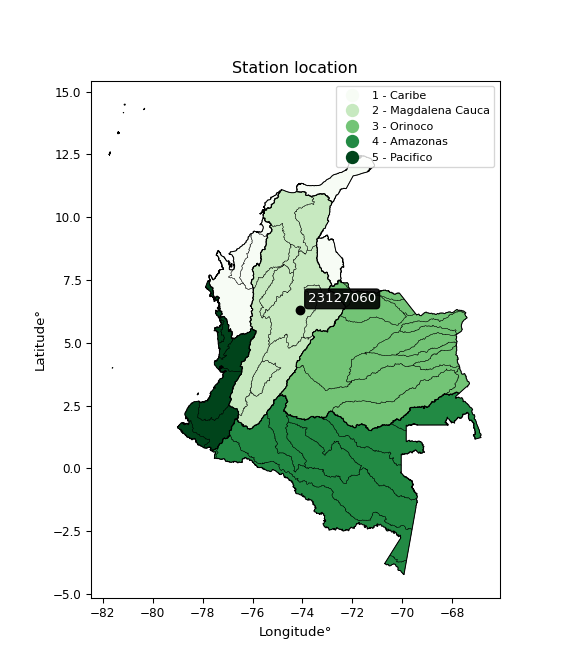

<div align="center">


</div>

# PMax24h Station (Rain): 23127060

Maximum Precipitation in 24 hours (PMax24h) is the greatest amount of rainfall for a specific duration that is meteorologically possible for a given location, acting as a "worst-case" scenario for extreme storms, crucial for designing safety-critical infrastructure like bridges, river deviations, dams, spillways, and nuclear plants to prevent catastrophic failure. The PMax24h is related with the Probable Maximum Precipitation (PMP) and it is calculated by hydrologists using meteorological data to determine the upper limit of extreme rainfall, often leading to the Probable Maximum Flood (PMF) for flood control design, and is increasingly being studied for climate change impacts. Probable Maximum Precipitation (PMP) is the theoretical upper limit of rainfall, a deterministic estimate for extreme events, while probability distributions (like GEV, Gumbel) describe the likelihood and frequency of various precipitation amounts, including rare ones, showing how often events occur, with PMP representing the extreme end of these distributions, used for critical infrastructure design to ensure safety against the worst conceivable weather, unlike standard statistical forecasts which cover typical probabilities.

The most common probability distributions in hydrology, used for analyzing floods, rainfall, and streamflow, include the Normal, Log-Normal, Gumbel, Gamma (including Log-Pearson Type III), and Generalized Extreme Value (GEV) distributions, often chosen based on the data´s skewness and whether modeling extremes or general conditions, with Gumbel and GEV popular for extreme events like floods, while the Normal distribution serves as a baseline, though often requiring transformations for skewed hydrological data. These distributions help in designing water infrastructure, managing water resources, and forecasting hydrologic events.

> Hydrological data often isn´t perfectly normal (it´s skewed), so different distributions are needed for different applications, such as: **Flood Frequency Analysis**: Using Gumbel, GEV, or Log-Pearson Type III for predicting extreme flood magnitudes and their return periods, **Rainfall Analysis**: Normal for annual totals, but Log-Normal, Weibull, or GEV for intensity or extreme daily rainfall, **Streamflow Modeling**: Gamma and Log-Normal for maximum flows, GEV for minimum flows, and Kappa for daily flows.

<div align="center">

</img>

</div>


## A. General information


### 1. General running parameters

• app_version: _v20260225_. • runtime: _2026-02-28 16:54:07.457399_. • Python version: _3.14.0_. • SciPy version: _1.16.3_. • Pandas version: _2.3.3_. • NumPy version: _2.3.5_. • Stations dataset (station_dataset_file): _dataset/pmax24h_in/automatic_colombia_2003_2025.csv_. • Stations catalog (station_catalog_file): _dataset/CNE.xls_. • Minimum year to eval til year_max (date_min): _1900_. • Maximum year to eval since year_min (date_max): _2025_. • Creates, save and include plots into reports (create_plot): _False_. • Plot only fit distributions with Δo > Δ (plot_only_fit): _True_. • Plot only simple graphs avoiding multiple CDFs and multiple Extreme values plots (plot_only_simple): _False_. • Eval low extreme values, if False, evaluates high extreme values (low_extreme): _False_. • Eval every SciPy distribution as logarithmic (pdist_logarithmic_on): _True_. • Standard deviation normalized (ddof): _1.0_. • Return periods to eval in years (Tr): _[2, 2.33, 5, 10, 15, 20, 25, 50, 75, 100, 200, 250, 500, 750, 1000]_. • Minimum data sample per station, 0 means any (minimum_sample): _5_. • Z-Score maximum threshold to adjust a value, 0 means disable (zscore_max): _3.5_. • Z-Score minimum threshold to adjust a value, 0 means disable (zscore_min): _-2.5_. • Avoid zeros, e.g. rain = 0 (avoid_zeros): _True_. • Avoid null values (avoid_nans): _True_. 

:file_folder:Table: [dataset.csv](../../dataset/pmax24h_in/automatic_colombia_2003_2025.csv)

> Delta Degrees of Freedom (DDOF): is a parameter used in the formulas for calculating variance and standard deviation. When ddof=0, the divisor is $N$ (the total number of observations) and this is used when your data set is the entire population. When ddof=1, the divisor is $N-1$ and this is used when your data set is a sample drawn from a larger population. Using $N-1$ provides an unbiased estimate of the population variance (known as Bessel´s correction).


### 2. Station info and location

|   id |   CODIGO | NOMBRE                       | CATEGORIA    | TECNOLOGIA                              | ESTADO           | FECHA_INSTALACION   |   FECHA_SUSPENSION |   ALTITUD |   LATITUD |   LONGITUD | DEPARTAMENTO   | MUNICIPIO   | AREA_OPERATIVA                         | ENTIDAD                                                     | AREA_HIDROGRAFICA   | ZONA_HIDROGRAFICA   | SUBZONA_HIDROGRAFICA   | CORRIENTE   | Catalogo   |   Version |
|-----:|---------:|:-----------------------------|:-------------|:----------------------------------------|:-----------------|:--------------------|-------------------:|----------:|----------:|-----------:|:---------------|:------------|:---------------------------------------|:------------------------------------------------------------|:--------------------|:--------------------|:-----------------------|:------------|:-----------|----------:|
|    0 | 23127060 | SANTA ROSA  - AUT [23127060] | Limnimétrica | Automática con Telemetría, Convencional | En Mantenimiento | 15/04/1975          |                nan |       154 |   6.29194 |   -74.0983 | Santander      | Cimitarra   | Area Operativa 08 - Santanderes-Arauca | INSTITUTO DE HIDROLOGIA METEOROLOGIA Y ESTUDIOS AMBIENTALES | Magdalena Cauca     | Medio Magdalena     | Río Carare (Minero)    | Carare      | CNE_IDEAM  |  20251226 |

<div align="center">

Dynamic map: [:earth_americas:Google](http://maps.google.com/maps?q=6.291944444,-74.09833333) [:earth_americas:OSM](https://www.openstreetmap.org/#map=18/6.291944444/-74.09833333&layers=P) [:earth_americas:Bing](https://www.bing.com/maps?cp=6.291944444~-74.09833333&lvl=18) [:earth_americas:Apple](https://maps.apple.com/frame?center=6.291944444%2C-74.09833333&span=0.003%2C0.006)

</div>


<div align="center">

```geojson
{
  "type": "Feature",
  "geometry": {
    "type": "Point", 
    "coordinates": [-74.09833333, 6.291944444]
  }, 
  "properties": {
    "Name": "23127060"
  }
}
```

</div>


### 3. Discrete values table and plot

<div align="center">

|               |            0 |           1 |           2 |          3 |          4 |
|:--------------|-------------:|------------:|------------:|-----------:|-----------:|
| Date          | 2019         | 2020        | 2021        | 2022       | 2025       |
| Value         |   55.4       |   67.4      |   41.4      |    9.4     |   99.4     |
| Value_initial |   55.4       |   67.4      |   41.4      |    9.4     |   99.4     |
| count         |    5         |    5        |    5        |    5       |    5       |
| mean          |   54.6       |   54.6      |   54.6      |   54.6     |   54.6     |
| std           |   33.124     |   33.124    |   33.124    |   33.124   |   33.124   |
| zscore        |    0.0241517 |    0.386427 |   -0.398502 |   -1.36457 |    1.35249 |


</div>


> The initial value (value_initial) correspond to the initial obtained or null completed value, and value (value) is adjusted only when the initial value is outside the valid range (outlier) definite through the Z-Score value. If Z-Score is active, values out of range or outliers are replaced with the station mean value. A Z-Score (or standard score) measures how many standard deviations a data point is from the mean of a dataset, indicating its relative position; positive scores mean above the mean, negative mean below, and a score of zero is exactly at the mean, allowing for comparison of values from different distributions. It´s calculated using the formula $z=(x–μ)/σ$, where $x$ is the data point, $μ$ is the mean, and $σ$ is the standard deviation, helping identify outliers and understand probability.
>
> <sub>**Note**: In this study, "completing" (filling gaps in) and "extending" (forecasting or lengthening the historical record) rainfall data series are avoided for certain critical analyses because they introduce artificial bias and uncertainty, which can distort the statistics of rare events (extremes), alter day-to-day variability, and compromise the integrity and homogeneity of the original data. Some reasons against Completing/Extending rainfall data are: **Distortion of Extremes and Variability**: The primary issue is that most gap-filling or extension methods rely on averaging or regression with nearby stations, which inherently smooths the data. Rainfall is highly variable in space and time, with a large percentage of zero values and occasional large storms. Infilling methods often underestimate the highest values and overestimate the lowest (zero) values, which severely distorts analyses focused on flood frequency, drought severity, and intensity-duration-frequency (IDF) curves, **Loss of Data Homogeneity**: Infilled or extended data are synthetic estimates, not actual measurements. Combining these estimates with observed data can violate the assumption of data homogeneity, which requires that the data properties do not change over time. Inhomogeneity can lead to incorrect conclusions about long-term trends or changes in climate patterns, **Propagation of Errors**: Errors and biases from the original data (e.g., wind-induced undercatch, instrument errors, site changes) or the data used for imputation can propagate through the analysis, leading to unreliable hydrological models and inaccurate predictions, **Compromised Statistical Integrity**: For statistical analyses, especially those involving the frequency of events, using artificial data can introduce time bias or autocorrelation that doesn´t exist in reality, making it difficult to assess the true probability of events, **Difficulty in Validation**: It is difficult to accurately validate the quality of filled or extended data, especially for past periods where ground-truth measurements are unavailable. The reliability of imputation techniques heavily depends on the density of the surrounding station network and the complexity of the local topography.</sub>


### 4. Active continuous probability distributions from SciPy (80 of 104 available)

A Probability Density Function (PDF) describes the relative likelihood of a continuous random variable falling within a specific range, where the total area under its curve equals 1, and the area over any interval gives the actual probability for that range. Unlike discrete probabilities (like rolling a die), a PDF shows density, not direct probability for a single point (which is zero), with higher points indicating higher likelihood, often visualized as a bell curve for normal distributions.

A log of a probability density function (log-PDF) is simply the logarithm of the PDF´s value, denoted as $log(f(x))$, useful for converting multiplication of probabilities into addition, improving numerical stability with tiny numbers, and connecting to information theory concepts like entropy. Instead of dealing with very small probabilities (e.g., 0.000001), log-PDFs use negative numbers (e.g., $log(0.00001) ≈ -11.51$ that are easier for computers to handle, preventing underflow errors and simplifying complex calculations. In this study, each active probability distribution from SciPy is also evaluated in the $log$ form.

[scipy.stats](https://docs.scipy.org/doc/scipy/reference/stats.html) is a Python´s powerful submodule within the SciPy library for comprehensive statistical analysis, offering over 130 probability distributions (like Normal, Poisson, etc.), functions for descriptive stats (mean, variance), hypothesis testing (t-tests, chi-square), random variable generation, and statistical tests, making it essential for data science, modeling, and research. It provides tools to explore, model, and draw conclusions from data efficiently, working seamlessly with [NumPy](https://numpy.org/).

<div align="center">

|   id | p_dist           |   n_parameter | fit_method   | label                                                                       | active   | ref                                                                                                      |
|-----:|:-----------------|--------------:|:-------------|:----------------------------------------------------------------------------|:---------|:---------------------------------------------------------------------------------------------------------|
|    0 | alpha            |             3 | MLE          | Alpha                                                                       | True     | [:mortar_board:](https://docs.scipy.org/doc/scipy/reference/generated/scipy.stats.alpha.html)            |
|    1 | anglit           |             2 | MM           | Anglit                                                                      | True     | [:mortar_board:](https://docs.scipy.org/doc/scipy/reference/generated/scipy.stats.anglit.html)           |
|    2 | arcsine          |             2 | MM           | Arcsine                                                                     | True     | [:mortar_board:](https://docs.scipy.org/doc/scipy/reference/generated/scipy.stats.arcsine.html)          |
|    3 | argus            |             3 | MLE          | Argus                                                                       | True     | [:mortar_board:](https://docs.scipy.org/doc/scipy/reference/generated/scipy.stats.argus.html)            |
|    4 | beta             |             4 | MLE          | Beta                                                                        | True     | [:mortar_board:](https://docs.scipy.org/doc/scipy/reference/generated/scipy.stats.beta.html)             |
|    5 | betaprime        |             4 | MLE          | Beta prime                                                                  | True     | [:mortar_board:](https://docs.scipy.org/doc/scipy/reference/generated/scipy.stats.betaprime.html)        |
|    6 | bradford         |             3 | MLE          | Bradford                                                                    | True     | [:mortar_board:](https://docs.scipy.org/doc/scipy/reference/generated/scipy.stats.bradford.html)         |
|    7 | burr             |             4 | MLE          | Burr (Type III)                                                             | True     | [:mortar_board:](https://docs.scipy.org/doc/scipy/reference/generated/scipy.stats.burr.html)             |
|    8 | burr12           |             4 | MLE          | Burr (Type III) 12                                                          | True     | [:mortar_board:](https://docs.scipy.org/doc/scipy/reference/generated/scipy.stats.burr12.html)           |
|    9 | cosine           |             2 | MLE          | Cosine                                                                      | True     | [:mortar_board:](https://docs.scipy.org/doc/scipy/reference/generated/scipy.stats.cosine.html)           |
|   10 | crystalball      |             4 | MLE          | Crystalball                                                                 | True     | [:mortar_board:](https://docs.scipy.org/doc/scipy/reference/generated/scipy.stats.crystalball.html)      |
|   11 | dgamma           |             3 | MLE          | Double gamma                                                                | True     | [:mortar_board:](https://docs.scipy.org/doc/scipy/reference/generated/scipy.stats.dgamma.html)           |
|   12 | dweibull         |             3 | MLE          | Double Weibull                                                              | True     | [:mortar_board:](https://docs.scipy.org/doc/scipy/reference/generated/scipy.stats.dweibull.html)         |
|   13 | erlang           |             3 | MLE          | Erlang                                                                      | True     | [:mortar_board:](https://docs.scipy.org/doc/scipy/reference/generated/scipy.stats.erlang.html)           |
|   14 | exponnorm        |             3 | MLE          | Exponentially modified Normal                                               | True     | [:mortar_board:](https://docs.scipy.org/doc/scipy/reference/generated/scipy.stats.exponnorm.html)        |
|   15 | exponpow         |             3 | MLE          | Exponential power                                                           | True     | [:mortar_board:](https://docs.scipy.org/doc/scipy/reference/generated/scipy.stats.exponpow.html)         |
|   16 | exponweib        |             4 | MLE          | Exponentiated Weibull                                                       | True     | [:mortar_board:](https://docs.scipy.org/doc/scipy/reference/generated/scipy.stats.exponweib.html)        |
|   17 | f                |             4 | MLE          | F                                                                           | True     | [:mortar_board:](https://docs.scipy.org/doc/scipy/reference/generated/scipy.stats.f.html)                |
|   18 | fatiguelife      |             3 | MLE          | Fatigue-life (Birnbaum-Saunders)                                            | True     | [:mortar_board:](https://docs.scipy.org/doc/scipy/reference/generated/scipy.stats.fatiguelife.html)      |
|   19 | foldnorm         |             3 | MM           | Fold Normal                                                                 | True     | [:mortar_board:](https://docs.scipy.org/doc/scipy/reference/generated/scipy.stats.foldnorm.html)         |
|   20 | gamma            |             3 | MLE          | Gamma                                                                       | True     | [:mortar_board:](https://docs.scipy.org/doc/scipy/reference/generated/scipy.stats.gamma.html)            |
|   21 | gausshyper       |             6 | MLE          | Gauss hypergeometric                                                        | True     | [:mortar_board:](https://docs.scipy.org/doc/scipy/reference/generated/scipy.stats.gausshyper.html)       |
|   22 | genexpon         |             5 | MLE          | Generalized exponential                                                     | True     | [:mortar_board:](https://docs.scipy.org/doc/scipy/reference/generated/scipy.stats.genexpon.html)         |
|   23 | genextreme       |             3 | MLE          | Generalized exponential                                                     | True     | [:mortar_board:](https://docs.scipy.org/doc/scipy/reference/generated/scipy.stats.genextreme.html)       |
|   24 | gengamma         |             4 | MLE          | Generalized gamma                                                           | True     | [:mortar_board:](https://docs.scipy.org/doc/scipy/reference/generated/scipy.stats.gengamma.html)         |
|   25 | genhalflogistic  |             3 | MLE          | Generalized half-logistic                                                   | True     | [:mortar_board:](https://docs.scipy.org/doc/scipy/reference/generated/scipy.stats.genhalflogistic.html)  |
|   26 | genlogistic      |             3 | MLE          | Generalized logistic                                                        | True     | [:mortar_board:](https://docs.scipy.org/doc/scipy/reference/generated/scipy.stats.genlogistic.html)      |
|   27 | gennorm          |             3 | MLE          | Generalized Normal                                                          | True     | [:mortar_board:](https://docs.scipy.org/doc/scipy/reference/generated/scipy.stats.gennorm.html)          |
|   28 | genpareto        |             3 | MLE          | Generalized Pareto                                                          | True     | [:mortar_board:](https://docs.scipy.org/doc/scipy/reference/generated/scipy.stats.genpareto.html)        |
|   29 | gompertz         |             3 | MLE          | Gompertz (or truncated Gumbel)                                              | True     | [:mortar_board:](https://docs.scipy.org/doc/scipy/reference/generated/scipy.stats.gompertz.html)         |
|   30 | gumbel_l         |             2 | MM           | Gumbel Left Skew                                                            | True     | [:mortar_board:](https://docs.scipy.org/doc/scipy/reference/generated/scipy.stats.gumbel_l.html)         |
|   31 | gumbel_r         |             2 | MM           | Gumbel Right Skew                                                           | True     | [:mortar_board:](https://docs.scipy.org/doc/scipy/reference/generated/scipy.stats.gumbel_r.html)         |
|   32 | halfgennorm      |             3 | MLE          | Upper half of a generalized normal                                          | True     | [:mortar_board:](https://docs.scipy.org/doc/scipy/reference/generated/scipy.stats.halfgennorm.html)      |
|   33 | halflogistic     |             2 | MM           | Half-logistic                                                               | True     | [:mortar_board:](https://docs.scipy.org/doc/scipy/reference/generated/scipy.stats.halflogistic.html)     |
|   34 | halfnorm         |             2 | MM           | Half Normal                                                                 | True     | [:mortar_board:](https://docs.scipy.org/doc/scipy/reference/generated/scipy.stats.halfnorm.html)         |
|   35 | hypsecant        |             2 | MM           | hyperbolic secant                                                           | True     | [:mortar_board:](https://docs.scipy.org/doc/scipy/reference/generated/scipy.stats.hypsecant.html)        |
|   36 | invgamma         |             3 | MLE          | Inverted gamma                                                              | True     | [:mortar_board:](https://docs.scipy.org/doc/scipy/reference/generated/scipy.stats.invgamma.html)         |
|   37 | invgauss         |             3 | MLE          | Inverse Gaussian                                                            | True     | [:mortar_board:](https://docs.scipy.org/doc/scipy/reference/generated/scipy.stats.invgauss.html)         |
|   38 | invweibull       |             3 | MLE          | Inverted Weibull                                                            | True     | [:mortar_board:](https://docs.scipy.org/doc/scipy/reference/generated/scipy.stats.invweibull.html)       |
|   39 | johnsonsb        |             4 | MLE          | Johnson SB                                                                  | True     | [:mortar_board:](https://docs.scipy.org/doc/scipy/reference/generated/scipy.stats.johnsonsb.html)        |
|   40 | johnsonsu        |             4 | MLE          | Johnson Su                                                                  | True     | [:mortar_board:](https://docs.scipy.org/doc/scipy/reference/generated/scipy.stats.johnsonsu.html)        |
|   41 | kappa3           |             3 | MLE          | Kappa 3                                                                     | True     | [:mortar_board:](https://docs.scipy.org/doc/scipy/reference/generated/scipy.stats.kappa3.html)           |
|   42 | kappa4           |             4 | MLE          | Kappa 4                                                                     | True     | [:mortar_board:](https://docs.scipy.org/doc/scipy/reference/generated/scipy.stats.kappa4.html)           |
|   43 | ksone            |             3 | MLE          | Kolmogorov-Smirnov one-sided test statistic distribution                    | True     | [:mortar_board:](https://docs.scipy.org/doc/scipy/reference/generated/scipy.stats.ksone.html)            |
|   44 | kstwobign        |             2 | MLE          | Limiting distribution of scaled Kolmogorov-Smirnov two-sided test statistic | True     | [:mortar_board:](https://docs.scipy.org/doc/scipy/reference/generated/scipy.stats.kstwobign.html)        |
|   45 | laplace          |             2 | MM           | Laplace                                                                     | True     | [:mortar_board:](https://docs.scipy.org/doc/scipy/reference/generated/scipy.stats.laplace.html)          |
|   46 | levy_l           |             2 | MLE          | Left-skewed Levy                                                            | True     | [:mortar_board:](https://docs.scipy.org/doc/scipy/reference/generated/scipy.stats.levy_l.html)           |
|   47 | loggamma         |             3 | MLE          | Log gamma                                                                   | True     | [:mortar_board:](https://docs.scipy.org/doc/scipy/reference/generated/scipy.stats.loggamma.html)         |
|   48 | logistic         |             2 | MM           | Logistic (or Sech-squared)                                                  | True     | [:mortar_board:](https://docs.scipy.org/doc/scipy/reference/generated/scipy.stats.logistic.html)         |
|   49 | loglaplace       |             3 | MLE          | Log-Laplace                                                                 | True     | [:mortar_board:](https://docs.scipy.org/doc/scipy/reference/generated/scipy.stats.loglaplace.html)       |
|   50 | lomax            |             3 | MLE          | Lomax (Pareto of the second kind)                                           | True     | [:mortar_board:](https://docs.scipy.org/doc/scipy/reference/generated/scipy.stats.lomax.html)            |
|   51 | maxwell          |             2 | MM           | Maxwell                                                                     | True     | [:mortar_board:](https://docs.scipy.org/doc/scipy/reference/generated/scipy.stats.maxwell.html)          |
|   52 | mielke           |             4 | MLE          | Mielke Beta-Kappa / Dagum                                                   | True     | [:mortar_board:](https://docs.scipy.org/doc/scipy/reference/generated/scipy.stats.mielke.html)           |
|   53 | moyal            |             2 | MM           | Moyal                                                                       | True     | [:mortar_board:](https://docs.scipy.org/doc/scipy/reference/generated/scipy.stats.moyal.html)            |
|   54 | nakagami         |             3 | MLE          | Nakagami                                                                    | True     | [:mortar_board:](https://docs.scipy.org/doc/scipy/reference/generated/scipy.stats.nakagami.html)         |
|   55 | ncf              |             5 | MLE          | Non-central F distribution                                                  | True     | [:mortar_board:](https://docs.scipy.org/doc/scipy/reference/generated/scipy.stats.ncf.html)              |
|   56 | nct              |             4 | MLE          | Non-central Student’s t                                                     | True     | [:mortar_board:](https://docs.scipy.org/doc/scipy/reference/generated/scipy.stats.nct.html)              |
|   57 | norm             |             2 | MM           | Normal                                                                      | True     | [:mortar_board:](https://docs.scipy.org/doc/scipy/reference/generated/scipy.stats.norm.html)             |
|   58 | pearson3         |             3 | MM           | Pearson type III                                                            | True     | [:mortar_board:](https://docs.scipy.org/doc/scipy/reference/generated/scipy.stats.pearson3.html)         |
|   59 | powerlaw         |             3 | MLE          | Power-function                                                              | True     | [:mortar_board:](https://docs.scipy.org/doc/scipy/reference/generated/scipy.stats.powerlaw.html)         |
|   60 | rayleigh         |             2 | MM           | Rayleigh                                                                    | True     | [:mortar_board:](https://docs.scipy.org/doc/scipy/reference/generated/scipy.stats.rayleigh.html)         |
|   61 | rdist            |             3 | MLE          | R-distributed (symmetric beta)                                              | True     | [:mortar_board:](https://docs.scipy.org/doc/scipy/reference/generated/scipy.stats.rdist.html)            |
|   62 | rice             |             3 | MLE          | Rice                                                                        | True     | [:mortar_board:](https://docs.scipy.org/doc/scipy/reference/generated/scipy.stats.rice.html)             |
|   63 | semicircular     |             2 | MM           | Semicircular                                                                | True     | [:mortar_board:](https://docs.scipy.org/doc/scipy/reference/generated/scipy.stats.semicircular.html)     |
|   64 | skewnorm         |             3 | MLE          | Skew normal                                                                 | True     | [:mortar_board:](https://docs.scipy.org/doc/scipy/reference/generated/scipy.stats.skewnorm.html)         |
|   65 | t                |             3 | MLE          | Student’s t                                                                 | True     | [:mortar_board:](https://docs.scipy.org/doc/scipy/reference/generated/scipy.stats.t.html)                |
|   66 | trapezoid        |             4 | MLE          | Trapezoid                                                                   | True     | [:mortar_board:](https://docs.scipy.org/doc/scipy/reference/generated/scipy.stats.trapezoid.html)        |
|   67 | triang           |             3 | MLE          | Triangular                                                                  | True     | [:mortar_board:](https://docs.scipy.org/doc/scipy/reference/generated/scipy.stats.triang.html)           |
|   68 | truncexpon       |             3 | MLE          | Truncated exponential                                                       | True     | [:mortar_board:](https://docs.scipy.org/doc/scipy/reference/generated/scipy.stats.truncexpon.html)       |
|   69 | truncnorm        |             4 | MLE          | Truncated normal                                                            | True     | [:mortar_board:](https://docs.scipy.org/doc/scipy/reference/generated/scipy.stats.truncnorm.html)        |
|   70 | truncpareto      |             4 | MLE          | Upper truncated Pareto                                                      | True     | [:mortar_board:](https://docs.scipy.org/doc/scipy/reference/generated/scipy.stats.truncpareto.html)      |
|   71 | truncweibull_min |             5 | MLE          | Doubly truncated Weibull minimum                                            | True     | [:mortar_board:](https://docs.scipy.org/doc/scipy/reference/generated/scipy.stats.truncweibull_min.html) |
|   72 | tukeylambda      |             3 | MLE          | Tukey-Lamdba                                                                | True     | [:mortar_board:](https://docs.scipy.org/doc/scipy/reference/generated/scipy.stats.tukeylambda.html)      |
|   73 | uniform          |             2 | MLE          | Uniform                                                                     | True     | [:mortar_board:](https://docs.scipy.org/doc/scipy/reference/generated/scipy.stats.uniform.html)          |
|   74 | vonmises         |             3 | MLE          | Von Mises                                                                   | True     | [:mortar_board:](https://docs.scipy.org/doc/scipy/reference/generated/scipy.stats.vonmises.html)         |
|   75 | vonmises_line    |             3 | MLE          | Von Mises line                                                              | True     | [:mortar_board:](https://docs.scipy.org/doc/scipy/reference/generated/scipy.stats.vonmises_line.html)    |
|   76 | wald             |             2 | MM           | Wald                                                                        | True     | [:mortar_board:](https://docs.scipy.org/doc/scipy/reference/generated/scipy.stats.wald.html)             |
|   77 | weibull_max      |             3 | MLE          | Weibull maximum                                                             | True     | [:mortar_board:](https://docs.scipy.org/doc/scipy/reference/generated/scipy.stats.weibull_max.html)      |
|   78 | weibull_min      |             3 | MLE          | Weibull minimum                                                             | True     | [:mortar_board:](https://docs.scipy.org/doc/scipy/reference/generated/scipy.stats.weibull_min.html)      |
|   79 | wrapcauchy       |             3 | MLE          | Wrapped  Cauchy                                                             | True     | [:mortar_board:](https://docs.scipy.org/doc/scipy/reference/generated/scipy.stats.wrapcauchy.html)       |

</div>

> **n_parameter:** # arguments & localization & scale.
>
> **Fit methods:** (MLE) maximum likelihood, (MM) L-moments.
>
>**Inactive** (With the only purpose of prevent loops, zero divisions, infinite values, over high estimated values or horizontal trending for recurrence intervals estimations, the follow distributions were disabled.)**:** lognorm, norminvgauss, powernorm, powerlognorm, cauchy, halfcauchy, foldcauchy, skewcauchy, chi2, expon, fisk, genhyperbolic, geninvgauss, gibrat, kstwo, laplace_asymmetric, levy, levy_stable, ncx2, pareto, rel_breitwigner, recipinvgauss, studentized_range, loguniform, 


## B. Probability (PDF) vs. Empirical (EDF) distributions functions

A continuous probability distribution (CPD) describes probabilities for variables that can take any value within a range (like rain any time), unlike discrete variables with specific outcomes (like temperature). It uses a Probability Density Function (PDF), a curve where the total area under it equals 1, and the probability of the variable falling within an interval (a to b) is found by calculating the area under the curve between those points. A key feature is that the probability of hitting any single exact value is zero, so probabilities are always expressed for ranges, e.g., $P(a ≤ X ≤ b)$.

<div align="center">

Distributions parameters from station values
|     |   station | p_dist              |   n |             loc |           scale | shape                  | shape1                | shape2                 | shape3             |
|----:|----------:|:--------------------|----:|----------------:|----------------:|:-----------------------|:----------------------|:-----------------------|:-------------------|
|   0 |  23127060 | alpha               |   5 |    -0.0490839   |    20.0618      | 2.7572808341190968e-11 |                       |                        |                    |
|   1 |  23127060 | anglit              |   5 |    54.6         |    86.6708      |                        |                       |                        |                    |
|   2 |  23127060 | arcsine             |   5 |    12.7011      |    83.7979      |                        |                       |                        |                    |
|   3 |  23127060 | argus               |   5 |   -13.1951      |   119.141       | 1.0237747376226611e-06 |                       |                        |                    |
|   4 |  23127060 | beta                |   5 |   -12.7767      |   112.177       | 1.6712763843597853     | 0.6298398549925819    |                        |                    |
|   5 |  23127060 | betaprime           |   5 |  -735.591       | 60924.9         | 716.3038851151027      | 55230.79377599733     |                        |                    |
|   6 |  23127060 | bradford            |   5 |     9.39999     |    90.0001      | 1.1131118287771864     |                       |                        |                    |
|   7 |  23127060 | burr                |   5 |    -1.4633      |   102.125       | 316.75159899167454     | 0.0038487951785927538 |                        |                    |
|   8 |  23127060 | burr12              |   5 |    -1.09828     |    10.3485      | 312.2259142279727      | 0.0021974330804671325 |                        |                    |
|   9 |  23127060 | cosine              |   5 |    54.5179      |    24.6661      |                        |                       |                        |                    |
|  10 |  23127060 | crystalball         |   5 |    -0.0738709   |    62.1477      | 5.736634172982519      | 1.0079243197759684    |                        |                    |
|  11 |  23127060 | dgamma              |   5 |    55.4         |    23.5484      | 0.8819936496333902     |                       |                        |                    |
|  12 |  23127060 | dweibull            |   5 |    55.4         |    21.9777      | 0.949921123372679      |                       |                        |                    |
|  13 |  23127060 | erlang              |   5 | -2993.49        |     0.288177    | 10577.156805366776     |                       |                        |                    |
|  14 |  23127060 | exponnorm           |   5 |    54.5536      |    29.627       | 0.0015665480628110665  |                       |                        |                    |
|  15 |  23127060 | exponpow            |   5 |     9.4         |    90.6339      | 0.18539633571784836    |                       |                        |                    |
|  16 |  23127060 | exponweib           |   5 | -1189.68        |   852.162       | 2763.39714242201       | 5.628695613089668     |                        |                    |
|  17 |  23127060 | f                   |   5 |  -324.666       |   379.244       | 320.7747542596994      | 74606.33451341241     |                        |                    |
|  18 |  23127060 | fatiguelife         |   5 |     9.4         |     5.87219e-05 | 713.6227274685007      |                       |                        |                    |
|  19 |  23127060 | foldnorm            |   5 |  -160.272       |    29.5617      | 7.26916267060416       |                       |                        |                    |
|  20 |  23127060 | gamma               |   5 | -2993.65        |     0.288082    | 10581.145259864013     |                       |                        |                    |
|  21 |  23127060 | gausshyper          |   5 |     9.32419     |    90.0758      | 0.9643527886464236     | 0.9201708410997147    | 1.0721130424823289     | 0.8822086662557584 |
|  22 |  23127060 | genexpon            |   5 |     0.422553    |     1.94718     | 0.007448512286990095   | 0.7605166945164286    | 0.0021243170176887456  |                    |
|  23 |  23127060 | genextreme          |   5 |    45.9501      |    30.815       | 0.40552526422942825    |                       |                        |                    |
|  24 |  23127060 | gengamma            |   5 |     9.4         |   104.586       | 0.12407101012390623    | 5.378296028554045     |                        |                    |
|  25 |  23127060 | genhalflogistic     |   5 |     0.369674    |   108.442       | 1.095034480550443      |                       |                        |                    |
|  26 |  23127060 | genlogistic         |   5 |    50.7559      |    18.2329      | 1.1554302544771917     |                       |                        |                    |
|  27 |  23127060 | gennorm             |   5 |    54.3997      |    45.0006      | 1675304.752059501      |                       |                        |                    |
|  28 |  23127060 | genpareto           |   5 |    -0.194194    |   135.997       | -1.3655128585514895    |                       |                        |                    |
|  29 |  23127060 | gompertz            |   5 |     9.36975     |    44.6962      | 0.4126824501965794     |                       |                        |                    |
|  30 |  23127060 | gumbel_l            |   5 |    67.9337      |    23.1001      |                        |                       |                        |                    |
|  31 |  23127060 | gumbel_r            |   5 |    41.2663      |    23.1001      |                        |                       |                        |                    |
|  32 |  23127060 | halfgennorm         |   5 |     9.4         |    93.7333      | 64.97916406255104      |                       |                        |                    |
|  33 |  23127060 | halflogistic        |   5 |    19.4851      |    25.33        |                        |                       |                        |                    |
|  34 |  23127060 | halfnorm            |   5 |    15.3854      |    49.1482      |                        |                       |                        |                    |
|  35 |  23127060 | hypsecant           |   5 |    54.6         |    18.8611      |                        |                       |                        |                    |
|  36 |  23127060 | invgamma            |   5 |  -197.554       | 17303.1         | 69.51686331001059      |                       |                        |                    |
|  37 |  23127060 | invgauss            |   5 |  -124.117       |  5984.22        | 0.029911223002657375   |                       |                        |                    |
|  38 |  23127060 | invweibull          |   5 |    -3.7118e+09  |     3.7118e+09  | 134287051.03091735     |                       |                        |                    |
|  39 |  23127060 | johnsonsb           |   5 |     7.1206      |    92.2794      | 0.04391014220050324    | 0.11558686052125039   |                        |                    |
|  40 |  23127060 | johnsonsu           |   5 |    -1.88082e+07 |     5.4153e+07  | -659223.6455382588     | 1934976.3448120733    |                        |                    |
|  41 |  23127060 | kappa3              |   5 |     9.4         |    89.9116      | 1638.3486993729184     |                       |                        |                    |
|  42 |  23127060 | kappa4              |   5 |     3.20331     |   102.185       | 1.0639224206021058     | 1.0622520652701697    |                        |                    |
|  43 |  23127060 | ksone               |   5 |     3.28451     |   102.631       | 1.0                    |                       |                        |                    |
|  44 |  23127060 | kstwobign           |   5 |   -56.7428      |   127.27        |                        |                       |                        |                    |
|  45 |  23127060 | laplace             |   5 |    54.6         |    20.9495      |                        |                       |                        |                    |
|  46 |  23127060 | levy_l              |   5 |   103.492       |    15.6451      |                        |                       |                        |                    |
|  47 |  23127060 | loggamma            |   5 | -4106.97        |   668.07        | 507.85599391461665     |                       |                        |                    |
|  48 |  23127060 | logistic            |   5 |    54.6         |    16.3342      |                        |                       |                        |                    |
|  49 |  23127060 | loglaplace          |   5 |    -0.207413    |    55.6074      | 1.7775303509341849     |                       |                        |                    |
|  50 |  23127060 | lomax               |   5 |     9.4         |     8.26842e+09 | 183109307.2037996      |                       |                        |                    |
|  51 |  23127060 | maxwell             |   5 |   -15.6036      |    43.9936      |                        |                       |                        |                    |
|  52 |  23127060 | mielke              |   5 |     9.4         |    90.2444      | 0.64281752961705       | 5901.191290471438     |                        |                    |
|  53 |  23127060 | moyal               |   5 |    37.6574      |    13.3368      |                        |                       |                        |                    |
|  54 |  23127060 | nakagami            |   5 |    41.4         |    24.2311      | 0.2398730514942929     |                       |                        |                    |
|  55 |  23127060 | ncf                 |   5 |    -0.901282    |     3.30299e-06 | 7.009824446205113e-07  | 430.00725268379324    | 11.749509991020531     |                    |
|  56 |  23127060 | nct                 |   5 | -1537.51        |    29.5307      | 216260.01446914018     | 53.91348654902136     |                        |                    |
|  57 |  23127060 | norm                |   5 |    54.6         |    29.627       |                        |                       |                        |                    |
|  58 |  23127060 | pearson3            |   5 |    54.6         |    29.6269      | -0.020233546600066536  |                       |                        |                    |
|  59 |  23127060 | powerlaw            |   5 |     9.4         |    90           | 0.12312653672494621    |                       |                        |                    |
|  60 |  23127060 | rayleigh            |   5 |    -2.07821     |    45.2227      |                        |                       |                        |                    |
|  61 |  23127060 | rdist               |   5 |     1.48635     |    53.9136      | 1.0044917385977157     |                       |                        |                    |
|  62 |  23127060 | rice                |   5 |    -7.28663     |    34.4046      | 1.406124437260738      |                       |                        |                    |
|  63 |  23127060 | semicircular        |   5 |    54.6         |    59.254       |                        |                       |                        |                    |
|  64 |  23127060 | skewnorm            |   5 |    57.7985      |    29.7992      | -0.13575699523237322   |                       |                        |                    |
|  65 |  23127060 | t                   |   5 |    54.6         |    29.6271      | 2138975921.3162389     |                       |                        |                    |
|  66 |  23127060 | trapezoid           |   5 |     0.4         |   108           | 1.0                    | 1.0                   |                        |                    |
|  67 |  23127060 | triang              |   5 |     0.424077    |    98.9759      | 0.9999999188475339     |                       |                        |                    |
|  68 |  23127060 | truncexpon          |   5 |     0.429923    |   122.818       | 0.8058268157819978     |                       |                        |                    |
|  69 |  23127060 | truncnorm           |   5 |    54.6         |    29.627       | -160.2982738084072     | 547.5955568711618     |                        |                    |
|  70 |  23127060 | truncpareto         |   5 |     8.95583     |     0.444172    | 0.26127734387960033    | 203.62435370287864    |                        |                    |
|  71 |  23127060 | truncweibull_min    |   5 |     0.279134    |   142.379       | 1.350884743102661      | 0.0017608760334924664 | 0.6961756731315762     |                    |
|  72 |  23127060 | tukeylambda         |   5 |    54.2478      |    49.1668      | 1.0889141243148832     |                       |                        |                    |
|  73 |  23127060 | uniform             |   5 |     9.4         |    90           |                        |                       |                        |                    |
|  74 |  23127060 | vonmises            |   5 |    -1.90645     |     1           | 2.0238332100038        |                       |                        |                    |
|  75 |  23127060 | vonmises_line       |   5 |    62.4315      |    16.8805      | 0.2527229648161955     |                       |                        |                    |
|  76 |  23127060 | wald                |   5 |    24.973       |    29.627       |                        |                       |                        |                    |
|  77 |  23127060 | weibull_max         |   5 |    99.4         |     1.54044     | 0.24170530283476016    |                       |                        |                    |
|  78 |  23127060 | weibull_min         |   5 |   -16.7413      |    80.3957      | 2.6447493256254173     |                       |                        |                    |
|  79 |  23127060 | wrapcauchy          |   5 |     9.36437     |    14.3297      | 0.00011085224077782817 |                       |                        |                    |
|  80 |  23127060 | logalpha            |   5 |   -19.1271      |   627.594       | 27.449182173190124     |                       |                        |                    |
|  81 |  23127060 | loganglit           |   5 |     3.75767     |     2.36998     |                        |                       |                        |                    |
|  82 |  23127060 | logarcsine          |   5 |     2.61198     |     2.29139     |                        |                       |                        |                    |
|  83 |  23127060 | logargus            |   5 |     1.22741     |     3.45458     | 2.332388284532211      |                       |                        |                    |
|  84 |  23127060 | logbeta             |   5 |     2.11106     |     2.4881      | 0.7122759225670945     | 0.260586733191488     |                        |                    |
|  85 |  23127060 | logbetaprime        |   5 |  -231.436       |  1769.04        | 94512.54344663315      | 710872.0664331731     |                        |                    |
|  86 |  23127060 | logbradford         |   5 |     2.24069     |     2.35846     | 1.049385976649794      |                       |                        |                    |
|  87 |  23127060 | logburr             |   5 |     0.838404    |     3.78064     | 715.6691731487482      | 0.0044899223463338335 |                        |                    |
|  88 |  23127060 | logburr12           |   5 |  -227.09        |   239.214       | 423.17280690065195     | 1817661.341801179     |                        |                    |
|  89 |  23127060 | logcosine           |   5 |     3.63966     |     0.687071    |                        |                       |                        |                    |
|  90 |  23127060 | logcrystalball      |   5 |     3.75767     |     0.81014     | 8.014301899726199      | 526.7344449159148     |                        |                    |
|  91 |  23127060 | logdgamma           |   5 |     4.01458     |     0.586514    | 0.983065491284689      |                       |                        |                    |
|  92 |  23127060 | logdweibull         |   5 |     4.01458     |     0.587476    | 0.9736286929968225     |                       |                        |                    |
|  93 |  23127060 | logerlang           |   5 |    -7.40501     |     0.0619913   | 179.96259229114298     |                       |                        |                    |
|  94 |  23127060 | logexponnorm        |   5 |     3.75741     |     0.810146    | 0.00032411352857980016 |                       |                        |                    |
|  95 |  23127060 | logexponpow         |   5 |     2.24071     |     1.50877     | 0.5109130708166596     |                       |                        |                    |
|  96 |  23127060 | logexponweib        |   5 |     2.24071     |     2.77529     | 0.7643395761158367     | 0.17674617966778455   |                        |                    |
|  97 |  23127060 | logf                |   5 |  -869.677       |   873.435       | 6648537.66870679       | 3535062.514951108     |                        |                    |
|  98 |  23127060 | logfatiguelife      |   5 |  -521.133       |   524.896       | 0.0015409492409084822  |                       |                        |                    |
|  99 |  23127060 | logfoldnorm         |   5 |    -1.74755     |     0.76627     | 7.192093688147899      |                       |                        |                    |
| 100 |  23127060 | loggamma            |   5 |   -10.442       |     0.0488109   | 290.6980465898025      |                       |                        |                    |
| 101 |  23127060 | loggausshyper       |   5 |     2.22597     |     2.37318     | 1.146709390822846      | 0.7843676851751082    | 1.0147208158154644     | 0.9943879514325571 |
| 102 |  23127060 | loggenexpon         |   5 |     2.24048     |     0.00265546  | 0.0007345496073841765  | 0.18343032684452054   | 1.5093210128006825e-05 |                    |
| 103 |  23127060 | loggenextreme       |   5 |     3.82777     |     0.863338    | 1.119205934140329      |                       |                        |                    |
| 104 |  23127060 | loggengamma         |   5 |     2.24071     |     2.22416     | 0.20495526927123986    | 0.6761085111316045    |                        |                    |
| 105 |  23127060 | loggenhalflogistic  |   5 |     2.14921     |     2.5916      | 1.0578219867521068     |                       |                        |                    |
| 106 |  23127060 | loggenlogistic      |   5 |     4.59927     |     9.02959e-06 | 1.0578381278808526e-05 |                       |                        |                    |
| 107 |  23127060 | loggennorm          |   5 |     4.01455     |     0.586182    | 0.9749614936758002     |                       |                        |                    |
| 108 |  23127060 | loggenpareto        |   5 |    -0.00304325  |     9.13986     | -1.985978449822524     |                       |                        |                    |
| 109 |  23127060 | loggompertz         |   5 |     2.24071     |     0.633864    | 0.05784812653180643    |                       |                        |                    |
| 110 |  23127060 | loggumbel_l         |   5 |     4.12228     |     0.631663    |                        |                       |                        |                    |
| 111 |  23127060 | loggumbel_r         |   5 |     3.39307     |     0.631663    |                        |                       |                        |                    |
| 112 |  23127060 | loghalfgennorm      |   5 |     2.24071     |     1.13308     | 0.8778603444299922     |                       |                        |                    |
| 113 |  23127060 | loghalflogistic     |   5 |     2.79744     |     0.692657    |                        |                       |                        |                    |
| 114 |  23127060 | loghalfnorm         |   5 |     2.68536     |     1.34395     |                        |                       |                        |                    |
| 115 |  23127060 | loghypsecant        |   5 |     3.75767     |     0.515751    |                        |                       |                        |                    |
| 116 |  23127060 | loginvgamma         |   5 |   -13.9207      |  7639.47        | 433.14563110645213     |                       |                        |                    |
| 117 |  23127060 | loginvgauss         |   5 |    -3.90754     |   573.406       | 0.013334657457816533   |                       |                        |                    |
| 118 |  23127060 | loginvweibull       |   5 |    -6.61575e+07 |     6.61575e+07 | 74718663.06208295      |                       |                        |                    |
| 119 |  23127060 | logjohnsonsb        |   5 |    -0.799876    |     5.39903     | -0.12743667005263382   | 0.15676966517367064   |                        |                    |
| 120 |  23127060 | logjohnsonsu        |   5 |     4.76555     |     0.00586932  | 6.199085616006631      | 1.1290963965773533    |                        |                    |
| 121 |  23127060 | logkappa3           |   5 |     2.24071     |     2.32256     | 104.50482728832239     |                       |                        |                    |
| 122 |  23127060 | logkappa4           |   5 |     2.02143     |     2.74209     | 1.0871673230139427     | 1.0635594440394056    |                        |                    |
| 123 |  23127060 | logksone            |   5 |     2.00487     |     2.83013     | 1.0                    |                       |                        |                    |
| 124 |  23127060 | logkstwobign        |   5 |     0.152079    |     4.11045     |                        |                       |                        |                    |
| 125 |  23127060 | loglaplace          |   5 |     3.75767     |     0.572855    |                        |                       |                        |                    |
| 126 |  23127060 | loglevy_l           |   5 |     4.65802     |     0.224622    |                        |                       |                        |                    |
| 127 |  23127060 | logloggamma         |   5 |     4.59917     |     6.39557e-07 | 7.62581946370818e-07   |                       |                        |                    |
| 128 |  23127060 | loglogistic         |   5 |     3.75767     |     0.446653    |                        |                       |                        |                    |
| 129 |  23127060 | logloglaplace       |   5 |    -0.0562173   |     4.0708      | 6.048847475839987      |                       |                        |                    |
| 130 |  23127060 | loglomax            |   5 |     2.24071     |     1.11655e+11 | 72345131238.7637       |                       |                        |                    |
| 131 |  23127060 | logmaxwell          |   5 |     1.83798     |     1.20299     |                        |                       |                        |                    |
| 132 |  23127060 | logmielke           |   5 |    -3.32105     |     7.92806     | 8.313916309537099      | 6489.327128633249     |                        |                    |
| 133 |  23127060 | logmoyal            |   5 |     3.29438     |     0.364691    |                        |                       |                        |                    |
| 134 |  23127060 | lognakagami         |   5 |     3.72328     |     0.556656    | 0.2954764889527969     |                       |                        |                    |
| 135 |  23127060 | logncf              |   5 |    -1.82752     |     1.88996e-06 | 9.56060690875571e-05   | 199.8577910814331     | 280.0010551921128      |                    |
| 136 |  23127060 | lognct              |   5 |   -43.1021      |     0.756969    | 12309.614731944861     | 61.89906977563112     |                        |                    |
| 137 |  23127060 | lognorm             |   5 |     3.75767     |     0.81014     |                        |                       |                        |                    |
| 138 |  23127060 | logpearson3         |   5 |     3.75767     |     0.810142    | -1.047627018554755     |                       |                        |                    |
| 139 |  23127060 | logpowerlaw         |   5 |     2.24071     |     2.35844     | 0.13463455033449936    |                       |                        |                    |
| 140 |  23127060 | lograyleigh         |   5 |     2.20783     |     1.2366      |                        |                       |                        |                    |
| 141 |  23127060 | logrdist            |   5 |     3.23621     |     0.995498    | 1.174865327707157      |                       |                        |                    |
| 142 |  23127060 | logrice             |   5 |     1.63652     |     0.876302    | 2.171144953648871      |                       |                        |                    |
| 143 |  23127060 | logsemicircular     |   5 |     3.75767     |     1.62028     |                        |                       |                        |                    |
| 144 |  23127060 | logskewnorm         |   5 |     4.59915     |     1.1681      | -35978835.10220963     |                       |                        |                    |
| 145 |  23127060 | logt                |   5 |     3.75767     |     0.81014     | 115103846118.92374     |                       |                        |                    |
| 146 |  23127060 | logtrapezoid        |   5 |     1.46625     |     3.43713     | 1.0                    | 1.0                   |                        |                    |
| 147 |  23127060 | logtriang           |   5 |     1.67636     |     2.92279     | 0.999999491698166      |                       |                        |                    |
| 148 |  23127060 | logtruncexpon       |   5 |     2.23718     |     3.06839     | 0.769773272979912      |                       |                        |                    |
| 149 |  23127060 | logtruncnorm        |   5 |    -0.199363    |     1.50502     | 2.606373213984927      | 3.188356966469664     |                        |                    |
| 150 |  23127060 | logtruncpareto      |   5 |     2.22516     |     0.0155526   | 0.2605435724191544     | 152.64269607319244    |                        |                    |
| 151 |  23127060 | logtruncweibull_min |   5 |     2.23791     |     2.94166     | 0.7918068733709731     | 0.0009504484407602861 | 0.8026883914259986     |                    |
| 152 |  23127060 | logtukeylambda      |   5 |     3.22568     |     1.10709     | 1.1239884518930205     |                       |                        |                    |
| 153 |  23127060 | loguniform          |   5 |     2.24071     |     2.35844     |                        |                       |                        |                    |
| 154 |  23127060 | logvonmises         |   5 |    -2.41321     |     1           | 2.1555111266458526     |                       |                        |                    |
| 155 |  23127060 | logvonmises_line    |   5 |     3.9361      |     0.539659    | 0.9403469473904738     |                       |                        |                    |
| 156 |  23127060 | logwald             |   5 |     2.94756     |     0.810121    |                        |                       |                        |                    |
| 157 |  23127060 | logweibull_max      |   5 |     4.59915     |     1.06375     | 0.43946340840723597    |                       |                        |                    |
| 158 |  23127060 | logweibull_min      |   5 |    -6.01622e+07 |     6.01622e+07 | 108916772.49323732     |                       |                        |                    |
| 159 |  23127060 | logwrapcauchy       |   5 |     2.24071     |     0.375358    | 0.42863668869131666    |                       |                        |                    |

</div>

> **loc** (Location parameter): This shifts the distribution along the x-axis. For many common distributions, like the normal (Gaussian) distribution, loc represents the mean $μ$. For others, like the uniform distribution, it might represent the minimum value, or for the beta distribution, the left end of the support interval.
>
> **scale** (Scale parameter): This determines the width or spread of the distribution. For the normal distribution, scale represents the standard deviation $σ$. For a uniform distribution, it defines the length of the interval (from $loc$ to $loc + scale$).
>
> **shape** (Shape parameters): Refers to parameters that define the specific form of a probability distribution, distinct from its location (loc) and scale (scale). These parameters are required arguments for most distribution functions. For example, a normal (Gaussian) distribution is fully defined by its location (mean) and scale (standard deviation), so it has no specific shape parameters beyond loc and scale. However, other distributions have intrinsic properties that need specification, as Gamma distribution that takes a shape parameter, often named $a$ or $alpha$.


### 0. Cumulative distribution values - CDF (160 evaluated)

Cumulative Distribution Function (CDF), denoted as $F$<sub>$X$</sub>$(x)$, is a function that gives the probability that a random variable $X$ will take a value less than or equal to a specific value, $x$ (i.e., $(P(X≥x)$. It essentially "accumulates" probabilities from a given point up to the far right (positive infinity), providing a complete picture of the distribution´s probabilities for both discrete (like rain) and continuous (like temperature) variables, helping to find probabilities over ranges or above certain values. Each station is evaluated separately ordering the $x$ values ascending, calculating the CDF and PDF values for the activated distributions and their logarithmic forms.

<div align="center">

CDF ordered by x ascending and calculating $log(f(x))$ separately
|   id |   Station |   date |    x |   count |   mean |    std |     zscore |   Value_initial |   station |   m |     alpha |   alpha_pdf |    anglit |   anglit_pdf |   arcsine |   arcsine_pdf |     argus |   argus_pdf |      beta |      beta_pdf |   betaprime |   betaprime_pdf |    bradford |   bradford_pdf |      burr |     burr_pdf |     burr12 |   burr12_pdf |    cosine |   cosine_pdf |   crystalball |   crystalball_pdf |    dgamma |   dgamma_pdf |   dweibull |   dweibull_pdf |    erlang |   erlang_pdf |   exponnorm |   exponnorm_pdf |   exponpow |   exponpow_pdf |   exponweib |   exponweib_pdf |         f |      f_pdf |   fatiguelife |   fatiguelife_pdf |   foldnorm |   foldnorm_pdf |     gamma |   gamma_pdf |   gausshyper |   gausshyper_pdf |   genexpon |   genexpon_pdf |   genextreme |   genextreme_pdf |    gengamma |   gengamma_pdf |   genhalflogistic |   genhalflogistic_pdf |   genlogistic |   genlogistic_pdf |     gennorm |   gennorm_pdf |   genpareto |   genpareto_pdf |    gompertz |   gompertz_pdf |   gumbel_l |   gumbel_l_pdf |   gumbel_r |   gumbel_r_pdf |   halfgennorm |   halfgennorm_pdf |   halflogistic |   halflogistic_pdf |   halfnorm |   halfnorm_pdf |   hypsecant |   hypsecant_pdf |   invgamma |   invgamma_pdf |   invgauss |   invgauss_pdf |   invweibull |   invweibull_pdf |   johnsonsb |   johnsonsb_pdf |   johnsonsu |   johnsonsu_pdf |      kappa3 |   kappa3_pdf |     kappa4 |   kappa4_pdf |     ksone |   ksone_pdf |   kstwobign |   kstwobign_pdf |   laplace |   laplace_pdf |   levy_l |   levy_l_pdf |   loggamma |   loggamma_pdf |   logistic |   logistic_pdf |   loglaplace |   loglaplace_pdf |       lomax |   lomax_pdf |   maxwell |   maxwell_pdf |      mielke |   mielke_pdf |     moyal |   moyal_pdf |    nakagami |   nakagami_pdf |       ncf |    ncf_pdf |       nct |    nct_pdf |      norm |   norm_pdf |   pearson3 |   pearson3_pdf |   powerlaw |   powerlaw_pdf |   rayleigh |   rayleigh_pdf |    rdist |       rdist_pdf |      rice |   rice_pdf |   semicircular |   semicircular_pdf |   skewnorm |   skewnorm_pdf |         t |      t_pdf |   trapezoid |   trapezoid_pdf |    triang |   triang_pdf |   truncexpon |   truncexpon_pdf |   truncnorm |   truncnorm_pdf |   truncpareto |   truncpareto_pdf |   truncweibull_min |   truncweibull_min_pdf |   tukeylambda |   tukeylambda_pdf |   uniform |   uniform_pdf |   vonmises |   vonmises_pdf |   vonmises_line |   vonmises_line_pdf |     wald |   wald_pdf |   weibull_max |   weibull_max_pdf |   weibull_min |   weibull_min_pdf |   wrapcauchy |   wrapcauchy_pdf |   logalpha |   logalpha_pdf |   loganglit |   loganglit_pdf |   logarcsine |   logarcsine_pdf |   logargus |   logargus_pdf |   logbeta |   logbeta_pdf |   logbetaprime |   logbetaprime_pdf |   logbradford |   logbradford_pdf |   logburr |   logburr_pdf |   logburr12 |   logburr12_pdf |   logcosine |   logcosine_pdf |   logcrystalball |   logcrystalball_pdf |   logdgamma |   logdgamma_pdf |   logdweibull |   logdweibull_pdf |   logerlang |   logerlang_pdf |   logexponnorm |   logexponnorm_pdf |   logexponpow |   logexponpow_pdf |   logexponweib |   logexponweib_pdf |     logf |   logf_pdf |   logfatiguelife |   logfatiguelife_pdf |   logfoldnorm |   logfoldnorm_pdf |   loggausshyper |   loggausshyper_pdf |   loggenexpon |   loggenexpon_pdf |   loggenextreme |   loggenextreme_pdf |   loggengamma |   loggengamma_pdf |   loggenhalflogistic |   loggenhalflogistic_pdf |   loggenlogistic |   loggenlogistic_pdf |   loggennorm |   loggennorm_pdf |   loggenpareto |   loggenpareto_pdf |   loggompertz |   loggompertz_pdf |   loggumbel_l |   loggumbel_l_pdf |   loggumbel_r |   loggumbel_r_pdf |   loghalfgennorm |   loghalfgennorm_pdf |   loghalflogistic |   loghalflogistic_pdf |   loghalfnorm |   loghalfnorm_pdf |   loghypsecant |   loghypsecant_pdf |   loginvgamma |   loginvgamma_pdf |   loginvgauss |   loginvgauss_pdf |   loginvweibull |   loginvweibull_pdf |   logjohnsonsb |   logjohnsonsb_pdf |   logjohnsonsu |   logjohnsonsu_pdf |   logkappa3 |   logkappa3_pdf |   logkappa4 |   logkappa4_pdf |   logksone |   logksone_pdf |   logkstwobign |   logkstwobign_pdf |   loglevy_l |   loglevy_l_pdf |   logloggamma |   logloggamma_pdf |   loglogistic |   loglogistic_pdf |   logloglaplace |   logloglaplace_pdf |    loglomax |   loglomax_pdf |   logmaxwell |   logmaxwell_pdf |   logmielke |   logmielke_pdf |    logmoyal |   logmoyal_pdf |   lognakagami |   lognakagami_pdf |    logncf |   logncf_pdf |    lognct |   lognct_pdf |   lognorm |   lognorm_pdf |   logpearson3 |   logpearson3_pdf |   logpowerlaw |   logpowerlaw_pdf |   lograyleigh |   lograyleigh_pdf |    logrdist |   logrdist_pdf |   logrice |   logrice_pdf |   logsemicircular |   logsemicircular_pdf |   logskewnorm |   logskewnorm_pdf |      logt |   logt_pdf |   logtrapezoid |   logtrapezoid_pdf |   logtriang |   logtriang_pdf |   logtruncexpon |   logtruncexpon_pdf |   logtruncnorm |   logtruncnorm_pdf |   logtruncpareto |   logtruncpareto_pdf |   logtruncweibull_min |   logtruncweibull_min_pdf |   logtukeylambda |   logtukeylambda_pdf |   loguniform |   loguniform_pdf |   logvonmises |   logvonmises_pdf |   logvonmises_line |   logvonmises_line_pdf |   logwald |   logwald_pdf |   logweibull_max |   logweibull_max_pdf |   logweibull_min |   logweibull_min_pdf |   logwrapcauchy |   logwrapcauchy_pdf |
|-----:|----------:|-------:|-----:|--------:|-------:|-------:|-----------:|----------------:|----------:|----:|----------:|------------:|----------:|-------------:|----------:|--------------:|----------:|------------:|----------:|--------------:|------------:|----------------:|------------:|---------------:|----------:|-------------:|-----------:|-------------:|----------:|-------------:|--------------:|------------------:|----------:|-------------:|-----------:|---------------:|----------:|-------------:|------------:|----------------:|-----------:|---------------:|------------:|----------------:|----------:|-----------:|--------------:|------------------:|-----------:|---------------:|----------:|------------:|-------------:|-----------------:|-----------:|---------------:|-------------:|-----------------:|------------:|---------------:|------------------:|----------------------:|--------------:|------------------:|------------:|--------------:|------------:|----------------:|------------:|---------------:|-----------:|---------------:|-----------:|---------------:|--------------:|------------------:|---------------:|-------------------:|-----------:|---------------:|------------:|----------------:|-----------:|---------------:|-----------:|---------------:|-------------:|-----------------:|------------:|----------------:|------------:|----------------:|------------:|-------------:|-----------:|-------------:|----------:|------------:|------------:|----------------:|----------:|--------------:|---------:|-------------:|-----------:|---------------:|-----------:|---------------:|-------------:|-----------------:|------------:|------------:|----------:|--------------:|------------:|-------------:|----------:|------------:|------------:|---------------:|----------:|-----------:|----------:|-----------:|----------:|-----------:|-----------:|---------------:|-----------:|---------------:|-----------:|---------------:|---------:|----------------:|----------:|-----------:|---------------:|-------------------:|-----------:|---------------:|----------:|-----------:|------------:|----------------:|----------:|-------------:|-------------:|-----------------:|------------:|----------------:|--------------:|------------------:|-------------------:|-----------------------:|--------------:|------------------:|----------:|--------------:|-----------:|---------------:|----------------:|--------------------:|---------:|-----------:|--------------:|------------------:|--------------:|------------------:|-------------:|-----------------:|-----------:|---------------:|------------:|----------------:|-------------:|-----------------:|-----------:|---------------:|----------:|--------------:|---------------:|-------------------:|--------------:|------------------:|----------:|--------------:|------------:|----------------:|------------:|----------------:|-----------------:|---------------------:|------------:|----------------:|--------------:|------------------:|------------:|----------------:|---------------:|-------------------:|--------------:|------------------:|---------------:|-------------------:|---------:|-----------:|-----------------:|---------------------:|--------------:|------------------:|----------------:|--------------------:|--------------:|------------------:|----------------:|--------------------:|--------------:|------------------:|---------------------:|-------------------------:|-----------------:|---------------------:|-------------:|-----------------:|---------------:|-------------------:|--------------:|------------------:|--------------:|------------------:|--------------:|------------------:|-----------------:|---------------------:|------------------:|----------------------:|--------------:|------------------:|---------------:|-------------------:|--------------:|------------------:|--------------:|------------------:|----------------:|--------------------:|---------------:|-------------------:|---------------:|-------------------:|------------:|----------------:|------------:|----------------:|-----------:|---------------:|---------------:|-------------------:|------------:|----------------:|--------------:|------------------:|--------------:|------------------:|----------------:|--------------------:|------------:|---------------:|-------------:|-----------------:|------------:|----------------:|------------:|---------------:|--------------:|------------------:|----------:|-------------:|----------:|-------------:|----------:|--------------:|--------------:|------------------:|--------------:|------------------:|--------------:|------------------:|------------:|---------------:|----------:|--------------:|------------------:|----------------------:|--------------:|------------------:|----------:|-----------:|---------------:|-------------------:|------------:|----------------:|----------------:|--------------------:|---------------:|-------------------:|-----------------:|---------------------:|----------------------:|--------------------------:|-----------------:|---------------------:|-------------:|-----------------:|--------------:|------------------:|-------------------:|-----------------------:|----------:|--------------:|-----------------:|---------------------:|-----------------:|---------------------:|----------------:|--------------------:|
|    0 |  23127060 |   2022 |  9.4 |       5 |   54.6 | 33.124 | -1.36457   |             9.4 |  23127060 |   1 | 0.0337416 |  0.0188228  | 0.0680338 |   0.00581058 |  0        |    0          | 0.0534627 |  0.00468877 | 0.0379833 |    0.00295513 |   0.0620331 |      0.00428177 | 1.43697e-07 |     0.0165311  | 0.0651027 | nan          | 0.00983463 |   0.0639899  | 0.0550094 |   0.00480389 |      0.560581 |        0.00634511 | 0.0579183 |   0.00256722 |  0.0665256 |     0.00277095 | 0.0630983 |   0.00422237 |   0.0635506 |      0.00420532 | 0.00117455 |    1.53233e+10 |   0.0514563 |      0.00490265 | 0.0613432 | 0.00439785 |     0.0822892 |       1.76791e+09 |  0.0630634 |     0.00418945 | 0.0630873 |  0.00422237 |   0.00143388 |       0.0182322  |  0.0501548 |     0.00724917 |    0.0718075 |       0.0041441  | 1.38221e-07 |    18.3553     |         0.0436314 |            0.00506375 |     0.0649233 |        0.00372836 | 1.05402e-05 |     0.011111  |   0.0714958 |      0.00755519 | 0.000279319 |     0.00923672 |  0.0762811 |     0.00317292 |  0.0188195 |     0.00323666 |      0        |         0.0107617 |       0        |         0          |   0        |     0          |   0.0577982 |      0.0030476  |  0.0518547 |     0.00455123 |  0.0524468 |     0.00470781 |    0.0496125 |       0.00539101 |    0.351611 |     0.0192905   |   0.0635486 |      0.00420532 | 6.65162e-12 |    0.0110719 | 0.00111272 |    0.0151743 | 0.0595872 |  0.00974365 |   0.0500735 |      0.00615892 | 0.0578027 |    0.00275915 | 0.316556 |   0.00159097 |  0.0315271 |       0.091833 |  0.0591228 |     0.00340557 |    0.0353937 |        0.0617847 | 6.91533e-10 |  0.0221456  | 0.0443571 |    0.00498465 | 5.77815e-10 | 968.038      | 0.0039196 |  0.00134624 | 0           |    0           | 0.0422386 | 0.00602224 | 0.0635664 | 0.0042073  | 0.0635504 | 0.00420532 |  0.0641013 |     0.00419066 | 0.00877418 |    6.08174e+11 |  0.0316979 |     0.00543466 | 0.547037 |      0.00598699 | 0.0436889 | 0.00522174 |      0.0668097 |         0.00694716 |  0.0635651 |     0.00420489 | 0.0635509 | 0.00420533 |  0.00694444 |      0.00154321 | 0.0082243 |   0.00183252 |     0.127299 |       0.0136796  |   0.0635504 |      0.00420532 |   1.47895e-16 |       0.783602    |           0.052253 |             0.00770577 |    0.00396413 |         0.0126234 |  0        |     0.0111111 |    2.06616 |       0.127522 |      1.2775e-09 |          0.0072073  | 0        | 0          |     0.0690461 |       0.000495654 |     0.0499498 |        0.00492512 |  0.000395791 |        0.0111091 |   0.027312 |       0.086503 |   0.0209709 |        0.120918 |     0        |         0        |  0.0368296 |      0.0797531 | 0.0398463 |   0.224042    |       0.03056  |          0.0852583 |   9.32015e-06 |          0.620093 |  0.041301 |    nan        |   0.0315216 |       0.0572386 |   0.0337092 |        0.127704 |        0.0305706 |            0.0853098 |   0.0235006 |        0.040245 |     0.0266252 |         0.0428587 |   0.0300411 |       0.0902934 |      0.0305715 |          0.0853111 |   1.16126e-08 |         1.336e+07 |     0.00734188 |        2.23163e+12 | 0.030923 |  0.0859758 |        0.0297299 |            0.0837372 |     0.0234434 |          0.072263 |      0.00348605 |            0.270539 |   6.25662e-05 |          0.27669  |       0.0662506 |           0.0681262 |    0.00728039 |       2.27175e+12 |            0.0179885 |                 0.200351 |         0        |            0.0739179 |    0.0276639 |         0.044448 |       0.285824 |        0.152477    |   1.84924e-08 |         0.0912627 |     0.0495846 |         0.0765194 |    0.00203229 |         0.0199431 |      9.20357e-10 |             0.827098 |          0        |              0        |      0        |          0        |      0.0335814 |           0.064991 |     0.0313441 |          0.09356  |     0.0330629 |          0.104657 |       0.0356787 |            0.134314 |       0.465094 |         0.0469071  |      0.0762717 |          0.0641189 | 2.80577e-10 |        0.411825 | 2.11166e-15 |        6.9733   |  0.0833333 |       0.353341 |      0.0414922 |           0.16998  |    0.239505 |       0.0480241 |     0.0600768 |         0.0716332 |     0.0324117 |         0.0702136 |       0.0156905 |           0.0413201 | 5.29445e-13 |       0.647937 |   0.00964969 |        0.0702817 |   0.0524846 |       0.0784559 | 2.23315e-05 |    0.000578372 |    0          |       0           | 0.0271219 |    0.0939793 | 0.0308717 |    0.0863411 | 0.0305707 |     0.0853099 |     0.0508369 |         0.0822259 |    0.00763573 |       2.31493e+12 |   0.000353447 |         0.0214948 | 2.89786e-10 |  770113        | 0.0259424 |     0.0965745 |         0.0095713 |              0.138057 |     0.0434837 |         0.0889729 | 0.0305707 |  0.0853099 |      0.0507695 |           0.13111  |   0.0372819 |        0.132124 |      0.00213846 |            0.606333 |    0           |           0        |      1.52046e-16 |           22.9425    |           6.43372e-10 |                  2.02246  |      5.11883e-07 |             0.774696 |     0        |         0.424009 |       1.02801 |         0.0551194 |         1.7701e-09 |              0.0933564 |  0        |      0        |         0.241973 |          0.0639772   |        0.0333661 |            0.0593863 |     2.87069e-06 |            1.06019  |
|    1 |  23127060 |   2021 | 41.4 |       5 |   54.6 | 33.124 | -0.398502  |            41.4 |  23127060 |   2 | 0.628379  |  0.00828723 | 0.350044  |   0.0110068  |  0.397981 |    0.00800471 | 0.29781   |  0.0102558  | 0.18512   |    0.00633296 |   0.33243   |      0.0123625  | 0.44569     |     0.0118437  | 0.347009  |   0.00986958 | 0.620611   |   0.00612489 | 0.334651  |   0.0120136  |      0.747724 |        0.00513782 | 0.245891  |   0.0114973  |  0.260617  |     0.0115216  | 0.329024  |   0.01224    |   0.327965  |      0.0121932  | 0.722149   |    0.00302691  |   0.36985   |      0.0133401  | 0.337932  | 0.0124711  |     0.849535  |       0.00377637  |  0.327411  |     0.0122118  | 0.329046  |  0.012242   |   0.428854   |       0.0113656  |  0.399039  |     0.0125609  |    0.31531   |       0.0111429  | 0.481532    |     0.010026   |         0.239531  |            0.00742084 |     0.321439  |        0.0127422  | 0.5         |     0.011111  |   0.326953  |      0.0084981  | 0.350976    |     0.0122696  |  0.271718  |     0.00999625 |  0.370009  |     0.0159252  |      0.344374 |         0.0107617 |       0.407481 |         0.0164619  |   0.403409 |     0.0141122  |   0.293463  |      0.0134468  |  0.351091  |     0.0131113  |  0.356237  |     0.0130808  |    0.389177  |       0.0132874  |    0.493267 |     0.00213993  |   0.327969  |      0.0121935  | 0.354301    |    0.0110719 | 0.361988   |    0.0107572 | 0.371384  |  0.00974365 |   0.40827   |      0.013101   | 0.266273  |    0.0127102  | 0.384306 |   0.00284334 |  0.496335  |       0.479845 |  0.308291  |     0.0130553  |    0.470865  |        0.821961  | 0.507697    |  0.0109024  | 0.358366  |    0.0131525  | 0.513521    |   0.0103156  | 0.384799  |  0.0178199  | 2.76143e-08 |    1.86447e+06 | 0.39232   | 0.0131873  | 0.328069  | 0.0121949  | 0.327965  | 0.0121932  |  0.326988  |     0.012142   | 0.88045    |    0.00338771  |  0.370084  |     0.0133919  | 0.766004 |      0.00879418 | 0.348605  | 0.0127281  |      0.359362  |         0.0104739  |  0.327938  |     0.0121919  | 0.327966  | 0.0121932  |  0.144119   |      0.00703018 | 0.171395  |   0.00836565 |     0.512665 |       0.0105419  |   0.327965  |      0.0121932  |   0.897982    |       0.0034962   |           0.371484 |             0.0111119  |    0.36089    |         0.0108512 |  0.355556 |     0.0111111 |    7.19531 |       0.333005 |      0.26315    |          0.0100592  | 0.410894 | 0.0272694  |     0.0903855 |       0.000905383 |     0.345826  |        0.0126285  |  0.355837    |        0.0111052 |   0.493533 |       0.479453 |   0.48549   |        0.421766 |     0.490443 |         0.277957 |  0.367412  |      0.465014  | 0.31432   |   0.225662    |       0.481061 |          0.489415  |   0.706049    |          0.373627 |  0.419409 |      0.467156 |   0.387117  |       0.550122  |   0.538691  |        0.461572 |        0.483069  |            0.491993  |   0.300108  |        0.519748 |     0.301721  |         0.509381  |   0.496559  |       0.480428  |      0.483068  |          0.491989  |   0.816248    |         0.169083  |     0.669359   |        0.0377145   | 0.483125 |  0.490238  |        0.480427  |            0.492672  |     0.479052  |          0.519911 |      0.58155    |            0.40505  |   0.568541    |          0.369479 |       0.326217  |           0.372777  |    0.921229   |       0.0450621   |            0.451185  |                 0.429799 |         0        |            0.419819  |    0.307776  |         0.508772 |       0.566295 |        0.249333    |   0.418446    |         0.550392  |     0.412399  |         0.494617  |    0.552735   |         0.518795  |      0.665848    |             0.233165 |          0.583876 |              0.475768 |      0.56006  |          0.440598 |      0.478789  |           0.615808 |     0.496812  |          0.470471 |     0.51601   |          0.453126 |       0.535425  |            0.377761 |       0.551693 |         0.0845161  |      0.333012  |          0.393735  | 0.610559    |        0.411825 | 0.630682    |        0.404924 |  0.607186  |       0.353341 |      0.562798  |           0.357558 |    0.376013 |       0.185532  |     0.351912  |         0.419606  |     0.480759  |         0.558889  |       0.319097  |           0.510695  | 0.617342    |       0.247937 |   0.516714   |        0.47708   |   0.374343  |       0.44181   | 0.578607    |    0.520738    |    9.2879e-10 |       1.23595e+06 | 0.509103  |    0.460209  | 0.484676  |    0.489968  | 0.483069  |     0.491993  |     0.413936  |         0.470442  |    0.939413   |       0.0853095   |   0.528071    |         0.467694  | 0.680258    |       0.399605 | 0.492989  |     0.479255  |         0.486488  |              0.392819 |     0.453361  |         0.515669  | 0.483069  |  0.491993  |      0.431203  |           0.382098 |   0.490462  |        0.47922  |      0.715029   |            0.373999 |    4.69994e-06 |           2.29968  |      0.952913    |            0.0724511 |           0.774774    |                  0.307205 |      0.746061    |             0.499583 |     0.628623 |         0.424009 |       1.42144 |         0.527331  |         0.372789   |              0.569604  |  0.65061  |      0.525068 |         0.39926  |          0.183928    |        0.391615  |            0.547343  |     0.553915    |            0.194884 |
|    2 |  23127060 |   2019 | 55.4 |       5 |   54.6 | 33.124 |  0.0241517 |            55.4 |  23127060 |   3 | 0.717497  |  0.00487636 | 0.50923   |   0.0115359  |  0.506078 |    0.00759847 | 0.453403  |  0.0118535  | 0.286253  |    0.00818514 |   0.516126  |      0.013405   | 0.601995    |     0.0105366  | 0.489759  |   0.0105001  | 0.687939   |   0.00378956 | 0.511382  |   0.0129006  |      0.813968 |        0.00430994 | 0.5       |   1.32937    |  0.5       |     0.128948   | 0.512128  |   0.0134521  |   0.510771  |      0.0134606  | 0.757163   |    0.00208466  |   0.553977  |      0.0125017  | 0.521337  | 0.0132531  |     0.892559  |       0.00249237  |  0.510576  |     0.0134905  | 0.512177  |  0.0134538  |   0.58021    |       0.0103122  |  0.568969  |     0.0114494  |    0.486393  |       0.012992   | 0.612774    |     0.00879418 |         0.354355  |            0.00907435 |     0.515263  |        0.0142582  | 0.5         |     0.011111  |   0.450226  |      0.00915032 | 0.524358    |     0.0122993  |  0.440798  |     0.0140706  |  0.581382  |     0.0136498  |      0.495037 |         0.0107617 |       0.610011 |         0.0123941  |   0.584448 |     0.0116545  |   0.513497  |      0.0168613  |  0.537494  |     0.0130162  |  0.540947  |     0.0128291  |    0.566268  |       0.0116505  |    0.521787 |     0.00200014  |   0.51078   |      0.0134609  | 0.509308    |    0.0110719 | 0.511987   |    0.0106931 | 0.507795  |  0.00974365 |   0.58071   |      0.0112786  | 0.518734  |    0.0229727  | 0.431569 |   0.00402109 |  0.63263   |       0.446992 |  0.512242  |     0.0152961  |    0.680696  |        0.557389  | 0.638936    |  0.007996   | 0.543359  |    0.0128439  | 0.648442    |   0.00906152 | 0.607123  |  0.0134761  | 0.591557    |    0.0189993   | 0.568778  | 0.0117069  | 0.510877  | 0.0134591  | 0.510771  | 0.0134606  |  0.509427  |     0.0134642  | 0.920684   |    0.00246436  |  0.554129  |     0.0125314  | 1        | 259588          | 0.531019  | 0.0129293  |      0.508595  |         0.0107429  |  0.510735  |     0.0134607  | 0.510772  | 0.0134606  |  0.259345   |      0.00943073 | 0.308522  |   0.0112239  |     0.65215  |       0.00940617 |   0.510771  |      0.0134606  |   0.936824    |       0.0022238   |           0.528511 |             0.0112473  |    0.512462   |         0.0108162 |  0.511111 |     0.0111111 |    9.83057 |       0.298641 |      0.416594   |          0.0116923  | 0.67866  | 0.0129334  |     0.105566  |       0.00130387  |     0.528047  |        0.0129917  |  0.511301    |        0.0111042 |   0.629116 |       0.442815 |   0.607553  |        0.412067 |     0.571988 |         0.285091 |  0.526243  |      0.630187  | 0.388251  |   0.290099    |       0.62176  |          0.466535  |   0.810845    |          0.346562 |  0.571321 |      0.577999 |   0.566071  |       0.663358  |   0.669447  |        0.429646 |        0.624421  |            0.468289  |   0.5       |        1.50421  |     0.5       |         2.00111   |   0.632759  |       0.445851  |      0.624419  |          0.468286  |   0.859569    |         0.130179  |     0.679382   |        0.0314672   | 0.623998 |  0.466607  |        0.622096  |            0.46972   |     0.6284    |          0.493425 |      0.701566   |            0.421531 |   0.669301    |          0.320667 |       0.458159  |           0.546591  |    0.932797   |       0.0350051   |            0.589765  |                 0.527333 |         0        |            0.590569  |    0.500027  |         0.843528 |       0.646187 |        0.304762    |   0.590173    |         0.61414   |     0.569687  |         0.574449  |    0.688087   |         0.407233  |      0.726911    |             0.187879 |          0.705717 |              0.362346 |      0.677358 |          0.364035 |      0.652379  |           0.547799 |     0.629985  |          0.435672 |     0.642489  |          0.408704 |       0.637909  |            0.323889 |       0.580476 |         0.117529   |      0.475475  |          0.598667  | 0.730523    |        0.411825 | 0.749057    |        0.408648 |  0.710113  |       0.353341 |      0.659675  |           0.306511 |    0.445373 |       0.307657  |     0.498057  |         0.593863  |     0.639958  |         0.515863  |       0.5       |           0.742956  | 0.683159    |       0.205294 |   0.648674   |        0.422519  |   0.524294  |       0.594214  | 0.709489    |    0.380209    |    0.520095   |       0.990977    | 0.637343  |    0.41353   | 0.625256  |    0.465195  | 0.624421  |     0.468289  |     0.562983  |         0.54542   |    0.962377   |       0.0730432   |   0.656084    |         0.406344  | 0.810969    |       0.527156 | 0.629588  |     0.449741  |         0.600516  |              0.387937 |     0.616761  |         0.602663  | 0.624421  |  0.468289  |      0.54969   |           0.431413 |   0.639992  |        0.547418 |      0.818963   |            0.340127 |    0.523229    |           1.36284  |      0.971758    |            0.0579128 |           0.858785    |                  0.270846 |      0.893759    |             0.518084 |     0.752136 |         0.424009 |       1.57746 |         0.527678  |         0.54789    |              0.606189  |  0.769513 |      0.313578 |         0.46363  |          0.267914    |        0.569176  |            0.656768  |     0.622582    |            0.295256 |
|    3 |  23127060 |   2020 | 67.4 |       5 |   54.6 | 33.124 |  0.386427  |            67.4 |  23127060 |   4 | 0.766134  |  0.00336625 | 0.645547  |   0.0110382  |  0.598823 |    0.00797852 | 0.600544  |  0.0125448  | 0.396317  |    0.010268   |   0.67073   |      0.0120448  | 0.722806    |     0.00962597 | 0.618527  |   0.01095    | 0.726567   |   0.00273877 | 0.662513  |   0.0120446  |      0.861195 |        0.0035606  | 0.729893  |   0.0127462  |  0.715196  |     0.0126885  | 0.668107  |   0.0122129  |   0.667143  |      0.0122656  | 0.779251   |    0.00163091  |   0.691027  |      0.0102005  | 0.673134  | 0.0117548  |     0.918139  |       0.0018161   |  0.667291  |     0.0122906  | 0.668173  |  0.0122137  |   0.699778   |       0.00965052 |  0.695504  |     0.00954503 |    0.643161  |       0.012835   | 0.71295     |     0.00790159 |         0.474471  |            0.0110567  |     0.677122  |        0.01229    | 0.5         |     0.011111  |   0.564586  |      0.00996452 | 0.666809    |     0.0112692  |  0.623621  |     0.0159212  |  0.72426   |     0.0101147  |      0.624178 |         0.0107617 |       0.737881 |         0.00899193 |   0.710091 |     0.00927296 |   0.701124  |      0.0136183  |  0.68275   |     0.0109784  |  0.683818  |     0.010787   |    0.691835  |       0.00922106 |    0.546612 |     0.00219092  |   0.667154  |      0.0122658  | 0.64217     |    0.0110719 | 0.640487   |    0.0107397 | 0.624719  |  0.00974365 |   0.702724  |      0.0090226  | 0.728595  |    0.0129552  | 0.489711 |   0.00585934 |  0.715812  |       0.398728 |  0.686462  |     0.0131767  |    0.773242  |        0.395838  | 0.723196    |  0.00612999 | 0.686901  |    0.0108889  | 0.752634    |   0.00834149 | 0.742989  |  0.00929497 | 0.768274    |    0.0113163   | 0.696188  | 0.009455   | 0.667218  | 0.0122621  | 0.667143  | 0.0122656  |  0.666146  |     0.012316   | 0.94734    |    0.00201108  |  0.692782  |     0.0104372  | 1        |      0          | 0.677989  | 0.0113331  |      0.636445  |         0.0104902  |  0.667117  |     0.012267   | 0.667143  | 0.0122656  |  0.384859   |      0.0114883  | 0.457908  |   0.0136738  |     0.759685 |       0.00853061 |   0.667143  |      0.0122656  |   0.959862    |       0.00166421  |           0.662657 |             0.0110745  |    0.642412   |         0.010853  |  0.644444 |     0.0111111 |   11.5982  |       0.500736 |      0.559147   |          0.0118186  | 0.796578 | 0.00736185 |     0.1247    |       0.00196088  |     0.676316  |        0.0114763  |  0.644555    |        0.0111052 |   0.711357 |       0.393565 |   0.686508  |        0.39149  |     0.629382 |         0.302476 |  0.661284  |      0.745026  | 0.452998  |   0.381503    |       0.70905  |          0.420402  |   0.877189    |          0.330451 |  0.692582 |      0.659939 |   0.697382  |       0.661768  |   0.749821  |        0.387795 |        0.711963  |            0.421177  |   0.645976  |        0.615491 |     0.645373  |         0.604983  |   0.715644  |       0.396931  |      0.711961  |          0.421175  |   0.882994    |         0.109389  |     0.68523    |        0.0282959   | 0.711246 |  0.419905  |        0.709948  |            0.42288   |     0.720218  |          0.439136 |      0.786348   |            0.446164 |   0.728592    |          0.283846 |       0.581689  |           0.72483   |    0.939154   |       0.0300285   |            0.701589  |                 0.617771 |         0        |            0.743064  |    0.639674  |         0.598144 |       0.711977 |        0.373296    |   0.709555    |         0.593015  |     0.683411  |         0.576454  |    0.760269   |         0.329886  |      0.761232    |             0.162865 |          0.76992  |              0.293957 |      0.743596 |          0.311786 |      0.749302  |           0.437366 |     0.711036  |          0.388642 |     0.718111  |          0.360998 |       0.697493  |            0.283798 |       0.607735 |         0.167098   |      0.610301  |          0.780483  | 0.811268    |        0.411825 | 0.82973     |        0.415021 |  0.779391  |       0.353341 |      0.716223  |           0.270303 |    0.521415 |       0.491586  |     0.629229  |         0.750266  |     0.733831  |         0.437304  |       0.623819  |           0.533287  | 0.720958    |       0.1808   |   0.72641    |        0.368915  |   0.65285   |       0.720653  | 0.775851    |    0.299098    |    0.683084   |       0.694082    | 0.713743  |    0.364145  | 0.71218   |    0.418074  | 0.711963  |     0.421177  |     0.671971  |         0.559748  |    0.976057   |       0.0667083   |   0.730607    |         0.352835  | 0.952739    |       1.32185  | 0.713507  |     0.403373  |         0.67563   |              0.377241 |     0.739439  |         0.646305  | 0.711963  |  0.421177  |      0.637529  |           0.464605 |   0.751821  |        0.593321 |      0.883565   |            0.319073 |    0.746549    |           0.938313 |      0.982388    |            0.0507991 |           0.909811    |                  0.250082 |      1           |             0.887635 |     0.83527  |         0.424009 |       1.67651 |         0.476806  |         0.661591   |              0.543501  |  0.82215  |      0.228819 |         0.526063 |          0.382228    |        0.699067  |            0.654238  |     0.694943    |            0.463891 |
|    4 |  23127060 |   2025 | 99.4 |       5 |   54.6 | 33.124 |  1.35249   |            99.4 |  23127060 |   5 | 0.840128  |  0.00158588 | 0.929624  |   0.00590234 |  1        |    0          | 0.965064  |  0.0077793  | 1         | 6508.82       |   0.932305  |      0.00424258 | 1           |     0.00782309 | 0.984891  |   0.0116762  | 0.789801   |   0.00143502 | 0.943851  |   0.0048636  |      0.945268 |        0.00178307 | 0.936709  |   0.00280949 |  0.927689  |     0.00301866 | 0.934179  |   0.00427819 |   0.93475   |      0.00429245 | 0.819991   |    0.00100535  |   0.909136  |      0.00388575 | 0.928421  | 0.00422411 |     0.958613  |       0.000853828 |  0.935105  |     0.00428378 | 0.934221  |  0.00427667 |   1          |       0.135118   |  0.908613  |     0.004003   |    0.951291  |       0.00519741 | 0.918048    |     0.00455865 |         1         |            0.447179   |     0.925407  |        0.00380552 | 0.999997    |     0.0111109 |   1         |    137.122      | 0.931469    |     0.00474259 |  0.979852  |     0.00340563 |  0.92244   |     0.00322387 |      0.967523 |         0.0100212 |       0.918206 |         0.00309706 |   0.912626 |     0.00376624 |   0.94097   |      0.00311181 |  0.917589  |     0.00402674 |  0.91582   |     0.00403442 |    0.890693  |       0.0037301  |    0.999991 |     4.53449e+08 |   0.934757  |      0.00429218 | 0.996469    |    0.0110382 | 1          |    0.0842583 | 0.936515  |  0.00974365 |   0.901466  |      0.00379804 | 0.941083  |    0.00281234 | 0.949446 |   0.0281828  |  0.846937  |       0.273129 |  0.9395    |     0.00347979 |    0.884913  |        0.200901  | 0.863729    |  0.00301782 | 0.922602  |    0.00406739 | 0.998258    |   0.00712997 | 0.921303  |  0.00294076 | 0.962269    |    0.00248597  | 0.902278  | 0.0038357  | 0.93473   | 0.00429144 | 0.93475   | 0.00429244 |  0.935309  |     0.00430797 | 1          |    0.00136807  |  0.919355  |     0.00400165 | 1        |      0          | 0.926794  | 0.00423426 |      0.930394  |         0.00703183 |  0.934765  |     0.00429282 | 0.93475   | 0.00429245 |  0.840278   |      0.0169753  | 1         |   0.0202069  |     1        |       0.00657394 |   0.93475   |      0.00429244 |   1           |       0.000959446 |           1        |             0.00987915 |    1          |         0.0192748 |  1        |     0.0111111 |   16.8358  |       0.29131  |      0.879869   |          0.00801358 | 0.928608 | 0.00214541 |     0.999595  |       6.8889e+09  |     0.929031  |        0.0042754  |  0.999997    |        0.0111091 |   0.840786 |       0.270386 |   0.82596   |        0.319955 |     0.762568 |         0.409392 |  0.962417  |      0.638114  | 0.999927  |   3.45477e+10 |       0.847728 |          0.288437  |   0.999998    |          0.302578 |  0.983094 |      0.821148 |   0.912109  |       0.390352  |   0.879002  |        0.271815 |        0.850524  |            0.28713   |   0.819114  |        0.311538 |     0.815173  |         0.306355  |   0.846067  |       0.271632  |      0.850522  |          0.28713   |   0.918947    |         0.0774896 |     0.695248   |        0.0235619   | 0.849539 |  0.287041  |        0.849192  |            0.288838  |     0.862253  |          0.287276 |      1          |          674.999    |   0.824431    |          0.210068 |       1         |          57.9606    |    0.949327   |       0.0228253   |            1         |                 5.7486   |         0.999867 |            1.17136   |    0.810033  |         0.311154 |       1        |        9.12081e+06 |   0.9028      |         0.366317  |     0.880865  |         0.401257  |    0.862282   |         0.20227   |      0.81644     |             0.123315 |          0.861872 |              0.185645 |      0.845557 |          0.21539  |      0.877015  |           0.23257  |     0.839415  |          0.269655 |     0.837213  |          0.251253 |       0.792705  |            0.207979 |       1        |         1.3527e+07 |      0.949466  |          0.705351  | 0.970833    |        0.392975 | 0.999678    |        0.608019 |  0.916667  |       0.353341 |      0.807707  |           0.201909 |    0.949222 |       1.96452   |     0.999979  |         1.19233   |     0.868066  |         0.256413  |       0.777938  |           0.288532  | 0.783058    |       0.140565 |   0.846822   |        0.250821  |   0.991786  |       1.03942   | 0.867253    |    0.180311    |    0.875532   |       0.329564    | 0.833612  |    0.25242   | 0.849766  |    0.285446  | 0.850524  |     0.28713   |     0.873167  |         0.43806   |    1          |       0.0570862   |   0.845842    |         0.241072  | 1           |       0        | 0.846705  |     0.278392  |         0.815093  |              0.335766 |     1         |         0.683059  | 0.850524  |  0.28713   |      0.830808  |           0.530376 |   0.999999  |        0.684277 |      1          |            0.281127 |    0.99999     |           0.425967 |      1           |            0.0405529 |           1           |                  0.215482 |      1           |             0        |     1        |         0.424009 |       1.83102 |         0.311965  |         0.831689   |              0.327755  |  0.889636 |      0.129841 |         1        |          1.16962e+08 |        0.911642  |            0.388124  |     1           |            1.06019  |


</div>

An Empirical Distribution Function (EDF) is a step-function estimate of a true cumulative distribution function (CDF) based on observed sample data, representing the proportion of data points less than or equal to a given value. It is calculated by ordering your data and jumping up by $1/n$ (where $n$ is sample size) at each unique data point, allowing analysis without assuming an underlying population distribution, and it gets closer to the true CDF as the sample size grows. For the empirical probability calculations, the parameter $m$ correspond to the order number which means the position of the $x$ values in an ascending order list.

The Kolmogorov-Smirnov (K-S) test is a non-parametric statistical test used to determine if a sample data set comes from a specific theoretical distribution (one-sample) or if two different samples come from the same underlying distribution (two-sample), by comparing their cumulative distribution functions (CDFs). It calculates the maximum vertical difference (D statistic) between these functions, with a small p-value indicating a significant difference and rejection of the null hypothesis (that the data/samples match).


### 1. EDF California (1923)

California´s estimates the true probability distribution of water-related data (like rainfall, streamflow) using observed samples, crucial for risk assessment.

<div align="center">


$P=m/n$


</div>


**1.1. Empirical values**

<div align="center">

|                | 0              | 1                  | 2              | 3                 | 4              |
|:---------------|:---------------|:-------------------|:---------------|:------------------|:---------------|
| date           | 2022           | 2021               | 2019           | 2020              | 2025           |
| x              | 9.4            | 41.4               | 55.4           | 67.4              | 99.4           |
| m              | 1              | 2                  | 3              | 4                 | 5              |
| empirical_dist | edf_california | edf_california     | edf_california | edf_california    | edf_california |
| empirical      | 0.2            | 0.4                | 0.6            | 0.8               | 1.0            |
| empirical_tr   | 1.25           | 1.6666666666666667 | 2.5            | 5.000000000000001 | inf            |

</div>


**1.2. Kolmogorov-Smirnov fit test (sorted by Δ)**


<div align="center">

|                | 0                   | 1                   | 2                   | 3                  | 4                   | 5                   | 6                   | 7                   | 8                   | 9                   | 10                  | 11                 | 12                 | 13                  | 14                 | 15                  | 16                  | 17                  | 18                  | 19                 | 20                  | 21                  | 22                  | 23                  | 24                  | 25                 | 26                  | 27                  | 28                  | 29                  | 30                  | 31                  | 32                  | 33                  | 34                  | 35                 | 36                  | 37                 | 38                  | 39                  | 40                 | 41                 | 42                 | 43                 | 44                 | 45                  | 46                  | 47                 | 48                  | 49                  | 50                  | 51                  | 52                  | 53                  | 54                  | 55                  | 56                  | 57                  | 58                  | 59                 | 60                 | 61                  | 62                  | 63                  | 64                  | 65                 | 66                 | 67                  | 68                 | 69                 | 70                  | 71                 | 72                  | 73                  | 74                 | 75                  | 76                 | 77                 | 78                  | 79                 | 80                  | 81                  | 82                  | 83                  | 84                  | 85                  | 86                  | 87                  | 88                  | 89                  | 90                 | 91                  | 92                  | 93                  | 94                  | 95                 | 96                  | 97                 | 98                  | 99                 | 100                 | 101                 | 102                | 103                | 104                | 105                | 106                | 107                | 108                | 109                | 110                 | 111                 | 112                 | 113                 | 114                 | 115                 | 116                | 117                | 118                 | 119                 | 120                 | 121                 | 122                 | 123                 | 124                | 125                 | 126                 | 127                | 128                | 129                 | 130                | 131                 | 132                | 133                | 134                | 135                 | 136                | 137                | 138                | 139                 | 140                | 141                | 142                 | 143                | 144                 | 145                 | 146                | 147                | 148                 | 149                | 150                 | 151                 | 152                | 153                | 154                | 155                | 156                | 157                | 158                | 159                |
|:---------------|:--------------------|:--------------------|:--------------------|:-------------------|:--------------------|:--------------------|:--------------------|:--------------------|:--------------------|:--------------------|:--------------------|:-------------------|:-------------------|:--------------------|:-------------------|:--------------------|:--------------------|:--------------------|:--------------------|:-------------------|:--------------------|:--------------------|:--------------------|:--------------------|:--------------------|:-------------------|:--------------------|:--------------------|:--------------------|:--------------------|:--------------------|:--------------------|:--------------------|:--------------------|:--------------------|:-------------------|:--------------------|:-------------------|:--------------------|:--------------------|:-------------------|:-------------------|:-------------------|:-------------------|:-------------------|:--------------------|:--------------------|:-------------------|:--------------------|:--------------------|:--------------------|:--------------------|:--------------------|:--------------------|:--------------------|:--------------------|:--------------------|:--------------------|:--------------------|:-------------------|:-------------------|:--------------------|:--------------------|:--------------------|:--------------------|:-------------------|:-------------------|:--------------------|:-------------------|:-------------------|:--------------------|:-------------------|:--------------------|:--------------------|:-------------------|:--------------------|:-------------------|:-------------------|:--------------------|:-------------------|:--------------------|:--------------------|:--------------------|:--------------------|:--------------------|:--------------------|:--------------------|:--------------------|:--------------------|:--------------------|:-------------------|:--------------------|:--------------------|:--------------------|:--------------------|:-------------------|:--------------------|:-------------------|:--------------------|:-------------------|:--------------------|:--------------------|:-------------------|:-------------------|:-------------------|:-------------------|:-------------------|:-------------------|:-------------------|:-------------------|:--------------------|:--------------------|:--------------------|:--------------------|:--------------------|:--------------------|:-------------------|:-------------------|:--------------------|:--------------------|:--------------------|:--------------------|:--------------------|:--------------------|:-------------------|:--------------------|:--------------------|:-------------------|:-------------------|:--------------------|:-------------------|:--------------------|:-------------------|:-------------------|:-------------------|:--------------------|:-------------------|:-------------------|:-------------------|:--------------------|:-------------------|:-------------------|:--------------------|:-------------------|:--------------------|:--------------------|:-------------------|:-------------------|:--------------------|:-------------------|:--------------------|:--------------------|:-------------------|:-------------------|:-------------------|:-------------------|:-------------------|:-------------------|:-------------------|:-------------------|
| station        | 23127060            | 23127060            | 23127060            | 23127060           | 23127060            | 23127060            | 23127060            | 23127060            | 23127060            | 23127060            | 23127060            | 23127060           | 23127060           | 23127060            | 23127060           | 23127060            | 23127060            | 23127060            | 23127060            | 23127060           | 23127060            | 23127060            | 23127060            | 23127060            | 23127060            | 23127060           | 23127060            | 23127060            | 23127060            | 23127060            | 23127060            | 23127060            | 23127060            | 23127060            | 23127060            | 23127060           | 23127060            | 23127060           | 23127060            | 23127060            | 23127060           | 23127060           | 23127060           | 23127060           | 23127060           | 23127060            | 23127060            | 23127060           | 23127060            | 23127060            | 23127060            | 23127060            | 23127060            | 23127060            | 23127060            | 23127060            | 23127060            | 23127060            | 23127060            | 23127060           | 23127060           | 23127060            | 23127060            | 23127060            | 23127060            | 23127060           | 23127060           | 23127060            | 23127060           | 23127060           | 23127060            | 23127060           | 23127060            | 23127060            | 23127060           | 23127060            | 23127060           | 23127060           | 23127060            | 23127060           | 23127060            | 23127060            | 23127060            | 23127060            | 23127060            | 23127060            | 23127060            | 23127060            | 23127060            | 23127060            | 23127060           | 23127060            | 23127060            | 23127060            | 23127060            | 23127060           | 23127060            | 23127060           | 23127060            | 23127060           | 23127060            | 23127060            | 23127060           | 23127060           | 23127060           | 23127060           | 23127060           | 23127060           | 23127060           | 23127060           | 23127060            | 23127060            | 23127060            | 23127060            | 23127060            | 23127060            | 23127060           | 23127060           | 23127060            | 23127060            | 23127060            | 23127060            | 23127060            | 23127060            | 23127060           | 23127060            | 23127060            | 23127060           | 23127060           | 23127060            | 23127060           | 23127060            | 23127060           | 23127060           | 23127060           | 23127060            | 23127060           | 23127060           | 23127060           | 23127060            | 23127060           | 23127060           | 23127060            | 23127060           | 23127060            | 23127060            | 23127060           | 23127060           | 23127060            | 23127060           | 23127060            | 23127060            | 23127060           | 23127060           | 23127060           | 23127060           | 23127060           | 23127060           | 23127060           | 23127060           |
| empirical_dist | edf_california      | edf_california      | edf_california      | edf_california     | edf_california      | edf_california      | edf_california      | edf_california      | edf_california      | edf_california      | edf_california      | edf_california     | edf_california     | edf_california      | edf_california     | edf_california      | edf_california      | edf_california      | edf_california      | edf_california     | edf_california      | edf_california      | edf_california      | edf_california      | edf_california      | edf_california     | edf_california      | edf_california      | edf_california      | edf_california      | edf_california      | edf_california      | edf_california      | edf_california      | edf_california      | edf_california     | edf_california      | edf_california     | edf_california      | edf_california      | edf_california     | edf_california     | edf_california     | edf_california     | edf_california     | edf_california      | edf_california      | edf_california     | edf_california      | edf_california      | edf_california      | edf_california      | edf_california      | edf_california      | edf_california      | edf_california      | edf_california      | edf_california      | edf_california      | edf_california     | edf_california     | edf_california      | edf_california      | edf_california      | edf_california      | edf_california     | edf_california     | edf_california      | edf_california     | edf_california     | edf_california      | edf_california     | edf_california      | edf_california      | edf_california     | edf_california      | edf_california     | edf_california     | edf_california      | edf_california     | edf_california      | edf_california      | edf_california      | edf_california      | edf_california      | edf_california      | edf_california      | edf_california      | edf_california      | edf_california      | edf_california     | edf_california      | edf_california      | edf_california      | edf_california      | edf_california     | edf_california      | edf_california     | edf_california      | edf_california     | edf_california      | edf_california      | edf_california     | edf_california     | edf_california     | edf_california     | edf_california     | edf_california     | edf_california     | edf_california     | edf_california      | edf_california      | edf_california      | edf_california      | edf_california      | edf_california      | edf_california     | edf_california     | edf_california      | edf_california      | edf_california      | edf_california      | edf_california      | edf_california      | edf_california     | edf_california      | edf_california      | edf_california     | edf_california     | edf_california      | edf_california     | edf_california      | edf_california     | edf_california     | edf_california     | edf_california      | edf_california     | edf_california     | edf_california     | edf_california      | edf_california     | edf_california     | edf_california      | edf_california     | edf_california      | edf_california      | edf_california     | edf_california     | edf_california      | edf_california     | edf_california      | edf_california      | edf_california     | edf_california     | edf_california     | edf_california     | edf_california     | edf_california     | edf_california     | edf_california     |
| p_dist         | truncexpon          | genlogistic         | pearson3            | nct                | skewnorm            | t                   | exponnorm           | norm                | truncnorm           | johnsonsu           | erlang              | gamma              | foldnorm           | betaprime           | f                  | dweibull            | logistic            | laplace             | hypsecant           | cosine             | logmielke           | invgauss            | truncweibull_min    | invgamma            | exponweib           | logpearson3        | genexpon            | kstwobign           | weibull_min         | invweibull          | loggumbel_l         | dgamma              | anglit              | maxwell             | rice                | logskewnorm        | genextreme          | ncf                | logburr             | logtriang           | logargus           | semicircular       | loglaplace         | loglaplace         | logcosine          | loggenpareto        | loghypsecant        | logweibull_min     | loginvgauss         | loglogistic         | rayleigh            | loggamma            | loggamma            | logburr12           | loginvgamma         | logf                | lognct              | logtrapezoid        | logexponnorm        | logt               | lognorm            | logcrystalball      | logbetaprime        | logerlang           | logfatiguelife      | logloggamma        | logalpha           | logncf              | logrice            | ksone              | gumbel_l            | logfoldnorm        | loganglit           | logdgamma           | gumbel_r           | burr                | loggenhalflogistic | logdweibull        | logjohnsonsu        | loggennorm         | logmaxwell          | logsemicircular     | logkstwobign        | tukeylambda         | moyal               | loggausshyper       | loggumbel_r         | gausshyper          | kappa4              | argus               | wrapcauchy         | lograyleigh         | gompertz            | loggenexpon         | logmoyal            | logwrapcauchy      | bradford            | gengamma           | loggompertz         | logvonmises_line   | lomax               | mielke              | kappa3             | halfnorm           | loghalfnorm        | uniform            | wald               | halfgennorm        | halflogistic       | loghalflogistic    | arcsine             | logksone            | loginvweibull       | logkappa3           | loglomax            | loggenextreme       | burr12             | logloglaplace      | alpha               | loguniform          | logkappa4           | genpareto           | logarcsine          | vonmises_line       | logwald            | johnsonsb           | logjohnsonsb        | loghalfgennorm     | logweibull_max     | loglevy_l           | logrdist           | gennorm             | logexponweib       | logbradford        | levy_l             | logtruncexpon       | exponpow           | genhalflogistic    | triang             | logtukeylambda      | logbeta            | crystalball        | logtruncweibull_min | logtruncnorm       | nakagami            | rdist               | lognakagami        | beta               | trapezoid           | logexponpow        | fatiguelife         | powerlaw            | truncpareto        | loggengamma        | logpowerlaw        | logtruncpareto     | weibull_max        | loggenlogistic     | logvonmises        | vonmises           |
| delta          | 0.11266469776097066 | 0.13507673514645024 | 0.13589872820569687 | 0.1364335959329374 | 0.13643488657921443 | 0.13644913993959124 | 0.13644944165916612 | 0.13644956027571073 | 0.13644957034208788 | 0.13645136913952532 | 0.13690165018597827 | 0.1369127495954052 | 0.1369365793562045 | 0.13796689998112535 | 0.1386567972285902 | 0.13938346164842946 | 0.14087715277819313 | 0.14219733425419795 | 0.14220175455912668 | 0.1449906171178718 | 0.14751538903447825 | 0.14755320694886442 | 0.14774700078995506 | 0.14814529470902882 | 0.14854367307216887 | 0.1491631322729122 | 0.14984520062879922 | 0.14992646074464455 | 0.15005015315893522 | 0.15038745694855934 | 0.15041536174504844 | 0.15410895622183207 | 0.15445289467420864 | 0.15564293976985966 | 0.15631112981880288 | 0.1565163306367838 | 0.15683928632123467 | 0.1577614189032663 | 0.15869902876211311 | 0.16271812183529985 | 0.1631703679649727 | 0.1635551664315854 | 0.1646063200922542 | 0.1646063200922542 | 0.1662908293132214 | 0.16629537342291023 | 0.16641858303388782 | 0.1666339484403825 | 0.16693706474353057 | 0.16758832203484486 | 0.16830212819648482 | 0.16847292698246824 | 0.16847292698246824 | 0.16847843686951072 | 0.16865591794150714 | 0.16907701712183282 | 0.16912826405807269 | 0.16919205195408604 | 0.16942851644112783 | 0.1694292860196378 | 0.1694293109875388 | 0.16942935239319762 | 0.16944001129271677 | 0.16995894354985444 | 0.17027013842557684 | 0.1707714757518175 | 0.1726879637314032 | 0.17287809982007027 | 0.1740575996039352 | 0.1752813349471487 | 0.17637863055403147 | 0.1765566486255516 | 0.17902911577574582 | 0.18088589001984523 | 0.1811805088357128 | 0.18147336637613476 | 0.1820115042652779 | 0.1848270814562918 | 0.18969862895852407 | 0.1899672276306087 | 0.19035031095930022 | 0.19042870168313963 | 0.19229337816952718 | 0.19603587139205986 | 0.19608039778736158 | 0.19651395202896396 | 0.19796771476600383 | 0.19856611895101248 | 0.19888728252339938 | 0.19945610304647365 | 0.1996042090348027 | 0.19964655290166844 | 0.19972068074896956 | 0.19993743382635865 | 0.19997766845356413 | 0.1999971293059359 | 0.19999985630316575 | 0.1999998617790488 | 0.19999998150755333 | 0.1999999982298971 | 0.19999999930846699 | 0.19999999942218516 | 0.1999999999933484 | 0.2                | 0.2                | 0.2                | 0.2                | 0.2                | 0.2                | 0.2                | 0.20117735963957772 | 0.20718584725853773 | 0.20729542289761727 | 0.21055914127816278 | 0.21734185827763397 | 0.21831073378726362 | 0.2206110464554899 | 0.2220624688956463 | 0.22837854735792562 | 0.22862301671024532 | 0.23068171403460902 | 0.23541355023153687 | 0.23743184451615784 | 0.24085305222603648 | 0.2506095902830803 | 0.25338801090555285 | 0.26509351061516356 | 0.2658477676975307 | 0.2739367325364178 | 0.27858495800003236 | 0.2802581951955532 | 0.30000000000000004 | 0.3047515646604432 | 0.3060485896297268 | 0.3102888184109276 | 0.31502933848483083 | 0.3221492502313451 | 0.3255294253827219 | 0.342092083454556  | 0.34606111829506714 | 0.3470018315641385 | 0.3605808336505321 | 0.3747735894606653  | 0.3999953000619523 | 0.39999997238570945 | 0.39999999381260776 | 0.3999999990712105 | 0.4036830210046603 | 0.41514060356652954 | 0.4162482647712631 | 0.44953485323666376 | 0.48045019093546215 | 0.4979815583548376 | 0.5212291318614142 | 0.539412567282742  | 0.552912518049726  | 0.6752997456435359 | 0.8                | 1.0214364893159926 | 15.835788447677    |
| deltao         | 0.5865427407550001  | 0.5865427407550001  | 0.5865427407550001  | 0.5865427407550001 | 0.5865427407550001  | 0.5865427407550001  | 0.5865427407550001  | 0.5865427407550001  | 0.5865427407550001  | 0.5865427407550001  | 0.5865427407550001  | 0.5865427407550001 | 0.5865427407550001 | 0.5865427407550001  | 0.5865427407550001 | 0.5865427407550001  | 0.5865427407550001  | 0.5865427407550001  | 0.5865427407550001  | 0.5865427407550001 | 0.5865427407550001  | 0.5865427407550001  | 0.5865427407550001  | 0.5865427407550001  | 0.5865427407550001  | 0.5865427407550001 | 0.5865427407550001  | 0.5865427407550001  | 0.5865427407550001  | 0.5865427407550001  | 0.5865427407550001  | 0.5865427407550001  | 0.5865427407550001  | 0.5865427407550001  | 0.5865427407550001  | 0.5865427407550001 | 0.5865427407550001  | 0.5865427407550001 | 0.5865427407550001  | 0.5865427407550001  | 0.5865427407550001 | 0.5865427407550001 | 0.5865427407550001 | 0.5865427407550001 | 0.5865427407550001 | 0.5865427407550001  | 0.5865427407550001  | 0.5865427407550001 | 0.5865427407550001  | 0.5865427407550001  | 0.5865427407550001  | 0.5865427407550001  | 0.5865427407550001  | 0.5865427407550001  | 0.5865427407550001  | 0.5865427407550001  | 0.5865427407550001  | 0.5865427407550001  | 0.5865427407550001  | 0.5865427407550001 | 0.5865427407550001 | 0.5865427407550001  | 0.5865427407550001  | 0.5865427407550001  | 0.5865427407550001  | 0.5865427407550001 | 0.5865427407550001 | 0.5865427407550001  | 0.5865427407550001 | 0.5865427407550001 | 0.5865427407550001  | 0.5865427407550001 | 0.5865427407550001  | 0.5865427407550001  | 0.5865427407550001 | 0.5865427407550001  | 0.5865427407550001 | 0.5865427407550001 | 0.5865427407550001  | 0.5865427407550001 | 0.5865427407550001  | 0.5865427407550001  | 0.5865427407550001  | 0.5865427407550001  | 0.5865427407550001  | 0.5865427407550001  | 0.5865427407550001  | 0.5865427407550001  | 0.5865427407550001  | 0.5865427407550001  | 0.5865427407550001 | 0.5865427407550001  | 0.5865427407550001  | 0.5865427407550001  | 0.5865427407550001  | 0.5865427407550001 | 0.5865427407550001  | 0.5865427407550001 | 0.5865427407550001  | 0.5865427407550001 | 0.5865427407550001  | 0.5865427407550001  | 0.5865427407550001 | 0.5865427407550001 | 0.5865427407550001 | 0.5865427407550001 | 0.5865427407550001 | 0.5865427407550001 | 0.5865427407550001 | 0.5865427407550001 | 0.5865427407550001  | 0.5865427407550001  | 0.5865427407550001  | 0.5865427407550001  | 0.5865427407550001  | 0.5865427407550001  | 0.5865427407550001 | 0.5865427407550001 | 0.5865427407550001  | 0.5865427407550001  | 0.5865427407550001  | 0.5865427407550001  | 0.5865427407550001  | 0.5865427407550001  | 0.5865427407550001 | 0.5865427407550001  | 0.5865427407550001  | 0.5865427407550001 | 0.5865427407550001 | 0.5865427407550001  | 0.5865427407550001 | 0.5865427407550001  | 0.5865427407550001 | 0.5865427407550001 | 0.5865427407550001 | 0.5865427407550001  | 0.5865427407550001 | 0.5865427407550001 | 0.5865427407550001 | 0.5865427407550001  | 0.5865427407550001 | 0.5865427407550001 | 0.5865427407550001  | 0.5865427407550001 | 0.5865427407550001  | 0.5865427407550001  | 0.5865427407550001 | 0.5865427407550001 | 0.5865427407550001  | 0.5865427407550001 | 0.5865427407550001  | 0.5865427407550001  | 0.5865427407550001 | 0.5865427407550001 | 0.5865427407550001 | 0.5865427407550001 | 0.5865427407550001 | 0.5865427407550001 | 0.5865427407550001 | 0.5865427407550001 |
| eval           | Δo > Δ              | Δo > Δ              | Δo > Δ              | Δo > Δ             | Δo > Δ              | Δo > Δ              | Δo > Δ              | Δo > Δ              | Δo > Δ              | Δo > Δ              | Δo > Δ              | Δo > Δ             | Δo > Δ             | Δo > Δ              | Δo > Δ             | Δo > Δ              | Δo > Δ              | Δo > Δ              | Δo > Δ              | Δo > Δ             | Δo > Δ              | Δo > Δ              | Δo > Δ              | Δo > Δ              | Δo > Δ              | Δo > Δ             | Δo > Δ              | Δo > Δ              | Δo > Δ              | Δo > Δ              | Δo > Δ              | Δo > Δ              | Δo > Δ              | Δo > Δ              | Δo > Δ              | Δo > Δ             | Δo > Δ              | Δo > Δ             | Δo > Δ              | Δo > Δ              | Δo > Δ             | Δo > Δ             | Δo > Δ             | Δo > Δ             | Δo > Δ             | Δo > Δ              | Δo > Δ              | Δo > Δ             | Δo > Δ              | Δo > Δ              | Δo > Δ              | Δo > Δ              | Δo > Δ              | Δo > Δ              | Δo > Δ              | Δo > Δ              | Δo > Δ              | Δo > Δ              | Δo > Δ              | Δo > Δ             | Δo > Δ             | Δo > Δ              | Δo > Δ              | Δo > Δ              | Δo > Δ              | Δo > Δ             | Δo > Δ             | Δo > Δ              | Δo > Δ             | Δo > Δ             | Δo > Δ              | Δo > Δ             | Δo > Δ              | Δo > Δ              | Δo > Δ             | Δo > Δ              | Δo > Δ             | Δo > Δ             | Δo > Δ              | Δo > Δ             | Δo > Δ              | Δo > Δ              | Δo > Δ              | Δo > Δ              | Δo > Δ              | Δo > Δ              | Δo > Δ              | Δo > Δ              | Δo > Δ              | Δo > Δ              | Δo > Δ             | Δo > Δ              | Δo > Δ              | Δo > Δ              | Δo > Δ              | Δo > Δ             | Δo > Δ              | Δo > Δ             | Δo > Δ              | Δo > Δ             | Δo > Δ              | Δo > Δ              | Δo > Δ             | Δo > Δ             | Δo > Δ             | Δo > Δ             | Δo > Δ             | Δo > Δ             | Δo > Δ             | Δo > Δ             | Δo > Δ              | Δo > Δ              | Δo > Δ              | Δo > Δ              | Δo > Δ              | Δo > Δ              | Δo > Δ             | Δo > Δ             | Δo > Δ              | Δo > Δ              | Δo > Δ              | Δo > Δ              | Δo > Δ              | Δo > Δ              | Δo > Δ             | Δo > Δ              | Δo > Δ              | Δo > Δ             | Δo > Δ             | Δo > Δ              | Δo > Δ             | Δo > Δ              | Δo > Δ             | Δo > Δ             | Δo > Δ             | Δo > Δ              | Δo > Δ             | Δo > Δ             | Δo > Δ             | Δo > Δ              | Δo > Δ             | Δo > Δ             | Δo > Δ              | Δo > Δ             | Δo > Δ              | Δo > Δ              | Δo > Δ             | Δo > Δ             | Δo > Δ              | Δo > Δ             | Δo > Δ              | Δo > Δ              | Δo > Δ             | Δo > Δ             | Δo > Δ             | Δo > Δ             | Δo <= Δ            | Δo <= Δ            | Δo <= Δ            | Δo <= Δ            |
| fit            | 1                   | 1                   | 1                   | 1                  | 1                   | 1                   | 1                   | 1                   | 1                   | 1                   | 1                   | 1                  | 1                  | 1                   | 1                  | 1                   | 1                   | 1                   | 1                   | 1                  | 1                   | 1                   | 1                   | 1                   | 1                   | 1                  | 1                   | 1                   | 1                   | 1                   | 1                   | 1                   | 1                   | 1                   | 1                   | 1                  | 1                   | 1                  | 1                   | 1                   | 1                  | 1                  | 1                  | 1                  | 1                  | 1                   | 1                   | 1                  | 1                   | 1                   | 1                   | 1                   | 1                   | 1                   | 1                   | 1                   | 1                   | 1                   | 1                   | 1                  | 1                  | 1                   | 1                   | 1                   | 1                   | 1                  | 1                  | 1                   | 1                  | 1                  | 1                   | 1                  | 1                   | 1                   | 1                  | 1                   | 1                  | 1                  | 1                   | 1                  | 1                   | 1                   | 1                   | 1                   | 1                   | 1                   | 1                   | 1                   | 1                   | 1                   | 1                  | 1                   | 1                   | 1                   | 1                   | 1                  | 1                   | 1                  | 1                   | 1                  | 1                   | 1                   | 1                  | 1                  | 1                  | 1                  | 1                  | 1                  | 1                  | 1                  | 1                   | 1                   | 1                   | 1                   | 1                   | 1                   | 1                  | 1                  | 1                   | 1                   | 1                   | 1                   | 1                   | 1                   | 1                  | 1                   | 1                   | 1                  | 1                  | 1                   | 1                  | 1                   | 1                  | 1                  | 1                  | 1                   | 1                  | 1                  | 1                  | 1                   | 1                  | 1                  | 1                   | 1                  | 1                   | 1                   | 1                  | 1                  | 1                   | 1                  | 1                   | 1                   | 1                  | 1                  | 1                  | 1                  | 0                  | 0                  | 0                  | 0                  |
| n              | 5                   | 5                   | 5                   | 5                  | 5                   | 5                   | 5                   | 5                   | 5                   | 5                   | 5                   | 5                  | 5                  | 5                   | 5                  | 5                   | 5                   | 5                   | 5                   | 5                  | 5                   | 5                   | 5                   | 5                   | 5                   | 5                  | 5                   | 5                   | 5                   | 5                   | 5                   | 5                   | 5                   | 5                   | 5                   | 5                  | 5                   | 5                  | 5                   | 5                   | 5                  | 5                  | 5                  | 5                  | 5                  | 5                   | 5                   | 5                  | 5                   | 5                   | 5                   | 5                   | 5                   | 5                   | 5                   | 5                   | 5                   | 5                   | 5                   | 5                  | 5                  | 5                   | 5                   | 5                   | 5                   | 5                  | 5                  | 5                   | 5                  | 5                  | 5                   | 5                  | 5                   | 5                   | 5                  | 5                   | 5                  | 5                  | 5                   | 5                  | 5                   | 5                   | 5                   | 5                   | 5                   | 5                   | 5                   | 5                   | 5                   | 5                   | 5                  | 5                   | 5                   | 5                   | 5                   | 5                  | 5                   | 5                  | 5                   | 5                  | 5                   | 5                   | 5                  | 5                  | 5                  | 5                  | 5                  | 5                  | 5                  | 5                  | 5                   | 5                   | 5                   | 5                   | 5                   | 5                   | 5                  | 5                  | 5                   | 5                   | 5                   | 5                   | 5                   | 5                   | 5                  | 5                   | 5                   | 5                  | 5                  | 5                   | 5                  | 5                   | 5                  | 5                  | 5                  | 5                   | 5                  | 5                  | 5                  | 5                   | 5                  | 5                  | 5                   | 5                  | 5                   | 5                   | 5                  | 5                  | 5                   | 5                  | 5                   | 5                   | 5                  | 5                  | 5                  | 5                  | 5                  | 5                  | 5                  | 5                  |
| best_fit       | 1                   | 0                   | 0                   | 0                  | 0                   | 0                   | 0                   | 0                   | 0                   | 0                   | 0                   | 0                  | 0                  | 0                   | 0                  | 0                   | 0                   | 0                   | 0                   | 0                  | 0                   | 0                   | 0                   | 0                   | 0                   | 0                  | 0                   | 0                   | 0                   | 0                   | 0                   | 0                   | 0                   | 0                   | 0                   | 0                  | 0                   | 0                  | 0                   | 0                   | 0                  | 0                  | 0                  | 0                  | 0                  | 0                   | 0                   | 0                  | 0                   | 0                   | 0                   | 0                   | 0                   | 0                   | 0                   | 0                   | 0                   | 0                   | 0                   | 0                  | 0                  | 0                   | 0                   | 0                   | 0                   | 0                  | 0                  | 0                   | 0                  | 0                  | 0                   | 0                  | 0                   | 0                   | 0                  | 0                   | 0                  | 0                  | 0                   | 0                  | 0                   | 0                   | 0                   | 0                   | 0                   | 0                   | 0                   | 0                   | 0                   | 0                   | 0                  | 0                   | 0                   | 0                   | 0                   | 0                  | 0                   | 0                  | 0                   | 0                  | 0                   | 0                   | 0                  | 0                  | 0                  | 0                  | 0                  | 0                  | 0                  | 0                  | 0                   | 0                   | 0                   | 0                   | 0                   | 0                   | 0                  | 0                  | 0                   | 0                   | 0                   | 0                   | 0                   | 0                   | 0                  | 0                   | 0                   | 0                  | 0                  | 0                   | 0                  | 0                   | 0                  | 0                  | 0                  | 0                   | 0                  | 0                  | 0                  | 0                   | 0                  | 0                  | 0                   | 0                  | 0                   | 0                   | 0                  | 0                  | 0                   | 0                  | 0                   | 0                   | 0                  | 0                  | 0                  | 0                  | 0                  | 0                  | 0                  | 0                  |
| best_fit_sort  | 1                   | 2                   | 3                   | 4                  | 5                   | 6                   | 7                   | 8                   | 9                   | 10                  | 11                  | 12                 | 13                 | 14                  | 15                 | 16                  | 17                  | 18                  | 19                  | 20                 | 21                  | 22                  | 23                  | 24                  | 25                  | 26                 | 27                  | 28                  | 29                  | 30                  | 31                  | 32                  | 33                  | 34                  | 35                  | 36                 | 37                  | 38                 | 39                  | 40                  | 41                 | 42                 | 43                 | 44                 | 45                 | 46                  | 47                  | 48                 | 49                  | 50                  | 51                  | 52                  | 53                  | 54                  | 55                  | 56                  | 57                  | 58                  | 59                  | 60                 | 61                 | 62                  | 63                  | 64                  | 65                  | 66                 | 67                 | 68                  | 69                 | 70                 | 71                  | 72                 | 73                  | 74                  | 75                 | 76                  | 77                 | 78                 | 79                  | 80                 | 81                  | 82                  | 83                  | 84                  | 85                  | 86                  | 87                  | 88                  | 89                  | 90                  | 91                 | 92                  | 93                  | 94                  | 95                  | 96                 | 97                  | 98                 | 99                  | 100                | 101                 | 102                 | 103                | 104                | 105                | 106                | 107                | 108                | 109                | 110                | 111                 | 112                 | 113                 | 114                 | 115                 | 116                 | 117                | 118                | 119                 | 120                 | 121                 | 122                 | 123                 | 124                 | 125                | 126                 | 127                 | 128                | 129                | 130                 | 131                | 132                 | 133                | 134                | 135                | 136                 | 137                | 138                | 139                | 140                 | 141                | 142                | 143                 | 144                | 145                 | 146                 | 147                | 148                | 149                 | 150                | 151                 | 152                 | 153                | 154                | 155                | 156                | 157                | 158                | 159                | 160                |

</div>


**1.3. Best fit**

<div align="center">

|   id |   station | empirical_dist   | p_dist     |    delta |   deltao | eval   |   fit |   n |   best_fit |   best_fit_sort |
|-----:|----------:|:-----------------|:-----------|---------:|---------:|:-------|------:|----:|-----------:|----------------:|
|    0 |  23127060 | edf_california   | truncexpon | 0.112665 | 0.586543 | Δo > Δ |     1 |   5 |          1 |               1 |

</div>


### 2. EDF Hazen (1930)

Hazen method for plotting positions is a formula used to estimate the empirical cumulative probability distribution of flood events or other hydrological data. This formula often results in biased estimations, particularly when extrapolating to extreme events (high return periods).

<div align="center">


$P=(m-0.5)/n$


</div>


**2.1. Empirical values**

<div align="center">

|                | 0                  | 1                  | 2         | 3                 | 4                  |
|:---------------|:-------------------|:-------------------|:----------|:------------------|:-------------------|
| date           | 2022               | 2021               | 2019      | 2020              | 2025               |
| x              | 9.4                | 41.4               | 55.4      | 67.4              | 99.4               |
| m              | 1                  | 2                  | 3         | 4                 | 5                  |
| empirical_dist | edf_hazen          | edf_hazen          | edf_hazen | edf_hazen         | edf_hazen          |
| empirical      | 0.1                | 0.3                | 0.5       | 0.7               | 0.9                |
| empirical_tr   | 1.1111111111111112 | 1.4285714285714286 | 2.0       | 3.333333333333333 | 10.000000000000002 |

</div>


**2.2. Kolmogorov-Smirnov fit test (sorted by Δ)**


<div align="center">

|                | 0                    | 1                   | 2                   | 3                    | 4                    | 5                    | 6                    | 7                    | 8                    | 9                   | 10                  | 11                  | 12                  | 13                   | 14                  | 15                   | 16                  | 17                  | 18                  | 19                   | 20                  | 21                  | 22                  | 23                  | 24                  | 25                  | 26                   | 27                  | 28                  | 29                  | 30                  | 31                  | 32                  | 33                  | 34                  | 35                  | 36                  | 37                  | 38                  | 39                  | 40                  | 41                  | 42                 | 43                  | 44                  | 45                  | 46                  | 47                  | 48                  | 49                  | 50                  | 51                  | 52                  | 53                  | 54                 | 55                 | 56                  | 57                  | 58                  | 59                  | 60                  | 61                 | 62                  | 63                  | 64                  | 65                  | 66                  | 67                  | 68                  | 69                  | 70                 | 71                  | 72                  | 73                  | 74                  | 75                  | 76                 | 77                  | 78                 | 79                 | 80                  | 81                  | 82                  | 83                 | 84                 | 85                 | 86                  | 87                  | 88                 | 89                  | 90                  | 91                  | 92                 | 93                  | 94                  | 95                 | 96                  | 97                  | 98                  | 99                  | 100                 | 101                | 102                 | 103                | 104                | 105                | 106                 | 107                 | 108                 | 109                | 110                 | 111                 | 112                 | 113                | 114                | 115                | 116                 | 117                | 118                | 119                 | 120                 | 121                | 122                | 123                | 124                 | 125                 | 126                | 127                 | 128                | 129                 | 130                | 131                 | 132                | 133                 | 134                 | 135                 | 136                 | 137                | 138                | 139                 | 140                | 141                | 142                 | 143                 | 144                 | 145                 | 146                 | 147                 | 148                 | 149                | 150                | 151                | 152                | 153                | 154                | 155                | 156                | 157                | 158                | 159                |
|:---------------|:---------------------|:--------------------|:--------------------|:---------------------|:---------------------|:---------------------|:---------------------|:---------------------|:---------------------|:--------------------|:--------------------|:--------------------|:--------------------|:---------------------|:--------------------|:---------------------|:--------------------|:--------------------|:--------------------|:---------------------|:--------------------|:--------------------|:--------------------|:--------------------|:--------------------|:--------------------|:---------------------|:--------------------|:--------------------|:--------------------|:--------------------|:--------------------|:--------------------|:--------------------|:--------------------|:--------------------|:--------------------|:--------------------|:--------------------|:--------------------|:--------------------|:--------------------|:-------------------|:--------------------|:--------------------|:--------------------|:--------------------|:--------------------|:--------------------|:--------------------|:--------------------|:--------------------|:--------------------|:--------------------|:-------------------|:-------------------|:--------------------|:--------------------|:--------------------|:--------------------|:--------------------|:-------------------|:--------------------|:--------------------|:--------------------|:--------------------|:--------------------|:--------------------|:--------------------|:--------------------|:-------------------|:--------------------|:--------------------|:--------------------|:--------------------|:--------------------|:-------------------|:--------------------|:-------------------|:-------------------|:--------------------|:--------------------|:--------------------|:-------------------|:-------------------|:-------------------|:--------------------|:--------------------|:-------------------|:--------------------|:--------------------|:--------------------|:-------------------|:--------------------|:--------------------|:-------------------|:--------------------|:--------------------|:--------------------|:--------------------|:--------------------|:-------------------|:--------------------|:-------------------|:-------------------|:-------------------|:--------------------|:--------------------|:--------------------|:-------------------|:--------------------|:--------------------|:--------------------|:-------------------|:-------------------|:-------------------|:--------------------|:-------------------|:-------------------|:--------------------|:--------------------|:-------------------|:-------------------|:-------------------|:--------------------|:--------------------|:-------------------|:--------------------|:-------------------|:--------------------|:-------------------|:--------------------|:-------------------|:--------------------|:--------------------|:--------------------|:--------------------|:-------------------|:-------------------|:--------------------|:-------------------|:-------------------|:--------------------|:--------------------|:--------------------|:--------------------|:--------------------|:--------------------|:--------------------|:-------------------|:-------------------|:-------------------|:-------------------|:-------------------|:-------------------|:-------------------|:-------------------|:-------------------|:-------------------|:-------------------|
| station        | 23127060             | 23127060            | 23127060            | 23127060             | 23127060             | 23127060             | 23127060             | 23127060             | 23127060             | 23127060            | 23127060            | 23127060            | 23127060            | 23127060             | 23127060            | 23127060             | 23127060            | 23127060            | 23127060            | 23127060             | 23127060            | 23127060            | 23127060            | 23127060            | 23127060            | 23127060            | 23127060             | 23127060            | 23127060            | 23127060            | 23127060            | 23127060            | 23127060            | 23127060            | 23127060            | 23127060            | 23127060            | 23127060            | 23127060            | 23127060            | 23127060            | 23127060            | 23127060           | 23127060            | 23127060            | 23127060            | 23127060            | 23127060            | 23127060            | 23127060            | 23127060            | 23127060            | 23127060            | 23127060            | 23127060           | 23127060           | 23127060            | 23127060            | 23127060            | 23127060            | 23127060            | 23127060           | 23127060            | 23127060            | 23127060            | 23127060            | 23127060            | 23127060            | 23127060            | 23127060            | 23127060           | 23127060            | 23127060            | 23127060            | 23127060            | 23127060            | 23127060           | 23127060            | 23127060           | 23127060           | 23127060            | 23127060            | 23127060            | 23127060           | 23127060           | 23127060           | 23127060            | 23127060            | 23127060           | 23127060            | 23127060            | 23127060            | 23127060           | 23127060            | 23127060            | 23127060           | 23127060            | 23127060            | 23127060            | 23127060            | 23127060            | 23127060           | 23127060            | 23127060           | 23127060           | 23127060           | 23127060            | 23127060            | 23127060            | 23127060           | 23127060            | 23127060            | 23127060            | 23127060           | 23127060           | 23127060           | 23127060            | 23127060           | 23127060           | 23127060            | 23127060            | 23127060           | 23127060           | 23127060           | 23127060            | 23127060            | 23127060           | 23127060            | 23127060           | 23127060            | 23127060           | 23127060            | 23127060           | 23127060            | 23127060            | 23127060            | 23127060            | 23127060           | 23127060           | 23127060            | 23127060           | 23127060           | 23127060            | 23127060            | 23127060            | 23127060            | 23127060            | 23127060            | 23127060            | 23127060           | 23127060           | 23127060           | 23127060           | 23127060           | 23127060           | 23127060           | 23127060           | 23127060           | 23127060           | 23127060           |
| empirical_dist | edf_hazen            | edf_hazen           | edf_hazen           | edf_hazen            | edf_hazen            | edf_hazen            | edf_hazen            | edf_hazen            | edf_hazen            | edf_hazen           | edf_hazen           | edf_hazen           | edf_hazen           | edf_hazen            | edf_hazen           | edf_hazen            | edf_hazen           | edf_hazen           | edf_hazen           | edf_hazen            | edf_hazen           | edf_hazen           | edf_hazen           | edf_hazen           | edf_hazen           | edf_hazen           | edf_hazen            | edf_hazen           | edf_hazen           | edf_hazen           | edf_hazen           | edf_hazen           | edf_hazen           | edf_hazen           | edf_hazen           | edf_hazen           | edf_hazen           | edf_hazen           | edf_hazen           | edf_hazen           | edf_hazen           | edf_hazen           | edf_hazen          | edf_hazen           | edf_hazen           | edf_hazen           | edf_hazen           | edf_hazen           | edf_hazen           | edf_hazen           | edf_hazen           | edf_hazen           | edf_hazen           | edf_hazen           | edf_hazen          | edf_hazen          | edf_hazen           | edf_hazen           | edf_hazen           | edf_hazen           | edf_hazen           | edf_hazen          | edf_hazen           | edf_hazen           | edf_hazen           | edf_hazen           | edf_hazen           | edf_hazen           | edf_hazen           | edf_hazen           | edf_hazen          | edf_hazen           | edf_hazen           | edf_hazen           | edf_hazen           | edf_hazen           | edf_hazen          | edf_hazen           | edf_hazen          | edf_hazen          | edf_hazen           | edf_hazen           | edf_hazen           | edf_hazen          | edf_hazen          | edf_hazen          | edf_hazen           | edf_hazen           | edf_hazen          | edf_hazen           | edf_hazen           | edf_hazen           | edf_hazen          | edf_hazen           | edf_hazen           | edf_hazen          | edf_hazen           | edf_hazen           | edf_hazen           | edf_hazen           | edf_hazen           | edf_hazen          | edf_hazen           | edf_hazen          | edf_hazen          | edf_hazen          | edf_hazen           | edf_hazen           | edf_hazen           | edf_hazen          | edf_hazen           | edf_hazen           | edf_hazen           | edf_hazen          | edf_hazen          | edf_hazen          | edf_hazen           | edf_hazen          | edf_hazen          | edf_hazen           | edf_hazen           | edf_hazen          | edf_hazen          | edf_hazen          | edf_hazen           | edf_hazen           | edf_hazen          | edf_hazen           | edf_hazen          | edf_hazen           | edf_hazen          | edf_hazen           | edf_hazen          | edf_hazen           | edf_hazen           | edf_hazen           | edf_hazen           | edf_hazen          | edf_hazen          | edf_hazen           | edf_hazen          | edf_hazen          | edf_hazen           | edf_hazen           | edf_hazen           | edf_hazen           | edf_hazen           | edf_hazen           | edf_hazen           | edf_hazen          | edf_hazen          | edf_hazen          | edf_hazen          | edf_hazen          | edf_hazen          | edf_hazen          | edf_hazen          | edf_hazen          | edf_hazen          | edf_hazen          |
| p_dist         | genlogistic          | pearson3            | nct                 | skewnorm             | t                    | exponnorm            | norm                 | truncnorm            | johnsonsu            | erlang              | gamma               | foldnorm            | betaprime           | f                    | dweibull            | logistic             | laplace             | hypsecant           | cosine              | weibull_min          | invgamma            | dgamma              | anglit              | invgauss            | rice                | genextreme          | maxwell              | semicircular        | logargus            | exponweib           | rayleigh            | ksone               | gumbel_l            | logdgamma           | gumbel_r            | logdweibull         | burr                | logburr12           | invweibull          | logjohnsonsu        | loggennorm          | logweibull_min      | logmielke          | ncf                 | genexpon            | argus               | gompertz            | logloggamma         | wrapcauchy          | logvonmises_line    | kappa3              | truncweibull_min    | tukeylambda         | kappa4              | halfgennorm        | uniform            | arcsine             | halfnorm            | moyal               | kstwobign           | halflogistic        | loggumbel_l        | logpearson3         | loggenextreme       | loggompertz         | logburr             | logloglaplace       | gausshyper          | logtrapezoid        | genpareto           | vonmises_line      | bradford            | loggenhalflogistic  | logskewnorm         | logweibull_max      | loglevy_l           | wald               | loghypsecant        | logfoldnorm        | logfatiguelife     | loglaplace          | loglaplace          | loglogistic         | logbetaprime       | gengamma           | logexponnorm       | logcrystalball      | logt                | lognorm            | logf                | lognct              | loganglit           | logsemicircular    | logarcsine          | logtriang           | logrice            | logalpha            | loggamma            | loggamma            | logerlang           | loginvgamma         | gennorm            | lomax               | logncf             | truncexpon         | mielke             | loginvgauss         | levy_l              | logmaxwell          | genhalflogistic    | lograyleigh         | loginvweibull       | logcosine           | triang             | logbeta            | johnsonsb          | loggumbel_r         | logwrapcauchy      | loghalfnorm        | logkstwobign        | loggenpareto        | loggenexpon        | logmoyal           | loggausshyper      | loghalflogistic     | logtruncnorm        | nakagami           | lognakagami         | beta               | logksone            | logkappa3          | trapezoid           | loglomax           | burr12              | alpha               | loguniform          | logkappa4           | logwald            | logjohnsonsb       | loghalfgennorm      | logexponweib       | logrdist           | logbradford         | logtruncexpon       | exponpow            | logtukeylambda      | crystalball         | logtruncweibull_min | rdist               | logexponpow        | fatiguelife        | weibull_max        | powerlaw           | truncpareto        | loggengamma        | logpowerlaw        | logtruncpareto     | loggenlogistic     | logvonmises        | vonmises           |
| delta          | 0.035076735146450225 | 0.03589872820569688 | 0.03643359593293741 | 0.036434886579214426 | 0.036449139939591216 | 0.036449441659166096 | 0.036449560275710724 | 0.036449570342087886 | 0.036451369139525305 | 0.03690165018597828 | 0.03691274959540519 | 0.03693657935620451 | 0.03796689998112535 | 0.038656797228590195 | 0.03938346164842943 | 0.040877152778193135 | 0.04219733425419793 | 0.04220175455912666 | 0.04499061711787182 | 0.050050153158935205 | 0.05109141107142767 | 0.05410895622183204 | 0.05445289467420855 | 0.05623727255729499 | 0.05631112981880288 | 0.05683928632123458 | 0.058365949670530715 | 0.06355516643158532 | 0.06741233865550417 | 0.06985015004284872 | 0.07008420762244866 | 0.07528133494714861 | 0.07985220625962275 | 0.08088589001984525 | 0.08138161175400183 | 0.08482708145629181 | 0.08489112087637574 | 0.08711717441332234 | 0.08917744494845375 | 0.08969862895852398 | 0.08996722763060871 | 0.09161493819819072 | 0.0917858267477486 | 0.09232045334635713 | 0.09903939355533148 | 0.09945610304647357 | 0.09972068074896956 | 0.09997917977830972 | 0.09999712694212992 | 0.09999999822989712 | 0.09999999999334838 | 0.09999999999912546 | 0.09999999999999287 | 0.09999999999999898 | 0.1                | 0.1                | 0.10117735963957764 | 0.10340882821369923 | 0.10712314765992026 | 0.10827012035339412 | 0.11001078678368392 | 0.1123987320884649 | 0.11393568580788366 | 0.11831073378726353 | 0.11844603895364708 | 0.11940881836286349 | 0.12206246889564631 | 0.12885391853978623 | 0.13120298817769238 | 0.13541355023153678 | 0.1408530522260364 | 0.14569024297169492 | 0.15118500474675367 | 0.15336137127153043 | 0.17393673253641773 | 0.17858495800003227 | 0.1786597185196619 | 0.17878939032204122 | 0.1790518671315453 | 0.1804271231215478 | 0.18069648690543194 | 0.18069648690543194 | 0.18075935936926774 | 0.1810610541863783 | 0.1815315185286538 | 0.1830681313944122 | 0.18306876131205646 | 0.18306886185147975 | 0.1830689297082323 | 0.18312467572156776 | 0.18467642515161864 | 0.18549029187341015 | 0.1864879173728365 | 0.19044254973257702 | 0.19046238257275844 | 0.1929891302297223 | 0.19353318968062205 | 0.19633520211287708 | 0.19633520211287708 | 0.19655892785805745 | 0.19681181268045228 | 0.2                | 0.20769670932496048 | 0.2091031644320725 | 0.2126646977609707 | 0.2135210468020438 | 0.21600977330610843 | 0.21655557069738082 | 0.21671426044197178 | 0.2255294253827218 | 0.22807132106484024 | 0.23542458403506422 | 0.23869131989140108 | 0.2420920834545559 | 0.2470018315641384 | 0.2516107714693794 | 0.25273468120661996 | 0.2539151874503534 | 0.260060356116736  | 0.26279754508047865 | 0.26629537342291026 | 0.2685414031390145 | 0.2786065392222062 | 0.2815504345659044 | 0.28387643202070173 | 0.29999530006195224 | 0.2999999723857094 | 0.29999999907121044 | 0.3036830210046602 | 0.30718584725853776 | 0.3105591412781628 | 0.31514060356652945 | 0.317341858277634  | 0.32061104645548993 | 0.32837854735792565 | 0.32862301671024535 | 0.33068171403460905 | 0.3506095902830803 | 0.3650935106151636 | 0.36584776769753075 | 0.3693594012749482 | 0.3802581951955532 | 0.40604858962972684 | 0.41502933848483087 | 0.42214925023134514 | 0.44606111829506717 | 0.46058083365053215 | 0.47477358946066534 | 0.49999999381260773 | 0.5162482647712632 | 0.5495348532366637 | 0.5752997456435358 | 0.5804501909354622 | 0.5979815583548376 | 0.6212291318614143 | 0.639412567282742  | 0.6529125180497259 | 0.7                | 1.1214364893159925 | 15.935788447677    |
| deltao         | 0.5865427407550001   | 0.5865427407550001  | 0.5865427407550001  | 0.5865427407550001   | 0.5865427407550001   | 0.5865427407550001   | 0.5865427407550001   | 0.5865427407550001   | 0.5865427407550001   | 0.5865427407550001  | 0.5865427407550001  | 0.5865427407550001  | 0.5865427407550001  | 0.5865427407550001   | 0.5865427407550001  | 0.5865427407550001   | 0.5865427407550001  | 0.5865427407550001  | 0.5865427407550001  | 0.5865427407550001   | 0.5865427407550001  | 0.5865427407550001  | 0.5865427407550001  | 0.5865427407550001  | 0.5865427407550001  | 0.5865427407550001  | 0.5865427407550001   | 0.5865427407550001  | 0.5865427407550001  | 0.5865427407550001  | 0.5865427407550001  | 0.5865427407550001  | 0.5865427407550001  | 0.5865427407550001  | 0.5865427407550001  | 0.5865427407550001  | 0.5865427407550001  | 0.5865427407550001  | 0.5865427407550001  | 0.5865427407550001  | 0.5865427407550001  | 0.5865427407550001  | 0.5865427407550001 | 0.5865427407550001  | 0.5865427407550001  | 0.5865427407550001  | 0.5865427407550001  | 0.5865427407550001  | 0.5865427407550001  | 0.5865427407550001  | 0.5865427407550001  | 0.5865427407550001  | 0.5865427407550001  | 0.5865427407550001  | 0.5865427407550001 | 0.5865427407550001 | 0.5865427407550001  | 0.5865427407550001  | 0.5865427407550001  | 0.5865427407550001  | 0.5865427407550001  | 0.5865427407550001 | 0.5865427407550001  | 0.5865427407550001  | 0.5865427407550001  | 0.5865427407550001  | 0.5865427407550001  | 0.5865427407550001  | 0.5865427407550001  | 0.5865427407550001  | 0.5865427407550001 | 0.5865427407550001  | 0.5865427407550001  | 0.5865427407550001  | 0.5865427407550001  | 0.5865427407550001  | 0.5865427407550001 | 0.5865427407550001  | 0.5865427407550001 | 0.5865427407550001 | 0.5865427407550001  | 0.5865427407550001  | 0.5865427407550001  | 0.5865427407550001 | 0.5865427407550001 | 0.5865427407550001 | 0.5865427407550001  | 0.5865427407550001  | 0.5865427407550001 | 0.5865427407550001  | 0.5865427407550001  | 0.5865427407550001  | 0.5865427407550001 | 0.5865427407550001  | 0.5865427407550001  | 0.5865427407550001 | 0.5865427407550001  | 0.5865427407550001  | 0.5865427407550001  | 0.5865427407550001  | 0.5865427407550001  | 0.5865427407550001 | 0.5865427407550001  | 0.5865427407550001 | 0.5865427407550001 | 0.5865427407550001 | 0.5865427407550001  | 0.5865427407550001  | 0.5865427407550001  | 0.5865427407550001 | 0.5865427407550001  | 0.5865427407550001  | 0.5865427407550001  | 0.5865427407550001 | 0.5865427407550001 | 0.5865427407550001 | 0.5865427407550001  | 0.5865427407550001 | 0.5865427407550001 | 0.5865427407550001  | 0.5865427407550001  | 0.5865427407550001 | 0.5865427407550001 | 0.5865427407550001 | 0.5865427407550001  | 0.5865427407550001  | 0.5865427407550001 | 0.5865427407550001  | 0.5865427407550001 | 0.5865427407550001  | 0.5865427407550001 | 0.5865427407550001  | 0.5865427407550001 | 0.5865427407550001  | 0.5865427407550001  | 0.5865427407550001  | 0.5865427407550001  | 0.5865427407550001 | 0.5865427407550001 | 0.5865427407550001  | 0.5865427407550001 | 0.5865427407550001 | 0.5865427407550001  | 0.5865427407550001  | 0.5865427407550001  | 0.5865427407550001  | 0.5865427407550001  | 0.5865427407550001  | 0.5865427407550001  | 0.5865427407550001 | 0.5865427407550001 | 0.5865427407550001 | 0.5865427407550001 | 0.5865427407550001 | 0.5865427407550001 | 0.5865427407550001 | 0.5865427407550001 | 0.5865427407550001 | 0.5865427407550001 | 0.5865427407550001 |
| eval           | Δo > Δ               | Δo > Δ              | Δo > Δ              | Δo > Δ               | Δo > Δ               | Δo > Δ               | Δo > Δ               | Δo > Δ               | Δo > Δ               | Δo > Δ              | Δo > Δ              | Δo > Δ              | Δo > Δ              | Δo > Δ               | Δo > Δ              | Δo > Δ               | Δo > Δ              | Δo > Δ              | Δo > Δ              | Δo > Δ               | Δo > Δ              | Δo > Δ              | Δo > Δ              | Δo > Δ              | Δo > Δ              | Δo > Δ              | Δo > Δ               | Δo > Δ              | Δo > Δ              | Δo > Δ              | Δo > Δ              | Δo > Δ              | Δo > Δ              | Δo > Δ              | Δo > Δ              | Δo > Δ              | Δo > Δ              | Δo > Δ              | Δo > Δ              | Δo > Δ              | Δo > Δ              | Δo > Δ              | Δo > Δ             | Δo > Δ              | Δo > Δ              | Δo > Δ              | Δo > Δ              | Δo > Δ              | Δo > Δ              | Δo > Δ              | Δo > Δ              | Δo > Δ              | Δo > Δ              | Δo > Δ              | Δo > Δ             | Δo > Δ             | Δo > Δ              | Δo > Δ              | Δo > Δ              | Δo > Δ              | Δo > Δ              | Δo > Δ             | Δo > Δ              | Δo > Δ              | Δo > Δ              | Δo > Δ              | Δo > Δ              | Δo > Δ              | Δo > Δ              | Δo > Δ              | Δo > Δ             | Δo > Δ              | Δo > Δ              | Δo > Δ              | Δo > Δ              | Δo > Δ              | Δo > Δ             | Δo > Δ              | Δo > Δ             | Δo > Δ             | Δo > Δ              | Δo > Δ              | Δo > Δ              | Δo > Δ             | Δo > Δ             | Δo > Δ             | Δo > Δ              | Δo > Δ              | Δo > Δ             | Δo > Δ              | Δo > Δ              | Δo > Δ              | Δo > Δ             | Δo > Δ              | Δo > Δ              | Δo > Δ             | Δo > Δ              | Δo > Δ              | Δo > Δ              | Δo > Δ              | Δo > Δ              | Δo > Δ             | Δo > Δ              | Δo > Δ             | Δo > Δ             | Δo > Δ             | Δo > Δ              | Δo > Δ              | Δo > Δ              | Δo > Δ             | Δo > Δ              | Δo > Δ              | Δo > Δ              | Δo > Δ             | Δo > Δ             | Δo > Δ             | Δo > Δ              | Δo > Δ             | Δo > Δ             | Δo > Δ              | Δo > Δ              | Δo > Δ             | Δo > Δ             | Δo > Δ             | Δo > Δ              | Δo > Δ              | Δo > Δ             | Δo > Δ              | Δo > Δ             | Δo > Δ              | Δo > Δ             | Δo > Δ              | Δo > Δ             | Δo > Δ              | Δo > Δ              | Δo > Δ              | Δo > Δ              | Δo > Δ             | Δo > Δ             | Δo > Δ              | Δo > Δ             | Δo > Δ             | Δo > Δ              | Δo > Δ              | Δo > Δ              | Δo > Δ              | Δo > Δ              | Δo > Δ              | Δo > Δ              | Δo > Δ             | Δo > Δ             | Δo > Δ             | Δo > Δ             | Δo <= Δ            | Δo <= Δ            | Δo <= Δ            | Δo <= Δ            | Δo <= Δ            | Δo <= Δ            | Δo <= Δ            |
| fit            | 1                    | 1                   | 1                   | 1                    | 1                    | 1                    | 1                    | 1                    | 1                    | 1                   | 1                   | 1                   | 1                   | 1                    | 1                   | 1                    | 1                   | 1                   | 1                   | 1                    | 1                   | 1                   | 1                   | 1                   | 1                   | 1                   | 1                    | 1                   | 1                   | 1                   | 1                   | 1                   | 1                   | 1                   | 1                   | 1                   | 1                   | 1                   | 1                   | 1                   | 1                   | 1                   | 1                  | 1                   | 1                   | 1                   | 1                   | 1                   | 1                   | 1                   | 1                   | 1                   | 1                   | 1                   | 1                  | 1                  | 1                   | 1                   | 1                   | 1                   | 1                   | 1                  | 1                   | 1                   | 1                   | 1                   | 1                   | 1                   | 1                   | 1                   | 1                  | 1                   | 1                   | 1                   | 1                   | 1                   | 1                  | 1                   | 1                  | 1                  | 1                   | 1                   | 1                   | 1                  | 1                  | 1                  | 1                   | 1                   | 1                  | 1                   | 1                   | 1                   | 1                  | 1                   | 1                   | 1                  | 1                   | 1                   | 1                   | 1                   | 1                   | 1                  | 1                   | 1                  | 1                  | 1                  | 1                   | 1                   | 1                   | 1                  | 1                   | 1                   | 1                   | 1                  | 1                  | 1                  | 1                   | 1                  | 1                  | 1                   | 1                   | 1                  | 1                  | 1                  | 1                   | 1                   | 1                  | 1                   | 1                  | 1                   | 1                  | 1                   | 1                  | 1                   | 1                   | 1                   | 1                   | 1                  | 1                  | 1                   | 1                  | 1                  | 1                   | 1                   | 1                   | 1                   | 1                   | 1                   | 1                   | 1                  | 1                  | 1                  | 1                  | 0                  | 0                  | 0                  | 0                  | 0                  | 0                  | 0                  |
| n              | 5                    | 5                   | 5                   | 5                    | 5                    | 5                    | 5                    | 5                    | 5                    | 5                   | 5                   | 5                   | 5                   | 5                    | 5                   | 5                    | 5                   | 5                   | 5                   | 5                    | 5                   | 5                   | 5                   | 5                   | 5                   | 5                   | 5                    | 5                   | 5                   | 5                   | 5                   | 5                   | 5                   | 5                   | 5                   | 5                   | 5                   | 5                   | 5                   | 5                   | 5                   | 5                   | 5                  | 5                   | 5                   | 5                   | 5                   | 5                   | 5                   | 5                   | 5                   | 5                   | 5                   | 5                   | 5                  | 5                  | 5                   | 5                   | 5                   | 5                   | 5                   | 5                  | 5                   | 5                   | 5                   | 5                   | 5                   | 5                   | 5                   | 5                   | 5                  | 5                   | 5                   | 5                   | 5                   | 5                   | 5                  | 5                   | 5                  | 5                  | 5                   | 5                   | 5                   | 5                  | 5                  | 5                  | 5                   | 5                   | 5                  | 5                   | 5                   | 5                   | 5                  | 5                   | 5                   | 5                  | 5                   | 5                   | 5                   | 5                   | 5                   | 5                  | 5                   | 5                  | 5                  | 5                  | 5                   | 5                   | 5                   | 5                  | 5                   | 5                   | 5                   | 5                  | 5                  | 5                  | 5                   | 5                  | 5                  | 5                   | 5                   | 5                  | 5                  | 5                  | 5                   | 5                   | 5                  | 5                   | 5                  | 5                   | 5                  | 5                   | 5                  | 5                   | 5                   | 5                   | 5                   | 5                  | 5                  | 5                   | 5                  | 5                  | 5                   | 5                   | 5                   | 5                   | 5                   | 5                   | 5                   | 5                  | 5                  | 5                  | 5                  | 5                  | 5                  | 5                  | 5                  | 5                  | 5                  | 5                  |
| best_fit       | 1                    | 0                   | 0                   | 0                    | 0                    | 0                    | 0                    | 0                    | 0                    | 0                   | 0                   | 0                   | 0                   | 0                    | 0                   | 0                    | 0                   | 0                   | 0                   | 0                    | 0                   | 0                   | 0                   | 0                   | 0                   | 0                   | 0                    | 0                   | 0                   | 0                   | 0                   | 0                   | 0                   | 0                   | 0                   | 0                   | 0                   | 0                   | 0                   | 0                   | 0                   | 0                   | 0                  | 0                   | 0                   | 0                   | 0                   | 0                   | 0                   | 0                   | 0                   | 0                   | 0                   | 0                   | 0                  | 0                  | 0                   | 0                   | 0                   | 0                   | 0                   | 0                  | 0                   | 0                   | 0                   | 0                   | 0                   | 0                   | 0                   | 0                   | 0                  | 0                   | 0                   | 0                   | 0                   | 0                   | 0                  | 0                   | 0                  | 0                  | 0                   | 0                   | 0                   | 0                  | 0                  | 0                  | 0                   | 0                   | 0                  | 0                   | 0                   | 0                   | 0                  | 0                   | 0                   | 0                  | 0                   | 0                   | 0                   | 0                   | 0                   | 0                  | 0                   | 0                  | 0                  | 0                  | 0                   | 0                   | 0                   | 0                  | 0                   | 0                   | 0                   | 0                  | 0                  | 0                  | 0                   | 0                  | 0                  | 0                   | 0                   | 0                  | 0                  | 0                  | 0                   | 0                   | 0                  | 0                   | 0                  | 0                   | 0                  | 0                   | 0                  | 0                   | 0                   | 0                   | 0                   | 0                  | 0                  | 0                   | 0                  | 0                  | 0                   | 0                   | 0                   | 0                   | 0                   | 0                   | 0                   | 0                  | 0                  | 0                  | 0                  | 0                  | 0                  | 0                  | 0                  | 0                  | 0                  | 0                  |
| best_fit_sort  | 1                    | 2                   | 3                   | 4                    | 5                    | 6                    | 7                    | 8                    | 9                    | 10                  | 11                  | 12                  | 13                  | 14                   | 15                  | 16                   | 17                  | 18                  | 19                  | 20                   | 21                  | 22                  | 23                  | 24                  | 25                  | 26                  | 27                   | 28                  | 29                  | 30                  | 31                  | 32                  | 33                  | 34                  | 35                  | 36                  | 37                  | 38                  | 39                  | 40                  | 41                  | 42                  | 43                 | 44                  | 45                  | 46                  | 47                  | 48                  | 49                  | 50                  | 51                  | 52                  | 53                  | 54                  | 55                 | 56                 | 57                  | 58                  | 59                  | 60                  | 61                  | 62                 | 63                  | 64                  | 65                  | 66                  | 67                  | 68                  | 69                  | 70                  | 71                 | 72                  | 73                  | 74                  | 75                  | 76                  | 77                 | 78                  | 79                 | 80                 | 81                  | 82                  | 83                  | 84                 | 85                 | 86                 | 87                  | 88                  | 89                 | 90                  | 91                  | 92                  | 93                 | 94                  | 95                  | 96                 | 97                  | 98                  | 99                  | 100                 | 101                 | 102                | 103                 | 104                | 105                | 106                | 107                 | 108                 | 109                 | 110                | 111                 | 112                 | 113                 | 114                | 115                | 116                | 117                 | 118                | 119                | 120                 | 121                 | 122                | 123                | 124                | 125                 | 126                 | 127                | 128                 | 129                | 130                 | 131                | 132                 | 133                | 134                 | 135                 | 136                 | 137                 | 138                | 139                | 140                 | 141                | 142                | 143                 | 144                 | 145                 | 146                 | 147                 | 148                 | 149                 | 150                | 151                | 152                | 153                | 154                | 155                | 156                | 157                | 158                | 159                | 160                |

</div>


**2.3. Best fit**

<div align="center">

|   id |   station | empirical_dist   | p_dist      |     delta |   deltao | eval   |   fit |   n |   best_fit |   best_fit_sort |
|-----:|----------:|:-----------------|:------------|----------:|---------:|:-------|------:|----:|-----------:|----------------:|
|    0 |  23127060 | edf_hazen        | genlogistic | 0.0350767 | 0.586543 | Δo > Δ |     1 |   5 |          1 |               1 |

</div>


### 3. EDF Weibull (1939)

Weibull plotting position formula is an empirical method used to estimate the non-exceedance probability or plotting position for a set of observed data, is often recommended or widely used in practice, particularly in flood frequency analysis.

<div align="center">


$P=m/(n+1)$


</div>


**3.1. Empirical values**

<div align="center">

|                | 0                   | 1                  | 2           | 3                  | 4                  |
|:---------------|:--------------------|:-------------------|:------------|:-------------------|:-------------------|
| date           | 2022                | 2021               | 2019        | 2020               | 2025               |
| x              | 9.4                 | 41.4               | 55.4        | 67.4               | 99.4               |
| m              | 1                   | 2                  | 3           | 4                  | 5                  |
| empirical_dist | edf_weibull         | edf_weibull        | edf_weibull | edf_weibull        | edf_weibull        |
| empirical      | 0.16666666666666666 | 0.3333333333333333 | 0.5         | 0.6666666666666666 | 0.8333333333333334 |
| empirical_tr   | 1.2                 | 1.4999999999999998 | 2.0         | 2.9999999999999996 | 6.000000000000002  |

</div>


**3.2. Kolmogorov-Smirnov fit test (sorted by Δ)**


<div align="center">

|                | 0                   | 1                   | 2                   | 3                   | 4                   | 5                   | 6                   | 7                   | 8                   | 9                   | 10                  | 11                  | 12                  | 13                  | 14                  | 15                 | 16                  | 17                  | 18                  | 19                  | 20                  | 21                  | 22                  | 23                  | 24                  | 25                  | 26                  | 27                  | 28                  | 29                  | 30                 | 31                  | 32                  | 33                  | 34                  | 35                 | 36                  | 37                  | 38                  | 39                  | 40                  | 41                  | 42                  | 43                  | 44                  | 45                 | 46                  | 47                  | 48                 | 49                  | 50                 | 51                  | 52                  | 53                  | 54                  | 55                  | 56                  | 57                  | 58                  | 59                 | 60                 | 61                 | 62                  | 63                  | 64                  | 65                  | 66                  | 67                  | 68                  | 69                  | 70                  | 71                  | 72                  | 73                 | 74                  | 75                  | 76                  | 77                  | 78                 | 79                  | 80                 | 81                  | 82                  | 83                 | 84                  | 85                  | 86                 | 87                  | 88                  | 89                  | 90                  | 91                  | 92                  | 93                  | 94                  | 95                  | 96                  | 97                  | 98                  | 99                  | 100                 | 101                 | 102                | 103                 | 104                | 105                 | 106                 | 107                | 108                 | 109                | 110                 | 111                | 112                | 113                 | 114                 | 115                 | 116                 | 117                 | 118                 | 119                 | 120                 | 121                 | 122                 | 123                 | 124                | 125                | 126                 | 127                | 128                | 129                | 130                | 131                 | 132                | 133                | 134                 | 135                | 136                | 137                 | 138                 | 139                 | 140                | 141                | 142                | 143                 | 144                | 145                 | 146                 | 147                 | 148                | 149                 | 150                | 151                | 152                | 153                | 154                | 155                | 156                | 157                | 158                | 159                |
|:---------------|:--------------------|:--------------------|:--------------------|:--------------------|:--------------------|:--------------------|:--------------------|:--------------------|:--------------------|:--------------------|:--------------------|:--------------------|:--------------------|:--------------------|:--------------------|:-------------------|:--------------------|:--------------------|:--------------------|:--------------------|:--------------------|:--------------------|:--------------------|:--------------------|:--------------------|:--------------------|:--------------------|:--------------------|:--------------------|:--------------------|:-------------------|:--------------------|:--------------------|:--------------------|:--------------------|:-------------------|:--------------------|:--------------------|:--------------------|:--------------------|:--------------------|:--------------------|:--------------------|:--------------------|:--------------------|:-------------------|:--------------------|:--------------------|:-------------------|:--------------------|:-------------------|:--------------------|:--------------------|:--------------------|:--------------------|:--------------------|:--------------------|:--------------------|:--------------------|:-------------------|:-------------------|:-------------------|:--------------------|:--------------------|:--------------------|:--------------------|:--------------------|:--------------------|:--------------------|:--------------------|:--------------------|:--------------------|:--------------------|:-------------------|:--------------------|:--------------------|:--------------------|:--------------------|:-------------------|:--------------------|:-------------------|:--------------------|:--------------------|:-------------------|:--------------------|:--------------------|:-------------------|:--------------------|:--------------------|:--------------------|:--------------------|:--------------------|:--------------------|:--------------------|:--------------------|:--------------------|:--------------------|:--------------------|:--------------------|:--------------------|:--------------------|:--------------------|:-------------------|:--------------------|:-------------------|:--------------------|:--------------------|:-------------------|:--------------------|:-------------------|:--------------------|:-------------------|:-------------------|:--------------------|:--------------------|:--------------------|:--------------------|:--------------------|:--------------------|:--------------------|:--------------------|:--------------------|:--------------------|:--------------------|:-------------------|:-------------------|:--------------------|:-------------------|:-------------------|:-------------------|:-------------------|:--------------------|:-------------------|:-------------------|:--------------------|:-------------------|:-------------------|:--------------------|:--------------------|:--------------------|:-------------------|:-------------------|:-------------------|:--------------------|:-------------------|:--------------------|:--------------------|:--------------------|:-------------------|:--------------------|:-------------------|:-------------------|:-------------------|:-------------------|:-------------------|:-------------------|:-------------------|:-------------------|:-------------------|:-------------------|
| station        | 23127060            | 23127060            | 23127060            | 23127060            | 23127060            | 23127060            | 23127060            | 23127060            | 23127060            | 23127060            | 23127060            | 23127060            | 23127060            | 23127060            | 23127060            | 23127060           | 23127060            | 23127060            | 23127060            | 23127060            | 23127060            | 23127060            | 23127060            | 23127060            | 23127060            | 23127060            | 23127060            | 23127060            | 23127060            | 23127060            | 23127060           | 23127060            | 23127060            | 23127060            | 23127060            | 23127060           | 23127060            | 23127060            | 23127060            | 23127060            | 23127060            | 23127060            | 23127060            | 23127060            | 23127060            | 23127060           | 23127060            | 23127060            | 23127060           | 23127060            | 23127060           | 23127060            | 23127060            | 23127060            | 23127060            | 23127060            | 23127060            | 23127060            | 23127060            | 23127060           | 23127060           | 23127060           | 23127060            | 23127060            | 23127060            | 23127060            | 23127060            | 23127060            | 23127060            | 23127060            | 23127060            | 23127060            | 23127060            | 23127060           | 23127060            | 23127060            | 23127060            | 23127060            | 23127060           | 23127060            | 23127060           | 23127060            | 23127060            | 23127060           | 23127060            | 23127060            | 23127060           | 23127060            | 23127060            | 23127060            | 23127060            | 23127060            | 23127060            | 23127060            | 23127060            | 23127060            | 23127060            | 23127060            | 23127060            | 23127060            | 23127060            | 23127060            | 23127060           | 23127060            | 23127060           | 23127060            | 23127060            | 23127060           | 23127060            | 23127060           | 23127060            | 23127060           | 23127060           | 23127060            | 23127060            | 23127060            | 23127060            | 23127060            | 23127060            | 23127060            | 23127060            | 23127060            | 23127060            | 23127060            | 23127060           | 23127060           | 23127060            | 23127060           | 23127060           | 23127060           | 23127060           | 23127060            | 23127060           | 23127060           | 23127060            | 23127060           | 23127060           | 23127060            | 23127060            | 23127060            | 23127060           | 23127060           | 23127060           | 23127060            | 23127060           | 23127060            | 23127060            | 23127060            | 23127060           | 23127060            | 23127060           | 23127060           | 23127060           | 23127060           | 23127060           | 23127060           | 23127060           | 23127060           | 23127060           | 23127060           |
| empirical_dist | edf_weibull         | edf_weibull         | edf_weibull         | edf_weibull         | edf_weibull         | edf_weibull         | edf_weibull         | edf_weibull         | edf_weibull         | edf_weibull         | edf_weibull         | edf_weibull         | edf_weibull         | edf_weibull         | edf_weibull         | edf_weibull        | edf_weibull         | edf_weibull         | edf_weibull         | edf_weibull         | edf_weibull         | edf_weibull         | edf_weibull         | edf_weibull         | edf_weibull         | edf_weibull         | edf_weibull         | edf_weibull         | edf_weibull         | edf_weibull         | edf_weibull        | edf_weibull         | edf_weibull         | edf_weibull         | edf_weibull         | edf_weibull        | edf_weibull         | edf_weibull         | edf_weibull         | edf_weibull         | edf_weibull         | edf_weibull         | edf_weibull         | edf_weibull         | edf_weibull         | edf_weibull        | edf_weibull         | edf_weibull         | edf_weibull        | edf_weibull         | edf_weibull        | edf_weibull         | edf_weibull         | edf_weibull         | edf_weibull         | edf_weibull         | edf_weibull         | edf_weibull         | edf_weibull         | edf_weibull        | edf_weibull        | edf_weibull        | edf_weibull         | edf_weibull         | edf_weibull         | edf_weibull         | edf_weibull         | edf_weibull         | edf_weibull         | edf_weibull         | edf_weibull         | edf_weibull         | edf_weibull         | edf_weibull        | edf_weibull         | edf_weibull         | edf_weibull         | edf_weibull         | edf_weibull        | edf_weibull         | edf_weibull        | edf_weibull         | edf_weibull         | edf_weibull        | edf_weibull         | edf_weibull         | edf_weibull        | edf_weibull         | edf_weibull         | edf_weibull         | edf_weibull         | edf_weibull         | edf_weibull         | edf_weibull         | edf_weibull         | edf_weibull         | edf_weibull         | edf_weibull         | edf_weibull         | edf_weibull         | edf_weibull         | edf_weibull         | edf_weibull        | edf_weibull         | edf_weibull        | edf_weibull         | edf_weibull         | edf_weibull        | edf_weibull         | edf_weibull        | edf_weibull         | edf_weibull        | edf_weibull        | edf_weibull         | edf_weibull         | edf_weibull         | edf_weibull         | edf_weibull         | edf_weibull         | edf_weibull         | edf_weibull         | edf_weibull         | edf_weibull         | edf_weibull         | edf_weibull        | edf_weibull        | edf_weibull         | edf_weibull        | edf_weibull        | edf_weibull        | edf_weibull        | edf_weibull         | edf_weibull        | edf_weibull        | edf_weibull         | edf_weibull        | edf_weibull        | edf_weibull         | edf_weibull         | edf_weibull         | edf_weibull        | edf_weibull        | edf_weibull        | edf_weibull         | edf_weibull        | edf_weibull         | edf_weibull         | edf_weibull         | edf_weibull        | edf_weibull         | edf_weibull        | edf_weibull        | edf_weibull        | edf_weibull        | edf_weibull        | edf_weibull        | edf_weibull        | edf_weibull        | edf_weibull        | edf_weibull        |
| p_dist         | anglit              | semicircular        | dweibull            | genlogistic         | pearson3            | nct                 | skewnorm            | t                   | exponnorm           | norm                | truncnorm           | johnsonsu           | erlang              | gamma               | foldnorm            | betaprime          | f                   | ksone               | logistic            | dgamma              | laplace             | hypsecant           | cosine              | invgauss            | invgamma            | exponweib           | logpearson3         | logtrapezoid        | logjohnsonsu        | genexpon            | kstwobign          | weibull_min         | invweibull          | loggumbel_l         | genextreme          | maxwell            | rice                | ncf                 | logargus            | argus               | logweibull_min      | rayleigh            | logburr12           | loggennorm          | logdweibull         | logdgamma          | loglevy_l           | logfoldnorm         | gumbel_l           | logfatiguelife      | loglogistic        | logbetaprime        | gumbel_r            | logexponnorm        | logcrystalball      | logt                | lognorm             | logburr             | logf                | logloglaplace      | lognct             | burr               | loganglit           | loghypsecant        | logsemicircular     | logmielke           | logrice             | logalpha            | moyal               | loggamma            | loggamma            | logerlang           | loginvgamma         | gompertz           | logloggamma         | wrapcauchy          | logtriang           | logweibull_max      | bradford           | gengamma            | logskewnorm        | loggompertz         | logvonmises_line    | vonmises_line      | kappa3              | genpareto           | truncweibull_min   | tukeylambda         | loggenextreme       | loggenhalflogistic  | kappa4              | halfnorm            | arcsine             | logarcsine          | uniform             | halfgennorm         | halflogistic        | gennorm             | gausshyper          | lomax               | logncf              | levy_l              | wald               | truncexpon          | mielke             | loglaplace          | loglaplace          | loginvgauss        | logmaxwell          | johnsonsb          | genhalflogistic     | lograyleigh        | loginvweibull      | logcosine           | triang              | logbeta             | loggumbel_r         | logwrapcauchy       | loghalfnorm         | logkstwobign        | loggenpareto        | loggenexpon         | logmoyal            | loggausshyper       | loghalflogistic    | beta               | logksone            | logkappa3          | trapezoid          | loglomax           | burr12             | alpha               | loguniform         | logkappa4          | logjohnsonsb        | logwald            | loghalfgennorm     | logtruncnorm        | nakagami            | lognakagami         | logexponweib       | logrdist           | logbradford        | logtruncexpon       | exponpow           | logtukeylambda      | crystalball         | logtruncweibull_min | logexponpow        | rdist               | fatiguelife        | weibull_max        | powerlaw           | truncpareto        | loggengamma        | logpowerlaw        | logtruncpareto     | loggenlogistic     | logvonmises        | vonmises           |
| delta          | 0.09863288104890879 | 0.09985695446252699 | 0.10014111099597287 | 0.10174340181311688 | 0.10256539487236353 | 0.10310026259960406 | 0.10310155324588108 | 0.10311580660625787 | 0.10311610832583275 | 0.10311622694237738 | 0.10311623700875454 | 0.10311803580619196 | 0.10356831685264493 | 0.10357941626207184 | 0.10360324602287116 | 0.104633566647792  | 0.10532346389525685 | 0.10707945263454795 | 0.10754381944485979 | 0.10874832733872807 | 0.10886400092086458 | 0.10886842122579332 | 0.11165728378453847 | 0.11421987361553107 | 0.11481196137569546 | 0.11521033973883553 | 0.11582979893957884 | 0.11589717580680764 | 0.11613294839927613 | 0.11651186729546587 | 0.1165931274113112 | 0.11671681982560186 | 0.11705412361522599 | 0.11708202841171508 | 0.11795768905564463 | 0.1223096064365263 | 0.12297779648546953 | 0.12442808556993296 | 0.12983703463163934 | 0.13173104341095765 | 0.13330061510704916 | 0.13496879486315144 | 0.13514510353617737 | 0.13900278139374395 | 0.14004147284263913 | 0.1431660912902937 | 0.14525162466669894 | 0.14571853379821198 | 0.1465188729262894 | 0.14709378978821447 | 0.1474260260359344 | 0.14772772085304497 | 0.14784717550237944 | 0.14973479806107887 | 0.14973542797872313 | 0.14973552851814642 | 0.14973559637489897 | 0.14976057543323573 | 0.14979134238823444 | 0.1509761816984891 | 0.1513430918182853 | 0.1515577875430424 | 0.15215695854007683 | 0.15237925966447674 | 0.15709536834980628 | 0.15845249341441525 | 0.15965579689638898 | 0.16019985634728873 | 0.16274706445402823 | 0.16300186877954376 | 0.16300186877954376 | 0.16322559452472413 | 0.16347847934711895 | 0.1663873474156362 | 0.16664584644497638 | 0.16666379360879657 | 0.16666601525695146 | 0.16666643028082673 | 0.1666665229698324 | 0.16666652844571545 | 0.1666665511726496 | 0.16666664817421997 | 0.16666666489656376 | 0.1666666653891689 | 0.16666666666001503 | 0.16666666666459629 | 0.1666666666657921 | 0.16666666666665952 | 0.16666666666666108 | 0.16666666666666496 | 0.16666666666666563 | 0.16666666666666666 | 0.16666666666666666 | 0.16666666666666666 | 0.16666666666666666 | 0.16666666666666666 | 0.16666666666666666 | 0.16666666666666669 | 0.16666666666699015 | 0.17436337599162716 | 0.17576983109873917 | 0.17695548507759418 | 0.1786597185196619 | 0.17933136442763736 | 0.1801877134687105 | 0.18069648690543194 | 0.18069648690543194 | 0.1826764399727751 | 0.18338092710863846 | 0.1849441048027127 | 0.19219609204938848 | 0.1947379877315069 | 0.2020912507017309 | 0.20535798655806775 | 0.20875875012122258 | 0.21366849823080508 | 0.21940134787328663 | 0.22058185411702008 | 0.22672702278340268 | 0.22946421174714532 | 0.23296204008957694 | 0.23520806980568115 | 0.24527320588887286 | 0.24821710123257107 | 0.2505430986873684 | 0.2703496876713269 | 0.27385251392520443 | 0.2772258079448295 | 0.2818072702331961 | 0.2840085249443007 | 0.2872777131221566 | 0.29504521402459233 | 0.295289683376912  | 0.2973483807012757 | 0.29842684394849694 | 0.317276256949747  | 0.3325144343641974 | 0.33332863339528557 | 0.33333330571904274 | 0.33333333240454377 | 0.3360260679416149 | 0.3469248618622199 | 0.3727152562963935 | 0.38169600515149754 | 0.3888159168980118 | 0.41272778496173385 | 0.41439060967653457 | 0.441440256127332   | 0.4829149314379298 | 0.49999999381260773 | 0.5162015199033305 | 0.5419664123102025 | 0.5471168576021288 | 0.5646482250215044 | 0.5878957985280808 | 0.6060792339494088 | 0.6195791847163927 | 0.6666666666666666 | 1.0881031559826593 | 16.002455114343668 |
| deltao         | 0.5865427407550001  | 0.5865427407550001  | 0.5865427407550001  | 0.5865427407550001  | 0.5865427407550001  | 0.5865427407550001  | 0.5865427407550001  | 0.5865427407550001  | 0.5865427407550001  | 0.5865427407550001  | 0.5865427407550001  | 0.5865427407550001  | 0.5865427407550001  | 0.5865427407550001  | 0.5865427407550001  | 0.5865427407550001 | 0.5865427407550001  | 0.5865427407550001  | 0.5865427407550001  | 0.5865427407550001  | 0.5865427407550001  | 0.5865427407550001  | 0.5865427407550001  | 0.5865427407550001  | 0.5865427407550001  | 0.5865427407550001  | 0.5865427407550001  | 0.5865427407550001  | 0.5865427407550001  | 0.5865427407550001  | 0.5865427407550001 | 0.5865427407550001  | 0.5865427407550001  | 0.5865427407550001  | 0.5865427407550001  | 0.5865427407550001 | 0.5865427407550001  | 0.5865427407550001  | 0.5865427407550001  | 0.5865427407550001  | 0.5865427407550001  | 0.5865427407550001  | 0.5865427407550001  | 0.5865427407550001  | 0.5865427407550001  | 0.5865427407550001 | 0.5865427407550001  | 0.5865427407550001  | 0.5865427407550001 | 0.5865427407550001  | 0.5865427407550001 | 0.5865427407550001  | 0.5865427407550001  | 0.5865427407550001  | 0.5865427407550001  | 0.5865427407550001  | 0.5865427407550001  | 0.5865427407550001  | 0.5865427407550001  | 0.5865427407550001 | 0.5865427407550001 | 0.5865427407550001 | 0.5865427407550001  | 0.5865427407550001  | 0.5865427407550001  | 0.5865427407550001  | 0.5865427407550001  | 0.5865427407550001  | 0.5865427407550001  | 0.5865427407550001  | 0.5865427407550001  | 0.5865427407550001  | 0.5865427407550001  | 0.5865427407550001 | 0.5865427407550001  | 0.5865427407550001  | 0.5865427407550001  | 0.5865427407550001  | 0.5865427407550001 | 0.5865427407550001  | 0.5865427407550001 | 0.5865427407550001  | 0.5865427407550001  | 0.5865427407550001 | 0.5865427407550001  | 0.5865427407550001  | 0.5865427407550001 | 0.5865427407550001  | 0.5865427407550001  | 0.5865427407550001  | 0.5865427407550001  | 0.5865427407550001  | 0.5865427407550001  | 0.5865427407550001  | 0.5865427407550001  | 0.5865427407550001  | 0.5865427407550001  | 0.5865427407550001  | 0.5865427407550001  | 0.5865427407550001  | 0.5865427407550001  | 0.5865427407550001  | 0.5865427407550001 | 0.5865427407550001  | 0.5865427407550001 | 0.5865427407550001  | 0.5865427407550001  | 0.5865427407550001 | 0.5865427407550001  | 0.5865427407550001 | 0.5865427407550001  | 0.5865427407550001 | 0.5865427407550001 | 0.5865427407550001  | 0.5865427407550001  | 0.5865427407550001  | 0.5865427407550001  | 0.5865427407550001  | 0.5865427407550001  | 0.5865427407550001  | 0.5865427407550001  | 0.5865427407550001  | 0.5865427407550001  | 0.5865427407550001  | 0.5865427407550001 | 0.5865427407550001 | 0.5865427407550001  | 0.5865427407550001 | 0.5865427407550001 | 0.5865427407550001 | 0.5865427407550001 | 0.5865427407550001  | 0.5865427407550001 | 0.5865427407550001 | 0.5865427407550001  | 0.5865427407550001 | 0.5865427407550001 | 0.5865427407550001  | 0.5865427407550001  | 0.5865427407550001  | 0.5865427407550001 | 0.5865427407550001 | 0.5865427407550001 | 0.5865427407550001  | 0.5865427407550001 | 0.5865427407550001  | 0.5865427407550001  | 0.5865427407550001  | 0.5865427407550001 | 0.5865427407550001  | 0.5865427407550001 | 0.5865427407550001 | 0.5865427407550001 | 0.5865427407550001 | 0.5865427407550001 | 0.5865427407550001 | 0.5865427407550001 | 0.5865427407550001 | 0.5865427407550001 | 0.5865427407550001 |
| eval           | Δo > Δ              | Δo > Δ              | Δo > Δ              | Δo > Δ              | Δo > Δ              | Δo > Δ              | Δo > Δ              | Δo > Δ              | Δo > Δ              | Δo > Δ              | Δo > Δ              | Δo > Δ              | Δo > Δ              | Δo > Δ              | Δo > Δ              | Δo > Δ             | Δo > Δ              | Δo > Δ              | Δo > Δ              | Δo > Δ              | Δo > Δ              | Δo > Δ              | Δo > Δ              | Δo > Δ              | Δo > Δ              | Δo > Δ              | Δo > Δ              | Δo > Δ              | Δo > Δ              | Δo > Δ              | Δo > Δ             | Δo > Δ              | Δo > Δ              | Δo > Δ              | Δo > Δ              | Δo > Δ             | Δo > Δ              | Δo > Δ              | Δo > Δ              | Δo > Δ              | Δo > Δ              | Δo > Δ              | Δo > Δ              | Δo > Δ              | Δo > Δ              | Δo > Δ             | Δo > Δ              | Δo > Δ              | Δo > Δ             | Δo > Δ              | Δo > Δ             | Δo > Δ              | Δo > Δ              | Δo > Δ              | Δo > Δ              | Δo > Δ              | Δo > Δ              | Δo > Δ              | Δo > Δ              | Δo > Δ             | Δo > Δ             | Δo > Δ             | Δo > Δ              | Δo > Δ              | Δo > Δ              | Δo > Δ              | Δo > Δ              | Δo > Δ              | Δo > Δ              | Δo > Δ              | Δo > Δ              | Δo > Δ              | Δo > Δ              | Δo > Δ             | Δo > Δ              | Δo > Δ              | Δo > Δ              | Δo > Δ              | Δo > Δ             | Δo > Δ              | Δo > Δ             | Δo > Δ              | Δo > Δ              | Δo > Δ             | Δo > Δ              | Δo > Δ              | Δo > Δ             | Δo > Δ              | Δo > Δ              | Δo > Δ              | Δo > Δ              | Δo > Δ              | Δo > Δ              | Δo > Δ              | Δo > Δ              | Δo > Δ              | Δo > Δ              | Δo > Δ              | Δo > Δ              | Δo > Δ              | Δo > Δ              | Δo > Δ              | Δo > Δ             | Δo > Δ              | Δo > Δ             | Δo > Δ              | Δo > Δ              | Δo > Δ             | Δo > Δ              | Δo > Δ             | Δo > Δ              | Δo > Δ             | Δo > Δ             | Δo > Δ              | Δo > Δ              | Δo > Δ              | Δo > Δ              | Δo > Δ              | Δo > Δ              | Δo > Δ              | Δo > Δ              | Δo > Δ              | Δo > Δ              | Δo > Δ              | Δo > Δ             | Δo > Δ             | Δo > Δ              | Δo > Δ             | Δo > Δ             | Δo > Δ             | Δo > Δ             | Δo > Δ              | Δo > Δ             | Δo > Δ             | Δo > Δ              | Δo > Δ             | Δo > Δ             | Δo > Δ              | Δo > Δ              | Δo > Δ              | Δo > Δ             | Δo > Δ             | Δo > Δ             | Δo > Δ              | Δo > Δ             | Δo > Δ              | Δo > Δ              | Δo > Δ              | Δo > Δ             | Δo > Δ              | Δo > Δ             | Δo > Δ             | Δo > Δ             | Δo > Δ             | Δo <= Δ            | Δo <= Δ            | Δo <= Δ            | Δo <= Δ            | Δo <= Δ            | Δo <= Δ            |
| fit            | 1                   | 1                   | 1                   | 1                   | 1                   | 1                   | 1                   | 1                   | 1                   | 1                   | 1                   | 1                   | 1                   | 1                   | 1                   | 1                  | 1                   | 1                   | 1                   | 1                   | 1                   | 1                   | 1                   | 1                   | 1                   | 1                   | 1                   | 1                   | 1                   | 1                   | 1                  | 1                   | 1                   | 1                   | 1                   | 1                  | 1                   | 1                   | 1                   | 1                   | 1                   | 1                   | 1                   | 1                   | 1                   | 1                  | 1                   | 1                   | 1                  | 1                   | 1                  | 1                   | 1                   | 1                   | 1                   | 1                   | 1                   | 1                   | 1                   | 1                  | 1                  | 1                  | 1                   | 1                   | 1                   | 1                   | 1                   | 1                   | 1                   | 1                   | 1                   | 1                   | 1                   | 1                  | 1                   | 1                   | 1                   | 1                   | 1                  | 1                   | 1                  | 1                   | 1                   | 1                  | 1                   | 1                   | 1                  | 1                   | 1                   | 1                   | 1                   | 1                   | 1                   | 1                   | 1                   | 1                   | 1                   | 1                   | 1                   | 1                   | 1                   | 1                   | 1                  | 1                   | 1                  | 1                   | 1                   | 1                  | 1                   | 1                  | 1                   | 1                  | 1                  | 1                   | 1                   | 1                   | 1                   | 1                   | 1                   | 1                   | 1                   | 1                   | 1                   | 1                   | 1                  | 1                  | 1                   | 1                  | 1                  | 1                  | 1                  | 1                   | 1                  | 1                  | 1                   | 1                  | 1                  | 1                   | 1                   | 1                   | 1                  | 1                  | 1                  | 1                   | 1                  | 1                   | 1                   | 1                   | 1                  | 1                   | 1                  | 1                  | 1                  | 1                  | 0                  | 0                  | 0                  | 0                  | 0                  | 0                  |
| n              | 5                   | 5                   | 5                   | 5                   | 5                   | 5                   | 5                   | 5                   | 5                   | 5                   | 5                   | 5                   | 5                   | 5                   | 5                   | 5                  | 5                   | 5                   | 5                   | 5                   | 5                   | 5                   | 5                   | 5                   | 5                   | 5                   | 5                   | 5                   | 5                   | 5                   | 5                  | 5                   | 5                   | 5                   | 5                   | 5                  | 5                   | 5                   | 5                   | 5                   | 5                   | 5                   | 5                   | 5                   | 5                   | 5                  | 5                   | 5                   | 5                  | 5                   | 5                  | 5                   | 5                   | 5                   | 5                   | 5                   | 5                   | 5                   | 5                   | 5                  | 5                  | 5                  | 5                   | 5                   | 5                   | 5                   | 5                   | 5                   | 5                   | 5                   | 5                   | 5                   | 5                   | 5                  | 5                   | 5                   | 5                   | 5                   | 5                  | 5                   | 5                  | 5                   | 5                   | 5                  | 5                   | 5                   | 5                  | 5                   | 5                   | 5                   | 5                   | 5                   | 5                   | 5                   | 5                   | 5                   | 5                   | 5                   | 5                   | 5                   | 5                   | 5                   | 5                  | 5                   | 5                  | 5                   | 5                   | 5                  | 5                   | 5                  | 5                   | 5                  | 5                  | 5                   | 5                   | 5                   | 5                   | 5                   | 5                   | 5                   | 5                   | 5                   | 5                   | 5                   | 5                  | 5                  | 5                   | 5                  | 5                  | 5                  | 5                  | 5                   | 5                  | 5                  | 5                   | 5                  | 5                  | 5                   | 5                   | 5                   | 5                  | 5                  | 5                  | 5                   | 5                  | 5                   | 5                   | 5                   | 5                  | 5                   | 5                  | 5                  | 5                  | 5                  | 5                  | 5                  | 5                  | 5                  | 5                  | 5                  |
| best_fit       | 1                   | 0                   | 0                   | 0                   | 0                   | 0                   | 0                   | 0                   | 0                   | 0                   | 0                   | 0                   | 0                   | 0                   | 0                   | 0                  | 0                   | 0                   | 0                   | 0                   | 0                   | 0                   | 0                   | 0                   | 0                   | 0                   | 0                   | 0                   | 0                   | 0                   | 0                  | 0                   | 0                   | 0                   | 0                   | 0                  | 0                   | 0                   | 0                   | 0                   | 0                   | 0                   | 0                   | 0                   | 0                   | 0                  | 0                   | 0                   | 0                  | 0                   | 0                  | 0                   | 0                   | 0                   | 0                   | 0                   | 0                   | 0                   | 0                   | 0                  | 0                  | 0                  | 0                   | 0                   | 0                   | 0                   | 0                   | 0                   | 0                   | 0                   | 0                   | 0                   | 0                   | 0                  | 0                   | 0                   | 0                   | 0                   | 0                  | 0                   | 0                  | 0                   | 0                   | 0                  | 0                   | 0                   | 0                  | 0                   | 0                   | 0                   | 0                   | 0                   | 0                   | 0                   | 0                   | 0                   | 0                   | 0                   | 0                   | 0                   | 0                   | 0                   | 0                  | 0                   | 0                  | 0                   | 0                   | 0                  | 0                   | 0                  | 0                   | 0                  | 0                  | 0                   | 0                   | 0                   | 0                   | 0                   | 0                   | 0                   | 0                   | 0                   | 0                   | 0                   | 0                  | 0                  | 0                   | 0                  | 0                  | 0                  | 0                  | 0                   | 0                  | 0                  | 0                   | 0                  | 0                  | 0                   | 0                   | 0                   | 0                  | 0                  | 0                  | 0                   | 0                  | 0                   | 0                   | 0                   | 0                  | 0                   | 0                  | 0                  | 0                  | 0                  | 0                  | 0                  | 0                  | 0                  | 0                  | 0                  |
| best_fit_sort  | 1                   | 2                   | 3                   | 4                   | 5                   | 6                   | 7                   | 8                   | 9                   | 10                  | 11                  | 12                  | 13                  | 14                  | 15                  | 16                 | 17                  | 18                  | 19                  | 20                  | 21                  | 22                  | 23                  | 24                  | 25                  | 26                  | 27                  | 28                  | 29                  | 30                  | 31                 | 32                  | 33                  | 34                  | 35                  | 36                 | 37                  | 38                  | 39                  | 40                  | 41                  | 42                  | 43                  | 44                  | 45                  | 46                 | 47                  | 48                  | 49                 | 50                  | 51                 | 52                  | 53                  | 54                  | 55                  | 56                  | 57                  | 58                  | 59                  | 60                 | 61                 | 62                 | 63                  | 64                  | 65                  | 66                  | 67                  | 68                  | 69                  | 70                  | 71                  | 72                  | 73                  | 74                 | 75                  | 76                  | 77                  | 78                  | 79                 | 80                  | 81                 | 82                  | 83                  | 84                 | 85                  | 86                  | 87                 | 88                  | 89                  | 90                  | 91                  | 92                  | 93                  | 94                  | 95                  | 96                  | 97                  | 98                  | 99                  | 100                 | 101                 | 102                 | 103                | 104                 | 105                | 106                 | 107                 | 108                | 109                 | 110                | 111                 | 112                | 113                | 114                 | 115                 | 116                 | 117                 | 118                 | 119                 | 120                 | 121                 | 122                 | 123                 | 124                 | 125                | 126                | 127                 | 128                | 129                | 130                | 131                | 132                 | 133                | 134                | 135                 | 136                | 137                | 138                 | 139                 | 140                 | 141                | 142                | 143                | 144                 | 145                | 146                 | 147                 | 148                 | 149                | 150                 | 151                | 152                | 153                | 154                | 155                | 156                | 157                | 158                | 159                | 160                |

</div>


**3.3. Best fit**

<div align="center">

|   id |   station | empirical_dist   | p_dist   |     delta |   deltao | eval   |   fit |   n |   best_fit |   best_fit_sort |
|-----:|----------:|:-----------------|:---------|----------:|---------:|:-------|------:|----:|-----------:|----------------:|
|    0 |  23127060 | edf_weibull      | anglit   | 0.0986329 | 0.586543 | Δo > Δ |     1 |   5 |          1 |               1 |

</div>


### 4. EDF Beard (1943)

The Beard formula (or Beard´s plotting position formula) in hydrology is used to estimate the empirical non-exceedance probability _(P)_ of a flood event (or other extreme hydrological data point) within a given dataset.

<div align="center">


$P=(m-0.31)/(n+0.38)$


</div>


**4.1. Empirical values**

<div align="center">

|                | 0                   | 1                  | 2         | 3                  | 4                  |
|:---------------|:--------------------|:-------------------|:----------|:-------------------|:-------------------|
| date           | 2022                | 2021               | 2019      | 2020               | 2025               |
| x              | 9.4                 | 41.4               | 55.4      | 67.4               | 99.4               |
| m              | 1                   | 2                  | 3         | 4                  | 5                  |
| empirical_dist | edf_beard           | edf_beard          | edf_beard | edf_beard          | edf_beard          |
| empirical      | 0.12825278810408922 | 0.3141263940520446 | 0.5       | 0.6858736059479554 | 0.8717472118959109 |
| empirical_tr   | 1.1471215351812367  | 1.4579945799457996 | 2.0       | 3.183431952662722  | 7.797101449275368  |

</div>


**4.2. Kolmogorov-Smirnov fit test (sorted by Δ)**


<div align="center">

|                | 0                    | 1                    | 2                    | 3                   | 4                   | 5                   | 6                   | 7                   | 8                  | 9                   | 10                 | 11                  | 12                  | 13                 | 14                  | 15                  | 16                 | 17                 | 18                  | 19                  | 20                  | 21                  | 22                  | 23                  | 24                  | 25                  | 26                  | 27                  | 28                  | 29                  | 30                  | 31                  | 32                  | 33                  | 34                 | 35                  | 36                  | 37                  | 38                  | 39                  | 40                  | 41                  | 42                 | 43                  | 44                  | 45                 | 46                 | 47                  | 48                  | 49                  | 50                  | 51                  | 52                  | 53                  | 54                  | 55                  | 56                  | 57                  | 58                  | 59                 | 60                 | 61                 | 62                  | 63                  | 64                  | 65                  | 66                  | 67                  | 68                  | 69                  | 70                  | 71                  | 72                  | 73                 | 74                 | 75                  | 76                 | 77                  | 78                  | 79                 | 80                  | 81                  | 82                  | 83                  | 84                  | 85                  | 86                  | 87                 | 88                  | 89                  | 90                  | 91                 | 92                 | 93                  | 94                  | 95                  | 96                  | 97                  | 98                  | 99                  | 100                 | 101                 | 102                 | 103                 | 104                 | 105                 | 106                 | 107                | 108                 | 109                 | 110                | 111                | 112                 | 113                 | 114                 | 115                 | 116                 | 117                 | 118                 | 119                | 120                 | 121                 | 122                 | 123                 | 124                | 125                | 126                | 127                | 128                 | 129                 | 130                | 131                | 132                 | 133                | 134                | 135                | 136                | 137                | 138                 | 139                | 140                | 141                | 142                | 143                 | 144                | 145                 | 146                 | 147                 | 148                 | 149                | 150                | 151                | 152                | 153                | 154                | 155                | 156                | 157                | 158                | 159                |
|:---------------|:---------------------|:---------------------|:---------------------|:--------------------|:--------------------|:--------------------|:--------------------|:--------------------|:-------------------|:--------------------|:-------------------|:--------------------|:--------------------|:-------------------|:--------------------|:--------------------|:-------------------|:-------------------|:--------------------|:--------------------|:--------------------|:--------------------|:--------------------|:--------------------|:--------------------|:--------------------|:--------------------|:--------------------|:--------------------|:--------------------|:--------------------|:--------------------|:--------------------|:--------------------|:-------------------|:--------------------|:--------------------|:--------------------|:--------------------|:--------------------|:--------------------|:--------------------|:-------------------|:--------------------|:--------------------|:-------------------|:-------------------|:--------------------|:--------------------|:--------------------|:--------------------|:--------------------|:--------------------|:--------------------|:--------------------|:--------------------|:--------------------|:--------------------|:--------------------|:-------------------|:-------------------|:-------------------|:--------------------|:--------------------|:--------------------|:--------------------|:--------------------|:--------------------|:--------------------|:--------------------|:--------------------|:--------------------|:--------------------|:-------------------|:-------------------|:--------------------|:-------------------|:--------------------|:--------------------|:-------------------|:--------------------|:--------------------|:--------------------|:--------------------|:--------------------|:--------------------|:--------------------|:-------------------|:--------------------|:--------------------|:--------------------|:-------------------|:-------------------|:--------------------|:--------------------|:--------------------|:--------------------|:--------------------|:--------------------|:--------------------|:--------------------|:--------------------|:--------------------|:--------------------|:--------------------|:--------------------|:--------------------|:-------------------|:--------------------|:--------------------|:-------------------|:-------------------|:--------------------|:--------------------|:--------------------|:--------------------|:--------------------|:--------------------|:--------------------|:-------------------|:--------------------|:--------------------|:--------------------|:--------------------|:-------------------|:-------------------|:-------------------|:-------------------|:--------------------|:--------------------|:-------------------|:-------------------|:--------------------|:-------------------|:-------------------|:-------------------|:-------------------|:-------------------|:--------------------|:-------------------|:-------------------|:-------------------|:-------------------|:--------------------|:-------------------|:--------------------|:--------------------|:--------------------|:--------------------|:-------------------|:-------------------|:-------------------|:-------------------|:-------------------|:-------------------|:-------------------|:-------------------|:-------------------|:-------------------|:-------------------|
| station        | 23127060             | 23127060             | 23127060             | 23127060            | 23127060            | 23127060            | 23127060            | 23127060            | 23127060           | 23127060            | 23127060           | 23127060            | 23127060            | 23127060           | 23127060            | 23127060            | 23127060           | 23127060           | 23127060            | 23127060            | 23127060            | 23127060            | 23127060            | 23127060            | 23127060            | 23127060            | 23127060            | 23127060            | 23127060            | 23127060            | 23127060            | 23127060            | 23127060            | 23127060            | 23127060           | 23127060            | 23127060            | 23127060            | 23127060            | 23127060            | 23127060            | 23127060            | 23127060           | 23127060            | 23127060            | 23127060           | 23127060           | 23127060            | 23127060            | 23127060            | 23127060            | 23127060            | 23127060            | 23127060            | 23127060            | 23127060            | 23127060            | 23127060            | 23127060            | 23127060           | 23127060           | 23127060           | 23127060            | 23127060            | 23127060            | 23127060            | 23127060            | 23127060            | 23127060            | 23127060            | 23127060            | 23127060            | 23127060            | 23127060           | 23127060           | 23127060            | 23127060           | 23127060            | 23127060            | 23127060           | 23127060            | 23127060            | 23127060            | 23127060            | 23127060            | 23127060            | 23127060            | 23127060           | 23127060            | 23127060            | 23127060            | 23127060           | 23127060           | 23127060            | 23127060            | 23127060            | 23127060            | 23127060            | 23127060            | 23127060            | 23127060            | 23127060            | 23127060            | 23127060            | 23127060            | 23127060            | 23127060            | 23127060           | 23127060            | 23127060            | 23127060           | 23127060           | 23127060            | 23127060            | 23127060            | 23127060            | 23127060            | 23127060            | 23127060            | 23127060           | 23127060            | 23127060            | 23127060            | 23127060            | 23127060           | 23127060           | 23127060           | 23127060           | 23127060            | 23127060            | 23127060           | 23127060           | 23127060            | 23127060           | 23127060           | 23127060           | 23127060           | 23127060           | 23127060            | 23127060           | 23127060           | 23127060           | 23127060           | 23127060            | 23127060           | 23127060            | 23127060            | 23127060            | 23127060            | 23127060           | 23127060           | 23127060           | 23127060           | 23127060           | 23127060           | 23127060           | 23127060           | 23127060           | 23127060           | 23127060           |
| empirical_dist | edf_beard            | edf_beard            | edf_beard            | edf_beard           | edf_beard           | edf_beard           | edf_beard           | edf_beard           | edf_beard          | edf_beard           | edf_beard          | edf_beard           | edf_beard           | edf_beard          | edf_beard           | edf_beard           | edf_beard          | edf_beard          | edf_beard           | edf_beard           | edf_beard           | edf_beard           | edf_beard           | edf_beard           | edf_beard           | edf_beard           | edf_beard           | edf_beard           | edf_beard           | edf_beard           | edf_beard           | edf_beard           | edf_beard           | edf_beard           | edf_beard          | edf_beard           | edf_beard           | edf_beard           | edf_beard           | edf_beard           | edf_beard           | edf_beard           | edf_beard          | edf_beard           | edf_beard           | edf_beard          | edf_beard          | edf_beard           | edf_beard           | edf_beard           | edf_beard           | edf_beard           | edf_beard           | edf_beard           | edf_beard           | edf_beard           | edf_beard           | edf_beard           | edf_beard           | edf_beard          | edf_beard          | edf_beard          | edf_beard           | edf_beard           | edf_beard           | edf_beard           | edf_beard           | edf_beard           | edf_beard           | edf_beard           | edf_beard           | edf_beard           | edf_beard           | edf_beard          | edf_beard          | edf_beard           | edf_beard          | edf_beard           | edf_beard           | edf_beard          | edf_beard           | edf_beard           | edf_beard           | edf_beard           | edf_beard           | edf_beard           | edf_beard           | edf_beard          | edf_beard           | edf_beard           | edf_beard           | edf_beard          | edf_beard          | edf_beard           | edf_beard           | edf_beard           | edf_beard           | edf_beard           | edf_beard           | edf_beard           | edf_beard           | edf_beard           | edf_beard           | edf_beard           | edf_beard           | edf_beard           | edf_beard           | edf_beard          | edf_beard           | edf_beard           | edf_beard          | edf_beard          | edf_beard           | edf_beard           | edf_beard           | edf_beard           | edf_beard           | edf_beard           | edf_beard           | edf_beard          | edf_beard           | edf_beard           | edf_beard           | edf_beard           | edf_beard          | edf_beard          | edf_beard          | edf_beard          | edf_beard           | edf_beard           | edf_beard          | edf_beard          | edf_beard           | edf_beard          | edf_beard          | edf_beard          | edf_beard          | edf_beard          | edf_beard           | edf_beard          | edf_beard          | edf_beard          | edf_beard          | edf_beard           | edf_beard          | edf_beard           | edf_beard           | edf_beard           | edf_beard           | edf_beard          | edf_beard          | edf_beard          | edf_beard          | edf_beard          | edf_beard          | edf_beard          | edf_beard          | edf_beard          | edf_beard          | edf_beard          |
| p_dist         | anglit               | semicircular         | dweibull             | genlogistic         | pearson3            | nct                 | skewnorm            | t                   | exponnorm          | norm                | truncnorm          | johnsonsu           | erlang              | gamma              | foldnorm            | betaprime           | f                  | ksone              | logistic            | dgamma              | laplace             | hypsecant           | cosine              | invgauss            | invgamma            | exponweib           | logjohnsonsu        | weibull_min         | invweibull          | genextreme          | maxwell             | rice                | genexpon            | ncf                 | logargus           | argus               | kstwobign           | logweibull_min      | rayleigh            | logburr12           | loggumbel_l         | logpearson3         | loggennorm         | logdweibull         | logdgamma           | gumbel_l           | gumbel_r           | logburr             | logloglaplace       | burr                | logtrapezoid        | logmielke           | moyal               | gompertz            | logloggamma         | wrapcauchy          | loggompertz         | logvonmises_line    | vonmises_line       | kappa3             | genpareto          | truncweibull_min   | tukeylambda         | loggenextreme       | kappa4              | halflogistic        | uniform             | halfnorm            | halfgennorm         | arcsine             | gausshyper          | bradford            | loggenhalflogistic  | logskewnorm        | logweibull_max     | loglevy_l           | loghypsecant       | logfoldnorm         | logfatiguelife      | loglogistic        | logbetaprime        | gengamma            | logexponnorm        | logcrystalball      | logt                | lognorm             | logf                | lognct             | loganglit           | logsemicircular     | logarcsine          | logtriang          | wald               | logrice             | logalpha            | loglaplace          | loglaplace          | loggamma            | loggamma            | logerlang           | loginvgamma         | gennorm             | lomax               | logncf              | levy_l              | truncexpon          | mielke              | loginvgauss        | logmaxwell          | genhalflogistic     | lograyleigh        | loginvweibull      | johnsonsb           | logcosine           | triang              | logbeta             | loggumbel_r         | logwrapcauchy       | loghalfnorm         | logkstwobign       | loggenpareto        | loggenexpon         | logmoyal            | loggausshyper       | loghalflogistic    | beta               | logksone           | logkappa3          | trapezoid           | loglomax            | burr12             | logtruncnorm       | nakagami            | lognakagami        | alpha              | loguniform         | logkappa4          | logwald            | logjohnsonsb        | loghalfgennorm     | logexponweib       | logrdist           | logbradford        | logtruncexpon       | exponpow           | logtukeylambda      | crystalball         | logtruncweibull_min | rdist               | logexponpow        | fatiguelife        | weibull_max        | powerlaw           | truncpareto        | loggengamma        | logpowerlaw        | logtruncpareto     | loggenlogistic     | logvonmises        | vonmises           |
| delta          | 0.060219002486331344 | 0.061443075899949545 | 0.061727232433395424 | 0.06332952325053944 | 0.06415151630978609 | 0.06468638403702662 | 0.06468767468330364 | 0.06470192804368043 | 0.0647022297632553 | 0.06470234837979993 | 0.0647023584461771 | 0.06470415724361452 | 0.06515443829006749 | 0.0651655376994944 | 0.06518936746029372 | 0.06621968808521456 | 0.0669095853326794 | 0.0686655740719705 | 0.06912994088228235 | 0.07033444877615062 | 0.07045012235828714 | 0.07045454266321588 | 0.07324340522196103 | 0.07580599505295363 | 0.07639808281311802 | 0.07679646117625809 | 0.07771906983669863 | 0.07830294126302442 | 0.07864024505264855 | 0.07954381049306714 | 0.08389572787394886 | 0.08456391792289208 | 0.08491299950328685 | 0.08601420700735551 | 0.0914231560690619 | 0.09331716484838015 | 0.09414372630134948 | 0.09488673654447172 | 0.09655491630057401 | 0.09673122497359993 | 0.09827233803642027 | 0.09980929175583902 | 0.1005889028311665 | 0.10162759428006168 | 0.10475221272771626 | 0.1081049943637119 | 0.109433296939802  | 0.11134669687065823 | 0.11256230313591165 | 0.11314390898046489 | 0.11707659412564775 | 0.12003861485183775 | 0.12433318589145079 | 0.12797346885305877 | 0.12823196788239888 | 0.12824991504621908 | 0.12825276961164253 | 0.12825278633398632 | 0.12825278682659147 | 0.1282527880974376 | 0.1282527881020188 | 0.1282527881032146 | 0.12825278810408203 | 0.12825278810408358 | 0.12825278810408813 | 0.12825278810408922 | 0.12825278810408922 | 0.12825278810408922 | 0.12825278810408922 | 0.12825278810408922 | 0.12825278810441265 | 0.13156384891965028 | 0.13705861069470904 | 0.1392349772194858 | 0.1598103384843732 | 0.16445856394798775 | 0.1646629962699966 | 0.16492547307950067 | 0.16630072906950316 | 0.1666329653172231 | 0.16693466013433367 | 0.16740512447660916 | 0.16894173734236756 | 0.16894236726001183 | 0.16894246779943511 | 0.16894253565618766 | 0.16899828166952313 | 0.170550031099574  | 0.17136389782136552 | 0.17236152332079185 | 0.17631615568053238 | 0.1763359885207138 | 0.1786597185196619 | 0.17886273617767767 | 0.17940679562857742 | 0.18069648690543194 | 0.18069648690543194 | 0.18220880806083245 | 0.18220880806083245 | 0.18243253380601282 | 0.18268541862840765 | 0.18587360594795543 | 0.19357031527291585 | 0.19497677038002786 | 0.19616242435888298 | 0.19853830370892606 | 0.19939465274999918 | 0.2018833792540638 | 0.20258786638992715 | 0.21140303133067728 | 0.2139449270127956 | 0.2212981899830196 | 0.22335798336529014 | 0.22456492583935644 | 0.22796568940251138 | 0.23287543751209389 | 0.23860828715457533 | 0.23978879339830877 | 0.24593396206469137 | 0.248671151028434  | 0.25216897937086563 | 0.25441500908696985 | 0.26448014517016155 | 0.26742404051385976 | 0.2697500379686571 | 0.2895566269526157 | 0.2930594532064931 | 0.2964327472261182 | 0.30101420951448493 | 0.30321546422558937 | 0.3064846524034453 | 0.3141216941139969 | 0.31412636643775405 | 0.3141263931232551 | 0.314252153305881  | 0.3144966226582007 | 0.3165553199825644 | 0.3364831962310357 | 0.33684072251107433 | 0.3517213736454861 | 0.3552330072229036 | 0.3661318011435086 | 0.3919221955776822 | 0.40090294443278623 | 0.4080228561793005 | 0.43193472424302254 | 0.43359754895782326 | 0.4606471954086207  | 0.49999999381260773 | 0.5021218707192185 | 0.5354084591846191 | 0.5611733515914913 | 0.5663237968834176 | 0.5838551643027929 | 0.6071027378093696 | 0.6252861732306974 | 0.6387861239976813 | 0.6858736059479554 | 1.1073100952639479 | 15.964041235781089 |
| deltao         | 0.5865427407550001   | 0.5865427407550001   | 0.5865427407550001   | 0.5865427407550001  | 0.5865427407550001  | 0.5865427407550001  | 0.5865427407550001  | 0.5865427407550001  | 0.5865427407550001 | 0.5865427407550001  | 0.5865427407550001 | 0.5865427407550001  | 0.5865427407550001  | 0.5865427407550001 | 0.5865427407550001  | 0.5865427407550001  | 0.5865427407550001 | 0.5865427407550001 | 0.5865427407550001  | 0.5865427407550001  | 0.5865427407550001  | 0.5865427407550001  | 0.5865427407550001  | 0.5865427407550001  | 0.5865427407550001  | 0.5865427407550001  | 0.5865427407550001  | 0.5865427407550001  | 0.5865427407550001  | 0.5865427407550001  | 0.5865427407550001  | 0.5865427407550001  | 0.5865427407550001  | 0.5865427407550001  | 0.5865427407550001 | 0.5865427407550001  | 0.5865427407550001  | 0.5865427407550001  | 0.5865427407550001  | 0.5865427407550001  | 0.5865427407550001  | 0.5865427407550001  | 0.5865427407550001 | 0.5865427407550001  | 0.5865427407550001  | 0.5865427407550001 | 0.5865427407550001 | 0.5865427407550001  | 0.5865427407550001  | 0.5865427407550001  | 0.5865427407550001  | 0.5865427407550001  | 0.5865427407550001  | 0.5865427407550001  | 0.5865427407550001  | 0.5865427407550001  | 0.5865427407550001  | 0.5865427407550001  | 0.5865427407550001  | 0.5865427407550001 | 0.5865427407550001 | 0.5865427407550001 | 0.5865427407550001  | 0.5865427407550001  | 0.5865427407550001  | 0.5865427407550001  | 0.5865427407550001  | 0.5865427407550001  | 0.5865427407550001  | 0.5865427407550001  | 0.5865427407550001  | 0.5865427407550001  | 0.5865427407550001  | 0.5865427407550001 | 0.5865427407550001 | 0.5865427407550001  | 0.5865427407550001 | 0.5865427407550001  | 0.5865427407550001  | 0.5865427407550001 | 0.5865427407550001  | 0.5865427407550001  | 0.5865427407550001  | 0.5865427407550001  | 0.5865427407550001  | 0.5865427407550001  | 0.5865427407550001  | 0.5865427407550001 | 0.5865427407550001  | 0.5865427407550001  | 0.5865427407550001  | 0.5865427407550001 | 0.5865427407550001 | 0.5865427407550001  | 0.5865427407550001  | 0.5865427407550001  | 0.5865427407550001  | 0.5865427407550001  | 0.5865427407550001  | 0.5865427407550001  | 0.5865427407550001  | 0.5865427407550001  | 0.5865427407550001  | 0.5865427407550001  | 0.5865427407550001  | 0.5865427407550001  | 0.5865427407550001  | 0.5865427407550001 | 0.5865427407550001  | 0.5865427407550001  | 0.5865427407550001 | 0.5865427407550001 | 0.5865427407550001  | 0.5865427407550001  | 0.5865427407550001  | 0.5865427407550001  | 0.5865427407550001  | 0.5865427407550001  | 0.5865427407550001  | 0.5865427407550001 | 0.5865427407550001  | 0.5865427407550001  | 0.5865427407550001  | 0.5865427407550001  | 0.5865427407550001 | 0.5865427407550001 | 0.5865427407550001 | 0.5865427407550001 | 0.5865427407550001  | 0.5865427407550001  | 0.5865427407550001 | 0.5865427407550001 | 0.5865427407550001  | 0.5865427407550001 | 0.5865427407550001 | 0.5865427407550001 | 0.5865427407550001 | 0.5865427407550001 | 0.5865427407550001  | 0.5865427407550001 | 0.5865427407550001 | 0.5865427407550001 | 0.5865427407550001 | 0.5865427407550001  | 0.5865427407550001 | 0.5865427407550001  | 0.5865427407550001  | 0.5865427407550001  | 0.5865427407550001  | 0.5865427407550001 | 0.5865427407550001 | 0.5865427407550001 | 0.5865427407550001 | 0.5865427407550001 | 0.5865427407550001 | 0.5865427407550001 | 0.5865427407550001 | 0.5865427407550001 | 0.5865427407550001 | 0.5865427407550001 |
| eval           | Δo > Δ               | Δo > Δ               | Δo > Δ               | Δo > Δ              | Δo > Δ              | Δo > Δ              | Δo > Δ              | Δo > Δ              | Δo > Δ             | Δo > Δ              | Δo > Δ             | Δo > Δ              | Δo > Δ              | Δo > Δ             | Δo > Δ              | Δo > Δ              | Δo > Δ             | Δo > Δ             | Δo > Δ              | Δo > Δ              | Δo > Δ              | Δo > Δ              | Δo > Δ              | Δo > Δ              | Δo > Δ              | Δo > Δ              | Δo > Δ              | Δo > Δ              | Δo > Δ              | Δo > Δ              | Δo > Δ              | Δo > Δ              | Δo > Δ              | Δo > Δ              | Δo > Δ             | Δo > Δ              | Δo > Δ              | Δo > Δ              | Δo > Δ              | Δo > Δ              | Δo > Δ              | Δo > Δ              | Δo > Δ             | Δo > Δ              | Δo > Δ              | Δo > Δ             | Δo > Δ             | Δo > Δ              | Δo > Δ              | Δo > Δ              | Δo > Δ              | Δo > Δ              | Δo > Δ              | Δo > Δ              | Δo > Δ              | Δo > Δ              | Δo > Δ              | Δo > Δ              | Δo > Δ              | Δo > Δ             | Δo > Δ             | Δo > Δ             | Δo > Δ              | Δo > Δ              | Δo > Δ              | Δo > Δ              | Δo > Δ              | Δo > Δ              | Δo > Δ              | Δo > Δ              | Δo > Δ              | Δo > Δ              | Δo > Δ              | Δo > Δ             | Δo > Δ             | Δo > Δ              | Δo > Δ             | Δo > Δ              | Δo > Δ              | Δo > Δ             | Δo > Δ              | Δo > Δ              | Δo > Δ              | Δo > Δ              | Δo > Δ              | Δo > Δ              | Δo > Δ              | Δo > Δ             | Δo > Δ              | Δo > Δ              | Δo > Δ              | Δo > Δ             | Δo > Δ             | Δo > Δ              | Δo > Δ              | Δo > Δ              | Δo > Δ              | Δo > Δ              | Δo > Δ              | Δo > Δ              | Δo > Δ              | Δo > Δ              | Δo > Δ              | Δo > Δ              | Δo > Δ              | Δo > Δ              | Δo > Δ              | Δo > Δ             | Δo > Δ              | Δo > Δ              | Δo > Δ             | Δo > Δ             | Δo > Δ              | Δo > Δ              | Δo > Δ              | Δo > Δ              | Δo > Δ              | Δo > Δ              | Δo > Δ              | Δo > Δ             | Δo > Δ              | Δo > Δ              | Δo > Δ              | Δo > Δ              | Δo > Δ             | Δo > Δ             | Δo > Δ             | Δo > Δ             | Δo > Δ              | Δo > Δ              | Δo > Δ             | Δo > Δ             | Δo > Δ              | Δo > Δ             | Δo > Δ             | Δo > Δ             | Δo > Δ             | Δo > Δ             | Δo > Δ              | Δo > Δ             | Δo > Δ             | Δo > Δ             | Δo > Δ             | Δo > Δ              | Δo > Δ             | Δo > Δ              | Δo > Δ              | Δo > Δ              | Δo > Δ              | Δo > Δ             | Δo > Δ             | Δo > Δ             | Δo > Δ             | Δo > Δ             | Δo <= Δ            | Δo <= Δ            | Δo <= Δ            | Δo <= Δ            | Δo <= Δ            | Δo <= Δ            |
| fit            | 1                    | 1                    | 1                    | 1                   | 1                   | 1                   | 1                   | 1                   | 1                  | 1                   | 1                  | 1                   | 1                   | 1                  | 1                   | 1                   | 1                  | 1                  | 1                   | 1                   | 1                   | 1                   | 1                   | 1                   | 1                   | 1                   | 1                   | 1                   | 1                   | 1                   | 1                   | 1                   | 1                   | 1                   | 1                  | 1                   | 1                   | 1                   | 1                   | 1                   | 1                   | 1                   | 1                  | 1                   | 1                   | 1                  | 1                  | 1                   | 1                   | 1                   | 1                   | 1                   | 1                   | 1                   | 1                   | 1                   | 1                   | 1                   | 1                   | 1                  | 1                  | 1                  | 1                   | 1                   | 1                   | 1                   | 1                   | 1                   | 1                   | 1                   | 1                   | 1                   | 1                   | 1                  | 1                  | 1                   | 1                  | 1                   | 1                   | 1                  | 1                   | 1                   | 1                   | 1                   | 1                   | 1                   | 1                   | 1                  | 1                   | 1                   | 1                   | 1                  | 1                  | 1                   | 1                   | 1                   | 1                   | 1                   | 1                   | 1                   | 1                   | 1                   | 1                   | 1                   | 1                   | 1                   | 1                   | 1                  | 1                   | 1                   | 1                  | 1                  | 1                   | 1                   | 1                   | 1                   | 1                   | 1                   | 1                   | 1                  | 1                   | 1                   | 1                   | 1                   | 1                  | 1                  | 1                  | 1                  | 1                   | 1                   | 1                  | 1                  | 1                   | 1                  | 1                  | 1                  | 1                  | 1                  | 1                   | 1                  | 1                  | 1                  | 1                  | 1                   | 1                  | 1                   | 1                   | 1                   | 1                   | 1                  | 1                  | 1                  | 1                  | 1                  | 0                  | 0                  | 0                  | 0                  | 0                  | 0                  |
| n              | 5                    | 5                    | 5                    | 5                   | 5                   | 5                   | 5                   | 5                   | 5                  | 5                   | 5                  | 5                   | 5                   | 5                  | 5                   | 5                   | 5                  | 5                  | 5                   | 5                   | 5                   | 5                   | 5                   | 5                   | 5                   | 5                   | 5                   | 5                   | 5                   | 5                   | 5                   | 5                   | 5                   | 5                   | 5                  | 5                   | 5                   | 5                   | 5                   | 5                   | 5                   | 5                   | 5                  | 5                   | 5                   | 5                  | 5                  | 5                   | 5                   | 5                   | 5                   | 5                   | 5                   | 5                   | 5                   | 5                   | 5                   | 5                   | 5                   | 5                  | 5                  | 5                  | 5                   | 5                   | 5                   | 5                   | 5                   | 5                   | 5                   | 5                   | 5                   | 5                   | 5                   | 5                  | 5                  | 5                   | 5                  | 5                   | 5                   | 5                  | 5                   | 5                   | 5                   | 5                   | 5                   | 5                   | 5                   | 5                  | 5                   | 5                   | 5                   | 5                  | 5                  | 5                   | 5                   | 5                   | 5                   | 5                   | 5                   | 5                   | 5                   | 5                   | 5                   | 5                   | 5                   | 5                   | 5                   | 5                  | 5                   | 5                   | 5                  | 5                  | 5                   | 5                   | 5                   | 5                   | 5                   | 5                   | 5                   | 5                  | 5                   | 5                   | 5                   | 5                   | 5                  | 5                  | 5                  | 5                  | 5                   | 5                   | 5                  | 5                  | 5                   | 5                  | 5                  | 5                  | 5                  | 5                  | 5                   | 5                  | 5                  | 5                  | 5                  | 5                   | 5                  | 5                   | 5                   | 5                   | 5                   | 5                  | 5                  | 5                  | 5                  | 5                  | 5                  | 5                  | 5                  | 5                  | 5                  | 5                  |
| best_fit       | 1                    | 0                    | 0                    | 0                   | 0                   | 0                   | 0                   | 0                   | 0                  | 0                   | 0                  | 0                   | 0                   | 0                  | 0                   | 0                   | 0                  | 0                  | 0                   | 0                   | 0                   | 0                   | 0                   | 0                   | 0                   | 0                   | 0                   | 0                   | 0                   | 0                   | 0                   | 0                   | 0                   | 0                   | 0                  | 0                   | 0                   | 0                   | 0                   | 0                   | 0                   | 0                   | 0                  | 0                   | 0                   | 0                  | 0                  | 0                   | 0                   | 0                   | 0                   | 0                   | 0                   | 0                   | 0                   | 0                   | 0                   | 0                   | 0                   | 0                  | 0                  | 0                  | 0                   | 0                   | 0                   | 0                   | 0                   | 0                   | 0                   | 0                   | 0                   | 0                   | 0                   | 0                  | 0                  | 0                   | 0                  | 0                   | 0                   | 0                  | 0                   | 0                   | 0                   | 0                   | 0                   | 0                   | 0                   | 0                  | 0                   | 0                   | 0                   | 0                  | 0                  | 0                   | 0                   | 0                   | 0                   | 0                   | 0                   | 0                   | 0                   | 0                   | 0                   | 0                   | 0                   | 0                   | 0                   | 0                  | 0                   | 0                   | 0                  | 0                  | 0                   | 0                   | 0                   | 0                   | 0                   | 0                   | 0                   | 0                  | 0                   | 0                   | 0                   | 0                   | 0                  | 0                  | 0                  | 0                  | 0                   | 0                   | 0                  | 0                  | 0                   | 0                  | 0                  | 0                  | 0                  | 0                  | 0                   | 0                  | 0                  | 0                  | 0                  | 0                   | 0                  | 0                   | 0                   | 0                   | 0                   | 0                  | 0                  | 0                  | 0                  | 0                  | 0                  | 0                  | 0                  | 0                  | 0                  | 0                  |
| best_fit_sort  | 1                    | 2                    | 3                    | 4                   | 5                   | 6                   | 7                   | 8                   | 9                  | 10                  | 11                 | 12                  | 13                  | 14                 | 15                  | 16                  | 17                 | 18                 | 19                  | 20                  | 21                  | 22                  | 23                  | 24                  | 25                  | 26                  | 27                  | 28                  | 29                  | 30                  | 31                  | 32                  | 33                  | 34                  | 35                 | 36                  | 37                  | 38                  | 39                  | 40                  | 41                  | 42                  | 43                 | 44                  | 45                  | 46                 | 47                 | 48                  | 49                  | 50                  | 51                  | 52                  | 53                  | 54                  | 55                  | 56                  | 57                  | 58                  | 59                  | 60                 | 61                 | 62                 | 63                  | 64                  | 65                  | 66                  | 67                  | 68                  | 69                  | 70                  | 71                  | 72                  | 73                  | 74                 | 75                 | 76                  | 77                 | 78                  | 79                  | 80                 | 81                  | 82                  | 83                  | 84                  | 85                  | 86                  | 87                  | 88                 | 89                  | 90                  | 91                  | 92                 | 93                 | 94                  | 95                  | 96                  | 97                  | 98                  | 99                  | 100                 | 101                 | 102                 | 103                 | 104                 | 105                 | 106                 | 107                 | 108                | 109                 | 110                 | 111                | 112                | 113                 | 114                 | 115                 | 116                 | 117                 | 118                 | 119                 | 120                | 121                 | 122                 | 123                 | 124                 | 125                | 126                | 127                | 128                | 129                 | 130                 | 131                | 132                | 133                 | 134                | 135                | 136                | 137                | 138                | 139                 | 140                | 141                | 142                | 143                | 144                 | 145                | 146                 | 147                 | 148                 | 149                 | 150                | 151                | 152                | 153                | 154                | 155                | 156                | 157                | 158                | 159                | 160                |

</div>


**4.3. Best fit**

<div align="center">

|   id |   station | empirical_dist   | p_dist   |    delta |   deltao | eval   |   fit |   n |   best_fit |   best_fit_sort |
|-----:|----------:|:-----------------|:---------|---------:|---------:|:-------|------:|----:|-----------:|----------------:|
|    0 |  23127060 | edf_beard        | anglit   | 0.060219 | 0.586543 | Δo > Δ |     1 |   5 |          1 |               1 |

</div>


### 5. EDF Chegodayev (1955)

The Chegodayev formula is an empirical plotting position formula used in hydrological frequency analysis to estimate the exceedance probability or return period of a specific event from a set of observed data. It is primarily used for plotting observed data points on probability paper to fit a theoretical distribution, particularly for analyzing extreme events like maximum flood flows or rainfall intensities. The constant _b_ value in the generalized plotting position formula is 0.3.

<div align="center">


$P=(m-b)/(n+1-2b)$


</div>


**5.1. Empirical values**

<div align="center">

|                | 0                   | 1                   | 2              | 3                  | 4                  |
|:---------------|:--------------------|:--------------------|:---------------|:-------------------|:-------------------|
| date           | 2022                | 2021                | 2019           | 2020               | 2025               |
| x              | 9.4                 | 41.4                | 55.4           | 67.4               | 99.4               |
| m              | 1                   | 2                   | 3              | 4                  | 5                  |
| empirical_dist | edf_chegodayev      | edf_chegodayev      | edf_chegodayev | edf_chegodayev     | edf_chegodayev     |
| empirical      | 0.12962962962962962 | 0.31481481481481477 | 0.5            | 0.6851851851851851 | 0.8703703703703703 |
| empirical_tr   | 1.148936170212766   | 1.4594594594594594  | 2.0            | 3.1764705882352935 | 7.714285714285713  |

</div>


**5.2. Kolmogorov-Smirnov fit test (sorted by Δ)**


<div align="center">

|                | 0                   | 1                   | 2                   | 3                   | 4                  | 5                   | 6                   | 7                   | 8                   | 9                   | 10                 | 11                  | 12                 | 13                  | 14                  | 15                  | 16                  | 17                  | 18                  | 19                  | 20                  | 21                  | 22                  | 23                  | 24                  | 25                 | 26                  | 27                  | 28                  | 29                  | 30                 | 31                  | 32                  | 33                  | 34                  | 35                  | 36                  | 37                  | 38                  | 39                  | 40                  | 41                  | 42                  | 43                  | 44                  | 45                  | 46                 | 47                  | 48                  | 49                  | 50                 | 51                  | 52                 | 53                  | 54                 | 55                 | 56                  | 57                  | 58                  | 59                 | 60                 | 61                  | 62                  | 63                 | 64                  | 65                  | 66                  | 67                  | 68                  | 69                  | 70                  | 71                  | 72                 | 73                  | 74                 | 75                  | 76                  | 77                  | 78                 | 79                  | 80                  | 81                 | 82                 | 83                  | 84                  | 85                  | 86                  | 87                  | 88                  | 89                 | 90                  | 91                  | 92                  | 93                 | 94                  | 95                  | 96                  | 97                 | 98                 | 99                  | 100                | 101                 | 102                | 103                 | 104                 | 105                | 106                 | 107                 | 108                | 109                 | 110                 | 111                 | 112                 | 113                | 114                 | 115                 | 116                 | 117                 | 118                 | 119                 | 120                | 121                | 122                | 123                | 124                 | 125                | 126                | 127                 | 128                | 129                | 130                 | 131                | 132                 | 133                | 134                | 135                | 136                | 137                | 138                | 139                 | 140                | 141                | 142                 | 143                | 144                 | 145                | 146                | 147                 | 148                 | 149                | 150                | 151                | 152                | 153                | 154                | 155                | 156                | 157                | 158                | 159                |
|:---------------|:--------------------|:--------------------|:--------------------|:--------------------|:-------------------|:--------------------|:--------------------|:--------------------|:--------------------|:--------------------|:-------------------|:--------------------|:-------------------|:--------------------|:--------------------|:--------------------|:--------------------|:--------------------|:--------------------|:--------------------|:--------------------|:--------------------|:--------------------|:--------------------|:--------------------|:-------------------|:--------------------|:--------------------|:--------------------|:--------------------|:-------------------|:--------------------|:--------------------|:--------------------|:--------------------|:--------------------|:--------------------|:--------------------|:--------------------|:--------------------|:--------------------|:--------------------|:--------------------|:--------------------|:--------------------|:--------------------|:-------------------|:--------------------|:--------------------|:--------------------|:-------------------|:--------------------|:-------------------|:--------------------|:-------------------|:-------------------|:--------------------|:--------------------|:--------------------|:-------------------|:-------------------|:--------------------|:--------------------|:-------------------|:--------------------|:--------------------|:--------------------|:--------------------|:--------------------|:--------------------|:--------------------|:--------------------|:-------------------|:--------------------|:-------------------|:--------------------|:--------------------|:--------------------|:-------------------|:--------------------|:--------------------|:-------------------|:-------------------|:--------------------|:--------------------|:--------------------|:--------------------|:--------------------|:--------------------|:-------------------|:--------------------|:--------------------|:--------------------|:-------------------|:--------------------|:--------------------|:--------------------|:-------------------|:-------------------|:--------------------|:-------------------|:--------------------|:-------------------|:--------------------|:--------------------|:-------------------|:--------------------|:--------------------|:-------------------|:--------------------|:--------------------|:--------------------|:--------------------|:-------------------|:--------------------|:--------------------|:--------------------|:--------------------|:--------------------|:--------------------|:-------------------|:-------------------|:-------------------|:-------------------|:--------------------|:-------------------|:-------------------|:--------------------|:-------------------|:-------------------|:--------------------|:-------------------|:--------------------|:-------------------|:-------------------|:-------------------|:-------------------|:-------------------|:-------------------|:--------------------|:-------------------|:-------------------|:--------------------|:-------------------|:--------------------|:-------------------|:-------------------|:--------------------|:--------------------|:-------------------|:-------------------|:-------------------|:-------------------|:-------------------|:-------------------|:-------------------|:-------------------|:-------------------|:-------------------|:-------------------|
| station        | 23127060            | 23127060            | 23127060            | 23127060            | 23127060           | 23127060            | 23127060            | 23127060            | 23127060            | 23127060            | 23127060           | 23127060            | 23127060           | 23127060            | 23127060            | 23127060            | 23127060            | 23127060            | 23127060            | 23127060            | 23127060            | 23127060            | 23127060            | 23127060            | 23127060            | 23127060           | 23127060            | 23127060            | 23127060            | 23127060            | 23127060           | 23127060            | 23127060            | 23127060            | 23127060            | 23127060            | 23127060            | 23127060            | 23127060            | 23127060            | 23127060            | 23127060            | 23127060            | 23127060            | 23127060            | 23127060            | 23127060           | 23127060            | 23127060            | 23127060            | 23127060           | 23127060            | 23127060           | 23127060            | 23127060           | 23127060           | 23127060            | 23127060            | 23127060            | 23127060           | 23127060           | 23127060            | 23127060            | 23127060           | 23127060            | 23127060            | 23127060            | 23127060            | 23127060            | 23127060            | 23127060            | 23127060            | 23127060           | 23127060            | 23127060           | 23127060            | 23127060            | 23127060            | 23127060           | 23127060            | 23127060            | 23127060           | 23127060           | 23127060            | 23127060            | 23127060            | 23127060            | 23127060            | 23127060            | 23127060           | 23127060            | 23127060            | 23127060            | 23127060           | 23127060            | 23127060            | 23127060            | 23127060           | 23127060           | 23127060            | 23127060           | 23127060            | 23127060           | 23127060            | 23127060            | 23127060           | 23127060            | 23127060            | 23127060           | 23127060            | 23127060            | 23127060            | 23127060            | 23127060           | 23127060            | 23127060            | 23127060            | 23127060            | 23127060            | 23127060            | 23127060           | 23127060           | 23127060           | 23127060           | 23127060            | 23127060           | 23127060           | 23127060            | 23127060           | 23127060           | 23127060            | 23127060           | 23127060            | 23127060           | 23127060           | 23127060           | 23127060           | 23127060           | 23127060           | 23127060            | 23127060           | 23127060           | 23127060            | 23127060           | 23127060            | 23127060           | 23127060           | 23127060            | 23127060            | 23127060           | 23127060           | 23127060           | 23127060           | 23127060           | 23127060           | 23127060           | 23127060           | 23127060           | 23127060           | 23127060           |
| empirical_dist | edf_chegodayev      | edf_chegodayev      | edf_chegodayev      | edf_chegodayev      | edf_chegodayev     | edf_chegodayev      | edf_chegodayev      | edf_chegodayev      | edf_chegodayev      | edf_chegodayev      | edf_chegodayev     | edf_chegodayev      | edf_chegodayev     | edf_chegodayev      | edf_chegodayev      | edf_chegodayev      | edf_chegodayev      | edf_chegodayev      | edf_chegodayev      | edf_chegodayev      | edf_chegodayev      | edf_chegodayev      | edf_chegodayev      | edf_chegodayev      | edf_chegodayev      | edf_chegodayev     | edf_chegodayev      | edf_chegodayev      | edf_chegodayev      | edf_chegodayev      | edf_chegodayev     | edf_chegodayev      | edf_chegodayev      | edf_chegodayev      | edf_chegodayev      | edf_chegodayev      | edf_chegodayev      | edf_chegodayev      | edf_chegodayev      | edf_chegodayev      | edf_chegodayev      | edf_chegodayev      | edf_chegodayev      | edf_chegodayev      | edf_chegodayev      | edf_chegodayev      | edf_chegodayev     | edf_chegodayev      | edf_chegodayev      | edf_chegodayev      | edf_chegodayev     | edf_chegodayev      | edf_chegodayev     | edf_chegodayev      | edf_chegodayev     | edf_chegodayev     | edf_chegodayev      | edf_chegodayev      | edf_chegodayev      | edf_chegodayev     | edf_chegodayev     | edf_chegodayev      | edf_chegodayev      | edf_chegodayev     | edf_chegodayev      | edf_chegodayev      | edf_chegodayev      | edf_chegodayev      | edf_chegodayev      | edf_chegodayev      | edf_chegodayev      | edf_chegodayev      | edf_chegodayev     | edf_chegodayev      | edf_chegodayev     | edf_chegodayev      | edf_chegodayev      | edf_chegodayev      | edf_chegodayev     | edf_chegodayev      | edf_chegodayev      | edf_chegodayev     | edf_chegodayev     | edf_chegodayev      | edf_chegodayev      | edf_chegodayev      | edf_chegodayev      | edf_chegodayev      | edf_chegodayev      | edf_chegodayev     | edf_chegodayev      | edf_chegodayev      | edf_chegodayev      | edf_chegodayev     | edf_chegodayev      | edf_chegodayev      | edf_chegodayev      | edf_chegodayev     | edf_chegodayev     | edf_chegodayev      | edf_chegodayev     | edf_chegodayev      | edf_chegodayev     | edf_chegodayev      | edf_chegodayev      | edf_chegodayev     | edf_chegodayev      | edf_chegodayev      | edf_chegodayev     | edf_chegodayev      | edf_chegodayev      | edf_chegodayev      | edf_chegodayev      | edf_chegodayev     | edf_chegodayev      | edf_chegodayev      | edf_chegodayev      | edf_chegodayev      | edf_chegodayev      | edf_chegodayev      | edf_chegodayev     | edf_chegodayev     | edf_chegodayev     | edf_chegodayev     | edf_chegodayev      | edf_chegodayev     | edf_chegodayev     | edf_chegodayev      | edf_chegodayev     | edf_chegodayev     | edf_chegodayev      | edf_chegodayev     | edf_chegodayev      | edf_chegodayev     | edf_chegodayev     | edf_chegodayev     | edf_chegodayev     | edf_chegodayev     | edf_chegodayev     | edf_chegodayev      | edf_chegodayev     | edf_chegodayev     | edf_chegodayev      | edf_chegodayev     | edf_chegodayev      | edf_chegodayev     | edf_chegodayev     | edf_chegodayev      | edf_chegodayev      | edf_chegodayev     | edf_chegodayev     | edf_chegodayev     | edf_chegodayev     | edf_chegodayev     | edf_chegodayev     | edf_chegodayev     | edf_chegodayev     | edf_chegodayev     | edf_chegodayev     | edf_chegodayev     |
| p_dist         | anglit              | semicircular        | dweibull            | genlogistic         | pearson3           | nct                 | skewnorm            | t                   | exponnorm           | norm                | truncnorm          | johnsonsu           | erlang             | gamma               | foldnorm            | betaprime           | f                   | ksone               | logistic            | dgamma              | laplace             | hypsecant           | cosine              | invgauss            | invgamma            | exponweib          | logjohnsonsu        | weibull_min         | invweibull          | genextreme          | genexpon           | maxwell             | rice                | ncf                 | logargus            | kstwobign           | argus               | logweibull_min      | loggumbel_l         | rayleigh            | logburr12           | logpearson3         | loggennorm          | logdweibull         | logdgamma           | gumbel_l            | gumbel_r           | logburr             | logloglaplace       | burr                | logtrapezoid       | logmielke           | moyal              | gompertz            | logloggamma        | wrapcauchy         | loggompertz         | logvonmises_line    | vonmises_line       | kappa3             | genpareto          | truncweibull_min    | tukeylambda         | loggenextreme      | kappa4              | halflogistic        | halfgennorm         | halfnorm            | uniform             | arcsine             | gausshyper          | bradford            | loggenhalflogistic | logskewnorm         | logweibull_max     | loglevy_l           | loghypsecant        | logfoldnorm         | logfatiguelife     | loglogistic         | logbetaprime        | gengamma           | logexponnorm       | logcrystalball      | logt                | lognorm             | logf                | lognct              | loganglit           | logsemicircular    | logarcsine          | logtriang           | logrice             | wald               | logalpha            | loglaplace          | loglaplace          | loggamma           | loggamma           | logerlang           | loginvgamma        | gennorm             | lomax              | logncf              | levy_l              | truncexpon         | mielke              | loginvgauss         | logmaxwell         | genhalflogistic     | lograyleigh         | loginvweibull       | johnsonsb           | logcosine          | triang              | logbeta             | loggumbel_r         | logwrapcauchy       | loghalfnorm         | logkstwobign        | loggenpareto       | loggenexpon        | logmoyal           | loggausshyper      | loghalflogistic     | beta               | logksone           | logkappa3           | trapezoid          | loglomax           | burr12              | alpha              | loguniform          | logtruncnorm       | nakagami           | lognakagami        | logkappa4          | logjohnsonsb       | logwald            | loghalfgennorm      | logexponweib       | logrdist           | logbradford         | logtruncexpon      | exponpow            | logtukeylambda     | crystalball        | logtruncweibull_min | rdist               | logexponpow        | fatiguelife        | weibull_max        | powerlaw           | truncpareto        | loggengamma        | logpowerlaw        | logtruncpareto     | loggenlogistic     | logvonmises        | vonmises           |
| delta          | 0.06159584401187175 | 0.06281991742548995 | 0.06310407395893583 | 0.06470636477607984 | 0.0655283578353265 | 0.06606322556256702 | 0.06606451620884404 | 0.06607876956922083 | 0.06607907128879571 | 0.06607918990534034 | 0.0660791999717175 | 0.06608099876915492 | 0.0665312798156079 | 0.06654237922503481 | 0.06656620898583412 | 0.06759652961075496 | 0.06828642685821981 | 0.07004241559751091 | 0.07050678240782275 | 0.07171129030169103 | 0.07182696388382755 | 0.07183138418875629 | 0.07462024674750144 | 0.07718283657849404 | 0.07777492433865843 | 0.0781733027017985 | 0.07909591136223915 | 0.07967978278856483 | 0.08001708657818896 | 0.08092065201860765 | 0.0842245787405167 | 0.08527256939948927 | 0.08594075944843249 | 0.08739104853289592 | 0.09279999759460231 | 0.09345530553857934 | 0.09469400637392067 | 0.09626357807001212 | 0.09758391727365012 | 0.09793175782611442 | 0.09810806649914033 | 0.09912087099306888 | 0.10196574435670691 | 0.10300443580560209 | 0.10612905425325667 | 0.10948183588925242 | 0.1108101384653424 | 0.11272353839619875 | 0.11393914466145205 | 0.11452075050600541 | 0.1163881733628776 | 0.12141545637737827 | 0.1257100274169912 | 0.12935031037859918 | 0.1296088094079394 | 0.1296267565717596 | 0.12962961113718294 | 0.12962962785952672 | 0.12962962835213188 | 0.129629629622978  | 0.1296296296275593 | 0.12962962962875513 | 0.12962962962962254 | 0.1296296296296241 | 0.12962962962962865 | 0.12962962962962962 | 0.12962962962962962 | 0.12962962962962962 | 0.12962962962962965 | 0.12962962962962965 | 0.12962962962995317 | 0.13087542815688014 | 0.1363701899319389 | 0.13854655645671565 | 0.1591219177216029 | 0.16377014318521743 | 0.16397457550722644 | 0.16423705231673053 | 0.165612308306733  | 0.16594454455445296 | 0.16624623937156352 | 0.166716703713839  | 0.1682533165795974 | 0.16825394649724168 | 0.16825404703666497 | 0.16825411489341752 | 0.16830986090675298 | 0.16986161033680386 | 0.17067547705859537 | 0.1716731025580217 | 0.17562773491776223 | 0.17564756775794366 | 0.17817431541490752 | 0.1786597185196619 | 0.17871837486580727 | 0.18069648690543194 | 0.18069648690543194 | 0.1815203872980623 | 0.1815203872980623 | 0.18174411304324267 | 0.1819969978656375 | 0.18518518518518523 | 0.1928818945101457 | 0.19428834961725772 | 0.19547400359611267 | 0.1978498829461559 | 0.19870623198722903 | 0.20119495849129365 | 0.201899445627157  | 0.21071461056790697 | 0.21325650625002546 | 0.22060976922024944 | 0.22198114183974973 | 0.2238765050765863 | 0.22727726863974107 | 0.23218701674932357 | 0.23791986639180518 | 0.23910037263553863 | 0.24524554130192122 | 0.24798273026566386 | 0.2514805586080955 | 0.2537265883241997 | 0.2637917244073914 | 0.2667356197510896 | 0.26906161720588695 | 0.2888682061898454 | 0.292371032443723  | 0.29574432646334803 | 0.3003257887517146 | 0.3025270434628192 | 0.30579623164067515 | 0.3135637325431109 | 0.31380820189543057 | 0.314810114876767  | 0.3148147872005242 | 0.3148148138860252 | 0.3158668992197943 | 0.3354638809855339 | 0.3357947754682655 | 0.35103295288271597 | 0.3545445864601334 | 0.3654433803807384 | 0.39123377481491206 | 0.4002145236700161 | 0.40733443541653036 | 0.4312463034802524 | 0.4329091281950531 | 0.45995877464585055 | 0.49999999381260773 | 0.5014334499564483 | 0.534720038421849  | 0.560484930828721  | 0.5656353761206474 | 0.5831667435400228 | 0.6064143170465994 | 0.6245977524679273 | 0.6380977032349112 | 0.6851851851851851 | 1.1066216745011777 | 15.96541807730663  |
| deltao         | 0.5865427407550001  | 0.5865427407550001  | 0.5865427407550001  | 0.5865427407550001  | 0.5865427407550001 | 0.5865427407550001  | 0.5865427407550001  | 0.5865427407550001  | 0.5865427407550001  | 0.5865427407550001  | 0.5865427407550001 | 0.5865427407550001  | 0.5865427407550001 | 0.5865427407550001  | 0.5865427407550001  | 0.5865427407550001  | 0.5865427407550001  | 0.5865427407550001  | 0.5865427407550001  | 0.5865427407550001  | 0.5865427407550001  | 0.5865427407550001  | 0.5865427407550001  | 0.5865427407550001  | 0.5865427407550001  | 0.5865427407550001 | 0.5865427407550001  | 0.5865427407550001  | 0.5865427407550001  | 0.5865427407550001  | 0.5865427407550001 | 0.5865427407550001  | 0.5865427407550001  | 0.5865427407550001  | 0.5865427407550001  | 0.5865427407550001  | 0.5865427407550001  | 0.5865427407550001  | 0.5865427407550001  | 0.5865427407550001  | 0.5865427407550001  | 0.5865427407550001  | 0.5865427407550001  | 0.5865427407550001  | 0.5865427407550001  | 0.5865427407550001  | 0.5865427407550001 | 0.5865427407550001  | 0.5865427407550001  | 0.5865427407550001  | 0.5865427407550001 | 0.5865427407550001  | 0.5865427407550001 | 0.5865427407550001  | 0.5865427407550001 | 0.5865427407550001 | 0.5865427407550001  | 0.5865427407550001  | 0.5865427407550001  | 0.5865427407550001 | 0.5865427407550001 | 0.5865427407550001  | 0.5865427407550001  | 0.5865427407550001 | 0.5865427407550001  | 0.5865427407550001  | 0.5865427407550001  | 0.5865427407550001  | 0.5865427407550001  | 0.5865427407550001  | 0.5865427407550001  | 0.5865427407550001  | 0.5865427407550001 | 0.5865427407550001  | 0.5865427407550001 | 0.5865427407550001  | 0.5865427407550001  | 0.5865427407550001  | 0.5865427407550001 | 0.5865427407550001  | 0.5865427407550001  | 0.5865427407550001 | 0.5865427407550001 | 0.5865427407550001  | 0.5865427407550001  | 0.5865427407550001  | 0.5865427407550001  | 0.5865427407550001  | 0.5865427407550001  | 0.5865427407550001 | 0.5865427407550001  | 0.5865427407550001  | 0.5865427407550001  | 0.5865427407550001 | 0.5865427407550001  | 0.5865427407550001  | 0.5865427407550001  | 0.5865427407550001 | 0.5865427407550001 | 0.5865427407550001  | 0.5865427407550001 | 0.5865427407550001  | 0.5865427407550001 | 0.5865427407550001  | 0.5865427407550001  | 0.5865427407550001 | 0.5865427407550001  | 0.5865427407550001  | 0.5865427407550001 | 0.5865427407550001  | 0.5865427407550001  | 0.5865427407550001  | 0.5865427407550001  | 0.5865427407550001 | 0.5865427407550001  | 0.5865427407550001  | 0.5865427407550001  | 0.5865427407550001  | 0.5865427407550001  | 0.5865427407550001  | 0.5865427407550001 | 0.5865427407550001 | 0.5865427407550001 | 0.5865427407550001 | 0.5865427407550001  | 0.5865427407550001 | 0.5865427407550001 | 0.5865427407550001  | 0.5865427407550001 | 0.5865427407550001 | 0.5865427407550001  | 0.5865427407550001 | 0.5865427407550001  | 0.5865427407550001 | 0.5865427407550001 | 0.5865427407550001 | 0.5865427407550001 | 0.5865427407550001 | 0.5865427407550001 | 0.5865427407550001  | 0.5865427407550001 | 0.5865427407550001 | 0.5865427407550001  | 0.5865427407550001 | 0.5865427407550001  | 0.5865427407550001 | 0.5865427407550001 | 0.5865427407550001  | 0.5865427407550001  | 0.5865427407550001 | 0.5865427407550001 | 0.5865427407550001 | 0.5865427407550001 | 0.5865427407550001 | 0.5865427407550001 | 0.5865427407550001 | 0.5865427407550001 | 0.5865427407550001 | 0.5865427407550001 | 0.5865427407550001 |
| eval           | Δo > Δ              | Δo > Δ              | Δo > Δ              | Δo > Δ              | Δo > Δ             | Δo > Δ              | Δo > Δ              | Δo > Δ              | Δo > Δ              | Δo > Δ              | Δo > Δ             | Δo > Δ              | Δo > Δ             | Δo > Δ              | Δo > Δ              | Δo > Δ              | Δo > Δ              | Δo > Δ              | Δo > Δ              | Δo > Δ              | Δo > Δ              | Δo > Δ              | Δo > Δ              | Δo > Δ              | Δo > Δ              | Δo > Δ             | Δo > Δ              | Δo > Δ              | Δo > Δ              | Δo > Δ              | Δo > Δ             | Δo > Δ              | Δo > Δ              | Δo > Δ              | Δo > Δ              | Δo > Δ              | Δo > Δ              | Δo > Δ              | Δo > Δ              | Δo > Δ              | Δo > Δ              | Δo > Δ              | Δo > Δ              | Δo > Δ              | Δo > Δ              | Δo > Δ              | Δo > Δ             | Δo > Δ              | Δo > Δ              | Δo > Δ              | Δo > Δ             | Δo > Δ              | Δo > Δ             | Δo > Δ              | Δo > Δ             | Δo > Δ             | Δo > Δ              | Δo > Δ              | Δo > Δ              | Δo > Δ             | Δo > Δ             | Δo > Δ              | Δo > Δ              | Δo > Δ             | Δo > Δ              | Δo > Δ              | Δo > Δ              | Δo > Δ              | Δo > Δ              | Δo > Δ              | Δo > Δ              | Δo > Δ              | Δo > Δ             | Δo > Δ              | Δo > Δ             | Δo > Δ              | Δo > Δ              | Δo > Δ              | Δo > Δ             | Δo > Δ              | Δo > Δ              | Δo > Δ             | Δo > Δ             | Δo > Δ              | Δo > Δ              | Δo > Δ              | Δo > Δ              | Δo > Δ              | Δo > Δ              | Δo > Δ             | Δo > Δ              | Δo > Δ              | Δo > Δ              | Δo > Δ             | Δo > Δ              | Δo > Δ              | Δo > Δ              | Δo > Δ             | Δo > Δ             | Δo > Δ              | Δo > Δ             | Δo > Δ              | Δo > Δ             | Δo > Δ              | Δo > Δ              | Δo > Δ             | Δo > Δ              | Δo > Δ              | Δo > Δ             | Δo > Δ              | Δo > Δ              | Δo > Δ              | Δo > Δ              | Δo > Δ             | Δo > Δ              | Δo > Δ              | Δo > Δ              | Δo > Δ              | Δo > Δ              | Δo > Δ              | Δo > Δ             | Δo > Δ             | Δo > Δ             | Δo > Δ             | Δo > Δ              | Δo > Δ             | Δo > Δ             | Δo > Δ              | Δo > Δ             | Δo > Δ             | Δo > Δ              | Δo > Δ             | Δo > Δ              | Δo > Δ             | Δo > Δ             | Δo > Δ             | Δo > Δ             | Δo > Δ             | Δo > Δ             | Δo > Δ              | Δo > Δ             | Δo > Δ             | Δo > Δ              | Δo > Δ             | Δo > Δ              | Δo > Δ             | Δo > Δ             | Δo > Δ              | Δo > Δ              | Δo > Δ             | Δo > Δ             | Δo > Δ             | Δo > Δ             | Δo > Δ             | Δo <= Δ            | Δo <= Δ            | Δo <= Δ            | Δo <= Δ            | Δo <= Δ            | Δo <= Δ            |
| fit            | 1                   | 1                   | 1                   | 1                   | 1                  | 1                   | 1                   | 1                   | 1                   | 1                   | 1                  | 1                   | 1                  | 1                   | 1                   | 1                   | 1                   | 1                   | 1                   | 1                   | 1                   | 1                   | 1                   | 1                   | 1                   | 1                  | 1                   | 1                   | 1                   | 1                   | 1                  | 1                   | 1                   | 1                   | 1                   | 1                   | 1                   | 1                   | 1                   | 1                   | 1                   | 1                   | 1                   | 1                   | 1                   | 1                   | 1                  | 1                   | 1                   | 1                   | 1                  | 1                   | 1                  | 1                   | 1                  | 1                  | 1                   | 1                   | 1                   | 1                  | 1                  | 1                   | 1                   | 1                  | 1                   | 1                   | 1                   | 1                   | 1                   | 1                   | 1                   | 1                   | 1                  | 1                   | 1                  | 1                   | 1                   | 1                   | 1                  | 1                   | 1                   | 1                  | 1                  | 1                   | 1                   | 1                   | 1                   | 1                   | 1                   | 1                  | 1                   | 1                   | 1                   | 1                  | 1                   | 1                   | 1                   | 1                  | 1                  | 1                   | 1                  | 1                   | 1                  | 1                   | 1                   | 1                  | 1                   | 1                   | 1                  | 1                   | 1                   | 1                   | 1                   | 1                  | 1                   | 1                   | 1                   | 1                   | 1                   | 1                   | 1                  | 1                  | 1                  | 1                  | 1                   | 1                  | 1                  | 1                   | 1                  | 1                  | 1                   | 1                  | 1                   | 1                  | 1                  | 1                  | 1                  | 1                  | 1                  | 1                   | 1                  | 1                  | 1                   | 1                  | 1                   | 1                  | 1                  | 1                   | 1                   | 1                  | 1                  | 1                  | 1                  | 1                  | 0                  | 0                  | 0                  | 0                  | 0                  | 0                  |
| n              | 5                   | 5                   | 5                   | 5                   | 5                  | 5                   | 5                   | 5                   | 5                   | 5                   | 5                  | 5                   | 5                  | 5                   | 5                   | 5                   | 5                   | 5                   | 5                   | 5                   | 5                   | 5                   | 5                   | 5                   | 5                   | 5                  | 5                   | 5                   | 5                   | 5                   | 5                  | 5                   | 5                   | 5                   | 5                   | 5                   | 5                   | 5                   | 5                   | 5                   | 5                   | 5                   | 5                   | 5                   | 5                   | 5                   | 5                  | 5                   | 5                   | 5                   | 5                  | 5                   | 5                  | 5                   | 5                  | 5                  | 5                   | 5                   | 5                   | 5                  | 5                  | 5                   | 5                   | 5                  | 5                   | 5                   | 5                   | 5                   | 5                   | 5                   | 5                   | 5                   | 5                  | 5                   | 5                  | 5                   | 5                   | 5                   | 5                  | 5                   | 5                   | 5                  | 5                  | 5                   | 5                   | 5                   | 5                   | 5                   | 5                   | 5                  | 5                   | 5                   | 5                   | 5                  | 5                   | 5                   | 5                   | 5                  | 5                  | 5                   | 5                  | 5                   | 5                  | 5                   | 5                   | 5                  | 5                   | 5                   | 5                  | 5                   | 5                   | 5                   | 5                   | 5                  | 5                   | 5                   | 5                   | 5                   | 5                   | 5                   | 5                  | 5                  | 5                  | 5                  | 5                   | 5                  | 5                  | 5                   | 5                  | 5                  | 5                   | 5                  | 5                   | 5                  | 5                  | 5                  | 5                  | 5                  | 5                  | 5                   | 5                  | 5                  | 5                   | 5                  | 5                   | 5                  | 5                  | 5                   | 5                   | 5                  | 5                  | 5                  | 5                  | 5                  | 5                  | 5                  | 5                  | 5                  | 5                  | 5                  |
| best_fit       | 1                   | 0                   | 0                   | 0                   | 0                  | 0                   | 0                   | 0                   | 0                   | 0                   | 0                  | 0                   | 0                  | 0                   | 0                   | 0                   | 0                   | 0                   | 0                   | 0                   | 0                   | 0                   | 0                   | 0                   | 0                   | 0                  | 0                   | 0                   | 0                   | 0                   | 0                  | 0                   | 0                   | 0                   | 0                   | 0                   | 0                   | 0                   | 0                   | 0                   | 0                   | 0                   | 0                   | 0                   | 0                   | 0                   | 0                  | 0                   | 0                   | 0                   | 0                  | 0                   | 0                  | 0                   | 0                  | 0                  | 0                   | 0                   | 0                   | 0                  | 0                  | 0                   | 0                   | 0                  | 0                   | 0                   | 0                   | 0                   | 0                   | 0                   | 0                   | 0                   | 0                  | 0                   | 0                  | 0                   | 0                   | 0                   | 0                  | 0                   | 0                   | 0                  | 0                  | 0                   | 0                   | 0                   | 0                   | 0                   | 0                   | 0                  | 0                   | 0                   | 0                   | 0                  | 0                   | 0                   | 0                   | 0                  | 0                  | 0                   | 0                  | 0                   | 0                  | 0                   | 0                   | 0                  | 0                   | 0                   | 0                  | 0                   | 0                   | 0                   | 0                   | 0                  | 0                   | 0                   | 0                   | 0                   | 0                   | 0                   | 0                  | 0                  | 0                  | 0                  | 0                   | 0                  | 0                  | 0                   | 0                  | 0                  | 0                   | 0                  | 0                   | 0                  | 0                  | 0                  | 0                  | 0                  | 0                  | 0                   | 0                  | 0                  | 0                   | 0                  | 0                   | 0                  | 0                  | 0                   | 0                   | 0                  | 0                  | 0                  | 0                  | 0                  | 0                  | 0                  | 0                  | 0                  | 0                  | 0                  |
| best_fit_sort  | 1                   | 2                   | 3                   | 4                   | 5                  | 6                   | 7                   | 8                   | 9                   | 10                  | 11                 | 12                  | 13                 | 14                  | 15                  | 16                  | 17                  | 18                  | 19                  | 20                  | 21                  | 22                  | 23                  | 24                  | 25                  | 26                 | 27                  | 28                  | 29                  | 30                  | 31                 | 32                  | 33                  | 34                  | 35                  | 36                  | 37                  | 38                  | 39                  | 40                  | 41                  | 42                  | 43                  | 44                  | 45                  | 46                  | 47                 | 48                  | 49                  | 50                  | 51                 | 52                  | 53                 | 54                  | 55                 | 56                 | 57                  | 58                  | 59                  | 60                 | 61                 | 62                  | 63                  | 64                 | 65                  | 66                  | 67                  | 68                  | 69                  | 70                  | 71                  | 72                  | 73                 | 74                  | 75                 | 76                  | 77                  | 78                  | 79                 | 80                  | 81                  | 82                 | 83                 | 84                  | 85                  | 86                  | 87                  | 88                  | 89                  | 90                 | 91                  | 92                  | 93                  | 94                 | 95                  | 96                  | 97                  | 98                 | 99                 | 100                 | 101                | 102                 | 103                | 104                 | 105                 | 106                | 107                 | 108                 | 109                | 110                 | 111                 | 112                 | 113                 | 114                | 115                 | 116                 | 117                 | 118                 | 119                 | 120                 | 121                | 122                | 123                | 124                | 125                 | 126                | 127                | 128                 | 129                | 130                | 131                 | 132                | 133                 | 134                | 135                | 136                | 137                | 138                | 139                | 140                 | 141                | 142                | 143                 | 144                | 145                 | 146                | 147                | 148                 | 149                 | 150                | 151                | 152                | 153                | 154                | 155                | 156                | 157                | 158                | 159                | 160                |

</div>


**5.3. Best fit**

<div align="center">

|   id |   station | empirical_dist   | p_dist   |     delta |   deltao | eval   |   fit |   n |   best_fit |   best_fit_sort |
|-----:|----------:|:-----------------|:---------|----------:|---------:|:-------|------:|----:|-----------:|----------------:|
|    0 |  23127060 | edf_chegodayev   | anglit   | 0.0615958 | 0.586543 | Δo > Δ |     1 |   5 |          1 |               1 |

</div>


### 6. EDF Blom (1958)

The Blom formula is a specific "plotting position" formula used in hydrology and statistical analysis to estimate the empirical cumulative probability (or non-exceedance probability) of a data series. It is particularly recommended for data that are approximately normally distributed. The constant _a_ is set to 0.375 (or 3/8).

<div align="center">


$P=(m-a)/(n+1-2a)$


</div>


**6.1. Empirical values**

<div align="center">

|                | 0                   | 1                   | 2        | 3                  | 4                  |
|:---------------|:--------------------|:--------------------|:---------|:-------------------|:-------------------|
| date           | 2022                | 2021                | 2019     | 2020               | 2025               |
| x              | 9.4                 | 41.4                | 55.4     | 67.4               | 99.4               |
| m              | 1                   | 2                   | 3        | 4                  | 5                  |
| empirical_dist | edf_blom            | edf_blom            | edf_blom | edf_blom           | edf_blom           |
| empirical      | 0.11904761904761904 | 0.30952380952380953 | 0.5      | 0.6904761904761905 | 0.8809523809523809 |
| empirical_tr   | 1.135135135135135   | 1.4482758620689655  | 2.0      | 3.230769230769231  | 8.399999999999999  |

</div>


**6.2. Kolmogorov-Smirnov fit test (sorted by Δ)**


<div align="center">

|                | 0                   | 1                   | 2                   | 3                   | 4                    | 5                   | 6                   | 7                   | 8                   | 9                   | 10                  | 11                  | 12                  | 13                  | 14                  | 15                  | 16                  | 17                  | 18                   | 19                 | 20                  | 21                  | 22                  | 23                  | 24                  | 25                  | 26                  | 27                  | 28                  | 29                  | 30                  | 31                 | 32                  | 33                  | 34                  | 35                  | 36                  | 37                  | 38                  | 39                  | 40                  | 41                  | 42                  | 43                  | 44                  | 45                  | 46                  | 47                  | 48                  | 49                  | 50                  | 51                  | 52                 | 53                  | 54                  | 55                  | 56                  | 57                  | 58                  | 59                  | 60                  | 61                  | 62                  | 63                  | 64                  | 65                  | 66                  | 67                  | 68                  | 69                 | 70                 | 71                  | 72                  | 73                 | 74                  | 75                  | 76                  | 77                  | 78                  | 79                 | 80                  | 81                  | 82                  | 83                  | 84                 | 85                  | 86                  | 87                 | 88                 | 89                  | 90                 | 91                  | 92                  | 93                  | 94                 | 95                  | 96                 | 97                  | 98                  | 99                 | 100                 | 101                 | 102                 | 103                 | 104                | 105                 | 106                 | 107                | 108                 | 109                 | 110                | 111                 | 112                 | 113                 | 114                 | 115                 | 116                 | 117                 | 118                 | 119                | 120                | 121                 | 122                 | 123                 | 124                | 125                | 126                | 127                 | 128                 | 129                 | 130                | 131                 | 132                | 133                | 134                | 135                | 136                | 137                 | 138                | 139                | 140                 | 141                 | 142                | 143                | 144                | 145                | 146                 | 147                 | 148                 | 149                | 150                | 151                | 152                | 153                | 154                | 155                | 156                | 157                | 158                | 159                |
|:---------------|:--------------------|:--------------------|:--------------------|:--------------------|:---------------------|:--------------------|:--------------------|:--------------------|:--------------------|:--------------------|:--------------------|:--------------------|:--------------------|:--------------------|:--------------------|:--------------------|:--------------------|:--------------------|:---------------------|:-------------------|:--------------------|:--------------------|:--------------------|:--------------------|:--------------------|:--------------------|:--------------------|:--------------------|:--------------------|:--------------------|:--------------------|:-------------------|:--------------------|:--------------------|:--------------------|:--------------------|:--------------------|:--------------------|:--------------------|:--------------------|:--------------------|:--------------------|:--------------------|:--------------------|:--------------------|:--------------------|:--------------------|:--------------------|:--------------------|:--------------------|:--------------------|:--------------------|:-------------------|:--------------------|:--------------------|:--------------------|:--------------------|:--------------------|:--------------------|:--------------------|:--------------------|:--------------------|:--------------------|:--------------------|:--------------------|:--------------------|:--------------------|:--------------------|:--------------------|:-------------------|:-------------------|:--------------------|:--------------------|:-------------------|:--------------------|:--------------------|:--------------------|:--------------------|:--------------------|:-------------------|:--------------------|:--------------------|:--------------------|:--------------------|:-------------------|:--------------------|:--------------------|:-------------------|:-------------------|:--------------------|:-------------------|:--------------------|:--------------------|:--------------------|:-------------------|:--------------------|:-------------------|:--------------------|:--------------------|:-------------------|:--------------------|:--------------------|:--------------------|:--------------------|:-------------------|:--------------------|:--------------------|:-------------------|:--------------------|:--------------------|:-------------------|:--------------------|:--------------------|:--------------------|:--------------------|:--------------------|:--------------------|:--------------------|:--------------------|:-------------------|:-------------------|:--------------------|:--------------------|:--------------------|:-------------------|:-------------------|:-------------------|:--------------------|:--------------------|:--------------------|:-------------------|:--------------------|:-------------------|:-------------------|:-------------------|:-------------------|:-------------------|:--------------------|:-------------------|:-------------------|:--------------------|:--------------------|:-------------------|:-------------------|:-------------------|:-------------------|:--------------------|:--------------------|:--------------------|:-------------------|:-------------------|:-------------------|:-------------------|:-------------------|:-------------------|:-------------------|:-------------------|:-------------------|:-------------------|:-------------------|
| station        | 23127060            | 23127060            | 23127060            | 23127060            | 23127060             | 23127060            | 23127060            | 23127060            | 23127060            | 23127060            | 23127060            | 23127060            | 23127060            | 23127060            | 23127060            | 23127060            | 23127060            | 23127060            | 23127060             | 23127060           | 23127060            | 23127060            | 23127060            | 23127060            | 23127060            | 23127060            | 23127060            | 23127060            | 23127060            | 23127060            | 23127060            | 23127060           | 23127060            | 23127060            | 23127060            | 23127060            | 23127060            | 23127060            | 23127060            | 23127060            | 23127060            | 23127060            | 23127060            | 23127060            | 23127060            | 23127060            | 23127060            | 23127060            | 23127060            | 23127060            | 23127060            | 23127060            | 23127060           | 23127060            | 23127060            | 23127060            | 23127060            | 23127060            | 23127060            | 23127060            | 23127060            | 23127060            | 23127060            | 23127060            | 23127060            | 23127060            | 23127060            | 23127060            | 23127060            | 23127060           | 23127060           | 23127060            | 23127060            | 23127060           | 23127060            | 23127060            | 23127060            | 23127060            | 23127060            | 23127060           | 23127060            | 23127060            | 23127060            | 23127060            | 23127060           | 23127060            | 23127060            | 23127060           | 23127060           | 23127060            | 23127060           | 23127060            | 23127060            | 23127060            | 23127060           | 23127060            | 23127060           | 23127060            | 23127060            | 23127060           | 23127060            | 23127060            | 23127060            | 23127060            | 23127060           | 23127060            | 23127060            | 23127060           | 23127060            | 23127060            | 23127060           | 23127060            | 23127060            | 23127060            | 23127060            | 23127060            | 23127060            | 23127060            | 23127060            | 23127060           | 23127060           | 23127060            | 23127060            | 23127060            | 23127060           | 23127060           | 23127060           | 23127060            | 23127060            | 23127060            | 23127060           | 23127060            | 23127060           | 23127060           | 23127060           | 23127060           | 23127060           | 23127060            | 23127060           | 23127060           | 23127060            | 23127060            | 23127060           | 23127060           | 23127060           | 23127060           | 23127060            | 23127060            | 23127060            | 23127060           | 23127060           | 23127060           | 23127060           | 23127060           | 23127060           | 23127060           | 23127060           | 23127060           | 23127060           | 23127060           |
| empirical_dist | edf_blom            | edf_blom            | edf_blom            | edf_blom            | edf_blom             | edf_blom            | edf_blom            | edf_blom            | edf_blom            | edf_blom            | edf_blom            | edf_blom            | edf_blom            | edf_blom            | edf_blom            | edf_blom            | edf_blom            | edf_blom            | edf_blom             | edf_blom           | edf_blom            | edf_blom            | edf_blom            | edf_blom            | edf_blom            | edf_blom            | edf_blom            | edf_blom            | edf_blom            | edf_blom            | edf_blom            | edf_blom           | edf_blom            | edf_blom            | edf_blom            | edf_blom            | edf_blom            | edf_blom            | edf_blom            | edf_blom            | edf_blom            | edf_blom            | edf_blom            | edf_blom            | edf_blom            | edf_blom            | edf_blom            | edf_blom            | edf_blom            | edf_blom            | edf_blom            | edf_blom            | edf_blom           | edf_blom            | edf_blom            | edf_blom            | edf_blom            | edf_blom            | edf_blom            | edf_blom            | edf_blom            | edf_blom            | edf_blom            | edf_blom            | edf_blom            | edf_blom            | edf_blom            | edf_blom            | edf_blom            | edf_blom           | edf_blom           | edf_blom            | edf_blom            | edf_blom           | edf_blom            | edf_blom            | edf_blom            | edf_blom            | edf_blom            | edf_blom           | edf_blom            | edf_blom            | edf_blom            | edf_blom            | edf_blom           | edf_blom            | edf_blom            | edf_blom           | edf_blom           | edf_blom            | edf_blom           | edf_blom            | edf_blom            | edf_blom            | edf_blom           | edf_blom            | edf_blom           | edf_blom            | edf_blom            | edf_blom           | edf_blom            | edf_blom            | edf_blom            | edf_blom            | edf_blom           | edf_blom            | edf_blom            | edf_blom           | edf_blom            | edf_blom            | edf_blom           | edf_blom            | edf_blom            | edf_blom            | edf_blom            | edf_blom            | edf_blom            | edf_blom            | edf_blom            | edf_blom           | edf_blom           | edf_blom            | edf_blom            | edf_blom            | edf_blom           | edf_blom           | edf_blom           | edf_blom            | edf_blom            | edf_blom            | edf_blom           | edf_blom            | edf_blom           | edf_blom           | edf_blom           | edf_blom           | edf_blom           | edf_blom            | edf_blom           | edf_blom           | edf_blom            | edf_blom            | edf_blom           | edf_blom           | edf_blom           | edf_blom           | edf_blom            | edf_blom            | edf_blom            | edf_blom           | edf_blom           | edf_blom           | edf_blom           | edf_blom           | edf_blom           | edf_blom           | edf_blom           | edf_blom           | edf_blom           | edf_blom           |
| p_dist         | anglit              | dweibull            | semicircular        | genlogistic         | pearson3             | nct                 | skewnorm            | t                   | exponnorm           | norm                | truncnorm           | johnsonsu           | erlang              | gamma               | foldnorm            | betaprime           | f                   | logistic            | laplace              | hypsecant          | dgamma              | cosine              | ksone               | invgauss            | invgamma            | exponweib           | weibull_min         | genextreme          | maxwell             | rice                | invweibull          | logjohnsonsu       | logargus            | ncf                 | logweibull_min      | rayleigh            | logburr12           | genexpon            | argus               | loggennorm          | logdweibull         | logdgamma           | kstwobign           | gumbel_l            | gumbel_r            | loggumbel_l         | logloglaplace       | burr                | logpearson3         | logburr             | logmielke           | moyal               | gompertz           | logloggamma         | wrapcauchy          | loggompertz         | logvonmises_line    | kappa3              | truncweibull_min    | tukeylambda         | loggenextreme       | kappa4              | halfgennorm         | halflogistic        | halfnorm            | arcsine             | uniform             | gausshyper          | logtrapezoid        | genpareto          | vonmises_line      | bradford            | loggenhalflogistic  | logskewnorm        | logweibull_max      | loglevy_l           | loghypsecant        | logfoldnorm         | logfatiguelife      | loglogistic        | logbetaprime        | gengamma            | logexponnorm        | logcrystalball      | logt               | lognorm             | logf                | lognct             | loganglit          | logsemicircular     | wald               | loglaplace          | loglaplace          | logarcsine          | logtriang          | logrice             | logalpha           | loggamma            | loggamma            | logerlang          | loginvgamma         | gennorm             | lomax               | logncf              | levy_l             | truncexpon          | mielke              | loginvgauss        | logmaxwell          | genhalflogistic     | lograyleigh        | loginvweibull       | logcosine           | johnsonsb           | triang              | logbeta             | loggumbel_r         | logwrapcauchy       | loghalfnorm         | logkstwobign       | loggenpareto       | loggenexpon         | logmoyal            | loggausshyper       | loghalflogistic    | beta               | logksone           | logkappa3           | trapezoid           | loglomax            | logtruncnorm       | nakagami            | lognakagami        | burr12             | alpha              | loguniform         | logkappa4          | logwald             | logjohnsonsb       | loghalfgennorm     | logexponweib        | logrdist            | logbradford        | logtruncexpon      | exponpow           | logtukeylambda     | crystalball         | logtruncweibull_min | rdist               | logexponpow        | fatiguelife        | weibull_max        | powerlaw           | truncpareto        | loggengamma        | logpowerlaw        | logtruncpareto     | loggenlogistic     | logvonmises        | vonmises           |
| delta          | 0.05101383342986117 | 0.05252206337692525 | 0.05403135690777583 | 0.05412435419406926 | 0.054946347253315916 | 0.05548121498055644 | 0.05548250562683346 | 0.05549675898721025 | 0.05549706070678513 | 0.05549717932332976 | 0.05549718938970692 | 0.05549898818714434 | 0.05594926923359732 | 0.05596036864302423 | 0.05598419840382354 | 0.05701451902874439 | 0.05770441627620923 | 0.05992477182581217 | 0.061244953301816965 | 0.0612493736067457 | 0.06363276574564158 | 0.06403823616549086 | 0.06575752542333912 | 0.06660082599648345 | 0.06719291375664785 | 0.06759129211978791 | 0.06909777220655425 | 0.07033864143659707 | 0.07469055881747869 | 0.07535874886642191 | 0.07965363542464421 | 0.0801748194347145 | 0.08221798701259173 | 0.08279664382254759 | 0.08568156748800154 | 0.08734974724410384 | 0.08752605591712975 | 0.08951558403152193 | 0.08993229352266408 | 0.09138373377469633 | 0.09242242522359151 | 0.09554704367124608 | 0.09874631082958457 | 0.09889982530724184 | 0.10022812788333182 | 0.10287492256465536 | 0.10335713407944147 | 0.10393873992399483 | 0.10441187628407411 | 0.10988500883905394 | 0.11083344579536769 | 0.11512801683498061 | 0.1187682997965886 | 0.11902679882592881 | 0.11904474598974901 | 0.11904760055517234 | 0.11904761727751616 | 0.11904761904096742 | 0.11904761904674455 | 0.11904761904761196 | 0.11904761904761352 | 0.11904761904761807 | 0.11904761904761904 | 0.11904761904761904 | 0.11904761904761904 | 0.11904761904761907 | 0.11904761904761907 | 0.11933010901597668 | 0.12167917865388284 | 0.1258897407077273 | 0.1313292427022269 | 0.13616643344788537 | 0.14166119522294413 | 0.1438375617477209 | 0.16441292301260824 | 0.16906114847622278 | 0.16926558079823167 | 0.16952805760773576 | 0.17090331359773825 | 0.1712355498454582 | 0.17153724466256876 | 0.17200770900484424 | 0.17354432187060265 | 0.17354495178824692 | 0.1735450523276702 | 0.17354512018442275 | 0.17360086619775822 | 0.1751526156278091 | 0.1759664823496006 | 0.17696410784902694 | 0.1786597185196619 | 0.18069648690543194 | 0.18069648690543194 | 0.18091874020876747 | 0.1809385730489489 | 0.18346532070591276 | 0.1840093801568125 | 0.18681139258906754 | 0.18681139258906754 | 0.1870351183342479 | 0.18728800315664274 | 0.19047619047619047 | 0.19817289980115094 | 0.19957935490826295 | 0.200765008887118  | 0.20314088823716114 | 0.20399723727823427 | 0.2064859637822989 | 0.20719045091816224 | 0.21600561585891231 | 0.2185475115410307 | 0.22590077451125468 | 0.22916751036759153 | 0.23256315242176032 | 0.23256827393074642 | 0.23747802204032892 | 0.24321087168281041 | 0.24439137792654386 | 0.25053654659292646 | 0.2532737355566691 | 0.2567715638991007 | 0.25901759361520493 | 0.26908272969839664 | 0.27202662504209485 | 0.2743526224968922 | 0.2941592114808507 | 0.2976620377347282 | 0.30103533175435326 | 0.30561679404271996 | 0.30781804875382446 | 0.3095191095857618 | 0.30952378190951896 | 0.30952380859502   | 0.3110872369316804 | 0.3188547378341161 | 0.3190992071864358 | 0.3211579045107995 | 0.34108578075927076 | 0.3460458915675445 | 0.3563239581737212 | 0.35983559175113866 | 0.37073438567174366 | 0.3965247801059173 | 0.4055055289610213 | 0.4126254407075356 | 0.4365373087712576 | 0.44153321460291306 | 0.4652497799368558  | 0.49999999381260773 | 0.5067244552474536 | 0.5400110437128542 | 0.5657759361197263 | 0.5709263814116526 | 0.5884577488310281 | 0.6117053223376047 | 0.6298887577589325 | 0.6433887085259165 | 0.6904761904761905 | 1.111912679792183  | 15.954836066724619 |
| deltao         | 0.5865427407550001  | 0.5865427407550001  | 0.5865427407550001  | 0.5865427407550001  | 0.5865427407550001   | 0.5865427407550001  | 0.5865427407550001  | 0.5865427407550001  | 0.5865427407550001  | 0.5865427407550001  | 0.5865427407550001  | 0.5865427407550001  | 0.5865427407550001  | 0.5865427407550001  | 0.5865427407550001  | 0.5865427407550001  | 0.5865427407550001  | 0.5865427407550001  | 0.5865427407550001   | 0.5865427407550001 | 0.5865427407550001  | 0.5865427407550001  | 0.5865427407550001  | 0.5865427407550001  | 0.5865427407550001  | 0.5865427407550001  | 0.5865427407550001  | 0.5865427407550001  | 0.5865427407550001  | 0.5865427407550001  | 0.5865427407550001  | 0.5865427407550001 | 0.5865427407550001  | 0.5865427407550001  | 0.5865427407550001  | 0.5865427407550001  | 0.5865427407550001  | 0.5865427407550001  | 0.5865427407550001  | 0.5865427407550001  | 0.5865427407550001  | 0.5865427407550001  | 0.5865427407550001  | 0.5865427407550001  | 0.5865427407550001  | 0.5865427407550001  | 0.5865427407550001  | 0.5865427407550001  | 0.5865427407550001  | 0.5865427407550001  | 0.5865427407550001  | 0.5865427407550001  | 0.5865427407550001 | 0.5865427407550001  | 0.5865427407550001  | 0.5865427407550001  | 0.5865427407550001  | 0.5865427407550001  | 0.5865427407550001  | 0.5865427407550001  | 0.5865427407550001  | 0.5865427407550001  | 0.5865427407550001  | 0.5865427407550001  | 0.5865427407550001  | 0.5865427407550001  | 0.5865427407550001  | 0.5865427407550001  | 0.5865427407550001  | 0.5865427407550001 | 0.5865427407550001 | 0.5865427407550001  | 0.5865427407550001  | 0.5865427407550001 | 0.5865427407550001  | 0.5865427407550001  | 0.5865427407550001  | 0.5865427407550001  | 0.5865427407550001  | 0.5865427407550001 | 0.5865427407550001  | 0.5865427407550001  | 0.5865427407550001  | 0.5865427407550001  | 0.5865427407550001 | 0.5865427407550001  | 0.5865427407550001  | 0.5865427407550001 | 0.5865427407550001 | 0.5865427407550001  | 0.5865427407550001 | 0.5865427407550001  | 0.5865427407550001  | 0.5865427407550001  | 0.5865427407550001 | 0.5865427407550001  | 0.5865427407550001 | 0.5865427407550001  | 0.5865427407550001  | 0.5865427407550001 | 0.5865427407550001  | 0.5865427407550001  | 0.5865427407550001  | 0.5865427407550001  | 0.5865427407550001 | 0.5865427407550001  | 0.5865427407550001  | 0.5865427407550001 | 0.5865427407550001  | 0.5865427407550001  | 0.5865427407550001 | 0.5865427407550001  | 0.5865427407550001  | 0.5865427407550001  | 0.5865427407550001  | 0.5865427407550001  | 0.5865427407550001  | 0.5865427407550001  | 0.5865427407550001  | 0.5865427407550001 | 0.5865427407550001 | 0.5865427407550001  | 0.5865427407550001  | 0.5865427407550001  | 0.5865427407550001 | 0.5865427407550001 | 0.5865427407550001 | 0.5865427407550001  | 0.5865427407550001  | 0.5865427407550001  | 0.5865427407550001 | 0.5865427407550001  | 0.5865427407550001 | 0.5865427407550001 | 0.5865427407550001 | 0.5865427407550001 | 0.5865427407550001 | 0.5865427407550001  | 0.5865427407550001 | 0.5865427407550001 | 0.5865427407550001  | 0.5865427407550001  | 0.5865427407550001 | 0.5865427407550001 | 0.5865427407550001 | 0.5865427407550001 | 0.5865427407550001  | 0.5865427407550001  | 0.5865427407550001  | 0.5865427407550001 | 0.5865427407550001 | 0.5865427407550001 | 0.5865427407550001 | 0.5865427407550001 | 0.5865427407550001 | 0.5865427407550001 | 0.5865427407550001 | 0.5865427407550001 | 0.5865427407550001 | 0.5865427407550001 |
| eval           | Δo > Δ              | Δo > Δ              | Δo > Δ              | Δo > Δ              | Δo > Δ               | Δo > Δ              | Δo > Δ              | Δo > Δ              | Δo > Δ              | Δo > Δ              | Δo > Δ              | Δo > Δ              | Δo > Δ              | Δo > Δ              | Δo > Δ              | Δo > Δ              | Δo > Δ              | Δo > Δ              | Δo > Δ               | Δo > Δ             | Δo > Δ              | Δo > Δ              | Δo > Δ              | Δo > Δ              | Δo > Δ              | Δo > Δ              | Δo > Δ              | Δo > Δ              | Δo > Δ              | Δo > Δ              | Δo > Δ              | Δo > Δ             | Δo > Δ              | Δo > Δ              | Δo > Δ              | Δo > Δ              | Δo > Δ              | Δo > Δ              | Δo > Δ              | Δo > Δ              | Δo > Δ              | Δo > Δ              | Δo > Δ              | Δo > Δ              | Δo > Δ              | Δo > Δ              | Δo > Δ              | Δo > Δ              | Δo > Δ              | Δo > Δ              | Δo > Δ              | Δo > Δ              | Δo > Δ             | Δo > Δ              | Δo > Δ              | Δo > Δ              | Δo > Δ              | Δo > Δ              | Δo > Δ              | Δo > Δ              | Δo > Δ              | Δo > Δ              | Δo > Δ              | Δo > Δ              | Δo > Δ              | Δo > Δ              | Δo > Δ              | Δo > Δ              | Δo > Δ              | Δo > Δ             | Δo > Δ             | Δo > Δ              | Δo > Δ              | Δo > Δ             | Δo > Δ              | Δo > Δ              | Δo > Δ              | Δo > Δ              | Δo > Δ              | Δo > Δ             | Δo > Δ              | Δo > Δ              | Δo > Δ              | Δo > Δ              | Δo > Δ             | Δo > Δ              | Δo > Δ              | Δo > Δ             | Δo > Δ             | Δo > Δ              | Δo > Δ             | Δo > Δ              | Δo > Δ              | Δo > Δ              | Δo > Δ             | Δo > Δ              | Δo > Δ             | Δo > Δ              | Δo > Δ              | Δo > Δ             | Δo > Δ              | Δo > Δ              | Δo > Δ              | Δo > Δ              | Δo > Δ             | Δo > Δ              | Δo > Δ              | Δo > Δ             | Δo > Δ              | Δo > Δ              | Δo > Δ             | Δo > Δ              | Δo > Δ              | Δo > Δ              | Δo > Δ              | Δo > Δ              | Δo > Δ              | Δo > Δ              | Δo > Δ              | Δo > Δ             | Δo > Δ             | Δo > Δ              | Δo > Δ              | Δo > Δ              | Δo > Δ             | Δo > Δ             | Δo > Δ             | Δo > Δ              | Δo > Δ              | Δo > Δ              | Δo > Δ             | Δo > Δ              | Δo > Δ             | Δo > Δ             | Δo > Δ             | Δo > Δ             | Δo > Δ             | Δo > Δ              | Δo > Δ             | Δo > Δ             | Δo > Δ              | Δo > Δ              | Δo > Δ             | Δo > Δ             | Δo > Δ             | Δo > Δ             | Δo > Δ              | Δo > Δ              | Δo > Δ              | Δo > Δ             | Δo > Δ             | Δo > Δ             | Δo > Δ             | Δo <= Δ            | Δo <= Δ            | Δo <= Δ            | Δo <= Δ            | Δo <= Δ            | Δo <= Δ            | Δo <= Δ            |
| fit            | 1                   | 1                   | 1                   | 1                   | 1                    | 1                   | 1                   | 1                   | 1                   | 1                   | 1                   | 1                   | 1                   | 1                   | 1                   | 1                   | 1                   | 1                   | 1                    | 1                  | 1                   | 1                   | 1                   | 1                   | 1                   | 1                   | 1                   | 1                   | 1                   | 1                   | 1                   | 1                  | 1                   | 1                   | 1                   | 1                   | 1                   | 1                   | 1                   | 1                   | 1                   | 1                   | 1                   | 1                   | 1                   | 1                   | 1                   | 1                   | 1                   | 1                   | 1                   | 1                   | 1                  | 1                   | 1                   | 1                   | 1                   | 1                   | 1                   | 1                   | 1                   | 1                   | 1                   | 1                   | 1                   | 1                   | 1                   | 1                   | 1                   | 1                  | 1                  | 1                   | 1                   | 1                  | 1                   | 1                   | 1                   | 1                   | 1                   | 1                  | 1                   | 1                   | 1                   | 1                   | 1                  | 1                   | 1                   | 1                  | 1                  | 1                   | 1                  | 1                   | 1                   | 1                   | 1                  | 1                   | 1                  | 1                   | 1                   | 1                  | 1                   | 1                   | 1                   | 1                   | 1                  | 1                   | 1                   | 1                  | 1                   | 1                   | 1                  | 1                   | 1                   | 1                   | 1                   | 1                   | 1                   | 1                   | 1                   | 1                  | 1                  | 1                   | 1                   | 1                   | 1                  | 1                  | 1                  | 1                   | 1                   | 1                   | 1                  | 1                   | 1                  | 1                  | 1                  | 1                  | 1                  | 1                   | 1                  | 1                  | 1                   | 1                   | 1                  | 1                  | 1                  | 1                  | 1                   | 1                   | 1                   | 1                  | 1                  | 1                  | 1                  | 0                  | 0                  | 0                  | 0                  | 0                  | 0                  | 0                  |
| n              | 5                   | 5                   | 5                   | 5                   | 5                    | 5                   | 5                   | 5                   | 5                   | 5                   | 5                   | 5                   | 5                   | 5                   | 5                   | 5                   | 5                   | 5                   | 5                    | 5                  | 5                   | 5                   | 5                   | 5                   | 5                   | 5                   | 5                   | 5                   | 5                   | 5                   | 5                   | 5                  | 5                   | 5                   | 5                   | 5                   | 5                   | 5                   | 5                   | 5                   | 5                   | 5                   | 5                   | 5                   | 5                   | 5                   | 5                   | 5                   | 5                   | 5                   | 5                   | 5                   | 5                  | 5                   | 5                   | 5                   | 5                   | 5                   | 5                   | 5                   | 5                   | 5                   | 5                   | 5                   | 5                   | 5                   | 5                   | 5                   | 5                   | 5                  | 5                  | 5                   | 5                   | 5                  | 5                   | 5                   | 5                   | 5                   | 5                   | 5                  | 5                   | 5                   | 5                   | 5                   | 5                  | 5                   | 5                   | 5                  | 5                  | 5                   | 5                  | 5                   | 5                   | 5                   | 5                  | 5                   | 5                  | 5                   | 5                   | 5                  | 5                   | 5                   | 5                   | 5                   | 5                  | 5                   | 5                   | 5                  | 5                   | 5                   | 5                  | 5                   | 5                   | 5                   | 5                   | 5                   | 5                   | 5                   | 5                   | 5                  | 5                  | 5                   | 5                   | 5                   | 5                  | 5                  | 5                  | 5                   | 5                   | 5                   | 5                  | 5                   | 5                  | 5                  | 5                  | 5                  | 5                  | 5                   | 5                  | 5                  | 5                   | 5                   | 5                  | 5                  | 5                  | 5                  | 5                   | 5                   | 5                   | 5                  | 5                  | 5                  | 5                  | 5                  | 5                  | 5                  | 5                  | 5                  | 5                  | 5                  |
| best_fit       | 1                   | 0                   | 0                   | 0                   | 0                    | 0                   | 0                   | 0                   | 0                   | 0                   | 0                   | 0                   | 0                   | 0                   | 0                   | 0                   | 0                   | 0                   | 0                    | 0                  | 0                   | 0                   | 0                   | 0                   | 0                   | 0                   | 0                   | 0                   | 0                   | 0                   | 0                   | 0                  | 0                   | 0                   | 0                   | 0                   | 0                   | 0                   | 0                   | 0                   | 0                   | 0                   | 0                   | 0                   | 0                   | 0                   | 0                   | 0                   | 0                   | 0                   | 0                   | 0                   | 0                  | 0                   | 0                   | 0                   | 0                   | 0                   | 0                   | 0                   | 0                   | 0                   | 0                   | 0                   | 0                   | 0                   | 0                   | 0                   | 0                   | 0                  | 0                  | 0                   | 0                   | 0                  | 0                   | 0                   | 0                   | 0                   | 0                   | 0                  | 0                   | 0                   | 0                   | 0                   | 0                  | 0                   | 0                   | 0                  | 0                  | 0                   | 0                  | 0                   | 0                   | 0                   | 0                  | 0                   | 0                  | 0                   | 0                   | 0                  | 0                   | 0                   | 0                   | 0                   | 0                  | 0                   | 0                   | 0                  | 0                   | 0                   | 0                  | 0                   | 0                   | 0                   | 0                   | 0                   | 0                   | 0                   | 0                   | 0                  | 0                  | 0                   | 0                   | 0                   | 0                  | 0                  | 0                  | 0                   | 0                   | 0                   | 0                  | 0                   | 0                  | 0                  | 0                  | 0                  | 0                  | 0                   | 0                  | 0                  | 0                   | 0                   | 0                  | 0                  | 0                  | 0                  | 0                   | 0                   | 0                   | 0                  | 0                  | 0                  | 0                  | 0                  | 0                  | 0                  | 0                  | 0                  | 0                  | 0                  |
| best_fit_sort  | 1                   | 2                   | 3                   | 4                   | 5                    | 6                   | 7                   | 8                   | 9                   | 10                  | 11                  | 12                  | 13                  | 14                  | 15                  | 16                  | 17                  | 18                  | 19                   | 20                 | 21                  | 22                  | 23                  | 24                  | 25                  | 26                  | 27                  | 28                  | 29                  | 30                  | 31                  | 32                 | 33                  | 34                  | 35                  | 36                  | 37                  | 38                  | 39                  | 40                  | 41                  | 42                  | 43                  | 44                  | 45                  | 46                  | 47                  | 48                  | 49                  | 50                  | 51                  | 52                  | 53                 | 54                  | 55                  | 56                  | 57                  | 58                  | 59                  | 60                  | 61                  | 62                  | 63                  | 64                  | 65                  | 66                  | 67                  | 68                  | 69                  | 70                 | 71                 | 72                  | 73                  | 74                 | 75                  | 76                  | 77                  | 78                  | 79                  | 80                 | 81                  | 82                  | 83                  | 84                  | 85                 | 86                  | 87                  | 88                 | 89                 | 90                  | 91                 | 92                  | 93                  | 94                  | 95                 | 96                  | 97                 | 98                  | 99                  | 100                | 101                 | 102                 | 103                 | 104                 | 105                | 106                 | 107                 | 108                | 109                 | 110                 | 111                | 112                 | 113                 | 114                 | 115                 | 116                 | 117                 | 118                 | 119                 | 120                | 121                | 122                 | 123                 | 124                 | 125                | 126                | 127                | 128                 | 129                 | 130                 | 131                | 132                 | 133                | 134                | 135                | 136                | 137                | 138                 | 139                | 140                | 141                 | 142                 | 143                | 144                | 145                | 146                | 147                 | 148                 | 149                 | 150                | 151                | 152                | 153                | 154                | 155                | 156                | 157                | 158                | 159                | 160                |

</div>


**6.3. Best fit**

<div align="center">

|   id |   station | empirical_dist   | p_dist   |     delta |   deltao | eval   |   fit |   n |   best_fit |   best_fit_sort |
|-----:|----------:|:-----------------|:---------|----------:|---------:|:-------|------:|----:|-----------:|----------------:|
|    0 |  23127060 | edf_blom         | anglit   | 0.0510138 | 0.586543 | Δo > Δ |     1 |   5 |          1 |               1 |

</div>


### 7. EDF Tukey (1962)

In hydrology, the Tukey formula is used as a plotting position formula to estimate the empirical probability or frequency of a flood event (or other hydrological data). The formula parameter is given as _c=0.333_ (or 1/3).

<div align="center">


$P=(m-c)/(n+1-2c)$


</div>


**7.1. Empirical values**

<div align="center">

|                | 0                  | 1                  | 2         | 3         | 4         |
|:---------------|:-------------------|:-------------------|:----------|:----------|:----------|
| date           | 2022               | 2021               | 2019      | 2020      | 2025      |
| x              | 9.4                | 41.4               | 55.4      | 67.4      | 99.4      |
| m              | 1                  | 2                  | 3         | 4         | 5         |
| empirical_dist | edf_tukey          | edf_tukey          | edf_tukey | edf_tukey | edf_tukey |
| empirical      | 0.125              | 0.3125             | 0.5       | 0.6875    | 0.875     |
| empirical_tr   | 1.1428571428571428 | 1.4545454545454546 | 2.0       | 3.2       | 8.0       |

</div>


**7.2. Kolmogorov-Smirnov fit test (sorted by Δ)**


<div align="center">

|                | 0                   | 1                   | 2                   | 3                   | 4                    | 5                  | 6                   | 7                   | 8                   | 9                   | 10                  | 11                 | 12                  | 13                   | 14                 | 15                  | 16                  | 17                  | 18                  | 19                  | 20                  | 21                  | 22                  | 23                  | 24                  | 25                  | 26                 | 27                 | 28                  | 29                  | 30                  | 31                  | 32                 | 33                  | 34                  | 35                  | 36                 | 37                 | 38                  | 39                 | 40                  | 41                  | 42                  | 43                  | 44                  | 45                  | 46                  | 47                 | 48                  | 49                  | 50                  | 51                  | 52                  | 53                  | 54                  | 55                  | 56                 | 57                  | 58                  | 59                  | 60                  | 61                 | 62                  | 63                 | 64                 | 65                 | 66                 | 67                 | 68                 | 69                  | 70                  | 71                 | 72                  | 73                  | 74                  | 75                 | 76                 | 77                 | 78                  | 79                  | 80                 | 81                  | 82                  | 83                  | 84                  | 85                 | 86                  | 87                  | 88                  | 89                  | 90                 | 91                  | 92                 | 93                 | 94                  | 95                  | 96                  | 97                  | 98                  | 99                  | 100                 | 101                | 102                 | 103                 | 104                 | 105                 | 106                | 107                 | 108                 | 109                 | 110                 | 111                | 112                 | 113                 | 114                 | 115                 | 116                 | 117                | 118                | 119                 | 120                 | 121                 | 122                | 123                | 124                | 125                 | 126                 | 127                | 128                | 129                | 130                | 131                 | 132                | 133                 | 134                 | 135                 | 136                 | 137                | 138                | 139                 | 140                | 141                | 142                 | 143                 | 144                 | 145                 | 146                 | 147                 | 148                 | 149                | 150                | 151                | 152                | 153                | 154                | 155                | 156                | 157                | 158                | 159                |
|:---------------|:--------------------|:--------------------|:--------------------|:--------------------|:---------------------|:-------------------|:--------------------|:--------------------|:--------------------|:--------------------|:--------------------|:-------------------|:--------------------|:---------------------|:-------------------|:--------------------|:--------------------|:--------------------|:--------------------|:--------------------|:--------------------|:--------------------|:--------------------|:--------------------|:--------------------|:--------------------|:-------------------|:-------------------|:--------------------|:--------------------|:--------------------|:--------------------|:-------------------|:--------------------|:--------------------|:--------------------|:-------------------|:-------------------|:--------------------|:-------------------|:--------------------|:--------------------|:--------------------|:--------------------|:--------------------|:--------------------|:--------------------|:-------------------|:--------------------|:--------------------|:--------------------|:--------------------|:--------------------|:--------------------|:--------------------|:--------------------|:-------------------|:--------------------|:--------------------|:--------------------|:--------------------|:-------------------|:--------------------|:-------------------|:-------------------|:-------------------|:-------------------|:-------------------|:-------------------|:--------------------|:--------------------|:-------------------|:--------------------|:--------------------|:--------------------|:-------------------|:-------------------|:-------------------|:--------------------|:--------------------|:-------------------|:--------------------|:--------------------|:--------------------|:--------------------|:-------------------|:--------------------|:--------------------|:--------------------|:--------------------|:-------------------|:--------------------|:-------------------|:-------------------|:--------------------|:--------------------|:--------------------|:--------------------|:--------------------|:--------------------|:--------------------|:-------------------|:--------------------|:--------------------|:--------------------|:--------------------|:-------------------|:--------------------|:--------------------|:--------------------|:--------------------|:-------------------|:--------------------|:--------------------|:--------------------|:--------------------|:--------------------|:-------------------|:-------------------|:--------------------|:--------------------|:--------------------|:-------------------|:-------------------|:-------------------|:--------------------|:--------------------|:-------------------|:-------------------|:-------------------|:-------------------|:--------------------|:-------------------|:--------------------|:--------------------|:--------------------|:--------------------|:-------------------|:-------------------|:--------------------|:-------------------|:-------------------|:--------------------|:--------------------|:--------------------|:--------------------|:--------------------|:--------------------|:--------------------|:-------------------|:-------------------|:-------------------|:-------------------|:-------------------|:-------------------|:-------------------|:-------------------|:-------------------|:-------------------|:-------------------|
| station        | 23127060            | 23127060            | 23127060            | 23127060            | 23127060             | 23127060           | 23127060            | 23127060            | 23127060            | 23127060            | 23127060            | 23127060           | 23127060            | 23127060             | 23127060           | 23127060            | 23127060            | 23127060            | 23127060            | 23127060            | 23127060            | 23127060            | 23127060            | 23127060            | 23127060            | 23127060            | 23127060           | 23127060           | 23127060            | 23127060            | 23127060            | 23127060            | 23127060           | 23127060            | 23127060            | 23127060            | 23127060           | 23127060           | 23127060            | 23127060           | 23127060            | 23127060            | 23127060            | 23127060            | 23127060            | 23127060            | 23127060            | 23127060           | 23127060            | 23127060            | 23127060            | 23127060            | 23127060            | 23127060            | 23127060            | 23127060            | 23127060           | 23127060            | 23127060            | 23127060            | 23127060            | 23127060           | 23127060            | 23127060           | 23127060           | 23127060           | 23127060           | 23127060           | 23127060           | 23127060            | 23127060            | 23127060           | 23127060            | 23127060            | 23127060            | 23127060           | 23127060           | 23127060           | 23127060            | 23127060            | 23127060           | 23127060            | 23127060            | 23127060            | 23127060            | 23127060           | 23127060            | 23127060            | 23127060            | 23127060            | 23127060           | 23127060            | 23127060           | 23127060           | 23127060            | 23127060            | 23127060            | 23127060            | 23127060            | 23127060            | 23127060            | 23127060           | 23127060            | 23127060            | 23127060            | 23127060            | 23127060           | 23127060            | 23127060            | 23127060            | 23127060            | 23127060           | 23127060            | 23127060            | 23127060            | 23127060            | 23127060            | 23127060           | 23127060           | 23127060            | 23127060            | 23127060            | 23127060           | 23127060           | 23127060           | 23127060            | 23127060            | 23127060           | 23127060           | 23127060           | 23127060           | 23127060            | 23127060           | 23127060            | 23127060            | 23127060            | 23127060            | 23127060           | 23127060           | 23127060            | 23127060           | 23127060           | 23127060            | 23127060            | 23127060            | 23127060            | 23127060            | 23127060            | 23127060            | 23127060           | 23127060           | 23127060           | 23127060           | 23127060           | 23127060           | 23127060           | 23127060           | 23127060           | 23127060           | 23127060           |
| empirical_dist | edf_tukey           | edf_tukey           | edf_tukey           | edf_tukey           | edf_tukey            | edf_tukey          | edf_tukey           | edf_tukey           | edf_tukey           | edf_tukey           | edf_tukey           | edf_tukey          | edf_tukey           | edf_tukey            | edf_tukey          | edf_tukey           | edf_tukey           | edf_tukey           | edf_tukey           | edf_tukey           | edf_tukey           | edf_tukey           | edf_tukey           | edf_tukey           | edf_tukey           | edf_tukey           | edf_tukey          | edf_tukey          | edf_tukey           | edf_tukey           | edf_tukey           | edf_tukey           | edf_tukey          | edf_tukey           | edf_tukey           | edf_tukey           | edf_tukey          | edf_tukey          | edf_tukey           | edf_tukey          | edf_tukey           | edf_tukey           | edf_tukey           | edf_tukey           | edf_tukey           | edf_tukey           | edf_tukey           | edf_tukey          | edf_tukey           | edf_tukey           | edf_tukey           | edf_tukey           | edf_tukey           | edf_tukey           | edf_tukey           | edf_tukey           | edf_tukey          | edf_tukey           | edf_tukey           | edf_tukey           | edf_tukey           | edf_tukey          | edf_tukey           | edf_tukey          | edf_tukey          | edf_tukey          | edf_tukey          | edf_tukey          | edf_tukey          | edf_tukey           | edf_tukey           | edf_tukey          | edf_tukey           | edf_tukey           | edf_tukey           | edf_tukey          | edf_tukey          | edf_tukey          | edf_tukey           | edf_tukey           | edf_tukey          | edf_tukey           | edf_tukey           | edf_tukey           | edf_tukey           | edf_tukey          | edf_tukey           | edf_tukey           | edf_tukey           | edf_tukey           | edf_tukey          | edf_tukey           | edf_tukey          | edf_tukey          | edf_tukey           | edf_tukey           | edf_tukey           | edf_tukey           | edf_tukey           | edf_tukey           | edf_tukey           | edf_tukey          | edf_tukey           | edf_tukey           | edf_tukey           | edf_tukey           | edf_tukey          | edf_tukey           | edf_tukey           | edf_tukey           | edf_tukey           | edf_tukey          | edf_tukey           | edf_tukey           | edf_tukey           | edf_tukey           | edf_tukey           | edf_tukey          | edf_tukey          | edf_tukey           | edf_tukey           | edf_tukey           | edf_tukey          | edf_tukey          | edf_tukey          | edf_tukey           | edf_tukey           | edf_tukey          | edf_tukey          | edf_tukey          | edf_tukey          | edf_tukey           | edf_tukey          | edf_tukey           | edf_tukey           | edf_tukey           | edf_tukey           | edf_tukey          | edf_tukey          | edf_tukey           | edf_tukey          | edf_tukey          | edf_tukey           | edf_tukey           | edf_tukey           | edf_tukey           | edf_tukey           | edf_tukey           | edf_tukey           | edf_tukey          | edf_tukey          | edf_tukey          | edf_tukey          | edf_tukey          | edf_tukey          | edf_tukey          | edf_tukey          | edf_tukey          | edf_tukey          | edf_tukey          |
| p_dist         | anglit              | semicircular        | dweibull            | genlogistic         | pearson3             | nct                | skewnorm            | t                   | exponnorm           | norm                | truncnorm           | johnsonsu          | erlang              | gamma                | foldnorm           | betaprime           | f                   | ksone               | logistic            | dgamma              | laplace             | hypsecant           | cosine              | invgauss            | invgamma            | exponweib           | weibull_min        | genextreme         | invweibull          | logjohnsonsu        | maxwell             | rice                | ncf                | genexpon            | logargus            | argus               | logweibull_min     | rayleigh           | logburr12           | kstwobign          | loggennorm          | logdweibull         | loggumbel_l         | logpearson3         | logdgamma           | gumbel_l            | gumbel_r            | logburr            | logloglaplace       | burr                | logmielke           | logtrapezoid        | moyal               | gompertz            | logloggamma         | wrapcauchy          | loggompertz        | logvonmises_line    | kappa3              | genpareto           | truncweibull_min    | tukeylambda        | loggenextreme       | kappa4             | halfgennorm        | uniform            | halfnorm           | halflogistic       | arcsine            | gausshyper          | vonmises_line       | bradford           | loggenhalflogistic  | logskewnorm         | logweibull_max      | loglevy_l          | loghypsecant       | logfoldnorm        | logfatiguelife      | loglogistic         | logbetaprime       | gengamma            | logexponnorm        | logcrystalball      | logt                | lognorm            | logf                | lognct              | loganglit           | logsemicircular     | logarcsine         | logtriang           | wald               | logrice            | loglaplace          | loglaplace          | logalpha            | loggamma            | loggamma            | logerlang           | loginvgamma         | gennorm            | lomax               | logncf              | levy_l              | truncexpon          | mielke             | loginvgauss         | logmaxwell          | genhalflogistic     | lograyleigh         | loginvweibull      | logcosine           | johnsonsb           | triang              | logbeta             | loggumbel_r         | logwrapcauchy      | loghalfnorm        | logkstwobign        | loggenpareto        | loggenexpon         | logmoyal           | loggausshyper      | loghalflogistic    | beta                | logksone            | logkappa3          | trapezoid          | loglomax           | burr12             | logtruncnorm        | nakagami           | lognakagami         | alpha               | loguniform          | logkappa4           | logwald            | logjohnsonsb       | loghalfgennorm      | logexponweib       | logrdist           | logbradford         | logtruncexpon       | exponpow            | logtukeylambda      | crystalball         | logtruncweibull_min | rdist               | logexponpow        | fatiguelife        | weibull_max        | powerlaw           | truncpareto        | loggengamma        | logpowerlaw        | logtruncpareto     | loggenlogistic     | logvonmises        | vonmises           |
| delta          | 0.05696621438224213 | 0.05819028779586033 | 0.05847444432930621 | 0.06007673514645022 | 0.060898728205696875 | 0.0614335959329374 | 0.06143488657921442 | 0.06144913993959121 | 0.06144944165916609 | 0.06144956027571072 | 0.06144957034208788 | 0.0614513691395253 | 0.06190165018597828 | 0.061912749595405187 | 0.0619365793562045 | 0.06296689998112534 | 0.06365679722859019 | 0.06541278596788129 | 0.06587715277819313 | 0.06708166067206141 | 0.06719733425419792 | 0.06720175455912666 | 0.06999061711787181 | 0.07255320694886441 | 0.07314529470902881 | 0.07354367307216887 | 0.0750501531589352 | 0.076291022388978  | 0.07667744494845374 | 0.07719862895852403 | 0.08064293976985965 | 0.08131112981880287 | 0.0827614189032663 | 0.08653939355533147 | 0.08817036796497268 | 0.09006437674429102 | 0.0916339484403825 | 0.0933021281964848 | 0.09347843686951071 | 0.0957701203533941 | 0.09733611472707729 | 0.09837480617597247 | 0.09989873208846489 | 0.10143568580788365 | 0.10149942462362704 | 0.10485220625962277 | 0.10618050883571278 | 0.1080939087665691 | 0.10930951503182243 | 0.10989112087637576 | 0.11678582674774862 | 0.11870298817769237 | 0.12108039778736157 | 0.12472068074896955 | 0.12497917977830975 | 0.12499712694212994 | 0.1249999815075533 | 0.12499999822989712 | 0.12499999999334838 | 0.12499999999792966 | 0.12499999999912548 | 0.1249999999999929 | 0.12499999999999445 | 0.124999999999999  | 0.125              | 0.125              | 0.125              | 0.125              | 0.125              | 0.12500000000032352 | 0.12835305222603643 | 0.1331902429716949 | 0.13868500474675366 | 0.14086137127153042 | 0.16143673253641777 | 0.1660849580000323 | 0.1662893903220412 | 0.1665518671315453 | 0.16792712312154778 | 0.16825935936926772 | 0.1685610541863783 | 0.16903151852865378 | 0.17056813139441218 | 0.17056876131205645 | 0.17056886185147974 | 0.1705689297082323 | 0.17062467572156775 | 0.17217642515161863 | 0.17299029187341014 | 0.17398791737283648 | 0.177942549732577  | 0.17796238257275843 | 0.1786597185196619 | 0.1804891302297223 | 0.18069648690543194 | 0.18069648690543194 | 0.18103318968062204 | 0.18383520211287707 | 0.18383520211287707 | 0.18405892785805744 | 0.18431181268045227 | 0.1875             | 0.19519670932496047 | 0.19660316443207249 | 0.19778881841092755 | 0.20016469776097068 | 0.2010210468020438 | 0.20350977330610842 | 0.20421426044197177 | 0.21302942538272185 | 0.21557132106484023 | 0.2229245840350642 | 0.22619131989140107 | 0.22661077146937936 | 0.22959208345455595 | 0.23450183156413845 | 0.24023468120661995 | 0.2414151874503534 | 0.247560356116736  | 0.25029754508047863 | 0.25379537342291025 | 0.25604140313901447 | 0.2661065392222062 | 0.2690504345659044 | 0.2713764320207017 | 0.29118302100466026 | 0.29468584725853775 | 0.2980591412781628 | 0.3026406035665295 | 0.304841858277634  | 0.3081110464554899 | 0.31249530006195225 | 0.3124999723857094 | 0.31249999907121045 | 0.31587854735792564 | 0.31612301671024534 | 0.31818171403460904 | 0.3381095902830803 | 0.3400935106151636 | 0.35334776769753073 | 0.3568594012749482 | 0.3677581951955532 | 0.39354858962972683 | 0.40252933848483086 | 0.40964925023134513 | 0.43356111829506716 | 0.43558083365053213 | 0.4622735894606653  | 0.49999999381260773 | 0.5037482647712631 | 0.5370348532366638 | 0.5627997456435359 | 0.5679501909354622 | 0.5854815583548376 | 0.6087291318614142 | 0.626912567282742  | 0.640412518049726  | 0.6875             | 1.1089364893159925 | 15.960788447677    |
| deltao         | 0.5865427407550001  | 0.5865427407550001  | 0.5865427407550001  | 0.5865427407550001  | 0.5865427407550001   | 0.5865427407550001 | 0.5865427407550001  | 0.5865427407550001  | 0.5865427407550001  | 0.5865427407550001  | 0.5865427407550001  | 0.5865427407550001 | 0.5865427407550001  | 0.5865427407550001   | 0.5865427407550001 | 0.5865427407550001  | 0.5865427407550001  | 0.5865427407550001  | 0.5865427407550001  | 0.5865427407550001  | 0.5865427407550001  | 0.5865427407550001  | 0.5865427407550001  | 0.5865427407550001  | 0.5865427407550001  | 0.5865427407550001  | 0.5865427407550001 | 0.5865427407550001 | 0.5865427407550001  | 0.5865427407550001  | 0.5865427407550001  | 0.5865427407550001  | 0.5865427407550001 | 0.5865427407550001  | 0.5865427407550001  | 0.5865427407550001  | 0.5865427407550001 | 0.5865427407550001 | 0.5865427407550001  | 0.5865427407550001 | 0.5865427407550001  | 0.5865427407550001  | 0.5865427407550001  | 0.5865427407550001  | 0.5865427407550001  | 0.5865427407550001  | 0.5865427407550001  | 0.5865427407550001 | 0.5865427407550001  | 0.5865427407550001  | 0.5865427407550001  | 0.5865427407550001  | 0.5865427407550001  | 0.5865427407550001  | 0.5865427407550001  | 0.5865427407550001  | 0.5865427407550001 | 0.5865427407550001  | 0.5865427407550001  | 0.5865427407550001  | 0.5865427407550001  | 0.5865427407550001 | 0.5865427407550001  | 0.5865427407550001 | 0.5865427407550001 | 0.5865427407550001 | 0.5865427407550001 | 0.5865427407550001 | 0.5865427407550001 | 0.5865427407550001  | 0.5865427407550001  | 0.5865427407550001 | 0.5865427407550001  | 0.5865427407550001  | 0.5865427407550001  | 0.5865427407550001 | 0.5865427407550001 | 0.5865427407550001 | 0.5865427407550001  | 0.5865427407550001  | 0.5865427407550001 | 0.5865427407550001  | 0.5865427407550001  | 0.5865427407550001  | 0.5865427407550001  | 0.5865427407550001 | 0.5865427407550001  | 0.5865427407550001  | 0.5865427407550001  | 0.5865427407550001  | 0.5865427407550001 | 0.5865427407550001  | 0.5865427407550001 | 0.5865427407550001 | 0.5865427407550001  | 0.5865427407550001  | 0.5865427407550001  | 0.5865427407550001  | 0.5865427407550001  | 0.5865427407550001  | 0.5865427407550001  | 0.5865427407550001 | 0.5865427407550001  | 0.5865427407550001  | 0.5865427407550001  | 0.5865427407550001  | 0.5865427407550001 | 0.5865427407550001  | 0.5865427407550001  | 0.5865427407550001  | 0.5865427407550001  | 0.5865427407550001 | 0.5865427407550001  | 0.5865427407550001  | 0.5865427407550001  | 0.5865427407550001  | 0.5865427407550001  | 0.5865427407550001 | 0.5865427407550001 | 0.5865427407550001  | 0.5865427407550001  | 0.5865427407550001  | 0.5865427407550001 | 0.5865427407550001 | 0.5865427407550001 | 0.5865427407550001  | 0.5865427407550001  | 0.5865427407550001 | 0.5865427407550001 | 0.5865427407550001 | 0.5865427407550001 | 0.5865427407550001  | 0.5865427407550001 | 0.5865427407550001  | 0.5865427407550001  | 0.5865427407550001  | 0.5865427407550001  | 0.5865427407550001 | 0.5865427407550001 | 0.5865427407550001  | 0.5865427407550001 | 0.5865427407550001 | 0.5865427407550001  | 0.5865427407550001  | 0.5865427407550001  | 0.5865427407550001  | 0.5865427407550001  | 0.5865427407550001  | 0.5865427407550001  | 0.5865427407550001 | 0.5865427407550001 | 0.5865427407550001 | 0.5865427407550001 | 0.5865427407550001 | 0.5865427407550001 | 0.5865427407550001 | 0.5865427407550001 | 0.5865427407550001 | 0.5865427407550001 | 0.5865427407550001 |
| eval           | Δo > Δ              | Δo > Δ              | Δo > Δ              | Δo > Δ              | Δo > Δ               | Δo > Δ             | Δo > Δ              | Δo > Δ              | Δo > Δ              | Δo > Δ              | Δo > Δ              | Δo > Δ             | Δo > Δ              | Δo > Δ               | Δo > Δ             | Δo > Δ              | Δo > Δ              | Δo > Δ              | Δo > Δ              | Δo > Δ              | Δo > Δ              | Δo > Δ              | Δo > Δ              | Δo > Δ              | Δo > Δ              | Δo > Δ              | Δo > Δ             | Δo > Δ             | Δo > Δ              | Δo > Δ              | Δo > Δ              | Δo > Δ              | Δo > Δ             | Δo > Δ              | Δo > Δ              | Δo > Δ              | Δo > Δ             | Δo > Δ             | Δo > Δ              | Δo > Δ             | Δo > Δ              | Δo > Δ              | Δo > Δ              | Δo > Δ              | Δo > Δ              | Δo > Δ              | Δo > Δ              | Δo > Δ             | Δo > Δ              | Δo > Δ              | Δo > Δ              | Δo > Δ              | Δo > Δ              | Δo > Δ              | Δo > Δ              | Δo > Δ              | Δo > Δ             | Δo > Δ              | Δo > Δ              | Δo > Δ              | Δo > Δ              | Δo > Δ             | Δo > Δ              | Δo > Δ             | Δo > Δ             | Δo > Δ             | Δo > Δ             | Δo > Δ             | Δo > Δ             | Δo > Δ              | Δo > Δ              | Δo > Δ             | Δo > Δ              | Δo > Δ              | Δo > Δ              | Δo > Δ             | Δo > Δ             | Δo > Δ             | Δo > Δ              | Δo > Δ              | Δo > Δ             | Δo > Δ              | Δo > Δ              | Δo > Δ              | Δo > Δ              | Δo > Δ             | Δo > Δ              | Δo > Δ              | Δo > Δ              | Δo > Δ              | Δo > Δ             | Δo > Δ              | Δo > Δ             | Δo > Δ             | Δo > Δ              | Δo > Δ              | Δo > Δ              | Δo > Δ              | Δo > Δ              | Δo > Δ              | Δo > Δ              | Δo > Δ             | Δo > Δ              | Δo > Δ              | Δo > Δ              | Δo > Δ              | Δo > Δ             | Δo > Δ              | Δo > Δ              | Δo > Δ              | Δo > Δ              | Δo > Δ             | Δo > Δ              | Δo > Δ              | Δo > Δ              | Δo > Δ              | Δo > Δ              | Δo > Δ             | Δo > Δ             | Δo > Δ              | Δo > Δ              | Δo > Δ              | Δo > Δ             | Δo > Δ             | Δo > Δ             | Δo > Δ              | Δo > Δ              | Δo > Δ             | Δo > Δ             | Δo > Δ             | Δo > Δ             | Δo > Δ              | Δo > Δ             | Δo > Δ              | Δo > Δ              | Δo > Δ              | Δo > Δ              | Δo > Δ             | Δo > Δ             | Δo > Δ              | Δo > Δ             | Δo > Δ             | Δo > Δ              | Δo > Δ              | Δo > Δ              | Δo > Δ              | Δo > Δ              | Δo > Δ              | Δo > Δ              | Δo > Δ             | Δo > Δ             | Δo > Δ             | Δo > Δ             | Δo > Δ             | Δo <= Δ            | Δo <= Δ            | Δo <= Δ            | Δo <= Δ            | Δo <= Δ            | Δo <= Δ            |
| fit            | 1                   | 1                   | 1                   | 1                   | 1                    | 1                  | 1                   | 1                   | 1                   | 1                   | 1                   | 1                  | 1                   | 1                    | 1                  | 1                   | 1                   | 1                   | 1                   | 1                   | 1                   | 1                   | 1                   | 1                   | 1                   | 1                   | 1                  | 1                  | 1                   | 1                   | 1                   | 1                   | 1                  | 1                   | 1                   | 1                   | 1                  | 1                  | 1                   | 1                  | 1                   | 1                   | 1                   | 1                   | 1                   | 1                   | 1                   | 1                  | 1                   | 1                   | 1                   | 1                   | 1                   | 1                   | 1                   | 1                   | 1                  | 1                   | 1                   | 1                   | 1                   | 1                  | 1                   | 1                  | 1                  | 1                  | 1                  | 1                  | 1                  | 1                   | 1                   | 1                  | 1                   | 1                   | 1                   | 1                  | 1                  | 1                  | 1                   | 1                   | 1                  | 1                   | 1                   | 1                   | 1                   | 1                  | 1                   | 1                   | 1                   | 1                   | 1                  | 1                   | 1                  | 1                  | 1                   | 1                   | 1                   | 1                   | 1                   | 1                   | 1                   | 1                  | 1                   | 1                   | 1                   | 1                   | 1                  | 1                   | 1                   | 1                   | 1                   | 1                  | 1                   | 1                   | 1                   | 1                   | 1                   | 1                  | 1                  | 1                   | 1                   | 1                   | 1                  | 1                  | 1                  | 1                   | 1                   | 1                  | 1                  | 1                  | 1                  | 1                   | 1                  | 1                   | 1                   | 1                   | 1                   | 1                  | 1                  | 1                   | 1                  | 1                  | 1                   | 1                   | 1                   | 1                   | 1                   | 1                   | 1                   | 1                  | 1                  | 1                  | 1                  | 1                  | 0                  | 0                  | 0                  | 0                  | 0                  | 0                  |
| n              | 5                   | 5                   | 5                   | 5                   | 5                    | 5                  | 5                   | 5                   | 5                   | 5                   | 5                   | 5                  | 5                   | 5                    | 5                  | 5                   | 5                   | 5                   | 5                   | 5                   | 5                   | 5                   | 5                   | 5                   | 5                   | 5                   | 5                  | 5                  | 5                   | 5                   | 5                   | 5                   | 5                  | 5                   | 5                   | 5                   | 5                  | 5                  | 5                   | 5                  | 5                   | 5                   | 5                   | 5                   | 5                   | 5                   | 5                   | 5                  | 5                   | 5                   | 5                   | 5                   | 5                   | 5                   | 5                   | 5                   | 5                  | 5                   | 5                   | 5                   | 5                   | 5                  | 5                   | 5                  | 5                  | 5                  | 5                  | 5                  | 5                  | 5                   | 5                   | 5                  | 5                   | 5                   | 5                   | 5                  | 5                  | 5                  | 5                   | 5                   | 5                  | 5                   | 5                   | 5                   | 5                   | 5                  | 5                   | 5                   | 5                   | 5                   | 5                  | 5                   | 5                  | 5                  | 5                   | 5                   | 5                   | 5                   | 5                   | 5                   | 5                   | 5                  | 5                   | 5                   | 5                   | 5                   | 5                  | 5                   | 5                   | 5                   | 5                   | 5                  | 5                   | 5                   | 5                   | 5                   | 5                   | 5                  | 5                  | 5                   | 5                   | 5                   | 5                  | 5                  | 5                  | 5                   | 5                   | 5                  | 5                  | 5                  | 5                  | 5                   | 5                  | 5                   | 5                   | 5                   | 5                   | 5                  | 5                  | 5                   | 5                  | 5                  | 5                   | 5                   | 5                   | 5                   | 5                   | 5                   | 5                   | 5                  | 5                  | 5                  | 5                  | 5                  | 5                  | 5                  | 5                  | 5                  | 5                  | 5                  |
| best_fit       | 1                   | 0                   | 0                   | 0                   | 0                    | 0                  | 0                   | 0                   | 0                   | 0                   | 0                   | 0                  | 0                   | 0                    | 0                  | 0                   | 0                   | 0                   | 0                   | 0                   | 0                   | 0                   | 0                   | 0                   | 0                   | 0                   | 0                  | 0                  | 0                   | 0                   | 0                   | 0                   | 0                  | 0                   | 0                   | 0                   | 0                  | 0                  | 0                   | 0                  | 0                   | 0                   | 0                   | 0                   | 0                   | 0                   | 0                   | 0                  | 0                   | 0                   | 0                   | 0                   | 0                   | 0                   | 0                   | 0                   | 0                  | 0                   | 0                   | 0                   | 0                   | 0                  | 0                   | 0                  | 0                  | 0                  | 0                  | 0                  | 0                  | 0                   | 0                   | 0                  | 0                   | 0                   | 0                   | 0                  | 0                  | 0                  | 0                   | 0                   | 0                  | 0                   | 0                   | 0                   | 0                   | 0                  | 0                   | 0                   | 0                   | 0                   | 0                  | 0                   | 0                  | 0                  | 0                   | 0                   | 0                   | 0                   | 0                   | 0                   | 0                   | 0                  | 0                   | 0                   | 0                   | 0                   | 0                  | 0                   | 0                   | 0                   | 0                   | 0                  | 0                   | 0                   | 0                   | 0                   | 0                   | 0                  | 0                  | 0                   | 0                   | 0                   | 0                  | 0                  | 0                  | 0                   | 0                   | 0                  | 0                  | 0                  | 0                  | 0                   | 0                  | 0                   | 0                   | 0                   | 0                   | 0                  | 0                  | 0                   | 0                  | 0                  | 0                   | 0                   | 0                   | 0                   | 0                   | 0                   | 0                   | 0                  | 0                  | 0                  | 0                  | 0                  | 0                  | 0                  | 0                  | 0                  | 0                  | 0                  |
| best_fit_sort  | 1                   | 2                   | 3                   | 4                   | 5                    | 6                  | 7                   | 8                   | 9                   | 10                  | 11                  | 12                 | 13                  | 14                   | 15                 | 16                  | 17                  | 18                  | 19                  | 20                  | 21                  | 22                  | 23                  | 24                  | 25                  | 26                  | 27                 | 28                 | 29                  | 30                  | 31                  | 32                  | 33                 | 34                  | 35                  | 36                  | 37                 | 38                 | 39                  | 40                 | 41                  | 42                  | 43                  | 44                  | 45                  | 46                  | 47                  | 48                 | 49                  | 50                  | 51                  | 52                  | 53                  | 54                  | 55                  | 56                  | 57                 | 58                  | 59                  | 60                  | 61                  | 62                 | 63                  | 64                 | 65                 | 66                 | 67                 | 68                 | 69                 | 70                  | 71                  | 72                 | 73                  | 74                  | 75                  | 76                 | 77                 | 78                 | 79                  | 80                  | 81                 | 82                  | 83                  | 84                  | 85                  | 86                 | 87                  | 88                  | 89                  | 90                  | 91                 | 92                  | 93                 | 94                 | 95                  | 96                  | 97                  | 98                  | 99                  | 100                 | 101                 | 102                | 103                 | 104                 | 105                 | 106                 | 107                | 108                 | 109                 | 110                 | 111                 | 112                | 113                 | 114                 | 115                 | 116                 | 117                 | 118                | 119                | 120                 | 121                 | 122                 | 123                | 124                | 125                | 126                 | 127                 | 128                | 129                | 130                | 131                | 132                 | 133                | 134                 | 135                 | 136                 | 137                 | 138                | 139                | 140                 | 141                | 142                | 143                 | 144                 | 145                 | 146                 | 147                 | 148                 | 149                 | 150                | 151                | 152                | 153                | 154                | 155                | 156                | 157                | 158                | 159                | 160                |

</div>


**7.3. Best fit**

<div align="center">

|   id |   station | empirical_dist   | p_dist   |     delta |   deltao | eval   |   fit |   n |   best_fit |   best_fit_sort |
|-----:|----------:|:-----------------|:---------|----------:|---------:|:-------|------:|----:|-----------:|----------------:|
|    0 |  23127060 | edf_tukey        | anglit   | 0.0569662 | 0.586543 | Δo > Δ |     1 |   5 |          1 |               1 |

</div>


### 8. EDF Gringorten (1963)

Gringorten plotting position formula is essential for estimating the probability and return periods of extreme events like floods and heavy rainfall. The constant _a=0.44_.

<div align="center">


$P=(m-a)/(n+1-2a)$


</div>


**8.1. Empirical values**

<div align="center">

|                | 0                   | 1                  | 2              | 3                 | 4                  |
|:---------------|:--------------------|:-------------------|:---------------|:------------------|:-------------------|
| date           | 2022                | 2021               | 2019           | 2020              | 2025               |
| x              | 9.4                 | 41.4               | 55.4           | 67.4              | 99.4               |
| m              | 1                   | 2                  | 3              | 4                 | 5                  |
| empirical_dist | edf_gringorten      | edf_gringorten     | edf_gringorten | edf_gringorten    | edf_gringorten     |
| empirical      | 0.10937500000000001 | 0.3046875          | 0.5            | 0.6953125         | 0.8906249999999999 |
| empirical_tr   | 1.1228070175438596  | 1.4382022471910112 | 2.0            | 3.282051282051282 | 9.142857142857133  |

</div>


**8.2. Kolmogorov-Smirnov fit test (sorted by Δ)**


<div align="center">

|                | 0                   | 1                   | 2                   | 3                    | 4                    | 5                    | 6                    | 7                   | 8                    | 9                    | 10                  | 11                 | 12                   | 13                  | 14                 | 15                   | 16                  | 17                  | 18                  | 19                  | 20                  | 21                  | 22                  | 23                   | 24                   | 25                   | 26                  | 27                  | 28                 | 29                  | 30                 | 31                  | 32                  | 33                  | 34                 | 35                  | 36                  | 37                  | 38                  | 39                  | 40                  | 41                 | 42                  | 43                  | 44                  | 45                  | 46                 | 47                  | 48                  | 49                  | 50                  | 51                  | 52                  | 53                  | 54                  | 55                  | 56                 | 57                  | 58                  | 59                  | 60                  | 61                  | 62                  | 63                  | 64                  | 65                  | 66                  | 67                  | 68                  | 69                  | 70                  | 71                 | 72                  | 73                  | 74                  | 75                 | 76                 | 77                 | 78                  | 79                  | 80                 | 81                  | 82                  | 83                  | 84                  | 85                 | 86                  | 87                 | 88                  | 89                  | 90                  | 91                  | 92                  | 93                 | 94                  | 95                 | 96                  | 97                  | 98                  | 99                  | 100                 | 101                | 102                 | 103                 | 104                 | 105                 | 106                | 107                 | 108                 | 109                 | 110                 | 111                | 112                 | 113                 | 114                 | 115                 | 116                 | 117                | 118                | 119                 | 120                 | 121                 | 122                | 123                | 124                | 125                 | 126                 | 127                 | 128                | 129                 | 130                | 131                | 132                | 133                | 134                 | 135                 | 136                 | 137                | 138                | 139                 | 140                | 141                | 142                 | 143                 | 144                 | 145                 | 146                 | 147                 | 148                 | 149                | 150                | 151                | 152                | 153                | 154                | 155                | 156                | 157                | 158                | 159                |
|:---------------|:--------------------|:--------------------|:--------------------|:---------------------|:---------------------|:---------------------|:---------------------|:--------------------|:---------------------|:---------------------|:--------------------|:-------------------|:---------------------|:--------------------|:-------------------|:---------------------|:--------------------|:--------------------|:--------------------|:--------------------|:--------------------|:--------------------|:--------------------|:---------------------|:---------------------|:---------------------|:--------------------|:--------------------|:-------------------|:--------------------|:-------------------|:--------------------|:--------------------|:--------------------|:-------------------|:--------------------|:--------------------|:--------------------|:--------------------|:--------------------|:--------------------|:-------------------|:--------------------|:--------------------|:--------------------|:--------------------|:-------------------|:--------------------|:--------------------|:--------------------|:--------------------|:--------------------|:--------------------|:--------------------|:--------------------|:--------------------|:-------------------|:--------------------|:--------------------|:--------------------|:--------------------|:--------------------|:--------------------|:--------------------|:--------------------|:--------------------|:--------------------|:--------------------|:--------------------|:--------------------|:--------------------|:-------------------|:--------------------|:--------------------|:--------------------|:-------------------|:-------------------|:-------------------|:--------------------|:--------------------|:-------------------|:--------------------|:--------------------|:--------------------|:--------------------|:-------------------|:--------------------|:-------------------|:--------------------|:--------------------|:--------------------|:--------------------|:--------------------|:-------------------|:--------------------|:-------------------|:--------------------|:--------------------|:--------------------|:--------------------|:--------------------|:-------------------|:--------------------|:--------------------|:--------------------|:--------------------|:-------------------|:--------------------|:--------------------|:--------------------|:--------------------|:-------------------|:--------------------|:--------------------|:--------------------|:--------------------|:--------------------|:-------------------|:-------------------|:--------------------|:--------------------|:--------------------|:-------------------|:-------------------|:-------------------|:--------------------|:--------------------|:--------------------|:-------------------|:--------------------|:-------------------|:-------------------|:-------------------|:-------------------|:--------------------|:--------------------|:--------------------|:-------------------|:-------------------|:--------------------|:-------------------|:-------------------|:--------------------|:--------------------|:--------------------|:--------------------|:--------------------|:--------------------|:--------------------|:-------------------|:-------------------|:-------------------|:-------------------|:-------------------|:-------------------|:-------------------|:-------------------|:-------------------|:-------------------|:-------------------|
| station        | 23127060            | 23127060            | 23127060            | 23127060             | 23127060             | 23127060             | 23127060             | 23127060            | 23127060             | 23127060             | 23127060            | 23127060           | 23127060             | 23127060            | 23127060           | 23127060             | 23127060            | 23127060            | 23127060            | 23127060            | 23127060            | 23127060            | 23127060            | 23127060             | 23127060             | 23127060             | 23127060            | 23127060            | 23127060           | 23127060            | 23127060           | 23127060            | 23127060            | 23127060            | 23127060           | 23127060            | 23127060            | 23127060            | 23127060            | 23127060            | 23127060            | 23127060           | 23127060            | 23127060            | 23127060            | 23127060            | 23127060           | 23127060            | 23127060            | 23127060            | 23127060            | 23127060            | 23127060            | 23127060            | 23127060            | 23127060            | 23127060           | 23127060            | 23127060            | 23127060            | 23127060            | 23127060            | 23127060            | 23127060            | 23127060            | 23127060            | 23127060            | 23127060            | 23127060            | 23127060            | 23127060            | 23127060           | 23127060            | 23127060            | 23127060            | 23127060           | 23127060           | 23127060           | 23127060            | 23127060            | 23127060           | 23127060            | 23127060            | 23127060            | 23127060            | 23127060           | 23127060            | 23127060           | 23127060            | 23127060            | 23127060            | 23127060            | 23127060            | 23127060           | 23127060            | 23127060           | 23127060            | 23127060            | 23127060            | 23127060            | 23127060            | 23127060           | 23127060            | 23127060            | 23127060            | 23127060            | 23127060           | 23127060            | 23127060            | 23127060            | 23127060            | 23127060           | 23127060            | 23127060            | 23127060            | 23127060            | 23127060            | 23127060           | 23127060           | 23127060            | 23127060            | 23127060            | 23127060           | 23127060           | 23127060           | 23127060            | 23127060            | 23127060            | 23127060           | 23127060            | 23127060           | 23127060           | 23127060           | 23127060           | 23127060            | 23127060            | 23127060            | 23127060           | 23127060           | 23127060            | 23127060           | 23127060           | 23127060            | 23127060            | 23127060            | 23127060            | 23127060            | 23127060            | 23127060            | 23127060           | 23127060           | 23127060           | 23127060           | 23127060           | 23127060           | 23127060           | 23127060           | 23127060           | 23127060           | 23127060           |
| empirical_dist | edf_gringorten      | edf_gringorten      | edf_gringorten      | edf_gringorten       | edf_gringorten       | edf_gringorten       | edf_gringorten       | edf_gringorten      | edf_gringorten       | edf_gringorten       | edf_gringorten      | edf_gringorten     | edf_gringorten       | edf_gringorten      | edf_gringorten     | edf_gringorten       | edf_gringorten      | edf_gringorten      | edf_gringorten      | edf_gringorten      | edf_gringorten      | edf_gringorten      | edf_gringorten      | edf_gringorten       | edf_gringorten       | edf_gringorten       | edf_gringorten      | edf_gringorten      | edf_gringorten     | edf_gringorten      | edf_gringorten     | edf_gringorten      | edf_gringorten      | edf_gringorten      | edf_gringorten     | edf_gringorten      | edf_gringorten      | edf_gringorten      | edf_gringorten      | edf_gringorten      | edf_gringorten      | edf_gringorten     | edf_gringorten      | edf_gringorten      | edf_gringorten      | edf_gringorten      | edf_gringorten     | edf_gringorten      | edf_gringorten      | edf_gringorten      | edf_gringorten      | edf_gringorten      | edf_gringorten      | edf_gringorten      | edf_gringorten      | edf_gringorten      | edf_gringorten     | edf_gringorten      | edf_gringorten      | edf_gringorten      | edf_gringorten      | edf_gringorten      | edf_gringorten      | edf_gringorten      | edf_gringorten      | edf_gringorten      | edf_gringorten      | edf_gringorten      | edf_gringorten      | edf_gringorten      | edf_gringorten      | edf_gringorten     | edf_gringorten      | edf_gringorten      | edf_gringorten      | edf_gringorten     | edf_gringorten     | edf_gringorten     | edf_gringorten      | edf_gringorten      | edf_gringorten     | edf_gringorten      | edf_gringorten      | edf_gringorten      | edf_gringorten      | edf_gringorten     | edf_gringorten      | edf_gringorten     | edf_gringorten      | edf_gringorten      | edf_gringorten      | edf_gringorten      | edf_gringorten      | edf_gringorten     | edf_gringorten      | edf_gringorten     | edf_gringorten      | edf_gringorten      | edf_gringorten      | edf_gringorten      | edf_gringorten      | edf_gringorten     | edf_gringorten      | edf_gringorten      | edf_gringorten      | edf_gringorten      | edf_gringorten     | edf_gringorten      | edf_gringorten      | edf_gringorten      | edf_gringorten      | edf_gringorten     | edf_gringorten      | edf_gringorten      | edf_gringorten      | edf_gringorten      | edf_gringorten      | edf_gringorten     | edf_gringorten     | edf_gringorten      | edf_gringorten      | edf_gringorten      | edf_gringorten     | edf_gringorten     | edf_gringorten     | edf_gringorten      | edf_gringorten      | edf_gringorten      | edf_gringorten     | edf_gringorten      | edf_gringorten     | edf_gringorten     | edf_gringorten     | edf_gringorten     | edf_gringorten      | edf_gringorten      | edf_gringorten      | edf_gringorten     | edf_gringorten     | edf_gringorten      | edf_gringorten     | edf_gringorten     | edf_gringorten      | edf_gringorten      | edf_gringorten      | edf_gringorten      | edf_gringorten      | edf_gringorten      | edf_gringorten      | edf_gringorten     | edf_gringorten     | edf_gringorten     | edf_gringorten     | edf_gringorten     | edf_gringorten     | edf_gringorten     | edf_gringorten     | edf_gringorten     | edf_gringorten     | edf_gringorten     |
| p_dist         | dweibull            | genlogistic         | pearson3            | nct                  | skewnorm             | t                    | exponnorm            | norm                | truncnorm            | johnsonsu            | erlang              | gamma              | foldnorm             | betaprime           | f                  | anglit               | logistic            | laplace             | hypsecant           | cosine              | invgauss            | invgamma            | dgamma              | semicircular         | weibull_min          | genextreme           | maxwell             | exponweib           | rice               | ksone               | logargus           | rayleigh            | loggennorm          | logburr12           | logdweibull        | invweibull          | logjohnsonsu        | logdgamma           | logweibull_min      | ncf                 | gumbel_l            | gumbel_r           | burr                | genexpon            | argus               | logmielke           | kstwobign          | moyal               | loggumbel_l         | gompertz            | logpearson3         | logloggamma         | wrapcauchy          | logvonmises_line    | kappa3              | truncweibull_min    | tukeylambda        | kappa4              | halfnorm            | halfgennorm         | uniform             | arcsine             | halflogistic        | logloglaplace       | loggenextreme       | loggompertz         | logburr             | gausshyper          | logtrapezoid        | genpareto           | vonmises_line       | bradford           | loggenhalflogistic  | logskewnorm         | logweibull_max      | loglevy_l          | loghypsecant       | logfoldnorm        | logfatiguelife      | loglogistic         | logbetaprime       | gengamma            | logexponnorm        | logcrystalball      | logt                | lognorm            | logf                | wald               | lognct              | loglaplace          | loglaplace          | loganglit           | logsemicircular     | logarcsine         | logtriang           | logrice            | logalpha            | loggamma            | loggamma            | logerlang           | loginvgamma         | gennorm            | lomax               | logncf              | levy_l              | truncexpon          | mielke             | loginvgauss         | logmaxwell          | genhalflogistic     | lograyleigh         | loginvweibull      | logcosine           | triang              | johnsonsb           | logbeta             | loggumbel_r         | logwrapcauchy      | loghalfnorm        | logkstwobign        | loggenpareto        | loggenexpon         | logmoyal           | loggausshyper      | loghalflogistic    | beta                | logksone            | logtruncnorm        | nakagami           | lognakagami         | logkappa3          | trapezoid          | loglomax           | burr12             | alpha               | loguniform          | logkappa4           | logwald            | logjohnsonsb       | loghalfgennorm      | logexponweib       | logrdist           | logbradford         | logtruncexpon       | exponpow            | logtukeylambda      | crystalball         | logtruncweibull_min | rdist               | logexponpow        | fatiguelife        | weibull_max        | powerlaw           | truncpareto        | loggengamma        | logpowerlaw        | logtruncpareto     | loggenlogistic     | logvonmises        | vonmises           |
| delta          | 0.04407096164842944 | 0.04445173514645023 | 0.04527372820569689 | 0.045808595932937415 | 0.045809886579214434 | 0.045824139939591224 | 0.045824441659166104 | 0.04582456027571073 | 0.045824570342087895 | 0.045826369139525314 | 0.04627665018597829 | 0.0462877495954052 | 0.046311579356204516 | 0.04734189998112536 | 0.0480317972285902 | 0.049765394674208596 | 0.05025215277819314 | 0.05157233425419794 | 0.05157675455912667 | 0.05436561711787183 | 0.05692820694886443 | 0.05752029470902882 | 0.05879645622183205 | 0.058867666431585364 | 0.059425153158935214 | 0.060666022388978114 | 0.06501793976985967 | 0.06516265004284871 | 0.0656861298188029 | 0.07059383494714866 | 0.0725453679649727 | 0.07767712819648481 | 0.08171111472707732 | 0.08242967441332233 | 0.0827498061759725 | 0.08448994494845374 | 0.08501112895852403 | 0.08587442462362706 | 0.08692743819819071 | 0.08763295334635712 | 0.08922720625962288 | 0.0905555088357128 | 0.09426612087637587 | 0.09435189355533147 | 0.09476860304647361 | 0.10116082674774873 | 0.1035826203533941 | 0.10712314765992026 | 0.10771123208846489 | 0.10909568074896957 | 0.10924818580788365 | 0.10935417977830986 | 0.10937212694213005 | 0.10937499822989713 | 0.10937499999334839 | 0.10937499999912559 | 0.109374999999993  | 0.10937499999999911 | 0.10937500000000001 | 0.10937500000000001 | 0.10937500000000011 | 0.10937500000000011 | 0.11001078678368392 | 0.11268746889564618 | 0.11362323378726358 | 0.11375853895364707 | 0.11472131836286348 | 0.12416641853978622 | 0.12651548817769237 | 0.13072605023153683 | 0.13616555222603643 | 0.1410027429716949 | 0.14649750474675366 | 0.14867387127153042 | 0.16924923253641777 | 0.1738974580000323 | 0.1741018903220412 | 0.1743643671315453 | 0.17573962312154778 | 0.17607185936926772 | 0.1763735541863783 | 0.17684401852865378 | 0.17838063139441218 | 0.17838126131205645 | 0.17838136185147974 | 0.1783814297082323 | 0.17843717572156775 | 0.1786597185196619 | 0.17998892515161863 | 0.18069648690543194 | 0.18069648690543194 | 0.18080279187341014 | 0.18180041737283648 | 0.185755049732577  | 0.18577488257275843 | 0.1883016302297223 | 0.18884568968062204 | 0.19164770211287707 | 0.19164770211287707 | 0.19187142785805744 | 0.19212431268045227 | 0.1953125          | 0.20300920932496047 | 0.20441566443207249 | 0.20718057069738083 | 0.20797719776097068 | 0.2088335468020438 | 0.21132227330610842 | 0.21202676044197177 | 0.22084192538272185 | 0.22338382106484023 | 0.2307370840350642 | 0.23400381989140107 | 0.23740458345455595 | 0.24223577146937936 | 0.24231433156413845 | 0.24804718120661995 | 0.2492276874503534 | 0.255372856116736  | 0.25811004508047863 | 0.26160787342291025 | 0.26385390313901447 | 0.2739190392222062 | 0.2768629345659044 | 0.2791889320207017 | 0.29899552100466026 | 0.30249834725853775 | 0.30468280006195225 | 0.3046874723857094 | 0.30468749907121045 | 0.3058716412781628 | 0.3104531035665295 | 0.312654358277634  | 0.3159235464554899 | 0.32369104735792564 | 0.32393551671024534 | 0.32599421403460904 | 0.3459220902830803 | 0.3557185106151636 | 0.36116026769753073 | 0.3646719012749482 | 0.3755706951955532 | 0.40136108962972683 | 0.41034183848483086 | 0.41746175023134513 | 0.44137361829506716 | 0.45120583365053213 | 0.4700860894606653  | 0.49999999381260773 | 0.5115607647712631 | 0.5448473532366638 | 0.5706122456435359 | 0.5757626909354622 | 0.5932940583548376 | 0.6165416318614142 | 0.634725067282742  | 0.648225018049726  | 0.6953125          | 1.1167489893159925 | 15.945163447677    |
| deltao         | 0.5865427407550001  | 0.5865427407550001  | 0.5865427407550001  | 0.5865427407550001   | 0.5865427407550001   | 0.5865427407550001   | 0.5865427407550001   | 0.5865427407550001  | 0.5865427407550001   | 0.5865427407550001   | 0.5865427407550001  | 0.5865427407550001 | 0.5865427407550001   | 0.5865427407550001  | 0.5865427407550001 | 0.5865427407550001   | 0.5865427407550001  | 0.5865427407550001  | 0.5865427407550001  | 0.5865427407550001  | 0.5865427407550001  | 0.5865427407550001  | 0.5865427407550001  | 0.5865427407550001   | 0.5865427407550001   | 0.5865427407550001   | 0.5865427407550001  | 0.5865427407550001  | 0.5865427407550001 | 0.5865427407550001  | 0.5865427407550001 | 0.5865427407550001  | 0.5865427407550001  | 0.5865427407550001  | 0.5865427407550001 | 0.5865427407550001  | 0.5865427407550001  | 0.5865427407550001  | 0.5865427407550001  | 0.5865427407550001  | 0.5865427407550001  | 0.5865427407550001 | 0.5865427407550001  | 0.5865427407550001  | 0.5865427407550001  | 0.5865427407550001  | 0.5865427407550001 | 0.5865427407550001  | 0.5865427407550001  | 0.5865427407550001  | 0.5865427407550001  | 0.5865427407550001  | 0.5865427407550001  | 0.5865427407550001  | 0.5865427407550001  | 0.5865427407550001  | 0.5865427407550001 | 0.5865427407550001  | 0.5865427407550001  | 0.5865427407550001  | 0.5865427407550001  | 0.5865427407550001  | 0.5865427407550001  | 0.5865427407550001  | 0.5865427407550001  | 0.5865427407550001  | 0.5865427407550001  | 0.5865427407550001  | 0.5865427407550001  | 0.5865427407550001  | 0.5865427407550001  | 0.5865427407550001 | 0.5865427407550001  | 0.5865427407550001  | 0.5865427407550001  | 0.5865427407550001 | 0.5865427407550001 | 0.5865427407550001 | 0.5865427407550001  | 0.5865427407550001  | 0.5865427407550001 | 0.5865427407550001  | 0.5865427407550001  | 0.5865427407550001  | 0.5865427407550001  | 0.5865427407550001 | 0.5865427407550001  | 0.5865427407550001 | 0.5865427407550001  | 0.5865427407550001  | 0.5865427407550001  | 0.5865427407550001  | 0.5865427407550001  | 0.5865427407550001 | 0.5865427407550001  | 0.5865427407550001 | 0.5865427407550001  | 0.5865427407550001  | 0.5865427407550001  | 0.5865427407550001  | 0.5865427407550001  | 0.5865427407550001 | 0.5865427407550001  | 0.5865427407550001  | 0.5865427407550001  | 0.5865427407550001  | 0.5865427407550001 | 0.5865427407550001  | 0.5865427407550001  | 0.5865427407550001  | 0.5865427407550001  | 0.5865427407550001 | 0.5865427407550001  | 0.5865427407550001  | 0.5865427407550001  | 0.5865427407550001  | 0.5865427407550001  | 0.5865427407550001 | 0.5865427407550001 | 0.5865427407550001  | 0.5865427407550001  | 0.5865427407550001  | 0.5865427407550001 | 0.5865427407550001 | 0.5865427407550001 | 0.5865427407550001  | 0.5865427407550001  | 0.5865427407550001  | 0.5865427407550001 | 0.5865427407550001  | 0.5865427407550001 | 0.5865427407550001 | 0.5865427407550001 | 0.5865427407550001 | 0.5865427407550001  | 0.5865427407550001  | 0.5865427407550001  | 0.5865427407550001 | 0.5865427407550001 | 0.5865427407550001  | 0.5865427407550001 | 0.5865427407550001 | 0.5865427407550001  | 0.5865427407550001  | 0.5865427407550001  | 0.5865427407550001  | 0.5865427407550001  | 0.5865427407550001  | 0.5865427407550001  | 0.5865427407550001 | 0.5865427407550001 | 0.5865427407550001 | 0.5865427407550001 | 0.5865427407550001 | 0.5865427407550001 | 0.5865427407550001 | 0.5865427407550001 | 0.5865427407550001 | 0.5865427407550001 | 0.5865427407550001 |
| eval           | Δo > Δ              | Δo > Δ              | Δo > Δ              | Δo > Δ               | Δo > Δ               | Δo > Δ               | Δo > Δ               | Δo > Δ              | Δo > Δ               | Δo > Δ               | Δo > Δ              | Δo > Δ             | Δo > Δ               | Δo > Δ              | Δo > Δ             | Δo > Δ               | Δo > Δ              | Δo > Δ              | Δo > Δ              | Δo > Δ              | Δo > Δ              | Δo > Δ              | Δo > Δ              | Δo > Δ               | Δo > Δ               | Δo > Δ               | Δo > Δ              | Δo > Δ              | Δo > Δ             | Δo > Δ              | Δo > Δ             | Δo > Δ              | Δo > Δ              | Δo > Δ              | Δo > Δ             | Δo > Δ              | Δo > Δ              | Δo > Δ              | Δo > Δ              | Δo > Δ              | Δo > Δ              | Δo > Δ             | Δo > Δ              | Δo > Δ              | Δo > Δ              | Δo > Δ              | Δo > Δ             | Δo > Δ              | Δo > Δ              | Δo > Δ              | Δo > Δ              | Δo > Δ              | Δo > Δ              | Δo > Δ              | Δo > Δ              | Δo > Δ              | Δo > Δ             | Δo > Δ              | Δo > Δ              | Δo > Δ              | Δo > Δ              | Δo > Δ              | Δo > Δ              | Δo > Δ              | Δo > Δ              | Δo > Δ              | Δo > Δ              | Δo > Δ              | Δo > Δ              | Δo > Δ              | Δo > Δ              | Δo > Δ             | Δo > Δ              | Δo > Δ              | Δo > Δ              | Δo > Δ             | Δo > Δ             | Δo > Δ             | Δo > Δ              | Δo > Δ              | Δo > Δ             | Δo > Δ              | Δo > Δ              | Δo > Δ              | Δo > Δ              | Δo > Δ             | Δo > Δ              | Δo > Δ             | Δo > Δ              | Δo > Δ              | Δo > Δ              | Δo > Δ              | Δo > Δ              | Δo > Δ             | Δo > Δ              | Δo > Δ             | Δo > Δ              | Δo > Δ              | Δo > Δ              | Δo > Δ              | Δo > Δ              | Δo > Δ             | Δo > Δ              | Δo > Δ              | Δo > Δ              | Δo > Δ              | Δo > Δ             | Δo > Δ              | Δo > Δ              | Δo > Δ              | Δo > Δ              | Δo > Δ             | Δo > Δ              | Δo > Δ              | Δo > Δ              | Δo > Δ              | Δo > Δ              | Δo > Δ             | Δo > Δ             | Δo > Δ              | Δo > Δ              | Δo > Δ              | Δo > Δ             | Δo > Δ             | Δo > Δ             | Δo > Δ              | Δo > Δ              | Δo > Δ              | Δo > Δ             | Δo > Δ              | Δo > Δ             | Δo > Δ             | Δo > Δ             | Δo > Δ             | Δo > Δ              | Δo > Δ              | Δo > Δ              | Δo > Δ             | Δo > Δ             | Δo > Δ              | Δo > Δ             | Δo > Δ             | Δo > Δ              | Δo > Δ              | Δo > Δ              | Δo > Δ              | Δo > Δ              | Δo > Δ              | Δo > Δ              | Δo > Δ             | Δo > Δ             | Δo > Δ             | Δo > Δ             | Δo <= Δ            | Δo <= Δ            | Δo <= Δ            | Δo <= Δ            | Δo <= Δ            | Δo <= Δ            | Δo <= Δ            |
| fit            | 1                   | 1                   | 1                   | 1                    | 1                    | 1                    | 1                    | 1                   | 1                    | 1                    | 1                   | 1                  | 1                    | 1                   | 1                  | 1                    | 1                   | 1                   | 1                   | 1                   | 1                   | 1                   | 1                   | 1                    | 1                    | 1                    | 1                   | 1                   | 1                  | 1                   | 1                  | 1                   | 1                   | 1                   | 1                  | 1                   | 1                   | 1                   | 1                   | 1                   | 1                   | 1                  | 1                   | 1                   | 1                   | 1                   | 1                  | 1                   | 1                   | 1                   | 1                   | 1                   | 1                   | 1                   | 1                   | 1                   | 1                  | 1                   | 1                   | 1                   | 1                   | 1                   | 1                   | 1                   | 1                   | 1                   | 1                   | 1                   | 1                   | 1                   | 1                   | 1                  | 1                   | 1                   | 1                   | 1                  | 1                  | 1                  | 1                   | 1                   | 1                  | 1                   | 1                   | 1                   | 1                   | 1                  | 1                   | 1                  | 1                   | 1                   | 1                   | 1                   | 1                   | 1                  | 1                   | 1                  | 1                   | 1                   | 1                   | 1                   | 1                   | 1                  | 1                   | 1                   | 1                   | 1                   | 1                  | 1                   | 1                   | 1                   | 1                   | 1                  | 1                   | 1                   | 1                   | 1                   | 1                   | 1                  | 1                  | 1                   | 1                   | 1                   | 1                  | 1                  | 1                  | 1                   | 1                   | 1                   | 1                  | 1                   | 1                  | 1                  | 1                  | 1                  | 1                   | 1                   | 1                   | 1                  | 1                  | 1                   | 1                  | 1                  | 1                   | 1                   | 1                   | 1                   | 1                   | 1                   | 1                   | 1                  | 1                  | 1                  | 1                  | 0                  | 0                  | 0                  | 0                  | 0                  | 0                  | 0                  |
| n              | 5                   | 5                   | 5                   | 5                    | 5                    | 5                    | 5                    | 5                   | 5                    | 5                    | 5                   | 5                  | 5                    | 5                   | 5                  | 5                    | 5                   | 5                   | 5                   | 5                   | 5                   | 5                   | 5                   | 5                    | 5                    | 5                    | 5                   | 5                   | 5                  | 5                   | 5                  | 5                   | 5                   | 5                   | 5                  | 5                   | 5                   | 5                   | 5                   | 5                   | 5                   | 5                  | 5                   | 5                   | 5                   | 5                   | 5                  | 5                   | 5                   | 5                   | 5                   | 5                   | 5                   | 5                   | 5                   | 5                   | 5                  | 5                   | 5                   | 5                   | 5                   | 5                   | 5                   | 5                   | 5                   | 5                   | 5                   | 5                   | 5                   | 5                   | 5                   | 5                  | 5                   | 5                   | 5                   | 5                  | 5                  | 5                  | 5                   | 5                   | 5                  | 5                   | 5                   | 5                   | 5                   | 5                  | 5                   | 5                  | 5                   | 5                   | 5                   | 5                   | 5                   | 5                  | 5                   | 5                  | 5                   | 5                   | 5                   | 5                   | 5                   | 5                  | 5                   | 5                   | 5                   | 5                   | 5                  | 5                   | 5                   | 5                   | 5                   | 5                  | 5                   | 5                   | 5                   | 5                   | 5                   | 5                  | 5                  | 5                   | 5                   | 5                   | 5                  | 5                  | 5                  | 5                   | 5                   | 5                   | 5                  | 5                   | 5                  | 5                  | 5                  | 5                  | 5                   | 5                   | 5                   | 5                  | 5                  | 5                   | 5                  | 5                  | 5                   | 5                   | 5                   | 5                   | 5                   | 5                   | 5                   | 5                  | 5                  | 5                  | 5                  | 5                  | 5                  | 5                  | 5                  | 5                  | 5                  | 5                  |
| best_fit       | 1                   | 0                   | 0                   | 0                    | 0                    | 0                    | 0                    | 0                   | 0                    | 0                    | 0                   | 0                  | 0                    | 0                   | 0                  | 0                    | 0                   | 0                   | 0                   | 0                   | 0                   | 0                   | 0                   | 0                    | 0                    | 0                    | 0                   | 0                   | 0                  | 0                   | 0                  | 0                   | 0                   | 0                   | 0                  | 0                   | 0                   | 0                   | 0                   | 0                   | 0                   | 0                  | 0                   | 0                   | 0                   | 0                   | 0                  | 0                   | 0                   | 0                   | 0                   | 0                   | 0                   | 0                   | 0                   | 0                   | 0                  | 0                   | 0                   | 0                   | 0                   | 0                   | 0                   | 0                   | 0                   | 0                   | 0                   | 0                   | 0                   | 0                   | 0                   | 0                  | 0                   | 0                   | 0                   | 0                  | 0                  | 0                  | 0                   | 0                   | 0                  | 0                   | 0                   | 0                   | 0                   | 0                  | 0                   | 0                  | 0                   | 0                   | 0                   | 0                   | 0                   | 0                  | 0                   | 0                  | 0                   | 0                   | 0                   | 0                   | 0                   | 0                  | 0                   | 0                   | 0                   | 0                   | 0                  | 0                   | 0                   | 0                   | 0                   | 0                  | 0                   | 0                   | 0                   | 0                   | 0                   | 0                  | 0                  | 0                   | 0                   | 0                   | 0                  | 0                  | 0                  | 0                   | 0                   | 0                   | 0                  | 0                   | 0                  | 0                  | 0                  | 0                  | 0                   | 0                   | 0                   | 0                  | 0                  | 0                   | 0                  | 0                  | 0                   | 0                   | 0                   | 0                   | 0                   | 0                   | 0                   | 0                  | 0                  | 0                  | 0                  | 0                  | 0                  | 0                  | 0                  | 0                  | 0                  | 0                  |
| best_fit_sort  | 1                   | 2                   | 3                   | 4                    | 5                    | 6                    | 7                    | 8                   | 9                    | 10                   | 11                  | 12                 | 13                   | 14                  | 15                 | 16                   | 17                  | 18                  | 19                  | 20                  | 21                  | 22                  | 23                  | 24                   | 25                   | 26                   | 27                  | 28                  | 29                 | 30                  | 31                 | 32                  | 33                  | 34                  | 35                 | 36                  | 37                  | 38                  | 39                  | 40                  | 41                  | 42                 | 43                  | 44                  | 45                  | 46                  | 47                 | 48                  | 49                  | 50                  | 51                  | 52                  | 53                  | 54                  | 55                  | 56                  | 57                 | 58                  | 59                  | 60                  | 61                  | 62                  | 63                  | 64                  | 65                  | 66                  | 67                  | 68                  | 69                  | 70                  | 71                  | 72                 | 73                  | 74                  | 75                  | 76                 | 77                 | 78                 | 79                  | 80                  | 81                 | 82                  | 83                  | 84                  | 85                  | 86                 | 87                  | 88                 | 89                  | 90                  | 91                  | 92                  | 93                  | 94                 | 95                  | 96                 | 97                  | 98                  | 99                  | 100                 | 101                 | 102                | 103                 | 104                 | 105                 | 106                 | 107                | 108                 | 109                 | 110                 | 111                 | 112                | 113                 | 114                 | 115                 | 116                 | 117                 | 118                | 119                | 120                 | 121                 | 122                 | 123                | 124                | 125                | 126                 | 127                 | 128                 | 129                | 130                 | 131                | 132                | 133                | 134                | 135                 | 136                 | 137                 | 138                | 139                | 140                 | 141                | 142                | 143                 | 144                 | 145                 | 146                 | 147                 | 148                 | 149                 | 150                | 151                | 152                | 153                | 154                | 155                | 156                | 157                | 158                | 159                | 160                |

</div>


**8.3. Best fit**

<div align="center">

|   id |   station | empirical_dist   | p_dist   |    delta |   deltao | eval   |   fit |   n |   best_fit |   best_fit_sort |
|-----:|----------:|:-----------------|:---------|---------:|---------:|:-------|------:|----:|-----------:|----------------:|
|    0 |  23127060 | edf_gringorten   | dweibull | 0.044071 | 0.586543 | Δo > Δ |     1 |   5 |          1 |               1 |

</div>


### 9. EDF Filliben (1975)

The specific values of the constants (0.3175) (often denoted as $alpha$) and (0.365) are derived from a method proposed by James J. Filliben in a 1975 paper. This particular formula is the mean value of the $i$-th order statistic of the normal distribution and is considered a robust and effective plotting position formula for the normal probability plot correlation coefficient test for normality.

<div align="center">


$P=(m-0.3175)/(n+0.365)$


</div>


**9.1. Empirical values**

<div align="center">

|                | 0                   | 1                  | 2            | 3                  | 4                  |
|:---------------|:--------------------|:-------------------|:-------------|:-------------------|:-------------------|
| date           | 2022                | 2021               | 2019         | 2020               | 2025               |
| x              | 9.4                 | 41.4               | 55.4         | 67.4               | 99.4               |
| m              | 1                   | 2                  | 3            | 4                  | 5                  |
| empirical_dist | edf_filliben        | edf_filliben       | edf_filliben | edf_filliben       | edf_filliben       |
| empirical      | 0.12721342031686858 | 0.3136067101584343 | 0.5          | 0.6863932898415657 | 0.8727865796831314 |
| empirical_tr   | 1.1457554725040042  | 1.456890699253225  | 2.0          | 3.188707280832095  | 7.860805860805863  |

</div>


**9.2. Kolmogorov-Smirnov fit test (sorted by Δ)**


<div align="center">

|                | 0                   | 1                   | 2                   | 3                  | 4                   | 5                   | 6                  | 7                   | 8                   | 9                  | 10                  | 11                  | 12                  | 13                  | 14                  | 15                  | 16                  | 17                  | 18                  | 19                  | 20                 | 21                  | 22                 | 23                 | 24                  | 25                  | 26                  | 27                  | 28                  | 29                  | 30                  | 31                  | 32                  | 33                  | 34                  | 35                  | 36                  | 37                  | 38                  | 39                  | 40                  | 41                  | 42                  | 43                  | 44                  | 45                  | 46                  | 47                  | 48                  | 49                  | 50                 | 51                  | 52                  | 53                  | 54                 | 55                 | 56                 | 57                  | 58                  | 59                 | 60                  | 61                  | 62                 | 63                  | 64                  | 65                  | 66                  | 67                  | 68                  | 69                  | 70                 | 71                  | 72                  | 73                  | 74                  | 75                  | 76                  | 77                  | 78                 | 79                  | 80                 | 81                 | 82                 | 83                  | 84                  | 85                 | 86                  | 87                  | 88                  | 89                 | 90                  | 91                  | 92                 | 93                  | 94                  | 95                  | 96                  | 97                 | 98                 | 99                  | 100                | 101                 | 102                | 103                | 104                 | 105                | 106                 | 107                 | 108                | 109                 | 110                 | 111                 | 112                 | 113                | 114                 | 115                 | 116                 | 117                 | 118                 | 119                 | 120                | 121                | 122                | 123                | 124                 | 125                | 126                 | 127                | 128                 | 129                | 130                 | 131                 | 132                | 133                 | 134                 | 135                 | 136                 | 137                | 138                | 139                 | 140                | 141                | 142                 | 143                | 144                 | 145                | 146                | 147                 | 148                 | 149                | 150                | 151                | 152                | 153                | 154                | 155                | 156                | 157                | 158                | 159                |
|:---------------|:--------------------|:--------------------|:--------------------|:-------------------|:--------------------|:--------------------|:-------------------|:--------------------|:--------------------|:-------------------|:--------------------|:--------------------|:--------------------|:--------------------|:--------------------|:--------------------|:--------------------|:--------------------|:--------------------|:--------------------|:-------------------|:--------------------|:-------------------|:-------------------|:--------------------|:--------------------|:--------------------|:--------------------|:--------------------|:--------------------|:--------------------|:--------------------|:--------------------|:--------------------|:--------------------|:--------------------|:--------------------|:--------------------|:--------------------|:--------------------|:--------------------|:--------------------|:--------------------|:--------------------|:--------------------|:--------------------|:--------------------|:--------------------|:--------------------|:--------------------|:-------------------|:--------------------|:--------------------|:--------------------|:-------------------|:-------------------|:-------------------|:--------------------|:--------------------|:-------------------|:--------------------|:--------------------|:-------------------|:--------------------|:--------------------|:--------------------|:--------------------|:--------------------|:--------------------|:--------------------|:-------------------|:--------------------|:--------------------|:--------------------|:--------------------|:--------------------|:--------------------|:--------------------|:-------------------|:--------------------|:-------------------|:-------------------|:-------------------|:--------------------|:--------------------|:-------------------|:--------------------|:--------------------|:--------------------|:-------------------|:--------------------|:--------------------|:-------------------|:--------------------|:--------------------|:--------------------|:--------------------|:-------------------|:-------------------|:--------------------|:-------------------|:--------------------|:-------------------|:-------------------|:--------------------|:-------------------|:--------------------|:--------------------|:-------------------|:--------------------|:--------------------|:--------------------|:--------------------|:-------------------|:--------------------|:--------------------|:--------------------|:--------------------|:--------------------|:--------------------|:-------------------|:-------------------|:-------------------|:-------------------|:--------------------|:-------------------|:--------------------|:-------------------|:--------------------|:-------------------|:--------------------|:--------------------|:-------------------|:--------------------|:--------------------|:--------------------|:--------------------|:-------------------|:-------------------|:--------------------|:-------------------|:-------------------|:--------------------|:-------------------|:--------------------|:-------------------|:-------------------|:--------------------|:--------------------|:-------------------|:-------------------|:-------------------|:-------------------|:-------------------|:-------------------|:-------------------|:-------------------|:-------------------|:-------------------|:-------------------|
| station        | 23127060            | 23127060            | 23127060            | 23127060           | 23127060            | 23127060            | 23127060           | 23127060            | 23127060            | 23127060           | 23127060            | 23127060            | 23127060            | 23127060            | 23127060            | 23127060            | 23127060            | 23127060            | 23127060            | 23127060            | 23127060           | 23127060            | 23127060           | 23127060           | 23127060            | 23127060            | 23127060            | 23127060            | 23127060            | 23127060            | 23127060            | 23127060            | 23127060            | 23127060            | 23127060            | 23127060            | 23127060            | 23127060            | 23127060            | 23127060            | 23127060            | 23127060            | 23127060            | 23127060            | 23127060            | 23127060            | 23127060            | 23127060            | 23127060            | 23127060            | 23127060           | 23127060            | 23127060            | 23127060            | 23127060           | 23127060           | 23127060           | 23127060            | 23127060            | 23127060           | 23127060            | 23127060            | 23127060           | 23127060            | 23127060            | 23127060            | 23127060            | 23127060            | 23127060            | 23127060            | 23127060           | 23127060            | 23127060            | 23127060            | 23127060            | 23127060            | 23127060            | 23127060            | 23127060           | 23127060            | 23127060           | 23127060           | 23127060           | 23127060            | 23127060            | 23127060           | 23127060            | 23127060            | 23127060            | 23127060           | 23127060            | 23127060            | 23127060           | 23127060            | 23127060            | 23127060            | 23127060            | 23127060           | 23127060           | 23127060            | 23127060           | 23127060            | 23127060           | 23127060           | 23127060            | 23127060           | 23127060            | 23127060            | 23127060           | 23127060            | 23127060            | 23127060            | 23127060            | 23127060           | 23127060            | 23127060            | 23127060            | 23127060            | 23127060            | 23127060            | 23127060           | 23127060           | 23127060           | 23127060           | 23127060            | 23127060           | 23127060            | 23127060           | 23127060            | 23127060           | 23127060            | 23127060            | 23127060           | 23127060            | 23127060            | 23127060            | 23127060            | 23127060           | 23127060           | 23127060            | 23127060           | 23127060           | 23127060            | 23127060           | 23127060            | 23127060           | 23127060           | 23127060            | 23127060            | 23127060           | 23127060           | 23127060           | 23127060           | 23127060           | 23127060           | 23127060           | 23127060           | 23127060           | 23127060           | 23127060           |
| empirical_dist | edf_filliben        | edf_filliben        | edf_filliben        | edf_filliben       | edf_filliben        | edf_filliben        | edf_filliben       | edf_filliben        | edf_filliben        | edf_filliben       | edf_filliben        | edf_filliben        | edf_filliben        | edf_filliben        | edf_filliben        | edf_filliben        | edf_filliben        | edf_filliben        | edf_filliben        | edf_filliben        | edf_filliben       | edf_filliben        | edf_filliben       | edf_filliben       | edf_filliben        | edf_filliben        | edf_filliben        | edf_filliben        | edf_filliben        | edf_filliben        | edf_filliben        | edf_filliben        | edf_filliben        | edf_filliben        | edf_filliben        | edf_filliben        | edf_filliben        | edf_filliben        | edf_filliben        | edf_filliben        | edf_filliben        | edf_filliben        | edf_filliben        | edf_filliben        | edf_filliben        | edf_filliben        | edf_filliben        | edf_filliben        | edf_filliben        | edf_filliben        | edf_filliben       | edf_filliben        | edf_filliben        | edf_filliben        | edf_filliben       | edf_filliben       | edf_filliben       | edf_filliben        | edf_filliben        | edf_filliben       | edf_filliben        | edf_filliben        | edf_filliben       | edf_filliben        | edf_filliben        | edf_filliben        | edf_filliben        | edf_filliben        | edf_filliben        | edf_filliben        | edf_filliben       | edf_filliben        | edf_filliben        | edf_filliben        | edf_filliben        | edf_filliben        | edf_filliben        | edf_filliben        | edf_filliben       | edf_filliben        | edf_filliben       | edf_filliben       | edf_filliben       | edf_filliben        | edf_filliben        | edf_filliben       | edf_filliben        | edf_filliben        | edf_filliben        | edf_filliben       | edf_filliben        | edf_filliben        | edf_filliben       | edf_filliben        | edf_filliben        | edf_filliben        | edf_filliben        | edf_filliben       | edf_filliben       | edf_filliben        | edf_filliben       | edf_filliben        | edf_filliben       | edf_filliben       | edf_filliben        | edf_filliben       | edf_filliben        | edf_filliben        | edf_filliben       | edf_filliben        | edf_filliben        | edf_filliben        | edf_filliben        | edf_filliben       | edf_filliben        | edf_filliben        | edf_filliben        | edf_filliben        | edf_filliben        | edf_filliben        | edf_filliben       | edf_filliben       | edf_filliben       | edf_filliben       | edf_filliben        | edf_filliben       | edf_filliben        | edf_filliben       | edf_filliben        | edf_filliben       | edf_filliben        | edf_filliben        | edf_filliben       | edf_filliben        | edf_filliben        | edf_filliben        | edf_filliben        | edf_filliben       | edf_filliben       | edf_filliben        | edf_filliben       | edf_filliben       | edf_filliben        | edf_filliben       | edf_filliben        | edf_filliben       | edf_filliben       | edf_filliben        | edf_filliben        | edf_filliben       | edf_filliben       | edf_filliben       | edf_filliben       | edf_filliben       | edf_filliben       | edf_filliben       | edf_filliben       | edf_filliben       | edf_filliben       | edf_filliben       |
| p_dist         | anglit              | semicircular        | dweibull            | genlogistic        | pearson3            | nct                 | skewnorm           | t                   | exponnorm           | norm               | truncnorm           | johnsonsu           | erlang              | gamma               | foldnorm            | betaprime           | f                   | ksone               | logistic            | dgamma              | laplace            | hypsecant           | cosine             | invgauss           | invgamma            | exponweib           | logjohnsonsu        | weibull_min         | invweibull          | genextreme          | maxwell             | rice                | ncf                 | genexpon            | logargus            | argus               | logweibull_min      | kstwobign           | rayleigh            | logburr12           | loggumbel_l         | loggennorm          | logpearson3         | logdweibull         | logdgamma           | gumbel_l            | gumbel_r            | logburr             | logloglaplace       | burr                | logtrapezoid       | logmielke           | moyal               | gompertz            | logloggamma        | wrapcauchy         | loggompertz        | logvonmises_line    | kappa3              | genpareto          | truncweibull_min    | tukeylambda         | loggenextreme      | kappa4              | halfgennorm         | uniform             | halfnorm            | halflogistic        | arcsine             | gausshyper          | vonmises_line      | bradford            | loggenhalflogistic  | logskewnorm         | logweibull_max      | loglevy_l           | loghypsecant        | logfoldnorm         | logfatiguelife     | loglogistic         | logbetaprime       | gengamma           | logexponnorm       | logcrystalball      | logt                | lognorm            | logf                | lognct              | loganglit           | logsemicircular    | logarcsine          | logtriang           | wald               | logrice             | logalpha            | loglaplace          | loglaplace          | loggamma           | loggamma           | logerlang           | loginvgamma        | gennorm             | lomax              | logncf             | levy_l              | truncexpon         | mielke              | loginvgauss         | logmaxwell         | genhalflogistic     | lograyleigh         | loginvweibull       | johnsonsb           | logcosine          | triang              | logbeta             | loggumbel_r         | logwrapcauchy       | loghalfnorm         | logkstwobign        | loggenpareto       | loggenexpon        | logmoyal           | loggausshyper      | loghalflogistic     | beta               | logksone            | logkappa3          | trapezoid           | loglomax           | burr12              | logtruncnorm        | nakagami           | lognakagami         | alpha               | loguniform          | logkappa4           | logwald            | logjohnsonsb       | loghalfgennorm      | logexponweib       | logrdist           | logbradford         | logtruncexpon      | exponpow            | logtukeylambda     | crystalball        | logtruncweibull_min | rdist               | logexponpow        | fatiguelife        | weibull_max        | powerlaw           | truncpareto        | loggengamma        | logpowerlaw        | logtruncpareto     | loggenlogistic     | logvonmises        | vonmises           |
| delta          | 0.05917963469911071 | 0.06040370811272891 | 0.06068786464617479 | 0.0622901554633188 | 0.06311214852256546 | 0.06364701624980598 | 0.063648306896083  | 0.06366256025645979 | 0.06366286197603467 | 0.0636629805925793 | 0.06366299065895646 | 0.06366478945639388 | 0.06411507050284686 | 0.06412616991227377 | 0.06414999967307308 | 0.06518032029799392 | 0.06587021754545877 | 0.06762620628474987 | 0.06809057309506171 | 0.06929508098892999 | 0.0694107545710665 | 0.06941517487599524 | 0.0722040374347404 | 0.074766627265733  | 0.07535871502589739 | 0.07575709338903745 | 0.07667970204947805 | 0.07726357347580379 | 0.07760087726542791 | 0.07850444270584656 | 0.08285636008672823 | 0.08352455013567145 | 0.08497483922013488 | 0.08543268339689719 | 0.09038378828184127 | 0.09227779706115957 | 0.09384736875725108 | 0.09466341019495983 | 0.09551554851335338 | 0.09569185718637929 | 0.09879202193003062 | 0.09954953504394587 | 0.10032897564944937 | 0.10058822649284105 | 0.10371284494049562 | 0.10706562657649132 | 0.10839392915258136 | 0.11030732908343766 | 0.11152293534869101 | 0.11210454119324431 | 0.1175962780192581 | 0.11899924706461718 | 0.12329381810423015 | 0.12693410106583813 | 0.1271926000951783 | 0.1272105472589985 | 0.1272134018244219 | 0.12721341854676568 | 0.12721342031021696 | 0.1272134203147982 | 0.12721342031599403 | 0.12721342031686145 | 0.127213420316863  | 0.12721342031686755 | 0.12721342031686858 | 0.12721342031686858 | 0.12721342031686858 | 0.12721342031686858 | 0.12721342031686858 | 0.12721342031719207 | 0.1272463420676021 | 0.13208353281326063 | 0.13757829458831938 | 0.13975466111309615 | 0.16033002237798344 | 0.16497824784159798 | 0.16518268016360693 | 0.16544515697311102 | 0.1668204129631135 | 0.16715264921083345 | 0.167454344027944  | 0.1679248083702195 | 0.1694614212359779 | 0.16946205115362217 | 0.16946215169304546 | 0.169462219549798  | 0.16951796556313348 | 0.17106971499318435 | 0.17188358171497586 | 0.1728812072144022 | 0.17683583957414273 | 0.17685567241432415 | 0.1786597185196619 | 0.17938242007128802 | 0.17992647952218777 | 0.18069648690543194 | 0.18069648690543194 | 0.1827284919544428 | 0.1827284919544428 | 0.18295221769962317 | 0.183205102522018  | 0.18639328984156572 | 0.1940899991665262 | 0.1954964542736382 | 0.19668210825249322 | 0.1990579876025364 | 0.19991433664360952 | 0.20240306314767414 | 0.2031075502835375 | 0.21192271522428752 | 0.21446461090640595 | 0.22181787387662993 | 0.22439735115251078 | 0.2250846097329668 | 0.22848537329612162 | 0.23339512140570412 | 0.23912797104818567 | 0.24030847729191912 | 0.24645364595830171 | 0.24919083492204436 | 0.252688663264476  | 0.2549346929805802 | 0.2649998290637719 | 0.2679437244074701 | 0.27026972186226744 | 0.2900763108462259 | 0.29357913710010347 | 0.2969524311197285 | 0.30153389340809517 | 0.3037351481191997 | 0.30700433629705565 | 0.31360201022038653 | 0.3136066825441437 | 0.31360670922964473 | 0.31477183719949137 | 0.31501630655181106 | 0.31707500387617477 | 0.337002880124646  | 0.337880090298295  | 0.35224105753909646 | 0.3557526911165139 | 0.3666514850371189 | 0.39244187947129255 | 0.4014226283263966 | 0.40854254007291085 | 0.4324544081366329 | 0.4341172328514336 | 0.46116687930223105 | 0.49999999381260773 | 0.5026415546128289 | 0.5359281430782294 | 0.5616930354851015 | 0.566843480777028  | 0.5843748481964033 | 0.60762242170298   | 0.6258058571243077 | 0.6393058078912917 | 0.6863932898415657 | 1.1078297791575582 | 15.963001867993869 |
| deltao         | 0.5865427407550001  | 0.5865427407550001  | 0.5865427407550001  | 0.5865427407550001 | 0.5865427407550001  | 0.5865427407550001  | 0.5865427407550001 | 0.5865427407550001  | 0.5865427407550001  | 0.5865427407550001 | 0.5865427407550001  | 0.5865427407550001  | 0.5865427407550001  | 0.5865427407550001  | 0.5865427407550001  | 0.5865427407550001  | 0.5865427407550001  | 0.5865427407550001  | 0.5865427407550001  | 0.5865427407550001  | 0.5865427407550001 | 0.5865427407550001  | 0.5865427407550001 | 0.5865427407550001 | 0.5865427407550001  | 0.5865427407550001  | 0.5865427407550001  | 0.5865427407550001  | 0.5865427407550001  | 0.5865427407550001  | 0.5865427407550001  | 0.5865427407550001  | 0.5865427407550001  | 0.5865427407550001  | 0.5865427407550001  | 0.5865427407550001  | 0.5865427407550001  | 0.5865427407550001  | 0.5865427407550001  | 0.5865427407550001  | 0.5865427407550001  | 0.5865427407550001  | 0.5865427407550001  | 0.5865427407550001  | 0.5865427407550001  | 0.5865427407550001  | 0.5865427407550001  | 0.5865427407550001  | 0.5865427407550001  | 0.5865427407550001  | 0.5865427407550001 | 0.5865427407550001  | 0.5865427407550001  | 0.5865427407550001  | 0.5865427407550001 | 0.5865427407550001 | 0.5865427407550001 | 0.5865427407550001  | 0.5865427407550001  | 0.5865427407550001 | 0.5865427407550001  | 0.5865427407550001  | 0.5865427407550001 | 0.5865427407550001  | 0.5865427407550001  | 0.5865427407550001  | 0.5865427407550001  | 0.5865427407550001  | 0.5865427407550001  | 0.5865427407550001  | 0.5865427407550001 | 0.5865427407550001  | 0.5865427407550001  | 0.5865427407550001  | 0.5865427407550001  | 0.5865427407550001  | 0.5865427407550001  | 0.5865427407550001  | 0.5865427407550001 | 0.5865427407550001  | 0.5865427407550001 | 0.5865427407550001 | 0.5865427407550001 | 0.5865427407550001  | 0.5865427407550001  | 0.5865427407550001 | 0.5865427407550001  | 0.5865427407550001  | 0.5865427407550001  | 0.5865427407550001 | 0.5865427407550001  | 0.5865427407550001  | 0.5865427407550001 | 0.5865427407550001  | 0.5865427407550001  | 0.5865427407550001  | 0.5865427407550001  | 0.5865427407550001 | 0.5865427407550001 | 0.5865427407550001  | 0.5865427407550001 | 0.5865427407550001  | 0.5865427407550001 | 0.5865427407550001 | 0.5865427407550001  | 0.5865427407550001 | 0.5865427407550001  | 0.5865427407550001  | 0.5865427407550001 | 0.5865427407550001  | 0.5865427407550001  | 0.5865427407550001  | 0.5865427407550001  | 0.5865427407550001 | 0.5865427407550001  | 0.5865427407550001  | 0.5865427407550001  | 0.5865427407550001  | 0.5865427407550001  | 0.5865427407550001  | 0.5865427407550001 | 0.5865427407550001 | 0.5865427407550001 | 0.5865427407550001 | 0.5865427407550001  | 0.5865427407550001 | 0.5865427407550001  | 0.5865427407550001 | 0.5865427407550001  | 0.5865427407550001 | 0.5865427407550001  | 0.5865427407550001  | 0.5865427407550001 | 0.5865427407550001  | 0.5865427407550001  | 0.5865427407550001  | 0.5865427407550001  | 0.5865427407550001 | 0.5865427407550001 | 0.5865427407550001  | 0.5865427407550001 | 0.5865427407550001 | 0.5865427407550001  | 0.5865427407550001 | 0.5865427407550001  | 0.5865427407550001 | 0.5865427407550001 | 0.5865427407550001  | 0.5865427407550001  | 0.5865427407550001 | 0.5865427407550001 | 0.5865427407550001 | 0.5865427407550001 | 0.5865427407550001 | 0.5865427407550001 | 0.5865427407550001 | 0.5865427407550001 | 0.5865427407550001 | 0.5865427407550001 | 0.5865427407550001 |
| eval           | Δo > Δ              | Δo > Δ              | Δo > Δ              | Δo > Δ             | Δo > Δ              | Δo > Δ              | Δo > Δ             | Δo > Δ              | Δo > Δ              | Δo > Δ             | Δo > Δ              | Δo > Δ              | Δo > Δ              | Δo > Δ              | Δo > Δ              | Δo > Δ              | Δo > Δ              | Δo > Δ              | Δo > Δ              | Δo > Δ              | Δo > Δ             | Δo > Δ              | Δo > Δ             | Δo > Δ             | Δo > Δ              | Δo > Δ              | Δo > Δ              | Δo > Δ              | Δo > Δ              | Δo > Δ              | Δo > Δ              | Δo > Δ              | Δo > Δ              | Δo > Δ              | Δo > Δ              | Δo > Δ              | Δo > Δ              | Δo > Δ              | Δo > Δ              | Δo > Δ              | Δo > Δ              | Δo > Δ              | Δo > Δ              | Δo > Δ              | Δo > Δ              | Δo > Δ              | Δo > Δ              | Δo > Δ              | Δo > Δ              | Δo > Δ              | Δo > Δ             | Δo > Δ              | Δo > Δ              | Δo > Δ              | Δo > Δ             | Δo > Δ             | Δo > Δ             | Δo > Δ              | Δo > Δ              | Δo > Δ             | Δo > Δ              | Δo > Δ              | Δo > Δ             | Δo > Δ              | Δo > Δ              | Δo > Δ              | Δo > Δ              | Δo > Δ              | Δo > Δ              | Δo > Δ              | Δo > Δ             | Δo > Δ              | Δo > Δ              | Δo > Δ              | Δo > Δ              | Δo > Δ              | Δo > Δ              | Δo > Δ              | Δo > Δ             | Δo > Δ              | Δo > Δ             | Δo > Δ             | Δo > Δ             | Δo > Δ              | Δo > Δ              | Δo > Δ             | Δo > Δ              | Δo > Δ              | Δo > Δ              | Δo > Δ             | Δo > Δ              | Δo > Δ              | Δo > Δ             | Δo > Δ              | Δo > Δ              | Δo > Δ              | Δo > Δ              | Δo > Δ             | Δo > Δ             | Δo > Δ              | Δo > Δ             | Δo > Δ              | Δo > Δ             | Δo > Δ             | Δo > Δ              | Δo > Δ             | Δo > Δ              | Δo > Δ              | Δo > Δ             | Δo > Δ              | Δo > Δ              | Δo > Δ              | Δo > Δ              | Δo > Δ             | Δo > Δ              | Δo > Δ              | Δo > Δ              | Δo > Δ              | Δo > Δ              | Δo > Δ              | Δo > Δ             | Δo > Δ             | Δo > Δ             | Δo > Δ             | Δo > Δ              | Δo > Δ             | Δo > Δ              | Δo > Δ             | Δo > Δ              | Δo > Δ             | Δo > Δ              | Δo > Δ              | Δo > Δ             | Δo > Δ              | Δo > Δ              | Δo > Δ              | Δo > Δ              | Δo > Δ             | Δo > Δ             | Δo > Δ              | Δo > Δ             | Δo > Δ             | Δo > Δ              | Δo > Δ             | Δo > Δ              | Δo > Δ             | Δo > Δ             | Δo > Δ              | Δo > Δ              | Δo > Δ             | Δo > Δ             | Δo > Δ             | Δo > Δ             | Δo > Δ             | Δo <= Δ            | Δo <= Δ            | Δo <= Δ            | Δo <= Δ            | Δo <= Δ            | Δo <= Δ            |
| fit            | 1                   | 1                   | 1                   | 1                  | 1                   | 1                   | 1                  | 1                   | 1                   | 1                  | 1                   | 1                   | 1                   | 1                   | 1                   | 1                   | 1                   | 1                   | 1                   | 1                   | 1                  | 1                   | 1                  | 1                  | 1                   | 1                   | 1                   | 1                   | 1                   | 1                   | 1                   | 1                   | 1                   | 1                   | 1                   | 1                   | 1                   | 1                   | 1                   | 1                   | 1                   | 1                   | 1                   | 1                   | 1                   | 1                   | 1                   | 1                   | 1                   | 1                   | 1                  | 1                   | 1                   | 1                   | 1                  | 1                  | 1                  | 1                   | 1                   | 1                  | 1                   | 1                   | 1                  | 1                   | 1                   | 1                   | 1                   | 1                   | 1                   | 1                   | 1                  | 1                   | 1                   | 1                   | 1                   | 1                   | 1                   | 1                   | 1                  | 1                   | 1                  | 1                  | 1                  | 1                   | 1                   | 1                  | 1                   | 1                   | 1                   | 1                  | 1                   | 1                   | 1                  | 1                   | 1                   | 1                   | 1                   | 1                  | 1                  | 1                   | 1                  | 1                   | 1                  | 1                  | 1                   | 1                  | 1                   | 1                   | 1                  | 1                   | 1                   | 1                   | 1                   | 1                  | 1                   | 1                   | 1                   | 1                   | 1                   | 1                   | 1                  | 1                  | 1                  | 1                  | 1                   | 1                  | 1                   | 1                  | 1                   | 1                  | 1                   | 1                   | 1                  | 1                   | 1                   | 1                   | 1                   | 1                  | 1                  | 1                   | 1                  | 1                  | 1                   | 1                  | 1                   | 1                  | 1                  | 1                   | 1                   | 1                  | 1                  | 1                  | 1                  | 1                  | 0                  | 0                  | 0                  | 0                  | 0                  | 0                  |
| n              | 5                   | 5                   | 5                   | 5                  | 5                   | 5                   | 5                  | 5                   | 5                   | 5                  | 5                   | 5                   | 5                   | 5                   | 5                   | 5                   | 5                   | 5                   | 5                   | 5                   | 5                  | 5                   | 5                  | 5                  | 5                   | 5                   | 5                   | 5                   | 5                   | 5                   | 5                   | 5                   | 5                   | 5                   | 5                   | 5                   | 5                   | 5                   | 5                   | 5                   | 5                   | 5                   | 5                   | 5                   | 5                   | 5                   | 5                   | 5                   | 5                   | 5                   | 5                  | 5                   | 5                   | 5                   | 5                  | 5                  | 5                  | 5                   | 5                   | 5                  | 5                   | 5                   | 5                  | 5                   | 5                   | 5                   | 5                   | 5                   | 5                   | 5                   | 5                  | 5                   | 5                   | 5                   | 5                   | 5                   | 5                   | 5                   | 5                  | 5                   | 5                  | 5                  | 5                  | 5                   | 5                   | 5                  | 5                   | 5                   | 5                   | 5                  | 5                   | 5                   | 5                  | 5                   | 5                   | 5                   | 5                   | 5                  | 5                  | 5                   | 5                  | 5                   | 5                  | 5                  | 5                   | 5                  | 5                   | 5                   | 5                  | 5                   | 5                   | 5                   | 5                   | 5                  | 5                   | 5                   | 5                   | 5                   | 5                   | 5                   | 5                  | 5                  | 5                  | 5                  | 5                   | 5                  | 5                   | 5                  | 5                   | 5                  | 5                   | 5                   | 5                  | 5                   | 5                   | 5                   | 5                   | 5                  | 5                  | 5                   | 5                  | 5                  | 5                   | 5                  | 5                   | 5                  | 5                  | 5                   | 5                   | 5                  | 5                  | 5                  | 5                  | 5                  | 5                  | 5                  | 5                  | 5                  | 5                  | 5                  |
| best_fit       | 1                   | 0                   | 0                   | 0                  | 0                   | 0                   | 0                  | 0                   | 0                   | 0                  | 0                   | 0                   | 0                   | 0                   | 0                   | 0                   | 0                   | 0                   | 0                   | 0                   | 0                  | 0                   | 0                  | 0                  | 0                   | 0                   | 0                   | 0                   | 0                   | 0                   | 0                   | 0                   | 0                   | 0                   | 0                   | 0                   | 0                   | 0                   | 0                   | 0                   | 0                   | 0                   | 0                   | 0                   | 0                   | 0                   | 0                   | 0                   | 0                   | 0                   | 0                  | 0                   | 0                   | 0                   | 0                  | 0                  | 0                  | 0                   | 0                   | 0                  | 0                   | 0                   | 0                  | 0                   | 0                   | 0                   | 0                   | 0                   | 0                   | 0                   | 0                  | 0                   | 0                   | 0                   | 0                   | 0                   | 0                   | 0                   | 0                  | 0                   | 0                  | 0                  | 0                  | 0                   | 0                   | 0                  | 0                   | 0                   | 0                   | 0                  | 0                   | 0                   | 0                  | 0                   | 0                   | 0                   | 0                   | 0                  | 0                  | 0                   | 0                  | 0                   | 0                  | 0                  | 0                   | 0                  | 0                   | 0                   | 0                  | 0                   | 0                   | 0                   | 0                   | 0                  | 0                   | 0                   | 0                   | 0                   | 0                   | 0                   | 0                  | 0                  | 0                  | 0                  | 0                   | 0                  | 0                   | 0                  | 0                   | 0                  | 0                   | 0                   | 0                  | 0                   | 0                   | 0                   | 0                   | 0                  | 0                  | 0                   | 0                  | 0                  | 0                   | 0                  | 0                   | 0                  | 0                  | 0                   | 0                   | 0                  | 0                  | 0                  | 0                  | 0                  | 0                  | 0                  | 0                  | 0                  | 0                  | 0                  |
| best_fit_sort  | 1                   | 2                   | 3                   | 4                  | 5                   | 6                   | 7                  | 8                   | 9                   | 10                 | 11                  | 12                  | 13                  | 14                  | 15                  | 16                  | 17                  | 18                  | 19                  | 20                  | 21                 | 22                  | 23                 | 24                 | 25                  | 26                  | 27                  | 28                  | 29                  | 30                  | 31                  | 32                  | 33                  | 34                  | 35                  | 36                  | 37                  | 38                  | 39                  | 40                  | 41                  | 42                  | 43                  | 44                  | 45                  | 46                  | 47                  | 48                  | 49                  | 50                  | 51                 | 52                  | 53                  | 54                  | 55                 | 56                 | 57                 | 58                  | 59                  | 60                 | 61                  | 62                  | 63                 | 64                  | 65                  | 66                  | 67                  | 68                  | 69                  | 70                  | 71                 | 72                  | 73                  | 74                  | 75                  | 76                  | 77                  | 78                  | 79                 | 80                  | 81                 | 82                 | 83                 | 84                  | 85                  | 86                 | 87                  | 88                  | 89                  | 90                 | 91                  | 92                  | 93                 | 94                  | 95                  | 96                  | 97                  | 98                 | 99                 | 100                 | 101                | 102                 | 103                | 104                | 105                 | 106                | 107                 | 108                 | 109                | 110                 | 111                 | 112                 | 113                 | 114                | 115                 | 116                 | 117                 | 118                 | 119                 | 120                 | 121                | 122                | 123                | 124                | 125                 | 126                | 127                 | 128                | 129                 | 130                | 131                 | 132                 | 133                | 134                 | 135                 | 136                 | 137                 | 138                | 139                | 140                 | 141                | 142                | 143                 | 144                | 145                 | 146                | 147                | 148                 | 149                 | 150                | 151                | 152                | 153                | 154                | 155                | 156                | 157                | 158                | 159                | 160                |

</div>


**9.3. Best fit**

<div align="center">

|   id |   station | empirical_dist   | p_dist   |     delta |   deltao | eval   |   fit |   n |   best_fit |   best_fit_sort |
|-----:|----------:|:-----------------|:---------|----------:|---------:|:-------|------:|----:|-----------:|----------------:|
|    0 |  23127060 | edf_filliben     | anglit   | 0.0591796 | 0.586543 | Δo > Δ |     1 |   5 |          1 |               1 |

</div>


### 10. EDF Jenkinson (1977)

The Jenkinson formula in hydrology is an empirical plotting position formula used to estimate the non-exceedance probability _(P)_ or return period _(T)_ of a given ordered observation within a sample. It is a widely used method in the frequency analysis of extreme events such as floods and rainfall, as it provides a distribution-free way to plot data. _a≈0.31_ and _b≈0.38_ are constants derived to approximate the median of the probability distribution for the given rank.

<div align="center">


$P=(m-a)/(n+b)$


</div>


**10.1. Empirical values**

<div align="center">

|                | 0                   | 1                  | 2             | 3                  | 4                  |
|:---------------|:--------------------|:-------------------|:--------------|:-------------------|:-------------------|
| date           | 2022                | 2021               | 2019          | 2020               | 2025               |
| x              | 9.4                 | 41.4               | 55.4          | 67.4               | 99.4               |
| m              | 1                   | 2                  | 3             | 4                  | 5                  |
| empirical_dist | edf_jenkinson       | edf_jenkinson      | edf_jenkinson | edf_jenkinson      | edf_jenkinson      |
| empirical      | 0.12825278810408922 | 0.3141263940520446 | 0.5           | 0.6858736059479554 | 0.8717472118959109 |
| empirical_tr   | 1.1471215351812367  | 1.4579945799457996 | 2.0           | 3.183431952662722  | 7.797101449275368  |

</div>


**10.2. Kolmogorov-Smirnov fit test (sorted by Δ)**


<div align="center">

|                | 0                    | 1                    | 2                    | 3                   | 4                   | 5                   | 6                   | 7                   | 8                  | 9                   | 10                 | 11                  | 12                  | 13                 | 14                  | 15                  | 16                 | 17                 | 18                  | 19                  | 20                  | 21                  | 22                  | 23                  | 24                  | 25                  | 26                  | 27                  | 28                  | 29                  | 30                  | 31                  | 32                  | 33                  | 34                 | 35                  | 36                  | 37                  | 38                  | 39                  | 40                  | 41                  | 42                 | 43                  | 44                  | 45                 | 46                 | 47                  | 48                  | 49                  | 50                  | 51                  | 52                  | 53                  | 54                  | 55                  | 56                  | 57                  | 58                  | 59                 | 60                 | 61                 | 62                  | 63                  | 64                  | 65                  | 66                  | 67                  | 68                  | 69                  | 70                  | 71                  | 72                  | 73                 | 74                 | 75                  | 76                 | 77                  | 78                  | 79                 | 80                  | 81                  | 82                  | 83                  | 84                  | 85                  | 86                  | 87                 | 88                  | 89                  | 90                  | 91                 | 92                 | 93                  | 94                  | 95                  | 96                  | 97                  | 98                  | 99                  | 100                 | 101                 | 102                 | 103                 | 104                 | 105                 | 106                 | 107                | 108                 | 109                 | 110                | 111                | 112                 | 113                 | 114                 | 115                 | 116                 | 117                 | 118                 | 119                | 120                 | 121                 | 122                 | 123                 | 124                | 125                | 126                | 127                | 128                 | 129                 | 130                | 131                | 132                 | 133                | 134                | 135                | 136                | 137                | 138                 | 139                | 140                | 141                | 142                | 143                 | 144                | 145                 | 146                 | 147                 | 148                 | 149                | 150                | 151                | 152                | 153                | 154                | 155                | 156                | 157                | 158                | 159                |
|:---------------|:---------------------|:---------------------|:---------------------|:--------------------|:--------------------|:--------------------|:--------------------|:--------------------|:-------------------|:--------------------|:-------------------|:--------------------|:--------------------|:-------------------|:--------------------|:--------------------|:-------------------|:-------------------|:--------------------|:--------------------|:--------------------|:--------------------|:--------------------|:--------------------|:--------------------|:--------------------|:--------------------|:--------------------|:--------------------|:--------------------|:--------------------|:--------------------|:--------------------|:--------------------|:-------------------|:--------------------|:--------------------|:--------------------|:--------------------|:--------------------|:--------------------|:--------------------|:-------------------|:--------------------|:--------------------|:-------------------|:-------------------|:--------------------|:--------------------|:--------------------|:--------------------|:--------------------|:--------------------|:--------------------|:--------------------|:--------------------|:--------------------|:--------------------|:--------------------|:-------------------|:-------------------|:-------------------|:--------------------|:--------------------|:--------------------|:--------------------|:--------------------|:--------------------|:--------------------|:--------------------|:--------------------|:--------------------|:--------------------|:-------------------|:-------------------|:--------------------|:-------------------|:--------------------|:--------------------|:-------------------|:--------------------|:--------------------|:--------------------|:--------------------|:--------------------|:--------------------|:--------------------|:-------------------|:--------------------|:--------------------|:--------------------|:-------------------|:-------------------|:--------------------|:--------------------|:--------------------|:--------------------|:--------------------|:--------------------|:--------------------|:--------------------|:--------------------|:--------------------|:--------------------|:--------------------|:--------------------|:--------------------|:-------------------|:--------------------|:--------------------|:-------------------|:-------------------|:--------------------|:--------------------|:--------------------|:--------------------|:--------------------|:--------------------|:--------------------|:-------------------|:--------------------|:--------------------|:--------------------|:--------------------|:-------------------|:-------------------|:-------------------|:-------------------|:--------------------|:--------------------|:-------------------|:-------------------|:--------------------|:-------------------|:-------------------|:-------------------|:-------------------|:-------------------|:--------------------|:-------------------|:-------------------|:-------------------|:-------------------|:--------------------|:-------------------|:--------------------|:--------------------|:--------------------|:--------------------|:-------------------|:-------------------|:-------------------|:-------------------|:-------------------|:-------------------|:-------------------|:-------------------|:-------------------|:-------------------|:-------------------|
| station        | 23127060             | 23127060             | 23127060             | 23127060            | 23127060            | 23127060            | 23127060            | 23127060            | 23127060           | 23127060            | 23127060           | 23127060            | 23127060            | 23127060           | 23127060            | 23127060            | 23127060           | 23127060           | 23127060            | 23127060            | 23127060            | 23127060            | 23127060            | 23127060            | 23127060            | 23127060            | 23127060            | 23127060            | 23127060            | 23127060            | 23127060            | 23127060            | 23127060            | 23127060            | 23127060           | 23127060            | 23127060            | 23127060            | 23127060            | 23127060            | 23127060            | 23127060            | 23127060           | 23127060            | 23127060            | 23127060           | 23127060           | 23127060            | 23127060            | 23127060            | 23127060            | 23127060            | 23127060            | 23127060            | 23127060            | 23127060            | 23127060            | 23127060            | 23127060            | 23127060           | 23127060           | 23127060           | 23127060            | 23127060            | 23127060            | 23127060            | 23127060            | 23127060            | 23127060            | 23127060            | 23127060            | 23127060            | 23127060            | 23127060           | 23127060           | 23127060            | 23127060           | 23127060            | 23127060            | 23127060           | 23127060            | 23127060            | 23127060            | 23127060            | 23127060            | 23127060            | 23127060            | 23127060           | 23127060            | 23127060            | 23127060            | 23127060           | 23127060           | 23127060            | 23127060            | 23127060            | 23127060            | 23127060            | 23127060            | 23127060            | 23127060            | 23127060            | 23127060            | 23127060            | 23127060            | 23127060            | 23127060            | 23127060           | 23127060            | 23127060            | 23127060           | 23127060           | 23127060            | 23127060            | 23127060            | 23127060            | 23127060            | 23127060            | 23127060            | 23127060           | 23127060            | 23127060            | 23127060            | 23127060            | 23127060           | 23127060           | 23127060           | 23127060           | 23127060            | 23127060            | 23127060           | 23127060           | 23127060            | 23127060           | 23127060           | 23127060           | 23127060           | 23127060           | 23127060            | 23127060           | 23127060           | 23127060           | 23127060           | 23127060            | 23127060           | 23127060            | 23127060            | 23127060            | 23127060            | 23127060           | 23127060           | 23127060           | 23127060           | 23127060           | 23127060           | 23127060           | 23127060           | 23127060           | 23127060           | 23127060           |
| empirical_dist | edf_jenkinson        | edf_jenkinson        | edf_jenkinson        | edf_jenkinson       | edf_jenkinson       | edf_jenkinson       | edf_jenkinson       | edf_jenkinson       | edf_jenkinson      | edf_jenkinson       | edf_jenkinson      | edf_jenkinson       | edf_jenkinson       | edf_jenkinson      | edf_jenkinson       | edf_jenkinson       | edf_jenkinson      | edf_jenkinson      | edf_jenkinson       | edf_jenkinson       | edf_jenkinson       | edf_jenkinson       | edf_jenkinson       | edf_jenkinson       | edf_jenkinson       | edf_jenkinson       | edf_jenkinson       | edf_jenkinson       | edf_jenkinson       | edf_jenkinson       | edf_jenkinson       | edf_jenkinson       | edf_jenkinson       | edf_jenkinson       | edf_jenkinson      | edf_jenkinson       | edf_jenkinson       | edf_jenkinson       | edf_jenkinson       | edf_jenkinson       | edf_jenkinson       | edf_jenkinson       | edf_jenkinson      | edf_jenkinson       | edf_jenkinson       | edf_jenkinson      | edf_jenkinson      | edf_jenkinson       | edf_jenkinson       | edf_jenkinson       | edf_jenkinson       | edf_jenkinson       | edf_jenkinson       | edf_jenkinson       | edf_jenkinson       | edf_jenkinson       | edf_jenkinson       | edf_jenkinson       | edf_jenkinson       | edf_jenkinson      | edf_jenkinson      | edf_jenkinson      | edf_jenkinson       | edf_jenkinson       | edf_jenkinson       | edf_jenkinson       | edf_jenkinson       | edf_jenkinson       | edf_jenkinson       | edf_jenkinson       | edf_jenkinson       | edf_jenkinson       | edf_jenkinson       | edf_jenkinson      | edf_jenkinson      | edf_jenkinson       | edf_jenkinson      | edf_jenkinson       | edf_jenkinson       | edf_jenkinson      | edf_jenkinson       | edf_jenkinson       | edf_jenkinson       | edf_jenkinson       | edf_jenkinson       | edf_jenkinson       | edf_jenkinson       | edf_jenkinson      | edf_jenkinson       | edf_jenkinson       | edf_jenkinson       | edf_jenkinson      | edf_jenkinson      | edf_jenkinson       | edf_jenkinson       | edf_jenkinson       | edf_jenkinson       | edf_jenkinson       | edf_jenkinson       | edf_jenkinson       | edf_jenkinson       | edf_jenkinson       | edf_jenkinson       | edf_jenkinson       | edf_jenkinson       | edf_jenkinson       | edf_jenkinson       | edf_jenkinson      | edf_jenkinson       | edf_jenkinson       | edf_jenkinson      | edf_jenkinson      | edf_jenkinson       | edf_jenkinson       | edf_jenkinson       | edf_jenkinson       | edf_jenkinson       | edf_jenkinson       | edf_jenkinson       | edf_jenkinson      | edf_jenkinson       | edf_jenkinson       | edf_jenkinson       | edf_jenkinson       | edf_jenkinson      | edf_jenkinson      | edf_jenkinson      | edf_jenkinson      | edf_jenkinson       | edf_jenkinson       | edf_jenkinson      | edf_jenkinson      | edf_jenkinson       | edf_jenkinson      | edf_jenkinson      | edf_jenkinson      | edf_jenkinson      | edf_jenkinson      | edf_jenkinson       | edf_jenkinson      | edf_jenkinson      | edf_jenkinson      | edf_jenkinson      | edf_jenkinson       | edf_jenkinson      | edf_jenkinson       | edf_jenkinson       | edf_jenkinson       | edf_jenkinson       | edf_jenkinson      | edf_jenkinson      | edf_jenkinson      | edf_jenkinson      | edf_jenkinson      | edf_jenkinson      | edf_jenkinson      | edf_jenkinson      | edf_jenkinson      | edf_jenkinson      | edf_jenkinson      |
| p_dist         | anglit               | semicircular         | dweibull             | genlogistic         | pearson3            | nct                 | skewnorm            | t                   | exponnorm          | norm                | truncnorm          | johnsonsu           | erlang              | gamma              | foldnorm            | betaprime           | f                  | ksone              | logistic            | dgamma              | laplace             | hypsecant           | cosine              | invgauss            | invgamma            | exponweib           | logjohnsonsu        | weibull_min         | invweibull          | genextreme          | maxwell             | rice                | genexpon            | ncf                 | logargus           | argus               | kstwobign           | logweibull_min      | rayleigh            | logburr12           | loggumbel_l         | logpearson3         | loggennorm         | logdweibull         | logdgamma           | gumbel_l           | gumbel_r           | logburr             | logloglaplace       | burr                | logtrapezoid        | logmielke           | moyal               | gompertz            | logloggamma         | wrapcauchy          | loggompertz         | logvonmises_line    | vonmises_line       | kappa3             | genpareto          | truncweibull_min   | tukeylambda         | loggenextreme       | kappa4              | halflogistic        | uniform             | halfnorm            | halfgennorm         | arcsine             | gausshyper          | bradford            | loggenhalflogistic  | logskewnorm        | logweibull_max     | loglevy_l           | loghypsecant       | logfoldnorm         | logfatiguelife      | loglogistic        | logbetaprime        | gengamma            | logexponnorm        | logcrystalball      | logt                | lognorm             | logf                | lognct             | loganglit           | logsemicircular     | logarcsine          | logtriang          | wald               | logrice             | logalpha            | loglaplace          | loglaplace          | loggamma            | loggamma            | logerlang           | loginvgamma         | gennorm             | lomax               | logncf              | levy_l              | truncexpon          | mielke              | loginvgauss        | logmaxwell          | genhalflogistic     | lograyleigh        | loginvweibull      | johnsonsb           | logcosine           | triang              | logbeta             | loggumbel_r         | logwrapcauchy       | loghalfnorm         | logkstwobign       | loggenpareto        | loggenexpon         | logmoyal            | loggausshyper       | loghalflogistic    | beta               | logksone           | logkappa3          | trapezoid           | loglomax            | burr12             | logtruncnorm       | nakagami            | lognakagami        | alpha              | loguniform         | logkappa4          | logwald            | logjohnsonsb        | loghalfgennorm     | logexponweib       | logrdist           | logbradford        | logtruncexpon       | exponpow           | logtukeylambda      | crystalball         | logtruncweibull_min | rdist               | logexponpow        | fatiguelife        | weibull_max        | powerlaw           | truncpareto        | loggengamma        | logpowerlaw        | logtruncpareto     | loggenlogistic     | logvonmises        | vonmises           |
| delta          | 0.060219002486331344 | 0.061443075899949545 | 0.061727232433395424 | 0.06332952325053944 | 0.06415151630978609 | 0.06468638403702662 | 0.06468767468330364 | 0.06470192804368043 | 0.0647022297632553 | 0.06470234837979993 | 0.0647023584461771 | 0.06470415724361452 | 0.06515443829006749 | 0.0651655376994944 | 0.06518936746029372 | 0.06621968808521456 | 0.0669095853326794 | 0.0686655740719705 | 0.06912994088228235 | 0.07033444877615062 | 0.07045012235828714 | 0.07045454266321588 | 0.07324340522196103 | 0.07580599505295363 | 0.07639808281311802 | 0.07679646117625809 | 0.07771906983669863 | 0.07830294126302442 | 0.07864024505264855 | 0.07954381049306714 | 0.08389572787394886 | 0.08456391792289208 | 0.08491299950328685 | 0.08601420700735551 | 0.0914231560690619 | 0.09331716484838015 | 0.09414372630134948 | 0.09488673654447172 | 0.09655491630057401 | 0.09673122497359993 | 0.09827233803642027 | 0.09980929175583902 | 0.1005889028311665 | 0.10162759428006168 | 0.10475221272771626 | 0.1081049943637119 | 0.109433296939802  | 0.11134669687065823 | 0.11256230313591165 | 0.11314390898046489 | 0.11707659412564775 | 0.12003861485183775 | 0.12433318589145079 | 0.12797346885305877 | 0.12823196788239888 | 0.12824991504621908 | 0.12825276961164253 | 0.12825278633398632 | 0.12825278682659147 | 0.1282527880974376 | 0.1282527881020188 | 0.1282527881032146 | 0.12825278810408203 | 0.12825278810408358 | 0.12825278810408813 | 0.12825278810408922 | 0.12825278810408922 | 0.12825278810408922 | 0.12825278810408922 | 0.12825278810408922 | 0.12825278810441265 | 0.13156384891965028 | 0.13705861069470904 | 0.1392349772194858 | 0.1598103384843732 | 0.16445856394798775 | 0.1646629962699966 | 0.16492547307950067 | 0.16630072906950316 | 0.1666329653172231 | 0.16693466013433367 | 0.16740512447660916 | 0.16894173734236756 | 0.16894236726001183 | 0.16894246779943511 | 0.16894253565618766 | 0.16899828166952313 | 0.170550031099574  | 0.17136389782136552 | 0.17236152332079185 | 0.17631615568053238 | 0.1763359885207138 | 0.1786597185196619 | 0.17886273617767767 | 0.17940679562857742 | 0.18069648690543194 | 0.18069648690543194 | 0.18220880806083245 | 0.18220880806083245 | 0.18243253380601282 | 0.18268541862840765 | 0.18587360594795543 | 0.19357031527291585 | 0.19497677038002786 | 0.19616242435888298 | 0.19853830370892606 | 0.19939465274999918 | 0.2018833792540638 | 0.20258786638992715 | 0.21140303133067728 | 0.2139449270127956 | 0.2212981899830196 | 0.22335798336529014 | 0.22456492583935644 | 0.22796568940251138 | 0.23287543751209389 | 0.23860828715457533 | 0.23978879339830877 | 0.24593396206469137 | 0.248671151028434  | 0.25216897937086563 | 0.25441500908696985 | 0.26448014517016155 | 0.26742404051385976 | 0.2697500379686571 | 0.2895566269526157 | 0.2930594532064931 | 0.2964327472261182 | 0.30101420951448493 | 0.30321546422558937 | 0.3064846524034453 | 0.3141216941139969 | 0.31412636643775405 | 0.3141263931232551 | 0.314252153305881  | 0.3144966226582007 | 0.3165553199825644 | 0.3364831962310357 | 0.33684072251107433 | 0.3517213736454861 | 0.3552330072229036 | 0.3661318011435086 | 0.3919221955776822 | 0.40090294443278623 | 0.4080228561793005 | 0.43193472424302254 | 0.43359754895782326 | 0.4606471954086207  | 0.49999999381260773 | 0.5021218707192185 | 0.5354084591846191 | 0.5611733515914913 | 0.5663237968834176 | 0.5838551643027929 | 0.6071027378093696 | 0.6252861732306974 | 0.6387861239976813 | 0.6858736059479554 | 1.1073100952639479 | 15.964041235781089 |
| deltao         | 0.5865427407550001   | 0.5865427407550001   | 0.5865427407550001   | 0.5865427407550001  | 0.5865427407550001  | 0.5865427407550001  | 0.5865427407550001  | 0.5865427407550001  | 0.5865427407550001 | 0.5865427407550001  | 0.5865427407550001 | 0.5865427407550001  | 0.5865427407550001  | 0.5865427407550001 | 0.5865427407550001  | 0.5865427407550001  | 0.5865427407550001 | 0.5865427407550001 | 0.5865427407550001  | 0.5865427407550001  | 0.5865427407550001  | 0.5865427407550001  | 0.5865427407550001  | 0.5865427407550001  | 0.5865427407550001  | 0.5865427407550001  | 0.5865427407550001  | 0.5865427407550001  | 0.5865427407550001  | 0.5865427407550001  | 0.5865427407550001  | 0.5865427407550001  | 0.5865427407550001  | 0.5865427407550001  | 0.5865427407550001 | 0.5865427407550001  | 0.5865427407550001  | 0.5865427407550001  | 0.5865427407550001  | 0.5865427407550001  | 0.5865427407550001  | 0.5865427407550001  | 0.5865427407550001 | 0.5865427407550001  | 0.5865427407550001  | 0.5865427407550001 | 0.5865427407550001 | 0.5865427407550001  | 0.5865427407550001  | 0.5865427407550001  | 0.5865427407550001  | 0.5865427407550001  | 0.5865427407550001  | 0.5865427407550001  | 0.5865427407550001  | 0.5865427407550001  | 0.5865427407550001  | 0.5865427407550001  | 0.5865427407550001  | 0.5865427407550001 | 0.5865427407550001 | 0.5865427407550001 | 0.5865427407550001  | 0.5865427407550001  | 0.5865427407550001  | 0.5865427407550001  | 0.5865427407550001  | 0.5865427407550001  | 0.5865427407550001  | 0.5865427407550001  | 0.5865427407550001  | 0.5865427407550001  | 0.5865427407550001  | 0.5865427407550001 | 0.5865427407550001 | 0.5865427407550001  | 0.5865427407550001 | 0.5865427407550001  | 0.5865427407550001  | 0.5865427407550001 | 0.5865427407550001  | 0.5865427407550001  | 0.5865427407550001  | 0.5865427407550001  | 0.5865427407550001  | 0.5865427407550001  | 0.5865427407550001  | 0.5865427407550001 | 0.5865427407550001  | 0.5865427407550001  | 0.5865427407550001  | 0.5865427407550001 | 0.5865427407550001 | 0.5865427407550001  | 0.5865427407550001  | 0.5865427407550001  | 0.5865427407550001  | 0.5865427407550001  | 0.5865427407550001  | 0.5865427407550001  | 0.5865427407550001  | 0.5865427407550001  | 0.5865427407550001  | 0.5865427407550001  | 0.5865427407550001  | 0.5865427407550001  | 0.5865427407550001  | 0.5865427407550001 | 0.5865427407550001  | 0.5865427407550001  | 0.5865427407550001 | 0.5865427407550001 | 0.5865427407550001  | 0.5865427407550001  | 0.5865427407550001  | 0.5865427407550001  | 0.5865427407550001  | 0.5865427407550001  | 0.5865427407550001  | 0.5865427407550001 | 0.5865427407550001  | 0.5865427407550001  | 0.5865427407550001  | 0.5865427407550001  | 0.5865427407550001 | 0.5865427407550001 | 0.5865427407550001 | 0.5865427407550001 | 0.5865427407550001  | 0.5865427407550001  | 0.5865427407550001 | 0.5865427407550001 | 0.5865427407550001  | 0.5865427407550001 | 0.5865427407550001 | 0.5865427407550001 | 0.5865427407550001 | 0.5865427407550001 | 0.5865427407550001  | 0.5865427407550001 | 0.5865427407550001 | 0.5865427407550001 | 0.5865427407550001 | 0.5865427407550001  | 0.5865427407550001 | 0.5865427407550001  | 0.5865427407550001  | 0.5865427407550001  | 0.5865427407550001  | 0.5865427407550001 | 0.5865427407550001 | 0.5865427407550001 | 0.5865427407550001 | 0.5865427407550001 | 0.5865427407550001 | 0.5865427407550001 | 0.5865427407550001 | 0.5865427407550001 | 0.5865427407550001 | 0.5865427407550001 |
| eval           | Δo > Δ               | Δo > Δ               | Δo > Δ               | Δo > Δ              | Δo > Δ              | Δo > Δ              | Δo > Δ              | Δo > Δ              | Δo > Δ             | Δo > Δ              | Δo > Δ             | Δo > Δ              | Δo > Δ              | Δo > Δ             | Δo > Δ              | Δo > Δ              | Δo > Δ             | Δo > Δ             | Δo > Δ              | Δo > Δ              | Δo > Δ              | Δo > Δ              | Δo > Δ              | Δo > Δ              | Δo > Δ              | Δo > Δ              | Δo > Δ              | Δo > Δ              | Δo > Δ              | Δo > Δ              | Δo > Δ              | Δo > Δ              | Δo > Δ              | Δo > Δ              | Δo > Δ             | Δo > Δ              | Δo > Δ              | Δo > Δ              | Δo > Δ              | Δo > Δ              | Δo > Δ              | Δo > Δ              | Δo > Δ             | Δo > Δ              | Δo > Δ              | Δo > Δ             | Δo > Δ             | Δo > Δ              | Δo > Δ              | Δo > Δ              | Δo > Δ              | Δo > Δ              | Δo > Δ              | Δo > Δ              | Δo > Δ              | Δo > Δ              | Δo > Δ              | Δo > Δ              | Δo > Δ              | Δo > Δ             | Δo > Δ             | Δo > Δ             | Δo > Δ              | Δo > Δ              | Δo > Δ              | Δo > Δ              | Δo > Δ              | Δo > Δ              | Δo > Δ              | Δo > Δ              | Δo > Δ              | Δo > Δ              | Δo > Δ              | Δo > Δ             | Δo > Δ             | Δo > Δ              | Δo > Δ             | Δo > Δ              | Δo > Δ              | Δo > Δ             | Δo > Δ              | Δo > Δ              | Δo > Δ              | Δo > Δ              | Δo > Δ              | Δo > Δ              | Δo > Δ              | Δo > Δ             | Δo > Δ              | Δo > Δ              | Δo > Δ              | Δo > Δ             | Δo > Δ             | Δo > Δ              | Δo > Δ              | Δo > Δ              | Δo > Δ              | Δo > Δ              | Δo > Δ              | Δo > Δ              | Δo > Δ              | Δo > Δ              | Δo > Δ              | Δo > Δ              | Δo > Δ              | Δo > Δ              | Δo > Δ              | Δo > Δ             | Δo > Δ              | Δo > Δ              | Δo > Δ             | Δo > Δ             | Δo > Δ              | Δo > Δ              | Δo > Δ              | Δo > Δ              | Δo > Δ              | Δo > Δ              | Δo > Δ              | Δo > Δ             | Δo > Δ              | Δo > Δ              | Δo > Δ              | Δo > Δ              | Δo > Δ             | Δo > Δ             | Δo > Δ             | Δo > Δ             | Δo > Δ              | Δo > Δ              | Δo > Δ             | Δo > Δ             | Δo > Δ              | Δo > Δ             | Δo > Δ             | Δo > Δ             | Δo > Δ             | Δo > Δ             | Δo > Δ              | Δo > Δ             | Δo > Δ             | Δo > Δ             | Δo > Δ             | Δo > Δ              | Δo > Δ             | Δo > Δ              | Δo > Δ              | Δo > Δ              | Δo > Δ              | Δo > Δ             | Δo > Δ             | Δo > Δ             | Δo > Δ             | Δo > Δ             | Δo <= Δ            | Δo <= Δ            | Δo <= Δ            | Δo <= Δ            | Δo <= Δ            | Δo <= Δ            |
| fit            | 1                    | 1                    | 1                    | 1                   | 1                   | 1                   | 1                   | 1                   | 1                  | 1                   | 1                  | 1                   | 1                   | 1                  | 1                   | 1                   | 1                  | 1                  | 1                   | 1                   | 1                   | 1                   | 1                   | 1                   | 1                   | 1                   | 1                   | 1                   | 1                   | 1                   | 1                   | 1                   | 1                   | 1                   | 1                  | 1                   | 1                   | 1                   | 1                   | 1                   | 1                   | 1                   | 1                  | 1                   | 1                   | 1                  | 1                  | 1                   | 1                   | 1                   | 1                   | 1                   | 1                   | 1                   | 1                   | 1                   | 1                   | 1                   | 1                   | 1                  | 1                  | 1                  | 1                   | 1                   | 1                   | 1                   | 1                   | 1                   | 1                   | 1                   | 1                   | 1                   | 1                   | 1                  | 1                  | 1                   | 1                  | 1                   | 1                   | 1                  | 1                   | 1                   | 1                   | 1                   | 1                   | 1                   | 1                   | 1                  | 1                   | 1                   | 1                   | 1                  | 1                  | 1                   | 1                   | 1                   | 1                   | 1                   | 1                   | 1                   | 1                   | 1                   | 1                   | 1                   | 1                   | 1                   | 1                   | 1                  | 1                   | 1                   | 1                  | 1                  | 1                   | 1                   | 1                   | 1                   | 1                   | 1                   | 1                   | 1                  | 1                   | 1                   | 1                   | 1                   | 1                  | 1                  | 1                  | 1                  | 1                   | 1                   | 1                  | 1                  | 1                   | 1                  | 1                  | 1                  | 1                  | 1                  | 1                   | 1                  | 1                  | 1                  | 1                  | 1                   | 1                  | 1                   | 1                   | 1                   | 1                   | 1                  | 1                  | 1                  | 1                  | 1                  | 0                  | 0                  | 0                  | 0                  | 0                  | 0                  |
| n              | 5                    | 5                    | 5                    | 5                   | 5                   | 5                   | 5                   | 5                   | 5                  | 5                   | 5                  | 5                   | 5                   | 5                  | 5                   | 5                   | 5                  | 5                  | 5                   | 5                   | 5                   | 5                   | 5                   | 5                   | 5                   | 5                   | 5                   | 5                   | 5                   | 5                   | 5                   | 5                   | 5                   | 5                   | 5                  | 5                   | 5                   | 5                   | 5                   | 5                   | 5                   | 5                   | 5                  | 5                   | 5                   | 5                  | 5                  | 5                   | 5                   | 5                   | 5                   | 5                   | 5                   | 5                   | 5                   | 5                   | 5                   | 5                   | 5                   | 5                  | 5                  | 5                  | 5                   | 5                   | 5                   | 5                   | 5                   | 5                   | 5                   | 5                   | 5                   | 5                   | 5                   | 5                  | 5                  | 5                   | 5                  | 5                   | 5                   | 5                  | 5                   | 5                   | 5                   | 5                   | 5                   | 5                   | 5                   | 5                  | 5                   | 5                   | 5                   | 5                  | 5                  | 5                   | 5                   | 5                   | 5                   | 5                   | 5                   | 5                   | 5                   | 5                   | 5                   | 5                   | 5                   | 5                   | 5                   | 5                  | 5                   | 5                   | 5                  | 5                  | 5                   | 5                   | 5                   | 5                   | 5                   | 5                   | 5                   | 5                  | 5                   | 5                   | 5                   | 5                   | 5                  | 5                  | 5                  | 5                  | 5                   | 5                   | 5                  | 5                  | 5                   | 5                  | 5                  | 5                  | 5                  | 5                  | 5                   | 5                  | 5                  | 5                  | 5                  | 5                   | 5                  | 5                   | 5                   | 5                   | 5                   | 5                  | 5                  | 5                  | 5                  | 5                  | 5                  | 5                  | 5                  | 5                  | 5                  | 5                  |
| best_fit       | 1                    | 0                    | 0                    | 0                   | 0                   | 0                   | 0                   | 0                   | 0                  | 0                   | 0                  | 0                   | 0                   | 0                  | 0                   | 0                   | 0                  | 0                  | 0                   | 0                   | 0                   | 0                   | 0                   | 0                   | 0                   | 0                   | 0                   | 0                   | 0                   | 0                   | 0                   | 0                   | 0                   | 0                   | 0                  | 0                   | 0                   | 0                   | 0                   | 0                   | 0                   | 0                   | 0                  | 0                   | 0                   | 0                  | 0                  | 0                   | 0                   | 0                   | 0                   | 0                   | 0                   | 0                   | 0                   | 0                   | 0                   | 0                   | 0                   | 0                  | 0                  | 0                  | 0                   | 0                   | 0                   | 0                   | 0                   | 0                   | 0                   | 0                   | 0                   | 0                   | 0                   | 0                  | 0                  | 0                   | 0                  | 0                   | 0                   | 0                  | 0                   | 0                   | 0                   | 0                   | 0                   | 0                   | 0                   | 0                  | 0                   | 0                   | 0                   | 0                  | 0                  | 0                   | 0                   | 0                   | 0                   | 0                   | 0                   | 0                   | 0                   | 0                   | 0                   | 0                   | 0                   | 0                   | 0                   | 0                  | 0                   | 0                   | 0                  | 0                  | 0                   | 0                   | 0                   | 0                   | 0                   | 0                   | 0                   | 0                  | 0                   | 0                   | 0                   | 0                   | 0                  | 0                  | 0                  | 0                  | 0                   | 0                   | 0                  | 0                  | 0                   | 0                  | 0                  | 0                  | 0                  | 0                  | 0                   | 0                  | 0                  | 0                  | 0                  | 0                   | 0                  | 0                   | 0                   | 0                   | 0                   | 0                  | 0                  | 0                  | 0                  | 0                  | 0                  | 0                  | 0                  | 0                  | 0                  | 0                  |
| best_fit_sort  | 1                    | 2                    | 3                    | 4                   | 5                   | 6                   | 7                   | 8                   | 9                  | 10                  | 11                 | 12                  | 13                  | 14                 | 15                  | 16                  | 17                 | 18                 | 19                  | 20                  | 21                  | 22                  | 23                  | 24                  | 25                  | 26                  | 27                  | 28                  | 29                  | 30                  | 31                  | 32                  | 33                  | 34                  | 35                 | 36                  | 37                  | 38                  | 39                  | 40                  | 41                  | 42                  | 43                 | 44                  | 45                  | 46                 | 47                 | 48                  | 49                  | 50                  | 51                  | 52                  | 53                  | 54                  | 55                  | 56                  | 57                  | 58                  | 59                  | 60                 | 61                 | 62                 | 63                  | 64                  | 65                  | 66                  | 67                  | 68                  | 69                  | 70                  | 71                  | 72                  | 73                  | 74                 | 75                 | 76                  | 77                 | 78                  | 79                  | 80                 | 81                  | 82                  | 83                  | 84                  | 85                  | 86                  | 87                  | 88                 | 89                  | 90                  | 91                  | 92                 | 93                 | 94                  | 95                  | 96                  | 97                  | 98                  | 99                  | 100                 | 101                 | 102                 | 103                 | 104                 | 105                 | 106                 | 107                 | 108                | 109                 | 110                 | 111                | 112                | 113                 | 114                 | 115                 | 116                 | 117                 | 118                 | 119                 | 120                | 121                 | 122                 | 123                 | 124                 | 125                | 126                | 127                | 128                | 129                 | 130                 | 131                | 132                | 133                 | 134                | 135                | 136                | 137                | 138                | 139                 | 140                | 141                | 142                | 143                | 144                 | 145                | 146                 | 147                 | 148                 | 149                 | 150                | 151                | 152                | 153                | 154                | 155                | 156                | 157                | 158                | 159                | 160                |

</div>


**10.3. Best fit**

<div align="center">

|   id |   station | empirical_dist   | p_dist   |    delta |   deltao | eval   |   fit |   n |   best_fit |   best_fit_sort |
|-----:|----------:|:-----------------|:---------|---------:|---------:|:-------|------:|----:|-----------:|----------------:|
|    0 |  23127060 | edf_jenkinson    | anglit   | 0.060219 | 0.586543 | Δo > Δ |     1 |   5 |          1 |               1 |

</div>


### 11. EDF Cunnane (1978)

Cunnane´s work in statistical hydrology has focused on the performance and evaluation of different probability distributions (such as GEV, Gumbel, Lognormal) for flood frequency estimation. _b_ is a constant, typically set to 0.4.

<div align="center">


$P=(m-b)/(n+1-2b)$


</div>


**11.1. Empirical values**

<div align="center">

|                | 0                   | 1                  | 2           | 3                  | 4                  |
|:---------------|:--------------------|:-------------------|:------------|:-------------------|:-------------------|
| date           | 2022                | 2021               | 2019        | 2020               | 2025               |
| x              | 9.4                 | 41.4               | 55.4        | 67.4               | 99.4               |
| m              | 1                   | 2                  | 3           | 4                  | 5                  |
| empirical_dist | edf_cunnane         | edf_cunnane        | edf_cunnane | edf_cunnane        | edf_cunnane        |
| empirical      | 0.11538461538461538 | 0.3076923076923077 | 0.5         | 0.6923076923076923 | 0.8846153846153845 |
| empirical_tr   | 1.1304347826086958  | 1.4444444444444444 | 2.0         | 3.25               | 8.666666666666655  |

</div>


**11.2. Kolmogorov-Smirnov fit test (sorted by Δ)**


<div align="center">

|                | 0                    | 1                    | 2                    | 3                   | 4                   | 5                  | 6                   | 7                   | 8                    | 9                   | 10                  | 11                   | 12                   | 13                  | 14                   | 15                  | 16                   | 17                   | 18                 | 19                   | 20                  | 21                  | 22                  | 23                  | 24                  | 25                  | 26                  | 27                  | 28                  | 29                  | 30                  | 31                  | 32                  | 33                  | 34                  | 35                 | 36                  | 37                  | 38                  | 39                  | 40                 | 41                  | 42                 | 43                  | 44                  | 45                 | 46                  | 47                  | 48                  | 49                  | 50                  | 51                  | 52                  | 53                  | 54                  | 55                  | 56                 | 57                  | 58                  | 59                  | 60                  | 61                  | 62                  | 63                  | 64                  | 65                  | 66                  | 67                  | 68                  | 69                  | 70                  | 71                 | 72                  | 73                 | 74                  | 75                 | 76                 | 77                  | 78                  | 79                  | 80                  | 81                  | 82                  | 83                  | 84                  | 85                  | 86                  | 87                  | 88                  | 89                 | 90                  | 91                  | 92                  | 93                 | 94                  | 95                  | 96                  | 97                  | 98                  | 99                  | 100                 | 101                | 102                 | 103                 | 104                 | 105                 | 106                | 107                | 108                 | 109                 | 110                 | 111                | 112                 | 113                 | 114                | 115                 | 116                 | 117                | 118                | 119                | 120                 | 121                 | 122                 | 123                | 124                | 125                 | 126                 | 127                | 128                | 129                 | 130                 | 131                 | 132                | 133                | 134                 | 135                 | 136                 | 137                | 138                | 139                | 140                | 141                | 142                | 143                 | 144                | 145                 | 146                 | 147                 | 148                 | 149                | 150                | 151                | 152                | 153                | 154                | 155                | 156                | 157                | 158                | 159                |
|:---------------|:---------------------|:---------------------|:---------------------|:--------------------|:--------------------|:-------------------|:--------------------|:--------------------|:---------------------|:--------------------|:--------------------|:---------------------|:---------------------|:--------------------|:---------------------|:--------------------|:---------------------|:---------------------|:-------------------|:---------------------|:--------------------|:--------------------|:--------------------|:--------------------|:--------------------|:--------------------|:--------------------|:--------------------|:--------------------|:--------------------|:--------------------|:--------------------|:--------------------|:--------------------|:--------------------|:-------------------|:--------------------|:--------------------|:--------------------|:--------------------|:-------------------|:--------------------|:-------------------|:--------------------|:--------------------|:-------------------|:--------------------|:--------------------|:--------------------|:--------------------|:--------------------|:--------------------|:--------------------|:--------------------|:--------------------|:--------------------|:-------------------|:--------------------|:--------------------|:--------------------|:--------------------|:--------------------|:--------------------|:--------------------|:--------------------|:--------------------|:--------------------|:--------------------|:--------------------|:--------------------|:--------------------|:-------------------|:--------------------|:-------------------|:--------------------|:-------------------|:-------------------|:--------------------|:--------------------|:--------------------|:--------------------|:--------------------|:--------------------|:--------------------|:--------------------|:--------------------|:--------------------|:--------------------|:--------------------|:-------------------|:--------------------|:--------------------|:--------------------|:-------------------|:--------------------|:--------------------|:--------------------|:--------------------|:--------------------|:--------------------|:--------------------|:-------------------|:--------------------|:--------------------|:--------------------|:--------------------|:-------------------|:-------------------|:--------------------|:--------------------|:--------------------|:-------------------|:--------------------|:--------------------|:-------------------|:--------------------|:--------------------|:-------------------|:-------------------|:-------------------|:--------------------|:--------------------|:--------------------|:-------------------|:-------------------|:--------------------|:--------------------|:-------------------|:-------------------|:--------------------|:--------------------|:--------------------|:-------------------|:-------------------|:--------------------|:--------------------|:--------------------|:-------------------|:-------------------|:-------------------|:-------------------|:-------------------|:-------------------|:--------------------|:-------------------|:--------------------|:--------------------|:--------------------|:--------------------|:-------------------|:-------------------|:-------------------|:-------------------|:-------------------|:-------------------|:-------------------|:-------------------|:-------------------|:-------------------|:-------------------|
| station        | 23127060             | 23127060             | 23127060             | 23127060            | 23127060            | 23127060           | 23127060            | 23127060            | 23127060             | 23127060            | 23127060            | 23127060             | 23127060             | 23127060            | 23127060             | 23127060            | 23127060             | 23127060             | 23127060           | 23127060             | 23127060            | 23127060            | 23127060            | 23127060            | 23127060            | 23127060            | 23127060            | 23127060            | 23127060            | 23127060            | 23127060            | 23127060            | 23127060            | 23127060            | 23127060            | 23127060           | 23127060            | 23127060            | 23127060            | 23127060            | 23127060           | 23127060            | 23127060           | 23127060            | 23127060            | 23127060           | 23127060            | 23127060            | 23127060            | 23127060            | 23127060            | 23127060            | 23127060            | 23127060            | 23127060            | 23127060            | 23127060           | 23127060            | 23127060            | 23127060            | 23127060            | 23127060            | 23127060            | 23127060            | 23127060            | 23127060            | 23127060            | 23127060            | 23127060            | 23127060            | 23127060            | 23127060           | 23127060            | 23127060           | 23127060            | 23127060           | 23127060           | 23127060            | 23127060            | 23127060            | 23127060            | 23127060            | 23127060            | 23127060            | 23127060            | 23127060            | 23127060            | 23127060            | 23127060            | 23127060           | 23127060            | 23127060            | 23127060            | 23127060           | 23127060            | 23127060            | 23127060            | 23127060            | 23127060            | 23127060            | 23127060            | 23127060           | 23127060            | 23127060            | 23127060            | 23127060            | 23127060           | 23127060           | 23127060            | 23127060            | 23127060            | 23127060           | 23127060            | 23127060            | 23127060           | 23127060            | 23127060            | 23127060           | 23127060           | 23127060           | 23127060            | 23127060            | 23127060            | 23127060           | 23127060           | 23127060            | 23127060            | 23127060           | 23127060           | 23127060            | 23127060            | 23127060            | 23127060           | 23127060           | 23127060            | 23127060            | 23127060            | 23127060           | 23127060           | 23127060           | 23127060           | 23127060           | 23127060           | 23127060            | 23127060           | 23127060            | 23127060            | 23127060            | 23127060            | 23127060           | 23127060           | 23127060           | 23127060           | 23127060           | 23127060           | 23127060           | 23127060           | 23127060           | 23127060           | 23127060           |
| empirical_dist | edf_cunnane          | edf_cunnane          | edf_cunnane          | edf_cunnane         | edf_cunnane         | edf_cunnane        | edf_cunnane         | edf_cunnane         | edf_cunnane          | edf_cunnane         | edf_cunnane         | edf_cunnane          | edf_cunnane          | edf_cunnane         | edf_cunnane          | edf_cunnane         | edf_cunnane          | edf_cunnane          | edf_cunnane        | edf_cunnane          | edf_cunnane         | edf_cunnane         | edf_cunnane         | edf_cunnane         | edf_cunnane         | edf_cunnane         | edf_cunnane         | edf_cunnane         | edf_cunnane         | edf_cunnane         | edf_cunnane         | edf_cunnane         | edf_cunnane         | edf_cunnane         | edf_cunnane         | edf_cunnane        | edf_cunnane         | edf_cunnane         | edf_cunnane         | edf_cunnane         | edf_cunnane        | edf_cunnane         | edf_cunnane        | edf_cunnane         | edf_cunnane         | edf_cunnane        | edf_cunnane         | edf_cunnane         | edf_cunnane         | edf_cunnane         | edf_cunnane         | edf_cunnane         | edf_cunnane         | edf_cunnane         | edf_cunnane         | edf_cunnane         | edf_cunnane        | edf_cunnane         | edf_cunnane         | edf_cunnane         | edf_cunnane         | edf_cunnane         | edf_cunnane         | edf_cunnane         | edf_cunnane         | edf_cunnane         | edf_cunnane         | edf_cunnane         | edf_cunnane         | edf_cunnane         | edf_cunnane         | edf_cunnane        | edf_cunnane         | edf_cunnane        | edf_cunnane         | edf_cunnane        | edf_cunnane        | edf_cunnane         | edf_cunnane         | edf_cunnane         | edf_cunnane         | edf_cunnane         | edf_cunnane         | edf_cunnane         | edf_cunnane         | edf_cunnane         | edf_cunnane         | edf_cunnane         | edf_cunnane         | edf_cunnane        | edf_cunnane         | edf_cunnane         | edf_cunnane         | edf_cunnane        | edf_cunnane         | edf_cunnane         | edf_cunnane         | edf_cunnane         | edf_cunnane         | edf_cunnane         | edf_cunnane         | edf_cunnane        | edf_cunnane         | edf_cunnane         | edf_cunnane         | edf_cunnane         | edf_cunnane        | edf_cunnane        | edf_cunnane         | edf_cunnane         | edf_cunnane         | edf_cunnane        | edf_cunnane         | edf_cunnane         | edf_cunnane        | edf_cunnane         | edf_cunnane         | edf_cunnane        | edf_cunnane        | edf_cunnane        | edf_cunnane         | edf_cunnane         | edf_cunnane         | edf_cunnane        | edf_cunnane        | edf_cunnane         | edf_cunnane         | edf_cunnane        | edf_cunnane        | edf_cunnane         | edf_cunnane         | edf_cunnane         | edf_cunnane        | edf_cunnane        | edf_cunnane         | edf_cunnane         | edf_cunnane         | edf_cunnane        | edf_cunnane        | edf_cunnane        | edf_cunnane        | edf_cunnane        | edf_cunnane        | edf_cunnane         | edf_cunnane        | edf_cunnane         | edf_cunnane         | edf_cunnane         | edf_cunnane         | edf_cunnane        | edf_cunnane        | edf_cunnane        | edf_cunnane        | edf_cunnane        | edf_cunnane        | edf_cunnane        | edf_cunnane        | edf_cunnane        | edf_cunnane        | edf_cunnane        |
| p_dist         | anglit               | dweibull             | genlogistic          | pearson3            | nct                 | skewnorm           | t                   | exponnorm           | norm                 | truncnorm           | johnsonsu           | erlang               | gamma                | foldnorm            | betaprime            | f                   | semicircular         | logistic             | laplace            | hypsecant            | cosine              | dgamma              | invgauss            | invgamma            | exponweib           | weibull_min         | genextreme          | ksone               | maxwell             | rice                | logargus            | invweibull          | logjohnsonsu        | rayleigh            | logburr12           | logweibull_min     | ncf                 | loggennorm          | logdweibull         | genexpon            | argus              | logdgamma           | gumbel_l           | gumbel_r            | burr                | kstwobign          | loggumbel_l         | logpearson3         | logloglaplace       | logmielke           | moyal               | logburr             | gompertz            | logloggamma         | wrapcauchy          | loggompertz         | logvonmises_line   | kappa3              | truncweibull_min    | tukeylambda         | loggenextreme       | kappa4              | halfgennorm         | halflogistic        | halfnorm            | arcsine             | uniform             | gausshyper          | logtrapezoid        | genpareto           | vonmises_line       | bradford           | loggenhalflogistic  | logskewnorm        | logweibull_max      | loglevy_l          | loghypsecant       | logfoldnorm         | logfatiguelife      | loglogistic         | logbetaprime        | gengamma            | logexponnorm        | logcrystalball      | logt                | lognorm             | logf                | lognct              | loganglit           | wald               | logsemicircular     | loglaplace          | loglaplace          | logarcsine         | logtriang           | logrice             | logalpha            | loggamma            | loggamma            | logerlang           | loginvgamma         | gennorm            | lomax               | logncf              | levy_l              | truncexpon          | mielke             | loginvgauss        | logmaxwell          | genhalflogistic     | lograyleigh         | loginvweibull      | logcosine           | triang              | johnsonsb          | logbeta             | loggumbel_r         | logwrapcauchy      | loghalfnorm        | logkstwobign       | loggenpareto        | loggenexpon         | logmoyal            | loggausshyper      | loghalflogistic    | beta                | logksone            | logkappa3          | trapezoid          | logtruncnorm        | nakagami            | lognakagami         | loglomax           | burr12             | alpha               | loguniform          | logkappa4           | logwald            | logjohnsonsb       | loghalfgennorm     | logexponweib       | logrdist           | logbradford        | logtruncexpon       | exponpow           | logtukeylambda      | crystalball         | logtruncweibull_min | rdist               | logexponpow        | fatiguelife        | weibull_max        | powerlaw           | truncpareto        | loggengamma        | logpowerlaw        | logtruncpareto     | loggenlogistic     | logvonmises        | vonmises           |
| delta          | 0.047350829766857505 | 0.048859059713921585 | 0.050461350531065596 | 0.05128334359031225 | 0.05181821131755278 | 0.0518195019638298 | 0.05183375532420659 | 0.05183405704378147 | 0.051834175660326096 | 0.05183418572670326 | 0.05183598452414068 | 0.052286265570593654 | 0.052297364980020564 | 0.05232119474081988 | 0.053351515365740725 | 0.05404141261320557 | 0.055862858739277654 | 0.056261768162808506 | 0.0575819496388133 | 0.057586369943742034 | 0.06037523250248719 | 0.06180126391413976 | 0.06293782233347979 | 0.06352991009364418 | 0.06392828845678425 | 0.06543476854355057 | 0.06667563777359353 | 0.06758902725484095 | 0.07102755515447504 | 0.07169574520341826 | 0.07855498334958806 | 0.08148513725614603 | 0.08200632126621632 | 0.08368674358110018 | 0.08386305225412607 | 0.083922630505883  | 0.08462814565404941 | 0.08772073011169268 | 0.08875942156058786 | 0.09134708586302376 | 0.0917637953541659 | 0.09188404000824242 | 0.0952368216442383 | 0.09656512422032816 | 0.10027573626099129 | 0.1005778126610864 | 0.10470642439615718 | 0.10624337811557594 | 0.10667785351103076 | 0.10717044213236415 | 0.11146501317197695 | 0.11171651067055577 | 0.11510529613358493 | 0.11536379516292528 | 0.11538174232674547 | 0.11538459689216868 | 0.1153846136145125 | 0.11538461537796375 | 0.11538461538374101 | 0.11538461538460842 | 0.11538461538460998 | 0.11538461538461453 | 0.11538461538461538 | 0.11538461538461538 | 0.11538461538461538 | 0.11538461538461553 | 0.11538461538461553 | 0.12116161084747851 | 0.12351068048538466 | 0.12772124253922912 | 0.13316074453372873 | 0.1379979352793872 | 0.14349269705444595 | 0.1456690635792227 | 0.16624442484411006 | 0.1708926503077246 | 0.1710970826297335 | 0.17135955943923759 | 0.17273481542924007 | 0.17306705167696002 | 0.17336874649407058 | 0.17383921083634607 | 0.17537582370210447 | 0.17537645361974874 | 0.17537655415917203 | 0.17537662201592458 | 0.17543236802926004 | 0.17698411745931092 | 0.17779798418110243 | 0.1786597185196619 | 0.17879560968052877 | 0.18069648690543194 | 0.18069648690543194 | 0.1827502420402693 | 0.18277007488045072 | 0.18529682253741458 | 0.18584088198831433 | 0.18864289442056936 | 0.18864289442056936 | 0.18886662016574973 | 0.18911950498814456 | 0.1923076923076923 | 0.20000440163265276 | 0.20141085673976478 | 0.20259651071861984 | 0.20497239006866297 | 0.2058287391097361 | 0.2083174656138007 | 0.20902195274966406 | 0.21783711769041414 | 0.22037901337253252 | 0.2277322763427565 | 0.23099901219909336 | 0.23439977576224824 | 0.236226156084764  | 0.23930952387183074 | 0.24504237351431224 | 0.2462228797580457 | 0.2523680484244283 | 0.2551052373881709 | 0.25860306573060254 | 0.26084909544670676 | 0.27091423152989846 | 0.2738581268735967 | 0.276184124328394  | 0.29599071331235255 | 0.29949353956623004 | 0.3028668335858551 | 0.3074482958742218 | 0.30768760775425996 | 0.30769228007801713 | 0.30769230676351816 | 0.3096495505853263 | 0.3129187387631822 | 0.32068623966561793 | 0.32093070901793763 | 0.32298940634230133 | 0.3429172825907726 | 0.3497088952305482 | 0.358155460005223  | 0.3616670935826405 | 0.3725658875032455 | 0.3983562819374191 | 0.40733703079252315 | 0.4144569425390374 | 0.43836881060275945 | 0.44519621826591677 | 0.4670812817683576  | 0.49999999381260773 | 0.5085559570789554 | 0.5418425455443561 | 0.5676074379512281 | 0.5727578832431545 | 0.5902892506625299 | 0.6135368241691065 | 0.6317202595904343 | 0.6452202103574183 | 0.6923076923076923 | 1.1137441816236848 | 15.951173063061615 |
| deltao         | 0.5865427407550001   | 0.5865427407550001   | 0.5865427407550001   | 0.5865427407550001  | 0.5865427407550001  | 0.5865427407550001 | 0.5865427407550001  | 0.5865427407550001  | 0.5865427407550001   | 0.5865427407550001  | 0.5865427407550001  | 0.5865427407550001   | 0.5865427407550001   | 0.5865427407550001  | 0.5865427407550001   | 0.5865427407550001  | 0.5865427407550001   | 0.5865427407550001   | 0.5865427407550001 | 0.5865427407550001   | 0.5865427407550001  | 0.5865427407550001  | 0.5865427407550001  | 0.5865427407550001  | 0.5865427407550001  | 0.5865427407550001  | 0.5865427407550001  | 0.5865427407550001  | 0.5865427407550001  | 0.5865427407550001  | 0.5865427407550001  | 0.5865427407550001  | 0.5865427407550001  | 0.5865427407550001  | 0.5865427407550001  | 0.5865427407550001 | 0.5865427407550001  | 0.5865427407550001  | 0.5865427407550001  | 0.5865427407550001  | 0.5865427407550001 | 0.5865427407550001  | 0.5865427407550001 | 0.5865427407550001  | 0.5865427407550001  | 0.5865427407550001 | 0.5865427407550001  | 0.5865427407550001  | 0.5865427407550001  | 0.5865427407550001  | 0.5865427407550001  | 0.5865427407550001  | 0.5865427407550001  | 0.5865427407550001  | 0.5865427407550001  | 0.5865427407550001  | 0.5865427407550001 | 0.5865427407550001  | 0.5865427407550001  | 0.5865427407550001  | 0.5865427407550001  | 0.5865427407550001  | 0.5865427407550001  | 0.5865427407550001  | 0.5865427407550001  | 0.5865427407550001  | 0.5865427407550001  | 0.5865427407550001  | 0.5865427407550001  | 0.5865427407550001  | 0.5865427407550001  | 0.5865427407550001 | 0.5865427407550001  | 0.5865427407550001 | 0.5865427407550001  | 0.5865427407550001 | 0.5865427407550001 | 0.5865427407550001  | 0.5865427407550001  | 0.5865427407550001  | 0.5865427407550001  | 0.5865427407550001  | 0.5865427407550001  | 0.5865427407550001  | 0.5865427407550001  | 0.5865427407550001  | 0.5865427407550001  | 0.5865427407550001  | 0.5865427407550001  | 0.5865427407550001 | 0.5865427407550001  | 0.5865427407550001  | 0.5865427407550001  | 0.5865427407550001 | 0.5865427407550001  | 0.5865427407550001  | 0.5865427407550001  | 0.5865427407550001  | 0.5865427407550001  | 0.5865427407550001  | 0.5865427407550001  | 0.5865427407550001 | 0.5865427407550001  | 0.5865427407550001  | 0.5865427407550001  | 0.5865427407550001  | 0.5865427407550001 | 0.5865427407550001 | 0.5865427407550001  | 0.5865427407550001  | 0.5865427407550001  | 0.5865427407550001 | 0.5865427407550001  | 0.5865427407550001  | 0.5865427407550001 | 0.5865427407550001  | 0.5865427407550001  | 0.5865427407550001 | 0.5865427407550001 | 0.5865427407550001 | 0.5865427407550001  | 0.5865427407550001  | 0.5865427407550001  | 0.5865427407550001 | 0.5865427407550001 | 0.5865427407550001  | 0.5865427407550001  | 0.5865427407550001 | 0.5865427407550001 | 0.5865427407550001  | 0.5865427407550001  | 0.5865427407550001  | 0.5865427407550001 | 0.5865427407550001 | 0.5865427407550001  | 0.5865427407550001  | 0.5865427407550001  | 0.5865427407550001 | 0.5865427407550001 | 0.5865427407550001 | 0.5865427407550001 | 0.5865427407550001 | 0.5865427407550001 | 0.5865427407550001  | 0.5865427407550001 | 0.5865427407550001  | 0.5865427407550001  | 0.5865427407550001  | 0.5865427407550001  | 0.5865427407550001 | 0.5865427407550001 | 0.5865427407550001 | 0.5865427407550001 | 0.5865427407550001 | 0.5865427407550001 | 0.5865427407550001 | 0.5865427407550001 | 0.5865427407550001 | 0.5865427407550001 | 0.5865427407550001 |
| eval           | Δo > Δ               | Δo > Δ               | Δo > Δ               | Δo > Δ              | Δo > Δ              | Δo > Δ             | Δo > Δ              | Δo > Δ              | Δo > Δ               | Δo > Δ              | Δo > Δ              | Δo > Δ               | Δo > Δ               | Δo > Δ              | Δo > Δ               | Δo > Δ              | Δo > Δ               | Δo > Δ               | Δo > Δ             | Δo > Δ               | Δo > Δ              | Δo > Δ              | Δo > Δ              | Δo > Δ              | Δo > Δ              | Δo > Δ              | Δo > Δ              | Δo > Δ              | Δo > Δ              | Δo > Δ              | Δo > Δ              | Δo > Δ              | Δo > Δ              | Δo > Δ              | Δo > Δ              | Δo > Δ             | Δo > Δ              | Δo > Δ              | Δo > Δ              | Δo > Δ              | Δo > Δ             | Δo > Δ              | Δo > Δ             | Δo > Δ              | Δo > Δ              | Δo > Δ             | Δo > Δ              | Δo > Δ              | Δo > Δ              | Δo > Δ              | Δo > Δ              | Δo > Δ              | Δo > Δ              | Δo > Δ              | Δo > Δ              | Δo > Δ              | Δo > Δ             | Δo > Δ              | Δo > Δ              | Δo > Δ              | Δo > Δ              | Δo > Δ              | Δo > Δ              | Δo > Δ              | Δo > Δ              | Δo > Δ              | Δo > Δ              | Δo > Δ              | Δo > Δ              | Δo > Δ              | Δo > Δ              | Δo > Δ             | Δo > Δ              | Δo > Δ             | Δo > Δ              | Δo > Δ             | Δo > Δ             | Δo > Δ              | Δo > Δ              | Δo > Δ              | Δo > Δ              | Δo > Δ              | Δo > Δ              | Δo > Δ              | Δo > Δ              | Δo > Δ              | Δo > Δ              | Δo > Δ              | Δo > Δ              | Δo > Δ             | Δo > Δ              | Δo > Δ              | Δo > Δ              | Δo > Δ             | Δo > Δ              | Δo > Δ              | Δo > Δ              | Δo > Δ              | Δo > Δ              | Δo > Δ              | Δo > Δ              | Δo > Δ             | Δo > Δ              | Δo > Δ              | Δo > Δ              | Δo > Δ              | Δo > Δ             | Δo > Δ             | Δo > Δ              | Δo > Δ              | Δo > Δ              | Δo > Δ             | Δo > Δ              | Δo > Δ              | Δo > Δ             | Δo > Δ              | Δo > Δ              | Δo > Δ             | Δo > Δ             | Δo > Δ             | Δo > Δ              | Δo > Δ              | Δo > Δ              | Δo > Δ             | Δo > Δ             | Δo > Δ              | Δo > Δ              | Δo > Δ             | Δo > Δ             | Δo > Δ              | Δo > Δ              | Δo > Δ              | Δo > Δ             | Δo > Δ             | Δo > Δ              | Δo > Δ              | Δo > Δ              | Δo > Δ             | Δo > Δ             | Δo > Δ             | Δo > Δ             | Δo > Δ             | Δo > Δ             | Δo > Δ              | Δo > Δ             | Δo > Δ              | Δo > Δ              | Δo > Δ              | Δo > Δ              | Δo > Δ             | Δo > Δ             | Δo > Δ             | Δo > Δ             | Δo <= Δ            | Δo <= Δ            | Δo <= Δ            | Δo <= Δ            | Δo <= Δ            | Δo <= Δ            | Δo <= Δ            |
| fit            | 1                    | 1                    | 1                    | 1                   | 1                   | 1                  | 1                   | 1                   | 1                    | 1                   | 1                   | 1                    | 1                    | 1                   | 1                    | 1                   | 1                    | 1                    | 1                  | 1                    | 1                   | 1                   | 1                   | 1                   | 1                   | 1                   | 1                   | 1                   | 1                   | 1                   | 1                   | 1                   | 1                   | 1                   | 1                   | 1                  | 1                   | 1                   | 1                   | 1                   | 1                  | 1                   | 1                  | 1                   | 1                   | 1                  | 1                   | 1                   | 1                   | 1                   | 1                   | 1                   | 1                   | 1                   | 1                   | 1                   | 1                  | 1                   | 1                   | 1                   | 1                   | 1                   | 1                   | 1                   | 1                   | 1                   | 1                   | 1                   | 1                   | 1                   | 1                   | 1                  | 1                   | 1                  | 1                   | 1                  | 1                  | 1                   | 1                   | 1                   | 1                   | 1                   | 1                   | 1                   | 1                   | 1                   | 1                   | 1                   | 1                   | 1                  | 1                   | 1                   | 1                   | 1                  | 1                   | 1                   | 1                   | 1                   | 1                   | 1                   | 1                   | 1                  | 1                   | 1                   | 1                   | 1                   | 1                  | 1                  | 1                   | 1                   | 1                   | 1                  | 1                   | 1                   | 1                  | 1                   | 1                   | 1                  | 1                  | 1                  | 1                   | 1                   | 1                   | 1                  | 1                  | 1                   | 1                   | 1                  | 1                  | 1                   | 1                   | 1                   | 1                  | 1                  | 1                   | 1                   | 1                   | 1                  | 1                  | 1                  | 1                  | 1                  | 1                  | 1                   | 1                  | 1                   | 1                   | 1                   | 1                   | 1                  | 1                  | 1                  | 1                  | 0                  | 0                  | 0                  | 0                  | 0                  | 0                  | 0                  |
| n              | 5                    | 5                    | 5                    | 5                   | 5                   | 5                  | 5                   | 5                   | 5                    | 5                   | 5                   | 5                    | 5                    | 5                   | 5                    | 5                   | 5                    | 5                    | 5                  | 5                    | 5                   | 5                   | 5                   | 5                   | 5                   | 5                   | 5                   | 5                   | 5                   | 5                   | 5                   | 5                   | 5                   | 5                   | 5                   | 5                  | 5                   | 5                   | 5                   | 5                   | 5                  | 5                   | 5                  | 5                   | 5                   | 5                  | 5                   | 5                   | 5                   | 5                   | 5                   | 5                   | 5                   | 5                   | 5                   | 5                   | 5                  | 5                   | 5                   | 5                   | 5                   | 5                   | 5                   | 5                   | 5                   | 5                   | 5                   | 5                   | 5                   | 5                   | 5                   | 5                  | 5                   | 5                  | 5                   | 5                  | 5                  | 5                   | 5                   | 5                   | 5                   | 5                   | 5                   | 5                   | 5                   | 5                   | 5                   | 5                   | 5                   | 5                  | 5                   | 5                   | 5                   | 5                  | 5                   | 5                   | 5                   | 5                   | 5                   | 5                   | 5                   | 5                  | 5                   | 5                   | 5                   | 5                   | 5                  | 5                  | 5                   | 5                   | 5                   | 5                  | 5                   | 5                   | 5                  | 5                   | 5                   | 5                  | 5                  | 5                  | 5                   | 5                   | 5                   | 5                  | 5                  | 5                   | 5                   | 5                  | 5                  | 5                   | 5                   | 5                   | 5                  | 5                  | 5                   | 5                   | 5                   | 5                  | 5                  | 5                  | 5                  | 5                  | 5                  | 5                   | 5                  | 5                   | 5                   | 5                   | 5                   | 5                  | 5                  | 5                  | 5                  | 5                  | 5                  | 5                  | 5                  | 5                  | 5                  | 5                  |
| best_fit       | 1                    | 0                    | 0                    | 0                   | 0                   | 0                  | 0                   | 0                   | 0                    | 0                   | 0                   | 0                    | 0                    | 0                   | 0                    | 0                   | 0                    | 0                    | 0                  | 0                    | 0                   | 0                   | 0                   | 0                   | 0                   | 0                   | 0                   | 0                   | 0                   | 0                   | 0                   | 0                   | 0                   | 0                   | 0                   | 0                  | 0                   | 0                   | 0                   | 0                   | 0                  | 0                   | 0                  | 0                   | 0                   | 0                  | 0                   | 0                   | 0                   | 0                   | 0                   | 0                   | 0                   | 0                   | 0                   | 0                   | 0                  | 0                   | 0                   | 0                   | 0                   | 0                   | 0                   | 0                   | 0                   | 0                   | 0                   | 0                   | 0                   | 0                   | 0                   | 0                  | 0                   | 0                  | 0                   | 0                  | 0                  | 0                   | 0                   | 0                   | 0                   | 0                   | 0                   | 0                   | 0                   | 0                   | 0                   | 0                   | 0                   | 0                  | 0                   | 0                   | 0                   | 0                  | 0                   | 0                   | 0                   | 0                   | 0                   | 0                   | 0                   | 0                  | 0                   | 0                   | 0                   | 0                   | 0                  | 0                  | 0                   | 0                   | 0                   | 0                  | 0                   | 0                   | 0                  | 0                   | 0                   | 0                  | 0                  | 0                  | 0                   | 0                   | 0                   | 0                  | 0                  | 0                   | 0                   | 0                  | 0                  | 0                   | 0                   | 0                   | 0                  | 0                  | 0                   | 0                   | 0                   | 0                  | 0                  | 0                  | 0                  | 0                  | 0                  | 0                   | 0                  | 0                   | 0                   | 0                   | 0                   | 0                  | 0                  | 0                  | 0                  | 0                  | 0                  | 0                  | 0                  | 0                  | 0                  | 0                  |
| best_fit_sort  | 1                    | 2                    | 3                    | 4                   | 5                   | 6                  | 7                   | 8                   | 9                    | 10                  | 11                  | 12                   | 13                   | 14                  | 15                   | 16                  | 17                   | 18                   | 19                 | 20                   | 21                  | 22                  | 23                  | 24                  | 25                  | 26                  | 27                  | 28                  | 29                  | 30                  | 31                  | 32                  | 33                  | 34                  | 35                  | 36                 | 37                  | 38                  | 39                  | 40                  | 41                 | 42                  | 43                 | 44                  | 45                  | 46                 | 47                  | 48                  | 49                  | 50                  | 51                  | 52                  | 53                  | 54                  | 55                  | 56                  | 57                 | 58                  | 59                  | 60                  | 61                  | 62                  | 63                  | 64                  | 65                  | 66                  | 67                  | 68                  | 69                  | 70                  | 71                  | 72                 | 73                  | 74                 | 75                  | 76                 | 77                 | 78                  | 79                  | 80                  | 81                  | 82                  | 83                  | 84                  | 85                  | 86                  | 87                  | 88                  | 89                  | 90                 | 91                  | 92                  | 93                  | 94                 | 95                  | 96                  | 97                  | 98                  | 99                  | 100                 | 101                 | 102                | 103                 | 104                 | 105                 | 106                 | 107                | 108                | 109                 | 110                 | 111                 | 112                | 113                 | 114                 | 115                | 116                 | 117                 | 118                | 119                | 120                | 121                 | 122                 | 123                 | 124                | 125                | 126                 | 127                 | 128                | 129                | 130                 | 131                 | 132                 | 133                | 134                | 135                 | 136                 | 137                 | 138                | 139                | 140                | 141                | 142                | 143                | 144                 | 145                | 146                 | 147                 | 148                 | 149                 | 150                | 151                | 152                | 153                | 154                | 155                | 156                | 157                | 158                | 159                | 160                |

</div>


**11.3. Best fit**

<div align="center">

|   id |   station | empirical_dist   | p_dist   |     delta |   deltao | eval   |   fit |   n |   best_fit |   best_fit_sort |
|-----:|----------:|:-----------------|:---------|----------:|---------:|:-------|------:|----:|-----------:|----------------:|
|    0 |  23127060 | edf_cunnane      | anglit   | 0.0473508 | 0.586543 | Δo > Δ |     1 |   5 |          1 |               1 |

</div>


### 12. EDF Adamowski (1981)

The Adamowski formula in hydrology refers to a specific plotting position formula used for estimating the non-parametric empirical distribution of hydrological events (like flood peaks) to calculate their return periods. This formula provides an alternative to traditional parametric methods (like the Gumbel or Log Pearson Type III distributions). 

<div align="center">


$P=(m-0.25)/(n+0.5)$


</div>


**12.1. Empirical values**

<div align="center">

|                | 0                   | 1                  | 2             | 3                  | 4                  |
|:---------------|:--------------------|:-------------------|:--------------|:-------------------|:-------------------|
| date           | 2022                | 2021               | 2019          | 2020               | 2025               |
| x              | 9.4                 | 41.4               | 55.4          | 67.4               | 99.4               |
| m              | 1                   | 2                  | 3             | 4                  | 5                  |
| empirical_dist | edf_adamowski       | edf_adamowski      | edf_adamowski | edf_adamowski      | edf_adamowski      |
| empirical      | 0.13636363636363635 | 0.3181818181818182 | 0.5           | 0.6818181818181818 | 0.8636363636363636 |
| empirical_tr   | 1.1578947368421053  | 1.4666666666666666 | 2.0           | 3.1428571428571423 | 7.333333333333334  |

</div>


**12.2. Kolmogorov-Smirnov fit test (sorted by Δ)**


<div align="center">

|                | 0                   | 1                   | 2                   | 3                   | 4                   | 5                   | 6                   | 7                   | 8                   | 9                   | 10                  | 11                  | 12                  | 13                  | 14                  | 15                 | 16                  | 17                  | 18                  | 19                  | 20                  | 21                  | 22                  | 23                  | 24                  | 25                  | 26                  | 27                  | 28                  | 29                  | 30                  | 31                  | 32                 | 33                  | 34                  | 35                  | 36                  | 37                  | 38                  | 39                  | 40                  | 41                  | 42                  | 43                  | 44                 | 45                 | 46                  | 47                  | 48                  | 49                  | 50                  | 51                  | 52                  | 53                 | 54                 | 55                 | 56                 | 57                  | 58                  | 59                  | 60                 | 61                  | 62                 | 63                  | 64                  | 65                 | 66                 | 67                  | 68                  | 69                  | 70                  | 71                  | 72                  | 73                  | 74                  | 75                  | 76                  | 77                  | 78                 | 79                  | 80                 | 81                 | 82                 | 83                  | 84                  | 85                 | 86                  | 87                  | 88                  | 89                 | 90                  | 91                  | 92                  | 93                  | 94                 | 95                 | 96                  | 97                 | 98                 | 99                  | 100                 | 101                 | 102                | 103                | 104                 | 105                | 106                 | 107                 | 108                | 109                 | 110                 | 111                | 112                 | 113                | 114                 | 115                 | 116                 | 117                 | 118                 | 119                 | 120                 | 121                | 122                | 123                | 124                 | 125                | 126                 | 127                | 128                 | 129                | 130                 | 131                 | 132                 | 133                 | 134                 | 135                | 136                 | 137                | 138                | 139                 | 140                | 141                | 142                 | 143                | 144                 | 145                | 146                | 147                 | 148                 | 149                 | 150                | 151                | 152                | 153                | 154                | 155                | 156                | 157                | 158                | 159                |
|:---------------|:--------------------|:--------------------|:--------------------|:--------------------|:--------------------|:--------------------|:--------------------|:--------------------|:--------------------|:--------------------|:--------------------|:--------------------|:--------------------|:--------------------|:--------------------|:-------------------|:--------------------|:--------------------|:--------------------|:--------------------|:--------------------|:--------------------|:--------------------|:--------------------|:--------------------|:--------------------|:--------------------|:--------------------|:--------------------|:--------------------|:--------------------|:--------------------|:-------------------|:--------------------|:--------------------|:--------------------|:--------------------|:--------------------|:--------------------|:--------------------|:--------------------|:--------------------|:--------------------|:--------------------|:-------------------|:-------------------|:--------------------|:--------------------|:--------------------|:--------------------|:--------------------|:--------------------|:--------------------|:-------------------|:-------------------|:-------------------|:-------------------|:--------------------|:--------------------|:--------------------|:-------------------|:--------------------|:-------------------|:--------------------|:--------------------|:-------------------|:-------------------|:--------------------|:--------------------|:--------------------|:--------------------|:--------------------|:--------------------|:--------------------|:--------------------|:--------------------|:--------------------|:--------------------|:-------------------|:--------------------|:-------------------|:-------------------|:-------------------|:--------------------|:--------------------|:-------------------|:--------------------|:--------------------|:--------------------|:-------------------|:--------------------|:--------------------|:--------------------|:--------------------|:-------------------|:-------------------|:--------------------|:-------------------|:-------------------|:--------------------|:--------------------|:--------------------|:-------------------|:-------------------|:--------------------|:-------------------|:--------------------|:--------------------|:-------------------|:--------------------|:--------------------|:-------------------|:--------------------|:-------------------|:--------------------|:--------------------|:--------------------|:--------------------|:--------------------|:--------------------|:--------------------|:-------------------|:-------------------|:-------------------|:--------------------|:-------------------|:--------------------|:-------------------|:--------------------|:-------------------|:--------------------|:--------------------|:--------------------|:--------------------|:--------------------|:-------------------|:--------------------|:-------------------|:-------------------|:--------------------|:-------------------|:-------------------|:--------------------|:-------------------|:--------------------|:-------------------|:-------------------|:--------------------|:--------------------|:--------------------|:-------------------|:-------------------|:-------------------|:-------------------|:-------------------|:-------------------|:-------------------|:-------------------|:-------------------|:-------------------|
| station        | 23127060            | 23127060            | 23127060            | 23127060            | 23127060            | 23127060            | 23127060            | 23127060            | 23127060            | 23127060            | 23127060            | 23127060            | 23127060            | 23127060            | 23127060            | 23127060           | 23127060            | 23127060            | 23127060            | 23127060            | 23127060            | 23127060            | 23127060            | 23127060            | 23127060            | 23127060            | 23127060            | 23127060            | 23127060            | 23127060            | 23127060            | 23127060            | 23127060           | 23127060            | 23127060            | 23127060            | 23127060            | 23127060            | 23127060            | 23127060            | 23127060            | 23127060            | 23127060            | 23127060            | 23127060           | 23127060           | 23127060            | 23127060            | 23127060            | 23127060            | 23127060            | 23127060            | 23127060            | 23127060           | 23127060           | 23127060           | 23127060           | 23127060            | 23127060            | 23127060            | 23127060           | 23127060            | 23127060           | 23127060            | 23127060            | 23127060           | 23127060           | 23127060            | 23127060            | 23127060            | 23127060            | 23127060            | 23127060            | 23127060            | 23127060            | 23127060            | 23127060            | 23127060            | 23127060           | 23127060            | 23127060           | 23127060           | 23127060           | 23127060            | 23127060            | 23127060           | 23127060            | 23127060            | 23127060            | 23127060           | 23127060            | 23127060            | 23127060            | 23127060            | 23127060           | 23127060           | 23127060            | 23127060           | 23127060           | 23127060            | 23127060            | 23127060            | 23127060           | 23127060           | 23127060            | 23127060           | 23127060            | 23127060            | 23127060           | 23127060            | 23127060            | 23127060           | 23127060            | 23127060           | 23127060            | 23127060            | 23127060            | 23127060            | 23127060            | 23127060            | 23127060            | 23127060           | 23127060           | 23127060           | 23127060            | 23127060           | 23127060            | 23127060           | 23127060            | 23127060           | 23127060            | 23127060            | 23127060            | 23127060            | 23127060            | 23127060           | 23127060            | 23127060           | 23127060           | 23127060            | 23127060           | 23127060           | 23127060            | 23127060           | 23127060            | 23127060           | 23127060           | 23127060            | 23127060            | 23127060            | 23127060           | 23127060           | 23127060           | 23127060           | 23127060           | 23127060           | 23127060           | 23127060           | 23127060           | 23127060           |
| empirical_dist | edf_adamowski       | edf_adamowski       | edf_adamowski       | edf_adamowski       | edf_adamowski       | edf_adamowski       | edf_adamowski       | edf_adamowski       | edf_adamowski       | edf_adamowski       | edf_adamowski       | edf_adamowski       | edf_adamowski       | edf_adamowski       | edf_adamowski       | edf_adamowski      | edf_adamowski       | edf_adamowski       | edf_adamowski       | edf_adamowski       | edf_adamowski       | edf_adamowski       | edf_adamowski       | edf_adamowski       | edf_adamowski       | edf_adamowski       | edf_adamowski       | edf_adamowski       | edf_adamowski       | edf_adamowski       | edf_adamowski       | edf_adamowski       | edf_adamowski      | edf_adamowski       | edf_adamowski       | edf_adamowski       | edf_adamowski       | edf_adamowski       | edf_adamowski       | edf_adamowski       | edf_adamowski       | edf_adamowski       | edf_adamowski       | edf_adamowski       | edf_adamowski      | edf_adamowski      | edf_adamowski       | edf_adamowski       | edf_adamowski       | edf_adamowski       | edf_adamowski       | edf_adamowski       | edf_adamowski       | edf_adamowski      | edf_adamowski      | edf_adamowski      | edf_adamowski      | edf_adamowski       | edf_adamowski       | edf_adamowski       | edf_adamowski      | edf_adamowski       | edf_adamowski      | edf_adamowski       | edf_adamowski       | edf_adamowski      | edf_adamowski      | edf_adamowski       | edf_adamowski       | edf_adamowski       | edf_adamowski       | edf_adamowski       | edf_adamowski       | edf_adamowski       | edf_adamowski       | edf_adamowski       | edf_adamowski       | edf_adamowski       | edf_adamowski      | edf_adamowski       | edf_adamowski      | edf_adamowski      | edf_adamowski      | edf_adamowski       | edf_adamowski       | edf_adamowski      | edf_adamowski       | edf_adamowski       | edf_adamowski       | edf_adamowski      | edf_adamowski       | edf_adamowski       | edf_adamowski       | edf_adamowski       | edf_adamowski      | edf_adamowski      | edf_adamowski       | edf_adamowski      | edf_adamowski      | edf_adamowski       | edf_adamowski       | edf_adamowski       | edf_adamowski      | edf_adamowski      | edf_adamowski       | edf_adamowski      | edf_adamowski       | edf_adamowski       | edf_adamowski      | edf_adamowski       | edf_adamowski       | edf_adamowski      | edf_adamowski       | edf_adamowski      | edf_adamowski       | edf_adamowski       | edf_adamowski       | edf_adamowski       | edf_adamowski       | edf_adamowski       | edf_adamowski       | edf_adamowski      | edf_adamowski      | edf_adamowski      | edf_adamowski       | edf_adamowski      | edf_adamowski       | edf_adamowski      | edf_adamowski       | edf_adamowski      | edf_adamowski       | edf_adamowski       | edf_adamowski       | edf_adamowski       | edf_adamowski       | edf_adamowski      | edf_adamowski       | edf_adamowski      | edf_adamowski      | edf_adamowski       | edf_adamowski      | edf_adamowski      | edf_adamowski       | edf_adamowski      | edf_adamowski       | edf_adamowski      | edf_adamowski      | edf_adamowski       | edf_adamowski       | edf_adamowski       | edf_adamowski      | edf_adamowski      | edf_adamowski      | edf_adamowski      | edf_adamowski      | edf_adamowski      | edf_adamowski      | edf_adamowski      | edf_adamowski      | edf_adamowski      |
| p_dist         | anglit              | semicircular        | dweibull            | genlogistic         | pearson3            | nct                 | skewnorm            | t                   | exponnorm           | norm                | truncnorm           | johnsonsu           | erlang              | gamma               | foldnorm            | betaprime          | f                   | ksone               | logistic            | dgamma              | laplace             | hypsecant           | cosine              | invgauss            | invgamma            | exponweib           | logjohnsonsu        | genexpon            | weibull_min         | invweibull          | genextreme          | kstwobign           | maxwell            | rice                | ncf                 | loggumbel_l         | logpearson3         | logargus            | argus               | logweibull_min      | rayleigh            | logburr12           | loggennorm          | logdweibull         | logdgamma          | logtrapezoid       | gumbel_l            | gumbel_r            | logburr             | logloglaplace       | burr                | logmielke           | moyal               | gompertz           | logloggamma        | wrapcauchy         | bradford           | logskewnorm         | loggompertz         | logvonmises_line    | vonmises_line      | kappa3              | genpareto          | truncweibull_min    | tukeylambda         | loggenextreme      | loggenhalflogistic | kappa4              | uniform             | halfnorm            | arcsine             | halflogistic        | halfgennorm         | gausshyper          | logweibull_max      | loglevy_l           | loghypsecant        | logfoldnorm         | logfatiguelife     | loglogistic         | logbetaprime       | gengamma           | logexponnorm       | logcrystalball      | logt                | lognorm            | logf                | lognct              | loganglit           | logsemicircular    | logarcsine          | logtriang           | logrice             | logalpha            | loggamma           | loggamma           | logerlang           | loginvgamma        | wald               | loglaplace          | loglaplace          | gennorm             | lomax              | logncf             | levy_l              | truncexpon         | mielke              | loginvgauss         | logmaxwell         | genhalflogistic     | lograyleigh         | johnsonsb          | loginvweibull       | logcosine          | triang              | logbeta             | loggumbel_r         | logwrapcauchy       | loghalfnorm         | logkstwobign        | loggenpareto        | loggenexpon        | logmoyal           | loggausshyper      | loghalflogistic     | beta               | logksone            | logkappa3          | trapezoid           | loglomax           | burr12              | alpha               | loguniform          | logkappa4           | logtruncnorm        | nakagami           | lognakagami         | logjohnsonsb       | logwald            | loghalfgennorm      | logexponweib       | logrdist           | logbradford         | logtruncexpon      | exponpow            | logtukeylambda     | crystalball        | logtruncweibull_min | logexponpow         | rdist               | fatiguelife        | weibull_max        | powerlaw           | truncpareto        | loggengamma        | logpowerlaw        | logtruncpareto     | loggenlogistic     | logvonmises        | vonmises           |
| delta          | 0.06832985074587848 | 0.06955392415949668 | 0.06983808069294256 | 0.07144037151008657 | 0.07226236456933323 | 0.07279723229657376 | 0.07279852294285077 | 0.07281277630322756 | 0.07281307802280244 | 0.07281319663934707 | 0.07281320670572423 | 0.07281500550316165 | 0.07326528654961463 | 0.07327638595904154 | 0.07330021571984086 | 0.0743305363447617 | 0.07502043359222654 | 0.07677642233151764 | 0.07724078914182948 | 0.07844529703569776 | 0.07856097061783428 | 0.07856539092276302 | 0.08135425348150817 | 0.08391684331250077 | 0.08450893107266516 | 0.08490730943580523 | 0.08582991809624585 | 0.08620883699243556 | 0.08641378952257156 | 0.08675109331219569 | 0.08765465875261436 | 0.09008830217157593 | 0.092006576133496  | 0.09267476618243922 | 0.09412505526690265 | 0.09421691390664672 | 0.09575386762606547 | 0.09953400432860904 | 0.10142801310792737 | 0.10299758480401885 | 0.10466576456012115 | 0.10484207323314707 | 0.10869975109071364 | 0.10973844253960882 | 0.1128630609872634 | 0.1130211699958742 | 0.11621584262325912 | 0.11754414519934914 | 0.11945754513020546 | 0.12067315139545878 | 0.12125475724001211 | 0.12814946311138498 | 0.13244403415099792 | 0.1360843171126059 | 0.1363428161419461 | 0.1363607633057663 | 0.1363634926668021 | 0.13636352086961934 | 0.13636361787118967 | 0.13636363459353346 | 0.1363636350861386 | 0.13636363635698473 | 0.136363636361566  | 0.13636363636276183 | 0.13636363636362925 | 0.1363636363636308 | 0.1363636363636347 | 0.13636363636363535 | 0.13636363636363635 | 0.13636363636363635 | 0.13636363636363635 | 0.13636363636363635 | 0.13636363636363635 | 0.13636363636395987 | 0.15575491435459954 | 0.16040313981821408 | 0.16060757214022303 | 0.16087004894972712 | 0.1622453049397296 | 0.16257754118744955 | 0.1628792360045601 | 0.1633497003468356 | 0.164886313212594  | 0.16488694313023827 | 0.16488704366966156 | 0.1648871115264141 | 0.16494285753974958 | 0.16649460696980045 | 0.16730847369159196 | 0.1683060991910183 | 0.17226073155075883 | 0.17228056439094025 | 0.17480731204790412 | 0.17535137149880387 | 0.1781533839310589 | 0.1781533839310589 | 0.17837710967623926 | 0.1786299944986341 | 0.1786597185196619 | 0.18069648690543194 | 0.18069648690543194 | 0.18181818181818182 | 0.1895148911431423 | 0.1909213462502543 | 0.19210700022910931 | 0.1944828795791525 | 0.19533922862022562 | 0.19782795512429024 | 0.1985324422601536 | 0.20734760720090362 | 0.20988950288302205 | 0.215247135105743  | 0.21724276585324603 | 0.2205095017095829 | 0.22391026527273772 | 0.22882001338232022 | 0.23455286302480177 | 0.23573336926853522 | 0.24187853793491781 | 0.24461572689866046 | 0.24811355524109208 | 0.2503595849571963 | 0.260424721040388  | 0.2633686163840862 | 0.26569461383888354 | 0.285501202822842  | 0.28900402907671957 | 0.2923773230963446 | 0.29695878538471127 | 0.2991600400958158 | 0.30242922827367175 | 0.31019672917610747 | 0.31044119852842716 | 0.31249989585279087 | 0.31817711824377043 | 0.3181817905675276 | 0.31818181725302863 | 0.3287298742515272 | 0.3324277721012621 | 0.34766594951571256 | 0.35117758309313   | 0.362076377013735  | 0.38786677144790865 | 0.3968475203030127 | 0.40396743204952695 | 0.427879300113249  | 0.4295421248280497 | 0.45659177127884715 | 0.49806644658944493 | 0.49999999381260773 | 0.5313530350548457 | 0.5571179274617176 | 0.5622683727536439 | 0.5797997401730195 | 0.603047313679596  | 0.6212307491009239 | 0.6347306998679079 | 0.6818181818181818 | 1.1032546711341744 | 15.972152084040637 |
| deltao         | 0.5865427407550001  | 0.5865427407550001  | 0.5865427407550001  | 0.5865427407550001  | 0.5865427407550001  | 0.5865427407550001  | 0.5865427407550001  | 0.5865427407550001  | 0.5865427407550001  | 0.5865427407550001  | 0.5865427407550001  | 0.5865427407550001  | 0.5865427407550001  | 0.5865427407550001  | 0.5865427407550001  | 0.5865427407550001 | 0.5865427407550001  | 0.5865427407550001  | 0.5865427407550001  | 0.5865427407550001  | 0.5865427407550001  | 0.5865427407550001  | 0.5865427407550001  | 0.5865427407550001  | 0.5865427407550001  | 0.5865427407550001  | 0.5865427407550001  | 0.5865427407550001  | 0.5865427407550001  | 0.5865427407550001  | 0.5865427407550001  | 0.5865427407550001  | 0.5865427407550001 | 0.5865427407550001  | 0.5865427407550001  | 0.5865427407550001  | 0.5865427407550001  | 0.5865427407550001  | 0.5865427407550001  | 0.5865427407550001  | 0.5865427407550001  | 0.5865427407550001  | 0.5865427407550001  | 0.5865427407550001  | 0.5865427407550001 | 0.5865427407550001 | 0.5865427407550001  | 0.5865427407550001  | 0.5865427407550001  | 0.5865427407550001  | 0.5865427407550001  | 0.5865427407550001  | 0.5865427407550001  | 0.5865427407550001 | 0.5865427407550001 | 0.5865427407550001 | 0.5865427407550001 | 0.5865427407550001  | 0.5865427407550001  | 0.5865427407550001  | 0.5865427407550001 | 0.5865427407550001  | 0.5865427407550001 | 0.5865427407550001  | 0.5865427407550001  | 0.5865427407550001 | 0.5865427407550001 | 0.5865427407550001  | 0.5865427407550001  | 0.5865427407550001  | 0.5865427407550001  | 0.5865427407550001  | 0.5865427407550001  | 0.5865427407550001  | 0.5865427407550001  | 0.5865427407550001  | 0.5865427407550001  | 0.5865427407550001  | 0.5865427407550001 | 0.5865427407550001  | 0.5865427407550001 | 0.5865427407550001 | 0.5865427407550001 | 0.5865427407550001  | 0.5865427407550001  | 0.5865427407550001 | 0.5865427407550001  | 0.5865427407550001  | 0.5865427407550001  | 0.5865427407550001 | 0.5865427407550001  | 0.5865427407550001  | 0.5865427407550001  | 0.5865427407550001  | 0.5865427407550001 | 0.5865427407550001 | 0.5865427407550001  | 0.5865427407550001 | 0.5865427407550001 | 0.5865427407550001  | 0.5865427407550001  | 0.5865427407550001  | 0.5865427407550001 | 0.5865427407550001 | 0.5865427407550001  | 0.5865427407550001 | 0.5865427407550001  | 0.5865427407550001  | 0.5865427407550001 | 0.5865427407550001  | 0.5865427407550001  | 0.5865427407550001 | 0.5865427407550001  | 0.5865427407550001 | 0.5865427407550001  | 0.5865427407550001  | 0.5865427407550001  | 0.5865427407550001  | 0.5865427407550001  | 0.5865427407550001  | 0.5865427407550001  | 0.5865427407550001 | 0.5865427407550001 | 0.5865427407550001 | 0.5865427407550001  | 0.5865427407550001 | 0.5865427407550001  | 0.5865427407550001 | 0.5865427407550001  | 0.5865427407550001 | 0.5865427407550001  | 0.5865427407550001  | 0.5865427407550001  | 0.5865427407550001  | 0.5865427407550001  | 0.5865427407550001 | 0.5865427407550001  | 0.5865427407550001 | 0.5865427407550001 | 0.5865427407550001  | 0.5865427407550001 | 0.5865427407550001 | 0.5865427407550001  | 0.5865427407550001 | 0.5865427407550001  | 0.5865427407550001 | 0.5865427407550001 | 0.5865427407550001  | 0.5865427407550001  | 0.5865427407550001  | 0.5865427407550001 | 0.5865427407550001 | 0.5865427407550001 | 0.5865427407550001 | 0.5865427407550001 | 0.5865427407550001 | 0.5865427407550001 | 0.5865427407550001 | 0.5865427407550001 | 0.5865427407550001 |
| eval           | Δo > Δ              | Δo > Δ              | Δo > Δ              | Δo > Δ              | Δo > Δ              | Δo > Δ              | Δo > Δ              | Δo > Δ              | Δo > Δ              | Δo > Δ              | Δo > Δ              | Δo > Δ              | Δo > Δ              | Δo > Δ              | Δo > Δ              | Δo > Δ             | Δo > Δ              | Δo > Δ              | Δo > Δ              | Δo > Δ              | Δo > Δ              | Δo > Δ              | Δo > Δ              | Δo > Δ              | Δo > Δ              | Δo > Δ              | Δo > Δ              | Δo > Δ              | Δo > Δ              | Δo > Δ              | Δo > Δ              | Δo > Δ              | Δo > Δ             | Δo > Δ              | Δo > Δ              | Δo > Δ              | Δo > Δ              | Δo > Δ              | Δo > Δ              | Δo > Δ              | Δo > Δ              | Δo > Δ              | Δo > Δ              | Δo > Δ              | Δo > Δ             | Δo > Δ             | Δo > Δ              | Δo > Δ              | Δo > Δ              | Δo > Δ              | Δo > Δ              | Δo > Δ              | Δo > Δ              | Δo > Δ             | Δo > Δ             | Δo > Δ             | Δo > Δ             | Δo > Δ              | Δo > Δ              | Δo > Δ              | Δo > Δ             | Δo > Δ              | Δo > Δ             | Δo > Δ              | Δo > Δ              | Δo > Δ             | Δo > Δ             | Δo > Δ              | Δo > Δ              | Δo > Δ              | Δo > Δ              | Δo > Δ              | Δo > Δ              | Δo > Δ              | Δo > Δ              | Δo > Δ              | Δo > Δ              | Δo > Δ              | Δo > Δ             | Δo > Δ              | Δo > Δ             | Δo > Δ             | Δo > Δ             | Δo > Δ              | Δo > Δ              | Δo > Δ             | Δo > Δ              | Δo > Δ              | Δo > Δ              | Δo > Δ             | Δo > Δ              | Δo > Δ              | Δo > Δ              | Δo > Δ              | Δo > Δ             | Δo > Δ             | Δo > Δ              | Δo > Δ             | Δo > Δ             | Δo > Δ              | Δo > Δ              | Δo > Δ              | Δo > Δ             | Δo > Δ             | Δo > Δ              | Δo > Δ             | Δo > Δ              | Δo > Δ              | Δo > Δ             | Δo > Δ              | Δo > Δ              | Δo > Δ             | Δo > Δ              | Δo > Δ             | Δo > Δ              | Δo > Δ              | Δo > Δ              | Δo > Δ              | Δo > Δ              | Δo > Δ              | Δo > Δ              | Δo > Δ             | Δo > Δ             | Δo > Δ             | Δo > Δ              | Δo > Δ             | Δo > Δ              | Δo > Δ             | Δo > Δ              | Δo > Δ             | Δo > Δ              | Δo > Δ              | Δo > Δ              | Δo > Δ              | Δo > Δ              | Δo > Δ             | Δo > Δ              | Δo > Δ             | Δo > Δ             | Δo > Δ              | Δo > Δ             | Δo > Δ             | Δo > Δ              | Δo > Δ             | Δo > Δ              | Δo > Δ             | Δo > Δ             | Δo > Δ              | Δo > Δ              | Δo > Δ              | Δo > Δ             | Δo > Δ             | Δo > Δ             | Δo > Δ             | Δo <= Δ            | Δo <= Δ            | Δo <= Δ            | Δo <= Δ            | Δo <= Δ            | Δo <= Δ            |
| fit            | 1                   | 1                   | 1                   | 1                   | 1                   | 1                   | 1                   | 1                   | 1                   | 1                   | 1                   | 1                   | 1                   | 1                   | 1                   | 1                  | 1                   | 1                   | 1                   | 1                   | 1                   | 1                   | 1                   | 1                   | 1                   | 1                   | 1                   | 1                   | 1                   | 1                   | 1                   | 1                   | 1                  | 1                   | 1                   | 1                   | 1                   | 1                   | 1                   | 1                   | 1                   | 1                   | 1                   | 1                   | 1                  | 1                  | 1                   | 1                   | 1                   | 1                   | 1                   | 1                   | 1                   | 1                  | 1                  | 1                  | 1                  | 1                   | 1                   | 1                   | 1                  | 1                   | 1                  | 1                   | 1                   | 1                  | 1                  | 1                   | 1                   | 1                   | 1                   | 1                   | 1                   | 1                   | 1                   | 1                   | 1                   | 1                   | 1                  | 1                   | 1                  | 1                  | 1                  | 1                   | 1                   | 1                  | 1                   | 1                   | 1                   | 1                  | 1                   | 1                   | 1                   | 1                   | 1                  | 1                  | 1                   | 1                  | 1                  | 1                   | 1                   | 1                   | 1                  | 1                  | 1                   | 1                  | 1                   | 1                   | 1                  | 1                   | 1                   | 1                  | 1                   | 1                  | 1                   | 1                   | 1                   | 1                   | 1                   | 1                   | 1                   | 1                  | 1                  | 1                  | 1                   | 1                  | 1                   | 1                  | 1                   | 1                  | 1                   | 1                   | 1                   | 1                   | 1                   | 1                  | 1                   | 1                  | 1                  | 1                   | 1                  | 1                  | 1                   | 1                  | 1                   | 1                  | 1                  | 1                   | 1                   | 1                   | 1                  | 1                  | 1                  | 1                  | 0                  | 0                  | 0                  | 0                  | 0                  | 0                  |
| n              | 5                   | 5                   | 5                   | 5                   | 5                   | 5                   | 5                   | 5                   | 5                   | 5                   | 5                   | 5                   | 5                   | 5                   | 5                   | 5                  | 5                   | 5                   | 5                   | 5                   | 5                   | 5                   | 5                   | 5                   | 5                   | 5                   | 5                   | 5                   | 5                   | 5                   | 5                   | 5                   | 5                  | 5                   | 5                   | 5                   | 5                   | 5                   | 5                   | 5                   | 5                   | 5                   | 5                   | 5                   | 5                  | 5                  | 5                   | 5                   | 5                   | 5                   | 5                   | 5                   | 5                   | 5                  | 5                  | 5                  | 5                  | 5                   | 5                   | 5                   | 5                  | 5                   | 5                  | 5                   | 5                   | 5                  | 5                  | 5                   | 5                   | 5                   | 5                   | 5                   | 5                   | 5                   | 5                   | 5                   | 5                   | 5                   | 5                  | 5                   | 5                  | 5                  | 5                  | 5                   | 5                   | 5                  | 5                   | 5                   | 5                   | 5                  | 5                   | 5                   | 5                   | 5                   | 5                  | 5                  | 5                   | 5                  | 5                  | 5                   | 5                   | 5                   | 5                  | 5                  | 5                   | 5                  | 5                   | 5                   | 5                  | 5                   | 5                   | 5                  | 5                   | 5                  | 5                   | 5                   | 5                   | 5                   | 5                   | 5                   | 5                   | 5                  | 5                  | 5                  | 5                   | 5                  | 5                   | 5                  | 5                   | 5                  | 5                   | 5                   | 5                   | 5                   | 5                   | 5                  | 5                   | 5                  | 5                  | 5                   | 5                  | 5                  | 5                   | 5                  | 5                   | 5                  | 5                  | 5                   | 5                   | 5                   | 5                  | 5                  | 5                  | 5                  | 5                  | 5                  | 5                  | 5                  | 5                  | 5                  |
| best_fit       | 1                   | 0                   | 0                   | 0                   | 0                   | 0                   | 0                   | 0                   | 0                   | 0                   | 0                   | 0                   | 0                   | 0                   | 0                   | 0                  | 0                   | 0                   | 0                   | 0                   | 0                   | 0                   | 0                   | 0                   | 0                   | 0                   | 0                   | 0                   | 0                   | 0                   | 0                   | 0                   | 0                  | 0                   | 0                   | 0                   | 0                   | 0                   | 0                   | 0                   | 0                   | 0                   | 0                   | 0                   | 0                  | 0                  | 0                   | 0                   | 0                   | 0                   | 0                   | 0                   | 0                   | 0                  | 0                  | 0                  | 0                  | 0                   | 0                   | 0                   | 0                  | 0                   | 0                  | 0                   | 0                   | 0                  | 0                  | 0                   | 0                   | 0                   | 0                   | 0                   | 0                   | 0                   | 0                   | 0                   | 0                   | 0                   | 0                  | 0                   | 0                  | 0                  | 0                  | 0                   | 0                   | 0                  | 0                   | 0                   | 0                   | 0                  | 0                   | 0                   | 0                   | 0                   | 0                  | 0                  | 0                   | 0                  | 0                  | 0                   | 0                   | 0                   | 0                  | 0                  | 0                   | 0                  | 0                   | 0                   | 0                  | 0                   | 0                   | 0                  | 0                   | 0                  | 0                   | 0                   | 0                   | 0                   | 0                   | 0                   | 0                   | 0                  | 0                  | 0                  | 0                   | 0                  | 0                   | 0                  | 0                   | 0                  | 0                   | 0                   | 0                   | 0                   | 0                   | 0                  | 0                   | 0                  | 0                  | 0                   | 0                  | 0                  | 0                   | 0                  | 0                   | 0                  | 0                  | 0                   | 0                   | 0                   | 0                  | 0                  | 0                  | 0                  | 0                  | 0                  | 0                  | 0                  | 0                  | 0                  |
| best_fit_sort  | 1                   | 2                   | 3                   | 4                   | 5                   | 6                   | 7                   | 8                   | 9                   | 10                  | 11                  | 12                  | 13                  | 14                  | 15                  | 16                 | 17                  | 18                  | 19                  | 20                  | 21                  | 22                  | 23                  | 24                  | 25                  | 26                  | 27                  | 28                  | 29                  | 30                  | 31                  | 32                  | 33                 | 34                  | 35                  | 36                  | 37                  | 38                  | 39                  | 40                  | 41                  | 42                  | 43                  | 44                  | 45                 | 46                 | 47                  | 48                  | 49                  | 50                  | 51                  | 52                  | 53                  | 54                 | 55                 | 56                 | 57                 | 58                  | 59                  | 60                  | 61                 | 62                  | 63                 | 64                  | 65                  | 66                 | 67                 | 68                  | 69                  | 70                  | 71                  | 72                  | 73                  | 74                  | 75                  | 76                  | 77                  | 78                  | 79                 | 80                  | 81                 | 82                 | 83                 | 84                  | 85                  | 86                 | 87                  | 88                  | 89                  | 90                 | 91                  | 92                  | 93                  | 94                  | 95                 | 96                 | 97                  | 98                 | 99                 | 100                 | 101                 | 102                 | 103                | 104                | 105                 | 106                | 107                 | 108                 | 109                | 110                 | 111                 | 112                | 113                 | 114                | 115                 | 116                 | 117                 | 118                 | 119                 | 120                 | 121                 | 122                | 123                | 124                | 125                 | 126                | 127                 | 128                | 129                 | 130                | 131                 | 132                 | 133                 | 134                 | 135                 | 136                | 137                 | 138                | 139                | 140                 | 141                | 142                | 143                 | 144                | 145                 | 146                | 147                | 148                 | 149                 | 150                 | 151                | 152                | 153                | 154                | 155                | 156                | 157                | 158                | 159                | 160                |

</div>


**12.3. Best fit**

<div align="center">

|   id |   station | empirical_dist   | p_dist   |     delta |   deltao | eval   |   fit |   n |   best_fit |   best_fit_sort |
|-----:|----------:|:-----------------|:---------|----------:|---------:|:-------|------:|----:|-----------:|----------------:|
|    0 |  23127060 | edf_adamowski    | anglit   | 0.0683299 | 0.586543 | Δo > Δ |     1 |   5 |          1 |               1 |

</div>


## C. Best fit & Estimate extreme values for specific return periods - Tr

Best fit in probability distribution analysis means finding the theoretical distribution (like Normal, Poisson, Exponential, etc.) that most accurately mirrors your real-world data´s patterns (shape, center, spread) for better predictions, using methods like visual checks (Q-Q plots), goodness-of-fit tests (Kolmogorov-Smirnov, Chi-Squared), and information criteria (AIC) to score and select the simplest, most representative model.


### 1. Best fit (ordered by delta Δ)

:file_folder:Table: [bestfit_23127060.csv](table/bestfit_23127060.csv)

<div align="center">

|   id |   station | empirical_dist   | p_dist      |     delta |   deltao | eval   |   fit |   n |   best_fit |   best_fit_sort |
|-----:|----------:|:-----------------|:------------|----------:|---------:|:-------|------:|----:|-----------:|----------------:|
|    0 |  23127060 | edf_hazen        | genlogistic | 0.0350767 | 0.586543 | Δo > Δ |     1 |   5 |          1 |               1 |
|    1 |  23127060 | edf_gringorten   | dweibull    | 0.044071  | 0.586543 | Δo > Δ |     1 |   5 |          1 |               2 |
|    2 |  23127060 | edf_cunnane      | anglit      | 0.0473508 | 0.586543 | Δo > Δ |     1 |   5 |          1 |               3 |
|    3 |  23127060 | edf_blom         | anglit      | 0.0510138 | 0.586543 | Δo > Δ |     1 |   5 |          1 |               4 |
|    4 |  23127060 | edf_tukey        | anglit      | 0.0569662 | 0.586543 | Δo > Δ |     1 |   5 |          1 |               5 |
|    5 |  23127060 | edf_filliben     | anglit      | 0.0591796 | 0.586543 | Δo > Δ |     1 |   5 |          1 |               6 |
|    6 |  23127060 | edf_beard        | anglit      | 0.060219  | 0.586543 | Δo > Δ |     1 |   5 |          1 |               7 |
|    7 |  23127060 | edf_jenkinson    | anglit      | 0.060219  | 0.586543 | Δo > Δ |     1 |   5 |          1 |               8 |
|    8 |  23127060 | edf_chegodayev   | anglit      | 0.0615958 | 0.586543 | Δo > Δ |     1 |   5 |          1 |               9 |
|    9 |  23127060 | edf_adamowski    | anglit      | 0.0683299 | 0.586543 | Δo > Δ |     1 |   5 |          1 |              10 |
|   10 |  23127060 | edf_weibull      | anglit      | 0.0986329 | 0.586543 | Δo > Δ |     1 |   5 |          1 |              11 |
|   11 |  23127060 | edf_california   | truncexpon  | 0.112665  | 0.586543 | Δo > Δ |     1 |   5 |          1 |              12 |

</div>


### 2. Extreme values and % difference analysis

In hydrology, a return period (or recurrence interval $Tr$) is the statistical average time between extreme events like floods or droughts of a specific magnitude, indicating how rare an event is, with a 100-year flood, for example, having a 1% chance of occurring in any given year, not that it happens exactly every century. It is a key tool for infrastructure design (like bridges or dams) and risk assessment, calculated from historical data to determine the probability of future events, although it is important to remember it is statistical average, and events can cluster or be missed.

The extreme value porcentage difference is evaluated as $pdiff = 1 - (ETrBf / ETr) * 100$, where _ETrBf_ correspond to the bestfit extreme value for a specific recurrence interval and _ETr_ correspond to the extreme value for one of the most used PDFsused in hydrology.

> risk_rate: assuming the return period as the project useful life.

:file_folder:Table: [extreme_23127060.csv](table/extreme_23127060.csv), all PDFs.  
:file_folder:Table: [extremepdiff_23127060.csv](table/extremepdiff_23127060.csv), % difference between bestfit and most used PDFs in Hydrology.

<div align="center">

Extreme values table for only best fit PDFs
|   id |      tr |   prob_l |     prob_g |      alpha |   anglit |   arcsine |    argus |    beta |   betaprime |   bradford |     burr |   burr12 |   cosine |   crystalball |   dgamma |   dweibull |   erlang |   exponnorm |   exponpow |   exponweib |        f |   fatiguelife |   foldnorm |    gamma |   gausshyper |   genexpon |   genextreme |   gengamma |   genhalflogistic |   genlogistic |   gennorm |   genpareto |   gompertz |   gumbel_l |   gumbel_r |   halfgennorm |   halflogistic |   halfnorm |   hypsecant |   invgamma |   invgauss |   invweibull |   johnsonsb |   johnsonsu |   kappa3 |   kappa4 |    ksone |   kstwobign |   laplace |   levy_l |   loggamma |   logistic |   loglaplace |    lomax |   maxwell |   mielke |    moyal |   nakagami |      ncf |      nct |     norm |   pearson3 |   powerlaw |   rayleigh |    rdist |     rice |   semicircular |   skewnorm |        t |   trapezoid |   triang |   truncexpon |   truncnorm |   truncpareto |   truncweibull_min |   tukeylambda |   uniform |   vonmises |   vonmises_line |     wald |   weibull_max |   weibull_min |   wrapcauchy |   logalpha |   loganglit |   logarcsine |   logargus |   logbeta |   logbetaprime |   logbradford |   logburr |   logburr12 |   logcosine |   logcrystalball |   logdgamma |   logdweibull |   logerlang |   logexponnorm |   logexponpow |   logexponweib |     logf |   logfatiguelife |   logfoldnorm |   loggausshyper |   loggenexpon |   loggenextreme |      loggengamma |   loggenhalflogistic |   loggenlogistic |   loggennorm |   loggenpareto |   loggompertz |   loggumbel_l |   loggumbel_r |   loghalfgennorm |   loghalflogistic |   loghalfnorm |   loghypsecant |   loginvgamma |   loginvgauss |   loginvweibull |   logjohnsonsb |   logjohnsonsu |   logkappa3 |   logkappa4 |   logksone |   logkstwobign |   loglevy_l |   logloggamma |   loglogistic |   logloglaplace |    loglomax |   logmaxwell |   logmielke |   logmoyal |   lognakagami |    logncf |   lognct |   lognorm |   logpearson3 |   logpowerlaw |   lograyleigh |   logrdist |   logrice |   logsemicircular |   logskewnorm |     logt |   logtrapezoid |   logtriang |   logtruncexpon |   logtruncnorm |   logtruncpareto |   logtruncweibull_min |   logtukeylambda |   loguniform |   logvonmises |   logvonmises_line |    logwald |   logweibull_max |   logweibull_min |   logwrapcauchy |   station |   n |   risk_rate |
|-----:|--------:|---------:|-----------:|-----------:|---------:|----------:|---------:|--------:|------------:|-----------:|---------:|---------:|---------:|--------------:|---------:|-----------:|---------:|------------:|-----------:|------------:|---------:|--------------:|-----------:|---------:|-------------:|-----------:|-------------:|-----------:|------------------:|--------------:|----------:|------------:|-----------:|-----------:|-----------:|--------------:|---------------:|-----------:|------------:|-----------:|-----------:|-------------:|------------:|------------:|---------:|---------:|---------:|------------:|----------:|---------:|-----------:|-----------:|-------------:|---------:|----------:|---------:|---------:|-----------:|---------:|---------:|---------:|-----------:|-----------:|-----------:|---------:|---------:|---------------:|-----------:|---------:|------------:|---------:|-------------:|------------:|--------------:|-------------------:|--------------:|----------:|-----------:|----------------:|---------:|--------------:|--------------:|-------------:|-----------:|------------:|-------------:|-----------:|----------:|---------------:|--------------:|----------:|------------:|------------:|-----------------:|------------:|--------------:|------------:|---------------:|--------------:|---------------:|---------:|-----------------:|--------------:|----------------:|--------------:|----------------:|-----------------:|---------------------:|-----------------:|-------------:|---------------:|--------------:|--------------:|--------------:|-----------------:|------------------:|--------------:|---------------:|--------------:|--------------:|----------------:|---------------:|---------------:|------------:|------------:|-----------:|---------------:|------------:|--------------:|--------------:|----------------:|------------:|-------------:|------------:|-----------:|--------------:|----------:|---------:|----------:|--------------:|--------------:|--------------:|-----------:|----------:|------------------:|--------------:|---------:|---------------:|------------:|----------------:|---------------:|-----------------:|----------------------:|-----------------:|-------------:|--------------:|-------------------:|-----------:|-----------------:|-----------------:|----------------:|----------:|----:|------------:|
|    0 |    2    | 0.5      | 0.5        |    29.6946 |  54.6    |   54.6    |  59.2794 | 76.5597 |     54.1983 |    46.08   |  56.3735 |  27.3225 |  54.5179 |    -0.0739198 |  55.4    |    55.4    |  54.4988 |     54.6    |    12.2507 |     51.1782 |  53.7939 |       9.40006 |    54.6162 |  54.4952 |      47.8111 |    49.5534 |      56.445  |    43.2601 |           69.6625 |       54.3311 |   54.3997 |     60.7478 |    53.4256 |    59.4673 |    49.7327 |       55.8611 |        47.313  |    48.5354 |     54.6    |    52.5495 |    52.2475 |      49.9296 |     44.6002 |     54.5994 |   9.4    |  54.279  |  54.6    |     48.5825 |   54.6    |  69.1027 |    41.7175 |    54.6    |      42.8486 |  40.6995 |   52.0661 |   9.4    |  48.1614 |    51.1    |  49.733  |  54.592  |  54.6    |    54.6999 |    9.72312 |    51.1674 |  1.48635 |  53.0144 |        54.6    |    54.6027 |  54.6    |     76.7675 |  70.4106 |      40.2045 |     54.6    |       11.6455 |            52.866  |       54.2478 |   54.4    | -1.90645   |         62.4315 |  44.9962 |       99.0619 |       53.2505 |      54.3823 |    41.9625 |     42.8486 |      42.8487 |    53.0944 |   75.2539 |        43.0323 |       24.7947 |   48.69   |     50.049  |     38.079  |          42.8486 |     55.4    |       55.4    |     41.6976 |        42.8487 |       14.4502 |  10.0467       |  42.8438 |          43.0765 |       43.1005 |         33.8046 |       34.5976 |         59.5804 |      9.47758     |              46.1903 |         inf      |      55.3982 |        31.1049 |       47.7353 |       48.9484 |       37.509  |          23.4562 |           35.1071 |       36.3007 |        42.8486 |       41.6816 |       39.9668 |         37.7587 |        18.919  |        57.6505 |     31.6526 |     29.9793 |    30.5673 |        34.9452 |     64.3463 |       55.5812 |       42.8486 |         55.4    |     27.3984 |      39.9802 |     53.1351 |    35.9315 |       54.3094 |   40.5905 |  42.7147 |   42.8486 |       49.2345 |       9.52967 |       39.0097 |    25.4371 |   42.0102 |           42.8486 |       45.2082 |  42.8486 |        49.2383 |     42.2282 |         24.4418 |        54.4781 |          10.1157 |               19.7508 |          25.1706 |      30.5673 |     0.0895278 |            51.2184 |    32.9526 |          62.6245 |          49.7538 |         30.5673 |  23127060 |   5 |    0.75     |
|    1 |    2.33 | 0.570815 | 0.429185   |    35.3426 |  60.7583 |   63.8447 |  65.0236 | 81.8542 |     59.5114 |    52.475  |  63.0117 |  34.4082 |  60.0283 |    11.0164    |  57.9841 |    58.4399 |  59.7906 |     59.887  |    15.8668 |     56.7583 |  59.168  |      10.3524  |    59.8915 |  59.7863 |      54.4916 |    55.5614 |      61.8421 |    50.7253 |           75.4813 |       59.337  |   54.3997 |     68.0235 |    59.2077 |    64.067  |    54.6317 |       62.4415 |        52.3499 |    54.2414 |     58.8311 |    57.9907 |    57.7548 |      55.7915 |     77.4425 |     59.8862 |   9.4    |  60.9    |  61.8679 |     54.5286 |   57.7994 |  78.4613 |    48.4169 |    59.2582 |      46.7662 |  47.5957 |   57.5589 |   9.4    |  52.7989 |    54.3366 |  55.5742 |  59.8796 |  59.887  |    59.9836 |   10.3475  |    56.7415 | 13.3462  |  58.5088 |        61.2049 |    59.8895 |  59.8869 |     81.9965 |  75.2027 |      47.0439 |     59.887  |       12.7362 |            59.1657 |       60.7934 |   60.7734 | -1.7693    |         68.3896 |  48.4629 |       99.2594 |       58.7236 |      60.7596 |    48.7346 |     50.7074 |      55.1725 |    59.3265 |   84.9819 |        49.7644 |       29.3221 |   55.3515 |     55.7973 |     44.3962 |          49.5134 |     60.3612 |       60.3311 |     48.3925 |        49.5135 |       16.7692 |  12.0913       |  49.5367 |          49.7662 |       49.4161 |         40.3161 |       41.6559 |         66.3849 |      9.6085      |              53.4182 |         inf      |      60.6794 |        42.1534 |       53.6783 |       55.509  |       42.8858 |          29.0232 |           40.2914 |       42.4304 |        48.1044 |       48.5367 |       46.8021 |         45.5583 |        50.774  |        63.9669 |     37.5914 |     35.7075 |    37.3506 |        42.3437 |     73.5999 |       62.1117 |       48.6694 |         61.4773 |     34.6809 |      46.4596 |     59.7384 |    40.7895 |       58.4661 |   47.4472 |  49.3935 |   49.5134 |       56.1995 |       9.75084 |       45.4326 |    30.9854 |   48.7589 |           51.3304 |       51.2652 |  49.5134 |        58.1535 |     48.6474 |         28.7908 |        57.4369 |          10.4684 |               23.2781 |          29.0643 |      36.1236 |     0.102165  |            57.5474 |    36.2291 |          74.7398 |          55.5384 |         44.987  |  23127060 |   5 |    0.729209 |
|    2 |    5    | 0.8      | 0.2        |    79.1379 |  82.4864 |   88.4969 |  83.4492 | 94.4269 |     79.4674 |    75.6555 |  83.5795 | inf      |  79.8858 |    52.2309    |  73.8537 |    75.4454 |  79.5101 |     79.5347 |    81.769  |     79.7481 |  79.5866 |      30.5823  |    79.4959 |  79.5031 |      78.0243 |    79.8366 |      80.5782 |    79.1168 |           90.4702 |       78.9493 |   54.3997 |     88.3393 |    80.4021 |    78.9267 |    75.915  |       83.7378 |        75.1409 |    78.3713 |     75.8033 |    79.6493 |    79.755  |      81.2585 |     99.3072 |     79.5335 |  81.655  |  82.1212 |  85.3893 |     79.786  |   73.7958 |  93.9665 |    84.9817 |    77.244  |      72.4267 |  82.0752 |   79.1781 |   9.4    |  74.2802 |    70.3798 |  80.0815 |  79.5317 |  79.5347 |    79.5634 |   24.0949  |    79.0568 | 45.0325  |  79.5249 |        83.7448 |    79.5354 |  79.5347 |     96.9981 |  88.9508 |      72.2192 |     79.5347 |       23.8451 |            79.9992 |       81.8336 |   81.4    | -1.24457   |         90.048  |  67.8696 |       99.3969 |       79.5036 |      81.3961 |    86.4858 |     91.8555 |     108.263  |    80.4531 |   98.5603 |        85.4598 |       53.6997 |   78.6815 |     79.3059 |     77.191  |          84.733  |     93.7704 |       94.7845 |     85.1405 |        84.7335 |       37.7567 |   1.72248e+08  |  84.9624 |          85.128  |       82.1416 |         69.4809 |       88.9677 |         86.0738 |     13.0343      |              78.2113 |         inf      |      96.3265 |        82.3405 |       79.1394 |       83.3358 |       76.7478 |          87.5119 |           75.1409 |       82.08   |        76.5136 |       86.8125 |       86.6363 |        103.005  |        98.2989 |        83.7715 |     65.5809 |     62.7244 |    71.448  |        95.733  |     91.951  |       82.4362 |       79.5883 |        107.812  |    112.691  |      83.9106 |     81.2113 |    73.3925 |       82.3783 |   87.7752 |  84.8387 |   84.7329 |       85.3129 |      14.7362  |       83.6328 |    54.2399 |   85.2618 |           95.0713 |       73.9372 |  84.733  |        93.7392 |     73.0092 |         52.422  |        71.5961 |          14.5323 |               45.0125 |          46.099  |      62.0204 |     0.169111  |            90.8557 |    61.5913 |          95.9775 |          79.2336 |         80.3878 |  23127060 |   5 |    0.67232  |
|    3 |   10    | 0.9      | 0.1        |   159.601  |  94.7847 |   94.4483 |  92.3343 | 97.7659 |     92.8903 |    87.0838 |  92.2059 | inf      |  91.8831 |    79.5715    |  89.1411 |    91.6705 |  92.6382 |     92.5686 |   246.005  |     97.1449 |  93.5235 |      58.5146  |    92.501  |  92.6293 |      88.9583 |    97.325  |      91.4299 |    95.6509 |           95.4601 |       93.5831 |   54.3997 |     95.1074 |    93.576  |    87.2    |    93.25   |       93.0308 |        94.0679 |    96.227  |     89.356  |    95.3783 |    95.7548 |     102.001  |     99.3979 |     92.5671 |  90.6868 |  91.0942 |  95.6524 |     99.0164 |   88.3169 |  97.7098 |   124.415  |    90.49   |     107.732  | 113.375  |   94.3926 |   9.4    |  92.983  |    83.4365 |  98.812  |  92.5703 |  92.5685 |    92.5037 |   47.6484  |    94.9681 | 52.7267  |  93.8071 |        95.3104 |    92.5668 |  92.5686 |    102.858  |  94.3209 |      85.0592 |     92.5685 |       41.9839 |            89.5059 |       90.8266 |   90.4    | -0.861972  |        101.95   |  88.4647 |       99.3999 |       93.4606 |      90.3985 |   128.577  |    128.575  |     127.396  |    91.137  |   99.341  |       122.397  |       72.2579 |   89.7554 |     96.4758 |    107.82   |         121.014  |    140.306  |      144.366  |    125.117  |       121.016  |       79.671  |   7.95968e+70  | 121.547  |         121.58   |      115.071  |         85.4957 |      154.219  |         93.4103 |     28.1403      |              89.1566 |         inf      |     147.324  |        94.7858 |       98.6494 |      104.492  |      123.29   |         248.934  |          126.082  |      133.747  |       110.837  |      129.473  |      133.808  |        200.181  |        99.333  |        93.4108 |     83.6053 |     79.678  |    94.8203 |       178.154  |     97.0279 |       90.9952 |      114.328  |        191.614  |    328.463  |     127.203  |     90.6653 |   122.394  |      107.783  |  136.4    | 121.573  |  121.014  |      105.999  |      27.6344  |      129.221  |    63.8672 |  123.928  |          130.436  |       85.8298 | 121.014  |       112.956  |     85.5555 |         70.9938 |        82.1173 |          23.8531 |               64.8266 |          56.0704 |      78.5164 |     0.243518  |           128.574  |   108.167  |          98.7706 |          96.5663 |         90.2102 |  23127060 |   5 |    0.651322 |
|    4 |   15    | 0.933333 | 0.0666667  |   239.776  | 100.036  |   95.5833 |  95.7122 | 98.544  |     99.644  |    91.0873 |  95.0422 | inf      |  97.348  |    93.2151    |  98.2301 |   101.349  |  99.2033 |     99.0727 |   399.108  |    106.499  | 100.596  |      76.7828  |    98.9908 |  99.1935 |      92.5996 |   106.388  |      96.2429 |   102.946  |           96.9203 |      101.593  |   54.3997 |     96.9324 |    99.7967 |    90.9467 |   103.03   |       96.1359 |       104.779  |   105.519  |     97.0904 |   103.671  |   104.18   |     113.704  |     99.3997 |     99.0711 |  93.6975 |  93.9943 |  99.0734 |    109.225  |   96.8111 |  98.8406 |   150.843  |    97.707  |     135.9    | 131.684  |  102.199  |  90.4603 | 103.837  |    90.3805 | 108.911  |  99.0773 |  99.0727 |    98.9468 |   60.7913  |   103.166  | 54.202   | 101.001  |        99.8206 |    99.0693 |  99.0727 |    104.738  |  96.0439 |      89.6559 |     99.0727 |       53.8632 |            92.7559 |       93.7661 |   93.4    | -0.650524  |        106.326  | 101.69   |       99.4    |      100.431  |      93.3992 |   157.502  |    148.43   |     131.412  |    95.2677 |   99.3875 |       146.45   |       80.1592 |   93.5721 |    105.436  |    125.548  |         144.57   |    177.693  |      185.112  |    152.079  |       144.571  |      121.772  |   5.25529e+192 | 145.337  |         145.259  |      136.152  |         90.8149 |      205.122  |         95.6272 |     56.2607      |              92.7231 |         inf      |     189.19   |        97.3104 |      109.077  |      115.765  |      161.093  |         465.902  |          168.987  |      172.438  |       136.942  |      158.74   |      167.573  |        291.225  |        99.3835 |        97.2617 |     90.6552 |     86.0909 |   104.201  |       247.737  |     98.6161 |       93.8133 |      139.27   |        276.924  |    614.128  |     157.472  |     93.8308 |   164.687  |      124.2    |  171.752  | 145.521  |  144.57   |      116.227  |      38.609   |      161.693  |    66.2848 |  149.459  |          147.557  |       90.1467 | 144.57   |       119.921  |     90.0213 |         79.1012 |        86.8196 |          32.4976 |               74.1801 |          59.7527 |      84.9381 |     0.297399  |           154.546  |   155.292  |          99.1593 |         105.617  |         93.269  |  23127060 |   5 |    0.644736 |
|    5 |   20    | 0.95     | 0.05       |   319.881  | 103.126  |   95.9831 |  97.5663 | 98.8585 |    104.087  |    93.1268 |  96.4536 | inf      | 100.709  |   102.15      | 104.72   |   108.28   | 103.508  |    103.332  |   534.973  |    112.868  | 105.271  |      90.3082  |   103.241  | 103.497  |      94.3967 |   112.43   |      99.1534 |   107.402  |           97.6073 |      107.139  |   54.3997 |     97.7341 |   103.738  |    93.2789 |   109.878  |       97.7037 |       112.283  |   111.714  |    102.547  |   109.27   |   109.861  |     121.898  |     99.3999 |    103.33   |  95.2028 |  95.4154 | 100.784  |    116.102  |  102.838  |  99.4197 |   171.271  |   102.695  |     160.248  | 144.674  |  107.38   |  92.7232 | 111.524  |    95.037  | 115.799  | 103.339  | 103.332  |   103.161  |   68.7362  |   108.615  | 54.7233  | 105.732  |       102.322  |   103.328  | 103.332  |    105.665  |  96.8939 |      92.0204 |    103.332  |       61.8343 |            94.3982 |       95.2175 |   94.9    | -0.500986  |        108.574  | 111.545  |       99.4    |      104.99   |      94.8994 |   180.223  |    161.514  |     132.856  |    97.5499 |   99.3959 |       164.718  |       84.5074 |   95.5042 |    111.43   |    137.869  |         162.428  |    210.147  |      221.008  |    173.003  |       162.43   |      163.334  | inf            | 163.389  |         163.218  |      152.009  |         93.355  |      248.072  |         96.6777 |    102.402       |              94.4741 |         inf      |     226.058  |        98.2144 |      116.137  |      123.388  |      194.267  |         731.183  |          207.48   |      204.27   |       158.977  |      181.694  |      194.757  |        378.635  |        99.3934 |        99.4754 |     94.4076 |     89.4196 |   109.234  |       309.352  |     99.4394 |       95.2163 |      159.623  |        365.186  |    957.38   |     181.438  |     95.4163 |   203.212  |      136.559  |  200.524  | 163.722  |  162.428  |      122.781  |      47.086   |      187.674  |    67.2577 |  169.002  |          158.004  |       92.3794 | 162.428  |       123.514  |     92.3094 |         83.6181 |        89.5021 |          39.7954 |               79.5714 |          61.6514 |      88.3433 |     0.342289  |           173.696  |   203.322  |          99.2773 |         111.675  |         94.7899 |  23127060 |   5 |    0.641514 |
|    6 |   25    | 0.96     | 0.04       |   399.958  | 105.219  |   96.1685 |  98.762  | 99.0203 |    107.367  |    94.3627 |  97.2982 | inf      | 103.066  |   108.727     | 109.774  |   113.689  | 106.679  |    106.468  |   656.204  |    117.677  | 108.733  |     101.055   |   106.369  | 106.668  |      95.4608 |   116.929  |     101.168  |   110.531  |           98.0038 |      111.385  |   54.3997 |     98.1716 |   106.572  |    94.9385 |   115.153  |       98.6612 |       118.065  |   116.323  |    106.769  |   113.481  |   114.128  |     128.209  |     99.4    |    106.466  |  96.106  |  96.2552 | 101.81   |    121.254  |  107.513  |  99.7832 |   188.14   |   106.511  |     182.099  | 154.75   |  111.226  |  94.0917 | 117.483  |    98.5099 | 121.009  | 106.476  | 106.468  |   106.261  |   74.0032  |   112.664  | 54.9657  | 109.223  |       103.945  |   106.462  | 106.468  |    106.218  |  97.4003 |      93.4613 |    106.468  |       67.483  |            95.3893 |       96.0803 |   95.8    | -0.383857  |        109.938  | 119.439  |       99.4    |      108.342  |      95.7996 |   199.209  |    171.03   |     133.531  |    99.027  |   99.3982 |       179.611  |       87.2554 |   96.6712 |    115.903  |    147.223  |         176.969  |    239.365  |      253.685  |    190.332  |       176.971  |      204.207  | inf            | 178.099  |         177.845  |      164.85   |         94.8107 |      285.775  |         97.285  |    173.009       |              95.5098 |         inf      |     259.61   |        98.6372 |      121.447  |      129.116  |      224.408  |        1040.45   |          243.019  |      231.71   |       178.436  |      200.85   |      217.88   |        463.473  |        99.3966 |       100.962  |     96.7485 |     91.447  |   112.369  |       365.347  |     99.9597 |       96.0562 |      177.179  |        456.803  |   1350.99   |     201.56   |     96.3685 |   239.171  |      146.562  |  225.203  | 178.57   |  176.969  |      127.502  |      53.64    |      209.644  |    67.7511 |  185.022  |          165.174  |       93.744  | 176.969  |       125.705  |     93.7002 |         86.4934 |        91.2392 |          45.8451 |               83.0696 |          62.8053 |      90.4516 |     0.38198   |           188.204  |   252.306  |          99.327  |         116.195  |         95.7036 |  23127060 |   5 |    0.639603 |
|    7 |   50    | 0.98     | 0.02       |   800.216  | 110.373  |   96.4163 | 101.473  | 99.2738 |    116.809  |    96.8625 |  98.9845 | inf      | 109.237  |   127.562     | 125.551  |   130.641  | 115.772  |    115.446  |  1121.33   |    131.997  | 118.751  |     135.534   |   115.328  | 115.76   |      97.5332 |   130.034  |     106.323  |   118.855  |           98.7536 |      124.374  |   54.3997 |     98.9233 |   114.38   |    99.4435 |   131.401  |      100.704  |       135.88   |   129.721  |    119.862  |   125.967  |   126.748  |     147.652  |     99.4    |    115.444  |  97.9123 |  97.8929 | 103.863  |    136.38   |  122.034  | 100.602  |   246.718  |   118.17   |     270.866  | 186.05   |  122.381  |  96.8523 | 135.98   |   108.622  | 136.593  | 115.46   | 115.446  |   115.124  |   85.7806  |   124.416  | 55.2906  | 119.256  |       107.653  |   115.438  | 115.447  |    107.315  |  98.4053 |      96.3948 |    115.446  |       81.2633 |            97.3853 |       97.7798 |   97.6    | -0.0069496 |        112.691  | 145.213  |       99.4    |      117.914  |      97.5999 |   266.612  |    196.913  |     134.439  |   102.391  |   99.3999 |       230.165  |       93.0866 |   99.0282 |    128.976  |    174.837  |         226.218  |    358.756  |      390.109  |    250.826  |       226.221  |      398.607  | inf            | 227.975  |         227.411  |      207.943  |         97.4726 |      431.347  |         98.4319 |   1215.13        |              97.5319 |         inf      |     399.616  |        99.2069 |      137.155  |      146.043  |      349.946  |        3163.06   |          395.553  |      334.235  |       255.246  |      268.67   |      302.617  |        863.987  |        99.3995 |       104.613  |    101.83   |     95.5332 |   118.913  |       595.493  |    101.141  |       97.7317 |      243.707  |        967.442  |   3937.75   |     273.448  |     98.275  |   396.62   |      180.033  |  317.13   | 229.018  |  226.218  |      140.39   |      71.5593  |      289.101  |    68.4993 |  239.901  |          182.797  |       96.5315 | 226.218  |       130.17   |     96.5226 |         92.6494 |        95.0503 |          64.349  |               90.7313 |          65.1311 |      94.8203 |     0.543368  |           226.389  |   510.507  |          99.3853 |         129.412  |         97.5404 |  23127060 |   5 |    0.63583  |
|    8 |   75    | 0.986667 | 0.0133333  |  1200.42   | 112.641  |   96.4622 | 102.548  | 99.3337 |    121.905  |    97.7042 |  99.5529 | inf      | 112.184  |   137.668     | 134.823  |   140.65   | 120.658  |    120.264  |  1454.82   |    140.002  | 124.189  |     156.299   |   120.136  | 120.645  |      98.196  |   137.192  |     108.709  |   122.976  |           98.9869 |      131.882  |   54.3997 |     99.126  |   118.386  |   101.722  |   140.846  |      101.494  |       146.235  |   137.014  |    127.513  |   132.94   |   133.771  |     158.952  |     99.4    |    120.262  |  98.5145 |  98.4201 | 104.547  |    144.703  |  130.528  | 100.938  |   285.704  |   124.904  |     341.687  | 204.359  |  128.445  |  97.7795 | 146.797  |   114.128  | 145.365  | 120.281  | 120.264  |   119.873  |   90.1043  |   130.81   | 55.3512  | 124.658  |       109.134  |   120.254  | 120.264  |    107.678  |  98.738  |      97.3884 |    120.264  |       86.7515 |            98.0547 |       98.3347 |   98.2    |  0.222237  |        113.614  | 161.073  |       99.4    |      123.03   |      98.2    |   312.641  |    209.512  |     134.608  |   103.731  |   99.4    |       262.946  |       95.1355 |   99.8384 |    136.141  |    189.796  |         258.072  |    454.638  |      502.384  |    291.334  |       258.076  |      579.503  | inf            | 260.276  |         259.491  |      235.537  |         98.2453 |      539.932  |         98.7862 |   4706.49        |              98.1837 |         inf      |     514.766  |        99.3136 |      145.876  |      155.43   |      453.063  |        6124.73   |          525.034  |      408.003  |       314.644  |      314.819  |      362.579  |       1240.86   |        99.3998 |       106.246  |    103.859  |     96.8864 |   121.178  |       779.134  |    101.631  |       98.289  |      292.978  |       1564.26   |   7362.42   |     322.772  |     98.9111 |   533.127  |      201.367  |  383.467  | 261.768  |  258.072  |      146.839  |      79.4683  |      344.333  |    68.6662 |  275.842  |          190.352  |       97.4785 | 258.072  |       131.682  |     97.4756 |         94.8301 |        96.4346 |          73.4912 |               93.5013 |          65.9045 |      96.3229 |     0.67519   |           242.304  |   787.673  |          99.3942 |         136.657  |         98.1571 |  23127060 |   5 |    0.634587 |
|    9 |  100    | 0.99     | 0.01       |  1600.61   | 113.99   |   96.4783 | 103.148  | 99.358  |    125.363  |    98.1265 |  99.8472 | inf      | 114.031  |   144.503     | 141.418  |   147.788  | 123.966  |    123.523  |  1718.29   |    145.535  | 127.892  |     171.24    |   123.387  | 123.953  |      98.5183 |   142.08   |     110.173  |   125.641  |           99.0991 |      137.185  |   54.3997 |     99.215  |   121.024  |   103.212  |   147.53   |      101.943  |       153.565  |   141.983  |    132.94   |   137.769  |   138.622  |     166.951  |     99.4    |    123.521  |  98.8155 |  98.678  | 104.889  |    150.405  |  136.555  | 101.134  |   315.666  |   129.658  |     402.903  | 217.349  |  132.576  |  98.2445 | 154.471  |   117.877  | 151.461  | 123.542  | 123.523  |   123.082  |   92.3455  |   135.166  | 55.3725  | 128.319  |       109.963  |   123.511  | 123.523  |    107.859  |  98.9039 |      97.8882 |    123.523  |       89.6927 |            98.3902 |       98.6087 |   98.5    |  0.383784  |        114.076  | 172.637  |       99.4    |      126.481  |      98.5001 |   348.607  |    217.382  |     134.667  |   104.48   |   99.4    |       287.734  |       96.1805 |  100.266  |    141.042  |    199.817  |         282.122  |    537.865  |      601.423  |    322.587  |       282.127  |      750.218  | inf            | 284.683  |         283.722  |      256.248  |         98.5982 |      629.296  |         98.9557 |  13470.5         |              98.503  |         inf      |     616.295  |        99.3512 |      151.884  |      161.894  |      543.926  |        9830.06   |          641.551  |      467.376  |       364.982  |      350.788  |      410.474  |       1603.22   |        99.3999 |       107.236  |    105.064  |     97.5552 |   122.327  |       936.686  |    101.918  |       98.5674 |      333.652  |       2244.35   |  11477.5    |     361.37   |     99.2294 |   657.605  |      217.324  |  437.155  | 286.552  |  282.122  |      150.989  |      83.8901  |      387.89   |    68.7313 |  303.182  |          194.718  |       97.9554 | 282.122  |       132.443  |     97.9544 |         95.946  |        97.1506 |          78.8772 |               94.93   |          66.2885 |      97.0831 |     0.790197  |           250.892  |  1080.6    |          99.397  |         141.614  |         98.4666 |  23127060 |   5 |    0.633968 |
|   10 |  200    | 0.995    | 0.005      |  3201.33   | 116.537  |   96.4938 | 104.191  | 99.386  |    133.241  |    98.7621 | 100.344  | inf      | 117.787  |   160.008     | 157.35   |   165.097  | 131.477  |    130.914  |  2441.82   |    158.42   | 136.366  |     207.814   |   130.762  | 131.463  |      98.9843 |   153.297  |     113.065  |   131.362  |           99.2595 |      149.908  |   54.3997 |     99.3282 |   126.808  |   106.451  |   163.6    |      102.78   |       171.186  |   153.346  |    146.015  |   149.071  |   149.933  |     186.179  |     99.4    |    130.912  |  99.2671 |  99.0542 | 105.402  |    163.539  |  151.076  | 101.507  |   396.397  |   141.062  |     599.304  | 248.649  |  142.027  |  98.9435 | 172.96   |   126.439  | 165.786  | 130.938  | 130.914  |   130.351  |   95.8096  |   145.133  | 55.3931  | 136.641  |       111.409  |   130.9    | 130.914  |    108.13   |  99.1523 |      98.6418 |    130.914  |       94.3726 |            98.8945 |       99.0133 |   98.95   |  0.730385  |        114.769  | 201.44   |       99.4    |      134.279  |      98.9502 |   447.871  |    233.068  |     134.724  |   105.784  |   99.4    |       353.005  |       97.7744 |  101.012  |    152.315  |    221.855  |         345.314  |    806.572  |      929.143  |    407.259  |       345.32   |     1365.06   | inf            | 348.883  |         347.424  |      310.231  |         99.0677 |      893.888  |         99.1958 | 227746           |              98.9692 |          98.9869 |     952.003  |        99.3877 |      165.83   |      176.886  |      844.072  |       31152.2    |         1038.72   |      637.695  |       521.845  |      449.671  |      546.867  |       2968.23   |        99.4    |       109.183  |    107.514  |     98.5384 |   124.07   |      1431.57   |    102.464  |       98.9847 |      455.751  |       5766.71   |  33453.6    |     467.937  |     99.7092 |  1090.28   |      258.698  |  593.133  | 351.88   |  345.314  |      159.724  |      91.1914  |      509.413  |    68.8028 |  375.751  |          202.571  |       98.6751 | 345.315  |       133.591  |     98.6755 |         97.6528 |        98.2564 |          88.216  |               97.1297 |          66.8571 |      98.2347 |     1.13336   |           264.545  |  2375.29   |          99.3994 |         153.017  |         98.9323 |  23127060 |   5 |    0.633042 |
|   11 |  250    | 0.996    | 0.004      |  4001.68   | 117.186  |   96.4956 | 104.435  | 99.3902 |    135.658  |    98.8895 | 100.466  | inf      | 118.817  |   164.746     | 162.49   |   170.7    | 133.775  |    133.173  |  2700.57   |    162.444  | 138.976  |     219.733   |   133.016  | 133.761  |      99.0737 |   156.76   |     113.835  |   133.028  |           99.29   |      153.994  |   54.3997 |     99.3471 |   128.521  |   107.404  |   168.766  |      102.996  |       176.851  |   156.842  |    150.223  |   152.625  |   153.476  |     192.361  |     99.4    |    133.17   |  99.3575 |  99.1272 | 105.505  |    167.603  |  155.751  | 101.604  |   425.144  |   144.723  |     681.025  | 258.725  |  144.936  |  99.0835 | 178.912  |   129.069  | 170.302  | 133.199  | 133.173  |   132.57   |   96.5175  |   148.201  | 55.3956  | 139.188  |       111.748  |   133.157  | 133.173  |    108.184  |  99.2019 |      98.793  |    133.173  |       95.3493 |            98.9955 |       99.0928 |   99.04   |  0.819596  |        114.908  | 210.969  |       99.4    |      136.653  |      99.0402 |   483.999  |    237.238  |     134.731  |   106.09   |   99.4    |       375.773  |       98.097  |  101.201  |    155.801  |    228.31   |         367.315  |    918.986  |     1069.22   |    437.559  |       367.322  |     1644.13   | inf            | 371.257  |         369.615  |      328.895  |         99.1499 |      996.009  |         99.241  | 616007           |              99.0598 |          99.0718 |    1095.39   |        99.3921 |      170.176  |      181.556  |      972.147  |       45333.1    |         1212.75   |      701.662  |       585.497  |      485.525  |      597.89   |       3618.24   |        99.4    |       109.703  |    108.219  |     98.7302 |   124.422  |      1632.39   |    102.607  |       99.0682 |      503.741  |       8001.63   |  47207.4    |     506.683  |     99.8077 |  1282.99   |      272.931  |  652.564  | 374.69   |  367.315  |      162.196  |      92.7564  |      553.993  |    68.8128 |  401.242  |          204.459  |       98.8196 | 367.316  |       133.821  |     98.8202 |         97.9989 |        98.4823 |          90.2917 |               97.5781 |          66.9691 |      98.4667 |     1.25254   |           267.384  |  3082.31   |          99.3996 |         156.544  |         99.0257 |  23127060 |   5 |    0.632858 |
|   12 |  500    | 0.998    | 0.002      |  8003.44   | 118.794  |   96.4981 | 104.997  | 99.3967 |    142.853  |    99.1446 | 100.785  | inf      | 121.557  |   178.797     | 178.483  |   188.188  | 140.597  |    139.871  |  3580.89   |    174.592  | 146.774  |     257.124   |   139.699  | 140.581  |      99.2463 |   167.117  |     115.823  |   137.767  |           99.3486 |      166.666  |   54.3997 |     99.3795 |   133.459  |   110.135  |   184.801  |      103.555  |       194.433  |   167.265  |    163.297  |   163.449  |   164.225  |     211.548  |     99.4    |    139.869  |  99.5402 |  99.2693 | 105.71   |    179.784  |  170.272  | 101.854  |   523.849  |   156.078  |    1013      | 290.025  |  153.617  |  99.3638 | 197.401  |   136.899  | 184.08   | 139.903  | 139.871  |   139.144  |   97.9485  |   157.355  | 55.3989  | 146.755  |       112.529  |   139.853  | 139.871  |    108.292  |  99.301  |      99.0961 |    139.871  |       97.3454 |            99.1977 |       99.2497 |   99.22   |  1.01821   |        115.186  | 241.268  |       99.4    |      143.668  |      99.2202 |   610.92   |    247.901  |     134.74   |   106.793  |   99.4    |       452.331  |       98.7462 |  101.706  |    166.245  |    246.418  |         441.151  |   1378.38   |     1655.66   |    542.13   |       441.159  |     2874.1    | inf            | 446.414  |         444.128  |      391.109  |         99.2965 |     1375.91   |         99.3268 |      1.738e+07   |              99.2366 |          99.2416 |    1695.17   |        99.398  |      183.289  |      195.638  |     1507.15   |      146995      |         1961.48   |      933.055  |       837.112  |      610.96   |      782.265  |       6689.92   |        99.4    |       111.066  |    110.282  |     99.1046 |   125.128  |      2419.21   |    102.976  |       99.235  |      687.152  |      23991      | 137597      |     642.437  |    100.022  |  2127.11   |      320.137  |  871.714  | 451.465  |  441.151  |      168.97   |      95.9994  |      711.563  |    68.8279 |  487.533  |          208.873  |       99.1094 | 441.151  |       134.282  |     99.1098 |         98.6962 |        98.939  |          94.6772 |               98.4833 |          67.1897 |      98.9322 |     1.58308   |           273.164  |  7058.12   |          99.3999 |         167.111  |         99.2127 |  23127060 |   5 |    0.632489 |
|   13 |  750    | 0.998667 | 0.00133333 | 12005.2    | 119.506  |   96.4986 | 105.222  | 99.3983 |    146.867  |    99.2297 | 100.946  | inf      | 122.885  |   186.603     | 187.855  |   198.472  | 144.39   |    143.592  |  4147.35   |    181.468  | 151.143  |     279.216   |   143.412  | 144.374  |      99.3011 |   172.926  |     116.751  |   140.279  |           99.367  |      174.07   |   54.3997 |     99.3882 |   136.113  |   111.595  |   194.175  |      103.824  |       204.712  |   173.088  |    170.945  |   169.653  |   170.354  |     222.765  |     99.4    |    143.59   |  99.6048 |  99.3151 | 105.779  |    186.626  |  178.766  | 101.973  |   588.707  |   162.712  |    1277.86   | 308.334  |  158.473  |  99.4573 | 208.216  |   141.265  | 191.985  | 143.627  | 143.592  |   142.791  |   98.43    |   162.474  | 55.3995  | 150.965  |       112.843  |   143.572  | 143.593  |    108.328  |  99.334  |      99.1973 |    143.592  |       98.0237 |            99.2651 |       99.301  |   99.28   |  1.08925   |        115.278  | 259.435  |       99.4    |      147.547  |      99.2802 |   696.59   |    252.774  |     134.742  |   107.076  |   99.4    |       501.432  |       98.9637 |  101.967  |    172.112  |    255.702  |         488.402  |   1747.37   |     2139.75   |    611.251  |       488.411  |     3934.46   | inf            | 494.564  |         491.844  |      430.62   |         99.3383 |     1648.75   |         99.3535 |      1.4494e+08  |              99.2936 |          99.2982 |    2189.76   |        99.3991 |      190.712  |      203.607  |     1947.5    |      294668      |         2598.1    |     1094.1    |      1031.82   |      695.197  |      910.766  |       9582.18   |        99.4    |       111.72   |    111.438  |     99.2253 |   125.364  |      3017.53   |    103.152  |       99.2906 |      823.823  |      48462.7    | 257264      |     733.655  |    100.11   |  2859.09   |      349.937  | 1028.17   | 500.763  |  488.402  |      172.371  |      97.115   |      818.47   |    68.8312 |  543.297  |          210.676  |       99.2062 | 488.402  |       134.436  |     99.2065 |         98.93   |        99.0927 |          96.2124 |               98.7875 |          67.2617 |      99.0879 |     1.72714   |           275.12   | 11599.1    |          99.4    |         173.048  |         99.2751 |  23127060 |   5 |    0.632366 |
|   14 | 1000    | 0.999    | 0.001      | 16006.9    | 119.93   |   96.4987 | 105.349  | 99.3989 |    149.638  |    99.2723 | 101.054  | inf      | 123.722  |   191.977     | 194.511  |   205.792  | 147.004  |    146.154  |  4571.31   |    186.251  | 154.167  |     294.975   |   145.969  | 146.987  |      99.3276 |   176.947  |     117.322  |   141.963  |           99.3759 |      179.321  |   54.3997 |     99.392  |   137.905  |   112.578  |   200.824  |      103.996  |       212.004  |   177.109  |    176.371  |   174.005  |   174.64   |     230.721  |     99.4    |    146.152  |  99.6403 |  99.3374 | 105.813  |    191.367  |  184.793  | 102.047  |   638.169  |   167.417  |    1506.8    | 321.324  |  161.829  |  99.5041 | 215.89   |   144.277  | 197.533  | 146.191  | 146.154  |   145.301  |   98.6716  |   166.011  | 55.3997  | 153.866  |       113.02   |   146.133  | 146.154  |    108.346  |  99.3505 |      99.248  |    146.154  |       98.3653 |            99.2988 |       99.3264 |   99.31   |  1.12538   |        115.324  | 272.503  |       99.4    |      150.211  |      99.3102 |   763.06   |    255.723  |     134.742  |   107.235  |   99.4    |       538.313  |       99.0727 |  102.144  |    176.178  |    261.738  |         523.844  |   2067.68   |     2567.57   |    664.162  |       523.854  |     4890.39   | inf            | 530.706  |         527.651  |      460.121  |         99.3572 |     1868.45   |         99.3663 |      7.01313e+08 |              99.3215 |          99.3265 |    2626.55   |        99.3995 |      195.88   |      209.152  |     2335.84   |      484141      |         3171.36   |     1221.27   |      1196.85   |      760.333  |     1012.49   |      12363.8    |        99.4    |       112.131  |    112.248  |     99.2843 |   125.482  |      3516.78   |    103.263  |       99.3184 |      936.921  |      82189.8    | 401056      |     804.165  |    100.164  |  3526.59   |      372.104  | 1154      | 537.819  |  523.844  |      174.564  |      97.6794  |      901.594  |    68.8325 |  585.376  |          211.696  |       99.2546 | 523.844  |       134.514  |     99.2549 |         99.0473 |        99.1698 |          96.9944 |               98.9402 |          67.2973 |      99.1658 |     1.80623   |           276.104  | 16580.9    |          99.4    |         177.163  |         99.3063 |  23127060 |   5 |    0.632305 |


</div>


<sub>**APP DISCLAIMER**: NO WARRANTY - This software is provided by [github.com/rcfdtools](https://github.com/rcfdtools) "as is", without any express or implied warranty, including warranties of merchantability, fitness for a particular purpose, or non-infringement. There is no guarantee that the software will be error-free or operate without interruption. LIMITATION OF LIABILITY - Neither the authors nor copyright holders will be liable for claims or damages arising from the software or its use. You are responsible for determining if the software is appropriate for your use and assume all associated risks, including errors, legal compliance, and data loss. NO PROFESSIONAL ADVICE - The software provides general information and does not offer professional advice. It should not replace consultation with professional advisors.</sub>