<div align="center">


</div>

# PMP Station (Rain, Pmax24h): 23157030

Probable Maximum Precipitation (PMP) is the greatest amount of rainfall for a specific duration that is meteorologically possible for a given location, acting as a "worst-case" scenario for extreme storms, crucial for designing safety-critical infrastructure like bridges, river deviations, dams, spillways, and nuclear plants to prevent catastrophic failure. PMP is calculated by hydrologists using meteorological data to determine the upper limit of extreme rainfall, often leading to the Probable Maximum Flood (PMF) for flood control design, and is increasingly being studied for climate change impacts. Probable Maximum Precipitation (PMP) is the theoretical upper limit of rainfall, a deterministic estimate for extreme events, while probability distributions (like GEV, Gumbel) describe the likelihood and frequency of various precipitation amounts, including rare ones, showing how often events occur, with PMP representing the extreme end of these distributions, used for critical infrastructure design to ensure safety against the worst conceivable weather, unlike standard statistical forecasts which cover typical probabilities.

The most common probability distributions in hydrology, used for analyzing floods, rainfall, and streamflow, include the Normal, Log-Normal, Gumbel, Gamma (including Log-Pearson Type III), and Generalized Extreme Value (GEV) distributions, often chosen based on the data´s skewness and whether modeling extremes or general conditions, with Gumbel and GEV popular for extreme events like floods, while the Normal distribution serves as a baseline, though often requiring transformations for skewed hydrological data. These distributions help in designing water infrastructure, managing water resources, and forecasting hydrologic events.

> Hydrological data often isn´t perfectly normal (it´s skewed), so different distributions are needed for different applications, such as: **Flood Frequency Analysis**: Using Gumbel, GEV, or Log-Pearson Type III for predicting extreme flood magnitudes and their return periods, **Rainfall Analysis**: Normal for annual totals, but Log-Normal, Weibull, or GEV for intensity or extreme daily rainfall, **Streamflow Modeling**: Gamma and Log-Normal for maximum flows, GEV for minimum flows, and Kappa for daily flows.

<div align="center">

</img>

</div>


## A. General information


### 1. General running parameters

• app_version: _v20260103_. • runtime: _2026-01-05 16:20:51.132608_. • Python version: _3.14.0_. • SciPy version: _1.16.3_. • Pandas version: _2.3.3_. • NumPy version: _2.3.5_. • Stations dataset (station_dataset_file): _dataset/pmax24h_in/automatic_colombia_2003_2024.csv_. • Stations catalog (station_catalog_file): _dataset/CNE.xls_. • Minimum year to eval til year_max (date_min): _1900_. • Maximum year to eval since year_min (date_max): _2024_. • Creates, save and include plots into reports (create_plot): _True_. • Plot only fit distributions with Δo > Δ (plot_only_fit): _True_. • Plot only simple graphs avoiding multiple CDFs and multiple Extreme values plots (plot_only_simple): _True_. • Eval low extreme values, if False, evaluates high extreme values (low_extreme): _False_. • Eval every SciPy distribution as logarithmic (pdist_logarithmic_on): _True_. • Standard deviation normalized (ddof): _1.0_. • Return periods to eval in years (Tr): _[2, 2.33, 5, 10, 15, 20, 25, 50, 75, 100, 200, 250, 500, 750, 1000]_. • Minimum data sample per station, 0 means any (minimum_sample): _5_. • Z-Score maximum threshold to adjust a value, 0 means disable (zscore_max): _3.5_. • Z-Score minimum threshold to adjust a value, 0 means disable (zscore_min): _-2.5_. • Avoid zeros, e.g. rain = 0 (avoid_zeros): _True_. • Avoid null values (avoid_nans): _True_. 

[:file_folder:Dataset file](../../dataset/pmax24h_in/automatic_colombia_2003_2024.csv)

> Delta Degrees of Freedom (DDOF): is a parameter used in the formulas for calculating variance and standard deviation. When ddof=0, the divisor is $N$ (the total number of observations) and this is used when your data set is the entire population. When ddof=1, the divisor is $N-1$ and this is used when your data set is a sample drawn from a larger population. Using $N-1$ provides an unbiased estimate of the population variance (known as Bessel´s correction).


### 2. Station info and location

|   id |   CODIGO | NOMBRE                            | CATEGORIA    | TECNOLOGIA                              | ESTADO           | FECHA_INSTALACION   |   FECHA_SUSPENSION |   ALTITUD |   LATITUD |   LONGITUD | DEPARTAMENTO   | MUNICIPIO       | AREA_OPERATIVA                         | ENTIDAD                                                     | AREA_HIDROGRAFICA   | ZONA_HIDROGRAFICA   | SUBZONA_HIDROGRAFICA   | CORRIENTE   | Catalogo   |   Version |
|-----:|---------:|:----------------------------------|:-------------|:----------------------------------------|:-----------------|:--------------------|-------------------:|----------:|----------:|-----------:|:---------------|:----------------|:---------------------------------------|:------------------------------------------------------------|:--------------------|:--------------------|:-----------------------|:------------|:-----------|----------:|
|    0 | 23157030 | BARRANCABERMEJA  - AUT [23157030] | Limnimétrica | Automática con Telemetría, Convencional | En Mantenimiento | 15/06/1936          |                nan |        75 |   7.06019 |    -73.876 | Santander      | Barrancabermeja | Area Operativa 08 - Santanderes-Arauca | INSTITUTO DE HIDROLOGIA METEOROLOGIA Y ESTUDIOS AMBIENTALES | Magdalena Cauca     | Medio Magdalena     | Río Opón               | Magdalena   | CNE_IDEAM  |  20251226 |

<div align="center">

Dynamic map: [:earth_americas:Google](http://maps.google.com/maps?q=7.060194444,-73.876) [:earth_americas:OSM](https://www.openstreetmap.org/#map=18/7.060194444/-73.876&layers=P) [:earth_americas:Bing](https://www.bing.com/maps?cp=7.060194444~-73.876&lvl=18) [:earth_americas:Apple](https://maps.apple.com/frame?center=7.060194444%2C-73.876&span=0.003%2C0.006)

</div>


<div align="center">

```geojson
{
  "type": "Feature",
  "geometry": {
    "type": "Point", 
    "coordinates": [-73.876, 7.060194444]
  }, 
  "properties": {
    "Name": "23157030"
  }
}
```

</div>


### 3. Discrete values table and plot

<div align="center">

|               |           0 |          1 |          2 |          3 |            4 |           5 |          6 |           7 |           8 |           9 |         10 |          11 |
|:--------------|------------:|-----------:|-----------:|-----------:|-------------:|------------:|-----------:|------------:|------------:|------------:|-----------:|------------:|
| Date          | 2007        | 2008       | 2009       | 2010       | 2011         | 2012        | 2013       | 2014        | 2015        | 2016        | 2017       | 2018        |
| Value         |   70.5      |   27.5     |   75.5     |  133.3     |   84.5       |   45.8      |  195.8     |  104.2      |   58.6      |   86.8      |   29.3     |   60        |
| Value_initial |   70.5      |   27.5     |   75.5     |  133.3     |   84.5       |   45.8      |  195.8     |  104.2      |   58.6      |   86.8      |   29.3     |   60        |
| count         |   12        |   12       |   12       |   12       |   12         |   12        |   12       |   12        |   12        |   12        |   12       |   12        |
| mean          |   80.9833   |   80.9833  |   80.9833  |   80.9833  |   80.9833    |   80.9833   |   80.9833  |   80.9833   |   80.9833   |   80.9833   |   80.9833  |   80.9833   |
| std           |   47.055    |   47.055   |   47.055   |   47.055   |   47.055     |   47.055    |   47.055   |   47.055    |   47.055    |   47.055    |   47.055   |   47.055    |
| zscore        |   -0.222789 |   -1.13661 |   -0.11653 |    1.11182 |    0.0747352 |   -0.747707 |    2.44005 |    0.493394 |   -0.475685 |    0.123614 |   -1.09836 |   -0.445932 |


</div>


<div align="center">

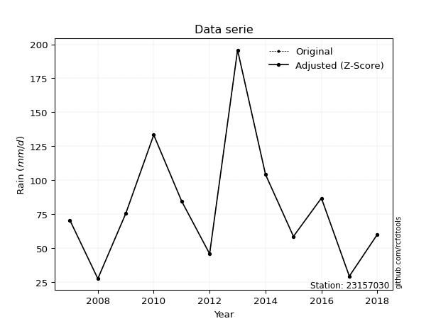</img>

</div>


> The initial value (value_initial) correspond to the initial obtained or null completed value, and value (value) is adjusted only when the initial value is outside the valid range (outlier) definite through the Z-Score value. If Z-Score is active, values out of range or outliers are replaced with the station mean value. A Z-Score (or standard score) measures how many standard deviations a data point is from the mean of a dataset, indicating its relative position; positive scores mean above the mean, negative mean below, and a score of zero is exactly at the mean, allowing for comparison of values from different distributions. It´s calculated using the formula $z=(x–μ)/σ$, where $x$ is the data point, $μ$ is the mean, and $σ$ is the standard deviation, helping identify outliers and understand probability.
>
> <sub>**Note**: In this study, "completing" (filling gaps in) and "extending" (forecasting or lengthening the historical record) rainfall data series are avoided for certain critical analyses because they introduce artificial bias and uncertainty, which can distort the statistics of rare events (extremes), alter day-to-day variability, and compromise the integrity and homogeneity of the original data. Some reasons against Completing/Extending rainfall data are: **Distortion of Extremes and Variability**: The primary issue is that most gap-filling or extension methods rely on averaging or regression with nearby stations, which inherently smooths the data. Rainfall is highly variable in space and time, with a large percentage of zero values and occasional large storms. Infilling methods often underestimate the highest values and overestimate the lowest (zero) values, which severely distorts analyses focused on flood frequency, drought severity, and intensity-duration-frequency (IDF) curves, **Loss of Data Homogeneity**: Infilled or extended data are synthetic estimates, not actual measurements. Combining these estimates with observed data can violate the assumption of data homogeneity, which requires that the data properties do not change over time. Inhomogeneity can lead to incorrect conclusions about long-term trends or changes in climate patterns, **Propagation of Errors**: Errors and biases from the original data (e.g., wind-induced undercatch, instrument errors, site changes) or the data used for imputation can propagate through the analysis, leading to unreliable hydrological models and inaccurate predictions, **Compromised Statistical Integrity**: For statistical analyses, especially those involving the frequency of events, using artificial data can introduce time bias or autocorrelation that doesn´t exist in reality, making it difficult to assess the true probability of events, **Difficulty in Validation**: It is difficult to accurately validate the quality of filled or extended data, especially for past periods where ground-truth measurements are unavailable. The reliability of imputation techniques heavily depends on the density of the surrounding station network and the complexity of the local topography.</sub>


### 4. Active continuous probability distributions from SciPy (44 of 104 available)

A Probability Density Function (PDF) describes the relative likelihood of a continuous random variable falling within a specific range, where the total area under its curve equals 1, and the area over any interval gives the actual probability for that range. Unlike discrete probabilities (like rolling a die), a PDF shows density, not direct probability for a single point (which is zero), with higher points indicating higher likelihood, often visualized as a bell curve for normal distributions.

A log of a probability density function (log-PDF) is simply the logarithm of the PDF´s value, denoted as $log(f(x))$, useful for converting multiplication of probabilities into addition, improving numerical stability with tiny numbers, and connecting to information theory concepts like entropy. Instead of dealing with very small probabilities (e.g., 0.000001), log-PDFs use negative numbers (e.g., $log(0.00001) ≈ -11.51$ that are easier for computers to handle, preventing underflow errors and simplifying complex calculations. In this study, each active probability distribution from SciPy is also evaluated in the $log$ form.

[scipy.stats](https://docs.scipy.org/doc/scipy/reference/stats.html) is a Python´s powerful submodule within the SciPy library for comprehensive statistical analysis, offering over 130 probability distributions (like Normal, Poisson), functions for descriptive stats (mean, variance), hypothesis testing (t-tests, chi-square), random variable generation, and statistical tests, making it essential for data science, modeling, and research. It provides tools to explore, model, and draw conclusions from data efficiently, working seamlessly with NumPy.

<div align="center">

|   id | p_dist             |   n_parameter | fit_method   | label                                                                       | active   | ref                                                                                                        |
|-----:|:-------------------|--------------:|:-------------|:----------------------------------------------------------------------------|:---------|:-----------------------------------------------------------------------------------------------------------|
|    0 | alpha              |             3 | MLE          | Alpha                                                                       | True     | [:mortar_board:](https://docs.scipy.org/doc/scipy/reference/generated/scipy.stats.alpha.html)              |
|    1 | betaprime          |             4 | MLE          | Beta prime                                                                  | True     | [:mortar_board:](https://docs.scipy.org/doc/scipy/reference/generated/scipy.stats.betaprime.html)          |
|    2 | chi2               |             3 | MLE          | Chi²                                                                        | True     | [:mortar_board:](https://docs.scipy.org/doc/scipy/reference/generated/scipy.stats.chi2.html)               |
|    3 | crystalball        |             4 | MLE          | Crystalball                                                                 | True     | [:mortar_board:](https://docs.scipy.org/doc/scipy/reference/generated/scipy.stats.crystalball.html)        |
|    4 | erlang             |             3 | MLE          | Erlang                                                                      | True     | [:mortar_board:](https://docs.scipy.org/doc/scipy/reference/generated/scipy.stats.erlang.html)             |
|    5 | expon              |             2 | MLE          | Exponential                                                                 | True     | [:mortar_board:](https://docs.scipy.org/doc/scipy/reference/generated/scipy.stats.expon.html)              |
|    6 | exponnorm          |             3 | MLE          | Exponentially modified Normal                                               | True     | [:mortar_board:](https://docs.scipy.org/doc/scipy/reference/generated/scipy.stats.exponnorm.html)          |
|    7 | f                  |             4 | MLE          | F                                                                           | True     | [:mortar_board:](https://docs.scipy.org/doc/scipy/reference/generated/scipy.stats.f.html)                  |
|    8 | fatiguelife        |             3 | MLE          | Fatigue-life (Birnbaum-Saunders)                                            | True     | [:mortar_board:](https://docs.scipy.org/doc/scipy/reference/generated/scipy.stats.fatiguelife.html)        |
|    9 | fisk               |             3 | MLE          | Fisk                                                                        | True     | [:mortar_board:](https://docs.scipy.org/doc/scipy/reference/generated/scipy.stats.fisk.html)               |
|   10 | gamma              |             3 | MLE          | Gamma                                                                       | True     | [:mortar_board:](https://docs.scipy.org/doc/scipy/reference/generated/scipy.stats.gamma.html)              |
|   11 | genexpon           |             5 | MLE          | Generalized exponential                                                     | True     | [:mortar_board:](https://docs.scipy.org/doc/scipy/reference/generated/scipy.stats.genexpon.html)           |
|   12 | genlogistic        |             3 | MLE          | Generalized logistic                                                        | True     | [:mortar_board:](https://docs.scipy.org/doc/scipy/reference/generated/scipy.stats.genlogistic.html)        |
|   13 | gibrat             |             2 | MM           | Gibrat                                                                      | True     | [:mortar_board:](https://docs.scipy.org/doc/scipy/reference/generated/scipy.stats.gibrat.html)             |
|   14 | gompertz           |             3 | MLE          | Gompertz (or truncated Gumbel)                                              | True     | [:mortar_board:](https://docs.scipy.org/doc/scipy/reference/generated/scipy.stats.gompertz.html)           |
|   15 | gumbel_l           |             2 | MM           | Gumbel Left Skew                                                            | True     | [:mortar_board:](https://docs.scipy.org/doc/scipy/reference/generated/scipy.stats.gumbel_l.html)           |
|   16 | gumbel_r           |             2 | MM           | Gumbel Right Skew                                                           | True     | [:mortar_board:](https://docs.scipy.org/doc/scipy/reference/generated/scipy.stats.gumbel_r.html)           |
|   17 | halflogistic       |             2 | MM           | Half-logistic                                                               | True     | [:mortar_board:](https://docs.scipy.org/doc/scipy/reference/generated/scipy.stats.halflogistic.html)       |
|   18 | halfnorm           |             2 | MM           | Half Normal                                                                 | True     | [:mortar_board:](https://docs.scipy.org/doc/scipy/reference/generated/scipy.stats.halfnorm.html)           |
|   19 | hypsecant          |             2 | MM           | hyperbolic secant                                                           | True     | [:mortar_board:](https://docs.scipy.org/doc/scipy/reference/generated/scipy.stats.hypsecant.html)          |
|   20 | invgamma           |             3 | MLE          | Inverted gamma                                                              | True     | [:mortar_board:](https://docs.scipy.org/doc/scipy/reference/generated/scipy.stats.invgamma.html)           |
|   21 | invgauss           |             3 | MLE          | Inverse Gaussian                                                            | True     | [:mortar_board:](https://docs.scipy.org/doc/scipy/reference/generated/scipy.stats.invgauss.html)           |
|   22 | invweibull         |             3 | MLE          | Inverted Weibull                                                            | True     | [:mortar_board:](https://docs.scipy.org/doc/scipy/reference/generated/scipy.stats.invweibull.html)         |
|   23 | johnsonsu          |             4 | MLE          | Johnson Su                                                                  | True     | [:mortar_board:](https://docs.scipy.org/doc/scipy/reference/generated/scipy.stats.johnsonsu.html)          |
|   24 | kstwobign          |             2 | MLE          | Limiting distribution of scaled Kolmogorov-Smirnov two-sided test statistic | True     | [:mortar_board:](https://docs.scipy.org/doc/scipy/reference/generated/scipy.stats.kstwobign.html)          |
|   25 | laplace            |             2 | MM           | Laplace                                                                     | True     | [:mortar_board:](https://docs.scipy.org/doc/scipy/reference/generated/scipy.stats.laplace.html)            |
|   26 | laplace_asymmetric |             3 | MLE          | Asymmetric Laplace                                                          | True     | [:mortar_board:](https://docs.scipy.org/doc/scipy/reference/generated/scipy.stats.laplace_asymmetric.html) |
|   27 | loggamma           |             3 | MLE          | Log gamma                                                                   | True     | [:mortar_board:](https://docs.scipy.org/doc/scipy/reference/generated/scipy.stats.loggamma.html)           |
|   28 | logistic           |             2 | MM           | Logistic (or Sech-squared)                                                  | True     | [:mortar_board:](https://docs.scipy.org/doc/scipy/reference/generated/scipy.stats.logistic.html)           |
|   29 | lognorm            |             3 | MLE          | Log Normal                                                                  | True     | [:mortar_board:](https://docs.scipy.org/doc/scipy/reference/generated/scipy.stats.lognorm.html)            |
|   30 | maxwell            |             2 | MM           | Maxwell                                                                     | True     | [:mortar_board:](https://docs.scipy.org/doc/scipy/reference/generated/scipy.stats.maxwell.html)            |
|   31 | mielke             |             4 | MLE          | Mielke Beta-Kappa / Dagum                                                   | True     | [:mortar_board:](https://docs.scipy.org/doc/scipy/reference/generated/scipy.stats.mielke.html)             |
|   32 | moyal              |             2 | MM           | Moyal                                                                       | True     | [:mortar_board:](https://docs.scipy.org/doc/scipy/reference/generated/scipy.stats.moyal.html)              |
|   33 | nakagami           |             3 | MLE          | Nakagami                                                                    | True     | [:mortar_board:](https://docs.scipy.org/doc/scipy/reference/generated/scipy.stats.nakagami.html)           |
|   34 | ncf                |             5 | MLE          | Non-central F distribution                                                  | True     | [:mortar_board:](https://docs.scipy.org/doc/scipy/reference/generated/scipy.stats.ncf.html)                |
|   35 | nct                |             4 | MLE          | Non-central Student’s t                                                     | True     | [:mortar_board:](https://docs.scipy.org/doc/scipy/reference/generated/scipy.stats.nct.html)                |
|   36 | norm               |             2 | MM           | Normal                                                                      | True     | [:mortar_board:](https://docs.scipy.org/doc/scipy/reference/generated/scipy.stats.norm.html)               |
|   37 | pearson3           |             3 | MM           | Pearson type III                                                            | True     | [:mortar_board:](https://docs.scipy.org/doc/scipy/reference/generated/scipy.stats.pearson3.html)           |
|   38 | rayleigh           |             2 | MM           | Rayleigh                                                                    | True     | [:mortar_board:](https://docs.scipy.org/doc/scipy/reference/generated/scipy.stats.rayleigh.html)           |
|   39 | rice               |             3 | MLE          | Rice                                                                        | True     | [:mortar_board:](https://docs.scipy.org/doc/scipy/reference/generated/scipy.stats.rice.html)               |
|   40 | t                  |             3 | MLE          | Student’s t                                                                 | True     | [:mortar_board:](https://docs.scipy.org/doc/scipy/reference/generated/scipy.stats.t.html)                  |
|   41 | truncnorm          |             4 | MLE          | Truncated normal                                                            | True     | [:mortar_board:](https://docs.scipy.org/doc/scipy/reference/generated/scipy.stats.truncnorm.html)          |
|   42 | wald               |             2 | MM           | Wald                                                                        | True     | [:mortar_board:](https://docs.scipy.org/doc/scipy/reference/generated/scipy.stats.wald.html)               |
|   43 | weibull_min        |             3 | MLE          | Weibull minimum                                                             | True     | [:mortar_board:](https://docs.scipy.org/doc/scipy/reference/generated/scipy.stats.weibull_min.html)        |

</div>

> **n_parameter:** # arguments & localization & scale.
>
> **Fit methods:** (MLE) maximum likelihood, (MM) L-moments.
>
>**Inactive** (With the only purpose of prevent loops, zero divisions, infinite values, over high estimated values or horizontal trending for recurrence intervals estimations, the follow distributions were disabled.)**:** foldnorm, gennorm, norminvgauss, powernorm, powerlognorm, skewnorm, genextreme, anglit, arcsine, argus, beta, bradford, burr, burr12, cauchy, cosine, halfcauchy, foldcauchy, skewcauchy, wrapcauchy, dgamma, gengamma, exponweib, exponpow, truncexpon, gausshyper, genhalflogistic, genhyperbolic, geninvgauss, halfgennorm, johnsonsb, kappa4, kappa3, ksone, kstwo, loglaplace, levy, levy_l, levy_stable, ncx2, pareto, genpareto, truncpareto, lomax, powerlaw, rdist, rel_breitwigner, recipinvgauss, semicircular, studentized_range, trapezoid, triang, truncweibull_min, tukeylambda, uniform, loguniform, vonmises, vonmises_line, weibull_max, dweibull, 


## B. Probability (PDF) vs. Empirical (EDF) distributions functions

A continuous probability distribution (CPD) describes probabilities for variables that can take any value within a range (like rain any time), unlike discrete variables with specific outcomes (like temperature). It uses a Probability Density Function (PDF), a curve where the total area under it equals 1, and the probability of the variable falling within an interval (a to b) is found by calculating the area under the curve between those points. A key feature is that the probability of hitting any single exact value is zero, so probabilities are always expressed for ranges, e.g., $P(a ≤ X ≤ b)$.

<div align="center">

Distributions parameters from station values
|    |   station | p_dist                |   n |             loc |          scale | shape                  | shape1                | shape2                 | shape3   |
|---:|----------:|:----------------------|----:|----------------:|---------------:|:-----------------------|:----------------------|:-----------------------|:---------|
|  0 |  23157030 | alpha                 |  12 |    -81.027      |  632.47        | 4.167945470793813      |                       |                        |          |
|  1 |  23157030 | betaprime             |  12 |     19.3678     |  304.879       | 2.1109220627106184     | 12.073467357967761    |                        |          |
|  2 |  23157030 | chi2                  |  12 |     27.5        |   23.6669      | 1.5889552514552008     |                       |                        |          |
|  3 |  23157030 | crystalball           |  12 |     80.9833     |   45.0517      | 3925.8108383952995     | 13496.286940292433    |                        |          |
|  4 |  23157030 | erlang                |  12 |     27.5        |   50.4276      | 0.8427689431423265     |                       |                        |          |
|  5 |  23157030 | expon                 |  12 |     27.5        |   53.4833      |                        |                       |                        |          |
|  6 |  23157030 | exponnorm             |  12 |     38.3505     |   16.9383      | 2.5169426718279784     |                       |                        |          |
|  7 |  23157030 | f                     |  12 |     -0.484609   |   72.4134      | 12.27146922177036      | 17.760633414154228    |                        |          |
|  8 |  23157030 | fatiguelife           |  12 |     27.4828     |    1.84429     | 5.971338519328537      |                       |                        |          |
|  9 |  23157030 | fisk                  |  12 |      4.96265    |   65.3374      | 2.9308149327267863     |                       |                        |          |
| 10 |  23157030 | gamma                 |  12 |     27.5        |   42.6895      | 0.9105297135555462     |                       |                        |          |
| 11 |  23157030 | genexpon              |  12 |     27.4999     |    2.09576     | 0.03912378566313858    | 7.126787269157952e-08 | 1.1901756106586001     |          |
| 12 |  23157030 | genlogistic           |  12 |   -159.889      |   32.326       | 935.9308570398609      |                       |                        |          |
| 13 |  23157030 | gibrat                |  12 |     46.6146     |   20.8457      |                        |                       |                        |          |
| 14 |  23157030 | gompertz              |  12 |     27.5        |  225.314       | 3.381517829367107      |                       |                        |          |
| 15 |  23157030 | gumbel_l              |  12 |    101.259      |   35.1267      |                        |                       |                        |          |
| 16 |  23157030 | gumbel_r              |  12 |     60.7077     |   35.1267      |                        |                       |                        |          |
| 17 |  23157030 | halflogistic          |  12 |     27.5866     |   38.5176      |                        |                       |                        |          |
| 18 |  23157030 | halfnorm              |  12 |     21.3525     |   74.7362      |                        |                       |                        |          |
| 19 |  23157030 | hypsecant             |  12 |     80.9833     |   28.6808      |                        |                       |                        |          |
| 20 |  23157030 | invgamma              |  12 |    -23.4109     |  582.085       | 6.554409531984412      |                       |                        |          |
| 21 |  23157030 | invgauss              |  12 |      0.471619   |  230.397       | 0.34944824434213617    |                       |                        |          |
| 22 |  23157030 | invweibull            |  12 |   -162.84       |  221.776       | 7.296352596878114      |                       |                        |          |
| 23 |  23157030 | johnsonsu             |  12 |      2.80611    |    1.64295     | -7.675923915442491     | 1.745939169850113     |                        |          |
| 24 |  23157030 | kstwobign             |  12 |    -55.9866     |  158.275       |                        |                       |                        |          |
| 25 |  23157030 | laplace               |  12 |     80.9833     |   31.8564      |                        |                       |                        |          |
| 26 |  23157030 | laplace_asymmetric    |  12 |     58.6        |   28.3435      | 0.6802761347812774     |                       |                        |          |
| 27 |  23157030 | loggamma              |  12 | -14838.3        | 1980.59        | 1868.8215777301584     |                       |                        |          |
| 28 |  23157030 | logistic              |  12 |     80.9833     |   24.8383      |                        |                       |                        |          |
| 29 |  23157030 | lognorm               |  12 |     27.5        |    1.79609     | 10.265485605601564     |                       |                        |          |
| 30 |  23157030 | maxwell               |  12 |    -25.7703     |   66.8979      |                        |                       |                        |          |
| 31 |  23157030 | mielke                |  12 |     27.4948     |   83.9813      | 0.835162186664357      | 3.4826230680682517    |                        |          |
| 32 |  23157030 | moyal                 |  12 |     55.2199     |   20.2804      |                        |                       |                        |          |
| 33 |  23157030 | nakagami              |  12 |     27.5        |   80.4329      | 0.317544624201343      |                       |                        |          |
| 34 |  23157030 | ncf                   |  12 |     -0.262787   |   39.2224      | 11.232740263453246     | 15.633087165259795    | 9.02655385553041       |          |
| 35 |  23157030 | nct                   |  12 |     -0.109081   |   21.4979      | 3.9819857114708923     | 3.030064606635925     |                        |          |
| 36 |  23157030 | norm                  |  12 |     80.9833     |   45.0517      |                        |                       |                        |          |
| 37 |  23157030 | pearson3              |  12 |     80.9833     |   45.0518      | 1.1967672193024468     |                       |                        |          |
| 38 |  23157030 | rayleigh              |  12 |     -5.20325    |   68.7669      |                        |                       |                        |          |
| 39 |  23157030 | rice                  |  12 |      6.94665    |   61.2825      | 0.00028663972538017925 |                       |                        |          |
| 40 |  23157030 | t                     |  12 |     80.9547     |   45.1164      | 13.35377916346286      |                       |                        |          |
| 41 |  23157030 | truncnorm             |  12 |     80.9833     |   45.0517      | -1453.5804265687052    | 66115.77470053585     |                        |          |
| 42 |  23157030 | wald                  |  12 |     35.9316     |   45.0517      |                        |                       |                        |          |
| 43 |  23157030 | weibull_min           |  12 |     27.5        |   49.1771      | 0.828790109870583      |                       |                        |          |
| 44 |  23157030 | logalpha              |  12 |     -6.27372    |  201.957       | 19.246661011613945     |                       |                        |          |
| 45 |  23157030 | logbetaprime          |  12 |     -6.16901    |   14.6239      | 597.5891880547117      | 840.0770973901957     |                        |          |
| 46 |  23157030 | logchi2               |  12 |      3.31419    |    0.915102    | 1.056828680451416      |                       |                        |          |
| 47 |  23157030 | logcrystalball        |  12 |      4.2481     |    0.546608    | 487.98945829240347     | 29.691732192833456    |                        |          |
| 48 |  23157030 | logerlang             |  12 |    -16.711      |    0.014308    | 1464.8100422240868     |                       |                        |          |
| 49 |  23157030 | logexpon              |  12 |      3.31419    |    0.933918    |                        |                       |                        |          |
| 50 |  23157030 | logexponnorm          |  12 |      4.24747    |    0.546608    | 0.001163826190291426   |                       |                        |          |
| 51 |  23157030 | logf                  |  12 |   -141.63       |  145.878       | 441416.2843795832      | 209706.59120357456    |                        |          |
| 52 |  23157030 | logfatiguelife        |  12 |    -71.1544     |   75.402       | 0.007239789601845299   |                       |                        |          |
| 53 |  23157030 | logfisk               |  12 |     -2.1053e+07 |    2.1053e+07  | 67755889.50254318      |                       |                        |          |
| 54 |  23157030 | loggamma              |  12 |    -17.1114     |    0.0140194   | 1523.537576705351      |                       |                        |          |
| 55 |  23157030 | loggenexpon           |  12 |      3.31374    |    0.00697149  | 0.0030318270629897956  | 0.40172711759381097   | 0.00012291953412869264 |          |
| 56 |  23157030 | loggenlogistic        |  12 |      4.34667    |    0.290242    | 0.824635287693829      |                       |                        |          |
| 57 |  23157030 | loggibrat             |  12 |      3.83111    |    0.25292     |                        |                       |                        |          |
| 58 |  23157030 | loggompertz           |  12 |      3.31419    |    0.752106    | 0.2882672906840418     |                       |                        |          |
| 59 |  23157030 | loggumbel_l           |  12 |      4.49411    |    0.426188    |                        |                       |                        |          |
| 60 |  23157030 | loggumbel_r           |  12 |      4.0021     |    0.426188    |                        |                       |                        |          |
| 61 |  23157030 | loghalflogistic       |  12 |      3.60023    |    0.467343    |                        |                       |                        |          |
| 62 |  23157030 | loghalfnorm           |  12 |      3.52459    |    0.906787    |                        |                       |                        |          |
| 63 |  23157030 | loghypsecant          |  12 |      4.2481     |    0.347981    |                        |                       |                        |          |
| 64 |  23157030 | loginvgamma           |  12 |     -5.78114    | 3345.23        | 334.6814183720445      |                       |                        |          |
| 65 |  23157030 | loginvgauss           |  12 |      0.161944   |  211.895       | 0.01925089297418725    |                       |                        |          |
| 66 |  23157030 | loginvweibull         |  12 |     -4.7033e+07 |    4.7033e+07  | 89692052.82050025      |                       |                        |          |
| 67 |  23157030 | logjohnsonsu          |  12 |     12.9851     |   10.9912      | 18.72705874882694      | 25.716960511715072    |                        |          |
| 68 |  23157030 | logkstwobign          |  12 |      2.11919    |    2.43577     |                        |                       |                        |          |
| 69 |  23157030 | loglaplace            |  12 |      4.2481     |    0.38651     |                        |                       |                        |          |
| 70 |  23157030 | loglaplace_asymmetric |  12 |      4.32413    |    0.420194    | 1.0945475313104527     |                       |                        |          |
| 71 |  23157030 | logloggamma           |  12 |    -29.0332     |    6.65731     | 148.79534317335364     |                       |                        |          |
| 72 |  23157030 | loglogistic           |  12 |      4.2481     |    0.301361    |                        |                       |                        |          |
| 73 |  23157030 | loglognorm            |  12 |      3.31419    |    0.0432571   | 9.747994831227349      |                       |                        |          |
| 74 |  23157030 | logmaxwell            |  12 |      2.95287    |    0.811666    |                        |                       |                        |          |
| 75 |  23157030 | logmielke             |  12 |      3.31419    |    1.54051     | 0.8155658502167946     | 6.774799996717761     |                        |          |
| 76 |  23157030 | logmoyal              |  12 |      3.93552    |    0.24606     |                        |                       |                        |          |
| 77 |  23157030 | lognakagami           |  12 |    -38.2335     |   42.4858      | 1506.2355789315934     |                       |                        |          |
| 78 |  23157030 | logncf                |  12 |     -3.46741    |    5.24351e-07 | 4.79856313357525e-05   | 1473.7694065909125    | 705.1716980298742      |          |
| 79 |  23157030 | lognct                |  12 |     -6.96663    |    0.282982    | 277.8200607749118      | 39.51137432648653     |                        |          |
| 80 |  23157030 | lognorm               |  12 |      4.2481     |    0.546608    |                        |                       |                        |          |
| 81 |  23157030 | logpearson3           |  12 |      4.2481     |    0.546607    | -0.06225457630156685   |                       |                        |          |
| 82 |  23157030 | lograyleigh           |  12 |      3.20241    |    0.834342    |                        |                       |                        |          |
| 83 |  23157030 | logrice               |  12 |      3.03095    |    0.615879    | 1.6411351254039173     |                       |                        |          |
| 84 |  23157030 | logt                  |  12 |      4.2481     |    0.546609    | 73529029.64272419      |                       |                        |          |
| 85 |  23157030 | logtruncnorm          |  12 |     -0.258598   |    1.53232     | 2.6645103562481305     | 3.612630445755301     |                        |          |
| 86 |  23157030 | logwald               |  12 |      3.70152    |    0.546586    |                        |                       |                        |          |
| 87 |  23157030 | logweibull_min        |  12 |      2.70071    |    1.73062     | 3.159349664100234      |                       |                        |          |

</div>

> **loc** (Location parameter): This shifts the distribution along the x-axis. For many common distributions, like the normal (Gaussian) distribution, loc represents the mean $μ$. For others, like the uniform distribution, it might represent the minimum value, or for the beta distribution, the left end of the support interval.
>
> **scale** (Scale parameter): This determines the width or spread of the distribution. For the normal distribution, scale represents the standard deviation $σ$. For a uniform distribution, it defines the length of the interval (from $loc$ to $loc + scale$).
>
> **shape** (Shape parameters): Refers to parameters that define the specific form of a probability distribution, distinct from its location (loc) and scale (scale). These parameters are required arguments for most distribution functions. For example, a normal (Gaussian) distribution is fully defined by its location (mean) and scale (standard deviation), so it has no specific shape parameters beyond loc and scale. However, other distributions have intrinsic properties that need specification, as Gamma distribution that takes a shape parameter, often named $a$ or $alpha$.


### 0. Cumulative distribution values - CDF (88 evaluated)

Cumulative Distribution Function (CDF), denoted as $F$<sub>$X$</sub>$(x)$, is a function that gives the probability that a random variable $X$ will take a value less than or equal to a specific value, $x$ (i.e., $(P(X≥x)$. It essentially "accumulates" probabilities from a given point up to the far right (positive infinity), providing a complete picture of the distribution´s probabilities for both discrete (like rain) and continuous (like temperature) variables, helping to find probabilities over ranges or above certain values. Each station is evaluated separately ordering the $x$ values ascending, calculating the CDF and PDF values for the activated distributions and their logarithmic forms.

<div align="center">

CDF ordered by x ascending and calculating $log(f(x))$ separately
|   id |   Station |   date |     x |   count |    mean |    std |     zscore |   Value_initial |   station |   m |     alpha |   alpha_pdf |   betaprime |   betaprime_pdf |        chi2 |    chi2_pdf |   crystalball |   crystalball_pdf |      erlang |   erlang_pdf |     expon |   expon_pdf |   exponnorm |   exponnorm_pdf |         f |       f_pdf |   fatiguelife |   fatiguelife_pdf |      fisk |    fisk_pdf |       gamma |   gamma_pdf |    genexpon |   genexpon_pdf |   genlogistic |   genlogistic_pdf |   gibrat |   gibrat_pdf |    gompertz |   gompertz_pdf |   gumbel_l |   gumbel_l_pdf |   gumbel_r |   gumbel_r_pdf |   halflogistic |   halflogistic_pdf |   halfnorm |   halfnorm_pdf |   hypsecant |   hypsecant_pdf |   invgamma |   invgamma_pdf |   invgauss |   invgauss_pdf |   invweibull |   invweibull_pdf |   johnsonsu |   johnsonsu_pdf |   kstwobign |   kstwobign_pdf |   laplace |   laplace_pdf |   laplace_asymmetric |   laplace_asymmetric_pdf |   loggamma |   loggamma_pdf |   logistic |   logistic_pdf |   lognorm |   lognorm_pdf |   maxwell |   maxwell_pdf |      mielke |   mielke_pdf |     moyal |   moyal_pdf |    nakagami |   nakagami_pdf |       ncf |     ncf_pdf |       nct |     nct_pdf |     norm |    norm_pdf |   pearson3 |   pearson3_pdf |   rayleigh |   rayleigh_pdf |      rice |    rice_pdf |        t |       t_pdf |   truncnorm |   truncnorm_pdf |      wald |    wald_pdf |   weibull_min |   weibull_min_pdf |   logalpha |   logalpha_pdf |   logbetaprime |   logbetaprime_pdf |     logchi2 |   logchi2_pdf |   logcrystalball |   logcrystalball_pdf |   logerlang |   logerlang_pdf |   logexpon |   logexpon_pdf |   logexponnorm |   logexponnorm_pdf |      logf |   logf_pdf |   logfatiguelife |   logfatiguelife_pdf |   logfisk |   logfisk_pdf |   loggenexpon |   loggenexpon_pdf |   loggenlogistic |   loggenlogistic_pdf |   loggibrat |   loggibrat_pdf |   loggompertz |   loggompertz_pdf |   loggumbel_l |   loggumbel_l_pdf |   loggumbel_r |   loggumbel_r_pdf |   loghalflogistic |   loghalflogistic_pdf |   loghalfnorm |   loghalfnorm_pdf |   loghypsecant |   loghypsecant_pdf |   loginvgamma |   loginvgamma_pdf |   loginvgauss |   loginvgauss_pdf |   loginvweibull |   loginvweibull_pdf |   logjohnsonsu |   logjohnsonsu_pdf |   logkstwobign |   logkstwobign_pdf |   loglaplace |   loglaplace_pdf |   loglaplace_asymmetric |   loglaplace_asymmetric_pdf |   logloggamma |   logloggamma_pdf |   loglogistic |   loglogistic_pdf |   loglognorm |   loglognorm_pdf |   logmaxwell |   logmaxwell_pdf |   logmielke |   logmielke_pdf |    logmoyal |   logmoyal_pdf |   lognakagami |   lognakagami_pdf |    logncf |   logncf_pdf |    lognct |   lognct_pdf |   logpearson3 |   logpearson3_pdf |   lograyleigh |   lograyleigh_pdf |   logrice |   logrice_pdf |      logt |   logt_pdf |   logtruncnorm |   logtruncnorm_pdf |   logwald |   logwald_pdf |   logweibull_min |   logweibull_min_pdf |
|-----:|----------:|-------:|------:|--------:|--------:|-------:|-----------:|----------------:|----------:|----:|----------:|------------:|------------:|----------------:|------------:|------------:|--------------:|------------------:|------------:|-------------:|----------:|------------:|------------:|----------------:|----------:|------------:|--------------:|------------------:|----------:|------------:|------------:|------------:|------------:|---------------:|--------------:|------------------:|---------:|-------------:|------------:|---------------:|-----------:|---------------:|-----------:|---------------:|---------------:|-------------------:|-----------:|---------------:|------------:|----------------:|-----------:|---------------:|-----------:|---------------:|-------------:|-----------------:|------------:|----------------:|------------:|----------------:|----------:|--------------:|---------------------:|-------------------------:|-----------:|---------------:|-----------:|---------------:|----------:|--------------:|----------:|--------------:|------------:|-------------:|----------:|------------:|------------:|---------------:|----------:|------------:|----------:|------------:|---------:|------------:|-----------:|---------------:|-----------:|---------------:|----------:|------------:|---------:|------------:|------------:|----------------:|----------:|------------:|--------------:|------------------:|-----------:|---------------:|---------------:|-------------------:|------------:|--------------:|-----------------:|---------------------:|------------:|----------------:|-----------:|---------------:|---------------:|-------------------:|----------:|-----------:|-----------------:|---------------------:|----------:|--------------:|--------------:|------------------:|-----------------:|---------------------:|------------:|----------------:|--------------:|------------------:|--------------:|------------------:|--------------:|------------------:|------------------:|----------------------:|--------------:|------------------:|---------------:|-------------------:|--------------:|------------------:|--------------:|------------------:|----------------:|--------------------:|---------------:|-------------------:|---------------:|-------------------:|-------------:|-----------------:|------------------------:|----------------------------:|--------------:|------------------:|--------------:|------------------:|-------------:|-----------------:|-------------:|-----------------:|------------:|----------------:|------------:|---------------:|--------------:|------------------:|----------:|-------------:|----------:|-------------:|--------------:|------------------:|--------------:|------------------:|----------:|--------------:|----------:|-----------:|---------------:|-------------------:|----------:|--------------:|-----------------:|---------------------:|
|    0 |  23157030 |   2008 |  27.5 |      12 | 80.9833 | 47.055 | -1.13661   |            27.5 |  23157030 |   1 | 0.0484761 |  0.00540306 |   0.0351855 |     0.00807662  | 5.77496e-09 | 2.4878      |      0.117583 |       0.00437689  | 4.63972e-14 |  5.50313     | 0         | 0.0186974   |   0.0520071 |     0.0048997   | 0.0473189 | 0.00595725  |     0.0428631 |       4.64071     | 0.0423087 | 0.00526915  | 2.36693e-15 | 0.606623    | 1.24633e-06 |    0.018668    |     0.0585317 |       0.00513123  | 0        |  0           | 7.29477e-08 |    0.015008    |   0.115277 |    0.00308488  |  0.0762482 |    0.00558677  |      0         |        0           |  0.0655568 |    0.01064     |    0.097854 |      0.00335834 |  0.0451461 |    0.00577761  |  0.040948  |    0.00657041  |    0.0473353 |       0.00553518 |   0.0416188 |     0.0062782   |   0.0563911 |     0.00531448  | 0.0932906 |   0.00292847  |            0.0630515 |              0.00327007  |  0.0424585 |       0.170285 |   0.104027 |    0.00375249  | 0.0437652 |      0.169565 |  0.111412 |   0.00550787  | 0.000307235 |   0.0490754  | 0.0476328 | 0.00548013  | 4.94733e-11 |  4421.97       | 0.0456022 | 0.0058937   | 0.0483028 | 0.00499398  | 0.117583 | 0.00437689  |  0.0664118 |    0.00677778  |   0.106922 |    0.00617619  | 0.0546898 | 0.0051735   | 0.128374 | 0.00423545  |    0.117583 |     0.00437689  | 0         | 0           |   7.44426e-14 |       8.68312     |  0.0346064 |       0.168186 |      0.0426058 |           0.17767  | 6.31883e-09 |   7.51867e+06 |        0.0437653 |             0.169565 |   0.0425902 |        0.170687 |  0         |       1.07076  |      0.0437657 |           0.169566 | 0.0433565 |   0.16933  |        0.0426629 |             0.168412 | 0.0457219 |      0.140421 |   0.000192269 |          0.435255 |        0.0519913 |             0.143623 |    0        |       0         |   3.16533e-09 |          0.38328  |     0.0608249 |         0.138287  |    0.00658196 |         0.0775807 |          0        |              0        |      0        |          0        |      0.043415  |          0.124376  |     0.0382179 |          0.172381 |     0.0360437 |          0.182947 |       0.0299069 |            0.200165 |      0.0457123 |           0.16862  |      0.0303611 |           0.235046 |    0.0446263 |        0.11546   |               0.0606406 |                   0.13185   |     0.046126  |          0.168946 |     0.0431483 |          0.137    |  0.000476137 |      3.92357e+11 |    0.022114  |         0.176419 |  7.7315e-11 |     102.445     | 0.000408593 |      0.0111041 |     0.0434785 |          0.169703 | 0.0695308 |     0.225274 | 0.0408139 |     0.176408 |     0.0455598 |          0.169204 |    0.00893347 |          0.159132 | 0.0279701 |      0.200517 | 0.0437654 |   0.169565 |    0           |           0        | 0         |     0         |        0.0370545 |             0.187248 |
|    1 |  23157030 |   2017 |  29.3 |      12 | 80.9833 | 47.055 | -1.09836   |            29.3 |  23157030 |   2 | 0.058823  |  0.00609436 |   0.0508538 |     0.0092977   | 0.0787386   | 0.0340225   |      0.12565  |       0.00458583  | 0.062864    |  0.028867    | 0.0330953 | 0.0180786   |   0.0613777 |     0.00551646  | 0.0587164 | 0.00670314  |     0.499011  |       0.0367662   | 0.0524343 | 0.00598329  | 0.0568288   | 0.0281172   | 0.0330454   |    0.0180512   |     0.0682424 |       0.00565945  | 0        |  0           | 0.0267582   |    0.0147236   |   0.120956 |    0.00322624  |  0.0867091 |    0.00603589  |      0.0222387 |        0.0129746   |  0.084688  |    0.0106158   |    0.104083 |      0.00356469 |  0.0562571 |    0.00656626  |  0.0536556 |    0.00753832  |    0.0579581 |       0.00626827 |   0.0537411 |     0.00718394  |   0.0664313 |     0.00584008  | 0.0987136 |   0.00309871  |            0.0692211 |              0.00359005  |  0.0544016 |       0.20721  |   0.110978 |    0.00397216  | 0.0556272 |      0.205344 |  0.121554 |   0.00575951  | 0.0404801   |   0.0187275  | 0.058138  | 0.0061925   | 0.0694989   |     0.0245182  | 0.056911  | 0.00666878  | 0.0579111 | 0.00568631  | 0.12565  | 0.00458583  |  0.0790956 |    0.0073088   |   0.118273 |    0.00643332  | 0.0643601 | 0.00556902  | 0.136174 | 0.00443193  |    0.12565  |     0.00458583  | 0         | 0           |   0.0624487   |       0.0278367   |  0.0466095 |       0.211397 |      0.055088  |           0.216838 | 0.188351    |   1.53453     |        0.0556273 |             0.205344 |   0.05456   |        0.207648 |  0.0656346 |       1.00048  |      0.0556278 |           0.205345 | 0.0552092 |   0.205291 |        0.0544632 |             0.204569 | 0.055497  |      0.168696 |   0.029394    |          0.48503  |        0.0619081 |             0.169867 |    0        |       0         |   0.0250355   |          0.406551 |     0.0702309 |         0.158861  |    0.0131801  |         0.133878  |          0        |              0        |      0        |          0        |      0.0520561 |          0.148929  |     0.0504256 |          0.213566 |     0.0491072 |          0.230054 |       0.0446021 |            0.264523 |      0.0574669 |           0.202865 |      0.0477005 |           0.312508 |    0.0525813 |        0.136041  |               0.0696037 |                   0.151338  |     0.0578962 |          0.203025 |     0.052719  |          0.165714 |  0.515643    |      0.645002    |    0.0351225 |         0.234718 |  0.0741278  |       0.953544  | 0.00188853  |      0.0403384 |     0.0553561 |          0.205702 | 0.0849229 |     0.260635 | 0.0532502 |     0.216695 |     0.0573592 |          0.203697 |    0.0217999  |          0.246158 | 0.0421981 |      0.248519 | 0.0556273 |   0.205344 |    0           |           0        | 0         |     0         |        0.0502134 |             0.228388 |
|    2 |  23157030 |   2012 |  45.8 |      12 | 80.9833 | 47.055 | -0.747707  |            45.8 |  23157030 |   3 | 0.206418  |  0.0112178  |   0.251943  |     0.0133635   | 0.428702    | 0.0149066   |      0.217415 |       0.00652774  | 0.384316    |  0.0144524   | 0.289767  | 0.0132795   |   0.200242  |     0.0110177   | 0.214259  | 0.0113588   |     0.682474  |       0.00565211  | 0.201429  | 0.0115443   | 0.393554    | 0.0155239   | 0.289387    |    0.0132658   |     0.199412  |       0.00993788  | 0        |  0           | 0.248819    |    0.0122276   |   0.186343 |    0.0047767   |  0.216824  |    0.00943591  |      0.232121  |        0.0122816   |  0.256421  |    0.0101198   |    0.181599 |      0.0059938  |  0.213651  |    0.0116729   |  0.227325  |    0.0122129   |    0.209865  |       0.0114586  |   0.222027  |     0.0120785   |   0.197387  |     0.0096301   | 0.165699  |   0.00520143  |            0.162887  |              0.00844786  |  0.220546  |       0.549142 |   0.195212 |    0.00632507  | 0.219062  |      0.540366 |  0.233672 |   0.00770245  | 0.279856    |   0.0127051  | 0.207156  | 0.0111988   | 0.301945    |     0.0103488  | 0.214186  | 0.0115699   | 0.203085  | 0.0114259   | 0.217415 | 0.00652774  |  0.228688  |    0.0102498   |   0.240463 |    0.00819195  | 0.182072  | 0.00846196  | 0.224726 | 0.00630762  |    0.217415 |     0.00652774  | 0.0815721 | 0.0214681   |   0.356445    |       0.012846    |  0.225724  |       0.595075 |      0.227757  |           0.563257 | 0.522745    |   0.449709    |        0.219062  |             0.540365 |   0.22089   |        0.549373 |  0.420849  |       0.620131 |      0.219064  |           0.540367 | 0.218922  |   0.541388 |        0.218384  |             0.543158 | 0.198339  |      0.511719 |   0.298157    |          0.667649 |        0.199813  |             0.487168 |    0        |       0         |   0.244011    |          0.570928 |     0.18755   |         0.395943  |    0.219205   |         0.780636  |          0.235227 |              1.01068  |      0.258978 |          0.833135 |      0.183114  |          0.497671  |     0.226372  |          0.580805 |     0.238833  |          0.612552 |       0.265327  |            0.671329 |      0.217247  |           0.528339 |      0.288803  |           0.683465 |    0.167014  |        0.432108  |               0.183839  |                   0.399719  |     0.217376  |          0.526861 |     0.19681   |          0.52454  |  0.599913    |      0.0777013   |    0.235615  |         0.636742 |  0.405967   |       0.648714  | 0.209982    |      0.926351  |     0.219267  |          0.541741 | 0.261148  |     0.522227 | 0.228141  |     0.572595 |     0.217822  |          0.530101 |    0.242529   |          0.676674 | 0.230726  |      0.586351 | 0.219062  |   0.540365 |    8.09505e-06 |           2.0197   | 0.0869904 |     1.79823   |        0.225433  |             0.556369 |
|    3 |  23157030 |   2015 |  58.6 |      12 | 80.9833 | 47.055 | -0.475685  |            58.6 |  23157030 |   4 | 0.358769  |  0.0121227  |   0.416892  |     0.0121043   | 0.586722    | 0.0102001   |      0.309652 |       0.00782702  | 0.540769    |  0.0103155   | 0.440935  | 0.0104531   |   0.354005  |     0.0124328   | 0.364636  | 0.0117381   |     0.74122   |       0.00378851  | 0.359322  | 0.012579    | 0.561075    | 0.0109692   | 0.440425    |    0.0104462   |     0.337738  |       0.0113344   | 0.289975 |  0.0285589   | 0.393771    |    0.0104449   |   0.256866 |    0.00628071  |  0.34582   |    0.0104537   |      0.382161  |        0.0110852   |  0.381788  |    0.00942914  |    0.27353  |      0.00840588 |  0.368293  |    0.012037    |  0.38288   |    0.0117231   |    0.363805  |       0.0121207  |   0.378044  |     0.0118908   |   0.328956  |     0.0106436   | 0.24764   |   0.00777363  |            0.316368  |              0.016408    |  0.376112  |       0.69745  |   0.288812 |    0.00826946  | 0.372783  |      0.69242  |  0.338471 |   0.00856431  | 0.433039    |   0.0112723  | 0.35755   | 0.0118531   | 0.419739    |     0.00826736 | 0.367394  | 0.0119424   | 0.360182  | 0.0125587   | 0.309652 | 0.00782702  |  0.362854  |    0.0104755   |   0.349766 |    0.00877309  | 0.298979  | 0.00964177  | 0.314155 | 0.00761498  |    0.309652 |     0.00782702  | 0.367749  | 0.0194135   |   0.495415    |       0.00919786  |  0.391074  |       0.724685 |      0.385213  |           0.696935 | 0.616991    |   0.32638     |        0.372783  |             0.69242  |   0.376457  |        0.697214 |  0.555178  |       0.476297 |      0.372785  |           0.692421 | 0.372827  |   0.692701 |        0.372819  |             0.694977 | 0.353533  |      0.735544 |   0.46153     |          0.645569 |        0.348735  |             0.714642 |    0.478464 |       1.66245   |   0.393449    |          0.635687 |     0.309486  |         0.599994  |    0.426877   |         0.852635  |          0.464777 |              0.838766 |      0.453015 |          0.733948 |      0.344355  |          0.807541  |     0.388511  |          0.715072 |     0.405484  |          0.716753 |       0.436371  |            0.690079 |      0.36839   |           0.685151 |      0.457813  |           0.667117 |    0.315989  |        0.817545  |               0.314164  |                   0.683081  |     0.36813   |          0.683689 |     0.356965  |          0.761682 |  0.615452    |      0.0518137   |    0.4059    |         0.72227  |  0.559384   |       0.598184  | 0.447402    |      0.922994  |     0.37322   |          0.692714 | 0.401919  |     0.607485 | 0.387885  |     0.704974 |     0.369276  |          0.685683 |    0.418159   |          0.725768 | 0.390845  |      0.696452 | 0.372783  |   0.692419 |    0.403287    |           1.29884  | 0.499769  |     1.2161    |        0.379967  |             0.683434 |
|    4 |  23157030 |   2018 |  60   |      12 | 80.9833 | 47.055 | -0.445932  |            60   |  23157030 |   5 | 0.375704  |  0.0120659  |   0.433683  |     0.0118808   | 0.600729    | 0.00981358  |      0.320693 |       0.00794497  | 0.554963    |  0.00996386  | 0.455379  | 0.010183    |   0.371382  |     0.0123852   | 0.38101   | 0.0116509   |     0.746432  |       0.00365812  | 0.376885  | 0.0125057   | 0.576153    | 0.0105736   | 0.45486     |    0.0101767   |     0.35363   |       0.0113653   | 0.328889 |  0.0270188   | 0.408263    |    0.0102588   |   0.265782 |    0.00645766  |  0.360469  |    0.0104708   |      0.397572  |        0.0109292   |  0.394927  |    0.00933988  |    0.285485 |      0.00867206 |  0.385074  |    0.0119323   |  0.39918   |    0.0115605   |    0.380719  |       0.0120381  |   0.394591  |     0.0117459   |   0.343868  |     0.0106569   | 0.258766  |   0.00812288  |            0.338958  |              0.0158658   |  0.392681  |       0.705875 |   0.300525 |    0.00846313  | 0.389241  |      0.701539 |  0.3505   |   0.00861846  | 0.448715    |   0.011121   | 0.374095  | 0.0117788   | 0.431195    |     0.0081001  | 0.384049  | 0.0118463   | 0.377722  | 0.0124935   | 0.320693 | 0.00794497  |  0.377484  |    0.0104222   |   0.362066 |    0.00879601  | 0.312528  | 0.0097117   | 0.324901 | 0.00773577  |    0.320693 |     0.00794497  | 0.394294  | 0.0185106   |   0.508082    |       0.00889962  |  0.408244  |       0.72959  |      0.401748  |           0.703554 | 0.624592    |   0.317561    |        0.389241  |             0.701539 |   0.39302   |        0.705594 |  0.566282  |       0.464407 |      0.389243  |           0.701539 | 0.38929   |   0.701695 |        0.389335  |             0.703935 | 0.371086  |      0.751101 |   0.476704    |          0.639761 |        0.36582   |             0.732352 |    0.515939 |       1.51434   |   0.408506    |          0.639676 |     0.323899  |         0.620933  |    0.446917   |         0.844554  |          0.484346 |              0.818895 |      0.470207 |          0.722283 |      0.363716  |          0.832166  |     0.405466  |          0.721028 |     0.422438  |          0.719177 |       0.452596  |            0.684228 |      0.384688  |           0.695198 |      0.473479  |           0.659802 |    0.335893  |        0.869041  |               0.330713  |                   0.719062  |     0.384394  |          0.693807 |     0.375143  |          0.777841 |  0.616656    |      0.050199    |    0.422967  |         0.723222 |  0.573453   |       0.593568  | 0.468965    |      0.903298  |     0.389683  |          0.70167  | 0.416309  |     0.611371 | 0.404605  |     0.71111  |     0.385583  |          0.695554 |    0.43527    |          0.723577 | 0.407347  |      0.701318 | 0.389241  |   0.701538 |    0.433293    |           1.24336  | 0.527497  |     1.13378   |        0.396189  |             0.690568 |
|    5 |  23157030 |   2007 |  70.5 |      12 | 80.9833 | 47.055 | -0.222789  |            70.5 |  23157030 |   6 | 0.497602  |  0.0109893  |   0.548884  |     0.0100305   | 0.690509    | 0.00742164  |      0.407999 |       0.00861868  | 0.647336    |  0.00774252  | 0.55246   | 0.00836785  |   0.496048  |     0.0111441   | 0.497996  | 0.0105135   |     0.780568  |       0.00289854  | 0.502238  | 0.0111797   | 0.673346    | 0.0080635   | 0.551895    |    0.00836525  |     0.471742  |       0.0109599   | 0.554137 |  0.0165483   | 0.508866    |    0.00892086  |   0.340707 |    0.00781893  |  0.469206  |    0.0101078   |      0.505795  |        0.00966015  |  0.489213  |    0.00860009  |    0.38616  |      0.0103961  |  0.504181  |    0.0106312   |  0.512962  |    0.010049    |    0.501502  |       0.0108226  |   0.510691  |     0.0102827   |   0.454489  |     0.0102888   | 0.359792  |   0.0112942   |            0.486215  |              0.0123314   |  0.509189  |       0.728659 |   0.396023 |    0.00962983  | 0.50548   |      0.729782 |  0.442178 |   0.00876993  | 0.559227    |   0.00989796 | 0.492646  | 0.0106661   | 0.510402    |     0.00703435 | 0.502652  | 0.0106225   | 0.503307  | 0.0112394   | 0.407999 | 0.00861868  |  0.483533  |    0.00969245  |   0.454446 |    0.00873359  | 0.415934  | 0.00988387  | 0.410132 | 0.00843226  |    0.407999 |     0.00861868  | 0.556472  | 0.0127181   |   0.591277    |       0.00704841  |  0.52642   |       0.725125 |      0.516898  |           0.714441 | 0.67147     |   0.266119    |        0.50548   |             0.729782 |   0.50946   |        0.728111 |  0.635066  |       0.390755 |      0.505482  |           0.729782 | 0.50548   |   0.729016 |        0.505845  |             0.730649 | 0.497864  |      0.804571 |   0.5759      |          0.586929 |        0.491128  |             0.80625  |    0.697715 |       0.821868  |   0.513061    |          0.652538 |     0.435288  |         0.757174  |    0.575996   |         0.745564  |          0.605119 |              0.678122 |      0.579853 |          0.635784 |      0.506868  |          0.91452   |     0.522919  |          0.724903 |     0.537733  |          0.700906 |       0.55829   |            0.620565 |      0.500491  |           0.730944 |      0.574893  |           0.59398  |    0.50962   |        1.26874   |               0.469605  |                   1.02105   |     0.500027  |          0.7303   |     0.506229  |          0.829442 |  0.623994    |      0.0413549   |    0.538303  |         0.698447 |  0.666411   |       0.55749   | 0.601798    |      0.738345  |     0.505849  |          0.728748 | 0.515775  |     0.615722 | 0.52064   |     0.717616 |     0.501341  |          0.730036 |    0.549194   |          0.682045 | 0.5214    |      0.704283 | 0.505479  |   0.729781 |    0.606314    |           0.916956 | 0.673525  |     0.715031  |        0.509834  |             0.710125 |
|    6 |  23157030 |   2009 |  75.5 |      12 | 80.9833 | 47.055 | -0.11653   |            75.5 |  23157030 |   7 | 0.550658  |  0.0102155  |   0.596775  |     0.00912895  | 0.72533     | 0.00652839  |      0.451564 |       0.00878986  | 0.683874    |  0.00689144  | 0.592403  | 0.00762101  |   0.549536  |     0.0102343   | 0.548777  | 0.00978736  |     0.79437   |       0.00263     | 0.555874  | 0.0102577   | 0.711206    | 0.00710203  | 0.591829    |    0.00761977  |     0.525349  |       0.0104574   | 0.627859 |  0.0130956   | 0.551959    |    0.00832073  |   0.38141  |    0.00845843  |  0.518759  |    0.00969262  |      0.552497  |        0.00901857  |  0.531251  |    0.00821152  |    0.439511 |      0.0108986  |  0.555355  |    0.00982814  |  0.561219  |    0.0092516   |    0.553644  |       0.0100207  |   0.560085  |     0.00947037  |   0.504984  |     0.00989027  | 0.420936  |   0.0132136   |            0.544316  |              0.0109369   |  0.558863  |       0.719367 |   0.445033 |    0.00994345  | 0.555311  |      0.722825 |  0.485868 |   0.00869063  | 0.607101    |   0.00924385 | 0.54416   | 0.00992668  | 0.544492    |     0.00660833 | 0.553869  | 0.0098534   | 0.557336  | 0.0103554   | 0.451564 | 0.00878986  |  0.530791  |    0.00919923  |   0.497742 |    0.00857154  | 0.465104  | 0.00976394  | 0.452784 | 0.00861078  |    0.451564 |     0.00878986  | 0.614763  | 0.0106679   |   0.624734    |       0.0063507   |  0.575457  |       0.704482 |      0.565453  |           0.701086 | 0.689072    |   0.247987    |        0.555311  |             0.722825 |   0.559093  |        0.718747 |  0.660882  |       0.363113 |      0.555313  |           0.722824 | 0.555246  |   0.721703 |        0.55571   |             0.722934 | 0.552797  |      0.795615 |   0.615172    |          0.558913 |        0.546496  |             0.806477 |    0.747766 |       0.64759   |   0.557694    |          0.649263 |     0.488859  |         0.804883  |    0.625174   |         0.689038  |          0.649534 |              0.618503 |      0.622077 |          0.596505 |      0.568999  |          0.893326  |     0.572062  |          0.707776 |     0.58498   |          0.676721 |       0.599608  |            0.584853 |      0.550515  |           0.72728  |      0.614456  |           0.560462 |    0.589284  |        1.06263   |               0.545048  |                   1.18509   |     0.550022  |          0.727043 |     0.562739  |          0.81651  |  0.626726    |      0.0384605   |    0.585345  |         0.673388 |  0.703952   |       0.537685  | 0.649834    |      0.663991  |     0.555594  |          0.72135  | 0.557671  |     0.606061 | 0.569339  |     0.702133 |     0.551287  |          0.72589  |    0.594955   |          0.65268  | 0.569211  |      0.689738 | 0.55531   |   0.722824 |    0.665162    |           0.802976 | 0.718263  |     0.595284  |        0.558282  |             0.70239  |
|    7 |  23157030 |   2011 |  84.5 |      12 | 80.9833 | 47.055 |  0.0747352 |            84.5 |  23157030 |   8 | 0.635714  |  0.00867107 |   0.671917  |     0.00759412  | 0.777906    | 0.00521063  |      0.531109 |       0.00882827  | 0.739918    |  0.00561132  | 0.655531  | 0.00644067  |   0.633865  |     0.00851257  | 0.630588  | 0.00838521  |     0.816212  |       0.00224092  | 0.640234  | 0.00848743  | 0.768398    | 0.00566429  | 0.654955    |    0.00644132  |     0.61428   |       0.00925768  | 0.724886 |  0.00880919  | 0.622202    |    0.00730215  |   0.462367 |    0.0094983   |  0.601715  |    0.00870148  |      0.628418  |        0.00785473  |  0.601855  |    0.00747108  |    0.538932 |      0.0110154  |  0.637006  |    0.00831599  |  0.638076  |    0.00784103  |    0.636905  |       0.00847603 |   0.638678  |     0.008004    |   0.589941  |     0.00895233  | 0.552258  |   0.014055    |            0.632843  |              0.00881219  |  0.637971  |       0.680976 |   0.535337 |    0.0100148   | 0.634999  |      0.687654 |  0.562656 |   0.00832966  | 0.684617    |   0.00796411 | 0.627083  | 0.00849315  | 0.600825    |     0.00592533 | 0.635964  | 0.00838541  | 0.642846  | 0.00864135  | 0.531109 | 0.00882827  |  0.609117  |    0.00818811  |   0.572926 |    0.00810124  | 0.551009  | 0.00927183  | 0.530735 | 0.0086499   |    0.531109 |     0.00882827  | 0.697503  | 0.00788874  |   0.677014    |       0.00530748  |  0.651975  |       0.650746 |      0.642226  |           0.658338 | 0.715489    |   0.221846    |        0.634999  |             0.687653 |   0.638128  |        0.680302 |  0.699406  |       0.321863 |      0.635001  |           0.687652 | 0.634782  |   0.686115 |        0.635344  |             0.686612 | 0.639783  |      0.741702 |   0.675298    |          0.508048 |        0.635393  |             0.763677 |    0.808726 |       0.449906  |   0.629938    |          0.630961 |     0.582757  |         0.85574   |    0.697225   |         0.590003  |          0.713845 |              0.524695 |      0.685549 |          0.530526 |      0.664682  |          0.795018  |     0.649235  |          0.658795 |     0.658199  |          0.620639 |       0.661909  |            0.520843 |      0.630979  |           0.696743 |      0.674316  |           0.502173 |    0.693098  |        0.794034  |               0.660717  |                   0.883786  |     0.630497  |          0.697178 |     0.651579  |          0.75333  |  0.630825    |      0.0344789   |    0.658198  |         0.617788 |  0.762266   |       0.495721  | 0.718002    |      0.548546  |     0.635084  |          0.685663 | 0.62442   |     0.576702 | 0.646041  |     0.656087 |     0.631558  |          0.694767 |    0.665239   |          0.593583 | 0.644706  |      0.647407 | 0.634999  |   0.687653 |    0.746275    |           0.642791 | 0.776498  |     0.447583  |        0.635757  |             0.669456 |
|    8 |  23157030 |   2016 |  86.8 |      12 | 80.9833 | 47.055 |  0.123614  |            86.8 |  23157030 |   9 | 0.655197  |  0.0082718  |   0.68896   |     0.00722848  | 0.789556    | 0.00492331  |      0.551365 |       0.00878171  | 0.752495    |  0.00532789  | 0.670031  | 0.00616957  |   0.652957  |     0.00809065  | 0.649461  | 0.00802638  |     0.821268  |       0.00215637  | 0.659244  | 0.00804501  | 0.781058    | 0.00534822  | 0.669457    |    0.0061706   |     0.635181  |       0.00891556  | 0.744202 |  0.00800375  | 0.638712    |    0.0070547   |   0.484477 |    0.009724    |  0.621402  |    0.00841664  |      0.646146  |        0.00756141  |  0.618814  |    0.00727586  |    0.564117 |      0.010874   |  0.655694  |    0.00793615  |  0.655713  |    0.00749709  |    0.655948  |       0.00808421 |   0.656671  |     0.00764316  |   0.610224  |     0.00868342  | 0.583445  |   0.013076    |            0.652562  |              0.00833892  |  0.656087  |       0.668002 |   0.558279 |    0.00992835  | 0.653303  |      0.675277 |  0.581666 |   0.00819764  | 0.702544    |   0.00762377 | 0.646195  | 0.00812714  | 0.614267    |     0.00576424 | 0.654822  | 0.00801296  | 0.662222  | 0.00820884  | 0.551365 | 0.00878171  |  0.627638  |    0.00791644  |   0.591387 |    0.00794979  | 0.572137  | 0.00909756  | 0.550578 | 0.00860076  |    0.551365 |     0.00878171  | 0.714991  | 0.00732635  |   0.688954    |       0.00507678  |  0.669241  |       0.634968 |      0.659727  |           0.644818 | 0.721371    |   0.216191    |        0.653303  |             0.675276 |   0.656226  |        0.667328 |  0.707927  |       0.31274  |      0.653305  |           0.675275 | 0.653044  |   0.673679 |        0.653617  |             0.674002 | 0.659452  |      0.72276  |   0.688771    |          0.495291 |        0.655674  |             0.746309 |    0.820323 |       0.414397  |   0.646793    |          0.624115 |     0.605815  |         0.861029  |    0.712751   |         0.566309  |          0.727649 |              0.503407 |      0.699584 |          0.514728 |      0.685615  |          0.763569  |     0.666729  |          0.643886 |     0.674657  |          0.604917 |       0.675686  |            0.50514  |      0.649539  |           0.685241 |      0.687612  |           0.48803  |    0.713698  |        0.740737  |               0.68364   |                   0.824075  |     0.649071  |          0.685823 |     0.671527  |          0.731942 |  0.63174     |      0.033646    |    0.674584  |         0.602436 |  0.775419   |       0.483681  | 0.732388    |      0.522928  |     0.653334  |          0.673211 | 0.639786  |     0.567488 | 0.663472  |     0.641871 |     0.650064  |          0.683173 |    0.680971   |          0.577995 | 0.661919  |      0.634331 | 0.653303  |   0.675276 |    0.763081    |           0.609088 | 0.788133  |     0.419298  |        0.653587  |             0.658146 |
|    9 |  23157030 |   2014 | 104.2 |      12 | 80.9833 | 47.055 |  0.493394  |           104.2 |  23157030 |  10 | 0.774401  |  0.00553732 |   0.793222  |     0.00488007  | 0.859412    | 0.00323329  |      0.69684  |       0.0077541   | 0.829355    |  0.00362354  | 0.761668  | 0.00445619  |   0.769076  |     0.00541538  | 0.766832  | 0.00555235  |     0.854087  |       0.00164997  | 0.77293   | 0.00518338  | 0.856635    | 0.00347693  | 0.761132    |    0.00445921  |     0.767234  |       0.00628783  | 0.845214 |  0.00413421  | 0.746224    |    0.0053532   |   0.662885 |    0.0104352   |  0.748325  |    0.0061763   |      0.759285  |        0.00549731  |  0.732368  |    0.00577523  |    0.733408 |      0.00824594 |  0.770655  |    0.00538802  |  0.765511  |    0.00522631  |    0.772664  |       0.0054449  |   0.76793   |     0.00525415  |   0.742726  |     0.00653815  | 0.758754  |   0.00757292  |            0.771173  |              0.00549212  |  0.768076  |       0.550653 |   0.71803  |    0.00815123  | 0.766849  |      0.559744 |  0.713137 |   0.00681964  | 0.812988    |   0.00511857 | 0.765     | 0.00562326  | 0.704773    |     0.00467221 | 0.771332  | 0.00547868  | 0.779     | 0.00535726  | 0.69684  | 0.0077541   |  0.747487  |    0.00588231  |   0.717909 |    0.00652619  | 0.716128  | 0.00735112  | 0.692592 | 0.00753527  |    0.69684  |     0.0077541   | 0.813802  | 0.00434891  |   0.764344    |       0.00368053  |  0.774129  |       0.509044 |      0.767477  |           0.528859 | 0.757675    |   0.182503    |        0.766849  |             0.559743 |   0.768099  |        0.550092 |  0.759824  |       0.25717  |      0.76685   |           0.559742 | 0.766292  |   0.558223 |        0.766826  |             0.557558 | 0.777103  |      0.557463 |   0.771126    |          0.405797 |        0.777846  |             0.580395 |    0.879072 |       0.246723  |   0.75491     |          0.552156 |     0.760505  |         0.803146  |    0.802066   |         0.415092  |          0.807285 |              0.372628 |      0.783923 |          0.4094   |      0.803741  |          0.528931  |     0.773577  |          0.520642 |     0.77443   |          0.484371 |       0.758287  |            0.400114 |      0.765247  |           0.572485 |      0.768055  |           0.393324 |    0.821544  |        0.461711  |               0.803442  |                   0.512007  |     0.764958  |          0.573764 |     0.789409  |          0.551639 |  0.63743     |      0.0288806   |    0.774213  |         0.485416 |  0.854924   |       0.381054  | 0.813511    |      0.371973  |     0.766492  |          0.557733 | 0.736563  |     0.487484 | 0.770342  |     0.522646 |     0.765373  |          0.570353 |    0.776303   |          0.46399  | 0.768161  |      0.523191 | 0.766848  |   0.559744 |    0.856009    |           0.418805 | 0.850479  |     0.275459  |        0.764877  |             0.552716 |
|   10 |  23157030 |   2010 | 133.3 |      12 | 80.9833 | 47.055 |  1.11182   |           133.3 |  23157030 |  11 | 0.888209  |  0.00261936 |   0.895828  |     0.00243835  | 0.927532    | 0.00163658  |      0.877231 |       0.00451202  | 0.907564    |  0.00193443  | 0.86168   | 0.00258622  |   0.883308  |     0.00273714  | 0.883904  | 0.00277529  |     0.89369   |       0.00111887  | 0.87853   | 0.00243703  | 0.929009    | 0.00170866  | 0.86125     |    0.00259019  |     0.897885  |       0.00299166  | 0.922941 |  0.00166699  | 0.86821     |    0.00316326  |   0.917064 |    0.00587829  |  0.881071  |    0.0031759   |      0.879209  |        0.00294659  |  0.865841  |    0.00347691  |    0.898151 |      0.00349083 |  0.883454  |    0.00266284  |  0.877871  |    0.00274267  |    0.885805  |       0.00264642 |   0.879507  |     0.00268396  |   0.885545  |     0.00345737  | 0.90323   |   0.00303771  |            0.88619   |              0.00273158  |  0.880087  |       0.358203 |   0.891513 |    0.00389389  | 0.880818  |      0.364205 |  0.870285 |   0.00399152  | 0.915158    |   0.00223258 | 0.884021  | 0.00283916  | 0.818416    |     0.0032014  | 0.886124  | 0.00270458  | 0.888243  | 0.00250709  | 0.877231 | 0.00451202  |  0.876603  |    0.0031789   |   0.86844  |    0.00385323  | 0.880632  | 0.00401606  | 0.86686  | 0.00435613  |    0.877231 |     0.00451202  | 0.901692  | 0.00204009  |   0.848465    |       0.00223991  |  0.877063  |       0.329563 |      0.875417  |           0.348002 | 0.798082    |   0.147259    |        0.880818  |             0.364205 |   0.880011  |        0.357969 |  0.815499  |       0.197556 |      0.880819  |           0.364203 | 0.880008  |   0.363787 |        0.880304  |             0.362692 | 0.885087  |      0.327332 |   0.856485    |          0.289457 |        0.889583  |             0.334331 |    0.924264 |       0.134351  |   0.87288     |          0.397344 |     0.921705  |         0.467959  |    0.883597   |         0.256575  |          0.881551 |              0.238441 |      0.868608 |          0.281976 |      0.900918  |          0.280157  |     0.879027  |          0.337361 |     0.872955  |          0.318782 |       0.841146  |            0.277488 |      0.881962  |           0.372547 |      0.850458  |           0.279267 |    0.905639  |        0.244136  |               0.896517  |                   0.269559  |     0.881996  |          0.373699 |     0.894601  |          0.31288  |  0.643936    |      0.0242218   |    0.873462  |         0.322937 |  0.92873    |       0.220223  | 0.88628     |      0.229511  |     0.880102  |          0.363436 | 0.840526  |     0.354945 | 0.876657  |     0.34176  |     0.881679  |          0.371496 |    0.871508   |          0.311979 | 0.875517  |      0.348307 | 0.880818  |   0.364206 |    0.93634     |           0.24715  | 0.903319  |     0.164923  |        0.878717  |             0.368794 |
|   11 |  23157030 |   2013 | 195.8 |      12 | 80.9833 | 47.055 |  2.44005   |           195.8 |  23157030 |  12 | 0.970181  |  0.000559   |   0.974763  |     0.000551122 | 0.982043    | 0.000397245 |      0.994591 |       0.000344193 | 0.974702    |  0.000520704 | 0.957009  | 0.000803812 |   0.973062  |     0.000631857 | 0.972507  | 0.000603976 |     0.943211  |       0.000548133 | 0.958569  | 0.000609921 | 0.984113    | 0.000379127 | 0.956797    |    0.000806523 |     0.984539  |       0.000474558 | 0.975468 |  0.000385595 | 0.976609    |    0.000740917 |   1        |    1.64513e-07 |  0.978859  |    0.000595452 |      0.974944  |        0.000642359 |  0.980414  |    0.000700337 |    0.988379 |      0.00040509 |  0.969467  |    0.000608302 |  0.969646  |    0.000668493 |    0.970458  |       0.00059205 |   0.968254  |     0.000645033 |   0.987327  |     0.000509506 | 0.986395  |   0.000427062 |            0.974607  |              0.000609454 |  0.968579  |       0.125214 |   0.990268 |    0.000387999 | 0.970116  |      0.124081 |  0.98811  |   0.000542836 | 0.979799    |   0.00039664 | 0.975075  | 0.000614321 | 0.947539    |     0.00116571 | 0.97233   | 0.000590674 | 0.968034  | 0.000567288 | 0.994591 | 0.000344193 |  0.9779    |    0.000639422 |   0.986044 |    0.000593198 | 0.991334  | 0.000435764 | 0.988002 | 0.000507569 |    0.994591 |     0.000344193 | 0.970153  | 0.000530475 |   0.937482    |       0.000853506 |  0.961005  |       0.127768 |      0.963541  |           0.13105  | 0.84661     |   0.107695    |        0.970116  |             0.124081 |   0.968493  |        0.125331 |  0.877764  |       0.130886 |      0.970116  |           0.12408  | 0.969484  |   0.125139 |        0.969474  |             0.124752 | 0.963699  |      0.112588 |   0.938559    |          0.147185 |        0.967767  |             0.107103 |    0.959374 |       0.0603515 |   0.973522    |          0.137995 |     0.998124  |         0.0276319 |    0.951033   |         0.112034  |          0.946186 |              0.112051 |      0.946721 |          0.135944 |      0.966943  |          0.0948271 |     0.96406   |          0.126338 |     0.956128  |          0.131975 |       0.920262  |            0.14583  |      0.972276  |           0.12207  |      0.930648  |           0.147635 |    0.965105  |        0.0902828 |               0.96199   |                   0.0990117 |     0.97251   |          0.121985 |     0.968154  |          0.102309 |  0.652236    |      0.0193124   |    0.957941  |         0.133601 |  0.978915   |       0.0659886 | 0.947797    |      0.105926  |     0.969496  |          0.125047 | 0.939413  |     0.17001  | 0.963215  |     0.12929  |     0.971943  |          0.122587 |    0.954571   |          0.135392 | 0.964185  |      0.13216  | 0.970116  |   0.124082 |    0.999999    |           0.103027 | 0.948291  |     0.0806495 |        0.970262  |             0.128193 |


</div>

An Empirical Distribution Function (EDF) is a step-function estimate of a true cumulative distribution function (CDF) based on observed sample data, representing the proportion of data points less than or equal to a given value. It is calculated by ordering your data and jumping up by $1/n$ (where $n$ is sample size) at each unique data point, allowing analysis without assuming an underlying population distribution, and it gets closer to the true CDF as the sample size grows. For the empirical probability calculations, the parameter $m$ correspond to the order number which means the position of the $x$ values in an ascending order list.

The Kolmogorov-Smirnov (K-S) test is a non-parametric statistical test used to determine if a sample data set comes from a specific theoretical distribution (one-sample) or if two different samples come from the same underlying distribution (two-sample), by comparing their cumulative distribution functions (CDFs). It calculates the maximum vertical difference (D statistic) between these functions, with a small p-value indicating a significant difference and rejection of the null hypothesis (that the data/samples match).


### 1. EDF California (1923)

California´s estimates the true probability distribution of water-related data (like rainfall, streamflow) using observed samples, crucial for risk assessment.

<div align="center">


$P=m/n$


</div>


**1.1. Empirical values**

<div align="center">

|                | 0                   | 1                   | 2                  | 3                  | 4                  | 5              | 6                  | 7                  | 8              | 9                  | 10                 | 11             |
|:---------------|:--------------------|:--------------------|:-------------------|:-------------------|:-------------------|:---------------|:-------------------|:-------------------|:---------------|:-------------------|:-------------------|:---------------|
| date           | 2008                | 2017                | 2012               | 2015               | 2018               | 2007           | 2009               | 2011               | 2016           | 2014               | 2010               | 2013           |
| x              | 27.5                | 29.3                | 45.8               | 58.6               | 60.0               | 70.5           | 75.5               | 84.5               | 86.8           | 104.2              | 133.3              | 195.8          |
| m              | 1                   | 2                   | 3                  | 4                  | 5                  | 6              | 7                  | 8                  | 9              | 10                 | 11                 | 12             |
| empirical_dist | edf_california      | edf_california      | edf_california     | edf_california     | edf_california     | edf_california | edf_california     | edf_california     | edf_california | edf_california     | edf_california     | edf_california |
| empirical      | 0.08333333333333333 | 0.16666666666666666 | 0.25               | 0.3333333333333333 | 0.4166666666666667 | 0.5            | 0.5833333333333334 | 0.6666666666666666 | 0.75           | 0.8333333333333334 | 0.9166666666666666 | 1.0            |
| empirical_tr   | 1.090909090909091   | 1.2                 | 1.3333333333333333 | 1.4999999999999998 | 1.7142857142857144 | 2.0            | 2.4000000000000004 | 2.9999999999999996 | 4.0            | 6.000000000000002  | 11.999999999999995 | inf            |

</div>


**1.2. Kolmogorov-Smirnov fit test (sorted by Δ)**


<div align="center">

|                | 0                     | 1                   | 2                   | 3                   | 4                   | 5                   | 6                   | 7                   | 8                   | 9                   | 10                  | 11                  | 12                  | 13                  | 14                  | 15                  | 16                  | 17                  | 18                  | 19                  | 20                  | 21                  | 22                  | 23                  | 24                  | 25                  | 26                  | 27                  | 28                  | 29                  | 30                  | 31                  | 32                  | 33                  | 34                  | 35                  | 36                  | 37                  | 38                  | 39                  | 40                  | 41                  | 42                  | 43                  | 44                  | 45                  | 46                  | 47                  | 48                  | 49                  | 50                  | 51                  | 52                  | 53                  | 54                  | 55                  | 56                  | 57                  | 58                  | 59                  | 60                  | 61                  | 62                  | 63                  | 64                  | 65                  | 66                  | 67                  | 68                  | 69                  | 70                  | 71                  | 72                  | 73                  | 74                  | 75                  | 76                  | 77                  | 78                  | 79                  | 80                  | 81                  | 82                  | 83                  | 84                  | 85                  | 86                  | 87                  |
|:---------------|:----------------------|:--------------------|:--------------------|:--------------------|:--------------------|:--------------------|:--------------------|:--------------------|:--------------------|:--------------------|:--------------------|:--------------------|:--------------------|:--------------------|:--------------------|:--------------------|:--------------------|:--------------------|:--------------------|:--------------------|:--------------------|:--------------------|:--------------------|:--------------------|:--------------------|:--------------------|:--------------------|:--------------------|:--------------------|:--------------------|:--------------------|:--------------------|:--------------------|:--------------------|:--------------------|:--------------------|:--------------------|:--------------------|:--------------------|:--------------------|:--------------------|:--------------------|:--------------------|:--------------------|:--------------------|:--------------------|:--------------------|:--------------------|:--------------------|:--------------------|:--------------------|:--------------------|:--------------------|:--------------------|:--------------------|:--------------------|:--------------------|:--------------------|:--------------------|:--------------------|:--------------------|:--------------------|:--------------------|:--------------------|:--------------------|:--------------------|:--------------------|:--------------------|:--------------------|:--------------------|:--------------------|:--------------------|:--------------------|:--------------------|:--------------------|:--------------------|:--------------------|:--------------------|:--------------------|:--------------------|:--------------------|:--------------------|:--------------------|:--------------------|:--------------------|:--------------------|:--------------------|:--------------------|
| station        | 23157030              | 23157030            | 23157030            | 23157030            | 23157030            | 23157030            | 23157030            | 23157030            | 23157030            | 23157030            | 23157030            | 23157030            | 23157030            | 23157030            | 23157030            | 23157030            | 23157030            | 23157030            | 23157030            | 23157030            | 23157030            | 23157030            | 23157030            | 23157030            | 23157030            | 23157030            | 23157030            | 23157030            | 23157030            | 23157030            | 23157030            | 23157030            | 23157030            | 23157030            | 23157030            | 23157030            | 23157030            | 23157030            | 23157030            | 23157030            | 23157030            | 23157030            | 23157030            | 23157030            | 23157030            | 23157030            | 23157030            | 23157030            | 23157030            | 23157030            | 23157030            | 23157030            | 23157030            | 23157030            | 23157030            | 23157030            | 23157030            | 23157030            | 23157030            | 23157030            | 23157030            | 23157030            | 23157030            | 23157030            | 23157030            | 23157030            | 23157030            | 23157030            | 23157030            | 23157030            | 23157030            | 23157030            | 23157030            | 23157030            | 23157030            | 23157030            | 23157030            | 23157030            | 23157030            | 23157030            | 23157030            | 23157030            | 23157030            | 23157030            | 23157030            | 23157030            | 23157030            | 23157030            |
| empirical_dist | edf_california        | edf_california      | edf_california      | edf_california      | edf_california      | edf_california      | edf_california      | edf_california      | edf_california      | edf_california      | edf_california      | edf_california      | edf_california      | edf_california      | edf_california      | edf_california      | edf_california      | edf_california      | edf_california      | edf_california      | edf_california      | edf_california      | edf_california      | edf_california      | edf_california      | edf_california      | edf_california      | edf_california      | edf_california      | edf_california      | edf_california      | edf_california      | edf_california      | edf_california      | edf_california      | edf_california      | edf_california      | edf_california      | edf_california      | edf_california      | edf_california      | edf_california      | edf_california      | edf_california      | edf_california      | edf_california      | edf_california      | edf_california      | edf_california      | edf_california      | edf_california      | edf_california      | edf_california      | edf_california      | edf_california      | edf_california      | edf_california      | edf_california      | edf_california      | edf_california      | edf_california      | edf_california      | edf_california      | edf_california      | edf_california      | edf_california      | edf_california      | edf_california      | edf_california      | edf_california      | edf_california      | edf_california      | edf_california      | edf_california      | edf_california      | edf_california      | edf_california      | edf_california      | edf_california      | edf_california      | edf_california      | edf_california      | edf_california      | edf_california      | edf_california      | edf_california      | edf_california      | edf_california      |
| p_dist         | loglaplace_asymmetric | laplace_asymmetric  | loggenlogistic      | exponnorm           | alpha               | f                   | moyal               | invweibull          | nct                 | logloggamma         | logjohnsonsu        | logpearson3         | ncf                 | logncf              | invgamma            | logexponnorm        | logt                | logcrystalball      | lognorm             | lognorm             | logfisk             | lognakagami         | logf                | logbetaprime        | logerlang           | logfatiguelife      | loggamma            | loggamma            | johnsonsu           | invgauss            | lognct              | loglogistic         | loglaplace          | fisk                | loghypsecant        | genlogistic         | betaprime           | loginvgamma         | logweibull_min      | loginvgauss         | logalpha            | loginvweibull       | pearson3            | logrice             | logkstwobign        | mielke              | gumbel_r            | halfnorm            | logmaxwell          | expon               | genexpon            | nakagami            | loggenexpon         | kstwobign           | gompertz            | loggompertz         | loggumbel_l         | halflogistic        | lograyleigh         | loggumbel_r         | rayleigh            | weibull_min         | logmoyal            | laplace             | loghalflogistic     | loghalfnorm         | maxwell             | wald                | logwald             | rice                | hypsecant           | logistic            | norm                | truncnorm           | crystalball         | t                   | erlang              | logexpon            | logmielke           | gamma               | logtruncnorm        | loggibrat           | gibrat              | chi2                | gumbel_l            | logchi2             | loglognorm          | fatiguelife         |
| delta          | 0.09706293640668638   | 0.09744551998257507 | 0.10475857891687695 | 0.10528895860252957 | 0.1078436758439585  | 0.1079502639265959  | 0.10852865945526144 | 0.10870855957807923 | 0.10875555675767203 | 0.10877048417849686 | 0.1091997753369996  | 0.10930745371108272 | 0.10975562230932404 | 0.11021448269316036 | 0.11040955050600812 | 0.11103884009597356 | 0.111039321420244   | 0.11103935893836062 | 0.11103943338771394 | 0.11103943338771394 | 0.11116971602780434 | 0.11131056507305162 | 0.1114574765094085  | 0.11157863176333851 | 0.1121066540259478  | 0.11220342094005212 | 0.1122650490837998  | 0.1122650490837998  | 0.11292553582414863 | 0.11301105929883935 | 0.11341644658670445 | 0.11394769407054915 | 0.11408539467348092 | 0.11423232437828786 | 0.11461058199245983 | 0.11481927370861633 | 0.11581282157417412 | 0.11624107166828052 | 0.11645323556198753 | 0.11755947461977033 | 0.12005719715446156 | 0.1220645712598247  | 0.12236199704508222 | 0.12446859535179178 | 0.12447959460425234 | 0.12618661419902577 | 0.12859774149798964 | 0.13118558287607196 | 0.13154420497297548 | 0.1335713630550562  | 0.13362126640310967 | 0.13573320942155753 | 0.13727264129857977 | 0.13977579836698206 | 0.13990846679581545 | 0.1416311948760576  | 0.14418452316319974 | 0.14442795191975233 | 0.14486679984440973 | 0.15348656364340155 | 0.15861277273335972 | 0.1620819098478497  | 0.16477814152813075 | 0.16655469944972712 | 0.16666666666666666 | 0.16666666666666666 | 0.16833446079335757 | 0.1684279256265896  | 0.17352528058633965 | 0.17786288479659462 | 0.18588261264184314 | 0.19172080268471692 | 0.1986349686550153  | 0.19863496967516225 | 0.19863497045620837 | 0.19942246134108677 | 0.20743544852752688 | 0.22184436384684286 | 0.22605093698251283 | 0.22774130091791495 | 0.2499919049496631  | 0.25                | 0.25                | 0.25338836327596653 | 0.26552319512533273 | 0.28365811844278704 | 0.34991343896942073 | 0.4324743947396622  |
| deltao         | 0.36218414519599995   | 0.36218414519599995 | 0.36218414519599995 | 0.36218414519599995 | 0.36218414519599995 | 0.36218414519599995 | 0.36218414519599995 | 0.36218414519599995 | 0.36218414519599995 | 0.36218414519599995 | 0.36218414519599995 | 0.36218414519599995 | 0.36218414519599995 | 0.36218414519599995 | 0.36218414519599995 | 0.36218414519599995 | 0.36218414519599995 | 0.36218414519599995 | 0.36218414519599995 | 0.36218414519599995 | 0.36218414519599995 | 0.36218414519599995 | 0.36218414519599995 | 0.36218414519599995 | 0.36218414519599995 | 0.36218414519599995 | 0.36218414519599995 | 0.36218414519599995 | 0.36218414519599995 | 0.36218414519599995 | 0.36218414519599995 | 0.36218414519599995 | 0.36218414519599995 | 0.36218414519599995 | 0.36218414519599995 | 0.36218414519599995 | 0.36218414519599995 | 0.36218414519599995 | 0.36218414519599995 | 0.36218414519599995 | 0.36218414519599995 | 0.36218414519599995 | 0.36218414519599995 | 0.36218414519599995 | 0.36218414519599995 | 0.36218414519599995 | 0.36218414519599995 | 0.36218414519599995 | 0.36218414519599995 | 0.36218414519599995 | 0.36218414519599995 | 0.36218414519599995 | 0.36218414519599995 | 0.36218414519599995 | 0.36218414519599995 | 0.36218414519599995 | 0.36218414519599995 | 0.36218414519599995 | 0.36218414519599995 | 0.36218414519599995 | 0.36218414519599995 | 0.36218414519599995 | 0.36218414519599995 | 0.36218414519599995 | 0.36218414519599995 | 0.36218414519599995 | 0.36218414519599995 | 0.36218414519599995 | 0.36218414519599995 | 0.36218414519599995 | 0.36218414519599995 | 0.36218414519599995 | 0.36218414519599995 | 0.36218414519599995 | 0.36218414519599995 | 0.36218414519599995 | 0.36218414519599995 | 0.36218414519599995 | 0.36218414519599995 | 0.36218414519599995 | 0.36218414519599995 | 0.36218414519599995 | 0.36218414519599995 | 0.36218414519599995 | 0.36218414519599995 | 0.36218414519599995 | 0.36218414519599995 | 0.36218414519599995 |
| eval           | Δo > Δ                | Δo > Δ              | Δo > Δ              | Δo > Δ              | Δo > Δ              | Δo > Δ              | Δo > Δ              | Δo > Δ              | Δo > Δ              | Δo > Δ              | Δo > Δ              | Δo > Δ              | Δo > Δ              | Δo > Δ              | Δo > Δ              | Δo > Δ              | Δo > Δ              | Δo > Δ              | Δo > Δ              | Δo > Δ              | Δo > Δ              | Δo > Δ              | Δo > Δ              | Δo > Δ              | Δo > Δ              | Δo > Δ              | Δo > Δ              | Δo > Δ              | Δo > Δ              | Δo > Δ              | Δo > Δ              | Δo > Δ              | Δo > Δ              | Δo > Δ              | Δo > Δ              | Δo > Δ              | Δo > Δ              | Δo > Δ              | Δo > Δ              | Δo > Δ              | Δo > Δ              | Δo > Δ              | Δo > Δ              | Δo > Δ              | Δo > Δ              | Δo > Δ              | Δo > Δ              | Δo > Δ              | Δo > Δ              | Δo > Δ              | Δo > Δ              | Δo > Δ              | Δo > Δ              | Δo > Δ              | Δo > Δ              | Δo > Δ              | Δo > Δ              | Δo > Δ              | Δo > Δ              | Δo > Δ              | Δo > Δ              | Δo > Δ              | Δo > Δ              | Δo > Δ              | Δo > Δ              | Δo > Δ              | Δo > Δ              | Δo > Δ              | Δo > Δ              | Δo > Δ              | Δo > Δ              | Δo > Δ              | Δo > Δ              | Δo > Δ              | Δo > Δ              | Δo > Δ              | Δo > Δ              | Δo > Δ              | Δo > Δ              | Δo > Δ              | Δo > Δ              | Δo > Δ              | Δo > Δ              | Δo > Δ              | Δo > Δ              | Δo > Δ              | Δo > Δ              | Δo <= Δ             |
| fit            | 1                     | 1                   | 1                   | 1                   | 1                   | 1                   | 1                   | 1                   | 1                   | 1                   | 1                   | 1                   | 1                   | 1                   | 1                   | 1                   | 1                   | 1                   | 1                   | 1                   | 1                   | 1                   | 1                   | 1                   | 1                   | 1                   | 1                   | 1                   | 1                   | 1                   | 1                   | 1                   | 1                   | 1                   | 1                   | 1                   | 1                   | 1                   | 1                   | 1                   | 1                   | 1                   | 1                   | 1                   | 1                   | 1                   | 1                   | 1                   | 1                   | 1                   | 1                   | 1                   | 1                   | 1                   | 1                   | 1                   | 1                   | 1                   | 1                   | 1                   | 1                   | 1                   | 1                   | 1                   | 1                   | 1                   | 1                   | 1                   | 1                   | 1                   | 1                   | 1                   | 1                   | 1                   | 1                   | 1                   | 1                   | 1                   | 1                   | 1                   | 1                   | 1                   | 1                   | 1                   | 1                   | 1                   | 1                   | 0                   |
| n              | 12                    | 12                  | 12                  | 12                  | 12                  | 12                  | 12                  | 12                  | 12                  | 12                  | 12                  | 12                  | 12                  | 12                  | 12                  | 12                  | 12                  | 12                  | 12                  | 12                  | 12                  | 12                  | 12                  | 12                  | 12                  | 12                  | 12                  | 12                  | 12                  | 12                  | 12                  | 12                  | 12                  | 12                  | 12                  | 12                  | 12                  | 12                  | 12                  | 12                  | 12                  | 12                  | 12                  | 12                  | 12                  | 12                  | 12                  | 12                  | 12                  | 12                  | 12                  | 12                  | 12                  | 12                  | 12                  | 12                  | 12                  | 12                  | 12                  | 12                  | 12                  | 12                  | 12                  | 12                  | 12                  | 12                  | 12                  | 12                  | 12                  | 12                  | 12                  | 12                  | 12                  | 12                  | 12                  | 12                  | 12                  | 12                  | 12                  | 12                  | 12                  | 12                  | 12                  | 12                  | 12                  | 12                  | 12                  | 12                  |
| best_fit       | 1                     | 0                   | 0                   | 0                   | 0                   | 0                   | 0                   | 0                   | 0                   | 0                   | 0                   | 0                   | 0                   | 0                   | 0                   | 0                   | 0                   | 0                   | 0                   | 0                   | 0                   | 0                   | 0                   | 0                   | 0                   | 0                   | 0                   | 0                   | 0                   | 0                   | 0                   | 0                   | 0                   | 0                   | 0                   | 0                   | 0                   | 0                   | 0                   | 0                   | 0                   | 0                   | 0                   | 0                   | 0                   | 0                   | 0                   | 0                   | 0                   | 0                   | 0                   | 0                   | 0                   | 0                   | 0                   | 0                   | 0                   | 0                   | 0                   | 0                   | 0                   | 0                   | 0                   | 0                   | 0                   | 0                   | 0                   | 0                   | 0                   | 0                   | 0                   | 0                   | 0                   | 0                   | 0                   | 0                   | 0                   | 0                   | 0                   | 0                   | 0                   | 0                   | 0                   | 0                   | 0                   | 0                   | 0                   | 0                   |
| best_fit_sort  | 1                     | 2                   | 3                   | 4                   | 5                   | 6                   | 7                   | 8                   | 9                   | 10                  | 11                  | 12                  | 13                  | 14                  | 15                  | 16                  | 17                  | 18                  | 19                  | 20                  | 21                  | 22                  | 23                  | 24                  | 25                  | 26                  | 27                  | 28                  | 29                  | 30                  | 31                  | 32                  | 33                  | 34                  | 35                  | 36                  | 37                  | 38                  | 39                  | 40                  | 41                  | 42                  | 43                  | 44                  | 45                  | 46                  | 47                  | 48                  | 49                  | 50                  | 51                  | 52                  | 53                  | 54                  | 55                  | 56                  | 57                  | 58                  | 59                  | 60                  | 61                  | 62                  | 63                  | 64                  | 65                  | 66                  | 67                  | 68                  | 69                  | 70                  | 71                  | 72                  | 73                  | 74                  | 75                  | 76                  | 77                  | 78                  | 79                  | 80                  | 81                  | 82                  | 83                  | 84                  | 85                  | 86                  | 87                  | 88                  |

</div>


**1.3. Best fit**

<div align="center">

|   id |   station | empirical_dist   | p_dist                |     delta |   deltao | eval   |   fit |   n |   best_fit |   best_fit_sort |
|-----:|----------:|:-----------------|:----------------------|----------:|---------:|:-------|------:|----:|-----------:|----------------:|
|    0 |  23157030 | edf_california   | loglaplace_asymmetric | 0.0970629 | 0.362184 | Δo > Δ |     1 |  12 |          1 |               1 |

</div>


<div align="center">

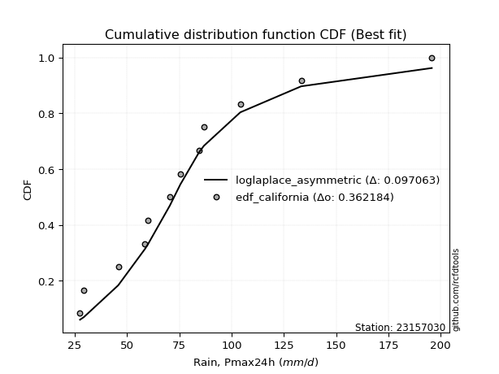</img></img>

</div>


### 2. EDF Hazen (1930)

Hazen method for plotting positions is a formula used to estimate the empirical cumulative probability distribution of flood events or other hydrological data. This formula often results in biased estimations, particularly when extrapolating to extreme events (high return periods).

<div align="center">


$P=(m-0.5)/n$


</div>


**2.1. Empirical values**

<div align="center">

|                | 0                    | 1                  | 2                   | 3                  | 4         | 5                  | 6                  | 7                  | 8                  | 9                  | 10        | 11                 |
|:---------------|:---------------------|:-------------------|:--------------------|:-------------------|:----------|:-------------------|:-------------------|:-------------------|:-------------------|:-------------------|:----------|:-------------------|
| date           | 2008                 | 2017               | 2012                | 2015               | 2018      | 2007               | 2009               | 2011               | 2016               | 2014               | 2010      | 2013               |
| x              | 27.5                 | 29.3               | 45.8                | 58.6               | 60.0      | 70.5               | 75.5               | 84.5               | 86.8               | 104.2              | 133.3     | 195.8              |
| m              | 1                    | 2                  | 3                   | 4                  | 5         | 6                  | 7                  | 8                  | 9                  | 10                 | 11        | 12                 |
| empirical_dist | edf_hazen            | edf_hazen          | edf_hazen           | edf_hazen          | edf_hazen | edf_hazen          | edf_hazen          | edf_hazen          | edf_hazen          | edf_hazen          | edf_hazen | edf_hazen          |
| empirical      | 0.041666666666666664 | 0.125              | 0.20833333333333334 | 0.2916666666666667 | 0.375     | 0.4583333333333333 | 0.5416666666666666 | 0.625              | 0.7083333333333334 | 0.7916666666666666 | 0.875     | 0.9583333333333334 |
| empirical_tr   | 1.0434782608695652   | 1.1428571428571428 | 1.2631578947368423  | 1.411764705882353  | 1.6       | 1.8461538461538458 | 2.1818181818181817 | 2.6666666666666665 | 3.428571428571429  | 4.799999999999999  | 8.0       | 24.00000000000002  |

</div>


**2.2. Kolmogorov-Smirnov fit test (sorted by Δ)**


<div align="center">

|                | 0                     | 1                    | 2                   | 3                   | 4                   | 5                   | 6                   | 7                   | 8                   | 9                   | 10                  | 11                  | 12                  | 13                  | 14                  | 15                  | 16                  | 17                  | 18                  | 19                  | 20                  | 21                  | 22                  | 23                  | 24                  | 25                  | 26                  | 27                  | 28                  | 29                  | 30                  | 31                  | 32                  | 33                  | 34                  | 35                  | 36                  | 37                  | 38                  | 39                  | 40                  | 41                  | 42                  | 43                  | 44                  | 45                  | 46                  | 47                  | 48                  | 49                  | 50                  | 51                  | 52                  | 53                  | 54                  | 55                  | 56                  | 57                  | 58                  | 59                  | 60                  | 61                  | 62                  | 63                  | 64                  | 65                  | 66                  | 67                  | 68                  | 69                  | 70                  | 71                  | 72                  | 73                  | 74                  | 75                  | 76                  | 77                  | 78                  | 79                  | 80                  | 81                  | 82                  | 83                  | 84                  | 85                  | 86                  | 87                  |
|:---------------|:----------------------|:---------------------|:--------------------|:--------------------|:--------------------|:--------------------|:--------------------|:--------------------|:--------------------|:--------------------|:--------------------|:--------------------|:--------------------|:--------------------|:--------------------|:--------------------|:--------------------|:--------------------|:--------------------|:--------------------|:--------------------|:--------------------|:--------------------|:--------------------|:--------------------|:--------------------|:--------------------|:--------------------|:--------------------|:--------------------|:--------------------|:--------------------|:--------------------|:--------------------|:--------------------|:--------------------|:--------------------|:--------------------|:--------------------|:--------------------|:--------------------|:--------------------|:--------------------|:--------------------|:--------------------|:--------------------|:--------------------|:--------------------|:--------------------|:--------------------|:--------------------|:--------------------|:--------------------|:--------------------|:--------------------|:--------------------|:--------------------|:--------------------|:--------------------|:--------------------|:--------------------|:--------------------|:--------------------|:--------------------|:--------------------|:--------------------|:--------------------|:--------------------|:--------------------|:--------------------|:--------------------|:--------------------|:--------------------|:--------------------|:--------------------|:--------------------|:--------------------|:--------------------|:--------------------|:--------------------|:--------------------|:--------------------|:--------------------|:--------------------|:--------------------|:--------------------|:--------------------|:--------------------|
| station        | 23157030              | 23157030             | 23157030            | 23157030            | 23157030            | 23157030            | 23157030            | 23157030            | 23157030            | 23157030            | 23157030            | 23157030            | 23157030            | 23157030            | 23157030            | 23157030            | 23157030            | 23157030            | 23157030            | 23157030            | 23157030            | 23157030            | 23157030            | 23157030            | 23157030            | 23157030            | 23157030            | 23157030            | 23157030            | 23157030            | 23157030            | 23157030            | 23157030            | 23157030            | 23157030            | 23157030            | 23157030            | 23157030            | 23157030            | 23157030            | 23157030            | 23157030            | 23157030            | 23157030            | 23157030            | 23157030            | 23157030            | 23157030            | 23157030            | 23157030            | 23157030            | 23157030            | 23157030            | 23157030            | 23157030            | 23157030            | 23157030            | 23157030            | 23157030            | 23157030            | 23157030            | 23157030            | 23157030            | 23157030            | 23157030            | 23157030            | 23157030            | 23157030            | 23157030            | 23157030            | 23157030            | 23157030            | 23157030            | 23157030            | 23157030            | 23157030            | 23157030            | 23157030            | 23157030            | 23157030            | 23157030            | 23157030            | 23157030            | 23157030            | 23157030            | 23157030            | 23157030            | 23157030            |
| empirical_dist | edf_hazen             | edf_hazen            | edf_hazen           | edf_hazen           | edf_hazen           | edf_hazen           | edf_hazen           | edf_hazen           | edf_hazen           | edf_hazen           | edf_hazen           | edf_hazen           | edf_hazen           | edf_hazen           | edf_hazen           | edf_hazen           | edf_hazen           | edf_hazen           | edf_hazen           | edf_hazen           | edf_hazen           | edf_hazen           | edf_hazen           | edf_hazen           | edf_hazen           | edf_hazen           | edf_hazen           | edf_hazen           | edf_hazen           | edf_hazen           | edf_hazen           | edf_hazen           | edf_hazen           | edf_hazen           | edf_hazen           | edf_hazen           | edf_hazen           | edf_hazen           | edf_hazen           | edf_hazen           | edf_hazen           | edf_hazen           | edf_hazen           | edf_hazen           | edf_hazen           | edf_hazen           | edf_hazen           | edf_hazen           | edf_hazen           | edf_hazen           | edf_hazen           | edf_hazen           | edf_hazen           | edf_hazen           | edf_hazen           | edf_hazen           | edf_hazen           | edf_hazen           | edf_hazen           | edf_hazen           | edf_hazen           | edf_hazen           | edf_hazen           | edf_hazen           | edf_hazen           | edf_hazen           | edf_hazen           | edf_hazen           | edf_hazen           | edf_hazen           | edf_hazen           | edf_hazen           | edf_hazen           | edf_hazen           | edf_hazen           | edf_hazen           | edf_hazen           | edf_hazen           | edf_hazen           | edf_hazen           | edf_hazen           | edf_hazen           | edf_hazen           | edf_hazen           | edf_hazen           | edf_hazen           | edf_hazen           | edf_hazen           |
| p_dist         | loglaplace_asymmetric | laplace_asymmetric   | loggenlogistic      | exponnorm           | moyal               | alpha               | nct                 | logfisk             | invweibull          | loglogistic         | loglaplace          | fisk                | loghypsecant        | f                   | genlogistic         | ncf                 | logloggamma         | invgamma            | logjohnsonsu        | logpearson3         | pearson3            | logt                | lognorm             | lognorm             | logcrystalball      | logexponnorm        | logfatiguelife      | logf                | lognakagami         | loggamma            | loggamma            | logerlang           | johnsonsu           | gumbel_r            | logweibull_min      | halfnorm            | invgauss            | logbetaprime        | lognct              | loginvgamma         | kstwobign           | logrice             | logalpha            | loggompertz         | gompertz            | loggumbel_l         | halflogistic        | logncf              | loginvgauss         | logmaxwell          | rayleigh            | laplace             | betaprime           | lograyleigh         | maxwell             | wald                | nakagami            | loggumbel_r         | rice                | mielke              | hypsecant           | loginvweibull       | genexpon            | expon               | logistic            | logmoyal            | norm                | truncnorm           | crystalball         | t                   | loghalfnorm         | logkstwobign        | loggenexpon         | loghalflogistic     | weibull_min         | logtruncnorm        | gibrat              | logwald             | gumbel_l            | loggibrat           | erlang              | logexpon            | logmielke           | gamma               | chi2                | logchi2             | loglognorm          | fatiguelife         |
| delta          | 0.055396269740019724  | 0.055778853315908414 | 0.0630919122502103  | 0.06362229193586291 | 0.06686199278859478 | 0.06710271660602363 | 0.06851533480152017 | 0.06950304936113769 | 0.07213795534701312 | 0.0722810274038825  | 0.07241872800681426 | 0.0725656577116212  | 0.07294391532579317 | 0.07296894413559879 | 0.0731526070419497  | 0.07572777915824158 | 0.07646377717382519 | 0.07662594986005883 | 0.07672377011274506 | 0.07760884922197808 | 0.08069533037841559 | 0.08111607022387524 | 0.08111646905647679 | 0.08111646905647679 | 0.08111649662870662 | 0.08111820627611027 | 0.08115215573648155 | 0.08116045426356644 | 0.08155348909327675 | 0.08444554980718832 | 0.08444554980718832 | 0.08479078093210274 | 0.08637711812751991 | 0.08693107483132301 | 0.08830005573676786 | 0.09012170480791004 | 0.09121345835088668 | 0.09354606423963963 | 0.09621874046008766 | 0.09684406515520855 | 0.09810913170031543 | 0.09917788778040743 | 0.09940698763399403 | 0.10178250944694978 | 0.10210408077085048 | 0.10251785649653311 | 0.10276128525308566 | 0.11025207650906182 | 0.11381754711673742 | 0.11423355584223727 | 0.11694610606669309 | 0.12488803278306049 | 0.12522519032564267 | 0.12649207368441545 | 0.12666779412669094 | 0.12676125895992293 | 0.12807235232424685 | 0.1352107906413525  | 0.136196218129928   | 0.1413724793017273  | 0.1442159459751765  | 0.1447041033570453  | 0.14875858822868054 | 0.1492683484804304  | 0.1500541360180503  | 0.15573582448479822 | 0.15696830198834866 | 0.15696830300849562 | 0.15696830378954174 | 0.15775579467442014 | 0.16134852488800872 | 0.16614626127091897 | 0.1698629059163042  | 0.1731103770563232  | 0.20374857651451633 | 0.20832523828299646 | 0.20833333333333334 | 0.21519194725300633 | 0.2238565284586661  | 0.23938154922023186 | 0.2491021151941935  | 0.2635110305135095  | 0.26771760364917946 | 0.2694079675845816  | 0.29505502994263316 | 0.3253247851094537  | 0.39158010563608736 | 0.47414106140632883 |
| deltao         | 0.36218414519599995   | 0.36218414519599995  | 0.36218414519599995 | 0.36218414519599995 | 0.36218414519599995 | 0.36218414519599995 | 0.36218414519599995 | 0.36218414519599995 | 0.36218414519599995 | 0.36218414519599995 | 0.36218414519599995 | 0.36218414519599995 | 0.36218414519599995 | 0.36218414519599995 | 0.36218414519599995 | 0.36218414519599995 | 0.36218414519599995 | 0.36218414519599995 | 0.36218414519599995 | 0.36218414519599995 | 0.36218414519599995 | 0.36218414519599995 | 0.36218414519599995 | 0.36218414519599995 | 0.36218414519599995 | 0.36218414519599995 | 0.36218414519599995 | 0.36218414519599995 | 0.36218414519599995 | 0.36218414519599995 | 0.36218414519599995 | 0.36218414519599995 | 0.36218414519599995 | 0.36218414519599995 | 0.36218414519599995 | 0.36218414519599995 | 0.36218414519599995 | 0.36218414519599995 | 0.36218414519599995 | 0.36218414519599995 | 0.36218414519599995 | 0.36218414519599995 | 0.36218414519599995 | 0.36218414519599995 | 0.36218414519599995 | 0.36218414519599995 | 0.36218414519599995 | 0.36218414519599995 | 0.36218414519599995 | 0.36218414519599995 | 0.36218414519599995 | 0.36218414519599995 | 0.36218414519599995 | 0.36218414519599995 | 0.36218414519599995 | 0.36218414519599995 | 0.36218414519599995 | 0.36218414519599995 | 0.36218414519599995 | 0.36218414519599995 | 0.36218414519599995 | 0.36218414519599995 | 0.36218414519599995 | 0.36218414519599995 | 0.36218414519599995 | 0.36218414519599995 | 0.36218414519599995 | 0.36218414519599995 | 0.36218414519599995 | 0.36218414519599995 | 0.36218414519599995 | 0.36218414519599995 | 0.36218414519599995 | 0.36218414519599995 | 0.36218414519599995 | 0.36218414519599995 | 0.36218414519599995 | 0.36218414519599995 | 0.36218414519599995 | 0.36218414519599995 | 0.36218414519599995 | 0.36218414519599995 | 0.36218414519599995 | 0.36218414519599995 | 0.36218414519599995 | 0.36218414519599995 | 0.36218414519599995 | 0.36218414519599995 |
| eval           | Δo > Δ                | Δo > Δ               | Δo > Δ              | Δo > Δ              | Δo > Δ              | Δo > Δ              | Δo > Δ              | Δo > Δ              | Δo > Δ              | Δo > Δ              | Δo > Δ              | Δo > Δ              | Δo > Δ              | Δo > Δ              | Δo > Δ              | Δo > Δ              | Δo > Δ              | Δo > Δ              | Δo > Δ              | Δo > Δ              | Δo > Δ              | Δo > Δ              | Δo > Δ              | Δo > Δ              | Δo > Δ              | Δo > Δ              | Δo > Δ              | Δo > Δ              | Δo > Δ              | Δo > Δ              | Δo > Δ              | Δo > Δ              | Δo > Δ              | Δo > Δ              | Δo > Δ              | Δo > Δ              | Δo > Δ              | Δo > Δ              | Δo > Δ              | Δo > Δ              | Δo > Δ              | Δo > Δ              | Δo > Δ              | Δo > Δ              | Δo > Δ              | Δo > Δ              | Δo > Δ              | Δo > Δ              | Δo > Δ              | Δo > Δ              | Δo > Δ              | Δo > Δ              | Δo > Δ              | Δo > Δ              | Δo > Δ              | Δo > Δ              | Δo > Δ              | Δo > Δ              | Δo > Δ              | Δo > Δ              | Δo > Δ              | Δo > Δ              | Δo > Δ              | Δo > Δ              | Δo > Δ              | Δo > Δ              | Δo > Δ              | Δo > Δ              | Δo > Δ              | Δo > Δ              | Δo > Δ              | Δo > Δ              | Δo > Δ              | Δo > Δ              | Δo > Δ              | Δo > Δ              | Δo > Δ              | Δo > Δ              | Δo > Δ              | Δo > Δ              | Δo > Δ              | Δo > Δ              | Δo > Δ              | Δo > Δ              | Δo > Δ              | Δo > Δ              | Δo <= Δ             | Δo <= Δ             |
| fit            | 1                     | 1                    | 1                   | 1                   | 1                   | 1                   | 1                   | 1                   | 1                   | 1                   | 1                   | 1                   | 1                   | 1                   | 1                   | 1                   | 1                   | 1                   | 1                   | 1                   | 1                   | 1                   | 1                   | 1                   | 1                   | 1                   | 1                   | 1                   | 1                   | 1                   | 1                   | 1                   | 1                   | 1                   | 1                   | 1                   | 1                   | 1                   | 1                   | 1                   | 1                   | 1                   | 1                   | 1                   | 1                   | 1                   | 1                   | 1                   | 1                   | 1                   | 1                   | 1                   | 1                   | 1                   | 1                   | 1                   | 1                   | 1                   | 1                   | 1                   | 1                   | 1                   | 1                   | 1                   | 1                   | 1                   | 1                   | 1                   | 1                   | 1                   | 1                   | 1                   | 1                   | 1                   | 1                   | 1                   | 1                   | 1                   | 1                   | 1                   | 1                   | 1                   | 1                   | 1                   | 1                   | 1                   | 0                   | 0                   |
| n              | 12                    | 12                   | 12                  | 12                  | 12                  | 12                  | 12                  | 12                  | 12                  | 12                  | 12                  | 12                  | 12                  | 12                  | 12                  | 12                  | 12                  | 12                  | 12                  | 12                  | 12                  | 12                  | 12                  | 12                  | 12                  | 12                  | 12                  | 12                  | 12                  | 12                  | 12                  | 12                  | 12                  | 12                  | 12                  | 12                  | 12                  | 12                  | 12                  | 12                  | 12                  | 12                  | 12                  | 12                  | 12                  | 12                  | 12                  | 12                  | 12                  | 12                  | 12                  | 12                  | 12                  | 12                  | 12                  | 12                  | 12                  | 12                  | 12                  | 12                  | 12                  | 12                  | 12                  | 12                  | 12                  | 12                  | 12                  | 12                  | 12                  | 12                  | 12                  | 12                  | 12                  | 12                  | 12                  | 12                  | 12                  | 12                  | 12                  | 12                  | 12                  | 12                  | 12                  | 12                  | 12                  | 12                  | 12                  | 12                  |
| best_fit       | 1                     | 0                    | 0                   | 0                   | 0                   | 0                   | 0                   | 0                   | 0                   | 0                   | 0                   | 0                   | 0                   | 0                   | 0                   | 0                   | 0                   | 0                   | 0                   | 0                   | 0                   | 0                   | 0                   | 0                   | 0                   | 0                   | 0                   | 0                   | 0                   | 0                   | 0                   | 0                   | 0                   | 0                   | 0                   | 0                   | 0                   | 0                   | 0                   | 0                   | 0                   | 0                   | 0                   | 0                   | 0                   | 0                   | 0                   | 0                   | 0                   | 0                   | 0                   | 0                   | 0                   | 0                   | 0                   | 0                   | 0                   | 0                   | 0                   | 0                   | 0                   | 0                   | 0                   | 0                   | 0                   | 0                   | 0                   | 0                   | 0                   | 0                   | 0                   | 0                   | 0                   | 0                   | 0                   | 0                   | 0                   | 0                   | 0                   | 0                   | 0                   | 0                   | 0                   | 0                   | 0                   | 0                   | 0                   | 0                   |
| best_fit_sort  | 1                     | 2                    | 3                   | 4                   | 5                   | 6                   | 7                   | 8                   | 9                   | 10                  | 11                  | 12                  | 13                  | 14                  | 15                  | 16                  | 17                  | 18                  | 19                  | 20                  | 21                  | 22                  | 23                  | 24                  | 25                  | 26                  | 27                  | 28                  | 29                  | 30                  | 31                  | 32                  | 33                  | 34                  | 35                  | 36                  | 37                  | 38                  | 39                  | 40                  | 41                  | 42                  | 43                  | 44                  | 45                  | 46                  | 47                  | 48                  | 49                  | 50                  | 51                  | 52                  | 53                  | 54                  | 55                  | 56                  | 57                  | 58                  | 59                  | 60                  | 61                  | 62                  | 63                  | 64                  | 65                  | 66                  | 67                  | 68                  | 69                  | 70                  | 71                  | 72                  | 73                  | 74                  | 75                  | 76                  | 77                  | 78                  | 79                  | 80                  | 81                  | 82                  | 83                  | 84                  | 85                  | 86                  | 87                  | 88                  |

</div>


**2.3. Best fit**

<div align="center">

|   id |   station | empirical_dist   | p_dist                |     delta |   deltao | eval   |   fit |   n |   best_fit |   best_fit_sort |
|-----:|----------:|:-----------------|:----------------------|----------:|---------:|:-------|------:|----:|-----------:|----------------:|
|    0 |  23157030 | edf_hazen        | loglaplace_asymmetric | 0.0553963 | 0.362184 | Δo > Δ |     1 |  12 |          1 |               1 |

</div>


<div align="center">

</img></img>

</div>


### 3. EDF Weibull (1939)

Weibull plotting position formula is an empirical method used to estimate the non-exceedance probability or plotting position for a set of observed data, is often recommended or widely used in practice, particularly in flood frequency analysis.

<div align="center">


$P=m/(n+1)$


</div>


**3.1. Empirical values**

<div align="center">

|                | 0                   | 1                   | 2                   | 3                  | 4                   | 5                   | 6                  | 7                  | 8                  | 9                  | 10                 | 11                 |
|:---------------|:--------------------|:--------------------|:--------------------|:-------------------|:--------------------|:--------------------|:-------------------|:-------------------|:-------------------|:-------------------|:-------------------|:-------------------|
| date           | 2008                | 2017                | 2012                | 2015               | 2018                | 2007                | 2009               | 2011               | 2016               | 2014               | 2010               | 2013               |
| x              | 27.5                | 29.3                | 45.8                | 58.6               | 60.0                | 70.5                | 75.5               | 84.5               | 86.8               | 104.2              | 133.3              | 195.8              |
| m              | 1                   | 2                   | 3                   | 4                  | 5                   | 6                   | 7                  | 8                  | 9                  | 10                 | 11                 | 12                 |
| empirical_dist | edf_weibull         | edf_weibull         | edf_weibull         | edf_weibull        | edf_weibull         | edf_weibull         | edf_weibull        | edf_weibull        | edf_weibull        | edf_weibull        | edf_weibull        | edf_weibull        |
| empirical      | 0.07692307692307693 | 0.15384615384615385 | 0.23076923076923078 | 0.3076923076923077 | 0.38461538461538464 | 0.46153846153846156 | 0.5384615384615384 | 0.6153846153846154 | 0.6923076923076923 | 0.7692307692307693 | 0.8461538461538461 | 0.9230769230769231 |
| empirical_tr   | 1.0833333333333333  | 1.1818181818181819  | 1.3                 | 1.4444444444444444 | 1.625               | 1.8571428571428572  | 2.1666666666666665 | 2.6                | 3.25               | 4.333333333333334  | 6.5                | 13.000000000000009 |

</div>


**3.2. Kolmogorov-Smirnov fit test (sorted by Δ)**


<div align="center">

|                | 0                   | 1                   | 2                   | 3                     | 4                   | 5                   | 6                   | 7                   | 8                   | 9                   | 10                  | 11                  | 12                  | 13                  | 14                  | 15                  | 16                  | 17                  | 18                  | 19                  | 20                  | 21                  | 22                  | 23                  | 24                  | 25                  | 26                  | 27                  | 28                  | 29                  | 30                  | 31                  | 32                  | 33                  | 34                  | 35                  | 36                  | 37                  | 38                  | 39                  | 40                  | 41                  | 42                  | 43                  | 44                  | 45                  | 46                  | 47                  | 48                  | 49                  | 50                  | 51                  | 52                  | 53                  | 54                  | 55                  | 56                  | 57                  | 58                  | 59                  | 60                  | 61                  | 62                  | 63                  | 64                  | 65                  | 66                  | 67                  | 68                  | 69                  | 70                  | 71                  | 72                  | 73                  | 74                  | 75                  | 76                  | 77                  | 78                  | 79                  | 80                  | 81                  | 82                  | 83                  | 84                  | 85                  | 86                  | 87                  |
|:---------------|:--------------------|:--------------------|:--------------------|:----------------------|:--------------------|:--------------------|:--------------------|:--------------------|:--------------------|:--------------------|:--------------------|:--------------------|:--------------------|:--------------------|:--------------------|:--------------------|:--------------------|:--------------------|:--------------------|:--------------------|:--------------------|:--------------------|:--------------------|:--------------------|:--------------------|:--------------------|:--------------------|:--------------------|:--------------------|:--------------------|:--------------------|:--------------------|:--------------------|:--------------------|:--------------------|:--------------------|:--------------------|:--------------------|:--------------------|:--------------------|:--------------------|:--------------------|:--------------------|:--------------------|:--------------------|:--------------------|:--------------------|:--------------------|:--------------------|:--------------------|:--------------------|:--------------------|:--------------------|:--------------------|:--------------------|:--------------------|:--------------------|:--------------------|:--------------------|:--------------------|:--------------------|:--------------------|:--------------------|:--------------------|:--------------------|:--------------------|:--------------------|:--------------------|:--------------------|:--------------------|:--------------------|:--------------------|:--------------------|:--------------------|:--------------------|:--------------------|:--------------------|:--------------------|:--------------------|:--------------------|:--------------------|:--------------------|:--------------------|:--------------------|:--------------------|:--------------------|:--------------------|:--------------------|
| station        | 23157030            | 23157030            | 23157030            | 23157030              | 23157030            | 23157030            | 23157030            | 23157030            | 23157030            | 23157030            | 23157030            | 23157030            | 23157030            | 23157030            | 23157030            | 23157030            | 23157030            | 23157030            | 23157030            | 23157030            | 23157030            | 23157030            | 23157030            | 23157030            | 23157030            | 23157030            | 23157030            | 23157030            | 23157030            | 23157030            | 23157030            | 23157030            | 23157030            | 23157030            | 23157030            | 23157030            | 23157030            | 23157030            | 23157030            | 23157030            | 23157030            | 23157030            | 23157030            | 23157030            | 23157030            | 23157030            | 23157030            | 23157030            | 23157030            | 23157030            | 23157030            | 23157030            | 23157030            | 23157030            | 23157030            | 23157030            | 23157030            | 23157030            | 23157030            | 23157030            | 23157030            | 23157030            | 23157030            | 23157030            | 23157030            | 23157030            | 23157030            | 23157030            | 23157030            | 23157030            | 23157030            | 23157030            | 23157030            | 23157030            | 23157030            | 23157030            | 23157030            | 23157030            | 23157030            | 23157030            | 23157030            | 23157030            | 23157030            | 23157030            | 23157030            | 23157030            | 23157030            | 23157030            |
| empirical_dist | edf_weibull         | edf_weibull         | edf_weibull         | edf_weibull           | edf_weibull         | edf_weibull         | edf_weibull         | edf_weibull         | edf_weibull         | edf_weibull         | edf_weibull         | edf_weibull         | edf_weibull         | edf_weibull         | edf_weibull         | edf_weibull         | edf_weibull         | edf_weibull         | edf_weibull         | edf_weibull         | edf_weibull         | edf_weibull         | edf_weibull         | edf_weibull         | edf_weibull         | edf_weibull         | edf_weibull         | edf_weibull         | edf_weibull         | edf_weibull         | edf_weibull         | edf_weibull         | edf_weibull         | edf_weibull         | edf_weibull         | edf_weibull         | edf_weibull         | edf_weibull         | edf_weibull         | edf_weibull         | edf_weibull         | edf_weibull         | edf_weibull         | edf_weibull         | edf_weibull         | edf_weibull         | edf_weibull         | edf_weibull         | edf_weibull         | edf_weibull         | edf_weibull         | edf_weibull         | edf_weibull         | edf_weibull         | edf_weibull         | edf_weibull         | edf_weibull         | edf_weibull         | edf_weibull         | edf_weibull         | edf_weibull         | edf_weibull         | edf_weibull         | edf_weibull         | edf_weibull         | edf_weibull         | edf_weibull         | edf_weibull         | edf_weibull         | edf_weibull         | edf_weibull         | edf_weibull         | edf_weibull         | edf_weibull         | edf_weibull         | edf_weibull         | edf_weibull         | edf_weibull         | edf_weibull         | edf_weibull         | edf_weibull         | edf_weibull         | edf_weibull         | edf_weibull         | edf_weibull         | edf_weibull         | edf_weibull         | edf_weibull         |
| p_dist         | gumbel_r            | halfnorm            | pearson3            | loglaplace_asymmetric | laplace_asymmetric  | genlogistic         | loggumbel_l         | kstwobign           | loggenlogistic      | exponnorm           | logncf              | alpha               | f                   | moyal               | invweibull          | nct                 | logloggamma         | logjohnsonsu        | logpearson3         | ncf                 | invgamma            | logexponnorm        | logt                | logcrystalball      | lognorm             | lognorm             | logfisk             | lognakagami         | logf                | logbetaprime        | logerlang           | logfatiguelife      | loggamma            | loggamma            | johnsonsu           | invgauss            | lognct              | rayleigh            | loglogistic         | loglaplace          | fisk                | loghypsecant        | loginvgamma         | logweibull_min      | loginvgauss         | logalpha            | betaprime           | maxwell             | logrice             | nakagami            | logmaxwell          | rice                | mielke              | laplace             | gompertz            | hypsecant           | loginvweibull       | loggompertz         | halflogistic        | lograyleigh         | genexpon            | expon               | logistic            | loggumbel_r         | norm                | truncnorm           | crystalball         | t                   | logkstwobign        | logmoyal            | loggenexpon         | loghalfnorm         | wald                | loghalflogistic     | weibull_min         | gumbel_l            | logwald             | logtruncnorm        | gibrat              | erlang              | loggibrat           | logexpon            | logmielke           | gamma               | chi2                | logchi2             | loglognorm          | fatiguelife         |
| delta          | 0.07090543380568193 | 0.07409606378226902 | 0.0747505046029851  | 0.08424242358617358   | 0.08462500716206227 | 0.08560374081550687 | 0.08649221547089203 | 0.08741489589969854 | 0.09193806609636415 | 0.09246844578201677 | 0.0942264354834208  | 0.0950231630234457  | 0.0951297511060831  | 0.09570814663474864 | 0.09588804675756643 | 0.09593504393715922 | 0.09594997135798405 | 0.09637926251648679 | 0.09648694089056992 | 0.09693510948881123 | 0.09758903768549532 | 0.09821832727546076 | 0.0982188085997312  | 0.09821884611784781 | 0.09821892056720113 | 0.09821892056720113 | 0.09834920320729154 | 0.09849005225253882 | 0.0986369636888957  | 0.09875811894282571 | 0.099286141205435   | 0.09938290811953931 | 0.099444536263287   | 0.099444536263287   | 0.10010502300363583 | 0.10019054647832655 | 0.10059593376619165 | 0.10092046504105201 | 0.10112718125003635 | 0.10126488185296811 | 0.10141181155777505 | 0.10179006917194702 | 0.10342055884776771 | 0.10363272274147473 | 0.10473896179925753 | 0.10723668433394876 | 0.10919954930000164 | 0.11064215310104986 | 0.11164808253127897 | 0.11204671129860583 | 0.11872369215246267 | 0.12017057710428691 | 0.12534683827608628 | 0.1258497683372085  | 0.12708795397530265 | 0.12819030494953543 | 0.1286784623314043  | 0.1288106820555448  | 0.13160743909923953 | 0.13204628702389692 | 0.13273294720303952 | 0.1332427074547894  | 0.1340284949924092  | 0.14066605082288874 | 0.14094266096270758 | 0.14094266198285454 | 0.14094266276390066 | 0.14173015364877906 | 0.15012062024527795 | 0.15195762870761795 | 0.15383726489066318 | 0.15384615384615385 | 0.15384615384615385 | 0.15708473603068218 | 0.1877229354888753  | 0.20783088743302502 | 0.21198681904787808 | 0.2307611357188939  | 0.23076923076923078 | 0.23307647416855248 | 0.2361764210151036  | 0.24748538948786847 | 0.25169196262353843 | 0.25338232655894055 | 0.27902938891699214 | 0.30929914408381265 | 0.36914420820018995 | 0.4517051639704314  |
| deltao         | 0.36218414519599995 | 0.36218414519599995 | 0.36218414519599995 | 0.36218414519599995   | 0.36218414519599995 | 0.36218414519599995 | 0.36218414519599995 | 0.36218414519599995 | 0.36218414519599995 | 0.36218414519599995 | 0.36218414519599995 | 0.36218414519599995 | 0.36218414519599995 | 0.36218414519599995 | 0.36218414519599995 | 0.36218414519599995 | 0.36218414519599995 | 0.36218414519599995 | 0.36218414519599995 | 0.36218414519599995 | 0.36218414519599995 | 0.36218414519599995 | 0.36218414519599995 | 0.36218414519599995 | 0.36218414519599995 | 0.36218414519599995 | 0.36218414519599995 | 0.36218414519599995 | 0.36218414519599995 | 0.36218414519599995 | 0.36218414519599995 | 0.36218414519599995 | 0.36218414519599995 | 0.36218414519599995 | 0.36218414519599995 | 0.36218414519599995 | 0.36218414519599995 | 0.36218414519599995 | 0.36218414519599995 | 0.36218414519599995 | 0.36218414519599995 | 0.36218414519599995 | 0.36218414519599995 | 0.36218414519599995 | 0.36218414519599995 | 0.36218414519599995 | 0.36218414519599995 | 0.36218414519599995 | 0.36218414519599995 | 0.36218414519599995 | 0.36218414519599995 | 0.36218414519599995 | 0.36218414519599995 | 0.36218414519599995 | 0.36218414519599995 | 0.36218414519599995 | 0.36218414519599995 | 0.36218414519599995 | 0.36218414519599995 | 0.36218414519599995 | 0.36218414519599995 | 0.36218414519599995 | 0.36218414519599995 | 0.36218414519599995 | 0.36218414519599995 | 0.36218414519599995 | 0.36218414519599995 | 0.36218414519599995 | 0.36218414519599995 | 0.36218414519599995 | 0.36218414519599995 | 0.36218414519599995 | 0.36218414519599995 | 0.36218414519599995 | 0.36218414519599995 | 0.36218414519599995 | 0.36218414519599995 | 0.36218414519599995 | 0.36218414519599995 | 0.36218414519599995 | 0.36218414519599995 | 0.36218414519599995 | 0.36218414519599995 | 0.36218414519599995 | 0.36218414519599995 | 0.36218414519599995 | 0.36218414519599995 | 0.36218414519599995 |
| eval           | Δo > Δ              | Δo > Δ              | Δo > Δ              | Δo > Δ                | Δo > Δ              | Δo > Δ              | Δo > Δ              | Δo > Δ              | Δo > Δ              | Δo > Δ              | Δo > Δ              | Δo > Δ              | Δo > Δ              | Δo > Δ              | Δo > Δ              | Δo > Δ              | Δo > Δ              | Δo > Δ              | Δo > Δ              | Δo > Δ              | Δo > Δ              | Δo > Δ              | Δo > Δ              | Δo > Δ              | Δo > Δ              | Δo > Δ              | Δo > Δ              | Δo > Δ              | Δo > Δ              | Δo > Δ              | Δo > Δ              | Δo > Δ              | Δo > Δ              | Δo > Δ              | Δo > Δ              | Δo > Δ              | Δo > Δ              | Δo > Δ              | Δo > Δ              | Δo > Δ              | Δo > Δ              | Δo > Δ              | Δo > Δ              | Δo > Δ              | Δo > Δ              | Δo > Δ              | Δo > Δ              | Δo > Δ              | Δo > Δ              | Δo > Δ              | Δo > Δ              | Δo > Δ              | Δo > Δ              | Δo > Δ              | Δo > Δ              | Δo > Δ              | Δo > Δ              | Δo > Δ              | Δo > Δ              | Δo > Δ              | Δo > Δ              | Δo > Δ              | Δo > Δ              | Δo > Δ              | Δo > Δ              | Δo > Δ              | Δo > Δ              | Δo > Δ              | Δo > Δ              | Δo > Δ              | Δo > Δ              | Δo > Δ              | Δo > Δ              | Δo > Δ              | Δo > Δ              | Δo > Δ              | Δo > Δ              | Δo > Δ              | Δo > Δ              | Δo > Δ              | Δo > Δ              | Δo > Δ              | Δo > Δ              | Δo > Δ              | Δo > Δ              | Δo > Δ              | Δo <= Δ             | Δo <= Δ             |
| fit            | 1                   | 1                   | 1                   | 1                     | 1                   | 1                   | 1                   | 1                   | 1                   | 1                   | 1                   | 1                   | 1                   | 1                   | 1                   | 1                   | 1                   | 1                   | 1                   | 1                   | 1                   | 1                   | 1                   | 1                   | 1                   | 1                   | 1                   | 1                   | 1                   | 1                   | 1                   | 1                   | 1                   | 1                   | 1                   | 1                   | 1                   | 1                   | 1                   | 1                   | 1                   | 1                   | 1                   | 1                   | 1                   | 1                   | 1                   | 1                   | 1                   | 1                   | 1                   | 1                   | 1                   | 1                   | 1                   | 1                   | 1                   | 1                   | 1                   | 1                   | 1                   | 1                   | 1                   | 1                   | 1                   | 1                   | 1                   | 1                   | 1                   | 1                   | 1                   | 1                   | 1                   | 1                   | 1                   | 1                   | 1                   | 1                   | 1                   | 1                   | 1                   | 1                   | 1                   | 1                   | 1                   | 1                   | 0                   | 0                   |
| n              | 12                  | 12                  | 12                  | 12                    | 12                  | 12                  | 12                  | 12                  | 12                  | 12                  | 12                  | 12                  | 12                  | 12                  | 12                  | 12                  | 12                  | 12                  | 12                  | 12                  | 12                  | 12                  | 12                  | 12                  | 12                  | 12                  | 12                  | 12                  | 12                  | 12                  | 12                  | 12                  | 12                  | 12                  | 12                  | 12                  | 12                  | 12                  | 12                  | 12                  | 12                  | 12                  | 12                  | 12                  | 12                  | 12                  | 12                  | 12                  | 12                  | 12                  | 12                  | 12                  | 12                  | 12                  | 12                  | 12                  | 12                  | 12                  | 12                  | 12                  | 12                  | 12                  | 12                  | 12                  | 12                  | 12                  | 12                  | 12                  | 12                  | 12                  | 12                  | 12                  | 12                  | 12                  | 12                  | 12                  | 12                  | 12                  | 12                  | 12                  | 12                  | 12                  | 12                  | 12                  | 12                  | 12                  | 12                  | 12                  |
| best_fit       | 1                   | 0                   | 0                   | 0                     | 0                   | 0                   | 0                   | 0                   | 0                   | 0                   | 0                   | 0                   | 0                   | 0                   | 0                   | 0                   | 0                   | 0                   | 0                   | 0                   | 0                   | 0                   | 0                   | 0                   | 0                   | 0                   | 0                   | 0                   | 0                   | 0                   | 0                   | 0                   | 0                   | 0                   | 0                   | 0                   | 0                   | 0                   | 0                   | 0                   | 0                   | 0                   | 0                   | 0                   | 0                   | 0                   | 0                   | 0                   | 0                   | 0                   | 0                   | 0                   | 0                   | 0                   | 0                   | 0                   | 0                   | 0                   | 0                   | 0                   | 0                   | 0                   | 0                   | 0                   | 0                   | 0                   | 0                   | 0                   | 0                   | 0                   | 0                   | 0                   | 0                   | 0                   | 0                   | 0                   | 0                   | 0                   | 0                   | 0                   | 0                   | 0                   | 0                   | 0                   | 0                   | 0                   | 0                   | 0                   |
| best_fit_sort  | 1                   | 2                   | 3                   | 4                     | 5                   | 6                   | 7                   | 8                   | 9                   | 10                  | 11                  | 12                  | 13                  | 14                  | 15                  | 16                  | 17                  | 18                  | 19                  | 20                  | 21                  | 22                  | 23                  | 24                  | 25                  | 26                  | 27                  | 28                  | 29                  | 30                  | 31                  | 32                  | 33                  | 34                  | 35                  | 36                  | 37                  | 38                  | 39                  | 40                  | 41                  | 42                  | 43                  | 44                  | 45                  | 46                  | 47                  | 48                  | 49                  | 50                  | 51                  | 52                  | 53                  | 54                  | 55                  | 56                  | 57                  | 58                  | 59                  | 60                  | 61                  | 62                  | 63                  | 64                  | 65                  | 66                  | 67                  | 68                  | 69                  | 70                  | 71                  | 72                  | 73                  | 74                  | 75                  | 76                  | 77                  | 78                  | 79                  | 80                  | 81                  | 82                  | 83                  | 84                  | 85                  | 86                  | 87                  | 88                  |

</div>


**3.3. Best fit**

<div align="center">

|   id |   station | empirical_dist   | p_dist   |     delta |   deltao | eval   |   fit |   n |   best_fit |   best_fit_sort |
|-----:|----------:|:-----------------|:---------|----------:|---------:|:-------|------:|----:|-----------:|----------------:|
|    0 |  23157030 | edf_weibull      | gumbel_r | 0.0709054 | 0.362184 | Δo > Δ |     1 |  12 |          1 |               1 |

</div>


<div align="center">

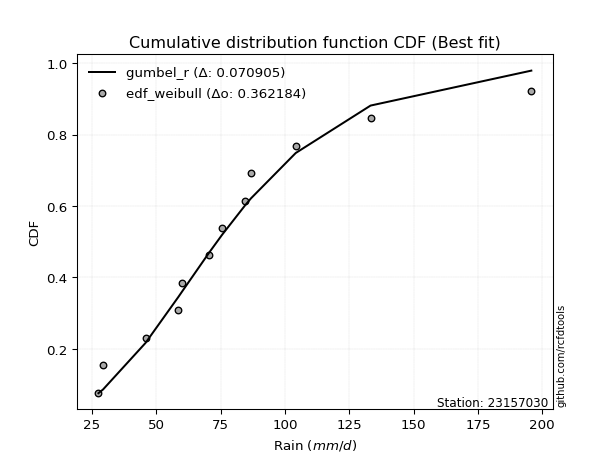</img>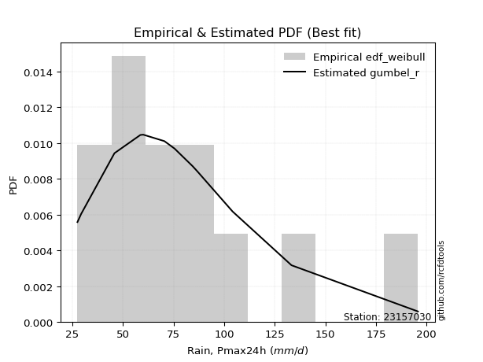</img>

</div>


### 4. EDF Beard (1943)

The Beard formula (or Beard´s plotting position formula) in hydrology is used to estimate the empirical non-exceedance probability _(P)_ of a flood event (or other extreme hydrological data point) within a given dataset.

<div align="center">


$P=(m-0.31)/(n+0.38)$


</div>


**4.1. Empirical values**

<div align="center">

|                | 0                    | 1                   | 2                   | 3                  | 4                  | 5                  | 6                  | 7                  | 8                  | 9                  | 10                 | 11                 |
|:---------------|:---------------------|:--------------------|:--------------------|:-------------------|:-------------------|:-------------------|:-------------------|:-------------------|:-------------------|:-------------------|:-------------------|:-------------------|
| date           | 2008                 | 2017                | 2012                | 2015               | 2018               | 2007               | 2009               | 2011               | 2016               | 2014               | 2010               | 2013               |
| x              | 27.5                 | 29.3                | 45.8                | 58.6               | 60.0               | 70.5               | 75.5               | 84.5               | 86.8               | 104.2              | 133.3              | 195.8              |
| m              | 1                    | 2                   | 3                   | 4                  | 5                  | 6                  | 7                  | 8                  | 9                  | 10                 | 11                 | 12                 |
| empirical_dist | edf_beard            | edf_beard           | edf_beard           | edf_beard          | edf_beard          | edf_beard          | edf_beard          | edf_beard          | edf_beard          | edf_beard          | edf_beard          | edf_beard          |
| empirical      | 0.055735056542810975 | 0.13651050080775443 | 0.21728594507269788 | 0.2980613893376413 | 0.3788368336025848 | 0.4596122778675283 | 0.5403877221324718 | 0.6211631663974152 | 0.7019386106623585 | 0.7827140549273021 | 0.8634894991922455 | 0.9442649434571889 |
| empirical_tr   | 1.0590248075278015   | 1.1580916744621141  | 1.2776057791537667  | 1.424626006904488  | 1.6098829648894668 | 1.850523168908819  | 2.1757469244288226 | 2.6396588486140726 | 3.3550135501355    | 4.6022304832713745 | 7.325443786982245  | 17.942028985507218 |

</div>


**4.2. Kolmogorov-Smirnov fit test (sorted by Δ)**


<div align="center">

|                | 0                     | 1                   | 2                   | 3                   | 4                   | 5                   | 6                   | 7                   | 8                   | 9                   | 10                  | 11                  | 12                  | 13                  | 14                  | 15                  | 16                  | 17                  | 18                  | 19                  | 20                  | 21                  | 22                  | 23                  | 24                  | 25                  | 26                  | 27                  | 28                  | 29                  | 30                  | 31                  | 32                  | 33                  | 34                  | 35                  | 36                  | 37                  | 38                  | 39                  | 40                  | 41                  | 42                  | 43                  | 44                  | 45                  | 46                  | 47                  | 48                  | 49                  | 50                  | 51                  | 52                  | 53                  | 54                  | 55                  | 56                  | 57                  | 58                  | 59                  | 60                  | 61                  | 62                  | 63                  | 64                  | 65                  | 66                  | 67                  | 68                  | 69                  | 70                  | 71                  | 72                  | 73                  | 74                  | 75                  | 76                  | 77                  | 78                  | 79                  | 80                  | 81                  | 82                  | 83                  | 84                  | 85                  | 86                  | 87                  |
|:---------------|:----------------------|:--------------------|:--------------------|:--------------------|:--------------------|:--------------------|:--------------------|:--------------------|:--------------------|:--------------------|:--------------------|:--------------------|:--------------------|:--------------------|:--------------------|:--------------------|:--------------------|:--------------------|:--------------------|:--------------------|:--------------------|:--------------------|:--------------------|:--------------------|:--------------------|:--------------------|:--------------------|:--------------------|:--------------------|:--------------------|:--------------------|:--------------------|:--------------------|:--------------------|:--------------------|:--------------------|:--------------------|:--------------------|:--------------------|:--------------------|:--------------------|:--------------------|:--------------------|:--------------------|:--------------------|:--------------------|:--------------------|:--------------------|:--------------------|:--------------------|:--------------------|:--------------------|:--------------------|:--------------------|:--------------------|:--------------------|:--------------------|:--------------------|:--------------------|:--------------------|:--------------------|:--------------------|:--------------------|:--------------------|:--------------------|:--------------------|:--------------------|:--------------------|:--------------------|:--------------------|:--------------------|:--------------------|:--------------------|:--------------------|:--------------------|:--------------------|:--------------------|:--------------------|:--------------------|:--------------------|:--------------------|:--------------------|:--------------------|:--------------------|:--------------------|:--------------------|:--------------------|:--------------------|
| station        | 23157030              | 23157030            | 23157030            | 23157030            | 23157030            | 23157030            | 23157030            | 23157030            | 23157030            | 23157030            | 23157030            | 23157030            | 23157030            | 23157030            | 23157030            | 23157030            | 23157030            | 23157030            | 23157030            | 23157030            | 23157030            | 23157030            | 23157030            | 23157030            | 23157030            | 23157030            | 23157030            | 23157030            | 23157030            | 23157030            | 23157030            | 23157030            | 23157030            | 23157030            | 23157030            | 23157030            | 23157030            | 23157030            | 23157030            | 23157030            | 23157030            | 23157030            | 23157030            | 23157030            | 23157030            | 23157030            | 23157030            | 23157030            | 23157030            | 23157030            | 23157030            | 23157030            | 23157030            | 23157030            | 23157030            | 23157030            | 23157030            | 23157030            | 23157030            | 23157030            | 23157030            | 23157030            | 23157030            | 23157030            | 23157030            | 23157030            | 23157030            | 23157030            | 23157030            | 23157030            | 23157030            | 23157030            | 23157030            | 23157030            | 23157030            | 23157030            | 23157030            | 23157030            | 23157030            | 23157030            | 23157030            | 23157030            | 23157030            | 23157030            | 23157030            | 23157030            | 23157030            | 23157030            |
| empirical_dist | edf_beard             | edf_beard           | edf_beard           | edf_beard           | edf_beard           | edf_beard           | edf_beard           | edf_beard           | edf_beard           | edf_beard           | edf_beard           | edf_beard           | edf_beard           | edf_beard           | edf_beard           | edf_beard           | edf_beard           | edf_beard           | edf_beard           | edf_beard           | edf_beard           | edf_beard           | edf_beard           | edf_beard           | edf_beard           | edf_beard           | edf_beard           | edf_beard           | edf_beard           | edf_beard           | edf_beard           | edf_beard           | edf_beard           | edf_beard           | edf_beard           | edf_beard           | edf_beard           | edf_beard           | edf_beard           | edf_beard           | edf_beard           | edf_beard           | edf_beard           | edf_beard           | edf_beard           | edf_beard           | edf_beard           | edf_beard           | edf_beard           | edf_beard           | edf_beard           | edf_beard           | edf_beard           | edf_beard           | edf_beard           | edf_beard           | edf_beard           | edf_beard           | edf_beard           | edf_beard           | edf_beard           | edf_beard           | edf_beard           | edf_beard           | edf_beard           | edf_beard           | edf_beard           | edf_beard           | edf_beard           | edf_beard           | edf_beard           | edf_beard           | edf_beard           | edf_beard           | edf_beard           | edf_beard           | edf_beard           | edf_beard           | edf_beard           | edf_beard           | edf_beard           | edf_beard           | edf_beard           | edf_beard           | edf_beard           | edf_beard           | edf_beard           | edf_beard           |
| p_dist         | loglaplace_asymmetric | laplace_asymmetric  | genlogistic         | pearson3            | loggenlogistic      | exponnorm           | alpha               | f                   | moyal               | invweibull          | nct                 | logloggamma         | logjohnsonsu        | logpearson3         | ncf                 | invgamma            | gumbel_r            | logexponnorm        | logt                | logcrystalball      | lognorm             | lognorm             | logfisk             | lognakagami         | logf                | logerlang           | logfatiguelife      | loggamma            | loggamma            | johnsonsu           | halfnorm            | loglogistic         | loglaplace          | fisk                | loghypsecant        | invgauss            | logweibull_min      | logbetaprime        | lognct              | loginvgamma         | kstwobign           | logalpha            | logrice             | loggumbel_l         | logncf              | loginvgauss         | logmaxwell          | gompertz            | rayleigh            | loggompertz         | halflogistic        | betaprime           | laplace             | lograyleigh         | maxwell             | nakagami            | loggumbel_r         | rice                | mielke              | wald                | hypsecant           | loginvweibull       | genexpon            | expon               | logistic            | logmoyal            | norm                | truncnorm           | crystalball         | t                   | loghalfnorm         | logkstwobign        | loggenexpon         | loghalflogistic     | weibull_min         | logwald             | logtruncnorm        | gibrat              | gumbel_l            | loggibrat           | erlang              | logexpon            | logmielke           | gamma               | chi2                | logchi2             | loglognorm          | fatiguelife         |
| delta          | 0.06690677054777415   | 0.06728935412366284 | 0.06826808777710744 | 0.07430060770744074 | 0.07460241305796472 | 0.07513279274361734 | 0.07768750998504627 | 0.07779409806768367 | 0.07837249359634921 | 0.078552393719167   | 0.0785993908987598  | 0.07861431831958463 | 0.07904360947808736 | 0.07915128785217049 | 0.0795994564504118  | 0.08025338464709589 | 0.08053635216034816 | 0.08088267423706133 | 0.08088315556133177 | 0.08088319307944838 | 0.0808832675288017  | 0.0808832675288017  | 0.08101355016889211 | 0.08115439921413939 | 0.08130131065049627 | 0.08195048816703557 | 0.08204725508113989 | 0.08210888322488757 | 0.08210888322488757 | 0.0827693699652364  | 0.08372698213693541 | 0.08379152821163692 | 0.08392922881456868 | 0.08407615851937562 | 0.0844544161335476  | 0.08481873567991205 | 0.0862970697030753  | 0.087151341568665   | 0.08982401778911303 | 0.09044934248423392 | 0.09171440902934058 | 0.0930122649630194  | 0.09431242949287955 | 0.09612313382555826 | 0.1038573538380872  | 0.10742282444576279 | 0.10783883317126264 | 0.10975230093690322 | 0.11055138339571824 | 0.11147502901714537 | 0.11427178606084008 | 0.11883046765466804 | 0.12007121732440867 | 0.12009735101344082 | 0.12027307145571609 | 0.12167762965327222 | 0.12881606797037787 | 0.12980149545895314 | 0.13497775663075268 | 0.13651050080775443 | 0.13782122330420166 | 0.13830938068607068 | 0.14236386555770592 | 0.14287362580945578 | 0.14365941334707544 | 0.1493411018138236  | 0.1505735793173738  | 0.15057358033752077 | 0.1505735811185669  | 0.15136107200344529 | 0.1549538022170341  | 0.15975153859994434 | 0.16346818324532958 | 0.16671565438534858 | 0.1973538538435417  | 0.21391300271881136 | 0.217277850022361   | 0.21728594507269788 | 0.21746180578769125 | 0.2381026046860369  | 0.24270739252321888 | 0.25711630784253486 | 0.26132288097820483 | 0.26301324491360695 | 0.28866030727165853 | 0.31893006243847905 | 0.38262749389672285 | 0.4651884496669643  |
| deltao         | 0.36218414519599995   | 0.36218414519599995 | 0.36218414519599995 | 0.36218414519599995 | 0.36218414519599995 | 0.36218414519599995 | 0.36218414519599995 | 0.36218414519599995 | 0.36218414519599995 | 0.36218414519599995 | 0.36218414519599995 | 0.36218414519599995 | 0.36218414519599995 | 0.36218414519599995 | 0.36218414519599995 | 0.36218414519599995 | 0.36218414519599995 | 0.36218414519599995 | 0.36218414519599995 | 0.36218414519599995 | 0.36218414519599995 | 0.36218414519599995 | 0.36218414519599995 | 0.36218414519599995 | 0.36218414519599995 | 0.36218414519599995 | 0.36218414519599995 | 0.36218414519599995 | 0.36218414519599995 | 0.36218414519599995 | 0.36218414519599995 | 0.36218414519599995 | 0.36218414519599995 | 0.36218414519599995 | 0.36218414519599995 | 0.36218414519599995 | 0.36218414519599995 | 0.36218414519599995 | 0.36218414519599995 | 0.36218414519599995 | 0.36218414519599995 | 0.36218414519599995 | 0.36218414519599995 | 0.36218414519599995 | 0.36218414519599995 | 0.36218414519599995 | 0.36218414519599995 | 0.36218414519599995 | 0.36218414519599995 | 0.36218414519599995 | 0.36218414519599995 | 0.36218414519599995 | 0.36218414519599995 | 0.36218414519599995 | 0.36218414519599995 | 0.36218414519599995 | 0.36218414519599995 | 0.36218414519599995 | 0.36218414519599995 | 0.36218414519599995 | 0.36218414519599995 | 0.36218414519599995 | 0.36218414519599995 | 0.36218414519599995 | 0.36218414519599995 | 0.36218414519599995 | 0.36218414519599995 | 0.36218414519599995 | 0.36218414519599995 | 0.36218414519599995 | 0.36218414519599995 | 0.36218414519599995 | 0.36218414519599995 | 0.36218414519599995 | 0.36218414519599995 | 0.36218414519599995 | 0.36218414519599995 | 0.36218414519599995 | 0.36218414519599995 | 0.36218414519599995 | 0.36218414519599995 | 0.36218414519599995 | 0.36218414519599995 | 0.36218414519599995 | 0.36218414519599995 | 0.36218414519599995 | 0.36218414519599995 | 0.36218414519599995 |
| eval           | Δo > Δ                | Δo > Δ              | Δo > Δ              | Δo > Δ              | Δo > Δ              | Δo > Δ              | Δo > Δ              | Δo > Δ              | Δo > Δ              | Δo > Δ              | Δo > Δ              | Δo > Δ              | Δo > Δ              | Δo > Δ              | Δo > Δ              | Δo > Δ              | Δo > Δ              | Δo > Δ              | Δo > Δ              | Δo > Δ              | Δo > Δ              | Δo > Δ              | Δo > Δ              | Δo > Δ              | Δo > Δ              | Δo > Δ              | Δo > Δ              | Δo > Δ              | Δo > Δ              | Δo > Δ              | Δo > Δ              | Δo > Δ              | Δo > Δ              | Δo > Δ              | Δo > Δ              | Δo > Δ              | Δo > Δ              | Δo > Δ              | Δo > Δ              | Δo > Δ              | Δo > Δ              | Δo > Δ              | Δo > Δ              | Δo > Δ              | Δo > Δ              | Δo > Δ              | Δo > Δ              | Δo > Δ              | Δo > Δ              | Δo > Δ              | Δo > Δ              | Δo > Δ              | Δo > Δ              | Δo > Δ              | Δo > Δ              | Δo > Δ              | Δo > Δ              | Δo > Δ              | Δo > Δ              | Δo > Δ              | Δo > Δ              | Δo > Δ              | Δo > Δ              | Δo > Δ              | Δo > Δ              | Δo > Δ              | Δo > Δ              | Δo > Δ              | Δo > Δ              | Δo > Δ              | Δo > Δ              | Δo > Δ              | Δo > Δ              | Δo > Δ              | Δo > Δ              | Δo > Δ              | Δo > Δ              | Δo > Δ              | Δo > Δ              | Δo > Δ              | Δo > Δ              | Δo > Δ              | Δo > Δ              | Δo > Δ              | Δo > Δ              | Δo > Δ              | Δo <= Δ             | Δo <= Δ             |
| fit            | 1                     | 1                   | 1                   | 1                   | 1                   | 1                   | 1                   | 1                   | 1                   | 1                   | 1                   | 1                   | 1                   | 1                   | 1                   | 1                   | 1                   | 1                   | 1                   | 1                   | 1                   | 1                   | 1                   | 1                   | 1                   | 1                   | 1                   | 1                   | 1                   | 1                   | 1                   | 1                   | 1                   | 1                   | 1                   | 1                   | 1                   | 1                   | 1                   | 1                   | 1                   | 1                   | 1                   | 1                   | 1                   | 1                   | 1                   | 1                   | 1                   | 1                   | 1                   | 1                   | 1                   | 1                   | 1                   | 1                   | 1                   | 1                   | 1                   | 1                   | 1                   | 1                   | 1                   | 1                   | 1                   | 1                   | 1                   | 1                   | 1                   | 1                   | 1                   | 1                   | 1                   | 1                   | 1                   | 1                   | 1                   | 1                   | 1                   | 1                   | 1                   | 1                   | 1                   | 1                   | 1                   | 1                   | 0                   | 0                   |
| n              | 12                    | 12                  | 12                  | 12                  | 12                  | 12                  | 12                  | 12                  | 12                  | 12                  | 12                  | 12                  | 12                  | 12                  | 12                  | 12                  | 12                  | 12                  | 12                  | 12                  | 12                  | 12                  | 12                  | 12                  | 12                  | 12                  | 12                  | 12                  | 12                  | 12                  | 12                  | 12                  | 12                  | 12                  | 12                  | 12                  | 12                  | 12                  | 12                  | 12                  | 12                  | 12                  | 12                  | 12                  | 12                  | 12                  | 12                  | 12                  | 12                  | 12                  | 12                  | 12                  | 12                  | 12                  | 12                  | 12                  | 12                  | 12                  | 12                  | 12                  | 12                  | 12                  | 12                  | 12                  | 12                  | 12                  | 12                  | 12                  | 12                  | 12                  | 12                  | 12                  | 12                  | 12                  | 12                  | 12                  | 12                  | 12                  | 12                  | 12                  | 12                  | 12                  | 12                  | 12                  | 12                  | 12                  | 12                  | 12                  |
| best_fit       | 1                     | 0                   | 0                   | 0                   | 0                   | 0                   | 0                   | 0                   | 0                   | 0                   | 0                   | 0                   | 0                   | 0                   | 0                   | 0                   | 0                   | 0                   | 0                   | 0                   | 0                   | 0                   | 0                   | 0                   | 0                   | 0                   | 0                   | 0                   | 0                   | 0                   | 0                   | 0                   | 0                   | 0                   | 0                   | 0                   | 0                   | 0                   | 0                   | 0                   | 0                   | 0                   | 0                   | 0                   | 0                   | 0                   | 0                   | 0                   | 0                   | 0                   | 0                   | 0                   | 0                   | 0                   | 0                   | 0                   | 0                   | 0                   | 0                   | 0                   | 0                   | 0                   | 0                   | 0                   | 0                   | 0                   | 0                   | 0                   | 0                   | 0                   | 0                   | 0                   | 0                   | 0                   | 0                   | 0                   | 0                   | 0                   | 0                   | 0                   | 0                   | 0                   | 0                   | 0                   | 0                   | 0                   | 0                   | 0                   |
| best_fit_sort  | 1                     | 2                   | 3                   | 4                   | 5                   | 6                   | 7                   | 8                   | 9                   | 10                  | 11                  | 12                  | 13                  | 14                  | 15                  | 16                  | 17                  | 18                  | 19                  | 20                  | 21                  | 22                  | 23                  | 24                  | 25                  | 26                  | 27                  | 28                  | 29                  | 30                  | 31                  | 32                  | 33                  | 34                  | 35                  | 36                  | 37                  | 38                  | 39                  | 40                  | 41                  | 42                  | 43                  | 44                  | 45                  | 46                  | 47                  | 48                  | 49                  | 50                  | 51                  | 52                  | 53                  | 54                  | 55                  | 56                  | 57                  | 58                  | 59                  | 60                  | 61                  | 62                  | 63                  | 64                  | 65                  | 66                  | 67                  | 68                  | 69                  | 70                  | 71                  | 72                  | 73                  | 74                  | 75                  | 76                  | 77                  | 78                  | 79                  | 80                  | 81                  | 82                  | 83                  | 84                  | 85                  | 86                  | 87                  | 88                  |

</div>


**4.3. Best fit**

<div align="center">

|   id |   station | empirical_dist   | p_dist                |     delta |   deltao | eval   |   fit |   n |   best_fit |   best_fit_sort |
|-----:|----------:|:-----------------|:----------------------|----------:|---------:|:-------|------:|----:|-----------:|----------------:|
|    0 |  23157030 | edf_beard        | loglaplace_asymmetric | 0.0669068 | 0.362184 | Δo > Δ |     1 |  12 |          1 |               1 |

</div>


<div align="center">

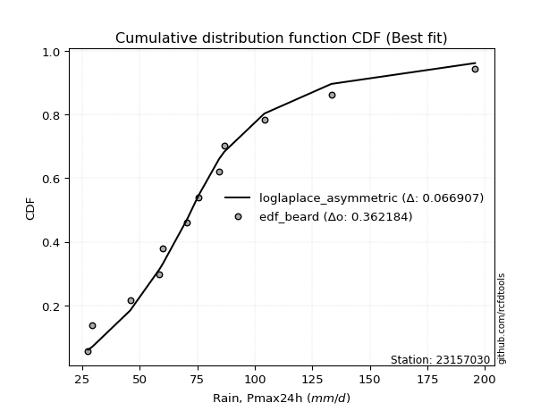</img></img>

</div>


### 5. EDF Chegodayev (1955)

The Chegodayev formula is an empirical plotting position formula used in hydrological frequency analysis to estimate the exceedance probability or return period of a specific event from a set of observed data. It is primarily used for plotting observed data points on probability paper to fit a theoretical distribution, particularly for analyzing extreme events like maximum flood flows or rainfall intensities. The constant _b_ value in the generalized plotting position formula is 0.3.

<div align="center">


$P=(m-b)/(n+1-2b)$


</div>


**5.1. Empirical values**

<div align="center">

|                | 0                  | 1                   | 2                   | 3                   | 4                  | 5                  | 6                  | 7                  | 8                  | 9                 | 10                 | 11                 |
|:---------------|:-------------------|:--------------------|:--------------------|:--------------------|:-------------------|:-------------------|:-------------------|:-------------------|:-------------------|:------------------|:-------------------|:-------------------|
| date           | 2008               | 2017                | 2012                | 2015                | 2018               | 2007               | 2009               | 2011               | 2016               | 2014              | 2010               | 2013               |
| x              | 27.5               | 29.3                | 45.8                | 58.6                | 60.0               | 70.5               | 75.5               | 84.5               | 86.8               | 104.2             | 133.3              | 195.8              |
| m              | 1                  | 2                   | 3                   | 4                   | 5                  | 6                  | 7                  | 8                  | 9                  | 10                | 11                 | 12                 |
| empirical_dist | edf_chegodayev     | edf_chegodayev      | edf_chegodayev      | edf_chegodayev      | edf_chegodayev     | edf_chegodayev     | edf_chegodayev     | edf_chegodayev     | edf_chegodayev     | edf_chegodayev    | edf_chegodayev     | edf_chegodayev     |
| empirical      | 0.0564516129032258 | 0.13709677419354838 | 0.21774193548387097 | 0.29838709677419356 | 0.3790322580645161 | 0.4596774193548387 | 0.5403225806451613 | 0.6209677419354839 | 0.7016129032258064 | 0.782258064516129 | 0.8629032258064515 | 0.9435483870967741 |
| empirical_tr   | 1.0598290598290598 | 1.158878504672897   | 1.2783505154639176  | 1.425287356321839   | 1.6103896103896105 | 1.8507462686567164 | 2.1754385964912277 | 2.6382978723404253 | 3.3513513513513504 | 4.592592592592592 | 7.294117647058818  | 17.714285714285694 |

</div>


**5.2. Kolmogorov-Smirnov fit test (sorted by Δ)**


<div align="center">

|                | 0                     | 1                   | 2                   | 3                   | 4                   | 5                   | 6                   | 7                   | 8                   | 9                   | 10                  | 11                  | 12                  | 13                  | 14                  | 15                  | 16                  | 17                  | 18                  | 19                  | 20                  | 21                  | 22                  | 23                  | 24                  | 25                  | 26                  | 27                  | 28                  | 29                  | 30                  | 31                  | 32                  | 33                  | 34                  | 35                  | 36                  | 37                  | 38                  | 39                  | 40                  | 41                  | 42                  | 43                  | 44                  | 45                  | 46                  | 47                  | 48                  | 49                  | 50                  | 51                  | 52                  | 53                  | 54                  | 55                  | 56                  | 57                  | 58                  | 59                  | 60                  | 61                  | 62                  | 63                  | 64                  | 65                  | 66                  | 67                  | 68                  | 69                  | 70                  | 71                  | 72                  | 73                  | 74                  | 75                  | 76                  | 77                  | 78                  | 79                  | 80                  | 81                  | 82                  | 83                  | 84                  | 85                  | 86                  | 87                  |
|:---------------|:----------------------|:--------------------|:--------------------|:--------------------|:--------------------|:--------------------|:--------------------|:--------------------|:--------------------|:--------------------|:--------------------|:--------------------|:--------------------|:--------------------|:--------------------|:--------------------|:--------------------|:--------------------|:--------------------|:--------------------|:--------------------|:--------------------|:--------------------|:--------------------|:--------------------|:--------------------|:--------------------|:--------------------|:--------------------|:--------------------|:--------------------|:--------------------|:--------------------|:--------------------|:--------------------|:--------------------|:--------------------|:--------------------|:--------------------|:--------------------|:--------------------|:--------------------|:--------------------|:--------------------|:--------------------|:--------------------|:--------------------|:--------------------|:--------------------|:--------------------|:--------------------|:--------------------|:--------------------|:--------------------|:--------------------|:--------------------|:--------------------|:--------------------|:--------------------|:--------------------|:--------------------|:--------------------|:--------------------|:--------------------|:--------------------|:--------------------|:--------------------|:--------------------|:--------------------|:--------------------|:--------------------|:--------------------|:--------------------|:--------------------|:--------------------|:--------------------|:--------------------|:--------------------|:--------------------|:--------------------|:--------------------|:--------------------|:--------------------|:--------------------|:--------------------|:--------------------|:--------------------|:--------------------|
| station        | 23157030              | 23157030            | 23157030            | 23157030            | 23157030            | 23157030            | 23157030            | 23157030            | 23157030            | 23157030            | 23157030            | 23157030            | 23157030            | 23157030            | 23157030            | 23157030            | 23157030            | 23157030            | 23157030            | 23157030            | 23157030            | 23157030            | 23157030            | 23157030            | 23157030            | 23157030            | 23157030            | 23157030            | 23157030            | 23157030            | 23157030            | 23157030            | 23157030            | 23157030            | 23157030            | 23157030            | 23157030            | 23157030            | 23157030            | 23157030            | 23157030            | 23157030            | 23157030            | 23157030            | 23157030            | 23157030            | 23157030            | 23157030            | 23157030            | 23157030            | 23157030            | 23157030            | 23157030            | 23157030            | 23157030            | 23157030            | 23157030            | 23157030            | 23157030            | 23157030            | 23157030            | 23157030            | 23157030            | 23157030            | 23157030            | 23157030            | 23157030            | 23157030            | 23157030            | 23157030            | 23157030            | 23157030            | 23157030            | 23157030            | 23157030            | 23157030            | 23157030            | 23157030            | 23157030            | 23157030            | 23157030            | 23157030            | 23157030            | 23157030            | 23157030            | 23157030            | 23157030            | 23157030            |
| empirical_dist | edf_chegodayev        | edf_chegodayev      | edf_chegodayev      | edf_chegodayev      | edf_chegodayev      | edf_chegodayev      | edf_chegodayev      | edf_chegodayev      | edf_chegodayev      | edf_chegodayev      | edf_chegodayev      | edf_chegodayev      | edf_chegodayev      | edf_chegodayev      | edf_chegodayev      | edf_chegodayev      | edf_chegodayev      | edf_chegodayev      | edf_chegodayev      | edf_chegodayev      | edf_chegodayev      | edf_chegodayev      | edf_chegodayev      | edf_chegodayev      | edf_chegodayev      | edf_chegodayev      | edf_chegodayev      | edf_chegodayev      | edf_chegodayev      | edf_chegodayev      | edf_chegodayev      | edf_chegodayev      | edf_chegodayev      | edf_chegodayev      | edf_chegodayev      | edf_chegodayev      | edf_chegodayev      | edf_chegodayev      | edf_chegodayev      | edf_chegodayev      | edf_chegodayev      | edf_chegodayev      | edf_chegodayev      | edf_chegodayev      | edf_chegodayev      | edf_chegodayev      | edf_chegodayev      | edf_chegodayev      | edf_chegodayev      | edf_chegodayev      | edf_chegodayev      | edf_chegodayev      | edf_chegodayev      | edf_chegodayev      | edf_chegodayev      | edf_chegodayev      | edf_chegodayev      | edf_chegodayev      | edf_chegodayev      | edf_chegodayev      | edf_chegodayev      | edf_chegodayev      | edf_chegodayev      | edf_chegodayev      | edf_chegodayev      | edf_chegodayev      | edf_chegodayev      | edf_chegodayev      | edf_chegodayev      | edf_chegodayev      | edf_chegodayev      | edf_chegodayev      | edf_chegodayev      | edf_chegodayev      | edf_chegodayev      | edf_chegodayev      | edf_chegodayev      | edf_chegodayev      | edf_chegodayev      | edf_chegodayev      | edf_chegodayev      | edf_chegodayev      | edf_chegodayev      | edf_chegodayev      | edf_chegodayev      | edf_chegodayev      | edf_chegodayev      | edf_chegodayev      |
| p_dist         | loglaplace_asymmetric | laplace_asymmetric  | genlogistic         | pearson3            | loggenlogistic      | exponnorm           | alpha               | f                   | moyal               | invweibull          | nct                 | logloggamma         | logjohnsonsu        | logpearson3         | ncf                 | gumbel_r            | invgamma            | logexponnorm        | logt                | logcrystalball      | lognorm             | lognorm             | logfisk             | lognakagami         | logf                | logerlang           | logfatiguelife      | loggamma            | loggamma            | johnsonsu           | halfnorm            | loglogistic         | invgauss            | loglaplace          | fisk                | loghypsecant        | logbetaprime        | logweibull_min      | lognct              | loginvgamma         | kstwobign           | logalpha            | logrice             | loggumbel_l         | logncf              | loginvgauss         | logmaxwell          | rayleigh            | gompertz            | loggompertz         | halflogistic        | betaprime           | lograyleigh         | maxwell             | laplace             | nakagami            | loggumbel_r         | rice                | mielke              | wald                | hypsecant           | loginvweibull       | genexpon            | expon               | logistic            | logmoyal            | norm                | truncnorm           | crystalball         | t                   | loghalfnorm         | logkstwobign        | loggenexpon         | loghalflogistic     | weibull_min         | logwald             | gumbel_l            | logtruncnorm        | gibrat              | loggibrat           | erlang              | logexpon            | logmielke           | gamma               | chi2                | logchi2             | loglognorm          | fatiguelife         |
| delta          | 0.0674930439335681    | 0.06787562750945679 | 0.06885436116290139 | 0.0739749002708886  | 0.07518868644375867 | 0.07571906612941129 | 0.07827378337084022 | 0.07838037145347762 | 0.07895876698214316 | 0.07913866710496095 | 0.07918566428455374 | 0.07920059170537858 | 0.07962988286388131 | 0.07973756123796444 | 0.08018572983620575 | 0.08021064472379602 | 0.08083965803288984 | 0.08146894762285528 | 0.08146942894712572 | 0.08146946646524234 | 0.08146954091459566 | 0.08146954091459566 | 0.08159982355468606 | 0.08174067259993334 | 0.08188758403629022 | 0.08253676155282952 | 0.08263352846693384 | 0.08269515661068153 | 0.08269515661068153 | 0.08335564335103035 | 0.08340127470038317 | 0.08437780159743087 | 0.0844930282433598  | 0.08451550220036264 | 0.08466243190516957 | 0.08504068951934154 | 0.08682563413211275 | 0.08688334308886925 | 0.08949831035256078 | 0.09012363504768167 | 0.09138870159278845 | 0.09268655752646715 | 0.0948987028786735  | 0.09579742638900612 | 0.10353164640153495 | 0.10709711700921054 | 0.10751312573471039 | 0.1102256759591661  | 0.11033857432269717 | 0.11206130240293932 | 0.11485805944663403 | 0.11850476021811579 | 0.11977164357688858 | 0.11994736401916395 | 0.12026664178634    | 0.12135192221671998 | 0.12849036053382562 | 0.129475788022401   | 0.13465204919420043 | 0.13709677419354838 | 0.13749551586764952 | 0.13798367324951843 | 0.14203815812115367 | 0.14254791837290354 | 0.1433337059105233  | 0.14901539437727135 | 0.15024787188082167 | 0.15024787290096864 | 0.15024787368201475 | 0.15103536456689315 | 0.15462809478048184 | 0.1594258311633921  | 0.16314247580877733 | 0.16638994694879633 | 0.19702814640698946 | 0.21384786123150096 | 0.21713609835113912 | 0.21773384043353408 | 0.21774193548387097 | 0.23803746319872648 | 0.24238168508666663 | 0.2567906004059826  | 0.2609971735416526  | 0.2626875374770547  | 0.2883345998351063  | 0.3186043550019268  | 0.38217150348554974 | 0.4647324592557912  |
| deltao         | 0.36218414519599995   | 0.36218414519599995 | 0.36218414519599995 | 0.36218414519599995 | 0.36218414519599995 | 0.36218414519599995 | 0.36218414519599995 | 0.36218414519599995 | 0.36218414519599995 | 0.36218414519599995 | 0.36218414519599995 | 0.36218414519599995 | 0.36218414519599995 | 0.36218414519599995 | 0.36218414519599995 | 0.36218414519599995 | 0.36218414519599995 | 0.36218414519599995 | 0.36218414519599995 | 0.36218414519599995 | 0.36218414519599995 | 0.36218414519599995 | 0.36218414519599995 | 0.36218414519599995 | 0.36218414519599995 | 0.36218414519599995 | 0.36218414519599995 | 0.36218414519599995 | 0.36218414519599995 | 0.36218414519599995 | 0.36218414519599995 | 0.36218414519599995 | 0.36218414519599995 | 0.36218414519599995 | 0.36218414519599995 | 0.36218414519599995 | 0.36218414519599995 | 0.36218414519599995 | 0.36218414519599995 | 0.36218414519599995 | 0.36218414519599995 | 0.36218414519599995 | 0.36218414519599995 | 0.36218414519599995 | 0.36218414519599995 | 0.36218414519599995 | 0.36218414519599995 | 0.36218414519599995 | 0.36218414519599995 | 0.36218414519599995 | 0.36218414519599995 | 0.36218414519599995 | 0.36218414519599995 | 0.36218414519599995 | 0.36218414519599995 | 0.36218414519599995 | 0.36218414519599995 | 0.36218414519599995 | 0.36218414519599995 | 0.36218414519599995 | 0.36218414519599995 | 0.36218414519599995 | 0.36218414519599995 | 0.36218414519599995 | 0.36218414519599995 | 0.36218414519599995 | 0.36218414519599995 | 0.36218414519599995 | 0.36218414519599995 | 0.36218414519599995 | 0.36218414519599995 | 0.36218414519599995 | 0.36218414519599995 | 0.36218414519599995 | 0.36218414519599995 | 0.36218414519599995 | 0.36218414519599995 | 0.36218414519599995 | 0.36218414519599995 | 0.36218414519599995 | 0.36218414519599995 | 0.36218414519599995 | 0.36218414519599995 | 0.36218414519599995 | 0.36218414519599995 | 0.36218414519599995 | 0.36218414519599995 | 0.36218414519599995 |
| eval           | Δo > Δ                | Δo > Δ              | Δo > Δ              | Δo > Δ              | Δo > Δ              | Δo > Δ              | Δo > Δ              | Δo > Δ              | Δo > Δ              | Δo > Δ              | Δo > Δ              | Δo > Δ              | Δo > Δ              | Δo > Δ              | Δo > Δ              | Δo > Δ              | Δo > Δ              | Δo > Δ              | Δo > Δ              | Δo > Δ              | Δo > Δ              | Δo > Δ              | Δo > Δ              | Δo > Δ              | Δo > Δ              | Δo > Δ              | Δo > Δ              | Δo > Δ              | Δo > Δ              | Δo > Δ              | Δo > Δ              | Δo > Δ              | Δo > Δ              | Δo > Δ              | Δo > Δ              | Δo > Δ              | Δo > Δ              | Δo > Δ              | Δo > Δ              | Δo > Δ              | Δo > Δ              | Δo > Δ              | Δo > Δ              | Δo > Δ              | Δo > Δ              | Δo > Δ              | Δo > Δ              | Δo > Δ              | Δo > Δ              | Δo > Δ              | Δo > Δ              | Δo > Δ              | Δo > Δ              | Δo > Δ              | Δo > Δ              | Δo > Δ              | Δo > Δ              | Δo > Δ              | Δo > Δ              | Δo > Δ              | Δo > Δ              | Δo > Δ              | Δo > Δ              | Δo > Δ              | Δo > Δ              | Δo > Δ              | Δo > Δ              | Δo > Δ              | Δo > Δ              | Δo > Δ              | Δo > Δ              | Δo > Δ              | Δo > Δ              | Δo > Δ              | Δo > Δ              | Δo > Δ              | Δo > Δ              | Δo > Δ              | Δo > Δ              | Δo > Δ              | Δo > Δ              | Δo > Δ              | Δo > Δ              | Δo > Δ              | Δo > Δ              | Δo > Δ              | Δo <= Δ             | Δo <= Δ             |
| fit            | 1                     | 1                   | 1                   | 1                   | 1                   | 1                   | 1                   | 1                   | 1                   | 1                   | 1                   | 1                   | 1                   | 1                   | 1                   | 1                   | 1                   | 1                   | 1                   | 1                   | 1                   | 1                   | 1                   | 1                   | 1                   | 1                   | 1                   | 1                   | 1                   | 1                   | 1                   | 1                   | 1                   | 1                   | 1                   | 1                   | 1                   | 1                   | 1                   | 1                   | 1                   | 1                   | 1                   | 1                   | 1                   | 1                   | 1                   | 1                   | 1                   | 1                   | 1                   | 1                   | 1                   | 1                   | 1                   | 1                   | 1                   | 1                   | 1                   | 1                   | 1                   | 1                   | 1                   | 1                   | 1                   | 1                   | 1                   | 1                   | 1                   | 1                   | 1                   | 1                   | 1                   | 1                   | 1                   | 1                   | 1                   | 1                   | 1                   | 1                   | 1                   | 1                   | 1                   | 1                   | 1                   | 1                   | 0                   | 0                   |
| n              | 12                    | 12                  | 12                  | 12                  | 12                  | 12                  | 12                  | 12                  | 12                  | 12                  | 12                  | 12                  | 12                  | 12                  | 12                  | 12                  | 12                  | 12                  | 12                  | 12                  | 12                  | 12                  | 12                  | 12                  | 12                  | 12                  | 12                  | 12                  | 12                  | 12                  | 12                  | 12                  | 12                  | 12                  | 12                  | 12                  | 12                  | 12                  | 12                  | 12                  | 12                  | 12                  | 12                  | 12                  | 12                  | 12                  | 12                  | 12                  | 12                  | 12                  | 12                  | 12                  | 12                  | 12                  | 12                  | 12                  | 12                  | 12                  | 12                  | 12                  | 12                  | 12                  | 12                  | 12                  | 12                  | 12                  | 12                  | 12                  | 12                  | 12                  | 12                  | 12                  | 12                  | 12                  | 12                  | 12                  | 12                  | 12                  | 12                  | 12                  | 12                  | 12                  | 12                  | 12                  | 12                  | 12                  | 12                  | 12                  |
| best_fit       | 1                     | 0                   | 0                   | 0                   | 0                   | 0                   | 0                   | 0                   | 0                   | 0                   | 0                   | 0                   | 0                   | 0                   | 0                   | 0                   | 0                   | 0                   | 0                   | 0                   | 0                   | 0                   | 0                   | 0                   | 0                   | 0                   | 0                   | 0                   | 0                   | 0                   | 0                   | 0                   | 0                   | 0                   | 0                   | 0                   | 0                   | 0                   | 0                   | 0                   | 0                   | 0                   | 0                   | 0                   | 0                   | 0                   | 0                   | 0                   | 0                   | 0                   | 0                   | 0                   | 0                   | 0                   | 0                   | 0                   | 0                   | 0                   | 0                   | 0                   | 0                   | 0                   | 0                   | 0                   | 0                   | 0                   | 0                   | 0                   | 0                   | 0                   | 0                   | 0                   | 0                   | 0                   | 0                   | 0                   | 0                   | 0                   | 0                   | 0                   | 0                   | 0                   | 0                   | 0                   | 0                   | 0                   | 0                   | 0                   |
| best_fit_sort  | 1                     | 2                   | 3                   | 4                   | 5                   | 6                   | 7                   | 8                   | 9                   | 10                  | 11                  | 12                  | 13                  | 14                  | 15                  | 16                  | 17                  | 18                  | 19                  | 20                  | 21                  | 22                  | 23                  | 24                  | 25                  | 26                  | 27                  | 28                  | 29                  | 30                  | 31                  | 32                  | 33                  | 34                  | 35                  | 36                  | 37                  | 38                  | 39                  | 40                  | 41                  | 42                  | 43                  | 44                  | 45                  | 46                  | 47                  | 48                  | 49                  | 50                  | 51                  | 52                  | 53                  | 54                  | 55                  | 56                  | 57                  | 58                  | 59                  | 60                  | 61                  | 62                  | 63                  | 64                  | 65                  | 66                  | 67                  | 68                  | 69                  | 70                  | 71                  | 72                  | 73                  | 74                  | 75                  | 76                  | 77                  | 78                  | 79                  | 80                  | 81                  | 82                  | 83                  | 84                  | 85                  | 86                  | 87                  | 88                  |

</div>


**5.3. Best fit**

<div align="center">

|   id |   station | empirical_dist   | p_dist                |    delta |   deltao | eval   |   fit |   n |   best_fit |   best_fit_sort |
|-----:|----------:|:-----------------|:----------------------|---------:|---------:|:-------|------:|----:|-----------:|----------------:|
|    0 |  23157030 | edf_chegodayev   | loglaplace_asymmetric | 0.067493 | 0.362184 | Δo > Δ |     1 |  12 |          1 |               1 |

</div>


<div align="center">

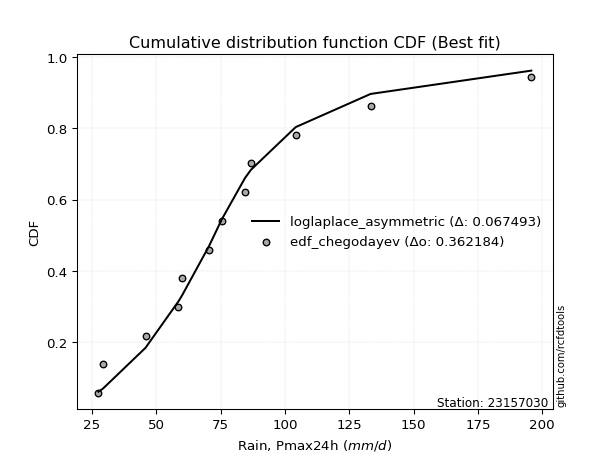</img>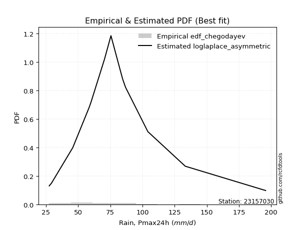</img>

</div>


### 6. EDF Blom (1958)

The Blom formula is a specific "plotting position" formula used in hydrology and statistical analysis to estimate the empirical cumulative probability (or non-exceedance probability) of a data series. It is particularly recommended for data that are approximately normally distributed. The constant _a_ is set to 0.375 (or 3/8).

<div align="center">


$P=(m-a)/(n+1-2a)$


</div>


**6.1. Empirical values**

<div align="center">

|                | 0                   | 1                  | 2                   | 3                   | 4                   | 5                   | 6                  | 7                  | 8                  | 9                  | 10                 | 11                 |
|:---------------|:--------------------|:-------------------|:--------------------|:--------------------|:--------------------|:--------------------|:-------------------|:-------------------|:-------------------|:-------------------|:-------------------|:-------------------|
| date           | 2008                | 2017               | 2012                | 2015                | 2018                | 2007                | 2009               | 2011               | 2016               | 2014               | 2010               | 2013               |
| x              | 27.5                | 29.3               | 45.8                | 58.6                | 60.0                | 70.5                | 75.5               | 84.5               | 86.8               | 104.2              | 133.3              | 195.8              |
| m              | 1                   | 2                  | 3                   | 4                   | 5                   | 6                   | 7                  | 8                  | 9                  | 10                 | 11                 | 12                 |
| empirical_dist | edf_blom            | edf_blom           | edf_blom            | edf_blom            | edf_blom            | edf_blom            | edf_blom           | edf_blom           | edf_blom           | edf_blom           | edf_blom           | edf_blom           |
| empirical      | 0.05102040816326531 | 0.1326530612244898 | 0.21428571428571427 | 0.29591836734693877 | 0.37755102040816324 | 0.45918367346938777 | 0.5408163265306123 | 0.6224489795918368 | 0.7040816326530612 | 0.7857142857142857 | 0.8673469387755102 | 0.9489795918367347 |
| empirical_tr   | 1.053763440860215   | 1.1529411764705884 | 1.2727272727272727  | 1.4202898550724639  | 1.6065573770491803  | 1.8490566037735847  | 2.177777777777778  | 2.6486486486486487 | 3.3793103448275863 | 4.666666666666666  | 7.5384615384615365 | 19.60000000000002  |

</div>


**6.2. Kolmogorov-Smirnov fit test (sorted by Δ)**


<div align="center">

|                | 0                     | 1                   | 2                   | 3                   | 4                   | 5                   | 6                   | 7                   | 8                   | 9                   | 10                  | 11                  | 12                  | 13                  | 14                  | 15                  | 16                  | 17                  | 18                  | 19                  | 20                  | 21                  | 22                  | 23                  | 24                  | 25                  | 26                  | 27                  | 28                  | 29                  | 30                  | 31                  | 32                  | 33                  | 34                  | 35                  | 36                  | 37                  | 38                  | 39                  | 40                  | 41                  | 42                  | 43                  | 44                  | 45                  | 46                  | 47                  | 48                  | 49                  | 50                  | 51                  | 52                  | 53                  | 54                  | 55                  | 56                  | 57                  | 58                  | 59                  | 60                  | 61                  | 62                  | 63                  | 64                  | 65                  | 66                  | 67                  | 68                  | 69                  | 70                  | 71                  | 72                  | 73                  | 74                  | 75                  | 76                  | 77                  | 78                  | 79                  | 80                  | 81                  | 82                  | 83                  | 84                  | 85                  | 86                  | 87                  |
|:---------------|:----------------------|:--------------------|:--------------------|:--------------------|:--------------------|:--------------------|:--------------------|:--------------------|:--------------------|:--------------------|:--------------------|:--------------------|:--------------------|:--------------------|:--------------------|:--------------------|:--------------------|:--------------------|:--------------------|:--------------------|:--------------------|:--------------------|:--------------------|:--------------------|:--------------------|:--------------------|:--------------------|:--------------------|:--------------------|:--------------------|:--------------------|:--------------------|:--------------------|:--------------------|:--------------------|:--------------------|:--------------------|:--------------------|:--------------------|:--------------------|:--------------------|:--------------------|:--------------------|:--------------------|:--------------------|:--------------------|:--------------------|:--------------------|:--------------------|:--------------------|:--------------------|:--------------------|:--------------------|:--------------------|:--------------------|:--------------------|:--------------------|:--------------------|:--------------------|:--------------------|:--------------------|:--------------------|:--------------------|:--------------------|:--------------------|:--------------------|:--------------------|:--------------------|:--------------------|:--------------------|:--------------------|:--------------------|:--------------------|:--------------------|:--------------------|:--------------------|:--------------------|:--------------------|:--------------------|:--------------------|:--------------------|:--------------------|:--------------------|:--------------------|:--------------------|:--------------------|:--------------------|:--------------------|
| station        | 23157030              | 23157030            | 23157030            | 23157030            | 23157030            | 23157030            | 23157030            | 23157030            | 23157030            | 23157030            | 23157030            | 23157030            | 23157030            | 23157030            | 23157030            | 23157030            | 23157030            | 23157030            | 23157030            | 23157030            | 23157030            | 23157030            | 23157030            | 23157030            | 23157030            | 23157030            | 23157030            | 23157030            | 23157030            | 23157030            | 23157030            | 23157030            | 23157030            | 23157030            | 23157030            | 23157030            | 23157030            | 23157030            | 23157030            | 23157030            | 23157030            | 23157030            | 23157030            | 23157030            | 23157030            | 23157030            | 23157030            | 23157030            | 23157030            | 23157030            | 23157030            | 23157030            | 23157030            | 23157030            | 23157030            | 23157030            | 23157030            | 23157030            | 23157030            | 23157030            | 23157030            | 23157030            | 23157030            | 23157030            | 23157030            | 23157030            | 23157030            | 23157030            | 23157030            | 23157030            | 23157030            | 23157030            | 23157030            | 23157030            | 23157030            | 23157030            | 23157030            | 23157030            | 23157030            | 23157030            | 23157030            | 23157030            | 23157030            | 23157030            | 23157030            | 23157030            | 23157030            | 23157030            |
| empirical_dist | edf_blom              | edf_blom            | edf_blom            | edf_blom            | edf_blom            | edf_blom            | edf_blom            | edf_blom            | edf_blom            | edf_blom            | edf_blom            | edf_blom            | edf_blom            | edf_blom            | edf_blom            | edf_blom            | edf_blom            | edf_blom            | edf_blom            | edf_blom            | edf_blom            | edf_blom            | edf_blom            | edf_blom            | edf_blom            | edf_blom            | edf_blom            | edf_blom            | edf_blom            | edf_blom            | edf_blom            | edf_blom            | edf_blom            | edf_blom            | edf_blom            | edf_blom            | edf_blom            | edf_blom            | edf_blom            | edf_blom            | edf_blom            | edf_blom            | edf_blom            | edf_blom            | edf_blom            | edf_blom            | edf_blom            | edf_blom            | edf_blom            | edf_blom            | edf_blom            | edf_blom            | edf_blom            | edf_blom            | edf_blom            | edf_blom            | edf_blom            | edf_blom            | edf_blom            | edf_blom            | edf_blom            | edf_blom            | edf_blom            | edf_blom            | edf_blom            | edf_blom            | edf_blom            | edf_blom            | edf_blom            | edf_blom            | edf_blom            | edf_blom            | edf_blom            | edf_blom            | edf_blom            | edf_blom            | edf_blom            | edf_blom            | edf_blom            | edf_blom            | edf_blom            | edf_blom            | edf_blom            | edf_blom            | edf_blom            | edf_blom            | edf_blom            | edf_blom            |
| p_dist         | loglaplace_asymmetric | laplace_asymmetric  | genlogistic         | loggenlogistic      | exponnorm           | alpha               | f                   | moyal               | invweibull          | nct                 | logloggamma         | logjohnsonsu        | logpearson3         | ncf                 | invgamma            | pearson3            | logexponnorm        | logt                | logcrystalball      | lognorm             | lognorm             | logfisk             | lognakagami         | logf                | logfatiguelife      | loglogistic         | loglaplace          | loggamma            | loggamma            | fisk                | logerlang           | loghypsecant        | johnsonsu           | gumbel_r            | logweibull_min      | halfnorm            | invgauss            | logbetaprime        | lognct              | loginvgamma         | kstwobign           | logrice             | logalpha            | loggumbel_l         | gompertz            | logncf              | loggompertz         | loginvgauss         | logmaxwell          | halflogistic        | rayleigh            | laplace             | betaprime           | lograyleigh         | maxwell             | nakagami            | loggumbel_r         | rice                | wald                | mielke              | hypsecant           | loginvweibull       | genexpon            | expon               | logistic            | logmoyal            | norm                | truncnorm           | crystalball         | t                   | loghalfnorm         | logkstwobign        | loggenexpon         | loghalflogistic     | weibull_min         | logtruncnorm        | gibrat              | logwald             | gumbel_l            | loggibrat           | erlang              | logexpon            | logmielke           | gamma               | chi2                | logchi2             | loglognorm          | fatiguelife         |
| delta          | 0.06304933096450953   | 0.06343191454039822 | 0.06890090636167756 | 0.0707449734747001  | 0.07127535316035272 | 0.07383007040178165 | 0.07393665848441905 | 0.07451505401308459 | 0.07469495413590238 | 0.07474195131549517 | 0.07475687873632    | 0.07518616989482274 | 0.07529384826890587 | 0.07574201686714718 | 0.07639594506383127 | 0.07644362969814344 | 0.07702523465379671 | 0.07702571597806715 | 0.07702575349618376 | 0.07702582794553708 | 0.07702582794553708 | 0.07715611058562749 | 0.07730178841300467 | 0.07744387106723165 | 0.07818981549787526 | 0.0799340886283723  | 0.08007178923130406 | 0.08019384912691624 | 0.08019384912691624 | 0.080218718936111   | 0.08053908025183065 | 0.08059697655028297 | 0.08212541744724783 | 0.08267937415105087 | 0.08404835505649577 | 0.08587000412763796 | 0.08696175767061459 | 0.08929436355936754 | 0.09196703977981557 | 0.09259236447493646 | 0.09385743102004329 | 0.09492618710013534 | 0.09515528695372194 | 0.09826615581626097 | 0.1058948613536386  | 0.10600037582878974 | 0.10761758943388075 | 0.10956584643646533 | 0.10998185516196518 | 0.11041434647757546 | 0.11269440538642095 | 0.12063633210278835 | 0.12097348964537058 | 0.12224037300414337 | 0.1224160934464188  | 0.12382065164397477 | 0.1309590899610804  | 0.13194451744965585 | 0.13271363991230387 | 0.13712077862145522 | 0.13996424529490437 | 0.14045240267677322 | 0.14450688754840846 | 0.14501664780015833 | 0.14580243533777815 | 0.15148412380452614 | 0.15271660130807652 | 0.15271660232822348 | 0.1527166031092696  | 0.153504093994148   | 0.15709682420773663 | 0.16189456059064689 | 0.16561120523603212 | 0.16885867637605112 | 0.19949687583424425 | 0.2142776192353774  | 0.21428571428571427 | 0.21434160711695188 | 0.21960482777839396 | 0.2385312090841774  | 0.24485041451392142 | 0.2592593298332374  | 0.2634659029689074  | 0.2651562669043095  | 0.2908033292623611  | 0.3210730844291816  | 0.38562772468370643 | 0.4681886804539479  |
| deltao         | 0.36218414519599995   | 0.36218414519599995 | 0.36218414519599995 | 0.36218414519599995 | 0.36218414519599995 | 0.36218414519599995 | 0.36218414519599995 | 0.36218414519599995 | 0.36218414519599995 | 0.36218414519599995 | 0.36218414519599995 | 0.36218414519599995 | 0.36218414519599995 | 0.36218414519599995 | 0.36218414519599995 | 0.36218414519599995 | 0.36218414519599995 | 0.36218414519599995 | 0.36218414519599995 | 0.36218414519599995 | 0.36218414519599995 | 0.36218414519599995 | 0.36218414519599995 | 0.36218414519599995 | 0.36218414519599995 | 0.36218414519599995 | 0.36218414519599995 | 0.36218414519599995 | 0.36218414519599995 | 0.36218414519599995 | 0.36218414519599995 | 0.36218414519599995 | 0.36218414519599995 | 0.36218414519599995 | 0.36218414519599995 | 0.36218414519599995 | 0.36218414519599995 | 0.36218414519599995 | 0.36218414519599995 | 0.36218414519599995 | 0.36218414519599995 | 0.36218414519599995 | 0.36218414519599995 | 0.36218414519599995 | 0.36218414519599995 | 0.36218414519599995 | 0.36218414519599995 | 0.36218414519599995 | 0.36218414519599995 | 0.36218414519599995 | 0.36218414519599995 | 0.36218414519599995 | 0.36218414519599995 | 0.36218414519599995 | 0.36218414519599995 | 0.36218414519599995 | 0.36218414519599995 | 0.36218414519599995 | 0.36218414519599995 | 0.36218414519599995 | 0.36218414519599995 | 0.36218414519599995 | 0.36218414519599995 | 0.36218414519599995 | 0.36218414519599995 | 0.36218414519599995 | 0.36218414519599995 | 0.36218414519599995 | 0.36218414519599995 | 0.36218414519599995 | 0.36218414519599995 | 0.36218414519599995 | 0.36218414519599995 | 0.36218414519599995 | 0.36218414519599995 | 0.36218414519599995 | 0.36218414519599995 | 0.36218414519599995 | 0.36218414519599995 | 0.36218414519599995 | 0.36218414519599995 | 0.36218414519599995 | 0.36218414519599995 | 0.36218414519599995 | 0.36218414519599995 | 0.36218414519599995 | 0.36218414519599995 | 0.36218414519599995 |
| eval           | Δo > Δ                | Δo > Δ              | Δo > Δ              | Δo > Δ              | Δo > Δ              | Δo > Δ              | Δo > Δ              | Δo > Δ              | Δo > Δ              | Δo > Δ              | Δo > Δ              | Δo > Δ              | Δo > Δ              | Δo > Δ              | Δo > Δ              | Δo > Δ              | Δo > Δ              | Δo > Δ              | Δo > Δ              | Δo > Δ              | Δo > Δ              | Δo > Δ              | Δo > Δ              | Δo > Δ              | Δo > Δ              | Δo > Δ              | Δo > Δ              | Δo > Δ              | Δo > Δ              | Δo > Δ              | Δo > Δ              | Δo > Δ              | Δo > Δ              | Δo > Δ              | Δo > Δ              | Δo > Δ              | Δo > Δ              | Δo > Δ              | Δo > Δ              | Δo > Δ              | Δo > Δ              | Δo > Δ              | Δo > Δ              | Δo > Δ              | Δo > Δ              | Δo > Δ              | Δo > Δ              | Δo > Δ              | Δo > Δ              | Δo > Δ              | Δo > Δ              | Δo > Δ              | Δo > Δ              | Δo > Δ              | Δo > Δ              | Δo > Δ              | Δo > Δ              | Δo > Δ              | Δo > Δ              | Δo > Δ              | Δo > Δ              | Δo > Δ              | Δo > Δ              | Δo > Δ              | Δo > Δ              | Δo > Δ              | Δo > Δ              | Δo > Δ              | Δo > Δ              | Δo > Δ              | Δo > Δ              | Δo > Δ              | Δo > Δ              | Δo > Δ              | Δo > Δ              | Δo > Δ              | Δo > Δ              | Δo > Δ              | Δo > Δ              | Δo > Δ              | Δo > Δ              | Δo > Δ              | Δo > Δ              | Δo > Δ              | Δo > Δ              | Δo > Δ              | Δo <= Δ             | Δo <= Δ             |
| fit            | 1                     | 1                   | 1                   | 1                   | 1                   | 1                   | 1                   | 1                   | 1                   | 1                   | 1                   | 1                   | 1                   | 1                   | 1                   | 1                   | 1                   | 1                   | 1                   | 1                   | 1                   | 1                   | 1                   | 1                   | 1                   | 1                   | 1                   | 1                   | 1                   | 1                   | 1                   | 1                   | 1                   | 1                   | 1                   | 1                   | 1                   | 1                   | 1                   | 1                   | 1                   | 1                   | 1                   | 1                   | 1                   | 1                   | 1                   | 1                   | 1                   | 1                   | 1                   | 1                   | 1                   | 1                   | 1                   | 1                   | 1                   | 1                   | 1                   | 1                   | 1                   | 1                   | 1                   | 1                   | 1                   | 1                   | 1                   | 1                   | 1                   | 1                   | 1                   | 1                   | 1                   | 1                   | 1                   | 1                   | 1                   | 1                   | 1                   | 1                   | 1                   | 1                   | 1                   | 1                   | 1                   | 1                   | 0                   | 0                   |
| n              | 12                    | 12                  | 12                  | 12                  | 12                  | 12                  | 12                  | 12                  | 12                  | 12                  | 12                  | 12                  | 12                  | 12                  | 12                  | 12                  | 12                  | 12                  | 12                  | 12                  | 12                  | 12                  | 12                  | 12                  | 12                  | 12                  | 12                  | 12                  | 12                  | 12                  | 12                  | 12                  | 12                  | 12                  | 12                  | 12                  | 12                  | 12                  | 12                  | 12                  | 12                  | 12                  | 12                  | 12                  | 12                  | 12                  | 12                  | 12                  | 12                  | 12                  | 12                  | 12                  | 12                  | 12                  | 12                  | 12                  | 12                  | 12                  | 12                  | 12                  | 12                  | 12                  | 12                  | 12                  | 12                  | 12                  | 12                  | 12                  | 12                  | 12                  | 12                  | 12                  | 12                  | 12                  | 12                  | 12                  | 12                  | 12                  | 12                  | 12                  | 12                  | 12                  | 12                  | 12                  | 12                  | 12                  | 12                  | 12                  |
| best_fit       | 1                     | 0                   | 0                   | 0                   | 0                   | 0                   | 0                   | 0                   | 0                   | 0                   | 0                   | 0                   | 0                   | 0                   | 0                   | 0                   | 0                   | 0                   | 0                   | 0                   | 0                   | 0                   | 0                   | 0                   | 0                   | 0                   | 0                   | 0                   | 0                   | 0                   | 0                   | 0                   | 0                   | 0                   | 0                   | 0                   | 0                   | 0                   | 0                   | 0                   | 0                   | 0                   | 0                   | 0                   | 0                   | 0                   | 0                   | 0                   | 0                   | 0                   | 0                   | 0                   | 0                   | 0                   | 0                   | 0                   | 0                   | 0                   | 0                   | 0                   | 0                   | 0                   | 0                   | 0                   | 0                   | 0                   | 0                   | 0                   | 0                   | 0                   | 0                   | 0                   | 0                   | 0                   | 0                   | 0                   | 0                   | 0                   | 0                   | 0                   | 0                   | 0                   | 0                   | 0                   | 0                   | 0                   | 0                   | 0                   |
| best_fit_sort  | 1                     | 2                   | 3                   | 4                   | 5                   | 6                   | 7                   | 8                   | 9                   | 10                  | 11                  | 12                  | 13                  | 14                  | 15                  | 16                  | 17                  | 18                  | 19                  | 20                  | 21                  | 22                  | 23                  | 24                  | 25                  | 26                  | 27                  | 28                  | 29                  | 30                  | 31                  | 32                  | 33                  | 34                  | 35                  | 36                  | 37                  | 38                  | 39                  | 40                  | 41                  | 42                  | 43                  | 44                  | 45                  | 46                  | 47                  | 48                  | 49                  | 50                  | 51                  | 52                  | 53                  | 54                  | 55                  | 56                  | 57                  | 58                  | 59                  | 60                  | 61                  | 62                  | 63                  | 64                  | 65                  | 66                  | 67                  | 68                  | 69                  | 70                  | 71                  | 72                  | 73                  | 74                  | 75                  | 76                  | 77                  | 78                  | 79                  | 80                  | 81                  | 82                  | 83                  | 84                  | 85                  | 86                  | 87                  | 88                  |

</div>


**6.3. Best fit**

<div align="center">

|   id |   station | empirical_dist   | p_dist                |     delta |   deltao | eval   |   fit |   n |   best_fit |   best_fit_sort |
|-----:|----------:|:-----------------|:----------------------|----------:|---------:|:-------|------:|----:|-----------:|----------------:|
|    0 |  23157030 | edf_blom         | loglaplace_asymmetric | 0.0630493 | 0.362184 | Δo > Δ |     1 |  12 |          1 |               1 |

</div>


<div align="center">

</img>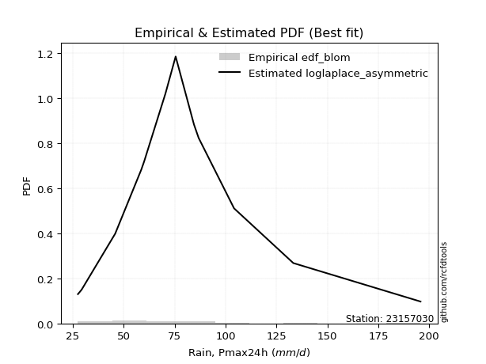</img>

</div>


### 7. EDF Tukey (1962)

In hydrology, the Tukey formula is used as a plotting position formula to estimate the empirical probability or frequency of a flood event (or other hydrological data). The formula parameter is given as _c=0.333_ (or 1/3).

<div align="center">


$P=(m-c)/(n+1-2c)$


</div>


**7.1. Empirical values**

<div align="center">

|                | 0                   | 1                   | 2                   | 3                  | 4                  | 5                  | 6                  | 7                  | 8                  | 9                  | 10                 | 11                 |
|:---------------|:--------------------|:--------------------|:--------------------|:-------------------|:-------------------|:-------------------|:-------------------|:-------------------|:-------------------|:-------------------|:-------------------|:-------------------|
| date           | 2008                | 2017                | 2012                | 2015               | 2018               | 2007               | 2009               | 2011               | 2016               | 2014               | 2010               | 2013               |
| x              | 27.5                | 29.3                | 45.8                | 58.6               | 60.0               | 70.5               | 75.5               | 84.5               | 86.8               | 104.2              | 133.3              | 195.8              |
| m              | 1                   | 2                   | 3                   | 4                  | 5                  | 6                  | 7                  | 8                  | 9                  | 10                 | 11                 | 12                 |
| empirical_dist | edf_tukey           | edf_tukey           | edf_tukey           | edf_tukey          | edf_tukey          | edf_tukey          | edf_tukey          | edf_tukey          | edf_tukey          | edf_tukey          | edf_tukey          | edf_tukey          |
| empirical      | 0.05405405405405406 | 0.13513513513513514 | 0.21621621621621623 | 0.2972972972972973 | 0.3783783783783784 | 0.4594594594594595 | 0.5405405405405406 | 0.6216216216216216 | 0.7027027027027027 | 0.7837837837837838 | 0.8648648648648649 | 0.9459459459459459 |
| empirical_tr   | 1.0571428571428572  | 1.15625             | 1.2758620689655173  | 1.4230769230769231 | 1.608695652173913  | 1.8499999999999999 | 2.1764705882352944 | 2.642857142857143  | 3.363636363636364  | 4.625              | 7.400000000000003  | 18.5               |

</div>


**7.2. Kolmogorov-Smirnov fit test (sorted by Δ)**


<div align="center">

|                | 0                     | 1                   | 2                   | 3                   | 4                   | 5                   | 6                   | 7                   | 8                   | 9                   | 10                  | 11                  | 12                  | 13                  | 14                  | 15                  | 16                  | 17                  | 18                  | 19                  | 20                  | 21                  | 22                  | 23                  | 24                  | 25                  | 26                  | 27                  | 28                  | 29                  | 30                  | 31                  | 32                  | 33                  | 34                  | 35                  | 36                  | 37                  | 38                  | 39                  | 40                  | 41                  | 42                  | 43                  | 44                  | 45                  | 46                  | 47                  | 48                  | 49                  | 50                  | 51                  | 52                  | 53                  | 54                  | 55                  | 56                  | 57                  | 58                  | 59                  | 60                  | 61                  | 62                  | 63                  | 64                  | 65                  | 66                  | 67                  | 68                  | 69                  | 70                  | 71                  | 72                  | 73                  | 74                  | 75                  | 76                  | 77                  | 78                  | 79                  | 80                  | 81                  | 82                  | 83                  | 84                  | 85                  | 86                  | 87                  |
|:---------------|:----------------------|:--------------------|:--------------------|:--------------------|:--------------------|:--------------------|:--------------------|:--------------------|:--------------------|:--------------------|:--------------------|:--------------------|:--------------------|:--------------------|:--------------------|:--------------------|:--------------------|:--------------------|:--------------------|:--------------------|:--------------------|:--------------------|:--------------------|:--------------------|:--------------------|:--------------------|:--------------------|:--------------------|:--------------------|:--------------------|:--------------------|:--------------------|:--------------------|:--------------------|:--------------------|:--------------------|:--------------------|:--------------------|:--------------------|:--------------------|:--------------------|:--------------------|:--------------------|:--------------------|:--------------------|:--------------------|:--------------------|:--------------------|:--------------------|:--------------------|:--------------------|:--------------------|:--------------------|:--------------------|:--------------------|:--------------------|:--------------------|:--------------------|:--------------------|:--------------------|:--------------------|:--------------------|:--------------------|:--------------------|:--------------------|:--------------------|:--------------------|:--------------------|:--------------------|:--------------------|:--------------------|:--------------------|:--------------------|:--------------------|:--------------------|:--------------------|:--------------------|:--------------------|:--------------------|:--------------------|:--------------------|:--------------------|:--------------------|:--------------------|:--------------------|:--------------------|:--------------------|:--------------------|
| station        | 23157030              | 23157030            | 23157030            | 23157030            | 23157030            | 23157030            | 23157030            | 23157030            | 23157030            | 23157030            | 23157030            | 23157030            | 23157030            | 23157030            | 23157030            | 23157030            | 23157030            | 23157030            | 23157030            | 23157030            | 23157030            | 23157030            | 23157030            | 23157030            | 23157030            | 23157030            | 23157030            | 23157030            | 23157030            | 23157030            | 23157030            | 23157030            | 23157030            | 23157030            | 23157030            | 23157030            | 23157030            | 23157030            | 23157030            | 23157030            | 23157030            | 23157030            | 23157030            | 23157030            | 23157030            | 23157030            | 23157030            | 23157030            | 23157030            | 23157030            | 23157030            | 23157030            | 23157030            | 23157030            | 23157030            | 23157030            | 23157030            | 23157030            | 23157030            | 23157030            | 23157030            | 23157030            | 23157030            | 23157030            | 23157030            | 23157030            | 23157030            | 23157030            | 23157030            | 23157030            | 23157030            | 23157030            | 23157030            | 23157030            | 23157030            | 23157030            | 23157030            | 23157030            | 23157030            | 23157030            | 23157030            | 23157030            | 23157030            | 23157030            | 23157030            | 23157030            | 23157030            | 23157030            |
| empirical_dist | edf_tukey             | edf_tukey           | edf_tukey           | edf_tukey           | edf_tukey           | edf_tukey           | edf_tukey           | edf_tukey           | edf_tukey           | edf_tukey           | edf_tukey           | edf_tukey           | edf_tukey           | edf_tukey           | edf_tukey           | edf_tukey           | edf_tukey           | edf_tukey           | edf_tukey           | edf_tukey           | edf_tukey           | edf_tukey           | edf_tukey           | edf_tukey           | edf_tukey           | edf_tukey           | edf_tukey           | edf_tukey           | edf_tukey           | edf_tukey           | edf_tukey           | edf_tukey           | edf_tukey           | edf_tukey           | edf_tukey           | edf_tukey           | edf_tukey           | edf_tukey           | edf_tukey           | edf_tukey           | edf_tukey           | edf_tukey           | edf_tukey           | edf_tukey           | edf_tukey           | edf_tukey           | edf_tukey           | edf_tukey           | edf_tukey           | edf_tukey           | edf_tukey           | edf_tukey           | edf_tukey           | edf_tukey           | edf_tukey           | edf_tukey           | edf_tukey           | edf_tukey           | edf_tukey           | edf_tukey           | edf_tukey           | edf_tukey           | edf_tukey           | edf_tukey           | edf_tukey           | edf_tukey           | edf_tukey           | edf_tukey           | edf_tukey           | edf_tukey           | edf_tukey           | edf_tukey           | edf_tukey           | edf_tukey           | edf_tukey           | edf_tukey           | edf_tukey           | edf_tukey           | edf_tukey           | edf_tukey           | edf_tukey           | edf_tukey           | edf_tukey           | edf_tukey           | edf_tukey           | edf_tukey           | edf_tukey           | edf_tukey           |
| p_dist         | loglaplace_asymmetric | laplace_asymmetric  | genlogistic         | loggenlogistic      | exponnorm           | pearson3            | alpha               | f                   | moyal               | invweibull          | nct                 | logloggamma         | logjohnsonsu        | logpearson3         | ncf                 | invgamma            | logexponnorm        | logt                | logcrystalball      | lognorm             | lognorm             | logfisk             | lognakagami         | logf                | logerlang           | logfatiguelife      | loggamma            | loggamma            | gumbel_r            | johnsonsu           | loglogistic         | loglaplace          | fisk                | loghypsecant        | halfnorm            | logweibull_min      | invgauss            | logbetaprime        | lognct              | loginvgamma         | kstwobign           | logrice             | logalpha            | loggumbel_l         | logncf              | loginvgauss         | gompertz            | logmaxwell          | loggompertz         | rayleigh            | halflogistic        | betaprime           | laplace             | lograyleigh         | maxwell             | nakagami            | loggumbel_r         | rice                | wald                | mielke              | hypsecant           | loginvweibull       | genexpon            | expon               | logistic            | logmoyal            | norm                | truncnorm           | crystalball         | t                   | loghalfnorm         | logkstwobign        | loggenexpon         | loghalflogistic     | weibull_min         | logwald             | logtruncnorm        | gibrat              | gumbel_l            | loggibrat           | erlang              | logexpon            | logmielke           | gamma               | chi2                | logchi2             | loglognorm          | fatiguelife         |
| delta          | 0.06553140487515487   | 0.06591398845104356 | 0.06752197641131907 | 0.07322704738534544 | 0.07375742707099806 | 0.07506469974778496 | 0.07631214431242699 | 0.07641873239506439 | 0.07699712792372992 | 0.07717702804654772 | 0.07722402522614051 | 0.07723895264696534 | 0.07766824380546808 | 0.0777759221795512  | 0.07822409077779252 | 0.0788780189744766  | 0.07950730856444205 | 0.07950778988871249 | 0.0795078274068291  | 0.07950790185618242 | 0.07950790185618242 | 0.07963818449627283 | 0.0797790335415201  | 0.07992594497787699 | 0.08057512249441628 | 0.0806718894085206  | 0.08073351755226829 | 0.08073351755226829 | 0.08130044420069238 | 0.08139400429261712 | 0.08241616253901764 | 0.0825538631419494  | 0.08270079284675634 | 0.08307905046092831 | 0.08449107417727941 | 0.08492170403045601 | 0.08558282772025605 | 0.087915433609009   | 0.09058810982945703 | 0.09121343452457792 | 0.0924785010696848  | 0.0935472571497768  | 0.0937763570033634  | 0.09688722586590248 | 0.1046214458784312  | 0.10818691648610679 | 0.10837693526428394 | 0.10860292521160664 | 0.11009966334452609 | 0.11131547543606246 | 0.1128964203882208  | 0.11959455969501204 | 0.11961276210020227 | 0.12086144305378482 | 0.12103716349606031 | 0.12244172169361622 | 0.12958016001072187 | 0.13056558749929736 | 0.13513513513513514 | 0.13574184867109668 | 0.13858531534454588 | 0.13907347272641468 | 0.14312795759804992 | 0.14363771784979978 | 0.14442350538741966 | 0.1501051938541676  | 0.15133767135771803 | 0.151337672377865   | 0.1513376731589111  | 0.1521251640437895  | 0.1557178942573781  | 0.16051563064028834 | 0.16423227528567358 | 0.16747974642569258 | 0.1981179458838857  | 0.21406582112688016 | 0.21620812116587934 | 0.21621621621621623 | 0.21822589782803548 | 0.2382554230941057  | 0.24347148456356288 | 0.25788039988287886 | 0.26208697301854883 | 0.26377733695395095 | 0.28942439931200253 | 0.31969415447882304 | 0.3836972227532045  | 0.466258178523446   |
| deltao         | 0.36218414519599995   | 0.36218414519599995 | 0.36218414519599995 | 0.36218414519599995 | 0.36218414519599995 | 0.36218414519599995 | 0.36218414519599995 | 0.36218414519599995 | 0.36218414519599995 | 0.36218414519599995 | 0.36218414519599995 | 0.36218414519599995 | 0.36218414519599995 | 0.36218414519599995 | 0.36218414519599995 | 0.36218414519599995 | 0.36218414519599995 | 0.36218414519599995 | 0.36218414519599995 | 0.36218414519599995 | 0.36218414519599995 | 0.36218414519599995 | 0.36218414519599995 | 0.36218414519599995 | 0.36218414519599995 | 0.36218414519599995 | 0.36218414519599995 | 0.36218414519599995 | 0.36218414519599995 | 0.36218414519599995 | 0.36218414519599995 | 0.36218414519599995 | 0.36218414519599995 | 0.36218414519599995 | 0.36218414519599995 | 0.36218414519599995 | 0.36218414519599995 | 0.36218414519599995 | 0.36218414519599995 | 0.36218414519599995 | 0.36218414519599995 | 0.36218414519599995 | 0.36218414519599995 | 0.36218414519599995 | 0.36218414519599995 | 0.36218414519599995 | 0.36218414519599995 | 0.36218414519599995 | 0.36218414519599995 | 0.36218414519599995 | 0.36218414519599995 | 0.36218414519599995 | 0.36218414519599995 | 0.36218414519599995 | 0.36218414519599995 | 0.36218414519599995 | 0.36218414519599995 | 0.36218414519599995 | 0.36218414519599995 | 0.36218414519599995 | 0.36218414519599995 | 0.36218414519599995 | 0.36218414519599995 | 0.36218414519599995 | 0.36218414519599995 | 0.36218414519599995 | 0.36218414519599995 | 0.36218414519599995 | 0.36218414519599995 | 0.36218414519599995 | 0.36218414519599995 | 0.36218414519599995 | 0.36218414519599995 | 0.36218414519599995 | 0.36218414519599995 | 0.36218414519599995 | 0.36218414519599995 | 0.36218414519599995 | 0.36218414519599995 | 0.36218414519599995 | 0.36218414519599995 | 0.36218414519599995 | 0.36218414519599995 | 0.36218414519599995 | 0.36218414519599995 | 0.36218414519599995 | 0.36218414519599995 | 0.36218414519599995 |
| eval           | Δo > Δ                | Δo > Δ              | Δo > Δ              | Δo > Δ              | Δo > Δ              | Δo > Δ              | Δo > Δ              | Δo > Δ              | Δo > Δ              | Δo > Δ              | Δo > Δ              | Δo > Δ              | Δo > Δ              | Δo > Δ              | Δo > Δ              | Δo > Δ              | Δo > Δ              | Δo > Δ              | Δo > Δ              | Δo > Δ              | Δo > Δ              | Δo > Δ              | Δo > Δ              | Δo > Δ              | Δo > Δ              | Δo > Δ              | Δo > Δ              | Δo > Δ              | Δo > Δ              | Δo > Δ              | Δo > Δ              | Δo > Δ              | Δo > Δ              | Δo > Δ              | Δo > Δ              | Δo > Δ              | Δo > Δ              | Δo > Δ              | Δo > Δ              | Δo > Δ              | Δo > Δ              | Δo > Δ              | Δo > Δ              | Δo > Δ              | Δo > Δ              | Δo > Δ              | Δo > Δ              | Δo > Δ              | Δo > Δ              | Δo > Δ              | Δo > Δ              | Δo > Δ              | Δo > Δ              | Δo > Δ              | Δo > Δ              | Δo > Δ              | Δo > Δ              | Δo > Δ              | Δo > Δ              | Δo > Δ              | Δo > Δ              | Δo > Δ              | Δo > Δ              | Δo > Δ              | Δo > Δ              | Δo > Δ              | Δo > Δ              | Δo > Δ              | Δo > Δ              | Δo > Δ              | Δo > Δ              | Δo > Δ              | Δo > Δ              | Δo > Δ              | Δo > Δ              | Δo > Δ              | Δo > Δ              | Δo > Δ              | Δo > Δ              | Δo > Δ              | Δo > Δ              | Δo > Δ              | Δo > Δ              | Δo > Δ              | Δo > Δ              | Δo > Δ              | Δo <= Δ             | Δo <= Δ             |
| fit            | 1                     | 1                   | 1                   | 1                   | 1                   | 1                   | 1                   | 1                   | 1                   | 1                   | 1                   | 1                   | 1                   | 1                   | 1                   | 1                   | 1                   | 1                   | 1                   | 1                   | 1                   | 1                   | 1                   | 1                   | 1                   | 1                   | 1                   | 1                   | 1                   | 1                   | 1                   | 1                   | 1                   | 1                   | 1                   | 1                   | 1                   | 1                   | 1                   | 1                   | 1                   | 1                   | 1                   | 1                   | 1                   | 1                   | 1                   | 1                   | 1                   | 1                   | 1                   | 1                   | 1                   | 1                   | 1                   | 1                   | 1                   | 1                   | 1                   | 1                   | 1                   | 1                   | 1                   | 1                   | 1                   | 1                   | 1                   | 1                   | 1                   | 1                   | 1                   | 1                   | 1                   | 1                   | 1                   | 1                   | 1                   | 1                   | 1                   | 1                   | 1                   | 1                   | 1                   | 1                   | 1                   | 1                   | 0                   | 0                   |
| n              | 12                    | 12                  | 12                  | 12                  | 12                  | 12                  | 12                  | 12                  | 12                  | 12                  | 12                  | 12                  | 12                  | 12                  | 12                  | 12                  | 12                  | 12                  | 12                  | 12                  | 12                  | 12                  | 12                  | 12                  | 12                  | 12                  | 12                  | 12                  | 12                  | 12                  | 12                  | 12                  | 12                  | 12                  | 12                  | 12                  | 12                  | 12                  | 12                  | 12                  | 12                  | 12                  | 12                  | 12                  | 12                  | 12                  | 12                  | 12                  | 12                  | 12                  | 12                  | 12                  | 12                  | 12                  | 12                  | 12                  | 12                  | 12                  | 12                  | 12                  | 12                  | 12                  | 12                  | 12                  | 12                  | 12                  | 12                  | 12                  | 12                  | 12                  | 12                  | 12                  | 12                  | 12                  | 12                  | 12                  | 12                  | 12                  | 12                  | 12                  | 12                  | 12                  | 12                  | 12                  | 12                  | 12                  | 12                  | 12                  |
| best_fit       | 1                     | 0                   | 0                   | 0                   | 0                   | 0                   | 0                   | 0                   | 0                   | 0                   | 0                   | 0                   | 0                   | 0                   | 0                   | 0                   | 0                   | 0                   | 0                   | 0                   | 0                   | 0                   | 0                   | 0                   | 0                   | 0                   | 0                   | 0                   | 0                   | 0                   | 0                   | 0                   | 0                   | 0                   | 0                   | 0                   | 0                   | 0                   | 0                   | 0                   | 0                   | 0                   | 0                   | 0                   | 0                   | 0                   | 0                   | 0                   | 0                   | 0                   | 0                   | 0                   | 0                   | 0                   | 0                   | 0                   | 0                   | 0                   | 0                   | 0                   | 0                   | 0                   | 0                   | 0                   | 0                   | 0                   | 0                   | 0                   | 0                   | 0                   | 0                   | 0                   | 0                   | 0                   | 0                   | 0                   | 0                   | 0                   | 0                   | 0                   | 0                   | 0                   | 0                   | 0                   | 0                   | 0                   | 0                   | 0                   |
| best_fit_sort  | 1                     | 2                   | 3                   | 4                   | 5                   | 6                   | 7                   | 8                   | 9                   | 10                  | 11                  | 12                  | 13                  | 14                  | 15                  | 16                  | 17                  | 18                  | 19                  | 20                  | 21                  | 22                  | 23                  | 24                  | 25                  | 26                  | 27                  | 28                  | 29                  | 30                  | 31                  | 32                  | 33                  | 34                  | 35                  | 36                  | 37                  | 38                  | 39                  | 40                  | 41                  | 42                  | 43                  | 44                  | 45                  | 46                  | 47                  | 48                  | 49                  | 50                  | 51                  | 52                  | 53                  | 54                  | 55                  | 56                  | 57                  | 58                  | 59                  | 60                  | 61                  | 62                  | 63                  | 64                  | 65                  | 66                  | 67                  | 68                  | 69                  | 70                  | 71                  | 72                  | 73                  | 74                  | 75                  | 76                  | 77                  | 78                  | 79                  | 80                  | 81                  | 82                  | 83                  | 84                  | 85                  | 86                  | 87                  | 88                  |

</div>


**7.3. Best fit**

<div align="center">

|   id |   station | empirical_dist   | p_dist                |     delta |   deltao | eval   |   fit |   n |   best_fit |   best_fit_sort |
|-----:|----------:|:-----------------|:----------------------|----------:|---------:|:-------|------:|----:|-----------:|----------------:|
|    0 |  23157030 | edf_tukey        | loglaplace_asymmetric | 0.0655314 | 0.362184 | Δo > Δ |     1 |  12 |          1 |               1 |

</div>


<div align="center">

</img>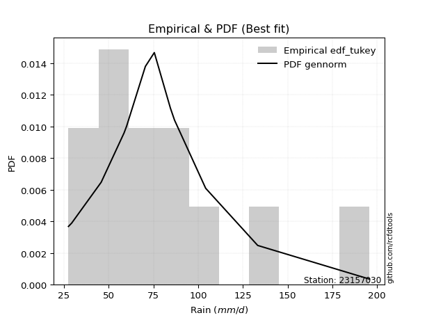</img>

</div>


### 8. EDF Gringorten (1963)

Gringorten plotting position formula is essential for estimating the probability and return periods of extreme events like floods and heavy rainfall. The constant _a=0.44_.

<div align="center">


$P=(m-a)/(n+1-2a)$


</div>


**8.1. Empirical values**

<div align="center">

|                | 0                   | 1                   | 2                   | 3                   | 4                   | 5                   | 6                  | 7                  | 8                  | 9                  | 10                 | 11                 |
|:---------------|:--------------------|:--------------------|:--------------------|:--------------------|:--------------------|:--------------------|:-------------------|:-------------------|:-------------------|:-------------------|:-------------------|:-------------------|
| date           | 2008                | 2017                | 2012                | 2015                | 2018                | 2007                | 2009               | 2011               | 2016               | 2014               | 2010               | 2013               |
| x              | 27.5                | 29.3                | 45.8                | 58.6                | 60.0                | 70.5                | 75.5               | 84.5               | 86.8               | 104.2              | 133.3              | 195.8              |
| m              | 1                   | 2                   | 3                   | 4                   | 5                   | 6                   | 7                  | 8                  | 9                  | 10                 | 11                 | 12                 |
| empirical_dist | edf_gringorten      | edf_gringorten      | edf_gringorten      | edf_gringorten      | edf_gringorten      | edf_gringorten      | edf_gringorten     | edf_gringorten     | edf_gringorten     | edf_gringorten     | edf_gringorten     | edf_gringorten     |
| empirical      | 0.04620462046204621 | 0.12871287128712872 | 0.21122112211221125 | 0.29372937293729373 | 0.37623762376237624 | 0.45874587458745875 | 0.5412541254125413 | 0.6237623762376238 | 0.7062706270627064 | 0.7887788778877889 | 0.8712871287128714 | 0.9537953795379539 |
| empirical_tr   | 1.0484429065743945  | 1.1477272727272727  | 1.2677824267782427  | 1.4158878504672898  | 1.6031746031746033  | 1.8475609756097562  | 2.179856115107914  | 2.6578947368421053 | 3.4044943820224733 | 4.734375000000003  | 7.769230769230775  | 21.642857142857192 |

</div>


**8.2. Kolmogorov-Smirnov fit test (sorted by Δ)**


<div align="center">

|                | 0                     | 1                   | 2                   | 3                   | 4                   | 5                   | 6                   | 7                   | 8                   | 9                   | 10                  | 11                  | 12                  | 13                  | 14                  | 15                  | 16                  | 17                  | 18                  | 19                  | 20                  | 21                  | 22                  | 23                  | 24                  | 25                  | 26                  | 27                  | 28                  | 29                  | 30                  | 31                  | 32                  | 33                  | 34                  | 35                  | 36                  | 37                  | 38                  | 39                  | 40                  | 41                  | 42                  | 43                  | 44                  | 45                  | 46                  | 47                  | 48                  | 49                  | 50                  | 51                  | 52                  | 53                  | 54                  | 55                  | 56                  | 57                  | 58                  | 59                  | 60                  | 61                  | 62                  | 63                  | 64                  | 65                  | 66                  | 67                  | 68                  | 69                  | 70                  | 71                  | 72                  | 73                  | 74                  | 75                  | 76                  | 77                  | 78                  | 79                  | 80                  | 81                  | 82                  | 83                  | 84                  | 85                  | 86                  | 87                  |
|:---------------|:----------------------|:--------------------|:--------------------|:--------------------|:--------------------|:--------------------|:--------------------|:--------------------|:--------------------|:--------------------|:--------------------|:--------------------|:--------------------|:--------------------|:--------------------|:--------------------|:--------------------|:--------------------|:--------------------|:--------------------|:--------------------|:--------------------|:--------------------|:--------------------|:--------------------|:--------------------|:--------------------|:--------------------|:--------------------|:--------------------|:--------------------|:--------------------|:--------------------|:--------------------|:--------------------|:--------------------|:--------------------|:--------------------|:--------------------|:--------------------|:--------------------|:--------------------|:--------------------|:--------------------|:--------------------|:--------------------|:--------------------|:--------------------|:--------------------|:--------------------|:--------------------|:--------------------|:--------------------|:--------------------|:--------------------|:--------------------|:--------------------|:--------------------|:--------------------|:--------------------|:--------------------|:--------------------|:--------------------|:--------------------|:--------------------|:--------------------|:--------------------|:--------------------|:--------------------|:--------------------|:--------------------|:--------------------|:--------------------|:--------------------|:--------------------|:--------------------|:--------------------|:--------------------|:--------------------|:--------------------|:--------------------|:--------------------|:--------------------|:--------------------|:--------------------|:--------------------|:--------------------|:--------------------|
| station        | 23157030              | 23157030            | 23157030            | 23157030            | 23157030            | 23157030            | 23157030            | 23157030            | 23157030            | 23157030            | 23157030            | 23157030            | 23157030            | 23157030            | 23157030            | 23157030            | 23157030            | 23157030            | 23157030            | 23157030            | 23157030            | 23157030            | 23157030            | 23157030            | 23157030            | 23157030            | 23157030            | 23157030            | 23157030            | 23157030            | 23157030            | 23157030            | 23157030            | 23157030            | 23157030            | 23157030            | 23157030            | 23157030            | 23157030            | 23157030            | 23157030            | 23157030            | 23157030            | 23157030            | 23157030            | 23157030            | 23157030            | 23157030            | 23157030            | 23157030            | 23157030            | 23157030            | 23157030            | 23157030            | 23157030            | 23157030            | 23157030            | 23157030            | 23157030            | 23157030            | 23157030            | 23157030            | 23157030            | 23157030            | 23157030            | 23157030            | 23157030            | 23157030            | 23157030            | 23157030            | 23157030            | 23157030            | 23157030            | 23157030            | 23157030            | 23157030            | 23157030            | 23157030            | 23157030            | 23157030            | 23157030            | 23157030            | 23157030            | 23157030            | 23157030            | 23157030            | 23157030            | 23157030            |
| empirical_dist | edf_gringorten        | edf_gringorten      | edf_gringorten      | edf_gringorten      | edf_gringorten      | edf_gringorten      | edf_gringorten      | edf_gringorten      | edf_gringorten      | edf_gringorten      | edf_gringorten      | edf_gringorten      | edf_gringorten      | edf_gringorten      | edf_gringorten      | edf_gringorten      | edf_gringorten      | edf_gringorten      | edf_gringorten      | edf_gringorten      | edf_gringorten      | edf_gringorten      | edf_gringorten      | edf_gringorten      | edf_gringorten      | edf_gringorten      | edf_gringorten      | edf_gringorten      | edf_gringorten      | edf_gringorten      | edf_gringorten      | edf_gringorten      | edf_gringorten      | edf_gringorten      | edf_gringorten      | edf_gringorten      | edf_gringorten      | edf_gringorten      | edf_gringorten      | edf_gringorten      | edf_gringorten      | edf_gringorten      | edf_gringorten      | edf_gringorten      | edf_gringorten      | edf_gringorten      | edf_gringorten      | edf_gringorten      | edf_gringorten      | edf_gringorten      | edf_gringorten      | edf_gringorten      | edf_gringorten      | edf_gringorten      | edf_gringorten      | edf_gringorten      | edf_gringorten      | edf_gringorten      | edf_gringorten      | edf_gringorten      | edf_gringorten      | edf_gringorten      | edf_gringorten      | edf_gringorten      | edf_gringorten      | edf_gringorten      | edf_gringorten      | edf_gringorten      | edf_gringorten      | edf_gringorten      | edf_gringorten      | edf_gringorten      | edf_gringorten      | edf_gringorten      | edf_gringorten      | edf_gringorten      | edf_gringorten      | edf_gringorten      | edf_gringorten      | edf_gringorten      | edf_gringorten      | edf_gringorten      | edf_gringorten      | edf_gringorten      | edf_gringorten      | edf_gringorten      | edf_gringorten      | edf_gringorten      |
| p_dist         | loglaplace_asymmetric | laplace_asymmetric  | loggenlogistic      | exponnorm           | alpha               | moyal               | invweibull          | nct                 | f                   | genlogistic         | logfisk             | ncf                 | logloggamma         | invgamma            | logjohnsonsu        | logpearson3         | loglogistic         | loglaplace          | fisk                | loghypsecant        | pearson3            | logt                | lognorm             | lognorm             | logcrystalball      | logexponnorm        | logfatiguelife      | logf                | lognakagami         | loggamma            | loggamma            | logerlang           | johnsonsu           | gumbel_r            | logweibull_min      | halfnorm            | invgauss            | logbetaprime        | lognct              | loginvgamma         | kstwobign           | logrice             | logalpha            | loggumbel_l         | gompertz            | loggompertz         | halflogistic        | logncf              | loginvgauss         | logmaxwell          | rayleigh            | laplace             | betaprime           | lograyleigh         | maxwell             | nakagami            | wald                | loggumbel_r         | rice                | mielke              | hypsecant           | loginvweibull       | genexpon            | expon               | logistic            | logmoyal            | norm                | truncnorm           | crystalball         | t                   | loghalfnorm         | logkstwobign        | loggenexpon         | loghalflogistic     | weibull_min         | logtruncnorm        | gibrat              | logwald             | gumbel_l            | loggibrat           | erlang              | logexpon            | logmielke           | gamma               | chi2                | logchi2             | loglognorm          | fatiguelife         |
| delta          | 0.05910914102714844   | 0.05949172460303713 | 0.06680478353733901 | 0.06733516322299163 | 0.06988988046442056 | 0.0705748640757235  | 0.07075476419854129 | 0.07080176137813408 | 0.07090623786497174 | 0.07108990077132271 | 0.0732159206482664  | 0.07366507288761454 | 0.07440107090319814 | 0.07456324358943178 | 0.07466106384211801 | 0.07554614295135104 | 0.07599389869101121 | 0.07613159929394298 | 0.07627852899874991 | 0.07665678661292188 | 0.0786326241077886  | 0.07905336395324819 | 0.07905376278584975 | 0.07905376278584975 | 0.07905379035807958 | 0.07905550000548323 | 0.0790894494658545  | 0.0790977479929394  | 0.07949078282264971 | 0.08238284353656128 | 0.08238284353656128 | 0.08272807466147569 | 0.08431441185689287 | 0.08486836856069602 | 0.08623734946614081 | 0.088058998537283   | 0.08915075208025963 | 0.09148335796901258 | 0.09415603418946061 | 0.0947813588845815  | 0.09604642542968844 | 0.09711518150978038 | 0.09734428136336698 | 0.10045515022590612 | 0.10195467141627751 | 0.10367739949651966 | 0.10647415654021437 | 0.10818937023843478 | 0.11175484084611037 | 0.11217084957161022 | 0.1148833997960661  | 0.1228253265124335  | 0.12316248405501562 | 0.1244293674137884  | 0.12460508785606395 | 0.1260096460536198  | 0.12964904773880084 | 0.13314808437072545 | 0.134133511859301   | 0.13930977303110026 | 0.14215323970454952 | 0.14264139708641826 | 0.1466958819580535  | 0.14720564220980337 | 0.1479914297474233  | 0.15367311821417118 | 0.15490559571772167 | 0.15490559673786863 | 0.15490559751891475 | 0.15569308840379315 | 0.15928581861738167 | 0.16408355500029193 | 0.16780019964567716 | 0.17104767078569616 | 0.2016858702438893  | 0.21121302706187436 | 0.21122112211221125 | 0.2147794059988809  | 0.2217938221880391  | 0.23896900796610643 | 0.24703940892356646 | 0.26144832424288245 | 0.2656548973785524  | 0.26734526131395453 | 0.2929923236720061  | 0.3232620788388266  | 0.3886923168572095  | 0.471253272627451   |
| deltao         | 0.36218414519599995   | 0.36218414519599995 | 0.36218414519599995 | 0.36218414519599995 | 0.36218414519599995 | 0.36218414519599995 | 0.36218414519599995 | 0.36218414519599995 | 0.36218414519599995 | 0.36218414519599995 | 0.36218414519599995 | 0.36218414519599995 | 0.36218414519599995 | 0.36218414519599995 | 0.36218414519599995 | 0.36218414519599995 | 0.36218414519599995 | 0.36218414519599995 | 0.36218414519599995 | 0.36218414519599995 | 0.36218414519599995 | 0.36218414519599995 | 0.36218414519599995 | 0.36218414519599995 | 0.36218414519599995 | 0.36218414519599995 | 0.36218414519599995 | 0.36218414519599995 | 0.36218414519599995 | 0.36218414519599995 | 0.36218414519599995 | 0.36218414519599995 | 0.36218414519599995 | 0.36218414519599995 | 0.36218414519599995 | 0.36218414519599995 | 0.36218414519599995 | 0.36218414519599995 | 0.36218414519599995 | 0.36218414519599995 | 0.36218414519599995 | 0.36218414519599995 | 0.36218414519599995 | 0.36218414519599995 | 0.36218414519599995 | 0.36218414519599995 | 0.36218414519599995 | 0.36218414519599995 | 0.36218414519599995 | 0.36218414519599995 | 0.36218414519599995 | 0.36218414519599995 | 0.36218414519599995 | 0.36218414519599995 | 0.36218414519599995 | 0.36218414519599995 | 0.36218414519599995 | 0.36218414519599995 | 0.36218414519599995 | 0.36218414519599995 | 0.36218414519599995 | 0.36218414519599995 | 0.36218414519599995 | 0.36218414519599995 | 0.36218414519599995 | 0.36218414519599995 | 0.36218414519599995 | 0.36218414519599995 | 0.36218414519599995 | 0.36218414519599995 | 0.36218414519599995 | 0.36218414519599995 | 0.36218414519599995 | 0.36218414519599995 | 0.36218414519599995 | 0.36218414519599995 | 0.36218414519599995 | 0.36218414519599995 | 0.36218414519599995 | 0.36218414519599995 | 0.36218414519599995 | 0.36218414519599995 | 0.36218414519599995 | 0.36218414519599995 | 0.36218414519599995 | 0.36218414519599995 | 0.36218414519599995 | 0.36218414519599995 |
| eval           | Δo > Δ                | Δo > Δ              | Δo > Δ              | Δo > Δ              | Δo > Δ              | Δo > Δ              | Δo > Δ              | Δo > Δ              | Δo > Δ              | Δo > Δ              | Δo > Δ              | Δo > Δ              | Δo > Δ              | Δo > Δ              | Δo > Δ              | Δo > Δ              | Δo > Δ              | Δo > Δ              | Δo > Δ              | Δo > Δ              | Δo > Δ              | Δo > Δ              | Δo > Δ              | Δo > Δ              | Δo > Δ              | Δo > Δ              | Δo > Δ              | Δo > Δ              | Δo > Δ              | Δo > Δ              | Δo > Δ              | Δo > Δ              | Δo > Δ              | Δo > Δ              | Δo > Δ              | Δo > Δ              | Δo > Δ              | Δo > Δ              | Δo > Δ              | Δo > Δ              | Δo > Δ              | Δo > Δ              | Δo > Δ              | Δo > Δ              | Δo > Δ              | Δo > Δ              | Δo > Δ              | Δo > Δ              | Δo > Δ              | Δo > Δ              | Δo > Δ              | Δo > Δ              | Δo > Δ              | Δo > Δ              | Δo > Δ              | Δo > Δ              | Δo > Δ              | Δo > Δ              | Δo > Δ              | Δo > Δ              | Δo > Δ              | Δo > Δ              | Δo > Δ              | Δo > Δ              | Δo > Δ              | Δo > Δ              | Δo > Δ              | Δo > Δ              | Δo > Δ              | Δo > Δ              | Δo > Δ              | Δo > Δ              | Δo > Δ              | Δo > Δ              | Δo > Δ              | Δo > Δ              | Δo > Δ              | Δo > Δ              | Δo > Δ              | Δo > Δ              | Δo > Δ              | Δo > Δ              | Δo > Δ              | Δo > Δ              | Δo > Δ              | Δo > Δ              | Δo <= Δ             | Δo <= Δ             |
| fit            | 1                     | 1                   | 1                   | 1                   | 1                   | 1                   | 1                   | 1                   | 1                   | 1                   | 1                   | 1                   | 1                   | 1                   | 1                   | 1                   | 1                   | 1                   | 1                   | 1                   | 1                   | 1                   | 1                   | 1                   | 1                   | 1                   | 1                   | 1                   | 1                   | 1                   | 1                   | 1                   | 1                   | 1                   | 1                   | 1                   | 1                   | 1                   | 1                   | 1                   | 1                   | 1                   | 1                   | 1                   | 1                   | 1                   | 1                   | 1                   | 1                   | 1                   | 1                   | 1                   | 1                   | 1                   | 1                   | 1                   | 1                   | 1                   | 1                   | 1                   | 1                   | 1                   | 1                   | 1                   | 1                   | 1                   | 1                   | 1                   | 1                   | 1                   | 1                   | 1                   | 1                   | 1                   | 1                   | 1                   | 1                   | 1                   | 1                   | 1                   | 1                   | 1                   | 1                   | 1                   | 1                   | 1                   | 0                   | 0                   |
| n              | 12                    | 12                  | 12                  | 12                  | 12                  | 12                  | 12                  | 12                  | 12                  | 12                  | 12                  | 12                  | 12                  | 12                  | 12                  | 12                  | 12                  | 12                  | 12                  | 12                  | 12                  | 12                  | 12                  | 12                  | 12                  | 12                  | 12                  | 12                  | 12                  | 12                  | 12                  | 12                  | 12                  | 12                  | 12                  | 12                  | 12                  | 12                  | 12                  | 12                  | 12                  | 12                  | 12                  | 12                  | 12                  | 12                  | 12                  | 12                  | 12                  | 12                  | 12                  | 12                  | 12                  | 12                  | 12                  | 12                  | 12                  | 12                  | 12                  | 12                  | 12                  | 12                  | 12                  | 12                  | 12                  | 12                  | 12                  | 12                  | 12                  | 12                  | 12                  | 12                  | 12                  | 12                  | 12                  | 12                  | 12                  | 12                  | 12                  | 12                  | 12                  | 12                  | 12                  | 12                  | 12                  | 12                  | 12                  | 12                  |
| best_fit       | 1                     | 0                   | 0                   | 0                   | 0                   | 0                   | 0                   | 0                   | 0                   | 0                   | 0                   | 0                   | 0                   | 0                   | 0                   | 0                   | 0                   | 0                   | 0                   | 0                   | 0                   | 0                   | 0                   | 0                   | 0                   | 0                   | 0                   | 0                   | 0                   | 0                   | 0                   | 0                   | 0                   | 0                   | 0                   | 0                   | 0                   | 0                   | 0                   | 0                   | 0                   | 0                   | 0                   | 0                   | 0                   | 0                   | 0                   | 0                   | 0                   | 0                   | 0                   | 0                   | 0                   | 0                   | 0                   | 0                   | 0                   | 0                   | 0                   | 0                   | 0                   | 0                   | 0                   | 0                   | 0                   | 0                   | 0                   | 0                   | 0                   | 0                   | 0                   | 0                   | 0                   | 0                   | 0                   | 0                   | 0                   | 0                   | 0                   | 0                   | 0                   | 0                   | 0                   | 0                   | 0                   | 0                   | 0                   | 0                   |
| best_fit_sort  | 1                     | 2                   | 3                   | 4                   | 5                   | 6                   | 7                   | 8                   | 9                   | 10                  | 11                  | 12                  | 13                  | 14                  | 15                  | 16                  | 17                  | 18                  | 19                  | 20                  | 21                  | 22                  | 23                  | 24                  | 25                  | 26                  | 27                  | 28                  | 29                  | 30                  | 31                  | 32                  | 33                  | 34                  | 35                  | 36                  | 37                  | 38                  | 39                  | 40                  | 41                  | 42                  | 43                  | 44                  | 45                  | 46                  | 47                  | 48                  | 49                  | 50                  | 51                  | 52                  | 53                  | 54                  | 55                  | 56                  | 57                  | 58                  | 59                  | 60                  | 61                  | 62                  | 63                  | 64                  | 65                  | 66                  | 67                  | 68                  | 69                  | 70                  | 71                  | 72                  | 73                  | 74                  | 75                  | 76                  | 77                  | 78                  | 79                  | 80                  | 81                  | 82                  | 83                  | 84                  | 85                  | 86                  | 87                  | 88                  |

</div>


**8.3. Best fit**

<div align="center">

|   id |   station | empirical_dist   | p_dist                |     delta |   deltao | eval   |   fit |   n |   best_fit |   best_fit_sort |
|-----:|----------:|:-----------------|:----------------------|----------:|---------:|:-------|------:|----:|-----------:|----------------:|
|    0 |  23157030 | edf_gringorten   | loglaplace_asymmetric | 0.0591091 | 0.362184 | Δo > Δ |     1 |  12 |          1 |               1 |

</div>


<div align="center">

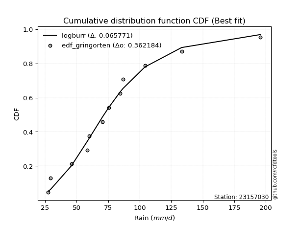</img></img>

</div>


### 9. EDF Filliben (1975)

The specific values of the constants (0.3175) (often denoted as $alpha$) and (0.365) are derived from a method proposed by James J. Filliben in a 1975 paper. This particular formula is the mean value of the $i$-th order statistic of the normal distribution and is considered a robust and effective plotting position formula for the normal probability plot correlation coefficient test for normality.

<div align="center">


$P=(m-0.3175)/(n+0.365)$


</div>


**9.1. Empirical values**

<div align="center">

|                | 0                   | 1                   | 2                   | 3                   | 4                  | 5                  | 6                  | 7                  | 8                  | 9                  | 10                 | 11                 |
|:---------------|:--------------------|:--------------------|:--------------------|:--------------------|:-------------------|:-------------------|:-------------------|:-------------------|:-------------------|:-------------------|:-------------------|:-------------------|
| date           | 2008                | 2017                | 2012                | 2015                | 2018               | 2007               | 2009               | 2011               | 2016               | 2014               | 2010               | 2013               |
| x              | 27.5                | 29.3                | 45.8                | 58.6                | 60.0               | 70.5               | 75.5               | 84.5               | 86.8               | 104.2              | 133.3              | 195.8              |
| m              | 1                   | 2                   | 3                   | 4                   | 5                  | 6                  | 7                  | 8                  | 9                  | 10                 | 11                 | 12                 |
| empirical_dist | edf_filliben        | edf_filliben        | edf_filliben        | edf_filliben        | edf_filliben       | edf_filliben       | edf_filliben       | edf_filliben       | edf_filliben       | edf_filliben       | edf_filliben       | edf_filliben       |
| empirical      | 0.05519611807521229 | 0.13606955115244643 | 0.21694298422968056 | 0.29781641730691466 | 0.3786898503841488 | 0.4595632834613829 | 0.540436716538617  | 0.6213101496158512 | 0.7021835826930852 | 0.7830570157703194 | 0.8639304488475535 | 0.9448038819247876 |
| empirical_tr   | 1.0584207147442757  | 1.1575005850690383  | 1.2770462174025305  | 1.4241289951050964  | 1.609502115196876  | 1.8503554059109617 | 2.1759788825340958 | 2.6406833956219966 | 3.357773251866937  | 4.6095060577819185 | 7.349182763744426  | 18.117216117216078 |

</div>


**9.2. Kolmogorov-Smirnov fit test (sorted by Δ)**


<div align="center">

|                | 0                     | 1                   | 2                   | 3                   | 4                   | 5                   | 6                   | 7                   | 8                   | 9                   | 10                  | 11                  | 12                  | 13                  | 14                  | 15                  | 16                  | 17                  | 18                  | 19                  | 20                  | 21                  | 22                  | 23                  | 24                  | 25                  | 26                  | 27                  | 28                  | 29                  | 30                  | 31                  | 32                  | 33                  | 34                  | 35                  | 36                  | 37                  | 38                  | 39                  | 40                  | 41                  | 42                  | 43                  | 44                  | 45                  | 46                  | 47                  | 48                  | 49                  | 50                  | 51                  | 52                  | 53                  | 54                  | 55                  | 56                  | 57                  | 58                  | 59                  | 60                  | 61                  | 62                  | 63                  | 64                  | 65                  | 66                  | 67                  | 68                  | 69                  | 70                  | 71                  | 72                  | 73                  | 74                  | 75                  | 76                  | 77                  | 78                  | 79                  | 80                  | 81                  | 82                  | 83                  | 84                  | 85                  | 86                  | 87                  |
|:---------------|:----------------------|:--------------------|:--------------------|:--------------------|:--------------------|:--------------------|:--------------------|:--------------------|:--------------------|:--------------------|:--------------------|:--------------------|:--------------------|:--------------------|:--------------------|:--------------------|:--------------------|:--------------------|:--------------------|:--------------------|:--------------------|:--------------------|:--------------------|:--------------------|:--------------------|:--------------------|:--------------------|:--------------------|:--------------------|:--------------------|:--------------------|:--------------------|:--------------------|:--------------------|:--------------------|:--------------------|:--------------------|:--------------------|:--------------------|:--------------------|:--------------------|:--------------------|:--------------------|:--------------------|:--------------------|:--------------------|:--------------------|:--------------------|:--------------------|:--------------------|:--------------------|:--------------------|:--------------------|:--------------------|:--------------------|:--------------------|:--------------------|:--------------------|:--------------------|:--------------------|:--------------------|:--------------------|:--------------------|:--------------------|:--------------------|:--------------------|:--------------------|:--------------------|:--------------------|:--------------------|:--------------------|:--------------------|:--------------------|:--------------------|:--------------------|:--------------------|:--------------------|:--------------------|:--------------------|:--------------------|:--------------------|:--------------------|:--------------------|:--------------------|:--------------------|:--------------------|:--------------------|:--------------------|
| station        | 23157030              | 23157030            | 23157030            | 23157030            | 23157030            | 23157030            | 23157030            | 23157030            | 23157030            | 23157030            | 23157030            | 23157030            | 23157030            | 23157030            | 23157030            | 23157030            | 23157030            | 23157030            | 23157030            | 23157030            | 23157030            | 23157030            | 23157030            | 23157030            | 23157030            | 23157030            | 23157030            | 23157030            | 23157030            | 23157030            | 23157030            | 23157030            | 23157030            | 23157030            | 23157030            | 23157030            | 23157030            | 23157030            | 23157030            | 23157030            | 23157030            | 23157030            | 23157030            | 23157030            | 23157030            | 23157030            | 23157030            | 23157030            | 23157030            | 23157030            | 23157030            | 23157030            | 23157030            | 23157030            | 23157030            | 23157030            | 23157030            | 23157030            | 23157030            | 23157030            | 23157030            | 23157030            | 23157030            | 23157030            | 23157030            | 23157030            | 23157030            | 23157030            | 23157030            | 23157030            | 23157030            | 23157030            | 23157030            | 23157030            | 23157030            | 23157030            | 23157030            | 23157030            | 23157030            | 23157030            | 23157030            | 23157030            | 23157030            | 23157030            | 23157030            | 23157030            | 23157030            | 23157030            |
| empirical_dist | edf_filliben          | edf_filliben        | edf_filliben        | edf_filliben        | edf_filliben        | edf_filliben        | edf_filliben        | edf_filliben        | edf_filliben        | edf_filliben        | edf_filliben        | edf_filliben        | edf_filliben        | edf_filliben        | edf_filliben        | edf_filliben        | edf_filliben        | edf_filliben        | edf_filliben        | edf_filliben        | edf_filliben        | edf_filliben        | edf_filliben        | edf_filliben        | edf_filliben        | edf_filliben        | edf_filliben        | edf_filliben        | edf_filliben        | edf_filliben        | edf_filliben        | edf_filliben        | edf_filliben        | edf_filliben        | edf_filliben        | edf_filliben        | edf_filliben        | edf_filliben        | edf_filliben        | edf_filliben        | edf_filliben        | edf_filliben        | edf_filliben        | edf_filliben        | edf_filliben        | edf_filliben        | edf_filliben        | edf_filliben        | edf_filliben        | edf_filliben        | edf_filliben        | edf_filliben        | edf_filliben        | edf_filliben        | edf_filliben        | edf_filliben        | edf_filliben        | edf_filliben        | edf_filliben        | edf_filliben        | edf_filliben        | edf_filliben        | edf_filliben        | edf_filliben        | edf_filliben        | edf_filliben        | edf_filliben        | edf_filliben        | edf_filliben        | edf_filliben        | edf_filliben        | edf_filliben        | edf_filliben        | edf_filliben        | edf_filliben        | edf_filliben        | edf_filliben        | edf_filliben        | edf_filliben        | edf_filliben        | edf_filliben        | edf_filliben        | edf_filliben        | edf_filliben        | edf_filliben        | edf_filliben        | edf_filliben        | edf_filliben        |
| p_dist         | loglaplace_asymmetric | laplace_asymmetric  | genlogistic         | loggenlogistic      | pearson3            | exponnorm           | alpha               | f                   | moyal               | invweibull          | nct                 | logloggamma         | logjohnsonsu        | logpearson3         | ncf                 | invgamma            | logexponnorm        | logt                | logcrystalball      | lognorm             | lognorm             | logfisk             | lognakagami         | gumbel_r            | logf                | logerlang           | logfatiguelife      | loggamma            | loggamma            | johnsonsu           | loglogistic         | loglaplace          | fisk                | halfnorm            | loghypsecant        | invgauss            | logweibull_min      | logbetaprime        | lognct              | loginvgamma         | kstwobign           | logalpha            | logrice             | loggumbel_l         | logncf              | loginvgauss         | logmaxwell          | gompertz            | rayleigh            | loggompertz         | halflogistic        | betaprime           | laplace             | lograyleigh         | maxwell             | nakagami            | loggumbel_r         | rice                | mielke              | wald                | hypsecant           | loginvweibull       | genexpon            | expon               | logistic            | logmoyal            | norm                | truncnorm           | crystalball         | t                   | loghalfnorm         | logkstwobign        | loggenexpon         | loghalflogistic     | weibull_min         | logwald             | logtruncnorm        | gibrat              | gumbel_l            | loggibrat           | erlang              | logexpon            | logmielke           | gamma               | chi2                | logchi2             | loglognorm          | fatiguelife         |
| delta          | 0.06646582089246615   | 0.06684840446835484 | 0.06782713812179944 | 0.07416146340265672 | 0.07454557973816744 | 0.07469184308830934 | 0.07724656032973827 | 0.07735314841237567 | 0.07793154394104121 | 0.078111444063859   | 0.0781584412434518  | 0.07817336866427663 | 0.07860265982277936 | 0.07871033819686249 | 0.0791585067951038  | 0.07981243499178789 | 0.08044172458175333 | 0.08044220590602377 | 0.08044224342414039 | 0.08044231787349371 | 0.08044231787349371 | 0.08057260051358411 | 0.08071344955883139 | 0.08078132419107487 | 0.08086036099518827 | 0.08150953851172757 | 0.08160630542583189 | 0.08166793356957958 | 0.08166793356957958 | 0.0823284203099284  | 0.08335057855632892 | 0.08348827915926069 | 0.08363520886406763 | 0.08397195416766207 | 0.0840134664782396  | 0.0850637077106387  | 0.0858561200477673  | 0.08739631359939165 | 0.09006898981983968 | 0.09069431451496057 | 0.09195938106006729 | 0.09325723699374605 | 0.09387147983757155 | 0.09636810585628497 | 0.10410232586881385 | 0.10766779647648944 | 0.10808380520198929 | 0.10931135128159522 | 0.11079635542644495 | 0.11103407936183737 | 0.11383083640553208 | 0.11907543968539469 | 0.1199242341059727  | 0.12034232304416748 | 0.1205180434864428  | 0.12192260168399888 | 0.12906104000110452 | 0.13004646748967985 | 0.13522272866147933 | 0.13606955115244643 | 0.13806619533492837 | 0.13855435271679734 | 0.14260883758843257 | 0.14311859784018244 | 0.14390438537780215 | 0.14958607384455025 | 0.15081855134810052 | 0.15081855236824748 | 0.1508185531492936  | 0.151606044034172   | 0.15519877424776074 | 0.159996510630671   | 0.16371315527605623 | 0.16696062641607523 | 0.19759882587426836 | 0.21396199712495673 | 0.21693488917934367 | 0.21694298422968056 | 0.21770677781841796 | 0.23815159909218225 | 0.24295236455394553 | 0.2573612798732615  | 0.2615678530089315  | 0.2632582169443336  | 0.2889052793023852  | 0.3191750344692057  | 0.3829704547397402  | 0.46553141050998165 |
| deltao         | 0.36218414519599995   | 0.36218414519599995 | 0.36218414519599995 | 0.36218414519599995 | 0.36218414519599995 | 0.36218414519599995 | 0.36218414519599995 | 0.36218414519599995 | 0.36218414519599995 | 0.36218414519599995 | 0.36218414519599995 | 0.36218414519599995 | 0.36218414519599995 | 0.36218414519599995 | 0.36218414519599995 | 0.36218414519599995 | 0.36218414519599995 | 0.36218414519599995 | 0.36218414519599995 | 0.36218414519599995 | 0.36218414519599995 | 0.36218414519599995 | 0.36218414519599995 | 0.36218414519599995 | 0.36218414519599995 | 0.36218414519599995 | 0.36218414519599995 | 0.36218414519599995 | 0.36218414519599995 | 0.36218414519599995 | 0.36218414519599995 | 0.36218414519599995 | 0.36218414519599995 | 0.36218414519599995 | 0.36218414519599995 | 0.36218414519599995 | 0.36218414519599995 | 0.36218414519599995 | 0.36218414519599995 | 0.36218414519599995 | 0.36218414519599995 | 0.36218414519599995 | 0.36218414519599995 | 0.36218414519599995 | 0.36218414519599995 | 0.36218414519599995 | 0.36218414519599995 | 0.36218414519599995 | 0.36218414519599995 | 0.36218414519599995 | 0.36218414519599995 | 0.36218414519599995 | 0.36218414519599995 | 0.36218414519599995 | 0.36218414519599995 | 0.36218414519599995 | 0.36218414519599995 | 0.36218414519599995 | 0.36218414519599995 | 0.36218414519599995 | 0.36218414519599995 | 0.36218414519599995 | 0.36218414519599995 | 0.36218414519599995 | 0.36218414519599995 | 0.36218414519599995 | 0.36218414519599995 | 0.36218414519599995 | 0.36218414519599995 | 0.36218414519599995 | 0.36218414519599995 | 0.36218414519599995 | 0.36218414519599995 | 0.36218414519599995 | 0.36218414519599995 | 0.36218414519599995 | 0.36218414519599995 | 0.36218414519599995 | 0.36218414519599995 | 0.36218414519599995 | 0.36218414519599995 | 0.36218414519599995 | 0.36218414519599995 | 0.36218414519599995 | 0.36218414519599995 | 0.36218414519599995 | 0.36218414519599995 | 0.36218414519599995 |
| eval           | Δo > Δ                | Δo > Δ              | Δo > Δ              | Δo > Δ              | Δo > Δ              | Δo > Δ              | Δo > Δ              | Δo > Δ              | Δo > Δ              | Δo > Δ              | Δo > Δ              | Δo > Δ              | Δo > Δ              | Δo > Δ              | Δo > Δ              | Δo > Δ              | Δo > Δ              | Δo > Δ              | Δo > Δ              | Δo > Δ              | Δo > Δ              | Δo > Δ              | Δo > Δ              | Δo > Δ              | Δo > Δ              | Δo > Δ              | Δo > Δ              | Δo > Δ              | Δo > Δ              | Δo > Δ              | Δo > Δ              | Δo > Δ              | Δo > Δ              | Δo > Δ              | Δo > Δ              | Δo > Δ              | Δo > Δ              | Δo > Δ              | Δo > Δ              | Δo > Δ              | Δo > Δ              | Δo > Δ              | Δo > Δ              | Δo > Δ              | Δo > Δ              | Δo > Δ              | Δo > Δ              | Δo > Δ              | Δo > Δ              | Δo > Δ              | Δo > Δ              | Δo > Δ              | Δo > Δ              | Δo > Δ              | Δo > Δ              | Δo > Δ              | Δo > Δ              | Δo > Δ              | Δo > Δ              | Δo > Δ              | Δo > Δ              | Δo > Δ              | Δo > Δ              | Δo > Δ              | Δo > Δ              | Δo > Δ              | Δo > Δ              | Δo > Δ              | Δo > Δ              | Δo > Δ              | Δo > Δ              | Δo > Δ              | Δo > Δ              | Δo > Δ              | Δo > Δ              | Δo > Δ              | Δo > Δ              | Δo > Δ              | Δo > Δ              | Δo > Δ              | Δo > Δ              | Δo > Δ              | Δo > Δ              | Δo > Δ              | Δo > Δ              | Δo > Δ              | Δo <= Δ             | Δo <= Δ             |
| fit            | 1                     | 1                   | 1                   | 1                   | 1                   | 1                   | 1                   | 1                   | 1                   | 1                   | 1                   | 1                   | 1                   | 1                   | 1                   | 1                   | 1                   | 1                   | 1                   | 1                   | 1                   | 1                   | 1                   | 1                   | 1                   | 1                   | 1                   | 1                   | 1                   | 1                   | 1                   | 1                   | 1                   | 1                   | 1                   | 1                   | 1                   | 1                   | 1                   | 1                   | 1                   | 1                   | 1                   | 1                   | 1                   | 1                   | 1                   | 1                   | 1                   | 1                   | 1                   | 1                   | 1                   | 1                   | 1                   | 1                   | 1                   | 1                   | 1                   | 1                   | 1                   | 1                   | 1                   | 1                   | 1                   | 1                   | 1                   | 1                   | 1                   | 1                   | 1                   | 1                   | 1                   | 1                   | 1                   | 1                   | 1                   | 1                   | 1                   | 1                   | 1                   | 1                   | 1                   | 1                   | 1                   | 1                   | 0                   | 0                   |
| n              | 12                    | 12                  | 12                  | 12                  | 12                  | 12                  | 12                  | 12                  | 12                  | 12                  | 12                  | 12                  | 12                  | 12                  | 12                  | 12                  | 12                  | 12                  | 12                  | 12                  | 12                  | 12                  | 12                  | 12                  | 12                  | 12                  | 12                  | 12                  | 12                  | 12                  | 12                  | 12                  | 12                  | 12                  | 12                  | 12                  | 12                  | 12                  | 12                  | 12                  | 12                  | 12                  | 12                  | 12                  | 12                  | 12                  | 12                  | 12                  | 12                  | 12                  | 12                  | 12                  | 12                  | 12                  | 12                  | 12                  | 12                  | 12                  | 12                  | 12                  | 12                  | 12                  | 12                  | 12                  | 12                  | 12                  | 12                  | 12                  | 12                  | 12                  | 12                  | 12                  | 12                  | 12                  | 12                  | 12                  | 12                  | 12                  | 12                  | 12                  | 12                  | 12                  | 12                  | 12                  | 12                  | 12                  | 12                  | 12                  |
| best_fit       | 1                     | 0                   | 0                   | 0                   | 0                   | 0                   | 0                   | 0                   | 0                   | 0                   | 0                   | 0                   | 0                   | 0                   | 0                   | 0                   | 0                   | 0                   | 0                   | 0                   | 0                   | 0                   | 0                   | 0                   | 0                   | 0                   | 0                   | 0                   | 0                   | 0                   | 0                   | 0                   | 0                   | 0                   | 0                   | 0                   | 0                   | 0                   | 0                   | 0                   | 0                   | 0                   | 0                   | 0                   | 0                   | 0                   | 0                   | 0                   | 0                   | 0                   | 0                   | 0                   | 0                   | 0                   | 0                   | 0                   | 0                   | 0                   | 0                   | 0                   | 0                   | 0                   | 0                   | 0                   | 0                   | 0                   | 0                   | 0                   | 0                   | 0                   | 0                   | 0                   | 0                   | 0                   | 0                   | 0                   | 0                   | 0                   | 0                   | 0                   | 0                   | 0                   | 0                   | 0                   | 0                   | 0                   | 0                   | 0                   |
| best_fit_sort  | 1                     | 2                   | 3                   | 4                   | 5                   | 6                   | 7                   | 8                   | 9                   | 10                  | 11                  | 12                  | 13                  | 14                  | 15                  | 16                  | 17                  | 18                  | 19                  | 20                  | 21                  | 22                  | 23                  | 24                  | 25                  | 26                  | 27                  | 28                  | 29                  | 30                  | 31                  | 32                  | 33                  | 34                  | 35                  | 36                  | 37                  | 38                  | 39                  | 40                  | 41                  | 42                  | 43                  | 44                  | 45                  | 46                  | 47                  | 48                  | 49                  | 50                  | 51                  | 52                  | 53                  | 54                  | 55                  | 56                  | 57                  | 58                  | 59                  | 60                  | 61                  | 62                  | 63                  | 64                  | 65                  | 66                  | 67                  | 68                  | 69                  | 70                  | 71                  | 72                  | 73                  | 74                  | 75                  | 76                  | 77                  | 78                  | 79                  | 80                  | 81                  | 82                  | 83                  | 84                  | 85                  | 86                  | 87                  | 88                  |

</div>


**9.3. Best fit**

<div align="center">

|   id |   station | empirical_dist   | p_dist                |     delta |   deltao | eval   |   fit |   n |   best_fit |   best_fit_sort |
|-----:|----------:|:-----------------|:----------------------|----------:|---------:|:-------|------:|----:|-----------:|----------------:|
|    0 |  23157030 | edf_filliben     | loglaplace_asymmetric | 0.0664658 | 0.362184 | Δo > Δ |     1 |  12 |          1 |               1 |

</div>


<div align="center">

</img>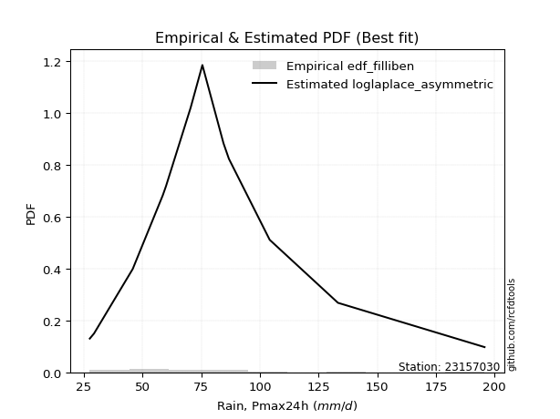</img>

</div>


### 10. EDF Jenkinson (1977)

The Jenkinson formula in hydrology is an empirical plotting position formula used to estimate the non-exceedance probability _(P)_ or return period _(T)_ of a given ordered observation within a sample. It is a widely used method in the frequency analysis of extreme events such as floods and rainfall, as it provides a distribution-free way to plot data. _a≈0.31_ and _b≈0.38_ are constants derived to approximate the median of the probability distribution for the given rank.

<div align="center">


$P=(m-a)/(n+b)$


</div>


**10.1. Empirical values**

<div align="center">

|                | 0                    | 1                   | 2                   | 3                  | 4                  | 5                  | 6                  | 7                  | 8                  | 9                  | 10                 | 11                 |
|:---------------|:---------------------|:--------------------|:--------------------|:-------------------|:-------------------|:-------------------|:-------------------|:-------------------|:-------------------|:-------------------|:-------------------|:-------------------|
| date           | 2008                 | 2017                | 2012                | 2015               | 2018               | 2007               | 2009               | 2011               | 2016               | 2014               | 2010               | 2013               |
| x              | 27.5                 | 29.3                | 45.8                | 58.6               | 60.0               | 70.5               | 75.5               | 84.5               | 86.8               | 104.2              | 133.3              | 195.8              |
| m              | 1                    | 2                   | 3                   | 4                  | 5                  | 6                  | 7                  | 8                  | 9                  | 10                 | 11                 | 12                 |
| empirical_dist | edf_jenkinson        | edf_jenkinson       | edf_jenkinson       | edf_jenkinson      | edf_jenkinson      | edf_jenkinson      | edf_jenkinson      | edf_jenkinson      | edf_jenkinson      | edf_jenkinson      | edf_jenkinson      | edf_jenkinson      |
| empirical      | 0.055735056542810975 | 0.13651050080775443 | 0.21728594507269788 | 0.2980613893376413 | 0.3788368336025848 | 0.4596122778675283 | 0.5403877221324718 | 0.6211631663974152 | 0.7019386106623585 | 0.7827140549273021 | 0.8634894991922455 | 0.9442649434571889 |
| empirical_tr   | 1.0590248075278015   | 1.1580916744621141  | 1.2776057791537667  | 1.424626006904488  | 1.6098829648894668 | 1.850523168908819  | 2.1757469244288226 | 2.6396588486140726 | 3.3550135501355    | 4.6022304832713745 | 7.325443786982245  | 17.942028985507218 |

</div>


**10.2. Kolmogorov-Smirnov fit test (sorted by Δ)**


<div align="center">

|                | 0                     | 1                   | 2                   | 3                   | 4                   | 5                   | 6                   | 7                   | 8                   | 9                   | 10                  | 11                  | 12                  | 13                  | 14                  | 15                  | 16                  | 17                  | 18                  | 19                  | 20                  | 21                  | 22                  | 23                  | 24                  | 25                  | 26                  | 27                  | 28                  | 29                  | 30                  | 31                  | 32                  | 33                  | 34                  | 35                  | 36                  | 37                  | 38                  | 39                  | 40                  | 41                  | 42                  | 43                  | 44                  | 45                  | 46                  | 47                  | 48                  | 49                  | 50                  | 51                  | 52                  | 53                  | 54                  | 55                  | 56                  | 57                  | 58                  | 59                  | 60                  | 61                  | 62                  | 63                  | 64                  | 65                  | 66                  | 67                  | 68                  | 69                  | 70                  | 71                  | 72                  | 73                  | 74                  | 75                  | 76                  | 77                  | 78                  | 79                  | 80                  | 81                  | 82                  | 83                  | 84                  | 85                  | 86                  | 87                  |
|:---------------|:----------------------|:--------------------|:--------------------|:--------------------|:--------------------|:--------------------|:--------------------|:--------------------|:--------------------|:--------------------|:--------------------|:--------------------|:--------------------|:--------------------|:--------------------|:--------------------|:--------------------|:--------------------|:--------------------|:--------------------|:--------------------|:--------------------|:--------------------|:--------------------|:--------------------|:--------------------|:--------------------|:--------------------|:--------------------|:--------------------|:--------------------|:--------------------|:--------------------|:--------------------|:--------------------|:--------------------|:--------------------|:--------------------|:--------------------|:--------------------|:--------------------|:--------------------|:--------------------|:--------------------|:--------------------|:--------------------|:--------------------|:--------------------|:--------------------|:--------------------|:--------------------|:--------------------|:--------------------|:--------------------|:--------------------|:--------------------|:--------------------|:--------------------|:--------------------|:--------------------|:--------------------|:--------------------|:--------------------|:--------------------|:--------------------|:--------------------|:--------------------|:--------------------|:--------------------|:--------------------|:--------------------|:--------------------|:--------------------|:--------------------|:--------------------|:--------------------|:--------------------|:--------------------|:--------------------|:--------------------|:--------------------|:--------------------|:--------------------|:--------------------|:--------------------|:--------------------|:--------------------|:--------------------|
| station        | 23157030              | 23157030            | 23157030            | 23157030            | 23157030            | 23157030            | 23157030            | 23157030            | 23157030            | 23157030            | 23157030            | 23157030            | 23157030            | 23157030            | 23157030            | 23157030            | 23157030            | 23157030            | 23157030            | 23157030            | 23157030            | 23157030            | 23157030            | 23157030            | 23157030            | 23157030            | 23157030            | 23157030            | 23157030            | 23157030            | 23157030            | 23157030            | 23157030            | 23157030            | 23157030            | 23157030            | 23157030            | 23157030            | 23157030            | 23157030            | 23157030            | 23157030            | 23157030            | 23157030            | 23157030            | 23157030            | 23157030            | 23157030            | 23157030            | 23157030            | 23157030            | 23157030            | 23157030            | 23157030            | 23157030            | 23157030            | 23157030            | 23157030            | 23157030            | 23157030            | 23157030            | 23157030            | 23157030            | 23157030            | 23157030            | 23157030            | 23157030            | 23157030            | 23157030            | 23157030            | 23157030            | 23157030            | 23157030            | 23157030            | 23157030            | 23157030            | 23157030            | 23157030            | 23157030            | 23157030            | 23157030            | 23157030            | 23157030            | 23157030            | 23157030            | 23157030            | 23157030            | 23157030            |
| empirical_dist | edf_jenkinson         | edf_jenkinson       | edf_jenkinson       | edf_jenkinson       | edf_jenkinson       | edf_jenkinson       | edf_jenkinson       | edf_jenkinson       | edf_jenkinson       | edf_jenkinson       | edf_jenkinson       | edf_jenkinson       | edf_jenkinson       | edf_jenkinson       | edf_jenkinson       | edf_jenkinson       | edf_jenkinson       | edf_jenkinson       | edf_jenkinson       | edf_jenkinson       | edf_jenkinson       | edf_jenkinson       | edf_jenkinson       | edf_jenkinson       | edf_jenkinson       | edf_jenkinson       | edf_jenkinson       | edf_jenkinson       | edf_jenkinson       | edf_jenkinson       | edf_jenkinson       | edf_jenkinson       | edf_jenkinson       | edf_jenkinson       | edf_jenkinson       | edf_jenkinson       | edf_jenkinson       | edf_jenkinson       | edf_jenkinson       | edf_jenkinson       | edf_jenkinson       | edf_jenkinson       | edf_jenkinson       | edf_jenkinson       | edf_jenkinson       | edf_jenkinson       | edf_jenkinson       | edf_jenkinson       | edf_jenkinson       | edf_jenkinson       | edf_jenkinson       | edf_jenkinson       | edf_jenkinson       | edf_jenkinson       | edf_jenkinson       | edf_jenkinson       | edf_jenkinson       | edf_jenkinson       | edf_jenkinson       | edf_jenkinson       | edf_jenkinson       | edf_jenkinson       | edf_jenkinson       | edf_jenkinson       | edf_jenkinson       | edf_jenkinson       | edf_jenkinson       | edf_jenkinson       | edf_jenkinson       | edf_jenkinson       | edf_jenkinson       | edf_jenkinson       | edf_jenkinson       | edf_jenkinson       | edf_jenkinson       | edf_jenkinson       | edf_jenkinson       | edf_jenkinson       | edf_jenkinson       | edf_jenkinson       | edf_jenkinson       | edf_jenkinson       | edf_jenkinson       | edf_jenkinson       | edf_jenkinson       | edf_jenkinson       | edf_jenkinson       | edf_jenkinson       |
| p_dist         | loglaplace_asymmetric | laplace_asymmetric  | genlogistic         | pearson3            | loggenlogistic      | exponnorm           | alpha               | f                   | moyal               | invweibull          | nct                 | logloggamma         | logjohnsonsu        | logpearson3         | ncf                 | invgamma            | gumbel_r            | logexponnorm        | logt                | logcrystalball      | lognorm             | lognorm             | logfisk             | lognakagami         | logf                | logerlang           | logfatiguelife      | loggamma            | loggamma            | johnsonsu           | halfnorm            | loglogistic         | loglaplace          | fisk                | loghypsecant        | invgauss            | logweibull_min      | logbetaprime        | lognct              | loginvgamma         | kstwobign           | logalpha            | logrice             | loggumbel_l         | logncf              | loginvgauss         | logmaxwell          | gompertz            | rayleigh            | loggompertz         | halflogistic        | betaprime           | laplace             | lograyleigh         | maxwell             | nakagami            | loggumbel_r         | rice                | mielke              | wald                | hypsecant           | loginvweibull       | genexpon            | expon               | logistic            | logmoyal            | norm                | truncnorm           | crystalball         | t                   | loghalfnorm         | logkstwobign        | loggenexpon         | loghalflogistic     | weibull_min         | logwald             | logtruncnorm        | gibrat              | gumbel_l            | loggibrat           | erlang              | logexpon            | logmielke           | gamma               | chi2                | logchi2             | loglognorm          | fatiguelife         |
| delta          | 0.06690677054777415   | 0.06728935412366284 | 0.06826808777710744 | 0.07430060770744074 | 0.07460241305796472 | 0.07513279274361734 | 0.07768750998504627 | 0.07779409806768367 | 0.07837249359634921 | 0.078552393719167   | 0.0785993908987598  | 0.07861431831958463 | 0.07904360947808736 | 0.07915128785217049 | 0.0795994564504118  | 0.08025338464709589 | 0.08053635216034816 | 0.08088267423706133 | 0.08088315556133177 | 0.08088319307944838 | 0.0808832675288017  | 0.0808832675288017  | 0.08101355016889211 | 0.08115439921413939 | 0.08130131065049627 | 0.08195048816703557 | 0.08204725508113989 | 0.08210888322488757 | 0.08210888322488757 | 0.0827693699652364  | 0.08372698213693541 | 0.08379152821163692 | 0.08392922881456868 | 0.08407615851937562 | 0.0844544161335476  | 0.08481873567991205 | 0.0862970697030753  | 0.087151341568665   | 0.08982401778911303 | 0.09044934248423392 | 0.09171440902934058 | 0.0930122649630194  | 0.09431242949287955 | 0.09612313382555826 | 0.1038573538380872  | 0.10742282444576279 | 0.10783883317126264 | 0.10975230093690322 | 0.11055138339571824 | 0.11147502901714537 | 0.11427178606084008 | 0.11883046765466804 | 0.12007121732440867 | 0.12009735101344082 | 0.12027307145571609 | 0.12167762965327222 | 0.12881606797037787 | 0.12980149545895314 | 0.13497775663075268 | 0.13651050080775443 | 0.13782122330420166 | 0.13830938068607068 | 0.14236386555770592 | 0.14287362580945578 | 0.14365941334707544 | 0.1493411018138236  | 0.1505735793173738  | 0.15057358033752077 | 0.1505735811185669  | 0.15136107200344529 | 0.1549538022170341  | 0.15975153859994434 | 0.16346818324532958 | 0.16671565438534858 | 0.1973538538435417  | 0.21391300271881136 | 0.217277850022361   | 0.21728594507269788 | 0.21746180578769125 | 0.2381026046860369  | 0.24270739252321888 | 0.25711630784253486 | 0.26132288097820483 | 0.26301324491360695 | 0.28866030727165853 | 0.31893006243847905 | 0.38262749389672285 | 0.4651884496669643  |
| deltao         | 0.36218414519599995   | 0.36218414519599995 | 0.36218414519599995 | 0.36218414519599995 | 0.36218414519599995 | 0.36218414519599995 | 0.36218414519599995 | 0.36218414519599995 | 0.36218414519599995 | 0.36218414519599995 | 0.36218414519599995 | 0.36218414519599995 | 0.36218414519599995 | 0.36218414519599995 | 0.36218414519599995 | 0.36218414519599995 | 0.36218414519599995 | 0.36218414519599995 | 0.36218414519599995 | 0.36218414519599995 | 0.36218414519599995 | 0.36218414519599995 | 0.36218414519599995 | 0.36218414519599995 | 0.36218414519599995 | 0.36218414519599995 | 0.36218414519599995 | 0.36218414519599995 | 0.36218414519599995 | 0.36218414519599995 | 0.36218414519599995 | 0.36218414519599995 | 0.36218414519599995 | 0.36218414519599995 | 0.36218414519599995 | 0.36218414519599995 | 0.36218414519599995 | 0.36218414519599995 | 0.36218414519599995 | 0.36218414519599995 | 0.36218414519599995 | 0.36218414519599995 | 0.36218414519599995 | 0.36218414519599995 | 0.36218414519599995 | 0.36218414519599995 | 0.36218414519599995 | 0.36218414519599995 | 0.36218414519599995 | 0.36218414519599995 | 0.36218414519599995 | 0.36218414519599995 | 0.36218414519599995 | 0.36218414519599995 | 0.36218414519599995 | 0.36218414519599995 | 0.36218414519599995 | 0.36218414519599995 | 0.36218414519599995 | 0.36218414519599995 | 0.36218414519599995 | 0.36218414519599995 | 0.36218414519599995 | 0.36218414519599995 | 0.36218414519599995 | 0.36218414519599995 | 0.36218414519599995 | 0.36218414519599995 | 0.36218414519599995 | 0.36218414519599995 | 0.36218414519599995 | 0.36218414519599995 | 0.36218414519599995 | 0.36218414519599995 | 0.36218414519599995 | 0.36218414519599995 | 0.36218414519599995 | 0.36218414519599995 | 0.36218414519599995 | 0.36218414519599995 | 0.36218414519599995 | 0.36218414519599995 | 0.36218414519599995 | 0.36218414519599995 | 0.36218414519599995 | 0.36218414519599995 | 0.36218414519599995 | 0.36218414519599995 |
| eval           | Δo > Δ                | Δo > Δ              | Δo > Δ              | Δo > Δ              | Δo > Δ              | Δo > Δ              | Δo > Δ              | Δo > Δ              | Δo > Δ              | Δo > Δ              | Δo > Δ              | Δo > Δ              | Δo > Δ              | Δo > Δ              | Δo > Δ              | Δo > Δ              | Δo > Δ              | Δo > Δ              | Δo > Δ              | Δo > Δ              | Δo > Δ              | Δo > Δ              | Δo > Δ              | Δo > Δ              | Δo > Δ              | Δo > Δ              | Δo > Δ              | Δo > Δ              | Δo > Δ              | Δo > Δ              | Δo > Δ              | Δo > Δ              | Δo > Δ              | Δo > Δ              | Δo > Δ              | Δo > Δ              | Δo > Δ              | Δo > Δ              | Δo > Δ              | Δo > Δ              | Δo > Δ              | Δo > Δ              | Δo > Δ              | Δo > Δ              | Δo > Δ              | Δo > Δ              | Δo > Δ              | Δo > Δ              | Δo > Δ              | Δo > Δ              | Δo > Δ              | Δo > Δ              | Δo > Δ              | Δo > Δ              | Δo > Δ              | Δo > Δ              | Δo > Δ              | Δo > Δ              | Δo > Δ              | Δo > Δ              | Δo > Δ              | Δo > Δ              | Δo > Δ              | Δo > Δ              | Δo > Δ              | Δo > Δ              | Δo > Δ              | Δo > Δ              | Δo > Δ              | Δo > Δ              | Δo > Δ              | Δo > Δ              | Δo > Δ              | Δo > Δ              | Δo > Δ              | Δo > Δ              | Δo > Δ              | Δo > Δ              | Δo > Δ              | Δo > Δ              | Δo > Δ              | Δo > Δ              | Δo > Δ              | Δo > Δ              | Δo > Δ              | Δo > Δ              | Δo <= Δ             | Δo <= Δ             |
| fit            | 1                     | 1                   | 1                   | 1                   | 1                   | 1                   | 1                   | 1                   | 1                   | 1                   | 1                   | 1                   | 1                   | 1                   | 1                   | 1                   | 1                   | 1                   | 1                   | 1                   | 1                   | 1                   | 1                   | 1                   | 1                   | 1                   | 1                   | 1                   | 1                   | 1                   | 1                   | 1                   | 1                   | 1                   | 1                   | 1                   | 1                   | 1                   | 1                   | 1                   | 1                   | 1                   | 1                   | 1                   | 1                   | 1                   | 1                   | 1                   | 1                   | 1                   | 1                   | 1                   | 1                   | 1                   | 1                   | 1                   | 1                   | 1                   | 1                   | 1                   | 1                   | 1                   | 1                   | 1                   | 1                   | 1                   | 1                   | 1                   | 1                   | 1                   | 1                   | 1                   | 1                   | 1                   | 1                   | 1                   | 1                   | 1                   | 1                   | 1                   | 1                   | 1                   | 1                   | 1                   | 1                   | 1                   | 0                   | 0                   |
| n              | 12                    | 12                  | 12                  | 12                  | 12                  | 12                  | 12                  | 12                  | 12                  | 12                  | 12                  | 12                  | 12                  | 12                  | 12                  | 12                  | 12                  | 12                  | 12                  | 12                  | 12                  | 12                  | 12                  | 12                  | 12                  | 12                  | 12                  | 12                  | 12                  | 12                  | 12                  | 12                  | 12                  | 12                  | 12                  | 12                  | 12                  | 12                  | 12                  | 12                  | 12                  | 12                  | 12                  | 12                  | 12                  | 12                  | 12                  | 12                  | 12                  | 12                  | 12                  | 12                  | 12                  | 12                  | 12                  | 12                  | 12                  | 12                  | 12                  | 12                  | 12                  | 12                  | 12                  | 12                  | 12                  | 12                  | 12                  | 12                  | 12                  | 12                  | 12                  | 12                  | 12                  | 12                  | 12                  | 12                  | 12                  | 12                  | 12                  | 12                  | 12                  | 12                  | 12                  | 12                  | 12                  | 12                  | 12                  | 12                  |
| best_fit       | 1                     | 0                   | 0                   | 0                   | 0                   | 0                   | 0                   | 0                   | 0                   | 0                   | 0                   | 0                   | 0                   | 0                   | 0                   | 0                   | 0                   | 0                   | 0                   | 0                   | 0                   | 0                   | 0                   | 0                   | 0                   | 0                   | 0                   | 0                   | 0                   | 0                   | 0                   | 0                   | 0                   | 0                   | 0                   | 0                   | 0                   | 0                   | 0                   | 0                   | 0                   | 0                   | 0                   | 0                   | 0                   | 0                   | 0                   | 0                   | 0                   | 0                   | 0                   | 0                   | 0                   | 0                   | 0                   | 0                   | 0                   | 0                   | 0                   | 0                   | 0                   | 0                   | 0                   | 0                   | 0                   | 0                   | 0                   | 0                   | 0                   | 0                   | 0                   | 0                   | 0                   | 0                   | 0                   | 0                   | 0                   | 0                   | 0                   | 0                   | 0                   | 0                   | 0                   | 0                   | 0                   | 0                   | 0                   | 0                   |
| best_fit_sort  | 1                     | 2                   | 3                   | 4                   | 5                   | 6                   | 7                   | 8                   | 9                   | 10                  | 11                  | 12                  | 13                  | 14                  | 15                  | 16                  | 17                  | 18                  | 19                  | 20                  | 21                  | 22                  | 23                  | 24                  | 25                  | 26                  | 27                  | 28                  | 29                  | 30                  | 31                  | 32                  | 33                  | 34                  | 35                  | 36                  | 37                  | 38                  | 39                  | 40                  | 41                  | 42                  | 43                  | 44                  | 45                  | 46                  | 47                  | 48                  | 49                  | 50                  | 51                  | 52                  | 53                  | 54                  | 55                  | 56                  | 57                  | 58                  | 59                  | 60                  | 61                  | 62                  | 63                  | 64                  | 65                  | 66                  | 67                  | 68                  | 69                  | 70                  | 71                  | 72                  | 73                  | 74                  | 75                  | 76                  | 77                  | 78                  | 79                  | 80                  | 81                  | 82                  | 83                  | 84                  | 85                  | 86                  | 87                  | 88                  |

</div>


**10.3. Best fit**

<div align="center">

|   id |   station | empirical_dist   | p_dist                |     delta |   deltao | eval   |   fit |   n |   best_fit |   best_fit_sort |
|-----:|----------:|:-----------------|:----------------------|----------:|---------:|:-------|------:|----:|-----------:|----------------:|
|    0 |  23157030 | edf_jenkinson    | loglaplace_asymmetric | 0.0669068 | 0.362184 | Δo > Δ |     1 |  12 |          1 |               1 |

</div>


<div align="center">

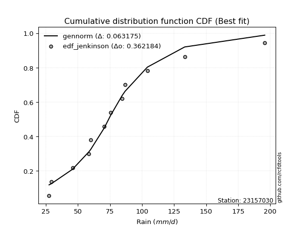</img>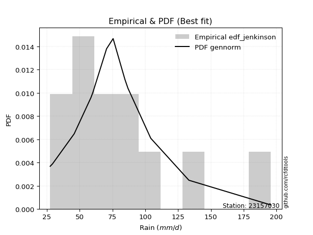</img>

</div>


### 11. EDF Cunnane (1978)

Cunnane´s work in statistical hydrology has focused on the performance and evaluation of different probability distributions (such as GEV, Gumbel, Lognormal) for flood frequency estimation. _b_ is a constant, typically set to 0.4.

<div align="center">


$P=(m-b)/(n+1-2b)$


</div>


**11.1. Empirical values**

<div align="center">

|                | 0                   | 1                   | 2                   | 3                  | 4                  | 5                   | 6                  | 7                  | 8                  | 9                  | 10                 | 11                 |
|:---------------|:--------------------|:--------------------|:--------------------|:-------------------|:-------------------|:--------------------|:-------------------|:-------------------|:-------------------|:-------------------|:-------------------|:-------------------|
| date           | 2008                | 2017                | 2012                | 2015               | 2018               | 2007                | 2009               | 2011               | 2016               | 2014               | 2010               | 2013               |
| x              | 27.5                | 29.3                | 45.8                | 58.6               | 60.0               | 70.5                | 75.5               | 84.5               | 86.8               | 104.2              | 133.3              | 195.8              |
| m              | 1                   | 2                   | 3                   | 4                  | 5                  | 6                   | 7                  | 8                  | 9                  | 10                 | 11                 | 12                 |
| empirical_dist | edf_cunnane         | edf_cunnane         | edf_cunnane         | edf_cunnane        | edf_cunnane        | edf_cunnane         | edf_cunnane        | edf_cunnane        | edf_cunnane        | edf_cunnane        | edf_cunnane        | edf_cunnane        |
| empirical      | 0.04918032786885246 | 0.13114754098360656 | 0.21311475409836067 | 0.2950819672131148 | 0.3770491803278688 | 0.45901639344262296 | 0.5409836065573771 | 0.6229508196721312 | 0.7049180327868853 | 0.7868852459016393 | 0.8688524590163935 | 0.9508196721311476 |
| empirical_tr   | 1.0517241379310345  | 1.150943396226415   | 1.2708333333333333  | 1.418604651162791  | 1.6052631578947367 | 1.8484848484848486  | 2.178571428571429  | 2.6521739130434785 | 3.388888888888889  | 4.692307692307692  | 7.625000000000004  | 20.333333333333357 |

</div>


**11.2. Kolmogorov-Smirnov fit test (sorted by Δ)**


<div align="center">

|                | 0                     | 1                   | 2                   | 3                   | 4                   | 5                   | 6                   | 7                   | 8                   | 9                   | 10                  | 11                  | 12                  | 13                  | 14                  | 15                  | 16                  | 17                  | 18                  | 19                  | 20                  | 21                  | 22                  | 23                  | 24                  | 25                  | 26                  | 27                  | 28                  | 29                  | 30                  | 31                  | 32                  | 33                  | 34                  | 35                  | 36                  | 37                  | 38                  | 39                  | 40                  | 41                  | 42                  | 43                  | 44                  | 45                  | 46                  | 47                  | 48                  | 49                  | 50                  | 51                  | 52                  | 53                  | 54                  | 55                  | 56                  | 57                  | 58                  | 59                  | 60                  | 61                  | 62                  | 63                  | 64                  | 65                  | 66                  | 67                  | 68                  | 69                  | 70                  | 71                  | 72                  | 73                  | 74                  | 75                  | 76                  | 77                  | 78                  | 79                  | 80                  | 81                  | 82                  | 83                  | 84                  | 85                  | 86                  | 87                  |
|:---------------|:----------------------|:--------------------|:--------------------|:--------------------|:--------------------|:--------------------|:--------------------|:--------------------|:--------------------|:--------------------|:--------------------|:--------------------|:--------------------|:--------------------|:--------------------|:--------------------|:--------------------|:--------------------|:--------------------|:--------------------|:--------------------|:--------------------|:--------------------|:--------------------|:--------------------|:--------------------|:--------------------|:--------------------|:--------------------|:--------------------|:--------------------|:--------------------|:--------------------|:--------------------|:--------------------|:--------------------|:--------------------|:--------------------|:--------------------|:--------------------|:--------------------|:--------------------|:--------------------|:--------------------|:--------------------|:--------------------|:--------------------|:--------------------|:--------------------|:--------------------|:--------------------|:--------------------|:--------------------|:--------------------|:--------------------|:--------------------|:--------------------|:--------------------|:--------------------|:--------------------|:--------------------|:--------------------|:--------------------|:--------------------|:--------------------|:--------------------|:--------------------|:--------------------|:--------------------|:--------------------|:--------------------|:--------------------|:--------------------|:--------------------|:--------------------|:--------------------|:--------------------|:--------------------|:--------------------|:--------------------|:--------------------|:--------------------|:--------------------|:--------------------|:--------------------|:--------------------|:--------------------|:--------------------|
| station        | 23157030              | 23157030            | 23157030            | 23157030            | 23157030            | 23157030            | 23157030            | 23157030            | 23157030            | 23157030            | 23157030            | 23157030            | 23157030            | 23157030            | 23157030            | 23157030            | 23157030            | 23157030            | 23157030            | 23157030            | 23157030            | 23157030            | 23157030            | 23157030            | 23157030            | 23157030            | 23157030            | 23157030            | 23157030            | 23157030            | 23157030            | 23157030            | 23157030            | 23157030            | 23157030            | 23157030            | 23157030            | 23157030            | 23157030            | 23157030            | 23157030            | 23157030            | 23157030            | 23157030            | 23157030            | 23157030            | 23157030            | 23157030            | 23157030            | 23157030            | 23157030            | 23157030            | 23157030            | 23157030            | 23157030            | 23157030            | 23157030            | 23157030            | 23157030            | 23157030            | 23157030            | 23157030            | 23157030            | 23157030            | 23157030            | 23157030            | 23157030            | 23157030            | 23157030            | 23157030            | 23157030            | 23157030            | 23157030            | 23157030            | 23157030            | 23157030            | 23157030            | 23157030            | 23157030            | 23157030            | 23157030            | 23157030            | 23157030            | 23157030            | 23157030            | 23157030            | 23157030            | 23157030            |
| empirical_dist | edf_cunnane           | edf_cunnane         | edf_cunnane         | edf_cunnane         | edf_cunnane         | edf_cunnane         | edf_cunnane         | edf_cunnane         | edf_cunnane         | edf_cunnane         | edf_cunnane         | edf_cunnane         | edf_cunnane         | edf_cunnane         | edf_cunnane         | edf_cunnane         | edf_cunnane         | edf_cunnane         | edf_cunnane         | edf_cunnane         | edf_cunnane         | edf_cunnane         | edf_cunnane         | edf_cunnane         | edf_cunnane         | edf_cunnane         | edf_cunnane         | edf_cunnane         | edf_cunnane         | edf_cunnane         | edf_cunnane         | edf_cunnane         | edf_cunnane         | edf_cunnane         | edf_cunnane         | edf_cunnane         | edf_cunnane         | edf_cunnane         | edf_cunnane         | edf_cunnane         | edf_cunnane         | edf_cunnane         | edf_cunnane         | edf_cunnane         | edf_cunnane         | edf_cunnane         | edf_cunnane         | edf_cunnane         | edf_cunnane         | edf_cunnane         | edf_cunnane         | edf_cunnane         | edf_cunnane         | edf_cunnane         | edf_cunnane         | edf_cunnane         | edf_cunnane         | edf_cunnane         | edf_cunnane         | edf_cunnane         | edf_cunnane         | edf_cunnane         | edf_cunnane         | edf_cunnane         | edf_cunnane         | edf_cunnane         | edf_cunnane         | edf_cunnane         | edf_cunnane         | edf_cunnane         | edf_cunnane         | edf_cunnane         | edf_cunnane         | edf_cunnane         | edf_cunnane         | edf_cunnane         | edf_cunnane         | edf_cunnane         | edf_cunnane         | edf_cunnane         | edf_cunnane         | edf_cunnane         | edf_cunnane         | edf_cunnane         | edf_cunnane         | edf_cunnane         | edf_cunnane         | edf_cunnane         |
| p_dist         | loglaplace_asymmetric | laplace_asymmetric  | loggenlogistic      | genlogistic         | exponnorm           | alpha               | f                   | moyal               | invweibull          | nct                 | logloggamma         | logjohnsonsu        | logpearson3         | ncf                 | invgamma            | logfisk             | pearson3            | logt                | lognorm             | lognorm             | logcrystalball      | logexponnorm        | logfatiguelife      | logf                | lognakagami         | loglogistic         | loglaplace          | fisk                | loghypsecant        | loggamma            | loggamma            | logerlang           | johnsonsu           | gumbel_r            | logweibull_min      | halfnorm            | invgauss            | logbetaprime        | lognct              | loginvgamma         | kstwobign           | logrice             | logalpha            | loggumbel_l         | gompertz            | loggompertz         | logncf              | halflogistic        | loginvgauss         | logmaxwell          | rayleigh            | laplace             | betaprime           | lograyleigh         | maxwell             | nakagami            | wald                | loggumbel_r         | rice                | mielke              | hypsecant           | loginvweibull       | genexpon            | expon               | logistic            | logmoyal            | norm                | truncnorm           | crystalball         | t                   | loghalfnorm         | logkstwobign        | loggenexpon         | loghalflogistic     | weibull_min         | logtruncnorm        | gibrat              | logwald             | gumbel_l            | loggibrat           | erlang              | logexpon            | logmielke           | gamma               | chi2                | logchi2             | loglognorm          | fatiguelife         |
| delta          | 0.06154381072362629   | 0.06192639429951498 | 0.06923945323381686 | 0.06973730649550158 | 0.06976983291946948 | 0.07232455016089841 | 0.07243113824353581 | 0.07300953377220135 | 0.07318943389501914 | 0.07323643107461193 | 0.07325135849543676 | 0.0736806496539395  | 0.07419354867552996 | 0.07423649662626394 | 0.07489042482294803 | 0.07565059034474425 | 0.07728002983196747 | 0.07770076967742712 | 0.07770116851002867 | 0.07770116851002867 | 0.0777011960822585  | 0.07770290572966215 | 0.07773685519003343 | 0.07774515371711832 | 0.07813818854682864 | 0.07842856838748906 | 0.07856626899042082 | 0.07871319869522776 | 0.07909145630939973 | 0.0810302492607402  | 0.0810302492607402  | 0.08137548038565462 | 0.0829618175810718  | 0.08351577428487489 | 0.08488475519031974 | 0.08670640426146192 | 0.08779815780443856 | 0.0901307636931915  | 0.09280343991363954 | 0.09342876460876043 | 0.09469383115386731 | 0.0957625872339593  | 0.09599168708754591 | 0.09910255595008499 | 0.10438934111275536 | 0.10611206919299751 | 0.1068367759626137  | 0.10890882623669222 | 0.1104022465702893  | 0.11081825529578915 | 0.11353080552024497 | 0.12147273223661237 | 0.12180988977919455 | 0.12307677313796733 | 0.12325249358024282 | 0.12465705177779873 | 0.13154267972495026 | 0.13179549009490438 | 0.13278091758347987 | 0.1379571787552792  | 0.1408006454287284  | 0.1412888028105972  | 0.14534328768223242 | 0.1458530479339823  | 0.14663883547160217 | 0.1523205239383501  | 0.15355300144190054 | 0.1535530024620475  | 0.15355300324309362 | 0.15434049412797202 | 0.1579332243415606  | 0.16273096072447085 | 0.1664476053698561  | 0.1696950765098751  | 0.20033327596806821 | 0.21310665904802378 | 0.21311475409836067 | 0.2145088871437167  | 0.22044122791221799 | 0.2386984891109422  | 0.2456868146477454  | 0.2600957299670614  | 0.26430230310273134 | 0.26599266703813346 | 0.29163972939618504 | 0.32190948456300555 | 0.38679868487106006 | 0.46935964064130153 |
| deltao         | 0.36218414519599995   | 0.36218414519599995 | 0.36218414519599995 | 0.36218414519599995 | 0.36218414519599995 | 0.36218414519599995 | 0.36218414519599995 | 0.36218414519599995 | 0.36218414519599995 | 0.36218414519599995 | 0.36218414519599995 | 0.36218414519599995 | 0.36218414519599995 | 0.36218414519599995 | 0.36218414519599995 | 0.36218414519599995 | 0.36218414519599995 | 0.36218414519599995 | 0.36218414519599995 | 0.36218414519599995 | 0.36218414519599995 | 0.36218414519599995 | 0.36218414519599995 | 0.36218414519599995 | 0.36218414519599995 | 0.36218414519599995 | 0.36218414519599995 | 0.36218414519599995 | 0.36218414519599995 | 0.36218414519599995 | 0.36218414519599995 | 0.36218414519599995 | 0.36218414519599995 | 0.36218414519599995 | 0.36218414519599995 | 0.36218414519599995 | 0.36218414519599995 | 0.36218414519599995 | 0.36218414519599995 | 0.36218414519599995 | 0.36218414519599995 | 0.36218414519599995 | 0.36218414519599995 | 0.36218414519599995 | 0.36218414519599995 | 0.36218414519599995 | 0.36218414519599995 | 0.36218414519599995 | 0.36218414519599995 | 0.36218414519599995 | 0.36218414519599995 | 0.36218414519599995 | 0.36218414519599995 | 0.36218414519599995 | 0.36218414519599995 | 0.36218414519599995 | 0.36218414519599995 | 0.36218414519599995 | 0.36218414519599995 | 0.36218414519599995 | 0.36218414519599995 | 0.36218414519599995 | 0.36218414519599995 | 0.36218414519599995 | 0.36218414519599995 | 0.36218414519599995 | 0.36218414519599995 | 0.36218414519599995 | 0.36218414519599995 | 0.36218414519599995 | 0.36218414519599995 | 0.36218414519599995 | 0.36218414519599995 | 0.36218414519599995 | 0.36218414519599995 | 0.36218414519599995 | 0.36218414519599995 | 0.36218414519599995 | 0.36218414519599995 | 0.36218414519599995 | 0.36218414519599995 | 0.36218414519599995 | 0.36218414519599995 | 0.36218414519599995 | 0.36218414519599995 | 0.36218414519599995 | 0.36218414519599995 | 0.36218414519599995 |
| eval           | Δo > Δ                | Δo > Δ              | Δo > Δ              | Δo > Δ              | Δo > Δ              | Δo > Δ              | Δo > Δ              | Δo > Δ              | Δo > Δ              | Δo > Δ              | Δo > Δ              | Δo > Δ              | Δo > Δ              | Δo > Δ              | Δo > Δ              | Δo > Δ              | Δo > Δ              | Δo > Δ              | Δo > Δ              | Δo > Δ              | Δo > Δ              | Δo > Δ              | Δo > Δ              | Δo > Δ              | Δo > Δ              | Δo > Δ              | Δo > Δ              | Δo > Δ              | Δo > Δ              | Δo > Δ              | Δo > Δ              | Δo > Δ              | Δo > Δ              | Δo > Δ              | Δo > Δ              | Δo > Δ              | Δo > Δ              | Δo > Δ              | Δo > Δ              | Δo > Δ              | Δo > Δ              | Δo > Δ              | Δo > Δ              | Δo > Δ              | Δo > Δ              | Δo > Δ              | Δo > Δ              | Δo > Δ              | Δo > Δ              | Δo > Δ              | Δo > Δ              | Δo > Δ              | Δo > Δ              | Δo > Δ              | Δo > Δ              | Δo > Δ              | Δo > Δ              | Δo > Δ              | Δo > Δ              | Δo > Δ              | Δo > Δ              | Δo > Δ              | Δo > Δ              | Δo > Δ              | Δo > Δ              | Δo > Δ              | Δo > Δ              | Δo > Δ              | Δo > Δ              | Δo > Δ              | Δo > Δ              | Δo > Δ              | Δo > Δ              | Δo > Δ              | Δo > Δ              | Δo > Δ              | Δo > Δ              | Δo > Δ              | Δo > Δ              | Δo > Δ              | Δo > Δ              | Δo > Δ              | Δo > Δ              | Δo > Δ              | Δo > Δ              | Δo > Δ              | Δo <= Δ             | Δo <= Δ             |
| fit            | 1                     | 1                   | 1                   | 1                   | 1                   | 1                   | 1                   | 1                   | 1                   | 1                   | 1                   | 1                   | 1                   | 1                   | 1                   | 1                   | 1                   | 1                   | 1                   | 1                   | 1                   | 1                   | 1                   | 1                   | 1                   | 1                   | 1                   | 1                   | 1                   | 1                   | 1                   | 1                   | 1                   | 1                   | 1                   | 1                   | 1                   | 1                   | 1                   | 1                   | 1                   | 1                   | 1                   | 1                   | 1                   | 1                   | 1                   | 1                   | 1                   | 1                   | 1                   | 1                   | 1                   | 1                   | 1                   | 1                   | 1                   | 1                   | 1                   | 1                   | 1                   | 1                   | 1                   | 1                   | 1                   | 1                   | 1                   | 1                   | 1                   | 1                   | 1                   | 1                   | 1                   | 1                   | 1                   | 1                   | 1                   | 1                   | 1                   | 1                   | 1                   | 1                   | 1                   | 1                   | 1                   | 1                   | 0                   | 0                   |
| n              | 12                    | 12                  | 12                  | 12                  | 12                  | 12                  | 12                  | 12                  | 12                  | 12                  | 12                  | 12                  | 12                  | 12                  | 12                  | 12                  | 12                  | 12                  | 12                  | 12                  | 12                  | 12                  | 12                  | 12                  | 12                  | 12                  | 12                  | 12                  | 12                  | 12                  | 12                  | 12                  | 12                  | 12                  | 12                  | 12                  | 12                  | 12                  | 12                  | 12                  | 12                  | 12                  | 12                  | 12                  | 12                  | 12                  | 12                  | 12                  | 12                  | 12                  | 12                  | 12                  | 12                  | 12                  | 12                  | 12                  | 12                  | 12                  | 12                  | 12                  | 12                  | 12                  | 12                  | 12                  | 12                  | 12                  | 12                  | 12                  | 12                  | 12                  | 12                  | 12                  | 12                  | 12                  | 12                  | 12                  | 12                  | 12                  | 12                  | 12                  | 12                  | 12                  | 12                  | 12                  | 12                  | 12                  | 12                  | 12                  |
| best_fit       | 1                     | 0                   | 0                   | 0                   | 0                   | 0                   | 0                   | 0                   | 0                   | 0                   | 0                   | 0                   | 0                   | 0                   | 0                   | 0                   | 0                   | 0                   | 0                   | 0                   | 0                   | 0                   | 0                   | 0                   | 0                   | 0                   | 0                   | 0                   | 0                   | 0                   | 0                   | 0                   | 0                   | 0                   | 0                   | 0                   | 0                   | 0                   | 0                   | 0                   | 0                   | 0                   | 0                   | 0                   | 0                   | 0                   | 0                   | 0                   | 0                   | 0                   | 0                   | 0                   | 0                   | 0                   | 0                   | 0                   | 0                   | 0                   | 0                   | 0                   | 0                   | 0                   | 0                   | 0                   | 0                   | 0                   | 0                   | 0                   | 0                   | 0                   | 0                   | 0                   | 0                   | 0                   | 0                   | 0                   | 0                   | 0                   | 0                   | 0                   | 0                   | 0                   | 0                   | 0                   | 0                   | 0                   | 0                   | 0                   |
| best_fit_sort  | 1                     | 2                   | 3                   | 4                   | 5                   | 6                   | 7                   | 8                   | 9                   | 10                  | 11                  | 12                  | 13                  | 14                  | 15                  | 16                  | 17                  | 18                  | 19                  | 20                  | 21                  | 22                  | 23                  | 24                  | 25                  | 26                  | 27                  | 28                  | 29                  | 30                  | 31                  | 32                  | 33                  | 34                  | 35                  | 36                  | 37                  | 38                  | 39                  | 40                  | 41                  | 42                  | 43                  | 44                  | 45                  | 46                  | 47                  | 48                  | 49                  | 50                  | 51                  | 52                  | 53                  | 54                  | 55                  | 56                  | 57                  | 58                  | 59                  | 60                  | 61                  | 62                  | 63                  | 64                  | 65                  | 66                  | 67                  | 68                  | 69                  | 70                  | 71                  | 72                  | 73                  | 74                  | 75                  | 76                  | 77                  | 78                  | 79                  | 80                  | 81                  | 82                  | 83                  | 84                  | 85                  | 86                  | 87                  | 88                  |

</div>


**11.3. Best fit**

<div align="center">

|   id |   station | empirical_dist   | p_dist                |     delta |   deltao | eval   |   fit |   n |   best_fit |   best_fit_sort |
|-----:|----------:|:-----------------|:----------------------|----------:|---------:|:-------|------:|----:|-----------:|----------------:|
|    0 |  23157030 | edf_cunnane      | loglaplace_asymmetric | 0.0615438 | 0.362184 | Δo > Δ |     1 |  12 |          1 |               1 |

</div>


<div align="center">

</img>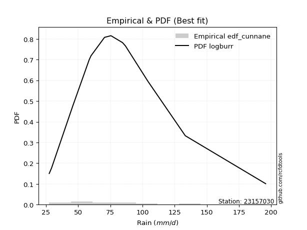</img>

</div>


### 12. EDF Adamowski (1981)

The Adamowski formula in hydrology refers to a specific plotting position formula used for estimating the non-parametric empirical distribution of hydrological events (like flood peaks) to calculate their return periods. This formula provides an alternative to traditional parametric methods (like the Gumbel or Log Pearson Type III distributions). 

<div align="center">


$P=(m-0.25)/(n+0.5)$


</div>


**12.1. Empirical values**

<div align="center">

|                | 0                  | 1                  | 2                 | 3                  | 4                  | 5                  | 6                 | 7                  | 8                 | 9                 | 10                | 11                 |
|:---------------|:-------------------|:-------------------|:------------------|:-------------------|:-------------------|:-------------------|:------------------|:-------------------|:------------------|:------------------|:------------------|:-------------------|
| date           | 2008               | 2017               | 2012              | 2015               | 2018               | 2007               | 2009              | 2011               | 2016              | 2014              | 2010              | 2013               |
| x              | 27.5               | 29.3               | 45.8              | 58.6               | 60.0               | 70.5               | 75.5              | 84.5               | 86.8              | 104.2             | 133.3             | 195.8              |
| m              | 1                  | 2                  | 3                 | 4                  | 5                  | 6                  | 7                 | 8                  | 9                 | 10                | 11                | 12                 |
| empirical_dist | edf_adamowski      | edf_adamowski      | edf_adamowski     | edf_adamowski      | edf_adamowski      | edf_adamowski      | edf_adamowski     | edf_adamowski      | edf_adamowski     | edf_adamowski     | edf_adamowski     | edf_adamowski      |
| empirical      | 0.06               | 0.14               | 0.22              | 0.3                | 0.38               | 0.46               | 0.54              | 0.62               | 0.7               | 0.78              | 0.86              | 0.94               |
| empirical_tr   | 1.0638297872340425 | 1.1627906976744187 | 1.282051282051282 | 1.4285714285714286 | 1.6129032258064517 | 1.8518518518518516 | 2.173913043478261 | 2.6315789473684212 | 3.333333333333333 | 4.545454545454546 | 7.142857142857142 | 16.666666666666654 |

</div>


**12.2. Kolmogorov-Smirnov fit test (sorted by Δ)**


<div align="center">

|                | 0                     | 1                   | 2                   | 3                   | 4                   | 5                   | 6                   | 7                   | 8                   | 9                   | 10                  | 11                  | 12                  | 13                  | 14                  | 15                  | 16                  | 17                  | 18                  | 19                  | 20                  | 21                  | 22                  | 23                  | 24                  | 25                  | 26                  | 27                  | 28                  | 29                  | 30                  | 31                  | 32                  | 33                  | 34                  | 35                  | 36                  | 37                  | 38                  | 39                  | 40                  | 41                  | 42                  | 43                  | 44                  | 45                  | 46                  | 47                  | 48                  | 49                  | 50                  | 51                  | 52                  | 53                  | 54                  | 55                  | 56                  | 57                  | 58                  | 59                  | 60                  | 61                  | 62                  | 63                  | 64                  | 65                  | 66                  | 67                  | 68                  | 69                  | 70                  | 71                  | 72                  | 73                  | 74                  | 75                  | 76                  | 77                  | 78                  | 79                  | 80                  | 81                  | 82                  | 83                  | 84                  | 85                  | 86                  | 87                  |
|:---------------|:----------------------|:--------------------|:--------------------|:--------------------|:--------------------|:--------------------|:--------------------|:--------------------|:--------------------|:--------------------|:--------------------|:--------------------|:--------------------|:--------------------|:--------------------|:--------------------|:--------------------|:--------------------|:--------------------|:--------------------|:--------------------|:--------------------|:--------------------|:--------------------|:--------------------|:--------------------|:--------------------|:--------------------|:--------------------|:--------------------|:--------------------|:--------------------|:--------------------|:--------------------|:--------------------|:--------------------|:--------------------|:--------------------|:--------------------|:--------------------|:--------------------|:--------------------|:--------------------|:--------------------|:--------------------|:--------------------|:--------------------|:--------------------|:--------------------|:--------------------|:--------------------|:--------------------|:--------------------|:--------------------|:--------------------|:--------------------|:--------------------|:--------------------|:--------------------|:--------------------|:--------------------|:--------------------|:--------------------|:--------------------|:--------------------|:--------------------|:--------------------|:--------------------|:--------------------|:--------------------|:--------------------|:--------------------|:--------------------|:--------------------|:--------------------|:--------------------|:--------------------|:--------------------|:--------------------|:--------------------|:--------------------|:--------------------|:--------------------|:--------------------|:--------------------|:--------------------|:--------------------|:--------------------|
| station        | 23157030              | 23157030            | 23157030            | 23157030            | 23157030            | 23157030            | 23157030            | 23157030            | 23157030            | 23157030            | 23157030            | 23157030            | 23157030            | 23157030            | 23157030            | 23157030            | 23157030            | 23157030            | 23157030            | 23157030            | 23157030            | 23157030            | 23157030            | 23157030            | 23157030            | 23157030            | 23157030            | 23157030            | 23157030            | 23157030            | 23157030            | 23157030            | 23157030            | 23157030            | 23157030            | 23157030            | 23157030            | 23157030            | 23157030            | 23157030            | 23157030            | 23157030            | 23157030            | 23157030            | 23157030            | 23157030            | 23157030            | 23157030            | 23157030            | 23157030            | 23157030            | 23157030            | 23157030            | 23157030            | 23157030            | 23157030            | 23157030            | 23157030            | 23157030            | 23157030            | 23157030            | 23157030            | 23157030            | 23157030            | 23157030            | 23157030            | 23157030            | 23157030            | 23157030            | 23157030            | 23157030            | 23157030            | 23157030            | 23157030            | 23157030            | 23157030            | 23157030            | 23157030            | 23157030            | 23157030            | 23157030            | 23157030            | 23157030            | 23157030            | 23157030            | 23157030            | 23157030            | 23157030            |
| empirical_dist | edf_adamowski         | edf_adamowski       | edf_adamowski       | edf_adamowski       | edf_adamowski       | edf_adamowski       | edf_adamowski       | edf_adamowski       | edf_adamowski       | edf_adamowski       | edf_adamowski       | edf_adamowski       | edf_adamowski       | edf_adamowski       | edf_adamowski       | edf_adamowski       | edf_adamowski       | edf_adamowski       | edf_adamowski       | edf_adamowski       | edf_adamowski       | edf_adamowski       | edf_adamowski       | edf_adamowski       | edf_adamowski       | edf_adamowski       | edf_adamowski       | edf_adamowski       | edf_adamowski       | edf_adamowski       | edf_adamowski       | edf_adamowski       | edf_adamowski       | edf_adamowski       | edf_adamowski       | edf_adamowski       | edf_adamowski       | edf_adamowski       | edf_adamowski       | edf_adamowski       | edf_adamowski       | edf_adamowski       | edf_adamowski       | edf_adamowski       | edf_adamowski       | edf_adamowski       | edf_adamowski       | edf_adamowski       | edf_adamowski       | edf_adamowski       | edf_adamowski       | edf_adamowski       | edf_adamowski       | edf_adamowski       | edf_adamowski       | edf_adamowski       | edf_adamowski       | edf_adamowski       | edf_adamowski       | edf_adamowski       | edf_adamowski       | edf_adamowski       | edf_adamowski       | edf_adamowski       | edf_adamowski       | edf_adamowski       | edf_adamowski       | edf_adamowski       | edf_adamowski       | edf_adamowski       | edf_adamowski       | edf_adamowski       | edf_adamowski       | edf_adamowski       | edf_adamowski       | edf_adamowski       | edf_adamowski       | edf_adamowski       | edf_adamowski       | edf_adamowski       | edf_adamowski       | edf_adamowski       | edf_adamowski       | edf_adamowski       | edf_adamowski       | edf_adamowski       | edf_adamowski       | edf_adamowski       |
| p_dist         | loglaplace_asymmetric | laplace_asymmetric  | genlogistic         | pearson3            | loggenlogistic      | gumbel_r            | exponnorm           | alpha               | f                   | halfnorm            | moyal               | invweibull          | nct                 | logloggamma         | logjohnsonsu        | logpearson3         | ncf                 | invgamma            | logexponnorm        | logt                | logcrystalball      | lognorm             | lognorm             | logfisk             | lognakagami         | logf                | logbetaprime        | logerlang           | logfatiguelife      | loggamma            | loggamma            | johnsonsu           | invgauss            | loglogistic         | loglaplace          | fisk                | lognct              | loghypsecant        | loginvgamma         | kstwobign           | logweibull_min      | logalpha            | loggumbel_l         | logrice             | logncf              | loginvgauss         | logmaxwell          | rayleigh            | gompertz            | loggompertz         | betaprime           | halflogistic        | lograyleigh         | maxwell             | nakagami            | laplace             | loggumbel_r         | rice                | mielke              | hypsecant           | loginvweibull       | wald                | genexpon            | expon               | logistic            | logmoyal            | norm                | truncnorm           | crystalball         | t                   | loghalfnorm         | logkstwobign        | loggenexpon         | loghalflogistic     | weibull_min         | logwald             | gumbel_l            | logtruncnorm        | gibrat              | loggibrat           | erlang              | logexpon            | logmielke           | gamma               | chi2                | logchi2             | loglognorm          | fatiguelife         |
| delta          | 0.07039626974001974   | 0.07077885331590843 | 0.07175758696935303 | 0.07236199704508217 | 0.07809191225021031 | 0.07859774149798959 | 0.07862229193586293 | 0.08117700917729186 | 0.08128359725992926 | 0.08178837147457674 | 0.0818619927885948  | 0.08204189291141259 | 0.08208889009100538 | 0.08210381751183021 | 0.08253310867033295 | 0.08264078704441608 | 0.08308895564265739 | 0.08374288383934148 | 0.08437217342930692 | 0.08437265475357736 | 0.08437269227169397 | 0.0843727667210473  | 0.0843727667210473  | 0.0845030493611377  | 0.08464389840638498 | 0.08479080984274186 | 0.08521273090630632 | 0.08543998735928116 | 0.08553675427338547 | 0.08559838241713316 | 0.08559838241713316 | 0.08625886915748199 | 0.08634439263217271 | 0.08728102740388251 | 0.08741872800681427 | 0.08756565771162121 | 0.08788540712675436 | 0.08794391532579318 | 0.08957440500161387 | 0.08977579836698202 | 0.08978656889532088 | 0.09339053048779491 | 0.0941845231631997  | 0.09780192868512513 | 0.10191874317572852 | 0.10548421378340411 | 0.10590022250890396 | 0.10861277273335967 | 0.1132418001291488  | 0.11496452820939096 | 0.11689185699230936 | 0.11776128525308567 | 0.11820013317774308 | 0.11833446079335752 | 0.11973901899091355 | 0.12123438372182388 | 0.1268774573080192  | 0.12786288479659458 | 0.133039145968394   | 0.1358826126418431  | 0.136370770023712   | 0.14                | 0.14042525489534724 | 0.1409350151470971  | 0.14172080268471687 | 0.14740249115146492 | 0.14863496865501524 | 0.1486349696751622  | 0.14863497045620833 | 0.14942246134108672 | 0.1530151915546754  | 0.15781292793758567 | 0.1615295725829709  | 0.1647770437229899  | 0.19541524318118303 | 0.21352528058633963 | 0.2155231951253327  | 0.21999190494966311 | 0.22                | 0.23771488255356515 | 0.2407687818608602  | 0.2551776971801762  | 0.25938427031584615 | 0.26107463425124827 | 0.28672169660929986 | 0.31699145177612037 | 0.37991343896942076 | 0.46247439473966223 |
| deltao         | 0.36218414519599995   | 0.36218414519599995 | 0.36218414519599995 | 0.36218414519599995 | 0.36218414519599995 | 0.36218414519599995 | 0.36218414519599995 | 0.36218414519599995 | 0.36218414519599995 | 0.36218414519599995 | 0.36218414519599995 | 0.36218414519599995 | 0.36218414519599995 | 0.36218414519599995 | 0.36218414519599995 | 0.36218414519599995 | 0.36218414519599995 | 0.36218414519599995 | 0.36218414519599995 | 0.36218414519599995 | 0.36218414519599995 | 0.36218414519599995 | 0.36218414519599995 | 0.36218414519599995 | 0.36218414519599995 | 0.36218414519599995 | 0.36218414519599995 | 0.36218414519599995 | 0.36218414519599995 | 0.36218414519599995 | 0.36218414519599995 | 0.36218414519599995 | 0.36218414519599995 | 0.36218414519599995 | 0.36218414519599995 | 0.36218414519599995 | 0.36218414519599995 | 0.36218414519599995 | 0.36218414519599995 | 0.36218414519599995 | 0.36218414519599995 | 0.36218414519599995 | 0.36218414519599995 | 0.36218414519599995 | 0.36218414519599995 | 0.36218414519599995 | 0.36218414519599995 | 0.36218414519599995 | 0.36218414519599995 | 0.36218414519599995 | 0.36218414519599995 | 0.36218414519599995 | 0.36218414519599995 | 0.36218414519599995 | 0.36218414519599995 | 0.36218414519599995 | 0.36218414519599995 | 0.36218414519599995 | 0.36218414519599995 | 0.36218414519599995 | 0.36218414519599995 | 0.36218414519599995 | 0.36218414519599995 | 0.36218414519599995 | 0.36218414519599995 | 0.36218414519599995 | 0.36218414519599995 | 0.36218414519599995 | 0.36218414519599995 | 0.36218414519599995 | 0.36218414519599995 | 0.36218414519599995 | 0.36218414519599995 | 0.36218414519599995 | 0.36218414519599995 | 0.36218414519599995 | 0.36218414519599995 | 0.36218414519599995 | 0.36218414519599995 | 0.36218414519599995 | 0.36218414519599995 | 0.36218414519599995 | 0.36218414519599995 | 0.36218414519599995 | 0.36218414519599995 | 0.36218414519599995 | 0.36218414519599995 | 0.36218414519599995 |
| eval           | Δo > Δ                | Δo > Δ              | Δo > Δ              | Δo > Δ              | Δo > Δ              | Δo > Δ              | Δo > Δ              | Δo > Δ              | Δo > Δ              | Δo > Δ              | Δo > Δ              | Δo > Δ              | Δo > Δ              | Δo > Δ              | Δo > Δ              | Δo > Δ              | Δo > Δ              | Δo > Δ              | Δo > Δ              | Δo > Δ              | Δo > Δ              | Δo > Δ              | Δo > Δ              | Δo > Δ              | Δo > Δ              | Δo > Δ              | Δo > Δ              | Δo > Δ              | Δo > Δ              | Δo > Δ              | Δo > Δ              | Δo > Δ              | Δo > Δ              | Δo > Δ              | Δo > Δ              | Δo > Δ              | Δo > Δ              | Δo > Δ              | Δo > Δ              | Δo > Δ              | Δo > Δ              | Δo > Δ              | Δo > Δ              | Δo > Δ              | Δo > Δ              | Δo > Δ              | Δo > Δ              | Δo > Δ              | Δo > Δ              | Δo > Δ              | Δo > Δ              | Δo > Δ              | Δo > Δ              | Δo > Δ              | Δo > Δ              | Δo > Δ              | Δo > Δ              | Δo > Δ              | Δo > Δ              | Δo > Δ              | Δo > Δ              | Δo > Δ              | Δo > Δ              | Δo > Δ              | Δo > Δ              | Δo > Δ              | Δo > Δ              | Δo > Δ              | Δo > Δ              | Δo > Δ              | Δo > Δ              | Δo > Δ              | Δo > Δ              | Δo > Δ              | Δo > Δ              | Δo > Δ              | Δo > Δ              | Δo > Δ              | Δo > Δ              | Δo > Δ              | Δo > Δ              | Δo > Δ              | Δo > Δ              | Δo > Δ              | Δo > Δ              | Δo > Δ              | Δo <= Δ             | Δo <= Δ             |
| fit            | 1                     | 1                   | 1                   | 1                   | 1                   | 1                   | 1                   | 1                   | 1                   | 1                   | 1                   | 1                   | 1                   | 1                   | 1                   | 1                   | 1                   | 1                   | 1                   | 1                   | 1                   | 1                   | 1                   | 1                   | 1                   | 1                   | 1                   | 1                   | 1                   | 1                   | 1                   | 1                   | 1                   | 1                   | 1                   | 1                   | 1                   | 1                   | 1                   | 1                   | 1                   | 1                   | 1                   | 1                   | 1                   | 1                   | 1                   | 1                   | 1                   | 1                   | 1                   | 1                   | 1                   | 1                   | 1                   | 1                   | 1                   | 1                   | 1                   | 1                   | 1                   | 1                   | 1                   | 1                   | 1                   | 1                   | 1                   | 1                   | 1                   | 1                   | 1                   | 1                   | 1                   | 1                   | 1                   | 1                   | 1                   | 1                   | 1                   | 1                   | 1                   | 1                   | 1                   | 1                   | 1                   | 1                   | 0                   | 0                   |
| n              | 12                    | 12                  | 12                  | 12                  | 12                  | 12                  | 12                  | 12                  | 12                  | 12                  | 12                  | 12                  | 12                  | 12                  | 12                  | 12                  | 12                  | 12                  | 12                  | 12                  | 12                  | 12                  | 12                  | 12                  | 12                  | 12                  | 12                  | 12                  | 12                  | 12                  | 12                  | 12                  | 12                  | 12                  | 12                  | 12                  | 12                  | 12                  | 12                  | 12                  | 12                  | 12                  | 12                  | 12                  | 12                  | 12                  | 12                  | 12                  | 12                  | 12                  | 12                  | 12                  | 12                  | 12                  | 12                  | 12                  | 12                  | 12                  | 12                  | 12                  | 12                  | 12                  | 12                  | 12                  | 12                  | 12                  | 12                  | 12                  | 12                  | 12                  | 12                  | 12                  | 12                  | 12                  | 12                  | 12                  | 12                  | 12                  | 12                  | 12                  | 12                  | 12                  | 12                  | 12                  | 12                  | 12                  | 12                  | 12                  |
| best_fit       | 1                     | 0                   | 0                   | 0                   | 0                   | 0                   | 0                   | 0                   | 0                   | 0                   | 0                   | 0                   | 0                   | 0                   | 0                   | 0                   | 0                   | 0                   | 0                   | 0                   | 0                   | 0                   | 0                   | 0                   | 0                   | 0                   | 0                   | 0                   | 0                   | 0                   | 0                   | 0                   | 0                   | 0                   | 0                   | 0                   | 0                   | 0                   | 0                   | 0                   | 0                   | 0                   | 0                   | 0                   | 0                   | 0                   | 0                   | 0                   | 0                   | 0                   | 0                   | 0                   | 0                   | 0                   | 0                   | 0                   | 0                   | 0                   | 0                   | 0                   | 0                   | 0                   | 0                   | 0                   | 0                   | 0                   | 0                   | 0                   | 0                   | 0                   | 0                   | 0                   | 0                   | 0                   | 0                   | 0                   | 0                   | 0                   | 0                   | 0                   | 0                   | 0                   | 0                   | 0                   | 0                   | 0                   | 0                   | 0                   |
| best_fit_sort  | 1                     | 2                   | 3                   | 4                   | 5                   | 6                   | 7                   | 8                   | 9                   | 10                  | 11                  | 12                  | 13                  | 14                  | 15                  | 16                  | 17                  | 18                  | 19                  | 20                  | 21                  | 22                  | 23                  | 24                  | 25                  | 26                  | 27                  | 28                  | 29                  | 30                  | 31                  | 32                  | 33                  | 34                  | 35                  | 36                  | 37                  | 38                  | 39                  | 40                  | 41                  | 42                  | 43                  | 44                  | 45                  | 46                  | 47                  | 48                  | 49                  | 50                  | 51                  | 52                  | 53                  | 54                  | 55                  | 56                  | 57                  | 58                  | 59                  | 60                  | 61                  | 62                  | 63                  | 64                  | 65                  | 66                  | 67                  | 68                  | 69                  | 70                  | 71                  | 72                  | 73                  | 74                  | 75                  | 76                  | 77                  | 78                  | 79                  | 80                  | 81                  | 82                  | 83                  | 84                  | 85                  | 86                  | 87                  | 88                  |

</div>


**12.3. Best fit**

<div align="center">

|   id |   station | empirical_dist   | p_dist                |     delta |   deltao | eval   |   fit |   n |   best_fit |   best_fit_sort |
|-----:|----------:|:-----------------|:----------------------|----------:|---------:|:-------|------:|----:|-----------:|----------------:|
|    0 |  23157030 | edf_adamowski    | loglaplace_asymmetric | 0.0703963 | 0.362184 | Δo > Δ |     1 |  12 |          1 |               1 |

</div>


<div align="center">

</img></img>

</div>


## C. Best fit & Estimate extreme values for specific return periods - Tr

Best fit in probability distribution analysis means finding the theoretical distribution (like Normal, Poisson, Exponential) that most accurately mirrors your real-world data´s patterns (shape, center, spread) for better predictions, using methods like visual checks (Q-Q plots), goodness-of-fit tests (Kolmogorov-Smirnov, Chi-Squared), and information criteria (AIC) to score and select the simplest, most representative model.


### 1. Best fit (ordered by delta Δ)

<div align="center">

|   id |   station | empirical_dist   | p_dist                |     delta |   deltao | eval   |   fit |   n |   best_fit |   best_fit_sort |
|-----:|----------:|:-----------------|:----------------------|----------:|---------:|:-------|------:|----:|-----------:|----------------:|
|    0 |  23157030 | edf_hazen        | loglaplace_asymmetric | 0.0553963 | 0.362184 | Δo > Δ |     1 |  12 |          1 |               1 |
|    1 |  23157030 | edf_gringorten   | loglaplace_asymmetric | 0.0591091 | 0.362184 | Δo > Δ |     1 |  12 |          1 |               2 |
|    2 |  23157030 | edf_cunnane      | loglaplace_asymmetric | 0.0615438 | 0.362184 | Δo > Δ |     1 |  12 |          1 |               3 |
|    3 |  23157030 | edf_blom         | loglaplace_asymmetric | 0.0630493 | 0.362184 | Δo > Δ |     1 |  12 |          1 |               4 |
|    4 |  23157030 | edf_tukey        | loglaplace_asymmetric | 0.0655314 | 0.362184 | Δo > Δ |     1 |  12 |          1 |               5 |
|    5 |  23157030 | edf_filliben     | loglaplace_asymmetric | 0.0664658 | 0.362184 | Δo > Δ |     1 |  12 |          1 |               6 |
|    6 |  23157030 | edf_beard        | loglaplace_asymmetric | 0.0669068 | 0.362184 | Δo > Δ |     1 |  12 |          1 |               7 |
|    7 |  23157030 | edf_jenkinson    | loglaplace_asymmetric | 0.0669068 | 0.362184 | Δo > Δ |     1 |  12 |          1 |               8 |
|    8 |  23157030 | edf_chegodayev   | loglaplace_asymmetric | 0.067493  | 0.362184 | Δo > Δ |     1 |  12 |          1 |               9 |
|    9 |  23157030 | edf_adamowski    | loglaplace_asymmetric | 0.0703963 | 0.362184 | Δo > Δ |     1 |  12 |          1 |              10 |
|   10 |  23157030 | edf_weibull      | gumbel_r              | 0.0709054 | 0.362184 | Δo > Δ |     1 |  12 |          1 |              11 |
|   11 |  23157030 | edf_california   | loglaplace_asymmetric | 0.0970629 | 0.362184 | Δo > Δ |     1 |  12 |          1 |              12 |

</div>

:file_folder:Tables: [bestfit_23157030.csv](table/bestfit_23157030.csv) | [extreme_23157030.csv](table/extreme_23157030.csv)


### 2. Extreme values

In hydrology, a return period (or recurrence interval $Tr$) is the statistical average time between extreme events like floods or droughts of a specific magnitude, indicating how rare an event is, with a 100-year flood, for example, having a 1% chance of occurring in any given year, not that it happens exactly every century. It is a key tool for infrastructure design (like bridges or dams) and risk assessment, calculated from historical data to determine the probability of future events, although it is important to remember it is statistical average, and events can cluster or be missed.

> risk_rate: assuming the return period as the project useful life.

|   id |      tr |   prob_l |     prob_g |    alpha |   betaprime |     chi2 |   crystalball |   erlang |    expon |   exponnorm |        f |   fatiguelife |     fisk |    gamma |   genexpon |   genlogistic |   gibrat |   gompertz |   gumbel_l |   gumbel_r |   halflogistic |   halfnorm |   hypsecant |   invgamma |   invgauss |   invweibull |   johnsonsu |   kstwobign |   laplace |   laplace_asymmetric |   loggamma |   logistic |   lognorm |   maxwell |   mielke |    moyal |   nakagami |      ncf |      nct |     norm |   pearson3 |   rayleigh |     rice |        t |   truncnorm |     wald |   weibull_min |   logalpha |   logbetaprime |     logchi2 |   logcrystalball |   logerlang |   logexpon |   logexponnorm |     logf |   logfatiguelife |   logfisk |   loggenexpon |   loggenlogistic |   loggibrat |   loggompertz |   loggumbel_l |   loggumbel_r |   loghalflogistic |   loghalfnorm |   loghypsecant |   loginvgamma |   loginvgauss |   loginvweibull |   logjohnsonsu |   logkstwobign |   loglaplace |   loglaplace_asymmetric |   logloggamma |   loglogistic |    loglognorm |   logmaxwell |   logmielke |   logmoyal |   lognakagami |   logncf |   lognct |   logpearson3 |   lograyleigh |   logrice |     logt |   logtruncnorm |   logwald |   logweibull_min |   station |   n |   risk_rate |
|-----:|--------:|---------:|-----------:|---------:|------------:|---------:|--------------:|---------:|---------:|------------:|---------:|--------------:|---------:|---------:|-----------:|--------------:|---------:|-----------:|-----------:|-----------:|---------------:|-----------:|------------:|-----------:|-----------:|-------------:|------------:|------------:|----------:|---------------------:|-----------:|-----------:|----------:|----------:|---------:|---------:|-----------:|---------:|---------:|---------:|-----------:|-----------:|---------:|---------:|------------:|---------:|--------------:|-----------:|---------------:|------------:|-----------------:|------------:|-----------:|---------------:|---------:|-----------------:|----------:|--------------:|-----------------:|------------:|--------------:|--------------:|--------------:|------------------:|--------------:|---------------:|--------------:|--------------:|----------------:|---------------:|---------------:|-------------:|------------------------:|--------------:|--------------:|--------------:|-------------:|------------:|-----------:|--------------:|---------:|---------:|--------------:|--------------:|----------:|---------:|---------------:|----------:|-----------------:|----------:|----:|------------:|
|    0 |    2    | 0.5      | 0.5        |  70.7185 |     65.8242 |  50.9833 |       80.9833 |  54.8318 |  64.5718 |     70.8556 |  70.6908 |       29.3271 |  70.3001 |  53.4063 |    64.63   |       73.1063 |  67.4603 |    69.5129 |    88.3846 |    73.582  |        69.9025 |    71.7613 |     80.9833 |    70.1079 |    69.2228 |      70.3613 |     69.4685 |     74.9972 |   80.9833 |              71.6332 |    69.6168 |    80.9833 |   69.9726 |   77.1302 |  64.7224 |  71.1927 |    69.035  |  70.2508 |  70.2064 |  80.9833 |    72.2131 |    75.7636 |  79.1013 |  80.9547 |     80.9833 |  66.3794 |       59.1014 |    67.9897 |        68.8548 |     43.6209 |          69.9726 |     69.5903 |    52.5376 |        69.9725 |  69.9721 |          69.9383 |   70.6874 |       62.2427 |          71.2794 |     59.3844 |       69.1029 |       76.5469 |       63.963  |           61.1698 |       62.5652 |        69.9726 |       68.3128 |       66.8392 |         64.3768 |        70.4527 |        62.4876 |      69.9726 |                 72.5631 |       70.4974 |       69.9726 |  28.7157      |      66.7767 |     53.1436 |    62.1353 |       69.9365 |  68.7196 |  68.5062 |       70.3706 |       65.6787 |   68.3956 |  69.9727 |        63.4891 |   58.6112 |          69.5307 |  23157030 |  12 |    0.75     |
|    1 |    2.33 | 0.570815 | 0.429185   |  77.5059 |     72.7315 |  57.0735 |       89.0228 |  61.623  |  72.7399 |     77.6213 |  77.7927 |       32.601  |  76.9772 |  59.4985 |    72.8109 |       79.9641 |  71.5328 |    77.8034 |    95.3791 |    81.0315 |        77.5618 |    80.438  |     87.4173 |    77.0947 |    76.5468 |      77.239  |     76.6444 |     82.3918 |   85.8485 |              77.9963 |    76.7684 |    88.0667 |   77.1419 |   85.4827 |  71.6797 |  78.2446 |    79.5837 |  77.2446 |  76.8173 |  89.0228 |    79.968  |    84.2397 |  86.6548 |  89.1628 |     89.0228 |  71.651  |       67.6835 |    75.0051 |        76.0806 |     51.4256 |          77.1419 |     76.7447 |    60.5917 |        77.1417 |  77.1516 |          77.0991 |   77.237  |       69.8936 |          77.8198 |     62.3924 |       77.0438 |       83.3265 |       70.0136 |           67.127  |       69.5111 |        75.6538 |       75.3672 |       73.9457 |         71.9494 |        77.6438 |        70.019  |      74.2273 |                 77.209  |       77.6973 |       76.2522 |  35.1816      |      73.8987 |     59.7342 |    67.6857 |       77.115  |  77.1613 |  75.6589 |       77.5652 |       72.7925 |   75.6759 |  77.142  |        67.9158 |   62.4822 |          76.8628 |  23157030 |  12 |    0.729209 |
|    2 |    5    | 0.8      | 0.2        | 109.111  |    105.612  |  88.9785 |      118.9    |  96.7436 | 113.578  |    110.33   | 110.623  |       77.6843 | 109.817  |  90.5077 |   113.713  |      109.754  |  94.9792 |   115.215  |   117.975  |   113.396  |       112.218  |   117.131  |    113.226  |   110.03   |   111.322  |     109.552  |    110.768  |    113.802  |  110.173  |             109.81   |   110.698  |   115.417  |  110.846  |  118.358  | 101.742  | 110.91   |   127.763  | 109.782  | 108.333  | 118.9    |   114.006  |   118.173  | 116.895  | 120.178  |    118.9    | 101.161  |      114.824  |   109.857  |       111.124  |    135.057  |         110.846  |    110.7    |   123.627  |       110.846  | 110.986  |         110.88   |  108.746  |      112.26   |         108.407  |     82.9235 |      113.47   |      109.609  |      103.685  |          102.215  |      108.493  |       103.472  |      109.844  |      110.087  |        116.641  |       111.02   |       113.541  |      99.7094 |                103.508  |      111.063  |      106.259  |   1.32342e+70 |     110.119  |     91.4498 |   100.604  |      110.949  | 119.947  | 110.555  |      111.021  |      109.873  |  111.036  | 110.846  |        92.5978 |   89.3816 |         111.348  |  23157030 |  12 |    0.67232  |
|    3 |   10    | 0.9      | 0.1        | 138.088  |    135.047  | 119.094  |      138.719  | 129.544  | 150.65   |    139.881  | 139.557  |      139.146  | 143.24   | 119.087  |   150.843  |      134.014  | 121.706  |   144.516  |   130.556  |   139.756  |       140.999  |   144.283  |    133.834  |   140.04   |   142.206  |     139.059  |    141.709  |    137.717  |  132.254  |             138.69   |   141.442  |   135.559  |  140.979  |  141.493  | 127.115  | 139.35   |   165.138  | 138.788  | 138.298  | 138.719  |   141.375  |   142.368  | 138.457  | 141.783  |    138.719  | 132.479  |      162.026  |   143.723  |       143.895  |    365.219  |         140.979  |    141.482  |   236.184  |       140.979  | 141.343  |         141.24   |  139.908  |      158.3    |         137.705  |    114.685  |      143.409  |      127.684  |      142.762  |          144.935  |      150.825  |       132.866  |      142.497  |      146.293  |        172.883  |       140.312  |       164.055  |     130.343  |                135.064  |      140.274  |      135.675  | inf           |     145.804  |    119.122  |   142.061  |      141.31   | 162.244  | 143.505  |      140.452  |      147.36   |  143.816  | 140.979  |       117.334  |  130.696  |         141.765  |  23157030 |  12 |    0.651322 |
|    4 |   15    | 0.933333 | 0.0666667  | 156.122  |    152.521  | 136.998  |      148.61   | 148.961  | 172.336  |    157.167  | 156.75   |      179.327  | 165.739  | 135.912  |   172.563  |      147.701  | 140.14   |   160.041  |   136.253  |   154.628  |       157.287  |   158.412  |    145.596  |   158.326  |   160.324  |     157.096  |    160.322  |    150.413  |  145.171  |             155.583  |   159.952  |   146.533  |  158.953  |  153.364  | 142.621  | 155.855  |   184.803  | 156.178  | 157.336  | 148.61   |   156.529  |   154.835  | 149.566  | 153.07   |    148.61   | 152.59   |      191.105  |   165.167  |       164.059  |    673.584  |         158.953  |    160.02   |   344.91   |       158.953  | 159.495  |         159.415  |  160.497  |      189.195  |         156.728  |    143.431  |      159.981  |      136.823  |      170.993  |          176.603  |      179.031  |       153.245  |      162.782  |      169.666  |        215.86   |       157.564  |       199.455  |     152.457  |                157.812  |      157.447  |      154.998  | inf           |     168.391  |    136.2    |   173.558  |      159.465  | 189.18   | 163.928  |      157.811  |      171.423  |  163.778  | 158.953  |       131.709  |  166.811  |         159.633  |  23157030 |  12 |    0.644736 |
|    5 |   20    | 0.95     | 0.05       | 169.631  |    165.106  | 149.794  |      155.087  | 162.811  | 187.722  |    169.432  | 169.176  |      209.073  | 183.396  | 147.884  |   187.974  |      157.284  | 154.601  |   170.442  |   139.8    |   165.041  |       168.698  |   167.833  |    153.893  |   171.752  |   173.24   |     170.362  |    173.842  |    158.966  |  154.335  |             167.57   |   173.41   |   154.118  |  171.948  |  161.242  | 154.241  | 167.544  |   197.954  | 168.819  | 171.724  | 155.087  |   167.006  |   163.121  | 156.951  | 160.691  |    155.087  | 167.576  |      212.3    |   181.257  |       178.913  |   1050.14   |         171.948  |    173.502  |   451.22   |       171.948  | 172.637  |         172.585  |  176.472  |      213.075  |         171.35   |    170.938  |      171.401  |      142.839  |      194.021  |          202.829  |      200.71   |       169.475  |      177.817  |      187.399  |        252.165  |       169.943  |       227.513  |     170.388  |                176.239  |      169.755  |      169.939  | inf           |     185.281  |    149.224  |   200.004  |      172.611  | 209.42   | 179.043  |      170.275  |      189.553  |  178.375  | 171.949  |       141.392  |  200.074  |         172.416  |  23157030 |  12 |    0.641514 |
|    6 |   25    | 0.96     | 0.04       | 180.602  |    174.995  | 159.764  |      159.855  | 173.589  | 199.656  |    178.945  | 178.975  |      232.708  | 198.201  | 157.187  |   199.927  |      164.665  | 166.656  |   178.191  |   142.323  |   173.062  |       177.49   |   174.842  |    160.314  |   182.461  |   183.302  |     180.955  |    184.53   |    165.372  |  161.444  |             176.867  |   184.059  |   159.921  |  182.189  |  167.09   | 163.708  | 176.605  |   207.75   | 178.829  | 183.458  | 159.855  |   175.002  |   169.277  | 162.437  | 166.434  |    159.855  | 179.58   |      229.034  |   194.283  |       190.779  |   1488.83   |         182.189  |    184.17   |   555.769  |       182.188  | 183.005  |         182.98   |  189.758  |      232.789  |         183.431  |    197.861  |      180.089  |      147.28   |      213.851  |          225.662  |      218.526  |       183.206  |      189.882  |      201.869  |        284.24   |       179.644  |       251.085  |     185.735  |                192.002  |      179.393  |      182.335  | inf           |     198.906  |    160.037  |   223.245  |      182.982  | 225.811  | 191.159  |      180.049  |      204.254  |  189.968  | 182.189  |       148.436  |  231.44   |         182.407  |  23157030 |  12 |    0.639603 |
|    7 |   50    | 0.98     | 0.02       | 218.083  |    206.527  | 190.932  |      173.508  | 207.227  | 236.728  |    208.496  | 210.472  |      308.534  | 251.487  | 186.157  |   237.057  |      187.404  | 209.15   |   200.691  |   149.174  |   197.77   |       204.58   |   195.215  |    180.222  |   217.603  |   214.818  |     215.748  |    218.979  |    184.183  |  183.525  |             205.747  |   218.436  |   177.65   |  215.013  |  184.053  | 196.31   | 204.732  |   236.252  | 211.249  | 223.601  | 173.508  |   199.244  |   187.148  | 178.363  | 183.593  |    173.508  | 218.773  |      282.501  |   238.123  |       229.733  |   4495.96   |         215.013  |    218.618  |  1061.77   |       215.013  | 216.3    |         216.396  |  236.874  |      301.182  |         225.8    |    331.342  |      206.251  |      160.044  |      288.606  |          313.475  |      279.805  |       233.261  |      229.82   |      251.22   |        411.033  |       210.446  |       335.389  |     242.799  |                250.536  |      209.946  |      226.093  | inf           |     244.358  |    199.14   |   314.045  |      216.287  | 280.908  | 231.186  |      211.107  |      253.71   |  227.614  | 215.014  |       166.833  |  372.345  |         213.958  |  23157030 |  12 |    0.63583  |
|    8 |   75    | 0.986667 | 0.0133333  | 242.98   |    225.615  | 209.277  |      180.834  | 226.995  | 258.414  |    225.782  | 229.75   |      354.199  | 288.72   | 203.146  |   258.777  |      200.62   | 237.851  |   212.881  |   152.638  |   212.131  |       220.327  |   206.305  |    191.856  |   239.639  |   233.443  |     237.568  |    240.081  |    194.533  |  196.442  |             222.64   |   239.543  |   187.889  |  235      |  193.275  | 218.12   | 221.18   |   251.769  | 231.273  | 250.075  | 180.834  |   213.085  |   196.871  | 187.027  | 193.301  |    180.834  | 242.89   |      314.723  |   266.387  |       254.119  |   8684      |         235      |    239.774  |  1550.55   |       234.999  | 236.616  |         236.81   |  269.245  |      346.63   |         254.553  |    469.364  |      221.053  |      166.914  |      343.541  |          379.473  |      320.106  |       268.625  |      255.07   |      283.507  |        509.314  |       228.995  |       393.3    |     283.993  |                292.733  |      228.312  |      256.001  | inf           |     273.287  |    227.268  |   383.409  |      236.611  | 316.318  | 256.431  |      229.828  |      285.475  |  250.869  | 235.001  |       174.872  |  498.908  |         232.823  |  23157030 |  12 |    0.634587 |
|    9 |  100    | 0.99     | 0.01       | 262.302  |    239.475  | 222.334  |      185.789  | 241.053  | 273.8    |    238.047  | 243.857  |      387.057  | 318.347  | 215.215  |   274.187  |      209.975  | 260.085  |   221.146  |   154.904  |   222.296  |       231.472  |   213.86   |    200.109  |   256.011  |   246.744  |     253.767  |    255.509  |    201.625  |  205.606  |             234.626  |   255      |   195.118  |  249.561  |  199.556  | 235.057  | 232.85   |   262.337  | 246.008  | 270.394  | 185.789  |   222.78   |   203.494  | 192.93   | 200.093  |    185.789  | 260.474  |      337.971  |   287.733  |       272.193  |  13913.3    |         249.561  |    255.269  |  2028.47   |       249.561  | 251.438  |         251.714  |  294.729  |      381.518  |         277.02   |    614.7    |      231.359  |      171.567  |      388.631  |          434.42   |      350.836  |       296.915  |      273.901  |      308.105  |        592.768  |       242.418  |       438.652  |     317.393  |                326.915  |      241.588  |      279.469  | inf           |     294.93   |    250.367  |   441.724  |      251.437  | 342.98   | 275.233  |      243.381  |      309.364  |  267.955  | 249.562  |       179.406  |  617.547  |         246.41   |  23157030 |  12 |    0.633968 |
|   10 |  200    | 0.995    | 0.005      | 315.961  |    274.033  | 253.913  |      197.029  | 275.018  | 310.872  |    267.598  | 279.45   |      467.485  | 402.644  | 244.338  |   311.317  |      232.463  | 320.573  |   239.898  |   159.829  |   246.732  |       258.267  |   231.139  |    219.991  |   298.215  |   279.071  |     295.443  |    294.327  |    217.958  |  227.687  |             263.506  |   293.984  |   212.46   |  286.023  |  213.927  | 281.719  | 260.965  |   286.489  | 283.486  | 325.322  | 197.029  |   245.782  |   218.65   | 206.436  | 216.261  |    197.029  | 304.273  |      395.199  |   344.004  |       318.558  |  43847.5    |         286.023  |    294.358  |  3875.31   |       286.023  | 288.62   |         289.142  |  366.133  |      475.327  |         339.301  |   1280.55   |      255.598  |      182.131  |      522.756  |          601.317  |      432.669  |       377.915  |      322.648  |      373.72   |        853.715  |       275.715  |       564.006  |     414.905  |                426.579  |      274.466  |      344.915  | inf           |     351.111  |    320.356  |   621.295  |      288.634  | 412.868  | 323.797  |      277.023  |      371.817  |  311.227  | 286.024  |       187.007  | 1050.63   |         279.875  |  23157030 |  12 |    0.633042 |
|   11 |  250    | 0.996    | 0.004      | 335.849  |    285.529  | 264.109  |      200.464  | 285.977  | 322.806  |    277.111  | 291.426  |      493.697  | 434.252  | 253.725  |   323.27   |      239.692  | 342.277  |   245.618  |   161.278  |   254.588  |       266.881  |   236.455  |    226.391  |   312.697  |   289.56   |     309.707  |    307.339  |    223.013  |  234.796  |             272.803  |   307.082  |   218.028  |  298.195  |  218.351  | 298.744  | 270.016  |   293.913  | 296.19   | 345.01   | 200.464  |   253.093  |   223.315  | 210.594  | 221.434  |    200.464  | 318.763  |      413.964  |   363.693  |       334.378  |  63650      |         298.195  |    307.495  |  4773.23   |       298.194  | 301.053  |         301.669  |  392.542  |      508.664  |         362.12   |   1666.32   |      263.239  |      185.362  |      575.034  |          667.568  |      461.495  |       408.431  |      339.42   |      396.914  |        959.943  |       286.736  |       609.631  |     452.277  |                464.733  |      285.332  |      369.019  | inf           |     370.471  |    348.42   |   693.41   |      301.073  | 437.174  | 340.474  |      288.164  |      393.47   |  325.818  | 298.195  |       188.66   | 1252.56   |         290.877  |  23157030 |  12 |    0.632858 |
|   12 |  500    | 0.998    | 0.002      | 408.427  |    322.473  | 295.863  |      210.649  | 320.082  | 359.878  |    306.662  | 330.378  |      575.922  | 549.164  | 282.914  |   360.4    |      262.131  | 417.284  |   262.51   |   165.432  |   278.971  |       293.618  |   252.305  |    246.272  |   360.741  |   322.381  |     356.872  |    349.442  |    238.16   |  256.877  |             301.683  |   349.574  |   235.294  |  337.42   |  231.552  | 358.972  | 298.131  |   316.029  | 337.82   | 413.354  | 210.649  |   275.556  |   237.235  | 222.999  | 237.494  |    210.649  | 364.837  |      473.237  |   430.269  |       386.496  | 204219      |         337.421  |    350.117  |  9119.05   |       337.42   | 341.19   |         342.147  |  487.184  |      622.862  |         443.102  |   4139.9    |      286.527  |      194.944  |      772.992  |          923.385  |      559.349  |       519.844  |      395.148  |      476.123  |       1381.43   |       321.954  |       769.678  |     591.229  |                606.412  |      320.003  |      455.019  | inf           |     434.823  |    459.827  |   975.289  |      341.226  | 518.759  | 395.777  |      323.784  |      465.863  |  373.292  | 337.422  |       192.12   | 2190.6    |         325.793  |  23157030 |  12 |    0.632489 |
|   13 |  750    | 0.998667 | 0.00133333 | 460.624  |    344.994  | 314.486  |      216.308  | 340.071  | 381.564  |    323.948  | 354.474  |      624.504  | 630.051  | 300.006  |   382.12   |      275.249  | 466.889  |   271.835  |   167.652  |   293.225  |       309.249  |   261.159  |    257.901  |   391.16   |   341.74   |     386.595  |    375.297  |    246.67   |  269.794  |             318.577  |   375.748  |   245.382  |  361.399  |  238.936  | 400.085  | 314.577  |   328.371  | 363.8    | 458.996  | 216.308  |   288.544  |   245.019  | 229.935  | 246.926  |    216.308  | 392.461  |      508.559  |   473.34   |       419.186  | 405900      |         361.399  |    376.377  | 13316.9    |       361.398  | 365.773  |         366.968  |  552.711  |      697.682  |         498.547  |   7557.39   |      299.862  |      200.266  |      918.935  |         1116.21   |      622.787  |       598.618  |      430.459  |      527.933  |       1709.01   |       343.272  |       877.374  |     691.54   |                708.547  |      340.953  |      514.261  | inf           |     475.573  |    547.82   |  1190.67   |      365.82   | 571.035  | 430.736  |      345.356  |      512.004  |  402.631  | 361.4    |       193.321  | 3062.8    |         346.752  |  23157030 |  12 |    0.632366 |
|   14 | 1000    | 0.999    | 0.001      | 503.381  |    361.401  | 327.718  |      220.204  | 354.268  | 396.95   |    336.213  | 372.196  |      659.159  | 694.599  | 312.141  |   397.53   |      284.554  | 504.849  |   278.224  |   169.146  |   303.337  |       320.336  |   267.274  |    266.152  |   413.862  |   355.543  |     408.704  |    394.211  |    252.566  |  278.958  |             330.563  |   394.934  |   252.536  |  378.891  |  244.039  | 432.27   | 326.246  |   336.889  | 383.015  | 494.236  | 220.204  |   297.699  |   250.398  | 234.729  | 253.652  |    220.204  | 412.333  |      533.894  |   505.912  |       443.422  | 662100      |         378.891  |    395.629  | 17421.6    |       378.891  | 383.729  |         385.11   |  604.455  |      754.63   |         542.019  |  11978.3    |      309.206  |      203.93   |     1038.87   |         1276.93   |      670.751  |       661.646  |      456.807  |      567.373  |       1987.46   |       358.729  |       960.699  |     772.871  |                791.284  |      356.125  |      560.892  | inf           |     505.949  |    624.181  |  1371.75   |      383.784  | 610.303  | 456.783  |      361.001  |      546.533  |  424.176  | 378.893  |       193.931  | 3897.81   |         361.869  |  23157030 |  12 |    0.632305 |

<div align="center">

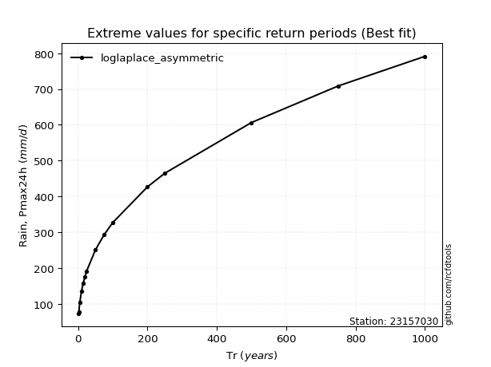</img>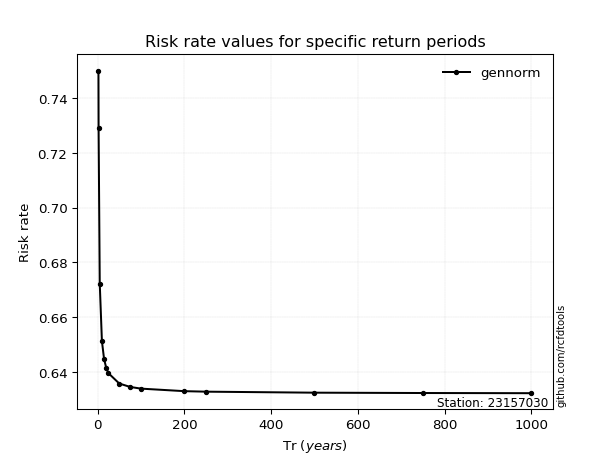</img>

</div>


<sub>**APP DISCLAIMER**: NO WARRANTY - This software is provided by [github.com/rcfdtools](https://github.com/rcfdtools) "as is", without any express or implied warranty, including warranties of merchantability, fitness for a particular purpose, or non-infringement. There is no guarantee that the software will be error-free or operate without interruption. LIMITATION OF LIABILITY - Neither the authors nor copyright holders will be liable for claims or damages arising from the software or its use. You are responsible for determining if the software is appropriate for your use and assume all associated risks, including errors, legal compliance, and data loss. NO PROFESSIONAL ADVICE - The software provides general information and does not offer professional advice. It should not replace consultation with professional advisors.</sub>