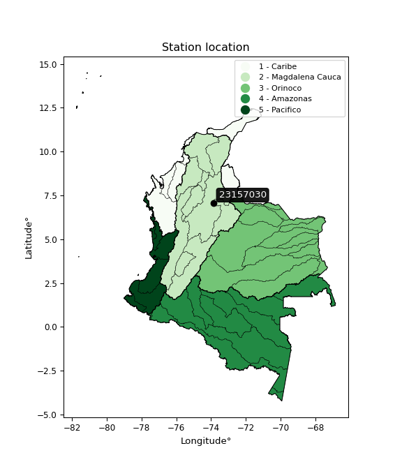

<div align="center">


</div>

# PMax24h Station (Rain, Pmax24h): 23157030

Maximum Precipitation in 24 hours (PMax24h) is the greatest amount of rainfall for a specific duration that is meteorologically possible for a given location, acting as a "worst-case" scenario for extreme storms, crucial for designing safety-critical infrastructure like bridges, river deviations, dams, spillways, and nuclear plants to prevent catastrophic failure. The PMax24h is related with the Probable Maximum Precipitation (PMP) and it is calculated by hydrologists using meteorological data to determine the upper limit of extreme rainfall, often leading to the Probable Maximum Flood (PMF) for flood control design, and is increasingly being studied for climate change impacts. Probable Maximum Precipitation (PMP) is the theoretical upper limit of rainfall, a deterministic estimate for extreme events, while probability distributions (like GEV, Gumbel) describe the likelihood and frequency of various precipitation amounts, including rare ones, showing how often events occur, with PMP representing the extreme end of these distributions, used for critical infrastructure design to ensure safety against the worst conceivable weather, unlike standard statistical forecasts which cover typical probabilities.

The most common probability distributions in hydrology, used for analyzing floods, rainfall, and streamflow, include the Normal, Log-Normal, Gumbel, Gamma (including Log-Pearson Type III), and Generalized Extreme Value (GEV) distributions, often chosen based on the data´s skewness and whether modeling extremes or general conditions, with Gumbel and GEV popular for extreme events like floods, while the Normal distribution serves as a baseline, though often requiring transformations for skewed hydrological data. These distributions help in designing water infrastructure, managing water resources, and forecasting hydrologic events.

> Hydrological data often isn´t perfectly normal (it´s skewed), so different distributions are needed for different applications, such as: **Flood Frequency Analysis**: Using Gumbel, GEV, or Log-Pearson Type III for predicting extreme flood magnitudes and their return periods, **Rainfall Analysis**: Normal for annual totals, but Log-Normal, Weibull, or GEV for intensity or extreme daily rainfall, **Streamflow Modeling**: Gamma and Log-Normal for maximum flows, GEV for minimum flows, and Kappa for daily flows.

<div align="center">

</img>

</div>


## A. General information


### 1. General running parameters

• app_version: _v20260225_. • runtime: _2026-02-27 14:50:08.749431_. • Python version: _3.14.0_. • SciPy version: _1.16.3_. • Pandas version: _2.3.3_. • NumPy version: _2.3.5_. • Stations dataset (station_dataset_file): _dataset/pmax24h_in/automatic_colombia_2003_2025.csv_. • Stations catalog (station_catalog_file): _dataset/CNE.xls_. • Minimum year to eval til year_max (date_min): _1900_. • Maximum year to eval since year_min (date_max): _2025_. • Creates, save and include plots into reports (create_plot): _False_. • Plot only fit distributions with Δo > Δ (plot_only_fit): _True_. • Plot only simple graphs avoiding multiple CDFs and multiple Extreme values plots (plot_only_simple): _False_. • Eval low extreme values, if False, evaluates high extreme values (low_extreme): _False_. • Eval every SciPy distribution as logarithmic (pdist_logarithmic_on): _True_. • Standard deviation normalized (ddof): _1.0_. • Return periods to eval in years (Tr): _[2, 2.33, 5, 10, 15, 20, 25, 50, 75, 100, 200, 250, 500, 750, 1000]_. • Minimum data sample per station, 0 means any (minimum_sample): _5_. • Z-Score maximum threshold to adjust a value, 0 means disable (zscore_max): _3.5_. • Z-Score minimum threshold to adjust a value, 0 means disable (zscore_min): _-2.5_. • Avoid zeros, e.g. rain = 0 (avoid_zeros): _True_. • Avoid null values (avoid_nans): _True_. 

:file_folder:Table: [dataset.csv](../../dataset/pmax24h_in/automatic_colombia_2003_2025.csv)

> Delta Degrees of Freedom (DDOF): is a parameter used in the formulas for calculating variance and standard deviation. When ddof=0, the divisor is $N$ (the total number of observations) and this is used when your data set is the entire population. When ddof=1, the divisor is $N-1$ and this is used when your data set is a sample drawn from a larger population. Using $N-1$ provides an unbiased estimate of the population variance (known as Bessel´s correction).


### 2. Station info and location

|   id |   CODIGO | NOMBRE                            | CATEGORIA    | TECNOLOGIA                              | ESTADO           | FECHA_INSTALACION   |   FECHA_SUSPENSION |   ALTITUD |   LATITUD |   LONGITUD | DEPARTAMENTO   | MUNICIPIO       | AREA_OPERATIVA                         | ENTIDAD                                                     | AREA_HIDROGRAFICA   | ZONA_HIDROGRAFICA   | SUBZONA_HIDROGRAFICA   | CORRIENTE   | Catalogo   |   Version |
|-----:|---------:|:----------------------------------|:-------------|:----------------------------------------|:-----------------|:--------------------|-------------------:|----------:|----------:|-----------:|:---------------|:----------------|:---------------------------------------|:------------------------------------------------------------|:--------------------|:--------------------|:-----------------------|:------------|:-----------|----------:|
|    0 | 23157030 | BARRANCABERMEJA  - AUT [23157030] | Limnimétrica | Automática con Telemetría, Convencional | En Mantenimiento | 15/06/1936          |                nan |        75 |   7.06019 |    -73.876 | Santander      | Barrancabermeja | Area Operativa 08 - Santanderes-Arauca | INSTITUTO DE HIDROLOGIA METEOROLOGIA Y ESTUDIOS AMBIENTALES | Magdalena Cauca     | Medio Magdalena     | Río Opón               | Magdalena   | CNE_IDEAM  |  20251226 |

<div align="center">

Dynamic map: [:earth_americas:Google](http://maps.google.com/maps?q=7.060194444,-73.876) [:earth_americas:OSM](https://www.openstreetmap.org/#map=18/7.060194444/-73.876&layers=P) [:earth_americas:Bing](https://www.bing.com/maps?cp=7.060194444~-73.876&lvl=18) [:earth_americas:Apple](https://maps.apple.com/frame?center=7.060194444%2C-73.876&span=0.003%2C0.006)

</div>


<div align="center">

```geojson
{
  "type": "Feature",
  "geometry": {
    "type": "Point", 
    "coordinates": [-73.876, 7.060194444]
  }, 
  "properties": {
    "Name": "23157030"
  }
}
```

</div>


### 3. Discrete values table and plot

<div align="center">

|               |           0 |          1 |          2 |          3 |            4 |           5 |          6 |           7 |           8 |           9 |         10 |          11 |
|:--------------|------------:|-----------:|-----------:|-----------:|-------------:|------------:|-----------:|------------:|------------:|------------:|-----------:|------------:|
| Date          | 2007        | 2008       | 2009       | 2010       | 2011         | 2012        | 2013       | 2014        | 2015        | 2016        | 2017       | 2018        |
| Value         |   70.5      |   27.5     |   75.5     |  133.3     |   84.5       |   45.8      |  195.8     |  104.2      |   58.6      |   86.8      |   29.3     |   60        |
| Value_initial |   70.5      |   27.5     |   75.5     |  133.3     |   84.5       |   45.8      |  195.8     |  104.2      |   58.6      |   86.8      |   29.3     |   60        |
| count         |   12        |   12       |   12       |   12       |   12         |   12        |   12       |   12        |   12        |   12        |   12       |   12        |
| mean          |   80.9833   |   80.9833  |   80.9833  |   80.9833  |   80.9833    |   80.9833   |   80.9833  |   80.9833   |   80.9833   |   80.9833   |   80.9833  |   80.9833   |
| std           |   47.055    |   47.055   |   47.055   |   47.055   |   47.055     |   47.055    |   47.055   |   47.055    |   47.055    |   47.055    |   47.055   |   47.055    |
| zscore        |   -0.222789 |   -1.13661 |   -0.11653 |    1.11182 |    0.0747352 |   -0.747707 |    2.44005 |    0.493394 |   -0.475685 |    0.123614 |   -1.09836 |   -0.445932 |


</div>


> The initial value (value_initial) correspond to the initial obtained or null completed value, and value (value) is adjusted only when the initial value is outside the valid range (outlier) definite through the Z-Score value. If Z-Score is active, values out of range or outliers are replaced with the station mean value. A Z-Score (or standard score) measures how many standard deviations a data point is from the mean of a dataset, indicating its relative position; positive scores mean above the mean, negative mean below, and a score of zero is exactly at the mean, allowing for comparison of values from different distributions. It´s calculated using the formula $z=(x–μ)/σ$, where $x$ is the data point, $μ$ is the mean, and $σ$ is the standard deviation, helping identify outliers and understand probability.
>
> <sub>**Note**: In this study, "completing" (filling gaps in) and "extending" (forecasting or lengthening the historical record) rainfall data series are avoided for certain critical analyses because they introduce artificial bias and uncertainty, which can distort the statistics of rare events (extremes), alter day-to-day variability, and compromise the integrity and homogeneity of the original data. Some reasons against Completing/Extending rainfall data are: **Distortion of Extremes and Variability**: The primary issue is that most gap-filling or extension methods rely on averaging or regression with nearby stations, which inherently smooths the data. Rainfall is highly variable in space and time, with a large percentage of zero values and occasional large storms. Infilling methods often underestimate the highest values and overestimate the lowest (zero) values, which severely distorts analyses focused on flood frequency, drought severity, and intensity-duration-frequency (IDF) curves, **Loss of Data Homogeneity**: Infilled or extended data are synthetic estimates, not actual measurements. Combining these estimates with observed data can violate the assumption of data homogeneity, which requires that the data properties do not change over time. Inhomogeneity can lead to incorrect conclusions about long-term trends or changes in climate patterns, **Propagation of Errors**: Errors and biases from the original data (e.g., wind-induced undercatch, instrument errors, site changes) or the data used for imputation can propagate through the analysis, leading to unreliable hydrological models and inaccurate predictions, **Compromised Statistical Integrity**: For statistical analyses, especially those involving the frequency of events, using artificial data can introduce time bias or autocorrelation that doesn´t exist in reality, making it difficult to assess the true probability of events, **Difficulty in Validation**: It is difficult to accurately validate the quality of filled or extended data, especially for past periods where ground-truth measurements are unavailable. The reliability of imputation techniques heavily depends on the density of the surrounding station network and the complexity of the local topography.</sub>


### 4. Active continuous probability distributions from SciPy (80 of 104 available)

A Probability Density Function (PDF) describes the relative likelihood of a continuous random variable falling within a specific range, where the total area under its curve equals 1, and the area over any interval gives the actual probability for that range. Unlike discrete probabilities (like rolling a die), a PDF shows density, not direct probability for a single point (which is zero), with higher points indicating higher likelihood, often visualized as a bell curve for normal distributions.

A log of a probability density function (log-PDF) is simply the logarithm of the PDF´s value, denoted as $log(f(x))$, useful for converting multiplication of probabilities into addition, improving numerical stability with tiny numbers, and connecting to information theory concepts like entropy. Instead of dealing with very small probabilities (e.g., 0.000001), log-PDFs use negative numbers (e.g., $log(0.00001) ≈ -11.51$ that are easier for computers to handle, preventing underflow errors and simplifying complex calculations. In this study, each active probability distribution from SciPy is also evaluated in the $log$ form.

[scipy.stats](https://docs.scipy.org/doc/scipy/reference/stats.html) is a Python´s powerful submodule within the SciPy library for comprehensive statistical analysis, offering over 130 probability distributions (like Normal, Poisson, etc.), functions for descriptive stats (mean, variance), hypothesis testing (t-tests, chi-square), random variable generation, and statistical tests, making it essential for data science, modeling, and research. It provides tools to explore, model, and draw conclusions from data efficiently, working seamlessly with [NumPy](https://numpy.org/).

<div align="center">

|   id | p_dist           |   n_parameter | fit_method   | label                                                                       | active   | ref                                                                                                      |
|-----:|:-----------------|--------------:|:-------------|:----------------------------------------------------------------------------|:---------|:---------------------------------------------------------------------------------------------------------|
|    0 | alpha            |             3 | MLE          | Alpha                                                                       | True     | [:mortar_board:](https://docs.scipy.org/doc/scipy/reference/generated/scipy.stats.alpha.html)            |
|    1 | anglit           |             2 | MM           | Anglit                                                                      | True     | [:mortar_board:](https://docs.scipy.org/doc/scipy/reference/generated/scipy.stats.anglit.html)           |
|    2 | arcsine          |             2 | MM           | Arcsine                                                                     | True     | [:mortar_board:](https://docs.scipy.org/doc/scipy/reference/generated/scipy.stats.arcsine.html)          |
|    3 | argus            |             3 | MLE          | Argus                                                                       | True     | [:mortar_board:](https://docs.scipy.org/doc/scipy/reference/generated/scipy.stats.argus.html)            |
|    4 | beta             |             4 | MLE          | Beta                                                                        | True     | [:mortar_board:](https://docs.scipy.org/doc/scipy/reference/generated/scipy.stats.beta.html)             |
|    5 | betaprime        |             4 | MLE          | Beta prime                                                                  | True     | [:mortar_board:](https://docs.scipy.org/doc/scipy/reference/generated/scipy.stats.betaprime.html)        |
|    6 | bradford         |             3 | MLE          | Bradford                                                                    | True     | [:mortar_board:](https://docs.scipy.org/doc/scipy/reference/generated/scipy.stats.bradford.html)         |
|    7 | burr             |             4 | MLE          | Burr (Type III)                                                             | True     | [:mortar_board:](https://docs.scipy.org/doc/scipy/reference/generated/scipy.stats.burr.html)             |
|    8 | burr12           |             4 | MLE          | Burr (Type III) 12                                                          | True     | [:mortar_board:](https://docs.scipy.org/doc/scipy/reference/generated/scipy.stats.burr12.html)           |
|    9 | cosine           |             2 | MLE          | Cosine                                                                      | True     | [:mortar_board:](https://docs.scipy.org/doc/scipy/reference/generated/scipy.stats.cosine.html)           |
|   10 | crystalball      |             4 | MLE          | Crystalball                                                                 | True     | [:mortar_board:](https://docs.scipy.org/doc/scipy/reference/generated/scipy.stats.crystalball.html)      |
|   11 | dgamma           |             3 | MLE          | Double gamma                                                                | True     | [:mortar_board:](https://docs.scipy.org/doc/scipy/reference/generated/scipy.stats.dgamma.html)           |
|   12 | dweibull         |             3 | MLE          | Double Weibull                                                              | True     | [:mortar_board:](https://docs.scipy.org/doc/scipy/reference/generated/scipy.stats.dweibull.html)         |
|   13 | erlang           |             3 | MLE          | Erlang                                                                      | True     | [:mortar_board:](https://docs.scipy.org/doc/scipy/reference/generated/scipy.stats.erlang.html)           |
|   14 | exponnorm        |             3 | MLE          | Exponentially modified Normal                                               | True     | [:mortar_board:](https://docs.scipy.org/doc/scipy/reference/generated/scipy.stats.exponnorm.html)        |
|   15 | exponpow         |             3 | MLE          | Exponential power                                                           | True     | [:mortar_board:](https://docs.scipy.org/doc/scipy/reference/generated/scipy.stats.exponpow.html)         |
|   16 | exponweib        |             4 | MLE          | Exponentiated Weibull                                                       | True     | [:mortar_board:](https://docs.scipy.org/doc/scipy/reference/generated/scipy.stats.exponweib.html)        |
|   17 | f                |             4 | MLE          | F                                                                           | True     | [:mortar_board:](https://docs.scipy.org/doc/scipy/reference/generated/scipy.stats.f.html)                |
|   18 | fatiguelife      |             3 | MLE          | Fatigue-life (Birnbaum-Saunders)                                            | True     | [:mortar_board:](https://docs.scipy.org/doc/scipy/reference/generated/scipy.stats.fatiguelife.html)      |
|   19 | foldnorm         |             3 | MM           | Fold Normal                                                                 | True     | [:mortar_board:](https://docs.scipy.org/doc/scipy/reference/generated/scipy.stats.foldnorm.html)         |
|   20 | gamma            |             3 | MLE          | Gamma                                                                       | True     | [:mortar_board:](https://docs.scipy.org/doc/scipy/reference/generated/scipy.stats.gamma.html)            |
|   21 | gausshyper       |             6 | MLE          | Gauss hypergeometric                                                        | True     | [:mortar_board:](https://docs.scipy.org/doc/scipy/reference/generated/scipy.stats.gausshyper.html)       |
|   22 | genexpon         |             5 | MLE          | Generalized exponential                                                     | True     | [:mortar_board:](https://docs.scipy.org/doc/scipy/reference/generated/scipy.stats.genexpon.html)         |
|   23 | genextreme       |             3 | MLE          | Generalized exponential                                                     | True     | [:mortar_board:](https://docs.scipy.org/doc/scipy/reference/generated/scipy.stats.genextreme.html)       |
|   24 | gengamma         |             4 | MLE          | Generalized gamma                                                           | True     | [:mortar_board:](https://docs.scipy.org/doc/scipy/reference/generated/scipy.stats.gengamma.html)         |
|   25 | genhalflogistic  |             3 | MLE          | Generalized half-logistic                                                   | True     | [:mortar_board:](https://docs.scipy.org/doc/scipy/reference/generated/scipy.stats.genhalflogistic.html)  |
|   26 | genlogistic      |             3 | MLE          | Generalized logistic                                                        | True     | [:mortar_board:](https://docs.scipy.org/doc/scipy/reference/generated/scipy.stats.genlogistic.html)      |
|   27 | gennorm          |             3 | MLE          | Generalized Normal                                                          | True     | [:mortar_board:](https://docs.scipy.org/doc/scipy/reference/generated/scipy.stats.gennorm.html)          |
|   28 | genpareto        |             3 | MLE          | Generalized Pareto                                                          | True     | [:mortar_board:](https://docs.scipy.org/doc/scipy/reference/generated/scipy.stats.genpareto.html)        |
|   29 | gompertz         |             3 | MLE          | Gompertz (or truncated Gumbel)                                              | True     | [:mortar_board:](https://docs.scipy.org/doc/scipy/reference/generated/scipy.stats.gompertz.html)         |
|   30 | gumbel_l         |             2 | MM           | Gumbel Left Skew                                                            | True     | [:mortar_board:](https://docs.scipy.org/doc/scipy/reference/generated/scipy.stats.gumbel_l.html)         |
|   31 | gumbel_r         |             2 | MM           | Gumbel Right Skew                                                           | True     | [:mortar_board:](https://docs.scipy.org/doc/scipy/reference/generated/scipy.stats.gumbel_r.html)         |
|   32 | halfgennorm      |             3 | MLE          | Upper half of a generalized normal                                          | True     | [:mortar_board:](https://docs.scipy.org/doc/scipy/reference/generated/scipy.stats.halfgennorm.html)      |
|   33 | halflogistic     |             2 | MM           | Half-logistic                                                               | True     | [:mortar_board:](https://docs.scipy.org/doc/scipy/reference/generated/scipy.stats.halflogistic.html)     |
|   34 | halfnorm         |             2 | MM           | Half Normal                                                                 | True     | [:mortar_board:](https://docs.scipy.org/doc/scipy/reference/generated/scipy.stats.halfnorm.html)         |
|   35 | hypsecant        |             2 | MM           | hyperbolic secant                                                           | True     | [:mortar_board:](https://docs.scipy.org/doc/scipy/reference/generated/scipy.stats.hypsecant.html)        |
|   36 | invgamma         |             3 | MLE          | Inverted gamma                                                              | True     | [:mortar_board:](https://docs.scipy.org/doc/scipy/reference/generated/scipy.stats.invgamma.html)         |
|   37 | invgauss         |             3 | MLE          | Inverse Gaussian                                                            | True     | [:mortar_board:](https://docs.scipy.org/doc/scipy/reference/generated/scipy.stats.invgauss.html)         |
|   38 | invweibull       |             3 | MLE          | Inverted Weibull                                                            | True     | [:mortar_board:](https://docs.scipy.org/doc/scipy/reference/generated/scipy.stats.invweibull.html)       |
|   39 | johnsonsb        |             4 | MLE          | Johnson SB                                                                  | True     | [:mortar_board:](https://docs.scipy.org/doc/scipy/reference/generated/scipy.stats.johnsonsb.html)        |
|   40 | johnsonsu        |             4 | MLE          | Johnson Su                                                                  | True     | [:mortar_board:](https://docs.scipy.org/doc/scipy/reference/generated/scipy.stats.johnsonsu.html)        |
|   41 | kappa3           |             3 | MLE          | Kappa 3                                                                     | True     | [:mortar_board:](https://docs.scipy.org/doc/scipy/reference/generated/scipy.stats.kappa3.html)           |
|   42 | kappa4           |             4 | MLE          | Kappa 4                                                                     | True     | [:mortar_board:](https://docs.scipy.org/doc/scipy/reference/generated/scipy.stats.kappa4.html)           |
|   43 | ksone            |             3 | MLE          | Kolmogorov-Smirnov one-sided test statistic distribution                    | True     | [:mortar_board:](https://docs.scipy.org/doc/scipy/reference/generated/scipy.stats.ksone.html)            |
|   44 | kstwobign        |             2 | MLE          | Limiting distribution of scaled Kolmogorov-Smirnov two-sided test statistic | True     | [:mortar_board:](https://docs.scipy.org/doc/scipy/reference/generated/scipy.stats.kstwobign.html)        |
|   45 | laplace          |             2 | MM           | Laplace                                                                     | True     | [:mortar_board:](https://docs.scipy.org/doc/scipy/reference/generated/scipy.stats.laplace.html)          |
|   46 | levy_l           |             2 | MLE          | Left-skewed Levy                                                            | True     | [:mortar_board:](https://docs.scipy.org/doc/scipy/reference/generated/scipy.stats.levy_l.html)           |
|   47 | loggamma         |             3 | MLE          | Log gamma                                                                   | True     | [:mortar_board:](https://docs.scipy.org/doc/scipy/reference/generated/scipy.stats.loggamma.html)         |
|   48 | logistic         |             2 | MM           | Logistic (or Sech-squared)                                                  | True     | [:mortar_board:](https://docs.scipy.org/doc/scipy/reference/generated/scipy.stats.logistic.html)         |
|   49 | loglaplace       |             3 | MLE          | Log-Laplace                                                                 | True     | [:mortar_board:](https://docs.scipy.org/doc/scipy/reference/generated/scipy.stats.loglaplace.html)       |
|   50 | lomax            |             3 | MLE          | Lomax (Pareto of the second kind)                                           | True     | [:mortar_board:](https://docs.scipy.org/doc/scipy/reference/generated/scipy.stats.lomax.html)            |
|   51 | maxwell          |             2 | MM           | Maxwell                                                                     | True     | [:mortar_board:](https://docs.scipy.org/doc/scipy/reference/generated/scipy.stats.maxwell.html)          |
|   52 | mielke           |             4 | MLE          | Mielke Beta-Kappa / Dagum                                                   | True     | [:mortar_board:](https://docs.scipy.org/doc/scipy/reference/generated/scipy.stats.mielke.html)           |
|   53 | moyal            |             2 | MM           | Moyal                                                                       | True     | [:mortar_board:](https://docs.scipy.org/doc/scipy/reference/generated/scipy.stats.moyal.html)            |
|   54 | nakagami         |             3 | MLE          | Nakagami                                                                    | True     | [:mortar_board:](https://docs.scipy.org/doc/scipy/reference/generated/scipy.stats.nakagami.html)         |
|   55 | ncf              |             5 | MLE          | Non-central F distribution                                                  | True     | [:mortar_board:](https://docs.scipy.org/doc/scipy/reference/generated/scipy.stats.ncf.html)              |
|   56 | nct              |             4 | MLE          | Non-central Student’s t                                                     | True     | [:mortar_board:](https://docs.scipy.org/doc/scipy/reference/generated/scipy.stats.nct.html)              |
|   57 | norm             |             2 | MM           | Normal                                                                      | True     | [:mortar_board:](https://docs.scipy.org/doc/scipy/reference/generated/scipy.stats.norm.html)             |
|   58 | pearson3         |             3 | MM           | Pearson type III                                                            | True     | [:mortar_board:](https://docs.scipy.org/doc/scipy/reference/generated/scipy.stats.pearson3.html)         |
|   59 | powerlaw         |             3 | MLE          | Power-function                                                              | True     | [:mortar_board:](https://docs.scipy.org/doc/scipy/reference/generated/scipy.stats.powerlaw.html)         |
|   60 | rayleigh         |             2 | MM           | Rayleigh                                                                    | True     | [:mortar_board:](https://docs.scipy.org/doc/scipy/reference/generated/scipy.stats.rayleigh.html)         |
|   61 | rdist            |             3 | MLE          | R-distributed (symmetric beta)                                              | True     | [:mortar_board:](https://docs.scipy.org/doc/scipy/reference/generated/scipy.stats.rdist.html)            |
|   62 | rice             |             3 | MLE          | Rice                                                                        | True     | [:mortar_board:](https://docs.scipy.org/doc/scipy/reference/generated/scipy.stats.rice.html)             |
|   63 | semicircular     |             2 | MM           | Semicircular                                                                | True     | [:mortar_board:](https://docs.scipy.org/doc/scipy/reference/generated/scipy.stats.semicircular.html)     |
|   64 | skewnorm         |             3 | MLE          | Skew normal                                                                 | True     | [:mortar_board:](https://docs.scipy.org/doc/scipy/reference/generated/scipy.stats.skewnorm.html)         |
|   65 | t                |             3 | MLE          | Student’s t                                                                 | True     | [:mortar_board:](https://docs.scipy.org/doc/scipy/reference/generated/scipy.stats.t.html)                |
|   66 | trapezoid        |             4 | MLE          | Trapezoid                                                                   | True     | [:mortar_board:](https://docs.scipy.org/doc/scipy/reference/generated/scipy.stats.trapezoid.html)        |
|   67 | triang           |             3 | MLE          | Triangular                                                                  | True     | [:mortar_board:](https://docs.scipy.org/doc/scipy/reference/generated/scipy.stats.triang.html)           |
|   68 | truncexpon       |             3 | MLE          | Truncated exponential                                                       | True     | [:mortar_board:](https://docs.scipy.org/doc/scipy/reference/generated/scipy.stats.truncexpon.html)       |
|   69 | truncnorm        |             4 | MLE          | Truncated normal                                                            | True     | [:mortar_board:](https://docs.scipy.org/doc/scipy/reference/generated/scipy.stats.truncnorm.html)        |
|   70 | truncpareto      |             4 | MLE          | Upper truncated Pareto                                                      | True     | [:mortar_board:](https://docs.scipy.org/doc/scipy/reference/generated/scipy.stats.truncpareto.html)      |
|   71 | truncweibull_min |             5 | MLE          | Doubly truncated Weibull minimum                                            | True     | [:mortar_board:](https://docs.scipy.org/doc/scipy/reference/generated/scipy.stats.truncweibull_min.html) |
|   72 | tukeylambda      |             3 | MLE          | Tukey-Lamdba                                                                | True     | [:mortar_board:](https://docs.scipy.org/doc/scipy/reference/generated/scipy.stats.tukeylambda.html)      |
|   73 | uniform          |             2 | MLE          | Uniform                                                                     | True     | [:mortar_board:](https://docs.scipy.org/doc/scipy/reference/generated/scipy.stats.uniform.html)          |
|   74 | vonmises         |             3 | MLE          | Von Mises                                                                   | True     | [:mortar_board:](https://docs.scipy.org/doc/scipy/reference/generated/scipy.stats.vonmises.html)         |
|   75 | vonmises_line    |             3 | MLE          | Von Mises line                                                              | True     | [:mortar_board:](https://docs.scipy.org/doc/scipy/reference/generated/scipy.stats.vonmises_line.html)    |
|   76 | wald             |             2 | MM           | Wald                                                                        | True     | [:mortar_board:](https://docs.scipy.org/doc/scipy/reference/generated/scipy.stats.wald.html)             |
|   77 | weibull_max      |             3 | MLE          | Weibull maximum                                                             | True     | [:mortar_board:](https://docs.scipy.org/doc/scipy/reference/generated/scipy.stats.weibull_max.html)      |
|   78 | weibull_min      |             3 | MLE          | Weibull minimum                                                             | True     | [:mortar_board:](https://docs.scipy.org/doc/scipy/reference/generated/scipy.stats.weibull_min.html)      |
|   79 | wrapcauchy       |             3 | MLE          | Wrapped  Cauchy                                                             | True     | [:mortar_board:](https://docs.scipy.org/doc/scipy/reference/generated/scipy.stats.wrapcauchy.html)       |

</div>

> **n_parameter:** # arguments & localization & scale.
>
> **Fit methods:** (MLE) maximum likelihood, (MM) L-moments.
>
>**Inactive** (With the only purpose of prevent loops, zero divisions, infinite values, over high estimated values or horizontal trending for recurrence intervals estimations, the follow distributions were disabled.)**:** lognorm, norminvgauss, powernorm, powerlognorm, cauchy, halfcauchy, foldcauchy, skewcauchy, chi2, expon, fisk, genhyperbolic, geninvgauss, gibrat, kstwo, laplace_asymmetric, levy, levy_stable, ncx2, pareto, rel_breitwigner, recipinvgauss, studentized_range, loguniform, 


## B. Probability (PDF) vs. Empirical (EDF) distributions functions

A continuous probability distribution (CPD) describes probabilities for variables that can take any value within a range (like rain any time), unlike discrete variables with specific outcomes (like temperature). It uses a Probability Density Function (PDF), a curve where the total area under it equals 1, and the probability of the variable falling within an interval (a to b) is found by calculating the area under the curve between those points. A key feature is that the probability of hitting any single exact value is zero, so probabilities are always expressed for ranges, e.g., $P(a ≤ X ≤ b)$.

<div align="center">

Distributions parameters from station values
|     |   station | p_dist              |   n |             loc |          scale | shape                  | shape1                 | shape2                 | shape3             |
|----:|----------:|:--------------------|----:|----------------:|---------------:|:-----------------------|:-----------------------|:-----------------------|:-------------------|
|   0 |  23157030 | alpha               |  12 |    -81.027      |  632.47        | 4.167945470793813      |                        |                        |                    |
|   1 |  23157030 | anglit              |  12 |     80.9833     |  131.794       |                        |                        |                        |                    |
|   2 |  23157030 | arcsine             |  12 |     17.2706     |  127.426       |                        |                        |                        |                    |
|   3 |  23157030 | argus               |  12 |    -34.9366     |  236.286       | 1.1581885913097345e-06 |                        |                        |                    |
|   4 |  23157030 | beta                |  12 |     27.5        |  184.338       | 0.6566806913810428     | 1.6564402675795542     |                        |                    |
|   5 |  23157030 | betaprime           |  12 |     19.3678     |  304.879       | 2.1109220627106184     | 12.073467357967761     |                        |                    |
|   6 |  23157030 | bradford            |  12 |     27.432      |  168.368       | 8.362614197086483      |                        |                        |                    |
|   7 |  23157030 | burr                |  12 |     -0.276198   |   77.1664      | 3.446226475229314      | 0.8329824118815803     |                        |                    |
|   8 |  23157030 | burr12              |  12 |     -0.70464    |   27.9501      | 363.9416293970353      | 0.002956734472745027   |                        |                    |
|   9 |  23157030 | cosine              |  12 |     90.4068     |   42.3188      |                        |                        |                        |                    |
|  10 |  23157030 | crystalball         |  12 |     80.9833     |   45.0517      | 3925.8108383952995     | 13496.286940292433     |                        |                    |
|  11 |  23157030 | dgamma              |  12 |     73.034      |   29.9176      | 1.0818582527931566     |                        |                        |                    |
|  12 |  23157030 | dweibull            |  12 |     73.1384     |   32.7799      | 1.0302681253203927     |                        |                        |                    |
|  13 |  23157030 | erlang              |  12 |     27.5        |   50.4276      | 0.8427689431423265     |                        |                        |                    |
|  14 |  23157030 | exponnorm           |  12 |     38.3505     |   16.9383      | 2.5169426718279784     |                        |                        |                    |
|  15 |  23157030 | exponpow            |  12 |     27.5        |  112.86        | 0.7642854480827559     |                        |                        |                    |
|  16 |  23157030 | exponweib           |  12 |     27.4997     |   63.044       | 0.47653691046139035    | 1.3308546808541708     |                        |                    |
|  17 |  23157030 | f                   |  12 |     -0.484609   |   72.4134      | 12.27146922177036      | 17.760633414154228     |                        |                    |
|  18 |  23157030 | fatiguelife         |  12 |     27.4828     |    1.84429     | 5.971338519328537      |                        |                        |                    |
|  19 |  23157030 | foldnorm            |  12 |     20.0514     |   75.9324      | 0.059751566876367374   |                        |                        |                    |
|  20 |  23157030 | gamma               |  12 |     27.5        |   42.6895      | 0.9105297135555462     |                        |                        |                    |
|  21 |  23157030 | gausshyper          |  12 |     10.9007     |  184.899       | 0.5674181596761766     | 0.2228168082830629     | 1.9146680102585754     | 1.1506699743001003 |
|  22 |  23157030 | genexpon            |  12 |     27.4999     |    2.09576     | 0.03912378566313858    | 7.126787269157952e-08  | 1.1901756106586001     |                    |
|  23 |  23157030 | genextreme          |  12 |     58.9365     |   30.3955      | -0.13705338331021277   |                        |                        |                    |
|  24 |  23157030 | gengamma            |  12 |     27.5        |   37.8762      | 0.8712805314409577     | 0.7587843215712973     |                        |                    |
|  25 |  23157030 | genhalflogistic     |  12 |     10.9725     |  191.615       | 1.036721091194353      |                        |                        |                    |
|  26 |  23157030 | genlogistic         |  12 |   -159.889      |   32.326       | 935.9308570398609      |                        |                        |                    |
|  27 |  23157030 | gennorm             |  12 |     74.015      |   32.7044      | 1.0073683134866087     |                        |                        |                    |
|  28 |  23157030 | genpareto           |  12 |     27.5        |   66.4648      | -0.23718022463612287   |                        |                        |                    |
|  29 |  23157030 | gompertz            |  12 |     27.5        |  225.314       | 3.381517829367107      |                        |                        |                    |
|  30 |  23157030 | gumbel_l            |  12 |    101.259      |   35.1267      |                        |                        |                        |                    |
|  31 |  23157030 | gumbel_r            |  12 |     60.7077     |   35.1267      |                        |                        |                        |                    |
|  32 |  23157030 | halfgennorm         |  12 |     27.5        |    0.914311    | 0.31463567135827564    |                        |                        |                    |
|  33 |  23157030 | halflogistic        |  12 |     27.5866     |   38.5176      |                        |                        |                        |                    |
|  34 |  23157030 | halfnorm            |  12 |     21.3525     |   74.7362      |                        |                        |                        |                    |
|  35 |  23157030 | hypsecant           |  12 |     80.9833     |   28.6808      |                        |                        |                        |                    |
|  36 |  23157030 | invgamma            |  12 |    -23.4109     |  582.085       | 6.554409531984412      |                        |                        |                    |
|  37 |  23157030 | invgauss            |  12 |      0.471619   |  230.397       | 0.34944824434213617    |                        |                        |                    |
|  38 |  23157030 | invweibull          |  12 |   -162.84       |  221.776       | 7.296352596878114      |                        |                        |                    |
|  39 |  23157030 | johnsonsb           |  12 |     27.5        |  168.319       | 0.7473651610290516     | 0.133249127054749      |                        |                    |
|  40 |  23157030 | johnsonsu           |  12 |      2.80611    |    1.64295     | -7.675923915442491     | 1.745939169850113      |                        |                    |
|  41 |  23157030 | kappa3              |  12 |     27.5        |   58.4455      | 3.2861986355448263     |                        |                        |                    |
|  42 |  23157030 | kappa4              |  12 |     10.8234     |  187.964       | 1.096475258096732      | 1.01614872097241       |                        |                    |
|  43 |  23157030 | ksone               |  12 |     10.67       |  201.96        | 1.0                    |                        |                        |                    |
|  44 |  23157030 | kstwobign           |  12 |    -55.9866     |  158.275       |                        |                        |                        |                    |
|  45 |  23157030 | laplace             |  12 |     80.9833     |   31.8564      |                        |                        |                        |                    |
|  46 |  23157030 | levy_l              |  12 |    209.09       |   75.2725      |                        |                        |                        |                    |
|  47 |  23157030 | loggamma            |  12 | -14838.3        | 1980.59        | 1868.8215777301584     |                        |                        |                    |
|  48 |  23157030 | logistic            |  12 |     80.9833     |   24.8383      |                        |                        |                        |                    |
|  49 |  23157030 | loglaplace          |  12 |     -0.16579    |   70.6659      | 2.3574033363600893     |                        |                        |                    |
|  50 |  23157030 | lomax               |  12 |     27.5        | 2568.31        | 48.100175350468426     |                        |                        |                    |
|  51 |  23157030 | maxwell             |  12 |    -25.7703     |   66.8979      |                        |                        |                        |                    |
|  52 |  23157030 | mielke              |  12 |     27.4948     |   83.9813      | 0.835162186664357      | 3.4826230680682517     |                        |                    |
|  53 |  23157030 | moyal               |  12 |     55.2199     |   20.2804      |                        |                        |                        |                    |
|  54 |  23157030 | nakagami            |  12 |     27.5        |   80.4329      | 0.317544624201343      |                        |                        |                    |
|  55 |  23157030 | ncf                 |  12 |     -0.262787   |   39.2224      | 11.232740263453246     | 15.633087165259795     | 9.02655385553041       |                    |
|  56 |  23157030 | nct                 |  12 |     -0.109081   |   21.4979      | 3.9819857114708923     | 3.030064606635925      |                        |                    |
|  57 |  23157030 | norm                |  12 |     80.9833     |   45.0517      |                        |                        |                        |                    |
|  58 |  23157030 | pearson3            |  12 |     80.9833     |   45.0518      | 1.1967672193024468     |                        |                        |                    |
|  59 |  23157030 | powerlaw            |  12 |     27.5        |  168.3         | 0.22025766975508576    |                        |                        |                    |
|  60 |  23157030 | rayleigh            |  12 |     -5.20325    |   68.7669      |                        |                        |                        |                    |
|  61 |  23157030 | rdist               |  12 |     11.7344     |   92.4656      | 1.1194170893561837     |                        |                        |                    |
|  62 |  23157030 | rice                |  12 |      6.94665    |   61.2825      | 0.00028663972538017925 |                        |                        |                    |
|  63 |  23157030 | semicircular        |  12 |     80.9833     |   90.1034      |                        |                        |                        |                    |
|  64 |  23157030 | skewnorm            |  12 |     27.5        |   69.9283      | 80193020.02030422      |                        |                        |                    |
|  65 |  23157030 | t                   |  12 |     80.9547     |   45.1164      | 13.35377916346286      |                        |                        |                    |
|  66 |  23157030 | trapezoid           |  12 |     10.67       |  201.96        | 1.0                    | 1.0                    |                        |                    |
|  67 |  23157030 | triang              |  12 |     24.1268     |  196.323       | 8.922446507489938e-06  |                        |                        |                    |
|  68 |  23157030 | truncexpon          |  12 |     11.7423     |  165.738       | 1.1105337312734829     |                        |                        |                    |
|  69 |  23157030 | truncnorm           |  12 |     80.9833     |   45.0517      | -1453.5804265687052    | 66115.77470053585      |                        |                    |
|  70 |  23157030 | truncpareto         |  12 |   -156.676      |  184.176       | 2.5551412433127183     | 1.913799013125369      |                        |                    |
|  71 |  23157030 | truncweibull_min    |  12 |     26.993      |  164.808       | 0.6328598547313664     | 0.0030765848243526463  | 1.0251168160907356     |                    |
|  72 |  23157030 | tukeylambda         |  12 |     71.6489     |   16.8472      | -0.227416234774297     |                        |                        |                    |
|  73 |  23157030 | uniform             |  12 |     27.5        |  168.3         |                        |                        |                        |                    |
|  74 |  23157030 | vonmises            |  12 |      2.21196    |    1           | 0.7073378713375218     |                        |                        |                    |
|  75 |  23157030 | vonmises_line       |  12 |     25.9796     |   24.8984      | 3.5689661792074785e-06 |                        |                        |                    |
|  76 |  23157030 | wald                |  12 |     35.9316     |   45.0517      |                        |                        |                        |                    |
|  77 |  23157030 | weibull_max         |  12 |    195.8        |    1.73326     | 0.21952873663957911    |                        |                        |                    |
|  78 |  23157030 | weibull_min         |  12 |     27.5        |   49.1771      | 0.828790109870583      |                        |                        |                    |
|  79 |  23157030 | wrapcauchy          |  12 |     27.4944     |   26.7867      | 0.12500924886886053    |                        |                        |                    |
|  80 |  23157030 | logalpha            |  12 |     -6.27372    |  201.957       | 19.246661011613945     |                        |                        |                    |
|  81 |  23157030 | loganglit           |  12 |      4.2481     |    1.59905     |                        |                        |                        |                    |
|  82 |  23157030 | logarcsine          |  12 |      3.47512    |    1.54598     |                        |                        |                        |                    |
|  83 |  23157030 | logargus            |  12 |      2.89948    |    2.44347     | 8.318965781580856e-05  |                        |                        |                    |
|  84 |  23157030 | logbeta             |  12 |      3.31272    |    1.96438     | 0.3969423546052042     | 0.5120847175848134     |                        |                    |
|  85 |  23157030 | logbetaprime        |  12 |     -6.16901    |   14.6239      | 597.5891880547117      | 840.0770973901957      |                        |                    |
|  86 |  23157030 | logbradford         |  12 |      3.31418    |    1.96291     | 1.0604188957836564     |                        |                        |                    |
|  87 |  23157030 | logburr             |  12 |     -0.0876642  |    4.59724     | 18.129846984303967     | 0.5390176326934776     |                        |                    |
|  88 |  23157030 | logburr12           |  12 |      2.6833     |    5.1695      | 3.2317912410851286     | 33.571321876990126     |                        |                    |
|  89 |  23157030 | logcosine           |  12 |      4.24931    |    0.470303    |                        |                        |                        |                    |
|  90 |  23157030 | logcrystalball      |  12 |      4.2481     |    0.546608    | 487.98945829240347     | 29.691732192833456     |                        |                    |
|  91 |  23157030 | logdgamma           |  12 |      4.28767    |    0.358831    | 1.1853068092201573     |                        |                        |                    |
|  92 |  23157030 | logdweibull         |  12 |      4.28644    |    0.44498     | 1.1385566516244792     |                        |                        |                    |
|  93 |  23157030 | logerlang           |  12 |    -16.711      |    0.014308    | 1464.8100422240868     |                        |                        |                    |
|  94 |  23157030 | logexponnorm        |  12 |      4.24747    |    0.546608    | 0.001163826190291426   |                        |                        |                    |
|  95 |  23157030 | logexponpow         |  12 |      3.31419    |    1.47057     | 0.7199441474025381     |                        |                        |                    |
|  96 |  23157030 | logexponweib        |  12 |      3.31419    |    1.7845      | 0.09694244511301126    | 6.099977619807921      |                        |                    |
|  97 |  23157030 | logf                |  12 |   -141.63       |  145.878       | 441416.2843795832      | 209706.59120357456     |                        |                    |
|  98 |  23157030 | logfatiguelife      |  12 |    -71.1544     |   75.402       | 0.007239789601845299   |                        |                        |                    |
|  99 |  23157030 | logfoldnorm         |  12 |      3.44462    |    0.649168    | 1.1026375653847968     |                        |                        |                    |
| 100 |  23157030 | loggamma            |  12 |    -17.1114     |    0.0140194   | 1523.537576705351      |                        |                        |                    |
| 101 |  23157030 | loggausshyper       |  12 |      3.31035    |    1.96675     | 0.9901317066321356     | 0.8515448515464177     | 1.007464298801107      | 0.9978112005592067 |
| 102 |  23157030 | loggenexpon         |  12 |      3.31374    |    0.00697149  | 0.0030318270629897956  | 0.40172711759381097    | 0.00012291953412869264 |                    |
| 103 |  23157030 | loggenextreme       |  12 |      4.06756    |    0.556206    | 0.32913108812959857    |                        |                        |                    |
| 104 |  23157030 | loggengamma         |  12 |      3.31419    |    2.00249     | 0.05158207679115029    | 6.232727544548357      |                        |                    |
| 105 |  23157030 | loggenhalflogistic  |  12 |      3.26297    |    2.18001     | 1.0823593038793482     |                        |                        |                    |
| 106 |  23157030 | loggenlogistic      |  12 |      4.34667    |    0.290242    | 0.824635287693829      |                        |                        |                    |
| 107 |  23157030 | loggennorm          |  12 |      4.24675    |    0.782273    | 2.0473290769798247     |                        |                        |                    |
| 108 |  23157030 | loggenpareto        |  12 |     -0.0103764  |   11.6925      | -2.2113536377726954    |                        |                        |                    |
| 109 |  23157030 | loggompertz         |  12 |      3.31419    |    0.752106    | 0.2882672906840418     |                        |                        |                    |
| 110 |  23157030 | loggumbel_l         |  12 |      4.49411    |    0.426188    |                        |                        |                        |                    |
| 111 |  23157030 | loggumbel_r         |  12 |      4.0021     |    0.426188    |                        |                        |                        |                    |
| 112 |  23157030 | loghalfgennorm      |  12 |      3.31419    |    1.8877      | 6.696359541901955      |                        |                        |                    |
| 113 |  23157030 | loghalflogistic     |  12 |      3.60023    |    0.467343    |                        |                        |                        |                    |
| 114 |  23157030 | loghalfnorm         |  12 |      3.52459    |    0.906787    |                        |                        |                        |                    |
| 115 |  23157030 | loghypsecant        |  12 |      4.2481     |    0.347981    |                        |                        |                        |                    |
| 116 |  23157030 | loginvgamma         |  12 |     -5.78114    | 3345.23        | 334.6814183720445      |                        |                        |                    |
| 117 |  23157030 | loginvgauss         |  12 |      0.161944   |  211.895       | 0.01925089297418725    |                        |                        |                    |
| 118 |  23157030 | loginvweibull       |  12 |     -4.7033e+07 |    4.7033e+07  | 89692052.82050025      |                        |                        |                    |
| 119 |  23157030 | logjohnsonsb        |  12 |      3.31419    |    1.96291     | -0.10841672031779309   | 0.1560391397256351     |                        |                    |
| 120 |  23157030 | logjohnsonsu        |  12 |     12.9851     |   10.9912      | 18.72705874882694      | 25.716960511715072     |                        |                    |
| 121 |  23157030 | logkappa3           |  12 |      3.31419    |    1.96106     | 2636.0547566080486     |                        |                        |                    |
| 122 |  23157030 | logkappa4           |  12 |      3.23565    |    2.12947     | 1.0383271211897962     | 1.0431170789803796     |                        |                    |
| 123 |  23157030 | logksone            |  12 |      3.1179     |    2.35549     | 1.0                    |                        |                        |                    |
| 124 |  23157030 | logkstwobign        |  12 |      2.11919    |    2.43577     |                        |                        |                        |                    |
| 125 |  23157030 | loglaplace          |  12 |      4.2481     |    0.38651     |                        |                        |                        |                    |
| 126 |  23157030 | loglevy_l           |  12 |      5.38514    |    0.607147    |                        |                        |                        |                    |
| 127 |  23157030 | logloggamma         |  12 |    -29.0332     |    6.65731     | 148.79534317335364     |                        |                        |                    |
| 128 |  23157030 | loglogistic         |  12 |      4.2481     |    0.301361    |                        |                        |                        |                    |
| 129 |  23157030 | logloglaplace       |  12 |     -0.00338641 |    4.32752     | 9.853516215568177      |                        |                        |                    |
| 130 |  23157030 | loglomax            |  12 |      3.31419    |    2.45982e+10 | 9725810865.952284      |                        |                        |                    |
| 131 |  23157030 | logmaxwell          |  12 |      2.95287    |    0.811666    |                        |                        |                        |                    |
| 132 |  23157030 | logmielke           |  12 |      3.31419    |    1.54051     | 0.8155658502167946     | 6.774799996717761      |                        |                    |
| 133 |  23157030 | logmoyal            |  12 |      3.93552    |    0.24606     |                        |                        |                        |                    |
| 134 |  23157030 | lognakagami         |  12 |    -38.2335     |   42.4858      | 1506.2355789315934     |                        |                        |                    |
| 135 |  23157030 | logncf              |  12 |     -3.46741    |    5.24351e-07 | 4.79856313357525e-05   | 1473.7694065909125     | 705.1716980298742      |                    |
| 136 |  23157030 | lognct              |  12 |     -6.96663    |    0.282982    | 277.8200607749118      | 39.51137432648653      |                        |                    |
| 137 |  23157030 | lognorm             |  12 |      4.2481     |    0.546608    |                        |                        |                        |                    |
| 138 |  23157030 | logpearson3         |  12 |      4.2481     |    0.546607    | -0.06225457630156685   |                        |                        |                    |
| 139 |  23157030 | logpowerlaw         |  12 |      3.31419    |    1.96291     | 0.26212172731537664    |                        |                        |                    |
| 140 |  23157030 | lograyleigh         |  12 |      3.20241    |    0.834342    |                        |                        |                        |                    |
| 141 |  23157030 | logrdist            |  12 |      4.32882    |    1.01464     | 1.1095391290911523     |                        |                        |                    |
| 142 |  23157030 | logrice             |  12 |      3.03095    |    0.615879    | 1.6411351254039173     |                        |                        |                    |
| 143 |  23157030 | logsemicircular     |  12 |      4.2481     |    1.09322     |                        |                        |                        |                    |
| 144 |  23157030 | logskewnorm         |  12 |      4.5246     |    0.612562    | -0.6856367963708381    |                        |                        |                    |
| 145 |  23157030 | logt                |  12 |      4.2481     |    0.546609    | 73529029.64272419      |                        |                        |                    |
| 146 |  23157030 | logtrapezoid        |  12 |      3.1179     |    2.35549     | 1.0                    | 1.0                    |                        |                    |
| 147 |  23157030 | logtriang           |  12 |      2.97366    |    2.53699     | 0.5323150013520704     |                        |                        |                    |
| 148 |  23157030 | logtruncexpon       |  12 |      3.31418    |    2.02903     | 0.9674128401951139     |                        |                        |                    |
| 149 |  23157030 | logtruncnorm        |  12 |     -0.258598   |    1.53232     | 2.6645103562481305     | 3.612630445755301      |                        |                    |
| 150 |  23157030 | logtruncpareto      |  12 |      3.31418    |    4.97686e-06 | 0.0017834769416696559  | 394409.9219029338      |                        |                    |
| 151 |  23157030 | logtruncweibull_min |  12 |      3.3105     |    2.05934     | 1.0312886868066382     | 4.2316789207827963e-07 | 0.9549659868609951     |                    |
| 152 |  23157030 | logtukeylambda      |  12 |      4.29551    |    1.01403     | 1.033059346272685      |                        |                        |                    |
| 153 |  23157030 | loguniform          |  12 |      3.31419    |    1.96291     |                        |                        |                        |                    |
| 154 |  23157030 | logvonmises         |  12 |     -2.03307    |    1           | 3.9029890998457777     |                        |                        |                    |
| 155 |  23157030 | logvonmises_line    |  12 |      4.29564    |    0.312407    | 0.4199713155722047     |                        |                        |                    |
| 156 |  23157030 | logwald             |  12 |      3.70152    |    0.546586    |                        |                        |                        |                    |
| 157 |  23157030 | logweibull_max      |  12 |      5.7575     |    1.69        | 3.038288100246131      |                        |                        |                    |
| 158 |  23157030 | logweibull_min      |  12 |      2.70071    |    1.73062     | 3.159349664100234      |                        |                        |                    |
| 159 |  23157030 | logwrapcauchy       |  12 |      3.31419    |    0.320217    | 0.5                    |                        |                        |                    |

</div>

> **loc** (Location parameter): This shifts the distribution along the x-axis. For many common distributions, like the normal (Gaussian) distribution, loc represents the mean $μ$. For others, like the uniform distribution, it might represent the minimum value, or for the beta distribution, the left end of the support interval.
>
> **scale** (Scale parameter): This determines the width or spread of the distribution. For the normal distribution, scale represents the standard deviation $σ$. For a uniform distribution, it defines the length of the interval (from $loc$ to $loc + scale$).
>
> **shape** (Shape parameters): Refers to parameters that define the specific form of a probability distribution, distinct from its location (loc) and scale (scale). These parameters are required arguments for most distribution functions. For example, a normal (Gaussian) distribution is fully defined by its location (mean) and scale (standard deviation), so it has no specific shape parameters beyond loc and scale. However, other distributions have intrinsic properties that need specification, as Gamma distribution that takes a shape parameter, often named $a$ or $alpha$.


### 0. Cumulative distribution values - CDF (160 evaluated)

Cumulative Distribution Function (CDF), denoted as $F$<sub>$X$</sub>$(x)$, is a function that gives the probability that a random variable $X$ will take a value less than or equal to a specific value, $x$ (i.e., $(P(X≥x)$. It essentially "accumulates" probabilities from a given point up to the far right (positive infinity), providing a complete picture of the distribution´s probabilities for both discrete (like rain) and continuous (like temperature) variables, helping to find probabilities over ranges or above certain values. Each station is evaluated separately ordering the $x$ values ascending, calculating the CDF and PDF values for the activated distributions and their logarithmic forms.

<div align="center">

CDF ordered by x ascending and calculating $log(f(x))$ separately
|   id |   Station |   date |     x |   count |    mean |    std |     zscore |   Value_initial |   station |   m |     alpha |   alpha_pdf |   anglit |   anglit_pdf |   arcsine |   arcsine_pdf |    argus |   argus_pdf |       beta |      beta_pdf |   betaprime |   betaprime_pdf |   bradford |   bradford_pdf |      burr |    burr_pdf |     burr12 |   burr12_pdf |   cosine |   cosine_pdf |   crystalball |   crystalball_pdf |   dgamma |   dgamma_pdf |   dweibull |   dweibull_pdf |      erlang |   erlang_pdf |   exponnorm |   exponnorm_pdf |    exponpow |   exponpow_pdf |   exponweib |   exponweib_pdf |         f |       f_pdf |   fatiguelife |   fatiguelife_pdf |   foldnorm |   foldnorm_pdf |       gamma |   gamma_pdf |   gausshyper |   gausshyper_pdf |    genexpon |   genexpon_pdf |   genextreme |   genextreme_pdf |    gengamma |   gengamma_pdf |   genhalflogistic |   genhalflogistic_pdf |   genlogistic |   genlogistic_pdf |   gennorm |   gennorm_pdf |   genpareto |   genpareto_pdf |    gompertz |   gompertz_pdf |   gumbel_l |   gumbel_l_pdf |   gumbel_r |   gumbel_r_pdf |   halfgennorm |   halfgennorm_pdf |   halflogistic |   halflogistic_pdf |   halfnorm |   halfnorm_pdf |   hypsecant |   hypsecant_pdf |   invgamma |   invgamma_pdf |   invgauss |   invgauss_pdf |   invweibull |   invweibull_pdf |   johnsonsb |   johnsonsb_pdf |   johnsonsu |   johnsonsu_pdf |      kappa3 |   kappa3_pdf |     kappa4 |   kappa4_pdf |     ksone |   ksone_pdf |   kstwobign |   kstwobign_pdf |   laplace |   laplace_pdf |   levy_l |   levy_l_pdf |   loggamma |   loggamma_pdf |   logistic |   logistic_pdf |   loglaplace |   loglaplace_pdf |       lomax |   lomax_pdf |   maxwell |   maxwell_pdf |      mielke |   mielke_pdf |     moyal |   moyal_pdf |    nakagami |   nakagami_pdf |       ncf |     ncf_pdf |       nct |     nct_pdf |     norm |    norm_pdf |   pearson3 |   pearson3_pdf |    powerlaw |   powerlaw_pdf |   rayleigh |   rayleigh_pdf |    rdist |      rdist_pdf |      rice |    rice_pdf |   semicircular |   semicircular_pdf |   skewnorm |   skewnorm_pdf |        t |       t_pdf |   trapezoid |   trapezoid_pdf |    triang |   triang_pdf |   truncexpon |   truncexpon_pdf |   truncnorm |   truncnorm_pdf |   truncpareto |   truncpareto_pdf |   truncweibull_min |   truncweibull_min_pdf |   tukeylambda |   tukeylambda_pdf |   uniform |   uniform_pdf |   vonmises |   vonmises_pdf |   vonmises_line |   vonmises_line_pdf |      wald |    wald_pdf |   weibull_max |   weibull_max_pdf |   weibull_min |   weibull_min_pdf |   wrapcauchy |   wrapcauchy_pdf |   logalpha |   logalpha_pdf |   loganglit |   loganglit_pdf |   logarcsine |   logarcsine_pdf |   logargus |   logargus_pdf |   logbeta |   logbeta_pdf |   logbetaprime |   logbetaprime_pdf |   logbradford |   logbradford_pdf |   logburr |   logburr_pdf |   logburr12 |   logburr12_pdf |   logcosine |   logcosine_pdf |   logcrystalball |   logcrystalball_pdf |   logdgamma |   logdgamma_pdf |   logdweibull |   logdweibull_pdf |   logerlang |   logerlang_pdf |   logexponnorm |   logexponnorm_pdf |   logexponpow |   logexponpow_pdf |   logexponweib |   logexponweib_pdf |      logf |   logf_pdf |   logfatiguelife |   logfatiguelife_pdf |   logfoldnorm |   logfoldnorm_pdf |   loggausshyper |   loggausshyper_pdf |   loggenexpon |   loggenexpon_pdf |   loggenextreme |   loggenextreme_pdf |   loggengamma |   loggengamma_pdf |   loggenhalflogistic |   loggenhalflogistic_pdf |   loggenlogistic |   loggenlogistic_pdf |   loggennorm |   loggennorm_pdf |   loggenpareto |   loggenpareto_pdf |   loggompertz |   loggompertz_pdf |   loggumbel_l |   loggumbel_l_pdf |   loggumbel_r |   loggumbel_r_pdf |   loghalfgennorm |   loghalfgennorm_pdf |   loghalflogistic |   loghalflogistic_pdf |   loghalfnorm |   loghalfnorm_pdf |   loghypsecant |   loghypsecant_pdf |   loginvgamma |   loginvgamma_pdf |   loginvgauss |   loginvgauss_pdf |   loginvweibull |   loginvweibull_pdf |   logjohnsonsb |   logjohnsonsb_pdf |   logjohnsonsu |   logjohnsonsu_pdf |   logkappa3 |   logkappa3_pdf |   logkappa4 |   logkappa4_pdf |   logksone |   logksone_pdf |   logkstwobign |   logkstwobign_pdf |   loglevy_l |   loglevy_l_pdf |   logloggamma |   logloggamma_pdf |   loglogistic |   loglogistic_pdf |   logloglaplace |   logloglaplace_pdf |    loglomax |   loglomax_pdf |   logmaxwell |   logmaxwell_pdf |   logmielke |   logmielke_pdf |    logmoyal |   logmoyal_pdf |   lognakagami |   lognakagami_pdf |    logncf |   logncf_pdf |    lognct |   lognct_pdf |   lognorm |   lognorm_pdf |   logpearson3 |   logpearson3_pdf |   logpowerlaw |   logpowerlaw_pdf |   lograyleigh |   lograyleigh_pdf |    logrdist |   logrdist_pdf |   logrice |   logrice_pdf |   logsemicircular |   logsemicircular_pdf |   logskewnorm |   logskewnorm_pdf |      logt |   logt_pdf |   logtrapezoid |   logtrapezoid_pdf |   logtriang |   logtriang_pdf |   logtruncexpon |   logtruncexpon_pdf |   logtruncnorm |   logtruncnorm_pdf |   logtruncpareto |   logtruncpareto_pdf |   logtruncweibull_min |   logtruncweibull_min_pdf |   logtukeylambda |   logtukeylambda_pdf |   loguniform |   loguniform_pdf |   logvonmises |   logvonmises_pdf |   logvonmises_line |   logvonmises_line_pdf |   logwald |   logwald_pdf |   logweibull_max |   logweibull_max_pdf |   logweibull_min |   logweibull_min_pdf |   logwrapcauchy |   logwrapcauchy_pdf |
|-----:|----------:|-------:|------:|--------:|--------:|-------:|-----------:|----------------:|----------:|----:|----------:|------------:|---------:|-------------:|----------:|--------------:|---------:|------------:|-----------:|--------------:|------------:|----------------:|-----------:|---------------:|----------:|------------:|-----------:|-------------:|---------:|-------------:|--------------:|------------------:|---------:|-------------:|-----------:|---------------:|------------:|-------------:|------------:|----------------:|------------:|---------------:|------------:|----------------:|----------:|------------:|--------------:|------------------:|-----------:|---------------:|------------:|------------:|-------------:|-----------------:|------------:|---------------:|-------------:|-----------------:|------------:|---------------:|------------------:|----------------------:|--------------:|------------------:|----------:|--------------:|------------:|----------------:|------------:|---------------:|-----------:|---------------:|-----------:|---------------:|--------------:|------------------:|---------------:|-------------------:|-----------:|---------------:|------------:|----------------:|-----------:|---------------:|-----------:|---------------:|-------------:|-----------------:|------------:|----------------:|------------:|----------------:|------------:|-------------:|-----------:|-------------:|----------:|------------:|------------:|----------------:|----------:|--------------:|---------:|-------------:|-----------:|---------------:|-----------:|---------------:|-------------:|-----------------:|------------:|------------:|----------:|--------------:|------------:|-------------:|----------:|------------:|------------:|---------------:|----------:|------------:|----------:|------------:|---------:|------------:|-----------:|---------------:|------------:|---------------:|-----------:|---------------:|---------:|---------------:|----------:|------------:|---------------:|-------------------:|-----------:|---------------:|---------:|------------:|------------:|----------------:|----------:|-------------:|-------------:|-----------------:|------------:|----------------:|--------------:|------------------:|-------------------:|-----------------------:|--------------:|------------------:|----------:|--------------:|-----------:|---------------:|----------------:|--------------------:|----------:|------------:|--------------:|------------------:|--------------:|------------------:|-------------:|-----------------:|-----------:|---------------:|------------:|----------------:|-------------:|-----------------:|-----------:|---------------:|----------:|--------------:|---------------:|-------------------:|--------------:|------------------:|----------:|--------------:|------------:|----------------:|------------:|----------------:|-----------------:|---------------------:|------------:|----------------:|--------------:|------------------:|------------:|----------------:|---------------:|-------------------:|--------------:|------------------:|---------------:|-------------------:|----------:|-----------:|-----------------:|---------------------:|--------------:|------------------:|----------------:|--------------------:|--------------:|------------------:|----------------:|--------------------:|--------------:|------------------:|---------------------:|-------------------------:|-----------------:|---------------------:|-------------:|-----------------:|---------------:|-------------------:|--------------:|------------------:|--------------:|------------------:|--------------:|------------------:|-----------------:|---------------------:|------------------:|----------------------:|--------------:|------------------:|---------------:|-------------------:|--------------:|------------------:|--------------:|------------------:|----------------:|--------------------:|---------------:|-------------------:|---------------:|-------------------:|------------:|----------------:|------------:|----------------:|-----------:|---------------:|---------------:|-------------------:|------------:|----------------:|--------------:|------------------:|--------------:|------------------:|----------------:|--------------------:|------------:|---------------:|-------------:|-----------------:|------------:|----------------:|------------:|---------------:|--------------:|------------------:|----------:|-------------:|----------:|-------------:|----------:|--------------:|--------------:|------------------:|--------------:|------------------:|--------------:|------------------:|------------:|---------------:|----------:|--------------:|------------------:|----------------------:|--------------:|------------------:|----------:|-----------:|---------------:|-------------------:|------------:|----------------:|----------------:|--------------------:|---------------:|-------------------:|-----------------:|---------------------:|----------------------:|--------------------------:|-----------------:|---------------------:|-------------:|-----------------:|--------------:|------------------:|-------------------:|-----------------------:|----------:|--------------:|-----------------:|---------------------:|-----------------:|---------------------:|----------------:|--------------------:|
|    0 |  23157030 |   2008 |  27.5 |      12 | 80.9833 | 47.055 | -1.13661   |            27.5 |  23157030 |   1 | 0.0484761 |  0.00540306 | 0.137299 |   0.00522273 |  0.182881 |    0.00919322 | 0.102886 |  0.0032357  | 1.5289e-11 | 2826          |   0.0351855 |     0.00807662  | 0.00150732 |     0.0221312  | 0.0519513 | 0.00521496  | 0.00981408 |  0.0364335   | 0.104826 |  0.00407751  |      0.117583 |       0.00437689  | 0.122198 |  0.00393736  |   0.122526 |    0.00388975  | 4.63972e-14 |  5.50313     |   0.0520071 |     0.0048997   | 4.14811e-13 |    44.6186     | 0.000447458 |     0.859772    | 0.0473189 | 0.00595725  |     0.0428631 |       4.64071     |  0.0780046 |    0.0104389   | 2.36693e-15 | 0.606623    |     0.208355 |      0.00662574  | 1.24633e-06 |    0.018668    |    0.0473354 |       0.00553518 | 4.06175e-07 |   35.4989      |         0.0451478 |            0.00285981 |     0.0585317 |       0.00513123  |  0.11891  |   0.00368471  | 4.09625e-11 |     0.0150456   | 7.29477e-08 |    0.015008    |   0.115277 |    0.00308488  |  0.0762482 |    0.00558677  |      0        |       0.145068    |      0         |        0           |  0.0655568 |    0.01064     |    0.097854 |      0.00335834 |  0.0451461 |    0.00577761  |  0.040948  |    0.00657041  |    0.0473353 |       0.00553518 | 6.24108e-06 |     1.07174e+09 |   0.0416188 |     0.0062782   | 9.06302e-11 |  0.0119129   | 0.00163176 |   0.00989664 | 0.0833333 |  0.00495148 |   0.0563911 |     0.00531448  | 0.0932906 |   0.00292847  | 0.480315 |   0.00114968 |  0.0424585 |       0.170285 |   0.104027 |    0.00375249  |    0.0446263 |        0.11546   | 1.19766e-15 | 0.0187284   |  0.111412 |   0.00550787  | 0.000307235 |   0.0490754  | 0.0476328 | 0.00548013  | 4.94733e-11 |  4421.97       | 0.0456022 | 0.0058937   | 0.0483028 | 0.00499398  | 0.117583 | 0.00437689  |  0.0664118 |    0.00677778  | 0.000212367 |    1.31661e+10 |   0.106922 |    0.00617619  | 0.558892 |     0.00376804 | 0.0546898 | 0.0051735   |       0.145659 |         0.0056861  |  0         |    0.01141     | 0.128374 | 0.00423545  |  0.00694444 |     0.000825246 | 0.0340594 |   0.0100123  |     0.135243 |       0.00818111 |    0.117583 |     0.00437689  |   6.85679e-16 |        0.0171365  |        3.43996e-10 |             0.0510836  |      0.118261 |       0.00398161  | 0         |    0.00594177 |    4.54428 |      0.283533  |        0.509719 |          0.00639221 | 0         | 0           |     0.0651827 |       0.000232162 |   7.44426e-14 |       8.68312     |   4.2428e-05 |       0.00763931 |  0.0346064 |       0.168186 |   0.0399973 |        0.245087 |     0        |         0        |  0.0428958 |       0.205356 | 0.0396894 |  10.7142      |      0.0426058 |           0.17767  |    1.4644e-06 |          0.747296 | 0.0525974 |      0.150453 |   0.0367601 |        0.184702 |   0.0380641 |        0.201178 |        0.0437653 |             0.169565 |   0.0456607 |        0.120604 |     0.0438053 |          0.124903 |   0.0425902 |        0.170687 |      0.0437657 |           0.169566 |   6.70586e-12 |      10871.3      |    5.92377e-10 |      788807        | 0.0433565 |   0.16933  |        0.0426629 |             0.168412 |      0        |          0        |      0.00261808 |            0.674543 |   0.000192269 |          0.435255 |       0.0466441 |            0.177792 |   9.53359e-06 |       6.90182e+09 |            0.0118992 |                 0.235308 |        0.0519913 |             0.143623 |    0.0438134 |         0.172135 |       0.361161 |        0.147175    |   3.16533e-09 |          0.38328  |     0.0608249 |         0.138287  |    0.00658196 |         0.0775807 |      2.31884e-10 |             0.567628 |          0        |              0        |      0        |          0        |      0.043415  |          0.124376  |     0.0382179 |          0.172381 |     0.0360437 |          0.182947 |       0.0299069 |            0.200165 |     0.00320306 |    14905.5         |      0.0457123 |           0.16862  | 1.74975e-09 |        0.508408 | 4.30856e-16 |        1.82538  |  0.0833333 |        0.42454 |      0.0303611 |           0.235046 |    0.411806 |       0.0900824 |     0.046126  |          0.168946 |     0.0431483 |          0.137    |       0.0364496 |            0.108259 | 1.15984e-10 |       0.395387 |    0.022114  |         0.176419 |  7.7315e-11 |     102.445     | 0.000408593 |      0.0111041 |     0.0434785 |          0.169703 | 0.0695308 |     0.225274 | 0.0408139 |     0.176408 | 0.0437652 |      0.169565 |     0.0455598 |          0.169204 |   7.92488e-05 |       4.67763e+10 |    0.00893347 |          0.159132 | 9.36657e-10 |    2.30644e+06 | 0.0279701 |      0.200517 |         0.0326461 |              0.302701 |     0.045381  |          0.168676 | 0.0437654 |   0.169565 |     0.00694444 |          0.0707567 |   0.033846  |        0.198784 |     1.08651e-06 |            0.794996 |    0           |           0        |      0.000704862 |        15632.6       |            0.00238887 |                  0.667489 |      0.000146497 |             0.564532 |    0         |         0.509448 |       1.0441  |          0.154973 |        1.92468e-09 |               0.320454 | 0         |     0         |        0.0466615 |             0.177834 |        0.0370545 |             0.187248 |       0         |            1.49107  |
|    1 |  23157030 |   2017 |  29.3 |      12 | 80.9833 | 47.055 | -1.09836   |            29.3 |  23157030 |   2 | 0.058823  |  0.00609436 | 0.146834 |   0.0053711  |  0.198819 |    0.00854342 | 0.108787 |  0.00332166 | 0.0691151  |    0.0251167  |   0.0508538 |     0.0092977   | 0.0396676  |     0.0203206  | 0.0618553 | 0.00579109  | 0.0734874  |  0.0332282   | 0.112309 |  0.00423658  |      0.12565  |       0.00458583  | 0.129491 |  0.00416774  |   0.129727 |    0.00411334  | 0.062864    |  0.028867    |   0.0613777 |     0.00551646  | 0.0422906   |     0.0179459  | 0.10464     |     0.0366994   | 0.0587164 | 0.00670314  |     0.499011  |       0.0367662   |  0.0967712 |    0.0104118   | 0.0568288   | 0.0281172   |     0.219952 |      0.0062679   | 0.0330454   |    0.0180512   |    0.0579582 |       0.00626826 | 0.133869    |    0.0466123   |         0.050322  |            0.0028893  |     0.0682424 |       0.00565945  |  0.12573  |   0.0038953   | 0.0268036   |     0.0147369   | 0.0267582   |    0.0147236   |   0.120956 |    0.00322624  |  0.0867091 |    0.00603589  |      0.104841 |       0.0420839   |      0.0222387 |        0.0129746   |  0.084688  |    0.0106158   |    0.104083 |      0.00356469 |  0.0562571 |    0.00656626  |  0.0536556 |    0.00753832  |    0.0579581 |       0.00626827 | 0.557291    |     0.0295435   |   0.0537411 |     0.00718394  | 0.0214432   |  0.0119129   | 0.0168932  |   0.00790013 | 0.092246  |  0.00495148 |   0.0664313 |     0.00584008  | 0.0987136 |   0.00309871  | 0.482398 |   0.00116457 |  0.0544016 |       0.20721  |   0.110978 |    0.00397216  |    0.0525813 |        0.136041  | 0.0331377   | 0.0180951   |  0.121554 |   0.00575951  | 0.0404801   |   0.0187275  | 0.058138  | 0.0061925   | 0.0694989   |     0.0245182  | 0.056911  | 0.00666878  | 0.0579111 | 0.00568631  | 0.12565  | 0.00458583  |  0.0790956 |    0.0073088   | 0.368056    |    0.0450373   |   0.118273 |    0.00643332  | 0.565685 |     0.0037801  | 0.0643601 | 0.00556902  |       0.155987 |         0.00578755 |  0.0205359 |    0.0114063   | 0.136174 | 0.00443193  |  0.00850932 |     0.000913508 | 0.0519976 |   0.00991894 |     0.149889 |       0.00809274 |    0.12565  |     0.00458583  |   0.0303177   |        0.0165541  |        0.0644981   |             0.0281015  |      0.125676 |       0.0042606   | 0.0106952 |    0.00594177 |    4.90289 |      0.108113  |        0.521225 |          0.00639221 | 0         | 0           |     0.0656037 |       0.000235631 |   0.0624487   |       0.0278367   |   0.0137898  |       0.00763365 |  0.0466095 |       0.211397 |   0.0569655 |        0.289894 |     0        |         0        |  0.0568766 |       0.235592 | 0.179232  |   1.10965     |      0.055088  |           0.216838 |    0.0465878  |          0.722548 | 0.062942  |      0.176452 |   0.0497473 |        0.225537 |   0.0521654 |        0.243999 |        0.0556273 |             0.205344 |   0.0539714 |        0.142127 |     0.0524416 |          0.148137 |   0.05456   |        0.207648 |      0.0556278 |           0.205345 |   0.103799    |          1.17426  |    0.138961    |           1.29609  | 0.0552092 |   0.205291 |        0.0544632 |             0.204569 |      0        |          0        |      0.0439734  |            0.63831  |   0.029394    |          0.48503  |       0.0590201 |            0.213226 |   0.338788    |       1.71793     |            0.0270605 |                 0.243019 |        0.0619081 |             0.169867 |    0.0558616 |         0.208648 |       0.370576 |        0.149846    |   0.0250355   |          0.406551 |     0.0702309 |         0.158861  |    0.0131801  |         0.133878  |      0.0359885   |             0.567628 |          0        |              0        |      0        |          0        |      0.0520561 |          0.148929  |     0.0504256 |          0.213566 |     0.0491072 |          0.230054 |       0.0446021 |            0.264523 |     0.261435   |        0.827288    |      0.0574669 |           0.202865 | 0.0322338   |        0.508408 | 0.0352253   |        0.535447 |  0.11025   |        0.42454 |      0.0477005 |           0.312508 |    0.417638 |       0.0939474 |     0.0578962 |          0.203025 |     0.052719  |          0.165714 |       0.043924  |            0.128012 | 0.0247565   |       0.385598 |    0.0351225 |         0.234718 |  0.0741278  |       0.953544  | 0.00188853  |      0.0403384 |     0.0553561 |          0.205702 | 0.0849229 |     0.260635 | 0.0532502 |     0.216695 | 0.0556272 |      0.205344 |     0.0573592 |          0.203697 |   0.406658    |       1.68125     |    0.0217999  |          0.246158 | 0.0976832   |    0.862561    | 0.0421981 |      0.248519 |         0.053467  |              0.352264 |     0.0571469 |          0.203173 | 0.0556273 |   0.205344 |     0.012155   |          0.093611  |   0.0476224 |        0.235794 |     0.0496257   |            0.770539 |    0           |           0        |      0.73584     |            1.21741   |            0.0469283  |                  0.710866 |      0.0336645   |             0.521004 |    0.0322998 |         0.509448 |       1.05495 |          0.188237 |        0.0203759   |               0.323228 | 0         |     0         |        0.0590402 |             0.213271 |        0.0502134 |             0.228388 |       0.0921797 |            1.38299  |
|    2 |  23157030 |   2012 |  45.8 |      12 | 80.9833 | 47.055 | -0.747707  |            45.8 |  23157030 |   3 | 0.206418  |  0.0112178  | 0.245547 |   0.00653156 |  0.313782 |    0.00599258 | 0.169913 |  0.00407716 | 0.309443   |    0.0106456  |   0.251943  |     0.0133635   | 0.28985    |     0.0116121  | 0.199796  | 0.010647    | 0.421817   |  0.0133787   | 0.193864 |  0.00561887  |      0.217415 |       0.00652774  | 0.219469 |  0.00695956  |   0.218149 |    0.00681883  | 0.384316    |  0.0144524   |   0.200242  |     0.0110177   | 0.246257    |     0.0100531  | 0.436202    |     0.0137063   | 0.214259  | 0.0113588   |     0.682474  |       0.00565211  |  0.26501   |    0.00990507  | 0.393554    | 0.0155239   |     0.305185 |      0.00435308  | 0.289387    |    0.0132658   |    0.209865  |       0.0114586  | 0.503657    |    0.0131869   |         0.100357  |            0.00318288 |     0.199412  |       0.00993788  |  0.209522 |   0.00647782  | 0.247787    |     0.0121082   | 0.248819    |    0.0122276   |   0.186343 |    0.0047767   |  0.216824  |    0.00943591  |      0.429995 |       0.0111344   |      0.232121  |        0.0122816   |  0.256421  |    0.0101198   |    0.181599 |      0.0059938  |  0.213651  |    0.0116729   |  0.227325  |    0.0122129   |    0.209865  |       0.0114586  | 0.67976     |     0.00292245  |   0.222027  |     0.0120785   | 0.217564    |  0.0118096   | 0.131236   |   0.0064932  | 0.173945  |  0.00495148 |   0.197387  |     0.0096301   | 0.165699  |   0.00520143  | 0.502831 |   0.00131731 |  0.220546  |       0.549142 |   0.195212 |    0.00632507  |    0.167014  |        0.432108  | 0.289306    | 0.013216    |  0.233672 |   0.00770245  | 0.279856    |   0.0127051  | 0.207156  | 0.0111988   | 0.301945    |     0.0103488  | 0.214186  | 0.0115699   | 0.203085  | 0.0114259   | 0.217415 | 0.00652774  |  0.228688  |    0.0102498   | 0.613412    |    0.00738299  |   0.240463 |    0.00819195  | 0.629389 |     0.00396613 | 0.182072  | 0.00846196  |       0.257885 |         0.00650453 |  0.206445  |    0.0110259   | 0.224726 | 0.00630762  |  0.030257   |     0.00172257  | 0.208596  |   0.00906274 |     0.276988 |       0.00732588 |    0.217415 |     0.00652774  |   0.265546    |        0.0122366  |        0.323719    |             0.0107983  |      0.222272 |       0.00771377  | 0.108734  |    0.00594177 |    7.38928 |      0.270853  |        0.626696 |          0.0063922  | 0.0815721 | 0.0214681   |     0.069779  |       0.000271895 |   0.356445    |       0.012846    |   0.136516   |       0.00711738 |  0.225724  |       0.595075 |   0.247194  |        0.539547 |     0.315279 |         0.492401 |  0.206984  |       0.430118 | 0.421525  |   0.364038    |      0.227757  |           0.563257 |    0.336686   |          0.585853 | 0.200772  |      0.476034 |   0.223805  |        0.554909 |   0.23113   |        0.547779 |        0.219062  |             0.540365 |   0.171828  |        0.435506 |     0.176009  |          0.452719 |   0.22089   |        0.549373 |      0.219064  |           0.540367 |   0.448198    |          0.579451 |    0.476847    |           0.552666 | 0.218922  |   0.541388 |        0.218384  |             0.543158 |      0.256545 |          0.685426 |      0.303003   |            0.533212 |   0.298157    |          0.667649 |       0.222072  |            0.525187 |   0.662303    |       0.417348    |            0.149779  |                 0.310839 |        0.199813  |             0.487168 |    0.221286  |         0.543499 |       0.44244  |        0.17355     |   0.244011    |          0.570928 |     0.18755   |         0.395943  |    0.219205   |         0.780636  |      0.28954     |             0.567539 |          0.235227 |              1.01068  |      0.258978 |          0.833135 |      0.183114  |          0.497671  |     0.226372  |          0.580805 |     0.238833  |          0.612552 |       0.265327  |            0.671329 |     0.392913   |        0.158908    |      0.217247  |           0.528339 | 0.259338    |        0.508408 | 0.263739    |        0.50121  |  0.299891  |        0.42454 |      0.288803  |           0.683465 |    0.467166 |       0.131234  |     0.217376  |          0.526861 |     0.19681   |          0.52454  |       0.149188  |            0.384054 | 0.182648    |       0.32317  |    0.235615  |         0.636742 |  0.405967   |       0.648714  | 0.209982    |      0.926351  |     0.219267  |          0.541741 | 0.261148  |     0.522227 | 0.228141  |     0.572595 | 0.219062  |      0.540366 |     0.217822  |          0.530101 |   0.702416    |       0.360947    |    0.242529   |          0.676674 | 0.322987    |    0.382342    | 0.230726  |      0.586351 |         0.259524  |              0.536794 |     0.217584  |          0.530854 | 0.219062  |   0.540365 |     0.0899343  |          0.254631  |   0.21119   |        0.496551 |     0.358569    |            0.618277 |    8.09505e-06 |           2.0197   |      0.896489    |            0.150764  |            0.345719   |                  0.61435  |      0.261952    |             0.506584 |    0.259869  |         0.509448 |       1.21107 |          0.535356 |        0.194321    |               0.500563 | 0.0869904 |     1.79823   |        0.222109  |             0.525209 |        0.225433  |             0.556369 |       0.399683  |            0.293014 |
|    3 |  23157030 |   2015 |  58.6 |      12 | 80.9833 | 47.055 | -0.475685  |            58.6 |  23157030 |   4 | 0.358769  |  0.0121227  | 0.333412 |   0.00715406 |  0.385734 |    0.00533616 | 0.225595 |  0.00461548 | 0.429967   |    0.00841839 |   0.416892  |     0.0121043   | 0.418173   |     0.00871482 | 0.348863  | 0.0122051   | 0.554919   |  0.00807597  | 0.271707 |  0.00650853  |      0.309652 |       0.00782702  | 0.327901 |  0.0101349   |   0.324367 |    0.00994698  | 0.540769    |  0.0103155   |   0.354005  |     0.0124328   | 0.364065    |     0.00847697 | 0.583828    |     0.00973199  | 0.364636  | 0.0117381   |     0.74122   |       0.00378851  |  0.38768   |    0.00922513  | 0.561075    | 0.0109692   |     0.355762 |      0.00360987  | 0.440425    |    0.0104462   |    0.363804  |       0.0121207  | 0.637173    |    0.00828338  |         0.142733  |            0.00344362 |     0.337738  |       0.0113344   |  0.31111  |   0.00959685  | 0.391025    |     0.0103061   | 0.393771    |    0.0104449   |   0.256866 |    0.00628071  |  0.34582   |    0.0104537   |      0.542318 |       0.0069859   |      0.382161  |        0.0110852   |  0.381788  |    0.00942914  |    0.27353  |      0.00840588 |  0.368293  |    0.012037    |  0.38288   |    0.0117231   |    0.363805  |       0.0121207  | 0.708694    |     0.0018028   |   0.378044  |     0.0118908   | 0.366281    |  0.0113433   | 0.212341   |   0.00620744 | 0.237324  |  0.00495148 |   0.328956  |     0.0106436   | 0.24764   |   0.00777363  | 0.52058  |   0.00146    |  0.376112  |       0.69745  |   0.288812 |    0.00826946  |    0.315989  |        0.817545  | 0.439515    | 0.0103714   |  0.338471 |   0.00856431  | 0.433039    |   0.0112723  | 0.35755   | 0.0118531   | 0.419739    |     0.00826736 | 0.367394  | 0.0119424   | 0.360182  | 0.0125587   | 0.309652 | 0.00782702  |  0.362854  |    0.0104755   | 0.689414    |    0.00488259  |   0.349766 |    0.00877309  | 0.681746 |     0.00423886 | 0.298979  | 0.00964177  |       0.343494 |         0.00684395 |  0.343493  |    0.0103356   | 0.314155 | 0.00761498  |  0.0563228  |     0.00235021  | 0.320349  |   0.00839854 |     0.367229 |       0.00678139 |    0.309652 |     0.00782702  |   0.406127    |        0.0098405  |        0.442583    |             0.00808743 |      0.34228  |       0.0109907   | 0.184789  |    0.00594177 |    9.45421 |      0.283365  |        0.708516 |          0.00639219 | 0.367749  | 0.0194135   |     0.073476  |       0.000306942 |   0.495415    |       0.00919786  |   0.223044   |       0.0063846  |  0.391074  |       0.724685 |   0.389986  |        0.610047 |     0.426303 |         0.423079 |  0.324025  |       0.516501 | 0.504222  |   0.314448    |      0.385213  |           0.696935 |    0.474021   |          0.530483 | 0.345957  |      0.699537 |   0.378169  |        0.683295 |   0.38058   |        0.652716 |        0.372783  |             0.69242  |   0.315898  |        0.75196  |     0.322506  |          0.746415 |   0.376457  |        0.697214 |      0.372785  |           0.692421 |   0.576155    |          0.464508 |    0.601874    |           0.469195 | 0.372827  |   0.692701 |        0.372819  |             0.694977 |      0.425697 |          0.681266 |      0.429658   |            0.496401 |   0.46153     |          0.645569 |       0.369982  |            0.662643 |   0.751703    |       0.318734    |            0.23246   |                 0.36224  |        0.348735  |             0.714642 |    0.374947  |         0.688231 |       0.487394 |        0.192154    |   0.393449    |          0.635687 |     0.309486  |         0.599994  |    0.426877   |         0.852635  |      0.429316    |             0.566385 |          0.464777 |              0.838766 |      0.453015 |          0.733948 |      0.344355  |          0.807541  |     0.388511  |          0.715072 |     0.405484  |          0.716753 |       0.436371  |            0.690079 |     0.428096   |        0.131704    |      0.36839   |           0.685151 | 0.384635    |        0.508408 | 0.386758    |        0.497719 |  0.404519  |        0.42454 |      0.457813  |           0.667117 |    0.503271 |       0.163742  |     0.36813   |          0.683689 |     0.356965  |          0.761682 |       0.275905  |            0.667293 | 0.258536    |       0.293165 |    0.4059    |         0.72227  |  0.559384   |       0.598184  | 0.447402    |      0.922994  |     0.37322   |          0.692714 | 0.401919  |     0.607485 | 0.387885  |     0.704974 | 0.372783  |      0.69242  |     0.369276  |          0.685683 |   0.77887     |       0.269855    |    0.418159   |          0.725768 | 0.412185    |    0.347106    | 0.390845  |      0.696452 |         0.397166  |              0.574621 |     0.36934   |          0.687248 | 0.372783  |   0.692419 |     0.163635   |          0.343469  |   0.351294  |        0.640416 |     0.502053    |            0.547562 |    0.403287    |           1.29884  |      0.926791    |            0.10158   |            0.489404   |                  0.552182 |      0.386566    |             0.504936 |    0.385422  |         0.509448 |       1.36671 |          0.712555 |        0.338784    |               0.668791 | 0.499769  |     1.2161    |        0.37002   |             0.662631 |        0.379967  |             0.683434 |       0.456718  |            0.190029 |
|    4 |  23157030 |   2018 |  60   |      12 | 80.9833 | 47.055 | -0.445932  |            60   |  23157030 |   5 | 0.375704  |  0.0120659  | 0.343464 |   0.00720615 |  0.393173 |    0.00529121 | 0.232096 |  0.00467142 | 0.441628   |    0.00824228 |   0.433683  |     0.0118808   | 0.43021    |     0.00848331 | 0.365961  | 0.0122149   | 0.565955   |  0.00769409  | 0.280877 |  0.00659196  |      0.320693 |       0.00794497  | 0.342367 |  0.0105321   |   0.338574 |    0.0103509   | 0.554963    |  0.00996386  |   0.371382  |     0.0123852   | 0.375836    |     0.00834006 | 0.597224    |     0.00940745  | 0.38101   | 0.0116509   |     0.746432  |       0.00365812  |  0.400535  |    0.00913794  | 0.576153    | 0.0105736   |     0.360772 |      0.00354773  | 0.45486     |    0.0101767   |    0.380718  |       0.0120381  | 0.648517    |    0.00792541  |         0.147575  |            0.00347413 |     0.35363   |       0.0113653   |  0.324838 |   0.0100172   | 0.405324    |     0.010121    | 0.408263    |    0.0102588   |   0.265782 |    0.00645766  |  0.360469  |    0.0104708   |      0.551893 |       0.00669645  |      0.397572  |        0.0109292   |  0.394927  |    0.00933988  |    0.285485 |      0.00867206 |  0.385074  |    0.0119323   |  0.39918   |    0.0115605   |    0.380719  |       0.0120381  | 0.711171    |     0.00173596  |   0.394591  |     0.0117459   | 0.382103    |  0.011259    | 0.221016   |   0.00618452 | 0.244256  |  0.00495148 |   0.343868  |     0.0106569   | 0.258766  |   0.00812288  | 0.522636 |   0.00147714 |  0.392681  |       0.705875 |   0.300525 |    0.00846313  |    0.335893  |        0.869041  | 0.453845    | 0.0101008   |  0.3505   |   0.00861846  | 0.448715    |   0.011121   | 0.374095  | 0.0117788   | 0.431195    |     0.0081001  | 0.384049  | 0.0118463   | 0.377722  | 0.0124935   | 0.320693 | 0.00794497  |  0.377484  |    0.0104222   | 0.696132    |    0.0047178   |   0.362066 |    0.00879601  | 0.687708 |     0.00427858 | 0.312528  | 0.0097117   |       0.353095 |         0.00687117 |  0.357898  |    0.0102419   | 0.324901 | 0.00773577  |  0.0596611  |     0.00241886  | 0.332056  |   0.00832589 |     0.376683 |       0.00672435 |    0.320693 |     0.00794497  |   0.419746    |        0.00961631 |        0.453761    |             0.0078823  |      0.357887 |       0.0113015   | 0.193108  |    0.00594177 |    9.80278 |      0.177445  |        0.717465 |          0.00639219 | 0.394294  | 0.0185106   |     0.0739087 |       0.000311231 |   0.508082    |       0.00889962  |   0.231924   |       0.00630125 |  0.408244  |       0.72959  |   0.404435  |        0.613844 |     0.436257 |         0.420187 |  0.336305  |       0.523703 | 0.511613  |   0.311677    |      0.401748  |           0.703554 |    0.486489   |          0.525723 | 0.362698  |      0.718408 |   0.394388  |        0.690468 |   0.396061  |        0.658614 |        0.389241  |             0.701539 |   0.334055  |        0.786135 |     0.340474  |          0.775444 |   0.39302   |        0.705594 |      0.389243  |           0.701539 |   0.587009    |          0.454998 |    0.612879    |           0.46306  | 0.38929   |   0.701695 |        0.389335  |             0.703935 |      0.441752 |          0.678628 |      0.441343   |            0.493413 |   0.476704    |          0.639761 |       0.385731  |            0.671282 |   0.759148    |       0.312005    |            0.241078  |                 0.367876 |        0.36582   |             0.732352 |    0.391297  |         0.696572 |       0.491956 |        0.194245    |   0.408506    |          0.639676 |     0.323899  |         0.620933  |    0.446917   |         0.844554  |      0.442685    |             0.566101 |          0.484346 |              0.818895 |      0.470207 |          0.722283 |      0.363716  |          0.832166  |     0.405466  |          0.721028 |     0.422438  |          0.719177 |       0.452596  |            0.684228 |     0.43119    |        0.13045     |      0.384688  |           0.695198 | 0.396639    |        0.508408 | 0.398507    |        0.497554 |  0.414542  |        0.42454 |      0.473479  |           0.659802 |    0.507182 |       0.167545  |     0.384394  |          0.693807 |     0.375143  |          0.777841 |       0.29207   |            0.702319 | 0.265426    |       0.290441 |    0.422967  |         0.723222 |  0.573453   |       0.593568  | 0.468965    |      0.903298  |     0.389683  |          0.70167  | 0.416309  |     0.611371 | 0.404605  |     0.71111  | 0.389241  |      0.701539 |     0.385583  |          0.695554 |   0.785169    |       0.263805    |    0.43527    |          0.723577 | 0.420358    |    0.345256    | 0.407347  |      0.701318 |         0.410756  |              0.576548 |     0.385685  |          0.697138 | 0.389241  |   0.701538 |     0.171845   |          0.35198   |   0.366576  |        0.654198 |     0.514906    |            0.541227 |    0.433293    |           1.24336  |      0.929153    |            0.0985008 |            0.502373   |                  0.546409 |      0.398486    |             0.50485  |    0.39745   |         0.509448 |       1.38367 |          0.723591 |        0.354735    |               0.682304 | 0.527497  |     1.13378   |        0.385769  |             0.671267 |        0.396189  |             0.690568 |       0.461148  |            0.185322 |
|    5 |  23157030 |   2007 |  70.5 |      12 | 80.9833 | 47.055 | -0.222789  |            70.5 |  23157030 |   6 | 0.497602  |  0.0109893  | 0.420792 |   0.00749177 |  0.447386 |    0.00506505 | 0.283273 |  0.00507016 | 0.522105   |    0.00714291 |   0.548884  |     0.0100305   | 0.511438   |     0.00707393 | 0.491322  | 0.0114371   | 0.634424   |  0.00552476  | 0.352997 |  0.00711324  |      0.407999 |       0.00861868  | 0.468075 |  0.0130832   |   0.464068 |    0.0135146   | 0.647336    |  0.00774252  |   0.496048  |     0.0111441   | 0.458465    |     0.00742766 | 0.684749    |     0.0073667   | 0.497996  | 0.0105135   |     0.780568  |       0.00289854  |  0.4928    |    0.00841838  | 0.673346    | 0.0080635   |     0.395889 |      0.00316296  | 0.551895    |    0.00836525  |    0.501502  |       0.0108226  | 0.719977    |    0.00583851  |         0.185306  |            0.00371691 |     0.471742  |       0.0109599   |  0.448837 |   0.0137969   | 0.504575    |     0.00880504  | 0.508866    |    0.00892086  |   0.340707 |    0.00781893  |  0.469206  |    0.0101078   |      0.61285  |       0.00504486  |      0.505795  |        0.00966015  |  0.489213  |    0.00860009  |    0.38616  |      0.0103961  |  0.504181  |    0.0106312   |  0.512962  |    0.010049    |    0.501502  |       0.0108226  | 0.727355    |     0.00138288  |   0.510691  |     0.0102827   | 0.496107    |  0.0103847   | 0.285165   |   0.00604205 | 0.296247  |  0.00495148 |   0.454489  |     0.0102888   | 0.359792  |   0.0112942   | 0.538861 |   0.00161692 |  0.509189  |       0.728659 |   0.396023 |    0.00962983  |    0.50962   |        1.26874   | 0.550065    | 0.00828778  |  0.442178 |   0.00876993  | 0.559227    |   0.00989796 | 0.492646  | 0.0106661   | 0.510402    |     0.00703435 | 0.502652  | 0.0106225   | 0.503307  | 0.0112394   | 0.407999 | 0.00861868  |  0.483533  |    0.00969245  | 0.740409    |    0.00379258  |   0.454446 |    0.00873359  | 0.734527 |     0.00467093 | 0.415934  | 0.00988387  |       0.426098 |         0.00701745 |  0.46139   |    0.0094445   | 0.410132 | 0.00843226  |  0.0877622  |     0.00293372  | 0.416617  |   0.00778103 |     0.445099 |       0.00631156 |    0.407999 |     0.00861868  |   0.512619    |        0.00812727 |        0.529634    |             0.0066471  |      0.485443 |       0.0126605   | 0.255496  |    0.00594177 |   11.2807  |      0.227565  |        0.784583 |          0.00639218 | 0.556472  | 0.0127181   |     0.0773581 |       0.000346872 |   0.591277    |       0.00704841  |   0.294914   |       0.00570998 |  0.52642   |       0.725125 |   0.504696  |        0.625345 |     0.503091 |         0.411809 |  0.424388  |       0.566833 | 0.560716  |   0.298978    |      0.516898  |           0.714441 |    0.568775   |          0.495362 | 0.486828  |      0.80724  |   0.508008  |        0.709757 |   0.504267  |        0.676789 |        0.50548   |             0.729782 |   0.475108  |        0.883231 |     0.476632  |          0.842482 |   0.50946   |        0.728111 |      0.505482  |           0.729782 |   0.655427    |          0.394779 |    0.684448    |           0.425596 | 0.50548   |   0.729016 |        0.505845  |             0.730649 |      0.548952 |          0.646645 |      0.519401   |            0.475302 |   0.5759      |          0.586929 |       0.497198  |            0.702847 |   0.806175    |       0.272947    |            0.303741  |                 0.410516 |        0.491128  |             0.80625  |    0.506393  |         0.721402 |       0.524541 |        0.210487    |   0.513061    |          0.652538 |     0.435288  |         0.757174  |    0.575996   |         0.745564  |      0.533724    |             0.562274 |          0.605119 |              0.678122 |      0.579853 |          0.635784 |      0.506868  |          0.91452   |     0.522919  |          0.724903 |     0.537733  |          0.700906 |       0.55829   |            0.620565 |     0.451786   |        0.126136    |      0.500491  |           0.730944 | 0.478629    |        0.508408 | 0.478694    |        0.497073 |  0.483007  |        0.42454 |      0.574893  |           0.59398  |    0.536539 |       0.19792   |     0.500027  |          0.7303   |     0.506229  |          0.829442 |       0.42724   |            0.988453 | 0.310803    |       0.2725   |    0.538303  |         0.698447 |  0.666411   |       0.55749   | 0.601798    |      0.738345  |     0.505849  |          0.728748 | 0.515775  |     0.615722 | 0.52064   |     0.717616 | 0.50548   |      0.729782 |     0.501341  |          0.730036 |   0.824809    |       0.229652    |    0.549194   |          0.682045 | 0.475314    |    0.337705    | 0.5214    |      0.704283 |         0.504373  |              0.582323 |     0.501687  |          0.731363 | 0.505479  |   0.729781 |     0.233296   |          0.410112  |   0.479669  |        0.748338 |     0.59881     |            0.499875 |    0.606314    |           0.916956 |      0.94359     |            0.0816002 |            0.587373   |                  0.508075 |      0.47987     |             0.504523 |    0.479608  |         0.509448 |       1.50417 |          0.75856  |        0.470324    |               0.739696 | 0.673525  |     0.715031  |        0.497232  |             0.702814 |        0.509834  |             0.710125 |       0.489271  |            0.167179 |
|    6 |  23157030 |   2009 |  75.5 |      12 | 80.9833 | 47.055 | -0.11653   |            75.5 |  23157030 |   7 | 0.550658  |  0.0102155  | 0.458443 |   0.00756133 |  0.472571 |    0.00501462 | 0.309067 |  0.00524611 | 0.556736   |    0.00671747 |   0.596775  |     0.00912895  | 0.545478   |     0.00655532 | 0.546685  | 0.0106794   | 0.66017    |  0.00479871  | 0.389027 |  0.00729079  |      0.451564 |       0.00878986  | 0.531037 |  0.0130838   |   0.532183 |    0.0135781   | 0.683874    |  0.00689144  |   0.549536  |     0.0102343   | 0.494632    |     0.00704354 | 0.719576    |     0.0065806   | 0.548777  | 0.00978736  |     0.79437   |       0.00263     |  0.533958  |    0.00804189  | 0.711206    | 0.00710203  |     0.411338 |      0.00302024  | 0.591829    |    0.00761977  |    0.553644  |       0.0100207  | 0.747295    |    0.00511078  |         0.2042    |            0.00384189 |     0.525349  |       0.0104574   |  0.522277 |   0.0146698   | 0.547131    |     0.00822199  | 0.551959    |    0.00832073  |   0.38141  |    0.00845843  |  0.518759  |    0.00969262  |      0.636622 |       0.00448206  |      0.552497  |        0.00901857  |  0.531251  |    0.00821152  |    0.439511 |      0.0108986  |  0.555355  |    0.00982814  |  0.561219  |    0.0092516   |    0.553644  |       0.0100207  | 0.733987    |     0.00127448  |   0.560085  |     0.00947037  | 0.546664    |  0.00982361  | 0.315237   |   0.00598776 | 0.321004  |  0.00495148 |   0.504984  |     0.00989027  | 0.420936  |   0.0132136   | 0.54713  |   0.00169127 |  0.558863  |       0.719367 |   0.445033 |    0.00994345  |    0.589284  |        1.06263   | 0.589617    | 0.0075448   |  0.485868 |   0.00869063  | 0.607101    |   0.00924385 | 0.54416   | 0.00992668  | 0.544492    |     0.00660833 | 0.553869  | 0.0098534   | 0.557336  | 0.0103554   | 0.451564 | 0.00878986  |  0.530791  |    0.00919923  | 0.758567    |    0.00348084  |   0.497742 |    0.00857154  | 0.758529 |     0.00494189 | 0.465104  | 0.00976394  |       0.461282 |         0.00705234 |  0.50755   |    0.00901517  | 0.452784 | 0.00861078  |  0.103044   |     0.00317889  | 0.454874  |   0.00752158 |     0.476185 |       0.006124   |    0.451564 |     0.00878986  |   0.551717    |        0.00752196 |        0.561709    |             0.00619387 |      0.548603 |       0.0125118   | 0.285205  |    0.00594177 |   12.0812  |      0.0980238 |        0.816544 |          0.00639218 | 0.614763  | 0.0106679   |     0.0791403 |       0.000366323 |   0.624734    |       0.0063507   |   0.322836   |       0.00546345 |  0.575457  |       0.704482 |   0.547475  |        0.622548 |     0.531357 |         0.413796 |  0.463746  |       0.581579 | 0.581107  |   0.296469    |      0.565453  |           0.701086 |    0.602308   |          0.483499 | 0.542534  |      0.815269 |   0.556419  |        0.701664 |   0.550536  |        0.672545 |        0.555311  |             0.722825 |   0.528806  |        0.893521 |     0.529195  |          0.85567  |   0.559093  |        0.718747 |      0.555313  |           0.722824 |   0.681667    |          0.371324 |    0.713111    |           0.411095 | 0.555246  |   0.721703 |        0.55571   |             0.722934 |      0.592556 |          0.625313 |      0.551742   |            0.468798 |   0.615172    |          0.558913 |       0.545343  |            0.700915 |   0.824391    |       0.258949    |            0.332567  |                 0.431142 |        0.546496  |             0.806477 |    0.555669  |         0.715177 |       0.539238 |        0.218647    |   0.557694    |          0.649263 |     0.488859  |         0.804883  |    0.625174   |         0.689038  |      0.572149    |             0.559081 |          0.649534 |              0.618503 |      0.622077 |          0.596505 |      0.568999  |          0.893326  |     0.572062  |          0.707776 |     0.58498   |          0.676721 |       0.599608  |            0.584853 |     0.460429   |        0.126336    |      0.550515  |           0.72728  | 0.513465    |        0.508408 | 0.512756    |        0.49719  |  0.512096  |        0.42454 |      0.614456  |           0.560462 |    0.550629 |       0.213659  |     0.550022  |          0.727043 |     0.562739  |          0.81651  |       0.500002  |            1.13847  | 0.329224    |       0.265216 |    0.585345  |         0.673388 |  0.703952   |       0.537685  | 0.649834    |      0.663991  |     0.555594  |          0.72135  | 0.557671  |     0.606061 | 0.569339  |     0.702133 | 0.555311  |      0.722825 |     0.551287  |          0.72589  |   0.840139    |       0.21805     |    0.594955   |          0.65268  | 0.498419    |    0.336924    | 0.569211  |      0.689738 |         0.544239  |              0.580927 |     0.551714  |          0.726908 | 0.55531   |   0.722824 |     0.262243   |          0.434811  |   0.532315  |        0.788336 |     0.63249     |            0.483276 |    0.665162    |           0.802976 |      0.948987    |            0.0760545 |            0.621648   |                  0.492401 |      0.51444     |             0.504517 |    0.514516  |         0.509448 |       1.55595 |          0.750541 |        0.521136    |               0.740952 | 0.718263  |     0.595284  |        0.545375  |             0.700875 |        0.558282  |             0.70239  |       0.500655  |            0.16568  |
|    7 |  23157030 |   2011 |  84.5 |      12 | 80.9833 | 47.055 |  0.0747352 |            84.5 |  23157030 |   8 | 0.635714  |  0.00867107 | 0.52667  |   0.00757678 |  0.517578 |    0.00500364 | 0.357619 |  0.00553751 | 0.614126   |    0.00605499 |   0.671917  |     0.00759412  | 0.600895   |     0.00579112 | 0.635542  | 0.0090315   | 0.698636   |  0.00380603  | 0.455642 |  0.00748514  |      0.531109 |       0.00882827  | 0.640767 |  0.010983    |   0.642568 |    0.0108795   | 0.739918    |  0.00561132  |   0.633865  |     0.00851257  | 0.555109    |     0.00640559 | 0.773224    |     0.00538284  | 0.630588  | 0.00838521  |     0.816212  |       0.00224092  |  0.603144  |    0.00732594  | 0.768398    | 0.00566429  |     0.437545 |      0.00281326  | 0.654955    |    0.00644132  |    0.636905  |       0.00847604 | 0.788427    |    0.00408127  |         0.23985   |            0.00408396 |     0.61428   |       0.00925768  |  0.637821 |   0.011159    | 0.616648    |     0.0072405   | 0.622202    |    0.00730215  |   0.462367 |    0.0094983   |  0.601715  |    0.00870148  |      0.673234 |       0.0036947   |      0.628418  |        0.00785473  |  0.601855  |    0.00747108  |    0.538932 |      0.0110154  |  0.637006  |    0.00831599  |  0.638076  |    0.00784103  |    0.636905  |       0.00847603 | 0.744787    |     0.00113553  |   0.638678  |     0.008004    | 0.629856    |  0.00863112  | 0.368742   |   0.00590517 | 0.365567  |  0.00495148 |   0.589941  |     0.00895233  | 0.552258  |   0.014055    | 0.563005 |   0.00183997 |  0.637971  |       0.680976 |   0.535337 |    0.0100148   |    0.693098  |        0.794034  | 0.652101    | 0.00637411  |  0.562656 |   0.00832966  | 0.684617    |   0.00796411 | 0.627083  | 0.00849315  | 0.600825    |     0.00592533 | 0.635964  | 0.00838541  | 0.642846  | 0.00864135  | 0.531109 | 0.00882827  |  0.609117  |    0.00818811  | 0.787831    |    0.00304431  |   0.572926 |    0.00810124  | 0.806042 |     0.00569028 | 0.551009  | 0.00927183  |       0.524841 |         0.00706005 |  0.584997  |    0.00818483  | 0.530735 | 0.0086499   |  0.13364    |     0.0036202   | 0.520466  |   0.00705456 |     0.529832 |       0.00580031 |    0.531109 |     0.00882827  |   0.615011    |        0.0065707  |        0.614308    |             0.00552138 |      0.655541 |       0.0110359   | 0.338681  |    0.00594177 |   13.6664  |      0.252051  |        0.874074 |          0.00639217 | 0.697503  | 0.00788874  |     0.082612  |       0.000406318 |   0.677014    |       0.00530748  |   0.370274   |       0.00509529 |  0.651975  |       0.650746 |   0.616883  |        0.608046 |     0.578475 |         0.424629 |  0.530369  |       0.600407 | 0.614416  |   0.295787    |      0.642226  |           0.658338 |    0.655714   |          0.465188 | 0.633012  |      0.781889 |   0.633772  |        0.667991 |   0.625199  |        0.650295 |        0.634999  |             0.687653 |   0.629785  |        0.847483 |     0.626102  |          0.82311  |   0.638128  |        0.680302 |      0.635001  |           0.687652 |   0.72142     |          0.335096 |    0.758089    |           0.38765  | 0.634782  |   0.686115 |        0.635344  |             0.686612 |      0.660568 |          0.580613 |      0.604004   |            0.459661 |   0.675298    |          0.508048 |       0.623212  |            0.677944 |   0.85235     |       0.237891    |            0.383203  |                 0.468997 |        0.635393  |             0.763677 |    0.63464   |         0.682751 |       0.564712 |        0.234241    |   0.629938    |          0.630961 |     0.582757  |         0.85574   |    0.697225   |         0.590003  |      0.634671    |             0.550414 |          0.713845 |              0.524695 |      0.685549 |          0.530526 |      0.664682  |          0.795018  |     0.649235  |          0.658795 |     0.658199  |          0.620639 |       0.661909  |            0.520843 |     0.47479    |        0.129273    |      0.630979  |           0.696743 | 0.570721    |        0.508408 | 0.568778    |        0.497799 |  0.559908  |        0.42454 |      0.674316  |           0.502173 |    0.576358 |       0.244379  |     0.630497  |          0.697178 |     0.651579  |          0.75333  |       0.611824  |            0.861436 | 0.358437    |       0.253666 |    0.658198  |         0.617788 |  0.762266   |       0.495721  | 0.718002    |      0.548546  |     0.635084  |          0.685663 | 0.62442   |     0.576702 | 0.646041  |     0.656087 | 0.634999  |      0.687654 |     0.631558  |          0.694767 |   0.863746    |       0.201687    |    0.665239   |          0.593583 | 0.536424    |    0.338633    | 0.644706  |      0.647407 |         0.609309  |              0.573601 |     0.632062  |          0.695097 | 0.634999  |   0.687653 |     0.313497   |          0.475407  |   0.616883  |        0.71351  |     0.685433    |            0.457184 |    0.746275    |           0.642791 |      0.957106    |            0.0684117 |            0.675688   |                  0.467471 |      0.571265    |             0.504676 |    0.571889  |         0.509448 |       1.63845 |          0.708889 |        0.603277    |               0.711634 | 0.776498  |     0.447583  |        0.623238  |             0.677898 |        0.635757  |             0.669456 |       0.519505  |            0.170645 |
|    8 |  23157030 |   2016 |  86.8 |      12 | 80.9833 | 47.055 |  0.123614  |            86.8 |  23157030 |   9 | 0.655197  |  0.0082718  | 0.544077 |   0.00755804 |  0.529101 |    0.00501697 | 0.370435 |  0.00560636 | 0.627876   |    0.00590227 |   0.68896   |     0.00722848  | 0.61402    |     0.00562358 | 0.655808  | 0.0085915   | 0.707151   |  0.00360128  | 0.472887 |  0.00750807  |      0.551365 |       0.00878171  | 0.665267 |  0.0103236   |   0.666802 |    0.0101986   | 0.752495    |  0.00532789  |   0.652957  |     0.00809065  | 0.569663    |     0.00625133 | 0.785293    |     0.0051142   | 0.649461  | 0.00802638  |     0.821268  |       0.00215637  |  0.619777  |    0.00713739  | 0.781058    | 0.00534822  |     0.443964 |      0.0027692   | 0.669457    |    0.0061706   |    0.655948  |       0.00808422 | 0.79756     |    0.00386303  |         0.249318  |            0.00414964 |     0.635181  |       0.00891556  |  0.662606 |   0.0104014   | 0.633027    |     0.00700329  | 0.638712    |    0.0070547   |   0.484477 |    0.009724    |  0.621402  |    0.00841664  |      0.681539 |       0.00352871  |      0.646146  |        0.00756141  |  0.618814  |    0.00727586  |    0.564117 |      0.010874   |  0.655694  |    0.00793615  |  0.655713  |    0.00749709  |    0.655948  |       0.00808421 | 0.747367    |     0.00110858  |   0.656671  |     0.00764316  | 0.649328    |  0.00830059  | 0.382302   |   0.00588659 | 0.376956  |  0.00495148 |   0.610224  |     0.00868342  | 0.583445  |   0.013076    | 0.567284 |   0.0018814  |  0.656087  |       0.668002 |   0.558279 |    0.00992835  |    0.713698  |        0.740737  | 0.666451    | 0.00610585  |  0.581666 |   0.00819764  | 0.702544    |   0.00762377 | 0.646195  | 0.00812714  | 0.614267    |     0.00576424 | 0.654822  | 0.00801296  | 0.662222  | 0.00820884  | 0.551365 | 0.00878171  |  0.627638  |    0.00791644  | 0.794725    |    0.00295184  |   0.591387 |    0.00794979  | 0.819445 |     0.00597351 | 0.572137  | 0.00909756  |       0.541069 |         0.0070507  |  0.603568  |    0.007964    | 0.550578 | 0.00860076  |  0.142096   |     0.00373298  | 0.536554  |   0.00693521 |     0.54308  |       0.00572038 |    0.551365 |     0.00878171  |   0.629871    |        0.00635269 |        0.626835    |             0.00537267 |      0.680304 |       0.0104897   | 0.352347  |    0.00594177 |   13.9836  |      0.0708525 |        0.888776 |          0.00639217 | 0.714991  | 0.00732635  |     0.0835595 |       0.000417731 |   0.688954    |       0.00507678  |   0.381903   |       0.00501787 |  0.669241  |       0.634968 |   0.633144  |        0.602793 |     0.589932 |         0.42879  |  0.54654   |       0.603802 | 0.622366  |   0.296263    |      0.659727  |           0.644818 |    0.668151   |          0.461024 | 0.653799  |      0.765671 |   0.65156   |        0.656502 |   0.642558  |        0.642292 |        0.653303  |             0.675276 |   0.652058  |        0.810882 |     0.647812  |          0.79318  |   0.656226  |        0.667328 |      0.653305  |           0.675275 |   0.730308    |          0.326851 |    0.768423    |           0.381979 | 0.653044  |   0.673679 |        0.653617  |             0.674002 |      0.675997 |          0.568338 |      0.616323   |            0.457777 |   0.688771    |          0.495291 |       0.641301  |            0.669013 |   0.858674    |       0.2331      |            0.39593   |                 0.478849 |        0.655674  |             0.746309 |    0.652822  |         0.671142 |       0.571058 |        0.238446    |   0.646793    |          0.624115 |     0.605815  |         0.861029  |    0.712751   |         0.566309  |      0.649414    |             0.547514 |          0.727649 |              0.503407 |      0.699584 |          0.514728 |      0.685615  |          0.763569  |     0.666729  |          0.643886 |     0.674657  |          0.604917 |       0.675686  |            0.50514  |     0.478278   |        0.130488    |      0.649539  |           0.685241 | 0.584375    |        0.508408 | 0.58215     |        0.498024 |  0.571309  |        0.42454 |      0.687612  |           0.48803  |    0.583032 |       0.25277   |     0.649071  |          0.685823 |     0.671527  |          0.731942 |       0.634217  |            0.806863 | 0.365213    |       0.250986 |    0.674584  |         0.602436 |  0.775419   |       0.483681  | 0.732388    |      0.522928  |     0.653334  |          0.673211 | 0.639786  |     0.567488 | 0.663472  |     0.641871 | 0.653303  |      0.675277 |     0.650064  |          0.683173 |   0.869115    |       0.198199    |    0.680971   |          0.577995 | 0.545531    |    0.339602    | 0.661919  |      0.634331 |         0.624678  |              0.57091  |     0.650574  |          0.683321 | 0.653303  |   0.675276 |     0.326394   |          0.485087  |   0.635805  |        0.695667 |     0.69763     |            0.451172 |    0.763081    |           0.609088 |      0.958922    |            0.0668105 |            0.688164   |                  0.46168  |      0.584819    |             0.504746 |    0.58557   |         0.509448 |       1.65729 |          0.694276 |        0.62223     |               0.699545 | 0.788133  |     0.419298  |        0.641326  |             0.668966 |        0.653587  |             0.658146 |       0.524122  |            0.173271 |
|    9 |  23157030 |   2014 | 104.2 |      12 | 80.9833 | 47.055 |  0.493394  |           104.2 |  23157030 |  10 | 0.774401  |  0.00553732 | 0.672537 |   0.00712152 |  0.618724 |    0.00536488 | 0.472009 |  0.00604268 | 0.721496   |    0.00489708 |   0.793222  |     0.00488007  | 0.702506   |     0.00461379 | 0.777866  | 0.00556432  | 0.759072   |  0.00247137  | 0.602835 |  0.00732371  |      0.69684  |       0.0077541   | 0.806317 |  0.00617016  |   0.805862 |    0.0060918   | 0.829355    |  0.00362354  |   0.769076  |     0.00541538  | 0.668835    |     0.00517107 | 0.859026    |     0.00346312  | 0.766832  | 0.00555235  |     0.854087  |       0.00164997  |  0.731373  |    0.00568862  | 0.856635    | 0.00347693  |     0.489846 |      0.00253086  | 0.761132    |    0.00445921  |    0.772664  |       0.00544491 | 0.853026    |    0.00261515  |         0.326194  |            0.00470494 |     0.767234  |       0.00628783  |  0.80286  |   0.00609674  | 0.740328    |     0.00537923  | 0.746224    |    0.0053532   |   0.662885 |    0.0104352   |  0.748325  |    0.0061763   |      0.734007 |       0.00257945  |      0.759285  |        0.00549731  |  0.732368  |    0.00577523  |    0.733408 |      0.00824594 |  0.770655  |    0.00538802  |  0.765511  |    0.00522631  |    0.772664  |       0.0054449  | 0.76537     |     0.00097995  |   0.76793   |     0.00525415  | 0.771534    |  0.00576982  | 0.483663   |   0.00577046 | 0.463112  |  0.00495148 |   0.742726  |     0.00653815  | 0.758754  |   0.00757292  | 0.603078 |   0.00225058 |  0.768076  |       0.550653 |   0.71803  |    0.00815123  |    0.821544  |        0.461711  | 0.75718     | 0.00441575  |  0.713137 |   0.00681964  | 0.812988    |   0.00511857 | 0.765     | 0.00562326  | 0.704773    |     0.00467221 | 0.771332  | 0.00547868  | 0.779     | 0.00535726  | 0.69684  | 0.0077541   |  0.747487  |    0.00588231  | 0.841063    |    0.00241526  |   0.717909 |    0.00652619  | 1        | 15758.7        | 0.716128  | 0.00735112  |       0.662202 |         0.00682686 |  0.727288  |    0.00625241  | 0.692592 | 0.00753527  |  0.214472   |     0.00458617  | 0.649372  |   0.00603231 |     0.637568 |       0.00515027 |    0.69684  |     0.0077541   |   0.727751    |        0.00497029 |        0.711905    |             0.00446031 |      0.823954 |       0.00611909  | 0.455734  |    0.00594177 |   16.8387  |      0.152744  |        1        |          0.00639216 | 0.813802  | 0.00434891  |     0.0917019 |       0.000525084 |   0.764344    |       0.00368053  |   0.465498   |       0.00465646 |  0.774129  |       0.509044 |   0.73886   |        0.549398 |     0.672263 |         0.480445 |  0.658137  |       0.613731 | 0.677255  |   0.306894    |      0.767477  |           0.528859 |    0.749918   |          0.434563 | 0.779414  |      0.595622 |   0.762461  |        0.550271 |   0.753303  |        0.563239 |        0.766849  |             0.559743 |   0.776445  |        0.55609  |     0.772006  |          0.566452 |   0.768099  |        0.550092 |      0.76685   |           0.559742 |   0.785142    |          0.274437 |    0.834503    |           0.340188 | 0.766292  |   0.558223 |        0.766826  |             0.557558 |      0.771346 |          0.472244 |      0.699002   |            0.448288 |   0.771126    |          0.405797 |       0.755975  |            0.578261 |   0.898341    |       0.201136    |            0.490197  |                 0.556372 |        0.777846  |             0.580395 |    0.766071  |         0.56036  |       0.617667 |        0.274097    |   0.75491     |          0.552156 |     0.760505  |         0.803146  |    0.802066   |         0.415092  |      0.746875    |             0.515214 |          0.807285 |              0.372628 |      0.783923 |          0.4094   |      0.803741  |          0.528931  |     0.773577  |          0.520642 |     0.77443   |          0.484371 |       0.758287  |            0.400114 |     0.503285   |        0.145413    |      0.765247  |           0.572485 | 0.677264    |        0.508408 | 0.67334     |        0.500489 |  0.648874  |        0.42454 |      0.768055  |           0.393324 |    0.635337 |       0.324562  |     0.764958  |          0.573764 |     0.789409  |          0.551639 |       0.753578  |            0.52221  | 0.409452    |       0.233495 |    0.774213  |         0.485416 |  0.854924   |       0.381054  | 0.813511    |      0.371973  |     0.766492  |          0.557733 | 0.736563  |     0.487484 | 0.770342  |     0.522646 | 0.766849  |      0.559744 |     0.765373  |          0.570353 |   0.90338     |       0.177758    |    0.776303   |          0.46399  | 0.608593    |    0.352738    | 0.768161  |      0.523191 |         0.726656  |              0.54233  |     0.7658    |          0.569346 | 0.766848  |   0.559744 |     0.421038   |          0.550947  |   0.751818  |        0.574275 |     0.776459    |            0.412322 |    0.856009    |           0.418805 |      0.970249    |            0.0576321 |            0.769019   |                  0.423863 |      0.677105    |             0.505592 |    0.678649  |         0.509448 |       1.77269 |          0.56067  |        0.740215    |               0.585078 | 0.850479  |     0.275459  |        0.755992  |             0.578215 |        0.764877  |             0.552716 |       0.558574  |            0.21005  |
|   10 |  23157030 |   2010 | 133.3 |      12 | 80.9833 | 47.055 |  1.11182   |           133.3 |  23157030 |  11 | 0.888209  |  0.00261936 | 0.856551 |   0.00531935 |  0.806658 |    0.00875362 | 0.653793 |  0.00634763 | 0.843902   |    0.00356551 |   0.895828  |     0.00243835  | 0.81991    |     0.00354823 | 0.889506  | 0.00250676  | 0.814871   |  0.00148661  | 0.796394 |  0.00574972  |      0.877231 |       0.00451202  | 0.924119 |  0.00246215  |   0.922889 |    0.00246854  | 0.907564    |  0.00193443  |   0.883308  |     0.00273714  | 0.796165    |     0.00363063 | 0.932474    |     0.00175923  | 0.883904  | 0.00277529  |     0.89369   |       0.00111887  |  0.863456  |    0.00346289  | 0.929009    | 0.00170866  |     0.561465 |      0.0024609   | 0.86125     |    0.00259019  |    0.885805  |       0.00264642 | 0.910398    |    0.00146252  |         0.479955  |            0.00593906 |     0.897885  |       0.00299166  |  0.919969 |   0.00248298  | 0.86451     |     0.00327499  | 0.86821     |    0.00316326  |   0.917064 |    0.00587829  |  0.881071  |    0.0031759   |      0.794561 |       0.00167937  |      0.879209  |        0.00294659  |  0.865841  |    0.00347691  |    0.898151 |      0.00349083 |  0.883454  |    0.00266284  |  0.877871  |    0.00274267  |    0.885805  |       0.00264642 | 0.793169    |     0.000968507 |   0.879507  |     0.00268396  | 0.889847    |  0.00267914  | 0.649561   |   0.00564277 | 0.607199  |  0.00495148 |   0.885545  |     0.00345737  | 0.90323   |   0.00303771  | 0.681031 |   0.0031926  |  0.880087  |       0.358203 |   0.891513 |    0.00389389  |    0.905639  |        0.244136  | 0.856545    | 0.00258038  |  0.870285 |   0.00399152  | 0.915158    |   0.00223258 | 0.884021  | 0.00283916  | 0.818416    |     0.0032014  | 0.886124  | 0.00270458  | 0.888243  | 0.00250709  | 0.877231 | 0.00451202  |  0.876603  |    0.0031789   | 0.90281     |    0.0018795   |   0.86844  |    0.00385323  | 1        |     0          | 0.880632  | 0.00401606  |       0.847668 |         0.00575245 |  0.869715  |    0.00363257  | 0.86686  | 0.00435613  |  0.368691   |     0.00601307  | 0.802941  |   0.00452229 |     0.775021 |       0.00432093 |    0.877231 |     0.00451202  |   0.847909    |        0.00341273 |        0.82589     |             0.00345199 |      0.932842 |       0.0020748   | 0.628639  |    0.00594177 |   21.2735  |      0.223769  |        1        |          0          | 0.901692  | 0.00204009  |     0.111148  |       0.000857671 |   0.848465    |       0.00223991  |   0.602224   |       0.00492186 |  0.877063  |       0.329563 |   0.860798  |        0.432955 |     0.813821 |         0.745841 |  0.806417  |       0.579338 | 0.757442  |   0.352777    |      0.875417  |           0.348002 |    0.853007   |          0.403354 | 0.89271   |      0.332584 |   0.875779  |        0.367463 |   0.873585  |        0.406625 |        0.880818  |             0.364205 |   0.880362  |        0.308413 |     0.879364  |          0.322176 |   0.880011  |        0.357969 |      0.880819  |           0.364203 |   0.844971    |          0.213114 |    0.909742    |           0.266548 | 0.880008  |   0.363787 |        0.880304  |             0.362692 |      0.869885 |          0.327703 |      0.808997   |            0.448043 |   0.856485    |          0.289457 |       0.877521  |            0.402769 |   0.942294    |       0.154592    |            0.644015  |                 0.703151 |        0.889583  |             0.334331 |    0.88059   |         0.36717  |       0.694353 |        0.35948     |   0.87288     |          0.397344 |     0.921705  |         0.467959  |    0.883597   |         0.256575  |      0.863478    |             0.419783 |          0.881551 |              0.238441 |      0.868608 |          0.281976 |      0.900918  |          0.280157  |     0.879027  |          0.337361 |     0.872955  |          0.318782 |       0.841146  |            0.277488 |     0.544569   |        0.200085    |      0.881962  |           0.372547 | 0.802479    |        0.508408 | 0.797357    |        0.507537 |  0.753435  |        0.42454 |      0.850458  |           0.279267 |    0.733116 |       0.485538  |     0.881996  |          0.373699 |     0.894601  |          0.31288  |       0.851814  |            0.298234 | 0.464248    |       0.211829 |    0.873462  |         0.322937 |  0.92873    |       0.220223  | 0.88628     |      0.229511  |     0.880102  |          0.363436 | 0.840526  |     0.354945 | 0.876657  |     0.34176  | 0.880818  |      0.364205 |     0.881679  |          0.371496 |   0.944458    |       0.156843    |    0.871508   |          0.311979 | 0.700083    |    0.397123    | 0.875517  |      0.348307 |         0.85227   |              0.470375 |     0.881762  |          0.369965 | 0.880818  |   0.364206 |     0.567664   |          0.639727  |   0.873105  |        0.410636 |     0.872088    |            0.365191 |    0.93634     |           0.24715  |      0.983271    |            0.0486247 |            0.867563   |                  0.377169 |      0.801901    |             0.50817  |    0.804121  |         0.509448 |       1.88446 |          0.348365 |        0.863564    |               0.423958 | 0.903319  |     0.164923  |        0.877528  |             0.402737 |        0.878717  |             0.368794 |       0.625147  |            0.360207 |
|   11 |  23157030 |   2013 | 195.8 |      12 | 80.9833 | 47.055 |  2.44005   |           195.8 |  23157030 |  12 | 0.970181  |  0.000559   | 1        |   0          |  1        |    0          | 0.989999 |  0.00267122 | 0.989749   |    0.00107155 |   0.974763  |     0.000551122 | 1          |     0.00237177 | 0.967698  | 0.000547602 | 0.877377   |  0.000671497 | 0.992831 |  0.000769484 |      0.994591 |       0.000344193 | 0.990171 |  0.000323101 |   0.989823 |    0.000332901 | 0.974702    |  0.000520704 |   0.973062  |     0.000631857 | 0.944158    |     0.00133717 | 0.988073    |     0.000350741 | 0.972507  | 0.000603976 |     0.943211  |       0.000548133 |  0.979135  |    0.000727107 | 0.984113    | 0.000379127 |     1        |      1.51794e+09 | 0.956797    |    0.000806523 |    0.970458  |       0.00059205 | 0.965536    |    0.000497718 |         1         |            0.037416   |     0.984539  |       0.000474558 |  0.988538 |   0.000357049 | 0.979129    |     0.000786187 | 0.976609    |    0.000740917 |   1        |    1.64513e-07 |  0.978859  |    0.000595452 |      0.868622 |       0.000832968 |      0.974944  |        0.000642359 |  0.980414  |    0.000700337 |    0.988379 |      0.00040509 |  0.969467  |    0.000608302 |  0.969646  |    0.000668493 |    0.970458  |       0.00059205 | 0.97504     |     0.416126    |   0.968254  |     0.000645033 | 0.970962    |  0.000532472 | 1          |   0.00953845 | 0.916667  |  0.00495148 |   0.987327  |     0.000509506 | 0.986395  |   0.000427062 | 0.98268  |   0.00420791 |  0.968579  |       0.125214 |   0.990268 |    0.000387999 |    0.965105  |        0.0902828 | 0.952783    | 0.000829907 |  0.98811  |   0.000542836 | 0.979799    |   0.00039664 | 0.975075  | 0.000614321 | 0.947539    |     0.00116571 | 0.97233   | 0.000590674 | 0.968034  | 0.000567288 | 0.994591 | 0.000344193 |  0.9779    |    0.000639422 | 1           |    0.00130872  |   0.986044 |    0.000593198 | 1        |     0          | 0.991334  | 0.000435764 |       1        |         0          |  0.983905  |    0.000630191 | 0.988002 | 0.000507569 |  0.840278   |     0.00907771  | 0.984235  |   0.00127911 |     1        |       0.0029635  |    0.994591 |     0.000344193 |   1           |        0.00170507 |        0.999684    |             0.00225146 |      0.986873 |       0.000289428 | 1         |    0.00594177 |   31.206   |      0.183265  |        1        |          0          | 0.970153  | 0.000530475 |     0.999059  |       7.2641e+09  |   0.937482    |       0.000853506 |   1          |       0.00763931 |  0.961005  |       0.127768 |   0.98      |        0.175103 |     1        |         0        |  0.987739  |       0.27548  | 1         |   8.49828e+06 |      0.963541  |           0.13105  |    1          |          0.362692 | 0.968656  |      0.101227 |   0.967694  |        0.131337 |   0.977845  |        0.143279 |        0.970116  |             0.124081 |   0.956222  |        0.115712 |     0.958436  |          0.118821 |   0.968493  |        0.125331 |      0.970116  |           0.12408  |   0.911519    |          0.136835 |    0.982415    |           0.106294 | 0.969484  |   0.125139 |        0.969474  |             0.124752 |      0.957255 |          0.140244 |      1          |           73.9164   |   0.938559    |          0.147185 |       0.978348  |            0.135451 |   0.985524    |       0.069185    |            1         |                15.0174   |        0.967767  |             0.107103 |    0.9706    |         0.124431 |       1        |        4.69712e+07 |   0.973522    |          0.137995 |     0.998124  |         0.0276319 |    0.951033   |         0.112034  |      0.976074    |             0.154848 |          0.946186 |              0.112051 |      0.946721 |          0.135944 |      0.966943  |          0.0948271 |     0.96406   |          0.126338 |     0.956128  |          0.131975 |       0.920262  |            0.14583  |     1          |        3.86985e+07 |      0.972276  |           0.12207  | 0.997956    |        0.506095 | 0.999998    |        0.835683 |  0.916667  |        0.42454 |      0.930648  |           0.147635 |    0.982237 |       0.527128  |     0.97251   |          0.121985 |     0.968154  |          0.102309 |       0.929647  |            0.131281 | 0.539806    |       0.181954 |    0.957941  |         0.133601 |  0.978915   |       0.0659886 | 0.947797    |      0.105926  |     0.969496  |          0.125047 | 0.939413  |     0.17001  | 0.963215  |     0.12929  | 0.970116  |      0.124081 |     0.971943  |          0.122587 |   1           |       0.133537    |    0.954571   |          0.135392 | 0.899782    |    0.84574     | 0.964185  |      0.13216  |         0.991529  |              0.19666  |     0.97166   |          0.122389 | 0.970116  |   0.124082 |     0.840278   |          0.778324  |   0.981879  |        0.155175 |     0.999999    |            0.302151 |    0.999999    |           0.103027 |      1           |            0.039085  |            0.999998   |                  0.313519 |      1           |             0.735605 |    1         |         0.509448 |       1.96814 |          0.115344 |        1           |               0.320454 | 0.948291  |     0.0806495 |        0.978347  |             0.135446 |        0.970262  |             0.128193 |       0.927942  |            1.4243   |


</div>

An Empirical Distribution Function (EDF) is a step-function estimate of a true cumulative distribution function (CDF) based on observed sample data, representing the proportion of data points less than or equal to a given value. It is calculated by ordering your data and jumping up by $1/n$ (where $n$ is sample size) at each unique data point, allowing analysis without assuming an underlying population distribution, and it gets closer to the true CDF as the sample size grows. For the empirical probability calculations, the parameter $m$ correspond to the order number which means the position of the $x$ values in an ascending order list.

The Kolmogorov-Smirnov (K-S) test is a non-parametric statistical test used to determine if a sample data set comes from a specific theoretical distribution (one-sample) or if two different samples come from the same underlying distribution (two-sample), by comparing their cumulative distribution functions (CDFs). It calculates the maximum vertical difference (D statistic) between these functions, with a small p-value indicating a significant difference and rejection of the null hypothesis (that the data/samples match).


### 1. EDF California (1923)

California´s estimates the true probability distribution of water-related data (like rainfall, streamflow) using observed samples, crucial for risk assessment.

<div align="center">


$P=m/n$


</div>


**1.1. Empirical values**

<div align="center">

|                | 0                   | 1                   | 2                  | 3                  | 4                  | 5              | 6                  | 7                  | 8              | 9                  | 10                 | 11             |
|:---------------|:--------------------|:--------------------|:-------------------|:-------------------|:-------------------|:---------------|:-------------------|:-------------------|:---------------|:-------------------|:-------------------|:---------------|
| date           | 2008                | 2017                | 2012               | 2015               | 2018               | 2007           | 2009               | 2011               | 2016           | 2014               | 2010               | 2013           |
| x              | 27.5                | 29.3                | 45.8               | 58.6               | 60.0               | 70.5           | 75.5               | 84.5               | 86.8           | 104.2              | 133.3              | 195.8          |
| m              | 1                   | 2                   | 3                  | 4                  | 5                  | 6              | 7                  | 8                  | 9              | 10                 | 11                 | 12             |
| empirical_dist | edf_california      | edf_california      | edf_california     | edf_california     | edf_california     | edf_california | edf_california     | edf_california     | edf_california | edf_california     | edf_california     | edf_california |
| empirical      | 0.08333333333333333 | 0.16666666666666666 | 0.25               | 0.3333333333333333 | 0.4166666666666667 | 0.5            | 0.5833333333333334 | 0.6666666666666666 | 0.75           | 0.8333333333333334 | 0.9166666666666666 | 1.0            |
| empirical_tr   | 1.090909090909091   | 1.2                 | 1.3333333333333333 | 1.4999999999999998 | 1.7142857142857144 | 2.0            | 2.4000000000000004 | 2.9999999999999996 | 4.0            | 6.000000000000002  | 11.999999999999995 | inf            |

</div>


**1.2. Kolmogorov-Smirnov fit test (sorted by Δ)**


<div align="center">

|                | 0                   | 1                   | 2                   | 3                   | 4                   | 5                   | 6                   | 7                   | 8                   | 9                   | 10                  | 11                  | 12                  | 13                  | 14                  | 15                  | 16                  | 17                  | 18                  | 19                  | 20                  | 21                  | 22                  | 23                  | 24                  | 25                  | 26                  | 27                  | 28                  | 29                  | 30                  | 31                  | 32                  | 33                  | 34                  | 35                  | 36                  | 37                  | 38                  | 39                  | 40                  | 41                  | 42                  | 43                  | 44                  | 45                  | 46                  | 47                  | 48                  | 49                  | 50                  | 51                  | 52                  | 53                  | 54                  | 55                  | 56                  | 57                  | 58                  | 59                  | 60                  | 61                  | 62                  | 63                  | 64                  | 65                  | 66                  | 67                  | 68                  | 69                  | 70                  | 71                  | 72                  | 73                  | 74                  | 75                  | 76                  | 77                  | 78                  | 79                  | 80                  | 81                  | 82                  | 83                  | 84                  | 85                  | 86                  | 87                  | 88                  | 89                  | 90                  | 91                  | 92                  | 93                  | 94                  | 95                  | 96                  | 97                  | 98                  | 99                  | 100                 | 101                 | 102                 | 103                 | 104                 | 105                 | 106                 | 107                 | 108                 | 109                 | 110                 | 111                 | 112                 | 113                 | 114                 | 115                 | 116                 | 117                 | 118                 | 119                 | 120                 | 121                 | 122                 | 123                 | 124                 | 125                 | 126                 | 127                 | 128                 | 129                 | 130                 | 131                 | 132                 | 133                 | 134                 | 135                 | 136                 | 137                 | 138                 | 139                 | 140                 | 141                 | 142                 | 143                 | 144                 | 145                 | 146                 | 147                 | 148                 | 149                 | 150                 | 151                 | 152                 | 153                 | 154                 | 155                 | 156                 | 157                 | 158                 | 159                 |
|:---------------|:--------------------|:--------------------|:--------------------|:--------------------|:--------------------|:--------------------|:--------------------|:--------------------|:--------------------|:--------------------|:--------------------|:--------------------|:--------------------|:--------------------|:--------------------|:--------------------|:--------------------|:--------------------|:--------------------|:--------------------|:--------------------|:--------------------|:--------------------|:--------------------|:--------------------|:--------------------|:--------------------|:--------------------|:--------------------|:--------------------|:--------------------|:--------------------|:--------------------|:--------------------|:--------------------|:--------------------|:--------------------|:--------------------|:--------------------|:--------------------|:--------------------|:--------------------|:--------------------|:--------------------|:--------------------|:--------------------|:--------------------|:--------------------|:--------------------|:--------------------|:--------------------|:--------------------|:--------------------|:--------------------|:--------------------|:--------------------|:--------------------|:--------------------|:--------------------|:--------------------|:--------------------|:--------------------|:--------------------|:--------------------|:--------------------|:--------------------|:--------------------|:--------------------|:--------------------|:--------------------|:--------------------|:--------------------|:--------------------|:--------------------|:--------------------|:--------------------|:--------------------|:--------------------|:--------------------|:--------------------|:--------------------|:--------------------|:--------------------|:--------------------|:--------------------|:--------------------|:--------------------|:--------------------|:--------------------|:--------------------|:--------------------|:--------------------|:--------------------|:--------------------|:--------------------|:--------------------|:--------------------|:--------------------|:--------------------|:--------------------|:--------------------|:--------------------|:--------------------|:--------------------|:--------------------|:--------------------|:--------------------|:--------------------|:--------------------|:--------------------|:--------------------|:--------------------|:--------------------|:--------------------|:--------------------|:--------------------|:--------------------|:--------------------|:--------------------|:--------------------|:--------------------|:--------------------|:--------------------|:--------------------|:--------------------|:--------------------|:--------------------|:--------------------|:--------------------|:--------------------|:--------------------|:--------------------|:--------------------|:--------------------|:--------------------|:--------------------|:--------------------|:--------------------|:--------------------|:--------------------|:--------------------|:--------------------|:--------------------|:--------------------|:--------------------|:--------------------|:--------------------|:--------------------|:--------------------|:--------------------|:--------------------|:--------------------|:--------------------|:--------------------|:--------------------|:--------------------|:--------------------|:--------------------|:--------------------|:--------------------|
| station        | 23157030            | 23157030            | 23157030            | 23157030            | 23157030            | 23157030            | 23157030            | 23157030            | 23157030            | 23157030            | 23157030            | 23157030            | 23157030            | 23157030            | 23157030            | 23157030            | 23157030            | 23157030            | 23157030            | 23157030            | 23157030            | 23157030            | 23157030            | 23157030            | 23157030            | 23157030            | 23157030            | 23157030            | 23157030            | 23157030            | 23157030            | 23157030            | 23157030            | 23157030            | 23157030            | 23157030            | 23157030            | 23157030            | 23157030            | 23157030            | 23157030            | 23157030            | 23157030            | 23157030            | 23157030            | 23157030            | 23157030            | 23157030            | 23157030            | 23157030            | 23157030            | 23157030            | 23157030            | 23157030            | 23157030            | 23157030            | 23157030            | 23157030            | 23157030            | 23157030            | 23157030            | 23157030            | 23157030            | 23157030            | 23157030            | 23157030            | 23157030            | 23157030            | 23157030            | 23157030            | 23157030            | 23157030            | 23157030            | 23157030            | 23157030            | 23157030            | 23157030            | 23157030            | 23157030            | 23157030            | 23157030            | 23157030            | 23157030            | 23157030            | 23157030            | 23157030            | 23157030            | 23157030            | 23157030            | 23157030            | 23157030            | 23157030            | 23157030            | 23157030            | 23157030            | 23157030            | 23157030            | 23157030            | 23157030            | 23157030            | 23157030            | 23157030            | 23157030            | 23157030            | 23157030            | 23157030            | 23157030            | 23157030            | 23157030            | 23157030            | 23157030            | 23157030            | 23157030            | 23157030            | 23157030            | 23157030            | 23157030            | 23157030            | 23157030            | 23157030            | 23157030            | 23157030            | 23157030            | 23157030            | 23157030            | 23157030            | 23157030            | 23157030            | 23157030            | 23157030            | 23157030            | 23157030            | 23157030            | 23157030            | 23157030            | 23157030            | 23157030            | 23157030            | 23157030            | 23157030            | 23157030            | 23157030            | 23157030            | 23157030            | 23157030            | 23157030            | 23157030            | 23157030            | 23157030            | 23157030            | 23157030            | 23157030            | 23157030            | 23157030            | 23157030            | 23157030            | 23157030            | 23157030            | 23157030            | 23157030            |
| empirical_dist | edf_california      | edf_california      | edf_california      | edf_california      | edf_california      | edf_california      | edf_california      | edf_california      | edf_california      | edf_california      | edf_california      | edf_california      | edf_california      | edf_california      | edf_california      | edf_california      | edf_california      | edf_california      | edf_california      | edf_california      | edf_california      | edf_california      | edf_california      | edf_california      | edf_california      | edf_california      | edf_california      | edf_california      | edf_california      | edf_california      | edf_california      | edf_california      | edf_california      | edf_california      | edf_california      | edf_california      | edf_california      | edf_california      | edf_california      | edf_california      | edf_california      | edf_california      | edf_california      | edf_california      | edf_california      | edf_california      | edf_california      | edf_california      | edf_california      | edf_california      | edf_california      | edf_california      | edf_california      | edf_california      | edf_california      | edf_california      | edf_california      | edf_california      | edf_california      | edf_california      | edf_california      | edf_california      | edf_california      | edf_california      | edf_california      | edf_california      | edf_california      | edf_california      | edf_california      | edf_california      | edf_california      | edf_california      | edf_california      | edf_california      | edf_california      | edf_california      | edf_california      | edf_california      | edf_california      | edf_california      | edf_california      | edf_california      | edf_california      | edf_california      | edf_california      | edf_california      | edf_california      | edf_california      | edf_california      | edf_california      | edf_california      | edf_california      | edf_california      | edf_california      | edf_california      | edf_california      | edf_california      | edf_california      | edf_california      | edf_california      | edf_california      | edf_california      | edf_california      | edf_california      | edf_california      | edf_california      | edf_california      | edf_california      | edf_california      | edf_california      | edf_california      | edf_california      | edf_california      | edf_california      | edf_california      | edf_california      | edf_california      | edf_california      | edf_california      | edf_california      | edf_california      | edf_california      | edf_california      | edf_california      | edf_california      | edf_california      | edf_california      | edf_california      | edf_california      | edf_california      | edf_california      | edf_california      | edf_california      | edf_california      | edf_california      | edf_california      | edf_california      | edf_california      | edf_california      | edf_california      | edf_california      | edf_california      | edf_california      | edf_california      | edf_california      | edf_california      | edf_california      | edf_california      | edf_california      | edf_california      | edf_california      | edf_california      | edf_california      | edf_california      | edf_california      | edf_california      | edf_california      | edf_california      | edf_california      | edf_california      |
| p_dist         | tukeylambda         | dweibull            | dgamma              | gennorm             | logburr             | loggenlogistic      | burr                | exponnorm           | alpha               | f                   | moyal               | logweibull_max      | loggenextreme       | genextreme          | invweibull          | nct                 | logloggamma         | logjohnsonsu        | logpearson3         | logskewnorm         | ncf                 | logncf              | invgamma            | loggennorm          | logexponnorm        | logt                | logcrystalball      | lognorm             | lognakagami         | logf                | logbetaprime        | logerlang           | logfatiguelife      | loggamma            | loggamma            | logdgamma           | johnsonsu           | invgauss            | lognct              | loglogistic         | loglaplace          | loglaplace          | logdweibull         | logcosine           | loghypsecant        | genlogistic         | betaprime           | loginvgamma         | logweibull_min      | loganglit           | logburr12           | loginvgauss         | logtriang           | logalpha            | loginvweibull       | beta                | pearson3            | truncweibull_min    | logrice             | logkstwobign        | logloglaplace       | logsemicircular     | mielke              | gumbel_r            | foldnorm            | loghalfgennorm      | halfnorm            | logmaxwell          | lomax               | genexpon            | loggausshyper       | nakagami            | bradford            | truncpareto         | loggenexpon         | kstwobign           | genpareto           | gompertz            | logbradford         | loggompertz         | loggumbel_l         | halflogistic        | lograyleigh         | kappa3              | logvonmises_line    | skewnorm            | loggumbel_r         | logtruncweibull_min | rayleigh            | weibull_min         | loguniform          | logmoyal            | logtukeylambda      | logkappa3           | laplace             | loghalflogistic     | logarcsine          | loghalfnorm         | logfoldnorm         | logkappa4           | maxwell             | wald                | logtruncexpon       | logbeta             | logwald             | rice                | exponpow            | logksone            | hypsecant           | logistic            | norm                | truncnorm           | crystalball         | t                   | logargus            | anglit              | truncexpon          | erlang              | semicircular        | halfgennorm         | triang              | arcsine             | burr12              | logrdist            | logmielke           | gamma               | logexponpow         | logtruncnorm        | exponweib           | gumbel_l            | logexponweib        | cosine              | loggenpareto        | logwrapcauchy       | gengamma            | loglevy_l           | loggenhalflogistic  | gausshyper          | powerlaw            | kappa4              | wrapcauchy          | logjohnsonsb        | ksone               | argus               | levy_l              | uniform             | loggengamma         | logtrapezoid        | vonmises_line       | johnsonsb           | fatiguelife         | logpowerlaw         | loglomax            | rdist               | genhalflogistic     | trapezoid           | logtruncpareto      | weibull_max         | logvonmises         | vonmises            |
| delta          | 0.06969580615326976 | 0.08319766286455055 | 0.0847328744632867  | 0.09182851157941402 | 0.10372468849725483 | 0.10475857891687695 | 0.10481135346428594 | 0.10528895860252957 | 0.1078436758439585  | 0.1079502639265959  | 0.10852865945526144 | 0.10867378787673532 | 0.10869923871468001 | 0.10870849396359941 | 0.10870855957807923 | 0.10875555675767203 | 0.10877048417849686 | 0.1091997753369996  | 0.10930745371108272 | 0.10951978381562048 | 0.10975562230932404 | 0.11021448269316036 | 0.11040955050600812 | 0.11080509100357498 | 0.11103884009597356 | 0.111039321420244   | 0.11103935893836062 | 0.11103943338771394 | 0.11131056507305162 | 0.1114574765094085  | 0.11157863176333851 | 0.1121066540259478  | 0.11220342094005212 | 0.1122650490837998  | 0.1122650490837998  | 0.11269530969566618 | 0.11292553582414863 | 0.11301105929883935 | 0.11341644658670445 | 0.11394769407054915 | 0.11408539467348092 | 0.11408539467348092 | 0.11422502816486976 | 0.11450123037197803 | 0.11461058199245983 | 0.11481927370861633 | 0.11581282157417412 | 0.11624107166828052 | 0.11645323556198753 | 0.11685646306670605 | 0.11691938761060552 | 0.11755947461977033 | 0.119044261805547   | 0.12005719715446156 | 0.1220645712598247  | 0.12212409270147062 | 0.12236199704508222 | 0.12316505362745644 | 0.12446859535179178 | 0.12447959460425234 | 0.12459670927551508 | 0.12532246380116796 | 0.12618661419902577 | 0.12859774149798964 | 0.13022253637369774 | 0.13067818494384875 | 0.13118558287607196 | 0.13154420497297548 | 0.13352893285514222 | 0.13362126640310967 | 0.13433176381190126 | 0.13573320942155753 | 0.1359799066532944  | 0.1363489803299066  | 0.13727264129857977 | 0.13977579836698206 | 0.13986308403033912 | 0.13990846679581545 | 0.1406877047870217  | 0.1416311948760576  | 0.14418452316319974 | 0.14442795191975233 | 0.14486679984440973 | 0.1452234643339866  | 0.1462907865280922  | 0.1464315420862019  | 0.15348656364340155 | 0.15607058692646414 | 0.15861277273335972 | 0.1620819098478497  | 0.1644296228975486  | 0.16477814152813075 | 0.16518135569001657 | 0.1656254130096324  | 0.16655469944972712 | 0.16666666666666666 | 0.16666666666666666 | 0.16666666666666666 | 0.16666666666666666 | 0.1678503744930958  | 0.16833446079335757 | 0.1684279256265896  | 0.16871964408397483 | 0.17152547672613538 | 0.17352528058633965 | 0.17786288479659462 | 0.1803365899863385  | 0.18445884414533031 | 0.18588261264184314 | 0.19172080268471692 | 0.1986349686550153  | 0.19863496967516225 | 0.19863497045620837 | 0.19942246134108677 | 0.20346007946569233 | 0.20592286453879727 | 0.2069197299079918  | 0.20743544852752688 | 0.20893125256818257 | 0.20898489847715357 | 0.2134456177326559  | 0.22089931974315258 | 0.22158534606048147 | 0.2247406241754365  | 0.22605093698251283 | 0.22774130091791495 | 0.24282180290768524 | 0.2499919049496631  | 0.25049436427172983 | 0.26552319512533273 | 0.26854050253518263 | 0.2771132038310275  | 0.2778274362885161  | 0.2915197032495672  | 0.30383990479227013 | 0.3284722009365077  | 0.3540702350725616  | 0.3552016311861087  | 0.3634122364898721  | 0.3676975314243627  | 0.36809688947189634 | 0.3720980220495449  | 0.37304416716181427 | 0.3795649602082226  | 0.39698166258742623 | 0.39765300059417713 | 0.4183699422332878  | 0.42360642919416835 | 0.4263854746413966  | 0.4297600084204606  | 0.4324743947396622  | 0.45241577711466663 | 0.46019388758624746 | 0.47555868303742094 | 0.5071389623232203  | 0.6188610652052744  | 0.646489059048821   | 0.8055191202097504  | 1.0333808627829204  | 30.206002828859344  |
| deltao         | 0.36218414519599995 | 0.36218414519599995 | 0.36218414519599995 | 0.36218414519599995 | 0.36218414519599995 | 0.36218414519599995 | 0.36218414519599995 | 0.36218414519599995 | 0.36218414519599995 | 0.36218414519599995 | 0.36218414519599995 | 0.36218414519599995 | 0.36218414519599995 | 0.36218414519599995 | 0.36218414519599995 | 0.36218414519599995 | 0.36218414519599995 | 0.36218414519599995 | 0.36218414519599995 | 0.36218414519599995 | 0.36218414519599995 | 0.36218414519599995 | 0.36218414519599995 | 0.36218414519599995 | 0.36218414519599995 | 0.36218414519599995 | 0.36218414519599995 | 0.36218414519599995 | 0.36218414519599995 | 0.36218414519599995 | 0.36218414519599995 | 0.36218414519599995 | 0.36218414519599995 | 0.36218414519599995 | 0.36218414519599995 | 0.36218414519599995 | 0.36218414519599995 | 0.36218414519599995 | 0.36218414519599995 | 0.36218414519599995 | 0.36218414519599995 | 0.36218414519599995 | 0.36218414519599995 | 0.36218414519599995 | 0.36218414519599995 | 0.36218414519599995 | 0.36218414519599995 | 0.36218414519599995 | 0.36218414519599995 | 0.36218414519599995 | 0.36218414519599995 | 0.36218414519599995 | 0.36218414519599995 | 0.36218414519599995 | 0.36218414519599995 | 0.36218414519599995 | 0.36218414519599995 | 0.36218414519599995 | 0.36218414519599995 | 0.36218414519599995 | 0.36218414519599995 | 0.36218414519599995 | 0.36218414519599995 | 0.36218414519599995 | 0.36218414519599995 | 0.36218414519599995 | 0.36218414519599995 | 0.36218414519599995 | 0.36218414519599995 | 0.36218414519599995 | 0.36218414519599995 | 0.36218414519599995 | 0.36218414519599995 | 0.36218414519599995 | 0.36218414519599995 | 0.36218414519599995 | 0.36218414519599995 | 0.36218414519599995 | 0.36218414519599995 | 0.36218414519599995 | 0.36218414519599995 | 0.36218414519599995 | 0.36218414519599995 | 0.36218414519599995 | 0.36218414519599995 | 0.36218414519599995 | 0.36218414519599995 | 0.36218414519599995 | 0.36218414519599995 | 0.36218414519599995 | 0.36218414519599995 | 0.36218414519599995 | 0.36218414519599995 | 0.36218414519599995 | 0.36218414519599995 | 0.36218414519599995 | 0.36218414519599995 | 0.36218414519599995 | 0.36218414519599995 | 0.36218414519599995 | 0.36218414519599995 | 0.36218414519599995 | 0.36218414519599995 | 0.36218414519599995 | 0.36218414519599995 | 0.36218414519599995 | 0.36218414519599995 | 0.36218414519599995 | 0.36218414519599995 | 0.36218414519599995 | 0.36218414519599995 | 0.36218414519599995 | 0.36218414519599995 | 0.36218414519599995 | 0.36218414519599995 | 0.36218414519599995 | 0.36218414519599995 | 0.36218414519599995 | 0.36218414519599995 | 0.36218414519599995 | 0.36218414519599995 | 0.36218414519599995 | 0.36218414519599995 | 0.36218414519599995 | 0.36218414519599995 | 0.36218414519599995 | 0.36218414519599995 | 0.36218414519599995 | 0.36218414519599995 | 0.36218414519599995 | 0.36218414519599995 | 0.36218414519599995 | 0.36218414519599995 | 0.36218414519599995 | 0.36218414519599995 | 0.36218414519599995 | 0.36218414519599995 | 0.36218414519599995 | 0.36218414519599995 | 0.36218414519599995 | 0.36218414519599995 | 0.36218414519599995 | 0.36218414519599995 | 0.36218414519599995 | 0.36218414519599995 | 0.36218414519599995 | 0.36218414519599995 | 0.36218414519599995 | 0.36218414519599995 | 0.36218414519599995 | 0.36218414519599995 | 0.36218414519599995 | 0.36218414519599995 | 0.36218414519599995 | 0.36218414519599995 | 0.36218414519599995 | 0.36218414519599995 | 0.36218414519599995 | 0.36218414519599995 | 0.36218414519599995 |
| eval           | Δo > Δ              | Δo > Δ              | Δo > Δ              | Δo > Δ              | Δo > Δ              | Δo > Δ              | Δo > Δ              | Δo > Δ              | Δo > Δ              | Δo > Δ              | Δo > Δ              | Δo > Δ              | Δo > Δ              | Δo > Δ              | Δo > Δ              | Δo > Δ              | Δo > Δ              | Δo > Δ              | Δo > Δ              | Δo > Δ              | Δo > Δ              | Δo > Δ              | Δo > Δ              | Δo > Δ              | Δo > Δ              | Δo > Δ              | Δo > Δ              | Δo > Δ              | Δo > Δ              | Δo > Δ              | Δo > Δ              | Δo > Δ              | Δo > Δ              | Δo > Δ              | Δo > Δ              | Δo > Δ              | Δo > Δ              | Δo > Δ              | Δo > Δ              | Δo > Δ              | Δo > Δ              | Δo > Δ              | Δo > Δ              | Δo > Δ              | Δo > Δ              | Δo > Δ              | Δo > Δ              | Δo > Δ              | Δo > Δ              | Δo > Δ              | Δo > Δ              | Δo > Δ              | Δo > Δ              | Δo > Δ              | Δo > Δ              | Δo > Δ              | Δo > Δ              | Δo > Δ              | Δo > Δ              | Δo > Δ              | Δo > Δ              | Δo > Δ              | Δo > Δ              | Δo > Δ              | Δo > Δ              | Δo > Δ              | Δo > Δ              | Δo > Δ              | Δo > Δ              | Δo > Δ              | Δo > Δ              | Δo > Δ              | Δo > Δ              | Δo > Δ              | Δo > Δ              | Δo > Δ              | Δo > Δ              | Δo > Δ              | Δo > Δ              | Δo > Δ              | Δo > Δ              | Δo > Δ              | Δo > Δ              | Δo > Δ              | Δo > Δ              | Δo > Δ              | Δo > Δ              | Δo > Δ              | Δo > Δ              | Δo > Δ              | Δo > Δ              | Δo > Δ              | Δo > Δ              | Δo > Δ              | Δo > Δ              | Δo > Δ              | Δo > Δ              | Δo > Δ              | Δo > Δ              | Δo > Δ              | Δo > Δ              | Δo > Δ              | Δo > Δ              | Δo > Δ              | Δo > Δ              | Δo > Δ              | Δo > Δ              | Δo > Δ              | Δo > Δ              | Δo > Δ              | Δo > Δ              | Δo > Δ              | Δo > Δ              | Δo > Δ              | Δo > Δ              | Δo > Δ              | Δo > Δ              | Δo > Δ              | Δo > Δ              | Δo > Δ              | Δo > Δ              | Δo > Δ              | Δo > Δ              | Δo > Δ              | Δo > Δ              | Δo > Δ              | Δo > Δ              | Δo > Δ              | Δo > Δ              | Δo > Δ              | Δo > Δ              | Δo > Δ              | Δo > Δ              | Δo > Δ              | Δo > Δ              | Δo > Δ              | Δo > Δ              | Δo > Δ              | Δo <= Δ             | Δo <= Δ             | Δo <= Δ             | Δo <= Δ             | Δo <= Δ             | Δo <= Δ             | Δo <= Δ             | Δo <= Δ             | Δo <= Δ             | Δo <= Δ             | Δo <= Δ             | Δo <= Δ             | Δo <= Δ             | Δo <= Δ             | Δo <= Δ             | Δo <= Δ             | Δo <= Δ             | Δo <= Δ             | Δo <= Δ             | Δo <= Δ             | Δo <= Δ             | Δo <= Δ             |
| fit            | 1                   | 1                   | 1                   | 1                   | 1                   | 1                   | 1                   | 1                   | 1                   | 1                   | 1                   | 1                   | 1                   | 1                   | 1                   | 1                   | 1                   | 1                   | 1                   | 1                   | 1                   | 1                   | 1                   | 1                   | 1                   | 1                   | 1                   | 1                   | 1                   | 1                   | 1                   | 1                   | 1                   | 1                   | 1                   | 1                   | 1                   | 1                   | 1                   | 1                   | 1                   | 1                   | 1                   | 1                   | 1                   | 1                   | 1                   | 1                   | 1                   | 1                   | 1                   | 1                   | 1                   | 1                   | 1                   | 1                   | 1                   | 1                   | 1                   | 1                   | 1                   | 1                   | 1                   | 1                   | 1                   | 1                   | 1                   | 1                   | 1                   | 1                   | 1                   | 1                   | 1                   | 1                   | 1                   | 1                   | 1                   | 1                   | 1                   | 1                   | 1                   | 1                   | 1                   | 1                   | 1                   | 1                   | 1                   | 1                   | 1                   | 1                   | 1                   | 1                   | 1                   | 1                   | 1                   | 1                   | 1                   | 1                   | 1                   | 1                   | 1                   | 1                   | 1                   | 1                   | 1                   | 1                   | 1                   | 1                   | 1                   | 1                   | 1                   | 1                   | 1                   | 1                   | 1                   | 1                   | 1                   | 1                   | 1                   | 1                   | 1                   | 1                   | 1                   | 1                   | 1                   | 1                   | 1                   | 1                   | 1                   | 1                   | 1                   | 1                   | 1                   | 1                   | 1                   | 1                   | 1                   | 1                   | 0                   | 0                   | 0                   | 0                   | 0                   | 0                   | 0                   | 0                   | 0                   | 0                   | 0                   | 0                   | 0                   | 0                   | 0                   | 0                   | 0                   | 0                   | 0                   | 0                   | 0                   | 0                   |
| n              | 12                  | 12                  | 12                  | 12                  | 12                  | 12                  | 12                  | 12                  | 12                  | 12                  | 12                  | 12                  | 12                  | 12                  | 12                  | 12                  | 12                  | 12                  | 12                  | 12                  | 12                  | 12                  | 12                  | 12                  | 12                  | 12                  | 12                  | 12                  | 12                  | 12                  | 12                  | 12                  | 12                  | 12                  | 12                  | 12                  | 12                  | 12                  | 12                  | 12                  | 12                  | 12                  | 12                  | 12                  | 12                  | 12                  | 12                  | 12                  | 12                  | 12                  | 12                  | 12                  | 12                  | 12                  | 12                  | 12                  | 12                  | 12                  | 12                  | 12                  | 12                  | 12                  | 12                  | 12                  | 12                  | 12                  | 12                  | 12                  | 12                  | 12                  | 12                  | 12                  | 12                  | 12                  | 12                  | 12                  | 12                  | 12                  | 12                  | 12                  | 12                  | 12                  | 12                  | 12                  | 12                  | 12                  | 12                  | 12                  | 12                  | 12                  | 12                  | 12                  | 12                  | 12                  | 12                  | 12                  | 12                  | 12                  | 12                  | 12                  | 12                  | 12                  | 12                  | 12                  | 12                  | 12                  | 12                  | 12                  | 12                  | 12                  | 12                  | 12                  | 12                  | 12                  | 12                  | 12                  | 12                  | 12                  | 12                  | 12                  | 12                  | 12                  | 12                  | 12                  | 12                  | 12                  | 12                  | 12                  | 12                  | 12                  | 12                  | 12                  | 12                  | 12                  | 12                  | 12                  | 12                  | 12                  | 12                  | 12                  | 12                  | 12                  | 12                  | 12                  | 12                  | 12                  | 12                  | 12                  | 12                  | 12                  | 12                  | 12                  | 12                  | 12                  | 12                  | 12                  | 12                  | 12                  | 12                  | 12                  |
| best_fit       | 1                   | 0                   | 0                   | 0                   | 0                   | 0                   | 0                   | 0                   | 0                   | 0                   | 0                   | 0                   | 0                   | 0                   | 0                   | 0                   | 0                   | 0                   | 0                   | 0                   | 0                   | 0                   | 0                   | 0                   | 0                   | 0                   | 0                   | 0                   | 0                   | 0                   | 0                   | 0                   | 0                   | 0                   | 0                   | 0                   | 0                   | 0                   | 0                   | 0                   | 0                   | 0                   | 0                   | 0                   | 0                   | 0                   | 0                   | 0                   | 0                   | 0                   | 0                   | 0                   | 0                   | 0                   | 0                   | 0                   | 0                   | 0                   | 0                   | 0                   | 0                   | 0                   | 0                   | 0                   | 0                   | 0                   | 0                   | 0                   | 0                   | 0                   | 0                   | 0                   | 0                   | 0                   | 0                   | 0                   | 0                   | 0                   | 0                   | 0                   | 0                   | 0                   | 0                   | 0                   | 0                   | 0                   | 0                   | 0                   | 0                   | 0                   | 0                   | 0                   | 0                   | 0                   | 0                   | 0                   | 0                   | 0                   | 0                   | 0                   | 0                   | 0                   | 0                   | 0                   | 0                   | 0                   | 0                   | 0                   | 0                   | 0                   | 0                   | 0                   | 0                   | 0                   | 0                   | 0                   | 0                   | 0                   | 0                   | 0                   | 0                   | 0                   | 0                   | 0                   | 0                   | 0                   | 0                   | 0                   | 0                   | 0                   | 0                   | 0                   | 0                   | 0                   | 0                   | 0                   | 0                   | 0                   | 0                   | 0                   | 0                   | 0                   | 0                   | 0                   | 0                   | 0                   | 0                   | 0                   | 0                   | 0                   | 0                   | 0                   | 0                   | 0                   | 0                   | 0                   | 0                   | 0                   | 0                   | 0                   |
| best_fit_sort  | 1                   | 2                   | 3                   | 4                   | 5                   | 6                   | 7                   | 8                   | 9                   | 10                  | 11                  | 12                  | 13                  | 14                  | 15                  | 16                  | 17                  | 18                  | 19                  | 20                  | 21                  | 22                  | 23                  | 24                  | 25                  | 26                  | 27                  | 28                  | 29                  | 30                  | 31                  | 32                  | 33                  | 34                  | 35                  | 36                  | 37                  | 38                  | 39                  | 40                  | 41                  | 42                  | 43                  | 44                  | 45                  | 46                  | 47                  | 48                  | 49                  | 50                  | 51                  | 52                  | 53                  | 54                  | 55                  | 56                  | 57                  | 58                  | 59                  | 60                  | 61                  | 62                  | 63                  | 64                  | 65                  | 66                  | 67                  | 68                  | 69                  | 70                  | 71                  | 72                  | 73                  | 74                  | 75                  | 76                  | 77                  | 78                  | 79                  | 80                  | 81                  | 82                  | 83                  | 84                  | 85                  | 86                  | 87                  | 88                  | 89                  | 90                  | 91                  | 92                  | 93                  | 94                  | 95                  | 96                  | 97                  | 98                  | 99                  | 100                 | 101                 | 102                 | 103                 | 104                 | 105                 | 106                 | 107                 | 108                 | 109                 | 110                 | 111                 | 112                 | 113                 | 114                 | 115                 | 116                 | 117                 | 118                 | 119                 | 120                 | 121                 | 122                 | 123                 | 124                 | 125                 | 126                 | 127                 | 128                 | 129                 | 130                 | 131                 | 132                 | 133                 | 134                 | 135                 | 136                 | 137                 | 138                 | 139                 | 140                 | 141                 | 142                 | 143                 | 144                 | 145                 | 146                 | 147                 | 148                 | 149                 | 150                 | 151                 | 152                 | 153                 | 154                 | 155                 | 156                 | 157                 | 158                 | 159                 | 160                 |

</div>


**1.3. Best fit**

<div align="center">

|   id |   station | empirical_dist   | p_dist      |     delta |   deltao | eval   |   fit |   n |   best_fit |   best_fit_sort |
|-----:|----------:|:-----------------|:------------|----------:|---------:|:-------|------:|----:|-----------:|----------------:|
|    0 |  23157030 | edf_california   | tukeylambda | 0.0696958 | 0.362184 | Δo > Δ |     1 |  12 |          1 |               1 |

</div>


### 2. EDF Hazen (1930)

Hazen method for plotting positions is a formula used to estimate the empirical cumulative probability distribution of flood events or other hydrological data. This formula often results in biased estimations, particularly when extrapolating to extreme events (high return periods).

<div align="center">


$P=(m-0.5)/n$


</div>


**2.1. Empirical values**

<div align="center">

|                | 0                    | 1                  | 2                   | 3                  | 4         | 5                  | 6                  | 7                  | 8                  | 9                  | 10        | 11                 |
|:---------------|:---------------------|:-------------------|:--------------------|:-------------------|:----------|:-------------------|:-------------------|:-------------------|:-------------------|:-------------------|:----------|:-------------------|
| date           | 2008                 | 2017               | 2012                | 2015               | 2018      | 2007               | 2009               | 2011               | 2016               | 2014               | 2010      | 2013               |
| x              | 27.5                 | 29.3               | 45.8                | 58.6               | 60.0      | 70.5               | 75.5               | 84.5               | 86.8               | 104.2              | 133.3     | 195.8              |
| m              | 1                    | 2                  | 3                   | 4                  | 5         | 6                  | 7                  | 8                  | 9                  | 10                 | 11        | 12                 |
| empirical_dist | edf_hazen            | edf_hazen          | edf_hazen           | edf_hazen          | edf_hazen | edf_hazen          | edf_hazen          | edf_hazen          | edf_hazen          | edf_hazen          | edf_hazen | edf_hazen          |
| empirical      | 0.041666666666666664 | 0.125              | 0.20833333333333334 | 0.2916666666666667 | 0.375     | 0.4583333333333333 | 0.5416666666666666 | 0.625              | 0.7083333333333334 | 0.7916666666666666 | 0.875     | 0.9583333333333334 |
| empirical_tr   | 1.0434782608695652   | 1.1428571428571428 | 1.2631578947368423  | 1.411764705882353  | 1.6       | 1.8461538461538458 | 2.1818181818181817 | 2.6666666666666665 | 3.428571428571429  | 4.799999999999999  | 8.0       | 24.00000000000002  |

</div>


**2.2. Kolmogorov-Smirnov fit test (sorted by Δ)**


<div align="center">

|                | 0                   | 1                   | 2                   | 3                   | 4                   | 5                   | 6                   | 7                   | 8                   | 9                   | 10                  | 11                  | 12                  | 13                  | 14                  | 15                  | 16                  | 17                  | 18                  | 19                  | 20                  | 21                  | 22                  | 23                  | 24                  | 25                  | 26                  | 27                  | 28                  | 29                  | 30                  | 31                  | 32                  | 33                  | 34                  | 35                  | 36                  | 37                  | 38                  | 39                  | 40                  | 41                  | 42                  | 43                  | 44                  | 45                  | 46                  | 47                  | 48                  | 49                  | 50                  | 51                  | 52                  | 53                  | 54                  | 55                  | 56                  | 57                  | 58                  | 59                  | 60                  | 61                  | 62                  | 63                  | 64                  | 65                  | 66                  | 67                  | 68                  | 69                  | 70                  | 71                  | 72                  | 73                  | 74                  | 75                  | 76                  | 77                  | 78                  | 79                  | 80                  | 81                  | 82                  | 83                  | 84                  | 85                  | 86                  | 87                  | 88                  | 89                  | 90                  | 91                  | 92                  | 93                  | 94                  | 95                  | 96                  | 97                  | 98                  | 99                  | 100                 | 101                 | 102                 | 103                 | 104                 | 105                 | 106                 | 107                 | 108                 | 109                 | 110                 | 111                 | 112                 | 113                 | 114                 | 115                 | 116                 | 117                 | 118                 | 119                 | 120                 | 121                 | 122                 | 123                 | 124                 | 125                 | 126                 | 127                 | 128                 | 129                 | 130                 | 131                 | 132                 | 133                 | 134                 | 135                 | 136                 | 137                 | 138                 | 139                 | 140                 | 141                 | 142                 | 143                 | 144                 | 145                 | 146                 | 147                 | 148                 | 149                 | 150                 | 151                 | 152                 | 153                 | 154                 | 155                 | 156                 | 157                 | 158                 | 159                 |
|:---------------|:--------------------|:--------------------|:--------------------|:--------------------|:--------------------|:--------------------|:--------------------|:--------------------|:--------------------|:--------------------|:--------------------|:--------------------|:--------------------|:--------------------|:--------------------|:--------------------|:--------------------|:--------------------|:--------------------|:--------------------|:--------------------|:--------------------|:--------------------|:--------------------|:--------------------|:--------------------|:--------------------|:--------------------|:--------------------|:--------------------|:--------------------|:--------------------|:--------------------|:--------------------|:--------------------|:--------------------|:--------------------|:--------------------|:--------------------|:--------------------|:--------------------|:--------------------|:--------------------|:--------------------|:--------------------|:--------------------|:--------------------|:--------------------|:--------------------|:--------------------|:--------------------|:--------------------|:--------------------|:--------------------|:--------------------|:--------------------|:--------------------|:--------------------|:--------------------|:--------------------|:--------------------|:--------------------|:--------------------|:--------------------|:--------------------|:--------------------|:--------------------|:--------------------|:--------------------|:--------------------|:--------------------|:--------------------|:--------------------|:--------------------|:--------------------|:--------------------|:--------------------|:--------------------|:--------------------|:--------------------|:--------------------|:--------------------|:--------------------|:--------------------|:--------------------|:--------------------|:--------------------|:--------------------|:--------------------|:--------------------|:--------------------|:--------------------|:--------------------|:--------------------|:--------------------|:--------------------|:--------------------|:--------------------|:--------------------|:--------------------|:--------------------|:--------------------|:--------------------|:--------------------|:--------------------|:--------------------|:--------------------|:--------------------|:--------------------|:--------------------|:--------------------|:--------------------|:--------------------|:--------------------|:--------------------|:--------------------|:--------------------|:--------------------|:--------------------|:--------------------|:--------------------|:--------------------|:--------------------|:--------------------|:--------------------|:--------------------|:--------------------|:--------------------|:--------------------|:--------------------|:--------------------|:--------------------|:--------------------|:--------------------|:--------------------|:--------------------|:--------------------|:--------------------|:--------------------|:--------------------|:--------------------|:--------------------|:--------------------|:--------------------|:--------------------|:--------------------|:--------------------|:--------------------|:--------------------|:--------------------|:--------------------|:--------------------|:--------------------|:--------------------|:--------------------|:--------------------|:--------------------|:--------------------|:--------------------|:--------------------|
| station        | 23157030            | 23157030            | 23157030            | 23157030            | 23157030            | 23157030            | 23157030            | 23157030            | 23157030            | 23157030            | 23157030            | 23157030            | 23157030            | 23157030            | 23157030            | 23157030            | 23157030            | 23157030            | 23157030            | 23157030            | 23157030            | 23157030            | 23157030            | 23157030            | 23157030            | 23157030            | 23157030            | 23157030            | 23157030            | 23157030            | 23157030            | 23157030            | 23157030            | 23157030            | 23157030            | 23157030            | 23157030            | 23157030            | 23157030            | 23157030            | 23157030            | 23157030            | 23157030            | 23157030            | 23157030            | 23157030            | 23157030            | 23157030            | 23157030            | 23157030            | 23157030            | 23157030            | 23157030            | 23157030            | 23157030            | 23157030            | 23157030            | 23157030            | 23157030            | 23157030            | 23157030            | 23157030            | 23157030            | 23157030            | 23157030            | 23157030            | 23157030            | 23157030            | 23157030            | 23157030            | 23157030            | 23157030            | 23157030            | 23157030            | 23157030            | 23157030            | 23157030            | 23157030            | 23157030            | 23157030            | 23157030            | 23157030            | 23157030            | 23157030            | 23157030            | 23157030            | 23157030            | 23157030            | 23157030            | 23157030            | 23157030            | 23157030            | 23157030            | 23157030            | 23157030            | 23157030            | 23157030            | 23157030            | 23157030            | 23157030            | 23157030            | 23157030            | 23157030            | 23157030            | 23157030            | 23157030            | 23157030            | 23157030            | 23157030            | 23157030            | 23157030            | 23157030            | 23157030            | 23157030            | 23157030            | 23157030            | 23157030            | 23157030            | 23157030            | 23157030            | 23157030            | 23157030            | 23157030            | 23157030            | 23157030            | 23157030            | 23157030            | 23157030            | 23157030            | 23157030            | 23157030            | 23157030            | 23157030            | 23157030            | 23157030            | 23157030            | 23157030            | 23157030            | 23157030            | 23157030            | 23157030            | 23157030            | 23157030            | 23157030            | 23157030            | 23157030            | 23157030            | 23157030            | 23157030            | 23157030            | 23157030            | 23157030            | 23157030            | 23157030            | 23157030            | 23157030            | 23157030            | 23157030            | 23157030            | 23157030            |
| empirical_dist | edf_hazen           | edf_hazen           | edf_hazen           | edf_hazen           | edf_hazen           | edf_hazen           | edf_hazen           | edf_hazen           | edf_hazen           | edf_hazen           | edf_hazen           | edf_hazen           | edf_hazen           | edf_hazen           | edf_hazen           | edf_hazen           | edf_hazen           | edf_hazen           | edf_hazen           | edf_hazen           | edf_hazen           | edf_hazen           | edf_hazen           | edf_hazen           | edf_hazen           | edf_hazen           | edf_hazen           | edf_hazen           | edf_hazen           | edf_hazen           | edf_hazen           | edf_hazen           | edf_hazen           | edf_hazen           | edf_hazen           | edf_hazen           | edf_hazen           | edf_hazen           | edf_hazen           | edf_hazen           | edf_hazen           | edf_hazen           | edf_hazen           | edf_hazen           | edf_hazen           | edf_hazen           | edf_hazen           | edf_hazen           | edf_hazen           | edf_hazen           | edf_hazen           | edf_hazen           | edf_hazen           | edf_hazen           | edf_hazen           | edf_hazen           | edf_hazen           | edf_hazen           | edf_hazen           | edf_hazen           | edf_hazen           | edf_hazen           | edf_hazen           | edf_hazen           | edf_hazen           | edf_hazen           | edf_hazen           | edf_hazen           | edf_hazen           | edf_hazen           | edf_hazen           | edf_hazen           | edf_hazen           | edf_hazen           | edf_hazen           | edf_hazen           | edf_hazen           | edf_hazen           | edf_hazen           | edf_hazen           | edf_hazen           | edf_hazen           | edf_hazen           | edf_hazen           | edf_hazen           | edf_hazen           | edf_hazen           | edf_hazen           | edf_hazen           | edf_hazen           | edf_hazen           | edf_hazen           | edf_hazen           | edf_hazen           | edf_hazen           | edf_hazen           | edf_hazen           | edf_hazen           | edf_hazen           | edf_hazen           | edf_hazen           | edf_hazen           | edf_hazen           | edf_hazen           | edf_hazen           | edf_hazen           | edf_hazen           | edf_hazen           | edf_hazen           | edf_hazen           | edf_hazen           | edf_hazen           | edf_hazen           | edf_hazen           | edf_hazen           | edf_hazen           | edf_hazen           | edf_hazen           | edf_hazen           | edf_hazen           | edf_hazen           | edf_hazen           | edf_hazen           | edf_hazen           | edf_hazen           | edf_hazen           | edf_hazen           | edf_hazen           | edf_hazen           | edf_hazen           | edf_hazen           | edf_hazen           | edf_hazen           | edf_hazen           | edf_hazen           | edf_hazen           | edf_hazen           | edf_hazen           | edf_hazen           | edf_hazen           | edf_hazen           | edf_hazen           | edf_hazen           | edf_hazen           | edf_hazen           | edf_hazen           | edf_hazen           | edf_hazen           | edf_hazen           | edf_hazen           | edf_hazen           | edf_hazen           | edf_hazen           | edf_hazen           | edf_hazen           | edf_hazen           | edf_hazen           | edf_hazen           | edf_hazen           | edf_hazen           |
| p_dist         | logburr             | loggenlogistic      | burr                | exponnorm           | moyal               | alpha               | nct                 | logdgamma           | genextreme          | invweibull          | loglogistic         | loglaplace          | loglaplace          | logdweibull         | loghypsecant        | f                   | genlogistic         | ncf                 | logloggamma         | tukeylambda         | invgamma            | logjohnsonsu        | gennorm             | logtriang           | logpearson3         | logskewnorm         | loggenextreme       | logweibull_max      | dgamma              | pearson3            | dweibull            | logt                | lognorm             | logcrystalball      | logexponnorm        | logfatiguelife      | logf                | lognakagami         | logloglaplace       | loggennorm          | loggamma            | loggamma            | logerlang           | johnsonsu           | logburr12           | gumbel_r            | logweibull_min      | logcosine           | halfnorm            | invgauss            | logbetaprime        | foldnorm            | lognct              | loginvgamma         | kstwobign           | loganglit           | logrice             | genpareto           | logalpha            | loggompertz         | gompertz            | loggumbel_l         | halflogistic        | kappa3              | logvonmises_line    | skewnorm            | logsemicircular     | logncf              | loginvgauss         | logmaxwell          | truncpareto         | rayleigh            | loguniform          | logtukeylambda      | logkappa3           | laplace             | betaprime           | logkappa4           | lograyleigh         | bradford            | maxwell             | wald                | nakagami            | logfoldnorm         | logarcsine          | loggumbel_r         | rice                | loghalfgennorm      | loggausshyper       | beta                | exponpow            | mielke              | logksone            | hypsecant           | loginvweibull       | lomax               | genexpon            | logistic            | truncweibull_min    | logmoyal            | norm                | truncnorm           | crystalball         | t                   | loghalfnorm         | logargus            | anglit              | truncexpon          | logkstwobign        | semicircular        | loggenexpon         | triang              | loghalflogistic     | arcsine             | logbradford         | logrdist            | logtruncweibull_min | weibull_min         | logtruncnorm        | logtruncexpon       | logbeta             | logwald             | gumbel_l            | cosine              | erlang              | logwrapcauchy       | halfgennorm         | burr12              | logmielke           | gamma               | logexponpow         | exponweib           | logexponweib        | loggenhalflogistic  | gausshyper          | loggenpareto        | kappa4              | wrapcauchy          | logjohnsonsb        | ksone               | argus               | gengamma            | uniform             | loglevy_l           | logtrapezoid        | powerlaw            | loglomax            | levy_l              | loggengamma         | genhalflogistic     | vonmises_line       | johnsonsb           | fatiguelife         | logpowerlaw         | rdist               | trapezoid           | logtruncpareto      | weibull_max         | logvonmises         | vonmises            |
| delta          | 0.06205802183058817 | 0.0630919122502103  | 0.06314468679761928 | 0.06362229193586291 | 0.06686199278859478 | 0.06710271660602363 | 0.06851533480152017 | 0.07102864302899953 | 0.07213763883357172 | 0.07213795534701312 | 0.0722810274038825  | 0.07241872800681426 | 0.07241872800681426 | 0.0725583614982031  | 0.07294391532579317 | 0.07296894413559879 | 0.0731526070419497  | 0.07572777915824158 | 0.07646377717382519 | 0.07659389306551864 | 0.07662594986005883 | 0.07672377011274506 | 0.07724336706435692 | 0.07737759513888035 | 0.07760884922197808 | 0.07767342299908936 | 0.07831535758278907 | 0.07835380951858145 | 0.0805311951088033  | 0.08069533037841559 | 0.08085956328593458 | 0.08111607022387524 | 0.08111646905647679 | 0.08111649662870662 | 0.08111820627611027 | 0.08115215573648155 | 0.08116045426356644 | 0.08155348909327675 | 0.0829300426088484  | 0.08328030489578037 | 0.08444554980718832 | 0.08444554980718832 | 0.08479078093210274 | 0.08637711812751991 | 0.0865025004186134  | 0.08693107483132301 | 0.08830005573676786 | 0.08891287270126852 | 0.09012170480791004 | 0.09121345835088668 | 0.09354606423963963 | 0.09601367754433571 | 0.09621874046008766 | 0.09684406515520855 | 0.09810913170031543 | 0.09831894382247519 | 0.09917788778040743 | 0.09935840115548383 | 0.09940698763399403 | 0.10178250944694978 | 0.10210408077085048 | 0.10251785649653311 | 0.10276128525308566 | 0.10355679766731996 | 0.10462411986142554 | 0.10476487541953527 | 0.10549957513511593 | 0.11025207650906182 | 0.11381754711673742 | 0.11423355584223727 | 0.11446040063579382 | 0.11694610606669309 | 0.12276295623088196 | 0.12351468902334994 | 0.12395874634296578 | 0.12488803278306049 | 0.12522519032564267 | 0.12618370782642918 | 0.12649207368441545 | 0.1265061004113684  | 0.12666779412669094 | 0.12676125895992293 | 0.12807235232424685 | 0.13403067801966134 | 0.13463670150415646 | 0.1352107906413525  | 0.136196218129928   | 0.1376494007461308  | 0.13799166066568197 | 0.13830028436993141 | 0.13866992331967187 | 0.1413724793017273  | 0.14279217747866357 | 0.1442159459751765  | 0.1447041033570453  | 0.14784872486236017 | 0.14875858822868054 | 0.1500541360180503  | 0.15091668075211434 | 0.15573582448479822 | 0.15696830198834866 | 0.15696830300849562 | 0.15696830378954174 | 0.15775579467442014 | 0.16134852488800872 | 0.1617934127990257  | 0.16425619787213064 | 0.16525306324132516 | 0.16614626127091897 | 0.16726458590151594 | 0.1698629059163042  | 0.17177895106598928 | 0.1731103770563232  | 0.17923265307648595 | 0.18235437145368832 | 0.18307395750876976 | 0.19773725359313077 | 0.20374857651451633 | 0.20832523828299646 | 0.21038631075064146 | 0.21319214339280204 | 0.21519194725300633 | 0.2238565284586661  | 0.23544653716436087 | 0.2491021151941935  | 0.2498530365829006  | 0.2506515651438202  | 0.2632520127271481  | 0.26771760364917946 | 0.2694079675845816  | 0.28448846957435187 | 0.29216103093839646 | 0.31020716920184926 | 0.31240356840589495 | 0.31353496451944207 | 0.3194941029551827  | 0.32603086475769605 | 0.3264302228052297  | 0.33043135538287827 | 0.33137750049514764 | 0.337898293541556   | 0.34550657145893676 | 0.3559863339275105  | 0.3701388676031743  | 0.3819397625275017  | 0.4050789031565387  | 0.41852722091958083 | 0.43864832925409286 | 0.4600366088999544  | 0.4654722956565536  | 0.4680521413080632  | 0.4714266750871272  | 0.47414106140632883 | 0.49408244378133326 | 0.5172253497040876  | 0.5771943985386077  | 0.6881557257154877  | 0.7638524535430837  | 1.075047529449587   | 30.24766949552601   |
| deltao         | 0.36218414519599995 | 0.36218414519599995 | 0.36218414519599995 | 0.36218414519599995 | 0.36218414519599995 | 0.36218414519599995 | 0.36218414519599995 | 0.36218414519599995 | 0.36218414519599995 | 0.36218414519599995 | 0.36218414519599995 | 0.36218414519599995 | 0.36218414519599995 | 0.36218414519599995 | 0.36218414519599995 | 0.36218414519599995 | 0.36218414519599995 | 0.36218414519599995 | 0.36218414519599995 | 0.36218414519599995 | 0.36218414519599995 | 0.36218414519599995 | 0.36218414519599995 | 0.36218414519599995 | 0.36218414519599995 | 0.36218414519599995 | 0.36218414519599995 | 0.36218414519599995 | 0.36218414519599995 | 0.36218414519599995 | 0.36218414519599995 | 0.36218414519599995 | 0.36218414519599995 | 0.36218414519599995 | 0.36218414519599995 | 0.36218414519599995 | 0.36218414519599995 | 0.36218414519599995 | 0.36218414519599995 | 0.36218414519599995 | 0.36218414519599995 | 0.36218414519599995 | 0.36218414519599995 | 0.36218414519599995 | 0.36218414519599995 | 0.36218414519599995 | 0.36218414519599995 | 0.36218414519599995 | 0.36218414519599995 | 0.36218414519599995 | 0.36218414519599995 | 0.36218414519599995 | 0.36218414519599995 | 0.36218414519599995 | 0.36218414519599995 | 0.36218414519599995 | 0.36218414519599995 | 0.36218414519599995 | 0.36218414519599995 | 0.36218414519599995 | 0.36218414519599995 | 0.36218414519599995 | 0.36218414519599995 | 0.36218414519599995 | 0.36218414519599995 | 0.36218414519599995 | 0.36218414519599995 | 0.36218414519599995 | 0.36218414519599995 | 0.36218414519599995 | 0.36218414519599995 | 0.36218414519599995 | 0.36218414519599995 | 0.36218414519599995 | 0.36218414519599995 | 0.36218414519599995 | 0.36218414519599995 | 0.36218414519599995 | 0.36218414519599995 | 0.36218414519599995 | 0.36218414519599995 | 0.36218414519599995 | 0.36218414519599995 | 0.36218414519599995 | 0.36218414519599995 | 0.36218414519599995 | 0.36218414519599995 | 0.36218414519599995 | 0.36218414519599995 | 0.36218414519599995 | 0.36218414519599995 | 0.36218414519599995 | 0.36218414519599995 | 0.36218414519599995 | 0.36218414519599995 | 0.36218414519599995 | 0.36218414519599995 | 0.36218414519599995 | 0.36218414519599995 | 0.36218414519599995 | 0.36218414519599995 | 0.36218414519599995 | 0.36218414519599995 | 0.36218414519599995 | 0.36218414519599995 | 0.36218414519599995 | 0.36218414519599995 | 0.36218414519599995 | 0.36218414519599995 | 0.36218414519599995 | 0.36218414519599995 | 0.36218414519599995 | 0.36218414519599995 | 0.36218414519599995 | 0.36218414519599995 | 0.36218414519599995 | 0.36218414519599995 | 0.36218414519599995 | 0.36218414519599995 | 0.36218414519599995 | 0.36218414519599995 | 0.36218414519599995 | 0.36218414519599995 | 0.36218414519599995 | 0.36218414519599995 | 0.36218414519599995 | 0.36218414519599995 | 0.36218414519599995 | 0.36218414519599995 | 0.36218414519599995 | 0.36218414519599995 | 0.36218414519599995 | 0.36218414519599995 | 0.36218414519599995 | 0.36218414519599995 | 0.36218414519599995 | 0.36218414519599995 | 0.36218414519599995 | 0.36218414519599995 | 0.36218414519599995 | 0.36218414519599995 | 0.36218414519599995 | 0.36218414519599995 | 0.36218414519599995 | 0.36218414519599995 | 0.36218414519599995 | 0.36218414519599995 | 0.36218414519599995 | 0.36218414519599995 | 0.36218414519599995 | 0.36218414519599995 | 0.36218414519599995 | 0.36218414519599995 | 0.36218414519599995 | 0.36218414519599995 | 0.36218414519599995 | 0.36218414519599995 | 0.36218414519599995 | 0.36218414519599995 | 0.36218414519599995 |
| eval           | Δo > Δ              | Δo > Δ              | Δo > Δ              | Δo > Δ              | Δo > Δ              | Δo > Δ              | Δo > Δ              | Δo > Δ              | Δo > Δ              | Δo > Δ              | Δo > Δ              | Δo > Δ              | Δo > Δ              | Δo > Δ              | Δo > Δ              | Δo > Δ              | Δo > Δ              | Δo > Δ              | Δo > Δ              | Δo > Δ              | Δo > Δ              | Δo > Δ              | Δo > Δ              | Δo > Δ              | Δo > Δ              | Δo > Δ              | Δo > Δ              | Δo > Δ              | Δo > Δ              | Δo > Δ              | Δo > Δ              | Δo > Δ              | Δo > Δ              | Δo > Δ              | Δo > Δ              | Δo > Δ              | Δo > Δ              | Δo > Δ              | Δo > Δ              | Δo > Δ              | Δo > Δ              | Δo > Δ              | Δo > Δ              | Δo > Δ              | Δo > Δ              | Δo > Δ              | Δo > Δ              | Δo > Δ              | Δo > Δ              | Δo > Δ              | Δo > Δ              | Δo > Δ              | Δo > Δ              | Δo > Δ              | Δo > Δ              | Δo > Δ              | Δo > Δ              | Δo > Δ              | Δo > Δ              | Δo > Δ              | Δo > Δ              | Δo > Δ              | Δo > Δ              | Δo > Δ              | Δo > Δ              | Δo > Δ              | Δo > Δ              | Δo > Δ              | Δo > Δ              | Δo > Δ              | Δo > Δ              | Δo > Δ              | Δo > Δ              | Δo > Δ              | Δo > Δ              | Δo > Δ              | Δo > Δ              | Δo > Δ              | Δo > Δ              | Δo > Δ              | Δo > Δ              | Δo > Δ              | Δo > Δ              | Δo > Δ              | Δo > Δ              | Δo > Δ              | Δo > Δ              | Δo > Δ              | Δo > Δ              | Δo > Δ              | Δo > Δ              | Δo > Δ              | Δo > Δ              | Δo > Δ              | Δo > Δ              | Δo > Δ              | Δo > Δ              | Δo > Δ              | Δo > Δ              | Δo > Δ              | Δo > Δ              | Δo > Δ              | Δo > Δ              | Δo > Δ              | Δo > Δ              | Δo > Δ              | Δo > Δ              | Δo > Δ              | Δo > Δ              | Δo > Δ              | Δo > Δ              | Δo > Δ              | Δo > Δ              | Δo > Δ              | Δo > Δ              | Δo > Δ              | Δo > Δ              | Δo > Δ              | Δo > Δ              | Δo > Δ              | Δo > Δ              | Δo > Δ              | Δo > Δ              | Δo > Δ              | Δo > Δ              | Δo > Δ              | Δo > Δ              | Δo > Δ              | Δo > Δ              | Δo > Δ              | Δo > Δ              | Δo > Δ              | Δo > Δ              | Δo > Δ              | Δo > Δ              | Δo > Δ              | Δo > Δ              | Δo > Δ              | Δo > Δ              | Δo > Δ              | Δo > Δ              | Δo > Δ              | Δo > Δ              | Δo <= Δ             | Δo <= Δ             | Δo <= Δ             | Δo <= Δ             | Δo <= Δ             | Δo <= Δ             | Δo <= Δ             | Δo <= Δ             | Δo <= Δ             | Δo <= Δ             | Δo <= Δ             | Δo <= Δ             | Δo <= Δ             | Δo <= Δ             | Δo <= Δ             | Δo <= Δ             | Δo <= Δ             |
| fit            | 1                   | 1                   | 1                   | 1                   | 1                   | 1                   | 1                   | 1                   | 1                   | 1                   | 1                   | 1                   | 1                   | 1                   | 1                   | 1                   | 1                   | 1                   | 1                   | 1                   | 1                   | 1                   | 1                   | 1                   | 1                   | 1                   | 1                   | 1                   | 1                   | 1                   | 1                   | 1                   | 1                   | 1                   | 1                   | 1                   | 1                   | 1                   | 1                   | 1                   | 1                   | 1                   | 1                   | 1                   | 1                   | 1                   | 1                   | 1                   | 1                   | 1                   | 1                   | 1                   | 1                   | 1                   | 1                   | 1                   | 1                   | 1                   | 1                   | 1                   | 1                   | 1                   | 1                   | 1                   | 1                   | 1                   | 1                   | 1                   | 1                   | 1                   | 1                   | 1                   | 1                   | 1                   | 1                   | 1                   | 1                   | 1                   | 1                   | 1                   | 1                   | 1                   | 1                   | 1                   | 1                   | 1                   | 1                   | 1                   | 1                   | 1                   | 1                   | 1                   | 1                   | 1                   | 1                   | 1                   | 1                   | 1                   | 1                   | 1                   | 1                   | 1                   | 1                   | 1                   | 1                   | 1                   | 1                   | 1                   | 1                   | 1                   | 1                   | 1                   | 1                   | 1                   | 1                   | 1                   | 1                   | 1                   | 1                   | 1                   | 1                   | 1                   | 1                   | 1                   | 1                   | 1                   | 1                   | 1                   | 1                   | 1                   | 1                   | 1                   | 1                   | 1                   | 1                   | 1                   | 1                   | 1                   | 1                   | 1                   | 1                   | 1                   | 1                   | 0                   | 0                   | 0                   | 0                   | 0                   | 0                   | 0                   | 0                   | 0                   | 0                   | 0                   | 0                   | 0                   | 0                   | 0                   | 0                   | 0                   |
| n              | 12                  | 12                  | 12                  | 12                  | 12                  | 12                  | 12                  | 12                  | 12                  | 12                  | 12                  | 12                  | 12                  | 12                  | 12                  | 12                  | 12                  | 12                  | 12                  | 12                  | 12                  | 12                  | 12                  | 12                  | 12                  | 12                  | 12                  | 12                  | 12                  | 12                  | 12                  | 12                  | 12                  | 12                  | 12                  | 12                  | 12                  | 12                  | 12                  | 12                  | 12                  | 12                  | 12                  | 12                  | 12                  | 12                  | 12                  | 12                  | 12                  | 12                  | 12                  | 12                  | 12                  | 12                  | 12                  | 12                  | 12                  | 12                  | 12                  | 12                  | 12                  | 12                  | 12                  | 12                  | 12                  | 12                  | 12                  | 12                  | 12                  | 12                  | 12                  | 12                  | 12                  | 12                  | 12                  | 12                  | 12                  | 12                  | 12                  | 12                  | 12                  | 12                  | 12                  | 12                  | 12                  | 12                  | 12                  | 12                  | 12                  | 12                  | 12                  | 12                  | 12                  | 12                  | 12                  | 12                  | 12                  | 12                  | 12                  | 12                  | 12                  | 12                  | 12                  | 12                  | 12                  | 12                  | 12                  | 12                  | 12                  | 12                  | 12                  | 12                  | 12                  | 12                  | 12                  | 12                  | 12                  | 12                  | 12                  | 12                  | 12                  | 12                  | 12                  | 12                  | 12                  | 12                  | 12                  | 12                  | 12                  | 12                  | 12                  | 12                  | 12                  | 12                  | 12                  | 12                  | 12                  | 12                  | 12                  | 12                  | 12                  | 12                  | 12                  | 12                  | 12                  | 12                  | 12                  | 12                  | 12                  | 12                  | 12                  | 12                  | 12                  | 12                  | 12                  | 12                  | 12                  | 12                  | 12                  | 12                  |
| best_fit       | 1                   | 0                   | 0                   | 0                   | 0                   | 0                   | 0                   | 0                   | 0                   | 0                   | 0                   | 0                   | 0                   | 0                   | 0                   | 0                   | 0                   | 0                   | 0                   | 0                   | 0                   | 0                   | 0                   | 0                   | 0                   | 0                   | 0                   | 0                   | 0                   | 0                   | 0                   | 0                   | 0                   | 0                   | 0                   | 0                   | 0                   | 0                   | 0                   | 0                   | 0                   | 0                   | 0                   | 0                   | 0                   | 0                   | 0                   | 0                   | 0                   | 0                   | 0                   | 0                   | 0                   | 0                   | 0                   | 0                   | 0                   | 0                   | 0                   | 0                   | 0                   | 0                   | 0                   | 0                   | 0                   | 0                   | 0                   | 0                   | 0                   | 0                   | 0                   | 0                   | 0                   | 0                   | 0                   | 0                   | 0                   | 0                   | 0                   | 0                   | 0                   | 0                   | 0                   | 0                   | 0                   | 0                   | 0                   | 0                   | 0                   | 0                   | 0                   | 0                   | 0                   | 0                   | 0                   | 0                   | 0                   | 0                   | 0                   | 0                   | 0                   | 0                   | 0                   | 0                   | 0                   | 0                   | 0                   | 0                   | 0                   | 0                   | 0                   | 0                   | 0                   | 0                   | 0                   | 0                   | 0                   | 0                   | 0                   | 0                   | 0                   | 0                   | 0                   | 0                   | 0                   | 0                   | 0                   | 0                   | 0                   | 0                   | 0                   | 0                   | 0                   | 0                   | 0                   | 0                   | 0                   | 0                   | 0                   | 0                   | 0                   | 0                   | 0                   | 0                   | 0                   | 0                   | 0                   | 0                   | 0                   | 0                   | 0                   | 0                   | 0                   | 0                   | 0                   | 0                   | 0                   | 0                   | 0                   | 0                   |
| best_fit_sort  | 1                   | 2                   | 3                   | 4                   | 5                   | 6                   | 7                   | 8                   | 9                   | 10                  | 11                  | 12                  | 13                  | 14                  | 15                  | 16                  | 17                  | 18                  | 19                  | 20                  | 21                  | 22                  | 23                  | 24                  | 25                  | 26                  | 27                  | 28                  | 29                  | 30                  | 31                  | 32                  | 33                  | 34                  | 35                  | 36                  | 37                  | 38                  | 39                  | 40                  | 41                  | 42                  | 43                  | 44                  | 45                  | 46                  | 47                  | 48                  | 49                  | 50                  | 51                  | 52                  | 53                  | 54                  | 55                  | 56                  | 57                  | 58                  | 59                  | 60                  | 61                  | 62                  | 63                  | 64                  | 65                  | 66                  | 67                  | 68                  | 69                  | 70                  | 71                  | 72                  | 73                  | 74                  | 75                  | 76                  | 77                  | 78                  | 79                  | 80                  | 81                  | 82                  | 83                  | 84                  | 85                  | 86                  | 87                  | 88                  | 89                  | 90                  | 91                  | 92                  | 93                  | 94                  | 95                  | 96                  | 97                  | 98                  | 99                  | 100                 | 101                 | 102                 | 103                 | 104                 | 105                 | 106                 | 107                 | 108                 | 109                 | 110                 | 111                 | 112                 | 113                 | 114                 | 115                 | 116                 | 117                 | 118                 | 119                 | 120                 | 121                 | 122                 | 123                 | 124                 | 125                 | 126                 | 127                 | 128                 | 129                 | 130                 | 131                 | 132                 | 133                 | 134                 | 135                 | 136                 | 137                 | 138                 | 139                 | 140                 | 141                 | 142                 | 143                 | 144                 | 145                 | 146                 | 147                 | 148                 | 149                 | 150                 | 151                 | 152                 | 153                 | 154                 | 155                 | 156                 | 157                 | 158                 | 159                 | 160                 |

</div>


**2.3. Best fit**

<div align="center">

|   id |   station | empirical_dist   | p_dist   |    delta |   deltao | eval   |   fit |   n |   best_fit |   best_fit_sort |
|-----:|----------:|:-----------------|:---------|---------:|---------:|:-------|------:|----:|-----------:|----------------:|
|    0 |  23157030 | edf_hazen        | logburr  | 0.062058 | 0.362184 | Δo > Δ |     1 |  12 |          1 |               1 |

</div>


### 3. EDF Weibull (1939)

Weibull plotting position formula is an empirical method used to estimate the non-exceedance probability or plotting position for a set of observed data, is often recommended or widely used in practice, particularly in flood frequency analysis.

<div align="center">


$P=m/(n+1)$


</div>


**3.1. Empirical values**

<div align="center">

|                | 0                   | 1                   | 2                   | 3                  | 4                   | 5                   | 6                  | 7                  | 8                  | 9                  | 10                 | 11                 |
|:---------------|:--------------------|:--------------------|:--------------------|:-------------------|:--------------------|:--------------------|:-------------------|:-------------------|:-------------------|:-------------------|:-------------------|:-------------------|
| date           | 2008                | 2017                | 2012                | 2015               | 2018                | 2007                | 2009               | 2011               | 2016               | 2014               | 2010               | 2013               |
| x              | 27.5                | 29.3                | 45.8                | 58.6               | 60.0                | 70.5                | 75.5               | 84.5               | 86.8               | 104.2              | 133.3              | 195.8              |
| m              | 1                   | 2                   | 3                   | 4                  | 5                   | 6                   | 7                  | 8                  | 9                  | 10                 | 11                 | 12                 |
| empirical_dist | edf_weibull         | edf_weibull         | edf_weibull         | edf_weibull        | edf_weibull         | edf_weibull         | edf_weibull        | edf_weibull        | edf_weibull        | edf_weibull        | edf_weibull        | edf_weibull        |
| empirical      | 0.07692307692307693 | 0.15384615384615385 | 0.23076923076923078 | 0.3076923076923077 | 0.38461538461538464 | 0.46153846153846156 | 0.5384615384615384 | 0.6153846153846154 | 0.6923076923076923 | 0.7692307692307693 | 0.8461538461538461 | 0.9230769230769231 |
| empirical_tr   | 1.0833333333333333  | 1.1818181818181819  | 1.3                 | 1.4444444444444444 | 1.625               | 1.8571428571428572  | 2.1666666666666665 | 2.6                | 3.25               | 4.333333333333334  | 6.5                | 13.000000000000009 |

</div>


**3.2. Kolmogorov-Smirnov fit test (sorted by Δ)**


<div align="center">

|                | 0                   | 1                   | 2                   | 3                   | 4                   | 5                   | 6                   | 7                   | 8                   | 9                   | 10                  | 11                  | 12                  | 13                  | 14                  | 15                  | 16                  | 17                  | 18                  | 19                  | 20                  | 21                  | 22                  | 23                  | 24                  | 25                  | 26                  | 27                  | 28                  | 29                  | 30                  | 31                  | 32                  | 33                  | 34                  | 35                  | 36                  | 37                  | 38                  | 39                  | 40                  | 41                  | 42                  | 43                  | 44                  | 45                  | 46                  | 47                  | 48                  | 49                  | 50                  | 51                  | 52                  | 53                  | 54                  | 55                  | 56                  | 57                  | 58                  | 59                  | 60                  | 61                  | 62                  | 63                  | 64                  | 65                  | 66                  | 67                  | 68                  | 69                  | 70                  | 71                  | 72                  | 73                  | 74                  | 75                  | 76                  | 77                  | 78                  | 79                  | 80                  | 81                  | 82                  | 83                  | 84                  | 85                  | 86                  | 87                  | 88                  | 89                  | 90                  | 91                  | 92                  | 93                  | 94                  | 95                  | 96                  | 97                  | 98                  | 99                  | 100                 | 101                 | 102                 | 103                 | 104                 | 105                 | 106                 | 107                 | 108                 | 109                 | 110                 | 111                 | 112                 | 113                 | 114                 | 115                 | 116                 | 117                 | 118                 | 119                 | 120                 | 121                 | 122                 | 123                 | 124                 | 125                 | 126                 | 127                 | 128                 | 129                 | 130                 | 131                 | 132                 | 133                 | 134                 | 135                 | 136                 | 137                 | 138                 | 139                 | 140                 | 141                 | 142                 | 143                 | 144                 | 145                 | 146                 | 147                 | 148                 | 149                 | 150                 | 151                 | 152                 | 153                 | 154                 | 155                 | 156                 | 157                 | 158                 | 159                 |
|:---------------|:--------------------|:--------------------|:--------------------|:--------------------|:--------------------|:--------------------|:--------------------|:--------------------|:--------------------|:--------------------|:--------------------|:--------------------|:--------------------|:--------------------|:--------------------|:--------------------|:--------------------|:--------------------|:--------------------|:--------------------|:--------------------|:--------------------|:--------------------|:--------------------|:--------------------|:--------------------|:--------------------|:--------------------|:--------------------|:--------------------|:--------------------|:--------------------|:--------------------|:--------------------|:--------------------|:--------------------|:--------------------|:--------------------|:--------------------|:--------------------|:--------------------|:--------------------|:--------------------|:--------------------|:--------------------|:--------------------|:--------------------|:--------------------|:--------------------|:--------------------|:--------------------|:--------------------|:--------------------|:--------------------|:--------------------|:--------------------|:--------------------|:--------------------|:--------------------|:--------------------|:--------------------|:--------------------|:--------------------|:--------------------|:--------------------|:--------------------|:--------------------|:--------------------|:--------------------|:--------------------|:--------------------|:--------------------|:--------------------|:--------------------|:--------------------|:--------------------|:--------------------|:--------------------|:--------------------|:--------------------|:--------------------|:--------------------|:--------------------|:--------------------|:--------------------|:--------------------|:--------------------|:--------------------|:--------------------|:--------------------|:--------------------|:--------------------|:--------------------|:--------------------|:--------------------|:--------------------|:--------------------|:--------------------|:--------------------|:--------------------|:--------------------|:--------------------|:--------------------|:--------------------|:--------------------|:--------------------|:--------------------|:--------------------|:--------------------|:--------------------|:--------------------|:--------------------|:--------------------|:--------------------|:--------------------|:--------------------|:--------------------|:--------------------|:--------------------|:--------------------|:--------------------|:--------------------|:--------------------|:--------------------|:--------------------|:--------------------|:--------------------|:--------------------|:--------------------|:--------------------|:--------------------|:--------------------|:--------------------|:--------------------|:--------------------|:--------------------|:--------------------|:--------------------|:--------------------|:--------------------|:--------------------|:--------------------|:--------------------|:--------------------|:--------------------|:--------------------|:--------------------|:--------------------|:--------------------|:--------------------|:--------------------|:--------------------|:--------------------|:--------------------|:--------------------|:--------------------|:--------------------|:--------------------|:--------------------|:--------------------|
| station        | 23157030            | 23157030            | 23157030            | 23157030            | 23157030            | 23157030            | 23157030            | 23157030            | 23157030            | 23157030            | 23157030            | 23157030            | 23157030            | 23157030            | 23157030            | 23157030            | 23157030            | 23157030            | 23157030            | 23157030            | 23157030            | 23157030            | 23157030            | 23157030            | 23157030            | 23157030            | 23157030            | 23157030            | 23157030            | 23157030            | 23157030            | 23157030            | 23157030            | 23157030            | 23157030            | 23157030            | 23157030            | 23157030            | 23157030            | 23157030            | 23157030            | 23157030            | 23157030            | 23157030            | 23157030            | 23157030            | 23157030            | 23157030            | 23157030            | 23157030            | 23157030            | 23157030            | 23157030            | 23157030            | 23157030            | 23157030            | 23157030            | 23157030            | 23157030            | 23157030            | 23157030            | 23157030            | 23157030            | 23157030            | 23157030            | 23157030            | 23157030            | 23157030            | 23157030            | 23157030            | 23157030            | 23157030            | 23157030            | 23157030            | 23157030            | 23157030            | 23157030            | 23157030            | 23157030            | 23157030            | 23157030            | 23157030            | 23157030            | 23157030            | 23157030            | 23157030            | 23157030            | 23157030            | 23157030            | 23157030            | 23157030            | 23157030            | 23157030            | 23157030            | 23157030            | 23157030            | 23157030            | 23157030            | 23157030            | 23157030            | 23157030            | 23157030            | 23157030            | 23157030            | 23157030            | 23157030            | 23157030            | 23157030            | 23157030            | 23157030            | 23157030            | 23157030            | 23157030            | 23157030            | 23157030            | 23157030            | 23157030            | 23157030            | 23157030            | 23157030            | 23157030            | 23157030            | 23157030            | 23157030            | 23157030            | 23157030            | 23157030            | 23157030            | 23157030            | 23157030            | 23157030            | 23157030            | 23157030            | 23157030            | 23157030            | 23157030            | 23157030            | 23157030            | 23157030            | 23157030            | 23157030            | 23157030            | 23157030            | 23157030            | 23157030            | 23157030            | 23157030            | 23157030            | 23157030            | 23157030            | 23157030            | 23157030            | 23157030            | 23157030            | 23157030            | 23157030            | 23157030            | 23157030            | 23157030            | 23157030            |
| empirical_dist | edf_weibull         | edf_weibull         | edf_weibull         | edf_weibull         | edf_weibull         | edf_weibull         | edf_weibull         | edf_weibull         | edf_weibull         | edf_weibull         | edf_weibull         | edf_weibull         | edf_weibull         | edf_weibull         | edf_weibull         | edf_weibull         | edf_weibull         | edf_weibull         | edf_weibull         | edf_weibull         | edf_weibull         | edf_weibull         | edf_weibull         | edf_weibull         | edf_weibull         | edf_weibull         | edf_weibull         | edf_weibull         | edf_weibull         | edf_weibull         | edf_weibull         | edf_weibull         | edf_weibull         | edf_weibull         | edf_weibull         | edf_weibull         | edf_weibull         | edf_weibull         | edf_weibull         | edf_weibull         | edf_weibull         | edf_weibull         | edf_weibull         | edf_weibull         | edf_weibull         | edf_weibull         | edf_weibull         | edf_weibull         | edf_weibull         | edf_weibull         | edf_weibull         | edf_weibull         | edf_weibull         | edf_weibull         | edf_weibull         | edf_weibull         | edf_weibull         | edf_weibull         | edf_weibull         | edf_weibull         | edf_weibull         | edf_weibull         | edf_weibull         | edf_weibull         | edf_weibull         | edf_weibull         | edf_weibull         | edf_weibull         | edf_weibull         | edf_weibull         | edf_weibull         | edf_weibull         | edf_weibull         | edf_weibull         | edf_weibull         | edf_weibull         | edf_weibull         | edf_weibull         | edf_weibull         | edf_weibull         | edf_weibull         | edf_weibull         | edf_weibull         | edf_weibull         | edf_weibull         | edf_weibull         | edf_weibull         | edf_weibull         | edf_weibull         | edf_weibull         | edf_weibull         | edf_weibull         | edf_weibull         | edf_weibull         | edf_weibull         | edf_weibull         | edf_weibull         | edf_weibull         | edf_weibull         | edf_weibull         | edf_weibull         | edf_weibull         | edf_weibull         | edf_weibull         | edf_weibull         | edf_weibull         | edf_weibull         | edf_weibull         | edf_weibull         | edf_weibull         | edf_weibull         | edf_weibull         | edf_weibull         | edf_weibull         | edf_weibull         | edf_weibull         | edf_weibull         | edf_weibull         | edf_weibull         | edf_weibull         | edf_weibull         | edf_weibull         | edf_weibull         | edf_weibull         | edf_weibull         | edf_weibull         | edf_weibull         | edf_weibull         | edf_weibull         | edf_weibull         | edf_weibull         | edf_weibull         | edf_weibull         | edf_weibull         | edf_weibull         | edf_weibull         | edf_weibull         | edf_weibull         | edf_weibull         | edf_weibull         | edf_weibull         | edf_weibull         | edf_weibull         | edf_weibull         | edf_weibull         | edf_weibull         | edf_weibull         | edf_weibull         | edf_weibull         | edf_weibull         | edf_weibull         | edf_weibull         | edf_weibull         | edf_weibull         | edf_weibull         | edf_weibull         | edf_weibull         | edf_weibull         | edf_weibull         | edf_weibull         |
| p_dist         | gumbel_r            | gennorm             | halfnorm            | pearson3            | dweibull            | dgamma              | foldnorm            | genlogistic         | loggumbel_l         | tukeylambda         | kstwobign           | logburr             | loggenlogistic      | burr                | exponnorm           | logncf              | logweibull_max      | loggenextreme       | alpha               | f                   | moyal               | genextreme          | invweibull          | nct                 | logloggamma         | logjohnsonsu        | logpearson3         | logskewnorm         | loganglit           | ncf                 | invgamma            | loggennorm          | logexponnorm        | logt                | logcrystalball      | lognorm             | lognakagami         | logf                | logbetaprime        | logerlang           | logfatiguelife      | loggamma            | loggamma            | logdgamma           | johnsonsu           | invgauss            | logsemicircular     | lognct              | rayleigh            | loglogistic         | loglaplace          | loglaplace          | logdweibull         | logcosine           | loghypsecant        | loginvgamma         | logweibull_min      | logburr12           | loginvgauss         | logtriang           | logalpha            | betaprime           | logloglaplace       | maxwell             | logrice             | nakagami            | bradford            | logkappa4           | logmaxwell          | rice                | logtukeylambda      | logksone            | loguniform          | logkappa3           | loghalfgennorm      | loggausshyper       | beta                | exponpow            | truncpareto         | mielke              | laplace             | genpareto           | gompertz            | hypsecant           | loginvweibull       | loggompertz         | halflogistic        | lomax               | lograyleigh         | kappa3              | genexpon            | skewnorm            | logvonmises_line    | logistic            | truncweibull_min    | loggumbel_r         | norm                | truncnorm           | crystalball         | t                   | logargus            | anglit              | truncexpon          | logkstwobign        | semicircular        | logmoyal            | loggenexpon         | loghalfnorm         | wald                | logfoldnorm         | logarcsine          | triang              | loghalflogistic     | logrdist            | arcsine             | logbradford         | logtruncweibull_min | weibull_min         | logtruncexpon       | logbeta             | gumbel_l            | logwald             | cosine              | logwrapcauchy       | logtruncnorm        | erlang              | halfgennorm         | burr12              | logmielke           | gamma               | logexponpow         | exponweib           | loggenpareto        | gausshyper          | logexponweib        | loggenhalflogistic  | logjohnsonsb        | kappa4              | wrapcauchy          | ksone               | argus               | gengamma            | loglevy_l           | uniform             | logtrapezoid        | powerlaw            | loglomax            | levy_l              | vonmises_line       | genhalflogistic     | loggengamma         | johnsonsb           | fatiguelife         | logpowerlaw         | rdist               | trapezoid           | logtruncpareto      | weibull_max         | logvonmises         | vonmises            |
| delta          | 0.07090543380568193 | 0.07381556899426067 | 0.07409606378226902 | 0.0747505046029851  | 0.07673528142019759 | 0.07796506828470695 | 0.07998803651869468 | 0.08560374081550687 | 0.08649221547089203 | 0.08668824594298086 | 0.08741489589969854 | 0.09090417567674203 | 0.09193806609636415 | 0.09199084064377314 | 0.09246844578201677 | 0.0942264354834208  | 0.09480594959093072 | 0.09482606819244635 | 0.0950231630234457  | 0.0951297511060831  | 0.09570814663474864 | 0.09588798114308661 | 0.09588804675756643 | 0.09593504393715922 | 0.09594997135798405 | 0.09637926251648679 | 0.09648694089056992 | 0.09669927099510768 | 0.09688062815259743 | 0.09693510948881123 | 0.09758903768549532 | 0.09798457818306218 | 0.09821832727546076 | 0.0982188085997312  | 0.09821884611784781 | 0.09821892056720113 | 0.09849005225253882 | 0.0986369636888957  | 0.09875811894282571 | 0.099286141205435   | 0.09938290811953931 | 0.099444536263287   | 0.099444536263287   | 0.09987479687515338 | 0.10010502300363583 | 0.10019054647832655 | 0.10037918210734403 | 0.10059593376619165 | 0.10092046504105201 | 0.10112718125003635 | 0.10126488185296811 | 0.10126488185296811 | 0.10140451534435696 | 0.10168071755146522 | 0.10179006917194702 | 0.10342055884776771 | 0.10363272274147473 | 0.10409887479009272 | 0.10473896179925753 | 0.1062237489850342  | 0.10723668433394876 | 0.10919954930000164 | 0.10992211048839373 | 0.11064215310104986 | 0.11164808253127897 | 0.11204671129860583 | 0.1141785107491734  | 0.11862088751319416 | 0.11872369215246267 | 0.12017057710428691 | 0.12018168003474783 | 0.12099904472231604 | 0.12154636179311447 | 0.1216123193712027  | 0.12162375972048978 | 0.12196601964004095 | 0.12227464334429039 | 0.1226442822940308  | 0.12352846750939381 | 0.12534683827608628 | 0.1258497683372085  | 0.12704257120982632 | 0.12708795397530265 | 0.12819030494953543 | 0.1286784623314043  | 0.1288106820555448  | 0.13160743909923953 | 0.13182308383671915 | 0.13204628702389692 | 0.1324029515134738  | 0.13273294720303952 | 0.13331029659962296 | 0.1334702737075794  | 0.1340284949924092  | 0.13489103972647332 | 0.14066605082288874 | 0.14094266096270758 | 0.14094266198285454 | 0.14094266276390066 | 0.14173015364877906 | 0.14576777177338462 | 0.14823055684648956 | 0.14922742221568408 | 0.15012062024527795 | 0.15123894487587486 | 0.15195762870761795 | 0.15383726489066318 | 0.15384615384615385 | 0.15384615384615385 | 0.15384615384615385 | 0.15384615384615385 | 0.1557533100403482  | 0.15708473603068218 | 0.1606380600728724  | 0.16320701205084487 | 0.1663287304280473  | 0.18171161256748974 | 0.1877229354888753  | 0.19436066972500043 | 0.1965300804221336  | 0.20783088743302502 | 0.21198681904787808 | 0.2194208961387198  | 0.22100688273674673 | 0.2307611357188939  | 0.23307647416855248 | 0.23462592411817917 | 0.24722637170150707 | 0.25169196262353843 | 0.25338232655894055 | 0.26846282854871084 | 0.27613538991275544 | 0.28423769269877247 | 0.2846888106732882  | 0.29418152817620824 | 0.29637792738025387 | 0.3015852015367244  | 0.31000522373205497 | 0.31040458177958863 | 0.31535185946950656 | 0.3218726525159149  | 0.32948093043329574 | 0.3348824573467641  | 0.3399606929018694  | 0.36591412150186065 | 0.3826430057206413  | 0.3832708106631706  | 0.4033919189976826  | 0.432795731051653   | 0.44303639822065627 | 0.4440109678743134  | 0.4489907776512298  | 0.4517051639704314  | 0.47164654634543585 | 0.4819689394476773  | 0.5547585011027103  | 0.6657198282795902  | 0.7350062996969299  | 1.059021888423946   | 30.28292590578242   |
| deltao         | 0.36218414519599995 | 0.36218414519599995 | 0.36218414519599995 | 0.36218414519599995 | 0.36218414519599995 | 0.36218414519599995 | 0.36218414519599995 | 0.36218414519599995 | 0.36218414519599995 | 0.36218414519599995 | 0.36218414519599995 | 0.36218414519599995 | 0.36218414519599995 | 0.36218414519599995 | 0.36218414519599995 | 0.36218414519599995 | 0.36218414519599995 | 0.36218414519599995 | 0.36218414519599995 | 0.36218414519599995 | 0.36218414519599995 | 0.36218414519599995 | 0.36218414519599995 | 0.36218414519599995 | 0.36218414519599995 | 0.36218414519599995 | 0.36218414519599995 | 0.36218414519599995 | 0.36218414519599995 | 0.36218414519599995 | 0.36218414519599995 | 0.36218414519599995 | 0.36218414519599995 | 0.36218414519599995 | 0.36218414519599995 | 0.36218414519599995 | 0.36218414519599995 | 0.36218414519599995 | 0.36218414519599995 | 0.36218414519599995 | 0.36218414519599995 | 0.36218414519599995 | 0.36218414519599995 | 0.36218414519599995 | 0.36218414519599995 | 0.36218414519599995 | 0.36218414519599995 | 0.36218414519599995 | 0.36218414519599995 | 0.36218414519599995 | 0.36218414519599995 | 0.36218414519599995 | 0.36218414519599995 | 0.36218414519599995 | 0.36218414519599995 | 0.36218414519599995 | 0.36218414519599995 | 0.36218414519599995 | 0.36218414519599995 | 0.36218414519599995 | 0.36218414519599995 | 0.36218414519599995 | 0.36218414519599995 | 0.36218414519599995 | 0.36218414519599995 | 0.36218414519599995 | 0.36218414519599995 | 0.36218414519599995 | 0.36218414519599995 | 0.36218414519599995 | 0.36218414519599995 | 0.36218414519599995 | 0.36218414519599995 | 0.36218414519599995 | 0.36218414519599995 | 0.36218414519599995 | 0.36218414519599995 | 0.36218414519599995 | 0.36218414519599995 | 0.36218414519599995 | 0.36218414519599995 | 0.36218414519599995 | 0.36218414519599995 | 0.36218414519599995 | 0.36218414519599995 | 0.36218414519599995 | 0.36218414519599995 | 0.36218414519599995 | 0.36218414519599995 | 0.36218414519599995 | 0.36218414519599995 | 0.36218414519599995 | 0.36218414519599995 | 0.36218414519599995 | 0.36218414519599995 | 0.36218414519599995 | 0.36218414519599995 | 0.36218414519599995 | 0.36218414519599995 | 0.36218414519599995 | 0.36218414519599995 | 0.36218414519599995 | 0.36218414519599995 | 0.36218414519599995 | 0.36218414519599995 | 0.36218414519599995 | 0.36218414519599995 | 0.36218414519599995 | 0.36218414519599995 | 0.36218414519599995 | 0.36218414519599995 | 0.36218414519599995 | 0.36218414519599995 | 0.36218414519599995 | 0.36218414519599995 | 0.36218414519599995 | 0.36218414519599995 | 0.36218414519599995 | 0.36218414519599995 | 0.36218414519599995 | 0.36218414519599995 | 0.36218414519599995 | 0.36218414519599995 | 0.36218414519599995 | 0.36218414519599995 | 0.36218414519599995 | 0.36218414519599995 | 0.36218414519599995 | 0.36218414519599995 | 0.36218414519599995 | 0.36218414519599995 | 0.36218414519599995 | 0.36218414519599995 | 0.36218414519599995 | 0.36218414519599995 | 0.36218414519599995 | 0.36218414519599995 | 0.36218414519599995 | 0.36218414519599995 | 0.36218414519599995 | 0.36218414519599995 | 0.36218414519599995 | 0.36218414519599995 | 0.36218414519599995 | 0.36218414519599995 | 0.36218414519599995 | 0.36218414519599995 | 0.36218414519599995 | 0.36218414519599995 | 0.36218414519599995 | 0.36218414519599995 | 0.36218414519599995 | 0.36218414519599995 | 0.36218414519599995 | 0.36218414519599995 | 0.36218414519599995 | 0.36218414519599995 | 0.36218414519599995 | 0.36218414519599995 | 0.36218414519599995 |
| eval           | Δo > Δ              | Δo > Δ              | Δo > Δ              | Δo > Δ              | Δo > Δ              | Δo > Δ              | Δo > Δ              | Δo > Δ              | Δo > Δ              | Δo > Δ              | Δo > Δ              | Δo > Δ              | Δo > Δ              | Δo > Δ              | Δo > Δ              | Δo > Δ              | Δo > Δ              | Δo > Δ              | Δo > Δ              | Δo > Δ              | Δo > Δ              | Δo > Δ              | Δo > Δ              | Δo > Δ              | Δo > Δ              | Δo > Δ              | Δo > Δ              | Δo > Δ              | Δo > Δ              | Δo > Δ              | Δo > Δ              | Δo > Δ              | Δo > Δ              | Δo > Δ              | Δo > Δ              | Δo > Δ              | Δo > Δ              | Δo > Δ              | Δo > Δ              | Δo > Δ              | Δo > Δ              | Δo > Δ              | Δo > Δ              | Δo > Δ              | Δo > Δ              | Δo > Δ              | Δo > Δ              | Δo > Δ              | Δo > Δ              | Δo > Δ              | Δo > Δ              | Δo > Δ              | Δo > Δ              | Δo > Δ              | Δo > Δ              | Δo > Δ              | Δo > Δ              | Δo > Δ              | Δo > Δ              | Δo > Δ              | Δo > Δ              | Δo > Δ              | Δo > Δ              | Δo > Δ              | Δo > Δ              | Δo > Δ              | Δo > Δ              | Δo > Δ              | Δo > Δ              | Δo > Δ              | Δo > Δ              | Δo > Δ              | Δo > Δ              | Δo > Δ              | Δo > Δ              | Δo > Δ              | Δo > Δ              | Δo > Δ              | Δo > Δ              | Δo > Δ              | Δo > Δ              | Δo > Δ              | Δo > Δ              | Δo > Δ              | Δo > Δ              | Δo > Δ              | Δo > Δ              | Δo > Δ              | Δo > Δ              | Δo > Δ              | Δo > Δ              | Δo > Δ              | Δo > Δ              | Δo > Δ              | Δo > Δ              | Δo > Δ              | Δo > Δ              | Δo > Δ              | Δo > Δ              | Δo > Δ              | Δo > Δ              | Δo > Δ              | Δo > Δ              | Δo > Δ              | Δo > Δ              | Δo > Δ              | Δo > Δ              | Δo > Δ              | Δo > Δ              | Δo > Δ              | Δo > Δ              | Δo > Δ              | Δo > Δ              | Δo > Δ              | Δo > Δ              | Δo > Δ              | Δo > Δ              | Δo > Δ              | Δo > Δ              | Δo > Δ              | Δo > Δ              | Δo > Δ              | Δo > Δ              | Δo > Δ              | Δo > Δ              | Δo > Δ              | Δo > Δ              | Δo > Δ              | Δo > Δ              | Δo > Δ              | Δo > Δ              | Δo > Δ              | Δo > Δ              | Δo > Δ              | Δo > Δ              | Δo > Δ              | Δo > Δ              | Δo > Δ              | Δo > Δ              | Δo > Δ              | Δo > Δ              | Δo > Δ              | Δo > Δ              | Δo > Δ              | Δo <= Δ             | Δo <= Δ             | Δo <= Δ             | Δo <= Δ             | Δo <= Δ             | Δo <= Δ             | Δo <= Δ             | Δo <= Δ             | Δo <= Δ             | Δo <= Δ             | Δo <= Δ             | Δo <= Δ             | Δo <= Δ             | Δo <= Δ             | Δo <= Δ             | Δo <= Δ             |
| fit            | 1                   | 1                   | 1                   | 1                   | 1                   | 1                   | 1                   | 1                   | 1                   | 1                   | 1                   | 1                   | 1                   | 1                   | 1                   | 1                   | 1                   | 1                   | 1                   | 1                   | 1                   | 1                   | 1                   | 1                   | 1                   | 1                   | 1                   | 1                   | 1                   | 1                   | 1                   | 1                   | 1                   | 1                   | 1                   | 1                   | 1                   | 1                   | 1                   | 1                   | 1                   | 1                   | 1                   | 1                   | 1                   | 1                   | 1                   | 1                   | 1                   | 1                   | 1                   | 1                   | 1                   | 1                   | 1                   | 1                   | 1                   | 1                   | 1                   | 1                   | 1                   | 1                   | 1                   | 1                   | 1                   | 1                   | 1                   | 1                   | 1                   | 1                   | 1                   | 1                   | 1                   | 1                   | 1                   | 1                   | 1                   | 1                   | 1                   | 1                   | 1                   | 1                   | 1                   | 1                   | 1                   | 1                   | 1                   | 1                   | 1                   | 1                   | 1                   | 1                   | 1                   | 1                   | 1                   | 1                   | 1                   | 1                   | 1                   | 1                   | 1                   | 1                   | 1                   | 1                   | 1                   | 1                   | 1                   | 1                   | 1                   | 1                   | 1                   | 1                   | 1                   | 1                   | 1                   | 1                   | 1                   | 1                   | 1                   | 1                   | 1                   | 1                   | 1                   | 1                   | 1                   | 1                   | 1                   | 1                   | 1                   | 1                   | 1                   | 1                   | 1                   | 1                   | 1                   | 1                   | 1                   | 1                   | 1                   | 1                   | 1                   | 1                   | 1                   | 1                   | 0                   | 0                   | 0                   | 0                   | 0                   | 0                   | 0                   | 0                   | 0                   | 0                   | 0                   | 0                   | 0                   | 0                   | 0                   | 0                   |
| n              | 12                  | 12                  | 12                  | 12                  | 12                  | 12                  | 12                  | 12                  | 12                  | 12                  | 12                  | 12                  | 12                  | 12                  | 12                  | 12                  | 12                  | 12                  | 12                  | 12                  | 12                  | 12                  | 12                  | 12                  | 12                  | 12                  | 12                  | 12                  | 12                  | 12                  | 12                  | 12                  | 12                  | 12                  | 12                  | 12                  | 12                  | 12                  | 12                  | 12                  | 12                  | 12                  | 12                  | 12                  | 12                  | 12                  | 12                  | 12                  | 12                  | 12                  | 12                  | 12                  | 12                  | 12                  | 12                  | 12                  | 12                  | 12                  | 12                  | 12                  | 12                  | 12                  | 12                  | 12                  | 12                  | 12                  | 12                  | 12                  | 12                  | 12                  | 12                  | 12                  | 12                  | 12                  | 12                  | 12                  | 12                  | 12                  | 12                  | 12                  | 12                  | 12                  | 12                  | 12                  | 12                  | 12                  | 12                  | 12                  | 12                  | 12                  | 12                  | 12                  | 12                  | 12                  | 12                  | 12                  | 12                  | 12                  | 12                  | 12                  | 12                  | 12                  | 12                  | 12                  | 12                  | 12                  | 12                  | 12                  | 12                  | 12                  | 12                  | 12                  | 12                  | 12                  | 12                  | 12                  | 12                  | 12                  | 12                  | 12                  | 12                  | 12                  | 12                  | 12                  | 12                  | 12                  | 12                  | 12                  | 12                  | 12                  | 12                  | 12                  | 12                  | 12                  | 12                  | 12                  | 12                  | 12                  | 12                  | 12                  | 12                  | 12                  | 12                  | 12                  | 12                  | 12                  | 12                  | 12                  | 12                  | 12                  | 12                  | 12                  | 12                  | 12                  | 12                  | 12                  | 12                  | 12                  | 12                  | 12                  |
| best_fit       | 1                   | 0                   | 0                   | 0                   | 0                   | 0                   | 0                   | 0                   | 0                   | 0                   | 0                   | 0                   | 0                   | 0                   | 0                   | 0                   | 0                   | 0                   | 0                   | 0                   | 0                   | 0                   | 0                   | 0                   | 0                   | 0                   | 0                   | 0                   | 0                   | 0                   | 0                   | 0                   | 0                   | 0                   | 0                   | 0                   | 0                   | 0                   | 0                   | 0                   | 0                   | 0                   | 0                   | 0                   | 0                   | 0                   | 0                   | 0                   | 0                   | 0                   | 0                   | 0                   | 0                   | 0                   | 0                   | 0                   | 0                   | 0                   | 0                   | 0                   | 0                   | 0                   | 0                   | 0                   | 0                   | 0                   | 0                   | 0                   | 0                   | 0                   | 0                   | 0                   | 0                   | 0                   | 0                   | 0                   | 0                   | 0                   | 0                   | 0                   | 0                   | 0                   | 0                   | 0                   | 0                   | 0                   | 0                   | 0                   | 0                   | 0                   | 0                   | 0                   | 0                   | 0                   | 0                   | 0                   | 0                   | 0                   | 0                   | 0                   | 0                   | 0                   | 0                   | 0                   | 0                   | 0                   | 0                   | 0                   | 0                   | 0                   | 0                   | 0                   | 0                   | 0                   | 0                   | 0                   | 0                   | 0                   | 0                   | 0                   | 0                   | 0                   | 0                   | 0                   | 0                   | 0                   | 0                   | 0                   | 0                   | 0                   | 0                   | 0                   | 0                   | 0                   | 0                   | 0                   | 0                   | 0                   | 0                   | 0                   | 0                   | 0                   | 0                   | 0                   | 0                   | 0                   | 0                   | 0                   | 0                   | 0                   | 0                   | 0                   | 0                   | 0                   | 0                   | 0                   | 0                   | 0                   | 0                   | 0                   |
| best_fit_sort  | 1                   | 2                   | 3                   | 4                   | 5                   | 6                   | 7                   | 8                   | 9                   | 10                  | 11                  | 12                  | 13                  | 14                  | 15                  | 16                  | 17                  | 18                  | 19                  | 20                  | 21                  | 22                  | 23                  | 24                  | 25                  | 26                  | 27                  | 28                  | 29                  | 30                  | 31                  | 32                  | 33                  | 34                  | 35                  | 36                  | 37                  | 38                  | 39                  | 40                  | 41                  | 42                  | 43                  | 44                  | 45                  | 46                  | 47                  | 48                  | 49                  | 50                  | 51                  | 52                  | 53                  | 54                  | 55                  | 56                  | 57                  | 58                  | 59                  | 60                  | 61                  | 62                  | 63                  | 64                  | 65                  | 66                  | 67                  | 68                  | 69                  | 70                  | 71                  | 72                  | 73                  | 74                  | 75                  | 76                  | 77                  | 78                  | 79                  | 80                  | 81                  | 82                  | 83                  | 84                  | 85                  | 86                  | 87                  | 88                  | 89                  | 90                  | 91                  | 92                  | 93                  | 94                  | 95                  | 96                  | 97                  | 98                  | 99                  | 100                 | 101                 | 102                 | 103                 | 104                 | 105                 | 106                 | 107                 | 108                 | 109                 | 110                 | 111                 | 112                 | 113                 | 114                 | 115                 | 116                 | 117                 | 118                 | 119                 | 120                 | 121                 | 122                 | 123                 | 124                 | 125                 | 126                 | 127                 | 128                 | 129                 | 130                 | 131                 | 132                 | 133                 | 134                 | 135                 | 136                 | 137                 | 138                 | 139                 | 140                 | 141                 | 142                 | 143                 | 144                 | 145                 | 146                 | 147                 | 148                 | 149                 | 150                 | 151                 | 152                 | 153                 | 154                 | 155                 | 156                 | 157                 | 158                 | 159                 | 160                 |

</div>


**3.3. Best fit**

<div align="center">

|   id |   station | empirical_dist   | p_dist   |     delta |   deltao | eval   |   fit |   n |   best_fit |   best_fit_sort |
|-----:|----------:|:-----------------|:---------|----------:|---------:|:-------|------:|----:|-----------:|----------------:|
|    0 |  23157030 | edf_weibull      | gumbel_r | 0.0709054 | 0.362184 | Δo > Δ |     1 |  12 |          1 |               1 |

</div>


### 4. EDF Beard (1943)

The Beard formula (or Beard´s plotting position formula) in hydrology is used to estimate the empirical non-exceedance probability _(P)_ of a flood event (or other extreme hydrological data point) within a given dataset.

<div align="center">


$P=(m-0.31)/(n+0.38)$


</div>


**4.1. Empirical values**

<div align="center">

|                | 0                    | 1                   | 2                   | 3                  | 4                  | 5                  | 6                  | 7                  | 8                  | 9                  | 10                 | 11                 |
|:---------------|:---------------------|:--------------------|:--------------------|:-------------------|:-------------------|:-------------------|:-------------------|:-------------------|:-------------------|:-------------------|:-------------------|:-------------------|
| date           | 2008                 | 2017                | 2012                | 2015               | 2018               | 2007               | 2009               | 2011               | 2016               | 2014               | 2010               | 2013               |
| x              | 27.5                 | 29.3                | 45.8                | 58.6               | 60.0               | 70.5               | 75.5               | 84.5               | 86.8               | 104.2              | 133.3              | 195.8              |
| m              | 1                    | 2                   | 3                   | 4                  | 5                  | 6                  | 7                  | 8                  | 9                  | 10                 | 11                 | 12                 |
| empirical_dist | edf_beard            | edf_beard           | edf_beard           | edf_beard          | edf_beard          | edf_beard          | edf_beard          | edf_beard          | edf_beard          | edf_beard          | edf_beard          | edf_beard          |
| empirical      | 0.055735056542810975 | 0.13651050080775443 | 0.21728594507269788 | 0.2980613893376413 | 0.3788368336025848 | 0.4596122778675283 | 0.5403877221324718 | 0.6211631663974152 | 0.7019386106623585 | 0.7827140549273021 | 0.8634894991922455 | 0.9442649434571889 |
| empirical_tr   | 1.0590248075278015   | 1.1580916744621141  | 1.2776057791537667  | 1.424626006904488  | 1.6098829648894668 | 1.850523168908819  | 2.1757469244288226 | 2.6396588486140726 | 3.3550135501355    | 4.6022304832713745 | 7.325443786982245  | 17.942028985507218 |

</div>


**4.2. Kolmogorov-Smirnov fit test (sorted by Δ)**


<div align="center">

|                | 0                   | 1                   | 2                   | 3                   | 4                   | 5                   | 6                   | 7                   | 8                   | 9                   | 10                  | 11                  | 12                  | 13                  | 14                  | 15                  | 16                  | 17                  | 18                  | 19                  | 20                  | 21                  | 22                  | 23                  | 24                  | 25                  | 26                  | 27                  | 28                  | 29                  | 30                  | 31                  | 32                  | 33                  | 34                  | 35                  | 36                  | 37                  | 38                  | 39                  | 40                  | 41                  | 42                  | 43                  | 44                  | 45                  | 46                  | 47                  | 48                  | 49                  | 50                  | 51                  | 52                  | 53                  | 54                  | 55                  | 56                  | 57                  | 58                  | 59                  | 60                  | 61                  | 62                  | 63                  | 64                  | 65                  | 66                  | 67                  | 68                  | 69                  | 70                  | 71                  | 72                  | 73                  | 74                  | 75                  | 76                  | 77                  | 78                  | 79                  | 80                  | 81                  | 82                  | 83                  | 84                  | 85                  | 86                  | 87                  | 88                  | 89                  | 90                  | 91                  | 92                  | 93                  | 94                  | 95                  | 96                  | 97                  | 98                  | 99                  | 100                 | 101                 | 102                 | 103                 | 104                 | 105                 | 106                 | 107                 | 108                 | 109                 | 110                 | 111                 | 112                 | 113                 | 114                 | 115                 | 116                 | 117                 | 118                 | 119                 | 120                 | 121                 | 122                 | 123                 | 124                 | 125                 | 126                 | 127                 | 128                 | 129                 | 130                 | 131                 | 132                 | 133                 | 134                 | 135                 | 136                 | 137                 | 138                 | 139                 | 140                 | 141                 | 142                 | 143                 | 144                 | 145                 | 146                 | 147                 | 148                 | 149                 | 150                 | 151                 | 152                 | 153                 | 154                 | 155                 | 156                 | 157                 | 158                 | 159                 |
|:---------------|:--------------------|:--------------------|:--------------------|:--------------------|:--------------------|:--------------------|:--------------------|:--------------------|:--------------------|:--------------------|:--------------------|:--------------------|:--------------------|:--------------------|:--------------------|:--------------------|:--------------------|:--------------------|:--------------------|:--------------------|:--------------------|:--------------------|:--------------------|:--------------------|:--------------------|:--------------------|:--------------------|:--------------------|:--------------------|:--------------------|:--------------------|:--------------------|:--------------------|:--------------------|:--------------------|:--------------------|:--------------------|:--------------------|:--------------------|:--------------------|:--------------------|:--------------------|:--------------------|:--------------------|:--------------------|:--------------------|:--------------------|:--------------------|:--------------------|:--------------------|:--------------------|:--------------------|:--------------------|:--------------------|:--------------------|:--------------------|:--------------------|:--------------------|:--------------------|:--------------------|:--------------------|:--------------------|:--------------------|:--------------------|:--------------------|:--------------------|:--------------------|:--------------------|:--------------------|:--------------------|:--------------------|:--------------------|:--------------------|:--------------------|:--------------------|:--------------------|:--------------------|:--------------------|:--------------------|:--------------------|:--------------------|:--------------------|:--------------------|:--------------------|:--------------------|:--------------------|:--------------------|:--------------------|:--------------------|:--------------------|:--------------------|:--------------------|:--------------------|:--------------------|:--------------------|:--------------------|:--------------------|:--------------------|:--------------------|:--------------------|:--------------------|:--------------------|:--------------------|:--------------------|:--------------------|:--------------------|:--------------------|:--------------------|:--------------------|:--------------------|:--------------------|:--------------------|:--------------------|:--------------------|:--------------------|:--------------------|:--------------------|:--------------------|:--------------------|:--------------------|:--------------------|:--------------------|:--------------------|:--------------------|:--------------------|:--------------------|:--------------------|:--------------------|:--------------------|:--------------------|:--------------------|:--------------------|:--------------------|:--------------------|:--------------------|:--------------------|:--------------------|:--------------------|:--------------------|:--------------------|:--------------------|:--------------------|:--------------------|:--------------------|:--------------------|:--------------------|:--------------------|:--------------------|:--------------------|:--------------------|:--------------------|:--------------------|:--------------------|:--------------------|:--------------------|:--------------------|:--------------------|:--------------------|:--------------------|:--------------------|
| station        | 23157030            | 23157030            | 23157030            | 23157030            | 23157030            | 23157030            | 23157030            | 23157030            | 23157030            | 23157030            | 23157030            | 23157030            | 23157030            | 23157030            | 23157030            | 23157030            | 23157030            | 23157030            | 23157030            | 23157030            | 23157030            | 23157030            | 23157030            | 23157030            | 23157030            | 23157030            | 23157030            | 23157030            | 23157030            | 23157030            | 23157030            | 23157030            | 23157030            | 23157030            | 23157030            | 23157030            | 23157030            | 23157030            | 23157030            | 23157030            | 23157030            | 23157030            | 23157030            | 23157030            | 23157030            | 23157030            | 23157030            | 23157030            | 23157030            | 23157030            | 23157030            | 23157030            | 23157030            | 23157030            | 23157030            | 23157030            | 23157030            | 23157030            | 23157030            | 23157030            | 23157030            | 23157030            | 23157030            | 23157030            | 23157030            | 23157030            | 23157030            | 23157030            | 23157030            | 23157030            | 23157030            | 23157030            | 23157030            | 23157030            | 23157030            | 23157030            | 23157030            | 23157030            | 23157030            | 23157030            | 23157030            | 23157030            | 23157030            | 23157030            | 23157030            | 23157030            | 23157030            | 23157030            | 23157030            | 23157030            | 23157030            | 23157030            | 23157030            | 23157030            | 23157030            | 23157030            | 23157030            | 23157030            | 23157030            | 23157030            | 23157030            | 23157030            | 23157030            | 23157030            | 23157030            | 23157030            | 23157030            | 23157030            | 23157030            | 23157030            | 23157030            | 23157030            | 23157030            | 23157030            | 23157030            | 23157030            | 23157030            | 23157030            | 23157030            | 23157030            | 23157030            | 23157030            | 23157030            | 23157030            | 23157030            | 23157030            | 23157030            | 23157030            | 23157030            | 23157030            | 23157030            | 23157030            | 23157030            | 23157030            | 23157030            | 23157030            | 23157030            | 23157030            | 23157030            | 23157030            | 23157030            | 23157030            | 23157030            | 23157030            | 23157030            | 23157030            | 23157030            | 23157030            | 23157030            | 23157030            | 23157030            | 23157030            | 23157030            | 23157030            | 23157030            | 23157030            | 23157030            | 23157030            | 23157030            | 23157030            |
| empirical_dist | edf_beard           | edf_beard           | edf_beard           | edf_beard           | edf_beard           | edf_beard           | edf_beard           | edf_beard           | edf_beard           | edf_beard           | edf_beard           | edf_beard           | edf_beard           | edf_beard           | edf_beard           | edf_beard           | edf_beard           | edf_beard           | edf_beard           | edf_beard           | edf_beard           | edf_beard           | edf_beard           | edf_beard           | edf_beard           | edf_beard           | edf_beard           | edf_beard           | edf_beard           | edf_beard           | edf_beard           | edf_beard           | edf_beard           | edf_beard           | edf_beard           | edf_beard           | edf_beard           | edf_beard           | edf_beard           | edf_beard           | edf_beard           | edf_beard           | edf_beard           | edf_beard           | edf_beard           | edf_beard           | edf_beard           | edf_beard           | edf_beard           | edf_beard           | edf_beard           | edf_beard           | edf_beard           | edf_beard           | edf_beard           | edf_beard           | edf_beard           | edf_beard           | edf_beard           | edf_beard           | edf_beard           | edf_beard           | edf_beard           | edf_beard           | edf_beard           | edf_beard           | edf_beard           | edf_beard           | edf_beard           | edf_beard           | edf_beard           | edf_beard           | edf_beard           | edf_beard           | edf_beard           | edf_beard           | edf_beard           | edf_beard           | edf_beard           | edf_beard           | edf_beard           | edf_beard           | edf_beard           | edf_beard           | edf_beard           | edf_beard           | edf_beard           | edf_beard           | edf_beard           | edf_beard           | edf_beard           | edf_beard           | edf_beard           | edf_beard           | edf_beard           | edf_beard           | edf_beard           | edf_beard           | edf_beard           | edf_beard           | edf_beard           | edf_beard           | edf_beard           | edf_beard           | edf_beard           | edf_beard           | edf_beard           | edf_beard           | edf_beard           | edf_beard           | edf_beard           | edf_beard           | edf_beard           | edf_beard           | edf_beard           | edf_beard           | edf_beard           | edf_beard           | edf_beard           | edf_beard           | edf_beard           | edf_beard           | edf_beard           | edf_beard           | edf_beard           | edf_beard           | edf_beard           | edf_beard           | edf_beard           | edf_beard           | edf_beard           | edf_beard           | edf_beard           | edf_beard           | edf_beard           | edf_beard           | edf_beard           | edf_beard           | edf_beard           | edf_beard           | edf_beard           | edf_beard           | edf_beard           | edf_beard           | edf_beard           | edf_beard           | edf_beard           | edf_beard           | edf_beard           | edf_beard           | edf_beard           | edf_beard           | edf_beard           | edf_beard           | edf_beard           | edf_beard           | edf_beard           | edf_beard           | edf_beard           | edf_beard           |
| p_dist         | gennorm             | dgamma              | dweibull            | genlogistic         | tukeylambda         | logburr             | pearson3            | loggenlogistic      | burr                | exponnorm           | logweibull_max      | loggenextreme       | alpha               | f                   | moyal               | genextreme          | invweibull          | nct                 | logloggamma         | logjohnsonsu        | logpearson3         | logskewnorm         | ncf                 | invgamma            | gumbel_r            | loggennorm          | logexponnorm        | logt                | logcrystalball      | lognorm             | lognakagami         | logf                | logerlang           | logfatiguelife      | loggamma            | loggamma            | logdgamma           | johnsonsu           | halfnorm            | loglogistic         | loglaplace          | loglaplace          | logdweibull         | logcosine           | loghypsecant        | invgauss            | logweibull_min      | logburr12           | logbetaprime        | logtriang           | foldnorm            | lognct              | loginvgamma         | kstwobign           | loganglit           | logloglaplace       | logalpha            | logrice             | loggumbel_l         | logsemicircular     | logncf              | loginvgauss         | logmaxwell          | truncpareto         | genpareto           | gompertz            | rayleigh            | loggompertz         | halflogistic        | kappa3              | skewnorm            | logvonmises_line    | loguniform          | logtukeylambda      | logkappa3           | betaprime           | logkappa4           | laplace             | lograyleigh         | bradford            | maxwell             | nakagami            | loggumbel_r         | rice                | loghalfgennorm      | loggausshyper       | beta                | exponpow            | logksone            | mielke              | logfoldnorm         | wald                | logarcsine          | hypsecant           | loginvweibull       | lomax               | genexpon            | logistic            | truncweibull_min    | logmoyal            | norm                | truncnorm           | crystalball         | t                   | loghalfnorm         | logargus            | anglit              | truncexpon          | logkstwobign        | semicircular        | loggenexpon         | triang              | loghalflogistic     | arcsine             | logrdist            | logbradford         | logtruncweibull_min | weibull_min         | logtruncexpon       | logbeta             | logwald             | logtruncnorm        | gumbel_l            | cosine              | logwrapcauchy       | erlang              | halfgennorm         | burr12              | logmielke           | gamma               | logexponpow         | exponweib           | gausshyper          | logexponweib        | loggenpareto        | loggenhalflogistic  | logjohnsonsb        | kappa4              | wrapcauchy          | ksone               | argus               | gengamma            | uniform             | loglevy_l           | logtrapezoid        | powerlaw            | loglomax            | levy_l              | loggengamma         | vonmises_line       | genhalflogistic     | johnsonsb           | fatiguelife         | logpowerlaw         | rdist               | trapezoid           | logtruncpareto      | weibull_max         | logvonmises         | vonmises            |
| delta          | 0.0631749771882126  | 0.06646280523265899 | 0.06679117340979027 | 0.06826808777710744 | 0.06935259290458151 | 0.0735685226383426  | 0.07430060770744074 | 0.07460241305796472 | 0.07465518760537371 | 0.07513279274361734 | 0.07747029655253129 | 0.07749041515404692 | 0.07768750998504627 | 0.07779409806768367 | 0.07837249359634921 | 0.07855232810468718 | 0.078552393719167   | 0.0785993908987598  | 0.07861431831958463 | 0.07904360947808736 | 0.07915128785217049 | 0.07936361795670825 | 0.0795994564504118  | 0.08025338464709589 | 0.08053635216034816 | 0.08064892514466275 | 0.08088267423706133 | 0.08088315556133177 | 0.08088319307944838 | 0.0808832675288017  | 0.08115439921413939 | 0.08130131065049627 | 0.08195048816703557 | 0.08204725508113989 | 0.08210888322488757 | 0.08210888322488757 | 0.08253914383675395 | 0.0827693699652364  | 0.08372698213693541 | 0.08379152821163692 | 0.08392922881456868 | 0.08392922881456868 | 0.08406886230595753 | 0.0843450645130658  | 0.0844544161335476  | 0.08481873567991205 | 0.0862970697030753  | 0.08676322175169329 | 0.087151341568665   | 0.08888809594663477 | 0.08961895487336108 | 0.08982401778911303 | 0.09044934248423392 | 0.09171440902934058 | 0.09192422115150056 | 0.0925864574499943  | 0.0930122649630194  | 0.09431242949287955 | 0.09612313382555826 | 0.0991048524641413  | 0.1038573538380872  | 0.10742282444576279 | 0.10783883317126264 | 0.1080656779648192  | 0.10970691817142689 | 0.10975230093690322 | 0.11055138339571824 | 0.11147502901714537 | 0.11427178606084008 | 0.11506729847507438 | 0.11597464356122353 | 0.11613462066917997 | 0.11636823355990711 | 0.1171199663523751  | 0.11756402367199092 | 0.11883046765466804 | 0.11978898515545433 | 0.12007121732440867 | 0.12009735101344082 | 0.12011137774039377 | 0.12027307145571609 | 0.12167762965327222 | 0.12881606797037787 | 0.12980149545895314 | 0.13125467807515617 | 0.13159693799470734 | 0.13190556169895679 | 0.13227520064869702 | 0.133839565739299   | 0.13497775663075268 | 0.13651050080775443 | 0.13651050080775443 | 0.13651050080775443 | 0.13782122330420166 | 0.13830938068607068 | 0.14145400219138554 | 0.14236386555770592 | 0.14365941334707544 | 0.1445219580811397  | 0.1493411018138236  | 0.1505735793173738  | 0.15057358033752077 | 0.1505735811185669  | 0.15136107200344529 | 0.1549538022170341  | 0.15539869012805085 | 0.1578614752011558  | 0.1588583405703503  | 0.15975153859994434 | 0.1608698632305411  | 0.16346818324532958 | 0.16538422839501443 | 0.16671565438534858 | 0.1728379304055111  | 0.1741213457694052  | 0.1759596487827137  | 0.19134253092215614 | 0.1973538538435417  | 0.20399158807966683 | 0.2061609987768     | 0.21391300271881136 | 0.217277850022361   | 0.21746180578769125 | 0.22905181449338602 | 0.23834253577514608 | 0.24270739252321888 | 0.24425684247284557 | 0.25685729005617347 | 0.26132288097820483 | 0.26301324491360695 | 0.27809374690337724 | 0.28576630826742183 | 0.30202446371168756 | 0.30381244653087464 | 0.30542571307903843 | 0.3060088457349201  | 0.31892085457512376 | 0.3196361420867212  | 0.32003550013425486 | 0.3249827778241728  | 0.33150357087058113 | 0.33911184878796213 | 0.34959161125653565 | 0.35607047772703004 | 0.3755450398565269  | 0.3961262914171742  | 0.4044588310434364  | 0.4245799393779486  | 0.4536418862289798  | 0.45398375143191894 | 0.45651968391718906 | 0.4624740633477627  | 0.4651884496669643  | 0.48512983204196874 | 0.5031569598279433  | 0.5682417867992431  | 0.6792031139761232  | 0.7523419527353292  | 1.0686528067786123  | 30.261737885402155  |
| deltao         | 0.36218414519599995 | 0.36218414519599995 | 0.36218414519599995 | 0.36218414519599995 | 0.36218414519599995 | 0.36218414519599995 | 0.36218414519599995 | 0.36218414519599995 | 0.36218414519599995 | 0.36218414519599995 | 0.36218414519599995 | 0.36218414519599995 | 0.36218414519599995 | 0.36218414519599995 | 0.36218414519599995 | 0.36218414519599995 | 0.36218414519599995 | 0.36218414519599995 | 0.36218414519599995 | 0.36218414519599995 | 0.36218414519599995 | 0.36218414519599995 | 0.36218414519599995 | 0.36218414519599995 | 0.36218414519599995 | 0.36218414519599995 | 0.36218414519599995 | 0.36218414519599995 | 0.36218414519599995 | 0.36218414519599995 | 0.36218414519599995 | 0.36218414519599995 | 0.36218414519599995 | 0.36218414519599995 | 0.36218414519599995 | 0.36218414519599995 | 0.36218414519599995 | 0.36218414519599995 | 0.36218414519599995 | 0.36218414519599995 | 0.36218414519599995 | 0.36218414519599995 | 0.36218414519599995 | 0.36218414519599995 | 0.36218414519599995 | 0.36218414519599995 | 0.36218414519599995 | 0.36218414519599995 | 0.36218414519599995 | 0.36218414519599995 | 0.36218414519599995 | 0.36218414519599995 | 0.36218414519599995 | 0.36218414519599995 | 0.36218414519599995 | 0.36218414519599995 | 0.36218414519599995 | 0.36218414519599995 | 0.36218414519599995 | 0.36218414519599995 | 0.36218414519599995 | 0.36218414519599995 | 0.36218414519599995 | 0.36218414519599995 | 0.36218414519599995 | 0.36218414519599995 | 0.36218414519599995 | 0.36218414519599995 | 0.36218414519599995 | 0.36218414519599995 | 0.36218414519599995 | 0.36218414519599995 | 0.36218414519599995 | 0.36218414519599995 | 0.36218414519599995 | 0.36218414519599995 | 0.36218414519599995 | 0.36218414519599995 | 0.36218414519599995 | 0.36218414519599995 | 0.36218414519599995 | 0.36218414519599995 | 0.36218414519599995 | 0.36218414519599995 | 0.36218414519599995 | 0.36218414519599995 | 0.36218414519599995 | 0.36218414519599995 | 0.36218414519599995 | 0.36218414519599995 | 0.36218414519599995 | 0.36218414519599995 | 0.36218414519599995 | 0.36218414519599995 | 0.36218414519599995 | 0.36218414519599995 | 0.36218414519599995 | 0.36218414519599995 | 0.36218414519599995 | 0.36218414519599995 | 0.36218414519599995 | 0.36218414519599995 | 0.36218414519599995 | 0.36218414519599995 | 0.36218414519599995 | 0.36218414519599995 | 0.36218414519599995 | 0.36218414519599995 | 0.36218414519599995 | 0.36218414519599995 | 0.36218414519599995 | 0.36218414519599995 | 0.36218414519599995 | 0.36218414519599995 | 0.36218414519599995 | 0.36218414519599995 | 0.36218414519599995 | 0.36218414519599995 | 0.36218414519599995 | 0.36218414519599995 | 0.36218414519599995 | 0.36218414519599995 | 0.36218414519599995 | 0.36218414519599995 | 0.36218414519599995 | 0.36218414519599995 | 0.36218414519599995 | 0.36218414519599995 | 0.36218414519599995 | 0.36218414519599995 | 0.36218414519599995 | 0.36218414519599995 | 0.36218414519599995 | 0.36218414519599995 | 0.36218414519599995 | 0.36218414519599995 | 0.36218414519599995 | 0.36218414519599995 | 0.36218414519599995 | 0.36218414519599995 | 0.36218414519599995 | 0.36218414519599995 | 0.36218414519599995 | 0.36218414519599995 | 0.36218414519599995 | 0.36218414519599995 | 0.36218414519599995 | 0.36218414519599995 | 0.36218414519599995 | 0.36218414519599995 | 0.36218414519599995 | 0.36218414519599995 | 0.36218414519599995 | 0.36218414519599995 | 0.36218414519599995 | 0.36218414519599995 | 0.36218414519599995 | 0.36218414519599995 | 0.36218414519599995 | 0.36218414519599995 |
| eval           | Δo > Δ              | Δo > Δ              | Δo > Δ              | Δo > Δ              | Δo > Δ              | Δo > Δ              | Δo > Δ              | Δo > Δ              | Δo > Δ              | Δo > Δ              | Δo > Δ              | Δo > Δ              | Δo > Δ              | Δo > Δ              | Δo > Δ              | Δo > Δ              | Δo > Δ              | Δo > Δ              | Δo > Δ              | Δo > Δ              | Δo > Δ              | Δo > Δ              | Δo > Δ              | Δo > Δ              | Δo > Δ              | Δo > Δ              | Δo > Δ              | Δo > Δ              | Δo > Δ              | Δo > Δ              | Δo > Δ              | Δo > Δ              | Δo > Δ              | Δo > Δ              | Δo > Δ              | Δo > Δ              | Δo > Δ              | Δo > Δ              | Δo > Δ              | Δo > Δ              | Δo > Δ              | Δo > Δ              | Δo > Δ              | Δo > Δ              | Δo > Δ              | Δo > Δ              | Δo > Δ              | Δo > Δ              | Δo > Δ              | Δo > Δ              | Δo > Δ              | Δo > Δ              | Δo > Δ              | Δo > Δ              | Δo > Δ              | Δo > Δ              | Δo > Δ              | Δo > Δ              | Δo > Δ              | Δo > Δ              | Δo > Δ              | Δo > Δ              | Δo > Δ              | Δo > Δ              | Δo > Δ              | Δo > Δ              | Δo > Δ              | Δo > Δ              | Δo > Δ              | Δo > Δ              | Δo > Δ              | Δo > Δ              | Δo > Δ              | Δo > Δ              | Δo > Δ              | Δo > Δ              | Δo > Δ              | Δo > Δ              | Δo > Δ              | Δo > Δ              | Δo > Δ              | Δo > Δ              | Δo > Δ              | Δo > Δ              | Δo > Δ              | Δo > Δ              | Δo > Δ              | Δo > Δ              | Δo > Δ              | Δo > Δ              | Δo > Δ              | Δo > Δ              | Δo > Δ              | Δo > Δ              | Δo > Δ              | Δo > Δ              | Δo > Δ              | Δo > Δ              | Δo > Δ              | Δo > Δ              | Δo > Δ              | Δo > Δ              | Δo > Δ              | Δo > Δ              | Δo > Δ              | Δo > Δ              | Δo > Δ              | Δo > Δ              | Δo > Δ              | Δo > Δ              | Δo > Δ              | Δo > Δ              | Δo > Δ              | Δo > Δ              | Δo > Δ              | Δo > Δ              | Δo > Δ              | Δo > Δ              | Δo > Δ              | Δo > Δ              | Δo > Δ              | Δo > Δ              | Δo > Δ              | Δo > Δ              | Δo > Δ              | Δo > Δ              | Δo > Δ              | Δo > Δ              | Δo > Δ              | Δo > Δ              | Δo > Δ              | Δo > Δ              | Δo > Δ              | Δo > Δ              | Δo > Δ              | Δo > Δ              | Δo > Δ              | Δo > Δ              | Δo > Δ              | Δo > Δ              | Δo > Δ              | Δo > Δ              | Δo > Δ              | Δo > Δ              | Δo <= Δ             | Δo <= Δ             | Δo <= Δ             | Δo <= Δ             | Δo <= Δ             | Δo <= Δ             | Δo <= Δ             | Δo <= Δ             | Δo <= Δ             | Δo <= Δ             | Δo <= Δ             | Δo <= Δ             | Δo <= Δ             | Δo <= Δ             | Δo <= Δ             | Δo <= Δ             |
| fit            | 1                   | 1                   | 1                   | 1                   | 1                   | 1                   | 1                   | 1                   | 1                   | 1                   | 1                   | 1                   | 1                   | 1                   | 1                   | 1                   | 1                   | 1                   | 1                   | 1                   | 1                   | 1                   | 1                   | 1                   | 1                   | 1                   | 1                   | 1                   | 1                   | 1                   | 1                   | 1                   | 1                   | 1                   | 1                   | 1                   | 1                   | 1                   | 1                   | 1                   | 1                   | 1                   | 1                   | 1                   | 1                   | 1                   | 1                   | 1                   | 1                   | 1                   | 1                   | 1                   | 1                   | 1                   | 1                   | 1                   | 1                   | 1                   | 1                   | 1                   | 1                   | 1                   | 1                   | 1                   | 1                   | 1                   | 1                   | 1                   | 1                   | 1                   | 1                   | 1                   | 1                   | 1                   | 1                   | 1                   | 1                   | 1                   | 1                   | 1                   | 1                   | 1                   | 1                   | 1                   | 1                   | 1                   | 1                   | 1                   | 1                   | 1                   | 1                   | 1                   | 1                   | 1                   | 1                   | 1                   | 1                   | 1                   | 1                   | 1                   | 1                   | 1                   | 1                   | 1                   | 1                   | 1                   | 1                   | 1                   | 1                   | 1                   | 1                   | 1                   | 1                   | 1                   | 1                   | 1                   | 1                   | 1                   | 1                   | 1                   | 1                   | 1                   | 1                   | 1                   | 1                   | 1                   | 1                   | 1                   | 1                   | 1                   | 1                   | 1                   | 1                   | 1                   | 1                   | 1                   | 1                   | 1                   | 1                   | 1                   | 1                   | 1                   | 1                   | 1                   | 0                   | 0                   | 0                   | 0                   | 0                   | 0                   | 0                   | 0                   | 0                   | 0                   | 0                   | 0                   | 0                   | 0                   | 0                   | 0                   |
| n              | 12                  | 12                  | 12                  | 12                  | 12                  | 12                  | 12                  | 12                  | 12                  | 12                  | 12                  | 12                  | 12                  | 12                  | 12                  | 12                  | 12                  | 12                  | 12                  | 12                  | 12                  | 12                  | 12                  | 12                  | 12                  | 12                  | 12                  | 12                  | 12                  | 12                  | 12                  | 12                  | 12                  | 12                  | 12                  | 12                  | 12                  | 12                  | 12                  | 12                  | 12                  | 12                  | 12                  | 12                  | 12                  | 12                  | 12                  | 12                  | 12                  | 12                  | 12                  | 12                  | 12                  | 12                  | 12                  | 12                  | 12                  | 12                  | 12                  | 12                  | 12                  | 12                  | 12                  | 12                  | 12                  | 12                  | 12                  | 12                  | 12                  | 12                  | 12                  | 12                  | 12                  | 12                  | 12                  | 12                  | 12                  | 12                  | 12                  | 12                  | 12                  | 12                  | 12                  | 12                  | 12                  | 12                  | 12                  | 12                  | 12                  | 12                  | 12                  | 12                  | 12                  | 12                  | 12                  | 12                  | 12                  | 12                  | 12                  | 12                  | 12                  | 12                  | 12                  | 12                  | 12                  | 12                  | 12                  | 12                  | 12                  | 12                  | 12                  | 12                  | 12                  | 12                  | 12                  | 12                  | 12                  | 12                  | 12                  | 12                  | 12                  | 12                  | 12                  | 12                  | 12                  | 12                  | 12                  | 12                  | 12                  | 12                  | 12                  | 12                  | 12                  | 12                  | 12                  | 12                  | 12                  | 12                  | 12                  | 12                  | 12                  | 12                  | 12                  | 12                  | 12                  | 12                  | 12                  | 12                  | 12                  | 12                  | 12                  | 12                  | 12                  | 12                  | 12                  | 12                  | 12                  | 12                  | 12                  | 12                  |
| best_fit       | 1                   | 0                   | 0                   | 0                   | 0                   | 0                   | 0                   | 0                   | 0                   | 0                   | 0                   | 0                   | 0                   | 0                   | 0                   | 0                   | 0                   | 0                   | 0                   | 0                   | 0                   | 0                   | 0                   | 0                   | 0                   | 0                   | 0                   | 0                   | 0                   | 0                   | 0                   | 0                   | 0                   | 0                   | 0                   | 0                   | 0                   | 0                   | 0                   | 0                   | 0                   | 0                   | 0                   | 0                   | 0                   | 0                   | 0                   | 0                   | 0                   | 0                   | 0                   | 0                   | 0                   | 0                   | 0                   | 0                   | 0                   | 0                   | 0                   | 0                   | 0                   | 0                   | 0                   | 0                   | 0                   | 0                   | 0                   | 0                   | 0                   | 0                   | 0                   | 0                   | 0                   | 0                   | 0                   | 0                   | 0                   | 0                   | 0                   | 0                   | 0                   | 0                   | 0                   | 0                   | 0                   | 0                   | 0                   | 0                   | 0                   | 0                   | 0                   | 0                   | 0                   | 0                   | 0                   | 0                   | 0                   | 0                   | 0                   | 0                   | 0                   | 0                   | 0                   | 0                   | 0                   | 0                   | 0                   | 0                   | 0                   | 0                   | 0                   | 0                   | 0                   | 0                   | 0                   | 0                   | 0                   | 0                   | 0                   | 0                   | 0                   | 0                   | 0                   | 0                   | 0                   | 0                   | 0                   | 0                   | 0                   | 0                   | 0                   | 0                   | 0                   | 0                   | 0                   | 0                   | 0                   | 0                   | 0                   | 0                   | 0                   | 0                   | 0                   | 0                   | 0                   | 0                   | 0                   | 0                   | 0                   | 0                   | 0                   | 0                   | 0                   | 0                   | 0                   | 0                   | 0                   | 0                   | 0                   | 0                   |
| best_fit_sort  | 1                   | 2                   | 3                   | 4                   | 5                   | 6                   | 7                   | 8                   | 9                   | 10                  | 11                  | 12                  | 13                  | 14                  | 15                  | 16                  | 17                  | 18                  | 19                  | 20                  | 21                  | 22                  | 23                  | 24                  | 25                  | 26                  | 27                  | 28                  | 29                  | 30                  | 31                  | 32                  | 33                  | 34                  | 35                  | 36                  | 37                  | 38                  | 39                  | 40                  | 41                  | 42                  | 43                  | 44                  | 45                  | 46                  | 47                  | 48                  | 49                  | 50                  | 51                  | 52                  | 53                  | 54                  | 55                  | 56                  | 57                  | 58                  | 59                  | 60                  | 61                  | 62                  | 63                  | 64                  | 65                  | 66                  | 67                  | 68                  | 69                  | 70                  | 71                  | 72                  | 73                  | 74                  | 75                  | 76                  | 77                  | 78                  | 79                  | 80                  | 81                  | 82                  | 83                  | 84                  | 85                  | 86                  | 87                  | 88                  | 89                  | 90                  | 91                  | 92                  | 93                  | 94                  | 95                  | 96                  | 97                  | 98                  | 99                  | 100                 | 101                 | 102                 | 103                 | 104                 | 105                 | 106                 | 107                 | 108                 | 109                 | 110                 | 111                 | 112                 | 113                 | 114                 | 115                 | 116                 | 117                 | 118                 | 119                 | 120                 | 121                 | 122                 | 123                 | 124                 | 125                 | 126                 | 127                 | 128                 | 129                 | 130                 | 131                 | 132                 | 133                 | 134                 | 135                 | 136                 | 137                 | 138                 | 139                 | 140                 | 141                 | 142                 | 143                 | 144                 | 145                 | 146                 | 147                 | 148                 | 149                 | 150                 | 151                 | 152                 | 153                 | 154                 | 155                 | 156                 | 157                 | 158                 | 159                 | 160                 |

</div>


**4.3. Best fit**

<div align="center">

|   id |   station | empirical_dist   | p_dist   |    delta |   deltao | eval   |   fit |   n |   best_fit |   best_fit_sort |
|-----:|----------:|:-----------------|:---------|---------:|---------:|:-------|------:|----:|-----------:|----------------:|
|    0 |  23157030 | edf_beard        | gennorm  | 0.063175 | 0.362184 | Δo > Δ |     1 |  12 |          1 |               1 |

</div>


### 5. EDF Chegodayev (1955)

The Chegodayev formula is an empirical plotting position formula used in hydrological frequency analysis to estimate the exceedance probability or return period of a specific event from a set of observed data. It is primarily used for plotting observed data points on probability paper to fit a theoretical distribution, particularly for analyzing extreme events like maximum flood flows or rainfall intensities. The constant _b_ value in the generalized plotting position formula is 0.3.

<div align="center">


$P=(m-b)/(n+1-2b)$


</div>


**5.1. Empirical values**

<div align="center">

|                | 0                  | 1                   | 2                   | 3                   | 4                  | 5                  | 6                  | 7                  | 8                  | 9                 | 10                 | 11                 |
|:---------------|:-------------------|:--------------------|:--------------------|:--------------------|:-------------------|:-------------------|:-------------------|:-------------------|:-------------------|:------------------|:-------------------|:-------------------|
| date           | 2008               | 2017                | 2012                | 2015                | 2018               | 2007               | 2009               | 2011               | 2016               | 2014              | 2010               | 2013               |
| x              | 27.5               | 29.3                | 45.8                | 58.6                | 60.0               | 70.5               | 75.5               | 84.5               | 86.8               | 104.2             | 133.3              | 195.8              |
| m              | 1                  | 2                   | 3                   | 4                   | 5                  | 6                  | 7                  | 8                  | 9                  | 10                | 11                 | 12                 |
| empirical_dist | edf_chegodayev     | edf_chegodayev      | edf_chegodayev      | edf_chegodayev      | edf_chegodayev     | edf_chegodayev     | edf_chegodayev     | edf_chegodayev     | edf_chegodayev     | edf_chegodayev    | edf_chegodayev     | edf_chegodayev     |
| empirical      | 0.0564516129032258 | 0.13709677419354838 | 0.21774193548387097 | 0.29838709677419356 | 0.3790322580645161 | 0.4596774193548387 | 0.5403225806451613 | 0.6209677419354839 | 0.7016129032258064 | 0.782258064516129 | 0.8629032258064515 | 0.9435483870967741 |
| empirical_tr   | 1.0598290598290598 | 1.158878504672897   | 1.2783505154639176  | 1.425287356321839   | 1.6103896103896105 | 1.8507462686567164 | 2.1754385964912277 | 2.6382978723404253 | 3.3513513513513504 | 4.592592592592592 | 7.294117647058818  | 17.714285714285694 |

</div>


**5.2. Kolmogorov-Smirnov fit test (sorted by Δ)**


<div align="center">

|                | 0                   | 1                   | 2                   | 3                   | 4                   | 5                   | 6                   | 7                   | 8                   | 9                   | 10                  | 11                  | 12                  | 13                  | 14                  | 15                  | 16                  | 17                  | 18                  | 19                  | 20                  | 21                  | 22                  | 23                  | 24                  | 25                  | 26                  | 27                  | 28                  | 29                  | 30                  | 31                  | 32                  | 33                  | 34                  | 35                  | 36                  | 37                  | 38                  | 39                  | 40                  | 41                  | 42                  | 43                  | 44                  | 45                  | 46                  | 47                  | 48                  | 49                  | 50                  | 51                  | 52                  | 53                  | 54                  | 55                  | 56                  | 57                  | 58                  | 59                  | 60                  | 61                  | 62                  | 63                  | 64                  | 65                  | 66                  | 67                  | 68                  | 69                  | 70                  | 71                  | 72                  | 73                  | 74                  | 75                  | 76                  | 77                  | 78                  | 79                  | 80                  | 81                  | 82                  | 83                  | 84                  | 85                  | 86                  | 87                  | 88                  | 89                  | 90                  | 91                  | 92                  | 93                  | 94                  | 95                  | 96                  | 97                  | 98                  | 99                  | 100                 | 101                 | 102                 | 103                 | 104                 | 105                 | 106                 | 107                 | 108                 | 109                 | 110                 | 111                 | 112                 | 113                 | 114                 | 115                 | 116                 | 117                 | 118                 | 119                 | 120                 | 121                 | 122                 | 123                 | 124                 | 125                 | 126                 | 127                 | 128                 | 129                 | 130                 | 131                 | 132                 | 133                 | 134                 | 135                 | 136                 | 137                 | 138                 | 139                 | 140                 | 141                 | 142                 | 143                 | 144                 | 145                 | 146                 | 147                 | 148                 | 149                 | 150                 | 151                 | 152                 | 153                 | 154                 | 155                 | 156                 | 157                 | 158                 | 159                 |
|:---------------|:--------------------|:--------------------|:--------------------|:--------------------|:--------------------|:--------------------|:--------------------|:--------------------|:--------------------|:--------------------|:--------------------|:--------------------|:--------------------|:--------------------|:--------------------|:--------------------|:--------------------|:--------------------|:--------------------|:--------------------|:--------------------|:--------------------|:--------------------|:--------------------|:--------------------|:--------------------|:--------------------|:--------------------|:--------------------|:--------------------|:--------------------|:--------------------|:--------------------|:--------------------|:--------------------|:--------------------|:--------------------|:--------------------|:--------------------|:--------------------|:--------------------|:--------------------|:--------------------|:--------------------|:--------------------|:--------------------|:--------------------|:--------------------|:--------------------|:--------------------|:--------------------|:--------------------|:--------------------|:--------------------|:--------------------|:--------------------|:--------------------|:--------------------|:--------------------|:--------------------|:--------------------|:--------------------|:--------------------|:--------------------|:--------------------|:--------------------|:--------------------|:--------------------|:--------------------|:--------------------|:--------------------|:--------------------|:--------------------|:--------------------|:--------------------|:--------------------|:--------------------|:--------------------|:--------------------|:--------------------|:--------------------|:--------------------|:--------------------|:--------------------|:--------------------|:--------------------|:--------------------|:--------------------|:--------------------|:--------------------|:--------------------|:--------------------|:--------------------|:--------------------|:--------------------|:--------------------|:--------------------|:--------------------|:--------------------|:--------------------|:--------------------|:--------------------|:--------------------|:--------------------|:--------------------|:--------------------|:--------------------|:--------------------|:--------------------|:--------------------|:--------------------|:--------------------|:--------------------|:--------------------|:--------------------|:--------------------|:--------------------|:--------------------|:--------------------|:--------------------|:--------------------|:--------------------|:--------------------|:--------------------|:--------------------|:--------------------|:--------------------|:--------------------|:--------------------|:--------------------|:--------------------|:--------------------|:--------------------|:--------------------|:--------------------|:--------------------|:--------------------|:--------------------|:--------------------|:--------------------|:--------------------|:--------------------|:--------------------|:--------------------|:--------------------|:--------------------|:--------------------|:--------------------|:--------------------|:--------------------|:--------------------|:--------------------|:--------------------|:--------------------|:--------------------|:--------------------|:--------------------|:--------------------|:--------------------|:--------------------|
| station        | 23157030            | 23157030            | 23157030            | 23157030            | 23157030            | 23157030            | 23157030            | 23157030            | 23157030            | 23157030            | 23157030            | 23157030            | 23157030            | 23157030            | 23157030            | 23157030            | 23157030            | 23157030            | 23157030            | 23157030            | 23157030            | 23157030            | 23157030            | 23157030            | 23157030            | 23157030            | 23157030            | 23157030            | 23157030            | 23157030            | 23157030            | 23157030            | 23157030            | 23157030            | 23157030            | 23157030            | 23157030            | 23157030            | 23157030            | 23157030            | 23157030            | 23157030            | 23157030            | 23157030            | 23157030            | 23157030            | 23157030            | 23157030            | 23157030            | 23157030            | 23157030            | 23157030            | 23157030            | 23157030            | 23157030            | 23157030            | 23157030            | 23157030            | 23157030            | 23157030            | 23157030            | 23157030            | 23157030            | 23157030            | 23157030            | 23157030            | 23157030            | 23157030            | 23157030            | 23157030            | 23157030            | 23157030            | 23157030            | 23157030            | 23157030            | 23157030            | 23157030            | 23157030            | 23157030            | 23157030            | 23157030            | 23157030            | 23157030            | 23157030            | 23157030            | 23157030            | 23157030            | 23157030            | 23157030            | 23157030            | 23157030            | 23157030            | 23157030            | 23157030            | 23157030            | 23157030            | 23157030            | 23157030            | 23157030            | 23157030            | 23157030            | 23157030            | 23157030            | 23157030            | 23157030            | 23157030            | 23157030            | 23157030            | 23157030            | 23157030            | 23157030            | 23157030            | 23157030            | 23157030            | 23157030            | 23157030            | 23157030            | 23157030            | 23157030            | 23157030            | 23157030            | 23157030            | 23157030            | 23157030            | 23157030            | 23157030            | 23157030            | 23157030            | 23157030            | 23157030            | 23157030            | 23157030            | 23157030            | 23157030            | 23157030            | 23157030            | 23157030            | 23157030            | 23157030            | 23157030            | 23157030            | 23157030            | 23157030            | 23157030            | 23157030            | 23157030            | 23157030            | 23157030            | 23157030            | 23157030            | 23157030            | 23157030            | 23157030            | 23157030            | 23157030            | 23157030            | 23157030            | 23157030            | 23157030            | 23157030            |
| empirical_dist | edf_chegodayev      | edf_chegodayev      | edf_chegodayev      | edf_chegodayev      | edf_chegodayev      | edf_chegodayev      | edf_chegodayev      | edf_chegodayev      | edf_chegodayev      | edf_chegodayev      | edf_chegodayev      | edf_chegodayev      | edf_chegodayev      | edf_chegodayev      | edf_chegodayev      | edf_chegodayev      | edf_chegodayev      | edf_chegodayev      | edf_chegodayev      | edf_chegodayev      | edf_chegodayev      | edf_chegodayev      | edf_chegodayev      | edf_chegodayev      | edf_chegodayev      | edf_chegodayev      | edf_chegodayev      | edf_chegodayev      | edf_chegodayev      | edf_chegodayev      | edf_chegodayev      | edf_chegodayev      | edf_chegodayev      | edf_chegodayev      | edf_chegodayev      | edf_chegodayev      | edf_chegodayev      | edf_chegodayev      | edf_chegodayev      | edf_chegodayev      | edf_chegodayev      | edf_chegodayev      | edf_chegodayev      | edf_chegodayev      | edf_chegodayev      | edf_chegodayev      | edf_chegodayev      | edf_chegodayev      | edf_chegodayev      | edf_chegodayev      | edf_chegodayev      | edf_chegodayev      | edf_chegodayev      | edf_chegodayev      | edf_chegodayev      | edf_chegodayev      | edf_chegodayev      | edf_chegodayev      | edf_chegodayev      | edf_chegodayev      | edf_chegodayev      | edf_chegodayev      | edf_chegodayev      | edf_chegodayev      | edf_chegodayev      | edf_chegodayev      | edf_chegodayev      | edf_chegodayev      | edf_chegodayev      | edf_chegodayev      | edf_chegodayev      | edf_chegodayev      | edf_chegodayev      | edf_chegodayev      | edf_chegodayev      | edf_chegodayev      | edf_chegodayev      | edf_chegodayev      | edf_chegodayev      | edf_chegodayev      | edf_chegodayev      | edf_chegodayev      | edf_chegodayev      | edf_chegodayev      | edf_chegodayev      | edf_chegodayev      | edf_chegodayev      | edf_chegodayev      | edf_chegodayev      | edf_chegodayev      | edf_chegodayev      | edf_chegodayev      | edf_chegodayev      | edf_chegodayev      | edf_chegodayev      | edf_chegodayev      | edf_chegodayev      | edf_chegodayev      | edf_chegodayev      | edf_chegodayev      | edf_chegodayev      | edf_chegodayev      | edf_chegodayev      | edf_chegodayev      | edf_chegodayev      | edf_chegodayev      | edf_chegodayev      | edf_chegodayev      | edf_chegodayev      | edf_chegodayev      | edf_chegodayev      | edf_chegodayev      | edf_chegodayev      | edf_chegodayev      | edf_chegodayev      | edf_chegodayev      | edf_chegodayev      | edf_chegodayev      | edf_chegodayev      | edf_chegodayev      | edf_chegodayev      | edf_chegodayev      | edf_chegodayev      | edf_chegodayev      | edf_chegodayev      | edf_chegodayev      | edf_chegodayev      | edf_chegodayev      | edf_chegodayev      | edf_chegodayev      | edf_chegodayev      | edf_chegodayev      | edf_chegodayev      | edf_chegodayev      | edf_chegodayev      | edf_chegodayev      | edf_chegodayev      | edf_chegodayev      | edf_chegodayev      | edf_chegodayev      | edf_chegodayev      | edf_chegodayev      | edf_chegodayev      | edf_chegodayev      | edf_chegodayev      | edf_chegodayev      | edf_chegodayev      | edf_chegodayev      | edf_chegodayev      | edf_chegodayev      | edf_chegodayev      | edf_chegodayev      | edf_chegodayev      | edf_chegodayev      | edf_chegodayev      | edf_chegodayev      | edf_chegodayev      | edf_chegodayev      | edf_chegodayev      | edf_chegodayev      |
| p_dist         | gennorm             | dgamma              | dweibull            | genlogistic         | tukeylambda         | pearson3            | logburr             | loggenlogistic      | burr                | exponnorm           | logweibull_max      | loggenextreme       | alpha               | f                   | moyal               | genextreme          | invweibull          | nct                 | logloggamma         | logjohnsonsu        | logpearson3         | logskewnorm         | ncf                 | gumbel_r            | invgamma            | loggennorm          | logexponnorm        | logt                | logcrystalball      | lognorm             | lognakagami         | logf                | logerlang           | logfatiguelife      | loggamma            | loggamma            | logdgamma           | johnsonsu           | halfnorm            | loglogistic         | invgauss            | loglaplace          | loglaplace          | logdweibull         | logcosine           | loghypsecant        | logbetaprime        | logweibull_min      | logburr12           | foldnorm            | logtriang           | lognct              | loginvgamma         | kstwobign           | loganglit           | logalpha            | logloglaplace       | logrice             | loggumbel_l         | logsemicircular     | logncf              | loginvgauss         | logmaxwell          | truncpareto         | rayleigh            | genpareto           | gompertz            | loggompertz         | halflogistic        | kappa3              | loguniform          | skewnorm            | logvonmises_line    | logtukeylambda      | logkappa3           | betaprime           | logkappa4           | lograyleigh         | bradford            | maxwell             | laplace             | nakagami            | loggumbel_r         | rice                | loghalfgennorm      | loggausshyper       | beta                | exponpow            | logksone            | mielke              | logfoldnorm         | wald                | logarcsine          | hypsecant           | loginvweibull       | lomax               | genexpon            | logistic            | truncweibull_min    | logmoyal            | norm                | truncnorm           | crystalball         | t                   | loghalfnorm         | logargus            | anglit              | truncexpon          | logkstwobign        | semicircular        | loggenexpon         | triang              | loghalflogistic     | arcsine             | logrdist            | logbradford         | logtruncweibull_min | weibull_min         | logtruncexpon       | logbeta             | logwald             | gumbel_l            | logtruncnorm        | cosine              | logwrapcauchy       | erlang              | halfgennorm         | burr12              | logmielke           | gamma               | logexponpow         | exponweib           | gausshyper          | logexponweib        | loggenpareto        | loggenhalflogistic  | logjohnsonsb        | kappa4              | wrapcauchy          | ksone               | argus               | gengamma            | uniform             | loglevy_l           | logtrapezoid        | powerlaw            | loglomax            | levy_l              | vonmises_line       | loggengamma         | genhalflogistic     | johnsonsb           | fatiguelife         | logpowerlaw         | rdist               | trapezoid           | logtruncpareto      | weibull_max         | logvonmises         | vonmises            |
| delta          | 0.06245842082779779 | 0.06574624887224416 | 0.06607461704937545 | 0.06885436116290139 | 0.06993886629037549 | 0.0739749002708886  | 0.07415479602413655 | 0.07518868644375867 | 0.07524146099116766 | 0.07571906612941129 | 0.07805656993832524 | 0.07807668853984087 | 0.07827378337084022 | 0.07838037145347762 | 0.07895876698214316 | 0.07913860149048113 | 0.07913866710496095 | 0.07918566428455374 | 0.07920059170537858 | 0.07962988286388131 | 0.07973756123796444 | 0.0799498913425022  | 0.08018572983620575 | 0.08021064472379602 | 0.08083965803288984 | 0.0812351985304567  | 0.08146894762285528 | 0.08146942894712572 | 0.08146946646524234 | 0.08146954091459566 | 0.08174067259993334 | 0.08188758403629022 | 0.08253676155282952 | 0.08263352846693384 | 0.08269515661068153 | 0.08269515661068153 | 0.0831254172225479  | 0.08335564335103035 | 0.08340127470038317 | 0.08437780159743087 | 0.0844930282433598  | 0.08451550220036264 | 0.08451550220036264 | 0.08465513569175148 | 0.08493133789885975 | 0.08504068951934154 | 0.08682563413211275 | 0.08688334308886925 | 0.08734949513748724 | 0.08929324743680883 | 0.08947436933242872 | 0.08949831035256078 | 0.09012363504768167 | 0.09138870159278845 | 0.09159851371494832 | 0.09268655752646715 | 0.09317273083578825 | 0.0948987028786735  | 0.09579742638900612 | 0.09877914502758905 | 0.10353164640153495 | 0.10709711700921054 | 0.10751312573471039 | 0.10773997052826695 | 0.1102256759591661  | 0.11029319155722084 | 0.11033857432269717 | 0.11206130240293932 | 0.11485805944663403 | 0.11565357186086833 | 0.11604252612335497 | 0.11656091694701748 | 0.11672089405497392 | 0.11679425891582296 | 0.11723831623543879 | 0.11850476021811579 | 0.1194632777189022  | 0.11977164357688858 | 0.11978567030384152 | 0.11994736401916395 | 0.12026664178634    | 0.12135192221671998 | 0.12849036053382562 | 0.129475788022401   | 0.13092897063860393 | 0.1312712305581551  | 0.13157985426240454 | 0.13194949321214489 | 0.13338357532812595 | 0.13465204919420043 | 0.13709677419354838 | 0.13709677419354838 | 0.13709677419354838 | 0.13749551586764952 | 0.13798367324951843 | 0.1411282947548333  | 0.14203815812115367 | 0.1433337059105233  | 0.14419625064458746 | 0.14901539437727135 | 0.15024787188082167 | 0.15024787290096864 | 0.15024787368201475 | 0.15103536456689315 | 0.15462809478048184 | 0.15507298269149872 | 0.15753576776460365 | 0.15853263313379817 | 0.1594258311633921  | 0.16054415579398895 | 0.16314247580877733 | 0.1650585209584623  | 0.16638994694879633 | 0.17251222296895896 | 0.17366535535823213 | 0.17563394134616145 | 0.1910168234856039  | 0.19702814640698946 | 0.20366588064311458 | 0.20583529134024775 | 0.21384786123150096 | 0.21713609835113912 | 0.21773384043353408 | 0.22872610705683388 | 0.2377562623893521  | 0.24238168508666663 | 0.24393113503629332 | 0.2565315826196212  | 0.2609971735416526  | 0.2626875374770547  | 0.277768039466825   | 0.2854406008308696  | 0.3014381903258936  | 0.3034867390943224  | 0.3047091567186236  | 0.30568313829836796 | 0.3183345811893298  | 0.31931043465016906 | 0.3197097926977027  | 0.32465707038762065 | 0.331177863434029   | 0.3387861413514099  | 0.3492659038199835  | 0.3553539213666152  | 0.37521933241997474 | 0.3956703010060011  | 0.4037422746830216  | 0.42386338301753373 | 0.4532671950715041  | 0.4533161787924275  | 0.456063693506016   | 0.4620180729365896  | 0.4647324592557912  | 0.48467384163079563 | 0.5024404034675285  | 0.5677857963880699  | 0.67874712356495    | 0.7517556793495352  | 1.0683270993420602  | 30.262454441762568  |
| deltao         | 0.36218414519599995 | 0.36218414519599995 | 0.36218414519599995 | 0.36218414519599995 | 0.36218414519599995 | 0.36218414519599995 | 0.36218414519599995 | 0.36218414519599995 | 0.36218414519599995 | 0.36218414519599995 | 0.36218414519599995 | 0.36218414519599995 | 0.36218414519599995 | 0.36218414519599995 | 0.36218414519599995 | 0.36218414519599995 | 0.36218414519599995 | 0.36218414519599995 | 0.36218414519599995 | 0.36218414519599995 | 0.36218414519599995 | 0.36218414519599995 | 0.36218414519599995 | 0.36218414519599995 | 0.36218414519599995 | 0.36218414519599995 | 0.36218414519599995 | 0.36218414519599995 | 0.36218414519599995 | 0.36218414519599995 | 0.36218414519599995 | 0.36218414519599995 | 0.36218414519599995 | 0.36218414519599995 | 0.36218414519599995 | 0.36218414519599995 | 0.36218414519599995 | 0.36218414519599995 | 0.36218414519599995 | 0.36218414519599995 | 0.36218414519599995 | 0.36218414519599995 | 0.36218414519599995 | 0.36218414519599995 | 0.36218414519599995 | 0.36218414519599995 | 0.36218414519599995 | 0.36218414519599995 | 0.36218414519599995 | 0.36218414519599995 | 0.36218414519599995 | 0.36218414519599995 | 0.36218414519599995 | 0.36218414519599995 | 0.36218414519599995 | 0.36218414519599995 | 0.36218414519599995 | 0.36218414519599995 | 0.36218414519599995 | 0.36218414519599995 | 0.36218414519599995 | 0.36218414519599995 | 0.36218414519599995 | 0.36218414519599995 | 0.36218414519599995 | 0.36218414519599995 | 0.36218414519599995 | 0.36218414519599995 | 0.36218414519599995 | 0.36218414519599995 | 0.36218414519599995 | 0.36218414519599995 | 0.36218414519599995 | 0.36218414519599995 | 0.36218414519599995 | 0.36218414519599995 | 0.36218414519599995 | 0.36218414519599995 | 0.36218414519599995 | 0.36218414519599995 | 0.36218414519599995 | 0.36218414519599995 | 0.36218414519599995 | 0.36218414519599995 | 0.36218414519599995 | 0.36218414519599995 | 0.36218414519599995 | 0.36218414519599995 | 0.36218414519599995 | 0.36218414519599995 | 0.36218414519599995 | 0.36218414519599995 | 0.36218414519599995 | 0.36218414519599995 | 0.36218414519599995 | 0.36218414519599995 | 0.36218414519599995 | 0.36218414519599995 | 0.36218414519599995 | 0.36218414519599995 | 0.36218414519599995 | 0.36218414519599995 | 0.36218414519599995 | 0.36218414519599995 | 0.36218414519599995 | 0.36218414519599995 | 0.36218414519599995 | 0.36218414519599995 | 0.36218414519599995 | 0.36218414519599995 | 0.36218414519599995 | 0.36218414519599995 | 0.36218414519599995 | 0.36218414519599995 | 0.36218414519599995 | 0.36218414519599995 | 0.36218414519599995 | 0.36218414519599995 | 0.36218414519599995 | 0.36218414519599995 | 0.36218414519599995 | 0.36218414519599995 | 0.36218414519599995 | 0.36218414519599995 | 0.36218414519599995 | 0.36218414519599995 | 0.36218414519599995 | 0.36218414519599995 | 0.36218414519599995 | 0.36218414519599995 | 0.36218414519599995 | 0.36218414519599995 | 0.36218414519599995 | 0.36218414519599995 | 0.36218414519599995 | 0.36218414519599995 | 0.36218414519599995 | 0.36218414519599995 | 0.36218414519599995 | 0.36218414519599995 | 0.36218414519599995 | 0.36218414519599995 | 0.36218414519599995 | 0.36218414519599995 | 0.36218414519599995 | 0.36218414519599995 | 0.36218414519599995 | 0.36218414519599995 | 0.36218414519599995 | 0.36218414519599995 | 0.36218414519599995 | 0.36218414519599995 | 0.36218414519599995 | 0.36218414519599995 | 0.36218414519599995 | 0.36218414519599995 | 0.36218414519599995 | 0.36218414519599995 | 0.36218414519599995 | 0.36218414519599995 |
| eval           | Δo > Δ              | Δo > Δ              | Δo > Δ              | Δo > Δ              | Δo > Δ              | Δo > Δ              | Δo > Δ              | Δo > Δ              | Δo > Δ              | Δo > Δ              | Δo > Δ              | Δo > Δ              | Δo > Δ              | Δo > Δ              | Δo > Δ              | Δo > Δ              | Δo > Δ              | Δo > Δ              | Δo > Δ              | Δo > Δ              | Δo > Δ              | Δo > Δ              | Δo > Δ              | Δo > Δ              | Δo > Δ              | Δo > Δ              | Δo > Δ              | Δo > Δ              | Δo > Δ              | Δo > Δ              | Δo > Δ              | Δo > Δ              | Δo > Δ              | Δo > Δ              | Δo > Δ              | Δo > Δ              | Δo > Δ              | Δo > Δ              | Δo > Δ              | Δo > Δ              | Δo > Δ              | Δo > Δ              | Δo > Δ              | Δo > Δ              | Δo > Δ              | Δo > Δ              | Δo > Δ              | Δo > Δ              | Δo > Δ              | Δo > Δ              | Δo > Δ              | Δo > Δ              | Δo > Δ              | Δo > Δ              | Δo > Δ              | Δo > Δ              | Δo > Δ              | Δo > Δ              | Δo > Δ              | Δo > Δ              | Δo > Δ              | Δo > Δ              | Δo > Δ              | Δo > Δ              | Δo > Δ              | Δo > Δ              | Δo > Δ              | Δo > Δ              | Δo > Δ              | Δo > Δ              | Δo > Δ              | Δo > Δ              | Δo > Δ              | Δo > Δ              | Δo > Δ              | Δo > Δ              | Δo > Δ              | Δo > Δ              | Δo > Δ              | Δo > Δ              | Δo > Δ              | Δo > Δ              | Δo > Δ              | Δo > Δ              | Δo > Δ              | Δo > Δ              | Δo > Δ              | Δo > Δ              | Δo > Δ              | Δo > Δ              | Δo > Δ              | Δo > Δ              | Δo > Δ              | Δo > Δ              | Δo > Δ              | Δo > Δ              | Δo > Δ              | Δo > Δ              | Δo > Δ              | Δo > Δ              | Δo > Δ              | Δo > Δ              | Δo > Δ              | Δo > Δ              | Δo > Δ              | Δo > Δ              | Δo > Δ              | Δo > Δ              | Δo > Δ              | Δo > Δ              | Δo > Δ              | Δo > Δ              | Δo > Δ              | Δo > Δ              | Δo > Δ              | Δo > Δ              | Δo > Δ              | Δo > Δ              | Δo > Δ              | Δo > Δ              | Δo > Δ              | Δo > Δ              | Δo > Δ              | Δo > Δ              | Δo > Δ              | Δo > Δ              | Δo > Δ              | Δo > Δ              | Δo > Δ              | Δo > Δ              | Δo > Δ              | Δo > Δ              | Δo > Δ              | Δo > Δ              | Δo > Δ              | Δo > Δ              | Δo > Δ              | Δo > Δ              | Δo > Δ              | Δo > Δ              | Δo > Δ              | Δo > Δ              | Δo > Δ              | Δo > Δ              | Δo <= Δ             | Δo <= Δ             | Δo <= Δ             | Δo <= Δ             | Δo <= Δ             | Δo <= Δ             | Δo <= Δ             | Δo <= Δ             | Δo <= Δ             | Δo <= Δ             | Δo <= Δ             | Δo <= Δ             | Δo <= Δ             | Δo <= Δ             | Δo <= Δ             | Δo <= Δ             |
| fit            | 1                   | 1                   | 1                   | 1                   | 1                   | 1                   | 1                   | 1                   | 1                   | 1                   | 1                   | 1                   | 1                   | 1                   | 1                   | 1                   | 1                   | 1                   | 1                   | 1                   | 1                   | 1                   | 1                   | 1                   | 1                   | 1                   | 1                   | 1                   | 1                   | 1                   | 1                   | 1                   | 1                   | 1                   | 1                   | 1                   | 1                   | 1                   | 1                   | 1                   | 1                   | 1                   | 1                   | 1                   | 1                   | 1                   | 1                   | 1                   | 1                   | 1                   | 1                   | 1                   | 1                   | 1                   | 1                   | 1                   | 1                   | 1                   | 1                   | 1                   | 1                   | 1                   | 1                   | 1                   | 1                   | 1                   | 1                   | 1                   | 1                   | 1                   | 1                   | 1                   | 1                   | 1                   | 1                   | 1                   | 1                   | 1                   | 1                   | 1                   | 1                   | 1                   | 1                   | 1                   | 1                   | 1                   | 1                   | 1                   | 1                   | 1                   | 1                   | 1                   | 1                   | 1                   | 1                   | 1                   | 1                   | 1                   | 1                   | 1                   | 1                   | 1                   | 1                   | 1                   | 1                   | 1                   | 1                   | 1                   | 1                   | 1                   | 1                   | 1                   | 1                   | 1                   | 1                   | 1                   | 1                   | 1                   | 1                   | 1                   | 1                   | 1                   | 1                   | 1                   | 1                   | 1                   | 1                   | 1                   | 1                   | 1                   | 1                   | 1                   | 1                   | 1                   | 1                   | 1                   | 1                   | 1                   | 1                   | 1                   | 1                   | 1                   | 1                   | 1                   | 0                   | 0                   | 0                   | 0                   | 0                   | 0                   | 0                   | 0                   | 0                   | 0                   | 0                   | 0                   | 0                   | 0                   | 0                   | 0                   |
| n              | 12                  | 12                  | 12                  | 12                  | 12                  | 12                  | 12                  | 12                  | 12                  | 12                  | 12                  | 12                  | 12                  | 12                  | 12                  | 12                  | 12                  | 12                  | 12                  | 12                  | 12                  | 12                  | 12                  | 12                  | 12                  | 12                  | 12                  | 12                  | 12                  | 12                  | 12                  | 12                  | 12                  | 12                  | 12                  | 12                  | 12                  | 12                  | 12                  | 12                  | 12                  | 12                  | 12                  | 12                  | 12                  | 12                  | 12                  | 12                  | 12                  | 12                  | 12                  | 12                  | 12                  | 12                  | 12                  | 12                  | 12                  | 12                  | 12                  | 12                  | 12                  | 12                  | 12                  | 12                  | 12                  | 12                  | 12                  | 12                  | 12                  | 12                  | 12                  | 12                  | 12                  | 12                  | 12                  | 12                  | 12                  | 12                  | 12                  | 12                  | 12                  | 12                  | 12                  | 12                  | 12                  | 12                  | 12                  | 12                  | 12                  | 12                  | 12                  | 12                  | 12                  | 12                  | 12                  | 12                  | 12                  | 12                  | 12                  | 12                  | 12                  | 12                  | 12                  | 12                  | 12                  | 12                  | 12                  | 12                  | 12                  | 12                  | 12                  | 12                  | 12                  | 12                  | 12                  | 12                  | 12                  | 12                  | 12                  | 12                  | 12                  | 12                  | 12                  | 12                  | 12                  | 12                  | 12                  | 12                  | 12                  | 12                  | 12                  | 12                  | 12                  | 12                  | 12                  | 12                  | 12                  | 12                  | 12                  | 12                  | 12                  | 12                  | 12                  | 12                  | 12                  | 12                  | 12                  | 12                  | 12                  | 12                  | 12                  | 12                  | 12                  | 12                  | 12                  | 12                  | 12                  | 12                  | 12                  | 12                  |
| best_fit       | 1                   | 0                   | 0                   | 0                   | 0                   | 0                   | 0                   | 0                   | 0                   | 0                   | 0                   | 0                   | 0                   | 0                   | 0                   | 0                   | 0                   | 0                   | 0                   | 0                   | 0                   | 0                   | 0                   | 0                   | 0                   | 0                   | 0                   | 0                   | 0                   | 0                   | 0                   | 0                   | 0                   | 0                   | 0                   | 0                   | 0                   | 0                   | 0                   | 0                   | 0                   | 0                   | 0                   | 0                   | 0                   | 0                   | 0                   | 0                   | 0                   | 0                   | 0                   | 0                   | 0                   | 0                   | 0                   | 0                   | 0                   | 0                   | 0                   | 0                   | 0                   | 0                   | 0                   | 0                   | 0                   | 0                   | 0                   | 0                   | 0                   | 0                   | 0                   | 0                   | 0                   | 0                   | 0                   | 0                   | 0                   | 0                   | 0                   | 0                   | 0                   | 0                   | 0                   | 0                   | 0                   | 0                   | 0                   | 0                   | 0                   | 0                   | 0                   | 0                   | 0                   | 0                   | 0                   | 0                   | 0                   | 0                   | 0                   | 0                   | 0                   | 0                   | 0                   | 0                   | 0                   | 0                   | 0                   | 0                   | 0                   | 0                   | 0                   | 0                   | 0                   | 0                   | 0                   | 0                   | 0                   | 0                   | 0                   | 0                   | 0                   | 0                   | 0                   | 0                   | 0                   | 0                   | 0                   | 0                   | 0                   | 0                   | 0                   | 0                   | 0                   | 0                   | 0                   | 0                   | 0                   | 0                   | 0                   | 0                   | 0                   | 0                   | 0                   | 0                   | 0                   | 0                   | 0                   | 0                   | 0                   | 0                   | 0                   | 0                   | 0                   | 0                   | 0                   | 0                   | 0                   | 0                   | 0                   | 0                   |
| best_fit_sort  | 1                   | 2                   | 3                   | 4                   | 5                   | 6                   | 7                   | 8                   | 9                   | 10                  | 11                  | 12                  | 13                  | 14                  | 15                  | 16                  | 17                  | 18                  | 19                  | 20                  | 21                  | 22                  | 23                  | 24                  | 25                  | 26                  | 27                  | 28                  | 29                  | 30                  | 31                  | 32                  | 33                  | 34                  | 35                  | 36                  | 37                  | 38                  | 39                  | 40                  | 41                  | 42                  | 43                  | 44                  | 45                  | 46                  | 47                  | 48                  | 49                  | 50                  | 51                  | 52                  | 53                  | 54                  | 55                  | 56                  | 57                  | 58                  | 59                  | 60                  | 61                  | 62                  | 63                  | 64                  | 65                  | 66                  | 67                  | 68                  | 69                  | 70                  | 71                  | 72                  | 73                  | 74                  | 75                  | 76                  | 77                  | 78                  | 79                  | 80                  | 81                  | 82                  | 83                  | 84                  | 85                  | 86                  | 87                  | 88                  | 89                  | 90                  | 91                  | 92                  | 93                  | 94                  | 95                  | 96                  | 97                  | 98                  | 99                  | 100                 | 101                 | 102                 | 103                 | 104                 | 105                 | 106                 | 107                 | 108                 | 109                 | 110                 | 111                 | 112                 | 113                 | 114                 | 115                 | 116                 | 117                 | 118                 | 119                 | 120                 | 121                 | 122                 | 123                 | 124                 | 125                 | 126                 | 127                 | 128                 | 129                 | 130                 | 131                 | 132                 | 133                 | 134                 | 135                 | 136                 | 137                 | 138                 | 139                 | 140                 | 141                 | 142                 | 143                 | 144                 | 145                 | 146                 | 147                 | 148                 | 149                 | 150                 | 151                 | 152                 | 153                 | 154                 | 155                 | 156                 | 157                 | 158                 | 159                 | 160                 |

</div>


**5.3. Best fit**

<div align="center">

|   id |   station | empirical_dist   | p_dist   |     delta |   deltao | eval   |   fit |   n |   best_fit |   best_fit_sort |
|-----:|----------:|:-----------------|:---------|----------:|---------:|:-------|------:|----:|-----------:|----------------:|
|    0 |  23157030 | edf_chegodayev   | gennorm  | 0.0624584 | 0.362184 | Δo > Δ |     1 |  12 |          1 |               1 |

</div>


### 6. EDF Blom (1958)

The Blom formula is a specific "plotting position" formula used in hydrology and statistical analysis to estimate the empirical cumulative probability (or non-exceedance probability) of a data series. It is particularly recommended for data that are approximately normally distributed. The constant _a_ is set to 0.375 (or 3/8).

<div align="center">


$P=(m-a)/(n+1-2a)$


</div>


**6.1. Empirical values**

<div align="center">

|                | 0                   | 1                  | 2                   | 3                   | 4                   | 5                   | 6                  | 7                  | 8                  | 9                  | 10                 | 11                 |
|:---------------|:--------------------|:-------------------|:--------------------|:--------------------|:--------------------|:--------------------|:-------------------|:-------------------|:-------------------|:-------------------|:-------------------|:-------------------|
| date           | 2008                | 2017               | 2012                | 2015                | 2018                | 2007                | 2009               | 2011               | 2016               | 2014               | 2010               | 2013               |
| x              | 27.5                | 29.3               | 45.8                | 58.6                | 60.0                | 70.5                | 75.5               | 84.5               | 86.8               | 104.2              | 133.3              | 195.8              |
| m              | 1                   | 2                  | 3                   | 4                   | 5                   | 6                   | 7                  | 8                  | 9                  | 10                 | 11                 | 12                 |
| empirical_dist | edf_blom            | edf_blom           | edf_blom            | edf_blom            | edf_blom            | edf_blom            | edf_blom           | edf_blom           | edf_blom           | edf_blom           | edf_blom           | edf_blom           |
| empirical      | 0.05102040816326531 | 0.1326530612244898 | 0.21428571428571427 | 0.29591836734693877 | 0.37755102040816324 | 0.45918367346938777 | 0.5408163265306123 | 0.6224489795918368 | 0.7040816326530612 | 0.7857142857142857 | 0.8673469387755102 | 0.9489795918367347 |
| empirical_tr   | 1.053763440860215   | 1.1529411764705884 | 1.2727272727272727  | 1.4202898550724639  | 1.6065573770491803  | 1.8490566037735847  | 2.177777777777778  | 2.6486486486486487 | 3.3793103448275863 | 4.666666666666666  | 7.5384615384615365 | 19.60000000000002  |

</div>


**6.2. Kolmogorov-Smirnov fit test (sorted by Δ)**


<div align="center">

|                | 0                   | 1                   | 2                   | 3                   | 4                   | 5                   | 6                   | 7                   | 8                   | 9                   | 10                  | 11                  | 12                  | 13                  | 14                  | 15                  | 16                  | 17                  | 18                  | 19                  | 20                  | 21                  | 22                  | 23                  | 24                  | 25                  | 26                  | 27                  | 28                  | 29                  | 30                  | 31                  | 32                  | 33                  | 34                  | 35                  | 36                  | 37                  | 38                  | 39                  | 40                  | 41                  | 42                  | 43                  | 44                  | 45                  | 46                  | 47                  | 48                  | 49                  | 50                  | 51                  | 52                  | 53                  | 54                  | 55                  | 56                  | 57                  | 58                  | 59                  | 60                  | 61                  | 62                  | 63                  | 64                  | 65                  | 66                  | 67                  | 68                  | 69                  | 70                  | 71                  | 72                  | 73                  | 74                  | 75                  | 76                  | 77                  | 78                  | 79                  | 80                  | 81                  | 82                  | 83                  | 84                  | 85                  | 86                  | 87                  | 88                  | 89                  | 90                  | 91                  | 92                  | 93                  | 94                  | 95                  | 96                  | 97                  | 98                  | 99                  | 100                 | 101                 | 102                 | 103                 | 104                 | 105                 | 106                 | 107                 | 108                 | 109                 | 110                 | 111                 | 112                 | 113                 | 114                 | 115                 | 116                 | 117                 | 118                 | 119                 | 120                 | 121                 | 122                 | 123                 | 124                 | 125                 | 126                 | 127                 | 128                 | 129                 | 130                 | 131                 | 132                 | 133                 | 134                 | 135                 | 136                 | 137                 | 138                 | 139                 | 140                 | 141                 | 142                 | 143                 | 144                 | 145                 | 146                 | 147                 | 148                 | 149                 | 150                 | 151                 | 152                 | 153                 | 154                 | 155                 | 156                 | 157                 | 158                 | 159                 |
|:---------------|:--------------------|:--------------------|:--------------------|:--------------------|:--------------------|:--------------------|:--------------------|:--------------------|:--------------------|:--------------------|:--------------------|:--------------------|:--------------------|:--------------------|:--------------------|:--------------------|:--------------------|:--------------------|:--------------------|:--------------------|:--------------------|:--------------------|:--------------------|:--------------------|:--------------------|:--------------------|:--------------------|:--------------------|:--------------------|:--------------------|:--------------------|:--------------------|:--------------------|:--------------------|:--------------------|:--------------------|:--------------------|:--------------------|:--------------------|:--------------------|:--------------------|:--------------------|:--------------------|:--------------------|:--------------------|:--------------------|:--------------------|:--------------------|:--------------------|:--------------------|:--------------------|:--------------------|:--------------------|:--------------------|:--------------------|:--------------------|:--------------------|:--------------------|:--------------------|:--------------------|:--------------------|:--------------------|:--------------------|:--------------------|:--------------------|:--------------------|:--------------------|:--------------------|:--------------------|:--------------------|:--------------------|:--------------------|:--------------------|:--------------------|:--------------------|:--------------------|:--------------------|:--------------------|:--------------------|:--------------------|:--------------------|:--------------------|:--------------------|:--------------------|:--------------------|:--------------------|:--------------------|:--------------------|:--------------------|:--------------------|:--------------------|:--------------------|:--------------------|:--------------------|:--------------------|:--------------------|:--------------------|:--------------------|:--------------------|:--------------------|:--------------------|:--------------------|:--------------------|:--------------------|:--------------------|:--------------------|:--------------------|:--------------------|:--------------------|:--------------------|:--------------------|:--------------------|:--------------------|:--------------------|:--------------------|:--------------------|:--------------------|:--------------------|:--------------------|:--------------------|:--------------------|:--------------------|:--------------------|:--------------------|:--------------------|:--------------------|:--------------------|:--------------------|:--------------------|:--------------------|:--------------------|:--------------------|:--------------------|:--------------------|:--------------------|:--------------------|:--------------------|:--------------------|:--------------------|:--------------------|:--------------------|:--------------------|:--------------------|:--------------------|:--------------------|:--------------------|:--------------------|:--------------------|:--------------------|:--------------------|:--------------------|:--------------------|:--------------------|:--------------------|:--------------------|:--------------------|:--------------------|:--------------------|:--------------------|:--------------------|
| station        | 23157030            | 23157030            | 23157030            | 23157030            | 23157030            | 23157030            | 23157030            | 23157030            | 23157030            | 23157030            | 23157030            | 23157030            | 23157030            | 23157030            | 23157030            | 23157030            | 23157030            | 23157030            | 23157030            | 23157030            | 23157030            | 23157030            | 23157030            | 23157030            | 23157030            | 23157030            | 23157030            | 23157030            | 23157030            | 23157030            | 23157030            | 23157030            | 23157030            | 23157030            | 23157030            | 23157030            | 23157030            | 23157030            | 23157030            | 23157030            | 23157030            | 23157030            | 23157030            | 23157030            | 23157030            | 23157030            | 23157030            | 23157030            | 23157030            | 23157030            | 23157030            | 23157030            | 23157030            | 23157030            | 23157030            | 23157030            | 23157030            | 23157030            | 23157030            | 23157030            | 23157030            | 23157030            | 23157030            | 23157030            | 23157030            | 23157030            | 23157030            | 23157030            | 23157030            | 23157030            | 23157030            | 23157030            | 23157030            | 23157030            | 23157030            | 23157030            | 23157030            | 23157030            | 23157030            | 23157030            | 23157030            | 23157030            | 23157030            | 23157030            | 23157030            | 23157030            | 23157030            | 23157030            | 23157030            | 23157030            | 23157030            | 23157030            | 23157030            | 23157030            | 23157030            | 23157030            | 23157030            | 23157030            | 23157030            | 23157030            | 23157030            | 23157030            | 23157030            | 23157030            | 23157030            | 23157030            | 23157030            | 23157030            | 23157030            | 23157030            | 23157030            | 23157030            | 23157030            | 23157030            | 23157030            | 23157030            | 23157030            | 23157030            | 23157030            | 23157030            | 23157030            | 23157030            | 23157030            | 23157030            | 23157030            | 23157030            | 23157030            | 23157030            | 23157030            | 23157030            | 23157030            | 23157030            | 23157030            | 23157030            | 23157030            | 23157030            | 23157030            | 23157030            | 23157030            | 23157030            | 23157030            | 23157030            | 23157030            | 23157030            | 23157030            | 23157030            | 23157030            | 23157030            | 23157030            | 23157030            | 23157030            | 23157030            | 23157030            | 23157030            | 23157030            | 23157030            | 23157030            | 23157030            | 23157030            | 23157030            |
| empirical_dist | edf_blom            | edf_blom            | edf_blom            | edf_blom            | edf_blom            | edf_blom            | edf_blom            | edf_blom            | edf_blom            | edf_blom            | edf_blom            | edf_blom            | edf_blom            | edf_blom            | edf_blom            | edf_blom            | edf_blom            | edf_blom            | edf_blom            | edf_blom            | edf_blom            | edf_blom            | edf_blom            | edf_blom            | edf_blom            | edf_blom            | edf_blom            | edf_blom            | edf_blom            | edf_blom            | edf_blom            | edf_blom            | edf_blom            | edf_blom            | edf_blom            | edf_blom            | edf_blom            | edf_blom            | edf_blom            | edf_blom            | edf_blom            | edf_blom            | edf_blom            | edf_blom            | edf_blom            | edf_blom            | edf_blom            | edf_blom            | edf_blom            | edf_blom            | edf_blom            | edf_blom            | edf_blom            | edf_blom            | edf_blom            | edf_blom            | edf_blom            | edf_blom            | edf_blom            | edf_blom            | edf_blom            | edf_blom            | edf_blom            | edf_blom            | edf_blom            | edf_blom            | edf_blom            | edf_blom            | edf_blom            | edf_blom            | edf_blom            | edf_blom            | edf_blom            | edf_blom            | edf_blom            | edf_blom            | edf_blom            | edf_blom            | edf_blom            | edf_blom            | edf_blom            | edf_blom            | edf_blom            | edf_blom            | edf_blom            | edf_blom            | edf_blom            | edf_blom            | edf_blom            | edf_blom            | edf_blom            | edf_blom            | edf_blom            | edf_blom            | edf_blom            | edf_blom            | edf_blom            | edf_blom            | edf_blom            | edf_blom            | edf_blom            | edf_blom            | edf_blom            | edf_blom            | edf_blom            | edf_blom            | edf_blom            | edf_blom            | edf_blom            | edf_blom            | edf_blom            | edf_blom            | edf_blom            | edf_blom            | edf_blom            | edf_blom            | edf_blom            | edf_blom            | edf_blom            | edf_blom            | edf_blom            | edf_blom            | edf_blom            | edf_blom            | edf_blom            | edf_blom            | edf_blom            | edf_blom            | edf_blom            | edf_blom            | edf_blom            | edf_blom            | edf_blom            | edf_blom            | edf_blom            | edf_blom            | edf_blom            | edf_blom            | edf_blom            | edf_blom            | edf_blom            | edf_blom            | edf_blom            | edf_blom            | edf_blom            | edf_blom            | edf_blom            | edf_blom            | edf_blom            | edf_blom            | edf_blom            | edf_blom            | edf_blom            | edf_blom            | edf_blom            | edf_blom            | edf_blom            | edf_blom            | edf_blom            | edf_blom            |
| p_dist         | tukeylambda         | gennorm             | genlogistic         | logburr             | loggenlogistic      | burr                | dgamma              | exponnorm           | dweibull            | alpha               | f                   | loggenextreme       | logweibull_max      | moyal               | genextreme          | invweibull          | nct                 | logloggamma         | logjohnsonsu        | logpearson3         | logskewnorm         | ncf                 | invgamma            | pearson3            | logexponnorm        | logt                | logcrystalball      | lognorm             | lognakagami         | logf                | logfatiguelife      | logdgamma           | loggennorm          | loglogistic         | loglaplace          | loglaplace          | loggamma            | loggamma            | logdweibull         | logerlang           | loghypsecant        | johnsonsu           | gumbel_r            | logburr12           | logweibull_min      | logcosine           | logtriang           | halfnorm            | invgauss            | logloglaplace       | logbetaprime        | foldnorm            | lognct              | loginvgamma         | kstwobign           | loganglit           | logrice             | logalpha            | loggumbel_l         | logsemicircular     | genpareto           | gompertz            | logncf              | loggompertz         | loginvgauss         | logmaxwell          | truncpareto         | halflogistic        | kappa3              | skewnorm            | logvonmises_line    | rayleigh            | loguniform          | logtukeylambda      | logkappa3           | laplace             | betaprime           | logkappa4           | lograyleigh         | bradford            | maxwell             | nakagami            | loggumbel_r         | rice                | logfoldnorm         | logarcsine          | wald                | loghalfgennorm      | loggausshyper       | beta                | exponpow            | logksone            | mielke              | hypsecant           | loginvweibull       | lomax               | genexpon            | logistic            | truncweibull_min    | logmoyal            | norm                | truncnorm           | crystalball         | t                   | loghalfnorm         | logargus            | anglit              | truncexpon          | logkstwobign        | semicircular        | loggenexpon         | triang              | loghalflogistic     | arcsine             | logrdist            | logbradford         | logtruncweibull_min | weibull_min         | logtruncexpon       | logbeta             | logtruncnorm        | logwald             | gumbel_l            | cosine              | logwrapcauchy       | erlang              | halfgennorm         | burr12              | logmielke           | gamma               | logexponpow         | exponweib           | gausshyper          | logexponweib        | loggenhalflogistic  | loggenpareto        | kappa4              | wrapcauchy          | logjohnsonsb        | ksone               | argus               | gengamma            | uniform             | loglevy_l           | logtrapezoid        | powerlaw            | loglomax            | levy_l              | loggengamma         | vonmises_line       | genhalflogistic     | johnsonsb           | fatiguelife         | logpowerlaw         | rdist               | trapezoid           | logtruncpareto      | weibull_max         | logvonmises         | vonmises            |
| delta          | 0.06724015156891999 | 0.06788962556775828 | 0.06890090636167756 | 0.06971108305507798 | 0.0707449734747001  | 0.07079774802210909 | 0.07117745361220465 | 0.07127535316035272 | 0.07150582178933594 | 0.07383007040178165 | 0.07393665848441905 | 0.07406365690251698 | 0.07410210883830937 | 0.07451505401308459 | 0.07469488852142256 | 0.07469495413590238 | 0.07474195131549517 | 0.07475687873632    | 0.07518616989482274 | 0.07529384826890587 | 0.07550617837344363 | 0.07574201686714718 | 0.07639594506383127 | 0.07644362969814344 | 0.07702523465379671 | 0.07702571597806715 | 0.07702575349618376 | 0.07702582794553708 | 0.07730178841300467 | 0.07744387106723165 | 0.07818981549787526 | 0.07868170425348933 | 0.07902860421550828 | 0.0799340886283723  | 0.08007178923130406 | 0.08007178923130406 | 0.08019384912691624 | 0.08019384912691624 | 0.08021142272269291 | 0.08053908025183065 | 0.08059697655028297 | 0.08212541744724783 | 0.08267937415105087 | 0.08290578216842867 | 0.08404835505649577 | 0.08466117202099643 | 0.08503065636337015 | 0.08587000412763796 | 0.08696175767061459 | 0.08872901786672968 | 0.08929436355936754 | 0.09176197686406362 | 0.09196703977981557 | 0.09259236447493646 | 0.09385743102004329 | 0.0940672431422031  | 0.09492618710013534 | 0.09515528695372194 | 0.09826615581626097 | 0.10124787445484384 | 0.10584947858816227 | 0.1058948613536386  | 0.10600037582878974 | 0.10761758943388075 | 0.10956584643646533 | 0.10998185516196518 | 0.11020869995552174 | 0.11041434647757546 | 0.11120985889180976 | 0.1121172039779589  | 0.11227718108591535 | 0.11269440538642095 | 0.11851125555060982 | 0.1192629883430778  | 0.11970704566269363 | 0.12063633210278835 | 0.12097348964537058 | 0.12193200714615704 | 0.12224037300414337 | 0.12225439973109631 | 0.1224160934464188  | 0.12382065164397477 | 0.1309590899610804  | 0.13194451744965585 | 0.1326530612244898  | 0.1326530612244898  | 0.13271363991230387 | 0.13339770006585872 | 0.13373995998540988 | 0.13404858368965933 | 0.13441822263939973 | 0.13683979652628264 | 0.13712077862145522 | 0.13996424529490437 | 0.14045240267677322 | 0.14359702418208808 | 0.14450688754840846 | 0.14580243533777815 | 0.14666498007184225 | 0.15148412380452614 | 0.15271660130807652 | 0.15271660232822348 | 0.1527166031092696  | 0.153504093994148   | 0.15709682420773663 | 0.15754171211875356 | 0.1600044971918585  | 0.16100136256105302 | 0.16189456059064689 | 0.1630128852212438  | 0.16561120523603212 | 0.16752725038571714 | 0.16885867637605112 | 0.1749809523962138  | 0.17712157655638883 | 0.17810267077341624 | 0.19348555291285868 | 0.19949687583424425 | 0.20613461007036937 | 0.20830402076750254 | 0.2142776192353774  | 0.21434160711695188 | 0.21960482777839396 | 0.23119483648408873 | 0.24219997535841076 | 0.24485041451392142 | 0.2463998644635481  | 0.259000312046876   | 0.2634659029689074  | 0.2651562669043095  | 0.2802367688940798  | 0.2879093302581244  | 0.30588190329495224 | 0.3059554685215772  | 0.3081518677256228  | 0.3101403614585841  | 0.3217791640774239  | 0.32217852212495757 | 0.32277829415838843 | 0.3271257998148755  | 0.33364659286128384 | 0.3412548707786647  | 0.35173463324723836 | 0.3607851261065757  | 0.3776880618472296  | 0.3991265222041578  | 0.4091734794229822  | 0.42929458775749424 | 0.4557849082196823  | 0.4586983998114646  | 0.4595199147041727  | 0.4654742941347463  | 0.4681886804539479  | 0.4881300628289523  | 0.507871608207489   | 0.5712420175862267  | 0.6822033447631067  | 0.7561993923185939  | 1.070795828769315   | 30.257023237022608  |
| deltao         | 0.36218414519599995 | 0.36218414519599995 | 0.36218414519599995 | 0.36218414519599995 | 0.36218414519599995 | 0.36218414519599995 | 0.36218414519599995 | 0.36218414519599995 | 0.36218414519599995 | 0.36218414519599995 | 0.36218414519599995 | 0.36218414519599995 | 0.36218414519599995 | 0.36218414519599995 | 0.36218414519599995 | 0.36218414519599995 | 0.36218414519599995 | 0.36218414519599995 | 0.36218414519599995 | 0.36218414519599995 | 0.36218414519599995 | 0.36218414519599995 | 0.36218414519599995 | 0.36218414519599995 | 0.36218414519599995 | 0.36218414519599995 | 0.36218414519599995 | 0.36218414519599995 | 0.36218414519599995 | 0.36218414519599995 | 0.36218414519599995 | 0.36218414519599995 | 0.36218414519599995 | 0.36218414519599995 | 0.36218414519599995 | 0.36218414519599995 | 0.36218414519599995 | 0.36218414519599995 | 0.36218414519599995 | 0.36218414519599995 | 0.36218414519599995 | 0.36218414519599995 | 0.36218414519599995 | 0.36218414519599995 | 0.36218414519599995 | 0.36218414519599995 | 0.36218414519599995 | 0.36218414519599995 | 0.36218414519599995 | 0.36218414519599995 | 0.36218414519599995 | 0.36218414519599995 | 0.36218414519599995 | 0.36218414519599995 | 0.36218414519599995 | 0.36218414519599995 | 0.36218414519599995 | 0.36218414519599995 | 0.36218414519599995 | 0.36218414519599995 | 0.36218414519599995 | 0.36218414519599995 | 0.36218414519599995 | 0.36218414519599995 | 0.36218414519599995 | 0.36218414519599995 | 0.36218414519599995 | 0.36218414519599995 | 0.36218414519599995 | 0.36218414519599995 | 0.36218414519599995 | 0.36218414519599995 | 0.36218414519599995 | 0.36218414519599995 | 0.36218414519599995 | 0.36218414519599995 | 0.36218414519599995 | 0.36218414519599995 | 0.36218414519599995 | 0.36218414519599995 | 0.36218414519599995 | 0.36218414519599995 | 0.36218414519599995 | 0.36218414519599995 | 0.36218414519599995 | 0.36218414519599995 | 0.36218414519599995 | 0.36218414519599995 | 0.36218414519599995 | 0.36218414519599995 | 0.36218414519599995 | 0.36218414519599995 | 0.36218414519599995 | 0.36218414519599995 | 0.36218414519599995 | 0.36218414519599995 | 0.36218414519599995 | 0.36218414519599995 | 0.36218414519599995 | 0.36218414519599995 | 0.36218414519599995 | 0.36218414519599995 | 0.36218414519599995 | 0.36218414519599995 | 0.36218414519599995 | 0.36218414519599995 | 0.36218414519599995 | 0.36218414519599995 | 0.36218414519599995 | 0.36218414519599995 | 0.36218414519599995 | 0.36218414519599995 | 0.36218414519599995 | 0.36218414519599995 | 0.36218414519599995 | 0.36218414519599995 | 0.36218414519599995 | 0.36218414519599995 | 0.36218414519599995 | 0.36218414519599995 | 0.36218414519599995 | 0.36218414519599995 | 0.36218414519599995 | 0.36218414519599995 | 0.36218414519599995 | 0.36218414519599995 | 0.36218414519599995 | 0.36218414519599995 | 0.36218414519599995 | 0.36218414519599995 | 0.36218414519599995 | 0.36218414519599995 | 0.36218414519599995 | 0.36218414519599995 | 0.36218414519599995 | 0.36218414519599995 | 0.36218414519599995 | 0.36218414519599995 | 0.36218414519599995 | 0.36218414519599995 | 0.36218414519599995 | 0.36218414519599995 | 0.36218414519599995 | 0.36218414519599995 | 0.36218414519599995 | 0.36218414519599995 | 0.36218414519599995 | 0.36218414519599995 | 0.36218414519599995 | 0.36218414519599995 | 0.36218414519599995 | 0.36218414519599995 | 0.36218414519599995 | 0.36218414519599995 | 0.36218414519599995 | 0.36218414519599995 | 0.36218414519599995 | 0.36218414519599995 | 0.36218414519599995 | 0.36218414519599995 |
| eval           | Δo > Δ              | Δo > Δ              | Δo > Δ              | Δo > Δ              | Δo > Δ              | Δo > Δ              | Δo > Δ              | Δo > Δ              | Δo > Δ              | Δo > Δ              | Δo > Δ              | Δo > Δ              | Δo > Δ              | Δo > Δ              | Δo > Δ              | Δo > Δ              | Δo > Δ              | Δo > Δ              | Δo > Δ              | Δo > Δ              | Δo > Δ              | Δo > Δ              | Δo > Δ              | Δo > Δ              | Δo > Δ              | Δo > Δ              | Δo > Δ              | Δo > Δ              | Δo > Δ              | Δo > Δ              | Δo > Δ              | Δo > Δ              | Δo > Δ              | Δo > Δ              | Δo > Δ              | Δo > Δ              | Δo > Δ              | Δo > Δ              | Δo > Δ              | Δo > Δ              | Δo > Δ              | Δo > Δ              | Δo > Δ              | Δo > Δ              | Δo > Δ              | Δo > Δ              | Δo > Δ              | Δo > Δ              | Δo > Δ              | Δo > Δ              | Δo > Δ              | Δo > Δ              | Δo > Δ              | Δo > Δ              | Δo > Δ              | Δo > Δ              | Δo > Δ              | Δo > Δ              | Δo > Δ              | Δo > Δ              | Δo > Δ              | Δo > Δ              | Δo > Δ              | Δo > Δ              | Δo > Δ              | Δo > Δ              | Δo > Δ              | Δo > Δ              | Δo > Δ              | Δo > Δ              | Δo > Δ              | Δo > Δ              | Δo > Δ              | Δo > Δ              | Δo > Δ              | Δo > Δ              | Δo > Δ              | Δo > Δ              | Δo > Δ              | Δo > Δ              | Δo > Δ              | Δo > Δ              | Δo > Δ              | Δo > Δ              | Δo > Δ              | Δo > Δ              | Δo > Δ              | Δo > Δ              | Δo > Δ              | Δo > Δ              | Δo > Δ              | Δo > Δ              | Δo > Δ              | Δo > Δ              | Δo > Δ              | Δo > Δ              | Δo > Δ              | Δo > Δ              | Δo > Δ              | Δo > Δ              | Δo > Δ              | Δo > Δ              | Δo > Δ              | Δo > Δ              | Δo > Δ              | Δo > Δ              | Δo > Δ              | Δo > Δ              | Δo > Δ              | Δo > Δ              | Δo > Δ              | Δo > Δ              | Δo > Δ              | Δo > Δ              | Δo > Δ              | Δo > Δ              | Δo > Δ              | Δo > Δ              | Δo > Δ              | Δo > Δ              | Δo > Δ              | Δo > Δ              | Δo > Δ              | Δo > Δ              | Δo > Δ              | Δo > Δ              | Δo > Δ              | Δo > Δ              | Δo > Δ              | Δo > Δ              | Δo > Δ              | Δo > Δ              | Δo > Δ              | Δo > Δ              | Δo > Δ              | Δo > Δ              | Δo > Δ              | Δo > Δ              | Δo > Δ              | Δo > Δ              | Δo > Δ              | Δo > Δ              | Δo > Δ              | Δo > Δ              | Δo <= Δ             | Δo <= Δ             | Δo <= Δ             | Δo <= Δ             | Δo <= Δ             | Δo <= Δ             | Δo <= Δ             | Δo <= Δ             | Δo <= Δ             | Δo <= Δ             | Δo <= Δ             | Δo <= Δ             | Δo <= Δ             | Δo <= Δ             | Δo <= Δ             | Δo <= Δ             |
| fit            | 1                   | 1                   | 1                   | 1                   | 1                   | 1                   | 1                   | 1                   | 1                   | 1                   | 1                   | 1                   | 1                   | 1                   | 1                   | 1                   | 1                   | 1                   | 1                   | 1                   | 1                   | 1                   | 1                   | 1                   | 1                   | 1                   | 1                   | 1                   | 1                   | 1                   | 1                   | 1                   | 1                   | 1                   | 1                   | 1                   | 1                   | 1                   | 1                   | 1                   | 1                   | 1                   | 1                   | 1                   | 1                   | 1                   | 1                   | 1                   | 1                   | 1                   | 1                   | 1                   | 1                   | 1                   | 1                   | 1                   | 1                   | 1                   | 1                   | 1                   | 1                   | 1                   | 1                   | 1                   | 1                   | 1                   | 1                   | 1                   | 1                   | 1                   | 1                   | 1                   | 1                   | 1                   | 1                   | 1                   | 1                   | 1                   | 1                   | 1                   | 1                   | 1                   | 1                   | 1                   | 1                   | 1                   | 1                   | 1                   | 1                   | 1                   | 1                   | 1                   | 1                   | 1                   | 1                   | 1                   | 1                   | 1                   | 1                   | 1                   | 1                   | 1                   | 1                   | 1                   | 1                   | 1                   | 1                   | 1                   | 1                   | 1                   | 1                   | 1                   | 1                   | 1                   | 1                   | 1                   | 1                   | 1                   | 1                   | 1                   | 1                   | 1                   | 1                   | 1                   | 1                   | 1                   | 1                   | 1                   | 1                   | 1                   | 1                   | 1                   | 1                   | 1                   | 1                   | 1                   | 1                   | 1                   | 1                   | 1                   | 1                   | 1                   | 1                   | 1                   | 0                   | 0                   | 0                   | 0                   | 0                   | 0                   | 0                   | 0                   | 0                   | 0                   | 0                   | 0                   | 0                   | 0                   | 0                   | 0                   |
| n              | 12                  | 12                  | 12                  | 12                  | 12                  | 12                  | 12                  | 12                  | 12                  | 12                  | 12                  | 12                  | 12                  | 12                  | 12                  | 12                  | 12                  | 12                  | 12                  | 12                  | 12                  | 12                  | 12                  | 12                  | 12                  | 12                  | 12                  | 12                  | 12                  | 12                  | 12                  | 12                  | 12                  | 12                  | 12                  | 12                  | 12                  | 12                  | 12                  | 12                  | 12                  | 12                  | 12                  | 12                  | 12                  | 12                  | 12                  | 12                  | 12                  | 12                  | 12                  | 12                  | 12                  | 12                  | 12                  | 12                  | 12                  | 12                  | 12                  | 12                  | 12                  | 12                  | 12                  | 12                  | 12                  | 12                  | 12                  | 12                  | 12                  | 12                  | 12                  | 12                  | 12                  | 12                  | 12                  | 12                  | 12                  | 12                  | 12                  | 12                  | 12                  | 12                  | 12                  | 12                  | 12                  | 12                  | 12                  | 12                  | 12                  | 12                  | 12                  | 12                  | 12                  | 12                  | 12                  | 12                  | 12                  | 12                  | 12                  | 12                  | 12                  | 12                  | 12                  | 12                  | 12                  | 12                  | 12                  | 12                  | 12                  | 12                  | 12                  | 12                  | 12                  | 12                  | 12                  | 12                  | 12                  | 12                  | 12                  | 12                  | 12                  | 12                  | 12                  | 12                  | 12                  | 12                  | 12                  | 12                  | 12                  | 12                  | 12                  | 12                  | 12                  | 12                  | 12                  | 12                  | 12                  | 12                  | 12                  | 12                  | 12                  | 12                  | 12                  | 12                  | 12                  | 12                  | 12                  | 12                  | 12                  | 12                  | 12                  | 12                  | 12                  | 12                  | 12                  | 12                  | 12                  | 12                  | 12                  | 12                  |
| best_fit       | 1                   | 0                   | 0                   | 0                   | 0                   | 0                   | 0                   | 0                   | 0                   | 0                   | 0                   | 0                   | 0                   | 0                   | 0                   | 0                   | 0                   | 0                   | 0                   | 0                   | 0                   | 0                   | 0                   | 0                   | 0                   | 0                   | 0                   | 0                   | 0                   | 0                   | 0                   | 0                   | 0                   | 0                   | 0                   | 0                   | 0                   | 0                   | 0                   | 0                   | 0                   | 0                   | 0                   | 0                   | 0                   | 0                   | 0                   | 0                   | 0                   | 0                   | 0                   | 0                   | 0                   | 0                   | 0                   | 0                   | 0                   | 0                   | 0                   | 0                   | 0                   | 0                   | 0                   | 0                   | 0                   | 0                   | 0                   | 0                   | 0                   | 0                   | 0                   | 0                   | 0                   | 0                   | 0                   | 0                   | 0                   | 0                   | 0                   | 0                   | 0                   | 0                   | 0                   | 0                   | 0                   | 0                   | 0                   | 0                   | 0                   | 0                   | 0                   | 0                   | 0                   | 0                   | 0                   | 0                   | 0                   | 0                   | 0                   | 0                   | 0                   | 0                   | 0                   | 0                   | 0                   | 0                   | 0                   | 0                   | 0                   | 0                   | 0                   | 0                   | 0                   | 0                   | 0                   | 0                   | 0                   | 0                   | 0                   | 0                   | 0                   | 0                   | 0                   | 0                   | 0                   | 0                   | 0                   | 0                   | 0                   | 0                   | 0                   | 0                   | 0                   | 0                   | 0                   | 0                   | 0                   | 0                   | 0                   | 0                   | 0                   | 0                   | 0                   | 0                   | 0                   | 0                   | 0                   | 0                   | 0                   | 0                   | 0                   | 0                   | 0                   | 0                   | 0                   | 0                   | 0                   | 0                   | 0                   | 0                   |
| best_fit_sort  | 1                   | 2                   | 3                   | 4                   | 5                   | 6                   | 7                   | 8                   | 9                   | 10                  | 11                  | 12                  | 13                  | 14                  | 15                  | 16                  | 17                  | 18                  | 19                  | 20                  | 21                  | 22                  | 23                  | 24                  | 25                  | 26                  | 27                  | 28                  | 29                  | 30                  | 31                  | 32                  | 33                  | 34                  | 35                  | 36                  | 37                  | 38                  | 39                  | 40                  | 41                  | 42                  | 43                  | 44                  | 45                  | 46                  | 47                  | 48                  | 49                  | 50                  | 51                  | 52                  | 53                  | 54                  | 55                  | 56                  | 57                  | 58                  | 59                  | 60                  | 61                  | 62                  | 63                  | 64                  | 65                  | 66                  | 67                  | 68                  | 69                  | 70                  | 71                  | 72                  | 73                  | 74                  | 75                  | 76                  | 77                  | 78                  | 79                  | 80                  | 81                  | 82                  | 83                  | 84                  | 85                  | 86                  | 87                  | 88                  | 89                  | 90                  | 91                  | 92                  | 93                  | 94                  | 95                  | 96                  | 97                  | 98                  | 99                  | 100                 | 101                 | 102                 | 103                 | 104                 | 105                 | 106                 | 107                 | 108                 | 109                 | 110                 | 111                 | 112                 | 113                 | 114                 | 115                 | 116                 | 117                 | 118                 | 119                 | 120                 | 121                 | 122                 | 123                 | 124                 | 125                 | 126                 | 127                 | 128                 | 129                 | 130                 | 131                 | 132                 | 133                 | 134                 | 135                 | 136                 | 137                 | 138                 | 139                 | 140                 | 141                 | 142                 | 143                 | 144                 | 145                 | 146                 | 147                 | 148                 | 149                 | 150                 | 151                 | 152                 | 153                 | 154                 | 155                 | 156                 | 157                 | 158                 | 159                 | 160                 |

</div>


**6.3. Best fit**

<div align="center">

|   id |   station | empirical_dist   | p_dist      |     delta |   deltao | eval   |   fit |   n |   best_fit |   best_fit_sort |
|-----:|----------:|:-----------------|:------------|----------:|---------:|:-------|------:|----:|-----------:|----------------:|
|    0 |  23157030 | edf_blom         | tukeylambda | 0.0672402 | 0.362184 | Δo > Δ |     1 |  12 |          1 |               1 |

</div>


### 7. EDF Tukey (1962)

In hydrology, the Tukey formula is used as a plotting position formula to estimate the empirical probability or frequency of a flood event (or other hydrological data). The formula parameter is given as _c=0.333_ (or 1/3).

<div align="center">


$P=(m-c)/(n+1-2c)$


</div>


**7.1. Empirical values**

<div align="center">

|                | 0                   | 1                   | 2                   | 3                  | 4                  | 5                  | 6                  | 7                  | 8                  | 9                  | 10                 | 11                 |
|:---------------|:--------------------|:--------------------|:--------------------|:-------------------|:-------------------|:-------------------|:-------------------|:-------------------|:-------------------|:-------------------|:-------------------|:-------------------|
| date           | 2008                | 2017                | 2012                | 2015               | 2018               | 2007               | 2009               | 2011               | 2016               | 2014               | 2010               | 2013               |
| x              | 27.5                | 29.3                | 45.8                | 58.6               | 60.0               | 70.5               | 75.5               | 84.5               | 86.8               | 104.2              | 133.3              | 195.8              |
| m              | 1                   | 2                   | 3                   | 4                  | 5                  | 6                  | 7                  | 8                  | 9                  | 10                 | 11                 | 12                 |
| empirical_dist | edf_tukey           | edf_tukey           | edf_tukey           | edf_tukey          | edf_tukey          | edf_tukey          | edf_tukey          | edf_tukey          | edf_tukey          | edf_tukey          | edf_tukey          | edf_tukey          |
| empirical      | 0.05405405405405406 | 0.13513513513513514 | 0.21621621621621623 | 0.2972972972972973 | 0.3783783783783784 | 0.4594594594594595 | 0.5405405405405406 | 0.6216216216216216 | 0.7027027027027027 | 0.7837837837837838 | 0.8648648648648649 | 0.9459459459459459 |
| empirical_tr   | 1.0571428571428572  | 1.15625             | 1.2758620689655173  | 1.4230769230769231 | 1.608695652173913  | 1.8499999999999999 | 2.1764705882352944 | 2.642857142857143  | 3.363636363636364  | 4.625              | 7.400000000000003  | 18.5               |

</div>


**7.2. Kolmogorov-Smirnov fit test (sorted by Δ)**


<div align="center">

|                | 0                   | 1                   | 2                   | 3                   | 4                   | 5                   | 6                   | 7                   | 8                   | 9                   | 10                  | 11                  | 12                  | 13                  | 14                  | 15                  | 16                  | 17                  | 18                  | 19                  | 20                  | 21                  | 22                  | 23                  | 24                  | 25                  | 26                  | 27                  | 28                  | 29                  | 30                  | 31                  | 32                  | 33                  | 34                  | 35                  | 36                  | 37                  | 38                  | 39                  | 40                  | 41                  | 42                  | 43                  | 44                  | 45                  | 46                  | 47                  | 48                  | 49                  | 50                  | 51                  | 52                  | 53                  | 54                  | 55                  | 56                  | 57                  | 58                  | 59                  | 60                  | 61                  | 62                  | 63                  | 64                  | 65                  | 66                  | 67                  | 68                  | 69                  | 70                  | 71                  | 72                  | 73                  | 74                  | 75                  | 76                  | 77                  | 78                  | 79                  | 80                  | 81                  | 82                  | 83                  | 84                  | 85                  | 86                  | 87                  | 88                  | 89                  | 90                  | 91                  | 92                  | 93                  | 94                  | 95                  | 96                  | 97                  | 98                  | 99                  | 100                 | 101                 | 102                 | 103                 | 104                 | 105                 | 106                 | 107                 | 108                 | 109                 | 110                 | 111                 | 112                 | 113                 | 114                 | 115                 | 116                 | 117                 | 118                 | 119                 | 120                 | 121                 | 122                 | 123                 | 124                 | 125                 | 126                 | 127                 | 128                 | 129                 | 130                 | 131                 | 132                 | 133                 | 134                 | 135                 | 136                 | 137                 | 138                 | 139                 | 140                 | 141                 | 142                 | 143                 | 144                 | 145                 | 146                 | 147                 | 148                 | 149                 | 150                 | 151                 | 152                 | 153                 | 154                 | 155                 | 156                 | 157                 | 158                 | 159                 |
|:---------------|:--------------------|:--------------------|:--------------------|:--------------------|:--------------------|:--------------------|:--------------------|:--------------------|:--------------------|:--------------------|:--------------------|:--------------------|:--------------------|:--------------------|:--------------------|:--------------------|:--------------------|:--------------------|:--------------------|:--------------------|:--------------------|:--------------------|:--------------------|:--------------------|:--------------------|:--------------------|:--------------------|:--------------------|:--------------------|:--------------------|:--------------------|:--------------------|:--------------------|:--------------------|:--------------------|:--------------------|:--------------------|:--------------------|:--------------------|:--------------------|:--------------------|:--------------------|:--------------------|:--------------------|:--------------------|:--------------------|:--------------------|:--------------------|:--------------------|:--------------------|:--------------------|:--------------------|:--------------------|:--------------------|:--------------------|:--------------------|:--------------------|:--------------------|:--------------------|:--------------------|:--------------------|:--------------------|:--------------------|:--------------------|:--------------------|:--------------------|:--------------------|:--------------------|:--------------------|:--------------------|:--------------------|:--------------------|:--------------------|:--------------------|:--------------------|:--------------------|:--------------------|:--------------------|:--------------------|:--------------------|:--------------------|:--------------------|:--------------------|:--------------------|:--------------------|:--------------------|:--------------------|:--------------------|:--------------------|:--------------------|:--------------------|:--------------------|:--------------------|:--------------------|:--------------------|:--------------------|:--------------------|:--------------------|:--------------------|:--------------------|:--------------------|:--------------------|:--------------------|:--------------------|:--------------------|:--------------------|:--------------------|:--------------------|:--------------------|:--------------------|:--------------------|:--------------------|:--------------------|:--------------------|:--------------------|:--------------------|:--------------------|:--------------------|:--------------------|:--------------------|:--------------------|:--------------------|:--------------------|:--------------------|:--------------------|:--------------------|:--------------------|:--------------------|:--------------------|:--------------------|:--------------------|:--------------------|:--------------------|:--------------------|:--------------------|:--------------------|:--------------------|:--------------------|:--------------------|:--------------------|:--------------------|:--------------------|:--------------------|:--------------------|:--------------------|:--------------------|:--------------------|:--------------------|:--------------------|:--------------------|:--------------------|:--------------------|:--------------------|:--------------------|:--------------------|:--------------------|:--------------------|:--------------------|:--------------------|:--------------------|
| station        | 23157030            | 23157030            | 23157030            | 23157030            | 23157030            | 23157030            | 23157030            | 23157030            | 23157030            | 23157030            | 23157030            | 23157030            | 23157030            | 23157030            | 23157030            | 23157030            | 23157030            | 23157030            | 23157030            | 23157030            | 23157030            | 23157030            | 23157030            | 23157030            | 23157030            | 23157030            | 23157030            | 23157030            | 23157030            | 23157030            | 23157030            | 23157030            | 23157030            | 23157030            | 23157030            | 23157030            | 23157030            | 23157030            | 23157030            | 23157030            | 23157030            | 23157030            | 23157030            | 23157030            | 23157030            | 23157030            | 23157030            | 23157030            | 23157030            | 23157030            | 23157030            | 23157030            | 23157030            | 23157030            | 23157030            | 23157030            | 23157030            | 23157030            | 23157030            | 23157030            | 23157030            | 23157030            | 23157030            | 23157030            | 23157030            | 23157030            | 23157030            | 23157030            | 23157030            | 23157030            | 23157030            | 23157030            | 23157030            | 23157030            | 23157030            | 23157030            | 23157030            | 23157030            | 23157030            | 23157030            | 23157030            | 23157030            | 23157030            | 23157030            | 23157030            | 23157030            | 23157030            | 23157030            | 23157030            | 23157030            | 23157030            | 23157030            | 23157030            | 23157030            | 23157030            | 23157030            | 23157030            | 23157030            | 23157030            | 23157030            | 23157030            | 23157030            | 23157030            | 23157030            | 23157030            | 23157030            | 23157030            | 23157030            | 23157030            | 23157030            | 23157030            | 23157030            | 23157030            | 23157030            | 23157030            | 23157030            | 23157030            | 23157030            | 23157030            | 23157030            | 23157030            | 23157030            | 23157030            | 23157030            | 23157030            | 23157030            | 23157030            | 23157030            | 23157030            | 23157030            | 23157030            | 23157030            | 23157030            | 23157030            | 23157030            | 23157030            | 23157030            | 23157030            | 23157030            | 23157030            | 23157030            | 23157030            | 23157030            | 23157030            | 23157030            | 23157030            | 23157030            | 23157030            | 23157030            | 23157030            | 23157030            | 23157030            | 23157030            | 23157030            | 23157030            | 23157030            | 23157030            | 23157030            | 23157030            | 23157030            |
| empirical_dist | edf_tukey           | edf_tukey           | edf_tukey           | edf_tukey           | edf_tukey           | edf_tukey           | edf_tukey           | edf_tukey           | edf_tukey           | edf_tukey           | edf_tukey           | edf_tukey           | edf_tukey           | edf_tukey           | edf_tukey           | edf_tukey           | edf_tukey           | edf_tukey           | edf_tukey           | edf_tukey           | edf_tukey           | edf_tukey           | edf_tukey           | edf_tukey           | edf_tukey           | edf_tukey           | edf_tukey           | edf_tukey           | edf_tukey           | edf_tukey           | edf_tukey           | edf_tukey           | edf_tukey           | edf_tukey           | edf_tukey           | edf_tukey           | edf_tukey           | edf_tukey           | edf_tukey           | edf_tukey           | edf_tukey           | edf_tukey           | edf_tukey           | edf_tukey           | edf_tukey           | edf_tukey           | edf_tukey           | edf_tukey           | edf_tukey           | edf_tukey           | edf_tukey           | edf_tukey           | edf_tukey           | edf_tukey           | edf_tukey           | edf_tukey           | edf_tukey           | edf_tukey           | edf_tukey           | edf_tukey           | edf_tukey           | edf_tukey           | edf_tukey           | edf_tukey           | edf_tukey           | edf_tukey           | edf_tukey           | edf_tukey           | edf_tukey           | edf_tukey           | edf_tukey           | edf_tukey           | edf_tukey           | edf_tukey           | edf_tukey           | edf_tukey           | edf_tukey           | edf_tukey           | edf_tukey           | edf_tukey           | edf_tukey           | edf_tukey           | edf_tukey           | edf_tukey           | edf_tukey           | edf_tukey           | edf_tukey           | edf_tukey           | edf_tukey           | edf_tukey           | edf_tukey           | edf_tukey           | edf_tukey           | edf_tukey           | edf_tukey           | edf_tukey           | edf_tukey           | edf_tukey           | edf_tukey           | edf_tukey           | edf_tukey           | edf_tukey           | edf_tukey           | edf_tukey           | edf_tukey           | edf_tukey           | edf_tukey           | edf_tukey           | edf_tukey           | edf_tukey           | edf_tukey           | edf_tukey           | edf_tukey           | edf_tukey           | edf_tukey           | edf_tukey           | edf_tukey           | edf_tukey           | edf_tukey           | edf_tukey           | edf_tukey           | edf_tukey           | edf_tukey           | edf_tukey           | edf_tukey           | edf_tukey           | edf_tukey           | edf_tukey           | edf_tukey           | edf_tukey           | edf_tukey           | edf_tukey           | edf_tukey           | edf_tukey           | edf_tukey           | edf_tukey           | edf_tukey           | edf_tukey           | edf_tukey           | edf_tukey           | edf_tukey           | edf_tukey           | edf_tukey           | edf_tukey           | edf_tukey           | edf_tukey           | edf_tukey           | edf_tukey           | edf_tukey           | edf_tukey           | edf_tukey           | edf_tukey           | edf_tukey           | edf_tukey           | edf_tukey           | edf_tukey           | edf_tukey           | edf_tukey           | edf_tukey           | edf_tukey           |
| p_dist         | gennorm             | genlogistic         | tukeylambda         | dgamma              | dweibull            | logburr             | loggenlogistic      | burr                | exponnorm           | pearson3            | logweibull_max      | loggenextreme       | alpha               | f                   | moyal               | genextreme          | invweibull          | nct                 | logloggamma         | logjohnsonsu        | logpearson3         | logskewnorm         | ncf                 | invgamma            | loggennorm          | logexponnorm        | logt                | logcrystalball      | lognorm             | lognakagami         | logf                | logerlang           | logfatiguelife      | loggamma            | loggamma            | logdgamma           | gumbel_r            | johnsonsu           | loglogistic         | loglaplace          | loglaplace          | logdweibull         | loghypsecant        | logcosine           | halfnorm            | logweibull_min      | logburr12           | invgauss            | logtriang           | logbetaprime        | foldnorm            | lognct              | logloglaplace       | loginvgamma         | kstwobign           | loganglit           | logrice             | logalpha            | loggumbel_l         | logsemicircular     | logncf              | loginvgauss         | genpareto           | gompertz            | logmaxwell          | truncpareto         | loggompertz         | rayleigh            | halflogistic        | kappa3              | skewnorm            | logvonmises_line    | loguniform          | logtukeylambda      | logkappa3           | betaprime           | laplace             | logkappa4           | lograyleigh         | bradford            | maxwell             | nakagami            | loggumbel_r         | rice                | loghalfgennorm      | loggausshyper       | beta                | exponpow            | logksone            | logfoldnorm         | wald                | logarcsine          | mielke              | hypsecant           | loginvweibull       | lomax               | genexpon            | logistic            | truncweibull_min    | logmoyal            | norm                | truncnorm           | crystalball         | t                   | loghalfnorm         | logargus            | anglit              | truncexpon          | logkstwobign        | semicircular        | loggenexpon         | triang              | loghalflogistic     | arcsine             | logrdist            | logbradford         | logtruncweibull_min | weibull_min         | logtruncexpon       | logbeta             | logwald             | logtruncnorm        | gumbel_l            | cosine              | logwrapcauchy       | erlang              | halfgennorm         | burr12              | logmielke           | gamma               | logexponpow         | exponweib           | gausshyper          | logexponweib        | loggenhalflogistic  | loggenpareto        | logjohnsonsb        | kappa4              | wrapcauchy          | ksone               | argus               | gengamma            | uniform             | loglevy_l           | logtrapezoid        | powerlaw            | loglomax            | levy_l              | loggengamma         | vonmises_line       | genhalflogistic     | johnsonsb           | fatiguelife         | logpowerlaw         | rdist               | trapezoid           | logtruncpareto      | weibull_max         | logvonmises         | vonmises            |
| delta          | 0.06485597967696953 | 0.06752197641131907 | 0.06797722723196209 | 0.0681438077214159  | 0.06847217589854719 | 0.07219315696572332 | 0.07322704738534544 | 0.07327982193275442 | 0.07375742707099806 | 0.07506469974778496 | 0.07609493087991201 | 0.07611504948142764 | 0.07631214431242699 | 0.07641873239506439 | 0.07699712792372992 | 0.0771769624320679  | 0.07717702804654772 | 0.07722402522614051 | 0.07723895264696534 | 0.07766824380546808 | 0.0777759221795512  | 0.07798825228408897 | 0.07822409077779252 | 0.0788780189744766  | 0.07927355947204347 | 0.07950730856444205 | 0.07950778988871249 | 0.0795078274068291  | 0.07950790185618242 | 0.0797790335415201  | 0.07992594497787699 | 0.08057512249441628 | 0.0806718894085206  | 0.08073351755226829 | 0.08073351755226829 | 0.08116377816413467 | 0.08130044420069238 | 0.08139400429261712 | 0.08241616253901764 | 0.0825538631419494  | 0.0825538631419494  | 0.08269349663333825 | 0.08307905046092831 | 0.08328224207063789 | 0.08449107417727941 | 0.08492170403045601 | 0.08538785607907401 | 0.08558282772025605 | 0.08751273027401549 | 0.087915433609009   | 0.09038304691370508 | 0.09058810982945703 | 0.09121109177737502 | 0.09121343452457792 | 0.0924785010696848  | 0.09268831319184456 | 0.0935472571497768  | 0.0937763570033634  | 0.09688722586590248 | 0.0998689445044853  | 0.1046214458784312  | 0.10818691648610679 | 0.1083315524988076  | 0.10837693526428394 | 0.10860292521160664 | 0.1088297700051632  | 0.11009966334452609 | 0.11131547543606246 | 0.1128964203882208  | 0.1136919328024551  | 0.11459927788860425 | 0.11475925499656069 | 0.11713232560025133 | 0.11788405839271932 | 0.11832811571233515 | 0.11959455969501204 | 0.11961276210020227 | 0.12055307719579855 | 0.12086144305378482 | 0.12087546978073777 | 0.12103716349606031 | 0.12244172169361622 | 0.12958016001072187 | 0.13056558749929736 | 0.13201877011550017 | 0.13236103003505134 | 0.13266965373930079 | 0.13303929268904124 | 0.13490929459578072 | 0.13513513513513514 | 0.13513513513513514 | 0.13513513513513514 | 0.13574184867109668 | 0.13858531534454588 | 0.13907347272641468 | 0.14221809423172954 | 0.14312795759804992 | 0.14442350538741966 | 0.1452860501214837  | 0.1501051938541676  | 0.15133767135771803 | 0.151337672377865   | 0.1513376731589111  | 0.1521251640437895  | 0.1557178942573781  | 0.15616278216839508 | 0.1586255672415     | 0.15962243261069453 | 0.16051563064028834 | 0.1616339552708853  | 0.16423227528567358 | 0.16614832043535865 | 0.16747974642569258 | 0.17360202244585532 | 0.1751910746258869  | 0.1767237408230577  | 0.19210662296250014 | 0.1981179458838857  | 0.20475568012001083 | 0.206925090817144   | 0.21406582112688016 | 0.21620812116587934 | 0.21822589782803548 | 0.22981590653373024 | 0.2397179014477655  | 0.24347148456356288 | 0.24502093451318957 | 0.25762138209651747 | 0.26208697301854883 | 0.26377733695395095 | 0.27885783894372124 | 0.28653040030776583 | 0.303399829384307   | 0.30457653857121864 | 0.3067729377752643  | 0.30710671556779534 | 0.3202962202477432  | 0.3204002341270654  | 0.3207995921745991  | 0.325746869864517   | 0.33226766291092535 | 0.33987594082830613 | 0.3503557032968799  | 0.35775148021578695 | 0.3763091318968711  | 0.39719602027365586 | 0.4061398335321934  | 0.4262609418667055  | 0.4544059782693238  | 0.45566475392067585 | 0.45758941277367077 | 0.46354379220424435 | 0.466258178523446   | 0.4861995608984504  | 0.5048379623167002  | 0.5693115156557247  | 0.6802728428326048  | 0.7537173184079486  | 1.0694168988189563  | 30.260056882913396  |
| deltao         | 0.36218414519599995 | 0.36218414519599995 | 0.36218414519599995 | 0.36218414519599995 | 0.36218414519599995 | 0.36218414519599995 | 0.36218414519599995 | 0.36218414519599995 | 0.36218414519599995 | 0.36218414519599995 | 0.36218414519599995 | 0.36218414519599995 | 0.36218414519599995 | 0.36218414519599995 | 0.36218414519599995 | 0.36218414519599995 | 0.36218414519599995 | 0.36218414519599995 | 0.36218414519599995 | 0.36218414519599995 | 0.36218414519599995 | 0.36218414519599995 | 0.36218414519599995 | 0.36218414519599995 | 0.36218414519599995 | 0.36218414519599995 | 0.36218414519599995 | 0.36218414519599995 | 0.36218414519599995 | 0.36218414519599995 | 0.36218414519599995 | 0.36218414519599995 | 0.36218414519599995 | 0.36218414519599995 | 0.36218414519599995 | 0.36218414519599995 | 0.36218414519599995 | 0.36218414519599995 | 0.36218414519599995 | 0.36218414519599995 | 0.36218414519599995 | 0.36218414519599995 | 0.36218414519599995 | 0.36218414519599995 | 0.36218414519599995 | 0.36218414519599995 | 0.36218414519599995 | 0.36218414519599995 | 0.36218414519599995 | 0.36218414519599995 | 0.36218414519599995 | 0.36218414519599995 | 0.36218414519599995 | 0.36218414519599995 | 0.36218414519599995 | 0.36218414519599995 | 0.36218414519599995 | 0.36218414519599995 | 0.36218414519599995 | 0.36218414519599995 | 0.36218414519599995 | 0.36218414519599995 | 0.36218414519599995 | 0.36218414519599995 | 0.36218414519599995 | 0.36218414519599995 | 0.36218414519599995 | 0.36218414519599995 | 0.36218414519599995 | 0.36218414519599995 | 0.36218414519599995 | 0.36218414519599995 | 0.36218414519599995 | 0.36218414519599995 | 0.36218414519599995 | 0.36218414519599995 | 0.36218414519599995 | 0.36218414519599995 | 0.36218414519599995 | 0.36218414519599995 | 0.36218414519599995 | 0.36218414519599995 | 0.36218414519599995 | 0.36218414519599995 | 0.36218414519599995 | 0.36218414519599995 | 0.36218414519599995 | 0.36218414519599995 | 0.36218414519599995 | 0.36218414519599995 | 0.36218414519599995 | 0.36218414519599995 | 0.36218414519599995 | 0.36218414519599995 | 0.36218414519599995 | 0.36218414519599995 | 0.36218414519599995 | 0.36218414519599995 | 0.36218414519599995 | 0.36218414519599995 | 0.36218414519599995 | 0.36218414519599995 | 0.36218414519599995 | 0.36218414519599995 | 0.36218414519599995 | 0.36218414519599995 | 0.36218414519599995 | 0.36218414519599995 | 0.36218414519599995 | 0.36218414519599995 | 0.36218414519599995 | 0.36218414519599995 | 0.36218414519599995 | 0.36218414519599995 | 0.36218414519599995 | 0.36218414519599995 | 0.36218414519599995 | 0.36218414519599995 | 0.36218414519599995 | 0.36218414519599995 | 0.36218414519599995 | 0.36218414519599995 | 0.36218414519599995 | 0.36218414519599995 | 0.36218414519599995 | 0.36218414519599995 | 0.36218414519599995 | 0.36218414519599995 | 0.36218414519599995 | 0.36218414519599995 | 0.36218414519599995 | 0.36218414519599995 | 0.36218414519599995 | 0.36218414519599995 | 0.36218414519599995 | 0.36218414519599995 | 0.36218414519599995 | 0.36218414519599995 | 0.36218414519599995 | 0.36218414519599995 | 0.36218414519599995 | 0.36218414519599995 | 0.36218414519599995 | 0.36218414519599995 | 0.36218414519599995 | 0.36218414519599995 | 0.36218414519599995 | 0.36218414519599995 | 0.36218414519599995 | 0.36218414519599995 | 0.36218414519599995 | 0.36218414519599995 | 0.36218414519599995 | 0.36218414519599995 | 0.36218414519599995 | 0.36218414519599995 | 0.36218414519599995 | 0.36218414519599995 | 0.36218414519599995 | 0.36218414519599995 |
| eval           | Δo > Δ              | Δo > Δ              | Δo > Δ              | Δo > Δ              | Δo > Δ              | Δo > Δ              | Δo > Δ              | Δo > Δ              | Δo > Δ              | Δo > Δ              | Δo > Δ              | Δo > Δ              | Δo > Δ              | Δo > Δ              | Δo > Δ              | Δo > Δ              | Δo > Δ              | Δo > Δ              | Δo > Δ              | Δo > Δ              | Δo > Δ              | Δo > Δ              | Δo > Δ              | Δo > Δ              | Δo > Δ              | Δo > Δ              | Δo > Δ              | Δo > Δ              | Δo > Δ              | Δo > Δ              | Δo > Δ              | Δo > Δ              | Δo > Δ              | Δo > Δ              | Δo > Δ              | Δo > Δ              | Δo > Δ              | Δo > Δ              | Δo > Δ              | Δo > Δ              | Δo > Δ              | Δo > Δ              | Δo > Δ              | Δo > Δ              | Δo > Δ              | Δo > Δ              | Δo > Δ              | Δo > Δ              | Δo > Δ              | Δo > Δ              | Δo > Δ              | Δo > Δ              | Δo > Δ              | Δo > Δ              | Δo > Δ              | Δo > Δ              | Δo > Δ              | Δo > Δ              | Δo > Δ              | Δo > Δ              | Δo > Δ              | Δo > Δ              | Δo > Δ              | Δo > Δ              | Δo > Δ              | Δo > Δ              | Δo > Δ              | Δo > Δ              | Δo > Δ              | Δo > Δ              | Δo > Δ              | Δo > Δ              | Δo > Δ              | Δo > Δ              | Δo > Δ              | Δo > Δ              | Δo > Δ              | Δo > Δ              | Δo > Δ              | Δo > Δ              | Δo > Δ              | Δo > Δ              | Δo > Δ              | Δo > Δ              | Δo > Δ              | Δo > Δ              | Δo > Δ              | Δo > Δ              | Δo > Δ              | Δo > Δ              | Δo > Δ              | Δo > Δ              | Δo > Δ              | Δo > Δ              | Δo > Δ              | Δo > Δ              | Δo > Δ              | Δo > Δ              | Δo > Δ              | Δo > Δ              | Δo > Δ              | Δo > Δ              | Δo > Δ              | Δo > Δ              | Δo > Δ              | Δo > Δ              | Δo > Δ              | Δo > Δ              | Δo > Δ              | Δo > Δ              | Δo > Δ              | Δo > Δ              | Δo > Δ              | Δo > Δ              | Δo > Δ              | Δo > Δ              | Δo > Δ              | Δo > Δ              | Δo > Δ              | Δo > Δ              | Δo > Δ              | Δo > Δ              | Δo > Δ              | Δo > Δ              | Δo > Δ              | Δo > Δ              | Δo > Δ              | Δo > Δ              | Δo > Δ              | Δo > Δ              | Δo > Δ              | Δo > Δ              | Δo > Δ              | Δo > Δ              | Δo > Δ              | Δo > Δ              | Δo > Δ              | Δo > Δ              | Δo > Δ              | Δo > Δ              | Δo > Δ              | Δo > Δ              | Δo > Δ              | Δo > Δ              | Δo <= Δ             | Δo <= Δ             | Δo <= Δ             | Δo <= Δ             | Δo <= Δ             | Δo <= Δ             | Δo <= Δ             | Δo <= Δ             | Δo <= Δ             | Δo <= Δ             | Δo <= Δ             | Δo <= Δ             | Δo <= Δ             | Δo <= Δ             | Δo <= Δ             | Δo <= Δ             |
| fit            | 1                   | 1                   | 1                   | 1                   | 1                   | 1                   | 1                   | 1                   | 1                   | 1                   | 1                   | 1                   | 1                   | 1                   | 1                   | 1                   | 1                   | 1                   | 1                   | 1                   | 1                   | 1                   | 1                   | 1                   | 1                   | 1                   | 1                   | 1                   | 1                   | 1                   | 1                   | 1                   | 1                   | 1                   | 1                   | 1                   | 1                   | 1                   | 1                   | 1                   | 1                   | 1                   | 1                   | 1                   | 1                   | 1                   | 1                   | 1                   | 1                   | 1                   | 1                   | 1                   | 1                   | 1                   | 1                   | 1                   | 1                   | 1                   | 1                   | 1                   | 1                   | 1                   | 1                   | 1                   | 1                   | 1                   | 1                   | 1                   | 1                   | 1                   | 1                   | 1                   | 1                   | 1                   | 1                   | 1                   | 1                   | 1                   | 1                   | 1                   | 1                   | 1                   | 1                   | 1                   | 1                   | 1                   | 1                   | 1                   | 1                   | 1                   | 1                   | 1                   | 1                   | 1                   | 1                   | 1                   | 1                   | 1                   | 1                   | 1                   | 1                   | 1                   | 1                   | 1                   | 1                   | 1                   | 1                   | 1                   | 1                   | 1                   | 1                   | 1                   | 1                   | 1                   | 1                   | 1                   | 1                   | 1                   | 1                   | 1                   | 1                   | 1                   | 1                   | 1                   | 1                   | 1                   | 1                   | 1                   | 1                   | 1                   | 1                   | 1                   | 1                   | 1                   | 1                   | 1                   | 1                   | 1                   | 1                   | 1                   | 1                   | 1                   | 1                   | 1                   | 0                   | 0                   | 0                   | 0                   | 0                   | 0                   | 0                   | 0                   | 0                   | 0                   | 0                   | 0                   | 0                   | 0                   | 0                   | 0                   |
| n              | 12                  | 12                  | 12                  | 12                  | 12                  | 12                  | 12                  | 12                  | 12                  | 12                  | 12                  | 12                  | 12                  | 12                  | 12                  | 12                  | 12                  | 12                  | 12                  | 12                  | 12                  | 12                  | 12                  | 12                  | 12                  | 12                  | 12                  | 12                  | 12                  | 12                  | 12                  | 12                  | 12                  | 12                  | 12                  | 12                  | 12                  | 12                  | 12                  | 12                  | 12                  | 12                  | 12                  | 12                  | 12                  | 12                  | 12                  | 12                  | 12                  | 12                  | 12                  | 12                  | 12                  | 12                  | 12                  | 12                  | 12                  | 12                  | 12                  | 12                  | 12                  | 12                  | 12                  | 12                  | 12                  | 12                  | 12                  | 12                  | 12                  | 12                  | 12                  | 12                  | 12                  | 12                  | 12                  | 12                  | 12                  | 12                  | 12                  | 12                  | 12                  | 12                  | 12                  | 12                  | 12                  | 12                  | 12                  | 12                  | 12                  | 12                  | 12                  | 12                  | 12                  | 12                  | 12                  | 12                  | 12                  | 12                  | 12                  | 12                  | 12                  | 12                  | 12                  | 12                  | 12                  | 12                  | 12                  | 12                  | 12                  | 12                  | 12                  | 12                  | 12                  | 12                  | 12                  | 12                  | 12                  | 12                  | 12                  | 12                  | 12                  | 12                  | 12                  | 12                  | 12                  | 12                  | 12                  | 12                  | 12                  | 12                  | 12                  | 12                  | 12                  | 12                  | 12                  | 12                  | 12                  | 12                  | 12                  | 12                  | 12                  | 12                  | 12                  | 12                  | 12                  | 12                  | 12                  | 12                  | 12                  | 12                  | 12                  | 12                  | 12                  | 12                  | 12                  | 12                  | 12                  | 12                  | 12                  | 12                  |
| best_fit       | 1                   | 0                   | 0                   | 0                   | 0                   | 0                   | 0                   | 0                   | 0                   | 0                   | 0                   | 0                   | 0                   | 0                   | 0                   | 0                   | 0                   | 0                   | 0                   | 0                   | 0                   | 0                   | 0                   | 0                   | 0                   | 0                   | 0                   | 0                   | 0                   | 0                   | 0                   | 0                   | 0                   | 0                   | 0                   | 0                   | 0                   | 0                   | 0                   | 0                   | 0                   | 0                   | 0                   | 0                   | 0                   | 0                   | 0                   | 0                   | 0                   | 0                   | 0                   | 0                   | 0                   | 0                   | 0                   | 0                   | 0                   | 0                   | 0                   | 0                   | 0                   | 0                   | 0                   | 0                   | 0                   | 0                   | 0                   | 0                   | 0                   | 0                   | 0                   | 0                   | 0                   | 0                   | 0                   | 0                   | 0                   | 0                   | 0                   | 0                   | 0                   | 0                   | 0                   | 0                   | 0                   | 0                   | 0                   | 0                   | 0                   | 0                   | 0                   | 0                   | 0                   | 0                   | 0                   | 0                   | 0                   | 0                   | 0                   | 0                   | 0                   | 0                   | 0                   | 0                   | 0                   | 0                   | 0                   | 0                   | 0                   | 0                   | 0                   | 0                   | 0                   | 0                   | 0                   | 0                   | 0                   | 0                   | 0                   | 0                   | 0                   | 0                   | 0                   | 0                   | 0                   | 0                   | 0                   | 0                   | 0                   | 0                   | 0                   | 0                   | 0                   | 0                   | 0                   | 0                   | 0                   | 0                   | 0                   | 0                   | 0                   | 0                   | 0                   | 0                   | 0                   | 0                   | 0                   | 0                   | 0                   | 0                   | 0                   | 0                   | 0                   | 0                   | 0                   | 0                   | 0                   | 0                   | 0                   | 0                   |
| best_fit_sort  | 1                   | 2                   | 3                   | 4                   | 5                   | 6                   | 7                   | 8                   | 9                   | 10                  | 11                  | 12                  | 13                  | 14                  | 15                  | 16                  | 17                  | 18                  | 19                  | 20                  | 21                  | 22                  | 23                  | 24                  | 25                  | 26                  | 27                  | 28                  | 29                  | 30                  | 31                  | 32                  | 33                  | 34                  | 35                  | 36                  | 37                  | 38                  | 39                  | 40                  | 41                  | 42                  | 43                  | 44                  | 45                  | 46                  | 47                  | 48                  | 49                  | 50                  | 51                  | 52                  | 53                  | 54                  | 55                  | 56                  | 57                  | 58                  | 59                  | 60                  | 61                  | 62                  | 63                  | 64                  | 65                  | 66                  | 67                  | 68                  | 69                  | 70                  | 71                  | 72                  | 73                  | 74                  | 75                  | 76                  | 77                  | 78                  | 79                  | 80                  | 81                  | 82                  | 83                  | 84                  | 85                  | 86                  | 87                  | 88                  | 89                  | 90                  | 91                  | 92                  | 93                  | 94                  | 95                  | 96                  | 97                  | 98                  | 99                  | 100                 | 101                 | 102                 | 103                 | 104                 | 105                 | 106                 | 107                 | 108                 | 109                 | 110                 | 111                 | 112                 | 113                 | 114                 | 115                 | 116                 | 117                 | 118                 | 119                 | 120                 | 121                 | 122                 | 123                 | 124                 | 125                 | 126                 | 127                 | 128                 | 129                 | 130                 | 131                 | 132                 | 133                 | 134                 | 135                 | 136                 | 137                 | 138                 | 139                 | 140                 | 141                 | 142                 | 143                 | 144                 | 145                 | 146                 | 147                 | 148                 | 149                 | 150                 | 151                 | 152                 | 153                 | 154                 | 155                 | 156                 | 157                 | 158                 | 159                 | 160                 |

</div>


**7.3. Best fit**

<div align="center">

|   id |   station | empirical_dist   | p_dist   |    delta |   deltao | eval   |   fit |   n |   best_fit |   best_fit_sort |
|-----:|----------:|:-----------------|:---------|---------:|---------:|:-------|------:|----:|-----------:|----------------:|
|    0 |  23157030 | edf_tukey        | gennorm  | 0.064856 | 0.362184 | Δo > Δ |     1 |  12 |          1 |               1 |

</div>


### 8. EDF Gringorten (1963)

Gringorten plotting position formula is essential for estimating the probability and return periods of extreme events like floods and heavy rainfall. The constant _a=0.44_.

<div align="center">


$P=(m-a)/(n+1-2a)$


</div>


**8.1. Empirical values**

<div align="center">

|                | 0                   | 1                   | 2                   | 3                   | 4                   | 5                   | 6                  | 7                  | 8                  | 9                  | 10                 | 11                 |
|:---------------|:--------------------|:--------------------|:--------------------|:--------------------|:--------------------|:--------------------|:-------------------|:-------------------|:-------------------|:-------------------|:-------------------|:-------------------|
| date           | 2008                | 2017                | 2012                | 2015                | 2018                | 2007                | 2009               | 2011               | 2016               | 2014               | 2010               | 2013               |
| x              | 27.5                | 29.3                | 45.8                | 58.6                | 60.0                | 70.5                | 75.5               | 84.5               | 86.8               | 104.2              | 133.3              | 195.8              |
| m              | 1                   | 2                   | 3                   | 4                   | 5                   | 6                   | 7                  | 8                  | 9                  | 10                 | 11                 | 12                 |
| empirical_dist | edf_gringorten      | edf_gringorten      | edf_gringorten      | edf_gringorten      | edf_gringorten      | edf_gringorten      | edf_gringorten     | edf_gringorten     | edf_gringorten     | edf_gringorten     | edf_gringorten     | edf_gringorten     |
| empirical      | 0.04620462046204621 | 0.12871287128712872 | 0.21122112211221125 | 0.29372937293729373 | 0.37623762376237624 | 0.45874587458745875 | 0.5412541254125413 | 0.6237623762376238 | 0.7062706270627064 | 0.7887788778877889 | 0.8712871287128714 | 0.9537953795379539 |
| empirical_tr   | 1.0484429065743945  | 1.1477272727272727  | 1.2677824267782427  | 1.4158878504672898  | 1.6031746031746033  | 1.8475609756097562  | 2.179856115107914  | 2.6578947368421053 | 3.4044943820224733 | 4.734375000000003  | 7.769230769230775  | 21.642857142857192 |

</div>


**8.2. Kolmogorov-Smirnov fit test (sorted by Δ)**


<div align="center">

|                | 0                   | 1                   | 2                   | 3                   | 4                   | 5                   | 6                   | 7                   | 8                   | 9                   | 10                  | 11                  | 12                  | 13                  | 14                  | 15                  | 16                  | 17                  | 18                  | 19                  | 20                  | 21                  | 22                  | 23                  | 24                  | 25                  | 26                  | 27                  | 28                  | 29                  | 30                  | 31                  | 32                  | 33                  | 34                  | 35                  | 36                  | 37                  | 38                  | 39                  | 40                  | 41                  | 42                  | 43                  | 44                  | 45                  | 46                  | 47                  | 48                  | 49                  | 50                  | 51                  | 52                  | 53                  | 54                  | 55                  | 56                  | 57                  | 58                  | 59                  | 60                  | 61                  | 62                  | 63                  | 64                  | 65                  | 66                  | 67                  | 68                  | 69                  | 70                  | 71                  | 72                  | 73                  | 74                  | 75                  | 76                  | 77                  | 78                  | 79                  | 80                  | 81                  | 82                  | 83                  | 84                  | 85                  | 86                  | 87                  | 88                  | 89                  | 90                  | 91                  | 92                  | 93                  | 94                  | 95                  | 96                  | 97                  | 98                  | 99                  | 100                 | 101                 | 102                 | 103                 | 104                 | 105                 | 106                 | 107                 | 108                 | 109                 | 110                 | 111                 | 112                 | 113                 | 114                 | 115                 | 116                 | 117                 | 118                 | 119                 | 120                 | 121                 | 122                 | 123                 | 124                 | 125                 | 126                 | 127                 | 128                 | 129                 | 130                 | 131                 | 132                 | 133                 | 134                 | 135                 | 136                 | 137                 | 138                 | 139                 | 140                 | 141                 | 142                 | 143                 | 144                 | 145                 | 146                 | 147                 | 148                 | 149                 | 150                 | 151                 | 152                 | 153                 | 154                 | 155                 | 156                 | 157                 | 158                 | 159                 |
|:---------------|:--------------------|:--------------------|:--------------------|:--------------------|:--------------------|:--------------------|:--------------------|:--------------------|:--------------------|:--------------------|:--------------------|:--------------------|:--------------------|:--------------------|:--------------------|:--------------------|:--------------------|:--------------------|:--------------------|:--------------------|:--------------------|:--------------------|:--------------------|:--------------------|:--------------------|:--------------------|:--------------------|:--------------------|:--------------------|:--------------------|:--------------------|:--------------------|:--------------------|:--------------------|:--------------------|:--------------------|:--------------------|:--------------------|:--------------------|:--------------------|:--------------------|:--------------------|:--------------------|:--------------------|:--------------------|:--------------------|:--------------------|:--------------------|:--------------------|:--------------------|:--------------------|:--------------------|:--------------------|:--------------------|:--------------------|:--------------------|:--------------------|:--------------------|:--------------------|:--------------------|:--------------------|:--------------------|:--------------------|:--------------------|:--------------------|:--------------------|:--------------------|:--------------------|:--------------------|:--------------------|:--------------------|:--------------------|:--------------------|:--------------------|:--------------------|:--------------------|:--------------------|:--------------------|:--------------------|:--------------------|:--------------------|:--------------------|:--------------------|:--------------------|:--------------------|:--------------------|:--------------------|:--------------------|:--------------------|:--------------------|:--------------------|:--------------------|:--------------------|:--------------------|:--------------------|:--------------------|:--------------------|:--------------------|:--------------------|:--------------------|:--------------------|:--------------------|:--------------------|:--------------------|:--------------------|:--------------------|:--------------------|:--------------------|:--------------------|:--------------------|:--------------------|:--------------------|:--------------------|:--------------------|:--------------------|:--------------------|:--------------------|:--------------------|:--------------------|:--------------------|:--------------------|:--------------------|:--------------------|:--------------------|:--------------------|:--------------------|:--------------------|:--------------------|:--------------------|:--------------------|:--------------------|:--------------------|:--------------------|:--------------------|:--------------------|:--------------------|:--------------------|:--------------------|:--------------------|:--------------------|:--------------------|:--------------------|:--------------------|:--------------------|:--------------------|:--------------------|:--------------------|:--------------------|:--------------------|:--------------------|:--------------------|:--------------------|:--------------------|:--------------------|:--------------------|:--------------------|:--------------------|:--------------------|:--------------------|:--------------------|
| station        | 23157030            | 23157030            | 23157030            | 23157030            | 23157030            | 23157030            | 23157030            | 23157030            | 23157030            | 23157030            | 23157030            | 23157030            | 23157030            | 23157030            | 23157030            | 23157030            | 23157030            | 23157030            | 23157030            | 23157030            | 23157030            | 23157030            | 23157030            | 23157030            | 23157030            | 23157030            | 23157030            | 23157030            | 23157030            | 23157030            | 23157030            | 23157030            | 23157030            | 23157030            | 23157030            | 23157030            | 23157030            | 23157030            | 23157030            | 23157030            | 23157030            | 23157030            | 23157030            | 23157030            | 23157030            | 23157030            | 23157030            | 23157030            | 23157030            | 23157030            | 23157030            | 23157030            | 23157030            | 23157030            | 23157030            | 23157030            | 23157030            | 23157030            | 23157030            | 23157030            | 23157030            | 23157030            | 23157030            | 23157030            | 23157030            | 23157030            | 23157030            | 23157030            | 23157030            | 23157030            | 23157030            | 23157030            | 23157030            | 23157030            | 23157030            | 23157030            | 23157030            | 23157030            | 23157030            | 23157030            | 23157030            | 23157030            | 23157030            | 23157030            | 23157030            | 23157030            | 23157030            | 23157030            | 23157030            | 23157030            | 23157030            | 23157030            | 23157030            | 23157030            | 23157030            | 23157030            | 23157030            | 23157030            | 23157030            | 23157030            | 23157030            | 23157030            | 23157030            | 23157030            | 23157030            | 23157030            | 23157030            | 23157030            | 23157030            | 23157030            | 23157030            | 23157030            | 23157030            | 23157030            | 23157030            | 23157030            | 23157030            | 23157030            | 23157030            | 23157030            | 23157030            | 23157030            | 23157030            | 23157030            | 23157030            | 23157030            | 23157030            | 23157030            | 23157030            | 23157030            | 23157030            | 23157030            | 23157030            | 23157030            | 23157030            | 23157030            | 23157030            | 23157030            | 23157030            | 23157030            | 23157030            | 23157030            | 23157030            | 23157030            | 23157030            | 23157030            | 23157030            | 23157030            | 23157030            | 23157030            | 23157030            | 23157030            | 23157030            | 23157030            | 23157030            | 23157030            | 23157030            | 23157030            | 23157030            | 23157030            |
| empirical_dist | edf_gringorten      | edf_gringorten      | edf_gringorten      | edf_gringorten      | edf_gringorten      | edf_gringorten      | edf_gringorten      | edf_gringorten      | edf_gringorten      | edf_gringorten      | edf_gringorten      | edf_gringorten      | edf_gringorten      | edf_gringorten      | edf_gringorten      | edf_gringorten      | edf_gringorten      | edf_gringorten      | edf_gringorten      | edf_gringorten      | edf_gringorten      | edf_gringorten      | edf_gringorten      | edf_gringorten      | edf_gringorten      | edf_gringorten      | edf_gringorten      | edf_gringorten      | edf_gringorten      | edf_gringorten      | edf_gringorten      | edf_gringorten      | edf_gringorten      | edf_gringorten      | edf_gringorten      | edf_gringorten      | edf_gringorten      | edf_gringorten      | edf_gringorten      | edf_gringorten      | edf_gringorten      | edf_gringorten      | edf_gringorten      | edf_gringorten      | edf_gringorten      | edf_gringorten      | edf_gringorten      | edf_gringorten      | edf_gringorten      | edf_gringorten      | edf_gringorten      | edf_gringorten      | edf_gringorten      | edf_gringorten      | edf_gringorten      | edf_gringorten      | edf_gringorten      | edf_gringorten      | edf_gringorten      | edf_gringorten      | edf_gringorten      | edf_gringorten      | edf_gringorten      | edf_gringorten      | edf_gringorten      | edf_gringorten      | edf_gringorten      | edf_gringorten      | edf_gringorten      | edf_gringorten      | edf_gringorten      | edf_gringorten      | edf_gringorten      | edf_gringorten      | edf_gringorten      | edf_gringorten      | edf_gringorten      | edf_gringorten      | edf_gringorten      | edf_gringorten      | edf_gringorten      | edf_gringorten      | edf_gringorten      | edf_gringorten      | edf_gringorten      | edf_gringorten      | edf_gringorten      | edf_gringorten      | edf_gringorten      | edf_gringorten      | edf_gringorten      | edf_gringorten      | edf_gringorten      | edf_gringorten      | edf_gringorten      | edf_gringorten      | edf_gringorten      | edf_gringorten      | edf_gringorten      | edf_gringorten      | edf_gringorten      | edf_gringorten      | edf_gringorten      | edf_gringorten      | edf_gringorten      | edf_gringorten      | edf_gringorten      | edf_gringorten      | edf_gringorten      | edf_gringorten      | edf_gringorten      | edf_gringorten      | edf_gringorten      | edf_gringorten      | edf_gringorten      | edf_gringorten      | edf_gringorten      | edf_gringorten      | edf_gringorten      | edf_gringorten      | edf_gringorten      | edf_gringorten      | edf_gringorten      | edf_gringorten      | edf_gringorten      | edf_gringorten      | edf_gringorten      | edf_gringorten      | edf_gringorten      | edf_gringorten      | edf_gringorten      | edf_gringorten      | edf_gringorten      | edf_gringorten      | edf_gringorten      | edf_gringorten      | edf_gringorten      | edf_gringorten      | edf_gringorten      | edf_gringorten      | edf_gringorten      | edf_gringorten      | edf_gringorten      | edf_gringorten      | edf_gringorten      | edf_gringorten      | edf_gringorten      | edf_gringorten      | edf_gringorten      | edf_gringorten      | edf_gringorten      | edf_gringorten      | edf_gringorten      | edf_gringorten      | edf_gringorten      | edf_gringorten      | edf_gringorten      | edf_gringorten      | edf_gringorten      | edf_gringorten      |
| p_dist         | logburr             | loggenlogistic      | burr                | exponnorm           | alpha               | moyal               | genextreme          | invweibull          | nct                 | f                   | genlogistic         | tukeylambda         | gennorm             | ncf                 | logloggamma         | invgamma            | logjohnsonsu        | logdgamma           | logpearson3         | logskewnorm         | dgamma              | loglogistic         | loglaplace          | loglaplace          | loggenextreme       | logdweibull         | logweibull_max      | dweibull            | loghypsecant        | pearson3            | logt                | lognorm             | logcrystalball      | logexponnorm        | logfatiguelife      | logf                | lognakagami         | logtriang           | loggennorm          | loggamma            | loggamma            | logerlang           | johnsonsu           | logburr12           | logloglaplace       | gumbel_r            | logweibull_min      | logcosine           | halfnorm            | invgauss            | logbetaprime        | foldnorm            | lognct              | loginvgamma         | kstwobign           | loganglit           | logrice             | logalpha            | loggumbel_l         | genpareto           | gompertz            | logsemicircular     | loggompertz         | halflogistic        | kappa3              | skewnorm            | logncf              | logvonmises_line    | loginvgauss         | logmaxwell          | truncpareto         | rayleigh            | loguniform          | logtukeylambda      | logkappa3           | laplace             | betaprime           | logkappa4           | lograyleigh         | bradford            | maxwell             | nakagami            | wald                | logfoldnorm         | logarcsine          | loggumbel_r         | rice                | loghalfgennorm      | loggausshyper       | beta                | exponpow            | mielke              | logksone            | hypsecant           | loginvweibull       | lomax               | genexpon            | logistic            | truncweibull_min    | logmoyal            | norm                | truncnorm           | crystalball         | t                   | loghalfnorm         | logargus            | anglit              | truncexpon          | logkstwobign        | semicircular        | loggenexpon         | triang              | loghalflogistic     | arcsine             | logrdist            | logbradford         | logtruncweibull_min | weibull_min         | logtruncexpon       | logbeta             | logtruncnorm        | logwald             | gumbel_l            | cosine              | logwrapcauchy       | erlang              | halfgennorm         | burr12              | logmielke           | gamma               | logexponpow         | exponweib           | logexponweib        | gausshyper          | loggenhalflogistic  | loggenpareto        | kappa4              | wrapcauchy          | logjohnsonsb        | ksone               | argus               | gengamma            | uniform             | loglevy_l           | logtrapezoid        | powerlaw            | loglomax            | levy_l              | loggengamma         | genhalflogistic     | vonmises_line       | johnsonsb           | fatiguelife         | logpowerlaw         | rdist               | trapezoid           | logtruncpareto      | weibull_max         | logvonmises         | vonmises            |
| delta          | 0.06577089311771689 | 0.06680478353733901 | 0.066857558084748   | 0.06733516322299163 | 0.06988988046442056 | 0.0705748640757235  | 0.07075469858406147 | 0.07075476419854129 | 0.07080176137813408 | 0.07090623786497174 | 0.07108990077132271 | 0.07205593927013909 | 0.07270541326897738 | 0.07366507288761454 | 0.07440107090319814 | 0.07456324358943178 | 0.07466106384211801 | 0.07474151431612824 | 0.07554614295135104 | 0.07561071672846231 | 0.07599324131342375 | 0.07599389869101121 | 0.07613159929394298 | 0.07613159929394298 | 0.07625265131216202 | 0.07627123278533182 | 0.0762911032479544  | 0.07632160949055504 | 0.07665678661292188 | 0.0786326241077886  | 0.07905336395324819 | 0.07905376278584975 | 0.07905379035807958 | 0.07905550000548323 | 0.0790894494658545  | 0.0790977479929394  | 0.07949078282264971 | 0.08109046642600906 | 0.08121759862515332 | 0.08238284353656128 | 0.08238284353656128 | 0.08272807466147569 | 0.08431441185689287 | 0.08443979414798636 | 0.0847888279293686  | 0.08486836856069602 | 0.08623734946614081 | 0.08685016643064147 | 0.088058998537283   | 0.08915075208025963 | 0.09148335796901258 | 0.09395097127370866 | 0.09415603418946061 | 0.0947813588845815  | 0.09604642542968844 | 0.09625623755184815 | 0.09711518150978038 | 0.09734428136336698 | 0.10045515022590612 | 0.10190928865080118 | 0.10195467141627751 | 0.10343686886448888 | 0.10367739949651966 | 0.10647415654021437 | 0.10726966895444867 | 0.10817701404059782 | 0.10818937023843478 | 0.10833699114855426 | 0.11175484084611037 | 0.11217084957161022 | 0.11239769436516678 | 0.1148833997960661  | 0.12070024996025497 | 0.12145198275272295 | 0.12189604007233878 | 0.1228253265124335  | 0.12316248405501562 | 0.12412100155580219 | 0.1244293674137884  | 0.12444339414074135 | 0.12460508785606395 | 0.1260096460536198  | 0.12964904773880084 | 0.1319679717490343  | 0.13257399523352942 | 0.13314808437072545 | 0.134133511859301   | 0.13558669447550376 | 0.13592895439505492 | 0.13623757809930437 | 0.13660721704904488 | 0.13930977303110026 | 0.13990438869978583 | 0.14215323970454952 | 0.14264139708641826 | 0.14578601859173312 | 0.1466958819580535  | 0.1479914297474233  | 0.1488539744814873  | 0.15367311821417118 | 0.15490559571772167 | 0.15490559673786863 | 0.15490559751891475 | 0.15569308840379315 | 0.15928581861738167 | 0.1597307065283987  | 0.16219349160150365 | 0.16319035697069817 | 0.16408355500029193 | 0.16520187963088895 | 0.16780019964567716 | 0.1697162447953623  | 0.17104767078569616 | 0.17716994680585896 | 0.18018616872989202 | 0.18029166518306128 | 0.19567454732250372 | 0.2016858702438893  | 0.2083236044800144  | 0.21049301517714758 | 0.21121302706187436 | 0.2147794059988809  | 0.2217938221880391  | 0.23338383089373388 | 0.24614016529577198 | 0.24703940892356646 | 0.24858885887319315 | 0.26118930645652105 | 0.2656548973785524  | 0.26734526131395453 | 0.2824257633037248  | 0.2900983246677694  | 0.3081444629312222  | 0.30982209323231347 | 0.31034086213526796 | 0.3149561491598032  | 0.32396815848706906 | 0.3243675165346027  | 0.32671848409574966 | 0.32931479422452065 | 0.335835587270929   | 0.3434438651883097  | 0.3539236276568835  | 0.3656009138077948  | 0.37987705625687473 | 0.40219111437766086 | 0.41398926712420137 | 0.43411037545871334 | 0.45797390262932736 | 0.4625845068776759  | 0.4635141875126837  | 0.46853888630824936 | 0.471253272627451   | 0.4911946550024554  | 0.512687395908708   | 0.5743066097597298  | 0.6852679369366098  | 0.7601395822559551  | 1.07298482317896    | 30.25220744932139   |
| deltao         | 0.36218414519599995 | 0.36218414519599995 | 0.36218414519599995 | 0.36218414519599995 | 0.36218414519599995 | 0.36218414519599995 | 0.36218414519599995 | 0.36218414519599995 | 0.36218414519599995 | 0.36218414519599995 | 0.36218414519599995 | 0.36218414519599995 | 0.36218414519599995 | 0.36218414519599995 | 0.36218414519599995 | 0.36218414519599995 | 0.36218414519599995 | 0.36218414519599995 | 0.36218414519599995 | 0.36218414519599995 | 0.36218414519599995 | 0.36218414519599995 | 0.36218414519599995 | 0.36218414519599995 | 0.36218414519599995 | 0.36218414519599995 | 0.36218414519599995 | 0.36218414519599995 | 0.36218414519599995 | 0.36218414519599995 | 0.36218414519599995 | 0.36218414519599995 | 0.36218414519599995 | 0.36218414519599995 | 0.36218414519599995 | 0.36218414519599995 | 0.36218414519599995 | 0.36218414519599995 | 0.36218414519599995 | 0.36218414519599995 | 0.36218414519599995 | 0.36218414519599995 | 0.36218414519599995 | 0.36218414519599995 | 0.36218414519599995 | 0.36218414519599995 | 0.36218414519599995 | 0.36218414519599995 | 0.36218414519599995 | 0.36218414519599995 | 0.36218414519599995 | 0.36218414519599995 | 0.36218414519599995 | 0.36218414519599995 | 0.36218414519599995 | 0.36218414519599995 | 0.36218414519599995 | 0.36218414519599995 | 0.36218414519599995 | 0.36218414519599995 | 0.36218414519599995 | 0.36218414519599995 | 0.36218414519599995 | 0.36218414519599995 | 0.36218414519599995 | 0.36218414519599995 | 0.36218414519599995 | 0.36218414519599995 | 0.36218414519599995 | 0.36218414519599995 | 0.36218414519599995 | 0.36218414519599995 | 0.36218414519599995 | 0.36218414519599995 | 0.36218414519599995 | 0.36218414519599995 | 0.36218414519599995 | 0.36218414519599995 | 0.36218414519599995 | 0.36218414519599995 | 0.36218414519599995 | 0.36218414519599995 | 0.36218414519599995 | 0.36218414519599995 | 0.36218414519599995 | 0.36218414519599995 | 0.36218414519599995 | 0.36218414519599995 | 0.36218414519599995 | 0.36218414519599995 | 0.36218414519599995 | 0.36218414519599995 | 0.36218414519599995 | 0.36218414519599995 | 0.36218414519599995 | 0.36218414519599995 | 0.36218414519599995 | 0.36218414519599995 | 0.36218414519599995 | 0.36218414519599995 | 0.36218414519599995 | 0.36218414519599995 | 0.36218414519599995 | 0.36218414519599995 | 0.36218414519599995 | 0.36218414519599995 | 0.36218414519599995 | 0.36218414519599995 | 0.36218414519599995 | 0.36218414519599995 | 0.36218414519599995 | 0.36218414519599995 | 0.36218414519599995 | 0.36218414519599995 | 0.36218414519599995 | 0.36218414519599995 | 0.36218414519599995 | 0.36218414519599995 | 0.36218414519599995 | 0.36218414519599995 | 0.36218414519599995 | 0.36218414519599995 | 0.36218414519599995 | 0.36218414519599995 | 0.36218414519599995 | 0.36218414519599995 | 0.36218414519599995 | 0.36218414519599995 | 0.36218414519599995 | 0.36218414519599995 | 0.36218414519599995 | 0.36218414519599995 | 0.36218414519599995 | 0.36218414519599995 | 0.36218414519599995 | 0.36218414519599995 | 0.36218414519599995 | 0.36218414519599995 | 0.36218414519599995 | 0.36218414519599995 | 0.36218414519599995 | 0.36218414519599995 | 0.36218414519599995 | 0.36218414519599995 | 0.36218414519599995 | 0.36218414519599995 | 0.36218414519599995 | 0.36218414519599995 | 0.36218414519599995 | 0.36218414519599995 | 0.36218414519599995 | 0.36218414519599995 | 0.36218414519599995 | 0.36218414519599995 | 0.36218414519599995 | 0.36218414519599995 | 0.36218414519599995 | 0.36218414519599995 | 0.36218414519599995 | 0.36218414519599995 |
| eval           | Δo > Δ              | Δo > Δ              | Δo > Δ              | Δo > Δ              | Δo > Δ              | Δo > Δ              | Δo > Δ              | Δo > Δ              | Δo > Δ              | Δo > Δ              | Δo > Δ              | Δo > Δ              | Δo > Δ              | Δo > Δ              | Δo > Δ              | Δo > Δ              | Δo > Δ              | Δo > Δ              | Δo > Δ              | Δo > Δ              | Δo > Δ              | Δo > Δ              | Δo > Δ              | Δo > Δ              | Δo > Δ              | Δo > Δ              | Δo > Δ              | Δo > Δ              | Δo > Δ              | Δo > Δ              | Δo > Δ              | Δo > Δ              | Δo > Δ              | Δo > Δ              | Δo > Δ              | Δo > Δ              | Δo > Δ              | Δo > Δ              | Δo > Δ              | Δo > Δ              | Δo > Δ              | Δo > Δ              | Δo > Δ              | Δo > Δ              | Δo > Δ              | Δo > Δ              | Δo > Δ              | Δo > Δ              | Δo > Δ              | Δo > Δ              | Δo > Δ              | Δo > Δ              | Δo > Δ              | Δo > Δ              | Δo > Δ              | Δo > Δ              | Δo > Δ              | Δo > Δ              | Δo > Δ              | Δo > Δ              | Δo > Δ              | Δo > Δ              | Δo > Δ              | Δo > Δ              | Δo > Δ              | Δo > Δ              | Δo > Δ              | Δo > Δ              | Δo > Δ              | Δo > Δ              | Δo > Δ              | Δo > Δ              | Δo > Δ              | Δo > Δ              | Δo > Δ              | Δo > Δ              | Δo > Δ              | Δo > Δ              | Δo > Δ              | Δo > Δ              | Δo > Δ              | Δo > Δ              | Δo > Δ              | Δo > Δ              | Δo > Δ              | Δo > Δ              | Δo > Δ              | Δo > Δ              | Δo > Δ              | Δo > Δ              | Δo > Δ              | Δo > Δ              | Δo > Δ              | Δo > Δ              | Δo > Δ              | Δo > Δ              | Δo > Δ              | Δo > Δ              | Δo > Δ              | Δo > Δ              | Δo > Δ              | Δo > Δ              | Δo > Δ              | Δo > Δ              | Δo > Δ              | Δo > Δ              | Δo > Δ              | Δo > Δ              | Δo > Δ              | Δo > Δ              | Δo > Δ              | Δo > Δ              | Δo > Δ              | Δo > Δ              | Δo > Δ              | Δo > Δ              | Δo > Δ              | Δo > Δ              | Δo > Δ              | Δo > Δ              | Δo > Δ              | Δo > Δ              | Δo > Δ              | Δo > Δ              | Δo > Δ              | Δo > Δ              | Δo > Δ              | Δo > Δ              | Δo > Δ              | Δo > Δ              | Δo > Δ              | Δo > Δ              | Δo > Δ              | Δo > Δ              | Δo > Δ              | Δo > Δ              | Δo > Δ              | Δo > Δ              | Δo > Δ              | Δo > Δ              | Δo > Δ              | Δo > Δ              | Δo > Δ              | Δo <= Δ             | Δo <= Δ             | Δo <= Δ             | Δo <= Δ             | Δo <= Δ             | Δo <= Δ             | Δo <= Δ             | Δo <= Δ             | Δo <= Δ             | Δo <= Δ             | Δo <= Δ             | Δo <= Δ             | Δo <= Δ             | Δo <= Δ             | Δo <= Δ             | Δo <= Δ             | Δo <= Δ             |
| fit            | 1                   | 1                   | 1                   | 1                   | 1                   | 1                   | 1                   | 1                   | 1                   | 1                   | 1                   | 1                   | 1                   | 1                   | 1                   | 1                   | 1                   | 1                   | 1                   | 1                   | 1                   | 1                   | 1                   | 1                   | 1                   | 1                   | 1                   | 1                   | 1                   | 1                   | 1                   | 1                   | 1                   | 1                   | 1                   | 1                   | 1                   | 1                   | 1                   | 1                   | 1                   | 1                   | 1                   | 1                   | 1                   | 1                   | 1                   | 1                   | 1                   | 1                   | 1                   | 1                   | 1                   | 1                   | 1                   | 1                   | 1                   | 1                   | 1                   | 1                   | 1                   | 1                   | 1                   | 1                   | 1                   | 1                   | 1                   | 1                   | 1                   | 1                   | 1                   | 1                   | 1                   | 1                   | 1                   | 1                   | 1                   | 1                   | 1                   | 1                   | 1                   | 1                   | 1                   | 1                   | 1                   | 1                   | 1                   | 1                   | 1                   | 1                   | 1                   | 1                   | 1                   | 1                   | 1                   | 1                   | 1                   | 1                   | 1                   | 1                   | 1                   | 1                   | 1                   | 1                   | 1                   | 1                   | 1                   | 1                   | 1                   | 1                   | 1                   | 1                   | 1                   | 1                   | 1                   | 1                   | 1                   | 1                   | 1                   | 1                   | 1                   | 1                   | 1                   | 1                   | 1                   | 1                   | 1                   | 1                   | 1                   | 1                   | 1                   | 1                   | 1                   | 1                   | 1                   | 1                   | 1                   | 1                   | 1                   | 1                   | 1                   | 1                   | 1                   | 0                   | 0                   | 0                   | 0                   | 0                   | 0                   | 0                   | 0                   | 0                   | 0                   | 0                   | 0                   | 0                   | 0                   | 0                   | 0                   | 0                   |
| n              | 12                  | 12                  | 12                  | 12                  | 12                  | 12                  | 12                  | 12                  | 12                  | 12                  | 12                  | 12                  | 12                  | 12                  | 12                  | 12                  | 12                  | 12                  | 12                  | 12                  | 12                  | 12                  | 12                  | 12                  | 12                  | 12                  | 12                  | 12                  | 12                  | 12                  | 12                  | 12                  | 12                  | 12                  | 12                  | 12                  | 12                  | 12                  | 12                  | 12                  | 12                  | 12                  | 12                  | 12                  | 12                  | 12                  | 12                  | 12                  | 12                  | 12                  | 12                  | 12                  | 12                  | 12                  | 12                  | 12                  | 12                  | 12                  | 12                  | 12                  | 12                  | 12                  | 12                  | 12                  | 12                  | 12                  | 12                  | 12                  | 12                  | 12                  | 12                  | 12                  | 12                  | 12                  | 12                  | 12                  | 12                  | 12                  | 12                  | 12                  | 12                  | 12                  | 12                  | 12                  | 12                  | 12                  | 12                  | 12                  | 12                  | 12                  | 12                  | 12                  | 12                  | 12                  | 12                  | 12                  | 12                  | 12                  | 12                  | 12                  | 12                  | 12                  | 12                  | 12                  | 12                  | 12                  | 12                  | 12                  | 12                  | 12                  | 12                  | 12                  | 12                  | 12                  | 12                  | 12                  | 12                  | 12                  | 12                  | 12                  | 12                  | 12                  | 12                  | 12                  | 12                  | 12                  | 12                  | 12                  | 12                  | 12                  | 12                  | 12                  | 12                  | 12                  | 12                  | 12                  | 12                  | 12                  | 12                  | 12                  | 12                  | 12                  | 12                  | 12                  | 12                  | 12                  | 12                  | 12                  | 12                  | 12                  | 12                  | 12                  | 12                  | 12                  | 12                  | 12                  | 12                  | 12                  | 12                  | 12                  |
| best_fit       | 1                   | 0                   | 0                   | 0                   | 0                   | 0                   | 0                   | 0                   | 0                   | 0                   | 0                   | 0                   | 0                   | 0                   | 0                   | 0                   | 0                   | 0                   | 0                   | 0                   | 0                   | 0                   | 0                   | 0                   | 0                   | 0                   | 0                   | 0                   | 0                   | 0                   | 0                   | 0                   | 0                   | 0                   | 0                   | 0                   | 0                   | 0                   | 0                   | 0                   | 0                   | 0                   | 0                   | 0                   | 0                   | 0                   | 0                   | 0                   | 0                   | 0                   | 0                   | 0                   | 0                   | 0                   | 0                   | 0                   | 0                   | 0                   | 0                   | 0                   | 0                   | 0                   | 0                   | 0                   | 0                   | 0                   | 0                   | 0                   | 0                   | 0                   | 0                   | 0                   | 0                   | 0                   | 0                   | 0                   | 0                   | 0                   | 0                   | 0                   | 0                   | 0                   | 0                   | 0                   | 0                   | 0                   | 0                   | 0                   | 0                   | 0                   | 0                   | 0                   | 0                   | 0                   | 0                   | 0                   | 0                   | 0                   | 0                   | 0                   | 0                   | 0                   | 0                   | 0                   | 0                   | 0                   | 0                   | 0                   | 0                   | 0                   | 0                   | 0                   | 0                   | 0                   | 0                   | 0                   | 0                   | 0                   | 0                   | 0                   | 0                   | 0                   | 0                   | 0                   | 0                   | 0                   | 0                   | 0                   | 0                   | 0                   | 0                   | 0                   | 0                   | 0                   | 0                   | 0                   | 0                   | 0                   | 0                   | 0                   | 0                   | 0                   | 0                   | 0                   | 0                   | 0                   | 0                   | 0                   | 0                   | 0                   | 0                   | 0                   | 0                   | 0                   | 0                   | 0                   | 0                   | 0                   | 0                   | 0                   |
| best_fit_sort  | 1                   | 2                   | 3                   | 4                   | 5                   | 6                   | 7                   | 8                   | 9                   | 10                  | 11                  | 12                  | 13                  | 14                  | 15                  | 16                  | 17                  | 18                  | 19                  | 20                  | 21                  | 22                  | 23                  | 24                  | 25                  | 26                  | 27                  | 28                  | 29                  | 30                  | 31                  | 32                  | 33                  | 34                  | 35                  | 36                  | 37                  | 38                  | 39                  | 40                  | 41                  | 42                  | 43                  | 44                  | 45                  | 46                  | 47                  | 48                  | 49                  | 50                  | 51                  | 52                  | 53                  | 54                  | 55                  | 56                  | 57                  | 58                  | 59                  | 60                  | 61                  | 62                  | 63                  | 64                  | 65                  | 66                  | 67                  | 68                  | 69                  | 70                  | 71                  | 72                  | 73                  | 74                  | 75                  | 76                  | 77                  | 78                  | 79                  | 80                  | 81                  | 82                  | 83                  | 84                  | 85                  | 86                  | 87                  | 88                  | 89                  | 90                  | 91                  | 92                  | 93                  | 94                  | 95                  | 96                  | 97                  | 98                  | 99                  | 100                 | 101                 | 102                 | 103                 | 104                 | 105                 | 106                 | 107                 | 108                 | 109                 | 110                 | 111                 | 112                 | 113                 | 114                 | 115                 | 116                 | 117                 | 118                 | 119                 | 120                 | 121                 | 122                 | 123                 | 124                 | 125                 | 126                 | 127                 | 128                 | 129                 | 130                 | 131                 | 132                 | 133                 | 134                 | 135                 | 136                 | 137                 | 138                 | 139                 | 140                 | 141                 | 142                 | 143                 | 144                 | 145                 | 146                 | 147                 | 148                 | 149                 | 150                 | 151                 | 152                 | 153                 | 154                 | 155                 | 156                 | 157                 | 158                 | 159                 | 160                 |

</div>


**8.3. Best fit**

<div align="center">

|   id |   station | empirical_dist   | p_dist   |     delta |   deltao | eval   |   fit |   n |   best_fit |   best_fit_sort |
|-----:|----------:|:-----------------|:---------|----------:|---------:|:-------|------:|----:|-----------:|----------------:|
|    0 |  23157030 | edf_gringorten   | logburr  | 0.0657709 | 0.362184 | Δo > Δ |     1 |  12 |          1 |               1 |

</div>


### 9. EDF Filliben (1975)

The specific values of the constants (0.3175) (often denoted as $alpha$) and (0.365) are derived from a method proposed by James J. Filliben in a 1975 paper. This particular formula is the mean value of the $i$-th order statistic of the normal distribution and is considered a robust and effective plotting position formula for the normal probability plot correlation coefficient test for normality.

<div align="center">


$P=(m-0.3175)/(n+0.365)$


</div>


**9.1. Empirical values**

<div align="center">

|                | 0                   | 1                   | 2                   | 3                   | 4                  | 5                  | 6                  | 7                  | 8                  | 9                  | 10                 | 11                 |
|:---------------|:--------------------|:--------------------|:--------------------|:--------------------|:-------------------|:-------------------|:-------------------|:-------------------|:-------------------|:-------------------|:-------------------|:-------------------|
| date           | 2008                | 2017                | 2012                | 2015                | 2018               | 2007               | 2009               | 2011               | 2016               | 2014               | 2010               | 2013               |
| x              | 27.5                | 29.3                | 45.8                | 58.6                | 60.0               | 70.5               | 75.5               | 84.5               | 86.8               | 104.2              | 133.3              | 195.8              |
| m              | 1                   | 2                   | 3                   | 4                   | 5                  | 6                  | 7                  | 8                  | 9                  | 10                 | 11                 | 12                 |
| empirical_dist | edf_filliben        | edf_filliben        | edf_filliben        | edf_filliben        | edf_filliben       | edf_filliben       | edf_filliben       | edf_filliben       | edf_filliben       | edf_filliben       | edf_filliben       | edf_filliben       |
| empirical      | 0.05519611807521229 | 0.13606955115244643 | 0.21694298422968056 | 0.29781641730691466 | 0.3786898503841488 | 0.4595632834613829 | 0.540436716538617  | 0.6213101496158512 | 0.7021835826930852 | 0.7830570157703194 | 0.8639304488475535 | 0.9448038819247876 |
| empirical_tr   | 1.0584207147442757  | 1.1575005850690383  | 1.2770462174025305  | 1.4241289951050964  | 1.609502115196876  | 1.8503554059109617 | 2.1759788825340958 | 2.6406833956219966 | 3.357773251866937  | 4.6095060577819185 | 7.349182763744426  | 18.117216117216078 |

</div>


**9.2. Kolmogorov-Smirnov fit test (sorted by Δ)**


<div align="center">

|                | 0                   | 1                   | 2                   | 3                   | 4                   | 5                   | 6                   | 7                   | 8                   | 9                   | 10                  | 11                  | 12                  | 13                  | 14                  | 15                  | 16                  | 17                  | 18                  | 19                  | 20                  | 21                  | 22                  | 23                  | 24                  | 25                  | 26                  | 27                  | 28                  | 29                  | 30                  | 31                  | 32                  | 33                  | 34                  | 35                  | 36                  | 37                  | 38                  | 39                  | 40                  | 41                  | 42                  | 43                  | 44                  | 45                  | 46                  | 47                  | 48                  | 49                  | 50                  | 51                  | 52                  | 53                  | 54                  | 55                  | 56                  | 57                  | 58                  | 59                  | 60                  | 61                  | 62                  | 63                  | 64                  | 65                  | 66                  | 67                  | 68                  | 69                  | 70                  | 71                  | 72                  | 73                  | 74                  | 75                  | 76                  | 77                  | 78                  | 79                  | 80                  | 81                  | 82                  | 83                  | 84                  | 85                  | 86                  | 87                  | 88                  | 89                  | 90                  | 91                  | 92                  | 93                  | 94                  | 95                  | 96                  | 97                  | 98                  | 99                  | 100                 | 101                 | 102                 | 103                 | 104                 | 105                 | 106                 | 107                 | 108                 | 109                 | 110                 | 111                 | 112                 | 113                 | 114                 | 115                 | 116                 | 117                 | 118                 | 119                 | 120                 | 121                 | 122                 | 123                 | 124                 | 125                 | 126                 | 127                 | 128                 | 129                 | 130                 | 131                 | 132                 | 133                 | 134                 | 135                 | 136                 | 137                 | 138                 | 139                 | 140                 | 141                 | 142                 | 143                 | 144                 | 145                 | 146                 | 147                 | 148                 | 149                 | 150                 | 151                 | 152                 | 153                 | 154                 | 155                 | 156                 | 157                 | 158                 | 159                 |
|:---------------|:--------------------|:--------------------|:--------------------|:--------------------|:--------------------|:--------------------|:--------------------|:--------------------|:--------------------|:--------------------|:--------------------|:--------------------|:--------------------|:--------------------|:--------------------|:--------------------|:--------------------|:--------------------|:--------------------|:--------------------|:--------------------|:--------------------|:--------------------|:--------------------|:--------------------|:--------------------|:--------------------|:--------------------|:--------------------|:--------------------|:--------------------|:--------------------|:--------------------|:--------------------|:--------------------|:--------------------|:--------------------|:--------------------|:--------------------|:--------------------|:--------------------|:--------------------|:--------------------|:--------------------|:--------------------|:--------------------|:--------------------|:--------------------|:--------------------|:--------------------|:--------------------|:--------------------|:--------------------|:--------------------|:--------------------|:--------------------|:--------------------|:--------------------|:--------------------|:--------------------|:--------------------|:--------------------|:--------------------|:--------------------|:--------------------|:--------------------|:--------------------|:--------------------|:--------------------|:--------------------|:--------------------|:--------------------|:--------------------|:--------------------|:--------------------|:--------------------|:--------------------|:--------------------|:--------------------|:--------------------|:--------------------|:--------------------|:--------------------|:--------------------|:--------------------|:--------------------|:--------------------|:--------------------|:--------------------|:--------------------|:--------------------|:--------------------|:--------------------|:--------------------|:--------------------|:--------------------|:--------------------|:--------------------|:--------------------|:--------------------|:--------------------|:--------------------|:--------------------|:--------------------|:--------------------|:--------------------|:--------------------|:--------------------|:--------------------|:--------------------|:--------------------|:--------------------|:--------------------|:--------------------|:--------------------|:--------------------|:--------------------|:--------------------|:--------------------|:--------------------|:--------------------|:--------------------|:--------------------|:--------------------|:--------------------|:--------------------|:--------------------|:--------------------|:--------------------|:--------------------|:--------------------|:--------------------|:--------------------|:--------------------|:--------------------|:--------------------|:--------------------|:--------------------|:--------------------|:--------------------|:--------------------|:--------------------|:--------------------|:--------------------|:--------------------|:--------------------|:--------------------|:--------------------|:--------------------|:--------------------|:--------------------|:--------------------|:--------------------|:--------------------|:--------------------|:--------------------|:--------------------|:--------------------|:--------------------|:--------------------|
| station        | 23157030            | 23157030            | 23157030            | 23157030            | 23157030            | 23157030            | 23157030            | 23157030            | 23157030            | 23157030            | 23157030            | 23157030            | 23157030            | 23157030            | 23157030            | 23157030            | 23157030            | 23157030            | 23157030            | 23157030            | 23157030            | 23157030            | 23157030            | 23157030            | 23157030            | 23157030            | 23157030            | 23157030            | 23157030            | 23157030            | 23157030            | 23157030            | 23157030            | 23157030            | 23157030            | 23157030            | 23157030            | 23157030            | 23157030            | 23157030            | 23157030            | 23157030            | 23157030            | 23157030            | 23157030            | 23157030            | 23157030            | 23157030            | 23157030            | 23157030            | 23157030            | 23157030            | 23157030            | 23157030            | 23157030            | 23157030            | 23157030            | 23157030            | 23157030            | 23157030            | 23157030            | 23157030            | 23157030            | 23157030            | 23157030            | 23157030            | 23157030            | 23157030            | 23157030            | 23157030            | 23157030            | 23157030            | 23157030            | 23157030            | 23157030            | 23157030            | 23157030            | 23157030            | 23157030            | 23157030            | 23157030            | 23157030            | 23157030            | 23157030            | 23157030            | 23157030            | 23157030            | 23157030            | 23157030            | 23157030            | 23157030            | 23157030            | 23157030            | 23157030            | 23157030            | 23157030            | 23157030            | 23157030            | 23157030            | 23157030            | 23157030            | 23157030            | 23157030            | 23157030            | 23157030            | 23157030            | 23157030            | 23157030            | 23157030            | 23157030            | 23157030            | 23157030            | 23157030            | 23157030            | 23157030            | 23157030            | 23157030            | 23157030            | 23157030            | 23157030            | 23157030            | 23157030            | 23157030            | 23157030            | 23157030            | 23157030            | 23157030            | 23157030            | 23157030            | 23157030            | 23157030            | 23157030            | 23157030            | 23157030            | 23157030            | 23157030            | 23157030            | 23157030            | 23157030            | 23157030            | 23157030            | 23157030            | 23157030            | 23157030            | 23157030            | 23157030            | 23157030            | 23157030            | 23157030            | 23157030            | 23157030            | 23157030            | 23157030            | 23157030            | 23157030            | 23157030            | 23157030            | 23157030            | 23157030            | 23157030            |
| empirical_dist | edf_filliben        | edf_filliben        | edf_filliben        | edf_filliben        | edf_filliben        | edf_filliben        | edf_filliben        | edf_filliben        | edf_filliben        | edf_filliben        | edf_filliben        | edf_filliben        | edf_filliben        | edf_filliben        | edf_filliben        | edf_filliben        | edf_filliben        | edf_filliben        | edf_filliben        | edf_filliben        | edf_filliben        | edf_filliben        | edf_filliben        | edf_filliben        | edf_filliben        | edf_filliben        | edf_filliben        | edf_filliben        | edf_filliben        | edf_filliben        | edf_filliben        | edf_filliben        | edf_filliben        | edf_filliben        | edf_filliben        | edf_filliben        | edf_filliben        | edf_filliben        | edf_filliben        | edf_filliben        | edf_filliben        | edf_filliben        | edf_filliben        | edf_filliben        | edf_filliben        | edf_filliben        | edf_filliben        | edf_filliben        | edf_filliben        | edf_filliben        | edf_filliben        | edf_filliben        | edf_filliben        | edf_filliben        | edf_filliben        | edf_filliben        | edf_filliben        | edf_filliben        | edf_filliben        | edf_filliben        | edf_filliben        | edf_filliben        | edf_filliben        | edf_filliben        | edf_filliben        | edf_filliben        | edf_filliben        | edf_filliben        | edf_filliben        | edf_filliben        | edf_filliben        | edf_filliben        | edf_filliben        | edf_filliben        | edf_filliben        | edf_filliben        | edf_filliben        | edf_filliben        | edf_filliben        | edf_filliben        | edf_filliben        | edf_filliben        | edf_filliben        | edf_filliben        | edf_filliben        | edf_filliben        | edf_filliben        | edf_filliben        | edf_filliben        | edf_filliben        | edf_filliben        | edf_filliben        | edf_filliben        | edf_filliben        | edf_filliben        | edf_filliben        | edf_filliben        | edf_filliben        | edf_filliben        | edf_filliben        | edf_filliben        | edf_filliben        | edf_filliben        | edf_filliben        | edf_filliben        | edf_filliben        | edf_filliben        | edf_filliben        | edf_filliben        | edf_filliben        | edf_filliben        | edf_filliben        | edf_filliben        | edf_filliben        | edf_filliben        | edf_filliben        | edf_filliben        | edf_filliben        | edf_filliben        | edf_filliben        | edf_filliben        | edf_filliben        | edf_filliben        | edf_filliben        | edf_filliben        | edf_filliben        | edf_filliben        | edf_filliben        | edf_filliben        | edf_filliben        | edf_filliben        | edf_filliben        | edf_filliben        | edf_filliben        | edf_filliben        | edf_filliben        | edf_filliben        | edf_filliben        | edf_filliben        | edf_filliben        | edf_filliben        | edf_filliben        | edf_filliben        | edf_filliben        | edf_filliben        | edf_filliben        | edf_filliben        | edf_filliben        | edf_filliben        | edf_filliben        | edf_filliben        | edf_filliben        | edf_filliben        | edf_filliben        | edf_filliben        | edf_filliben        | edf_filliben        | edf_filliben        | edf_filliben        | edf_filliben        |
| p_dist         | gennorm             | dgamma              | dweibull            | genlogistic         | tukeylambda         | logburr             | loggenlogistic      | burr                | pearson3            | exponnorm           | logweibull_max      | loggenextreme       | alpha               | f                   | moyal               | genextreme          | invweibull          | nct                 | logloggamma         | logjohnsonsu        | logpearson3         | logskewnorm         | ncf                 | invgamma            | loggennorm          | logexponnorm        | logt                | logcrystalball      | lognorm             | lognakagami         | gumbel_r            | logf                | logerlang           | logfatiguelife      | loggamma            | loggamma            | logdgamma           | johnsonsu           | loglogistic         | loglaplace          | loglaplace          | logdweibull         | logcosine           | halfnorm            | loghypsecant        | invgauss            | logweibull_min      | logburr12           | logbetaprime        | logtriang           | foldnorm            | lognct              | loginvgamma         | kstwobign           | logloglaplace       | loganglit           | logalpha            | logrice             | loggumbel_l         | logsemicircular     | logncf              | loginvgauss         | logmaxwell          | truncpareto         | genpareto           | gompertz            | rayleigh            | loggompertz         | halflogistic        | kappa3              | skewnorm            | logvonmises_line    | loguniform          | logtukeylambda      | logkappa3           | betaprime           | laplace             | logkappa4           | lograyleigh         | bradford            | maxwell             | nakagami            | loggumbel_r         | rice                | loghalfgennorm      | loggausshyper       | beta                | exponpow            | logksone            | mielke              | logfoldnorm         | wald                | logarcsine          | hypsecant           | loginvweibull       | lomax               | genexpon            | logistic            | truncweibull_min    | logmoyal            | norm                | truncnorm           | crystalball         | t                   | loghalfnorm         | logargus            | anglit              | truncexpon          | logkstwobign        | semicircular        | loggenexpon         | triang              | loghalflogistic     | arcsine             | logrdist            | logbradford         | logtruncweibull_min | weibull_min         | logtruncexpon       | logbeta             | logwald             | logtruncnorm        | gumbel_l            | cosine              | logwrapcauchy       | erlang              | halfgennorm         | burr12              | logmielke           | gamma               | logexponpow         | exponweib           | gausshyper          | logexponweib        | loggenpareto        | loggenhalflogistic  | logjohnsonsb        | kappa4              | wrapcauchy          | ksone               | argus               | gengamma            | uniform             | loglevy_l           | logtrapezoid        | powerlaw            | loglomax            | levy_l              | loggengamma         | vonmises_line       | genhalflogistic     | johnsonsb           | fatiguelife         | logpowerlaw         | rdist               | trapezoid           | logtruncpareto      | weibull_max         | logvonmises         | vonmises            |
| delta          | 0.0637139156558113  | 0.06700174370025766 | 0.06733011187738897 | 0.06782713812179944 | 0.06891164324927346 | 0.0731275729830346  | 0.07416146340265672 | 0.07421423795006571 | 0.07454557973816744 | 0.07469184308830934 | 0.0770293468972233  | 0.07704946549873892 | 0.07724656032973827 | 0.07735314841237567 | 0.07793154394104121 | 0.07811137844937918 | 0.078111444063859   | 0.0781584412434518  | 0.07817336866427663 | 0.07860265982277936 | 0.07871033819686249 | 0.07892266830140025 | 0.0791585067951038  | 0.07981243499178789 | 0.08020797548935475 | 0.08044172458175333 | 0.08044220590602377 | 0.08044224342414039 | 0.08044231787349371 | 0.08071344955883139 | 0.08078132419107487 | 0.08086036099518827 | 0.08150953851172757 | 0.08160630542583189 | 0.08166793356957958 | 0.08166793356957958 | 0.08209819418144595 | 0.0823284203099284  | 0.08335057855632892 | 0.08348827915926069 | 0.08348827915926069 | 0.08362791265064953 | 0.0839041148577578  | 0.08397195416766207 | 0.0840134664782396  | 0.0850637077106387  | 0.0858561200477673  | 0.0863222720963853  | 0.08739631359939165 | 0.08844714629132677 | 0.08986392690408773 | 0.09006898981983968 | 0.09069431451496057 | 0.09195938106006729 | 0.0921455077946863  | 0.09216919318222722 | 0.09325723699374605 | 0.09387147983757155 | 0.09636810585628497 | 0.09934982449486796 | 0.10410232586881385 | 0.10766779647648944 | 0.10808380520198929 | 0.10831064999554585 | 0.10926596851611889 | 0.10931135128159522 | 0.11079635542644495 | 0.11103407936183737 | 0.11383083640553208 | 0.11462634881976638 | 0.11553369390591553 | 0.11569367101387197 | 0.11661320559063382 | 0.1173649383831018  | 0.11780899570271763 | 0.11907543968539469 | 0.1199242341059727  | 0.12003395718618104 | 0.12034232304416748 | 0.12035634977112042 | 0.1205180434864428  | 0.12192260168399888 | 0.12906104000110452 | 0.13004646748967985 | 0.13149965010588283 | 0.131841910025434   | 0.13215053372968344 | 0.13252017267942373 | 0.13418252658231633 | 0.13522272866147933 | 0.13606955115244643 | 0.13606955115244643 | 0.13606955115244643 | 0.13806619533492837 | 0.13855435271679734 | 0.1416989742221122  | 0.14260883758843257 | 0.14390438537780215 | 0.14476693011186637 | 0.14958607384455025 | 0.15081855134810052 | 0.15081855236824748 | 0.1508185531492936  | 0.151606044034172   | 0.15519877424776074 | 0.15564366215877756 | 0.1581064472318825  | 0.15910331260107702 | 0.159996510630671   | 0.1611148352612678  | 0.16371315527605623 | 0.16562920042574114 | 0.16696062641607523 | 0.1730829024362378  | 0.17446430661242252 | 0.17620462081344035 | 0.1915875029528828  | 0.19759882587426836 | 0.20423656011039348 | 0.20640597080752665 | 0.21396199712495673 | 0.21693488917934367 | 0.21770677781841796 | 0.22929678652411273 | 0.23878348543045413 | 0.24295236455394553 | 0.24450181450357222 | 0.2571022620869001  | 0.2615678530089315  | 0.2632582169443336  | 0.2783387189341039  | 0.2860112802981485  | 0.3024654133669956  | 0.3040574185616013  | 0.3059646515466371  | 0.3062538177656468  | 0.3193618042304318  | 0.3198811141174479  | 0.32028047216498157 | 0.3252277498548995  | 0.33174854290130784 | 0.3393568208186888  | 0.34983658328726236 | 0.3566094161946287  | 0.3757900118872536  | 0.39646925226019153 | 0.40499776951103506 | 0.42511887784554725 | 0.4538868582597064  | 0.4545226898995176  | 0.4568626447602064  | 0.46281702419078    | 0.46553141050998165 | 0.48547279288498607 | 0.503695898295542   | 0.5685847476422603  | 0.6795460748191404  | 0.7527829023906373  | 1.068897778809339   | 30.261198946934556  |
| deltao         | 0.36218414519599995 | 0.36218414519599995 | 0.36218414519599995 | 0.36218414519599995 | 0.36218414519599995 | 0.36218414519599995 | 0.36218414519599995 | 0.36218414519599995 | 0.36218414519599995 | 0.36218414519599995 | 0.36218414519599995 | 0.36218414519599995 | 0.36218414519599995 | 0.36218414519599995 | 0.36218414519599995 | 0.36218414519599995 | 0.36218414519599995 | 0.36218414519599995 | 0.36218414519599995 | 0.36218414519599995 | 0.36218414519599995 | 0.36218414519599995 | 0.36218414519599995 | 0.36218414519599995 | 0.36218414519599995 | 0.36218414519599995 | 0.36218414519599995 | 0.36218414519599995 | 0.36218414519599995 | 0.36218414519599995 | 0.36218414519599995 | 0.36218414519599995 | 0.36218414519599995 | 0.36218414519599995 | 0.36218414519599995 | 0.36218414519599995 | 0.36218414519599995 | 0.36218414519599995 | 0.36218414519599995 | 0.36218414519599995 | 0.36218414519599995 | 0.36218414519599995 | 0.36218414519599995 | 0.36218414519599995 | 0.36218414519599995 | 0.36218414519599995 | 0.36218414519599995 | 0.36218414519599995 | 0.36218414519599995 | 0.36218414519599995 | 0.36218414519599995 | 0.36218414519599995 | 0.36218414519599995 | 0.36218414519599995 | 0.36218414519599995 | 0.36218414519599995 | 0.36218414519599995 | 0.36218414519599995 | 0.36218414519599995 | 0.36218414519599995 | 0.36218414519599995 | 0.36218414519599995 | 0.36218414519599995 | 0.36218414519599995 | 0.36218414519599995 | 0.36218414519599995 | 0.36218414519599995 | 0.36218414519599995 | 0.36218414519599995 | 0.36218414519599995 | 0.36218414519599995 | 0.36218414519599995 | 0.36218414519599995 | 0.36218414519599995 | 0.36218414519599995 | 0.36218414519599995 | 0.36218414519599995 | 0.36218414519599995 | 0.36218414519599995 | 0.36218414519599995 | 0.36218414519599995 | 0.36218414519599995 | 0.36218414519599995 | 0.36218414519599995 | 0.36218414519599995 | 0.36218414519599995 | 0.36218414519599995 | 0.36218414519599995 | 0.36218414519599995 | 0.36218414519599995 | 0.36218414519599995 | 0.36218414519599995 | 0.36218414519599995 | 0.36218414519599995 | 0.36218414519599995 | 0.36218414519599995 | 0.36218414519599995 | 0.36218414519599995 | 0.36218414519599995 | 0.36218414519599995 | 0.36218414519599995 | 0.36218414519599995 | 0.36218414519599995 | 0.36218414519599995 | 0.36218414519599995 | 0.36218414519599995 | 0.36218414519599995 | 0.36218414519599995 | 0.36218414519599995 | 0.36218414519599995 | 0.36218414519599995 | 0.36218414519599995 | 0.36218414519599995 | 0.36218414519599995 | 0.36218414519599995 | 0.36218414519599995 | 0.36218414519599995 | 0.36218414519599995 | 0.36218414519599995 | 0.36218414519599995 | 0.36218414519599995 | 0.36218414519599995 | 0.36218414519599995 | 0.36218414519599995 | 0.36218414519599995 | 0.36218414519599995 | 0.36218414519599995 | 0.36218414519599995 | 0.36218414519599995 | 0.36218414519599995 | 0.36218414519599995 | 0.36218414519599995 | 0.36218414519599995 | 0.36218414519599995 | 0.36218414519599995 | 0.36218414519599995 | 0.36218414519599995 | 0.36218414519599995 | 0.36218414519599995 | 0.36218414519599995 | 0.36218414519599995 | 0.36218414519599995 | 0.36218414519599995 | 0.36218414519599995 | 0.36218414519599995 | 0.36218414519599995 | 0.36218414519599995 | 0.36218414519599995 | 0.36218414519599995 | 0.36218414519599995 | 0.36218414519599995 | 0.36218414519599995 | 0.36218414519599995 | 0.36218414519599995 | 0.36218414519599995 | 0.36218414519599995 | 0.36218414519599995 | 0.36218414519599995 | 0.36218414519599995 | 0.36218414519599995 |
| eval           | Δo > Δ              | Δo > Δ              | Δo > Δ              | Δo > Δ              | Δo > Δ              | Δo > Δ              | Δo > Δ              | Δo > Δ              | Δo > Δ              | Δo > Δ              | Δo > Δ              | Δo > Δ              | Δo > Δ              | Δo > Δ              | Δo > Δ              | Δo > Δ              | Δo > Δ              | Δo > Δ              | Δo > Δ              | Δo > Δ              | Δo > Δ              | Δo > Δ              | Δo > Δ              | Δo > Δ              | Δo > Δ              | Δo > Δ              | Δo > Δ              | Δo > Δ              | Δo > Δ              | Δo > Δ              | Δo > Δ              | Δo > Δ              | Δo > Δ              | Δo > Δ              | Δo > Δ              | Δo > Δ              | Δo > Δ              | Δo > Δ              | Δo > Δ              | Δo > Δ              | Δo > Δ              | Δo > Δ              | Δo > Δ              | Δo > Δ              | Δo > Δ              | Δo > Δ              | Δo > Δ              | Δo > Δ              | Δo > Δ              | Δo > Δ              | Δo > Δ              | Δo > Δ              | Δo > Δ              | Δo > Δ              | Δo > Δ              | Δo > Δ              | Δo > Δ              | Δo > Δ              | Δo > Δ              | Δo > Δ              | Δo > Δ              | Δo > Δ              | Δo > Δ              | Δo > Δ              | Δo > Δ              | Δo > Δ              | Δo > Δ              | Δo > Δ              | Δo > Δ              | Δo > Δ              | Δo > Δ              | Δo > Δ              | Δo > Δ              | Δo > Δ              | Δo > Δ              | Δo > Δ              | Δo > Δ              | Δo > Δ              | Δo > Δ              | Δo > Δ              | Δo > Δ              | Δo > Δ              | Δo > Δ              | Δo > Δ              | Δo > Δ              | Δo > Δ              | Δo > Δ              | Δo > Δ              | Δo > Δ              | Δo > Δ              | Δo > Δ              | Δo > Δ              | Δo > Δ              | Δo > Δ              | Δo > Δ              | Δo > Δ              | Δo > Δ              | Δo > Δ              | Δo > Δ              | Δo > Δ              | Δo > Δ              | Δo > Δ              | Δo > Δ              | Δo > Δ              | Δo > Δ              | Δo > Δ              | Δo > Δ              | Δo > Δ              | Δo > Δ              | Δo > Δ              | Δo > Δ              | Δo > Δ              | Δo > Δ              | Δo > Δ              | Δo > Δ              | Δo > Δ              | Δo > Δ              | Δo > Δ              | Δo > Δ              | Δo > Δ              | Δo > Δ              | Δo > Δ              | Δo > Δ              | Δo > Δ              | Δo > Δ              | Δo > Δ              | Δo > Δ              | Δo > Δ              | Δo > Δ              | Δo > Δ              | Δo > Δ              | Δo > Δ              | Δo > Δ              | Δo > Δ              | Δo > Δ              | Δo > Δ              | Δo > Δ              | Δo > Δ              | Δo > Δ              | Δo > Δ              | Δo > Δ              | Δo > Δ              | Δo > Δ              | Δo > Δ              | Δo <= Δ             | Δo <= Δ             | Δo <= Δ             | Δo <= Δ             | Δo <= Δ             | Δo <= Δ             | Δo <= Δ             | Δo <= Δ             | Δo <= Δ             | Δo <= Δ             | Δo <= Δ             | Δo <= Δ             | Δo <= Δ             | Δo <= Δ             | Δo <= Δ             | Δo <= Δ             |
| fit            | 1                   | 1                   | 1                   | 1                   | 1                   | 1                   | 1                   | 1                   | 1                   | 1                   | 1                   | 1                   | 1                   | 1                   | 1                   | 1                   | 1                   | 1                   | 1                   | 1                   | 1                   | 1                   | 1                   | 1                   | 1                   | 1                   | 1                   | 1                   | 1                   | 1                   | 1                   | 1                   | 1                   | 1                   | 1                   | 1                   | 1                   | 1                   | 1                   | 1                   | 1                   | 1                   | 1                   | 1                   | 1                   | 1                   | 1                   | 1                   | 1                   | 1                   | 1                   | 1                   | 1                   | 1                   | 1                   | 1                   | 1                   | 1                   | 1                   | 1                   | 1                   | 1                   | 1                   | 1                   | 1                   | 1                   | 1                   | 1                   | 1                   | 1                   | 1                   | 1                   | 1                   | 1                   | 1                   | 1                   | 1                   | 1                   | 1                   | 1                   | 1                   | 1                   | 1                   | 1                   | 1                   | 1                   | 1                   | 1                   | 1                   | 1                   | 1                   | 1                   | 1                   | 1                   | 1                   | 1                   | 1                   | 1                   | 1                   | 1                   | 1                   | 1                   | 1                   | 1                   | 1                   | 1                   | 1                   | 1                   | 1                   | 1                   | 1                   | 1                   | 1                   | 1                   | 1                   | 1                   | 1                   | 1                   | 1                   | 1                   | 1                   | 1                   | 1                   | 1                   | 1                   | 1                   | 1                   | 1                   | 1                   | 1                   | 1                   | 1                   | 1                   | 1                   | 1                   | 1                   | 1                   | 1                   | 1                   | 1                   | 1                   | 1                   | 1                   | 1                   | 0                   | 0                   | 0                   | 0                   | 0                   | 0                   | 0                   | 0                   | 0                   | 0                   | 0                   | 0                   | 0                   | 0                   | 0                   | 0                   |
| n              | 12                  | 12                  | 12                  | 12                  | 12                  | 12                  | 12                  | 12                  | 12                  | 12                  | 12                  | 12                  | 12                  | 12                  | 12                  | 12                  | 12                  | 12                  | 12                  | 12                  | 12                  | 12                  | 12                  | 12                  | 12                  | 12                  | 12                  | 12                  | 12                  | 12                  | 12                  | 12                  | 12                  | 12                  | 12                  | 12                  | 12                  | 12                  | 12                  | 12                  | 12                  | 12                  | 12                  | 12                  | 12                  | 12                  | 12                  | 12                  | 12                  | 12                  | 12                  | 12                  | 12                  | 12                  | 12                  | 12                  | 12                  | 12                  | 12                  | 12                  | 12                  | 12                  | 12                  | 12                  | 12                  | 12                  | 12                  | 12                  | 12                  | 12                  | 12                  | 12                  | 12                  | 12                  | 12                  | 12                  | 12                  | 12                  | 12                  | 12                  | 12                  | 12                  | 12                  | 12                  | 12                  | 12                  | 12                  | 12                  | 12                  | 12                  | 12                  | 12                  | 12                  | 12                  | 12                  | 12                  | 12                  | 12                  | 12                  | 12                  | 12                  | 12                  | 12                  | 12                  | 12                  | 12                  | 12                  | 12                  | 12                  | 12                  | 12                  | 12                  | 12                  | 12                  | 12                  | 12                  | 12                  | 12                  | 12                  | 12                  | 12                  | 12                  | 12                  | 12                  | 12                  | 12                  | 12                  | 12                  | 12                  | 12                  | 12                  | 12                  | 12                  | 12                  | 12                  | 12                  | 12                  | 12                  | 12                  | 12                  | 12                  | 12                  | 12                  | 12                  | 12                  | 12                  | 12                  | 12                  | 12                  | 12                  | 12                  | 12                  | 12                  | 12                  | 12                  | 12                  | 12                  | 12                  | 12                  | 12                  |
| best_fit       | 1                   | 0                   | 0                   | 0                   | 0                   | 0                   | 0                   | 0                   | 0                   | 0                   | 0                   | 0                   | 0                   | 0                   | 0                   | 0                   | 0                   | 0                   | 0                   | 0                   | 0                   | 0                   | 0                   | 0                   | 0                   | 0                   | 0                   | 0                   | 0                   | 0                   | 0                   | 0                   | 0                   | 0                   | 0                   | 0                   | 0                   | 0                   | 0                   | 0                   | 0                   | 0                   | 0                   | 0                   | 0                   | 0                   | 0                   | 0                   | 0                   | 0                   | 0                   | 0                   | 0                   | 0                   | 0                   | 0                   | 0                   | 0                   | 0                   | 0                   | 0                   | 0                   | 0                   | 0                   | 0                   | 0                   | 0                   | 0                   | 0                   | 0                   | 0                   | 0                   | 0                   | 0                   | 0                   | 0                   | 0                   | 0                   | 0                   | 0                   | 0                   | 0                   | 0                   | 0                   | 0                   | 0                   | 0                   | 0                   | 0                   | 0                   | 0                   | 0                   | 0                   | 0                   | 0                   | 0                   | 0                   | 0                   | 0                   | 0                   | 0                   | 0                   | 0                   | 0                   | 0                   | 0                   | 0                   | 0                   | 0                   | 0                   | 0                   | 0                   | 0                   | 0                   | 0                   | 0                   | 0                   | 0                   | 0                   | 0                   | 0                   | 0                   | 0                   | 0                   | 0                   | 0                   | 0                   | 0                   | 0                   | 0                   | 0                   | 0                   | 0                   | 0                   | 0                   | 0                   | 0                   | 0                   | 0                   | 0                   | 0                   | 0                   | 0                   | 0                   | 0                   | 0                   | 0                   | 0                   | 0                   | 0                   | 0                   | 0                   | 0                   | 0                   | 0                   | 0                   | 0                   | 0                   | 0                   | 0                   |
| best_fit_sort  | 1                   | 2                   | 3                   | 4                   | 5                   | 6                   | 7                   | 8                   | 9                   | 10                  | 11                  | 12                  | 13                  | 14                  | 15                  | 16                  | 17                  | 18                  | 19                  | 20                  | 21                  | 22                  | 23                  | 24                  | 25                  | 26                  | 27                  | 28                  | 29                  | 30                  | 31                  | 32                  | 33                  | 34                  | 35                  | 36                  | 37                  | 38                  | 39                  | 40                  | 41                  | 42                  | 43                  | 44                  | 45                  | 46                  | 47                  | 48                  | 49                  | 50                  | 51                  | 52                  | 53                  | 54                  | 55                  | 56                  | 57                  | 58                  | 59                  | 60                  | 61                  | 62                  | 63                  | 64                  | 65                  | 66                  | 67                  | 68                  | 69                  | 70                  | 71                  | 72                  | 73                  | 74                  | 75                  | 76                  | 77                  | 78                  | 79                  | 80                  | 81                  | 82                  | 83                  | 84                  | 85                  | 86                  | 87                  | 88                  | 89                  | 90                  | 91                  | 92                  | 93                  | 94                  | 95                  | 96                  | 97                  | 98                  | 99                  | 100                 | 101                 | 102                 | 103                 | 104                 | 105                 | 106                 | 107                 | 108                 | 109                 | 110                 | 111                 | 112                 | 113                 | 114                 | 115                 | 116                 | 117                 | 118                 | 119                 | 120                 | 121                 | 122                 | 123                 | 124                 | 125                 | 126                 | 127                 | 128                 | 129                 | 130                 | 131                 | 132                 | 133                 | 134                 | 135                 | 136                 | 137                 | 138                 | 139                 | 140                 | 141                 | 142                 | 143                 | 144                 | 145                 | 146                 | 147                 | 148                 | 149                 | 150                 | 151                 | 152                 | 153                 | 154                 | 155                 | 156                 | 157                 | 158                 | 159                 | 160                 |

</div>


**9.3. Best fit**

<div align="center">

|   id |   station | empirical_dist   | p_dist   |     delta |   deltao | eval   |   fit |   n |   best_fit |   best_fit_sort |
|-----:|----------:|:-----------------|:---------|----------:|---------:|:-------|------:|----:|-----------:|----------------:|
|    0 |  23157030 | edf_filliben     | gennorm  | 0.0637139 | 0.362184 | Δo > Δ |     1 |  12 |          1 |               1 |

</div>


### 10. EDF Jenkinson (1977)

The Jenkinson formula in hydrology is an empirical plotting position formula used to estimate the non-exceedance probability _(P)_ or return period _(T)_ of a given ordered observation within a sample. It is a widely used method in the frequency analysis of extreme events such as floods and rainfall, as it provides a distribution-free way to plot data. _a≈0.31_ and _b≈0.38_ are constants derived to approximate the median of the probability distribution for the given rank.

<div align="center">


$P=(m-a)/(n+b)$


</div>


**10.1. Empirical values**

<div align="center">

|                | 0                    | 1                   | 2                   | 3                  | 4                  | 5                  | 6                  | 7                  | 8                  | 9                  | 10                 | 11                 |
|:---------------|:---------------------|:--------------------|:--------------------|:-------------------|:-------------------|:-------------------|:-------------------|:-------------------|:-------------------|:-------------------|:-------------------|:-------------------|
| date           | 2008                 | 2017                | 2012                | 2015               | 2018               | 2007               | 2009               | 2011               | 2016               | 2014               | 2010               | 2013               |
| x              | 27.5                 | 29.3                | 45.8                | 58.6               | 60.0               | 70.5               | 75.5               | 84.5               | 86.8               | 104.2              | 133.3              | 195.8              |
| m              | 1                    | 2                   | 3                   | 4                  | 5                  | 6                  | 7                  | 8                  | 9                  | 10                 | 11                 | 12                 |
| empirical_dist | edf_jenkinson        | edf_jenkinson       | edf_jenkinson       | edf_jenkinson      | edf_jenkinson      | edf_jenkinson      | edf_jenkinson      | edf_jenkinson      | edf_jenkinson      | edf_jenkinson      | edf_jenkinson      | edf_jenkinson      |
| empirical      | 0.055735056542810975 | 0.13651050080775443 | 0.21728594507269788 | 0.2980613893376413 | 0.3788368336025848 | 0.4596122778675283 | 0.5403877221324718 | 0.6211631663974152 | 0.7019386106623585 | 0.7827140549273021 | 0.8634894991922455 | 0.9442649434571889 |
| empirical_tr   | 1.0590248075278015   | 1.1580916744621141  | 1.2776057791537667  | 1.424626006904488  | 1.6098829648894668 | 1.850523168908819  | 2.1757469244288226 | 2.6396588486140726 | 3.3550135501355    | 4.6022304832713745 | 7.325443786982245  | 17.942028985507218 |

</div>


**10.2. Kolmogorov-Smirnov fit test (sorted by Δ)**


<div align="center">

|                | 0                   | 1                   | 2                   | 3                   | 4                   | 5                   | 6                   | 7                   | 8                   | 9                   | 10                  | 11                  | 12                  | 13                  | 14                  | 15                  | 16                  | 17                  | 18                  | 19                  | 20                  | 21                  | 22                  | 23                  | 24                  | 25                  | 26                  | 27                  | 28                  | 29                  | 30                  | 31                  | 32                  | 33                  | 34                  | 35                  | 36                  | 37                  | 38                  | 39                  | 40                  | 41                  | 42                  | 43                  | 44                  | 45                  | 46                  | 47                  | 48                  | 49                  | 50                  | 51                  | 52                  | 53                  | 54                  | 55                  | 56                  | 57                  | 58                  | 59                  | 60                  | 61                  | 62                  | 63                  | 64                  | 65                  | 66                  | 67                  | 68                  | 69                  | 70                  | 71                  | 72                  | 73                  | 74                  | 75                  | 76                  | 77                  | 78                  | 79                  | 80                  | 81                  | 82                  | 83                  | 84                  | 85                  | 86                  | 87                  | 88                  | 89                  | 90                  | 91                  | 92                  | 93                  | 94                  | 95                  | 96                  | 97                  | 98                  | 99                  | 100                 | 101                 | 102                 | 103                 | 104                 | 105                 | 106                 | 107                 | 108                 | 109                 | 110                 | 111                 | 112                 | 113                 | 114                 | 115                 | 116                 | 117                 | 118                 | 119                 | 120                 | 121                 | 122                 | 123                 | 124                 | 125                 | 126                 | 127                 | 128                 | 129                 | 130                 | 131                 | 132                 | 133                 | 134                 | 135                 | 136                 | 137                 | 138                 | 139                 | 140                 | 141                 | 142                 | 143                 | 144                 | 145                 | 146                 | 147                 | 148                 | 149                 | 150                 | 151                 | 152                 | 153                 | 154                 | 155                 | 156                 | 157                 | 158                 | 159                 |
|:---------------|:--------------------|:--------------------|:--------------------|:--------------------|:--------------------|:--------------------|:--------------------|:--------------------|:--------------------|:--------------------|:--------------------|:--------------------|:--------------------|:--------------------|:--------------------|:--------------------|:--------------------|:--------------------|:--------------------|:--------------------|:--------------------|:--------------------|:--------------------|:--------------------|:--------------------|:--------------------|:--------------------|:--------------------|:--------------------|:--------------------|:--------------------|:--------------------|:--------------------|:--------------------|:--------------------|:--------------------|:--------------------|:--------------------|:--------------------|:--------------------|:--------------------|:--------------------|:--------------------|:--------------------|:--------------------|:--------------------|:--------------------|:--------------------|:--------------------|:--------------------|:--------------------|:--------------------|:--------------------|:--------------------|:--------------------|:--------------------|:--------------------|:--------------------|:--------------------|:--------------------|:--------------------|:--------------------|:--------------------|:--------------------|:--------------------|:--------------------|:--------------------|:--------------------|:--------------------|:--------------------|:--------------------|:--------------------|:--------------------|:--------------------|:--------------------|:--------------------|:--------------------|:--------------------|:--------------------|:--------------------|:--------------------|:--------------------|:--------------------|:--------------------|:--------------------|:--------------------|:--------------------|:--------------------|:--------------------|:--------------------|:--------------------|:--------------------|:--------------------|:--------------------|:--------------------|:--------------------|:--------------------|:--------------------|:--------------------|:--------------------|:--------------------|:--------------------|:--------------------|:--------------------|:--------------------|:--------------------|:--------------------|:--------------------|:--------------------|:--------------------|:--------------------|:--------------------|:--------------------|:--------------------|:--------------------|:--------------------|:--------------------|:--------------------|:--------------------|:--------------------|:--------------------|:--------------------|:--------------------|:--------------------|:--------------------|:--------------------|:--------------------|:--------------------|:--------------------|:--------------------|:--------------------|:--------------------|:--------------------|:--------------------|:--------------------|:--------------------|:--------------------|:--------------------|:--------------------|:--------------------|:--------------------|:--------------------|:--------------------|:--------------------|:--------------------|:--------------------|:--------------------|:--------------------|:--------------------|:--------------------|:--------------------|:--------------------|:--------------------|:--------------------|:--------------------|:--------------------|:--------------------|:--------------------|:--------------------|:--------------------|
| station        | 23157030            | 23157030            | 23157030            | 23157030            | 23157030            | 23157030            | 23157030            | 23157030            | 23157030            | 23157030            | 23157030            | 23157030            | 23157030            | 23157030            | 23157030            | 23157030            | 23157030            | 23157030            | 23157030            | 23157030            | 23157030            | 23157030            | 23157030            | 23157030            | 23157030            | 23157030            | 23157030            | 23157030            | 23157030            | 23157030            | 23157030            | 23157030            | 23157030            | 23157030            | 23157030            | 23157030            | 23157030            | 23157030            | 23157030            | 23157030            | 23157030            | 23157030            | 23157030            | 23157030            | 23157030            | 23157030            | 23157030            | 23157030            | 23157030            | 23157030            | 23157030            | 23157030            | 23157030            | 23157030            | 23157030            | 23157030            | 23157030            | 23157030            | 23157030            | 23157030            | 23157030            | 23157030            | 23157030            | 23157030            | 23157030            | 23157030            | 23157030            | 23157030            | 23157030            | 23157030            | 23157030            | 23157030            | 23157030            | 23157030            | 23157030            | 23157030            | 23157030            | 23157030            | 23157030            | 23157030            | 23157030            | 23157030            | 23157030            | 23157030            | 23157030            | 23157030            | 23157030            | 23157030            | 23157030            | 23157030            | 23157030            | 23157030            | 23157030            | 23157030            | 23157030            | 23157030            | 23157030            | 23157030            | 23157030            | 23157030            | 23157030            | 23157030            | 23157030            | 23157030            | 23157030            | 23157030            | 23157030            | 23157030            | 23157030            | 23157030            | 23157030            | 23157030            | 23157030            | 23157030            | 23157030            | 23157030            | 23157030            | 23157030            | 23157030            | 23157030            | 23157030            | 23157030            | 23157030            | 23157030            | 23157030            | 23157030            | 23157030            | 23157030            | 23157030            | 23157030            | 23157030            | 23157030            | 23157030            | 23157030            | 23157030            | 23157030            | 23157030            | 23157030            | 23157030            | 23157030            | 23157030            | 23157030            | 23157030            | 23157030            | 23157030            | 23157030            | 23157030            | 23157030            | 23157030            | 23157030            | 23157030            | 23157030            | 23157030            | 23157030            | 23157030            | 23157030            | 23157030            | 23157030            | 23157030            | 23157030            |
| empirical_dist | edf_jenkinson       | edf_jenkinson       | edf_jenkinson       | edf_jenkinson       | edf_jenkinson       | edf_jenkinson       | edf_jenkinson       | edf_jenkinson       | edf_jenkinson       | edf_jenkinson       | edf_jenkinson       | edf_jenkinson       | edf_jenkinson       | edf_jenkinson       | edf_jenkinson       | edf_jenkinson       | edf_jenkinson       | edf_jenkinson       | edf_jenkinson       | edf_jenkinson       | edf_jenkinson       | edf_jenkinson       | edf_jenkinson       | edf_jenkinson       | edf_jenkinson       | edf_jenkinson       | edf_jenkinson       | edf_jenkinson       | edf_jenkinson       | edf_jenkinson       | edf_jenkinson       | edf_jenkinson       | edf_jenkinson       | edf_jenkinson       | edf_jenkinson       | edf_jenkinson       | edf_jenkinson       | edf_jenkinson       | edf_jenkinson       | edf_jenkinson       | edf_jenkinson       | edf_jenkinson       | edf_jenkinson       | edf_jenkinson       | edf_jenkinson       | edf_jenkinson       | edf_jenkinson       | edf_jenkinson       | edf_jenkinson       | edf_jenkinson       | edf_jenkinson       | edf_jenkinson       | edf_jenkinson       | edf_jenkinson       | edf_jenkinson       | edf_jenkinson       | edf_jenkinson       | edf_jenkinson       | edf_jenkinson       | edf_jenkinson       | edf_jenkinson       | edf_jenkinson       | edf_jenkinson       | edf_jenkinson       | edf_jenkinson       | edf_jenkinson       | edf_jenkinson       | edf_jenkinson       | edf_jenkinson       | edf_jenkinson       | edf_jenkinson       | edf_jenkinson       | edf_jenkinson       | edf_jenkinson       | edf_jenkinson       | edf_jenkinson       | edf_jenkinson       | edf_jenkinson       | edf_jenkinson       | edf_jenkinson       | edf_jenkinson       | edf_jenkinson       | edf_jenkinson       | edf_jenkinson       | edf_jenkinson       | edf_jenkinson       | edf_jenkinson       | edf_jenkinson       | edf_jenkinson       | edf_jenkinson       | edf_jenkinson       | edf_jenkinson       | edf_jenkinson       | edf_jenkinson       | edf_jenkinson       | edf_jenkinson       | edf_jenkinson       | edf_jenkinson       | edf_jenkinson       | edf_jenkinson       | edf_jenkinson       | edf_jenkinson       | edf_jenkinson       | edf_jenkinson       | edf_jenkinson       | edf_jenkinson       | edf_jenkinson       | edf_jenkinson       | edf_jenkinson       | edf_jenkinson       | edf_jenkinson       | edf_jenkinson       | edf_jenkinson       | edf_jenkinson       | edf_jenkinson       | edf_jenkinson       | edf_jenkinson       | edf_jenkinson       | edf_jenkinson       | edf_jenkinson       | edf_jenkinson       | edf_jenkinson       | edf_jenkinson       | edf_jenkinson       | edf_jenkinson       | edf_jenkinson       | edf_jenkinson       | edf_jenkinson       | edf_jenkinson       | edf_jenkinson       | edf_jenkinson       | edf_jenkinson       | edf_jenkinson       | edf_jenkinson       | edf_jenkinson       | edf_jenkinson       | edf_jenkinson       | edf_jenkinson       | edf_jenkinson       | edf_jenkinson       | edf_jenkinson       | edf_jenkinson       | edf_jenkinson       | edf_jenkinson       | edf_jenkinson       | edf_jenkinson       | edf_jenkinson       | edf_jenkinson       | edf_jenkinson       | edf_jenkinson       | edf_jenkinson       | edf_jenkinson       | edf_jenkinson       | edf_jenkinson       | edf_jenkinson       | edf_jenkinson       | edf_jenkinson       | edf_jenkinson       | edf_jenkinson       | edf_jenkinson       |
| p_dist         | gennorm             | dgamma              | dweibull            | genlogistic         | tukeylambda         | logburr             | pearson3            | loggenlogistic      | burr                | exponnorm           | logweibull_max      | loggenextreme       | alpha               | f                   | moyal               | genextreme          | invweibull          | nct                 | logloggamma         | logjohnsonsu        | logpearson3         | logskewnorm         | ncf                 | invgamma            | gumbel_r            | loggennorm          | logexponnorm        | logt                | logcrystalball      | lognorm             | lognakagami         | logf                | logerlang           | logfatiguelife      | loggamma            | loggamma            | logdgamma           | johnsonsu           | halfnorm            | loglogistic         | loglaplace          | loglaplace          | logdweibull         | logcosine           | loghypsecant        | invgauss            | logweibull_min      | logburr12           | logbetaprime        | logtriang           | foldnorm            | lognct              | loginvgamma         | kstwobign           | loganglit           | logloglaplace       | logalpha            | logrice             | loggumbel_l         | logsemicircular     | logncf              | loginvgauss         | logmaxwell          | truncpareto         | genpareto           | gompertz            | rayleigh            | loggompertz         | halflogistic        | kappa3              | skewnorm            | logvonmises_line    | loguniform          | logtukeylambda      | logkappa3           | betaprime           | logkappa4           | laplace             | lograyleigh         | bradford            | maxwell             | nakagami            | loggumbel_r         | rice                | loghalfgennorm      | loggausshyper       | beta                | exponpow            | logksone            | mielke              | logfoldnorm         | wald                | logarcsine          | hypsecant           | loginvweibull       | lomax               | genexpon            | logistic            | truncweibull_min    | logmoyal            | norm                | truncnorm           | crystalball         | t                   | loghalfnorm         | logargus            | anglit              | truncexpon          | logkstwobign        | semicircular        | loggenexpon         | triang              | loghalflogistic     | arcsine             | logrdist            | logbradford         | logtruncweibull_min | weibull_min         | logtruncexpon       | logbeta             | logwald             | logtruncnorm        | gumbel_l            | cosine              | logwrapcauchy       | erlang              | halfgennorm         | burr12              | logmielke           | gamma               | logexponpow         | exponweib           | gausshyper          | logexponweib        | loggenpareto        | loggenhalflogistic  | logjohnsonsb        | kappa4              | wrapcauchy          | ksone               | argus               | gengamma            | uniform             | loglevy_l           | logtrapezoid        | powerlaw            | loglomax            | levy_l              | loggengamma         | vonmises_line       | genhalflogistic     | johnsonsb           | fatiguelife         | logpowerlaw         | rdist               | trapezoid           | logtruncpareto      | weibull_max         | logvonmises         | vonmises            |
| delta          | 0.0631749771882126  | 0.06646280523265899 | 0.06679117340979027 | 0.06826808777710744 | 0.06935259290458151 | 0.0735685226383426  | 0.07430060770744074 | 0.07460241305796472 | 0.07465518760537371 | 0.07513279274361734 | 0.07747029655253129 | 0.07749041515404692 | 0.07768750998504627 | 0.07779409806768367 | 0.07837249359634921 | 0.07855232810468718 | 0.078552393719167   | 0.0785993908987598  | 0.07861431831958463 | 0.07904360947808736 | 0.07915128785217049 | 0.07936361795670825 | 0.0795994564504118  | 0.08025338464709589 | 0.08053635216034816 | 0.08064892514466275 | 0.08088267423706133 | 0.08088315556133177 | 0.08088319307944838 | 0.0808832675288017  | 0.08115439921413939 | 0.08130131065049627 | 0.08195048816703557 | 0.08204725508113989 | 0.08210888322488757 | 0.08210888322488757 | 0.08253914383675395 | 0.0827693699652364  | 0.08372698213693541 | 0.08379152821163692 | 0.08392922881456868 | 0.08392922881456868 | 0.08406886230595753 | 0.0843450645130658  | 0.0844544161335476  | 0.08481873567991205 | 0.0862970697030753  | 0.08676322175169329 | 0.087151341568665   | 0.08888809594663477 | 0.08961895487336108 | 0.08982401778911303 | 0.09044934248423392 | 0.09171440902934058 | 0.09192422115150056 | 0.0925864574499943  | 0.0930122649630194  | 0.09431242949287955 | 0.09612313382555826 | 0.0991048524641413  | 0.1038573538380872  | 0.10742282444576279 | 0.10783883317126264 | 0.1080656779648192  | 0.10970691817142689 | 0.10975230093690322 | 0.11055138339571824 | 0.11147502901714537 | 0.11427178606084008 | 0.11506729847507438 | 0.11597464356122353 | 0.11613462066917997 | 0.11636823355990711 | 0.1171199663523751  | 0.11756402367199092 | 0.11883046765466804 | 0.11978898515545433 | 0.12007121732440867 | 0.12009735101344082 | 0.12011137774039377 | 0.12027307145571609 | 0.12167762965327222 | 0.12881606797037787 | 0.12980149545895314 | 0.13125467807515617 | 0.13159693799470734 | 0.13190556169895679 | 0.13227520064869702 | 0.133839565739299   | 0.13497775663075268 | 0.13651050080775443 | 0.13651050080775443 | 0.13651050080775443 | 0.13782122330420166 | 0.13830938068607068 | 0.14145400219138554 | 0.14236386555770592 | 0.14365941334707544 | 0.1445219580811397  | 0.1493411018138236  | 0.1505735793173738  | 0.15057358033752077 | 0.1505735811185669  | 0.15136107200344529 | 0.1549538022170341  | 0.15539869012805085 | 0.1578614752011558  | 0.1588583405703503  | 0.15975153859994434 | 0.1608698632305411  | 0.16346818324532958 | 0.16538422839501443 | 0.16671565438534858 | 0.1728379304055111  | 0.1741213457694052  | 0.1759596487827137  | 0.19134253092215614 | 0.1973538538435417  | 0.20399158807966683 | 0.2061609987768     | 0.21391300271881136 | 0.217277850022361   | 0.21746180578769125 | 0.22905181449338602 | 0.23834253577514608 | 0.24270739252321888 | 0.24425684247284557 | 0.25685729005617347 | 0.26132288097820483 | 0.26301324491360695 | 0.27809374690337724 | 0.28576630826742183 | 0.30202446371168756 | 0.30381244653087464 | 0.30542571307903843 | 0.3060088457349201  | 0.31892085457512376 | 0.3196361420867212  | 0.32003550013425486 | 0.3249827778241728  | 0.33150357087058113 | 0.33911184878796213 | 0.34959161125653565 | 0.35607047772703004 | 0.3755450398565269  | 0.3961262914171742  | 0.4044588310434364  | 0.4245799393779486  | 0.4536418862289798  | 0.45398375143191894 | 0.45651968391718906 | 0.4624740633477627  | 0.4651884496669643  | 0.48512983204196874 | 0.5031569598279433  | 0.5682417867992431  | 0.6792031139761232  | 0.7523419527353292  | 1.0686528067786123  | 30.261737885402155  |
| deltao         | 0.36218414519599995 | 0.36218414519599995 | 0.36218414519599995 | 0.36218414519599995 | 0.36218414519599995 | 0.36218414519599995 | 0.36218414519599995 | 0.36218414519599995 | 0.36218414519599995 | 0.36218414519599995 | 0.36218414519599995 | 0.36218414519599995 | 0.36218414519599995 | 0.36218414519599995 | 0.36218414519599995 | 0.36218414519599995 | 0.36218414519599995 | 0.36218414519599995 | 0.36218414519599995 | 0.36218414519599995 | 0.36218414519599995 | 0.36218414519599995 | 0.36218414519599995 | 0.36218414519599995 | 0.36218414519599995 | 0.36218414519599995 | 0.36218414519599995 | 0.36218414519599995 | 0.36218414519599995 | 0.36218414519599995 | 0.36218414519599995 | 0.36218414519599995 | 0.36218414519599995 | 0.36218414519599995 | 0.36218414519599995 | 0.36218414519599995 | 0.36218414519599995 | 0.36218414519599995 | 0.36218414519599995 | 0.36218414519599995 | 0.36218414519599995 | 0.36218414519599995 | 0.36218414519599995 | 0.36218414519599995 | 0.36218414519599995 | 0.36218414519599995 | 0.36218414519599995 | 0.36218414519599995 | 0.36218414519599995 | 0.36218414519599995 | 0.36218414519599995 | 0.36218414519599995 | 0.36218414519599995 | 0.36218414519599995 | 0.36218414519599995 | 0.36218414519599995 | 0.36218414519599995 | 0.36218414519599995 | 0.36218414519599995 | 0.36218414519599995 | 0.36218414519599995 | 0.36218414519599995 | 0.36218414519599995 | 0.36218414519599995 | 0.36218414519599995 | 0.36218414519599995 | 0.36218414519599995 | 0.36218414519599995 | 0.36218414519599995 | 0.36218414519599995 | 0.36218414519599995 | 0.36218414519599995 | 0.36218414519599995 | 0.36218414519599995 | 0.36218414519599995 | 0.36218414519599995 | 0.36218414519599995 | 0.36218414519599995 | 0.36218414519599995 | 0.36218414519599995 | 0.36218414519599995 | 0.36218414519599995 | 0.36218414519599995 | 0.36218414519599995 | 0.36218414519599995 | 0.36218414519599995 | 0.36218414519599995 | 0.36218414519599995 | 0.36218414519599995 | 0.36218414519599995 | 0.36218414519599995 | 0.36218414519599995 | 0.36218414519599995 | 0.36218414519599995 | 0.36218414519599995 | 0.36218414519599995 | 0.36218414519599995 | 0.36218414519599995 | 0.36218414519599995 | 0.36218414519599995 | 0.36218414519599995 | 0.36218414519599995 | 0.36218414519599995 | 0.36218414519599995 | 0.36218414519599995 | 0.36218414519599995 | 0.36218414519599995 | 0.36218414519599995 | 0.36218414519599995 | 0.36218414519599995 | 0.36218414519599995 | 0.36218414519599995 | 0.36218414519599995 | 0.36218414519599995 | 0.36218414519599995 | 0.36218414519599995 | 0.36218414519599995 | 0.36218414519599995 | 0.36218414519599995 | 0.36218414519599995 | 0.36218414519599995 | 0.36218414519599995 | 0.36218414519599995 | 0.36218414519599995 | 0.36218414519599995 | 0.36218414519599995 | 0.36218414519599995 | 0.36218414519599995 | 0.36218414519599995 | 0.36218414519599995 | 0.36218414519599995 | 0.36218414519599995 | 0.36218414519599995 | 0.36218414519599995 | 0.36218414519599995 | 0.36218414519599995 | 0.36218414519599995 | 0.36218414519599995 | 0.36218414519599995 | 0.36218414519599995 | 0.36218414519599995 | 0.36218414519599995 | 0.36218414519599995 | 0.36218414519599995 | 0.36218414519599995 | 0.36218414519599995 | 0.36218414519599995 | 0.36218414519599995 | 0.36218414519599995 | 0.36218414519599995 | 0.36218414519599995 | 0.36218414519599995 | 0.36218414519599995 | 0.36218414519599995 | 0.36218414519599995 | 0.36218414519599995 | 0.36218414519599995 | 0.36218414519599995 | 0.36218414519599995 | 0.36218414519599995 |
| eval           | Δo > Δ              | Δo > Δ              | Δo > Δ              | Δo > Δ              | Δo > Δ              | Δo > Δ              | Δo > Δ              | Δo > Δ              | Δo > Δ              | Δo > Δ              | Δo > Δ              | Δo > Δ              | Δo > Δ              | Δo > Δ              | Δo > Δ              | Δo > Δ              | Δo > Δ              | Δo > Δ              | Δo > Δ              | Δo > Δ              | Δo > Δ              | Δo > Δ              | Δo > Δ              | Δo > Δ              | Δo > Δ              | Δo > Δ              | Δo > Δ              | Δo > Δ              | Δo > Δ              | Δo > Δ              | Δo > Δ              | Δo > Δ              | Δo > Δ              | Δo > Δ              | Δo > Δ              | Δo > Δ              | Δo > Δ              | Δo > Δ              | Δo > Δ              | Δo > Δ              | Δo > Δ              | Δo > Δ              | Δo > Δ              | Δo > Δ              | Δo > Δ              | Δo > Δ              | Δo > Δ              | Δo > Δ              | Δo > Δ              | Δo > Δ              | Δo > Δ              | Δo > Δ              | Δo > Δ              | Δo > Δ              | Δo > Δ              | Δo > Δ              | Δo > Δ              | Δo > Δ              | Δo > Δ              | Δo > Δ              | Δo > Δ              | Δo > Δ              | Δo > Δ              | Δo > Δ              | Δo > Δ              | Δo > Δ              | Δo > Δ              | Δo > Δ              | Δo > Δ              | Δo > Δ              | Δo > Δ              | Δo > Δ              | Δo > Δ              | Δo > Δ              | Δo > Δ              | Δo > Δ              | Δo > Δ              | Δo > Δ              | Δo > Δ              | Δo > Δ              | Δo > Δ              | Δo > Δ              | Δo > Δ              | Δo > Δ              | Δo > Δ              | Δo > Δ              | Δo > Δ              | Δo > Δ              | Δo > Δ              | Δo > Δ              | Δo > Δ              | Δo > Δ              | Δo > Δ              | Δo > Δ              | Δo > Δ              | Δo > Δ              | Δo > Δ              | Δo > Δ              | Δo > Δ              | Δo > Δ              | Δo > Δ              | Δo > Δ              | Δo > Δ              | Δo > Δ              | Δo > Δ              | Δo > Δ              | Δo > Δ              | Δo > Δ              | Δo > Δ              | Δo > Δ              | Δo > Δ              | Δo > Δ              | Δo > Δ              | Δo > Δ              | Δo > Δ              | Δo > Δ              | Δo > Δ              | Δo > Δ              | Δo > Δ              | Δo > Δ              | Δo > Δ              | Δo > Δ              | Δo > Δ              | Δo > Δ              | Δo > Δ              | Δo > Δ              | Δo > Δ              | Δo > Δ              | Δo > Δ              | Δo > Δ              | Δo > Δ              | Δo > Δ              | Δo > Δ              | Δo > Δ              | Δo > Δ              | Δo > Δ              | Δo > Δ              | Δo > Δ              | Δo > Δ              | Δo > Δ              | Δo > Δ              | Δo > Δ              | Δo > Δ              | Δo > Δ              | Δo <= Δ             | Δo <= Δ             | Δo <= Δ             | Δo <= Δ             | Δo <= Δ             | Δo <= Δ             | Δo <= Δ             | Δo <= Δ             | Δo <= Δ             | Δo <= Δ             | Δo <= Δ             | Δo <= Δ             | Δo <= Δ             | Δo <= Δ             | Δo <= Δ             | Δo <= Δ             |
| fit            | 1                   | 1                   | 1                   | 1                   | 1                   | 1                   | 1                   | 1                   | 1                   | 1                   | 1                   | 1                   | 1                   | 1                   | 1                   | 1                   | 1                   | 1                   | 1                   | 1                   | 1                   | 1                   | 1                   | 1                   | 1                   | 1                   | 1                   | 1                   | 1                   | 1                   | 1                   | 1                   | 1                   | 1                   | 1                   | 1                   | 1                   | 1                   | 1                   | 1                   | 1                   | 1                   | 1                   | 1                   | 1                   | 1                   | 1                   | 1                   | 1                   | 1                   | 1                   | 1                   | 1                   | 1                   | 1                   | 1                   | 1                   | 1                   | 1                   | 1                   | 1                   | 1                   | 1                   | 1                   | 1                   | 1                   | 1                   | 1                   | 1                   | 1                   | 1                   | 1                   | 1                   | 1                   | 1                   | 1                   | 1                   | 1                   | 1                   | 1                   | 1                   | 1                   | 1                   | 1                   | 1                   | 1                   | 1                   | 1                   | 1                   | 1                   | 1                   | 1                   | 1                   | 1                   | 1                   | 1                   | 1                   | 1                   | 1                   | 1                   | 1                   | 1                   | 1                   | 1                   | 1                   | 1                   | 1                   | 1                   | 1                   | 1                   | 1                   | 1                   | 1                   | 1                   | 1                   | 1                   | 1                   | 1                   | 1                   | 1                   | 1                   | 1                   | 1                   | 1                   | 1                   | 1                   | 1                   | 1                   | 1                   | 1                   | 1                   | 1                   | 1                   | 1                   | 1                   | 1                   | 1                   | 1                   | 1                   | 1                   | 1                   | 1                   | 1                   | 1                   | 0                   | 0                   | 0                   | 0                   | 0                   | 0                   | 0                   | 0                   | 0                   | 0                   | 0                   | 0                   | 0                   | 0                   | 0                   | 0                   |
| n              | 12                  | 12                  | 12                  | 12                  | 12                  | 12                  | 12                  | 12                  | 12                  | 12                  | 12                  | 12                  | 12                  | 12                  | 12                  | 12                  | 12                  | 12                  | 12                  | 12                  | 12                  | 12                  | 12                  | 12                  | 12                  | 12                  | 12                  | 12                  | 12                  | 12                  | 12                  | 12                  | 12                  | 12                  | 12                  | 12                  | 12                  | 12                  | 12                  | 12                  | 12                  | 12                  | 12                  | 12                  | 12                  | 12                  | 12                  | 12                  | 12                  | 12                  | 12                  | 12                  | 12                  | 12                  | 12                  | 12                  | 12                  | 12                  | 12                  | 12                  | 12                  | 12                  | 12                  | 12                  | 12                  | 12                  | 12                  | 12                  | 12                  | 12                  | 12                  | 12                  | 12                  | 12                  | 12                  | 12                  | 12                  | 12                  | 12                  | 12                  | 12                  | 12                  | 12                  | 12                  | 12                  | 12                  | 12                  | 12                  | 12                  | 12                  | 12                  | 12                  | 12                  | 12                  | 12                  | 12                  | 12                  | 12                  | 12                  | 12                  | 12                  | 12                  | 12                  | 12                  | 12                  | 12                  | 12                  | 12                  | 12                  | 12                  | 12                  | 12                  | 12                  | 12                  | 12                  | 12                  | 12                  | 12                  | 12                  | 12                  | 12                  | 12                  | 12                  | 12                  | 12                  | 12                  | 12                  | 12                  | 12                  | 12                  | 12                  | 12                  | 12                  | 12                  | 12                  | 12                  | 12                  | 12                  | 12                  | 12                  | 12                  | 12                  | 12                  | 12                  | 12                  | 12                  | 12                  | 12                  | 12                  | 12                  | 12                  | 12                  | 12                  | 12                  | 12                  | 12                  | 12                  | 12                  | 12                  | 12                  |
| best_fit       | 1                   | 0                   | 0                   | 0                   | 0                   | 0                   | 0                   | 0                   | 0                   | 0                   | 0                   | 0                   | 0                   | 0                   | 0                   | 0                   | 0                   | 0                   | 0                   | 0                   | 0                   | 0                   | 0                   | 0                   | 0                   | 0                   | 0                   | 0                   | 0                   | 0                   | 0                   | 0                   | 0                   | 0                   | 0                   | 0                   | 0                   | 0                   | 0                   | 0                   | 0                   | 0                   | 0                   | 0                   | 0                   | 0                   | 0                   | 0                   | 0                   | 0                   | 0                   | 0                   | 0                   | 0                   | 0                   | 0                   | 0                   | 0                   | 0                   | 0                   | 0                   | 0                   | 0                   | 0                   | 0                   | 0                   | 0                   | 0                   | 0                   | 0                   | 0                   | 0                   | 0                   | 0                   | 0                   | 0                   | 0                   | 0                   | 0                   | 0                   | 0                   | 0                   | 0                   | 0                   | 0                   | 0                   | 0                   | 0                   | 0                   | 0                   | 0                   | 0                   | 0                   | 0                   | 0                   | 0                   | 0                   | 0                   | 0                   | 0                   | 0                   | 0                   | 0                   | 0                   | 0                   | 0                   | 0                   | 0                   | 0                   | 0                   | 0                   | 0                   | 0                   | 0                   | 0                   | 0                   | 0                   | 0                   | 0                   | 0                   | 0                   | 0                   | 0                   | 0                   | 0                   | 0                   | 0                   | 0                   | 0                   | 0                   | 0                   | 0                   | 0                   | 0                   | 0                   | 0                   | 0                   | 0                   | 0                   | 0                   | 0                   | 0                   | 0                   | 0                   | 0                   | 0                   | 0                   | 0                   | 0                   | 0                   | 0                   | 0                   | 0                   | 0                   | 0                   | 0                   | 0                   | 0                   | 0                   | 0                   |
| best_fit_sort  | 1                   | 2                   | 3                   | 4                   | 5                   | 6                   | 7                   | 8                   | 9                   | 10                  | 11                  | 12                  | 13                  | 14                  | 15                  | 16                  | 17                  | 18                  | 19                  | 20                  | 21                  | 22                  | 23                  | 24                  | 25                  | 26                  | 27                  | 28                  | 29                  | 30                  | 31                  | 32                  | 33                  | 34                  | 35                  | 36                  | 37                  | 38                  | 39                  | 40                  | 41                  | 42                  | 43                  | 44                  | 45                  | 46                  | 47                  | 48                  | 49                  | 50                  | 51                  | 52                  | 53                  | 54                  | 55                  | 56                  | 57                  | 58                  | 59                  | 60                  | 61                  | 62                  | 63                  | 64                  | 65                  | 66                  | 67                  | 68                  | 69                  | 70                  | 71                  | 72                  | 73                  | 74                  | 75                  | 76                  | 77                  | 78                  | 79                  | 80                  | 81                  | 82                  | 83                  | 84                  | 85                  | 86                  | 87                  | 88                  | 89                  | 90                  | 91                  | 92                  | 93                  | 94                  | 95                  | 96                  | 97                  | 98                  | 99                  | 100                 | 101                 | 102                 | 103                 | 104                 | 105                 | 106                 | 107                 | 108                 | 109                 | 110                 | 111                 | 112                 | 113                 | 114                 | 115                 | 116                 | 117                 | 118                 | 119                 | 120                 | 121                 | 122                 | 123                 | 124                 | 125                 | 126                 | 127                 | 128                 | 129                 | 130                 | 131                 | 132                 | 133                 | 134                 | 135                 | 136                 | 137                 | 138                 | 139                 | 140                 | 141                 | 142                 | 143                 | 144                 | 145                 | 146                 | 147                 | 148                 | 149                 | 150                 | 151                 | 152                 | 153                 | 154                 | 155                 | 156                 | 157                 | 158                 | 159                 | 160                 |

</div>


**10.3. Best fit**

<div align="center">

|   id |   station | empirical_dist   | p_dist   |    delta |   deltao | eval   |   fit |   n |   best_fit |   best_fit_sort |
|-----:|----------:|:-----------------|:---------|---------:|---------:|:-------|------:|----:|-----------:|----------------:|
|    0 |  23157030 | edf_jenkinson    | gennorm  | 0.063175 | 0.362184 | Δo > Δ |     1 |  12 |          1 |               1 |

</div>


### 11. EDF Cunnane (1978)

Cunnane´s work in statistical hydrology has focused on the performance and evaluation of different probability distributions (such as GEV, Gumbel, Lognormal) for flood frequency estimation. _b_ is a constant, typically set to 0.4.

<div align="center">


$P=(m-b)/(n+1-2b)$


</div>


**11.1. Empirical values**

<div align="center">

|                | 0                   | 1                   | 2                   | 3                  | 4                  | 5                   | 6                  | 7                  | 8                  | 9                  | 10                 | 11                 |
|:---------------|:--------------------|:--------------------|:--------------------|:-------------------|:-------------------|:--------------------|:-------------------|:-------------------|:-------------------|:-------------------|:-------------------|:-------------------|
| date           | 2008                | 2017                | 2012                | 2015               | 2018               | 2007                | 2009               | 2011               | 2016               | 2014               | 2010               | 2013               |
| x              | 27.5                | 29.3                | 45.8                | 58.6               | 60.0               | 70.5                | 75.5               | 84.5               | 86.8               | 104.2              | 133.3              | 195.8              |
| m              | 1                   | 2                   | 3                   | 4                  | 5                  | 6                   | 7                  | 8                  | 9                  | 10                 | 11                 | 12                 |
| empirical_dist | edf_cunnane         | edf_cunnane         | edf_cunnane         | edf_cunnane        | edf_cunnane        | edf_cunnane         | edf_cunnane        | edf_cunnane        | edf_cunnane        | edf_cunnane        | edf_cunnane        | edf_cunnane        |
| empirical      | 0.04918032786885246 | 0.13114754098360656 | 0.21311475409836067 | 0.2950819672131148 | 0.3770491803278688 | 0.45901639344262296 | 0.5409836065573771 | 0.6229508196721312 | 0.7049180327868853 | 0.7868852459016393 | 0.8688524590163935 | 0.9508196721311476 |
| empirical_tr   | 1.0517241379310345  | 1.150943396226415   | 1.2708333333333333  | 1.418604651162791  | 1.6052631578947367 | 1.8484848484848486  | 2.178571428571429  | 2.6521739130434785 | 3.388888888888889  | 4.692307692307692  | 7.625000000000004  | 20.333333333333357 |

</div>


**11.2. Kolmogorov-Smirnov fit test (sorted by Δ)**


<div align="center">

|                | 0                   | 1                   | 2                   | 3                   | 4                   | 5                   | 6                   | 7                   | 8                   | 9                   | 10                  | 11                  | 12                  | 13                  | 14                  | 15                  | 16                  | 17                  | 18                  | 19                  | 20                  | 21                  | 22                  | 23                  | 24                  | 25                  | 26                  | 27                  | 28                  | 29                  | 30                  | 31                  | 32                  | 33                  | 34                  | 35                  | 36                  | 37                  | 38                  | 39                  | 40                  | 41                  | 42                  | 43                  | 44                  | 45                  | 46                  | 47                  | 48                  | 49                  | 50                  | 51                  | 52                  | 53                  | 54                  | 55                  | 56                  | 57                  | 58                  | 59                  | 60                  | 61                  | 62                  | 63                  | 64                  | 65                  | 66                  | 67                  | 68                  | 69                  | 70                  | 71                  | 72                  | 73                  | 74                  | 75                  | 76                  | 77                  | 78                  | 79                  | 80                  | 81                  | 82                  | 83                  | 84                  | 85                  | 86                  | 87                  | 88                  | 89                  | 90                  | 91                  | 92                  | 93                  | 94                  | 95                  | 96                  | 97                  | 98                  | 99                  | 100                 | 101                 | 102                 | 103                 | 104                 | 105                 | 106                 | 107                 | 108                 | 109                 | 110                 | 111                 | 112                 | 113                 | 114                 | 115                 | 116                 | 117                 | 118                 | 119                 | 120                 | 121                 | 122                 | 123                 | 124                 | 125                 | 126                 | 127                 | 128                 | 129                 | 130                 | 131                 | 132                 | 133                 | 134                 | 135                 | 136                 | 137                 | 138                 | 139                 | 140                 | 141                 | 142                 | 143                 | 144                 | 145                 | 146                 | 147                 | 148                 | 149                 | 150                 | 151                 | 152                 | 153                 | 154                 | 155                 | 156                 | 157                 | 158                 | 159                 |
|:---------------|:--------------------|:--------------------|:--------------------|:--------------------|:--------------------|:--------------------|:--------------------|:--------------------|:--------------------|:--------------------|:--------------------|:--------------------|:--------------------|:--------------------|:--------------------|:--------------------|:--------------------|:--------------------|:--------------------|:--------------------|:--------------------|:--------------------|:--------------------|:--------------------|:--------------------|:--------------------|:--------------------|:--------------------|:--------------------|:--------------------|:--------------------|:--------------------|:--------------------|:--------------------|:--------------------|:--------------------|:--------------------|:--------------------|:--------------------|:--------------------|:--------------------|:--------------------|:--------------------|:--------------------|:--------------------|:--------------------|:--------------------|:--------------------|:--------------------|:--------------------|:--------------------|:--------------------|:--------------------|:--------------------|:--------------------|:--------------------|:--------------------|:--------------------|:--------------------|:--------------------|:--------------------|:--------------------|:--------------------|:--------------------|:--------------------|:--------------------|:--------------------|:--------------------|:--------------------|:--------------------|:--------------------|:--------------------|:--------------------|:--------------------|:--------------------|:--------------------|:--------------------|:--------------------|:--------------------|:--------------------|:--------------------|:--------------------|:--------------------|:--------------------|:--------------------|:--------------------|:--------------------|:--------------------|:--------------------|:--------------------|:--------------------|:--------------------|:--------------------|:--------------------|:--------------------|:--------------------|:--------------------|:--------------------|:--------------------|:--------------------|:--------------------|:--------------------|:--------------------|:--------------------|:--------------------|:--------------------|:--------------------|:--------------------|:--------------------|:--------------------|:--------------------|:--------------------|:--------------------|:--------------------|:--------------------|:--------------------|:--------------------|:--------------------|:--------------------|:--------------------|:--------------------|:--------------------|:--------------------|:--------------------|:--------------------|:--------------------|:--------------------|:--------------------|:--------------------|:--------------------|:--------------------|:--------------------|:--------------------|:--------------------|:--------------------|:--------------------|:--------------------|:--------------------|:--------------------|:--------------------|:--------------------|:--------------------|:--------------------|:--------------------|:--------------------|:--------------------|:--------------------|:--------------------|:--------------------|:--------------------|:--------------------|:--------------------|:--------------------|:--------------------|:--------------------|:--------------------|:--------------------|:--------------------|:--------------------|:--------------------|
| station        | 23157030            | 23157030            | 23157030            | 23157030            | 23157030            | 23157030            | 23157030            | 23157030            | 23157030            | 23157030            | 23157030            | 23157030            | 23157030            | 23157030            | 23157030            | 23157030            | 23157030            | 23157030            | 23157030            | 23157030            | 23157030            | 23157030            | 23157030            | 23157030            | 23157030            | 23157030            | 23157030            | 23157030            | 23157030            | 23157030            | 23157030            | 23157030            | 23157030            | 23157030            | 23157030            | 23157030            | 23157030            | 23157030            | 23157030            | 23157030            | 23157030            | 23157030            | 23157030            | 23157030            | 23157030            | 23157030            | 23157030            | 23157030            | 23157030            | 23157030            | 23157030            | 23157030            | 23157030            | 23157030            | 23157030            | 23157030            | 23157030            | 23157030            | 23157030            | 23157030            | 23157030            | 23157030            | 23157030            | 23157030            | 23157030            | 23157030            | 23157030            | 23157030            | 23157030            | 23157030            | 23157030            | 23157030            | 23157030            | 23157030            | 23157030            | 23157030            | 23157030            | 23157030            | 23157030            | 23157030            | 23157030            | 23157030            | 23157030            | 23157030            | 23157030            | 23157030            | 23157030            | 23157030            | 23157030            | 23157030            | 23157030            | 23157030            | 23157030            | 23157030            | 23157030            | 23157030            | 23157030            | 23157030            | 23157030            | 23157030            | 23157030            | 23157030            | 23157030            | 23157030            | 23157030            | 23157030            | 23157030            | 23157030            | 23157030            | 23157030            | 23157030            | 23157030            | 23157030            | 23157030            | 23157030            | 23157030            | 23157030            | 23157030            | 23157030            | 23157030            | 23157030            | 23157030            | 23157030            | 23157030            | 23157030            | 23157030            | 23157030            | 23157030            | 23157030            | 23157030            | 23157030            | 23157030            | 23157030            | 23157030            | 23157030            | 23157030            | 23157030            | 23157030            | 23157030            | 23157030            | 23157030            | 23157030            | 23157030            | 23157030            | 23157030            | 23157030            | 23157030            | 23157030            | 23157030            | 23157030            | 23157030            | 23157030            | 23157030            | 23157030            | 23157030            | 23157030            | 23157030            | 23157030            | 23157030            | 23157030            |
| empirical_dist | edf_cunnane         | edf_cunnane         | edf_cunnane         | edf_cunnane         | edf_cunnane         | edf_cunnane         | edf_cunnane         | edf_cunnane         | edf_cunnane         | edf_cunnane         | edf_cunnane         | edf_cunnane         | edf_cunnane         | edf_cunnane         | edf_cunnane         | edf_cunnane         | edf_cunnane         | edf_cunnane         | edf_cunnane         | edf_cunnane         | edf_cunnane         | edf_cunnane         | edf_cunnane         | edf_cunnane         | edf_cunnane         | edf_cunnane         | edf_cunnane         | edf_cunnane         | edf_cunnane         | edf_cunnane         | edf_cunnane         | edf_cunnane         | edf_cunnane         | edf_cunnane         | edf_cunnane         | edf_cunnane         | edf_cunnane         | edf_cunnane         | edf_cunnane         | edf_cunnane         | edf_cunnane         | edf_cunnane         | edf_cunnane         | edf_cunnane         | edf_cunnane         | edf_cunnane         | edf_cunnane         | edf_cunnane         | edf_cunnane         | edf_cunnane         | edf_cunnane         | edf_cunnane         | edf_cunnane         | edf_cunnane         | edf_cunnane         | edf_cunnane         | edf_cunnane         | edf_cunnane         | edf_cunnane         | edf_cunnane         | edf_cunnane         | edf_cunnane         | edf_cunnane         | edf_cunnane         | edf_cunnane         | edf_cunnane         | edf_cunnane         | edf_cunnane         | edf_cunnane         | edf_cunnane         | edf_cunnane         | edf_cunnane         | edf_cunnane         | edf_cunnane         | edf_cunnane         | edf_cunnane         | edf_cunnane         | edf_cunnane         | edf_cunnane         | edf_cunnane         | edf_cunnane         | edf_cunnane         | edf_cunnane         | edf_cunnane         | edf_cunnane         | edf_cunnane         | edf_cunnane         | edf_cunnane         | edf_cunnane         | edf_cunnane         | edf_cunnane         | edf_cunnane         | edf_cunnane         | edf_cunnane         | edf_cunnane         | edf_cunnane         | edf_cunnane         | edf_cunnane         | edf_cunnane         | edf_cunnane         | edf_cunnane         | edf_cunnane         | edf_cunnane         | edf_cunnane         | edf_cunnane         | edf_cunnane         | edf_cunnane         | edf_cunnane         | edf_cunnane         | edf_cunnane         | edf_cunnane         | edf_cunnane         | edf_cunnane         | edf_cunnane         | edf_cunnane         | edf_cunnane         | edf_cunnane         | edf_cunnane         | edf_cunnane         | edf_cunnane         | edf_cunnane         | edf_cunnane         | edf_cunnane         | edf_cunnane         | edf_cunnane         | edf_cunnane         | edf_cunnane         | edf_cunnane         | edf_cunnane         | edf_cunnane         | edf_cunnane         | edf_cunnane         | edf_cunnane         | edf_cunnane         | edf_cunnane         | edf_cunnane         | edf_cunnane         | edf_cunnane         | edf_cunnane         | edf_cunnane         | edf_cunnane         | edf_cunnane         | edf_cunnane         | edf_cunnane         | edf_cunnane         | edf_cunnane         | edf_cunnane         | edf_cunnane         | edf_cunnane         | edf_cunnane         | edf_cunnane         | edf_cunnane         | edf_cunnane         | edf_cunnane         | edf_cunnane         | edf_cunnane         | edf_cunnane         | edf_cunnane         | edf_cunnane         | edf_cunnane         |
| p_dist         | logburr             | tukeylambda         | loggenlogistic      | burr                | gennorm             | genlogistic         | exponnorm           | alpha               | f                   | moyal               | dgamma              | genextreme          | invweibull          | nct                 | logloggamma         | dweibull            | logjohnsonsu        | logpearson3         | ncf                 | logskewnorm         | invgamma            | loggenextreme       | logweibull_max      | logdgamma           | pearson3            | logt                | lognorm             | logcrystalball      | logexponnorm        | logfatiguelife      | logf                | lognakagami         | loglogistic         | loglaplace          | loglaplace          | logdweibull         | loghypsecant        | loggennorm          | loggamma            | loggamma            | logerlang           | johnsonsu           | logburr12           | gumbel_r            | logtriang           | logweibull_min      | logcosine           | halfnorm            | logloglaplace       | invgauss            | logbetaprime        | foldnorm            | lognct              | loginvgamma         | kstwobign           | loganglit           | logrice             | logalpha            | loggumbel_l         | logsemicircular     | genpareto           | gompertz            | loggompertz         | logncf              | halflogistic        | kappa3              | loginvgauss         | skewnorm            | logvonmises_line    | logmaxwell          | truncpareto         | rayleigh            | loguniform          | logtukeylambda      | logkappa3           | laplace             | betaprime           | logkappa4           | lograyleigh         | bradford            | maxwell             | nakagami            | logfoldnorm         | logarcsine          | wald                | loggumbel_r         | rice                | loghalfgennorm      | loggausshyper       | beta                | exponpow            | mielke              | logksone            | hypsecant           | loginvweibull       | lomax               | genexpon            | logistic            | truncweibull_min    | logmoyal            | norm                | truncnorm           | crystalball         | t                   | loghalfnorm         | logargus            | anglit              | truncexpon          | logkstwobign        | semicircular        | loggenexpon         | triang              | loghalflogistic     | arcsine             | logrdist            | logbradford         | logtruncweibull_min | weibull_min         | logtruncexpon       | logbeta             | logtruncnorm        | logwald             | gumbel_l            | cosine              | logwrapcauchy       | erlang              | halfgennorm         | burr12              | logmielke           | gamma               | logexponpow         | exponweib           | logexponweib        | gausshyper          | loggenhalflogistic  | loggenpareto        | kappa4              | wrapcauchy          | logjohnsonsb        | ksone               | argus               | gengamma            | uniform             | loglevy_l           | logtrapezoid        | powerlaw            | loglomax            | levy_l              | loggengamma         | vonmises_line       | genhalflogistic     | johnsonsb           | fatiguelife         | logpowerlaw         | rdist               | trapezoid           | logtruncpareto      | weibull_max         | logvonmises         | vonmises            |
| delta          | 0.06820556281419474 | 0.06908023186333284 | 0.06923945323381686 | 0.06929222778122585 | 0.06972970586217113 | 0.06973730649550158 | 0.06976983291946948 | 0.07232455016089841 | 0.07243113824353581 | 0.07300953377220135 | 0.0730175339066175  | 0.07318936828053932 | 0.07318943389501914 | 0.07323643107461193 | 0.07325135849543676 | 0.07334590208374879 | 0.0736806496539395  | 0.07419354867552996 | 0.07423649662626394 | 0.07425812245264124 | 0.07489042482294803 | 0.07490005703634095 | 0.07493850897213333 | 0.07717618401260609 | 0.07728002983196747 | 0.07770076967742712 | 0.07770116851002867 | 0.0777011960822585  | 0.07770290572966215 | 0.07773685519003343 | 0.07774515371711832 | 0.07813818854682864 | 0.07842856838748906 | 0.07856626899042082 | 0.07856626899042082 | 0.07870590248180967 | 0.07909145630939973 | 0.07986500434933225 | 0.0810302492607402  | 0.0810302492607402  | 0.08137548038565462 | 0.0829618175810718  | 0.08308719987216528 | 0.08351577428487489 | 0.08352513612248691 | 0.08488475519031974 | 0.0854975721548204  | 0.08670640426146192 | 0.08722349762584644 | 0.08779815780443856 | 0.0901307636931915  | 0.09259837699788759 | 0.09280343991363954 | 0.09342876460876043 | 0.09469383115386731 | 0.09490364327602707 | 0.0957625872339593  | 0.09599168708754591 | 0.09910255595008499 | 0.10208427458866781 | 0.10434395834727903 | 0.10438934111275536 | 0.10611206919299751 | 0.1068367759626137  | 0.10890882623669222 | 0.10970433865092652 | 0.1104022465702893  | 0.11061168373707567 | 0.11077166084503211 | 0.11081825529578915 | 0.1110451000893457  | 0.11353080552024497 | 0.11934765568443384 | 0.12009938847690182 | 0.12054344579651766 | 0.12147273223661237 | 0.12180988977919455 | 0.12276840727998106 | 0.12307677313796733 | 0.12309079986492028 | 0.12325249358024282 | 0.12465705177779873 | 0.13114754098360656 | 0.13122140095770835 | 0.13154267972495026 | 0.13179549009490438 | 0.13278091758347987 | 0.13423410019968268 | 0.13457636011923385 | 0.1348849838234833  | 0.13525462277322375 | 0.1379571787552792  | 0.13801075671363627 | 0.1408006454287284  | 0.1412888028105972  | 0.14443342431591205 | 0.14534328768223242 | 0.14663883547160217 | 0.14750138020566622 | 0.1523205239383501  | 0.15355300144190054 | 0.1535530024620475  | 0.15355300324309362 | 0.15434049412797202 | 0.1579332243415606  | 0.15837811225257759 | 0.16084089732568252 | 0.16183776269487704 | 0.16273096072447085 | 0.16384928535506782 | 0.1664476053698561  | 0.16836365051954116 | 0.1696950765098751  | 0.17581735253003783 | 0.17829253674374246 | 0.1789390709072402  | 0.19432195304668265 | 0.20033327596806821 | 0.20697101020419334 | 0.2091404209013265  | 0.21310665904802378 | 0.2145088871437167  | 0.22044122791221799 | 0.23203123661791275 | 0.2437054955992941  | 0.2456868146477454  | 0.24723626459737208 | 0.2598367121807     | 0.26430230310273134 | 0.26599266703813346 | 0.28107316902790375 | 0.28874573039194834 | 0.30679186865540115 | 0.3073874235358356  | 0.30898826785944683 | 0.31198044175299694 | 0.32261556421124793 | 0.3230149222587816  | 0.3242838143992718  | 0.3279621999486995  | 0.33448299299510786 | 0.34209127091248864 | 0.3525710333810624  | 0.36262520640098855 | 0.3785244619810536  | 0.4002974823915114  | 0.41101355971739506 | 0.4311346680519071  | 0.4566213083535063  | 0.46053848010587745 | 0.4606908748915263  | 0.4666452543220999  | 0.46935964064130153 | 0.48930102301630596 | 0.5097116885019017  | 0.5724129777735802  | 0.6833743049504604  | 0.7577049125594773  | 1.0716322289031388  | 30.255183156728197  |
| deltao         | 0.36218414519599995 | 0.36218414519599995 | 0.36218414519599995 | 0.36218414519599995 | 0.36218414519599995 | 0.36218414519599995 | 0.36218414519599995 | 0.36218414519599995 | 0.36218414519599995 | 0.36218414519599995 | 0.36218414519599995 | 0.36218414519599995 | 0.36218414519599995 | 0.36218414519599995 | 0.36218414519599995 | 0.36218414519599995 | 0.36218414519599995 | 0.36218414519599995 | 0.36218414519599995 | 0.36218414519599995 | 0.36218414519599995 | 0.36218414519599995 | 0.36218414519599995 | 0.36218414519599995 | 0.36218414519599995 | 0.36218414519599995 | 0.36218414519599995 | 0.36218414519599995 | 0.36218414519599995 | 0.36218414519599995 | 0.36218414519599995 | 0.36218414519599995 | 0.36218414519599995 | 0.36218414519599995 | 0.36218414519599995 | 0.36218414519599995 | 0.36218414519599995 | 0.36218414519599995 | 0.36218414519599995 | 0.36218414519599995 | 0.36218414519599995 | 0.36218414519599995 | 0.36218414519599995 | 0.36218414519599995 | 0.36218414519599995 | 0.36218414519599995 | 0.36218414519599995 | 0.36218414519599995 | 0.36218414519599995 | 0.36218414519599995 | 0.36218414519599995 | 0.36218414519599995 | 0.36218414519599995 | 0.36218414519599995 | 0.36218414519599995 | 0.36218414519599995 | 0.36218414519599995 | 0.36218414519599995 | 0.36218414519599995 | 0.36218414519599995 | 0.36218414519599995 | 0.36218414519599995 | 0.36218414519599995 | 0.36218414519599995 | 0.36218414519599995 | 0.36218414519599995 | 0.36218414519599995 | 0.36218414519599995 | 0.36218414519599995 | 0.36218414519599995 | 0.36218414519599995 | 0.36218414519599995 | 0.36218414519599995 | 0.36218414519599995 | 0.36218414519599995 | 0.36218414519599995 | 0.36218414519599995 | 0.36218414519599995 | 0.36218414519599995 | 0.36218414519599995 | 0.36218414519599995 | 0.36218414519599995 | 0.36218414519599995 | 0.36218414519599995 | 0.36218414519599995 | 0.36218414519599995 | 0.36218414519599995 | 0.36218414519599995 | 0.36218414519599995 | 0.36218414519599995 | 0.36218414519599995 | 0.36218414519599995 | 0.36218414519599995 | 0.36218414519599995 | 0.36218414519599995 | 0.36218414519599995 | 0.36218414519599995 | 0.36218414519599995 | 0.36218414519599995 | 0.36218414519599995 | 0.36218414519599995 | 0.36218414519599995 | 0.36218414519599995 | 0.36218414519599995 | 0.36218414519599995 | 0.36218414519599995 | 0.36218414519599995 | 0.36218414519599995 | 0.36218414519599995 | 0.36218414519599995 | 0.36218414519599995 | 0.36218414519599995 | 0.36218414519599995 | 0.36218414519599995 | 0.36218414519599995 | 0.36218414519599995 | 0.36218414519599995 | 0.36218414519599995 | 0.36218414519599995 | 0.36218414519599995 | 0.36218414519599995 | 0.36218414519599995 | 0.36218414519599995 | 0.36218414519599995 | 0.36218414519599995 | 0.36218414519599995 | 0.36218414519599995 | 0.36218414519599995 | 0.36218414519599995 | 0.36218414519599995 | 0.36218414519599995 | 0.36218414519599995 | 0.36218414519599995 | 0.36218414519599995 | 0.36218414519599995 | 0.36218414519599995 | 0.36218414519599995 | 0.36218414519599995 | 0.36218414519599995 | 0.36218414519599995 | 0.36218414519599995 | 0.36218414519599995 | 0.36218414519599995 | 0.36218414519599995 | 0.36218414519599995 | 0.36218414519599995 | 0.36218414519599995 | 0.36218414519599995 | 0.36218414519599995 | 0.36218414519599995 | 0.36218414519599995 | 0.36218414519599995 | 0.36218414519599995 | 0.36218414519599995 | 0.36218414519599995 | 0.36218414519599995 | 0.36218414519599995 | 0.36218414519599995 | 0.36218414519599995 | 0.36218414519599995 |
| eval           | Δo > Δ              | Δo > Δ              | Δo > Δ              | Δo > Δ              | Δo > Δ              | Δo > Δ              | Δo > Δ              | Δo > Δ              | Δo > Δ              | Δo > Δ              | Δo > Δ              | Δo > Δ              | Δo > Δ              | Δo > Δ              | Δo > Δ              | Δo > Δ              | Δo > Δ              | Δo > Δ              | Δo > Δ              | Δo > Δ              | Δo > Δ              | Δo > Δ              | Δo > Δ              | Δo > Δ              | Δo > Δ              | Δo > Δ              | Δo > Δ              | Δo > Δ              | Δo > Δ              | Δo > Δ              | Δo > Δ              | Δo > Δ              | Δo > Δ              | Δo > Δ              | Δo > Δ              | Δo > Δ              | Δo > Δ              | Δo > Δ              | Δo > Δ              | Δo > Δ              | Δo > Δ              | Δo > Δ              | Δo > Δ              | Δo > Δ              | Δo > Δ              | Δo > Δ              | Δo > Δ              | Δo > Δ              | Δo > Δ              | Δo > Δ              | Δo > Δ              | Δo > Δ              | Δo > Δ              | Δo > Δ              | Δo > Δ              | Δo > Δ              | Δo > Δ              | Δo > Δ              | Δo > Δ              | Δo > Δ              | Δo > Δ              | Δo > Δ              | Δo > Δ              | Δo > Δ              | Δo > Δ              | Δo > Δ              | Δo > Δ              | Δo > Δ              | Δo > Δ              | Δo > Δ              | Δo > Δ              | Δo > Δ              | Δo > Δ              | Δo > Δ              | Δo > Δ              | Δo > Δ              | Δo > Δ              | Δo > Δ              | Δo > Δ              | Δo > Δ              | Δo > Δ              | Δo > Δ              | Δo > Δ              | Δo > Δ              | Δo > Δ              | Δo > Δ              | Δo > Δ              | Δo > Δ              | Δo > Δ              | Δo > Δ              | Δo > Δ              | Δo > Δ              | Δo > Δ              | Δo > Δ              | Δo > Δ              | Δo > Δ              | Δo > Δ              | Δo > Δ              | Δo > Δ              | Δo > Δ              | Δo > Δ              | Δo > Δ              | Δo > Δ              | Δo > Δ              | Δo > Δ              | Δo > Δ              | Δo > Δ              | Δo > Δ              | Δo > Δ              | Δo > Δ              | Δo > Δ              | Δo > Δ              | Δo > Δ              | Δo > Δ              | Δo > Δ              | Δo > Δ              | Δo > Δ              | Δo > Δ              | Δo > Δ              | Δo > Δ              | Δo > Δ              | Δo > Δ              | Δo > Δ              | Δo > Δ              | Δo > Δ              | Δo > Δ              | Δo > Δ              | Δo > Δ              | Δo > Δ              | Δo > Δ              | Δo > Δ              | Δo > Δ              | Δo > Δ              | Δo > Δ              | Δo > Δ              | Δo > Δ              | Δo > Δ              | Δo > Δ              | Δo > Δ              | Δo > Δ              | Δo > Δ              | Δo > Δ              | Δo > Δ              | Δo <= Δ             | Δo <= Δ             | Δo <= Δ             | Δo <= Δ             | Δo <= Δ             | Δo <= Δ             | Δo <= Δ             | Δo <= Δ             | Δo <= Δ             | Δo <= Δ             | Δo <= Δ             | Δo <= Δ             | Δo <= Δ             | Δo <= Δ             | Δo <= Δ             | Δo <= Δ             | Δo <= Δ             |
| fit            | 1                   | 1                   | 1                   | 1                   | 1                   | 1                   | 1                   | 1                   | 1                   | 1                   | 1                   | 1                   | 1                   | 1                   | 1                   | 1                   | 1                   | 1                   | 1                   | 1                   | 1                   | 1                   | 1                   | 1                   | 1                   | 1                   | 1                   | 1                   | 1                   | 1                   | 1                   | 1                   | 1                   | 1                   | 1                   | 1                   | 1                   | 1                   | 1                   | 1                   | 1                   | 1                   | 1                   | 1                   | 1                   | 1                   | 1                   | 1                   | 1                   | 1                   | 1                   | 1                   | 1                   | 1                   | 1                   | 1                   | 1                   | 1                   | 1                   | 1                   | 1                   | 1                   | 1                   | 1                   | 1                   | 1                   | 1                   | 1                   | 1                   | 1                   | 1                   | 1                   | 1                   | 1                   | 1                   | 1                   | 1                   | 1                   | 1                   | 1                   | 1                   | 1                   | 1                   | 1                   | 1                   | 1                   | 1                   | 1                   | 1                   | 1                   | 1                   | 1                   | 1                   | 1                   | 1                   | 1                   | 1                   | 1                   | 1                   | 1                   | 1                   | 1                   | 1                   | 1                   | 1                   | 1                   | 1                   | 1                   | 1                   | 1                   | 1                   | 1                   | 1                   | 1                   | 1                   | 1                   | 1                   | 1                   | 1                   | 1                   | 1                   | 1                   | 1                   | 1                   | 1                   | 1                   | 1                   | 1                   | 1                   | 1                   | 1                   | 1                   | 1                   | 1                   | 1                   | 1                   | 1                   | 1                   | 1                   | 1                   | 1                   | 1                   | 1                   | 0                   | 0                   | 0                   | 0                   | 0                   | 0                   | 0                   | 0                   | 0                   | 0                   | 0                   | 0                   | 0                   | 0                   | 0                   | 0                   | 0                   |
| n              | 12                  | 12                  | 12                  | 12                  | 12                  | 12                  | 12                  | 12                  | 12                  | 12                  | 12                  | 12                  | 12                  | 12                  | 12                  | 12                  | 12                  | 12                  | 12                  | 12                  | 12                  | 12                  | 12                  | 12                  | 12                  | 12                  | 12                  | 12                  | 12                  | 12                  | 12                  | 12                  | 12                  | 12                  | 12                  | 12                  | 12                  | 12                  | 12                  | 12                  | 12                  | 12                  | 12                  | 12                  | 12                  | 12                  | 12                  | 12                  | 12                  | 12                  | 12                  | 12                  | 12                  | 12                  | 12                  | 12                  | 12                  | 12                  | 12                  | 12                  | 12                  | 12                  | 12                  | 12                  | 12                  | 12                  | 12                  | 12                  | 12                  | 12                  | 12                  | 12                  | 12                  | 12                  | 12                  | 12                  | 12                  | 12                  | 12                  | 12                  | 12                  | 12                  | 12                  | 12                  | 12                  | 12                  | 12                  | 12                  | 12                  | 12                  | 12                  | 12                  | 12                  | 12                  | 12                  | 12                  | 12                  | 12                  | 12                  | 12                  | 12                  | 12                  | 12                  | 12                  | 12                  | 12                  | 12                  | 12                  | 12                  | 12                  | 12                  | 12                  | 12                  | 12                  | 12                  | 12                  | 12                  | 12                  | 12                  | 12                  | 12                  | 12                  | 12                  | 12                  | 12                  | 12                  | 12                  | 12                  | 12                  | 12                  | 12                  | 12                  | 12                  | 12                  | 12                  | 12                  | 12                  | 12                  | 12                  | 12                  | 12                  | 12                  | 12                  | 12                  | 12                  | 12                  | 12                  | 12                  | 12                  | 12                  | 12                  | 12                  | 12                  | 12                  | 12                  | 12                  | 12                  | 12                  | 12                  | 12                  |
| best_fit       | 1                   | 0                   | 0                   | 0                   | 0                   | 0                   | 0                   | 0                   | 0                   | 0                   | 0                   | 0                   | 0                   | 0                   | 0                   | 0                   | 0                   | 0                   | 0                   | 0                   | 0                   | 0                   | 0                   | 0                   | 0                   | 0                   | 0                   | 0                   | 0                   | 0                   | 0                   | 0                   | 0                   | 0                   | 0                   | 0                   | 0                   | 0                   | 0                   | 0                   | 0                   | 0                   | 0                   | 0                   | 0                   | 0                   | 0                   | 0                   | 0                   | 0                   | 0                   | 0                   | 0                   | 0                   | 0                   | 0                   | 0                   | 0                   | 0                   | 0                   | 0                   | 0                   | 0                   | 0                   | 0                   | 0                   | 0                   | 0                   | 0                   | 0                   | 0                   | 0                   | 0                   | 0                   | 0                   | 0                   | 0                   | 0                   | 0                   | 0                   | 0                   | 0                   | 0                   | 0                   | 0                   | 0                   | 0                   | 0                   | 0                   | 0                   | 0                   | 0                   | 0                   | 0                   | 0                   | 0                   | 0                   | 0                   | 0                   | 0                   | 0                   | 0                   | 0                   | 0                   | 0                   | 0                   | 0                   | 0                   | 0                   | 0                   | 0                   | 0                   | 0                   | 0                   | 0                   | 0                   | 0                   | 0                   | 0                   | 0                   | 0                   | 0                   | 0                   | 0                   | 0                   | 0                   | 0                   | 0                   | 0                   | 0                   | 0                   | 0                   | 0                   | 0                   | 0                   | 0                   | 0                   | 0                   | 0                   | 0                   | 0                   | 0                   | 0                   | 0                   | 0                   | 0                   | 0                   | 0                   | 0                   | 0                   | 0                   | 0                   | 0                   | 0                   | 0                   | 0                   | 0                   | 0                   | 0                   | 0                   |
| best_fit_sort  | 1                   | 2                   | 3                   | 4                   | 5                   | 6                   | 7                   | 8                   | 9                   | 10                  | 11                  | 12                  | 13                  | 14                  | 15                  | 16                  | 17                  | 18                  | 19                  | 20                  | 21                  | 22                  | 23                  | 24                  | 25                  | 26                  | 27                  | 28                  | 29                  | 30                  | 31                  | 32                  | 33                  | 34                  | 35                  | 36                  | 37                  | 38                  | 39                  | 40                  | 41                  | 42                  | 43                  | 44                  | 45                  | 46                  | 47                  | 48                  | 49                  | 50                  | 51                  | 52                  | 53                  | 54                  | 55                  | 56                  | 57                  | 58                  | 59                  | 60                  | 61                  | 62                  | 63                  | 64                  | 65                  | 66                  | 67                  | 68                  | 69                  | 70                  | 71                  | 72                  | 73                  | 74                  | 75                  | 76                  | 77                  | 78                  | 79                  | 80                  | 81                  | 82                  | 83                  | 84                  | 85                  | 86                  | 87                  | 88                  | 89                  | 90                  | 91                  | 92                  | 93                  | 94                  | 95                  | 96                  | 97                  | 98                  | 99                  | 100                 | 101                 | 102                 | 103                 | 104                 | 105                 | 106                 | 107                 | 108                 | 109                 | 110                 | 111                 | 112                 | 113                 | 114                 | 115                 | 116                 | 117                 | 118                 | 119                 | 120                 | 121                 | 122                 | 123                 | 124                 | 125                 | 126                 | 127                 | 128                 | 129                 | 130                 | 131                 | 132                 | 133                 | 134                 | 135                 | 136                 | 137                 | 138                 | 139                 | 140                 | 141                 | 142                 | 143                 | 144                 | 145                 | 146                 | 147                 | 148                 | 149                 | 150                 | 151                 | 152                 | 153                 | 154                 | 155                 | 156                 | 157                 | 158                 | 159                 | 160                 |

</div>


**11.3. Best fit**

<div align="center">

|   id |   station | empirical_dist   | p_dist   |     delta |   deltao | eval   |   fit |   n |   best_fit |   best_fit_sort |
|-----:|----------:|:-----------------|:---------|----------:|---------:|:-------|------:|----:|-----------:|----------------:|
|    0 |  23157030 | edf_cunnane      | logburr  | 0.0682056 | 0.362184 | Δo > Δ |     1 |  12 |          1 |               1 |

</div>


### 12. EDF Adamowski (1981)

The Adamowski formula in hydrology refers to a specific plotting position formula used for estimating the non-parametric empirical distribution of hydrological events (like flood peaks) to calculate their return periods. This formula provides an alternative to traditional parametric methods (like the Gumbel or Log Pearson Type III distributions). 

<div align="center">


$P=(m-0.25)/(n+0.5)$


</div>


**12.1. Empirical values**

<div align="center">

|                | 0                  | 1                  | 2                 | 3                  | 4                  | 5                  | 6                 | 7                  | 8                 | 9                 | 10                | 11                 |
|:---------------|:-------------------|:-------------------|:------------------|:-------------------|:-------------------|:-------------------|:------------------|:-------------------|:------------------|:------------------|:------------------|:-------------------|
| date           | 2008               | 2017               | 2012              | 2015               | 2018               | 2007               | 2009              | 2011               | 2016              | 2014              | 2010              | 2013               |
| x              | 27.5               | 29.3               | 45.8              | 58.6               | 60.0               | 70.5               | 75.5              | 84.5               | 86.8              | 104.2             | 133.3             | 195.8              |
| m              | 1                  | 2                  | 3                 | 4                  | 5                  | 6                  | 7                 | 8                  | 9                 | 10                | 11                | 12                 |
| empirical_dist | edf_adamowski      | edf_adamowski      | edf_adamowski     | edf_adamowski      | edf_adamowski      | edf_adamowski      | edf_adamowski     | edf_adamowski      | edf_adamowski     | edf_adamowski     | edf_adamowski     | edf_adamowski      |
| empirical      | 0.06               | 0.14               | 0.22              | 0.3                | 0.38               | 0.46               | 0.54              | 0.62               | 0.7               | 0.78              | 0.86              | 0.94               |
| empirical_tr   | 1.0638297872340425 | 1.1627906976744187 | 1.282051282051282 | 1.4285714285714286 | 1.6129032258064517 | 1.8518518518518516 | 2.173913043478261 | 2.6315789473684212 | 3.333333333333333 | 4.545454545454546 | 7.142857142857142 | 16.666666666666654 |

</div>


**12.2. Kolmogorov-Smirnov fit test (sorted by Δ)**


<div align="center">

|                | 0                   | 1                   | 2                   | 3                   | 4                   | 5                   | 6                   | 7                   | 8                   | 9                   | 10                  | 11                  | 12                  | 13                  | 14                  | 15                  | 16                  | 17                  | 18                  | 19                  | 20                  | 21                  | 22                  | 23                  | 24                  | 25                  | 26                  | 27                  | 28                  | 29                  | 30                  | 31                  | 32                  | 33                  | 34                  | 35                  | 36                  | 37                  | 38                  | 39                  | 40                  | 41                  | 42                  | 43                  | 44                  | 45                  | 46                  | 47                  | 48                  | 49                  | 50                  | 51                  | 52                  | 53                  | 54                  | 55                  | 56                  | 57                  | 58                  | 59                  | 60                  | 61                  | 62                  | 63                  | 64                  | 65                  | 66                  | 67                  | 68                  | 69                  | 70                  | 71                  | 72                  | 73                  | 74                  | 75                  | 76                  | 77                  | 78                  | 79                  | 80                  | 81                  | 82                  | 83                  | 84                  | 85                  | 86                  | 87                  | 88                  | 89                  | 90                  | 91                  | 92                  | 93                  | 94                  | 95                  | 96                  | 97                  | 98                  | 99                  | 100                 | 101                 | 102                 | 103                 | 104                 | 105                 | 106                 | 107                 | 108                 | 109                 | 110                 | 111                 | 112                 | 113                 | 114                 | 115                 | 116                 | 117                 | 118                 | 119                 | 120                 | 121                 | 122                 | 123                 | 124                 | 125                 | 126                 | 127                 | 128                 | 129                 | 130                 | 131                 | 132                 | 133                 | 134                 | 135                 | 136                 | 137                 | 138                 | 139                 | 140                 | 141                 | 142                 | 143                 | 144                 | 145                 | 146                 | 147                 | 148                 | 149                 | 150                 | 151                 | 152                 | 153                 | 154                 | 155                 | 156                 | 157                 | 158                 | 159                 |
|:---------------|:--------------------|:--------------------|:--------------------|:--------------------|:--------------------|:--------------------|:--------------------|:--------------------|:--------------------|:--------------------|:--------------------|:--------------------|:--------------------|:--------------------|:--------------------|:--------------------|:--------------------|:--------------------|:--------------------|:--------------------|:--------------------|:--------------------|:--------------------|:--------------------|:--------------------|:--------------------|:--------------------|:--------------------|:--------------------|:--------------------|:--------------------|:--------------------|:--------------------|:--------------------|:--------------------|:--------------------|:--------------------|:--------------------|:--------------------|:--------------------|:--------------------|:--------------------|:--------------------|:--------------------|:--------------------|:--------------------|:--------------------|:--------------------|:--------------------|:--------------------|:--------------------|:--------------------|:--------------------|:--------------------|:--------------------|:--------------------|:--------------------|:--------------------|:--------------------|:--------------------|:--------------------|:--------------------|:--------------------|:--------------------|:--------------------|:--------------------|:--------------------|:--------------------|:--------------------|:--------------------|:--------------------|:--------------------|:--------------------|:--------------------|:--------------------|:--------------------|:--------------------|:--------------------|:--------------------|:--------------------|:--------------------|:--------------------|:--------------------|:--------------------|:--------------------|:--------------------|:--------------------|:--------------------|:--------------------|:--------------------|:--------------------|:--------------------|:--------------------|:--------------------|:--------------------|:--------------------|:--------------------|:--------------------|:--------------------|:--------------------|:--------------------|:--------------------|:--------------------|:--------------------|:--------------------|:--------------------|:--------------------|:--------------------|:--------------------|:--------------------|:--------------------|:--------------------|:--------------------|:--------------------|:--------------------|:--------------------|:--------------------|:--------------------|:--------------------|:--------------------|:--------------------|:--------------------|:--------------------|:--------------------|:--------------------|:--------------------|:--------------------|:--------------------|:--------------------|:--------------------|:--------------------|:--------------------|:--------------------|:--------------------|:--------------------|:--------------------|:--------------------|:--------------------|:--------------------|:--------------------|:--------------------|:--------------------|:--------------------|:--------------------|:--------------------|:--------------------|:--------------------|:--------------------|:--------------------|:--------------------|:--------------------|:--------------------|:--------------------|:--------------------|:--------------------|:--------------------|:--------------------|:--------------------|:--------------------|:--------------------|
| station        | 23157030            | 23157030            | 23157030            | 23157030            | 23157030            | 23157030            | 23157030            | 23157030            | 23157030            | 23157030            | 23157030            | 23157030            | 23157030            | 23157030            | 23157030            | 23157030            | 23157030            | 23157030            | 23157030            | 23157030            | 23157030            | 23157030            | 23157030            | 23157030            | 23157030            | 23157030            | 23157030            | 23157030            | 23157030            | 23157030            | 23157030            | 23157030            | 23157030            | 23157030            | 23157030            | 23157030            | 23157030            | 23157030            | 23157030            | 23157030            | 23157030            | 23157030            | 23157030            | 23157030            | 23157030            | 23157030            | 23157030            | 23157030            | 23157030            | 23157030            | 23157030            | 23157030            | 23157030            | 23157030            | 23157030            | 23157030            | 23157030            | 23157030            | 23157030            | 23157030            | 23157030            | 23157030            | 23157030            | 23157030            | 23157030            | 23157030            | 23157030            | 23157030            | 23157030            | 23157030            | 23157030            | 23157030            | 23157030            | 23157030            | 23157030            | 23157030            | 23157030            | 23157030            | 23157030            | 23157030            | 23157030            | 23157030            | 23157030            | 23157030            | 23157030            | 23157030            | 23157030            | 23157030            | 23157030            | 23157030            | 23157030            | 23157030            | 23157030            | 23157030            | 23157030            | 23157030            | 23157030            | 23157030            | 23157030            | 23157030            | 23157030            | 23157030            | 23157030            | 23157030            | 23157030            | 23157030            | 23157030            | 23157030            | 23157030            | 23157030            | 23157030            | 23157030            | 23157030            | 23157030            | 23157030            | 23157030            | 23157030            | 23157030            | 23157030            | 23157030            | 23157030            | 23157030            | 23157030            | 23157030            | 23157030            | 23157030            | 23157030            | 23157030            | 23157030            | 23157030            | 23157030            | 23157030            | 23157030            | 23157030            | 23157030            | 23157030            | 23157030            | 23157030            | 23157030            | 23157030            | 23157030            | 23157030            | 23157030            | 23157030            | 23157030            | 23157030            | 23157030            | 23157030            | 23157030            | 23157030            | 23157030            | 23157030            | 23157030            | 23157030            | 23157030            | 23157030            | 23157030            | 23157030            | 23157030            | 23157030            |
| empirical_dist | edf_adamowski       | edf_adamowski       | edf_adamowski       | edf_adamowski       | edf_adamowski       | edf_adamowski       | edf_adamowski       | edf_adamowski       | edf_adamowski       | edf_adamowski       | edf_adamowski       | edf_adamowski       | edf_adamowski       | edf_adamowski       | edf_adamowski       | edf_adamowski       | edf_adamowski       | edf_adamowski       | edf_adamowski       | edf_adamowski       | edf_adamowski       | edf_adamowski       | edf_adamowski       | edf_adamowski       | edf_adamowski       | edf_adamowski       | edf_adamowski       | edf_adamowski       | edf_adamowski       | edf_adamowski       | edf_adamowski       | edf_adamowski       | edf_adamowski       | edf_adamowski       | edf_adamowski       | edf_adamowski       | edf_adamowski       | edf_adamowski       | edf_adamowski       | edf_adamowski       | edf_adamowski       | edf_adamowski       | edf_adamowski       | edf_adamowski       | edf_adamowski       | edf_adamowski       | edf_adamowski       | edf_adamowski       | edf_adamowski       | edf_adamowski       | edf_adamowski       | edf_adamowski       | edf_adamowski       | edf_adamowski       | edf_adamowski       | edf_adamowski       | edf_adamowski       | edf_adamowski       | edf_adamowski       | edf_adamowski       | edf_adamowski       | edf_adamowski       | edf_adamowski       | edf_adamowski       | edf_adamowski       | edf_adamowski       | edf_adamowski       | edf_adamowski       | edf_adamowski       | edf_adamowski       | edf_adamowski       | edf_adamowski       | edf_adamowski       | edf_adamowski       | edf_adamowski       | edf_adamowski       | edf_adamowski       | edf_adamowski       | edf_adamowski       | edf_adamowski       | edf_adamowski       | edf_adamowski       | edf_adamowski       | edf_adamowski       | edf_adamowski       | edf_adamowski       | edf_adamowski       | edf_adamowski       | edf_adamowski       | edf_adamowski       | edf_adamowski       | edf_adamowski       | edf_adamowski       | edf_adamowski       | edf_adamowski       | edf_adamowski       | edf_adamowski       | edf_adamowski       | edf_adamowski       | edf_adamowski       | edf_adamowski       | edf_adamowski       | edf_adamowski       | edf_adamowski       | edf_adamowski       | edf_adamowski       | edf_adamowski       | edf_adamowski       | edf_adamowski       | edf_adamowski       | edf_adamowski       | edf_adamowski       | edf_adamowski       | edf_adamowski       | edf_adamowski       | edf_adamowski       | edf_adamowski       | edf_adamowski       | edf_adamowski       | edf_adamowski       | edf_adamowski       | edf_adamowski       | edf_adamowski       | edf_adamowski       | edf_adamowski       | edf_adamowski       | edf_adamowski       | edf_adamowski       | edf_adamowski       | edf_adamowski       | edf_adamowski       | edf_adamowski       | edf_adamowski       | edf_adamowski       | edf_adamowski       | edf_adamowski       | edf_adamowski       | edf_adamowski       | edf_adamowski       | edf_adamowski       | edf_adamowski       | edf_adamowski       | edf_adamowski       | edf_adamowski       | edf_adamowski       | edf_adamowski       | edf_adamowski       | edf_adamowski       | edf_adamowski       | edf_adamowski       | edf_adamowski       | edf_adamowski       | edf_adamowski       | edf_adamowski       | edf_adamowski       | edf_adamowski       | edf_adamowski       | edf_adamowski       | edf_adamowski       | edf_adamowski       |
| p_dist         | gennorm             | dweibull            | dgamma              | genlogistic         | pearson3            | tukeylambda         | logburr             | loggenlogistic      | burr                | gumbel_r            | exponnorm           | logweibull_max      | loggenextreme       | alpha               | f                   | halfnorm            | moyal               | genextreme          | invweibull          | nct                 | logloggamma         | logjohnsonsu        | logpearson3         | logskewnorm         | ncf                 | invgamma            | loggennorm          | logexponnorm        | logt                | logcrystalball      | lognorm             | lognakagami         | logf                | logbetaprime        | logerlang           | logfatiguelife      | loggamma            | loggamma            | logdgamma           | johnsonsu           | invgauss            | loglogistic         | loglaplace          | loglaplace          | logdweibull         | foldnorm            | logcosine           | lognct              | loghypsecant        | loginvgamma         | kstwobign           | logweibull_min      | loganglit           | logburr12           | logtriang           | logalpha            | loggumbel_l         | logloglaplace       | logsemicircular     | logrice             | logncf              | loginvgauss         | logmaxwell          | rayleigh            | truncpareto         | genpareto           | gompertz            | loguniform          | loggompertz         | logtukeylambda      | logkappa3           | betaprime           | halflogistic        | logkappa4           | bradford            | lograyleigh         | maxwell             | kappa3              | skewnorm            | logvonmises_line    | nakagami            | laplace             | loggumbel_r         | rice                | loghalfgennorm      | loggausshyper       | beta                | exponpow            | logksone            | mielke              | hypsecant           | loginvweibull       | lomax               | logfoldnorm         | wald                | logarcsine          | genexpon            | logistic            | truncweibull_min    | logmoyal            | norm                | truncnorm           | crystalball         | t                   | loghalfnorm         | logargus            | anglit              | truncexpon          | logkstwobign        | semicircular        | loggenexpon         | triang              | loghalflogistic     | arcsine             | logrdist            | logbradford         | logtruncweibull_min | weibull_min         | logtruncexpon       | logbeta             | logwald             | gumbel_l            | logtruncnorm        | cosine              | logwrapcauchy       | erlang              | halfgennorm         | burr12              | logmielke           | gamma               | logexponpow         | exponweib           | gausshyper          | loggenpareto        | logexponweib        | loggenhalflogistic  | logjohnsonsb        | kappa4              | wrapcauchy          | ksone               | argus               | gengamma            | uniform             | loglevy_l           | logtrapezoid        | powerlaw            | loglomax            | levy_l              | vonmises_line       | loggengamma         | genhalflogistic     | johnsonsb           | fatiguelife         | logpowerlaw         | rdist               | trapezoid           | logtruncpareto      | weibull_max         | logvonmises         | vonmises            |
| delta          | 0.05996941514810683 | 0.06288912757404375 | 0.06411891443855311 | 0.07175758696935303 | 0.07236199704508217 | 0.07284209209682702 | 0.07705802183058819 | 0.07809191225021031 | 0.0781446867976193  | 0.07859774149798959 | 0.07862229193586293 | 0.08095979574477688 | 0.08097991434629251 | 0.08117700917729186 | 0.08128359725992926 | 0.08178837147457674 | 0.0818619927885948  | 0.08204182729693277 | 0.08204189291141259 | 0.08208889009100538 | 0.08210381751183021 | 0.08253310867033295 | 0.08264078704441608 | 0.08285311714895384 | 0.08308895564265739 | 0.08374288383934148 | 0.08413842433690834 | 0.08437217342930692 | 0.08437265475357736 | 0.08437269227169397 | 0.0843727667210473  | 0.08464389840638498 | 0.08479080984274186 | 0.08521273090630632 | 0.08543998735928116 | 0.08553675427338547 | 0.08559838241713316 | 0.08559838241713316 | 0.08602864302899954 | 0.08625886915748199 | 0.08634439263217271 | 0.08728102740388251 | 0.08741872800681427 | 0.08741872800681427 | 0.08755836149820312 | 0.0876803442110024  | 0.08783456370531138 | 0.08788540712675436 | 0.08794391532579318 | 0.08957440500161387 | 0.08977579836698202 | 0.08978656889532088 | 0.08998561048914189 | 0.09025272094393888 | 0.09237759513888036 | 0.09339053048779491 | 0.0941845231631997  | 0.09607595664223989 | 0.09716624180178263 | 0.09780192868512513 | 0.10191874317572852 | 0.10548421378340411 | 0.10590022250890396 | 0.10861277273335967 | 0.10968231366323997 | 0.11319641736367247 | 0.1132418001291488  | 0.11442962289754854 | 0.11496452820939096 | 0.11518135569001653 | 0.11562541300963236 | 0.11689185699230936 | 0.11776128525308567 | 0.11785037449309577 | 0.11817276707803509 | 0.11820013317774308 | 0.11833446079335752 | 0.11855679766731997 | 0.11946414275346912 | 0.11962411986142556 | 0.11973901899091355 | 0.12123438372182388 | 0.1268774573080192  | 0.12786288479659458 | 0.1293160674127975  | 0.12965832733234867 | 0.1299669510365981  | 0.13033658998633846 | 0.13112551081199697 | 0.133039145968394   | 0.1358826126418431  | 0.136370770023712   | 0.13951539152902687 | 0.14                | 0.14                | 0.14                | 0.14042525489534724 | 0.14172080268471687 | 0.14258334741878104 | 0.14740249115146492 | 0.14863496865501524 | 0.1486349696751622  | 0.14863497045620833 | 0.14942246134108672 | 0.1530151915546754  | 0.1534600794656923  | 0.15592286453879722 | 0.15691972990799175 | 0.15781292793758567 | 0.15893125256818252 | 0.1615295725829709  | 0.16344561773265587 | 0.1647770437229899  | 0.17089931974315253 | 0.17140729084210315 | 0.17402103812035502 | 0.18940392025979746 | 0.19541524318118303 | 0.20205297741730815 | 0.20422238811444132 | 0.21352528058633963 | 0.2155231951253327  | 0.21999190494966311 | 0.22711320383102745 | 0.23485303658290058 | 0.2407687818608602  | 0.2423182318104869  | 0.2549186793938148  | 0.25938427031584615 | 0.26107463425124827 | 0.27615513624101856 | 0.28382769760506316 | 0.29853496451944206 | 0.3011607696218494  | 0.30187383586851596 | 0.30407023507256153 | 0.31543135538287825 | 0.31769753142436263 | 0.3180968894718963  | 0.3230441671618142  | 0.32956496020822257 | 0.33717323812560346 | 0.3476530005941771  | 0.351805534269841   | 0.3736064291941683  | 0.3934122364898721  | 0.4001938875862474  | 0.42031499592075955 | 0.4497188079747299  | 0.4517032755666211  | 0.453805628989887   | 0.4597600084204606  | 0.46247439473966223 | 0.48241577711466666 | 0.49889201637075425 | 0.5655277318719409  | 0.6764890590488211  | 0.7488524535430837  | 1.0667141961162536  | 30.266002828859342  |
| deltao         | 0.36218414519599995 | 0.36218414519599995 | 0.36218414519599995 | 0.36218414519599995 | 0.36218414519599995 | 0.36218414519599995 | 0.36218414519599995 | 0.36218414519599995 | 0.36218414519599995 | 0.36218414519599995 | 0.36218414519599995 | 0.36218414519599995 | 0.36218414519599995 | 0.36218414519599995 | 0.36218414519599995 | 0.36218414519599995 | 0.36218414519599995 | 0.36218414519599995 | 0.36218414519599995 | 0.36218414519599995 | 0.36218414519599995 | 0.36218414519599995 | 0.36218414519599995 | 0.36218414519599995 | 0.36218414519599995 | 0.36218414519599995 | 0.36218414519599995 | 0.36218414519599995 | 0.36218414519599995 | 0.36218414519599995 | 0.36218414519599995 | 0.36218414519599995 | 0.36218414519599995 | 0.36218414519599995 | 0.36218414519599995 | 0.36218414519599995 | 0.36218414519599995 | 0.36218414519599995 | 0.36218414519599995 | 0.36218414519599995 | 0.36218414519599995 | 0.36218414519599995 | 0.36218414519599995 | 0.36218414519599995 | 0.36218414519599995 | 0.36218414519599995 | 0.36218414519599995 | 0.36218414519599995 | 0.36218414519599995 | 0.36218414519599995 | 0.36218414519599995 | 0.36218414519599995 | 0.36218414519599995 | 0.36218414519599995 | 0.36218414519599995 | 0.36218414519599995 | 0.36218414519599995 | 0.36218414519599995 | 0.36218414519599995 | 0.36218414519599995 | 0.36218414519599995 | 0.36218414519599995 | 0.36218414519599995 | 0.36218414519599995 | 0.36218414519599995 | 0.36218414519599995 | 0.36218414519599995 | 0.36218414519599995 | 0.36218414519599995 | 0.36218414519599995 | 0.36218414519599995 | 0.36218414519599995 | 0.36218414519599995 | 0.36218414519599995 | 0.36218414519599995 | 0.36218414519599995 | 0.36218414519599995 | 0.36218414519599995 | 0.36218414519599995 | 0.36218414519599995 | 0.36218414519599995 | 0.36218414519599995 | 0.36218414519599995 | 0.36218414519599995 | 0.36218414519599995 | 0.36218414519599995 | 0.36218414519599995 | 0.36218414519599995 | 0.36218414519599995 | 0.36218414519599995 | 0.36218414519599995 | 0.36218414519599995 | 0.36218414519599995 | 0.36218414519599995 | 0.36218414519599995 | 0.36218414519599995 | 0.36218414519599995 | 0.36218414519599995 | 0.36218414519599995 | 0.36218414519599995 | 0.36218414519599995 | 0.36218414519599995 | 0.36218414519599995 | 0.36218414519599995 | 0.36218414519599995 | 0.36218414519599995 | 0.36218414519599995 | 0.36218414519599995 | 0.36218414519599995 | 0.36218414519599995 | 0.36218414519599995 | 0.36218414519599995 | 0.36218414519599995 | 0.36218414519599995 | 0.36218414519599995 | 0.36218414519599995 | 0.36218414519599995 | 0.36218414519599995 | 0.36218414519599995 | 0.36218414519599995 | 0.36218414519599995 | 0.36218414519599995 | 0.36218414519599995 | 0.36218414519599995 | 0.36218414519599995 | 0.36218414519599995 | 0.36218414519599995 | 0.36218414519599995 | 0.36218414519599995 | 0.36218414519599995 | 0.36218414519599995 | 0.36218414519599995 | 0.36218414519599995 | 0.36218414519599995 | 0.36218414519599995 | 0.36218414519599995 | 0.36218414519599995 | 0.36218414519599995 | 0.36218414519599995 | 0.36218414519599995 | 0.36218414519599995 | 0.36218414519599995 | 0.36218414519599995 | 0.36218414519599995 | 0.36218414519599995 | 0.36218414519599995 | 0.36218414519599995 | 0.36218414519599995 | 0.36218414519599995 | 0.36218414519599995 | 0.36218414519599995 | 0.36218414519599995 | 0.36218414519599995 | 0.36218414519599995 | 0.36218414519599995 | 0.36218414519599995 | 0.36218414519599995 | 0.36218414519599995 | 0.36218414519599995 | 0.36218414519599995 |
| eval           | Δo > Δ              | Δo > Δ              | Δo > Δ              | Δo > Δ              | Δo > Δ              | Δo > Δ              | Δo > Δ              | Δo > Δ              | Δo > Δ              | Δo > Δ              | Δo > Δ              | Δo > Δ              | Δo > Δ              | Δo > Δ              | Δo > Δ              | Δo > Δ              | Δo > Δ              | Δo > Δ              | Δo > Δ              | Δo > Δ              | Δo > Δ              | Δo > Δ              | Δo > Δ              | Δo > Δ              | Δo > Δ              | Δo > Δ              | Δo > Δ              | Δo > Δ              | Δo > Δ              | Δo > Δ              | Δo > Δ              | Δo > Δ              | Δo > Δ              | Δo > Δ              | Δo > Δ              | Δo > Δ              | Δo > Δ              | Δo > Δ              | Δo > Δ              | Δo > Δ              | Δo > Δ              | Δo > Δ              | Δo > Δ              | Δo > Δ              | Δo > Δ              | Δo > Δ              | Δo > Δ              | Δo > Δ              | Δo > Δ              | Δo > Δ              | Δo > Δ              | Δo > Δ              | Δo > Δ              | Δo > Δ              | Δo > Δ              | Δo > Δ              | Δo > Δ              | Δo > Δ              | Δo > Δ              | Δo > Δ              | Δo > Δ              | Δo > Δ              | Δo > Δ              | Δo > Δ              | Δo > Δ              | Δo > Δ              | Δo > Δ              | Δo > Δ              | Δo > Δ              | Δo > Δ              | Δo > Δ              | Δo > Δ              | Δo > Δ              | Δo > Δ              | Δo > Δ              | Δo > Δ              | Δo > Δ              | Δo > Δ              | Δo > Δ              | Δo > Δ              | Δo > Δ              | Δo > Δ              | Δo > Δ              | Δo > Δ              | Δo > Δ              | Δo > Δ              | Δo > Δ              | Δo > Δ              | Δo > Δ              | Δo > Δ              | Δo > Δ              | Δo > Δ              | Δo > Δ              | Δo > Δ              | Δo > Δ              | Δo > Δ              | Δo > Δ              | Δo > Δ              | Δo > Δ              | Δo > Δ              | Δo > Δ              | Δo > Δ              | Δo > Δ              | Δo > Δ              | Δo > Δ              | Δo > Δ              | Δo > Δ              | Δo > Δ              | Δo > Δ              | Δo > Δ              | Δo > Δ              | Δo > Δ              | Δo > Δ              | Δo > Δ              | Δo > Δ              | Δo > Δ              | Δo > Δ              | Δo > Δ              | Δo > Δ              | Δo > Δ              | Δo > Δ              | Δo > Δ              | Δo > Δ              | Δo > Δ              | Δo > Δ              | Δo > Δ              | Δo > Δ              | Δo > Δ              | Δo > Δ              | Δo > Δ              | Δo > Δ              | Δo > Δ              | Δo > Δ              | Δo > Δ              | Δo > Δ              | Δo > Δ              | Δo > Δ              | Δo > Δ              | Δo > Δ              | Δo > Δ              | Δo > Δ              | Δo > Δ              | Δo > Δ              | Δo > Δ              | Δo <= Δ             | Δo <= Δ             | Δo <= Δ             | Δo <= Δ             | Δo <= Δ             | Δo <= Δ             | Δo <= Δ             | Δo <= Δ             | Δo <= Δ             | Δo <= Δ             | Δo <= Δ             | Δo <= Δ             | Δo <= Δ             | Δo <= Δ             | Δo <= Δ             | Δo <= Δ             |
| fit            | 1                   | 1                   | 1                   | 1                   | 1                   | 1                   | 1                   | 1                   | 1                   | 1                   | 1                   | 1                   | 1                   | 1                   | 1                   | 1                   | 1                   | 1                   | 1                   | 1                   | 1                   | 1                   | 1                   | 1                   | 1                   | 1                   | 1                   | 1                   | 1                   | 1                   | 1                   | 1                   | 1                   | 1                   | 1                   | 1                   | 1                   | 1                   | 1                   | 1                   | 1                   | 1                   | 1                   | 1                   | 1                   | 1                   | 1                   | 1                   | 1                   | 1                   | 1                   | 1                   | 1                   | 1                   | 1                   | 1                   | 1                   | 1                   | 1                   | 1                   | 1                   | 1                   | 1                   | 1                   | 1                   | 1                   | 1                   | 1                   | 1                   | 1                   | 1                   | 1                   | 1                   | 1                   | 1                   | 1                   | 1                   | 1                   | 1                   | 1                   | 1                   | 1                   | 1                   | 1                   | 1                   | 1                   | 1                   | 1                   | 1                   | 1                   | 1                   | 1                   | 1                   | 1                   | 1                   | 1                   | 1                   | 1                   | 1                   | 1                   | 1                   | 1                   | 1                   | 1                   | 1                   | 1                   | 1                   | 1                   | 1                   | 1                   | 1                   | 1                   | 1                   | 1                   | 1                   | 1                   | 1                   | 1                   | 1                   | 1                   | 1                   | 1                   | 1                   | 1                   | 1                   | 1                   | 1                   | 1                   | 1                   | 1                   | 1                   | 1                   | 1                   | 1                   | 1                   | 1                   | 1                   | 1                   | 1                   | 1                   | 1                   | 1                   | 1                   | 1                   | 0                   | 0                   | 0                   | 0                   | 0                   | 0                   | 0                   | 0                   | 0                   | 0                   | 0                   | 0                   | 0                   | 0                   | 0                   | 0                   |
| n              | 12                  | 12                  | 12                  | 12                  | 12                  | 12                  | 12                  | 12                  | 12                  | 12                  | 12                  | 12                  | 12                  | 12                  | 12                  | 12                  | 12                  | 12                  | 12                  | 12                  | 12                  | 12                  | 12                  | 12                  | 12                  | 12                  | 12                  | 12                  | 12                  | 12                  | 12                  | 12                  | 12                  | 12                  | 12                  | 12                  | 12                  | 12                  | 12                  | 12                  | 12                  | 12                  | 12                  | 12                  | 12                  | 12                  | 12                  | 12                  | 12                  | 12                  | 12                  | 12                  | 12                  | 12                  | 12                  | 12                  | 12                  | 12                  | 12                  | 12                  | 12                  | 12                  | 12                  | 12                  | 12                  | 12                  | 12                  | 12                  | 12                  | 12                  | 12                  | 12                  | 12                  | 12                  | 12                  | 12                  | 12                  | 12                  | 12                  | 12                  | 12                  | 12                  | 12                  | 12                  | 12                  | 12                  | 12                  | 12                  | 12                  | 12                  | 12                  | 12                  | 12                  | 12                  | 12                  | 12                  | 12                  | 12                  | 12                  | 12                  | 12                  | 12                  | 12                  | 12                  | 12                  | 12                  | 12                  | 12                  | 12                  | 12                  | 12                  | 12                  | 12                  | 12                  | 12                  | 12                  | 12                  | 12                  | 12                  | 12                  | 12                  | 12                  | 12                  | 12                  | 12                  | 12                  | 12                  | 12                  | 12                  | 12                  | 12                  | 12                  | 12                  | 12                  | 12                  | 12                  | 12                  | 12                  | 12                  | 12                  | 12                  | 12                  | 12                  | 12                  | 12                  | 12                  | 12                  | 12                  | 12                  | 12                  | 12                  | 12                  | 12                  | 12                  | 12                  | 12                  | 12                  | 12                  | 12                  | 12                  |
| best_fit       | 1                   | 0                   | 0                   | 0                   | 0                   | 0                   | 0                   | 0                   | 0                   | 0                   | 0                   | 0                   | 0                   | 0                   | 0                   | 0                   | 0                   | 0                   | 0                   | 0                   | 0                   | 0                   | 0                   | 0                   | 0                   | 0                   | 0                   | 0                   | 0                   | 0                   | 0                   | 0                   | 0                   | 0                   | 0                   | 0                   | 0                   | 0                   | 0                   | 0                   | 0                   | 0                   | 0                   | 0                   | 0                   | 0                   | 0                   | 0                   | 0                   | 0                   | 0                   | 0                   | 0                   | 0                   | 0                   | 0                   | 0                   | 0                   | 0                   | 0                   | 0                   | 0                   | 0                   | 0                   | 0                   | 0                   | 0                   | 0                   | 0                   | 0                   | 0                   | 0                   | 0                   | 0                   | 0                   | 0                   | 0                   | 0                   | 0                   | 0                   | 0                   | 0                   | 0                   | 0                   | 0                   | 0                   | 0                   | 0                   | 0                   | 0                   | 0                   | 0                   | 0                   | 0                   | 0                   | 0                   | 0                   | 0                   | 0                   | 0                   | 0                   | 0                   | 0                   | 0                   | 0                   | 0                   | 0                   | 0                   | 0                   | 0                   | 0                   | 0                   | 0                   | 0                   | 0                   | 0                   | 0                   | 0                   | 0                   | 0                   | 0                   | 0                   | 0                   | 0                   | 0                   | 0                   | 0                   | 0                   | 0                   | 0                   | 0                   | 0                   | 0                   | 0                   | 0                   | 0                   | 0                   | 0                   | 0                   | 0                   | 0                   | 0                   | 0                   | 0                   | 0                   | 0                   | 0                   | 0                   | 0                   | 0                   | 0                   | 0                   | 0                   | 0                   | 0                   | 0                   | 0                   | 0                   | 0                   | 0                   |
| best_fit_sort  | 1                   | 2                   | 3                   | 4                   | 5                   | 6                   | 7                   | 8                   | 9                   | 10                  | 11                  | 12                  | 13                  | 14                  | 15                  | 16                  | 17                  | 18                  | 19                  | 20                  | 21                  | 22                  | 23                  | 24                  | 25                  | 26                  | 27                  | 28                  | 29                  | 30                  | 31                  | 32                  | 33                  | 34                  | 35                  | 36                  | 37                  | 38                  | 39                  | 40                  | 41                  | 42                  | 43                  | 44                  | 45                  | 46                  | 47                  | 48                  | 49                  | 50                  | 51                  | 52                  | 53                  | 54                  | 55                  | 56                  | 57                  | 58                  | 59                  | 60                  | 61                  | 62                  | 63                  | 64                  | 65                  | 66                  | 67                  | 68                  | 69                  | 70                  | 71                  | 72                  | 73                  | 74                  | 75                  | 76                  | 77                  | 78                  | 79                  | 80                  | 81                  | 82                  | 83                  | 84                  | 85                  | 86                  | 87                  | 88                  | 89                  | 90                  | 91                  | 92                  | 93                  | 94                  | 95                  | 96                  | 97                  | 98                  | 99                  | 100                 | 101                 | 102                 | 103                 | 104                 | 105                 | 106                 | 107                 | 108                 | 109                 | 110                 | 111                 | 112                 | 113                 | 114                 | 115                 | 116                 | 117                 | 118                 | 119                 | 120                 | 121                 | 122                 | 123                 | 124                 | 125                 | 126                 | 127                 | 128                 | 129                 | 130                 | 131                 | 132                 | 133                 | 134                 | 135                 | 136                 | 137                 | 138                 | 139                 | 140                 | 141                 | 142                 | 143                 | 144                 | 145                 | 146                 | 147                 | 148                 | 149                 | 150                 | 151                 | 152                 | 153                 | 154                 | 155                 | 156                 | 157                 | 158                 | 159                 | 160                 |

</div>


**12.3. Best fit**

<div align="center">

|   id |   station | empirical_dist   | p_dist   |     delta |   deltao | eval   |   fit |   n |   best_fit |   best_fit_sort |
|-----:|----------:|:-----------------|:---------|----------:|---------:|:-------|------:|----:|-----------:|----------------:|
|    0 |  23157030 | edf_adamowski    | gennorm  | 0.0599694 | 0.362184 | Δo > Δ |     1 |  12 |          1 |               1 |

</div>


## C. Best fit & Estimate extreme values for specific return periods - Tr

Best fit in probability distribution analysis means finding the theoretical distribution (like Normal, Poisson, Exponential, etc.) that most accurately mirrors your real-world data´s patterns (shape, center, spread) for better predictions, using methods like visual checks (Q-Q plots), goodness-of-fit tests (Kolmogorov-Smirnov, Chi-Squared), and information criteria (AIC) to score and select the simplest, most representative model.


### 1. Best fit (ordered by delta Δ)

:file_folder:Table: [bestfit_23157030.csv](table/bestfit_23157030.csv)

<div align="center">

|   id |   station | empirical_dist   | p_dist      |     delta |   deltao | eval   |   fit |   n |   best_fit |   best_fit_sort |
|-----:|----------:|:-----------------|:------------|----------:|---------:|:-------|------:|----:|-----------:|----------------:|
|    0 |  23157030 | edf_adamowski    | gennorm     | 0.0599694 | 0.362184 | Δo > Δ |     1 |  12 |          1 |               1 |
|    1 |  23157030 | edf_hazen        | logburr     | 0.062058  | 0.362184 | Δo > Δ |     1 |  12 |          1 |               2 |
|    2 |  23157030 | edf_chegodayev   | gennorm     | 0.0624584 | 0.362184 | Δo > Δ |     1 |  12 |          1 |               3 |
|    3 |  23157030 | edf_jenkinson    | gennorm     | 0.063175  | 0.362184 | Δo > Δ |     1 |  12 |          1 |               4 |
|    4 |  23157030 | edf_beard        | gennorm     | 0.063175  | 0.362184 | Δo > Δ |     1 |  12 |          1 |               5 |
|    5 |  23157030 | edf_filliben     | gennorm     | 0.0637139 | 0.362184 | Δo > Δ |     1 |  12 |          1 |               6 |
|    6 |  23157030 | edf_tukey        | gennorm     | 0.064856  | 0.362184 | Δo > Δ |     1 |  12 |          1 |               7 |
|    7 |  23157030 | edf_gringorten   | logburr     | 0.0657709 | 0.362184 | Δo > Δ |     1 |  12 |          1 |               8 |
|    8 |  23157030 | edf_blom         | tukeylambda | 0.0672402 | 0.362184 | Δo > Δ |     1 |  12 |          1 |               9 |
|    9 |  23157030 | edf_cunnane      | logburr     | 0.0682056 | 0.362184 | Δo > Δ |     1 |  12 |          1 |              10 |
|   10 |  23157030 | edf_california   | tukeylambda | 0.0696958 | 0.362184 | Δo > Δ |     1 |  12 |          1 |              11 |
|   11 |  23157030 | edf_weibull      | gumbel_r    | 0.0709054 | 0.362184 | Δo > Δ |     1 |  12 |          1 |              12 |

</div>


### 2. Extreme values and % difference analysis

In hydrology, a return period (or recurrence interval $Tr$) is the statistical average time between extreme events like floods or droughts of a specific magnitude, indicating how rare an event is, with a 100-year flood, for example, having a 1% chance of occurring in any given year, not that it happens exactly every century. It is a key tool for infrastructure design (like bridges or dams) and risk assessment, calculated from historical data to determine the probability of future events, although it is important to remember it is statistical average, and events can cluster or be missed.

The extreme value porcentage difference is evaluated as $pdiff = 1 - (ETrBf / ETr) * 100$, where _ETrBf_ correspond to the bestfit extreme value for a specific recurrence interval and _ETr_ correspond to the extreme value for one of the most used PDFsused in hydrology.

> risk_rate: assuming the return period as the project useful life.

:file_folder:Table: [extreme_23157030.csv](table/extreme_23157030.csv), all PDFs.  
:file_folder:Table: [extremepdiff_23157030.csv](table/extremepdiff_23157030.csv), % difference between bestfit and most used PDFs in Hydrology.

<div align="center">

Extreme values table for only best fit PDFs
|   id |      tr |   prob_l |     prob_g |    alpha |   anglit |   arcsine |   argus |     beta |   betaprime |   bradford |     burr |   burr12 |   cosine |   crystalball |   dgamma |   dweibull |   erlang |   exponnorm |   exponpow |   exponweib |        f |   fatiguelife |   foldnorm |    gamma |   gausshyper |   genexpon |   genextreme |   gengamma |   genhalflogistic |   genlogistic |   gennorm |   genpareto |   gompertz |   gumbel_l |   gumbel_r |   halfgennorm |   halflogistic |   halfnorm |   hypsecant |   invgamma |   invgauss |   invweibull |   johnsonsb |   johnsonsu |   kappa3 |   kappa4 |   ksone |   kstwobign |   laplace |   levy_l |   loggamma |   logistic |   loglaplace |    lomax |   maxwell |   mielke |    moyal |   nakagami |      ncf |      nct |     norm |   pearson3 |   powerlaw |   rayleigh |    rdist |     rice |   semicircular |   skewnorm |        t |   trapezoid |   triang |   truncexpon |   truncnorm |   truncpareto |   truncweibull_min |   tukeylambda |   uniform |   vonmises |   vonmises_line |     wald |   weibull_max |   weibull_min |   wrapcauchy |   logalpha |   loganglit |   logarcsine |   logargus |   logbeta |   logbetaprime |   logbradford |   logburr |   logburr12 |   logcosine |   logcrystalball |   logdgamma |   logdweibull |   logerlang |   logexponnorm |   logexponpow |   logexponweib |     logf |   logfatiguelife |   logfoldnorm |   loggausshyper |   loggenexpon |   loggenextreme |   loggengamma |   loggenhalflogistic |   loggenlogistic |   loggennorm |   loggenpareto |   loggompertz |   loggumbel_l |   loggumbel_r |   loghalfgennorm |   loghalflogistic |   loghalfnorm |   loghypsecant |   loginvgamma |   loginvgauss |   loginvweibull |   logjohnsonsb |   logjohnsonsu |   logkappa3 |   logkappa4 |   logksone |   logkstwobign |   loglevy_l |   logloggamma |   loglogistic |   logloglaplace |         loglomax |   logmaxwell |   logmielke |   logmoyal |   lognakagami |   logncf |   lognct |   lognorm |   logpearson3 |   logpowerlaw |   lograyleigh |   logrdist |   logrice |   logsemicircular |   logskewnorm |     logt |   logtrapezoid |   logtriang |   logtruncexpon |   logtruncnorm |   logtruncpareto |   logtruncweibull_min |   logtukeylambda |   loguniform |   logvonmises |   logvonmises_line |   logwald |   logweibull_max |   logweibull_min |   logwrapcauchy |   station |   n |   risk_rate |
|-----:|--------:|---------:|-----------:|---------:|---------:|----------:|--------:|---------:|------------:|-----------:|---------:|---------:|---------:|--------------:|---------:|-----------:|---------:|------------:|-----------:|------------:|---------:|--------------:|-----------:|---------:|-------------:|-----------:|-------------:|-----------:|------------------:|--------------:|----------:|------------:|-----------:|-----------:|-----------:|--------------:|---------------:|-----------:|------------:|-----------:|-----------:|-------------:|------------:|------------:|---------:|---------:|--------:|------------:|----------:|---------:|-----------:|-----------:|-------------:|---------:|----------:|---------:|---------:|-----------:|---------:|---------:|---------:|-----------:|-----------:|-----------:|---------:|---------:|---------------:|-----------:|---------:|------------:|---------:|-------------:|------------:|--------------:|-------------------:|--------------:|----------:|-----------:|----------------:|---------:|--------------:|--------------:|-------------:|-----------:|------------:|-------------:|-----------:|----------:|---------------:|--------------:|----------:|------------:|------------:|-----------------:|------------:|--------------:|------------:|---------------:|--------------:|---------------:|---------:|-----------------:|--------------:|----------------:|--------------:|----------------:|--------------:|---------------------:|-----------------:|-------------:|---------------:|--------------:|--------------:|--------------:|-----------------:|------------------:|--------------:|---------------:|--------------:|--------------:|----------------:|---------------:|---------------:|------------:|------------:|-----------:|---------------:|------------:|--------------:|--------------:|----------------:|-----------------:|-------------:|------------:|-----------:|--------------:|---------:|---------:|----------:|--------------:|--------------:|--------------:|-----------:|----------:|------------------:|--------------:|---------:|---------------:|------------:|----------------:|---------------:|-----------------:|----------------------:|-----------------:|-------------:|--------------:|-------------------:|----------:|-----------------:|-----------------:|----------------:|----------:|----:|------------:|
|    0 |    2    | 0.5      | 0.5        |  70.7185 |  80.9833 |   80.9833 | 108.798 |  67.465  |     65.8242 |    68.9036 |  71.2622 |  52.5222 |  90.4068 |       80.9833 |  73.034  |    73.1384 |  54.8318 |     70.8556 |    76.2652 |     50.8027 |  70.6908 |       29.3271 |    71.3585 |  53.4063 |      108.24  |    64.63   |      70.3614 |    45.5243 |           136.627 |       73.1063 |   74.015  |     69.9822 |    69.5129 |    88.3846 |    73.582  |        53.064 |        69.9025 |    71.7613 |     80.9833 |    70.1079 |    69.2228 |      70.3613 |     28.1147 |     69.4685 |  70.8756 |  107.035 | 111.65  |     74.9972 |   80.9833 |  43.6331 |    69.6168 |    80.9833 |      69.9726 |  64.7785 |   77.1302 |  64.7224 |  71.1927 |    69.035  |  70.2508 |  70.2064 |  80.9833 |    72.2131 |    34.7338 |    75.7636 |  11.7344 |  79.1013 |        80.9833 |    74.6659 |  80.9547 |     153.477 |  81.6292 |      79.4351 |     80.9833 |       68.9659 |            66.1852 |       71.6489 |   111.65  |    2.21196 |         25.9796 |  66.3794 |       195.474 |       59.1014 |      111.647 |    67.9897 |     69.9726 |      69.9728 |    80.3071 |   57.8204 |        68.8548 |       61.5697 |   71.657  |     69.7093 |     70.0569 |          69.9726 |     72.7967 |       72.7074 |     69.5903 |        69.9725 |       50.2794 |        47.7931 |  69.9721 |          69.9383 |       65.4312 |         67.6923 |       62.2427 |         70.7816 |       34.02   |              106.038 |          71.2794 |      69.878  |        62.5122 |       69.1029 |       76.5469 |       63.963  |          66.403  |           61.1698 |       62.5652 |        69.9726 |       68.3128 |       66.8392 |         64.3768 |        101.851 |        70.4527 |      27.5   |     73.5875 |    73.3792 |        62.4876 |     57.4298 |       70.4974 |       69.9726 |         75.4999 |    158.741       |      66.7767 |     53.1436 |    62.1353 |       69.9365 |  68.7196 |  68.5062 |   69.9726 |       70.3706 |       31.6156 |       65.6787 |    75.8551 |   68.3956 |           69.9726 |       70.3375 |  69.9727 |        119.519 |     72.4212 |         58.3809 |        63.4891 |          27.5828 |               59.7403 |          73.3698 |      73.3792 |      0.130933 |            73.3792 |   58.6112 |          70.7782 |          69.5307 |         75.2019 |  23157030 |  12 |    0.75     |
|    1 |    2.33 | 0.570815 | 0.429185   |  77.5059 |  90.3479 |   95.0411 | 120.19  |  77.6226 |     72.7315 |    79.4768 |  77.802  |  60.6387 |  99.8609 |       89.0228 |  78.5826 |    78.4287 |  61.623  |     77.6213 |    86.9845 |     57.2844 |  77.7927 |       32.601  |    80.1898 |  59.4985 |      137.082 |    72.8109 |      77.239  |    51.4987 |           147.65  |       79.9641 |   78.9861 |     78.4399 |    77.8034 |    95.3791 |    81.0315 |        62.949 |        77.5618 |    80.438  |     87.4173 |    77.0947 |    76.5468 |      77.239  |     29.822  |     76.6444 |  77.9976 |  119.407 | 125.952 |     82.3918 |   85.8485 |  88.6599 |    76.7684 |    88.0667 |      74.2273 |  73.0646 |   85.4827 |  71.6797 |  78.2446 |    79.5837 |  77.2446 |  76.8173 |  89.0228 |    79.968  |    40.699  |    84.2397 |  30.6554 |  86.6548 |        91.027  |    82.7845 |  89.1628 |     163.255 |  91.835  |      91.7208 |     89.0228 |       78.0895 |            76.9851 |       77.2876 |   123.568 |    2.46141 |         37.058  |  71.651  |       195.676 |       67.6835 |      126.811 |    75.0051 |     78.3921 |      82.9851 |    90.3477 |   72.9284 |        76.0806 |       70.7912 |   78.1703 |     77.0698 |     77.8181 |          77.1419 |     79.0545 |       79.191  |     76.7447 |        77.1417 |       57.9336 |        54.9142 |  77.1516 |          77.0991 |       72.9433 |         78.6474 |       69.8936 |         78.3031 |       37.9179 |              119.409 |          77.8198 |      77.1205 |        86.7116 |       77.0438 |       83.3265 |       70.0136 |          75.3202 |           67.127  |       69.5111 |        75.6538 |       75.3672 |       73.9457 |         71.9494 |        149.562 |        77.6438 |      27.5   |     84.8465 |    86.6992 |        70.019  |     82.5785 |       77.6973 |       76.2522 |         80.7798 |    233.581       |      73.8987 |     59.7342 |    67.6857 |       77.115  |  77.1613 |  75.6589 |   77.1419 |       77.5652 |       34.6519 |       72.7925 |    93.4728 |   75.6759 |           79.0407 |       77.5166 |  77.142  |        133.957 |     79.362  |         66.7109 |        67.9158 |          27.7071 |               68.2558 |          84.4248 |      84.3221 |      0.143821 |            80.7757 |   62.4822 |          78.2997 |          76.8628 |        110.171  |  23157030 |  12 |    0.729209 |
|    2 |    5    | 0.8      | 0.2        | 109.111  | 123.388  |  132.528  | 156.733 | 121.775  |    105.612  |   127.812  | 108.408  | 124.015  | 133.93   |      118.9    | 103.192  |   103.252  |  96.7436 |    110.33   |   134.364  |     89.7719 | 110.623  |       77.6843 |   117.536  |  90.5077 |      192.88  |   113.713  |     109.552  |    87.4363 |           176.855 |      109.754  |  103.734  |    116.422  |   115.215  |   117.975  |   113.396  |       136.61  |       112.218  |   117.131  |    113.226  |   110.03   |   111.322  |     109.552  |    140.243  |    110.768  | 109.455  |  160.131 | 172.238 |    113.802  |  110.173  | 163.259  |   110.698  |   115.417  |      99.7094 | 114.89   |  118.358  | 101.742  | 110.91   |   127.763  | 109.782  | 108.333  | 118.9    |   114.006  |    88.6082 |   118.173  |  83.4271 | 116.895  |       125.302  |   117.117  | 120.178  |     191.309 | 132.652  |     139.184  |    118.9    |      120.362  |           126.018  |      100.534  |   162.14  |    3.43577 |         72.9118 | 101.161  |       195.798 |      114.824  |      168.245 |   109.857  |    117.05   |     130.774  |   131.835  |  149.338  |       111.124  |      117.175  |  107.994  |    111.923  |    113.635  |         110.846  |    108.948  |      109.786  |    110.7    |       110.846  |      110.163  |        94.4719 | 110.986  |         110.88   |      110.988  |        130.647  |      112.26   |        112.842  |       68.9366 |              162.446 |         108.407  |     110.998  |       168.44   |      113.47   |      109.609  |      103.685  |         115.881  |          102.215  |      108.493  |       103.472  |      109.844  |      110.087  |        116.641  |        194.932 |       111.02   |     132.652 |    133.996  |   148.753  |       113.541  |    150.726  |      111.063  |      106.259  |        115.106  |   1611.19        |     110.119  |     91.4498 |   100.604  |      110.949  | 119.947  | 110.555  |  110.846  |      111.021  |       63.5657 |      109.873  |   167.041  |  111.036  |          119.799  |      110.945  | 110.846  |        185.807 |    113.833  |        110.413  |        92.5978 |          31.8123 |              112.246  |         132.802  |     132.226  |      0.204702 |           116.249  |   89.3816 |         112.839  |         111.348  |        176.619  |  23157030 |  12 |    0.67232  |
|    3 |   10    | 0.9      | 0.1        | 138.088  | 142.089  |  141.578  | 174.354 | 150.758  |    135.047  |   158.02   | 137.742  | inf      | 154.513  |      138.719  | 124.779  |   125.163  | 129.544  |    139.881  |   169.939  |    117.99   | 139.557  |      139.146  |   145.172  | 119.087  |      195.667 |   150.843  |     139.059  |   126.631  |           187.069 |      134.014  |  126.118  |    145.424  |   144.516  |   130.556  |   139.756  |       241.954 |       140.999  |   144.283  |    133.834  |   140.04   |   142.206  |     139.059  |    192.818  |    141.709  | 137.303  |  178.068 | 192.434 |    137.717  |  132.254  | 181.269  |   141.442  |   135.559  |     130.343  | 153.437  |  141.493  | 127.115  | 139.35   |   165.138  | 138.788  | 138.298  | 138.719  |   141.375  |   131.813  |   142.368  |  98.0356 | 138.457  |       142.889  |   142.522  | 141.783  |     202.266 | 158.367  |     165.086  |    138.719  |      150.165  |           156.745  |      120.833  |   178.97  |    4.14073 |         88.5559 | 132.479  |       195.8   |      162.026  |      182.539 |   143.723  |    146.863  |     145.95   |   158.188  |  182.006  |       143.895  |      150.071  |  136.349  |    143.105  |    142.842  |         140.979  |    142.87   |      142.924  |    141.482  |       140.979  |      180.725  |       128.623  | 141.343  |         141.24   |      147.417  |        162.683  |      158.3    |        141.42   |      105.066  |              180.172 |         137.705  |     141.007  |       189.539  |      143.409  |      127.684  |      142.762  |         146.279  |          144.935  |      150.825  |       132.866  |      142.497  |      146.293  |        172.883  |        195.748 |       140.312  |     161.486 |    162.817  |   188.262  |       164.055  |    174.292  |      140.274  |      135.675  |        162.711  |   9300.43        |     145.804  |    119.122  |   142.061  |      141.31   | 162.244  | 143.505  |  140.979  |      140.452  |      102.247  |      147.36   |   195.85   |  143.816  |          148.294  |      140.45   | 140.979  |        211.137 |    142.879  |        144.1    |       117.334  |          46.9044 |              145.536  |         161.564  |     160.903  |      0.260953 |           145.966  |  130.696  |         141.418  |         141.765  |        191.919  |  23157030 |  12 |    0.651322 |
|    4 |   15    | 0.933333 | 0.0666667  | 156.122  | 150.075  |  143.304  | 181.053 | 163.462  |    152.521  |   169.687  | 156.793  | inf      | 163.889  |      148.61   | 137.287  |   137.841  | 148.961  |    157.167  |   188.267  |    133.791  | 156.75   |      179.327  |   159.553  | 135.912  |      195.779 |   172.563  |     157.096  |   151.816  |           190.168 |      147.701  |  139.187  |    160.305  |   160.041  |   136.253  |   154.628  |       322.446 |       157.287  |   158.412  |    145.596  |   158.326  |   160.324  |     157.096  |    195.232  |    160.322  | 154.804  |  184.035 | 199.166 |    150.413  |  145.171  | 186.709  |   159.952  |   146.533  |     152.457  | 176.244  |  153.364  | 142.621  | 155.855  |   184.803  | 156.178  | 157.336  | 148.61   |   156.529  |   150.54   |   154.835  | 101.198  | 149.566  |       149.747  |   155.743  | 153.07   |     205.782 | 169.76   |     174.705  |    148.61   |      163.004  |           168.73   |      133.538  |   184.58  |    4.47688 |         93.7706 | 152.59   |       195.8   |      191.105  |      187.023 |   165.167  |    161.805  |     149.039  |   169.535  |  189.374  |       164.059  |      163.636  |  154.969  |    161.658  |    158.529  |         158.953  |    166.895  |      165.631  |    160.02   |       158.953  |      233.96   |       146.541  | 159.495  |         159.415  |      169.933  |        174.31   |      189.195  |        157.046  |      126.051  |              185.761 |         156.728  |     158.797  |       193.221  |      159.981  |      136.823  |      170.993  |         161.807  |          176.603  |      179.031  |       153.245  |      162.782  |      169.666  |        215.86   |        195.787 |       157.564  |     172.428 |    173.497  |   203.64   |       199.455  |    182.111  |      157.447  |      154.998  |        201.546  |  25933.9         |     168.391  |    136.2    |   173.558  |      159.465  | 189.18   | 163.928  |  158.953  |      157.811  |      124.318  |      171.423  |   202.649  |  163.778  |          161.162  |      157.905  | 158.953  |        219.975 |    158.012  |        158.8    |       131.709  |          62.675  |              159.922  |         172.385  |     171.783  |      0.295907 |           159.973  |  166.811  |         157.045  |         159.633  |        196.54   |  23157030 |  12 |    0.644736 |
|    5 |   20    | 0.95     | 0.05       | 169.631  | 154.773  |  143.912  | 184.73  | 170.912  |    165.106  |   175.855  | 171.437  | inf      | 169.655  |      155.087  | 146.128  |   146.79   | 162.811  |    169.432  |   200.365  |    144.7    | 169.176  |      209.073  |   169.141  | 147.884  |      195.794 |   187.974  |     170.362  |   170.564  |           191.657 |      157.284  |  148.452  |    170.029  |   170.442  |   139.8    |   165.041  |       388.648 |       168.698  |   167.833  |    153.893  |   171.752  |   173.24   |     170.362  |    195.619  |    173.842  | 168.101  |  187.01  | 202.532 |    158.966  |  154.335  | 189.496  |   173.41   |   154.118  |     170.388  | 192.543  |  161.242  | 154.241  | 167.544  |   197.954  | 168.819  | 171.724  | 155.087  |   167.006  |   160.836  |   163.121  | 102.401  | 156.951  |       153.551  |   164.557  | 160.691  |     207.516 | 176.551  |     179.733  |    155.087  |      170.189  |           175.104  |      143.112  |   187.385 |    4.67224 |         96.378  | 167.576  |       195.8   |      212.3    |      189.234 |   181.257  |    171.295  |     150.142  |   176.106  |  192.099  |       178.913  |      171.006  |  169.461  |    175.046  |    169.02   |         171.948  |    186.188  |      183.489  |    173.502  |       171.948  |      277.707  |       158.34   | 172.637  |         172.585  |      186.527  |        180.146  |      213.075  |        167.62   |      140.364  |              188.463 |         171.35   |     171.613  |       194.431  |      171.401  |      142.839  |      194.021  |         172.025  |          202.829  |      200.71   |       169.475  |      177.817  |      187.399  |        252.165  |        195.795 |       169.943  |     178.175 |    179.017  |   211.793  |       227.513  |    186.25   |      169.755  |      169.939  |        235.878  |  53685.8         |     185.281  |    149.224  |   200.004  |      172.611  | 209.42   | 179.043  |  171.948  |      170.275  |      138.135  |      189.553  |   205.282  |  178.375  |          168.774  |      170.465  | 171.949  |        224.47  |    167.786  |        167.004  |       141.392  |          76.5194 |              167.916  |         178.036  |     177.496  |      0.322016 |           167.95   |  200.074  |         167.619  |         172.416  |        198.817  |  23157030 |  12 |    0.641514 |
|    6 |   25    | 0.96     | 0.04       | 180.602  | 157.957  |  144.194  | 187.102 | 175.92   |    174.995  |   179.667  | 183.538  | inf      | 173.698  |      159.855  | 152.97   |   153.708  | 173.589  |    178.945  |   209.291  |    152.997  | 178.975  |      232.708  |   176.275  | 157.187  |      195.798 |   199.927  |     180.954  |   185.569  |           192.53  |      164.665  |  155.634  |    177.127  |   178.191  |   142.323  |   173.062  |       445.442 |       177.49   |   174.842  |    160.314  |   182.461  |   183.302  |     180.955  |    195.728  |    184.53   | 179.029  |  188.79  | 204.552 |    165.372  |  161.444  | 191.244  |   184.059  |   159.921  |     185.735  | 205.253  |  167.09   | 163.708  | 176.605  |   207.75   | 178.829  | 183.458  | 159.855  |   175.002  |   167.328  |   169.277  | 102.991  | 162.437  |       156.019  |   171.115  | 166.434  |     208.55  | 181.186  |     182.824  |    159.855  |      174.787  |           179.06   |      150.912  |   189.068 |    4.79843 |         97.9424 | 179.58   |       195.8   |      229.034  |      190.553 |   194.283  |    178.041  |     150.657  |   180.477  |  193.395  |       190.779  |      175.631  |  181.573  |    185.58   |    176.789  |         182.189  |    202.595  |      198.443  |    184.17   |       182.188  |      315.299  |       167.009  | 183.005  |         182.98   |      199.776  |        183.608  |      232.789  |        175.516  |      151.084  |              190.045 |         183.431  |     181.687  |       194.963  |      180.089  |      147.28   |      213.851  |         179.559  |          225.662  |      218.526  |       183.206  |      189.882  |      201.869  |        284.24   |        195.797 |       179.644  |     181.714 |    182.377  |   216.841  |       251.085  |    188.895  |      179.393  |      182.335  |        267.342  |  94397.6         |     198.906  |    160.037  |   223.245  |      182.982  | 225.811  | 191.159  |  182.189  |      180.049  |      147.527  |      204.254  |   206.58   |  189.968  |          173.904  |      180.329  | 182.189  |        227.192 |    174.801  |        172.233  |       148.436  |          88.2222 |              173.001  |         181.501  |     181.015  |      0.343163 |           173.058  |  231.44   |         175.515  |         182.407  |        200.179  |  23157030 |  12 |    0.639603 |
|    7 |   50    | 0.98     | 0.02       | 218.083  | 165.793  |  144.57   | 192.478 | 187.972  |    206.527  |   187.553  | 225.975  | inf      | 184.287  |      173.508  | 174.159  |   175.09   | 207.227  |    208.496  |   234.825  |    177.937  | 210.472  |      308.534  |   197.011  | 186.157  |      195.8   |   237.057  |     215.748  |   234.545  |           194.223 |      187.404  |  177.92   |    196.926  |   200.691  |   149.174  |   197.77   |       653.978 |       204.58   |   195.215  |    180.222  |   217.603  |   214.818  |     215.748  |    195.809  |    218.979  | 217.174  |  192.33  | 208.591 |    184.183  |  183.525  | 195.182  |   218.436  |   177.65   |     242.799  | 245.112  |  184.053  | 196.31   | 204.732  |   236.252  | 211.249  | 223.601  | 173.508  |   199.244  |   181.05   |   187.148  | 103.849  | 178.363  |       161.657  |   190.178  | 183.593  |     210.6   | 192.686  |     189.185  |    173.508  |      184.72   |           187.28   |      177.562  |   192.434 |    5.06848 |        101.071  | 218.773  |       195.8   |      282.501  |      193.181 |   238.123  |    195.8    |     151.347  |   190.796  |  195.175  |       229.733  |      185.369  |  225.15   |    219.264  |    198.865  |         215.013  |    262.918  |      251.851  |    218.618  |       215.013  |      454.299  |       191.583  | 216.3    |         216.396  |      243.176  |        190.273  |      301.182  |        198.267  |      182.266  |              193.091 |         225.8    |     213.841  |       195.619  |      206.251  |      160.044  |      288.606  |         201.147  |          313.475  |      279.805  |       233.261  |      229.82   |      251.22   |        411.033  |        195.8   |       210.446  |     189.005 |    189.165  |   227.301  |       335.389  |    194.991  |      209.946  |      226.093  |        401.842  | 544900           |     244.358  |    199.14   |   314.045  |      216.287  | 280.908  | 231.186  |  215.013  |      211.107  |      169.269  |      253.71   |   208.47   |  227.614  |          186.216  |      211.769  | 215.014  |        232.691 |    193.501  |        183.453  |       166.833  |         124.804  |              183.878  |         188.589  |     188.262  |      0.415022 |           183.985  |  372.345  |         198.267  |         213.958  |        202.905  |  23157030 |  12 |    0.63583  |
|    8 |   75    | 0.986667 | 0.0133333  | 242.98   | 169.242  |  144.64   | 194.61  | 193.081  |    225.615  |   190.261  | 254.776  | inf      | 189.343  |      180.834  | 186.518  |   187.533  | 226.995  |    225.782  |   248.445  |    191.997  | 229.75   |      354.199  |   208.299  | 203.146  |      195.8   |   258.777  |     237.567  |   264.713  |           194.768 |      200.62   |  190.944  |    207.086  |   212.881  |   152.638  |   212.131  |       799.877 |       220.327  |   206.305  |    191.856  |   239.639  |   233.443  |     237.568  |    195.816  |    240.081  | 243.039  |  193.501 | 209.937 |    194.533  |  196.442  | 196.8    |   239.543  |   187.889  |     283.993  | 268.695  |  193.275  | 218.12   | 221.18   |   251.769  | 231.273  | 250.075  | 180.834  |   213.085  |   185.85   |   196.871  | 104.03   | 187.027  |       163.909  |   200.554  | 193.301  |     211.279 | 197.781  |     191.361  |    180.834  |      188.275  |           190.117  |      195.096  |   193.556 |    5.16249 |        102.114  | 242.89   |       195.8   |      314.723  |      194.054 |   266.387  |    204.167  |     151.475  |   195.049  |  195.516  |       254.119  |      188.766  |  255.768  |    239.722  |    210.36   |         235      |    305.934  |      288.67   |    239.774  |       234.999  |      552.656  |       204.553  | 236.616  |         236.81   |      270.238  |        192.343  |      346.63   |        210.296  |      199.15   |              194.055 |         254.553  |     233.326  |       195.726  |      221.053  |      166.914  |      343.541  |         212.721  |          379.473  |      320.106  |       268.625  |      255.07   |      283.507  |        509.314  |        195.8   |       228.995  |     191.499 |    191.427  |   230.898  |       393.3    |    197.552  |      228.312  |      256.001  |        517.02   |      1.51943e+06 |     273.287  |    227.268  |   383.409  |      236.611  | 316.318  | 256.431  |  235      |      229.828  |      177.524  |      285.475  |   208.867  |  250.869  |          191.374  |      230.79   | 235.001  |        234.541 |    202.412  |        187.437  |       174.872  |         143.166  |              187.73   |         190.992  |     190.742  |      0.462481 |           187.83   |  498.908  |         210.297  |         232.823  |        203.816  |  23157030 |  12 |    0.634587 |
|    9 |  100    | 0.99     | 0.01       | 262.302  | 171.293  |  144.665  | 195.8   | 196.036  |    239.475  |   191.631  | 277.279  | inf      | 192.512  |      185.789  | 195.274  |   196.337  | 241.053  |    238.047  |   257.604  |    201.762  | 243.857  |      387.057  |   215.988  | 215.215  |      195.8   |   274.187  |     253.766  |   286.743  |           195.035 |      209.975  |  200.179  |    213.724  |   221.146  |   154.904  |   222.296  |       914.747 |       231.472  |   213.86   |    200.109  |   256.011  |   246.744  |     253.767  |    195.817  |    255.509  | 263.279  |  194.084 | 210.61  |    201.625  |  205.606  | 197.745  |   255      |   195.118  |     317.393  | 285.549  |  199.556  | 235.057  | 232.85   |   262.337  | 246.008  | 270.394  | 185.789  |   222.78   |   188.293  |   203.494  | 104.098  | 192.93   |       165.17   |   207.623  | 200.093  |     211.618 | 200.818  |     192.46   |    185.789  |      190.103  |           191.554  |      208.523  |   194.117 |    5.20999 |        102.636  | 260.474  |       195.8   |      337.971  |      194.491 |   287.733  |    209.311  |     151.52   |   197.465  |  195.638  |       272.193  |      190.494  |  280.303  |    254.607  |    217.901  |         249.561  |    340.546  |      317.653  |    255.269  |       249.561  |      630.776  |       213.228  | 251.438  |         251.714  |      290.232  |        193.326  |      381.518  |        218.256  |      210.599  |              194.523 |         277.02   |     247.481  |       195.761  |      231.359  |      171.567  |      388.631  |         220.544  |          434.42   |      350.836  |       296.915  |      273.901  |      308.105  |        592.768  |        195.8   |       242.418  |     192.759 |    192.551  |   232.719  |       438.652  |    199.065  |      241.588  |      279.469  |        622.217  |      3.14538e+06 |     294.93   |    250.367  |   441.724  |      251.437  | 342.98   | 275.233  |  249.561  |      243.381  |      181.863  |      309.364  |   209.016  |  267.955  |          194.325  |      244.595  | 249.562  |        235.469 |    207.919  |        189.477  |       179.406  |         154.045  |              189.7    |         192.198  |     191.994  |      0.499221 |           189.789  |  617.547  |         218.258  |         246.41   |        204.273  |  23157030 |  12 |    0.633968 |
|   10 |  200    | 0.995    | 0.005      | 315.961  | 175.167  |  144.688  | 197.869 | 201.398  |    274.033  |   193.704  | 339.661  | inf      | 198.956  |      197.029  | 216.337  |   217.472  | 275.018  |    267.598  |   278.179  |    224.641  | 279.45   |      467.485  |   233.575  | 244.338  |      195.8   |   311.317  |     295.442  |   341.806  |           195.428 |      232.463  |  222.414  |    227.975  |   239.898  |   159.829  |   246.732  |      1232.44  |       258.267  |   231.139  |    219.991  |   298.215  |   279.071  |     295.443  |    195.819  |    294.327  | 319.606  |  194.951 | 211.62  |    217.958  |  227.687  | 199.537  |   293.984  |   212.46   |     414.905  | 326.573  |  213.927  | 281.719  | 260.965  |   286.489  | 283.486  | 325.322  | 197.029  |   245.782  |   192.013  |   218.65   | 104.171  | 206.436  |       167.369  |   223.791  | 216.261  |     212.124 | 206.568  |     194.121  |    197.029  |      192.91   |           193.733  |      244.654  |   194.959 |    5.28164 |        103.418  | 304.273  |       195.8   |      395.199  |      195.145 |   344.004  |    219.385  |     151.563  |   201.735  |  195.758  |       318.558  |      193.124  |  351.178  |    291.825  |    234.078  |         286.023  |    440.491  |      398.657  |    294.358  |       286.023  |      849.89   |       232.623  | 288.62   |         289.142  |      341.246  |        194.699  |      475.327  |        235.511  |      236.615  |              195.197 |         339.301  |     282.786  |       195.792  |      255.598  |      182.131  |      522.756  |         238.269  |          601.317  |      432.669  |       377.915  |      322.648  |      373.72   |        853.715  |        195.8   |       275.715  |     194.664 |    194.217  |   235.476  |       564.006  |    201.963  |      274.466  |      344.915  |        994.642  |      1.81564e+07 |     351.111  |    320.356  |   621.295  |      288.634  | 412.868  | 323.797  |  286.023  |      277.023  |      188.654  |      371.817  |   209.173  |  311.227  |          199.579  |      278.983  | 286.024  |        236.865 |    218.757  |        192.6    |       187.007  |         172.995  |              192.715  |         194.009  |     193.888  |      0.601258 |           192.769  | 1050.63   |         235.513  |         279.875  |        204.96   |  23157030 |  12 |    0.633042 |
|   11 |  250    | 0.996    | 0.004      | 335.849  | 176.153  |  144.691  | 198.353 | 202.705  |    285.529  |   194.121  | 362.517  | inf      | 200.723  |      200.464  | 223.109  |   224.256  | 285.977  |    277.111  |   284.402  |    231.829  | 291.426  |      493.697  |   238.986  | 253.725  |      195.8   |   323.27   |     309.706  |   360.095  |           195.505 |      239.692  |  229.567  |    232.086  |   245.618  |   161.278  |   254.588  |      1347.6   |       266.881  |   236.455  |    226.391  |   312.697  |   289.56   |     309.707  |    195.819  |    307.339  | 340.335  |  195.123 | 211.822 |    223.013  |  234.796  | 200.004  |   307.082  |   218.028  |     452.277  | 339.906  |  218.351  | 298.744  | 270.016  |   293.913  | 296.19   | 345.01   | 200.464  |   253.093  |   192.765  |   223.315  | 104.18   | 210.594  |       167.884  |   228.765  | 221.434  |     212.226 | 208.033  |     194.456  |    200.464  |      193.481  |           194.172  |      257.538  |   195.127 |    5.29601 |        103.574  | 318.763  |       195.8   |      413.964  |      195.276 |   363.693  |    222.025  |     151.568  |   202.747  |  195.773  |       334.378  |      193.656  |  378.208  |    304.236  |    238.718  |         298.195  |    478.426  |      428.509  |    307.495  |       298.194  |      930.382  |       238.476  | 301.053  |         301.669  |      358.558  |        194.952  |      508.664  |        240.506  |      244.576  |              195.327 |         362.12   |     294.531  |       195.795  |      263.239  |      185.362  |      575.034  |         243.681  |          667.568  |      461.495  |       408.431  |      339.42   |      396.914  |        959.943  |        195.8   |       286.736  |     195.047 |    194.544  |   236.031  |       609.631  |    202.724  |      285.332  |      369.019  |       1165.09   |      3.1925e+07  |     370.471  |    348.42   |   693.41   |      301.073  | 437.174  | 340.474  |  298.195  |      288.164  |      190.054  |      393.47   |   209.194  |  325.818  |          200.831  |      290.408  | 298.195  |        237.144 |    221.609  |        193.234  |       188.66   |         177.219  |              193.326  |         194.371  |     194.269  |      0.639242 |           193.372  | 1252.56   |         240.508  |         290.877  |        205.097  |  23157030 |  12 |    0.632858 |
|   12 |  500    | 0.998    | 0.002      | 408.427  | 178.598  |  144.695  | 199.466 | 205.814  |    322.473  |   194.959  | 443.627  | inf      | 205.424  |      210.649  | 244.121  |   245.27   | 320.082  |    306.662  |   302.658  |    253.669  | 330.378  |      575.922  |   255.117  | 282.914  |      195.8   |   360.4    |     356.87   |   418.533  |           195.656 |      262.131  |  251.775  |    243.553  |   262.51   |   165.432  |   278.971  |      1747.75  |       293.618  |   252.305  |    246.272  |   360.741  |   322.381  |     356.872  |    195.819  |    349.442  | 414.302  |  195.465 | 212.226 |    238.16   |  256.877  | 201.208  |   349.574  |   235.294  |     591.229  | 381.719  |  231.552  | 358.972  | 298.131  |   316.029  | 337.82   | 413.354  | 210.649  |   275.556  |   194.277  |   237.235  | 104.194  | 222.999  |       169.072  |   243.595  | 237.494  |     212.428 | 211.67   |     195.126  |    210.649  |      194.634  |           195.054  |      301.97   |   195.463 |    5.32477 |        103.887  | 364.837  |       195.8   |      473.237  |      195.538 |   430.269  |    228.71   |     151.575  |   205.095  |  195.793  |       386.496  |      194.724  |  478.746  |    344.215  |    251.521  |         337.421  |    618.025  |      534.921  |    350.117  |       337.42   |     1214.16   |       255.654  | 341.19   |         342.147  |      415.237  |        195.424  |      622.862  |        254.387  |      268.209  |              195.577 |         443.102  |     332.252  |       195.799  |      286.527  |      194.944  |      772.992  |         259.72   |          923.385  |      559.349  |       519.844  |      395.148  |      476.123  |       1381.43   |        195.8   |       321.954  |     195.817 |    195.19   |   237.145  |       769.678  |    204.703  |      320.003  |      455.019  |       1949.57   |      1.84284e+08 |     434.823  |    459.827  |   975.289  |      341.226  | 518.759  | 395.777  |  337.42   |      323.784  |      192.897  |      465.863  |   209.224  |  373.292  |          203.746  |      327.065  | 337.422  |        237.704 |    228.847  |        194.511  |       192.12   |         186.158  |              194.558  |         195.091  |     195.033  |      0.779731 |           194.582  | 2190.6    |         254.391  |         325.793  |        205.372  |  23157030 |  12 |    0.632489 |
|   13 |  750    | 0.998667 | 0.00133333 | 460.624  | 179.681  |  144.696  | 199.914 | 207.118  |    344.994  |   195.239  | 499.157  | inf      | 207.702  |      216.308  | 256.399  |   257.526  | 340.071  |    323.948  |   312.661  |    266.132  | 354.474  |      624.504  |   264.129  | 300.006  |      195.8   |   382.12   |     386.594  |   453.8    |           195.706 |      275.249  |  264.758  |    249.438  |   271.835  |   167.652  |   293.225  |      2012.96  |       309.249  |   261.159  |    257.901  |   391.16   |   341.74   |     386.595  |    195.819  |    375.297  | 465.287  |  195.578 | 212.361 |    246.67   |  269.794  | 201.779  |   375.748  |   245.382  |     691.54   | 406.459  |  238.936  | 400.085  | 314.577  |   328.371  | 363.8    | 458.996  | 216.308  |   288.544  |   194.784  |   245.019  | 104.197  | 229.935  |       169.55   |   251.879  | 246.926  |     212.495 | 213.281  |     195.351  |    216.308  |      195.021  |           195.349  |      331.388  |   195.576 |    5.33436 |        103.991  | 392.461  |       195.8   |      508.559  |      195.625 |   473.34   |    231.734  |     151.577  |   206.046  |  195.797  |       419.186  |      195.082  |  551.73   |    368.65   |    257.97   |         361.399  |    717.618  |      608.061  |    376.377  |       361.398  |     1405.52   |       265.095  | 365.773  |         366.968  |      450.509  |        195.566  |      697.682  |        261.437  |      281.358  |              195.656 |         498.547  |     355.221  |       195.8    |      299.862  |      200.266  |      918.935  |         268.626  |         1116.21   |      622.787  |       598.618  |      430.459  |      527.933  |       1709.01   |        195.8   |       343.272  |     196.078 |    195.4    |   237.518  |       877.374  |    205.649  |      340.953  |      514.261  |       2680.42   |      5.13869e+08 |     475.573  |    547.82   |  1190.67   |      365.82   | 571.035  | 430.736  |  361.399  |      345.356  |      193.858  |      512.004  |   209.23   |  402.631  |          204.931  |      349.356  | 361.4    |        237.891 |    232.129  |        194.939  |       193.321  |         189.291  |              194.971  |         195.33   |     195.288  |      0.883427 |           194.987  | 3062.8    |         261.44   |         346.752  |        205.464  |  23157030 |  12 |    0.632366 |
|   14 | 1000    | 0.999    | 0.001      | 503.381  | 180.326  |  144.696  | 200.165 | 207.868  |    361.401  |   195.379  | 542.696  | inf      | 209.139  |      220.204  | 265.106  |   266.207  | 354.268  |    336.213  |   319.489  |    274.847  | 372.196  |      659.159  |   270.352  | 312.141  |      195.8   |   397.53   |     408.703  |   479.282  |           195.73  |      284.554  |  273.965  |    253.282  |   278.224  |   169.146  |   303.337  |      2215.72  |       320.336  |   267.274  |    266.152  |   413.862  |   355.543  |     408.704  |    195.819  |    394.211  | 505.443  |  195.635 | 212.428 |    252.566  |  278.958  | 202.138  |   394.934  |   252.536  |     772.871  | 424.139  |  244.039  | 432.27   | 326.246  |   336.889  | 383.015  | 494.236  | 220.204  |   297.699  |   195.037  |   250.398  | 104.198  | 234.729  |       169.819  |   257.601  | 253.652  |     212.529 | 214.242  |     195.463  |    220.204  |      195.215  |           195.497  |      353.965  |   195.632 |    5.33916 |        104.044  | 412.333  |       195.8   |      533.894  |      195.669 |   505.912  |    233.555  |     151.577  |   206.581  |  195.798  |       443.422  |      195.261  |  611.311  |    386.48   |    262.123  |         378.891  |    797.758  |      665.511  |    395.629  |       378.891  |     1553.44   |       271.561  | 383.729  |         385.11   |      476.521  |        195.633  |      754.63   |        265.996  |      290.422  |              195.695 |         542.019  |     371.937  |       195.8    |      309.206  |      203.93   |     1038.87   |         274.757  |         1276.93   |      670.751  |       661.646  |      456.807  |      567.373  |       1987.46   |        195.8   |       358.729  |     196.213 |    195.504  |   237.705  |       960.699  |    206.245  |      356.125  |      560.892  |       3386.98   |      1.06376e+09 |     505.949  |    624.181  |  1371.75   |      383.784  | 610.303  | 456.783  |  378.891  |      361.001  |      194.341  |      546.533  |   209.233  |  424.176  |          205.6    |      365.567  | 378.893  |        237.985 |    234.107  |        195.154  |       193.931  |         190.887  |              195.178  |         195.449  |     195.416  |      0.970389 |           195.19   | 3897.81   |         266      |         361.869  |        205.51   |  23157030 |  12 |    0.632305 |


</div>


<sub>**APP DISCLAIMER**: NO WARRANTY - This software is provided by [github.com/rcfdtools](https://github.com/rcfdtools) "as is", without any express or implied warranty, including warranties of merchantability, fitness for a particular purpose, or non-infringement. There is no guarantee that the software will be error-free or operate without interruption. LIMITATION OF LIABILITY - Neither the authors nor copyright holders will be liable for claims or damages arising from the software or its use. You are responsible for determining if the software is appropriate for your use and assume all associated risks, including errors, legal compliance, and data loss. NO PROFESSIONAL ADVICE - The software provides general information and does not offer professional advice. It should not replace consultation with professional advisors.</sub>