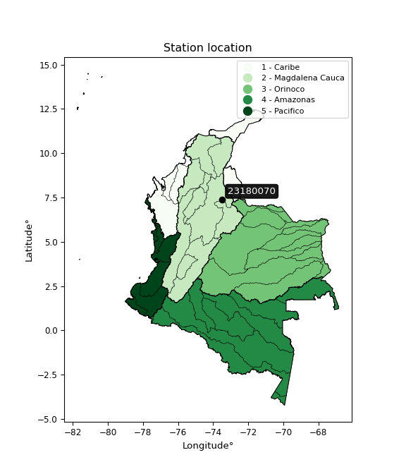

<div align="center">


</div>

# PMP Station (rain, Pmax24h): 23180070

Probable Maximum Precipitation (PMP) is the greatest amount of rainfall for a specific duration that is meteorologically possible for a given location, acting as a "worst-case" scenario for extreme storms, crucial for designing safety-critical infrastructure like bridges, river deviations, dams, spillways, and nuclear plants to prevent catastrophic failure. PMP is calculated by hydrologists using meteorological data to determine the upper limit of extreme rainfall, often leading to the Probable Maximum Flood (PMF) for flood control design, and is increasingly being studied for climate change impacts.

<div align="center">

</img>

</div>


## A. General information


### 1. General running parameters

• app_version: _v20251228_. • runtime: _2025-12-28 08:43:48.795225_. • Python version: _3.14.0_. • SciPy version: _1.16.3_. • Pandas version: _2.3.3_. • NumPy version: _2.3.5_. • Stations dataset (station_dataset_file): _dataset/pmax24h_in/automatic_colombia_2003_2024.csv_. • Stations catalog (station_catalog_file): _dataset/CNE_IDEAM.xls_. • Minimum year to eval til year_max (date_min): _1900_. • Maximum year to eval since year_min (date_max): _2024_. • Creates, save and include plots into reports (create_plot): _False_. • Plot only fit distributions with Δo > Δ (plot_only_fit): _True_. • Eval low extreme values, if False, evaluates high extreme values (low_extreme): _False_. • Eval every SciPy distribution as logarithmic (pdist_logarithmic_on): _True_. • Standard deviation normalized (ddof): _1.0_. • Return periods to eval in years (Tr): _[2, 2.33, 5, 10, 15, 20, 25, 50, 75, 100, 200, 250, 500, 750, 1000]_. • Minimum data sample per station, 0 means any (minimum_sample): _5_. • Z-Score maximum threshold to adjust a value, 0 means disable (zscore_max): _3.5_. • Z-Score minimum threshold to adjust a value, 0 means disable (zscore_min): _-2.5_. • Avoid zeros, e.g. rain = 0 (avoid_zeros): _True_. • Avoid null values (avoid_nans): _True_. [:file_folder:Dataset file.](../../dataset/pmax24h_in/automatic_colombia_2003_2024.csv)

> Delta Degrees of Freedom (DDOF): is a parameter used in the formulas for calculating variance and standard deviation. When ddof=0, the divisor is $N$ (the total number of observations) and this is used when your data set is the entire population. When ddof=1, the divisor is $N-1$ and this is used when your data set is a sample drawn from a larger population. Using $N-1$ provides an unbiased estimate of the population variance (known as Bessel´s correction).


### 2. Station info and location

|   id |   CODIGO | NOMBRE                      | CATEGORIA     | TECNOLOGIA                              | ESTADO   | FECHA_INSTALACION   |   FECHA_SUSPENSION |   ALTITUD |   LATITUD |   LONGITUD | DEPARTAMENTO   | MUNICIPIO        | AREA_OPERATIVA                         | ENTIDAD                                                     | AREA_HIDROGRAFICA   | ZONA_HIDROGRAFICA   | SUBZONA_HIDROGRAFICA                      |   CORRIENTE | Catalogo   |
|-----:|---------:|:----------------------------|:--------------|:----------------------------------------|:---------|:--------------------|-------------------:|----------:|----------:|-----------:|:---------------|:-----------------|:---------------------------------------|:------------------------------------------------------------|:--------------------|:--------------------|:------------------------------------------|------------:|:-----------|
|    0 | 23180070 | SABANA DE TORRES [23180070] | Pluviométrica | Automática con Telemetría, Convencional | Activa   | 15/05/1968          |                nan |       144 |      7.39 |   -73.4894 | Santander      | Sabana De Torres | Area Operativa 08 - Santanderes-Arauca | INSTITUTO DE HIDROLOGIA METEOROLOGIA Y ESTUDIOS AMBIENTALES | Magdalena Cauca     | Medio Magdalena     | Río Lebrija y otros directos al Magdalena |         nan | CNE_IDEAM  |

<div align="center">

Map location in: [:earth_americas:Google](http://maps.google.com/maps?q=7.39,-73.48944444) [:earth_americas:OSM](https://www.openstreetmap.org/#map=18/7.39/-73.48944444&layers=P) [:earth_americas:Bing](https://www.bing.com/maps?cp=7.39~-73.48944444&lvl=18) [:earth_americas:Apple](https://maps.apple.com/frame?center=7.39%2C-73.48944444&span=0.003%2C0.006)

</div>


<div align="center">

```geojson
{
  "type": "Feature",
  "geometry": {
    "type": "Point", 
    "coordinates": [-73.48944444, 7.39]
  }, 
  "properties": {
    "Name": "23180070"
  }
}
```

</div>


### 3. Discrete values table and plot

|               |           0 |           1 |           2 |           3 |            4 |            5 |           6 |          7 |
|:--------------|------------:|------------:|------------:|------------:|-------------:|-------------:|------------:|-----------:|
| Date          | 2017        | 2018        | 2019        | 2020        | 2021         | 2022         | 2023        | 2024       |
| Value         |   47.2      |   34.6      |  140.8      |   90.2      |  125.4       |  127.4       |   66.8      |  364.4     |
| Value_initial |   47.2      |   34.6      |  140.8      |   90.2      |  125.4       |  127.4       |   66.8      |  364.4     |
| count         |    8        |    8        |    8        |    8        |    8         |    8         |    8        |    8       |
| mean          |  124.6      |  124.6      |  124.6      |  124.6      |  124.6       |  124.6       |  124.6      |  124.6     |
| std           |  104.465    |  104.465    |  104.465    |  104.465    |  104.465     |  104.465     |  104.465    |  104.465   |
| zscore        |   -0.740921 |   -0.861536 |    0.155077 |   -0.329298 |    0.0076581 |    0.0268033 |   -0.553298 |    2.29552 |

> The initial value (value_initial) correspond to the initial obtained or null completed value, and value (value) is adjusted only when the initial value is outside the valid range definite through the Z-Score value. If Z-Score is active, values out of range or outliers are replaced with the station mean value


### 4. Active continuous probability distributions from SciPy (44 of 104 available)

[scipy.stats](https://docs.scipy.org/doc/scipy/reference/stats.html) is a Python´s powerful submodule within the SciPy library for comprehensive statistical analysis, offering over 130 probability distributions (like Normal, Poisson), functions for descriptive stats (mean, variance), hypothesis testing (t-tests, chi-square), random variable generation, and statistical tests, making it essential for data science, modeling, and research. It provides tools to explore, model, and draw conclusions from data efficiently, working seamlessly with NumPy.

<div align="center">

|   id | p_dist             |   n_parameter | fit_method   | label                                                                       | active   | ref                                                                                                        |
|-----:|:-------------------|--------------:|:-------------|:----------------------------------------------------------------------------|:---------|:-----------------------------------------------------------------------------------------------------------|
|    0 | alpha              |             3 | MLE          | Alpha                                                                       | True     | [:mortar_board:](https://docs.scipy.org/doc/scipy/reference/generated/scipy.stats.alpha.html)              |
|    1 | betaprime          |             4 | MLE          | Beta prime                                                                  | True     | [:mortar_board:](https://docs.scipy.org/doc/scipy/reference/generated/scipy.stats.betaprime.html)          |
|    2 | chi2               |             3 | MLE          | Chi²                                                                        | True     | [:mortar_board:](https://docs.scipy.org/doc/scipy/reference/generated/scipy.stats.chi2.html)               |
|    3 | crystalball        |             4 | MLE          | Crystalball                                                                 | True     | [:mortar_board:](https://docs.scipy.org/doc/scipy/reference/generated/scipy.stats.crystalball.html)        |
|    4 | erlang             |             3 | MLE          | Erlang                                                                      | True     | [:mortar_board:](https://docs.scipy.org/doc/scipy/reference/generated/scipy.stats.erlang.html)             |
|    5 | expon              |             2 | MLE          | Exponential                                                                 | True     | [:mortar_board:](https://docs.scipy.org/doc/scipy/reference/generated/scipy.stats.expon.html)              |
|    6 | exponnorm          |             3 | MLE          | Exponentially modified Normal                                               | True     | [:mortar_board:](https://docs.scipy.org/doc/scipy/reference/generated/scipy.stats.exponnorm.html)          |
|    7 | f                  |             4 | MLE          | F                                                                           | True     | [:mortar_board:](https://docs.scipy.org/doc/scipy/reference/generated/scipy.stats.f.html)                  |
|    8 | fatiguelife        |             3 | MLE          | Fatigue-life (Birnbaum-Saunders)                                            | True     | [:mortar_board:](https://docs.scipy.org/doc/scipy/reference/generated/scipy.stats.fatiguelife.html)        |
|    9 | fisk               |             3 | MLE          | Fisk                                                                        | True     | [:mortar_board:](https://docs.scipy.org/doc/scipy/reference/generated/scipy.stats.fisk.html)               |
|   10 | gamma              |             3 | MLE          | Gamma                                                                       | True     | [:mortar_board:](https://docs.scipy.org/doc/scipy/reference/generated/scipy.stats.gamma.html)              |
|   11 | genexpon           |             5 | MLE          | Generalized exponential                                                     | True     | [:mortar_board:](https://docs.scipy.org/doc/scipy/reference/generated/scipy.stats.genexpon.html)           |
|   12 | genlogistic        |             3 | MLE          | Generalized logistic                                                        | True     | [:mortar_board:](https://docs.scipy.org/doc/scipy/reference/generated/scipy.stats.genlogistic.html)        |
|   13 | gibrat             |             2 | MM           | Gibrat                                                                      | True     | [:mortar_board:](https://docs.scipy.org/doc/scipy/reference/generated/scipy.stats.gibrat.html)             |
|   14 | gompertz           |             3 | MLE          | Gompertz (or truncated Gumbel)                                              | True     | [:mortar_board:](https://docs.scipy.org/doc/scipy/reference/generated/scipy.stats.gompertz.html)           |
|   15 | gumbel_l           |             2 | MM           | Gumbel Left Skew                                                            | True     | [:mortar_board:](https://docs.scipy.org/doc/scipy/reference/generated/scipy.stats.gumbel_l.html)           |
|   16 | gumbel_r           |             2 | MM           | Gumbel Right Skew                                                           | True     | [:mortar_board:](https://docs.scipy.org/doc/scipy/reference/generated/scipy.stats.gumbel_r.html)           |
|   17 | halflogistic       |             2 | MM           | Half-logistic                                                               | True     | [:mortar_board:](https://docs.scipy.org/doc/scipy/reference/generated/scipy.stats.halflogistic.html)       |
|   18 | halfnorm           |             2 | MM           | Half Normal                                                                 | True     | [:mortar_board:](https://docs.scipy.org/doc/scipy/reference/generated/scipy.stats.halfnorm.html)           |
|   19 | hypsecant          |             2 | MM           | hyperbolic secant                                                           | True     | [:mortar_board:](https://docs.scipy.org/doc/scipy/reference/generated/scipy.stats.hypsecant.html)          |
|   20 | invgamma           |             3 | MLE          | Inverted gamma                                                              | True     | [:mortar_board:](https://docs.scipy.org/doc/scipy/reference/generated/scipy.stats.invgamma.html)           |
|   21 | invgauss           |             3 | MLE          | Inverse Gaussian                                                            | True     | [:mortar_board:](https://docs.scipy.org/doc/scipy/reference/generated/scipy.stats.invgauss.html)           |
|   22 | invweibull         |             3 | MLE          | Inverted Weibull                                                            | True     | [:mortar_board:](https://docs.scipy.org/doc/scipy/reference/generated/scipy.stats.invweibull.html)         |
|   23 | johnsonsu          |             4 | MLE          | Johnson Su                                                                  | True     | [:mortar_board:](https://docs.scipy.org/doc/scipy/reference/generated/scipy.stats.johnsonsu.html)          |
|   24 | kstwobign          |             2 | MLE          | Limiting distribution of scaled Kolmogorov-Smirnov two-sided test statistic | True     | [:mortar_board:](https://docs.scipy.org/doc/scipy/reference/generated/scipy.stats.kstwobign.html)          |
|   25 | laplace            |             2 | MM           | Laplace                                                                     | True     | [:mortar_board:](https://docs.scipy.org/doc/scipy/reference/generated/scipy.stats.laplace.html)            |
|   26 | laplace_asymmetric |             3 | MLE          | Asymmetric Laplace                                                          | True     | [:mortar_board:](https://docs.scipy.org/doc/scipy/reference/generated/scipy.stats.laplace_asymmetric.html) |
|   27 | loggamma           |             3 | MLE          | Log gamma                                                                   | True     | [:mortar_board:](https://docs.scipy.org/doc/scipy/reference/generated/scipy.stats.loggamma.html)           |
|   28 | logistic           |             2 | MM           | Logistic (or Sech-squared)                                                  | True     | [:mortar_board:](https://docs.scipy.org/doc/scipy/reference/generated/scipy.stats.logistic.html)           |
|   29 | lognorm            |             3 | MLE          | Log Normal                                                                  | True     | [:mortar_board:](https://docs.scipy.org/doc/scipy/reference/generated/scipy.stats.lognorm.html)            |
|   30 | maxwell            |             2 | MM           | Maxwell                                                                     | True     | [:mortar_board:](https://docs.scipy.org/doc/scipy/reference/generated/scipy.stats.maxwell.html)            |
|   31 | mielke             |             4 | MLE          | Mielke Beta-Kappa / Dagum                                                   | True     | [:mortar_board:](https://docs.scipy.org/doc/scipy/reference/generated/scipy.stats.mielke.html)             |
|   32 | moyal              |             2 | MM           | Moyal                                                                       | True     | [:mortar_board:](https://docs.scipy.org/doc/scipy/reference/generated/scipy.stats.moyal.html)              |
|   33 | nakagami           |             3 | MLE          | Nakagami                                                                    | True     | [:mortar_board:](https://docs.scipy.org/doc/scipy/reference/generated/scipy.stats.nakagami.html)           |
|   34 | ncf                |             5 | MLE          | Non-central F distribution                                                  | True     | [:mortar_board:](https://docs.scipy.org/doc/scipy/reference/generated/scipy.stats.ncf.html)                |
|   35 | nct                |             4 | MLE          | Non-central Student’s t                                                     | True     | [:mortar_board:](https://docs.scipy.org/doc/scipy/reference/generated/scipy.stats.nct.html)                |
|   36 | norm               |             2 | MM           | Normal                                                                      | True     | [:mortar_board:](https://docs.scipy.org/doc/scipy/reference/generated/scipy.stats.norm.html)               |
|   37 | pearson3           |             3 | MM           | Pearson type III                                                            | True     | [:mortar_board:](https://docs.scipy.org/doc/scipy/reference/generated/scipy.stats.pearson3.html)           |
|   38 | rayleigh           |             2 | MM           | Rayleigh                                                                    | True     | [:mortar_board:](https://docs.scipy.org/doc/scipy/reference/generated/scipy.stats.rayleigh.html)           |
|   39 | rice               |             3 | MLE          | Rice                                                                        | True     | [:mortar_board:](https://docs.scipy.org/doc/scipy/reference/generated/scipy.stats.rice.html)               |
|   40 | t                  |             3 | MLE          | Student’s t                                                                 | True     | [:mortar_board:](https://docs.scipy.org/doc/scipy/reference/generated/scipy.stats.t.html)                  |
|   41 | truncnorm          |             4 | MLE          | Truncated normal                                                            | True     | [:mortar_board:](https://docs.scipy.org/doc/scipy/reference/generated/scipy.stats.truncnorm.html)          |
|   42 | wald               |             2 | MM           | Wald                                                                        | True     | [:mortar_board:](https://docs.scipy.org/doc/scipy/reference/generated/scipy.stats.wald.html)               |
|   43 | weibull_min        |             3 | MLE          | Weibull minimum                                                             | True     | [:mortar_board:](https://docs.scipy.org/doc/scipy/reference/generated/scipy.stats.weibull_min.html)        |

</div>

> **n_parameter:** # arguments & localization & scale.
>
> **Fit methods:** (MLE) maximum likelihood, (MM) L-moments.
>
>**Inactive:** foldnorm, gennorm, norminvgauss, powernorm, powerlognorm, skewnorm, genextreme, anglit, arcsine, argus, beta, bradford, burr, burr12, cauchy, cosine, halfcauchy, foldcauchy, skewcauchy, wrapcauchy, dgamma, gengamma, exponweib, exponpow, truncexpon, gausshyper, genhalflogistic, genhyperbolic, geninvgauss, halfgennorm, johnsonsb, kappa4, kappa3, ksone, kstwo, loglaplace, levy, levy_l, levy_stable, ncx2, pareto, genpareto, truncpareto, lomax, powerlaw, rdist, rel_breitwigner, recipinvgauss, semicircular, studentized_range, trapezoid, triang, truncweibull_min, tukeylambda, uniform, loguniform, vonmises, vonmises_line, weibull_max, dweibull, 


## B. Probability distributions vs. Empirical distributions

A continuous probability distribution (CPD) describes probabilities for variables that can take any value within a range (like rain any time), unlike discrete variables with specific outcomes (like temperature). It uses a Probability Density Function (PDF), a curve where the total area under it equals 1, and the probability of the variable falling within an interval (a to b) is found by calculating the area under the curve between those points. A key feature is that the probability of hitting any single exact value is zero, so probabilities are always expressed for ranges, e.g., $P(a ≤ X ≤ b)$.

<div align="center">

Distributions parameters from station values
|    |   station | p_dist                |   n |               loc |          scale | shape                  | shape1                 | shape2                 | shape3   |
|---:|----------:|:----------------------|----:|------------------:|---------------:|:-----------------------|:-----------------------|:-----------------------|:---------|
|  0 |  23180070 | alpha                 |   8 |     -54.1035      |  366.156       | 2.4971024727694315     |                        |                        |          |
|  1 |  23180070 | betaprime             |   8 |      -0.637901    |    1.7101      | 120.40282175542568     | 2.5694780636475048     |                        |          |
|  2 |  23180070 | chi2                  |   8 |      34.6         |   28.8403      | 0.6106467422242032     |                        |                        |          |
|  3 |  23180070 | crystalball           |   8 |     124.6         |   97.7177      | 11049.42748996407      | 5011.855442047482      |                        |          |
|  4 |  23180070 | erlang                |   8 |      34.6         |  315.351       | 0.16836183366654678    |                        |                        |          |
|  5 |  23180070 | expon                 |   8 |      34.6         |   90           |                        |                        |                        |          |
|  6 |  23180070 | exponnorm             |   8 |      34.4734      |    0.0390542   | 2288.879398278652      |                        |                        |          |
|  7 |  23180070 | f                     |   8 |       4.70332     |   75.4303      | 40.639892426555434     | 4.877774780070009      |                        |          |
|  8 |  23180070 | fatiguelife           |   8 |      24.6161      |   60.4162      | 1.129403418916615      |                        |                        |          |
|  9 |  23180070 | fisk                  |   8 |      30.3201      |   58.1855      | 1.4257080780888218     |                        |                        |          |
| 10 |  23180070 | gamma                 |   8 |      34.6         |  115.069       | 0.5293659612655046     |                        |                        |          |
| 11 |  23180070 | genexpon              |   8 |      34.6         |    0.00172681  | 1.9028302669827262e-05 | 2.1923675529335695e-12 | 0.47420289362732915    |          |
| 12 |  23180070 | genlogistic           |   8 |    -337.121       |   58.2516      | 1412.1760989950644     |                        |                        |          |
| 13 |  23180070 | gibrat                |   8 |      50.0538      |   45.2146      |                        |                        |                        |          |
| 14 |  23180070 | gompertz              |   8 |      34.6         |  356.177       | 2.7443867992621636     |                        |                        |          |
| 15 |  23180070 | gumbel_l              |   8 |     168.578       |   76.1901      |                        |                        |                        |          |
| 16 |  23180070 | gumbel_r              |   8 |      80.6219      |   76.1901      |                        |                        |                        |          |
| 17 |  23180070 | halflogistic          |   8 |       8.78187     |   83.5451      |                        |                        |                        |          |
| 18 |  23180070 | halfnorm              |   8 |      -4.73988     |  162.103       |                        |                        |                        |          |
| 19 |  23180070 | hypsecant             |   8 |     124.6         |   62.209       |                        |                        |                        |          |
| 20 |  23180070 | invgamma              |   8 |       0.716973    |  189.853       | 2.4476002779940087     |                        |                        |          |
| 21 |  23180070 | invgauss              |   8 |      17.8075      |   97.1806      | 1.0989071673824813     |                        |                        |          |
| 22 |  23180070 | invweibull            |   8 |     -21.6626      |   94.4692      | 2.1568941118397937     |                        |                        |          |
| 23 |  23180070 | johnsonsu             |   8 |      25.4167      |    0.378973    | -5.568412883155871     | 0.9620250740828851     |                        |          |
| 24 |  23180070 | kstwobign             |   8 |    -136.722       |  304.925       |                        |                        |                        |          |
| 25 |  23180070 | laplace               |   8 |     124.6         |   69.0968      |                        |                        |                        |          |
| 26 |  23180070 | laplace_asymmetric    |   8 |      34.6         |    0.00258054  | 2.8672561080391576e-05 |                        |                        |          |
| 27 |  23180070 | loggamma              |   8 |  -23391.4         | 3361.95        | 1091.197121263206      |                        |                        |          |
| 28 |  23180070 | logistic              |   8 |     124.6         |   53.8746      |                        |                        |                        |          |
| 29 |  23180070 | lognorm               |   8 |      34.6         |    0.682909    | 12.201524651379216     |                        |                        |          |
| 30 |  23180070 | maxwell               |   8 |    -106.95        |  145.102       |                        |                        |                        |          |
| 31 |  23180070 | mielke                |   8 |      -0.533409    |    2.8285      | 380.1785598784654      | 1.6839928985605415     |                        |          |
| 32 |  23180070 | moyal                 |   8 |      68.7188      |   43.9884      |                        |                        |                        |          |
| 33 |  23180070 | nakagami              |   8 |      34.6         |  144.743       | 0.1907201950656525     |                        |                        |          |
| 34 |  23180070 | ncf                   |   8 |      -0.13091     |    0.000390593 | 6.179956259425124e-05  | 15.11301708647827      | 16.329285911492985     |          |
| 35 |  23180070 | nct                   |   8 |      -0.0588604   |   14.278       | 1.743867882181585      | 4.97875071023013       |                        |          |
| 36 |  23180070 | norm                  |   8 |     124.6         |   97.7177      |                        |                        |                        |          |
| 37 |  23180070 | pearson3              |   8 |     124.6         |   97.7176      | 1.656778151761428      |                        |                        |          |
| 38 |  23180070 | rayleigh              |   8 |     -62.3396      |  149.156       |                        |                        |                        |          |
| 39 |  23180070 | rice                  |   8 |     -20.4411      |  123.664       | 0.00033008394904177844 |                        |                        |          |
| 40 |  23180070 | t                     |   8 |      96.4402      |   44.6704      | 1.8796174067281992     |                        |                        |          |
| 41 |  23180070 | truncnorm             |   8 | -117149           | 3384.48        | 34.6239472463527       | 991631.0185404085      |                        |          |
| 42 |  23180070 | wald                  |   8 |      26.8823      |   97.7177      |                        |                        |                        |          |
| 43 |  23180070 | weibull_min           |   8 |      34.6         |   10.5565      | 0.2881349536865729     |                        |                        |          |
| 44 |  23180070 | logalpha              |   8 |      -4.06245     |  109.668       | 12.770863465068214     |                        |                        |          |
| 45 |  23180070 | logbetaprime          |   8 |      -1.18701     |    3.06639     | 205.11639187724677     | 110.0932043592837      |                        |          |
| 46 |  23180070 | logchi2               |   8 |       3.54385     |    0.98512     | 1.018458891773741      |                        |                        |          |
| 47 |  23180070 | logcrystalball        |   8 |       4.5783      |    0.685266    | 7.624415051016104      | 51.479652840521325     |                        |          |
| 48 |  23180070 | logerlang             |   8 |       2.56033     |    0.244076    | 8.26779122823832       |                        |                        |          |
| 49 |  23180070 | logexpon              |   8 |       3.54385     |    1.03445     |                        |                        |                        |          |
| 50 |  23180070 | logexponnorm          |   8 |       4.1598      |    0.552856    | 0.7569698132076821     |                        |                        |          |
| 51 |  23180070 | logf                  |   8 |       2.18845     |    2.38126     | 26.52244790805483      | 208.24973890850805     |                        |          |
| 52 |  23180070 | logfatiguelife        |   8 |       1.0453      |    3.46671     | 0.19556672457947788    |                        |                        |          |
| 53 |  23180070 | logfisk               |   8 |      -0.0428722   |    4.57917     | 11.613981320433767     |                        |                        |          |
| 54 |  23180070 | loggamma              |   8 |       2.56033     |    0.244075    | 8.267813069296569      |                        |                        |          |
| 55 |  23180070 | loggenexpon           |   8 |       3.54352     |    0.0084742   | 0.004019823229401795   | 1.4887526139181384     | 3.1751018738597264e-05 |          |
| 56 |  23180070 | loggenlogistic        |   8 |       3.04283     |    0.566904    | 9.108102806549034      |                        |                        |          |
| 57 |  23180070 | loggibrat             |   8 |       4.05551     |    0.317087    |                        |                        |                        |          |
| 58 |  23180070 | loggompertz           |   8 |       3.54385     |    1.25838     | 0.603766146006767      |                        |                        |          |
| 59 |  23180070 | loggumbel_l           |   8 |       4.88671     |    0.5343      |                        |                        |                        |          |
| 60 |  23180070 | loggumbel_r           |   8 |       4.2699      |    0.5343      |                        |                        |                        |          |
| 61 |  23180070 | loghalflogistic       |   8 |       3.76606     |    0.585908    |                        |                        |                        |          |
| 62 |  23180070 | loghalfnorm           |   8 |       3.6713      |    1.13676     |                        |                        |                        |          |
| 63 |  23180070 | loghypsecant          |   8 |       4.5783      |    0.436254    |                        |                        |                        |          |
| 64 |  23180070 | loginvgamma           |   8 |      -0.797349    |  330.911       | 62.554801883841144     |                        |                        |          |
| 65 |  23180070 | loginvgauss           |   8 |       0.997169    |   95.4285      | 0.03752666214193462    |                        |                        |          |
| 66 |  23180070 | loginvweibull         |   8 |      -2.63441e+07 |    2.63441e+07 | 43970035.6304934       |                        |                        |          |
| 67 |  23180070 | logjohnsonsu          |   8 |       0.901862    |    0.768994    | -12.340633581084479    | 5.480236641656945      |                        |          |
| 68 |  23180070 | logkstwobign          |   8 |       2.13747     |    2.79589     |                        |                        |                        |          |
| 69 |  23180070 | loglaplace            |   8 |       4.5783      |    0.484556    |                        |                        |                        |          |
| 70 |  23180070 | loglaplace_asymmetric |   8 |       4.83151     |    0.506492    | 1.2806371742983813     |                        |                        |          |
| 71 |  23180070 | logloggamma           |   8 |    -151.888       |   22.4754      | 1055.6468929288949     |                        |                        |          |
| 72 |  23180070 | loglogistic           |   8 |       4.5783      |    0.377807    |                        |                        |                        |          |
| 73 |  23180070 | loglognorm            |   8 |       3.54385     |    0.0121729   | 11.708454869210778     |                        |                        |          |
| 74 |  23180070 | logmaxwell            |   8 |       2.95451     |    1.01756     |                        |                        |                        |          |
| 75 |  23180070 | logmielke             |   8 |      -0.0580715   |    4.62493     | 11.297264008709806     | 11.874831084393893     |                        |          |
| 76 |  23180070 | logmoyal              |   8 |       4.18642     |    0.308478    |                        |                        |                        |          |
| 77 |  23180070 | lognakagami           |   8 |       3.54385     |    1.36141     | 0.36767271624393383    |                        |                        |          |
| 78 |  23180070 | logncf                |   8 |       0.34591     |    4.18146     | 143.45497686892458     | 165.95264398223648     | 3.801765655417145e-09  |          |
| 79 |  23180070 | lognct                |   8 |      -0.794607    |    0.374009    | 46.032499415345626     | 14.128218331934427     |                        |          |
| 80 |  23180070 | lognorm               |   8 |       4.5783      |    0.685266    |                        |                        |                        |          |
| 81 |  23180070 | logpearson3           |   8 |       4.5783      |    0.685265    | 0.3284403480750693     |                        |                        |          |
| 82 |  23180070 | lograyleigh           |   8 |       3.26735     |    1.04599     |                        |                        |                        |          |
| 83 |  23180070 | logrice               |   8 |       3.25372     |    0.867231    | 0.978382344401862      |                        |                        |          |
| 84 |  23180070 | logt                  |   8 |       4.5783      |    0.685265    | 1397250494.4486704     |                        |                        |          |
| 85 |  23180070 | logtruncnorm          |   8 |       0.33783     |    2.30563     | 1.390511227431995      | 2.4424253231644704     |                        |          |
| 86 |  23180070 | logwald               |   8 |       3.89305     |    0.685251    |                        |                        |                        |          |
| 87 |  23180070 | logweibull_min        |   8 |       3.3375      |    1.39279     | 1.8424303524114212     |                        |                        |          |

</div>

> **loc** (Location parameter): This shifts the distribution along the x-axis. For many common distributions, like the normal (Gaussian) distribution, loc represents the mean $μ$. For others, like the uniform distribution, it might represent the minimum value, or for the beta distribution, the left end of the support interval.
>
> **scale** (Scale parameter): This determines the width or spread of the distribution. For the normal distribution, scale represents the standard deviation $σ$. For a uniform distribution, it defines the length of the interval (from $loc$ to $loc + scale$).
>
> **shape** (Shape parameters): Refers to parameters that define the specific form of a probability distribution, distinct from its location (loc) and scale (scale). These parameters are required arguments for most distribution functions. For example, a normal (Gaussian) distribution is fully defined by its location (mean) and scale (standard deviation), so it has no specific shape parameters beyond loc and scale. However, other distributions have intrinsic properties that need specification, as Gamma distribution that takes a shape parameter, often named $a$ or $alpha$.


### 0. Cumulative distribution values - CDF (88 evaluated)

Cumulative Distribution Function (CDF), denoted as $F$<sub>$X$</sub>$(x)$, is a function that gives the probability that a random variable $X$ will take a value less than or equal to a specific value, $x$ (i.e., $(P(X≥x)$. It essentially "accumulates" probabilities from a given point up to the far right (positive infinity), providing a complete picture of the distribution´s probabilities for both discrete (like rain) and continuous (like temperature) variables, helping to find probabilities over ranges or above certain values.

<div align="center">

CDF ordered by x ascending and calculating $log(f(x))$ separately
|   id |   Station |   date |     x |   count |   mean |     std |     zscore |   Value_initial |   station |   m |     alpha |   alpha_pdf |   betaprime |   betaprime_pdf |        chi2 |    chi2_pdf |   crystalball |   crystalball_pdf |     erlang |   erlang_pdf |    expon |   expon_pdf |   exponnorm |   exponnorm_pdf |         f |      f_pdf |   fatiguelife |   fatiguelife_pdf |      fisk |    fisk_pdf |       gamma |        gamma_pdf |    genexpon |   genexpon_pdf |   genlogistic |   genlogistic_pdf |   gibrat |   gibrat_pdf |    gompertz |   gompertz_pdf |   gumbel_l |   gumbel_l_pdf |   gumbel_r |   gumbel_r_pdf |   halflogistic |   halflogistic_pdf |   halfnorm |   halfnorm_pdf |   hypsecant |   hypsecant_pdf |   invgamma |   invgamma_pdf |   invgauss |   invgauss_pdf |   invweibull |   invweibull_pdf |   johnsonsu |   johnsonsu_pdf |   kstwobign |   kstwobign_pdf |   laplace |   laplace_pdf |   laplace_asymmetric |   laplace_asymmetric_pdf |   loggamma |   loggamma_pdf |   logistic |   logistic_pdf |   lognorm |   lognorm_pdf |   maxwell |   maxwell_pdf |   mielke |   mielke_pdf |    moyal |   moyal_pdf |    nakagami |   nakagami_pdf |       ncf |     ncf_pdf |       nct |     nct_pdf |     norm |    norm_pdf |   pearson3 |   pearson3_pdf |   rayleigh |   rayleigh_pdf |      rice |    rice_pdf |        t |       t_pdf |   truncnorm |   truncnorm_pdf |        wald |    wald_pdf |   weibull_min |   weibull_min_pdf |   logalpha |   logalpha_pdf |   logbetaprime |   logbetaprime_pdf |     logchi2 |   logchi2_pdf |   logcrystalball |   logcrystalball_pdf |   logerlang |   logerlang_pdf |   logexpon |   logexpon_pdf |   logexponnorm |   logexponnorm_pdf |      logf |   logf_pdf |   logfatiguelife |   logfatiguelife_pdf |   logfisk |   logfisk_pdf |   loggenexpon |   loggenexpon_pdf |   loggenlogistic |   loggenlogistic_pdf |   loggibrat |   loggibrat_pdf |   loggompertz |   loggompertz_pdf |   loggumbel_l |   loggumbel_l_pdf |   loggumbel_r |   loggumbel_r_pdf |   loghalflogistic |   loghalflogistic_pdf |   loghalfnorm |   loghalfnorm_pdf |   loghypsecant |   loghypsecant_pdf |   loginvgamma |   loginvgamma_pdf |   loginvgauss |   loginvgauss_pdf |   loginvweibull |   loginvweibull_pdf |   logjohnsonsu |   logjohnsonsu_pdf |   logkstwobign |   logkstwobign_pdf |   loglaplace |   loglaplace_pdf |   loglaplace_asymmetric |   loglaplace_asymmetric_pdf |   logloggamma |   logloggamma_pdf |   loglogistic |   loglogistic_pdf |   loglognorm |   loglognorm_pdf |   logmaxwell |   logmaxwell_pdf |   logmielke |   logmielke_pdf |   logmoyal |   logmoyal_pdf |   lognakagami |   lognakagami_pdf |    logncf |   logncf_pdf |    lognct |   lognct_pdf |   logpearson3 |   logpearson3_pdf |   lograyleigh |   lograyleigh_pdf |   logrice |   logrice_pdf |      logt |   logt_pdf |   logtruncnorm |   logtruncnorm_pdf |   logwald |   logwald_pdf |   logweibull_min |   logweibull_min_pdf |
|-----:|----------:|-------:|------:|--------:|-------:|--------:|-----------:|----------------:|----------:|----:|----------:|------------:|------------:|----------------:|------------:|------------:|--------------:|------------------:|-----------:|-------------:|---------:|------------:|------------:|----------------:|----------:|-----------:|--------------:|------------------:|----------:|------------:|------------:|-----------------:|------------:|---------------:|--------------:|------------------:|---------:|-------------:|------------:|---------------:|-----------:|---------------:|-----------:|---------------:|---------------:|-------------------:|-----------:|---------------:|------------:|----------------:|-----------:|---------------:|-----------:|---------------:|-------------:|-----------------:|------------:|----------------:|------------:|----------------:|----------:|--------------:|---------------------:|-------------------------:|-----------:|---------------:|-----------:|---------------:|----------:|--------------:|----------:|--------------:|---------:|-------------:|---------:|------------:|------------:|---------------:|----------:|------------:|----------:|------------:|---------:|------------:|-----------:|---------------:|-----------:|---------------:|----------:|------------:|---------:|------------:|------------:|----------------:|------------:|------------:|--------------:|------------------:|-----------:|---------------:|---------------:|-------------------:|------------:|--------------:|-----------------:|---------------------:|------------:|----------------:|-----------:|---------------:|---------------:|-------------------:|----------:|-----------:|-----------------:|---------------------:|----------:|--------------:|--------------:|------------------:|-----------------:|---------------------:|------------:|----------------:|--------------:|------------------:|--------------:|------------------:|--------------:|------------------:|------------------:|----------------------:|--------------:|------------------:|---------------:|-------------------:|--------------:|------------------:|--------------:|------------------:|----------------:|--------------------:|---------------:|-------------------:|---------------:|-------------------:|-------------:|-----------------:|------------------------:|----------------------------:|--------------:|------------------:|--------------:|------------------:|-------------:|-----------------:|-------------:|-----------------:|------------:|----------------:|-----------:|---------------:|--------------:|------------------:|----------:|-------------:|----------:|-------------:|--------------:|------------------:|--------------:|------------------:|----------:|--------------:|----------:|-----------:|---------------:|-------------------:|----------:|--------------:|-----------------:|---------------------:|
|    0 |  23180070 |   2018 |  34.6 |       8 |  124.6 | 104.465 | -0.861536  |            34.6 |  23180070 |   1 | 0.0517946 | 0.00494247  |   0.0462952 |      0.00567368 | 1.54825e-05 | 6.65288e+08 |      0.17852  |       0.00267138  | 0.00169853 |  4.02464e+10 | 0        | 0.0111111   |   0.0014154 |     0.0111644   | 0.0455821 | 0.00582436 |     0.0345191 |        0.00971064 | 0.0236451 | 0.0076903   | 2.95888e-09 | 220442           | 3.87468e-07 |     0.0110194  |     0.0917516 |       0.00375919  | 0        |  0           | 8.91299e-14 |    0.00770511  |   0.15828  |    0.00190359  |   0.160495 |    0.00385383  |       0.153298 |        0.00584415  |   0.19175  |    0.00477924  |    0.147143 |     0.00228196  |  0.0445024 |    0.00576136  |  0.0378849 |    0.00731977  |    0.0469761 |      0.00550732  |   0.0332856 |     0.00776067  |   0.0895759 |      0.00356388 |  0.135923 |   0.00196714  |          8.50363e-10 |              0.0111111   |  0.0423628 |      0.210111  |   0.158351 |    0.00247382  | 0.0655784 |     0.186305  |  0.187047 |   0.00325155  |      nan |          nan | 0.140547 |  0.00451193 | 4.76137e-07 |    2.55604e+07 | 0.0734669 | 0.00455911  | 0.0412892 | 0.0055938   | 0.17852  | 0.00267138  |   0.134693 |    0.00607364  |   0.190386 |    0.00352774  | 0.0943029 | 0.00325973  | 0.153859 | 0.00285603  | 5.68756e-06 |     0.0102387   | 0.000979837 | 0.000855829 |   4.25038e-05 |       1.72355e+09 |  0.0497669 |      0.194769  |      0.0524671 |          0.194849  | 1.21438e-08 |   1.39251e+07 |        0.0655783 |            0.186305  |   0.0423629 |       0.210111  |   0        |      0.966699  |       0.055012 |          0.185429  | 0.0430412 |   0.199224 |        0.0462773 |            0.201063  | 0.0553551 |      0.16932  |   0.000159154 |          0.474506 |         0.042845 |            0.201272  |    0        |        0        |   1.41035e-10 |          0.479796 |      0.077807 |         0.139806  |     0.0204091 |         0.148657  |          0        |             0         |      0        |          0        |      0.0592682 |          0.135073  |     0.0486606 |         0.196518  |     0.0464193 |         0.200845  |       0.0395697 |           0.213304  |      0.0478829 |          0.198429  |      0.0380195 |           0.236581 |    0.0591321 |        0.122033  |               0.0853275 |                   0.13155   |     0.0692845 |         0.18963   |     0.0607661 |         0.151065  |   0.00411236 |      2.33567e+12 |    0.0467695 |        0.222412  |   0.0565922 |       0.168825  | 0.00460408 |      0.0661592 |   3.18524e-12 |       5274.29     | 0.0495918 |    0.196263  | 0.0504332 |    0.195147  |     0.0547796 |         0.195966  |     0.0343368 |          0.244048 | 0.0341746 |      0.232127 | 0.0655778 |  0.186304  |     1.8334e-05 |           0.878656 |  0        |     0         |        0.0292209 |             0.257051 |
|    1 |  23180070 |   2017 |  47.2 |       8 |  124.6 | 104.465 | -0.740921  |            47.2 |  23180070 |   2 | 0.132755  | 0.00767284  |   0.139279  |      0.00861059 | 0.667183    | 0.0136512   |      0.214158 |       0.00298333  | 0.623598   |  0.00805205  | 0.130642 | 0.00965954  |   0.132701  |     0.00970238  | 0.141209  | 0.00882672 |     0.182241  |        0.0116481  | 0.146249  | 0.0105459   | 0.336577    |      0.0131566   | 0.129637    |     0.00959086 |     0.145968  |       0.00481883  | 0        |  0           | 0.0940961   |    0.00723144  |   0.183963 |    0.0021774   |   0.212113 |    0.00431697  |       0.225957 |        0.00567923  |   0.251344 |    0.00467578  |    0.178617 |     0.00272292  |  0.139868  |    0.00884606  |  0.156747  |    0.0103564   |    0.138389  |      0.00857245  |   0.157705  |     0.0106426   |   0.139945  |      0.00439947 |  0.163113 |   0.00236064  |          0.130641    |              0.00965952  |  0.142434  |      0.432517  |   0.192061 |    0.00288028  | 0.145395  |     0.333214  |  0.229823 |   0.00352965  |      nan |          nan | 0.201565 |  0.00512427 | 0.311984    |    0.00943324  | 0.140797  | 0.006031    | 0.139734  | 0.00945     | 0.214158 | 0.00298333  |   0.212183 |    0.00616196  |   0.236367 |    0.00375987  | 0.138939  | 0.00380852  | 0.19572  | 0.00383267  | 0.121044    |     0.00900037  | 0.0710097   | 0.00952494  |   0.65087     |       0.0084015   |  0.139722  |      0.388926  |      0.140979  |          0.379563  | 0.417893    |   0.616637    |        0.145395  |            0.333214  |   0.142434  |       0.432518  |   0.259329 |      0.716006  |       0.138897 |          0.36185   | 0.137701  |   0.41153  |        0.14062   |            0.40862   | 0.133233  |      0.344141 |   0.164113    |          0.56746  |         0.142075 |            0.440212  |    0        |        0        |   0.155483    |          0.518608 |      0.134844 |         0.234539  |     0.113453  |         0.462129  |          0.075243 |             0.848545  |      0.127957 |          0.692851 |      0.119692  |          0.267943  |     0.13989   |         0.394803  |     0.140593  |         0.40784   |       0.146115  |           0.469062  |      0.140382  |          0.40053   |      0.154907  |           0.500104 |    0.112241  |        0.231637  |               0.137725  |                   0.212331  |     0.149621  |         0.332871  |     0.1283    |         0.296021  |   0.608974   |      0.105602    |    0.146253  |        0.414768  |   0.13369   |       0.339467  | 0.086736   |      0.510876  |   0.261132    |          0.60975  | 0.140128  |    0.390687  | 0.140312  |    0.388091  |     0.142555  |         0.373448  |     0.145717  |          0.458373 | 0.139574  |      0.435346 | 0.145394  |  0.333214  |     0.248133   |           0.722008 |  0        |     0         |        0.148719  |             0.488569 |
|    2 |  23180070 |   2023 |  66.8 |       8 |  124.6 | 104.465 | -0.553298  |            66.8 |  23180070 |   3 | 0.299447  | 0.00873188  |   0.315248  |      0.00873244 | 0.82852     | 0.00506436  |      0.277093 |       0.00342739  | 0.723981   |  0.00346764  | 0.300772 | 0.0077692   |   0.303463  |     0.00779208  | 0.319731  | 0.00877097 |     0.37457   |        0.00808496 | 0.339477  | 0.00876345  | 0.522941    |      0.00713498  | 0.298703    |     0.00772785 |     0.252886  |       0.00596554  | 0.160295 |  0.0145468   | 0.22869     |    0.00650534  |   0.231209 |    0.00265314  |   0.301523 |    0.00474469  |       0.333913 |        0.0053175   |   0.34102  |    0.00446534  |    0.239433 |     0.00349603  |  0.319356  |    0.00883239  |  0.346154  |    0.00857688  |    0.315932  |      0.00887568  |   0.349518  |     0.00860587  |   0.23549   |      0.00525153 |  0.21661  |   0.00313488  |          0.300771    |              0.00776919  |  0.324179  |      0.586725  |   0.254859 |    0.00352496  | 0.291309  |     0.500573  |  0.302377 |   0.00384957  |      nan |          nan | 0.306757 |  0.00549813 | 0.445665    |    0.00523764  | 0.271577  | 0.00705962  | 0.332758  | 0.00939887  | 0.277093 | 0.00342739  |   0.329991 |    0.00579223  |   0.312577 |    0.00399026  | 0.220297  | 0.00444798  | 0.28951  | 0.00580353  | 0.280888    |     0.00736482  | 0.279119    | 0.0101898   |   0.748162    |       0.00310754  |  0.308746  |      0.565501  |      0.305881  |          0.553571  | 0.579272    |   0.357666    |        0.291309  |            0.500573  |   0.324179  |       0.586725  |   0.470564 |      0.511806  |       0.299585 |          0.551072  | 0.313463  |   0.576191 |        0.315734  |            0.576686  | 0.292924  |      0.56672  |   0.365347    |          0.575674 |         0.329894 |            0.607602  |    0.219394 |        2.02214  |   0.3394      |          0.534606 |      0.242298 |         0.393479  |     0.321059  |         0.682697  |          0.35554  |             0.745502  |      0.359207 |          0.629504 |      0.254104  |          0.522545  |     0.310809  |         0.569232  |     0.315463  |         0.57623   |       0.340538  |           0.612276  |      0.313176  |          0.573139  |      0.353134  |           0.603282 |    0.229845  |        0.474341  |               0.235263  |                   0.362707  |     0.294561  |         0.495621  |     0.269571  |         0.521172  |   0.633358   |      0.0488731   |    0.318253  |        0.555793  |   0.291363  |       0.561332  | 0.329294   |      0.783928  |   0.445578    |          0.467623 | 0.309367  |    0.56475   | 0.308946  |    0.564351  |     0.304385  |         0.543671  |     0.328989  |          0.573043 | 0.316273  |      0.561688 | 0.291308  |  0.500573  |     0.471375   |           0.56733  |  0.319786 |     1.37728   |        0.339705  |             0.584298 |
|    3 |  23180070 |   2020 |  90.2 |       8 |  124.6 | 104.465 | -0.329298  |            90.2 |  23180070 |   4 | 0.486976  | 0.00705338  |   0.495895  |      0.00661763 | 0.909219    | 0.00230966  |      0.362406 |       0.00383731  | 0.785723   |  0.00204422  | 0.460859 | 0.00599046  |   0.463885  |     0.00599745  | 0.499665  | 0.00654352 |     0.528973  |        0.00537628 | 0.51023   | 0.00594987  | 0.655187    |      0.00450229  | 0.458102    |     0.00597138 |     0.398461  |       0.00629206  | 0.452681 |  0.00986724  | 0.371017    |    0.00566516  |   0.300553 |    0.00328163  |   0.414009 |    0.00479197  |       0.452047 |        0.00476182  |   0.441906 |    0.00414632  |    0.332323 |     0.00442312  |  0.500523  |    0.0065838   |  0.514625  |    0.00595543  |    0.499305  |      0.00668661  |   0.517754  |     0.00591829  |   0.363045  |      0.00552794 |  0.303917 |   0.00439843  |          0.460858    |              0.00599045  |  0.502604  |      0.581323  |   0.345581 |    0.0041978   | 0.455688  |     0.578576  |  0.395035 |   0.00403315  |      nan |          nan | 0.433419 |  0.00522732 | 0.54727     |    0.00366673  | 0.434878  | 0.00668373  | 0.520275  | 0.00659918  | 0.362406 | 0.00383731  |   0.457062 |    0.00504133  |   0.407225 |    0.00406434  | 0.329837  | 0.00484852  | 0.45121  | 0.00774157  | 0.434143    |     0.0057964   | 0.481055    | 0.00711342  |   0.800912    |       0.00166522  |  0.486413  |      0.596121  |      0.481067  |          0.592633  | 0.669936    |   0.255344    |        0.455688  |            0.578576  |   0.502605  |       0.581323  |   0.603971 |      0.382841  |       0.477116 |          0.609161  | 0.49092   |   0.584804 |        0.494122  |            0.590069  | 0.478204  |      0.637633 |   0.530785    |          0.518087 |         0.512156 |            0.582835  |    0.63394  |        0.842605 |   0.497976    |          0.515785 |      0.38539  |         0.559933  |     0.523294  |         0.634272  |          0.556716 |             0.588887  |      0.535091 |          0.53741  |      0.44463   |          0.718632  |     0.488799  |         0.594557  |     0.493817  |         0.590286  |       0.520718  |           0.567137  |      0.491633  |          0.593749  |      0.52817   |           0.547185 |    0.427178  |        0.881587  |               0.3738    |                   0.576289  |     0.457215  |         0.57269   |     0.4497    |         0.655017  |   0.64538    |      0.0331722   |    0.489941  |        0.570555  |   0.475921  |       0.638819  | 0.548798   |      0.64783   |   0.573106    |          0.384468 | 0.486544  |    0.593986  | 0.486362  |    0.595684  |     0.477221  |         0.587981  |     0.501757  |          0.562265 | 0.488455  |      0.569667 | 0.455687  |  0.578577  |     0.624037   |           0.452218 |  0.619721 |     0.690094  |        0.512801  |             0.554276 |
|    4 |  23180070 |   2021 | 125.4 |       8 |  124.6 | 104.465 |  0.0076581 |           125.4 |  23180070 |   5 | 0.680524  | 0.00410915  |   0.676947  |      0.00388436 | 0.960958    | 0.000892368 |      0.503266 |       0.00408247  | 0.840918   |  0.00121591  | 0.635376 | 0.00405138  |   0.638389  |     0.0040453   | 0.677812  | 0.00380886 |     0.676541  |        0.00325967 | 0.668219  | 0.00332439  | 0.776675    |      0.00263227  | 0.632326    |     0.00405153 |     0.60477   |       0.00522027  | 0.69521  |  0.0046475   | 0.549271    |    0.00448135  |   0.432994 |    0.00422248  |   0.573731 |    0.00418377  |       0.603055 |        0.00380827  |   0.577921 |    0.00356609  |    0.504093 |     0.00511636  |  0.679488  |    0.00381879  |  0.676903  |    0.00352384  |    0.680475  |      0.00384201  |   0.677955  |     0.00345     |   0.549189  |      0.00490071 |  0.505756 |   0.00715293  |          0.635375    |              0.00405138  |  0.677891  |      0.470842  |   0.503712 |    0.00464015  | 0.644123  |     0.543755  |  0.536183 |   0.00391213  |      nan |          nan | 0.599553 |  0.00414864 | 0.655018    |    0.00258312  | 0.639328  | 0.00484551  | 0.693544  | 0.0035718   | 0.503266 | 0.00408247  |   0.613007 |    0.00383267  |   0.547123 |    0.00382167  | 0.501131  | 0.0047575   | 0.706516 | 0.00587626  | 0.605463    |     0.00404268  | 0.671348    | 0.00403284  |   0.844173    |       0.000919252 |  0.670139  |      0.501997  |      0.665489  |          0.508888  | 0.74194     |   0.186856    |        0.644123  |            0.543755  |   0.677892  |       0.470842  |   0.711994 |      0.278415  |       0.667755 |          0.52583   | 0.668845  |   0.481666 |        0.673984  |            0.487164  | 0.673836  |      0.523663 |   0.685281    |          0.415467 |         0.6837   |            0.449134  |    0.8146   |        0.344443 |   0.659067    |          0.455118 |      0.59418  |         0.684984  |     0.705008  |         0.461226  |          0.720763 |             0.410047  |      0.692569 |          0.416941 |      0.675174  |          0.621915  |     0.671385  |         0.497425  |     0.673826  |         0.487743  |       0.686249  |           0.431259  |      0.673352  |          0.493608  |      0.688892  |           0.423965 |    0.703498  |        0.611904  |               0.621217  |                   0.957732  |     0.644095  |         0.540648  |     0.661548  |         0.592636  |   0.654729   |      0.0244452   |    0.66638   |        0.486774  |   0.672928  |       0.529501  | 0.725226   |      0.42733   |   0.686729    |          0.307002 | 0.669674  |    0.500852  | 0.670082  |    0.502315  |     0.661583  |         0.512851  |     0.673097  |          0.467353 | 0.664748  |      0.487738 | 0.644123  |  0.543756  |     0.754941   |           0.3458   |  0.782364 |     0.345594  |        0.679535  |             0.449733 |
|    5 |  23180070 |   2022 | 127.4 |       8 |  124.6 | 104.465 |  0.0268033 |           127.4 |  23180070 |   6 | 0.68861   | 0.00397699  |   0.684598  |      0.00376775 | 0.962698    | 0.000849009 |      0.51143  |       0.00408093  | 0.84332    |  0.00118653  | 0.643389 | 0.00396234  |   0.64639   |     0.0039558   | 0.685314  | 0.00369401 |     0.682978  |        0.00317744 | 0.674765  | 0.00322293  | 0.781867    |      0.00256053  | 0.640341    |     0.00396322 |     0.615121  |       0.00513047  | 0.704322 |  0.00446562  | 0.558169    |    0.00441761  |   0.441487 |    0.00426986  |   0.582049 |    0.00413446  |       0.610617 |        0.00375334  |   0.585018 |    0.00353067  |    0.514322 |     0.0051116   |  0.687009  |    0.00370288  |  0.683853  |    0.00342686  |    0.688039  |      0.00372254  |   0.684757  |     0.0033521   |   0.558933  |      0.00484331 |  0.519856 |   0.00694885  |          0.643389    |              0.00396234  |  0.685288  |      0.464125  |   0.51299  |    0.00463728  | 0.65269   |     0.538992  |  0.543988 |   0.00389252  |      nan |          nan | 0.607782 |  0.00408031 | 0.660141    |    0.00254004  | 0.648908  | 0.00473461  | 0.700569  | 0.00345403  | 0.51143  | 0.00408093  |   0.620607 |    0.0037678   |   0.554742 |    0.0037974   | 0.51062   | 0.00473101  | 0.718054 | 0.00566217  | 0.613467    |     0.00396075  | 0.679292    | 0.00391165  |   0.845986    |       0.00089457  |  0.67803   |      0.495297  |      0.673491  |          0.502522  | 0.744876    |   0.184253    |        0.65269   |            0.538992  |   0.685289  |       0.464124  |   0.716366 |      0.274189  |       0.67602  |          0.518895  | 0.676414  |   0.475055 |        0.681639  |            0.480425  | 0.682054  |      0.515023 |   0.691812    |          0.41004  |         0.690748 |            0.441772  |    0.819946 |        0.331449 |   0.666237    |          0.451184 |      0.605033 |         0.686704  |     0.712236  |         0.452357  |          0.727189 |             0.402108  |      0.69912  |          0.411019 |      0.68492   |          0.609941  |     0.679202  |         0.4907    |     0.68149   |         0.481006  |       0.693016  |           0.424161  |      0.681109  |          0.486836  |      0.69555   |           0.417636 |    0.713024  |        0.592245  |               0.636072  |                   0.920172  |     0.652613  |         0.536067  |     0.670861  |         0.584442  |   0.655113   |      0.0241384   |    0.674037  |        0.480961  |   0.681239  |       0.520877  | 0.731912   |      0.417798  |   0.691559    |          0.303532 | 0.677547  |    0.494239  | 0.677978  |    0.495637  |     0.66965   |         0.50681   |     0.680446  |          0.461468 | 0.672421  |      0.482112 | 0.652689  |  0.538993  |     0.760376   |           0.341197 |  0.78775  |     0.335188  |        0.686604  |             0.443733 |
|    6 |  23180070 |   2019 | 140.8 |       8 |  124.6 | 104.465 |  0.155077  |           140.8 |  23180070 |   7 | 0.736471  | 0.00319602  |   0.730303  |      0.00307974 | 0.972397    | 0.000612813 |      0.565836 |       0.00402688  | 0.858033   |  0.00101651  | 0.692721 | 0.00341421  |   0.695616  |     0.00340511  | 0.730114  | 0.00301855 |     0.722191  |        0.0026934  | 0.713851  | 0.00263601  | 0.813246    |      0.00213888  | 0.689713    |     0.00341917 |     0.679708  |       0.00450449  | 0.756988 |  0.00344902  | 0.614556    |    0.00400158  |   0.500667 |    0.00455148  |   0.635136 |    0.00378394  |       0.658466 |        0.00338992  |   0.630719 |    0.00328934  |    0.581971 |     0.00494806  |  0.731887  |    0.0030217   |  0.72581   |    0.00285716  |    0.733044  |      0.00302229  |   0.725681  |     0.00277862  |   0.621106  |      0.00442883 |  0.604499 |   0.00572387  |          0.69272     |              0.00341421  |  0.729537  |      0.420511  |   0.574613 |    0.00453707  | 0.704896  |     0.503586  |  0.595125 |   0.00373166  |      nan |          nan | 0.659408 |  0.00362715 | 0.692387    |    0.00228068  | 0.707501  | 0.00402017  | 0.742108  | 0.00277631  | 0.565836 | 0.00402688  |   0.668264 |    0.00335035  |   0.604427 |    0.00361192  | 0.572597  | 0.00450635  | 0.784496 | 0.00428112  | 0.663061    |     0.00345296  | 0.726783    | 0.00320546  |   0.856991    |       0.000754606 |  0.725354  |      0.450498  |      0.721627  |          0.459351  | 0.76252     |   0.168894    |        0.704896  |            0.503586  |   0.729537  |       0.420511  |   0.742504 |      0.248922  |       0.725585 |          0.471362  | 0.721774  |   0.431698 |        0.727489  |            0.436053  | 0.730733  |      0.457935 |   0.731091    |          0.375393 |         0.732602 |            0.395308  |    0.849455 |        0.26207  |   0.710047    |          0.424384 |      0.673776 |         0.683936  |     0.754712  |         0.397511  |          0.764967 |             0.354003  |      0.738361 |          0.373812 |      0.741922  |          0.528862  |     0.726068  |         0.445966  |     0.727398  |         0.436627  |       0.733207  |           0.37977   |      0.727579  |          0.441994  |      0.735325  |           0.377888 |    0.766541  |        0.4818    |               0.717384  |                   0.714579  |     0.704584  |         0.501802  |     0.726471  |         0.525958  |   0.657436   |      0.0223615   |    0.720214  |        0.441911  |   0.730495  |       0.463524  | 0.770809   |      0.361097  |   0.720836    |          0.282088 | 0.724794  |    0.45      | 0.725342  |    0.450938  |     0.718305  |         0.465348  |     0.72468   |          0.422756 | 0.718773  |      0.444224 | 0.704895  |  0.503587  |     0.793082   |           0.31315  |  0.818282 |     0.277628  |        0.729051  |             0.404931 |
|    7 |  23180070 |   2024 | 364.4 |       8 |  124.6 | 104.465 |  2.29552   |           364.4 |  23180070 |   8 | 0.953588  | 0.000225157 |   0.956696  |      0.0002576  | 0.999699    | 5.77976e-06 |      0.992936 |       0.000201021 | 0.959916   |  0.000194941 | 0.974382 | 0.000284649 |   0.975049  |     0.000279121 | 0.954064  | 0.00026251 |     0.957865  |        0.00032712 | 0.923563  | 0.000301266 | 0.981705    |      0.000179748 | 0.973595    |     0.00029097 |     0.991723  |       0.000141508 | 0.973754 |  0.000193654 | 0.984749    |    0.000296622 |   0.999998 |    3.62172e-07 |   0.976166 |    0.000309065 |       0.972055 |        0.000329814 |   0.977225 |    0.000368225 |    0.986519 |     0.000216639 |  0.954896  |    0.000259216 |  0.958613  |    0.000300591 |    0.953123  |      0.000255662 |   0.94914   |     0.000296702 |   0.990982  |      0.00019441 |  0.984449 |   0.000225059 |          0.974381    |              0.000284651 |  0.954516  |      0.0977531 |   0.988469 |    0.000211574 | 0.972959  |     0.0910736 |  0.985588 |   0.000296653 |      nan |          nan | 0.972316 |  0.00031455 | 0.949647    |    0.00046583  | 0.984207  | 0.000182484 | 0.945708  | 0.000254409 | 0.992936 | 0.000201021 |   0.970669 |    0.000331303 |   0.983306 |    0.000320206 | 0.992111  | 0.000198537 | 0.984585 | 0.000104129 | 0.966003    |     0.000349063 | 0.967796    | 0.00026598  |   0.93251     |       0.000158953 |  0.960867  |      0.0935683 |      0.963084  |          0.0940577 | 0.874941    |   0.0808623   |        0.972959  |            0.0910736 |   0.954516  |       0.0977529 |   0.897305 |      0.0992748 |       0.962876 |          0.0867195 | 0.953455  |   0.100329 |        0.95802   |            0.0957646 | 0.953649  |      0.086409 |   0.94695     |          0.107029 |         0.942748 |            0.0977266 |    0.960782 |        0.046019 |   0.963756    |          0.112941 |      0.998694 |         0.0162337 |     0.953639  |         0.0847272 |          0.948795 |             0.0851566 |      0.949892 |          0.103014 |      0.969131  |          0.0706476 |     0.959973  |         0.0942588 |     0.958151  |         0.0956945 |       0.938507  |           0.0994138 |      0.959577  |          0.0942208 |      0.946364  |           0.103212 |    0.967195  |        0.0677003 |               0.974472  |                   0.0645453 |     0.973168  |         0.0914108 |     0.970508  |         0.0757578 |   0.673522   |      0.0130805   |    0.961031  |        0.0999382 |   0.955011  |       0.0855577 | 0.950266   |      0.0805066 |   0.906203    |          0.121078 | 0.961046  |    0.0942359 | 0.961102  |    0.0934898 |     0.964648  |         0.0947823 |     0.957709  |          0.101694 | 0.962491  |      0.100388 | 0.972959  |  0.0910736 |     0.991384   |           0.126101 |  0.950176 |     0.0616971 |        0.953629  |             0.102462 |


</div>

An Empirical Distribution Function (EDF) is a step-function estimate of a true cumulative distribution function (CDF) based on observed sample data, representing the proportion of data points less than or equal to a given value. It is calculated by ordering your data and jumping up by $1/n$ (where $n$ is sample size) at each unique data point, allowing analysis without assuming an underlying population distribution, and it gets closer to the true CDF as the sample size grows.


### 1. Empirical - EDF California (1923)

California´s estimates the true probability distribution of water-related data (like rainfall, streamflow) using observed samples, crucial for risk assessment.

<div align="center">


$P=m/n$


</div>


**1.1. Empirical values**

<div align="center">

|                | 0                  | 1                  | 2              | 3              | 4                  | 5              | 6              | 7              |
|:---------------|:-------------------|:-------------------|:---------------|:---------------|:-------------------|:---------------|:---------------|:---------------|
| date           | 2018               | 2017               | 2023           | 2020           | 2021               | 2022           | 2019           | 2024           |
| x              | 34.6               | 47.2               | 66.8           | 90.2           | 125.4              | 127.4          | 140.8          | 364.4          |
| m              | 1                  | 2                  | 3              | 4              | 5                  | 6              | 7              | 8              |
| empirical_dist | edf_california     | edf_california     | edf_california | edf_california | edf_california     | edf_california | edf_california | edf_california |
| empirical      | 0.125              | 0.25               | 0.375          | 0.5            | 0.625              | 0.75           | 0.875          | 1.0            |
| empirical_tr   | 1.1428571428571428 | 1.3333333333333333 | 1.6            | 2.0            | 2.6666666666666665 | 4.0            | 8.0            | inf            |

</div>


**1.2. Kolmogorov-Smirnov fit test (sorted by Δ)**


<div align="center">

|                | 0                   | 1                   | 2                   | 3                  | 4                   | 5                   | 6                  | 7                   | 8                   | 9                   | 10                  | 11                 | 12                 | 13                  | 14                  | 15                  | 16                  | 17                 | 18                  | 19                  | 20                 | 21                 | 22                  | 23                  | 24                  | 25                  | 26                  | 27                  | 28                  | 29                 | 30                  | 31                  | 32                 | 33                  | 34                  | 35                  | 36                  | 37                  | 38                 | 39                 | 40                 | 41                 | 42                  | 43                    | 44                  | 45                  | 46                  | 47                 | 48                  | 49                  | 50                  | 51                  | 52                  | 53                 | 54                  | 55                  | 56                 | 57                  | 58                  | 59                 | 60                  | 61                 | 62                  | 63                  | 64                 | 65                  | 66                  | 67                  | 68                 | 69                 | 70                 | 71                 | 72                  | 73                  | 74                 | 75                 | 76                  | 77                 | 78                  | 79                 | 80                  | 81                  | 82                  | 83                 | 84                  | 85                 | 86                 | 87                 |
|:---------------|:--------------------|:--------------------|:--------------------|:-------------------|:--------------------|:--------------------|:-------------------|:--------------------|:--------------------|:--------------------|:--------------------|:-------------------|:-------------------|:--------------------|:--------------------|:--------------------|:--------------------|:-------------------|:--------------------|:--------------------|:-------------------|:-------------------|:--------------------|:--------------------|:--------------------|:--------------------|:--------------------|:--------------------|:--------------------|:-------------------|:--------------------|:--------------------|:-------------------|:--------------------|:--------------------|:--------------------|:--------------------|:--------------------|:-------------------|:-------------------|:-------------------|:-------------------|:--------------------|:----------------------|:--------------------|:--------------------|:--------------------|:-------------------|:--------------------|:--------------------|:--------------------|:--------------------|:--------------------|:-------------------|:--------------------|:--------------------|:-------------------|:--------------------|:--------------------|:-------------------|:--------------------|:-------------------|:--------------------|:--------------------|:-------------------|:--------------------|:--------------------|:--------------------|:-------------------|:-------------------|:-------------------|:-------------------|:--------------------|:--------------------|:-------------------|:-------------------|:--------------------|:-------------------|:--------------------|:-------------------|:--------------------|:--------------------|:--------------------|:-------------------|:--------------------|:-------------------|:-------------------|:-------------------|
| station        | 23180070            | 23180070            | 23180070            | 23180070           | 23180070            | 23180070            | 23180070           | 23180070            | 23180070            | 23180070            | 23180070            | 23180070           | 23180070           | 23180070            | 23180070            | 23180070            | 23180070            | 23180070           | 23180070            | 23180070            | 23180070           | 23180070           | 23180070            | 23180070            | 23180070            | 23180070            | 23180070            | 23180070            | 23180070            | 23180070           | 23180070            | 23180070            | 23180070           | 23180070            | 23180070            | 23180070            | 23180070            | 23180070            | 23180070           | 23180070           | 23180070           | 23180070           | 23180070            | 23180070              | 23180070            | 23180070            | 23180070            | 23180070           | 23180070            | 23180070            | 23180070            | 23180070            | 23180070            | 23180070           | 23180070            | 23180070            | 23180070           | 23180070            | 23180070            | 23180070           | 23180070            | 23180070           | 23180070            | 23180070            | 23180070           | 23180070            | 23180070            | 23180070            | 23180070           | 23180070           | 23180070           | 23180070           | 23180070            | 23180070            | 23180070           | 23180070           | 23180070            | 23180070           | 23180070            | 23180070           | 23180070            | 23180070            | 23180070            | 23180070           | 23180070            | 23180070           | 23180070           | 23180070           |
| empirical_dist | edf_california      | edf_california      | edf_california      | edf_california     | edf_california      | edf_california      | edf_california     | edf_california      | edf_california      | edf_california      | edf_california      | edf_california     | edf_california     | edf_california      | edf_california      | edf_california      | edf_california      | edf_california     | edf_california      | edf_california      | edf_california     | edf_california     | edf_california      | edf_california      | edf_california      | edf_california      | edf_california      | edf_california      | edf_california      | edf_california     | edf_california      | edf_california      | edf_california     | edf_california      | edf_california      | edf_california      | edf_california      | edf_california      | edf_california     | edf_california     | edf_california     | edf_california     | edf_california      | edf_california        | edf_california      | edf_california      | edf_california      | edf_california     | edf_california      | edf_california      | edf_california      | edf_california      | edf_california      | edf_california     | edf_california      | edf_california      | edf_california     | edf_california      | edf_california      | edf_california     | edf_california      | edf_california     | edf_california      | edf_california      | edf_california     | edf_california      | edf_california      | edf_california      | edf_california     | edf_california     | edf_california     | edf_california     | edf_california      | edf_california      | edf_california     | edf_california     | edf_california      | edf_california     | edf_california      | edf_california     | edf_california      | edf_california      | edf_california      | edf_california     | edf_california      | edf_california     | edf_california     | edf_california     |
| p_dist         | t                   | logtruncnorm        | logexpon            | nct                | loghypsecant        | loggumbel_r         | loghalfnorm        | alpha               | logkstwobign        | loginvweibull       | invweibull          | loggenlogistic     | invgamma           | loggenexpon         | logfisk             | logmielke           | betaprime           | f                  | loglaplace          | logerlang           | loggamma           | loggamma           | logweibull_min      | logjohnsonsu        | logfatiguelife      | loginvgauss         | loglogistic         | loginvgamma         | invgauss            | johnsonsu          | logexponnorm        | logalpha            | lognct             | logncf              | lograyleigh         | fatiguelife         | logf                | logbetaprime        | lognakagami        | logmaxwell         | gamma              | logrice            | logpearson3         | loglaplace_asymmetric | fisk                | logmoyal            | loggompertz         | ncf                | logcrystalball      | lognorm             | lognorm             | logt                | logloggamma         | loghalflogistic    | wald                | exponnorm           | expon              | laplace_asymmetric  | nakagami            | genexpon           | genlogistic         | loggumbel_l        | logchi2             | pearson3            | truncnorm          | moyal               | halflogistic        | gumbel_r            | halfnorm           | logwald            | loggibrat          | gibrat             | kstwobign           | gompertz            | laplace            | rayleigh           | maxwell             | hypsecant          | logistic            | rice               | norm                | crystalball         | loglognorm          | erlang             | gumbel_l            | weibull_min        | chi2               | mielke             |
| delta          | 0.09050427762557989 | 0.12994120051656577 | 0.13249640479215297 | 0.1328916378589562 | 0.13307839632428786 | 0.13654676322179016 | 0.1366391794858307 | 0.13852864214274263 | 0.13967529392092226 | 0.14179296246415052 | 0.14195623997843654 | 0.1423984132220294 | 0.1431134057115876 | 0.14390900101299087 | 0.14426671909032862 | 0.14450479363059787 | 0.14469733989923395 | 0.1448862285285747 | 0.14515494104163684 | 0.14546254271230286 | 0.1454628362815602 | 0.1454628362815602 | 0.14594898169996373 | 0.14742052512951398 | 0.14751137542762172 | 0.14760227887974087 | 0.14852885818876305 | 0.14893241864643658 | 0.14919032806254495 | 0.1493186383448819 | 0.14941508619292676 | 0.14964570720428494 | 0.1496580460615171 | 0.15020588273964952 | 0.15031979788347205 | 0.15280854081407258 | 0.15322556083074512 | 0.15337322093537464 | 0.1541640036306594 | 0.1547857703145431 | 0.1551870435528836 | 0.1562273204942849 | 0.15669499016627975 | 0.1576163745837329    | 0.16114907079979923 | 0.16326398100057635 | 0.16495330806915698 | 0.1674994816304337 | 0.17010440800873816 | 0.17010440915021996 | 0.17010440915021996 | 0.17010481624814922 | 0.17041572472439614 | 0.1747570246927502 | 0.17899026000127538 | 0.17938440488125185 | 0.1822787386011312 | 0.18227956623531605 | 0.18261299103115491 | 0.1852870444043846 | 0.19529201100618387 | 0.201224382754303  | 0.20427159667885675 | 0.20673612114303108 | 0.2119393653946502 | 0.21559214869006915 | 0.21653387650570655 | 0.23986435702384534 | 0.244281139771918  | 0.25               | 0.25               | 0.25               | 0.25389388216266395 | 0.26044373789660846 | 0.2705014522843613 | 0.2705729732189799 | 0.27987512958763194 | 0.2930294247297175 | 0.30038674402035426 | 0.3024026388920511 | 0.30916356417856083 | 0.30916356612951146 | 0.35897417329149506 | 0.3735982672598569 | 0.37433327791163373 | 0.4008695021294175 | 0.4535197918467567 | nan                |
| deltao         | 0.4472608134160001  | 0.4472608134160001  | 0.4472608134160001  | 0.4472608134160001 | 0.4472608134160001  | 0.4472608134160001  | 0.4472608134160001 | 0.4472608134160001  | 0.4472608134160001  | 0.4472608134160001  | 0.4472608134160001  | 0.4472608134160001 | 0.4472608134160001 | 0.4472608134160001  | 0.4472608134160001  | 0.4472608134160001  | 0.4472608134160001  | 0.4472608134160001 | 0.4472608134160001  | 0.4472608134160001  | 0.4472608134160001 | 0.4472608134160001 | 0.4472608134160001  | 0.4472608134160001  | 0.4472608134160001  | 0.4472608134160001  | 0.4472608134160001  | 0.4472608134160001  | 0.4472608134160001  | 0.4472608134160001 | 0.4472608134160001  | 0.4472608134160001  | 0.4472608134160001 | 0.4472608134160001  | 0.4472608134160001  | 0.4472608134160001  | 0.4472608134160001  | 0.4472608134160001  | 0.4472608134160001 | 0.4472608134160001 | 0.4472608134160001 | 0.4472608134160001 | 0.4472608134160001  | 0.4472608134160001    | 0.4472608134160001  | 0.4472608134160001  | 0.4472608134160001  | 0.4472608134160001 | 0.4472608134160001  | 0.4472608134160001  | 0.4472608134160001  | 0.4472608134160001  | 0.4472608134160001  | 0.4472608134160001 | 0.4472608134160001  | 0.4472608134160001  | 0.4472608134160001 | 0.4472608134160001  | 0.4472608134160001  | 0.4472608134160001 | 0.4472608134160001  | 0.4472608134160001 | 0.4472608134160001  | 0.4472608134160001  | 0.4472608134160001 | 0.4472608134160001  | 0.4472608134160001  | 0.4472608134160001  | 0.4472608134160001 | 0.4472608134160001 | 0.4472608134160001 | 0.4472608134160001 | 0.4472608134160001  | 0.4472608134160001  | 0.4472608134160001 | 0.4472608134160001 | 0.4472608134160001  | 0.4472608134160001 | 0.4472608134160001  | 0.4472608134160001 | 0.4472608134160001  | 0.4472608134160001  | 0.4472608134160001  | 0.4472608134160001 | 0.4472608134160001  | 0.4472608134160001 | 0.4472608134160001 | 0.4472608134160001 |
| eval           | Δo > Δ              | Δo > Δ              | Δo > Δ              | Δo > Δ             | Δo > Δ              | Δo > Δ              | Δo > Δ             | Δo > Δ              | Δo > Δ              | Δo > Δ              | Δo > Δ              | Δo > Δ             | Δo > Δ             | Δo > Δ              | Δo > Δ              | Δo > Δ              | Δo > Δ              | Δo > Δ             | Δo > Δ              | Δo > Δ              | Δo > Δ             | Δo > Δ             | Δo > Δ              | Δo > Δ              | Δo > Δ              | Δo > Δ              | Δo > Δ              | Δo > Δ              | Δo > Δ              | Δo > Δ             | Δo > Δ              | Δo > Δ              | Δo > Δ             | Δo > Δ              | Δo > Δ              | Δo > Δ              | Δo > Δ              | Δo > Δ              | Δo > Δ             | Δo > Δ             | Δo > Δ             | Δo > Δ             | Δo > Δ              | Δo > Δ                | Δo > Δ              | Δo > Δ              | Δo > Δ              | Δo > Δ             | Δo > Δ              | Δo > Δ              | Δo > Δ              | Δo > Δ              | Δo > Δ              | Δo > Δ             | Δo > Δ              | Δo > Δ              | Δo > Δ             | Δo > Δ              | Δo > Δ              | Δo > Δ             | Δo > Δ              | Δo > Δ             | Δo > Δ              | Δo > Δ              | Δo > Δ             | Δo > Δ              | Δo > Δ              | Δo > Δ              | Δo > Δ             | Δo > Δ             | Δo > Δ             | Δo > Δ             | Δo > Δ              | Δo > Δ              | Δo > Δ             | Δo > Δ             | Δo > Δ              | Δo > Δ             | Δo > Δ              | Δo > Δ             | Δo > Δ              | Δo > Δ              | Δo > Δ              | Δo > Δ             | Δo > Δ              | Δo > Δ             | Δo <= Δ            | Δo <= Δ            |
| fit            | 1                   | 1                   | 1                   | 1                  | 1                   | 1                   | 1                  | 1                   | 1                   | 1                   | 1                   | 1                  | 1                  | 1                   | 1                   | 1                   | 1                   | 1                  | 1                   | 1                   | 1                  | 1                  | 1                   | 1                   | 1                   | 1                   | 1                   | 1                   | 1                   | 1                  | 1                   | 1                   | 1                  | 1                   | 1                   | 1                   | 1                   | 1                   | 1                  | 1                  | 1                  | 1                  | 1                   | 1                     | 1                   | 1                   | 1                   | 1                  | 1                   | 1                   | 1                   | 1                   | 1                   | 1                  | 1                   | 1                   | 1                  | 1                   | 1                   | 1                  | 1                   | 1                  | 1                   | 1                   | 1                  | 1                   | 1                   | 1                   | 1                  | 1                  | 1                  | 1                  | 1                   | 1                   | 1                  | 1                  | 1                   | 1                  | 1                   | 1                  | 1                   | 1                   | 1                   | 1                  | 1                   | 1                  | 0                  | 0                  |
| n              | 8                   | 8                   | 8                   | 8                  | 8                   | 8                   | 8                  | 8                   | 8                   | 8                   | 8                   | 8                  | 8                  | 8                   | 8                   | 8                   | 8                   | 8                  | 8                   | 8                   | 8                  | 8                  | 8                   | 8                   | 8                   | 8                   | 8                   | 8                   | 8                   | 8                  | 8                   | 8                   | 8                  | 8                   | 8                   | 8                   | 8                   | 8                   | 8                  | 8                  | 8                  | 8                  | 8                   | 8                     | 8                   | 8                   | 8                   | 8                  | 8                   | 8                   | 8                   | 8                   | 8                   | 8                  | 8                   | 8                   | 8                  | 8                   | 8                   | 8                  | 8                   | 8                  | 8                   | 8                   | 8                  | 8                   | 8                   | 8                   | 8                  | 8                  | 8                  | 8                  | 8                   | 8                   | 8                  | 8                  | 8                   | 8                  | 8                   | 8                  | 8                   | 8                   | 8                   | 8                  | 8                   | 8                  | 8                  | 8                  |
| best_fit       | 1                   | 0                   | 0                   | 0                  | 0                   | 0                   | 0                  | 0                   | 0                   | 0                   | 0                   | 0                  | 0                  | 0                   | 0                   | 0                   | 0                   | 0                  | 0                   | 0                   | 0                  | 0                  | 0                   | 0                   | 0                   | 0                   | 0                   | 0                   | 0                   | 0                  | 0                   | 0                   | 0                  | 0                   | 0                   | 0                   | 0                   | 0                   | 0                  | 0                  | 0                  | 0                  | 0                   | 0                     | 0                   | 0                   | 0                   | 0                  | 0                   | 0                   | 0                   | 0                   | 0                   | 0                  | 0                   | 0                   | 0                  | 0                   | 0                   | 0                  | 0                   | 0                  | 0                   | 0                   | 0                  | 0                   | 0                   | 0                   | 0                  | 0                  | 0                  | 0                  | 0                   | 0                   | 0                  | 0                  | 0                   | 0                  | 0                   | 0                  | 0                   | 0                   | 0                   | 0                  | 0                   | 0                  | 0                  | 0                  |
| best_fit_sort  | 1                   | 2                   | 3                   | 4                  | 5                   | 6                   | 7                  | 8                   | 9                   | 10                  | 11                  | 12                 | 13                 | 14                  | 15                  | 16                  | 17                  | 18                 | 19                  | 20                  | 21                 | 22                 | 23                  | 24                  | 25                  | 26                  | 27                  | 28                  | 29                  | 30                 | 31                  | 32                  | 33                 | 34                  | 35                  | 36                  | 37                  | 38                  | 39                 | 40                 | 41                 | 42                 | 43                  | 44                    | 45                  | 46                  | 47                  | 48                 | 49                  | 50                  | 51                  | 52                  | 53                  | 54                 | 55                  | 56                  | 57                 | 58                  | 59                  | 60                 | 61                  | 62                 | 63                  | 64                  | 65                 | 66                  | 67                  | 68                  | 69                 | 70                 | 71                 | 72                 | 73                  | 74                  | 75                 | 76                 | 77                  | 78                 | 79                  | 80                 | 81                  | 82                  | 83                  | 84                 | 85                  | 86                 | 87                 | 88                 |

</div>


**1.3. Best fit**

<div align="center">

|   id |   station | empirical_dist   | p_dist   |     delta |   deltao | eval   |   fit |   n |   best_fit |   best_fit_sort |
|-----:|----------:|:-----------------|:---------|----------:|---------:|:-------|------:|----:|-----------:|----------------:|
|    0 |  23180070 | edf_california   | t        | 0.0905043 | 0.447261 | Δo > Δ |     1 |   8 |          1 |               1 |

</div>


### 2. Empirical - EDF Hazen (1930)

Hazen method for plotting positions is a formula used to estimate the empirical cumulative probability distribution of flood events or other hydrological data. This formula often results in biased estimations, particularly when extrapolating to extreme events (high return periods).

<div align="center">


$P=(m-0.5)/n$


</div>


**2.1. Empirical values**

<div align="center">

|                | 0                  | 1                  | 2                  | 3                  | 4                  | 5         | 6                 | 7         |
|:---------------|:-------------------|:-------------------|:-------------------|:-------------------|:-------------------|:----------|:------------------|:----------|
| date           | 2018               | 2017               | 2023               | 2020               | 2021               | 2022      | 2019              | 2024      |
| x              | 34.6               | 47.2               | 66.8               | 90.2               | 125.4              | 127.4     | 140.8             | 364.4     |
| m              | 1                  | 2                  | 3                  | 4                  | 5                  | 6         | 7                 | 8         |
| empirical_dist | edf_hazen          | edf_hazen          | edf_hazen          | edf_hazen          | edf_hazen          | edf_hazen | edf_hazen         | edf_hazen |
| empirical      | 0.0625             | 0.1875             | 0.3125             | 0.4375             | 0.5625             | 0.6875    | 0.8125            | 0.9375    |
| empirical_tr   | 1.0666666666666667 | 1.2307692307692308 | 1.4545454545454546 | 1.7777777777777777 | 2.2857142857142856 | 3.2       | 5.333333333333333 | 16.0      |

</div>


**2.2. Kolmogorov-Smirnov fit test (sorted by Δ)**


<div align="center">

|                | 0                     | 1                   | 2                   | 3                   | 4                   | 5                  | 6                  | 7                   | 8                   | 9                   | 10                  | 11                  | 12                  | 13                  | 14                  | 15                  | 16                  | 17                  | 18                  | 19                  | 20                  | 21                  | 22                  | 23                 | 24                  | 25                  | 26                  | 27                  | 28                  | 29                  | 30                  | 31                  | 32                  | 33                  | 34                  | 35                  | 36                  | 37                 | 38                  | 39                  | 40                  | 41                 | 42                  | 43                  | 44                  | 45                 | 46                  | 47                 | 48                  | 49                  | 50                  | 51                  | 52                 | 53                 | 54                  | 55                  | 56                  | 57                  | 58                 | 59                  | 60                  | 61                  | 62                  | 63                  | 64                  | 65                 | 66                 | 67                  | 68                  | 69                  | 70                 | 71                  | 72                  | 73                 | 74                  | 75                 | 76                  | 77                 | 78                  | 79                  | 80                  | 81                  | 82                  | 83                  | 84                 | 85                 | 86                 | 87                 |
|:---------------|:----------------------|:--------------------|:--------------------|:--------------------|:--------------------|:-------------------|:-------------------|:--------------------|:--------------------|:--------------------|:--------------------|:--------------------|:--------------------|:--------------------|:--------------------|:--------------------|:--------------------|:--------------------|:--------------------|:--------------------|:--------------------|:--------------------|:--------------------|:-------------------|:--------------------|:--------------------|:--------------------|:--------------------|:--------------------|:--------------------|:--------------------|:--------------------|:--------------------|:--------------------|:--------------------|:--------------------|:--------------------|:-------------------|:--------------------|:--------------------|:--------------------|:-------------------|:--------------------|:--------------------|:--------------------|:-------------------|:--------------------|:-------------------|:--------------------|:--------------------|:--------------------|:--------------------|:-------------------|:-------------------|:--------------------|:--------------------|:--------------------|:--------------------|:-------------------|:--------------------|:--------------------|:--------------------|:--------------------|:--------------------|:--------------------|:-------------------|:-------------------|:--------------------|:--------------------|:--------------------|:-------------------|:--------------------|:--------------------|:-------------------|:--------------------|:-------------------|:--------------------|:-------------------|:--------------------|:--------------------|:--------------------|:--------------------|:--------------------|:--------------------|:-------------------|:-------------------|:-------------------|:-------------------|
| station        | 23180070              | 23180070            | 23180070            | 23180070            | 23180070            | 23180070           | 23180070           | 23180070            | 23180070            | 23180070            | 23180070            | 23180070            | 23180070            | 23180070            | 23180070            | 23180070            | 23180070            | 23180070            | 23180070            | 23180070            | 23180070            | 23180070            | 23180070            | 23180070           | 23180070            | 23180070            | 23180070            | 23180070            | 23180070            | 23180070            | 23180070            | 23180070            | 23180070            | 23180070            | 23180070            | 23180070            | 23180070            | 23180070           | 23180070            | 23180070            | 23180070            | 23180070           | 23180070            | 23180070            | 23180070            | 23180070           | 23180070            | 23180070           | 23180070            | 23180070            | 23180070            | 23180070            | 23180070           | 23180070           | 23180070            | 23180070            | 23180070            | 23180070            | 23180070           | 23180070            | 23180070            | 23180070            | 23180070            | 23180070            | 23180070            | 23180070           | 23180070           | 23180070            | 23180070            | 23180070            | 23180070           | 23180070            | 23180070            | 23180070           | 23180070            | 23180070           | 23180070            | 23180070           | 23180070            | 23180070            | 23180070            | 23180070            | 23180070            | 23180070            | 23180070           | 23180070           | 23180070           | 23180070           |
| empirical_dist | edf_hazen             | edf_hazen           | edf_hazen           | edf_hazen           | edf_hazen           | edf_hazen          | edf_hazen          | edf_hazen           | edf_hazen           | edf_hazen           | edf_hazen           | edf_hazen           | edf_hazen           | edf_hazen           | edf_hazen           | edf_hazen           | edf_hazen           | edf_hazen           | edf_hazen           | edf_hazen           | edf_hazen           | edf_hazen           | edf_hazen           | edf_hazen          | edf_hazen           | edf_hazen           | edf_hazen           | edf_hazen           | edf_hazen           | edf_hazen           | edf_hazen           | edf_hazen           | edf_hazen           | edf_hazen           | edf_hazen           | edf_hazen           | edf_hazen           | edf_hazen          | edf_hazen           | edf_hazen           | edf_hazen           | edf_hazen          | edf_hazen           | edf_hazen           | edf_hazen           | edf_hazen          | edf_hazen           | edf_hazen          | edf_hazen           | edf_hazen           | edf_hazen           | edf_hazen           | edf_hazen          | edf_hazen          | edf_hazen           | edf_hazen           | edf_hazen           | edf_hazen           | edf_hazen          | edf_hazen           | edf_hazen           | edf_hazen           | edf_hazen           | edf_hazen           | edf_hazen           | edf_hazen          | edf_hazen          | edf_hazen           | edf_hazen           | edf_hazen           | edf_hazen          | edf_hazen           | edf_hazen           | edf_hazen          | edf_hazen           | edf_hazen          | edf_hazen           | edf_hazen          | edf_hazen           | edf_hazen           | edf_hazen           | edf_hazen           | edf_hazen           | edf_hazen           | edf_hazen          | edf_hazen          | edf_hazen          | edf_hazen          |
| p_dist         | loglaplace_asymmetric | loglogistic         | logpearson3         | logrice             | loggompertz         | logbetaprime       | logmaxwell         | ncf                 | logexponnorm        | fisk                | logf                | logncf              | lognct              | logcrystalball      | lognorm             | lognorm             | logt                | logalpha            | logloggamma         | loginvgamma         | logmielke           | lograyleigh         | logjohnsonsu        | loginvgauss        | logfisk             | logfatiguelife      | loghypsecant        | fatiguelife         | invgauss            | betaprime           | f                   | loggamma            | loggamma            | logerlang           | johnsonsu           | wald                | exponnorm           | invgamma           | logweibull_min      | invweibull          | alpha               | expon              | laplace_asymmetric  | loggenlogistic      | loggenexpon         | genexpon           | loginvweibull       | logkstwobign       | loghalfnorm         | nct                 | genlogistic         | nakagami            | lognakagami        | loggumbel_l        | loglaplace          | loggumbel_r         | t                   | pearson3            | truncnorm          | moyal               | halflogistic        | loghalflogistic     | logmoyal            | logexpon            | gumbel_r            | halfnorm           | gibrat             | kstwobign           | logtruncnorm        | gompertz            | laplace            | rayleigh            | maxwell             | gamma              | logwald             | hypsecant          | logistic            | rice               | norm                | crystalball         | loggibrat           | logchi2             | gumbel_l            | loglognorm          | erlang             | weibull_min        | chi2               | mielke             |
| delta          | 0.0951163745837329    | 0.09904834304938226 | 0.09908258935729486 | 0.10224801884589285 | 0.10245330806915698 | 0.1029891009431454 | 0.1038802084801429 | 0.10499948163043371 | 0.10525457557046658 | 0.10571874244679624 | 0.10634471912530952 | 0.10717444547177779 | 0.10758222231608727 | 0.10760440800873816 | 0.10760440915021996 | 0.10760440915021996 | 0.10760481624814922 | 0.10763927923451555 | 0.10791572472439614 | 0.10888464078987992 | 0.11042834137833568 | 0.11059731952907681 | 0.11085174651010243 | 0.11132567563411   | 0.11133605819392489 | 0.11148387951712535 | 0.11267403151147715 | 0.11404147212083227 | 0.11440305987106791 | 0.11444667919641871 | 0.11531183461320138 | 0.11539118639877377 | 0.11539118639877377 | 0.11539153057633011 | 0.11545499630548017 | 0.11649026000127538 | 0.11688440488125185 | 0.1169879179468154 | 0.11703487092425258 | 0.11797546985699059 | 0.11802421204532665 | 0.1197787386011312 | 0.11977956623531605 | 0.12119984147508311 | 0.12278134398924334 | 0.1227870444043846 | 0.12374872986983287 | 0.1263920479101346 | 0.13006949375388865 | 0.13104357597645877 | 0.13279201100618387 | 0.13316490356959915 | 0.1356063452035967 | 0.138724382754303  | 0.14099801815976232 | 0.14250803891408848 | 0.14401585822620588 | 0.14423612114303108 | 0.1494393653946502 | 0.15309214869006915 | 0.15403387650570655 | 0.15826334760389893 | 0.16272618095419267 | 0.16647095330407258 | 0.17736435702384534 | 0.181781139771918  | 0.1875             | 0.19139388216266395 | 0.19244120051656577 | 0.19794373789660846 | 0.2080014522843613 | 0.20807297321897988 | 0.21737512958763194 | 0.2176870435528836 | 0.21986423009974732 | 0.2305294247297175 | 0.23788674402035426 | 0.2399026388920511 | 0.24666356417856083 | 0.24666356612951146 | 0.25209968896313084 | 0.26677159667885675 | 0.31183327791163373 | 0.42147417329149506 | 0.4360982672598569 | 0.4633695021294175 | 0.5160197918467567 | nan                |
| deltao         | 0.4472608134160001    | 0.4472608134160001  | 0.4472608134160001  | 0.4472608134160001  | 0.4472608134160001  | 0.4472608134160001 | 0.4472608134160001 | 0.4472608134160001  | 0.4472608134160001  | 0.4472608134160001  | 0.4472608134160001  | 0.4472608134160001  | 0.4472608134160001  | 0.4472608134160001  | 0.4472608134160001  | 0.4472608134160001  | 0.4472608134160001  | 0.4472608134160001  | 0.4472608134160001  | 0.4472608134160001  | 0.4472608134160001  | 0.4472608134160001  | 0.4472608134160001  | 0.4472608134160001 | 0.4472608134160001  | 0.4472608134160001  | 0.4472608134160001  | 0.4472608134160001  | 0.4472608134160001  | 0.4472608134160001  | 0.4472608134160001  | 0.4472608134160001  | 0.4472608134160001  | 0.4472608134160001  | 0.4472608134160001  | 0.4472608134160001  | 0.4472608134160001  | 0.4472608134160001 | 0.4472608134160001  | 0.4472608134160001  | 0.4472608134160001  | 0.4472608134160001 | 0.4472608134160001  | 0.4472608134160001  | 0.4472608134160001  | 0.4472608134160001 | 0.4472608134160001  | 0.4472608134160001 | 0.4472608134160001  | 0.4472608134160001  | 0.4472608134160001  | 0.4472608134160001  | 0.4472608134160001 | 0.4472608134160001 | 0.4472608134160001  | 0.4472608134160001  | 0.4472608134160001  | 0.4472608134160001  | 0.4472608134160001 | 0.4472608134160001  | 0.4472608134160001  | 0.4472608134160001  | 0.4472608134160001  | 0.4472608134160001  | 0.4472608134160001  | 0.4472608134160001 | 0.4472608134160001 | 0.4472608134160001  | 0.4472608134160001  | 0.4472608134160001  | 0.4472608134160001 | 0.4472608134160001  | 0.4472608134160001  | 0.4472608134160001 | 0.4472608134160001  | 0.4472608134160001 | 0.4472608134160001  | 0.4472608134160001 | 0.4472608134160001  | 0.4472608134160001  | 0.4472608134160001  | 0.4472608134160001  | 0.4472608134160001  | 0.4472608134160001  | 0.4472608134160001 | 0.4472608134160001 | 0.4472608134160001 | 0.4472608134160001 |
| eval           | Δo > Δ                | Δo > Δ              | Δo > Δ              | Δo > Δ              | Δo > Δ              | Δo > Δ             | Δo > Δ             | Δo > Δ              | Δo > Δ              | Δo > Δ              | Δo > Δ              | Δo > Δ              | Δo > Δ              | Δo > Δ              | Δo > Δ              | Δo > Δ              | Δo > Δ              | Δo > Δ              | Δo > Δ              | Δo > Δ              | Δo > Δ              | Δo > Δ              | Δo > Δ              | Δo > Δ             | Δo > Δ              | Δo > Δ              | Δo > Δ              | Δo > Δ              | Δo > Δ              | Δo > Δ              | Δo > Δ              | Δo > Δ              | Δo > Δ              | Δo > Δ              | Δo > Δ              | Δo > Δ              | Δo > Δ              | Δo > Δ             | Δo > Δ              | Δo > Δ              | Δo > Δ              | Δo > Δ             | Δo > Δ              | Δo > Δ              | Δo > Δ              | Δo > Δ             | Δo > Δ              | Δo > Δ             | Δo > Δ              | Δo > Δ              | Δo > Δ              | Δo > Δ              | Δo > Δ             | Δo > Δ             | Δo > Δ              | Δo > Δ              | Δo > Δ              | Δo > Δ              | Δo > Δ             | Δo > Δ              | Δo > Δ              | Δo > Δ              | Δo > Δ              | Δo > Δ              | Δo > Δ              | Δo > Δ             | Δo > Δ             | Δo > Δ              | Δo > Δ              | Δo > Δ              | Δo > Δ             | Δo > Δ              | Δo > Δ              | Δo > Δ             | Δo > Δ              | Δo > Δ             | Δo > Δ              | Δo > Δ             | Δo > Δ              | Δo > Δ              | Δo > Δ              | Δo > Δ              | Δo > Δ              | Δo > Δ              | Δo > Δ             | Δo <= Δ            | Δo <= Δ            | Δo <= Δ            |
| fit            | 1                     | 1                   | 1                   | 1                   | 1                   | 1                  | 1                  | 1                   | 1                   | 1                   | 1                   | 1                   | 1                   | 1                   | 1                   | 1                   | 1                   | 1                   | 1                   | 1                   | 1                   | 1                   | 1                   | 1                  | 1                   | 1                   | 1                   | 1                   | 1                   | 1                   | 1                   | 1                   | 1                   | 1                   | 1                   | 1                   | 1                   | 1                  | 1                   | 1                   | 1                   | 1                  | 1                   | 1                   | 1                   | 1                  | 1                   | 1                  | 1                   | 1                   | 1                   | 1                   | 1                  | 1                  | 1                   | 1                   | 1                   | 1                   | 1                  | 1                   | 1                   | 1                   | 1                   | 1                   | 1                   | 1                  | 1                  | 1                   | 1                   | 1                   | 1                  | 1                   | 1                   | 1                  | 1                   | 1                  | 1                   | 1                  | 1                   | 1                   | 1                   | 1                   | 1                   | 1                   | 1                  | 0                  | 0                  | 0                  |
| n              | 8                     | 8                   | 8                   | 8                   | 8                   | 8                  | 8                  | 8                   | 8                   | 8                   | 8                   | 8                   | 8                   | 8                   | 8                   | 8                   | 8                   | 8                   | 8                   | 8                   | 8                   | 8                   | 8                   | 8                  | 8                   | 8                   | 8                   | 8                   | 8                   | 8                   | 8                   | 8                   | 8                   | 8                   | 8                   | 8                   | 8                   | 8                  | 8                   | 8                   | 8                   | 8                  | 8                   | 8                   | 8                   | 8                  | 8                   | 8                  | 8                   | 8                   | 8                   | 8                   | 8                  | 8                  | 8                   | 8                   | 8                   | 8                   | 8                  | 8                   | 8                   | 8                   | 8                   | 8                   | 8                   | 8                  | 8                  | 8                   | 8                   | 8                   | 8                  | 8                   | 8                   | 8                  | 8                   | 8                  | 8                   | 8                  | 8                   | 8                   | 8                   | 8                   | 8                   | 8                   | 8                  | 8                  | 8                  | 8                  |
| best_fit       | 1                     | 0                   | 0                   | 0                   | 0                   | 0                  | 0                  | 0                   | 0                   | 0                   | 0                   | 0                   | 0                   | 0                   | 0                   | 0                   | 0                   | 0                   | 0                   | 0                   | 0                   | 0                   | 0                   | 0                  | 0                   | 0                   | 0                   | 0                   | 0                   | 0                   | 0                   | 0                   | 0                   | 0                   | 0                   | 0                   | 0                   | 0                  | 0                   | 0                   | 0                   | 0                  | 0                   | 0                   | 0                   | 0                  | 0                   | 0                  | 0                   | 0                   | 0                   | 0                   | 0                  | 0                  | 0                   | 0                   | 0                   | 0                   | 0                  | 0                   | 0                   | 0                   | 0                   | 0                   | 0                   | 0                  | 0                  | 0                   | 0                   | 0                   | 0                  | 0                   | 0                   | 0                  | 0                   | 0                  | 0                   | 0                  | 0                   | 0                   | 0                   | 0                   | 0                   | 0                   | 0                  | 0                  | 0                  | 0                  |
| best_fit_sort  | 1                     | 2                   | 3                   | 4                   | 5                   | 6                  | 7                  | 8                   | 9                   | 10                  | 11                  | 12                  | 13                  | 14                  | 15                  | 16                  | 17                  | 18                  | 19                  | 20                  | 21                  | 22                  | 23                  | 24                 | 25                  | 26                  | 27                  | 28                  | 29                  | 30                  | 31                  | 32                  | 33                  | 34                  | 35                  | 36                  | 37                  | 38                 | 39                  | 40                  | 41                  | 42                 | 43                  | 44                  | 45                  | 46                 | 47                  | 48                 | 49                  | 50                  | 51                  | 52                  | 53                 | 54                 | 55                  | 56                  | 57                  | 58                  | 59                 | 60                  | 61                  | 62                  | 63                  | 64                  | 65                  | 66                 | 67                 | 68                  | 69                  | 70                  | 71                 | 72                  | 73                  | 74                 | 75                  | 76                 | 77                  | 78                 | 79                  | 80                  | 81                  | 82                  | 83                  | 84                  | 85                 | 86                 | 87                 | 88                 |

</div>


**2.3. Best fit**

<div align="center">

|   id |   station | empirical_dist   | p_dist                |     delta |   deltao | eval   |   fit |   n |   best_fit |   best_fit_sort |
|-----:|----------:|:-----------------|:----------------------|----------:|---------:|:-------|------:|----:|-----------:|----------------:|
|    0 |  23180070 | edf_hazen        | loglaplace_asymmetric | 0.0951164 | 0.447261 | Δo > Δ |     1 |   8 |          1 |               1 |

</div>


### 3. Empirical - EDF Weibull (1939)

Weibull plotting position formula is an empirical method used to estimate the non-exceedance probability or plotting position for a set of observed data, is often recommended or widely used in practice, particularly in flood frequency analysis.

<div align="center">


$P=m/(n+1)$


</div>


**3.1. Empirical values**

<div align="center">

|                | 0                  | 1                  | 2                  | 3                  | 4                  | 5                  | 6                  | 7                  |
|:---------------|:-------------------|:-------------------|:-------------------|:-------------------|:-------------------|:-------------------|:-------------------|:-------------------|
| date           | 2018               | 2017               | 2023               | 2020               | 2021               | 2022               | 2019               | 2024               |
| x              | 34.6               | 47.2               | 66.8               | 90.2               | 125.4              | 127.4              | 140.8              | 364.4              |
| m              | 1                  | 2                  | 3                  | 4                  | 5                  | 6                  | 7                  | 8                  |
| empirical_dist | edf_weibull        | edf_weibull        | edf_weibull        | edf_weibull        | edf_weibull        | edf_weibull        | edf_weibull        | edf_weibull        |
| empirical      | 0.1111111111111111 | 0.2222222222222222 | 0.3333333333333333 | 0.4444444444444444 | 0.5555555555555556 | 0.6666666666666666 | 0.7777777777777778 | 0.8888888888888888 |
| empirical_tr   | 1.125              | 1.2857142857142856 | 1.4999999999999998 | 1.7999999999999998 | 2.25               | 2.9999999999999996 | 4.5                | 8.999999999999996  |

</div>


**3.2. Kolmogorov-Smirnov fit test (sorted by Δ)**


<div align="center">

|                | 0                   | 1                   | 2                  | 3                  | 4                   | 5                   | 6                     | 7                   | 8                   | 9                   | 10                  | 11                  | 12                 | 13                  | 14                  | 15                  | 16                  | 17                  | 18                 | 19                 | 20                 | 21                  | 22                  | 23                  | 24                  | 25                  | 26                  | 27                  | 28                  | 29                 | 30                  | 31                  | 32                  | 33                  | 34                  | 35                  | 36                  | 37                  | 38                  | 39                  | 40                  | 41                 | 42                  | 43                  | 44                  | 45                  | 46                  | 47                 | 48                  | 49                  | 50                  | 51                  | 52                 | 53                  | 54                 | 55                  | 56                 | 57                  | 58                 | 59                  | 60                 | 61                 | 62                 | 63                  | 64                  | 65                  | 66                  | 67                 | 68                  | 69                  | 70                  | 71                  | 72                 | 73                  | 74                 | 75                  | 76                  | 77                  | 78                 | 79                  | 80                  | 81                  | 82                 | 83                  | 84                 | 85                 | 86                 | 87                 |
|:---------------|:--------------------|:--------------------|:-------------------|:-------------------|:--------------------|:--------------------|:----------------------|:--------------------|:--------------------|:--------------------|:--------------------|:--------------------|:-------------------|:--------------------|:--------------------|:--------------------|:--------------------|:--------------------|:-------------------|:-------------------|:-------------------|:--------------------|:--------------------|:--------------------|:--------------------|:--------------------|:--------------------|:--------------------|:--------------------|:-------------------|:--------------------|:--------------------|:--------------------|:--------------------|:--------------------|:--------------------|:--------------------|:--------------------|:--------------------|:--------------------|:--------------------|:-------------------|:--------------------|:--------------------|:--------------------|:--------------------|:--------------------|:-------------------|:--------------------|:--------------------|:--------------------|:--------------------|:-------------------|:--------------------|:-------------------|:--------------------|:-------------------|:--------------------|:-------------------|:--------------------|:-------------------|:-------------------|:-------------------|:--------------------|:--------------------|:--------------------|:--------------------|:-------------------|:--------------------|:--------------------|:--------------------|:--------------------|:-------------------|:--------------------|:-------------------|:--------------------|:--------------------|:--------------------|:-------------------|:--------------------|:--------------------|:--------------------|:-------------------|:--------------------|:-------------------|:-------------------|:-------------------|:-------------------|
| station        | 23180070            | 23180070            | 23180070           | 23180070           | 23180070            | 23180070            | 23180070              | 23180070            | 23180070            | 23180070            | 23180070            | 23180070            | 23180070           | 23180070            | 23180070            | 23180070            | 23180070            | 23180070            | 23180070           | 23180070           | 23180070           | 23180070            | 23180070            | 23180070            | 23180070            | 23180070            | 23180070            | 23180070            | 23180070            | 23180070           | 23180070            | 23180070            | 23180070            | 23180070            | 23180070            | 23180070            | 23180070            | 23180070            | 23180070            | 23180070            | 23180070            | 23180070           | 23180070            | 23180070            | 23180070            | 23180070            | 23180070            | 23180070           | 23180070            | 23180070            | 23180070            | 23180070            | 23180070           | 23180070            | 23180070           | 23180070            | 23180070           | 23180070            | 23180070           | 23180070            | 23180070           | 23180070           | 23180070           | 23180070            | 23180070            | 23180070            | 23180070            | 23180070           | 23180070            | 23180070            | 23180070            | 23180070            | 23180070           | 23180070            | 23180070           | 23180070            | 23180070            | 23180070            | 23180070           | 23180070            | 23180070            | 23180070            | 23180070           | 23180070            | 23180070           | 23180070           | 23180070           | 23180070           |
| empirical_dist | edf_weibull         | edf_weibull         | edf_weibull        | edf_weibull        | edf_weibull         | edf_weibull         | edf_weibull           | edf_weibull         | edf_weibull         | edf_weibull         | edf_weibull         | edf_weibull         | edf_weibull        | edf_weibull         | edf_weibull         | edf_weibull         | edf_weibull         | edf_weibull         | edf_weibull        | edf_weibull        | edf_weibull        | edf_weibull         | edf_weibull         | edf_weibull         | edf_weibull         | edf_weibull         | edf_weibull         | edf_weibull         | edf_weibull         | edf_weibull        | edf_weibull         | edf_weibull         | edf_weibull         | edf_weibull         | edf_weibull         | edf_weibull         | edf_weibull         | edf_weibull         | edf_weibull         | edf_weibull         | edf_weibull         | edf_weibull        | edf_weibull         | edf_weibull         | edf_weibull         | edf_weibull         | edf_weibull         | edf_weibull        | edf_weibull         | edf_weibull         | edf_weibull         | edf_weibull         | edf_weibull        | edf_weibull         | edf_weibull        | edf_weibull         | edf_weibull        | edf_weibull         | edf_weibull        | edf_weibull         | edf_weibull        | edf_weibull        | edf_weibull        | edf_weibull         | edf_weibull         | edf_weibull         | edf_weibull         | edf_weibull        | edf_weibull         | edf_weibull         | edf_weibull         | edf_weibull         | edf_weibull        | edf_weibull         | edf_weibull        | edf_weibull         | edf_weibull         | edf_weibull         | edf_weibull        | edf_weibull         | edf_weibull         | edf_weibull         | edf_weibull        | edf_weibull         | edf_weibull        | edf_weibull        | edf_weibull        | edf_weibull        |
| p_dist         | logloggamma         | logt                | lognorm            | lognorm            | logcrystalball      | ncf                 | loglaplace_asymmetric | genlogistic         | loglogistic         | logpearson3         | logrice             | pearson3            | exponnorm          | loggumbel_l         | logbetaprime        | logmaxwell          | genexpon            | laplace_asymmetric  | loggompertz        | expon              | logexponnorm       | nakagami            | fisk                | logf                | logncf              | lognct              | logalpha            | truncnorm           | loginvgamma         | logmielke          | lograyleigh         | logjohnsonsu        | loginvgauss         | logfisk             | moyal               | logfatiguelife      | halflogistic        | loghypsecant        | fatiguelife         | invgauss            | betaprime           | f                  | loggamma            | loggamma            | logerlang           | johnsonsu           | invgamma            | logweibull_min     | invweibull          | alpha               | loggenlogistic      | loggenexpon         | loginvweibull      | lognakagami         | logkstwobign       | loghalfnorm         | nct                | gumbel_r            | halfnorm           | loglaplace          | loggumbel_r        | t                  | wald               | kstwobign           | logexpon            | gompertz            | loghalflogistic     | logmoyal           | laplace             | rayleigh            | maxwell             | hypsecant           | logtruncnorm       | logistic            | rice               | norm                | crystalball         | gamma               | gibrat             | logwald             | logchi2             | loggibrat           | gumbel_l           | loglognorm          | erlang             | weibull_min        | chi2               | mielke             |
| delta          | 0.08853911997479846 | 0.08856698309374733 | 0.0885675098067562 | 0.0885675098067562 | 0.08856751004657293 | 0.09531841526719464 | 0.09806983525438986   | 0.10283365649133835 | 0.10599278749382668 | 0.10602703380173928 | 0.10919246329033727 | 0.10951389892080887 | 0.1096957134816236 | 0.10980497167177028 | 0.10993354538758981 | 0.11082465292458732 | 0.11111072364292049 | 0.11111111026074799 | 0.1111111109700757 | 0.1111111111111111 | 0.112199020014911  | 0.11233157023626583 | 0.11266318689124066 | 0.11328916356975394 | 0.11411888991622221 | 0.11452666676053169 | 0.11458372367895997 | 0.11471714317242798 | 0.11582908523432434 | 0.1173727858227801 | 0.11754176397352123 | 0.11779619095454685 | 0.11827012007855442 | 0.11828050263836931 | 0.11836992646784694 | 0.11842832396156977 | 0.11931165428348434 | 0.11961847595592157 | 0.12098591656527669 | 0.12134750431551233 | 0.12139112364086313 | 0.1222562790576458 | 0.12233563084321819 | 0.12233563084321819 | 0.12233597502077453 | 0.12239944074992459 | 0.12393236239125982 | 0.123979315368697  | 0.12491991430143501 | 0.12496865648977107 | 0.12814428591952753 | 0.12972578843368776 | 0.1306931743142773 | 0.13117354915080748 | 0.133336492354579  | 0.13701393819833307 | 0.1379880204209032 | 0.14264213480162313 | 0.1470589175496958 | 0.14794246260420674 | 0.1494524833585329 | 0.1509603026706503 | 0.1512124822234976 | 0.15667165994044174 | 0.15952650885962816 | 0.16322151567438625 | 0.16520779204834335 | 0.1696706253986371 | 0.17327923006213908 | 0.17335075099675767 | 0.18265290736540973 | 0.19580720250749528 | 0.1993856449610102 | 0.20316452179813205 | 0.2051804166698289 | 0.21194134195633862 | 0.21194134390728925 | 0.22111910335228657 | 0.2222222222222222 | 0.22680867454419174 | 0.24593826334552343 | 0.25904413340757526 | 0.2771110556894115 | 0.38675195106927285 | 0.4013760450376347 | 0.4286472799071953 | 0.4951864585134234 | nan                |
| deltao         | 0.4472608134160001  | 0.4472608134160001  | 0.4472608134160001 | 0.4472608134160001 | 0.4472608134160001  | 0.4472608134160001  | 0.4472608134160001    | 0.4472608134160001  | 0.4472608134160001  | 0.4472608134160001  | 0.4472608134160001  | 0.4472608134160001  | 0.4472608134160001 | 0.4472608134160001  | 0.4472608134160001  | 0.4472608134160001  | 0.4472608134160001  | 0.4472608134160001  | 0.4472608134160001 | 0.4472608134160001 | 0.4472608134160001 | 0.4472608134160001  | 0.4472608134160001  | 0.4472608134160001  | 0.4472608134160001  | 0.4472608134160001  | 0.4472608134160001  | 0.4472608134160001  | 0.4472608134160001  | 0.4472608134160001 | 0.4472608134160001  | 0.4472608134160001  | 0.4472608134160001  | 0.4472608134160001  | 0.4472608134160001  | 0.4472608134160001  | 0.4472608134160001  | 0.4472608134160001  | 0.4472608134160001  | 0.4472608134160001  | 0.4472608134160001  | 0.4472608134160001 | 0.4472608134160001  | 0.4472608134160001  | 0.4472608134160001  | 0.4472608134160001  | 0.4472608134160001  | 0.4472608134160001 | 0.4472608134160001  | 0.4472608134160001  | 0.4472608134160001  | 0.4472608134160001  | 0.4472608134160001 | 0.4472608134160001  | 0.4472608134160001 | 0.4472608134160001  | 0.4472608134160001 | 0.4472608134160001  | 0.4472608134160001 | 0.4472608134160001  | 0.4472608134160001 | 0.4472608134160001 | 0.4472608134160001 | 0.4472608134160001  | 0.4472608134160001  | 0.4472608134160001  | 0.4472608134160001  | 0.4472608134160001 | 0.4472608134160001  | 0.4472608134160001  | 0.4472608134160001  | 0.4472608134160001  | 0.4472608134160001 | 0.4472608134160001  | 0.4472608134160001 | 0.4472608134160001  | 0.4472608134160001  | 0.4472608134160001  | 0.4472608134160001 | 0.4472608134160001  | 0.4472608134160001  | 0.4472608134160001  | 0.4472608134160001 | 0.4472608134160001  | 0.4472608134160001 | 0.4472608134160001 | 0.4472608134160001 | 0.4472608134160001 |
| eval           | Δo > Δ              | Δo > Δ              | Δo > Δ             | Δo > Δ             | Δo > Δ              | Δo > Δ              | Δo > Δ                | Δo > Δ              | Δo > Δ              | Δo > Δ              | Δo > Δ              | Δo > Δ              | Δo > Δ             | Δo > Δ              | Δo > Δ              | Δo > Δ              | Δo > Δ              | Δo > Δ              | Δo > Δ             | Δo > Δ             | Δo > Δ             | Δo > Δ              | Δo > Δ              | Δo > Δ              | Δo > Δ              | Δo > Δ              | Δo > Δ              | Δo > Δ              | Δo > Δ              | Δo > Δ             | Δo > Δ              | Δo > Δ              | Δo > Δ              | Δo > Δ              | Δo > Δ              | Δo > Δ              | Δo > Δ              | Δo > Δ              | Δo > Δ              | Δo > Δ              | Δo > Δ              | Δo > Δ             | Δo > Δ              | Δo > Δ              | Δo > Δ              | Δo > Δ              | Δo > Δ              | Δo > Δ             | Δo > Δ              | Δo > Δ              | Δo > Δ              | Δo > Δ              | Δo > Δ             | Δo > Δ              | Δo > Δ             | Δo > Δ              | Δo > Δ             | Δo > Δ              | Δo > Δ             | Δo > Δ              | Δo > Δ             | Δo > Δ             | Δo > Δ             | Δo > Δ              | Δo > Δ              | Δo > Δ              | Δo > Δ              | Δo > Δ             | Δo > Δ              | Δo > Δ              | Δo > Δ              | Δo > Δ              | Δo > Δ             | Δo > Δ              | Δo > Δ             | Δo > Δ              | Δo > Δ              | Δo > Δ              | Δo > Δ             | Δo > Δ              | Δo > Δ              | Δo > Δ              | Δo > Δ             | Δo > Δ              | Δo > Δ             | Δo > Δ             | Δo <= Δ            | Δo <= Δ            |
| fit            | 1                   | 1                   | 1                  | 1                  | 1                   | 1                   | 1                     | 1                   | 1                   | 1                   | 1                   | 1                   | 1                  | 1                   | 1                   | 1                   | 1                   | 1                   | 1                  | 1                  | 1                  | 1                   | 1                   | 1                   | 1                   | 1                   | 1                   | 1                   | 1                   | 1                  | 1                   | 1                   | 1                   | 1                   | 1                   | 1                   | 1                   | 1                   | 1                   | 1                   | 1                   | 1                  | 1                   | 1                   | 1                   | 1                   | 1                   | 1                  | 1                   | 1                   | 1                   | 1                   | 1                  | 1                   | 1                  | 1                   | 1                  | 1                   | 1                  | 1                   | 1                  | 1                  | 1                  | 1                   | 1                   | 1                   | 1                   | 1                  | 1                   | 1                   | 1                   | 1                   | 1                  | 1                   | 1                  | 1                   | 1                   | 1                   | 1                  | 1                   | 1                   | 1                   | 1                  | 1                   | 1                  | 1                  | 0                  | 0                  |
| n              | 8                   | 8                   | 8                  | 8                  | 8                   | 8                   | 8                     | 8                   | 8                   | 8                   | 8                   | 8                   | 8                  | 8                   | 8                   | 8                   | 8                   | 8                   | 8                  | 8                  | 8                  | 8                   | 8                   | 8                   | 8                   | 8                   | 8                   | 8                   | 8                   | 8                  | 8                   | 8                   | 8                   | 8                   | 8                   | 8                   | 8                   | 8                   | 8                   | 8                   | 8                   | 8                  | 8                   | 8                   | 8                   | 8                   | 8                   | 8                  | 8                   | 8                   | 8                   | 8                   | 8                  | 8                   | 8                  | 8                   | 8                  | 8                   | 8                  | 8                   | 8                  | 8                  | 8                  | 8                   | 8                   | 8                   | 8                   | 8                  | 8                   | 8                   | 8                   | 8                   | 8                  | 8                   | 8                  | 8                   | 8                   | 8                   | 8                  | 8                   | 8                   | 8                   | 8                  | 8                   | 8                  | 8                  | 8                  | 8                  |
| best_fit       | 1                   | 0                   | 0                  | 0                  | 0                   | 0                   | 0                     | 0                   | 0                   | 0                   | 0                   | 0                   | 0                  | 0                   | 0                   | 0                   | 0                   | 0                   | 0                  | 0                  | 0                  | 0                   | 0                   | 0                   | 0                   | 0                   | 0                   | 0                   | 0                   | 0                  | 0                   | 0                   | 0                   | 0                   | 0                   | 0                   | 0                   | 0                   | 0                   | 0                   | 0                   | 0                  | 0                   | 0                   | 0                   | 0                   | 0                   | 0                  | 0                   | 0                   | 0                   | 0                   | 0                  | 0                   | 0                  | 0                   | 0                  | 0                   | 0                  | 0                   | 0                  | 0                  | 0                  | 0                   | 0                   | 0                   | 0                   | 0                  | 0                   | 0                   | 0                   | 0                   | 0                  | 0                   | 0                  | 0                   | 0                   | 0                   | 0                  | 0                   | 0                   | 0                   | 0                  | 0                   | 0                  | 0                  | 0                  | 0                  |
| best_fit_sort  | 1                   | 2                   | 3                  | 4                  | 5                   | 6                   | 7                     | 8                   | 9                   | 10                  | 11                  | 12                  | 13                 | 14                  | 15                  | 16                  | 17                  | 18                  | 19                 | 20                 | 21                 | 22                  | 23                  | 24                  | 25                  | 26                  | 27                  | 28                  | 29                  | 30                 | 31                  | 32                  | 33                  | 34                  | 35                  | 36                  | 37                  | 38                  | 39                  | 40                  | 41                  | 42                 | 43                  | 44                  | 45                  | 46                  | 47                  | 48                 | 49                  | 50                  | 51                  | 52                  | 53                 | 54                  | 55                 | 56                  | 57                 | 58                  | 59                 | 60                  | 61                 | 62                 | 63                 | 64                  | 65                  | 66                  | 67                  | 68                 | 69                  | 70                  | 71                  | 72                  | 73                 | 74                  | 75                 | 76                  | 77                  | 78                  | 79                 | 80                  | 81                  | 82                  | 83                 | 84                  | 85                 | 86                 | 87                 | 88                 |

</div>


**3.3. Best fit**

<div align="center">

|   id |   station | empirical_dist   | p_dist      |     delta |   deltao | eval   |   fit |   n |   best_fit |   best_fit_sort |
|-----:|----------:|:-----------------|:------------|----------:|---------:|:-------|------:|----:|-----------:|----------------:|
|    0 |  23180070 | edf_weibull      | logloggamma | 0.0885391 | 0.447261 | Δo > Δ |     1 |   8 |          1 |               1 |

</div>


### 4. Empirical - EDF Beard (1943)

The Beard formula (or Beard´s plotting position formula) in hydrology is used to estimate the empirical non-exceedance probability _(P)_ of a flood event (or other extreme hydrological data point) within a given dataset.

<div align="center">


$P=(m-0.31)/(n+0.38)$


</div>


**4.1. Empirical values**

<div align="center">

|                | 0                   | 1                   | 2                  | 3                   | 4                  | 5                  | 6                  | 7                  |
|:---------------|:--------------------|:--------------------|:-------------------|:--------------------|:-------------------|:-------------------|:-------------------|:-------------------|
| date           | 2018                | 2017                | 2023               | 2020                | 2021               | 2022               | 2019               | 2024               |
| x              | 34.6                | 47.2                | 66.8               | 90.2                | 125.4              | 127.4              | 140.8              | 364.4              |
| m              | 1                   | 2                   | 3                  | 4                   | 5                  | 6                  | 7                  | 8                  |
| empirical_dist | edf_beard           | edf_beard           | edf_beard          | edf_beard           | edf_beard          | edf_beard          | edf_beard          | edf_beard          |
| empirical      | 0.08233890214797135 | 0.20167064439140808 | 0.3210023866348448 | 0.44033412887828155 | 0.5596658711217184 | 0.6789976133651551 | 0.7983293556085919 | 0.9176610978520287 |
| empirical_tr   | 1.0897269180754225  | 1.2526158445440956  | 1.4727592267135323 | 1.7867803837953091  | 2.2710027100271004 | 3.115241635687732  | 4.958579881656804  | 12.144927536231886 |

</div>


**4.2. Kolmogorov-Smirnov fit test (sorted by Δ)**


<div align="center">

|                | 0                     | 1                   | 2                   | 3                   | 4                   | 5                   | 6                  | 7                  | 8                   | 9                   | 10                  | 11                  | 12                  | 13                  | 14                 | 15                 | 16                  | 17                  | 18                  | 19                  | 20                 | 21                  | 22                  | 23                  | 24                  | 25                  | 26                  | 27                 | 28                 | 29                  | 30                  | 31                  | 32                  | 33                  | 34                  | 35                  | 36                  | 37                  | 38                  | 39                  | 40                 | 41                  | 42                 | 43                  | 44                  | 45                  | 46                  | 47                  | 48                  | 49                 | 50                  | 51                  | 52                  | 53                  | 54                  | 55                  | 56                 | 57                 | 58                  | 59                  | 60                 | 61                  | 62                 | 63                  | 64                  | 65                  | 66                  | 67                  | 68                  | 69                  | 70                  | 71                  | 72                 | 73                  | 74                  | 75                  | 76                  | 77                  | 78                 | 79                  | 80                  | 81                  | 82                 | 83                 | 84                 | 85                  | 86                 | 87                 |
|:---------------|:----------------------|:--------------------|:--------------------|:--------------------|:--------------------|:--------------------|:-------------------|:-------------------|:--------------------|:--------------------|:--------------------|:--------------------|:--------------------|:--------------------|:-------------------|:-------------------|:--------------------|:--------------------|:--------------------|:--------------------|:-------------------|:--------------------|:--------------------|:--------------------|:--------------------|:--------------------|:--------------------|:-------------------|:-------------------|:--------------------|:--------------------|:--------------------|:--------------------|:--------------------|:--------------------|:--------------------|:--------------------|:--------------------|:--------------------|:--------------------|:-------------------|:--------------------|:-------------------|:--------------------|:--------------------|:--------------------|:--------------------|:--------------------|:--------------------|:-------------------|:--------------------|:--------------------|:--------------------|:--------------------|:--------------------|:--------------------|:-------------------|:-------------------|:--------------------|:--------------------|:-------------------|:--------------------|:-------------------|:--------------------|:--------------------|:--------------------|:--------------------|:--------------------|:--------------------|:--------------------|:--------------------|:--------------------|:-------------------|:--------------------|:--------------------|:--------------------|:--------------------|:--------------------|:-------------------|:--------------------|:--------------------|:--------------------|:-------------------|:-------------------|:-------------------|:--------------------|:-------------------|:-------------------|
| station        | 23180070              | 23180070            | 23180070            | 23180070            | 23180070            | 23180070            | 23180070           | 23180070           | 23180070            | 23180070            | 23180070            | 23180070            | 23180070            | 23180070            | 23180070           | 23180070           | 23180070            | 23180070            | 23180070            | 23180070            | 23180070           | 23180070            | 23180070            | 23180070            | 23180070            | 23180070            | 23180070            | 23180070           | 23180070           | 23180070            | 23180070            | 23180070            | 23180070            | 23180070            | 23180070            | 23180070            | 23180070            | 23180070            | 23180070            | 23180070            | 23180070           | 23180070            | 23180070           | 23180070            | 23180070            | 23180070            | 23180070            | 23180070            | 23180070            | 23180070           | 23180070            | 23180070            | 23180070            | 23180070            | 23180070            | 23180070            | 23180070           | 23180070           | 23180070            | 23180070            | 23180070           | 23180070            | 23180070           | 23180070            | 23180070            | 23180070            | 23180070            | 23180070            | 23180070            | 23180070            | 23180070            | 23180070            | 23180070           | 23180070            | 23180070            | 23180070            | 23180070            | 23180070            | 23180070           | 23180070            | 23180070            | 23180070            | 23180070           | 23180070           | 23180070           | 23180070            | 23180070           | 23180070           |
| empirical_dist | edf_beard             | edf_beard           | edf_beard           | edf_beard           | edf_beard           | edf_beard           | edf_beard          | edf_beard          | edf_beard           | edf_beard           | edf_beard           | edf_beard           | edf_beard           | edf_beard           | edf_beard          | edf_beard          | edf_beard           | edf_beard           | edf_beard           | edf_beard           | edf_beard          | edf_beard           | edf_beard           | edf_beard           | edf_beard           | edf_beard           | edf_beard           | edf_beard          | edf_beard          | edf_beard           | edf_beard           | edf_beard           | edf_beard           | edf_beard           | edf_beard           | edf_beard           | edf_beard           | edf_beard           | edf_beard           | edf_beard           | edf_beard          | edf_beard           | edf_beard          | edf_beard           | edf_beard           | edf_beard           | edf_beard           | edf_beard           | edf_beard           | edf_beard          | edf_beard           | edf_beard           | edf_beard           | edf_beard           | edf_beard           | edf_beard           | edf_beard          | edf_beard          | edf_beard           | edf_beard           | edf_beard          | edf_beard           | edf_beard          | edf_beard           | edf_beard           | edf_beard           | edf_beard           | edf_beard           | edf_beard           | edf_beard           | edf_beard           | edf_beard           | edf_beard          | edf_beard           | edf_beard           | edf_beard           | edf_beard           | edf_beard           | edf_beard          | edf_beard           | edf_beard           | edf_beard           | edf_beard          | edf_beard          | edf_beard          | edf_beard           | edf_beard          | edf_beard          |
| p_dist         | loglaplace_asymmetric | ncf                 | logcrystalball      | lognorm             | lognorm             | logt                | logloggamma        | loggompertz        | loglogistic         | logpearson3         | exponnorm           | logrice             | expon               | laplace_asymmetric  | logbetaprime       | logmaxwell         | logexponnorm        | fisk                | genexpon            | logf                | logncf             | lognct              | logalpha            | loginvgamma         | logmielke           | lograyleigh         | logjohnsonsu        | loginvgauss        | logfisk            | logfatiguelife      | loghypsecant        | fatiguelife         | invgauss            | betaprime           | f                   | loggamma            | loggamma            | logerlang           | johnsonsu           | genlogistic         | invgamma           | logweibull_min      | invweibull         | alpha               | loggenlogistic      | loggumbel_l         | nakagami            | loggenexpon         | loginvweibull       | logkstwobign       | pearson3            | wald                | lognakagami         | loghalfnorm         | nct                 | truncnorm           | moyal              | halflogistic       | loglaplace          | loggumbel_r         | t                  | loghalflogistic     | gumbel_r           | logexpon            | logmoyal            | halfnorm            | kstwobign           | gompertz            | laplace             | rayleigh            | logtruncnorm        | gibrat              | maxwell            | hypsecant           | gamma               | logwald             | logistic            | rice                | norm               | crystalball         | loggibrat           | logchi2             | gumbel_l           | loglognorm         | erlang             | weibull_min         | chi2               | mielke             |
| delta          | 0.08573888855590137   | 0.09082883723902557 | 0.09343376361733002 | 0.09343376475881182 | 0.09343376475881182 | 0.09343417185674108 | 0.093745080332988  | 0.0994011096214884 | 0.10188247192766386 | 0.10191671823557646 | 0.10271376048984371 | 0.10508214772417446 | 0.10560809420972306 | 0.10560892184390791 | 0.105823229821427  | 0.1067143373584245 | 0.10808870444874819 | 0.10855287132507785 | 0.10861640001297646 | 0.10917884800359112 | 0.1100085743500594 | 0.11041635119436888 | 0.11047340811279716 | 0.11171876966816152 | 0.11326247025661729 | 0.11343144840735842 | 0.11368587538838404 | 0.1141598045123916 | 0.1141701870722065 | 0.11431800839540696 | 0.11550816038975875 | 0.11687560099911387 | 0.11723718874934952 | 0.11728080807470032 | 0.11814596349148299 | 0.11822531527705538 | 0.11822531527705538 | 0.11822565945461172 | 0.11828912518376178 | 0.11862136661477574 | 0.119822046825097  | 0.11986899980253418 | 0.1208095987352722 | 0.12085834092360825 | 0.12403397035336472 | 0.12455373836289485 | 0.12466251693475433 | 0.12561547286752495 | 0.12658285874811448 | 0.1292261767884162 | 0.13006547675162294 | 0.13066090439268346 | 0.13277221632531516 | 0.13290362263217026 | 0.13387770485474038 | 0.13526872100324205 | 0.138921504298661  | 0.1398632321142984 | 0.14383214703804392 | 0.14534216779237008 | 0.1468499871044875 | 0.16109747648218053 | 0.1631937126324372 | 0.16363682442579103 | 0.16556030983247427 | 0.16761049538050987 | 0.17722323777125581 | 0.18377309350520032 | 0.19383080789295315 | 0.19390232882757175 | 0.19527532939484737 | 0.20167064439140808 | 0.2032044851962238 | 0.21635878033830935 | 0.21700878778612376 | 0.22269835897802892 | 0.22371609962894612 | 0.22573199450064296 | 0.2324929197871527 | 0.23249292173810332 | 0.25493381784141245 | 0.25826921004401193 | 0.2976626335202256 | 0.407303528900087  | 0.4219276228684488 | 0.44919885773800944 | 0.5075174052119119 | nan                |
| deltao         | 0.4472608134160001    | 0.4472608134160001  | 0.4472608134160001  | 0.4472608134160001  | 0.4472608134160001  | 0.4472608134160001  | 0.4472608134160001 | 0.4472608134160001 | 0.4472608134160001  | 0.4472608134160001  | 0.4472608134160001  | 0.4472608134160001  | 0.4472608134160001  | 0.4472608134160001  | 0.4472608134160001 | 0.4472608134160001 | 0.4472608134160001  | 0.4472608134160001  | 0.4472608134160001  | 0.4472608134160001  | 0.4472608134160001 | 0.4472608134160001  | 0.4472608134160001  | 0.4472608134160001  | 0.4472608134160001  | 0.4472608134160001  | 0.4472608134160001  | 0.4472608134160001 | 0.4472608134160001 | 0.4472608134160001  | 0.4472608134160001  | 0.4472608134160001  | 0.4472608134160001  | 0.4472608134160001  | 0.4472608134160001  | 0.4472608134160001  | 0.4472608134160001  | 0.4472608134160001  | 0.4472608134160001  | 0.4472608134160001  | 0.4472608134160001 | 0.4472608134160001  | 0.4472608134160001 | 0.4472608134160001  | 0.4472608134160001  | 0.4472608134160001  | 0.4472608134160001  | 0.4472608134160001  | 0.4472608134160001  | 0.4472608134160001 | 0.4472608134160001  | 0.4472608134160001  | 0.4472608134160001  | 0.4472608134160001  | 0.4472608134160001  | 0.4472608134160001  | 0.4472608134160001 | 0.4472608134160001 | 0.4472608134160001  | 0.4472608134160001  | 0.4472608134160001 | 0.4472608134160001  | 0.4472608134160001 | 0.4472608134160001  | 0.4472608134160001  | 0.4472608134160001  | 0.4472608134160001  | 0.4472608134160001  | 0.4472608134160001  | 0.4472608134160001  | 0.4472608134160001  | 0.4472608134160001  | 0.4472608134160001 | 0.4472608134160001  | 0.4472608134160001  | 0.4472608134160001  | 0.4472608134160001  | 0.4472608134160001  | 0.4472608134160001 | 0.4472608134160001  | 0.4472608134160001  | 0.4472608134160001  | 0.4472608134160001 | 0.4472608134160001 | 0.4472608134160001 | 0.4472608134160001  | 0.4472608134160001 | 0.4472608134160001 |
| eval           | Δo > Δ                | Δo > Δ              | Δo > Δ              | Δo > Δ              | Δo > Δ              | Δo > Δ              | Δo > Δ             | Δo > Δ             | Δo > Δ              | Δo > Δ              | Δo > Δ              | Δo > Δ              | Δo > Δ              | Δo > Δ              | Δo > Δ             | Δo > Δ             | Δo > Δ              | Δo > Δ              | Δo > Δ              | Δo > Δ              | Δo > Δ             | Δo > Δ              | Δo > Δ              | Δo > Δ              | Δo > Δ              | Δo > Δ              | Δo > Δ              | Δo > Δ             | Δo > Δ             | Δo > Δ              | Δo > Δ              | Δo > Δ              | Δo > Δ              | Δo > Δ              | Δo > Δ              | Δo > Δ              | Δo > Δ              | Δo > Δ              | Δo > Δ              | Δo > Δ              | Δo > Δ             | Δo > Δ              | Δo > Δ             | Δo > Δ              | Δo > Δ              | Δo > Δ              | Δo > Δ              | Δo > Δ              | Δo > Δ              | Δo > Δ             | Δo > Δ              | Δo > Δ              | Δo > Δ              | Δo > Δ              | Δo > Δ              | Δo > Δ              | Δo > Δ             | Δo > Δ             | Δo > Δ              | Δo > Δ              | Δo > Δ             | Δo > Δ              | Δo > Δ             | Δo > Δ              | Δo > Δ              | Δo > Δ              | Δo > Δ              | Δo > Δ              | Δo > Δ              | Δo > Δ              | Δo > Δ              | Δo > Δ              | Δo > Δ             | Δo > Δ              | Δo > Δ              | Δo > Δ              | Δo > Δ              | Δo > Δ              | Δo > Δ             | Δo > Δ              | Δo > Δ              | Δo > Δ              | Δo > Δ             | Δo > Δ             | Δo > Δ             | Δo <= Δ             | Δo <= Δ            | Δo <= Δ            |
| fit            | 1                     | 1                   | 1                   | 1                   | 1                   | 1                   | 1                  | 1                  | 1                   | 1                   | 1                   | 1                   | 1                   | 1                   | 1                  | 1                  | 1                   | 1                   | 1                   | 1                   | 1                  | 1                   | 1                   | 1                   | 1                   | 1                   | 1                   | 1                  | 1                  | 1                   | 1                   | 1                   | 1                   | 1                   | 1                   | 1                   | 1                   | 1                   | 1                   | 1                   | 1                  | 1                   | 1                  | 1                   | 1                   | 1                   | 1                   | 1                   | 1                   | 1                  | 1                   | 1                   | 1                   | 1                   | 1                   | 1                   | 1                  | 1                  | 1                   | 1                   | 1                  | 1                   | 1                  | 1                   | 1                   | 1                   | 1                   | 1                   | 1                   | 1                   | 1                   | 1                   | 1                  | 1                   | 1                   | 1                   | 1                   | 1                   | 1                  | 1                   | 1                   | 1                   | 1                  | 1                  | 1                  | 0                   | 0                  | 0                  |
| n              | 8                     | 8                   | 8                   | 8                   | 8                   | 8                   | 8                  | 8                  | 8                   | 8                   | 8                   | 8                   | 8                   | 8                   | 8                  | 8                  | 8                   | 8                   | 8                   | 8                   | 8                  | 8                   | 8                   | 8                   | 8                   | 8                   | 8                   | 8                  | 8                  | 8                   | 8                   | 8                   | 8                   | 8                   | 8                   | 8                   | 8                   | 8                   | 8                   | 8                   | 8                  | 8                   | 8                  | 8                   | 8                   | 8                   | 8                   | 8                   | 8                   | 8                  | 8                   | 8                   | 8                   | 8                   | 8                   | 8                   | 8                  | 8                  | 8                   | 8                   | 8                  | 8                   | 8                  | 8                   | 8                   | 8                   | 8                   | 8                   | 8                   | 8                   | 8                   | 8                   | 8                  | 8                   | 8                   | 8                   | 8                   | 8                   | 8                  | 8                   | 8                   | 8                   | 8                  | 8                  | 8                  | 8                   | 8                  | 8                  |
| best_fit       | 1                     | 0                   | 0                   | 0                   | 0                   | 0                   | 0                  | 0                  | 0                   | 0                   | 0                   | 0                   | 0                   | 0                   | 0                  | 0                  | 0                   | 0                   | 0                   | 0                   | 0                  | 0                   | 0                   | 0                   | 0                   | 0                   | 0                   | 0                  | 0                  | 0                   | 0                   | 0                   | 0                   | 0                   | 0                   | 0                   | 0                   | 0                   | 0                   | 0                   | 0                  | 0                   | 0                  | 0                   | 0                   | 0                   | 0                   | 0                   | 0                   | 0                  | 0                   | 0                   | 0                   | 0                   | 0                   | 0                   | 0                  | 0                  | 0                   | 0                   | 0                  | 0                   | 0                  | 0                   | 0                   | 0                   | 0                   | 0                   | 0                   | 0                   | 0                   | 0                   | 0                  | 0                   | 0                   | 0                   | 0                   | 0                   | 0                  | 0                   | 0                   | 0                   | 0                  | 0                  | 0                  | 0                   | 0                  | 0                  |
| best_fit_sort  | 1                     | 2                   | 3                   | 4                   | 5                   | 6                   | 7                  | 8                  | 9                   | 10                  | 11                  | 12                  | 13                  | 14                  | 15                 | 16                 | 17                  | 18                  | 19                  | 20                  | 21                 | 22                  | 23                  | 24                  | 25                  | 26                  | 27                  | 28                 | 29                 | 30                  | 31                  | 32                  | 33                  | 34                  | 35                  | 36                  | 37                  | 38                  | 39                  | 40                  | 41                 | 42                  | 43                 | 44                  | 45                  | 46                  | 47                  | 48                  | 49                  | 50                 | 51                  | 52                  | 53                  | 54                  | 55                  | 56                  | 57                 | 58                 | 59                  | 60                  | 61                 | 62                  | 63                 | 64                  | 65                  | 66                  | 67                  | 68                  | 69                  | 70                  | 71                  | 72                  | 73                 | 74                  | 75                  | 76                  | 77                  | 78                  | 79                 | 80                  | 81                  | 82                  | 83                 | 84                 | 85                 | 86                  | 87                 | 88                 |

</div>


**4.3. Best fit**

<div align="center">

|   id |   station | empirical_dist   | p_dist                |     delta |   deltao | eval   |   fit |   n |   best_fit |   best_fit_sort |
|-----:|----------:|:-----------------|:----------------------|----------:|---------:|:-------|------:|----:|-----------:|----------------:|
|    0 |  23180070 | edf_beard        | loglaplace_asymmetric | 0.0857389 | 0.447261 | Δo > Δ |     1 |   8 |          1 |               1 |

</div>


### 5. Empirical - EDF Chegodayev (1955)

The Chegodayev formula is an empirical plotting position formula used in hydrological frequency analysis to estimate the exceedance probability or return period of a specific event from a set of observed data. It is primarily used for plotting observed data points on probability paper to fit a theoretical distribution, particularly for analyzing extreme events like maximum flood flows or rainfall intensities. The constant _b_ value in the generalized plotting position formula is 0.3.

<div align="center">


$P=(m-b)/(n+1-2b)$


</div>


**5.1. Empirical values**

<div align="center">

|                | 0                   | 1                   | 2                   | 3                   | 4                  | 5                  | 6                  | 7                  |
|:---------------|:--------------------|:--------------------|:--------------------|:--------------------|:-------------------|:-------------------|:-------------------|:-------------------|
| date           | 2018                | 2017                | 2023                | 2020                | 2021               | 2022               | 2019               | 2024               |
| x              | 34.6                | 47.2                | 66.8                | 90.2                | 125.4              | 127.4              | 140.8              | 364.4              |
| m              | 1                   | 2                   | 3                   | 4                   | 5                  | 6                  | 7                  | 8                  |
| empirical_dist | edf_chegodayev      | edf_chegodayev      | edf_chegodayev      | edf_chegodayev      | edf_chegodayev     | edf_chegodayev     | edf_chegodayev     | edf_chegodayev     |
| empirical      | 0.08333333333333333 | 0.20238095238095236 | 0.32142857142857145 | 0.44047619047619047 | 0.5595238095238095 | 0.6785714285714286 | 0.7976190476190476 | 0.9166666666666666 |
| empirical_tr   | 1.090909090909091   | 1.253731343283582   | 1.4736842105263157  | 1.7872340425531914  | 2.27027027027027   | 3.1111111111111116 | 4.941176470588234  | 11.999999999999995 |

</div>


**5.2. Kolmogorov-Smirnov fit test (sorted by Δ)**


<div align="center">

|                | 0                     | 1                   | 2                   | 3                   | 4                   | 5                   | 6                  | 7                   | 8                   | 9                   | 10                  | 11                  | 12                  | 13                  | 14                  | 15                  | 16                  | 17                  | 18                  | 19                  | 20                  | 21                  | 22                  | 23                  | 24                  | 25                  | 26                 | 27                  | 28                  | 29                  | 30                  | 31                  | 32                  | 33                  | 34                  | 35                  | 36                  | 37                  | 38                  | 39                  | 40                  | 41                  | 42                  | 43                  | 44                  | 45                  | 46                 | 47                 | 48                  | 49                  | 50                  | 51                  | 52                  | 53                  | 54                  | 55                  | 56                 | 57                 | 58                  | 59                  | 60                  | 61                 | 62                 | 63                 | 64                  | 65                  | 66                  | 67                  | 68                  | 69                  | 70                  | 71                  | 72                 | 73                  | 74                  | 75                  | 76                  | 77                  | 78                 | 79                  | 80                 | 81                 | 82                 | 83                  | 84                  | 85                 | 86                 | 87                 |
|:---------------|:----------------------|:--------------------|:--------------------|:--------------------|:--------------------|:--------------------|:-------------------|:--------------------|:--------------------|:--------------------|:--------------------|:--------------------|:--------------------|:--------------------|:--------------------|:--------------------|:--------------------|:--------------------|:--------------------|:--------------------|:--------------------|:--------------------|:--------------------|:--------------------|:--------------------|:--------------------|:-------------------|:--------------------|:--------------------|:--------------------|:--------------------|:--------------------|:--------------------|:--------------------|:--------------------|:--------------------|:--------------------|:--------------------|:--------------------|:--------------------|:--------------------|:--------------------|:--------------------|:--------------------|:--------------------|:--------------------|:-------------------|:-------------------|:--------------------|:--------------------|:--------------------|:--------------------|:--------------------|:--------------------|:--------------------|:--------------------|:-------------------|:-------------------|:--------------------|:--------------------|:--------------------|:-------------------|:-------------------|:-------------------|:--------------------|:--------------------|:--------------------|:--------------------|:--------------------|:--------------------|:--------------------|:--------------------|:-------------------|:--------------------|:--------------------|:--------------------|:--------------------|:--------------------|:-------------------|:--------------------|:-------------------|:-------------------|:-------------------|:--------------------|:--------------------|:-------------------|:-------------------|:-------------------|
| station        | 23180070              | 23180070            | 23180070            | 23180070            | 23180070            | 23180070            | 23180070           | 23180070            | 23180070            | 23180070            | 23180070            | 23180070            | 23180070            | 23180070            | 23180070            | 23180070            | 23180070            | 23180070            | 23180070            | 23180070            | 23180070            | 23180070            | 23180070            | 23180070            | 23180070            | 23180070            | 23180070           | 23180070            | 23180070            | 23180070            | 23180070            | 23180070            | 23180070            | 23180070            | 23180070            | 23180070            | 23180070            | 23180070            | 23180070            | 23180070            | 23180070            | 23180070            | 23180070            | 23180070            | 23180070            | 23180070            | 23180070           | 23180070           | 23180070            | 23180070            | 23180070            | 23180070            | 23180070            | 23180070            | 23180070            | 23180070            | 23180070           | 23180070           | 23180070            | 23180070            | 23180070            | 23180070           | 23180070           | 23180070           | 23180070            | 23180070            | 23180070            | 23180070            | 23180070            | 23180070            | 23180070            | 23180070            | 23180070           | 23180070            | 23180070            | 23180070            | 23180070            | 23180070            | 23180070           | 23180070            | 23180070           | 23180070           | 23180070           | 23180070            | 23180070            | 23180070           | 23180070           | 23180070           |
| empirical_dist | edf_chegodayev        | edf_chegodayev      | edf_chegodayev      | edf_chegodayev      | edf_chegodayev      | edf_chegodayev      | edf_chegodayev     | edf_chegodayev      | edf_chegodayev      | edf_chegodayev      | edf_chegodayev      | edf_chegodayev      | edf_chegodayev      | edf_chegodayev      | edf_chegodayev      | edf_chegodayev      | edf_chegodayev      | edf_chegodayev      | edf_chegodayev      | edf_chegodayev      | edf_chegodayev      | edf_chegodayev      | edf_chegodayev      | edf_chegodayev      | edf_chegodayev      | edf_chegodayev      | edf_chegodayev     | edf_chegodayev      | edf_chegodayev      | edf_chegodayev      | edf_chegodayev      | edf_chegodayev      | edf_chegodayev      | edf_chegodayev      | edf_chegodayev      | edf_chegodayev      | edf_chegodayev      | edf_chegodayev      | edf_chegodayev      | edf_chegodayev      | edf_chegodayev      | edf_chegodayev      | edf_chegodayev      | edf_chegodayev      | edf_chegodayev      | edf_chegodayev      | edf_chegodayev     | edf_chegodayev     | edf_chegodayev      | edf_chegodayev      | edf_chegodayev      | edf_chegodayev      | edf_chegodayev      | edf_chegodayev      | edf_chegodayev      | edf_chegodayev      | edf_chegodayev     | edf_chegodayev     | edf_chegodayev      | edf_chegodayev      | edf_chegodayev      | edf_chegodayev     | edf_chegodayev     | edf_chegodayev     | edf_chegodayev      | edf_chegodayev      | edf_chegodayev      | edf_chegodayev      | edf_chegodayev      | edf_chegodayev      | edf_chegodayev      | edf_chegodayev      | edf_chegodayev     | edf_chegodayev      | edf_chegodayev      | edf_chegodayev      | edf_chegodayev      | edf_chegodayev      | edf_chegodayev     | edf_chegodayev      | edf_chegodayev     | edf_chegodayev     | edf_chegodayev     | edf_chegodayev      | edf_chegodayev      | edf_chegodayev     | edf_chegodayev     | edf_chegodayev     |
| p_dist         | loglaplace_asymmetric | ncf                 | logcrystalball      | lognorm             | lognorm             | logt                | logloggamma        | loggompertz         | exponnorm           | loglogistic         | logpearson3         | expon               | laplace_asymmetric  | logrice             | logbetaprime        | logmaxwell          | genexpon            | logexponnorm        | fisk                | logf                | logncf              | lognct              | logalpha            | loginvgamma         | logmielke           | lograyleigh         | logjohnsonsu       | loginvgauss         | logfisk             | logfatiguelife      | loghypsecant        | fatiguelife         | invgauss            | betaprime           | genlogistic         | f                   | loggamma            | loggamma            | logerlang           | johnsonsu           | invgamma            | logweibull_min      | invweibull          | alpha               | loggumbel_l         | loggenlogistic      | nakagami           | loggenexpon        | loginvweibull       | pearson3            | logkstwobign        | wald                | lognakagami         | loghalfnorm         | nct                 | truncnorm           | moyal              | halflogistic       | loglaplace          | loggumbel_r         | t                   | loghalflogistic    | gumbel_r           | logexpon           | logmoyal            | halfnorm            | kstwobign           | gompertz            | laplace             | rayleigh            | logtruncnorm        | gibrat              | maxwell            | hypsecant           | gamma               | logwald             | logistic            | rice                | norm               | crystalball         | loggibrat          | logchi2            | gumbel_l           | loglognorm          | erlang              | weibull_min        | chi2               | mielke             |
| delta          | 0.086165073349628     | 0.09011852924948127 | 0.09272345562778572 | 0.09272345676926752 | 0.09272345676926752 | 0.09272386386719678 | 0.0930347723434437 | 0.09954317121939726 | 0.10200345250029941 | 0.10202453352557272 | 0.10205877983348532 | 0.10489778622017876 | 0.10489861385436361 | 0.10522420932208332 | 0.10596529141933586 | 0.10685639895633336 | 0.10790609202343215 | 0.10823076604665705 | 0.10869493292298671 | 0.10932090960149998 | 0.11015063594796826 | 0.11055841279227774 | 0.11061546971070602 | 0.11186083126607038 | 0.11340453185452615 | 0.11357351000526728 | 0.1138279369862929 | 0.11430186611030047 | 0.11431224867011536 | 0.11446006999331582 | 0.11565022198766761 | 0.11701766259702273 | 0.11737925034725838 | 0.11742286967260918 | 0.11791105862523144 | 0.11828802508939185 | 0.11836737687496424 | 0.11836737687496424 | 0.11836772105252058 | 0.11843118678167064 | 0.11996410842300587 | 0.12001106140044304 | 0.12095166033318105 | 0.12100040252151711 | 0.12384343037335055 | 0.12417603195127358 | 0.1242363321410277 | 0.1257575344654338 | 0.12672492034602334 | 0.12935516876207864 | 0.12936823838632505 | 0.13137121238222774 | 0.13263015472740625 | 0.13304568423007912 | 0.13401976645264924 | 0.13455841301369775 | 0.1382111963091167 | 0.1391529241247541 | 0.14397420863595278 | 0.14548422939027894 | 0.14699204870239635 | 0.1612395380800894 | 0.1624834046428929 | 0.1634947628278821 | 0.16570237143038313 | 0.16690018739096557 | 0.17651292978171151 | 0.18306278551565602 | 0.19312049990340885 | 0.19319202083802745 | 0.19541739099275623 | 0.20238095238095236 | 0.2024941772066795 | 0.21564847234876505 | 0.21715084938403262 | 0.22284042057593778 | 0.22300579163940182 | 0.22502168651109866 | 0.2317826117976084 | 0.23178261374855902 | 0.2550758794393213 | 0.2578430252502853 | 0.2969523255306813 | 0.40659322091054273 | 0.42121731487890457 | 0.4484885497484652 | 0.5070912204181852 | nan                |
| deltao         | 0.4472608134160001    | 0.4472608134160001  | 0.4472608134160001  | 0.4472608134160001  | 0.4472608134160001  | 0.4472608134160001  | 0.4472608134160001 | 0.4472608134160001  | 0.4472608134160001  | 0.4472608134160001  | 0.4472608134160001  | 0.4472608134160001  | 0.4472608134160001  | 0.4472608134160001  | 0.4472608134160001  | 0.4472608134160001  | 0.4472608134160001  | 0.4472608134160001  | 0.4472608134160001  | 0.4472608134160001  | 0.4472608134160001  | 0.4472608134160001  | 0.4472608134160001  | 0.4472608134160001  | 0.4472608134160001  | 0.4472608134160001  | 0.4472608134160001 | 0.4472608134160001  | 0.4472608134160001  | 0.4472608134160001  | 0.4472608134160001  | 0.4472608134160001  | 0.4472608134160001  | 0.4472608134160001  | 0.4472608134160001  | 0.4472608134160001  | 0.4472608134160001  | 0.4472608134160001  | 0.4472608134160001  | 0.4472608134160001  | 0.4472608134160001  | 0.4472608134160001  | 0.4472608134160001  | 0.4472608134160001  | 0.4472608134160001  | 0.4472608134160001  | 0.4472608134160001 | 0.4472608134160001 | 0.4472608134160001  | 0.4472608134160001  | 0.4472608134160001  | 0.4472608134160001  | 0.4472608134160001  | 0.4472608134160001  | 0.4472608134160001  | 0.4472608134160001  | 0.4472608134160001 | 0.4472608134160001 | 0.4472608134160001  | 0.4472608134160001  | 0.4472608134160001  | 0.4472608134160001 | 0.4472608134160001 | 0.4472608134160001 | 0.4472608134160001  | 0.4472608134160001  | 0.4472608134160001  | 0.4472608134160001  | 0.4472608134160001  | 0.4472608134160001  | 0.4472608134160001  | 0.4472608134160001  | 0.4472608134160001 | 0.4472608134160001  | 0.4472608134160001  | 0.4472608134160001  | 0.4472608134160001  | 0.4472608134160001  | 0.4472608134160001 | 0.4472608134160001  | 0.4472608134160001 | 0.4472608134160001 | 0.4472608134160001 | 0.4472608134160001  | 0.4472608134160001  | 0.4472608134160001 | 0.4472608134160001 | 0.4472608134160001 |
| eval           | Δo > Δ                | Δo > Δ              | Δo > Δ              | Δo > Δ              | Δo > Δ              | Δo > Δ              | Δo > Δ             | Δo > Δ              | Δo > Δ              | Δo > Δ              | Δo > Δ              | Δo > Δ              | Δo > Δ              | Δo > Δ              | Δo > Δ              | Δo > Δ              | Δo > Δ              | Δo > Δ              | Δo > Δ              | Δo > Δ              | Δo > Δ              | Δo > Δ              | Δo > Δ              | Δo > Δ              | Δo > Δ              | Δo > Δ              | Δo > Δ             | Δo > Δ              | Δo > Δ              | Δo > Δ              | Δo > Δ              | Δo > Δ              | Δo > Δ              | Δo > Δ              | Δo > Δ              | Δo > Δ              | Δo > Δ              | Δo > Δ              | Δo > Δ              | Δo > Δ              | Δo > Δ              | Δo > Δ              | Δo > Δ              | Δo > Δ              | Δo > Δ              | Δo > Δ              | Δo > Δ             | Δo > Δ             | Δo > Δ              | Δo > Δ              | Δo > Δ              | Δo > Δ              | Δo > Δ              | Δo > Δ              | Δo > Δ              | Δo > Δ              | Δo > Δ             | Δo > Δ             | Δo > Δ              | Δo > Δ              | Δo > Δ              | Δo > Δ             | Δo > Δ             | Δo > Δ             | Δo > Δ              | Δo > Δ              | Δo > Δ              | Δo > Δ              | Δo > Δ              | Δo > Δ              | Δo > Δ              | Δo > Δ              | Δo > Δ             | Δo > Δ              | Δo > Δ              | Δo > Δ              | Δo > Δ              | Δo > Δ              | Δo > Δ             | Δo > Δ              | Δo > Δ             | Δo > Δ             | Δo > Δ             | Δo > Δ              | Δo > Δ              | Δo <= Δ            | Δo <= Δ            | Δo <= Δ            |
| fit            | 1                     | 1                   | 1                   | 1                   | 1                   | 1                   | 1                  | 1                   | 1                   | 1                   | 1                   | 1                   | 1                   | 1                   | 1                   | 1                   | 1                   | 1                   | 1                   | 1                   | 1                   | 1                   | 1                   | 1                   | 1                   | 1                   | 1                  | 1                   | 1                   | 1                   | 1                   | 1                   | 1                   | 1                   | 1                   | 1                   | 1                   | 1                   | 1                   | 1                   | 1                   | 1                   | 1                   | 1                   | 1                   | 1                   | 1                  | 1                  | 1                   | 1                   | 1                   | 1                   | 1                   | 1                   | 1                   | 1                   | 1                  | 1                  | 1                   | 1                   | 1                   | 1                  | 1                  | 1                  | 1                   | 1                   | 1                   | 1                   | 1                   | 1                   | 1                   | 1                   | 1                  | 1                   | 1                   | 1                   | 1                   | 1                   | 1                  | 1                   | 1                  | 1                  | 1                  | 1                   | 1                   | 0                  | 0                  | 0                  |
| n              | 8                     | 8                   | 8                   | 8                   | 8                   | 8                   | 8                  | 8                   | 8                   | 8                   | 8                   | 8                   | 8                   | 8                   | 8                   | 8                   | 8                   | 8                   | 8                   | 8                   | 8                   | 8                   | 8                   | 8                   | 8                   | 8                   | 8                  | 8                   | 8                   | 8                   | 8                   | 8                   | 8                   | 8                   | 8                   | 8                   | 8                   | 8                   | 8                   | 8                   | 8                   | 8                   | 8                   | 8                   | 8                   | 8                   | 8                  | 8                  | 8                   | 8                   | 8                   | 8                   | 8                   | 8                   | 8                   | 8                   | 8                  | 8                  | 8                   | 8                   | 8                   | 8                  | 8                  | 8                  | 8                   | 8                   | 8                   | 8                   | 8                   | 8                   | 8                   | 8                   | 8                  | 8                   | 8                   | 8                   | 8                   | 8                   | 8                  | 8                   | 8                  | 8                  | 8                  | 8                   | 8                   | 8                  | 8                  | 8                  |
| best_fit       | 1                     | 0                   | 0                   | 0                   | 0                   | 0                   | 0                  | 0                   | 0                   | 0                   | 0                   | 0                   | 0                   | 0                   | 0                   | 0                   | 0                   | 0                   | 0                   | 0                   | 0                   | 0                   | 0                   | 0                   | 0                   | 0                   | 0                  | 0                   | 0                   | 0                   | 0                   | 0                   | 0                   | 0                   | 0                   | 0                   | 0                   | 0                   | 0                   | 0                   | 0                   | 0                   | 0                   | 0                   | 0                   | 0                   | 0                  | 0                  | 0                   | 0                   | 0                   | 0                   | 0                   | 0                   | 0                   | 0                   | 0                  | 0                  | 0                   | 0                   | 0                   | 0                  | 0                  | 0                  | 0                   | 0                   | 0                   | 0                   | 0                   | 0                   | 0                   | 0                   | 0                  | 0                   | 0                   | 0                   | 0                   | 0                   | 0                  | 0                   | 0                  | 0                  | 0                  | 0                   | 0                   | 0                  | 0                  | 0                  |
| best_fit_sort  | 1                     | 2                   | 3                   | 4                   | 5                   | 6                   | 7                  | 8                   | 9                   | 10                  | 11                  | 12                  | 13                  | 14                  | 15                  | 16                  | 17                  | 18                  | 19                  | 20                  | 21                  | 22                  | 23                  | 24                  | 25                  | 26                  | 27                 | 28                  | 29                  | 30                  | 31                  | 32                  | 33                  | 34                  | 35                  | 36                  | 37                  | 38                  | 39                  | 40                  | 41                  | 42                  | 43                  | 44                  | 45                  | 46                  | 47                 | 48                 | 49                  | 50                  | 51                  | 52                  | 53                  | 54                  | 55                  | 56                  | 57                 | 58                 | 59                  | 60                  | 61                  | 62                 | 63                 | 64                 | 65                  | 66                  | 67                  | 68                  | 69                  | 70                  | 71                  | 72                  | 73                 | 74                  | 75                  | 76                  | 77                  | 78                  | 79                 | 80                  | 81                 | 82                 | 83                 | 84                  | 85                  | 86                 | 87                 | 88                 |

</div>


**5.3. Best fit**

<div align="center">

|   id |   station | empirical_dist   | p_dist                |     delta |   deltao | eval   |   fit |   n |   best_fit |   best_fit_sort |
|-----:|----------:|:-----------------|:----------------------|----------:|---------:|:-------|------:|----:|-----------:|----------------:|
|    0 |  23180070 | edf_chegodayev   | loglaplace_asymmetric | 0.0861651 | 0.447261 | Δo > Δ |     1 |   8 |          1 |               1 |

</div>


### 6. Empirical - EDF Blom (1958)

The Blom formula is a specific "plotting position" formula used in hydrology and statistical analysis to estimate the empirical cumulative probability (or non-exceedance probability) of a data series. It is particularly recommended for data that are approximately normally distributed. The constant _a_ is set to 0.375 (or 3/8).

<div align="center">


$P=(m-a)/(n+1-2a)$


</div>


**6.1. Empirical values**

<div align="center">

|                | 0                   | 1                   | 2                  | 3                  | 4                  | 5                  | 6                 | 7                  |
|:---------------|:--------------------|:--------------------|:-------------------|:-------------------|:-------------------|:-------------------|:------------------|:-------------------|
| date           | 2018                | 2017                | 2023               | 2020               | 2021               | 2022               | 2019              | 2024               |
| x              | 34.6                | 47.2                | 66.8               | 90.2               | 125.4              | 127.4              | 140.8             | 364.4              |
| m              | 1                   | 2                   | 3                  | 4                  | 5                  | 6                  | 7                 | 8                  |
| empirical_dist | edf_blom            | edf_blom            | edf_blom           | edf_blom           | edf_blom           | edf_blom           | edf_blom          | edf_blom           |
| empirical      | 0.07575757575757576 | 0.19696969696969696 | 0.3181818181818182 | 0.4393939393939394 | 0.5606060606060606 | 0.6818181818181818 | 0.803030303030303 | 0.9242424242424242 |
| empirical_tr   | 1.0819672131147542  | 1.2452830188679247  | 1.4666666666666666 | 1.783783783783784  | 2.275862068965517  | 3.1428571428571423 | 5.076923076923076 | 13.199999999999992 |

</div>


**6.2. Kolmogorov-Smirnov fit test (sorted by Δ)**


<div align="center">

|                | 0                     | 1                  | 2                   | 3                   | 4                   | 5                  | 6                   | 7                   | 8                   | 9                  | 10                 | 11                  | 12                  | 13                  | 14                  | 15                  | 16                  | 17                  | 18                  | 19                 | 20                  | 21                  | 22                  | 23                  | 24                  | 25                  | 26                  | 27                  | 28                  | 29                 | 30                 | 31                  | 32                  | 33                  | 34                  | 35                  | 36                  | 37                  | 38                  | 39                  | 40                  | 41                  | 42                 | 43                  | 44                  | 45                  | 46                  | 47                  | 48                  | 49                  | 50                  | 51                 | 52                  | 53                  | 54                  | 55                  | 56                  | 57                  | 58                  | 59                  | 60                  | 61                  | 62                  | 63                  | 64                  | 65                 | 66                  | 67                  | 68                  | 69                  | 70                  | 71                  | 72                  | 73                 | 74                  | 75                  | 76                  | 77                  | 78                  | 79                  | 80                 | 81                  | 82                 | 83                 | 84                  | 85                  | 86                 | 87                 |
|:---------------|:----------------------|:-------------------|:--------------------|:--------------------|:--------------------|:-------------------|:--------------------|:--------------------|:--------------------|:-------------------|:-------------------|:--------------------|:--------------------|:--------------------|:--------------------|:--------------------|:--------------------|:--------------------|:--------------------|:-------------------|:--------------------|:--------------------|:--------------------|:--------------------|:--------------------|:--------------------|:--------------------|:--------------------|:--------------------|:-------------------|:-------------------|:--------------------|:--------------------|:--------------------|:--------------------|:--------------------|:--------------------|:--------------------|:--------------------|:--------------------|:--------------------|:--------------------|:-------------------|:--------------------|:--------------------|:--------------------|:--------------------|:--------------------|:--------------------|:--------------------|:--------------------|:-------------------|:--------------------|:--------------------|:--------------------|:--------------------|:--------------------|:--------------------|:--------------------|:--------------------|:--------------------|:--------------------|:--------------------|:--------------------|:--------------------|:-------------------|:--------------------|:--------------------|:--------------------|:--------------------|:--------------------|:--------------------|:--------------------|:-------------------|:--------------------|:--------------------|:--------------------|:--------------------|:--------------------|:--------------------|:-------------------|:--------------------|:-------------------|:-------------------|:--------------------|:--------------------|:-------------------|:-------------------|
| station        | 23180070              | 23180070           | 23180070            | 23180070            | 23180070            | 23180070           | 23180070            | 23180070            | 23180070            | 23180070           | 23180070           | 23180070            | 23180070            | 23180070            | 23180070            | 23180070            | 23180070            | 23180070            | 23180070            | 23180070           | 23180070            | 23180070            | 23180070            | 23180070            | 23180070            | 23180070            | 23180070            | 23180070            | 23180070            | 23180070           | 23180070           | 23180070            | 23180070            | 23180070            | 23180070            | 23180070            | 23180070            | 23180070            | 23180070            | 23180070            | 23180070            | 23180070            | 23180070           | 23180070            | 23180070            | 23180070            | 23180070            | 23180070            | 23180070            | 23180070            | 23180070            | 23180070           | 23180070            | 23180070            | 23180070            | 23180070            | 23180070            | 23180070            | 23180070            | 23180070            | 23180070            | 23180070            | 23180070            | 23180070            | 23180070            | 23180070           | 23180070            | 23180070            | 23180070            | 23180070            | 23180070            | 23180070            | 23180070            | 23180070           | 23180070            | 23180070            | 23180070            | 23180070            | 23180070            | 23180070            | 23180070           | 23180070            | 23180070           | 23180070           | 23180070            | 23180070            | 23180070           | 23180070           |
| empirical_dist | edf_blom              | edf_blom           | edf_blom            | edf_blom            | edf_blom            | edf_blom           | edf_blom            | edf_blom            | edf_blom            | edf_blom           | edf_blom           | edf_blom            | edf_blom            | edf_blom            | edf_blom            | edf_blom            | edf_blom            | edf_blom            | edf_blom            | edf_blom           | edf_blom            | edf_blom            | edf_blom            | edf_blom            | edf_blom            | edf_blom            | edf_blom            | edf_blom            | edf_blom            | edf_blom           | edf_blom           | edf_blom            | edf_blom            | edf_blom            | edf_blom            | edf_blom            | edf_blom            | edf_blom            | edf_blom            | edf_blom            | edf_blom            | edf_blom            | edf_blom           | edf_blom            | edf_blom            | edf_blom            | edf_blom            | edf_blom            | edf_blom            | edf_blom            | edf_blom            | edf_blom           | edf_blom            | edf_blom            | edf_blom            | edf_blom            | edf_blom            | edf_blom            | edf_blom            | edf_blom            | edf_blom            | edf_blom            | edf_blom            | edf_blom            | edf_blom            | edf_blom           | edf_blom            | edf_blom            | edf_blom            | edf_blom            | edf_blom            | edf_blom            | edf_blom            | edf_blom           | edf_blom            | edf_blom            | edf_blom            | edf_blom            | edf_blom            | edf_blom            | edf_blom           | edf_blom            | edf_blom           | edf_blom           | edf_blom            | edf_blom            | edf_blom           | edf_blom           |
| p_dist         | loglaplace_asymmetric | ncf                | logcrystalball      | lognorm             | lognorm             | logt               | logloggamma         | loggompertz         | loglogistic         | logpearson3        | logrice            | logbetaprime        | logmaxwell          | logexponnorm        | exponnorm           | fisk                | logf                | logncf              | lognct              | logalpha           | expon               | laplace_asymmetric  | loginvgamma         | logmielke           | lograyleigh         | logjohnsonsu        | loginvgauss         | logfisk             | genexpon            | logfatiguelife     | loghypsecant       | fatiguelife         | invgauss            | betaprime           | f                   | loggamma            | loggamma            | logerlang           | johnsonsu           | invgamma            | logweibull_min      | invweibull          | alpha              | loggenlogistic      | genlogistic         | loggenexpon         | loginvweibull       | wald                | nakagami            | logkstwobign        | loggumbel_l         | loghalfnorm        | nct                 | lognakagami         | pearson3            | truncnorm           | loglaplace          | moyal               | loggumbel_r         | halflogistic        | t                   | loghalflogistic     | logexpon            | logmoyal            | gumbel_r            | halfnorm           | kstwobign           | gompertz            | logtruncnorm        | gibrat              | laplace             | rayleigh            | maxwell             | gamma              | hypsecant           | logwald             | logistic            | rice                | norm                | crystalball         | loggibrat          | logchi2             | gumbel_l           | loglognorm         | erlang              | weibull_min         | chi2               | mielke             |
| delta          | 0.08564667761403588   | 0.0955297846607367 | 0.09813471103904114 | 0.09813471218052294 | 0.09813471218052294 | 0.0981351192784522 | 0.09844602775469913 | 0.09846092013714625 | 0.10094228244332171 | 0.1009765287512343 | 0.1041419582398323 | 0.10488304033708484 | 0.10577414787408235 | 0.10714851496440603 | 0.10741470791155483 | 0.10761268184073569 | 0.10823865851924896 | 0.10906838486571724 | 0.10947616171002672 | 0.109533218628455  | 0.11030904163143418 | 0.11030986926561903 | 0.11077858018381936 | 0.11232228077227513 | 0.11249125892301626 | 0.11274568590404188 | 0.11321961502804945 | 0.11322999758786434 | 0.11331734743468758 | 0.1133778189110648 | 0.1145679709054166 | 0.11593541151477171 | 0.11629699926500736 | 0.11634061859035816 | 0.11720577400714083 | 0.11728512579271322 | 0.11728512579271322 | 0.11728546997026956 | 0.11734893569941962 | 0.11888185734075485 | 0.11892881031819202 | 0.11986940925093004 | 0.1199181514392661 | 0.12309378086902256 | 0.12332231403648686 | 0.12467528338318279 | 0.12564266926377232 | 0.12595995697097234 | 0.12748308538778097 | 0.12828598730407403 | 0.12925468578460597 | 0.1319634331478281 | 0.13293751537039822 | 0.13371240580965732 | 0.13476642417333407 | 0.13996966842495318 | 0.14289195755370176 | 0.14362245172037214 | 0.14440197830802792 | 0.14456417953600953 | 0.14590979762014533 | 0.16015728699783838 | 0.16457701391013319 | 0.16462012034813212 | 0.16789466005414833 | 0.172311442802221  | 0.18192418519296694 | 0.18847404092691145 | 0.19433513991050522 | 0.19696969696969696 | 0.19853175531466427 | 0.19860327624928287 | 0.20790543261793493 | 0.2160685983017816 | 0.22105972776002047 | 0.22175816949368676 | 0.22841704705065724 | 0.23043294192235408 | 0.23719386720886382 | 0.23719386915981444 | 0.2539936283570703 | 0.26108977849703857 | 0.3023635809419367 | 0.4120044763217981 | 0.42662857029015994 | 0.45389980515972056 | 0.5103379736649385 | nan                |
| deltao         | 0.4472608134160001    | 0.4472608134160001 | 0.4472608134160001  | 0.4472608134160001  | 0.4472608134160001  | 0.4472608134160001 | 0.4472608134160001  | 0.4472608134160001  | 0.4472608134160001  | 0.4472608134160001 | 0.4472608134160001 | 0.4472608134160001  | 0.4472608134160001  | 0.4472608134160001  | 0.4472608134160001  | 0.4472608134160001  | 0.4472608134160001  | 0.4472608134160001  | 0.4472608134160001  | 0.4472608134160001 | 0.4472608134160001  | 0.4472608134160001  | 0.4472608134160001  | 0.4472608134160001  | 0.4472608134160001  | 0.4472608134160001  | 0.4472608134160001  | 0.4472608134160001  | 0.4472608134160001  | 0.4472608134160001 | 0.4472608134160001 | 0.4472608134160001  | 0.4472608134160001  | 0.4472608134160001  | 0.4472608134160001  | 0.4472608134160001  | 0.4472608134160001  | 0.4472608134160001  | 0.4472608134160001  | 0.4472608134160001  | 0.4472608134160001  | 0.4472608134160001  | 0.4472608134160001 | 0.4472608134160001  | 0.4472608134160001  | 0.4472608134160001  | 0.4472608134160001  | 0.4472608134160001  | 0.4472608134160001  | 0.4472608134160001  | 0.4472608134160001  | 0.4472608134160001 | 0.4472608134160001  | 0.4472608134160001  | 0.4472608134160001  | 0.4472608134160001  | 0.4472608134160001  | 0.4472608134160001  | 0.4472608134160001  | 0.4472608134160001  | 0.4472608134160001  | 0.4472608134160001  | 0.4472608134160001  | 0.4472608134160001  | 0.4472608134160001  | 0.4472608134160001 | 0.4472608134160001  | 0.4472608134160001  | 0.4472608134160001  | 0.4472608134160001  | 0.4472608134160001  | 0.4472608134160001  | 0.4472608134160001  | 0.4472608134160001 | 0.4472608134160001  | 0.4472608134160001  | 0.4472608134160001  | 0.4472608134160001  | 0.4472608134160001  | 0.4472608134160001  | 0.4472608134160001 | 0.4472608134160001  | 0.4472608134160001 | 0.4472608134160001 | 0.4472608134160001  | 0.4472608134160001  | 0.4472608134160001 | 0.4472608134160001 |
| eval           | Δo > Δ                | Δo > Δ             | Δo > Δ              | Δo > Δ              | Δo > Δ              | Δo > Δ             | Δo > Δ              | Δo > Δ              | Δo > Δ              | Δo > Δ             | Δo > Δ             | Δo > Δ              | Δo > Δ              | Δo > Δ              | Δo > Δ              | Δo > Δ              | Δo > Δ              | Δo > Δ              | Δo > Δ              | Δo > Δ             | Δo > Δ              | Δo > Δ              | Δo > Δ              | Δo > Δ              | Δo > Δ              | Δo > Δ              | Δo > Δ              | Δo > Δ              | Δo > Δ              | Δo > Δ             | Δo > Δ             | Δo > Δ              | Δo > Δ              | Δo > Δ              | Δo > Δ              | Δo > Δ              | Δo > Δ              | Δo > Δ              | Δo > Δ              | Δo > Δ              | Δo > Δ              | Δo > Δ              | Δo > Δ             | Δo > Δ              | Δo > Δ              | Δo > Δ              | Δo > Δ              | Δo > Δ              | Δo > Δ              | Δo > Δ              | Δo > Δ              | Δo > Δ             | Δo > Δ              | Δo > Δ              | Δo > Δ              | Δo > Δ              | Δo > Δ              | Δo > Δ              | Δo > Δ              | Δo > Δ              | Δo > Δ              | Δo > Δ              | Δo > Δ              | Δo > Δ              | Δo > Δ              | Δo > Δ             | Δo > Δ              | Δo > Δ              | Δo > Δ              | Δo > Δ              | Δo > Δ              | Δo > Δ              | Δo > Δ              | Δo > Δ             | Δo > Δ              | Δo > Δ              | Δo > Δ              | Δo > Δ              | Δo > Δ              | Δo > Δ              | Δo > Δ             | Δo > Δ              | Δo > Δ             | Δo > Δ             | Δo > Δ              | Δo <= Δ             | Δo <= Δ            | Δo <= Δ            |
| fit            | 1                     | 1                  | 1                   | 1                   | 1                   | 1                  | 1                   | 1                   | 1                   | 1                  | 1                  | 1                   | 1                   | 1                   | 1                   | 1                   | 1                   | 1                   | 1                   | 1                  | 1                   | 1                   | 1                   | 1                   | 1                   | 1                   | 1                   | 1                   | 1                   | 1                  | 1                  | 1                   | 1                   | 1                   | 1                   | 1                   | 1                   | 1                   | 1                   | 1                   | 1                   | 1                   | 1                  | 1                   | 1                   | 1                   | 1                   | 1                   | 1                   | 1                   | 1                   | 1                  | 1                   | 1                   | 1                   | 1                   | 1                   | 1                   | 1                   | 1                   | 1                   | 1                   | 1                   | 1                   | 1                   | 1                  | 1                   | 1                   | 1                   | 1                   | 1                   | 1                   | 1                   | 1                  | 1                   | 1                   | 1                   | 1                   | 1                   | 1                   | 1                  | 1                   | 1                  | 1                  | 1                   | 0                   | 0                  | 0                  |
| n              | 8                     | 8                  | 8                   | 8                   | 8                   | 8                  | 8                   | 8                   | 8                   | 8                  | 8                  | 8                   | 8                   | 8                   | 8                   | 8                   | 8                   | 8                   | 8                   | 8                  | 8                   | 8                   | 8                   | 8                   | 8                   | 8                   | 8                   | 8                   | 8                   | 8                  | 8                  | 8                   | 8                   | 8                   | 8                   | 8                   | 8                   | 8                   | 8                   | 8                   | 8                   | 8                   | 8                  | 8                   | 8                   | 8                   | 8                   | 8                   | 8                   | 8                   | 8                   | 8                  | 8                   | 8                   | 8                   | 8                   | 8                   | 8                   | 8                   | 8                   | 8                   | 8                   | 8                   | 8                   | 8                   | 8                  | 8                   | 8                   | 8                   | 8                   | 8                   | 8                   | 8                   | 8                  | 8                   | 8                   | 8                   | 8                   | 8                   | 8                   | 8                  | 8                   | 8                  | 8                  | 8                   | 8                   | 8                  | 8                  |
| best_fit       | 1                     | 0                  | 0                   | 0                   | 0                   | 0                  | 0                   | 0                   | 0                   | 0                  | 0                  | 0                   | 0                   | 0                   | 0                   | 0                   | 0                   | 0                   | 0                   | 0                  | 0                   | 0                   | 0                   | 0                   | 0                   | 0                   | 0                   | 0                   | 0                   | 0                  | 0                  | 0                   | 0                   | 0                   | 0                   | 0                   | 0                   | 0                   | 0                   | 0                   | 0                   | 0                   | 0                  | 0                   | 0                   | 0                   | 0                   | 0                   | 0                   | 0                   | 0                   | 0                  | 0                   | 0                   | 0                   | 0                   | 0                   | 0                   | 0                   | 0                   | 0                   | 0                   | 0                   | 0                   | 0                   | 0                  | 0                   | 0                   | 0                   | 0                   | 0                   | 0                   | 0                   | 0                  | 0                   | 0                   | 0                   | 0                   | 0                   | 0                   | 0                  | 0                   | 0                  | 0                  | 0                   | 0                   | 0                  | 0                  |
| best_fit_sort  | 1                     | 2                  | 3                   | 4                   | 5                   | 6                  | 7                   | 8                   | 9                   | 10                 | 11                 | 12                  | 13                  | 14                  | 15                  | 16                  | 17                  | 18                  | 19                  | 20                 | 21                  | 22                  | 23                  | 24                  | 25                  | 26                  | 27                  | 28                  | 29                  | 30                 | 31                 | 32                  | 33                  | 34                  | 35                  | 36                  | 37                  | 38                  | 39                  | 40                  | 41                  | 42                  | 43                 | 44                  | 45                  | 46                  | 47                  | 48                  | 49                  | 50                  | 51                  | 52                 | 53                  | 54                  | 55                  | 56                  | 57                  | 58                  | 59                  | 60                  | 61                  | 62                  | 63                  | 64                  | 65                  | 66                 | 67                  | 68                  | 69                  | 70                  | 71                  | 72                  | 73                  | 74                 | 75                  | 76                  | 77                  | 78                  | 79                  | 80                  | 81                 | 82                  | 83                 | 84                 | 85                  | 86                  | 87                 | 88                 |

</div>


**6.3. Best fit**

<div align="center">

|   id |   station | empirical_dist   | p_dist                |     delta |   deltao | eval   |   fit |   n |   best_fit |   best_fit_sort |
|-----:|----------:|:-----------------|:----------------------|----------:|---------:|:-------|------:|----:|-----------:|----------------:|
|    0 |  23180070 | edf_blom         | loglaplace_asymmetric | 0.0856467 | 0.447261 | Δo > Δ |     1 |   8 |          1 |               1 |

</div>


### 7. Empirical - EDF Tukey (1962)

In hydrology, the Tukey formula is used as a plotting position formula to estimate the empirical probability or frequency of a flood event (or other hydrological data). The formula parameter is given as _c=0.333_ (or 1/3).

<div align="center">


$P=(m-c)/(n+1-2c)$


</div>


**7.1. Empirical values**

<div align="center">

|                | 0                  | 1         | 2                  | 3                  | 4                 | 5                  | 6                 | 7                  |
|:---------------|:-------------------|:----------|:-------------------|:-------------------|:------------------|:-------------------|:------------------|:-------------------|
| date           | 2018               | 2017      | 2023               | 2020               | 2021              | 2022               | 2019              | 2024               |
| x              | 34.6               | 47.2      | 66.8               | 90.2               | 125.4             | 127.4              | 140.8             | 364.4              |
| m              | 1                  | 2         | 3                  | 4                  | 5                 | 6                  | 7                 | 8                  |
| empirical_dist | edf_tukey          | edf_tukey | edf_tukey          | edf_tukey          | edf_tukey         | edf_tukey          | edf_tukey         | edf_tukey          |
| empirical      | 0.08               | 0.2       | 0.32               | 0.44               | 0.56              | 0.68               | 0.8               | 0.92               |
| empirical_tr   | 1.0869565217391304 | 1.25      | 1.4705882352941178 | 1.7857142857142856 | 2.272727272727273 | 3.1250000000000004 | 5.000000000000001 | 12.500000000000007 |

</div>


**7.2. Kolmogorov-Smirnov fit test (sorted by Δ)**


<div align="center">

|                | 0                     | 1                   | 2                  | 3                  | 4                  | 5                   | 6                   | 7                   | 8                  | 9                  | 10                  | 11                 | 12                  | 13                  | 14                  | 15                  | 16                  | 17                  | 18                  | 19                  | 20                  | 21                 | 22                  | 23                  | 24                  | 25                  | 26                  | 27                  | 28                  | 29                 | 30                  | 31                  | 32                  | 33                  | 34                  | 35                  | 36                  | 37                  | 38                  | 39                  | 40                  | 41                  | 42                  | 43                 | 44                  | 45                 | 46                  | 47                  | 48                  | 49                  | 50                 | 51                  | 52                 | 53                 | 54                  | 55                  | 56                 | 57                 | 58                  | 59                  | 60                  | 61                  | 62                  | 63                 | 64                  | 65                  | 66                 | 67                 | 68                  | 69                  | 70                  | 71                 | 72                 | 73                 | 74                  | 75                  | 76                 | 77                  | 78                  | 79                 | 80                 | 81                  | 82                 | 83                  | 84                 | 85                 | 86                 | 87                 |
|:---------------|:----------------------|:--------------------|:-------------------|:-------------------|:-------------------|:--------------------|:--------------------|:--------------------|:-------------------|:-------------------|:--------------------|:-------------------|:--------------------|:--------------------|:--------------------|:--------------------|:--------------------|:--------------------|:--------------------|:--------------------|:--------------------|:-------------------|:--------------------|:--------------------|:--------------------|:--------------------|:--------------------|:--------------------|:--------------------|:-------------------|:--------------------|:--------------------|:--------------------|:--------------------|:--------------------|:--------------------|:--------------------|:--------------------|:--------------------|:--------------------|:--------------------|:--------------------|:--------------------|:-------------------|:--------------------|:-------------------|:--------------------|:--------------------|:--------------------|:--------------------|:-------------------|:--------------------|:-------------------|:-------------------|:--------------------|:--------------------|:-------------------|:-------------------|:--------------------|:--------------------|:--------------------|:--------------------|:--------------------|:-------------------|:--------------------|:--------------------|:-------------------|:-------------------|:--------------------|:--------------------|:--------------------|:-------------------|:-------------------|:-------------------|:--------------------|:--------------------|:-------------------|:--------------------|:--------------------|:-------------------|:-------------------|:--------------------|:-------------------|:--------------------|:-------------------|:-------------------|:-------------------|:-------------------|
| station        | 23180070              | 23180070            | 23180070           | 23180070           | 23180070           | 23180070            | 23180070            | 23180070            | 23180070           | 23180070           | 23180070            | 23180070           | 23180070            | 23180070            | 23180070            | 23180070            | 23180070            | 23180070            | 23180070            | 23180070            | 23180070            | 23180070           | 23180070            | 23180070            | 23180070            | 23180070            | 23180070            | 23180070            | 23180070            | 23180070           | 23180070            | 23180070            | 23180070            | 23180070            | 23180070            | 23180070            | 23180070            | 23180070            | 23180070            | 23180070            | 23180070            | 23180070            | 23180070            | 23180070           | 23180070            | 23180070           | 23180070            | 23180070            | 23180070            | 23180070            | 23180070           | 23180070            | 23180070           | 23180070           | 23180070            | 23180070            | 23180070           | 23180070           | 23180070            | 23180070            | 23180070            | 23180070            | 23180070            | 23180070           | 23180070            | 23180070            | 23180070           | 23180070           | 23180070            | 23180070            | 23180070            | 23180070           | 23180070           | 23180070           | 23180070            | 23180070            | 23180070           | 23180070            | 23180070            | 23180070           | 23180070           | 23180070            | 23180070           | 23180070            | 23180070           | 23180070           | 23180070           | 23180070           |
| empirical_dist | edf_tukey             | edf_tukey           | edf_tukey          | edf_tukey          | edf_tukey          | edf_tukey           | edf_tukey           | edf_tukey           | edf_tukey          | edf_tukey          | edf_tukey           | edf_tukey          | edf_tukey           | edf_tukey           | edf_tukey           | edf_tukey           | edf_tukey           | edf_tukey           | edf_tukey           | edf_tukey           | edf_tukey           | edf_tukey          | edf_tukey           | edf_tukey           | edf_tukey           | edf_tukey           | edf_tukey           | edf_tukey           | edf_tukey           | edf_tukey          | edf_tukey           | edf_tukey           | edf_tukey           | edf_tukey           | edf_tukey           | edf_tukey           | edf_tukey           | edf_tukey           | edf_tukey           | edf_tukey           | edf_tukey           | edf_tukey           | edf_tukey           | edf_tukey          | edf_tukey           | edf_tukey          | edf_tukey           | edf_tukey           | edf_tukey           | edf_tukey           | edf_tukey          | edf_tukey           | edf_tukey          | edf_tukey          | edf_tukey           | edf_tukey           | edf_tukey          | edf_tukey          | edf_tukey           | edf_tukey           | edf_tukey           | edf_tukey           | edf_tukey           | edf_tukey          | edf_tukey           | edf_tukey           | edf_tukey          | edf_tukey          | edf_tukey           | edf_tukey           | edf_tukey           | edf_tukey          | edf_tukey          | edf_tukey          | edf_tukey           | edf_tukey           | edf_tukey          | edf_tukey           | edf_tukey           | edf_tukey          | edf_tukey          | edf_tukey           | edf_tukey          | edf_tukey           | edf_tukey          | edf_tukey          | edf_tukey          | edf_tukey          |
| p_dist         | loglaplace_asymmetric | ncf                 | logcrystalball     | lognorm            | lognorm            | logt                | logloggamma         | loggompertz         | loglogistic        | logpearson3        | exponnorm           | logrice            | logbetaprime        | logmaxwell          | expon               | laplace_asymmetric  | logexponnorm        | fisk                | logf                | logncf              | lognct              | logalpha           | genexpon            | loginvgamma         | logmielke           | lograyleigh         | logjohnsonsu        | loginvgauss         | logfisk             | logfatiguelife     | loghypsecant        | fatiguelife         | invgauss            | betaprime           | f                   | loggamma            | loggamma            | logerlang           | johnsonsu           | invgamma            | logweibull_min      | genlogistic         | invweibull          | alpha              | loggenlogistic      | loggenexpon        | nakagami            | loggumbel_l         | loginvweibull       | logkstwobign        | wald               | pearson3            | loghalfnorm        | lognakagami        | nct                 | truncnorm           | moyal              | halflogistic       | loglaplace          | loggumbel_r         | t                   | loghalflogistic     | logexpon            | gumbel_r           | logmoyal            | halfnorm            | kstwobign          | gompertz           | logtruncnorm        | laplace             | rayleigh            | gibrat             | maxwell            | gamma              | hypsecant           | logwald             | logistic           | rice                | norm                | crystalball        | loggibrat          | logchi2             | gumbel_l           | loglognorm          | erlang             | weibull_min        | chi2               | mielke             |
| delta          | 0.08473650192105656   | 0.09249948163043376 | 0.0951044080087382 | 0.09510440915022   | 0.09510440915022   | 0.09510481624814926 | 0.09541572472439619 | 0.09906698074320675 | 0.1015483430493822 | 0.1015825893572948 | 0.10438440488125189 | 0.1047480188458928 | 0.10548910094314534 | 0.10638020848014285 | 0.10727873860113124 | 0.10727956623531609 | 0.10775457557046653 | 0.10821874244679619 | 0.10884471912530946 | 0.10967444547177774 | 0.11008222231608722 | 0.1101392792345155 | 0.11028704440438464 | 0.11138464078987986 | 0.11292834137833563 | 0.11309731952907676 | 0.11335174651010238 | 0.11382567563410995 | 0.11383605819392484 | 0.1139838795171253 | 0.11517403151147709 | 0.11654147212083221 | 0.11690305987106786 | 0.11694667919641866 | 0.11781183461320133 | 0.11789118639877372 | 0.11789118639877372 | 0.11789153057633006 | 0.11795499630548012 | 0.11948791794681535 | 0.11953487092425252 | 0.12029201100618392 | 0.12047546985699054 | 0.1205242120453266 | 0.12369984147508306 | 0.1252813439892433 | 0.12566490356959914 | 0.12622438275430303 | 0.12624872986983282 | 0.12889204791013453 | 0.1289902600012754 | 0.13173612114303113 | 0.1325694937538886 | 0.1331063452035967 | 0.13354357597645872 | 0.13693936539465024 | 0.1405921486900692 | 0.1415338765057066 | 0.14349801815976226 | 0.14500803891408842 | 0.14651585822620583 | 0.16076334760389888 | 0.16397095330407258 | 0.1648643570238454 | 0.16522618095419261 | 0.16928113977191805 | 0.178893882162664  | 0.1854437378966085 | 0.19494120051656572 | 0.19550145228436133 | 0.19557297321897993 | 0.2                | 0.204875129587632  | 0.2166746589078421 | 0.21802942472971754 | 0.22236423009974726 | 0.2253867440203543 | 0.22740263889205115 | 0.23416356417856088 | 0.2341635661295115 | 0.2545996889631308 | 0.25927159667885674 | 0.2993332779116338 | 0.40897417329149505 | 0.4235982672598569 | 0.4508695021294175 | 0.5085197918467568 | nan                |
| deltao         | 0.4472608134160001    | 0.4472608134160001  | 0.4472608134160001 | 0.4472608134160001 | 0.4472608134160001 | 0.4472608134160001  | 0.4472608134160001  | 0.4472608134160001  | 0.4472608134160001 | 0.4472608134160001 | 0.4472608134160001  | 0.4472608134160001 | 0.4472608134160001  | 0.4472608134160001  | 0.4472608134160001  | 0.4472608134160001  | 0.4472608134160001  | 0.4472608134160001  | 0.4472608134160001  | 0.4472608134160001  | 0.4472608134160001  | 0.4472608134160001 | 0.4472608134160001  | 0.4472608134160001  | 0.4472608134160001  | 0.4472608134160001  | 0.4472608134160001  | 0.4472608134160001  | 0.4472608134160001  | 0.4472608134160001 | 0.4472608134160001  | 0.4472608134160001  | 0.4472608134160001  | 0.4472608134160001  | 0.4472608134160001  | 0.4472608134160001  | 0.4472608134160001  | 0.4472608134160001  | 0.4472608134160001  | 0.4472608134160001  | 0.4472608134160001  | 0.4472608134160001  | 0.4472608134160001  | 0.4472608134160001 | 0.4472608134160001  | 0.4472608134160001 | 0.4472608134160001  | 0.4472608134160001  | 0.4472608134160001  | 0.4472608134160001  | 0.4472608134160001 | 0.4472608134160001  | 0.4472608134160001 | 0.4472608134160001 | 0.4472608134160001  | 0.4472608134160001  | 0.4472608134160001 | 0.4472608134160001 | 0.4472608134160001  | 0.4472608134160001  | 0.4472608134160001  | 0.4472608134160001  | 0.4472608134160001  | 0.4472608134160001 | 0.4472608134160001  | 0.4472608134160001  | 0.4472608134160001 | 0.4472608134160001 | 0.4472608134160001  | 0.4472608134160001  | 0.4472608134160001  | 0.4472608134160001 | 0.4472608134160001 | 0.4472608134160001 | 0.4472608134160001  | 0.4472608134160001  | 0.4472608134160001 | 0.4472608134160001  | 0.4472608134160001  | 0.4472608134160001 | 0.4472608134160001 | 0.4472608134160001  | 0.4472608134160001 | 0.4472608134160001  | 0.4472608134160001 | 0.4472608134160001 | 0.4472608134160001 | 0.4472608134160001 |
| eval           | Δo > Δ                | Δo > Δ              | Δo > Δ             | Δo > Δ             | Δo > Δ             | Δo > Δ              | Δo > Δ              | Δo > Δ              | Δo > Δ             | Δo > Δ             | Δo > Δ              | Δo > Δ             | Δo > Δ              | Δo > Δ              | Δo > Δ              | Δo > Δ              | Δo > Δ              | Δo > Δ              | Δo > Δ              | Δo > Δ              | Δo > Δ              | Δo > Δ             | Δo > Δ              | Δo > Δ              | Δo > Δ              | Δo > Δ              | Δo > Δ              | Δo > Δ              | Δo > Δ              | Δo > Δ             | Δo > Δ              | Δo > Δ              | Δo > Δ              | Δo > Δ              | Δo > Δ              | Δo > Δ              | Δo > Δ              | Δo > Δ              | Δo > Δ              | Δo > Δ              | Δo > Δ              | Δo > Δ              | Δo > Δ              | Δo > Δ             | Δo > Δ              | Δo > Δ             | Δo > Δ              | Δo > Δ              | Δo > Δ              | Δo > Δ              | Δo > Δ             | Δo > Δ              | Δo > Δ             | Δo > Δ             | Δo > Δ              | Δo > Δ              | Δo > Δ             | Δo > Δ             | Δo > Δ              | Δo > Δ              | Δo > Δ              | Δo > Δ              | Δo > Δ              | Δo > Δ             | Δo > Δ              | Δo > Δ              | Δo > Δ             | Δo > Δ             | Δo > Δ              | Δo > Δ              | Δo > Δ              | Δo > Δ             | Δo > Δ             | Δo > Δ             | Δo > Δ              | Δo > Δ              | Δo > Δ             | Δo > Δ              | Δo > Δ              | Δo > Δ             | Δo > Δ             | Δo > Δ              | Δo > Δ             | Δo > Δ              | Δo > Δ             | Δo <= Δ            | Δo <= Δ            | Δo <= Δ            |
| fit            | 1                     | 1                   | 1                  | 1                  | 1                  | 1                   | 1                   | 1                   | 1                  | 1                  | 1                   | 1                  | 1                   | 1                   | 1                   | 1                   | 1                   | 1                   | 1                   | 1                   | 1                   | 1                  | 1                   | 1                   | 1                   | 1                   | 1                   | 1                   | 1                   | 1                  | 1                   | 1                   | 1                   | 1                   | 1                   | 1                   | 1                   | 1                   | 1                   | 1                   | 1                   | 1                   | 1                   | 1                  | 1                   | 1                  | 1                   | 1                   | 1                   | 1                   | 1                  | 1                   | 1                  | 1                  | 1                   | 1                   | 1                  | 1                  | 1                   | 1                   | 1                   | 1                   | 1                   | 1                  | 1                   | 1                   | 1                  | 1                  | 1                   | 1                   | 1                   | 1                  | 1                  | 1                  | 1                   | 1                   | 1                  | 1                   | 1                   | 1                  | 1                  | 1                   | 1                  | 1                   | 1                  | 0                  | 0                  | 0                  |
| n              | 8                     | 8                   | 8                  | 8                  | 8                  | 8                   | 8                   | 8                   | 8                  | 8                  | 8                   | 8                  | 8                   | 8                   | 8                   | 8                   | 8                   | 8                   | 8                   | 8                   | 8                   | 8                  | 8                   | 8                   | 8                   | 8                   | 8                   | 8                   | 8                   | 8                  | 8                   | 8                   | 8                   | 8                   | 8                   | 8                   | 8                   | 8                   | 8                   | 8                   | 8                   | 8                   | 8                   | 8                  | 8                   | 8                  | 8                   | 8                   | 8                   | 8                   | 8                  | 8                   | 8                  | 8                  | 8                   | 8                   | 8                  | 8                  | 8                   | 8                   | 8                   | 8                   | 8                   | 8                  | 8                   | 8                   | 8                  | 8                  | 8                   | 8                   | 8                   | 8                  | 8                  | 8                  | 8                   | 8                   | 8                  | 8                   | 8                   | 8                  | 8                  | 8                   | 8                  | 8                   | 8                  | 8                  | 8                  | 8                  |
| best_fit       | 1                     | 0                   | 0                  | 0                  | 0                  | 0                   | 0                   | 0                   | 0                  | 0                  | 0                   | 0                  | 0                   | 0                   | 0                   | 0                   | 0                   | 0                   | 0                   | 0                   | 0                   | 0                  | 0                   | 0                   | 0                   | 0                   | 0                   | 0                   | 0                   | 0                  | 0                   | 0                   | 0                   | 0                   | 0                   | 0                   | 0                   | 0                   | 0                   | 0                   | 0                   | 0                   | 0                   | 0                  | 0                   | 0                  | 0                   | 0                   | 0                   | 0                   | 0                  | 0                   | 0                  | 0                  | 0                   | 0                   | 0                  | 0                  | 0                   | 0                   | 0                   | 0                   | 0                   | 0                  | 0                   | 0                   | 0                  | 0                  | 0                   | 0                   | 0                   | 0                  | 0                  | 0                  | 0                   | 0                   | 0                  | 0                   | 0                   | 0                  | 0                  | 0                   | 0                  | 0                   | 0                  | 0                  | 0                  | 0                  |
| best_fit_sort  | 1                     | 2                   | 3                  | 4                  | 5                  | 6                   | 7                   | 8                   | 9                  | 10                 | 11                  | 12                 | 13                  | 14                  | 15                  | 16                  | 17                  | 18                  | 19                  | 20                  | 21                  | 22                 | 23                  | 24                  | 25                  | 26                  | 27                  | 28                  | 29                  | 30                 | 31                  | 32                  | 33                  | 34                  | 35                  | 36                  | 37                  | 38                  | 39                  | 40                  | 41                  | 42                  | 43                  | 44                 | 45                  | 46                 | 47                  | 48                  | 49                  | 50                  | 51                 | 52                  | 53                 | 54                 | 55                  | 56                  | 57                 | 58                 | 59                  | 60                  | 61                  | 62                  | 63                  | 64                 | 65                  | 66                  | 67                 | 68                 | 69                  | 70                  | 71                  | 72                 | 73                 | 74                 | 75                  | 76                  | 77                 | 78                  | 79                  | 80                 | 81                 | 82                  | 83                 | 84                  | 85                 | 86                 | 87                 | 88                 |

</div>


**7.3. Best fit**

<div align="center">

|   id |   station | empirical_dist   | p_dist                |     delta |   deltao | eval   |   fit |   n |   best_fit |   best_fit_sort |
|-----:|----------:|:-----------------|:----------------------|----------:|---------:|:-------|------:|----:|-----------:|----------------:|
|    0 |  23180070 | edf_tukey        | loglaplace_asymmetric | 0.0847365 | 0.447261 | Δo > Δ |     1 |   8 |          1 |               1 |

</div>


### 8. Empirical - EDF Gringorten (1963)

Gringorten plotting position formula is essential for estimating the probability and return periods of extreme events like floods and heavy rainfall. The constant _a=0.44_.

<div align="center">


$P=(m-a)/(n+1-2a)$


</div>


**8.1. Empirical values**

<div align="center">

|                | 0                   | 1                   | 2                  | 3                  | 4                  | 5                  | 6                  | 7                  |
|:---------------|:--------------------|:--------------------|:-------------------|:-------------------|:-------------------|:-------------------|:-------------------|:-------------------|
| date           | 2018                | 2017                | 2023               | 2020               | 2021               | 2022               | 2019               | 2024               |
| x              | 34.6                | 47.2                | 66.8               | 90.2               | 125.4              | 127.4              | 140.8              | 364.4              |
| m              | 1                   | 2                   | 3                  | 4                  | 5                  | 6                  | 7                  | 8                  |
| empirical_dist | edf_gringorten      | edf_gringorten      | edf_gringorten     | edf_gringorten     | edf_gringorten     | edf_gringorten     | edf_gringorten     | edf_gringorten     |
| empirical      | 0.06896551724137932 | 0.19211822660098524 | 0.3152709359605912 | 0.4384236453201971 | 0.5615763546798029 | 0.6847290640394089 | 0.8078817733990148 | 0.9310344827586208 |
| empirical_tr   | 1.0740740740740742  | 1.2378048780487805  | 1.460431654676259  | 1.780701754385965  | 2.2808988764044944 | 3.1718750000000004 | 5.205128205128205  | 14.500000000000018 |

</div>


**8.2. Kolmogorov-Smirnov fit test (sorted by Δ)**


<div align="center">

|                | 0                     | 1                   | 2                   | 3                   | 4                  | 5                   | 6                   | 7                   | 8                  | 9                   | 10                  | 11                  | 12                  | 13                  | 14                  | 15                  | 16                  | 17                  | 18                  | 19                  | 20                  | 21                  | 22                 | 23                  | 24                  | 25                  | 26                  | 27                  | 28                  | 29                  | 30                  | 31                  | 32                  | 33                  | 34                  | 35                  | 36                  | 37                  | 38                  | 39                  | 40                  | 41                  | 42                  | 43                  | 44                  | 45                 | 46                  | 47                  | 48                  | 49                  | 50                  | 51                  | 52                  | 53                 | 54                  | 55                  | 56                  | 57                  | 58                  | 59                  | 60                  | 61                 | 62                  | 63                  | 64                  | 65                 | 66                  | 67                  | 68                  | 69                  | 70                  | 71                  | 72                  | 73                  | 74                  | 75                  | 76                  | 77                 | 78                  | 79                  | 80                 | 81                  | 82                 | 83                  | 84                 | 85                 | 86                 | 87                 |
|:---------------|:----------------------|:--------------------|:--------------------|:--------------------|:-------------------|:--------------------|:--------------------|:--------------------|:-------------------|:--------------------|:--------------------|:--------------------|:--------------------|:--------------------|:--------------------|:--------------------|:--------------------|:--------------------|:--------------------|:--------------------|:--------------------|:--------------------|:-------------------|:--------------------|:--------------------|:--------------------|:--------------------|:--------------------|:--------------------|:--------------------|:--------------------|:--------------------|:--------------------|:--------------------|:--------------------|:--------------------|:--------------------|:--------------------|:--------------------|:--------------------|:--------------------|:--------------------|:--------------------|:--------------------|:--------------------|:-------------------|:--------------------|:--------------------|:--------------------|:--------------------|:--------------------|:--------------------|:--------------------|:-------------------|:--------------------|:--------------------|:--------------------|:--------------------|:--------------------|:--------------------|:--------------------|:-------------------|:--------------------|:--------------------|:--------------------|:-------------------|:--------------------|:--------------------|:--------------------|:--------------------|:--------------------|:--------------------|:--------------------|:--------------------|:--------------------|:--------------------|:--------------------|:-------------------|:--------------------|:--------------------|:-------------------|:--------------------|:-------------------|:--------------------|:-------------------|:-------------------|:-------------------|:-------------------|
| station        | 23180070              | 23180070            | 23180070            | 23180070            | 23180070           | 23180070            | 23180070            | 23180070            | 23180070           | 23180070            | 23180070            | 23180070            | 23180070            | 23180070            | 23180070            | 23180070            | 23180070            | 23180070            | 23180070            | 23180070            | 23180070            | 23180070            | 23180070           | 23180070            | 23180070            | 23180070            | 23180070            | 23180070            | 23180070            | 23180070            | 23180070            | 23180070            | 23180070            | 23180070            | 23180070            | 23180070            | 23180070            | 23180070            | 23180070            | 23180070            | 23180070            | 23180070            | 23180070            | 23180070            | 23180070            | 23180070           | 23180070            | 23180070            | 23180070            | 23180070            | 23180070            | 23180070            | 23180070            | 23180070           | 23180070            | 23180070            | 23180070            | 23180070            | 23180070            | 23180070            | 23180070            | 23180070           | 23180070            | 23180070            | 23180070            | 23180070           | 23180070            | 23180070            | 23180070            | 23180070            | 23180070            | 23180070            | 23180070            | 23180070            | 23180070            | 23180070            | 23180070            | 23180070           | 23180070            | 23180070            | 23180070           | 23180070            | 23180070           | 23180070            | 23180070           | 23180070           | 23180070           | 23180070           |
| empirical_dist | edf_gringorten        | edf_gringorten      | edf_gringorten      | edf_gringorten      | edf_gringorten     | edf_gringorten      | edf_gringorten      | edf_gringorten      | edf_gringorten     | edf_gringorten      | edf_gringorten      | edf_gringorten      | edf_gringorten      | edf_gringorten      | edf_gringorten      | edf_gringorten      | edf_gringorten      | edf_gringorten      | edf_gringorten      | edf_gringorten      | edf_gringorten      | edf_gringorten      | edf_gringorten     | edf_gringorten      | edf_gringorten      | edf_gringorten      | edf_gringorten      | edf_gringorten      | edf_gringorten      | edf_gringorten      | edf_gringorten      | edf_gringorten      | edf_gringorten      | edf_gringorten      | edf_gringorten      | edf_gringorten      | edf_gringorten      | edf_gringorten      | edf_gringorten      | edf_gringorten      | edf_gringorten      | edf_gringorten      | edf_gringorten      | edf_gringorten      | edf_gringorten      | edf_gringorten     | edf_gringorten      | edf_gringorten      | edf_gringorten      | edf_gringorten      | edf_gringorten      | edf_gringorten      | edf_gringorten      | edf_gringorten     | edf_gringorten      | edf_gringorten      | edf_gringorten      | edf_gringorten      | edf_gringorten      | edf_gringorten      | edf_gringorten      | edf_gringorten     | edf_gringorten      | edf_gringorten      | edf_gringorten      | edf_gringorten     | edf_gringorten      | edf_gringorten      | edf_gringorten      | edf_gringorten      | edf_gringorten      | edf_gringorten      | edf_gringorten      | edf_gringorten      | edf_gringorten      | edf_gringorten      | edf_gringorten      | edf_gringorten     | edf_gringorten      | edf_gringorten      | edf_gringorten     | edf_gringorten      | edf_gringorten     | edf_gringorten      | edf_gringorten     | edf_gringorten     | edf_gringorten     | edf_gringorten     |
| p_dist         | loglaplace_asymmetric | loggompertz         | loglogistic         | logpearson3         | ncf                | logcrystalball      | lognorm             | lognorm             | logt               | logrice             | logloggamma         | logbetaprime        | logmaxwell          | logexponnorm        | fisk                | logf                | logncf              | lognct              | logalpha            | loginvgamma         | logmielke           | lograyleigh         | logjohnsonsu       | loginvgauss         | logfisk             | exponnorm           | logfatiguelife      | loghypsecant        | fatiguelife         | expon               | laplace_asymmetric  | invgauss            | betaprime           | f                   | loggamma            | loggamma            | logerlang           | johnsonsu           | invgamma            | logweibull_min      | genexpon            | invweibull          | alpha               | wald                | loggenlogistic      | loggenexpon        | loginvweibull       | logkstwobign        | genlogistic         | nakagami            | loghalfnorm         | nct                 | loggumbel_l         | lognakagami        | pearson3            | loglaplace          | loggumbel_r         | truncnorm           | t                   | moyal               | halflogistic        | loghalflogistic    | logmoyal            | logexpon            | gumbel_r            | halfnorm           | kstwobign           | gibrat              | gompertz            | logtruncnorm        | laplace             | rayleigh            | maxwell             | gamma               | logwald             | hypsecant           | logistic            | rice               | norm                | crystalball         | loggibrat          | logchi2             | gumbel_l           | loglognorm          | erlang             | weibull_min        | chi2               | mielke             |
| delta          | 0.09049814798274769   | 0.09783508146817177 | 0.09997198836957932 | 0.10000623467749192 | 0.1003812550294485 | 0.10298618140775295 | 0.10298618254923475 | 0.10298618254923475 | 0.102986589647164  | 0.10317166416608992 | 0.10329749812341094 | 0.10391274626334246 | 0.10480385380033996 | 0.10617822089066364 | 0.10664238776699331 | 0.10726836444550658 | 0.10809809079197485 | 0.10850586763628434 | 0.10856292455471261 | 0.10980828611007698 | 0.11135198669853275 | 0.11152096484927387 | 0.1117753918302995 | 0.11224932095430706 | 0.11225970351412196 | 0.11226617828026664 | 0.11240752483732241 | 0.11359767683167421 | 0.11496511744102933 | 0.11516051200014599 | 0.11516133963433084 | 0.11532670519126498 | 0.11537032451661577 | 0.11623547993339844 | 0.11631483171897083 | 0.11631483171897083 | 0.11631517589652718 | 0.11637864162567724 | 0.11791156326701246 | 0.11795851624444964 | 0.11816881780339938 | 0.11889911517718765 | 0.11894785736552371 | 0.12110848660226062 | 0.12212348679528018 | 0.1237049893094404 | 0.12467237519002994 | 0.12731569323033165 | 0.12817378440519867 | 0.13039396760900795 | 0.13099313907408572 | 0.13196722129665583 | 0.13410615615331778 | 0.1346826998833996 | 0.13961789454204587 | 0.14192166347995938 | 0.14343168423428554 | 0.14482113879366498 | 0.14493950354640295 | 0.14847392208908394 | 0.14941564990472134 | 0.159186992924096  | 0.16364982627438973 | 0.16554730798387546 | 0.17274613042286013 | 0.1771629131709328 | 0.18677565556167874 | 0.19211822660098524 | 0.19332551129562325 | 0.19336484583676283 | 0.20338322568337608 | 0.20345474661799468 | 0.21275690298664673 | 0.21676339823268648 | 0.22078787541994438 | 0.22591119812873228 | 0.23326851741936905 | 0.2352844122910659 | 0.24204533757757563 | 0.24204533952852625 | 0.2530233342833279 | 0.26400066071826556 | 0.3072150513106485 | 0.41685594669050985 | 0.4314800406588717 | 0.4587512755284323 | 0.5132488558861655 | nan                |
| deltao         | 0.4472608134160001    | 0.4472608134160001  | 0.4472608134160001  | 0.4472608134160001  | 0.4472608134160001 | 0.4472608134160001  | 0.4472608134160001  | 0.4472608134160001  | 0.4472608134160001 | 0.4472608134160001  | 0.4472608134160001  | 0.4472608134160001  | 0.4472608134160001  | 0.4472608134160001  | 0.4472608134160001  | 0.4472608134160001  | 0.4472608134160001  | 0.4472608134160001  | 0.4472608134160001  | 0.4472608134160001  | 0.4472608134160001  | 0.4472608134160001  | 0.4472608134160001 | 0.4472608134160001  | 0.4472608134160001  | 0.4472608134160001  | 0.4472608134160001  | 0.4472608134160001  | 0.4472608134160001  | 0.4472608134160001  | 0.4472608134160001  | 0.4472608134160001  | 0.4472608134160001  | 0.4472608134160001  | 0.4472608134160001  | 0.4472608134160001  | 0.4472608134160001  | 0.4472608134160001  | 0.4472608134160001  | 0.4472608134160001  | 0.4472608134160001  | 0.4472608134160001  | 0.4472608134160001  | 0.4472608134160001  | 0.4472608134160001  | 0.4472608134160001 | 0.4472608134160001  | 0.4472608134160001  | 0.4472608134160001  | 0.4472608134160001  | 0.4472608134160001  | 0.4472608134160001  | 0.4472608134160001  | 0.4472608134160001 | 0.4472608134160001  | 0.4472608134160001  | 0.4472608134160001  | 0.4472608134160001  | 0.4472608134160001  | 0.4472608134160001  | 0.4472608134160001  | 0.4472608134160001 | 0.4472608134160001  | 0.4472608134160001  | 0.4472608134160001  | 0.4472608134160001 | 0.4472608134160001  | 0.4472608134160001  | 0.4472608134160001  | 0.4472608134160001  | 0.4472608134160001  | 0.4472608134160001  | 0.4472608134160001  | 0.4472608134160001  | 0.4472608134160001  | 0.4472608134160001  | 0.4472608134160001  | 0.4472608134160001 | 0.4472608134160001  | 0.4472608134160001  | 0.4472608134160001 | 0.4472608134160001  | 0.4472608134160001 | 0.4472608134160001  | 0.4472608134160001 | 0.4472608134160001 | 0.4472608134160001 | 0.4472608134160001 |
| eval           | Δo > Δ                | Δo > Δ              | Δo > Δ              | Δo > Δ              | Δo > Δ             | Δo > Δ              | Δo > Δ              | Δo > Δ              | Δo > Δ             | Δo > Δ              | Δo > Δ              | Δo > Δ              | Δo > Δ              | Δo > Δ              | Δo > Δ              | Δo > Δ              | Δo > Δ              | Δo > Δ              | Δo > Δ              | Δo > Δ              | Δo > Δ              | Δo > Δ              | Δo > Δ             | Δo > Δ              | Δo > Δ              | Δo > Δ              | Δo > Δ              | Δo > Δ              | Δo > Δ              | Δo > Δ              | Δo > Δ              | Δo > Δ              | Δo > Δ              | Δo > Δ              | Δo > Δ              | Δo > Δ              | Δo > Δ              | Δo > Δ              | Δo > Δ              | Δo > Δ              | Δo > Δ              | Δo > Δ              | Δo > Δ              | Δo > Δ              | Δo > Δ              | Δo > Δ             | Δo > Δ              | Δo > Δ              | Δo > Δ              | Δo > Δ              | Δo > Δ              | Δo > Δ              | Δo > Δ              | Δo > Δ             | Δo > Δ              | Δo > Δ              | Δo > Δ              | Δo > Δ              | Δo > Δ              | Δo > Δ              | Δo > Δ              | Δo > Δ             | Δo > Δ              | Δo > Δ              | Δo > Δ              | Δo > Δ             | Δo > Δ              | Δo > Δ              | Δo > Δ              | Δo > Δ              | Δo > Δ              | Δo > Δ              | Δo > Δ              | Δo > Δ              | Δo > Δ              | Δo > Δ              | Δo > Δ              | Δo > Δ             | Δo > Δ              | Δo > Δ              | Δo > Δ             | Δo > Δ              | Δo > Δ             | Δo > Δ              | Δo > Δ             | Δo <= Δ            | Δo <= Δ            | Δo <= Δ            |
| fit            | 1                     | 1                   | 1                   | 1                   | 1                  | 1                   | 1                   | 1                   | 1                  | 1                   | 1                   | 1                   | 1                   | 1                   | 1                   | 1                   | 1                   | 1                   | 1                   | 1                   | 1                   | 1                   | 1                  | 1                   | 1                   | 1                   | 1                   | 1                   | 1                   | 1                   | 1                   | 1                   | 1                   | 1                   | 1                   | 1                   | 1                   | 1                   | 1                   | 1                   | 1                   | 1                   | 1                   | 1                   | 1                   | 1                  | 1                   | 1                   | 1                   | 1                   | 1                   | 1                   | 1                   | 1                  | 1                   | 1                   | 1                   | 1                   | 1                   | 1                   | 1                   | 1                  | 1                   | 1                   | 1                   | 1                  | 1                   | 1                   | 1                   | 1                   | 1                   | 1                   | 1                   | 1                   | 1                   | 1                   | 1                   | 1                  | 1                   | 1                   | 1                  | 1                   | 1                  | 1                   | 1                  | 0                  | 0                  | 0                  |
| n              | 8                     | 8                   | 8                   | 8                   | 8                  | 8                   | 8                   | 8                   | 8                  | 8                   | 8                   | 8                   | 8                   | 8                   | 8                   | 8                   | 8                   | 8                   | 8                   | 8                   | 8                   | 8                   | 8                  | 8                   | 8                   | 8                   | 8                   | 8                   | 8                   | 8                   | 8                   | 8                   | 8                   | 8                   | 8                   | 8                   | 8                   | 8                   | 8                   | 8                   | 8                   | 8                   | 8                   | 8                   | 8                   | 8                  | 8                   | 8                   | 8                   | 8                   | 8                   | 8                   | 8                   | 8                  | 8                   | 8                   | 8                   | 8                   | 8                   | 8                   | 8                   | 8                  | 8                   | 8                   | 8                   | 8                  | 8                   | 8                   | 8                   | 8                   | 8                   | 8                   | 8                   | 8                   | 8                   | 8                   | 8                   | 8                  | 8                   | 8                   | 8                  | 8                   | 8                  | 8                   | 8                  | 8                  | 8                  | 8                  |
| best_fit       | 1                     | 0                   | 0                   | 0                   | 0                  | 0                   | 0                   | 0                   | 0                  | 0                   | 0                   | 0                   | 0                   | 0                   | 0                   | 0                   | 0                   | 0                   | 0                   | 0                   | 0                   | 0                   | 0                  | 0                   | 0                   | 0                   | 0                   | 0                   | 0                   | 0                   | 0                   | 0                   | 0                   | 0                   | 0                   | 0                   | 0                   | 0                   | 0                   | 0                   | 0                   | 0                   | 0                   | 0                   | 0                   | 0                  | 0                   | 0                   | 0                   | 0                   | 0                   | 0                   | 0                   | 0                  | 0                   | 0                   | 0                   | 0                   | 0                   | 0                   | 0                   | 0                  | 0                   | 0                   | 0                   | 0                  | 0                   | 0                   | 0                   | 0                   | 0                   | 0                   | 0                   | 0                   | 0                   | 0                   | 0                   | 0                  | 0                   | 0                   | 0                  | 0                   | 0                  | 0                   | 0                  | 0                  | 0                  | 0                  |
| best_fit_sort  | 1                     | 2                   | 3                   | 4                   | 5                  | 6                   | 7                   | 8                   | 9                  | 10                  | 11                  | 12                  | 13                  | 14                  | 15                  | 16                  | 17                  | 18                  | 19                  | 20                  | 21                  | 22                  | 23                 | 24                  | 25                  | 26                  | 27                  | 28                  | 29                  | 30                  | 31                  | 32                  | 33                  | 34                  | 35                  | 36                  | 37                  | 38                  | 39                  | 40                  | 41                  | 42                  | 43                  | 44                  | 45                  | 46                 | 47                  | 48                  | 49                  | 50                  | 51                  | 52                  | 53                  | 54                 | 55                  | 56                  | 57                  | 58                  | 59                  | 60                  | 61                  | 62                 | 63                  | 64                  | 65                  | 66                 | 67                  | 68                  | 69                  | 70                  | 71                  | 72                  | 73                  | 74                  | 75                  | 76                  | 77                  | 78                 | 79                  | 80                  | 81                 | 82                  | 83                 | 84                  | 85                 | 86                 | 87                 | 88                 |

</div>


**8.3. Best fit**

<div align="center">

|   id |   station | empirical_dist   | p_dist                |     delta |   deltao | eval   |   fit |   n |   best_fit |   best_fit_sort |
|-----:|----------:|:-----------------|:----------------------|----------:|---------:|:-------|------:|----:|-----------:|----------------:|
|    0 |  23180070 | edf_gringorten   | loglaplace_asymmetric | 0.0904981 | 0.447261 | Δo > Δ |     1 |   8 |          1 |               1 |

</div>


### 9. Empirical - EDF Filliben (1975)

The specific values of the constants (0.3175) (often denoted as $alpha$) and (0.365) are derived from a method proposed by James J. Filliben in a 1975 paper. This particular formula is the mean value of the $i$-th order statistic of the normal distribution and is considered a robust and effective plotting position formula for the normal probability plot correlation coefficient test for normality.

<div align="center">


$P=(m-0.3175)/(n+0.365)$


</div>


**9.1. Empirical values**

<div align="center">

|                | 0                  | 1                   | 2                  | 3                   | 4                  | 5                  | 6                  | 7                  |
|:---------------|:-------------------|:--------------------|:-------------------|:--------------------|:-------------------|:-------------------|:-------------------|:-------------------|
| date           | 2018               | 2017                | 2023               | 2020                | 2021               | 2022               | 2019               | 2024               |
| x              | 34.6               | 47.2                | 66.8               | 90.2                | 125.4              | 127.4              | 140.8              | 364.4              |
| m              | 1                  | 2                   | 3                  | 4                   | 5                  | 6                  | 7                  | 8                  |
| empirical_dist | edf_filliben       | edf_filliben        | edf_filliben       | edf_filliben        | edf_filliben       | edf_filliben       | edf_filliben       | edf_filliben       |
| empirical      | 0.0815899581589958 | 0.20113568439928273 | 0.3206814106395696 | 0.44022713687985654 | 0.5597728631201434 | 0.6793185893604303 | 0.7988643156007172 | 0.9184100418410042 |
| empirical_tr   | 1.0888382687927107 | 1.2517770295548074  | 1.4720633523977125 | 1.7864388681260008  | 2.271554650373387  | 3.118359739049394  | 4.971768202080237  | 12.256410256410254 |

</div>


**9.2. Kolmogorov-Smirnov fit test (sorted by Δ)**


<div align="center">

|                | 0                     | 1                   | 2                  | 3                  | 4                  | 5                   | 6                   | 7                  | 8                   | 9                   | 10                  | 11                  | 12                  | 13                  | 14                 | 15                 | 16                  | 17                  | 18                  | 19                  | 20                  | 21                  | 22                  | 23                  | 24                  | 25                 | 26                  | 27                 | 28                  | 29                  | 30                  | 31                  | 32                  | 33                 | 34                  | 35                  | 36                  | 37                  | 38                  | 39                  | 40                 | 41                  | 42                  | 43                  | 44                  | 45                  | 46                  | 47                  | 48                  | 49                  | 50                 | 51                  | 52                  | 53                  | 54                  | 55                  | 56                 | 57                 | 58                 | 59                  | 60                  | 61                  | 62                 | 63                  | 64                  | 65                  | 66                 | 67                 | 68                  | 69                  | 70                  | 71                  | 72                 | 73                  | 74                  | 75                 | 76                 | 77                  | 78                  | 79                 | 80                  | 81                  | 82                 | 83                 | 84                  | 85                  | 86                 | 87                 |
|:---------------|:----------------------|:--------------------|:-------------------|:-------------------|:-------------------|:--------------------|:--------------------|:-------------------|:--------------------|:--------------------|:--------------------|:--------------------|:--------------------|:--------------------|:-------------------|:-------------------|:--------------------|:--------------------|:--------------------|:--------------------|:--------------------|:--------------------|:--------------------|:--------------------|:--------------------|:-------------------|:--------------------|:-------------------|:--------------------|:--------------------|:--------------------|:--------------------|:--------------------|:-------------------|:--------------------|:--------------------|:--------------------|:--------------------|:--------------------|:--------------------|:-------------------|:--------------------|:--------------------|:--------------------|:--------------------|:--------------------|:--------------------|:--------------------|:--------------------|:--------------------|:-------------------|:--------------------|:--------------------|:--------------------|:--------------------|:--------------------|:-------------------|:-------------------|:-------------------|:--------------------|:--------------------|:--------------------|:-------------------|:--------------------|:--------------------|:--------------------|:-------------------|:-------------------|:--------------------|:--------------------|:--------------------|:--------------------|:-------------------|:--------------------|:--------------------|:-------------------|:-------------------|:--------------------|:--------------------|:-------------------|:--------------------|:--------------------|:-------------------|:-------------------|:--------------------|:--------------------|:-------------------|:-------------------|
| station        | 23180070              | 23180070            | 23180070           | 23180070           | 23180070           | 23180070            | 23180070            | 23180070           | 23180070            | 23180070            | 23180070            | 23180070            | 23180070            | 23180070            | 23180070           | 23180070           | 23180070            | 23180070            | 23180070            | 23180070            | 23180070            | 23180070            | 23180070            | 23180070            | 23180070            | 23180070           | 23180070            | 23180070           | 23180070            | 23180070            | 23180070            | 23180070            | 23180070            | 23180070           | 23180070            | 23180070            | 23180070            | 23180070            | 23180070            | 23180070            | 23180070           | 23180070            | 23180070            | 23180070            | 23180070            | 23180070            | 23180070            | 23180070            | 23180070            | 23180070            | 23180070           | 23180070            | 23180070            | 23180070            | 23180070            | 23180070            | 23180070           | 23180070           | 23180070           | 23180070            | 23180070            | 23180070            | 23180070           | 23180070            | 23180070            | 23180070            | 23180070           | 23180070           | 23180070            | 23180070            | 23180070            | 23180070            | 23180070           | 23180070            | 23180070            | 23180070           | 23180070           | 23180070            | 23180070            | 23180070           | 23180070            | 23180070            | 23180070           | 23180070           | 23180070            | 23180070            | 23180070           | 23180070           |
| empirical_dist | edf_filliben          | edf_filliben        | edf_filliben       | edf_filliben       | edf_filliben       | edf_filliben        | edf_filliben        | edf_filliben       | edf_filliben        | edf_filliben        | edf_filliben        | edf_filliben        | edf_filliben        | edf_filliben        | edf_filliben       | edf_filliben       | edf_filliben        | edf_filliben        | edf_filliben        | edf_filliben        | edf_filliben        | edf_filliben        | edf_filliben        | edf_filliben        | edf_filliben        | edf_filliben       | edf_filliben        | edf_filliben       | edf_filliben        | edf_filliben        | edf_filliben        | edf_filliben        | edf_filliben        | edf_filliben       | edf_filliben        | edf_filliben        | edf_filliben        | edf_filliben        | edf_filliben        | edf_filliben        | edf_filliben       | edf_filliben        | edf_filliben        | edf_filliben        | edf_filliben        | edf_filliben        | edf_filliben        | edf_filliben        | edf_filliben        | edf_filliben        | edf_filliben       | edf_filliben        | edf_filliben        | edf_filliben        | edf_filliben        | edf_filliben        | edf_filliben       | edf_filliben       | edf_filliben       | edf_filliben        | edf_filliben        | edf_filliben        | edf_filliben       | edf_filliben        | edf_filliben        | edf_filliben        | edf_filliben       | edf_filliben       | edf_filliben        | edf_filliben        | edf_filliben        | edf_filliben        | edf_filliben       | edf_filliben        | edf_filliben        | edf_filliben       | edf_filliben       | edf_filliben        | edf_filliben        | edf_filliben       | edf_filliben        | edf_filliben        | edf_filliben       | edf_filliben       | edf_filliben        | edf_filliben        | edf_filliben       | edf_filliben       |
| p_dist         | loglaplace_asymmetric | ncf                 | logcrystalball     | lognorm            | lognorm            | logt                | logloggamma         | loggompertz        | loglogistic         | logpearson3         | exponnorm           | logrice             | logbetaprime        | expon               | laplace_asymmetric | logmaxwell         | logexponnorm        | fisk                | logf                | genexpon            | logncf              | lognct              | logalpha            | loginvgamma         | logmielke           | lograyleigh        | logjohnsonsu        | loginvgauss        | logfisk             | logfatiguelife      | loghypsecant        | fatiguelife         | invgauss            | betaprime          | f                   | loggamma            | loggamma            | logerlang           | johnsonsu           | genlogistic         | invgamma           | logweibull_min      | invweibull          | alpha               | loggenlogistic      | nakagami            | loggumbel_l         | loggenexpon         | loginvweibull       | logkstwobign        | wald               | pearson3            | loghalfnorm         | lognakagami         | nct                 | truncnorm           | moyal              | halflogistic       | loglaplace         | loggumbel_r         | t                   | loghalflogistic     | gumbel_r           | logexpon            | logmoyal            | halfnorm            | kstwobign          | gompertz           | laplace             | rayleigh            | logtruncnorm        | gibrat              | maxwell            | hypsecant           | gamma               | logwald            | logistic           | rice                | norm                | crystalball        | loggibrat           | logchi2             | gumbel_l           | loglognorm         | erlang              | weibull_min         | chi2               | mielke             |
| delta          | 0.08541791256062617   | 0.09136379723115096 | 0.0939687236094554 | 0.0939687247509372 | 0.0939687247509372 | 0.09396913184886646 | 0.09428004032511339 | 0.0992941176230634 | 0.10177547992923885 | 0.10180972623715145 | 0.10324872048196909 | 0.10497515572574945 | 0.10571623782300199 | 0.10614305420184844 | 0.1061438818360333 | 0.1066073453599995 | 0.10798171245032318 | 0.10844587932665284 | 0.10907185600516611 | 0.10915136000510184 | 0.10990158235163439 | 0.11030935919594387 | 0.11036641611437215 | 0.11161177766973651 | 0.11315547825819228 | 0.1133244564089334 | 0.11357888338995903 | 0.1140528125139666 | 0.11406319507378149 | 0.11421101639698195 | 0.11540116839133374 | 0.11676860900068886 | 0.11713019675092451 | 0.1171738160762753 | 0.11803897149305798 | 0.11811832327863037 | 0.11811832327863037 | 0.11811866745618671 | 0.11818213318533677 | 0.11915632660690112 | 0.119715054826672  | 0.11976200780410917 | 0.12070260673684718 | 0.12075134892518324 | 0.12392697835493971 | 0.12498349293002953 | 0.12508869835502023 | 0.12550848086909994 | 0.12647586674968947 | 0.12911918478999118 | 0.1301259444005581 | 0.13060043674374833 | 0.13279663063374525 | 0.13287920832374017 | 0.13377071285631537 | 0.13580368099536744 | 0.1394564642907864 | 0.1403981921064238 | 0.1437251550396189 | 0.14523517579394507 | 0.14674299510606248 | 0.16099048448375552 | 0.1637286726245626 | 0.16374381642421604 | 0.16545331783404926 | 0.16814545537263526 | 0.1777581977633812 | 0.1843080534973257 | 0.19436576788507853 | 0.19443728881969713 | 0.19516833739642236 | 0.20113568439928273 | 0.2037394451883492 | 0.21689374033043474 | 0.21690179578769875 | 0.2225913669796039 | 0.2242510596210715 | 0.22626695449276835 | 0.23302787977927808 | 0.2330278817302287 | 0.25482682584298744 | 0.25859018603928713 | 0.298197593512351  | 0.4078384888922123 | 0.42246258286057414 | 0.44973381773013477 | 0.5078383812071872 | nan                |
| deltao         | 0.4472608134160001    | 0.4472608134160001  | 0.4472608134160001 | 0.4472608134160001 | 0.4472608134160001 | 0.4472608134160001  | 0.4472608134160001  | 0.4472608134160001 | 0.4472608134160001  | 0.4472608134160001  | 0.4472608134160001  | 0.4472608134160001  | 0.4472608134160001  | 0.4472608134160001  | 0.4472608134160001 | 0.4472608134160001 | 0.4472608134160001  | 0.4472608134160001  | 0.4472608134160001  | 0.4472608134160001  | 0.4472608134160001  | 0.4472608134160001  | 0.4472608134160001  | 0.4472608134160001  | 0.4472608134160001  | 0.4472608134160001 | 0.4472608134160001  | 0.4472608134160001 | 0.4472608134160001  | 0.4472608134160001  | 0.4472608134160001  | 0.4472608134160001  | 0.4472608134160001  | 0.4472608134160001 | 0.4472608134160001  | 0.4472608134160001  | 0.4472608134160001  | 0.4472608134160001  | 0.4472608134160001  | 0.4472608134160001  | 0.4472608134160001 | 0.4472608134160001  | 0.4472608134160001  | 0.4472608134160001  | 0.4472608134160001  | 0.4472608134160001  | 0.4472608134160001  | 0.4472608134160001  | 0.4472608134160001  | 0.4472608134160001  | 0.4472608134160001 | 0.4472608134160001  | 0.4472608134160001  | 0.4472608134160001  | 0.4472608134160001  | 0.4472608134160001  | 0.4472608134160001 | 0.4472608134160001 | 0.4472608134160001 | 0.4472608134160001  | 0.4472608134160001  | 0.4472608134160001  | 0.4472608134160001 | 0.4472608134160001  | 0.4472608134160001  | 0.4472608134160001  | 0.4472608134160001 | 0.4472608134160001 | 0.4472608134160001  | 0.4472608134160001  | 0.4472608134160001  | 0.4472608134160001  | 0.4472608134160001 | 0.4472608134160001  | 0.4472608134160001  | 0.4472608134160001 | 0.4472608134160001 | 0.4472608134160001  | 0.4472608134160001  | 0.4472608134160001 | 0.4472608134160001  | 0.4472608134160001  | 0.4472608134160001 | 0.4472608134160001 | 0.4472608134160001  | 0.4472608134160001  | 0.4472608134160001 | 0.4472608134160001 |
| eval           | Δo > Δ                | Δo > Δ              | Δo > Δ             | Δo > Δ             | Δo > Δ             | Δo > Δ              | Δo > Δ              | Δo > Δ             | Δo > Δ              | Δo > Δ              | Δo > Δ              | Δo > Δ              | Δo > Δ              | Δo > Δ              | Δo > Δ             | Δo > Δ             | Δo > Δ              | Δo > Δ              | Δo > Δ              | Δo > Δ              | Δo > Δ              | Δo > Δ              | Δo > Δ              | Δo > Δ              | Δo > Δ              | Δo > Δ             | Δo > Δ              | Δo > Δ             | Δo > Δ              | Δo > Δ              | Δo > Δ              | Δo > Δ              | Δo > Δ              | Δo > Δ             | Δo > Δ              | Δo > Δ              | Δo > Δ              | Δo > Δ              | Δo > Δ              | Δo > Δ              | Δo > Δ             | Δo > Δ              | Δo > Δ              | Δo > Δ              | Δo > Δ              | Δo > Δ              | Δo > Δ              | Δo > Δ              | Δo > Δ              | Δo > Δ              | Δo > Δ             | Δo > Δ              | Δo > Δ              | Δo > Δ              | Δo > Δ              | Δo > Δ              | Δo > Δ             | Δo > Δ             | Δo > Δ             | Δo > Δ              | Δo > Δ              | Δo > Δ              | Δo > Δ             | Δo > Δ              | Δo > Δ              | Δo > Δ              | Δo > Δ             | Δo > Δ             | Δo > Δ              | Δo > Δ              | Δo > Δ              | Δo > Δ              | Δo > Δ             | Δo > Δ              | Δo > Δ              | Δo > Δ             | Δo > Δ             | Δo > Δ              | Δo > Δ              | Δo > Δ             | Δo > Δ              | Δo > Δ              | Δo > Δ             | Δo > Δ             | Δo > Δ              | Δo <= Δ             | Δo <= Δ            | Δo <= Δ            |
| fit            | 1                     | 1                   | 1                  | 1                  | 1                  | 1                   | 1                   | 1                  | 1                   | 1                   | 1                   | 1                   | 1                   | 1                   | 1                  | 1                  | 1                   | 1                   | 1                   | 1                   | 1                   | 1                   | 1                   | 1                   | 1                   | 1                  | 1                   | 1                  | 1                   | 1                   | 1                   | 1                   | 1                   | 1                  | 1                   | 1                   | 1                   | 1                   | 1                   | 1                   | 1                  | 1                   | 1                   | 1                   | 1                   | 1                   | 1                   | 1                   | 1                   | 1                   | 1                  | 1                   | 1                   | 1                   | 1                   | 1                   | 1                  | 1                  | 1                  | 1                   | 1                   | 1                   | 1                  | 1                   | 1                   | 1                   | 1                  | 1                  | 1                   | 1                   | 1                   | 1                   | 1                  | 1                   | 1                   | 1                  | 1                  | 1                   | 1                   | 1                  | 1                   | 1                   | 1                  | 1                  | 1                   | 0                   | 0                  | 0                  |
| n              | 8                     | 8                   | 8                  | 8                  | 8                  | 8                   | 8                   | 8                  | 8                   | 8                   | 8                   | 8                   | 8                   | 8                   | 8                  | 8                  | 8                   | 8                   | 8                   | 8                   | 8                   | 8                   | 8                   | 8                   | 8                   | 8                  | 8                   | 8                  | 8                   | 8                   | 8                   | 8                   | 8                   | 8                  | 8                   | 8                   | 8                   | 8                   | 8                   | 8                   | 8                  | 8                   | 8                   | 8                   | 8                   | 8                   | 8                   | 8                   | 8                   | 8                   | 8                  | 8                   | 8                   | 8                   | 8                   | 8                   | 8                  | 8                  | 8                  | 8                   | 8                   | 8                   | 8                  | 8                   | 8                   | 8                   | 8                  | 8                  | 8                   | 8                   | 8                   | 8                   | 8                  | 8                   | 8                   | 8                  | 8                  | 8                   | 8                   | 8                  | 8                   | 8                   | 8                  | 8                  | 8                   | 8                   | 8                  | 8                  |
| best_fit       | 1                     | 0                   | 0                  | 0                  | 0                  | 0                   | 0                   | 0                  | 0                   | 0                   | 0                   | 0                   | 0                   | 0                   | 0                  | 0                  | 0                   | 0                   | 0                   | 0                   | 0                   | 0                   | 0                   | 0                   | 0                   | 0                  | 0                   | 0                  | 0                   | 0                   | 0                   | 0                   | 0                   | 0                  | 0                   | 0                   | 0                   | 0                   | 0                   | 0                   | 0                  | 0                   | 0                   | 0                   | 0                   | 0                   | 0                   | 0                   | 0                   | 0                   | 0                  | 0                   | 0                   | 0                   | 0                   | 0                   | 0                  | 0                  | 0                  | 0                   | 0                   | 0                   | 0                  | 0                   | 0                   | 0                   | 0                  | 0                  | 0                   | 0                   | 0                   | 0                   | 0                  | 0                   | 0                   | 0                  | 0                  | 0                   | 0                   | 0                  | 0                   | 0                   | 0                  | 0                  | 0                   | 0                   | 0                  | 0                  |
| best_fit_sort  | 1                     | 2                   | 3                  | 4                  | 5                  | 6                   | 7                   | 8                  | 9                   | 10                  | 11                  | 12                  | 13                  | 14                  | 15                 | 16                 | 17                  | 18                  | 19                  | 20                  | 21                  | 22                  | 23                  | 24                  | 25                  | 26                 | 27                  | 28                 | 29                  | 30                  | 31                  | 32                  | 33                  | 34                 | 35                  | 36                  | 37                  | 38                  | 39                  | 40                  | 41                 | 42                  | 43                  | 44                  | 45                  | 46                  | 47                  | 48                  | 49                  | 50                  | 51                 | 52                  | 53                  | 54                  | 55                  | 56                  | 57                 | 58                 | 59                 | 60                  | 61                  | 62                  | 63                 | 64                  | 65                  | 66                  | 67                 | 68                 | 69                  | 70                  | 71                  | 72                  | 73                 | 74                  | 75                  | 76                 | 77                 | 78                  | 79                  | 80                 | 81                  | 82                  | 83                 | 84                 | 85                  | 86                  | 87                 | 88                 |

</div>


**9.3. Best fit**

<div align="center">

|   id |   station | empirical_dist   | p_dist                |     delta |   deltao | eval   |   fit |   n |   best_fit |   best_fit_sort |
|-----:|----------:|:-----------------|:----------------------|----------:|---------:|:-------|------:|----:|-----------:|----------------:|
|    0 |  23180070 | edf_filliben     | loglaplace_asymmetric | 0.0854179 | 0.447261 | Δo > Δ |     1 |   8 |          1 |               1 |

</div>


### 10. Empirical - EDF Jenkinson (1977)

The Jenkinson formula in hydrology is an empirical plotting position formula used to estimate the non-exceedance probability _(P)_ or return period _(T)_ of a given ordered observation within a sample. It is a widely used method in the frequency analysis of extreme events such as floods and rainfall, as it provides a distribution-free way to plot data. _a≈0.31_ and _b≈0.38_ are constants derived to approximate the median of the probability distribution for the given rank.

<div align="center">


$P=(m-a)/(n+b)$


</div>


**10.1. Empirical values**

<div align="center">

|                | 0                   | 1                   | 2                  | 3                   | 4                  | 5                  | 6                  | 7                  |
|:---------------|:--------------------|:--------------------|:-------------------|:--------------------|:-------------------|:-------------------|:-------------------|:-------------------|
| date           | 2018                | 2017                | 2023               | 2020                | 2021               | 2022               | 2019               | 2024               |
| x              | 34.6                | 47.2                | 66.8               | 90.2                | 125.4              | 127.4              | 140.8              | 364.4              |
| m              | 1                   | 2                   | 3                  | 4                   | 5                  | 6                  | 7                  | 8                  |
| empirical_dist | edf_jenkinson       | edf_jenkinson       | edf_jenkinson      | edf_jenkinson       | edf_jenkinson      | edf_jenkinson      | edf_jenkinson      | edf_jenkinson      |
| empirical      | 0.08233890214797135 | 0.20167064439140808 | 0.3210023866348448 | 0.44033412887828155 | 0.5596658711217184 | 0.6789976133651551 | 0.7983293556085919 | 0.9176610978520287 |
| empirical_tr   | 1.0897269180754225  | 1.2526158445440956  | 1.4727592267135323 | 1.7867803837953091  | 2.2710027100271004 | 3.115241635687732  | 4.958579881656804  | 12.144927536231886 |

</div>


**10.2. Kolmogorov-Smirnov fit test (sorted by Δ)**


<div align="center">

|                | 0                     | 1                   | 2                   | 3                   | 4                   | 5                   | 6                  | 7                  | 8                   | 9                   | 10                  | 11                  | 12                  | 13                  | 14                 | 15                 | 16                  | 17                  | 18                  | 19                  | 20                 | 21                  | 22                  | 23                  | 24                  | 25                  | 26                  | 27                 | 28                 | 29                  | 30                  | 31                  | 32                  | 33                  | 34                  | 35                  | 36                  | 37                  | 38                  | 39                  | 40                 | 41                  | 42                 | 43                  | 44                  | 45                  | 46                  | 47                  | 48                  | 49                 | 50                  | 51                  | 52                  | 53                  | 54                  | 55                  | 56                 | 57                 | 58                  | 59                  | 60                 | 61                  | 62                 | 63                  | 64                  | 65                  | 66                  | 67                  | 68                  | 69                  | 70                  | 71                  | 72                 | 73                  | 74                  | 75                  | 76                  | 77                  | 78                 | 79                  | 80                  | 81                  | 82                 | 83                 | 84                 | 85                  | 86                 | 87                 |
|:---------------|:----------------------|:--------------------|:--------------------|:--------------------|:--------------------|:--------------------|:-------------------|:-------------------|:--------------------|:--------------------|:--------------------|:--------------------|:--------------------|:--------------------|:-------------------|:-------------------|:--------------------|:--------------------|:--------------------|:--------------------|:-------------------|:--------------------|:--------------------|:--------------------|:--------------------|:--------------------|:--------------------|:-------------------|:-------------------|:--------------------|:--------------------|:--------------------|:--------------------|:--------------------|:--------------------|:--------------------|:--------------------|:--------------------|:--------------------|:--------------------|:-------------------|:--------------------|:-------------------|:--------------------|:--------------------|:--------------------|:--------------------|:--------------------|:--------------------|:-------------------|:--------------------|:--------------------|:--------------------|:--------------------|:--------------------|:--------------------|:-------------------|:-------------------|:--------------------|:--------------------|:-------------------|:--------------------|:-------------------|:--------------------|:--------------------|:--------------------|:--------------------|:--------------------|:--------------------|:--------------------|:--------------------|:--------------------|:-------------------|:--------------------|:--------------------|:--------------------|:--------------------|:--------------------|:-------------------|:--------------------|:--------------------|:--------------------|:-------------------|:-------------------|:-------------------|:--------------------|:-------------------|:-------------------|
| station        | 23180070              | 23180070            | 23180070            | 23180070            | 23180070            | 23180070            | 23180070           | 23180070           | 23180070            | 23180070            | 23180070            | 23180070            | 23180070            | 23180070            | 23180070           | 23180070           | 23180070            | 23180070            | 23180070            | 23180070            | 23180070           | 23180070            | 23180070            | 23180070            | 23180070            | 23180070            | 23180070            | 23180070           | 23180070           | 23180070            | 23180070            | 23180070            | 23180070            | 23180070            | 23180070            | 23180070            | 23180070            | 23180070            | 23180070            | 23180070            | 23180070           | 23180070            | 23180070           | 23180070            | 23180070            | 23180070            | 23180070            | 23180070            | 23180070            | 23180070           | 23180070            | 23180070            | 23180070            | 23180070            | 23180070            | 23180070            | 23180070           | 23180070           | 23180070            | 23180070            | 23180070           | 23180070            | 23180070           | 23180070            | 23180070            | 23180070            | 23180070            | 23180070            | 23180070            | 23180070            | 23180070            | 23180070            | 23180070           | 23180070            | 23180070            | 23180070            | 23180070            | 23180070            | 23180070           | 23180070            | 23180070            | 23180070            | 23180070           | 23180070           | 23180070           | 23180070            | 23180070           | 23180070           |
| empirical_dist | edf_jenkinson         | edf_jenkinson       | edf_jenkinson       | edf_jenkinson       | edf_jenkinson       | edf_jenkinson       | edf_jenkinson      | edf_jenkinson      | edf_jenkinson       | edf_jenkinson       | edf_jenkinson       | edf_jenkinson       | edf_jenkinson       | edf_jenkinson       | edf_jenkinson      | edf_jenkinson      | edf_jenkinson       | edf_jenkinson       | edf_jenkinson       | edf_jenkinson       | edf_jenkinson      | edf_jenkinson       | edf_jenkinson       | edf_jenkinson       | edf_jenkinson       | edf_jenkinson       | edf_jenkinson       | edf_jenkinson      | edf_jenkinson      | edf_jenkinson       | edf_jenkinson       | edf_jenkinson       | edf_jenkinson       | edf_jenkinson       | edf_jenkinson       | edf_jenkinson       | edf_jenkinson       | edf_jenkinson       | edf_jenkinson       | edf_jenkinson       | edf_jenkinson      | edf_jenkinson       | edf_jenkinson      | edf_jenkinson       | edf_jenkinson       | edf_jenkinson       | edf_jenkinson       | edf_jenkinson       | edf_jenkinson       | edf_jenkinson      | edf_jenkinson       | edf_jenkinson       | edf_jenkinson       | edf_jenkinson       | edf_jenkinson       | edf_jenkinson       | edf_jenkinson      | edf_jenkinson      | edf_jenkinson       | edf_jenkinson       | edf_jenkinson      | edf_jenkinson       | edf_jenkinson      | edf_jenkinson       | edf_jenkinson       | edf_jenkinson       | edf_jenkinson       | edf_jenkinson       | edf_jenkinson       | edf_jenkinson       | edf_jenkinson       | edf_jenkinson       | edf_jenkinson      | edf_jenkinson       | edf_jenkinson       | edf_jenkinson       | edf_jenkinson       | edf_jenkinson       | edf_jenkinson      | edf_jenkinson       | edf_jenkinson       | edf_jenkinson       | edf_jenkinson      | edf_jenkinson      | edf_jenkinson      | edf_jenkinson       | edf_jenkinson      | edf_jenkinson      |
| p_dist         | loglaplace_asymmetric | ncf                 | logcrystalball      | lognorm             | lognorm             | logt                | logloggamma        | loggompertz        | loglogistic         | logpearson3         | exponnorm           | logrice             | expon               | laplace_asymmetric  | logbetaprime       | logmaxwell         | logexponnorm        | fisk                | genexpon            | logf                | logncf             | lognct              | logalpha            | loginvgamma         | logmielke           | lograyleigh         | logjohnsonsu        | loginvgauss        | logfisk            | logfatiguelife      | loghypsecant        | fatiguelife         | invgauss            | betaprime           | f                   | loggamma            | loggamma            | logerlang           | johnsonsu           | genlogistic         | invgamma           | logweibull_min      | invweibull         | alpha               | loggenlogistic      | loggumbel_l         | nakagami            | loggenexpon         | loginvweibull       | logkstwobign       | pearson3            | wald                | lognakagami         | loghalfnorm         | nct                 | truncnorm           | moyal              | halflogistic       | loglaplace          | loggumbel_r         | t                  | loghalflogistic     | gumbel_r           | logexpon            | logmoyal            | halfnorm            | kstwobign           | gompertz            | laplace             | rayleigh            | logtruncnorm        | gibrat              | maxwell            | hypsecant           | gamma               | logwald             | logistic            | rice                | norm               | crystalball         | loggibrat           | logchi2             | gumbel_l           | loglognorm         | erlang             | weibull_min         | chi2               | mielke             |
| delta          | 0.08573888855590137   | 0.09082883723902557 | 0.09343376361733002 | 0.09343376475881182 | 0.09343376475881182 | 0.09343417185674108 | 0.093745080332988  | 0.0994011096214884 | 0.10188247192766386 | 0.10191671823557646 | 0.10271376048984371 | 0.10508214772417446 | 0.10560809420972306 | 0.10560892184390791 | 0.105823229821427  | 0.1067143373584245 | 0.10808870444874819 | 0.10855287132507785 | 0.10861640001297646 | 0.10917884800359112 | 0.1100085743500594 | 0.11041635119436888 | 0.11047340811279716 | 0.11171876966816152 | 0.11326247025661729 | 0.11343144840735842 | 0.11368587538838404 | 0.1141598045123916 | 0.1141701870722065 | 0.11431800839540696 | 0.11550816038975875 | 0.11687560099911387 | 0.11723718874934952 | 0.11728080807470032 | 0.11814596349148299 | 0.11822531527705538 | 0.11822531527705538 | 0.11822565945461172 | 0.11828912518376178 | 0.11862136661477574 | 0.119822046825097  | 0.11986899980253418 | 0.1208095987352722 | 0.12085834092360825 | 0.12403397035336472 | 0.12455373836289485 | 0.12466251693475433 | 0.12561547286752495 | 0.12658285874811448 | 0.1292261767884162 | 0.13006547675162294 | 0.13066090439268346 | 0.13277221632531516 | 0.13290362263217026 | 0.13387770485474038 | 0.13526872100324205 | 0.138921504298661  | 0.1398632321142984 | 0.14383214703804392 | 0.14534216779237008 | 0.1468499871044875 | 0.16109747648218053 | 0.1631937126324372 | 0.16363682442579103 | 0.16556030983247427 | 0.16761049538050987 | 0.17722323777125581 | 0.18377309350520032 | 0.19383080789295315 | 0.19390232882757175 | 0.19527532939484737 | 0.20167064439140808 | 0.2032044851962238 | 0.21635878033830935 | 0.21700878778612376 | 0.22269835897802892 | 0.22371609962894612 | 0.22573199450064296 | 0.2324929197871527 | 0.23249292173810332 | 0.25493381784141245 | 0.25826921004401193 | 0.2976626335202256 | 0.407303528900087  | 0.4219276228684488 | 0.44919885773800944 | 0.5075174052119119 | nan                |
| deltao         | 0.4472608134160001    | 0.4472608134160001  | 0.4472608134160001  | 0.4472608134160001  | 0.4472608134160001  | 0.4472608134160001  | 0.4472608134160001 | 0.4472608134160001 | 0.4472608134160001  | 0.4472608134160001  | 0.4472608134160001  | 0.4472608134160001  | 0.4472608134160001  | 0.4472608134160001  | 0.4472608134160001 | 0.4472608134160001 | 0.4472608134160001  | 0.4472608134160001  | 0.4472608134160001  | 0.4472608134160001  | 0.4472608134160001 | 0.4472608134160001  | 0.4472608134160001  | 0.4472608134160001  | 0.4472608134160001  | 0.4472608134160001  | 0.4472608134160001  | 0.4472608134160001 | 0.4472608134160001 | 0.4472608134160001  | 0.4472608134160001  | 0.4472608134160001  | 0.4472608134160001  | 0.4472608134160001  | 0.4472608134160001  | 0.4472608134160001  | 0.4472608134160001  | 0.4472608134160001  | 0.4472608134160001  | 0.4472608134160001  | 0.4472608134160001 | 0.4472608134160001  | 0.4472608134160001 | 0.4472608134160001  | 0.4472608134160001  | 0.4472608134160001  | 0.4472608134160001  | 0.4472608134160001  | 0.4472608134160001  | 0.4472608134160001 | 0.4472608134160001  | 0.4472608134160001  | 0.4472608134160001  | 0.4472608134160001  | 0.4472608134160001  | 0.4472608134160001  | 0.4472608134160001 | 0.4472608134160001 | 0.4472608134160001  | 0.4472608134160001  | 0.4472608134160001 | 0.4472608134160001  | 0.4472608134160001 | 0.4472608134160001  | 0.4472608134160001  | 0.4472608134160001  | 0.4472608134160001  | 0.4472608134160001  | 0.4472608134160001  | 0.4472608134160001  | 0.4472608134160001  | 0.4472608134160001  | 0.4472608134160001 | 0.4472608134160001  | 0.4472608134160001  | 0.4472608134160001  | 0.4472608134160001  | 0.4472608134160001  | 0.4472608134160001 | 0.4472608134160001  | 0.4472608134160001  | 0.4472608134160001  | 0.4472608134160001 | 0.4472608134160001 | 0.4472608134160001 | 0.4472608134160001  | 0.4472608134160001 | 0.4472608134160001 |
| eval           | Δo > Δ                | Δo > Δ              | Δo > Δ              | Δo > Δ              | Δo > Δ              | Δo > Δ              | Δo > Δ             | Δo > Δ             | Δo > Δ              | Δo > Δ              | Δo > Δ              | Δo > Δ              | Δo > Δ              | Δo > Δ              | Δo > Δ             | Δo > Δ             | Δo > Δ              | Δo > Δ              | Δo > Δ              | Δo > Δ              | Δo > Δ             | Δo > Δ              | Δo > Δ              | Δo > Δ              | Δo > Δ              | Δo > Δ              | Δo > Δ              | Δo > Δ             | Δo > Δ             | Δo > Δ              | Δo > Δ              | Δo > Δ              | Δo > Δ              | Δo > Δ              | Δo > Δ              | Δo > Δ              | Δo > Δ              | Δo > Δ              | Δo > Δ              | Δo > Δ              | Δo > Δ             | Δo > Δ              | Δo > Δ             | Δo > Δ              | Δo > Δ              | Δo > Δ              | Δo > Δ              | Δo > Δ              | Δo > Δ              | Δo > Δ             | Δo > Δ              | Δo > Δ              | Δo > Δ              | Δo > Δ              | Δo > Δ              | Δo > Δ              | Δo > Δ             | Δo > Δ             | Δo > Δ              | Δo > Δ              | Δo > Δ             | Δo > Δ              | Δo > Δ             | Δo > Δ              | Δo > Δ              | Δo > Δ              | Δo > Δ              | Δo > Δ              | Δo > Δ              | Δo > Δ              | Δo > Δ              | Δo > Δ              | Δo > Δ             | Δo > Δ              | Δo > Δ              | Δo > Δ              | Δo > Δ              | Δo > Δ              | Δo > Δ             | Δo > Δ              | Δo > Δ              | Δo > Δ              | Δo > Δ             | Δo > Δ             | Δo > Δ             | Δo <= Δ             | Δo <= Δ            | Δo <= Δ            |
| fit            | 1                     | 1                   | 1                   | 1                   | 1                   | 1                   | 1                  | 1                  | 1                   | 1                   | 1                   | 1                   | 1                   | 1                   | 1                  | 1                  | 1                   | 1                   | 1                   | 1                   | 1                  | 1                   | 1                   | 1                   | 1                   | 1                   | 1                   | 1                  | 1                  | 1                   | 1                   | 1                   | 1                   | 1                   | 1                   | 1                   | 1                   | 1                   | 1                   | 1                   | 1                  | 1                   | 1                  | 1                   | 1                   | 1                   | 1                   | 1                   | 1                   | 1                  | 1                   | 1                   | 1                   | 1                   | 1                   | 1                   | 1                  | 1                  | 1                   | 1                   | 1                  | 1                   | 1                  | 1                   | 1                   | 1                   | 1                   | 1                   | 1                   | 1                   | 1                   | 1                   | 1                  | 1                   | 1                   | 1                   | 1                   | 1                   | 1                  | 1                   | 1                   | 1                   | 1                  | 1                  | 1                  | 0                   | 0                  | 0                  |
| n              | 8                     | 8                   | 8                   | 8                   | 8                   | 8                   | 8                  | 8                  | 8                   | 8                   | 8                   | 8                   | 8                   | 8                   | 8                  | 8                  | 8                   | 8                   | 8                   | 8                   | 8                  | 8                   | 8                   | 8                   | 8                   | 8                   | 8                   | 8                  | 8                  | 8                   | 8                   | 8                   | 8                   | 8                   | 8                   | 8                   | 8                   | 8                   | 8                   | 8                   | 8                  | 8                   | 8                  | 8                   | 8                   | 8                   | 8                   | 8                   | 8                   | 8                  | 8                   | 8                   | 8                   | 8                   | 8                   | 8                   | 8                  | 8                  | 8                   | 8                   | 8                  | 8                   | 8                  | 8                   | 8                   | 8                   | 8                   | 8                   | 8                   | 8                   | 8                   | 8                   | 8                  | 8                   | 8                   | 8                   | 8                   | 8                   | 8                  | 8                   | 8                   | 8                   | 8                  | 8                  | 8                  | 8                   | 8                  | 8                  |
| best_fit       | 1                     | 0                   | 0                   | 0                   | 0                   | 0                   | 0                  | 0                  | 0                   | 0                   | 0                   | 0                   | 0                   | 0                   | 0                  | 0                  | 0                   | 0                   | 0                   | 0                   | 0                  | 0                   | 0                   | 0                   | 0                   | 0                   | 0                   | 0                  | 0                  | 0                   | 0                   | 0                   | 0                   | 0                   | 0                   | 0                   | 0                   | 0                   | 0                   | 0                   | 0                  | 0                   | 0                  | 0                   | 0                   | 0                   | 0                   | 0                   | 0                   | 0                  | 0                   | 0                   | 0                   | 0                   | 0                   | 0                   | 0                  | 0                  | 0                   | 0                   | 0                  | 0                   | 0                  | 0                   | 0                   | 0                   | 0                   | 0                   | 0                   | 0                   | 0                   | 0                   | 0                  | 0                   | 0                   | 0                   | 0                   | 0                   | 0                  | 0                   | 0                   | 0                   | 0                  | 0                  | 0                  | 0                   | 0                  | 0                  |
| best_fit_sort  | 1                     | 2                   | 3                   | 4                   | 5                   | 6                   | 7                  | 8                  | 9                   | 10                  | 11                  | 12                  | 13                  | 14                  | 15                 | 16                 | 17                  | 18                  | 19                  | 20                  | 21                 | 22                  | 23                  | 24                  | 25                  | 26                  | 27                  | 28                 | 29                 | 30                  | 31                  | 32                  | 33                  | 34                  | 35                  | 36                  | 37                  | 38                  | 39                  | 40                  | 41                 | 42                  | 43                 | 44                  | 45                  | 46                  | 47                  | 48                  | 49                  | 50                 | 51                  | 52                  | 53                  | 54                  | 55                  | 56                  | 57                 | 58                 | 59                  | 60                  | 61                 | 62                  | 63                 | 64                  | 65                  | 66                  | 67                  | 68                  | 69                  | 70                  | 71                  | 72                  | 73                 | 74                  | 75                  | 76                  | 77                  | 78                  | 79                 | 80                  | 81                  | 82                  | 83                 | 84                 | 85                 | 86                  | 87                 | 88                 |

</div>


**10.3. Best fit**

<div align="center">

|   id |   station | empirical_dist   | p_dist                |     delta |   deltao | eval   |   fit |   n |   best_fit |   best_fit_sort |
|-----:|----------:|:-----------------|:----------------------|----------:|---------:|:-------|------:|----:|-----------:|----------------:|
|    0 |  23180070 | edf_jenkinson    | loglaplace_asymmetric | 0.0857389 | 0.447261 | Δo > Δ |     1 |   8 |          1 |               1 |

</div>


### 11. Empirical - EDF Cunnane (1978)

Cunnane´s work in statistical hydrology has focused on the performance and evaluation of different probability distributions (such as GEV, Gumbel, Lognormal) for flood frequency estimation. _b_ is a constant, typically set to 0.4.

<div align="center">


$P=(m-b)/(n+1-2b)$


</div>


**11.1. Empirical values**

<div align="center">

|                | 0                   | 1                   | 2                  | 3                  | 4                  | 5                  | 6                  | 7                  |
|:---------------|:--------------------|:--------------------|:-------------------|:-------------------|:-------------------|:-------------------|:-------------------|:-------------------|
| date           | 2018                | 2017                | 2023               | 2020               | 2021               | 2022               | 2019               | 2024               |
| x              | 34.6                | 47.2                | 66.8               | 90.2               | 125.4              | 127.4              | 140.8              | 364.4              |
| m              | 1                   | 2                   | 3                  | 4                  | 5                  | 6                  | 7                  | 8                  |
| empirical_dist | edf_cunnane         | edf_cunnane         | edf_cunnane        | edf_cunnane        | edf_cunnane        | edf_cunnane        | edf_cunnane        | edf_cunnane        |
| empirical      | 0.07317073170731708 | 0.19512195121951223 | 0.3170731707317074 | 0.4390243902439025 | 0.5609756097560976 | 0.6829268292682927 | 0.8048780487804879 | 0.926829268292683  |
| empirical_tr   | 1.0789473684210527  | 1.2424242424242424  | 1.4642857142857144 | 1.782608695652174  | 2.277777777777778  | 3.153846153846154  | 5.125000000000001  | 13.666666666666675 |

</div>


**11.2. Kolmogorov-Smirnov fit test (sorted by Δ)**


<div align="center">

|                | 0                     | 1                   | 2                   | 3                   | 4                   | 5                   | 6                   | 7                  | 8                   | 9                   | 10                  | 11                  | 12                  | 13                  | 14                  | 15                 | 16                  | 17                  | 18                  | 19                 | 20                 | 21                  | 22                 | 23                  | 24                 | 25                  | 26                  | 27                  | 28                  | 29                  | 30                  | 31                  | 32                 | 33                 | 34                  | 35                  | 36                  | 37                 | 38                  | 39                  | 40                  | 41                  | 42                  | 43                 | 44                  | 45                  | 46                  | 47                  | 48                  | 49                  | 50                  | 51                  | 52                  | 53                  | 54                  | 55                  | 56                 | 57                  | 58                 | 59                  | 60                 | 61                  | 62                  | 63                  | 64                 | 65                  | 66                 | 67                  | 68                  | 69                  | 70                  | 71                  | 72                 | 73                 | 74                 | 75                  | 76                 | 77                  | 78                 | 79                 | 80                 | 81                  | 82                 | 83                 | 84                  | 85                  | 86                 | 87                 |
|:---------------|:----------------------|:--------------------|:--------------------|:--------------------|:--------------------|:--------------------|:--------------------|:-------------------|:--------------------|:--------------------|:--------------------|:--------------------|:--------------------|:--------------------|:--------------------|:-------------------|:--------------------|:--------------------|:--------------------|:-------------------|:-------------------|:--------------------|:-------------------|:--------------------|:-------------------|:--------------------|:--------------------|:--------------------|:--------------------|:--------------------|:--------------------|:--------------------|:-------------------|:-------------------|:--------------------|:--------------------|:--------------------|:-------------------|:--------------------|:--------------------|:--------------------|:--------------------|:--------------------|:-------------------|:--------------------|:--------------------|:--------------------|:--------------------|:--------------------|:--------------------|:--------------------|:--------------------|:--------------------|:--------------------|:--------------------|:--------------------|:-------------------|:--------------------|:-------------------|:--------------------|:-------------------|:--------------------|:--------------------|:--------------------|:-------------------|:--------------------|:-------------------|:--------------------|:--------------------|:--------------------|:--------------------|:--------------------|:-------------------|:-------------------|:-------------------|:--------------------|:-------------------|:--------------------|:-------------------|:-------------------|:-------------------|:--------------------|:-------------------|:-------------------|:--------------------|:--------------------|:-------------------|:-------------------|
| station        | 23180070              | 23180070            | 23180070            | 23180070            | 23180070            | 23180070            | 23180070            | 23180070           | 23180070            | 23180070            | 23180070            | 23180070            | 23180070            | 23180070            | 23180070            | 23180070           | 23180070            | 23180070            | 23180070            | 23180070           | 23180070           | 23180070            | 23180070           | 23180070            | 23180070           | 23180070            | 23180070            | 23180070            | 23180070            | 23180070            | 23180070            | 23180070            | 23180070           | 23180070           | 23180070            | 23180070            | 23180070            | 23180070           | 23180070            | 23180070            | 23180070            | 23180070            | 23180070            | 23180070           | 23180070            | 23180070            | 23180070            | 23180070            | 23180070            | 23180070            | 23180070            | 23180070            | 23180070            | 23180070            | 23180070            | 23180070            | 23180070           | 23180070            | 23180070           | 23180070            | 23180070           | 23180070            | 23180070            | 23180070            | 23180070           | 23180070            | 23180070           | 23180070            | 23180070            | 23180070            | 23180070            | 23180070            | 23180070           | 23180070           | 23180070           | 23180070            | 23180070           | 23180070            | 23180070           | 23180070           | 23180070           | 23180070            | 23180070           | 23180070           | 23180070            | 23180070            | 23180070           | 23180070           |
| empirical_dist | edf_cunnane           | edf_cunnane         | edf_cunnane         | edf_cunnane         | edf_cunnane         | edf_cunnane         | edf_cunnane         | edf_cunnane        | edf_cunnane         | edf_cunnane         | edf_cunnane         | edf_cunnane         | edf_cunnane         | edf_cunnane         | edf_cunnane         | edf_cunnane        | edf_cunnane         | edf_cunnane         | edf_cunnane         | edf_cunnane        | edf_cunnane        | edf_cunnane         | edf_cunnane        | edf_cunnane         | edf_cunnane        | edf_cunnane         | edf_cunnane         | edf_cunnane         | edf_cunnane         | edf_cunnane         | edf_cunnane         | edf_cunnane         | edf_cunnane        | edf_cunnane        | edf_cunnane         | edf_cunnane         | edf_cunnane         | edf_cunnane        | edf_cunnane         | edf_cunnane         | edf_cunnane         | edf_cunnane         | edf_cunnane         | edf_cunnane        | edf_cunnane         | edf_cunnane         | edf_cunnane         | edf_cunnane         | edf_cunnane         | edf_cunnane         | edf_cunnane         | edf_cunnane         | edf_cunnane         | edf_cunnane         | edf_cunnane         | edf_cunnane         | edf_cunnane        | edf_cunnane         | edf_cunnane        | edf_cunnane         | edf_cunnane        | edf_cunnane         | edf_cunnane         | edf_cunnane         | edf_cunnane        | edf_cunnane         | edf_cunnane        | edf_cunnane         | edf_cunnane         | edf_cunnane         | edf_cunnane         | edf_cunnane         | edf_cunnane        | edf_cunnane        | edf_cunnane        | edf_cunnane         | edf_cunnane        | edf_cunnane         | edf_cunnane        | edf_cunnane        | edf_cunnane        | edf_cunnane         | edf_cunnane        | edf_cunnane        | edf_cunnane         | edf_cunnane         | edf_cunnane        | edf_cunnane        |
| p_dist         | loglaplace_asymmetric | ncf                 | loggompertz         | logcrystalball      | lognorm             | lognorm             | logt                | logloggamma        | loglogistic         | logpearson3         | logrice             | logbetaprime        | logmaxwell          | logexponnorm        | fisk                | logf               | logncf              | lognct              | logalpha            | exponnorm          | loginvgamma        | logmielke           | lograyleigh        | expon               | laplace_asymmetric | logjohnsonsu        | loginvgauss         | logfisk             | logfatiguelife      | loghypsecant        | genexpon            | fatiguelife         | invgauss           | betaprime          | f                   | loggamma            | loggamma            | logerlang          | johnsonsu           | invgamma            | logweibull_min      | invweibull          | alpha               | loggenlogistic     | wald                | loggenexpon         | genlogistic         | loginvweibull       | logkstwobign        | nakagami            | loggumbel_l         | loghalfnorm         | nct                 | lognakagami         | pearson3            | truncnorm           | loglaplace         | loggumbel_r         | moyal              | t                   | halflogistic       | loghalflogistic     | logmoyal            | logexpon            | gumbel_r           | halfnorm            | kstwobign          | gompertz            | logtruncnorm        | gibrat              | laplace             | rayleigh            | maxwell            | gamma              | logwald            | hypsecant           | logistic           | rice                | norm               | crystalball        | loggibrat          | logchi2             | gumbel_l           | loglognorm         | erlang              | weibull_min         | chi2               | mielke             |
| delta          | 0.08749442336422075   | 0.09737753041092156 | 0.09809137098710918 | 0.09998245678922602 | 0.09998245793070781 | 0.09998245793070781 | 0.09998286502863707 | 0.100293773504884  | 0.10057273329328464 | 0.10060697960119724 | 0.10377240908979524 | 0.10451349118704778 | 0.10540459872404528 | 0.10677896581436896 | 0.10724313269069863 | 0.1078691093692119 | 0.10869883571568018 | 0.10910661255998966 | 0.10916366947841794 | 0.1092624536617397 | 0.1104090310337823 | 0.11195273162223807 | 0.1121217097729792 | 0.11215678738161905 | 0.1121576150158039 | 0.11237613675400482 | 0.11285006587801238 | 0.11286044843782728 | 0.11300826976102774 | 0.11419842175537953 | 0.11516509318487245 | 0.11556586236473465 | 0.1159274501149703 | 0.1159710694403211 | 0.11683622485710377 | 0.11691557664267616 | 0.11691557664267616 | 0.1169159208202325 | 0.11697938654938256 | 0.11851230819071779 | 0.11855926116815496 | 0.11949986010089297 | 0.11954860228922903 | 0.1227242317189855 | 0.12411221122078761 | 0.12430573423314573 | 0.12517005978667173 | 0.12527312011373526 | 0.12791643815403697 | 0.12859173283789177 | 0.13110243153479084 | 0.13159388399779104 | 0.13256796622036116 | 0.13408195495969422 | 0.13661416992351894 | 0.14181741417513805 | 0.1425224084036647 | 0.14403242915799086 | 0.145470197470557  | 0.14554024847010827 | 0.1464119252861944 | 0.15978773784780131 | 0.16425057119809505 | 0.16494656306017008 | 0.1697424058043332 | 0.17415918855240586 | 0.1837719309431518 | 0.19032178667709632 | 0.19396559076046815 | 0.19512195121951223 | 0.20037950106484914 | 0.20045102199946774 | 0.2097531783681198 | 0.2161626533089811 | 0.2213886203436497 | 0.22290747351020535 | 0.2302647928008421 | 0.23228068767253895 | 0.2390416129590487 | 0.2390416149099993 | 0.2536240792070332 | 0.26219842594714937 | 0.3042113266921216 | 0.4138522220719828 | 0.42847631604034464 | 0.45574755090990526 | 0.5114466211150493 | nan                |
| deltao         | 0.4472608134160001    | 0.4472608134160001  | 0.4472608134160001  | 0.4472608134160001  | 0.4472608134160001  | 0.4472608134160001  | 0.4472608134160001  | 0.4472608134160001 | 0.4472608134160001  | 0.4472608134160001  | 0.4472608134160001  | 0.4472608134160001  | 0.4472608134160001  | 0.4472608134160001  | 0.4472608134160001  | 0.4472608134160001 | 0.4472608134160001  | 0.4472608134160001  | 0.4472608134160001  | 0.4472608134160001 | 0.4472608134160001 | 0.4472608134160001  | 0.4472608134160001 | 0.4472608134160001  | 0.4472608134160001 | 0.4472608134160001  | 0.4472608134160001  | 0.4472608134160001  | 0.4472608134160001  | 0.4472608134160001  | 0.4472608134160001  | 0.4472608134160001  | 0.4472608134160001 | 0.4472608134160001 | 0.4472608134160001  | 0.4472608134160001  | 0.4472608134160001  | 0.4472608134160001 | 0.4472608134160001  | 0.4472608134160001  | 0.4472608134160001  | 0.4472608134160001  | 0.4472608134160001  | 0.4472608134160001 | 0.4472608134160001  | 0.4472608134160001  | 0.4472608134160001  | 0.4472608134160001  | 0.4472608134160001  | 0.4472608134160001  | 0.4472608134160001  | 0.4472608134160001  | 0.4472608134160001  | 0.4472608134160001  | 0.4472608134160001  | 0.4472608134160001  | 0.4472608134160001 | 0.4472608134160001  | 0.4472608134160001 | 0.4472608134160001  | 0.4472608134160001 | 0.4472608134160001  | 0.4472608134160001  | 0.4472608134160001  | 0.4472608134160001 | 0.4472608134160001  | 0.4472608134160001 | 0.4472608134160001  | 0.4472608134160001  | 0.4472608134160001  | 0.4472608134160001  | 0.4472608134160001  | 0.4472608134160001 | 0.4472608134160001 | 0.4472608134160001 | 0.4472608134160001  | 0.4472608134160001 | 0.4472608134160001  | 0.4472608134160001 | 0.4472608134160001 | 0.4472608134160001 | 0.4472608134160001  | 0.4472608134160001 | 0.4472608134160001 | 0.4472608134160001  | 0.4472608134160001  | 0.4472608134160001 | 0.4472608134160001 |
| eval           | Δo > Δ                | Δo > Δ              | Δo > Δ              | Δo > Δ              | Δo > Δ              | Δo > Δ              | Δo > Δ              | Δo > Δ             | Δo > Δ              | Δo > Δ              | Δo > Δ              | Δo > Δ              | Δo > Δ              | Δo > Δ              | Δo > Δ              | Δo > Δ             | Δo > Δ              | Δo > Δ              | Δo > Δ              | Δo > Δ             | Δo > Δ             | Δo > Δ              | Δo > Δ             | Δo > Δ              | Δo > Δ             | Δo > Δ              | Δo > Δ              | Δo > Δ              | Δo > Δ              | Δo > Δ              | Δo > Δ              | Δo > Δ              | Δo > Δ             | Δo > Δ             | Δo > Δ              | Δo > Δ              | Δo > Δ              | Δo > Δ             | Δo > Δ              | Δo > Δ              | Δo > Δ              | Δo > Δ              | Δo > Δ              | Δo > Δ             | Δo > Δ              | Δo > Δ              | Δo > Δ              | Δo > Δ              | Δo > Δ              | Δo > Δ              | Δo > Δ              | Δo > Δ              | Δo > Δ              | Δo > Δ              | Δo > Δ              | Δo > Δ              | Δo > Δ             | Δo > Δ              | Δo > Δ             | Δo > Δ              | Δo > Δ             | Δo > Δ              | Δo > Δ              | Δo > Δ              | Δo > Δ             | Δo > Δ              | Δo > Δ             | Δo > Δ              | Δo > Δ              | Δo > Δ              | Δo > Δ              | Δo > Δ              | Δo > Δ             | Δo > Δ             | Δo > Δ             | Δo > Δ              | Δo > Δ             | Δo > Δ              | Δo > Δ             | Δo > Δ             | Δo > Δ             | Δo > Δ              | Δo > Δ             | Δo > Δ             | Δo > Δ              | Δo <= Δ             | Δo <= Δ            | Δo <= Δ            |
| fit            | 1                     | 1                   | 1                   | 1                   | 1                   | 1                   | 1                   | 1                  | 1                   | 1                   | 1                   | 1                   | 1                   | 1                   | 1                   | 1                  | 1                   | 1                   | 1                   | 1                  | 1                  | 1                   | 1                  | 1                   | 1                  | 1                   | 1                   | 1                   | 1                   | 1                   | 1                   | 1                   | 1                  | 1                  | 1                   | 1                   | 1                   | 1                  | 1                   | 1                   | 1                   | 1                   | 1                   | 1                  | 1                   | 1                   | 1                   | 1                   | 1                   | 1                   | 1                   | 1                   | 1                   | 1                   | 1                   | 1                   | 1                  | 1                   | 1                  | 1                   | 1                  | 1                   | 1                   | 1                   | 1                  | 1                   | 1                  | 1                   | 1                   | 1                   | 1                   | 1                   | 1                  | 1                  | 1                  | 1                   | 1                  | 1                   | 1                  | 1                  | 1                  | 1                   | 1                  | 1                  | 1                   | 0                   | 0                  | 0                  |
| n              | 8                     | 8                   | 8                   | 8                   | 8                   | 8                   | 8                   | 8                  | 8                   | 8                   | 8                   | 8                   | 8                   | 8                   | 8                   | 8                  | 8                   | 8                   | 8                   | 8                  | 8                  | 8                   | 8                  | 8                   | 8                  | 8                   | 8                   | 8                   | 8                   | 8                   | 8                   | 8                   | 8                  | 8                  | 8                   | 8                   | 8                   | 8                  | 8                   | 8                   | 8                   | 8                   | 8                   | 8                  | 8                   | 8                   | 8                   | 8                   | 8                   | 8                   | 8                   | 8                   | 8                   | 8                   | 8                   | 8                   | 8                  | 8                   | 8                  | 8                   | 8                  | 8                   | 8                   | 8                   | 8                  | 8                   | 8                  | 8                   | 8                   | 8                   | 8                   | 8                   | 8                  | 8                  | 8                  | 8                   | 8                  | 8                   | 8                  | 8                  | 8                  | 8                   | 8                  | 8                  | 8                   | 8                   | 8                  | 8                  |
| best_fit       | 1                     | 0                   | 0                   | 0                   | 0                   | 0                   | 0                   | 0                  | 0                   | 0                   | 0                   | 0                   | 0                   | 0                   | 0                   | 0                  | 0                   | 0                   | 0                   | 0                  | 0                  | 0                   | 0                  | 0                   | 0                  | 0                   | 0                   | 0                   | 0                   | 0                   | 0                   | 0                   | 0                  | 0                  | 0                   | 0                   | 0                   | 0                  | 0                   | 0                   | 0                   | 0                   | 0                   | 0                  | 0                   | 0                   | 0                   | 0                   | 0                   | 0                   | 0                   | 0                   | 0                   | 0                   | 0                   | 0                   | 0                  | 0                   | 0                  | 0                   | 0                  | 0                   | 0                   | 0                   | 0                  | 0                   | 0                  | 0                   | 0                   | 0                   | 0                   | 0                   | 0                  | 0                  | 0                  | 0                   | 0                  | 0                   | 0                  | 0                  | 0                  | 0                   | 0                  | 0                  | 0                   | 0                   | 0                  | 0                  |
| best_fit_sort  | 1                     | 2                   | 3                   | 4                   | 5                   | 6                   | 7                   | 8                  | 9                   | 10                  | 11                  | 12                  | 13                  | 14                  | 15                  | 16                 | 17                  | 18                  | 19                  | 20                 | 21                 | 22                  | 23                 | 24                  | 25                 | 26                  | 27                  | 28                  | 29                  | 30                  | 31                  | 32                  | 33                 | 34                 | 35                  | 36                  | 37                  | 38                 | 39                  | 40                  | 41                  | 42                  | 43                  | 44                 | 45                  | 46                  | 47                  | 48                  | 49                  | 50                  | 51                  | 52                  | 53                  | 54                  | 55                  | 56                  | 57                 | 58                  | 59                 | 60                  | 61                 | 62                  | 63                  | 64                  | 65                 | 66                  | 67                 | 68                  | 69                  | 70                  | 71                  | 72                  | 73                 | 74                 | 75                 | 76                  | 77                 | 78                  | 79                 | 80                 | 81                 | 82                  | 83                 | 84                 | 85                  | 86                  | 87                 | 88                 |

</div>


**11.3. Best fit**

<div align="center">

|   id |   station | empirical_dist   | p_dist                |     delta |   deltao | eval   |   fit |   n |   best_fit |   best_fit_sort |
|-----:|----------:|:-----------------|:----------------------|----------:|---------:|:-------|------:|----:|-----------:|----------------:|
|    0 |  23180070 | edf_cunnane      | loglaplace_asymmetric | 0.0874944 | 0.447261 | Δo > Δ |     1 |   8 |          1 |               1 |

</div>


### 12. Empirical - EDF Adamowski (1981)

The Adamowski formula in hydrology refers to a specific plotting position formula used for estimating the non-parametric empirical distribution of hydrological events (like flood peaks) to calculate their return periods. This formula provides an alternative to traditional parametric methods (like the Gumbel or Log Pearson Type III distributions). 

<div align="center">


$P=(m-0.25)/(n+0.5)$


</div>


**12.1. Empirical values**

<div align="center">

|                | 0                   | 1                   | 2                  | 3                  | 4                  | 5                  | 6                  | 7                  |
|:---------------|:--------------------|:--------------------|:-------------------|:-------------------|:-------------------|:-------------------|:-------------------|:-------------------|
| date           | 2018                | 2017                | 2023               | 2020               | 2021               | 2022               | 2019               | 2024               |
| x              | 34.6                | 47.2                | 66.8               | 90.2               | 125.4              | 127.4              | 140.8              | 364.4              |
| m              | 1                   | 2                   | 3                  | 4                  | 5                  | 6                  | 7                  | 8                  |
| empirical_dist | edf_adamowski       | edf_adamowski       | edf_adamowski      | edf_adamowski      | edf_adamowski      | edf_adamowski      | edf_adamowski      | edf_adamowski      |
| empirical      | 0.08823529411764706 | 0.20588235294117646 | 0.3235294117647059 | 0.4411764705882353 | 0.5588235294117647 | 0.6764705882352942 | 0.7941176470588235 | 0.9117647058823529 |
| empirical_tr   | 1.096774193548387   | 1.259259259259259   | 1.4782608695652173 | 1.7894736842105263 | 2.2666666666666666 | 3.0909090909090913 | 4.857142857142856  | 11.33333333333333  |

</div>


**12.2. Kolmogorov-Smirnov fit test (sorted by Δ)**


<div align="center">

|                | 0                  | 1                     | 2                   | 3                   | 4                   | 5                  | 6                   | 7                   | 8                   | 9                   | 10                  | 11                  | 12                  | 13                  | 14                  | 15                  | 16                  | 17                  | 18                  | 19                 | 20                  | 21                  | 22                  | 23                 | 24                  | 25                  | 26                  | 27                  | 28                  | 29                  | 30                  | 31                  | 32                  | 33                 | 34                  | 35                  | 36                  | 37                  | 38                 | 39                  | 40                  | 41                  | 42                  | 43                  | 44                  | 45                  | 46                 | 47                  | 48                  | 49                  | 50                  | 51                  | 52                  | 53                  | 54                  | 55                  | 56                  | 57                  | 58                 | 59                  | 60                  | 61                  | 62                 | 63                 | 64                 | 65                  | 66                  | 67                  | 68                  | 69                  | 70                  | 71                  | 72                  | 73                  | 74                  | 75                  | 76                  | 77                 | 78                  | 79                  | 80                  | 81                 | 82                 | 83                 | 84                  | 85                  | 86                 | 87                 |
|:---------------|:-------------------|:----------------------|:--------------------|:--------------------|:--------------------|:-------------------|:--------------------|:--------------------|:--------------------|:--------------------|:--------------------|:--------------------|:--------------------|:--------------------|:--------------------|:--------------------|:--------------------|:--------------------|:--------------------|:-------------------|:--------------------|:--------------------|:--------------------|:-------------------|:--------------------|:--------------------|:--------------------|:--------------------|:--------------------|:--------------------|:--------------------|:--------------------|:--------------------|:-------------------|:--------------------|:--------------------|:--------------------|:--------------------|:-------------------|:--------------------|:--------------------|:--------------------|:--------------------|:--------------------|:--------------------|:--------------------|:-------------------|:--------------------|:--------------------|:--------------------|:--------------------|:--------------------|:--------------------|:--------------------|:--------------------|:--------------------|:--------------------|:--------------------|:-------------------|:--------------------|:--------------------|:--------------------|:-------------------|:-------------------|:-------------------|:--------------------|:--------------------|:--------------------|:--------------------|:--------------------|:--------------------|:--------------------|:--------------------|:--------------------|:--------------------|:--------------------|:--------------------|:-------------------|:--------------------|:--------------------|:--------------------|:-------------------|:-------------------|:-------------------|:--------------------|:--------------------|:-------------------|:-------------------|
| station        | 23180070           | 23180070              | 23180070            | 23180070            | 23180070            | 23180070           | 23180070            | 23180070            | 23180070            | 23180070            | 23180070            | 23180070            | 23180070            | 23180070            | 23180070            | 23180070            | 23180070            | 23180070            | 23180070            | 23180070           | 23180070            | 23180070            | 23180070            | 23180070           | 23180070            | 23180070            | 23180070            | 23180070            | 23180070            | 23180070            | 23180070            | 23180070            | 23180070            | 23180070           | 23180070            | 23180070            | 23180070            | 23180070            | 23180070           | 23180070            | 23180070            | 23180070            | 23180070            | 23180070            | 23180070            | 23180070            | 23180070           | 23180070            | 23180070            | 23180070            | 23180070            | 23180070            | 23180070            | 23180070            | 23180070            | 23180070            | 23180070            | 23180070            | 23180070           | 23180070            | 23180070            | 23180070            | 23180070           | 23180070           | 23180070           | 23180070            | 23180070            | 23180070            | 23180070            | 23180070            | 23180070            | 23180070            | 23180070            | 23180070            | 23180070            | 23180070            | 23180070            | 23180070           | 23180070            | 23180070            | 23180070            | 23180070           | 23180070           | 23180070           | 23180070            | 23180070            | 23180070           | 23180070           |
| empirical_dist | edf_adamowski      | edf_adamowski         | edf_adamowski       | edf_adamowski       | edf_adamowski       | edf_adamowski      | edf_adamowski       | edf_adamowski       | edf_adamowski       | edf_adamowski       | edf_adamowski       | edf_adamowski       | edf_adamowski       | edf_adamowski       | edf_adamowski       | edf_adamowski       | edf_adamowski       | edf_adamowski       | edf_adamowski       | edf_adamowski      | edf_adamowski       | edf_adamowski       | edf_adamowski       | edf_adamowski      | edf_adamowski       | edf_adamowski       | edf_adamowski       | edf_adamowski       | edf_adamowski       | edf_adamowski       | edf_adamowski       | edf_adamowski       | edf_adamowski       | edf_adamowski      | edf_adamowski       | edf_adamowski       | edf_adamowski       | edf_adamowski       | edf_adamowski      | edf_adamowski       | edf_adamowski       | edf_adamowski       | edf_adamowski       | edf_adamowski       | edf_adamowski       | edf_adamowski       | edf_adamowski      | edf_adamowski       | edf_adamowski       | edf_adamowski       | edf_adamowski       | edf_adamowski       | edf_adamowski       | edf_adamowski       | edf_adamowski       | edf_adamowski       | edf_adamowski       | edf_adamowski       | edf_adamowski      | edf_adamowski       | edf_adamowski       | edf_adamowski       | edf_adamowski      | edf_adamowski      | edf_adamowski      | edf_adamowski       | edf_adamowski       | edf_adamowski       | edf_adamowski       | edf_adamowski       | edf_adamowski       | edf_adamowski       | edf_adamowski       | edf_adamowski       | edf_adamowski       | edf_adamowski       | edf_adamowski       | edf_adamowski      | edf_adamowski       | edf_adamowski       | edf_adamowski       | edf_adamowski      | edf_adamowski      | edf_adamowski      | edf_adamowski       | edf_adamowski       | edf_adamowski      | edf_adamowski      |
| p_dist         | ncf                | loglaplace_asymmetric | logcrystalball      | lognorm             | lognorm             | logt               | logloggamma         | exponnorm           | loggompertz         | expon               | laplace_asymmetric  | loglogistic         | logpearson3         | genexpon            | logrice             | logbetaprime        | logmaxwell          | logexponnorm        | fisk                | logf               | logncf              | lognct              | logalpha            | loginvgamma        | logmielke           | lograyleigh         | genlogistic         | logjohnsonsu        | loginvgauss         | logfisk             | logfatiguelife      | loghypsecant        | fatiguelife         | invgauss           | betaprime           | f                   | loggamma            | loggamma            | logerlang          | johnsonsu           | loggumbel_l         | invgamma            | logweibull_min      | invweibull          | alpha               | nakagami            | loggenlogistic     | pearson3            | loggenexpon         | loginvweibull       | logkstwobign        | truncnorm           | lognakagami         | loghalfnorm         | moyal               | nct                 | wald                | halflogistic        | loglaplace         | loggumbel_r         | t                   | gumbel_r            | loghalflogistic    | logexpon           | halfnorm           | logmoyal            | kstwobign           | gompertz            | laplace             | rayleigh            | logtruncnorm        | maxwell             | gibrat              | hypsecant           | gamma               | logistic            | rice                | logwald            | norm                | crystalball         | logchi2             | loggibrat          | gumbel_l           | loglognorm         | erlang              | weibull_min         | chi2               | mielke             |
| delta          | 0.0866171286892572 | 0.08826591368576245   | 0.08922205506756165 | 0.08922205620904344 | 0.08922205620904344 | 0.0892224633069727 | 0.08953337178321963 | 0.09850205194007533 | 0.10024345133144208 | 0.10139638565995468 | 0.10139721329413953 | 0.10272481363761754 | 0.10275905994553014 | 0.10440469146320808 | 0.10592448943412813 | 0.10666557153138068 | 0.10755667906837818 | 0.10893104615870186 | 0.10939521303503152 | 0.1100211897135448 | 0.11085091606001307 | 0.11125869290432255 | 0.11131574982275083 | 0.1125611113781152 | 0.11410481196657096 | 0.11427379011731209 | 0.11440965806500736 | 0.11452821709833771 | 0.11500214622234528 | 0.11501252878216017 | 0.11516035010536063 | 0.11635050209971243 | 0.11771794270906755 | 0.1180795304593032 | 0.11812314978465399 | 0.11898830520143666 | 0.11906765698700905 | 0.11906765698700905 | 0.1190680011645654 | 0.11913146689371545 | 0.12034202981312647 | 0.12066438853505068 | 0.12071134151248786 | 0.12165194044522587 | 0.12170068263356193 | 0.12213549180489325 | 0.1248763120633184 | 0.12585376820185457 | 0.12645781457747862 | 0.12742520045806816 | 0.13006851849836987 | 0.13105701245347368 | 0.13192987461536143 | 0.13374596434212394 | 0.13470979574889264 | 0.13472004656469405 | 0.13487261294245184 | 0.13565152356453003 | 0.1446744887479976 | 0.14618450950232376 | 0.14769232881444117 | 0.15898200408266883 | 0.1619398181921342 | 0.1627944827158373 | 0.1633987868307415 | 0.16640265154242795 | 0.17301152922148744 | 0.17956138495543195 | 0.18961909934318477 | 0.18969062027780337 | 0.19611767110480105 | 0.19899277664645543 | 0.20588235294117646 | 0.21214707178854098 | 0.21785112949607743 | 0.21950439107917774 | 0.22152028595087458 | 0.2235407006879826 | 0.22828121123738432 | 0.22828121318833494 | 0.25574218491415085 | 0.2557761595513661 | 0.2934509249704572 | 0.4030918203503186 | 0.41771591431868044 | 0.44498714918824106 | 0.5049903800820508 | nan                |
| deltao         | 0.4472608134160001 | 0.4472608134160001    | 0.4472608134160001  | 0.4472608134160001  | 0.4472608134160001  | 0.4472608134160001 | 0.4472608134160001  | 0.4472608134160001  | 0.4472608134160001  | 0.4472608134160001  | 0.4472608134160001  | 0.4472608134160001  | 0.4472608134160001  | 0.4472608134160001  | 0.4472608134160001  | 0.4472608134160001  | 0.4472608134160001  | 0.4472608134160001  | 0.4472608134160001  | 0.4472608134160001 | 0.4472608134160001  | 0.4472608134160001  | 0.4472608134160001  | 0.4472608134160001 | 0.4472608134160001  | 0.4472608134160001  | 0.4472608134160001  | 0.4472608134160001  | 0.4472608134160001  | 0.4472608134160001  | 0.4472608134160001  | 0.4472608134160001  | 0.4472608134160001  | 0.4472608134160001 | 0.4472608134160001  | 0.4472608134160001  | 0.4472608134160001  | 0.4472608134160001  | 0.4472608134160001 | 0.4472608134160001  | 0.4472608134160001  | 0.4472608134160001  | 0.4472608134160001  | 0.4472608134160001  | 0.4472608134160001  | 0.4472608134160001  | 0.4472608134160001 | 0.4472608134160001  | 0.4472608134160001  | 0.4472608134160001  | 0.4472608134160001  | 0.4472608134160001  | 0.4472608134160001  | 0.4472608134160001  | 0.4472608134160001  | 0.4472608134160001  | 0.4472608134160001  | 0.4472608134160001  | 0.4472608134160001 | 0.4472608134160001  | 0.4472608134160001  | 0.4472608134160001  | 0.4472608134160001 | 0.4472608134160001 | 0.4472608134160001 | 0.4472608134160001  | 0.4472608134160001  | 0.4472608134160001  | 0.4472608134160001  | 0.4472608134160001  | 0.4472608134160001  | 0.4472608134160001  | 0.4472608134160001  | 0.4472608134160001  | 0.4472608134160001  | 0.4472608134160001  | 0.4472608134160001  | 0.4472608134160001 | 0.4472608134160001  | 0.4472608134160001  | 0.4472608134160001  | 0.4472608134160001 | 0.4472608134160001 | 0.4472608134160001 | 0.4472608134160001  | 0.4472608134160001  | 0.4472608134160001 | 0.4472608134160001 |
| eval           | Δo > Δ             | Δo > Δ                | Δo > Δ              | Δo > Δ              | Δo > Δ              | Δo > Δ             | Δo > Δ              | Δo > Δ              | Δo > Δ              | Δo > Δ              | Δo > Δ              | Δo > Δ              | Δo > Δ              | Δo > Δ              | Δo > Δ              | Δo > Δ              | Δo > Δ              | Δo > Δ              | Δo > Δ              | Δo > Δ             | Δo > Δ              | Δo > Δ              | Δo > Δ              | Δo > Δ             | Δo > Δ              | Δo > Δ              | Δo > Δ              | Δo > Δ              | Δo > Δ              | Δo > Δ              | Δo > Δ              | Δo > Δ              | Δo > Δ              | Δo > Δ             | Δo > Δ              | Δo > Δ              | Δo > Δ              | Δo > Δ              | Δo > Δ             | Δo > Δ              | Δo > Δ              | Δo > Δ              | Δo > Δ              | Δo > Δ              | Δo > Δ              | Δo > Δ              | Δo > Δ             | Δo > Δ              | Δo > Δ              | Δo > Δ              | Δo > Δ              | Δo > Δ              | Δo > Δ              | Δo > Δ              | Δo > Δ              | Δo > Δ              | Δo > Δ              | Δo > Δ              | Δo > Δ             | Δo > Δ              | Δo > Δ              | Δo > Δ              | Δo > Δ             | Δo > Δ             | Δo > Δ             | Δo > Δ              | Δo > Δ              | Δo > Δ              | Δo > Δ              | Δo > Δ              | Δo > Δ              | Δo > Δ              | Δo > Δ              | Δo > Δ              | Δo > Δ              | Δo > Δ              | Δo > Δ              | Δo > Δ             | Δo > Δ              | Δo > Δ              | Δo > Δ              | Δo > Δ             | Δo > Δ             | Δo > Δ             | Δo > Δ              | Δo > Δ              | Δo <= Δ            | Δo <= Δ            |
| fit            | 1                  | 1                     | 1                   | 1                   | 1                   | 1                  | 1                   | 1                   | 1                   | 1                   | 1                   | 1                   | 1                   | 1                   | 1                   | 1                   | 1                   | 1                   | 1                   | 1                  | 1                   | 1                   | 1                   | 1                  | 1                   | 1                   | 1                   | 1                   | 1                   | 1                   | 1                   | 1                   | 1                   | 1                  | 1                   | 1                   | 1                   | 1                   | 1                  | 1                   | 1                   | 1                   | 1                   | 1                   | 1                   | 1                   | 1                  | 1                   | 1                   | 1                   | 1                   | 1                   | 1                   | 1                   | 1                   | 1                   | 1                   | 1                   | 1                  | 1                   | 1                   | 1                   | 1                  | 1                  | 1                  | 1                   | 1                   | 1                   | 1                   | 1                   | 1                   | 1                   | 1                   | 1                   | 1                   | 1                   | 1                   | 1                  | 1                   | 1                   | 1                   | 1                  | 1                  | 1                  | 1                   | 1                   | 0                  | 0                  |
| n              | 8                  | 8                     | 8                   | 8                   | 8                   | 8                  | 8                   | 8                   | 8                   | 8                   | 8                   | 8                   | 8                   | 8                   | 8                   | 8                   | 8                   | 8                   | 8                   | 8                  | 8                   | 8                   | 8                   | 8                  | 8                   | 8                   | 8                   | 8                   | 8                   | 8                   | 8                   | 8                   | 8                   | 8                  | 8                   | 8                   | 8                   | 8                   | 8                  | 8                   | 8                   | 8                   | 8                   | 8                   | 8                   | 8                   | 8                  | 8                   | 8                   | 8                   | 8                   | 8                   | 8                   | 8                   | 8                   | 8                   | 8                   | 8                   | 8                  | 8                   | 8                   | 8                   | 8                  | 8                  | 8                  | 8                   | 8                   | 8                   | 8                   | 8                   | 8                   | 8                   | 8                   | 8                   | 8                   | 8                   | 8                   | 8                  | 8                   | 8                   | 8                   | 8                  | 8                  | 8                  | 8                   | 8                   | 8                  | 8                  |
| best_fit       | 1                  | 0                     | 0                   | 0                   | 0                   | 0                  | 0                   | 0                   | 0                   | 0                   | 0                   | 0                   | 0                   | 0                   | 0                   | 0                   | 0                   | 0                   | 0                   | 0                  | 0                   | 0                   | 0                   | 0                  | 0                   | 0                   | 0                   | 0                   | 0                   | 0                   | 0                   | 0                   | 0                   | 0                  | 0                   | 0                   | 0                   | 0                   | 0                  | 0                   | 0                   | 0                   | 0                   | 0                   | 0                   | 0                   | 0                  | 0                   | 0                   | 0                   | 0                   | 0                   | 0                   | 0                   | 0                   | 0                   | 0                   | 0                   | 0                  | 0                   | 0                   | 0                   | 0                  | 0                  | 0                  | 0                   | 0                   | 0                   | 0                   | 0                   | 0                   | 0                   | 0                   | 0                   | 0                   | 0                   | 0                   | 0                  | 0                   | 0                   | 0                   | 0                  | 0                  | 0                  | 0                   | 0                   | 0                  | 0                  |
| best_fit_sort  | 1                  | 2                     | 3                   | 4                   | 5                   | 6                  | 7                   | 8                   | 9                   | 10                  | 11                  | 12                  | 13                  | 14                  | 15                  | 16                  | 17                  | 18                  | 19                  | 20                 | 21                  | 22                  | 23                  | 24                 | 25                  | 26                  | 27                  | 28                  | 29                  | 30                  | 31                  | 32                  | 33                  | 34                 | 35                  | 36                  | 37                  | 38                  | 39                 | 40                  | 41                  | 42                  | 43                  | 44                  | 45                  | 46                  | 47                 | 48                  | 49                  | 50                  | 51                  | 52                  | 53                  | 54                  | 55                  | 56                  | 57                  | 58                  | 59                 | 60                  | 61                  | 62                  | 63                 | 64                 | 65                 | 66                  | 67                  | 68                  | 69                  | 70                  | 71                  | 72                  | 73                  | 74                  | 75                  | 76                  | 77                  | 78                 | 79                  | 80                  | 81                  | 82                 | 83                 | 84                 | 85                  | 86                  | 87                 | 88                 |

</div>


**12.3. Best fit**

<div align="center">

|   id |   station | empirical_dist   | p_dist   |     delta |   deltao | eval   |   fit |   n |   best_fit |   best_fit_sort |
|-----:|----------:|:-----------------|:---------|----------:|---------:|:-------|------:|----:|-----------:|----------------:|
|    0 |  23180070 | edf_adamowski    | ncf      | 0.0866171 | 0.447261 | Δo > Δ |     1 |   8 |          1 |               1 |

</div>


## C. Best fit & Estimate extreme values for specific return periods - Tr


### 1. Best fit (ordered by delta Δ)

<div align="center">

|   id |   station | empirical_dist   | p_dist                |     delta |   deltao | eval   |   fit |   n |   best_fit |   best_fit_sort |
|-----:|----------:|:-----------------|:----------------------|----------:|---------:|:-------|------:|----:|-----------:|----------------:|
|    0 |  23180070 | edf_tukey        | loglaplace_asymmetric | 0.0847365 | 0.447261 | Δo > Δ |     1 |   8 |          1 |               1 |
|    1 |  23180070 | edf_filliben     | loglaplace_asymmetric | 0.0854179 | 0.447261 | Δo > Δ |     1 |   8 |          1 |               2 |
|    2 |  23180070 | edf_blom         | loglaplace_asymmetric | 0.0856467 | 0.447261 | Δo > Δ |     1 |   8 |          1 |               3 |
|    3 |  23180070 | edf_jenkinson    | loglaplace_asymmetric | 0.0857389 | 0.447261 | Δo > Δ |     1 |   8 |          1 |               4 |
|    4 |  23180070 | edf_beard        | loglaplace_asymmetric | 0.0857389 | 0.447261 | Δo > Δ |     1 |   8 |          1 |               5 |
|    5 |  23180070 | edf_chegodayev   | loglaplace_asymmetric | 0.0861651 | 0.447261 | Δo > Δ |     1 |   8 |          1 |               6 |
|    6 |  23180070 | edf_adamowski    | ncf                   | 0.0866171 | 0.447261 | Δo > Δ |     1 |   8 |          1 |               7 |
|    7 |  23180070 | edf_cunnane      | loglaplace_asymmetric | 0.0874944 | 0.447261 | Δo > Δ |     1 |   8 |          1 |               8 |
|    8 |  23180070 | edf_weibull      | logloggamma           | 0.0885391 | 0.447261 | Δo > Δ |     1 |   8 |          1 |               9 |
|    9 |  23180070 | edf_gringorten   | loglaplace_asymmetric | 0.0904981 | 0.447261 | Δo > Δ |     1 |   8 |          1 |              10 |
|   10 |  23180070 | edf_california   | t                     | 0.0905043 | 0.447261 | Δo > Δ |     1 |   8 |          1 |              11 |
|   11 |  23180070 | edf_hazen        | loglaplace_asymmetric | 0.0951164 | 0.447261 | Δo > Δ |     1 |   8 |          1 |              12 |

</div>

:file_folder:Tables: [bestfit_23180070.csv](table/bestfit_23180070.csv) | [extreme_23180070.csv](table/extreme_23180070.csv)


### 2. Extreme values

In hydrology, a return period (or recurrence interval $Tr$) is the statistical average time between extreme events like floods or droughts of a specific magnitude, indicating how rare an event is, with a 100-year flood, for example, having a 1% chance of occurring in any given year, not that it happens exactly every century. It is a key tool for infrastructure design (like bridges or dams) and risk assessment, calculated from historical data to determine the probability of future events, although it is important to remember it is statistical average, and events can cluster or be missed.

> risk_rate: assuming the return period as the project useful life.

|   id |      tr |   prob_l |     prob_g |     alpha |   betaprime |     chi2 |   crystalball |    erlang |    expon |   exponnorm |         f |   fatiguelife |      fisk |    gamma |   genexpon |   genlogistic |    gibrat |   gompertz |   gumbel_l |   gumbel_r |   halflogistic |   halfnorm |   hypsecant |   invgamma |   invgauss |   invweibull |   johnsonsu |   kstwobign |   laplace |   laplace_asymmetric |   loggamma |   logistic |   lognorm |   maxwell |    mielke |   moyal |   nakagami |     ncf |       nct |    norm |   pearson3 |   rayleigh |    rice |         t |   truncnorm |    wald |   weibull_min |   logalpha |   logbetaprime |          logchi2 |   logcrystalball |   logerlang |   logexpon |   logexponnorm |      logf |   logfatiguelife |   logfisk |   loggenexpon |   loggenlogistic |   loggibrat |   loggompertz |   loggumbel_l |   loggumbel_r |   loghalflogistic |   loghalfnorm |   loghypsecant |   loginvgamma |   loginvgauss |   loginvweibull |   logjohnsonsu |   logkstwobign |   loglaplace |   loglaplace_asymmetric |   logloggamma |   loglogistic |    loglognorm |   logmaxwell |   logmielke |   logmoyal |   lognakagami |    logncf |    lognct |   logpearson3 |   lograyleigh |   logrice |    logt |   logtruncnorm |    logwald |   logweibull_min |   station |   n |   risk_rate |
|-----:|--------:|---------:|-----------:|----------:|------------:|---------:|--------------:|----------:|---------:|------------:|----------:|--------------:|----------:|---------:|-----------:|--------------:|----------:|-----------:|-----------:|-----------:|---------------:|-----------:|------------:|-----------:|-----------:|-------------:|------------:|------------:|----------:|---------------------:|-----------:|-----------:|----------:|----------:|----------:|--------:|-----------:|--------:|----------:|--------:|-----------:|-----------:|--------:|----------:|------------:|--------:|--------------:|-----------:|---------------:|-----------------:|-----------------:|------------:|-----------:|---------------:|----------:|-----------------:|----------:|--------------:|-----------------:|------------:|--------------:|--------------:|--------------:|------------------:|--------------:|---------------:|--------------:|--------------:|----------------:|---------------:|---------------:|-------------:|------------------------:|--------------:|--------------:|--------------:|-------------:|------------:|-----------:|--------------:|----------:|----------:|--------------:|--------------:|----------:|--------:|---------------:|-----------:|-----------------:|----------:|----:|------------:|
|    0 |    2    | 0.5      | 0.5        |   92.0695 |      90.823 |  39.0169 |       124.6   |   37.9091 |  96.9832 |     96.4341 |   90.2512 |       85.0323 |   88.5056 |  63.7018 |    97.5026 |       106.707 |   95.2684 |    114.81  |    140.653 |    108.547 |        100.566 |    104.597 |     124.6   |    90.1206 |    87.7905 |       90.304 |     87.2705 |     115.626 |   124.6   |              96.9834 |    89.7971 |    124.6   |   97.3489 |   116.243 |   87.2355 | 103.364 |    78.2793 | 100.276 |   87.2063 | 124.6   |    98.9842 |    113.278 | 125.162 |   96.4402 |     102.278 |  92.924 |       37.5586 |    92.2843 |        93.1352 |     55.0189      |          97.3489 |      89.797 |    70.8722 |        93.6585 |   91.6147 |          91.1043 |   93.3446 |       85.0686 |          88.3475 |     79.2491 |       90.5548 |       108.949 |       86.9839 |           82.2482 |       84.6084 |        97.3489 |       91.9191 |       91.1512 |         86.9962 |        91.4823 |        85.7356 |      97.3489 |                 108.93  |       97.1649 |       97.3489 |  35.0238      |      91.8074 |     93.6723 |    83.8793 |       75.3972 |   92.2714 |   92.2937 |       93.7706 |       89.9188 |   92.0509 |  97.349 |        70.3238 |    77.9584 |          88.1501 |  23180070 |   8 |    0.75     |
|    1 |    2.33 | 0.570815 | 0.429185   |  103.197  |     102.579 |  41.6506 |       142.038 |   41.9472 | 110.728  |    110.086  |  102.073  |       98.4975 |  101.39   |  74.0691 |   111.362  |       119.063 |  104.102  |    130.293 |    155.825 |    124.705 |        117.179 |    123.417 |     138.555 |   101.844  |   100.406  |      101.872 |     99.8774 |     129.872 |   135.153 |             110.728  |   101.74   |    139.964 |  110.012  |   134.359 |   99.0323 | 118.66  |    96.8768 | 112.26  |   98.4228 | 142.038 |   114.87   |    131.663 | 140.405 |  105.548  |     117.185 | 104.358 |       40.505  |   104.227  |       105.236  |     65.2618      |         110.012  |     101.74  |    83.0016 |       105.427  |  103.783  |         103.04   |  104.599  |       97.6063 |         100.05   |     84.3136 |      104.172  |       121.179 |       97.4203 |           92.4114 |       96.5449 |       107.358  |      103.856  |      103.088  |         98.7832 |       103.38   |        97.699  |     104.826  |                 118.703 |      109.92   |      108.423  |  38.1761      |     104.245  |    104.919  |    93.3768 |       89.6652 |  104.258  |  104.242  |      106.027  |      102.292  |  104.558  | 110.012 |        80.5928 |    84.4667 |         100.416  |  23180070 |   8 |    0.729209 |
|    2 |    5    | 0.8      | 0.2        |  164.727  |     168.246 |  61.7232 |       206.841 |   97.6495 | 179.449  |    178.342  |  169      |      175.909  |  184.172  | 134.847  |   180.655  |       172.74  |  154.957  |    198.975 |    204.836 |    194.902 |        192.349 |    203.004 |     194.534 |   168.133  |   172.361  |      167.705 |    173.774  |     190.386 |   187.913 |             179.45   |   169.534  |    199.286 |  173.302  |   205.665 |  171.62   | 189.51  |   198.615  | 168.203 |  165.939  | 206.841 |   189.725  |    205.265 | 201.428 |  144.578  |     191.685 | 168.367 |       89.6557 |   169.139  |       170.044  |    179.988       |         173.302  |     169.534 |   182.862  |       167.663  |  172.382  |         169.269  |  166.809  |      172.398  |         170.472  |    120.445  |      177.417  |       170.882 |      159.383  |          156.558  |      168.699  |       158.972  |      169.162  |      169.266  |        171.562  |       168.775  |       170.162  |     151.759  |                 161.434 |      173.499  |      164.359  |   1.4959e+102 |     171.878  |    166.534  |   153.469  |      193.201  |  169.401  |  169.104  |      170.957  |      171.397  |  172.257  | 173.302 |       143.976  |   132.32   |         170.847  |  23180070 |   8 |    0.67232  |
|    3 |   10    | 0.9      | 0.1        |  239.521  |     243.712 |  86.4308 |       249.83  |  194.029  | 241.833  |    240.302  |  247.334  |      256.259  |  302.043  | 197.438  |   243.558  |       216.456 |  212.927  |    251.594 |    232.123 |    252.078 |        254.775 |    261.897 |     239.234 |   245.603  |   250.279  |      246.505 |    259.791  |     236.46  |   235.807 |             241.833  |   248.055  |    242.975 |  234.277  |   255.846 |  268.319  | 251.197 |   286.233  | 218.298 |  253.927  | 249.83  |   254.187  |    257.745 | 244.938 |  183.1    |     259.274 | 236.295 |      225.42   |   240.502  |       239.481  |    516.985       |         234.277  |     248.055 |   374.562  |       235.326  |  251.393  |         243.846  |  242.255  |      261.438  |         261.823  |    180.861  |      249.974  |       206.92  |      237.999  |          242.555  |      254.958  |       217.5    |      241.516  |      243.701  |        268.957  |       241.637  |       259.617  |     212.335  |                 212.35  |      234.451  |      223.28   | inf           |     244.373  |    240.4    |   236.534  |      346.659  |  240.768  |  240.267  |      239.143  |      247.648  |  243.65   | 234.277 |       211.559  |   213.059  |         251.562  |  23180070 |   8 |    0.651322 |
|    4 |   15    | 0.933333 | 0.0666667  |  298.053  |     297.478 | 102.638  |       271.283 |  264.802  | 278.325  |    276.547  |  303.846  |      306.128  |  400.758  | 235.944  |   280.354  |       241.12  |  252.912  |    279.118 |    244.481 |    284.335 |        290.103 |    292.544 |     264.745 |   301.439  |   300.83   |      304.666 |    319.87   |     260.919 |   263.823 |             278.325  |   303.824  |    266.778 |  272.311  |   281.594 |  345.187  | 286.997 |   333.417  | 248.422 |  323.008  | 271.283 |   291.04   |    284.784 | 267.357 |  210.353  |     298.793 | 279.915 |      369.64   |   289.649  |       286.301  |    991.844       |         272.311  |     303.824 |   569.746  |       282.57   |  307.433  |         295.889  |  300.226  |      324.684  |         333.226  |    239.401  |      294.623  |       225.652 |      298.414  |          310.748  |      316.087  |       260.108  |      291.563  |      295.607  |        346.616  |       292.197  |       324.887  |     258.433  |                 249.285 |      272.321  |      263.844  | inf           |     292.731  |    296.722  |   304.037  |      470.904  |  289.692  |  289.194  |      284.361  |      299.355  |  290.581  | 272.311 |       249.87   |   289.299  |         307.736  |  23180070 |   8 |    0.644736 |
|    5 |   20    | 0.95     | 0.05       |  349.432  |     340.878 | 114.708  |       285.331 |  319.841  | 304.216  |    302.263  |  349.815  |      342.465  |  489.243  | 263.877  |   306.461  |       258.389 |  284.277  |    297.431 |    252.173 |    306.921 |        314.855 |    312.977 |     282.741 |   346.834  |   338.687  |      352.745 |    367.332  |     277.396 |   283.701 |             304.217  |   348.62   |    283.23  |  300.505  |   298.681 |  411.741  | 312.352 |   365.16   | 270.359 |  382.389  | 285.331 |   316.911  |    302.757 | 282.258 |  232.757  |     326.824 | 312.421 |      510.23   |   328.459  |       322.752  |   1592.33        |         300.505  |     348.62  |   767.227  |       320.522  |  352.45   |         337.264  |  349.906  |      375.2    |         394.424  |    298.301  |      327.183  |       238.158 |      349.628  |          369.654  |      364.784  |       295.095  |      331.173  |      336.856  |        413.984  |       332.281  |       377.872  |     297.09   |                 279.324 |      300.323  |      296.11   | inf           |     329.997  |    344.756  |   363.199  |      577.818  |  328.183  |  327.786  |      319.171  |      339.565  |  326.401  | 300.505 |       274.64   |   363.366  |         352.115  |  23180070 |   8 |    0.641514 |
|    6 |   25    | 0.96     | 0.04       |  396.679  |     377.946 | 124.341  |       295.673 |  364.831  | 324.299  |    322.21   |  389.298  |      371.108  |  570.953  | 285.833  |   326.711  |       271.69  |  310.424  |    311.015 |    257.647 |    324.319 |        333.924 |    328.18  |     296.669 |   385.807  |   369.104  |      394.556 |    407.094  |     289.738 |   299.12  |             324.299  |   386.695  |    295.816 |  323.108  |   311.367 |  471.616  | 332.004 |   388.866  | 287.752 |  435.534  | 295.673 |   336.848  |    316.11  | 293.329 |  252.283  |     348.561 | 338.457 |      644.917  |   361.07   |       353.049  |   2310.94        |         323.108  |     386.695 |   966.434  |       352.926  |  390.732  |         372.179  |  394.475  |      417.87   |         449.079  |    358.337  |      352.908  |       247.478 |      394.995  |          422.549  |      405.822  |       325.372  |      364.503  |      371.654  |        474.676  |       366.048  |       423.147  |     331.014  |                 305.096 |      322.731  |      323.433  | inf           |     360.7    |    387.693  |   416.867  |      672.91   |  360.426  |  360.184  |      347.856  |      372.9    |  355.703  | 323.108 |       291.995  |   436.152  |         389.328  |  23180070 |   8 |    0.639603 |
|    7 |   50    | 0.98     | 0.02       |  604.206  |     515.449 | 155.481  |       325.288 |  514.866  | 386.682  |    384.171  |  537.271  |      462.153  |  922.244  | 355.345  |   389.613  |       312.665 |  402.595  |    350.181 |    272.506 |    377.911 |        392.682 |    372.369 |     339.85  |   531.764  |   468.864  |      555.041 |    548.427  |     325.98  |   347.014 |             386.683  |   526.309  |    334.27  |  397.687  |   348.158 |  716.429  | 393.012 |   457.959  | 344.218 |  650.739  | 325.288 |   398.182  |    354.873 | 325.466 |  328.303  |     416.06  | 423.466 |     1235.5    |   478.418  |       459.804  |   7525.83        |         397.687  |     526.309 |  1979.58   |       473.765  |  531.363  |         498.605  |  577.762  |      571.886  |         669.548  |    683.936  |      435.241  |       274.657 |      575.19   |          638.023  |      553.241  |       440.447  |      484.693  |      497.59   |        723.477  |       488.023  |       589.939  |     463.14   |                 401.323 |      396.413  |      423.545  | inf           |     466.871  |    563.032  |   639.446  |     1048.08   |  475.698  |  476.553  |      447.29   |      489.38   |  455.726  | 397.687 |       334.277  |   791.652  |         522.034  |  23180070 |   8 |    0.63583  |
|    8 |   75    | 0.986667 | 0.0133333  |  791.255  |     614.592 | 174.381  |       341.178 |  608.38   | 423.174  |    420.415  |  645.207  |      516.588  | 1221.3    | 396.747  |   426.409  |       336.481 |  464.848  |    371.242 |    280.019 |    409.061 |        426.837 |    396.424 |     365.085 |   638.141  |   530.515  |      675.404 |    644.744  |     345.919 |   375.03  |             423.175  |   625.37   |    356.48  |  444.567  |   368.161 |  913.453  | 428.689 |   495.588  | 379.187 |  822.096  | 341.178 |   433.722  |    375.961 | 342.95  |  386.699  |     455.526 | 475.777 |     1725.63   |   560.116  |       532.262  |  15217.2         |         444.567  |     625.37  |  3011.13   |       561.864  |  631.463  |         587.09   |  728.135  |      678.736  |         844.369  |   1058.32   |      484.976  |       289.517 |      715.618  |          810.709  |      654.897  |       525.713  |      568.519  |      585.683  |        924.288  |       573.231  |       708.287  |     563.687  |                 471.127 |      442.542  |      494.926  | inf           |     537.177  |    705.716  |   821.221  |     1334      |  555.272  |  557.383  |      513.456  |      567.377  |  520.974  | 444.566 |       351.271  |  1142.48   |         612.961  |  23180070 |   8 |    0.634587 |
|    9 |  100    | 0.99     | 0.01       |  969.785  |     694.963 | 188.037  |       351.925 |  676.781  | 449.065  |    446.131  |  733.35   |      555.637  | 1491.03   | 426.391  |   452.516  |       353.337 |  513.073  |    385.464 |    284.934 |    431.108 |        451.012 |    412.811 |     382.985 |   724.966  |   575.561  |      775.485 |    719.755  |     359.581 |   394.908 |             449.066  |   704.724  |    372.16  |  479.368  |   381.786 | 1084.81   | 454     |   521.201  | 404.964 |  970.114  | 351.925 |   458.813  |    390.328 | 354.862 |  436.165  |     483.52  | 513.916 |     2149.93   |   624.881  |       588.738  |  25200.4         |         479.368  |     704.724 |  4054.82   |       633.931  |  711.866  |         657.39   |  861.628  |      762.904  |         994.994  |   1484.21   |      520.918  |       299.669 |      835.27   |          960.493  |      734.649  |       596.027  |      635.021  |      655.647  |       1099.26   |       640.881  |       802.809  |     648.004  |                 527.9   |      476.699  |      552.454  | inf           |     591.034  |    831.688  |   980.725  |     1572.21   |  617.973  |  621.355  |      564.358  |      627.52   |  570.49   | 479.368 |       360.446  |  1492.8    |         684.08   |  23180070 |   8 |    0.633968 |
|   10 |  200    | 0.995    | 0.005      | 1652.26   |     929.673 | 221.634  |       376.304 |  847.307  | 511.449  |    508.092  |  993.515  |      650.932  | 2413.98   | 498.579  |   515.419  |       393.861 |  644.273  |    417.565 |    295.617 |    484.111 |        509.13  |    450.29  |     426.109 |   981.049  |   688.045  |     1078.89  |    925.322  |     391.048 |   442.803 |             511.45   |   931.966  |    409.775 |  568.744  |   412.957 | 1639.98   | 514.983 |   579.674  | 470.683 | 1444.79   | 376.304 |   518.914  |    423.201 | 382.116 |  590.735  |     550.941 | 608.918 |     3475.8    |   807.955  |       744.329  |  86147.6         |         568.744  |     931.966 |  8305.62   |       847.471  |  943.231  |         856.408  | 1313.24   |      997.408  |        1476.26   |   3724.69   |      609.599  |       322.981 |     1211.3    |         1443.8    |      955.482  |       806.497  |      823.095  |      853.622  |       1667.68   |       832.357  |      1071.31   |     906.659  |                 694.399 |      564.097  |      719.207  | inf           |     735.44   |   1254.15   |  1504.09   |     2288.95   |  793.499  |  801.72   |      701.878  |      790.214  |  701.499  | 568.743 |       375.166  |  2906.23   |         880.382  |  23180070 |   8 |    0.633042 |
|   11 |  250    | 0.996    | 0.004      | 1985.71   |    1019.68  | 232.629  |       383.754 |  903.663  | 531.531  |    528.039  | 1094.22   |      681.923  | 2819.8    | 522.016  |   535.669  |       406.888 |  691.349  |    427.312 |    298.76  |    501.15  |        527.815 |    461.82  |     439.991 |  1080.11   |   725.33   |     1199.13  |    999.542  |     400.786 |   458.221 |             531.533  |  1017.48   |    421.85  |  599.248  |   422.553 | 1872.98   | 534.614 |   597.625  | 493.007 | 1642.27   | 383.754 |   538.17   |    433.32  | 390.506 |  653.711  |     572.638 | 640.347 |     4005.5    |   876.165  |       800.933  | 128426           |         599.248  |    1017.48  | 10462.1    |       930.445  | 1030.73   |         930.566  | 1511.73   |     1083.34   |        1675.86   |   5181.64   |      638.741  |       330.179 |     1365.04   |         1645.95   |     1035.95   |       888.959  |      893.168  |      927.362  |       1906.8    |       903.731  |      1171.37   |    1010.19   |                 758.468 |      593.826  |      782.767  | inf           |     786.631  |   1438.39   |  1726.1    |     2569.18   |  858.288  |  868.754  |      751.01   |      848.327  |  747.391  | 599.247 |       378.26   |  3622.83   |         951.761  |  23180070 |   8 |    0.632858 |
|   12 |  500    | 0.998    | 0.002      | 3631.23   |    1354.59  | 267.238  |       405.847 | 1082.41   | 593.915  |    589.999  | 1472.68   |      778.994  | 4572.64   | 595.328  |   598.571  |       447.324 |  854.039  |    455.994 |    307.77  |    554.037 |        585.808 |    496.198 |     483.112 |  1452.13   |   844.065  |     1662.61  |   1257.62   |     429.97  |   506.115 |             593.916  |  1328.75   |    459.301 |  699.67   |   451.185 | 2828.75   | 595.596 |   651.029  | 566.326 | 2444.52   | 405.847 |   597.74   |    463.512 | 415.538 |  904.108  |     640.008 | 740.281 |     6020.62   |  1122.43   |      1000.01   | 448048           |         699.67   |    1328.75  | 21429.9    |      1243.59   | 1351.22   |        1197.87   | 2380.9    |     1386.76   |        2484.09   |  16217      |      730.994  |       351.715 |     1977.97   |         2471.99   |     1318.36   |      1202.84   |     1146      |     1193.05   |       2890.18   |      1161.29   |      1530.75   |    1413.41   |                 997.687 |      691.36   |     1017.87   | inf           |     961.556  |   2237.65   |  2647.21   |     3624.59   | 1089.68   | 1110.07   |      920.466  |     1048.37   |  902.331  | 699.669 |       384.606  |  7301.28   |        1201.97   |  23180070 |   8 |    0.632489 |
|   13 |  750    | 0.998667 | 0.00133333 | 5265.04   |    1596.62  | 287.761  |       418.12  | 1189.2    | 630.407  |    626.244  | 1749.3    |      836.267  | 6069.71   | 638.524  |   635.367  |       470.962 |  961.633  |    471.759 |    312.586 |    584.955 |        619.71  |    515.403 |     508.335 |  1723.82   |   915.366  |     2011.25  |   1429.46   |     446.364 |   534.132 |             630.408  |  1547.74   |    481.182 |  762.556  |   467.2   | 3599.7    | 631.267 |   680.783  | 612.2   | 3084.68   | 418.12  |   632.437  |    480.395 | 429.536 | 1099.3    |     679.399 | 800.199 |     7488.82   |  1294.4    |      1134.72   | 935868           |         762.556  |    1547.74  | 32597      |      1473.58   | 1578.49   |        1383.88   | 3144.68   |     1592.41   |        3126.7    |  34488      |      786.109  |       363.795 |     2456.87   |         3135.49   |     1508.42   |      1435.59   |     1322.32   |     1377.86   |       3685.66   |      1340.88   |      1779.05   |    1720.26   |                1171.22  |      752.19   |     1186.67   | inf           |    1075.84   |   2932.4    |  3399.61   |     4392.39   | 1249.11   | 1277.98   |     1032.49   |     1180.15   | 1002.16   | 762.555 |       386.771  | 11114.3    |        1370.23   |  23180070 |   8 |    0.632366 |
|   14 | 1000    | 0.999    | 0.001      | 6895.38   |    1793.02  | 302.429  |       426.57  | 1265.82   | 656.298  |    651.96   | 1975.38   |      877.092  | 7421.73   | 669.294  |   661.474  |       487.73  | 1043.97   |    482.537 |    315.827 |    606.887 |        643.758 |    528.666 |     526.232 |  1945.76   |   966.697  |     2301.49  |   1561.51   |     457.722 |   554.01  |             656.299  |  1722.22   |    496.698 |  809.109  |   478.269 | 4270.82   | 656.577 |   701.296  | 646.182 | 3638.1    | 426.57  |   656.996  |    492.062 | 439.209 | 1265.59   |     707.34  | 843.3   |     8674.7    |  1430.96   |      1239.49   |      1.58173e+06 |         809.109  |    1722.23  | 43895.5    |      1662.11   | 1760.61   |        1531.1    | 3853.58   |     1752.22   |        3680.95   |  61438      |      825.705  |       372.159 |     2865.34   |         3711.51   |     1655.45   |      1627.55   |     1462.16   |     1524.09   |       4379.39   |      1483.27   |      1974.31   |    1977.58   |                1312.36  |      797.106  |     1323.09   | inf           |    1162.68   |   3572.46   |  4059.86   |     5015.36   | 1374.55   | 1410.97   |     1118.31   |     1280.76   | 1077.36   | 809.108 |       387.862  | 15036.5    |        1500.39   |  23180070 |   8 |    0.632305 |

<sub>**APP DISCLAIMER**: NO WARRANTY - This software is provided by [github.com/rcfdtools](https://github.com/rcfdtools) "as is", without any express or implied warranty, including warranties of merchantability, fitness for a particular purpose, or non-infringement. There is no guarantee that the software will be error-free or operate without interruption. LIMITATION OF LIABILITY - Neither the authors nor copyright holders will be liable for claims or damages arising from the software or its use. You are responsible for determining if the software is appropriate for your use and assume all associated risks, including errors, legal compliance, and data loss. NO PROFESSIONAL ADVICE - The software provides general information and does not offer professional advice. It should not replace consultation with professional advisors.</sub>