<div align="center">


</div>

# Station (rain, Pmax24h): 23180070

Probable Maximum Precipitation (PMP) is the greatest amount of rainfall for a specific duration that is meteorologically possible for a given location, acting as a "worst-case" scenario for extreme storms, crucial for designing safety-critical infrastructure like bridges, river deviations, dams, spillways, and nuclear plants to prevent catastrophic failure. PMP is calculated by hydrologists using meteorological data to determine the upper limit of extreme rainfall, often leading to the Probable Maximum Flood (PMF) for flood control design, and is increasingly being studied for climate change impacts.

<div align="center">

</img>

</div>


## A. General information


### 1. General running parameters

• app_version: _v20251225_. • runtime: _2025-12-26 14:29:50.888910_. • Python version: _3.14.0_. • SciPy version: _1.16.3_. • Pandas version: _2.3.3_. • NumPy version: _2.3.5_. • Stations dataset (station_dataset_file): _dataset/pmax24h_in/automatic_colombia.csv_. • Stations catalog (station_catalog_file): _dataset/CNE_IDEAM.xls_. • Plot only fit distributions with Δo > Δ (plot_only_fit): _True_. • Eval low extreme values, if False, evaluates high extreme values (low_extreme): _False_. • Eval every SciPy distribution as logarithmic (pdist_logarithmic_on): _True_. • Standard deviation normalized (ddof): _1.0_. • Return periods to eval in years (Tr): _[2, 2.33, 5, 10, 15, 20, 25, 50, 75, 100, 200, 250, 500, 750, 1000]_. • Minimum data sample per station, 0 means any (minimum_sample): _5_. • Z-Score threshold to adjust a value, 0 means disable (zscore): _3.5_. • Avoid zeros, e.g. rain = 0 (avoid_zeros): _True_. • Avoid null values (avoid_nans): _True_. [:file_folder:Dataset file.](../../dataset/pmax24h_in/automatic_colombia.csv)


### 2. Station info and location

|   id |   CODIGO | NOMBRE                      | CATEGORIA     | TECNOLOGIA                              | ESTADO   | FECHA_INSTALACION   |   FECHA_SUSPENSION |   ALTITUD |   LATITUD |   LONGITUD | DEPARTAMENTO   | MUNICIPIO        | AREA_OPERATIVA                         | ENTIDAD                                                     | AREA_HIDROGRAFICA   | ZONA_HIDROGRAFICA   | SUBZONA_HIDROGRAFICA                      |   CORRIENTE | OBSERVACION                                                                                                      | SUBRED                                          | Catalogo   |
|-----:|---------:|:----------------------------|:--------------|:----------------------------------------|:---------|:--------------------|-------------------:|----------:|----------:|-----------:|:---------------|:-----------------|:---------------------------------------|:------------------------------------------------------------|:--------------------|:--------------------|:------------------------------------------|------------:|:-----------------------------------------------------------------------------------------------------------------|:------------------------------------------------|:-----------|
|    0 | 23180070 | SABANA DE TORRES [23180070] | Pluviométrica | Automática con Telemetría, Convencional | Activa   | 15/05/1968          |                nan |       144 |      7.39 |   -73.4894 | Santander      | Sabana De Torres | Area Operativa 08 - Santanderes-Arauca | INSTITUTO DE HIDROLOGIA METEOROLOGIA Y ESTUDIOS AMBIENTALES | Magdalena Cauca     | Medio Magdalena     | Río Lebrija y otros directos al Magdalena |         nan | |24/09/2024$mvelez$ACTIVA  24-09-2024 mediante correo electrónico Ing. Padilla coordinador  grupo automatización | Magdalena Medio,RED ALERTAS - AREA OPERATIVA 08 | CNE_IDEAM  |

<div align="center">

Map location in: [:earth_americas:Google](http://maps.google.com/maps?q=7.39,-73.48944444) [:earth_americas:OSM](https://www.openstreetmap.org/#map=18/7.39/-73.48944444&layers=P) [:earth_americas:Bing](https://www.bing.com/maps?cp=7.39~-73.48944444&lvl=18) [:earth_americas:Apple](https://maps.apple.com/frame?center=7.39%2C-73.48944444&span=0.003%2C0.006)

</div>


<div align="center">

```geojson
{
  "type": "Feature",
  "geometry": {
    "type": "Point", 
    "coordinates": [-73.48944444, 7.39]
  }, 
  "properties": {
    "Name": "23180070"
  }
}
```

</div>


### 3. Discrete values table and plot

|               |           0 |           1 |          2 |           3 |            4 |           5 |          6 |          7 |           8 |
|:--------------|------------:|------------:|-----------:|------------:|-------------:|------------:|-----------:|-----------:|------------:|
| Date          | 2017        | 2018        | 2019       | 2020        | 2021         | 2022        | 2023       | 2024       | 2025        |
| Value         |   47.2      |   34.6      |  140.8     |   90.2      |  125.4       |  127.4      |   66.8     |  364.4     |   80.8      |
| Value_initial |   47.2      |   34.6      |  140.8     |   90.2      |  125.4       |  127.4      |   66.8     |  364.4     |   80.8      |
| count         |    9        |    9        |    9       |    9        |    9         |    9        |    9       |    9       |    9        |
| mean          |  119.733    |  119.733    |  119.733   |  119.733    |  119.733     |  119.733    |  119.733   |  119.733   |  119.733    |
| std           |   98.8023   |   98.8023   |   98.8023  |   98.8023   |   98.8023    |   98.8023   |   98.8023  |   98.8023  |   98.8023   |
| zscore        |   -0.734126 |   -0.861653 |    0.21322 |   -0.298913 |    0.0573536 |    0.077596 |   -0.53575 |    2.47632 |   -0.394053 |

<div align="center">

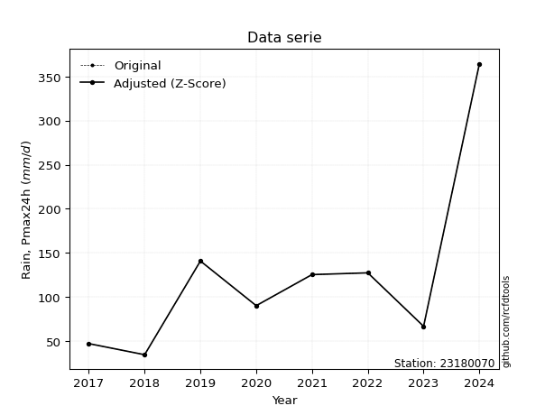</img>

</div>

> If Z-Score is active, values out of range or outliers are replaced with the station mean value.


### 4. Active continuous probability distributions from SciPy (45 of 104 available)

[scipy.stats](https://docs.scipy.org/doc/scipy/reference/stats.html) is a Python´s powerful submodule within the SciPy library for comprehensive statistical analysis, offering over 130 probability distributions (like Normal, Poisson), functions for descriptive stats (mean, variance), hypothesis testing (t-tests, chi-square), random variable generation, and statistical tests, making it essential for data science, modeling, and research. It provides tools to explore, model, and draw conclusions from data efficiently, working seamlessly with NumPy.

<div align="center">

|   id | p_dist             |   n_parameter | fit_method   | label                                                                       | active   | ref                                                                                                        |
|-----:|:-------------------|--------------:|:-------------|:----------------------------------------------------------------------------|:---------|:-----------------------------------------------------------------------------------------------------------|
|    0 | alpha              |             3 | MLE          | Alpha                                                                       | True     | [:mortar_board:](https://docs.scipy.org/doc/scipy/reference/generated/scipy.stats.alpha.html)              |
|    1 | betaprime          |             4 | MLE          | Beta prime                                                                  | True     | [:mortar_board:](https://docs.scipy.org/doc/scipy/reference/generated/scipy.stats.betaprime.html)          |
|    2 | chi2               |             3 | MLE          | Chi²                                                                        | True     | [:mortar_board:](https://docs.scipy.org/doc/scipy/reference/generated/scipy.stats.chi2.html)               |
|    3 | crystalball        |             4 | MLE          | Crystalball                                                                 | True     | [:mortar_board:](https://docs.scipy.org/doc/scipy/reference/generated/scipy.stats.crystalball.html)        |
|    4 | erlang             |             3 | MLE          | Erlang                                                                      | True     | [:mortar_board:](https://docs.scipy.org/doc/scipy/reference/generated/scipy.stats.erlang.html)             |
|    5 | expon              |             2 | MLE          | Exponential                                                                 | True     | [:mortar_board:](https://docs.scipy.org/doc/scipy/reference/generated/scipy.stats.expon.html)              |
|    6 | exponnorm          |             3 | MLE          | Exponentially modified Normal                                               | True     | [:mortar_board:](https://docs.scipy.org/doc/scipy/reference/generated/scipy.stats.exponnorm.html)          |
|    7 | f                  |             4 | MLE          | F                                                                           | True     | [:mortar_board:](https://docs.scipy.org/doc/scipy/reference/generated/scipy.stats.f.html)                  |
|    8 | fatiguelife        |             3 | MLE          | Fatigue-life (Birnbaum-Saunders)                                            | True     | [:mortar_board:](https://docs.scipy.org/doc/scipy/reference/generated/scipy.stats.fatiguelife.html)        |
|    9 | fisk               |             3 | MLE          | Fisk                                                                        | True     | [:mortar_board:](https://docs.scipy.org/doc/scipy/reference/generated/scipy.stats.fisk.html)               |
|   10 | gamma              |             3 | MLE          | Gamma                                                                       | True     | [:mortar_board:](https://docs.scipy.org/doc/scipy/reference/generated/scipy.stats.gamma.html)              |
|   11 | genexpon           |             5 | MLE          | Generalized exponential                                                     | True     | [:mortar_board:](https://docs.scipy.org/doc/scipy/reference/generated/scipy.stats.genexpon.html)           |
|   12 | genlogistic        |             3 | MLE          | Generalized logistic                                                        | True     | [:mortar_board:](https://docs.scipy.org/doc/scipy/reference/generated/scipy.stats.genlogistic.html)        |
|   13 | gibrat             |             2 | MM           | Gibrat                                                                      | True     | [:mortar_board:](https://docs.scipy.org/doc/scipy/reference/generated/scipy.stats.gibrat.html)             |
|   14 | gompertz           |             3 | MLE          | Gompertz (or truncated Gumbel)                                              | True     | [:mortar_board:](https://docs.scipy.org/doc/scipy/reference/generated/scipy.stats.gompertz.html)           |
|   15 | gumbel_l           |             2 | MM           | Gumbel Left Skew                                                            | True     | [:mortar_board:](https://docs.scipy.org/doc/scipy/reference/generated/scipy.stats.gumbel_l.html)           |
|   16 | gumbel_r           |             2 | MM           | Gumbel Right Skew                                                           | True     | [:mortar_board:](https://docs.scipy.org/doc/scipy/reference/generated/scipy.stats.gumbel_r.html)           |
|   17 | halflogistic       |             2 | MM           | Half-logistic                                                               | True     | [:mortar_board:](https://docs.scipy.org/doc/scipy/reference/generated/scipy.stats.halflogistic.html)       |
|   18 | halfnorm           |             2 | MM           | Half Normal                                                                 | True     | [:mortar_board:](https://docs.scipy.org/doc/scipy/reference/generated/scipy.stats.halfnorm.html)           |
|   19 | hypsecant          |             2 | MM           | hyperbolic secant                                                           | True     | [:mortar_board:](https://docs.scipy.org/doc/scipy/reference/generated/scipy.stats.hypsecant.html)          |
|   20 | invgamma           |             3 | MLE          | Inverted gamma                                                              | True     | [:mortar_board:](https://docs.scipy.org/doc/scipy/reference/generated/scipy.stats.invgamma.html)           |
|   21 | invgauss           |             3 | MLE          | Inverse Gaussian                                                            | True     | [:mortar_board:](https://docs.scipy.org/doc/scipy/reference/generated/scipy.stats.invgauss.html)           |
|   22 | invweibull         |             3 | MLE          | Inverted Weibull                                                            | True     | [:mortar_board:](https://docs.scipy.org/doc/scipy/reference/generated/scipy.stats.invweibull.html)         |
|   23 | johnsonsu          |             4 | MLE          | Johnson Su                                                                  | True     | [:mortar_board:](https://docs.scipy.org/doc/scipy/reference/generated/scipy.stats.johnsonsu.html)          |
|   24 | kstwobign          |             2 | MLE          | Limiting distribution of scaled Kolmogorov-Smirnov two-sided test statistic | True     | [:mortar_board:](https://docs.scipy.org/doc/scipy/reference/generated/scipy.stats.kstwobign.html)          |
|   25 | laplace            |             2 | MM           | Laplace                                                                     | True     | [:mortar_board:](https://docs.scipy.org/doc/scipy/reference/generated/scipy.stats.laplace.html)            |
|   26 | laplace_asymmetric |             3 | MLE          | Asymmetric Laplace                                                          | True     | [:mortar_board:](https://docs.scipy.org/doc/scipy/reference/generated/scipy.stats.laplace_asymmetric.html) |
|   27 | loggamma           |             3 | MLE          | Log gamma                                                                   | True     | [:mortar_board:](https://docs.scipy.org/doc/scipy/reference/generated/scipy.stats.loggamma.html)           |
|   28 | logistic           |             2 | MM           | Logistic (or Sech-squared)                                                  | True     | [:mortar_board:](https://docs.scipy.org/doc/scipy/reference/generated/scipy.stats.logistic.html)           |
|   29 | lognorm            |             3 | MLE          | Log Normal                                                                  | True     | [:mortar_board:](https://docs.scipy.org/doc/scipy/reference/generated/scipy.stats.lognorm.html)            |
|   30 | maxwell            |             2 | MM           | Maxwell                                                                     | True     | [:mortar_board:](https://docs.scipy.org/doc/scipy/reference/generated/scipy.stats.maxwell.html)            |
|   31 | mielke             |             4 | MLE          | Mielke Beta-Kappa / Dagum                                                   | True     | [:mortar_board:](https://docs.scipy.org/doc/scipy/reference/generated/scipy.stats.mielke.html)             |
|   32 | moyal              |             2 | MM           | Moyal                                                                       | True     | [:mortar_board:](https://docs.scipy.org/doc/scipy/reference/generated/scipy.stats.moyal.html)              |
|   33 | nakagami           |             3 | MLE          | Nakagami                                                                    | True     | [:mortar_board:](https://docs.scipy.org/doc/scipy/reference/generated/scipy.stats.nakagami.html)           |
|   34 | ncf                |             5 | MLE          | Non-central F distribution                                                  | True     | [:mortar_board:](https://docs.scipy.org/doc/scipy/reference/generated/scipy.stats.ncf.html)                |
|   35 | nct                |             4 | MLE          | Non-central Student’s t                                                     | True     | [:mortar_board:](https://docs.scipy.org/doc/scipy/reference/generated/scipy.stats.nct.html)                |
|   36 | norm               |             2 | MM           | Normal                                                                      | True     | [:mortar_board:](https://docs.scipy.org/doc/scipy/reference/generated/scipy.stats.norm.html)               |
|   37 | pareto             |             3 | MLE          | Pareto                                                                      | True     | [:mortar_board:](https://docs.scipy.org/doc/scipy/reference/generated/scipy.stats.pareto.html)             |
|   38 | pearson3           |             3 | MM           | Pearson type III                                                            | True     | [:mortar_board:](https://docs.scipy.org/doc/scipy/reference/generated/scipy.stats.pearson3.html)           |
|   39 | rayleigh           |             2 | MM           | Rayleigh                                                                    | True     | [:mortar_board:](https://docs.scipy.org/doc/scipy/reference/generated/scipy.stats.rayleigh.html)           |
|   40 | rice               |             3 | MLE          | Rice                                                                        | True     | [:mortar_board:](https://docs.scipy.org/doc/scipy/reference/generated/scipy.stats.rice.html)               |
|   41 | t                  |             3 | MLE          | Student’s t                                                                 | True     | [:mortar_board:](https://docs.scipy.org/doc/scipy/reference/generated/scipy.stats.t.html)                  |
|   42 | truncnorm          |             4 | MLE          | Truncated normal                                                            | True     | [:mortar_board:](https://docs.scipy.org/doc/scipy/reference/generated/scipy.stats.truncnorm.html)          |
|   43 | wald               |             2 | MM           | Wald                                                                        | True     | [:mortar_board:](https://docs.scipy.org/doc/scipy/reference/generated/scipy.stats.wald.html)               |
|   44 | weibull_min        |             3 | MLE          | Weibull minimum                                                             | True     | [:mortar_board:](https://docs.scipy.org/doc/scipy/reference/generated/scipy.stats.weibull_min.html)        |

</div>

> **n_parameter:** # arguments & localization & scale.
>
> **Fit methods:** (MLE) maximum likelihood, (MM) L-moments.
>
>**Inactive:** foldnorm, gennorm, norminvgauss, powernorm, powerlognorm, skewnorm, genextreme, anglit, arcsine, argus, beta, bradford, burr, burr12, cauchy, cosine, halfcauchy, foldcauchy, skewcauchy, wrapcauchy, dgamma, gengamma, exponweib, exponpow, truncexpon, gausshyper, genhalflogistic, genhyperbolic, geninvgauss, halfgennorm, johnsonsb, kappa4, kappa3, ksone, kstwo, loglaplace, levy, levy_l, levy_stable, ncx2, genpareto, truncpareto, lomax, powerlaw, rdist, rel_breitwigner, recipinvgauss, semicircular, studentized_range, trapezoid, triang, truncweibull_min, tukeylambda, uniform, loguniform, vonmises, vonmises_line, weibull_max, dweibull, 


## B. Probability distributions vs. Empirical distributions

A continuous probability distribution (CPD) describes probabilities for variables that can take any value within a range (like rain any time), unlike discrete variables with specific outcomes (like temperature). It uses a Probability Density Function (PDF), a curve where the total area under it equals 1, and the probability of the variable falling within an interval (a to b) is found by calculating the area under the curve between those points. A key feature is that the probability of hitting any single exact value is zero, so probabilities are always expressed for ranges, e.g., $P(a ≤ X ≤ b)$.

<div align="center">

Distributions parameters
|    |   station | p_dist                |   n |               loc |          scale | shape                  | shape1                 | shape2                 | shape3   |
|---:|----------:|:----------------------|----:|------------------:|---------------:|:-----------------------|:-----------------------|:-----------------------|:---------|
|  0 |  23180070 | alpha                 |   9 |     -49.9706      |  367.307       | 2.617530079650784      |                        |                        |          |
|  1 |  23180070 | betaprime             |   9 |      -0.591568    |    1.24457     | 183.6744129274939      | 2.8557829036461655     |                        |          |
|  2 |  23180070 | chi2                  |   9 |      34.6         |   37.135       | 1.46731699058581       |                        |                        |          |
|  3 |  23180070 | crystalball           |   9 |     119.733       |   93.1517      | 6939.403264316334      | 21311.574374172927     |                        |          |
|  4 |  23180070 | erlang                |   9 |      34.6         |   59.0639      | 0.3069162803933869     |                        |                        |          |
|  5 |  23180070 | expon                 |   9 |      34.6         |   85.1333      |                        |                        |                        |          |
|  6 |  23180070 | exponnorm             |   9 |      34.4606      |    0.0454188   | 1863.8837070148656     |                        |                        |          |
|  7 |  23180070 | f                     |   9 |       5.54915     |   75.0235      | 32.53888846129979      | 5.591319834554572      |                        |          |
|  8 |  23180070 | fatiguelife           |   9 |      22.0222      |   65.5058      | 0.9871855772406041     |                        |                        |          |
|  9 |  23180070 | fisk                  |   9 |      26.4712      |   62.523       | 1.7586103213925264     |                        |                        |          |
| 10 |  23180070 | gamma                 |   9 |      34.6         |  177.277       | 0.20131844730302223    |                        |                        |          |
| 11 |  23180070 | genexpon              |   9 |      34.6         |    0.362712    | 0.004260317818490643   | 1.9467290674808795e-09 | 2.5278940241825993     |          |
| 12 |  23180070 | genlogistic           |   9 |    -325.349       |   53.3076      | 2134.9542666437746     |                        |                        |          |
| 13 |  23180070 | gibrat                |   9 |      48.6703      |   43.1019      |                        |                        |                        |          |
| 14 |  23180070 | gompertz              |   9 |      34.6         |    1.46197e+10 | 171538213.64738867     |                        |                        |          |
| 15 |  23180070 | gumbel_l              |   9 |     161.657       |   72.6301      |                        |                        |                        |          |
| 16 |  23180070 | gumbel_r              |   9 |      77.8101      |   72.6301      |                        |                        |                        |          |
| 17 |  23180070 | halflogistic          |   9 |       9.32689     |   79.6414      |                        |                        |                        |          |
| 18 |  23180070 | halfnorm              |   9 |      -3.56305     |  154.529       |                        |                        |                        |          |
| 19 |  23180070 | hypsecant             |   9 |     119.733       |   59.3022      |                        |                        |                        |          |
| 20 |  23180070 | invgamma              |   9 |       0.64332     |  213.534       | 2.739750769507001      |                        |                        |          |
| 21 |  23180070 | invgauss              |   9 |      17.045       |  110.858       | 0.9263056329340112     |                        |                        |          |
| 22 |  23180070 | invweibull            |   9 |     -27.0004      |   99.9422      | 2.425421004422194      |                        |                        |          |
| 23 |  23180070 | johnsonsu             |   9 |      23.1734      |    0.415386    | -6.215420494991292     | 1.082727888495786      |                        |          |
| 24 |  23180070 | kstwobign             |   9 |    -124.052       |  285.382       |                        |                        |                        |          |
| 25 |  23180070 | laplace               |   9 |     119.733       |   65.8682      |                        |                        |                        |          |
| 26 |  23180070 | laplace_asymmetric    |   9 |      34.6         |    0.000236893 | 2.7826156074197275e-06 |                        |                        |          |
| 27 |  23180070 | loggamma              |   9 |  -34132.2         | 4481.33        | 2087.160146992826      |                        |                        |          |
| 28 |  23180070 | logistic              |   9 |     119.733       |   51.3572      |                        |                        |                        |          |
| 29 |  23180070 | lognorm               |   9 |      34.6         |    1.09075     | 11.579700346177844     |                        |                        |          |
| 30 |  23180070 | maxwell               |   9 |    -100.997       |  138.322       |                        |                        |                        |          |
| 31 |  23180070 | mielke                |   9 |      -0.238592    |   45.1208      | 6.740634993799907      | 2.0908510015761985     |                        |          |
| 32 |  23180070 | moyal                 |   9 |      66.4632      |   41.933       |                        |                        |                        |          |
| 33 |  23180070 | nakagami              |   9 |      34.6         |  134.329       | 0.23226858597114602    |                        |                        |          |
| 34 |  23180070 | ncf                   |   9 |      -0.485468    |   83.1494      | 43.90646920837701      | 6.309176027321964      | 3.7723762751182895e-10 |          |
| 35 |  23180070 | nct                   |   9 |     -15.6772      |    9.64951     | 2.378184369114349      | 9.367582169218586      |                        |          |
| 36 |  23180070 | norm                  |   9 |     119.733       |   93.1517      |                        |                        |                        |          |
| 37 |  23180070 | pareto                |   9 |      34.5919      |    0.00810931  | 0.125210119752726      |                        |                        |          |
| 38 |  23180070 | pearson3              |   9 |     119.733       |   93.1517      | 1.8453641293577323     |                        |                        |          |
| 39 |  23180070 | rayleigh              |   9 |     -58.4714      |  142.187       |                        |                        |                        |          |
| 40 |  23180070 | rice                  |   9 |     -16.3501      |  116.61        | 0.00023480697833109295 |                        |                        |          |
| 41 |  23180070 | t                     |   9 |      91.6984      |   39.3266      | 1.8093319917146746     |                        |                        |          |
| 42 |  23180070 | truncnorm             |   9 | -111760           | 3229.35        | 34.61815625457771      | 751240.529573726       |                        |          |
| 43 |  23180070 | wald                  |   9 |      26.5816      |   93.1517      |                        |                        |                        |          |
| 44 |  23180070 | weibull_min           |   9 |      34.6         |  135.175       | 0.22912700892030674    |                        |                        |          |
| 45 |  23180070 | logalpha              |   9 |      -2.63889     |   80.738       | 11.308638961307913     |                        |                        |          |
| 46 |  23180070 | logbetaprime          |   9 |      -1.656       |    1.16997     | 584.280351390538       | 111.02943388141688     |                        |          |
| 47 |  23180070 | logchi2               |   9 |       3.54385     |    0.98512     | 1.018458891773741      |                        |                        |          |
| 48 |  23180070 | logcrystalball        |   9 |       4.5576      |    0.648723    | 809.1369226974393      | 5.537970120784168      |                        |          |
| 49 |  23180070 | logerlang             |   9 |       2.52074     |    0.21204     | 9.605996558495395      |                        |                        |          |
| 50 |  23180070 | logexpon              |   9 |       3.54385     |    1.01375     |                        |                        |                        |          |
| 51 |  23180070 | logexponnorm          |   9 |       4.1002      |    0.474538    | 0.9638732750248229     |                        |                        |          |
| 52 |  23180070 | logf                  |   9 |       0.510133    |    3.97153     | 315.5652626506327      | 106.33958698829666     |                        |          |
| 53 |  23180070 | logfatiguelife        |   9 |       1.30234     |    3.19143     | 0.1999864910784599     |                        |                        |          |
| 54 |  23180070 | logfisk               |   9 |       0.803495    |    3.70594     | 10.171580553568985     |                        |                        |          |
| 55 |  23180070 | loggamma              |   9 |       2.52074     |    0.212041    | 9.605979531591753      |                        |                        |          |
| 56 |  23180070 | loggenexpon           |   9 |       3.54385     |    0.00937816  | 0.004029398305038836   | 1.042697135676319      | 6.611929245776597e-05  |          |
| 57 |  23180070 | loggenlogistic        |   9 |       3.8193      |    0.478166    | 3.1509962170342583     |                        |                        |          |
| 58 |  23180070 | loggibrat             |   9 |       4.06271     |    0.300166    |                        |                        |                        |          |
| 59 |  23180070 | loggompertz           |   9 |       3.54385     |    1.19541     | 0.5767234857257695     |                        |                        |          |
| 60 |  23180070 | loggumbel_l           |   9 |       4.84956     |    0.505808    |                        |                        |                        |          |
| 61 |  23180070 | loggumbel_r           |   9 |       4.26564     |    0.505808    |                        |                        |                        |          |
| 62 |  23180070 | loghalflogistic       |   9 |       3.78873     |    0.554622    |                        |                        |                        |          |
| 63 |  23180070 | loghalfnorm           |   9 |       3.69893     |    1.07618     |                        |                        |                        |          |
| 64 |  23180070 | loghypsecant          |   9 |       4.5576      |    0.41299     |                        |                        |                        |          |
| 65 |  23180070 | loginvgamma           |   9 |      -0.0668733   |  236.78        | 52.199576035095745     |                        |                        |          |
| 66 |  23180070 | loginvgauss           |   9 |       1.26999     |   83.1113      | 0.039556670586585636   |                        |                        |          |
| 67 |  23180070 | loginvweibull         |   9 |      -3.49412e+07 |    3.49412e+07 | 61827762.6247773       |                        |                        |          |
| 68 |  23180070 | logjohnsonsu          |   9 |       1.28436     |    0.723824    | -11.368141088306887    | 5.177438510544814      |                        |          |
| 69 |  23180070 | logkstwobign          |   9 |       2.23748     |    2.66191     |                        |                        |                        |          |
| 70 |  23180070 | loglaplace            |   9 |       4.5576      |    0.458717    |                        |                        |                        |          |
| 71 |  23180070 | loglaplace_asymmetric |   9 |       4.50203     |    0.501345    | 0.9459915497626773     |                        |                        |          |
| 72 |  23180070 | logloggamma           |   9 |    -167.071       |   23.8318      | 1342.1028968989658     |                        |                        |          |
| 73 |  23180070 | loglogistic           |   9 |       4.5576      |    0.35766     |                        |                        |                        |          |
| 74 |  23180070 | loglognorm            |   9 |       3.54385     |    0.0195065   | 11.119113552167414     |                        |                        |          |
| 75 |  23180070 | logmaxwell            |   9 |       3.0204      |    0.963299    |                        |                        |                        |          |
| 76 |  23180070 | logmielke             |   9 |      -0.0817514   |    4.55944     | 13.171851960574967     | 12.344901140928727     |                        |          |
| 77 |  23180070 | logmoyal              |   9 |       4.18662     |    0.292028    |                        |                        |                        |          |
| 78 |  23180070 | lognakagami           |   9 |       3.54385     |    1.21113     | 0.46107218237343195    |                        |                        |          |
| 79 |  23180070 | logncf                |   9 |       0.773448    |    3.7137      | 178.34745541676446     | 113.20216269263133     | 0.2557668068620236     |          |
| 80 |  23180070 | lognct                |   9 |      -0.585803    |    0.261405    | 39.57494672053144      | 19.29846957968566      |                        |          |
| 81 |  23180070 | lognorm               |   9 |       4.5576      |    0.648723    |                        |                        |                        |          |
| 82 |  23180070 | logpareto             |   9 |       3.54373     |    0.000123643 | 0.12516767175449905    |                        |                        |          |
| 83 |  23180070 | logpearson3           |   9 |       4.5576      |    0.648722    | 0.4372704605391924     |                        |                        |          |
| 84 |  23180070 | lograyleigh           |   9 |       3.31655     |    0.990211    |                        |                        |                        |          |
| 85 |  23180070 | logrice               |   9 |       3.2929      |    0.831481    | 0.9603179756040037     |                        |                        |          |
| 86 |  23180070 | logt                  |   9 |       4.5576      |    0.648724    | 6607214130.520575      |                        |                        |          |
| 87 |  23180070 | logtruncnorm          |   9 |       3.0706      |    1.46142     | 0.3238334992608938     | 10.26411513799535      |                        |          |
| 88 |  23180070 | logwald               |   9 |       3.90883     |    0.648761    |                        |                        |                        |          |
| 89 |  23180070 | logweibull_min        |   9 |       3.33061     |    1.38069     | 1.949943161406031      |                        |                        |          |

</div>

> **loc** (Location parameter): This shifts the distribution along the x-axis. For many common distributions, like the normal (Gaussian) distribution, loc represents the mean $μ$. For others, like the uniform distribution, it might represent the minimum value, or for the beta distribution, the left end of the support interval.
>
> **scale** (Scale parameter): This determines the width or spread of the distribution. For the normal distribution, scale represents the standard deviation $σ$. For a uniform distribution, it defines the length of the interval (from $loc$ to $loc + scale$).
>
> **shape** (Shape parameters): Refers to parameters that define the specific form of a probability distribution, distinct from its location (loc) and scale (scale). These parameters are required arguments for most distribution functions. For example, a normal (Gaussian) distribution is fully defined by its location (mean) and scale (standard deviation), so it has no specific shape parameters beyond loc and scale. However, other distributions have intrinsic properties that need specification, as Gamma distribution that takes a shape parameter, often named $a$ or $alpha$.


### 0. Cumulative distribution values - CDF (90 evaluated)

> Ordered by x ascending and calculating $log(f(x))$ separately. 

|   id |   Station |   date |     x |   count |    mean |     std |     zscore |   Value_initial |   station |   m |     alpha |   alpha_pdf |   betaprime |   betaprime_pdf |        chi2 |      chi2_pdf |   crystalball |   crystalball_pdf |      erlang |   erlang_pdf |    expon |   expon_pdf |   exponnorm |   exponnorm_pdf |         f |       f_pdf |   fatiguelife |   fatiguelife_pdf |      fisk |    fisk_pdf |       gamma |   gamma_pdf |    genexpon |   genexpon_pdf |   genlogistic |   genlogistic_pdf |   gibrat |   gibrat_pdf |    gompertz |   gompertz_pdf |   gumbel_l |   gumbel_l_pdf |   gumbel_r |   gumbel_r_pdf |   halflogistic |   halflogistic_pdf |   halfnorm |   halfnorm_pdf |   hypsecant |   hypsecant_pdf |   invgamma |   invgamma_pdf |   invgauss |   invgauss_pdf |   invweibull |   invweibull_pdf |   johnsonsu |   johnsonsu_pdf |   kstwobign |   kstwobign_pdf |   laplace |   laplace_pdf |   laplace_asymmetric |   laplace_asymmetric_pdf |   loggamma |   loggamma_pdf |   logistic |   logistic_pdf |   lognorm |   lognorm_pdf |   maxwell |   maxwell_pdf |    mielke |   mielke_pdf |    moyal |   moyal_pdf |    nakagami |   nakagami_pdf |       ncf |     ncf_pdf |       nct |    nct_pdf |     norm |    norm_pdf |   pareto |   pareto_pdf |   pearson3 |   pearson3_pdf |   rayleigh |   rayleigh_pdf |      rice |    rice_pdf |        t |       t_pdf |   truncnorm |   truncnorm_pdf |       wald |    wald_pdf |   weibull_min |   weibull_min_pdf |   logalpha |   logalpha_pdf |   logbetaprime |   logbetaprime_pdf |     logchi2 |   logchi2_pdf |   logcrystalball |   logcrystalball_pdf |   logerlang |   logerlang_pdf |   logexpon |   logexpon_pdf |   logexponnorm |   logexponnorm_pdf |     logf |   logf_pdf |   logfatiguelife |   logfatiguelife_pdf |   logfisk |   logfisk_pdf |   loggenexpon |   loggenexpon_pdf |   loggenlogistic |   loggenlogistic_pdf |   loggibrat |   loggibrat_pdf |   loggompertz |   loggompertz_pdf |   loggumbel_l |   loggumbel_l_pdf |   loggumbel_r |   loggumbel_r_pdf |   loghalflogistic |   loghalflogistic_pdf |   loghalfnorm |   loghalfnorm_pdf |   loghypsecant |   loghypsecant_pdf |   loginvgamma |   loginvgamma_pdf |   loginvgauss |   loginvgauss_pdf |   loginvweibull |   loginvweibull_pdf |   logjohnsonsu |   logjohnsonsu_pdf |   logkstwobign |   logkstwobign_pdf |   loglaplace |   loglaplace_pdf |   loglaplace_asymmetric |   loglaplace_asymmetric_pdf |   logloggamma |   logloggamma_pdf |   loglogistic |   loglogistic_pdf |   loglognorm |   loglognorm_pdf |   logmaxwell |   logmaxwell_pdf |   logmielke |   logmielke_pdf |   logmoyal |   logmoyal_pdf |   lognakagami |   lognakagami_pdf |    logncf |   logncf_pdf |    lognct |   lognct_pdf |   logpareto |   logpareto_pdf |   logpearson3 |   logpearson3_pdf |   lograyleigh |   lograyleigh_pdf |   logrice |   logrice_pdf |      logt |   logt_pdf |   logtruncnorm |   logtruncnorm_pdf |   logwald |   logwald_pdf |   logweibull_min |   logweibull_min_pdf |
|-----:|----------:|-------:|------:|--------:|--------:|--------:|-----------:|----------------:|----------:|----:|----------:|------------:|------------:|----------------:|------------:|--------------:|--------------:|------------------:|------------:|-------------:|---------:|------------:|------------:|----------------:|----------:|------------:|--------------:|------------------:|----------:|------------:|------------:|------------:|------------:|---------------:|--------------:|------------------:|---------:|-------------:|------------:|---------------:|-----------:|---------------:|-----------:|---------------:|---------------:|-------------------:|-----------:|---------------:|------------:|----------------:|-----------:|---------------:|-----------:|---------------:|-------------:|-----------------:|------------:|----------------:|------------:|----------------:|----------:|--------------:|---------------------:|-------------------------:|-----------:|---------------:|-----------:|---------------:|----------:|--------------:|----------:|--------------:|----------:|-------------:|---------:|------------:|------------:|---------------:|----------:|------------:|----------:|-----------:|---------:|------------:|---------:|-------------:|-----------:|---------------:|-----------:|---------------:|----------:|------------:|---------:|------------:|------------:|----------------:|-----------:|------------:|--------------:|------------------:|-----------:|---------------:|---------------:|-------------------:|------------:|--------------:|-----------------:|---------------------:|------------:|----------------:|-----------:|---------------:|---------------:|-------------------:|---------:|-----------:|-----------------:|---------------------:|----------:|--------------:|--------------:|------------------:|-----------------:|---------------------:|------------:|----------------:|--------------:|------------------:|--------------:|------------------:|--------------:|------------------:|------------------:|----------------------:|--------------:|------------------:|---------------:|-------------------:|--------------:|------------------:|--------------:|------------------:|----------------:|--------------------:|---------------:|-------------------:|---------------:|-------------------:|-------------:|-----------------:|------------------------:|----------------------------:|--------------:|------------------:|--------------:|------------------:|-------------:|-----------------:|-------------:|-----------------:|------------:|----------------:|-----------:|---------------:|--------------:|------------------:|----------:|-------------:|----------:|-------------:|------------:|----------------:|--------------:|------------------:|--------------:|------------------:|----------:|--------------:|----------:|-----------:|---------------:|-------------------:|----------:|--------------:|-----------------:|---------------------:|
|    0 |  23180070 |   2018 |  34.6 |       9 | 119.733 | 98.8023 | -0.861653  |            34.6 |  23180070 |   1 | 0.0423915 | 0.0046428   |    0.038872 |     0.00524813  | 1.93076e-12 | 199.357       |      0.180379 |       0.00282063  | 1.45028e-05 |  6.26442e+08 | 0        | 0.0117463   |  0.00164502 |     0.0117805   | 0.0398852 | 0.00546271  |     0.0308911 |       0.00763643  | 0.0269153 | 0.00566621  | 0.000544768 | 1.54349e+10 | 2.12913e-08 |    0.0117457   |     0.0826981 |       0.00386455  | 0        |  0           | 6.72951e-11 |    0.0117333   |   0.159606 |     0.00201199 |   0.163178 |    0.00407308  |       0.15735  |        0.0061227   |   0.195064 |    0.00500825  |    0.148734 |     0.00241779  |  0.0373348 |    0.0052857   |   0.032711 |     0.00651931 |    0.0393998 |      0.00501691  |    0.030336 |      0.00650281 |   0.0832603 |     0.00366502  |  0.137295 |   0.00208438  |          2.16108e-11 |              0.0117463   |  0.0357888 |       0.191542 |   0.160075 |    0.00261796  | 0.0590643 |     0.181378  |  0.189309 |   0.00342838  | 0.0398488 |  0.0048726   | 0.143691 | 0.00477639  | 2.15034e-08 |    1.40585e+06 | 0.0429166 | 0.00518637  | 0.0397777 | 0.00500723 | 0.180379 | 0.00282063  | 0        | 15.4403      |   0.114276 |     0.00778363 |   0.192839 |    0.00371585  | 0.0910382 | 0.00340578  | 0.147896 | 0.00300176  | 1.32447e-06 |     0.0107288   | 0.00171057 | 0.00132533  |   0.000186179 |       6.00311e+09 |  0.0400625 |      0.182239  |      0.0459226 |          0.185751  | 1.21438e-08 |   1.39251e+07 |        0.0590642 |            0.181378  |   0.0357888 |       0.191542  |   0        |      0.986441  |      0.0421515 |          0.171336  | 0.039281 |  0.183711  |         0.037873 |            0.186746  | 0.0443497 |     0.157315  |   4.87516e-07 |         0.429658  |        0.0399313 |            0.16845   |    0        |       0         |   1.89386e-09 |         0.48245   |     0.0728741 |        0.138693   |     0.0155117 |          0.127764 |          0        |             0         |      0        |         0         |      0.0545476 |          0.131434  |     0.0393105 |         0.183609  |     0.0379444 |         0.186612  |       0.0312522 |           0.191652  |      0.0393997 |          0.185749  |      0.0304543 |          0.215509  |    0.0548526 |        0.119578  |               0.0626285 |                   0.132053  |      0.060551 |         0.181822  |     0.0554942 |         0.146549  |    0.0023627 |      1.49341e+12 |     0.039087 |        0.211008  |   0.0459624 |       0.15767   | 0.00264955 |      0.0448385 |   8.73701e-15 |          9.07113  | 0.0393363 |    0.183284  | 0.0404615 |    0.18361   |    0        |    1012.34      |     0.0434221 |         0.188277  |      0.026002 |         0.225789  | 0.0283696 |     0.223317  | 0.0590644 |  0.181379  |    1.86614e-11 |           0.694411 |  0        |     0         |        0.0258507 |            0.233307  |
|    1 |  23180070 |   2017 |  47.2 |       9 | 119.733 | 98.8023 | -0.734126  |            47.2 |  23180070 |   2 | 0.123064  | 0.00793138  |    0.129797 |     0.0087167   | 0.277013    |   0.0146073   |      0.218091 |       0.00316272  | 0.661523    |  0.0136632   | 0.137572 | 0.0101303   |  0.139709   |     0.0101623   | 0.133879  | 0.00894502  |     0.15723   |       0.0108049   | 0.125481  | 0.00930982  | 0.632366    | 0.00952177  | 0.137566    |    0.0101299   |     0.139722  |       0.00515612  | 0        |  0           | 0.137431    |    0.0101208   |   0.186838 |     0.0023156  |   0.217801 |    0.00457065  |       0.233391 |        0.00593616  |   0.257468 |    0.00489212  |    0.18222  |     0.00290764  |  0.129965  |    0.00890564  |   0.144665 |     0.0101384  |    0.127549  |      0.00858554  |    0.141983 |      0.0101247  |   0.135822  |     0.00464136  |  0.166238 |   0.00252379  |          0.137572    |              0.0101303   |  0.132461  |       0.433452 |   0.195867 |    0.00306681  | 0.139186  |     0.341742  |  0.234469 |   0.00372979  | 0.126159  |  0.00849416  | 0.208316 | 0.00542429  | 0.260595    |    0.0095917   | 0.130262  | 0.00829632  | 0.127634  | 0.00855515 | 0.218091 | 0.00316272  | 0.601552 |  0.00395695  |   0.210685 |     0.00744615 |   0.241311 |    0.00396554  | 0.138001  | 0.00402855  | 0.192801 | 0.00418963  | 0.126451    |     0.00937316  | 0.0838007  | 0.0104546   |   0.440439    |       0.00590789  |  0.130202  |      0.405526  |      0.133947  |          0.387895  | 0.417893    |   0.616637    |        0.139186  |            0.341742  |   0.132461  |       0.433452  |   0.263856 |      0.726163  |      0.126574  |          0.384045  | 0.130527 |  0.410479  |         0.1313   |            0.41996   | 0.12149   |     0.355835  |   0.157344    |         0.566955  |        0.126111  |            0.400279  |    0        |       0         |   0.157246    |         0.527197  |     0.130476  |        0.240343   |     0.104898  |          0.46761  |          0.059128 |             0.898363  |      0.114864 |         0.733706  |      0.114726  |          0.271818  |     0.130501  |         0.410274  |     0.131265  |         0.419478  |       0.135264  |           0.478821  |      0.131527  |          0.413533  |      0.145701  |          0.512487  |    0.107945  |        0.23532   |               0.120542  |                   0.254164  |      0.140397 |         0.339417  |     0.122805  |         0.301192  |    0.598282  |      0.112013    |     0.138511 |        0.426797  |   0.122793  |       0.353355  | 0.0773651  |      0.507168  |   0.223121    |          0.648925 | 0.130232  |    0.408656  | 0.131025  |    0.406581  |    0.624669 |       0.151222  |     0.133643  |         0.398352  |      0.137146 |         0.473299  | 0.13518   |     0.451724  | 0.139186  |  0.341742  |    0.206859    |           0.633763 |  0        |     0         |        0.140211  |            0.483548  |
|    2 |  23180070 |   2023 |  66.8 |       9 | 119.733 | 98.8023 | -0.53575   |            66.8 |  23180070 |   3 | 0.300075  | 0.00938988  |    0.312816 |     0.00922698  | 0.496585    |   0.00873832  |      0.284933 |       0.00364419  | 0.823661    |  0.00511697  | 0.314927 | 0.00804706  |  0.317513   |     0.00806194  | 0.319531  | 0.0092692   |     0.349122  |       0.00852353  | 0.316242  | 0.00942923  | 0.750464    | 0.00402949  | 0.314915    |    0.00804683  |     0.255946  |       0.00654108  | 0.19324  |  0.0151239   | 0.314641    |    0.00804154  |   0.237304 |     0.0028447  |   0.312333 |    0.00500422  |       0.34594  |        0.00552681  |   0.351134 |    0.00465487  |    0.247483 |     0.00376532  |  0.315957  |    0.00931421  |   0.336464 |     0.00890184 |    0.311521  |      0.00939454  |    0.335179 |      0.00904304 |   0.237589  |     0.0056231   |  0.223852 |   0.00339848  |          0.314927    |              0.00804706  |  0.32014   |       0.617483 |   0.262951 |    0.00377371  | 0.291637  |     0.529048  |  0.311156 |   0.00406708  | 0.310727  |  0.00950123  | 0.319254 | 0.00577032  | 0.402101    |    0.00573844  | 0.306043  | 0.00898194  | 0.311085  | 0.00937492 | 0.284933 | 0.00364419  | 0.6457   |  0.00137735  |   0.347656 |     0.00649632 |   0.321662 |    0.00420319  | 0.224484  | 0.00474219  | 0.298635 | 0.00670703  | 0.292146    |     0.00759659  | 0.301947   | 0.0103864   |   0.513177    |       0.00249365  |  0.310605  |      0.609228  |      0.306055  |          0.584735  | 0.579272    |   0.357666    |        0.291637  |            0.529048  |   0.32014   |       0.617483  |   0.477395 |      0.515519  |      0.303307  |          0.615182  | 0.312298 |  0.610987  |         0.315573 |            0.613836  | 0.29281   |     0.619813  |   0.363651    |         0.600803  |        0.310491  |            0.634449  |    0.220684 |       2.13401   |   0.345052    |         0.547845  |     0.242556  |        0.416012   |     0.321506  |          0.721273 |          0.356003 |             0.787259  |      0.359632 |         0.66475   |      0.254447  |          0.552559  |     0.312232  |         0.610991  |     0.315402  |         0.613646  |       0.338902  |           0.648882  |      0.313915  |          0.610988  |      0.352439  |          0.633659  |    0.230156  |        0.501739  |               0.250712  |                   0.528629  |      0.291624 |         0.524887  |     0.269912  |         0.550969  |    0.624155  |      0.0518768   |     0.318617 |        0.587255  |   0.292831  |       0.615649  | 0.329808   |      0.828044  |   0.43153     |          0.550681 | 0.311268  |    0.608989  | 0.311475  |    0.608355  |    0.658319 |       0.0649986 |     0.309063  |         0.590894  |      0.329364 |         0.605408  | 0.320336  |     0.590692  | 0.291637  |  0.529048  |    0.411653    |           0.542386 |  0.32074  |     1.45274   |        0.334574  |            0.606741  |
|    3 |  23180070 |   2025 |  80.8 |       9 | 119.733 | 98.8023 | -0.394053  |            80.8 |  23180070 |   4 | 0.426049  | 0.0084509   |    0.433872 |     0.00798084  | 0.602743    |   0.00657362  |      0.33799  |       0.00392452  | 0.879942    |  0.00314344  | 0.41881  | 0.00682682  |  0.421541   |     0.0068331   | 0.440549  | 0.007943    |     0.456271  |       0.00684408  | 0.43855   | 0.00797021  | 0.797269    | 0.00279081  | 0.418796    |    0.00682667  |     0.350603  |       0.00689165  | 0.38446  |  0.0118922   | 0.418462    |    0.00682337  |   0.279986 |     0.00325641 |   0.383019 |    0.00506088  |       0.420845 |        0.00516622  |   0.41489  |    0.00444846  |    0.304595 |     0.00438756  |  0.437599  |    0.00798379  |   0.449645 |     0.00728192 |    0.435053  |      0.00814671  |    0.450529 |      0.0074377  |   0.318591  |     0.00589221  |  0.276865 |   0.00420331  |          0.418811    |              0.00682682  |  0.440127  |       0.633429 |   0.319061 |    0.00423039  | 0.399244  |     0.595246  |  0.369138 |   0.00420088  | 0.435711  |  0.00823298  | 0.399304 | 0.00562142  | 0.474264    |    0.00466342  | 0.425103  | 0.00792978  | 0.434416  | 0.00813707 | 0.33799  | 0.00392452  | 0.661355 |  0.000917625 |   0.433516 |     0.005772   |   0.381035 |    0.00426393  | 0.293225  | 0.00504953  | 0.405046 | 0.00838007  | 0.3909      |     0.00653759  | 0.432698   | 0.00830068  |   0.542478    |       0.00177425  |  0.430649  |      0.641714  |      0.422274  |          0.627235  | 0.640162    |   0.286674    |        0.399244  |            0.595247  |   0.440127  |       0.63343   |   0.566829 |      0.427297  |      0.42631   |          0.66544   | 0.432368 |  0.640297  |         0.435612 |            0.637314  | 0.418821  |     0.689947  |   0.475742    |         0.572754  |        0.435477  |            0.665459  |    0.536867 |       1.20642   |   0.448836    |         0.540578  |     0.33281   |        0.533798   |     0.458876  |          0.706698 |          0.495886 |             0.67983   |      0.480417 |         0.602557  |      0.375638  |          0.712665  |     0.432315  |         0.640424  |     0.435433  |         0.637416  |       0.461754  |           0.631365  |      0.433794  |          0.638395  |      0.471041  |          0.604839  |    0.34847   |        0.759664  |               0.374465  |                   0.789565  |      0.398491 |         0.591852  |     0.386258  |         0.662816  |    0.632793  |      0.0399381   |     0.433243 |        0.609361  |   0.41817   |       0.687384  | 0.48171    |      0.750408  |   0.530907    |          0.493393 | 0.431033  |    0.639171  | 0.43127   |    0.640058  |    0.669012 |       0.0488407 |     0.425865  |         0.627137  |      0.445538 |         0.608129  | 0.434761  |     0.604792  | 0.399244  |  0.595246  |    0.509556    |           0.486254 |  0.543293 |     0.915874  |        0.450506  |            0.604467  |
|    4 |  23180070 |   2020 |  90.2 |       9 | 119.733 | 98.8023 | -0.298913  |            90.2 |  23180070 |   5 | 0.501064  | 0.00749119  |    0.50431  |     0.00700562  | 0.659363    |   0.00551335  |      0.375605 |       0.00407279  | 0.905571    |  0.00235799  | 0.479567 | 0.00611316  |  0.482335   |     0.00611497  | 0.510498  | 0.00694273  |     0.516154  |       0.00592378  | 0.508397  | 0.00689686  | 0.820981    | 0.00228277  | 0.479551    |    0.00611306  |     0.415324  |       0.00684459  | 0.485179 |  0.00959957  | 0.479192    |    0.00611082  |   0.311935 |     0.00354189 |   0.430345 |    0.00499591  |       0.468177 |        0.00490204  |   0.455994 |    0.0042952   |    0.347651 |     0.00476444  |  0.507892  |    0.00697499  |   0.513407 |     0.00630535 |    0.506855  |      0.00712772  |    0.515665 |      0.0064393  |   0.374102  |     0.00589772  |  0.319334 |   0.00484808  |          0.479567    |              0.00611316  |  0.50906   |       0.616432 |   0.360071 |    0.00448661  | 0.465868  |     0.612713  |  0.40884  |   0.00423971  | 0.508137  |  0.00717363  | 0.451152 | 0.00539695  | 0.515689    |    0.00417144  | 0.495496  | 0.007041    | 0.506151  | 0.00712279 | 0.375605 | 0.00407279  | 0.669117 |  0.000745034 |   0.485553 |     0.00530311 |   0.421112 |    0.004257    | 0.341275  | 0.00516159  | 0.486693 | 0.00887396  | 0.449357    |     0.00591065  | 0.504698   | 0.00704971  |   0.557726    |       0.00148693  |  0.5009    |      0.631653  |      0.49137   |          0.625277  | 0.669936    |   0.255344    |        0.465869  |            0.612713  |   0.50906   |       0.616433  |   0.611392 |      0.383339  |      0.499482  |          0.660173  | 0.502381 |  0.628835  |         0.505153 |            0.623399  | 0.49491   |     0.68747   |   0.537321    |         0.54514   |        0.50794   |            0.647483  |    0.648361 |       0.844542  |   0.507759    |         0.529344  |     0.395313  |        0.601383   |     0.534374  |          0.662051 |          0.566973 |             0.611716  |      0.544484 |         0.561211  |      0.457299  |          0.76382   |     0.502344  |         0.628999  |     0.504993  |         0.623635  |       0.52941   |           0.595785  |      0.503556  |          0.626249  |      0.53578   |          0.570029  |    0.442954  |        0.965638  |               0.472268  |                   0.995782  |      0.464793 |         0.610319  |     0.461236  |         0.694787  |    0.636918  |      0.0352175   |     0.499948 |        0.60039   |   0.494065  |       0.686545  | 0.560077   |      0.671759  |   0.583326    |          0.459125 | 0.500958  |    0.628362  | 0.501327  |    0.629835  |    0.674027 |       0.0425767 |     0.494763  |         0.621897  |      0.511609 |         0.59048   | 0.500842  |     0.593924  | 0.465869  |  0.612713  |    0.56124     |           0.452962 |  0.631619 |     0.700508  |        0.516049  |            0.584673  |
|    5 |  23180070 |   2021 | 125.4 |       9 | 119.733 | 98.8023 |  0.0573536 |           125.4 |  23180070 |   6 | 0.702649  | 0.00417389  |    0.694097 |     0.00401251  | 0.804224    |   0.00301196  |      0.524254 |       0.0042748   | 0.958731    |  0.000924874 | 0.65581  | 0.00404295  |  0.658439   |     0.00403472  | 0.697769  | 0.00394592  |     0.679462  |       0.00359827  | 0.691463  | 0.00379248  | 0.880708    | 0.00126503  | 0.655793    |    0.00404296  |     0.635047  |       0.00540854  | 0.717936 |  0.00440273  | 0.655405    |    0.00404324  |   0.455027 |     0.00455471 |   0.594925 |    0.00425383  |       0.622284 |        0.00384701  |   0.596032 |    0.00364494  |    0.53037  |     0.00534317  |  0.695851  |    0.00395654  |   0.68529  |     0.00371829 |    0.698098  |      0.00399292  |    0.690156 |      0.00373574 |   0.57053   |     0.00509905  |  0.541217 |   0.00696517  |          0.65581     |              0.00404295  |  0.69361   |       0.489791 |   0.527557 |    0.00485308  | 0.663571  |     0.56252   |  0.556176 |   0.00404845  | 0.698931  |  0.0039433   | 0.620444 | 0.00416773  | 0.639811    |    0.00300205  | 0.688871  | 0.00413738  | 0.697383  | 0.00399521 | 0.524254 | 0.0042748   | 0.688824 |  0.000429063 |   0.644201 |     0.00377618 |   0.566621 |    0.00394152  | 0.522326  | 0.00497944  | 0.755087 | 0.00550534  | 0.622645    |     0.00405184  | 0.691303   | 0.00391283  |   0.598625    |       0.00092458  |  0.691786  |      0.509113  |      0.683879  |          0.523173  | 0.74194     |   0.186856    |        0.663571  |            0.56252   |   0.69361   |       0.489791  |   0.719223 |      0.27697   |      0.698514  |          0.52436   | 0.692059 |  0.505399  |         0.69259  |            0.498656  | 0.700074  |     0.530219  |   0.699152    |         0.431554  |        0.698899  |            0.494956  |    0.826519 |       0.333442  |   0.672655    |         0.463731  |     0.618995  |        0.726854   |     0.721308  |          0.465876 |          0.735259 |             0.41415   |      0.707387 |         0.426138  |      0.697148  |          0.62758   |     0.692075  |         0.505525  |     0.692539  |         0.499014  |       0.701159  |           0.44047   |      0.692317  |          0.502888  |      0.701656  |          0.432474  |    0.724803  |        0.599927  |               0.716591  |                   0.534767  |      0.662328 |         0.56385   |     0.68262   |         0.605743  |    0.646844  |      0.0259542   |     0.683727 |        0.499999  |   0.699715  |       0.533533  | 0.740275   |      0.428641  |   0.717497    |          0.355571 | 0.690777  |    0.506576  | 0.691681  |    0.507921  |    0.685864 |       0.0305329 |     0.685208  |         0.515573  |      0.68974  |         0.479369  | 0.682708  |     0.49636   | 0.663571  |  0.56252   |    0.694088    |           0.354096 |  0.794421 |     0.340535  |        0.691727  |            0.471302  |
|    6 |  23180070 |   2022 | 127.4 |       9 | 119.733 | 98.8023 |  0.077596  |           127.4 |  23180070 |   7 | 0.710851  | 0.00402907  |    0.701994 |     0.00388531  | 0.810151    |   0.00291497  |      0.532797 |       0.00426823  | 0.960536    |  0.000880681 | 0.663802 | 0.00394908  |  0.666414   |     0.00394051  | 0.705534  | 0.00382011  |     0.686564  |       0.00350429  | 0.698921  | 0.0036666   | 0.883202    | 0.00122926  | 0.663785    |    0.00394909  |     0.645753  |       0.00529725  | 0.726564 |  0.00422628  | 0.663398    |    0.00394947  |   0.464185 |     0.0046032  |   0.603376 |    0.00419708  |       0.629918 |        0.003787    |   0.603282 |    0.00360548  |    0.541037 |     0.00532304  |  0.703637  |    0.00383013  |   0.692621 |     0.00361318 |    0.705952  |      0.00386147  |    0.697516 |      0.00362531 |   0.58066   |     0.00503018  |  0.554938 |   0.00675686  |          0.663802    |              0.00394908  |  0.701299  |       0.482068 |   0.537251 |    0.00484084  | 0.672425  |     0.556591  |  0.564248 |   0.0040235   | 0.706684  |  0.0038101   | 0.628704 | 0.00409282  | 0.645766    |    0.00295324  | 0.697017  | 0.00400938  | 0.705241  | 0.00386389 | 0.532797 | 0.00426823  | 0.689671 |  0.000418674 |   0.651678 |     0.00370132 |   0.574474 |    0.00391219  | 0.532251  | 0.00494478  | 0.765834 | 0.00524362  | 0.630662    |     0.00396582  | 0.699007   | 0.00379172  |   0.600455    |       0.000905037 |  0.699778  |      0.501064  |      0.692099  |          0.515702  | 0.744876    |   0.184253    |        0.672425  |            0.556591  |   0.701299  |       0.482068  |   0.723572 |      0.27268   |      0.706737  |          0.515026  | 0.699993 |  0.497416  |         0.700418 |            0.4908    | 0.70838   |     0.519611  |   0.705932    |         0.425443  |        0.706659  |            0.485862  |    0.831691 |       0.320451  |   0.679959    |         0.459425  |     0.630501  |        0.727304   |     0.728602  |          0.456094 |          0.741744 |             0.405516  |      0.714077 |         0.41955   |      0.706967  |          0.613481  |     0.700011  |         0.497536  |     0.700373  |         0.491154  |       0.708065  |           0.432528  |      0.700212  |          0.494968  |      0.708444  |          0.425505  |    0.734134  |        0.579586  |               0.724927  |                   0.519037  |      0.671205 |         0.558071  |     0.692126  |         0.595782  |    0.647252  |      0.0256285   |     0.691586 |        0.493235  |   0.708074  |       0.523019  | 0.746976   |      0.418395  |   0.723085    |          0.350684 | 0.69873   |    0.498643  | 0.699655  |    0.499927  |    0.686344 |       0.0301162 |     0.693307  |         0.508127  |      0.697272 |         0.472617  | 0.690511  |     0.489893  | 0.672426  |  0.556591  |    0.699654    |           0.349486 |  0.799725 |     0.329885  |        0.699131  |            0.464587  |
|    7 |  23180070 |   2019 | 140.8 |       9 | 119.733 | 98.8023 |  0.21322   |           140.8 |  23180070 |   8 | 0.758938  | 0.00318285  |    0.748855 |     0.00313807  | 0.845261    |   0.00234788  |      0.589459 |       0.00417458  | 0.970623    |  0.000639279 | 0.712765 | 0.00337394  |  0.71525    |     0.00336364  | 0.751588  | 0.00308283  |     0.729657  |       0.0029475   | 0.742958  | 0.00293753  | 0.898234    | 0.00102337  | 0.712749    |    0.00337398  |     0.711671  |       0.0045406   | 0.776262 |  0.00324495  | 0.71237     |    0.00337486  |   0.527818 |     0.00487843 |   0.656983 |    0.00380003  |       0.678002 |        0.00339216  |   0.649806 |    0.00333744  |    0.610771 |     0.00504584  |  0.749803  |    0.00308992  |   0.736733 |     0.00299407 |    0.752345  |      0.00309446  |    0.74158  |      0.0029763  |   0.644829  |     0.00454067  |  0.636864 |   0.00551307  |          0.712765    |              0.00337394  |  0.747023  |       0.43209  |   0.601135 |    0.0046687   | 0.726008  |     0.513421  |  0.616891 |   0.00382488  | 0.752342  |  0.00303777  | 0.680232 | 0.00360181  | 0.683288    |    0.00265477  | 0.745475  | 0.00325094  | 0.751671  | 0.00309734 | 0.589459 | 0.00417458  | 0.694868 |  0.000359724 |   0.698069 |     0.00323198 |   0.625464 |    0.00369165  | 0.596703  | 0.00466085  | 0.825363 | 0.00371116  | 0.680161    |     0.00343474  | 0.744911   | 0.00308918  |   0.611796    |       0.000792512 |  0.747275  |      0.44837   |      0.741204  |          0.465601  | 0.76252     |   0.168894    |        0.726008  |            0.513421  |   0.747023  |       0.43209   |   0.74954  |      0.247064  |      0.755215  |          0.454028  | 0.747151 |  0.445278  |         0.746963 |            0.439696  | 0.756949  |     0.451595  |   0.746532    |         0.386388  |        0.752359  |            0.428087  |    0.860115 |       0.251462  |   0.724467    |         0.430048  |     0.702776  |        0.712945   |     0.771187  |          0.396145 |          0.779661 |             0.35351   |      0.753967 |         0.378304  |      0.763721  |          0.521007  |     0.747179  |         0.445361  |     0.746952  |         0.440013  |       0.748842  |           0.383245  |      0.747147  |          0.443291  |      0.748812  |          0.381953  |    0.786214  |        0.466051  |               0.772232  |                   0.429778  |      0.724977 |         0.515689  |     0.748325  |         0.526575  |    0.649718  |      0.0237421   |     0.738691 |        0.448223  |   0.757003  |       0.455324  | 0.785733   |      0.357912  |   0.756627    |          0.320229 | 0.746024  |    0.44675   | 0.747056  |    0.447592  |    0.689233 |       0.0277128 |     0.741677  |         0.458561  |      0.74235  |         0.42852   | 0.737378  |     0.446782  | 0.726008  |  0.513421  |    0.733166    |           0.320834 |  0.829668 |     0.271256  |        0.743427  |            0.420964  |
|    8 |  23180070 |   2024 | 364.4 |       9 | 119.733 | 98.8023 |  2.47632   |           364.4 |  23180070 |   9 | 0.962546  | 0.000191582 |    0.96655  |     0.000220196 | 0.993954    |   8.55266e-05 |      0.995687 |       0.000136045 | 0.999648    |  6.61431e-06 | 0.979223 | 0.000244049 |  0.979706   |     0.000239722 | 0.966057  | 0.000219807 |     0.969451  |       0.000278301 | 0.951075  | 0.000242153 | 0.984272    | 0.000117274 | 0.97922     |    0.000244081 |     0.994884  |       9.57228e-05 | 0.976777 |  0.000173992 | 0.979134    |    0.000244823 |   1        |     1.8628e-08 |   0.980852 |    0.000261103 |       0.977103 |        0.000284205 |   0.982743 |    0.000303174 |    0.989719 |     0.000173341 |  0.965155  |    0.000222677 |   0.968423 |     0.00026225 |    0.964179  |      0.000217951 |    0.964177 |      0.0002499  |   0.994291  |     0.000136946 |  0.987816 |   0.000184975 |          0.979223    |              0.000244049 |  0.96519   |       0.083899 |   0.991541 |    0.000163318 | 0.980614  |     0.0726856 |  0.989886 |   0.000227358 | 0.96024   |  0.000221991 | 0.977142 | 0.000272477 | 0.965006    |    0.00041259  | 0.969372  | 0.000215753 | 0.963879  | 0.00021871 | 0.995687 | 0.000136045 | 0.735228 |  0.000100519 |   0.974378 |     0.00028747 |   0.987996 |    0.000251085 | 0.995159  | 0.000135555 | 0.986964 | 8.41682e-05 | 0.97109     |     0.000311084 | 0.971954   | 0.000239555 |   0.706754    |       0.000249926 |  0.967942  |      0.0796284 |      0.971653  |          0.0791373 | 0.874941    |   0.0808623   |        0.980614  |            0.0726855 |   0.96519   |       0.0838989 |   0.901969 |      0.0967014 |      0.966413  |          0.0732664 | 0.967488 |  0.0805456 |         0.966653 |            0.0821385 | 0.962216  |     0.0725852 |   0.95809     |         0.0947174 |        0.96031   |            0.0808142 |    0.964911 |       0.0421843 |   0.971472    |         0.0986472 |     0.999648  |        0.00553783 |     0.961129  |          0.075337 |          0.956388 |             0.0769184 |      0.95901  |         0.0918653 |      0.975234  |          0.0599061 |     0.967496  |         0.0805046 |     0.966714  |         0.0820679 |       0.947656  |           0.0901538 |      0.967278  |          0.0810466 |      0.954473  |          0.0940805 |    0.973104  |        0.0586339 |               0.962134  |                   0.0714491 |      0.981105 |         0.0722603 |     0.976987  |         0.0628632 |    0.666797  |      0.0138869   |     0.969697 |        0.0852552 |   0.963813  |       0.0720826 | 0.957441   |      0.0727987 |   0.944837    |          0.100036 | 0.96747   |    0.0809607 | 0.967897  |    0.0799933 |    0.708717 |       0.0154848 |     0.970533  |         0.0807986 |      0.966587 |         0.0879772 | 0.9703    |     0.0862199 | 0.980614  |  0.0726855 |    0.928951    |           0.112578 |  0.955729 |     0.0570774 |        0.965008  |            0.0890931 |

An Empirical Distribution Function (EDF) is a step-function estimate of a true cumulative distribution function (CDF) based on observed sample data, representing the proportion of data points less than or equal to a given value. It is calculated by ordering your data and jumping up by $1/n$ (where $n$ is sample size) at each unique data point, allowing analysis without assuming an underlying population distribution, and it gets closer to the true CDF as the sample size grows.


### 1. Empirical - EDF California (1923)

California´s estimates the true probability distribution of water-related data (like rainfall, streamflow) using observed samples, crucial for risk assessment.

<div align="center">


$P=m/n$


</div>


**1.1. Empirical values**

<div align="center">

|                | 0                  | 1                  | 2                  | 3                  | 4                  | 5                  | 6                  | 7                  | 8              |
|:---------------|:-------------------|:-------------------|:-------------------|:-------------------|:-------------------|:-------------------|:-------------------|:-------------------|:---------------|
| date           | 2018               | 2017               | 2023               | 2025               | 2020               | 2021               | 2022               | 2019               | 2024           |
| x              | 34.6               | 47.2               | 66.8               | 80.8               | 90.2               | 125.4              | 127.4              | 140.8              | 364.4          |
| m              | 1                  | 2                  | 3                  | 4                  | 5                  | 6                  | 7                  | 8                  | 9              |
| empirical_dist | edf_california     | edf_california     | edf_california     | edf_california     | edf_california     | edf_california     | edf_california     | edf_california     | edf_california |
| empirical      | 0.1111111111111111 | 0.2222222222222222 | 0.3333333333333333 | 0.4444444444444444 | 0.5555555555555556 | 0.6666666666666666 | 0.7777777777777778 | 0.8888888888888888 | 1.0            |
| empirical_tr   | 1.125              | 1.2857142857142856 | 1.4999999999999998 | 1.7999999999999998 | 2.25               | 2.9999999999999996 | 4.5                | 8.999999999999996  | inf            |

</div>


**1.2. Kolmogorov-Smirnov fit test (sorted by Δ)**


<div align="center">

|                | 0                   | 1                   | 2                     | 3                   | 4                   | 5                   | 6                   | 7                   | 8                   | 9                   | 10                  | 11                  | 12                  | 13                  | 14                  | 15                  | 16                  | 17                  | 18                  | 19                  | 20                  | 21                  | 22                  | 23                  | 24                  | 25                  | 26                  | 27                  | 28                  | 29                  | 30                  | 31                  | 32                  | 33                  | 34                  | 35                  | 36                  | 37                  | 38                  | 39                  | 40                  | 41                  | 42                  | 43                  | 44                  | 45                  | 46                  | 47                  | 48                  | 49                  | 50                  | 51                  | 52                  | 53                  | 54                  | 55                  | 56                  | 57                  | 58                  | 59                  | 60                  | 61                  | 62                  | 63                  | 64                  | 65                  | 66                  | 67                  | 68                  | 69                  | 70                  | 71                  | 72                  | 73                  | 74                  | 75                  | 76                  | 77                  | 78                  | 79                  | 80                  | 81                  | 82                  | 83                  | 84                  | 85                  | 86                  | 87                  | 88                  | 89                  |
|:---------------|:--------------------|:--------------------|:----------------------|:--------------------|:--------------------|:--------------------|:--------------------|:--------------------|:--------------------|:--------------------|:--------------------|:--------------------|:--------------------|:--------------------|:--------------------|:--------------------|:--------------------|:--------------------|:--------------------|:--------------------|:--------------------|:--------------------|:--------------------|:--------------------|:--------------------|:--------------------|:--------------------|:--------------------|:--------------------|:--------------------|:--------------------|:--------------------|:--------------------|:--------------------|:--------------------|:--------------------|:--------------------|:--------------------|:--------------------|:--------------------|:--------------------|:--------------------|:--------------------|:--------------------|:--------------------|:--------------------|:--------------------|:--------------------|:--------------------|:--------------------|:--------------------|:--------------------|:--------------------|:--------------------|:--------------------|:--------------------|:--------------------|:--------------------|:--------------------|:--------------------|:--------------------|:--------------------|:--------------------|:--------------------|:--------------------|:--------------------|:--------------------|:--------------------|:--------------------|:--------------------|:--------------------|:--------------------|:--------------------|:--------------------|:--------------------|:--------------------|:--------------------|:--------------------|:--------------------|:--------------------|:--------------------|:--------------------|:--------------------|:--------------------|:--------------------|:--------------------|:--------------------|:--------------------|:--------------------|:--------------------|
| station        | 23180070            | 23180070            | 23180070              | 23180070            | 23180070            | 23180070            | 23180070            | 23180070            | 23180070            | 23180070            | 23180070            | 23180070            | 23180070            | 23180070            | 23180070            | 23180070            | 23180070            | 23180070            | 23180070            | 23180070            | 23180070            | 23180070            | 23180070            | 23180070            | 23180070            | 23180070            | 23180070            | 23180070            | 23180070            | 23180070            | 23180070            | 23180070            | 23180070            | 23180070            | 23180070            | 23180070            | 23180070            | 23180070            | 23180070            | 23180070            | 23180070            | 23180070            | 23180070            | 23180070            | 23180070            | 23180070            | 23180070            | 23180070            | 23180070            | 23180070            | 23180070            | 23180070            | 23180070            | 23180070            | 23180070            | 23180070            | 23180070            | 23180070            | 23180070            | 23180070            | 23180070            | 23180070            | 23180070            | 23180070            | 23180070            | 23180070            | 23180070            | 23180070            | 23180070            | 23180070            | 23180070            | 23180070            | 23180070            | 23180070            | 23180070            | 23180070            | 23180070            | 23180070            | 23180070            | 23180070            | 23180070            | 23180070            | 23180070            | 23180070            | 23180070            | 23180070            | 23180070            | 23180070            | 23180070            | 23180070            |
| empirical_dist | edf_california      | edf_california      | edf_california        | edf_california      | edf_california      | edf_california      | edf_california      | edf_california      | edf_california      | edf_california      | edf_california      | edf_california      | edf_california      | edf_california      | edf_california      | edf_california      | edf_california      | edf_california      | edf_california      | edf_california      | edf_california      | edf_california      | edf_california      | edf_california      | edf_california      | edf_california      | edf_california      | edf_california      | edf_california      | edf_california      | edf_california      | edf_california      | edf_california      | edf_california      | edf_california      | edf_california      | edf_california      | edf_california      | edf_california      | edf_california      | edf_california      | edf_california      | edf_california      | edf_california      | edf_california      | edf_california      | edf_california      | edf_california      | edf_california      | edf_california      | edf_california      | edf_california      | edf_california      | edf_california      | edf_california      | edf_california      | edf_california      | edf_california      | edf_california      | edf_california      | edf_california      | edf_california      | edf_california      | edf_california      | edf_california      | edf_california      | edf_california      | edf_california      | edf_california      | edf_california      | edf_california      | edf_california      | edf_california      | edf_california      | edf_california      | edf_california      | edf_california      | edf_california      | edf_california      | edf_california      | edf_california      | edf_california      | edf_california      | edf_california      | edf_california      | edf_california      | edf_california      | edf_california      | edf_california      | edf_california      |
| p_dist         | t                   | loglaplace          | loglaplace_asymmetric | loggumbel_r         | loghypsecant        | alpha               | logmielke           | logfisk             | lognakagami         | logexponnorm        | loghalfnorm         | loggenlogistic      | invweibull          | mielke              | nct                 | f                   | invgamma            | betaprime           | loginvweibull       | logkstwobign        | loglogistic         | logalpha            | loginvgamma         | logf                | logjohnsonsu        | lognct              | logerlang           | loggamma            | loggamma            | logfatiguelife      | loginvgauss         | loggenexpon         | logncf              | ncf                 | wald                | logexpon            | logmoyal            | logweibull_min      | fisk                | lograyleigh         | logpearson3         | johnsonsu           | logbetaprime        | logmaxwell          | logrice             | invgauss            | logtruncnorm        | fatiguelife         | logt                | logcrystalball      | lognorm             | lognorm             | loghalflogistic     | chi2                | logloggamma         | loggompertz         | exponnorm           | laplace_asymmetric  | expon               | genexpon            | gompertz            | genlogistic         | loggumbel_l         | pearson3            | nakagami            | moyal               | truncnorm           | halflogistic        | loggibrat           | gibrat              | logwald             | gumbel_r            | halfnorm            | kstwobign           | logchi2             | laplace             | rayleigh            | maxwell             | hypsecant           | logistic            | rice                | weibull_min         | norm                | crystalball         | gumbel_l            | loglognorm          | pareto              | logpareto           | gamma               | erlang              |
| delta          | 0.0884198593142086  | 0.11427688889374756 | 0.11665704799395449   | 0.11770195908517445 | 0.1251680112946464  | 0.1299506905939476  | 0.13188546252325695 | 0.13194021552018143 | 0.1322619743073442  | 0.13367402604099188 | 0.1349223226896552  | 0.1365301512074708  | 0.13654353999609647 | 0.13654666884026934 | 0.13721774815036392 | 0.13730116631481992 | 0.1390859963574227  | 0.14003385833677662 | 0.140047369893329   | 0.1400773671801676  | 0.14056392599373435 | 0.14161399085264348 | 0.1417099778240426  | 0.1417381831659732  | 0.14174146768905993 | 0.1418329326925164  | 0.14186545733758127 | 0.14186560298177608 | 0.14186560298177608 | 0.14192582045254698 | 0.14193707986229176 | 0.14235728812088388 | 0.1428646950046989  | 0.14341387511324344 | 0.14397790129522725 | 0.14406185730668447 | 0.14485707731796624 | 0.1454622653528116  | 0.1459311603745398  | 0.14653873617898316 | 0.14721207468667785 | 0.1473093294994947  | 0.1476846610804985  | 0.15019766520453448 | 0.15151076225468973 | 0.1521556652769026  | 0.15572299762188002 | 0.15923152143762842 | 0.16288113625623346 | 0.16288125012582133 | 0.16288137664765523 | 0.16288137664765523 | 0.16309421070992824 | 0.16325180970568826 | 0.16391186275882164 | 0.16442195871371235 | 0.1736388314303543  | 0.17612359650092402 | 0.17612377696661063 | 0.1761401582739146  | 0.17651918295035895 | 0.17721811966982548 | 0.1861132273449846  | 0.19081949951329302 | 0.20560074841669695 | 0.20865704772123017 | 0.2087280045171831  | 0.21088699490010765 | 0.2222222222222222  | 0.2222222222222222  | 0.2222222222222222  | 0.2319057386285367  | 0.23908306718111583 | 0.24405978718156285 | 0.24593826334552343 | 0.2520249461862355  | 0.2634248030341806  | 0.271998106270791   | 0.2781176706150803  | 0.2877533951779079  | 0.29218580668489325 | 0.2932464178296712  | 0.29942958371393036 | 0.2994295907815776  | 0.36107099224297423 | 0.37605938143283246 | 0.37933025728754644 | 0.4024466936453427  | 0.41713078419035815 | 0.4903281483263759  |
| deltao         | 0.41761268023100007 | 0.41761268023100007 | 0.41761268023100007   | 0.41761268023100007 | 0.41761268023100007 | 0.41761268023100007 | 0.41761268023100007 | 0.41761268023100007 | 0.41761268023100007 | 0.41761268023100007 | 0.41761268023100007 | 0.41761268023100007 | 0.41761268023100007 | 0.41761268023100007 | 0.41761268023100007 | 0.41761268023100007 | 0.41761268023100007 | 0.41761268023100007 | 0.41761268023100007 | 0.41761268023100007 | 0.41761268023100007 | 0.41761268023100007 | 0.41761268023100007 | 0.41761268023100007 | 0.41761268023100007 | 0.41761268023100007 | 0.41761268023100007 | 0.41761268023100007 | 0.41761268023100007 | 0.41761268023100007 | 0.41761268023100007 | 0.41761268023100007 | 0.41761268023100007 | 0.41761268023100007 | 0.41761268023100007 | 0.41761268023100007 | 0.41761268023100007 | 0.41761268023100007 | 0.41761268023100007 | 0.41761268023100007 | 0.41761268023100007 | 0.41761268023100007 | 0.41761268023100007 | 0.41761268023100007 | 0.41761268023100007 | 0.41761268023100007 | 0.41761268023100007 | 0.41761268023100007 | 0.41761268023100007 | 0.41761268023100007 | 0.41761268023100007 | 0.41761268023100007 | 0.41761268023100007 | 0.41761268023100007 | 0.41761268023100007 | 0.41761268023100007 | 0.41761268023100007 | 0.41761268023100007 | 0.41761268023100007 | 0.41761268023100007 | 0.41761268023100007 | 0.41761268023100007 | 0.41761268023100007 | 0.41761268023100007 | 0.41761268023100007 | 0.41761268023100007 | 0.41761268023100007 | 0.41761268023100007 | 0.41761268023100007 | 0.41761268023100007 | 0.41761268023100007 | 0.41761268023100007 | 0.41761268023100007 | 0.41761268023100007 | 0.41761268023100007 | 0.41761268023100007 | 0.41761268023100007 | 0.41761268023100007 | 0.41761268023100007 | 0.41761268023100007 | 0.41761268023100007 | 0.41761268023100007 | 0.41761268023100007 | 0.41761268023100007 | 0.41761268023100007 | 0.41761268023100007 | 0.41761268023100007 | 0.41761268023100007 | 0.41761268023100007 | 0.41761268023100007 |
| eval           | Δo > Δ              | Δo > Δ              | Δo > Δ                | Δo > Δ              | Δo > Δ              | Δo > Δ              | Δo > Δ              | Δo > Δ              | Δo > Δ              | Δo > Δ              | Δo > Δ              | Δo > Δ              | Δo > Δ              | Δo > Δ              | Δo > Δ              | Δo > Δ              | Δo > Δ              | Δo > Δ              | Δo > Δ              | Δo > Δ              | Δo > Δ              | Δo > Δ              | Δo > Δ              | Δo > Δ              | Δo > Δ              | Δo > Δ              | Δo > Δ              | Δo > Δ              | Δo > Δ              | Δo > Δ              | Δo > Δ              | Δo > Δ              | Δo > Δ              | Δo > Δ              | Δo > Δ              | Δo > Δ              | Δo > Δ              | Δo > Δ              | Δo > Δ              | Δo > Δ              | Δo > Δ              | Δo > Δ              | Δo > Δ              | Δo > Δ              | Δo > Δ              | Δo > Δ              | Δo > Δ              | Δo > Δ              | Δo > Δ              | Δo > Δ              | Δo > Δ              | Δo > Δ              | Δo > Δ              | Δo > Δ              | Δo > Δ              | Δo > Δ              | Δo > Δ              | Δo > Δ              | Δo > Δ              | Δo > Δ              | Δo > Δ              | Δo > Δ              | Δo > Δ              | Δo > Δ              | Δo > Δ              | Δo > Δ              | Δo > Δ              | Δo > Δ              | Δo > Δ              | Δo > Δ              | Δo > Δ              | Δo > Δ              | Δo > Δ              | Δo > Δ              | Δo > Δ              | Δo > Δ              | Δo > Δ              | Δo > Δ              | Δo > Δ              | Δo > Δ              | Δo > Δ              | Δo > Δ              | Δo > Δ              | Δo > Δ              | Δo > Δ              | Δo > Δ              | Δo > Δ              | Δo > Δ              | Δo > Δ              | Δo <= Δ             |
| fit            | 1                   | 1                   | 1                     | 1                   | 1                   | 1                   | 1                   | 1                   | 1                   | 1                   | 1                   | 1                   | 1                   | 1                   | 1                   | 1                   | 1                   | 1                   | 1                   | 1                   | 1                   | 1                   | 1                   | 1                   | 1                   | 1                   | 1                   | 1                   | 1                   | 1                   | 1                   | 1                   | 1                   | 1                   | 1                   | 1                   | 1                   | 1                   | 1                   | 1                   | 1                   | 1                   | 1                   | 1                   | 1                   | 1                   | 1                   | 1                   | 1                   | 1                   | 1                   | 1                   | 1                   | 1                   | 1                   | 1                   | 1                   | 1                   | 1                   | 1                   | 1                   | 1                   | 1                   | 1                   | 1                   | 1                   | 1                   | 1                   | 1                   | 1                   | 1                   | 1                   | 1                   | 1                   | 1                   | 1                   | 1                   | 1                   | 1                   | 1                   | 1                   | 1                   | 1                   | 1                   | 1                   | 1                   | 1                   | 1                   | 1                   | 0                   |
| n              | 9                   | 9                   | 9                     | 9                   | 9                   | 9                   | 9                   | 9                   | 9                   | 9                   | 9                   | 9                   | 9                   | 9                   | 9                   | 9                   | 9                   | 9                   | 9                   | 9                   | 9                   | 9                   | 9                   | 9                   | 9                   | 9                   | 9                   | 9                   | 9                   | 9                   | 9                   | 9                   | 9                   | 9                   | 9                   | 9                   | 9                   | 9                   | 9                   | 9                   | 9                   | 9                   | 9                   | 9                   | 9                   | 9                   | 9                   | 9                   | 9                   | 9                   | 9                   | 9                   | 9                   | 9                   | 9                   | 9                   | 9                   | 9                   | 9                   | 9                   | 9                   | 9                   | 9                   | 9                   | 9                   | 9                   | 9                   | 9                   | 9                   | 9                   | 9                   | 9                   | 9                   | 9                   | 9                   | 9                   | 9                   | 9                   | 9                   | 9                   | 9                   | 9                   | 9                   | 9                   | 9                   | 9                   | 9                   | 9                   | 9                   | 9                   |
| best_fit       | 1                   | 0                   | 0                     | 0                   | 0                   | 0                   | 0                   | 0                   | 0                   | 0                   | 0                   | 0                   | 0                   | 0                   | 0                   | 0                   | 0                   | 0                   | 0                   | 0                   | 0                   | 0                   | 0                   | 0                   | 0                   | 0                   | 0                   | 0                   | 0                   | 0                   | 0                   | 0                   | 0                   | 0                   | 0                   | 0                   | 0                   | 0                   | 0                   | 0                   | 0                   | 0                   | 0                   | 0                   | 0                   | 0                   | 0                   | 0                   | 0                   | 0                   | 0                   | 0                   | 0                   | 0                   | 0                   | 0                   | 0                   | 0                   | 0                   | 0                   | 0                   | 0                   | 0                   | 0                   | 0                   | 0                   | 0                   | 0                   | 0                   | 0                   | 0                   | 0                   | 0                   | 0                   | 0                   | 0                   | 0                   | 0                   | 0                   | 0                   | 0                   | 0                   | 0                   | 0                   | 0                   | 0                   | 0                   | 0                   | 0                   | 0                   |
| best_fit_sort  | 1                   | 2                   | 3                     | 4                   | 5                   | 6                   | 7                   | 8                   | 9                   | 10                  | 11                  | 12                  | 13                  | 14                  | 15                  | 16                  | 17                  | 18                  | 19                  | 20                  | 21                  | 22                  | 23                  | 24                  | 25                  | 26                  | 27                  | 28                  | 29                  | 30                  | 31                  | 32                  | 33                  | 34                  | 35                  | 36                  | 37                  | 38                  | 39                  | 40                  | 41                  | 42                  | 43                  | 44                  | 45                  | 46                  | 47                  | 48                  | 49                  | 50                  | 51                  | 52                  | 53                  | 54                  | 55                  | 56                  | 57                  | 58                  | 59                  | 60                  | 61                  | 62                  | 63                  | 64                  | 65                  | 66                  | 67                  | 68                  | 69                  | 70                  | 71                  | 72                  | 73                  | 74                  | 75                  | 76                  | 77                  | 78                  | 79                  | 80                  | 81                  | 82                  | 83                  | 84                  | 85                  | 86                  | 87                  | 88                  | 89                  | 90                  |

</div>


<div align="center">

</img>

</div>


**1.3. Best fit**

<div align="center">

|   id |   station | empirical_dist   | p_dist   |     delta |   deltao | eval   |   fit |   n |   best_fit |   best_fit_sort |
|-----:|----------:|:-----------------|:---------|----------:|---------:|:-------|------:|----:|-----------:|----------------:|
|    0 |  23180070 | edf_california   | t        | 0.0884199 | 0.417613 | Δo > Δ |     1 |   9 |          1 |               1 |

</div>


<div align="center">

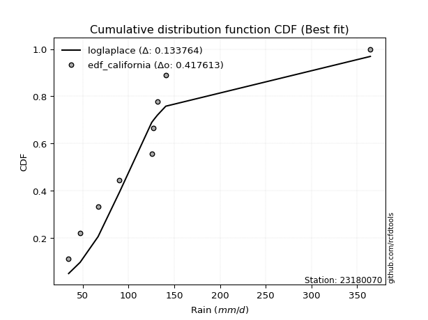</img>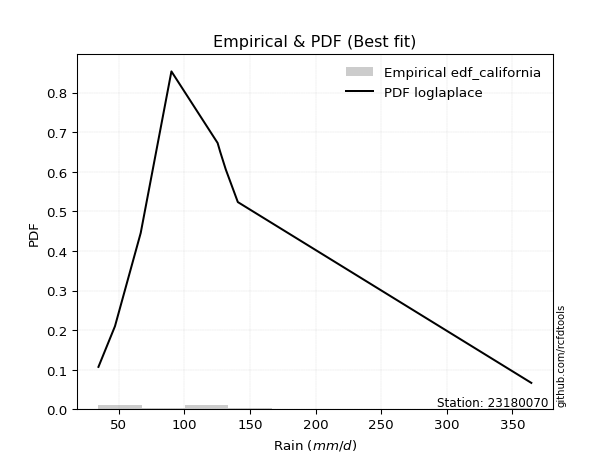</img>

</div>


### 2. Empirical - EDF Hazen (1930)

Hazen method for plotting positions is a formula used to estimate the empirical cumulative probability distribution of flood events or other hydrological data. This formula often results in biased estimations, particularly when extrapolating to extreme events (high return periods).

<div align="center">


$P=(m-0.5)/n$


</div>


**2.1. Empirical values**

<div align="center">

|                | 0                   | 1                   | 2                  | 3                  | 4         | 5                  | 6                  | 7                  | 8                  |
|:---------------|:--------------------|:--------------------|:-------------------|:-------------------|:----------|:-------------------|:-------------------|:-------------------|:-------------------|
| date           | 2018                | 2017                | 2023               | 2025               | 2020      | 2021               | 2022               | 2019               | 2024               |
| x              | 34.6                | 47.2                | 66.8               | 80.8               | 90.2      | 125.4              | 127.4              | 140.8              | 364.4              |
| m              | 1                   | 2                   | 3                  | 4                  | 5         | 6                  | 7                  | 8                  | 9                  |
| empirical_dist | edf_hazen           | edf_hazen           | edf_hazen          | edf_hazen          | edf_hazen | edf_hazen          | edf_hazen          | edf_hazen          | edf_hazen          |
| empirical      | 0.05555555555555555 | 0.16666666666666666 | 0.2777777777777778 | 0.3888888888888889 | 0.5       | 0.6111111111111112 | 0.7222222222222222 | 0.8333333333333334 | 0.9444444444444444 |
| empirical_tr   | 1.0588235294117647  | 1.2                 | 1.3846153846153846 | 1.6363636363636362 | 2.0       | 2.5714285714285716 | 3.5999999999999996 | 6.000000000000002  | 17.999999999999993 |

</div>


**2.2. Kolmogorov-Smirnov fit test (sorted by Δ)**


<div align="center">

|                | 0                   | 1                   | 2                   | 3                   | 4                   | 5                   | 6                   | 7                   | 8                   | 9                   | 10                  | 11                  | 12                  | 13                  | 14                  | 15                  | 16                  | 17                  | 18                  | 19                  | 20                  | 21                  | 22                  | 23                  | 24                  | 25                  | 26                  | 27                  | 28                  | 29                  | 30                  | 31                  | 32                  | 33                  | 34                  | 35                  | 36                  | 37                  | 38                  | 39                  | 40                    | 41                  | 42                  | 43                  | 44                  | 45                  | 46                  | 47                  | 48                  | 49                  | 50                  | 51                  | 52                  | 53                  | 54                  | 55                  | 56                  | 57                  | 58                  | 59                  | 60                  | 61                  | 62                  | 63                  | 64                  | 65                  | 66                  | 67                  | 68                  | 69                  | 70                  | 71                  | 72                  | 73                  | 74                  | 75                  | 76                  | 77                  | 78                  | 79                  | 80                  | 81                  | 82                  | 83                  | 84                  | 85                  | 86                  | 87                  | 88                  | 89                  |
|:---------------|:--------------------|:--------------------|:--------------------|:--------------------|:--------------------|:--------------------|:--------------------|:--------------------|:--------------------|:--------------------|:--------------------|:--------------------|:--------------------|:--------------------|:--------------------|:--------------------|:--------------------|:--------------------|:--------------------|:--------------------|:--------------------|:--------------------|:--------------------|:--------------------|:--------------------|:--------------------|:--------------------|:--------------------|:--------------------|:--------------------|:--------------------|:--------------------|:--------------------|:--------------------|:--------------------|:--------------------|:--------------------|:--------------------|:--------------------|:--------------------|:----------------------|:--------------------|:--------------------|:--------------------|:--------------------|:--------------------|:--------------------|:--------------------|:--------------------|:--------------------|:--------------------|:--------------------|:--------------------|:--------------------|:--------------------|:--------------------|:--------------------|:--------------------|:--------------------|:--------------------|:--------------------|:--------------------|:--------------------|:--------------------|:--------------------|:--------------------|:--------------------|:--------------------|:--------------------|:--------------------|:--------------------|:--------------------|:--------------------|:--------------------|:--------------------|:--------------------|:--------------------|:--------------------|:--------------------|:--------------------|:--------------------|:--------------------|:--------------------|:--------------------|:--------------------|:--------------------|:--------------------|:--------------------|:--------------------|:--------------------|
| station        | 23180070            | 23180070            | 23180070            | 23180070            | 23180070            | 23180070            | 23180070            | 23180070            | 23180070            | 23180070            | 23180070            | 23180070            | 23180070            | 23180070            | 23180070            | 23180070            | 23180070            | 23180070            | 23180070            | 23180070            | 23180070            | 23180070            | 23180070            | 23180070            | 23180070            | 23180070            | 23180070            | 23180070            | 23180070            | 23180070            | 23180070            | 23180070            | 23180070            | 23180070            | 23180070            | 23180070            | 23180070            | 23180070            | 23180070            | 23180070            | 23180070              | 23180070            | 23180070            | 23180070            | 23180070            | 23180070            | 23180070            | 23180070            | 23180070            | 23180070            | 23180070            | 23180070            | 23180070            | 23180070            | 23180070            | 23180070            | 23180070            | 23180070            | 23180070            | 23180070            | 23180070            | 23180070            | 23180070            | 23180070            | 23180070            | 23180070            | 23180070            | 23180070            | 23180070            | 23180070            | 23180070            | 23180070            | 23180070            | 23180070            | 23180070            | 23180070            | 23180070            | 23180070            | 23180070            | 23180070            | 23180070            | 23180070            | 23180070            | 23180070            | 23180070            | 23180070            | 23180070            | 23180070            | 23180070            | 23180070            |
| empirical_dist | edf_hazen           | edf_hazen           | edf_hazen           | edf_hazen           | edf_hazen           | edf_hazen           | edf_hazen           | edf_hazen           | edf_hazen           | edf_hazen           | edf_hazen           | edf_hazen           | edf_hazen           | edf_hazen           | edf_hazen           | edf_hazen           | edf_hazen           | edf_hazen           | edf_hazen           | edf_hazen           | edf_hazen           | edf_hazen           | edf_hazen           | edf_hazen           | edf_hazen           | edf_hazen           | edf_hazen           | edf_hazen           | edf_hazen           | edf_hazen           | edf_hazen           | edf_hazen           | edf_hazen           | edf_hazen           | edf_hazen           | edf_hazen           | edf_hazen           | edf_hazen           | edf_hazen           | edf_hazen           | edf_hazen             | edf_hazen           | edf_hazen           | edf_hazen           | edf_hazen           | edf_hazen           | edf_hazen           | edf_hazen           | edf_hazen           | edf_hazen           | edf_hazen           | edf_hazen           | edf_hazen           | edf_hazen           | edf_hazen           | edf_hazen           | edf_hazen           | edf_hazen           | edf_hazen           | edf_hazen           | edf_hazen           | edf_hazen           | edf_hazen           | edf_hazen           | edf_hazen           | edf_hazen           | edf_hazen           | edf_hazen           | edf_hazen           | edf_hazen           | edf_hazen           | edf_hazen           | edf_hazen           | edf_hazen           | edf_hazen           | edf_hazen           | edf_hazen           | edf_hazen           | edf_hazen           | edf_hazen           | edf_hazen           | edf_hazen           | edf_hazen           | edf_hazen           | edf_hazen           | edf_hazen           | edf_hazen           | edf_hazen           | edf_hazen           | edf_hazen           |
| p_dist         | betaprime           | invgamma            | loglogistic         | loghypsecant        | logalpha            | loginvgamma         | logf                | logjohnsonsu        | nct                 | lognct              | logerlang           | loggamma            | loggamma            | logfatiguelife      | loginvgauss         | f                   | invweibull          | logncf              | logexponnorm        | loggenlogistic      | mielke              | ncf                 | loggenexpon         | wald                | logmielke           | logfisk             | logweibull_min      | loginvweibull       | fisk                | logkstwobign        | lograyleigh         | alpha               | logpearson3         | johnsonsu           | logbetaprime        | logmaxwell          | logrice             | loghalfnorm         | invgauss            | fatiguelife         | loglaplace_asymmetric | logt                | logcrystalball      | lognorm             | lognorm             | logloggamma         | loggompertz         | loggumbel_r         | loglaplace          | exponnorm           | laplace_asymmetric  | expon               | genexpon            | gompertz            | genlogistic         | loghalflogistic     | logmoyal            | loggumbel_l         | logtruncnorm        | pearson3            | t                   | nakagami            | moyal               | truncnorm           | lognakagami         | halflogistic        | gibrat              | gumbel_r            | logwald             | halfnorm            | kstwobign           | laplace             | logexpon            | rayleigh            | loggibrat           | maxwell             | chi2                | hypsecant           | logistic            | rice                | norm                | crystalball         | weibull_min         | logchi2             | gumbel_l            | loglognorm          | pareto              | logpareto           | gamma               | erlang              |
| delta          | 0.08447830278122115 | 0.08473965504524272 | 0.08500837043817888 | 0.08603669757204102 | 0.08605843529708801 | 0.08615442226848713 | 0.08618262761041773 | 0.08618591213350446 | 0.08627190194120238 | 0.08627737713696093 | 0.0863099017820258  | 0.08631004742622062 | 0.08631004742622062 | 0.08637026489699151 | 0.08638152430673629 | 0.08665777167256294 | 0.08698696645512016 | 0.08730913944914342 | 0.08740252904147372 | 0.08778788855748942 | 0.08781998127572599 | 0.08785831955768797 | 0.08804092150800291 | 0.08842234573967178 | 0.08860362429965107 | 0.08896280321259942 | 0.08990670979725612 | 0.09004751184157878 | 0.09037560481898432 | 0.09054504432336152 | 0.0909831806234277  | 0.09153797118218121 | 0.09165651913112238 | 0.09175377394393924 | 0.09212910552494302 | 0.09464210964897901 | 0.09595520669913427 | 0.09627546787820507 | 0.09660010972134714 | 0.10367596588207295 | 0.10547955866776271   | 0.10732558070067799 | 0.10732569457026586 | 0.10732582109209976 | 0.10732582109209976 | 0.10835630720326617 | 0.10886640315815688 | 0.1101965893062049  | 0.11369213099673747 | 0.11808327587479883 | 0.12056804094536855 | 0.12056822141105517 | 0.12058460271835914 | 0.12096362739480349 | 0.12166256411427001 | 0.12414827861011268 | 0.12916381567880375 | 0.13055767178942912 | 0.13387532438073818 | 0.13526394395773755 | 0.14397541486976406 | 0.15004519286114149 | 0.1531014921656747  | 0.15317244896162763 | 0.15375221497445407 | 0.15533143934455218 | 0.16666666666666666 | 0.17635018307298123 | 0.18331037184366883 | 0.18352751162556036 | 0.18850423162600738 | 0.19646939063068003 | 0.19961741286224    | 0.20786924747862512 | 0.2154076869106467  | 0.21644255071523555 | 0.21880736526124378 | 0.22256211505952483 | 0.2321978396223524  | 0.23663025112933778 | 0.2438740281583749  | 0.24387403522602213 | 0.2737719852564219  | 0.30149381890107896 | 0.30551543668741876 | 0.43161493698838804 | 0.434885812843102   | 0.45800224920089827 | 0.4726863397459137  | 0.5458837038819314  |
| deltao         | 0.41761268023100007 | 0.41761268023100007 | 0.41761268023100007 | 0.41761268023100007 | 0.41761268023100007 | 0.41761268023100007 | 0.41761268023100007 | 0.41761268023100007 | 0.41761268023100007 | 0.41761268023100007 | 0.41761268023100007 | 0.41761268023100007 | 0.41761268023100007 | 0.41761268023100007 | 0.41761268023100007 | 0.41761268023100007 | 0.41761268023100007 | 0.41761268023100007 | 0.41761268023100007 | 0.41761268023100007 | 0.41761268023100007 | 0.41761268023100007 | 0.41761268023100007 | 0.41761268023100007 | 0.41761268023100007 | 0.41761268023100007 | 0.41761268023100007 | 0.41761268023100007 | 0.41761268023100007 | 0.41761268023100007 | 0.41761268023100007 | 0.41761268023100007 | 0.41761268023100007 | 0.41761268023100007 | 0.41761268023100007 | 0.41761268023100007 | 0.41761268023100007 | 0.41761268023100007 | 0.41761268023100007 | 0.41761268023100007 | 0.41761268023100007   | 0.41761268023100007 | 0.41761268023100007 | 0.41761268023100007 | 0.41761268023100007 | 0.41761268023100007 | 0.41761268023100007 | 0.41761268023100007 | 0.41761268023100007 | 0.41761268023100007 | 0.41761268023100007 | 0.41761268023100007 | 0.41761268023100007 | 0.41761268023100007 | 0.41761268023100007 | 0.41761268023100007 | 0.41761268023100007 | 0.41761268023100007 | 0.41761268023100007 | 0.41761268023100007 | 0.41761268023100007 | 0.41761268023100007 | 0.41761268023100007 | 0.41761268023100007 | 0.41761268023100007 | 0.41761268023100007 | 0.41761268023100007 | 0.41761268023100007 | 0.41761268023100007 | 0.41761268023100007 | 0.41761268023100007 | 0.41761268023100007 | 0.41761268023100007 | 0.41761268023100007 | 0.41761268023100007 | 0.41761268023100007 | 0.41761268023100007 | 0.41761268023100007 | 0.41761268023100007 | 0.41761268023100007 | 0.41761268023100007 | 0.41761268023100007 | 0.41761268023100007 | 0.41761268023100007 | 0.41761268023100007 | 0.41761268023100007 | 0.41761268023100007 | 0.41761268023100007 | 0.41761268023100007 | 0.41761268023100007 |
| eval           | Δo > Δ              | Δo > Δ              | Δo > Δ              | Δo > Δ              | Δo > Δ              | Δo > Δ              | Δo > Δ              | Δo > Δ              | Δo > Δ              | Δo > Δ              | Δo > Δ              | Δo > Δ              | Δo > Δ              | Δo > Δ              | Δo > Δ              | Δo > Δ              | Δo > Δ              | Δo > Δ              | Δo > Δ              | Δo > Δ              | Δo > Δ              | Δo > Δ              | Δo > Δ              | Δo > Δ              | Δo > Δ              | Δo > Δ              | Δo > Δ              | Δo > Δ              | Δo > Δ              | Δo > Δ              | Δo > Δ              | Δo > Δ              | Δo > Δ              | Δo > Δ              | Δo > Δ              | Δo > Δ              | Δo > Δ              | Δo > Δ              | Δo > Δ              | Δo > Δ              | Δo > Δ                | Δo > Δ              | Δo > Δ              | Δo > Δ              | Δo > Δ              | Δo > Δ              | Δo > Δ              | Δo > Δ              | Δo > Δ              | Δo > Δ              | Δo > Δ              | Δo > Δ              | Δo > Δ              | Δo > Δ              | Δo > Δ              | Δo > Δ              | Δo > Δ              | Δo > Δ              | Δo > Δ              | Δo > Δ              | Δo > Δ              | Δo > Δ              | Δo > Δ              | Δo > Δ              | Δo > Δ              | Δo > Δ              | Δo > Δ              | Δo > Δ              | Δo > Δ              | Δo > Δ              | Δo > Δ              | Δo > Δ              | Δo > Δ              | Δo > Δ              | Δo > Δ              | Δo > Δ              | Δo > Δ              | Δo > Δ              | Δo > Δ              | Δo > Δ              | Δo > Δ              | Δo > Δ              | Δo > Δ              | Δo > Δ              | Δo > Δ              | Δo <= Δ             | Δo <= Δ             | Δo <= Δ             | Δo <= Δ             | Δo <= Δ             |
| fit            | 1                   | 1                   | 1                   | 1                   | 1                   | 1                   | 1                   | 1                   | 1                   | 1                   | 1                   | 1                   | 1                   | 1                   | 1                   | 1                   | 1                   | 1                   | 1                   | 1                   | 1                   | 1                   | 1                   | 1                   | 1                   | 1                   | 1                   | 1                   | 1                   | 1                   | 1                   | 1                   | 1                   | 1                   | 1                   | 1                   | 1                   | 1                   | 1                   | 1                   | 1                     | 1                   | 1                   | 1                   | 1                   | 1                   | 1                   | 1                   | 1                   | 1                   | 1                   | 1                   | 1                   | 1                   | 1                   | 1                   | 1                   | 1                   | 1                   | 1                   | 1                   | 1                   | 1                   | 1                   | 1                   | 1                   | 1                   | 1                   | 1                   | 1                   | 1                   | 1                   | 1                   | 1                   | 1                   | 1                   | 1                   | 1                   | 1                   | 1                   | 1                   | 1                   | 1                   | 1                   | 1                   | 0                   | 0                   | 0                   | 0                   | 0                   |
| n              | 9                   | 9                   | 9                   | 9                   | 9                   | 9                   | 9                   | 9                   | 9                   | 9                   | 9                   | 9                   | 9                   | 9                   | 9                   | 9                   | 9                   | 9                   | 9                   | 9                   | 9                   | 9                   | 9                   | 9                   | 9                   | 9                   | 9                   | 9                   | 9                   | 9                   | 9                   | 9                   | 9                   | 9                   | 9                   | 9                   | 9                   | 9                   | 9                   | 9                   | 9                     | 9                   | 9                   | 9                   | 9                   | 9                   | 9                   | 9                   | 9                   | 9                   | 9                   | 9                   | 9                   | 9                   | 9                   | 9                   | 9                   | 9                   | 9                   | 9                   | 9                   | 9                   | 9                   | 9                   | 9                   | 9                   | 9                   | 9                   | 9                   | 9                   | 9                   | 9                   | 9                   | 9                   | 9                   | 9                   | 9                   | 9                   | 9                   | 9                   | 9                   | 9                   | 9                   | 9                   | 9                   | 9                   | 9                   | 9                   | 9                   | 9                   |
| best_fit       | 1                   | 0                   | 0                   | 0                   | 0                   | 0                   | 0                   | 0                   | 0                   | 0                   | 0                   | 0                   | 0                   | 0                   | 0                   | 0                   | 0                   | 0                   | 0                   | 0                   | 0                   | 0                   | 0                   | 0                   | 0                   | 0                   | 0                   | 0                   | 0                   | 0                   | 0                   | 0                   | 0                   | 0                   | 0                   | 0                   | 0                   | 0                   | 0                   | 0                   | 0                     | 0                   | 0                   | 0                   | 0                   | 0                   | 0                   | 0                   | 0                   | 0                   | 0                   | 0                   | 0                   | 0                   | 0                   | 0                   | 0                   | 0                   | 0                   | 0                   | 0                   | 0                   | 0                   | 0                   | 0                   | 0                   | 0                   | 0                   | 0                   | 0                   | 0                   | 0                   | 0                   | 0                   | 0                   | 0                   | 0                   | 0                   | 0                   | 0                   | 0                   | 0                   | 0                   | 0                   | 0                   | 0                   | 0                   | 0                   | 0                   | 0                   |
| best_fit_sort  | 1                   | 2                   | 3                   | 4                   | 5                   | 6                   | 7                   | 8                   | 9                   | 10                  | 11                  | 12                  | 13                  | 14                  | 15                  | 16                  | 17                  | 18                  | 19                  | 20                  | 21                  | 22                  | 23                  | 24                  | 25                  | 26                  | 27                  | 28                  | 29                  | 30                  | 31                  | 32                  | 33                  | 34                  | 35                  | 36                  | 37                  | 38                  | 39                  | 40                  | 41                    | 42                  | 43                  | 44                  | 45                  | 46                  | 47                  | 48                  | 49                  | 50                  | 51                  | 52                  | 53                  | 54                  | 55                  | 56                  | 57                  | 58                  | 59                  | 60                  | 61                  | 62                  | 63                  | 64                  | 65                  | 66                  | 67                  | 68                  | 69                  | 70                  | 71                  | 72                  | 73                  | 74                  | 75                  | 76                  | 77                  | 78                  | 79                  | 80                  | 81                  | 82                  | 83                  | 84                  | 85                  | 86                  | 87                  | 88                  | 89                  | 90                  |

</div>


<div align="center">

</img>

</div>


**2.3. Best fit**

<div align="center">

|   id |   station | empirical_dist   | p_dist    |     delta |   deltao | eval   |   fit |   n |   best_fit |   best_fit_sort |
|-----:|----------:|:-----------------|:----------|----------:|---------:|:-------|------:|----:|-----------:|----------------:|
|    0 |  23180070 | edf_hazen        | betaprime | 0.0844783 | 0.417613 | Δo > Δ |     1 |   9 |          1 |               1 |

</div>


<div align="center">

</img></img>

</div>


### 3. Empirical - EDF Weibull (1939)

Weibull plotting position formula is an empirical method used to estimate the non-exceedance probability or plotting position for a set of observed data, is often recommended or widely used in practice, particularly in flood frequency analysis.

<div align="center">


$P=m/(n+1)$


</div>


**3.1. Empirical values**

<div align="center">

|                | 0                  | 1           | 2                  | 3                  | 4           | 5           | 6                 | 7                 | 8                  |
|:---------------|:-------------------|:------------|:-------------------|:-------------------|:------------|:------------|:------------------|:------------------|:-------------------|
| date           | 2018               | 2017        | 2023               | 2025               | 2020        | 2021        | 2022              | 2019              | 2024               |
| x              | 34.6               | 47.2        | 66.8               | 80.8               | 90.2        | 125.4       | 127.4             | 140.8             | 364.4              |
| m              | 1                  | 2           | 3                  | 4                  | 5           | 6           | 7                 | 8                 | 9                  |
| empirical_dist | edf_weibull        | edf_weibull | edf_weibull        | edf_weibull        | edf_weibull | edf_weibull | edf_weibull       | edf_weibull       | edf_weibull        |
| empirical      | 0.1                | 0.2         | 0.3                | 0.4                | 0.5         | 0.6         | 0.7               | 0.8               | 0.9                |
| empirical_tr   | 1.1111111111111112 | 1.25        | 1.4285714285714286 | 1.6666666666666667 | 2.0         | 2.5         | 3.333333333333333 | 5.000000000000001 | 10.000000000000002 |

</div>


**3.2. Kolmogorov-Smirnov fit test (sorted by Δ)**


<div align="center">

|                | 0                   | 1                   | 2                   | 3                   | 4                   | 5                   | 6                   | 7                   | 8                   | 9                   | 10                  | 11                  | 12                  | 13                  | 14                  | 15                  | 16                  | 17                  | 18                  | 19                  | 20                  | 21                  | 22                  | 23                  | 24                  | 25                  | 26                  | 27                  | 28                  | 29                  | 30                  | 31                  | 32                  | 33                  | 34                  | 35                  | 36                  | 37                  | 38                  | 39                  | 40                  | 41                  | 42                  | 43                  | 44                  | 45                  | 46                  | 47                  | 48                  | 49                  | 50                  | 51                  | 52                  | 53                  | 54                  | 55                    | 56                  | 57                  | 58                  | 59                  | 60                  | 61                  | 62                  | 63                  | 64                  | 65                  | 66                  | 67                  | 68                  | 69                  | 70                  | 71                  | 72                  | 73                  | 74                  | 75                  | 76                  | 77                  | 78                  | 79                  | 80                  | 81                  | 82                  | 83                  | 84                  | 85                  | 86                  | 87                  | 88                  | 89                  |
|:---------------|:--------------------|:--------------------|:--------------------|:--------------------|:--------------------|:--------------------|:--------------------|:--------------------|:--------------------|:--------------------|:--------------------|:--------------------|:--------------------|:--------------------|:--------------------|:--------------------|:--------------------|:--------------------|:--------------------|:--------------------|:--------------------|:--------------------|:--------------------|:--------------------|:--------------------|:--------------------|:--------------------|:--------------------|:--------------------|:--------------------|:--------------------|:--------------------|:--------------------|:--------------------|:--------------------|:--------------------|:--------------------|:--------------------|:--------------------|:--------------------|:--------------------|:--------------------|:--------------------|:--------------------|:--------------------|:--------------------|:--------------------|:--------------------|:--------------------|:--------------------|:--------------------|:--------------------|:--------------------|:--------------------|:--------------------|:----------------------|:--------------------|:--------------------|:--------------------|:--------------------|:--------------------|:--------------------|:--------------------|:--------------------|:--------------------|:--------------------|:--------------------|:--------------------|:--------------------|:--------------------|:--------------------|:--------------------|:--------------------|:--------------------|:--------------------|:--------------------|:--------------------|:--------------------|:--------------------|:--------------------|:--------------------|:--------------------|:--------------------|:--------------------|:--------------------|:--------------------|:--------------------|:--------------------|:--------------------|:--------------------|
| station        | 23180070            | 23180070            | 23180070            | 23180070            | 23180070            | 23180070            | 23180070            | 23180070            | 23180070            | 23180070            | 23180070            | 23180070            | 23180070            | 23180070            | 23180070            | 23180070            | 23180070            | 23180070            | 23180070            | 23180070            | 23180070            | 23180070            | 23180070            | 23180070            | 23180070            | 23180070            | 23180070            | 23180070            | 23180070            | 23180070            | 23180070            | 23180070            | 23180070            | 23180070            | 23180070            | 23180070            | 23180070            | 23180070            | 23180070            | 23180070            | 23180070            | 23180070            | 23180070            | 23180070            | 23180070            | 23180070            | 23180070            | 23180070            | 23180070            | 23180070            | 23180070            | 23180070            | 23180070            | 23180070            | 23180070            | 23180070              | 23180070            | 23180070            | 23180070            | 23180070            | 23180070            | 23180070            | 23180070            | 23180070            | 23180070            | 23180070            | 23180070            | 23180070            | 23180070            | 23180070            | 23180070            | 23180070            | 23180070            | 23180070            | 23180070            | 23180070            | 23180070            | 23180070            | 23180070            | 23180070            | 23180070            | 23180070            | 23180070            | 23180070            | 23180070            | 23180070            | 23180070            | 23180070            | 23180070            | 23180070            |
| empirical_dist | edf_weibull         | edf_weibull         | edf_weibull         | edf_weibull         | edf_weibull         | edf_weibull         | edf_weibull         | edf_weibull         | edf_weibull         | edf_weibull         | edf_weibull         | edf_weibull         | edf_weibull         | edf_weibull         | edf_weibull         | edf_weibull         | edf_weibull         | edf_weibull         | edf_weibull         | edf_weibull         | edf_weibull         | edf_weibull         | edf_weibull         | edf_weibull         | edf_weibull         | edf_weibull         | edf_weibull         | edf_weibull         | edf_weibull         | edf_weibull         | edf_weibull         | edf_weibull         | edf_weibull         | edf_weibull         | edf_weibull         | edf_weibull         | edf_weibull         | edf_weibull         | edf_weibull         | edf_weibull         | edf_weibull         | edf_weibull         | edf_weibull         | edf_weibull         | edf_weibull         | edf_weibull         | edf_weibull         | edf_weibull         | edf_weibull         | edf_weibull         | edf_weibull         | edf_weibull         | edf_weibull         | edf_weibull         | edf_weibull         | edf_weibull           | edf_weibull         | edf_weibull         | edf_weibull         | edf_weibull         | edf_weibull         | edf_weibull         | edf_weibull         | edf_weibull         | edf_weibull         | edf_weibull         | edf_weibull         | edf_weibull         | edf_weibull         | edf_weibull         | edf_weibull         | edf_weibull         | edf_weibull         | edf_weibull         | edf_weibull         | edf_weibull         | edf_weibull         | edf_weibull         | edf_weibull         | edf_weibull         | edf_weibull         | edf_weibull         | edf_weibull         | edf_weibull         | edf_weibull         | edf_weibull         | edf_weibull         | edf_weibull         | edf_weibull         | edf_weibull         |
| p_dist         | fatiguelife         | lognorm             | lognorm             | logt                | logcrystalball      | logloggamma         | loglogistic         | logrice             | logmaxwell          | logbetaprime        | logpearson3         | invgauss            | ncf                 | lograyleigh         | johnsonsu           | logncf              | fisk                | lognct              | logweibull_min      | logalpha            | logf                | loginvgamma         | logjohnsonsu        | loginvgauss         | logfatiguelife      | loggamma            | loggamma            | logerlang           | betaprime           | genlogistic         | invgamma            | loghypsecant        | nct                 | f                   | invweibull          | exponnorm           | logexponnorm        | loggenlogistic      | mielke              | logmielke           | loggenexpon         | genexpon            | loggompertz         | gompertz            | laplace_asymmetric  | expon               | logfisk             | loginvweibull       | logkstwobign        | pearson3            | alpha               | loggumbel_l         | loghalfnorm         | logtruncnorm        | wald                | loglaplace_asymmetric | nakagami            | moyal               | truncnorm           | loggumbel_r         | halflogistic        | loglaplace          | lognakagami         | logmoyal            | loghalflogistic     | gumbel_r            | halfnorm            | t                   | kstwobign           | rayleigh            | logexpon            | laplace             | maxwell             | hypsecant           | logistic            | gibrat              | logwald             | rice                | chi2                | norm                | crystalball         | loggibrat           | weibull_min         | gumbel_l            | logchi2             | loglognorm          | pareto              | logpareto           | gamma               | erlang              |
| delta          | 0.07946165563351681 | 0.08061417906945378 | 0.08061417906945378 | 0.0806141997210229  | 0.08061422092136084 | 0.08110502412416187 | 0.0826199755939212  | 0.08270846425780665 | 0.08372738901866594 | 0.08387941248382758 | 0.08520793535883464 | 0.08529021052250374 | 0.08887110564024503 | 0.08974023503441753 | 0.090155779529978   | 0.09077726318326751 | 0.09146264257596648 | 0.09168126393533915 | 0.09172674766739553 | 0.09178594741546964 | 0.09205885030073746 | 0.09207489947105252 | 0.09231731411992727 | 0.09253920262011683 | 0.09258983248926722 | 0.09360993748625124 | 0.09360993748625124 | 0.09361006442336306 | 0.09409674459702877 | 0.09488413644465321 | 0.0958507661563539  | 0.0971478086831522  | 0.09738301305231356 | 0.09776888278367413 | 0.09809807756623135 | 0.09835497958542597 | 0.0985136401525849  | 0.0988989996686006  | 0.09893109238683717 | 0.09971473541076226 | 0.09999951248404788 | 0.09999997870869132 | 0.0999999981061447  | 0.09999999993270492 | 0.09999999997838918 | 0.1                 | 0.1000739143237106  | 0.10115862295268996 | 0.1016561554344727  | 0.10193061062440423 | 0.10264908229329239 | 0.10468745766202592 | 0.10738657898931625 | 0.11165310215851598 | 0.11619928939520961 | 0.11659066977887389   | 0.11671185952780816 | 0.11976815883234138 | 0.1198391156282943  | 0.12130770041731609 | 0.12199810601121885 | 0.12480324210784866 | 0.13152999275223187 | 0.14027492678991493 | 0.14087198848770605 | 0.1430168497396479  | 0.15019417829222703 | 0.15508652598087524 | 0.15517089829267405 | 0.1745359141452918  | 0.1773951906400178  | 0.18066583424947324 | 0.18310921738190222 | 0.1892287817261915  | 0.19886450628901908 | 0.2                 | 0.2                 | 0.20329691779600445 | 0.2042241782874875  | 0.21054069482504156 | 0.2105407018926888  | 0.2265187980217579  | 0.2404386519230885  | 0.27218210335408544 | 0.27927159667885676 | 0.39828160365505466 | 0.40155247950976863 | 0.4246689158675649  | 0.4504641175236915  | 0.5236614816597092  |
| deltao         | 0.41761268023100007 | 0.41761268023100007 | 0.41761268023100007 | 0.41761268023100007 | 0.41761268023100007 | 0.41761268023100007 | 0.41761268023100007 | 0.41761268023100007 | 0.41761268023100007 | 0.41761268023100007 | 0.41761268023100007 | 0.41761268023100007 | 0.41761268023100007 | 0.41761268023100007 | 0.41761268023100007 | 0.41761268023100007 | 0.41761268023100007 | 0.41761268023100007 | 0.41761268023100007 | 0.41761268023100007 | 0.41761268023100007 | 0.41761268023100007 | 0.41761268023100007 | 0.41761268023100007 | 0.41761268023100007 | 0.41761268023100007 | 0.41761268023100007 | 0.41761268023100007 | 0.41761268023100007 | 0.41761268023100007 | 0.41761268023100007 | 0.41761268023100007 | 0.41761268023100007 | 0.41761268023100007 | 0.41761268023100007 | 0.41761268023100007 | 0.41761268023100007 | 0.41761268023100007 | 0.41761268023100007 | 0.41761268023100007 | 0.41761268023100007 | 0.41761268023100007 | 0.41761268023100007 | 0.41761268023100007 | 0.41761268023100007 | 0.41761268023100007 | 0.41761268023100007 | 0.41761268023100007 | 0.41761268023100007 | 0.41761268023100007 | 0.41761268023100007 | 0.41761268023100007 | 0.41761268023100007 | 0.41761268023100007 | 0.41761268023100007 | 0.41761268023100007   | 0.41761268023100007 | 0.41761268023100007 | 0.41761268023100007 | 0.41761268023100007 | 0.41761268023100007 | 0.41761268023100007 | 0.41761268023100007 | 0.41761268023100007 | 0.41761268023100007 | 0.41761268023100007 | 0.41761268023100007 | 0.41761268023100007 | 0.41761268023100007 | 0.41761268023100007 | 0.41761268023100007 | 0.41761268023100007 | 0.41761268023100007 | 0.41761268023100007 | 0.41761268023100007 | 0.41761268023100007 | 0.41761268023100007 | 0.41761268023100007 | 0.41761268023100007 | 0.41761268023100007 | 0.41761268023100007 | 0.41761268023100007 | 0.41761268023100007 | 0.41761268023100007 | 0.41761268023100007 | 0.41761268023100007 | 0.41761268023100007 | 0.41761268023100007 | 0.41761268023100007 | 0.41761268023100007 |
| eval           | Δo > Δ              | Δo > Δ              | Δo > Δ              | Δo > Δ              | Δo > Δ              | Δo > Δ              | Δo > Δ              | Δo > Δ              | Δo > Δ              | Δo > Δ              | Δo > Δ              | Δo > Δ              | Δo > Δ              | Δo > Δ              | Δo > Δ              | Δo > Δ              | Δo > Δ              | Δo > Δ              | Δo > Δ              | Δo > Δ              | Δo > Δ              | Δo > Δ              | Δo > Δ              | Δo > Δ              | Δo > Δ              | Δo > Δ              | Δo > Δ              | Δo > Δ              | Δo > Δ              | Δo > Δ              | Δo > Δ              | Δo > Δ              | Δo > Δ              | Δo > Δ              | Δo > Δ              | Δo > Δ              | Δo > Δ              | Δo > Δ              | Δo > Δ              | Δo > Δ              | Δo > Δ              | Δo > Δ              | Δo > Δ              | Δo > Δ              | Δo > Δ              | Δo > Δ              | Δo > Δ              | Δo > Δ              | Δo > Δ              | Δo > Δ              | Δo > Δ              | Δo > Δ              | Δo > Δ              | Δo > Δ              | Δo > Δ              | Δo > Δ                | Δo > Δ              | Δo > Δ              | Δo > Δ              | Δo > Δ              | Δo > Δ              | Δo > Δ              | Δo > Δ              | Δo > Δ              | Δo > Δ              | Δo > Δ              | Δo > Δ              | Δo > Δ              | Δo > Δ              | Δo > Δ              | Δo > Δ              | Δo > Δ              | Δo > Δ              | Δo > Δ              | Δo > Δ              | Δo > Δ              | Δo > Δ              | Δo > Δ              | Δo > Δ              | Δo > Δ              | Δo > Δ              | Δo > Δ              | Δo > Δ              | Δo > Δ              | Δo > Δ              | Δo > Δ              | Δo > Δ              | Δo <= Δ             | Δo <= Δ             | Δo <= Δ             |
| fit            | 1                   | 1                   | 1                   | 1                   | 1                   | 1                   | 1                   | 1                   | 1                   | 1                   | 1                   | 1                   | 1                   | 1                   | 1                   | 1                   | 1                   | 1                   | 1                   | 1                   | 1                   | 1                   | 1                   | 1                   | 1                   | 1                   | 1                   | 1                   | 1                   | 1                   | 1                   | 1                   | 1                   | 1                   | 1                   | 1                   | 1                   | 1                   | 1                   | 1                   | 1                   | 1                   | 1                   | 1                   | 1                   | 1                   | 1                   | 1                   | 1                   | 1                   | 1                   | 1                   | 1                   | 1                   | 1                   | 1                     | 1                   | 1                   | 1                   | 1                   | 1                   | 1                   | 1                   | 1                   | 1                   | 1                   | 1                   | 1                   | 1                   | 1                   | 1                   | 1                   | 1                   | 1                   | 1                   | 1                   | 1                   | 1                   | 1                   | 1                   | 1                   | 1                   | 1                   | 1                   | 1                   | 1                   | 1                   | 0                   | 0                   | 0                   |
| n              | 9                   | 9                   | 9                   | 9                   | 9                   | 9                   | 9                   | 9                   | 9                   | 9                   | 9                   | 9                   | 9                   | 9                   | 9                   | 9                   | 9                   | 9                   | 9                   | 9                   | 9                   | 9                   | 9                   | 9                   | 9                   | 9                   | 9                   | 9                   | 9                   | 9                   | 9                   | 9                   | 9                   | 9                   | 9                   | 9                   | 9                   | 9                   | 9                   | 9                   | 9                   | 9                   | 9                   | 9                   | 9                   | 9                   | 9                   | 9                   | 9                   | 9                   | 9                   | 9                   | 9                   | 9                   | 9                   | 9                     | 9                   | 9                   | 9                   | 9                   | 9                   | 9                   | 9                   | 9                   | 9                   | 9                   | 9                   | 9                   | 9                   | 9                   | 9                   | 9                   | 9                   | 9                   | 9                   | 9                   | 9                   | 9                   | 9                   | 9                   | 9                   | 9                   | 9                   | 9                   | 9                   | 9                   | 9                   | 9                   | 9                   | 9                   |
| best_fit       | 1                   | 0                   | 0                   | 0                   | 0                   | 0                   | 0                   | 0                   | 0                   | 0                   | 0                   | 0                   | 0                   | 0                   | 0                   | 0                   | 0                   | 0                   | 0                   | 0                   | 0                   | 0                   | 0                   | 0                   | 0                   | 0                   | 0                   | 0                   | 0                   | 0                   | 0                   | 0                   | 0                   | 0                   | 0                   | 0                   | 0                   | 0                   | 0                   | 0                   | 0                   | 0                   | 0                   | 0                   | 0                   | 0                   | 0                   | 0                   | 0                   | 0                   | 0                   | 0                   | 0                   | 0                   | 0                   | 0                     | 0                   | 0                   | 0                   | 0                   | 0                   | 0                   | 0                   | 0                   | 0                   | 0                   | 0                   | 0                   | 0                   | 0                   | 0                   | 0                   | 0                   | 0                   | 0                   | 0                   | 0                   | 0                   | 0                   | 0                   | 0                   | 0                   | 0                   | 0                   | 0                   | 0                   | 0                   | 0                   | 0                   | 0                   |
| best_fit_sort  | 1                   | 2                   | 3                   | 4                   | 5                   | 6                   | 7                   | 8                   | 9                   | 10                  | 11                  | 12                  | 13                  | 14                  | 15                  | 16                  | 17                  | 18                  | 19                  | 20                  | 21                  | 22                  | 23                  | 24                  | 25                  | 26                  | 27                  | 28                  | 29                  | 30                  | 31                  | 32                  | 33                  | 34                  | 35                  | 36                  | 37                  | 38                  | 39                  | 40                  | 41                  | 42                  | 43                  | 44                  | 45                  | 46                  | 47                  | 48                  | 49                  | 50                  | 51                  | 52                  | 53                  | 54                  | 55                  | 56                    | 57                  | 58                  | 59                  | 60                  | 61                  | 62                  | 63                  | 64                  | 65                  | 66                  | 67                  | 68                  | 69                  | 70                  | 71                  | 72                  | 73                  | 74                  | 75                  | 76                  | 77                  | 78                  | 79                  | 80                  | 81                  | 82                  | 83                  | 84                  | 85                  | 86                  | 87                  | 88                  | 89                  | 90                  |

</div>


<div align="center">

</img>

</div>


**3.3. Best fit**

<div align="center">

|   id |   station | empirical_dist   | p_dist      |     delta |   deltao | eval   |   fit |   n |   best_fit |   best_fit_sort |
|-----:|----------:|:-----------------|:------------|----------:|---------:|:-------|------:|----:|-----------:|----------------:|
|    0 |  23180070 | edf_weibull      | fatiguelife | 0.0794617 | 0.417613 | Δo > Δ |     1 |   9 |          1 |               1 |

</div>


<div align="center">

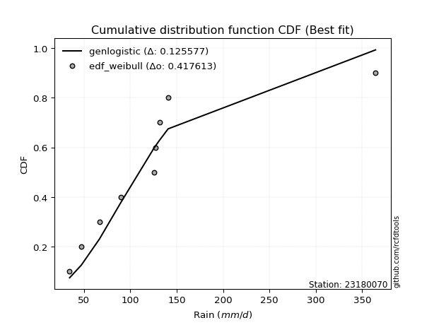</img>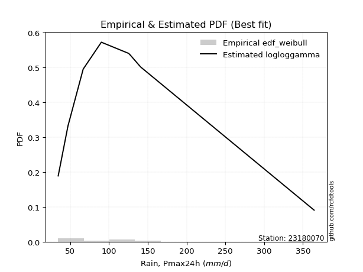</img>

</div>


### 4. Empirical - EDF Beard (1943)

The Beard formula (or Beard´s plotting position formula) in hydrology is used to estimate the empirical non-exceedance probability _(P)_ of a flood event (or other extreme hydrological data point) within a given dataset.

<div align="center">


$P=(m-0.31)/(n+0.38)$


</div>


**4.1. Empirical values**

<div align="center">

|                | 0                   | 1                   | 2                  | 3                   | 4         | 5                  | 6                  | 7                  | 8                  |
|:---------------|:--------------------|:--------------------|:-------------------|:--------------------|:----------|:-------------------|:-------------------|:-------------------|:-------------------|
| date           | 2018                | 2017                | 2023               | 2025                | 2020      | 2021               | 2022               | 2019               | 2024               |
| x              | 34.6                | 47.2                | 66.8               | 80.8                | 90.2      | 125.4              | 127.4              | 140.8              | 364.4              |
| m              | 1                   | 2                   | 3                  | 4                   | 5         | 6                  | 7                  | 8                  | 9                  |
| empirical_dist | edf_beard           | edf_beard           | edf_beard          | edf_beard           | edf_beard | edf_beard          | edf_beard          | edf_beard          | edf_beard          |
| empirical      | 0.07356076759061833 | 0.18017057569296374 | 0.2867803837953091 | 0.39339019189765456 | 0.5       | 0.6066098081023454 | 0.7132196162046908 | 0.8198294243070362 | 0.9264392324093815 |
| empirical_tr   | 1.0794016110471807  | 1.2197659297789336  | 1.4020926756352765 | 1.6485061511423549  | 2.0       | 2.542005420054201  | 3.486988847583642  | 5.550295857988164  | 13.5942028985507   |

</div>


**4.2. Kolmogorov-Smirnov fit test (sorted by Δ)**


<div align="center">

|                | 0                   | 1                   | 2                   | 3                   | 4                   | 5                   | 6                   | 7                   | 8                   | 9                   | 10                  | 11                  | 12                  | 13                  | 14                  | 15                  | 16                  | 17                  | 18                  | 19                  | 20                  | 21                  | 22                  | 23                  | 24                  | 25                  | 26                  | 27                  | 28                  | 29                  | 30                  | 31                  | 32                  | 33                  | 34                  | 35                  | 36                  | 37                  | 38                  | 39                  | 40                  | 41                  | 42                  | 43                  | 44                  | 45                  | 46                  | 47                  | 48                  | 49                  | 50                  | 51                  | 52                    | 53                  | 54                  | 55                  | 56                  | 57                  | 58                  | 59                  | 60                  | 61                  | 62                  | 63                  | 64                  | 65                  | 66                  | 67                  | 68                  | 69                  | 70                  | 71                  | 72                  | 73                  | 74                  | 75                  | 76                  | 77                  | 78                  | 79                  | 80                  | 81                  | 82                  | 83                  | 84                  | 85                  | 86                  | 87                  | 88                  | 89                  |
|:---------------|:--------------------|:--------------------|:--------------------|:--------------------|:--------------------|:--------------------|:--------------------|:--------------------|:--------------------|:--------------------|:--------------------|:--------------------|:--------------------|:--------------------|:--------------------|:--------------------|:--------------------|:--------------------|:--------------------|:--------------------|:--------------------|:--------------------|:--------------------|:--------------------|:--------------------|:--------------------|:--------------------|:--------------------|:--------------------|:--------------------|:--------------------|:--------------------|:--------------------|:--------------------|:--------------------|:--------------------|:--------------------|:--------------------|:--------------------|:--------------------|:--------------------|:--------------------|:--------------------|:--------------------|:--------------------|:--------------------|:--------------------|:--------------------|:--------------------|:--------------------|:--------------------|:--------------------|:----------------------|:--------------------|:--------------------|:--------------------|:--------------------|:--------------------|:--------------------|:--------------------|:--------------------|:--------------------|:--------------------|:--------------------|:--------------------|:--------------------|:--------------------|:--------------------|:--------------------|:--------------------|:--------------------|:--------------------|:--------------------|:--------------------|:--------------------|:--------------------|:--------------------|:--------------------|:--------------------|:--------------------|:--------------------|:--------------------|:--------------------|:--------------------|:--------------------|:--------------------|:--------------------|:--------------------|:--------------------|:--------------------|
| station        | 23180070            | 23180070            | 23180070            | 23180070            | 23180070            | 23180070            | 23180070            | 23180070            | 23180070            | 23180070            | 23180070            | 23180070            | 23180070            | 23180070            | 23180070            | 23180070            | 23180070            | 23180070            | 23180070            | 23180070            | 23180070            | 23180070            | 23180070            | 23180070            | 23180070            | 23180070            | 23180070            | 23180070            | 23180070            | 23180070            | 23180070            | 23180070            | 23180070            | 23180070            | 23180070            | 23180070            | 23180070            | 23180070            | 23180070            | 23180070            | 23180070            | 23180070            | 23180070            | 23180070            | 23180070            | 23180070            | 23180070            | 23180070            | 23180070            | 23180070            | 23180070            | 23180070            | 23180070              | 23180070            | 23180070            | 23180070            | 23180070            | 23180070            | 23180070            | 23180070            | 23180070            | 23180070            | 23180070            | 23180070            | 23180070            | 23180070            | 23180070            | 23180070            | 23180070            | 23180070            | 23180070            | 23180070            | 23180070            | 23180070            | 23180070            | 23180070            | 23180070            | 23180070            | 23180070            | 23180070            | 23180070            | 23180070            | 23180070            | 23180070            | 23180070            | 23180070            | 23180070            | 23180070            | 23180070            | 23180070            |
| empirical_dist | edf_beard           | edf_beard           | edf_beard           | edf_beard           | edf_beard           | edf_beard           | edf_beard           | edf_beard           | edf_beard           | edf_beard           | edf_beard           | edf_beard           | edf_beard           | edf_beard           | edf_beard           | edf_beard           | edf_beard           | edf_beard           | edf_beard           | edf_beard           | edf_beard           | edf_beard           | edf_beard           | edf_beard           | edf_beard           | edf_beard           | edf_beard           | edf_beard           | edf_beard           | edf_beard           | edf_beard           | edf_beard           | edf_beard           | edf_beard           | edf_beard           | edf_beard           | edf_beard           | edf_beard           | edf_beard           | edf_beard           | edf_beard           | edf_beard           | edf_beard           | edf_beard           | edf_beard           | edf_beard           | edf_beard           | edf_beard           | edf_beard           | edf_beard           | edf_beard           | edf_beard           | edf_beard             | edf_beard           | edf_beard           | edf_beard           | edf_beard           | edf_beard           | edf_beard           | edf_beard           | edf_beard           | edf_beard           | edf_beard           | edf_beard           | edf_beard           | edf_beard           | edf_beard           | edf_beard           | edf_beard           | edf_beard           | edf_beard           | edf_beard           | edf_beard           | edf_beard           | edf_beard           | edf_beard           | edf_beard           | edf_beard           | edf_beard           | edf_beard           | edf_beard           | edf_beard           | edf_beard           | edf_beard           | edf_beard           | edf_beard           | edf_beard           | edf_beard           | edf_beard           | edf_beard           |
| p_dist         | loglogistic         | logpearson3         | logbetaprime        | logmaxwell          | ncf                 | logrice             | invgauss            | lograyleigh         | johnsonsu           | logncf              | fisk                | lognct              | logweibull_min      | logalpha            | logf                | loginvgamma         | logjohnsonsu        | loginvgauss         | logfatiguelife      | loggamma            | loggamma            | logerlang           | betaprime           | invgamma            | fatiguelife         | loghypsecant        | nct                 | f                   | invweibull          | logexponnorm        | loggenlogistic      | mielke              | loggenexpon         | logmielke           | logfisk             | logt                | logcrystalball      | lognorm             | lognorm             | loginvweibull       | logloggamma         | logkstwobign        | loggompertz         | alpha               | wald                | loghalfnorm         | exponnorm           | laplace_asymmetric  | expon               | genexpon            | gompertz            | genlogistic         | loglaplace_asymmetric | loggumbel_r         | loggumbel_l         | loglaplace          | pearson3            | logtruncnorm        | loghalflogistic     | logmoyal            | nakagami            | moyal               | truncnorm           | halflogistic        | lognakagami         | t                   | gumbel_r            | halfnorm            | kstwobign           | gibrat              | laplace             | logwald             | logexpon            | rayleigh            | maxwell             | hypsecant           | chi2                | logistic            | loggibrat           | rice                | norm                | crystalball         | weibull_min         | gumbel_l            | logchi2             | loglognorm          | pareto              | logpareto           | gamma               | erlang              |
| delta          | 0.07601016749157574 | 0.07859812725648918 | 0.07862519649864586 | 0.08113820062268184 | 0.08226129753789957 | 0.0824512976728371  | 0.08309620069504997 | 0.08313042693207207 | 0.08354597142763254 | 0.08416745508092205 | 0.08485283447362102 | 0.08507145583299369 | 0.08511693956505006 | 0.08517613931312418 | 0.085449042198392   | 0.08546509136870706 | 0.08570750601758181 | 0.08592939451777137 | 0.08598002438692176 | 0.08700012938390578 | 0.08700012938390578 | 0.0870002563210176  | 0.08748693649468331 | 0.08924095805400845 | 0.09017205685577578 | 0.09053800058080674 | 0.0907732049499681  | 0.09115907468132867 | 0.09148826946388589 | 0.09190383205023944 | 0.09228919156625515 | 0.09232128428449171 | 0.09254222451676863 | 0.0931049273084168  | 0.09346410622136514 | 0.09382167167438082 | 0.0938217855439687  | 0.09382191206580259 | 0.09382191206580259 | 0.0945488148503445  | 0.094852398176969   | 0.09504634733212725 | 0.09536249413185971 | 0.09603927419094693 | 0.09636986508817334 | 0.10077677088697079 | 0.10457936684850166 | 0.10706413191907138 | 0.107064312384758   | 0.10708069369206197 | 0.10745971836850632 | 0.10815865508797284 | 0.10998086167652843   | 0.11469789231497063 | 0.11705376276313195 | 0.1181934340055032  | 0.12176003493144039 | 0.12487271836320685 | 0.1286495816188784  | 0.13366511868756947 | 0.13654128383484432 | 0.13959758313937753 | 0.13966853993533046 | 0.141827530318255   | 0.14474960895692274 | 0.14847671787852978 | 0.16284627404668406 | 0.1700236025992632  | 0.1750003225997102  | 0.18017057569296374 | 0.18296548160438286 | 0.18781167485243455 | 0.19061480684470866 | 0.19436533845232795 | 0.20293864168893838 | 0.20905820603322767 | 0.20980475924371245 | 0.21869393059605524 | 0.21990898991941243 | 0.2231263421030406  | 0.23037011913207772 | 0.23037012619972497 | 0.26026807623012477 | 0.2920115276611216  | 0.2924912128835476  | 0.41811102796209093 | 0.4213819038168049  | 0.44449834017460116 | 0.46368373372838234 | 0.5368810978644001  |
| deltao         | 0.41761268023100007 | 0.41761268023100007 | 0.41761268023100007 | 0.41761268023100007 | 0.41761268023100007 | 0.41761268023100007 | 0.41761268023100007 | 0.41761268023100007 | 0.41761268023100007 | 0.41761268023100007 | 0.41761268023100007 | 0.41761268023100007 | 0.41761268023100007 | 0.41761268023100007 | 0.41761268023100007 | 0.41761268023100007 | 0.41761268023100007 | 0.41761268023100007 | 0.41761268023100007 | 0.41761268023100007 | 0.41761268023100007 | 0.41761268023100007 | 0.41761268023100007 | 0.41761268023100007 | 0.41761268023100007 | 0.41761268023100007 | 0.41761268023100007 | 0.41761268023100007 | 0.41761268023100007 | 0.41761268023100007 | 0.41761268023100007 | 0.41761268023100007 | 0.41761268023100007 | 0.41761268023100007 | 0.41761268023100007 | 0.41761268023100007 | 0.41761268023100007 | 0.41761268023100007 | 0.41761268023100007 | 0.41761268023100007 | 0.41761268023100007 | 0.41761268023100007 | 0.41761268023100007 | 0.41761268023100007 | 0.41761268023100007 | 0.41761268023100007 | 0.41761268023100007 | 0.41761268023100007 | 0.41761268023100007 | 0.41761268023100007 | 0.41761268023100007 | 0.41761268023100007 | 0.41761268023100007   | 0.41761268023100007 | 0.41761268023100007 | 0.41761268023100007 | 0.41761268023100007 | 0.41761268023100007 | 0.41761268023100007 | 0.41761268023100007 | 0.41761268023100007 | 0.41761268023100007 | 0.41761268023100007 | 0.41761268023100007 | 0.41761268023100007 | 0.41761268023100007 | 0.41761268023100007 | 0.41761268023100007 | 0.41761268023100007 | 0.41761268023100007 | 0.41761268023100007 | 0.41761268023100007 | 0.41761268023100007 | 0.41761268023100007 | 0.41761268023100007 | 0.41761268023100007 | 0.41761268023100007 | 0.41761268023100007 | 0.41761268023100007 | 0.41761268023100007 | 0.41761268023100007 | 0.41761268023100007 | 0.41761268023100007 | 0.41761268023100007 | 0.41761268023100007 | 0.41761268023100007 | 0.41761268023100007 | 0.41761268023100007 | 0.41761268023100007 | 0.41761268023100007 |
| eval           | Δo > Δ              | Δo > Δ              | Δo > Δ              | Δo > Δ              | Δo > Δ              | Δo > Δ              | Δo > Δ              | Δo > Δ              | Δo > Δ              | Δo > Δ              | Δo > Δ              | Δo > Δ              | Δo > Δ              | Δo > Δ              | Δo > Δ              | Δo > Δ              | Δo > Δ              | Δo > Δ              | Δo > Δ              | Δo > Δ              | Δo > Δ              | Δo > Δ              | Δo > Δ              | Δo > Δ              | Δo > Δ              | Δo > Δ              | Δo > Δ              | Δo > Δ              | Δo > Δ              | Δo > Δ              | Δo > Δ              | Δo > Δ              | Δo > Δ              | Δo > Δ              | Δo > Δ              | Δo > Δ              | Δo > Δ              | Δo > Δ              | Δo > Δ              | Δo > Δ              | Δo > Δ              | Δo > Δ              | Δo > Δ              | Δo > Δ              | Δo > Δ              | Δo > Δ              | Δo > Δ              | Δo > Δ              | Δo > Δ              | Δo > Δ              | Δo > Δ              | Δo > Δ              | Δo > Δ                | Δo > Δ              | Δo > Δ              | Δo > Δ              | Δo > Δ              | Δo > Δ              | Δo > Δ              | Δo > Δ              | Δo > Δ              | Δo > Δ              | Δo > Δ              | Δo > Δ              | Δo > Δ              | Δo > Δ              | Δo > Δ              | Δo > Δ              | Δo > Δ              | Δo > Δ              | Δo > Δ              | Δo > Δ              | Δo > Δ              | Δo > Δ              | Δo > Δ              | Δo > Δ              | Δo > Δ              | Δo > Δ              | Δo > Δ              | Δo > Δ              | Δo > Δ              | Δo > Δ              | Δo > Δ              | Δo > Δ              | Δo > Δ              | Δo <= Δ             | Δo <= Δ             | Δo <= Δ             | Δo <= Δ             | Δo <= Δ             |
| fit            | 1                   | 1                   | 1                   | 1                   | 1                   | 1                   | 1                   | 1                   | 1                   | 1                   | 1                   | 1                   | 1                   | 1                   | 1                   | 1                   | 1                   | 1                   | 1                   | 1                   | 1                   | 1                   | 1                   | 1                   | 1                   | 1                   | 1                   | 1                   | 1                   | 1                   | 1                   | 1                   | 1                   | 1                   | 1                   | 1                   | 1                   | 1                   | 1                   | 1                   | 1                   | 1                   | 1                   | 1                   | 1                   | 1                   | 1                   | 1                   | 1                   | 1                   | 1                   | 1                   | 1                     | 1                   | 1                   | 1                   | 1                   | 1                   | 1                   | 1                   | 1                   | 1                   | 1                   | 1                   | 1                   | 1                   | 1                   | 1                   | 1                   | 1                   | 1                   | 1                   | 1                   | 1                   | 1                   | 1                   | 1                   | 1                   | 1                   | 1                   | 1                   | 1                   | 1                   | 1                   | 1                   | 0                   | 0                   | 0                   | 0                   | 0                   |
| n              | 9                   | 9                   | 9                   | 9                   | 9                   | 9                   | 9                   | 9                   | 9                   | 9                   | 9                   | 9                   | 9                   | 9                   | 9                   | 9                   | 9                   | 9                   | 9                   | 9                   | 9                   | 9                   | 9                   | 9                   | 9                   | 9                   | 9                   | 9                   | 9                   | 9                   | 9                   | 9                   | 9                   | 9                   | 9                   | 9                   | 9                   | 9                   | 9                   | 9                   | 9                   | 9                   | 9                   | 9                   | 9                   | 9                   | 9                   | 9                   | 9                   | 9                   | 9                   | 9                   | 9                     | 9                   | 9                   | 9                   | 9                   | 9                   | 9                   | 9                   | 9                   | 9                   | 9                   | 9                   | 9                   | 9                   | 9                   | 9                   | 9                   | 9                   | 9                   | 9                   | 9                   | 9                   | 9                   | 9                   | 9                   | 9                   | 9                   | 9                   | 9                   | 9                   | 9                   | 9                   | 9                   | 9                   | 9                   | 9                   | 9                   | 9                   |
| best_fit       | 1                   | 0                   | 0                   | 0                   | 0                   | 0                   | 0                   | 0                   | 0                   | 0                   | 0                   | 0                   | 0                   | 0                   | 0                   | 0                   | 0                   | 0                   | 0                   | 0                   | 0                   | 0                   | 0                   | 0                   | 0                   | 0                   | 0                   | 0                   | 0                   | 0                   | 0                   | 0                   | 0                   | 0                   | 0                   | 0                   | 0                   | 0                   | 0                   | 0                   | 0                   | 0                   | 0                   | 0                   | 0                   | 0                   | 0                   | 0                   | 0                   | 0                   | 0                   | 0                   | 0                     | 0                   | 0                   | 0                   | 0                   | 0                   | 0                   | 0                   | 0                   | 0                   | 0                   | 0                   | 0                   | 0                   | 0                   | 0                   | 0                   | 0                   | 0                   | 0                   | 0                   | 0                   | 0                   | 0                   | 0                   | 0                   | 0                   | 0                   | 0                   | 0                   | 0                   | 0                   | 0                   | 0                   | 0                   | 0                   | 0                   | 0                   |
| best_fit_sort  | 1                   | 2                   | 3                   | 4                   | 5                   | 6                   | 7                   | 8                   | 9                   | 10                  | 11                  | 12                  | 13                  | 14                  | 15                  | 16                  | 17                  | 18                  | 19                  | 20                  | 21                  | 22                  | 23                  | 24                  | 25                  | 26                  | 27                  | 28                  | 29                  | 30                  | 31                  | 32                  | 33                  | 34                  | 35                  | 36                  | 37                  | 38                  | 39                  | 40                  | 41                  | 42                  | 43                  | 44                  | 45                  | 46                  | 47                  | 48                  | 49                  | 50                  | 51                  | 52                  | 53                    | 54                  | 55                  | 56                  | 57                  | 58                  | 59                  | 60                  | 61                  | 62                  | 63                  | 64                  | 65                  | 66                  | 67                  | 68                  | 69                  | 70                  | 71                  | 72                  | 73                  | 74                  | 75                  | 76                  | 77                  | 78                  | 79                  | 80                  | 81                  | 82                  | 83                  | 84                  | 85                  | 86                  | 87                  | 88                  | 89                  | 90                  |

</div>


<div align="center">

</img>

</div>


**4.3. Best fit**

<div align="center">

|   id |   station | empirical_dist   | p_dist      |     delta |   deltao | eval   |   fit |   n |   best_fit |   best_fit_sort |
|-----:|----------:|:-----------------|:------------|----------:|---------:|:-------|------:|----:|-----------:|----------------:|
|    0 |  23180070 | edf_beard        | loglogistic | 0.0760102 | 0.417613 | Δo > Δ |     1 |   9 |          1 |               1 |

</div>


<div align="center">

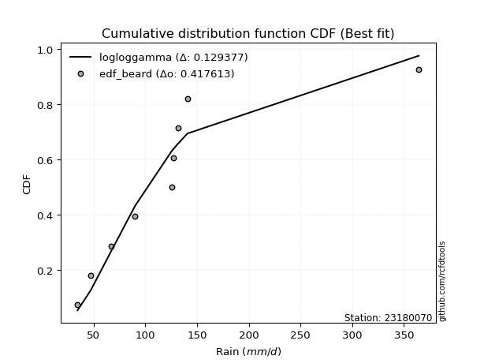</img></img>

</div>


### 5. Empirical - EDF Chegodayev (1955)

The Chegodayev formula is an empirical plotting position formula used in hydrological frequency analysis to estimate the exceedance probability or return period of a specific event from a set of observed data. It is primarily used for plotting observed data points on probability paper to fit a theoretical distribution, particularly for analyzing extreme events like maximum flood flows or rainfall intensities. The constant _b_ value in the generalized plotting position formula is 0.3.

<div align="center">


$P=(m-b)/(n+1-2b)$


</div>


**5.1. Empirical values**

<div align="center">

|                | 0                   | 1                   | 2                  | 3                   | 4              | 5                  | 6                  | 7                  | 8                  |
|:---------------|:--------------------|:--------------------|:-------------------|:--------------------|:---------------|:-------------------|:-------------------|:-------------------|:-------------------|
| date           | 2018                | 2017                | 2023               | 2025                | 2020           | 2021               | 2022               | 2019               | 2024               |
| x              | 34.6                | 47.2                | 66.8               | 80.8                | 90.2           | 125.4              | 127.4              | 140.8              | 364.4              |
| m              | 1                   | 2                   | 3                  | 4                   | 5              | 6                  | 7                  | 8                  | 9                  |
| empirical_dist | edf_chegodayev      | edf_chegodayev      | edf_chegodayev     | edf_chegodayev      | edf_chegodayev | edf_chegodayev     | edf_chegodayev     | edf_chegodayev     | edf_chegodayev     |
| empirical      | 0.07446808510638298 | 0.18085106382978722 | 0.2872340425531915 | 0.39361702127659576 | 0.5            | 0.6063829787234043 | 0.7127659574468085 | 0.8191489361702128 | 0.9255319148936169 |
| empirical_tr   | 1.0804597701149425  | 1.2207792207792207  | 1.4029850746268657 | 1.6491228070175437  | 2.0            | 2.540540540540541  | 3.481481481481481  | 5.529411764705883  | 13.428571428571399 |

</div>


**5.2. Kolmogorov-Smirnov fit test (sorted by Δ)**


<div align="center">

|                | 0                   | 1                   | 2                   | 3                   | 4                   | 5                   | 6                   | 7                   | 8                   | 9                   | 10                  | 11                  | 12                  | 13                  | 14                  | 15                  | 16                  | 17                  | 18                  | 19                  | 20                  | 21                  | 22                  | 23                  | 24                  | 25                  | 26                  | 27                  | 28                  | 29                  | 30                  | 31                  | 32                  | 33                  | 34                  | 35                  | 36                  | 37                  | 38                  | 39                  | 40                  | 41                  | 42                  | 43                  | 44                  | 45                  | 46                  | 47                  | 48                  | 49                  | 50                  | 51                  | 52                    | 53                  | 54                  | 55                  | 56                  | 57                  | 58                  | 59                  | 60                  | 61                  | 62                  | 63                  | 64                  | 65                  | 66                  | 67                  | 68                  | 69                  | 70                  | 71                  | 72                  | 73                  | 74                  | 75                  | 76                  | 77                  | 78                  | 79                  | 80                  | 81                  | 82                  | 83                  | 84                  | 85                  | 86                  | 87                  | 88                  | 89                  |
|:---------------|:--------------------|:--------------------|:--------------------|:--------------------|:--------------------|:--------------------|:--------------------|:--------------------|:--------------------|:--------------------|:--------------------|:--------------------|:--------------------|:--------------------|:--------------------|:--------------------|:--------------------|:--------------------|:--------------------|:--------------------|:--------------------|:--------------------|:--------------------|:--------------------|:--------------------|:--------------------|:--------------------|:--------------------|:--------------------|:--------------------|:--------------------|:--------------------|:--------------------|:--------------------|:--------------------|:--------------------|:--------------------|:--------------------|:--------------------|:--------------------|:--------------------|:--------------------|:--------------------|:--------------------|:--------------------|:--------------------|:--------------------|:--------------------|:--------------------|:--------------------|:--------------------|:--------------------|:----------------------|:--------------------|:--------------------|:--------------------|:--------------------|:--------------------|:--------------------|:--------------------|:--------------------|:--------------------|:--------------------|:--------------------|:--------------------|:--------------------|:--------------------|:--------------------|:--------------------|:--------------------|:--------------------|:--------------------|:--------------------|:--------------------|:--------------------|:--------------------|:--------------------|:--------------------|:--------------------|:--------------------|:--------------------|:--------------------|:--------------------|:--------------------|:--------------------|:--------------------|:--------------------|:--------------------|:--------------------|:--------------------|
| station        | 23180070            | 23180070            | 23180070            | 23180070            | 23180070            | 23180070            | 23180070            | 23180070            | 23180070            | 23180070            | 23180070            | 23180070            | 23180070            | 23180070            | 23180070            | 23180070            | 23180070            | 23180070            | 23180070            | 23180070            | 23180070            | 23180070            | 23180070            | 23180070            | 23180070            | 23180070            | 23180070            | 23180070            | 23180070            | 23180070            | 23180070            | 23180070            | 23180070            | 23180070            | 23180070            | 23180070            | 23180070            | 23180070            | 23180070            | 23180070            | 23180070            | 23180070            | 23180070            | 23180070            | 23180070            | 23180070            | 23180070            | 23180070            | 23180070            | 23180070            | 23180070            | 23180070            | 23180070              | 23180070            | 23180070            | 23180070            | 23180070            | 23180070            | 23180070            | 23180070            | 23180070            | 23180070            | 23180070            | 23180070            | 23180070            | 23180070            | 23180070            | 23180070            | 23180070            | 23180070            | 23180070            | 23180070            | 23180070            | 23180070            | 23180070            | 23180070            | 23180070            | 23180070            | 23180070            | 23180070            | 23180070            | 23180070            | 23180070            | 23180070            | 23180070            | 23180070            | 23180070            | 23180070            | 23180070            | 23180070            |
| empirical_dist | edf_chegodayev      | edf_chegodayev      | edf_chegodayev      | edf_chegodayev      | edf_chegodayev      | edf_chegodayev      | edf_chegodayev      | edf_chegodayev      | edf_chegodayev      | edf_chegodayev      | edf_chegodayev      | edf_chegodayev      | edf_chegodayev      | edf_chegodayev      | edf_chegodayev      | edf_chegodayev      | edf_chegodayev      | edf_chegodayev      | edf_chegodayev      | edf_chegodayev      | edf_chegodayev      | edf_chegodayev      | edf_chegodayev      | edf_chegodayev      | edf_chegodayev      | edf_chegodayev      | edf_chegodayev      | edf_chegodayev      | edf_chegodayev      | edf_chegodayev      | edf_chegodayev      | edf_chegodayev      | edf_chegodayev      | edf_chegodayev      | edf_chegodayev      | edf_chegodayev      | edf_chegodayev      | edf_chegodayev      | edf_chegodayev      | edf_chegodayev      | edf_chegodayev      | edf_chegodayev      | edf_chegodayev      | edf_chegodayev      | edf_chegodayev      | edf_chegodayev      | edf_chegodayev      | edf_chegodayev      | edf_chegodayev      | edf_chegodayev      | edf_chegodayev      | edf_chegodayev      | edf_chegodayev        | edf_chegodayev      | edf_chegodayev      | edf_chegodayev      | edf_chegodayev      | edf_chegodayev      | edf_chegodayev      | edf_chegodayev      | edf_chegodayev      | edf_chegodayev      | edf_chegodayev      | edf_chegodayev      | edf_chegodayev      | edf_chegodayev      | edf_chegodayev      | edf_chegodayev      | edf_chegodayev      | edf_chegodayev      | edf_chegodayev      | edf_chegodayev      | edf_chegodayev      | edf_chegodayev      | edf_chegodayev      | edf_chegodayev      | edf_chegodayev      | edf_chegodayev      | edf_chegodayev      | edf_chegodayev      | edf_chegodayev      | edf_chegodayev      | edf_chegodayev      | edf_chegodayev      | edf_chegodayev      | edf_chegodayev      | edf_chegodayev      | edf_chegodayev      | edf_chegodayev      | edf_chegodayev      |
| p_dist         | loglogistic         | logbetaprime        | logpearson3         | logmaxwell          | logrice             | invgauss            | ncf                 | lograyleigh         | johnsonsu           | logncf              | fisk                | lognct              | logweibull_min      | logalpha            | logf                | loginvgamma         | logjohnsonsu        | loginvgauss         | logfatiguelife      | loggamma            | loggamma            | logerlang           | betaprime           | invgamma            | fatiguelife         | loghypsecant        | nct                 | f                   | invweibull          | logexponnorm        | loggenlogistic      | mielke              | loggenexpon         | logt                | logcrystalball      | lognorm             | lognorm             | logmielke           | logfisk             | logloggamma         | loggompertz         | loginvweibull       | logkstwobign        | alpha               | wald                | loghalfnorm         | exponnorm           | laplace_asymmetric  | expon               | genexpon            | gompertz            | genlogistic         | loglaplace_asymmetric | loggumbel_r         | loggumbel_l         | loglaplace          | pearson3            | logtruncnorm        | loghalflogistic     | logmoyal            | nakagami            | moyal               | truncnorm           | halflogistic        | lognakagami         | t                   | gumbel_r            | halfnorm            | kstwobign           | gibrat              | laplace             | logwald             | logexpon            | rayleigh            | maxwell             | hypsecant           | chi2                | logistic            | loggibrat           | rice                | norm                | crystalball         | weibull_min         | gumbel_l            | logchi2             | loglognorm          | pareto              | logpareto           | gamma               | erlang              |
| delta          | 0.07623699687051688 | 0.07794470836182243 | 0.07882495663543032 | 0.08045771248585842 | 0.08177080953601368 | 0.08241571255822655 | 0.08248812691684071 | 0.0833572563110132  | 0.08377280080657368 | 0.08439428445986319 | 0.08507966385256216 | 0.08529828521193483 | 0.0853437689439912  | 0.08540296869206532 | 0.08567587157733314 | 0.0856919207476482  | 0.08593433539652295 | 0.08615622389671251 | 0.0862068537658629  | 0.08722695876284692 | 0.08722695876284692 | 0.08722708569995874 | 0.08771376587362445 | 0.08946778743294959 | 0.08949156871895236 | 0.09076482995974788 | 0.09100003432890924 | 0.09138590406026981 | 0.09171509884282703 | 0.09213066142918058 | 0.09251602094519629 | 0.09254811366343285 | 0.09276905389570977 | 0.0931411835375574  | 0.09314129740714527 | 0.09314142392897917 | 0.09314142392897917 | 0.09333175668735794 | 0.09369093560030628 | 0.09417191004014558 | 0.09468200599503629 | 0.09477564422928564 | 0.09527317671106839 | 0.09626610356988807 | 0.09705035322499682 | 0.10100360026591193 | 0.10389887871167824 | 0.10638364378224796 | 0.10638382424793458 | 0.10640020555523855 | 0.1067792302316829  | 0.10747816695114942 | 0.11020769105546957   | 0.11492472169391177 | 0.11637327462630853 | 0.11842026338444434 | 0.12107954679461697 | 0.12441905960532446 | 0.12887641099781955 | 0.1338919480665106  | 0.1358607956980209  | 0.13891709500255411 | 0.13898805179850704 | 0.1411470421814316  | 0.14429595019904035 | 0.14870354725747092 | 0.16216578590986064 | 0.16934311446243977 | 0.1743198344628868  | 0.18085106382978722 | 0.18228499346755944 | 0.1880385042313757  | 0.19016114808682627 | 0.19368485031550453 | 0.20225815355211496 | 0.20837771789640425 | 0.20935110048583006 | 0.21801344245923182 | 0.22013581929835357 | 0.2224458539662172  | 0.2296896309952543  | 0.22968963806290155 | 0.2595875880933013  | 0.2913310395242982  | 0.29203755412566523 | 0.41743053982526745 | 0.4207014156799814  | 0.4438178520377777  | 0.46323007497049995 | 0.5364274391065177  |
| deltao         | 0.41761268023100007 | 0.41761268023100007 | 0.41761268023100007 | 0.41761268023100007 | 0.41761268023100007 | 0.41761268023100007 | 0.41761268023100007 | 0.41761268023100007 | 0.41761268023100007 | 0.41761268023100007 | 0.41761268023100007 | 0.41761268023100007 | 0.41761268023100007 | 0.41761268023100007 | 0.41761268023100007 | 0.41761268023100007 | 0.41761268023100007 | 0.41761268023100007 | 0.41761268023100007 | 0.41761268023100007 | 0.41761268023100007 | 0.41761268023100007 | 0.41761268023100007 | 0.41761268023100007 | 0.41761268023100007 | 0.41761268023100007 | 0.41761268023100007 | 0.41761268023100007 | 0.41761268023100007 | 0.41761268023100007 | 0.41761268023100007 | 0.41761268023100007 | 0.41761268023100007 | 0.41761268023100007 | 0.41761268023100007 | 0.41761268023100007 | 0.41761268023100007 | 0.41761268023100007 | 0.41761268023100007 | 0.41761268023100007 | 0.41761268023100007 | 0.41761268023100007 | 0.41761268023100007 | 0.41761268023100007 | 0.41761268023100007 | 0.41761268023100007 | 0.41761268023100007 | 0.41761268023100007 | 0.41761268023100007 | 0.41761268023100007 | 0.41761268023100007 | 0.41761268023100007 | 0.41761268023100007   | 0.41761268023100007 | 0.41761268023100007 | 0.41761268023100007 | 0.41761268023100007 | 0.41761268023100007 | 0.41761268023100007 | 0.41761268023100007 | 0.41761268023100007 | 0.41761268023100007 | 0.41761268023100007 | 0.41761268023100007 | 0.41761268023100007 | 0.41761268023100007 | 0.41761268023100007 | 0.41761268023100007 | 0.41761268023100007 | 0.41761268023100007 | 0.41761268023100007 | 0.41761268023100007 | 0.41761268023100007 | 0.41761268023100007 | 0.41761268023100007 | 0.41761268023100007 | 0.41761268023100007 | 0.41761268023100007 | 0.41761268023100007 | 0.41761268023100007 | 0.41761268023100007 | 0.41761268023100007 | 0.41761268023100007 | 0.41761268023100007 | 0.41761268023100007 | 0.41761268023100007 | 0.41761268023100007 | 0.41761268023100007 | 0.41761268023100007 | 0.41761268023100007 |
| eval           | Δo > Δ              | Δo > Δ              | Δo > Δ              | Δo > Δ              | Δo > Δ              | Δo > Δ              | Δo > Δ              | Δo > Δ              | Δo > Δ              | Δo > Δ              | Δo > Δ              | Δo > Δ              | Δo > Δ              | Δo > Δ              | Δo > Δ              | Δo > Δ              | Δo > Δ              | Δo > Δ              | Δo > Δ              | Δo > Δ              | Δo > Δ              | Δo > Δ              | Δo > Δ              | Δo > Δ              | Δo > Δ              | Δo > Δ              | Δo > Δ              | Δo > Δ              | Δo > Δ              | Δo > Δ              | Δo > Δ              | Δo > Δ              | Δo > Δ              | Δo > Δ              | Δo > Δ              | Δo > Δ              | Δo > Δ              | Δo > Δ              | Δo > Δ              | Δo > Δ              | Δo > Δ              | Δo > Δ              | Δo > Δ              | Δo > Δ              | Δo > Δ              | Δo > Δ              | Δo > Δ              | Δo > Δ              | Δo > Δ              | Δo > Δ              | Δo > Δ              | Δo > Δ              | Δo > Δ                | Δo > Δ              | Δo > Δ              | Δo > Δ              | Δo > Δ              | Δo > Δ              | Δo > Δ              | Δo > Δ              | Δo > Δ              | Δo > Δ              | Δo > Δ              | Δo > Δ              | Δo > Δ              | Δo > Δ              | Δo > Δ              | Δo > Δ              | Δo > Δ              | Δo > Δ              | Δo > Δ              | Δo > Δ              | Δo > Δ              | Δo > Δ              | Δo > Δ              | Δo > Δ              | Δo > Δ              | Δo > Δ              | Δo > Δ              | Δo > Δ              | Δo > Δ              | Δo > Δ              | Δo > Δ              | Δo > Δ              | Δo > Δ              | Δo > Δ              | Δo <= Δ             | Δo <= Δ             | Δo <= Δ             | Δo <= Δ             |
| fit            | 1                   | 1                   | 1                   | 1                   | 1                   | 1                   | 1                   | 1                   | 1                   | 1                   | 1                   | 1                   | 1                   | 1                   | 1                   | 1                   | 1                   | 1                   | 1                   | 1                   | 1                   | 1                   | 1                   | 1                   | 1                   | 1                   | 1                   | 1                   | 1                   | 1                   | 1                   | 1                   | 1                   | 1                   | 1                   | 1                   | 1                   | 1                   | 1                   | 1                   | 1                   | 1                   | 1                   | 1                   | 1                   | 1                   | 1                   | 1                   | 1                   | 1                   | 1                   | 1                   | 1                     | 1                   | 1                   | 1                   | 1                   | 1                   | 1                   | 1                   | 1                   | 1                   | 1                   | 1                   | 1                   | 1                   | 1                   | 1                   | 1                   | 1                   | 1                   | 1                   | 1                   | 1                   | 1                   | 1                   | 1                   | 1                   | 1                   | 1                   | 1                   | 1                   | 1                   | 1                   | 1                   | 1                   | 0                   | 0                   | 0                   | 0                   |
| n              | 9                   | 9                   | 9                   | 9                   | 9                   | 9                   | 9                   | 9                   | 9                   | 9                   | 9                   | 9                   | 9                   | 9                   | 9                   | 9                   | 9                   | 9                   | 9                   | 9                   | 9                   | 9                   | 9                   | 9                   | 9                   | 9                   | 9                   | 9                   | 9                   | 9                   | 9                   | 9                   | 9                   | 9                   | 9                   | 9                   | 9                   | 9                   | 9                   | 9                   | 9                   | 9                   | 9                   | 9                   | 9                   | 9                   | 9                   | 9                   | 9                   | 9                   | 9                   | 9                   | 9                     | 9                   | 9                   | 9                   | 9                   | 9                   | 9                   | 9                   | 9                   | 9                   | 9                   | 9                   | 9                   | 9                   | 9                   | 9                   | 9                   | 9                   | 9                   | 9                   | 9                   | 9                   | 9                   | 9                   | 9                   | 9                   | 9                   | 9                   | 9                   | 9                   | 9                   | 9                   | 9                   | 9                   | 9                   | 9                   | 9                   | 9                   |
| best_fit       | 1                   | 0                   | 0                   | 0                   | 0                   | 0                   | 0                   | 0                   | 0                   | 0                   | 0                   | 0                   | 0                   | 0                   | 0                   | 0                   | 0                   | 0                   | 0                   | 0                   | 0                   | 0                   | 0                   | 0                   | 0                   | 0                   | 0                   | 0                   | 0                   | 0                   | 0                   | 0                   | 0                   | 0                   | 0                   | 0                   | 0                   | 0                   | 0                   | 0                   | 0                   | 0                   | 0                   | 0                   | 0                   | 0                   | 0                   | 0                   | 0                   | 0                   | 0                   | 0                   | 0                     | 0                   | 0                   | 0                   | 0                   | 0                   | 0                   | 0                   | 0                   | 0                   | 0                   | 0                   | 0                   | 0                   | 0                   | 0                   | 0                   | 0                   | 0                   | 0                   | 0                   | 0                   | 0                   | 0                   | 0                   | 0                   | 0                   | 0                   | 0                   | 0                   | 0                   | 0                   | 0                   | 0                   | 0                   | 0                   | 0                   | 0                   |
| best_fit_sort  | 1                   | 2                   | 3                   | 4                   | 5                   | 6                   | 7                   | 8                   | 9                   | 10                  | 11                  | 12                  | 13                  | 14                  | 15                  | 16                  | 17                  | 18                  | 19                  | 20                  | 21                  | 22                  | 23                  | 24                  | 25                  | 26                  | 27                  | 28                  | 29                  | 30                  | 31                  | 32                  | 33                  | 34                  | 35                  | 36                  | 37                  | 38                  | 39                  | 40                  | 41                  | 42                  | 43                  | 44                  | 45                  | 46                  | 47                  | 48                  | 49                  | 50                  | 51                  | 52                  | 53                    | 54                  | 55                  | 56                  | 57                  | 58                  | 59                  | 60                  | 61                  | 62                  | 63                  | 64                  | 65                  | 66                  | 67                  | 68                  | 69                  | 70                  | 71                  | 72                  | 73                  | 74                  | 75                  | 76                  | 77                  | 78                  | 79                  | 80                  | 81                  | 82                  | 83                  | 84                  | 85                  | 86                  | 87                  | 88                  | 89                  | 90                  |

</div>


<div align="center">

</img>

</div>


**5.3. Best fit**

<div align="center">

|   id |   station | empirical_dist   | p_dist      |    delta |   deltao | eval   |   fit |   n |   best_fit |   best_fit_sort |
|-----:|----------:|:-----------------|:------------|---------:|---------:|:-------|------:|----:|-----------:|----------------:|
|    0 |  23180070 | edf_chegodayev   | loglogistic | 0.076237 | 0.417613 | Δo > Δ |     1 |   9 |          1 |               1 |

</div>


<div align="center">

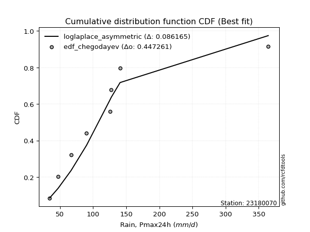</img>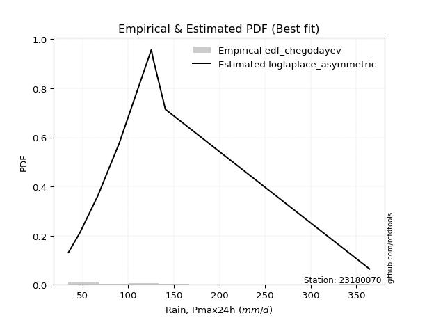</img>

</div>


### 6. Empirical - EDF Blom (1958)

The Blom formula is a specific "plotting position" formula used in hydrology and statistical analysis to estimate the empirical cumulative probability (or non-exceedance probability) of a data series. It is particularly recommended for data that are approximately normally distributed. The constant _a_ is set to 0.375 (or 3/8).

<div align="center">


$P=(m-a)/(n+1-2a)$


</div>


**6.1. Empirical values**

<div align="center">

|                | 0                   | 1                   | 2                   | 3                  | 4        | 5                  | 6                  | 7                  | 8                  |
|:---------------|:--------------------|:--------------------|:--------------------|:-------------------|:---------|:-------------------|:-------------------|:-------------------|:-------------------|
| date           | 2018                | 2017                | 2023                | 2025               | 2020     | 2021               | 2022               | 2019               | 2024               |
| x              | 34.6                | 47.2                | 66.8                | 80.8               | 90.2     | 125.4              | 127.4              | 140.8              | 364.4              |
| m              | 1                   | 2                   | 3                   | 4                  | 5        | 6                  | 7                  | 8                  | 9                  |
| empirical_dist | edf_blom            | edf_blom            | edf_blom            | edf_blom           | edf_blom | edf_blom           | edf_blom           | edf_blom           | edf_blom           |
| empirical      | 0.06756756756756757 | 0.17567567567567569 | 0.28378378378378377 | 0.3918918918918919 | 0.5      | 0.6081081081081081 | 0.7162162162162162 | 0.8243243243243243 | 0.9324324324324325 |
| empirical_tr   | 1.072463768115942   | 1.2131147540983607  | 1.3962264150943395  | 1.6444444444444444 | 2.0      | 2.5517241379310347 | 3.523809523809524  | 5.6923076923076925 | 14.800000000000006 |

</div>


**6.2. Kolmogorov-Smirnov fit test (sorted by Δ)**


<div align="center">

|                | 0                   | 1                   | 2                   | 3                   | 4                   | 5                   | 6                   | 7                   | 8                   | 9                   | 10                  | 11                  | 12                  | 13                  | 14                  | 15                  | 16                  | 17                  | 18                  | 19                  | 20                  | 21                  | 22                  | 23                  | 24                  | 25                  | 26                  | 27                  | 28                  | 29                  | 30                  | 31                  | 32                  | 33                  | 34                  | 35                  | 36                  | 37                  | 38                  | 39                  | 40                  | 41                  | 42                  | 43                  | 44                  | 45                  | 46                    | 47                  | 48                  | 49                  | 50                  | 51                  | 52                  | 53                  | 54                  | 55                  | 56                  | 57                  | 58                  | 59                  | 60                  | 61                  | 62                  | 63                  | 64                  | 65                  | 66                  | 67                  | 68                  | 69                  | 70                  | 71                  | 72                  | 73                  | 74                  | 75                  | 76                  | 77                  | 78                  | 79                  | 80                  | 81                  | 82                  | 83                  | 84                  | 85                  | 86                  | 87                  | 88                  | 89                  |
|:---------------|:--------------------|:--------------------|:--------------------|:--------------------|:--------------------|:--------------------|:--------------------|:--------------------|:--------------------|:--------------------|:--------------------|:--------------------|:--------------------|:--------------------|:--------------------|:--------------------|:--------------------|:--------------------|:--------------------|:--------------------|:--------------------|:--------------------|:--------------------|:--------------------|:--------------------|:--------------------|:--------------------|:--------------------|:--------------------|:--------------------|:--------------------|:--------------------|:--------------------|:--------------------|:--------------------|:--------------------|:--------------------|:--------------------|:--------------------|:--------------------|:--------------------|:--------------------|:--------------------|:--------------------|:--------------------|:--------------------|:----------------------|:--------------------|:--------------------|:--------------------|:--------------------|:--------------------|:--------------------|:--------------------|:--------------------|:--------------------|:--------------------|:--------------------|:--------------------|:--------------------|:--------------------|:--------------------|:--------------------|:--------------------|:--------------------|:--------------------|:--------------------|:--------------------|:--------------------|:--------------------|:--------------------|:--------------------|:--------------------|:--------------------|:--------------------|:--------------------|:--------------------|:--------------------|:--------------------|:--------------------|:--------------------|:--------------------|:--------------------|:--------------------|:--------------------|:--------------------|:--------------------|:--------------------|:--------------------|:--------------------|
| station        | 23180070            | 23180070            | 23180070            | 23180070            | 23180070            | 23180070            | 23180070            | 23180070            | 23180070            | 23180070            | 23180070            | 23180070            | 23180070            | 23180070            | 23180070            | 23180070            | 23180070            | 23180070            | 23180070            | 23180070            | 23180070            | 23180070            | 23180070            | 23180070            | 23180070            | 23180070            | 23180070            | 23180070            | 23180070            | 23180070            | 23180070            | 23180070            | 23180070            | 23180070            | 23180070            | 23180070            | 23180070            | 23180070            | 23180070            | 23180070            | 23180070            | 23180070            | 23180070            | 23180070            | 23180070            | 23180070            | 23180070              | 23180070            | 23180070            | 23180070            | 23180070            | 23180070            | 23180070            | 23180070            | 23180070            | 23180070            | 23180070            | 23180070            | 23180070            | 23180070            | 23180070            | 23180070            | 23180070            | 23180070            | 23180070            | 23180070            | 23180070            | 23180070            | 23180070            | 23180070            | 23180070            | 23180070            | 23180070            | 23180070            | 23180070            | 23180070            | 23180070            | 23180070            | 23180070            | 23180070            | 23180070            | 23180070            | 23180070            | 23180070            | 23180070            | 23180070            | 23180070            | 23180070            | 23180070            | 23180070            |
| empirical_dist | edf_blom            | edf_blom            | edf_blom            | edf_blom            | edf_blom            | edf_blom            | edf_blom            | edf_blom            | edf_blom            | edf_blom            | edf_blom            | edf_blom            | edf_blom            | edf_blom            | edf_blom            | edf_blom            | edf_blom            | edf_blom            | edf_blom            | edf_blom            | edf_blom            | edf_blom            | edf_blom            | edf_blom            | edf_blom            | edf_blom            | edf_blom            | edf_blom            | edf_blom            | edf_blom            | edf_blom            | edf_blom            | edf_blom            | edf_blom            | edf_blom            | edf_blom            | edf_blom            | edf_blom            | edf_blom            | edf_blom            | edf_blom            | edf_blom            | edf_blom            | edf_blom            | edf_blom            | edf_blom            | edf_blom              | edf_blom            | edf_blom            | edf_blom            | edf_blom            | edf_blom            | edf_blom            | edf_blom            | edf_blom            | edf_blom            | edf_blom            | edf_blom            | edf_blom            | edf_blom            | edf_blom            | edf_blom            | edf_blom            | edf_blom            | edf_blom            | edf_blom            | edf_blom            | edf_blom            | edf_blom            | edf_blom            | edf_blom            | edf_blom            | edf_blom            | edf_blom            | edf_blom            | edf_blom            | edf_blom            | edf_blom            | edf_blom            | edf_blom            | edf_blom            | edf_blom            | edf_blom            | edf_blom            | edf_blom            | edf_blom            | edf_blom            | edf_blom            | edf_blom            | edf_blom            |
| p_dist         | loglogistic         | ncf                 | lograyleigh         | logpearson3         | logncf              | johnsonsu           | logbetaprime        | fisk                | lognct              | logweibull_min      | logalpha            | logf                | loginvgamma         | logjohnsonsu        | loginvgauss         | logfatiguelife      | loggamma            | loggamma            | logerlang           | logmaxwell          | betaprime           | logrice             | invgauss            | invgamma            | loghypsecant        | nct                 | f                   | invweibull          | logexponnorm        | loggenlogistic      | mielke              | loggenexpon         | logmielke           | wald                | logfisk             | loginvweibull       | logkstwobign        | alpha               | fatiguelife         | logt                | logcrystalball      | lognorm             | lognorm             | loghalfnorm         | logloggamma         | loggompertz         | loglaplace_asymmetric | exponnorm           | laplace_asymmetric  | expon               | genexpon            | gompertz            | genlogistic         | loggumbel_r         | loglaplace          | loggumbel_l         | pearson3            | loghalflogistic     | logtruncnorm        | logmoyal            | nakagami            | moyal               | truncnorm           | halflogistic        | t                   | lognakagami         | gumbel_r            | halfnorm            | gibrat              | kstwobign           | logwald             | laplace             | logexpon            | rayleigh            | maxwell             | chi2                | hypsecant           | loggibrat           | logistic            | rice                | norm                | crystalball         | weibull_min         | logchi2             | gumbel_l            | loglognorm          | pareto              | logpareto           | gamma               | erlang              |
| delta          | 0.07599936142916985 | 0.0807629975321369  | 0.08197417161441867 | 0.08264751012211335 | 0.08266915507515937 | 0.08274476493493022 | 0.083120096515934   | 0.08335453446785834 | 0.08357315582723102 | 0.08361863955928739 | 0.0836778393073615  | 0.08395074219262932 | 0.08396679136294438 | 0.08420920601181914 | 0.0844310945120087  | 0.08448172438115908 | 0.0855018293781431  | 0.0855018293781431  | 0.08550195631525492 | 0.08563310063996998 | 0.08598863648892063 | 0.08694619769012524 | 0.08759110071233811 | 0.08774265804824577 | 0.08903970057504407 | 0.08927490494420542 | 0.08966077467556599 | 0.08998996945812321 | 0.09040553204447677 | 0.09079089156049247 | 0.09082298427872904 | 0.09104392451100596 | 0.09160662730265412 | 0.09187496507088529 | 0.09196580621560246 | 0.09305051484458182 | 0.09354804732636457 | 0.09454097418518426 | 0.09466695687306392 | 0.09831657169166896 | 0.09831668556125683 | 0.09831681208309073 | 0.09831681208309073 | 0.09927847088120811 | 0.09934729819425714 | 0.09985739414914785 | 0.10848256167076575   | 0.1090742668657898  | 0.11155903193635952 | 0.11155921240204614 | 0.11157559370935011 | 0.11195461838579446 | 0.11265355510526098 | 0.11319959230920795 | 0.11669513399974052 | 0.12154866278042009 | 0.12625493494872853 | 0.12715128161311573 | 0.1278693183747322  | 0.1321668186818068  | 0.14103618385213246 | 0.14409248315666567 | 0.1441634399526186  | 0.14632243033554315 | 0.1469784178727671  | 0.1477462089684481  | 0.1673411740639722  | 0.17451850261655133 | 0.17567567567567569 | 0.17949522261699835 | 0.18631337484667188 | 0.187460381621671   | 0.19361140685623401 | 0.1988602384696161  | 0.20743354170622652 | 0.2128013592552378  | 0.2135531060505158  | 0.21841068991364976 | 0.22318883061334338 | 0.22762124212032875 | 0.23486501914936586 | 0.2348650262170131  | 0.26476297624741285 | 0.295487812895073   | 0.29650642767840973 | 0.422605927979379   | 0.425876803834093   | 0.44899324019188924 | 0.4666803337399077  | 0.5398776978759254  |
| deltao         | 0.41761268023100007 | 0.41761268023100007 | 0.41761268023100007 | 0.41761268023100007 | 0.41761268023100007 | 0.41761268023100007 | 0.41761268023100007 | 0.41761268023100007 | 0.41761268023100007 | 0.41761268023100007 | 0.41761268023100007 | 0.41761268023100007 | 0.41761268023100007 | 0.41761268023100007 | 0.41761268023100007 | 0.41761268023100007 | 0.41761268023100007 | 0.41761268023100007 | 0.41761268023100007 | 0.41761268023100007 | 0.41761268023100007 | 0.41761268023100007 | 0.41761268023100007 | 0.41761268023100007 | 0.41761268023100007 | 0.41761268023100007 | 0.41761268023100007 | 0.41761268023100007 | 0.41761268023100007 | 0.41761268023100007 | 0.41761268023100007 | 0.41761268023100007 | 0.41761268023100007 | 0.41761268023100007 | 0.41761268023100007 | 0.41761268023100007 | 0.41761268023100007 | 0.41761268023100007 | 0.41761268023100007 | 0.41761268023100007 | 0.41761268023100007 | 0.41761268023100007 | 0.41761268023100007 | 0.41761268023100007 | 0.41761268023100007 | 0.41761268023100007 | 0.41761268023100007   | 0.41761268023100007 | 0.41761268023100007 | 0.41761268023100007 | 0.41761268023100007 | 0.41761268023100007 | 0.41761268023100007 | 0.41761268023100007 | 0.41761268023100007 | 0.41761268023100007 | 0.41761268023100007 | 0.41761268023100007 | 0.41761268023100007 | 0.41761268023100007 | 0.41761268023100007 | 0.41761268023100007 | 0.41761268023100007 | 0.41761268023100007 | 0.41761268023100007 | 0.41761268023100007 | 0.41761268023100007 | 0.41761268023100007 | 0.41761268023100007 | 0.41761268023100007 | 0.41761268023100007 | 0.41761268023100007 | 0.41761268023100007 | 0.41761268023100007 | 0.41761268023100007 | 0.41761268023100007 | 0.41761268023100007 | 0.41761268023100007 | 0.41761268023100007 | 0.41761268023100007 | 0.41761268023100007 | 0.41761268023100007 | 0.41761268023100007 | 0.41761268023100007 | 0.41761268023100007 | 0.41761268023100007 | 0.41761268023100007 | 0.41761268023100007 | 0.41761268023100007 | 0.41761268023100007 |
| eval           | Δo > Δ              | Δo > Δ              | Δo > Δ              | Δo > Δ              | Δo > Δ              | Δo > Δ              | Δo > Δ              | Δo > Δ              | Δo > Δ              | Δo > Δ              | Δo > Δ              | Δo > Δ              | Δo > Δ              | Δo > Δ              | Δo > Δ              | Δo > Δ              | Δo > Δ              | Δo > Δ              | Δo > Δ              | Δo > Δ              | Δo > Δ              | Δo > Δ              | Δo > Δ              | Δo > Δ              | Δo > Δ              | Δo > Δ              | Δo > Δ              | Δo > Δ              | Δo > Δ              | Δo > Δ              | Δo > Δ              | Δo > Δ              | Δo > Δ              | Δo > Δ              | Δo > Δ              | Δo > Δ              | Δo > Δ              | Δo > Δ              | Δo > Δ              | Δo > Δ              | Δo > Δ              | Δo > Δ              | Δo > Δ              | Δo > Δ              | Δo > Δ              | Δo > Δ              | Δo > Δ                | Δo > Δ              | Δo > Δ              | Δo > Δ              | Δo > Δ              | Δo > Δ              | Δo > Δ              | Δo > Δ              | Δo > Δ              | Δo > Δ              | Δo > Δ              | Δo > Δ              | Δo > Δ              | Δo > Δ              | Δo > Δ              | Δo > Δ              | Δo > Δ              | Δo > Δ              | Δo > Δ              | Δo > Δ              | Δo > Δ              | Δo > Δ              | Δo > Δ              | Δo > Δ              | Δo > Δ              | Δo > Δ              | Δo > Δ              | Δo > Δ              | Δo > Δ              | Δo > Δ              | Δo > Δ              | Δo > Δ              | Δo > Δ              | Δo > Δ              | Δo > Δ              | Δo > Δ              | Δo > Δ              | Δo > Δ              | Δo > Δ              | Δo <= Δ             | Δo <= Δ             | Δo <= Δ             | Δo <= Δ             | Δo <= Δ             |
| fit            | 1                   | 1                   | 1                   | 1                   | 1                   | 1                   | 1                   | 1                   | 1                   | 1                   | 1                   | 1                   | 1                   | 1                   | 1                   | 1                   | 1                   | 1                   | 1                   | 1                   | 1                   | 1                   | 1                   | 1                   | 1                   | 1                   | 1                   | 1                   | 1                   | 1                   | 1                   | 1                   | 1                   | 1                   | 1                   | 1                   | 1                   | 1                   | 1                   | 1                   | 1                   | 1                   | 1                   | 1                   | 1                   | 1                   | 1                     | 1                   | 1                   | 1                   | 1                   | 1                   | 1                   | 1                   | 1                   | 1                   | 1                   | 1                   | 1                   | 1                   | 1                   | 1                   | 1                   | 1                   | 1                   | 1                   | 1                   | 1                   | 1                   | 1                   | 1                   | 1                   | 1                   | 1                   | 1                   | 1                   | 1                   | 1                   | 1                   | 1                   | 1                   | 1                   | 1                   | 1                   | 1                   | 0                   | 0                   | 0                   | 0                   | 0                   |
| n              | 9                   | 9                   | 9                   | 9                   | 9                   | 9                   | 9                   | 9                   | 9                   | 9                   | 9                   | 9                   | 9                   | 9                   | 9                   | 9                   | 9                   | 9                   | 9                   | 9                   | 9                   | 9                   | 9                   | 9                   | 9                   | 9                   | 9                   | 9                   | 9                   | 9                   | 9                   | 9                   | 9                   | 9                   | 9                   | 9                   | 9                   | 9                   | 9                   | 9                   | 9                   | 9                   | 9                   | 9                   | 9                   | 9                   | 9                     | 9                   | 9                   | 9                   | 9                   | 9                   | 9                   | 9                   | 9                   | 9                   | 9                   | 9                   | 9                   | 9                   | 9                   | 9                   | 9                   | 9                   | 9                   | 9                   | 9                   | 9                   | 9                   | 9                   | 9                   | 9                   | 9                   | 9                   | 9                   | 9                   | 9                   | 9                   | 9                   | 9                   | 9                   | 9                   | 9                   | 9                   | 9                   | 9                   | 9                   | 9                   | 9                   | 9                   |
| best_fit       | 1                   | 0                   | 0                   | 0                   | 0                   | 0                   | 0                   | 0                   | 0                   | 0                   | 0                   | 0                   | 0                   | 0                   | 0                   | 0                   | 0                   | 0                   | 0                   | 0                   | 0                   | 0                   | 0                   | 0                   | 0                   | 0                   | 0                   | 0                   | 0                   | 0                   | 0                   | 0                   | 0                   | 0                   | 0                   | 0                   | 0                   | 0                   | 0                   | 0                   | 0                   | 0                   | 0                   | 0                   | 0                   | 0                   | 0                     | 0                   | 0                   | 0                   | 0                   | 0                   | 0                   | 0                   | 0                   | 0                   | 0                   | 0                   | 0                   | 0                   | 0                   | 0                   | 0                   | 0                   | 0                   | 0                   | 0                   | 0                   | 0                   | 0                   | 0                   | 0                   | 0                   | 0                   | 0                   | 0                   | 0                   | 0                   | 0                   | 0                   | 0                   | 0                   | 0                   | 0                   | 0                   | 0                   | 0                   | 0                   | 0                   | 0                   |
| best_fit_sort  | 1                   | 2                   | 3                   | 4                   | 5                   | 6                   | 7                   | 8                   | 9                   | 10                  | 11                  | 12                  | 13                  | 14                  | 15                  | 16                  | 17                  | 18                  | 19                  | 20                  | 21                  | 22                  | 23                  | 24                  | 25                  | 26                  | 27                  | 28                  | 29                  | 30                  | 31                  | 32                  | 33                  | 34                  | 35                  | 36                  | 37                  | 38                  | 39                  | 40                  | 41                  | 42                  | 43                  | 44                  | 45                  | 46                  | 47                    | 48                  | 49                  | 50                  | 51                  | 52                  | 53                  | 54                  | 55                  | 56                  | 57                  | 58                  | 59                  | 60                  | 61                  | 62                  | 63                  | 64                  | 65                  | 66                  | 67                  | 68                  | 69                  | 70                  | 71                  | 72                  | 73                  | 74                  | 75                  | 76                  | 77                  | 78                  | 79                  | 80                  | 81                  | 82                  | 83                  | 84                  | 85                  | 86                  | 87                  | 88                  | 89                  | 90                  |

</div>


<div align="center">

</img>

</div>


**6.3. Best fit**

<div align="center">

|   id |   station | empirical_dist   | p_dist      |     delta |   deltao | eval   |   fit |   n |   best_fit |   best_fit_sort |
|-----:|----------:|:-----------------|:------------|----------:|---------:|:-------|------:|----:|-----------:|----------------:|
|    0 |  23180070 | edf_blom         | loglogistic | 0.0759994 | 0.417613 | Δo > Δ |     1 |   9 |          1 |               1 |

</div>


<div align="center">

</img>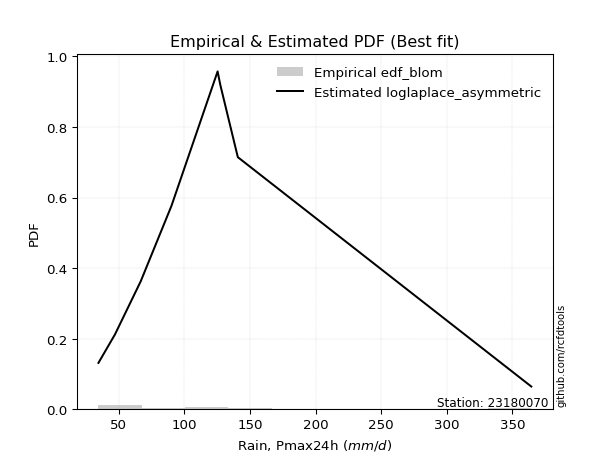</img>

</div>


### 7. Empirical - EDF Tukey (1962)

In hydrology, the Tukey formula is used as a plotting position formula to estimate the empirical probability or frequency of a flood event (or other hydrological data). The formula parameter is given as _c=0.333_ (or 1/3).

<div align="center">


$P=(m-c)/(n+1-2c)$


</div>


**7.1. Empirical values**

<div align="center">

|                | 0                   | 1                   | 2                  | 3                   | 4         | 5                  | 6                  | 7                  | 8                  |
|:---------------|:--------------------|:--------------------|:-------------------|:--------------------|:----------|:-------------------|:-------------------|:-------------------|:-------------------|
| date           | 2018                | 2017                | 2023               | 2025                | 2020      | 2021               | 2022               | 2019               | 2024               |
| x              | 34.6                | 47.2                | 66.8               | 80.8                | 90.2      | 125.4              | 127.4              | 140.8              | 364.4              |
| m              | 1                   | 2                   | 3                  | 4                   | 5         | 6                  | 7                  | 8                  | 9                  |
| empirical_dist | edf_tukey           | edf_tukey           | edf_tukey          | edf_tukey           | edf_tukey | edf_tukey          | edf_tukey          | edf_tukey          | edf_tukey          |
| empirical      | 0.07142857142857142 | 0.17857142857142858 | 0.2857142857142857 | 0.39285714285714285 | 0.5       | 0.6071428571428571 | 0.7142857142857143 | 0.8214285714285714 | 0.9285714285714286 |
| empirical_tr   | 1.0769230769230769  | 1.2173913043478262  | 1.4                | 1.6470588235294117  | 2.0       | 2.545454545454545  | 3.5                | 5.599999999999999  | 14.000000000000007 |

</div>


**7.2. Kolmogorov-Smirnov fit test (sorted by Δ)**


<div align="center">

|                | 0                   | 1                   | 2                   | 3                   | 4                   | 5                   | 6                   | 7                   | 8                   | 9                   | 10                  | 11                  | 12                  | 13                  | 14                  | 15                  | 16                  | 17                  | 18                  | 19                  | 20                  | 21                  | 22                  | 23                  | 24                  | 25                  | 26                  | 27                  | 28                  | 29                  | 30                  | 31                  | 32                  | 33                  | 34                  | 35                  | 36                  | 37                  | 38                  | 39                  | 40                  | 41                  | 42                  | 43                  | 44                  | 45                  | 46                  | 47                  | 48                  | 49                  | 50                  | 51                    | 52                  | 53                  | 54                  | 55                  | 56                  | 57                  | 58                  | 59                  | 60                  | 61                  | 62                  | 63                  | 64                  | 65                  | 66                  | 67                  | 68                  | 69                  | 70                  | 71                  | 72                  | 73                  | 74                  | 75                  | 76                  | 77                  | 78                  | 79                  | 80                  | 81                  | 82                  | 83                  | 84                  | 85                  | 86                  | 87                  | 88                  | 89                  |
|:---------------|:--------------------|:--------------------|:--------------------|:--------------------|:--------------------|:--------------------|:--------------------|:--------------------|:--------------------|:--------------------|:--------------------|:--------------------|:--------------------|:--------------------|:--------------------|:--------------------|:--------------------|:--------------------|:--------------------|:--------------------|:--------------------|:--------------------|:--------------------|:--------------------|:--------------------|:--------------------|:--------------------|:--------------------|:--------------------|:--------------------|:--------------------|:--------------------|:--------------------|:--------------------|:--------------------|:--------------------|:--------------------|:--------------------|:--------------------|:--------------------|:--------------------|:--------------------|:--------------------|:--------------------|:--------------------|:--------------------|:--------------------|:--------------------|:--------------------|:--------------------|:--------------------|:----------------------|:--------------------|:--------------------|:--------------------|:--------------------|:--------------------|:--------------------|:--------------------|:--------------------|:--------------------|:--------------------|:--------------------|:--------------------|:--------------------|:--------------------|:--------------------|:--------------------|:--------------------|:--------------------|:--------------------|:--------------------|:--------------------|:--------------------|:--------------------|:--------------------|:--------------------|:--------------------|:--------------------|:--------------------|:--------------------|:--------------------|:--------------------|:--------------------|:--------------------|:--------------------|:--------------------|:--------------------|:--------------------|:--------------------|
| station        | 23180070            | 23180070            | 23180070            | 23180070            | 23180070            | 23180070            | 23180070            | 23180070            | 23180070            | 23180070            | 23180070            | 23180070            | 23180070            | 23180070            | 23180070            | 23180070            | 23180070            | 23180070            | 23180070            | 23180070            | 23180070            | 23180070            | 23180070            | 23180070            | 23180070            | 23180070            | 23180070            | 23180070            | 23180070            | 23180070            | 23180070            | 23180070            | 23180070            | 23180070            | 23180070            | 23180070            | 23180070            | 23180070            | 23180070            | 23180070            | 23180070            | 23180070            | 23180070            | 23180070            | 23180070            | 23180070            | 23180070            | 23180070            | 23180070            | 23180070            | 23180070            | 23180070              | 23180070            | 23180070            | 23180070            | 23180070            | 23180070            | 23180070            | 23180070            | 23180070            | 23180070            | 23180070            | 23180070            | 23180070            | 23180070            | 23180070            | 23180070            | 23180070            | 23180070            | 23180070            | 23180070            | 23180070            | 23180070            | 23180070            | 23180070            | 23180070            | 23180070            | 23180070            | 23180070            | 23180070            | 23180070            | 23180070            | 23180070            | 23180070            | 23180070            | 23180070            | 23180070            | 23180070            | 23180070            | 23180070            |
| empirical_dist | edf_tukey           | edf_tukey           | edf_tukey           | edf_tukey           | edf_tukey           | edf_tukey           | edf_tukey           | edf_tukey           | edf_tukey           | edf_tukey           | edf_tukey           | edf_tukey           | edf_tukey           | edf_tukey           | edf_tukey           | edf_tukey           | edf_tukey           | edf_tukey           | edf_tukey           | edf_tukey           | edf_tukey           | edf_tukey           | edf_tukey           | edf_tukey           | edf_tukey           | edf_tukey           | edf_tukey           | edf_tukey           | edf_tukey           | edf_tukey           | edf_tukey           | edf_tukey           | edf_tukey           | edf_tukey           | edf_tukey           | edf_tukey           | edf_tukey           | edf_tukey           | edf_tukey           | edf_tukey           | edf_tukey           | edf_tukey           | edf_tukey           | edf_tukey           | edf_tukey           | edf_tukey           | edf_tukey           | edf_tukey           | edf_tukey           | edf_tukey           | edf_tukey           | edf_tukey             | edf_tukey           | edf_tukey           | edf_tukey           | edf_tukey           | edf_tukey           | edf_tukey           | edf_tukey           | edf_tukey           | edf_tukey           | edf_tukey           | edf_tukey           | edf_tukey           | edf_tukey           | edf_tukey           | edf_tukey           | edf_tukey           | edf_tukey           | edf_tukey           | edf_tukey           | edf_tukey           | edf_tukey           | edf_tukey           | edf_tukey           | edf_tukey           | edf_tukey           | edf_tukey           | edf_tukey           | edf_tukey           | edf_tukey           | edf_tukey           | edf_tukey           | edf_tukey           | edf_tukey           | edf_tukey           | edf_tukey           | edf_tukey           | edf_tukey           | edf_tukey           |
| p_dist         | loglogistic         | logpearson3         | logbetaprime        | ncf                 | lograyleigh         | logmaxwell          | johnsonsu           | logncf              | logrice             | fisk                | lognct              | logweibull_min      | logalpha            | invgauss            | logf                | loginvgamma         | logjohnsonsu        | loginvgauss         | logfatiguelife      | loggamma            | loggamma            | logerlang           | betaprime           | invgamma            | loghypsecant        | nct                 | f                   | invweibull          | logexponnorm        | loggenlogistic      | fatiguelife         | mielke              | loggenexpon         | logmielke           | logfisk             | loginvweibull       | logkstwobign        | wald                | logt                | logcrystalball      | lognorm             | lognorm             | alpha               | logloggamma         | loggompertz         | loghalfnorm         | exponnorm           | laplace_asymmetric  | expon               | genexpon            | gompertz            | loglaplace_asymmetric | genlogistic         | loggumbel_r         | loglaplace          | loggumbel_l         | pearson3            | logtruncnorm        | loghalflogistic     | logmoyal            | nakagami            | moyal               | truncnorm           | halflogistic        | lognakagami         | t                   | gumbel_r            | halfnorm            | kstwobign           | gibrat              | laplace             | logwald             | logexpon            | rayleigh            | maxwell             | hypsecant           | chi2                | loggibrat           | logistic            | rice                | norm                | crystalball         | weibull_min         | logchi2             | gumbel_l            | loglognorm          | pareto              | logpareto           | gamma               | erlang              |
| delta          | 0.07547711845106408 | 0.07975175722636041 | 0.08022434362018105 | 0.08172824849738791 | 0.08259737789156041 | 0.08273734774421704 | 0.08301292238712088 | 0.08363440604041039 | 0.08405044479437229 | 0.08431978543310936 | 0.08453840679248203 | 0.08458389052453841 | 0.08464309027261252 | 0.08469534781658516 | 0.08491599315788034 | 0.0849320423281954  | 0.08517445697707016 | 0.08539634547725972 | 0.0854469753464101  | 0.08646708034339412 | 0.08646708034339412 | 0.08646720728050594 | 0.08695388745417165 | 0.08870790901349679 | 0.09000495154029509 | 0.09024015590945644 | 0.09062602564081701 | 0.09095522042337423 | 0.09137078300972779 | 0.09175614252574349 | 0.09177120397731098 | 0.09178823524398005 | 0.09200917547625698 | 0.09257187826790514 | 0.09293105718085348 | 0.09401576580983284 | 0.09451329829161559 | 0.09477071796663818 | 0.09542081879591602 | 0.09542093266550389 | 0.09542105918733779 | 0.09542105918733779 | 0.09550622515043528 | 0.0964515452985042  | 0.0969616412533949  | 0.10024372184645913 | 0.10617851397003686 | 0.10866327904060658 | 0.10866345950629319 | 0.10867984081359716 | 0.10905886549004151 | 0.10944781263601677   | 0.10975780220950804 | 0.11416484327445897 | 0.11766038496499154 | 0.11865290988466715 | 0.12335918205297558 | 0.12593881644423027 | 0.12811653257836675 | 0.13313206964705782 | 0.1381404309563795  | 0.14119673026091273 | 0.14126768705686565 | 0.1434266774397902  | 0.14581570703794616 | 0.14794366883801813 | 0.16444542116821925 | 0.17162274972079838 | 0.1765994697212454  | 0.17857142857142858 | 0.18456462872591806 | 0.1872786258119229  | 0.1916809049257321  | 0.19596448557386315 | 0.20453778881047358 | 0.21065735315476286 | 0.21087085732473587 | 0.21937594087890078 | 0.22029307771759044 | 0.2247254892245758  | 0.23196926625361292 | 0.23196927332126016 | 0.2618672233516599  | 0.29355731096457105 | 0.2936106747826568  | 0.41971017508362607 | 0.42298105093834004 | 0.4460974872961363  | 0.46474983180940577 | 0.5379471959454235  |
| deltao         | 0.41761268023100007 | 0.41761268023100007 | 0.41761268023100007 | 0.41761268023100007 | 0.41761268023100007 | 0.41761268023100007 | 0.41761268023100007 | 0.41761268023100007 | 0.41761268023100007 | 0.41761268023100007 | 0.41761268023100007 | 0.41761268023100007 | 0.41761268023100007 | 0.41761268023100007 | 0.41761268023100007 | 0.41761268023100007 | 0.41761268023100007 | 0.41761268023100007 | 0.41761268023100007 | 0.41761268023100007 | 0.41761268023100007 | 0.41761268023100007 | 0.41761268023100007 | 0.41761268023100007 | 0.41761268023100007 | 0.41761268023100007 | 0.41761268023100007 | 0.41761268023100007 | 0.41761268023100007 | 0.41761268023100007 | 0.41761268023100007 | 0.41761268023100007 | 0.41761268023100007 | 0.41761268023100007 | 0.41761268023100007 | 0.41761268023100007 | 0.41761268023100007 | 0.41761268023100007 | 0.41761268023100007 | 0.41761268023100007 | 0.41761268023100007 | 0.41761268023100007 | 0.41761268023100007 | 0.41761268023100007 | 0.41761268023100007 | 0.41761268023100007 | 0.41761268023100007 | 0.41761268023100007 | 0.41761268023100007 | 0.41761268023100007 | 0.41761268023100007 | 0.41761268023100007   | 0.41761268023100007 | 0.41761268023100007 | 0.41761268023100007 | 0.41761268023100007 | 0.41761268023100007 | 0.41761268023100007 | 0.41761268023100007 | 0.41761268023100007 | 0.41761268023100007 | 0.41761268023100007 | 0.41761268023100007 | 0.41761268023100007 | 0.41761268023100007 | 0.41761268023100007 | 0.41761268023100007 | 0.41761268023100007 | 0.41761268023100007 | 0.41761268023100007 | 0.41761268023100007 | 0.41761268023100007 | 0.41761268023100007 | 0.41761268023100007 | 0.41761268023100007 | 0.41761268023100007 | 0.41761268023100007 | 0.41761268023100007 | 0.41761268023100007 | 0.41761268023100007 | 0.41761268023100007 | 0.41761268023100007 | 0.41761268023100007 | 0.41761268023100007 | 0.41761268023100007 | 0.41761268023100007 | 0.41761268023100007 | 0.41761268023100007 | 0.41761268023100007 | 0.41761268023100007 |
| eval           | Δo > Δ              | Δo > Δ              | Δo > Δ              | Δo > Δ              | Δo > Δ              | Δo > Δ              | Δo > Δ              | Δo > Δ              | Δo > Δ              | Δo > Δ              | Δo > Δ              | Δo > Δ              | Δo > Δ              | Δo > Δ              | Δo > Δ              | Δo > Δ              | Δo > Δ              | Δo > Δ              | Δo > Δ              | Δo > Δ              | Δo > Δ              | Δo > Δ              | Δo > Δ              | Δo > Δ              | Δo > Δ              | Δo > Δ              | Δo > Δ              | Δo > Δ              | Δo > Δ              | Δo > Δ              | Δo > Δ              | Δo > Δ              | Δo > Δ              | Δo > Δ              | Δo > Δ              | Δo > Δ              | Δo > Δ              | Δo > Δ              | Δo > Δ              | Δo > Δ              | Δo > Δ              | Δo > Δ              | Δo > Δ              | Δo > Δ              | Δo > Δ              | Δo > Δ              | Δo > Δ              | Δo > Δ              | Δo > Δ              | Δo > Δ              | Δo > Δ              | Δo > Δ                | Δo > Δ              | Δo > Δ              | Δo > Δ              | Δo > Δ              | Δo > Δ              | Δo > Δ              | Δo > Δ              | Δo > Δ              | Δo > Δ              | Δo > Δ              | Δo > Δ              | Δo > Δ              | Δo > Δ              | Δo > Δ              | Δo > Δ              | Δo > Δ              | Δo > Δ              | Δo > Δ              | Δo > Δ              | Δo > Δ              | Δo > Δ              | Δo > Δ              | Δo > Δ              | Δo > Δ              | Δo > Δ              | Δo > Δ              | Δo > Δ              | Δo > Δ              | Δo > Δ              | Δo > Δ              | Δo > Δ              | Δo > Δ              | Δo > Δ              | Δo <= Δ             | Δo <= Δ             | Δo <= Δ             | Δo <= Δ             | Δo <= Δ             |
| fit            | 1                   | 1                   | 1                   | 1                   | 1                   | 1                   | 1                   | 1                   | 1                   | 1                   | 1                   | 1                   | 1                   | 1                   | 1                   | 1                   | 1                   | 1                   | 1                   | 1                   | 1                   | 1                   | 1                   | 1                   | 1                   | 1                   | 1                   | 1                   | 1                   | 1                   | 1                   | 1                   | 1                   | 1                   | 1                   | 1                   | 1                   | 1                   | 1                   | 1                   | 1                   | 1                   | 1                   | 1                   | 1                   | 1                   | 1                   | 1                   | 1                   | 1                   | 1                   | 1                     | 1                   | 1                   | 1                   | 1                   | 1                   | 1                   | 1                   | 1                   | 1                   | 1                   | 1                   | 1                   | 1                   | 1                   | 1                   | 1                   | 1                   | 1                   | 1                   | 1                   | 1                   | 1                   | 1                   | 1                   | 1                   | 1                   | 1                   | 1                   | 1                   | 1                   | 1                   | 1                   | 1                   | 0                   | 0                   | 0                   | 0                   | 0                   |
| n              | 9                   | 9                   | 9                   | 9                   | 9                   | 9                   | 9                   | 9                   | 9                   | 9                   | 9                   | 9                   | 9                   | 9                   | 9                   | 9                   | 9                   | 9                   | 9                   | 9                   | 9                   | 9                   | 9                   | 9                   | 9                   | 9                   | 9                   | 9                   | 9                   | 9                   | 9                   | 9                   | 9                   | 9                   | 9                   | 9                   | 9                   | 9                   | 9                   | 9                   | 9                   | 9                   | 9                   | 9                   | 9                   | 9                   | 9                   | 9                   | 9                   | 9                   | 9                   | 9                     | 9                   | 9                   | 9                   | 9                   | 9                   | 9                   | 9                   | 9                   | 9                   | 9                   | 9                   | 9                   | 9                   | 9                   | 9                   | 9                   | 9                   | 9                   | 9                   | 9                   | 9                   | 9                   | 9                   | 9                   | 9                   | 9                   | 9                   | 9                   | 9                   | 9                   | 9                   | 9                   | 9                   | 9                   | 9                   | 9                   | 9                   | 9                   |
| best_fit       | 1                   | 0                   | 0                   | 0                   | 0                   | 0                   | 0                   | 0                   | 0                   | 0                   | 0                   | 0                   | 0                   | 0                   | 0                   | 0                   | 0                   | 0                   | 0                   | 0                   | 0                   | 0                   | 0                   | 0                   | 0                   | 0                   | 0                   | 0                   | 0                   | 0                   | 0                   | 0                   | 0                   | 0                   | 0                   | 0                   | 0                   | 0                   | 0                   | 0                   | 0                   | 0                   | 0                   | 0                   | 0                   | 0                   | 0                   | 0                   | 0                   | 0                   | 0                   | 0                     | 0                   | 0                   | 0                   | 0                   | 0                   | 0                   | 0                   | 0                   | 0                   | 0                   | 0                   | 0                   | 0                   | 0                   | 0                   | 0                   | 0                   | 0                   | 0                   | 0                   | 0                   | 0                   | 0                   | 0                   | 0                   | 0                   | 0                   | 0                   | 0                   | 0                   | 0                   | 0                   | 0                   | 0                   | 0                   | 0                   | 0                   | 0                   |
| best_fit_sort  | 1                   | 2                   | 3                   | 4                   | 5                   | 6                   | 7                   | 8                   | 9                   | 10                  | 11                  | 12                  | 13                  | 14                  | 15                  | 16                  | 17                  | 18                  | 19                  | 20                  | 21                  | 22                  | 23                  | 24                  | 25                  | 26                  | 27                  | 28                  | 29                  | 30                  | 31                  | 32                  | 33                  | 34                  | 35                  | 36                  | 37                  | 38                  | 39                  | 40                  | 41                  | 42                  | 43                  | 44                  | 45                  | 46                  | 47                  | 48                  | 49                  | 50                  | 51                  | 52                    | 53                  | 54                  | 55                  | 56                  | 57                  | 58                  | 59                  | 60                  | 61                  | 62                  | 63                  | 64                  | 65                  | 66                  | 67                  | 68                  | 69                  | 70                  | 71                  | 72                  | 73                  | 74                  | 75                  | 76                  | 77                  | 78                  | 79                  | 80                  | 81                  | 82                  | 83                  | 84                  | 85                  | 86                  | 87                  | 88                  | 89                  | 90                  |

</div>


<div align="center">

</img>

</div>


**7.3. Best fit**

<div align="center">

|   id |   station | empirical_dist   | p_dist      |     delta |   deltao | eval   |   fit |   n |   best_fit |   best_fit_sort |
|-----:|----------:|:-----------------|:------------|----------:|---------:|:-------|------:|----:|-----------:|----------------:|
|    0 |  23180070 | edf_tukey        | loglogistic | 0.0754771 | 0.417613 | Δo > Δ |     1 |   9 |          1 |               1 |

</div>


<div align="center">

</img>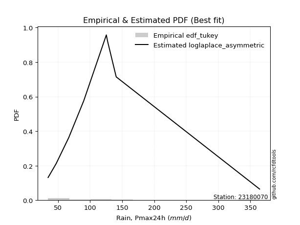</img>

</div>


### 8. Empirical - EDF Gringorten (1963)

Gringorten plotting position formula is essential for estimating the probability and return periods of extreme events like floods and heavy rainfall. The constant _a=0.44_.

<div align="center">


$P=(m-a)/(n+1-2a)$


</div>


**8.1. Empirical values**

<div align="center">

|                | 0                    | 1                  | 2                   | 3                  | 4              | 5                  | 6                  | 7                  | 8                  |
|:---------------|:---------------------|:-------------------|:--------------------|:-------------------|:---------------|:-------------------|:-------------------|:-------------------|:-------------------|
| date           | 2018                 | 2017               | 2023                | 2025               | 2020           | 2021               | 2022               | 2019               | 2024               |
| x              | 34.6                 | 47.2               | 66.8                | 80.8               | 90.2           | 125.4              | 127.4              | 140.8              | 364.4              |
| m              | 1                    | 2                  | 3                   | 4                  | 5              | 6                  | 7                  | 8                  | 9                  |
| empirical_dist | edf_gringorten       | edf_gringorten     | edf_gringorten      | edf_gringorten     | edf_gringorten | edf_gringorten     | edf_gringorten     | edf_gringorten     | edf_gringorten     |
| empirical      | 0.061403508771929835 | 0.1710526315789474 | 0.28070175438596495 | 0.3903508771929825 | 0.5            | 0.6096491228070176 | 0.7192982456140351 | 0.8289473684210527 | 0.9385964912280703 |
| empirical_tr   | 1.0654205607476634   | 1.2063492063492063 | 1.3902439024390243  | 1.6402877697841727 | 2.0            | 2.561797752808989  | 3.5625             | 5.846153846153847  | 16.285714285714324 |

</div>


**8.2. Kolmogorov-Smirnov fit test (sorted by Δ)**


<div align="center">

|                | 0                   | 1                   | 2                   | 3                   | 4                   | 5                   | 6                   | 7                   | 8                   | 9                   | 10                  | 11                  | 12                  | 13                  | 14                  | 15                  | 16                  | 17                  | 18                  | 19                  | 20                  | 21                  | 22                  | 23                  | 24                  | 25                  | 26                  | 27                  | 28                  | 29                  | 30                  | 31                  | 32                  | 33                  | 34                  | 35                  | 36                  | 37                  | 38                  | 39                  | 40                  | 41                  | 42                  | 43                  | 44                  | 45                  | 46                    | 47                  | 48                  | 49                  | 50                  | 51                  | 52                  | 53                  | 54                  | 55                  | 56                  | 57                  | 58                  | 59                  | 60                  | 61                  | 62                  | 63                  | 64                  | 65                  | 66                  | 67                  | 68                  | 69                  | 70                  | 71                  | 72                  | 73                  | 74                  | 75                  | 76                  | 77                  | 78                  | 79                  | 80                  | 81                  | 82                  | 83                  | 84                  | 85                  | 86                  | 87                  | 88                  | 89                  |
|:---------------|:--------------------|:--------------------|:--------------------|:--------------------|:--------------------|:--------------------|:--------------------|:--------------------|:--------------------|:--------------------|:--------------------|:--------------------|:--------------------|:--------------------|:--------------------|:--------------------|:--------------------|:--------------------|:--------------------|:--------------------|:--------------------|:--------------------|:--------------------|:--------------------|:--------------------|:--------------------|:--------------------|:--------------------|:--------------------|:--------------------|:--------------------|:--------------------|:--------------------|:--------------------|:--------------------|:--------------------|:--------------------|:--------------------|:--------------------|:--------------------|:--------------------|:--------------------|:--------------------|:--------------------|:--------------------|:--------------------|:----------------------|:--------------------|:--------------------|:--------------------|:--------------------|:--------------------|:--------------------|:--------------------|:--------------------|:--------------------|:--------------------|:--------------------|:--------------------|:--------------------|:--------------------|:--------------------|:--------------------|:--------------------|:--------------------|:--------------------|:--------------------|:--------------------|:--------------------|:--------------------|:--------------------|:--------------------|:--------------------|:--------------------|:--------------------|:--------------------|:--------------------|:--------------------|:--------------------|:--------------------|:--------------------|:--------------------|:--------------------|:--------------------|:--------------------|:--------------------|:--------------------|:--------------------|:--------------------|:--------------------|
| station        | 23180070            | 23180070            | 23180070            | 23180070            | 23180070            | 23180070            | 23180070            | 23180070            | 23180070            | 23180070            | 23180070            | 23180070            | 23180070            | 23180070            | 23180070            | 23180070            | 23180070            | 23180070            | 23180070            | 23180070            | 23180070            | 23180070            | 23180070            | 23180070            | 23180070            | 23180070            | 23180070            | 23180070            | 23180070            | 23180070            | 23180070            | 23180070            | 23180070            | 23180070            | 23180070            | 23180070            | 23180070            | 23180070            | 23180070            | 23180070            | 23180070            | 23180070            | 23180070            | 23180070            | 23180070            | 23180070            | 23180070              | 23180070            | 23180070            | 23180070            | 23180070            | 23180070            | 23180070            | 23180070            | 23180070            | 23180070            | 23180070            | 23180070            | 23180070            | 23180070            | 23180070            | 23180070            | 23180070            | 23180070            | 23180070            | 23180070            | 23180070            | 23180070            | 23180070            | 23180070            | 23180070            | 23180070            | 23180070            | 23180070            | 23180070            | 23180070            | 23180070            | 23180070            | 23180070            | 23180070            | 23180070            | 23180070            | 23180070            | 23180070            | 23180070            | 23180070            | 23180070            | 23180070            | 23180070            | 23180070            |
| empirical_dist | edf_gringorten      | edf_gringorten      | edf_gringorten      | edf_gringorten      | edf_gringorten      | edf_gringorten      | edf_gringorten      | edf_gringorten      | edf_gringorten      | edf_gringorten      | edf_gringorten      | edf_gringorten      | edf_gringorten      | edf_gringorten      | edf_gringorten      | edf_gringorten      | edf_gringorten      | edf_gringorten      | edf_gringorten      | edf_gringorten      | edf_gringorten      | edf_gringorten      | edf_gringorten      | edf_gringorten      | edf_gringorten      | edf_gringorten      | edf_gringorten      | edf_gringorten      | edf_gringorten      | edf_gringorten      | edf_gringorten      | edf_gringorten      | edf_gringorten      | edf_gringorten      | edf_gringorten      | edf_gringorten      | edf_gringorten      | edf_gringorten      | edf_gringorten      | edf_gringorten      | edf_gringorten      | edf_gringorten      | edf_gringorten      | edf_gringorten      | edf_gringorten      | edf_gringorten      | edf_gringorten        | edf_gringorten      | edf_gringorten      | edf_gringorten      | edf_gringorten      | edf_gringorten      | edf_gringorten      | edf_gringorten      | edf_gringorten      | edf_gringorten      | edf_gringorten      | edf_gringorten      | edf_gringorten      | edf_gringorten      | edf_gringorten      | edf_gringorten      | edf_gringorten      | edf_gringorten      | edf_gringorten      | edf_gringorten      | edf_gringorten      | edf_gringorten      | edf_gringorten      | edf_gringorten      | edf_gringorten      | edf_gringorten      | edf_gringorten      | edf_gringorten      | edf_gringorten      | edf_gringorten      | edf_gringorten      | edf_gringorten      | edf_gringorten      | edf_gringorten      | edf_gringorten      | edf_gringorten      | edf_gringorten      | edf_gringorten      | edf_gringorten      | edf_gringorten      | edf_gringorten      | edf_gringorten      | edf_gringorten      | edf_gringorten      |
| p_dist         | loglogistic         | lognct              | logalpha            | logf                | loginvgamma         | logjohnsonsu        | loginvgauss         | logncf              | logfatiguelife      | ncf                 | loggamma            | loggamma            | logerlang           | betaprime           | logweibull_min      | fisk                | invgamma            | lograyleigh         | wald                | logpearson3         | johnsonsu           | loghypsecant        | nct                 | logbetaprime        | f                   | invweibull          | logexponnorm        | loggenlogistic      | mielke              | loggenexpon         | logmielke           | logmaxwell          | logfisk             | loginvweibull       | logrice             | logkstwobign        | invgauss            | alpha               | loghalfnorm         | fatiguelife         | logt                | logcrystalball      | lognorm             | lognorm             | logloggamma         | loggompertz         | loglaplace_asymmetric | loggumbel_r         | exponnorm           | loglaplace          | laplace_asymmetric  | expon               | genexpon            | gompertz            | genlogistic         | loghalflogistic     | loggumbel_l         | logmoyal            | pearson3            | logtruncnorm        | t                   | nakagami            | moyal               | truncnorm           | lognakagami         | halflogistic        | gibrat              | gumbel_r            | halfnorm            | kstwobign           | logwald             | laplace             | logexpon            | rayleigh            | maxwell             | chi2                | loggibrat           | hypsecant           | logistic            | rice                | norm                | crystalball         | weibull_min         | logchi2             | gumbel_l            | loglognorm          | pareto              | logpareto           | gamma               | erlang              |
| delta          | 0.08062240552589817 | 0.08203214112832158 | 0.08213682460845206 | 0.08240972749371989 | 0.08242577666403494 | 0.0826681913129097  | 0.08289007981309926 | 0.08292317453686271 | 0.08294070968224965 | 0.08347235464540725 | 0.08396081467923366 | 0.08396081467923366 | 0.08396094161634549 | 0.0844476217900112  | 0.08552074488497541 | 0.08598963990670361 | 0.08620164334933633 | 0.08659721571114698 | 0.087251920974157   | 0.08727055421884167 | 0.08736780903165853 | 0.08749868587613463 | 0.08773389024529599 | 0.08774314061266231 | 0.08811975997665655 | 0.08844895475921377 | 0.08886451734556733 | 0.08924987686158303 | 0.0892819695798196  | 0.08950290981209652 | 0.09006561260374468 | 0.0902561447366983  | 0.09042479151669303 | 0.09150950014567238 | 0.09156924178685355 | 0.09200703262745513 | 0.09221414480906642 | 0.09299995948627482 | 0.09773745618229868 | 0.09929000096979224 | 0.10293961578839728 | 0.10293972965798515 | 0.10293985617981904 | 0.10293985617981904 | 0.10397034229098545 | 0.10448043824587616 | 0.10694154697185632   | 0.11165857761029852 | 0.11369731096251812 | 0.11515411930083108 | 0.11618207603308783 | 0.11618225649877445 | 0.11619863780607842 | 0.11657766248252277 | 0.1172765992019893  | 0.1256102669142063  | 0.1261717068771484  | 0.13062580398289736 | 0.13087797904545684 | 0.13095134777255102 | 0.14543740317385767 | 0.14565922794886077 | 0.148715527253394   | 0.1487864840493469  | 0.1508282383662669  | 0.15094547443227146 | 0.1710526315789474  | 0.1719642181607005  | 0.17914154671327964 | 0.18411826671372666 | 0.18477236014776244 | 0.19208342571839931 | 0.19669343625405283 | 0.2034832825663444  | 0.21205658580295483 | 0.21588338865305662 | 0.21686967521474032 | 0.21817615014724412 | 0.2278118747100717  | 0.23224428621705706 | 0.23948806324609417 | 0.23948807031374142 | 0.2693860203441411  | 0.2985698422928918  | 0.30112947177513805 | 0.42722897207610727 | 0.43049984793082124 | 0.4536162842886175  | 0.4697623631377265  | 0.5429597272737443  |
| deltao         | 0.41761268023100007 | 0.41761268023100007 | 0.41761268023100007 | 0.41761268023100007 | 0.41761268023100007 | 0.41761268023100007 | 0.41761268023100007 | 0.41761268023100007 | 0.41761268023100007 | 0.41761268023100007 | 0.41761268023100007 | 0.41761268023100007 | 0.41761268023100007 | 0.41761268023100007 | 0.41761268023100007 | 0.41761268023100007 | 0.41761268023100007 | 0.41761268023100007 | 0.41761268023100007 | 0.41761268023100007 | 0.41761268023100007 | 0.41761268023100007 | 0.41761268023100007 | 0.41761268023100007 | 0.41761268023100007 | 0.41761268023100007 | 0.41761268023100007 | 0.41761268023100007 | 0.41761268023100007 | 0.41761268023100007 | 0.41761268023100007 | 0.41761268023100007 | 0.41761268023100007 | 0.41761268023100007 | 0.41761268023100007 | 0.41761268023100007 | 0.41761268023100007 | 0.41761268023100007 | 0.41761268023100007 | 0.41761268023100007 | 0.41761268023100007 | 0.41761268023100007 | 0.41761268023100007 | 0.41761268023100007 | 0.41761268023100007 | 0.41761268023100007 | 0.41761268023100007   | 0.41761268023100007 | 0.41761268023100007 | 0.41761268023100007 | 0.41761268023100007 | 0.41761268023100007 | 0.41761268023100007 | 0.41761268023100007 | 0.41761268023100007 | 0.41761268023100007 | 0.41761268023100007 | 0.41761268023100007 | 0.41761268023100007 | 0.41761268023100007 | 0.41761268023100007 | 0.41761268023100007 | 0.41761268023100007 | 0.41761268023100007 | 0.41761268023100007 | 0.41761268023100007 | 0.41761268023100007 | 0.41761268023100007 | 0.41761268023100007 | 0.41761268023100007 | 0.41761268023100007 | 0.41761268023100007 | 0.41761268023100007 | 0.41761268023100007 | 0.41761268023100007 | 0.41761268023100007 | 0.41761268023100007 | 0.41761268023100007 | 0.41761268023100007 | 0.41761268023100007 | 0.41761268023100007 | 0.41761268023100007 | 0.41761268023100007 | 0.41761268023100007 | 0.41761268023100007 | 0.41761268023100007 | 0.41761268023100007 | 0.41761268023100007 | 0.41761268023100007 | 0.41761268023100007 |
| eval           | Δo > Δ              | Δo > Δ              | Δo > Δ              | Δo > Δ              | Δo > Δ              | Δo > Δ              | Δo > Δ              | Δo > Δ              | Δo > Δ              | Δo > Δ              | Δo > Δ              | Δo > Δ              | Δo > Δ              | Δo > Δ              | Δo > Δ              | Δo > Δ              | Δo > Δ              | Δo > Δ              | Δo > Δ              | Δo > Δ              | Δo > Δ              | Δo > Δ              | Δo > Δ              | Δo > Δ              | Δo > Δ              | Δo > Δ              | Δo > Δ              | Δo > Δ              | Δo > Δ              | Δo > Δ              | Δo > Δ              | Δo > Δ              | Δo > Δ              | Δo > Δ              | Δo > Δ              | Δo > Δ              | Δo > Δ              | Δo > Δ              | Δo > Δ              | Δo > Δ              | Δo > Δ              | Δo > Δ              | Δo > Δ              | Δo > Δ              | Δo > Δ              | Δo > Δ              | Δo > Δ                | Δo > Δ              | Δo > Δ              | Δo > Δ              | Δo > Δ              | Δo > Δ              | Δo > Δ              | Δo > Δ              | Δo > Δ              | Δo > Δ              | Δo > Δ              | Δo > Δ              | Δo > Δ              | Δo > Δ              | Δo > Δ              | Δo > Δ              | Δo > Δ              | Δo > Δ              | Δo > Δ              | Δo > Δ              | Δo > Δ              | Δo > Δ              | Δo > Δ              | Δo > Δ              | Δo > Δ              | Δo > Δ              | Δo > Δ              | Δo > Δ              | Δo > Δ              | Δo > Δ              | Δo > Δ              | Δo > Δ              | Δo > Δ              | Δo > Δ              | Δo > Δ              | Δo > Δ              | Δo > Δ              | Δo > Δ              | Δo > Δ              | Δo <= Δ             | Δo <= Δ             | Δo <= Δ             | Δo <= Δ             | Δo <= Δ             |
| fit            | 1                   | 1                   | 1                   | 1                   | 1                   | 1                   | 1                   | 1                   | 1                   | 1                   | 1                   | 1                   | 1                   | 1                   | 1                   | 1                   | 1                   | 1                   | 1                   | 1                   | 1                   | 1                   | 1                   | 1                   | 1                   | 1                   | 1                   | 1                   | 1                   | 1                   | 1                   | 1                   | 1                   | 1                   | 1                   | 1                   | 1                   | 1                   | 1                   | 1                   | 1                   | 1                   | 1                   | 1                   | 1                   | 1                   | 1                     | 1                   | 1                   | 1                   | 1                   | 1                   | 1                   | 1                   | 1                   | 1                   | 1                   | 1                   | 1                   | 1                   | 1                   | 1                   | 1                   | 1                   | 1                   | 1                   | 1                   | 1                   | 1                   | 1                   | 1                   | 1                   | 1                   | 1                   | 1                   | 1                   | 1                   | 1                   | 1                   | 1                   | 1                   | 1                   | 1                   | 1                   | 1                   | 0                   | 0                   | 0                   | 0                   | 0                   |
| n              | 9                   | 9                   | 9                   | 9                   | 9                   | 9                   | 9                   | 9                   | 9                   | 9                   | 9                   | 9                   | 9                   | 9                   | 9                   | 9                   | 9                   | 9                   | 9                   | 9                   | 9                   | 9                   | 9                   | 9                   | 9                   | 9                   | 9                   | 9                   | 9                   | 9                   | 9                   | 9                   | 9                   | 9                   | 9                   | 9                   | 9                   | 9                   | 9                   | 9                   | 9                   | 9                   | 9                   | 9                   | 9                   | 9                   | 9                     | 9                   | 9                   | 9                   | 9                   | 9                   | 9                   | 9                   | 9                   | 9                   | 9                   | 9                   | 9                   | 9                   | 9                   | 9                   | 9                   | 9                   | 9                   | 9                   | 9                   | 9                   | 9                   | 9                   | 9                   | 9                   | 9                   | 9                   | 9                   | 9                   | 9                   | 9                   | 9                   | 9                   | 9                   | 9                   | 9                   | 9                   | 9                   | 9                   | 9                   | 9                   | 9                   | 9                   |
| best_fit       | 1                   | 0                   | 0                   | 0                   | 0                   | 0                   | 0                   | 0                   | 0                   | 0                   | 0                   | 0                   | 0                   | 0                   | 0                   | 0                   | 0                   | 0                   | 0                   | 0                   | 0                   | 0                   | 0                   | 0                   | 0                   | 0                   | 0                   | 0                   | 0                   | 0                   | 0                   | 0                   | 0                   | 0                   | 0                   | 0                   | 0                   | 0                   | 0                   | 0                   | 0                   | 0                   | 0                   | 0                   | 0                   | 0                   | 0                     | 0                   | 0                   | 0                   | 0                   | 0                   | 0                   | 0                   | 0                   | 0                   | 0                   | 0                   | 0                   | 0                   | 0                   | 0                   | 0                   | 0                   | 0                   | 0                   | 0                   | 0                   | 0                   | 0                   | 0                   | 0                   | 0                   | 0                   | 0                   | 0                   | 0                   | 0                   | 0                   | 0                   | 0                   | 0                   | 0                   | 0                   | 0                   | 0                   | 0                   | 0                   | 0                   | 0                   |
| best_fit_sort  | 1                   | 2                   | 3                   | 4                   | 5                   | 6                   | 7                   | 8                   | 9                   | 10                  | 11                  | 12                  | 13                  | 14                  | 15                  | 16                  | 17                  | 18                  | 19                  | 20                  | 21                  | 22                  | 23                  | 24                  | 25                  | 26                  | 27                  | 28                  | 29                  | 30                  | 31                  | 32                  | 33                  | 34                  | 35                  | 36                  | 37                  | 38                  | 39                  | 40                  | 41                  | 42                  | 43                  | 44                  | 45                  | 46                  | 47                    | 48                  | 49                  | 50                  | 51                  | 52                  | 53                  | 54                  | 55                  | 56                  | 57                  | 58                  | 59                  | 60                  | 61                  | 62                  | 63                  | 64                  | 65                  | 66                  | 67                  | 68                  | 69                  | 70                  | 71                  | 72                  | 73                  | 74                  | 75                  | 76                  | 77                  | 78                  | 79                  | 80                  | 81                  | 82                  | 83                  | 84                  | 85                  | 86                  | 87                  | 88                  | 89                  | 90                  |

</div>


<div align="center">

</img>

</div>


**8.3. Best fit**

<div align="center">

|   id |   station | empirical_dist   | p_dist      |     delta |   deltao | eval   |   fit |   n |   best_fit |   best_fit_sort |
|-----:|----------:|:-----------------|:------------|----------:|---------:|:-------|------:|----:|-----------:|----------------:|
|    0 |  23180070 | edf_gringorten   | loglogistic | 0.0806224 | 0.417613 | Δo > Δ |     1 |   9 |          1 |               1 |

</div>


<div align="center">

</img>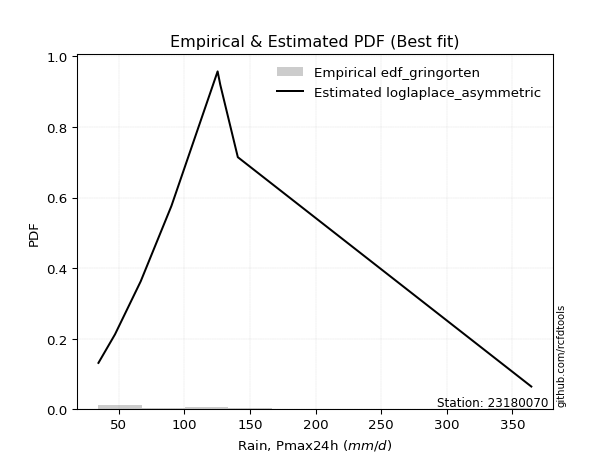</img>

</div>


### 9. Empirical - EDF Filliben (1975)

The specific values of the constants (0.3175) (often denoted as $alpha$) and (0.365) are derived from a method proposed by James J. Filliben in a 1975 paper. This particular formula is the mean value of the $i$-th order statistic of the normal distribution and is considered a robust and effective plotting position formula for the normal probability plot correlation coefficient test for normality.

<div align="center">


$P=(m-0.3175)/(n+0.365)$


</div>


**9.1. Empirical values**

<div align="center">

|                | 0                   | 1                  | 2                   | 3                   | 4            | 5                  | 6                  | 7                  | 8                  |
|:---------------|:--------------------|:-------------------|:--------------------|:--------------------|:-------------|:-------------------|:-------------------|:-------------------|:-------------------|
| date           | 2018                | 2017               | 2023                | 2025                | 2020         | 2021               | 2022               | 2019               | 2024               |
| x              | 34.6                | 47.2               | 66.8                | 80.8                | 90.2         | 125.4              | 127.4              | 140.8              | 364.4              |
| m              | 1                   | 2                  | 3                   | 4                   | 5            | 6                  | 7                  | 8                  | 9                  |
| empirical_dist | edf_filliben        | edf_filliben       | edf_filliben        | edf_filliben        | edf_filliben | edf_filliben       | edf_filliben       | edf_filliben       | edf_filliben       |
| empirical      | 0.07287773625200214 | 0.1796583021890016 | 0.28643886812600106 | 0.39321943406300053 | 0.5          | 0.6067805659369995 | 0.7135611318739989 | 0.8203416978109984 | 0.9271222637479978 |
| empirical_tr   | 1.0786063921681543  | 1.219004230393752  | 1.401421623643846   | 1.6480422349318082  | 2.0          | 2.5431093007467753 | 3.491146318732526  | 5.566121842496286  | 13.721611721611705 |

</div>


**9.2. Kolmogorov-Smirnov fit test (sorted by Δ)**


<div align="center">

|                | 0                   | 1                   | 2                   | 3                   | 4                   | 5                   | 6                   | 7                   | 8                   | 9                   | 10                  | 11                  | 12                  | 13                  | 14                  | 15                  | 16                  | 17                  | 18                  | 19                  | 20                  | 21                  | 22                  | 23                  | 24                  | 25                  | 26                  | 27                  | 28                  | 29                  | 30                  | 31                  | 32                  | 33                  | 34                  | 35                  | 36                  | 37                  | 38                  | 39                  | 40                  | 41                  | 42                  | 43                  | 44                  | 45                  | 46                  | 47                  | 48                  | 49                  | 50                  | 51                  | 52                    | 53                  | 54                  | 55                  | 56                  | 57                  | 58                  | 59                  | 60                  | 61                  | 62                  | 63                  | 64                  | 65                  | 66                  | 67                  | 68                  | 69                  | 70                  | 71                  | 72                  | 73                  | 74                  | 75                  | 76                  | 77                  | 78                  | 79                  | 80                  | 81                  | 82                  | 83                  | 84                  | 85                  | 86                  | 87                  | 88                  | 89                  |
|:---------------|:--------------------|:--------------------|:--------------------|:--------------------|:--------------------|:--------------------|:--------------------|:--------------------|:--------------------|:--------------------|:--------------------|:--------------------|:--------------------|:--------------------|:--------------------|:--------------------|:--------------------|:--------------------|:--------------------|:--------------------|:--------------------|:--------------------|:--------------------|:--------------------|:--------------------|:--------------------|:--------------------|:--------------------|:--------------------|:--------------------|:--------------------|:--------------------|:--------------------|:--------------------|:--------------------|:--------------------|:--------------------|:--------------------|:--------------------|:--------------------|:--------------------|:--------------------|:--------------------|:--------------------|:--------------------|:--------------------|:--------------------|:--------------------|:--------------------|:--------------------|:--------------------|:--------------------|:----------------------|:--------------------|:--------------------|:--------------------|:--------------------|:--------------------|:--------------------|:--------------------|:--------------------|:--------------------|:--------------------|:--------------------|:--------------------|:--------------------|:--------------------|:--------------------|:--------------------|:--------------------|:--------------------|:--------------------|:--------------------|:--------------------|:--------------------|:--------------------|:--------------------|:--------------------|:--------------------|:--------------------|:--------------------|:--------------------|:--------------------|:--------------------|:--------------------|:--------------------|:--------------------|:--------------------|:--------------------|:--------------------|
| station        | 23180070            | 23180070            | 23180070            | 23180070            | 23180070            | 23180070            | 23180070            | 23180070            | 23180070            | 23180070            | 23180070            | 23180070            | 23180070            | 23180070            | 23180070            | 23180070            | 23180070            | 23180070            | 23180070            | 23180070            | 23180070            | 23180070            | 23180070            | 23180070            | 23180070            | 23180070            | 23180070            | 23180070            | 23180070            | 23180070            | 23180070            | 23180070            | 23180070            | 23180070            | 23180070            | 23180070            | 23180070            | 23180070            | 23180070            | 23180070            | 23180070            | 23180070            | 23180070            | 23180070            | 23180070            | 23180070            | 23180070            | 23180070            | 23180070            | 23180070            | 23180070            | 23180070            | 23180070              | 23180070            | 23180070            | 23180070            | 23180070            | 23180070            | 23180070            | 23180070            | 23180070            | 23180070            | 23180070            | 23180070            | 23180070            | 23180070            | 23180070            | 23180070            | 23180070            | 23180070            | 23180070            | 23180070            | 23180070            | 23180070            | 23180070            | 23180070            | 23180070            | 23180070            | 23180070            | 23180070            | 23180070            | 23180070            | 23180070            | 23180070            | 23180070            | 23180070            | 23180070            | 23180070            | 23180070            | 23180070            |
| empirical_dist | edf_filliben        | edf_filliben        | edf_filliben        | edf_filliben        | edf_filliben        | edf_filliben        | edf_filliben        | edf_filliben        | edf_filliben        | edf_filliben        | edf_filliben        | edf_filliben        | edf_filliben        | edf_filliben        | edf_filliben        | edf_filliben        | edf_filliben        | edf_filliben        | edf_filliben        | edf_filliben        | edf_filliben        | edf_filliben        | edf_filliben        | edf_filliben        | edf_filliben        | edf_filliben        | edf_filliben        | edf_filliben        | edf_filliben        | edf_filliben        | edf_filliben        | edf_filliben        | edf_filliben        | edf_filliben        | edf_filliben        | edf_filliben        | edf_filliben        | edf_filliben        | edf_filliben        | edf_filliben        | edf_filliben        | edf_filliben        | edf_filliben        | edf_filliben        | edf_filliben        | edf_filliben        | edf_filliben        | edf_filliben        | edf_filliben        | edf_filliben        | edf_filliben        | edf_filliben        | edf_filliben          | edf_filliben        | edf_filliben        | edf_filliben        | edf_filliben        | edf_filliben        | edf_filliben        | edf_filliben        | edf_filliben        | edf_filliben        | edf_filliben        | edf_filliben        | edf_filliben        | edf_filliben        | edf_filliben        | edf_filliben        | edf_filliben        | edf_filliben        | edf_filliben        | edf_filliben        | edf_filliben        | edf_filliben        | edf_filliben        | edf_filliben        | edf_filliben        | edf_filliben        | edf_filliben        | edf_filliben        | edf_filliben        | edf_filliben        | edf_filliben        | edf_filliben        | edf_filliben        | edf_filliben        | edf_filliben        | edf_filliben        | edf_filliben        | edf_filliben        |
| p_dist         | loglogistic         | logpearson3         | logbetaprime        | logmaxwell          | ncf                 | lograyleigh         | logrice             | johnsonsu           | invgauss            | logncf              | fisk                | lognct              | logweibull_min      | logalpha            | logf                | loginvgamma         | logjohnsonsu        | loginvgauss         | logfatiguelife      | loggamma            | loggamma            | logerlang           | betaprime           | invgamma            | loghypsecant        | nct                 | fatiguelife         | f                   | invweibull          | logexponnorm        | loggenlogistic      | mielke              | loggenexpon         | logmielke           | logfisk             | logt                | logcrystalball      | lognorm             | lognorm             | loginvweibull       | logkstwobign        | logloggamma         | wald                | alpha               | loggompertz         | loghalfnorm         | exponnorm           | laplace_asymmetric  | expon               | genexpon            | gompertz            | genlogistic         | loglaplace_asymmetric | loggumbel_r         | loggumbel_l         | loglaplace          | pearson3            | logtruncnorm        | loghalflogistic     | logmoyal            | nakagami            | moyal               | truncnorm           | halflogistic        | lognakagami         | t                   | gumbel_r            | halfnorm            | kstwobign           | gibrat              | laplace             | logwald             | logexpon            | rayleigh            | maxwell             | hypsecant           | chi2                | logistic            | loggibrat           | rice                | norm                | crystalball         | weibull_min         | gumbel_l            | logchi2             | loglognorm          | pareto              | logpareto           | gamma               | erlang              |
| delta          | 0.07583940965692171 | 0.07866488360878743 | 0.07913747000260807 | 0.08165047412664406 | 0.08209053970324554 | 0.08295966909741803 | 0.08296357117679931 | 0.0833752135929785  | 0.08360847419901218 | 0.08399669724626802 | 0.08468207663896699 | 0.08490069799833966 | 0.08494618173039603 | 0.08500538147847014 | 0.08527828436373797 | 0.08529433353405302 | 0.08553674818292778 | 0.08575863668311734 | 0.08580926655226773 | 0.08682937154925174 | 0.08682937154925174 | 0.08682949848636357 | 0.08731617866002928 | 0.08907020021935441 | 0.09036724274615271 | 0.09060244711531407 | 0.090684330359738   | 0.09098831684667463 | 0.09131751162923185 | 0.09173307421558541 | 0.09211843373160111 | 0.09215052644983768 | 0.0923714666821146  | 0.09293416947376276 | 0.0932933483867111  | 0.09433394517834304 | 0.09433405904793091 | 0.0943341855697648  | 0.0943341855697648  | 0.09437805701569046 | 0.09487558949747321 | 0.09536467168093121 | 0.09585759158421121 | 0.0958685163562929  | 0.09587476763582192 | 0.10060601305231676 | 0.10509164035246388 | 0.1075764054230336  | 0.10757658588872021 | 0.10759296719602418 | 0.10797199187246853 | 0.10867092859193506 | 0.1098101038418744    | 0.1145271344803166  | 0.11756603626709416 | 0.11802267617084916 | 0.1222723084354026  | 0.12521423403251492 | 0.12847882378422437 | 0.13349436085291544 | 0.13705355733880653 | 0.14010985664333975 | 0.14018081343929267 | 0.14233980382221723 | 0.1450911246262308  | 0.14830596004387575 | 0.16335854755064627 | 0.1705358761032254  | 0.17551259610367242 | 0.1796583021890016  | 0.18347775510834508 | 0.18764091701778052 | 0.19095632251401673 | 0.19487761195629016 | 0.2034509151929006  | 0.20957047953718988 | 0.21014627491302051 | 0.21920620410001745 | 0.2197382320847584  | 0.22363861560700282 | 0.23088239263603993 | 0.23088239970368718 | 0.2607803497340869  | 0.2925238011650838  | 0.2928327285528557  | 0.4186233014660531  | 0.42189417732076706 | 0.4450106136785633  | 0.4640252493976904  | 0.5372226135337081  |
| deltao         | 0.41761268023100007 | 0.41761268023100007 | 0.41761268023100007 | 0.41761268023100007 | 0.41761268023100007 | 0.41761268023100007 | 0.41761268023100007 | 0.41761268023100007 | 0.41761268023100007 | 0.41761268023100007 | 0.41761268023100007 | 0.41761268023100007 | 0.41761268023100007 | 0.41761268023100007 | 0.41761268023100007 | 0.41761268023100007 | 0.41761268023100007 | 0.41761268023100007 | 0.41761268023100007 | 0.41761268023100007 | 0.41761268023100007 | 0.41761268023100007 | 0.41761268023100007 | 0.41761268023100007 | 0.41761268023100007 | 0.41761268023100007 | 0.41761268023100007 | 0.41761268023100007 | 0.41761268023100007 | 0.41761268023100007 | 0.41761268023100007 | 0.41761268023100007 | 0.41761268023100007 | 0.41761268023100007 | 0.41761268023100007 | 0.41761268023100007 | 0.41761268023100007 | 0.41761268023100007 | 0.41761268023100007 | 0.41761268023100007 | 0.41761268023100007 | 0.41761268023100007 | 0.41761268023100007 | 0.41761268023100007 | 0.41761268023100007 | 0.41761268023100007 | 0.41761268023100007 | 0.41761268023100007 | 0.41761268023100007 | 0.41761268023100007 | 0.41761268023100007 | 0.41761268023100007 | 0.41761268023100007   | 0.41761268023100007 | 0.41761268023100007 | 0.41761268023100007 | 0.41761268023100007 | 0.41761268023100007 | 0.41761268023100007 | 0.41761268023100007 | 0.41761268023100007 | 0.41761268023100007 | 0.41761268023100007 | 0.41761268023100007 | 0.41761268023100007 | 0.41761268023100007 | 0.41761268023100007 | 0.41761268023100007 | 0.41761268023100007 | 0.41761268023100007 | 0.41761268023100007 | 0.41761268023100007 | 0.41761268023100007 | 0.41761268023100007 | 0.41761268023100007 | 0.41761268023100007 | 0.41761268023100007 | 0.41761268023100007 | 0.41761268023100007 | 0.41761268023100007 | 0.41761268023100007 | 0.41761268023100007 | 0.41761268023100007 | 0.41761268023100007 | 0.41761268023100007 | 0.41761268023100007 | 0.41761268023100007 | 0.41761268023100007 | 0.41761268023100007 | 0.41761268023100007 |
| eval           | Δo > Δ              | Δo > Δ              | Δo > Δ              | Δo > Δ              | Δo > Δ              | Δo > Δ              | Δo > Δ              | Δo > Δ              | Δo > Δ              | Δo > Δ              | Δo > Δ              | Δo > Δ              | Δo > Δ              | Δo > Δ              | Δo > Δ              | Δo > Δ              | Δo > Δ              | Δo > Δ              | Δo > Δ              | Δo > Δ              | Δo > Δ              | Δo > Δ              | Δo > Δ              | Δo > Δ              | Δo > Δ              | Δo > Δ              | Δo > Δ              | Δo > Δ              | Δo > Δ              | Δo > Δ              | Δo > Δ              | Δo > Δ              | Δo > Δ              | Δo > Δ              | Δo > Δ              | Δo > Δ              | Δo > Δ              | Δo > Δ              | Δo > Δ              | Δo > Δ              | Δo > Δ              | Δo > Δ              | Δo > Δ              | Δo > Δ              | Δo > Δ              | Δo > Δ              | Δo > Δ              | Δo > Δ              | Δo > Δ              | Δo > Δ              | Δo > Δ              | Δo > Δ              | Δo > Δ                | Δo > Δ              | Δo > Δ              | Δo > Δ              | Δo > Δ              | Δo > Δ              | Δo > Δ              | Δo > Δ              | Δo > Δ              | Δo > Δ              | Δo > Δ              | Δo > Δ              | Δo > Δ              | Δo > Δ              | Δo > Δ              | Δo > Δ              | Δo > Δ              | Δo > Δ              | Δo > Δ              | Δo > Δ              | Δo > Δ              | Δo > Δ              | Δo > Δ              | Δo > Δ              | Δo > Δ              | Δo > Δ              | Δo > Δ              | Δo > Δ              | Δo > Δ              | Δo > Δ              | Δo > Δ              | Δo > Δ              | Δo > Δ              | Δo <= Δ             | Δo <= Δ             | Δo <= Δ             | Δo <= Δ             | Δo <= Δ             |
| fit            | 1                   | 1                   | 1                   | 1                   | 1                   | 1                   | 1                   | 1                   | 1                   | 1                   | 1                   | 1                   | 1                   | 1                   | 1                   | 1                   | 1                   | 1                   | 1                   | 1                   | 1                   | 1                   | 1                   | 1                   | 1                   | 1                   | 1                   | 1                   | 1                   | 1                   | 1                   | 1                   | 1                   | 1                   | 1                   | 1                   | 1                   | 1                   | 1                   | 1                   | 1                   | 1                   | 1                   | 1                   | 1                   | 1                   | 1                   | 1                   | 1                   | 1                   | 1                   | 1                   | 1                     | 1                   | 1                   | 1                   | 1                   | 1                   | 1                   | 1                   | 1                   | 1                   | 1                   | 1                   | 1                   | 1                   | 1                   | 1                   | 1                   | 1                   | 1                   | 1                   | 1                   | 1                   | 1                   | 1                   | 1                   | 1                   | 1                   | 1                   | 1                   | 1                   | 1                   | 1                   | 1                   | 0                   | 0                   | 0                   | 0                   | 0                   |
| n              | 9                   | 9                   | 9                   | 9                   | 9                   | 9                   | 9                   | 9                   | 9                   | 9                   | 9                   | 9                   | 9                   | 9                   | 9                   | 9                   | 9                   | 9                   | 9                   | 9                   | 9                   | 9                   | 9                   | 9                   | 9                   | 9                   | 9                   | 9                   | 9                   | 9                   | 9                   | 9                   | 9                   | 9                   | 9                   | 9                   | 9                   | 9                   | 9                   | 9                   | 9                   | 9                   | 9                   | 9                   | 9                   | 9                   | 9                   | 9                   | 9                   | 9                   | 9                   | 9                   | 9                     | 9                   | 9                   | 9                   | 9                   | 9                   | 9                   | 9                   | 9                   | 9                   | 9                   | 9                   | 9                   | 9                   | 9                   | 9                   | 9                   | 9                   | 9                   | 9                   | 9                   | 9                   | 9                   | 9                   | 9                   | 9                   | 9                   | 9                   | 9                   | 9                   | 9                   | 9                   | 9                   | 9                   | 9                   | 9                   | 9                   | 9                   |
| best_fit       | 1                   | 0                   | 0                   | 0                   | 0                   | 0                   | 0                   | 0                   | 0                   | 0                   | 0                   | 0                   | 0                   | 0                   | 0                   | 0                   | 0                   | 0                   | 0                   | 0                   | 0                   | 0                   | 0                   | 0                   | 0                   | 0                   | 0                   | 0                   | 0                   | 0                   | 0                   | 0                   | 0                   | 0                   | 0                   | 0                   | 0                   | 0                   | 0                   | 0                   | 0                   | 0                   | 0                   | 0                   | 0                   | 0                   | 0                   | 0                   | 0                   | 0                   | 0                   | 0                   | 0                     | 0                   | 0                   | 0                   | 0                   | 0                   | 0                   | 0                   | 0                   | 0                   | 0                   | 0                   | 0                   | 0                   | 0                   | 0                   | 0                   | 0                   | 0                   | 0                   | 0                   | 0                   | 0                   | 0                   | 0                   | 0                   | 0                   | 0                   | 0                   | 0                   | 0                   | 0                   | 0                   | 0                   | 0                   | 0                   | 0                   | 0                   |
| best_fit_sort  | 1                   | 2                   | 3                   | 4                   | 5                   | 6                   | 7                   | 8                   | 9                   | 10                  | 11                  | 12                  | 13                  | 14                  | 15                  | 16                  | 17                  | 18                  | 19                  | 20                  | 21                  | 22                  | 23                  | 24                  | 25                  | 26                  | 27                  | 28                  | 29                  | 30                  | 31                  | 32                  | 33                  | 34                  | 35                  | 36                  | 37                  | 38                  | 39                  | 40                  | 41                  | 42                  | 43                  | 44                  | 45                  | 46                  | 47                  | 48                  | 49                  | 50                  | 51                  | 52                  | 53                    | 54                  | 55                  | 56                  | 57                  | 58                  | 59                  | 60                  | 61                  | 62                  | 63                  | 64                  | 65                  | 66                  | 67                  | 68                  | 69                  | 70                  | 71                  | 72                  | 73                  | 74                  | 75                  | 76                  | 77                  | 78                  | 79                  | 80                  | 81                  | 82                  | 83                  | 84                  | 85                  | 86                  | 87                  | 88                  | 89                  | 90                  |

</div>


<div align="center">

</img>

</div>


**9.3. Best fit**

<div align="center">

|   id |   station | empirical_dist   | p_dist      |     delta |   deltao | eval   |   fit |   n |   best_fit |   best_fit_sort |
|-----:|----------:|:-----------------|:------------|----------:|---------:|:-------|------:|----:|-----------:|----------------:|
|    0 |  23180070 | edf_filliben     | loglogistic | 0.0758394 | 0.417613 | Δo > Δ |     1 |   9 |          1 |               1 |

</div>


<div align="center">

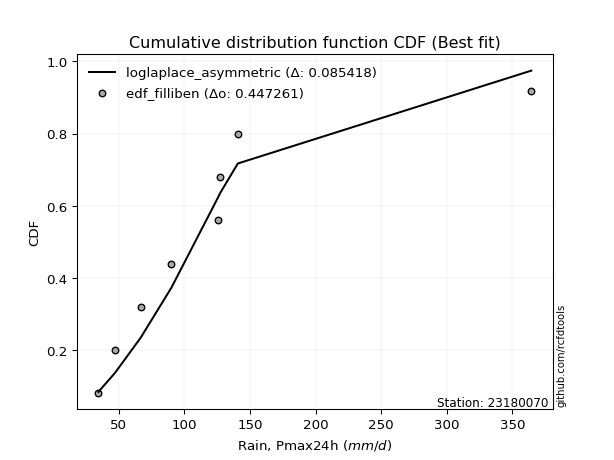</img></img>

</div>


### 10. Empirical - EDF Jenkinson (1977)

The Jenkinson formula in hydrology is an empirical plotting position formula used to estimate the non-exceedance probability _(P)_ or return period _(T)_ of a given ordered observation within a sample. It is a widely used method in the frequency analysis of extreme events such as floods and rainfall, as it provides a distribution-free way to plot data. _a≈0.31_ and _b≈0.38_ are constants derived to approximate the median of the probability distribution for the given rank.

<div align="center">


$P=(m-a)/(n+b)$


</div>


**10.1. Empirical values**

<div align="center">

|                | 0                   | 1                   | 2                  | 3                   | 4             | 5                  | 6                  | 7                  | 8                  |
|:---------------|:--------------------|:--------------------|:-------------------|:--------------------|:--------------|:-------------------|:-------------------|:-------------------|:-------------------|
| date           | 2018                | 2017                | 2023               | 2025                | 2020          | 2021               | 2022               | 2019               | 2024               |
| x              | 34.6                | 47.2                | 66.8               | 80.8                | 90.2          | 125.4              | 127.4              | 140.8              | 364.4              |
| m              | 1                   | 2                   | 3                  | 4                   | 5             | 6                  | 7                  | 8                  | 9                  |
| empirical_dist | edf_jenkinson       | edf_jenkinson       | edf_jenkinson      | edf_jenkinson       | edf_jenkinson | edf_jenkinson      | edf_jenkinson      | edf_jenkinson      | edf_jenkinson      |
| empirical      | 0.07356076759061833 | 0.18017057569296374 | 0.2867803837953091 | 0.39339019189765456 | 0.5           | 0.6066098081023454 | 0.7132196162046908 | 0.8198294243070362 | 0.9264392324093815 |
| empirical_tr   | 1.0794016110471807  | 1.2197659297789336  | 1.4020926756352765 | 1.6485061511423549  | 2.0           | 2.542005420054201  | 3.486988847583642  | 5.550295857988164  | 13.5942028985507   |

</div>


**10.2. Kolmogorov-Smirnov fit test (sorted by Δ)**


<div align="center">

|                | 0                   | 1                   | 2                   | 3                   | 4                   | 5                   | 6                   | 7                   | 8                   | 9                   | 10                  | 11                  | 12                  | 13                  | 14                  | 15                  | 16                  | 17                  | 18                  | 19                  | 20                  | 21                  | 22                  | 23                  | 24                  | 25                  | 26                  | 27                  | 28                  | 29                  | 30                  | 31                  | 32                  | 33                  | 34                  | 35                  | 36                  | 37                  | 38                  | 39                  | 40                  | 41                  | 42                  | 43                  | 44                  | 45                  | 46                  | 47                  | 48                  | 49                  | 50                  | 51                  | 52                    | 53                  | 54                  | 55                  | 56                  | 57                  | 58                  | 59                  | 60                  | 61                  | 62                  | 63                  | 64                  | 65                  | 66                  | 67                  | 68                  | 69                  | 70                  | 71                  | 72                  | 73                  | 74                  | 75                  | 76                  | 77                  | 78                  | 79                  | 80                  | 81                  | 82                  | 83                  | 84                  | 85                  | 86                  | 87                  | 88                  | 89                  |
|:---------------|:--------------------|:--------------------|:--------------------|:--------------------|:--------------------|:--------------------|:--------------------|:--------------------|:--------------------|:--------------------|:--------------------|:--------------------|:--------------------|:--------------------|:--------------------|:--------------------|:--------------------|:--------------------|:--------------------|:--------------------|:--------------------|:--------------------|:--------------------|:--------------------|:--------------------|:--------------------|:--------------------|:--------------------|:--------------------|:--------------------|:--------------------|:--------------------|:--------------------|:--------------------|:--------------------|:--------------------|:--------------------|:--------------------|:--------------------|:--------------------|:--------------------|:--------------------|:--------------------|:--------------------|:--------------------|:--------------------|:--------------------|:--------------------|:--------------------|:--------------------|:--------------------|:--------------------|:----------------------|:--------------------|:--------------------|:--------------------|:--------------------|:--------------------|:--------------------|:--------------------|:--------------------|:--------------------|:--------------------|:--------------------|:--------------------|:--------------------|:--------------------|:--------------------|:--------------------|:--------------------|:--------------------|:--------------------|:--------------------|:--------------------|:--------------------|:--------------------|:--------------------|:--------------------|:--------------------|:--------------------|:--------------------|:--------------------|:--------------------|:--------------------|:--------------------|:--------------------|:--------------------|:--------------------|:--------------------|:--------------------|
| station        | 23180070            | 23180070            | 23180070            | 23180070            | 23180070            | 23180070            | 23180070            | 23180070            | 23180070            | 23180070            | 23180070            | 23180070            | 23180070            | 23180070            | 23180070            | 23180070            | 23180070            | 23180070            | 23180070            | 23180070            | 23180070            | 23180070            | 23180070            | 23180070            | 23180070            | 23180070            | 23180070            | 23180070            | 23180070            | 23180070            | 23180070            | 23180070            | 23180070            | 23180070            | 23180070            | 23180070            | 23180070            | 23180070            | 23180070            | 23180070            | 23180070            | 23180070            | 23180070            | 23180070            | 23180070            | 23180070            | 23180070            | 23180070            | 23180070            | 23180070            | 23180070            | 23180070            | 23180070              | 23180070            | 23180070            | 23180070            | 23180070            | 23180070            | 23180070            | 23180070            | 23180070            | 23180070            | 23180070            | 23180070            | 23180070            | 23180070            | 23180070            | 23180070            | 23180070            | 23180070            | 23180070            | 23180070            | 23180070            | 23180070            | 23180070            | 23180070            | 23180070            | 23180070            | 23180070            | 23180070            | 23180070            | 23180070            | 23180070            | 23180070            | 23180070            | 23180070            | 23180070            | 23180070            | 23180070            | 23180070            |
| empirical_dist | edf_jenkinson       | edf_jenkinson       | edf_jenkinson       | edf_jenkinson       | edf_jenkinson       | edf_jenkinson       | edf_jenkinson       | edf_jenkinson       | edf_jenkinson       | edf_jenkinson       | edf_jenkinson       | edf_jenkinson       | edf_jenkinson       | edf_jenkinson       | edf_jenkinson       | edf_jenkinson       | edf_jenkinson       | edf_jenkinson       | edf_jenkinson       | edf_jenkinson       | edf_jenkinson       | edf_jenkinson       | edf_jenkinson       | edf_jenkinson       | edf_jenkinson       | edf_jenkinson       | edf_jenkinson       | edf_jenkinson       | edf_jenkinson       | edf_jenkinson       | edf_jenkinson       | edf_jenkinson       | edf_jenkinson       | edf_jenkinson       | edf_jenkinson       | edf_jenkinson       | edf_jenkinson       | edf_jenkinson       | edf_jenkinson       | edf_jenkinson       | edf_jenkinson       | edf_jenkinson       | edf_jenkinson       | edf_jenkinson       | edf_jenkinson       | edf_jenkinson       | edf_jenkinson       | edf_jenkinson       | edf_jenkinson       | edf_jenkinson       | edf_jenkinson       | edf_jenkinson       | edf_jenkinson         | edf_jenkinson       | edf_jenkinson       | edf_jenkinson       | edf_jenkinson       | edf_jenkinson       | edf_jenkinson       | edf_jenkinson       | edf_jenkinson       | edf_jenkinson       | edf_jenkinson       | edf_jenkinson       | edf_jenkinson       | edf_jenkinson       | edf_jenkinson       | edf_jenkinson       | edf_jenkinson       | edf_jenkinson       | edf_jenkinson       | edf_jenkinson       | edf_jenkinson       | edf_jenkinson       | edf_jenkinson       | edf_jenkinson       | edf_jenkinson       | edf_jenkinson       | edf_jenkinson       | edf_jenkinson       | edf_jenkinson       | edf_jenkinson       | edf_jenkinson       | edf_jenkinson       | edf_jenkinson       | edf_jenkinson       | edf_jenkinson       | edf_jenkinson       | edf_jenkinson       | edf_jenkinson       |
| p_dist         | loglogistic         | logpearson3         | logbetaprime        | logmaxwell          | ncf                 | logrice             | invgauss            | lograyleigh         | johnsonsu           | logncf              | fisk                | lognct              | logweibull_min      | logalpha            | logf                | loginvgamma         | logjohnsonsu        | loginvgauss         | logfatiguelife      | loggamma            | loggamma            | logerlang           | betaprime           | invgamma            | fatiguelife         | loghypsecant        | nct                 | f                   | invweibull          | logexponnorm        | loggenlogistic      | mielke              | loggenexpon         | logmielke           | logfisk             | logt                | logcrystalball      | lognorm             | lognorm             | loginvweibull       | logloggamma         | logkstwobign        | loggompertz         | alpha               | wald                | loghalfnorm         | exponnorm           | laplace_asymmetric  | expon               | genexpon            | gompertz            | genlogistic         | loglaplace_asymmetric | loggumbel_r         | loggumbel_l         | loglaplace          | pearson3            | logtruncnorm        | loghalflogistic     | logmoyal            | nakagami            | moyal               | truncnorm           | halflogistic        | lognakagami         | t                   | gumbel_r            | halfnorm            | kstwobign           | gibrat              | laplace             | logwald             | logexpon            | rayleigh            | maxwell             | hypsecant           | chi2                | logistic            | loggibrat           | rice                | norm                | crystalball         | weibull_min         | gumbel_l            | logchi2             | loglognorm          | pareto              | logpareto           | gamma               | erlang              |
| delta          | 0.07601016749157574 | 0.07859812725648918 | 0.07862519649864586 | 0.08113820062268184 | 0.08226129753789957 | 0.0824512976728371  | 0.08309620069504997 | 0.08313042693207207 | 0.08354597142763254 | 0.08416745508092205 | 0.08485283447362102 | 0.08507145583299369 | 0.08511693956505006 | 0.08517613931312418 | 0.085449042198392   | 0.08546509136870706 | 0.08570750601758181 | 0.08592939451777137 | 0.08598002438692176 | 0.08700012938390578 | 0.08700012938390578 | 0.0870002563210176  | 0.08748693649468331 | 0.08924095805400845 | 0.09017205685577578 | 0.09053800058080674 | 0.0907732049499681  | 0.09115907468132867 | 0.09148826946388589 | 0.09190383205023944 | 0.09228919156625515 | 0.09232128428449171 | 0.09254222451676863 | 0.0931049273084168  | 0.09346410622136514 | 0.09382167167438082 | 0.0938217855439687  | 0.09382191206580259 | 0.09382191206580259 | 0.0945488148503445  | 0.094852398176969   | 0.09504634733212725 | 0.09536249413185971 | 0.09603927419094693 | 0.09636986508817334 | 0.10077677088697079 | 0.10457936684850166 | 0.10706413191907138 | 0.107064312384758   | 0.10708069369206197 | 0.10745971836850632 | 0.10815865508797284 | 0.10998086167652843   | 0.11469789231497063 | 0.11705376276313195 | 0.1181934340055032  | 0.12176003493144039 | 0.12487271836320685 | 0.1286495816188784  | 0.13366511868756947 | 0.13654128383484432 | 0.13959758313937753 | 0.13966853993533046 | 0.141827530318255   | 0.14474960895692274 | 0.14847671787852978 | 0.16284627404668406 | 0.1700236025992632  | 0.1750003225997102  | 0.18017057569296374 | 0.18296548160438286 | 0.18781167485243455 | 0.19061480684470866 | 0.19436533845232795 | 0.20293864168893838 | 0.20905820603322767 | 0.20980475924371245 | 0.21869393059605524 | 0.21990898991941243 | 0.2231263421030406  | 0.23037011913207772 | 0.23037012619972497 | 0.26026807623012477 | 0.2920115276611216  | 0.2924912128835476  | 0.41811102796209093 | 0.4213819038168049  | 0.44449834017460116 | 0.46368373372838234 | 0.5368810978644001  |
| deltao         | 0.41761268023100007 | 0.41761268023100007 | 0.41761268023100007 | 0.41761268023100007 | 0.41761268023100007 | 0.41761268023100007 | 0.41761268023100007 | 0.41761268023100007 | 0.41761268023100007 | 0.41761268023100007 | 0.41761268023100007 | 0.41761268023100007 | 0.41761268023100007 | 0.41761268023100007 | 0.41761268023100007 | 0.41761268023100007 | 0.41761268023100007 | 0.41761268023100007 | 0.41761268023100007 | 0.41761268023100007 | 0.41761268023100007 | 0.41761268023100007 | 0.41761268023100007 | 0.41761268023100007 | 0.41761268023100007 | 0.41761268023100007 | 0.41761268023100007 | 0.41761268023100007 | 0.41761268023100007 | 0.41761268023100007 | 0.41761268023100007 | 0.41761268023100007 | 0.41761268023100007 | 0.41761268023100007 | 0.41761268023100007 | 0.41761268023100007 | 0.41761268023100007 | 0.41761268023100007 | 0.41761268023100007 | 0.41761268023100007 | 0.41761268023100007 | 0.41761268023100007 | 0.41761268023100007 | 0.41761268023100007 | 0.41761268023100007 | 0.41761268023100007 | 0.41761268023100007 | 0.41761268023100007 | 0.41761268023100007 | 0.41761268023100007 | 0.41761268023100007 | 0.41761268023100007 | 0.41761268023100007   | 0.41761268023100007 | 0.41761268023100007 | 0.41761268023100007 | 0.41761268023100007 | 0.41761268023100007 | 0.41761268023100007 | 0.41761268023100007 | 0.41761268023100007 | 0.41761268023100007 | 0.41761268023100007 | 0.41761268023100007 | 0.41761268023100007 | 0.41761268023100007 | 0.41761268023100007 | 0.41761268023100007 | 0.41761268023100007 | 0.41761268023100007 | 0.41761268023100007 | 0.41761268023100007 | 0.41761268023100007 | 0.41761268023100007 | 0.41761268023100007 | 0.41761268023100007 | 0.41761268023100007 | 0.41761268023100007 | 0.41761268023100007 | 0.41761268023100007 | 0.41761268023100007 | 0.41761268023100007 | 0.41761268023100007 | 0.41761268023100007 | 0.41761268023100007 | 0.41761268023100007 | 0.41761268023100007 | 0.41761268023100007 | 0.41761268023100007 | 0.41761268023100007 |
| eval           | Δo > Δ              | Δo > Δ              | Δo > Δ              | Δo > Δ              | Δo > Δ              | Δo > Δ              | Δo > Δ              | Δo > Δ              | Δo > Δ              | Δo > Δ              | Δo > Δ              | Δo > Δ              | Δo > Δ              | Δo > Δ              | Δo > Δ              | Δo > Δ              | Δo > Δ              | Δo > Δ              | Δo > Δ              | Δo > Δ              | Δo > Δ              | Δo > Δ              | Δo > Δ              | Δo > Δ              | Δo > Δ              | Δo > Δ              | Δo > Δ              | Δo > Δ              | Δo > Δ              | Δo > Δ              | Δo > Δ              | Δo > Δ              | Δo > Δ              | Δo > Δ              | Δo > Δ              | Δo > Δ              | Δo > Δ              | Δo > Δ              | Δo > Δ              | Δo > Δ              | Δo > Δ              | Δo > Δ              | Δo > Δ              | Δo > Δ              | Δo > Δ              | Δo > Δ              | Δo > Δ              | Δo > Δ              | Δo > Δ              | Δo > Δ              | Δo > Δ              | Δo > Δ              | Δo > Δ                | Δo > Δ              | Δo > Δ              | Δo > Δ              | Δo > Δ              | Δo > Δ              | Δo > Δ              | Δo > Δ              | Δo > Δ              | Δo > Δ              | Δo > Δ              | Δo > Δ              | Δo > Δ              | Δo > Δ              | Δo > Δ              | Δo > Δ              | Δo > Δ              | Δo > Δ              | Δo > Δ              | Δo > Δ              | Δo > Δ              | Δo > Δ              | Δo > Δ              | Δo > Δ              | Δo > Δ              | Δo > Δ              | Δo > Δ              | Δo > Δ              | Δo > Δ              | Δo > Δ              | Δo > Δ              | Δo > Δ              | Δo > Δ              | Δo <= Δ             | Δo <= Δ             | Δo <= Δ             | Δo <= Δ             | Δo <= Δ             |
| fit            | 1                   | 1                   | 1                   | 1                   | 1                   | 1                   | 1                   | 1                   | 1                   | 1                   | 1                   | 1                   | 1                   | 1                   | 1                   | 1                   | 1                   | 1                   | 1                   | 1                   | 1                   | 1                   | 1                   | 1                   | 1                   | 1                   | 1                   | 1                   | 1                   | 1                   | 1                   | 1                   | 1                   | 1                   | 1                   | 1                   | 1                   | 1                   | 1                   | 1                   | 1                   | 1                   | 1                   | 1                   | 1                   | 1                   | 1                   | 1                   | 1                   | 1                   | 1                   | 1                   | 1                     | 1                   | 1                   | 1                   | 1                   | 1                   | 1                   | 1                   | 1                   | 1                   | 1                   | 1                   | 1                   | 1                   | 1                   | 1                   | 1                   | 1                   | 1                   | 1                   | 1                   | 1                   | 1                   | 1                   | 1                   | 1                   | 1                   | 1                   | 1                   | 1                   | 1                   | 1                   | 1                   | 0                   | 0                   | 0                   | 0                   | 0                   |
| n              | 9                   | 9                   | 9                   | 9                   | 9                   | 9                   | 9                   | 9                   | 9                   | 9                   | 9                   | 9                   | 9                   | 9                   | 9                   | 9                   | 9                   | 9                   | 9                   | 9                   | 9                   | 9                   | 9                   | 9                   | 9                   | 9                   | 9                   | 9                   | 9                   | 9                   | 9                   | 9                   | 9                   | 9                   | 9                   | 9                   | 9                   | 9                   | 9                   | 9                   | 9                   | 9                   | 9                   | 9                   | 9                   | 9                   | 9                   | 9                   | 9                   | 9                   | 9                   | 9                   | 9                     | 9                   | 9                   | 9                   | 9                   | 9                   | 9                   | 9                   | 9                   | 9                   | 9                   | 9                   | 9                   | 9                   | 9                   | 9                   | 9                   | 9                   | 9                   | 9                   | 9                   | 9                   | 9                   | 9                   | 9                   | 9                   | 9                   | 9                   | 9                   | 9                   | 9                   | 9                   | 9                   | 9                   | 9                   | 9                   | 9                   | 9                   |
| best_fit       | 1                   | 0                   | 0                   | 0                   | 0                   | 0                   | 0                   | 0                   | 0                   | 0                   | 0                   | 0                   | 0                   | 0                   | 0                   | 0                   | 0                   | 0                   | 0                   | 0                   | 0                   | 0                   | 0                   | 0                   | 0                   | 0                   | 0                   | 0                   | 0                   | 0                   | 0                   | 0                   | 0                   | 0                   | 0                   | 0                   | 0                   | 0                   | 0                   | 0                   | 0                   | 0                   | 0                   | 0                   | 0                   | 0                   | 0                   | 0                   | 0                   | 0                   | 0                   | 0                   | 0                     | 0                   | 0                   | 0                   | 0                   | 0                   | 0                   | 0                   | 0                   | 0                   | 0                   | 0                   | 0                   | 0                   | 0                   | 0                   | 0                   | 0                   | 0                   | 0                   | 0                   | 0                   | 0                   | 0                   | 0                   | 0                   | 0                   | 0                   | 0                   | 0                   | 0                   | 0                   | 0                   | 0                   | 0                   | 0                   | 0                   | 0                   |
| best_fit_sort  | 1                   | 2                   | 3                   | 4                   | 5                   | 6                   | 7                   | 8                   | 9                   | 10                  | 11                  | 12                  | 13                  | 14                  | 15                  | 16                  | 17                  | 18                  | 19                  | 20                  | 21                  | 22                  | 23                  | 24                  | 25                  | 26                  | 27                  | 28                  | 29                  | 30                  | 31                  | 32                  | 33                  | 34                  | 35                  | 36                  | 37                  | 38                  | 39                  | 40                  | 41                  | 42                  | 43                  | 44                  | 45                  | 46                  | 47                  | 48                  | 49                  | 50                  | 51                  | 52                  | 53                    | 54                  | 55                  | 56                  | 57                  | 58                  | 59                  | 60                  | 61                  | 62                  | 63                  | 64                  | 65                  | 66                  | 67                  | 68                  | 69                  | 70                  | 71                  | 72                  | 73                  | 74                  | 75                  | 76                  | 77                  | 78                  | 79                  | 80                  | 81                  | 82                  | 83                  | 84                  | 85                  | 86                  | 87                  | 88                  | 89                  | 90                  |

</div>


<div align="center">

</img>

</div>


**10.3. Best fit**

<div align="center">

|   id |   station | empirical_dist   | p_dist      |     delta |   deltao | eval   |   fit |   n |   best_fit |   best_fit_sort |
|-----:|----------:|:-----------------|:------------|----------:|---------:|:-------|------:|----:|-----------:|----------------:|
|    0 |  23180070 | edf_jenkinson    | loglogistic | 0.0760102 | 0.417613 | Δo > Δ |     1 |   9 |          1 |               1 |

</div>


<div align="center">

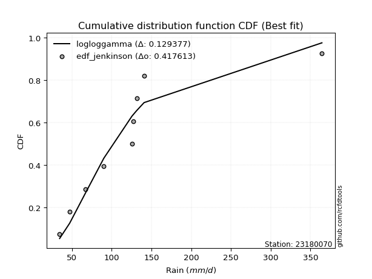</img></img>

</div>


### 11. Empirical - EDF Cunnane (1978)

Cunnane´s work in statistical hydrology has focused on the performance and evaluation of different probability distributions (such as GEV, Gumbel, Lognormal) for flood frequency estimation. _b_ is a constant, typically set to 0.4.

<div align="center">


$P=(m-b)/(n+1-2b)$


</div>


**11.1. Empirical values**

<div align="center">

|                | 0                   | 1                  | 2                   | 3                  | 4           | 5                  | 6                 | 7                  | 8                  |
|:---------------|:--------------------|:-------------------|:--------------------|:-------------------|:------------|:-------------------|:------------------|:-------------------|:-------------------|
| date           | 2018                | 2017               | 2023                | 2025               | 2020        | 2021               | 2022              | 2019               | 2024               |
| x              | 34.6                | 47.2               | 66.8                | 80.8               | 90.2        | 125.4              | 127.4             | 140.8              | 364.4              |
| m              | 1                   | 2                  | 3                   | 4                  | 5           | 6                  | 7                 | 8                  | 9                  |
| empirical_dist | edf_cunnane         | edf_cunnane        | edf_cunnane         | edf_cunnane        | edf_cunnane | edf_cunnane        | edf_cunnane       | edf_cunnane        | edf_cunnane        |
| empirical      | 0.06521739130434782 | 0.1739130434782609 | 0.28260869565217395 | 0.391304347826087  | 0.5         | 0.6086956521739131 | 0.717391304347826 | 0.8260869565217391 | 0.9347826086956522 |
| empirical_tr   | 1.069767441860465   | 1.2105263157894737 | 1.393939393939394   | 1.6428571428571428 | 2.0         | 2.555555555555556  | 3.538461538461538 | 5.75               | 15.333333333333343 |

</div>


**11.2. Kolmogorov-Smirnov fit test (sorted by Δ)**


<div align="center">

|                | 0                   | 1                   | 2                   | 3                   | 4                   | 5                   | 6                   | 7                   | 8                   | 9                   | 10                  | 11                  | 12                  | 13                  | 14                  | 15                  | 16                  | 17                  | 18                  | 19                  | 20                  | 21                  | 22                  | 23                  | 24                  | 25                  | 26                  | 27                  | 28                  | 29                  | 30                  | 31                  | 32                  | 33                  | 34                  | 35                  | 36                  | 37                  | 38                  | 39                  | 40                  | 41                  | 42                  | 43                  | 44                  | 45                  | 46                    | 47                  | 48                  | 49                  | 50                  | 51                  | 52                  | 53                  | 54                  | 55                  | 56                  | 57                  | 58                  | 59                  | 60                  | 61                  | 62                  | 63                  | 64                  | 65                  | 66                  | 67                  | 68                  | 69                  | 70                  | 71                  | 72                  | 73                  | 74                  | 75                  | 76                  | 77                  | 78                  | 79                  | 80                  | 81                  | 82                  | 83                  | 84                  | 85                  | 86                  | 87                  | 88                  | 89                  |
|:---------------|:--------------------|:--------------------|:--------------------|:--------------------|:--------------------|:--------------------|:--------------------|:--------------------|:--------------------|:--------------------|:--------------------|:--------------------|:--------------------|:--------------------|:--------------------|:--------------------|:--------------------|:--------------------|:--------------------|:--------------------|:--------------------|:--------------------|:--------------------|:--------------------|:--------------------|:--------------------|:--------------------|:--------------------|:--------------------|:--------------------|:--------------------|:--------------------|:--------------------|:--------------------|:--------------------|:--------------------|:--------------------|:--------------------|:--------------------|:--------------------|:--------------------|:--------------------|:--------------------|:--------------------|:--------------------|:--------------------|:----------------------|:--------------------|:--------------------|:--------------------|:--------------------|:--------------------|:--------------------|:--------------------|:--------------------|:--------------------|:--------------------|:--------------------|:--------------------|:--------------------|:--------------------|:--------------------|:--------------------|:--------------------|:--------------------|:--------------------|:--------------------|:--------------------|:--------------------|:--------------------|:--------------------|:--------------------|:--------------------|:--------------------|:--------------------|:--------------------|:--------------------|:--------------------|:--------------------|:--------------------|:--------------------|:--------------------|:--------------------|:--------------------|:--------------------|:--------------------|:--------------------|:--------------------|:--------------------|:--------------------|
| station        | 23180070            | 23180070            | 23180070            | 23180070            | 23180070            | 23180070            | 23180070            | 23180070            | 23180070            | 23180070            | 23180070            | 23180070            | 23180070            | 23180070            | 23180070            | 23180070            | 23180070            | 23180070            | 23180070            | 23180070            | 23180070            | 23180070            | 23180070            | 23180070            | 23180070            | 23180070            | 23180070            | 23180070            | 23180070            | 23180070            | 23180070            | 23180070            | 23180070            | 23180070            | 23180070            | 23180070            | 23180070            | 23180070            | 23180070            | 23180070            | 23180070            | 23180070            | 23180070            | 23180070            | 23180070            | 23180070            | 23180070              | 23180070            | 23180070            | 23180070            | 23180070            | 23180070            | 23180070            | 23180070            | 23180070            | 23180070            | 23180070            | 23180070            | 23180070            | 23180070            | 23180070            | 23180070            | 23180070            | 23180070            | 23180070            | 23180070            | 23180070            | 23180070            | 23180070            | 23180070            | 23180070            | 23180070            | 23180070            | 23180070            | 23180070            | 23180070            | 23180070            | 23180070            | 23180070            | 23180070            | 23180070            | 23180070            | 23180070            | 23180070            | 23180070            | 23180070            | 23180070            | 23180070            | 23180070            | 23180070            |
| empirical_dist | edf_cunnane         | edf_cunnane         | edf_cunnane         | edf_cunnane         | edf_cunnane         | edf_cunnane         | edf_cunnane         | edf_cunnane         | edf_cunnane         | edf_cunnane         | edf_cunnane         | edf_cunnane         | edf_cunnane         | edf_cunnane         | edf_cunnane         | edf_cunnane         | edf_cunnane         | edf_cunnane         | edf_cunnane         | edf_cunnane         | edf_cunnane         | edf_cunnane         | edf_cunnane         | edf_cunnane         | edf_cunnane         | edf_cunnane         | edf_cunnane         | edf_cunnane         | edf_cunnane         | edf_cunnane         | edf_cunnane         | edf_cunnane         | edf_cunnane         | edf_cunnane         | edf_cunnane         | edf_cunnane         | edf_cunnane         | edf_cunnane         | edf_cunnane         | edf_cunnane         | edf_cunnane         | edf_cunnane         | edf_cunnane         | edf_cunnane         | edf_cunnane         | edf_cunnane         | edf_cunnane           | edf_cunnane         | edf_cunnane         | edf_cunnane         | edf_cunnane         | edf_cunnane         | edf_cunnane         | edf_cunnane         | edf_cunnane         | edf_cunnane         | edf_cunnane         | edf_cunnane         | edf_cunnane         | edf_cunnane         | edf_cunnane         | edf_cunnane         | edf_cunnane         | edf_cunnane         | edf_cunnane         | edf_cunnane         | edf_cunnane         | edf_cunnane         | edf_cunnane         | edf_cunnane         | edf_cunnane         | edf_cunnane         | edf_cunnane         | edf_cunnane         | edf_cunnane         | edf_cunnane         | edf_cunnane         | edf_cunnane         | edf_cunnane         | edf_cunnane         | edf_cunnane         | edf_cunnane         | edf_cunnane         | edf_cunnane         | edf_cunnane         | edf_cunnane         | edf_cunnane         | edf_cunnane         | edf_cunnane         | edf_cunnane         |
| p_dist         | loglogistic         | ncf                 | logncf              | lognct              | logweibull_min      | logalpha            | fisk                | logf                | loginvgamma         | logjohnsonsu        | lograyleigh         | loginvgauss         | logfatiguelife      | logpearson3         | johnsonsu           | logbetaprime        | loggamma            | loggamma            | logerlang           | betaprime           | invgamma            | logmaxwell          | loghypsecant        | nct                 | logrice             | f                   | invgauss            | invweibull          | logexponnorm        | wald                | loggenlogistic      | mielke              | loggenexpon         | logmielke           | logfisk             | loginvweibull       | logkstwobign        | alpha               | fatiguelife         | loghalfnorm         | logt                | logcrystalball      | lognorm             | lognorm             | logloggamma         | loggompertz         | loglaplace_asymmetric | exponnorm           | loggumbel_r         | laplace_asymmetric  | expon               | genexpon            | gompertz            | genlogistic         | loglaplace          | loggumbel_l         | loghalflogistic     | pearson3            | logtruncnorm        | logmoyal            | nakagami            | moyal               | truncnorm           | t                   | halflogistic        | lognakagami         | gumbel_r            | gibrat              | halfnorm            | kstwobign           | logwald             | laplace             | logexpon            | rayleigh            | maxwell             | chi2                | hypsecant           | loggibrat           | logistic            | rice                | norm                | crystalball         | weibull_min         | logchi2             | gumbel_l            | loglognorm          | pareto              | logpareto           | gamma               | erlang              |
| delta          | 0.07776199362658465 | 0.08061194274609373 | 0.0820816110093544  | 0.08298561176142605 | 0.08303109549348242 | 0.08309029524155653 | 0.08312922800739009 | 0.08336319812682436 | 0.08337924729713941 | 0.08362166194601417 | 0.08373680381183346 | 0.08384355044620373 | 0.08389418031535412 | 0.08441014231952815 | 0.08450739713234501 | 0.08488272871334879 | 0.08491428531233813 | 0.08491428531233813 | 0.08491441224944996 | 0.08540109242311567 | 0.0871551139824408  | 0.08739573283738478 | 0.0884521565092391  | 0.08868736087840046 | 0.08870882988754003 | 0.08907323060976102 | 0.0893537329097529  | 0.08940242539231824 | 0.0898179879786718  | 0.0901123328734705  | 0.0902033474946875  | 0.09023544021292407 | 0.09045638044520099 | 0.09101908323684915 | 0.0913782621497975  | 0.09246297077877685 | 0.0929605032605596  | 0.09395343011937929 | 0.09642958907047872 | 0.09869092681540315 | 0.10007920388908376 | 0.10007931775867163 | 0.10007944428050553 | 0.10007944428050553 | 0.10110993039167193 | 0.10162002634656264 | 0.10789501760496079   | 0.1108368990632046  | 0.11261204824340298 | 0.11332166413377431 | 0.11332184459946093 | 0.1133382259067649  | 0.11371725058320925 | 0.11441618730267578 | 0.11610758993393555 | 0.12331129497783488 | 0.12656373754731076 | 0.12801756714614332 | 0.12904440650634202 | 0.13157927461600183 | 0.14279881604954725 | 0.14585511535408047 | 0.1459260721500334  | 0.14639087380696214 | 0.14808506253295795 | 0.14892129710005791 | 0.169103806261387   | 0.1739130434782609  | 0.17628113481396612 | 0.18125785481441314 | 0.1857258307808669  | 0.1892230138190858  | 0.19478649498784384 | 0.20062287066703088 | 0.2091961739036413  | 0.21397644738684762 | 0.2153157382479306  | 0.2178231458478448  | 0.22495146281075817 | 0.22938387431774354 | 0.23662765134678065 | 0.2366276584144279  | 0.26652560844482764 | 0.2966629010266828  | 0.2982690598758245  | 0.4243685601767938  | 0.4276394360315078  | 0.45075587238930404 | 0.4678554218715175  | 0.5410527860075353  |
| deltao         | 0.41761268023100007 | 0.41761268023100007 | 0.41761268023100007 | 0.41761268023100007 | 0.41761268023100007 | 0.41761268023100007 | 0.41761268023100007 | 0.41761268023100007 | 0.41761268023100007 | 0.41761268023100007 | 0.41761268023100007 | 0.41761268023100007 | 0.41761268023100007 | 0.41761268023100007 | 0.41761268023100007 | 0.41761268023100007 | 0.41761268023100007 | 0.41761268023100007 | 0.41761268023100007 | 0.41761268023100007 | 0.41761268023100007 | 0.41761268023100007 | 0.41761268023100007 | 0.41761268023100007 | 0.41761268023100007 | 0.41761268023100007 | 0.41761268023100007 | 0.41761268023100007 | 0.41761268023100007 | 0.41761268023100007 | 0.41761268023100007 | 0.41761268023100007 | 0.41761268023100007 | 0.41761268023100007 | 0.41761268023100007 | 0.41761268023100007 | 0.41761268023100007 | 0.41761268023100007 | 0.41761268023100007 | 0.41761268023100007 | 0.41761268023100007 | 0.41761268023100007 | 0.41761268023100007 | 0.41761268023100007 | 0.41761268023100007 | 0.41761268023100007 | 0.41761268023100007   | 0.41761268023100007 | 0.41761268023100007 | 0.41761268023100007 | 0.41761268023100007 | 0.41761268023100007 | 0.41761268023100007 | 0.41761268023100007 | 0.41761268023100007 | 0.41761268023100007 | 0.41761268023100007 | 0.41761268023100007 | 0.41761268023100007 | 0.41761268023100007 | 0.41761268023100007 | 0.41761268023100007 | 0.41761268023100007 | 0.41761268023100007 | 0.41761268023100007 | 0.41761268023100007 | 0.41761268023100007 | 0.41761268023100007 | 0.41761268023100007 | 0.41761268023100007 | 0.41761268023100007 | 0.41761268023100007 | 0.41761268023100007 | 0.41761268023100007 | 0.41761268023100007 | 0.41761268023100007 | 0.41761268023100007 | 0.41761268023100007 | 0.41761268023100007 | 0.41761268023100007 | 0.41761268023100007 | 0.41761268023100007 | 0.41761268023100007 | 0.41761268023100007 | 0.41761268023100007 | 0.41761268023100007 | 0.41761268023100007 | 0.41761268023100007 | 0.41761268023100007 | 0.41761268023100007 |
| eval           | Δo > Δ              | Δo > Δ              | Δo > Δ              | Δo > Δ              | Δo > Δ              | Δo > Δ              | Δo > Δ              | Δo > Δ              | Δo > Δ              | Δo > Δ              | Δo > Δ              | Δo > Δ              | Δo > Δ              | Δo > Δ              | Δo > Δ              | Δo > Δ              | Δo > Δ              | Δo > Δ              | Δo > Δ              | Δo > Δ              | Δo > Δ              | Δo > Δ              | Δo > Δ              | Δo > Δ              | Δo > Δ              | Δo > Δ              | Δo > Δ              | Δo > Δ              | Δo > Δ              | Δo > Δ              | Δo > Δ              | Δo > Δ              | Δo > Δ              | Δo > Δ              | Δo > Δ              | Δo > Δ              | Δo > Δ              | Δo > Δ              | Δo > Δ              | Δo > Δ              | Δo > Δ              | Δo > Δ              | Δo > Δ              | Δo > Δ              | Δo > Δ              | Δo > Δ              | Δo > Δ                | Δo > Δ              | Δo > Δ              | Δo > Δ              | Δo > Δ              | Δo > Δ              | Δo > Δ              | Δo > Δ              | Δo > Δ              | Δo > Δ              | Δo > Δ              | Δo > Δ              | Δo > Δ              | Δo > Δ              | Δo > Δ              | Δo > Δ              | Δo > Δ              | Δo > Δ              | Δo > Δ              | Δo > Δ              | Δo > Δ              | Δo > Δ              | Δo > Δ              | Δo > Δ              | Δo > Δ              | Δo > Δ              | Δo > Δ              | Δo > Δ              | Δo > Δ              | Δo > Δ              | Δo > Δ              | Δo > Δ              | Δo > Δ              | Δo > Δ              | Δo > Δ              | Δo > Δ              | Δo > Δ              | Δo > Δ              | Δo > Δ              | Δo <= Δ             | Δo <= Δ             | Δo <= Δ             | Δo <= Δ             | Δo <= Δ             |
| fit            | 1                   | 1                   | 1                   | 1                   | 1                   | 1                   | 1                   | 1                   | 1                   | 1                   | 1                   | 1                   | 1                   | 1                   | 1                   | 1                   | 1                   | 1                   | 1                   | 1                   | 1                   | 1                   | 1                   | 1                   | 1                   | 1                   | 1                   | 1                   | 1                   | 1                   | 1                   | 1                   | 1                   | 1                   | 1                   | 1                   | 1                   | 1                   | 1                   | 1                   | 1                   | 1                   | 1                   | 1                   | 1                   | 1                   | 1                     | 1                   | 1                   | 1                   | 1                   | 1                   | 1                   | 1                   | 1                   | 1                   | 1                   | 1                   | 1                   | 1                   | 1                   | 1                   | 1                   | 1                   | 1                   | 1                   | 1                   | 1                   | 1                   | 1                   | 1                   | 1                   | 1                   | 1                   | 1                   | 1                   | 1                   | 1                   | 1                   | 1                   | 1                   | 1                   | 1                   | 1                   | 1                   | 0                   | 0                   | 0                   | 0                   | 0                   |
| n              | 9                   | 9                   | 9                   | 9                   | 9                   | 9                   | 9                   | 9                   | 9                   | 9                   | 9                   | 9                   | 9                   | 9                   | 9                   | 9                   | 9                   | 9                   | 9                   | 9                   | 9                   | 9                   | 9                   | 9                   | 9                   | 9                   | 9                   | 9                   | 9                   | 9                   | 9                   | 9                   | 9                   | 9                   | 9                   | 9                   | 9                   | 9                   | 9                   | 9                   | 9                   | 9                   | 9                   | 9                   | 9                   | 9                   | 9                     | 9                   | 9                   | 9                   | 9                   | 9                   | 9                   | 9                   | 9                   | 9                   | 9                   | 9                   | 9                   | 9                   | 9                   | 9                   | 9                   | 9                   | 9                   | 9                   | 9                   | 9                   | 9                   | 9                   | 9                   | 9                   | 9                   | 9                   | 9                   | 9                   | 9                   | 9                   | 9                   | 9                   | 9                   | 9                   | 9                   | 9                   | 9                   | 9                   | 9                   | 9                   | 9                   | 9                   |
| best_fit       | 1                   | 0                   | 0                   | 0                   | 0                   | 0                   | 0                   | 0                   | 0                   | 0                   | 0                   | 0                   | 0                   | 0                   | 0                   | 0                   | 0                   | 0                   | 0                   | 0                   | 0                   | 0                   | 0                   | 0                   | 0                   | 0                   | 0                   | 0                   | 0                   | 0                   | 0                   | 0                   | 0                   | 0                   | 0                   | 0                   | 0                   | 0                   | 0                   | 0                   | 0                   | 0                   | 0                   | 0                   | 0                   | 0                   | 0                     | 0                   | 0                   | 0                   | 0                   | 0                   | 0                   | 0                   | 0                   | 0                   | 0                   | 0                   | 0                   | 0                   | 0                   | 0                   | 0                   | 0                   | 0                   | 0                   | 0                   | 0                   | 0                   | 0                   | 0                   | 0                   | 0                   | 0                   | 0                   | 0                   | 0                   | 0                   | 0                   | 0                   | 0                   | 0                   | 0                   | 0                   | 0                   | 0                   | 0                   | 0                   | 0                   | 0                   |
| best_fit_sort  | 1                   | 2                   | 3                   | 4                   | 5                   | 6                   | 7                   | 8                   | 9                   | 10                  | 11                  | 12                  | 13                  | 14                  | 15                  | 16                  | 17                  | 18                  | 19                  | 20                  | 21                  | 22                  | 23                  | 24                  | 25                  | 26                  | 27                  | 28                  | 29                  | 30                  | 31                  | 32                  | 33                  | 34                  | 35                  | 36                  | 37                  | 38                  | 39                  | 40                  | 41                  | 42                  | 43                  | 44                  | 45                  | 46                  | 47                    | 48                  | 49                  | 50                  | 51                  | 52                  | 53                  | 54                  | 55                  | 56                  | 57                  | 58                  | 59                  | 60                  | 61                  | 62                  | 63                  | 64                  | 65                  | 66                  | 67                  | 68                  | 69                  | 70                  | 71                  | 72                  | 73                  | 74                  | 75                  | 76                  | 77                  | 78                  | 79                  | 80                  | 81                  | 82                  | 83                  | 84                  | 85                  | 86                  | 87                  | 88                  | 89                  | 90                  |

</div>


<div align="center">

</img>

</div>


**11.3. Best fit**

<div align="center">

|   id |   station | empirical_dist   | p_dist      |    delta |   deltao | eval   |   fit |   n |   best_fit |   best_fit_sort |
|-----:|----------:|:-----------------|:------------|---------:|---------:|:-------|------:|----:|-----------:|----------------:|
|    0 |  23180070 | edf_cunnane      | loglogistic | 0.077762 | 0.417613 | Δo > Δ |     1 |   9 |          1 |               1 |

</div>


<div align="center">

</img>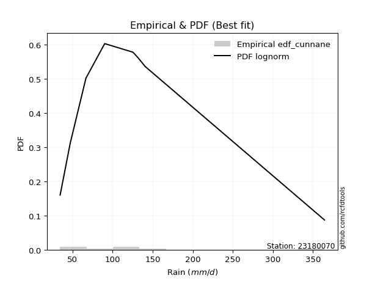</img>

</div>


### 12. Empirical - EDF Adamowski (1981)

The Adamowski formula in hydrology refers to a specific plotting position formula used for estimating the non-parametric empirical distribution of hydrological events (like flood peaks) to calculate their return periods. This formula provides an alternative to traditional parametric methods (like the Gumbel or Log Pearson Type III distributions). 

<div align="center">


$P=(m-0.25)/(n+0.5)$


</div>


**12.1. Empirical values**

<div align="center">

|                | 0                   | 1                   | 2                  | 3                   | 4             | 5                  | 6                  | 7                  | 8                  |
|:---------------|:--------------------|:--------------------|:-------------------|:--------------------|:--------------|:-------------------|:-------------------|:-------------------|:-------------------|
| date           | 2018                | 2017                | 2023               | 2025                | 2020          | 2021               | 2022               | 2019               | 2024               |
| x              | 34.6                | 47.2                | 66.8               | 80.8                | 90.2          | 125.4              | 127.4              | 140.8              | 364.4              |
| m              | 1                   | 2                   | 3                  | 4                   | 5             | 6                  | 7                  | 8                  | 9                  |
| empirical_dist | edf_adamowski       | edf_adamowski       | edf_adamowski      | edf_adamowski       | edf_adamowski | edf_adamowski      | edf_adamowski      | edf_adamowski      | edf_adamowski      |
| empirical      | 0.07894736842105263 | 0.18421052631578946 | 0.2894736842105263 | 0.39473684210526316 | 0.5           | 0.6052631578947368 | 0.7105263157894737 | 0.8157894736842105 | 0.9210526315789473 |
| empirical_tr   | 1.0857142857142856  | 1.2258064516129032  | 1.4074074074074074 | 1.6521739130434783  | 2.0           | 2.533333333333333  | 3.4545454545454546 | 5.428571428571428  | 12.666666666666663 |

</div>


**12.2. Kolmogorov-Smirnov fit test (sorted by Δ)**


<div align="center">

|                | 0                   | 1                   | 2                   | 3                   | 4                   | 5                   | 6                   | 7                   | 8                   | 9                   | 10                  | 11                  | 12                  | 13                  | 14                  | 15                  | 16                  | 17                  | 18                  | 19                  | 20                  | 21                  | 22                  | 23                  | 24                  | 25                  | 26                  | 27                  | 28                  | 29                  | 30                  | 31                  | 32                  | 33                  | 34                  | 35                  | 36                  | 37                  | 38                  | 39                  | 40                  | 41                  | 42                  | 43                  | 44                  | 45                  | 46                  | 47                  | 48                  | 49                  | 50                  | 51                  | 52                    | 53                  | 54                  | 55                  | 56                  | 57                  | 58                  | 59                  | 60                  | 61                  | 62                  | 63                  | 64                  | 65                  | 66                  | 67                  | 68                  | 69                  | 70                  | 71                  | 72                  | 73                  | 74                  | 75                  | 76                  | 77                  | 78                  | 79                  | 80                  | 81                  | 82                  | 83                  | 84                  | 85                  | 86                  | 87                  | 88                  | 89                  |
|:---------------|:--------------------|:--------------------|:--------------------|:--------------------|:--------------------|:--------------------|:--------------------|:--------------------|:--------------------|:--------------------|:--------------------|:--------------------|:--------------------|:--------------------|:--------------------|:--------------------|:--------------------|:--------------------|:--------------------|:--------------------|:--------------------|:--------------------|:--------------------|:--------------------|:--------------------|:--------------------|:--------------------|:--------------------|:--------------------|:--------------------|:--------------------|:--------------------|:--------------------|:--------------------|:--------------------|:--------------------|:--------------------|:--------------------|:--------------------|:--------------------|:--------------------|:--------------------|:--------------------|:--------------------|:--------------------|:--------------------|:--------------------|:--------------------|:--------------------|:--------------------|:--------------------|:--------------------|:----------------------|:--------------------|:--------------------|:--------------------|:--------------------|:--------------------|:--------------------|:--------------------|:--------------------|:--------------------|:--------------------|:--------------------|:--------------------|:--------------------|:--------------------|:--------------------|:--------------------|:--------------------|:--------------------|:--------------------|:--------------------|:--------------------|:--------------------|:--------------------|:--------------------|:--------------------|:--------------------|:--------------------|:--------------------|:--------------------|:--------------------|:--------------------|:--------------------|:--------------------|:--------------------|:--------------------|:--------------------|:--------------------|
| station        | 23180070            | 23180070            | 23180070            | 23180070            | 23180070            | 23180070            | 23180070            | 23180070            | 23180070            | 23180070            | 23180070            | 23180070            | 23180070            | 23180070            | 23180070            | 23180070            | 23180070            | 23180070            | 23180070            | 23180070            | 23180070            | 23180070            | 23180070            | 23180070            | 23180070            | 23180070            | 23180070            | 23180070            | 23180070            | 23180070            | 23180070            | 23180070            | 23180070            | 23180070            | 23180070            | 23180070            | 23180070            | 23180070            | 23180070            | 23180070            | 23180070            | 23180070            | 23180070            | 23180070            | 23180070            | 23180070            | 23180070            | 23180070            | 23180070            | 23180070            | 23180070            | 23180070            | 23180070              | 23180070            | 23180070            | 23180070            | 23180070            | 23180070            | 23180070            | 23180070            | 23180070            | 23180070            | 23180070            | 23180070            | 23180070            | 23180070            | 23180070            | 23180070            | 23180070            | 23180070            | 23180070            | 23180070            | 23180070            | 23180070            | 23180070            | 23180070            | 23180070            | 23180070            | 23180070            | 23180070            | 23180070            | 23180070            | 23180070            | 23180070            | 23180070            | 23180070            | 23180070            | 23180070            | 23180070            | 23180070            |
| empirical_dist | edf_adamowski       | edf_adamowski       | edf_adamowski       | edf_adamowski       | edf_adamowski       | edf_adamowski       | edf_adamowski       | edf_adamowski       | edf_adamowski       | edf_adamowski       | edf_adamowski       | edf_adamowski       | edf_adamowski       | edf_adamowski       | edf_adamowski       | edf_adamowski       | edf_adamowski       | edf_adamowski       | edf_adamowski       | edf_adamowski       | edf_adamowski       | edf_adamowski       | edf_adamowski       | edf_adamowski       | edf_adamowski       | edf_adamowski       | edf_adamowski       | edf_adamowski       | edf_adamowski       | edf_adamowski       | edf_adamowski       | edf_adamowski       | edf_adamowski       | edf_adamowski       | edf_adamowski       | edf_adamowski       | edf_adamowski       | edf_adamowski       | edf_adamowski       | edf_adamowski       | edf_adamowski       | edf_adamowski       | edf_adamowski       | edf_adamowski       | edf_adamowski       | edf_adamowski       | edf_adamowski       | edf_adamowski       | edf_adamowski       | edf_adamowski       | edf_adamowski       | edf_adamowski       | edf_adamowski         | edf_adamowski       | edf_adamowski       | edf_adamowski       | edf_adamowski       | edf_adamowski       | edf_adamowski       | edf_adamowski       | edf_adamowski       | edf_adamowski       | edf_adamowski       | edf_adamowski       | edf_adamowski       | edf_adamowski       | edf_adamowski       | edf_adamowski       | edf_adamowski       | edf_adamowski       | edf_adamowski       | edf_adamowski       | edf_adamowski       | edf_adamowski       | edf_adamowski       | edf_adamowski       | edf_adamowski       | edf_adamowski       | edf_adamowski       | edf_adamowski       | edf_adamowski       | edf_adamowski       | edf_adamowski       | edf_adamowski       | edf_adamowski       | edf_adamowski       | edf_adamowski       | edf_adamowski       | edf_adamowski       | edf_adamowski       |
| p_dist         | loglogistic         | logrice             | logmaxwell          | logbetaprime        | logpearson3         | invgauss            | ncf                 | lograyleigh         | johnsonsu           | logncf              | fatiguelife         | fisk                | lognct              | logweibull_min      | logalpha            | logf                | loginvgamma         | logjohnsonsu        | loginvgauss         | logfatiguelife      | loggamma            | loggamma            | logerlang           | betaprime           | logt                | logcrystalball      | lognorm             | lognorm             | invgamma            | logloggamma         | loggompertz         | loghypsecant        | nct                 | f                   | invweibull          | logexponnorm        | loggenlogistic      | mielke              | loggenexpon         | logmielke           | logfisk             | loginvweibull       | logkstwobign        | alpha               | wald                | exponnorm           | loghalfnorm         | laplace_asymmetric  | expon               | genexpon            | gompertz            | genlogistic         | loglaplace_asymmetric | loggumbel_l         | loggumbel_r         | pearson3            | loglaplace          | logtruncnorm        | loghalflogistic     | nakagami            | logmoyal            | moyal               | truncnorm           | halflogistic        | lognakagami         | t                   | gumbel_r            | halfnorm            | kstwobign           | laplace             | gibrat              | logexpon            | logwald             | rayleigh            | maxwell             | hypsecant           | chi2                | logistic            | rice                | loggibrat           | norm                | crystalball         | weibull_min         | gumbel_l            | logchi2             | loglognorm          | pareto              | logpareto           | gamma               | erlang              |
| delta          | 0.07735681769918434 | 0.0784113470500114  | 0.07846423112392908 | 0.07861625458909072 | 0.07994477746409778 | 0.08002705262776688 | 0.08360794774550817 | 0.08447707713968067 | 0.08489262163524114 | 0.08551410528853065 | 0.08613210623295009 | 0.08619948468122962 | 0.0864181060406023  | 0.08646358977265867 | 0.08652278952073278 | 0.0867956924060006  | 0.08681174157631566 | 0.08705415622519042 | 0.08727604472537998 | 0.08732667459453036 | 0.08834677959151438 | 0.08834677959151438 | 0.0883469065286262  | 0.08883358670229191 | 0.08978172105155513 | 0.089781834921143   | 0.0897819614429769  | 0.0897819614429769  | 0.09058760826161705 | 0.0908124475541433  | 0.09132254350903402 | 0.09188465078841535 | 0.0921198551575767  | 0.09250572488893727 | 0.09283491967149449 | 0.09325048225784804 | 0.09363584177386375 | 0.09366793449210031 | 0.09388887472437724 | 0.0944515775160254  | 0.09481075642897374 | 0.0958954650579531  | 0.09639299753973585 | 0.09738592439855553 | 0.10040981571099906 | 0.10053941622567597 | 0.10212342109457939 | 0.10302418129624569 | 0.1030243617619323  | 0.10304074306923627 | 0.10341976774568062 | 0.10411870446514715 | 0.11132751188413703   | 0.11301381214030626 | 0.11604454252257923 | 0.11772008430861469 | 0.1195400842131118  | 0.12217941794798964 | 0.129996231826487   | 0.13250133321201862 | 0.13501176889517807 | 0.13555763251655184 | 0.13562858931250477 | 0.13778757969542932 | 0.14205630854170553 | 0.1498233680861384  | 0.15880632342385836 | 0.1659836519764375  | 0.17096037197688452 | 0.18066583424947324 | 0.18421052631578946 | 0.18792150642949146 | 0.18915832506004315 | 0.19032538782950226 | 0.1988986910661127  | 0.20501825541040197 | 0.2080065334639457  | 0.21465397997322955 | 0.21908639148021491 | 0.22125564012702104 | 0.22633016850925203 | 0.22633017557689927 | 0.256228125607299   | 0.2879715770382959  | 0.2897979124683304  | 0.4140710773392652  | 0.41734195319397915 | 0.4404583895517754  | 0.46099043331316514 | 0.5341877974491829  |
| deltao         | 0.41761268023100007 | 0.41761268023100007 | 0.41761268023100007 | 0.41761268023100007 | 0.41761268023100007 | 0.41761268023100007 | 0.41761268023100007 | 0.41761268023100007 | 0.41761268023100007 | 0.41761268023100007 | 0.41761268023100007 | 0.41761268023100007 | 0.41761268023100007 | 0.41761268023100007 | 0.41761268023100007 | 0.41761268023100007 | 0.41761268023100007 | 0.41761268023100007 | 0.41761268023100007 | 0.41761268023100007 | 0.41761268023100007 | 0.41761268023100007 | 0.41761268023100007 | 0.41761268023100007 | 0.41761268023100007 | 0.41761268023100007 | 0.41761268023100007 | 0.41761268023100007 | 0.41761268023100007 | 0.41761268023100007 | 0.41761268023100007 | 0.41761268023100007 | 0.41761268023100007 | 0.41761268023100007 | 0.41761268023100007 | 0.41761268023100007 | 0.41761268023100007 | 0.41761268023100007 | 0.41761268023100007 | 0.41761268023100007 | 0.41761268023100007 | 0.41761268023100007 | 0.41761268023100007 | 0.41761268023100007 | 0.41761268023100007 | 0.41761268023100007 | 0.41761268023100007 | 0.41761268023100007 | 0.41761268023100007 | 0.41761268023100007 | 0.41761268023100007 | 0.41761268023100007 | 0.41761268023100007   | 0.41761268023100007 | 0.41761268023100007 | 0.41761268023100007 | 0.41761268023100007 | 0.41761268023100007 | 0.41761268023100007 | 0.41761268023100007 | 0.41761268023100007 | 0.41761268023100007 | 0.41761268023100007 | 0.41761268023100007 | 0.41761268023100007 | 0.41761268023100007 | 0.41761268023100007 | 0.41761268023100007 | 0.41761268023100007 | 0.41761268023100007 | 0.41761268023100007 | 0.41761268023100007 | 0.41761268023100007 | 0.41761268023100007 | 0.41761268023100007 | 0.41761268023100007 | 0.41761268023100007 | 0.41761268023100007 | 0.41761268023100007 | 0.41761268023100007 | 0.41761268023100007 | 0.41761268023100007 | 0.41761268023100007 | 0.41761268023100007 | 0.41761268023100007 | 0.41761268023100007 | 0.41761268023100007 | 0.41761268023100007 | 0.41761268023100007 | 0.41761268023100007 |
| eval           | Δo > Δ              | Δo > Δ              | Δo > Δ              | Δo > Δ              | Δo > Δ              | Δo > Δ              | Δo > Δ              | Δo > Δ              | Δo > Δ              | Δo > Δ              | Δo > Δ              | Δo > Δ              | Δo > Δ              | Δo > Δ              | Δo > Δ              | Δo > Δ              | Δo > Δ              | Δo > Δ              | Δo > Δ              | Δo > Δ              | Δo > Δ              | Δo > Δ              | Δo > Δ              | Δo > Δ              | Δo > Δ              | Δo > Δ              | Δo > Δ              | Δo > Δ              | Δo > Δ              | Δo > Δ              | Δo > Δ              | Δo > Δ              | Δo > Δ              | Δo > Δ              | Δo > Δ              | Δo > Δ              | Δo > Δ              | Δo > Δ              | Δo > Δ              | Δo > Δ              | Δo > Δ              | Δo > Δ              | Δo > Δ              | Δo > Δ              | Δo > Δ              | Δo > Δ              | Δo > Δ              | Δo > Δ              | Δo > Δ              | Δo > Δ              | Δo > Δ              | Δo > Δ              | Δo > Δ                | Δo > Δ              | Δo > Δ              | Δo > Δ              | Δo > Δ              | Δo > Δ              | Δo > Δ              | Δo > Δ              | Δo > Δ              | Δo > Δ              | Δo > Δ              | Δo > Δ              | Δo > Δ              | Δo > Δ              | Δo > Δ              | Δo > Δ              | Δo > Δ              | Δo > Δ              | Δo > Δ              | Δo > Δ              | Δo > Δ              | Δo > Δ              | Δo > Δ              | Δo > Δ              | Δo > Δ              | Δo > Δ              | Δo > Δ              | Δo > Δ              | Δo > Δ              | Δo > Δ              | Δo > Δ              | Δo > Δ              | Δo > Δ              | Δo > Δ              | Δo > Δ              | Δo <= Δ             | Δo <= Δ             | Δo <= Δ             |
| fit            | 1                   | 1                   | 1                   | 1                   | 1                   | 1                   | 1                   | 1                   | 1                   | 1                   | 1                   | 1                   | 1                   | 1                   | 1                   | 1                   | 1                   | 1                   | 1                   | 1                   | 1                   | 1                   | 1                   | 1                   | 1                   | 1                   | 1                   | 1                   | 1                   | 1                   | 1                   | 1                   | 1                   | 1                   | 1                   | 1                   | 1                   | 1                   | 1                   | 1                   | 1                   | 1                   | 1                   | 1                   | 1                   | 1                   | 1                   | 1                   | 1                   | 1                   | 1                   | 1                   | 1                     | 1                   | 1                   | 1                   | 1                   | 1                   | 1                   | 1                   | 1                   | 1                   | 1                   | 1                   | 1                   | 1                   | 1                   | 1                   | 1                   | 1                   | 1                   | 1                   | 1                   | 1                   | 1                   | 1                   | 1                   | 1                   | 1                   | 1                   | 1                   | 1                   | 1                   | 1                   | 1                   | 1                   | 1                   | 0                   | 0                   | 0                   |
| n              | 9                   | 9                   | 9                   | 9                   | 9                   | 9                   | 9                   | 9                   | 9                   | 9                   | 9                   | 9                   | 9                   | 9                   | 9                   | 9                   | 9                   | 9                   | 9                   | 9                   | 9                   | 9                   | 9                   | 9                   | 9                   | 9                   | 9                   | 9                   | 9                   | 9                   | 9                   | 9                   | 9                   | 9                   | 9                   | 9                   | 9                   | 9                   | 9                   | 9                   | 9                   | 9                   | 9                   | 9                   | 9                   | 9                   | 9                   | 9                   | 9                   | 9                   | 9                   | 9                   | 9                     | 9                   | 9                   | 9                   | 9                   | 9                   | 9                   | 9                   | 9                   | 9                   | 9                   | 9                   | 9                   | 9                   | 9                   | 9                   | 9                   | 9                   | 9                   | 9                   | 9                   | 9                   | 9                   | 9                   | 9                   | 9                   | 9                   | 9                   | 9                   | 9                   | 9                   | 9                   | 9                   | 9                   | 9                   | 9                   | 9                   | 9                   |
| best_fit       | 1                   | 0                   | 0                   | 0                   | 0                   | 0                   | 0                   | 0                   | 0                   | 0                   | 0                   | 0                   | 0                   | 0                   | 0                   | 0                   | 0                   | 0                   | 0                   | 0                   | 0                   | 0                   | 0                   | 0                   | 0                   | 0                   | 0                   | 0                   | 0                   | 0                   | 0                   | 0                   | 0                   | 0                   | 0                   | 0                   | 0                   | 0                   | 0                   | 0                   | 0                   | 0                   | 0                   | 0                   | 0                   | 0                   | 0                   | 0                   | 0                   | 0                   | 0                   | 0                   | 0                     | 0                   | 0                   | 0                   | 0                   | 0                   | 0                   | 0                   | 0                   | 0                   | 0                   | 0                   | 0                   | 0                   | 0                   | 0                   | 0                   | 0                   | 0                   | 0                   | 0                   | 0                   | 0                   | 0                   | 0                   | 0                   | 0                   | 0                   | 0                   | 0                   | 0                   | 0                   | 0                   | 0                   | 0                   | 0                   | 0                   | 0                   |
| best_fit_sort  | 1                   | 2                   | 3                   | 4                   | 5                   | 6                   | 7                   | 8                   | 9                   | 10                  | 11                  | 12                  | 13                  | 14                  | 15                  | 16                  | 17                  | 18                  | 19                  | 20                  | 21                  | 22                  | 23                  | 24                  | 25                  | 26                  | 27                  | 28                  | 29                  | 30                  | 31                  | 32                  | 33                  | 34                  | 35                  | 36                  | 37                  | 38                  | 39                  | 40                  | 41                  | 42                  | 43                  | 44                  | 45                  | 46                  | 47                  | 48                  | 49                  | 50                  | 51                  | 52                  | 53                    | 54                  | 55                  | 56                  | 57                  | 58                  | 59                  | 60                  | 61                  | 62                  | 63                  | 64                  | 65                  | 66                  | 67                  | 68                  | 69                  | 70                  | 71                  | 72                  | 73                  | 74                  | 75                  | 76                  | 77                  | 78                  | 79                  | 80                  | 81                  | 82                  | 83                  | 84                  | 85                  | 86                  | 87                  | 88                  | 89                  | 90                  |

</div>


<div align="center">

</img>

</div>


**12.3. Best fit**

<div align="center">

|   id |   station | empirical_dist   | p_dist      |     delta |   deltao | eval   |   fit |   n |   best_fit |   best_fit_sort |
|-----:|----------:|:-----------------|:------------|----------:|---------:|:-------|------:|----:|-----------:|----------------:|
|    0 |  23180070 | edf_adamowski    | loglogistic | 0.0773568 | 0.417613 | Δo > Δ |     1 |   9 |          1 |               1 |

</div>


<div align="center">

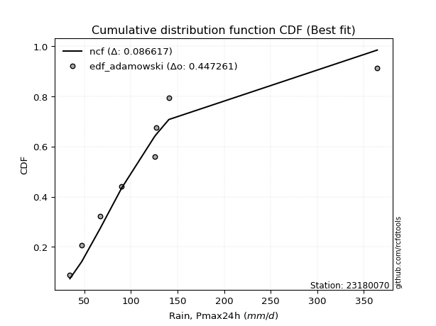</img>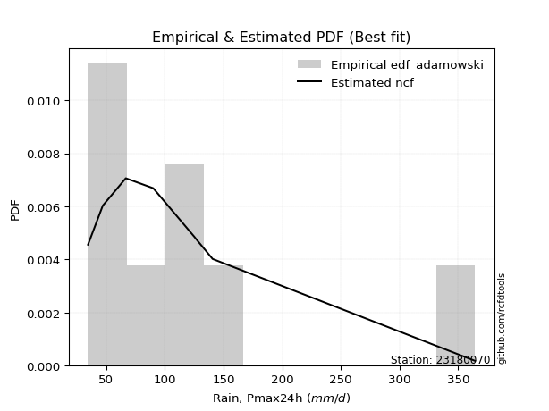</img>

</div>


## C. Best fit & Estimate extreme values for specific return periods - Tr


### 1. Best fit (ordered by delta Δ)

<div align="center">

|   id |   station | empirical_dist   | p_dist      |     delta |   deltao | eval   |   fit |   n |   best_fit |   best_fit_sort |
|-----:|----------:|:-----------------|:------------|----------:|---------:|:-------|------:|----:|-----------:|----------------:|
|    0 |  23180070 | edf_tukey        | loglogistic | 0.0754771 | 0.417613 | Δo > Δ |     1 |   9 |          1 |               1 |
|    1 |  23180070 | edf_filliben     | loglogistic | 0.0758394 | 0.417613 | Δo > Δ |     1 |   9 |          1 |               2 |
|    2 |  23180070 | edf_blom         | loglogistic | 0.0759994 | 0.417613 | Δo > Δ |     1 |   9 |          1 |               3 |
|    3 |  23180070 | edf_jenkinson    | loglogistic | 0.0760102 | 0.417613 | Δo > Δ |     1 |   9 |          1 |               4 |
|    4 |  23180070 | edf_beard        | loglogistic | 0.0760102 | 0.417613 | Δo > Δ |     1 |   9 |          1 |               5 |
|    5 |  23180070 | edf_chegodayev   | loglogistic | 0.076237  | 0.417613 | Δo > Δ |     1 |   9 |          1 |               6 |
|    6 |  23180070 | edf_adamowski    | loglogistic | 0.0773568 | 0.417613 | Δo > Δ |     1 |   9 |          1 |               7 |
|    7 |  23180070 | edf_cunnane      | loglogistic | 0.077762  | 0.417613 | Δo > Δ |     1 |   9 |          1 |               8 |
|    8 |  23180070 | edf_weibull      | fatiguelife | 0.0794617 | 0.417613 | Δo > Δ |     1 |   9 |          1 |               9 |
|    9 |  23180070 | edf_gringorten   | loglogistic | 0.0806224 | 0.417613 | Δo > Δ |     1 |   9 |          1 |              10 |
|   10 |  23180070 | edf_hazen        | betaprime   | 0.0844783 | 0.417613 | Δo > Δ |     1 |   9 |          1 |              11 |
|   11 |  23180070 | edf_california   | t           | 0.0884199 | 0.417613 | Δo > Δ |     1 |   9 |          1 |              12 |

</div>

:file_folder:Tables: [bestfit_23180070.csv](table/bestfit_23180070.csv) | [extreme_23180070.csv](table/extreme_23180070.csv)


### 2. Extreme values

In hydrology, a return period (or recurrence interval $Tr$) is the statistical average time between extreme events like floods or droughts of a specific magnitude, indicating how rare an event is, with a 100-year flood, for example, having a 1% chance of occurring in any given year, not that it happens exactly every century. It is a key tool for infrastructure design (like bridges or dams) and risk assessment, calculated from historical data to determine the probability of future events, although it is important to remember it is statistical average, and events can cluster or be missed.

> risk_rate: assuming the return period as the project useful life.

|   id |      tr |   prob_l |     prob_g |     alpha |   betaprime |     chi2 |   crystalball |   erlang |    expon |   exponnorm |         f |   fatiguelife |      fisk |    gamma |   genexpon |   genlogistic |   gibrat |   gompertz |   gumbel_l |   gumbel_r |   halflogistic |   halfnorm |   hypsecant |   invgamma |   invgauss |   invweibull |   johnsonsu |   kstwobign |   laplace |   laplace_asymmetric |   loggamma |   logistic |   lognorm |   maxwell |    mielke |    moyal |   nakagami |       ncf |       nct |    norm |           pareto |   pearson3 |   rayleigh |    rice |         t |   truncnorm |     wald |   weibull_min |   logalpha |   logbetaprime |          logchi2 |   logcrystalball |   logerlang |   logexpon |   logexponnorm |      logf |   logfatiguelife |   logfisk |   loggenexpon |   loggenlogistic |   loggibrat |   loggompertz |   loggumbel_l |   loggumbel_r |   loghalflogistic |   loghalfnorm |   loghypsecant |   loginvgamma |   loginvgauss |   loginvweibull |   logjohnsonsu |   logkstwobign |   loglaplace |   loglaplace_asymmetric |   logloggamma |   loglogistic |    loglognorm |   logmaxwell |   logmielke |   logmoyal |   lognakagami |    logncf |    lognct |     logpareto |   logpearson3 |   lograyleigh |   logrice |     logt |   logtruncnorm |    logwald |   logweibull_min |   station |   n |   risk_rate |
|-----:|--------:|---------:|-----------:|----------:|------------:|---------:|--------------:|---------:|---------:|------------:|----------:|--------------:|----------:|---------:|-----------:|--------------:|---------:|-----------:|-----------:|-----------:|---------------:|-----------:|------------:|-----------:|-----------:|-------------:|------------:|------------:|----------:|---------------------:|-----------:|-----------:|----------:|----------:|----------:|---------:|-----------:|----------:|----------:|--------:|-----------------:|-----------:|-----------:|--------:|----------:|------------:|---------:|--------------:|-----------:|---------------:|-----------------:|-----------------:|------------:|-----------:|---------------:|----------:|-----------------:|----------:|--------------:|-----------------:|------------:|--------------:|--------------:|--------------:|------------------:|--------------:|---------------:|--------------:|--------------:|----------------:|---------------:|---------------:|-------------:|------------------------:|--------------:|--------------:|--------------:|-------------:|------------:|-----------:|--------------:|----------:|----------:|--------------:|--------------:|--------------:|----------:|---------:|---------------:|-----------:|-----------------:|----------:|----:|------------:|
|    0 |    2    | 0.5      | 0.5        |   90.0581 |     89.5876 |  67.1925 |       119.733 |  39.1843 |  93.6099 |     93.1393 |   88.7048 |       87.5279 |   88.9942 |  38.3672 |    93.6126 |       102.847 |  91.7722 |    93.6751 |    135.037 |    104.43  |        96.8219 |    100.665 |     119.733 |    89.0781 |    88.1078 |      89.2452 |     87.8121 |     112.123 |   119.733 |              93.6099 |    88.8875 |    119.733 |   95.3542 |   111.766 |   89.0756 |  99.4895 |    86.5163 |   90.8425 |   89.3421 | 119.733 |     36.6486      |     92.959 |    108.941 | 120.948 |   91.6984 |     99.1876 |  89.5374 |       61.9021 |    90.0717 |        91.4551 |     55.0189      |          95.3542 |     88.8875 |    69.8625 |        90.2708 |   89.8593 |          89.4585 |   90.8709 |       84.3261 |          89.1033 |     78.4823 |       88.8897 |       106.078 |       85.7147 |           81.2917 |       83.4962 |        95.3542 |       89.8646 |       89.4816 |         85.9182 |        89.6897 |        84.8093 |      95.3542 |                 92.8177 |       95.5397 |       95.3542 |  35.2815      |      90.2078 |      90.984 |    82.8157 |       75.9831 |   90.0627 |   90.0103 |  35.6999      |       90.9634 |       88.45   |   90.0723 |  95.3542 |        79.237  |    77.269  |          87.7702 |  23180070 |   9 |    0.75     |
|    1 |    2.33 | 0.570815 | 0.429185   |  100.225  |    100.446  |  76.1588 |       136.356 |  41.903  | 106.612  |    106.068  |   99.5269 |      100.129  |  100.001  |  41.9974 |   106.615  |       114.154 | 100.193  |   106.691  |    149.499 |    119.833 |       112.659  |    118.606 |     133.037 |    99.9167 |   100.009  |      99.8672 |     99.3941 |     125.456 |   129.793 |             106.612  |    99.9345 |    134.379 |  107.057  |   129.037 |   99.6179 | 114.07   |   104.423  |  101.796  |   99.9874 | 136.356 |     41.5565      |    107.625 |    126.466 | 135.321 |   99.7557 |    113.413  | 100.437  |       99.7055 |   100.995  |       102.647  |     65.2618      |         107.057  |     99.9345 |    81.5608 |       100.703  |  100.809  |         100.456  |  100.969  |       96.0164 |          99.6423 |     83.2222 |      101.815  |       117.318 |       95.4205 |           90.7702 |       94.6082 |       104.611  |      100.812  |      100.478  |         96.8581 |       100.662  |        96.0405 |     102.274  |                100.643  |      107.291  |      105.593  |  39.8742      |     101.737  |     101.1   |    91.667  |       87.7972 |  101.051  |  100.958  |  38.481       |      102.171  |       99.9319 |  101.72   | 107.057  |        92.1411 |    83.3631 |          99.2585 |  23180070 |   9 |    0.729209 |
|    2 |    5    | 0.8      | 0.2        |  155.401  |    159.597  | 124.013  |       198.132 |  62.5528 | 171.617  |    170.708  |  158.811  |      169.071  |  163.999  |  81.7896 |   171.623  |       163.273 | 148.672  |   171.768  |    196.22  |    186.751 |       184.317  |    194.474 |     186.4   |   159.532  |   165.66   |     158.493  |    163.804  |     182.092 |   180.088 |             171.617  |   160.815  |    190.93  |  164.61   |   197.01  |  158.926  | 181.611  |   194.237  |  160.203  |  158.759  | 198.132 |   3134.58        |    178.961 |    196.629 | 192.863 |  134.516  |    184.511  | 161.455  |     1113.31   |   159.92   |       161.463  |    179.988       |         164.61   |    160.815  |   176.87   |       156.596  |  160.115  |         160.459  |  156.111  |      163.54   |         158.902  |    116.644  |      170.167  |       162.433 |      152.067  |          149.509  |      160.471  |       151.695  |      160.1    |      160.448  |        163.03   |       160.207  |       162.884  |     145.172  |                150.843  |      164.845  |      156.557  |   5.52712e+99 |     163.329  |     155.934 |   146.72   |      162.797  |  160.508  |  160.042  |   1.43165e+22 |      161.628  |      162.896  |  163.908  | 164.61   |       177.404  |   127.506  |         162.869  |  23180070 |   9 |    0.67232  |
|    3 |   10    | 0.9      | 0.1        |  220.433  |    225.271  | 169.868  |       239.112 |  87.9161 | 230.627  |    229.387  |  225.109  |      238.012  |  244.569  | 142.545  |   230.636  |       203.278 | 203.933  |   230.843  |    222.232 |    241.255 |       243.826  |    250.615 |     229.011 |   226.601  |   234.237  |     225.754  |    234.299  |     225.213 |   225.744 |             230.627  |   228.624  |    232.577 |  218.978  |   244.847 |  229.665  | 240.415  |   267.835  |  223.149  |  226.262  | 239.112 | 786282           |    242.182 |    246.657 | 233.892 |  169.422  |    249.012  | 226.209  |     5183.9    |   224.325  |       222.967  |    516.985       |         218.978  |    228.623  |   357.126  |       219.879  |  225.141  |         226.608  |  222.077  |      240.852  |         229.552  |    171.395  |      236.512  |       194.692 |      222.27   |          226.282  |      237.245  |       204.104  |      225.108  |      226.529  |        249.144  |       225.562  |       243.533  |     199.512  |                217.802  |      218.87   |      209.235  | inf           |     227.901  |     220.542 |   220.974  |      257.858  |  225.57   |  224.592  | inf           |      224.392  |      230.791  |  228.38   | 218.978  |       291.818  |   200.166  |         232.355  |  23180070 |   9 |    0.651322 |
|    4 |   15    | 0.933333 | 0.0666667  |  270.075  |    270.968  | 197.296  |       259.562 | 104.541  | 265.145  |    263.712  |  271.459  |      280.26   |  306.862  | 185.375  |   265.156  |       225.848 | 242.05   |   265.4    |    234.013 |    272.005 |       277.503  |    279.83  |     253.33  |   273.693  |   277.923  |     273.96   |    281.756  |     248.105 |   252.451 |             265.145  |   275.549  |    255.268 |  252.494  |   269.391 |  282.031  | 274.543  |   307.037  |  266.062  |  274.71   | 259.562 |      2.00413e+07 |    278.785 |    272.433 | 255.032 |  194.461  |    286.726  | 267.791  |    10486.1    |   268.63   |       263.802  |    991.844       |         252.494  |    275.549  |   538.683  |       265.774  |  269.886  |         272.154  |  272.387  |      294.451  |         281.843  |    223.502  |      276.854  |       211.338 |      275.35   |          286.09   |      290.777  |       241.769  |      269.845  |      272.018  |        316.493  |       270.516  |       301.502  |     240.295  |                270.013  |      252.021  |      245.055  | inf           |     270.383  |     269.119 |   280.259  |      327.707  |  270.264  |  268.942  | inf           |      266.236  |      276.172  |  270.318  | 252.494  |       379.259  |   267.401  |         279.204  |  23180070 |   9 |    0.644736 |
|    5 |   20    | 0.95     | 0.05       |  312.921  |    307.322  | 216.952  |       272.954 | 116.918  | 289.637  |    288.066  |  308.44   |      310.895  |  360.035  | 218.177  |   289.648  |       241.651 | 271.949  |   289.918  |    241.345 |    293.536 |       301.098  |    299.308 |     270.485 |   311.365  |   310.352  |     313.087  |    318.476  |     263.525 |   271.401 |             289.637  |   312.655  |    270.952 |  277.176  |   285.681 |  325.456  | 298.712  |   333.335  |  299.775  |  314.081  | 272.954 |      1.99415e+08 |    304.633 |    289.566 | 269.082 |  215.225  |    313.477  | 298.778  |    16273      |   303.628  |       295.305  |   1592.33        |         277.176  |    312.655  |   721.089  |       303.541  |  305.212  |         308.082  |  315.334  |      336.666  |         325.202  |    275.24   |      306.081  |       222.411 |      319.893  |          337.181  |      333.022  |       272.451  |      305.17   |      307.896  |        374.216  |       305.984  |       348.144  |     274.193  |                314.484  |      276.365  |      273.337  | inf           |     302.863  |     310.155 |   331.635  |      384.526  |  305.508  |  303.937  | inf           |      298.572  |      311.17   |  302.137  | 277.176  |       452.101  |   331.81   |         315.524  |  23180070 |   9 |    0.641514 |
|    6 |   25    | 0.96     | 0.04       |  351.817  |    338.044  | 232.291  |       282.813 | 126.795  | 308.634  |    306.956  |  339.757  |      334.979  |  407.423  | 244.768  |   308.646  |       253.823 | 296.875  |   308.936  |    246.563 |    310.12  |       319.277  |    313.801 |     283.762 |   343.331  |   336.264  |     346.66   |    348.798  |     275.076 |   286.099 |             308.633  |   343.841  |    282.949 |  296.875  |   297.774 |  363.323  | 317.446  |   352.951  |  328.007  |  347.899  | 282.813 |      1.18505e+09 |    324.624 |    302.295 | 279.522 |  233.436  |    334.222  | 323.598  |    22253.2    |   333.057  |       321.322  |   2310.94        |         296.874  |    343.841  |   904.13   |       336.331  |  334.893  |         338.232  |  353.767  |      371.974  |         363.009  |    327.415  |      329.073  |       230.641 |      359.057  |          382.687  |      368.388  |       298.843  |      334.852  |      338.003  |        425.76   |       335.763  |       387.748  |     303.746  |                353.963  |      295.753  |      297.157  | inf           |     329.475  |     346.567 |   377.852  |      433.113  |  335.093  |  333.331  | inf           |      325.298  |      340.015  |  328.058  | 296.875  |       515.46   |   394.421  |         345.571  |  23180070 |   9 |    0.639603 |
|    7 |   50    | 0.98     | 0.02       |  518.489  |    449.827  | 280.356  |       311.044 | 158.716  | 367.644  |    365.635  |  454.138  |      411.27   |  598.131  | 332.499  |   367.659  |       291.32  | 384.739  |   368.011  |    260.728 |    361.208 |       375.289  |    355.925 |     324.926 |   460.497  |   420.566  |     472.376  |    453.977  |     308.995 |   331.755 |             367.643  |   455.916  |    319.606 |  361.374  |   332.846 |  509.501  | 375.604  |   410.076  |  429.047  |  474.821  | 311.044 |      3.00563e+11 |    386.46  |    339.246 | 309.826 |  305.149  |    398.637  | 404.635  |    52078.3    |   439.188  |       411.965  |   7525.83        |         361.374  |    455.915  |  1825.57   |       462.036  |  441.692  |         446.352  |  511.241  |      497.267  |         508.944  |    603.729  |      402.134  |       254.553 |      512.484  |          565.259  |      493.985  |       398.055  |      441.677  |      445.954  |        633.586  |       442.736  |       532.048  |     417.444  |                511.086  |      359.001  |      383.58   | inf           |     420.628  |     493.096 |   566.526  |      612.104  |  441.36   |  439.093  | inf           |      418.476  |      439.801  |  415.912  | 361.374  |       756.054  |   693.538  |         450.203  |  23180070 |   9 |    0.63583  |
|    8 |   75    | 0.986667 | 0.0133333  |  664.857  |    528.684  | 308.711  |       326.191 | 178.086  | 402.162  |    399.959  |  535.172  |      456.751  |  749.145  | 386.695  |   402.179  |       313.115 | 444.083  |   402.568  |    267.891 |    390.903 |       407.848  |    378.856 |     348.981 |   543.843  |   472.267  |     564.065  |    523.791  |     327.657 |   358.462 |             402.162  |   533.666  |    340.778 |  401.579  |   351.914 |  619.901  | 409.614  |   441.181  |  498.999  |  567.666  | 326.191 |      7.66128e+12 |    422.482 |    359.349 | 326.313 |  360.923  |    436.301  | 454.501  |    80072.2    |   513.347  |       472.72   |  15217.2         |         401.579  |    533.666  |  2753.66   |       556.21   |  516.049  |         521.223  |  640.068  |      582.595  |         619.151  |    912.695  |      445.931  |       267.572 |      630.218  |          709.122  |      579.521  |       470.652  |      516.072  |      520.702  |        798.272  |       517.03   |       633.21   |     502.776  |                633.602  |      398.256  |      444.518  | inf           |     480.363  |     610.287 |   717.929  |      738.93   |  515.187  |  512.755  | inf           |      480.919  |      505.891  |  472.78   | 401.579  |       932.275  |   981.522  |         520.019  |  23180070 |   9 |    0.634587 |
|    9 |  100    | 0.99     | 0.01       |  802.48   |    591.734  | 328.915  |       336.437 | 192.08   | 426.653  |    424.313  |  600.137  |      489.334  |  879.217  | 426.176  |   426.671  |       328.54  | 490.054  |   427.086  |    272.576 |    411.919 |       430.893  |    394.478 |     366.045 |   610.833  |   509.898  |     638.961  |    577.317  |     340.443 |   377.411 |             426.653  |   595.085  |    355.726 |  431.279  |   364.902 |  712.126  | 433.742  |   462.357  |  554.273  |  643.667  | 336.437 |      7.62314e+13 |    447.985 |    373.045 | 337.545 |  408.535  |    463.016  | 490.859  |   106097      |   572.311  |       519.711  |  25200.4         |         431.279  |    595.084  |  3686.09   |       634.437  |  574.997  |         580.321  |  754.319  |      649.066  |         711.211  |   1257.08   |      477.442  |       276.447 |      729.551  |          832.566  |      646.125  |       530.042  |      575.062  |      579.702  |        940.094  |       575.817  |       713.418  |     573.701  |                737.955  |      427.175  |      493.286  | inf           |     525.838  |     712.543 |   849.294  |      840.061  |  573.63   |  571.181  | inf           |      529.182  |      556.518  |  515.737  | 431.279  |      1075.68   |  1264.36   |         573.746  |  23180070 |   9 |    0.633968 |
|   10 |  200    | 0.995    | 0.005      | 1319.01   |    772.214  | 377.842  |       359.676 | 226.506  | 485.663  |    482.992  |  786.822  |      568.742  | 1294.82   | 524.182  |   485.684  |       365.624 | 615.125  |   486.161  |    282.759 |    462.445 |       486.296  |    430.205 |     407.154 |   804.058  |   603.448  |     860.185  |    720.911  |     369.893 |   423.068 |             485.663  |   767.493  |    391.583 |  507.045  |   394.617 |  993.706  | 491.875  |   510.724  |  709.814  |  868.904  | 359.676 |      1.93345e+16 |    509.277 |    404.382 | 363.245 |  558.982  |    527.358  | 581.421  |   195612      |   739.867  |       647.787  |  86147.6         |         507.045  |    767.492  |  7442.76   |       871.124  |  741.631  |         746.113  | 1140.82   |      831.441  |         992.268  |   3003.56   |      554.75   |       296.764 |     1037.22   |         1224.56   |      828.661  |       705.738  |      741.869  |      745.215  |       1392.87   |       741.462  |       938.95   |     788.449  |               1065.53   |      500.669  |      633.21   | inf           |     646.732  |    1049.14  |  1273.16   |     1126.44   |  738.473  |  736.53   | inf           |      660.488  |      692.242  |  628.683  | 507.045  |      1493.5    |  2375.69   |         718.707  |  23180070 |   9 |    0.633042 |
|   11 |  250    | 0.996    | 0.004      | 1568.53   |    840.213  | 393.657  |       366.778 | 237.771  | 504.66   |    501.882  |  857.4    |      594.54   | 1467.23   | 556.469  |   504.682  |       377.546 | 660      |   505.179  |    285.755 |    478.689 |       504.108  |    441.197 |     420.388 |   877.35   |   634.349  |     945.881  |    771.813  |     379.007 |   437.766 |             504.66   |   831.245  |    403.094 |  532.753  |   403.764 | 1106      | 510.59   |   525.58   |  767.537  |  956.426  | 366.778 |      1.14898e+17 |    528.967 |    414.028 | 371.156 |  620.86   |    548.063  | 611.381  |   234194      |   802.632  |       693.942  | 128426           |         532.753  |    831.243  |  9332.03   |       964.731  |  803.715  |         807.405  | 1310.87   |      897.39   |        1104.35   |   4105.46   |      580.03   |       303.021 |     1161.45   |         1386.28   |      894.583  |       773.869  |      804.036  |      806.404  |       1580.53   |       802.979  |      1022.26   |     873.429  |               1199.29   |      525.519  |      686.064  | inf           |     689.27   |    1193.51  |  1450.38   |     1232.81   |  799.763  |  798.215  | inf           |      707.704  |      740.343  |  668.031  | 532.753  |      1652.55   |  2926.92   |         770.374  |  23180070 |   9 |    0.632858 |
|   12 |  500    | 0.998    | 0.002      | 2790.1    |   1088.58   | 442.949  |       387.839 | 273.229  | 563.67   |    560.561  | 1116.12   |      675.285  | 2165.73   | 658.633  |   563.694  |       414.55  | 815.089  |   564.254  |    294.345 |    529.105 |       559.391  |    473.968 |     461.493 |  1146.95   |   732.485  |    1268.25   |    945.662  |     406.32  |   483.422 |             563.67   |  1059.16   |    438.796 |  616.914  |   431.059 | 1541.8    | 568.721  |   569.802  |  975.061  | 1286.81   | 387.839 |      2.91414e+19 |    590.025 |    442.809 | 394.761 |  869.41   |    612.356  | 706.646  |   392377      |  1030.73   |       854.72   | 448048           |         616.914  |   1059.16   | 18842.7    |      1324.63   | 1027.82   |        1026.57   | 2057.73   |     1127.22   |        1539.3    |  12089.9    |      659.692  |       321.7   |     1650      |         2037.27   |     1123.93   |      1030.37   |     1028.53   |     1025.21   |       2339.76   |      1024.18   |      1318.88   |    1200.37   |               1731.65   |      606.587  |      879.716  | inf           |     833.571  |    1807.57  |  2174.21   |     1613.32   | 1020.51   | 1021.28   | inf           |      871.684  |      904.654  |  800.174  | 616.914  |      2235.86   |  5682.7    |         947.877  |  23180070 |   9 |    0.632489 |
|   13 |  750    | 0.998667 | 0.00133333 | 3996.98   |   1264.3    | 471.885  |       399.539 | 294.253  | 598.189  |    594.886  | 1299.91   |      722.891  | 2721.47   | 719.524  |   598.215  |       436.182 | 917.655  |   598.811  |    298.935 |    558.578 |       591.709  |    492.276 |     485.539 |  1339.24   |   791.252  |    1504.14   |   1059.12   |     421.664 |   510.129 |             598.189  |  1216.24   |    459.653 |  669.283  |   446.325 | 1872.2    | 602.726  |   594.457  | 1119.25   | 1529.55   | 399.539 |      7.42807e+20 |    625.677 |    458.904 | 407.96  | 1065.36   |    649.948  | 763.765  |   517002      |  1191.37   |       962.337  | 935868           |         669.283  |   1216.24   | 28422.1    |      1594.55   | 1184.27   |        1177.72   | 2717.37   |     1280.71   |        1869.02   |  24696.3    |      707.044  |       332.151 |     2025.93   |         2551.49   |     1276.77   |      1218.19   |     1185.31   |     1176.12   |       2942.86   |      1177.84   |      1521.81   |    1445.74   |               2146.76   |      656.825  |     1017.25   | inf           |     927.076  |    2329.24  |  2755.18   |     1874.89   | 1174.19   | 1177.39   | inf           |      980.988  |     1011.95   |  884.808  | 669.283  |      2648.13   |  8459.01   |        1064.55   |  23180070 |   9 |    0.632366 |
|   14 | 1000    | 0.999    | 0.001      | 5199.29   |   1404.97   | 492.455  |       407.594 | 309.28   | 622.68   |    619.239  | 1447.44   |      756.814  | 3201.04   | 763.16   |   622.707  |       451.526 | 996.144  |   623.329  |    302.025 |    579.485 |       614.634  |    504.919 |     502.599 |  1493.97   |   833.497  |    1697.08   |   1145.26   |     432.294 |   529.078 |             622.68   |  1339.79   |    474.445 |  707.901  |   456.876 | 2148.62   | 626.853  |   611.463  | 1233.35   | 1728.62   | 407.594 |      7.39109e+21 |    650.946 |    470.026 | 417.081 | 1233.5    |    676.613  | 804.852  |   622467      |  1319.69   |      1045.47   |      1.58173e+06 |         707.901  |   1339.79   | 38046.2    |      1818.8    | 1308.46   |        1296.68   | 3332.39   |     1398.92   |        2144.87   |  42659.9    |      740.961  |       339.375 |     2343.45   |         2993.14   |     1394.29   |      1371.88   |     1309.81   |     1294.9    |       3462.73   |      1299.4    |      1680.43   |    1649.69   |               2500.33   |      693.776  |     1127.62   | inf           |     997.764  |    2802.41  |  3259.27   |     2079.87   | 1295.96   | 1301.52   | inf           |     1065.16   |     1093.45   |  948.326  | 707.901  |      2976.81   | 11261.4    |        1153.53   |  23180070 |   9 |    0.632305 |

<div align="center">

</img>

</div>


<div align="center">

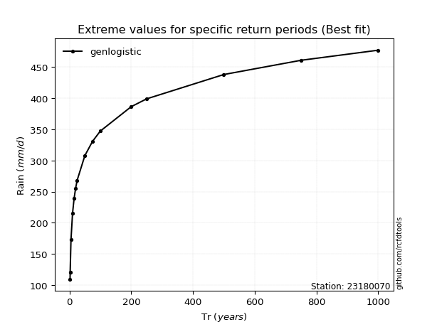</img>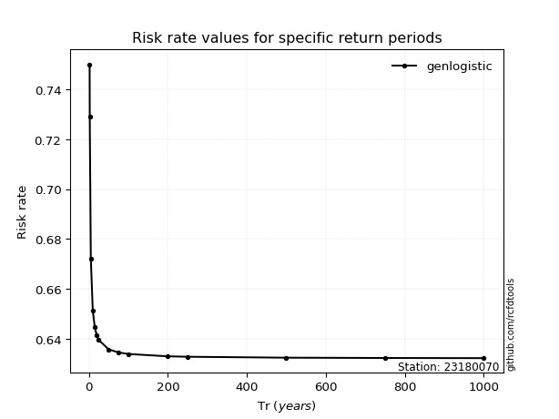</img>

</div>


<sub>**APP DISCLAIMER**: NO WARRANTY - This software is provided by [github.com/rcfdtools](https://github.com/rcfdtools) "as is", without any express or implied warranty, including warranties of merchantability, fitness for a particular purpose, or non-infringement. There is no guarantee that the software will be error-free or operate without interruption. LIMITATION OF LIABILITY - Neither the authors nor copyright holders will be liable for claims or damages arising from the software or its use. You are responsible for determining if the software is appropriate for your use and assume all associated risks, including errors, legal compliance, and data loss. NO PROFESSIONAL ADVICE - The software provides general information and does not offer professional advice. It should not replace consultation with professional advisors.</sub>