<div align="center">


</div>

# Station (rain, Pmax24h): 23190130

Probable Maximum Precipitation (PMP) is the greatest amount of rainfall for a specific duration that is meteorologically possible for a given location, acting as a "worst-case" scenario for extreme storms, crucial for designing safety-critical infrastructure like bridges, river deviations, dams, spillways, and nuclear plants to prevent catastrophic failure. PMP is calculated by hydrologists using meteorological data to determine the upper limit of extreme rainfall, often leading to the Probable Maximum Flood (PMF) for flood control design, and is increasingly being studied for climate change impacts.

<div align="center">

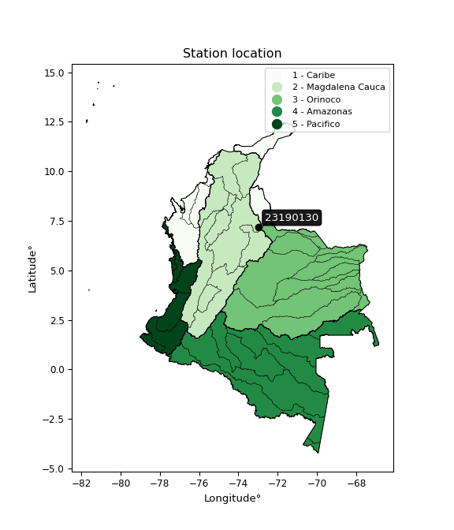</img>

</div>


## A. General information


### 1. General running parameters

• app_version: _v20251225_. • runtime: _2025-12-26 14:29:50.888910_. • Python version: _3.14.0_. • SciPy version: _1.16.3_. • Pandas version: _2.3.3_. • NumPy version: _2.3.5_. • Stations dataset (station_dataset_file): _dataset/pmax24h_in/automatic_colombia.csv_. • Stations catalog (station_catalog_file): _dataset/CNE_IDEAM.xls_. • Plot only fit distributions with Δo > Δ (plot_only_fit): _True_. • Eval low extreme values, if False, evaluates high extreme values (low_extreme): _False_. • Eval every SciPy distribution as logarithmic (pdist_logarithmic_on): _True_. • Standard deviation normalized (ddof): _1.0_. • Return periods to eval in years (Tr): _[2, 2.33, 5, 10, 15, 20, 25, 50, 75, 100, 200, 250, 500, 750, 1000]_. • Minimum data sample per station, 0 means any (minimum_sample): _5_. • Z-Score threshold to adjust a value, 0 means disable (zscore): _3.5_. • Avoid zeros, e.g. rain = 0 (avoid_zeros): _True_. • Avoid null values (avoid_nans): _True_. [:file_folder:Dataset file.](../../dataset/pmax24h_in/automatic_colombia.csv)


### 2. Station info and location

|   id |   CODIGO | NOMBRE                 | CATEGORIA               | TECNOLOGIA                              | ESTADO   | FECHA_INSTALACION   |   FECHA_SUSPENSION |   ALTITUD |   LATITUD |   LONGITUD | DEPARTAMENTO   | MUNICIPIO   | AREA_OPERATIVA                         | ENTIDAD                                                     | AREA_HIDROGRAFICA   | ZONA_HIDROGRAFICA   | SUBZONA_HIDROGRAFICA                      |   CORRIENTE | OBSERVACION                                                                                                                                                                                                                                                                                                                                                                                               | SUBRED                          | Catalogo   |
|-----:|---------:|:-----------------------|:------------------------|:----------------------------------------|:---------|:--------------------|-------------------:|----------:|----------:|-----------:|:---------------|:------------|:---------------------------------------|:------------------------------------------------------------|:--------------------|:--------------------|:------------------------------------------|------------:|:----------------------------------------------------------------------------------------------------------------------------------------------------------------------------------------------------------------------------------------------------------------------------------------------------------------------------------------------------------------------------------------------------------|:--------------------------------|:-----------|
|    0 | 23190130 | TONA  - AUT [23190130] | Climatológica Principal | Automática con Telemetría, Convencional | Activa   | 15/05/1958          |                nan |      1832 |   7.19974 |   -72.9692 | Santander      | Tona        | Area Operativa 08 - Santanderes-Arauca | INSTITUTO DE HIDROLOGIA METEOROLOGIA Y ESTUDIOS AMBIENTALES | Magdalena Cauca     | Medio Magdalena     | Río Lebrija y otros directos al Magdalena |         nan | Con orfeo 20197080001663 enviado por la coordinadora del área operativa se pide entre otras, la corrección de categoría, estados y tecnología de algunas estaciones del área operativa|03/01/2025$mvelez$Se realiza el cambio de elevación y coordenadas a solicitud del grupo de automatización en el marco del ejercicio wigos comunicado mediante correo electrónico 19/12/2024 ingeniero Julián Urrea | RED ALERTAS - AREA OPERATIVA 08 | CNE_IDEAM  |

<div align="center">

Map location in: [:earth_americas:Google](http://maps.google.com/maps?q=7.199737,-72.9692) [:earth_americas:OSM](https://www.openstreetmap.org/#map=18/7.199737/-72.9692&layers=P) [:earth_americas:Bing](https://www.bing.com/maps?cp=7.199737~-72.9692&lvl=18) [:earth_americas:Apple](https://maps.apple.com/frame?center=7.199737%2C-72.9692&span=0.003%2C0.006)

</div>


<div align="center">

```geojson
{
  "type": "Feature",
  "geometry": {
    "type": "Point", 
    "coordinates": [-72.9692, 7.199737]
  }, 
  "properties": {
    "Name": "23190130"
  }
}
```

</div>


### 3. Discrete values table and plot

|               |           0 |           1 |           2 |         3 |           4 |          5 |           6 |
|:--------------|------------:|------------:|------------:|----------:|------------:|-----------:|------------:|
| Date          | 2019        | 2020        | 2021        | 2022      | 2023        | 2024       | 2025        |
| Value         |   55.6      |   44.8      |   33.6      |   33.2    |   35.6      |   98.8     |   53        |
| Value_initial |   55.6      |   44.8      |   33.6      |   33.2    |   35.6      |   98.8     |   53        |
| count         |    7        |    7        |    7        |    7      |    7        |    7       |    7        |
| mean          |   50.6571   |   50.6571   |   50.6571   |   50.6571 |   50.6571   |   50.6571  |   50.6571   |
| std           |   23.1098   |   23.1098   |   23.1098   |   23.1098 |   23.1098   |   23.1098  |   23.1098   |
| zscore        |    0.213886 |   -0.253448 |   -0.738091 |   -0.7554 |   -0.651548 |    2.08322 |    0.101379 |

<div align="center">

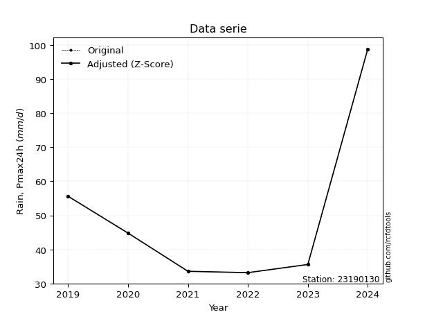</img>

</div>

> If Z-Score is active, values out of range or outliers are replaced with the station mean value.


### 4. Active continuous probability distributions from SciPy (45 of 104 available)

[scipy.stats](https://docs.scipy.org/doc/scipy/reference/stats.html) is a Python´s powerful submodule within the SciPy library for comprehensive statistical analysis, offering over 130 probability distributions (like Normal, Poisson), functions for descriptive stats (mean, variance), hypothesis testing (t-tests, chi-square), random variable generation, and statistical tests, making it essential for data science, modeling, and research. It provides tools to explore, model, and draw conclusions from data efficiently, working seamlessly with NumPy.

<div align="center">

|   id | p_dist             |   n_parameter | fit_method   | label                                                                       | active   | ref                                                                                                        |
|-----:|:-------------------|--------------:|:-------------|:----------------------------------------------------------------------------|:---------|:-----------------------------------------------------------------------------------------------------------|
|    0 | alpha              |             3 | MLE          | Alpha                                                                       | True     | [:mortar_board:](https://docs.scipy.org/doc/scipy/reference/generated/scipy.stats.alpha.html)              |
|    1 | betaprime          |             4 | MLE          | Beta prime                                                                  | True     | [:mortar_board:](https://docs.scipy.org/doc/scipy/reference/generated/scipy.stats.betaprime.html)          |
|    2 | chi2               |             3 | MLE          | Chi²                                                                        | True     | [:mortar_board:](https://docs.scipy.org/doc/scipy/reference/generated/scipy.stats.chi2.html)               |
|    3 | crystalball        |             4 | MLE          | Crystalball                                                                 | True     | [:mortar_board:](https://docs.scipy.org/doc/scipy/reference/generated/scipy.stats.crystalball.html)        |
|    4 | erlang             |             3 | MLE          | Erlang                                                                      | True     | [:mortar_board:](https://docs.scipy.org/doc/scipy/reference/generated/scipy.stats.erlang.html)             |
|    5 | expon              |             2 | MLE          | Exponential                                                                 | True     | [:mortar_board:](https://docs.scipy.org/doc/scipy/reference/generated/scipy.stats.expon.html)              |
|    6 | exponnorm          |             3 | MLE          | Exponentially modified Normal                                               | True     | [:mortar_board:](https://docs.scipy.org/doc/scipy/reference/generated/scipy.stats.exponnorm.html)          |
|    7 | f                  |             4 | MLE          | F                                                                           | True     | [:mortar_board:](https://docs.scipy.org/doc/scipy/reference/generated/scipy.stats.f.html)                  |
|    8 | fatiguelife        |             3 | MLE          | Fatigue-life (Birnbaum-Saunders)                                            | True     | [:mortar_board:](https://docs.scipy.org/doc/scipy/reference/generated/scipy.stats.fatiguelife.html)        |
|    9 | fisk               |             3 | MLE          | Fisk                                                                        | True     | [:mortar_board:](https://docs.scipy.org/doc/scipy/reference/generated/scipy.stats.fisk.html)               |
|   10 | gamma              |             3 | MLE          | Gamma                                                                       | True     | [:mortar_board:](https://docs.scipy.org/doc/scipy/reference/generated/scipy.stats.gamma.html)              |
|   11 | genexpon           |             5 | MLE          | Generalized exponential                                                     | True     | [:mortar_board:](https://docs.scipy.org/doc/scipy/reference/generated/scipy.stats.genexpon.html)           |
|   12 | genlogistic        |             3 | MLE          | Generalized logistic                                                        | True     | [:mortar_board:](https://docs.scipy.org/doc/scipy/reference/generated/scipy.stats.genlogistic.html)        |
|   13 | gibrat             |             2 | MM           | Gibrat                                                                      | True     | [:mortar_board:](https://docs.scipy.org/doc/scipy/reference/generated/scipy.stats.gibrat.html)             |
|   14 | gompertz           |             3 | MLE          | Gompertz (or truncated Gumbel)                                              | True     | [:mortar_board:](https://docs.scipy.org/doc/scipy/reference/generated/scipy.stats.gompertz.html)           |
|   15 | gumbel_l           |             2 | MM           | Gumbel Left Skew                                                            | True     | [:mortar_board:](https://docs.scipy.org/doc/scipy/reference/generated/scipy.stats.gumbel_l.html)           |
|   16 | gumbel_r           |             2 | MM           | Gumbel Right Skew                                                           | True     | [:mortar_board:](https://docs.scipy.org/doc/scipy/reference/generated/scipy.stats.gumbel_r.html)           |
|   17 | halflogistic       |             2 | MM           | Half-logistic                                                               | True     | [:mortar_board:](https://docs.scipy.org/doc/scipy/reference/generated/scipy.stats.halflogistic.html)       |
|   18 | halfnorm           |             2 | MM           | Half Normal                                                                 | True     | [:mortar_board:](https://docs.scipy.org/doc/scipy/reference/generated/scipy.stats.halfnorm.html)           |
|   19 | hypsecant          |             2 | MM           | hyperbolic secant                                                           | True     | [:mortar_board:](https://docs.scipy.org/doc/scipy/reference/generated/scipy.stats.hypsecant.html)          |
|   20 | invgamma           |             3 | MLE          | Inverted gamma                                                              | True     | [:mortar_board:](https://docs.scipy.org/doc/scipy/reference/generated/scipy.stats.invgamma.html)           |
|   21 | invgauss           |             3 | MLE          | Inverse Gaussian                                                            | True     | [:mortar_board:](https://docs.scipy.org/doc/scipy/reference/generated/scipy.stats.invgauss.html)           |
|   22 | invweibull         |             3 | MLE          | Inverted Weibull                                                            | True     | [:mortar_board:](https://docs.scipy.org/doc/scipy/reference/generated/scipy.stats.invweibull.html)         |
|   23 | johnsonsu          |             4 | MLE          | Johnson Su                                                                  | True     | [:mortar_board:](https://docs.scipy.org/doc/scipy/reference/generated/scipy.stats.johnsonsu.html)          |
|   24 | kstwobign          |             2 | MLE          | Limiting distribution of scaled Kolmogorov-Smirnov two-sided test statistic | True     | [:mortar_board:](https://docs.scipy.org/doc/scipy/reference/generated/scipy.stats.kstwobign.html)          |
|   25 | laplace            |             2 | MM           | Laplace                                                                     | True     | [:mortar_board:](https://docs.scipy.org/doc/scipy/reference/generated/scipy.stats.laplace.html)            |
|   26 | laplace_asymmetric |             3 | MLE          | Asymmetric Laplace                                                          | True     | [:mortar_board:](https://docs.scipy.org/doc/scipy/reference/generated/scipy.stats.laplace_asymmetric.html) |
|   27 | loggamma           |             3 | MLE          | Log gamma                                                                   | True     | [:mortar_board:](https://docs.scipy.org/doc/scipy/reference/generated/scipy.stats.loggamma.html)           |
|   28 | logistic           |             2 | MM           | Logistic (or Sech-squared)                                                  | True     | [:mortar_board:](https://docs.scipy.org/doc/scipy/reference/generated/scipy.stats.logistic.html)           |
|   29 | lognorm            |             3 | MLE          | Log Normal                                                                  | True     | [:mortar_board:](https://docs.scipy.org/doc/scipy/reference/generated/scipy.stats.lognorm.html)            |
|   30 | maxwell            |             2 | MM           | Maxwell                                                                     | True     | [:mortar_board:](https://docs.scipy.org/doc/scipy/reference/generated/scipy.stats.maxwell.html)            |
|   31 | mielke             |             4 | MLE          | Mielke Beta-Kappa / Dagum                                                   | True     | [:mortar_board:](https://docs.scipy.org/doc/scipy/reference/generated/scipy.stats.mielke.html)             |
|   32 | moyal              |             2 | MM           | Moyal                                                                       | True     | [:mortar_board:](https://docs.scipy.org/doc/scipy/reference/generated/scipy.stats.moyal.html)              |
|   33 | nakagami           |             3 | MLE          | Nakagami                                                                    | True     | [:mortar_board:](https://docs.scipy.org/doc/scipy/reference/generated/scipy.stats.nakagami.html)           |
|   34 | ncf                |             5 | MLE          | Non-central F distribution                                                  | True     | [:mortar_board:](https://docs.scipy.org/doc/scipy/reference/generated/scipy.stats.ncf.html)                |
|   35 | nct                |             4 | MLE          | Non-central Student’s t                                                     | True     | [:mortar_board:](https://docs.scipy.org/doc/scipy/reference/generated/scipy.stats.nct.html)                |
|   36 | norm               |             2 | MM           | Normal                                                                      | True     | [:mortar_board:](https://docs.scipy.org/doc/scipy/reference/generated/scipy.stats.norm.html)               |
|   37 | pareto             |             3 | MLE          | Pareto                                                                      | True     | [:mortar_board:](https://docs.scipy.org/doc/scipy/reference/generated/scipy.stats.pareto.html)             |
|   38 | pearson3           |             3 | MM           | Pearson type III                                                            | True     | [:mortar_board:](https://docs.scipy.org/doc/scipy/reference/generated/scipy.stats.pearson3.html)           |
|   39 | rayleigh           |             2 | MM           | Rayleigh                                                                    | True     | [:mortar_board:](https://docs.scipy.org/doc/scipy/reference/generated/scipy.stats.rayleigh.html)           |
|   40 | rice               |             3 | MLE          | Rice                                                                        | True     | [:mortar_board:](https://docs.scipy.org/doc/scipy/reference/generated/scipy.stats.rice.html)               |
|   41 | t                  |             3 | MLE          | Student’s t                                                                 | True     | [:mortar_board:](https://docs.scipy.org/doc/scipy/reference/generated/scipy.stats.t.html)                  |
|   42 | truncnorm          |             4 | MLE          | Truncated normal                                                            | True     | [:mortar_board:](https://docs.scipy.org/doc/scipy/reference/generated/scipy.stats.truncnorm.html)          |
|   43 | wald               |             2 | MM           | Wald                                                                        | True     | [:mortar_board:](https://docs.scipy.org/doc/scipy/reference/generated/scipy.stats.wald.html)               |
|   44 | weibull_min        |             3 | MLE          | Weibull minimum                                                             | True     | [:mortar_board:](https://docs.scipy.org/doc/scipy/reference/generated/scipy.stats.weibull_min.html)        |

</div>

> **n_parameter:** # arguments & localization & scale.
>
> **Fit methods:** (MLE) maximum likelihood, (MM) L-moments.
>
>**Inactive:** foldnorm, gennorm, norminvgauss, powernorm, powerlognorm, skewnorm, genextreme, anglit, arcsine, argus, beta, bradford, burr, burr12, cauchy, cosine, halfcauchy, foldcauchy, skewcauchy, wrapcauchy, dgamma, gengamma, exponweib, exponpow, truncexpon, gausshyper, genhalflogistic, genhyperbolic, geninvgauss, halfgennorm, johnsonsb, kappa4, kappa3, ksone, kstwo, loglaplace, levy, levy_l, levy_stable, ncx2, genpareto, truncpareto, lomax, powerlaw, rdist, rel_breitwigner, recipinvgauss, semicircular, studentized_range, trapezoid, triang, truncweibull_min, tukeylambda, uniform, loguniform, vonmises, vonmises_line, weibull_max, dweibull, 


## B. Probability distributions vs. Empirical distributions

A continuous probability distribution (CPD) describes probabilities for variables that can take any value within a range (like rain any time), unlike discrete variables with specific outcomes (like temperature). It uses a Probability Density Function (PDF), a curve where the total area under it equals 1, and the probability of the variable falling within an interval (a to b) is found by calculating the area under the curve between those points. A key feature is that the probability of hitting any single exact value is zero, so probabilities are always expressed for ranges, e.g., $P(a ≤ X ≤ b)$.

<div align="center">

Distributions parameters
|    |   station | p_dist                |   n |            loc |          scale | shape                  | shape1                 | shape2               | shape3   |
|---:|----------:|:----------------------|----:|---------------:|---------------:|:-----------------------|:-----------------------|:---------------------|:---------|
|  0 |  23190130 | alpha                 |   7 |     29.832     |    5.96565     | 4.447384263222142e-08  |                        |                      |          |
|  1 |  23190130 | betaprime             |   7 |     -0.538105  |    1.67283     | 248.48413547776124     | 9.197671668145539      |                      |          |
|  2 |  23190130 | chi2                  |   7 |     33.2       |    6.31674     | 0.5183739350373993     |                        |                      |          |
|  3 |  23190130 | crystalball           |   7 |     50.6571    |   21.3955      | 20718.90512537206      | 175.2675153951517      |                      |          |
|  4 |  23190130 | erlang                |   7 |     33.2       |   20.8679      | 0.49200087385025926    |                        |                      |          |
|  5 |  23190130 | expon                 |   7 |     33.2       |   17.4571      |                        |                        |                      |          |
|  6 |  23190130 | exponnorm             |   7 |     33.1777    |    0.00738373  | 2350.248057548927      |                        |                      |          |
|  7 |  23190130 | f                     |   7 |     32.8891    |    1.35145     | 2019.6384125027419     | 0.8902388118907896     |                      |          |
|  8 |  23190130 | fatiguelife           |   7 |     33.2       |    1.57672e-06 | 3419.1525963589393     |                        |                      |          |
|  9 |  23190130 | fisk                  |   7 |     33.2       |   20.0356      | 0.7019621730862136     |                        |                      |          |
| 10 |  23190130 | gamma                 |   7 |     33.2       |   15.2943      | 0.638927356327772      |                        |                      |          |
| 11 |  23190130 | genexpon              |   7 |     33.2       |   25.396       | 1.454764546444741      | 1.5100234340530418e-09 | 1.4432567758424013   |          |
| 12 |  23190130 | genlogistic           |   7 |    -57.4629    |   13.0459      | 2017.9622043889617     |                        |                      |          |
| 13 |  23190130 | gibrat                |   7 |     34.3351    |    9.89983     |                        |                        |                      |          |
| 14 |  23190130 | gompertz              |   7 |     33.1997    | 2412.27        | 132.98441788862488     |                        |                      |          |
| 15 |  23190130 | gumbel_l              |   7 |     60.2863    |   16.682       |                        |                        |                      |          |
| 16 |  23190130 | gumbel_r              |   7 |     41.028     |   16.682       |                        |                        |                      |          |
| 17 |  23190130 | halflogistic          |   7 |     25.2985    |   18.2924      |                        |                        |                      |          |
| 18 |  23190130 | halfnorm              |   7 |     22.3379    |   35.493       |                        |                        |                      |          |
| 19 |  23190130 | hypsecant             |   7 |     50.6571    |   13.6208      |                        |                        |                      |          |
| 20 |  23190130 | invgamma              |   7 |     32.8888    |    0.60137     | 0.4451114784377773     |                        |                      |          |
| 21 |  23190130 | invgauss              |   7 |     32.5579    |    2.64351     | 6.846677017345837      |                        |                      |          |
| 22 |  23190130 | invweibull            |   7 |     33.2       |    0.0267859   | 0.05700986451893644    |                        |                      |          |
| 23 |  23190130 | johnsonsu             |   7 |     33.2       |    5.50385e-10 | -1.3278708066951057    | 0.08612843496171141    |                      |          |
| 24 |  23190130 | kstwobign             |   7 |     -6.90852   |   66.9154      |                        |                        |                      |          |
| 25 |  23190130 | laplace               |   7 |     50.6571    |   15.1289      |                        |                        |                      |          |
| 26 |  23190130 | laplace_asymmetric    |   7 |     33.2       |    0.0042707   | 0.0002446294528755616  |                        |                      |          |
| 27 |  23190130 | loggamma              |   7 |  -8073.85      | 1049.9         | 2295.3235912712503     |                        |                      |          |
| 28 |  23190130 | logistic              |   7 |     50.6571    |   11.796       |                        |                        |                      |          |
| 29 |  23190130 | lognorm               |   7 |     33.2       |    0.0583471   | 12.238722715105851     |                        |                      |          |
| 30 |  23190130 | maxwell               |   7 |     -0.0412499 |   31.7705      |                        |                        |                      |          |
| 31 |  23190130 | mielke                |   7 |      0.446524  |   13.475       | 258.4034458477115      | 3.8773241040368394     |                      |          |
| 32 |  23190130 | moyal                 |   7 |     38.4218    |    9.63137     |                        |                        |                      |          |
| 33 |  23190130 | nakagami              |   7 |     33.2       |   31.2835      | 0.22715107466269913    |                        |                      |          |
| 34 |  23190130 | ncf                   |   7 |      0.024302  |    1.86059e-06 | 2.118613570546506e-07  | 2.8502138499712495     | 4.549853085781669    |          |
| 35 |  23190130 | nct                   |   7 |     -0.252449  |    0.780715    | 5.253996912810713      | 54.90602362702572      |                      |          |
| 36 |  23190130 | norm                  |   7 |     50.6571    |   21.3955      |                        |                        |                      |          |
| 37 |  23190130 | pareto                |   7 |     28.8803    |    4.31966     | 0.8577337631172735     |                        |                      |          |
| 38 |  23190130 | pearson3              |   7 |     50.6571    |   21.3955      | 1.4267952285227663     |                        |                      |          |
| 39 |  23190130 | rayleigh              |   7 |      9.72627   |   32.6581      |                        |                        |                      |          |
| 40 |  23190130 | rice                  |   7 |     18.7155    |   27.1849      | 0.000324593079735925   |                        |                      |          |
| 41 |  23190130 | t                     |   7 |     43.3385    |   11.2954      | 2.0615415848920025     |                        |                      |          |
| 42 |  23190130 | truncnorm             |   7 | -23615         |  712.305       | 33.199538166582045     | 101.29664562204037     |                      |          |
| 43 |  23190130 | wald                  |   7 |     29.2616    |   21.3955      |                        |                        |                      |          |
| 44 |  23190130 | weibull_min           |   7 |     33.2       |   26.4892      | 0.7690256368485913     |                        |                      |          |
| 45 |  23190130 | logalpha              |   7 |      3.26262   |    0.662284    | 1.4957118831101597     |                        |                      |          |
| 46 |  23190130 | logbetaprime          |   7 |     -0.932515  |    6.94083     | 313.55265830974326     | 455.9130555529996      |                      |          |
| 47 |  23190130 | logchi2               |   7 |      3.50255   |    1.00211     | 1.0007147496988114     |                        |                      |          |
| 48 |  23190130 | logcrystalball        |   7 |      3.85331   |    0.360062    | 1760.8557172095234     | 19.539773759087275     |                      |          |
| 49 |  23190130 | logerlang             |   7 |      3.50255   |    0.26877     | 0.5581063144266936     |                        |                      |          |
| 50 |  23190130 | logexpon              |   7 |      3.50255   |    0.350765    |                        |                        |                      |          |
| 51 |  23190130 | logexponnorm          |   7 |      3.50228   |    8.46309e-05 | 4150.782558885727      |                        |                      |          |
| 52 |  23190130 | logf                  |   7 |      3.48371   |    0.0674047   | 224.7102051794023      | 1.2877607457280598     |                      |          |
| 53 |  23190130 | logfatiguelife        |   7 |      3.50255   |    7.20809e-07 | 1002.7080900912833     |                        |                      |          |
| 54 |  23190130 | logfisk               |   7 |      3.50255   |    0.194345    | 0.7286053833612377     |                        |                      |          |
| 55 |  23190130 | loggamma              |   7 |      3.50255   |    0.408768    | 0.5129682262830664     |                        |                      |          |
| 56 |  23190130 | loggenexpon           |   7 |      3.50255   |    0.591942    | 1.6880062048387305     | 2.156776750049017e-08  | 1.3592990015214006   |          |
| 57 |  23190130 | loggenlogistic        |   7 |      1.89741   |    0.255609    | 1122.1189123101258     |                        |                      |          |
| 58 |  23190130 | loggibrat             |   7 |      3.5786    |    0.16662     |                        |                        |                      |          |
| 59 |  23190130 | loggompertz           |   7 |      3.50255   |    0.768308    | 1.1993304778639762     |                        |                      |          |
| 60 |  23190130 | loggumbel_l           |   7 |      4.01536   |    0.280739    |                        |                        |                      |          |
| 61 |  23190130 | loggumbel_r           |   7 |      3.69127   |    0.280739    |                        |                        |                      |          |
| 62 |  23190130 | loghalflogistic       |   7 |      3.42656   |    0.30784     |                        |                        |                      |          |
| 63 |  23190130 | loghalfnorm           |   7 |      3.37673   |    0.597306    |                        |                        |                      |          |
| 64 |  23190130 | loghypsecant          |   7 |      3.85331   |    0.229223    |                        |                        |                      |          |
| 65 |  23190130 | loginvgamma           |   7 |      3.48352   |    0.0433177   | 0.6438116759662241     |                        |                      |          |
| 66 |  23190130 | loginvgauss           |   7 |      3.48001   |    0.0954627   | 3.910420399851057      |                        |                      |          |
| 67 |  23190130 | loginvweibull         |   7 |      3.50255   |    4.83339e-10 | 0.14397918345832506    |                        |                      |          |
| 68 |  23190130 | logjohnsonsu          |   7 |      3.50255   |    2.239e-14   | -1.4265586345736292    | 0.08189788149799679    |                      |          |
| 69 |  23190130 | logkstwobign          |   7 |      2.78702   |    1.22761     |                        |                        |                      |          |
| 70 |  23190130 | loglaplace            |   7 |      3.85331   |    0.254602    |                        |                        |                      |          |
| 71 |  23190130 | loglaplace_asymmetric |   7 |      3.80221   |    0.281181    | 0.9132185724101649     |                        |                      |          |
| 72 |  23190130 | logloggamma           |   7 |   -104.561     |   14.7236      | 1577.0322643089435     |                        |                      |          |
| 73 |  23190130 | loglogistic           |   7 |      3.85331   |    0.198513    |                        |                        |                      |          |
| 74 |  23190130 | loglognorm            |   7 |      3.50255   |    0.0016198   | 11.891147093771574     |                        |                      |          |
| 75 |  23190130 | logmaxwell            |   7 |      3.00012   |    0.534661    |                        |                        |                      |          |
| 76 |  23190130 | logmielke             |   7 |      2.74218   |    0.29717     | 429.22951382891824     | 4.118278606525495      |                      |          |
| 77 |  23190130 | logmoyal              |   7 |      3.64741   |    0.162085    |                        |                        |                      |          |
| 78 |  23190130 | lognakagami           |   7 |      3.50255   |    0.7246      | 0.19382885858593984    |                        |                      |          |
| 79 |  23190130 | logncf                |   7 |     -3.8002    |    7.6496      | 292.03223316875926     | 1121.2092384753364     | 1.46430422788441e-09 |          |
| 80 |  23190130 | lognct                |   7 |     -0.170578  |    0.0503092   | 72.11781947664713      | 79.1263356021881       |                      |          |
| 81 |  23190130 | lognorm               |   7 |      3.85331   |    0.360062    |                        |                        |                      |          |
| 82 |  23190130 | logpareto             |   7 |      0.726719  |    2.77583     | 8.870548741286864      |                        |                      |          |
| 83 |  23190130 | logpearson3           |   7 |      3.85331   |    0.360062    | 0.9382627840745619     |                        |                      |          |
| 84 |  23190130 | lograyleigh           |   7 |      3.16449   |    0.549599    |                        |                        |                      |          |
| 85 |  23190130 | logrice               |   7 |      3.27671   |    0.480686    | 0.00022846287970405778 |                        |                      |          |
| 86 |  23190130 | logt                  |   7 |      3.85331   |    0.360062    | 1101551145.5400481     |                        |                      |          |
| 87 |  23190130 | logtruncnorm          |   7 |     -2.59757   |    1.63992     | 3.7197650905925363     | 4.3847753331799115     |                      |          |
| 88 |  23190130 | logwald               |   7 |      3.49325   |    0.360062    |                        |                        |                      |          |
| 89 |  23190130 | logweibull_min        |   7 |      3.50255   |    0.190148    | 0.759274934414357      |                        |                      |          |

</div>

> **loc** (Location parameter): This shifts the distribution along the x-axis. For many common distributions, like the normal (Gaussian) distribution, loc represents the mean $μ$. For others, like the uniform distribution, it might represent the minimum value, or for the beta distribution, the left end of the support interval.
>
> **scale** (Scale parameter): This determines the width or spread of the distribution. For the normal distribution, scale represents the standard deviation $σ$. For a uniform distribution, it defines the length of the interval (from $loc$ to $loc + scale$).
>
> **shape** (Shape parameters): Refers to parameters that define the specific form of a probability distribution, distinct from its location (loc) and scale (scale). These parameters are required arguments for most distribution functions. For example, a normal (Gaussian) distribution is fully defined by its location (mean) and scale (standard deviation), so it has no specific shape parameters beyond loc and scale. However, other distributions have intrinsic properties that need specification, as Gamma distribution that takes a shape parameter, often named $a$ or $alpha$.


### 0. Cumulative distribution values - CDF (90 evaluated)

> Ordered by x ascending and calculating $log(f(x))$ separately. 

|   id |   Station |   date |    x |   count |    mean |     std |    zscore |   Value_initial |   station |   m |     alpha |   alpha_pdf |   betaprime |   betaprime_pdf |        chi2 |    chi2_pdf |   crystalball |   crystalball_pdf |     erlang |   erlang_pdf |     expon |   expon_pdf |   exponnorm |   exponnorm_pdf |         f |       f_pdf |   fatiguelife |   fatiguelife_pdf |        fisk |     fisk_pdf |       gamma |      gamma_pdf |    genexpon |   genexpon_pdf |   genlogistic |   genlogistic_pdf |    gibrat |   gibrat_pdf |    gompertz |   gompertz_pdf |   gumbel_l |   gumbel_l_pdf |   gumbel_r |   gumbel_r_pdf |   halflogistic |   halflogistic_pdf |   halfnorm |   halfnorm_pdf |   hypsecant |   hypsecant_pdf |   invgamma |   invgamma_pdf |   invgauss |   invgauss_pdf |   invweibull |   invweibull_pdf |   johnsonsu |   johnsonsu_pdf |   kstwobign |   kstwobign_pdf |   laplace |   laplace_pdf |   laplace_asymmetric |   laplace_asymmetric_pdf |    loggamma |   loggamma_pdf |   logistic |   logistic_pdf |   lognorm |   lognorm_pdf |   maxwell |   maxwell_pdf |   mielke |   mielke_pdf |    moyal |   moyal_pdf |    nakagami |   nakagami_pdf |      ncf |    ncf_pdf |      nct |    nct_pdf |     norm |   norm_pdf |      pareto |   pareto_pdf |   pearson3 |   pearson3_pdf |   rayleigh |   rayleigh_pdf |     rice |   rice_pdf |        t |       t_pdf |   truncnorm |   truncnorm_pdf |      wald |   wald_pdf |   weibull_min |   weibull_min_pdf |   logalpha |   logalpha_pdf |   logbetaprime |   logbetaprime_pdf |     logchi2 |   logchi2_pdf |   logcrystalball |   logcrystalball_pdf |   logerlang |   logerlang_pdf |   logexpon |   logexpon_pdf |   logexponnorm |   logexponnorm_pdf |      logf |   logf_pdf |   logfatiguelife |   logfatiguelife_pdf |     logfisk |   logfisk_pdf |   loggenexpon |   loggenexpon_pdf |   loggenlogistic |   loggenlogistic_pdf |   loggibrat |   loggibrat_pdf |   loggompertz |   loggompertz_pdf |   loggumbel_l |   loggumbel_l_pdf |   loggumbel_r |   loggumbel_r_pdf |   loghalflogistic |   loghalflogistic_pdf |   loghalfnorm |   loghalfnorm_pdf |   loghypsecant |   loghypsecant_pdf |   loginvgamma |   loginvgamma_pdf |   loginvgauss |   loginvgauss_pdf |   loginvweibull |   loginvweibull_pdf |   logjohnsonsu |   logjohnsonsu_pdf |   logkstwobign |   logkstwobign_pdf |   loglaplace |   loglaplace_pdf |   loglaplace_asymmetric |   loglaplace_asymmetric_pdf |   logloggamma |   logloggamma_pdf |   loglogistic |   loglogistic_pdf |   loglognorm |   loglognorm_pdf |   logmaxwell |   logmaxwell_pdf |   logmielke |   logmielke_pdf |   logmoyal |   logmoyal_pdf |   lognakagami |   lognakagami_pdf |   logncf |   logncf_pdf |   lognct |   lognct_pdf |   logpareto |   logpareto_pdf |   logpearson3 |   logpearson3_pdf |   lograyleigh |   lograyleigh_pdf |   logrice |   logrice_pdf |     logt |   logt_pdf |   logtruncnorm |   logtruncnorm_pdf |     logwald |   logwald_pdf |   logweibull_min |   logweibull_min_pdf |
|-----:|----------:|-------:|-----:|--------:|--------:|--------:|----------:|----------------:|----------:|----:|----------:|------------:|------------:|----------------:|------------:|------------:|--------------:|------------------:|-----------:|-------------:|----------:|------------:|------------:|----------------:|----------:|------------:|--------------:|------------------:|------------:|-------------:|------------:|---------------:|------------:|---------------:|--------------:|------------------:|----------:|-------------:|------------:|---------------:|-----------:|---------------:|-----------:|---------------:|---------------:|-------------------:|-----------:|---------------:|------------:|----------------:|-----------:|---------------:|-----------:|---------------:|-------------:|-----------------:|------------:|----------------:|------------:|----------------:|----------:|--------------:|---------------------:|-------------------------:|------------:|---------------:|-----------:|---------------:|----------:|--------------:|----------:|--------------:|---------:|-------------:|---------:|------------:|------------:|---------------:|---------:|-----------:|---------:|-----------:|---------:|-----------:|------------:|-------------:|-----------:|---------------:|-----------:|---------------:|---------:|-----------:|---------:|------------:|------------:|----------------:|----------:|-----------:|--------------:|------------------:|-----------:|---------------:|---------------:|-------------------:|------------:|--------------:|-----------------:|---------------------:|------------:|----------------:|-----------:|---------------:|---------------:|-------------------:|----------:|-----------:|-----------------:|---------------------:|------------:|--------------:|--------------:|------------------:|-----------------:|---------------------:|------------:|----------------:|--------------:|------------------:|--------------:|------------------:|--------------:|------------------:|------------------:|----------------------:|--------------:|------------------:|---------------:|-------------------:|--------------:|------------------:|--------------:|------------------:|----------------:|--------------------:|---------------:|-------------------:|---------------:|-------------------:|-------------:|-----------------:|------------------------:|----------------------------:|--------------:|------------------:|--------------:|------------------:|-------------:|-----------------:|-------------:|-----------------:|------------:|----------------:|-----------:|---------------:|--------------:|------------------:|---------:|-------------:|---------:|-------------:|------------:|----------------:|--------------:|------------------:|--------------:|------------------:|----------:|--------------:|---------:|-----------:|---------------:|-------------------:|------------:|--------------:|-----------------:|---------------------:|
|    0 |  23190130 |   2022 | 33.2 |       7 | 50.6571 | 23.1098 | -0.7554   |            33.2 |  23190130 |   1 | 0.0765163 |  0.0874129  |    0.155664 |      0.0230337  | 0.000123305 | 4.49784e+09 |      0.207271 |        0.0133667  | 2.7692e-08 |  1.91747e+06 | 0         |  0.0572831  |  0.00128208 |      0.057477   | 0.0416003 | 0.313497    |     0.0376493 |       1.71107e+12 | 8.16731e-11 | 672.39       | 1.77768e-10 | 15985.1        | 2.62073e-11 |     0.0572833  |      0.144497 |       0.0214163   | 0         |   0          | 1.76491e-05 |     0.0551274  |   0.17895  |    0.00970433  |   0.20214  |     0.019373   |       0.212681 |         0.0260973  |   0.240423 |     0.0214516  |    0.172372 |      0.0120456  |  0.0416049 |    0.313509    |  0.0490389 |     0.185745   |   0.00667285 |      1.34108e+11 |   0.0839909 |     2.0463e+07  |    0.134913 |       0.0197375 |  0.157703 |    0.010424   |          6.08032e-08 |               0.0572809  | 2.37769e-08 |    2.74648e+07 |   0.185439 |     0.0128053  |  0.164984 |      0.689374 |  0.221653 |    0.015904   | 0.122988 |   0.0300365  | 0.189728 |  0.0229889  | 6.12482e-08 |    3.91605e+06 | 0.473068 | 0.00784    | 0.141955 | 0.0255086  | 0.207271 | 0.0133667  | 2.22045e-16 |   0.198565   |   0.207487 |     0.0241784  |   0.227649 |     0.0169987  | 0.132332 | 0.017006   | 0.230845 | 0.0189551   | 2.27374e-13 |      0.0466508  | 0.0499681 | 0.0387035  |   1.05958e-12 |      114.679      |   0.110455 |      2.21215   |       0.15982  |           0.743352 | 1.65812e-08 |   1.86821e+07 |         0.164984 |             0.689374 | 6.32387e-09 |     7.94749e+06 |  0         |       2.85091  |    0.000773998 |           2.84263  | 0.0489922 |  6.55755   |        0.0419015 |          3.22586e+11 | 2.14987e-11 |  35272.4      |   6.97754e-08 |          2.85164  |         0.122351 |             1.00467  |    0        |       0         |   3.49865e-08 |          1.561    |      0.148667 |         0.488082  |      0.141059 |          0.984099 |          0.122806 |              1.59972  |      0.166832 |          1.3065   |       0.135724 |           0.574326 |      0.04899  |         6.55868   |     0.0508111 |         5.61544   |     0.000611887 |         1.46782e+12 |      0.0759219 |        5.20987e+11 |       0.11387  |           0.996683 |     0.126079 |         0.495201 |                0.141561 |                    0.551292 |      0.174969 |          0.689676 |      0.14592  |          0.627807 |   0.00749777 |      3.92065e+12 |     0.170489 |         0.847424 |    0.116082 |        1.34002  |   0.11796  |       1.13366  |   1.00203e-06 |         8.747e+08 | 0.316052 |     0.519309 | 0.15059  |     0.795117 |  1.9984e-15 |        3.19564  |      0.154392 |          0.996722 |      0.172355 |          0.926276 |  0.104497 |      0.875277 | 0.164984 |   0.689374 |    8.06602e-07 |           2.56351  | 1.30856e-09 |   2.79081e-06 |      7.77277e-12 |        13289.4       |
|    1 |  23190130 |   2021 | 33.6 |       7 | 50.6571 | 23.1098 | -0.738091 |            33.6 |  23190130 |   2 | 0.113368  |  0.0957337  |    0.164984 |      0.0235574  | 0.448858    | 0.283613    |      0.212659 |        0.0135698  | 0.160273   |  0.194616    | 0.0226527 |  0.0559855  |  0.0240391  |      0.0562397  | 0.168589  | 0.28153     |     0.558556  |       0.072668    | 0.0602369   |   0.0993425  | 0.107397    |     0.168825   | 0.0226528   |     0.0559856  |      0.153185 |       0.022019    | 0         |   0          | 0.0218291   |     0.0539339  |   0.18287  |    0.00989238  |   0.209944 |     0.0196442  |       0.223096 |         0.0259733  |   0.248989 |     0.0213764  |    0.177251 |      0.0123511  |  0.168594  |    0.281528    |  0.128355  |     0.197651   |   0.424366   |      0.0518432   |   0.687651  |     0.076213    |    0.142906 |       0.0202243 |  0.161929 |    0.0107032  |          0.0226519   |               0.0559834  | 0.182582    |    7.67012     |   0.190616 |     0.0130792  |  0.173374 |      0.711683 |  0.228049 |    0.0160746  | 0.135234 |   0.031173   | 0.19899  |  0.023318   | 0.108133    |    0.122809    | 0.47619  | 0.00776962 | 0.152299 | 0.0262018  | 0.212659 | 0.0135698  | 0.0731476   |   0.168443   |   0.217179 |     0.0242779  |   0.234476 |     0.0171355  | 0.139201 | 0.0173373  | 0.238557 | 0.0196035   | 0.0184874   |      0.0457891  | 0.0662636 | 0.0426031  |   0.0389932   |        0.073486   |   0.137821 |      2.34875   |       0.168873 |           0.768459 | 0.0868912   |   3.61582     |         0.173374 |             0.711683 | 0.194954    |     8.82817     |  0.0335668 |       2.75522  |    0.034266    |           2.74915  | 0.133833  |  7.082     |        0.55114   |          2.12361     | 0.116046    |      6.24071  |   0.0335753   |          2.75589  |         0.13469  |             1.05545  |    0        |       0         |   0.018665    |          1.55593  |      0.154618 |         0.505794  |      0.153082 |          1.02338  |          0.141916 |              1.59151  |      0.182444 |          1.30073  |       0.142768 |           0.602161 |      0.133846 |         7.08313   |     0.12333   |         6.15394   |     0.917429    |         0.950521    |      0.800075  |        1.91406     |       0.126095 |           1.04441  |     0.132152 |         0.519051 |                0.148319 |                    0.577613 |      0.183354 |          0.710477 |      0.153601 |          0.654908 |   0.566804   |      2.76198     |     0.180771 |         0.869583 |    0.132586 |        1.41469  |   0.13189  |       1.19191  |   0.161231    |         5.21867   | 0.322293 |     0.522904 | 0.160286 |     0.824108 |  0.0374692  |        3.06269  |      0.16651  |          1.02657  |      0.183568 |          0.946097 |  0.115193 |      0.910684 | 0.173374 |   0.711683 |    0.0302884   |           2.49475  | 0.000102892 |   0.0430047   |      0.115331    |            6.87296   |
|    2 |  23190130 |   2023 | 35.6 |       7 | 50.6571 | 23.1098 | -0.651548 |            35.6 |  23190130 |   3 | 0.301013  |  0.0838036  |    0.214364 |      0.0256844  | 0.692121    | 0.064196    |      0.240794 |        0.014556   | 0.375172   |  0.0711631   | 0.128448  |  0.0499252  |  0.130279   |      0.0501176  | 0.45945   | 0.0759578   |     0.640889  |       0.0280999   | 0.183983    |   0.0439115  | 0.320995    |     0.077567   | 0.128448    |     0.0499253  |      0.199976 |       0.0246624   | 0.0198183 |   0.0379826  | 0.124002    |     0.0483404  |   0.203621 |    0.0108692   |   0.250434 |     0.0207853  |       0.274366 |         0.0252762  |   0.291339 |     0.0209643  |    0.20353  |      0.013945   |  0.459451  |    0.0759565   |  0.40398   |     0.0904988  |   0.461199   |      0.00847864  |   0.740058  |     0.0116391   |    0.185549 |       0.0223234 |  0.184814 |    0.012216   |          0.128443    |               0.0499236  | 0.430381    |    2.82191     |   0.218153 |     0.0144593  |  0.217597 |      0.817159 |  0.260993 |    0.0168458  | 0.202081 |   0.0352178  | 0.24696  |  0.0245343  | 0.243989    |    0.0461349   | 0.491385 | 0.0074281  | 0.207599 | 0.0288761  | 0.240794 | 0.014556   | 0.315454    |   0.0873792  |   0.266003 |     0.0244656  |   0.269363 |     0.0177247  | 0.175421 | 0.0188393  | 0.281087 | 0.0229437   | 0.105927    |      0.0417134  | 0.161702  | 0.0501277  |   0.145951    |        0.0431746  |   0.279056 |      2.40227   |       0.216711 |           0.884504 | 0.207897    |   1.45612     |         0.217597 |             0.81716  | 0.484128    |     3.26714     |  0.180435  |       2.33651  |    0.180828    |           2.33193  | 0.415217  |  3.11759   |        0.621845  |          0.845226    | 0.321663    |      2.27777  |   0.180477    |          2.33698  |         0.202055 |             1.26326  |    0        |       0         |   0.10779     |          1.52519  |      0.186477 |         0.598047  |      0.217088 |          1.18114  |          0.232463 |              1.53645  |      0.256703 |          1.26606  |       0.181767 |           0.750571 |      0.415247 |         3.11752   |     0.392722  |         3.27805   |     0.935323    |         0.12901     |      0.837994  |        0.287832    |       0.192249 |           1.23117  |     0.165844 |         0.651385 |                0.185776 |                    0.723482 |      0.22729  |          0.80838  |      0.195388 |          0.791948 |   0.62418    |      0.457202    |     0.233887 |         0.964067 |    0.222105 |        1.64589  |   0.207469 |       1.40179  |   0.319214    |         1.7703    | 0.352987 |     0.538246 | 0.211807 |     0.955116 |  0.197709   |        2.50095  |      0.229423 |          1.1414   |      0.240692 |          1.02525  |  0.172322 |      1.059    | 0.217597 |   0.81716  |    0.165431    |           2.18619  | 0.0821718   |   2.69121     |      0.373254    |            3.1855    |
|    3 |  23190130 |   2020 | 44.8 |       7 | 50.6571 | 23.1098 | -0.253448 |            44.8 |  23190130 |   4 | 0.690218  |  0.0196235  |    0.462264 |      0.0259678  | 0.919852    | 0.00964597  |      0.392136 |        0.0179603  | 0.713207   |  0.020568    | 0.485461  |  0.0294744  |  0.488154   |      0.0294951  | 0.705716  | 0.0106186   |     0.786196  |       0.00995868  | 0.405252    |   0.0145853  | 0.711583    |     0.0240642  | 0.485462    |     0.0294744  |      0.451447 |       0.0275154   | 0.522134  |   0.0380632  | 0.473259    |     0.0291783  |   0.326466 |    0.0159568   |   0.450395 |     0.0215351  |       0.487709 |         0.0208321  |   0.473176 |     0.0184004  |    0.367155 |      0.0213636  |  0.705713  |    0.0106185   |  0.732177  |     0.0149729  |   0.492904   |      0.00171374  |   0.782076  |     0.0021865   |    0.410948 |       0.0248918 |  0.339495 |    0.0224401  |          0.485448    |               0.029474   | 0.767376    |    0.790923    |   0.378355 |     0.0199392  |  0.443564 |      1.09688  |  0.425948 |    0.0184777  | 0.520016 |   0.0295802  | 0.472682 |  0.0229846  | 0.496404    |    0.018952    | 0.553209 | 0.00606695 | 0.480109 | 0.0274203  | 0.392136 | 0.0179603  | 0.673331    |   0.0176005  |   0.480008 |     0.0212775  |   0.438252 |     0.0184732  | 0.368932 | 0.0222743  | 0.545712 | 0.0310209   | 0.417998    |      0.0271641  | 0.532151  | 0.0286125  |   0.411354    |        0.0206803  |   0.649534 |      0.938589  |       0.45752  |           1.14099  | 0.415209    |   0.626925    |         0.443565 |             1.09688  | 0.844174    |     0.729648    |  0.574419  |       1.21329  |    0.574211    |           1.21209  | 0.707982  |  0.542707  |        0.739896  |          0.348095    | 0.578225    |      0.592985 |   0.574511    |          1.21334  |         0.521556 |             1.32782  |    0.615689 |       1.70857   |   0.43566     |          1.30115  |      0.373755 |         1.044     |      0.509888 |          1.22335  |          0.544225 |              1.14316  |      0.523735 |          1.03648  |       0.429612 |           1.35484  |      0.707991 |         0.542655  |     0.729229  |         0.672116  |     0.947233    |         0.0246724   |      0.865545  |        0.0591749   |       0.499034 |           1.28204  |     0.409066 |         1.60669  |                0.454734 |                    1.77091  |      0.448217 |          1.06567  |      0.435991 |          1.23873  |   0.669673   |      0.101674    |     0.477939 |         1.09006  |    0.575574 |        1.23195  |   0.53505  |       1.25957  |   0.558721    |         0.70298   | 0.480715 |     0.563211 | 0.468722 |     1.18923  |  0.597216   |        1.16174  |      0.505091 |          1.15326  |      0.489915 |          1.0769   |  0.449854 |      1.2512   | 0.443564 |   1.09688  |    0.554858    |           1.2776   | 0.604886    |   1.3777      |      0.756461    |            0.871611  |
|    4 |  23190130 |   2025 | 53   |       7 | 50.6571 | 23.1098 |  0.101379 |            53   |  23190130 |   5 | 0.796797  |  0.00857872 |    0.650144 |      0.0194874  | 0.968066    | 0.00339185  |      0.543598 |        0.0185346  | 0.834941   |  0.0105822   | 0.678323  |  0.0184267  |  0.680902   |      0.018388   | 0.765452  | 0.00508472  |     0.849997  |       0.00610237  | 0.497924    |   0.00886301 | 0.850479    |     0.011606   | 0.678323    |     0.0184267  |      0.654278 |       0.0212734   | 0.737001  |   0.017481   | 0.665812    |     0.0185751  |   0.475924 |    0.0202982   |   0.613918 |     0.0179551  |       0.639417 |         0.0161582  |   0.612354 |     0.0154788  |    0.554483 |      0.0230279  |  0.765448  |    0.0050847   |  0.815756  |     0.00701038 |   0.503484   |      0.000994771 |   0.795392  |     0.00123452  |    0.60073  |       0.0208414 |  0.571732 |    0.0283079  |          0.678308    |               0.0184268  | 0.865303    |    0.422058    |   0.549491 |     0.020986   |  0.627364 |      1.05103  |  0.5744   |    0.0173719  | 0.712106 |   0.0177929  | 0.638954 |  0.017408   | 0.626079    |    0.0133348   | 0.598873 | 0.00510568 | 0.670726 | 0.018959   | 0.543598 | 0.0185346  | 0.771261    |   0.00813433 |   0.635078 |     0.0164883  |   0.584338 |     0.0168649  | 0.548537 | 0.0209442  | 0.759928 | 0.0197296   | 0.6031      |      0.0185312  | 0.708427  | 0.015869   |   0.550425    |        0.0139595  |   0.763654 |      0.483628  |       0.643903 |           1.03745  | 0.505228    |   0.461501    |         0.627364 |             1.05103  | 0.927181    |     0.320671    |  0.736445  |       0.751373 |    0.736129    |           0.751161 | 0.773669  |  0.283498  |        0.789121  |          0.24811     | 0.654735    |      0.352131 |   0.736534    |          0.751309 |         0.713694 |             0.941647 |    0.803658 |       0.706831  |   0.634064    |          1.05004  |      0.573304 |         1.29447   |      0.690642 |          0.910559 |          0.707991 |              0.810077 |      0.679644 |          0.81529  |       0.655817 |           1.22557  |      0.773672 |         0.283472  |     0.811275  |         0.355641  |     0.950427    |         0.0148748   |      0.873282  |        0.0363881   |       0.689254 |           0.9648   |     0.684185 |         1.24043  |                0.684117 |                    1.02592  |      0.626845 |          1.02383  |      0.643197 |          1.15607  |   0.683125   |      0.0640302   |     0.651328 |         0.947152 |    0.739586 |        0.747071 |   0.711873 |       0.84913  |   0.658984    |         0.510327  | 0.574219 |     0.544418 | 0.658128 |     1.02607  |  0.748766   |        0.687077 |      0.679023 |          0.899797 |      0.658636 |          0.910651 |  0.646892 |      1.05994  | 0.627364 |   1.05103  |    0.731572    |           0.851925 | 0.771475    |   0.698181    |      0.862022    |            0.443621  |
|    5 |  23190130 |   2019 | 55.6 |       7 | 50.6571 | 23.1098 |  0.213886 |            55.6 |  23190130 |   6 | 0.816916  |  0.00697906 |    0.697892 |      0.0172539  | 0.975688    | 0.00251979  |      0.591352 |        0.0181551  | 0.860016   |  0.00877497  | 0.722835  |  0.0158769  |  0.725302   |      0.0158295  | 0.777575  | 0.00428005  |     0.86485   |       0.0053466   | 0.519566    |   0.0078224  | 0.877625    |     0.00936495 | 0.722836    |     0.0158769  |      0.706398 |       0.0188186   | 0.777727  |   0.0140062  | 0.710802    |     0.0160917  |   0.530032 |    0.0212725   |   0.658703 |     0.0164846  |       0.679537 |         0.0147118  |   0.651317 |     0.0144907  |    0.613057 |      0.0219108  |  0.777572  |    0.00428003  |  0.832387  |     0.00583928 |   0.505912   |      0.000877353 |   0.798395  |     0.00108164  |    0.652654 |       0.0190846 |  0.639356 |    0.0238381  |          0.722821    |               0.0158771  | 0.883932    |    0.357991    |   0.603251 |     0.0202899  |  0.676484 |      0.997711 |  0.618624 |    0.0166197  | 0.754517 |   0.0149095  | 0.681862 |  0.0156112  | 0.659175    |    0.012153    | 0.611801 | 0.00484229 | 0.716686 | 0.0164315  | 0.591352 | 0.0181551  | 0.79049     |   0.00672554 |   0.67598  |     0.0149833  |   0.627137 |     0.0160373  | 0.601662 | 0.0198811  | 0.805894 | 0.0157209   | 0.648474    |      0.0164145  | 0.746307  | 0.013359   |   0.58481     |        0.0125296  |   0.784978 |      0.409682  |       0.69203  |           0.9703   | 0.526538    |   0.429183    |         0.676484 |             0.997712 | 0.940953    |     0.25702     |  0.77008   |       0.655481 |    0.769758    |           0.655428 | 0.786286  |  0.244916  |        0.800526  |          0.228627    | 0.67061     |      0.312128 |   0.770167    |          0.655402 |         0.756027 |             0.827114 |    0.834004 |       0.566904  |   0.682441    |          0.969829 |      0.635818 |         1.31033   |      0.73192  |          0.81364  |          0.744691 |              0.723484 |      0.717135 |          0.750436 |       0.711428 |           1.09342  |      0.786288 |         0.244894  |     0.827095  |         0.306856  |     0.951101    |         0.0133146   |      0.874934  |        0.0327078   |       0.733086 |           0.865935 |     0.738338 |         1.02773  |                0.729619 |                    0.87814  |      0.674757 |          0.974651 |      0.696465 |          1.06493  |   0.686039   |      0.0578548   |     0.69518  |         0.882961 |    0.77279  |        0.642072 |   0.750018 |       0.745403 |   0.682498    |         0.47247   | 0.600048 |     0.533869 | 0.705381 |     0.945731 |  0.779396   |        0.594532 |      0.720132 |          0.816896 |      0.700716 |          0.845847 |  0.695688 |      0.976543 | 0.676484 |   0.997712 |    0.770071    |           0.757568 | 0.802123    |   0.585757    |      0.881498    |            0.372169  |
|    6 |  23190130 |   2024 | 98.8 |       7 | 50.6571 | 23.1098 |  2.08322  |            98.8 |  23190130 |   7 | 0.93107   |  0.00099696 |    0.975991 |      0.00133811 | 0.999582    | 3.72046e-05 |      0.98778  |        0.00148301 | 0.988161   |  0.000641393 | 0.976664  |  0.00133674 |  0.977211   |      0.00131321 | 0.860836  | 0.000933904 |     0.970386  |       0.000967909 | 0.696898    |   0.00226031 | 0.994616    |     0.00037697 | 0.976665    |     0.00133673 |      0.987404 |       0.000959382 | 0.969507  |   0.00106983 | 0.974423    |     0.00144889 |   0.999957 |    2.57533e-05 |   0.969154 |     0.00182023 |       0.964663 |         0.00189766 |   0.968783 |     0.00220813 |    0.981433 |      0.00136236 |  0.860832  |    0.000933908 |  0.938063  |     0.00104469 |   0.526815   |      0.000293426 |   0.823412  |     0.000340384 |    0.986404 |       0.0012839 |  0.979252 |    0.00137139 |          0.976661    |               0.00133688 | 0.97823     |    0.0609006   |   0.983395 |     0.00138432 |  0.980041 |      0.134237 |  0.978498 |    0.00192303 | 0.970486 |   0.00114593 | 0.965284 |  0.00180108 | 0.939184    |    0.00279785  | 0.755588 | 0.00225577 | 0.971434 | 0.00131529 | 0.98778  | 0.00148301 | 0.908194    |   0.00112622 |   0.965167 |     0.00192197 |   0.975754 |     0.00202488 | 0.986953 | 0.00141382 | 0.981626 | 0.000642154 | 0.953324    |      0.00218349 | 0.961981  | 0.00146036 |   0.865808    |        0.00315959 |   0.901579 |      0.0972688 |       0.977584 |           0.132509 | 0.702918    |   0.221579    |         0.980041 |             0.134237 | 0.994645    |     0.0217388   |  0.955357  |       0.127273 |    0.955186    |           0.127572 | 0.864257  |  0.0769162 |        0.890032  |          0.105734    | 0.778457    |      0.115223 |   0.955392    |          0.127205 |         0.970926 |             0.112072 |    0.964575 |       0.0769243 |   0.976705    |          0.150349 |      0.999602 |         0.0110941 |      0.960537 |          0.137756 |          0.955783 |              0.140461 |      0.958292 |          0.167971 |       0.974763 |           0.109981 |      0.864252 |         0.0769115 |     0.92228   |         0.0886941 |     0.955988    |         0.00568085  |      0.887123  |        0.0143844   |       0.973636 |           0.12638  |     0.972643 |         0.107449 |                0.958211 |                    0.135721 |      0.978293 |          0.14234  |      0.976492 |          0.115637 |   0.708032   |      0.0264799   |     0.969027 |         0.156504 |  nan        |      nan        |   0.95687  |       0.132917 |   0.867925    |         0.212387  | 0.847402 |     0.307739 | 0.975004 |     0.130176 |  0.947103   |        0.121359 |      0.961458 |          0.149027 |      0.965895 |          0.161299 |  0.976479 |      0.134004 | 0.980041 |   0.134237 |    0.999997    |           0.173188 | 0.955286    |   0.103994    |      0.976869    |            0.0606583 |

An Empirical Distribution Function (EDF) is a step-function estimate of a true cumulative distribution function (CDF) based on observed sample data, representing the proportion of data points less than or equal to a given value. It is calculated by ordering your data and jumping up by $1/n$ (where $n$ is sample size) at each unique data point, allowing analysis without assuming an underlying population distribution, and it gets closer to the true CDF as the sample size grows.


### 1. Empirical - EDF California (1923)

California´s estimates the true probability distribution of water-related data (like rainfall, streamflow) using observed samples, crucial for risk assessment.

<div align="center">


$P=m/n$


</div>


**1.1. Empirical values**

<div align="center">

|                | 0                   | 1                  | 2                   | 3                  | 4                  | 5                  | 6              |
|:---------------|:--------------------|:-------------------|:--------------------|:-------------------|:-------------------|:-------------------|:---------------|
| date           | 2022                | 2021               | 2023                | 2020               | 2025               | 2019               | 2024           |
| x              | 33.2                | 33.6               | 35.6                | 44.8               | 53.0               | 55.6               | 98.8           |
| m              | 1                   | 2                  | 3                   | 4                  | 5                  | 6                  | 7              |
| empirical_dist | edf_california      | edf_california     | edf_california      | edf_california     | edf_california     | edf_california     | edf_california |
| empirical      | 0.14285714285714285 | 0.2857142857142857 | 0.42857142857142855 | 0.5714285714285714 | 0.7142857142857143 | 0.8571428571428571 | 1.0            |
| empirical_tr   | 1.1666666666666665  | 1.4                | 1.75                | 2.333333333333333  | 3.5                | 6.999999999999997  | inf            |

</div>


**1.2. Kolmogorov-Smirnov fit test (sorted by Δ)**


<div align="center">

|                | 0                   | 1                   | 2                   | 3                   | 4                   | 5                   | 6                   | 7                   | 8                   | 9                   | 10                  | 11                  | 12                  | 13                  | 14                  | 15                  | 16                  | 17                  | 18                  | 19                  | 20                  | 21                  | 22                  | 23                  | 24                  | 25                  | 26                  | 27                  | 28                  | 29                  | 30                  | 31                  | 32                  | 33                  | 34                  | 35                  | 36                  | 37                  | 38                  | 39                  | 40                  | 41                  | 42                  | 43                  | 44                  | 45                  | 46                  | 47                  | 48                    | 49                  | 50                  | 51                  | 52                  | 53                  | 54                  | 55                  | 56                  | 57                  | 58                  | 59                  | 60                  | 61                  | 62                  | 63                  | 64                  | 65                  | 66                  | 67                  | 68                  | 69                  | 70                  | 71                  | 72                  | 73                  | 74                  | 75                  | 76                  | 77                  | 78                  | 79                  | 80                  | 81                  | 82                  | 83                  | 84                  | 85                  | 86                  | 87                  | 88                  | 89                  |
|:---------------|:--------------------|:--------------------|:--------------------|:--------------------|:--------------------|:--------------------|:--------------------|:--------------------|:--------------------|:--------------------|:--------------------|:--------------------|:--------------------|:--------------------|:--------------------|:--------------------|:--------------------|:--------------------|:--------------------|:--------------------|:--------------------|:--------------------|:--------------------|:--------------------|:--------------------|:--------------------|:--------------------|:--------------------|:--------------------|:--------------------|:--------------------|:--------------------|:--------------------|:--------------------|:--------------------|:--------------------|:--------------------|:--------------------|:--------------------|:--------------------|:--------------------|:--------------------|:--------------------|:--------------------|:--------------------|:--------------------|:--------------------|:--------------------|:----------------------|:--------------------|:--------------------|:--------------------|:--------------------|:--------------------|:--------------------|:--------------------|:--------------------|:--------------------|:--------------------|:--------------------|:--------------------|:--------------------|:--------------------|:--------------------|:--------------------|:--------------------|:--------------------|:--------------------|:--------------------|:--------------------|:--------------------|:--------------------|:--------------------|:--------------------|:--------------------|:--------------------|:--------------------|:--------------------|:--------------------|:--------------------|:--------------------|:--------------------|:--------------------|:--------------------|:--------------------|:--------------------|:--------------------|:--------------------|:--------------------|:--------------------|
| station        | 23190130            | 23190130            | 23190130            | 23190130            | 23190130            | 23190130            | 23190130            | 23190130            | 23190130            | 23190130            | 23190130            | 23190130            | 23190130            | 23190130            | 23190130            | 23190130            | 23190130            | 23190130            | 23190130            | 23190130            | 23190130            | 23190130            | 23190130            | 23190130            | 23190130            | 23190130            | 23190130            | 23190130            | 23190130            | 23190130            | 23190130            | 23190130            | 23190130            | 23190130            | 23190130            | 23190130            | 23190130            | 23190130            | 23190130            | 23190130            | 23190130            | 23190130            | 23190130            | 23190130            | 23190130            | 23190130            | 23190130            | 23190130            | 23190130              | 23190130            | 23190130            | 23190130            | 23190130            | 23190130            | 23190130            | 23190130            | 23190130            | 23190130            | 23190130            | 23190130            | 23190130            | 23190130            | 23190130            | 23190130            | 23190130            | 23190130            | 23190130            | 23190130            | 23190130            | 23190130            | 23190130            | 23190130            | 23190130            | 23190130            | 23190130            | 23190130            | 23190130            | 23190130            | 23190130            | 23190130            | 23190130            | 23190130            | 23190130            | 23190130            | 23190130            | 23190130            | 23190130            | 23190130            | 23190130            | 23190130            |
| empirical_dist | edf_california      | edf_california      | edf_california      | edf_california      | edf_california      | edf_california      | edf_california      | edf_california      | edf_california      | edf_california      | edf_california      | edf_california      | edf_california      | edf_california      | edf_california      | edf_california      | edf_california      | edf_california      | edf_california      | edf_california      | edf_california      | edf_california      | edf_california      | edf_california      | edf_california      | edf_california      | edf_california      | edf_california      | edf_california      | edf_california      | edf_california      | edf_california      | edf_california      | edf_california      | edf_california      | edf_california      | edf_california      | edf_california      | edf_california      | edf_california      | edf_california      | edf_california      | edf_california      | edf_california      | edf_california      | edf_california      | edf_california      | edf_california      | edf_california        | edf_california      | edf_california      | edf_california      | edf_california      | edf_california      | edf_california      | edf_california      | edf_california      | edf_california      | edf_california      | edf_california      | edf_california      | edf_california      | edf_california      | edf_california      | edf_california      | edf_california      | edf_california      | edf_california      | edf_california      | edf_california      | edf_california      | edf_california      | edf_california      | edf_california      | edf_california      | edf_california      | edf_california      | edf_california      | edf_california      | edf_california      | edf_california      | edf_california      | edf_california      | edf_california      | edf_california      | edf_california      | edf_california      | edf_california      | edf_california      | edf_california      |
| p_dist         | f                   | invgamma            | erlang              | t                   | logalpha            | loginvgamma         | logf                | invgauss            | loginvgauss         | loghalfnorm         | alpha               | lognakagami         | halflogistic        | gamma               | pearson3            | moyal               | logweibull_min      | lograyleigh         | logmaxwell          | loggamma            | loggamma            | loghalflogistic     | nakagami            | gumbel_r            | logpearson3         | logloggamma         | halfnorm            | logmielke           | logcrystalball      | lognorm             | lognorm             | logt                | loggumbel_r         | logbetaprime        | pareto              | betaprime           | lognct              | nct                 | logmoyal            | logfisk             | mielke              | loggenlogistic      | genlogistic         | rayleigh            | loglogistic         | logkstwobign        | maxwell             | loggumbel_l         | loglaplace_asymmetric | kstwobign           | laplace             | hypsecant           | loghypsecant        | logpareto           | logexponnorm        | loggenexpon         | logexpon            | logistic            | rice                | logrice             | logncf              | loglaplace          | logtruncnorm        | logfatiguelife      | norm                | crystalball         | wald                | logerlang           | fatiguelife         | weibull_min         | loglognorm          | exponnorm           | genexpon            | expon               | laplace_asymmetric  | gompertz            | loggompertz         | truncnorm           | gumbel_l            | ncf                 | logchi2             | fisk                | logwald             | chi2                | johnsonsu           | gibrat              | loggibrat           | invweibull          | logjohnsonsu        | loginvweibull       |
| delta          | 0.1391644863630248  | 0.13916760989916965 | 0.1428571151651651  | 0.14748455701226953 | 0.14951550804347802 | 0.1518682874463038  | 0.1518811733591609  | 0.1607481901280896  | 0.16238452078285198 | 0.17186815412523687 | 0.17234634240282798 | 0.17464525015895116 | 0.17760549252524016 | 0.1783177549216175  | 0.1811630931157725  | 0.18161116579010622 | 0.185032792795651   | 0.1878795347113018  | 0.1946845820806     | 0.19594706617114144 | 0.19594706617114144 | 0.19610795660848937 | 0.19796764685726675 | 0.19843941057088832 | 0.1991483694844815  | 0.20128171399356493 | 0.20582548930571432 | 0.2064665371160176  | 0.2109744832869429  | 0.2109744913985539  | 0.2109744913985539  | 0.21097452343663758 | 0.21148383063257406 | 0.21186076432912862 | 0.21256671542133954 | 0.21420749088919427 | 0.21676440738211084 | 0.22097271927093406 | 0.22110240993334412 | 0.22154291265352688 | 0.2264902342470841  | 0.22651643470648034 | 0.22859584789620688 | 0.2300063491243891  | 0.2331830814717712  | 0.23632272728379633 | 0.23851910794129838 | 0.24209491977643535 | 0.24279569342599416   | 0.24302283422367954 | 0.2437570128340311  | 0.2440862139782709  | 0.24680489842853362 | 0.24824505854279122 | 0.2514482840976179  | 0.2521390332390978  | 0.25214749811898707 | 0.2538918828469219  | 0.2554805018075784  | 0.2562495366923564  | 0.2570946595691166  | 0.2627273373662062  | 0.26314043078713645 | 0.2654260878178537  | 0.2657913143720162  | 0.2657913335478358  | 0.26686990670791544 | 0.27274558820425    | 0.2728420241141193  | 0.2826203785489452  | 0.291967747806104   | 0.2982926104405271  | 0.3001233673515448  | 0.300123608831784   | 0.3001282314348866  | 0.3045693114845225  | 0.3207817422477418  | 0.3226446879981161  | 0.327110744099011   | 0.33021116388586497 | 0.33060443624847224 | 0.3375772495288256  | 0.3463996214326579  | 0.3484234202739779  | 0.4019367771171347  | 0.4087531620637014  | 0.42857142857142855 | 0.4731845966176311  | 0.5143603507172401  | 0.6317144723333991  |
| deltao         | 0.48442053926100004 | 0.48442053926100004 | 0.48442053926100004 | 0.48442053926100004 | 0.48442053926100004 | 0.48442053926100004 | 0.48442053926100004 | 0.48442053926100004 | 0.48442053926100004 | 0.48442053926100004 | 0.48442053926100004 | 0.48442053926100004 | 0.48442053926100004 | 0.48442053926100004 | 0.48442053926100004 | 0.48442053926100004 | 0.48442053926100004 | 0.48442053926100004 | 0.48442053926100004 | 0.48442053926100004 | 0.48442053926100004 | 0.48442053926100004 | 0.48442053926100004 | 0.48442053926100004 | 0.48442053926100004 | 0.48442053926100004 | 0.48442053926100004 | 0.48442053926100004 | 0.48442053926100004 | 0.48442053926100004 | 0.48442053926100004 | 0.48442053926100004 | 0.48442053926100004 | 0.48442053926100004 | 0.48442053926100004 | 0.48442053926100004 | 0.48442053926100004 | 0.48442053926100004 | 0.48442053926100004 | 0.48442053926100004 | 0.48442053926100004 | 0.48442053926100004 | 0.48442053926100004 | 0.48442053926100004 | 0.48442053926100004 | 0.48442053926100004 | 0.48442053926100004 | 0.48442053926100004 | 0.48442053926100004   | 0.48442053926100004 | 0.48442053926100004 | 0.48442053926100004 | 0.48442053926100004 | 0.48442053926100004 | 0.48442053926100004 | 0.48442053926100004 | 0.48442053926100004 | 0.48442053926100004 | 0.48442053926100004 | 0.48442053926100004 | 0.48442053926100004 | 0.48442053926100004 | 0.48442053926100004 | 0.48442053926100004 | 0.48442053926100004 | 0.48442053926100004 | 0.48442053926100004 | 0.48442053926100004 | 0.48442053926100004 | 0.48442053926100004 | 0.48442053926100004 | 0.48442053926100004 | 0.48442053926100004 | 0.48442053926100004 | 0.48442053926100004 | 0.48442053926100004 | 0.48442053926100004 | 0.48442053926100004 | 0.48442053926100004 | 0.48442053926100004 | 0.48442053926100004 | 0.48442053926100004 | 0.48442053926100004 | 0.48442053926100004 | 0.48442053926100004 | 0.48442053926100004 | 0.48442053926100004 | 0.48442053926100004 | 0.48442053926100004 | 0.48442053926100004 |
| eval           | Δo > Δ              | Δo > Δ              | Δo > Δ              | Δo > Δ              | Δo > Δ              | Δo > Δ              | Δo > Δ              | Δo > Δ              | Δo > Δ              | Δo > Δ              | Δo > Δ              | Δo > Δ              | Δo > Δ              | Δo > Δ              | Δo > Δ              | Δo > Δ              | Δo > Δ              | Δo > Δ              | Δo > Δ              | Δo > Δ              | Δo > Δ              | Δo > Δ              | Δo > Δ              | Δo > Δ              | Δo > Δ              | Δo > Δ              | Δo > Δ              | Δo > Δ              | Δo > Δ              | Δo > Δ              | Δo > Δ              | Δo > Δ              | Δo > Δ              | Δo > Δ              | Δo > Δ              | Δo > Δ              | Δo > Δ              | Δo > Δ              | Δo > Δ              | Δo > Δ              | Δo > Δ              | Δo > Δ              | Δo > Δ              | Δo > Δ              | Δo > Δ              | Δo > Δ              | Δo > Δ              | Δo > Δ              | Δo > Δ                | Δo > Δ              | Δo > Δ              | Δo > Δ              | Δo > Δ              | Δo > Δ              | Δo > Δ              | Δo > Δ              | Δo > Δ              | Δo > Δ              | Δo > Δ              | Δo > Δ              | Δo > Δ              | Δo > Δ              | Δo > Δ              | Δo > Δ              | Δo > Δ              | Δo > Δ              | Δo > Δ              | Δo > Δ              | Δo > Δ              | Δo > Δ              | Δo > Δ              | Δo > Δ              | Δo > Δ              | Δo > Δ              | Δo > Δ              | Δo > Δ              | Δo > Δ              | Δo > Δ              | Δo > Δ              | Δo > Δ              | Δo > Δ              | Δo > Δ              | Δo > Δ              | Δo > Δ              | Δo > Δ              | Δo > Δ              | Δo > Δ              | Δo > Δ              | Δo <= Δ             | Δo <= Δ             |
| fit            | 1                   | 1                   | 1                   | 1                   | 1                   | 1                   | 1                   | 1                   | 1                   | 1                   | 1                   | 1                   | 1                   | 1                   | 1                   | 1                   | 1                   | 1                   | 1                   | 1                   | 1                   | 1                   | 1                   | 1                   | 1                   | 1                   | 1                   | 1                   | 1                   | 1                   | 1                   | 1                   | 1                   | 1                   | 1                   | 1                   | 1                   | 1                   | 1                   | 1                   | 1                   | 1                   | 1                   | 1                   | 1                   | 1                   | 1                   | 1                   | 1                     | 1                   | 1                   | 1                   | 1                   | 1                   | 1                   | 1                   | 1                   | 1                   | 1                   | 1                   | 1                   | 1                   | 1                   | 1                   | 1                   | 1                   | 1                   | 1                   | 1                   | 1                   | 1                   | 1                   | 1                   | 1                   | 1                   | 1                   | 1                   | 1                   | 1                   | 1                   | 1                   | 1                   | 1                   | 1                   | 1                   | 1                   | 1                   | 1                   | 0                   | 0                   |
| n              | 7                   | 7                   | 7                   | 7                   | 7                   | 7                   | 7                   | 7                   | 7                   | 7                   | 7                   | 7                   | 7                   | 7                   | 7                   | 7                   | 7                   | 7                   | 7                   | 7                   | 7                   | 7                   | 7                   | 7                   | 7                   | 7                   | 7                   | 7                   | 7                   | 7                   | 7                   | 7                   | 7                   | 7                   | 7                   | 7                   | 7                   | 7                   | 7                   | 7                   | 7                   | 7                   | 7                   | 7                   | 7                   | 7                   | 7                   | 7                   | 7                     | 7                   | 7                   | 7                   | 7                   | 7                   | 7                   | 7                   | 7                   | 7                   | 7                   | 7                   | 7                   | 7                   | 7                   | 7                   | 7                   | 7                   | 7                   | 7                   | 7                   | 7                   | 7                   | 7                   | 7                   | 7                   | 7                   | 7                   | 7                   | 7                   | 7                   | 7                   | 7                   | 7                   | 7                   | 7                   | 7                   | 7                   | 7                   | 7                   | 7                   | 7                   |
| best_fit       | 1                   | 0                   | 0                   | 0                   | 0                   | 0                   | 0                   | 0                   | 0                   | 0                   | 0                   | 0                   | 0                   | 0                   | 0                   | 0                   | 0                   | 0                   | 0                   | 0                   | 0                   | 0                   | 0                   | 0                   | 0                   | 0                   | 0                   | 0                   | 0                   | 0                   | 0                   | 0                   | 0                   | 0                   | 0                   | 0                   | 0                   | 0                   | 0                   | 0                   | 0                   | 0                   | 0                   | 0                   | 0                   | 0                   | 0                   | 0                   | 0                     | 0                   | 0                   | 0                   | 0                   | 0                   | 0                   | 0                   | 0                   | 0                   | 0                   | 0                   | 0                   | 0                   | 0                   | 0                   | 0                   | 0                   | 0                   | 0                   | 0                   | 0                   | 0                   | 0                   | 0                   | 0                   | 0                   | 0                   | 0                   | 0                   | 0                   | 0                   | 0                   | 0                   | 0                   | 0                   | 0                   | 0                   | 0                   | 0                   | 0                   | 0                   |
| best_fit_sort  | 1                   | 2                   | 3                   | 4                   | 5                   | 6                   | 7                   | 8                   | 9                   | 10                  | 11                  | 12                  | 13                  | 14                  | 15                  | 16                  | 17                  | 18                  | 19                  | 20                  | 21                  | 22                  | 23                  | 24                  | 25                  | 26                  | 27                  | 28                  | 29                  | 30                  | 31                  | 32                  | 33                  | 34                  | 35                  | 36                  | 37                  | 38                  | 39                  | 40                  | 41                  | 42                  | 43                  | 44                  | 45                  | 46                  | 47                  | 48                  | 49                    | 50                  | 51                  | 52                  | 53                  | 54                  | 55                  | 56                  | 57                  | 58                  | 59                  | 60                  | 61                  | 62                  | 63                  | 64                  | 65                  | 66                  | 67                  | 68                  | 69                  | 70                  | 71                  | 72                  | 73                  | 74                  | 75                  | 76                  | 77                  | 78                  | 79                  | 80                  | 81                  | 82                  | 83                  | 84                  | 85                  | 86                  | 87                  | 88                  | 89                  | 90                  |

</div>


<div align="center">

</img>

</div>


**1.3. Best fit**

<div align="center">

|   id |   station | empirical_dist   | p_dist   |    delta |   deltao | eval   |   fit |   n |   best_fit |   best_fit_sort |
|-----:|----------:|:-----------------|:---------|---------:|---------:|:-------|------:|----:|-----------:|----------------:|
|    0 |  23190130 | edf_california   | f        | 0.139164 | 0.484421 | Δo > Δ |     1 |   7 |          1 |               1 |

</div>


<div align="center">

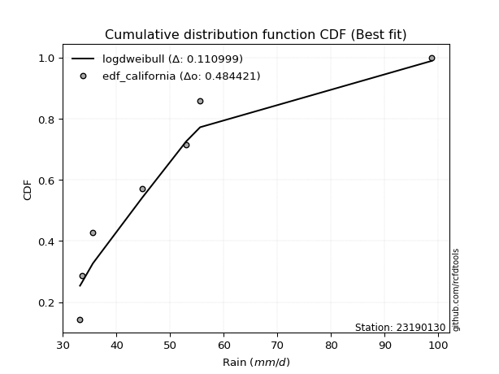</img>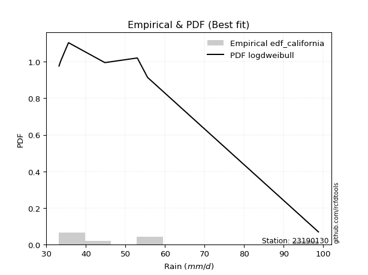</img>

</div>


### 2. Empirical - EDF Hazen (1930)

Hazen method for plotting positions is a formula used to estimate the empirical cumulative probability distribution of flood events or other hydrological data. This formula often results in biased estimations, particularly when extrapolating to extreme events (high return periods).

<div align="center">


$P=(m-0.5)/n$


</div>


**2.1. Empirical values**

<div align="center">

|                | 0                   | 1                   | 2                   | 3         | 4                  | 5                  | 6                  |
|:---------------|:--------------------|:--------------------|:--------------------|:----------|:-------------------|:-------------------|:-------------------|
| date           | 2022                | 2021                | 2023                | 2020      | 2025               | 2019               | 2024               |
| x              | 33.2                | 33.6                | 35.6                | 44.8      | 53.0               | 55.6               | 98.8               |
| m              | 1                   | 2                   | 3                   | 4         | 5                  | 6                  | 7                  |
| empirical_dist | edf_hazen           | edf_hazen           | edf_hazen           | edf_hazen | edf_hazen          | edf_hazen          | edf_hazen          |
| empirical      | 0.07142857142857142 | 0.21428571428571427 | 0.35714285714285715 | 0.5       | 0.6428571428571429 | 0.7857142857142857 | 0.9285714285714286 |
| empirical_tr   | 1.0769230769230769  | 1.2727272727272727  | 1.5555555555555558  | 2.0       | 2.8000000000000003 | 4.666666666666666  | 14.000000000000007 |

</div>


**2.2. Kolmogorov-Smirnov fit test (sorted by Δ)**


<div align="center">

|                | 0                   | 1                   | 2                   | 3                   | 4                   | 5                   | 6                   | 7                   | 8                   | 9                   | 10                  | 11                  | 12                  | 13                  | 14                  | 15                  | 16                  | 17                  | 18                  | 19                  | 20                  | 21                  | 22                  | 23                  | 24                  | 25                  | 26                  | 27                  | 28                  | 29                  | 30                  | 31                  | 32                  | 33                  | 34                  | 35                    | 36                  | 37                  | 38                  | 39                  | 40                  | 41                  | 42                  | 43                  | 44                  | 45                  | 46                  | 47                  | 48                  | 49                  | 50                  | 51                  | 52                  | 53                  | 54                  | 55                  | 56                  | 57                  | 58                  | 59                  | 60                  | 61                  | 62                  | 63                  | 64                  | 65                  | 66                  | 67                  | 68                  | 69                  | 70                  | 71                  | 72                  | 73                  | 74                  | 75                  | 76                  | 77                  | 78                  | 79                  | 80                  | 81                  | 82                  | 83                  | 84                  | 85                  | 86                  | 87                  | 88                  | 89                  |
|:---------------|:--------------------|:--------------------|:--------------------|:--------------------|:--------------------|:--------------------|:--------------------|:--------------------|:--------------------|:--------------------|:--------------------|:--------------------|:--------------------|:--------------------|:--------------------|:--------------------|:--------------------|:--------------------|:--------------------|:--------------------|:--------------------|:--------------------|:--------------------|:--------------------|:--------------------|:--------------------|:--------------------|:--------------------|:--------------------|:--------------------|:--------------------|:--------------------|:--------------------|:--------------------|:--------------------|:----------------------|:--------------------|:--------------------|:--------------------|:--------------------|:--------------------|:--------------------|:--------------------|:--------------------|:--------------------|:--------------------|:--------------------|:--------------------|:--------------------|:--------------------|:--------------------|:--------------------|:--------------------|:--------------------|:--------------------|:--------------------|:--------------------|:--------------------|:--------------------|:--------------------|:--------------------|:--------------------|:--------------------|:--------------------|:--------------------|:--------------------|:--------------------|:--------------------|:--------------------|:--------------------|:--------------------|:--------------------|:--------------------|:--------------------|:--------------------|:--------------------|:--------------------|:--------------------|:--------------------|:--------------------|:--------------------|:--------------------|:--------------------|:--------------------|:--------------------|:--------------------|:--------------------|:--------------------|:--------------------|:--------------------|
| station        | 23190130            | 23190130            | 23190130            | 23190130            | 23190130            | 23190130            | 23190130            | 23190130            | 23190130            | 23190130            | 23190130            | 23190130            | 23190130            | 23190130            | 23190130            | 23190130            | 23190130            | 23190130            | 23190130            | 23190130            | 23190130            | 23190130            | 23190130            | 23190130            | 23190130            | 23190130            | 23190130            | 23190130            | 23190130            | 23190130            | 23190130            | 23190130            | 23190130            | 23190130            | 23190130            | 23190130              | 23190130            | 23190130            | 23190130            | 23190130            | 23190130            | 23190130            | 23190130            | 23190130            | 23190130            | 23190130            | 23190130            | 23190130            | 23190130            | 23190130            | 23190130            | 23190130            | 23190130            | 23190130            | 23190130            | 23190130            | 23190130            | 23190130            | 23190130            | 23190130            | 23190130            | 23190130            | 23190130            | 23190130            | 23190130            | 23190130            | 23190130            | 23190130            | 23190130            | 23190130            | 23190130            | 23190130            | 23190130            | 23190130            | 23190130            | 23190130            | 23190130            | 23190130            | 23190130            | 23190130            | 23190130            | 23190130            | 23190130            | 23190130            | 23190130            | 23190130            | 23190130            | 23190130            | 23190130            | 23190130            |
| empirical_dist | edf_hazen           | edf_hazen           | edf_hazen           | edf_hazen           | edf_hazen           | edf_hazen           | edf_hazen           | edf_hazen           | edf_hazen           | edf_hazen           | edf_hazen           | edf_hazen           | edf_hazen           | edf_hazen           | edf_hazen           | edf_hazen           | edf_hazen           | edf_hazen           | edf_hazen           | edf_hazen           | edf_hazen           | edf_hazen           | edf_hazen           | edf_hazen           | edf_hazen           | edf_hazen           | edf_hazen           | edf_hazen           | edf_hazen           | edf_hazen           | edf_hazen           | edf_hazen           | edf_hazen           | edf_hazen           | edf_hazen           | edf_hazen             | edf_hazen           | edf_hazen           | edf_hazen           | edf_hazen           | edf_hazen           | edf_hazen           | edf_hazen           | edf_hazen           | edf_hazen           | edf_hazen           | edf_hazen           | edf_hazen           | edf_hazen           | edf_hazen           | edf_hazen           | edf_hazen           | edf_hazen           | edf_hazen           | edf_hazen           | edf_hazen           | edf_hazen           | edf_hazen           | edf_hazen           | edf_hazen           | edf_hazen           | edf_hazen           | edf_hazen           | edf_hazen           | edf_hazen           | edf_hazen           | edf_hazen           | edf_hazen           | edf_hazen           | edf_hazen           | edf_hazen           | edf_hazen           | edf_hazen           | edf_hazen           | edf_hazen           | edf_hazen           | edf_hazen           | edf_hazen           | edf_hazen           | edf_hazen           | edf_hazen           | edf_hazen           | edf_hazen           | edf_hazen           | edf_hazen           | edf_hazen           | edf_hazen           | edf_hazen           | edf_hazen           | edf_hazen           |
| p_dist         | loghalfnorm         | lognakagami         | lograyleigh         | moyal               | logmaxwell          | loghalflogistic     | nakagami            | logpearson3         | logloggamma         | gumbel_r            | logmielke           | pearson3            | logcrystalball      | lognorm             | lognorm             | logt                | loggumbel_r         | logbetaprime        | halflogistic        | betaprime           | lognct              | logalpha            | nct                 | logmoyal            | logfisk             | mielke              | loggenlogistic      | genlogistic         | rayleigh            | t                   | loglogistic         | logkstwobign        | maxwell             | halfnorm            | loggumbel_l         | loglaplace_asymmetric | kstwobign           | laplace             | hypsecant           | pareto              | loghypsecant        | logpareto           | logexponnorm        | loggenexpon         | logexpon            | logistic            | rice                | logrice             | alpha               | loglaplace          | logtruncnorm        | norm                | crystalball         | wald                | invgamma            | f                   | logf                | loginvgamma         | weibull_min         | gamma               | erlang              | exponnorm           | genexpon            | expon               | laplace_asymmetric  | loginvgauss         | invgauss            | gompertz            | logncf              | loggompertz         | truncnorm           | gumbel_l            | logweibull_min      | logchi2             | fisk                | loggamma            | loggamma            | logwald             | logfatiguelife      | gibrat              | logerlang           | fatiguelife         | loglognorm          | loggibrat           | ncf                 | invweibull          | chi2                | johnsonsu           | logjohnsonsu        | loginvweibull       |
| delta          | 0.10043958269666547 | 0.10321667873037976 | 0.11645096328273041 | 0.11829922350368291 | 0.1232560106520286  | 0.12467938517991797 | 0.12653907542869536 | 0.1277197980559101  | 0.12985314256499353 | 0.13071173219804522 | 0.1350379656874462  | 0.13605835081607465 | 0.1395459118583715  | 0.1395459199699825  | 0.1395459199699825  | 0.1395459520080662  | 0.14005525920400266 | 0.14043219290055722 | 0.14125278211460945 | 0.14277891946062288 | 0.14533583595353944 | 0.14953412796868726 | 0.14954414784236267 | 0.14967383850477273 | 0.15011434122495548 | 0.1550616628185127  | 0.15508786327790894 | 0.15716727646763548 | 0.1585777776958177  | 0.15941683992143335 | 0.1617545100431998  | 0.16489415585522493 | 0.16709053651272698 | 0.16899452494822167 | 0.17066634834786396 | 0.17136712199742277   | 0.17159426279510814 | 0.1723284414054597  | 0.1726576425496995  | 0.1733313069271416  | 0.17537632699996222 | 0.1768164871142198  | 0.18001971266904646 | 0.18071046181052636 | 0.18071892669041567 | 0.18246331141835048 | 0.18405193037900702 | 0.18482096526378503 | 0.19021757409851503 | 0.19129876593763478 | 0.19171185935856505 | 0.1943627429434448  | 0.1943627621192644  | 0.19544133527934407 | 0.2057132069561014  | 0.20571592135640104 | 0.20798165307397998 | 0.2079907062240839  | 0.2111918071203738  | 0.21158309080943172 | 0.21320739008287992 | 0.22686403901195568 | 0.22869479592297343 | 0.22869503740321265 | 0.2286996600063152  | 0.22922859462420486 | 0.232176761556661   | 0.2331407400559511  | 0.24462313683834477 | 0.24935317081917038 | 0.2512161165695447  | 0.2556821726704396  | 0.2564613642242224  | 0.25917586481990085 | 0.2661486781002542  | 0.26737563759971283 | 0.26737563759971283 | 0.2749710500040865  | 0.3368546592464251  | 0.33732459063513    | 0.3441741596328214  | 0.3442705955426907  | 0.35251867534903114 | 0.35714285714285715 | 0.4016397353144364  | 0.40175602518905973 | 0.4198519917025493  | 0.4733653485457061  | 0.5857889221458115  | 0.7031430437619705  |
| deltao         | 0.48442053926100004 | 0.48442053926100004 | 0.48442053926100004 | 0.48442053926100004 | 0.48442053926100004 | 0.48442053926100004 | 0.48442053926100004 | 0.48442053926100004 | 0.48442053926100004 | 0.48442053926100004 | 0.48442053926100004 | 0.48442053926100004 | 0.48442053926100004 | 0.48442053926100004 | 0.48442053926100004 | 0.48442053926100004 | 0.48442053926100004 | 0.48442053926100004 | 0.48442053926100004 | 0.48442053926100004 | 0.48442053926100004 | 0.48442053926100004 | 0.48442053926100004 | 0.48442053926100004 | 0.48442053926100004 | 0.48442053926100004 | 0.48442053926100004 | 0.48442053926100004 | 0.48442053926100004 | 0.48442053926100004 | 0.48442053926100004 | 0.48442053926100004 | 0.48442053926100004 | 0.48442053926100004 | 0.48442053926100004 | 0.48442053926100004   | 0.48442053926100004 | 0.48442053926100004 | 0.48442053926100004 | 0.48442053926100004 | 0.48442053926100004 | 0.48442053926100004 | 0.48442053926100004 | 0.48442053926100004 | 0.48442053926100004 | 0.48442053926100004 | 0.48442053926100004 | 0.48442053926100004 | 0.48442053926100004 | 0.48442053926100004 | 0.48442053926100004 | 0.48442053926100004 | 0.48442053926100004 | 0.48442053926100004 | 0.48442053926100004 | 0.48442053926100004 | 0.48442053926100004 | 0.48442053926100004 | 0.48442053926100004 | 0.48442053926100004 | 0.48442053926100004 | 0.48442053926100004 | 0.48442053926100004 | 0.48442053926100004 | 0.48442053926100004 | 0.48442053926100004 | 0.48442053926100004 | 0.48442053926100004 | 0.48442053926100004 | 0.48442053926100004 | 0.48442053926100004 | 0.48442053926100004 | 0.48442053926100004 | 0.48442053926100004 | 0.48442053926100004 | 0.48442053926100004 | 0.48442053926100004 | 0.48442053926100004 | 0.48442053926100004 | 0.48442053926100004 | 0.48442053926100004 | 0.48442053926100004 | 0.48442053926100004 | 0.48442053926100004 | 0.48442053926100004 | 0.48442053926100004 | 0.48442053926100004 | 0.48442053926100004 | 0.48442053926100004 | 0.48442053926100004 |
| eval           | Δo > Δ              | Δo > Δ              | Δo > Δ              | Δo > Δ              | Δo > Δ              | Δo > Δ              | Δo > Δ              | Δo > Δ              | Δo > Δ              | Δo > Δ              | Δo > Δ              | Δo > Δ              | Δo > Δ              | Δo > Δ              | Δo > Δ              | Δo > Δ              | Δo > Δ              | Δo > Δ              | Δo > Δ              | Δo > Δ              | Δo > Δ              | Δo > Δ              | Δo > Δ              | Δo > Δ              | Δo > Δ              | Δo > Δ              | Δo > Δ              | Δo > Δ              | Δo > Δ              | Δo > Δ              | Δo > Δ              | Δo > Δ              | Δo > Δ              | Δo > Δ              | Δo > Δ              | Δo > Δ                | Δo > Δ              | Δo > Δ              | Δo > Δ              | Δo > Δ              | Δo > Δ              | Δo > Δ              | Δo > Δ              | Δo > Δ              | Δo > Δ              | Δo > Δ              | Δo > Δ              | Δo > Δ              | Δo > Δ              | Δo > Δ              | Δo > Δ              | Δo > Δ              | Δo > Δ              | Δo > Δ              | Δo > Δ              | Δo > Δ              | Δo > Δ              | Δo > Δ              | Δo > Δ              | Δo > Δ              | Δo > Δ              | Δo > Δ              | Δo > Δ              | Δo > Δ              | Δo > Δ              | Δo > Δ              | Δo > Δ              | Δo > Δ              | Δo > Δ              | Δo > Δ              | Δo > Δ              | Δo > Δ              | Δo > Δ              | Δo > Δ              | Δo > Δ              | Δo > Δ              | Δo > Δ              | Δo > Δ              | Δo > Δ              | Δo > Δ              | Δo > Δ              | Δo > Δ              | Δo > Δ              | Δo > Δ              | Δo > Δ              | Δo > Δ              | Δo > Δ              | Δo > Δ              | Δo <= Δ             | Δo <= Δ             |
| fit            | 1                   | 1                   | 1                   | 1                   | 1                   | 1                   | 1                   | 1                   | 1                   | 1                   | 1                   | 1                   | 1                   | 1                   | 1                   | 1                   | 1                   | 1                   | 1                   | 1                   | 1                   | 1                   | 1                   | 1                   | 1                   | 1                   | 1                   | 1                   | 1                   | 1                   | 1                   | 1                   | 1                   | 1                   | 1                   | 1                     | 1                   | 1                   | 1                   | 1                   | 1                   | 1                   | 1                   | 1                   | 1                   | 1                   | 1                   | 1                   | 1                   | 1                   | 1                   | 1                   | 1                   | 1                   | 1                   | 1                   | 1                   | 1                   | 1                   | 1                   | 1                   | 1                   | 1                   | 1                   | 1                   | 1                   | 1                   | 1                   | 1                   | 1                   | 1                   | 1                   | 1                   | 1                   | 1                   | 1                   | 1                   | 1                   | 1                   | 1                   | 1                   | 1                   | 1                   | 1                   | 1                   | 1                   | 1                   | 1                   | 0                   | 0                   |
| n              | 7                   | 7                   | 7                   | 7                   | 7                   | 7                   | 7                   | 7                   | 7                   | 7                   | 7                   | 7                   | 7                   | 7                   | 7                   | 7                   | 7                   | 7                   | 7                   | 7                   | 7                   | 7                   | 7                   | 7                   | 7                   | 7                   | 7                   | 7                   | 7                   | 7                   | 7                   | 7                   | 7                   | 7                   | 7                   | 7                     | 7                   | 7                   | 7                   | 7                   | 7                   | 7                   | 7                   | 7                   | 7                   | 7                   | 7                   | 7                   | 7                   | 7                   | 7                   | 7                   | 7                   | 7                   | 7                   | 7                   | 7                   | 7                   | 7                   | 7                   | 7                   | 7                   | 7                   | 7                   | 7                   | 7                   | 7                   | 7                   | 7                   | 7                   | 7                   | 7                   | 7                   | 7                   | 7                   | 7                   | 7                   | 7                   | 7                   | 7                   | 7                   | 7                   | 7                   | 7                   | 7                   | 7                   | 7                   | 7                   | 7                   | 7                   |
| best_fit       | 1                   | 0                   | 0                   | 0                   | 0                   | 0                   | 0                   | 0                   | 0                   | 0                   | 0                   | 0                   | 0                   | 0                   | 0                   | 0                   | 0                   | 0                   | 0                   | 0                   | 0                   | 0                   | 0                   | 0                   | 0                   | 0                   | 0                   | 0                   | 0                   | 0                   | 0                   | 0                   | 0                   | 0                   | 0                   | 0                     | 0                   | 0                   | 0                   | 0                   | 0                   | 0                   | 0                   | 0                   | 0                   | 0                   | 0                   | 0                   | 0                   | 0                   | 0                   | 0                   | 0                   | 0                   | 0                   | 0                   | 0                   | 0                   | 0                   | 0                   | 0                   | 0                   | 0                   | 0                   | 0                   | 0                   | 0                   | 0                   | 0                   | 0                   | 0                   | 0                   | 0                   | 0                   | 0                   | 0                   | 0                   | 0                   | 0                   | 0                   | 0                   | 0                   | 0                   | 0                   | 0                   | 0                   | 0                   | 0                   | 0                   | 0                   |
| best_fit_sort  | 1                   | 2                   | 3                   | 4                   | 5                   | 6                   | 7                   | 8                   | 9                   | 10                  | 11                  | 12                  | 13                  | 14                  | 15                  | 16                  | 17                  | 18                  | 19                  | 20                  | 21                  | 22                  | 23                  | 24                  | 25                  | 26                  | 27                  | 28                  | 29                  | 30                  | 31                  | 32                  | 33                  | 34                  | 35                  | 36                    | 37                  | 38                  | 39                  | 40                  | 41                  | 42                  | 43                  | 44                  | 45                  | 46                  | 47                  | 48                  | 49                  | 50                  | 51                  | 52                  | 53                  | 54                  | 55                  | 56                  | 57                  | 58                  | 59                  | 60                  | 61                  | 62                  | 63                  | 64                  | 65                  | 66                  | 67                  | 68                  | 69                  | 70                  | 71                  | 72                  | 73                  | 74                  | 75                  | 76                  | 77                  | 78                  | 79                  | 80                  | 81                  | 82                  | 83                  | 84                  | 85                  | 86                  | 87                  | 88                  | 89                  | 90                  |

</div>


<div align="center">

</img>

</div>


**2.3. Best fit**

<div align="center">

|   id |   station | empirical_dist   | p_dist      |   delta |   deltao | eval   |   fit |   n |   best_fit |   best_fit_sort |
|-----:|----------:|:-----------------|:------------|--------:|---------:|:-------|------:|----:|-----------:|----------------:|
|    0 |  23190130 | edf_hazen        | loghalfnorm | 0.10044 | 0.484421 | Δo > Δ |     1 |   7 |          1 |               1 |

</div>


<div align="center">

</img></img>

</div>


### 3. Empirical - EDF Weibull (1939)

Weibull plotting position formula is an empirical method used to estimate the non-exceedance probability or plotting position for a set of observed data, is often recommended or widely used in practice, particularly in flood frequency analysis.

<div align="center">


$P=m/(n+1)$


</div>


**3.1. Empirical values**

<div align="center">

|                | 0                  | 1                  | 2           | 3           | 4                  | 5           | 6           |
|:---------------|:-------------------|:-------------------|:------------|:------------|:-------------------|:------------|:------------|
| date           | 2022               | 2021               | 2023        | 2020        | 2025               | 2019        | 2024        |
| x              | 33.2               | 33.6               | 35.6        | 44.8        | 53.0               | 55.6        | 98.8        |
| m              | 1                  | 2                  | 3           | 4           | 5                  | 6           | 7           |
| empirical_dist | edf_weibull        | edf_weibull        | edf_weibull | edf_weibull | edf_weibull        | edf_weibull | edf_weibull |
| empirical      | 0.125              | 0.25               | 0.375       | 0.5         | 0.625              | 0.75        | 0.875       |
| empirical_tr   | 1.1428571428571428 | 1.3333333333333333 | 1.6         | 2.0         | 2.6666666666666665 | 4.0         | 8.0         |

</div>


**3.2. Kolmogorov-Smirnov fit test (sorted by Δ)**


<div align="center">

|                | 0                   | 1                   | 2                   | 3                   | 4                   | 5                   | 6                   | 7                   | 8                   | 9                   | 10                  | 11                  | 12                  | 13                  | 14                  | 15                  | 16                  | 17                  | 18                  | 19                  | 20                  | 21                  | 22                  | 23                  | 24                  | 25                  | 26                  | 27                  | 28                  | 29                  | 30                  | 31                  | 32                  | 33                  | 34                  | 35                  | 36                  | 37                  | 38                  | 39                  | 40                    | 41                  | 42                  | 43                  | 44                  | 45                  | 46                  | 47                  | 48                  | 49                  | 50                  | 51                  | 52                  | 53                  | 54                  | 55                  | 56                  | 57                  | 58                  | 59                  | 60                  | 61                  | 62                  | 63                  | 64                  | 65                  | 66                  | 67                  | 68                  | 69                  | 70                  | 71                  | 72                  | 73                  | 74                  | 75                  | 76                  | 77                  | 78                  | 79                  | 80                  | 81                  | 82                  | 83                  | 84                  | 85                  | 86                  | 87                  | 88                  | 89                  |
|:---------------|:--------------------|:--------------------|:--------------------|:--------------------|:--------------------|:--------------------|:--------------------|:--------------------|:--------------------|:--------------------|:--------------------|:--------------------|:--------------------|:--------------------|:--------------------|:--------------------|:--------------------|:--------------------|:--------------------|:--------------------|:--------------------|:--------------------|:--------------------|:--------------------|:--------------------|:--------------------|:--------------------|:--------------------|:--------------------|:--------------------|:--------------------|:--------------------|:--------------------|:--------------------|:--------------------|:--------------------|:--------------------|:--------------------|:--------------------|:--------------------|:----------------------|:--------------------|:--------------------|:--------------------|:--------------------|:--------------------|:--------------------|:--------------------|:--------------------|:--------------------|:--------------------|:--------------------|:--------------------|:--------------------|:--------------------|:--------------------|:--------------------|:--------------------|:--------------------|:--------------------|:--------------------|:--------------------|:--------------------|:--------------------|:--------------------|:--------------------|:--------------------|:--------------------|:--------------------|:--------------------|:--------------------|:--------------------|:--------------------|:--------------------|:--------------------|:--------------------|:--------------------|:--------------------|:--------------------|:--------------------|:--------------------|:--------------------|:--------------------|:--------------------|:--------------------|:--------------------|:--------------------|:--------------------|:--------------------|:--------------------|
| station        | 23190130            | 23190130            | 23190130            | 23190130            | 23190130            | 23190130            | 23190130            | 23190130            | 23190130            | 23190130            | 23190130            | 23190130            | 23190130            | 23190130            | 23190130            | 23190130            | 23190130            | 23190130            | 23190130            | 23190130            | 23190130            | 23190130            | 23190130            | 23190130            | 23190130            | 23190130            | 23190130            | 23190130            | 23190130            | 23190130            | 23190130            | 23190130            | 23190130            | 23190130            | 23190130            | 23190130            | 23190130            | 23190130            | 23190130            | 23190130            | 23190130              | 23190130            | 23190130            | 23190130            | 23190130            | 23190130            | 23190130            | 23190130            | 23190130            | 23190130            | 23190130            | 23190130            | 23190130            | 23190130            | 23190130            | 23190130            | 23190130            | 23190130            | 23190130            | 23190130            | 23190130            | 23190130            | 23190130            | 23190130            | 23190130            | 23190130            | 23190130            | 23190130            | 23190130            | 23190130            | 23190130            | 23190130            | 23190130            | 23190130            | 23190130            | 23190130            | 23190130            | 23190130            | 23190130            | 23190130            | 23190130            | 23190130            | 23190130            | 23190130            | 23190130            | 23190130            | 23190130            | 23190130            | 23190130            | 23190130            |
| empirical_dist | edf_weibull         | edf_weibull         | edf_weibull         | edf_weibull         | edf_weibull         | edf_weibull         | edf_weibull         | edf_weibull         | edf_weibull         | edf_weibull         | edf_weibull         | edf_weibull         | edf_weibull         | edf_weibull         | edf_weibull         | edf_weibull         | edf_weibull         | edf_weibull         | edf_weibull         | edf_weibull         | edf_weibull         | edf_weibull         | edf_weibull         | edf_weibull         | edf_weibull         | edf_weibull         | edf_weibull         | edf_weibull         | edf_weibull         | edf_weibull         | edf_weibull         | edf_weibull         | edf_weibull         | edf_weibull         | edf_weibull         | edf_weibull         | edf_weibull         | edf_weibull         | edf_weibull         | edf_weibull         | edf_weibull           | edf_weibull         | edf_weibull         | edf_weibull         | edf_weibull         | edf_weibull         | edf_weibull         | edf_weibull         | edf_weibull         | edf_weibull         | edf_weibull         | edf_weibull         | edf_weibull         | edf_weibull         | edf_weibull         | edf_weibull         | edf_weibull         | edf_weibull         | edf_weibull         | edf_weibull         | edf_weibull         | edf_weibull         | edf_weibull         | edf_weibull         | edf_weibull         | edf_weibull         | edf_weibull         | edf_weibull         | edf_weibull         | edf_weibull         | edf_weibull         | edf_weibull         | edf_weibull         | edf_weibull         | edf_weibull         | edf_weibull         | edf_weibull         | edf_weibull         | edf_weibull         | edf_weibull         | edf_weibull         | edf_weibull         | edf_weibull         | edf_weibull         | edf_weibull         | edf_weibull         | edf_weibull         | edf_weibull         | edf_weibull         | edf_weibull         |
| p_dist         | halflogistic        | pearson3            | halfnorm            | loghalfnorm         | rayleigh            | gumbel_r            | lognakagami         | moyal               | maxwell             | logfisk             | lograyleigh         | t                   | logmaxwell          | nakagami            | loghalflogistic     | logpearson3         | logloggamma         | logalpha            | logmielke           | logistic            | logcrystalball      | lognorm             | lognorm             | logt                | loggumbel_r         | logbetaprime        | norm                | crystalball         | betaprime           | lognct              | nct                 | logmoyal            | hypsecant           | mielke              | loggenlogistic      | genlogistic         | pareto              | loglogistic         | logkstwobign        | loggumbel_l         | loglaplace_asymmetric | kstwobign           | laplace             | alpha               | logncf              | loghypsecant        | rice                | logrice             | invgamma            | f                   | logf                | loginvgamma         | loglaplace          | logpareto           | erlang              | wald                | logexponnorm        | loggenexpon         | logexpon            | logtruncnorm        | gumbel_l            | logchi2             | gamma               | weibull_min         | loginvgauss         | fisk                | invgauss            | exponnorm           | genexpon            | expon               | laplace_asymmetric  | gompertz            | logweibull_min      | loggompertz         | loggamma            | loggamma            | truncnorm           | logwald             | logfatiguelife      | fatiguelife         | loglognorm          | logerlang           | ncf                 | invweibull          | gibrat              | loggibrat           | chi2                | johnsonsu           | logjohnsonsu        | loginvweibull       |
| delta          | 0.10063409845661203 | 0.10899673612676292 | 0.1154230963767931  | 0.11829672555380832 | 0.12286349198153201 | 0.12456576531775398 | 0.12499899796994364 | 0.12803973721867767 | 0.13137625079844129 | 0.13395379639204746 | 0.13430810613987326 | 0.13492761507820317 | 0.14111315350917145 | 0.14186703911975573 | 0.14253652803706082 | 0.14557694091305295 | 0.14771028542213638 | 0.14953412796868726 | 0.15289510854458904 | 0.15684749679273938 | 0.15740305471551436 | 0.15740306282712535 | 0.15740306282712535 | 0.15740309486520904 | 0.1579124020611455  | 0.15828933575770007 | 0.1586484572291591  | 0.1586484764049787  | 0.16063606231776573 | 0.1631929788106823  | 0.16740129069950552 | 0.16753098136191558 | 0.1714698395977836  | 0.17291880567565554 | 0.1729450061350518  | 0.17502441932477833 | 0.17685242970705384 | 0.17961165290034264 | 0.18275129871236778 | 0.1885234912050068  | 0.18922426485456562   | 0.189451405652251   | 0.19018558426260254 | 0.19021757409851503 | 0.1910517082669162  | 0.19323346985710507 | 0.19957916631394373 | 0.20267810812092787 | 0.2057132069561014  | 0.20571592135640104 | 0.20798165307397998 | 0.2079907062240839  | 0.20915590879477763 | 0.21253077282850552 | 0.21320739008287992 | 0.21329847813648692 | 0.21573399838333218 | 0.21642474752481208 | 0.2164332124047014  | 0.2197115664303287  | 0.21996788695615388 | 0.22346157910561515 | 0.22547939366021075 | 0.22904894997751665 | 0.22922859462420486 | 0.23043439238596852 | 0.232176761556661   | 0.24472118186909853 | 0.24655193878011628 | 0.2465521802603555  | 0.24655680286345805 | 0.25099788291309394 | 0.2564613642242224  | 0.2672103136763132  | 0.26737563759971283 | 0.26737563759971283 | 0.2690732594266875  | 0.2928281928612294  | 0.3011403735321394  | 0.308556309828405   | 0.31680438963474544 | 0.3441741596328214  | 0.3480683067430078  | 0.3481845966176311  | 0.35518173349227283 | 0.375               | 0.4198519917025493  | 0.4376510628314204  | 0.5500746364315258  | 0.6674287580476848  |
| deltao         | 0.48442053926100004 | 0.48442053926100004 | 0.48442053926100004 | 0.48442053926100004 | 0.48442053926100004 | 0.48442053926100004 | 0.48442053926100004 | 0.48442053926100004 | 0.48442053926100004 | 0.48442053926100004 | 0.48442053926100004 | 0.48442053926100004 | 0.48442053926100004 | 0.48442053926100004 | 0.48442053926100004 | 0.48442053926100004 | 0.48442053926100004 | 0.48442053926100004 | 0.48442053926100004 | 0.48442053926100004 | 0.48442053926100004 | 0.48442053926100004 | 0.48442053926100004 | 0.48442053926100004 | 0.48442053926100004 | 0.48442053926100004 | 0.48442053926100004 | 0.48442053926100004 | 0.48442053926100004 | 0.48442053926100004 | 0.48442053926100004 | 0.48442053926100004 | 0.48442053926100004 | 0.48442053926100004 | 0.48442053926100004 | 0.48442053926100004 | 0.48442053926100004 | 0.48442053926100004 | 0.48442053926100004 | 0.48442053926100004 | 0.48442053926100004   | 0.48442053926100004 | 0.48442053926100004 | 0.48442053926100004 | 0.48442053926100004 | 0.48442053926100004 | 0.48442053926100004 | 0.48442053926100004 | 0.48442053926100004 | 0.48442053926100004 | 0.48442053926100004 | 0.48442053926100004 | 0.48442053926100004 | 0.48442053926100004 | 0.48442053926100004 | 0.48442053926100004 | 0.48442053926100004 | 0.48442053926100004 | 0.48442053926100004 | 0.48442053926100004 | 0.48442053926100004 | 0.48442053926100004 | 0.48442053926100004 | 0.48442053926100004 | 0.48442053926100004 | 0.48442053926100004 | 0.48442053926100004 | 0.48442053926100004 | 0.48442053926100004 | 0.48442053926100004 | 0.48442053926100004 | 0.48442053926100004 | 0.48442053926100004 | 0.48442053926100004 | 0.48442053926100004 | 0.48442053926100004 | 0.48442053926100004 | 0.48442053926100004 | 0.48442053926100004 | 0.48442053926100004 | 0.48442053926100004 | 0.48442053926100004 | 0.48442053926100004 | 0.48442053926100004 | 0.48442053926100004 | 0.48442053926100004 | 0.48442053926100004 | 0.48442053926100004 | 0.48442053926100004 | 0.48442053926100004 |
| eval           | Δo > Δ              | Δo > Δ              | Δo > Δ              | Δo > Δ              | Δo > Δ              | Δo > Δ              | Δo > Δ              | Δo > Δ              | Δo > Δ              | Δo > Δ              | Δo > Δ              | Δo > Δ              | Δo > Δ              | Δo > Δ              | Δo > Δ              | Δo > Δ              | Δo > Δ              | Δo > Δ              | Δo > Δ              | Δo > Δ              | Δo > Δ              | Δo > Δ              | Δo > Δ              | Δo > Δ              | Δo > Δ              | Δo > Δ              | Δo > Δ              | Δo > Δ              | Δo > Δ              | Δo > Δ              | Δo > Δ              | Δo > Δ              | Δo > Δ              | Δo > Δ              | Δo > Δ              | Δo > Δ              | Δo > Δ              | Δo > Δ              | Δo > Δ              | Δo > Δ              | Δo > Δ                | Δo > Δ              | Δo > Δ              | Δo > Δ              | Δo > Δ              | Δo > Δ              | Δo > Δ              | Δo > Δ              | Δo > Δ              | Δo > Δ              | Δo > Δ              | Δo > Δ              | Δo > Δ              | Δo > Δ              | Δo > Δ              | Δo > Δ              | Δo > Δ              | Δo > Δ              | Δo > Δ              | Δo > Δ              | Δo > Δ              | Δo > Δ              | Δo > Δ              | Δo > Δ              | Δo > Δ              | Δo > Δ              | Δo > Δ              | Δo > Δ              | Δo > Δ              | Δo > Δ              | Δo > Δ              | Δo > Δ              | Δo > Δ              | Δo > Δ              | Δo > Δ              | Δo > Δ              | Δo > Δ              | Δo > Δ              | Δo > Δ              | Δo > Δ              | Δo > Δ              | Δo > Δ              | Δo > Δ              | Δo > Δ              | Δo > Δ              | Δo > Δ              | Δo > Δ              | Δo > Δ              | Δo <= Δ             | Δo <= Δ             |
| fit            | 1                   | 1                   | 1                   | 1                   | 1                   | 1                   | 1                   | 1                   | 1                   | 1                   | 1                   | 1                   | 1                   | 1                   | 1                   | 1                   | 1                   | 1                   | 1                   | 1                   | 1                   | 1                   | 1                   | 1                   | 1                   | 1                   | 1                   | 1                   | 1                   | 1                   | 1                   | 1                   | 1                   | 1                   | 1                   | 1                   | 1                   | 1                   | 1                   | 1                   | 1                     | 1                   | 1                   | 1                   | 1                   | 1                   | 1                   | 1                   | 1                   | 1                   | 1                   | 1                   | 1                   | 1                   | 1                   | 1                   | 1                   | 1                   | 1                   | 1                   | 1                   | 1                   | 1                   | 1                   | 1                   | 1                   | 1                   | 1                   | 1                   | 1                   | 1                   | 1                   | 1                   | 1                   | 1                   | 1                   | 1                   | 1                   | 1                   | 1                   | 1                   | 1                   | 1                   | 1                   | 1                   | 1                   | 1                   | 1                   | 0                   | 0                   |
| n              | 7                   | 7                   | 7                   | 7                   | 7                   | 7                   | 7                   | 7                   | 7                   | 7                   | 7                   | 7                   | 7                   | 7                   | 7                   | 7                   | 7                   | 7                   | 7                   | 7                   | 7                   | 7                   | 7                   | 7                   | 7                   | 7                   | 7                   | 7                   | 7                   | 7                   | 7                   | 7                   | 7                   | 7                   | 7                   | 7                   | 7                   | 7                   | 7                   | 7                   | 7                     | 7                   | 7                   | 7                   | 7                   | 7                   | 7                   | 7                   | 7                   | 7                   | 7                   | 7                   | 7                   | 7                   | 7                   | 7                   | 7                   | 7                   | 7                   | 7                   | 7                   | 7                   | 7                   | 7                   | 7                   | 7                   | 7                   | 7                   | 7                   | 7                   | 7                   | 7                   | 7                   | 7                   | 7                   | 7                   | 7                   | 7                   | 7                   | 7                   | 7                   | 7                   | 7                   | 7                   | 7                   | 7                   | 7                   | 7                   | 7                   | 7                   |
| best_fit       | 1                   | 0                   | 0                   | 0                   | 0                   | 0                   | 0                   | 0                   | 0                   | 0                   | 0                   | 0                   | 0                   | 0                   | 0                   | 0                   | 0                   | 0                   | 0                   | 0                   | 0                   | 0                   | 0                   | 0                   | 0                   | 0                   | 0                   | 0                   | 0                   | 0                   | 0                   | 0                   | 0                   | 0                   | 0                   | 0                   | 0                   | 0                   | 0                   | 0                   | 0                     | 0                   | 0                   | 0                   | 0                   | 0                   | 0                   | 0                   | 0                   | 0                   | 0                   | 0                   | 0                   | 0                   | 0                   | 0                   | 0                   | 0                   | 0                   | 0                   | 0                   | 0                   | 0                   | 0                   | 0                   | 0                   | 0                   | 0                   | 0                   | 0                   | 0                   | 0                   | 0                   | 0                   | 0                   | 0                   | 0                   | 0                   | 0                   | 0                   | 0                   | 0                   | 0                   | 0                   | 0                   | 0                   | 0                   | 0                   | 0                   | 0                   |
| best_fit_sort  | 1                   | 2                   | 3                   | 4                   | 5                   | 6                   | 7                   | 8                   | 9                   | 10                  | 11                  | 12                  | 13                  | 14                  | 15                  | 16                  | 17                  | 18                  | 19                  | 20                  | 21                  | 22                  | 23                  | 24                  | 25                  | 26                  | 27                  | 28                  | 29                  | 30                  | 31                  | 32                  | 33                  | 34                  | 35                  | 36                  | 37                  | 38                  | 39                  | 40                  | 41                    | 42                  | 43                  | 44                  | 45                  | 46                  | 47                  | 48                  | 49                  | 50                  | 51                  | 52                  | 53                  | 54                  | 55                  | 56                  | 57                  | 58                  | 59                  | 60                  | 61                  | 62                  | 63                  | 64                  | 65                  | 66                  | 67                  | 68                  | 69                  | 70                  | 71                  | 72                  | 73                  | 74                  | 75                  | 76                  | 77                  | 78                  | 79                  | 80                  | 81                  | 82                  | 83                  | 84                  | 85                  | 86                  | 87                  | 88                  | 89                  | 90                  |

</div>


<div align="center">

</img>

</div>


**3.3. Best fit**

<div align="center">

|   id |   station | empirical_dist   | p_dist       |    delta |   deltao | eval   |   fit |   n |   best_fit |   best_fit_sort |
|-----:|----------:|:-----------------|:-------------|---------:|---------:|:-------|------:|----:|-----------:|----------------:|
|    0 |  23190130 | edf_weibull      | halflogistic | 0.100634 | 0.484421 | Δo > Δ |     1 |   7 |          1 |               1 |

</div>


<div align="center">

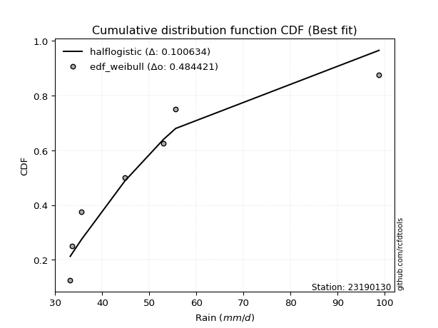</img>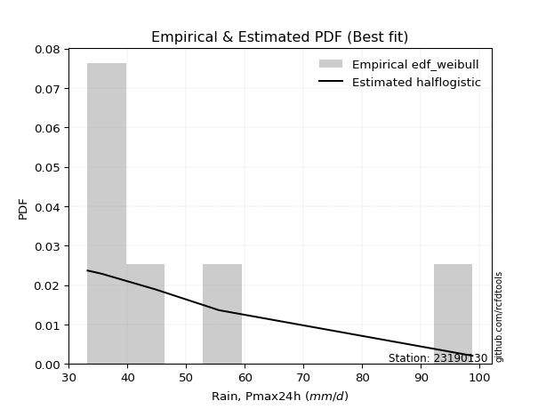</img>

</div>


### 4. Empirical - EDF Beard (1943)

The Beard formula (or Beard´s plotting position formula) in hydrology is used to estimate the empirical non-exceedance probability _(P)_ of a flood event (or other extreme hydrological data point) within a given dataset.

<div align="center">


$P=(m-0.31)/(n+0.38)$


</div>


**4.1. Empirical values**

<div align="center">

|                | 0                   | 1                   | 2                   | 3         | 4                  | 5                  | 6                  |
|:---------------|:--------------------|:--------------------|:--------------------|:----------|:-------------------|:-------------------|:-------------------|
| date           | 2022                | 2021                | 2023                | 2020      | 2025               | 2019               | 2024               |
| x              | 33.2                | 33.6                | 35.6                | 44.8      | 53.0               | 55.6               | 98.8               |
| m              | 1                   | 2                   | 3                   | 4         | 5                  | 6                  | 7                  |
| empirical_dist | edf_beard           | edf_beard           | edf_beard           | edf_beard | edf_beard          | edf_beard          | edf_beard          |
| empirical      | 0.09349593495934959 | 0.22899728997289973 | 0.36449864498644985 | 0.5       | 0.6355013550135502 | 0.7710027100271003 | 0.9065040650406505 |
| empirical_tr   | 1.1031390134529149  | 1.29701230228471    | 1.5735607675906182  | 2.0       | 2.743494423791822  | 4.366863905325444  | 10.695652173913055 |

</div>


**4.2. Kolmogorov-Smirnov fit test (sorted by Δ)**


<div align="center">

|                | 0                   | 1                   | 2                   | 3                   | 4                   | 5                   | 6                   | 7                   | 8                   | 9                   | 10                  | 11                  | 12                  | 13                  | 14                  | 15                  | 16                  | 17                  | 18                  | 19                  | 20                  | 21                  | 22                  | 23                  | 24                  | 25                  | 26                  | 27                  | 28                  | 29                  | 30                  | 31                  | 32                  | 33                  | 34                  | 35                  | 36                  | 37                  | 38                    | 39                  | 40                  | 41                  | 42                  | 43                  | 44                  | 45                  | 46                  | 47                  | 48                  | 49                  | 50                  | 51                  | 52                  | 53                  | 54                  | 55                  | 56                  | 57                  | 58                  | 59                  | 60                  | 61                  | 62                  | 63                  | 64                  | 65                  | 66                  | 67                  | 68                  | 69                  | 70                  | 71                  | 72                  | 73                  | 74                  | 75                  | 76                  | 77                  | 78                  | 79                  | 80                  | 81                  | 82                  | 83                  | 84                  | 85                  | 86                  | 87                  | 88                  | 89                  |
|:---------------|:--------------------|:--------------------|:--------------------|:--------------------|:--------------------|:--------------------|:--------------------|:--------------------|:--------------------|:--------------------|:--------------------|:--------------------|:--------------------|:--------------------|:--------------------|:--------------------|:--------------------|:--------------------|:--------------------|:--------------------|:--------------------|:--------------------|:--------------------|:--------------------|:--------------------|:--------------------|:--------------------|:--------------------|:--------------------|:--------------------|:--------------------|:--------------------|:--------------------|:--------------------|:--------------------|:--------------------|:--------------------|:--------------------|:----------------------|:--------------------|:--------------------|:--------------------|:--------------------|:--------------------|:--------------------|:--------------------|:--------------------|:--------------------|:--------------------|:--------------------|:--------------------|:--------------------|:--------------------|:--------------------|:--------------------|:--------------------|:--------------------|:--------------------|:--------------------|:--------------------|:--------------------|:--------------------|:--------------------|:--------------------|:--------------------|:--------------------|:--------------------|:--------------------|:--------------------|:--------------------|:--------------------|:--------------------|:--------------------|:--------------------|:--------------------|:--------------------|:--------------------|:--------------------|:--------------------|:--------------------|:--------------------|:--------------------|:--------------------|:--------------------|:--------------------|:--------------------|:--------------------|:--------------------|:--------------------|:--------------------|
| station        | 23190130            | 23190130            | 23190130            | 23190130            | 23190130            | 23190130            | 23190130            | 23190130            | 23190130            | 23190130            | 23190130            | 23190130            | 23190130            | 23190130            | 23190130            | 23190130            | 23190130            | 23190130            | 23190130            | 23190130            | 23190130            | 23190130            | 23190130            | 23190130            | 23190130            | 23190130            | 23190130            | 23190130            | 23190130            | 23190130            | 23190130            | 23190130            | 23190130            | 23190130            | 23190130            | 23190130            | 23190130            | 23190130            | 23190130              | 23190130            | 23190130            | 23190130            | 23190130            | 23190130            | 23190130            | 23190130            | 23190130            | 23190130            | 23190130            | 23190130            | 23190130            | 23190130            | 23190130            | 23190130            | 23190130            | 23190130            | 23190130            | 23190130            | 23190130            | 23190130            | 23190130            | 23190130            | 23190130            | 23190130            | 23190130            | 23190130            | 23190130            | 23190130            | 23190130            | 23190130            | 23190130            | 23190130            | 23190130            | 23190130            | 23190130            | 23190130            | 23190130            | 23190130            | 23190130            | 23190130            | 23190130            | 23190130            | 23190130            | 23190130            | 23190130            | 23190130            | 23190130            | 23190130            | 23190130            | 23190130            |
| empirical_dist | edf_beard           | edf_beard           | edf_beard           | edf_beard           | edf_beard           | edf_beard           | edf_beard           | edf_beard           | edf_beard           | edf_beard           | edf_beard           | edf_beard           | edf_beard           | edf_beard           | edf_beard           | edf_beard           | edf_beard           | edf_beard           | edf_beard           | edf_beard           | edf_beard           | edf_beard           | edf_beard           | edf_beard           | edf_beard           | edf_beard           | edf_beard           | edf_beard           | edf_beard           | edf_beard           | edf_beard           | edf_beard           | edf_beard           | edf_beard           | edf_beard           | edf_beard           | edf_beard           | edf_beard           | edf_beard             | edf_beard           | edf_beard           | edf_beard           | edf_beard           | edf_beard           | edf_beard           | edf_beard           | edf_beard           | edf_beard           | edf_beard           | edf_beard           | edf_beard           | edf_beard           | edf_beard           | edf_beard           | edf_beard           | edf_beard           | edf_beard           | edf_beard           | edf_beard           | edf_beard           | edf_beard           | edf_beard           | edf_beard           | edf_beard           | edf_beard           | edf_beard           | edf_beard           | edf_beard           | edf_beard           | edf_beard           | edf_beard           | edf_beard           | edf_beard           | edf_beard           | edf_beard           | edf_beard           | edf_beard           | edf_beard           | edf_beard           | edf_beard           | edf_beard           | edf_beard           | edf_beard           | edf_beard           | edf_beard           | edf_beard           | edf_beard           | edf_beard           | edf_beard           | edf_beard           |
| p_dist         | lognakagami         | loghalfnorm         | pearson3            | gumbel_r            | moyal               | halflogistic        | nakagami            | lograyleigh         | logfisk             | logmaxwell          | loghalflogistic     | logpearson3         | logloggamma         | t                   | logmielke           | rayleigh            | logcrystalball      | lognorm             | lognorm             | logt                | halfnorm            | loggumbel_r         | logbetaprime        | logalpha            | betaprime           | maxwell             | lognct              | nct                 | logmoyal            | hypsecant           | mielke              | loggenlogistic      | genlogistic         | logistic            | loglogistic         | logkstwobign        | pareto              | loggumbel_l         | loglaplace_asymmetric | kstwobign           | norm                | crystalball         | laplace             | loghypsecant        | rice                | alpha               | logpareto           | logrice             | logexponnorm        | loggenexpon         | logexpon            | loglaplace          | logtruncnorm        | wald                | invgamma            | f                   | logf                | loginvgamma         | erlang              | gamma               | weibull_min         | logncf              | loginvgauss         | invgauss            | exponnorm           | genexpon            | expon               | laplace_asymmetric  | gompertz            | gumbel_l            | logchi2             | fisk                | logweibull_min      | loggompertz         | truncnorm           | loggamma            | loggamma            | logwald             | logfatiguelife      | fatiguelife         | loglognorm          | logerlang           | gibrat              | loggibrat           | ncf                 | invweibull          | chi2                | johnsonsu           | logjohnsonsu        | loginvweibull       |
| delta          | 0.09349493292929323 | 0.10779537054025817 | 0.11399098728529648 | 0.11406441030420383 | 0.11753838220512752 | 0.11918541858383129 | 0.12086432909265545 | 0.12380675112632311 | 0.1280469776941774  | 0.1306117984956213  | 0.13203517302351067 | 0.1350755858995028  | 0.13720893040858623 | 0.1373494763906552  | 0.1423937535310389  | 0.14386620200863232 | 0.1469016997019642  | 0.1469017078135752  | 0.1469017078135752  | 0.14690173985165889 | 0.1469271614174435  | 0.14741104704759536 | 0.14778798074414992 | 0.14953412796868726 | 0.15013470730421558 | 0.1523789608255416  | 0.15269162379713214 | 0.15689993568595537 | 0.15702962634836543 | 0.16096848458423346 | 0.1624174506621054  | 0.16244365112150164 | 0.16452306431122818 | 0.16775173573116509 | 0.1691102978867925  | 0.17224994369881763 | 0.1733313069271416  | 0.17802213619145665 | 0.17872290984101546   | 0.17895005063870084 | 0.1796511672562594  | 0.179651186432079   | 0.1796842292490524  | 0.18273211484355492 | 0.18907781130039358 | 0.19021757409851503 | 0.19152806280140525 | 0.19217675310737772 | 0.1947312883562319  | 0.1954220374977118  | 0.19543050237760112 | 0.19865455378122748 | 0.19906764720215775 | 0.20279712312293677 | 0.2057132069561014  | 0.20571592135640104 | 0.20798165307397998 | 0.2079907062240839  | 0.21320739008287992 | 0.21497803864666054 | 0.2185475949639665  | 0.2225557733075666  | 0.22922859462420486 | 0.232176761556661   | 0.23421982685554837 | 0.23605058376656612 | 0.23605082524680535 | 0.2360554478499079  | 0.2404965278995438  | 0.24097059698325418 | 0.24446428913271545 | 0.2514371024130688  | 0.2564613642242224  | 0.2567089586627631  | 0.2585719044131374  | 0.26737563759971283 | 0.26737563759971283 | 0.2823268378476792  | 0.3221430835592397  | 0.3295590198555053  | 0.33780709966184574 | 0.3441741596328214  | 0.3446803784787227  | 0.36449864498644985 | 0.3795723717836582  | 0.37968866165828163 | 0.4198519917025493  | 0.4586537728585207  | 0.5710773464586261  | 0.6884314680747851  |
| deltao         | 0.48442053926100004 | 0.48442053926100004 | 0.48442053926100004 | 0.48442053926100004 | 0.48442053926100004 | 0.48442053926100004 | 0.48442053926100004 | 0.48442053926100004 | 0.48442053926100004 | 0.48442053926100004 | 0.48442053926100004 | 0.48442053926100004 | 0.48442053926100004 | 0.48442053926100004 | 0.48442053926100004 | 0.48442053926100004 | 0.48442053926100004 | 0.48442053926100004 | 0.48442053926100004 | 0.48442053926100004 | 0.48442053926100004 | 0.48442053926100004 | 0.48442053926100004 | 0.48442053926100004 | 0.48442053926100004 | 0.48442053926100004 | 0.48442053926100004 | 0.48442053926100004 | 0.48442053926100004 | 0.48442053926100004 | 0.48442053926100004 | 0.48442053926100004 | 0.48442053926100004 | 0.48442053926100004 | 0.48442053926100004 | 0.48442053926100004 | 0.48442053926100004 | 0.48442053926100004 | 0.48442053926100004   | 0.48442053926100004 | 0.48442053926100004 | 0.48442053926100004 | 0.48442053926100004 | 0.48442053926100004 | 0.48442053926100004 | 0.48442053926100004 | 0.48442053926100004 | 0.48442053926100004 | 0.48442053926100004 | 0.48442053926100004 | 0.48442053926100004 | 0.48442053926100004 | 0.48442053926100004 | 0.48442053926100004 | 0.48442053926100004 | 0.48442053926100004 | 0.48442053926100004 | 0.48442053926100004 | 0.48442053926100004 | 0.48442053926100004 | 0.48442053926100004 | 0.48442053926100004 | 0.48442053926100004 | 0.48442053926100004 | 0.48442053926100004 | 0.48442053926100004 | 0.48442053926100004 | 0.48442053926100004 | 0.48442053926100004 | 0.48442053926100004 | 0.48442053926100004 | 0.48442053926100004 | 0.48442053926100004 | 0.48442053926100004 | 0.48442053926100004 | 0.48442053926100004 | 0.48442053926100004 | 0.48442053926100004 | 0.48442053926100004 | 0.48442053926100004 | 0.48442053926100004 | 0.48442053926100004 | 0.48442053926100004 | 0.48442053926100004 | 0.48442053926100004 | 0.48442053926100004 | 0.48442053926100004 | 0.48442053926100004 | 0.48442053926100004 | 0.48442053926100004 |
| eval           | Δo > Δ              | Δo > Δ              | Δo > Δ              | Δo > Δ              | Δo > Δ              | Δo > Δ              | Δo > Δ              | Δo > Δ              | Δo > Δ              | Δo > Δ              | Δo > Δ              | Δo > Δ              | Δo > Δ              | Δo > Δ              | Δo > Δ              | Δo > Δ              | Δo > Δ              | Δo > Δ              | Δo > Δ              | Δo > Δ              | Δo > Δ              | Δo > Δ              | Δo > Δ              | Δo > Δ              | Δo > Δ              | Δo > Δ              | Δo > Δ              | Δo > Δ              | Δo > Δ              | Δo > Δ              | Δo > Δ              | Δo > Δ              | Δo > Δ              | Δo > Δ              | Δo > Δ              | Δo > Δ              | Δo > Δ              | Δo > Δ              | Δo > Δ                | Δo > Δ              | Δo > Δ              | Δo > Δ              | Δo > Δ              | Δo > Δ              | Δo > Δ              | Δo > Δ              | Δo > Δ              | Δo > Δ              | Δo > Δ              | Δo > Δ              | Δo > Δ              | Δo > Δ              | Δo > Δ              | Δo > Δ              | Δo > Δ              | Δo > Δ              | Δo > Δ              | Δo > Δ              | Δo > Δ              | Δo > Δ              | Δo > Δ              | Δo > Δ              | Δo > Δ              | Δo > Δ              | Δo > Δ              | Δo > Δ              | Δo > Δ              | Δo > Δ              | Δo > Δ              | Δo > Δ              | Δo > Δ              | Δo > Δ              | Δo > Δ              | Δo > Δ              | Δo > Δ              | Δo > Δ              | Δo > Δ              | Δo > Δ              | Δo > Δ              | Δo > Δ              | Δo > Δ              | Δo > Δ              | Δo > Δ              | Δo > Δ              | Δo > Δ              | Δo > Δ              | Δo > Δ              | Δo > Δ              | Δo <= Δ             | Δo <= Δ             |
| fit            | 1                   | 1                   | 1                   | 1                   | 1                   | 1                   | 1                   | 1                   | 1                   | 1                   | 1                   | 1                   | 1                   | 1                   | 1                   | 1                   | 1                   | 1                   | 1                   | 1                   | 1                   | 1                   | 1                   | 1                   | 1                   | 1                   | 1                   | 1                   | 1                   | 1                   | 1                   | 1                   | 1                   | 1                   | 1                   | 1                   | 1                   | 1                   | 1                     | 1                   | 1                   | 1                   | 1                   | 1                   | 1                   | 1                   | 1                   | 1                   | 1                   | 1                   | 1                   | 1                   | 1                   | 1                   | 1                   | 1                   | 1                   | 1                   | 1                   | 1                   | 1                   | 1                   | 1                   | 1                   | 1                   | 1                   | 1                   | 1                   | 1                   | 1                   | 1                   | 1                   | 1                   | 1                   | 1                   | 1                   | 1                   | 1                   | 1                   | 1                   | 1                   | 1                   | 1                   | 1                   | 1                   | 1                   | 1                   | 1                   | 0                   | 0                   |
| n              | 7                   | 7                   | 7                   | 7                   | 7                   | 7                   | 7                   | 7                   | 7                   | 7                   | 7                   | 7                   | 7                   | 7                   | 7                   | 7                   | 7                   | 7                   | 7                   | 7                   | 7                   | 7                   | 7                   | 7                   | 7                   | 7                   | 7                   | 7                   | 7                   | 7                   | 7                   | 7                   | 7                   | 7                   | 7                   | 7                   | 7                   | 7                   | 7                     | 7                   | 7                   | 7                   | 7                   | 7                   | 7                   | 7                   | 7                   | 7                   | 7                   | 7                   | 7                   | 7                   | 7                   | 7                   | 7                   | 7                   | 7                   | 7                   | 7                   | 7                   | 7                   | 7                   | 7                   | 7                   | 7                   | 7                   | 7                   | 7                   | 7                   | 7                   | 7                   | 7                   | 7                   | 7                   | 7                   | 7                   | 7                   | 7                   | 7                   | 7                   | 7                   | 7                   | 7                   | 7                   | 7                   | 7                   | 7                   | 7                   | 7                   | 7                   |
| best_fit       | 1                   | 0                   | 0                   | 0                   | 0                   | 0                   | 0                   | 0                   | 0                   | 0                   | 0                   | 0                   | 0                   | 0                   | 0                   | 0                   | 0                   | 0                   | 0                   | 0                   | 0                   | 0                   | 0                   | 0                   | 0                   | 0                   | 0                   | 0                   | 0                   | 0                   | 0                   | 0                   | 0                   | 0                   | 0                   | 0                   | 0                   | 0                   | 0                     | 0                   | 0                   | 0                   | 0                   | 0                   | 0                   | 0                   | 0                   | 0                   | 0                   | 0                   | 0                   | 0                   | 0                   | 0                   | 0                   | 0                   | 0                   | 0                   | 0                   | 0                   | 0                   | 0                   | 0                   | 0                   | 0                   | 0                   | 0                   | 0                   | 0                   | 0                   | 0                   | 0                   | 0                   | 0                   | 0                   | 0                   | 0                   | 0                   | 0                   | 0                   | 0                   | 0                   | 0                   | 0                   | 0                   | 0                   | 0                   | 0                   | 0                   | 0                   |
| best_fit_sort  | 1                   | 2                   | 3                   | 4                   | 5                   | 6                   | 7                   | 8                   | 9                   | 10                  | 11                  | 12                  | 13                  | 14                  | 15                  | 16                  | 17                  | 18                  | 19                  | 20                  | 21                  | 22                  | 23                  | 24                  | 25                  | 26                  | 27                  | 28                  | 29                  | 30                  | 31                  | 32                  | 33                  | 34                  | 35                  | 36                  | 37                  | 38                  | 39                    | 40                  | 41                  | 42                  | 43                  | 44                  | 45                  | 46                  | 47                  | 48                  | 49                  | 50                  | 51                  | 52                  | 53                  | 54                  | 55                  | 56                  | 57                  | 58                  | 59                  | 60                  | 61                  | 62                  | 63                  | 64                  | 65                  | 66                  | 67                  | 68                  | 69                  | 70                  | 71                  | 72                  | 73                  | 74                  | 75                  | 76                  | 77                  | 78                  | 79                  | 80                  | 81                  | 82                  | 83                  | 84                  | 85                  | 86                  | 87                  | 88                  | 89                  | 90                  |

</div>


<div align="center">

</img>

</div>


**4.3. Best fit**

<div align="center">

|   id |   station | empirical_dist   | p_dist      |     delta |   deltao | eval   |   fit |   n |   best_fit |   best_fit_sort |
|-----:|----------:|:-----------------|:------------|----------:|---------:|:-------|------:|----:|-----------:|----------------:|
|    0 |  23190130 | edf_beard        | lognakagami | 0.0934949 | 0.484421 | Δo > Δ |     1 |   7 |          1 |               1 |

</div>


<div align="center">

</img>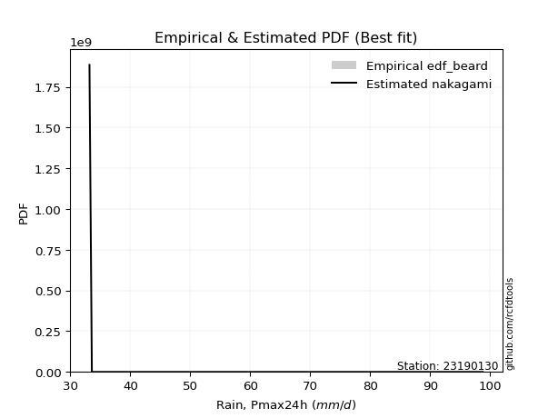</img>

</div>


### 5. Empirical - EDF Chegodayev (1955)

The Chegodayev formula is an empirical plotting position formula used in hydrological frequency analysis to estimate the exceedance probability or return period of a specific event from a set of observed data. It is primarily used for plotting observed data points on probability paper to fit a theoretical distribution, particularly for analyzing extreme events like maximum flood flows or rainfall intensities. The constant _b_ value in the generalized plotting position formula is 0.3.

<div align="center">


$P=(m-b)/(n+1-2b)$


</div>


**5.1. Empirical values**

<div align="center">

|                | 0                   | 1                   | 2                   | 3              | 4                  | 5                  | 6                  |
|:---------------|:--------------------|:--------------------|:--------------------|:---------------|:-------------------|:-------------------|:-------------------|
| date           | 2022                | 2021                | 2023                | 2020           | 2025               | 2019               | 2024               |
| x              | 33.2                | 33.6                | 35.6                | 44.8           | 53.0               | 55.6               | 98.8               |
| m              | 1                   | 2                   | 3                   | 4              | 5                  | 6                  | 7                  |
| empirical_dist | edf_chegodayev      | edf_chegodayev      | edf_chegodayev      | edf_chegodayev | edf_chegodayev     | edf_chegodayev     | edf_chegodayev     |
| empirical      | 0.09459459459459459 | 0.22972972972972971 | 0.36486486486486486 | 0.5            | 0.6351351351351351 | 0.7702702702702703 | 0.9054054054054054 |
| empirical_tr   | 1.1044776119402986  | 1.2982456140350878  | 1.574468085106383   | 2.0            | 2.7407407407407405 | 4.352941176470589  | 10.571428571428568 |

</div>


**5.2. Kolmogorov-Smirnov fit test (sorted by Δ)**


<div align="center">

|                | 0                   | 1                   | 2                   | 3                   | 4                   | 5                   | 6                   | 7                   | 8                   | 9                   | 10                  | 11                  | 12                  | 13                  | 14                  | 15                  | 16                  | 17                  | 18                  | 19                  | 20                  | 21                  | 22                  | 23                  | 24                  | 25                  | 26                  | 27                  | 28                  | 29                  | 30                  | 31                  | 32                  | 33                  | 34                  | 35                  | 36                  | 37                  | 38                  | 39                  | 40                    | 41                  | 42                  | 43                  | 44                  | 45                  | 46                  | 47                  | 48                  | 49                  | 50                  | 51                  | 52                  | 53                  | 54                  | 55                  | 56                  | 57                  | 58                  | 59                  | 60                  | 61                  | 62                  | 63                  | 64                  | 65                  | 66                  | 67                  | 68                  | 69                  | 70                  | 71                  | 72                  | 73                  | 74                  | 75                  | 76                  | 77                  | 78                  | 79                  | 80                  | 81                  | 82                  | 83                  | 84                  | 85                  | 86                  | 87                  | 88                  | 89                  |
|:---------------|:--------------------|:--------------------|:--------------------|:--------------------|:--------------------|:--------------------|:--------------------|:--------------------|:--------------------|:--------------------|:--------------------|:--------------------|:--------------------|:--------------------|:--------------------|:--------------------|:--------------------|:--------------------|:--------------------|:--------------------|:--------------------|:--------------------|:--------------------|:--------------------|:--------------------|:--------------------|:--------------------|:--------------------|:--------------------|:--------------------|:--------------------|:--------------------|:--------------------|:--------------------|:--------------------|:--------------------|:--------------------|:--------------------|:--------------------|:--------------------|:----------------------|:--------------------|:--------------------|:--------------------|:--------------------|:--------------------|:--------------------|:--------------------|:--------------------|:--------------------|:--------------------|:--------------------|:--------------------|:--------------------|:--------------------|:--------------------|:--------------------|:--------------------|:--------------------|:--------------------|:--------------------|:--------------------|:--------------------|:--------------------|:--------------------|:--------------------|:--------------------|:--------------------|:--------------------|:--------------------|:--------------------|:--------------------|:--------------------|:--------------------|:--------------------|:--------------------|:--------------------|:--------------------|:--------------------|:--------------------|:--------------------|:--------------------|:--------------------|:--------------------|:--------------------|:--------------------|:--------------------|:--------------------|:--------------------|:--------------------|
| station        | 23190130            | 23190130            | 23190130            | 23190130            | 23190130            | 23190130            | 23190130            | 23190130            | 23190130            | 23190130            | 23190130            | 23190130            | 23190130            | 23190130            | 23190130            | 23190130            | 23190130            | 23190130            | 23190130            | 23190130            | 23190130            | 23190130            | 23190130            | 23190130            | 23190130            | 23190130            | 23190130            | 23190130            | 23190130            | 23190130            | 23190130            | 23190130            | 23190130            | 23190130            | 23190130            | 23190130            | 23190130            | 23190130            | 23190130            | 23190130            | 23190130              | 23190130            | 23190130            | 23190130            | 23190130            | 23190130            | 23190130            | 23190130            | 23190130            | 23190130            | 23190130            | 23190130            | 23190130            | 23190130            | 23190130            | 23190130            | 23190130            | 23190130            | 23190130            | 23190130            | 23190130            | 23190130            | 23190130            | 23190130            | 23190130            | 23190130            | 23190130            | 23190130            | 23190130            | 23190130            | 23190130            | 23190130            | 23190130            | 23190130            | 23190130            | 23190130            | 23190130            | 23190130            | 23190130            | 23190130            | 23190130            | 23190130            | 23190130            | 23190130            | 23190130            | 23190130            | 23190130            | 23190130            | 23190130            | 23190130            |
| empirical_dist | edf_chegodayev      | edf_chegodayev      | edf_chegodayev      | edf_chegodayev      | edf_chegodayev      | edf_chegodayev      | edf_chegodayev      | edf_chegodayev      | edf_chegodayev      | edf_chegodayev      | edf_chegodayev      | edf_chegodayev      | edf_chegodayev      | edf_chegodayev      | edf_chegodayev      | edf_chegodayev      | edf_chegodayev      | edf_chegodayev      | edf_chegodayev      | edf_chegodayev      | edf_chegodayev      | edf_chegodayev      | edf_chegodayev      | edf_chegodayev      | edf_chegodayev      | edf_chegodayev      | edf_chegodayev      | edf_chegodayev      | edf_chegodayev      | edf_chegodayev      | edf_chegodayev      | edf_chegodayev      | edf_chegodayev      | edf_chegodayev      | edf_chegodayev      | edf_chegodayev      | edf_chegodayev      | edf_chegodayev      | edf_chegodayev      | edf_chegodayev      | edf_chegodayev        | edf_chegodayev      | edf_chegodayev      | edf_chegodayev      | edf_chegodayev      | edf_chegodayev      | edf_chegodayev      | edf_chegodayev      | edf_chegodayev      | edf_chegodayev      | edf_chegodayev      | edf_chegodayev      | edf_chegodayev      | edf_chegodayev      | edf_chegodayev      | edf_chegodayev      | edf_chegodayev      | edf_chegodayev      | edf_chegodayev      | edf_chegodayev      | edf_chegodayev      | edf_chegodayev      | edf_chegodayev      | edf_chegodayev      | edf_chegodayev      | edf_chegodayev      | edf_chegodayev      | edf_chegodayev      | edf_chegodayev      | edf_chegodayev      | edf_chegodayev      | edf_chegodayev      | edf_chegodayev      | edf_chegodayev      | edf_chegodayev      | edf_chegodayev      | edf_chegodayev      | edf_chegodayev      | edf_chegodayev      | edf_chegodayev      | edf_chegodayev      | edf_chegodayev      | edf_chegodayev      | edf_chegodayev      | edf_chegodayev      | edf_chegodayev      | edf_chegodayev      | edf_chegodayev      | edf_chegodayev      | edf_chegodayev      |
| p_dist         | lognakagami         | loghalfnorm         | pearson3            | gumbel_r            | moyal               | halflogistic        | nakagami            | lograyleigh         | logfisk             | logmaxwell          | loghalflogistic     | logpearson3         | t                   | logloggamma         | logmielke           | rayleigh            | halfnorm            | logcrystalball      | lognorm             | lognorm             | logt                | loggumbel_r         | logbetaprime        | logalpha            | betaprime           | maxwell             | lognct              | nct                 | logmoyal            | hypsecant           | mielke              | loggenlogistic      | genlogistic         | logistic            | loglogistic         | logkstwobign        | pareto              | loggumbel_l         | norm                | crystalball         | loglaplace_asymmetric | kstwobign           | laplace             | loghypsecant        | rice                | alpha               | logpareto           | logrice             | logexponnorm        | loggenexpon         | logexpon            | loglaplace          | logtruncnorm        | wald                | invgamma            | f                   | logf                | loginvgamma         | erlang              | gamma               | weibull_min         | logncf              | loginvgauss         | invgauss            | exponnorm           | genexpon            | expon               | laplace_asymmetric  | gumbel_l            | gompertz            | logchi2             | fisk                | logweibull_min      | loggompertz         | truncnorm           | loggamma            | loggamma            | logwald             | logfatiguelife      | fatiguelife         | loglognorm          | logerlang           | gibrat              | loggibrat           | ncf                 | invweibull          | chi2                | johnsonsu           | logjohnsonsu        | loginvweibull       |
| delta          | 0.09459359256453823 | 0.10816159041867318 | 0.11289232765005149 | 0.11443063018261884 | 0.11790460208354253 | 0.11808675894858629 | 0.12159676884948543 | 0.12417297100473812 | 0.12694831805893225 | 0.1309780183740363  | 0.13240139290192568 | 0.1354418057779178  | 0.13625081675541018 | 0.13757515028700124 | 0.1427599734094539  | 0.1431337622518023  | 0.14582850178219853 | 0.14726791958037921 | 0.1472679276919902  | 0.1472679276919902  | 0.1472679597300739  | 0.14777726692601037 | 0.14815420062256493 | 0.14953412796868726 | 0.15050092718263058 | 0.15164652106871157 | 0.15305784367554714 | 0.15726615556437037 | 0.15739584622678043 | 0.16133470446264847 | 0.1627836705405204  | 0.16280987099991664 | 0.1648892841896432  | 0.16701929597433507 | 0.1694765177652075  | 0.17261616357723264 | 0.1733313069271416  | 0.17838835606987166 | 0.1789187274994294  | 0.17891874667524899 | 0.17908912971943047   | 0.17931627051711585 | 0.1800504491274674  | 0.18309833472196993 | 0.1894440311788086  | 0.19021757409851503 | 0.19226050255823524 | 0.19254297298579273 | 0.1954637281130619  | 0.1961544772545418  | 0.1961629421344311  | 0.1990207736596425  | 0.1994412961600584  | 0.20316334300135178 | 0.2057132069561014  | 0.20571592135640104 | 0.20798165307397998 | 0.2079907062240839  | 0.21320739008287992 | 0.21534425852507566 | 0.2189138148423815  | 0.22145711367232163 | 0.22922859462420486 | 0.232176761556661   | 0.23458604673396338 | 0.23641680364498113 | 0.23641704512522035 | 0.2364216677283229  | 0.24023815722642416 | 0.2408627477779588  | 0.24373184937588543 | 0.2507046626562388  | 0.2564613642242224  | 0.2570751785411781  | 0.2589381242915524  | 0.26737563759971283 | 0.26737563759971283 | 0.2826930577260942  | 0.3214106438024097  | 0.32882658009867527 | 0.3370746599050157  | 0.3441741596328214  | 0.3450465983571377  | 0.36486486486486486 | 0.37847371214841324 | 0.3785900020230365  | 0.4198519917025493  | 0.4579213331016907  | 0.570344906701796   | 0.687699028317955   |
| deltao         | 0.48442053926100004 | 0.48442053926100004 | 0.48442053926100004 | 0.48442053926100004 | 0.48442053926100004 | 0.48442053926100004 | 0.48442053926100004 | 0.48442053926100004 | 0.48442053926100004 | 0.48442053926100004 | 0.48442053926100004 | 0.48442053926100004 | 0.48442053926100004 | 0.48442053926100004 | 0.48442053926100004 | 0.48442053926100004 | 0.48442053926100004 | 0.48442053926100004 | 0.48442053926100004 | 0.48442053926100004 | 0.48442053926100004 | 0.48442053926100004 | 0.48442053926100004 | 0.48442053926100004 | 0.48442053926100004 | 0.48442053926100004 | 0.48442053926100004 | 0.48442053926100004 | 0.48442053926100004 | 0.48442053926100004 | 0.48442053926100004 | 0.48442053926100004 | 0.48442053926100004 | 0.48442053926100004 | 0.48442053926100004 | 0.48442053926100004 | 0.48442053926100004 | 0.48442053926100004 | 0.48442053926100004 | 0.48442053926100004 | 0.48442053926100004   | 0.48442053926100004 | 0.48442053926100004 | 0.48442053926100004 | 0.48442053926100004 | 0.48442053926100004 | 0.48442053926100004 | 0.48442053926100004 | 0.48442053926100004 | 0.48442053926100004 | 0.48442053926100004 | 0.48442053926100004 | 0.48442053926100004 | 0.48442053926100004 | 0.48442053926100004 | 0.48442053926100004 | 0.48442053926100004 | 0.48442053926100004 | 0.48442053926100004 | 0.48442053926100004 | 0.48442053926100004 | 0.48442053926100004 | 0.48442053926100004 | 0.48442053926100004 | 0.48442053926100004 | 0.48442053926100004 | 0.48442053926100004 | 0.48442053926100004 | 0.48442053926100004 | 0.48442053926100004 | 0.48442053926100004 | 0.48442053926100004 | 0.48442053926100004 | 0.48442053926100004 | 0.48442053926100004 | 0.48442053926100004 | 0.48442053926100004 | 0.48442053926100004 | 0.48442053926100004 | 0.48442053926100004 | 0.48442053926100004 | 0.48442053926100004 | 0.48442053926100004 | 0.48442053926100004 | 0.48442053926100004 | 0.48442053926100004 | 0.48442053926100004 | 0.48442053926100004 | 0.48442053926100004 | 0.48442053926100004 |
| eval           | Δo > Δ              | Δo > Δ              | Δo > Δ              | Δo > Δ              | Δo > Δ              | Δo > Δ              | Δo > Δ              | Δo > Δ              | Δo > Δ              | Δo > Δ              | Δo > Δ              | Δo > Δ              | Δo > Δ              | Δo > Δ              | Δo > Δ              | Δo > Δ              | Δo > Δ              | Δo > Δ              | Δo > Δ              | Δo > Δ              | Δo > Δ              | Δo > Δ              | Δo > Δ              | Δo > Δ              | Δo > Δ              | Δo > Δ              | Δo > Δ              | Δo > Δ              | Δo > Δ              | Δo > Δ              | Δo > Δ              | Δo > Δ              | Δo > Δ              | Δo > Δ              | Δo > Δ              | Δo > Δ              | Δo > Δ              | Δo > Δ              | Δo > Δ              | Δo > Δ              | Δo > Δ                | Δo > Δ              | Δo > Δ              | Δo > Δ              | Δo > Δ              | Δo > Δ              | Δo > Δ              | Δo > Δ              | Δo > Δ              | Δo > Δ              | Δo > Δ              | Δo > Δ              | Δo > Δ              | Δo > Δ              | Δo > Δ              | Δo > Δ              | Δo > Δ              | Δo > Δ              | Δo > Δ              | Δo > Δ              | Δo > Δ              | Δo > Δ              | Δo > Δ              | Δo > Δ              | Δo > Δ              | Δo > Δ              | Δo > Δ              | Δo > Δ              | Δo > Δ              | Δo > Δ              | Δo > Δ              | Δo > Δ              | Δo > Δ              | Δo > Δ              | Δo > Δ              | Δo > Δ              | Δo > Δ              | Δo > Δ              | Δo > Δ              | Δo > Δ              | Δo > Δ              | Δo > Δ              | Δo > Δ              | Δo > Δ              | Δo > Δ              | Δo > Δ              | Δo > Δ              | Δo > Δ              | Δo <= Δ             | Δo <= Δ             |
| fit            | 1                   | 1                   | 1                   | 1                   | 1                   | 1                   | 1                   | 1                   | 1                   | 1                   | 1                   | 1                   | 1                   | 1                   | 1                   | 1                   | 1                   | 1                   | 1                   | 1                   | 1                   | 1                   | 1                   | 1                   | 1                   | 1                   | 1                   | 1                   | 1                   | 1                   | 1                   | 1                   | 1                   | 1                   | 1                   | 1                   | 1                   | 1                   | 1                   | 1                   | 1                     | 1                   | 1                   | 1                   | 1                   | 1                   | 1                   | 1                   | 1                   | 1                   | 1                   | 1                   | 1                   | 1                   | 1                   | 1                   | 1                   | 1                   | 1                   | 1                   | 1                   | 1                   | 1                   | 1                   | 1                   | 1                   | 1                   | 1                   | 1                   | 1                   | 1                   | 1                   | 1                   | 1                   | 1                   | 1                   | 1                   | 1                   | 1                   | 1                   | 1                   | 1                   | 1                   | 1                   | 1                   | 1                   | 1                   | 1                   | 0                   | 0                   |
| n              | 7                   | 7                   | 7                   | 7                   | 7                   | 7                   | 7                   | 7                   | 7                   | 7                   | 7                   | 7                   | 7                   | 7                   | 7                   | 7                   | 7                   | 7                   | 7                   | 7                   | 7                   | 7                   | 7                   | 7                   | 7                   | 7                   | 7                   | 7                   | 7                   | 7                   | 7                   | 7                   | 7                   | 7                   | 7                   | 7                   | 7                   | 7                   | 7                   | 7                   | 7                     | 7                   | 7                   | 7                   | 7                   | 7                   | 7                   | 7                   | 7                   | 7                   | 7                   | 7                   | 7                   | 7                   | 7                   | 7                   | 7                   | 7                   | 7                   | 7                   | 7                   | 7                   | 7                   | 7                   | 7                   | 7                   | 7                   | 7                   | 7                   | 7                   | 7                   | 7                   | 7                   | 7                   | 7                   | 7                   | 7                   | 7                   | 7                   | 7                   | 7                   | 7                   | 7                   | 7                   | 7                   | 7                   | 7                   | 7                   | 7                   | 7                   |
| best_fit       | 1                   | 0                   | 0                   | 0                   | 0                   | 0                   | 0                   | 0                   | 0                   | 0                   | 0                   | 0                   | 0                   | 0                   | 0                   | 0                   | 0                   | 0                   | 0                   | 0                   | 0                   | 0                   | 0                   | 0                   | 0                   | 0                   | 0                   | 0                   | 0                   | 0                   | 0                   | 0                   | 0                   | 0                   | 0                   | 0                   | 0                   | 0                   | 0                   | 0                   | 0                     | 0                   | 0                   | 0                   | 0                   | 0                   | 0                   | 0                   | 0                   | 0                   | 0                   | 0                   | 0                   | 0                   | 0                   | 0                   | 0                   | 0                   | 0                   | 0                   | 0                   | 0                   | 0                   | 0                   | 0                   | 0                   | 0                   | 0                   | 0                   | 0                   | 0                   | 0                   | 0                   | 0                   | 0                   | 0                   | 0                   | 0                   | 0                   | 0                   | 0                   | 0                   | 0                   | 0                   | 0                   | 0                   | 0                   | 0                   | 0                   | 0                   |
| best_fit_sort  | 1                   | 2                   | 3                   | 4                   | 5                   | 6                   | 7                   | 8                   | 9                   | 10                  | 11                  | 12                  | 13                  | 14                  | 15                  | 16                  | 17                  | 18                  | 19                  | 20                  | 21                  | 22                  | 23                  | 24                  | 25                  | 26                  | 27                  | 28                  | 29                  | 30                  | 31                  | 32                  | 33                  | 34                  | 35                  | 36                  | 37                  | 38                  | 39                  | 40                  | 41                    | 42                  | 43                  | 44                  | 45                  | 46                  | 47                  | 48                  | 49                  | 50                  | 51                  | 52                  | 53                  | 54                  | 55                  | 56                  | 57                  | 58                  | 59                  | 60                  | 61                  | 62                  | 63                  | 64                  | 65                  | 66                  | 67                  | 68                  | 69                  | 70                  | 71                  | 72                  | 73                  | 74                  | 75                  | 76                  | 77                  | 78                  | 79                  | 80                  | 81                  | 82                  | 83                  | 84                  | 85                  | 86                  | 87                  | 88                  | 89                  | 90                  |

</div>


<div align="center">

</img>

</div>


**5.3. Best fit**

<div align="center">

|   id |   station | empirical_dist   | p_dist      |     delta |   deltao | eval   |   fit |   n |   best_fit |   best_fit_sort |
|-----:|----------:|:-----------------|:------------|----------:|---------:|:-------|------:|----:|-----------:|----------------:|
|    0 |  23190130 | edf_chegodayev   | lognakagami | 0.0945936 | 0.484421 | Δo > Δ |     1 |   7 |          1 |               1 |

</div>


<div align="center">

</img>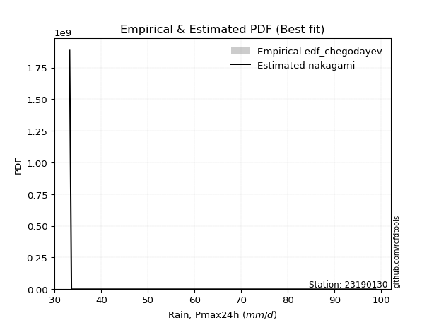</img>

</div>


### 6. Empirical - EDF Blom (1958)

The Blom formula is a specific "plotting position" formula used in hydrology and statistical analysis to estimate the empirical cumulative probability (or non-exceedance probability) of a data series. It is particularly recommended for data that are approximately normally distributed. The constant _a_ is set to 0.375 (or 3/8).

<div align="center">


$P=(m-a)/(n+1-2a)$


</div>


**6.1. Empirical values**

<div align="center">

|                | 0                   | 1                   | 2                  | 3        | 4                  | 5                  | 6                  |
|:---------------|:--------------------|:--------------------|:-------------------|:---------|:-------------------|:-------------------|:-------------------|
| date           | 2022                | 2021                | 2023               | 2020     | 2025               | 2019               | 2024               |
| x              | 33.2                | 33.6                | 35.6               | 44.8     | 53.0               | 55.6               | 98.8               |
| m              | 1                   | 2                   | 3                  | 4        | 5                  | 6                  | 7                  |
| empirical_dist | edf_blom            | edf_blom            | edf_blom           | edf_blom | edf_blom           | edf_blom           | edf_blom           |
| empirical      | 0.08620689655172414 | 0.22413793103448276 | 0.3620689655172414 | 0.5      | 0.6379310344827587 | 0.7758620689655172 | 0.9137931034482759 |
| empirical_tr   | 1.0943396226415094  | 1.288888888888889   | 1.5675675675675675 | 2.0      | 2.7619047619047623 | 4.461538461538462  | 11.600000000000007 |

</div>


**6.2. Kolmogorov-Smirnov fit test (sorted by Δ)**


<div align="center">

|                | 0                   | 1                   | 2                   | 3                   | 4                   | 5                   | 6                   | 7                   | 8                   | 9                   | 10                  | 11                  | 12                  | 13                  | 14                  | 15                  | 16                  | 17                  | 18                  | 19                  | 20                  | 21                  | 22                  | 23                  | 24                  | 25                  | 26                  | 27                  | 28                  | 29                  | 30                  | 31                  | 32                  | 33                  | 34                  | 35                  | 36                  | 37                  | 38                    | 39                  | 40                  | 41                  | 42                  | 43                  | 44                  | 45                  | 46                  | 47                  | 48                  | 49                  | 50                  | 51                  | 52                  | 53                  | 54                  | 55                  | 56                  | 57                  | 58                  | 59                  | 60                  | 61                  | 62                  | 63                  | 64                  | 65                  | 66                  | 67                  | 68                  | 69                  | 70                  | 71                  | 72                  | 73                  | 74                  | 75                  | 76                  | 77                  | 78                  | 79                  | 80                  | 81                  | 82                  | 83                  | 84                  | 85                  | 86                  | 87                  | 88                  | 89                  |
|:---------------|:--------------------|:--------------------|:--------------------|:--------------------|:--------------------|:--------------------|:--------------------|:--------------------|:--------------------|:--------------------|:--------------------|:--------------------|:--------------------|:--------------------|:--------------------|:--------------------|:--------------------|:--------------------|:--------------------|:--------------------|:--------------------|:--------------------|:--------------------|:--------------------|:--------------------|:--------------------|:--------------------|:--------------------|:--------------------|:--------------------|:--------------------|:--------------------|:--------------------|:--------------------|:--------------------|:--------------------|:--------------------|:--------------------|:----------------------|:--------------------|:--------------------|:--------------------|:--------------------|:--------------------|:--------------------|:--------------------|:--------------------|:--------------------|:--------------------|:--------------------|:--------------------|:--------------------|:--------------------|:--------------------|:--------------------|:--------------------|:--------------------|:--------------------|:--------------------|:--------------------|:--------------------|:--------------------|:--------------------|:--------------------|:--------------------|:--------------------|:--------------------|:--------------------|:--------------------|:--------------------|:--------------------|:--------------------|:--------------------|:--------------------|:--------------------|:--------------------|:--------------------|:--------------------|:--------------------|:--------------------|:--------------------|:--------------------|:--------------------|:--------------------|:--------------------|:--------------------|:--------------------|:--------------------|:--------------------|:--------------------|
| station        | 23190130            | 23190130            | 23190130            | 23190130            | 23190130            | 23190130            | 23190130            | 23190130            | 23190130            | 23190130            | 23190130            | 23190130            | 23190130            | 23190130            | 23190130            | 23190130            | 23190130            | 23190130            | 23190130            | 23190130            | 23190130            | 23190130            | 23190130            | 23190130            | 23190130            | 23190130            | 23190130            | 23190130            | 23190130            | 23190130            | 23190130            | 23190130            | 23190130            | 23190130            | 23190130            | 23190130            | 23190130            | 23190130            | 23190130              | 23190130            | 23190130            | 23190130            | 23190130            | 23190130            | 23190130            | 23190130            | 23190130            | 23190130            | 23190130            | 23190130            | 23190130            | 23190130            | 23190130            | 23190130            | 23190130            | 23190130            | 23190130            | 23190130            | 23190130            | 23190130            | 23190130            | 23190130            | 23190130            | 23190130            | 23190130            | 23190130            | 23190130            | 23190130            | 23190130            | 23190130            | 23190130            | 23190130            | 23190130            | 23190130            | 23190130            | 23190130            | 23190130            | 23190130            | 23190130            | 23190130            | 23190130            | 23190130            | 23190130            | 23190130            | 23190130            | 23190130            | 23190130            | 23190130            | 23190130            | 23190130            |
| empirical_dist | edf_blom            | edf_blom            | edf_blom            | edf_blom            | edf_blom            | edf_blom            | edf_blom            | edf_blom            | edf_blom            | edf_blom            | edf_blom            | edf_blom            | edf_blom            | edf_blom            | edf_blom            | edf_blom            | edf_blom            | edf_blom            | edf_blom            | edf_blom            | edf_blom            | edf_blom            | edf_blom            | edf_blom            | edf_blom            | edf_blom            | edf_blom            | edf_blom            | edf_blom            | edf_blom            | edf_blom            | edf_blom            | edf_blom            | edf_blom            | edf_blom            | edf_blom            | edf_blom            | edf_blom            | edf_blom              | edf_blom            | edf_blom            | edf_blom            | edf_blom            | edf_blom            | edf_blom            | edf_blom            | edf_blom            | edf_blom            | edf_blom            | edf_blom            | edf_blom            | edf_blom            | edf_blom            | edf_blom            | edf_blom            | edf_blom            | edf_blom            | edf_blom            | edf_blom            | edf_blom            | edf_blom            | edf_blom            | edf_blom            | edf_blom            | edf_blom            | edf_blom            | edf_blom            | edf_blom            | edf_blom            | edf_blom            | edf_blom            | edf_blom            | edf_blom            | edf_blom            | edf_blom            | edf_blom            | edf_blom            | edf_blom            | edf_blom            | edf_blom            | edf_blom            | edf_blom            | edf_blom            | edf_blom            | edf_blom            | edf_blom            | edf_blom            | edf_blom            | edf_blom            | edf_blom            |
| p_dist         | lognakagami         | loghalfnorm         | moyal               | gumbel_r            | nakagami            | pearson3            | lograyleigh         | halflogistic        | logmaxwell          | loghalflogistic     | logpearson3         | logloggamma         | logfisk             | logmielke           | logcrystalball      | lognorm             | lognorm             | logt                | t                   | loggumbel_r         | logbetaprime        | betaprime           | rayleigh            | logalpha            | lognct              | halfnorm            | nct                 | logmoyal            | maxwell             | mielke              | loggenlogistic      | genlogistic         | hypsecant           | loglogistic         | logkstwobign        | logistic            | pareto              | loggumbel_l         | loglaplace_asymmetric | kstwobign           | laplace             | loghypsecant        | norm                | crystalball         | rice                | logpareto           | logrice             | logexponnorm        | alpha               | loggenexpon         | logexpon            | loglaplace          | logtruncnorm        | wald                | invgamma            | f                   | logf                | loginvgamma         | gamma               | erlang              | weibull_min         | loginvgauss         | logncf              | exponnorm           | invgauss            | genexpon            | expon               | laplace_asymmetric  | gompertz            | gumbel_l            | logchi2             | loggompertz         | truncnorm           | fisk                | logweibull_min      | loggamma            | loggamma            | logwald             | logfatiguelife      | fatiguelife         | gibrat              | loglognorm          | logerlang           | loggibrat           | ncf                 | invweibull          | chi2                | johnsonsu           | logjohnsonsu        | loginvweibull       |
| delta          | 0.0933644619816113  | 0.1053656910710497  | 0.11510870273591906 | 0.11715862239354846 | 0.11808043170707422 | 0.12128002569292193 | 0.12137707165711464 | 0.12647445699145674 | 0.12818211902641283 | 0.1296054935543022  | 0.13264590643029434 | 0.13477925093937776 | 0.1353360161018028  | 0.13996407406183042 | 0.14447202023275574 | 0.14447202834436673 | 0.14447202834436673 | 0.14447206038245042 | 0.14463851479828063 | 0.1449813675783869  | 0.14535830127494145 | 0.1477050278350071  | 0.14872556094704925 | 0.14953412796868726 | 0.15026194432792367 | 0.15421619982506896 | 0.1544702562167469  | 0.15459994687915696 | 0.15723831976395852 | 0.15998777119289692 | 0.16001397165229317 | 0.1620933848420197  | 0.16280542580093105 | 0.16668061841758403 | 0.16982026422960916 | 0.17261109466958202 | 0.1733313069271416  | 0.17559245672224819 | 0.176293230371807     | 0.17652037116949237 | 0.17725454977984392 | 0.18030243537434645 | 0.18451052619467634 | 0.18451054537049594 | 0.18664813183118512 | 0.18666870386298828 | 0.18974707363816926 | 0.18987192941781494 | 0.19021757409851503 | 0.19056267855929485 | 0.19057114343918416 | 0.19622487431201902 | 0.19663796773294928 | 0.2003674436537283  | 0.2057132069561014  | 0.20571592135640104 | 0.20798165307397998 | 0.2079907062240839  | 0.21254835917745207 | 0.21320739008287992 | 0.21611791549475803 | 0.22922859462420486 | 0.22984481171519205 | 0.2317901473863399  | 0.232176761556661   | 0.23362090429735766 | 0.23362114577759688 | 0.23362576838069943 | 0.23806684843033532 | 0.24582995592167112 | 0.2493236480711324  | 0.25427927919355464 | 0.2561422249439289  | 0.25629646135148576 | 0.2564613642242224  | 0.26737563759971283 | 0.26737563759971283 | 0.27989715837847073 | 0.32700244249765664 | 0.3344183787939222  | 0.3422506990095142  | 0.3426664586002627  | 0.3441741596328214  | 0.3620689655172414  | 0.38686141019128367 | 0.38697770006590704 | 0.4198519917025493  | 0.46351313179693765 | 0.575936705397043   | 0.693290827013202   |
| deltao         | 0.48442053926100004 | 0.48442053926100004 | 0.48442053926100004 | 0.48442053926100004 | 0.48442053926100004 | 0.48442053926100004 | 0.48442053926100004 | 0.48442053926100004 | 0.48442053926100004 | 0.48442053926100004 | 0.48442053926100004 | 0.48442053926100004 | 0.48442053926100004 | 0.48442053926100004 | 0.48442053926100004 | 0.48442053926100004 | 0.48442053926100004 | 0.48442053926100004 | 0.48442053926100004 | 0.48442053926100004 | 0.48442053926100004 | 0.48442053926100004 | 0.48442053926100004 | 0.48442053926100004 | 0.48442053926100004 | 0.48442053926100004 | 0.48442053926100004 | 0.48442053926100004 | 0.48442053926100004 | 0.48442053926100004 | 0.48442053926100004 | 0.48442053926100004 | 0.48442053926100004 | 0.48442053926100004 | 0.48442053926100004 | 0.48442053926100004 | 0.48442053926100004 | 0.48442053926100004 | 0.48442053926100004   | 0.48442053926100004 | 0.48442053926100004 | 0.48442053926100004 | 0.48442053926100004 | 0.48442053926100004 | 0.48442053926100004 | 0.48442053926100004 | 0.48442053926100004 | 0.48442053926100004 | 0.48442053926100004 | 0.48442053926100004 | 0.48442053926100004 | 0.48442053926100004 | 0.48442053926100004 | 0.48442053926100004 | 0.48442053926100004 | 0.48442053926100004 | 0.48442053926100004 | 0.48442053926100004 | 0.48442053926100004 | 0.48442053926100004 | 0.48442053926100004 | 0.48442053926100004 | 0.48442053926100004 | 0.48442053926100004 | 0.48442053926100004 | 0.48442053926100004 | 0.48442053926100004 | 0.48442053926100004 | 0.48442053926100004 | 0.48442053926100004 | 0.48442053926100004 | 0.48442053926100004 | 0.48442053926100004 | 0.48442053926100004 | 0.48442053926100004 | 0.48442053926100004 | 0.48442053926100004 | 0.48442053926100004 | 0.48442053926100004 | 0.48442053926100004 | 0.48442053926100004 | 0.48442053926100004 | 0.48442053926100004 | 0.48442053926100004 | 0.48442053926100004 | 0.48442053926100004 | 0.48442053926100004 | 0.48442053926100004 | 0.48442053926100004 | 0.48442053926100004 |
| eval           | Δo > Δ              | Δo > Δ              | Δo > Δ              | Δo > Δ              | Δo > Δ              | Δo > Δ              | Δo > Δ              | Δo > Δ              | Δo > Δ              | Δo > Δ              | Δo > Δ              | Δo > Δ              | Δo > Δ              | Δo > Δ              | Δo > Δ              | Δo > Δ              | Δo > Δ              | Δo > Δ              | Δo > Δ              | Δo > Δ              | Δo > Δ              | Δo > Δ              | Δo > Δ              | Δo > Δ              | Δo > Δ              | Δo > Δ              | Δo > Δ              | Δo > Δ              | Δo > Δ              | Δo > Δ              | Δo > Δ              | Δo > Δ              | Δo > Δ              | Δo > Δ              | Δo > Δ              | Δo > Δ              | Δo > Δ              | Δo > Δ              | Δo > Δ                | Δo > Δ              | Δo > Δ              | Δo > Δ              | Δo > Δ              | Δo > Δ              | Δo > Δ              | Δo > Δ              | Δo > Δ              | Δo > Δ              | Δo > Δ              | Δo > Δ              | Δo > Δ              | Δo > Δ              | Δo > Δ              | Δo > Δ              | Δo > Δ              | Δo > Δ              | Δo > Δ              | Δo > Δ              | Δo > Δ              | Δo > Δ              | Δo > Δ              | Δo > Δ              | Δo > Δ              | Δo > Δ              | Δo > Δ              | Δo > Δ              | Δo > Δ              | Δo > Δ              | Δo > Δ              | Δo > Δ              | Δo > Δ              | Δo > Δ              | Δo > Δ              | Δo > Δ              | Δo > Δ              | Δo > Δ              | Δo > Δ              | Δo > Δ              | Δo > Δ              | Δo > Δ              | Δo > Δ              | Δo > Δ              | Δo > Δ              | Δo > Δ              | Δo > Δ              | Δo > Δ              | Δo > Δ              | Δo > Δ              | Δo <= Δ             | Δo <= Δ             |
| fit            | 1                   | 1                   | 1                   | 1                   | 1                   | 1                   | 1                   | 1                   | 1                   | 1                   | 1                   | 1                   | 1                   | 1                   | 1                   | 1                   | 1                   | 1                   | 1                   | 1                   | 1                   | 1                   | 1                   | 1                   | 1                   | 1                   | 1                   | 1                   | 1                   | 1                   | 1                   | 1                   | 1                   | 1                   | 1                   | 1                   | 1                   | 1                   | 1                     | 1                   | 1                   | 1                   | 1                   | 1                   | 1                   | 1                   | 1                   | 1                   | 1                   | 1                   | 1                   | 1                   | 1                   | 1                   | 1                   | 1                   | 1                   | 1                   | 1                   | 1                   | 1                   | 1                   | 1                   | 1                   | 1                   | 1                   | 1                   | 1                   | 1                   | 1                   | 1                   | 1                   | 1                   | 1                   | 1                   | 1                   | 1                   | 1                   | 1                   | 1                   | 1                   | 1                   | 1                   | 1                   | 1                   | 1                   | 1                   | 1                   | 0                   | 0                   |
| n              | 7                   | 7                   | 7                   | 7                   | 7                   | 7                   | 7                   | 7                   | 7                   | 7                   | 7                   | 7                   | 7                   | 7                   | 7                   | 7                   | 7                   | 7                   | 7                   | 7                   | 7                   | 7                   | 7                   | 7                   | 7                   | 7                   | 7                   | 7                   | 7                   | 7                   | 7                   | 7                   | 7                   | 7                   | 7                   | 7                   | 7                   | 7                   | 7                     | 7                   | 7                   | 7                   | 7                   | 7                   | 7                   | 7                   | 7                   | 7                   | 7                   | 7                   | 7                   | 7                   | 7                   | 7                   | 7                   | 7                   | 7                   | 7                   | 7                   | 7                   | 7                   | 7                   | 7                   | 7                   | 7                   | 7                   | 7                   | 7                   | 7                   | 7                   | 7                   | 7                   | 7                   | 7                   | 7                   | 7                   | 7                   | 7                   | 7                   | 7                   | 7                   | 7                   | 7                   | 7                   | 7                   | 7                   | 7                   | 7                   | 7                   | 7                   |
| best_fit       | 1                   | 0                   | 0                   | 0                   | 0                   | 0                   | 0                   | 0                   | 0                   | 0                   | 0                   | 0                   | 0                   | 0                   | 0                   | 0                   | 0                   | 0                   | 0                   | 0                   | 0                   | 0                   | 0                   | 0                   | 0                   | 0                   | 0                   | 0                   | 0                   | 0                   | 0                   | 0                   | 0                   | 0                   | 0                   | 0                   | 0                   | 0                   | 0                     | 0                   | 0                   | 0                   | 0                   | 0                   | 0                   | 0                   | 0                   | 0                   | 0                   | 0                   | 0                   | 0                   | 0                   | 0                   | 0                   | 0                   | 0                   | 0                   | 0                   | 0                   | 0                   | 0                   | 0                   | 0                   | 0                   | 0                   | 0                   | 0                   | 0                   | 0                   | 0                   | 0                   | 0                   | 0                   | 0                   | 0                   | 0                   | 0                   | 0                   | 0                   | 0                   | 0                   | 0                   | 0                   | 0                   | 0                   | 0                   | 0                   | 0                   | 0                   |
| best_fit_sort  | 1                   | 2                   | 3                   | 4                   | 5                   | 6                   | 7                   | 8                   | 9                   | 10                  | 11                  | 12                  | 13                  | 14                  | 15                  | 16                  | 17                  | 18                  | 19                  | 20                  | 21                  | 22                  | 23                  | 24                  | 25                  | 26                  | 27                  | 28                  | 29                  | 30                  | 31                  | 32                  | 33                  | 34                  | 35                  | 36                  | 37                  | 38                  | 39                    | 40                  | 41                  | 42                  | 43                  | 44                  | 45                  | 46                  | 47                  | 48                  | 49                  | 50                  | 51                  | 52                  | 53                  | 54                  | 55                  | 56                  | 57                  | 58                  | 59                  | 60                  | 61                  | 62                  | 63                  | 64                  | 65                  | 66                  | 67                  | 68                  | 69                  | 70                  | 71                  | 72                  | 73                  | 74                  | 75                  | 76                  | 77                  | 78                  | 79                  | 80                  | 81                  | 82                  | 83                  | 84                  | 85                  | 86                  | 87                  | 88                  | 89                  | 90                  |

</div>


<div align="center">

</img>

</div>


**6.3. Best fit**

<div align="center">

|   id |   station | empirical_dist   | p_dist      |     delta |   deltao | eval   |   fit |   n |   best_fit |   best_fit_sort |
|-----:|----------:|:-----------------|:------------|----------:|---------:|:-------|------:|----:|-----------:|----------------:|
|    0 |  23190130 | edf_blom         | lognakagami | 0.0933645 | 0.484421 | Δo > Δ |     1 |   7 |          1 |               1 |

</div>


<div align="center">

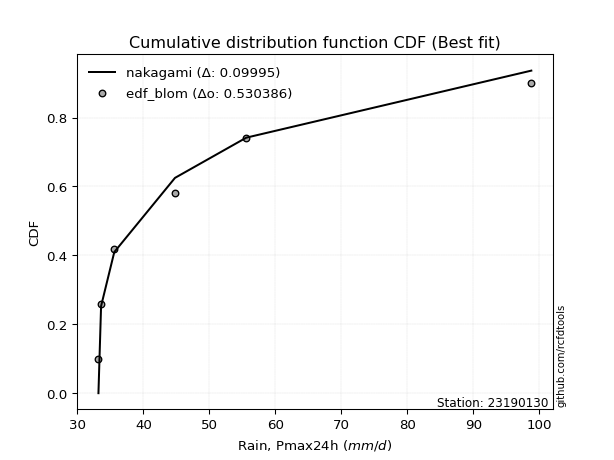</img>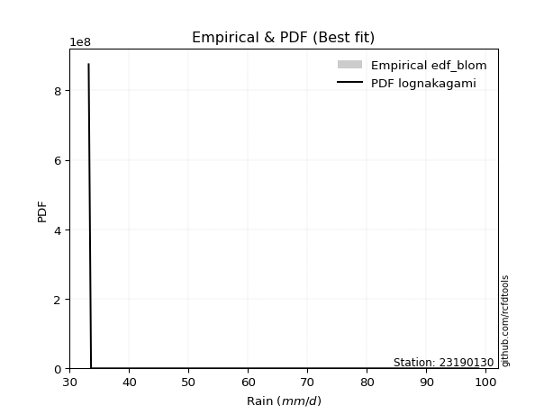</img>

</div>


### 7. Empirical - EDF Tukey (1962)

In hydrology, the Tukey formula is used as a plotting position formula to estimate the empirical probability or frequency of a flood event (or other hydrological data). The formula parameter is given as _c=0.333_ (or 1/3).

<div align="center">


$P=(m-c)/(n+1-2c)$


</div>


**7.1. Empirical values**

<div align="center">

|                | 0                   | 1                   | 2                   | 3         | 4                  | 5                  | 6                  |
|:---------------|:--------------------|:--------------------|:--------------------|:----------|:-------------------|:-------------------|:-------------------|
| date           | 2022                | 2021                | 2023                | 2020      | 2025               | 2019               | 2024               |
| x              | 33.2                | 33.6                | 35.6                | 44.8      | 53.0               | 55.6               | 98.8               |
| m              | 1                   | 2                   | 3                   | 4         | 5                  | 6                  | 7                  |
| empirical_dist | edf_tukey           | edf_tukey           | edf_tukey           | edf_tukey | edf_tukey          | edf_tukey          | edf_tukey          |
| empirical      | 0.09090909090909091 | 0.22727272727272727 | 0.36363636363636365 | 0.5       | 0.6363636363636364 | 0.7727272727272727 | 0.9090909090909091 |
| empirical_tr   | 1.1                 | 1.2941176470588236  | 1.5714285714285714  | 2.0       | 2.75               | 4.3999999999999995 | 10.999999999999996 |

</div>


**7.2. Kolmogorov-Smirnov fit test (sorted by Δ)**


<div align="center">

|                | 0                   | 1                   | 2                   | 3                   | 4                   | 5                   | 6                   | 7                   | 8                   | 9                   | 10                  | 11                  | 12                  | 13                  | 14                  | 15                  | 16                  | 17                  | 18                  | 19                  | 20                  | 21                  | 22                  | 23                  | 24                  | 25                  | 26                  | 27                  | 28                  | 29                  | 30                  | 31                  | 32                  | 33                  | 34                  | 35                  | 36                  | 37                  | 38                    | 39                  | 40                  | 41                  | 42                  | 43                  | 44                  | 45                  | 46                  | 47                  | 48                  | 49                  | 50                  | 51                  | 52                  | 53                  | 54                  | 55                  | 56                  | 57                  | 58                  | 59                  | 60                  | 61                  | 62                  | 63                  | 64                  | 65                  | 66                  | 67                  | 68                  | 69                  | 70                  | 71                  | 72                  | 73                  | 74                  | 75                  | 76                  | 77                  | 78                  | 79                  | 80                  | 81                  | 82                  | 83                  | 84                  | 85                  | 86                  | 87                  | 88                  | 89                  |
|:---------------|:--------------------|:--------------------|:--------------------|:--------------------|:--------------------|:--------------------|:--------------------|:--------------------|:--------------------|:--------------------|:--------------------|:--------------------|:--------------------|:--------------------|:--------------------|:--------------------|:--------------------|:--------------------|:--------------------|:--------------------|:--------------------|:--------------------|:--------------------|:--------------------|:--------------------|:--------------------|:--------------------|:--------------------|:--------------------|:--------------------|:--------------------|:--------------------|:--------------------|:--------------------|:--------------------|:--------------------|:--------------------|:--------------------|:----------------------|:--------------------|:--------------------|:--------------------|:--------------------|:--------------------|:--------------------|:--------------------|:--------------------|:--------------------|:--------------------|:--------------------|:--------------------|:--------------------|:--------------------|:--------------------|:--------------------|:--------------------|:--------------------|:--------------------|:--------------------|:--------------------|:--------------------|:--------------------|:--------------------|:--------------------|:--------------------|:--------------------|:--------------------|:--------------------|:--------------------|:--------------------|:--------------------|:--------------------|:--------------------|:--------------------|:--------------------|:--------------------|:--------------------|:--------------------|:--------------------|:--------------------|:--------------------|:--------------------|:--------------------|:--------------------|:--------------------|:--------------------|:--------------------|:--------------------|:--------------------|:--------------------|
| station        | 23190130            | 23190130            | 23190130            | 23190130            | 23190130            | 23190130            | 23190130            | 23190130            | 23190130            | 23190130            | 23190130            | 23190130            | 23190130            | 23190130            | 23190130            | 23190130            | 23190130            | 23190130            | 23190130            | 23190130            | 23190130            | 23190130            | 23190130            | 23190130            | 23190130            | 23190130            | 23190130            | 23190130            | 23190130            | 23190130            | 23190130            | 23190130            | 23190130            | 23190130            | 23190130            | 23190130            | 23190130            | 23190130            | 23190130              | 23190130            | 23190130            | 23190130            | 23190130            | 23190130            | 23190130            | 23190130            | 23190130            | 23190130            | 23190130            | 23190130            | 23190130            | 23190130            | 23190130            | 23190130            | 23190130            | 23190130            | 23190130            | 23190130            | 23190130            | 23190130            | 23190130            | 23190130            | 23190130            | 23190130            | 23190130            | 23190130            | 23190130            | 23190130            | 23190130            | 23190130            | 23190130            | 23190130            | 23190130            | 23190130            | 23190130            | 23190130            | 23190130            | 23190130            | 23190130            | 23190130            | 23190130            | 23190130            | 23190130            | 23190130            | 23190130            | 23190130            | 23190130            | 23190130            | 23190130            | 23190130            |
| empirical_dist | edf_tukey           | edf_tukey           | edf_tukey           | edf_tukey           | edf_tukey           | edf_tukey           | edf_tukey           | edf_tukey           | edf_tukey           | edf_tukey           | edf_tukey           | edf_tukey           | edf_tukey           | edf_tukey           | edf_tukey           | edf_tukey           | edf_tukey           | edf_tukey           | edf_tukey           | edf_tukey           | edf_tukey           | edf_tukey           | edf_tukey           | edf_tukey           | edf_tukey           | edf_tukey           | edf_tukey           | edf_tukey           | edf_tukey           | edf_tukey           | edf_tukey           | edf_tukey           | edf_tukey           | edf_tukey           | edf_tukey           | edf_tukey           | edf_tukey           | edf_tukey           | edf_tukey             | edf_tukey           | edf_tukey           | edf_tukey           | edf_tukey           | edf_tukey           | edf_tukey           | edf_tukey           | edf_tukey           | edf_tukey           | edf_tukey           | edf_tukey           | edf_tukey           | edf_tukey           | edf_tukey           | edf_tukey           | edf_tukey           | edf_tukey           | edf_tukey           | edf_tukey           | edf_tukey           | edf_tukey           | edf_tukey           | edf_tukey           | edf_tukey           | edf_tukey           | edf_tukey           | edf_tukey           | edf_tukey           | edf_tukey           | edf_tukey           | edf_tukey           | edf_tukey           | edf_tukey           | edf_tukey           | edf_tukey           | edf_tukey           | edf_tukey           | edf_tukey           | edf_tukey           | edf_tukey           | edf_tukey           | edf_tukey           | edf_tukey           | edf_tukey           | edf_tukey           | edf_tukey           | edf_tukey           | edf_tukey           | edf_tukey           | edf_tukey           | edf_tukey           |
| p_dist         | lognakagami         | loghalfnorm         | gumbel_r            | pearson3            | moyal               | nakagami            | halflogistic        | lograyleigh         | logmaxwell          | logfisk             | loghalflogistic     | logpearson3         | logloggamma         | t                   | logmielke           | rayleigh            | logcrystalball      | lognorm             | lognorm             | logt                | loggumbel_r         | logbetaprime        | betaprime           | halfnorm            | logalpha            | lognct              | maxwell             | nct                 | logmoyal            | hypsecant           | mielke              | loggenlogistic      | genlogistic         | loglogistic         | logistic            | logkstwobign        | pareto              | loggumbel_l         | loglaplace_asymmetric | kstwobign           | laplace             | norm                | crystalball         | loghypsecant        | rice                | logpareto           | alpha               | logrice             | logexponnorm        | loggenexpon         | logexpon            | loglaplace          | logtruncnorm        | wald                | invgamma            | f                   | logf                | loginvgamma         | erlang              | gamma               | weibull_min         | logncf              | loginvgauss         | invgauss            | exponnorm           | genexpon            | expon               | laplace_asymmetric  | gompertz            | gumbel_l            | logchi2             | fisk                | loggompertz         | logweibull_min      | truncnorm           | loggamma            | loggamma            | logwald             | logfatiguelife      | fatiguelife         | loglognorm          | gibrat              | logerlang           | loggibrat           | ncf                 | invweibull          | chi2                | johnsonsu           | logjohnsonsu        | loginvweibull       |
| delta          | 0.09090808887903455 | 0.10693308919017197 | 0.11402382615530393 | 0.11657783133555516 | 0.11667610085504132 | 0.11964782982619648 | 0.12177226263408997 | 0.12294446977623691 | 0.1297495171455351  | 0.13063382174443594 | 0.13117289167342447 | 0.1342133045494166  | 0.13634664905850002 | 0.13993632044091386 | 0.1415314721809527  | 0.14559076470880472 | 0.146039418351878   | 0.146039426463489   | 0.146039426463489   | 0.14603945850157268 | 0.14654876569750916 | 0.14692569939406372 | 0.14927242595412937 | 0.1495140054677022  | 0.14953412796868726 | 0.15182934244704593 | 0.154103523525714   | 0.15603765433586916 | 0.15616734499827922 | 0.16010620323414726 | 0.1615551693120192  | 0.16158136977141543 | 0.16366078296114198 | 0.1682480165367063  | 0.1694762984313375  | 0.17138766234873143 | 0.1733313069271416  | 0.17715985484137045 | 0.17786062849092926   | 0.17808776928861464 | 0.1788219478989662  | 0.1813757299564318  | 0.1813757491322514  | 0.18186983349346872 | 0.18821552995030738 | 0.18980350010123279 | 0.19021757409851503 | 0.19131447175729152 | 0.19300672565605945 | 0.19369747479753935 | 0.19370593967742866 | 0.19779227243114128 | 0.19820536585207155 | 0.20193484177285057 | 0.2057132069561014  | 0.20571592135640104 | 0.20798165307397998 | 0.2079907062240839  | 0.21320739008287992 | 0.2141157572965744  | 0.2176853136138803  | 0.2251426173578253  | 0.22922859462420486 | 0.232176761556661   | 0.23335754550546217 | 0.23518830241647992 | 0.23518854389671914 | 0.2351931664998217  | 0.23963424654945759 | 0.2426951596834266  | 0.24618885183288786 | 0.25316166511324123 | 0.25584667731267685 | 0.2564613642242224  | 0.2577096230630512  | 0.26737563759971283 | 0.26737563759971283 | 0.28146455649759305 | 0.3238676462594121  | 0.3312835825556777  | 0.33953166236201815 | 0.3438180971286365  | 0.3441741596328214  | 0.36363636363636365 | 0.3821592158339169  | 0.3822755057085402  | 0.4198519917025493  | 0.4603783355586931  | 0.5728019091587985  | 0.6901560307749575  |
| deltao         | 0.48442053926100004 | 0.48442053926100004 | 0.48442053926100004 | 0.48442053926100004 | 0.48442053926100004 | 0.48442053926100004 | 0.48442053926100004 | 0.48442053926100004 | 0.48442053926100004 | 0.48442053926100004 | 0.48442053926100004 | 0.48442053926100004 | 0.48442053926100004 | 0.48442053926100004 | 0.48442053926100004 | 0.48442053926100004 | 0.48442053926100004 | 0.48442053926100004 | 0.48442053926100004 | 0.48442053926100004 | 0.48442053926100004 | 0.48442053926100004 | 0.48442053926100004 | 0.48442053926100004 | 0.48442053926100004 | 0.48442053926100004 | 0.48442053926100004 | 0.48442053926100004 | 0.48442053926100004 | 0.48442053926100004 | 0.48442053926100004 | 0.48442053926100004 | 0.48442053926100004 | 0.48442053926100004 | 0.48442053926100004 | 0.48442053926100004 | 0.48442053926100004 | 0.48442053926100004 | 0.48442053926100004   | 0.48442053926100004 | 0.48442053926100004 | 0.48442053926100004 | 0.48442053926100004 | 0.48442053926100004 | 0.48442053926100004 | 0.48442053926100004 | 0.48442053926100004 | 0.48442053926100004 | 0.48442053926100004 | 0.48442053926100004 | 0.48442053926100004 | 0.48442053926100004 | 0.48442053926100004 | 0.48442053926100004 | 0.48442053926100004 | 0.48442053926100004 | 0.48442053926100004 | 0.48442053926100004 | 0.48442053926100004 | 0.48442053926100004 | 0.48442053926100004 | 0.48442053926100004 | 0.48442053926100004 | 0.48442053926100004 | 0.48442053926100004 | 0.48442053926100004 | 0.48442053926100004 | 0.48442053926100004 | 0.48442053926100004 | 0.48442053926100004 | 0.48442053926100004 | 0.48442053926100004 | 0.48442053926100004 | 0.48442053926100004 | 0.48442053926100004 | 0.48442053926100004 | 0.48442053926100004 | 0.48442053926100004 | 0.48442053926100004 | 0.48442053926100004 | 0.48442053926100004 | 0.48442053926100004 | 0.48442053926100004 | 0.48442053926100004 | 0.48442053926100004 | 0.48442053926100004 | 0.48442053926100004 | 0.48442053926100004 | 0.48442053926100004 | 0.48442053926100004 |
| eval           | Δo > Δ              | Δo > Δ              | Δo > Δ              | Δo > Δ              | Δo > Δ              | Δo > Δ              | Δo > Δ              | Δo > Δ              | Δo > Δ              | Δo > Δ              | Δo > Δ              | Δo > Δ              | Δo > Δ              | Δo > Δ              | Δo > Δ              | Δo > Δ              | Δo > Δ              | Δo > Δ              | Δo > Δ              | Δo > Δ              | Δo > Δ              | Δo > Δ              | Δo > Δ              | Δo > Δ              | Δo > Δ              | Δo > Δ              | Δo > Δ              | Δo > Δ              | Δo > Δ              | Δo > Δ              | Δo > Δ              | Δo > Δ              | Δo > Δ              | Δo > Δ              | Δo > Δ              | Δo > Δ              | Δo > Δ              | Δo > Δ              | Δo > Δ                | Δo > Δ              | Δo > Δ              | Δo > Δ              | Δo > Δ              | Δo > Δ              | Δo > Δ              | Δo > Δ              | Δo > Δ              | Δo > Δ              | Δo > Δ              | Δo > Δ              | Δo > Δ              | Δo > Δ              | Δo > Δ              | Δo > Δ              | Δo > Δ              | Δo > Δ              | Δo > Δ              | Δo > Δ              | Δo > Δ              | Δo > Δ              | Δo > Δ              | Δo > Δ              | Δo > Δ              | Δo > Δ              | Δo > Δ              | Δo > Δ              | Δo > Δ              | Δo > Δ              | Δo > Δ              | Δo > Δ              | Δo > Δ              | Δo > Δ              | Δo > Δ              | Δo > Δ              | Δo > Δ              | Δo > Δ              | Δo > Δ              | Δo > Δ              | Δo > Δ              | Δo > Δ              | Δo > Δ              | Δo > Δ              | Δo > Δ              | Δo > Δ              | Δo > Δ              | Δo > Δ              | Δo > Δ              | Δo > Δ              | Δo <= Δ             | Δo <= Δ             |
| fit            | 1                   | 1                   | 1                   | 1                   | 1                   | 1                   | 1                   | 1                   | 1                   | 1                   | 1                   | 1                   | 1                   | 1                   | 1                   | 1                   | 1                   | 1                   | 1                   | 1                   | 1                   | 1                   | 1                   | 1                   | 1                   | 1                   | 1                   | 1                   | 1                   | 1                   | 1                   | 1                   | 1                   | 1                   | 1                   | 1                   | 1                   | 1                   | 1                     | 1                   | 1                   | 1                   | 1                   | 1                   | 1                   | 1                   | 1                   | 1                   | 1                   | 1                   | 1                   | 1                   | 1                   | 1                   | 1                   | 1                   | 1                   | 1                   | 1                   | 1                   | 1                   | 1                   | 1                   | 1                   | 1                   | 1                   | 1                   | 1                   | 1                   | 1                   | 1                   | 1                   | 1                   | 1                   | 1                   | 1                   | 1                   | 1                   | 1                   | 1                   | 1                   | 1                   | 1                   | 1                   | 1                   | 1                   | 1                   | 1                   | 0                   | 0                   |
| n              | 7                   | 7                   | 7                   | 7                   | 7                   | 7                   | 7                   | 7                   | 7                   | 7                   | 7                   | 7                   | 7                   | 7                   | 7                   | 7                   | 7                   | 7                   | 7                   | 7                   | 7                   | 7                   | 7                   | 7                   | 7                   | 7                   | 7                   | 7                   | 7                   | 7                   | 7                   | 7                   | 7                   | 7                   | 7                   | 7                   | 7                   | 7                   | 7                     | 7                   | 7                   | 7                   | 7                   | 7                   | 7                   | 7                   | 7                   | 7                   | 7                   | 7                   | 7                   | 7                   | 7                   | 7                   | 7                   | 7                   | 7                   | 7                   | 7                   | 7                   | 7                   | 7                   | 7                   | 7                   | 7                   | 7                   | 7                   | 7                   | 7                   | 7                   | 7                   | 7                   | 7                   | 7                   | 7                   | 7                   | 7                   | 7                   | 7                   | 7                   | 7                   | 7                   | 7                   | 7                   | 7                   | 7                   | 7                   | 7                   | 7                   | 7                   |
| best_fit       | 1                   | 0                   | 0                   | 0                   | 0                   | 0                   | 0                   | 0                   | 0                   | 0                   | 0                   | 0                   | 0                   | 0                   | 0                   | 0                   | 0                   | 0                   | 0                   | 0                   | 0                   | 0                   | 0                   | 0                   | 0                   | 0                   | 0                   | 0                   | 0                   | 0                   | 0                   | 0                   | 0                   | 0                   | 0                   | 0                   | 0                   | 0                   | 0                     | 0                   | 0                   | 0                   | 0                   | 0                   | 0                   | 0                   | 0                   | 0                   | 0                   | 0                   | 0                   | 0                   | 0                   | 0                   | 0                   | 0                   | 0                   | 0                   | 0                   | 0                   | 0                   | 0                   | 0                   | 0                   | 0                   | 0                   | 0                   | 0                   | 0                   | 0                   | 0                   | 0                   | 0                   | 0                   | 0                   | 0                   | 0                   | 0                   | 0                   | 0                   | 0                   | 0                   | 0                   | 0                   | 0                   | 0                   | 0                   | 0                   | 0                   | 0                   |
| best_fit_sort  | 1                   | 2                   | 3                   | 4                   | 5                   | 6                   | 7                   | 8                   | 9                   | 10                  | 11                  | 12                  | 13                  | 14                  | 15                  | 16                  | 17                  | 18                  | 19                  | 20                  | 21                  | 22                  | 23                  | 24                  | 25                  | 26                  | 27                  | 28                  | 29                  | 30                  | 31                  | 32                  | 33                  | 34                  | 35                  | 36                  | 37                  | 38                  | 39                    | 40                  | 41                  | 42                  | 43                  | 44                  | 45                  | 46                  | 47                  | 48                  | 49                  | 50                  | 51                  | 52                  | 53                  | 54                  | 55                  | 56                  | 57                  | 58                  | 59                  | 60                  | 61                  | 62                  | 63                  | 64                  | 65                  | 66                  | 67                  | 68                  | 69                  | 70                  | 71                  | 72                  | 73                  | 74                  | 75                  | 76                  | 77                  | 78                  | 79                  | 80                  | 81                  | 82                  | 83                  | 84                  | 85                  | 86                  | 87                  | 88                  | 89                  | 90                  |

</div>


<div align="center">

</img>

</div>


**7.3. Best fit**

<div align="center">

|   id |   station | empirical_dist   | p_dist      |     delta |   deltao | eval   |   fit |   n |   best_fit |   best_fit_sort |
|-----:|----------:|:-----------------|:------------|----------:|---------:|:-------|------:|----:|-----------:|----------------:|
|    0 |  23190130 | edf_tukey        | lognakagami | 0.0909081 | 0.484421 | Δo > Δ |     1 |   7 |          1 |               1 |

</div>


<div align="center">

</img></img>

</div>


### 8. Empirical - EDF Gringorten (1963)

Gringorten plotting position formula is essential for estimating the probability and return periods of extreme events like floods and heavy rainfall. The constant _a=0.44_.

<div align="center">


$P=(m-a)/(n+1-2a)$


</div>


**8.1. Empirical values**

<div align="center">

|                | 0                   | 1                   | 2                  | 3              | 4                  | 5                  | 6                  |
|:---------------|:--------------------|:--------------------|:-------------------|:---------------|:-------------------|:-------------------|:-------------------|
| date           | 2022                | 2021                | 2023               | 2020           | 2025               | 2019               | 2024               |
| x              | 33.2                | 33.6                | 35.6               | 44.8           | 53.0               | 55.6               | 98.8               |
| m              | 1                   | 2                   | 3                  | 4              | 5                  | 6                  | 7                  |
| empirical_dist | edf_gringorten      | edf_gringorten      | edf_gringorten     | edf_gringorten | edf_gringorten     | edf_gringorten     | edf_gringorten     |
| empirical      | 0.07865168539325844 | 0.21910112359550563 | 0.3595505617977528 | 0.5            | 0.6404494382022471 | 0.7808988764044943 | 0.9213483146067415 |
| empirical_tr   | 1.0853658536585364  | 1.2805755395683454  | 1.5614035087719298 | 2.0            | 2.781249999999999  | 4.564102564102562  | 12.714285714285701 |

</div>


**8.2. Kolmogorov-Smirnov fit test (sorted by Δ)**


<div align="center">

|                | 0                   | 1                   | 2                   | 3                   | 4                   | 5                   | 6                   | 7                   | 8                   | 9                   | 10                  | 11                  | 12                  | 13                  | 14                  | 15                  | 16                  | 17                  | 18                  | 19                  | 20                  | 21                  | 22                  | 23                  | 24                  | 25                  | 26                  | 27                  | 28                  | 29                  | 30                  | 31                  | 32                  | 33                  | 34                  | 35                  | 36                  | 37                    | 38                  | 39                  | 40                  | 41                  | 42                  | 43                  | 44                  | 45                  | 46                  | 47                  | 48                  | 49                  | 50                  | 51                  | 52                  | 53                  | 54                  | 55                  | 56                  | 57                  | 58                  | 59                  | 60                  | 61                  | 62                  | 63                  | 64                  | 65                  | 66                  | 67                  | 68                  | 69                  | 70                  | 71                  | 72                  | 73                  | 74                  | 75                  | 76                  | 77                  | 78                  | 79                  | 80                  | 81                  | 82                  | 83                  | 84                  | 85                  | 86                  | 87                  | 88                  | 89                  |
|:---------------|:--------------------|:--------------------|:--------------------|:--------------------|:--------------------|:--------------------|:--------------------|:--------------------|:--------------------|:--------------------|:--------------------|:--------------------|:--------------------|:--------------------|:--------------------|:--------------------|:--------------------|:--------------------|:--------------------|:--------------------|:--------------------|:--------------------|:--------------------|:--------------------|:--------------------|:--------------------|:--------------------|:--------------------|:--------------------|:--------------------|:--------------------|:--------------------|:--------------------|:--------------------|:--------------------|:--------------------|:--------------------|:----------------------|:--------------------|:--------------------|:--------------------|:--------------------|:--------------------|:--------------------|:--------------------|:--------------------|:--------------------|:--------------------|:--------------------|:--------------------|:--------------------|:--------------------|:--------------------|:--------------------|:--------------------|:--------------------|:--------------------|:--------------------|:--------------------|:--------------------|:--------------------|:--------------------|:--------------------|:--------------------|:--------------------|:--------------------|:--------------------|:--------------------|:--------------------|:--------------------|:--------------------|:--------------------|:--------------------|:--------------------|:--------------------|:--------------------|:--------------------|:--------------------|:--------------------|:--------------------|:--------------------|:--------------------|:--------------------|:--------------------|:--------------------|:--------------------|:--------------------|:--------------------|:--------------------|:--------------------|
| station        | 23190130            | 23190130            | 23190130            | 23190130            | 23190130            | 23190130            | 23190130            | 23190130            | 23190130            | 23190130            | 23190130            | 23190130            | 23190130            | 23190130            | 23190130            | 23190130            | 23190130            | 23190130            | 23190130            | 23190130            | 23190130            | 23190130            | 23190130            | 23190130            | 23190130            | 23190130            | 23190130            | 23190130            | 23190130            | 23190130            | 23190130            | 23190130            | 23190130            | 23190130            | 23190130            | 23190130            | 23190130            | 23190130              | 23190130            | 23190130            | 23190130            | 23190130            | 23190130            | 23190130            | 23190130            | 23190130            | 23190130            | 23190130            | 23190130            | 23190130            | 23190130            | 23190130            | 23190130            | 23190130            | 23190130            | 23190130            | 23190130            | 23190130            | 23190130            | 23190130            | 23190130            | 23190130            | 23190130            | 23190130            | 23190130            | 23190130            | 23190130            | 23190130            | 23190130            | 23190130            | 23190130            | 23190130            | 23190130            | 23190130            | 23190130            | 23190130            | 23190130            | 23190130            | 23190130            | 23190130            | 23190130            | 23190130            | 23190130            | 23190130            | 23190130            | 23190130            | 23190130            | 23190130            | 23190130            | 23190130            |
| empirical_dist | edf_gringorten      | edf_gringorten      | edf_gringorten      | edf_gringorten      | edf_gringorten      | edf_gringorten      | edf_gringorten      | edf_gringorten      | edf_gringorten      | edf_gringorten      | edf_gringorten      | edf_gringorten      | edf_gringorten      | edf_gringorten      | edf_gringorten      | edf_gringorten      | edf_gringorten      | edf_gringorten      | edf_gringorten      | edf_gringorten      | edf_gringorten      | edf_gringorten      | edf_gringorten      | edf_gringorten      | edf_gringorten      | edf_gringorten      | edf_gringorten      | edf_gringorten      | edf_gringorten      | edf_gringorten      | edf_gringorten      | edf_gringorten      | edf_gringorten      | edf_gringorten      | edf_gringorten      | edf_gringorten      | edf_gringorten      | edf_gringorten        | edf_gringorten      | edf_gringorten      | edf_gringorten      | edf_gringorten      | edf_gringorten      | edf_gringorten      | edf_gringorten      | edf_gringorten      | edf_gringorten      | edf_gringorten      | edf_gringorten      | edf_gringorten      | edf_gringorten      | edf_gringorten      | edf_gringorten      | edf_gringorten      | edf_gringorten      | edf_gringorten      | edf_gringorten      | edf_gringorten      | edf_gringorten      | edf_gringorten      | edf_gringorten      | edf_gringorten      | edf_gringorten      | edf_gringorten      | edf_gringorten      | edf_gringorten      | edf_gringorten      | edf_gringorten      | edf_gringorten      | edf_gringorten      | edf_gringorten      | edf_gringorten      | edf_gringorten      | edf_gringorten      | edf_gringorten      | edf_gringorten      | edf_gringorten      | edf_gringorten      | edf_gringorten      | edf_gringorten      | edf_gringorten      | edf_gringorten      | edf_gringorten      | edf_gringorten      | edf_gringorten      | edf_gringorten      | edf_gringorten      | edf_gringorten      | edf_gringorten      | edf_gringorten      |
| p_dist         | lognakagami         | loghalfnorm         | moyal               | lograyleigh         | nakagami            | gumbel_r            | logmaxwell          | loghalflogistic     | pearson3            | logpearson3         | logloggamma         | halflogistic        | logmielke           | logcrystalball      | lognorm             | lognorm             | logt                | loggumbel_r         | logbetaprime        | logfisk             | betaprime           | lognct              | logalpha            | nct                 | logmoyal            | t                   | rayleigh            | mielke              | loggenlogistic      | genlogistic         | halfnorm            | maxwell             | loglogistic         | logkstwobign        | hypsecant           | loggumbel_l         | pareto              | loglaplace_asymmetric | kstwobign           | laplace             | logistic            | loghypsecant        | logpareto           | rice                | logexponnorm        | loggenexpon         | logexpon            | logrice             | norm                | crystalball         | alpha               | loglaplace          | logtruncnorm        | wald                | invgamma            | f                   | logf                | loginvgamma         | gamma               | erlang              | weibull_min         | loginvgauss         | exponnorm           | genexpon            | expon               | laplace_asymmetric  | invgauss            | gompertz            | logncf              | gumbel_l            | loggompertz         | truncnorm           | logchi2             | logweibull_min      | fisk                | loggamma            | loggamma            | logwald             | logfatiguelife      | fatiguelife         | gibrat              | logerlang           | loglognorm          | loggibrat           | ncf                 | invweibull          | chi2                | johnsonsu           | logjohnsonsu        | loginvweibull       |
| delta          | 0.09840126942058836 | 0.10284728735156112 | 0.11259029901643047 | 0.11885866793762606 | 0.12172366611890395 | 0.1234886182333582  | 0.12566371530692425 | 0.12708708983481362 | 0.12883523685138765 | 0.13012750271080575 | 0.13226084721988918 | 0.13402966814992245 | 0.13744567034234184 | 0.14195361651326716 | 0.14195362462487815 | 0.14195362462487815 | 0.14195365666296184 | 0.1424629638588983  | 0.14283989755545287 | 0.14289122726026837 | 0.14518662411551853 | 0.1477435406084351  | 0.14953412796868726 | 0.15195185249725832 | 0.15208154315966838 | 0.15219372595674635 | 0.1537623683860263  | 0.15746936747340834 | 0.1574955679328046  | 0.15957498112253113 | 0.16177141098353465 | 0.16227512720293558 | 0.16416221469809544 | 0.16730186051012058 | 0.1678422332399081  | 0.1730740530027596  | 0.1733313069271416  | 0.17377482665231841   | 0.1740019674500038  | 0.17473614606035534 | 0.17764790210855907 | 0.17778403165485787 | 0.18163189642401115 | 0.18412972811169653 | 0.1848351219788378  | 0.1855258711203177  | 0.18553433600020702 | 0.18722866991868067 | 0.1895473336336534  | 0.189547352809473   | 0.19021757409851503 | 0.19370647059253043 | 0.1941195640134607  | 0.19784903993423972 | 0.2057132069561014  | 0.20571592135640104 | 0.20798165307397998 | 0.2079907062240839  | 0.21158309080943172 | 0.21320739008287992 | 0.21359951177526945 | 0.22922859462420486 | 0.22927174366685132 | 0.23110250057786907 | 0.2311027420581083  | 0.23110736466121085 | 0.232176761556661   | 0.23554844471084674 | 0.23740002287365775 | 0.25086676336064817 | 0.251760875474066   | 0.2536238212244403  | 0.25436045551010944 | 0.2564613642242224  | 0.2613332687904628  | 0.26737563759971283 | 0.26737563759971283 | 0.2773787546589822  | 0.3320392499366338  | 0.3394551862328994  | 0.33973229529002563 | 0.3441741596328214  | 0.34770326603923984 | 0.3595505617977528  | 0.39441662134974936 | 0.3945329112243726  | 0.4198519917025493  | 0.4685499392359148  | 0.5809735128360202  | 0.6983276344521792  |
| deltao         | 0.48442053926100004 | 0.48442053926100004 | 0.48442053926100004 | 0.48442053926100004 | 0.48442053926100004 | 0.48442053926100004 | 0.48442053926100004 | 0.48442053926100004 | 0.48442053926100004 | 0.48442053926100004 | 0.48442053926100004 | 0.48442053926100004 | 0.48442053926100004 | 0.48442053926100004 | 0.48442053926100004 | 0.48442053926100004 | 0.48442053926100004 | 0.48442053926100004 | 0.48442053926100004 | 0.48442053926100004 | 0.48442053926100004 | 0.48442053926100004 | 0.48442053926100004 | 0.48442053926100004 | 0.48442053926100004 | 0.48442053926100004 | 0.48442053926100004 | 0.48442053926100004 | 0.48442053926100004 | 0.48442053926100004 | 0.48442053926100004 | 0.48442053926100004 | 0.48442053926100004 | 0.48442053926100004 | 0.48442053926100004 | 0.48442053926100004 | 0.48442053926100004 | 0.48442053926100004   | 0.48442053926100004 | 0.48442053926100004 | 0.48442053926100004 | 0.48442053926100004 | 0.48442053926100004 | 0.48442053926100004 | 0.48442053926100004 | 0.48442053926100004 | 0.48442053926100004 | 0.48442053926100004 | 0.48442053926100004 | 0.48442053926100004 | 0.48442053926100004 | 0.48442053926100004 | 0.48442053926100004 | 0.48442053926100004 | 0.48442053926100004 | 0.48442053926100004 | 0.48442053926100004 | 0.48442053926100004 | 0.48442053926100004 | 0.48442053926100004 | 0.48442053926100004 | 0.48442053926100004 | 0.48442053926100004 | 0.48442053926100004 | 0.48442053926100004 | 0.48442053926100004 | 0.48442053926100004 | 0.48442053926100004 | 0.48442053926100004 | 0.48442053926100004 | 0.48442053926100004 | 0.48442053926100004 | 0.48442053926100004 | 0.48442053926100004 | 0.48442053926100004 | 0.48442053926100004 | 0.48442053926100004 | 0.48442053926100004 | 0.48442053926100004 | 0.48442053926100004 | 0.48442053926100004 | 0.48442053926100004 | 0.48442053926100004 | 0.48442053926100004 | 0.48442053926100004 | 0.48442053926100004 | 0.48442053926100004 | 0.48442053926100004 | 0.48442053926100004 | 0.48442053926100004 |
| eval           | Δo > Δ              | Δo > Δ              | Δo > Δ              | Δo > Δ              | Δo > Δ              | Δo > Δ              | Δo > Δ              | Δo > Δ              | Δo > Δ              | Δo > Δ              | Δo > Δ              | Δo > Δ              | Δo > Δ              | Δo > Δ              | Δo > Δ              | Δo > Δ              | Δo > Δ              | Δo > Δ              | Δo > Δ              | Δo > Δ              | Δo > Δ              | Δo > Δ              | Δo > Δ              | Δo > Δ              | Δo > Δ              | Δo > Δ              | Δo > Δ              | Δo > Δ              | Δo > Δ              | Δo > Δ              | Δo > Δ              | Δo > Δ              | Δo > Δ              | Δo > Δ              | Δo > Δ              | Δo > Δ              | Δo > Δ              | Δo > Δ                | Δo > Δ              | Δo > Δ              | Δo > Δ              | Δo > Δ              | Δo > Δ              | Δo > Δ              | Δo > Δ              | Δo > Δ              | Δo > Δ              | Δo > Δ              | Δo > Δ              | Δo > Δ              | Δo > Δ              | Δo > Δ              | Δo > Δ              | Δo > Δ              | Δo > Δ              | Δo > Δ              | Δo > Δ              | Δo > Δ              | Δo > Δ              | Δo > Δ              | Δo > Δ              | Δo > Δ              | Δo > Δ              | Δo > Δ              | Δo > Δ              | Δo > Δ              | Δo > Δ              | Δo > Δ              | Δo > Δ              | Δo > Δ              | Δo > Δ              | Δo > Δ              | Δo > Δ              | Δo > Δ              | Δo > Δ              | Δo > Δ              | Δo > Δ              | Δo > Δ              | Δo > Δ              | Δo > Δ              | Δo > Δ              | Δo > Δ              | Δo > Δ              | Δo > Δ              | Δo > Δ              | Δo > Δ              | Δo > Δ              | Δo > Δ              | Δo <= Δ             | Δo <= Δ             |
| fit            | 1                   | 1                   | 1                   | 1                   | 1                   | 1                   | 1                   | 1                   | 1                   | 1                   | 1                   | 1                   | 1                   | 1                   | 1                   | 1                   | 1                   | 1                   | 1                   | 1                   | 1                   | 1                   | 1                   | 1                   | 1                   | 1                   | 1                   | 1                   | 1                   | 1                   | 1                   | 1                   | 1                   | 1                   | 1                   | 1                   | 1                   | 1                     | 1                   | 1                   | 1                   | 1                   | 1                   | 1                   | 1                   | 1                   | 1                   | 1                   | 1                   | 1                   | 1                   | 1                   | 1                   | 1                   | 1                   | 1                   | 1                   | 1                   | 1                   | 1                   | 1                   | 1                   | 1                   | 1                   | 1                   | 1                   | 1                   | 1                   | 1                   | 1                   | 1                   | 1                   | 1                   | 1                   | 1                   | 1                   | 1                   | 1                   | 1                   | 1                   | 1                   | 1                   | 1                   | 1                   | 1                   | 1                   | 1                   | 1                   | 0                   | 0                   |
| n              | 7                   | 7                   | 7                   | 7                   | 7                   | 7                   | 7                   | 7                   | 7                   | 7                   | 7                   | 7                   | 7                   | 7                   | 7                   | 7                   | 7                   | 7                   | 7                   | 7                   | 7                   | 7                   | 7                   | 7                   | 7                   | 7                   | 7                   | 7                   | 7                   | 7                   | 7                   | 7                   | 7                   | 7                   | 7                   | 7                   | 7                   | 7                     | 7                   | 7                   | 7                   | 7                   | 7                   | 7                   | 7                   | 7                   | 7                   | 7                   | 7                   | 7                   | 7                   | 7                   | 7                   | 7                   | 7                   | 7                   | 7                   | 7                   | 7                   | 7                   | 7                   | 7                   | 7                   | 7                   | 7                   | 7                   | 7                   | 7                   | 7                   | 7                   | 7                   | 7                   | 7                   | 7                   | 7                   | 7                   | 7                   | 7                   | 7                   | 7                   | 7                   | 7                   | 7                   | 7                   | 7                   | 7                   | 7                   | 7                   | 7                   | 7                   |
| best_fit       | 1                   | 0                   | 0                   | 0                   | 0                   | 0                   | 0                   | 0                   | 0                   | 0                   | 0                   | 0                   | 0                   | 0                   | 0                   | 0                   | 0                   | 0                   | 0                   | 0                   | 0                   | 0                   | 0                   | 0                   | 0                   | 0                   | 0                   | 0                   | 0                   | 0                   | 0                   | 0                   | 0                   | 0                   | 0                   | 0                   | 0                   | 0                     | 0                   | 0                   | 0                   | 0                   | 0                   | 0                   | 0                   | 0                   | 0                   | 0                   | 0                   | 0                   | 0                   | 0                   | 0                   | 0                   | 0                   | 0                   | 0                   | 0                   | 0                   | 0                   | 0                   | 0                   | 0                   | 0                   | 0                   | 0                   | 0                   | 0                   | 0                   | 0                   | 0                   | 0                   | 0                   | 0                   | 0                   | 0                   | 0                   | 0                   | 0                   | 0                   | 0                   | 0                   | 0                   | 0                   | 0                   | 0                   | 0                   | 0                   | 0                   | 0                   |
| best_fit_sort  | 1                   | 2                   | 3                   | 4                   | 5                   | 6                   | 7                   | 8                   | 9                   | 10                  | 11                  | 12                  | 13                  | 14                  | 15                  | 16                  | 17                  | 18                  | 19                  | 20                  | 21                  | 22                  | 23                  | 24                  | 25                  | 26                  | 27                  | 28                  | 29                  | 30                  | 31                  | 32                  | 33                  | 34                  | 35                  | 36                  | 37                  | 38                    | 39                  | 40                  | 41                  | 42                  | 43                  | 44                  | 45                  | 46                  | 47                  | 48                  | 49                  | 50                  | 51                  | 52                  | 53                  | 54                  | 55                  | 56                  | 57                  | 58                  | 59                  | 60                  | 61                  | 62                  | 63                  | 64                  | 65                  | 66                  | 67                  | 68                  | 69                  | 70                  | 71                  | 72                  | 73                  | 74                  | 75                  | 76                  | 77                  | 78                  | 79                  | 80                  | 81                  | 82                  | 83                  | 84                  | 85                  | 86                  | 87                  | 88                  | 89                  | 90                  |

</div>


<div align="center">

</img>

</div>


**8.3. Best fit**

<div align="center">

|   id |   station | empirical_dist   | p_dist      |     delta |   deltao | eval   |   fit |   n |   best_fit |   best_fit_sort |
|-----:|----------:|:-----------------|:------------|----------:|---------:|:-------|------:|----:|-----------:|----------------:|
|    0 |  23190130 | edf_gringorten   | lognakagami | 0.0984013 | 0.484421 | Δo > Δ |     1 |   7 |          1 |               1 |

</div>


<div align="center">

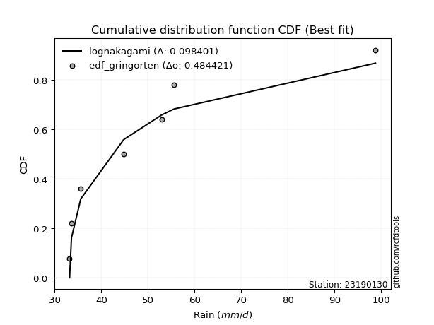</img></img>

</div>


### 9. Empirical - EDF Filliben (1975)

The specific values of the constants (0.3175) (often denoted as $alpha$) and (0.365) are derived from a method proposed by James J. Filliben in a 1975 paper. This particular formula is the mean value of the $i$-th order statistic of the normal distribution and is considered a robust and effective plotting position formula for the normal probability plot correlation coefficient test for normality.

<div align="center">


$P=(m-0.3175)/(n+0.365)$


</div>


**9.1. Empirical values**

<div align="center">

|                | 0                   | 1                   | 2                   | 3            | 4                  | 5                  | 6                  |
|:---------------|:--------------------|:--------------------|:--------------------|:-------------|:-------------------|:-------------------|:-------------------|
| date           | 2022                | 2021                | 2023                | 2020         | 2025               | 2019               | 2024               |
| x              | 33.2                | 33.6                | 35.6                | 44.8         | 53.0               | 55.6               | 98.8               |
| m              | 1                   | 2                   | 3                   | 4            | 5                  | 6                  | 7                  |
| empirical_dist | edf_filliben        | edf_filliben        | edf_filliben        | edf_filliben | edf_filliben       | edf_filliben       | edf_filliben       |
| empirical      | 0.09266802443991853 | 0.22844534962661237 | 0.36422267481330617 | 0.5          | 0.6357773251866938 | 0.7715546503733877 | 0.9073319755600815 |
| empirical_tr   | 1.1021324354657687  | 1.2960844698636163  | 1.5728777362520021  | 2.0          | 2.7455731593662627 | 4.377414561664191  | 10.791208791208794 |

</div>


**9.2. Kolmogorov-Smirnov fit test (sorted by Δ)**


<div align="center">

|                | 0                   | 1                   | 2                   | 3                   | 4                   | 5                   | 6                   | 7                   | 8                   | 9                   | 10                  | 11                  | 12                  | 13                  | 14                  | 15                  | 16                  | 17                  | 18                  | 19                  | 20                  | 21                  | 22                  | 23                  | 24                  | 25                  | 26                  | 27                  | 28                  | 29                  | 30                  | 31                  | 32                  | 33                  | 34                  | 35                  | 36                  | 37                  | 38                    | 39                  | 40                  | 41                  | 42                  | 43                  | 44                  | 45                  | 46                  | 47                  | 48                  | 49                  | 50                  | 51                  | 52                  | 53                  | 54                  | 55                  | 56                  | 57                  | 58                  | 59                  | 60                  | 61                  | 62                  | 63                  | 64                  | 65                  | 66                  | 67                  | 68                  | 69                  | 70                  | 71                  | 72                  | 73                  | 74                  | 75                  | 76                  | 77                  | 78                  | 79                  | 80                  | 81                  | 82                  | 83                  | 84                  | 85                  | 86                  | 87                  | 88                  | 89                  |
|:---------------|:--------------------|:--------------------|:--------------------|:--------------------|:--------------------|:--------------------|:--------------------|:--------------------|:--------------------|:--------------------|:--------------------|:--------------------|:--------------------|:--------------------|:--------------------|:--------------------|:--------------------|:--------------------|:--------------------|:--------------------|:--------------------|:--------------------|:--------------------|:--------------------|:--------------------|:--------------------|:--------------------|:--------------------|:--------------------|:--------------------|:--------------------|:--------------------|:--------------------|:--------------------|:--------------------|:--------------------|:--------------------|:--------------------|:----------------------|:--------------------|:--------------------|:--------------------|:--------------------|:--------------------|:--------------------|:--------------------|:--------------------|:--------------------|:--------------------|:--------------------|:--------------------|:--------------------|:--------------------|:--------------------|:--------------------|:--------------------|:--------------------|:--------------------|:--------------------|:--------------------|:--------------------|:--------------------|:--------------------|:--------------------|:--------------------|:--------------------|:--------------------|:--------------------|:--------------------|:--------------------|:--------------------|:--------------------|:--------------------|:--------------------|:--------------------|:--------------------|:--------------------|:--------------------|:--------------------|:--------------------|:--------------------|:--------------------|:--------------------|:--------------------|:--------------------|:--------------------|:--------------------|:--------------------|:--------------------|:--------------------|
| station        | 23190130            | 23190130            | 23190130            | 23190130            | 23190130            | 23190130            | 23190130            | 23190130            | 23190130            | 23190130            | 23190130            | 23190130            | 23190130            | 23190130            | 23190130            | 23190130            | 23190130            | 23190130            | 23190130            | 23190130            | 23190130            | 23190130            | 23190130            | 23190130            | 23190130            | 23190130            | 23190130            | 23190130            | 23190130            | 23190130            | 23190130            | 23190130            | 23190130            | 23190130            | 23190130            | 23190130            | 23190130            | 23190130            | 23190130              | 23190130            | 23190130            | 23190130            | 23190130            | 23190130            | 23190130            | 23190130            | 23190130            | 23190130            | 23190130            | 23190130            | 23190130            | 23190130            | 23190130            | 23190130            | 23190130            | 23190130            | 23190130            | 23190130            | 23190130            | 23190130            | 23190130            | 23190130            | 23190130            | 23190130            | 23190130            | 23190130            | 23190130            | 23190130            | 23190130            | 23190130            | 23190130            | 23190130            | 23190130            | 23190130            | 23190130            | 23190130            | 23190130            | 23190130            | 23190130            | 23190130            | 23190130            | 23190130            | 23190130            | 23190130            | 23190130            | 23190130            | 23190130            | 23190130            | 23190130            | 23190130            |
| empirical_dist | edf_filliben        | edf_filliben        | edf_filliben        | edf_filliben        | edf_filliben        | edf_filliben        | edf_filliben        | edf_filliben        | edf_filliben        | edf_filliben        | edf_filliben        | edf_filliben        | edf_filliben        | edf_filliben        | edf_filliben        | edf_filliben        | edf_filliben        | edf_filliben        | edf_filliben        | edf_filliben        | edf_filliben        | edf_filliben        | edf_filliben        | edf_filliben        | edf_filliben        | edf_filliben        | edf_filliben        | edf_filliben        | edf_filliben        | edf_filliben        | edf_filliben        | edf_filliben        | edf_filliben        | edf_filliben        | edf_filliben        | edf_filliben        | edf_filliben        | edf_filliben        | edf_filliben          | edf_filliben        | edf_filliben        | edf_filliben        | edf_filliben        | edf_filliben        | edf_filliben        | edf_filliben        | edf_filliben        | edf_filliben        | edf_filliben        | edf_filliben        | edf_filliben        | edf_filliben        | edf_filliben        | edf_filliben        | edf_filliben        | edf_filliben        | edf_filliben        | edf_filliben        | edf_filliben        | edf_filliben        | edf_filliben        | edf_filliben        | edf_filliben        | edf_filliben        | edf_filliben        | edf_filliben        | edf_filliben        | edf_filliben        | edf_filliben        | edf_filliben        | edf_filliben        | edf_filliben        | edf_filliben        | edf_filliben        | edf_filliben        | edf_filliben        | edf_filliben        | edf_filliben        | edf_filliben        | edf_filliben        | edf_filliben        | edf_filliben        | edf_filliben        | edf_filliben        | edf_filliben        | edf_filliben        | edf_filliben        | edf_filliben        | edf_filliben        | edf_filliben        |
| p_dist         | lognakagami         | loghalfnorm         | gumbel_r            | pearson3            | moyal               | halflogistic        | nakagami            | lograyleigh         | logfisk             | logmaxwell          | loghalflogistic     | logpearson3         | logloggamma         | t                   | logmielke           | rayleigh            | logcrystalball      | lognorm             | lognorm             | logt                | loggumbel_r         | logbetaprime        | halfnorm            | logalpha            | betaprime           | lognct              | maxwell             | nct                 | logmoyal            | hypsecant           | mielke              | loggenlogistic      | genlogistic         | logistic            | loglogistic         | logkstwobign        | pareto              | loggumbel_l         | loglaplace_asymmetric | kstwobign           | laplace             | norm                | crystalball         | loghypsecant        | rice                | alpha               | logpareto           | logrice             | logexponnorm        | loggenexpon         | logexpon            | loglaplace          | logtruncnorm        | wald                | invgamma            | f                   | logf                | loginvgamma         | erlang              | gamma               | weibull_min         | logncf              | loginvgauss         | invgauss            | exponnorm           | genexpon            | expon               | laplace_asymmetric  | gompertz            | gumbel_l            | logchi2             | fisk                | loggompertz         | logweibull_min      | truncnorm           | loggamma            | loggamma            | logwald             | logfatiguelife      | fatiguelife         | loglognorm          | logerlang           | gibrat              | loggibrat           | ncf                 | invweibull          | chi2                | johnsonsu           | logjohnsonsu        | loginvweibull       |
| delta          | 0.09266702240986217 | 0.10751940036711449 | 0.11378844013106015 | 0.11481889780472754 | 0.11726241203198384 | 0.12001332910326235 | 0.12031238874636808 | 0.12353078095317943 | 0.12887488821360837 | 0.13033582832247761 | 0.131759202850367   | 0.13479961572635912 | 0.13693296023544255 | 0.13817738691008624 | 0.1421177833578952  | 0.14441814235491968 | 0.14662572952882053 | 0.14662573764043152 | 0.14662573764043152 | 0.1466257696785152  | 0.14713507687445168 | 0.14751201057100624 | 0.14775507193687457 | 0.14953412796868726 | 0.1498587371310719  | 0.15241565362398846 | 0.15293090117182895 | 0.15662396551281169 | 0.15675365617522174 | 0.16069251441108978 | 0.1621414804889617  | 0.16216768094835796 | 0.1642470941380845  | 0.16830367607745245 | 0.1688343277136488  | 0.17197397352567395 | 0.1733313069271416  | 0.17774616601831297 | 0.17844693966787178   | 0.17867408046555716 | 0.1794082590759087  | 0.18020310760254676 | 0.18020312677836636 | 0.18245614467041124 | 0.1888018411272499  | 0.19021757409851503 | 0.19097612245511789 | 0.19190078293423404 | 0.19417934800994455 | 0.19487009715142445 | 0.19487856203131376 | 0.1983785836080838  | 0.19879167702901407 | 0.2025211529497931  | 0.2057132069561014  | 0.20571592135640104 | 0.20798165307397998 | 0.2079907062240839  | 0.21320739008287992 | 0.21470206847351692 | 0.21827162479082282 | 0.22338368382699766 | 0.22922859462420486 | 0.232176761556661   | 0.2339438566824047  | 0.23577461359342244 | 0.23577485507366167 | 0.23577947767676422 | 0.2402205577264001  | 0.24152253732954154 | 0.2450162294790028  | 0.2519890427593562  | 0.2564329884896194  | 0.2564613642242224  | 0.2582959342399937  | 0.26737563759971283 | 0.26737563759971283 | 0.2820508676745356  | 0.32269502390552707 | 0.33011096020179265 | 0.3383590400081331  | 0.3441741596328214  | 0.344404408305579   | 0.36422267481330617 | 0.3804002823030893  | 0.3805165721777126  | 0.4198519917025493  | 0.4592057132048081  | 0.5716292868049134  | 0.6889834084210724  |
| deltao         | 0.48442053926100004 | 0.48442053926100004 | 0.48442053926100004 | 0.48442053926100004 | 0.48442053926100004 | 0.48442053926100004 | 0.48442053926100004 | 0.48442053926100004 | 0.48442053926100004 | 0.48442053926100004 | 0.48442053926100004 | 0.48442053926100004 | 0.48442053926100004 | 0.48442053926100004 | 0.48442053926100004 | 0.48442053926100004 | 0.48442053926100004 | 0.48442053926100004 | 0.48442053926100004 | 0.48442053926100004 | 0.48442053926100004 | 0.48442053926100004 | 0.48442053926100004 | 0.48442053926100004 | 0.48442053926100004 | 0.48442053926100004 | 0.48442053926100004 | 0.48442053926100004 | 0.48442053926100004 | 0.48442053926100004 | 0.48442053926100004 | 0.48442053926100004 | 0.48442053926100004 | 0.48442053926100004 | 0.48442053926100004 | 0.48442053926100004 | 0.48442053926100004 | 0.48442053926100004 | 0.48442053926100004   | 0.48442053926100004 | 0.48442053926100004 | 0.48442053926100004 | 0.48442053926100004 | 0.48442053926100004 | 0.48442053926100004 | 0.48442053926100004 | 0.48442053926100004 | 0.48442053926100004 | 0.48442053926100004 | 0.48442053926100004 | 0.48442053926100004 | 0.48442053926100004 | 0.48442053926100004 | 0.48442053926100004 | 0.48442053926100004 | 0.48442053926100004 | 0.48442053926100004 | 0.48442053926100004 | 0.48442053926100004 | 0.48442053926100004 | 0.48442053926100004 | 0.48442053926100004 | 0.48442053926100004 | 0.48442053926100004 | 0.48442053926100004 | 0.48442053926100004 | 0.48442053926100004 | 0.48442053926100004 | 0.48442053926100004 | 0.48442053926100004 | 0.48442053926100004 | 0.48442053926100004 | 0.48442053926100004 | 0.48442053926100004 | 0.48442053926100004 | 0.48442053926100004 | 0.48442053926100004 | 0.48442053926100004 | 0.48442053926100004 | 0.48442053926100004 | 0.48442053926100004 | 0.48442053926100004 | 0.48442053926100004 | 0.48442053926100004 | 0.48442053926100004 | 0.48442053926100004 | 0.48442053926100004 | 0.48442053926100004 | 0.48442053926100004 | 0.48442053926100004 |
| eval           | Δo > Δ              | Δo > Δ              | Δo > Δ              | Δo > Δ              | Δo > Δ              | Δo > Δ              | Δo > Δ              | Δo > Δ              | Δo > Δ              | Δo > Δ              | Δo > Δ              | Δo > Δ              | Δo > Δ              | Δo > Δ              | Δo > Δ              | Δo > Δ              | Δo > Δ              | Δo > Δ              | Δo > Δ              | Δo > Δ              | Δo > Δ              | Δo > Δ              | Δo > Δ              | Δo > Δ              | Δo > Δ              | Δo > Δ              | Δo > Δ              | Δo > Δ              | Δo > Δ              | Δo > Δ              | Δo > Δ              | Δo > Δ              | Δo > Δ              | Δo > Δ              | Δo > Δ              | Δo > Δ              | Δo > Δ              | Δo > Δ              | Δo > Δ                | Δo > Δ              | Δo > Δ              | Δo > Δ              | Δo > Δ              | Δo > Δ              | Δo > Δ              | Δo > Δ              | Δo > Δ              | Δo > Δ              | Δo > Δ              | Δo > Δ              | Δo > Δ              | Δo > Δ              | Δo > Δ              | Δo > Δ              | Δo > Δ              | Δo > Δ              | Δo > Δ              | Δo > Δ              | Δo > Δ              | Δo > Δ              | Δo > Δ              | Δo > Δ              | Δo > Δ              | Δo > Δ              | Δo > Δ              | Δo > Δ              | Δo > Δ              | Δo > Δ              | Δo > Δ              | Δo > Δ              | Δo > Δ              | Δo > Δ              | Δo > Δ              | Δo > Δ              | Δo > Δ              | Δo > Δ              | Δo > Δ              | Δo > Δ              | Δo > Δ              | Δo > Δ              | Δo > Δ              | Δo > Δ              | Δo > Δ              | Δo > Δ              | Δo > Δ              | Δo > Δ              | Δo > Δ              | Δo > Δ              | Δo <= Δ             | Δo <= Δ             |
| fit            | 1                   | 1                   | 1                   | 1                   | 1                   | 1                   | 1                   | 1                   | 1                   | 1                   | 1                   | 1                   | 1                   | 1                   | 1                   | 1                   | 1                   | 1                   | 1                   | 1                   | 1                   | 1                   | 1                   | 1                   | 1                   | 1                   | 1                   | 1                   | 1                   | 1                   | 1                   | 1                   | 1                   | 1                   | 1                   | 1                   | 1                   | 1                   | 1                     | 1                   | 1                   | 1                   | 1                   | 1                   | 1                   | 1                   | 1                   | 1                   | 1                   | 1                   | 1                   | 1                   | 1                   | 1                   | 1                   | 1                   | 1                   | 1                   | 1                   | 1                   | 1                   | 1                   | 1                   | 1                   | 1                   | 1                   | 1                   | 1                   | 1                   | 1                   | 1                   | 1                   | 1                   | 1                   | 1                   | 1                   | 1                   | 1                   | 1                   | 1                   | 1                   | 1                   | 1                   | 1                   | 1                   | 1                   | 1                   | 1                   | 0                   | 0                   |
| n              | 7                   | 7                   | 7                   | 7                   | 7                   | 7                   | 7                   | 7                   | 7                   | 7                   | 7                   | 7                   | 7                   | 7                   | 7                   | 7                   | 7                   | 7                   | 7                   | 7                   | 7                   | 7                   | 7                   | 7                   | 7                   | 7                   | 7                   | 7                   | 7                   | 7                   | 7                   | 7                   | 7                   | 7                   | 7                   | 7                   | 7                   | 7                   | 7                     | 7                   | 7                   | 7                   | 7                   | 7                   | 7                   | 7                   | 7                   | 7                   | 7                   | 7                   | 7                   | 7                   | 7                   | 7                   | 7                   | 7                   | 7                   | 7                   | 7                   | 7                   | 7                   | 7                   | 7                   | 7                   | 7                   | 7                   | 7                   | 7                   | 7                   | 7                   | 7                   | 7                   | 7                   | 7                   | 7                   | 7                   | 7                   | 7                   | 7                   | 7                   | 7                   | 7                   | 7                   | 7                   | 7                   | 7                   | 7                   | 7                   | 7                   | 7                   |
| best_fit       | 1                   | 0                   | 0                   | 0                   | 0                   | 0                   | 0                   | 0                   | 0                   | 0                   | 0                   | 0                   | 0                   | 0                   | 0                   | 0                   | 0                   | 0                   | 0                   | 0                   | 0                   | 0                   | 0                   | 0                   | 0                   | 0                   | 0                   | 0                   | 0                   | 0                   | 0                   | 0                   | 0                   | 0                   | 0                   | 0                   | 0                   | 0                   | 0                     | 0                   | 0                   | 0                   | 0                   | 0                   | 0                   | 0                   | 0                   | 0                   | 0                   | 0                   | 0                   | 0                   | 0                   | 0                   | 0                   | 0                   | 0                   | 0                   | 0                   | 0                   | 0                   | 0                   | 0                   | 0                   | 0                   | 0                   | 0                   | 0                   | 0                   | 0                   | 0                   | 0                   | 0                   | 0                   | 0                   | 0                   | 0                   | 0                   | 0                   | 0                   | 0                   | 0                   | 0                   | 0                   | 0                   | 0                   | 0                   | 0                   | 0                   | 0                   |
| best_fit_sort  | 1                   | 2                   | 3                   | 4                   | 5                   | 6                   | 7                   | 8                   | 9                   | 10                  | 11                  | 12                  | 13                  | 14                  | 15                  | 16                  | 17                  | 18                  | 19                  | 20                  | 21                  | 22                  | 23                  | 24                  | 25                  | 26                  | 27                  | 28                  | 29                  | 30                  | 31                  | 32                  | 33                  | 34                  | 35                  | 36                  | 37                  | 38                  | 39                    | 40                  | 41                  | 42                  | 43                  | 44                  | 45                  | 46                  | 47                  | 48                  | 49                  | 50                  | 51                  | 52                  | 53                  | 54                  | 55                  | 56                  | 57                  | 58                  | 59                  | 60                  | 61                  | 62                  | 63                  | 64                  | 65                  | 66                  | 67                  | 68                  | 69                  | 70                  | 71                  | 72                  | 73                  | 74                  | 75                  | 76                  | 77                  | 78                  | 79                  | 80                  | 81                  | 82                  | 83                  | 84                  | 85                  | 86                  | 87                  | 88                  | 89                  | 90                  |

</div>


<div align="center">

</img>

</div>


**9.3. Best fit**

<div align="center">

|   id |   station | empirical_dist   | p_dist      |    delta |   deltao | eval   |   fit |   n |   best_fit |   best_fit_sort |
|-----:|----------:|:-----------------|:------------|---------:|---------:|:-------|------:|----:|-----------:|----------------:|
|    0 |  23190130 | edf_filliben     | lognakagami | 0.092667 | 0.484421 | Δo > Δ |     1 |   7 |          1 |               1 |

</div>


<div align="center">

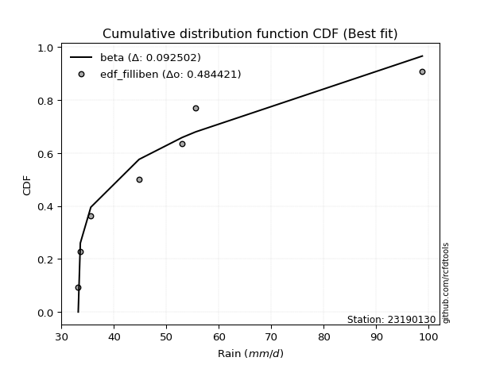</img>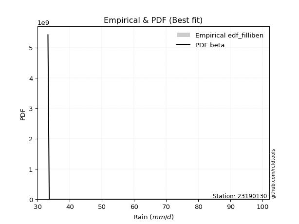</img>

</div>


### 10. Empirical - EDF Jenkinson (1977)

The Jenkinson formula in hydrology is an empirical plotting position formula used to estimate the non-exceedance probability _(P)_ or return period _(T)_ of a given ordered observation within a sample. It is a widely used method in the frequency analysis of extreme events such as floods and rainfall, as it provides a distribution-free way to plot data. _a≈0.31_ and _b≈0.38_ are constants derived to approximate the median of the probability distribution for the given rank.

<div align="center">


$P=(m-a)/(n+b)$


</div>


**10.1. Empirical values**

<div align="center">

|                | 0                   | 1                   | 2                   | 3             | 4                  | 5                  | 6                  |
|:---------------|:--------------------|:--------------------|:--------------------|:--------------|:-------------------|:-------------------|:-------------------|
| date           | 2022                | 2021                | 2023                | 2020          | 2025               | 2019               | 2024               |
| x              | 33.2                | 33.6                | 35.6                | 44.8          | 53.0               | 55.6               | 98.8               |
| m              | 1                   | 2                   | 3                   | 4             | 5                  | 6                  | 7                  |
| empirical_dist | edf_jenkinson       | edf_jenkinson       | edf_jenkinson       | edf_jenkinson | edf_jenkinson      | edf_jenkinson      | edf_jenkinson      |
| empirical      | 0.09349593495934959 | 0.22899728997289973 | 0.36449864498644985 | 0.5           | 0.6355013550135502 | 0.7710027100271003 | 0.9065040650406505 |
| empirical_tr   | 1.1031390134529149  | 1.29701230228471    | 1.5735607675906182  | 2.0           | 2.743494423791822  | 4.366863905325444  | 10.695652173913055 |

</div>


**10.2. Kolmogorov-Smirnov fit test (sorted by Δ)**


<div align="center">

|                | 0                   | 1                   | 2                   | 3                   | 4                   | 5                   | 6                   | 7                   | 8                   | 9                   | 10                  | 11                  | 12                  | 13                  | 14                  | 15                  | 16                  | 17                  | 18                  | 19                  | 20                  | 21                  | 22                  | 23                  | 24                  | 25                  | 26                  | 27                  | 28                  | 29                  | 30                  | 31                  | 32                  | 33                  | 34                  | 35                  | 36                  | 37                  | 38                    | 39                  | 40                  | 41                  | 42                  | 43                  | 44                  | 45                  | 46                  | 47                  | 48                  | 49                  | 50                  | 51                  | 52                  | 53                  | 54                  | 55                  | 56                  | 57                  | 58                  | 59                  | 60                  | 61                  | 62                  | 63                  | 64                  | 65                  | 66                  | 67                  | 68                  | 69                  | 70                  | 71                  | 72                  | 73                  | 74                  | 75                  | 76                  | 77                  | 78                  | 79                  | 80                  | 81                  | 82                  | 83                  | 84                  | 85                  | 86                  | 87                  | 88                  | 89                  |
|:---------------|:--------------------|:--------------------|:--------------------|:--------------------|:--------------------|:--------------------|:--------------------|:--------------------|:--------------------|:--------------------|:--------------------|:--------------------|:--------------------|:--------------------|:--------------------|:--------------------|:--------------------|:--------------------|:--------------------|:--------------------|:--------------------|:--------------------|:--------------------|:--------------------|:--------------------|:--------------------|:--------------------|:--------------------|:--------------------|:--------------------|:--------------------|:--------------------|:--------------------|:--------------------|:--------------------|:--------------------|:--------------------|:--------------------|:----------------------|:--------------------|:--------------------|:--------------------|:--------------------|:--------------------|:--------------------|:--------------------|:--------------------|:--------------------|:--------------------|:--------------------|:--------------------|:--------------------|:--------------------|:--------------------|:--------------------|:--------------------|:--------------------|:--------------------|:--------------------|:--------------------|:--------------------|:--------------------|:--------------------|:--------------------|:--------------------|:--------------------|:--------------------|:--------------------|:--------------------|:--------------------|:--------------------|:--------------------|:--------------------|:--------------------|:--------------------|:--------------------|:--------------------|:--------------------|:--------------------|:--------------------|:--------------------|:--------------------|:--------------------|:--------------------|:--------------------|:--------------------|:--------------------|:--------------------|:--------------------|:--------------------|
| station        | 23190130            | 23190130            | 23190130            | 23190130            | 23190130            | 23190130            | 23190130            | 23190130            | 23190130            | 23190130            | 23190130            | 23190130            | 23190130            | 23190130            | 23190130            | 23190130            | 23190130            | 23190130            | 23190130            | 23190130            | 23190130            | 23190130            | 23190130            | 23190130            | 23190130            | 23190130            | 23190130            | 23190130            | 23190130            | 23190130            | 23190130            | 23190130            | 23190130            | 23190130            | 23190130            | 23190130            | 23190130            | 23190130            | 23190130              | 23190130            | 23190130            | 23190130            | 23190130            | 23190130            | 23190130            | 23190130            | 23190130            | 23190130            | 23190130            | 23190130            | 23190130            | 23190130            | 23190130            | 23190130            | 23190130            | 23190130            | 23190130            | 23190130            | 23190130            | 23190130            | 23190130            | 23190130            | 23190130            | 23190130            | 23190130            | 23190130            | 23190130            | 23190130            | 23190130            | 23190130            | 23190130            | 23190130            | 23190130            | 23190130            | 23190130            | 23190130            | 23190130            | 23190130            | 23190130            | 23190130            | 23190130            | 23190130            | 23190130            | 23190130            | 23190130            | 23190130            | 23190130            | 23190130            | 23190130            | 23190130            |
| empirical_dist | edf_jenkinson       | edf_jenkinson       | edf_jenkinson       | edf_jenkinson       | edf_jenkinson       | edf_jenkinson       | edf_jenkinson       | edf_jenkinson       | edf_jenkinson       | edf_jenkinson       | edf_jenkinson       | edf_jenkinson       | edf_jenkinson       | edf_jenkinson       | edf_jenkinson       | edf_jenkinson       | edf_jenkinson       | edf_jenkinson       | edf_jenkinson       | edf_jenkinson       | edf_jenkinson       | edf_jenkinson       | edf_jenkinson       | edf_jenkinson       | edf_jenkinson       | edf_jenkinson       | edf_jenkinson       | edf_jenkinson       | edf_jenkinson       | edf_jenkinson       | edf_jenkinson       | edf_jenkinson       | edf_jenkinson       | edf_jenkinson       | edf_jenkinson       | edf_jenkinson       | edf_jenkinson       | edf_jenkinson       | edf_jenkinson         | edf_jenkinson       | edf_jenkinson       | edf_jenkinson       | edf_jenkinson       | edf_jenkinson       | edf_jenkinson       | edf_jenkinson       | edf_jenkinson       | edf_jenkinson       | edf_jenkinson       | edf_jenkinson       | edf_jenkinson       | edf_jenkinson       | edf_jenkinson       | edf_jenkinson       | edf_jenkinson       | edf_jenkinson       | edf_jenkinson       | edf_jenkinson       | edf_jenkinson       | edf_jenkinson       | edf_jenkinson       | edf_jenkinson       | edf_jenkinson       | edf_jenkinson       | edf_jenkinson       | edf_jenkinson       | edf_jenkinson       | edf_jenkinson       | edf_jenkinson       | edf_jenkinson       | edf_jenkinson       | edf_jenkinson       | edf_jenkinson       | edf_jenkinson       | edf_jenkinson       | edf_jenkinson       | edf_jenkinson       | edf_jenkinson       | edf_jenkinson       | edf_jenkinson       | edf_jenkinson       | edf_jenkinson       | edf_jenkinson       | edf_jenkinson       | edf_jenkinson       | edf_jenkinson       | edf_jenkinson       | edf_jenkinson       | edf_jenkinson       | edf_jenkinson       |
| p_dist         | lognakagami         | loghalfnorm         | pearson3            | gumbel_r            | moyal               | halflogistic        | nakagami            | lograyleigh         | logfisk             | logmaxwell          | loghalflogistic     | logpearson3         | logloggamma         | t                   | logmielke           | rayleigh            | logcrystalball      | lognorm             | lognorm             | logt                | halfnorm            | loggumbel_r         | logbetaprime        | logalpha            | betaprime           | maxwell             | lognct              | nct                 | logmoyal            | hypsecant           | mielke              | loggenlogistic      | genlogistic         | logistic            | loglogistic         | logkstwobign        | pareto              | loggumbel_l         | loglaplace_asymmetric | kstwobign           | norm                | crystalball         | laplace             | loghypsecant        | rice                | alpha               | logpareto           | logrice             | logexponnorm        | loggenexpon         | logexpon            | loglaplace          | logtruncnorm        | wald                | invgamma            | f                   | logf                | loginvgamma         | erlang              | gamma               | weibull_min         | logncf              | loginvgauss         | invgauss            | exponnorm           | genexpon            | expon               | laplace_asymmetric  | gompertz            | gumbel_l            | logchi2             | fisk                | logweibull_min      | loggompertz         | truncnorm           | loggamma            | loggamma            | logwald             | logfatiguelife      | fatiguelife         | loglognorm          | logerlang           | gibrat              | loggibrat           | ncf                 | invweibull          | chi2                | johnsonsu           | logjohnsonsu        | loginvweibull       |
| delta          | 0.09349493292929323 | 0.10779537054025817 | 0.11399098728529648 | 0.11406441030420383 | 0.11753838220512752 | 0.11918541858383129 | 0.12086432909265545 | 0.12380675112632311 | 0.1280469776941774  | 0.1306117984956213  | 0.13203517302351067 | 0.1350755858995028  | 0.13720893040858623 | 0.1373494763906552  | 0.1423937535310389  | 0.14386620200863232 | 0.1469016997019642  | 0.1469017078135752  | 0.1469017078135752  | 0.14690173985165889 | 0.1469271614174435  | 0.14741104704759536 | 0.14778798074414992 | 0.14953412796868726 | 0.15013470730421558 | 0.1523789608255416  | 0.15269162379713214 | 0.15689993568595537 | 0.15702962634836543 | 0.16096848458423346 | 0.1624174506621054  | 0.16244365112150164 | 0.16452306431122818 | 0.16775173573116509 | 0.1691102978867925  | 0.17224994369881763 | 0.1733313069271416  | 0.17802213619145665 | 0.17872290984101546   | 0.17895005063870084 | 0.1796511672562594  | 0.179651186432079   | 0.1796842292490524  | 0.18273211484355492 | 0.18907781130039358 | 0.19021757409851503 | 0.19152806280140525 | 0.19217675310737772 | 0.1947312883562319  | 0.1954220374977118  | 0.19543050237760112 | 0.19865455378122748 | 0.19906764720215775 | 0.20279712312293677 | 0.2057132069561014  | 0.20571592135640104 | 0.20798165307397998 | 0.2079907062240839  | 0.21320739008287992 | 0.21497803864666054 | 0.2185475949639665  | 0.2225557733075666  | 0.22922859462420486 | 0.232176761556661   | 0.23421982685554837 | 0.23605058376656612 | 0.23605082524680535 | 0.2360554478499079  | 0.2404965278995438  | 0.24097059698325418 | 0.24446428913271545 | 0.2514371024130688  | 0.2564613642242224  | 0.2567089586627631  | 0.2585719044131374  | 0.26737563759971283 | 0.26737563759971283 | 0.2823268378476792  | 0.3221430835592397  | 0.3295590198555053  | 0.33780709966184574 | 0.3441741596328214  | 0.3446803784787227  | 0.36449864498644985 | 0.3795723717836582  | 0.37968866165828163 | 0.4198519917025493  | 0.4586537728585207  | 0.5710773464586261  | 0.6884314680747851  |
| deltao         | 0.48442053926100004 | 0.48442053926100004 | 0.48442053926100004 | 0.48442053926100004 | 0.48442053926100004 | 0.48442053926100004 | 0.48442053926100004 | 0.48442053926100004 | 0.48442053926100004 | 0.48442053926100004 | 0.48442053926100004 | 0.48442053926100004 | 0.48442053926100004 | 0.48442053926100004 | 0.48442053926100004 | 0.48442053926100004 | 0.48442053926100004 | 0.48442053926100004 | 0.48442053926100004 | 0.48442053926100004 | 0.48442053926100004 | 0.48442053926100004 | 0.48442053926100004 | 0.48442053926100004 | 0.48442053926100004 | 0.48442053926100004 | 0.48442053926100004 | 0.48442053926100004 | 0.48442053926100004 | 0.48442053926100004 | 0.48442053926100004 | 0.48442053926100004 | 0.48442053926100004 | 0.48442053926100004 | 0.48442053926100004 | 0.48442053926100004 | 0.48442053926100004 | 0.48442053926100004 | 0.48442053926100004   | 0.48442053926100004 | 0.48442053926100004 | 0.48442053926100004 | 0.48442053926100004 | 0.48442053926100004 | 0.48442053926100004 | 0.48442053926100004 | 0.48442053926100004 | 0.48442053926100004 | 0.48442053926100004 | 0.48442053926100004 | 0.48442053926100004 | 0.48442053926100004 | 0.48442053926100004 | 0.48442053926100004 | 0.48442053926100004 | 0.48442053926100004 | 0.48442053926100004 | 0.48442053926100004 | 0.48442053926100004 | 0.48442053926100004 | 0.48442053926100004 | 0.48442053926100004 | 0.48442053926100004 | 0.48442053926100004 | 0.48442053926100004 | 0.48442053926100004 | 0.48442053926100004 | 0.48442053926100004 | 0.48442053926100004 | 0.48442053926100004 | 0.48442053926100004 | 0.48442053926100004 | 0.48442053926100004 | 0.48442053926100004 | 0.48442053926100004 | 0.48442053926100004 | 0.48442053926100004 | 0.48442053926100004 | 0.48442053926100004 | 0.48442053926100004 | 0.48442053926100004 | 0.48442053926100004 | 0.48442053926100004 | 0.48442053926100004 | 0.48442053926100004 | 0.48442053926100004 | 0.48442053926100004 | 0.48442053926100004 | 0.48442053926100004 | 0.48442053926100004 |
| eval           | Δo > Δ              | Δo > Δ              | Δo > Δ              | Δo > Δ              | Δo > Δ              | Δo > Δ              | Δo > Δ              | Δo > Δ              | Δo > Δ              | Δo > Δ              | Δo > Δ              | Δo > Δ              | Δo > Δ              | Δo > Δ              | Δo > Δ              | Δo > Δ              | Δo > Δ              | Δo > Δ              | Δo > Δ              | Δo > Δ              | Δo > Δ              | Δo > Δ              | Δo > Δ              | Δo > Δ              | Δo > Δ              | Δo > Δ              | Δo > Δ              | Δo > Δ              | Δo > Δ              | Δo > Δ              | Δo > Δ              | Δo > Δ              | Δo > Δ              | Δo > Δ              | Δo > Δ              | Δo > Δ              | Δo > Δ              | Δo > Δ              | Δo > Δ                | Δo > Δ              | Δo > Δ              | Δo > Δ              | Δo > Δ              | Δo > Δ              | Δo > Δ              | Δo > Δ              | Δo > Δ              | Δo > Δ              | Δo > Δ              | Δo > Δ              | Δo > Δ              | Δo > Δ              | Δo > Δ              | Δo > Δ              | Δo > Δ              | Δo > Δ              | Δo > Δ              | Δo > Δ              | Δo > Δ              | Δo > Δ              | Δo > Δ              | Δo > Δ              | Δo > Δ              | Δo > Δ              | Δo > Δ              | Δo > Δ              | Δo > Δ              | Δo > Δ              | Δo > Δ              | Δo > Δ              | Δo > Δ              | Δo > Δ              | Δo > Δ              | Δo > Δ              | Δo > Δ              | Δo > Δ              | Δo > Δ              | Δo > Δ              | Δo > Δ              | Δo > Δ              | Δo > Δ              | Δo > Δ              | Δo > Δ              | Δo > Δ              | Δo > Δ              | Δo > Δ              | Δo > Δ              | Δo > Δ              | Δo <= Δ             | Δo <= Δ             |
| fit            | 1                   | 1                   | 1                   | 1                   | 1                   | 1                   | 1                   | 1                   | 1                   | 1                   | 1                   | 1                   | 1                   | 1                   | 1                   | 1                   | 1                   | 1                   | 1                   | 1                   | 1                   | 1                   | 1                   | 1                   | 1                   | 1                   | 1                   | 1                   | 1                   | 1                   | 1                   | 1                   | 1                   | 1                   | 1                   | 1                   | 1                   | 1                   | 1                     | 1                   | 1                   | 1                   | 1                   | 1                   | 1                   | 1                   | 1                   | 1                   | 1                   | 1                   | 1                   | 1                   | 1                   | 1                   | 1                   | 1                   | 1                   | 1                   | 1                   | 1                   | 1                   | 1                   | 1                   | 1                   | 1                   | 1                   | 1                   | 1                   | 1                   | 1                   | 1                   | 1                   | 1                   | 1                   | 1                   | 1                   | 1                   | 1                   | 1                   | 1                   | 1                   | 1                   | 1                   | 1                   | 1                   | 1                   | 1                   | 1                   | 0                   | 0                   |
| n              | 7                   | 7                   | 7                   | 7                   | 7                   | 7                   | 7                   | 7                   | 7                   | 7                   | 7                   | 7                   | 7                   | 7                   | 7                   | 7                   | 7                   | 7                   | 7                   | 7                   | 7                   | 7                   | 7                   | 7                   | 7                   | 7                   | 7                   | 7                   | 7                   | 7                   | 7                   | 7                   | 7                   | 7                   | 7                   | 7                   | 7                   | 7                   | 7                     | 7                   | 7                   | 7                   | 7                   | 7                   | 7                   | 7                   | 7                   | 7                   | 7                   | 7                   | 7                   | 7                   | 7                   | 7                   | 7                   | 7                   | 7                   | 7                   | 7                   | 7                   | 7                   | 7                   | 7                   | 7                   | 7                   | 7                   | 7                   | 7                   | 7                   | 7                   | 7                   | 7                   | 7                   | 7                   | 7                   | 7                   | 7                   | 7                   | 7                   | 7                   | 7                   | 7                   | 7                   | 7                   | 7                   | 7                   | 7                   | 7                   | 7                   | 7                   |
| best_fit       | 1                   | 0                   | 0                   | 0                   | 0                   | 0                   | 0                   | 0                   | 0                   | 0                   | 0                   | 0                   | 0                   | 0                   | 0                   | 0                   | 0                   | 0                   | 0                   | 0                   | 0                   | 0                   | 0                   | 0                   | 0                   | 0                   | 0                   | 0                   | 0                   | 0                   | 0                   | 0                   | 0                   | 0                   | 0                   | 0                   | 0                   | 0                   | 0                     | 0                   | 0                   | 0                   | 0                   | 0                   | 0                   | 0                   | 0                   | 0                   | 0                   | 0                   | 0                   | 0                   | 0                   | 0                   | 0                   | 0                   | 0                   | 0                   | 0                   | 0                   | 0                   | 0                   | 0                   | 0                   | 0                   | 0                   | 0                   | 0                   | 0                   | 0                   | 0                   | 0                   | 0                   | 0                   | 0                   | 0                   | 0                   | 0                   | 0                   | 0                   | 0                   | 0                   | 0                   | 0                   | 0                   | 0                   | 0                   | 0                   | 0                   | 0                   |
| best_fit_sort  | 1                   | 2                   | 3                   | 4                   | 5                   | 6                   | 7                   | 8                   | 9                   | 10                  | 11                  | 12                  | 13                  | 14                  | 15                  | 16                  | 17                  | 18                  | 19                  | 20                  | 21                  | 22                  | 23                  | 24                  | 25                  | 26                  | 27                  | 28                  | 29                  | 30                  | 31                  | 32                  | 33                  | 34                  | 35                  | 36                  | 37                  | 38                  | 39                    | 40                  | 41                  | 42                  | 43                  | 44                  | 45                  | 46                  | 47                  | 48                  | 49                  | 50                  | 51                  | 52                  | 53                  | 54                  | 55                  | 56                  | 57                  | 58                  | 59                  | 60                  | 61                  | 62                  | 63                  | 64                  | 65                  | 66                  | 67                  | 68                  | 69                  | 70                  | 71                  | 72                  | 73                  | 74                  | 75                  | 76                  | 77                  | 78                  | 79                  | 80                  | 81                  | 82                  | 83                  | 84                  | 85                  | 86                  | 87                  | 88                  | 89                  | 90                  |

</div>


<div align="center">

</img>

</div>


**10.3. Best fit**

<div align="center">

|   id |   station | empirical_dist   | p_dist      |     delta |   deltao | eval   |   fit |   n |   best_fit |   best_fit_sort |
|-----:|----------:|:-----------------|:------------|----------:|---------:|:-------|------:|----:|-----------:|----------------:|
|    0 |  23190130 | edf_jenkinson    | lognakagami | 0.0934949 | 0.484421 | Δo > Δ |     1 |   7 |          1 |               1 |

</div>


<div align="center">

</img></img>

</div>


### 11. Empirical - EDF Cunnane (1978)

Cunnane´s work in statistical hydrology has focused on the performance and evaluation of different probability distributions (such as GEV, Gumbel, Lognormal) for flood frequency estimation. _b_ is a constant, typically set to 0.4.

<div align="center">


$P=(m-b)/(n+1-2b)$


</div>


**11.1. Empirical values**

<div align="center">

|                | 0                   | 1                   | 2                  | 3           | 4                  | 5                  | 6                  |
|:---------------|:--------------------|:--------------------|:-------------------|:------------|:-------------------|:-------------------|:-------------------|
| date           | 2022                | 2021                | 2023               | 2020        | 2025               | 2019               | 2024               |
| x              | 33.2                | 33.6                | 35.6               | 44.8        | 53.0               | 55.6               | 98.8               |
| m              | 1                   | 2                   | 3                  | 4           | 5                  | 6                  | 7                  |
| empirical_dist | edf_cunnane         | edf_cunnane         | edf_cunnane        | edf_cunnane | edf_cunnane        | edf_cunnane        | edf_cunnane        |
| empirical      | 0.08333333333333333 | 0.22222222222222224 | 0.3611111111111111 | 0.5         | 0.6388888888888888 | 0.7777777777777777 | 0.9166666666666666 |
| empirical_tr   | 1.090909090909091   | 1.2857142857142856  | 1.565217391304348  | 2.0         | 2.7692307692307687 | 4.499999999999998  | 11.999999999999995 |

</div>


**11.2. Kolmogorov-Smirnov fit test (sorted by Δ)**


<div align="center">

|                | 0                   | 1                   | 2                   | 3                   | 4                   | 5                   | 6                   | 7                   | 8                   | 9                   | 10                  | 11                  | 12                  | 13                  | 14                  | 15                  | 16                  | 17                  | 18                  | 19                  | 20                  | 21                  | 22                  | 23                  | 24                  | 25                  | 26                  | 27                  | 28                  | 29                  | 30                  | 31                  | 32                  | 33                  | 34                  | 35                  | 36                  | 37                  | 38                    | 39                  | 40                  | 41                  | 42                  | 43                  | 44                  | 45                  | 46                  | 47                  | 48                  | 49                  | 50                  | 51                  | 52                  | 53                  | 54                  | 55                  | 56                  | 57                  | 58                  | 59                  | 60                  | 61                  | 62                  | 63                  | 64                  | 65                  | 66                  | 67                  | 68                  | 69                  | 70                  | 71                  | 72                  | 73                  | 74                  | 75                  | 76                  | 77                  | 78                  | 79                  | 80                  | 81                  | 82                  | 83                  | 84                  | 85                  | 86                  | 87                  | 88                  | 89                  |
|:---------------|:--------------------|:--------------------|:--------------------|:--------------------|:--------------------|:--------------------|:--------------------|:--------------------|:--------------------|:--------------------|:--------------------|:--------------------|:--------------------|:--------------------|:--------------------|:--------------------|:--------------------|:--------------------|:--------------------|:--------------------|:--------------------|:--------------------|:--------------------|:--------------------|:--------------------|:--------------------|:--------------------|:--------------------|:--------------------|:--------------------|:--------------------|:--------------------|:--------------------|:--------------------|:--------------------|:--------------------|:--------------------|:--------------------|:----------------------|:--------------------|:--------------------|:--------------------|:--------------------|:--------------------|:--------------------|:--------------------|:--------------------|:--------------------|:--------------------|:--------------------|:--------------------|:--------------------|:--------------------|:--------------------|:--------------------|:--------------------|:--------------------|:--------------------|:--------------------|:--------------------|:--------------------|:--------------------|:--------------------|:--------------------|:--------------------|:--------------------|:--------------------|:--------------------|:--------------------|:--------------------|:--------------------|:--------------------|:--------------------|:--------------------|:--------------------|:--------------------|:--------------------|:--------------------|:--------------------|:--------------------|:--------------------|:--------------------|:--------------------|:--------------------|:--------------------|:--------------------|:--------------------|:--------------------|:--------------------|:--------------------|
| station        | 23190130            | 23190130            | 23190130            | 23190130            | 23190130            | 23190130            | 23190130            | 23190130            | 23190130            | 23190130            | 23190130            | 23190130            | 23190130            | 23190130            | 23190130            | 23190130            | 23190130            | 23190130            | 23190130            | 23190130            | 23190130            | 23190130            | 23190130            | 23190130            | 23190130            | 23190130            | 23190130            | 23190130            | 23190130            | 23190130            | 23190130            | 23190130            | 23190130            | 23190130            | 23190130            | 23190130            | 23190130            | 23190130            | 23190130              | 23190130            | 23190130            | 23190130            | 23190130            | 23190130            | 23190130            | 23190130            | 23190130            | 23190130            | 23190130            | 23190130            | 23190130            | 23190130            | 23190130            | 23190130            | 23190130            | 23190130            | 23190130            | 23190130            | 23190130            | 23190130            | 23190130            | 23190130            | 23190130            | 23190130            | 23190130            | 23190130            | 23190130            | 23190130            | 23190130            | 23190130            | 23190130            | 23190130            | 23190130            | 23190130            | 23190130            | 23190130            | 23190130            | 23190130            | 23190130            | 23190130            | 23190130            | 23190130            | 23190130            | 23190130            | 23190130            | 23190130            | 23190130            | 23190130            | 23190130            | 23190130            |
| empirical_dist | edf_cunnane         | edf_cunnane         | edf_cunnane         | edf_cunnane         | edf_cunnane         | edf_cunnane         | edf_cunnane         | edf_cunnane         | edf_cunnane         | edf_cunnane         | edf_cunnane         | edf_cunnane         | edf_cunnane         | edf_cunnane         | edf_cunnane         | edf_cunnane         | edf_cunnane         | edf_cunnane         | edf_cunnane         | edf_cunnane         | edf_cunnane         | edf_cunnane         | edf_cunnane         | edf_cunnane         | edf_cunnane         | edf_cunnane         | edf_cunnane         | edf_cunnane         | edf_cunnane         | edf_cunnane         | edf_cunnane         | edf_cunnane         | edf_cunnane         | edf_cunnane         | edf_cunnane         | edf_cunnane         | edf_cunnane         | edf_cunnane         | edf_cunnane           | edf_cunnane         | edf_cunnane         | edf_cunnane         | edf_cunnane         | edf_cunnane         | edf_cunnane         | edf_cunnane         | edf_cunnane         | edf_cunnane         | edf_cunnane         | edf_cunnane         | edf_cunnane         | edf_cunnane         | edf_cunnane         | edf_cunnane         | edf_cunnane         | edf_cunnane         | edf_cunnane         | edf_cunnane         | edf_cunnane         | edf_cunnane         | edf_cunnane         | edf_cunnane         | edf_cunnane         | edf_cunnane         | edf_cunnane         | edf_cunnane         | edf_cunnane         | edf_cunnane         | edf_cunnane         | edf_cunnane         | edf_cunnane         | edf_cunnane         | edf_cunnane         | edf_cunnane         | edf_cunnane         | edf_cunnane         | edf_cunnane         | edf_cunnane         | edf_cunnane         | edf_cunnane         | edf_cunnane         | edf_cunnane         | edf_cunnane         | edf_cunnane         | edf_cunnane         | edf_cunnane         | edf_cunnane         | edf_cunnane         | edf_cunnane         | edf_cunnane         |
| p_dist         | lognakagami         | loghalfnorm         | moyal               | nakagami            | gumbel_r            | lograyleigh         | pearson3            | logmaxwell          | loghalflogistic     | halflogistic        | logpearson3         | logloggamma         | logfisk             | logmielke           | logcrystalball      | lognorm             | lognorm             | logt                | loggumbel_r         | logbetaprime        | betaprime           | t                   | lognct              | logalpha            | rayleigh            | nct                 | logmoyal            | halfnorm            | mielke              | loggenlogistic      | maxwell             | genlogistic         | hypsecant           | loglogistic         | logkstwobign        | pareto              | logistic            | loggumbel_l         | loglaplace_asymmetric | kstwobign           | laplace             | loghypsecant        | logpareto           | rice                | norm                | crystalball         | logexponnorm        | loggenexpon         | logexpon            | logrice             | alpha               | loglaplace          | logtruncnorm        | wald                | invgamma            | f                   | logf                | loginvgamma         | gamma               | erlang              | weibull_min         | loginvgauss         | exponnorm           | invgauss            | genexpon            | expon               | laplace_asymmetric  | logncf              | gompertz            | gumbel_l            | logchi2             | loggompertz         | truncnorm           | logweibull_min      | fisk                | loggamma            | loggamma            | logwald             | logfatiguelife      | fatiguelife         | gibrat              | logerlang           | loglognorm          | loggibrat           | ncf                 | invweibull          | chi2                | johnsonsu           | logjohnsonsu        | loginvweibull       |
| delta          | 0.09528017079387174 | 0.10440783666491943 | 0.11415084832978878 | 0.11860256749218734 | 0.1190743312058089  | 0.12041921725098437 | 0.12415358891131274 | 0.12722426462028255 | 0.12864763914817193 | 0.12934802020984754 | 0.13168805202416406 | 0.13382139653324748 | 0.1382095793201935  | 0.13900621965570015 | 0.14351416582662546 | 0.14351417393823646 | 0.14351417393823646 | 0.14351420597632014 | 0.14402351317225662 | 0.14440044686881118 | 0.14674717342887683 | 0.14751207801667143 | 0.1493040899217934  | 0.14953412796868726 | 0.1506412697593097  | 0.15351240181061662 | 0.15364209247302668 | 0.15708976304345978 | 0.15902991678676665 | 0.1590561172461629  | 0.15915402857621896 | 0.16113553043588943 | 0.1647211346131915  | 0.16572276401145375 | 0.1688624098234789  | 0.1733313069271416  | 0.17452680348184246 | 0.1746346023161179  | 0.17533537596567672   | 0.1755625167633621  | 0.17629669537371365 | 0.17934458096821618 | 0.18475299505072776 | 0.18569027742505484 | 0.18642623500693678 | 0.18642625418275638 | 0.18795622060555442 | 0.18864696974703432 | 0.18865543462692363 | 0.18878921923203898 | 0.19021757409851503 | 0.19526701990588874 | 0.195680113326819   | 0.19940958924759802 | 0.2057132069561014  | 0.20571592135640104 | 0.20798165307397998 | 0.2079907062240839  | 0.2115905047713219  | 0.21320739008287992 | 0.21516006108862776 | 0.22922859462420486 | 0.23083229298020963 | 0.232176761556661   | 0.23266304989122738 | 0.2326632913714666  | 0.23266791397456915 | 0.23271837493358288 | 0.23710899402420504 | 0.24774566473393156 | 0.25123935688339283 | 0.25332142478742437 | 0.25518437053779863 | 0.2564613642242224  | 0.2582121701637462  | 0.26737563759971283 | 0.26737563759971283 | 0.27893930397234046 | 0.3289181513099172  | 0.3363340876061828  | 0.34129284460338394 | 0.3441741596328214  | 0.34458216741252323 | 0.3611111111111111  | 0.3897349734096745  | 0.38985126328429776 | 0.4198519917025493  | 0.4654288406091982  | 0.5778524142093036  | 0.6952065358254625  |
| deltao         | 0.48442053926100004 | 0.48442053926100004 | 0.48442053926100004 | 0.48442053926100004 | 0.48442053926100004 | 0.48442053926100004 | 0.48442053926100004 | 0.48442053926100004 | 0.48442053926100004 | 0.48442053926100004 | 0.48442053926100004 | 0.48442053926100004 | 0.48442053926100004 | 0.48442053926100004 | 0.48442053926100004 | 0.48442053926100004 | 0.48442053926100004 | 0.48442053926100004 | 0.48442053926100004 | 0.48442053926100004 | 0.48442053926100004 | 0.48442053926100004 | 0.48442053926100004 | 0.48442053926100004 | 0.48442053926100004 | 0.48442053926100004 | 0.48442053926100004 | 0.48442053926100004 | 0.48442053926100004 | 0.48442053926100004 | 0.48442053926100004 | 0.48442053926100004 | 0.48442053926100004 | 0.48442053926100004 | 0.48442053926100004 | 0.48442053926100004 | 0.48442053926100004 | 0.48442053926100004 | 0.48442053926100004   | 0.48442053926100004 | 0.48442053926100004 | 0.48442053926100004 | 0.48442053926100004 | 0.48442053926100004 | 0.48442053926100004 | 0.48442053926100004 | 0.48442053926100004 | 0.48442053926100004 | 0.48442053926100004 | 0.48442053926100004 | 0.48442053926100004 | 0.48442053926100004 | 0.48442053926100004 | 0.48442053926100004 | 0.48442053926100004 | 0.48442053926100004 | 0.48442053926100004 | 0.48442053926100004 | 0.48442053926100004 | 0.48442053926100004 | 0.48442053926100004 | 0.48442053926100004 | 0.48442053926100004 | 0.48442053926100004 | 0.48442053926100004 | 0.48442053926100004 | 0.48442053926100004 | 0.48442053926100004 | 0.48442053926100004 | 0.48442053926100004 | 0.48442053926100004 | 0.48442053926100004 | 0.48442053926100004 | 0.48442053926100004 | 0.48442053926100004 | 0.48442053926100004 | 0.48442053926100004 | 0.48442053926100004 | 0.48442053926100004 | 0.48442053926100004 | 0.48442053926100004 | 0.48442053926100004 | 0.48442053926100004 | 0.48442053926100004 | 0.48442053926100004 | 0.48442053926100004 | 0.48442053926100004 | 0.48442053926100004 | 0.48442053926100004 | 0.48442053926100004 |
| eval           | Δo > Δ              | Δo > Δ              | Δo > Δ              | Δo > Δ              | Δo > Δ              | Δo > Δ              | Δo > Δ              | Δo > Δ              | Δo > Δ              | Δo > Δ              | Δo > Δ              | Δo > Δ              | Δo > Δ              | Δo > Δ              | Δo > Δ              | Δo > Δ              | Δo > Δ              | Δo > Δ              | Δo > Δ              | Δo > Δ              | Δo > Δ              | Δo > Δ              | Δo > Δ              | Δo > Δ              | Δo > Δ              | Δo > Δ              | Δo > Δ              | Δo > Δ              | Δo > Δ              | Δo > Δ              | Δo > Δ              | Δo > Δ              | Δo > Δ              | Δo > Δ              | Δo > Δ              | Δo > Δ              | Δo > Δ              | Δo > Δ              | Δo > Δ                | Δo > Δ              | Δo > Δ              | Δo > Δ              | Δo > Δ              | Δo > Δ              | Δo > Δ              | Δo > Δ              | Δo > Δ              | Δo > Δ              | Δo > Δ              | Δo > Δ              | Δo > Δ              | Δo > Δ              | Δo > Δ              | Δo > Δ              | Δo > Δ              | Δo > Δ              | Δo > Δ              | Δo > Δ              | Δo > Δ              | Δo > Δ              | Δo > Δ              | Δo > Δ              | Δo > Δ              | Δo > Δ              | Δo > Δ              | Δo > Δ              | Δo > Δ              | Δo > Δ              | Δo > Δ              | Δo > Δ              | Δo > Δ              | Δo > Δ              | Δo > Δ              | Δo > Δ              | Δo > Δ              | Δo > Δ              | Δo > Δ              | Δo > Δ              | Δo > Δ              | Δo > Δ              | Δo > Δ              | Δo > Δ              | Δo > Δ              | Δo > Δ              | Δo > Δ              | Δo > Δ              | Δo > Δ              | Δo > Δ              | Δo <= Δ             | Δo <= Δ             |
| fit            | 1                   | 1                   | 1                   | 1                   | 1                   | 1                   | 1                   | 1                   | 1                   | 1                   | 1                   | 1                   | 1                   | 1                   | 1                   | 1                   | 1                   | 1                   | 1                   | 1                   | 1                   | 1                   | 1                   | 1                   | 1                   | 1                   | 1                   | 1                   | 1                   | 1                   | 1                   | 1                   | 1                   | 1                   | 1                   | 1                   | 1                   | 1                   | 1                     | 1                   | 1                   | 1                   | 1                   | 1                   | 1                   | 1                   | 1                   | 1                   | 1                   | 1                   | 1                   | 1                   | 1                   | 1                   | 1                   | 1                   | 1                   | 1                   | 1                   | 1                   | 1                   | 1                   | 1                   | 1                   | 1                   | 1                   | 1                   | 1                   | 1                   | 1                   | 1                   | 1                   | 1                   | 1                   | 1                   | 1                   | 1                   | 1                   | 1                   | 1                   | 1                   | 1                   | 1                   | 1                   | 1                   | 1                   | 1                   | 1                   | 0                   | 0                   |
| n              | 7                   | 7                   | 7                   | 7                   | 7                   | 7                   | 7                   | 7                   | 7                   | 7                   | 7                   | 7                   | 7                   | 7                   | 7                   | 7                   | 7                   | 7                   | 7                   | 7                   | 7                   | 7                   | 7                   | 7                   | 7                   | 7                   | 7                   | 7                   | 7                   | 7                   | 7                   | 7                   | 7                   | 7                   | 7                   | 7                   | 7                   | 7                   | 7                     | 7                   | 7                   | 7                   | 7                   | 7                   | 7                   | 7                   | 7                   | 7                   | 7                   | 7                   | 7                   | 7                   | 7                   | 7                   | 7                   | 7                   | 7                   | 7                   | 7                   | 7                   | 7                   | 7                   | 7                   | 7                   | 7                   | 7                   | 7                   | 7                   | 7                   | 7                   | 7                   | 7                   | 7                   | 7                   | 7                   | 7                   | 7                   | 7                   | 7                   | 7                   | 7                   | 7                   | 7                   | 7                   | 7                   | 7                   | 7                   | 7                   | 7                   | 7                   |
| best_fit       | 1                   | 0                   | 0                   | 0                   | 0                   | 0                   | 0                   | 0                   | 0                   | 0                   | 0                   | 0                   | 0                   | 0                   | 0                   | 0                   | 0                   | 0                   | 0                   | 0                   | 0                   | 0                   | 0                   | 0                   | 0                   | 0                   | 0                   | 0                   | 0                   | 0                   | 0                   | 0                   | 0                   | 0                   | 0                   | 0                   | 0                   | 0                   | 0                     | 0                   | 0                   | 0                   | 0                   | 0                   | 0                   | 0                   | 0                   | 0                   | 0                   | 0                   | 0                   | 0                   | 0                   | 0                   | 0                   | 0                   | 0                   | 0                   | 0                   | 0                   | 0                   | 0                   | 0                   | 0                   | 0                   | 0                   | 0                   | 0                   | 0                   | 0                   | 0                   | 0                   | 0                   | 0                   | 0                   | 0                   | 0                   | 0                   | 0                   | 0                   | 0                   | 0                   | 0                   | 0                   | 0                   | 0                   | 0                   | 0                   | 0                   | 0                   |
| best_fit_sort  | 1                   | 2                   | 3                   | 4                   | 5                   | 6                   | 7                   | 8                   | 9                   | 10                  | 11                  | 12                  | 13                  | 14                  | 15                  | 16                  | 17                  | 18                  | 19                  | 20                  | 21                  | 22                  | 23                  | 24                  | 25                  | 26                  | 27                  | 28                  | 29                  | 30                  | 31                  | 32                  | 33                  | 34                  | 35                  | 36                  | 37                  | 38                  | 39                    | 40                  | 41                  | 42                  | 43                  | 44                  | 45                  | 46                  | 47                  | 48                  | 49                  | 50                  | 51                  | 52                  | 53                  | 54                  | 55                  | 56                  | 57                  | 58                  | 59                  | 60                  | 61                  | 62                  | 63                  | 64                  | 65                  | 66                  | 67                  | 68                  | 69                  | 70                  | 71                  | 72                  | 73                  | 74                  | 75                  | 76                  | 77                  | 78                  | 79                  | 80                  | 81                  | 82                  | 83                  | 84                  | 85                  | 86                  | 87                  | 88                  | 89                  | 90                  |

</div>


<div align="center">

</img>

</div>


**11.3. Best fit**

<div align="center">

|   id |   station | empirical_dist   | p_dist      |     delta |   deltao | eval   |   fit |   n |   best_fit |   best_fit_sort |
|-----:|----------:|:-----------------|:------------|----------:|---------:|:-------|------:|----:|-----------:|----------------:|
|    0 |  23190130 | edf_cunnane      | lognakagami | 0.0952802 | 0.484421 | Δo > Δ |     1 |   7 |          1 |               1 |

</div>


<div align="center">

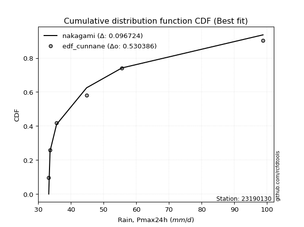</img>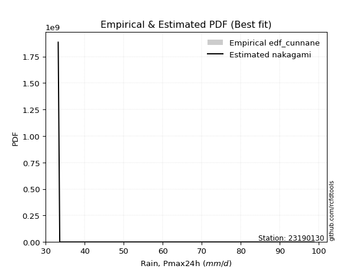</img>

</div>


### 12. Empirical - EDF Adamowski (1981)

The Adamowski formula in hydrology refers to a specific plotting position formula used for estimating the non-parametric empirical distribution of hydrological events (like flood peaks) to calculate their return periods. This formula provides an alternative to traditional parametric methods (like the Gumbel or Log Pearson Type III distributions). 

<div align="center">


$P=(m-0.25)/(n+0.5)$


</div>


**12.1. Empirical values**

<div align="center">

|                | 0                  | 1                   | 2                   | 3             | 4                  | 5                  | 6                  |
|:---------------|:-------------------|:--------------------|:--------------------|:--------------|:-------------------|:-------------------|:-------------------|
| date           | 2022               | 2021                | 2023                | 2020          | 2025               | 2019               | 2024               |
| x              | 33.2               | 33.6                | 35.6                | 44.8          | 53.0               | 55.6               | 98.8               |
| m              | 1                  | 2                   | 3                   | 4             | 5                  | 6                  | 7                  |
| empirical_dist | edf_adamowski      | edf_adamowski       | edf_adamowski       | edf_adamowski | edf_adamowski      | edf_adamowski      | edf_adamowski      |
| empirical      | 0.1                | 0.23333333333333334 | 0.36666666666666664 | 0.5           | 0.6333333333333333 | 0.7666666666666667 | 0.9                |
| empirical_tr   | 1.1111111111111112 | 1.3043478260869565  | 1.5789473684210527  | 2.0           | 2.727272727272727  | 4.2857142857142865 | 10.000000000000002 |

</div>


**12.2. Kolmogorov-Smirnov fit test (sorted by Δ)**


<div align="center">

|                | 0                   | 1                   | 2                   | 3                   | 4                   | 5                   | 6                   | 7                   | 8                   | 9                   | 10                  | 11                  | 12                  | 13                  | 14                  | 15                  | 16                  | 17                  | 18                  | 19                  | 20                  | 21                  | 22                  | 23                  | 24                  | 25                  | 26                  | 27                  | 28                  | 29                  | 30                  | 31                  | 32                  | 33                  | 34                  | 35                  | 36                  | 37                  | 38                  | 39                  | 40                    | 41                  | 42                  | 43                  | 44                  | 45                  | 46                  | 47                  | 48                  | 49                  | 50                  | 51                  | 52                  | 53                  | 54                  | 55                  | 56                  | 57                  | 58                  | 59                  | 60                  | 61                  | 62                  | 63                  | 64                  | 65                  | 66                  | 67                  | 68                  | 69                  | 70                  | 71                  | 72                  | 73                  | 74                  | 75                  | 76                  | 77                  | 78                  | 79                  | 80                  | 81                  | 82                  | 83                  | 84                  | 85                  | 86                  | 87                  | 88                  | 89                  |
|:---------------|:--------------------|:--------------------|:--------------------|:--------------------|:--------------------|:--------------------|:--------------------|:--------------------|:--------------------|:--------------------|:--------------------|:--------------------|:--------------------|:--------------------|:--------------------|:--------------------|:--------------------|:--------------------|:--------------------|:--------------------|:--------------------|:--------------------|:--------------------|:--------------------|:--------------------|:--------------------|:--------------------|:--------------------|:--------------------|:--------------------|:--------------------|:--------------------|:--------------------|:--------------------|:--------------------|:--------------------|:--------------------|:--------------------|:--------------------|:--------------------|:----------------------|:--------------------|:--------------------|:--------------------|:--------------------|:--------------------|:--------------------|:--------------------|:--------------------|:--------------------|:--------------------|:--------------------|:--------------------|:--------------------|:--------------------|:--------------------|:--------------------|:--------------------|:--------------------|:--------------------|:--------------------|:--------------------|:--------------------|:--------------------|:--------------------|:--------------------|:--------------------|:--------------------|:--------------------|:--------------------|:--------------------|:--------------------|:--------------------|:--------------------|:--------------------|:--------------------|:--------------------|:--------------------|:--------------------|:--------------------|:--------------------|:--------------------|:--------------------|:--------------------|:--------------------|:--------------------|:--------------------|:--------------------|:--------------------|:--------------------|
| station        | 23190130            | 23190130            | 23190130            | 23190130            | 23190130            | 23190130            | 23190130            | 23190130            | 23190130            | 23190130            | 23190130            | 23190130            | 23190130            | 23190130            | 23190130            | 23190130            | 23190130            | 23190130            | 23190130            | 23190130            | 23190130            | 23190130            | 23190130            | 23190130            | 23190130            | 23190130            | 23190130            | 23190130            | 23190130            | 23190130            | 23190130            | 23190130            | 23190130            | 23190130            | 23190130            | 23190130            | 23190130            | 23190130            | 23190130            | 23190130            | 23190130              | 23190130            | 23190130            | 23190130            | 23190130            | 23190130            | 23190130            | 23190130            | 23190130            | 23190130            | 23190130            | 23190130            | 23190130            | 23190130            | 23190130            | 23190130            | 23190130            | 23190130            | 23190130            | 23190130            | 23190130            | 23190130            | 23190130            | 23190130            | 23190130            | 23190130            | 23190130            | 23190130            | 23190130            | 23190130            | 23190130            | 23190130            | 23190130            | 23190130            | 23190130            | 23190130            | 23190130            | 23190130            | 23190130            | 23190130            | 23190130            | 23190130            | 23190130            | 23190130            | 23190130            | 23190130            | 23190130            | 23190130            | 23190130            | 23190130            |
| empirical_dist | edf_adamowski       | edf_adamowski       | edf_adamowski       | edf_adamowski       | edf_adamowski       | edf_adamowski       | edf_adamowski       | edf_adamowski       | edf_adamowski       | edf_adamowski       | edf_adamowski       | edf_adamowski       | edf_adamowski       | edf_adamowski       | edf_adamowski       | edf_adamowski       | edf_adamowski       | edf_adamowski       | edf_adamowski       | edf_adamowski       | edf_adamowski       | edf_adamowski       | edf_adamowski       | edf_adamowski       | edf_adamowski       | edf_adamowski       | edf_adamowski       | edf_adamowski       | edf_adamowski       | edf_adamowski       | edf_adamowski       | edf_adamowski       | edf_adamowski       | edf_adamowski       | edf_adamowski       | edf_adamowski       | edf_adamowski       | edf_adamowski       | edf_adamowski       | edf_adamowski       | edf_adamowski         | edf_adamowski       | edf_adamowski       | edf_adamowski       | edf_adamowski       | edf_adamowski       | edf_adamowski       | edf_adamowski       | edf_adamowski       | edf_adamowski       | edf_adamowski       | edf_adamowski       | edf_adamowski       | edf_adamowski       | edf_adamowski       | edf_adamowski       | edf_adamowski       | edf_adamowski       | edf_adamowski       | edf_adamowski       | edf_adamowski       | edf_adamowski       | edf_adamowski       | edf_adamowski       | edf_adamowski       | edf_adamowski       | edf_adamowski       | edf_adamowski       | edf_adamowski       | edf_adamowski       | edf_adamowski       | edf_adamowski       | edf_adamowski       | edf_adamowski       | edf_adamowski       | edf_adamowski       | edf_adamowski       | edf_adamowski       | edf_adamowski       | edf_adamowski       | edf_adamowski       | edf_adamowski       | edf_adamowski       | edf_adamowski       | edf_adamowski       | edf_adamowski       | edf_adamowski       | edf_adamowski       | edf_adamowski       | edf_adamowski       |
| p_dist         | lognakagami         | pearson3            | loghalfnorm         | halflogistic        | gumbel_r            | moyal               | logfisk             | nakagami            | lograyleigh         | t                   | logmaxwell          | loghalflogistic     | logpearson3         | logloggamma         | rayleigh            | halfnorm            | logmielke           | maxwell             | logcrystalball      | lognorm             | lognorm             | logt                | logalpha            | loggumbel_r         | logbetaprime        | betaprime           | lognct              | nct                 | logmoyal            | hypsecant           | logistic            | mielke              | loggenlogistic      | genlogistic         | loglogistic         | pareto              | logkstwobign        | norm                | crystalball         | loggumbel_l         | loglaplace_asymmetric | kstwobign           | laplace             | loghypsecant        | alpha               | rice                | logrice             | logpareto           | logexponnorm        | loggenexpon         | logexpon            | loglaplace          | logtruncnorm        | wald                | invgamma            | f                   | logf                | loginvgamma         | erlang              | logncf              | gamma               | weibull_min         | loginvgauss         | invgauss            | exponnorm           | gumbel_l            | genexpon            | expon               | laplace_asymmetric  | logchi2             | gompertz            | fisk                | logweibull_min      | loggompertz         | truncnorm           | loggamma            | loggamma            | logwald             | logfatiguelife      | fatiguelife         | loglognorm          | logerlang           | gibrat              | loggibrat           | ncf                 | invweibull          | chi2                | johnsonsu           | logjohnsonsu        | loginvweibull       |
| delta          | 0.09999899796994365 | 0.10748692224464607 | 0.10996339222047496 | 0.11268135354318087 | 0.11623243198442063 | 0.11970640388534431 | 0.1215429126535269  | 0.12520037245308907 | 0.1259747728065399  | 0.13084541135000477 | 0.1327798201758381  | 0.13420319470372746 | 0.1372436075797196  | 0.13937695208880302 | 0.13953015864819873 | 0.1404230963767931  | 0.14456177521125568 | 0.148042917465108   | 0.149069721382181   | 0.149069729493792   | 0.149069729493792   | 0.14906976153187568 | 0.14953412796868726 | 0.14957906872781215 | 0.1499560024243667  | 0.15230272898443237 | 0.15485964547734893 | 0.15906795736617216 | 0.15919764802858222 | 0.16313650626445025 | 0.1634156923707315  | 0.16458547234232218 | 0.16461167280171843 | 0.16669108599144497 | 0.17127831956700929 | 0.1733313069271416  | 0.17441796537903442 | 0.17531512389582582 | 0.17531514307164542 | 0.18019015787167345 | 0.18089093152123226   | 0.18111807231891763 | 0.18185225092926918 | 0.1849001365237717  | 0.19021757409851503 | 0.19124583298061038 | 0.19434477478759452 | 0.19586410616183886 | 0.19906733171666552 | 0.19975808085814542 | 0.19976654573803473 | 0.20082257546144427 | 0.20304489976366202 | 0.20496514480315356 | 0.2057132069561014  | 0.20571592135640104 | 0.20798165307397998 | 0.2079907062240839  | 0.21320739008287992 | 0.2160517082669162  | 0.21714606032687744 | 0.2207156166441833  | 0.22922859462420486 | 0.232176761556661   | 0.23638784853576517 | 0.2366345536228206  | 0.23821860544678292 | 0.23821884692702214 | 0.2382234695301247  | 0.24012824577228187 | 0.24266454957976058 | 0.24710105905263524 | 0.2564613642242224  | 0.2588769803429799  | 0.26073992609335417 | 0.26737563759971283 | 0.26737563759971283 | 0.284494859527896   | 0.31780704019880607 | 0.32522297649507165 | 0.3334710563014121  | 0.3441741596328214  | 0.3468484001589395  | 0.36666666666666664 | 0.37306830674300784 | 0.37318459661763115 | 0.4198519917025493  | 0.4543177294980871  | 0.5667413030981925  | 0.6840954247143514  |
| deltao         | 0.48442053926100004 | 0.48442053926100004 | 0.48442053926100004 | 0.48442053926100004 | 0.48442053926100004 | 0.48442053926100004 | 0.48442053926100004 | 0.48442053926100004 | 0.48442053926100004 | 0.48442053926100004 | 0.48442053926100004 | 0.48442053926100004 | 0.48442053926100004 | 0.48442053926100004 | 0.48442053926100004 | 0.48442053926100004 | 0.48442053926100004 | 0.48442053926100004 | 0.48442053926100004 | 0.48442053926100004 | 0.48442053926100004 | 0.48442053926100004 | 0.48442053926100004 | 0.48442053926100004 | 0.48442053926100004 | 0.48442053926100004 | 0.48442053926100004 | 0.48442053926100004 | 0.48442053926100004 | 0.48442053926100004 | 0.48442053926100004 | 0.48442053926100004 | 0.48442053926100004 | 0.48442053926100004 | 0.48442053926100004 | 0.48442053926100004 | 0.48442053926100004 | 0.48442053926100004 | 0.48442053926100004 | 0.48442053926100004 | 0.48442053926100004   | 0.48442053926100004 | 0.48442053926100004 | 0.48442053926100004 | 0.48442053926100004 | 0.48442053926100004 | 0.48442053926100004 | 0.48442053926100004 | 0.48442053926100004 | 0.48442053926100004 | 0.48442053926100004 | 0.48442053926100004 | 0.48442053926100004 | 0.48442053926100004 | 0.48442053926100004 | 0.48442053926100004 | 0.48442053926100004 | 0.48442053926100004 | 0.48442053926100004 | 0.48442053926100004 | 0.48442053926100004 | 0.48442053926100004 | 0.48442053926100004 | 0.48442053926100004 | 0.48442053926100004 | 0.48442053926100004 | 0.48442053926100004 | 0.48442053926100004 | 0.48442053926100004 | 0.48442053926100004 | 0.48442053926100004 | 0.48442053926100004 | 0.48442053926100004 | 0.48442053926100004 | 0.48442053926100004 | 0.48442053926100004 | 0.48442053926100004 | 0.48442053926100004 | 0.48442053926100004 | 0.48442053926100004 | 0.48442053926100004 | 0.48442053926100004 | 0.48442053926100004 | 0.48442053926100004 | 0.48442053926100004 | 0.48442053926100004 | 0.48442053926100004 | 0.48442053926100004 | 0.48442053926100004 | 0.48442053926100004 |
| eval           | Δo > Δ              | Δo > Δ              | Δo > Δ              | Δo > Δ              | Δo > Δ              | Δo > Δ              | Δo > Δ              | Δo > Δ              | Δo > Δ              | Δo > Δ              | Δo > Δ              | Δo > Δ              | Δo > Δ              | Δo > Δ              | Δo > Δ              | Δo > Δ              | Δo > Δ              | Δo > Δ              | Δo > Δ              | Δo > Δ              | Δo > Δ              | Δo > Δ              | Δo > Δ              | Δo > Δ              | Δo > Δ              | Δo > Δ              | Δo > Δ              | Δo > Δ              | Δo > Δ              | Δo > Δ              | Δo > Δ              | Δo > Δ              | Δo > Δ              | Δo > Δ              | Δo > Δ              | Δo > Δ              | Δo > Δ              | Δo > Δ              | Δo > Δ              | Δo > Δ              | Δo > Δ                | Δo > Δ              | Δo > Δ              | Δo > Δ              | Δo > Δ              | Δo > Δ              | Δo > Δ              | Δo > Δ              | Δo > Δ              | Δo > Δ              | Δo > Δ              | Δo > Δ              | Δo > Δ              | Δo > Δ              | Δo > Δ              | Δo > Δ              | Δo > Δ              | Δo > Δ              | Δo > Δ              | Δo > Δ              | Δo > Δ              | Δo > Δ              | Δo > Δ              | Δo > Δ              | Δo > Δ              | Δo > Δ              | Δo > Δ              | Δo > Δ              | Δo > Δ              | Δo > Δ              | Δo > Δ              | Δo > Δ              | Δo > Δ              | Δo > Δ              | Δo > Δ              | Δo > Δ              | Δo > Δ              | Δo > Δ              | Δo > Δ              | Δo > Δ              | Δo > Δ              | Δo > Δ              | Δo > Δ              | Δo > Δ              | Δo > Δ              | Δo > Δ              | Δo > Δ              | Δo > Δ              | Δo <= Δ             | Δo <= Δ             |
| fit            | 1                   | 1                   | 1                   | 1                   | 1                   | 1                   | 1                   | 1                   | 1                   | 1                   | 1                   | 1                   | 1                   | 1                   | 1                   | 1                   | 1                   | 1                   | 1                   | 1                   | 1                   | 1                   | 1                   | 1                   | 1                   | 1                   | 1                   | 1                   | 1                   | 1                   | 1                   | 1                   | 1                   | 1                   | 1                   | 1                   | 1                   | 1                   | 1                   | 1                   | 1                     | 1                   | 1                   | 1                   | 1                   | 1                   | 1                   | 1                   | 1                   | 1                   | 1                   | 1                   | 1                   | 1                   | 1                   | 1                   | 1                   | 1                   | 1                   | 1                   | 1                   | 1                   | 1                   | 1                   | 1                   | 1                   | 1                   | 1                   | 1                   | 1                   | 1                   | 1                   | 1                   | 1                   | 1                   | 1                   | 1                   | 1                   | 1                   | 1                   | 1                   | 1                   | 1                   | 1                   | 1                   | 1                   | 1                   | 1                   | 0                   | 0                   |
| n              | 7                   | 7                   | 7                   | 7                   | 7                   | 7                   | 7                   | 7                   | 7                   | 7                   | 7                   | 7                   | 7                   | 7                   | 7                   | 7                   | 7                   | 7                   | 7                   | 7                   | 7                   | 7                   | 7                   | 7                   | 7                   | 7                   | 7                   | 7                   | 7                   | 7                   | 7                   | 7                   | 7                   | 7                   | 7                   | 7                   | 7                   | 7                   | 7                   | 7                   | 7                     | 7                   | 7                   | 7                   | 7                   | 7                   | 7                   | 7                   | 7                   | 7                   | 7                   | 7                   | 7                   | 7                   | 7                   | 7                   | 7                   | 7                   | 7                   | 7                   | 7                   | 7                   | 7                   | 7                   | 7                   | 7                   | 7                   | 7                   | 7                   | 7                   | 7                   | 7                   | 7                   | 7                   | 7                   | 7                   | 7                   | 7                   | 7                   | 7                   | 7                   | 7                   | 7                   | 7                   | 7                   | 7                   | 7                   | 7                   | 7                   | 7                   |
| best_fit       | 1                   | 0                   | 0                   | 0                   | 0                   | 0                   | 0                   | 0                   | 0                   | 0                   | 0                   | 0                   | 0                   | 0                   | 0                   | 0                   | 0                   | 0                   | 0                   | 0                   | 0                   | 0                   | 0                   | 0                   | 0                   | 0                   | 0                   | 0                   | 0                   | 0                   | 0                   | 0                   | 0                   | 0                   | 0                   | 0                   | 0                   | 0                   | 0                   | 0                   | 0                     | 0                   | 0                   | 0                   | 0                   | 0                   | 0                   | 0                   | 0                   | 0                   | 0                   | 0                   | 0                   | 0                   | 0                   | 0                   | 0                   | 0                   | 0                   | 0                   | 0                   | 0                   | 0                   | 0                   | 0                   | 0                   | 0                   | 0                   | 0                   | 0                   | 0                   | 0                   | 0                   | 0                   | 0                   | 0                   | 0                   | 0                   | 0                   | 0                   | 0                   | 0                   | 0                   | 0                   | 0                   | 0                   | 0                   | 0                   | 0                   | 0                   |
| best_fit_sort  | 1                   | 2                   | 3                   | 4                   | 5                   | 6                   | 7                   | 8                   | 9                   | 10                  | 11                  | 12                  | 13                  | 14                  | 15                  | 16                  | 17                  | 18                  | 19                  | 20                  | 21                  | 22                  | 23                  | 24                  | 25                  | 26                  | 27                  | 28                  | 29                  | 30                  | 31                  | 32                  | 33                  | 34                  | 35                  | 36                  | 37                  | 38                  | 39                  | 40                  | 41                    | 42                  | 43                  | 44                  | 45                  | 46                  | 47                  | 48                  | 49                  | 50                  | 51                  | 52                  | 53                  | 54                  | 55                  | 56                  | 57                  | 58                  | 59                  | 60                  | 61                  | 62                  | 63                  | 64                  | 65                  | 66                  | 67                  | 68                  | 69                  | 70                  | 71                  | 72                  | 73                  | 74                  | 75                  | 76                  | 77                  | 78                  | 79                  | 80                  | 81                  | 82                  | 83                  | 84                  | 85                  | 86                  | 87                  | 88                  | 89                  | 90                  |

</div>


<div align="center">

</img>

</div>


**12.3. Best fit**

<div align="center">

|   id |   station | empirical_dist   | p_dist      |    delta |   deltao | eval   |   fit |   n |   best_fit |   best_fit_sort |
|-----:|----------:|:-----------------|:------------|---------:|---------:|:-------|------:|----:|-----------:|----------------:|
|    0 |  23190130 | edf_adamowski    | lognakagami | 0.099999 | 0.484421 | Δo > Δ |     1 |   7 |          1 |               1 |

</div>


<div align="center">

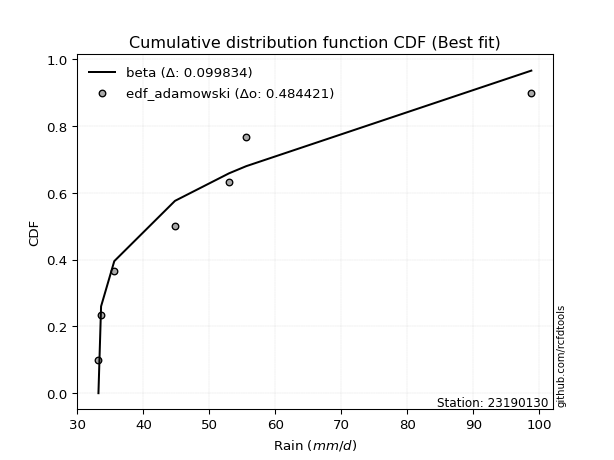</img></img>

</div>


## C. Best fit & Estimate extreme values for specific return periods - Tr


### 1. Best fit (ordered by delta Δ)

<div align="center">

|   id |   station | empirical_dist   | p_dist       |     delta |   deltao | eval   |   fit |   n |   best_fit |   best_fit_sort |
|-----:|----------:|:-----------------|:-------------|----------:|---------:|:-------|------:|----:|-----------:|----------------:|
|    0 |  23190130 | edf_tukey        | lognakagami  | 0.0909081 | 0.484421 | Δo > Δ |     1 |   7 |          1 |               1 |
|    1 |  23190130 | edf_filliben     | lognakagami  | 0.092667  | 0.484421 | Δo > Δ |     1 |   7 |          1 |               2 |
|    2 |  23190130 | edf_blom         | lognakagami  | 0.0933645 | 0.484421 | Δo > Δ |     1 |   7 |          1 |               3 |
|    3 |  23190130 | edf_jenkinson    | lognakagami  | 0.0934949 | 0.484421 | Δo > Δ |     1 |   7 |          1 |               4 |
|    4 |  23190130 | edf_beard        | lognakagami  | 0.0934949 | 0.484421 | Δo > Δ |     1 |   7 |          1 |               5 |
|    5 |  23190130 | edf_chegodayev   | lognakagami  | 0.0945936 | 0.484421 | Δo > Δ |     1 |   7 |          1 |               6 |
|    6 |  23190130 | edf_cunnane      | lognakagami  | 0.0952802 | 0.484421 | Δo > Δ |     1 |   7 |          1 |               7 |
|    7 |  23190130 | edf_gringorten   | lognakagami  | 0.0984013 | 0.484421 | Δo > Δ |     1 |   7 |          1 |               8 |
|    8 |  23190130 | edf_adamowski    | lognakagami  | 0.099999  | 0.484421 | Δo > Δ |     1 |   7 |          1 |               9 |
|    9 |  23190130 | edf_hazen        | loghalfnorm  | 0.10044   | 0.484421 | Δo > Δ |     1 |   7 |          1 |              10 |
|   10 |  23190130 | edf_weibull      | halflogistic | 0.100634  | 0.484421 | Δo > Δ |     1 |   7 |          1 |              11 |
|   11 |  23190130 | edf_california   | f            | 0.139164  | 0.484421 | Δo > Δ |     1 |   7 |          1 |              12 |

</div>

:file_folder:Tables: [bestfit_23190130.csv](table/bestfit_23190130.csv) | [extreme_23190130.csv](table/extreme_23190130.csv)


### 2. Extreme values

In hydrology, a return period (or recurrence interval $Tr$) is the statistical average time between extreme events like floods or droughts of a specific magnitude, indicating how rare an event is, with a 100-year flood, for example, having a 1% chance of occurring in any given year, not that it happens exactly every century. It is a key tool for infrastructure design (like bridges or dams) and risk assessment, calculated from historical data to determine the probability of future events, although it is important to remember it is statistical average, and events can cluster or be missed.

> risk_rate: assuming the return period as the project useful life.

|   id |      tr |   prob_l |     prob_g |     alpha |   betaprime |    chi2 |   crystalball |   erlang |    expon |   exponnorm |                f |   fatiguelife |        fisk |    gamma |   genexpon |   genlogistic |   gibrat |   gompertz |   gumbel_l |   gumbel_r |   halflogistic |   halfnorm |   hypsecant |         invgamma |   invgauss |    invweibull |        johnsonsu |   kstwobign |   laplace |   laplace_asymmetric |   loggamma |   logistic |   lognorm |   maxwell |   mielke |    moyal |   nakagami |       ncf |      nct |     norm |     pareto |   pearson3 |   rayleigh |     rice |        t |   truncnorm |     wald |   weibull_min |         logalpha |   logbetaprime |          logchi2 |   logcrystalball |   logerlang |   logexpon |   logexponnorm |             logf |   logfatiguelife |          logfisk |   loggenexpon |   loggenlogistic |   loggibrat |   loggompertz |   loggumbel_l |   loggumbel_r |   loghalflogistic |   loghalfnorm |   loghypsecant |      loginvgamma |   loginvgauss |   loginvweibull |   logjohnsonsu |   logkstwobign |   loglaplace |   loglaplace_asymmetric |   logloggamma |   loglogistic |    loglognorm |   logmaxwell |   logmielke |   logmoyal |   lognakagami |   logncf |   lognct |   logpareto |   logpearson3 |   lograyleigh |   logrice |     logt |   logtruncnorm |   logwald |   logweibull_min |   station |   n |   risk_rate |
|-----:|--------:|---------:|-----------:|----------:|------------:|--------:|--------------:|---------:|---------:|------------:|-----------------:|--------------:|------------:|---------:|-----------:|--------------:|---------:|-----------:|-----------:|-----------:|---------------:|-----------:|------------:|-----------------:|-----------:|--------------:|-----------------:|------------:|----------:|---------------------:|-----------:|-----------:|----------:|----------:|---------:|---------:|-----------:|----------:|---------:|---------:|-----------:|-----------:|-----------:|---------:|---------:|------------:|---------:|--------------:|-----------------:|---------------:|-----------------:|-----------------:|------------:|-----------:|---------------:|-----------------:|-----------------:|-----------------:|--------------:|-----------------:|------------:|--------------:|--------------:|--------------:|------------------:|--------------:|---------------:|-----------------:|--------------:|----------------:|---------------:|---------------:|-------------:|------------------------:|--------------:|--------------:|--------------:|-------------:|------------:|-----------:|--------------:|---------:|---------:|------------:|--------------:|--------------:|----------:|---------:|---------------:|----------:|-----------------:|----------:|----:|------------:|
|    0 |    2    | 0.5      | 0.5        |   38.6767 |     46.2797 | 33.8147 |       50.6571 |  37.8039 |  45.3004 |     45.2063 |     36.2058      |       33.2    |     53.2356 |  38.5695 |    45.3003 |       46.5938 |  44.2349 |    45.7404 |    54.1721 |    47.1422 |        45.3947 |    46.2775 |     50.6571 |     36.2058      |    36.9039 |  49.7943      |     33.2014      |     48.4689 |   50.6571 |              45.3008 |    36.6019 |    50.6571 |   47.1491 |   48.8273 |  44.1348 |  46.0075 |    44.9907 |   36.7751 |  45.5345 |  50.6571 |    38.5723 |    45.7513 |    48.1783 |  50.7233 |  43.3385 |     48.0536 |  43.7216 |       49.647  |     39.7146      |        46.4992 |     52.4082      |          47.1491 |     35.7777 |    42.3378 |        42.3416 |    36.7953       |          33.2    |    40.3219       |       42.3352 |          44.0861 |     42.3183 |       47.1339 |       50.0222 |       44.441  |           43.1531 |       43.799  |        47.1491 |    36.7948       |       37.0496 |   33.2          |   33.2         |        44.8338 |      47.1491 |                 46.0115 |       47.0166 |       47.1491 |  33.2538      |      45.7193 |     42.3174 |    43.6004 |       41.5213 |  46.3622 |  45.998  |     41.6022 |       44.6031 |       45.2226 |   46.6501 |  47.1491 |        43.0052 |   41.955  |          37.3335 |  23190130 |   7 |    0.75     |
|    1 |    2.33 | 0.570815 | 0.429185   |   40.3562 |     49.243  | 34.2526 |       54.4752 |  39.5492 |  47.9664 |     47.8566 |     37.7449      |       33.787  |     63.2774 |  40.2119 |    47.9664 |       49.361  |  46.169  |    48.4947 |    57.4938 |    50.68   |        49.0322 |    50.3982 |     53.7127 |     37.7449      |    38.3116 | 717.938       |     33.2108      |     51.5952 |   52.9676 |              47.967  |    37.9317 |    54.0211 |   50.278  |   52.7939 |  46.6028 |  49.3565 |    49.1524 |   47.7961 |  48.3306 |  54.4752 |    40.4611 |    49.343  |    52.2036 |  54.074  |  45.6158 |     51.325  |  46.2251 |       54.5077 |     41.7136      |        49.5171 |     62.1556      |          50.278  |     36.7015 |    44.6677 |        44.6752 |    38.319        |          33.9752 |    44.2563       |       44.6643 |          46.5426 |     43.7185 |       50.0299 |       52.8981 |       47.1673 |           45.8772 |       46.944  |        49.637  |    38.3185       |       38.4643 |   33.2          |   33.2001      |        47.4803 |      49.0185 |                 48.2268 |       50.2303 |       49.8953 |  33.652       |      48.8754 |     44.6282 |    46.1283 |       45.5929 |  52.67   |  48.8952 |     43.8281 |       47.5161 |       48.3923 |   49.4975 |  50.278  |        45.3717 |   43.7604 |          38.6705 |  23190130 |   7 |    0.729209 |
|    2 |    5    | 0.8      | 0.2        |   53.3793 |     62.6622 | 38.0148 |       68.6641 |  50.0498 |  61.2962 |     61.1073 |     61.8377      |       46.2565 |    177.573  |  49.2984 |    61.2961 |       61.3819 |  57.3039 |    62.2188 |    68.225  |    66.05   |        65.491  |    67.8239 |     65.9693 |     61.8387      |    50.9264 |   7.14947e+09 |     57.1384      |     64.8749 |   64.5196 |              61.2973 |    46.8656 |    67.0098 |   63.8381 |   68.4065 |  59.0218 |  64.8694 |    70.2063 |  122.069  |  61.6044 |  68.6641 |    57.0871 |    65.661  |    68.3189 |  67.4885 |  55.2313 |     67.6746 |  60.2399 |       82.3833 |     57.8166      |        62.986  |    172.367       |          63.8381 |     42.5079 |    58.3865 |        58.4194 |    59.0944       |          55.4726 |   122.168        |       58.3781 |          58.9042 |     52.7297 |       63.8392 |       63.3682 |       61.0907 |           60.5187 |       62.9419 |        61.0078 |    59.0942       |       51.4249 |   33.2005       |   33.5987      |        60.5787 |      59.5374 |                 61.0089 |       64.1658 |       62.0854 |   1.37443e+17 |      63.562  |     58.189  |    59.8889 |       75.7431 |  85.9054 |  62.2138 |     57.6718 |       62.0943 |       63.4684 |   62.7475 |  63.8381 |        57.9598 |   55.4001 |          47.3904 |  23190130 |   7 |    0.67232  |
|    3 |   10    | 0.9      | 0.1        |   77.306  |     74.2429 | 43.0015 |       78.0766 |  61.0705 |  73.3966 |     73.1359 |    171.835       |       63.4736 |    491.549  |  58.255  |    73.3965 |       71.1723 |  69.9965 |    74.6099 |    74.1996 |    78.5687 |        79.1594 |    80.7186 |     75.7566 |    171.844       |    74.178  |   3.72341e+15 |   3990.53        |     74.9857 |   75.0062 |              73.3981 |    58.3721 |    76.5755 |   74.7951 |   79.3938 |  71.5462 |  78.3759 |    87.5441 |  232.295  |  73.8992 |  78.0766 |    92.1671 |    79.2383 |    79.8095 |  77.0534 |  64.36   |     82.5066 |  75.1129 |      111.557  |     97.2331      |        74.3446 |    500.371       |          74.7951 |     49.3526 |    74.4565 |        74.5254 |   197.01         |         109.16   |  1750.55         |       74.4412 |          71.3603 |     65.2876 |       75.6281 |       70.0709 |       75.4171 |           76.1705 |       78.1957 |        71.9312 |   197.045        |       80.2166 |   33.2986       |  433.448       |        72.9252 |      71.0285 |                 75.5232 |       75.4258 |       72.9294 | inf           |      76.4717 |     75.7966 |    75.1728 |      117.035  | 120.459  |  73.957  |     75.5846 |       76.3743 |       77.0084 |   74.31   |  74.7951 |        69.5298 |   71.1562 |          58.7275 |  23190130 |   7 |    0.651322 |
|    4 |   15    | 0.933333 | 0.0666667  |  101.147  |     81.0529 | 46.3558 |       82.7737 |  67.899  |  80.4748 |     80.1722 |    379.011       |       74.734  |    893.307  |  63.6731 |    80.4747 |       76.6959 |  78.7513 |    81.8288 |    76.9054 |    85.6316 |        86.8944 |    87.4289 |     81.3421 |    379.039       |    94.5279 |   6.25514e+18 |  50660.3         |     80.3534 |   81.1404 |              80.4767 |    66.8411 |    81.7874 |   80.9473 |   85.0313 |  79.7553 |  86.2144 |    96.7888 |  326.114  |  81.5017 |  82.7737 |   130.414  |    86.879  |    85.7299 |  81.9816 |  70.6168 |     91.1785 |  84.6637 |      129.955  |    158.618       |        80.9117 |    967.373       |          80.9473 |     54.0759 |    85.836  |        85.9335 |   977.56         |         169.954  | 47760.1          |       85.8153 |          79.5166 |     75.6524 |       82.2696 |       73.3353 |       84.9357 |           86.7601 |       87.544  |        79.0206 |   978.099        |      113.536  |   35.1172       |    6.37862e+17 |        80.4718 |      78.7528 |                 85.5656 |       81.7454 |       79.6149 | inf           |      84.082  |     90.0028 |    85.7729 |      147.903  | 143.188  |  80.9649 |     89.4389 |       85.4628 |       85.0764 |   81.076  |  80.9473 |        75.7516 |   83.5635 |          67.2717 |  23190130 |   7 |    0.644736 |
|    5 |   20    | 0.95     | 0.05       |  124.968  |     85.9494 | 48.8789 |       85.8496 |  72.8675 |  85.4969 |     85.1645 |    693.832       |       83.0709 |   1362.09   |  67.5749 |    85.4968 |       80.5633 |  85.6187 |    86.9377 |    78.5896 |    90.5769 |        92.3138 |    91.9028 |     85.2825 |    693.892       |   112.262  |   1.13372e+21 | 268764           |     83.9692 |   85.4928 |              85.499  |    73.7531 |    85.3896 |   85.248  |   88.7727 |  86.0596 |  91.7658 |   102.993  |  410.767  |  87.1402 |  85.8496 |   170.875  |    92.2033 |    89.6651 |  85.2572 |  75.6591 |     97.3293 |  91.781  |      143.529  |    255.968       |        85.5836 |   1562.28        |          85.2479 |     57.7746 |    94.9497 |        95.0717 |  6741.45         |         235.877  |     2.1048e+06   |       94.9243 |          85.7762 |     84.922  |       86.8848 |       75.4436 |       92.3068 |           95.0449 |       94.3897 |        84.4382 |  6748.93         |      150.995  |   51.5502       |    5.48104e+95 |        85.991  |      84.7375 |                 93.4907 |       86.1613 |       84.5906 | inf           |      89.5463 |    102.623  |    94.1724 |      173.122  | 160.595  |  86.049  |    101.263  |       92.3031 |       90.9012 |   85.9106 |  85.2479 |        79.7279 |   94.1963 |          74.3787 |  23190130 |   7 |    0.641514 |
|    6 |   25    | 0.96     | 0.04       |  148.78   |     89.7973 | 50.9038 |       88.114  |  76.7799 |  89.3924 |     89.0368 |   1124.3         |       89.6949 |   1886.83   |  70.6288 |    89.3923 |       83.5423 |  91.3438 |    90.893  |    79.7881 |    94.386  |        96.4892 |    95.2315 |     88.332  |   1124.41        |   127.929  |   6.22252e+22 | 918299           |     86.6776 |   88.8687 |              89.3946 |    79.6891 |    88.1454 |   88.5591 |   91.5503 |  91.2547 |  96.0687 |   107.62   |  489.223  |  91.6725 |  88.114  |   213.066  |    96.2869 |    92.5888 |  87.691  |  79.9909 |    102.099  |  97.4817 |      154.333  |    410.905       |        89.2265 |   2278.31        |          88.5591 |     60.8548 |   102.68   |       102.824  | 62048.9          |         306.048  |     1.37528e+08  |      102.651  |          90.9317 |     93.5119 |       90.4142 |       76.9807 |       98.4178 |          101.964  |       99.8281 |        88.8846 | 62163.4          |      192.434  |  284.701        |  inf           |        90.3716 |      89.6911 |                100.14   |       89.5601 |       88.6059 | inf           |      93.8314 |    114.294  |   101.245  |      194.719  | 174.882  |  90.0702 |    111.815  |       97.8543 |       95.4857 |   89.6884 |  88.5591 |        82.5104 |  103.681  |          80.5776 |  23190130 |   7 |    0.639603 |
|    7 |   50    | 0.98     | 0.02       |  267.802  |    102.1    | 57.4984 |       94.5982 |  89.1968 | 101.493  |    101.065  |   5213.85        |      110.948  |   5157.33   |  80.2387 |   101.493  |       92.7189 | 111.525  |   103.138  |    83.0414 |   106.12   |       109.354  |   104.907  |     97.7867 |   5214.51        |   187.008  |   1.42043e+28 |      3.09838e+07 |     94.6307 |   99.3552 |             101.495  |   101.846  |    96.5649 |   98.7698 |   99.6058 | 109.322  | 109.427  |   121.099  |  828.125  | 106.763  |  94.5982 |   442.133  |   108.763  |   101.076  |  94.7557 |  96.42   |    116.91   | 116.095  |      189.298  |   4257.82        |       100.711  |   7539.41        |          98.7698 |     71.7108 |   130.941  |       131.172  |     1.44409e+11  |         705.799  |     1.3998e+19   |      130.896  |         108.843  |    131.334  |      101.126  |       81.313  |      119.904  |          126.611  |      117.481  |       104.214  |     1.4556e+11   |      456.669  |    1.09155e+125 |  inf           |       104.568  |     107.002  |                123.964  |      100.034  |      102.094  | inf           |     107.454  |    165.788  |   126.766  |      274.288  | 224.053  | 103.076  |    154.646  |      116.617  |      110.146  |  101.622  |  98.7698 |        89.3366 |  141.819  |         104.469  |  23190130 |   7 |    0.63583  |
|    8 |   75    | 0.986667 | 0.0133333  |  386.808  |    109.589  | 61.5269 |       98.0774 |  96.6096 | 108.571  |    108.102  |  12916.4         |      123.747  |   9251.91   |  85.9303 |   108.571  |       98.0527 | 125.155  |   110.272  |    84.6866 |   112.941  |       116.833  |   110.174  |    103.312  |  12918.3         |   228.453  |   1.84908e+31 |      2.04691e+08 |     99.0065 |  105.489  |             108.574  |   117.887  |   101.428  |  104.726  |  103.985  | 121.431  | 117.238  |   128.438  | 1117.63   | 116.395  |  98.0774 |   691.881  |   115.941  |   105.693  |  98.5992 | 108.684  |    125.569  | 127.548  |      210.656  |  43468.8         |       107.585  |  15397.1         |         104.726  |     79.0638 |   150.954  |       151.251  |     4.27226e+19  |        1167.43   |     3.59823e+32  |      150.895  |         120.833  |    165.199  |      107.234  |       83.5957 |      134.488  |          143.592  |      128.369  |       114.369  |     4.34853e+19  |      812.628  |  inf            |  inf           |       113.308  |     118.638  |                140.447  |      106.138  |      110.8    | inf           |     115.673  |    212.286  |   144.575  |      330.553  | 256.496  | 111.101  |    189.222  |      128.776  |      119.046  |  108.768  | 104.726  |        92.1193 |  171.967  |         122.472  |  23190130 |   7 |    0.634587 |
|    9 |  100    | 0.99     | 0.01       |  505.809  |    115.051  | 64.4466 |      100.431  | 101.923  | 113.593  |    113.094  |  24621.2         |      132.957  |  13988.6    |  89.994  |   113.593  |      101.828  | 135.714  |   115.321  |    85.7627 |   117.768  |       122.126  |   113.762  |    107.231  |  24625           |   260.683  |   2.96009e+33 |      7.33987e+08 |    102.005  |  109.842  |             113.596  |   130.909  |   104.861  |  108.956  |  106.969  | 130.806  | 122.78   |   133.434  | 1379.12   | 123.634  | 100.431  |   956.085  |   120.99   |   108.839  | 101.218  | 118.889  |    131.711  | 135.899  |      226.183  | 441871           |       112.546  |  25684.3         |         108.956  |     84.7826 |   166.981  |       167.336  |     6.96184e+29  |        1676.82   |     6.24072e+47  |      166.913  |         130.11   |    197.328  |      111.505  |       85.1233 |      145.869  |          156.969  |      136.359  |       122.167  |     7.17937e+29  |     1258.25   |  inf            |  inf           |       119.715  |     127.654  |                153.455  |      110.471  |      117.39   | inf           |     121.629  |    256.813  |   158.707  |      375.32   | 281.321  | 117.005  |    219.596  |      137.989  |      125.518  |  113.923  | 108.956  |        93.6353 |  197.915  |         137.501  |  23190130 |   7 |    0.633968 |
|   10 |  200    | 0.995    | 0.005      |  981.805  |    128.778  | 71.654  |      105.768  | 114.879  | 125.693  |    125.123  | 116720           |      155.5    |  37764.3    |  99.8576 |   125.693  |      110.903  | 164.441  |   127.443  |    88.1017 |   129.373  |       134.851  |   121.968  |    116.673  | 116742           |   346.988  |   5.89908e+38 |      1.32946e+10 |    108.91   |  120.328  |             125.697  |   168.982  |   113.097  |  119.196  |  113.794  | 156.426  | 136.132  |   144.845  | 2275.15   | 142.613  | 105.768  |  2109.23   |   133.03   |   116.036  | 107.209  | 149.974  |    146.503  | 156.7    |      264.779  |      4.66318e+09 |       124.826  |  89405.2         |         119.196  |    100.483  |   212.941  |       213.469  |     4.64702e+84  |        4068.32   |     1.45725e+122 |      212.84   |         155.43   |    320.01   |      121.601  |       88.5408 |      177.33   |          194.455  |      156.552  |       143.207  |     5.19913e+84  |     3930.03   |  inf            |  inf           |       135.884  |     152.292  |                189.963  |      120.951  |      134.842  | inf           |     136.433  |    430.427  |   198.694  |      501.569  | 347.87   | 132.021  |    320.839  |      162.396  |      141.681  |  126.654  | 119.196  |        96.0915 |  280.869  |         183.431  |  23190130 |   7 |    0.633042 |
|   11 |  250    | 0.996    | 0.004      | 1219.8    |    133.381  | 74.0186 |      107.4    | 119.09   | 129.589  |    128.995  | 192671           |      162.847  |  51958.2    | 103.052  |   129.589  |      113.821  | 174.748  |   131.333  |    88.7899 |   133.104  |       138.942  |   124.492  |    119.713  | 192708           |   377.12   |   2.98187e+40 |      3.22189e+10 |    111.047  |  123.704  |             129.593  |   183.591  |   115.741  |  122.514  |  115.895  | 165.688  | 140.431  |   148.35   | 2669.48   | 149.228  | 107.4    |  2727.36   |   136.873  |   118.252  | 109.053  | 162.365  |    151.263  | 163.581  |      277.541  |      4.77979e+11 |       128.886  | 134081           |         122.514  |    106.178  |   230.277  |       230.876  |     1.30024e+119 |        5430.8    |     4.1712e+165  |      230.164  |         164.574  |    380.63   |      124.797  |       89.5722 |      188.82   |          208.314  |      163.347  |       150.723  |     1.53931e+119 |     5803.02   |  inf            |  inf           |       141.317  |     161.195  |                203.474  |      124.343  |      140.977  | inf           |     141.343  |    518.12   |   213.6    |      548.269  | 371.48   | 137.113  |    364.833  |      170.975  |      147.063  |  130.853  | 122.514  |        96.6118 |  315.354  |         201.8    |  23190130 |   7 |    0.632858 |
|   12 |  500    | 0.998    | 0.002      | 2409.78   |    148.305  | 81.4768 |      112.237  | 132.272  | 141.689  |    141.024  | 914215           |      185.894  | 139818      | 113.023  |   141.689  |      122.877  | 210.369  |   143.375  |    90.7627 |   144.684  |       151.64   |   132.019  |    129.154  | 914416           |   477.042  |   5.78682e+45 |      4.44793e+11 |    117.451  |  134.191  |             141.694  |   237.978  |   123.941  |  132.905  |  122.164  | 198.085  | 153.783  |   158.782  | 4373.74   | 171.537  | 112.237  |  6083.39   |   148.725  |   124.863  | 114.556  | 210.503  |    166.043  | 185.462  |      318.159  |      5.3828e+21  |       141.863  | 476730           |         132.905  |    126.145  |   293.658  |       294.527  |   inf            |       13439.9    |   inf            |      293.495  |         196.526  |    693.227  |      134.572  |       92.5959 |      229.447  |          257.942  |      185.406  |       176.678  |   inf            |    20716.9    |  inf            |  inf           |       158.935  |     192.307  |                251.881  |      134.959  |      161.838  | inf           |     157.07   |    986.596  |   267.415  |      714.527  | 452.317  | 153.811  |    555.489  |      200.118  |      164.368  |  144.225  | 132.905  |        97.6842 |  455.742  |         273.539  |  23190130 |   7 |    0.632489 |
|   13 |  750    | 0.998667 | 0.00133333 | 3599.75   |    157.504  | 85.908  |      114.924  | 140.045  | 148.768  |    148.06   |      2.27323e+06 |      199.512  | 249336      | 118.885  |   148.767  |      128.171  | 233.927  |   150.391  |    91.8171 |   151.453  |       159.063  |   136.224  |    134.677  |      2.27377e+06 |   539.429  |   7.14116e+48 |      1.91192e+12 |    121.049  |  140.325  |             148.772  |   277.304  |   128.732  |  139.053  |  125.67   | 219.892  | 161.593  |   164.598  | 5830.03   | 185.939  | 114.924  |  9742.41   |   155.604  |   128.559  | 117.633  | 247.071  |    174.685  | 198.581  |      342.568  |      6.049e+31   |       149.727  |      1.00712e+06 |         139.053  |    139.617  |   338.539  |       339.613  |   inf            |       22956.9    |   inf            |      338.339  |         218.005  |   1030.55   |      140.191  |       94.2536 |      257.133  |          292.264  |      199.002  |       193.886  |   inf            |    45330.1    |  inf            |  inf           |       169.779  |     213.22   |                285.374  |      141.233  |      175.426  | inf           |     166.617  |   1516.6    |   304.978  |      828.146  | 505.309  | 164.244  |    721.577  |      219.077  |      174.919  |  152.289  | 139.053  |        98.0515 |  568.333  |         328.491  |  23190130 |   7 |    0.632366 |
|   14 | 1000    | 0.999    | 0.001      | 4789.73   |    164.256  | 89.0784 |      116.774  | 145.585  | 153.79   |    153.052  |      4.33837e+06 |      209.225  | 375800      | 123.056  |   153.789  |      131.926  | 251.955  |   155.357  |    92.5267 |   156.255  |       164.328  |   139.128  |    138.595  |      4.33945e+06 |   585.246  |   1.11319e+51 |      5.21799e+12 |    123.541  |  144.677  |             153.794  |   309.227  |   132.129  |  143.451  |  128.094  | 236.803  | 167.135  |   168.609  | 7145.54   | 196.822  | 116.774  | 13613.2    |   160.464  |   131.114  | 119.76   | 277.717  |    180.814  | 208.018  |      360.163  |      6.79398e+41 |       155.436  |      1.71604e+06 |         143.451  |    150.079  |   374.483  |       375.727  |   inf            |       33633.5    |   inf            |      374.252  |         234.65   |   1395.86   |      144.138  |       95.3859 |      278.775  |          319.344  |      208.969  |       207.103  |   inf            |    80223      |  inf            |  inf           |       177.723  |     229.423  |                311.805  |      145.718  |      185.748  | inf           |     173.553  |   2113.19   |   334.788  |      916.841  | 545.682  | 171.968  |    875.177  |      233.464  |      182.602  |  158.125  | 143.451  |        98.2371 |  666.155  |         374.871  |  23190130 |   7 |    0.632305 |

<div align="center">

</img>

</div>


<div align="center">

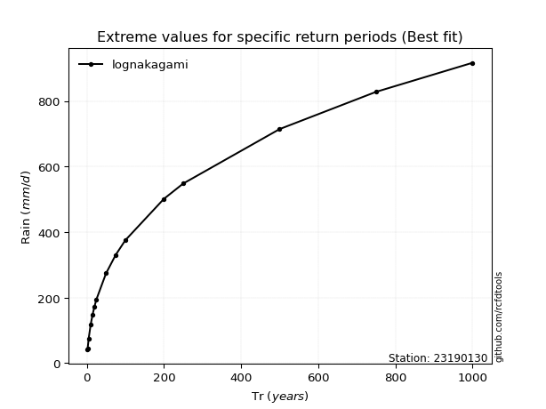</img>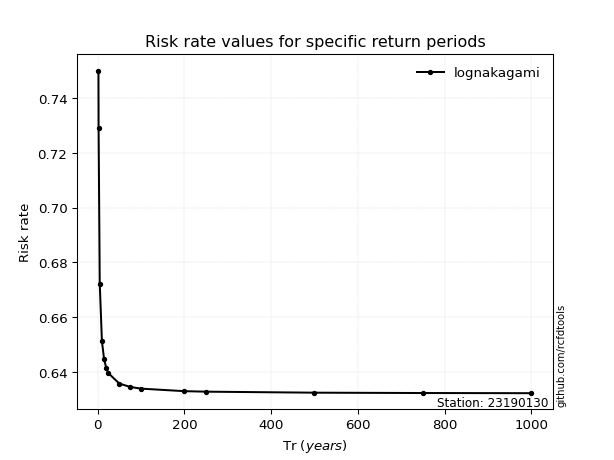</img>

</div>


<sub>**APP DISCLAIMER**: NO WARRANTY - This software is provided by [github.com/rcfdtools](https://github.com/rcfdtools) "as is", without any express or implied warranty, including warranties of merchantability, fitness for a particular purpose, or non-infringement. There is no guarantee that the software will be error-free or operate without interruption. LIMITATION OF LIABILITY - Neither the authors nor copyright holders will be liable for claims or damages arising from the software or its use. You are responsible for determining if the software is appropriate for your use and assume all associated risks, including errors, legal compliance, and data loss. NO PROFESSIONAL ADVICE - The software provides general information and does not offer professional advice. It should not replace consultation with professional advisors.</sub>